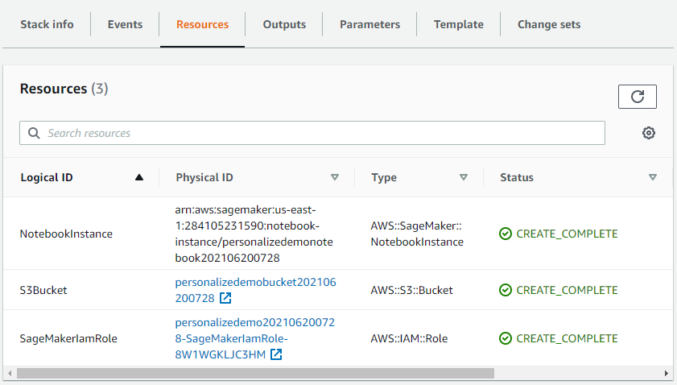
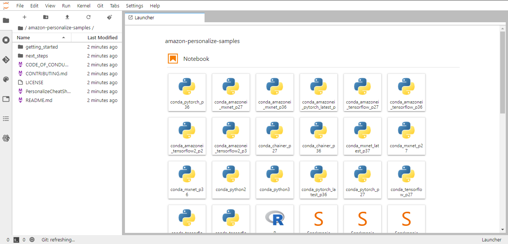

authors: Sparsh A.
categories: Tutorial
feedback link: https://github.com/recohut/reco-step/issues
id: amazon-personalize-workshop-a
status: Published
summary: In this workshop you will build your very own recommendation model that will recommend movies to users based on their past preferences. You will further improve the recommendation model to take into account a user’s interactions with movie items to provide accurate recommendations. This workshop will use the publicly available movie lens dataset.

---

# Amazon Personalize Workshop

<!-- ------------------------ -->

## Introduction

Duration: 5

### What you'll learn?

In this workshop you will build your very own recommendation model that will recommend movies to users based on their past preferences. You will further improve the recommendation model to take into account a user’s interactions with movie items to provide accurate recommendations. This workshop will use the publicly available movie lens dataset.

### Why is this important?

Amazon Personalize is an advanced tool for building recommender systems, that supports AutoML and Real-time.

### How it will work?

1. Setup the environment using CloudFormation template
2. Open the SageMaker Jupyter Lab instance
3. Train the recommender model on MovieLens dataset and build the campaign
4. View campaign and generate a recommendation
5. Simulate a real-time event and analyze how recommendation changes
6. Clean the environment by deleting all the resources

### Who is this for?

- People who are new in deep learning and cloud
- People learning Amazon Personalize
- People looking to build a scalable real-time recommender solution

### Important resources

- [Amazon Personalize Workshop Part 1 - Build your campaign](https://nb-dev.recohut.com/amazonpersonalize/movie/2021/06/20/amazon-personalize-workshop-part-1.html)
- [Amazon Personalize Workshop Part 2 - View Campaign and Interactions](https://nb-dev.recohut.com/amazonpersonalize/movie/realtime/2021/06/20/amazon-personalize-workshop-part-2.html)
- [Amazon Personalize Workshop Part 3 - Cleanup the resources](https://nb-dev.recohut.com/amazonpersonalize/movie/2021/06/20/amazon-personalize-workshop-part-3.html)
- [Amazon Personalize Workshop Part 4 - Security best practices (optional)](https://nb-dev.recohut.com/amazonpersonalize/movie/security/privacy/2021/06/20/amazon-personalize-workshop-part-4.html)
- [Workshop site](https://www.sagemakerworkshop.com/personalize/)

<!---------------------------->

## Setup the Environment

Duration: 5

Use [this](https://console.aws.amazon.com/cloudformation/home?region=us-east-1#/stacks/create/template?stackName=PersonalizeDemo&templateURL=https://chriskingpartnershare.s3.amazonaws.com/PersonalizeDemo.yaml) template for the setup.

These are the 3 resources that will be created.

<!---------------------------->

## Start the lab

Duration: 5

Go to SageMaker → Notebooks and Open the Jupyter Lab.

You will see something like this:

<!---------------------------->

## Build your First Campaign

Duration: 10

This notebook will walk you through the steps to build a recommendation model for movies based on data collected from the movielens data set. The goal is to recommend movies that are relevant based on a particular user. The data is coming from the MovieLens project.

Go to [this](https://nb-dev.recohut.com/amazonpersonalize/movie/2021/06/20/amazon-personalize-workshop-part-1.html) notebook for in-depth guideline.

<!---------------------------->

## View Campaign and Interactions

Duration: 10

Now that we successfully built and deployed a recommendation model using deep learning with Amazon Personalize, the following notebook will expand on that and will walk you through adding the ability to react to the real-time behavior of users. If their intent changes while browsing a movie, you will see revised recommendations based on that behavior. It will also showcase demo code for simulating user behavior selecting movies before the recommendations are returned.

Go to [this](https://nb-dev.recohut.com/amazonpersonalize/movie/realtime/2021/06/20/amazon-personalize-workshop-part-2.html) notebook for in-depth guideline.

<!---------------------------->

## Security Best Practices (optional)

Duration: 10

We are using a pre-made dataset that hasn't been encrypted so there is no need to decrypt this dataset. However, it would be a good security practice to store your datasets encrypted.

Refer to [this](https://nb-dev.recohut.com/amazonpersonalize/movie/security/privacy/2021/06/20/amazon-personalize-workshop-part-4.html) notebook for in-depth guideline.

<!---------------------------->

## Clean the Environment

Duration: 5

[This](https://nb-dev.recohut.com/amazonpersonalize/movie/2021/06/20/amazon-personalize-workshop-part-3.html) notebook demonstrate the process of deleting the resources that we created during campaign.

Once you have completed all of the work in the Notebooks and have completed the cleanup steps there as well, the last thing to do is to delete the stack you created with CloudFormation. To do that, go to CloudFormation and delete the stack. This will automatically delete the 3 resources that we created in the beginning.

<!---------------------------->

## Conclusion

Duration: 2

Congratulations!

### What we've covered

1. Setup the environment using CloudFormation template
2. Open the SageMaker Jupyter Lab instance
3. Train the recommender model on MovieLens dataset and build the campaign
4. View campaign and generate a recommendation
5. Simulate a real-time event and analyze how recommendation changes
6. Clean the environment by deleting all the resources

### Links and References

- [**Amazon Personalize Workshop Part 1 - Build your campaign**](https://nb-dev.recohut.com/amazonpersonalize/movie/2021/06/20/amazon-personalize-workshop-part-1.html)
- **[Amazon Personalize Workshop Part 2 - View Campaign and Interactions](https://nb-dev.recohut.com/amazonpersonalize/movie/realtime/2021/06/20/amazon-personalize-workshop-part-2.html)**
- **[Amazon Personalize Workshop Part 3 - Cleanup the resources](https://nb-dev.recohut.com/amazonpersonalize/movie/2021/06/20/amazon-personalize-workshop-part-3.html)**
- **[Amazon Personalize Workshop Part 4 - Security best practices (optional)](https://nb-dev.recohut.com/amazonpersonalize/movie/security/privacy/2021/06/20/amazon-personalize-workshop-part-4.html)**
- [Workshop site](https://www.sagemakerworkshop.com/personalize/)

### Have a Question?

- [Fill out this form](https://form.jotform.com/211377288388469)
- [Raise issue on Github](https://github.com/recohut/reco-step/issues)