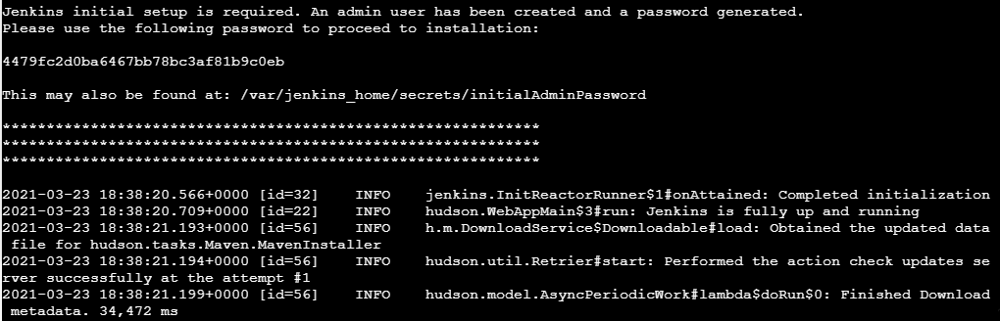

authors: Sparsh A.
categories: Tutorial
feedback link: https://github.com/recohut/reco-step/issues
id: how-to-setup-jenkins
status: Published
summary: Jenkins is a specialised tool that is designed to provide software teams from all sorts of backgrounds with the necessary capabilities to build and refine their source code in the best possible way.
tags: cicd

---

# How to setup and run Jenkins

<!-- ------------------------ -->

## Introduction

Duration: 5

### What you'll learn?

Setup a Jenkins server to run the cicd pipelines

### Why is this important?

Important part of MLOps

### How it will work?

1. Go to Play-with-docker site
2. Pull the Jenkins docker
3. Run the container
4. Access Jenkins GUI and install plugins
5. Create a pipeline
6. Trigger the pipeline by pushing to git

### Who is this for?

1. People who are new to MLOps
2. People willing to improve CICD skills

<!---------------------------->

## Login to PWD

Duration: 5

We will use *Play with docker* for this tutorial. 

### Sign-in

Go to [this](https://labs.play-with-docker.com/) link and login. The landing page will look like this:


### Create an instance

Click on *ADD NEW INSTANCE*. After clicking, it will look like this:


<!---------------------------->

## Run Jenkins docker

Duration: 2

`docker run -p 8080:8080 -p 50000:50000 -d -v jenkins_home:/var/jenkins_home jenkins/jenkins:lts`


<!---------------------------->

## Get Jenkins password

Duration: 2

Run `docker logs <container name>` and get the password



<!---------------------------->

## Access Jenkins GUI

Duration: 2

Go to `localhost:8080` and paste the copied password


<!---------------------------->

## Install the plugins

Duration: 2

Select *Install suggested plugins* option


Note down the Jenkin URL: [http://ip172-18-0-30-c1d37qhbqvp000f2mu60-8080.direct.labs.play-with-docker.com/](http://ip172-18-0-30-c1d37qhbqvp000f2mu60-8080.direct.labs.play-with-docker.com/)

<!---------------------------->

## Jenkins project types

Duration: 2


<!---------------------------->

## Add global credentials

Duration: 2


<!---------------------------->

## Create a new Jenkins job

Duration: 2

Create a new job, name it and select multi-branch as type. Repo might be [https://gitlab.com/nanuchi/techworld-js-docker-demo-app/-/tree/jenkins-multi-input](https://gitlab.com/nanuchi/techworld-js-docker-demo-app/-/tree/jenkins-multi-input)

<!---------------------------->

## Add git address and credentials

Duration: 2


<!---------------------------->

## Understand Pipeline format in Jenkinsfile

Duration: 2


<!---------------------------->

## Create Jenkinsfile

Duration: 2

```groovy
pipeline {
    agent none
    stages {
        stage('Select micro services') {
            input {
                message "Select all micro services to deploy"
                ok "All selected!"
                parameters {
                    choice(name: 'MS1', choices: ['1.1.0', '1.2.0', '1.3.0'], description: 'input ms')
                    choice(name: 'MS2', choices: ['1.1.0', '1.2.0', '1.3.0'], description: 'input ms')
                    choice(name: 'MS3', choices: ['1.1.0', '1.2.0', '1.3.0'], description: 'input ms')
                    choice(name: 'MS4', choices: ['1.1.0', '1.2.0', '1.3.0'], description: 'input ms')
                }
            }
            steps {
                script {   
                    echo "Hello, ${MS1}. Hello, ${MS2}. Hello, ${MS3}. Hello, ${MS4}"
                    MS1_TO_DEPLOY = MS1
                    MS2_TO_DEPLOY = MS2
                    env.MS3_TO_DEPLOY = MS3
                    env.MS4_TO_DEPLOY = MS4      
                }
            }
        }
        stage('Select single service') {
            input {
                message "Select single micro services to deploy?"
                parameters {
                    choice(name: 'MS5', choices: ['1.1.0', '1.2.0', '1.3.0'], description: 'second param with single option')   
                }
            }
            steps {
                script {
                    echo "Hello, ${MS5}."  
                    env.MS5_TO_DEPLOY = MS5
                    echo "${MS1_TO_DEPLOY}"
                    echo "${MS4_TO_DEPLOY}"
                    echo "${MS5_TO_DEPLOY}"  
                }
            }
        }
    }
}
```

<!---------------------------->

## Trigger the pipeline job

Duration: 2

Pipeline can be triggered either by 1) Push notifications, or 2) Polling.


<!---------------------------->

## Check out the pipeline

Duration: 2


<!---------------------------->

## Conclusion

Duration: 2

Congratulations!

### What we've covered

How to setup a Jenkins server to automatically run the CICD pipelines

### Links & references

1. [Jenkins Pipeline Tutorial for Beginners 1/4](https://youtu.be/pMO26j2OUME)
2. [Jenkins Pipeline Tutorial for Beginners 2/4](https://youtu.be/tuxO7ZXplRE)
3. [Jenkins Pipeline Tutorial for Beginners 3/4](https://youtu.be/MY1w7sWW5ms)
4. [Jenkins Pipeline Tutorial for Beginners 4/4](https://youtu.be/CmwTPxdx24Y)
5. [Complete Jenkins Pipeline Tutorial | Jenkinsfile explained](https://youtu.be/7KCS70sCoK0)

### Have a Question?

- [Fill out this form](https://form.jotform.com/211377288388469)
- [Raise issue on Github](https://github.com/recohut/reco-step/issues)