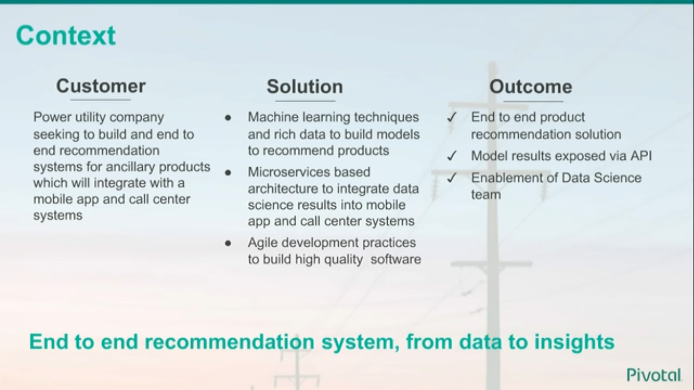
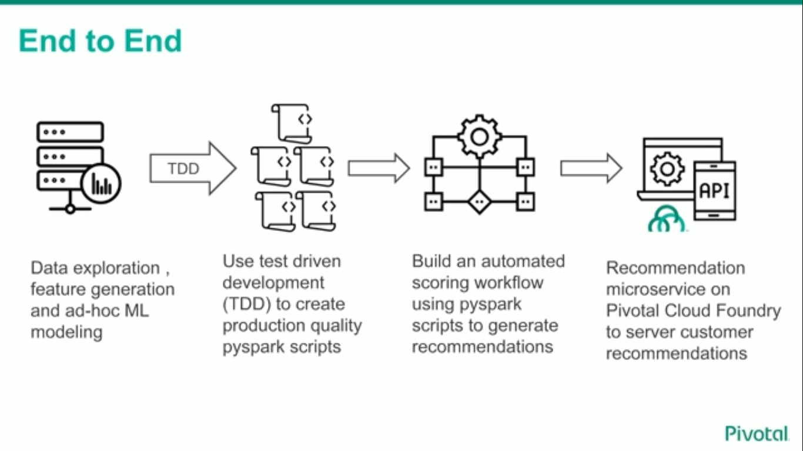
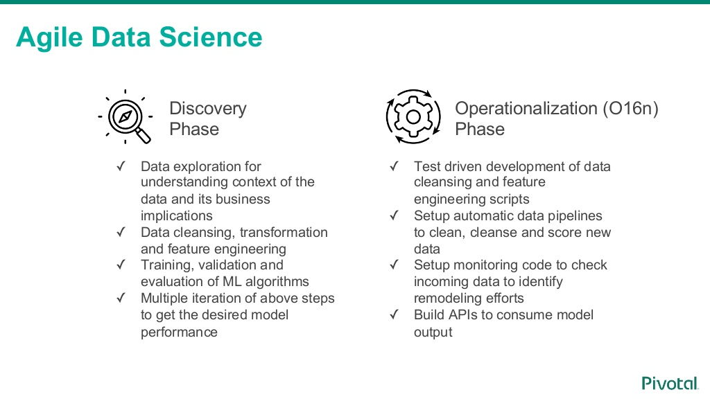
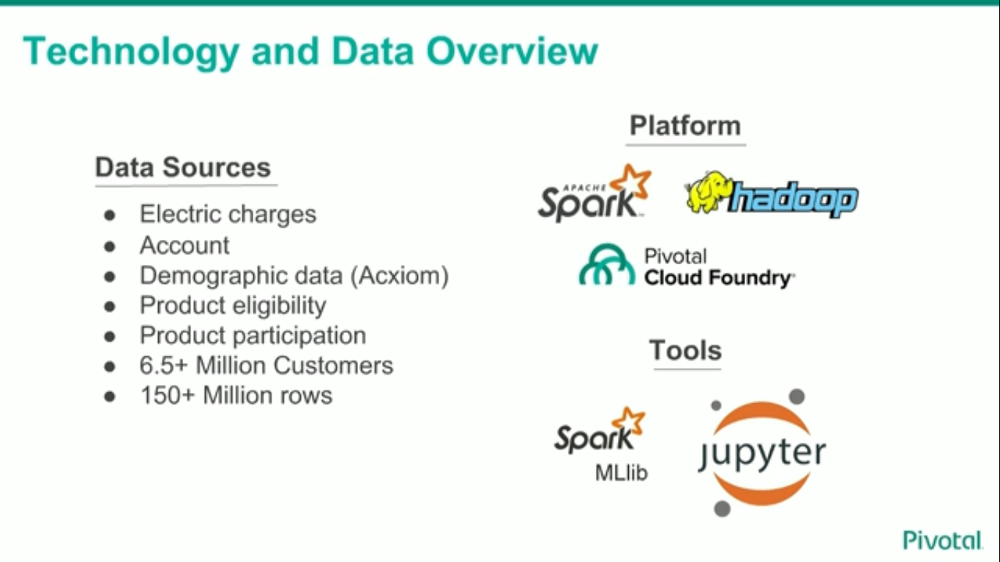
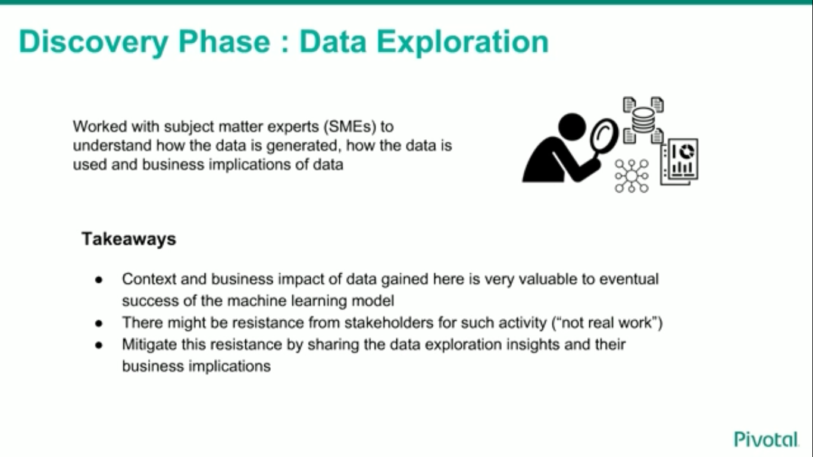
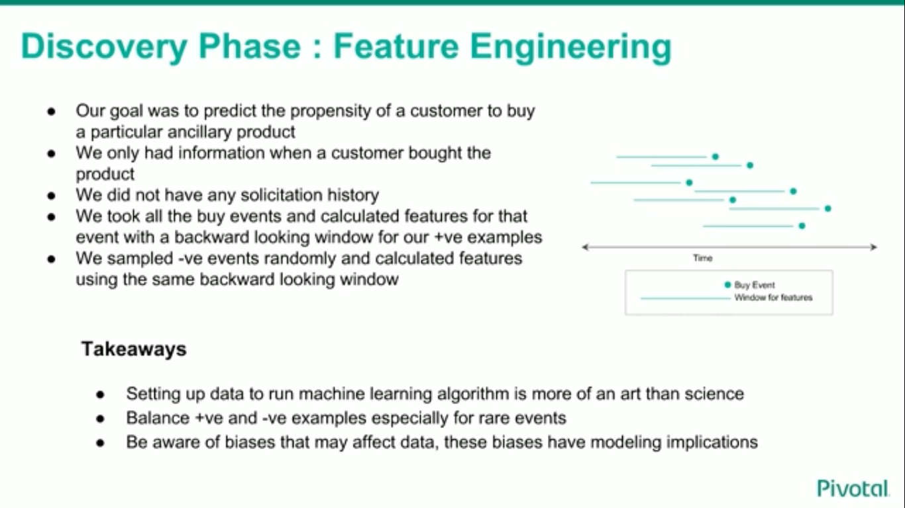
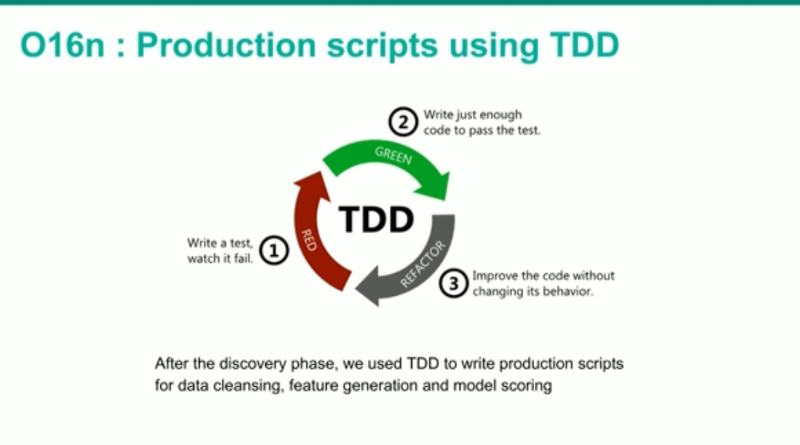
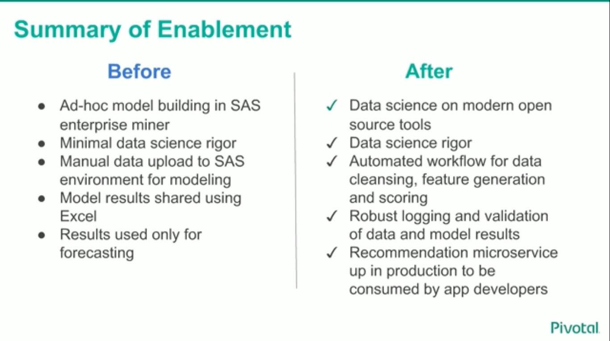

authors: Sparsh A.
categories: Story
feedback link: https://github.com/recohut/reco-step/issues
id: power-utility-recommender
status: Published
summary: Recommend ancillary products of a power utility company

---

# Power Utility Recommendation System

<!-- ------------------------ -->

## Introduction

Duration: 5

### Objective

Recommend ancillary products of a power utility company

### Process flow

<!---------------------------->

## Data sources

Duration: 2

<!---------------------------->

## Data exploration

Duration: 2

<!---------------------------->

## Feature engineering

Duration: 2

<!---------------------------->

## Modeling

Duration: 2

<!---------------------------->

## Production

Duration: 2

Production scripts using Test-driven development

<!---------------------------->

## Comparison

Duration: 2

<!---------------------------->

## Conclusion

Duration: 2

Congratulations!

### Links and References

1. [Video talk](https://www.brighttalk.com/webcast/14895/322997/using-data-science-to-build-an-end-to-end-recommendation-system)
2. [Slidehsare](https://www.slideshare.net/Pivotal/using-data-science-to-build-an-endtoend-recommendation-system)

### Have a Question?

- [Fill out this form](https://form.jotform.com/211377288388469)
- [Raise issue on Github](https://github.com/recohut/reco-step/issues)