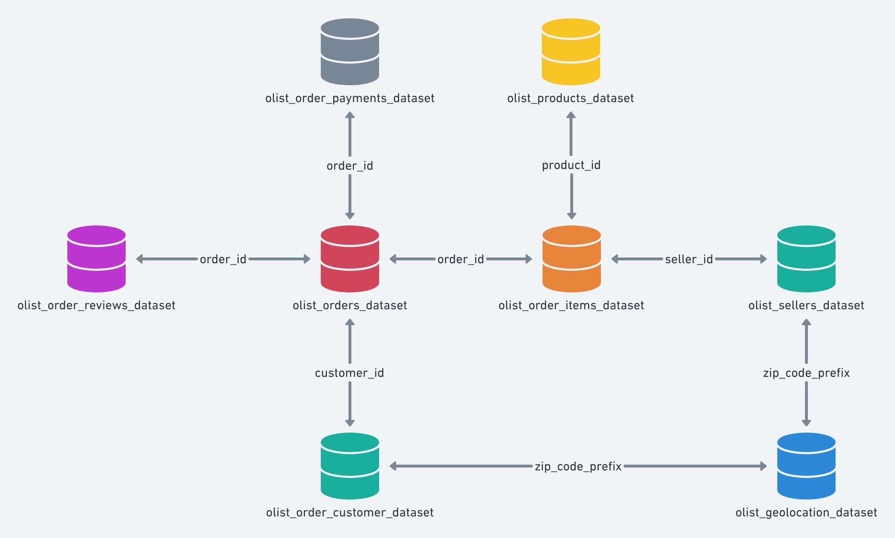
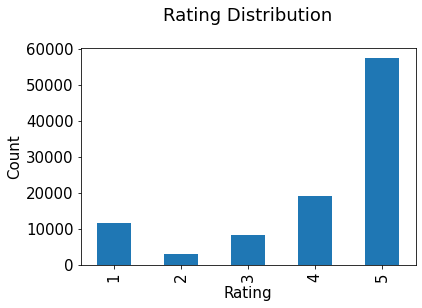
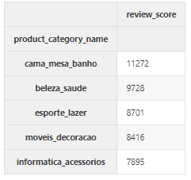
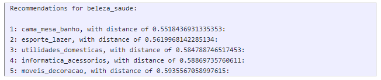
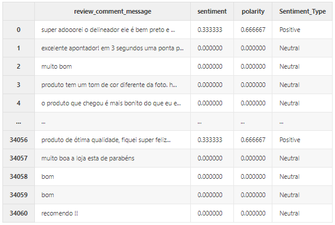
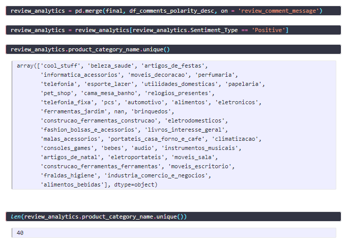

authors: Dr. Monica
categories: Tutorial
feedback link: https://github.com/recohut/reco-step/issues
id: product-recommender-olist-dataset
status: Published
summary: In this tutorial, we are going to learn different approaches for Recommendation system that can built on Brazilian e-commerce public dataset.

---

# How to build a product recommender with Olist

<!-- ------------------------ -->

## Introduction

Duration: 5

Implementation of Machine learning algorithms to assist consumers in discovering new products and services is a new form of digital marketing on e-commerce websites. When you shop online, a recommendation system directs you to the product that is most likely to be purchased. Users are often frustrated by options and need assistance discovering what they’re looking for, so recommender systems are an important element of our digital environment. Customers will be happier, and profits will increase as a result. Recommender systems are similar to salespeople who know what you want based on your history and interests.

In this tutorial, we are going to learn different approaches for a Recommendation system that can be built on the Brazilian e-commerce public dataset.

### What you'll learn?

1. Loading and processing of a Brazilian retail dataset
2. Popularity based recommender
3. KNN Collaborative filtering based recommender
4. NLP review sentiment based recommender

### Why is this important?

1. Data comes from multiple sources and this tutorial will help us understand how to manage it
2. Simple baselines sometimes works better than advanced model-heavy methods. It is important to know them well

### How it will work?

1. Download the dataset from Kaggle
2. Build different recommenders

### Who is this for?

- People who are new in deep learning
- People looking to use tensorflow keras to build deep recommender models

### Important resources

- [Colab notebook](https://nb-dev.recohut.com/ecommerce/2021/06/15/recostep-ecommerce-recommender-olist.html)

<!---------------------------->

## Dataset

Duration: 10

Brazilian E-Commerce Public Dataset by Olist is a collection of 100,000 Orders with product, customer and reviews info. It contains information on 100k orders from 2016 to 2018 made at multiple marketplaces in Brazil. Its features allow viewing an order from multiple dimensions: from order status, price, payment and freight performance to customer location, product attributes and finally reviews written by customers. We also released a geolocation dataset that relates Brazilian zip codes to lat/lng coordinates. This is real commercial data, it has been anonymized, and references to the companies and partners in the review text have been replaced with the names of Game of Thrones great houses.

### Context

This dataset was generously provided by Olist, the largest department store in Brazilian marketplaces. Olist connects small businesses from all over Brazil to channels without hassle and with a single contract. Those merchants are able to sell their products through the Olist Store and ship them directly to the customers using Olist logistics partners. See more on our website: [www.olist.com](https://www.olist.com/)

After a customer purchases the product from Olist Store a seller gets notified to fulfill that order. Once the customer receives the product, or the estimated delivery date is due, the customer gets a satisfaction survey by email where he can give a note for the purchase experience and write down some comments.

### Data schema

### Download link

[https://www.kaggle.com/olistbr/brazilian-ecommerce](https://www.kaggle.com/olistbr/brazilian-ecommerce)

### Data notebooks

1. [Data preparation and EDA notebook](https://www.kaggle.com/sank3t/olist-data-preparation)

### Rating distribution

From figure, we can state that we have review score of maximum 5 and which is highest in our dataset. Let’s try to built the system based on popularity.

<!---------------------------->

## Popularity based recommender

Duration: 2

These are the top 5 products with highest review score and so we can recommend these ones. Best recommended technique when completely new user visits an e-commerce site, that site will not have any past history

<!---------------------------->

## Collaborative filtering based recommender

Duration: 2

The collaborative filtering algorithm uses “User Behavior” for recommending items. KNN is a machine-learning algorithm to find clusters of similar users based on ratings, and make predictions using the average rating of top-k nearest neighbors. For example, we first present ratings in a matrix with the matrix having one row for each item and one column for each user location.

We will first build a cross-tab matrix of users and items filled with user review scores, and then use KNN to estimate the similarities. 

Generating Top-5 recommendations based on a product:

<!---------------------------->

## Sentiment based recommender

Duration: 2

We will use the Textblob library to estimate the sentiment of user's reviews on products and identify the highest positive sentiment items to recommend to the user. Similar to the popularity-based method, this one is also a non-personalized recommender but works pretty well practically. 

These are the 40 products that get most positive reviews from customers. We can recommend these products to other customers. This method is non-personalized but highly effective!

<!---------------------------->

## Conclusion

Duration: 2

Congratulations!

### What we've covered

1. Popularity based recommender
2. KNN Collaborative filtering based recommender
3. NLP review sentiment based recommender

### Next steps

1. Recommendation system using Hybrid approach
2. The system can be particularly built using data of customers, products at a different location
3. Can also try system with customer payment history

### Links and References

- [https://medium.com/mlearning-ai/recommendation-system-using-collborative-filtering-90e26cbfb4ed](https://medium.com/mlearning-ai/recommendation-system-using-collborative-filtering-90e26cbfb4ed)

### Have a Question?

- [Fill out this form](https://form.jotform.com/211377288388469)
- [Raise issue on Github](https://github.com/recohut/reco-step/issues)