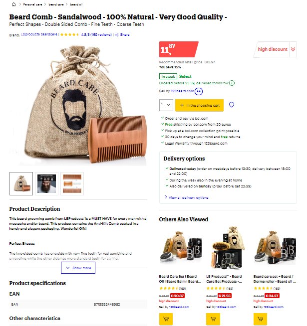

authors: Sparsh A.
categories: Story
feedback link: https://github.com/recohut/reco-step/issues
id: bol-ecommerce-recommender
status: Published
summary: Recommender systems are ubiquitous in the modern internet, where they help users find items they might like. We discuss the design of a large-scale recommender system handling billions of interactions on a European e-commerce platform.
tags: retail

---

# Retail Recommendation System on Billions of Interactions at bol.com

<!-- ------------------------ -->

## Introduction

Duration: 5

The ABO (‘Anderen bekeken ook’, Dutch for ‘others also viewed’) recommendations are shown on the product detail page to enable customers to discover other products that are relevant to them, such as different versions of the same product, similar products or products that are complementary to the displayed item. Website shows recommendations on every product page and makes them available as soon as the page loads.

<button>
[Visit this page](https://www.bol.com/nl/nl/p/baardkam-sandelhout-100-natuurlijk-zeer-goede-kwaliteit/9200000104430048/)
</button>

<!---------------------------->

## System design

Duration: 5

**How to design a system design that is capable of handling billions of interactions?**

Following is the architecture overview of the offline training and online serving components of our retail recommendation system, based on Apache Spark and Apache Beam, and backed by infrastructure from the Google Cloud Platform.

### Key highlights

- Architecture consists of a batch system that is responsible for executing data-intensive model training workloads offline on 18 billion user-item interactions which is 3.5TB in size.
- All of the components are loosely coupled, so they can run independently from each other, while exchanging data via a distributed filesystem.
- They periodically precompute the recommendations for every item in their catalog, typically once per day for all 70M products.
- The online serving system is responsible to serve recommendations online with low latency.
- The most important Big Query data source for the candidate algorithms is the click data containing the historical production interactions from customers, including clicks, purchases and shopping cart additions. This data source grows by about 30M records per day.
- They clean and filter this data, and join it with the catalog and offer data sources to determine active recommendable products.

### Candidate generation

*Bol* compute nine recommender models that each generate recommendations for products in the catalog:

1. **Related-Products** recommends products that where clicked after clicking items
2. **Order-After-Click** recommends the products that where purchased after clicking an item
3. **Purchased-Together** recommends products that are purchased together
4. **Family** recommends products that only differ in one product attribute such as size or color from a recent item
5. **Similar** recommends products that are similar in title and description using cosine similarity with tf-idf weighting
6. **Trending** recommends products that are popular in the same category
7. **Creator, Brand & Publisher** recommend products from the same content creator, brand or publisher

Note that each model has it own MLlib pipeline and the parallel execution and machine resource allocation is automatically handled by Spark.

### Ensembling & business rules

The ensembling component aggregates the outputs of all nine recommendation models to generate a final set of recommendations per item, and applies a set of manually defined business-specific filters to the recommendations. These filters remove potentially unwanted recommendations, such as combinations of adult and non-adult products.

### Avalanche

This component handles the bulk update of the pre-computed recommendations into the Bigtable database of the prediction server, our online serving component. It is implemented on top of Apache Beam, and converts the recommendations to a Protobuf format with a fixed maximum amount of 21 recommended products to guarantee fast deserialization at serving time. The avalanche component will automatically adjust its insertion rate into BigTable to guarantee a low serving latency during the ingestion.

### Prediction server

The task of this component is to serve the recommendations to end users with low latency. We implement it in Java on top of the Spring framework running in a Kubernetes cluster. This component elastically scales its underlying cluster of machines using Kubernetes’s Horizontal Pod Autoscaler, by automatically spawning or removing extra serving nodes based on the overall CPU load.

### Webshop

This component communicates with the prediction server and renders the final web page served to customers, which also includes the product recommendations.

<!---------------------------->

## Baseline models

Duration: 2

### Item-item similarity model

Similarly, there are **8** other models that retrieve the best possible candidates. For example, there is a content-based model also that uses item features to handle the cold-start situation.

### Ensemble

The ensemble combines the algorithm-specific scores from all models with a weighted sum with manually tuned chosen weights. The final weights are based on (i) the results of offline evaluation experiments, measuring the normalized discounted cumulative gain (NDCG) on held-out conversion, revenue and click data; (ii) online A/B tests in the live system measuring several business metrics; and (iii) qualitative offline evaluation by business experts.

<!---------------------------->

## Model comparison

Duration: 5

**How to improve the predictive performance of recommenders?**

### Task

*Session-based Recommendations*

Predict the next item customers would like to buy

### Dataset sampling

Create five samples, each spanning 31 days from different times of the year, in order to minimise the impact of seasonal effects.

Bin users by the amount of purchases that they made, and apply stratified sampling based on these bins to select a set of sessions that represents the activities of a wide range of our customers.

Around 1.2 million actions on 120 thousand items in each sample.

### Algorithms

Nearest-neighbor based methods

- AR (Association rules), an approach based on counting pairwise item cooccurrences in the observed sessions
- SR (Sequential rules), a frequent pattern mining approach based on sequential cooccurrences in the observed sessions
- S-KNN & VS-KNN (Session k-Nearest Neighbor), two nearest-neighbor approaches based on session similarity, where the latter puts more emphasis on recent events in sessions

Neural network based methods

- GRU4Rec, an RNN-based approach in combination with ranking loss functions tailored to the session-based recommendation setting
- NARM, an attention mechanism-based approach that aims to learn a user’s sequential behavior in the current session
- STAMP, an attention mechanism-based approach that aims to learn a user’s sequential behavior in the current session by also learning the priority of the last item
- NEXTITNET, an approach employing convolutions to learn high-level representations of both short-and long-term item dependencies

### Metrics

Four metrics computed from the top 20 recommended items: Mean Average Precision (MAP@20), Precision (P@20) and Recall (R@20) evaluate to what extent an algorithm is able to predict the next items in a session, while Mean Reciprocal Rank (MRR@20) evaluates to what extent an algorithm is able to predict the immediate next item in a session.

### Training and evaluation

Evaluate the predictive performance of all methods on our five data samples, based on the experimentation framework provided by [Ludewig et al.](https://rn5l.github.io/session-rec/index.html)

Use the first thirty days of each dataset for training and evaluate the predictions for the subsequent 31st day.

Execute the training for each model in the Google cloud on a n1- highmem-8 instance with a nvidia-tesla-t4 GPU.

### Hyperparameter optimization

Hyperparameter search for neural-based recommendation methods can be very time consuming, even on small data, therefore applied the following approach to tune the hyperparameters of all methods.

Explore 100 combinations of hyperparameters with a random search on a data subset comprised of 100,000 interactions, and select the hyperparameters that result in the best MRR@20.

Needed to schedule the hyperparameter search in parallel on different machines in the cloud to retrieve results in a reasonable time, even when allowing the methods to use GPUs. The hyperparameter search for NARM for example took more than six days of compute time, (in contrast to less than two hours for the VS-KNN approach).

### Results

Prediction quality, training time and the 90th percentile of the prediction time for session-based recommendation with the neural-based (red) and nearest-neighbor-based (green) recommendation approaches, averaged over five different data samples from our e-commerce platform.

Nearest neighbor approach VS-KNN consistently outperforms all neural-based approaches, and even provides a higher evaluation score for MRR@20, the metric for which the neural-based approaches have been designed.

S-KNN outperforms all three neural networks in four out of five metrics as well.

ABO outperforms the neural-based method STAMP in MAP and Precision, as well as the baseline methods AR and SR (even though it has not been designed and optimised for the academic task of session-based recommendation).

The time required to train the neural approaches is at least an order of magnitude larger than the training time of the neighbor based approaches.

Additionally, two of the three neural based methods require much more time for inference than the nearest neighbor methods.

The 90th percentile of the time needed for a prediction with GRU4REC and NARM on a small dataset is already higher than 100 milliseconds.

### Discussion

Comparing the performance on 5 factors - Predictive performance, Training time, Cost of hyperparameter search, Prediction latency, and Scalability.

Simple nearest neighbor methods outperform recent neural network based approaches for session-based recommendation on e-commerce data.

NN based methods exhibit extremely long training times for hyperparameter search and model training even on very small datasets (100k observations for hyperparameter search and 1M observations for training).

It is unclear whether they would even scale to the production workload of several billion interactions at a reasonable training cost and time.

The time to produce a recommendation with GRU4REC and NARM on small evaluation dataset is already in a range that is far from usable in a real world serving system, which has to guarantee response times in the low millisecond range.

<!---------------------------->

## Training at scale

Duration: 2

**How to perform distributed model training?**

### Apache Spark with Dataproc

Several years of clickstream data, 18 billions user-item interactions, 3.5 terabytes in size, Stored in Google BigQuery (BQ).

Process this data in parallel with Apache Spark, define the computations based on the abstractions for feature transformations, models and evaluators of Spark MLLib.

Execute the resulting computation in the Google cloud leveraging the Dataproc service. The corresponding cluster is configured to autoscale up to 75 worker nodes of type n1-highmem-8 each with a 500GB disk. Dataproc image version ’1.4’ provides Apache Spark ’2.4’.

Executing the Spark jobs for the offline model training (all nine recommendations models, ensembling, and business rule filtering) takes approximately two hours.

<!---------------------------->

## Serving at scale

Duration: 2

**How to efficiently serve the recommendations online with low latency?**

The serving component has to adhere to a strict service level agreement in each setup: If the webshop does not receive a response within 150ms it will discard the request and render the web page without the recommendation.

### Java Spring framework

Implement the serving API as a Java Spring service with BigTable as database backend. Our service is designed to perform auto-scaling of its computational resources.

Webshop performs approximately 1,500 requests per second to the serving component of which approximately 400 requests per second are going to the recommender system.

### Avalanche

In order to adhere to the latency SLA, the recommendations must be inserted without raising the CPU load on BT too much. This is challenging because the CPU load varies during the day and even while writing the data.

Addressed this issue by sharing the responsibility of maintaining a low BT CPU load with the Avalanche job, which inserts updated recommendations into BT.

Add a rate limit mechanism to control the insert rate of Avalanche as shown below, aiming for an average CPU load of 35% in the BT nodes.

Obtain the CPU load of the BT nodes every minute, and update the insertion rate of the Apache Beam job in Avalanche which conducts the bulk update. Note that the number 10,000 refers to the minimum amount of requests per second that a BigTable machine is guaranteed to answer.

<!---------------------------->

## Conclusion

Duration: 2

Congratulations!

### Links and References

1. [https://youtu.be/0o4VwF0YqUg](https://youtu.be/0o4VwF0YqUg)
2. [https://ssc.io/pdf/bol-reco.pdf](https://ssc.io/pdf/bol-reco.pdf)

### Have a Question?

- [Fill out this form](https://form.jotform.com/211377288388469)
- [Raise issue on Github](https://github.com/recohut/reco-step/issues)