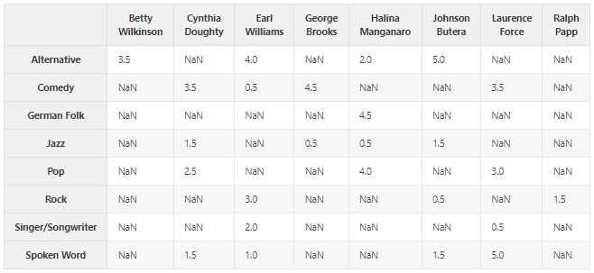
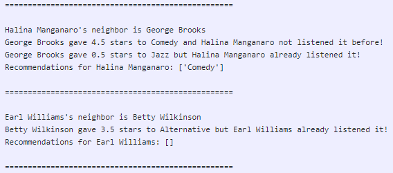
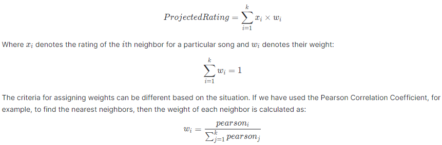

authors: https://deepnote.com/@fadelights/Foundation-of-Combinatorics-Project-nmC-ilUtQqqz403906un9Q
categories: Tutorial
feedback link: https://github.com/recohut/reco-step/issues
id: simple-similarity-recommender
status: Published
summary: In this tutorial, we will build a simple recommenders using different similarity methods.

---

# How to build a simple similarity recommender

<!-- ------------------------ -->

## Introduction

Duration: 5

It will not be wrong to say that recommender systems are similarity hunters, depending on how we define "similarity" between "items". Given any reasonable similarity function between items, a recommender system presents relevant items to a user. This similarity function between 2 items could be common users that have interacted with those items in the past, similarity in their attributes, similarity in the context in which they are used, and so on.‌

In this tutorial, we will build a simple recommenders using different similarity methods.

### What you'll learn?

- Minkowski Distance
- Pearson Correlation Coefficient
- Cosine Similarity
- K-Nearest Neighbors

### Why is this important?

Finding similarities between these users is the most crucial task because the accuracy and the quality of the recommendations rely majorly on them.

### How it will work?

1. Generate a synthetic user-music dataset of given number of users and songs
2. Build the Minkowski distance function in python
3. Recommend songs to users based on this distance based user similarity
4. Discuss the result and shortcomings of this method
5. Build the pearson correlation function and recommend songs based on the pearson coefficient
6. Discuss the result and shortcomings of this method
7. Build the cosine similarity function and recommend songs based on user cosine similarities
8. Discuss the result and shortcomings of this method
9. Discuss how KNN method could help in resolving these shortcomings

### Who is this for?

- People who are new in recommender systems and similarities
- People looking to advance their knowledge on calculating similarities in python

### Important resources

- [Colab notebook](https://nb-dev.recohut.com/similarity/2021/06/19/simple-similarity-based-recommenders.html)
- [Mirror of the above notebook](https://colab.research.google.com/gist/sparsh-ai/213a09c16866966c460331d796c8f1a1/2021-06-19-simple-similarity-based-recommenders.ipynb)

<!---------------------------->

## Generate Data

Duration: 10

We are using 8 users and 8 songs. Feel free to increase this number if you want. We need to use the while loop because we want to get a list of unique 8 songs but the faker library sometimes generates duplicates. While loop will not exit if this happens and will generate the data again. We are putting a null probability of 60% which means 6 out of every 10 records will be null i.e. user didn't yet listen to that song band. Feel free to modify it so that this 60% can also be treated as a sparsity ratio.

```python
def generate_data():
  
  NUM_USER = 8
  NUM_ITEM = 8

  RATING_OPTIONS = np.arange(0,5.5,0.5)

  while True:
    
    users = [names.get_full_name() for i in range(NUM_USER)]
    items = [fake.music_genre() for i in range(NUM_ITEM)]

    data = pd.DataFrame(list(product(users, items)), columns=['USERS', 'ITEMS'])

    PROBS = [0.6]
    PROBS.extend([0.05]*(len(RATING_OPTIONS)-1))
    PROBS = [i/sum(PROBS) for i in PROBS]

    data['RATINGS'] = np.random.choice(RATING_OPTIONS, NUM_USER*NUM_ITEM, p=PROBS)

    data['RATINGS'] = data['RATINGS'].astype('float32')

    data = pd.pivot_table(data, index='ITEMS', columns='USERS', values='RATINGS')

    data = data.replace(0, np.nan)

    if len(np.unique(items))==NUM_ITEM:
      return data, users
```

The generated data would look like this:



<!---------------------------->

## Minkowski Distance

Duration: 5

So how can we tell if two users have similar taste? One [simple] answer to that is the Minkowski Distance Metric: $d(x,y) = (\sum_{i=1}^{k}{|x_{i} - y_{i}|^{r}})^{1/r}$, where $x$ and $y$ are two records with $k$ features (ratings, in this case) and r ∈ {1,2,...,∞}.

```python
def minkowski(ratings1, ratings2, r=2):
    """
    Compute the Minkowski Distance between two users.
    If `r` is not given, it defaults to Euclidian.
    """

    mink_distance = 0

    for key in ratings1:
        if key in ratings2:
            mink_distance += abs(ratings1[key] - ratings2[key])**r

    mink_distance = mink_distance ** (1/r)

    return mink_distance
```

**Note:**

- *r*=1 is called the **Manhattan Distance**
- *r*=2 is called the **Euclidean Distance**

The results would look like this:



Halina's neighbor is George and he gave 4.5 to Comedy and 0.5 to Jazz. Since Halina didn't yet listened to Comedy, this gets recommended to Halina.

On the other hand, Earl's neighbor is Betty and she gave 3.5 to Alternative. But since Betty already listed to this, no recommendation was provided.

<!---------------------------->

## Pearson Correlation Coefficient

Duration: 2

The problem with the above method of calculating similarity is that some users, like to rate all their songs between 4 and 5 e.g. On the other hand, some users like bands in a binary fashion (either 1 or 4) e.g. People have similar taste but use different scales to rate bands. 

We fix this problem, called grade inflation, by using the Pearson Correlation Coefficient: 

$r = \frac{n(\sum xy)-(\sum x)(\sum y)}{\sqrt{[n\sum x^{2}-(\sum x)^{2}] [n\sum y^{2}- (\sum y )^{2}]}}$. 

```python
def pearson_corrcoef(x, y):
    
    x_mean = x.mean()
    y_mean = y.mean()

    numer = np.sum( (x - x_mean) * (y - y_mean) )
    denom = ( np.sum( (x - x_mean)**2 ) )**0.5 * ( np.sum( (y - y_mean)**2 ) )**0.5

    return numer / denom
```

<!---------------------------->

## Cosine Similarity

Duration: 2

When we compare two people by using the number of plays of the 15 million tracks on ,say iTunes, mostly they will have shared zeros in common. However, we do not want to use these shared zeros when we are computing similarity, as they will affect the performance of our model for the worse.

Cosine similarity ignores 0-0 matches. It is defined as: $cos(x,y) = \dfrac{x.y}{{\lVert \mathbf{x}\rVert}\times{\lVert \mathbf{y}\rVert}}$, Where ⋅ indicates the dot product and ||x|| indicates the length of the vector x.

<!---------------------------->

## **Which Similarity Measure to Use?**

Duration: 2

- If the data is subject to grade-inflation (different users may be using different scales) use Pearson.
- If your data is dense (almost all attributes have nonzero values) and the magnitude of the attribute values is important, use distance measures such as Euclidean or Manhattan.
- If the data is sparse consider using Cosine Similarity.

<!---------------------------->

## K-Nearest Neighbors

Duration: 2

The problem is that we are relying on a single “most similar” person. Any quirk that person has is passed on as a recommendation. One way of evening out those quirks is to base our recommendations on more than one person who is similar to our user. For this we can use the k-nearest neighbor approach.



<!---------------------------->

## Conclusion

Duration: 2

Congratulations!

### What we've covered

- Generated a synthetic user-music dataset of given number of users and songs
1. Built the Minkowski distance function in python and analyzed the results
2. Built the Pearson correlation function in python and analyzed the results
3. Built the Cosine Similarity function in python and analyzed the results
4. Discussed how KNN method could help in resolving the cosine similarity's shortcomings

### Have a Question?

- [Fill out this form](https://form.jotform.com/211377288388469)
- [Raise issue on Github](https://github.com/recohut/reco-step/issues)