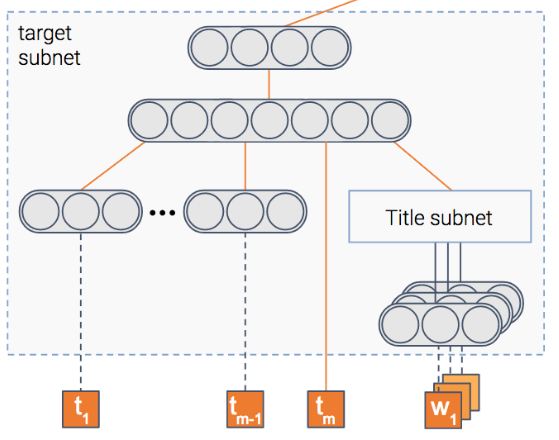

authors: Sparsh A.
categories: Story
feedback link: https://github.com/recohut/reco-step/issues
id: taboola
status: Published
summary: Taboola delivers content recommendations to online users using an artificial intelligence (AI)-based solution that predicts the preferences of each visitor within the context of each visit. A variety of data are ingested in real time for each website visitor. The AI solution processes this data, taking into account both simple factors, such as time of day and recently viewed content, and more complex factors, such as context and trending topics.

---

# Taboola

<!-- ------------------------ -->

## Introduction

Duration: 5

> Enabling people to discover information at that moment when they're likely to engage

As one of the world’s preeminent discovery platforms, Taboola delivers tailored recommendations to more than a billion unique Internet users every month to help them explore what’s interesting and new across publisher sites, mobile apps, and other digital properties. Over the last decade, thousands of publishers and advertisers including CBS Interactive, Euronews, Pandora, and Samsung1 have partnered with Taboola to build audiences, increase engagement, and drive revenue. Taboola’s proprietary deep learning algorithms, powered by one of the largest datasets of content consumption behavior across the open web, match people with content that they truly care about at the moments they are most receptive to new things.

Taboola delivers content recommendations to online users using an artificial intelligence (AI)-based solution that predicts the preferences of each visitor within the context of each visit. A variety of data are ingested in real time for each website visitor. The AI solution processes this data, taking into account both simple factors, such as time of day and recently viewed content, and more complex factors, such as context and trending topics. The accuracy of the recommendations, coupled with the simplicity and effectiveness of the solution, has driven global success for Taboola, and is helping some of the most innovative and highly visited digital properties increase user engagement, monetize traffic, and acquire quality audiences.

### Taboola at scale

- Providing 30 billion personalized content recommendations delivered each day
- Delivering real-time recommendations in as little as 50 milliseconds
- Enabling continual training of cutting-edge machine learning models
- Achieving 6x improvement in AI-based inferencing over time

### Tech stack

<!---------------------------->

## Objective

Duration: 5

The goal of a recommender system is to recommend items that the users might find relevant. At Taboola, relevance is expressed via a click: we show a widget containing content recommendations, and the users choose if they want to click on one of the items.

The probability of the user clicking on an item is called Click Through Rate (CTR). If we knew the CTR of all the items, the problem of which items to recommend would be easy: simply recommend the items with the highest CTR.

The problem is that we don’t know what the CTR is. We have a model that estimates it, but it’s obviously not perfect. Some of the reasons for the imperfection are the uncertainty types inherent in recommender systems

### Challenges

### Requirements

<!---------------------------->

## Deep learning model

Duration: 10

Taboola implemented a neural network that estimates both the probability of an item being relevant to the user, as well as the uncertainty of this prediction.

The model is composed of several modules.

### Item module

The model tries to predict the probability that an item will be clicked, i.e – the CTR (Click Through Rate). To do so, we have a module that gets as input the item’s features such as its title and thumbnail, and outputs a dense representation – a vector of numbers if you will.

Once the model is trained, this vector will contain the important information extracted out of the item.

### Context module

We said the model predicts the probability of a click on an item, right? But in which context is the item shown?

Context can mean many things – the publisher, the user, the time of day, etc. This module gets as input the features of the context. It then outputs the dense representation of the context.

### Fusion module

So we have the information extracted out of both the item and the context. For sure, there’s some interaction between the two. For instance, an item about soccer probably will have higher CTR in a sports publisher compared to a finance publisher.

This module fuses the two representations into one, in a similar fashion to collaborative filtering.

### Estimation module

At the end we have a module whose goal is to predict the CTR. In addition, it also estimates uncertainty about the CTR estimation.

<!---------------------------->

## Conclusion

Duration: 2

Congratulations!

### Links and References

1. [https://www.taboola.com/](https://www.taboola.com/)
2. [https://youtu.be/jd_UORQhg2A](https://youtu.be/jd_UORQhg2A)
3. [https://www.kaggle.com/c/dmbi-2019-taboola-challenge/overview](https://www.kaggle.com/c/dmbi-2019-taboola-challenge/overview)
4. [Dell Nvidia report](https://www.delltechnologies.com/asset/en-us/products/ready-solutions/customer-stories-case-studies/dell-taboola-nvidia-case-study.pdf)
5. [https://youtu.be/tq05khL2z7A](https://youtu.be/tq05khL2z7A)
6. [Taboola: Optimizing Content Recommendation Engine](https://www.intel.in/content/www/in/en/customer-spotlight/stories/taboola-tensorflow-customer-story.html)
7. [https://engineering.taboola.com/recommender-systems-exploring-the-unknown-using-uncertainty/](https://engineering.taboola.com/recommender-systems-exploring-the-unknown-using-uncertainty/)
8. [https://engineering.taboola.com/uncertainty-ctr-prediction-one-model-clarify/](https://engineering.taboola.com/uncertainty-ctr-prediction-one-model-clarify/)

### Have a Question?

- [Fill out this form](https://form.jotform.com/211377288388469)
- [Raise issue on Github](https://github.com/recohut/reco-step/issues)