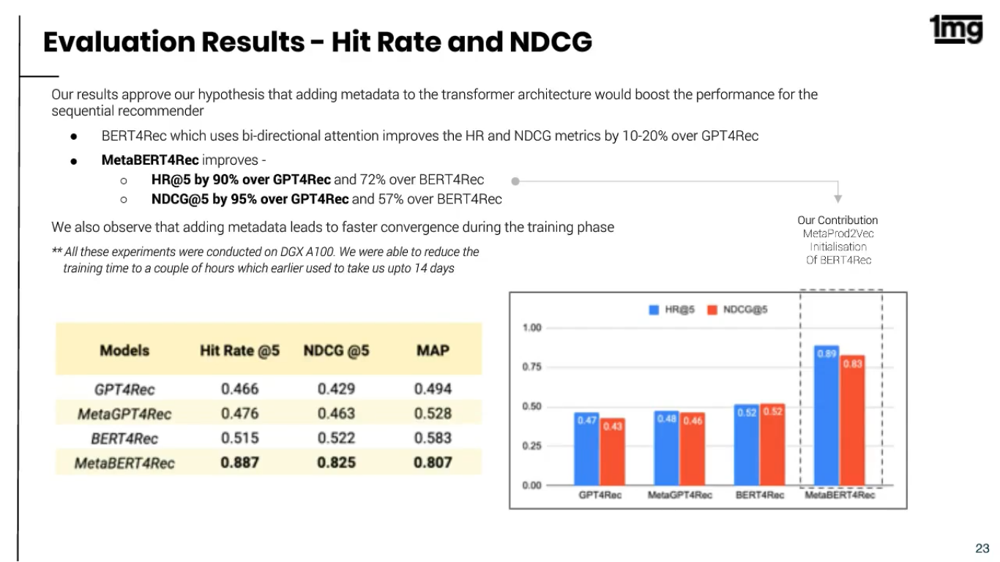

authors: Sparsh A.
categories: Story
feedback link: https://github.com/recohut/reco-step/issues
id: onemg-pharmacy
status: Published
summary: To enable better recommendations for the visitors on the platform, 1mg has been using state-of-the-art collaborative filtering and transformer models to build its recommendation engine. It uses graph representation algorithms like Meta Prod2Vec to build user and item embeddings, which are utilised in neural collaborative filtering and models like BERT, GPT-2, to enhance personalisation of product recommendations; this has significantly improved the click-through rate (CTR) and product conversions.

---

# 1mg Pharmacy

<!-- ------------------------ -->

## Introduction

Duration: 5

To enable better recommendations for the visitors on the platform, 1mg has been using state-of-the-art collaborative filtering and transformer models to build its recommendation engine. It uses graph representation algorithms like Meta Prod2Vec to build user and item embeddings, which are utilised in neural collaborative filtering and models like BERT, GPT-2, to enhance personalisation of product recommendations; this has significantly improved the click-through rate (CTR) and product conversions.

<!---------------------------->

## Placements

Duration: 2

<!---------------------------->

## Model evolution

Duration: 2

<!---------------------------->

## Product embeddings

Duration: 2

### Content-based methods

### Deepwalk based Prod2Vec

<!---------------------------->

## Challenges

Duration: 2

<!---------------------------->

## Sequential model

Duration: 5

### Transformer based model

<!---------------------------->

## Proposed model

Duration: 2

MetaProd2Vec method encodes the product’s meta-info along with the sequence context to achieve the product’s embedding, which helps in dealing with the problem mentioned above since we have meta-info powering our embeddings and hence handling long-tail products with low co-occurrences.

<!---------------------------->

## Exploratory analysis

Duration: 5

This model architecture has enabled us to analyse the importance of different meta info features in the final embedding. For majority of the products the item embedding itself holds the highest weightage, although Therapeutic Use and Use both hold high importance as well(Use and Therapeutic Use for the user is basically defined by the ingredients of the product and hence the high significance). This enables us to better understand the significance of these features, and how these features are perceived by the users.

Use and Therapeutic Use play a major role in defining the product embedding

We plotted our product embeddings on the cartesian space and observed the clustering for the products belonging to the category of ‘Personal Care’, to find that they are quite well segregated on basis of their use, which confirms the previous observation with regards to high significance of Uses in defining the embeddings.

<!---------------------------->

## Experimental setup

Duration: 2

<!---------------------------->

## Results

Duration: 5

<!---------------------------->

## Conclusion

Duration: 2

Congratulations!

### Links and References

1. [https://www.1mg.com/](https://www.1mg.com/)
2. [https://analyticsindiamag.com/how-1mg-is-democratising-ai-ml-in-healthcare-delivery/](https://analyticsindiamag.com/how-1mg-is-democratising-ai-ml-in-healthcare-delivery/)
3. [https://medium.com/1mgofficial/moving-beyond-meta-better-product-embeddings-for-better-recommendations-fa6dd1578777](https://medium.com/1mgofficial/moving-beyond-meta-better-product-embeddings-for-better-recommendations-fa6dd1578777)

### Have a Question?

- [Fill out this form](https://form.jotform.com/211377288388469)
- [Raise issue on Github](https://github.com/recohut/reco-step/issues)