authors: Sparsh A.
categories: Story
feedback link: https://github.com/recohut/reco-step/issues
id: netflix-personalization-story
status: Published
summary: From startup in 1998 to today, a detailed history of the strategy, metrics, and experiments Netflix executes to develop a personalized experience focused on delivering its members movies they love
tags: movie

# A Brief History of Netflix Personalization

<!-- ------------------------ -->

## Introduction

Duration: 5

This story details Netflix’s progress from its launch in 1998 to the recent launch of its “I feel lucky” button — a merchandising tactic where Netflix members rely totally on Netflix’s personalization algorithms. It’s a messy journey, with an evolving personalization strategy propelled by Netflix’s ability to execute high-cadence experiments using its homegrown A/B test system.

In 20 years, Netflix has gone from members choosing 2% of the movies the merchandising system suggests to 80% today. In the early days, a member would explore hundreds of titles before finding something they liked. Today most members look at forty choices before they hit the “play” button. Twenty years from now, Netflix hopes to play that one choice that’s “just right” for you with no browsing or choice required.

Here’s one minute of reading for each year of Netflix’s 20-year history! I hope you enjoy it.

<!-- ------------------------ -->

## 1998: A DVD-by-mail startup is born

Duration: 1

Netflix began as a DVD-by-mail startup, following the invention of the DVD player in 1996. In 1998, Netflix launched its website with less than 1,000 DVDs. Here’s what the site looked like its first few years:

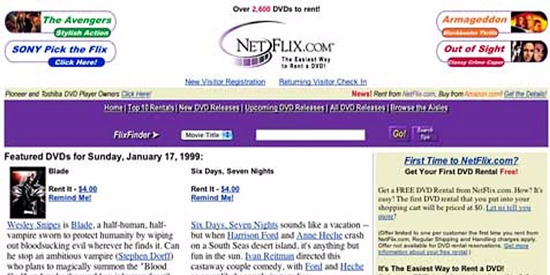

In 1999, Netflix had 2,600 DVDs to choose from but intended to grow its library to 100,000 titles. To make it easier for members to find movies, Netflix developed a personalized merchandising system.

In 2000, when Netflix transitioned from an a la carte business to an all-you-can-eat subscription service, the service added a queue, a list of movies each household created by hitting the “Add” button to add a title to an ordered list of movies. Each time a member returned a DVD, Netflix would send the title at the top of each member’s Netflix Queue directly to their mailbox.

<!-- ------------------------ -->

## 2000: Cinematch

Duration: 1

Netflix introduced a personalized movie recommendation system, using member ratings to predict how much a member would like a movie. The algorithm was called Cinematch, and it’s a collaborative filtering algorithm.

Here’s an easy way to understand collaborative filtering. Imagine I like *Batman Begins* and *Breaking Bad*, and you like both, too. Because I like *Casino*, the algorithm suggests you’ll like *Casino*. Now, apply this approach across millions of members and titles.

<!-- ------------------------ -->

## 2001: The five-star rating system

Duration: 1

Netflix created a five-star rating system and eventually collected billions of ratings from its members. Netflix experimented with multiple “star bars,” at times stacking the stars to indicate expected rating, average rating, and friends’ rating. It was a mess.

The stars represented how much a member would like a movie. If a member had watched the movie already, they could rate it.

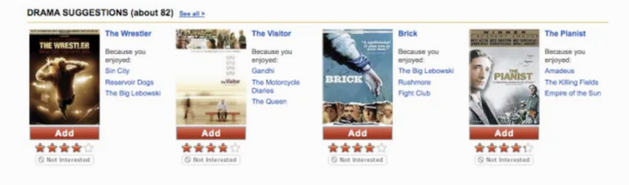

<!-- ------------------------ -->

## 2002: Multiple algorithms

Duration: 1

Beyond Cinematch, three other algorithms worked together to help merchandise movies:

1. **Dynamic store:** This algorithm indicated if the DVD was available. Late in the DVD era, the algorithm even determined if a DVD was available in a member’s local hub. By 2008, Netflix only merchandised locally available titles to increase the likelihood of next-day DVD delivery.
2. **Metasims:** This algorithm incorporated all movie data available for each title — plot synopsis, director, actors, year, awards, language, etc.
3. **Search:** In the early days, there was little investment in search as the team assumed members searched for expensive new release DVDs, making the company’s economics more challenging. But the team discovered that the titles members chose included lots of older, less expensive, long-tail titles, so they eventually ramped up investment in search.

In time, Netflix blended lots of other algorithms to execute its personalized merchandising system.

<!-- ------------------------ -->

## 2004: Profiles

Duration: 1

Recognizing multiple family members used a shared account, Netflix launched “profiles.” This feature enabled each family member to generate its own movie list. Profiles were a highly requested feature, but only 2% of members used it despite aggressive promotion. It was a lot of work to manage an ordered list of DVDs, and only one person in each household was willing to do this.

Given the low adoption, Netflix announced its plan to kill Profiles but capitulated in the face of member backlash. A small set of users cared deeply about the feature — they were afraid that losing Profiles would ruin their marriages. As an example of “all members are not created equal,” half the Netflix board used the feature.

<!-- ------------------------ -->

## 2004: Netflix launches “Friends”

Duration: 1

The hypothesis: If you create a network of friends within Netflix, they’ll suggest great movie ideas to each other and won’t quit the service because they don’t want to leave their friends. At launch, 2% of Netflix members connected with at least one friend, but this metric never moved beyond 5%.

Netflix killed the feature in 2010 as part of its discipline of “scraping the barnacles” — removing features that members didn’t value. Unlike Profiles, there was no user revolt.

Two insights on social in the context of movies:

1. Your friends have bad taste.
2. You don’t want your friends to know all the movies you’re watching.

These are surprising insights during a decade when Facebook successfully applied its social strategy to many product categories.

<!-- ------------------------ -->

## 2006: The Netflix personalization strategy

Duration: 2

Here’s what the personalization strategy looked like in 2006. It’s organized in the strategy/metrics/tactics format, with a proxy metric for each strategy, as well as tactics (projects) against each strategy:

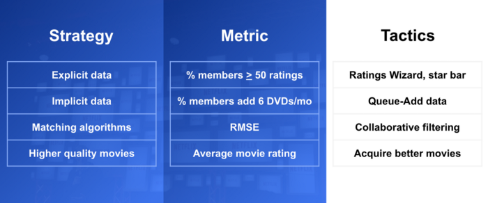

The intent was to gather explicit and implicit data, then use various algorithms and presentation tactics to connect members with movies they’d love. The team focused on four main strategies:

1. **Gather explicit taste data,** including movie and TV show ratings, genre ratings, and demographic data.
2. **Explore** **implicit taste data,** like DVDs members added to their movie list or later, which movies members streamed.
3. **Create algorithms and presentation-layer tactics to connect members with movies they’ll love.** This strategy focused on using the explicit/implicit taste data, along with lots of data about movies and TV shows (ratings, genres, synopsis, lead actors, directors, etc.), to create algorithms that connected members with titles. The expectation was that Netflix would also create a simple user interface that provided visual support for personalized choices.
4. **Improve average movie ratings for each member** by connecting them with better movies and TV shows. The assumption was that if Netflix connected its members with higher quality movies and TV shows, they would retain better.

The high-level hypothesis: Personalization would improve retention by making it easy for members to find movies they’ll love.

The high-level engagement metric was retention. It takes years to affect this metric, however. So Netflix had a more sensitive, short-term proxy metric: The percentage of members who rated at least 50 movies during their first two months with the service.

The theory was that members would rate lots of movies to get better recommendations. These ratings signaled that members appreciated the personalized recommendations they received in return for their ratings. More ratings were a signal that members appreciated Netflix’s personalized merchandising algorithms.

Here’s a very rough snapshot of the improvement in this proxy metric over time:

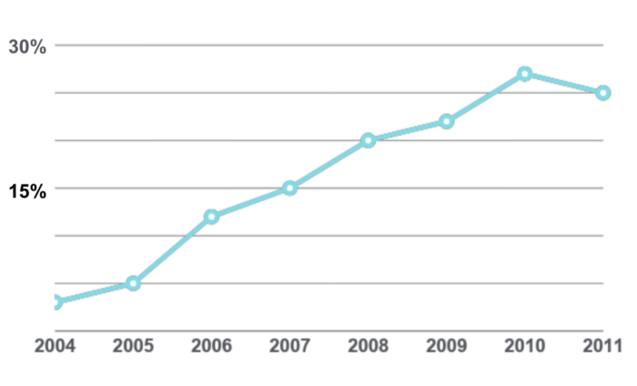

Why the 2011 dip in the metric? By this time, most members streamed movies, and Netflix had a strong implicit signal about member taste. Once you hit the “Play” button, you either kept watching or stopped. Netflix no longer needed to collect as many star ratings.

It took Netflix more than a decade to demonstrate that a personalized experience improved retention. But consistent growth in this proxy metric convinced the company to keep doubling down on personalization.

<!---------------------------->

## 2006: The ratings wizard

Duration: 1

The original petri dish for personalization was an area on the site with a “Recommendations” tab. But testing revealed that members preferred less prescriptive language. The new tab read “Movies You’ll Heart” and that generated lots of clicks. The design team thought the tab was “fugly,” but it worked.

When members arrived at the “Movies You’ll Heart” area, the site introduced them to the “Ratings Wizard”:

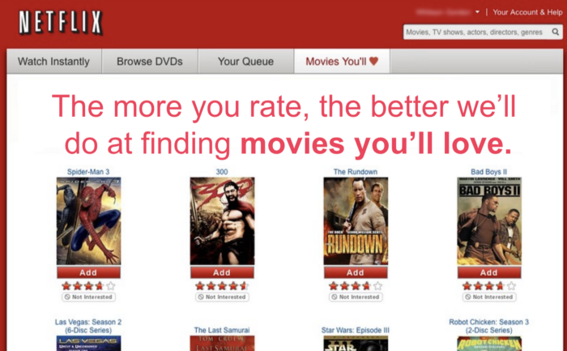

Members “binge-rated” while they waited for their DVDs to arrive. The Ratings Wizard was critical in moving the “percentage of members who rate at least 50 movies in their first two months” proxy metric. While members rated lots of movies using the “star bar” throughout the site, the Ratings Wizard was the major source of taste input.

<!---------------------------->

## 2006: Demographic data

Duration: 1

Netflix collected age and gender data from its members, but when the team used demographics to inform predictions about a member’s movie taste, the algorithms did not improve predictive power. Huh?

How did Netflix measure predictive power? The proxy metric for the personalization algorithms was RMSE (Root Mean Square Error) — a calculation that measures the delta between the algorithm’s predicted rating and a member’s actual rating. If Netflix predicted you would like *Friends* and *Seinfeld*, four and five stars respectively, and you rated these shows four and five stars, the prediction was perfect. RMSE is a “down and to the right” metric that improved over time, mainly through improvements in the collaborative filtering algorithm. You can see the improvements in the rough graph below:

Unfortunately, age and gender data did not improve predictions — there was no improvement in RMSE. Movie tastes are hard to predict as they are idiosyncratic — they are very peculiar and vary radically from one individual to another. Knowing my age and gender doesn’t help predict my movie tastes. It’s much more helpful to know just a few movies or TV shows I like.

To see this insight in action today, create a new profile on your Netflix account. Netflix asks for a few titles you like to kickstart the personalization system. That’s all they need to seed the system.

<!---------------------------->

## 2006: Collaborative filtering in the QUACL

Duration: 1

The QUACL is the Queue Add Confirmation Layer. Once a member added a title to their Queue, a confirmation layer would pop up suggesting similar titles. Below, a member has added Eiken to their movie list, and the collaborative filtering algorithm suggests six similar titles:

Over time, Netflix got better at suggesting similar titles for members to add to their queue. This drove the QUACL as a merchandising source from 10% to 15% of total queue adds over a few years. The QUACL was a great test environment for algorithm testing. In fact, Netflix executed some of its first machine-learning tests within the QUACL.

<!---------------------------->

## 2006: The $1 million Netflix Prize

Duration: 1

Like any startup, Netflix had limited resources. They had proven the value of Cinematch but had only one engineer focused on the algorithm. The solution: Outsource algorithm development via the Netflix Prize.

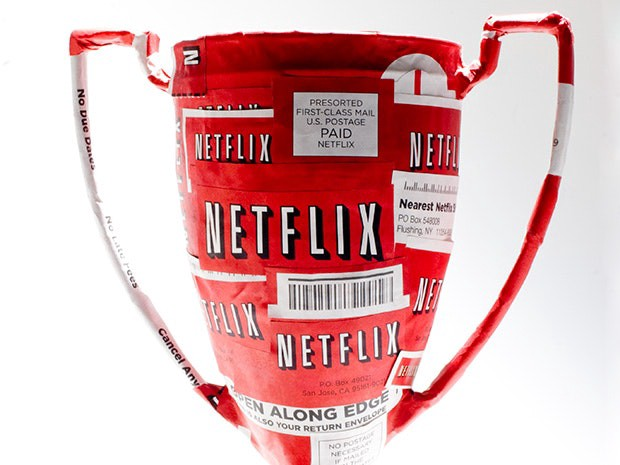

Netflix offered a million-dollar prize to any team that improved RMSE for their Cinematch algorithm by 10%. The personalization team provided anonymized data from Netflix members as training data for the teams, along with a second dataset that included members’ actual ratings so teams could test their algorithms’ predictive power. It took two years for teams to win the money — more on that in a moment.

<!---------------------------->

## 2007: Netflix streaming launch

Duration: 1

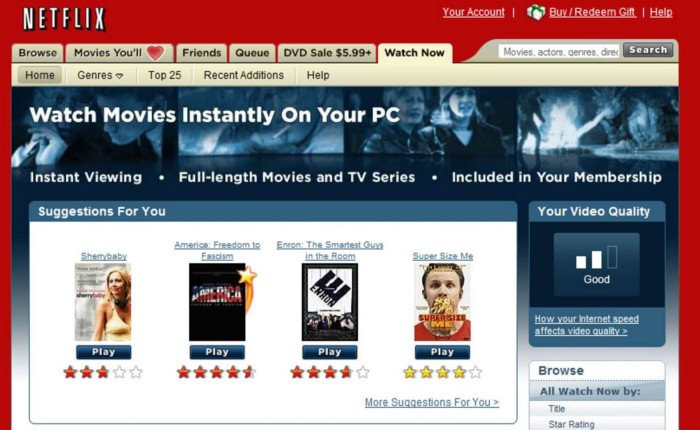

Netflix launched streaming in January 2007. For the first time, the Netflix team had real-time data about what movies members watched, where before, they only had DVD-rental activity. Over time, this implicit data became more important in predicting members’ movie tastes than the explicit data Netflix collected via its five-star rating system.

At the time of streaming launch in 2007, Netflix had nearly 100,000 DVDs to choose from, so the DVD merchandising challenge was to help members find “hidden gems” from its huge DVD library. However, with streaming, the challenge was to help members identify a few movies they’d find worthwhile among the 300 fairly mediocre titles available at launch.

<!---------------------------->

## 2007: Netflix Prize

Duration: 1

The Netflix Prize offered $1 million to any team that could improve the predictive power of Netflix’s collaborative filtering algorithm by 10%, as measured by RMSE, the delta between expected and actual rating for each movie. Two years later, “Bellkor’s Pragmatic Chaos” won the contest, beating 5,000 other teams.

There were two insights from the contest:

- **All ratings are not created equal.** Contestants discovered that the ratings members provided for recent movies provided more predictive power than older ratings.
- **The more algorithms, the better.** At the end of each year, Netflix paid a $50,000 progress prize to the leading team. On the final day of the year, the teams in second and third place combined their algorithms and vaulted to the top of the leaderboard to take the annual progress prize. That’s how teams learned the importance of combining lots of algorithms. That’s also why the team names were so strange — when teams combined their work, they created “mashup” names.

After two years, the top team delivered a 10.06% increase in RMSE to win the million-dollar prize. “BellKor’s Pragmatic Chaos” submitted its winning algorithm 24 minutes before the second-place team, “The Ensemble.” The two teams had identical scores, but “BellKor” submitted their entry first. Here’s the final leaderboard:

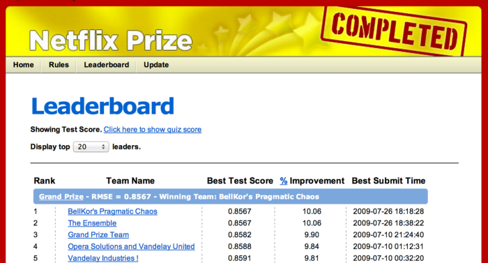

<!---------------------------->

## 2009: The next big Netflix prize

Duration: 1

When Netflix announced the winners of its first competition, it launched a second round. The new challenge was to use demographics and rental behavior to make better predictions. The algorithms could consider a member’s age, gender, zip code, and full rental history.

When Netflix released anonymized customer information to start the second round, the Federal Trade Commission (FTC) stepped in with a lawsuit arguing that the data wasn’t sufficiently anonymized. As part of the March 2010 settlement for that suit, Netflix canceled the second round.

<!---------------------------->

## 2010: Testing the new “Netflix Prize” algorithm

Duration: 1

Netflix launched the Netflix Prize contest to provide better movie choices for members, which the team hoped would translate into retention improvement. But when Netflix executed the new algorithm in a large-scale A/B test, there was no measurable retention difference. It was a disappointing result.

A new hypothesis emerged. To improve retention, you needed better algorithms plus presentation-layer tactics that provided context for why Netflix chose a specific title for each member, as follows:

- Better algorithms + UI/design support/context = improved retention.

Was it worth $1 million to execute the contest? Absolutely. The recruiting benefit alone made it worthwhile. Before the Netflix Prize, engineers considered Netflix just another e-commerce company. After the prize, they regarded Netflix as a highly innovative company.

<!---------------------------->

## 2010: Popularity matters

Duration: 1

Netflix published all of its learnings from the Netflix Prize, and other companies studied the results. The music streaming service Pandora, whose personalization efforts focused on its “Music Genome Project,” was wary of weighting its algorithms with popularity. Instead, Pandora had 40 “musicologists” who tagged each song with hundreds of attributes to explain why a listener would like a song. For example, musicologists tagged Jack Johnson’s songs as “optimistic, folksy, acoustic music with surfing, outdoor adventure, and coming-of-age themes.”

But as Pandora evaluated the results of the Netflix Prize (which weighted popularity highly), they began to execute collaborative filtering algorithms, too. These changes improved Pandora’s listening metrics. Pandora’s conclusion: popularity matters.

<!---------------------------->

## 2011: Netflix’s movie genome project

Duration: 1

While admiring Pandora’s work and knowing that the more algorithms, the better, Netflix began to develop its own “movie genome” project. They hired 30 “moviecologists” to tag various attributes of movies and TV shows.

As a reminder, Netflix’s collaborative filtering algorithm predicts you’ll like a movie, but the algorithm can’t provide context for why you’ll like it. The Cinematch collaborative filtering algorithm leads to statements like, “Because you like *Batman Begins* and *Breaking Bad*, we think you’ll like *Sesame Street*.” Wait, what?

Netflix’s new movie genome algorithm is called “Category Interest.” Now, for the first time, Netflix would suggest a movie and give context for why a member might like it. In the example below, Netflix knows I like *Airplane* and *Heathers*, so suggests *Ferris Bueller’s Day Off* and *The Breakfast Club* because I like “Cult Comedies from the 1980s”:

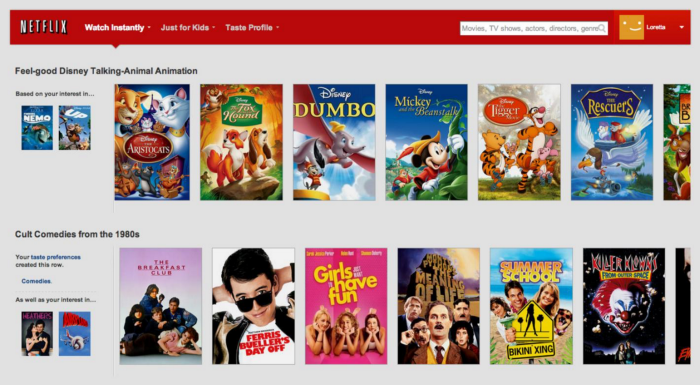

The “Category Interest” algorithm improved Netflix’s watching metrics — the percentage of members who watched at least 40 hours a month — but the team did not execute an A/B test to see if it improved retention.

<!---------------------------->

## 2011: How the personalization algorithms work

Duration: 1

In simplest terms, Netflix creates a forced rank list of movies for each user — from the content most likely to please to the least. Then this list is filtered, sliced and diced according to attributes of the movies, TV shows, and the member’s tastes. For instance, a filter teases out a sub-list of movies and presents it in a row called “quirky dramas with strong female heroines” or “witty, irreverent TV shows.” Other row titles might include “Because You Watched *Stranger Things*, We Think You’ll Enjoy… ” or “Top 10 for You.”

Netflix’s personalization approach has three components:

1. A forced-rank list of titles for each member.
2. An understanding of the most relevant filters for each member so the algorithms can present a subset of movies and TV shows from the list above.
3. The ability to understand the most relevant rows for each member, depending on the platform, time of day, and lots of explicit/implicit movie taste data.

The beauty of this approach is that these rows, with appropriate context, can be displayed on any device or screen. It’s easy to display the same row structure on all browsers and devices.

<!---------------------------->

## 2011: Netflix proves personalization improved retention

Duration: 1

Finally, In 2011, Netflix demonstrated a retention improvement in a large A/B test. However, the results were controversial, as the test compared the default personalized experience at the time to a dumbed-down experience with no personalization. Netflix engineers complained the test was a waste of time. Most of the team had already accepted that personalization created a better experience for Netflix members.

Recognize that Netflix had made a very long-term, 13-year, “leap of faith” investment in personalization until they finally had “proof” of retention improvement in 2011. But improvements in the proxy metric — the percentage of members who rated at least 50 movies in their first two months with the service — gave Netflix the confidence to consistently double down on personalization.

<!---------------------------->

## 2012: Profiles reinvented

Duration: 1

As Netflix moved beyond DVDs, it no longer required members to create an ordered list of movies. Instead, members hit the “Play” button to begin watching a movie or TV show.

Netflix had a profile feature during the DVD era, but only 2% of members used the feature, mainly because managing this forced-rank list of movies was time consuming. But now, there’s nothing to manage. You provide Netflix with your name, three movies, or TV shows you enjoy, and Netflix creates a personalized experience for each user associated with that account.

Today, more than half of Netflix accounts have multiple profiles. Netflix knows the movie tastes for 200 million accounts, translating into an understanding of the movie tastes of 500 million separate movie-watchers tied to the 200 million accounts.

<!---------------------------->

## 2013: “House of Cards” original content launch

Duration: 1

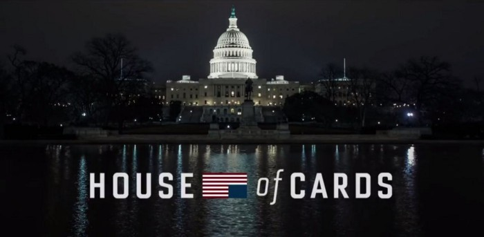

In 2007, during the DVD era, Netflix’s first original content effort, Red Envelope Studios, failed. Despite this failure, Netflix tried again during the streaming era.

Knowing that millions of members liked Kevin Spacey and *The West Wing*, Netflix made an initial $100-million bet on *House of Cards*, which paid off. Over six seasons, Netflix invested more than $500 million in the series. *House of Cards* was the first of many successful original movies and television series that Netflix invested in.

By this time in Netflix’s history, it’s clear that personalization delights customers in hard-to-copy, margin-enhancing ways. By making movies easier to find, Netflix improves retention, which increases lifetime value (LTV). And Netflix’s personalization technology is tough to copy, especially at scale.

But there’s another aspect of personalization that improves the company’s margin: the ability for Netflix to “right-size” their content spend. Here are examples of Netflix’s right-sizing with my best estimates on multiple content investments:

- Based on its knowledge of member tastes, Netflix predicts that 100 million members will watch *Stranger Things* and invests $500 million in the series.
- The data science team predicted 20 million watchers for the quirky adult cartoon *Bojack Horseman*, so Netflix invests $100 million in this animated TV series.
- Based on a prediction that one million members will watch Everest climbing documentaries, Netflix invests $5 million in this genre.

Netflix has a huge advantage in its ability to right-size its original content investment, fueled by its ability to forecast how many members will watch a specific movie, documentary, or TV show. Note: Netflix does not bring data-driven approaches to the movie creation process — they are hands-off with creators.

<!---------------------------->

## 2013: Netflix wins a technical Emmy

Duration: 1

In 2013, Netflix won an Emmy award for “Personalized Recommendation Engines For Video Discovery.” This award hints at the degree to which Netflix will eventually dominate the Oscars, Emmys, and Golden Globe Awards for its original content.

<!---------------------------->

## 2015: Does it matter if you’re French?

Duration: 1

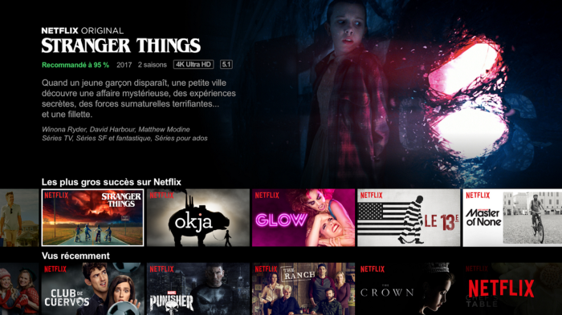

From 2015 to 2021, Netflix expanded from 20 to 40 languages, as they launched their service into 190 countries. The personalization team wondered if they should inform the personalization algorithms with each member’s native language and country. The short answer, based on the results of A/B testing: No.

Like the demographics test in 2006, members’ tastes are so idiosyncratic that language and geography don’t help predict a member’s movie preferences. As before, the most efficient way to seed a member’s taste profile is to ask for a few TV shows or movies they love. Over time, Netflix builds from this “seed” as it informs its algorithms with the titles members rate, watch, stop watching, and even demonstrate an interest in a movie by clicking on the “Movie Display Page” or watching a preview.

<!---------------------------->

## 2016: Netflix tests a personalized interface

Duration: 1

Three of the cultural values of Netflix are curiosity, candor, and courage. Netflix encourages new employees to challenge conventional wisdom when they join the company. Netflix appreciates the value of “fresh eyes” and encourages an iconoclastic culture.

A newly hired product leader at Netflix suggested that the team test “floating rows.” The idea was that rows like “Top 10 for Gib,” “Just Released,” and “Continue Watching” should be different for each member and even change depending on the device, time of day, and other factors. Conventional wisdom suggested an inconsistent site design would confuse and annoy customers, so it’s better to keep the interface consistent. But the “old guard” allowed the newbie to test it anyway.

As Ralph Waldon Emerson once said, “Consistency is the hobgoblin of small minds.” Surprisingly, the inconsistent interface performed better in A/B tests. Today, even the user interface is personalized based on member’s taste preferences.

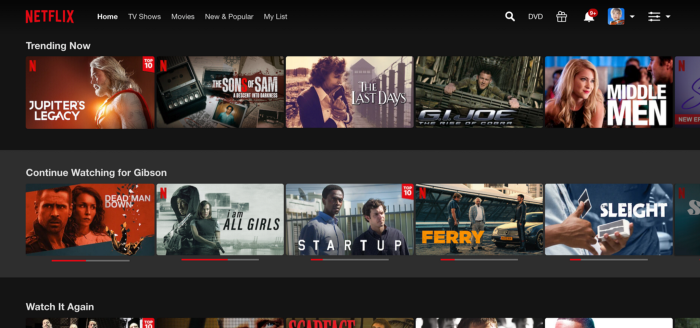

Note that row names that Netflix presents to you are wildly inconsistent. In this screen capture for me on PC, Netflix leads with a row entitled “Trending Now” and puts the “Continue Watching” row in the second position. The interface changes each time you use it, depending on your recent activity, platform, and time of day.

<!---------------------------->

## 2017: From stars to thumbs

Duration: 1

By 2017, Netflix collected more than 5 billion star ratings. But over the last 10 years, Facebook popularized a different rating system: thumbs up and down. By 2017, Facebook had introduced this simple gesture to more than 2 billion users worldwide.

Discovering which method inspires members to provide more taste data is simple: execute an A/B test of the five-star system against a thumbs up/down system. The result: The simpler thumbs system collected twice as many ratings.

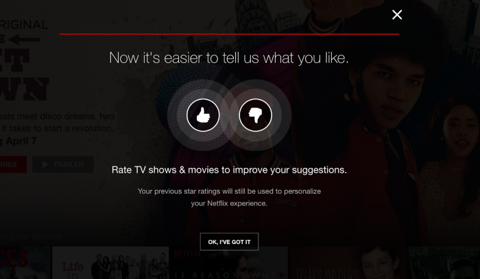

Was this a surprising result? No. When you require a member to parse between three, four, or five stars, you force them to think too much. They become confounded and move on to the next activity without rating a movie. Clicking thumbs up or down is much easier. Here, as in many cases with user interfaces, simple trumps complete.

<!---------------------------->

## 2017: What happens to the five-star system?

Duration: 1

If stars are gone, how do you communicate movie quality? Recall that one of Netflix’s early hypotheses was that, over time, the average ratings of the movies watched would increase, leading to improved retention. While there was evidence that average ratings increased, nothing in the Netflix data sets suggested that higher average ratings improved retention.

It turns out that movie ratings do not equal movie enjoyment. While you may appreciate that *Schindler’s List* or *Hotel Rwanda* are five-star movies, it doesn’t mean you *enjoy* them more than a three-star movie. Sometimes a “leave your brains at the door” comedy like *Paul Blart: Mall Cop* is all you need. This is the reason that one of Netflix’s first big investments in original content was a four-picture deal with Adam Sandler, the king of sophomoric comedy. My favorite? *The Ridiculous Six*.

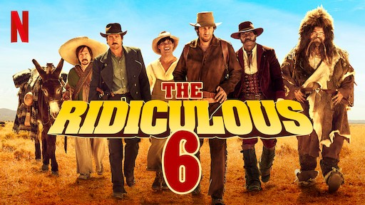

This was one of the movies in Adam Sandler’s $250 million-dollar, four-picture original content deal. Sometimes movie enjoyment is all about leaving your brains at the door with a good three-star movie.

<!---------------------------->

## 2017: Percentage match

Duration: 1

So, with the loss of star ratings, and the insight that star ratings do not equal movie enjoyment, Netflix changed its system. They switched to a “percentage match” that indicated how much you would enjoy a movie, irrespective of its quality.

Below, Netflix gives an “80% Match” for me for *The* *Irishman*. There’s an 80% chance I will enjoy it, which is at the low-end for Netflix suggestions for me.

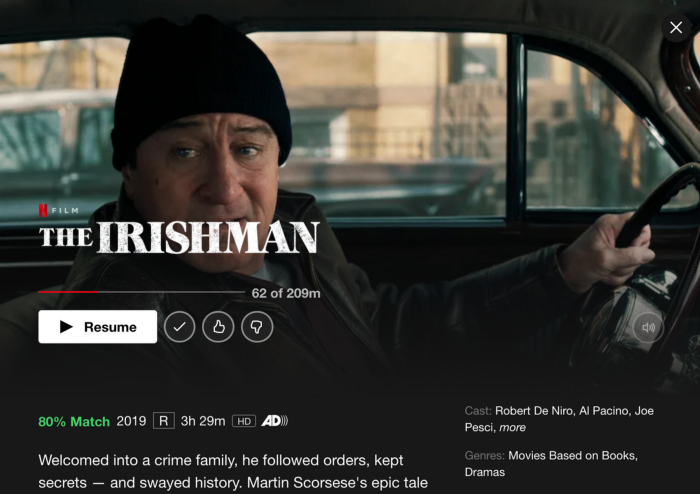

<!---------------------------->

## 2018: Personalized movie art

Duration: 1

The Netflix personalization team wants to present you with the right title at the right time with as much context as possible to encourage you to watch that title. To do this, Netflix uses personalized visuals that cater to each member’s taste preferences.

Here’s a little more information from the Netflix tech blog:

> Let us consider trying to personalize the image we use to depict the movie Good Will Hunting. Here we might personalize this decision based on how much a member prefers different genres and themes. Someone who has watched many romantic movies may be interested in Good Will Hunting if we show the artwork containing Matt Damon and Minnie Driver, whereas, a member who has watched many comedies might be drawn to the movie if we use the artwork containing Robin Williams, a well-known comedian.

Using the example above, the Netflix tech blog shares the titles that support each scenario, along with the unique movie art that Netflix presents to different members. The top row supports a member interested in romantic movies, with the image of Matt Damon and Minnie Driver as the hero. The bottom row is for members who enjoy watching well-known comedians. In this example, Robin Williams is featured.

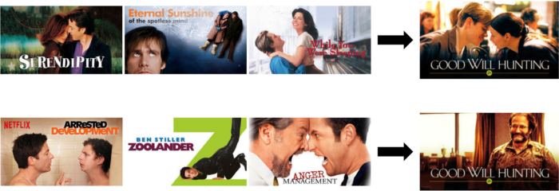

Not only does Netflix use its knowledge of member taste to choose the right movie, but it takes member tastes into account to support these choices through highly personalized visuals.

<!---------------------------->

## 2021: Do you feel lucky?

Duration: 1

The ultimate personalization is you turn on your TV, and Netflix magically plays a movie you’ll love. Netflix’s first experiment with this concept is a feature that the company co-CEO, Reed Hastings (jokingly), called the “I feel lucky” button.

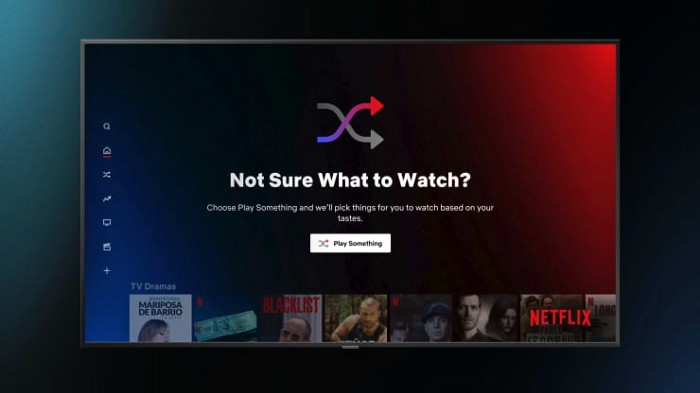

Note that when you sign onto your profile on a TV-based system, there’s a new “Play Something” button. Think of this button as a proxy for how well Netflix algorithms connect members with movies they’ll love. I’d guess that 2–3% of the plays come from this button today. If this “Play Something” button generates 10% usage a few years from now, it’s a strong indication that Netflix personalization is doing a better job connecting its members with movies they’ll love.

Here’s the long-term personalization vision: Twenty years from now, Netflix will eliminate both the “Play Something” button and its personalized merchandising system, and that one special movie you’re in the mood to watch at that particular moment will automatically begin to play.

My guess is that Netflix will achieve this vision within 20 years. They’ve come a long way in the last 20 years, so I think this is feasible.

<!---------------------------->

## Conclusion

Duration: 2

Today, more than 80% of the TV shows and movies that Netflix members watch are merchandised to you by Netflix’s personalization algorithms.

Netflix’s personalization journey has had its share of ups and downs. But eventually, personalization enabled Netflix to build a hard-to-copy technological advantage that delights customers in margin-enhancing ways.

For product leaders engaged in innovative projects, Netflix’s journey highlights the need for:

- **A plan:** A product strategy with accompanying metrics and tactics.
- **A method** to quickly test various hypotheses.
- **A culture** that encourages risk-taking, intellectual curiosity, candor, plus the courage to say, “Let’s try this idea.”

The last requirement: patience. It takes decades to build a world-class product and company.

### Links and References

- [Originally published as a medium blog post](https://marker.medium.com/a-brief-history-of-netflix-personalization-1f2debf010a1)

### Have a Question?

- [Fill out this form](https://form.jotform.com/211377288388469)
- [Raise issue on Github](https://github.com/recohut/reco-step/issues)