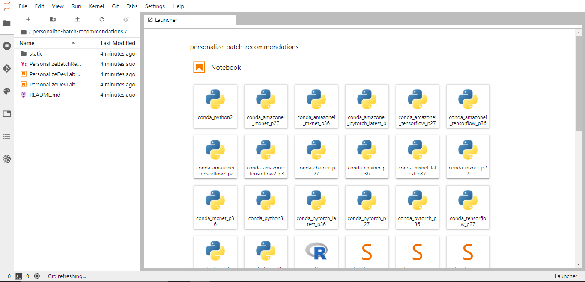
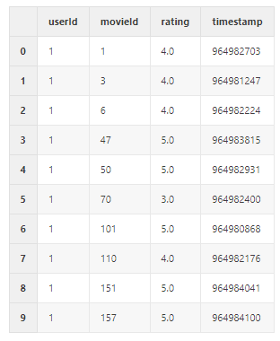
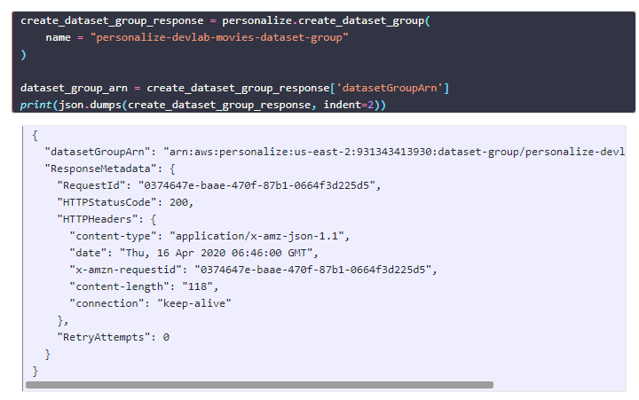
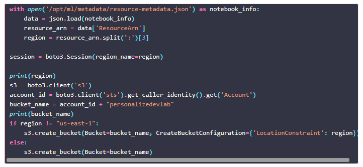
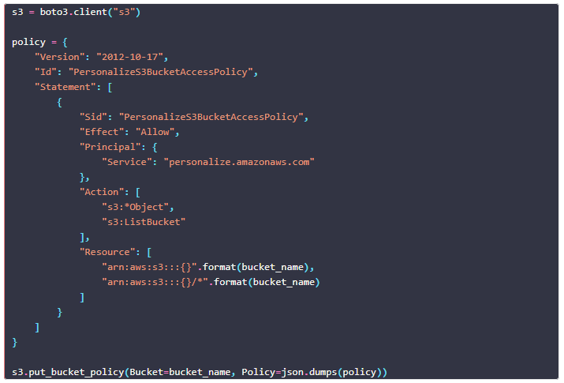
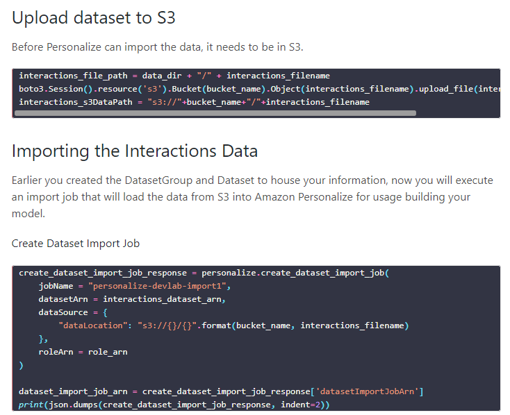
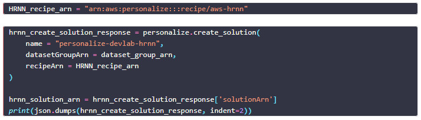
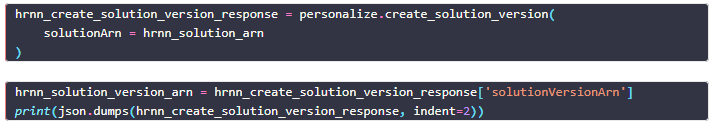
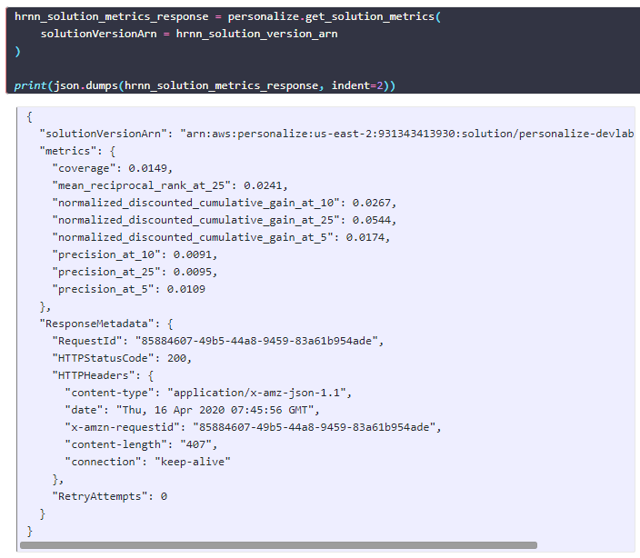
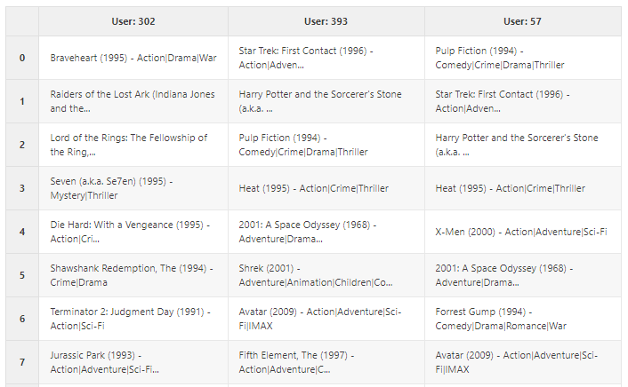

authors: Sparsh A.
categories: Tutorial
feedback link: https://github.com/recohut/reco-step/issues
id: amazon-personalize-workshop-a
status: Published
summary: This lab will walk you through on how to train and create batch recommendations using Amazon Personalize. For example, you might want to generate recommendations for a large number of users to be later used for batch-oriented workflows such as sending emails or notifications.

---

# Amazon Personalize Batch Recommendations Lab

<!-- ------------------------ -->

## Introduction

Duration: 5

### What you'll learn?

This lab will walk you through how to train and create batch recommendations using Amazon Personalize. For example, you might want to generate recommendations for a large number of users to be later used for batch-oriented workflows such as sending emails or notifications.

### Why is this important?

Amazon Personalize is an advanced tool for building recommender systems, that supports AutoML and Real-time. The batch recommendation is a cost-effective way to serve recommendations, e.g. sending recommended items via emails.

### How it will work?

1. Setup the environment using CloudFormation template
2. Open the SageMaker Jupyter Lab instance
3. Prepare data
4. Create related datasets and a dataset group
5. Import historical data to the dataset group
6. Record user events to the dataset group
7. Create a solution version (trained model) using a recipe
8. Evaluate the solution version using metrics
9. Create a campaign (deploy the solution version)
10. Provide recommendations for users by running Batch Recommendation
11. Clean the environment by deleting all the resources

### Who is this for?

- People who are new in deep learning and cloud
- People learning Amazon Personalize
- People looking to build a scalable recommender solution

### Important resources

- [Notebook - Amazon Personalize Batch Job](https://nb-dev.recohut.com/amazonpersonalize/batch/movie/hrnn/2021/06/20/amazon-personalize-batch-job.html)

<!---------------------------->

## Setup the Environment

Duration: 5

Go to [this](https://console.aws.amazon.com/cloudformation/home?region=us-east-1#/stacks/new?stackName=PersonalizeDevlab) AWS console link and paste [this](https://recohut-static.s3.amazonaws.com/cloudformation/PersonalizeBatchRecommendDevLab.yaml) YAML file path in the template.

<!---------------------------->

## Start the lab

Duration: 5

Go to SageMaker → Notebooks and Open the Jupyter Lab.

You will see something like this:

<!---------------------------->

## Build and deploy the solution

Duration: 20

Follow [this](https://nb-dev.recohut.com/amazonpersonalize/batch/movie/hrnn/2021/06/20/amazon-personalize-batch-job.html) notebook for in-depth guideline. Below is the brief outline of the process.

### Load the MovieLens data

### Create the dataset and dataset group

### Configure S3 and IAM

### Create and attach the policies

### Upload data to S3 and load into Personalize

### Create solution and solution version

### Evaluate solution metrics

### Generate batch recommendations

<!---------------------------->

## Clean the Environment

Duration: 5

Once you have completed all of the work in the Notebooks and have completed the cleanup steps there as well, the last thing to do is to delete the stack you created with CloudFormation. To do that, go to CloudFormation and delete the stack. This will automatically delete the 3 resources that we created in the beginning.

<!---------------------------->

## Conclusion

Duration: 2

Congratulations!

### What we've covered

1. Setup the environment using CloudFormation template
2. Open the SageMaker Jupyter Lab instance
3. Train the recommender model on MovieLens dataset and build the campaign
4. View campaign and generate batch recommendations
5. Clean the environment by deleting all the resources

### Links and References

1. [https://github.com/dalacan/personalize-batch-recommendations](https://github.com/dalacan/personalize-batch-recommendations)

### Have a Question?

- [Fill out this form](https://form.jotform.com/211377288388469)
- [Raise issue on Github](https://github.com/recohut/reco-step/issues)