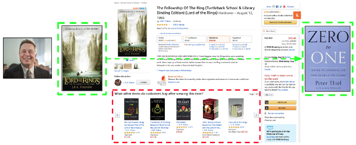
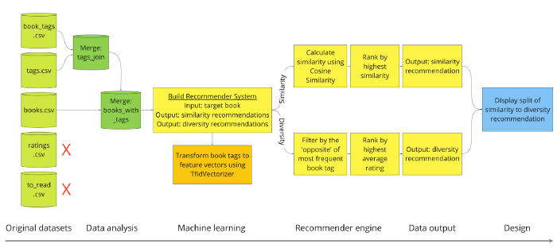
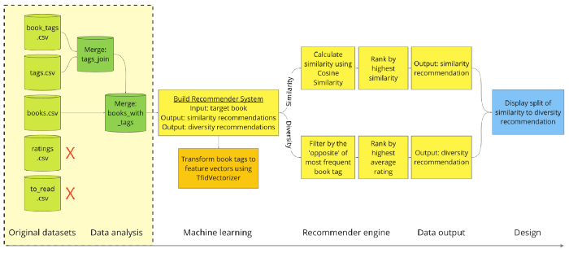
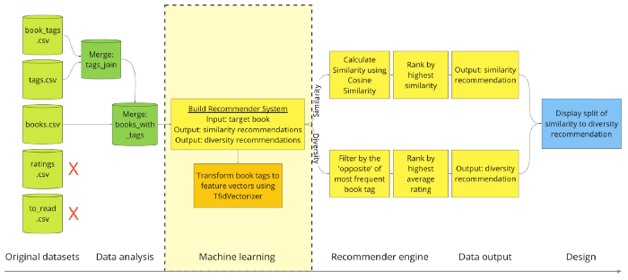
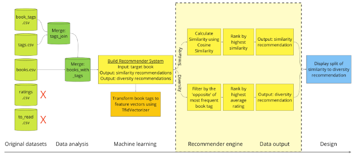
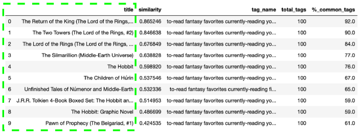
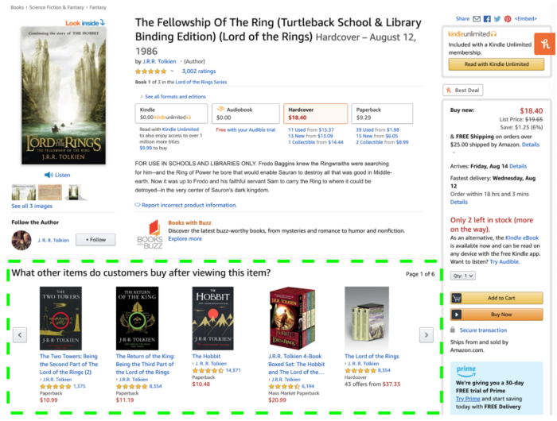
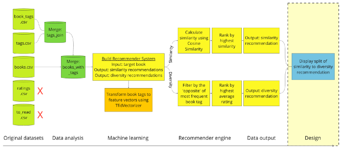
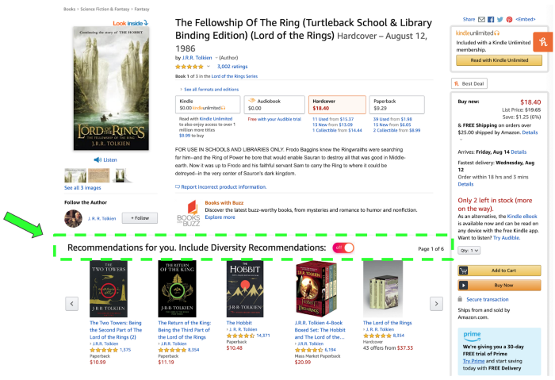
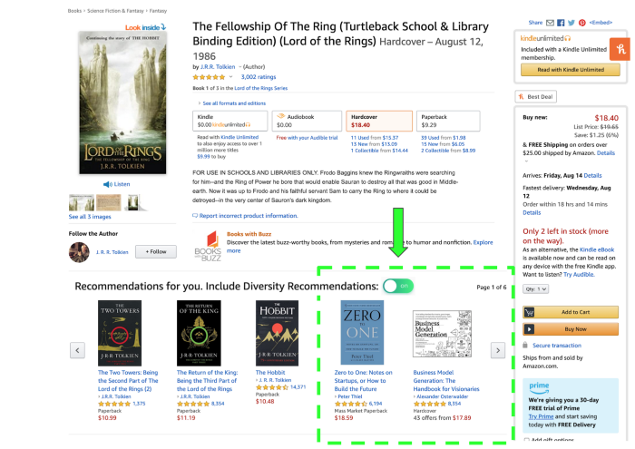

authors: Sparsh A.
categories: Tutorial
feedback link: https://github.com/recohut/reco-step/issues
id: diversity-aware-book-recommender
status: Published
summary: How can we build a better recommender system that enables consumer diversity and increases customer lifetime value? We can approach this problem through the customer lens. Let’s take Elon Musk as a model world citizen, who publicly stated he loved fantasy books growing up and Lord of the Rings having a large impact on him. But if Elon continued to follow the recommendations of today’s most visible machine learning algorithm on Amazon, he would continue down the path of fantasy, fantasy, and more fantasy. Elon has also stated that business books shaped his worldview, with Zero to One as his recommendation.

---

# Diversity Aware Book Recommender

<!-- ------------------------ -->

## Introduction

Duration: 5

How can we build a better recommender system that enables consumer diversity and increases customer lifetime value?

We can approach this problem through the customer lens. Let’s take Elon Musk as a model world citizen, who publicly stated he loved fantasy books growing up and **Lord of the Rings** having a large impact on him. But if Elon continued to follow the recommendations of today’s most visible machine learning algorithm on Amazon, he would continue down the path of fantasy, fantasy, and more fantasy. Elon has also stated that business books shaped his worldview, with **Zero to One** as his recommendation. 



The status quo leads to more of the same, so how can we better match the customer’s interests?

**How can we build a recommendation engine that would take an input book like Lord of the Rings and recommend an output book like Zero to One?**

### Process



### Resources

[Notebook](https://github.com/recohut-admin/reco-nb/blob/dev/_notebooks/2021-06-10-recobook-goodreads-book-recommender.ipynb)

[Notebook](https://github.com/recohut-admin/reco-nb/blob/dev/_notebooks/2021-06-10-recobook-dive-aware-book-recommender.ipynb)

<!-- ------------------------ -->

## Gather, explore, and clean data

Duration: 5



<!-- ------------------------ -->

## Transform data

Duration: 5



<!-- ------------------------ -->

## Build recommender engine

Duration: 5



Now we input Lord of the Rings into the recommendation engine and see the results.



We get a list of the top 10 most similar books to Lord of the Rings based on book tags. The recommendations look nearly identical to Amazon’s website:



<!-- ------------------------ -->

## Add diversity

Duration: 5

In relation to Lord of the Rings, Zero to One is rank 8,592 out of 10,000 books based on similarities. Pretty low. According to the algorithm, these two books are on opposite ends of the spectrum and not similar at all.

### Method 1

1. Create a bag-of-word corpus of tags
2. Select the most frequent tokens
3. Identify synonym tokens
4. Get books with tags containing synonym tokens
5. Sort the results by averate rating from highest to lowest

### Method 2

1. Find similar books based on tags (as usual)
2. Remove the books which are in same category to the target book

For example, Amazon has 5 results to display book recommendations


Instead of 5 books with similar book tags to Lord of the Rings, the result should be 5 books with similar book tags, but with a different category to Fantasy, such as Science Fiction. Subsequent results would follow the same logic. This would “diversify” the categories of books the user sees, while maintaining a chain of relevancy. It would display: Fantasy → Science Fiction → Technology → Entrepreneurship → Biographies.

Within these categories, individual books can be ranked and sorted based on similarities to the initial book or by user ratings. Each slot presents the book within that category with most relevancy to the original book.

Slot 1: Fantasy

Slot 2: Science Fiction

Slot 3: Technology

Slot 4: Entrepreneurship

Slot 5: Biographies

This categorization becomes a sort within a sort to ensure a quality, relevant, and diverse read. This concept could more systematically connect books like Lord of the Rings and Zero to One together, eventually scaling to different product types or industries, such as music.

<!-- ------------------------ -->

## Design mockups

Duration: 5



How might we design this? We could deploy our algorithm to allocate a certain percentage to the exploration of diversity recommendations, such as a split of 70% similarity and 30% diversity recommendations.

One potential user gave feedback that they would like to see a “diversity switch”. Let’s mockup this potential design.



Once the customer switches it on, we can keep 3 books as the usual similarity recommendations and the next 2 as our diversity recommendations.



<!-- ------------------------ -->

## Business value hypothesis

Duration: 5

What is the potential business value behind this idea? We can start by narrowing down the target customer launch to [Amazon.com](http://amazon.com/) USA customers that have in the past 12 months: purchased a book, searched for fantasy books, and bought from multiple book categories. Conservative assumptions:

```
USA customers: 112 million
x book buying customers: 25%
x searches for fantasy: 25%
x buys multiple categories: 25%
= roll out to 1.75 million customersx conversion rate: 10%
= 175,000 customers convertx increase in average annual spend $40
= $7 million additional annual revenue
```

In 2019, the average Amazon customer spend was about $600 per year and Amazon’s annual revenue was $280 billion. This estimate is light in comparison which is good as an initial rollout test. If we increase the scope of the launch we will get a larger potential value. Let’s expand our reach and roll this out to all USA Amazon customer that has purchased a book, with a conservative assumption of 25%:

```
USA customers: 112 million
x book buying customers: 25%
= roll out to 28 million customersx conversion rate: 10%
= 2.8 million customers convertx increase in average annual spend $40
= $112 million additional annual revenue
```

Finally, if we are more aggressive and assume half of Amazon customers can be book buyers, increase the conversion rate, increase the average annual spend uptick, we get into the billions of additional value:

```
USA customers: 112 million
x book buying customers: 50%
= roll out to 56 million customersx conversion rate: 20%
= 28 million customers convertx increase in average annual spend $90
= $1 billion additional annual revenue
```

The potential pitfall is that this new recommender system negatively impacts the customer experience and decreases the conversion rate, which becomes a revenue loss. This is why initial customer validation and smaller launch and test plans are a good starting point.

The business value upside is significant seeing as how 35% ($98 billion) of Amazon’s revenues were generated through recommendation systems. Even a small percentage improvement in the algorithm would amount to millions and billions of additional revenue.

<!---------------------------->

## Conclusion

Duration: 2

Congratulations!

### Links and References

1. [https://pub.towardsai.net/diversity-recommender-systems-in-machine-learning-and-ai-a56849c5a256](https://pub.towardsai.net/diversity-recommender-systems-in-machine-learning-and-ai-a56849c5a256)
2. [https://github.com/allenjiang/Mona-Lisa-AI](https://github.com/allenjiang/Mona-Lisa-AI)

### Have a Question?

- [Fill out this form](https://form.jotform.com/211377288388469)
- [Raise issue on Github](https://github.com/recohut/reco-step/issues)