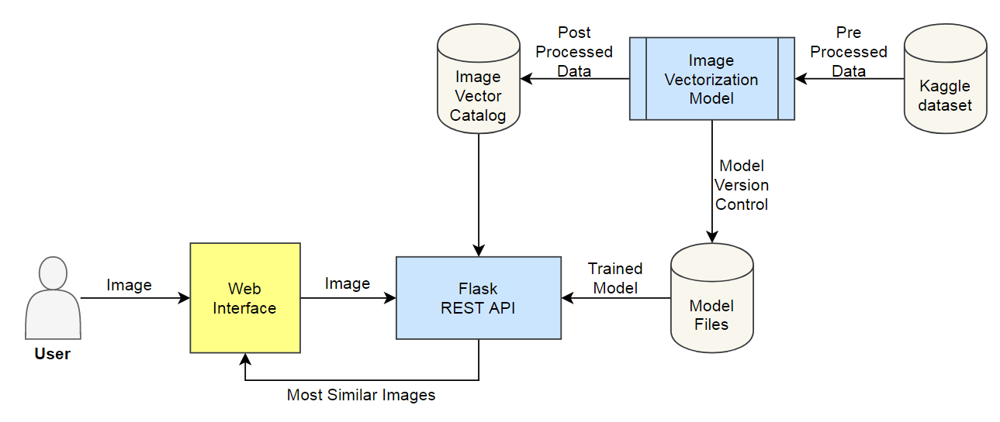
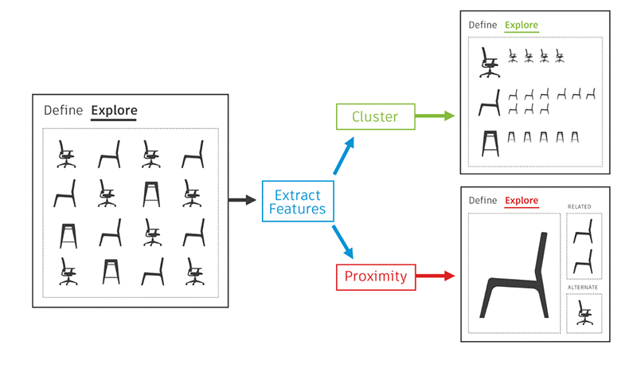

authors: Sparsh A.
categories: Tutorial
feedback link: https://github.com/recohut/reco-step/issues
id: image-similarity-system
status: Published
summary: Recommending visually similar products is an important task in today's E-commerce recommender systems. In this tutorial, we will learn how to achieve this task using the latest tools and techniques.
tags: vision

---

# How to build an image similarity system

<!-- ------------------------ -->

## Introduction

Duration: 5

Recommending visually similar products is an important task in today's E-commerce recommender systems. In this tutorial, we will learn how to achieve this task using the latest tools and techniques.

### What you'll learn?

1. Computer vision image classification model fine-tuning
2. Vector indexing and retrieval
3. Flask API creation
4. Deep learning model deployment on AWS Beanstalk

### Why is this important?

- An end-to-end process of ML
- Visually similar product recommendations are based on this system

### How it will work?

### Who is this for?

- People who are new in deep learning and computer vision
- People looking to fine-tune (transfer learning) and deploy image similarity systems

### Important resources

- [Notebook](https://nb-dev.recohut.com/similarity/visual/2021/04/27/image-similarity-recommendations.html)
- [Notebook](https://nb-dev.recohut.com/similarity/visual/retail/2021/04/23/similar-product-recommender.html)

<!---------------------------->

## D**ataset**

Duration: 5

We listed down 3 datasets from Kaggle that was best fitting the criteria of this use case: 1) [Fashion Product Images (Small)](https://www.kaggle.com/bhaskar2443053/fashion-small?), 2) [Food-11 image dataset](https://www.kaggle.com/trolukovich/food11-image-dataset?) and 3) [Caltech 256 Image Dataset](https://www.kaggle.com/jessicali9530/caltech256?). I selected the Fashion dataset and Foods dataset.

Download the raw image dataset into a directory. Categorize these images into their respective category directories. Make sure that images are of the same type, JPEG recommended. We will also process the metadata and store it in a serialized file, CSV recommended. 

<!---------------------------->

## Encoder fine-tuning

Duration: 10

Download the pre-trained image model and add two additional layers on top of that: the first layer is a feature vector layer and the second layer is the classification layer. We will only train these 2 layers on our data and after training, we will select the feature vector layer as the output of our fine-tuned encoder. After fine-tuning the model, we will save the feature extractor for later use.

Fig: a screenshot of encoder fine-tuning process

<!---------------------------->

## Image vectorization

Duration: 10

Now, we will use the encoder (prepared in step 2) to encode the images (prepared in step 1). We will save feature vector of each image as an array in a directory. After processing, we will save these embeddings for later use.

We can select any pre-trained image classification model. These models are commonly known as encoders because their job is to encode an image into a feature vector. I analyzed four encoders named 1) MobileNet, 2) EfficientNet, 3) ResNet and 4) [BiT](https://tfhub.dev/google/bit/m-r152x4/1). After basic research, I decided to select BiT model because of its performance and state-of-the-art nature. I selected the BiT-M-50x3 variant of model which is of size 748 MB. More details about this architecture can be found on the official page [here](https://tfhub.dev/google/bit/m-r50x3/1). 

<!---------------------------->

## Metadata & indexing

Duration: 10

Images are represented in a fixed-length feature vector format. For the given input vector, we need to find the TopK most similar vectors, keeping the memory efficiency and real-time retrival objective in mind. I explored the most popular techniques and listed down five of them: Annoy, Cosine distance, L1 distance, Locally Sensitive Hashing (LSH) and Image Deep Ranking. I selected Annoy because of its fast and efficient nature. More details about Annoy can be found on the official page [here](https://github.com/spotify/annoy).

We will assign a unique id to each image and create dictionaries to locate information of this image: 1) Image id to Image name dictionary, 2) Image id to image feature vector dictionary, and 3) (optional) Image id to metadata product id dictionary. We will also create an image id to image feature vector indexing. Then we will save these dictionaries and index objects for later use.

<!---------------------------->

## API

Duration: 10

We will receive an image from user, encode it with our image encoder, find TopK similar vectors using Indexing object, and retrieve the image (and metadata) using dictionaries. We send these images (and metadata) back to the user.

<!---------------------------->

## Deployment

Duration: 10

The API was deployed on AWS cloud infrastructure using AWS Elastic Beanstalk service.

<!---------------------------->

## Conclusion

Duration: 2

Congratulations!

### Links and References

1. Determining Image similarity with Quasi-Euclidean Metric [arxiv](https://arxiv.org/abs/2006.14644v1)
2. CatSIM: A Categorical Image Similarity Metric [arxiv](https://arxiv.org/abs/2004.09073v1)
3. Central Similarity Quantization for Efficient Image and Video Retrieval [arxiv](https://arxiv.org/abs/1908.00347v5)
4. Improved Deep Hashing with Soft Pairwise Similarity for Multi-label Image Retrieval [arxiv](https://arxiv.org/abs/1803.02987v3)
5. Model-based Behavioral Cloning with Future Image Similarity Learning [arxiv](https://arxiv.org/abs/1910.03157v1)
6. Why do These Match? Explaining the Behavior of Image Similarity Models [arxiv](https://arxiv.org/abs/1905.10797v1)
7. Learning Non-Metric Visual Similarity for Image Retrieval [arxiv](https://arxiv.org/abs/1709.01353v2)

### Have a Question?

- [Fill out this form](https://form.jotform.com/211377288388469)
- [Raise issue on Github](https://github.com/recohut/reco-step/issues)