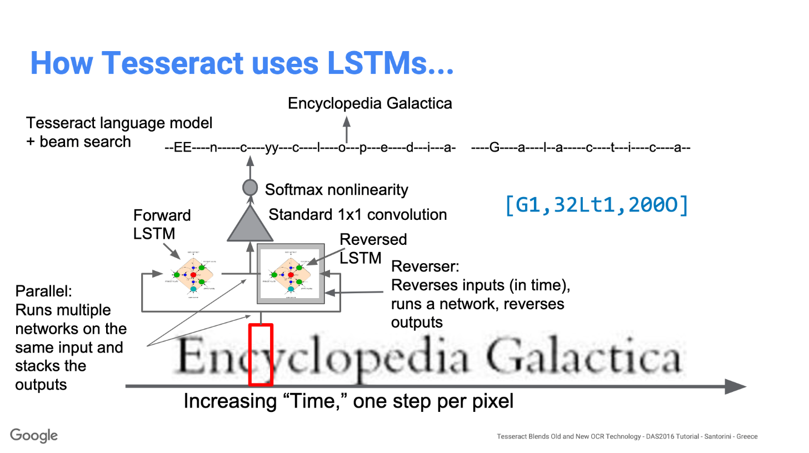
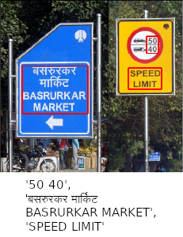
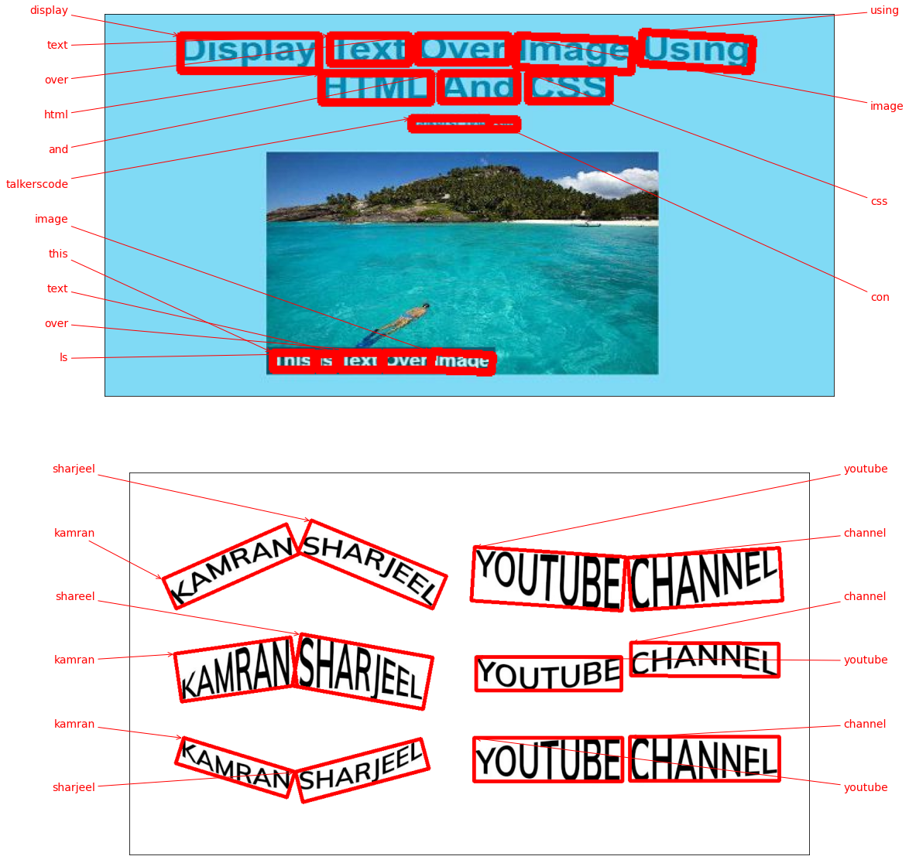

authors: Sparsh A.
categories: Tutorial
feedback link: https://github.com/recohut/reco-step/issues
id: ocr-in-python
status: Published
summary: We will learn different ways to perform optical character recognition tasks in python using open-source libraries.

---

# OCR in python

<!-- ------------------------ -->

## Introduction

Duration: 5


### What you'll learn?

We will learn different ways to perform optical character recognition tasks in python using open-source libraries.

### How it will work?

1. Tesseract OCR model
2. Image text recognition with KerasOCR
3. Image text recognition with EasyOCR
4. Arabic OCR to detect and comprehend Arabic language

### Who is this for?

- People who are new in deep learning and computer vision in particular
- People interested in learning OCR and Scene text detection/recognition methods

### Important resources

- [Notebook - TesseractOCR](https://nbviewer.jupyter.org/gist/sparsh-ai/2d1f533048a3655de625298c3dd32d47)
- [Notebook - EasyOCR](https://nbviewer.jupyter.org/gist/sparsh-ai/12359606ee4127513c66fc3b4ff18e5b)
- [Notebook - KerasOCR](https://nbviewer.jupyter.org/gist/sparsh-ai/2fcb764619baf5f56cf7122b1b2c527c)
- [Notebook - ArabicOCR](https://nbviewer.jupyter.org/gist/sparsh-ai/26df76b78f8cd2018a068b284b7cfe56)

<!---------------------------->

## Tesseract

Duration: 5

Tesseract is an open source text recognition (OCR) Engine, available under the Apache 2.0 license. It can be used directly, or (for programmers) using an API to extract printed text from images. It supports a wide variety of languages. Tesseract doesn't have a built-in GUI, but there are several available from the 3rdParty page. Tesseract is compatible with many programming languages and frameworks through wrappers that can be found here. It can be used with the existing layout analysis to recognize text within a large document, or it can be used in conjunction with an external text detector to recognize text from an image of a single text line.

Tesseract 4.00 includes a new neural network subsystem configured as a text line recognizer. It has its origins in [OCRopus' Python-based LSTM](https://github.com/tmbdev/ocropy) implementation but has been redesigned for Tesseract in C++. The neural network system in Tesseract pre-dates TensorFlow but is compatible with it, as there is a network description language called Variable Graph Specification Language (VGSL), that is also available for TensorFlow.

To recognize an image containing a single character, we typically use a Convolutional Neural Network (CNN). Text of arbitrary length is a sequence of characters, and such problems are solved using RNNs and LSTM is a popular form of RNN. Read this post to learn more about [LSTM](http://colah.github.io/posts/2015-08-Understanding-LSTMs/).



For this image:


Tesseract detected it like this:

```
LANDEYves @LANDEYves - 18h

"Je vais me faire un petit jeGne"
"Je vais me faire un petit jeune"

De l'importance de I'accent circonf
```

<!---------------------------->

## **EasyOCR**

Duration: 5

Ready-to-use OCR with 70+ languages supported including Chinese, Japanese, Korean and Thai. EasyOCR is built with Python and Pytorch deep learning library, having a GPU could speed up the whole process of detection. The detection part is using the CRAFT algorithm and the Recognition model is CRNN. It is composed of 3 main components, feature extraction (we are currently using Resnet), sequence labelling (LSTM) and decoding (CTC). EasyOCR doesn’t have much software dependencies, it can directly be used with its API.



<!---------------------------->

## KerasOCR

Duration: 5

This is a slightly polished and packaged version of the Keras CRNN implementation and the published CRAFT text detection model. It provides a high-level API for training a text detection and OCR pipeline and out-of-the-box OCR models, and an end-to-end training pipeline to build new OCR models.



<!---------------------------->

## ArabicOCR

Duration: 2

It is an OCR system for the Arabic language that converts images of typed text to machine-encoded text. It currently supports only letters (29 letters).  ArabicOCR aims to solve a simpler problem of OCR with images that contain only Arabic characters (check the dataset link below to see a sample of the images).

<!---------------------------->

## Conclusion

Duration: 2

Congratulations!

### What we've covered

1. Tesseract OCR model
2. Image text recognition with KerasOCR
3. Image text recognition with EasyOCR
4. Arabic OCR to detect and comprehend Arabic language

### Links and References

1. [https://nanonets.com/blog/ocr-with-tesseract/](https://nanonets.com/blog/ocr-with-tesseract/)
2. [https://github.com/JaidedAI/EasyOCR](https://github.com/JaidedAI/EasyOCR)

### Have a Question?

- [Fill out this form](https://form.jotform.com/211377288388469)
- [Raise issue on Github](https://github.com/recohut/reco-step/issues)