summary: In this tutorial, we will explore movielens dataset
id: movielens-data-exploration
categories: tutorial
tags: movie, eda
status: Published 
authors: Sparsh A.
Feedback Link: https://github.com/recohut/reco-step/issues

# Movielens Exploratory Data and Graph Analysis

<!-- ------------------------ -->
## Introduction
Duration: 5

### What you'll learn?
- How to perform EDA on recommender datasets
- How to explore graph patterns in the data

### Why is this important?
- EDA is an important step to understand data, before modeling
- In recommender systems, EDA is often overlooked and we often jump to data preprocessing and modeling process
- Movielens is a good dataset for explaining EDA process

### How it will work?
- Load the data
- Statistical analysis
- User data analysis
- Graph analysis

### Who is this for?
- People who are interested in understanding the data EDA process

### Important resources
- [Colab notebook](https://colab.research.google.com/gist/sparsh-ai/d2611797f5fbebc07c82a556ae0a85cd/recograph-06-movielens-network-visualization.ipynb)

<!-- ------------------------ -->
## Load the data
Duration: 2

The data file introduction is below:
1. **u.data**:   The full u data set, `100000 ratings` by `943 users` on `1682 items`. Each user has rated at least 20 movies.  Users and items are numbered consecutively from 1.  The data is randomly ordered. The time stamps are unix seconds since 1/1/1970 UTC.   

2. **u.item**: Information about the items (movies); The last `19 fields` are the genres, a 1 indicates the movie is of that genre, a 0 indicates it is not; movies can be in several genres at once. 

3. **u.genre**: A list of the genres.

4. **u.user**: Demographic information about the users

5. **u.occupation**: A list of the occupations.


```python
!wget http://files.grouplens.org/datasets/movielens/ml-100k.zip
!unzip ml-100k.zip
```

<!-- ------------------------ -->
## Movie data analysis
Duration: 15


```python
############################### Genre of the movies ############################### 
genre_data= pd.read_csv('ml-100k/u.genre',sep='|',names=["movie_type", "type_id"])
genre_data.head()
```


<div>
<style scoped>
    .dataframe tbody tr th:only-of-type {
        vertical-align: middle;
    }

    .dataframe tbody tr th {
        vertical-align: top;
    }

    .dataframe thead th {
        text-align: right;
    }
</style>
<table border="1" class="dataframe">
  <thead>
    <tr style="text-align: right;">
      <th></th>
      <th>movie_type</th>
      <th>type_id</th>
    </tr>
  </thead>
  <tbody>
    <tr>
      <th>0</th>
      <td>unknown</td>
      <td>0</td>
    </tr>
    <tr>
      <th>1</th>
      <td>Action</td>
      <td>1</td>
    </tr>
    <tr>
      <th>2</th>
      <td>Adventure</td>
      <td>2</td>
    </tr>
    <tr>
      <th>3</th>
      <td>Animation</td>
      <td>3</td>
    </tr>
    <tr>
      <th>4</th>
      <td>Children's</td>
      <td>4</td>
    </tr>
  </tbody>
</table>
</div>


```python
genre_cls = ["unknown", "Action", "Adventure", "Animation", \
              "Childrens", "Comedy", "Crime", "Documentary", "Drama", "Fantasy", "Film-Noir", "Horror", "Musical", "Mystery", "Romance", \
              "Sci-Fi", "Thriller", "War", "Western"]
```


```python
############################### Information about the items (movies) ###############################
column_names = ["movie_id", "movie_title", "release_date", "video_release_date", "IMDb_URL", "unknown", "Action", "Adventure", "Animation", \
              "Childrens", "Comedy", "Crime", "Documentary", "Drama", "Fantasy", "Film-Noir", "Horror", "Musical", "Mystery", "Romance", \
              "Sci-Fi", "Thriller", "War", "Western"]
movies_data = pd.read_csv('ml-100k/u.item',sep='|', names=column_names,encoding = "ISO-8859-1")
movies_data['release_date'] = pd.to_datetime(movies_data['release_date'])
movies_data.rename(columns = {'movie_id':'item_id'}, inplace = True) 
movies_data
```


<div>
<style scoped>
    .dataframe tbody tr th:only-of-type {
        vertical-align: middle;
    }

    .dataframe tbody tr th {
        vertical-align: top;
    }

    .dataframe thead th {
        text-align: right;
    }
</style>
<table border="1" class="dataframe">
  <thead>
    <tr style="text-align: right;">
      <th></th>
      <th>item_id</th>
      <th>movie_title</th>
      <th>release_date</th>
      <th>video_release_date</th>
      <th>IMDb_URL</th>
      <th>unknown</th>
      <th>Action</th>
      <th>Adventure</th>
      <th>Animation</th>
      <th>Childrens</th>
      <th>Comedy</th>
      <th>Crime</th>
      <th>Documentary</th>
      <th>Drama</th>
      <th>Fantasy</th>
      <th>Film-Noir</th>
      <th>Horror</th>
      <th>Musical</th>
      <th>Mystery</th>
      <th>Romance</th>
      <th>Sci-Fi</th>
      <th>Thriller</th>
      <th>War</th>
      <th>Western</th>
    </tr>
  </thead>
  <tbody>
    <tr>
      <th>0</th>
      <td>1</td>
      <td>Toy Story (1995)</td>
      <td>1995-01-01</td>
      <td>NaN</td>
      <td>http://us.imdb.com/M/title-exact?Toy%20Story%2...</td>
      <td>0</td>
      <td>0</td>
      <td>0</td>
      <td>1</td>
      <td>1</td>
      <td>1</td>
      <td>0</td>
      <td>0</td>
      <td>0</td>
      <td>0</td>
      <td>0</td>
      <td>0</td>
      <td>0</td>
      <td>0</td>
      <td>0</td>
      <td>0</td>
      <td>0</td>
      <td>0</td>
      <td>0</td>
    </tr>
    <tr>
      <th>1</th>
      <td>2</td>
      <td>GoldenEye (1995)</td>
      <td>1995-01-01</td>
      <td>NaN</td>
      <td>http://us.imdb.com/M/title-exact?GoldenEye%20(...</td>
      <td>0</td>
      <td>1</td>
      <td>1</td>
      <td>0</td>
      <td>0</td>
      <td>0</td>
      <td>0</td>
      <td>0</td>
      <td>0</td>
      <td>0</td>
      <td>0</td>
      <td>0</td>
      <td>0</td>
      <td>0</td>
      <td>0</td>
      <td>0</td>
      <td>1</td>
      <td>0</td>
      <td>0</td>
    </tr>
    <tr>
      <th>2</th>
      <td>3</td>
      <td>Four Rooms (1995)</td>
      <td>1995-01-01</td>
      <td>NaN</td>
      <td>http://us.imdb.com/M/title-exact?Four%20Rooms%...</td>
      <td>0</td>
      <td>0</td>
      <td>0</td>
      <td>0</td>
      <td>0</td>
      <td>0</td>
      <td>0</td>
      <td>0</td>
      <td>0</td>
      <td>0</td>
      <td>0</td>
      <td>0</td>
      <td>0</td>
      <td>0</td>
      <td>0</td>
      <td>0</td>
      <td>1</td>
      <td>0</td>
      <td>0</td>
    </tr>
    <tr>
      <th>3</th>
      <td>4</td>
      <td>Get Shorty (1995)</td>
      <td>1995-01-01</td>
      <td>NaN</td>
      <td>http://us.imdb.com/M/title-exact?Get%20Shorty%...</td>
      <td>0</td>
      <td>1</td>
      <td>0</td>
      <td>0</td>
      <td>0</td>
      <td>1</td>
      <td>0</td>
      <td>0</td>
      <td>1</td>
      <td>0</td>
      <td>0</td>
      <td>0</td>
      <td>0</td>
      <td>0</td>
      <td>0</td>
      <td>0</td>
      <td>0</td>
      <td>0</td>
      <td>0</td>
    </tr>
    <tr>
      <th>4</th>
      <td>5</td>
      <td>Copycat (1995)</td>
      <td>1995-01-01</td>
      <td>NaN</td>
      <td>http://us.imdb.com/M/title-exact?Copycat%20(1995)</td>
      <td>0</td>
      <td>0</td>
      <td>0</td>
      <td>0</td>
      <td>0</td>
      <td>0</td>
      <td>1</td>
      <td>0</td>
      <td>1</td>
      <td>0</td>
      <td>0</td>
      <td>0</td>
      <td>0</td>
      <td>0</td>
      <td>0</td>
      <td>0</td>
      <td>1</td>
      <td>0</td>
      <td>0</td>
    </tr>
    <tr>
      <th>...</th>
      <td>...</td>
      <td>...</td>
      <td>...</td>
      <td>...</td>
      <td>...</td>
      <td>...</td>
      <td>...</td>
      <td>...</td>
      <td>...</td>
      <td>...</td>
      <td>...</td>
      <td>...</td>
      <td>...</td>
      <td>...</td>
      <td>...</td>
      <td>...</td>
      <td>...</td>
      <td>...</td>
      <td>...</td>
      <td>...</td>
      <td>...</td>
      <td>...</td>
      <td>...</td>
      <td>...</td>
    </tr>
    <tr>
      <th>1677</th>
      <td>1678</td>
      <td>Mat' i syn (1997)</td>
      <td>1998-02-06</td>
      <td>NaN</td>
      <td>http://us.imdb.com/M/title-exact?Mat%27+i+syn+...</td>
      <td>0</td>
      <td>0</td>
      <td>0</td>
      <td>0</td>
      <td>0</td>
      <td>0</td>
      <td>0</td>
      <td>0</td>
      <td>1</td>
      <td>0</td>
      <td>0</td>
      <td>0</td>
      <td>0</td>
      <td>0</td>
      <td>0</td>
      <td>0</td>
      <td>0</td>
      <td>0</td>
      <td>0</td>
    </tr>
    <tr>
      <th>1678</th>
      <td>1679</td>
      <td>B. Monkey (1998)</td>
      <td>1998-02-06</td>
      <td>NaN</td>
      <td>http://us.imdb.com/M/title-exact?B%2E+Monkey+(...</td>
      <td>0</td>
      <td>0</td>
      <td>0</td>
      <td>0</td>
      <td>0</td>
      <td>0</td>
      <td>0</td>
      <td>0</td>
      <td>0</td>
      <td>0</td>
      <td>0</td>
      <td>0</td>
      <td>0</td>
      <td>0</td>
      <td>1</td>
      <td>0</td>
      <td>1</td>
      <td>0</td>
      <td>0</td>
    </tr>
    <tr>
      <th>1679</th>
      <td>1680</td>
      <td>Sliding Doors (1998)</td>
      <td>1998-01-01</td>
      <td>NaN</td>
      <td>http://us.imdb.com/Title?Sliding+Doors+(1998)</td>
      <td>0</td>
      <td>0</td>
      <td>0</td>
      <td>0</td>
      <td>0</td>
      <td>0</td>
      <td>0</td>
      <td>0</td>
      <td>1</td>
      <td>0</td>
      <td>0</td>
      <td>0</td>
      <td>0</td>
      <td>0</td>
      <td>1</td>
      <td>0</td>
      <td>0</td>
      <td>0</td>
      <td>0</td>
    </tr>
    <tr>
      <th>1680</th>
      <td>1681</td>
      <td>You So Crazy (1994)</td>
      <td>1994-01-01</td>
      <td>NaN</td>
      <td>http://us.imdb.com/M/title-exact?You%20So%20Cr...</td>
      <td>0</td>
      <td>0</td>
      <td>0</td>
      <td>0</td>
      <td>0</td>
      <td>1</td>
      <td>0</td>
      <td>0</td>
      <td>0</td>
      <td>0</td>
      <td>0</td>
      <td>0</td>
      <td>0</td>
      <td>0</td>
      <td>0</td>
      <td>0</td>
      <td>0</td>
      <td>0</td>
      <td>0</td>
    </tr>
    <tr>
      <th>1681</th>
      <td>1682</td>
      <td>Scream of Stone (Schrei aus Stein) (1991)</td>
      <td>1996-03-08</td>
      <td>NaN</td>
      <td>http://us.imdb.com/M/title-exact?Schrei%20aus%...</td>
      <td>0</td>
      <td>0</td>
      <td>0</td>
      <td>0</td>
      <td>0</td>
      <td>0</td>
      <td>0</td>
      <td>0</td>
      <td>1</td>
      <td>0</td>
      <td>0</td>
      <td>0</td>
      <td>0</td>
      <td>0</td>
      <td>0</td>
      <td>0</td>
      <td>0</td>
      <td>0</td>
      <td>0</td>
    </tr>
  </tbody>
</table>
<p>1682 rows × 24 columns</p>
</div>


### Duplicated records
We found that there are movies that share exactly the same information but with different item_id (primary key). And there are exactly 18 movies that has such a duplication so in total 36 records that are not unique. We deal with these duplications later on, after checking if the original and the duplicate are both rated by users.


```python
duplicated = movies_data[movies_data.duplicated('movie_title', False)].sort_values(by = 'movie_title')
duplicated.head()
```


<div>
<style scoped>
    .dataframe tbody tr th:only-of-type {
        vertical-align: middle;
    }

    .dataframe tbody tr th {
        vertical-align: top;
    }

    .dataframe thead th {
        text-align: right;
    }
</style>
<table border="1" class="dataframe">
  <thead>
    <tr style="text-align: right;">
      <th></th>
      <th>item_id</th>
      <th>movie_title</th>
      <th>release_date</th>
      <th>video_release_date</th>
      <th>IMDb_URL</th>
      <th>unknown</th>
      <th>Action</th>
      <th>Adventure</th>
      <th>Animation</th>
      <th>Childrens</th>
      <th>Comedy</th>
      <th>Crime</th>
      <th>Documentary</th>
      <th>Drama</th>
      <th>Fantasy</th>
      <th>Film-Noir</th>
      <th>Horror</th>
      <th>Musical</th>
      <th>Mystery</th>
      <th>Romance</th>
      <th>Sci-Fi</th>
      <th>Thriller</th>
      <th>War</th>
      <th>Western</th>
    </tr>
  </thead>
  <tbody>
    <tr>
      <th>669</th>
      <td>670</td>
      <td>Body Snatchers (1993)</td>
      <td>1993-01-01</td>
      <td>NaN</td>
      <td>http://us.imdb.com/M/title-exact?Body%20Snatch...</td>
      <td>0</td>
      <td>0</td>
      <td>0</td>
      <td>0</td>
      <td>0</td>
      <td>0</td>
      <td>0</td>
      <td>0</td>
      <td>0</td>
      <td>0</td>
      <td>0</td>
      <td>1</td>
      <td>0</td>
      <td>0</td>
      <td>0</td>
      <td>1</td>
      <td>1</td>
      <td>0</td>
      <td>0</td>
    </tr>
    <tr>
      <th>572</th>
      <td>573</td>
      <td>Body Snatchers (1993)</td>
      <td>1993-01-01</td>
      <td>NaN</td>
      <td>http://us.imdb.com/M/title-exact?Body%20Snatch...</td>
      <td>0</td>
      <td>0</td>
      <td>0</td>
      <td>0</td>
      <td>0</td>
      <td>0</td>
      <td>0</td>
      <td>0</td>
      <td>0</td>
      <td>0</td>
      <td>0</td>
      <td>1</td>
      <td>0</td>
      <td>0</td>
      <td>0</td>
      <td>1</td>
      <td>1</td>
      <td>0</td>
      <td>0</td>
    </tr>
    <tr>
      <th>1649</th>
      <td>1650</td>
      <td>Butcher Boy, The (1998)</td>
      <td>1998-01-01</td>
      <td>NaN</td>
      <td>http://us.imdb.com/M/title-exact?imdb-title-11...</td>
      <td>0</td>
      <td>0</td>
      <td>0</td>
      <td>0</td>
      <td>0</td>
      <td>0</td>
      <td>0</td>
      <td>0</td>
      <td>1</td>
      <td>0</td>
      <td>0</td>
      <td>0</td>
      <td>0</td>
      <td>0</td>
      <td>0</td>
      <td>0</td>
      <td>0</td>
      <td>0</td>
      <td>0</td>
    </tr>
    <tr>
      <th>1644</th>
      <td>1645</td>
      <td>Butcher Boy, The (1998)</td>
      <td>1998-01-01</td>
      <td>NaN</td>
      <td>http://us.imdb.com/M/title-exact?imdb-title-11...</td>
      <td>0</td>
      <td>0</td>
      <td>0</td>
      <td>0</td>
      <td>0</td>
      <td>0</td>
      <td>0</td>
      <td>0</td>
      <td>1</td>
      <td>0</td>
      <td>0</td>
      <td>0</td>
      <td>0</td>
      <td>0</td>
      <td>0</td>
      <td>0</td>
      <td>0</td>
      <td>0</td>
      <td>0</td>
    </tr>
    <tr>
      <th>1233</th>
      <td>1234</td>
      <td>Chairman of the Board (1998)</td>
      <td>1998-01-01</td>
      <td>NaN</td>
      <td>http://us.imdb.com/Title?Chairman+of+the+Board...</td>
      <td>0</td>
      <td>0</td>
      <td>0</td>
      <td>0</td>
      <td>0</td>
      <td>1</td>
      <td>0</td>
      <td>0</td>
      <td>0</td>
      <td>0</td>
      <td>0</td>
      <td>0</td>
      <td>0</td>
      <td>0</td>
      <td>0</td>
      <td>0</td>
      <td>0</td>
      <td>0</td>
      <td>0</td>
    </tr>
  </tbody>
</table>
</div>


### NaN record
We find that there is a record contains NaN for most of its attributes. However, we later on also found that there are users who did rate this item. So we decide not to drop this record.


```python
movies_data[movies_data.release_date.isnull()]
```


<div>
<style scoped>
    .dataframe tbody tr th:only-of-type {
        vertical-align: middle;
    }

    .dataframe tbody tr th {
        vertical-align: top;
    }

    .dataframe thead th {
        text-align: right;
    }
</style>
<table border="1" class="dataframe">
  <thead>
    <tr style="text-align: right;">
      <th></th>
      <th>item_id</th>
      <th>movie_title</th>
      <th>release_date</th>
      <th>video_release_date</th>
      <th>IMDb_URL</th>
      <th>unknown</th>
      <th>Action</th>
      <th>Adventure</th>
      <th>Animation</th>
      <th>Childrens</th>
      <th>Comedy</th>
      <th>Crime</th>
      <th>Documentary</th>
      <th>Drama</th>
      <th>Fantasy</th>
      <th>Film-Noir</th>
      <th>Horror</th>
      <th>Musical</th>
      <th>Mystery</th>
      <th>Romance</th>
      <th>Sci-Fi</th>
      <th>Thriller</th>
      <th>War</th>
      <th>Western</th>
    </tr>
  </thead>
  <tbody>
    <tr>
      <th>266</th>
      <td>267</td>
      <td>unknown</td>
      <td>NaT</td>
      <td>NaN</td>
      <td>NaN</td>
      <td>1</td>
      <td>0</td>
      <td>0</td>
      <td>0</td>
      <td>0</td>
      <td>0</td>
      <td>0</td>
      <td>0</td>
      <td>0</td>
      <td>0</td>
      <td>0</td>
      <td>0</td>
      <td>0</td>
      <td>0</td>
      <td>0</td>
      <td>0</td>
      <td>0</td>
      <td>0</td>
      <td>0</td>
    </tr>
  </tbody>
</table>
</div>


```python
movies_data[movies_data.index == 266]
```


<div>
<style scoped>
    .dataframe tbody tr th:only-of-type {
        vertical-align: middle;
    }

    .dataframe tbody tr th {
        vertical-align: top;
    }

    .dataframe thead th {
        text-align: right;
    }
</style>
<table border="1" class="dataframe">
  <thead>
    <tr style="text-align: right;">
      <th></th>
      <th>item_id</th>
      <th>movie_title</th>
      <th>release_date</th>
      <th>video_release_date</th>
      <th>IMDb_URL</th>
      <th>unknown</th>
      <th>Action</th>
      <th>Adventure</th>
      <th>Animation</th>
      <th>Childrens</th>
      <th>Comedy</th>
      <th>Crime</th>
      <th>Documentary</th>
      <th>Drama</th>
      <th>Fantasy</th>
      <th>Film-Noir</th>
      <th>Horror</th>
      <th>Musical</th>
      <th>Mystery</th>
      <th>Romance</th>
      <th>Sci-Fi</th>
      <th>Thriller</th>
      <th>War</th>
      <th>Western</th>
    </tr>
  </thead>
  <tbody>
    <tr>
      <th>266</th>
      <td>267</td>
      <td>unknown</td>
      <td>NaT</td>
      <td>NaN</td>
      <td>NaN</td>
      <td>1</td>
      <td>0</td>
      <td>0</td>
      <td>0</td>
      <td>0</td>
      <td>0</td>
      <td>0</td>
      <td>0</td>
      <td>0</td>
      <td>0</td>
      <td>0</td>
      <td>0</td>
      <td>0</td>
      <td>0</td>
      <td>0</td>
      <td>0</td>
      <td>0</td>
      <td>0</td>
      <td>0</td>
    </tr>
  </tbody>
</table>
</div>


### Year Cleaning
The movies lie in a span of 77 years.


```python
l = sorted(movies_data.release_date.dt.year.unique().tolist())
max(l)  - min(l) + 1
```


    77.0


### Histogram of movies w.r.t. release year


```python
movies_data.release_date.hist(bins = 77, figsize = (10, 10))
```


    <matplotlib.axes._subplots.AxesSubplot at 0x7f6521f34690>


    
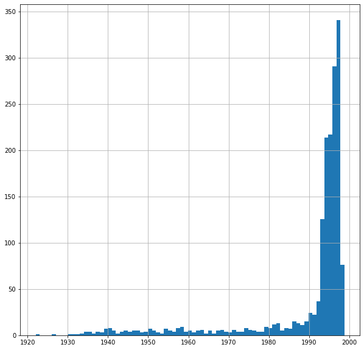
    


Observing from the histogram showing the number of movies for each each, we notice that the movies mainly are released during 1990 and 1998. In order to facilitate the computation of similarity, we wish to aggregate years in which too few moives are released.


```python
def compute_year_label(row):
    year = row['release_date'].year
    
    if year <= 1990 or np.isnan(year):
        return 1990
    else:
        return year
```


```python
movies_data['year_label'] = movies_data.apply(lambda row: compute_year_label(row), axis = 1)
```


```python
movies_data.year_label.unique()
```


    array([1995, 1996, 1994, 1990, 1993, 1992, 1991, 1997, 1998])


### Histogram of movies under each year label.


```python
movies_data.year_label.value_counts().sort_index()\
.plot(kind = 'bar', rot = 45, figsize = (10, 6), title = 'Distribution of Movies Across Years')
```


    <matplotlib.axes._subplots.AxesSubplot at 0x7f6521e81fd0>


    
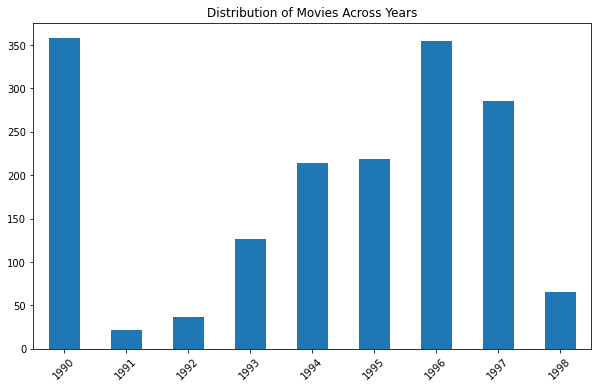
    


### The number of movies that falls in each genre.


```python
movies_data.sum()[movies_data.columns[5:-1]].plot(kind = 'bar', figsize = (15, 5), rot = 45)
```


    <matplotlib.axes._subplots.AxesSubplot at 0x7f65218ae0d0>


    
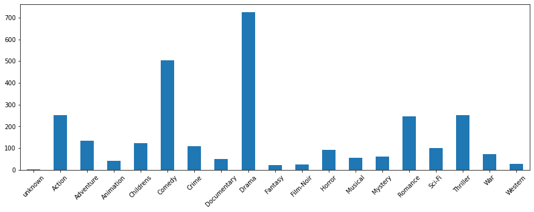
    


Below we take a glimpse of the percentage of each genere's movies in each year.


```python
movies_data[movies_data.movie_title != 'unknown'].groupby('year_label').sum()[genre_cls].T\
        .plot(kind = 'bar', rot=45, figsize=(15,8), title = 'Distribution of Movie Genre')
```


    <matplotlib.axes._subplots.AxesSubplot at 0x7f6521801290>


    
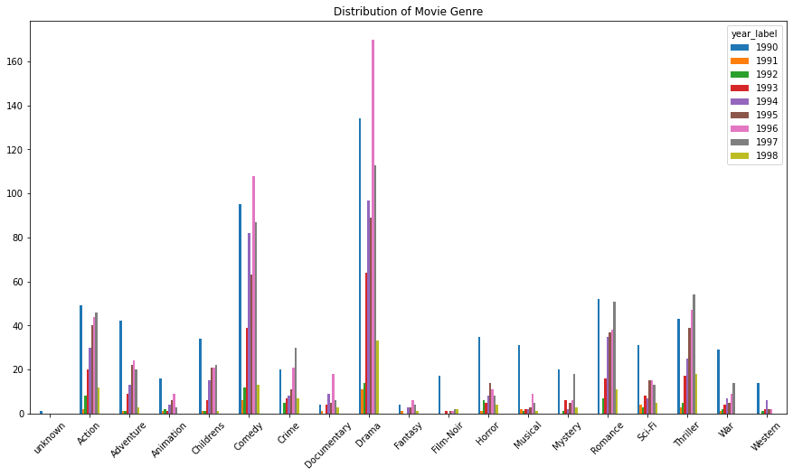
    


Below we take a look at year 1995 - 1998 as an exmaple.


```python
movie_1995 = movies_data[movies_data['release_date'].dt.year == 1995]
movie_1996 = movies_data[movies_data['release_date'].dt.year == 1996]
movie_1997 = movies_data[movies_data['release_date'].dt.year == 1997]
movie_1998 = movies_data[movies_data['release_date'].dt.year == 1998]
```


```python
Year = {}
Year[1995] = movie_1995[genre_cls].sum()/len(movie_1995)
Year[1996] = movie_1996[genre_cls].sum()/len(movie_1996)
Year[1997] = movie_1997[genre_cls].sum()/len(movie_1997)
Year[1998] = movie_1998[genre_cls].sum()/len(movie_1998)
movie_year = pd.DataFrame(Year) 
axes = movie_year.plot.bar(rot=45,figsize=(15,7))
axes.set_title('genres percentage over year')
```


    Text(0.5, 1.0, 'genres percentage over year')


    
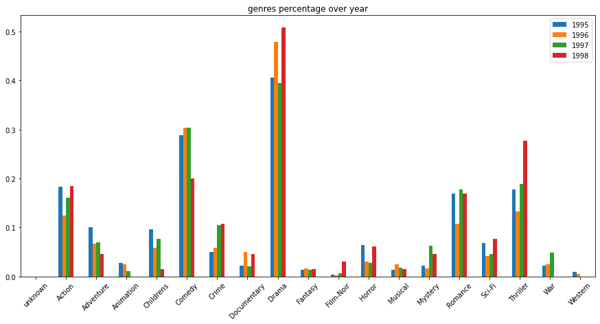
    


We conclude that the distribution of movie genres are generally balanced and hence are not biased.

<!-- ------------------------ -->
## User data analysis
Duration: 15


```python
############################### Demographic information about the users ###############################
column_names = ["user_id", "age", "gender", "occupation", "zip_code"]
user_data = pd.read_csv('ml-100k/u.user',sep='|', names=column_names)
user_data
```


<div>
<style scoped>
    .dataframe tbody tr th:only-of-type {
        vertical-align: middle;
    }

    .dataframe tbody tr th {
        vertical-align: top;
    }

    .dataframe thead th {
        text-align: right;
    }
</style>
<table border="1" class="dataframe">
  <thead>
    <tr style="text-align: right;">
      <th></th>
      <th>user_id</th>
      <th>age</th>
      <th>gender</th>
      <th>occupation</th>
      <th>zip_code</th>
    </tr>
  </thead>
  <tbody>
    <tr>
      <th>0</th>
      <td>1</td>
      <td>24</td>
      <td>M</td>
      <td>technician</td>
      <td>85711</td>
    </tr>
    <tr>
      <th>1</th>
      <td>2</td>
      <td>53</td>
      <td>F</td>
      <td>other</td>
      <td>94043</td>
    </tr>
    <tr>
      <th>2</th>
      <td>3</td>
      <td>23</td>
      <td>M</td>
      <td>writer</td>
      <td>32067</td>
    </tr>
    <tr>
      <th>3</th>
      <td>4</td>
      <td>24</td>
      <td>M</td>
      <td>technician</td>
      <td>43537</td>
    </tr>
    <tr>
      <th>4</th>
      <td>5</td>
      <td>33</td>
      <td>F</td>
      <td>other</td>
      <td>15213</td>
    </tr>
    <tr>
      <th>...</th>
      <td>...</td>
      <td>...</td>
      <td>...</td>
      <td>...</td>
      <td>...</td>
    </tr>
    <tr>
      <th>938</th>
      <td>939</td>
      <td>26</td>
      <td>F</td>
      <td>student</td>
      <td>33319</td>
    </tr>
    <tr>
      <th>939</th>
      <td>940</td>
      <td>32</td>
      <td>M</td>
      <td>administrator</td>
      <td>02215</td>
    </tr>
    <tr>
      <th>940</th>
      <td>941</td>
      <td>20</td>
      <td>M</td>
      <td>student</td>
      <td>97229</td>
    </tr>
    <tr>
      <th>941</th>
      <td>942</td>
      <td>48</td>
      <td>F</td>
      <td>librarian</td>
      <td>78209</td>
    </tr>
    <tr>
      <th>942</th>
      <td>943</td>
      <td>22</td>
      <td>M</td>
      <td>student</td>
      <td>77841</td>
    </tr>
  </tbody>
</table>
<p>943 rows × 5 columns</p>
</div>


```python
############################### A list of the occupations(the jobs types of users). ############################### 
occupation_data = pd.read_csv('ml-100k/u.occupation',sep='|',names=["occupation"])
occupation_data = occupation_data.reset_index().rename(columns={'index':'occupation_id'})

occupation_data.head()
```


<div>
<style scoped>
    .dataframe tbody tr th:only-of-type {
        vertical-align: middle;
    }

    .dataframe tbody tr th {
        vertical-align: top;
    }

    .dataframe thead th {
        text-align: right;
    }
</style>
<table border="1" class="dataframe">
  <thead>
    <tr style="text-align: right;">
      <th></th>
      <th>occupation_id</th>
      <th>occupation</th>
    </tr>
  </thead>
  <tbody>
    <tr>
      <th>0</th>
      <td>0</td>
      <td>administrator</td>
    </tr>
    <tr>
      <th>1</th>
      <td>1</td>
      <td>artist</td>
    </tr>
    <tr>
      <th>2</th>
      <td>2</td>
      <td>doctor</td>
    </tr>
    <tr>
      <th>3</th>
      <td>3</td>
      <td>educator</td>
    </tr>
    <tr>
      <th>4</th>
      <td>4</td>
      <td>engineer</td>
    </tr>
  </tbody>
</table>
</div>


### Gender


```python
user_data['gender'].value_counts().plot(kind='pie', autopct='%1.1f%%')
```


    <matplotlib.axes._subplots.AxesSubplot at 0x7f6521310290>


    
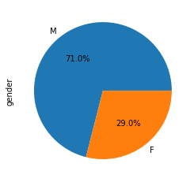
    


### Age


```python
user_data['age'].value_counts().plot(kind='pie', autopct='%1.1f%%',figsize=(8,8))
```


    <matplotlib.axes._subplots.AxesSubplot at 0x7f65212ef2d0>


    
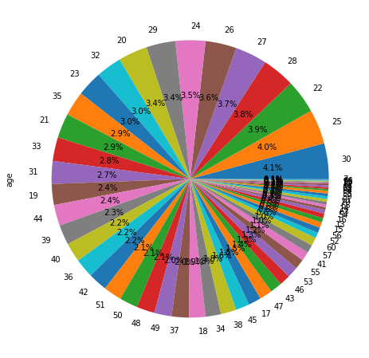
    


### Occupation


```python
user_data['occupation'].value_counts().plot(kind='pie', autopct='%1.1f%%',figsize=(8,8))
```


    <matplotlib.axes._subplots.AxesSubplot at 0x7f652110fc10>


    
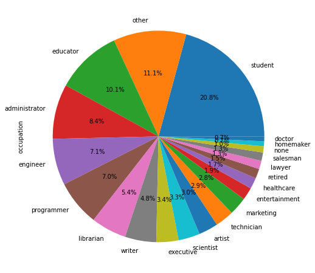
    


### Location

We wish to find the geographical distribution of the users and to show them on a map. The only information we are given about this is the zip code and we find out there are only two countries involving these zip codes: America and Canada. And below we find out the number of users in Canada.


```python
canada = 0
for i in range(len(user_data)):
    if user_data.loc[i].zip_code.isdigit() == False:
        canada += 1

canada
```


    18


Geopy is used to find the exact coordinate corresponding to a zip code. And this information is stored in a dictionary.


```python
code_table = {x: (0, 0) for x in user_data.zip_code.unique().tolist()}

from geopy.geocoders import Nominatim
geolocator = Nominatim(user_agent="liu")

for zip_code in code_table:
    if code_table[zip_code] != (0, 0):
        continue
    
    query_code = zip_code
    
    if query_code.isdigit() == False:
        continue

    # location = location = geolocator.geocode(query_code, country_codes = ['US'], timeout = 10)
    location = location = geolocator.geocode(query_code, timeout = 10)
    if not location:
        continue
    code_table[zip_code] = (location.latitude, location.longitude)
```


```python
user_data['coordinate'] = user_data.apply(lambda row: code_table[row['zip_code']], axis = 1)
```


```python
user_data.head()
```


<div>
<style scoped>
    .dataframe tbody tr th:only-of-type {
        vertical-align: middle;
    }

    .dataframe tbody tr th {
        vertical-align: top;
    }

    .dataframe thead th {
        text-align: right;
    }
</style>
<table border="1" class="dataframe">
  <thead>
    <tr style="text-align: right;">
      <th></th>
      <th>user_id</th>
      <th>age</th>
      <th>gender</th>
      <th>occupation</th>
      <th>zip_code</th>
      <th>coordinate</th>
    </tr>
  </thead>
  <tbody>
    <tr>
      <th>0</th>
      <td>1</td>
      <td>24</td>
      <td>M</td>
      <td>technician</td>
      <td>85711</td>
      <td>(47.85214441225751, 37.78990982662502)</td>
    </tr>
    <tr>
      <th>1</th>
      <td>2</td>
      <td>53</td>
      <td>F</td>
      <td>other</td>
      <td>94043</td>
      <td>(37.40699294726802, -122.08883939781505)</td>
    </tr>
    <tr>
      <th>2</th>
      <td>3</td>
      <td>23</td>
      <td>M</td>
      <td>writer</td>
      <td>32067</td>
      <td>(24.974616313832115, 121.25945677410526)</td>
    </tr>
    <tr>
      <th>3</th>
      <td>4</td>
      <td>24</td>
      <td>M</td>
      <td>technician</td>
      <td>43537</td>
      <td>(41.57806694508656, -83.6802562611722)</td>
    </tr>
    <tr>
      <th>4</th>
      <td>5</td>
      <td>33</td>
      <td>F</td>
      <td>other</td>
      <td>15213</td>
      <td>(40.44449552294444, -79.95342923046202)</td>
    </tr>
  </tbody>
</table>
</div>


```python
map2 = folium.Map(location=[38.9, -77.05], zoom_start=11)

from folium.plugins import MarkerCluster
marker_cluster = MarkerCluster().add_to(map2)


for i in range(0, len(user_data)):
    if user_data.loc[i].coordinate == (0, 0) or user_data.loc[i].zip_code.isdigit() == False:
        continue
    folium.Marker(user_data.iloc[i].coordinate, popup=str(user_data.loc[i].user_id), icon=folium.Icon(color='darkblue', icon_color='white', icon='male', angle=0, prefix='fa')).add_to(marker_cluster)

map2
```


<div style="width:100%;"><div style="position:relative;width:100%;height:0;padding-bottom:60%;"><span style="color:#565656">Make this Notebook Trusted to load map: File -> Trust Notebook</span><iframe src="about:blank" style="position:absolute;width:100%;height:100%;left:0;top:0;border:none !important;" data-html=%3C%21DOCTYPE%20html%3E%0A%3Chead%3E%20%20%20%20%0A%20%20%20%20%3Cmeta%20http-equiv%3D%22content-type%22%20content%3D%22text/html%3B%20charset%3DUTF-8%22%20/%3E%0A%20%20%20%20%3Cscript%3EL_PREFER_CANVAS%3Dfalse%3B%20L_NO_TOUCH%3Dfalse%3B%20L_DISABLE_3D%3Dfalse%3B%3C/script%3E%0A%20%20%20%20%3Cscript%20src%3D%22https%3A//cdn.jsdelivr.net/npm/leaflet%401.4.0/dist/leaflet.js%22%3E%3C/script%3E%0A%20%20%20%20%3Cscript%20src%3D%22https%3A//code.jquery.com/jquery-1.12.4.min.js%22%3E%3C/script%3E%0A%20%20%20%20%3Cscript%20src%3D%22https%3A//maxcdn.bootstrapcdn.com/bootstrap/3.2.0/js/bootstrap.min.js%22%3E%3C/script%3E%0A%20%20%20%20%3Cscript%20src%3D%22https%3A//cdnjs.cloudflare.com/ajax/libs/Leaflet.awesome-markers/2.0.2/leaflet.awesome-markers.js%22%3E%3C/script%3E%0A%20%20%20%20%3Clink%20rel%3D%22stylesheet%22%20href%3D%22https%3A//cdn.jsdelivr.net/npm/leaflet%401.4.0/dist/leaflet.css%22/%3E%0A%20%20%20%20%3Clink%20rel%3D%22stylesheet%22%20href%3D%22https%3A//maxcdn.bootstrapcdn.com/bootstrap/3.2.0/css/bootstrap.min.css%22/%3E%0A%20%20%20%20%3Clink%20rel%3D%22stylesheet%22%20href%3D%22https%3A//maxcdn.bootstrapcdn.com/bootstrap/3.2.0/css/bootstrap-theme.min.css%22/%3E%0A%20%20%20%20%3Clink%20rel%3D%22stylesheet%22%20href%3D%22https%3A//maxcdn.bootstrapcdn.com/font-awesome/4.6.3/css/font-awesome.min.css%22/%3E%0A%20%20%20%20%3Clink%20rel%3D%22stylesheet%22%20href%3D%22https%3A//cdnjs.cloudflare.com/ajax/libs/Leaflet.awesome-markers/2.0.2/leaflet.awesome-markers.css%22/%3E%0A%20%20%20%20%3Clink%20rel%3D%22stylesheet%22%20href%3D%22https%3A//rawcdn.githack.com/python-visualization/folium/master/folium/templates/leaflet.awesome.rotate.css%22/%3E%0A%20%20%20%20%3Cstyle%3Ehtml%2C%20body%20%7Bwidth%3A%20100%25%3Bheight%3A%20100%25%3Bmargin%3A%200%3Bpadding%3A%200%3B%7D%3C/style%3E%0A%20%20%20%20%3Cstyle%3E%23map%20%7Bposition%3Aabsolute%3Btop%3A0%3Bbottom%3A0%3Bright%3A0%3Bleft%3A0%3B%7D%3C/style%3E%0A%20%20%20%20%0A%20%20%20%20%3Cmeta%20name%3D%22viewport%22%20content%3D%22width%3Ddevice-width%2C%0A%20%20%20%20%20%20%20%20initial-scale%3D1.0%2C%20maximum-scale%3D1.0%2C%20user-scalable%3Dno%22%20/%3E%0A%20%20%20%20%3Cstyle%3E%23map_7ceb999e9a0c4ef38b18f726003a7185%20%7B%0A%20%20%20%20%20%20%20%20position%3A%20relative%3B%0A%20%20%20%20%20%20%20%20width%3A%20100.0%25%3B%0A%20%20%20%20%20%20%20%20height%3A%20100.0%25%3B%0A%20%20%20%20%20%20%20%20left%3A%200.0%25%3B%0A%20%20%20%20%20%20%20%20top%3A%200.0%25%3B%0A%20%20%20%20%20%20%20%20%7D%0A%20%20%20%20%3C/style%3E%0A%20%20%20%20%3Cscript%20src%3D%22https%3A//cdnjs.cloudflare.com/ajax/libs/leaflet.markercluster/1.1.0/leaflet.markercluster.js%22%3E%3C/script%3E%0A%20%20%20%20%3Clink%20rel%3D%22stylesheet%22%20href%3D%22https%3A//cdnjs.cloudflare.com/ajax/libs/leaflet.markercluster/1.1.0/MarkerCluster.css%22/%3E%0A%20%20%20%20%3Clink%20rel%3D%22stylesheet%22%20href%3D%22https%3A//cdnjs.cloudflare.com/ajax/libs/leaflet.markercluster/1.1.0/MarkerCluster.Default.css%22/%3E%0A%3C/head%3E%0A%3Cbody%3E%20%20%20%20%0A%20%20%20%20%0A%20%20%20%20%3Cdiv%20class%3D%22folium-map%22%20id%3D%22map_7ceb999e9a0c4ef38b18f726003a7185%22%20%3E%3C/div%3E%0A%3C/body%3E%0A%3Cscript%3E%20%20%20%20%0A%20%20%20%20%0A%20%20%20%20%0A%20%20%20%20%20%20%20%20var%20bounds%20%3D%20null%3B%0A%20%20%20%20%0A%0A%20%20%20%20var%20map_7ceb999e9a0c4ef38b18f726003a7185%20%3D%20L.map%28%0A%20%20%20%20%20%20%20%20%27map_7ceb999e9a0c4ef38b18f726003a7185%27%2C%20%7B%0A%20%20%20%20%20%20%20%20center%3A%20%5B38.9%2C%20-77.05%5D%2C%0A%20%20%20%20%20%20%20%20zoom%3A%2011%2C%0A%20%20%20%20%20%20%20%20maxBounds%3A%20bounds%2C%0A%20%20%20%20%20%20%20%20layers%3A%20%5B%5D%2C%0A%20%20%20%20%20%20%20%20worldCopyJump%3A%20false%2C%0A%20%20%20%20%20%20%20%20crs%3A%20L.CRS.EPSG3857%2C%0A%20%20%20%20%20%20%20%20zoomControl%3A%20true%2C%0A%20%20%20%20%20%20%20%20%7D%29%3B%0A%0A%0A%20%20%20%20%0A%20%20%20%20var%20tile_layer_4f6f63043edb4ee8bc99eed672577f49%20%3D%20L.tileLayer%28%0A%20%20%20%20%20%20%20%20%27https%3A//%7Bs%7D.tile.openstreetmap.org/%7Bz%7D/%7Bx%7D/%7By%7D.png%27%2C%0A%20%20%20%20%20%20%20%20%7B%0A%20%20%20%20%20%20%20%20%22attribution%22%3A%20null%2C%0A%20%20%20%20%20%20%20%20%22detectRetina%22%3A%20false%2C%0A%20%20%20%20%20%20%20%20%22maxNativeZoom%22%3A%2018%2C%0A%20%20%20%20%20%20%20%20%22maxZoom%22%3A%2018%2C%0A%20%20%20%20%20%20%20%20%22minZoom%22%3A%200%2C%0A%20%20%20%20%20%20%20%20%22noWrap%22%3A%20false%2C%0A%20%20%20%20%20%20%20%20%22opacity%22%3A%201%2C%0A%20%20%20%20%20%20%20%20%22subdomains%22%3A%20%22abc%22%2C%0A%20%20%20%20%20%20%20%20%22tms%22%3A%20false%0A%7D%29.addTo%28map_7ceb999e9a0c4ef38b18f726003a7185%29%3B%0A%20%20%20%20%0A%20%20%20%20%20%20%20%20%20%20%20%20var%20marker_cluster_1fa6ca73c95f4f98a1ff73e1d0650c10%20%3D%20L.markerClusterGroup%28%7B%7D%29%3B%0A%20%20%20%20%20%20%20%20%20%20%20%20map_7ceb999e9a0c4ef38b18f726003a7185.addLayer%28marker_cluster_1fa6ca73c95f4f98a1ff73e1d0650c10%29%3B%0A%20%20%20%20%20%20%20%20%20%20%20%20%0A%20%20%20%20%0A%20%20%20%20%20%20%20%20var%20marker_f764ca0a7f6347a8a46f1a55595f32f3%20%3D%20L.marker%28%0A%20%20%20%20%20%20%20%20%20%20%20%20%5B47.85214441225751%2C%2037.78990982662502%5D%2C%0A%20%20%20%20%20%20%20%20%20%20%20%20%7B%0A%20%20%20%20%20%20%20%20%20%20%20%20%20%20%20%20icon%3A%20new%20L.Icon.Default%28%29%2C%0A%20%20%20%20%20%20%20%20%20%20%20%20%20%20%20%20%7D%0A%20%20%20%20%20%20%20%20%20%20%20%20%29.addTo%28marker_cluster_1fa6ca73c95f4f98a1ff73e1d0650c10%29%3B%0A%20%20%20%20%20%20%20%20%0A%20%20%20%20%0A%0A%20%20%20%20%20%20%20%20%20%20%20%20%20%20%20%20var%20icon_17e3f596795a4effaa97ae7ee8ca72c8%20%3D%20L.AwesomeMarkers.icon%28%7B%0A%20%20%20%20%20%20%20%20%20%20%20%20%20%20%20%20%20%20%20%20icon%3A%20%27male%27%2C%0A%20%20%20%20%20%20%20%20%20%20%20%20%20%20%20%20%20%20%20%20iconColor%3A%20%27white%27%2C%0A%20%20%20%20%20%20%20%20%20%20%20%20%20%20%20%20%20%20%20%20markerColor%3A%20%27darkblue%27%2C%0A%20%20%20%20%20%20%20%20%20%20%20%20%20%20%20%20%20%20%20%20prefix%3A%20%27fa%27%2C%0A%20%20%20%20%20%20%20%20%20%20%20%20%20%20%20%20%20%20%20%20extraClasses%3A%20%27fa-rotate-0%27%0A%20%20%20%20%20%20%20%20%20%20%20%20%20%20%20%20%20%20%20%20%7D%29%3B%0A%20%20%20%20%20%20%20%20%20%20%20%20%20%20%20%20marker_f764ca0a7f6347a8a46f1a55595f32f3.setIcon%28icon_17e3f596795a4effaa97ae7ee8ca72c8%29%3B%0A%20%20%20%20%20%20%20%20%20%20%20%20%0A%20%20%20%20%0A%20%20%20%20%20%20%20%20%20%20%20%20var%20popup_7000d7f276994c9a90597fe6498cea4e%20%3D%20L.popup%28%7BmaxWidth%3A%20%27100%25%27%0A%20%20%20%20%20%20%20%20%20%20%20%20%0A%20%20%20%20%20%20%20%20%20%20%20%20%7D%29%3B%0A%0A%20%20%20%20%20%20%20%20%20%20%20%20%0A%20%20%20%20%20%20%20%20%20%20%20%20%20%20%20%20var%20html_4d88dd39134942a8803557bfe7ae29eb%20%3D%20%24%28%60%3Cdiv%20id%3D%22html_4d88dd39134942a8803557bfe7ae29eb%22%20style%3D%22width%3A%20100.0%25%3B%20height%3A%20100.0%25%3B%22%3E1%3C/div%3E%60%29%5B0%5D%3B%0A%20%20%20%20%20%20%20%20%20%20%20%20%20%20%20%20popup_7000d7f276994c9a90597fe6498cea4e.setContent%28html_4d88dd39134942a8803557bfe7ae29eb%29%3B%0A%20%20%20%20%20%20%20%20%20%20%20%20%0A%0A%20%20%20%20%20%20%20%20%20%20%20%20marker_f764ca0a7f6347a8a46f1a55595f32f3.bindPopup%28popup_7000d7f276994c9a90597fe6498cea4e%29%0A%20%20%20%20%20%20%20%20%20%20%20%20%3B%0A%0A%20%20%20%20%20%20%20%20%20%20%20%20%0A%20%20%20%20%20%20%20%20%0A%20%20%20%20%0A%20%20%20%20%20%20%20%20var%20marker_d33263d8f15e4306a54a59dbf36c8902%20%3D%20L.marker%28%0A%20%20%20%20%20%20%20%20%20%20%20%20%5B37.40699294726802%2C%20-122.08883939781505%5D%2C%0A%20%20%20%20%20%20%20%20%20%20%20%20%7B%0A%20%20%20%20%20%20%20%20%20%20%20%20%20%20%20%20icon%3A%20new%20L.Icon.Default%28%29%2C%0A%20%20%20%20%20%20%20%20%20%20%20%20%20%20%20%20%7D%0A%20%20%20%20%20%20%20%20%20%20%20%20%29.addTo%28marker_cluster_1fa6ca73c95f4f98a1ff73e1d0650c10%29%3B%0A%20%20%20%20%20%20%20%20%0A%20%20%20%20%0A%0A%20%20%20%20%20%20%20%20%20%20%20%20%20%20%20%20var%20icon_15f52599b6894cfd87c5fddcaa4a13d6%20%3D%20L.AwesomeMarkers.icon%28%7B%0A%20%20%20%20%20%20%20%20%20%20%20%20%20%20%20%20%20%20%20%20icon%3A%20%27male%27%2C%0A%20%20%20%20%20%20%20%20%20%20%20%20%20%20%20%20%20%20%20%20iconColor%3A%20%27white%27%2C%0A%20%20%20%20%20%20%20%20%20%20%20%20%20%20%20%20%20%20%20%20markerColor%3A%20%27darkblue%27%2C%0A%20%20%20%20%20%20%20%20%20%20%20%20%20%20%20%20%20%20%20%20prefix%3A%20%27fa%27%2C%0A%20%20%20%20%20%20%20%20%20%20%20%20%20%20%20%20%20%20%20%20extraClasses%3A%20%27fa-rotate-0%27%0A%20%20%20%20%20%20%20%20%20%20%20%20%20%20%20%20%20%20%20%20%7D%29%3B%0A%20%20%20%20%20%20%20%20%20%20%20%20%20%20%20%20marker_d33263d8f15e4306a54a59dbf36c8902.setIcon%28icon_15f52599b6894cfd87c5fddcaa4a13d6%29%3B%0A%20%20%20%20%20%20%20%20%20%20%20%20%0A%20%20%20%20%0A%20%20%20%20%20%20%20%20%20%20%20%20var%20popup_7ddb58f1794a45c18d2f62058901fbe8%20%3D%20L.popup%28%7BmaxWidth%3A%20%27100%25%27%0A%20%20%20%20%20%20%20%20%20%20%20%20%0A%20%20%20%20%20%20%20%20%20%20%20%20%7D%29%3B%0A%0A%20%20%20%20%20%20%20%20%20%20%20%20%0A%20%20%20%20%20%20%20%20%20%20%20%20%20%20%20%20var%20html_14a4dac3548c430397a399e28d79c499%20%3D%20%24%28%60%3Cdiv%20id%3D%22html_14a4dac3548c430397a399e28d79c499%22%20style%3D%22width%3A%20100.0%25%3B%20height%3A%20100.0%25%3B%22%3E2%3C/div%3E%60%29%5B0%5D%3B%0A%20%20%20%20%20%20%20%20%20%20%20%20%20%20%20%20popup_7ddb58f1794a45c18d2f62058901fbe8.setContent%28html_14a4dac3548c430397a399e28d79c499%29%3B%0A%20%20%20%20%20%20%20%20%20%20%20%20%0A%0A%20%20%20%20%20%20%20%20%20%20%20%20marker_d33263d8f15e4306a54a59dbf36c8902.bindPopup%28popup_7ddb58f1794a45c18d2f62058901fbe8%29%0A%20%20%20%20%20%20%20%20%20%20%20%20%3B%0A%0A%20%20%20%20%20%20%20%20%20%20%20%20%0A%20%20%20%20%20%20%20%20%0A%20%20%20%20%0A%20%20%20%20%20%20%20%20var%20marker_90eb90092020418dbe8e82c425bb59cd%20%3D%20L.marker%28%0A%20%20%20%20%20%20%20%20%20%20%20%20%5B24.974616313832115%2C%20121.25945677410526%5D%2C%0A%20%20%20%20%20%20%20%20%20%20%20%20%7B%0A%20%20%20%20%20%20%20%20%20%20%20%20%20%20%20%20icon%3A%20new%20L.Icon.Default%28%29%2C%0A%20%20%20%20%20%20%20%20%20%20%20%20%20%20%20%20%7D%0A%20%20%20%20%20%20%20%20%20%20%20%20%29.addTo%28marker_cluster_1fa6ca73c95f4f98a1ff73e1d0650c10%29%3B%0A%20%20%20%20%20%20%20%20%0A%20%20%20%20%0A%0A%20%20%20%20%20%20%20%20%20%20%20%20%20%20%20%20var%20icon_10fb7511b5d248c8a6e9d964a40f279d%20%3D%20L.AwesomeMarkers.icon%28%7B%0A%20%20%20%20%20%20%20%20%20%20%20%20%20%20%20%20%20%20%20%20icon%3A%20%27male%27%2C%0A%20%20%20%20%20%20%20%20%20%20%20%20%20%20%20%20%20%20%20%20iconColor%3A%20%27white%27%2C%0A%20%20%20%20%20%20%20%20%20%20%20%20%20%20%20%20%20%20%20%20markerColor%3A%20%27darkblue%27%2C%0A%20%20%20%20%20%20%20%20%20%20%20%20%20%20%20%20%20%20%20%20prefix%3A%20%27fa%27%2C%0A%20%20%20%20%20%20%20%20%20%20%20%20%20%20%20%20%20%20%20%20extraClasses%3A%20%27fa-rotate-0%27%0A%20%20%20%20%20%20%20%20%20%20%20%20%20%20%20%20%20%20%20%20%7D%29%3B%0A%20%20%20%20%20%20%20%20%20%20%20%20%20%20%20%20marker_90eb90092020418dbe8e82c425bb59cd.setIcon%28icon_10fb7511b5d248c8a6e9d964a40f279d%29%3B%0A%20%20%20%20%20%20%20%20%20%20%20%20%0A%20%20%20%20%0A%20%20%20%20%20%20%20%20%20%20%20%20var%20popup_1749a5024bf74d9e8cf0a2d2bff8a794%20%3D%20L.popup%28%7BmaxWidth%3A%20%27100%25%27%0A%20%20%20%20%20%20%20%20%20%20%20%20%0A%20%20%20%20%20%20%20%20%20%20%20%20%7D%29%3B%0A%0A%20%20%20%20%20%20%20%20%20%20%20%20%0A%20%20%20%20%20%20%20%20%20%20%20%20%20%20%20%20var%20html_7cbb80163d494999b77f14666d470617%20%3D%20%24%28%60%3Cdiv%20id%3D%22html_7cbb80163d494999b77f14666d470617%22%20style%3D%22width%3A%20100.0%25%3B%20height%3A%20100.0%25%3B%22%3E3%3C/div%3E%60%29%5B0%5D%3B%0A%20%20%20%20%20%20%20%20%20%20%20%20%20%20%20%20popup_1749a5024bf74d9e8cf0a2d2bff8a794.setContent%28html_7cbb80163d494999b77f14666d470617%29%3B%0A%20%20%20%20%20%20%20%20%20%20%20%20%0A%0A%20%20%20%20%20%20%20%20%20%20%20%20marker_90eb90092020418dbe8e82c425bb59cd.bindPopup%28popup_1749a5024bf74d9e8cf0a2d2bff8a794%29%0A%20%20%20%20%20%20%20%20%20%20%20%20%3B%0A%0A%20%20%20%20%20%20%20%20%20%20%20%20%0A%20%20%20%20%20%20%20%20%0A%20%20%20%20%0A%20%20%20%20%20%20%20%20var%20marker_f5fcbf09b8f04ce2bf82c092fafa7352%20%3D%20L.marker%28%0A%20%20%20%20%20%20%20%20%20%20%20%20%5B41.57806694508656%2C%20-83.6802562611722%5D%2C%0A%20%20%20%20%20%20%20%20%20%20%20%20%7B%0A%20%20%20%20%20%20%20%20%20%20%20%20%20%20%20%20icon%3A%20new%20L.Icon.Default%28%29%2C%0A%20%20%20%20%20%20%20%20%20%20%20%20%20%20%20%20%7D%0A%20%20%20%20%20%20%20%20%20%20%20%20%29.addTo%28marker_cluster_1fa6ca73c95f4f98a1ff73e1d0650c10%29%3B%0A%20%20%20%20%20%20%20%20%0A%20%20%20%20%0A%0A%20%20%20%20%20%20%20%20%20%20%20%20%20%20%20%20var%20icon_ecf653a17b40429e806d27ab85a1e367%20%3D%20L.AwesomeMarkers.icon%28%7B%0A%20%20%20%20%20%20%20%20%20%20%20%20%20%20%20%20%20%20%20%20icon%3A%20%27male%27%2C%0A%20%20%20%20%20%20%20%20%20%20%20%20%20%20%20%20%20%20%20%20iconColor%3A%20%27white%27%2C%0A%20%20%20%20%20%20%20%20%20%20%20%20%20%20%20%20%20%20%20%20markerColor%3A%20%27darkblue%27%2C%0A%20%20%20%20%20%20%20%20%20%20%20%20%20%20%20%20%20%20%20%20prefix%3A%20%27fa%27%2C%0A%20%20%20%20%20%20%20%20%20%20%20%20%20%20%20%20%20%20%20%20extraClasses%3A%20%27fa-rotate-0%27%0A%20%20%20%20%20%20%20%20%20%20%20%20%20%20%20%20%20%20%20%20%7D%29%3B%0A%20%20%20%20%20%20%20%20%20%20%20%20%20%20%20%20marker_f5fcbf09b8f04ce2bf82c092fafa7352.setIcon%28icon_ecf653a17b40429e806d27ab85a1e367%29%3B%0A%20%20%20%20%20%20%20%20%20%20%20%20%0A%20%20%20%20%0A%20%20%20%20%20%20%20%20%20%20%20%20var%20popup_cd060f44b82f426596b4f511ea07d0c8%20%3D%20L.popup%28%7BmaxWidth%3A%20%27100%25%27%0A%20%20%20%20%20%20%20%20%20%20%20%20%0A%20%20%20%20%20%20%20%20%20%20%20%20%7D%29%3B%0A%0A%20%20%20%20%20%20%20%20%20%20%20%20%0A%20%20%20%20%20%20%20%20%20%20%20%20%20%20%20%20var%20html_22ec34aa2f914e6a947208bdfb87cf4c%20%3D%20%24%28%60%3Cdiv%20id%3D%22html_22ec34aa2f914e6a947208bdfb87cf4c%22%20style%3D%22width%3A%20100.0%25%3B%20height%3A%20100.0%25%3B%22%3E4%3C/div%3E%60%29%5B0%5D%3B%0A%20%20%20%20%20%20%20%20%20%20%20%20%20%20%20%20popup_cd060f44b82f426596b4f511ea07d0c8.setContent%28html_22ec34aa2f914e6a947208bdfb87cf4c%29%3B%0A%20%20%20%20%20%20%20%20%20%20%20%20%0A%0A%20%20%20%20%20%20%20%20%20%20%20%20marker_f5fcbf09b8f04ce2bf82c092fafa7352.bindPopup%28popup_cd060f44b82f426596b4f511ea07d0c8%29%0A%20%20%20%20%20%20%20%20%20%20%20%20%3B%0A%0A%20%20%20%20%20%20%20%20%20%20%20%20%0A%20%20%20%20%20%20%20%20%0A%20%20%20%20%0A%20%20%20%20%20%20%20%20var%20marker_298e760caded4a9cb31f2c66ff17114a%20%3D%20L.marker%28%0A%20%20%20%20%20%20%20%20%20%20%20%20%5B40.44449552294444%2C%20-79.95342923046202%5D%2C%0A%20%20%20%20%20%20%20%20%20%20%20%20%7B%0A%20%20%20%20%20%20%20%20%20%20%20%20%20%20%20%20icon%3A%20new%20L.Icon.Default%28%29%2C%0A%20%20%20%20%20%20%20%20%20%20%20%20%20%20%20%20%7D%0A%20%20%20%20%20%20%20%20%20%20%20%20%29.addTo%28marker_cluster_1fa6ca73c95f4f98a1ff73e1d0650c10%29%3B%0A%20%20%20%20%20%20%20%20%0A%20%20%20%20%0A%0A%20%20%20%20%20%20%20%20%20%20%20%20%20%20%20%20var%20icon_22fce81071ac4ea68124f903224d4f82%20%3D%20L.AwesomeMarkers.icon%28%7B%0A%20%20%20%20%20%20%20%20%20%20%20%20%20%20%20%20%20%20%20%20icon%3A%20%27male%27%2C%0A%20%20%20%20%20%20%20%20%20%20%20%20%20%20%20%20%20%20%20%20iconColor%3A%20%27white%27%2C%0A%20%20%20%20%20%20%20%20%20%20%20%20%20%20%20%20%20%20%20%20markerColor%3A%20%27darkblue%27%2C%0A%20%20%20%20%20%20%20%20%20%20%20%20%20%20%20%20%20%20%20%20prefix%3A%20%27fa%27%2C%0A%20%20%20%20%20%20%20%20%20%20%20%20%20%20%20%20%20%20%20%20extraClasses%3A%20%27fa-rotate-0%27%0A%20%20%20%20%20%20%20%20%20%20%20%20%20%20%20%20%20%20%20%20%7D%29%3B%0A%20%20%20%20%20%20%20%20%20%20%20%20%20%20%20%20marker_298e760caded4a9cb31f2c66ff17114a.setIcon%28icon_22fce81071ac4ea68124f903224d4f82%29%3B%0A%20%20%20%20%20%20%20%20%20%20%20%20%0A%20%20%20%20%0A%20%20%20%20%20%20%20%20%20%20%20%20var%20popup_ba8bc6a9e76b4228a3dd87ec49465456%20%3D%20L.popup%28%7BmaxWidth%3A%20%27100%25%27%0A%20%20%20%20%20%20%20%20%20%20%20%20%0A%20%20%20%20%20%20%20%20%20%20%20%20%7D%29%3B%0A%0A%20%20%20%20%20%20%20%20%20%20%20%20%0A%20%20%20%20%20%20%20%20%20%20%20%20%20%20%20%20var%20html_3bf5b441941244e2a354f84a50808195%20%3D%20%24%28%60%3Cdiv%20id%3D%22html_3bf5b441941244e2a354f84a50808195%22%20style%3D%22width%3A%20100.0%25%3B%20height%3A%20100.0%25%3B%22%3E5%3C/div%3E%60%29%5B0%5D%3B%0A%20%20%20%20%20%20%20%20%20%20%20%20%20%20%20%20popup_ba8bc6a9e76b4228a3dd87ec49465456.setContent%28html_3bf5b441941244e2a354f84a50808195%29%3B%0A%20%20%20%20%20%20%20%20%20%20%20%20%0A%0A%20%20%20%20%20%20%20%20%20%20%20%20marker_298e760caded4a9cb31f2c66ff17114a.bindPopup%28popup_ba8bc6a9e76b4228a3dd87ec49465456%29%0A%20%20%20%20%20%20%20%20%20%20%20%20%3B%0A%0A%20%20%20%20%20%20%20%20%20%20%20%20%0A%20%20%20%20%20%20%20%20%0A%20%20%20%20%0A%20%20%20%20%20%20%20%20var%20marker_7e2fd8bc970b4b15adb45cd622ddeaf6%20%3D%20L.marker%28%0A%20%20%20%20%20%20%20%20%20%20%20%20%5B47.610758009837554%2C%20-122.33618522074478%5D%2C%0A%20%20%20%20%20%20%20%20%20%20%20%20%7B%0A%20%20%20%20%20%20%20%20%20%20%20%20%20%20%20%20icon%3A%20new%20L.Icon.Default%28%29%2C%0A%20%20%20%20%20%20%20%20%20%20%20%20%20%20%20%20%7D%0A%20%20%20%20%20%20%20%20%20%20%20%20%29.addTo%28marker_cluster_1fa6ca73c95f4f98a1ff73e1d0650c10%29%3B%0A%20%20%20%20%20%20%20%20%0A%20%20%20%20%0A%0A%20%20%20%20%20%20%20%20%20%20%20%20%20%20%20%20var%20icon_be6cc8e4c8c847cc93db34877a40e641%20%3D%20L.AwesomeMarkers.icon%28%7B%0A%20%20%20%20%20%20%20%20%20%20%20%20%20%20%20%20%20%20%20%20icon%3A%20%27male%27%2C%0A%20%20%20%20%20%20%20%20%20%20%20%20%20%20%20%20%20%20%20%20iconColor%3A%20%27white%27%2C%0A%20%20%20%20%20%20%20%20%20%20%20%20%20%20%20%20%20%20%20%20markerColor%3A%20%27darkblue%27%2C%0A%20%20%20%20%20%20%20%20%20%20%20%20%20%20%20%20%20%20%20%20prefix%3A%20%27fa%27%2C%0A%20%20%20%20%20%20%20%20%20%20%20%20%20%20%20%20%20%20%20%20extraClasses%3A%20%27fa-rotate-0%27%0A%20%20%20%20%20%20%20%20%20%20%20%20%20%20%20%20%20%20%20%20%7D%29%3B%0A%20%20%20%20%20%20%20%20%20%20%20%20%20%20%20%20marker_7e2fd8bc970b4b15adb45cd622ddeaf6.setIcon%28icon_be6cc8e4c8c847cc93db34877a40e641%29%3B%0A%20%20%20%20%20%20%20%20%20%20%20%20%0A%20%20%20%20%0A%20%20%20%20%20%20%20%20%20%20%20%20var%20popup_be8f485e593e4dbc9d7a20529bbeb97d%20%3D%20L.popup%28%7BmaxWidth%3A%20%27100%25%27%0A%20%20%20%20%20%20%20%20%20%20%20%20%0A%20%20%20%20%20%20%20%20%20%20%20%20%7D%29%3B%0A%0A%20%20%20%20%20%20%20%20%20%20%20%20%0A%20%20%20%20%20%20%20%20%20%20%20%20%20%20%20%20var%20html_c58f8d8c1f2e4aa5b8fd1d62ea1acaa3%20%3D%20%24%28%60%3Cdiv%20id%3D%22html_c58f8d8c1f2e4aa5b8fd1d62ea1acaa3%22%20style%3D%22width%3A%20100.0%25%3B%20height%3A%20100.0%25%3B%22%3E6%3C/div%3E%60%29%5B0%5D%3B%0A%20%20%20%20%20%20%20%20%20%20%20%20%20%20%20%20popup_be8f485e593e4dbc9d7a20529bbeb97d.setContent%28html_c58f8d8c1f2e4aa5b8fd1d62ea1acaa3%29%3B%0A%20%20%20%20%20%20%20%20%20%20%20%20%0A%0A%20%20%20%20%20%20%20%20%20%20%20%20marker_7e2fd8bc970b4b15adb45cd622ddeaf6.bindPopup%28popup_be8f485e593e4dbc9d7a20529bbeb97d%29%0A%20%20%20%20%20%20%20%20%20%20%20%20%3B%0A%0A%20%20%20%20%20%20%20%20%20%20%20%20%0A%20%20%20%20%20%20%20%20%0A%20%20%20%20%0A%20%20%20%20%20%20%20%20var%20marker_df7b9ee0f09842e2b76dae51b68460ca%20%3D%20L.marker%28%0A%20%20%20%20%20%20%20%20%20%20%20%20%5B34.274688276298434%2C%20-118.48843045315569%5D%2C%0A%20%20%20%20%20%20%20%20%20%20%20%20%7B%0A%20%20%20%20%20%20%20%20%20%20%20%20%20%20%20%20icon%3A%20new%20L.Icon.Default%28%29%2C%0A%20%20%20%20%20%20%20%20%20%20%20%20%20%20%20%20%7D%0A%20%20%20%20%20%20%20%20%20%20%20%20%29.addTo%28marker_cluster_1fa6ca73c95f4f98a1ff73e1d0650c10%29%3B%0A%20%20%20%20%20%20%20%20%0A%20%20%20%20%0A%0A%20%20%20%20%20%20%20%20%20%20%20%20%20%20%20%20var%20icon_57ce8b5e43bb489cb61544a8872a301c%20%3D%20L.AwesomeMarkers.icon%28%7B%0A%20%20%20%20%20%20%20%20%20%20%20%20%20%20%20%20%20%20%20%20icon%3A%20%27male%27%2C%0A%20%20%20%20%20%20%20%20%20%20%20%20%20%20%20%20%20%20%20%20iconColor%3A%20%27white%27%2C%0A%20%20%20%20%20%20%20%20%20%20%20%20%20%20%20%20%20%20%20%20markerColor%3A%20%27darkblue%27%2C%0A%20%20%20%20%20%20%20%20%20%20%20%20%20%20%20%20%20%20%20%20prefix%3A%20%27fa%27%2C%0A%20%20%20%20%20%20%20%20%20%20%20%20%20%20%20%20%20%20%20%20extraClasses%3A%20%27fa-rotate-0%27%0A%20%20%20%20%20%20%20%20%20%20%20%20%20%20%20%20%20%20%20%20%7D%29%3B%0A%20%20%20%20%20%20%20%20%20%20%20%20%20%20%20%20marker_df7b9ee0f09842e2b76dae51b68460ca.setIcon%28icon_57ce8b5e43bb489cb61544a8872a301c%29%3B%0A%20%20%20%20%20%20%20%20%20%20%20%20%0A%20%20%20%20%0A%20%20%20%20%20%20%20%20%20%20%20%20var%20popup_148745e4a75d49d48a2b07820e8e3684%20%3D%20L.popup%28%7BmaxWidth%3A%20%27100%25%27%0A%20%20%20%20%20%20%20%20%20%20%20%20%0A%20%20%20%20%20%20%20%20%20%20%20%20%7D%29%3B%0A%0A%20%20%20%20%20%20%20%20%20%20%20%20%0A%20%20%20%20%20%20%20%20%20%20%20%20%20%20%20%20var%20html_a8cae057bbfc4d3db5d5ae695ac211af%20%3D%20%24%28%60%3Cdiv%20id%3D%22html_a8cae057bbfc4d3db5d5ae695ac211af%22%20style%3D%22width%3A%20100.0%25%3B%20height%3A%20100.0%25%3B%22%3E7%3C/div%3E%60%29%5B0%5D%3B%0A%20%20%20%20%20%20%20%20%20%20%20%20%20%20%20%20popup_148745e4a75d49d48a2b07820e8e3684.setContent%28html_a8cae057bbfc4d3db5d5ae695ac211af%29%3B%0A%20%20%20%20%20%20%20%20%20%20%20%20%0A%0A%20%20%20%20%20%20%20%20%20%20%20%20marker_df7b9ee0f09842e2b76dae51b68460ca.bindPopup%28popup_148745e4a75d49d48a2b07820e8e3684%29%0A%20%20%20%20%20%20%20%20%20%20%20%20%3B%0A%0A%20%20%20%20%20%20%20%20%20%20%20%20%0A%20%20%20%20%20%20%20%20%0A%20%20%20%20%0A%20%20%20%20%20%20%20%20var%20marker_1fecadf81fda4e8c8e0f95a60408f0f8%20%3D%20L.marker%28%0A%20%20%20%20%20%20%20%20%20%20%20%20%5B37.57047650148054%2C%20127.17047257049208%5D%2C%0A%20%20%20%20%20%20%20%20%20%20%20%20%7B%0A%20%20%20%20%20%20%20%20%20%20%20%20%20%20%20%20icon%3A%20new%20L.Icon.Default%28%29%2C%0A%20%20%20%20%20%20%20%20%20%20%20%20%20%20%20%20%7D%0A%20%20%20%20%20%20%20%20%20%20%20%20%29.addTo%28marker_cluster_1fa6ca73c95f4f98a1ff73e1d0650c10%29%3B%0A%20%20%20%20%20%20%20%20%0A%20%20%20%20%0A%0A%20%20%20%20%20%20%20%20%20%20%20%20%20%20%20%20var%20icon_62d5fba7007742a2b88ce00e9c9a2f09%20%3D%20L.AwesomeMarkers.icon%28%7B%0A%20%20%20%20%20%20%20%20%20%20%20%20%20%20%20%20%20%20%20%20icon%3A%20%27male%27%2C%0A%20%20%20%20%20%20%20%20%20%20%20%20%20%20%20%20%20%20%20%20iconColor%3A%20%27white%27%2C%0A%20%20%20%20%20%20%20%20%20%20%20%20%20%20%20%20%20%20%20%20markerColor%3A%20%27darkblue%27%2C%0A%20%20%20%20%20%20%20%20%20%20%20%20%20%20%20%20%20%20%20%20prefix%3A%20%27fa%27%2C%0A%20%20%20%20%20%20%20%20%20%20%20%20%20%20%20%20%20%20%20%20extraClasses%3A%20%27fa-rotate-0%27%0A%20%20%20%20%20%20%20%20%20%20%20%20%20%20%20%20%20%20%20%20%7D%29%3B%0A%20%20%20%20%20%20%20%20%20%20%20%20%20%20%20%20marker_1fecadf81fda4e8c8e0f95a60408f0f8.setIcon%28icon_62d5fba7007742a2b88ce00e9c9a2f09%29%3B%0A%20%20%20%20%20%20%20%20%20%20%20%20%0A%20%20%20%20%0A%20%20%20%20%20%20%20%20%20%20%20%20var%20popup_be4e95174f5d4bf1b821c936a79d7c24%20%3D%20L.popup%28%7BmaxWidth%3A%20%27100%25%27%0A%20%20%20%20%20%20%20%20%20%20%20%20%0A%20%20%20%20%20%20%20%20%20%20%20%20%7D%29%3B%0A%0A%20%20%20%20%20%20%20%20%20%20%20%20%0A%20%20%20%20%20%20%20%20%20%20%20%20%20%20%20%20var%20html_6314de111a684857bff57ac0aeef3922%20%3D%20%24%28%60%3Cdiv%20id%3D%22html_6314de111a684857bff57ac0aeef3922%22%20style%3D%22width%3A%20100.0%25%3B%20height%3A%20100.0%25%3B%22%3E8%3C/div%3E%60%29%5B0%5D%3B%0A%20%20%20%20%20%20%20%20%20%20%20%20%20%20%20%20popup_be4e95174f5d4bf1b821c936a79d7c24.setContent%28html_6314de111a684857bff57ac0aeef3922%29%3B%0A%20%20%20%20%20%20%20%20%20%20%20%20%0A%0A%20%20%20%20%20%20%20%20%20%20%20%20marker_1fecadf81fda4e8c8e0f95a60408f0f8.bindPopup%28popup_be4e95174f5d4bf1b821c936a79d7c24%29%0A%20%20%20%20%20%20%20%20%20%20%20%20%3B%0A%0A%20%20%20%20%20%20%20%20%20%20%20%20%0A%20%20%20%20%20%20%20%20%0A%20%20%20%20%0A%20%20%20%20%20%20%20%20var%20marker_9549281bdf6143f4b285de4852b42288%20%3D%20L.marker%28%0A%20%20%20%20%20%20%20%20%20%20%20%20%5B42.85067537748314%2C%20-2.66250350381329%5D%2C%0A%20%20%20%20%20%20%20%20%20%20%20%20%7B%0A%20%20%20%20%20%20%20%20%20%20%20%20%20%20%20%20icon%3A%20new%20L.Icon.Default%28%29%2C%0A%20%20%20%20%20%20%20%20%20%20%20%20%20%20%20%20%7D%0A%20%20%20%20%20%20%20%20%20%20%20%20%29.addTo%28marker_cluster_1fa6ca73c95f4f98a1ff73e1d0650c10%29%3B%0A%20%20%20%20%20%20%20%20%0A%20%20%20%20%0A%0A%20%20%20%20%20%20%20%20%20%20%20%20%20%20%20%20var%20icon_3f2488fd21bb47deac10e5908a20271b%20%3D%20L.AwesomeMarkers.icon%28%7B%0A%20%20%20%20%20%20%20%20%20%20%20%20%20%20%20%20%20%20%20%20icon%3A%20%27male%27%2C%0A%20%20%20%20%20%20%20%20%20%20%20%20%20%20%20%20%20%20%20%20iconColor%3A%20%27white%27%2C%0A%20%20%20%20%20%20%20%20%20%20%20%20%20%20%20%20%20%20%20%20markerColor%3A%20%27darkblue%27%2C%0A%20%20%20%20%20%20%20%20%20%20%20%20%20%20%20%20%20%20%20%20prefix%3A%20%27fa%27%2C%0A%20%20%20%20%20%20%20%20%20%20%20%20%20%20%20%20%20%20%20%20extraClasses%3A%20%27fa-rotate-0%27%0A%20%20%20%20%20%20%20%20%20%20%20%20%20%20%20%20%20%20%20%20%7D%29%3B%0A%20%20%20%20%20%20%20%20%20%20%20%20%20%20%20%20marker_9549281bdf6143f4b285de4852b42288.setIcon%28icon_3f2488fd21bb47deac10e5908a20271b%29%3B%0A%20%20%20%20%20%20%20%20%20%20%20%20%0A%20%20%20%20%0A%20%20%20%20%20%20%20%20%20%20%20%20var%20popup_e2f547d66b7d427dbaea27b72cc0ae4b%20%3D%20L.popup%28%7BmaxWidth%3A%20%27100%25%27%0A%20%20%20%20%20%20%20%20%20%20%20%20%0A%20%20%20%20%20%20%20%20%20%20%20%20%7D%29%3B%0A%0A%20%20%20%20%20%20%20%20%20%20%20%20%0A%20%20%20%20%20%20%20%20%20%20%20%20%20%20%20%20var%20html_59e45cba5d90445ba90337a5efae0353%20%3D%20%24%28%60%3Cdiv%20id%3D%22html_59e45cba5d90445ba90337a5efae0353%22%20style%3D%22width%3A%20100.0%25%3B%20height%3A%20100.0%25%3B%22%3E9%3C/div%3E%60%29%5B0%5D%3B%0A%20%20%20%20%20%20%20%20%20%20%20%20%20%20%20%20popup_e2f547d66b7d427dbaea27b72cc0ae4b.setContent%28html_59e45cba5d90445ba90337a5efae0353%29%3B%0A%20%20%20%20%20%20%20%20%20%20%20%20%0A%0A%20%20%20%20%20%20%20%20%20%20%20%20marker_9549281bdf6143f4b285de4852b42288.bindPopup%28popup_e2f547d66b7d427dbaea27b72cc0ae4b%29%0A%20%20%20%20%20%20%20%20%20%20%20%20%3B%0A%0A%20%20%20%20%20%20%20%20%20%20%20%20%0A%20%20%20%20%20%20%20%20%0A%20%20%20%20%0A%20%20%20%20%20%20%20%20var%20marker_f739d1aae38c4b1fa67f63c22715d184%20%3D%20L.marker%28%0A%20%20%20%20%20%20%20%20%20%20%20%20%5B48.74828833889432%2C%2017.529410002018242%5D%2C%0A%20%20%20%20%20%20%20%20%20%20%20%20%7B%0A%20%20%20%20%20%20%20%20%20%20%20%20%20%20%20%20icon%3A%20new%20L.Icon.Default%28%29%2C%0A%20%20%20%20%20%20%20%20%20%20%20%20%20%20%20%20%7D%0A%20%20%20%20%20%20%20%20%20%20%20%20%29.addTo%28marker_cluster_1fa6ca73c95f4f98a1ff73e1d0650c10%29%3B%0A%20%20%20%20%20%20%20%20%0A%20%20%20%20%0A%0A%20%20%20%20%20%20%20%20%20%20%20%20%20%20%20%20var%20icon_391bf20197c9482c838b328864050b90%20%3D%20L.AwesomeMarkers.icon%28%7B%0A%20%20%20%20%20%20%20%20%20%20%20%20%20%20%20%20%20%20%20%20icon%3A%20%27male%27%2C%0A%20%20%20%20%20%20%20%20%20%20%20%20%20%20%20%20%20%20%20%20iconColor%3A%20%27white%27%2C%0A%20%20%20%20%20%20%20%20%20%20%20%20%20%20%20%20%20%20%20%20markerColor%3A%20%27darkblue%27%2C%0A%20%20%20%20%20%20%20%20%20%20%20%20%20%20%20%20%20%20%20%20prefix%3A%20%27fa%27%2C%0A%20%20%20%20%20%20%20%20%20%20%20%20%20%20%20%20%20%20%20%20extraClasses%3A%20%27fa-rotate-0%27%0A%20%20%20%20%20%20%20%20%20%20%20%20%20%20%20%20%20%20%20%20%7D%29%3B%0A%20%20%20%20%20%20%20%20%20%20%20%20%20%20%20%20marker_f739d1aae38c4b1fa67f63c22715d184.setIcon%28icon_391bf20197c9482c838b328864050b90%29%3B%0A%20%20%20%20%20%20%20%20%20%20%20%20%0A%20%20%20%20%0A%20%20%20%20%20%20%20%20%20%20%20%20var%20popup_6a600a4849be4defbee1b675edb0ef84%20%3D%20L.popup%28%7BmaxWidth%3A%20%27100%25%27%0A%20%20%20%20%20%20%20%20%20%20%20%20%0A%20%20%20%20%20%20%20%20%20%20%20%20%7D%29%3B%0A%0A%20%20%20%20%20%20%20%20%20%20%20%20%0A%20%20%20%20%20%20%20%20%20%20%20%20%20%20%20%20var%20html_6c726894d8fd4d04bb160073bda20beb%20%3D%20%24%28%60%3Cdiv%20id%3D%22html_6c726894d8fd4d04bb160073bda20beb%22%20style%3D%22width%3A%20100.0%25%3B%20height%3A%20100.0%25%3B%22%3E10%3C/div%3E%60%29%5B0%5D%3B%0A%20%20%20%20%20%20%20%20%20%20%20%20%20%20%20%20popup_6a600a4849be4defbee1b675edb0ef84.setContent%28html_6c726894d8fd4d04bb160073bda20beb%29%3B%0A%20%20%20%20%20%20%20%20%20%20%20%20%0A%0A%20%20%20%20%20%20%20%20%20%20%20%20marker_f739d1aae38c4b1fa67f63c22715d184.bindPopup%28popup_6a600a4849be4defbee1b675edb0ef84%29%0A%20%20%20%20%20%20%20%20%20%20%20%20%3B%0A%0A%20%20%20%20%20%20%20%20%20%20%20%20%0A%20%20%20%20%20%20%20%20%0A%20%20%20%20%0A%20%20%20%20%20%20%20%20var%20marker_5d2cc368af7d4c8a9d44bcee8120273d%20%3D%20L.marker%28%0A%20%20%20%20%20%20%20%20%20%20%20%20%5B33.82463378334158%2C%20-84.32461358862216%5D%2C%0A%20%20%20%20%20%20%20%20%20%20%20%20%7B%0A%20%20%20%20%20%20%20%20%20%20%20%20%20%20%20%20icon%3A%20new%20L.Icon.Default%28%29%2C%0A%20%20%20%20%20%20%20%20%20%20%20%20%20%20%20%20%7D%0A%20%20%20%20%20%20%20%20%20%20%20%20%29.addTo%28marker_cluster_1fa6ca73c95f4f98a1ff73e1d0650c10%29%3B%0A%20%20%20%20%20%20%20%20%0A%20%20%20%20%0A%0A%20%20%20%20%20%20%20%20%20%20%20%20%20%20%20%20var%20icon_56f440b92b9e45a69830d102bb2a1eec%20%3D%20L.AwesomeMarkers.icon%28%7B%0A%20%20%20%20%20%20%20%20%20%20%20%20%20%20%20%20%20%20%20%20icon%3A%20%27male%27%2C%0A%20%20%20%20%20%20%20%20%20%20%20%20%20%20%20%20%20%20%20%20iconColor%3A%20%27white%27%2C%0A%20%20%20%20%20%20%20%20%20%20%20%20%20%20%20%20%20%20%20%20markerColor%3A%20%27darkblue%27%2C%0A%20%20%20%20%20%20%20%20%20%20%20%20%20%20%20%20%20%20%20%20prefix%3A%20%27fa%27%2C%0A%20%20%20%20%20%20%20%20%20%20%20%20%20%20%20%20%20%20%20%20extraClasses%3A%20%27fa-rotate-0%27%0A%20%20%20%20%20%20%20%20%20%20%20%20%20%20%20%20%20%20%20%20%7D%29%3B%0A%20%20%20%20%20%20%20%20%20%20%20%20%20%20%20%20marker_5d2cc368af7d4c8a9d44bcee8120273d.setIcon%28icon_56f440b92b9e45a69830d102bb2a1eec%29%3B%0A%20%20%20%20%20%20%20%20%20%20%20%20%0A%20%20%20%20%0A%20%20%20%20%20%20%20%20%20%20%20%20var%20popup_1d0bc021fb2d423da8143895cdf4e7d3%20%3D%20L.popup%28%7BmaxWidth%3A%20%27100%25%27%0A%20%20%20%20%20%20%20%20%20%20%20%20%0A%20%20%20%20%20%20%20%20%20%20%20%20%7D%29%3B%0A%0A%20%20%20%20%20%20%20%20%20%20%20%20%0A%20%20%20%20%20%20%20%20%20%20%20%20%20%20%20%20var%20html_1eec0089a3c7499d928aa3f670278534%20%3D%20%24%28%60%3Cdiv%20id%3D%22html_1eec0089a3c7499d928aa3f670278534%22%20style%3D%22width%3A%20100.0%25%3B%20height%3A%20100.0%25%3B%22%3E11%3C/div%3E%60%29%5B0%5D%3B%0A%20%20%20%20%20%20%20%20%20%20%20%20%20%20%20%20popup_1d0bc021fb2d423da8143895cdf4e7d3.setContent%28html_1eec0089a3c7499d928aa3f670278534%29%3B%0A%20%20%20%20%20%20%20%20%20%20%20%20%0A%0A%20%20%20%20%20%20%20%20%20%20%20%20marker_5d2cc368af7d4c8a9d44bcee8120273d.bindPopup%28popup_1d0bc021fb2d423da8143895cdf4e7d3%29%0A%20%20%20%20%20%20%20%20%20%20%20%20%3B%0A%0A%20%20%20%20%20%20%20%20%20%20%20%20%0A%20%20%20%20%20%20%20%20%0A%20%20%20%20%0A%20%20%20%20%20%20%20%20var%20marker_9908da114ebd489da6d915d5fda2debc%20%3D%20L.marker%28%0A%20%20%20%20%20%20%20%20%20%20%20%20%5B41.27705635799289%2C%20-72.81073627570757%5D%2C%0A%20%20%20%20%20%20%20%20%20%20%20%20%7B%0A%20%20%20%20%20%20%20%20%20%20%20%20%20%20%20%20icon%3A%20new%20L.Icon.Default%28%29%2C%0A%20%20%20%20%20%20%20%20%20%20%20%20%20%20%20%20%7D%0A%20%20%20%20%20%20%20%20%20%20%20%20%29.addTo%28marker_cluster_1fa6ca73c95f4f98a1ff73e1d0650c10%29%3B%0A%20%20%20%20%20%20%20%20%0A%20%20%20%20%0A%0A%20%20%20%20%20%20%20%20%20%20%20%20%20%20%20%20var%20icon_63204b72d91a49f3889b7b0e4406f70f%20%3D%20L.AwesomeMarkers.icon%28%7B%0A%20%20%20%20%20%20%20%20%20%20%20%20%20%20%20%20%20%20%20%20icon%3A%20%27male%27%2C%0A%20%20%20%20%20%20%20%20%20%20%20%20%20%20%20%20%20%20%20%20iconColor%3A%20%27white%27%2C%0A%20%20%20%20%20%20%20%20%20%20%20%20%20%20%20%20%20%20%20%20markerColor%3A%20%27darkblue%27%2C%0A%20%20%20%20%20%20%20%20%20%20%20%20%20%20%20%20%20%20%20%20prefix%3A%20%27fa%27%2C%0A%20%20%20%20%20%20%20%20%20%20%20%20%20%20%20%20%20%20%20%20extraClasses%3A%20%27fa-rotate-0%27%0A%20%20%20%20%20%20%20%20%20%20%20%20%20%20%20%20%20%20%20%20%7D%29%3B%0A%20%20%20%20%20%20%20%20%20%20%20%20%20%20%20%20marker_9908da114ebd489da6d915d5fda2debc.setIcon%28icon_63204b72d91a49f3889b7b0e4406f70f%29%3B%0A%20%20%20%20%20%20%20%20%20%20%20%20%0A%20%20%20%20%0A%20%20%20%20%20%20%20%20%20%20%20%20var%20popup_9a1fc6c0afad469fa0e8ca6559b4e0b5%20%3D%20L.popup%28%7BmaxWidth%3A%20%27100%25%27%0A%20%20%20%20%20%20%20%20%20%20%20%20%0A%20%20%20%20%20%20%20%20%20%20%20%20%7D%29%3B%0A%0A%20%20%20%20%20%20%20%20%20%20%20%20%0A%20%20%20%20%20%20%20%20%20%20%20%20%20%20%20%20var%20html_386e2602396e47718b44fa2cd059ee55%20%3D%20%24%28%60%3Cdiv%20id%3D%22html_386e2602396e47718b44fa2cd059ee55%22%20style%3D%22width%3A%20100.0%25%3B%20height%3A%20100.0%25%3B%22%3E12%3C/div%3E%60%29%5B0%5D%3B%0A%20%20%20%20%20%20%20%20%20%20%20%20%20%20%20%20popup_9a1fc6c0afad469fa0e8ca6559b4e0b5.setContent%28html_386e2602396e47718b44fa2cd059ee55%29%3B%0A%20%20%20%20%20%20%20%20%20%20%20%20%0A%0A%20%20%20%20%20%20%20%20%20%20%20%20marker_9908da114ebd489da6d915d5fda2debc.bindPopup%28popup_9a1fc6c0afad469fa0e8ca6559b4e0b5%29%0A%20%20%20%20%20%20%20%20%20%20%20%20%3B%0A%0A%20%20%20%20%20%20%20%20%20%20%20%20%0A%20%20%20%20%20%20%20%20%0A%20%20%20%20%0A%20%20%20%20%20%20%20%20var%20marker_e915cfb586d14245a28fb73c6df1cd28%20%3D%20L.marker%28%0A%20%20%20%20%20%20%20%20%20%20%20%20%5B34.02836172210214%2C%20-80.95817394724247%5D%2C%0A%20%20%20%20%20%20%20%20%20%20%20%20%7B%0A%20%20%20%20%20%20%20%20%20%20%20%20%20%20%20%20icon%3A%20new%20L.Icon.Default%28%29%2C%0A%20%20%20%20%20%20%20%20%20%20%20%20%20%20%20%20%7D%0A%20%20%20%20%20%20%20%20%20%20%20%20%29.addTo%28marker_cluster_1fa6ca73c95f4f98a1ff73e1d0650c10%29%3B%0A%20%20%20%20%20%20%20%20%0A%20%20%20%20%0A%0A%20%20%20%20%20%20%20%20%20%20%20%20%20%20%20%20var%20icon_03fe2319c0ad467f849e5ba0b0b1bb55%20%3D%20L.AwesomeMarkers.icon%28%7B%0A%20%20%20%20%20%20%20%20%20%20%20%20%20%20%20%20%20%20%20%20icon%3A%20%27male%27%2C%0A%20%20%20%20%20%20%20%20%20%20%20%20%20%20%20%20%20%20%20%20iconColor%3A%20%27white%27%2C%0A%20%20%20%20%20%20%20%20%20%20%20%20%20%20%20%20%20%20%20%20markerColor%3A%20%27darkblue%27%2C%0A%20%20%20%20%20%20%20%20%20%20%20%20%20%20%20%20%20%20%20%20prefix%3A%20%27fa%27%2C%0A%20%20%20%20%20%20%20%20%20%20%20%20%20%20%20%20%20%20%20%20extraClasses%3A%20%27fa-rotate-0%27%0A%20%20%20%20%20%20%20%20%20%20%20%20%20%20%20%20%20%20%20%20%7D%29%3B%0A%20%20%20%20%20%20%20%20%20%20%20%20%20%20%20%20marker_e915cfb586d14245a28fb73c6df1cd28.setIcon%28icon_03fe2319c0ad467f849e5ba0b0b1bb55%29%3B%0A%20%20%20%20%20%20%20%20%20%20%20%20%0A%20%20%20%20%0A%20%20%20%20%20%20%20%20%20%20%20%20var%20popup_4240473b5b864f7cacf8410e800912b3%20%3D%20L.popup%28%7BmaxWidth%3A%20%27100%25%27%0A%20%20%20%20%20%20%20%20%20%20%20%20%0A%20%20%20%20%20%20%20%20%20%20%20%20%7D%29%3B%0A%0A%20%20%20%20%20%20%20%20%20%20%20%20%0A%20%20%20%20%20%20%20%20%20%20%20%20%20%20%20%20var%20html_fdd6149874e943888afbea767bd2d794%20%3D%20%24%28%60%3Cdiv%20id%3D%22html_fdd6149874e943888afbea767bd2d794%22%20style%3D%22width%3A%20100.0%25%3B%20height%3A%20100.0%25%3B%22%3E13%3C/div%3E%60%29%5B0%5D%3B%0A%20%20%20%20%20%20%20%20%20%20%20%20%20%20%20%20popup_4240473b5b864f7cacf8410e800912b3.setContent%28html_fdd6149874e943888afbea767bd2d794%29%3B%0A%20%20%20%20%20%20%20%20%20%20%20%20%0A%0A%20%20%20%20%20%20%20%20%20%20%20%20marker_e915cfb586d14245a28fb73c6df1cd28.bindPopup%28popup_4240473b5b864f7cacf8410e800912b3%29%0A%20%20%20%20%20%20%20%20%20%20%20%20%3B%0A%0A%20%20%20%20%20%20%20%20%20%20%20%20%0A%20%20%20%20%20%20%20%20%0A%20%20%20%20%0A%20%20%20%20%20%20%20%20var%20marker_d1b2fd2d8ebe4aeda80caf28a2c900c9%20%3D%20L.marker%28%0A%20%20%20%20%20%20%20%20%20%20%20%20%5B44.9618205280001%2C%20-93.05480059485332%5D%2C%0A%20%20%20%20%20%20%20%20%20%20%20%20%7B%0A%20%20%20%20%20%20%20%20%20%20%20%20%20%20%20%20icon%3A%20new%20L.Icon.Default%28%29%2C%0A%20%20%20%20%20%20%20%20%20%20%20%20%20%20%20%20%7D%0A%20%20%20%20%20%20%20%20%20%20%20%20%29.addTo%28marker_cluster_1fa6ca73c95f4f98a1ff73e1d0650c10%29%3B%0A%20%20%20%20%20%20%20%20%0A%20%20%20%20%0A%0A%20%20%20%20%20%20%20%20%20%20%20%20%20%20%20%20var%20icon_e946e128e0c74576aa445f0f84e1544f%20%3D%20L.AwesomeMarkers.icon%28%7B%0A%20%20%20%20%20%20%20%20%20%20%20%20%20%20%20%20%20%20%20%20icon%3A%20%27male%27%2C%0A%20%20%20%20%20%20%20%20%20%20%20%20%20%20%20%20%20%20%20%20iconColor%3A%20%27white%27%2C%0A%20%20%20%20%20%20%20%20%20%20%20%20%20%20%20%20%20%20%20%20markerColor%3A%20%27darkblue%27%2C%0A%20%20%20%20%20%20%20%20%20%20%20%20%20%20%20%20%20%20%20%20prefix%3A%20%27fa%27%2C%0A%20%20%20%20%20%20%20%20%20%20%20%20%20%20%20%20%20%20%20%20extraClasses%3A%20%27fa-rotate-0%27%0A%20%20%20%20%20%20%20%20%20%20%20%20%20%20%20%20%20%20%20%20%7D%29%3B%0A%20%20%20%20%20%20%20%20%20%20%20%20%20%20%20%20marker_d1b2fd2d8ebe4aeda80caf28a2c900c9.setIcon%28icon_e946e128e0c74576aa445f0f84e1544f%29%3B%0A%20%20%20%20%20%20%20%20%20%20%20%20%0A%20%20%20%20%0A%20%20%20%20%20%20%20%20%20%20%20%20var%20popup_a07c470e48fb407d84a64c865aae9e32%20%3D%20L.popup%28%7BmaxWidth%3A%20%27100%25%27%0A%20%20%20%20%20%20%20%20%20%20%20%20%0A%20%20%20%20%20%20%20%20%20%20%20%20%7D%29%3B%0A%0A%20%20%20%20%20%20%20%20%20%20%20%20%0A%20%20%20%20%20%20%20%20%20%20%20%20%20%20%20%20var%20html_b829b456536f4ce5805c8165819f753a%20%3D%20%24%28%60%3Cdiv%20id%3D%22html_b829b456536f4ce5805c8165819f753a%22%20style%3D%22width%3A%20100.0%25%3B%20height%3A%20100.0%25%3B%22%3E14%3C/div%3E%60%29%5B0%5D%3B%0A%20%20%20%20%20%20%20%20%20%20%20%20%20%20%20%20popup_a07c470e48fb407d84a64c865aae9e32.setContent%28html_b829b456536f4ce5805c8165819f753a%29%3B%0A%20%20%20%20%20%20%20%20%20%20%20%20%0A%0A%20%20%20%20%20%20%20%20%20%20%20%20marker_d1b2fd2d8ebe4aeda80caf28a2c900c9.bindPopup%28popup_a07c470e48fb407d84a64c865aae9e32%29%0A%20%20%20%20%20%20%20%20%20%20%20%20%3B%0A%0A%20%20%20%20%20%20%20%20%20%20%20%20%0A%20%20%20%20%20%20%20%20%0A%20%20%20%20%0A%20%20%20%20%20%20%20%20var%20marker_e1a0d9cb24814e329de1d74734fd2787%20%3D%20L.marker%28%0A%20%20%20%20%20%20%20%20%20%20%20%20%5B44.93872661247907%2C%20-123.01225092600909%5D%2C%0A%20%20%20%20%20%20%20%20%20%20%20%20%7B%0A%20%20%20%20%20%20%20%20%20%20%20%20%20%20%20%20icon%3A%20new%20L.Icon.Default%28%29%2C%0A%20%20%20%20%20%20%20%20%20%20%20%20%20%20%20%20%7D%0A%20%20%20%20%20%20%20%20%20%20%20%20%29.addTo%28marker_cluster_1fa6ca73c95f4f98a1ff73e1d0650c10%29%3B%0A%20%20%20%20%20%20%20%20%0A%20%20%20%20%0A%0A%20%20%20%20%20%20%20%20%20%20%20%20%20%20%20%20var%20icon_7d55ab85155e4647be3dd776a99d5ada%20%3D%20L.AwesomeMarkers.icon%28%7B%0A%20%20%20%20%20%20%20%20%20%20%20%20%20%20%20%20%20%20%20%20icon%3A%20%27male%27%2C%0A%20%20%20%20%20%20%20%20%20%20%20%20%20%20%20%20%20%20%20%20iconColor%3A%20%27white%27%2C%0A%20%20%20%20%20%20%20%20%20%20%20%20%20%20%20%20%20%20%20%20markerColor%3A%20%27darkblue%27%2C%0A%20%20%20%20%20%20%20%20%20%20%20%20%20%20%20%20%20%20%20%20prefix%3A%20%27fa%27%2C%0A%20%20%20%20%20%20%20%20%20%20%20%20%20%20%20%20%20%20%20%20extraClasses%3A%20%27fa-rotate-0%27%0A%20%20%20%20%20%20%20%20%20%20%20%20%20%20%20%20%20%20%20%20%7D%29%3B%0A%20%20%20%20%20%20%20%20%20%20%20%20%20%20%20%20marker_e1a0d9cb24814e329de1d74734fd2787.setIcon%28icon_7d55ab85155e4647be3dd776a99d5ada%29%3B%0A%20%20%20%20%20%20%20%20%20%20%20%20%0A%20%20%20%20%0A%20%20%20%20%20%20%20%20%20%20%20%20var%20popup_2f514a6c3c554dd49fdca05defd61463%20%3D%20L.popup%28%7BmaxWidth%3A%20%27100%25%27%0A%20%20%20%20%20%20%20%20%20%20%20%20%0A%20%20%20%20%20%20%20%20%20%20%20%20%7D%29%3B%0A%0A%20%20%20%20%20%20%20%20%20%20%20%20%0A%20%20%20%20%20%20%20%20%20%20%20%20%20%20%20%20var%20html_f4a8394e6ea84edd9eba7a347a7a9136%20%3D%20%24%28%60%3Cdiv%20id%3D%22html_f4a8394e6ea84edd9eba7a347a7a9136%22%20style%3D%22width%3A%20100.0%25%3B%20height%3A%20100.0%25%3B%22%3E15%3C/div%3E%60%29%5B0%5D%3B%0A%20%20%20%20%20%20%20%20%20%20%20%20%20%20%20%20popup_2f514a6c3c554dd49fdca05defd61463.setContent%28html_f4a8394e6ea84edd9eba7a347a7a9136%29%3B%0A%20%20%20%20%20%20%20%20%20%20%20%20%0A%0A%20%20%20%20%20%20%20%20%20%20%20%20marker_e1a0d9cb24814e329de1d74734fd2787.bindPopup%28popup_2f514a6c3c554dd49fdca05defd61463%29%0A%20%20%20%20%20%20%20%20%20%20%20%20%3B%0A%0A%20%20%20%20%20%20%20%20%20%20%20%20%0A%20%20%20%20%20%20%20%20%0A%20%20%20%20%0A%20%20%20%20%20%20%20%20var%20marker_fccf3053c41a46f6949224b2ce62a106%20%3D%20L.marker%28%0A%20%20%20%20%20%20%20%20%20%20%20%20%5B9.813516731407933%2C%20-84.07722165962942%5D%2C%0A%20%20%20%20%20%20%20%20%20%20%20%20%7B%0A%20%20%20%20%20%20%20%20%20%20%20%20%20%20%20%20icon%3A%20new%20L.Icon.Default%28%29%2C%0A%20%20%20%20%20%20%20%20%20%20%20%20%20%20%20%20%7D%0A%20%20%20%20%20%20%20%20%20%20%20%20%29.addTo%28marker_cluster_1fa6ca73c95f4f98a1ff73e1d0650c10%29%3B%0A%20%20%20%20%20%20%20%20%0A%20%20%20%20%0A%0A%20%20%20%20%20%20%20%20%20%20%20%20%20%20%20%20var%20icon_1bfeb36d9a324627ab484f9af60358e1%20%3D%20L.AwesomeMarkers.icon%28%7B%0A%20%20%20%20%20%20%20%20%20%20%20%20%20%20%20%20%20%20%20%20icon%3A%20%27male%27%2C%0A%20%20%20%20%20%20%20%20%20%20%20%20%20%20%20%20%20%20%20%20iconColor%3A%20%27white%27%2C%0A%20%20%20%20%20%20%20%20%20%20%20%20%20%20%20%20%20%20%20%20markerColor%3A%20%27darkblue%27%2C%0A%20%20%20%20%20%20%20%20%20%20%20%20%20%20%20%20%20%20%20%20prefix%3A%20%27fa%27%2C%0A%20%20%20%20%20%20%20%20%20%20%20%20%20%20%20%20%20%20%20%20extraClasses%3A%20%27fa-rotate-0%27%0A%20%20%20%20%20%20%20%20%20%20%20%20%20%20%20%20%20%20%20%20%7D%29%3B%0A%20%20%20%20%20%20%20%20%20%20%20%20%20%20%20%20marker_fccf3053c41a46f6949224b2ce62a106.setIcon%28icon_1bfeb36d9a324627ab484f9af60358e1%29%3B%0A%20%20%20%20%20%20%20%20%20%20%20%20%0A%20%20%20%20%0A%20%20%20%20%20%20%20%20%20%20%20%20var%20popup_8546a3cb07c84b94b3881ee4737043bc%20%3D%20L.popup%28%7BmaxWidth%3A%20%27100%25%27%0A%20%20%20%20%20%20%20%20%20%20%20%20%0A%20%20%20%20%20%20%20%20%20%20%20%20%7D%29%3B%0A%0A%20%20%20%20%20%20%20%20%20%20%20%20%0A%20%20%20%20%20%20%20%20%20%20%20%20%20%20%20%20var%20html_e94b5c69b0d04f52aa1797ce8e29354a%20%3D%20%24%28%60%3Cdiv%20id%3D%22html_e94b5c69b0d04f52aa1797ce8e29354a%22%20style%3D%22width%3A%20100.0%25%3B%20height%3A%20100.0%25%3B%22%3E16%3C/div%3E%60%29%5B0%5D%3B%0A%20%20%20%20%20%20%20%20%20%20%20%20%20%20%20%20popup_8546a3cb07c84b94b3881ee4737043bc.setContent%28html_e94b5c69b0d04f52aa1797ce8e29354a%29%3B%0A%20%20%20%20%20%20%20%20%20%20%20%20%0A%0A%20%20%20%20%20%20%20%20%20%20%20%20marker_fccf3053c41a46f6949224b2ce62a106.bindPopup%28popup_8546a3cb07c84b94b3881ee4737043bc%29%0A%20%20%20%20%20%20%20%20%20%20%20%20%3B%0A%0A%20%20%20%20%20%20%20%20%20%20%20%20%0A%20%20%20%20%20%20%20%20%0A%20%20%20%20%0A%20%20%20%20%20%20%20%20var%20marker_5a25c5fff2834755a8d8bac60e1609ae%20%3D%20L.marker%28%0A%20%20%20%20%20%20%20%20%20%20%20%20%5B37.48481735042232%2C%20127.08506722224806%5D%2C%0A%20%20%20%20%20%20%20%20%20%20%20%20%7B%0A%20%20%20%20%20%20%20%20%20%20%20%20%20%20%20%20icon%3A%20new%20L.Icon.Default%28%29%2C%0A%20%20%20%20%20%20%20%20%20%20%20%20%20%20%20%20%7D%0A%20%20%20%20%20%20%20%20%20%20%20%20%29.addTo%28marker_cluster_1fa6ca73c95f4f98a1ff73e1d0650c10%29%3B%0A%20%20%20%20%20%20%20%20%0A%20%20%20%20%0A%0A%20%20%20%20%20%20%20%20%20%20%20%20%20%20%20%20var%20icon_f7d0eeee4b8d4516a4eeffcb7c879bde%20%3D%20L.AwesomeMarkers.icon%28%7B%0A%20%20%20%20%20%20%20%20%20%20%20%20%20%20%20%20%20%20%20%20icon%3A%20%27male%27%2C%0A%20%20%20%20%20%20%20%20%20%20%20%20%20%20%20%20%20%20%20%20iconColor%3A%20%27white%27%2C%0A%20%20%20%20%20%20%20%20%20%20%20%20%20%20%20%20%20%20%20%20markerColor%3A%20%27darkblue%27%2C%0A%20%20%20%20%20%20%20%20%20%20%20%20%20%20%20%20%20%20%20%20prefix%3A%20%27fa%27%2C%0A%20%20%20%20%20%20%20%20%20%20%20%20%20%20%20%20%20%20%20%20extraClasses%3A%20%27fa-rotate-0%27%0A%20%20%20%20%20%20%20%20%20%20%20%20%20%20%20%20%20%20%20%20%7D%29%3B%0A%20%20%20%20%20%20%20%20%20%20%20%20%20%20%20%20marker_5a25c5fff2834755a8d8bac60e1609ae.setIcon%28icon_f7d0eeee4b8d4516a4eeffcb7c879bde%29%3B%0A%20%20%20%20%20%20%20%20%20%20%20%20%0A%20%20%20%20%0A%20%20%20%20%20%20%20%20%20%20%20%20var%20popup_ce375a0fc5c74a1598bfa0e9c645bf2e%20%3D%20L.popup%28%7BmaxWidth%3A%20%27100%25%27%0A%20%20%20%20%20%20%20%20%20%20%20%20%0A%20%20%20%20%20%20%20%20%20%20%20%20%7D%29%3B%0A%0A%20%20%20%20%20%20%20%20%20%20%20%20%0A%20%20%20%20%20%20%20%20%20%20%20%20%20%20%20%20var%20html_3ad28021b35c480b9a97bc32fc1d4866%20%3D%20%24%28%60%3Cdiv%20id%3D%22html_3ad28021b35c480b9a97bc32fc1d4866%22%20style%3D%22width%3A%20100.0%25%3B%20height%3A%20100.0%25%3B%22%3E17%3C/div%3E%60%29%5B0%5D%3B%0A%20%20%20%20%20%20%20%20%20%20%20%20%20%20%20%20popup_ce375a0fc5c74a1598bfa0e9c645bf2e.setContent%28html_3ad28021b35c480b9a97bc32fc1d4866%29%3B%0A%20%20%20%20%20%20%20%20%20%20%20%20%0A%0A%20%20%20%20%20%20%20%20%20%20%20%20marker_5a25c5fff2834755a8d8bac60e1609ae.bindPopup%28popup_ce375a0fc5c74a1598bfa0e9c645bf2e%29%0A%20%20%20%20%20%20%20%20%20%20%20%20%3B%0A%0A%20%20%20%20%20%20%20%20%20%20%20%20%0A%20%20%20%20%20%20%20%20%0A%20%20%20%20%0A%20%20%20%20%20%20%20%20var%20marker_6a228d00bcd44517ab5ca569e91cfa3f%20%3D%20L.marker%28%0A%20%20%20%20%20%20%20%20%20%20%20%20%5B36.13643043845887%2C%20-86.79944956210154%5D%2C%0A%20%20%20%20%20%20%20%20%20%20%20%20%7B%0A%20%20%20%20%20%20%20%20%20%20%20%20%20%20%20%20icon%3A%20new%20L.Icon.Default%28%29%2C%0A%20%20%20%20%20%20%20%20%20%20%20%20%20%20%20%20%7D%0A%20%20%20%20%20%20%20%20%20%20%20%20%29.addTo%28marker_cluster_1fa6ca73c95f4f98a1ff73e1d0650c10%29%3B%0A%20%20%20%20%20%20%20%20%0A%20%20%20%20%0A%0A%20%20%20%20%20%20%20%20%20%20%20%20%20%20%20%20var%20icon_335ecea6bf3e45b0b0b2c2cd50610a88%20%3D%20L.AwesomeMarkers.icon%28%7B%0A%20%20%20%20%20%20%20%20%20%20%20%20%20%20%20%20%20%20%20%20icon%3A%20%27male%27%2C%0A%20%20%20%20%20%20%20%20%20%20%20%20%20%20%20%20%20%20%20%20iconColor%3A%20%27white%27%2C%0A%20%20%20%20%20%20%20%20%20%20%20%20%20%20%20%20%20%20%20%20markerColor%3A%20%27darkblue%27%2C%0A%20%20%20%20%20%20%20%20%20%20%20%20%20%20%20%20%20%20%20%20prefix%3A%20%27fa%27%2C%0A%20%20%20%20%20%20%20%20%20%20%20%20%20%20%20%20%20%20%20%20extraClasses%3A%20%27fa-rotate-0%27%0A%20%20%20%20%20%20%20%20%20%20%20%20%20%20%20%20%20%20%20%20%7D%29%3B%0A%20%20%20%20%20%20%20%20%20%20%20%20%20%20%20%20marker_6a228d00bcd44517ab5ca569e91cfa3f.setIcon%28icon_335ecea6bf3e45b0b0b2c2cd50610a88%29%3B%0A%20%20%20%20%20%20%20%20%20%20%20%20%0A%20%20%20%20%0A%20%20%20%20%20%20%20%20%20%20%20%20var%20popup_5dcfdd1b89774220a9389ca11c9fa330%20%3D%20L.popup%28%7BmaxWidth%3A%20%27100%25%27%0A%20%20%20%20%20%20%20%20%20%20%20%20%0A%20%20%20%20%20%20%20%20%20%20%20%20%7D%29%3B%0A%0A%20%20%20%20%20%20%20%20%20%20%20%20%0A%20%20%20%20%20%20%20%20%20%20%20%20%20%20%20%20var%20html_0fdee4ae4ab84365aa3f2cc1acc64035%20%3D%20%24%28%60%3Cdiv%20id%3D%22html_0fdee4ae4ab84365aa3f2cc1acc64035%22%20style%3D%22width%3A%20100.0%25%3B%20height%3A%20100.0%25%3B%22%3E18%3C/div%3E%60%29%5B0%5D%3B%0A%20%20%20%20%20%20%20%20%20%20%20%20%20%20%20%20popup_5dcfdd1b89774220a9389ca11c9fa330.setContent%28html_0fdee4ae4ab84365aa3f2cc1acc64035%29%3B%0A%20%20%20%20%20%20%20%20%20%20%20%20%0A%0A%20%20%20%20%20%20%20%20%20%20%20%20marker_6a228d00bcd44517ab5ca569e91cfa3f.bindPopup%28popup_5dcfdd1b89774220a9389ca11c9fa330%29%0A%20%20%20%20%20%20%20%20%20%20%20%20%3B%0A%0A%20%20%20%20%20%20%20%20%20%20%20%20%0A%20%20%20%20%20%20%20%20%0A%20%20%20%20%0A%20%20%20%20%20%20%20%20var%20marker_faf378d25fc449be88b421ee2fb81564%20%3D%20L.marker%28%0A%20%20%20%20%20%20%20%20%20%20%20%20%5B42.346185821765125%2C%20-71.17008255932934%5D%2C%0A%20%20%20%20%20%20%20%20%20%20%20%20%7B%0A%20%20%20%20%20%20%20%20%20%20%20%20%20%20%20%20icon%3A%20new%20L.Icon.Default%28%29%2C%0A%20%20%20%20%20%20%20%20%20%20%20%20%20%20%20%20%7D%0A%20%20%20%20%20%20%20%20%20%20%20%20%29.addTo%28marker_cluster_1fa6ca73c95f4f98a1ff73e1d0650c10%29%3B%0A%20%20%20%20%20%20%20%20%0A%20%20%20%20%0A%0A%20%20%20%20%20%20%20%20%20%20%20%20%20%20%20%20var%20icon_7002a3e3e5b54089bcd3aeb457fc950a%20%3D%20L.AwesomeMarkers.icon%28%7B%0A%20%20%20%20%20%20%20%20%20%20%20%20%20%20%20%20%20%20%20%20icon%3A%20%27male%27%2C%0A%20%20%20%20%20%20%20%20%20%20%20%20%20%20%20%20%20%20%20%20iconColor%3A%20%27white%27%2C%0A%20%20%20%20%20%20%20%20%20%20%20%20%20%20%20%20%20%20%20%20markerColor%3A%20%27darkblue%27%2C%0A%20%20%20%20%20%20%20%20%20%20%20%20%20%20%20%20%20%20%20%20prefix%3A%20%27fa%27%2C%0A%20%20%20%20%20%20%20%20%20%20%20%20%20%20%20%20%20%20%20%20extraClasses%3A%20%27fa-rotate-0%27%0A%20%20%20%20%20%20%20%20%20%20%20%20%20%20%20%20%20%20%20%20%7D%29%3B%0A%20%20%20%20%20%20%20%20%20%20%20%20%20%20%20%20marker_faf378d25fc449be88b421ee2fb81564.setIcon%28icon_7002a3e3e5b54089bcd3aeb457fc950a%29%3B%0A%20%20%20%20%20%20%20%20%20%20%20%20%0A%20%20%20%20%0A%20%20%20%20%20%20%20%20%20%20%20%20var%20popup_b3c253dd26ec4f1e822f276f91a6c151%20%3D%20L.popup%28%7BmaxWidth%3A%20%27100%25%27%0A%20%20%20%20%20%20%20%20%20%20%20%20%0A%20%20%20%20%20%20%20%20%20%20%20%20%7D%29%3B%0A%0A%20%20%20%20%20%20%20%20%20%20%20%20%0A%20%20%20%20%20%20%20%20%20%20%20%20%20%20%20%20var%20html_2a483c756dea433682478930eda83f8a%20%3D%20%24%28%60%3Cdiv%20id%3D%22html_2a483c756dea433682478930eda83f8a%22%20style%3D%22width%3A%20100.0%25%3B%20height%3A%20100.0%25%3B%22%3E19%3C/div%3E%60%29%5B0%5D%3B%0A%20%20%20%20%20%20%20%20%20%20%20%20%20%20%20%20popup_b3c253dd26ec4f1e822f276f91a6c151.setContent%28html_2a483c756dea433682478930eda83f8a%29%3B%0A%20%20%20%20%20%20%20%20%20%20%20%20%0A%0A%20%20%20%20%20%20%20%20%20%20%20%20marker_faf378d25fc449be88b421ee2fb81564.bindPopup%28popup_b3c253dd26ec4f1e822f276f91a6c151%29%0A%20%20%20%20%20%20%20%20%20%20%20%20%3B%0A%0A%20%20%20%20%20%20%20%20%20%20%20%20%0A%20%20%20%20%20%20%20%20%0A%20%20%20%20%0A%20%20%20%20%20%20%20%20var%20marker_435d7830ae7d43f893ffdae42409656d%20%3D%20L.marker%28%0A%20%20%20%20%20%20%20%20%20%20%20%20%5B49.13888048749053%2C%202.237773122079721%5D%2C%0A%20%20%20%20%20%20%20%20%20%20%20%20%7B%0A%20%20%20%20%20%20%20%20%20%20%20%20%20%20%20%20icon%3A%20new%20L.Icon.Default%28%29%2C%0A%20%20%20%20%20%20%20%20%20%20%20%20%20%20%20%20%7D%0A%20%20%20%20%20%20%20%20%20%20%20%20%29.addTo%28marker_cluster_1fa6ca73c95f4f98a1ff73e1d0650c10%29%3B%0A%20%20%20%20%20%20%20%20%0A%20%20%20%20%0A%0A%20%20%20%20%20%20%20%20%20%20%20%20%20%20%20%20var%20icon_1987023a96184d4ca0fc11497cac60a9%20%3D%20L.AwesomeMarkers.icon%28%7B%0A%20%20%20%20%20%20%20%20%20%20%20%20%20%20%20%20%20%20%20%20icon%3A%20%27male%27%2C%0A%20%20%20%20%20%20%20%20%20%20%20%20%20%20%20%20%20%20%20%20iconColor%3A%20%27white%27%2C%0A%20%20%20%20%20%20%20%20%20%20%20%20%20%20%20%20%20%20%20%20markerColor%3A%20%27darkblue%27%2C%0A%20%20%20%20%20%20%20%20%20%20%20%20%20%20%20%20%20%20%20%20prefix%3A%20%27fa%27%2C%0A%20%20%20%20%20%20%20%20%20%20%20%20%20%20%20%20%20%20%20%20extraClasses%3A%20%27fa-rotate-0%27%0A%20%20%20%20%20%20%20%20%20%20%20%20%20%20%20%20%20%20%20%20%7D%29%3B%0A%20%20%20%20%20%20%20%20%20%20%20%20%20%20%20%20marker_435d7830ae7d43f893ffdae42409656d.setIcon%28icon_1987023a96184d4ca0fc11497cac60a9%29%3B%0A%20%20%20%20%20%20%20%20%20%20%20%20%0A%20%20%20%20%0A%20%20%20%20%20%20%20%20%20%20%20%20var%20popup_322cc1f1890e4186926dcc34341a289e%20%3D%20L.popup%28%7BmaxWidth%3A%20%27100%25%27%0A%20%20%20%20%20%20%20%20%20%20%20%20%0A%20%20%20%20%20%20%20%20%20%20%20%20%7D%29%3B%0A%0A%20%20%20%20%20%20%20%20%20%20%20%20%0A%20%20%20%20%20%20%20%20%20%20%20%20%20%20%20%20var%20html_d25e4734461c495dae057eba82a9701a%20%3D%20%24%28%60%3Cdiv%20id%3D%22html_d25e4734461c495dae057eba82a9701a%22%20style%3D%22width%3A%20100.0%25%3B%20height%3A%20100.0%25%3B%22%3E20%3C/div%3E%60%29%5B0%5D%3B%0A%20%20%20%20%20%20%20%20%20%20%20%20%20%20%20%20popup_322cc1f1890e4186926dcc34341a289e.setContent%28html_d25e4734461c495dae057eba82a9701a%29%3B%0A%20%20%20%20%20%20%20%20%20%20%20%20%0A%0A%20%20%20%20%20%20%20%20%20%20%20%20marker_435d7830ae7d43f893ffdae42409656d.bindPopup%28popup_322cc1f1890e4186926dcc34341a289e%29%0A%20%20%20%20%20%20%20%20%20%20%20%20%3B%0A%0A%20%20%20%20%20%20%20%20%20%20%20%20%0A%20%20%20%20%20%20%20%20%0A%20%20%20%20%0A%20%20%20%20%20%20%20%20var%20marker_90c1fcc621924221a4897cfaaa368524%20%3D%20L.marker%28%0A%20%20%20%20%20%20%20%20%20%20%20%20%5B36.556580885518144%2C%20127.3279145712366%5D%2C%0A%20%20%20%20%20%20%20%20%20%20%20%20%7B%0A%20%20%20%20%20%20%20%20%20%20%20%20%20%20%20%20icon%3A%20new%20L.Icon.Default%28%29%2C%0A%20%20%20%20%20%20%20%20%20%20%20%20%20%20%20%20%7D%0A%20%20%20%20%20%20%20%20%20%20%20%20%29.addTo%28marker_cluster_1fa6ca73c95f4f98a1ff73e1d0650c10%29%3B%0A%20%20%20%20%20%20%20%20%0A%20%20%20%20%0A%0A%20%20%20%20%20%20%20%20%20%20%20%20%20%20%20%20var%20icon_1a6b7b0f5b6d4cb7a97eaa3ceea1c61f%20%3D%20L.AwesomeMarkers.icon%28%7B%0A%20%20%20%20%20%20%20%20%20%20%20%20%20%20%20%20%20%20%20%20icon%3A%20%27male%27%2C%0A%20%20%20%20%20%20%20%20%20%20%20%20%20%20%20%20%20%20%20%20iconColor%3A%20%27white%27%2C%0A%20%20%20%20%20%20%20%20%20%20%20%20%20%20%20%20%20%20%20%20markerColor%3A%20%27darkblue%27%2C%0A%20%20%20%20%20%20%20%20%20%20%20%20%20%20%20%20%20%20%20%20prefix%3A%20%27fa%27%2C%0A%20%20%20%20%20%20%20%20%20%20%20%20%20%20%20%20%20%20%20%20extraClasses%3A%20%27fa-rotate-0%27%0A%20%20%20%20%20%20%20%20%20%20%20%20%20%20%20%20%20%20%20%20%7D%29%3B%0A%20%20%20%20%20%20%20%20%20%20%20%20%20%20%20%20marker_90c1fcc621924221a4897cfaaa368524.setIcon%28icon_1a6b7b0f5b6d4cb7a97eaa3ceea1c61f%29%3B%0A%20%20%20%20%20%20%20%20%20%20%20%20%0A%20%20%20%20%0A%20%20%20%20%20%20%20%20%20%20%20%20var%20popup_c4893148377d4dc7bb2f87dbbd12e1a0%20%3D%20L.popup%28%7BmaxWidth%3A%20%27100%25%27%0A%20%20%20%20%20%20%20%20%20%20%20%20%0A%20%20%20%20%20%20%20%20%20%20%20%20%7D%29%3B%0A%0A%20%20%20%20%20%20%20%20%20%20%20%20%0A%20%20%20%20%20%20%20%20%20%20%20%20%20%20%20%20var%20html_ba7e7f84281b4007bc8473ab81db8e3b%20%3D%20%24%28%60%3Cdiv%20id%3D%22html_ba7e7f84281b4007bc8473ab81db8e3b%22%20style%3D%22width%3A%20100.0%25%3B%20height%3A%20100.0%25%3B%22%3E21%3C/div%3E%60%29%5B0%5D%3B%0A%20%20%20%20%20%20%20%20%20%20%20%20%20%20%20%20popup_c4893148377d4dc7bb2f87dbbd12e1a0.setContent%28html_ba7e7f84281b4007bc8473ab81db8e3b%29%3B%0A%20%20%20%20%20%20%20%20%20%20%20%20%0A%0A%20%20%20%20%20%20%20%20%20%20%20%20marker_90c1fcc621924221a4897cfaaa368524.bindPopup%28popup_c4893148377d4dc7bb2f87dbbd12e1a0%29%0A%20%20%20%20%20%20%20%20%20%20%20%20%3B%0A%0A%20%20%20%20%20%20%20%20%20%20%20%20%0A%20%20%20%20%20%20%20%20%0A%20%20%20%20%0A%20%20%20%20%20%20%20%20var%20marker_760a7f4fcb8f409cabe083b5e22bbd97%20%3D%20L.marker%28%0A%20%20%20%20%20%20%20%20%20%20%20%20%5B38.25743869638437%2C%20-85.70098484961258%5D%2C%0A%20%20%20%20%20%20%20%20%20%20%20%20%7B%0A%20%20%20%20%20%20%20%20%20%20%20%20%20%20%20%20icon%3A%20new%20L.Icon.Default%28%29%2C%0A%20%20%20%20%20%20%20%20%20%20%20%20%20%20%20%20%7D%0A%20%20%20%20%20%20%20%20%20%20%20%20%29.addTo%28marker_cluster_1fa6ca73c95f4f98a1ff73e1d0650c10%29%3B%0A%20%20%20%20%20%20%20%20%0A%20%20%20%20%0A%0A%20%20%20%20%20%20%20%20%20%20%20%20%20%20%20%20var%20icon_c9e0eb0852b04bf49a0c4c93c654391c%20%3D%20L.AwesomeMarkers.icon%28%7B%0A%20%20%20%20%20%20%20%20%20%20%20%20%20%20%20%20%20%20%20%20icon%3A%20%27male%27%2C%0A%20%20%20%20%20%20%20%20%20%20%20%20%20%20%20%20%20%20%20%20iconColor%3A%20%27white%27%2C%0A%20%20%20%20%20%20%20%20%20%20%20%20%20%20%20%20%20%20%20%20markerColor%3A%20%27darkblue%27%2C%0A%20%20%20%20%20%20%20%20%20%20%20%20%20%20%20%20%20%20%20%20prefix%3A%20%27fa%27%2C%0A%20%20%20%20%20%20%20%20%20%20%20%20%20%20%20%20%20%20%20%20extraClasses%3A%20%27fa-rotate-0%27%0A%20%20%20%20%20%20%20%20%20%20%20%20%20%20%20%20%20%20%20%20%7D%29%3B%0A%20%20%20%20%20%20%20%20%20%20%20%20%20%20%20%20marker_760a7f4fcb8f409cabe083b5e22bbd97.setIcon%28icon_c9e0eb0852b04bf49a0c4c93c654391c%29%3B%0A%20%20%20%20%20%20%20%20%20%20%20%20%0A%20%20%20%20%0A%20%20%20%20%20%20%20%20%20%20%20%20var%20popup_503e83c57d5f44f5bbc131868cd6074c%20%3D%20L.popup%28%7BmaxWidth%3A%20%27100%25%27%0A%20%20%20%20%20%20%20%20%20%20%20%20%0A%20%20%20%20%20%20%20%20%20%20%20%20%7D%29%3B%0A%0A%20%20%20%20%20%20%20%20%20%20%20%20%0A%20%20%20%20%20%20%20%20%20%20%20%20%20%20%20%20var%20html_fac7edb32c7941219af70c71c6a2c5e5%20%3D%20%24%28%60%3Cdiv%20id%3D%22html_fac7edb32c7941219af70c71c6a2c5e5%22%20style%3D%22width%3A%20100.0%25%3B%20height%3A%20100.0%25%3B%22%3E22%3C/div%3E%60%29%5B0%5D%3B%0A%20%20%20%20%20%20%20%20%20%20%20%20%20%20%20%20popup_503e83c57d5f44f5bbc131868cd6074c.setContent%28html_fac7edb32c7941219af70c71c6a2c5e5%29%3B%0A%20%20%20%20%20%20%20%20%20%20%20%20%0A%0A%20%20%20%20%20%20%20%20%20%20%20%20marker_760a7f4fcb8f409cabe083b5e22bbd97.bindPopup%28popup_503e83c57d5f44f5bbc131868cd6074c%29%0A%20%20%20%20%20%20%20%20%20%20%20%20%3B%0A%0A%20%20%20%20%20%20%20%20%20%20%20%20%0A%20%20%20%20%20%20%20%20%0A%20%20%20%20%0A%20%20%20%20%20%20%20%20var%20marker_ea84b9fec33d46eda721a8d6dae442be%20%3D%20L.marker%28%0A%20%20%20%20%20%20%20%20%20%20%20%20%5B54.92753304728666%2C%2023.874608995933848%5D%2C%0A%20%20%20%20%20%20%20%20%20%20%20%20%7B%0A%20%20%20%20%20%20%20%20%20%20%20%20%20%20%20%20icon%3A%20new%20L.Icon.Default%28%29%2C%0A%20%20%20%20%20%20%20%20%20%20%20%20%20%20%20%20%7D%0A%20%20%20%20%20%20%20%20%20%20%20%20%29.addTo%28marker_cluster_1fa6ca73c95f4f98a1ff73e1d0650c10%29%3B%0A%20%20%20%20%20%20%20%20%0A%20%20%20%20%0A%0A%20%20%20%20%20%20%20%20%20%20%20%20%20%20%20%20var%20icon_203166278fa84ebebad4faea8f769cbe%20%3D%20L.AwesomeMarkers.icon%28%7B%0A%20%20%20%20%20%20%20%20%20%20%20%20%20%20%20%20%20%20%20%20icon%3A%20%27male%27%2C%0A%20%20%20%20%20%20%20%20%20%20%20%20%20%20%20%20%20%20%20%20iconColor%3A%20%27white%27%2C%0A%20%20%20%20%20%20%20%20%20%20%20%20%20%20%20%20%20%20%20%20markerColor%3A%20%27darkblue%27%2C%0A%20%20%20%20%20%20%20%20%20%20%20%20%20%20%20%20%20%20%20%20prefix%3A%20%27fa%27%2C%0A%20%20%20%20%20%20%20%20%20%20%20%20%20%20%20%20%20%20%20%20extraClasses%3A%20%27fa-rotate-0%27%0A%20%20%20%20%20%20%20%20%20%20%20%20%20%20%20%20%20%20%20%20%7D%29%3B%0A%20%20%20%20%20%20%20%20%20%20%20%20%20%20%20%20marker_ea84b9fec33d46eda721a8d6dae442be.setIcon%28icon_203166278fa84ebebad4faea8f769cbe%29%3B%0A%20%20%20%20%20%20%20%20%20%20%20%20%0A%20%20%20%20%0A%20%20%20%20%20%20%20%20%20%20%20%20var%20popup_2d179ca949a54ba9a97eff22dc9e0a93%20%3D%20L.popup%28%7BmaxWidth%3A%20%27100%25%27%0A%20%20%20%20%20%20%20%20%20%20%20%20%0A%20%20%20%20%20%20%20%20%20%20%20%20%7D%29%3B%0A%0A%20%20%20%20%20%20%20%20%20%20%20%20%0A%20%20%20%20%20%20%20%20%20%20%20%20%20%20%20%20var%20html_2f7daac643a94d0192fc426e239e46c3%20%3D%20%24%28%60%3Cdiv%20id%3D%22html_2f7daac643a94d0192fc426e239e46c3%22%20style%3D%22width%3A%20100.0%25%3B%20height%3A%20100.0%25%3B%22%3E23%3C/div%3E%60%29%5B0%5D%3B%0A%20%20%20%20%20%20%20%20%20%20%20%20%20%20%20%20popup_2d179ca949a54ba9a97eff22dc9e0a93.setContent%28html_2f7daac643a94d0192fc426e239e46c3%29%3B%0A%20%20%20%20%20%20%20%20%20%20%20%20%0A%0A%20%20%20%20%20%20%20%20%20%20%20%20marker_ea84b9fec33d46eda721a8d6dae442be.bindPopup%28popup_2d179ca949a54ba9a97eff22dc9e0a93%29%0A%20%20%20%20%20%20%20%20%20%20%20%20%3B%0A%0A%20%20%20%20%20%20%20%20%20%20%20%20%0A%20%20%20%20%20%20%20%20%0A%20%20%20%20%0A%20%20%20%20%20%20%20%20var%20marker_2efbdb3bfce9421c83ba54b063f4215b%20%3D%20L.marker%28%0A%20%20%20%20%20%20%20%20%20%20%20%20%5B48.701267650000005%2C%2012.92715875669457%5D%2C%0A%20%20%20%20%20%20%20%20%20%20%20%20%7B%0A%20%20%20%20%20%20%20%20%20%20%20%20%20%20%20%20icon%3A%20new%20L.Icon.Default%28%29%2C%0A%20%20%20%20%20%20%20%20%20%20%20%20%20%20%20%20%7D%0A%20%20%20%20%20%20%20%20%20%20%20%20%29.addTo%28marker_cluster_1fa6ca73c95f4f98a1ff73e1d0650c10%29%3B%0A%20%20%20%20%20%20%20%20%0A%20%20%20%20%0A%0A%20%20%20%20%20%20%20%20%20%20%20%20%20%20%20%20var%20icon_377112f506cc4770bb070af3b066af20%20%3D%20L.AwesomeMarkers.icon%28%7B%0A%20%20%20%20%20%20%20%20%20%20%20%20%20%20%20%20%20%20%20%20icon%3A%20%27male%27%2C%0A%20%20%20%20%20%20%20%20%20%20%20%20%20%20%20%20%20%20%20%20iconColor%3A%20%27white%27%2C%0A%20%20%20%20%20%20%20%20%20%20%20%20%20%20%20%20%20%20%20%20markerColor%3A%20%27darkblue%27%2C%0A%20%20%20%20%20%20%20%20%20%20%20%20%20%20%20%20%20%20%20%20prefix%3A%20%27fa%27%2C%0A%20%20%20%20%20%20%20%20%20%20%20%20%20%20%20%20%20%20%20%20extraClasses%3A%20%27fa-rotate-0%27%0A%20%20%20%20%20%20%20%20%20%20%20%20%20%20%20%20%20%20%20%20%7D%29%3B%0A%20%20%20%20%20%20%20%20%20%20%20%20%20%20%20%20marker_2efbdb3bfce9421c83ba54b063f4215b.setIcon%28icon_377112f506cc4770bb070af3b066af20%29%3B%0A%20%20%20%20%20%20%20%20%20%20%20%20%0A%20%20%20%20%0A%20%20%20%20%20%20%20%20%20%20%20%20var%20popup_9b9bf417e60b48febd747d7c8544f896%20%3D%20L.popup%28%7BmaxWidth%3A%20%27100%25%27%0A%20%20%20%20%20%20%20%20%20%20%20%20%0A%20%20%20%20%20%20%20%20%20%20%20%20%7D%29%3B%0A%0A%20%20%20%20%20%20%20%20%20%20%20%20%0A%20%20%20%20%20%20%20%20%20%20%20%20%20%20%20%20var%20html_16d769465b9d4a139f04a9e963a324e6%20%3D%20%24%28%60%3Cdiv%20id%3D%22html_16d769465b9d4a139f04a9e963a324e6%22%20style%3D%22width%3A%20100.0%25%3B%20height%3A%20100.0%25%3B%22%3E24%3C/div%3E%60%29%5B0%5D%3B%0A%20%20%20%20%20%20%20%20%20%20%20%20%20%20%20%20popup_9b9bf417e60b48febd747d7c8544f896.setContent%28html_16d769465b9d4a139f04a9e963a324e6%29%3B%0A%20%20%20%20%20%20%20%20%20%20%20%20%0A%0A%20%20%20%20%20%20%20%20%20%20%20%20marker_2efbdb3bfce9421c83ba54b063f4215b.bindPopup%28popup_9b9bf417e60b48febd747d7c8544f896%29%0A%20%20%20%20%20%20%20%20%20%20%20%20%3B%0A%0A%20%20%20%20%20%20%20%20%20%20%20%20%0A%20%20%20%20%20%20%20%20%0A%20%20%20%20%0A%20%20%20%20%20%20%20%20var%20marker_3557bb5143cf49be91c86f9f9aecc288%20%3D%20L.marker%28%0A%20%20%20%20%20%20%20%20%20%20%20%20%5B44.92927178789002%2C%20-93.08497754340884%5D%2C%0A%20%20%20%20%20%20%20%20%20%20%20%20%7B%0A%20%20%20%20%20%20%20%20%20%20%20%20%20%20%20%20icon%3A%20new%20L.Icon.Default%28%29%2C%0A%20%20%20%20%20%20%20%20%20%20%20%20%20%20%20%20%7D%0A%20%20%20%20%20%20%20%20%20%20%20%20%29.addTo%28marker_cluster_1fa6ca73c95f4f98a1ff73e1d0650c10%29%3B%0A%20%20%20%20%20%20%20%20%0A%20%20%20%20%0A%0A%20%20%20%20%20%20%20%20%20%20%20%20%20%20%20%20var%20icon_f8ee389f0e6a493483c77d86ca5e0a46%20%3D%20L.AwesomeMarkers.icon%28%7B%0A%20%20%20%20%20%20%20%20%20%20%20%20%20%20%20%20%20%20%20%20icon%3A%20%27male%27%2C%0A%20%20%20%20%20%20%20%20%20%20%20%20%20%20%20%20%20%20%20%20iconColor%3A%20%27white%27%2C%0A%20%20%20%20%20%20%20%20%20%20%20%20%20%20%20%20%20%20%20%20markerColor%3A%20%27darkblue%27%2C%0A%20%20%20%20%20%20%20%20%20%20%20%20%20%20%20%20%20%20%20%20prefix%3A%20%27fa%27%2C%0A%20%20%20%20%20%20%20%20%20%20%20%20%20%20%20%20%20%20%20%20extraClasses%3A%20%27fa-rotate-0%27%0A%20%20%20%20%20%20%20%20%20%20%20%20%20%20%20%20%20%20%20%20%7D%29%3B%0A%20%20%20%20%20%20%20%20%20%20%20%20%20%20%20%20marker_3557bb5143cf49be91c86f9f9aecc288.setIcon%28icon_f8ee389f0e6a493483c77d86ca5e0a46%29%3B%0A%20%20%20%20%20%20%20%20%20%20%20%20%0A%20%20%20%20%0A%20%20%20%20%20%20%20%20%20%20%20%20var%20popup_d6995714f1254edf8369e79b1ce96d3b%20%3D%20L.popup%28%7BmaxWidth%3A%20%27100%25%27%0A%20%20%20%20%20%20%20%20%20%20%20%20%0A%20%20%20%20%20%20%20%20%20%20%20%20%7D%29%3B%0A%0A%20%20%20%20%20%20%20%20%20%20%20%20%0A%20%20%20%20%20%20%20%20%20%20%20%20%20%20%20%20var%20html_eb1d579970ed40d0b88fd553ec9a2b7d%20%3D%20%24%28%60%3Cdiv%20id%3D%22html_eb1d579970ed40d0b88fd553ec9a2b7d%22%20style%3D%22width%3A%20100.0%25%3B%20height%3A%20100.0%25%3B%22%3E25%3C/div%3E%60%29%5B0%5D%3B%0A%20%20%20%20%20%20%20%20%20%20%20%20%20%20%20%20popup_d6995714f1254edf8369e79b1ce96d3b.setContent%28html_eb1d579970ed40d0b88fd553ec9a2b7d%29%3B%0A%20%20%20%20%20%20%20%20%20%20%20%20%0A%0A%20%20%20%20%20%20%20%20%20%20%20%20marker_3557bb5143cf49be91c86f9f9aecc288.bindPopup%28popup_d6995714f1254edf8369e79b1ce96d3b%29%0A%20%20%20%20%20%20%20%20%20%20%20%20%3B%0A%0A%20%20%20%20%20%20%20%20%20%20%20%20%0A%20%20%20%20%20%20%20%20%0A%20%20%20%20%0A%20%20%20%20%20%20%20%20var%20marker_f91a498a65a3460188ae12e3fc08565c%20%3D%20L.marker%28%0A%20%20%20%20%20%20%20%20%20%20%20%20%5B45.69697768982606%2C%208.804464943050178%5D%2C%0A%20%20%20%20%20%20%20%20%20%20%20%20%7B%0A%20%20%20%20%20%20%20%20%20%20%20%20%20%20%20%20icon%3A%20new%20L.Icon.Default%28%29%2C%0A%20%20%20%20%20%20%20%20%20%20%20%20%20%20%20%20%7D%0A%20%20%20%20%20%20%20%20%20%20%20%20%29.addTo%28marker_cluster_1fa6ca73c95f4f98a1ff73e1d0650c10%29%3B%0A%20%20%20%20%20%20%20%20%0A%20%20%20%20%0A%0A%20%20%20%20%20%20%20%20%20%20%20%20%20%20%20%20var%20icon_3cb10c9f5731490a9ee9a7e1d5a68c70%20%3D%20L.AwesomeMarkers.icon%28%7B%0A%20%20%20%20%20%20%20%20%20%20%20%20%20%20%20%20%20%20%20%20icon%3A%20%27male%27%2C%0A%20%20%20%20%20%20%20%20%20%20%20%20%20%20%20%20%20%20%20%20iconColor%3A%20%27white%27%2C%0A%20%20%20%20%20%20%20%20%20%20%20%20%20%20%20%20%20%20%20%20markerColor%3A%20%27darkblue%27%2C%0A%20%20%20%20%20%20%20%20%20%20%20%20%20%20%20%20%20%20%20%20prefix%3A%20%27fa%27%2C%0A%20%20%20%20%20%20%20%20%20%20%20%20%20%20%20%20%20%20%20%20extraClasses%3A%20%27fa-rotate-0%27%0A%20%20%20%20%20%20%20%20%20%20%20%20%20%20%20%20%20%20%20%20%7D%29%3B%0A%20%20%20%20%20%20%20%20%20%20%20%20%20%20%20%20marker_f91a498a65a3460188ae12e3fc08565c.setIcon%28icon_3cb10c9f5731490a9ee9a7e1d5a68c70%29%3B%0A%20%20%20%20%20%20%20%20%20%20%20%20%0A%20%20%20%20%0A%20%20%20%20%20%20%20%20%20%20%20%20var%20popup_77443959cc804083868505b44144bcc3%20%3D%20L.popup%28%7BmaxWidth%3A%20%27100%25%27%0A%20%20%20%20%20%20%20%20%20%20%20%20%0A%20%20%20%20%20%20%20%20%20%20%20%20%7D%29%3B%0A%0A%20%20%20%20%20%20%20%20%20%20%20%20%0A%20%20%20%20%20%20%20%20%20%20%20%20%20%20%20%20var%20html_13a58c0107334980a49fc46463779dcc%20%3D%20%24%28%60%3Cdiv%20id%3D%22html_13a58c0107334980a49fc46463779dcc%22%20style%3D%22width%3A%20100.0%25%3B%20height%3A%20100.0%25%3B%22%3E26%3C/div%3E%60%29%5B0%5D%3B%0A%20%20%20%20%20%20%20%20%20%20%20%20%20%20%20%20popup_77443959cc804083868505b44144bcc3.setContent%28html_13a58c0107334980a49fc46463779dcc%29%3B%0A%20%20%20%20%20%20%20%20%20%20%20%20%0A%0A%20%20%20%20%20%20%20%20%20%20%20%20marker_f91a498a65a3460188ae12e3fc08565c.bindPopup%28popup_77443959cc804083868505b44144bcc3%29%0A%20%20%20%20%20%20%20%20%20%20%20%20%3B%0A%0A%20%20%20%20%20%20%20%20%20%20%20%20%0A%20%20%20%20%20%20%20%20%0A%20%20%20%20%0A%20%20%20%20%20%20%20%20var%20marker_40ee629dd5214b31b0ecf3079152d129%20%3D%20L.marker%28%0A%20%20%20%20%20%20%20%20%20%20%20%20%5B36.59642983521987%2C%20127.28954615916993%5D%2C%0A%20%20%20%20%20%20%20%20%20%20%20%20%7B%0A%20%20%20%20%20%20%20%20%20%20%20%20%20%20%20%20icon%3A%20new%20L.Icon.Default%28%29%2C%0A%20%20%20%20%20%20%20%20%20%20%20%20%20%20%20%20%7D%0A%20%20%20%20%20%20%20%20%20%20%20%20%29.addTo%28marker_cluster_1fa6ca73c95f4f98a1ff73e1d0650c10%29%3B%0A%20%20%20%20%20%20%20%20%0A%20%20%20%20%0A%0A%20%20%20%20%20%20%20%20%20%20%20%20%20%20%20%20var%20icon_c5e75054fa444a27b0d82f19af2b9883%20%3D%20L.AwesomeMarkers.icon%28%7B%0A%20%20%20%20%20%20%20%20%20%20%20%20%20%20%20%20%20%20%20%20icon%3A%20%27male%27%2C%0A%20%20%20%20%20%20%20%20%20%20%20%20%20%20%20%20%20%20%20%20iconColor%3A%20%27white%27%2C%0A%20%20%20%20%20%20%20%20%20%20%20%20%20%20%20%20%20%20%20%20markerColor%3A%20%27darkblue%27%2C%0A%20%20%20%20%20%20%20%20%20%20%20%20%20%20%20%20%20%20%20%20prefix%3A%20%27fa%27%2C%0A%20%20%20%20%20%20%20%20%20%20%20%20%20%20%20%20%20%20%20%20extraClasses%3A%20%27fa-rotate-0%27%0A%20%20%20%20%20%20%20%20%20%20%20%20%20%20%20%20%20%20%20%20%7D%29%3B%0A%20%20%20%20%20%20%20%20%20%20%20%20%20%20%20%20marker_40ee629dd5214b31b0ecf3079152d129.setIcon%28icon_c5e75054fa444a27b0d82f19af2b9883%29%3B%0A%20%20%20%20%20%20%20%20%20%20%20%20%0A%20%20%20%20%0A%20%20%20%20%20%20%20%20%20%20%20%20var%20popup_46edd4ec13ce43c782fc8f3914f41c3b%20%3D%20L.popup%28%7BmaxWidth%3A%20%27100%25%27%0A%20%20%20%20%20%20%20%20%20%20%20%20%0A%20%20%20%20%20%20%20%20%20%20%20%20%7D%29%3B%0A%0A%20%20%20%20%20%20%20%20%20%20%20%20%0A%20%20%20%20%20%20%20%20%20%20%20%20%20%20%20%20var%20html_450299e863a04ef592070d7968546dac%20%3D%20%24%28%60%3Cdiv%20id%3D%22html_450299e863a04ef592070d7968546dac%22%20style%3D%22width%3A%20100.0%25%3B%20height%3A%20100.0%25%3B%22%3E27%3C/div%3E%60%29%5B0%5D%3B%0A%20%20%20%20%20%20%20%20%20%20%20%20%20%20%20%20popup_46edd4ec13ce43c782fc8f3914f41c3b.setContent%28html_450299e863a04ef592070d7968546dac%29%3B%0A%20%20%20%20%20%20%20%20%20%20%20%20%0A%0A%20%20%20%20%20%20%20%20%20%20%20%20marker_40ee629dd5214b31b0ecf3079152d129.bindPopup%28popup_46edd4ec13ce43c782fc8f3914f41c3b%29%0A%20%20%20%20%20%20%20%20%20%20%20%20%3B%0A%0A%20%20%20%20%20%20%20%20%20%20%20%20%0A%20%20%20%20%20%20%20%20%0A%20%20%20%20%0A%20%20%20%20%20%20%20%20var%20marker_1e141b64a65241979fad9912e709fc3b%20%3D%20L.marker%28%0A%20%20%20%20%20%20%20%20%20%20%20%20%5B45.11802712411573%2C%20-93.43666034504994%5D%2C%0A%20%20%20%20%20%20%20%20%20%20%20%20%7B%0A%20%20%20%20%20%20%20%20%20%20%20%20%20%20%20%20icon%3A%20new%20L.Icon.Default%28%29%2C%0A%20%20%20%20%20%20%20%20%20%20%20%20%20%20%20%20%7D%0A%20%20%20%20%20%20%20%20%20%20%20%20%29.addTo%28marker_cluster_1fa6ca73c95f4f98a1ff73e1d0650c10%29%3B%0A%20%20%20%20%20%20%20%20%0A%20%20%20%20%0A%0A%20%20%20%20%20%20%20%20%20%20%20%20%20%20%20%20var%20icon_1afd523e16f54aa696f1936507af16c6%20%3D%20L.AwesomeMarkers.icon%28%7B%0A%20%20%20%20%20%20%20%20%20%20%20%20%20%20%20%20%20%20%20%20icon%3A%20%27male%27%2C%0A%20%20%20%20%20%20%20%20%20%20%20%20%20%20%20%20%20%20%20%20iconColor%3A%20%27white%27%2C%0A%20%20%20%20%20%20%20%20%20%20%20%20%20%20%20%20%20%20%20%20markerColor%3A%20%27darkblue%27%2C%0A%20%20%20%20%20%20%20%20%20%20%20%20%20%20%20%20%20%20%20%20prefix%3A%20%27fa%27%2C%0A%20%20%20%20%20%20%20%20%20%20%20%20%20%20%20%20%20%20%20%20extraClasses%3A%20%27fa-rotate-0%27%0A%20%20%20%20%20%20%20%20%20%20%20%20%20%20%20%20%20%20%20%20%7D%29%3B%0A%20%20%20%20%20%20%20%20%20%20%20%20%20%20%20%20marker_1e141b64a65241979fad9912e709fc3b.setIcon%28icon_1afd523e16f54aa696f1936507af16c6%29%3B%0A%20%20%20%20%20%20%20%20%20%20%20%20%0A%20%20%20%20%0A%20%20%20%20%20%20%20%20%20%20%20%20var%20popup_8df1a044ed0d481bbf137a5d1acced55%20%3D%20L.popup%28%7BmaxWidth%3A%20%27100%25%27%0A%20%20%20%20%20%20%20%20%20%20%20%20%0A%20%20%20%20%20%20%20%20%20%20%20%20%7D%29%3B%0A%0A%20%20%20%20%20%20%20%20%20%20%20%20%0A%20%20%20%20%20%20%20%20%20%20%20%20%20%20%20%20var%20html_0c33e07ec07749e9bf85719b356cfeea%20%3D%20%24%28%60%3Cdiv%20id%3D%22html_0c33e07ec07749e9bf85719b356cfeea%22%20style%3D%22width%3A%20100.0%25%3B%20height%3A%20100.0%25%3B%22%3E28%3C/div%3E%60%29%5B0%5D%3B%0A%20%20%20%20%20%20%20%20%20%20%20%20%20%20%20%20popup_8df1a044ed0d481bbf137a5d1acced55.setContent%28html_0c33e07ec07749e9bf85719b356cfeea%29%3B%0A%20%20%20%20%20%20%20%20%20%20%20%20%0A%0A%20%20%20%20%20%20%20%20%20%20%20%20marker_1e141b64a65241979fad9912e709fc3b.bindPopup%28popup_8df1a044ed0d481bbf137a5d1acced55%29%0A%20%20%20%20%20%20%20%20%20%20%20%20%3B%0A%0A%20%20%20%20%20%20%20%20%20%20%20%20%0A%20%20%20%20%20%20%20%20%0A%20%20%20%20%0A%20%20%20%20%20%20%20%20var%20marker_5d1a53d697664e0a9f0e0b500ca722b4%20%3D%20L.marker%28%0A%20%20%20%20%20%20%20%20%20%20%20%20%5B37.40699294726802%2C%20-122.08883939781505%5D%2C%0A%20%20%20%20%20%20%20%20%20%20%20%20%7B%0A%20%20%20%20%20%20%20%20%20%20%20%20%20%20%20%20icon%3A%20new%20L.Icon.Default%28%29%2C%0A%20%20%20%20%20%20%20%20%20%20%20%20%20%20%20%20%7D%0A%20%20%20%20%20%20%20%20%20%20%20%20%29.addTo%28marker_cluster_1fa6ca73c95f4f98a1ff73e1d0650c10%29%3B%0A%20%20%20%20%20%20%20%20%0A%20%20%20%20%0A%0A%20%20%20%20%20%20%20%20%20%20%20%20%20%20%20%20var%20icon_4d9b9b1453da49358e9005a8688c528e%20%3D%20L.AwesomeMarkers.icon%28%7B%0A%20%20%20%20%20%20%20%20%20%20%20%20%20%20%20%20%20%20%20%20icon%3A%20%27male%27%2C%0A%20%20%20%20%20%20%20%20%20%20%20%20%20%20%20%20%20%20%20%20iconColor%3A%20%27white%27%2C%0A%20%20%20%20%20%20%20%20%20%20%20%20%20%20%20%20%20%20%20%20markerColor%3A%20%27darkblue%27%2C%0A%20%20%20%20%20%20%20%20%20%20%20%20%20%20%20%20%20%20%20%20prefix%3A%20%27fa%27%2C%0A%20%20%20%20%20%20%20%20%20%20%20%20%20%20%20%20%20%20%20%20extraClasses%3A%20%27fa-rotate-0%27%0A%20%20%20%20%20%20%20%20%20%20%20%20%20%20%20%20%20%20%20%20%7D%29%3B%0A%20%20%20%20%20%20%20%20%20%20%20%20%20%20%20%20marker_5d1a53d697664e0a9f0e0b500ca722b4.setIcon%28icon_4d9b9b1453da49358e9005a8688c528e%29%3B%0A%20%20%20%20%20%20%20%20%20%20%20%20%0A%20%20%20%20%0A%20%20%20%20%20%20%20%20%20%20%20%20var%20popup_565dc0ea1b4f4508a6c273741cfb1cd8%20%3D%20L.popup%28%7BmaxWidth%3A%20%27100%25%27%0A%20%20%20%20%20%20%20%20%20%20%20%20%0A%20%20%20%20%20%20%20%20%20%20%20%20%7D%29%3B%0A%0A%20%20%20%20%20%20%20%20%20%20%20%20%0A%20%20%20%20%20%20%20%20%20%20%20%20%20%20%20%20var%20html_9696fd3ff86b4b3ba4a793a603d76e97%20%3D%20%24%28%60%3Cdiv%20id%3D%22html_9696fd3ff86b4b3ba4a793a603d76e97%22%20style%3D%22width%3A%20100.0%25%3B%20height%3A%20100.0%25%3B%22%3E29%3C/div%3E%60%29%5B0%5D%3B%0A%20%20%20%20%20%20%20%20%20%20%20%20%20%20%20%20popup_565dc0ea1b4f4508a6c273741cfb1cd8.setContent%28html_9696fd3ff86b4b3ba4a793a603d76e97%29%3B%0A%20%20%20%20%20%20%20%20%20%20%20%20%0A%0A%20%20%20%20%20%20%20%20%20%20%20%20marker_5d1a53d697664e0a9f0e0b500ca722b4.bindPopup%28popup_565dc0ea1b4f4508a6c273741cfb1cd8%29%0A%20%20%20%20%20%20%20%20%20%20%20%20%3B%0A%0A%20%20%20%20%20%20%20%20%20%20%20%20%0A%20%20%20%20%20%20%20%20%0A%20%20%20%20%0A%20%20%20%20%20%20%20%20var%20marker_163f1e70131748aa826e0328137f0408%20%3D%20L.marker%28%0A%20%20%20%20%20%20%20%20%20%20%20%20%5B44.904184027736314%2C%20-93.36913105385939%5D%2C%0A%20%20%20%20%20%20%20%20%20%20%20%20%7B%0A%20%20%20%20%20%20%20%20%20%20%20%20%20%20%20%20icon%3A%20new%20L.Icon.Default%28%29%2C%0A%20%20%20%20%20%20%20%20%20%20%20%20%20%20%20%20%7D%0A%20%20%20%20%20%20%20%20%20%20%20%20%29.addTo%28marker_cluster_1fa6ca73c95f4f98a1ff73e1d0650c10%29%3B%0A%20%20%20%20%20%20%20%20%0A%20%20%20%20%0A%0A%20%20%20%20%20%20%20%20%20%20%20%20%20%20%20%20var%20icon_537051e3fb864e28ac6c7eb839f5ddff%20%3D%20L.AwesomeMarkers.icon%28%7B%0A%20%20%20%20%20%20%20%20%20%20%20%20%20%20%20%20%20%20%20%20icon%3A%20%27male%27%2C%0A%20%20%20%20%20%20%20%20%20%20%20%20%20%20%20%20%20%20%20%20iconColor%3A%20%27white%27%2C%0A%20%20%20%20%20%20%20%20%20%20%20%20%20%20%20%20%20%20%20%20markerColor%3A%20%27darkblue%27%2C%0A%20%20%20%20%20%20%20%20%20%20%20%20%20%20%20%20%20%20%20%20prefix%3A%20%27fa%27%2C%0A%20%20%20%20%20%20%20%20%20%20%20%20%20%20%20%20%20%20%20%20extraClasses%3A%20%27fa-rotate-0%27%0A%20%20%20%20%20%20%20%20%20%20%20%20%20%20%20%20%20%20%20%20%7D%29%3B%0A%20%20%20%20%20%20%20%20%20%20%20%20%20%20%20%20marker_163f1e70131748aa826e0328137f0408.setIcon%28icon_537051e3fb864e28ac6c7eb839f5ddff%29%3B%0A%20%20%20%20%20%20%20%20%20%20%20%20%0A%20%20%20%20%0A%20%20%20%20%20%20%20%20%20%20%20%20var%20popup_c1ee8fbe59e64ac0b744f4469f6789fa%20%3D%20L.popup%28%7BmaxWidth%3A%20%27100%25%27%0A%20%20%20%20%20%20%20%20%20%20%20%20%0A%20%20%20%20%20%20%20%20%20%20%20%20%7D%29%3B%0A%0A%20%20%20%20%20%20%20%20%20%20%20%20%0A%20%20%20%20%20%20%20%20%20%20%20%20%20%20%20%20var%20html_9f4b7f1adf844a0dbe0f43b4102039bd%20%3D%20%24%28%60%3Cdiv%20id%3D%22html_9f4b7f1adf844a0dbe0f43b4102039bd%22%20style%3D%22width%3A%20100.0%25%3B%20height%3A%20100.0%25%3B%22%3E30%3C/div%3E%60%29%5B0%5D%3B%0A%20%20%20%20%20%20%20%20%20%20%20%20%20%20%20%20popup_c1ee8fbe59e64ac0b744f4469f6789fa.setContent%28html_9f4b7f1adf844a0dbe0f43b4102039bd%29%3B%0A%20%20%20%20%20%20%20%20%20%20%20%20%0A%0A%20%20%20%20%20%20%20%20%20%20%20%20marker_163f1e70131748aa826e0328137f0408.bindPopup%28popup_c1ee8fbe59e64ac0b744f4469f6789fa%29%0A%20%20%20%20%20%20%20%20%20%20%20%20%3B%0A%0A%20%20%20%20%20%20%20%20%20%20%20%20%0A%20%20%20%20%20%20%20%20%0A%20%20%20%20%0A%20%20%20%20%20%20%20%20var%20marker_2bd03846bdee440b8f12bbdecd9ac868%20%3D%20L.marker%28%0A%20%20%20%20%20%20%20%20%20%20%20%20%5B40.73158280153495%2C%20-73.9885227640838%5D%2C%0A%20%20%20%20%20%20%20%20%20%20%20%20%7B%0A%20%20%20%20%20%20%20%20%20%20%20%20%20%20%20%20icon%3A%20new%20L.Icon.Default%28%29%2C%0A%20%20%20%20%20%20%20%20%20%20%20%20%20%20%20%20%7D%0A%20%20%20%20%20%20%20%20%20%20%20%20%29.addTo%28marker_cluster_1fa6ca73c95f4f98a1ff73e1d0650c10%29%3B%0A%20%20%20%20%20%20%20%20%0A%20%20%20%20%0A%0A%20%20%20%20%20%20%20%20%20%20%20%20%20%20%20%20var%20icon_4602388a2ede4b3f85f677b4948cecb3%20%3D%20L.AwesomeMarkers.icon%28%7B%0A%20%20%20%20%20%20%20%20%20%20%20%20%20%20%20%20%20%20%20%20icon%3A%20%27male%27%2C%0A%20%20%20%20%20%20%20%20%20%20%20%20%20%20%20%20%20%20%20%20iconColor%3A%20%27white%27%2C%0A%20%20%20%20%20%20%20%20%20%20%20%20%20%20%20%20%20%20%20%20markerColor%3A%20%27darkblue%27%2C%0A%20%20%20%20%20%20%20%20%20%20%20%20%20%20%20%20%20%20%20%20prefix%3A%20%27fa%27%2C%0A%20%20%20%20%20%20%20%20%20%20%20%20%20%20%20%20%20%20%20%20extraClasses%3A%20%27fa-rotate-0%27%0A%20%20%20%20%20%20%20%20%20%20%20%20%20%20%20%20%20%20%20%20%7D%29%3B%0A%20%20%20%20%20%20%20%20%20%20%20%20%20%20%20%20marker_2bd03846bdee440b8f12bbdecd9ac868.setIcon%28icon_4602388a2ede4b3f85f677b4948cecb3%29%3B%0A%20%20%20%20%20%20%20%20%20%20%20%20%0A%20%20%20%20%0A%20%20%20%20%20%20%20%20%20%20%20%20var%20popup_b7a04390810e4ea3a01763c83156e4e9%20%3D%20L.popup%28%7BmaxWidth%3A%20%27100%25%27%0A%20%20%20%20%20%20%20%20%20%20%20%20%0A%20%20%20%20%20%20%20%20%20%20%20%20%7D%29%3B%0A%0A%20%20%20%20%20%20%20%20%20%20%20%20%0A%20%20%20%20%20%20%20%20%20%20%20%20%20%20%20%20var%20html_1d613bb2db984c3888d3ea56a86c2b2b%20%3D%20%24%28%60%3Cdiv%20id%3D%22html_1d613bb2db984c3888d3ea56a86c2b2b%22%20style%3D%22width%3A%20100.0%25%3B%20height%3A%20100.0%25%3B%22%3E31%3C/div%3E%60%29%5B0%5D%3B%0A%20%20%20%20%20%20%20%20%20%20%20%20%20%20%20%20popup_b7a04390810e4ea3a01763c83156e4e9.setContent%28html_1d613bb2db984c3888d3ea56a86c2b2b%29%3B%0A%20%20%20%20%20%20%20%20%20%20%20%20%0A%0A%20%20%20%20%20%20%20%20%20%20%20%20marker_2bd03846bdee440b8f12bbdecd9ac868.bindPopup%28popup_b7a04390810e4ea3a01763c83156e4e9%29%0A%20%20%20%20%20%20%20%20%20%20%20%20%3B%0A%0A%20%20%20%20%20%20%20%20%20%20%20%20%0A%20%20%20%20%20%20%20%20%0A%20%20%20%20%0A%20%20%20%20%20%20%20%20var%20marker_228556a14c6a4e65b8a179e625acc502%20%3D%20L.marker%28%0A%20%20%20%20%20%20%20%20%20%20%20%20%5B30.231095932602596%2C%20-97.72024129787056%5D%2C%0A%20%20%20%20%20%20%20%20%20%20%20%20%7B%0A%20%20%20%20%20%20%20%20%20%20%20%20%20%20%20%20icon%3A%20new%20L.Icon.Default%28%29%2C%0A%20%20%20%20%20%20%20%20%20%20%20%20%20%20%20%20%7D%0A%20%20%20%20%20%20%20%20%20%20%20%20%29.addTo%28marker_cluster_1fa6ca73c95f4f98a1ff73e1d0650c10%29%3B%0A%20%20%20%20%20%20%20%20%0A%20%20%20%20%0A%0A%20%20%20%20%20%20%20%20%20%20%20%20%20%20%20%20var%20icon_4da255fed5b9478b91c1900965822f34%20%3D%20L.AwesomeMarkers.icon%28%7B%0A%20%20%20%20%20%20%20%20%20%20%20%20%20%20%20%20%20%20%20%20icon%3A%20%27male%27%2C%0A%20%20%20%20%20%20%20%20%20%20%20%20%20%20%20%20%20%20%20%20iconColor%3A%20%27white%27%2C%0A%20%20%20%20%20%20%20%20%20%20%20%20%20%20%20%20%20%20%20%20markerColor%3A%20%27darkblue%27%2C%0A%20%20%20%20%20%20%20%20%20%20%20%20%20%20%20%20%20%20%20%20prefix%3A%20%27fa%27%2C%0A%20%20%20%20%20%20%20%20%20%20%20%20%20%20%20%20%20%20%20%20extraClasses%3A%20%27fa-rotate-0%27%0A%20%20%20%20%20%20%20%20%20%20%20%20%20%20%20%20%20%20%20%20%7D%29%3B%0A%20%20%20%20%20%20%20%20%20%20%20%20%20%20%20%20marker_228556a14c6a4e65b8a179e625acc502.setIcon%28icon_4da255fed5b9478b91c1900965822f34%29%3B%0A%20%20%20%20%20%20%20%20%20%20%20%20%0A%20%20%20%20%0A%20%20%20%20%20%20%20%20%20%20%20%20var%20popup_3418e8dd5b2944c38da8505b90d430b4%20%3D%20L.popup%28%7BmaxWidth%3A%20%27100%25%27%0A%20%20%20%20%20%20%20%20%20%20%20%20%0A%20%20%20%20%20%20%20%20%20%20%20%20%7D%29%3B%0A%0A%20%20%20%20%20%20%20%20%20%20%20%20%0A%20%20%20%20%20%20%20%20%20%20%20%20%20%20%20%20var%20html_6c2d425db54746049e58a4971b8545ca%20%3D%20%24%28%60%3Cdiv%20id%3D%22html_6c2d425db54746049e58a4971b8545ca%22%20style%3D%22width%3A%20100.0%25%3B%20height%3A%20100.0%25%3B%22%3E32%3C/div%3E%60%29%5B0%5D%3B%0A%20%20%20%20%20%20%20%20%20%20%20%20%20%20%20%20popup_3418e8dd5b2944c38da8505b90d430b4.setContent%28html_6c2d425db54746049e58a4971b8545ca%29%3B%0A%20%20%20%20%20%20%20%20%20%20%20%20%0A%0A%20%20%20%20%20%20%20%20%20%20%20%20marker_228556a14c6a4e65b8a179e625acc502.bindPopup%28popup_3418e8dd5b2944c38da8505b90d430b4%29%0A%20%20%20%20%20%20%20%20%20%20%20%20%3B%0A%0A%20%20%20%20%20%20%20%20%20%20%20%20%0A%20%20%20%20%20%20%20%20%0A%20%20%20%20%0A%20%20%20%20%20%20%20%20var%20marker_b8727df8d30241648d717d620fe7d7c2%20%3D%20L.marker%28%0A%20%20%20%20%20%20%20%20%20%20%20%20%5B49.17862188587935%2C%201.5026503448919666%5D%2C%0A%20%20%20%20%20%20%20%20%20%20%20%20%7B%0A%20%20%20%20%20%20%20%20%20%20%20%20%20%20%20%20icon%3A%20new%20L.Icon.Default%28%29%2C%0A%20%20%20%20%20%20%20%20%20%20%20%20%20%20%20%20%7D%0A%20%20%20%20%20%20%20%20%20%20%20%20%29.addTo%28marker_cluster_1fa6ca73c95f4f98a1ff73e1d0650c10%29%3B%0A%20%20%20%20%20%20%20%20%0A%20%20%20%20%0A%0A%20%20%20%20%20%20%20%20%20%20%20%20%20%20%20%20var%20icon_806b644be87246f787c1058fc6b3f2a3%20%3D%20L.AwesomeMarkers.icon%28%7B%0A%20%20%20%20%20%20%20%20%20%20%20%20%20%20%20%20%20%20%20%20icon%3A%20%27male%27%2C%0A%20%20%20%20%20%20%20%20%20%20%20%20%20%20%20%20%20%20%20%20iconColor%3A%20%27white%27%2C%0A%20%20%20%20%20%20%20%20%20%20%20%20%20%20%20%20%20%20%20%20markerColor%3A%20%27darkblue%27%2C%0A%20%20%20%20%20%20%20%20%20%20%20%20%20%20%20%20%20%20%20%20prefix%3A%20%27fa%27%2C%0A%20%20%20%20%20%20%20%20%20%20%20%20%20%20%20%20%20%20%20%20extraClasses%3A%20%27fa-rotate-0%27%0A%20%20%20%20%20%20%20%20%20%20%20%20%20%20%20%20%20%20%20%20%7D%29%3B%0A%20%20%20%20%20%20%20%20%20%20%20%20%20%20%20%20marker_b8727df8d30241648d717d620fe7d7c2.setIcon%28icon_806b644be87246f787c1058fc6b3f2a3%29%3B%0A%20%20%20%20%20%20%20%20%20%20%20%20%0A%20%20%20%20%0A%20%20%20%20%20%20%20%20%20%20%20%20var%20popup_279a8c395e254ed69a83d88d1c79d7c7%20%3D%20L.popup%28%7BmaxWidth%3A%20%27100%25%27%0A%20%20%20%20%20%20%20%20%20%20%20%20%0A%20%20%20%20%20%20%20%20%20%20%20%20%7D%29%3B%0A%0A%20%20%20%20%20%20%20%20%20%20%20%20%0A%20%20%20%20%20%20%20%20%20%20%20%20%20%20%20%20var%20html_c35c813497a343c39143e80e95f82e66%20%3D%20%24%28%60%3Cdiv%20id%3D%22html_c35c813497a343c39143e80e95f82e66%22%20style%3D%22width%3A%20100.0%25%3B%20height%3A%20100.0%25%3B%22%3E33%3C/div%3E%60%29%5B0%5D%3B%0A%20%20%20%20%20%20%20%20%20%20%20%20%20%20%20%20popup_279a8c395e254ed69a83d88d1c79d7c7.setContent%28html_c35c813497a343c39143e80e95f82e66%29%3B%0A%20%20%20%20%20%20%20%20%20%20%20%20%0A%0A%20%20%20%20%20%20%20%20%20%20%20%20marker_b8727df8d30241648d717d620fe7d7c2.bindPopup%28popup_279a8c395e254ed69a83d88d1c79d7c7%29%0A%20%20%20%20%20%20%20%20%20%20%20%20%3B%0A%0A%20%20%20%20%20%20%20%20%20%20%20%20%0A%20%20%20%20%20%20%20%20%0A%20%20%20%20%0A%20%20%20%20%20%20%20%20var%20marker_364aed19aec1422188c68a4bda883660%20%3D%20L.marker%28%0A%20%20%20%20%20%20%20%20%20%20%20%20%5B41.81853406403634%2C%20-3.087125284988665%5D%2C%0A%20%20%20%20%20%20%20%20%20%20%20%20%7B%0A%20%20%20%20%20%20%20%20%20%20%20%20%20%20%20%20icon%3A%20new%20L.Icon.Default%28%29%2C%0A%20%20%20%20%20%20%20%20%20%20%20%20%20%20%20%20%7D%0A%20%20%20%20%20%20%20%20%20%20%20%20%29.addTo%28marker_cluster_1fa6ca73c95f4f98a1ff73e1d0650c10%29%3B%0A%20%20%20%20%20%20%20%20%0A%20%20%20%20%0A%0A%20%20%20%20%20%20%20%20%20%20%20%20%20%20%20%20var%20icon_75246479f5194857b44bf465b0dca56e%20%3D%20L.AwesomeMarkers.icon%28%7B%0A%20%20%20%20%20%20%20%20%20%20%20%20%20%20%20%20%20%20%20%20icon%3A%20%27male%27%2C%0A%20%20%20%20%20%20%20%20%20%20%20%20%20%20%20%20%20%20%20%20iconColor%3A%20%27white%27%2C%0A%20%20%20%20%20%20%20%20%20%20%20%20%20%20%20%20%20%20%20%20markerColor%3A%20%27darkblue%27%2C%0A%20%20%20%20%20%20%20%20%20%20%20%20%20%20%20%20%20%20%20%20prefix%3A%20%27fa%27%2C%0A%20%20%20%20%20%20%20%20%20%20%20%20%20%20%20%20%20%20%20%20extraClasses%3A%20%27fa-rotate-0%27%0A%20%20%20%20%20%20%20%20%20%20%20%20%20%20%20%20%20%20%20%20%7D%29%3B%0A%20%20%20%20%20%20%20%20%20%20%20%20%20%20%20%20marker_364aed19aec1422188c68a4bda883660.setIcon%28icon_75246479f5194857b44bf465b0dca56e%29%3B%0A%20%20%20%20%20%20%20%20%20%20%20%20%0A%20%20%20%20%0A%20%20%20%20%20%20%20%20%20%20%20%20var%20popup_a0d9bfd281444eadb4fa031c5289d558%20%3D%20L.popup%28%7BmaxWidth%3A%20%27100%25%27%0A%20%20%20%20%20%20%20%20%20%20%20%20%0A%20%20%20%20%20%20%20%20%20%20%20%20%7D%29%3B%0A%0A%20%20%20%20%20%20%20%20%20%20%20%20%0A%20%20%20%20%20%20%20%20%20%20%20%20%20%20%20%20var%20html_cbf9474420a84d38858fcfa381fff7c8%20%3D%20%24%28%60%3Cdiv%20id%3D%22html_cbf9474420a84d38858fcfa381fff7c8%22%20style%3D%22width%3A%20100.0%25%3B%20height%3A%20100.0%25%3B%22%3E34%3C/div%3E%60%29%5B0%5D%3B%0A%20%20%20%20%20%20%20%20%20%20%20%20%20%20%20%20popup_a0d9bfd281444eadb4fa031c5289d558.setContent%28html_cbf9474420a84d38858fcfa381fff7c8%29%3B%0A%20%20%20%20%20%20%20%20%20%20%20%20%0A%0A%20%20%20%20%20%20%20%20%20%20%20%20marker_364aed19aec1422188c68a4bda883660.bindPopup%28popup_a0d9bfd281444eadb4fa031c5289d558%29%0A%20%20%20%20%20%20%20%20%20%20%20%20%3B%0A%0A%20%20%20%20%20%20%20%20%20%20%20%20%0A%20%20%20%20%20%20%20%20%0A%20%20%20%20%0A%20%20%20%20%20%20%20%20var%20marker_4a778cf993904a47b9b8052865765e29%20%3D%20L.marker%28%0A%20%20%20%20%20%20%20%20%20%20%20%20%5B37.564772460868134%2C%20-88.00385338784665%5D%2C%0A%20%20%20%20%20%20%20%20%20%20%20%20%7B%0A%20%20%20%20%20%20%20%20%20%20%20%20%20%20%20%20icon%3A%20new%20L.Icon.Default%28%29%2C%0A%20%20%20%20%20%20%20%20%20%20%20%20%20%20%20%20%7D%0A%20%20%20%20%20%20%20%20%20%20%20%20%29.addTo%28marker_cluster_1fa6ca73c95f4f98a1ff73e1d0650c10%29%3B%0A%20%20%20%20%20%20%20%20%0A%20%20%20%20%0A%0A%20%20%20%20%20%20%20%20%20%20%20%20%20%20%20%20var%20icon_5bdbb787e6534eca86f71ec843653892%20%3D%20L.AwesomeMarkers.icon%28%7B%0A%20%20%20%20%20%20%20%20%20%20%20%20%20%20%20%20%20%20%20%20icon%3A%20%27male%27%2C%0A%20%20%20%20%20%20%20%20%20%20%20%20%20%20%20%20%20%20%20%20iconColor%3A%20%27white%27%2C%0A%20%20%20%20%20%20%20%20%20%20%20%20%20%20%20%20%20%20%20%20markerColor%3A%20%27darkblue%27%2C%0A%20%20%20%20%20%20%20%20%20%20%20%20%20%20%20%20%20%20%20%20prefix%3A%20%27fa%27%2C%0A%20%20%20%20%20%20%20%20%20%20%20%20%20%20%20%20%20%20%20%20extraClasses%3A%20%27fa-rotate-0%27%0A%20%20%20%20%20%20%20%20%20%20%20%20%20%20%20%20%20%20%20%20%7D%29%3B%0A%20%20%20%20%20%20%20%20%20%20%20%20%20%20%20%20marker_4a778cf993904a47b9b8052865765e29.setIcon%28icon_5bdbb787e6534eca86f71ec843653892%29%3B%0A%20%20%20%20%20%20%20%20%20%20%20%20%0A%20%20%20%20%0A%20%20%20%20%20%20%20%20%20%20%20%20var%20popup_d9f034d8ab444dba9e264a97226642a7%20%3D%20L.popup%28%7BmaxWidth%3A%20%27100%25%27%0A%20%20%20%20%20%20%20%20%20%20%20%20%0A%20%20%20%20%20%20%20%20%20%20%20%20%7D%29%3B%0A%0A%20%20%20%20%20%20%20%20%20%20%20%20%0A%20%20%20%20%20%20%20%20%20%20%20%20%20%20%20%20var%20html_ee34aa48eced46ea963236c80358e298%20%3D%20%24%28%60%3Cdiv%20id%3D%22html_ee34aa48eced46ea963236c80358e298%22%20style%3D%22width%3A%20100.0%25%3B%20height%3A%20100.0%25%3B%22%3E35%3C/div%3E%60%29%5B0%5D%3B%0A%20%20%20%20%20%20%20%20%20%20%20%20%20%20%20%20popup_d9f034d8ab444dba9e264a97226642a7.setContent%28html_ee34aa48eced46ea963236c80358e298%29%3B%0A%20%20%20%20%20%20%20%20%20%20%20%20%0A%0A%20%20%20%20%20%20%20%20%20%20%20%20marker_4a778cf993904a47b9b8052865765e29.bindPopup%28popup_d9f034d8ab444dba9e264a97226642a7%29%0A%20%20%20%20%20%20%20%20%20%20%20%20%3B%0A%0A%20%20%20%20%20%20%20%20%20%20%20%20%0A%20%20%20%20%20%20%20%20%0A%20%20%20%20%0A%20%20%20%20%20%20%20%20var%20marker_b42061d894f4496987c288f868cc7d7d%20%3D%20L.marker%28%0A%20%20%20%20%20%20%20%20%20%20%20%20%5B48.8843622%2C%202.4773728%5D%2C%0A%20%20%20%20%20%20%20%20%20%20%20%20%7B%0A%20%20%20%20%20%20%20%20%20%20%20%20%20%20%20%20icon%3A%20new%20L.Icon.Default%28%29%2C%0A%20%20%20%20%20%20%20%20%20%20%20%20%20%20%20%20%7D%0A%20%20%20%20%20%20%20%20%20%20%20%20%29.addTo%28marker_cluster_1fa6ca73c95f4f98a1ff73e1d0650c10%29%3B%0A%20%20%20%20%20%20%20%20%0A%20%20%20%20%0A%0A%20%20%20%20%20%20%20%20%20%20%20%20%20%20%20%20var%20icon_33fea932d9e64592bde2735fb307a41e%20%3D%20L.AwesomeMarkers.icon%28%7B%0A%20%20%20%20%20%20%20%20%20%20%20%20%20%20%20%20%20%20%20%20icon%3A%20%27male%27%2C%0A%20%20%20%20%20%20%20%20%20%20%20%20%20%20%20%20%20%20%20%20iconColor%3A%20%27white%27%2C%0A%20%20%20%20%20%20%20%20%20%20%20%20%20%20%20%20%20%20%20%20markerColor%3A%20%27darkblue%27%2C%0A%20%20%20%20%20%20%20%20%20%20%20%20%20%20%20%20%20%20%20%20prefix%3A%20%27fa%27%2C%0A%20%20%20%20%20%20%20%20%20%20%20%20%20%20%20%20%20%20%20%20extraClasses%3A%20%27fa-rotate-0%27%0A%20%20%20%20%20%20%20%20%20%20%20%20%20%20%20%20%20%20%20%20%7D%29%3B%0A%20%20%20%20%20%20%20%20%20%20%20%20%20%20%20%20marker_b42061d894f4496987c288f868cc7d7d.setIcon%28icon_33fea932d9e64592bde2735fb307a41e%29%3B%0A%20%20%20%20%20%20%20%20%20%20%20%20%0A%20%20%20%20%0A%20%20%20%20%20%20%20%20%20%20%20%20var%20popup_0ddaadcef3804441b8bec4573f2a54c5%20%3D%20L.popup%28%7BmaxWidth%3A%20%27100%25%27%0A%20%20%20%20%20%20%20%20%20%20%20%20%0A%20%20%20%20%20%20%20%20%20%20%20%20%7D%29%3B%0A%0A%20%20%20%20%20%20%20%20%20%20%20%20%0A%20%20%20%20%20%20%20%20%20%20%20%20%20%20%20%20var%20html_972218542300465bb6595e2db99995f0%20%3D%20%24%28%60%3Cdiv%20id%3D%22html_972218542300465bb6595e2db99995f0%22%20style%3D%22width%3A%20100.0%25%3B%20height%3A%20100.0%25%3B%22%3E36%3C/div%3E%60%29%5B0%5D%3B%0A%20%20%20%20%20%20%20%20%20%20%20%20%20%20%20%20popup_0ddaadcef3804441b8bec4573f2a54c5.setContent%28html_972218542300465bb6595e2db99995f0%29%3B%0A%20%20%20%20%20%20%20%20%20%20%20%20%0A%0A%20%20%20%20%20%20%20%20%20%20%20%20marker_b42061d894f4496987c288f868cc7d7d.bindPopup%28popup_0ddaadcef3804441b8bec4573f2a54c5%29%0A%20%20%20%20%20%20%20%20%20%20%20%20%3B%0A%0A%20%20%20%20%20%20%20%20%20%20%20%20%0A%20%20%20%20%20%20%20%20%0A%20%20%20%20%0A%20%20%20%20%20%20%20%20var%20marker_144ab95692954d4a9e03872ede1bcf10%20%3D%20L.marker%28%0A%20%20%20%20%20%20%20%20%20%20%20%20%5B44.93591002353645%2C%20-93.15771479418866%5D%2C%0A%20%20%20%20%20%20%20%20%20%20%20%20%7B%0A%20%20%20%20%20%20%20%20%20%20%20%20%20%20%20%20icon%3A%20new%20L.Icon.Default%28%29%2C%0A%20%20%20%20%20%20%20%20%20%20%20%20%20%20%20%20%7D%0A%20%20%20%20%20%20%20%20%20%20%20%20%29.addTo%28marker_cluster_1fa6ca73c95f4f98a1ff73e1d0650c10%29%3B%0A%20%20%20%20%20%20%20%20%0A%20%20%20%20%0A%0A%20%20%20%20%20%20%20%20%20%20%20%20%20%20%20%20var%20icon_ac9ed3f057c948138f6af81a614abbfd%20%3D%20L.AwesomeMarkers.icon%28%7B%0A%20%20%20%20%20%20%20%20%20%20%20%20%20%20%20%20%20%20%20%20icon%3A%20%27male%27%2C%0A%20%20%20%20%20%20%20%20%20%20%20%20%20%20%20%20%20%20%20%20iconColor%3A%20%27white%27%2C%0A%20%20%20%20%20%20%20%20%20%20%20%20%20%20%20%20%20%20%20%20markerColor%3A%20%27darkblue%27%2C%0A%20%20%20%20%20%20%20%20%20%20%20%20%20%20%20%20%20%20%20%20prefix%3A%20%27fa%27%2C%0A%20%20%20%20%20%20%20%20%20%20%20%20%20%20%20%20%20%20%20%20extraClasses%3A%20%27fa-rotate-0%27%0A%20%20%20%20%20%20%20%20%20%20%20%20%20%20%20%20%20%20%20%20%7D%29%3B%0A%20%20%20%20%20%20%20%20%20%20%20%20%20%20%20%20marker_144ab95692954d4a9e03872ede1bcf10.setIcon%28icon_ac9ed3f057c948138f6af81a614abbfd%29%3B%0A%20%20%20%20%20%20%20%20%20%20%20%20%0A%20%20%20%20%0A%20%20%20%20%20%20%20%20%20%20%20%20var%20popup_169cb094f12945c9b969cd8d56f243a3%20%3D%20L.popup%28%7BmaxWidth%3A%20%27100%25%27%0A%20%20%20%20%20%20%20%20%20%20%20%20%0A%20%20%20%20%20%20%20%20%20%20%20%20%7D%29%3B%0A%0A%20%20%20%20%20%20%20%20%20%20%20%20%0A%20%20%20%20%20%20%20%20%20%20%20%20%20%20%20%20var%20html_5326054274574b58972ef5f5db909e60%20%3D%20%24%28%60%3Cdiv%20id%3D%22html_5326054274574b58972ef5f5db909e60%22%20style%3D%22width%3A%20100.0%25%3B%20height%3A%20100.0%25%3B%22%3E37%3C/div%3E%60%29%5B0%5D%3B%0A%20%20%20%20%20%20%20%20%20%20%20%20%20%20%20%20popup_169cb094f12945c9b969cd8d56f243a3.setContent%28html_5326054274574b58972ef5f5db909e60%29%3B%0A%20%20%20%20%20%20%20%20%20%20%20%20%0A%0A%20%20%20%20%20%20%20%20%20%20%20%20marker_144ab95692954d4a9e03872ede1bcf10.bindPopup%28popup_169cb094f12945c9b969cd8d56f243a3%29%0A%20%20%20%20%20%20%20%20%20%20%20%20%3B%0A%0A%20%20%20%20%20%20%20%20%20%20%20%20%0A%20%20%20%20%20%20%20%20%0A%20%20%20%20%0A%20%20%20%20%20%20%20%20var%20marker_ed5e5dce4ccb4ab4b74afcd0ee1ed2e1%20%3D%20L.marker%28%0A%20%20%20%20%20%20%20%20%20%20%20%20%5B44.434644348795025%2C%20-89.52952675390829%5D%2C%0A%20%20%20%20%20%20%20%20%20%20%20%20%7B%0A%20%20%20%20%20%20%20%20%20%20%20%20%20%20%20%20icon%3A%20new%20L.Icon.Default%28%29%2C%0A%20%20%20%20%20%20%20%20%20%20%20%20%20%20%20%20%7D%0A%20%20%20%20%20%20%20%20%20%20%20%20%29.addTo%28marker_cluster_1fa6ca73c95f4f98a1ff73e1d0650c10%29%3B%0A%20%20%20%20%20%20%20%20%0A%20%20%20%20%0A%0A%20%20%20%20%20%20%20%20%20%20%20%20%20%20%20%20var%20icon_9305bfb8d63247f39869fcffd2767819%20%3D%20L.AwesomeMarkers.icon%28%7B%0A%20%20%20%20%20%20%20%20%20%20%20%20%20%20%20%20%20%20%20%20icon%3A%20%27male%27%2C%0A%20%20%20%20%20%20%20%20%20%20%20%20%20%20%20%20%20%20%20%20iconColor%3A%20%27white%27%2C%0A%20%20%20%20%20%20%20%20%20%20%20%20%20%20%20%20%20%20%20%20markerColor%3A%20%27darkblue%27%2C%0A%20%20%20%20%20%20%20%20%20%20%20%20%20%20%20%20%20%20%20%20prefix%3A%20%27fa%27%2C%0A%20%20%20%20%20%20%20%20%20%20%20%20%20%20%20%20%20%20%20%20extraClasses%3A%20%27fa-rotate-0%27%0A%20%20%20%20%20%20%20%20%20%20%20%20%20%20%20%20%20%20%20%20%7D%29%3B%0A%20%20%20%20%20%20%20%20%20%20%20%20%20%20%20%20marker_ed5e5dce4ccb4ab4b74afcd0ee1ed2e1.setIcon%28icon_9305bfb8d63247f39869fcffd2767819%29%3B%0A%20%20%20%20%20%20%20%20%20%20%20%20%0A%20%20%20%20%0A%20%20%20%20%20%20%20%20%20%20%20%20var%20popup_73dd8c9e3b494718aa5709fbc3c7d822%20%3D%20L.popup%28%7BmaxWidth%3A%20%27100%25%27%0A%20%20%20%20%20%20%20%20%20%20%20%20%0A%20%20%20%20%20%20%20%20%20%20%20%20%7D%29%3B%0A%0A%20%20%20%20%20%20%20%20%20%20%20%20%0A%20%20%20%20%20%20%20%20%20%20%20%20%20%20%20%20var%20html_a73ccca7f78443cfb9dd7375d4f0c6a7%20%3D%20%24%28%60%3Cdiv%20id%3D%22html_a73ccca7f78443cfb9dd7375d4f0c6a7%22%20style%3D%22width%3A%20100.0%25%3B%20height%3A%20100.0%25%3B%22%3E38%3C/div%3E%60%29%5B0%5D%3B%0A%20%20%20%20%20%20%20%20%20%20%20%20%20%20%20%20popup_73dd8c9e3b494718aa5709fbc3c7d822.setContent%28html_a73ccca7f78443cfb9dd7375d4f0c6a7%29%3B%0A%20%20%20%20%20%20%20%20%20%20%20%20%0A%0A%20%20%20%20%20%20%20%20%20%20%20%20marker_ed5e5dce4ccb4ab4b74afcd0ee1ed2e1.bindPopup%28popup_73dd8c9e3b494718aa5709fbc3c7d822%29%0A%20%20%20%20%20%20%20%20%20%20%20%20%3B%0A%0A%20%20%20%20%20%20%20%20%20%20%20%20%0A%20%20%20%20%20%20%20%20%0A%20%20%20%20%0A%20%20%20%20%20%20%20%20var%20marker_ec47da1747d64a2688983b9984f258c2%20%3D%20L.marker%28%0A%20%20%20%20%20%20%20%20%20%20%20%20%5B42.20300438193698%2C%20-72.62451284071807%5D%2C%0A%20%20%20%20%20%20%20%20%20%20%20%20%7B%0A%20%20%20%20%20%20%20%20%20%20%20%20%20%20%20%20icon%3A%20new%20L.Icon.Default%28%29%2C%0A%20%20%20%20%20%20%20%20%20%20%20%20%20%20%20%20%7D%0A%20%20%20%20%20%20%20%20%20%20%20%20%29.addTo%28marker_cluster_1fa6ca73c95f4f98a1ff73e1d0650c10%29%3B%0A%20%20%20%20%20%20%20%20%0A%20%20%20%20%0A%0A%20%20%20%20%20%20%20%20%20%20%20%20%20%20%20%20var%20icon_224b29bdf85e478ca70cbcbba9622919%20%3D%20L.AwesomeMarkers.icon%28%7B%0A%20%20%20%20%20%20%20%20%20%20%20%20%20%20%20%20%20%20%20%20icon%3A%20%27male%27%2C%0A%20%20%20%20%20%20%20%20%20%20%20%20%20%20%20%20%20%20%20%20iconColor%3A%20%27white%27%2C%0A%20%20%20%20%20%20%20%20%20%20%20%20%20%20%20%20%20%20%20%20markerColor%3A%20%27darkblue%27%2C%0A%20%20%20%20%20%20%20%20%20%20%20%20%20%20%20%20%20%20%20%20prefix%3A%20%27fa%27%2C%0A%20%20%20%20%20%20%20%20%20%20%20%20%20%20%20%20%20%20%20%20extraClasses%3A%20%27fa-rotate-0%27%0A%20%20%20%20%20%20%20%20%20%20%20%20%20%20%20%20%20%20%20%20%7D%29%3B%0A%20%20%20%20%20%20%20%20%20%20%20%20%20%20%20%20marker_ec47da1747d64a2688983b9984f258c2.setIcon%28icon_224b29bdf85e478ca70cbcbba9622919%29%3B%0A%20%20%20%20%20%20%20%20%20%20%20%20%0A%20%20%20%20%0A%20%20%20%20%20%20%20%20%20%20%20%20var%20popup_4155c72cd4674bff8c672abfe234f397%20%3D%20L.popup%28%7BmaxWidth%3A%20%27100%25%27%0A%20%20%20%20%20%20%20%20%20%20%20%20%0A%20%20%20%20%20%20%20%20%20%20%20%20%7D%29%3B%0A%0A%20%20%20%20%20%20%20%20%20%20%20%20%0A%20%20%20%20%20%20%20%20%20%20%20%20%20%20%20%20var%20html_d3fcc3bbb5ee4734b5ae272cd7f8be44%20%3D%20%24%28%60%3Cdiv%20id%3D%22html_d3fcc3bbb5ee4734b5ae272cd7f8be44%22%20style%3D%22width%3A%20100.0%25%3B%20height%3A%20100.0%25%3B%22%3E39%3C/div%3E%60%29%5B0%5D%3B%0A%20%20%20%20%20%20%20%20%20%20%20%20%20%20%20%20popup_4155c72cd4674bff8c672abfe234f397.setContent%28html_d3fcc3bbb5ee4734b5ae272cd7f8be44%29%3B%0A%20%20%20%20%20%20%20%20%20%20%20%20%0A%0A%20%20%20%20%20%20%20%20%20%20%20%20marker_ec47da1747d64a2688983b9984f258c2.bindPopup%28popup_4155c72cd4674bff8c672abfe234f397%29%0A%20%20%20%20%20%20%20%20%20%20%20%20%3B%0A%0A%20%20%20%20%20%20%20%20%20%20%20%20%0A%20%20%20%20%20%20%20%20%0A%20%20%20%20%0A%20%20%20%20%20%20%20%20var%20marker_76df98732982444eb554df270a251932%20%3D%20L.marker%28%0A%20%20%20%20%20%20%20%20%20%20%20%20%5B42.580310126190476%2C%20-7.748637807142858%5D%2C%0A%20%20%20%20%20%20%20%20%20%20%20%20%7B%0A%20%20%20%20%20%20%20%20%20%20%20%20%20%20%20%20icon%3A%20new%20L.Icon.Default%28%29%2C%0A%20%20%20%20%20%20%20%20%20%20%20%20%20%20%20%20%7D%0A%20%20%20%20%20%20%20%20%20%20%20%20%29.addTo%28marker_cluster_1fa6ca73c95f4f98a1ff73e1d0650c10%29%3B%0A%20%20%20%20%20%20%20%20%0A%20%20%20%20%0A%0A%20%20%20%20%20%20%20%20%20%20%20%20%20%20%20%20var%20icon_a4aba56535bb40b08d6d75e950e7ec2d%20%3D%20L.AwesomeMarkers.icon%28%7B%0A%20%20%20%20%20%20%20%20%20%20%20%20%20%20%20%20%20%20%20%20icon%3A%20%27male%27%2C%0A%20%20%20%20%20%20%20%20%20%20%20%20%20%20%20%20%20%20%20%20iconColor%3A%20%27white%27%2C%0A%20%20%20%20%20%20%20%20%20%20%20%20%20%20%20%20%20%20%20%20markerColor%3A%20%27darkblue%27%2C%0A%20%20%20%20%20%20%20%20%20%20%20%20%20%20%20%20%20%20%20%20prefix%3A%20%27fa%27%2C%0A%20%20%20%20%20%20%20%20%20%20%20%20%20%20%20%20%20%20%20%20extraClasses%3A%20%27fa-rotate-0%27%0A%20%20%20%20%20%20%20%20%20%20%20%20%20%20%20%20%20%20%20%20%7D%29%3B%0A%20%20%20%20%20%20%20%20%20%20%20%20%20%20%20%20marker_76df98732982444eb554df270a251932.setIcon%28icon_a4aba56535bb40b08d6d75e950e7ec2d%29%3B%0A%20%20%20%20%20%20%20%20%20%20%20%20%0A%20%20%20%20%0A%20%20%20%20%20%20%20%20%20%20%20%20var%20popup_78ca8ff8b24b4c3aa3dc45b1ad682e83%20%3D%20L.popup%28%7BmaxWidth%3A%20%27100%25%27%0A%20%20%20%20%20%20%20%20%20%20%20%20%0A%20%20%20%20%20%20%20%20%20%20%20%20%7D%29%3B%0A%0A%20%20%20%20%20%20%20%20%20%20%20%20%0A%20%20%20%20%20%20%20%20%20%20%20%20%20%20%20%20var%20html_1722cb8a1a594c0fa8fd20c8e12e47fc%20%3D%20%24%28%60%3Cdiv%20id%3D%22html_1722cb8a1a594c0fa8fd20c8e12e47fc%22%20style%3D%22width%3A%20100.0%25%3B%20height%3A%20100.0%25%3B%22%3E40%3C/div%3E%60%29%5B0%5D%3B%0A%20%20%20%20%20%20%20%20%20%20%20%20%20%20%20%20popup_78ca8ff8b24b4c3aa3dc45b1ad682e83.setContent%28html_1722cb8a1a594c0fa8fd20c8e12e47fc%29%3B%0A%20%20%20%20%20%20%20%20%20%20%20%20%0A%0A%20%20%20%20%20%20%20%20%20%20%20%20marker_76df98732982444eb554df270a251932.bindPopup%28popup_78ca8ff8b24b4c3aa3dc45b1ad682e83%29%0A%20%20%20%20%20%20%20%20%20%20%20%20%3B%0A%0A%20%20%20%20%20%20%20%20%20%20%20%20%0A%20%20%20%20%20%20%20%20%0A%20%20%20%20%0A%20%20%20%20%20%20%20%20var%20marker_e11f56ad4a614766aa0ee9183c3d166c%20%3D%20L.marker%28%0A%20%20%20%20%20%20%20%20%20%20%20%20%5B40.538784026809935%2C%20-105.06261961705628%5D%2C%0A%20%20%20%20%20%20%20%20%20%20%20%20%7B%0A%20%20%20%20%20%20%20%20%20%20%20%20%20%20%20%20icon%3A%20new%20L.Icon.Default%28%29%2C%0A%20%20%20%20%20%20%20%20%20%20%20%20%20%20%20%20%7D%0A%20%20%20%20%20%20%20%20%20%20%20%20%29.addTo%28marker_cluster_1fa6ca73c95f4f98a1ff73e1d0650c10%29%3B%0A%20%20%20%20%20%20%20%20%0A%20%20%20%20%0A%0A%20%20%20%20%20%20%20%20%20%20%20%20%20%20%20%20var%20icon_5d6239a9a8d548a9ad1e96484533c7b1%20%3D%20L.AwesomeMarkers.icon%28%7B%0A%20%20%20%20%20%20%20%20%20%20%20%20%20%20%20%20%20%20%20%20icon%3A%20%27male%27%2C%0A%20%20%20%20%20%20%20%20%20%20%20%20%20%20%20%20%20%20%20%20iconColor%3A%20%27white%27%2C%0A%20%20%20%20%20%20%20%20%20%20%20%20%20%20%20%20%20%20%20%20markerColor%3A%20%27darkblue%27%2C%0A%20%20%20%20%20%20%20%20%20%20%20%20%20%20%20%20%20%20%20%20prefix%3A%20%27fa%27%2C%0A%20%20%20%20%20%20%20%20%20%20%20%20%20%20%20%20%20%20%20%20extraClasses%3A%20%27fa-rotate-0%27%0A%20%20%20%20%20%20%20%20%20%20%20%20%20%20%20%20%20%20%20%20%7D%29%3B%0A%20%20%20%20%20%20%20%20%20%20%20%20%20%20%20%20marker_e11f56ad4a614766aa0ee9183c3d166c.setIcon%28icon_5d6239a9a8d548a9ad1e96484533c7b1%29%3B%0A%20%20%20%20%20%20%20%20%20%20%20%20%0A%20%20%20%20%0A%20%20%20%20%20%20%20%20%20%20%20%20var%20popup_8f832a07439a4e62a69793364a1d12be%20%3D%20L.popup%28%7BmaxWidth%3A%20%27100%25%27%0A%20%20%20%20%20%20%20%20%20%20%20%20%0A%20%20%20%20%20%20%20%20%20%20%20%20%7D%29%3B%0A%0A%20%20%20%20%20%20%20%20%20%20%20%20%0A%20%20%20%20%20%20%20%20%20%20%20%20%20%20%20%20var%20html_a3c16e49b9a54786aa11824d33582bca%20%3D%20%24%28%60%3Cdiv%20id%3D%22html_a3c16e49b9a54786aa11824d33582bca%22%20style%3D%22width%3A%20100.0%25%3B%20height%3A%20100.0%25%3B%22%3E41%3C/div%3E%60%29%5B0%5D%3B%0A%20%20%20%20%20%20%20%20%20%20%20%20%20%20%20%20popup_8f832a07439a4e62a69793364a1d12be.setContent%28html_a3c16e49b9a54786aa11824d33582bca%29%3B%0A%20%20%20%20%20%20%20%20%20%20%20%20%0A%0A%20%20%20%20%20%20%20%20%20%20%20%20marker_e11f56ad4a614766aa0ee9183c3d166c.bindPopup%28popup_8f832a07439a4e62a69793364a1d12be%29%0A%20%20%20%20%20%20%20%20%20%20%20%20%3B%0A%0A%20%20%20%20%20%20%20%20%20%20%20%20%0A%20%20%20%20%20%20%20%20%0A%20%20%20%20%0A%20%20%20%20%20%20%20%20var%20marker_13d03052c5c644c2b4151181066e4809%20%3D%20L.marker%28%0A%20%20%20%20%20%20%20%20%20%20%20%20%5B45.99202264592035%2C%20-0.9490256346672238%5D%2C%0A%20%20%20%20%20%20%20%20%20%20%20%20%7B%0A%20%20%20%20%20%20%20%20%20%20%20%20%20%20%20%20icon%3A%20new%20L.Icon.Default%28%29%2C%0A%20%20%20%20%20%20%20%20%20%20%20%20%20%20%20%20%7D%0A%20%20%20%20%20%20%20%20%20%20%20%20%29.addTo%28marker_cluster_1fa6ca73c95f4f98a1ff73e1d0650c10%29%3B%0A%20%20%20%20%20%20%20%20%0A%20%20%20%20%0A%0A%20%20%20%20%20%20%20%20%20%20%20%20%20%20%20%20var%20icon_b1f0cf0d8298422a894fdf88b3c5ab35%20%3D%20L.AwesomeMarkers.icon%28%7B%0A%20%20%20%20%20%20%20%20%20%20%20%20%20%20%20%20%20%20%20%20icon%3A%20%27male%27%2C%0A%20%20%20%20%20%20%20%20%20%20%20%20%20%20%20%20%20%20%20%20iconColor%3A%20%27white%27%2C%0A%20%20%20%20%20%20%20%20%20%20%20%20%20%20%20%20%20%20%20%20markerColor%3A%20%27darkblue%27%2C%0A%20%20%20%20%20%20%20%20%20%20%20%20%20%20%20%20%20%20%20%20prefix%3A%20%27fa%27%2C%0A%20%20%20%20%20%20%20%20%20%20%20%20%20%20%20%20%20%20%20%20extraClasses%3A%20%27fa-rotate-0%27%0A%20%20%20%20%20%20%20%20%20%20%20%20%20%20%20%20%20%20%20%20%7D%29%3B%0A%20%20%20%20%20%20%20%20%20%20%20%20%20%20%20%20marker_13d03052c5c644c2b4151181066e4809.setIcon%28icon_b1f0cf0d8298422a894fdf88b3c5ab35%29%3B%0A%20%20%20%20%20%20%20%20%20%20%20%20%0A%20%20%20%20%0A%20%20%20%20%20%20%20%20%20%20%20%20var%20popup_a9f31e6cfa3940bca529b2549014364e%20%3D%20L.popup%28%7BmaxWidth%3A%20%27100%25%27%0A%20%20%20%20%20%20%20%20%20%20%20%20%0A%20%20%20%20%20%20%20%20%20%20%20%20%7D%29%3B%0A%0A%20%20%20%20%20%20%20%20%20%20%20%20%0A%20%20%20%20%20%20%20%20%20%20%20%20%20%20%20%20var%20html_ad6ba75058ba4ab7abf63df2d6a1c07b%20%3D%20%24%28%60%3Cdiv%20id%3D%22html_ad6ba75058ba4ab7abf63df2d6a1c07b%22%20style%3D%22width%3A%20100.0%25%3B%20height%3A%20100.0%25%3B%22%3E42%3C/div%3E%60%29%5B0%5D%3B%0A%20%20%20%20%20%20%20%20%20%20%20%20%20%20%20%20popup_a9f31e6cfa3940bca529b2549014364e.setContent%28html_ad6ba75058ba4ab7abf63df2d6a1c07b%29%3B%0A%20%20%20%20%20%20%20%20%20%20%20%20%0A%0A%20%20%20%20%20%20%20%20%20%20%20%20marker_13d03052c5c644c2b4151181066e4809.bindPopup%28popup_a9f31e6cfa3940bca529b2549014364e%29%0A%20%20%20%20%20%20%20%20%20%20%20%20%3B%0A%0A%20%20%20%20%20%20%20%20%20%20%20%20%0A%20%20%20%20%20%20%20%20%0A%20%20%20%20%0A%20%20%20%20%20%20%20%20var%20marker_430f3c70d0ca4ff59cce2b31e2ff0e1d%20%3D%20L.marker%28%0A%20%20%20%20%20%20%20%20%20%20%20%20%5B45.61032607442262%2C%209.273780818702866%5D%2C%0A%20%20%20%20%20%20%20%20%20%20%20%20%7B%0A%20%20%20%20%20%20%20%20%20%20%20%20%20%20%20%20icon%3A%20new%20L.Icon.Default%28%29%2C%0A%20%20%20%20%20%20%20%20%20%20%20%20%20%20%20%20%7D%0A%20%20%20%20%20%20%20%20%20%20%20%20%29.addTo%28marker_cluster_1fa6ca73c95f4f98a1ff73e1d0650c10%29%3B%0A%20%20%20%20%20%20%20%20%0A%20%20%20%20%0A%0A%20%20%20%20%20%20%20%20%20%20%20%20%20%20%20%20var%20icon_f8459ec418064428b691c4b712ce1894%20%3D%20L.AwesomeMarkers.icon%28%7B%0A%20%20%20%20%20%20%20%20%20%20%20%20%20%20%20%20%20%20%20%20icon%3A%20%27male%27%2C%0A%20%20%20%20%20%20%20%20%20%20%20%20%20%20%20%20%20%20%20%20iconColor%3A%20%27white%27%2C%0A%20%20%20%20%20%20%20%20%20%20%20%20%20%20%20%20%20%20%20%20markerColor%3A%20%27darkblue%27%2C%0A%20%20%20%20%20%20%20%20%20%20%20%20%20%20%20%20%20%20%20%20prefix%3A%20%27fa%27%2C%0A%20%20%20%20%20%20%20%20%20%20%20%20%20%20%20%20%20%20%20%20extraClasses%3A%20%27fa-rotate-0%27%0A%20%20%20%20%20%20%20%20%20%20%20%20%20%20%20%20%20%20%20%20%7D%29%3B%0A%20%20%20%20%20%20%20%20%20%20%20%20%20%20%20%20marker_430f3c70d0ca4ff59cce2b31e2ff0e1d.setIcon%28icon_f8459ec418064428b691c4b712ce1894%29%3B%0A%20%20%20%20%20%20%20%20%20%20%20%20%0A%20%20%20%20%0A%20%20%20%20%20%20%20%20%20%20%20%20var%20popup_0fd8640bdffd4fd4a151ea0ebd523c43%20%3D%20L.popup%28%7BmaxWidth%3A%20%27100%25%27%0A%20%20%20%20%20%20%20%20%20%20%20%20%0A%20%20%20%20%20%20%20%20%20%20%20%20%7D%29%3B%0A%0A%20%20%20%20%20%20%20%20%20%20%20%20%0A%20%20%20%20%20%20%20%20%20%20%20%20%20%20%20%20var%20html_530829a3696242e7b5e13b1d77a82989%20%3D%20%24%28%60%3Cdiv%20id%3D%22html_530829a3696242e7b5e13b1d77a82989%22%20style%3D%22width%3A%20100.0%25%3B%20height%3A%20100.0%25%3B%22%3E43%3C/div%3E%60%29%5B0%5D%3B%0A%20%20%20%20%20%20%20%20%20%20%20%20%20%20%20%20popup_0fd8640bdffd4fd4a151ea0ebd523c43.setContent%28html_530829a3696242e7b5e13b1d77a82989%29%3B%0A%20%20%20%20%20%20%20%20%20%20%20%20%0A%0A%20%20%20%20%20%20%20%20%20%20%20%20marker_430f3c70d0ca4ff59cce2b31e2ff0e1d.bindPopup%28popup_0fd8640bdffd4fd4a151ea0ebd523c43%29%0A%20%20%20%20%20%20%20%20%20%20%20%20%3B%0A%0A%20%20%20%20%20%20%20%20%20%20%20%20%0A%20%20%20%20%20%20%20%20%0A%20%20%20%20%0A%20%20%20%20%20%20%20%20var%20marker_acc503035a884aaa8b68f8c340222a84%20%3D%20L.marker%28%0A%20%20%20%20%20%20%20%20%20%20%20%20%5B44.3896595%2C%201.7417546691358503%5D%2C%0A%20%20%20%20%20%20%20%20%20%20%20%20%7B%0A%20%20%20%20%20%20%20%20%20%20%20%20%20%20%20%20icon%3A%20new%20L.Icon.Default%28%29%2C%0A%20%20%20%20%20%20%20%20%20%20%20%20%20%20%20%20%7D%0A%20%20%20%20%20%20%20%20%20%20%20%20%29.addTo%28marker_cluster_1fa6ca73c95f4f98a1ff73e1d0650c10%29%3B%0A%20%20%20%20%20%20%20%20%0A%20%20%20%20%0A%0A%20%20%20%20%20%20%20%20%20%20%20%20%20%20%20%20var%20icon_86d3fbcc9d3443c3b17cca51a02cf23e%20%3D%20L.AwesomeMarkers.icon%28%7B%0A%20%20%20%20%20%20%20%20%20%20%20%20%20%20%20%20%20%20%20%20icon%3A%20%27male%27%2C%0A%20%20%20%20%20%20%20%20%20%20%20%20%20%20%20%20%20%20%20%20iconColor%3A%20%27white%27%2C%0A%20%20%20%20%20%20%20%20%20%20%20%20%20%20%20%20%20%20%20%20markerColor%3A%20%27darkblue%27%2C%0A%20%20%20%20%20%20%20%20%20%20%20%20%20%20%20%20%20%20%20%20prefix%3A%20%27fa%27%2C%0A%20%20%20%20%20%20%20%20%20%20%20%20%20%20%20%20%20%20%20%20extraClasses%3A%20%27fa-rotate-0%27%0A%20%20%20%20%20%20%20%20%20%20%20%20%20%20%20%20%20%20%20%20%7D%29%3B%0A%20%20%20%20%20%20%20%20%20%20%20%20%20%20%20%20marker_acc503035a884aaa8b68f8c340222a84.setIcon%28icon_86d3fbcc9d3443c3b17cca51a02cf23e%29%3B%0A%20%20%20%20%20%20%20%20%20%20%20%20%0A%20%20%20%20%0A%20%20%20%20%20%20%20%20%20%20%20%20var%20popup_7288e5c64e494b56a29f01040f1a7e40%20%3D%20L.popup%28%7BmaxWidth%3A%20%27100%25%27%0A%20%20%20%20%20%20%20%20%20%20%20%20%0A%20%20%20%20%20%20%20%20%20%20%20%20%7D%29%3B%0A%0A%20%20%20%20%20%20%20%20%20%20%20%20%0A%20%20%20%20%20%20%20%20%20%20%20%20%20%20%20%20var%20html_4a99a0e2bbda4cf4b9b63e445c486ccf%20%3D%20%24%28%60%3Cdiv%20id%3D%22html_4a99a0e2bbda4cf4b9b63e445c486ccf%22%20style%3D%22width%3A%20100.0%25%3B%20height%3A%20100.0%25%3B%22%3E44%3C/div%3E%60%29%5B0%5D%3B%0A%20%20%20%20%20%20%20%20%20%20%20%20%20%20%20%20popup_7288e5c64e494b56a29f01040f1a7e40.setContent%28html_4a99a0e2bbda4cf4b9b63e445c486ccf%29%3B%0A%20%20%20%20%20%20%20%20%20%20%20%20%0A%0A%20%20%20%20%20%20%20%20%20%20%20%20marker_acc503035a884aaa8b68f8c340222a84.bindPopup%28popup_7288e5c64e494b56a29f01040f1a7e40%29%0A%20%20%20%20%20%20%20%20%20%20%20%20%3B%0A%0A%20%20%20%20%20%20%20%20%20%20%20%20%0A%20%20%20%20%20%20%20%20%0A%20%20%20%20%0A%20%20%20%20%20%20%20%20var%20marker_39154328b4c24c42993e70c0211a60bf%20%3D%20L.marker%28%0A%20%20%20%20%20%20%20%20%20%20%20%20%5B-7.0071129%2C%20110.3995747%5D%2C%0A%20%20%20%20%20%20%20%20%20%20%20%20%7B%0A%20%20%20%20%20%20%20%20%20%20%20%20%20%20%20%20icon%3A%20new%20L.Icon.Default%28%29%2C%0A%20%20%20%20%20%20%20%20%20%20%20%20%20%20%20%20%7D%0A%20%20%20%20%20%20%20%20%20%20%20%20%29.addTo%28marker_cluster_1fa6ca73c95f4f98a1ff73e1d0650c10%29%3B%0A%20%20%20%20%20%20%20%20%0A%20%20%20%20%0A%0A%20%20%20%20%20%20%20%20%20%20%20%20%20%20%20%20var%20icon_cf2d6161cf4044be863d8f13a2b5d329%20%3D%20L.AwesomeMarkers.icon%28%7B%0A%20%20%20%20%20%20%20%20%20%20%20%20%20%20%20%20%20%20%20%20icon%3A%20%27male%27%2C%0A%20%20%20%20%20%20%20%20%20%20%20%20%20%20%20%20%20%20%20%20iconColor%3A%20%27white%27%2C%0A%20%20%20%20%20%20%20%20%20%20%20%20%20%20%20%20%20%20%20%20markerColor%3A%20%27darkblue%27%2C%0A%20%20%20%20%20%20%20%20%20%20%20%20%20%20%20%20%20%20%20%20prefix%3A%20%27fa%27%2C%0A%20%20%20%20%20%20%20%20%20%20%20%20%20%20%20%20%20%20%20%20extraClasses%3A%20%27fa-rotate-0%27%0A%20%20%20%20%20%20%20%20%20%20%20%20%20%20%20%20%20%20%20%20%7D%29%3B%0A%20%20%20%20%20%20%20%20%20%20%20%20%20%20%20%20marker_39154328b4c24c42993e70c0211a60bf.setIcon%28icon_cf2d6161cf4044be863d8f13a2b5d329%29%3B%0A%20%20%20%20%20%20%20%20%20%20%20%20%0A%20%20%20%20%0A%20%20%20%20%20%20%20%20%20%20%20%20var%20popup_ba6a1db4d7364add84ebbdfe790d635a%20%3D%20L.popup%28%7BmaxWidth%3A%20%27100%25%27%0A%20%20%20%20%20%20%20%20%20%20%20%20%0A%20%20%20%20%20%20%20%20%20%20%20%20%7D%29%3B%0A%0A%20%20%20%20%20%20%20%20%20%20%20%20%0A%20%20%20%20%20%20%20%20%20%20%20%20%20%20%20%20var%20html_dad31fa1dd6f4eb5a3d657b3b2ccb1b9%20%3D%20%24%28%60%3Cdiv%20id%3D%22html_dad31fa1dd6f4eb5a3d657b3b2ccb1b9%22%20style%3D%22width%3A%20100.0%25%3B%20height%3A%20100.0%25%3B%22%3E45%3C/div%3E%60%29%5B0%5D%3B%0A%20%20%20%20%20%20%20%20%20%20%20%20%20%20%20%20popup_ba6a1db4d7364add84ebbdfe790d635a.setContent%28html_dad31fa1dd6f4eb5a3d657b3b2ccb1b9%29%3B%0A%20%20%20%20%20%20%20%20%20%20%20%20%0A%0A%20%20%20%20%20%20%20%20%20%20%20%20marker_39154328b4c24c42993e70c0211a60bf.bindPopup%28popup_ba6a1db4d7364add84ebbdfe790d635a%29%0A%20%20%20%20%20%20%20%20%20%20%20%20%3B%0A%0A%20%20%20%20%20%20%20%20%20%20%20%20%0A%20%20%20%20%20%20%20%20%0A%20%20%20%20%0A%20%20%20%20%20%20%20%20var%20marker_bd25e193db694198af1737f258c36eb1%20%3D%20L.marker%28%0A%20%20%20%20%20%20%20%20%20%20%20%20%5B41.316190659090864%2C%20-85.76694773289364%5D%2C%0A%20%20%20%20%20%20%20%20%20%20%20%20%7B%0A%20%20%20%20%20%20%20%20%20%20%20%20%20%20%20%20icon%3A%20new%20L.Icon.Default%28%29%2C%0A%20%20%20%20%20%20%20%20%20%20%20%20%20%20%20%20%7D%0A%20%20%20%20%20%20%20%20%20%20%20%20%29.addTo%28marker_cluster_1fa6ca73c95f4f98a1ff73e1d0650c10%29%3B%0A%20%20%20%20%20%20%20%20%0A%20%20%20%20%0A%0A%20%20%20%20%20%20%20%20%20%20%20%20%20%20%20%20var%20icon_9a81cf5400804da2b21a5d31e58e2708%20%3D%20L.AwesomeMarkers.icon%28%7B%0A%20%20%20%20%20%20%20%20%20%20%20%20%20%20%20%20%20%20%20%20icon%3A%20%27male%27%2C%0A%20%20%20%20%20%20%20%20%20%20%20%20%20%20%20%20%20%20%20%20iconColor%3A%20%27white%27%2C%0A%20%20%20%20%20%20%20%20%20%20%20%20%20%20%20%20%20%20%20%20markerColor%3A%20%27darkblue%27%2C%0A%20%20%20%20%20%20%20%20%20%20%20%20%20%20%20%20%20%20%20%20prefix%3A%20%27fa%27%2C%0A%20%20%20%20%20%20%20%20%20%20%20%20%20%20%20%20%20%20%20%20extraClasses%3A%20%27fa-rotate-0%27%0A%20%20%20%20%20%20%20%20%20%20%20%20%20%20%20%20%20%20%20%20%7D%29%3B%0A%20%20%20%20%20%20%20%20%20%20%20%20%20%20%20%20marker_bd25e193db694198af1737f258c36eb1.setIcon%28icon_9a81cf5400804da2b21a5d31e58e2708%29%3B%0A%20%20%20%20%20%20%20%20%20%20%20%20%0A%20%20%20%20%0A%20%20%20%20%20%20%20%20%20%20%20%20var%20popup_65b7e93c6e644b178bce1e6b704cb9f6%20%3D%20L.popup%28%7BmaxWidth%3A%20%27100%25%27%0A%20%20%20%20%20%20%20%20%20%20%20%20%0A%20%20%20%20%20%20%20%20%20%20%20%20%7D%29%3B%0A%0A%20%20%20%20%20%20%20%20%20%20%20%20%0A%20%20%20%20%20%20%20%20%20%20%20%20%20%20%20%20var%20html_2d2c30f627834906a5c2d3ade1ffd355%20%3D%20%24%28%60%3Cdiv%20id%3D%22html_2d2c30f627834906a5c2d3ade1ffd355%22%20style%3D%22width%3A%20100.0%25%3B%20height%3A%20100.0%25%3B%22%3E46%3C/div%3E%60%29%5B0%5D%3B%0A%20%20%20%20%20%20%20%20%20%20%20%20%20%20%20%20popup_65b7e93c6e644b178bce1e6b704cb9f6.setContent%28html_2d2c30f627834906a5c2d3ade1ffd355%29%3B%0A%20%20%20%20%20%20%20%20%20%20%20%20%0A%0A%20%20%20%20%20%20%20%20%20%20%20%20marker_bd25e193db694198af1737f258c36eb1.bindPopup%28popup_65b7e93c6e644b178bce1e6b704cb9f6%29%0A%20%20%20%20%20%20%20%20%20%20%20%20%3B%0A%0A%20%20%20%20%20%20%20%20%20%20%20%20%0A%20%20%20%20%20%20%20%20%0A%20%20%20%20%0A%20%20%20%20%20%20%20%20var%20marker_a3f1dae3ceec4f67a267f95c9e5bce83%20%3D%20L.marker%28%0A%20%20%20%20%20%20%20%20%20%20%20%20%5B54.72529693499685%2C%2025.250857508316084%5D%2C%0A%20%20%20%20%20%20%20%20%20%20%20%20%7B%0A%20%20%20%20%20%20%20%20%20%20%20%20%20%20%20%20icon%3A%20new%20L.Icon.Default%28%29%2C%0A%20%20%20%20%20%20%20%20%20%20%20%20%20%20%20%20%7D%0A%20%20%20%20%20%20%20%20%20%20%20%20%29.addTo%28marker_cluster_1fa6ca73c95f4f98a1ff73e1d0650c10%29%3B%0A%20%20%20%20%20%20%20%20%0A%20%20%20%20%0A%0A%20%20%20%20%20%20%20%20%20%20%20%20%20%20%20%20var%20icon_a4b5c872826244edb5bdd95e0a2ec41d%20%3D%20L.AwesomeMarkers.icon%28%7B%0A%20%20%20%20%20%20%20%20%20%20%20%20%20%20%20%20%20%20%20%20icon%3A%20%27male%27%2C%0A%20%20%20%20%20%20%20%20%20%20%20%20%20%20%20%20%20%20%20%20iconColor%3A%20%27white%27%2C%0A%20%20%20%20%20%20%20%20%20%20%20%20%20%20%20%20%20%20%20%20markerColor%3A%20%27darkblue%27%2C%0A%20%20%20%20%20%20%20%20%20%20%20%20%20%20%20%20%20%20%20%20prefix%3A%20%27fa%27%2C%0A%20%20%20%20%20%20%20%20%20%20%20%20%20%20%20%20%20%20%20%20extraClasses%3A%20%27fa-rotate-0%27%0A%20%20%20%20%20%20%20%20%20%20%20%20%20%20%20%20%20%20%20%20%7D%29%3B%0A%20%20%20%20%20%20%20%20%20%20%20%20%20%20%20%20marker_a3f1dae3ceec4f67a267f95c9e5bce83.setIcon%28icon_a4b5c872826244edb5bdd95e0a2ec41d%29%3B%0A%20%20%20%20%20%20%20%20%20%20%20%20%0A%20%20%20%20%0A%20%20%20%20%20%20%20%20%20%20%20%20var%20popup_8ceb3c4921e7486a9521d72f6e1b7b17%20%3D%20L.popup%28%7BmaxWidth%3A%20%27100%25%27%0A%20%20%20%20%20%20%20%20%20%20%20%20%0A%20%20%20%20%20%20%20%20%20%20%20%20%7D%29%3B%0A%0A%20%20%20%20%20%20%20%20%20%20%20%20%0A%20%20%20%20%20%20%20%20%20%20%20%20%20%20%20%20var%20html_04a5baa55aef49a695eafb02e99e03b6%20%3D%20%24%28%60%3Cdiv%20id%3D%22html_04a5baa55aef49a695eafb02e99e03b6%22%20style%3D%22width%3A%20100.0%25%3B%20height%3A%20100.0%25%3B%22%3E47%3C/div%3E%60%29%5B0%5D%3B%0A%20%20%20%20%20%20%20%20%20%20%20%20%20%20%20%20popup_8ceb3c4921e7486a9521d72f6e1b7b17.setContent%28html_04a5baa55aef49a695eafb02e99e03b6%29%3B%0A%20%20%20%20%20%20%20%20%20%20%20%20%0A%0A%20%20%20%20%20%20%20%20%20%20%20%20marker_a3f1dae3ceec4f67a267f95c9e5bce83.bindPopup%28popup_8ceb3c4921e7486a9521d72f6e1b7b17%29%0A%20%20%20%20%20%20%20%20%20%20%20%20%3B%0A%0A%20%20%20%20%20%20%20%20%20%20%20%20%0A%20%20%20%20%20%20%20%20%0A%20%20%20%20%0A%20%20%20%20%20%20%20%20var%20marker_7c9fc276b542467d9bd6665cf80b6a68%20%3D%20L.marker%28%0A%20%20%20%20%20%20%20%20%20%20%20%20%5B43.948264744791295%2C%202.6025207563548873%5D%2C%0A%20%20%20%20%20%20%20%20%20%20%20%20%7B%0A%20%20%20%20%20%20%20%20%20%20%20%20%20%20%20%20icon%3A%20new%20L.Icon.Default%28%29%2C%0A%20%20%20%20%20%20%20%20%20%20%20%20%20%20%20%20%7D%0A%20%20%20%20%20%20%20%20%20%20%20%20%29.addTo%28marker_cluster_1fa6ca73c95f4f98a1ff73e1d0650c10%29%3B%0A%20%20%20%20%20%20%20%20%0A%20%20%20%20%0A%0A%20%20%20%20%20%20%20%20%20%20%20%20%20%20%20%20var%20icon_9337fa67e07a4179938daa8712425d4e%20%3D%20L.AwesomeMarkers.icon%28%7B%0A%20%20%20%20%20%20%20%20%20%20%20%20%20%20%20%20%20%20%20%20icon%3A%20%27male%27%2C%0A%20%20%20%20%20%20%20%20%20%20%20%20%20%20%20%20%20%20%20%20iconColor%3A%20%27white%27%2C%0A%20%20%20%20%20%20%20%20%20%20%20%20%20%20%20%20%20%20%20%20markerColor%3A%20%27darkblue%27%2C%0A%20%20%20%20%20%20%20%20%20%20%20%20%20%20%20%20%20%20%20%20prefix%3A%20%27fa%27%2C%0A%20%20%20%20%20%20%20%20%20%20%20%20%20%20%20%20%20%20%20%20extraClasses%3A%20%27fa-rotate-0%27%0A%20%20%20%20%20%20%20%20%20%20%20%20%20%20%20%20%20%20%20%20%7D%29%3B%0A%20%20%20%20%20%20%20%20%20%20%20%20%20%20%20%20marker_7c9fc276b542467d9bd6665cf80b6a68.setIcon%28icon_9337fa67e07a4179938daa8712425d4e%29%3B%0A%20%20%20%20%20%20%20%20%20%20%20%20%0A%20%20%20%20%0A%20%20%20%20%20%20%20%20%20%20%20%20var%20popup_74123c81e63f455db971cf126a0bf69b%20%3D%20L.popup%28%7BmaxWidth%3A%20%27100%25%27%0A%20%20%20%20%20%20%20%20%20%20%20%20%0A%20%20%20%20%20%20%20%20%20%20%20%20%7D%29%3B%0A%0A%20%20%20%20%20%20%20%20%20%20%20%20%0A%20%20%20%20%20%20%20%20%20%20%20%20%20%20%20%20var%20html_bf1dad5d257d431cbb47a5233899616f%20%3D%20%24%28%60%3Cdiv%20id%3D%22html_bf1dad5d257d431cbb47a5233899616f%22%20style%3D%22width%3A%20100.0%25%3B%20height%3A%20100.0%25%3B%22%3E48%3C/div%3E%60%29%5B0%5D%3B%0A%20%20%20%20%20%20%20%20%20%20%20%20%20%20%20%20popup_74123c81e63f455db971cf126a0bf69b.setContent%28html_bf1dad5d257d431cbb47a5233899616f%29%3B%0A%20%20%20%20%20%20%20%20%20%20%20%20%0A%0A%20%20%20%20%20%20%20%20%20%20%20%20marker_7c9fc276b542467d9bd6665cf80b6a68.bindPopup%28popup_74123c81e63f455db971cf126a0bf69b%29%0A%20%20%20%20%20%20%20%20%20%20%20%20%3B%0A%0A%20%20%20%20%20%20%20%20%20%20%20%20%0A%20%20%20%20%20%20%20%20%0A%20%20%20%20%0A%20%20%20%20%20%20%20%20var%20marker_a3d8f7cb6a1644e18f8aa7abda080630%20%3D%20L.marker%28%0A%20%20%20%20%20%20%20%20%20%20%20%20%5B49.73410805764453%2C%200.3095382486622998%5D%2C%0A%20%20%20%20%20%20%20%20%20%20%20%20%7B%0A%20%20%20%20%20%20%20%20%20%20%20%20%20%20%20%20icon%3A%20new%20L.Icon.Default%28%29%2C%0A%20%20%20%20%20%20%20%20%20%20%20%20%20%20%20%20%7D%0A%20%20%20%20%20%20%20%20%20%20%20%20%29.addTo%28marker_cluster_1fa6ca73c95f4f98a1ff73e1d0650c10%29%3B%0A%20%20%20%20%20%20%20%20%0A%20%20%20%20%0A%0A%20%20%20%20%20%20%20%20%20%20%20%20%20%20%20%20var%20icon_02c76708d76841d7bdb7b40f76be4847%20%3D%20L.AwesomeMarkers.icon%28%7B%0A%20%20%20%20%20%20%20%20%20%20%20%20%20%20%20%20%20%20%20%20icon%3A%20%27male%27%2C%0A%20%20%20%20%20%20%20%20%20%20%20%20%20%20%20%20%20%20%20%20iconColor%3A%20%27white%27%2C%0A%20%20%20%20%20%20%20%20%20%20%20%20%20%20%20%20%20%20%20%20markerColor%3A%20%27darkblue%27%2C%0A%20%20%20%20%20%20%20%20%20%20%20%20%20%20%20%20%20%20%20%20prefix%3A%20%27fa%27%2C%0A%20%20%20%20%20%20%20%20%20%20%20%20%20%20%20%20%20%20%20%20extraClasses%3A%20%27fa-rotate-0%27%0A%20%20%20%20%20%20%20%20%20%20%20%20%20%20%20%20%20%20%20%20%7D%29%3B%0A%20%20%20%20%20%20%20%20%20%20%20%20%20%20%20%20marker_a3d8f7cb6a1644e18f8aa7abda080630.setIcon%28icon_02c76708d76841d7bdb7b40f76be4847%29%3B%0A%20%20%20%20%20%20%20%20%20%20%20%20%0A%20%20%20%20%0A%20%20%20%20%20%20%20%20%20%20%20%20var%20popup_a86f5fdce6e44c95b7687b357b7e1b72%20%3D%20L.popup%28%7BmaxWidth%3A%20%27100%25%27%0A%20%20%20%20%20%20%20%20%20%20%20%20%0A%20%20%20%20%20%20%20%20%20%20%20%20%7D%29%3B%0A%0A%20%20%20%20%20%20%20%20%20%20%20%20%0A%20%20%20%20%20%20%20%20%20%20%20%20%20%20%20%20var%20html_a3553400c4a84ac69e228bdd93873495%20%3D%20%24%28%60%3Cdiv%20id%3D%22html_a3553400c4a84ac69e228bdd93873495%22%20style%3D%22width%3A%20100.0%25%3B%20height%3A%20100.0%25%3B%22%3E49%3C/div%3E%60%29%5B0%5D%3B%0A%20%20%20%20%20%20%20%20%20%20%20%20%20%20%20%20popup_a86f5fdce6e44c95b7687b357b7e1b72.setContent%28html_a3553400c4a84ac69e228bdd93873495%29%3B%0A%20%20%20%20%20%20%20%20%20%20%20%20%0A%0A%20%20%20%20%20%20%20%20%20%20%20%20marker_a3d8f7cb6a1644e18f8aa7abda080630.bindPopup%28popup_a86f5fdce6e44c95b7687b357b7e1b72%29%0A%20%20%20%20%20%20%20%20%20%20%20%20%3B%0A%0A%20%20%20%20%20%20%20%20%20%20%20%20%0A%20%20%20%20%20%20%20%20%0A%20%20%20%20%0A%20%20%20%20%20%20%20%20var%20marker_6da7bfe5913d46b08ba610f4b7dd5832%20%3D%20L.marker%28%0A%20%20%20%20%20%20%20%20%20%20%20%20%5B54.90496560591337%2C%2024.053191375679393%5D%2C%0A%20%20%20%20%20%20%20%20%20%20%20%20%7B%0A%20%20%20%20%20%20%20%20%20%20%20%20%20%20%20%20icon%3A%20new%20L.Icon.Default%28%29%2C%0A%20%20%20%20%20%20%20%20%20%20%20%20%20%20%20%20%7D%0A%20%20%20%20%20%20%20%20%20%20%20%20%29.addTo%28marker_cluster_1fa6ca73c95f4f98a1ff73e1d0650c10%29%3B%0A%20%20%20%20%20%20%20%20%0A%20%20%20%20%0A%0A%20%20%20%20%20%20%20%20%20%20%20%20%20%20%20%20var%20icon_6157a66d138b4784adacaa5defd1ef27%20%3D%20L.AwesomeMarkers.icon%28%7B%0A%20%20%20%20%20%20%20%20%20%20%20%20%20%20%20%20%20%20%20%20icon%3A%20%27male%27%2C%0A%20%20%20%20%20%20%20%20%20%20%20%20%20%20%20%20%20%20%20%20iconColor%3A%20%27white%27%2C%0A%20%20%20%20%20%20%20%20%20%20%20%20%20%20%20%20%20%20%20%20markerColor%3A%20%27darkblue%27%2C%0A%20%20%20%20%20%20%20%20%20%20%20%20%20%20%20%20%20%20%20%20prefix%3A%20%27fa%27%2C%0A%20%20%20%20%20%20%20%20%20%20%20%20%20%20%20%20%20%20%20%20extraClasses%3A%20%27fa-rotate-0%27%0A%20%20%20%20%20%20%20%20%20%20%20%20%20%20%20%20%20%20%20%20%7D%29%3B%0A%20%20%20%20%20%20%20%20%20%20%20%20%20%20%20%20marker_6da7bfe5913d46b08ba610f4b7dd5832.setIcon%28icon_6157a66d138b4784adacaa5defd1ef27%29%3B%0A%20%20%20%20%20%20%20%20%20%20%20%20%0A%20%20%20%20%0A%20%20%20%20%20%20%20%20%20%20%20%20var%20popup_40334585c7e04b2ca6b8604e02a4f3e3%20%3D%20L.popup%28%7BmaxWidth%3A%20%27100%25%27%0A%20%20%20%20%20%20%20%20%20%20%20%20%0A%20%20%20%20%20%20%20%20%20%20%20%20%7D%29%3B%0A%0A%20%20%20%20%20%20%20%20%20%20%20%20%0A%20%20%20%20%20%20%20%20%20%20%20%20%20%20%20%20var%20html_722db7c2134d4d56bc65fe5f99cae4db%20%3D%20%24%28%60%3Cdiv%20id%3D%22html_722db7c2134d4d56bc65fe5f99cae4db%22%20style%3D%22width%3A%20100.0%25%3B%20height%3A%20100.0%25%3B%22%3E50%3C/div%3E%60%29%5B0%5D%3B%0A%20%20%20%20%20%20%20%20%20%20%20%20%20%20%20%20popup_40334585c7e04b2ca6b8604e02a4f3e3.setContent%28html_722db7c2134d4d56bc65fe5f99cae4db%29%3B%0A%20%20%20%20%20%20%20%20%20%20%20%20%0A%0A%20%20%20%20%20%20%20%20%20%20%20%20marker_6da7bfe5913d46b08ba610f4b7dd5832.bindPopup%28popup_40334585c7e04b2ca6b8604e02a4f3e3%29%0A%20%20%20%20%20%20%20%20%20%20%20%20%3B%0A%0A%20%20%20%20%20%20%20%20%20%20%20%20%0A%20%20%20%20%20%20%20%20%0A%20%20%20%20%0A%20%20%20%20%20%20%20%20var%20marker_81008b3df2614561a57311c30283f30b%20%3D%20L.marker%28%0A%20%20%20%20%20%20%20%20%20%20%20%20%5B37.28833955353753%2C%20127.04931612719523%5D%2C%0A%20%20%20%20%20%20%20%20%20%20%20%20%7B%0A%20%20%20%20%20%20%20%20%20%20%20%20%20%20%20%20icon%3A%20new%20L.Icon.Default%28%29%2C%0A%20%20%20%20%20%20%20%20%20%20%20%20%20%20%20%20%7D%0A%20%20%20%20%20%20%20%20%20%20%20%20%29.addTo%28marker_cluster_1fa6ca73c95f4f98a1ff73e1d0650c10%29%3B%0A%20%20%20%20%20%20%20%20%0A%20%20%20%20%0A%0A%20%20%20%20%20%20%20%20%20%20%20%20%20%20%20%20var%20icon_7d03fae8004641eba111fd7ac1342c82%20%3D%20L.AwesomeMarkers.icon%28%7B%0A%20%20%20%20%20%20%20%20%20%20%20%20%20%20%20%20%20%20%20%20icon%3A%20%27male%27%2C%0A%20%20%20%20%20%20%20%20%20%20%20%20%20%20%20%20%20%20%20%20iconColor%3A%20%27white%27%2C%0A%20%20%20%20%20%20%20%20%20%20%20%20%20%20%20%20%20%20%20%20markerColor%3A%20%27darkblue%27%2C%0A%20%20%20%20%20%20%20%20%20%20%20%20%20%20%20%20%20%20%20%20prefix%3A%20%27fa%27%2C%0A%20%20%20%20%20%20%20%20%20%20%20%20%20%20%20%20%20%20%20%20extraClasses%3A%20%27fa-rotate-0%27%0A%20%20%20%20%20%20%20%20%20%20%20%20%20%20%20%20%20%20%20%20%7D%29%3B%0A%20%20%20%20%20%20%20%20%20%20%20%20%20%20%20%20marker_81008b3df2614561a57311c30283f30b.setIcon%28icon_7d03fae8004641eba111fd7ac1342c82%29%3B%0A%20%20%20%20%20%20%20%20%20%20%20%20%0A%20%20%20%20%0A%20%20%20%20%20%20%20%20%20%20%20%20var%20popup_aa846a12c6cb4f7d996f6315340f440d%20%3D%20L.popup%28%7BmaxWidth%3A%20%27100%25%27%0A%20%20%20%20%20%20%20%20%20%20%20%20%0A%20%20%20%20%20%20%20%20%20%20%20%20%7D%29%3B%0A%0A%20%20%20%20%20%20%20%20%20%20%20%20%0A%20%20%20%20%20%20%20%20%20%20%20%20%20%20%20%20var%20html_64369d45c401416f96574e6d62981e27%20%3D%20%24%28%60%3Cdiv%20id%3D%22html_64369d45c401416f96574e6d62981e27%22%20style%3D%22width%3A%20100.0%25%3B%20height%3A%20100.0%25%3B%22%3E51%3C/div%3E%60%29%5B0%5D%3B%0A%20%20%20%20%20%20%20%20%20%20%20%20%20%20%20%20popup_aa846a12c6cb4f7d996f6315340f440d.setContent%28html_64369d45c401416f96574e6d62981e27%29%3B%0A%20%20%20%20%20%20%20%20%20%20%20%20%0A%0A%20%20%20%20%20%20%20%20%20%20%20%20marker_81008b3df2614561a57311c30283f30b.bindPopup%28popup_aa846a12c6cb4f7d996f6315340f440d%29%0A%20%20%20%20%20%20%20%20%20%20%20%20%3B%0A%0A%20%20%20%20%20%20%20%20%20%20%20%20%0A%20%20%20%20%20%20%20%20%0A%20%20%20%20%0A%20%20%20%20%20%20%20%20var%20marker_18ab552153fd4c9c8d88024d9165b45a%20%3D%20L.marker%28%0A%20%20%20%20%20%20%20%20%20%20%20%20%5B44.93591002353645%2C%20-93.15771479418866%5D%2C%0A%20%20%20%20%20%20%20%20%20%20%20%20%7B%0A%20%20%20%20%20%20%20%20%20%20%20%20%20%20%20%20icon%3A%20new%20L.Icon.Default%28%29%2C%0A%20%20%20%20%20%20%20%20%20%20%20%20%20%20%20%20%7D%0A%20%20%20%20%20%20%20%20%20%20%20%20%29.addTo%28marker_cluster_1fa6ca73c95f4f98a1ff73e1d0650c10%29%3B%0A%20%20%20%20%20%20%20%20%0A%20%20%20%20%0A%0A%20%20%20%20%20%20%20%20%20%20%20%20%20%20%20%20var%20icon_09dfe3704b6545e2af249723ad87dbba%20%3D%20L.AwesomeMarkers.icon%28%7B%0A%20%20%20%20%20%20%20%20%20%20%20%20%20%20%20%20%20%20%20%20icon%3A%20%27male%27%2C%0A%20%20%20%20%20%20%20%20%20%20%20%20%20%20%20%20%20%20%20%20iconColor%3A%20%27white%27%2C%0A%20%20%20%20%20%20%20%20%20%20%20%20%20%20%20%20%20%20%20%20markerColor%3A%20%27darkblue%27%2C%0A%20%20%20%20%20%20%20%20%20%20%20%20%20%20%20%20%20%20%20%20prefix%3A%20%27fa%27%2C%0A%20%20%20%20%20%20%20%20%20%20%20%20%20%20%20%20%20%20%20%20extraClasses%3A%20%27fa-rotate-0%27%0A%20%20%20%20%20%20%20%20%20%20%20%20%20%20%20%20%20%20%20%20%7D%29%3B%0A%20%20%20%20%20%20%20%20%20%20%20%20%20%20%20%20marker_18ab552153fd4c9c8d88024d9165b45a.setIcon%28icon_09dfe3704b6545e2af249723ad87dbba%29%3B%0A%20%20%20%20%20%20%20%20%20%20%20%20%0A%20%20%20%20%0A%20%20%20%20%20%20%20%20%20%20%20%20var%20popup_68f8dcca9475429c9a82c1e6e3c92d2a%20%3D%20L.popup%28%7BmaxWidth%3A%20%27100%25%27%0A%20%20%20%20%20%20%20%20%20%20%20%20%0A%20%20%20%20%20%20%20%20%20%20%20%20%7D%29%3B%0A%0A%20%20%20%20%20%20%20%20%20%20%20%20%0A%20%20%20%20%20%20%20%20%20%20%20%20%20%20%20%20var%20html_a4197555ff534bb1b04937a06d709eab%20%3D%20%24%28%60%3Cdiv%20id%3D%22html_a4197555ff534bb1b04937a06d709eab%22%20style%3D%22width%3A%20100.0%25%3B%20height%3A%20100.0%25%3B%22%3E52%3C/div%3E%60%29%5B0%5D%3B%0A%20%20%20%20%20%20%20%20%20%20%20%20%20%20%20%20popup_68f8dcca9475429c9a82c1e6e3c92d2a.setContent%28html_a4197555ff534bb1b04937a06d709eab%29%3B%0A%20%20%20%20%20%20%20%20%20%20%20%20%0A%0A%20%20%20%20%20%20%20%20%20%20%20%20marker_18ab552153fd4c9c8d88024d9165b45a.bindPopup%28popup_68f8dcca9475429c9a82c1e6e3c92d2a%29%0A%20%20%20%20%20%20%20%20%20%20%20%20%3B%0A%0A%20%20%20%20%20%20%20%20%20%20%20%20%0A%20%20%20%20%20%20%20%20%0A%20%20%20%20%0A%20%20%20%20%20%20%20%20var%20marker_0196f31569c54cac87577853ac08ab8b%20%3D%20L.marker%28%0A%20%20%20%20%20%20%20%20%20%20%20%20%5B44.98101209258826%2C%20-93.23390707220798%5D%2C%0A%20%20%20%20%20%20%20%20%20%20%20%20%7B%0A%20%20%20%20%20%20%20%20%20%20%20%20%20%20%20%20icon%3A%20new%20L.Icon.Default%28%29%2C%0A%20%20%20%20%20%20%20%20%20%20%20%20%20%20%20%20%7D%0A%20%20%20%20%20%20%20%20%20%20%20%20%29.addTo%28marker_cluster_1fa6ca73c95f4f98a1ff73e1d0650c10%29%3B%0A%20%20%20%20%20%20%20%20%0A%20%20%20%20%0A%0A%20%20%20%20%20%20%20%20%20%20%20%20%20%20%20%20var%20icon_26a119b44be24c418276eb509a12dd1c%20%3D%20L.AwesomeMarkers.icon%28%7B%0A%20%20%20%20%20%20%20%20%20%20%20%20%20%20%20%20%20%20%20%20icon%3A%20%27male%27%2C%0A%20%20%20%20%20%20%20%20%20%20%20%20%20%20%20%20%20%20%20%20iconColor%3A%20%27white%27%2C%0A%20%20%20%20%20%20%20%20%20%20%20%20%20%20%20%20%20%20%20%20markerColor%3A%20%27darkblue%27%2C%0A%20%20%20%20%20%20%20%20%20%20%20%20%20%20%20%20%20%20%20%20prefix%3A%20%27fa%27%2C%0A%20%20%20%20%20%20%20%20%20%20%20%20%20%20%20%20%20%20%20%20extraClasses%3A%20%27fa-rotate-0%27%0A%20%20%20%20%20%20%20%20%20%20%20%20%20%20%20%20%20%20%20%20%7D%29%3B%0A%20%20%20%20%20%20%20%20%20%20%20%20%20%20%20%20marker_0196f31569c54cac87577853ac08ab8b.setIcon%28icon_26a119b44be24c418276eb509a12dd1c%29%3B%0A%20%20%20%20%20%20%20%20%20%20%20%20%0A%20%20%20%20%0A%20%20%20%20%20%20%20%20%20%20%20%20var%20popup_b31f7920356c41b9a9e69f4c4c2f449e%20%3D%20L.popup%28%7BmaxWidth%3A%20%27100%25%27%0A%20%20%20%20%20%20%20%20%20%20%20%20%0A%20%20%20%20%20%20%20%20%20%20%20%20%7D%29%3B%0A%0A%20%20%20%20%20%20%20%20%20%20%20%20%0A%20%20%20%20%20%20%20%20%20%20%20%20%20%20%20%20var%20html_d6d3068bd76444499a1e775dbe33e482%20%3D%20%24%28%60%3Cdiv%20id%3D%22html_d6d3068bd76444499a1e775dbe33e482%22%20style%3D%22width%3A%20100.0%25%3B%20height%3A%20100.0%25%3B%22%3E53%3C/div%3E%60%29%5B0%5D%3B%0A%20%20%20%20%20%20%20%20%20%20%20%20%20%20%20%20popup_b31f7920356c41b9a9e69f4c4c2f449e.setContent%28html_d6d3068bd76444499a1e775dbe33e482%29%3B%0A%20%20%20%20%20%20%20%20%20%20%20%20%0A%0A%20%20%20%20%20%20%20%20%20%20%20%20marker_0196f31569c54cac87577853ac08ab8b.bindPopup%28popup_b31f7920356c41b9a9e69f4c4c2f449e%29%0A%20%20%20%20%20%20%20%20%20%20%20%20%3B%0A%0A%20%20%20%20%20%20%20%20%20%20%20%20%0A%20%20%20%20%20%20%20%20%0A%20%20%20%20%0A%20%20%20%20%20%20%20%20var%20marker_18a2553c1cc444aab46a1dda3d684bd9%20%3D%20L.marker%28%0A%20%20%20%20%20%20%20%20%20%20%20%20%5B54.02888304701523%2C%2024.002174503449595%5D%2C%0A%20%20%20%20%20%20%20%20%20%20%20%20%7B%0A%20%20%20%20%20%20%20%20%20%20%20%20%20%20%20%20icon%3A%20new%20L.Icon.Default%28%29%2C%0A%20%20%20%20%20%20%20%20%20%20%20%20%20%20%20%20%7D%0A%20%20%20%20%20%20%20%20%20%20%20%20%29.addTo%28marker_cluster_1fa6ca73c95f4f98a1ff73e1d0650c10%29%3B%0A%20%20%20%20%20%20%20%20%0A%20%20%20%20%0A%0A%20%20%20%20%20%20%20%20%20%20%20%20%20%20%20%20var%20icon_842b00c358204fc5965e655208c10f11%20%3D%20L.AwesomeMarkers.icon%28%7B%0A%20%20%20%20%20%20%20%20%20%20%20%20%20%20%20%20%20%20%20%20icon%3A%20%27male%27%2C%0A%20%20%20%20%20%20%20%20%20%20%20%20%20%20%20%20%20%20%20%20iconColor%3A%20%27white%27%2C%0A%20%20%20%20%20%20%20%20%20%20%20%20%20%20%20%20%20%20%20%20markerColor%3A%20%27darkblue%27%2C%0A%20%20%20%20%20%20%20%20%20%20%20%20%20%20%20%20%20%20%20%20prefix%3A%20%27fa%27%2C%0A%20%20%20%20%20%20%20%20%20%20%20%20%20%20%20%20%20%20%20%20extraClasses%3A%20%27fa-rotate-0%27%0A%20%20%20%20%20%20%20%20%20%20%20%20%20%20%20%20%20%20%20%20%7D%29%3B%0A%20%20%20%20%20%20%20%20%20%20%20%20%20%20%20%20marker_18a2553c1cc444aab46a1dda3d684bd9.setIcon%28icon_842b00c358204fc5965e655208c10f11%29%3B%0A%20%20%20%20%20%20%20%20%20%20%20%20%0A%20%20%20%20%0A%20%20%20%20%20%20%20%20%20%20%20%20var%20popup_ddff1c87465d44af9fb57135944898d8%20%3D%20L.popup%28%7BmaxWidth%3A%20%27100%25%27%0A%20%20%20%20%20%20%20%20%20%20%20%20%0A%20%20%20%20%20%20%20%20%20%20%20%20%7D%29%3B%0A%0A%20%20%20%20%20%20%20%20%20%20%20%20%0A%20%20%20%20%20%20%20%20%20%20%20%20%20%20%20%20var%20html_62123187854d41c68deb1d4465b40fad%20%3D%20%24%28%60%3Cdiv%20id%3D%22html_62123187854d41c68deb1d4465b40fad%22%20style%3D%22width%3A%20100.0%25%3B%20height%3A%20100.0%25%3B%22%3E54%3C/div%3E%60%29%5B0%5D%3B%0A%20%20%20%20%20%20%20%20%20%20%20%20%20%20%20%20popup_ddff1c87465d44af9fb57135944898d8.setContent%28html_62123187854d41c68deb1d4465b40fad%29%3B%0A%20%20%20%20%20%20%20%20%20%20%20%20%0A%0A%20%20%20%20%20%20%20%20%20%20%20%20marker_18a2553c1cc444aab46a1dda3d684bd9.bindPopup%28popup_ddff1c87465d44af9fb57135944898d8%29%0A%20%20%20%20%20%20%20%20%20%20%20%20%3B%0A%0A%20%20%20%20%20%20%20%20%20%20%20%20%0A%20%20%20%20%20%20%20%20%0A%20%20%20%20%0A%20%20%20%20%20%20%20%20var%20marker_4a292d1185bb4cefba3a8cecbd135748%20%3D%20L.marker%28%0A%20%20%20%20%20%20%20%20%20%20%20%20%5B37.66882198414638%2C%20127.04683248281339%5D%2C%0A%20%20%20%20%20%20%20%20%20%20%20%20%7B%0A%20%20%20%20%20%20%20%20%20%20%20%20%20%20%20%20icon%3A%20new%20L.Icon.Default%28%29%2C%0A%20%20%20%20%20%20%20%20%20%20%20%20%20%20%20%20%7D%0A%20%20%20%20%20%20%20%20%20%20%20%20%29.addTo%28marker_cluster_1fa6ca73c95f4f98a1ff73e1d0650c10%29%3B%0A%20%20%20%20%20%20%20%20%0A%20%20%20%20%0A%0A%20%20%20%20%20%20%20%20%20%20%20%20%20%20%20%20var%20icon_7cc5c2e600154e9487cc337ec8c20e9d%20%3D%20L.AwesomeMarkers.icon%28%7B%0A%20%20%20%20%20%20%20%20%20%20%20%20%20%20%20%20%20%20%20%20icon%3A%20%27male%27%2C%0A%20%20%20%20%20%20%20%20%20%20%20%20%20%20%20%20%20%20%20%20iconColor%3A%20%27white%27%2C%0A%20%20%20%20%20%20%20%20%20%20%20%20%20%20%20%20%20%20%20%20markerColor%3A%20%27darkblue%27%2C%0A%20%20%20%20%20%20%20%20%20%20%20%20%20%20%20%20%20%20%20%20prefix%3A%20%27fa%27%2C%0A%20%20%20%20%20%20%20%20%20%20%20%20%20%20%20%20%20%20%20%20extraClasses%3A%20%27fa-rotate-0%27%0A%20%20%20%20%20%20%20%20%20%20%20%20%20%20%20%20%20%20%20%20%7D%29%3B%0A%20%20%20%20%20%20%20%20%20%20%20%20%20%20%20%20marker_4a292d1185bb4cefba3a8cecbd135748.setIcon%28icon_7cc5c2e600154e9487cc337ec8c20e9d%29%3B%0A%20%20%20%20%20%20%20%20%20%20%20%20%0A%20%20%20%20%0A%20%20%20%20%20%20%20%20%20%20%20%20var%20popup_1cf2af29f59d4fab8bb71b2a8f42ec85%20%3D%20L.popup%28%7BmaxWidth%3A%20%27100%25%27%0A%20%20%20%20%20%20%20%20%20%20%20%20%0A%20%20%20%20%20%20%20%20%20%20%20%20%7D%29%3B%0A%0A%20%20%20%20%20%20%20%20%20%20%20%20%0A%20%20%20%20%20%20%20%20%20%20%20%20%20%20%20%20var%20html_713b3ed94d814430ad11b1845cf6da4a%20%3D%20%24%28%60%3Cdiv%20id%3D%22html_713b3ed94d814430ad11b1845cf6da4a%22%20style%3D%22width%3A%20100.0%25%3B%20height%3A%20100.0%25%3B%22%3E55%3C/div%3E%60%29%5B0%5D%3B%0A%20%20%20%20%20%20%20%20%20%20%20%20%20%20%20%20popup_1cf2af29f59d4fab8bb71b2a8f42ec85.setContent%28html_713b3ed94d814430ad11b1845cf6da4a%29%3B%0A%20%20%20%20%20%20%20%20%20%20%20%20%0A%0A%20%20%20%20%20%20%20%20%20%20%20%20marker_4a292d1185bb4cefba3a8cecbd135748.bindPopup%28popup_1cf2af29f59d4fab8bb71b2a8f42ec85%29%0A%20%20%20%20%20%20%20%20%20%20%20%20%3B%0A%0A%20%20%20%20%20%20%20%20%20%20%20%20%0A%20%20%20%20%20%20%20%20%0A%20%20%20%20%0A%20%20%20%20%20%20%20%20var%20marker_cf26091efdd34e66ab077aa84afab373%20%3D%20L.marker%28%0A%20%20%20%20%20%20%20%20%20%20%20%20%5B44.3896595%2C%201.7417546691358503%5D%2C%0A%20%20%20%20%20%20%20%20%20%20%20%20%7B%0A%20%20%20%20%20%20%20%20%20%20%20%20%20%20%20%20icon%3A%20new%20L.Icon.Default%28%29%2C%0A%20%20%20%20%20%20%20%20%20%20%20%20%20%20%20%20%7D%0A%20%20%20%20%20%20%20%20%20%20%20%20%29.addTo%28marker_cluster_1fa6ca73c95f4f98a1ff73e1d0650c10%29%3B%0A%20%20%20%20%20%20%20%20%0A%20%20%20%20%0A%0A%20%20%20%20%20%20%20%20%20%20%20%20%20%20%20%20var%20icon_eaade28619f14458b64231c5e06e54db%20%3D%20L.AwesomeMarkers.icon%28%7B%0A%20%20%20%20%20%20%20%20%20%20%20%20%20%20%20%20%20%20%20%20icon%3A%20%27male%27%2C%0A%20%20%20%20%20%20%20%20%20%20%20%20%20%20%20%20%20%20%20%20iconColor%3A%20%27white%27%2C%0A%20%20%20%20%20%20%20%20%20%20%20%20%20%20%20%20%20%20%20%20markerColor%3A%20%27darkblue%27%2C%0A%20%20%20%20%20%20%20%20%20%20%20%20%20%20%20%20%20%20%20%20prefix%3A%20%27fa%27%2C%0A%20%20%20%20%20%20%20%20%20%20%20%20%20%20%20%20%20%20%20%20extraClasses%3A%20%27fa-rotate-0%27%0A%20%20%20%20%20%20%20%20%20%20%20%20%20%20%20%20%20%20%20%20%7D%29%3B%0A%20%20%20%20%20%20%20%20%20%20%20%20%20%20%20%20marker_cf26091efdd34e66ab077aa84afab373.setIcon%28icon_eaade28619f14458b64231c5e06e54db%29%3B%0A%20%20%20%20%20%20%20%20%20%20%20%20%0A%20%20%20%20%0A%20%20%20%20%20%20%20%20%20%20%20%20var%20popup_34fb56c8487f483fbf311d913513882b%20%3D%20L.popup%28%7BmaxWidth%3A%20%27100%25%27%0A%20%20%20%20%20%20%20%20%20%20%20%20%0A%20%20%20%20%20%20%20%20%20%20%20%20%7D%29%3B%0A%0A%20%20%20%20%20%20%20%20%20%20%20%20%0A%20%20%20%20%20%20%20%20%20%20%20%20%20%20%20%20var%20html_a3f30e2ad0ac49f3b6411110bb76ca33%20%3D%20%24%28%60%3Cdiv%20id%3D%22html_a3f30e2ad0ac49f3b6411110bb76ca33%22%20style%3D%22width%3A%20100.0%25%3B%20height%3A%20100.0%25%3B%22%3E56%3C/div%3E%60%29%5B0%5D%3B%0A%20%20%20%20%20%20%20%20%20%20%20%20%20%20%20%20popup_34fb56c8487f483fbf311d913513882b.setContent%28html_a3f30e2ad0ac49f3b6411110bb76ca33%29%3B%0A%20%20%20%20%20%20%20%20%20%20%20%20%0A%0A%20%20%20%20%20%20%20%20%20%20%20%20marker_cf26091efdd34e66ab077aa84afab373.bindPopup%28popup_34fb56c8487f483fbf311d913513882b%29%0A%20%20%20%20%20%20%20%20%20%20%20%20%3B%0A%0A%20%20%20%20%20%20%20%20%20%20%20%20%0A%20%20%20%20%20%20%20%20%0A%20%20%20%20%0A%20%20%20%20%20%20%20%20var%20marker_be4864b3e1b44b6bbfa65dc61a7e0144%20%3D%20L.marker%28%0A%20%20%20%20%20%20%20%20%20%20%20%20%5B40.66951053870247%2C%2014.564081412394726%5D%2C%0A%20%20%20%20%20%20%20%20%20%20%20%20%7B%0A%20%20%20%20%20%20%20%20%20%20%20%20%20%20%20%20icon%3A%20new%20L.Icon.Default%28%29%2C%0A%20%20%20%20%20%20%20%20%20%20%20%20%20%20%20%20%7D%0A%20%20%20%20%20%20%20%20%20%20%20%20%29.addTo%28marker_cluster_1fa6ca73c95f4f98a1ff73e1d0650c10%29%3B%0A%20%20%20%20%20%20%20%20%0A%20%20%20%20%0A%0A%20%20%20%20%20%20%20%20%20%20%20%20%20%20%20%20var%20icon_963a3c01ce574e34802bc0cd3c5baf9c%20%3D%20L.AwesomeMarkers.icon%28%7B%0A%20%20%20%20%20%20%20%20%20%20%20%20%20%20%20%20%20%20%20%20icon%3A%20%27male%27%2C%0A%20%20%20%20%20%20%20%20%20%20%20%20%20%20%20%20%20%20%20%20iconColor%3A%20%27white%27%2C%0A%20%20%20%20%20%20%20%20%20%20%20%20%20%20%20%20%20%20%20%20markerColor%3A%20%27darkblue%27%2C%0A%20%20%20%20%20%20%20%20%20%20%20%20%20%20%20%20%20%20%20%20prefix%3A%20%27fa%27%2C%0A%20%20%20%20%20%20%20%20%20%20%20%20%20%20%20%20%20%20%20%20extraClasses%3A%20%27fa-rotate-0%27%0A%20%20%20%20%20%20%20%20%20%20%20%20%20%20%20%20%20%20%20%20%7D%29%3B%0A%20%20%20%20%20%20%20%20%20%20%20%20%20%20%20%20marker_be4864b3e1b44b6bbfa65dc61a7e0144.setIcon%28icon_963a3c01ce574e34802bc0cd3c5baf9c%29%3B%0A%20%20%20%20%20%20%20%20%20%20%20%20%0A%20%20%20%20%0A%20%20%20%20%20%20%20%20%20%20%20%20var%20popup_01c50dbbbd35464081c3cfbad7d23811%20%3D%20L.popup%28%7BmaxWidth%3A%20%27100%25%27%0A%20%20%20%20%20%20%20%20%20%20%20%20%0A%20%20%20%20%20%20%20%20%20%20%20%20%7D%29%3B%0A%0A%20%20%20%20%20%20%20%20%20%20%20%20%0A%20%20%20%20%20%20%20%20%20%20%20%20%20%20%20%20var%20html_181a5074d2644abf8e3dff3986f40f5d%20%3D%20%24%28%60%3Cdiv%20id%3D%22html_181a5074d2644abf8e3dff3986f40f5d%22%20style%3D%22width%3A%20100.0%25%3B%20height%3A%20100.0%25%3B%22%3E57%3C/div%3E%60%29%5B0%5D%3B%0A%20%20%20%20%20%20%20%20%20%20%20%20%20%20%20%20popup_01c50dbbbd35464081c3cfbad7d23811.setContent%28html_181a5074d2644abf8e3dff3986f40f5d%29%3B%0A%20%20%20%20%20%20%20%20%20%20%20%20%0A%0A%20%20%20%20%20%20%20%20%20%20%20%20marker_be4864b3e1b44b6bbfa65dc61a7e0144.bindPopup%28popup_01c50dbbbd35464081c3cfbad7d23811%29%0A%20%20%20%20%20%20%20%20%20%20%20%20%3B%0A%0A%20%20%20%20%20%20%20%20%20%20%20%20%0A%20%20%20%20%20%20%20%20%0A%20%20%20%20%0A%20%20%20%20%20%20%20%20var%20marker_4d0faad93b8244d6b537194c6670cf84%20%3D%20L.marker%28%0A%20%20%20%20%20%20%20%20%20%20%20%20%5B41.6478561608397%2C%20-91.55821428063372%5D%2C%0A%20%20%20%20%20%20%20%20%20%20%20%20%7B%0A%20%20%20%20%20%20%20%20%20%20%20%20%20%20%20%20icon%3A%20new%20L.Icon.Default%28%29%2C%0A%20%20%20%20%20%20%20%20%20%20%20%20%20%20%20%20%7D%0A%20%20%20%20%20%20%20%20%20%20%20%20%29.addTo%28marker_cluster_1fa6ca73c95f4f98a1ff73e1d0650c10%29%3B%0A%20%20%20%20%20%20%20%20%0A%20%20%20%20%0A%0A%20%20%20%20%20%20%20%20%20%20%20%20%20%20%20%20var%20icon_dac38e9e3317422b97ac522f95e1ad36%20%3D%20L.AwesomeMarkers.icon%28%7B%0A%20%20%20%20%20%20%20%20%20%20%20%20%20%20%20%20%20%20%20%20icon%3A%20%27male%27%2C%0A%20%20%20%20%20%20%20%20%20%20%20%20%20%20%20%20%20%20%20%20iconColor%3A%20%27white%27%2C%0A%20%20%20%20%20%20%20%20%20%20%20%20%20%20%20%20%20%20%20%20markerColor%3A%20%27darkblue%27%2C%0A%20%20%20%20%20%20%20%20%20%20%20%20%20%20%20%20%20%20%20%20prefix%3A%20%27fa%27%2C%0A%20%20%20%20%20%20%20%20%20%20%20%20%20%20%20%20%20%20%20%20extraClasses%3A%20%27fa-rotate-0%27%0A%20%20%20%20%20%20%20%20%20%20%20%20%20%20%20%20%20%20%20%20%7D%29%3B%0A%20%20%20%20%20%20%20%20%20%20%20%20%20%20%20%20marker_4d0faad93b8244d6b537194c6670cf84.setIcon%28icon_dac38e9e3317422b97ac522f95e1ad36%29%3B%0A%20%20%20%20%20%20%20%20%20%20%20%20%0A%20%20%20%20%0A%20%20%20%20%20%20%20%20%20%20%20%20var%20popup_dac2568790724878a180eb850ae87543%20%3D%20L.popup%28%7BmaxWidth%3A%20%27100%25%27%0A%20%20%20%20%20%20%20%20%20%20%20%20%0A%20%20%20%20%20%20%20%20%20%20%20%20%7D%29%3B%0A%0A%20%20%20%20%20%20%20%20%20%20%20%20%0A%20%20%20%20%20%20%20%20%20%20%20%20%20%20%20%20var%20html_3e30426c05f34314af83dee835315ec4%20%3D%20%24%28%60%3Cdiv%20id%3D%22html_3e30426c05f34314af83dee835315ec4%22%20style%3D%22width%3A%20100.0%25%3B%20height%3A%20100.0%25%3B%22%3E58%3C/div%3E%60%29%5B0%5D%3B%0A%20%20%20%20%20%20%20%20%20%20%20%20%20%20%20%20popup_dac2568790724878a180eb850ae87543.setContent%28html_3e30426c05f34314af83dee835315ec4%29%3B%0A%20%20%20%20%20%20%20%20%20%20%20%20%0A%0A%20%20%20%20%20%20%20%20%20%20%20%20marker_4d0faad93b8244d6b537194c6670cf84.bindPopup%28popup_dac2568790724878a180eb850ae87543%29%0A%20%20%20%20%20%20%20%20%20%20%20%20%3B%0A%0A%20%20%20%20%20%20%20%20%20%20%20%20%0A%20%20%20%20%20%20%20%20%0A%20%20%20%20%0A%20%20%20%20%20%20%20%20var%20marker_6005f8c9def741a9972cf3f61bf0a723%20%3D%20L.marker%28%0A%20%20%20%20%20%20%20%20%20%20%20%20%5B41.60866199416982%2C%202.2769214263394844%5D%2C%0A%20%20%20%20%20%20%20%20%20%20%20%20%7B%0A%20%20%20%20%20%20%20%20%20%20%20%20%20%20%20%20icon%3A%20new%20L.Icon.Default%28%29%2C%0A%20%20%20%20%20%20%20%20%20%20%20%20%20%20%20%20%7D%0A%20%20%20%20%20%20%20%20%20%20%20%20%29.addTo%28marker_cluster_1fa6ca73c95f4f98a1ff73e1d0650c10%29%3B%0A%20%20%20%20%20%20%20%20%0A%20%20%20%20%0A%0A%20%20%20%20%20%20%20%20%20%20%20%20%20%20%20%20var%20icon_be868f086a6444b3a69afec44c70da1c%20%3D%20L.AwesomeMarkers.icon%28%7B%0A%20%20%20%20%20%20%20%20%20%20%20%20%20%20%20%20%20%20%20%20icon%3A%20%27male%27%2C%0A%20%20%20%20%20%20%20%20%20%20%20%20%20%20%20%20%20%20%20%20iconColor%3A%20%27white%27%2C%0A%20%20%20%20%20%20%20%20%20%20%20%20%20%20%20%20%20%20%20%20markerColor%3A%20%27darkblue%27%2C%0A%20%20%20%20%20%20%20%20%20%20%20%20%20%20%20%20%20%20%20%20prefix%3A%20%27fa%27%2C%0A%20%20%20%20%20%20%20%20%20%20%20%20%20%20%20%20%20%20%20%20extraClasses%3A%20%27fa-rotate-0%27%0A%20%20%20%20%20%20%20%20%20%20%20%20%20%20%20%20%20%20%20%20%7D%29%3B%0A%20%20%20%20%20%20%20%20%20%20%20%20%20%20%20%20marker_6005f8c9def741a9972cf3f61bf0a723.setIcon%28icon_be868f086a6444b3a69afec44c70da1c%29%3B%0A%20%20%20%20%20%20%20%20%20%20%20%20%0A%20%20%20%20%0A%20%20%20%20%20%20%20%20%20%20%20%20var%20popup_e5760373400b4d609e48c999c3d85b72%20%3D%20L.popup%28%7BmaxWidth%3A%20%27100%25%27%0A%20%20%20%20%20%20%20%20%20%20%20%20%0A%20%20%20%20%20%20%20%20%20%20%20%20%7D%29%3B%0A%0A%20%20%20%20%20%20%20%20%20%20%20%20%0A%20%20%20%20%20%20%20%20%20%20%20%20%20%20%20%20var%20html_12c0f553f0b14fdfa239e1d53b2fee32%20%3D%20%24%28%60%3Cdiv%20id%3D%22html_12c0f553f0b14fdfa239e1d53b2fee32%22%20style%3D%22width%3A%20100.0%25%3B%20height%3A%20100.0%25%3B%22%3E59%3C/div%3E%60%29%5B0%5D%3B%0A%20%20%20%20%20%20%20%20%20%20%20%20%20%20%20%20popup_e5760373400b4d609e48c999c3d85b72.setContent%28html_12c0f553f0b14fdfa239e1d53b2fee32%29%3B%0A%20%20%20%20%20%20%20%20%20%20%20%20%0A%0A%20%20%20%20%20%20%20%20%20%20%20%20marker_6005f8c9def741a9972cf3f61bf0a723.bindPopup%28popup_e5760373400b4d609e48c999c3d85b72%29%0A%20%20%20%20%20%20%20%20%20%20%20%20%3B%0A%0A%20%20%20%20%20%20%20%20%20%20%20%20%0A%20%20%20%20%20%20%20%20%0A%20%20%20%20%0A%20%20%20%20%20%20%20%20var%20marker_09f04d1ab4b14b8ba2b8de2cffe601c3%20%3D%20L.marker%28%0A%20%20%20%20%20%20%20%20%20%20%20%20%5B41.377667137291915%2C%20-72.80206537512491%5D%2C%0A%20%20%20%20%20%20%20%20%20%20%20%20%7B%0A%20%20%20%20%20%20%20%20%20%20%20%20%20%20%20%20icon%3A%20new%20L.Icon.Default%28%29%2C%0A%20%20%20%20%20%20%20%20%20%20%20%20%20%20%20%20%7D%0A%20%20%20%20%20%20%20%20%20%20%20%20%29.addTo%28marker_cluster_1fa6ca73c95f4f98a1ff73e1d0650c10%29%3B%0A%20%20%20%20%20%20%20%20%0A%20%20%20%20%0A%0A%20%20%20%20%20%20%20%20%20%20%20%20%20%20%20%20var%20icon_abaa5760f40b42b988b3984088725634%20%3D%20L.AwesomeMarkers.icon%28%7B%0A%20%20%20%20%20%20%20%20%20%20%20%20%20%20%20%20%20%20%20%20icon%3A%20%27male%27%2C%0A%20%20%20%20%20%20%20%20%20%20%20%20%20%20%20%20%20%20%20%20iconColor%3A%20%27white%27%2C%0A%20%20%20%20%20%20%20%20%20%20%20%20%20%20%20%20%20%20%20%20markerColor%3A%20%27darkblue%27%2C%0A%20%20%20%20%20%20%20%20%20%20%20%20%20%20%20%20%20%20%20%20prefix%3A%20%27fa%27%2C%0A%20%20%20%20%20%20%20%20%20%20%20%20%20%20%20%20%20%20%20%20extraClasses%3A%20%27fa-rotate-0%27%0A%20%20%20%20%20%20%20%20%20%20%20%20%20%20%20%20%20%20%20%20%7D%29%3B%0A%20%20%20%20%20%20%20%20%20%20%20%20%20%20%20%20marker_09f04d1ab4b14b8ba2b8de2cffe601c3.setIcon%28icon_abaa5760f40b42b988b3984088725634%29%3B%0A%20%20%20%20%20%20%20%20%20%20%20%20%0A%20%20%20%20%0A%20%20%20%20%20%20%20%20%20%20%20%20var%20popup_64144179ed5e4b4e9552ba35c210ee78%20%3D%20L.popup%28%7BmaxWidth%3A%20%27100%25%27%0A%20%20%20%20%20%20%20%20%20%20%20%20%0A%20%20%20%20%20%20%20%20%20%20%20%20%7D%29%3B%0A%0A%20%20%20%20%20%20%20%20%20%20%20%20%0A%20%20%20%20%20%20%20%20%20%20%20%20%20%20%20%20var%20html_4f87b757fc1548f4b138b8e73ee4899c%20%3D%20%24%28%60%3Cdiv%20id%3D%22html_4f87b757fc1548f4b138b8e73ee4899c%22%20style%3D%22width%3A%20100.0%25%3B%20height%3A%20100.0%25%3B%22%3E60%3C/div%3E%60%29%5B0%5D%3B%0A%20%20%20%20%20%20%20%20%20%20%20%20%20%20%20%20popup_64144179ed5e4b4e9552ba35c210ee78.setContent%28html_4f87b757fc1548f4b138b8e73ee4899c%29%3B%0A%20%20%20%20%20%20%20%20%20%20%20%20%0A%0A%20%20%20%20%20%20%20%20%20%20%20%20marker_09f04d1ab4b14b8ba2b8de2cffe601c3.bindPopup%28popup_64144179ed5e4b4e9552ba35c210ee78%29%0A%20%20%20%20%20%20%20%20%20%20%20%20%3B%0A%0A%20%20%20%20%20%20%20%20%20%20%20%20%0A%20%20%20%20%20%20%20%20%0A%20%20%20%20%0A%20%20%20%20%20%20%20%20var%20marker_300e69d2cde9496e9ee52d34d759e0e9%20%3D%20L.marker%28%0A%20%20%20%20%20%20%20%20%20%20%20%20%5B36.5832077592067%2C%20127.29058035270602%5D%2C%0A%20%20%20%20%20%20%20%20%20%20%20%20%7B%0A%20%20%20%20%20%20%20%20%20%20%20%20%20%20%20%20icon%3A%20new%20L.Icon.Default%28%29%2C%0A%20%20%20%20%20%20%20%20%20%20%20%20%20%20%20%20%7D%0A%20%20%20%20%20%20%20%20%20%20%20%20%29.addTo%28marker_cluster_1fa6ca73c95f4f98a1ff73e1d0650c10%29%3B%0A%20%20%20%20%20%20%20%20%0A%20%20%20%20%0A%0A%20%20%20%20%20%20%20%20%20%20%20%20%20%20%20%20var%20icon_96415eac0542499a91adce9b1280d6bf%20%3D%20L.AwesomeMarkers.icon%28%7B%0A%20%20%20%20%20%20%20%20%20%20%20%20%20%20%20%20%20%20%20%20icon%3A%20%27male%27%2C%0A%20%20%20%20%20%20%20%20%20%20%20%20%20%20%20%20%20%20%20%20iconColor%3A%20%27white%27%2C%0A%20%20%20%20%20%20%20%20%20%20%20%20%20%20%20%20%20%20%20%20markerColor%3A%20%27darkblue%27%2C%0A%20%20%20%20%20%20%20%20%20%20%20%20%20%20%20%20%20%20%20%20prefix%3A%20%27fa%27%2C%0A%20%20%20%20%20%20%20%20%20%20%20%20%20%20%20%20%20%20%20%20extraClasses%3A%20%27fa-rotate-0%27%0A%20%20%20%20%20%20%20%20%20%20%20%20%20%20%20%20%20%20%20%20%7D%29%3B%0A%20%20%20%20%20%20%20%20%20%20%20%20%20%20%20%20marker_300e69d2cde9496e9ee52d34d759e0e9.setIcon%28icon_96415eac0542499a91adce9b1280d6bf%29%3B%0A%20%20%20%20%20%20%20%20%20%20%20%20%0A%20%20%20%20%0A%20%20%20%20%20%20%20%20%20%20%20%20var%20popup_73aea0da5cde4a56bc39ba2548acbe7c%20%3D%20L.popup%28%7BmaxWidth%3A%20%27100%25%27%0A%20%20%20%20%20%20%20%20%20%20%20%20%0A%20%20%20%20%20%20%20%20%20%20%20%20%7D%29%3B%0A%0A%20%20%20%20%20%20%20%20%20%20%20%20%0A%20%20%20%20%20%20%20%20%20%20%20%20%20%20%20%20var%20html_2026de431d784cf3ba20c0ed60a2d69a%20%3D%20%24%28%60%3Cdiv%20id%3D%22html_2026de431d784cf3ba20c0ed60a2d69a%22%20style%3D%22width%3A%20100.0%25%3B%20height%3A%20100.0%25%3B%22%3E61%3C/div%3E%60%29%5B0%5D%3B%0A%20%20%20%20%20%20%20%20%20%20%20%20%20%20%20%20popup_73aea0da5cde4a56bc39ba2548acbe7c.setContent%28html_2026de431d784cf3ba20c0ed60a2d69a%29%3B%0A%20%20%20%20%20%20%20%20%20%20%20%20%0A%0A%20%20%20%20%20%20%20%20%20%20%20%20marker_300e69d2cde9496e9ee52d34d759e0e9.bindPopup%28popup_73aea0da5cde4a56bc39ba2548acbe7c%29%0A%20%20%20%20%20%20%20%20%20%20%20%20%3B%0A%0A%20%20%20%20%20%20%20%20%20%20%20%20%0A%20%20%20%20%20%20%20%20%0A%20%20%20%20%0A%20%20%20%20%20%20%20%20var%20marker_ef0c5876acdb48119a0897b74dfbf715%20%3D%20L.marker%28%0A%20%20%20%20%20%20%20%20%20%20%20%20%5B45.514186958038955%2C%20-122.63855760406003%5D%2C%0A%20%20%20%20%20%20%20%20%20%20%20%20%7B%0A%20%20%20%20%20%20%20%20%20%20%20%20%20%20%20%20icon%3A%20new%20L.Icon.Default%28%29%2C%0A%20%20%20%20%20%20%20%20%20%20%20%20%20%20%20%20%7D%0A%20%20%20%20%20%20%20%20%20%20%20%20%29.addTo%28marker_cluster_1fa6ca73c95f4f98a1ff73e1d0650c10%29%3B%0A%20%20%20%20%20%20%20%20%0A%20%20%20%20%0A%0A%20%20%20%20%20%20%20%20%20%20%20%20%20%20%20%20var%20icon_3c28af26eb3944f9b6d3e9b981c6a5b4%20%3D%20L.AwesomeMarkers.icon%28%7B%0A%20%20%20%20%20%20%20%20%20%20%20%20%20%20%20%20%20%20%20%20icon%3A%20%27male%27%2C%0A%20%20%20%20%20%20%20%20%20%20%20%20%20%20%20%20%20%20%20%20iconColor%3A%20%27white%27%2C%0A%20%20%20%20%20%20%20%20%20%20%20%20%20%20%20%20%20%20%20%20markerColor%3A%20%27darkblue%27%2C%0A%20%20%20%20%20%20%20%20%20%20%20%20%20%20%20%20%20%20%20%20prefix%3A%20%27fa%27%2C%0A%20%20%20%20%20%20%20%20%20%20%20%20%20%20%20%20%20%20%20%20extraClasses%3A%20%27fa-rotate-0%27%0A%20%20%20%20%20%20%20%20%20%20%20%20%20%20%20%20%20%20%20%20%7D%29%3B%0A%20%20%20%20%20%20%20%20%20%20%20%20%20%20%20%20marker_ef0c5876acdb48119a0897b74dfbf715.setIcon%28icon_3c28af26eb3944f9b6d3e9b981c6a5b4%29%3B%0A%20%20%20%20%20%20%20%20%20%20%20%20%0A%20%20%20%20%0A%20%20%20%20%20%20%20%20%20%20%20%20var%20popup_0bd1e46ff4364752bb0c689e94bd5ec9%20%3D%20L.popup%28%7BmaxWidth%3A%20%27100%25%27%0A%20%20%20%20%20%20%20%20%20%20%20%20%0A%20%20%20%20%20%20%20%20%20%20%20%20%7D%29%3B%0A%0A%20%20%20%20%20%20%20%20%20%20%20%20%0A%20%20%20%20%20%20%20%20%20%20%20%20%20%20%20%20var%20html_88c91adbb7ea46aba1a61f67aa57c988%20%3D%20%24%28%60%3Cdiv%20id%3D%22html_88c91adbb7ea46aba1a61f67aa57c988%22%20style%3D%22width%3A%20100.0%25%3B%20height%3A%20100.0%25%3B%22%3E62%3C/div%3E%60%29%5B0%5D%3B%0A%20%20%20%20%20%20%20%20%20%20%20%20%20%20%20%20popup_0bd1e46ff4364752bb0c689e94bd5ec9.setContent%28html_88c91adbb7ea46aba1a61f67aa57c988%29%3B%0A%20%20%20%20%20%20%20%20%20%20%20%20%0A%0A%20%20%20%20%20%20%20%20%20%20%20%20marker_ef0c5876acdb48119a0897b74dfbf715.bindPopup%28popup_0bd1e46ff4364752bb0c689e94bd5ec9%29%0A%20%20%20%20%20%20%20%20%20%20%20%20%3B%0A%0A%20%20%20%20%20%20%20%20%20%20%20%20%0A%20%20%20%20%20%20%20%20%0A%20%20%20%20%0A%20%20%20%20%20%20%20%20var%20marker_173d2f9076ba44fcb14cc8481cd31c75%20%3D%20L.marker%28%0A%20%20%20%20%20%20%20%20%20%20%20%20%5B32.933515936821664%2C%20-96.78954709770507%5D%2C%0A%20%20%20%20%20%20%20%20%20%20%20%20%7B%0A%20%20%20%20%20%20%20%20%20%20%20%20%20%20%20%20icon%3A%20new%20L.Icon.Default%28%29%2C%0A%20%20%20%20%20%20%20%20%20%20%20%20%20%20%20%20%7D%0A%20%20%20%20%20%20%20%20%20%20%20%20%29.addTo%28marker_cluster_1fa6ca73c95f4f98a1ff73e1d0650c10%29%3B%0A%20%20%20%20%20%20%20%20%0A%20%20%20%20%0A%0A%20%20%20%20%20%20%20%20%20%20%20%20%20%20%20%20var%20icon_1fbcee704a104e589f4813b3952df962%20%3D%20L.AwesomeMarkers.icon%28%7B%0A%20%20%20%20%20%20%20%20%20%20%20%20%20%20%20%20%20%20%20%20icon%3A%20%27male%27%2C%0A%20%20%20%20%20%20%20%20%20%20%20%20%20%20%20%20%20%20%20%20iconColor%3A%20%27white%27%2C%0A%20%20%20%20%20%20%20%20%20%20%20%20%20%20%20%20%20%20%20%20markerColor%3A%20%27darkblue%27%2C%0A%20%20%20%20%20%20%20%20%20%20%20%20%20%20%20%20%20%20%20%20prefix%3A%20%27fa%27%2C%0A%20%20%20%20%20%20%20%20%20%20%20%20%20%20%20%20%20%20%20%20extraClasses%3A%20%27fa-rotate-0%27%0A%20%20%20%20%20%20%20%20%20%20%20%20%20%20%20%20%20%20%20%20%7D%29%3B%0A%20%20%20%20%20%20%20%20%20%20%20%20%20%20%20%20marker_173d2f9076ba44fcb14cc8481cd31c75.setIcon%28icon_1fbcee704a104e589f4813b3952df962%29%3B%0A%20%20%20%20%20%20%20%20%20%20%20%20%0A%20%20%20%20%0A%20%20%20%20%20%20%20%20%20%20%20%20var%20popup_0ca2724bb9fe45119d7652c171e74ed6%20%3D%20L.popup%28%7BmaxWidth%3A%20%27100%25%27%0A%20%20%20%20%20%20%20%20%20%20%20%20%0A%20%20%20%20%20%20%20%20%20%20%20%20%7D%29%3B%0A%0A%20%20%20%20%20%20%20%20%20%20%20%20%0A%20%20%20%20%20%20%20%20%20%20%20%20%20%20%20%20var%20html_44e9829b19be49af98b1bb97c019cd4f%20%3D%20%24%28%60%3Cdiv%20id%3D%22html_44e9829b19be49af98b1bb97c019cd4f%22%20style%3D%22width%3A%20100.0%25%3B%20height%3A%20100.0%25%3B%22%3E63%3C/div%3E%60%29%5B0%5D%3B%0A%20%20%20%20%20%20%20%20%20%20%20%20%20%20%20%20popup_0ca2724bb9fe45119d7652c171e74ed6.setContent%28html_44e9829b19be49af98b1bb97c019cd4f%29%3B%0A%20%20%20%20%20%20%20%20%20%20%20%20%0A%0A%20%20%20%20%20%20%20%20%20%20%20%20marker_173d2f9076ba44fcb14cc8481cd31c75.bindPopup%28popup_0ca2724bb9fe45119d7652c171e74ed6%29%0A%20%20%20%20%20%20%20%20%20%20%20%20%3B%0A%0A%20%20%20%20%20%20%20%20%20%20%20%20%0A%20%20%20%20%20%20%20%20%0A%20%20%20%20%0A%20%20%20%20%20%20%20%20var%20marker_be61925a39774da4bbc48cb35d76e848%20%3D%20L.marker%28%0A%20%20%20%20%20%20%20%20%20%20%20%20%5B41.155358790688766%2C%201.1003638230953168%5D%2C%0A%20%20%20%20%20%20%20%20%20%20%20%20%7B%0A%20%20%20%20%20%20%20%20%20%20%20%20%20%20%20%20icon%3A%20new%20L.Icon.Default%28%29%2C%0A%20%20%20%20%20%20%20%20%20%20%20%20%20%20%20%20%7D%0A%20%20%20%20%20%20%20%20%20%20%20%20%29.addTo%28marker_cluster_1fa6ca73c95f4f98a1ff73e1d0650c10%29%3B%0A%20%20%20%20%20%20%20%20%0A%20%20%20%20%0A%0A%20%20%20%20%20%20%20%20%20%20%20%20%20%20%20%20var%20icon_1aae9a18a5fd4c168eb52cbdfaffb066%20%3D%20L.AwesomeMarkers.icon%28%7B%0A%20%20%20%20%20%20%20%20%20%20%20%20%20%20%20%20%20%20%20%20icon%3A%20%27male%27%2C%0A%20%20%20%20%20%20%20%20%20%20%20%20%20%20%20%20%20%20%20%20iconColor%3A%20%27white%27%2C%0A%20%20%20%20%20%20%20%20%20%20%20%20%20%20%20%20%20%20%20%20markerColor%3A%20%27darkblue%27%2C%0A%20%20%20%20%20%20%20%20%20%20%20%20%20%20%20%20%20%20%20%20prefix%3A%20%27fa%27%2C%0A%20%20%20%20%20%20%20%20%20%20%20%20%20%20%20%20%20%20%20%20extraClasses%3A%20%27fa-rotate-0%27%0A%20%20%20%20%20%20%20%20%20%20%20%20%20%20%20%20%20%20%20%20%7D%29%3B%0A%20%20%20%20%20%20%20%20%20%20%20%20%20%20%20%20marker_be61925a39774da4bbc48cb35d76e848.setIcon%28icon_1aae9a18a5fd4c168eb52cbdfaffb066%29%3B%0A%20%20%20%20%20%20%20%20%20%20%20%20%0A%20%20%20%20%0A%20%20%20%20%20%20%20%20%20%20%20%20var%20popup_fa6fd61d7dfc471e86bdb7ba922568e9%20%3D%20L.popup%28%7BmaxWidth%3A%20%27100%25%27%0A%20%20%20%20%20%20%20%20%20%20%20%20%0A%20%20%20%20%20%20%20%20%20%20%20%20%7D%29%3B%0A%0A%20%20%20%20%20%20%20%20%20%20%20%20%0A%20%20%20%20%20%20%20%20%20%20%20%20%20%20%20%20var%20html_995ae03ba7ee4e34999f756bb02f43b7%20%3D%20%24%28%60%3Cdiv%20id%3D%22html_995ae03ba7ee4e34999f756bb02f43b7%22%20style%3D%22width%3A%20100.0%25%3B%20height%3A%20100.0%25%3B%22%3E64%3C/div%3E%60%29%5B0%5D%3B%0A%20%20%20%20%20%20%20%20%20%20%20%20%20%20%20%20popup_fa6fd61d7dfc471e86bdb7ba922568e9.setContent%28html_995ae03ba7ee4e34999f756bb02f43b7%29%3B%0A%20%20%20%20%20%20%20%20%20%20%20%20%0A%0A%20%20%20%20%20%20%20%20%20%20%20%20marker_be61925a39774da4bbc48cb35d76e848.bindPopup%28popup_fa6fd61d7dfc471e86bdb7ba922568e9%29%0A%20%20%20%20%20%20%20%20%20%20%20%20%3B%0A%0A%20%20%20%20%20%20%20%20%20%20%20%20%0A%20%20%20%20%20%20%20%20%0A%20%20%20%20%0A%20%20%20%20%20%20%20%20var%20marker_50dd57db69334ddfb5a96eefb862a3a1%20%3D%20L.marker%28%0A%20%20%20%20%20%20%20%20%20%20%20%20%5B54.92938245152533%2C%2023.902468488553627%5D%2C%0A%20%20%20%20%20%20%20%20%20%20%20%20%7B%0A%20%20%20%20%20%20%20%20%20%20%20%20%20%20%20%20icon%3A%20new%20L.Icon.Default%28%29%2C%0A%20%20%20%20%20%20%20%20%20%20%20%20%20%20%20%20%7D%0A%20%20%20%20%20%20%20%20%20%20%20%20%29.addTo%28marker_cluster_1fa6ca73c95f4f98a1ff73e1d0650c10%29%3B%0A%20%20%20%20%20%20%20%20%0A%20%20%20%20%0A%0A%20%20%20%20%20%20%20%20%20%20%20%20%20%20%20%20var%20icon_03a97aeca7fe4b129e0306c66e6fcf69%20%3D%20L.AwesomeMarkers.icon%28%7B%0A%20%20%20%20%20%20%20%20%20%20%20%20%20%20%20%20%20%20%20%20icon%3A%20%27male%27%2C%0A%20%20%20%20%20%20%20%20%20%20%20%20%20%20%20%20%20%20%20%20iconColor%3A%20%27white%27%2C%0A%20%20%20%20%20%20%20%20%20%20%20%20%20%20%20%20%20%20%20%20markerColor%3A%20%27darkblue%27%2C%0A%20%20%20%20%20%20%20%20%20%20%20%20%20%20%20%20%20%20%20%20prefix%3A%20%27fa%27%2C%0A%20%20%20%20%20%20%20%20%20%20%20%20%20%20%20%20%20%20%20%20extraClasses%3A%20%27fa-rotate-0%27%0A%20%20%20%20%20%20%20%20%20%20%20%20%20%20%20%20%20%20%20%20%7D%29%3B%0A%20%20%20%20%20%20%20%20%20%20%20%20%20%20%20%20marker_50dd57db69334ddfb5a96eefb862a3a1.setIcon%28icon_03a97aeca7fe4b129e0306c66e6fcf69%29%3B%0A%20%20%20%20%20%20%20%20%20%20%20%20%0A%20%20%20%20%0A%20%20%20%20%20%20%20%20%20%20%20%20var%20popup_429061ee13e4406d8ee5769f9e136783%20%3D%20L.popup%28%7BmaxWidth%3A%20%27100%25%27%0A%20%20%20%20%20%20%20%20%20%20%20%20%0A%20%20%20%20%20%20%20%20%20%20%20%20%7D%29%3B%0A%0A%20%20%20%20%20%20%20%20%20%20%20%20%0A%20%20%20%20%20%20%20%20%20%20%20%20%20%20%20%20var%20html_243b7c4c639040a4b9fd5e9f2ab51563%20%3D%20%24%28%60%3Cdiv%20id%3D%22html_243b7c4c639040a4b9fd5e9f2ab51563%22%20style%3D%22width%3A%20100.0%25%3B%20height%3A%20100.0%25%3B%22%3E65%3C/div%3E%60%29%5B0%5D%3B%0A%20%20%20%20%20%20%20%20%20%20%20%20%20%20%20%20popup_429061ee13e4406d8ee5769f9e136783.setContent%28html_243b7c4c639040a4b9fd5e9f2ab51563%29%3B%0A%20%20%20%20%20%20%20%20%20%20%20%20%0A%0A%20%20%20%20%20%20%20%20%20%20%20%20marker_50dd57db69334ddfb5a96eefb862a3a1.bindPopup%28popup_429061ee13e4406d8ee5769f9e136783%29%0A%20%20%20%20%20%20%20%20%20%20%20%20%3B%0A%0A%20%20%20%20%20%20%20%20%20%20%20%20%0A%20%20%20%20%20%20%20%20%0A%20%20%20%20%0A%20%20%20%20%20%20%20%20var%20marker_a9b8e89272ee4b8daab8d172629e734d%20%3D%20L.marker%28%0A%20%20%20%20%20%20%20%20%20%20%20%20%5B40.578239233977676%2C%20-105.09692095533985%5D%2C%0A%20%20%20%20%20%20%20%20%20%20%20%20%7B%0A%20%20%20%20%20%20%20%20%20%20%20%20%20%20%20%20icon%3A%20new%20L.Icon.Default%28%29%2C%0A%20%20%20%20%20%20%20%20%20%20%20%20%20%20%20%20%7D%0A%20%20%20%20%20%20%20%20%20%20%20%20%29.addTo%28marker_cluster_1fa6ca73c95f4f98a1ff73e1d0650c10%29%3B%0A%20%20%20%20%20%20%20%20%0A%20%20%20%20%0A%0A%20%20%20%20%20%20%20%20%20%20%20%20%20%20%20%20var%20icon_e4697f8ddcd348819d8360eb1302497a%20%3D%20L.AwesomeMarkers.icon%28%7B%0A%20%20%20%20%20%20%20%20%20%20%20%20%20%20%20%20%20%20%20%20icon%3A%20%27male%27%2C%0A%20%20%20%20%20%20%20%20%20%20%20%20%20%20%20%20%20%20%20%20iconColor%3A%20%27white%27%2C%0A%20%20%20%20%20%20%20%20%20%20%20%20%20%20%20%20%20%20%20%20markerColor%3A%20%27darkblue%27%2C%0A%20%20%20%20%20%20%20%20%20%20%20%20%20%20%20%20%20%20%20%20prefix%3A%20%27fa%27%2C%0A%20%20%20%20%20%20%20%20%20%20%20%20%20%20%20%20%20%20%20%20extraClasses%3A%20%27fa-rotate-0%27%0A%20%20%20%20%20%20%20%20%20%20%20%20%20%20%20%20%20%20%20%20%7D%29%3B%0A%20%20%20%20%20%20%20%20%20%20%20%20%20%20%20%20marker_a9b8e89272ee4b8daab8d172629e734d.setIcon%28icon_e4697f8ddcd348819d8360eb1302497a%29%3B%0A%20%20%20%20%20%20%20%20%20%20%20%20%0A%20%20%20%20%0A%20%20%20%20%20%20%20%20%20%20%20%20var%20popup_fda1879f0b0143b68d9750ae8bd92ae2%20%3D%20L.popup%28%7BmaxWidth%3A%20%27100%25%27%0A%20%20%20%20%20%20%20%20%20%20%20%20%0A%20%20%20%20%20%20%20%20%20%20%20%20%7D%29%3B%0A%0A%20%20%20%20%20%20%20%20%20%20%20%20%0A%20%20%20%20%20%20%20%20%20%20%20%20%20%20%20%20var%20html_7c61c8126276480ca269526d5b0fa85d%20%3D%20%24%28%60%3Cdiv%20id%3D%22html_7c61c8126276480ca269526d5b0fa85d%22%20style%3D%22width%3A%20100.0%25%3B%20height%3A%20100.0%25%3B%22%3E66%3C/div%3E%60%29%5B0%5D%3B%0A%20%20%20%20%20%20%20%20%20%20%20%20%20%20%20%20popup_fda1879f0b0143b68d9750ae8bd92ae2.setContent%28html_7c61c8126276480ca269526d5b0fa85d%29%3B%0A%20%20%20%20%20%20%20%20%20%20%20%20%0A%0A%20%20%20%20%20%20%20%20%20%20%20%20marker_a9b8e89272ee4b8daab8d172629e734d.bindPopup%28popup_fda1879f0b0143b68d9750ae8bd92ae2%29%0A%20%20%20%20%20%20%20%20%20%20%20%20%3B%0A%0A%20%20%20%20%20%20%20%20%20%20%20%20%0A%20%20%20%20%20%20%20%20%0A%20%20%20%20%0A%20%20%20%20%20%20%20%20var%20marker_60993485fd90424691729d4186d2a2e6%20%3D%20L.marker%28%0A%20%20%20%20%20%20%20%20%20%20%20%20%5B10.18707590858795%2C%20-84.70036933908652%5D%2C%0A%20%20%20%20%20%20%20%20%20%20%20%20%7B%0A%20%20%20%20%20%20%20%20%20%20%20%20%20%20%20%20icon%3A%20new%20L.Icon.Default%28%29%2C%0A%20%20%20%20%20%20%20%20%20%20%20%20%20%20%20%20%7D%0A%20%20%20%20%20%20%20%20%20%20%20%20%29.addTo%28marker_cluster_1fa6ca73c95f4f98a1ff73e1d0650c10%29%3B%0A%20%20%20%20%20%20%20%20%0A%20%20%20%20%0A%0A%20%20%20%20%20%20%20%20%20%20%20%20%20%20%20%20var%20icon_6d4ab36c5ec94c86a363b151a3585f2b%20%3D%20L.AwesomeMarkers.icon%28%7B%0A%20%20%20%20%20%20%20%20%20%20%20%20%20%20%20%20%20%20%20%20icon%3A%20%27male%27%2C%0A%20%20%20%20%20%20%20%20%20%20%20%20%20%20%20%20%20%20%20%20iconColor%3A%20%27white%27%2C%0A%20%20%20%20%20%20%20%20%20%20%20%20%20%20%20%20%20%20%20%20markerColor%3A%20%27darkblue%27%2C%0A%20%20%20%20%20%20%20%20%20%20%20%20%20%20%20%20%20%20%20%20prefix%3A%20%27fa%27%2C%0A%20%20%20%20%20%20%20%20%20%20%20%20%20%20%20%20%20%20%20%20extraClasses%3A%20%27fa-rotate-0%27%0A%20%20%20%20%20%20%20%20%20%20%20%20%20%20%20%20%20%20%20%20%7D%29%3B%0A%20%20%20%20%20%20%20%20%20%20%20%20%20%20%20%20marker_60993485fd90424691729d4186d2a2e6.setIcon%28icon_6d4ab36c5ec94c86a363b151a3585f2b%29%3B%0A%20%20%20%20%20%20%20%20%20%20%20%20%0A%20%20%20%20%0A%20%20%20%20%20%20%20%20%20%20%20%20var%20popup_ba8d396a78404029a4ddc085130ddd1d%20%3D%20L.popup%28%7BmaxWidth%3A%20%27100%25%27%0A%20%20%20%20%20%20%20%20%20%20%20%20%0A%20%20%20%20%20%20%20%20%20%20%20%20%7D%29%3B%0A%0A%20%20%20%20%20%20%20%20%20%20%20%20%0A%20%20%20%20%20%20%20%20%20%20%20%20%20%20%20%20var%20html_966c3ea9a1b14e7b873f7b3fa55b76bc%20%3D%20%24%28%60%3Cdiv%20id%3D%22html_966c3ea9a1b14e7b873f7b3fa55b76bc%22%20style%3D%22width%3A%20100.0%25%3B%20height%3A%20100.0%25%3B%22%3E67%3C/div%3E%60%29%5B0%5D%3B%0A%20%20%20%20%20%20%20%20%20%20%20%20%20%20%20%20popup_ba8d396a78404029a4ddc085130ddd1d.setContent%28html_966c3ea9a1b14e7b873f7b3fa55b76bc%29%3B%0A%20%20%20%20%20%20%20%20%20%20%20%20%0A%0A%20%20%20%20%20%20%20%20%20%20%20%20marker_60993485fd90424691729d4186d2a2e6.bindPopup%28popup_ba8d396a78404029a4ddc085130ddd1d%29%0A%20%20%20%20%20%20%20%20%20%20%20%20%3B%0A%0A%20%20%20%20%20%20%20%20%20%20%20%20%0A%20%20%20%20%20%20%20%20%0A%20%20%20%20%0A%20%20%20%20%20%20%20%20var%20marker_7bff58d1b8894986b38dece87e8b9536%20%3D%20L.marker%28%0A%20%20%20%20%20%20%20%20%20%20%20%20%5B38.033475387051425%2C%20-78.52045230404224%5D%2C%0A%20%20%20%20%20%20%20%20%20%20%20%20%7B%0A%20%20%20%20%20%20%20%20%20%20%20%20%20%20%20%20icon%3A%20new%20L.Icon.Default%28%29%2C%0A%20%20%20%20%20%20%20%20%20%20%20%20%20%20%20%20%7D%0A%20%20%20%20%20%20%20%20%20%20%20%20%29.addTo%28marker_cluster_1fa6ca73c95f4f98a1ff73e1d0650c10%29%3B%0A%20%20%20%20%20%20%20%20%0A%20%20%20%20%0A%0A%20%20%20%20%20%20%20%20%20%20%20%20%20%20%20%20var%20icon_62f676c7c345426fb950a67ba9ec971d%20%3D%20L.AwesomeMarkers.icon%28%7B%0A%20%20%20%20%20%20%20%20%20%20%20%20%20%20%20%20%20%20%20%20icon%3A%20%27male%27%2C%0A%20%20%20%20%20%20%20%20%20%20%20%20%20%20%20%20%20%20%20%20iconColor%3A%20%27white%27%2C%0A%20%20%20%20%20%20%20%20%20%20%20%20%20%20%20%20%20%20%20%20markerColor%3A%20%27darkblue%27%2C%0A%20%20%20%20%20%20%20%20%20%20%20%20%20%20%20%20%20%20%20%20prefix%3A%20%27fa%27%2C%0A%20%20%20%20%20%20%20%20%20%20%20%20%20%20%20%20%20%20%20%20extraClasses%3A%20%27fa-rotate-0%27%0A%20%20%20%20%20%20%20%20%20%20%20%20%20%20%20%20%20%20%20%20%7D%29%3B%0A%20%20%20%20%20%20%20%20%20%20%20%20%20%20%20%20marker_7bff58d1b8894986b38dece87e8b9536.setIcon%28icon_62f676c7c345426fb950a67ba9ec971d%29%3B%0A%20%20%20%20%20%20%20%20%20%20%20%20%0A%20%20%20%20%0A%20%20%20%20%20%20%20%20%20%20%20%20var%20popup_9e81b96d8f05440ea7e13c546713df71%20%3D%20L.popup%28%7BmaxWidth%3A%20%27100%25%27%0A%20%20%20%20%20%20%20%20%20%20%20%20%0A%20%20%20%20%20%20%20%20%20%20%20%20%7D%29%3B%0A%0A%20%20%20%20%20%20%20%20%20%20%20%20%0A%20%20%20%20%20%20%20%20%20%20%20%20%20%20%20%20var%20html_a7d840f3c33a411b8ff063b94bfde811%20%3D%20%24%28%60%3Cdiv%20id%3D%22html_a7d840f3c33a411b8ff063b94bfde811%22%20style%3D%22width%3A%20100.0%25%3B%20height%3A%20100.0%25%3B%22%3E68%3C/div%3E%60%29%5B0%5D%3B%0A%20%20%20%20%20%20%20%20%20%20%20%20%20%20%20%20popup_9e81b96d8f05440ea7e13c546713df71.setContent%28html_a7d840f3c33a411b8ff063b94bfde811%29%3B%0A%20%20%20%20%20%20%20%20%20%20%20%20%0A%0A%20%20%20%20%20%20%20%20%20%20%20%20marker_7bff58d1b8894986b38dece87e8b9536.bindPopup%28popup_9e81b96d8f05440ea7e13c546713df71%29%0A%20%20%20%20%20%20%20%20%20%20%20%20%3B%0A%0A%20%20%20%20%20%20%20%20%20%20%20%20%0A%20%20%20%20%20%20%20%20%0A%20%20%20%20%0A%20%20%20%20%20%20%20%20var%20marker_594b76d943e44da4bbab25e957d9390b%20%3D%20L.marker%28%0A%20%20%20%20%20%20%20%20%20%20%20%20%5B40.6223411902113%2C%2022.970808994247793%5D%2C%0A%20%20%20%20%20%20%20%20%20%20%20%20%7B%0A%20%20%20%20%20%20%20%20%20%20%20%20%20%20%20%20icon%3A%20new%20L.Icon.Default%28%29%2C%0A%20%20%20%20%20%20%20%20%20%20%20%20%20%20%20%20%7D%0A%20%20%20%20%20%20%20%20%20%20%20%20%29.addTo%28marker_cluster_1fa6ca73c95f4f98a1ff73e1d0650c10%29%3B%0A%20%20%20%20%20%20%20%20%0A%20%20%20%20%0A%0A%20%20%20%20%20%20%20%20%20%20%20%20%20%20%20%20var%20icon_30a82ff86c8546bb9e06f7962e1bb585%20%3D%20L.AwesomeMarkers.icon%28%7B%0A%20%20%20%20%20%20%20%20%20%20%20%20%20%20%20%20%20%20%20%20icon%3A%20%27male%27%2C%0A%20%20%20%20%20%20%20%20%20%20%20%20%20%20%20%20%20%20%20%20iconColor%3A%20%27white%27%2C%0A%20%20%20%20%20%20%20%20%20%20%20%20%20%20%20%20%20%20%20%20markerColor%3A%20%27darkblue%27%2C%0A%20%20%20%20%20%20%20%20%20%20%20%20%20%20%20%20%20%20%20%20prefix%3A%20%27fa%27%2C%0A%20%20%20%20%20%20%20%20%20%20%20%20%20%20%20%20%20%20%20%20extraClasses%3A%20%27fa-rotate-0%27%0A%20%20%20%20%20%20%20%20%20%20%20%20%20%20%20%20%20%20%20%20%7D%29%3B%0A%20%20%20%20%20%20%20%20%20%20%20%20%20%20%20%20marker_594b76d943e44da4bbab25e957d9390b.setIcon%28icon_30a82ff86c8546bb9e06f7962e1bb585%29%3B%0A%20%20%20%20%20%20%20%20%20%20%20%20%0A%20%20%20%20%0A%20%20%20%20%20%20%20%20%20%20%20%20var%20popup_3af37f1e196c47b088b9bc3cb1869afc%20%3D%20L.popup%28%7BmaxWidth%3A%20%27100%25%27%0A%20%20%20%20%20%20%20%20%20%20%20%20%0A%20%20%20%20%20%20%20%20%20%20%20%20%7D%29%3B%0A%0A%20%20%20%20%20%20%20%20%20%20%20%20%0A%20%20%20%20%20%20%20%20%20%20%20%20%20%20%20%20var%20html_90caf1ed8f244ad4b0de4d50cfe560b7%20%3D%20%24%28%60%3Cdiv%20id%3D%22html_90caf1ed8f244ad4b0de4d50cfe560b7%22%20style%3D%22width%3A%20100.0%25%3B%20height%3A%20100.0%25%3B%22%3E69%3C/div%3E%60%29%5B0%5D%3B%0A%20%20%20%20%20%20%20%20%20%20%20%20%20%20%20%20popup_3af37f1e196c47b088b9bc3cb1869afc.setContent%28html_90caf1ed8f244ad4b0de4d50cfe560b7%29%3B%0A%20%20%20%20%20%20%20%20%20%20%20%20%0A%0A%20%20%20%20%20%20%20%20%20%20%20%20marker_594b76d943e44da4bbab25e957d9390b.bindPopup%28popup_3af37f1e196c47b088b9bc3cb1869afc%29%0A%20%20%20%20%20%20%20%20%20%20%20%20%3B%0A%0A%20%20%20%20%20%20%20%20%20%20%20%20%0A%20%20%20%20%20%20%20%20%0A%20%20%20%20%0A%20%20%20%20%20%20%20%20var%20marker_480383a4e92e4a42bb926e0c6493b8bd%20%3D%20L.marker%28%0A%20%20%20%20%20%20%20%20%20%20%20%20%5B42.105732187827044%2C%20-88.05954357365299%5D%2C%0A%20%20%20%20%20%20%20%20%20%20%20%20%7B%0A%20%20%20%20%20%20%20%20%20%20%20%20%20%20%20%20icon%3A%20new%20L.Icon.Default%28%29%2C%0A%20%20%20%20%20%20%20%20%20%20%20%20%20%20%20%20%7D%0A%20%20%20%20%20%20%20%20%20%20%20%20%29.addTo%28marker_cluster_1fa6ca73c95f4f98a1ff73e1d0650c10%29%3B%0A%20%20%20%20%20%20%20%20%0A%20%20%20%20%0A%0A%20%20%20%20%20%20%20%20%20%20%20%20%20%20%20%20var%20icon_d3796ffb1862427194adeb77857c12bb%20%3D%20L.AwesomeMarkers.icon%28%7B%0A%20%20%20%20%20%20%20%20%20%20%20%20%20%20%20%20%20%20%20%20icon%3A%20%27male%27%2C%0A%20%20%20%20%20%20%20%20%20%20%20%20%20%20%20%20%20%20%20%20iconColor%3A%20%27white%27%2C%0A%20%20%20%20%20%20%20%20%20%20%20%20%20%20%20%20%20%20%20%20markerColor%3A%20%27darkblue%27%2C%0A%20%20%20%20%20%20%20%20%20%20%20%20%20%20%20%20%20%20%20%20prefix%3A%20%27fa%27%2C%0A%20%20%20%20%20%20%20%20%20%20%20%20%20%20%20%20%20%20%20%20extraClasses%3A%20%27fa-rotate-0%27%0A%20%20%20%20%20%20%20%20%20%20%20%20%20%20%20%20%20%20%20%20%7D%29%3B%0A%20%20%20%20%20%20%20%20%20%20%20%20%20%20%20%20marker_480383a4e92e4a42bb926e0c6493b8bd.setIcon%28icon_d3796ffb1862427194adeb77857c12bb%29%3B%0A%20%20%20%20%20%20%20%20%20%20%20%20%0A%20%20%20%20%0A%20%20%20%20%20%20%20%20%20%20%20%20var%20popup_01fcc0b4d1ee4182ae075cbfae374930%20%3D%20L.popup%28%7BmaxWidth%3A%20%27100%25%27%0A%20%20%20%20%20%20%20%20%20%20%20%20%0A%20%20%20%20%20%20%20%20%20%20%20%20%7D%29%3B%0A%0A%20%20%20%20%20%20%20%20%20%20%20%20%0A%20%20%20%20%20%20%20%20%20%20%20%20%20%20%20%20var%20html_e67d5cf2394d4267b65c2953739dc399%20%3D%20%24%28%60%3Cdiv%20id%3D%22html_e67d5cf2394d4267b65c2953739dc399%22%20style%3D%22width%3A%20100.0%25%3B%20height%3A%20100.0%25%3B%22%3E70%3C/div%3E%60%29%5B0%5D%3B%0A%20%20%20%20%20%20%20%20%20%20%20%20%20%20%20%20popup_01fcc0b4d1ee4182ae075cbfae374930.setContent%28html_e67d5cf2394d4267b65c2953739dc399%29%3B%0A%20%20%20%20%20%20%20%20%20%20%20%20%0A%0A%20%20%20%20%20%20%20%20%20%20%20%20marker_480383a4e92e4a42bb926e0c6493b8bd.bindPopup%28popup_01fcc0b4d1ee4182ae075cbfae374930%29%0A%20%20%20%20%20%20%20%20%20%20%20%20%3B%0A%0A%20%20%20%20%20%20%20%20%20%20%20%20%0A%20%20%20%20%20%20%20%20%0A%20%20%20%20%0A%20%20%20%20%20%20%20%20var%20marker_3e1b8358ef514fd3ac1f9c0f2d2f1034%20%3D%20L.marker%28%0A%20%20%20%20%20%20%20%20%20%20%20%20%5B47.71798226422673%2C%20-122.20026563190964%5D%2C%0A%20%20%20%20%20%20%20%20%20%20%20%20%7B%0A%20%20%20%20%20%20%20%20%20%20%20%20%20%20%20%20icon%3A%20new%20L.Icon.Default%28%29%2C%0A%20%20%20%20%20%20%20%20%20%20%20%20%20%20%20%20%7D%0A%20%20%20%20%20%20%20%20%20%20%20%20%29.addTo%28marker_cluster_1fa6ca73c95f4f98a1ff73e1d0650c10%29%3B%0A%20%20%20%20%20%20%20%20%0A%20%20%20%20%0A%0A%20%20%20%20%20%20%20%20%20%20%20%20%20%20%20%20var%20icon_4401a25ff0f54900a9ee640b86dc4485%20%3D%20L.AwesomeMarkers.icon%28%7B%0A%20%20%20%20%20%20%20%20%20%20%20%20%20%20%20%20%20%20%20%20icon%3A%20%27male%27%2C%0A%20%20%20%20%20%20%20%20%20%20%20%20%20%20%20%20%20%20%20%20iconColor%3A%20%27white%27%2C%0A%20%20%20%20%20%20%20%20%20%20%20%20%20%20%20%20%20%20%20%20markerColor%3A%20%27darkblue%27%2C%0A%20%20%20%20%20%20%20%20%20%20%20%20%20%20%20%20%20%20%20%20prefix%3A%20%27fa%27%2C%0A%20%20%20%20%20%20%20%20%20%20%20%20%20%20%20%20%20%20%20%20extraClasses%3A%20%27fa-rotate-0%27%0A%20%20%20%20%20%20%20%20%20%20%20%20%20%20%20%20%20%20%20%20%7D%29%3B%0A%20%20%20%20%20%20%20%20%20%20%20%20%20%20%20%20marker_3e1b8358ef514fd3ac1f9c0f2d2f1034.setIcon%28icon_4401a25ff0f54900a9ee640b86dc4485%29%3B%0A%20%20%20%20%20%20%20%20%20%20%20%20%0A%20%20%20%20%0A%20%20%20%20%20%20%20%20%20%20%20%20var%20popup_fb6c710dc99941d19928a053e3f5255b%20%3D%20L.popup%28%7BmaxWidth%3A%20%27100%25%27%0A%20%20%20%20%20%20%20%20%20%20%20%20%0A%20%20%20%20%20%20%20%20%20%20%20%20%7D%29%3B%0A%0A%20%20%20%20%20%20%20%20%20%20%20%20%0A%20%20%20%20%20%20%20%20%20%20%20%20%20%20%20%20var%20html_2b26fcdee84e4a9085d4c73fb7ba1ea6%20%3D%20%24%28%60%3Cdiv%20id%3D%22html_2b26fcdee84e4a9085d4c73fb7ba1ea6%22%20style%3D%22width%3A%20100.0%25%3B%20height%3A%20100.0%25%3B%22%3E71%3C/div%3E%60%29%5B0%5D%3B%0A%20%20%20%20%20%20%20%20%20%20%20%20%20%20%20%20popup_fb6c710dc99941d19928a053e3f5255b.setContent%28html_2b26fcdee84e4a9085d4c73fb7ba1ea6%29%3B%0A%20%20%20%20%20%20%20%20%20%20%20%20%0A%0A%20%20%20%20%20%20%20%20%20%20%20%20marker_3e1b8358ef514fd3ac1f9c0f2d2f1034.bindPopup%28popup_fb6c710dc99941d19928a053e3f5255b%29%0A%20%20%20%20%20%20%20%20%20%20%20%20%3B%0A%0A%20%20%20%20%20%20%20%20%20%20%20%20%0A%20%20%20%20%20%20%20%20%0A%20%20%20%20%0A%20%20%20%20%20%20%20%20var%20marker_0ec46beb2a49471d8c78f216036a09bb%20%3D%20L.marker%28%0A%20%20%20%20%20%20%20%20%20%20%20%20%5B39.85225546362062%2C%2018.36183184456133%5D%2C%0A%20%20%20%20%20%20%20%20%20%20%20%20%7B%0A%20%20%20%20%20%20%20%20%20%20%20%20%20%20%20%20icon%3A%20new%20L.Icon.Default%28%29%2C%0A%20%20%20%20%20%20%20%20%20%20%20%20%20%20%20%20%7D%0A%20%20%20%20%20%20%20%20%20%20%20%20%29.addTo%28marker_cluster_1fa6ca73c95f4f98a1ff73e1d0650c10%29%3B%0A%20%20%20%20%20%20%20%20%0A%20%20%20%20%0A%0A%20%20%20%20%20%20%20%20%20%20%20%20%20%20%20%20var%20icon_13148dca018e4dc388fd9f401be80bef%20%3D%20L.AwesomeMarkers.icon%28%7B%0A%20%20%20%20%20%20%20%20%20%20%20%20%20%20%20%20%20%20%20%20icon%3A%20%27male%27%2C%0A%20%20%20%20%20%20%20%20%20%20%20%20%20%20%20%20%20%20%20%20iconColor%3A%20%27white%27%2C%0A%20%20%20%20%20%20%20%20%20%20%20%20%20%20%20%20%20%20%20%20markerColor%3A%20%27darkblue%27%2C%0A%20%20%20%20%20%20%20%20%20%20%20%20%20%20%20%20%20%20%20%20prefix%3A%20%27fa%27%2C%0A%20%20%20%20%20%20%20%20%20%20%20%20%20%20%20%20%20%20%20%20extraClasses%3A%20%27fa-rotate-0%27%0A%20%20%20%20%20%20%20%20%20%20%20%20%20%20%20%20%20%20%20%20%7D%29%3B%0A%20%20%20%20%20%20%20%20%20%20%20%20%20%20%20%20marker_0ec46beb2a49471d8c78f216036a09bb.setIcon%28icon_13148dca018e4dc388fd9f401be80bef%29%3B%0A%20%20%20%20%20%20%20%20%20%20%20%20%0A%20%20%20%20%0A%20%20%20%20%20%20%20%20%20%20%20%20var%20popup_e4e32e7491d643a592077f7d732720a1%20%3D%20L.popup%28%7BmaxWidth%3A%20%27100%25%27%0A%20%20%20%20%20%20%20%20%20%20%20%20%0A%20%20%20%20%20%20%20%20%20%20%20%20%7D%29%3B%0A%0A%20%20%20%20%20%20%20%20%20%20%20%20%0A%20%20%20%20%20%20%20%20%20%20%20%20%20%20%20%20var%20html_156c8d5c8aea4a59833576e15a2756d6%20%3D%20%24%28%60%3Cdiv%20id%3D%22html_156c8d5c8aea4a59833576e15a2756d6%22%20style%3D%22width%3A%20100.0%25%3B%20height%3A%20100.0%25%3B%22%3E72%3C/div%3E%60%29%5B0%5D%3B%0A%20%20%20%20%20%20%20%20%20%20%20%20%20%20%20%20popup_e4e32e7491d643a592077f7d732720a1.setContent%28html_156c8d5c8aea4a59833576e15a2756d6%29%3B%0A%20%20%20%20%20%20%20%20%20%20%20%20%0A%0A%20%20%20%20%20%20%20%20%20%20%20%20marker_0ec46beb2a49471d8c78f216036a09bb.bindPopup%28popup_e4e32e7491d643a592077f7d732720a1%29%0A%20%20%20%20%20%20%20%20%20%20%20%20%3B%0A%0A%20%20%20%20%20%20%20%20%20%20%20%20%0A%20%20%20%20%20%20%20%20%0A%20%20%20%20%0A%20%20%20%20%20%20%20%20var%20marker_b0e0da873f914df0b835222cf5d3eedb%20%3D%20L.marker%28%0A%20%20%20%20%20%20%20%20%20%20%20%20%5B51.057342250000005%2C%2034.423099175%5D%2C%0A%20%20%20%20%20%20%20%20%20%20%20%20%7B%0A%20%20%20%20%20%20%20%20%20%20%20%20%20%20%20%20icon%3A%20new%20L.Icon.Default%28%29%2C%0A%20%20%20%20%20%20%20%20%20%20%20%20%20%20%20%20%7D%0A%20%20%20%20%20%20%20%20%20%20%20%20%29.addTo%28marker_cluster_1fa6ca73c95f4f98a1ff73e1d0650c10%29%3B%0A%20%20%20%20%20%20%20%20%0A%20%20%20%20%0A%0A%20%20%20%20%20%20%20%20%20%20%20%20%20%20%20%20var%20icon_02939c0b643e4c7f9637fdbbd9c65ab0%20%3D%20L.AwesomeMarkers.icon%28%7B%0A%20%20%20%20%20%20%20%20%20%20%20%20%20%20%20%20%20%20%20%20icon%3A%20%27male%27%2C%0A%20%20%20%20%20%20%20%20%20%20%20%20%20%20%20%20%20%20%20%20iconColor%3A%20%27white%27%2C%0A%20%20%20%20%20%20%20%20%20%20%20%20%20%20%20%20%20%20%20%20markerColor%3A%20%27darkblue%27%2C%0A%20%20%20%20%20%20%20%20%20%20%20%20%20%20%20%20%20%20%20%20prefix%3A%20%27fa%27%2C%0A%20%20%20%20%20%20%20%20%20%20%20%20%20%20%20%20%20%20%20%20extraClasses%3A%20%27fa-rotate-0%27%0A%20%20%20%20%20%20%20%20%20%20%20%20%20%20%20%20%20%20%20%20%7D%29%3B%0A%20%20%20%20%20%20%20%20%20%20%20%20%20%20%20%20marker_b0e0da873f914df0b835222cf5d3eedb.setIcon%28icon_02939c0b643e4c7f9637fdbbd9c65ab0%29%3B%0A%20%20%20%20%20%20%20%20%20%20%20%20%0A%20%20%20%20%0A%20%20%20%20%20%20%20%20%20%20%20%20var%20popup_9f1d1e3591dc49abb7f2805834bb7f47%20%3D%20L.popup%28%7BmaxWidth%3A%20%27100%25%27%0A%20%20%20%20%20%20%20%20%20%20%20%20%0A%20%20%20%20%20%20%20%20%20%20%20%20%7D%29%3B%0A%0A%20%20%20%20%20%20%20%20%20%20%20%20%0A%20%20%20%20%20%20%20%20%20%20%20%20%20%20%20%20var%20html_350cefa91e224ea8bf2a13fa6d90b0f1%20%3D%20%24%28%60%3Cdiv%20id%3D%22html_350cefa91e224ea8bf2a13fa6d90b0f1%22%20style%3D%22width%3A%20100.0%25%3B%20height%3A%20100.0%25%3B%22%3E73%3C/div%3E%60%29%5B0%5D%3B%0A%20%20%20%20%20%20%20%20%20%20%20%20%20%20%20%20popup_9f1d1e3591dc49abb7f2805834bb7f47.setContent%28html_350cefa91e224ea8bf2a13fa6d90b0f1%29%3B%0A%20%20%20%20%20%20%20%20%20%20%20%20%0A%0A%20%20%20%20%20%20%20%20%20%20%20%20marker_b0e0da873f914df0b835222cf5d3eedb.bindPopup%28popup_9f1d1e3591dc49abb7f2805834bb7f47%29%0A%20%20%20%20%20%20%20%20%20%20%20%20%3B%0A%0A%20%20%20%20%20%20%20%20%20%20%20%20%0A%20%20%20%20%20%20%20%20%0A%20%20%20%20%0A%20%20%20%20%20%20%20%20var%20marker_74bb493c362c4d598342649a4f8ad041%20%3D%20L.marker%28%0A%20%20%20%20%20%20%20%20%20%20%20%20%5B37.46756863764504%2C%20126.94200436360535%5D%2C%0A%20%20%20%20%20%20%20%20%20%20%20%20%7B%0A%20%20%20%20%20%20%20%20%20%20%20%20%20%20%20%20icon%3A%20new%20L.Icon.Default%28%29%2C%0A%20%20%20%20%20%20%20%20%20%20%20%20%20%20%20%20%7D%0A%20%20%20%20%20%20%20%20%20%20%20%20%29.addTo%28marker_cluster_1fa6ca73c95f4f98a1ff73e1d0650c10%29%3B%0A%20%20%20%20%20%20%20%20%0A%20%20%20%20%0A%0A%20%20%20%20%20%20%20%20%20%20%20%20%20%20%20%20var%20icon_2ecc8c39a2a244439963393b40bbd789%20%3D%20L.AwesomeMarkers.icon%28%7B%0A%20%20%20%20%20%20%20%20%20%20%20%20%20%20%20%20%20%20%20%20icon%3A%20%27male%27%2C%0A%20%20%20%20%20%20%20%20%20%20%20%20%20%20%20%20%20%20%20%20iconColor%3A%20%27white%27%2C%0A%20%20%20%20%20%20%20%20%20%20%20%20%20%20%20%20%20%20%20%20markerColor%3A%20%27darkblue%27%2C%0A%20%20%20%20%20%20%20%20%20%20%20%20%20%20%20%20%20%20%20%20prefix%3A%20%27fa%27%2C%0A%20%20%20%20%20%20%20%20%20%20%20%20%20%20%20%20%20%20%20%20extraClasses%3A%20%27fa-rotate-0%27%0A%20%20%20%20%20%20%20%20%20%20%20%20%20%20%20%20%20%20%20%20%7D%29%3B%0A%20%20%20%20%20%20%20%20%20%20%20%20%20%20%20%20marker_74bb493c362c4d598342649a4f8ad041.setIcon%28icon_2ecc8c39a2a244439963393b40bbd789%29%3B%0A%20%20%20%20%20%20%20%20%20%20%20%20%0A%20%20%20%20%0A%20%20%20%20%20%20%20%20%20%20%20%20var%20popup_2e80bc262fe24ae8a4548312a72d64ce%20%3D%20L.popup%28%7BmaxWidth%3A%20%27100%25%27%0A%20%20%20%20%20%20%20%20%20%20%20%20%0A%20%20%20%20%20%20%20%20%20%20%20%20%7D%29%3B%0A%0A%20%20%20%20%20%20%20%20%20%20%20%20%0A%20%20%20%20%20%20%20%20%20%20%20%20%20%20%20%20var%20html_0601ebed1d504373804036603a2eea8d%20%3D%20%24%28%60%3Cdiv%20id%3D%22html_0601ebed1d504373804036603a2eea8d%22%20style%3D%22width%3A%20100.0%25%3B%20height%3A%20100.0%25%3B%22%3E75%3C/div%3E%60%29%5B0%5D%3B%0A%20%20%20%20%20%20%20%20%20%20%20%20%20%20%20%20popup_2e80bc262fe24ae8a4548312a72d64ce.setContent%28html_0601ebed1d504373804036603a2eea8d%29%3B%0A%20%20%20%20%20%20%20%20%20%20%20%20%0A%0A%20%20%20%20%20%20%20%20%20%20%20%20marker_74bb493c362c4d598342649a4f8ad041.bindPopup%28popup_2e80bc262fe24ae8a4548312a72d64ce%29%0A%20%20%20%20%20%20%20%20%20%20%20%20%3B%0A%0A%20%20%20%20%20%20%20%20%20%20%20%20%0A%20%20%20%20%20%20%20%20%0A%20%20%20%20%0A%20%20%20%20%20%20%20%20var%20marker_4923d1f4eebe4efb96209cf0ad2b88e5%20%3D%20L.marker%28%0A%20%20%20%20%20%20%20%20%20%20%20%20%5B39.30661336734097%2C%20-1.368495310581516%5D%2C%0A%20%20%20%20%20%20%20%20%20%20%20%20%7B%0A%20%20%20%20%20%20%20%20%20%20%20%20%20%20%20%20icon%3A%20new%20L.Icon.Default%28%29%2C%0A%20%20%20%20%20%20%20%20%20%20%20%20%20%20%20%20%7D%0A%20%20%20%20%20%20%20%20%20%20%20%20%29.addTo%28marker_cluster_1fa6ca73c95f4f98a1ff73e1d0650c10%29%3B%0A%20%20%20%20%20%20%20%20%0A%20%20%20%20%0A%0A%20%20%20%20%20%20%20%20%20%20%20%20%20%20%20%20var%20icon_a1ee266174434b87b3b44f19f15a16cf%20%3D%20L.AwesomeMarkers.icon%28%7B%0A%20%20%20%20%20%20%20%20%20%20%20%20%20%20%20%20%20%20%20%20icon%3A%20%27male%27%2C%0A%20%20%20%20%20%20%20%20%20%20%20%20%20%20%20%20%20%20%20%20iconColor%3A%20%27white%27%2C%0A%20%20%20%20%20%20%20%20%20%20%20%20%20%20%20%20%20%20%20%20markerColor%3A%20%27darkblue%27%2C%0A%20%20%20%20%20%20%20%20%20%20%20%20%20%20%20%20%20%20%20%20prefix%3A%20%27fa%27%2C%0A%20%20%20%20%20%20%20%20%20%20%20%20%20%20%20%20%20%20%20%20extraClasses%3A%20%27fa-rotate-0%27%0A%20%20%20%20%20%20%20%20%20%20%20%20%20%20%20%20%20%20%20%20%7D%29%3B%0A%20%20%20%20%20%20%20%20%20%20%20%20%20%20%20%20marker_4923d1f4eebe4efb96209cf0ad2b88e5.setIcon%28icon_a1ee266174434b87b3b44f19f15a16cf%29%3B%0A%20%20%20%20%20%20%20%20%20%20%20%20%0A%20%20%20%20%0A%20%20%20%20%20%20%20%20%20%20%20%20var%20popup_393c47c16efa41d6820042c41753c1d3%20%3D%20L.popup%28%7BmaxWidth%3A%20%27100%25%27%0A%20%20%20%20%20%20%20%20%20%20%20%20%0A%20%20%20%20%20%20%20%20%20%20%20%20%7D%29%3B%0A%0A%20%20%20%20%20%20%20%20%20%20%20%20%0A%20%20%20%20%20%20%20%20%20%20%20%20%20%20%20%20var%20html_55bae2a2978a4034a8bb0fc3ad62fc38%20%3D%20%24%28%60%3Cdiv%20id%3D%22html_55bae2a2978a4034a8bb0fc3ad62fc38%22%20style%3D%22width%3A%20100.0%25%3B%20height%3A%20100.0%25%3B%22%3E76%3C/div%3E%60%29%5B0%5D%3B%0A%20%20%20%20%20%20%20%20%20%20%20%20%20%20%20%20popup_393c47c16efa41d6820042c41753c1d3.setContent%28html_55bae2a2978a4034a8bb0fc3ad62fc38%29%3B%0A%20%20%20%20%20%20%20%20%20%20%20%20%0A%0A%20%20%20%20%20%20%20%20%20%20%20%20marker_4923d1f4eebe4efb96209cf0ad2b88e5.bindPopup%28popup_393c47c16efa41d6820042c41753c1d3%29%0A%20%20%20%20%20%20%20%20%20%20%20%20%3B%0A%0A%20%20%20%20%20%20%20%20%20%20%20%20%0A%20%20%20%20%20%20%20%20%0A%20%20%20%20%0A%20%20%20%20%20%20%20%20var%20marker_bfdd1d82ed4c461c9623ddb80c8555d3%20%3D%20L.marker%28%0A%20%20%20%20%20%20%20%20%20%20%20%20%5B52.6721491563021%2C%2010.71172837569498%5D%2C%0A%20%20%20%20%20%20%20%20%20%20%20%20%7B%0A%20%20%20%20%20%20%20%20%20%20%20%20%20%20%20%20icon%3A%20new%20L.Icon.Default%28%29%2C%0A%20%20%20%20%20%20%20%20%20%20%20%20%20%20%20%20%7D%0A%20%20%20%20%20%20%20%20%20%20%20%20%29.addTo%28marker_cluster_1fa6ca73c95f4f98a1ff73e1d0650c10%29%3B%0A%20%20%20%20%20%20%20%20%0A%20%20%20%20%0A%0A%20%20%20%20%20%20%20%20%20%20%20%20%20%20%20%20var%20icon_6fba551f14a94ee7a3aa35dc53be0e01%20%3D%20L.AwesomeMarkers.icon%28%7B%0A%20%20%20%20%20%20%20%20%20%20%20%20%20%20%20%20%20%20%20%20icon%3A%20%27male%27%2C%0A%20%20%20%20%20%20%20%20%20%20%20%20%20%20%20%20%20%20%20%20iconColor%3A%20%27white%27%2C%0A%20%20%20%20%20%20%20%20%20%20%20%20%20%20%20%20%20%20%20%20markerColor%3A%20%27darkblue%27%2C%0A%20%20%20%20%20%20%20%20%20%20%20%20%20%20%20%20%20%20%20%20prefix%3A%20%27fa%27%2C%0A%20%20%20%20%20%20%20%20%20%20%20%20%20%20%20%20%20%20%20%20extraClasses%3A%20%27fa-rotate-0%27%0A%20%20%20%20%20%20%20%20%20%20%20%20%20%20%20%20%20%20%20%20%7D%29%3B%0A%20%20%20%20%20%20%20%20%20%20%20%20%20%20%20%20marker_bfdd1d82ed4c461c9623ddb80c8555d3.setIcon%28icon_6fba551f14a94ee7a3aa35dc53be0e01%29%3B%0A%20%20%20%20%20%20%20%20%20%20%20%20%0A%20%20%20%20%0A%20%20%20%20%20%20%20%20%20%20%20%20var%20popup_a48fccb400f343899b9f0cf7f97d0aaf%20%3D%20L.popup%28%7BmaxWidth%3A%20%27100%25%27%0A%20%20%20%20%20%20%20%20%20%20%20%20%0A%20%20%20%20%20%20%20%20%20%20%20%20%7D%29%3B%0A%0A%20%20%20%20%20%20%20%20%20%20%20%20%0A%20%20%20%20%20%20%20%20%20%20%20%20%20%20%20%20var%20html_68300911571244d7a75496144865a02b%20%3D%20%24%28%60%3Cdiv%20id%3D%22html_68300911571244d7a75496144865a02b%22%20style%3D%22width%3A%20100.0%25%3B%20height%3A%20100.0%25%3B%22%3E77%3C/div%3E%60%29%5B0%5D%3B%0A%20%20%20%20%20%20%20%20%20%20%20%20%20%20%20%20popup_a48fccb400f343899b9f0cf7f97d0aaf.setContent%28html_68300911571244d7a75496144865a02b%29%3B%0A%20%20%20%20%20%20%20%20%20%20%20%20%0A%0A%20%20%20%20%20%20%20%20%20%20%20%20marker_bfdd1d82ed4c461c9623ddb80c8555d3.bindPopup%28popup_a48fccb400f343899b9f0cf7f97d0aaf%29%0A%20%20%20%20%20%20%20%20%20%20%20%20%3B%0A%0A%20%20%20%20%20%20%20%20%20%20%20%20%0A%20%20%20%20%20%20%20%20%0A%20%20%20%20%0A%20%20%20%20%20%20%20%20var%20marker_25d4754b6a2a439e9a0e2c45ca97dac1%20%3D%20L.marker%28%0A%20%20%20%20%20%20%20%20%20%20%20%20%5B40.10834719496796%2C%20-88.2130687847435%5D%2C%0A%20%20%20%20%20%20%20%20%20%20%20%20%7B%0A%20%20%20%20%20%20%20%20%20%20%20%20%20%20%20%20icon%3A%20new%20L.Icon.Default%28%29%2C%0A%20%20%20%20%20%20%20%20%20%20%20%20%20%20%20%20%7D%0A%20%20%20%20%20%20%20%20%20%20%20%20%29.addTo%28marker_cluster_1fa6ca73c95f4f98a1ff73e1d0650c10%29%3B%0A%20%20%20%20%20%20%20%20%0A%20%20%20%20%0A%0A%20%20%20%20%20%20%20%20%20%20%20%20%20%20%20%20var%20icon_43683acdc55f4007ab76cc95b8f81e9f%20%3D%20L.AwesomeMarkers.icon%28%7B%0A%20%20%20%20%20%20%20%20%20%20%20%20%20%20%20%20%20%20%20%20icon%3A%20%27male%27%2C%0A%20%20%20%20%20%20%20%20%20%20%20%20%20%20%20%20%20%20%20%20iconColor%3A%20%27white%27%2C%0A%20%20%20%20%20%20%20%20%20%20%20%20%20%20%20%20%20%20%20%20markerColor%3A%20%27darkblue%27%2C%0A%20%20%20%20%20%20%20%20%20%20%20%20%20%20%20%20%20%20%20%20prefix%3A%20%27fa%27%2C%0A%20%20%20%20%20%20%20%20%20%20%20%20%20%20%20%20%20%20%20%20extraClasses%3A%20%27fa-rotate-0%27%0A%20%20%20%20%20%20%20%20%20%20%20%20%20%20%20%20%20%20%20%20%7D%29%3B%0A%20%20%20%20%20%20%20%20%20%20%20%20%20%20%20%20marker_25d4754b6a2a439e9a0e2c45ca97dac1.setIcon%28icon_43683acdc55f4007ab76cc95b8f81e9f%29%3B%0A%20%20%20%20%20%20%20%20%20%20%20%20%0A%20%20%20%20%0A%20%20%20%20%20%20%20%20%20%20%20%20var%20popup_5429a5ac2d0d4490a51cdccdcfd62fc3%20%3D%20L.popup%28%7BmaxWidth%3A%20%27100%25%27%0A%20%20%20%20%20%20%20%20%20%20%20%20%0A%20%20%20%20%20%20%20%20%20%20%20%20%7D%29%3B%0A%0A%20%20%20%20%20%20%20%20%20%20%20%20%0A%20%20%20%20%20%20%20%20%20%20%20%20%20%20%20%20var%20html_273ae4a2a30840609c6d59652fcda7da%20%3D%20%24%28%60%3Cdiv%20id%3D%22html_273ae4a2a30840609c6d59652fcda7da%22%20style%3D%22width%3A%20100.0%25%3B%20height%3A%20100.0%25%3B%22%3E78%3C/div%3E%60%29%5B0%5D%3B%0A%20%20%20%20%20%20%20%20%20%20%20%20%20%20%20%20popup_5429a5ac2d0d4490a51cdccdcfd62fc3.setContent%28html_273ae4a2a30840609c6d59652fcda7da%29%3B%0A%20%20%20%20%20%20%20%20%20%20%20%20%0A%0A%20%20%20%20%20%20%20%20%20%20%20%20marker_25d4754b6a2a439e9a0e2c45ca97dac1.bindPopup%28popup_5429a5ac2d0d4490a51cdccdcfd62fc3%29%0A%20%20%20%20%20%20%20%20%20%20%20%20%3B%0A%0A%20%20%20%20%20%20%20%20%20%20%20%20%0A%20%20%20%20%20%20%20%20%0A%20%20%20%20%0A%20%20%20%20%20%20%20%20var%20marker_584419ff86a948adbdfbbbb71959e64e%20%3D%20L.marker%28%0A%20%20%20%20%20%20%20%20%20%20%20%20%5B43.70698985%2C%20-72.27532391001094%5D%2C%0A%20%20%20%20%20%20%20%20%20%20%20%20%7B%0A%20%20%20%20%20%20%20%20%20%20%20%20%20%20%20%20icon%3A%20new%20L.Icon.Default%28%29%2C%0A%20%20%20%20%20%20%20%20%20%20%20%20%20%20%20%20%7D%0A%20%20%20%20%20%20%20%20%20%20%20%20%29.addTo%28marker_cluster_1fa6ca73c95f4f98a1ff73e1d0650c10%29%3B%0A%20%20%20%20%20%20%20%20%0A%20%20%20%20%0A%0A%20%20%20%20%20%20%20%20%20%20%20%20%20%20%20%20var%20icon_85ec3139189d476d90c6d03c8f60dc49%20%3D%20L.AwesomeMarkers.icon%28%7B%0A%20%20%20%20%20%20%20%20%20%20%20%20%20%20%20%20%20%20%20%20icon%3A%20%27male%27%2C%0A%20%20%20%20%20%20%20%20%20%20%20%20%20%20%20%20%20%20%20%20iconColor%3A%20%27white%27%2C%0A%20%20%20%20%20%20%20%20%20%20%20%20%20%20%20%20%20%20%20%20markerColor%3A%20%27darkblue%27%2C%0A%20%20%20%20%20%20%20%20%20%20%20%20%20%20%20%20%20%20%20%20prefix%3A%20%27fa%27%2C%0A%20%20%20%20%20%20%20%20%20%20%20%20%20%20%20%20%20%20%20%20extraClasses%3A%20%27fa-rotate-0%27%0A%20%20%20%20%20%20%20%20%20%20%20%20%20%20%20%20%20%20%20%20%7D%29%3B%0A%20%20%20%20%20%20%20%20%20%20%20%20%20%20%20%20marker_584419ff86a948adbdfbbbb71959e64e.setIcon%28icon_85ec3139189d476d90c6d03c8f60dc49%29%3B%0A%20%20%20%20%20%20%20%20%20%20%20%20%0A%20%20%20%20%0A%20%20%20%20%20%20%20%20%20%20%20%20var%20popup_65086300b20244e39a503487eeb299d3%20%3D%20L.popup%28%7BmaxWidth%3A%20%27100%25%27%0A%20%20%20%20%20%20%20%20%20%20%20%20%0A%20%20%20%20%20%20%20%20%20%20%20%20%7D%29%3B%0A%0A%20%20%20%20%20%20%20%20%20%20%20%20%0A%20%20%20%20%20%20%20%20%20%20%20%20%20%20%20%20var%20html_4b63bbe98bc44a00b55da8d56372fdf8%20%3D%20%24%28%60%3Cdiv%20id%3D%22html_4b63bbe98bc44a00b55da8d56372fdf8%22%20style%3D%22width%3A%20100.0%25%3B%20height%3A%20100.0%25%3B%22%3E79%3C/div%3E%60%29%5B0%5D%3B%0A%20%20%20%20%20%20%20%20%20%20%20%20%20%20%20%20popup_65086300b20244e39a503487eeb299d3.setContent%28html_4b63bbe98bc44a00b55da8d56372fdf8%29%3B%0A%20%20%20%20%20%20%20%20%20%20%20%20%0A%0A%20%20%20%20%20%20%20%20%20%20%20%20marker_584419ff86a948adbdfbbbb71959e64e.bindPopup%28popup_65086300b20244e39a503487eeb299d3%29%0A%20%20%20%20%20%20%20%20%20%20%20%20%3B%0A%0A%20%20%20%20%20%20%20%20%20%20%20%20%0A%20%20%20%20%20%20%20%20%0A%20%20%20%20%0A%20%20%20%20%20%20%20%20var%20marker_dd08ddad499541be8bbe9d072fe6235e%20%3D%20L.marker%28%0A%20%20%20%20%20%20%20%20%20%20%20%20%5B41.69026006568278%2C%20-91.58417885766494%5D%2C%0A%20%20%20%20%20%20%20%20%20%20%20%20%7B%0A%20%20%20%20%20%20%20%20%20%20%20%20%20%20%20%20icon%3A%20new%20L.Icon.Default%28%29%2C%0A%20%20%20%20%20%20%20%20%20%20%20%20%20%20%20%20%7D%0A%20%20%20%20%20%20%20%20%20%20%20%20%29.addTo%28marker_cluster_1fa6ca73c95f4f98a1ff73e1d0650c10%29%3B%0A%20%20%20%20%20%20%20%20%0A%20%20%20%20%0A%0A%20%20%20%20%20%20%20%20%20%20%20%20%20%20%20%20var%20icon_a9a85ed83ef240bfbe0c4624220d356d%20%3D%20L.AwesomeMarkers.icon%28%7B%0A%20%20%20%20%20%20%20%20%20%20%20%20%20%20%20%20%20%20%20%20icon%3A%20%27male%27%2C%0A%20%20%20%20%20%20%20%20%20%20%20%20%20%20%20%20%20%20%20%20iconColor%3A%20%27white%27%2C%0A%20%20%20%20%20%20%20%20%20%20%20%20%20%20%20%20%20%20%20%20markerColor%3A%20%27darkblue%27%2C%0A%20%20%20%20%20%20%20%20%20%20%20%20%20%20%20%20%20%20%20%20prefix%3A%20%27fa%27%2C%0A%20%20%20%20%20%20%20%20%20%20%20%20%20%20%20%20%20%20%20%20extraClasses%3A%20%27fa-rotate-0%27%0A%20%20%20%20%20%20%20%20%20%20%20%20%20%20%20%20%20%20%20%20%7D%29%3B%0A%20%20%20%20%20%20%20%20%20%20%20%20%20%20%20%20marker_dd08ddad499541be8bbe9d072fe6235e.setIcon%28icon_a9a85ed83ef240bfbe0c4624220d356d%29%3B%0A%20%20%20%20%20%20%20%20%20%20%20%20%0A%20%20%20%20%0A%20%20%20%20%20%20%20%20%20%20%20%20var%20popup_15c5f074753b4ec290ed54d2be8cd25d%20%3D%20L.popup%28%7BmaxWidth%3A%20%27100%25%27%0A%20%20%20%20%20%20%20%20%20%20%20%20%0A%20%20%20%20%20%20%20%20%20%20%20%20%7D%29%3B%0A%0A%20%20%20%20%20%20%20%20%20%20%20%20%0A%20%20%20%20%20%20%20%20%20%20%20%20%20%20%20%20var%20html_f17cdfa27877474ba603d169d05e01c1%20%3D%20%24%28%60%3Cdiv%20id%3D%22html_f17cdfa27877474ba603d169d05e01c1%22%20style%3D%22width%3A%20100.0%25%3B%20height%3A%20100.0%25%3B%22%3E80%3C/div%3E%60%29%5B0%5D%3B%0A%20%20%20%20%20%20%20%20%20%20%20%20%20%20%20%20popup_15c5f074753b4ec290ed54d2be8cd25d.setContent%28html_f17cdfa27877474ba603d169d05e01c1%29%3B%0A%20%20%20%20%20%20%20%20%20%20%20%20%0A%0A%20%20%20%20%20%20%20%20%20%20%20%20marker_dd08ddad499541be8bbe9d072fe6235e.bindPopup%28popup_15c5f074753b4ec290ed54d2be8cd25d%29%0A%20%20%20%20%20%20%20%20%20%20%20%20%3B%0A%0A%20%20%20%20%20%20%20%20%20%20%20%20%0A%20%20%20%20%20%20%20%20%0A%20%20%20%20%0A%20%20%20%20%20%20%20%20var%20marker_fe592419dc80491b88587315591cd806%20%3D%20L.marker%28%0A%20%20%20%20%20%20%20%20%20%20%20%20%5B39.326932312633005%2C%20-76.60354135021717%5D%2C%0A%20%20%20%20%20%20%20%20%20%20%20%20%7B%0A%20%20%20%20%20%20%20%20%20%20%20%20%20%20%20%20icon%3A%20new%20L.Icon.Default%28%29%2C%0A%20%20%20%20%20%20%20%20%20%20%20%20%20%20%20%20%7D%0A%20%20%20%20%20%20%20%20%20%20%20%20%29.addTo%28marker_cluster_1fa6ca73c95f4f98a1ff73e1d0650c10%29%3B%0A%20%20%20%20%20%20%20%20%0A%20%20%20%20%0A%0A%20%20%20%20%20%20%20%20%20%20%20%20%20%20%20%20var%20icon_1d8a1be27e4a4e9f91f41f0263aa0df4%20%3D%20L.AwesomeMarkers.icon%28%7B%0A%20%20%20%20%20%20%20%20%20%20%20%20%20%20%20%20%20%20%20%20icon%3A%20%27male%27%2C%0A%20%20%20%20%20%20%20%20%20%20%20%20%20%20%20%20%20%20%20%20iconColor%3A%20%27white%27%2C%0A%20%20%20%20%20%20%20%20%20%20%20%20%20%20%20%20%20%20%20%20markerColor%3A%20%27darkblue%27%2C%0A%20%20%20%20%20%20%20%20%20%20%20%20%20%20%20%20%20%20%20%20prefix%3A%20%27fa%27%2C%0A%20%20%20%20%20%20%20%20%20%20%20%20%20%20%20%20%20%20%20%20extraClasses%3A%20%27fa-rotate-0%27%0A%20%20%20%20%20%20%20%20%20%20%20%20%20%20%20%20%20%20%20%20%7D%29%3B%0A%20%20%20%20%20%20%20%20%20%20%20%20%20%20%20%20marker_fe592419dc80491b88587315591cd806.setIcon%28icon_1d8a1be27e4a4e9f91f41f0263aa0df4%29%3B%0A%20%20%20%20%20%20%20%20%20%20%20%20%0A%20%20%20%20%0A%20%20%20%20%20%20%20%20%20%20%20%20var%20popup_9a644a24908d4f238e69d5d221b65b14%20%3D%20L.popup%28%7BmaxWidth%3A%20%27100%25%27%0A%20%20%20%20%20%20%20%20%20%20%20%20%0A%20%20%20%20%20%20%20%20%20%20%20%20%7D%29%3B%0A%0A%20%20%20%20%20%20%20%20%20%20%20%20%0A%20%20%20%20%20%20%20%20%20%20%20%20%20%20%20%20var%20html_d851ffa42a7a4d55b83d08392f87fe32%20%3D%20%24%28%60%3Cdiv%20id%3D%22html_d851ffa42a7a4d55b83d08392f87fe32%22%20style%3D%22width%3A%20100.0%25%3B%20height%3A%20100.0%25%3B%22%3E81%3C/div%3E%60%29%5B0%5D%3B%0A%20%20%20%20%20%20%20%20%20%20%20%20%20%20%20%20popup_9a644a24908d4f238e69d5d221b65b14.setContent%28html_d851ffa42a7a4d55b83d08392f87fe32%29%3B%0A%20%20%20%20%20%20%20%20%20%20%20%20%0A%0A%20%20%20%20%20%20%20%20%20%20%20%20marker_fe592419dc80491b88587315591cd806.bindPopup%28popup_9a644a24908d4f238e69d5d221b65b14%29%0A%20%20%20%20%20%20%20%20%20%20%20%20%3B%0A%0A%20%20%20%20%20%20%20%20%20%20%20%20%0A%20%20%20%20%20%20%20%20%0A%20%20%20%20%0A%20%20%20%20%20%20%20%20var%20marker_bd3b7eed8e414a1d9046f2ac4377456c%20%3D%20L.marker%28%0A%20%20%20%20%20%20%20%20%20%20%20%20%5B38.01549029009919%2C%20-78.48038127332913%5D%2C%0A%20%20%20%20%20%20%20%20%20%20%20%20%7B%0A%20%20%20%20%20%20%20%20%20%20%20%20%20%20%20%20icon%3A%20new%20L.Icon.Default%28%29%2C%0A%20%20%20%20%20%20%20%20%20%20%20%20%20%20%20%20%7D%0A%20%20%20%20%20%20%20%20%20%20%20%20%29.addTo%28marker_cluster_1fa6ca73c95f4f98a1ff73e1d0650c10%29%3B%0A%20%20%20%20%20%20%20%20%0A%20%20%20%20%0A%0A%20%20%20%20%20%20%20%20%20%20%20%20%20%20%20%20var%20icon_224321b219f94ccbb2eedc9ca95e0ff1%20%3D%20L.AwesomeMarkers.icon%28%7B%0A%20%20%20%20%20%20%20%20%20%20%20%20%20%20%20%20%20%20%20%20icon%3A%20%27male%27%2C%0A%20%20%20%20%20%20%20%20%20%20%20%20%20%20%20%20%20%20%20%20iconColor%3A%20%27white%27%2C%0A%20%20%20%20%20%20%20%20%20%20%20%20%20%20%20%20%20%20%20%20markerColor%3A%20%27darkblue%27%2C%0A%20%20%20%20%20%20%20%20%20%20%20%20%20%20%20%20%20%20%20%20prefix%3A%20%27fa%27%2C%0A%20%20%20%20%20%20%20%20%20%20%20%20%20%20%20%20%20%20%20%20extraClasses%3A%20%27fa-rotate-0%27%0A%20%20%20%20%20%20%20%20%20%20%20%20%20%20%20%20%20%20%20%20%7D%29%3B%0A%20%20%20%20%20%20%20%20%20%20%20%20%20%20%20%20marker_bd3b7eed8e414a1d9046f2ac4377456c.setIcon%28icon_224321b219f94ccbb2eedc9ca95e0ff1%29%3B%0A%20%20%20%20%20%20%20%20%20%20%20%20%0A%20%20%20%20%0A%20%20%20%20%20%20%20%20%20%20%20%20var%20popup_6bca6573ce5c452f99ce710a5b3f013f%20%3D%20L.popup%28%7BmaxWidth%3A%20%27100%25%27%0A%20%20%20%20%20%20%20%20%20%20%20%20%0A%20%20%20%20%20%20%20%20%20%20%20%20%7D%29%3B%0A%0A%20%20%20%20%20%20%20%20%20%20%20%20%0A%20%20%20%20%20%20%20%20%20%20%20%20%20%20%20%20var%20html_f922f8d224b04729a953dc713a90c7d1%20%3D%20%24%28%60%3Cdiv%20id%3D%22html_f922f8d224b04729a953dc713a90c7d1%22%20style%3D%22width%3A%20100.0%25%3B%20height%3A%20100.0%25%3B%22%3E82%3C/div%3E%60%29%5B0%5D%3B%0A%20%20%20%20%20%20%20%20%20%20%20%20%20%20%20%20popup_6bca6573ce5c452f99ce710a5b3f013f.setContent%28html_f922f8d224b04729a953dc713a90c7d1%29%3B%0A%20%20%20%20%20%20%20%20%20%20%20%20%0A%0A%20%20%20%20%20%20%20%20%20%20%20%20marker_bd3b7eed8e414a1d9046f2ac4377456c.bindPopup%28popup_6bca6573ce5c452f99ce710a5b3f013f%29%0A%20%20%20%20%20%20%20%20%20%20%20%20%3B%0A%0A%20%20%20%20%20%20%20%20%20%20%20%20%0A%20%20%20%20%20%20%20%20%0A%20%20%20%20%0A%20%20%20%20%20%20%20%20var%20marker_550b7393eae049c9b60034cbd22aa0a7%20%3D%20L.marker%28%0A%20%20%20%20%20%20%20%20%20%20%20%20%5B54.91974882472395%2C%2023.914221668794625%5D%2C%0A%20%20%20%20%20%20%20%20%20%20%20%20%7B%0A%20%20%20%20%20%20%20%20%20%20%20%20%20%20%20%20icon%3A%20new%20L.Icon.Default%28%29%2C%0A%20%20%20%20%20%20%20%20%20%20%20%20%20%20%20%20%7D%0A%20%20%20%20%20%20%20%20%20%20%20%20%29.addTo%28marker_cluster_1fa6ca73c95f4f98a1ff73e1d0650c10%29%3B%0A%20%20%20%20%20%20%20%20%0A%20%20%20%20%0A%0A%20%20%20%20%20%20%20%20%20%20%20%20%20%20%20%20var%20icon_a662cdef693a41de80245ae6beb7ac30%20%3D%20L.AwesomeMarkers.icon%28%7B%0A%20%20%20%20%20%20%20%20%20%20%20%20%20%20%20%20%20%20%20%20icon%3A%20%27male%27%2C%0A%20%20%20%20%20%20%20%20%20%20%20%20%20%20%20%20%20%20%20%20iconColor%3A%20%27white%27%2C%0A%20%20%20%20%20%20%20%20%20%20%20%20%20%20%20%20%20%20%20%20markerColor%3A%20%27darkblue%27%2C%0A%20%20%20%20%20%20%20%20%20%20%20%20%20%20%20%20%20%20%20%20prefix%3A%20%27fa%27%2C%0A%20%20%20%20%20%20%20%20%20%20%20%20%20%20%20%20%20%20%20%20extraClasses%3A%20%27fa-rotate-0%27%0A%20%20%20%20%20%20%20%20%20%20%20%20%20%20%20%20%20%20%20%20%7D%29%3B%0A%20%20%20%20%20%20%20%20%20%20%20%20%20%20%20%20marker_550b7393eae049c9b60034cbd22aa0a7.setIcon%28icon_a662cdef693a41de80245ae6beb7ac30%29%3B%0A%20%20%20%20%20%20%20%20%20%20%20%20%0A%20%20%20%20%0A%20%20%20%20%20%20%20%20%20%20%20%20var%20popup_4720d135b71643edafbdcebfae04a9d5%20%3D%20L.popup%28%7BmaxWidth%3A%20%27100%25%27%0A%20%20%20%20%20%20%20%20%20%20%20%20%0A%20%20%20%20%20%20%20%20%20%20%20%20%7D%29%3B%0A%0A%20%20%20%20%20%20%20%20%20%20%20%20%0A%20%20%20%20%20%20%20%20%20%20%20%20%20%20%20%20var%20html_260ef18b53ee4dcea1afae3ebd6dcb19%20%3D%20%24%28%60%3Cdiv%20id%3D%22html_260ef18b53ee4dcea1afae3ebd6dcb19%22%20style%3D%22width%3A%20100.0%25%3B%20height%3A%20100.0%25%3B%22%3E83%3C/div%3E%60%29%5B0%5D%3B%0A%20%20%20%20%20%20%20%20%20%20%20%20%20%20%20%20popup_4720d135b71643edafbdcebfae04a9d5.setContent%28html_260ef18b53ee4dcea1afae3ebd6dcb19%29%3B%0A%20%20%20%20%20%20%20%20%20%20%20%20%0A%0A%20%20%20%20%20%20%20%20%20%20%20%20marker_550b7393eae049c9b60034cbd22aa0a7.bindPopup%28popup_4720d135b71643edafbdcebfae04a9d5%29%0A%20%20%20%20%20%20%20%20%20%20%20%20%3B%0A%0A%20%20%20%20%20%20%20%20%20%20%20%20%0A%20%20%20%20%20%20%20%20%0A%20%20%20%20%0A%20%20%20%20%20%20%20%20var%20marker_f5c7cc926dca41d99e347b947b7bdb23%20%3D%20L.marker%28%0A%20%20%20%20%20%20%20%20%20%20%20%20%5B45.11802712411573%2C%20-93.43666034504994%5D%2C%0A%20%20%20%20%20%20%20%20%20%20%20%20%7B%0A%20%20%20%20%20%20%20%20%20%20%20%20%20%20%20%20icon%3A%20new%20L.Icon.Default%28%29%2C%0A%20%20%20%20%20%20%20%20%20%20%20%20%20%20%20%20%7D%0A%20%20%20%20%20%20%20%20%20%20%20%20%29.addTo%28marker_cluster_1fa6ca73c95f4f98a1ff73e1d0650c10%29%3B%0A%20%20%20%20%20%20%20%20%0A%20%20%20%20%0A%0A%20%20%20%20%20%20%20%20%20%20%20%20%20%20%20%20var%20icon_e6609855983140ec8a6c26e8e117dc15%20%3D%20L.AwesomeMarkers.icon%28%7B%0A%20%20%20%20%20%20%20%20%20%20%20%20%20%20%20%20%20%20%20%20icon%3A%20%27male%27%2C%0A%20%20%20%20%20%20%20%20%20%20%20%20%20%20%20%20%20%20%20%20iconColor%3A%20%27white%27%2C%0A%20%20%20%20%20%20%20%20%20%20%20%20%20%20%20%20%20%20%20%20markerColor%3A%20%27darkblue%27%2C%0A%20%20%20%20%20%20%20%20%20%20%20%20%20%20%20%20%20%20%20%20prefix%3A%20%27fa%27%2C%0A%20%20%20%20%20%20%20%20%20%20%20%20%20%20%20%20%20%20%20%20extraClasses%3A%20%27fa-rotate-0%27%0A%20%20%20%20%20%20%20%20%20%20%20%20%20%20%20%20%20%20%20%20%7D%29%3B%0A%20%20%20%20%20%20%20%20%20%20%20%20%20%20%20%20marker_f5c7cc926dca41d99e347b947b7bdb23.setIcon%28icon_e6609855983140ec8a6c26e8e117dc15%29%3B%0A%20%20%20%20%20%20%20%20%20%20%20%20%0A%20%20%20%20%0A%20%20%20%20%20%20%20%20%20%20%20%20var%20popup_e18ba08a8af247a39eb854077dc7a9af%20%3D%20L.popup%28%7BmaxWidth%3A%20%27100%25%27%0A%20%20%20%20%20%20%20%20%20%20%20%20%0A%20%20%20%20%20%20%20%20%20%20%20%20%7D%29%3B%0A%0A%20%20%20%20%20%20%20%20%20%20%20%20%0A%20%20%20%20%20%20%20%20%20%20%20%20%20%20%20%20var%20html_1150c03a47c54852bab0f02de5cfc408%20%3D%20%24%28%60%3Cdiv%20id%3D%22html_1150c03a47c54852bab0f02de5cfc408%22%20style%3D%22width%3A%20100.0%25%3B%20height%3A%20100.0%25%3B%22%3E84%3C/div%3E%60%29%5B0%5D%3B%0A%20%20%20%20%20%20%20%20%20%20%20%20%20%20%20%20popup_e18ba08a8af247a39eb854077dc7a9af.setContent%28html_1150c03a47c54852bab0f02de5cfc408%29%3B%0A%20%20%20%20%20%20%20%20%20%20%20%20%0A%0A%20%20%20%20%20%20%20%20%20%20%20%20marker_f5c7cc926dca41d99e347b947b7bdb23.bindPopup%28popup_e18ba08a8af247a39eb854077dc7a9af%29%0A%20%20%20%20%20%20%20%20%20%20%20%20%3B%0A%0A%20%20%20%20%20%20%20%20%20%20%20%20%0A%20%20%20%20%20%20%20%20%0A%20%20%20%20%0A%20%20%20%20%20%20%20%20var%20marker_0adafedc53714ca69a644a6a5782481d%20%3D%20L.marker%28%0A%20%20%20%20%20%20%20%20%20%20%20%20%5B43.32350921680104%2C%20-1.9848611846564748%5D%2C%0A%20%20%20%20%20%20%20%20%20%20%20%20%7B%0A%20%20%20%20%20%20%20%20%20%20%20%20%20%20%20%20icon%3A%20new%20L.Icon.Default%28%29%2C%0A%20%20%20%20%20%20%20%20%20%20%20%20%20%20%20%20%7D%0A%20%20%20%20%20%20%20%20%20%20%20%20%29.addTo%28marker_cluster_1fa6ca73c95f4f98a1ff73e1d0650c10%29%3B%0A%20%20%20%20%20%20%20%20%0A%20%20%20%20%0A%0A%20%20%20%20%20%20%20%20%20%20%20%20%20%20%20%20var%20icon_2083e85582dd4e4c9929d739bb534bd9%20%3D%20L.AwesomeMarkers.icon%28%7B%0A%20%20%20%20%20%20%20%20%20%20%20%20%20%20%20%20%20%20%20%20icon%3A%20%27male%27%2C%0A%20%20%20%20%20%20%20%20%20%20%20%20%20%20%20%20%20%20%20%20iconColor%3A%20%27white%27%2C%0A%20%20%20%20%20%20%20%20%20%20%20%20%20%20%20%20%20%20%20%20markerColor%3A%20%27darkblue%27%2C%0A%20%20%20%20%20%20%20%20%20%20%20%20%20%20%20%20%20%20%20%20prefix%3A%20%27fa%27%2C%0A%20%20%20%20%20%20%20%20%20%20%20%20%20%20%20%20%20%20%20%20extraClasses%3A%20%27fa-rotate-0%27%0A%20%20%20%20%20%20%20%20%20%20%20%20%20%20%20%20%20%20%20%20%7D%29%3B%0A%20%20%20%20%20%20%20%20%20%20%20%20%20%20%20%20marker_0adafedc53714ca69a644a6a5782481d.setIcon%28icon_2083e85582dd4e4c9929d739bb534bd9%29%3B%0A%20%20%20%20%20%20%20%20%20%20%20%20%0A%20%20%20%20%0A%20%20%20%20%20%20%20%20%20%20%20%20var%20popup_ff060013b4b141f3aad248601b192bea%20%3D%20L.popup%28%7BmaxWidth%3A%20%27100%25%27%0A%20%20%20%20%20%20%20%20%20%20%20%20%0A%20%20%20%20%20%20%20%20%20%20%20%20%7D%29%3B%0A%0A%20%20%20%20%20%20%20%20%20%20%20%20%0A%20%20%20%20%20%20%20%20%20%20%20%20%20%20%20%20var%20html_49cfbd949a144f79811441fa3829c236%20%3D%20%24%28%60%3Cdiv%20id%3D%22html_49cfbd949a144f79811441fa3829c236%22%20style%3D%22width%3A%20100.0%25%3B%20height%3A%20100.0%25%3B%22%3E85%3C/div%3E%60%29%5B0%5D%3B%0A%20%20%20%20%20%20%20%20%20%20%20%20%20%20%20%20popup_ff060013b4b141f3aad248601b192bea.setContent%28html_49cfbd949a144f79811441fa3829c236%29%3B%0A%20%20%20%20%20%20%20%20%20%20%20%20%0A%0A%20%20%20%20%20%20%20%20%20%20%20%20marker_0adafedc53714ca69a644a6a5782481d.bindPopup%28popup_ff060013b4b141f3aad248601b192bea%29%0A%20%20%20%20%20%20%20%20%20%20%20%20%3B%0A%0A%20%20%20%20%20%20%20%20%20%20%20%20%0A%20%20%20%20%20%20%20%20%0A%20%20%20%20%0A%20%20%20%20%20%20%20%20var%20marker_7473df3d8d0f47e7849a37b4515c377c%20%3D%20L.marker%28%0A%20%20%20%20%20%20%20%20%20%20%20%20%5B50.76744111155994%2C%2015.072402515893796%5D%2C%0A%20%20%20%20%20%20%20%20%20%20%20%20%7B%0A%20%20%20%20%20%20%20%20%20%20%20%20%20%20%20%20icon%3A%20new%20L.Icon.Default%28%29%2C%0A%20%20%20%20%20%20%20%20%20%20%20%20%20%20%20%20%7D%0A%20%20%20%20%20%20%20%20%20%20%20%20%29.addTo%28marker_cluster_1fa6ca73c95f4f98a1ff73e1d0650c10%29%3B%0A%20%20%20%20%20%20%20%20%0A%20%20%20%20%0A%0A%20%20%20%20%20%20%20%20%20%20%20%20%20%20%20%20var%20icon_7eb1832ac9bd4e76be16fd01974d97da%20%3D%20L.AwesomeMarkers.icon%28%7B%0A%20%20%20%20%20%20%20%20%20%20%20%20%20%20%20%20%20%20%20%20icon%3A%20%27male%27%2C%0A%20%20%20%20%20%20%20%20%20%20%20%20%20%20%20%20%20%20%20%20iconColor%3A%20%27white%27%2C%0A%20%20%20%20%20%20%20%20%20%20%20%20%20%20%20%20%20%20%20%20markerColor%3A%20%27darkblue%27%2C%0A%20%20%20%20%20%20%20%20%20%20%20%20%20%20%20%20%20%20%20%20prefix%3A%20%27fa%27%2C%0A%20%20%20%20%20%20%20%20%20%20%20%20%20%20%20%20%20%20%20%20extraClasses%3A%20%27fa-rotate-0%27%0A%20%20%20%20%20%20%20%20%20%20%20%20%20%20%20%20%20%20%20%20%7D%29%3B%0A%20%20%20%20%20%20%20%20%20%20%20%20%20%20%20%20marker_7473df3d8d0f47e7849a37b4515c377c.setIcon%28icon_7eb1832ac9bd4e76be16fd01974d97da%29%3B%0A%20%20%20%20%20%20%20%20%20%20%20%20%0A%20%20%20%20%0A%20%20%20%20%20%20%20%20%20%20%20%20var%20popup_c602c8db9b7d4903b689bd2975151211%20%3D%20L.popup%28%7BmaxWidth%3A%20%27100%25%27%0A%20%20%20%20%20%20%20%20%20%20%20%20%0A%20%20%20%20%20%20%20%20%20%20%20%20%7D%29%3B%0A%0A%20%20%20%20%20%20%20%20%20%20%20%20%0A%20%20%20%20%20%20%20%20%20%20%20%20%20%20%20%20var%20html_7d31924b460945cfa1f632743bc94fc4%20%3D%20%24%28%60%3Cdiv%20id%3D%22html_7d31924b460945cfa1f632743bc94fc4%22%20style%3D%22width%3A%20100.0%25%3B%20height%3A%20100.0%25%3B%22%3E86%3C/div%3E%60%29%5B0%5D%3B%0A%20%20%20%20%20%20%20%20%20%20%20%20%20%20%20%20popup_c602c8db9b7d4903b689bd2975151211.setContent%28html_7d31924b460945cfa1f632743bc94fc4%29%3B%0A%20%20%20%20%20%20%20%20%20%20%20%20%0A%0A%20%20%20%20%20%20%20%20%20%20%20%20marker_7473df3d8d0f47e7849a37b4515c377c.bindPopup%28popup_c602c8db9b7d4903b689bd2975151211%29%0A%20%20%20%20%20%20%20%20%20%20%20%20%3B%0A%0A%20%20%20%20%20%20%20%20%20%20%20%20%0A%20%20%20%20%20%20%20%20%0A%20%20%20%20%0A%20%20%20%20%20%20%20%20var%20marker_f2038d909c2c45ee91bb72cdd2999e9a%20%3D%20L.marker%28%0A%20%20%20%20%20%20%20%20%20%20%20%20%5B39.53186264650226%2C%20-119.82653442748769%5D%2C%0A%20%20%20%20%20%20%20%20%20%20%20%20%7B%0A%20%20%20%20%20%20%20%20%20%20%20%20%20%20%20%20icon%3A%20new%20L.Icon.Default%28%29%2C%0A%20%20%20%20%20%20%20%20%20%20%20%20%20%20%20%20%7D%0A%20%20%20%20%20%20%20%20%20%20%20%20%29.addTo%28marker_cluster_1fa6ca73c95f4f98a1ff73e1d0650c10%29%3B%0A%20%20%20%20%20%20%20%20%0A%20%20%20%20%0A%0A%20%20%20%20%20%20%20%20%20%20%20%20%20%20%20%20var%20icon_2422113bba6d4d10a26dd459f49fd9eb%20%3D%20L.AwesomeMarkers.icon%28%7B%0A%20%20%20%20%20%20%20%20%20%20%20%20%20%20%20%20%20%20%20%20icon%3A%20%27male%27%2C%0A%20%20%20%20%20%20%20%20%20%20%20%20%20%20%20%20%20%20%20%20iconColor%3A%20%27white%27%2C%0A%20%20%20%20%20%20%20%20%20%20%20%20%20%20%20%20%20%20%20%20markerColor%3A%20%27darkblue%27%2C%0A%20%20%20%20%20%20%20%20%20%20%20%20%20%20%20%20%20%20%20%20prefix%3A%20%27fa%27%2C%0A%20%20%20%20%20%20%20%20%20%20%20%20%20%20%20%20%20%20%20%20extraClasses%3A%20%27fa-rotate-0%27%0A%20%20%20%20%20%20%20%20%20%20%20%20%20%20%20%20%20%20%20%20%7D%29%3B%0A%20%20%20%20%20%20%20%20%20%20%20%20%20%20%20%20marker_f2038d909c2c45ee91bb72cdd2999e9a.setIcon%28icon_2422113bba6d4d10a26dd459f49fd9eb%29%3B%0A%20%20%20%20%20%20%20%20%20%20%20%20%0A%20%20%20%20%0A%20%20%20%20%20%20%20%20%20%20%20%20var%20popup_49bf4752bd7c4162bfb8cab376c954e9%20%3D%20L.popup%28%7BmaxWidth%3A%20%27100%25%27%0A%20%20%20%20%20%20%20%20%20%20%20%20%0A%20%20%20%20%20%20%20%20%20%20%20%20%7D%29%3B%0A%0A%20%20%20%20%20%20%20%20%20%20%20%20%0A%20%20%20%20%20%20%20%20%20%20%20%20%20%20%20%20var%20html_955c531d5bfc481d98410fc3c051c8c9%20%3D%20%24%28%60%3Cdiv%20id%3D%22html_955c531d5bfc481d98410fc3c051c8c9%22%20style%3D%22width%3A%20100.0%25%3B%20height%3A%20100.0%25%3B%22%3E87%3C/div%3E%60%29%5B0%5D%3B%0A%20%20%20%20%20%20%20%20%20%20%20%20%20%20%20%20popup_49bf4752bd7c4162bfb8cab376c954e9.setContent%28html_955c531d5bfc481d98410fc3c051c8c9%29%3B%0A%20%20%20%20%20%20%20%20%20%20%20%20%0A%0A%20%20%20%20%20%20%20%20%20%20%20%20marker_f2038d909c2c45ee91bb72cdd2999e9a.bindPopup%28popup_49bf4752bd7c4162bfb8cab376c954e9%29%0A%20%20%20%20%20%20%20%20%20%20%20%20%3B%0A%0A%20%20%20%20%20%20%20%20%20%20%20%20%0A%20%20%20%20%20%20%20%20%0A%20%20%20%20%0A%20%20%20%20%20%20%20%20var%20marker_52466afcdfa34fa588fbb5af0894de46%20%3D%20L.marker%28%0A%20%20%20%20%20%20%20%20%20%20%20%20%5B40.68408934932799%2C%20-73.41332575954523%5D%2C%0A%20%20%20%20%20%20%20%20%20%20%20%20%7B%0A%20%20%20%20%20%20%20%20%20%20%20%20%20%20%20%20icon%3A%20new%20L.Icon.Default%28%29%2C%0A%20%20%20%20%20%20%20%20%20%20%20%20%20%20%20%20%7D%0A%20%20%20%20%20%20%20%20%20%20%20%20%29.addTo%28marker_cluster_1fa6ca73c95f4f98a1ff73e1d0650c10%29%3B%0A%20%20%20%20%20%20%20%20%0A%20%20%20%20%0A%0A%20%20%20%20%20%20%20%20%20%20%20%20%20%20%20%20var%20icon_94755ac87cd04a1c83d888f0a065062e%20%3D%20L.AwesomeMarkers.icon%28%7B%0A%20%20%20%20%20%20%20%20%20%20%20%20%20%20%20%20%20%20%20%20icon%3A%20%27male%27%2C%0A%20%20%20%20%20%20%20%20%20%20%20%20%20%20%20%20%20%20%20%20iconColor%3A%20%27white%27%2C%0A%20%20%20%20%20%20%20%20%20%20%20%20%20%20%20%20%20%20%20%20markerColor%3A%20%27darkblue%27%2C%0A%20%20%20%20%20%20%20%20%20%20%20%20%20%20%20%20%20%20%20%20prefix%3A%20%27fa%27%2C%0A%20%20%20%20%20%20%20%20%20%20%20%20%20%20%20%20%20%20%20%20extraClasses%3A%20%27fa-rotate-0%27%0A%20%20%20%20%20%20%20%20%20%20%20%20%20%20%20%20%20%20%20%20%7D%29%3B%0A%20%20%20%20%20%20%20%20%20%20%20%20%20%20%20%20marker_52466afcdfa34fa588fbb5af0894de46.setIcon%28icon_94755ac87cd04a1c83d888f0a065062e%29%3B%0A%20%20%20%20%20%20%20%20%20%20%20%20%0A%20%20%20%20%0A%20%20%20%20%20%20%20%20%20%20%20%20var%20popup_6b0d4b913bd04aeeae92394dcbdfaaa9%20%3D%20L.popup%28%7BmaxWidth%3A%20%27100%25%27%0A%20%20%20%20%20%20%20%20%20%20%20%20%0A%20%20%20%20%20%20%20%20%20%20%20%20%7D%29%3B%0A%0A%20%20%20%20%20%20%20%20%20%20%20%20%0A%20%20%20%20%20%20%20%20%20%20%20%20%20%20%20%20var%20html_614d85a079d94c3d862dd086087355bd%20%3D%20%24%28%60%3Cdiv%20id%3D%22html_614d85a079d94c3d862dd086087355bd%22%20style%3D%22width%3A%20100.0%25%3B%20height%3A%20100.0%25%3B%22%3E88%3C/div%3E%60%29%5B0%5D%3B%0A%20%20%20%20%20%20%20%20%20%20%20%20%20%20%20%20popup_6b0d4b913bd04aeeae92394dcbdfaaa9.setContent%28html_614d85a079d94c3d862dd086087355bd%29%3B%0A%20%20%20%20%20%20%20%20%20%20%20%20%0A%0A%20%20%20%20%20%20%20%20%20%20%20%20marker_52466afcdfa34fa588fbb5af0894de46.bindPopup%28popup_6b0d4b913bd04aeeae92394dcbdfaaa9%29%0A%20%20%20%20%20%20%20%20%20%20%20%20%3B%0A%0A%20%20%20%20%20%20%20%20%20%20%20%20%0A%20%20%20%20%20%20%20%20%0A%20%20%20%20%0A%20%20%20%20%20%20%20%20var%20marker_9c697862d0c14aa885444809e04addca%20%3D%20L.marker%28%0A%20%20%20%20%20%20%20%20%20%20%20%20%5B41.240086032488506%2C%20-95.99696974218384%5D%2C%0A%20%20%20%20%20%20%20%20%20%20%20%20%7B%0A%20%20%20%20%20%20%20%20%20%20%20%20%20%20%20%20icon%3A%20new%20L.Icon.Default%28%29%2C%0A%20%20%20%20%20%20%20%20%20%20%20%20%20%20%20%20%7D%0A%20%20%20%20%20%20%20%20%20%20%20%20%29.addTo%28marker_cluster_1fa6ca73c95f4f98a1ff73e1d0650c10%29%3B%0A%20%20%20%20%20%20%20%20%0A%20%20%20%20%0A%0A%20%20%20%20%20%20%20%20%20%20%20%20%20%20%20%20var%20icon_c1f3c1c18bc244f2af3fc602b8440764%20%3D%20L.AwesomeMarkers.icon%28%7B%0A%20%20%20%20%20%20%20%20%20%20%20%20%20%20%20%20%20%20%20%20icon%3A%20%27male%27%2C%0A%20%20%20%20%20%20%20%20%20%20%20%20%20%20%20%20%20%20%20%20iconColor%3A%20%27white%27%2C%0A%20%20%20%20%20%20%20%20%20%20%20%20%20%20%20%20%20%20%20%20markerColor%3A%20%27darkblue%27%2C%0A%20%20%20%20%20%20%20%20%20%20%20%20%20%20%20%20%20%20%20%20prefix%3A%20%27fa%27%2C%0A%20%20%20%20%20%20%20%20%20%20%20%20%20%20%20%20%20%20%20%20extraClasses%3A%20%27fa-rotate-0%27%0A%20%20%20%20%20%20%20%20%20%20%20%20%20%20%20%20%20%20%20%20%7D%29%3B%0A%20%20%20%20%20%20%20%20%20%20%20%20%20%20%20%20marker_9c697862d0c14aa885444809e04addca.setIcon%28icon_c1f3c1c18bc244f2af3fc602b8440764%29%3B%0A%20%20%20%20%20%20%20%20%20%20%20%20%0A%20%20%20%20%0A%20%20%20%20%20%20%20%20%20%20%20%20var%20popup_5eb779021c574c09b5ae09033c04a376%20%3D%20L.popup%28%7BmaxWidth%3A%20%27100%25%27%0A%20%20%20%20%20%20%20%20%20%20%20%20%0A%20%20%20%20%20%20%20%20%20%20%20%20%7D%29%3B%0A%0A%20%20%20%20%20%20%20%20%20%20%20%20%0A%20%20%20%20%20%20%20%20%20%20%20%20%20%20%20%20var%20html_6e8d4f8ee7ed4bd894781b8c3fa67774%20%3D%20%24%28%60%3Cdiv%20id%3D%22html_6e8d4f8ee7ed4bd894781b8c3fa67774%22%20style%3D%22width%3A%20100.0%25%3B%20height%3A%20100.0%25%3B%22%3E89%3C/div%3E%60%29%5B0%5D%3B%0A%20%20%20%20%20%20%20%20%20%20%20%20%20%20%20%20popup_5eb779021c574c09b5ae09033c04a376.setContent%28html_6e8d4f8ee7ed4bd894781b8c3fa67774%29%3B%0A%20%20%20%20%20%20%20%20%20%20%20%20%0A%0A%20%20%20%20%20%20%20%20%20%20%20%20marker_9c697862d0c14aa885444809e04addca.bindPopup%28popup_5eb779021c574c09b5ae09033c04a376%29%0A%20%20%20%20%20%20%20%20%20%20%20%20%3B%0A%0A%20%20%20%20%20%20%20%20%20%20%20%20%0A%20%20%20%20%20%20%20%20%0A%20%20%20%20%0A%20%20%20%20%20%20%20%20var%20marker_5f3b302486ce4f89aa4e5f00e40e08b7%20%3D%20L.marker%28%0A%20%20%20%20%20%20%20%20%20%20%20%20%5B29.56782257280416%2C%20-97.96635188782263%5D%2C%0A%20%20%20%20%20%20%20%20%20%20%20%20%7B%0A%20%20%20%20%20%20%20%20%20%20%20%20%20%20%20%20icon%3A%20new%20L.Icon.Default%28%29%2C%0A%20%20%20%20%20%20%20%20%20%20%20%20%20%20%20%20%7D%0A%20%20%20%20%20%20%20%20%20%20%20%20%29.addTo%28marker_cluster_1fa6ca73c95f4f98a1ff73e1d0650c10%29%3B%0A%20%20%20%20%20%20%20%20%0A%20%20%20%20%0A%0A%20%20%20%20%20%20%20%20%20%20%20%20%20%20%20%20var%20icon_689a426866514d90ac1c5ad217185aad%20%3D%20L.AwesomeMarkers.icon%28%7B%0A%20%20%20%20%20%20%20%20%20%20%20%20%20%20%20%20%20%20%20%20icon%3A%20%27male%27%2C%0A%20%20%20%20%20%20%20%20%20%20%20%20%20%20%20%20%20%20%20%20iconColor%3A%20%27white%27%2C%0A%20%20%20%20%20%20%20%20%20%20%20%20%20%20%20%20%20%20%20%20markerColor%3A%20%27darkblue%27%2C%0A%20%20%20%20%20%20%20%20%20%20%20%20%20%20%20%20%20%20%20%20prefix%3A%20%27fa%27%2C%0A%20%20%20%20%20%20%20%20%20%20%20%20%20%20%20%20%20%20%20%20extraClasses%3A%20%27fa-rotate-0%27%0A%20%20%20%20%20%20%20%20%20%20%20%20%20%20%20%20%20%20%20%20%7D%29%3B%0A%20%20%20%20%20%20%20%20%20%20%20%20%20%20%20%20marker_5f3b302486ce4f89aa4e5f00e40e08b7.setIcon%28icon_689a426866514d90ac1c5ad217185aad%29%3B%0A%20%20%20%20%20%20%20%20%20%20%20%20%0A%20%20%20%20%0A%20%20%20%20%20%20%20%20%20%20%20%20var%20popup_14ac578ac61d4758b5b7cbf540897cb2%20%3D%20L.popup%28%7BmaxWidth%3A%20%27100%25%27%0A%20%20%20%20%20%20%20%20%20%20%20%20%0A%20%20%20%20%20%20%20%20%20%20%20%20%7D%29%3B%0A%0A%20%20%20%20%20%20%20%20%20%20%20%20%0A%20%20%20%20%20%20%20%20%20%20%20%20%20%20%20%20var%20html_c84e065421034416aa57822547b2b6b1%20%3D%20%24%28%60%3Cdiv%20id%3D%22html_c84e065421034416aa57822547b2b6b1%22%20style%3D%22width%3A%20100.0%25%3B%20height%3A%20100.0%25%3B%22%3E90%3C/div%3E%60%29%5B0%5D%3B%0A%20%20%20%20%20%20%20%20%20%20%20%20%20%20%20%20popup_14ac578ac61d4758b5b7cbf540897cb2.setContent%28html_c84e065421034416aa57822547b2b6b1%29%3B%0A%20%20%20%20%20%20%20%20%20%20%20%20%0A%0A%20%20%20%20%20%20%20%20%20%20%20%20marker_5f3b302486ce4f89aa4e5f00e40e08b7.bindPopup%28popup_14ac578ac61d4758b5b7cbf540897cb2%29%0A%20%20%20%20%20%20%20%20%20%20%20%20%3B%0A%0A%20%20%20%20%20%20%20%20%20%20%20%20%0A%20%20%20%20%20%20%20%20%0A%20%20%20%20%0A%20%20%20%20%20%20%20%20var%20marker_5b2c9772c1e646688c90412a9a76e3e0%20%3D%20L.marker%28%0A%20%20%20%20%20%20%20%20%20%20%20%20%5B42.85587445345185%2C%20-70.93908343265944%5D%2C%0A%20%20%20%20%20%20%20%20%20%20%20%20%7B%0A%20%20%20%20%20%20%20%20%20%20%20%20%20%20%20%20icon%3A%20new%20L.Icon.Default%28%29%2C%0A%20%20%20%20%20%20%20%20%20%20%20%20%20%20%20%20%7D%0A%20%20%20%20%20%20%20%20%20%20%20%20%29.addTo%28marker_cluster_1fa6ca73c95f4f98a1ff73e1d0650c10%29%3B%0A%20%20%20%20%20%20%20%20%0A%20%20%20%20%0A%0A%20%20%20%20%20%20%20%20%20%20%20%20%20%20%20%20var%20icon_c2c0896d6c9e4a5aac997bee339eeac7%20%3D%20L.AwesomeMarkers.icon%28%7B%0A%20%20%20%20%20%20%20%20%20%20%20%20%20%20%20%20%20%20%20%20icon%3A%20%27male%27%2C%0A%20%20%20%20%20%20%20%20%20%20%20%20%20%20%20%20%20%20%20%20iconColor%3A%20%27white%27%2C%0A%20%20%20%20%20%20%20%20%20%20%20%20%20%20%20%20%20%20%20%20markerColor%3A%20%27darkblue%27%2C%0A%20%20%20%20%20%20%20%20%20%20%20%20%20%20%20%20%20%20%20%20prefix%3A%20%27fa%27%2C%0A%20%20%20%20%20%20%20%20%20%20%20%20%20%20%20%20%20%20%20%20extraClasses%3A%20%27fa-rotate-0%27%0A%20%20%20%20%20%20%20%20%20%20%20%20%20%20%20%20%20%20%20%20%7D%29%3B%0A%20%20%20%20%20%20%20%20%20%20%20%20%20%20%20%20marker_5b2c9772c1e646688c90412a9a76e3e0.setIcon%28icon_c2c0896d6c9e4a5aac997bee339eeac7%29%3B%0A%20%20%20%20%20%20%20%20%20%20%20%20%0A%20%20%20%20%0A%20%20%20%20%20%20%20%20%20%20%20%20var%20popup_2f3e38f4fad2488cb4ec296c56f896b0%20%3D%20L.popup%28%7BmaxWidth%3A%20%27100%25%27%0A%20%20%20%20%20%20%20%20%20%20%20%20%0A%20%20%20%20%20%20%20%20%20%20%20%20%7D%29%3B%0A%0A%20%20%20%20%20%20%20%20%20%20%20%20%0A%20%20%20%20%20%20%20%20%20%20%20%20%20%20%20%20var%20html_e237324dc0c54e9d9a55ebcf3920117d%20%3D%20%24%28%60%3Cdiv%20id%3D%22html_e237324dc0c54e9d9a55ebcf3920117d%22%20style%3D%22width%3A%20100.0%25%3B%20height%3A%20100.0%25%3B%22%3E91%3C/div%3E%60%29%5B0%5D%3B%0A%20%20%20%20%20%20%20%20%20%20%20%20%20%20%20%20popup_2f3e38f4fad2488cb4ec296c56f896b0.setContent%28html_e237324dc0c54e9d9a55ebcf3920117d%29%3B%0A%20%20%20%20%20%20%20%20%20%20%20%20%0A%0A%20%20%20%20%20%20%20%20%20%20%20%20marker_5b2c9772c1e646688c90412a9a76e3e0.bindPopup%28popup_2f3e38f4fad2488cb4ec296c56f896b0%29%0A%20%20%20%20%20%20%20%20%20%20%20%20%3B%0A%0A%20%20%20%20%20%20%20%20%20%20%20%20%0A%20%20%20%20%20%20%20%20%0A%20%20%20%20%0A%20%20%20%20%20%20%20%20var%20marker_6a572768b86544478a11afe3587dff1d%20%3D%20L.marker%28%0A%20%20%20%20%20%20%20%20%20%20%20%20%5B40.538784026809935%2C%20-105.06261961705628%5D%2C%0A%20%20%20%20%20%20%20%20%20%20%20%20%7B%0A%20%20%20%20%20%20%20%20%20%20%20%20%20%20%20%20icon%3A%20new%20L.Icon.Default%28%29%2C%0A%20%20%20%20%20%20%20%20%20%20%20%20%20%20%20%20%7D%0A%20%20%20%20%20%20%20%20%20%20%20%20%29.addTo%28marker_cluster_1fa6ca73c95f4f98a1ff73e1d0650c10%29%3B%0A%20%20%20%20%20%20%20%20%0A%20%20%20%20%0A%0A%20%20%20%20%20%20%20%20%20%20%20%20%20%20%20%20var%20icon_1012df0789c44ce5898330046f453c7f%20%3D%20L.AwesomeMarkers.icon%28%7B%0A%20%20%20%20%20%20%20%20%20%20%20%20%20%20%20%20%20%20%20%20icon%3A%20%27male%27%2C%0A%20%20%20%20%20%20%20%20%20%20%20%20%20%20%20%20%20%20%20%20iconColor%3A%20%27white%27%2C%0A%20%20%20%20%20%20%20%20%20%20%20%20%20%20%20%20%20%20%20%20markerColor%3A%20%27darkblue%27%2C%0A%20%20%20%20%20%20%20%20%20%20%20%20%20%20%20%20%20%20%20%20prefix%3A%20%27fa%27%2C%0A%20%20%20%20%20%20%20%20%20%20%20%20%20%20%20%20%20%20%20%20extraClasses%3A%20%27fa-rotate-0%27%0A%20%20%20%20%20%20%20%20%20%20%20%20%20%20%20%20%20%20%20%20%7D%29%3B%0A%20%20%20%20%20%20%20%20%20%20%20%20%20%20%20%20marker_6a572768b86544478a11afe3587dff1d.setIcon%28icon_1012df0789c44ce5898330046f453c7f%29%3B%0A%20%20%20%20%20%20%20%20%20%20%20%20%0A%20%20%20%20%0A%20%20%20%20%20%20%20%20%20%20%20%20var%20popup_673d625ccdf2496a87924160a1d306d3%20%3D%20L.popup%28%7BmaxWidth%3A%20%27100%25%27%0A%20%20%20%20%20%20%20%20%20%20%20%20%0A%20%20%20%20%20%20%20%20%20%20%20%20%7D%29%3B%0A%0A%20%20%20%20%20%20%20%20%20%20%20%20%0A%20%20%20%20%20%20%20%20%20%20%20%20%20%20%20%20var%20html_67602627546b4181a71c359fe5401ced%20%3D%20%24%28%60%3Cdiv%20id%3D%22html_67602627546b4181a71c359fe5401ced%22%20style%3D%22width%3A%20100.0%25%3B%20height%3A%20100.0%25%3B%22%3E92%3C/div%3E%60%29%5B0%5D%3B%0A%20%20%20%20%20%20%20%20%20%20%20%20%20%20%20%20popup_673d625ccdf2496a87924160a1d306d3.setContent%28html_67602627546b4181a71c359fe5401ced%29%3B%0A%20%20%20%20%20%20%20%20%20%20%20%20%0A%0A%20%20%20%20%20%20%20%20%20%20%20%20marker_6a572768b86544478a11afe3587dff1d.bindPopup%28popup_673d625ccdf2496a87924160a1d306d3%29%0A%20%20%20%20%20%20%20%20%20%20%20%20%3B%0A%0A%20%20%20%20%20%20%20%20%20%20%20%20%0A%20%20%20%20%20%20%20%20%0A%20%20%20%20%0A%20%20%20%20%20%20%20%20var%20marker_0ef890c3c58f4050a17c8b92fa45c0d5%20%3D%20L.marker%28%0A%20%20%20%20%20%20%20%20%20%20%20%20%5B37.423674043832065%2C%20-77.64995603327606%5D%2C%0A%20%20%20%20%20%20%20%20%20%20%20%20%7B%0A%20%20%20%20%20%20%20%20%20%20%20%20%20%20%20%20icon%3A%20new%20L.Icon.Default%28%29%2C%0A%20%20%20%20%20%20%20%20%20%20%20%20%20%20%20%20%7D%0A%20%20%20%20%20%20%20%20%20%20%20%20%29.addTo%28marker_cluster_1fa6ca73c95f4f98a1ff73e1d0650c10%29%3B%0A%20%20%20%20%20%20%20%20%0A%20%20%20%20%0A%0A%20%20%20%20%20%20%20%20%20%20%20%20%20%20%20%20var%20icon_6e19eb028c8e470ea3c4d08f453dabc9%20%3D%20L.AwesomeMarkers.icon%28%7B%0A%20%20%20%20%20%20%20%20%20%20%20%20%20%20%20%20%20%20%20%20icon%3A%20%27male%27%2C%0A%20%20%20%20%20%20%20%20%20%20%20%20%20%20%20%20%20%20%20%20iconColor%3A%20%27white%27%2C%0A%20%20%20%20%20%20%20%20%20%20%20%20%20%20%20%20%20%20%20%20markerColor%3A%20%27darkblue%27%2C%0A%20%20%20%20%20%20%20%20%20%20%20%20%20%20%20%20%20%20%20%20prefix%3A%20%27fa%27%2C%0A%20%20%20%20%20%20%20%20%20%20%20%20%20%20%20%20%20%20%20%20extraClasses%3A%20%27fa-rotate-0%27%0A%20%20%20%20%20%20%20%20%20%20%20%20%20%20%20%20%20%20%20%20%7D%29%3B%0A%20%20%20%20%20%20%20%20%20%20%20%20%20%20%20%20marker_0ef890c3c58f4050a17c8b92fa45c0d5.setIcon%28icon_6e19eb028c8e470ea3c4d08f453dabc9%29%3B%0A%20%20%20%20%20%20%20%20%20%20%20%20%0A%20%20%20%20%0A%20%20%20%20%20%20%20%20%20%20%20%20var%20popup_9827a971f1d44fd789768b2c79eec5ac%20%3D%20L.popup%28%7BmaxWidth%3A%20%27100%25%27%0A%20%20%20%20%20%20%20%20%20%20%20%20%0A%20%20%20%20%20%20%20%20%20%20%20%20%7D%29%3B%0A%0A%20%20%20%20%20%20%20%20%20%20%20%20%0A%20%20%20%20%20%20%20%20%20%20%20%20%20%20%20%20var%20html_58d1d1f6b8ee4d868dacaa1fc39b5cd5%20%3D%20%24%28%60%3Cdiv%20id%3D%22html_58d1d1f6b8ee4d868dacaa1fc39b5cd5%22%20style%3D%22width%3A%20100.0%25%3B%20height%3A%20100.0%25%3B%22%3E93%3C/div%3E%60%29%5B0%5D%3B%0A%20%20%20%20%20%20%20%20%20%20%20%20%20%20%20%20popup_9827a971f1d44fd789768b2c79eec5ac.setContent%28html_58d1d1f6b8ee4d868dacaa1fc39b5cd5%29%3B%0A%20%20%20%20%20%20%20%20%20%20%20%20%0A%0A%20%20%20%20%20%20%20%20%20%20%20%20marker_0ef890c3c58f4050a17c8b92fa45c0d5.bindPopup%28popup_9827a971f1d44fd789768b2c79eec5ac%29%0A%20%20%20%20%20%20%20%20%20%20%20%20%3B%0A%0A%20%20%20%20%20%20%20%20%20%20%20%20%0A%20%20%20%20%20%20%20%20%0A%20%20%20%20%0A%20%20%20%20%20%20%20%20var%20marker_7ee12946f3904798bc272ccec5062d4b%20%3D%20L.marker%28%0A%20%20%20%20%20%20%20%20%20%20%20%20%5B31.75615614415727%2C%20-93.0922422726857%5D%2C%0A%20%20%20%20%20%20%20%20%20%20%20%20%7B%0A%20%20%20%20%20%20%20%20%20%20%20%20%20%20%20%20icon%3A%20new%20L.Icon.Default%28%29%2C%0A%20%20%20%20%20%20%20%20%20%20%20%20%20%20%20%20%7D%0A%20%20%20%20%20%20%20%20%20%20%20%20%29.addTo%28marker_cluster_1fa6ca73c95f4f98a1ff73e1d0650c10%29%3B%0A%20%20%20%20%20%20%20%20%0A%20%20%20%20%0A%0A%20%20%20%20%20%20%20%20%20%20%20%20%20%20%20%20var%20icon_2fcfab26bb104e77873b78400109f41f%20%3D%20L.AwesomeMarkers.icon%28%7B%0A%20%20%20%20%20%20%20%20%20%20%20%20%20%20%20%20%20%20%20%20icon%3A%20%27male%27%2C%0A%20%20%20%20%20%20%20%20%20%20%20%20%20%20%20%20%20%20%20%20iconColor%3A%20%27white%27%2C%0A%20%20%20%20%20%20%20%20%20%20%20%20%20%20%20%20%20%20%20%20markerColor%3A%20%27darkblue%27%2C%0A%20%20%20%20%20%20%20%20%20%20%20%20%20%20%20%20%20%20%20%20prefix%3A%20%27fa%27%2C%0A%20%20%20%20%20%20%20%20%20%20%20%20%20%20%20%20%20%20%20%20extraClasses%3A%20%27fa-rotate-0%27%0A%20%20%20%20%20%20%20%20%20%20%20%20%20%20%20%20%20%20%20%20%7D%29%3B%0A%20%20%20%20%20%20%20%20%20%20%20%20%20%20%20%20marker_7ee12946f3904798bc272ccec5062d4b.setIcon%28icon_2fcfab26bb104e77873b78400109f41f%29%3B%0A%20%20%20%20%20%20%20%20%20%20%20%20%0A%20%20%20%20%0A%20%20%20%20%20%20%20%20%20%20%20%20var%20popup_49b6d89b84c74f91a8afa0cb5f8b6ab3%20%3D%20L.popup%28%7BmaxWidth%3A%20%27100%25%27%0A%20%20%20%20%20%20%20%20%20%20%20%20%0A%20%20%20%20%20%20%20%20%20%20%20%20%7D%29%3B%0A%0A%20%20%20%20%20%20%20%20%20%20%20%20%0A%20%20%20%20%20%20%20%20%20%20%20%20%20%20%20%20var%20html_a753d17945414ebd94d56aec7069a0f3%20%3D%20%24%28%60%3Cdiv%20id%3D%22html_a753d17945414ebd94d56aec7069a0f3%22%20style%3D%22width%3A%20100.0%25%3B%20height%3A%20100.0%25%3B%22%3E94%3C/div%3E%60%29%5B0%5D%3B%0A%20%20%20%20%20%20%20%20%20%20%20%20%20%20%20%20popup_49b6d89b84c74f91a8afa0cb5f8b6ab3.setContent%28html_a753d17945414ebd94d56aec7069a0f3%29%3B%0A%20%20%20%20%20%20%20%20%20%20%20%20%0A%0A%20%20%20%20%20%20%20%20%20%20%20%20marker_7ee12946f3904798bc272ccec5062d4b.bindPopup%28popup_49b6d89b84c74f91a8afa0cb5f8b6ab3%29%0A%20%20%20%20%20%20%20%20%20%20%20%20%3B%0A%0A%20%20%20%20%20%20%20%20%20%20%20%20%0A%20%20%20%20%20%20%20%20%0A%20%20%20%20%0A%20%20%20%20%20%20%20%20var%20marker_dda94dce7f874c1e86283fd1a34cda6b%20%3D%20L.marker%28%0A%20%20%20%20%20%20%20%20%20%20%20%20%5B52.4974008759552%2C%2013.313921762258753%5D%2C%0A%20%20%20%20%20%20%20%20%20%20%20%20%7B%0A%20%20%20%20%20%20%20%20%20%20%20%20%20%20%20%20icon%3A%20new%20L.Icon.Default%28%29%2C%0A%20%20%20%20%20%20%20%20%20%20%20%20%20%20%20%20%7D%0A%20%20%20%20%20%20%20%20%20%20%20%20%29.addTo%28marker_cluster_1fa6ca73c95f4f98a1ff73e1d0650c10%29%3B%0A%20%20%20%20%20%20%20%20%0A%20%20%20%20%0A%0A%20%20%20%20%20%20%20%20%20%20%20%20%20%20%20%20var%20icon_f4c9bccc72e447a8b817ba0b1274af80%20%3D%20L.AwesomeMarkers.icon%28%7B%0A%20%20%20%20%20%20%20%20%20%20%20%20%20%20%20%20%20%20%20%20icon%3A%20%27male%27%2C%0A%20%20%20%20%20%20%20%20%20%20%20%20%20%20%20%20%20%20%20%20iconColor%3A%20%27white%27%2C%0A%20%20%20%20%20%20%20%20%20%20%20%20%20%20%20%20%20%20%20%20markerColor%3A%20%27darkblue%27%2C%0A%20%20%20%20%20%20%20%20%20%20%20%20%20%20%20%20%20%20%20%20prefix%3A%20%27fa%27%2C%0A%20%20%20%20%20%20%20%20%20%20%20%20%20%20%20%20%20%20%20%20extraClasses%3A%20%27fa-rotate-0%27%0A%20%20%20%20%20%20%20%20%20%20%20%20%20%20%20%20%20%20%20%20%7D%29%3B%0A%20%20%20%20%20%20%20%20%20%20%20%20%20%20%20%20marker_dda94dce7f874c1e86283fd1a34cda6b.setIcon%28icon_f4c9bccc72e447a8b817ba0b1274af80%29%3B%0A%20%20%20%20%20%20%20%20%20%20%20%20%0A%20%20%20%20%0A%20%20%20%20%20%20%20%20%20%20%20%20var%20popup_d0142b5e89954d38aa838405f6986b1b%20%3D%20L.popup%28%7BmaxWidth%3A%20%27100%25%27%0A%20%20%20%20%20%20%20%20%20%20%20%20%0A%20%20%20%20%20%20%20%20%20%20%20%20%7D%29%3B%0A%0A%20%20%20%20%20%20%20%20%20%20%20%20%0A%20%20%20%20%20%20%20%20%20%20%20%20%20%20%20%20var%20html_57a893802a0d4d6db1782369e128cbae%20%3D%20%24%28%60%3Cdiv%20id%3D%22html_57a893802a0d4d6db1782369e128cbae%22%20style%3D%22width%3A%20100.0%25%3B%20height%3A%20100.0%25%3B%22%3E95%3C/div%3E%60%29%5B0%5D%3B%0A%20%20%20%20%20%20%20%20%20%20%20%20%20%20%20%20popup_d0142b5e89954d38aa838405f6986b1b.setContent%28html_57a893802a0d4d6db1782369e128cbae%29%3B%0A%20%20%20%20%20%20%20%20%20%20%20%20%0A%0A%20%20%20%20%20%20%20%20%20%20%20%20marker_dda94dce7f874c1e86283fd1a34cda6b.bindPopup%28popup_d0142b5e89954d38aa838405f6986b1b%29%0A%20%20%20%20%20%20%20%20%20%20%20%20%3B%0A%0A%20%20%20%20%20%20%20%20%20%20%20%20%0A%20%20%20%20%20%20%20%20%0A%20%20%20%20%0A%20%20%20%20%20%20%20%20var%20marker_8fdc2d46fae4402494df50399badc8b2%20%3D%20L.marker%28%0A%20%20%20%20%20%20%20%20%20%20%20%20%5B32.831986852658076%2C%20-96.77206985973888%5D%2C%0A%20%20%20%20%20%20%20%20%20%20%20%20%7B%0A%20%20%20%20%20%20%20%20%20%20%20%20%20%20%20%20icon%3A%20new%20L.Icon.Default%28%29%2C%0A%20%20%20%20%20%20%20%20%20%20%20%20%20%20%20%20%7D%0A%20%20%20%20%20%20%20%20%20%20%20%20%29.addTo%28marker_cluster_1fa6ca73c95f4f98a1ff73e1d0650c10%29%3B%0A%20%20%20%20%20%20%20%20%0A%20%20%20%20%0A%0A%20%20%20%20%20%20%20%20%20%20%20%20%20%20%20%20var%20icon_94c9a30b85bb45ae83cde56104a54edd%20%3D%20L.AwesomeMarkers.icon%28%7B%0A%20%20%20%20%20%20%20%20%20%20%20%20%20%20%20%20%20%20%20%20icon%3A%20%27male%27%2C%0A%20%20%20%20%20%20%20%20%20%20%20%20%20%20%20%20%20%20%20%20iconColor%3A%20%27white%27%2C%0A%20%20%20%20%20%20%20%20%20%20%20%20%20%20%20%20%20%20%20%20markerColor%3A%20%27darkblue%27%2C%0A%20%20%20%20%20%20%20%20%20%20%20%20%20%20%20%20%20%20%20%20prefix%3A%20%27fa%27%2C%0A%20%20%20%20%20%20%20%20%20%20%20%20%20%20%20%20%20%20%20%20extraClasses%3A%20%27fa-rotate-0%27%0A%20%20%20%20%20%20%20%20%20%20%20%20%20%20%20%20%20%20%20%20%7D%29%3B%0A%20%20%20%20%20%20%20%20%20%20%20%20%20%20%20%20marker_8fdc2d46fae4402494df50399badc8b2.setIcon%28icon_94c9a30b85bb45ae83cde56104a54edd%29%3B%0A%20%20%20%20%20%20%20%20%20%20%20%20%0A%20%20%20%20%0A%20%20%20%20%20%20%20%20%20%20%20%20var%20popup_4edd04b796da4254b0520b622b27de5e%20%3D%20L.popup%28%7BmaxWidth%3A%20%27100%25%27%0A%20%20%20%20%20%20%20%20%20%20%20%20%0A%20%20%20%20%20%20%20%20%20%20%20%20%7D%29%3B%0A%0A%20%20%20%20%20%20%20%20%20%20%20%20%0A%20%20%20%20%20%20%20%20%20%20%20%20%20%20%20%20var%20html_576da856da7d467fa7d034dff3e679cf%20%3D%20%24%28%60%3Cdiv%20id%3D%22html_576da856da7d467fa7d034dff3e679cf%22%20style%3D%22width%3A%20100.0%25%3B%20height%3A%20100.0%25%3B%22%3E96%3C/div%3E%60%29%5B0%5D%3B%0A%20%20%20%20%20%20%20%20%20%20%20%20%20%20%20%20popup_4edd04b796da4254b0520b622b27de5e.setContent%28html_576da856da7d467fa7d034dff3e679cf%29%3B%0A%20%20%20%20%20%20%20%20%20%20%20%20%0A%0A%20%20%20%20%20%20%20%20%20%20%20%20marker_8fdc2d46fae4402494df50399badc8b2.bindPopup%28popup_4edd04b796da4254b0520b622b27de5e%29%0A%20%20%20%20%20%20%20%20%20%20%20%20%3B%0A%0A%20%20%20%20%20%20%20%20%20%20%20%20%0A%20%20%20%20%20%20%20%20%0A%20%20%20%20%0A%20%20%20%20%20%20%20%20var%20marker_fdfb972094ac4457bf2dc70e21c71da1%20%3D%20L.marker%28%0A%20%20%20%20%20%20%20%20%20%20%20%20%5B47.56290073799313%2C%20-122.15779969423015%5D%2C%0A%20%20%20%20%20%20%20%20%20%20%20%20%7B%0A%20%20%20%20%20%20%20%20%20%20%20%20%20%20%20%20icon%3A%20new%20L.Icon.Default%28%29%2C%0A%20%20%20%20%20%20%20%20%20%20%20%20%20%20%20%20%7D%0A%20%20%20%20%20%20%20%20%20%20%20%20%29.addTo%28marker_cluster_1fa6ca73c95f4f98a1ff73e1d0650c10%29%3B%0A%20%20%20%20%20%20%20%20%0A%20%20%20%20%0A%0A%20%20%20%20%20%20%20%20%20%20%20%20%20%20%20%20var%20icon_5484719657fb43cea1ef024faedc532c%20%3D%20L.AwesomeMarkers.icon%28%7B%0A%20%20%20%20%20%20%20%20%20%20%20%20%20%20%20%20%20%20%20%20icon%3A%20%27male%27%2C%0A%20%20%20%20%20%20%20%20%20%20%20%20%20%20%20%20%20%20%20%20iconColor%3A%20%27white%27%2C%0A%20%20%20%20%20%20%20%20%20%20%20%20%20%20%20%20%20%20%20%20markerColor%3A%20%27darkblue%27%2C%0A%20%20%20%20%20%20%20%20%20%20%20%20%20%20%20%20%20%20%20%20prefix%3A%20%27fa%27%2C%0A%20%20%20%20%20%20%20%20%20%20%20%20%20%20%20%20%20%20%20%20extraClasses%3A%20%27fa-rotate-0%27%0A%20%20%20%20%20%20%20%20%20%20%20%20%20%20%20%20%20%20%20%20%7D%29%3B%0A%20%20%20%20%20%20%20%20%20%20%20%20%20%20%20%20marker_fdfb972094ac4457bf2dc70e21c71da1.setIcon%28icon_5484719657fb43cea1ef024faedc532c%29%3B%0A%20%20%20%20%20%20%20%20%20%20%20%20%0A%20%20%20%20%0A%20%20%20%20%20%20%20%20%20%20%20%20var%20popup_66db2fa583eb4df3a40778ea98e9c813%20%3D%20L.popup%28%7BmaxWidth%3A%20%27100%25%27%0A%20%20%20%20%20%20%20%20%20%20%20%20%0A%20%20%20%20%20%20%20%20%20%20%20%20%7D%29%3B%0A%0A%20%20%20%20%20%20%20%20%20%20%20%20%0A%20%20%20%20%20%20%20%20%20%20%20%20%20%20%20%20var%20html_16726d37fe0c46c1b09de93dfcca69ce%20%3D%20%24%28%60%3Cdiv%20id%3D%22html_16726d37fe0c46c1b09de93dfcca69ce%22%20style%3D%22width%3A%20100.0%25%3B%20height%3A%20100.0%25%3B%22%3E97%3C/div%3E%60%29%5B0%5D%3B%0A%20%20%20%20%20%20%20%20%20%20%20%20%20%20%20%20popup_66db2fa583eb4df3a40778ea98e9c813.setContent%28html_16726d37fe0c46c1b09de93dfcca69ce%29%3B%0A%20%20%20%20%20%20%20%20%20%20%20%20%0A%0A%20%20%20%20%20%20%20%20%20%20%20%20marker_fdfb972094ac4457bf2dc70e21c71da1.bindPopup%28popup_66db2fa583eb4df3a40778ea98e9c813%29%0A%20%20%20%20%20%20%20%20%20%20%20%20%3B%0A%0A%20%20%20%20%20%20%20%20%20%20%20%20%0A%20%20%20%20%20%20%20%20%0A%20%20%20%20%0A%20%20%20%20%20%20%20%20var%20marker_7432ee96c76947c8b200fbe4dd735c59%20%3D%20L.marker%28%0A%20%20%20%20%20%20%20%20%20%20%20%20%5B33.9970208750303%2C%20-118.46204769651929%5D%2C%0A%20%20%20%20%20%20%20%20%20%20%20%20%7B%0A%20%20%20%20%20%20%20%20%20%20%20%20%20%20%20%20icon%3A%20new%20L.Icon.Default%28%29%2C%0A%20%20%20%20%20%20%20%20%20%20%20%20%20%20%20%20%7D%0A%20%20%20%20%20%20%20%20%20%20%20%20%29.addTo%28marker_cluster_1fa6ca73c95f4f98a1ff73e1d0650c10%29%3B%0A%20%20%20%20%20%20%20%20%0A%20%20%20%20%0A%0A%20%20%20%20%20%20%20%20%20%20%20%20%20%20%20%20var%20icon_462a49fa5fe34d13b78c723dde54a922%20%3D%20L.AwesomeMarkers.icon%28%7B%0A%20%20%20%20%20%20%20%20%20%20%20%20%20%20%20%20%20%20%20%20icon%3A%20%27male%27%2C%0A%20%20%20%20%20%20%20%20%20%20%20%20%20%20%20%20%20%20%20%20iconColor%3A%20%27white%27%2C%0A%20%20%20%20%20%20%20%20%20%20%20%20%20%20%20%20%20%20%20%20markerColor%3A%20%27darkblue%27%2C%0A%20%20%20%20%20%20%20%20%20%20%20%20%20%20%20%20%20%20%20%20prefix%3A%20%27fa%27%2C%0A%20%20%20%20%20%20%20%20%20%20%20%20%20%20%20%20%20%20%20%20extraClasses%3A%20%27fa-rotate-0%27%0A%20%20%20%20%20%20%20%20%20%20%20%20%20%20%20%20%20%20%20%20%7D%29%3B%0A%20%20%20%20%20%20%20%20%20%20%20%20%20%20%20%20marker_7432ee96c76947c8b200fbe4dd735c59.setIcon%28icon_462a49fa5fe34d13b78c723dde54a922%29%3B%0A%20%20%20%20%20%20%20%20%20%20%20%20%0A%20%20%20%20%0A%20%20%20%20%20%20%20%20%20%20%20%20var%20popup_14d9fade616e4e61acb5b2a2b6ca83a9%20%3D%20L.popup%28%7BmaxWidth%3A%20%27100%25%27%0A%20%20%20%20%20%20%20%20%20%20%20%20%0A%20%20%20%20%20%20%20%20%20%20%20%20%7D%29%3B%0A%0A%20%20%20%20%20%20%20%20%20%20%20%20%0A%20%20%20%20%20%20%20%20%20%20%20%20%20%20%20%20var%20html_ace798c2a9fd457685d44118a10174f1%20%3D%20%24%28%60%3Cdiv%20id%3D%22html_ace798c2a9fd457685d44118a10174f1%22%20style%3D%22width%3A%20100.0%25%3B%20height%3A%20100.0%25%3B%22%3E98%3C/div%3E%60%29%5B0%5D%3B%0A%20%20%20%20%20%20%20%20%20%20%20%20%20%20%20%20popup_14d9fade616e4e61acb5b2a2b6ca83a9.setContent%28html_ace798c2a9fd457685d44118a10174f1%29%3B%0A%20%20%20%20%20%20%20%20%20%20%20%20%0A%0A%20%20%20%20%20%20%20%20%20%20%20%20marker_7432ee96c76947c8b200fbe4dd735c59.bindPopup%28popup_14d9fade616e4e61acb5b2a2b6ca83a9%29%0A%20%20%20%20%20%20%20%20%20%20%20%20%3B%0A%0A%20%20%20%20%20%20%20%20%20%20%20%20%0A%20%20%20%20%20%20%20%20%0A%20%20%20%20%0A%20%20%20%20%20%20%20%20var%20marker_a08130b442f7492d8a2b66182c93382c%20%3D%20L.marker%28%0A%20%20%20%20%20%20%20%20%20%20%20%20%5B38.46969313201512%2C%20-90.32424947489845%5D%2C%0A%20%20%20%20%20%20%20%20%20%20%20%20%7B%0A%20%20%20%20%20%20%20%20%20%20%20%20%20%20%20%20icon%3A%20new%20L.Icon.Default%28%29%2C%0A%20%20%20%20%20%20%20%20%20%20%20%20%20%20%20%20%7D%0A%20%20%20%20%20%20%20%20%20%20%20%20%29.addTo%28marker_cluster_1fa6ca73c95f4f98a1ff73e1d0650c10%29%3B%0A%20%20%20%20%20%20%20%20%0A%20%20%20%20%0A%0A%20%20%20%20%20%20%20%20%20%20%20%20%20%20%20%20var%20icon_3adf6867e5b943fd8db66d9503dfa8c0%20%3D%20L.AwesomeMarkers.icon%28%7B%0A%20%20%20%20%20%20%20%20%20%20%20%20%20%20%20%20%20%20%20%20icon%3A%20%27male%27%2C%0A%20%20%20%20%20%20%20%20%20%20%20%20%20%20%20%20%20%20%20%20iconColor%3A%20%27white%27%2C%0A%20%20%20%20%20%20%20%20%20%20%20%20%20%20%20%20%20%20%20%20markerColor%3A%20%27darkblue%27%2C%0A%20%20%20%20%20%20%20%20%20%20%20%20%20%20%20%20%20%20%20%20prefix%3A%20%27fa%27%2C%0A%20%20%20%20%20%20%20%20%20%20%20%20%20%20%20%20%20%20%20%20extraClasses%3A%20%27fa-rotate-0%27%0A%20%20%20%20%20%20%20%20%20%20%20%20%20%20%20%20%20%20%20%20%7D%29%3B%0A%20%20%20%20%20%20%20%20%20%20%20%20%20%20%20%20marker_a08130b442f7492d8a2b66182c93382c.setIcon%28icon_3adf6867e5b943fd8db66d9503dfa8c0%29%3B%0A%20%20%20%20%20%20%20%20%20%20%20%20%0A%20%20%20%20%0A%20%20%20%20%20%20%20%20%20%20%20%20var%20popup_8603102b2161478c86e0957f220f3834%20%3D%20L.popup%28%7BmaxWidth%3A%20%27100%25%27%0A%20%20%20%20%20%20%20%20%20%20%20%20%0A%20%20%20%20%20%20%20%20%20%20%20%20%7D%29%3B%0A%0A%20%20%20%20%20%20%20%20%20%20%20%20%0A%20%20%20%20%20%20%20%20%20%20%20%20%20%20%20%20var%20html_189aa7d6b64e4d9d9daafd3eb220ff8c%20%3D%20%24%28%60%3Cdiv%20id%3D%22html_189aa7d6b64e4d9d9daafd3eb220ff8c%22%20style%3D%22width%3A%20100.0%25%3B%20height%3A%20100.0%25%3B%22%3E99%3C/div%3E%60%29%5B0%5D%3B%0A%20%20%20%20%20%20%20%20%20%20%20%20%20%20%20%20popup_8603102b2161478c86e0957f220f3834.setContent%28html_189aa7d6b64e4d9d9daafd3eb220ff8c%29%3B%0A%20%20%20%20%20%20%20%20%20%20%20%20%0A%0A%20%20%20%20%20%20%20%20%20%20%20%20marker_a08130b442f7492d8a2b66182c93382c.bindPopup%28popup_8603102b2161478c86e0957f220f3834%29%0A%20%20%20%20%20%20%20%20%20%20%20%20%3B%0A%0A%20%20%20%20%20%20%20%20%20%20%20%20%0A%20%20%20%20%20%20%20%20%0A%20%20%20%20%0A%20%20%20%20%20%20%20%20var%20marker_673a7ca488ca4e1baa8193bce80333b7%20%3D%20L.marker%28%0A%20%20%20%20%20%20%20%20%20%20%20%20%5B33.864890179706286%2C%20-118.39742358615136%5D%2C%0A%20%20%20%20%20%20%20%20%20%20%20%20%7B%0A%20%20%20%20%20%20%20%20%20%20%20%20%20%20%20%20icon%3A%20new%20L.Icon.Default%28%29%2C%0A%20%20%20%20%20%20%20%20%20%20%20%20%20%20%20%20%7D%0A%20%20%20%20%20%20%20%20%20%20%20%20%29.addTo%28marker_cluster_1fa6ca73c95f4f98a1ff73e1d0650c10%29%3B%0A%20%20%20%20%20%20%20%20%0A%20%20%20%20%0A%0A%20%20%20%20%20%20%20%20%20%20%20%20%20%20%20%20var%20icon_cd60318915da431686829499fc25d0c0%20%3D%20L.AwesomeMarkers.icon%28%7B%0A%20%20%20%20%20%20%20%20%20%20%20%20%20%20%20%20%20%20%20%20icon%3A%20%27male%27%2C%0A%20%20%20%20%20%20%20%20%20%20%20%20%20%20%20%20%20%20%20%20iconColor%3A%20%27white%27%2C%0A%20%20%20%20%20%20%20%20%20%20%20%20%20%20%20%20%20%20%20%20markerColor%3A%20%27darkblue%27%2C%0A%20%20%20%20%20%20%20%20%20%20%20%20%20%20%20%20%20%20%20%20prefix%3A%20%27fa%27%2C%0A%20%20%20%20%20%20%20%20%20%20%20%20%20%20%20%20%20%20%20%20extraClasses%3A%20%27fa-rotate-0%27%0A%20%20%20%20%20%20%20%20%20%20%20%20%20%20%20%20%20%20%20%20%7D%29%3B%0A%20%20%20%20%20%20%20%20%20%20%20%20%20%20%20%20marker_673a7ca488ca4e1baa8193bce80333b7.setIcon%28icon_cd60318915da431686829499fc25d0c0%29%3B%0A%20%20%20%20%20%20%20%20%20%20%20%20%0A%20%20%20%20%0A%20%20%20%20%20%20%20%20%20%20%20%20var%20popup_a6158e250c3f43f7b9d1e0e8479d016d%20%3D%20L.popup%28%7BmaxWidth%3A%20%27100%25%27%0A%20%20%20%20%20%20%20%20%20%20%20%20%0A%20%20%20%20%20%20%20%20%20%20%20%20%7D%29%3B%0A%0A%20%20%20%20%20%20%20%20%20%20%20%20%0A%20%20%20%20%20%20%20%20%20%20%20%20%20%20%20%20var%20html_36c98c39347543c1a1957b11375aaee8%20%3D%20%24%28%60%3Cdiv%20id%3D%22html_36c98c39347543c1a1957b11375aaee8%22%20style%3D%22width%3A%20100.0%25%3B%20height%3A%20100.0%25%3B%22%3E100%3C/div%3E%60%29%5B0%5D%3B%0A%20%20%20%20%20%20%20%20%20%20%20%20%20%20%20%20popup_a6158e250c3f43f7b9d1e0e8479d016d.setContent%28html_36c98c39347543c1a1957b11375aaee8%29%3B%0A%20%20%20%20%20%20%20%20%20%20%20%20%0A%0A%20%20%20%20%20%20%20%20%20%20%20%20marker_673a7ca488ca4e1baa8193bce80333b7.bindPopup%28popup_a6158e250c3f43f7b9d1e0e8479d016d%29%0A%20%20%20%20%20%20%20%20%20%20%20%20%3B%0A%0A%20%20%20%20%20%20%20%20%20%20%20%20%0A%20%20%20%20%20%20%20%20%0A%20%20%20%20%0A%20%20%20%20%20%20%20%20var%20marker_c596d9617c15467bb553df866feadccd%20%3D%20L.marker%28%0A%20%20%20%20%20%20%20%20%20%20%20%20%5B43.182843246756974%2C%20-72.60557834296606%5D%2C%0A%20%20%20%20%20%20%20%20%20%20%20%20%7B%0A%20%20%20%20%20%20%20%20%20%20%20%20%20%20%20%20icon%3A%20new%20L.Icon.Default%28%29%2C%0A%20%20%20%20%20%20%20%20%20%20%20%20%20%20%20%20%7D%0A%20%20%20%20%20%20%20%20%20%20%20%20%29.addTo%28marker_cluster_1fa6ca73c95f4f98a1ff73e1d0650c10%29%3B%0A%20%20%20%20%20%20%20%20%0A%20%20%20%20%0A%0A%20%20%20%20%20%20%20%20%20%20%20%20%20%20%20%20var%20icon_d99f814cc37344338af99a8c423ba906%20%3D%20L.AwesomeMarkers.icon%28%7B%0A%20%20%20%20%20%20%20%20%20%20%20%20%20%20%20%20%20%20%20%20icon%3A%20%27male%27%2C%0A%20%20%20%20%20%20%20%20%20%20%20%20%20%20%20%20%20%20%20%20iconColor%3A%20%27white%27%2C%0A%20%20%20%20%20%20%20%20%20%20%20%20%20%20%20%20%20%20%20%20markerColor%3A%20%27darkblue%27%2C%0A%20%20%20%20%20%20%20%20%20%20%20%20%20%20%20%20%20%20%20%20prefix%3A%20%27fa%27%2C%0A%20%20%20%20%20%20%20%20%20%20%20%20%20%20%20%20%20%20%20%20extraClasses%3A%20%27fa-rotate-0%27%0A%20%20%20%20%20%20%20%20%20%20%20%20%20%20%20%20%20%20%20%20%7D%29%3B%0A%20%20%20%20%20%20%20%20%20%20%20%20%20%20%20%20marker_c596d9617c15467bb553df866feadccd.setIcon%28icon_d99f814cc37344338af99a8c423ba906%29%3B%0A%20%20%20%20%20%20%20%20%20%20%20%20%0A%20%20%20%20%0A%20%20%20%20%20%20%20%20%20%20%20%20var%20popup_c2512b6eb26e4d9387fcf85a53d4943c%20%3D%20L.popup%28%7BmaxWidth%3A%20%27100%25%27%0A%20%20%20%20%20%20%20%20%20%20%20%20%0A%20%20%20%20%20%20%20%20%20%20%20%20%7D%29%3B%0A%0A%20%20%20%20%20%20%20%20%20%20%20%20%0A%20%20%20%20%20%20%20%20%20%20%20%20%20%20%20%20var%20html_3e54e2431d6a44908fbeb65520472805%20%3D%20%24%28%60%3Cdiv%20id%3D%22html_3e54e2431d6a44908fbeb65520472805%22%20style%3D%22width%3A%20100.0%25%3B%20height%3A%20100.0%25%3B%22%3E101%3C/div%3E%60%29%5B0%5D%3B%0A%20%20%20%20%20%20%20%20%20%20%20%20%20%20%20%20popup_c2512b6eb26e4d9387fcf85a53d4943c.setContent%28html_3e54e2431d6a44908fbeb65520472805%29%3B%0A%20%20%20%20%20%20%20%20%20%20%20%20%0A%0A%20%20%20%20%20%20%20%20%20%20%20%20marker_c596d9617c15467bb553df866feadccd.bindPopup%28popup_c2512b6eb26e4d9387fcf85a53d4943c%29%0A%20%20%20%20%20%20%20%20%20%20%20%20%3B%0A%0A%20%20%20%20%20%20%20%20%20%20%20%20%0A%20%20%20%20%20%20%20%20%0A%20%20%20%20%0A%20%20%20%20%20%20%20%20var%20marker_eda30a17e7664f99893f9c408692180a%20%3D%20L.marker%28%0A%20%20%20%20%20%20%20%20%20%20%20%20%5B43.592367665634804%2C%204.196213308169786%5D%2C%0A%20%20%20%20%20%20%20%20%20%20%20%20%7B%0A%20%20%20%20%20%20%20%20%20%20%20%20%20%20%20%20icon%3A%20new%20L.Icon.Default%28%29%2C%0A%20%20%20%20%20%20%20%20%20%20%20%20%20%20%20%20%7D%0A%20%20%20%20%20%20%20%20%20%20%20%20%29.addTo%28marker_cluster_1fa6ca73c95f4f98a1ff73e1d0650c10%29%3B%0A%20%20%20%20%20%20%20%20%0A%20%20%20%20%0A%0A%20%20%20%20%20%20%20%20%20%20%20%20%20%20%20%20var%20icon_d5151f3a01e147e6a70cd24fa52b3c62%20%3D%20L.AwesomeMarkers.icon%28%7B%0A%20%20%20%20%20%20%20%20%20%20%20%20%20%20%20%20%20%20%20%20icon%3A%20%27male%27%2C%0A%20%20%20%20%20%20%20%20%20%20%20%20%20%20%20%20%20%20%20%20iconColor%3A%20%27white%27%2C%0A%20%20%20%20%20%20%20%20%20%20%20%20%20%20%20%20%20%20%20%20markerColor%3A%20%27darkblue%27%2C%0A%20%20%20%20%20%20%20%20%20%20%20%20%20%20%20%20%20%20%20%20prefix%3A%20%27fa%27%2C%0A%20%20%20%20%20%20%20%20%20%20%20%20%20%20%20%20%20%20%20%20extraClasses%3A%20%27fa-rotate-0%27%0A%20%20%20%20%20%20%20%20%20%20%20%20%20%20%20%20%20%20%20%20%7D%29%3B%0A%20%20%20%20%20%20%20%20%20%20%20%20%20%20%20%20marker_eda30a17e7664f99893f9c408692180a.setIcon%28icon_d5151f3a01e147e6a70cd24fa52b3c62%29%3B%0A%20%20%20%20%20%20%20%20%20%20%20%20%0A%20%20%20%20%0A%20%20%20%20%20%20%20%20%20%20%20%20var%20popup_5538c4724add41a38bbb1c4812363a83%20%3D%20L.popup%28%7BmaxWidth%3A%20%27100%25%27%0A%20%20%20%20%20%20%20%20%20%20%20%20%0A%20%20%20%20%20%20%20%20%20%20%20%20%7D%29%3B%0A%0A%20%20%20%20%20%20%20%20%20%20%20%20%0A%20%20%20%20%20%20%20%20%20%20%20%20%20%20%20%20var%20html_5549b35b350c44fc87086d0c6d9a4979%20%3D%20%24%28%60%3Cdiv%20id%3D%22html_5549b35b350c44fc87086d0c6d9a4979%22%20style%3D%22width%3A%20100.0%25%3B%20height%3A%20100.0%25%3B%22%3E102%3C/div%3E%60%29%5B0%5D%3B%0A%20%20%20%20%20%20%20%20%20%20%20%20%20%20%20%20popup_5538c4724add41a38bbb1c4812363a83.setContent%28html_5549b35b350c44fc87086d0c6d9a4979%29%3B%0A%20%20%20%20%20%20%20%20%20%20%20%20%0A%0A%20%20%20%20%20%20%20%20%20%20%20%20marker_eda30a17e7664f99893f9c408692180a.bindPopup%28popup_5538c4724add41a38bbb1c4812363a83%29%0A%20%20%20%20%20%20%20%20%20%20%20%20%3B%0A%0A%20%20%20%20%20%20%20%20%20%20%20%20%0A%20%20%20%20%20%20%20%20%0A%20%20%20%20%0A%20%20%20%20%20%20%20%20var%20marker_49d54a23e6e34c6d957889a3e6d4d154%20%3D%20L.marker%28%0A%20%20%20%20%20%20%20%20%20%20%20%20%5B22.1422685%2C%20-80.4485158%5D%2C%0A%20%20%20%20%20%20%20%20%20%20%20%20%7B%0A%20%20%20%20%20%20%20%20%20%20%20%20%20%20%20%20icon%3A%20new%20L.Icon.Default%28%29%2C%0A%20%20%20%20%20%20%20%20%20%20%20%20%20%20%20%20%7D%0A%20%20%20%20%20%20%20%20%20%20%20%20%29.addTo%28marker_cluster_1fa6ca73c95f4f98a1ff73e1d0650c10%29%3B%0A%20%20%20%20%20%20%20%20%0A%20%20%20%20%0A%0A%20%20%20%20%20%20%20%20%20%20%20%20%20%20%20%20var%20icon_36ef903957634f47b31d14c67949a71b%20%3D%20L.AwesomeMarkers.icon%28%7B%0A%20%20%20%20%20%20%20%20%20%20%20%20%20%20%20%20%20%20%20%20icon%3A%20%27male%27%2C%0A%20%20%20%20%20%20%20%20%20%20%20%20%20%20%20%20%20%20%20%20iconColor%3A%20%27white%27%2C%0A%20%20%20%20%20%20%20%20%20%20%20%20%20%20%20%20%20%20%20%20markerColor%3A%20%27darkblue%27%2C%0A%20%20%20%20%20%20%20%20%20%20%20%20%20%20%20%20%20%20%20%20prefix%3A%20%27fa%27%2C%0A%20%20%20%20%20%20%20%20%20%20%20%20%20%20%20%20%20%20%20%20extraClasses%3A%20%27fa-rotate-0%27%0A%20%20%20%20%20%20%20%20%20%20%20%20%20%20%20%20%20%20%20%20%7D%29%3B%0A%20%20%20%20%20%20%20%20%20%20%20%20%20%20%20%20marker_49d54a23e6e34c6d957889a3e6d4d154.setIcon%28icon_36ef903957634f47b31d14c67949a71b%29%3B%0A%20%20%20%20%20%20%20%20%20%20%20%20%0A%20%20%20%20%0A%20%20%20%20%20%20%20%20%20%20%20%20var%20popup_0401a22b264343b5ba65198eaa121a24%20%3D%20L.popup%28%7BmaxWidth%3A%20%27100%25%27%0A%20%20%20%20%20%20%20%20%20%20%20%20%0A%20%20%20%20%20%20%20%20%20%20%20%20%7D%29%3B%0A%0A%20%20%20%20%20%20%20%20%20%20%20%20%0A%20%20%20%20%20%20%20%20%20%20%20%20%20%20%20%20var%20html_951cc32e39764158b51191b5411bcbff%20%3D%20%24%28%60%3Cdiv%20id%3D%22html_951cc32e39764158b51191b5411bcbff%22%20style%3D%22width%3A%20100.0%25%3B%20height%3A%20100.0%25%3B%22%3E103%3C/div%3E%60%29%5B0%5D%3B%0A%20%20%20%20%20%20%20%20%20%20%20%20%20%20%20%20popup_0401a22b264343b5ba65198eaa121a24.setContent%28html_951cc32e39764158b51191b5411bcbff%29%3B%0A%20%20%20%20%20%20%20%20%20%20%20%20%0A%0A%20%20%20%20%20%20%20%20%20%20%20%20marker_49d54a23e6e34c6d957889a3e6d4d154.bindPopup%28popup_0401a22b264343b5ba65198eaa121a24%29%0A%20%20%20%20%20%20%20%20%20%20%20%20%3B%0A%0A%20%20%20%20%20%20%20%20%20%20%20%20%0A%20%20%20%20%20%20%20%20%0A%20%20%20%20%0A%20%20%20%20%20%20%20%20var%20marker_4953f1c5a3074eaaa17d83b2b95735ec%20%3D%20L.marker%28%0A%20%20%20%20%20%20%20%20%20%20%20%20%5B22.1422685%2C%20-80.4485158%5D%2C%0A%20%20%20%20%20%20%20%20%20%20%20%20%7B%0A%20%20%20%20%20%20%20%20%20%20%20%20%20%20%20%20icon%3A%20new%20L.Icon.Default%28%29%2C%0A%20%20%20%20%20%20%20%20%20%20%20%20%20%20%20%20%7D%0A%20%20%20%20%20%20%20%20%20%20%20%20%29.addTo%28marker_cluster_1fa6ca73c95f4f98a1ff73e1d0650c10%29%3B%0A%20%20%20%20%20%20%20%20%0A%20%20%20%20%0A%0A%20%20%20%20%20%20%20%20%20%20%20%20%20%20%20%20var%20icon_eca0ac81d4204e87958da0c97432e21d%20%3D%20L.AwesomeMarkers.icon%28%7B%0A%20%20%20%20%20%20%20%20%20%20%20%20%20%20%20%20%20%20%20%20icon%3A%20%27male%27%2C%0A%20%20%20%20%20%20%20%20%20%20%20%20%20%20%20%20%20%20%20%20iconColor%3A%20%27white%27%2C%0A%20%20%20%20%20%20%20%20%20%20%20%20%20%20%20%20%20%20%20%20markerColor%3A%20%27darkblue%27%2C%0A%20%20%20%20%20%20%20%20%20%20%20%20%20%20%20%20%20%20%20%20prefix%3A%20%27fa%27%2C%0A%20%20%20%20%20%20%20%20%20%20%20%20%20%20%20%20%20%20%20%20extraClasses%3A%20%27fa-rotate-0%27%0A%20%20%20%20%20%20%20%20%20%20%20%20%20%20%20%20%20%20%20%20%7D%29%3B%0A%20%20%20%20%20%20%20%20%20%20%20%20%20%20%20%20marker_4953f1c5a3074eaaa17d83b2b95735ec.setIcon%28icon_eca0ac81d4204e87958da0c97432e21d%29%3B%0A%20%20%20%20%20%20%20%20%20%20%20%20%0A%20%20%20%20%0A%20%20%20%20%20%20%20%20%20%20%20%20var%20popup_590777477f174ea7896237524a047336%20%3D%20L.popup%28%7BmaxWidth%3A%20%27100%25%27%0A%20%20%20%20%20%20%20%20%20%20%20%20%0A%20%20%20%20%20%20%20%20%20%20%20%20%7D%29%3B%0A%0A%20%20%20%20%20%20%20%20%20%20%20%20%0A%20%20%20%20%20%20%20%20%20%20%20%20%20%20%20%20var%20html_2d53c1f5e8a84870823326719ea5c0de%20%3D%20%24%28%60%3Cdiv%20id%3D%22html_2d53c1f5e8a84870823326719ea5c0de%22%20style%3D%22width%3A%20100.0%25%3B%20height%3A%20100.0%25%3B%22%3E104%3C/div%3E%60%29%5B0%5D%3B%0A%20%20%20%20%20%20%20%20%20%20%20%20%20%20%20%20popup_590777477f174ea7896237524a047336.setContent%28html_2d53c1f5e8a84870823326719ea5c0de%29%3B%0A%20%20%20%20%20%20%20%20%20%20%20%20%0A%0A%20%20%20%20%20%20%20%20%20%20%20%20marker_4953f1c5a3074eaaa17d83b2b95735ec.bindPopup%28popup_590777477f174ea7896237524a047336%29%0A%20%20%20%20%20%20%20%20%20%20%20%20%3B%0A%0A%20%20%20%20%20%20%20%20%20%20%20%20%0A%20%20%20%20%20%20%20%20%0A%20%20%20%20%0A%20%20%20%20%20%20%20%20var%20marker_4b55d84d1b3c4fff90a5ef16419be6f6%20%3D%20L.marker%28%0A%20%20%20%20%20%20%20%20%20%20%20%20%5B37.40699294726802%2C%20-122.08883939781505%5D%2C%0A%20%20%20%20%20%20%20%20%20%20%20%20%7B%0A%20%20%20%20%20%20%20%20%20%20%20%20%20%20%20%20icon%3A%20new%20L.Icon.Default%28%29%2C%0A%20%20%20%20%20%20%20%20%20%20%20%20%20%20%20%20%7D%0A%20%20%20%20%20%20%20%20%20%20%20%20%29.addTo%28marker_cluster_1fa6ca73c95f4f98a1ff73e1d0650c10%29%3B%0A%20%20%20%20%20%20%20%20%0A%20%20%20%20%0A%0A%20%20%20%20%20%20%20%20%20%20%20%20%20%20%20%20var%20icon_da94d6fb0e9646f184017e4dbc799258%20%3D%20L.AwesomeMarkers.icon%28%7B%0A%20%20%20%20%20%20%20%20%20%20%20%20%20%20%20%20%20%20%20%20icon%3A%20%27male%27%2C%0A%20%20%20%20%20%20%20%20%20%20%20%20%20%20%20%20%20%20%20%20iconColor%3A%20%27white%27%2C%0A%20%20%20%20%20%20%20%20%20%20%20%20%20%20%20%20%20%20%20%20markerColor%3A%20%27darkblue%27%2C%0A%20%20%20%20%20%20%20%20%20%20%20%20%20%20%20%20%20%20%20%20prefix%3A%20%27fa%27%2C%0A%20%20%20%20%20%20%20%20%20%20%20%20%20%20%20%20%20%20%20%20extraClasses%3A%20%27fa-rotate-0%27%0A%20%20%20%20%20%20%20%20%20%20%20%20%20%20%20%20%20%20%20%20%7D%29%3B%0A%20%20%20%20%20%20%20%20%20%20%20%20%20%20%20%20marker_4b55d84d1b3c4fff90a5ef16419be6f6.setIcon%28icon_da94d6fb0e9646f184017e4dbc799258%29%3B%0A%20%20%20%20%20%20%20%20%20%20%20%20%0A%20%20%20%20%0A%20%20%20%20%20%20%20%20%20%20%20%20var%20popup_a9546bf9ff9d429d963cbc8bc647d8e2%20%3D%20L.popup%28%7BmaxWidth%3A%20%27100%25%27%0A%20%20%20%20%20%20%20%20%20%20%20%20%0A%20%20%20%20%20%20%20%20%20%20%20%20%7D%29%3B%0A%0A%20%20%20%20%20%20%20%20%20%20%20%20%0A%20%20%20%20%20%20%20%20%20%20%20%20%20%20%20%20var%20html_f798b30d0e444acc918908bcdbe54e3f%20%3D%20%24%28%60%3Cdiv%20id%3D%22html_f798b30d0e444acc918908bcdbe54e3f%22%20style%3D%22width%3A%20100.0%25%3B%20height%3A%20100.0%25%3B%22%3E105%3C/div%3E%60%29%5B0%5D%3B%0A%20%20%20%20%20%20%20%20%20%20%20%20%20%20%20%20popup_a9546bf9ff9d429d963cbc8bc647d8e2.setContent%28html_f798b30d0e444acc918908bcdbe54e3f%29%3B%0A%20%20%20%20%20%20%20%20%20%20%20%20%0A%0A%20%20%20%20%20%20%20%20%20%20%20%20marker_4b55d84d1b3c4fff90a5ef16419be6f6.bindPopup%28popup_a9546bf9ff9d429d963cbc8bc647d8e2%29%0A%20%20%20%20%20%20%20%20%20%20%20%20%3B%0A%0A%20%20%20%20%20%20%20%20%20%20%20%20%0A%20%20%20%20%20%20%20%20%0A%20%20%20%20%0A%20%20%20%20%20%20%20%20var%20marker_9a4ea94f41504de2b80f0141153394fa%20%3D%20L.marker%28%0A%20%20%20%20%20%20%20%20%20%20%20%20%5B44.91146137292374%2C%20-92.94866882903835%5D%2C%0A%20%20%20%20%20%20%20%20%20%20%20%20%7B%0A%20%20%20%20%20%20%20%20%20%20%20%20%20%20%20%20icon%3A%20new%20L.Icon.Default%28%29%2C%0A%20%20%20%20%20%20%20%20%20%20%20%20%20%20%20%20%7D%0A%20%20%20%20%20%20%20%20%20%20%20%20%29.addTo%28marker_cluster_1fa6ca73c95f4f98a1ff73e1d0650c10%29%3B%0A%20%20%20%20%20%20%20%20%0A%20%20%20%20%0A%0A%20%20%20%20%20%20%20%20%20%20%20%20%20%20%20%20var%20icon_20361ef65e4141cd9f2ce7895f7ab251%20%3D%20L.AwesomeMarkers.icon%28%7B%0A%20%20%20%20%20%20%20%20%20%20%20%20%20%20%20%20%20%20%20%20icon%3A%20%27male%27%2C%0A%20%20%20%20%20%20%20%20%20%20%20%20%20%20%20%20%20%20%20%20iconColor%3A%20%27white%27%2C%0A%20%20%20%20%20%20%20%20%20%20%20%20%20%20%20%20%20%20%20%20markerColor%3A%20%27darkblue%27%2C%0A%20%20%20%20%20%20%20%20%20%20%20%20%20%20%20%20%20%20%20%20prefix%3A%20%27fa%27%2C%0A%20%20%20%20%20%20%20%20%20%20%20%20%20%20%20%20%20%20%20%20extraClasses%3A%20%27fa-rotate-0%27%0A%20%20%20%20%20%20%20%20%20%20%20%20%20%20%20%20%20%20%20%20%7D%29%3B%0A%20%20%20%20%20%20%20%20%20%20%20%20%20%20%20%20marker_9a4ea94f41504de2b80f0141153394fa.setIcon%28icon_20361ef65e4141cd9f2ce7895f7ab251%29%3B%0A%20%20%20%20%20%20%20%20%20%20%20%20%0A%20%20%20%20%0A%20%20%20%20%20%20%20%20%20%20%20%20var%20popup_5a0306acb80242eb90d99107ec3a7bca%20%3D%20L.popup%28%7BmaxWidth%3A%20%27100%25%27%0A%20%20%20%20%20%20%20%20%20%20%20%20%0A%20%20%20%20%20%20%20%20%20%20%20%20%7D%29%3B%0A%0A%20%20%20%20%20%20%20%20%20%20%20%20%0A%20%20%20%20%20%20%20%20%20%20%20%20%20%20%20%20var%20html_ea76381ef7d143849cd16545c85cf7dd%20%3D%20%24%28%60%3Cdiv%20id%3D%22html_ea76381ef7d143849cd16545c85cf7dd%22%20style%3D%22width%3A%20100.0%25%3B%20height%3A%20100.0%25%3B%22%3E106%3C/div%3E%60%29%5B0%5D%3B%0A%20%20%20%20%20%20%20%20%20%20%20%20%20%20%20%20popup_5a0306acb80242eb90d99107ec3a7bca.setContent%28html_ea76381ef7d143849cd16545c85cf7dd%29%3B%0A%20%20%20%20%20%20%20%20%20%20%20%20%0A%0A%20%20%20%20%20%20%20%20%20%20%20%20marker_9a4ea94f41504de2b80f0141153394fa.bindPopup%28popup_5a0306acb80242eb90d99107ec3a7bca%29%0A%20%20%20%20%20%20%20%20%20%20%20%20%3B%0A%0A%20%20%20%20%20%20%20%20%20%20%20%20%0A%20%20%20%20%20%20%20%20%0A%20%20%20%20%0A%20%20%20%20%20%20%20%20var%20marker_66f0112cd3c94b59a2033425a6f6fc9e%20%3D%20L.marker%28%0A%20%20%20%20%20%20%20%20%20%20%20%20%5B41.47392693969044%2C%20-87.68484059056159%5D%2C%0A%20%20%20%20%20%20%20%20%20%20%20%20%7B%0A%20%20%20%20%20%20%20%20%20%20%20%20%20%20%20%20icon%3A%20new%20L.Icon.Default%28%29%2C%0A%20%20%20%20%20%20%20%20%20%20%20%20%20%20%20%20%7D%0A%20%20%20%20%20%20%20%20%20%20%20%20%29.addTo%28marker_cluster_1fa6ca73c95f4f98a1ff73e1d0650c10%29%3B%0A%20%20%20%20%20%20%20%20%0A%20%20%20%20%0A%0A%20%20%20%20%20%20%20%20%20%20%20%20%20%20%20%20var%20icon_a61de79032dd4b94a9d4168f417f6804%20%3D%20L.AwesomeMarkers.icon%28%7B%0A%20%20%20%20%20%20%20%20%20%20%20%20%20%20%20%20%20%20%20%20icon%3A%20%27male%27%2C%0A%20%20%20%20%20%20%20%20%20%20%20%20%20%20%20%20%20%20%20%20iconColor%3A%20%27white%27%2C%0A%20%20%20%20%20%20%20%20%20%20%20%20%20%20%20%20%20%20%20%20markerColor%3A%20%27darkblue%27%2C%0A%20%20%20%20%20%20%20%20%20%20%20%20%20%20%20%20%20%20%20%20prefix%3A%20%27fa%27%2C%0A%20%20%20%20%20%20%20%20%20%20%20%20%20%20%20%20%20%20%20%20extraClasses%3A%20%27fa-rotate-0%27%0A%20%20%20%20%20%20%20%20%20%20%20%20%20%20%20%20%20%20%20%20%7D%29%3B%0A%20%20%20%20%20%20%20%20%20%20%20%20%20%20%20%20marker_66f0112cd3c94b59a2033425a6f6fc9e.setIcon%28icon_a61de79032dd4b94a9d4168f417f6804%29%3B%0A%20%20%20%20%20%20%20%20%20%20%20%20%0A%20%20%20%20%0A%20%20%20%20%20%20%20%20%20%20%20%20var%20popup_6ad999c68d0849b3a0f07f297622c828%20%3D%20L.popup%28%7BmaxWidth%3A%20%27100%25%27%0A%20%20%20%20%20%20%20%20%20%20%20%20%0A%20%20%20%20%20%20%20%20%20%20%20%20%7D%29%3B%0A%0A%20%20%20%20%20%20%20%20%20%20%20%20%0A%20%20%20%20%20%20%20%20%20%20%20%20%20%20%20%20var%20html_1841cb1ceb4849309a37f236942ab552%20%3D%20%24%28%60%3Cdiv%20id%3D%22html_1841cb1ceb4849309a37f236942ab552%22%20style%3D%22width%3A%20100.0%25%3B%20height%3A%20100.0%25%3B%22%3E107%3C/div%3E%60%29%5B0%5D%3B%0A%20%20%20%20%20%20%20%20%20%20%20%20%20%20%20%20popup_6ad999c68d0849b3a0f07f297622c828.setContent%28html_1841cb1ceb4849309a37f236942ab552%29%3B%0A%20%20%20%20%20%20%20%20%20%20%20%20%0A%0A%20%20%20%20%20%20%20%20%20%20%20%20marker_66f0112cd3c94b59a2033425a6f6fc9e.bindPopup%28popup_6ad999c68d0849b3a0f07f297622c828%29%0A%20%20%20%20%20%20%20%20%20%20%20%20%3B%0A%0A%20%20%20%20%20%20%20%20%20%20%20%20%0A%20%20%20%20%20%20%20%20%0A%20%20%20%20%0A%20%20%20%20%20%20%20%20var%20marker_fb510a9a4fb64c30b78e791a57895301%20%3D%20L.marker%28%0A%20%20%20%20%20%20%20%20%20%20%20%20%5B45.7572127%2C%203.040157370058897%5D%2C%0A%20%20%20%20%20%20%20%20%20%20%20%20%7B%0A%20%20%20%20%20%20%20%20%20%20%20%20%20%20%20%20icon%3A%20new%20L.Icon.Default%28%29%2C%0A%20%20%20%20%20%20%20%20%20%20%20%20%20%20%20%20%7D%0A%20%20%20%20%20%20%20%20%20%20%20%20%29.addTo%28marker_cluster_1fa6ca73c95f4f98a1ff73e1d0650c10%29%3B%0A%20%20%20%20%20%20%20%20%0A%20%20%20%20%0A%0A%20%20%20%20%20%20%20%20%20%20%20%20%20%20%20%20var%20icon_18a8b3682032436f9621eaa94c37759b%20%3D%20L.AwesomeMarkers.icon%28%7B%0A%20%20%20%20%20%20%20%20%20%20%20%20%20%20%20%20%20%20%20%20icon%3A%20%27male%27%2C%0A%20%20%20%20%20%20%20%20%20%20%20%20%20%20%20%20%20%20%20%20iconColor%3A%20%27white%27%2C%0A%20%20%20%20%20%20%20%20%20%20%20%20%20%20%20%20%20%20%20%20markerColor%3A%20%27darkblue%27%2C%0A%20%20%20%20%20%20%20%20%20%20%20%20%20%20%20%20%20%20%20%20prefix%3A%20%27fa%27%2C%0A%20%20%20%20%20%20%20%20%20%20%20%20%20%20%20%20%20%20%20%20extraClasses%3A%20%27fa-rotate-0%27%0A%20%20%20%20%20%20%20%20%20%20%20%20%20%20%20%20%20%20%20%20%7D%29%3B%0A%20%20%20%20%20%20%20%20%20%20%20%20%20%20%20%20marker_fb510a9a4fb64c30b78e791a57895301.setIcon%28icon_18a8b3682032436f9621eaa94c37759b%29%3B%0A%20%20%20%20%20%20%20%20%20%20%20%20%0A%20%20%20%20%0A%20%20%20%20%20%20%20%20%20%20%20%20var%20popup_43b436d29e1246339098687c697dd0a5%20%3D%20L.popup%28%7BmaxWidth%3A%20%27100%25%27%0A%20%20%20%20%20%20%20%20%20%20%20%20%0A%20%20%20%20%20%20%20%20%20%20%20%20%7D%29%3B%0A%0A%20%20%20%20%20%20%20%20%20%20%20%20%0A%20%20%20%20%20%20%20%20%20%20%20%20%20%20%20%20var%20html_66a029177d9d44d2b77bcc83164b2c5a%20%3D%20%24%28%60%3Cdiv%20id%3D%22html_66a029177d9d44d2b77bcc83164b2c5a%22%20style%3D%22width%3A%20100.0%25%3B%20height%3A%20100.0%25%3B%22%3E108%3C/div%3E%60%29%5B0%5D%3B%0A%20%20%20%20%20%20%20%20%20%20%20%20%20%20%20%20popup_43b436d29e1246339098687c697dd0a5.setContent%28html_66a029177d9d44d2b77bcc83164b2c5a%29%3B%0A%20%20%20%20%20%20%20%20%20%20%20%20%0A%0A%20%20%20%20%20%20%20%20%20%20%20%20marker_fb510a9a4fb64c30b78e791a57895301.bindPopup%28popup_43b436d29e1246339098687c697dd0a5%29%0A%20%20%20%20%20%20%20%20%20%20%20%20%3B%0A%0A%20%20%20%20%20%20%20%20%20%20%20%20%0A%20%20%20%20%20%20%20%20%0A%20%20%20%20%0A%20%20%20%20%20%20%20%20var%20marker_e39d9d00bcd64eb1a9ca175c0c2edff3%20%3D%20L.marker%28%0A%20%20%20%20%20%20%20%20%20%20%20%20%5B44.87742695860226%2C%20-93.28203862569562%5D%2C%0A%20%20%20%20%20%20%20%20%20%20%20%20%7B%0A%20%20%20%20%20%20%20%20%20%20%20%20%20%20%20%20icon%3A%20new%20L.Icon.Default%28%29%2C%0A%20%20%20%20%20%20%20%20%20%20%20%20%20%20%20%20%7D%0A%20%20%20%20%20%20%20%20%20%20%20%20%29.addTo%28marker_cluster_1fa6ca73c95f4f98a1ff73e1d0650c10%29%3B%0A%20%20%20%20%20%20%20%20%0A%20%20%20%20%0A%0A%20%20%20%20%20%20%20%20%20%20%20%20%20%20%20%20var%20icon_905b02ec3c304e8e8590520e9b6443f4%20%3D%20L.AwesomeMarkers.icon%28%7B%0A%20%20%20%20%20%20%20%20%20%20%20%20%20%20%20%20%20%20%20%20icon%3A%20%27male%27%2C%0A%20%20%20%20%20%20%20%20%20%20%20%20%20%20%20%20%20%20%20%20iconColor%3A%20%27white%27%2C%0A%20%20%20%20%20%20%20%20%20%20%20%20%20%20%20%20%20%20%20%20markerColor%3A%20%27darkblue%27%2C%0A%20%20%20%20%20%20%20%20%20%20%20%20%20%20%20%20%20%20%20%20prefix%3A%20%27fa%27%2C%0A%20%20%20%20%20%20%20%20%20%20%20%20%20%20%20%20%20%20%20%20extraClasses%3A%20%27fa-rotate-0%27%0A%20%20%20%20%20%20%20%20%20%20%20%20%20%20%20%20%20%20%20%20%7D%29%3B%0A%20%20%20%20%20%20%20%20%20%20%20%20%20%20%20%20marker_e39d9d00bcd64eb1a9ca175c0c2edff3.setIcon%28icon_905b02ec3c304e8e8590520e9b6443f4%29%3B%0A%20%20%20%20%20%20%20%20%20%20%20%20%0A%20%20%20%20%0A%20%20%20%20%20%20%20%20%20%20%20%20var%20popup_65af8ffda2e94c26844a437d3549f236%20%3D%20L.popup%28%7BmaxWidth%3A%20%27100%25%27%0A%20%20%20%20%20%20%20%20%20%20%20%20%0A%20%20%20%20%20%20%20%20%20%20%20%20%7D%29%3B%0A%0A%20%20%20%20%20%20%20%20%20%20%20%20%0A%20%20%20%20%20%20%20%20%20%20%20%20%20%20%20%20var%20html_0d8a4f6d4a9c4ac89346e0fbdd6d9459%20%3D%20%24%28%60%3Cdiv%20id%3D%22html_0d8a4f6d4a9c4ac89346e0fbdd6d9459%22%20style%3D%22width%3A%20100.0%25%3B%20height%3A%20100.0%25%3B%22%3E109%3C/div%3E%60%29%5B0%5D%3B%0A%20%20%20%20%20%20%20%20%20%20%20%20%20%20%20%20popup_65af8ffda2e94c26844a437d3549f236.setContent%28html_0d8a4f6d4a9c4ac89346e0fbdd6d9459%29%3B%0A%20%20%20%20%20%20%20%20%20%20%20%20%0A%0A%20%20%20%20%20%20%20%20%20%20%20%20marker_e39d9d00bcd64eb1a9ca175c0c2edff3.bindPopup%28popup_65af8ffda2e94c26844a437d3549f236%29%0A%20%20%20%20%20%20%20%20%20%20%20%20%3B%0A%0A%20%20%20%20%20%20%20%20%20%20%20%20%0A%20%20%20%20%20%20%20%20%0A%20%20%20%20%0A%20%20%20%20%20%20%20%20var%20marker_80be1b36827f4e728c7c6088c0142d20%20%3D%20L.marker%28%0A%20%20%20%20%20%20%20%20%20%20%20%20%5B30.62239255%2C%20-96.34699397373379%5D%2C%0A%20%20%20%20%20%20%20%20%20%20%20%20%7B%0A%20%20%20%20%20%20%20%20%20%20%20%20%20%20%20%20icon%3A%20new%20L.Icon.Default%28%29%2C%0A%20%20%20%20%20%20%20%20%20%20%20%20%20%20%20%20%7D%0A%20%20%20%20%20%20%20%20%20%20%20%20%29.addTo%28marker_cluster_1fa6ca73c95f4f98a1ff73e1d0650c10%29%3B%0A%20%20%20%20%20%20%20%20%0A%20%20%20%20%0A%0A%20%20%20%20%20%20%20%20%20%20%20%20%20%20%20%20var%20icon_4ffd277acad04da2b53a85095195a316%20%3D%20L.AwesomeMarkers.icon%28%7B%0A%20%20%20%20%20%20%20%20%20%20%20%20%20%20%20%20%20%20%20%20icon%3A%20%27male%27%2C%0A%20%20%20%20%20%20%20%20%20%20%20%20%20%20%20%20%20%20%20%20iconColor%3A%20%27white%27%2C%0A%20%20%20%20%20%20%20%20%20%20%20%20%20%20%20%20%20%20%20%20markerColor%3A%20%27darkblue%27%2C%0A%20%20%20%20%20%20%20%20%20%20%20%20%20%20%20%20%20%20%20%20prefix%3A%20%27fa%27%2C%0A%20%20%20%20%20%20%20%20%20%20%20%20%20%20%20%20%20%20%20%20extraClasses%3A%20%27fa-rotate-0%27%0A%20%20%20%20%20%20%20%20%20%20%20%20%20%20%20%20%20%20%20%20%7D%29%3B%0A%20%20%20%20%20%20%20%20%20%20%20%20%20%20%20%20marker_80be1b36827f4e728c7c6088c0142d20.setIcon%28icon_4ffd277acad04da2b53a85095195a316%29%3B%0A%20%20%20%20%20%20%20%20%20%20%20%20%0A%20%20%20%20%0A%20%20%20%20%20%20%20%20%20%20%20%20var%20popup_eedbca4337b44308bc46e7b4d17cd917%20%3D%20L.popup%28%7BmaxWidth%3A%20%27100%25%27%0A%20%20%20%20%20%20%20%20%20%20%20%20%0A%20%20%20%20%20%20%20%20%20%20%20%20%7D%29%3B%0A%0A%20%20%20%20%20%20%20%20%20%20%20%20%0A%20%20%20%20%20%20%20%20%20%20%20%20%20%20%20%20var%20html_6d316df731724059ac43cc41d2b35d94%20%3D%20%24%28%60%3Cdiv%20id%3D%22html_6d316df731724059ac43cc41d2b35d94%22%20style%3D%22width%3A%20100.0%25%3B%20height%3A%20100.0%25%3B%22%3E110%3C/div%3E%60%29%5B0%5D%3B%0A%20%20%20%20%20%20%20%20%20%20%20%20%20%20%20%20popup_eedbca4337b44308bc46e7b4d17cd917.setContent%28html_6d316df731724059ac43cc41d2b35d94%29%3B%0A%20%20%20%20%20%20%20%20%20%20%20%20%0A%0A%20%20%20%20%20%20%20%20%20%20%20%20marker_80be1b36827f4e728c7c6088c0142d20.bindPopup%28popup_eedbca4337b44308bc46e7b4d17cd917%29%0A%20%20%20%20%20%20%20%20%20%20%20%20%3B%0A%0A%20%20%20%20%20%20%20%20%20%20%20%20%0A%20%20%20%20%20%20%20%20%0A%20%20%20%20%0A%20%20%20%20%20%20%20%20var%20marker_90480d1ea529413c9c4f5e159181ce09%20%3D%20L.marker%28%0A%20%20%20%20%20%20%20%20%20%20%20%20%5B65.03929980076529%2C%2025.59131861908875%5D%2C%0A%20%20%20%20%20%20%20%20%20%20%20%20%7B%0A%20%20%20%20%20%20%20%20%20%20%20%20%20%20%20%20icon%3A%20new%20L.Icon.Default%28%29%2C%0A%20%20%20%20%20%20%20%20%20%20%20%20%20%20%20%20%7D%0A%20%20%20%20%20%20%20%20%20%20%20%20%29.addTo%28marker_cluster_1fa6ca73c95f4f98a1ff73e1d0650c10%29%3B%0A%20%20%20%20%20%20%20%20%0A%20%20%20%20%0A%0A%20%20%20%20%20%20%20%20%20%20%20%20%20%20%20%20var%20icon_4eb14eb19c0b41d89e13e4875f2e6d31%20%3D%20L.AwesomeMarkers.icon%28%7B%0A%20%20%20%20%20%20%20%20%20%20%20%20%20%20%20%20%20%20%20%20icon%3A%20%27male%27%2C%0A%20%20%20%20%20%20%20%20%20%20%20%20%20%20%20%20%20%20%20%20iconColor%3A%20%27white%27%2C%0A%20%20%20%20%20%20%20%20%20%20%20%20%20%20%20%20%20%20%20%20markerColor%3A%20%27darkblue%27%2C%0A%20%20%20%20%20%20%20%20%20%20%20%20%20%20%20%20%20%20%20%20prefix%3A%20%27fa%27%2C%0A%20%20%20%20%20%20%20%20%20%20%20%20%20%20%20%20%20%20%20%20extraClasses%3A%20%27fa-rotate-0%27%0A%20%20%20%20%20%20%20%20%20%20%20%20%20%20%20%20%20%20%20%20%7D%29%3B%0A%20%20%20%20%20%20%20%20%20%20%20%20%20%20%20%20marker_90480d1ea529413c9c4f5e159181ce09.setIcon%28icon_4eb14eb19c0b41d89e13e4875f2e6d31%29%3B%0A%20%20%20%20%20%20%20%20%20%20%20%20%0A%20%20%20%20%0A%20%20%20%20%20%20%20%20%20%20%20%20var%20popup_0ef6348680b74df5839e9135c8917347%20%3D%20L.popup%28%7BmaxWidth%3A%20%27100%25%27%0A%20%20%20%20%20%20%20%20%20%20%20%20%0A%20%20%20%20%20%20%20%20%20%20%20%20%7D%29%3B%0A%0A%20%20%20%20%20%20%20%20%20%20%20%20%0A%20%20%20%20%20%20%20%20%20%20%20%20%20%20%20%20var%20html_0ee78f695a884a5ebc32ef4949f51287%20%3D%20%24%28%60%3Cdiv%20id%3D%22html_0ee78f695a884a5ebc32ef4949f51287%22%20style%3D%22width%3A%20100.0%25%3B%20height%3A%20100.0%25%3B%22%3E111%3C/div%3E%60%29%5B0%5D%3B%0A%20%20%20%20%20%20%20%20%20%20%20%20%20%20%20%20popup_0ef6348680b74df5839e9135c8917347.setContent%28html_0ee78f695a884a5ebc32ef4949f51287%29%3B%0A%20%20%20%20%20%20%20%20%20%20%20%20%0A%0A%20%20%20%20%20%20%20%20%20%20%20%20marker_90480d1ea529413c9c4f5e159181ce09.bindPopup%28popup_0ef6348680b74df5839e9135c8917347%29%0A%20%20%20%20%20%20%20%20%20%20%20%20%3B%0A%0A%20%20%20%20%20%20%20%20%20%20%20%20%0A%20%20%20%20%20%20%20%20%0A%20%20%20%20%0A%20%20%20%20%20%20%20%20var%20marker_81acec95affc4c15817ef2f8f16f1823%20%3D%20L.marker%28%0A%20%20%20%20%20%20%20%20%20%20%20%20%5B41.95262898164175%2C%20-87.66084396287499%5D%2C%0A%20%20%20%20%20%20%20%20%20%20%20%20%7B%0A%20%20%20%20%20%20%20%20%20%20%20%20%20%20%20%20icon%3A%20new%20L.Icon.Default%28%29%2C%0A%20%20%20%20%20%20%20%20%20%20%20%20%20%20%20%20%7D%0A%20%20%20%20%20%20%20%20%20%20%20%20%29.addTo%28marker_cluster_1fa6ca73c95f4f98a1ff73e1d0650c10%29%3B%0A%20%20%20%20%20%20%20%20%0A%20%20%20%20%0A%0A%20%20%20%20%20%20%20%20%20%20%20%20%20%20%20%20var%20icon_65cdf87ada6c43d6a66462e5affbe482%20%3D%20L.AwesomeMarkers.icon%28%7B%0A%20%20%20%20%20%20%20%20%20%20%20%20%20%20%20%20%20%20%20%20icon%3A%20%27male%27%2C%0A%20%20%20%20%20%20%20%20%20%20%20%20%20%20%20%20%20%20%20%20iconColor%3A%20%27white%27%2C%0A%20%20%20%20%20%20%20%20%20%20%20%20%20%20%20%20%20%20%20%20markerColor%3A%20%27darkblue%27%2C%0A%20%20%20%20%20%20%20%20%20%20%20%20%20%20%20%20%20%20%20%20prefix%3A%20%27fa%27%2C%0A%20%20%20%20%20%20%20%20%20%20%20%20%20%20%20%20%20%20%20%20extraClasses%3A%20%27fa-rotate-0%27%0A%20%20%20%20%20%20%20%20%20%20%20%20%20%20%20%20%20%20%20%20%7D%29%3B%0A%20%20%20%20%20%20%20%20%20%20%20%20%20%20%20%20marker_81acec95affc4c15817ef2f8f16f1823.setIcon%28icon_65cdf87ada6c43d6a66462e5affbe482%29%3B%0A%20%20%20%20%20%20%20%20%20%20%20%20%0A%20%20%20%20%0A%20%20%20%20%20%20%20%20%20%20%20%20var%20popup_272dfd8506814c6db2b65b5988ef038c%20%3D%20L.popup%28%7BmaxWidth%3A%20%27100%25%27%0A%20%20%20%20%20%20%20%20%20%20%20%20%0A%20%20%20%20%20%20%20%20%20%20%20%20%7D%29%3B%0A%0A%20%20%20%20%20%20%20%20%20%20%20%20%0A%20%20%20%20%20%20%20%20%20%20%20%20%20%20%20%20var%20html_b33551617ceb4c0dbec273523cdc11cc%20%3D%20%24%28%60%3Cdiv%20id%3D%22html_b33551617ceb4c0dbec273523cdc11cc%22%20style%3D%22width%3A%20100.0%25%3B%20height%3A%20100.0%25%3B%22%3E112%3C/div%3E%60%29%5B0%5D%3B%0A%20%20%20%20%20%20%20%20%20%20%20%20%20%20%20%20popup_272dfd8506814c6db2b65b5988ef038c.setContent%28html_b33551617ceb4c0dbec273523cdc11cc%29%3B%0A%20%20%20%20%20%20%20%20%20%20%20%20%0A%0A%20%20%20%20%20%20%20%20%20%20%20%20marker_81acec95affc4c15817ef2f8f16f1823.bindPopup%28popup_272dfd8506814c6db2b65b5988ef038c%29%0A%20%20%20%20%20%20%20%20%20%20%20%20%3B%0A%0A%20%20%20%20%20%20%20%20%20%20%20%20%0A%20%20%20%20%20%20%20%20%0A%20%20%20%20%0A%20%20%20%20%20%20%20%20var%20marker_71387242fe9b46a3a9a8b9fa9322b1a4%20%3D%20L.marker%28%0A%20%20%20%20%20%20%20%20%20%20%20%20%5B50.289403449999995%2C%2011.899674828146006%5D%2C%0A%20%20%20%20%20%20%20%20%20%20%20%20%7B%0A%20%20%20%20%20%20%20%20%20%20%20%20%20%20%20%20icon%3A%20new%20L.Icon.Default%28%29%2C%0A%20%20%20%20%20%20%20%20%20%20%20%20%20%20%20%20%7D%0A%20%20%20%20%20%20%20%20%20%20%20%20%29.addTo%28marker_cluster_1fa6ca73c95f4f98a1ff73e1d0650c10%29%3B%0A%20%20%20%20%20%20%20%20%0A%20%20%20%20%0A%0A%20%20%20%20%20%20%20%20%20%20%20%20%20%20%20%20var%20icon_763155a433d04e3c989d213853d41f76%20%3D%20L.AwesomeMarkers.icon%28%7B%0A%20%20%20%20%20%20%20%20%20%20%20%20%20%20%20%20%20%20%20%20icon%3A%20%27male%27%2C%0A%20%20%20%20%20%20%20%20%20%20%20%20%20%20%20%20%20%20%20%20iconColor%3A%20%27white%27%2C%0A%20%20%20%20%20%20%20%20%20%20%20%20%20%20%20%20%20%20%20%20markerColor%3A%20%27darkblue%27%2C%0A%20%20%20%20%20%20%20%20%20%20%20%20%20%20%20%20%20%20%20%20prefix%3A%20%27fa%27%2C%0A%20%20%20%20%20%20%20%20%20%20%20%20%20%20%20%20%20%20%20%20extraClasses%3A%20%27fa-rotate-0%27%0A%20%20%20%20%20%20%20%20%20%20%20%20%20%20%20%20%20%20%20%20%7D%29%3B%0A%20%20%20%20%20%20%20%20%20%20%20%20%20%20%20%20marker_71387242fe9b46a3a9a8b9fa9322b1a4.setIcon%28icon_763155a433d04e3c989d213853d41f76%29%3B%0A%20%20%20%20%20%20%20%20%20%20%20%20%0A%20%20%20%20%0A%20%20%20%20%20%20%20%20%20%20%20%20var%20popup_85c0472d18e44675acf2afd8d05f3d79%20%3D%20L.popup%28%7BmaxWidth%3A%20%27100%25%27%0A%20%20%20%20%20%20%20%20%20%20%20%20%0A%20%20%20%20%20%20%20%20%20%20%20%20%7D%29%3B%0A%0A%20%20%20%20%20%20%20%20%20%20%20%20%0A%20%20%20%20%20%20%20%20%20%20%20%20%20%20%20%20var%20html_6d92689f9eb04d57b2d10be2e363b3ad%20%3D%20%24%28%60%3Cdiv%20id%3D%22html_6d92689f9eb04d57b2d10be2e363b3ad%22%20style%3D%22width%3A%20100.0%25%3B%20height%3A%20100.0%25%3B%22%3E113%3C/div%3E%60%29%5B0%5D%3B%0A%20%20%20%20%20%20%20%20%20%20%20%20%20%20%20%20popup_85c0472d18e44675acf2afd8d05f3d79.setContent%28html_6d92689f9eb04d57b2d10be2e363b3ad%29%3B%0A%20%20%20%20%20%20%20%20%20%20%20%20%0A%0A%20%20%20%20%20%20%20%20%20%20%20%20marker_71387242fe9b46a3a9a8b9fa9322b1a4.bindPopup%28popup_85c0472d18e44675acf2afd8d05f3d79%29%0A%20%20%20%20%20%20%20%20%20%20%20%20%3B%0A%0A%20%20%20%20%20%20%20%20%20%20%20%20%0A%20%20%20%20%20%20%20%20%0A%20%20%20%20%0A%20%20%20%20%20%20%20%20var%20marker_c40f2f7d7b0348119a1258f522afd702%20%3D%20L.marker%28%0A%20%20%20%20%20%20%20%20%20%20%20%20%5B33.1164522534728%2C%20-96.6907580466416%5D%2C%0A%20%20%20%20%20%20%20%20%20%20%20%20%7B%0A%20%20%20%20%20%20%20%20%20%20%20%20%20%20%20%20icon%3A%20new%20L.Icon.Default%28%29%2C%0A%20%20%20%20%20%20%20%20%20%20%20%20%20%20%20%20%7D%0A%20%20%20%20%20%20%20%20%20%20%20%20%29.addTo%28marker_cluster_1fa6ca73c95f4f98a1ff73e1d0650c10%29%3B%0A%20%20%20%20%20%20%20%20%0A%20%20%20%20%0A%0A%20%20%20%20%20%20%20%20%20%20%20%20%20%20%20%20var%20icon_672cbc0da3b74270a01ad28738ec4174%20%3D%20L.AwesomeMarkers.icon%28%7B%0A%20%20%20%20%20%20%20%20%20%20%20%20%20%20%20%20%20%20%20%20icon%3A%20%27male%27%2C%0A%20%20%20%20%20%20%20%20%20%20%20%20%20%20%20%20%20%20%20%20iconColor%3A%20%27white%27%2C%0A%20%20%20%20%20%20%20%20%20%20%20%20%20%20%20%20%20%20%20%20markerColor%3A%20%27darkblue%27%2C%0A%20%20%20%20%20%20%20%20%20%20%20%20%20%20%20%20%20%20%20%20prefix%3A%20%27fa%27%2C%0A%20%20%20%20%20%20%20%20%20%20%20%20%20%20%20%20%20%20%20%20extraClasses%3A%20%27fa-rotate-0%27%0A%20%20%20%20%20%20%20%20%20%20%20%20%20%20%20%20%20%20%20%20%7D%29%3B%0A%20%20%20%20%20%20%20%20%20%20%20%20%20%20%20%20marker_c40f2f7d7b0348119a1258f522afd702.setIcon%28icon_672cbc0da3b74270a01ad28738ec4174%29%3B%0A%20%20%20%20%20%20%20%20%20%20%20%20%0A%20%20%20%20%0A%20%20%20%20%20%20%20%20%20%20%20%20var%20popup_6f1e6ba4673c4a679098ad4acdda0473%20%3D%20L.popup%28%7BmaxWidth%3A%20%27100%25%27%0A%20%20%20%20%20%20%20%20%20%20%20%20%0A%20%20%20%20%20%20%20%20%20%20%20%20%7D%29%3B%0A%0A%20%20%20%20%20%20%20%20%20%20%20%20%0A%20%20%20%20%20%20%20%20%20%20%20%20%20%20%20%20var%20html_745e4316fa0a4ed6aa9ce908dc0f5cf1%20%3D%20%24%28%60%3Cdiv%20id%3D%22html_745e4316fa0a4ed6aa9ce908dc0f5cf1%22%20style%3D%22width%3A%20100.0%25%3B%20height%3A%20100.0%25%3B%22%3E114%3C/div%3E%60%29%5B0%5D%3B%0A%20%20%20%20%20%20%20%20%20%20%20%20%20%20%20%20popup_6f1e6ba4673c4a679098ad4acdda0473.setContent%28html_745e4316fa0a4ed6aa9ce908dc0f5cf1%29%3B%0A%20%20%20%20%20%20%20%20%20%20%20%20%0A%0A%20%20%20%20%20%20%20%20%20%20%20%20marker_c40f2f7d7b0348119a1258f522afd702.bindPopup%28popup_6f1e6ba4673c4a679098ad4acdda0473%29%0A%20%20%20%20%20%20%20%20%20%20%20%20%3B%0A%0A%20%20%20%20%20%20%20%20%20%20%20%20%0A%20%20%20%20%20%20%20%20%0A%20%20%20%20%0A%20%20%20%20%20%20%20%20var%20marker_7207acb141bb4126afd795e3de25fe62%20%3D%20L.marker%28%0A%20%20%20%20%20%20%20%20%20%20%20%20%5B41.94753223725122%2C%203.084296077679257%5D%2C%0A%20%20%20%20%20%20%20%20%20%20%20%20%7B%0A%20%20%20%20%20%20%20%20%20%20%20%20%20%20%20%20icon%3A%20new%20L.Icon.Default%28%29%2C%0A%20%20%20%20%20%20%20%20%20%20%20%20%20%20%20%20%7D%0A%20%20%20%20%20%20%20%20%20%20%20%20%29.addTo%28marker_cluster_1fa6ca73c95f4f98a1ff73e1d0650c10%29%3B%0A%20%20%20%20%20%20%20%20%0A%20%20%20%20%0A%0A%20%20%20%20%20%20%20%20%20%20%20%20%20%20%20%20var%20icon_ed4b1564d1f0409e9f708aa93dab365c%20%3D%20L.AwesomeMarkers.icon%28%7B%0A%20%20%20%20%20%20%20%20%20%20%20%20%20%20%20%20%20%20%20%20icon%3A%20%27male%27%2C%0A%20%20%20%20%20%20%20%20%20%20%20%20%20%20%20%20%20%20%20%20iconColor%3A%20%27white%27%2C%0A%20%20%20%20%20%20%20%20%20%20%20%20%20%20%20%20%20%20%20%20markerColor%3A%20%27darkblue%27%2C%0A%20%20%20%20%20%20%20%20%20%20%20%20%20%20%20%20%20%20%20%20prefix%3A%20%27fa%27%2C%0A%20%20%20%20%20%20%20%20%20%20%20%20%20%20%20%20%20%20%20%20extraClasses%3A%20%27fa-rotate-0%27%0A%20%20%20%20%20%20%20%20%20%20%20%20%20%20%20%20%20%20%20%20%7D%29%3B%0A%20%20%20%20%20%20%20%20%20%20%20%20%20%20%20%20marker_7207acb141bb4126afd795e3de25fe62.setIcon%28icon_ed4b1564d1f0409e9f708aa93dab365c%29%3B%0A%20%20%20%20%20%20%20%20%20%20%20%20%0A%20%20%20%20%0A%20%20%20%20%20%20%20%20%20%20%20%20var%20popup_95737ddb9b4b4b5f9532edaf8816be13%20%3D%20L.popup%28%7BmaxWidth%3A%20%27100%25%27%0A%20%20%20%20%20%20%20%20%20%20%20%20%0A%20%20%20%20%20%20%20%20%20%20%20%20%7D%29%3B%0A%0A%20%20%20%20%20%20%20%20%20%20%20%20%0A%20%20%20%20%20%20%20%20%20%20%20%20%20%20%20%20var%20html_acff79fd8f2f4ce8969f13e1cfa8983c%20%3D%20%24%28%60%3Cdiv%20id%3D%22html_acff79fd8f2f4ce8969f13e1cfa8983c%22%20style%3D%22width%3A%20100.0%25%3B%20height%3A%20100.0%25%3B%22%3E115%3C/div%3E%60%29%5B0%5D%3B%0A%20%20%20%20%20%20%20%20%20%20%20%20%20%20%20%20popup_95737ddb9b4b4b5f9532edaf8816be13.setContent%28html_acff79fd8f2f4ce8969f13e1cfa8983c%29%3B%0A%20%20%20%20%20%20%20%20%20%20%20%20%0A%0A%20%20%20%20%20%20%20%20%20%20%20%20marker_7207acb141bb4126afd795e3de25fe62.bindPopup%28popup_95737ddb9b4b4b5f9532edaf8816be13%29%0A%20%20%20%20%20%20%20%20%20%20%20%20%3B%0A%0A%20%20%20%20%20%20%20%20%20%20%20%20%0A%20%20%20%20%20%20%20%20%0A%20%20%20%20%0A%20%20%20%20%20%20%20%20var%20marker_117f2da514494e7ba2ff6471509f1bf3%20%3D%20L.marker%28%0A%20%20%20%20%20%20%20%20%20%20%20%20%5B45.529203365404605%2C%20-122.63639838195311%5D%2C%0A%20%20%20%20%20%20%20%20%20%20%20%20%7B%0A%20%20%20%20%20%20%20%20%20%20%20%20%20%20%20%20icon%3A%20new%20L.Icon.Default%28%29%2C%0A%20%20%20%20%20%20%20%20%20%20%20%20%20%20%20%20%7D%0A%20%20%20%20%20%20%20%20%20%20%20%20%29.addTo%28marker_cluster_1fa6ca73c95f4f98a1ff73e1d0650c10%29%3B%0A%20%20%20%20%20%20%20%20%0A%20%20%20%20%0A%0A%20%20%20%20%20%20%20%20%20%20%20%20%20%20%20%20var%20icon_f913b7c8711548b1ac018b284f3ff845%20%3D%20L.AwesomeMarkers.icon%28%7B%0A%20%20%20%20%20%20%20%20%20%20%20%20%20%20%20%20%20%20%20%20icon%3A%20%27male%27%2C%0A%20%20%20%20%20%20%20%20%20%20%20%20%20%20%20%20%20%20%20%20iconColor%3A%20%27white%27%2C%0A%20%20%20%20%20%20%20%20%20%20%20%20%20%20%20%20%20%20%20%20markerColor%3A%20%27darkblue%27%2C%0A%20%20%20%20%20%20%20%20%20%20%20%20%20%20%20%20%20%20%20%20prefix%3A%20%27fa%27%2C%0A%20%20%20%20%20%20%20%20%20%20%20%20%20%20%20%20%20%20%20%20extraClasses%3A%20%27fa-rotate-0%27%0A%20%20%20%20%20%20%20%20%20%20%20%20%20%20%20%20%20%20%20%20%7D%29%3B%0A%20%20%20%20%20%20%20%20%20%20%20%20%20%20%20%20marker_117f2da514494e7ba2ff6471509f1bf3.setIcon%28icon_f913b7c8711548b1ac018b284f3ff845%29%3B%0A%20%20%20%20%20%20%20%20%20%20%20%20%0A%20%20%20%20%0A%20%20%20%20%20%20%20%20%20%20%20%20var%20popup_2cec8045adf14bf0b97cb848087470f5%20%3D%20L.popup%28%7BmaxWidth%3A%20%27100%25%27%0A%20%20%20%20%20%20%20%20%20%20%20%20%0A%20%20%20%20%20%20%20%20%20%20%20%20%7D%29%3B%0A%0A%20%20%20%20%20%20%20%20%20%20%20%20%0A%20%20%20%20%20%20%20%20%20%20%20%20%20%20%20%20var%20html_ca783729d0e64feabd2f51c64556d82c%20%3D%20%24%28%60%3Cdiv%20id%3D%22html_ca783729d0e64feabd2f51c64556d82c%22%20style%3D%22width%3A%20100.0%25%3B%20height%3A%20100.0%25%3B%22%3E116%3C/div%3E%60%29%5B0%5D%3B%0A%20%20%20%20%20%20%20%20%20%20%20%20%20%20%20%20popup_2cec8045adf14bf0b97cb848087470f5.setContent%28html_ca783729d0e64feabd2f51c64556d82c%29%3B%0A%20%20%20%20%20%20%20%20%20%20%20%20%0A%0A%20%20%20%20%20%20%20%20%20%20%20%20marker_117f2da514494e7ba2ff6471509f1bf3.bindPopup%28popup_2cec8045adf14bf0b97cb848087470f5%29%0A%20%20%20%20%20%20%20%20%20%20%20%20%3B%0A%0A%20%20%20%20%20%20%20%20%20%20%20%20%0A%20%20%20%20%20%20%20%20%0A%20%20%20%20%0A%20%20%20%20%20%20%20%20var%20marker_adc43a87512a471aa20fd2bd5f83980b%20%3D%20L.marker%28%0A%20%20%20%20%20%20%20%20%20%20%20%20%5B44.41555891929372%2C%208.933318984577689%5D%2C%0A%20%20%20%20%20%20%20%20%20%20%20%20%7B%0A%20%20%20%20%20%20%20%20%20%20%20%20%20%20%20%20icon%3A%20new%20L.Icon.Default%28%29%2C%0A%20%20%20%20%20%20%20%20%20%20%20%20%20%20%20%20%7D%0A%20%20%20%20%20%20%20%20%20%20%20%20%29.addTo%28marker_cluster_1fa6ca73c95f4f98a1ff73e1d0650c10%29%3B%0A%20%20%20%20%20%20%20%20%0A%20%20%20%20%0A%0A%20%20%20%20%20%20%20%20%20%20%20%20%20%20%20%20var%20icon_e8c0a0e8c280442f89f14aeeabd9e3e8%20%3D%20L.AwesomeMarkers.icon%28%7B%0A%20%20%20%20%20%20%20%20%20%20%20%20%20%20%20%20%20%20%20%20icon%3A%20%27male%27%2C%0A%20%20%20%20%20%20%20%20%20%20%20%20%20%20%20%20%20%20%20%20iconColor%3A%20%27white%27%2C%0A%20%20%20%20%20%20%20%20%20%20%20%20%20%20%20%20%20%20%20%20markerColor%3A%20%27darkblue%27%2C%0A%20%20%20%20%20%20%20%20%20%20%20%20%20%20%20%20%20%20%20%20prefix%3A%20%27fa%27%2C%0A%20%20%20%20%20%20%20%20%20%20%20%20%20%20%20%20%20%20%20%20extraClasses%3A%20%27fa-rotate-0%27%0A%20%20%20%20%20%20%20%20%20%20%20%20%20%20%20%20%20%20%20%20%7D%29%3B%0A%20%20%20%20%20%20%20%20%20%20%20%20%20%20%20%20marker_adc43a87512a471aa20fd2bd5f83980b.setIcon%28icon_e8c0a0e8c280442f89f14aeeabd9e3e8%29%3B%0A%20%20%20%20%20%20%20%20%20%20%20%20%0A%20%20%20%20%0A%20%20%20%20%20%20%20%20%20%20%20%20var%20popup_739228fb05b949078281299180d3b97c%20%3D%20L.popup%28%7BmaxWidth%3A%20%27100%25%27%0A%20%20%20%20%20%20%20%20%20%20%20%20%0A%20%20%20%20%20%20%20%20%20%20%20%20%7D%29%3B%0A%0A%20%20%20%20%20%20%20%20%20%20%20%20%0A%20%20%20%20%20%20%20%20%20%20%20%20%20%20%20%20var%20html_1b5ff068ab5b479d80911efcec36fa0c%20%3D%20%24%28%60%3Cdiv%20id%3D%22html_1b5ff068ab5b479d80911efcec36fa0c%22%20style%3D%22width%3A%20100.0%25%3B%20height%3A%20100.0%25%3B%22%3E117%3C/div%3E%60%29%5B0%5D%3B%0A%20%20%20%20%20%20%20%20%20%20%20%20%20%20%20%20popup_739228fb05b949078281299180d3b97c.setContent%28html_1b5ff068ab5b479d80911efcec36fa0c%29%3B%0A%20%20%20%20%20%20%20%20%20%20%20%20%0A%0A%20%20%20%20%20%20%20%20%20%20%20%20marker_adc43a87512a471aa20fd2bd5f83980b.bindPopup%28popup_739228fb05b949078281299180d3b97c%29%0A%20%20%20%20%20%20%20%20%20%20%20%20%3B%0A%0A%20%20%20%20%20%20%20%20%20%20%20%20%0A%20%20%20%20%20%20%20%20%0A%20%20%20%20%0A%20%20%20%20%20%20%20%20var%20marker_ecbcdcbddf9446b0b35a24fc7e70697f%20%3D%20L.marker%28%0A%20%20%20%20%20%20%20%20%20%20%20%20%5B34.095082673097856%2C%20-118.39932247264568%5D%2C%0A%20%20%20%20%20%20%20%20%20%20%20%20%7B%0A%20%20%20%20%20%20%20%20%20%20%20%20%20%20%20%20icon%3A%20new%20L.Icon.Default%28%29%2C%0A%20%20%20%20%20%20%20%20%20%20%20%20%20%20%20%20%7D%0A%20%20%20%20%20%20%20%20%20%20%20%20%29.addTo%28marker_cluster_1fa6ca73c95f4f98a1ff73e1d0650c10%29%3B%0A%20%20%20%20%20%20%20%20%0A%20%20%20%20%0A%0A%20%20%20%20%20%20%20%20%20%20%20%20%20%20%20%20var%20icon_c1878c024a904ca79d24a9ce746f4748%20%3D%20L.AwesomeMarkers.icon%28%7B%0A%20%20%20%20%20%20%20%20%20%20%20%20%20%20%20%20%20%20%20%20icon%3A%20%27male%27%2C%0A%20%20%20%20%20%20%20%20%20%20%20%20%20%20%20%20%20%20%20%20iconColor%3A%20%27white%27%2C%0A%20%20%20%20%20%20%20%20%20%20%20%20%20%20%20%20%20%20%20%20markerColor%3A%20%27darkblue%27%2C%0A%20%20%20%20%20%20%20%20%20%20%20%20%20%20%20%20%20%20%20%20prefix%3A%20%27fa%27%2C%0A%20%20%20%20%20%20%20%20%20%20%20%20%20%20%20%20%20%20%20%20extraClasses%3A%20%27fa-rotate-0%27%0A%20%20%20%20%20%20%20%20%20%20%20%20%20%20%20%20%20%20%20%20%7D%29%3B%0A%20%20%20%20%20%20%20%20%20%20%20%20%20%20%20%20marker_ecbcdcbddf9446b0b35a24fc7e70697f.setIcon%28icon_c1878c024a904ca79d24a9ce746f4748%29%3B%0A%20%20%20%20%20%20%20%20%20%20%20%20%0A%20%20%20%20%0A%20%20%20%20%20%20%20%20%20%20%20%20var%20popup_d2c3d6350c824a7481d920933da0b017%20%3D%20L.popup%28%7BmaxWidth%3A%20%27100%25%27%0A%20%20%20%20%20%20%20%20%20%20%20%20%0A%20%20%20%20%20%20%20%20%20%20%20%20%7D%29%3B%0A%0A%20%20%20%20%20%20%20%20%20%20%20%20%0A%20%20%20%20%20%20%20%20%20%20%20%20%20%20%20%20var%20html_9bd31dbc64d542be9f6cf97b32139d42%20%3D%20%24%28%60%3Cdiv%20id%3D%22html_9bd31dbc64d542be9f6cf97b32139d42%22%20style%3D%22width%3A%20100.0%25%3B%20height%3A%20100.0%25%3B%22%3E118%3C/div%3E%60%29%5B0%5D%3B%0A%20%20%20%20%20%20%20%20%20%20%20%20%20%20%20%20popup_d2c3d6350c824a7481d920933da0b017.setContent%28html_9bd31dbc64d542be9f6cf97b32139d42%29%3B%0A%20%20%20%20%20%20%20%20%20%20%20%20%0A%0A%20%20%20%20%20%20%20%20%20%20%20%20marker_ecbcdcbddf9446b0b35a24fc7e70697f.bindPopup%28popup_d2c3d6350c824a7481d920933da0b017%29%0A%20%20%20%20%20%20%20%20%20%20%20%20%3B%0A%0A%20%20%20%20%20%20%20%20%20%20%20%20%0A%20%20%20%20%20%20%20%20%0A%20%20%20%20%0A%20%20%20%20%20%20%20%20var%20marker_360c0b4c5b734e5e899f0fb7dae6217b%20%3D%20L.marker%28%0A%20%20%20%20%20%20%20%20%20%20%20%20%5B49.21554633529743%2C%2015.880778339173215%5D%2C%0A%20%20%20%20%20%20%20%20%20%20%20%20%7B%0A%20%20%20%20%20%20%20%20%20%20%20%20%20%20%20%20icon%3A%20new%20L.Icon.Default%28%29%2C%0A%20%20%20%20%20%20%20%20%20%20%20%20%20%20%20%20%7D%0A%20%20%20%20%20%20%20%20%20%20%20%20%29.addTo%28marker_cluster_1fa6ca73c95f4f98a1ff73e1d0650c10%29%3B%0A%20%20%20%20%20%20%20%20%0A%20%20%20%20%0A%0A%20%20%20%20%20%20%20%20%20%20%20%20%20%20%20%20var%20icon_b4a40b3767434cbd88a7efcfa7cc5503%20%3D%20L.AwesomeMarkers.icon%28%7B%0A%20%20%20%20%20%20%20%20%20%20%20%20%20%20%20%20%20%20%20%20icon%3A%20%27male%27%2C%0A%20%20%20%20%20%20%20%20%20%20%20%20%20%20%20%20%20%20%20%20iconColor%3A%20%27white%27%2C%0A%20%20%20%20%20%20%20%20%20%20%20%20%20%20%20%20%20%20%20%20markerColor%3A%20%27darkblue%27%2C%0A%20%20%20%20%20%20%20%20%20%20%20%20%20%20%20%20%20%20%20%20prefix%3A%20%27fa%27%2C%0A%20%20%20%20%20%20%20%20%20%20%20%20%20%20%20%20%20%20%20%20extraClasses%3A%20%27fa-rotate-0%27%0A%20%20%20%20%20%20%20%20%20%20%20%20%20%20%20%20%20%20%20%20%7D%29%3B%0A%20%20%20%20%20%20%20%20%20%20%20%20%20%20%20%20marker_360c0b4c5b734e5e899f0fb7dae6217b.setIcon%28icon_b4a40b3767434cbd88a7efcfa7cc5503%29%3B%0A%20%20%20%20%20%20%20%20%20%20%20%20%0A%20%20%20%20%0A%20%20%20%20%20%20%20%20%20%20%20%20var%20popup_023604a052344b7d84980402460b3594%20%3D%20L.popup%28%7BmaxWidth%3A%20%27100%25%27%0A%20%20%20%20%20%20%20%20%20%20%20%20%0A%20%20%20%20%20%20%20%20%20%20%20%20%7D%29%3B%0A%0A%20%20%20%20%20%20%20%20%20%20%20%20%0A%20%20%20%20%20%20%20%20%20%20%20%20%20%20%20%20var%20html_f7d5a40af10944a496d49759a2a5ac32%20%3D%20%24%28%60%3Cdiv%20id%3D%22html_f7d5a40af10944a496d49759a2a5ac32%22%20style%3D%22width%3A%20100.0%25%3B%20height%3A%20100.0%25%3B%22%3E119%3C/div%3E%60%29%5B0%5D%3B%0A%20%20%20%20%20%20%20%20%20%20%20%20%20%20%20%20popup_023604a052344b7d84980402460b3594.setContent%28html_f7d5a40af10944a496d49759a2a5ac32%29%3B%0A%20%20%20%20%20%20%20%20%20%20%20%20%0A%0A%20%20%20%20%20%20%20%20%20%20%20%20marker_360c0b4c5b734e5e899f0fb7dae6217b.bindPopup%28popup_023604a052344b7d84980402460b3594%29%0A%20%20%20%20%20%20%20%20%20%20%20%20%3B%0A%0A%20%20%20%20%20%20%20%20%20%20%20%20%0A%20%20%20%20%20%20%20%20%0A%20%20%20%20%0A%20%20%20%20%20%20%20%20var%20marker_8ebec17bd4d845a8acc34dc439785419%20%3D%20L.marker%28%0A%20%20%20%20%20%20%20%20%20%20%20%20%5B43.94849375294547%2C%206.940205410552147%5D%2C%0A%20%20%20%20%20%20%20%20%20%20%20%20%7B%0A%20%20%20%20%20%20%20%20%20%20%20%20%20%20%20%20icon%3A%20new%20L.Icon.Default%28%29%2C%0A%20%20%20%20%20%20%20%20%20%20%20%20%20%20%20%20%7D%0A%20%20%20%20%20%20%20%20%20%20%20%20%29.addTo%28marker_cluster_1fa6ca73c95f4f98a1ff73e1d0650c10%29%3B%0A%20%20%20%20%20%20%20%20%0A%20%20%20%20%0A%0A%20%20%20%20%20%20%20%20%20%20%20%20%20%20%20%20var%20icon_757269deba4147ab988b3e9c69dfedd5%20%3D%20L.AwesomeMarkers.icon%28%7B%0A%20%20%20%20%20%20%20%20%20%20%20%20%20%20%20%20%20%20%20%20icon%3A%20%27male%27%2C%0A%20%20%20%20%20%20%20%20%20%20%20%20%20%20%20%20%20%20%20%20iconColor%3A%20%27white%27%2C%0A%20%20%20%20%20%20%20%20%20%20%20%20%20%20%20%20%20%20%20%20markerColor%3A%20%27darkblue%27%2C%0A%20%20%20%20%20%20%20%20%20%20%20%20%20%20%20%20%20%20%20%20prefix%3A%20%27fa%27%2C%0A%20%20%20%20%20%20%20%20%20%20%20%20%20%20%20%20%20%20%20%20extraClasses%3A%20%27fa-rotate-0%27%0A%20%20%20%20%20%20%20%20%20%20%20%20%20%20%20%20%20%20%20%20%7D%29%3B%0A%20%20%20%20%20%20%20%20%20%20%20%20%20%20%20%20marker_8ebec17bd4d845a8acc34dc439785419.setIcon%28icon_757269deba4147ab988b3e9c69dfedd5%29%3B%0A%20%20%20%20%20%20%20%20%20%20%20%20%0A%20%20%20%20%0A%20%20%20%20%20%20%20%20%20%20%20%20var%20popup_17e22b7847464397b7fa7c66ce23b64c%20%3D%20L.popup%28%7BmaxWidth%3A%20%27100%25%27%0A%20%20%20%20%20%20%20%20%20%20%20%20%0A%20%20%20%20%20%20%20%20%20%20%20%20%7D%29%3B%0A%0A%20%20%20%20%20%20%20%20%20%20%20%20%0A%20%20%20%20%20%20%20%20%20%20%20%20%20%20%20%20var%20html_084c791b32504c83bda6148482a2474c%20%3D%20%24%28%60%3Cdiv%20id%3D%22html_084c791b32504c83bda6148482a2474c%22%20style%3D%22width%3A%20100.0%25%3B%20height%3A%20100.0%25%3B%22%3E120%3C/div%3E%60%29%5B0%5D%3B%0A%20%20%20%20%20%20%20%20%20%20%20%20%20%20%20%20popup_17e22b7847464397b7fa7c66ce23b64c.setContent%28html_084c791b32504c83bda6148482a2474c%29%3B%0A%20%20%20%20%20%20%20%20%20%20%20%20%0A%0A%20%20%20%20%20%20%20%20%20%20%20%20marker_8ebec17bd4d845a8acc34dc439785419.bindPopup%28popup_17e22b7847464397b7fa7c66ce23b64c%29%0A%20%20%20%20%20%20%20%20%20%20%20%20%3B%0A%0A%20%20%20%20%20%20%20%20%20%20%20%20%0A%20%20%20%20%20%20%20%20%0A%20%20%20%20%0A%20%20%20%20%20%20%20%20var%20marker_2e0a40a4dc22454a99c366132cde577d%20%3D%20L.marker%28%0A%20%20%20%20%20%20%20%20%20%20%20%20%5B59.667623372907%2C%20-151.46259504867368%5D%2C%0A%20%20%20%20%20%20%20%20%20%20%20%20%7B%0A%20%20%20%20%20%20%20%20%20%20%20%20%20%20%20%20icon%3A%20new%20L.Icon.Default%28%29%2C%0A%20%20%20%20%20%20%20%20%20%20%20%20%20%20%20%20%7D%0A%20%20%20%20%20%20%20%20%20%20%20%20%29.addTo%28marker_cluster_1fa6ca73c95f4f98a1ff73e1d0650c10%29%3B%0A%20%20%20%20%20%20%20%20%0A%20%20%20%20%0A%0A%20%20%20%20%20%20%20%20%20%20%20%20%20%20%20%20var%20icon_0a122e71c91d4297b38748a443762d30%20%3D%20L.AwesomeMarkers.icon%28%7B%0A%20%20%20%20%20%20%20%20%20%20%20%20%20%20%20%20%20%20%20%20icon%3A%20%27male%27%2C%0A%20%20%20%20%20%20%20%20%20%20%20%20%20%20%20%20%20%20%20%20iconColor%3A%20%27white%27%2C%0A%20%20%20%20%20%20%20%20%20%20%20%20%20%20%20%20%20%20%20%20markerColor%3A%20%27darkblue%27%2C%0A%20%20%20%20%20%20%20%20%20%20%20%20%20%20%20%20%20%20%20%20prefix%3A%20%27fa%27%2C%0A%20%20%20%20%20%20%20%20%20%20%20%20%20%20%20%20%20%20%20%20extraClasses%3A%20%27fa-rotate-0%27%0A%20%20%20%20%20%20%20%20%20%20%20%20%20%20%20%20%20%20%20%20%7D%29%3B%0A%20%20%20%20%20%20%20%20%20%20%20%20%20%20%20%20marker_2e0a40a4dc22454a99c366132cde577d.setIcon%28icon_0a122e71c91d4297b38748a443762d30%29%3B%0A%20%20%20%20%20%20%20%20%20%20%20%20%0A%20%20%20%20%0A%20%20%20%20%20%20%20%20%20%20%20%20var%20popup_26d1c749e6964415bde6b4a7ebef21d6%20%3D%20L.popup%28%7BmaxWidth%3A%20%27100%25%27%0A%20%20%20%20%20%20%20%20%20%20%20%20%0A%20%20%20%20%20%20%20%20%20%20%20%20%7D%29%3B%0A%0A%20%20%20%20%20%20%20%20%20%20%20%20%0A%20%20%20%20%20%20%20%20%20%20%20%20%20%20%20%20var%20html_18f3080c4e7e46d48020fd1c98538f7b%20%3D%20%24%28%60%3Cdiv%20id%3D%22html_18f3080c4e7e46d48020fd1c98538f7b%22%20style%3D%22width%3A%20100.0%25%3B%20height%3A%20100.0%25%3B%22%3E121%3C/div%3E%60%29%5B0%5D%3B%0A%20%20%20%20%20%20%20%20%20%20%20%20%20%20%20%20popup_26d1c749e6964415bde6b4a7ebef21d6.setContent%28html_18f3080c4e7e46d48020fd1c98538f7b%29%3B%0A%20%20%20%20%20%20%20%20%20%20%20%20%0A%0A%20%20%20%20%20%20%20%20%20%20%20%20marker_2e0a40a4dc22454a99c366132cde577d.bindPopup%28popup_26d1c749e6964415bde6b4a7ebef21d6%29%0A%20%20%20%20%20%20%20%20%20%20%20%20%3B%0A%0A%20%20%20%20%20%20%20%20%20%20%20%20%0A%20%20%20%20%20%20%20%20%0A%20%20%20%20%0A%20%20%20%20%20%20%20%20var%20marker_7ad3fce10cdf43e780d164038d8e28e4%20%3D%20L.marker%28%0A%20%20%20%20%20%20%20%20%20%20%20%20%5B38.83787886291816%2C%20-77.09235058409581%5D%2C%0A%20%20%20%20%20%20%20%20%20%20%20%20%7B%0A%20%20%20%20%20%20%20%20%20%20%20%20%20%20%20%20icon%3A%20new%20L.Icon.Default%28%29%2C%0A%20%20%20%20%20%20%20%20%20%20%20%20%20%20%20%20%7D%0A%20%20%20%20%20%20%20%20%20%20%20%20%29.addTo%28marker_cluster_1fa6ca73c95f4f98a1ff73e1d0650c10%29%3B%0A%20%20%20%20%20%20%20%20%0A%20%20%20%20%0A%0A%20%20%20%20%20%20%20%20%20%20%20%20%20%20%20%20var%20icon_c99d1dcc4f8d47a0a9a767bce043c188%20%3D%20L.AwesomeMarkers.icon%28%7B%0A%20%20%20%20%20%20%20%20%20%20%20%20%20%20%20%20%20%20%20%20icon%3A%20%27male%27%2C%0A%20%20%20%20%20%20%20%20%20%20%20%20%20%20%20%20%20%20%20%20iconColor%3A%20%27white%27%2C%0A%20%20%20%20%20%20%20%20%20%20%20%20%20%20%20%20%20%20%20%20markerColor%3A%20%27darkblue%27%2C%0A%20%20%20%20%20%20%20%20%20%20%20%20%20%20%20%20%20%20%20%20prefix%3A%20%27fa%27%2C%0A%20%20%20%20%20%20%20%20%20%20%20%20%20%20%20%20%20%20%20%20extraClasses%3A%20%27fa-rotate-0%27%0A%20%20%20%20%20%20%20%20%20%20%20%20%20%20%20%20%20%20%20%20%7D%29%3B%0A%20%20%20%20%20%20%20%20%20%20%20%20%20%20%20%20marker_7ad3fce10cdf43e780d164038d8e28e4.setIcon%28icon_c99d1dcc4f8d47a0a9a767bce043c188%29%3B%0A%20%20%20%20%20%20%20%20%20%20%20%20%0A%20%20%20%20%0A%20%20%20%20%20%20%20%20%20%20%20%20var%20popup_a5f55fad29cc4addbfa961a8876553fa%20%3D%20L.popup%28%7BmaxWidth%3A%20%27100%25%27%0A%20%20%20%20%20%20%20%20%20%20%20%20%0A%20%20%20%20%20%20%20%20%20%20%20%20%7D%29%3B%0A%0A%20%20%20%20%20%20%20%20%20%20%20%20%0A%20%20%20%20%20%20%20%20%20%20%20%20%20%20%20%20var%20html_17bf1bc84d1f46da852e2b5cd6518f10%20%3D%20%24%28%60%3Cdiv%20id%3D%22html_17bf1bc84d1f46da852e2b5cd6518f10%22%20style%3D%22width%3A%20100.0%25%3B%20height%3A%20100.0%25%3B%22%3E122%3C/div%3E%60%29%5B0%5D%3B%0A%20%20%20%20%20%20%20%20%20%20%20%20%20%20%20%20popup_a5f55fad29cc4addbfa961a8876553fa.setContent%28html_17bf1bc84d1f46da852e2b5cd6518f10%29%3B%0A%20%20%20%20%20%20%20%20%20%20%20%20%0A%0A%20%20%20%20%20%20%20%20%20%20%20%20marker_7ad3fce10cdf43e780d164038d8e28e4.bindPopup%28popup_a5f55fad29cc4addbfa961a8876553fa%29%0A%20%20%20%20%20%20%20%20%20%20%20%20%3B%0A%0A%20%20%20%20%20%20%20%20%20%20%20%20%0A%20%20%20%20%20%20%20%20%0A%20%20%20%20%0A%20%20%20%20%20%20%20%20var%20marker_bbccc331978e4d33affb8dc3c5911f3e%20%3D%20L.marker%28%0A%20%20%20%20%20%20%20%20%20%20%20%20%5B38.932358380501206%2C%20-77.0584576910571%5D%2C%0A%20%20%20%20%20%20%20%20%20%20%20%20%7B%0A%20%20%20%20%20%20%20%20%20%20%20%20%20%20%20%20icon%3A%20new%20L.Icon.Default%28%29%2C%0A%20%20%20%20%20%20%20%20%20%20%20%20%20%20%20%20%7D%0A%20%20%20%20%20%20%20%20%20%20%20%20%29.addTo%28marker_cluster_1fa6ca73c95f4f98a1ff73e1d0650c10%29%3B%0A%20%20%20%20%20%20%20%20%0A%20%20%20%20%0A%0A%20%20%20%20%20%20%20%20%20%20%20%20%20%20%20%20var%20icon_2ea7e121168545b4b77f2013b4031ff3%20%3D%20L.AwesomeMarkers.icon%28%7B%0A%20%20%20%20%20%20%20%20%20%20%20%20%20%20%20%20%20%20%20%20icon%3A%20%27male%27%2C%0A%20%20%20%20%20%20%20%20%20%20%20%20%20%20%20%20%20%20%20%20iconColor%3A%20%27white%27%2C%0A%20%20%20%20%20%20%20%20%20%20%20%20%20%20%20%20%20%20%20%20markerColor%3A%20%27darkblue%27%2C%0A%20%20%20%20%20%20%20%20%20%20%20%20%20%20%20%20%20%20%20%20prefix%3A%20%27fa%27%2C%0A%20%20%20%20%20%20%20%20%20%20%20%20%20%20%20%20%20%20%20%20extraClasses%3A%20%27fa-rotate-0%27%0A%20%20%20%20%20%20%20%20%20%20%20%20%20%20%20%20%20%20%20%20%7D%29%3B%0A%20%20%20%20%20%20%20%20%20%20%20%20%20%20%20%20marker_bbccc331978e4d33affb8dc3c5911f3e.setIcon%28icon_2ea7e121168545b4b77f2013b4031ff3%29%3B%0A%20%20%20%20%20%20%20%20%20%20%20%20%0A%20%20%20%20%0A%20%20%20%20%20%20%20%20%20%20%20%20var%20popup_3599ffd057fc4383b2747c44211b3e90%20%3D%20L.popup%28%7BmaxWidth%3A%20%27100%25%27%0A%20%20%20%20%20%20%20%20%20%20%20%20%0A%20%20%20%20%20%20%20%20%20%20%20%20%7D%29%3B%0A%0A%20%20%20%20%20%20%20%20%20%20%20%20%0A%20%20%20%20%20%20%20%20%20%20%20%20%20%20%20%20var%20html_7b87d1a28b5c4f0b8472e372a206cab0%20%3D%20%24%28%60%3Cdiv%20id%3D%22html_7b87d1a28b5c4f0b8472e372a206cab0%22%20style%3D%22width%3A%20100.0%25%3B%20height%3A%20100.0%25%3B%22%3E123%3C/div%3E%60%29%5B0%5D%3B%0A%20%20%20%20%20%20%20%20%20%20%20%20%20%20%20%20popup_3599ffd057fc4383b2747c44211b3e90.setContent%28html_7b87d1a28b5c4f0b8472e372a206cab0%29%3B%0A%20%20%20%20%20%20%20%20%20%20%20%20%0A%0A%20%20%20%20%20%20%20%20%20%20%20%20marker_bbccc331978e4d33affb8dc3c5911f3e.bindPopup%28popup_3599ffd057fc4383b2747c44211b3e90%29%0A%20%20%20%20%20%20%20%20%20%20%20%20%3B%0A%0A%20%20%20%20%20%20%20%20%20%20%20%20%0A%20%20%20%20%20%20%20%20%0A%20%20%20%20%0A%20%20%20%20%20%20%20%20var%20marker_16835e71d7974b51a2c2f2e65ba6a6e7%20%3D%20L.marker%28%0A%20%20%20%20%20%20%20%20%20%20%20%20%5B41.801184397259114%2C%20-87.59461138424999%5D%2C%0A%20%20%20%20%20%20%20%20%20%20%20%20%7B%0A%20%20%20%20%20%20%20%20%20%20%20%20%20%20%20%20icon%3A%20new%20L.Icon.Default%28%29%2C%0A%20%20%20%20%20%20%20%20%20%20%20%20%20%20%20%20%7D%0A%20%20%20%20%20%20%20%20%20%20%20%20%29.addTo%28marker_cluster_1fa6ca73c95f4f98a1ff73e1d0650c10%29%3B%0A%20%20%20%20%20%20%20%20%0A%20%20%20%20%0A%0A%20%20%20%20%20%20%20%20%20%20%20%20%20%20%20%20var%20icon_565637f12fce4f2eb6114e05f8685ff2%20%3D%20L.AwesomeMarkers.icon%28%7B%0A%20%20%20%20%20%20%20%20%20%20%20%20%20%20%20%20%20%20%20%20icon%3A%20%27male%27%2C%0A%20%20%20%20%20%20%20%20%20%20%20%20%20%20%20%20%20%20%20%20iconColor%3A%20%27white%27%2C%0A%20%20%20%20%20%20%20%20%20%20%20%20%20%20%20%20%20%20%20%20markerColor%3A%20%27darkblue%27%2C%0A%20%20%20%20%20%20%20%20%20%20%20%20%20%20%20%20%20%20%20%20prefix%3A%20%27fa%27%2C%0A%20%20%20%20%20%20%20%20%20%20%20%20%20%20%20%20%20%20%20%20extraClasses%3A%20%27fa-rotate-0%27%0A%20%20%20%20%20%20%20%20%20%20%20%20%20%20%20%20%20%20%20%20%7D%29%3B%0A%20%20%20%20%20%20%20%20%20%20%20%20%20%20%20%20marker_16835e71d7974b51a2c2f2e65ba6a6e7.setIcon%28icon_565637f12fce4f2eb6114e05f8685ff2%29%3B%0A%20%20%20%20%20%20%20%20%20%20%20%20%0A%20%20%20%20%0A%20%20%20%20%20%20%20%20%20%20%20%20var%20popup_04605307d38940bf9b76282daa941564%20%3D%20L.popup%28%7BmaxWidth%3A%20%27100%25%27%0A%20%20%20%20%20%20%20%20%20%20%20%20%0A%20%20%20%20%20%20%20%20%20%20%20%20%7D%29%3B%0A%0A%20%20%20%20%20%20%20%20%20%20%20%20%0A%20%20%20%20%20%20%20%20%20%20%20%20%20%20%20%20var%20html_46ad78cb6c05486983dbcffe8e868cf3%20%3D%20%24%28%60%3Cdiv%20id%3D%22html_46ad78cb6c05486983dbcffe8e868cf3%22%20style%3D%22width%3A%20100.0%25%3B%20height%3A%20100.0%25%3B%22%3E124%3C/div%3E%60%29%5B0%5D%3B%0A%20%20%20%20%20%20%20%20%20%20%20%20%20%20%20%20popup_04605307d38940bf9b76282daa941564.setContent%28html_46ad78cb6c05486983dbcffe8e868cf3%29%3B%0A%20%20%20%20%20%20%20%20%20%20%20%20%0A%0A%20%20%20%20%20%20%20%20%20%20%20%20marker_16835e71d7974b51a2c2f2e65ba6a6e7.bindPopup%28popup_04605307d38940bf9b76282daa941564%29%0A%20%20%20%20%20%20%20%20%20%20%20%20%3B%0A%0A%20%20%20%20%20%20%20%20%20%20%20%20%0A%20%20%20%20%20%20%20%20%0A%20%20%20%20%0A%20%20%20%20%20%20%20%20var%20marker_c9091c05ce5c41e185777a31bac5938f%20%3D%20L.marker%28%0A%20%20%20%20%20%20%20%20%20%20%20%20%5B38.856229485749864%2C%20-77.05716667150654%5D%2C%0A%20%20%20%20%20%20%20%20%20%20%20%20%7B%0A%20%20%20%20%20%20%20%20%20%20%20%20%20%20%20%20icon%3A%20new%20L.Icon.Default%28%29%2C%0A%20%20%20%20%20%20%20%20%20%20%20%20%20%20%20%20%7D%0A%20%20%20%20%20%20%20%20%20%20%20%20%29.addTo%28marker_cluster_1fa6ca73c95f4f98a1ff73e1d0650c10%29%3B%0A%20%20%20%20%20%20%20%20%0A%20%20%20%20%0A%0A%20%20%20%20%20%20%20%20%20%20%20%20%20%20%20%20var%20icon_acf7bb2919ec420caaae5c12b04d3e51%20%3D%20L.AwesomeMarkers.icon%28%7B%0A%20%20%20%20%20%20%20%20%20%20%20%20%20%20%20%20%20%20%20%20icon%3A%20%27male%27%2C%0A%20%20%20%20%20%20%20%20%20%20%20%20%20%20%20%20%20%20%20%20iconColor%3A%20%27white%27%2C%0A%20%20%20%20%20%20%20%20%20%20%20%20%20%20%20%20%20%20%20%20markerColor%3A%20%27darkblue%27%2C%0A%20%20%20%20%20%20%20%20%20%20%20%20%20%20%20%20%20%20%20%20prefix%3A%20%27fa%27%2C%0A%20%20%20%20%20%20%20%20%20%20%20%20%20%20%20%20%20%20%20%20extraClasses%3A%20%27fa-rotate-0%27%0A%20%20%20%20%20%20%20%20%20%20%20%20%20%20%20%20%20%20%20%20%7D%29%3B%0A%20%20%20%20%20%20%20%20%20%20%20%20%20%20%20%20marker_c9091c05ce5c41e185777a31bac5938f.setIcon%28icon_acf7bb2919ec420caaae5c12b04d3e51%29%3B%0A%20%20%20%20%20%20%20%20%20%20%20%20%0A%20%20%20%20%0A%20%20%20%20%20%20%20%20%20%20%20%20var%20popup_fdd66e2040ff4f8e97b6484b741d251c%20%3D%20L.popup%28%7BmaxWidth%3A%20%27100%25%27%0A%20%20%20%20%20%20%20%20%20%20%20%20%0A%20%20%20%20%20%20%20%20%20%20%20%20%7D%29%3B%0A%0A%20%20%20%20%20%20%20%20%20%20%20%20%0A%20%20%20%20%20%20%20%20%20%20%20%20%20%20%20%20var%20html_3c2fb7d5a28143aaab56682ddbd1c4b8%20%3D%20%24%28%60%3Cdiv%20id%3D%22html_3c2fb7d5a28143aaab56682ddbd1c4b8%22%20style%3D%22width%3A%20100.0%25%3B%20height%3A%20100.0%25%3B%22%3E125%3C/div%3E%60%29%5B0%5D%3B%0A%20%20%20%20%20%20%20%20%20%20%20%20%20%20%20%20popup_fdd66e2040ff4f8e97b6484b741d251c.setContent%28html_3c2fb7d5a28143aaab56682ddbd1c4b8%29%3B%0A%20%20%20%20%20%20%20%20%20%20%20%20%0A%0A%20%20%20%20%20%20%20%20%20%20%20%20marker_c9091c05ce5c41e185777a31bac5938f.bindPopup%28popup_fdd66e2040ff4f8e97b6484b741d251c%29%0A%20%20%20%20%20%20%20%20%20%20%20%20%3B%0A%0A%20%20%20%20%20%20%20%20%20%20%20%20%0A%20%20%20%20%20%20%20%20%0A%20%20%20%20%0A%20%20%20%20%20%20%20%20var%20marker_e154cb12a4004cfc9121814b0037acaf%20%3D%20L.marker%28%0A%20%20%20%20%20%20%20%20%20%20%20%20%5B43.32066031564864%2C%20-1.9503446329537142%5D%2C%0A%20%20%20%20%20%20%20%20%20%20%20%20%7B%0A%20%20%20%20%20%20%20%20%20%20%20%20%20%20%20%20icon%3A%20new%20L.Icon.Default%28%29%2C%0A%20%20%20%20%20%20%20%20%20%20%20%20%20%20%20%20%7D%0A%20%20%20%20%20%20%20%20%20%20%20%20%29.addTo%28marker_cluster_1fa6ca73c95f4f98a1ff73e1d0650c10%29%3B%0A%20%20%20%20%20%20%20%20%0A%20%20%20%20%0A%0A%20%20%20%20%20%20%20%20%20%20%20%20%20%20%20%20var%20icon_d6e7a36962fa461b873573e33cd47592%20%3D%20L.AwesomeMarkers.icon%28%7B%0A%20%20%20%20%20%20%20%20%20%20%20%20%20%20%20%20%20%20%20%20icon%3A%20%27male%27%2C%0A%20%20%20%20%20%20%20%20%20%20%20%20%20%20%20%20%20%20%20%20iconColor%3A%20%27white%27%2C%0A%20%20%20%20%20%20%20%20%20%20%20%20%20%20%20%20%20%20%20%20markerColor%3A%20%27darkblue%27%2C%0A%20%20%20%20%20%20%20%20%20%20%20%20%20%20%20%20%20%20%20%20prefix%3A%20%27fa%27%2C%0A%20%20%20%20%20%20%20%20%20%20%20%20%20%20%20%20%20%20%20%20extraClasses%3A%20%27fa-rotate-0%27%0A%20%20%20%20%20%20%20%20%20%20%20%20%20%20%20%20%20%20%20%20%7D%29%3B%0A%20%20%20%20%20%20%20%20%20%20%20%20%20%20%20%20marker_e154cb12a4004cfc9121814b0037acaf.setIcon%28icon_d6e7a36962fa461b873573e33cd47592%29%3B%0A%20%20%20%20%20%20%20%20%20%20%20%20%0A%20%20%20%20%0A%20%20%20%20%20%20%20%20%20%20%20%20var%20popup_4450ad55bb4e4a96a584a9d0c398cffb%20%3D%20L.popup%28%7BmaxWidth%3A%20%27100%25%27%0A%20%20%20%20%20%20%20%20%20%20%20%20%0A%20%20%20%20%20%20%20%20%20%20%20%20%7D%29%3B%0A%0A%20%20%20%20%20%20%20%20%20%20%20%20%0A%20%20%20%20%20%20%20%20%20%20%20%20%20%20%20%20var%20html_c6e4fd91904748f0b48760459db20590%20%3D%20%24%28%60%3Cdiv%20id%3D%22html_c6e4fd91904748f0b48760459db20590%22%20style%3D%22width%3A%20100.0%25%3B%20height%3A%20100.0%25%3B%22%3E126%3C/div%3E%60%29%5B0%5D%3B%0A%20%20%20%20%20%20%20%20%20%20%20%20%20%20%20%20popup_4450ad55bb4e4a96a584a9d0c398cffb.setContent%28html_c6e4fd91904748f0b48760459db20590%29%3B%0A%20%20%20%20%20%20%20%20%20%20%20%20%0A%0A%20%20%20%20%20%20%20%20%20%20%20%20marker_e154cb12a4004cfc9121814b0037acaf.bindPopup%28popup_4450ad55bb4e4a96a584a9d0c398cffb%29%0A%20%20%20%20%20%20%20%20%20%20%20%20%3B%0A%0A%20%20%20%20%20%20%20%20%20%20%20%20%0A%20%20%20%20%20%20%20%20%0A%20%20%20%20%0A%20%20%20%20%20%20%20%20var%20marker_2fd7983bca5c4af58697e353676c00d8%20%3D%20L.marker%28%0A%20%20%20%20%20%20%20%20%20%20%20%20%5B33.94853022834539%2C%20-96.70804052137046%5D%2C%0A%20%20%20%20%20%20%20%20%20%20%20%20%7B%0A%20%20%20%20%20%20%20%20%20%20%20%20%20%20%20%20icon%3A%20new%20L.Icon.Default%28%29%2C%0A%20%20%20%20%20%20%20%20%20%20%20%20%20%20%20%20%7D%0A%20%20%20%20%20%20%20%20%20%20%20%20%29.addTo%28marker_cluster_1fa6ca73c95f4f98a1ff73e1d0650c10%29%3B%0A%20%20%20%20%20%20%20%20%0A%20%20%20%20%0A%0A%20%20%20%20%20%20%20%20%20%20%20%20%20%20%20%20var%20icon_e8edcdd4948746e7b1b07d2443e85963%20%3D%20L.AwesomeMarkers.icon%28%7B%0A%20%20%20%20%20%20%20%20%20%20%20%20%20%20%20%20%20%20%20%20icon%3A%20%27male%27%2C%0A%20%20%20%20%20%20%20%20%20%20%20%20%20%20%20%20%20%20%20%20iconColor%3A%20%27white%27%2C%0A%20%20%20%20%20%20%20%20%20%20%20%20%20%20%20%20%20%20%20%20markerColor%3A%20%27darkblue%27%2C%0A%20%20%20%20%20%20%20%20%20%20%20%20%20%20%20%20%20%20%20%20prefix%3A%20%27fa%27%2C%0A%20%20%20%20%20%20%20%20%20%20%20%20%20%20%20%20%20%20%20%20extraClasses%3A%20%27fa-rotate-0%27%0A%20%20%20%20%20%20%20%20%20%20%20%20%20%20%20%20%20%20%20%20%7D%29%3B%0A%20%20%20%20%20%20%20%20%20%20%20%20%20%20%20%20marker_2fd7983bca5c4af58697e353676c00d8.setIcon%28icon_e8edcdd4948746e7b1b07d2443e85963%29%3B%0A%20%20%20%20%20%20%20%20%20%20%20%20%0A%20%20%20%20%0A%20%20%20%20%20%20%20%20%20%20%20%20var%20popup_6983349b476d41ea9fd11408fa3577a9%20%3D%20L.popup%28%7BmaxWidth%3A%20%27100%25%27%0A%20%20%20%20%20%20%20%20%20%20%20%20%0A%20%20%20%20%20%20%20%20%20%20%20%20%7D%29%3B%0A%0A%20%20%20%20%20%20%20%20%20%20%20%20%0A%20%20%20%20%20%20%20%20%20%20%20%20%20%20%20%20var%20html_5b268c94d72f47d185fa3640e86ebd26%20%3D%20%24%28%60%3Cdiv%20id%3D%22html_5b268c94d72f47d185fa3640e86ebd26%22%20style%3D%22width%3A%20100.0%25%3B%20height%3A%20100.0%25%3B%22%3E127%3C/div%3E%60%29%5B0%5D%3B%0A%20%20%20%20%20%20%20%20%20%20%20%20%20%20%20%20popup_6983349b476d41ea9fd11408fa3577a9.setContent%28html_5b268c94d72f47d185fa3640e86ebd26%29%3B%0A%20%20%20%20%20%20%20%20%20%20%20%20%0A%0A%20%20%20%20%20%20%20%20%20%20%20%20marker_2fd7983bca5c4af58697e353676c00d8.bindPopup%28popup_6983349b476d41ea9fd11408fa3577a9%29%0A%20%20%20%20%20%20%20%20%20%20%20%20%3B%0A%0A%20%20%20%20%20%20%20%20%20%20%20%20%0A%20%20%20%20%20%20%20%20%0A%20%20%20%20%0A%20%20%20%20%20%20%20%20var%20marker_1f6684aaba1f4f7dae644d21f7be303f%20%3D%20L.marker%28%0A%20%20%20%20%20%20%20%20%20%20%20%20%5B38.92137328499514%2C%20-77.03486012390294%5D%2C%0A%20%20%20%20%20%20%20%20%20%20%20%20%7B%0A%20%20%20%20%20%20%20%20%20%20%20%20%20%20%20%20icon%3A%20new%20L.Icon.Default%28%29%2C%0A%20%20%20%20%20%20%20%20%20%20%20%20%20%20%20%20%7D%0A%20%20%20%20%20%20%20%20%20%20%20%20%29.addTo%28marker_cluster_1fa6ca73c95f4f98a1ff73e1d0650c10%29%3B%0A%20%20%20%20%20%20%20%20%0A%20%20%20%20%0A%0A%20%20%20%20%20%20%20%20%20%20%20%20%20%20%20%20var%20icon_39893280a0bb4ba5b8f41f9ad12f3b79%20%3D%20L.AwesomeMarkers.icon%28%7B%0A%20%20%20%20%20%20%20%20%20%20%20%20%20%20%20%20%20%20%20%20icon%3A%20%27male%27%2C%0A%20%20%20%20%20%20%20%20%20%20%20%20%20%20%20%20%20%20%20%20iconColor%3A%20%27white%27%2C%0A%20%20%20%20%20%20%20%20%20%20%20%20%20%20%20%20%20%20%20%20markerColor%3A%20%27darkblue%27%2C%0A%20%20%20%20%20%20%20%20%20%20%20%20%20%20%20%20%20%20%20%20prefix%3A%20%27fa%27%2C%0A%20%20%20%20%20%20%20%20%20%20%20%20%20%20%20%20%20%20%20%20extraClasses%3A%20%27fa-rotate-0%27%0A%20%20%20%20%20%20%20%20%20%20%20%20%20%20%20%20%20%20%20%20%7D%29%3B%0A%20%20%20%20%20%20%20%20%20%20%20%20%20%20%20%20marker_1f6684aaba1f4f7dae644d21f7be303f.setIcon%28icon_39893280a0bb4ba5b8f41f9ad12f3b79%29%3B%0A%20%20%20%20%20%20%20%20%20%20%20%20%0A%20%20%20%20%0A%20%20%20%20%20%20%20%20%20%20%20%20var%20popup_be022e850ba5413cbfdabb5178485dab%20%3D%20L.popup%28%7BmaxWidth%3A%20%27100%25%27%0A%20%20%20%20%20%20%20%20%20%20%20%20%0A%20%20%20%20%20%20%20%20%20%20%20%20%7D%29%3B%0A%0A%20%20%20%20%20%20%20%20%20%20%20%20%0A%20%20%20%20%20%20%20%20%20%20%20%20%20%20%20%20var%20html_b1ce29863c3e45fd9d915993b3c824fd%20%3D%20%24%28%60%3Cdiv%20id%3D%22html_b1ce29863c3e45fd9d915993b3c824fd%22%20style%3D%22width%3A%20100.0%25%3B%20height%3A%20100.0%25%3B%22%3E128%3C/div%3E%60%29%5B0%5D%3B%0A%20%20%20%20%20%20%20%20%20%20%20%20%20%20%20%20popup_be022e850ba5413cbfdabb5178485dab.setContent%28html_b1ce29863c3e45fd9d915993b3c824fd%29%3B%0A%20%20%20%20%20%20%20%20%20%20%20%20%0A%0A%20%20%20%20%20%20%20%20%20%20%20%20marker_1f6684aaba1f4f7dae644d21f7be303f.bindPopup%28popup_be022e850ba5413cbfdabb5178485dab%29%0A%20%20%20%20%20%20%20%20%20%20%20%20%3B%0A%0A%20%20%20%20%20%20%20%20%20%20%20%20%0A%20%20%20%20%20%20%20%20%0A%20%20%20%20%0A%20%20%20%20%20%20%20%20var%20marker_95b4d8ab9c0e4861b591224f0d29a0dd%20%3D%20L.marker%28%0A%20%20%20%20%20%20%20%20%20%20%20%20%5B40.9251029450995%2C%208.815892014694056%5D%2C%0A%20%20%20%20%20%20%20%20%20%20%20%20%7B%0A%20%20%20%20%20%20%20%20%20%20%20%20%20%20%20%20icon%3A%20new%20L.Icon.Default%28%29%2C%0A%20%20%20%20%20%20%20%20%20%20%20%20%20%20%20%20%7D%0A%20%20%20%20%20%20%20%20%20%20%20%20%29.addTo%28marker_cluster_1fa6ca73c95f4f98a1ff73e1d0650c10%29%3B%0A%20%20%20%20%20%20%20%20%0A%20%20%20%20%0A%0A%20%20%20%20%20%20%20%20%20%20%20%20%20%20%20%20var%20icon_129b70aea6444cdc8a3b7b21a493ce74%20%3D%20L.AwesomeMarkers.icon%28%7B%0A%20%20%20%20%20%20%20%20%20%20%20%20%20%20%20%20%20%20%20%20icon%3A%20%27male%27%2C%0A%20%20%20%20%20%20%20%20%20%20%20%20%20%20%20%20%20%20%20%20iconColor%3A%20%27white%27%2C%0A%20%20%20%20%20%20%20%20%20%20%20%20%20%20%20%20%20%20%20%20markerColor%3A%20%27darkblue%27%2C%0A%20%20%20%20%20%20%20%20%20%20%20%20%20%20%20%20%20%20%20%20prefix%3A%20%27fa%27%2C%0A%20%20%20%20%20%20%20%20%20%20%20%20%20%20%20%20%20%20%20%20extraClasses%3A%20%27fa-rotate-0%27%0A%20%20%20%20%20%20%20%20%20%20%20%20%20%20%20%20%20%20%20%20%7D%29%3B%0A%20%20%20%20%20%20%20%20%20%20%20%20%20%20%20%20marker_95b4d8ab9c0e4861b591224f0d29a0dd.setIcon%28icon_129b70aea6444cdc8a3b7b21a493ce74%29%3B%0A%20%20%20%20%20%20%20%20%20%20%20%20%0A%20%20%20%20%0A%20%20%20%20%20%20%20%20%20%20%20%20var%20popup_6246e68dc93b4723aafe61ac1975be2f%20%3D%20L.popup%28%7BmaxWidth%3A%20%27100%25%27%0A%20%20%20%20%20%20%20%20%20%20%20%20%0A%20%20%20%20%20%20%20%20%20%20%20%20%7D%29%3B%0A%0A%20%20%20%20%20%20%20%20%20%20%20%20%0A%20%20%20%20%20%20%20%20%20%20%20%20%20%20%20%20var%20html_4f59c1b7f78f41de82475a9e3ed30efa%20%3D%20%24%28%60%3Cdiv%20id%3D%22html_4f59c1b7f78f41de82475a9e3ed30efa%22%20style%3D%22width%3A%20100.0%25%3B%20height%3A%20100.0%25%3B%22%3E129%3C/div%3E%60%29%5B0%5D%3B%0A%20%20%20%20%20%20%20%20%20%20%20%20%20%20%20%20popup_6246e68dc93b4723aafe61ac1975be2f.setContent%28html_4f59c1b7f78f41de82475a9e3ed30efa%29%3B%0A%20%20%20%20%20%20%20%20%20%20%20%20%0A%0A%20%20%20%20%20%20%20%20%20%20%20%20marker_95b4d8ab9c0e4861b591224f0d29a0dd.bindPopup%28popup_6246e68dc93b4723aafe61ac1975be2f%29%0A%20%20%20%20%20%20%20%20%20%20%20%20%3B%0A%0A%20%20%20%20%20%20%20%20%20%20%20%20%0A%20%20%20%20%20%20%20%20%0A%20%20%20%20%0A%20%20%20%20%20%20%20%20var%20marker_3bbde390ddbf4b4c8c94fe4b92ace0f5%20%3D%20L.marker%28%0A%20%20%20%20%20%20%20%20%20%20%20%20%5B41.929873920944246%2C%20-88.75508180689093%5D%2C%0A%20%20%20%20%20%20%20%20%20%20%20%20%7B%0A%20%20%20%20%20%20%20%20%20%20%20%20%20%20%20%20icon%3A%20new%20L.Icon.Default%28%29%2C%0A%20%20%20%20%20%20%20%20%20%20%20%20%20%20%20%20%7D%0A%20%20%20%20%20%20%20%20%20%20%20%20%29.addTo%28marker_cluster_1fa6ca73c95f4f98a1ff73e1d0650c10%29%3B%0A%20%20%20%20%20%20%20%20%0A%20%20%20%20%0A%0A%20%20%20%20%20%20%20%20%20%20%20%20%20%20%20%20var%20icon_1367fa6df02044c38ce75d8e34bfad2d%20%3D%20L.AwesomeMarkers.icon%28%7B%0A%20%20%20%20%20%20%20%20%20%20%20%20%20%20%20%20%20%20%20%20icon%3A%20%27male%27%2C%0A%20%20%20%20%20%20%20%20%20%20%20%20%20%20%20%20%20%20%20%20iconColor%3A%20%27white%27%2C%0A%20%20%20%20%20%20%20%20%20%20%20%20%20%20%20%20%20%20%20%20markerColor%3A%20%27darkblue%27%2C%0A%20%20%20%20%20%20%20%20%20%20%20%20%20%20%20%20%20%20%20%20prefix%3A%20%27fa%27%2C%0A%20%20%20%20%20%20%20%20%20%20%20%20%20%20%20%20%20%20%20%20extraClasses%3A%20%27fa-rotate-0%27%0A%20%20%20%20%20%20%20%20%20%20%20%20%20%20%20%20%20%20%20%20%7D%29%3B%0A%20%20%20%20%20%20%20%20%20%20%20%20%20%20%20%20marker_3bbde390ddbf4b4c8c94fe4b92ace0f5.setIcon%28icon_1367fa6df02044c38ce75d8e34bfad2d%29%3B%0A%20%20%20%20%20%20%20%20%20%20%20%20%0A%20%20%20%20%0A%20%20%20%20%20%20%20%20%20%20%20%20var%20popup_5c913d09db6f466ba2923f3a71fd5b52%20%3D%20L.popup%28%7BmaxWidth%3A%20%27100%25%27%0A%20%20%20%20%20%20%20%20%20%20%20%20%0A%20%20%20%20%20%20%20%20%20%20%20%20%7D%29%3B%0A%0A%20%20%20%20%20%20%20%20%20%20%20%20%0A%20%20%20%20%20%20%20%20%20%20%20%20%20%20%20%20var%20html_3dc5412368eb47c699071eb3ab1f8058%20%3D%20%24%28%60%3Cdiv%20id%3D%22html_3dc5412368eb47c699071eb3ab1f8058%22%20style%3D%22width%3A%20100.0%25%3B%20height%3A%20100.0%25%3B%22%3E130%3C/div%3E%60%29%5B0%5D%3B%0A%20%20%20%20%20%20%20%20%20%20%20%20%20%20%20%20popup_5c913d09db6f466ba2923f3a71fd5b52.setContent%28html_3dc5412368eb47c699071eb3ab1f8058%29%3B%0A%20%20%20%20%20%20%20%20%20%20%20%20%0A%0A%20%20%20%20%20%20%20%20%20%20%20%20marker_3bbde390ddbf4b4c8c94fe4b92ace0f5.bindPopup%28popup_5c913d09db6f466ba2923f3a71fd5b52%29%0A%20%20%20%20%20%20%20%20%20%20%20%20%3B%0A%0A%20%20%20%20%20%20%20%20%20%20%20%20%0A%20%20%20%20%20%20%20%20%0A%20%20%20%20%0A%20%20%20%20%20%20%20%20var%20marker_0b3d5875ebf24492b895864bf683a648%20%3D%20L.marker%28%0A%20%20%20%20%20%20%20%20%20%20%20%20%5B40.549262890322%2C%20-80.03626665229538%5D%2C%0A%20%20%20%20%20%20%20%20%20%20%20%20%7B%0A%20%20%20%20%20%20%20%20%20%20%20%20%20%20%20%20icon%3A%20new%20L.Icon.Default%28%29%2C%0A%20%20%20%20%20%20%20%20%20%20%20%20%20%20%20%20%7D%0A%20%20%20%20%20%20%20%20%20%20%20%20%29.addTo%28marker_cluster_1fa6ca73c95f4f98a1ff73e1d0650c10%29%3B%0A%20%20%20%20%20%20%20%20%0A%20%20%20%20%0A%0A%20%20%20%20%20%20%20%20%20%20%20%20%20%20%20%20var%20icon_51c2af0348ab46bc9b21b76a577d3328%20%3D%20L.AwesomeMarkers.icon%28%7B%0A%20%20%20%20%20%20%20%20%20%20%20%20%20%20%20%20%20%20%20%20icon%3A%20%27male%27%2C%0A%20%20%20%20%20%20%20%20%20%20%20%20%20%20%20%20%20%20%20%20iconColor%3A%20%27white%27%2C%0A%20%20%20%20%20%20%20%20%20%20%20%20%20%20%20%20%20%20%20%20markerColor%3A%20%27darkblue%27%2C%0A%20%20%20%20%20%20%20%20%20%20%20%20%20%20%20%20%20%20%20%20prefix%3A%20%27fa%27%2C%0A%20%20%20%20%20%20%20%20%20%20%20%20%20%20%20%20%20%20%20%20extraClasses%3A%20%27fa-rotate-0%27%0A%20%20%20%20%20%20%20%20%20%20%20%20%20%20%20%20%20%20%20%20%7D%29%3B%0A%20%20%20%20%20%20%20%20%20%20%20%20%20%20%20%20marker_0b3d5875ebf24492b895864bf683a648.setIcon%28icon_51c2af0348ab46bc9b21b76a577d3328%29%3B%0A%20%20%20%20%20%20%20%20%20%20%20%20%0A%20%20%20%20%0A%20%20%20%20%20%20%20%20%20%20%20%20var%20popup_05802d466cd54cf6be5265ae75d1407e%20%3D%20L.popup%28%7BmaxWidth%3A%20%27100%25%27%0A%20%20%20%20%20%20%20%20%20%20%20%20%0A%20%20%20%20%20%20%20%20%20%20%20%20%7D%29%3B%0A%0A%20%20%20%20%20%20%20%20%20%20%20%20%0A%20%20%20%20%20%20%20%20%20%20%20%20%20%20%20%20var%20html_a4b44940340a4826b04d7177414cbcde%20%3D%20%24%28%60%3Cdiv%20id%3D%22html_a4b44940340a4826b04d7177414cbcde%22%20style%3D%22width%3A%20100.0%25%3B%20height%3A%20100.0%25%3B%22%3E131%3C/div%3E%60%29%5B0%5D%3B%0A%20%20%20%20%20%20%20%20%20%20%20%20%20%20%20%20popup_05802d466cd54cf6be5265ae75d1407e.setContent%28html_a4b44940340a4826b04d7177414cbcde%29%3B%0A%20%20%20%20%20%20%20%20%20%20%20%20%0A%0A%20%20%20%20%20%20%20%20%20%20%20%20marker_0b3d5875ebf24492b895864bf683a648.bindPopup%28popup_05802d466cd54cf6be5265ae75d1407e%29%0A%20%20%20%20%20%20%20%20%20%20%20%20%3B%0A%0A%20%20%20%20%20%20%20%20%20%20%20%20%0A%20%20%20%20%20%20%20%20%0A%20%20%20%20%0A%20%20%20%20%20%20%20%20var%20marker_8eda60f3ebdd4f178081bd10edad1bbe%20%3D%20L.marker%28%0A%20%20%20%20%20%20%20%20%20%20%20%20%5B47.7564008%2C%2017.9469746%5D%2C%0A%20%20%20%20%20%20%20%20%20%20%20%20%7B%0A%20%20%20%20%20%20%20%20%20%20%20%20%20%20%20%20icon%3A%20new%20L.Icon.Default%28%29%2C%0A%20%20%20%20%20%20%20%20%20%20%20%20%20%20%20%20%7D%0A%20%20%20%20%20%20%20%20%20%20%20%20%29.addTo%28marker_cluster_1fa6ca73c95f4f98a1ff73e1d0650c10%29%3B%0A%20%20%20%20%20%20%20%20%0A%20%20%20%20%0A%0A%20%20%20%20%20%20%20%20%20%20%20%20%20%20%20%20var%20icon_15899988eaf04da3bffc54021b661282%20%3D%20L.AwesomeMarkers.icon%28%7B%0A%20%20%20%20%20%20%20%20%20%20%20%20%20%20%20%20%20%20%20%20icon%3A%20%27male%27%2C%0A%20%20%20%20%20%20%20%20%20%20%20%20%20%20%20%20%20%20%20%20iconColor%3A%20%27white%27%2C%0A%20%20%20%20%20%20%20%20%20%20%20%20%20%20%20%20%20%20%20%20markerColor%3A%20%27darkblue%27%2C%0A%20%20%20%20%20%20%20%20%20%20%20%20%20%20%20%20%20%20%20%20prefix%3A%20%27fa%27%2C%0A%20%20%20%20%20%20%20%20%20%20%20%20%20%20%20%20%20%20%20%20extraClasses%3A%20%27fa-rotate-0%27%0A%20%20%20%20%20%20%20%20%20%20%20%20%20%20%20%20%20%20%20%20%7D%29%3B%0A%20%20%20%20%20%20%20%20%20%20%20%20%20%20%20%20marker_8eda60f3ebdd4f178081bd10edad1bbe.setIcon%28icon_15899988eaf04da3bffc54021b661282%29%3B%0A%20%20%20%20%20%20%20%20%20%20%20%20%0A%20%20%20%20%0A%20%20%20%20%20%20%20%20%20%20%20%20var%20popup_b6b854fa806542d887f8f68f1a9c6c86%20%3D%20L.popup%28%7BmaxWidth%3A%20%27100%25%27%0A%20%20%20%20%20%20%20%20%20%20%20%20%0A%20%20%20%20%20%20%20%20%20%20%20%20%7D%29%3B%0A%0A%20%20%20%20%20%20%20%20%20%20%20%20%0A%20%20%20%20%20%20%20%20%20%20%20%20%20%20%20%20var%20html_ec3c3190810c4a6cb797c022c81521bc%20%3D%20%24%28%60%3Cdiv%20id%3D%22html_ec3c3190810c4a6cb797c022c81521bc%22%20style%3D%22width%3A%20100.0%25%3B%20height%3A%20100.0%25%3B%22%3E132%3C/div%3E%60%29%5B0%5D%3B%0A%20%20%20%20%20%20%20%20%20%20%20%20%20%20%20%20popup_b6b854fa806542d887f8f68f1a9c6c86.setContent%28html_ec3c3190810c4a6cb797c022c81521bc%29%3B%0A%20%20%20%20%20%20%20%20%20%20%20%20%0A%0A%20%20%20%20%20%20%20%20%20%20%20%20marker_8eda60f3ebdd4f178081bd10edad1bbe.bindPopup%28popup_b6b854fa806542d887f8f68f1a9c6c86%29%0A%20%20%20%20%20%20%20%20%20%20%20%20%3B%0A%0A%20%20%20%20%20%20%20%20%20%20%20%20%0A%20%20%20%20%20%20%20%20%0A%20%20%20%20%0A%20%20%20%20%20%20%20%20var%20marker_b8e6526c771448d3895486123a15f1a1%20%3D%20L.marker%28%0A%20%20%20%20%20%20%20%20%20%20%20%20%5B30.11600846830553%2C%20-97.30518175110433%5D%2C%0A%20%20%20%20%20%20%20%20%20%20%20%20%7B%0A%20%20%20%20%20%20%20%20%20%20%20%20%20%20%20%20icon%3A%20new%20L.Icon.Default%28%29%2C%0A%20%20%20%20%20%20%20%20%20%20%20%20%20%20%20%20%7D%0A%20%20%20%20%20%20%20%20%20%20%20%20%29.addTo%28marker_cluster_1fa6ca73c95f4f98a1ff73e1d0650c10%29%3B%0A%20%20%20%20%20%20%20%20%0A%20%20%20%20%0A%0A%20%20%20%20%20%20%20%20%20%20%20%20%20%20%20%20var%20icon_008533d4926145e2b42f1cbb04e0e72e%20%3D%20L.AwesomeMarkers.icon%28%7B%0A%20%20%20%20%20%20%20%20%20%20%20%20%20%20%20%20%20%20%20%20icon%3A%20%27male%27%2C%0A%20%20%20%20%20%20%20%20%20%20%20%20%20%20%20%20%20%20%20%20iconColor%3A%20%27white%27%2C%0A%20%20%20%20%20%20%20%20%20%20%20%20%20%20%20%20%20%20%20%20markerColor%3A%20%27darkblue%27%2C%0A%20%20%20%20%20%20%20%20%20%20%20%20%20%20%20%20%20%20%20%20prefix%3A%20%27fa%27%2C%0A%20%20%20%20%20%20%20%20%20%20%20%20%20%20%20%20%20%20%20%20extraClasses%3A%20%27fa-rotate-0%27%0A%20%20%20%20%20%20%20%20%20%20%20%20%20%20%20%20%20%20%20%20%7D%29%3B%0A%20%20%20%20%20%20%20%20%20%20%20%20%20%20%20%20marker_b8e6526c771448d3895486123a15f1a1.setIcon%28icon_008533d4926145e2b42f1cbb04e0e72e%29%3B%0A%20%20%20%20%20%20%20%20%20%20%20%20%0A%20%20%20%20%0A%20%20%20%20%20%20%20%20%20%20%20%20var%20popup_2be9420283d944f2af8254f04f879915%20%3D%20L.popup%28%7BmaxWidth%3A%20%27100%25%27%0A%20%20%20%20%20%20%20%20%20%20%20%20%0A%20%20%20%20%20%20%20%20%20%20%20%20%7D%29%3B%0A%0A%20%20%20%20%20%20%20%20%20%20%20%20%0A%20%20%20%20%20%20%20%20%20%20%20%20%20%20%20%20var%20html_52069ce23ce849e985ce29429cef2544%20%3D%20%24%28%60%3Cdiv%20id%3D%22html_52069ce23ce849e985ce29429cef2544%22%20style%3D%22width%3A%20100.0%25%3B%20height%3A%20100.0%25%3B%22%3E133%3C/div%3E%60%29%5B0%5D%3B%0A%20%20%20%20%20%20%20%20%20%20%20%20%20%20%20%20popup_2be9420283d944f2af8254f04f879915.setContent%28html_52069ce23ce849e985ce29429cef2544%29%3B%0A%20%20%20%20%20%20%20%20%20%20%20%20%0A%0A%20%20%20%20%20%20%20%20%20%20%20%20marker_b8e6526c771448d3895486123a15f1a1.bindPopup%28popup_2be9420283d944f2af8254f04f879915%29%0A%20%20%20%20%20%20%20%20%20%20%20%20%3B%0A%0A%20%20%20%20%20%20%20%20%20%20%20%20%0A%20%20%20%20%20%20%20%20%0A%20%20%20%20%0A%20%20%20%20%20%20%20%20var%20marker_d5c12f8fe6a94bca98cfca7ff0ef8a23%20%3D%20L.marker%28%0A%20%20%20%20%20%20%20%20%20%20%20%20%5B-8.653063697926282%2C%20115.23134246332098%5D%2C%0A%20%20%20%20%20%20%20%20%20%20%20%20%7B%0A%20%20%20%20%20%20%20%20%20%20%20%20%20%20%20%20icon%3A%20new%20L.Icon.Default%28%29%2C%0A%20%20%20%20%20%20%20%20%20%20%20%20%20%20%20%20%7D%0A%20%20%20%20%20%20%20%20%20%20%20%20%29.addTo%28marker_cluster_1fa6ca73c95f4f98a1ff73e1d0650c10%29%3B%0A%20%20%20%20%20%20%20%20%0A%20%20%20%20%0A%0A%20%20%20%20%20%20%20%20%20%20%20%20%20%20%20%20var%20icon_699225b0cc27429d98c5de36bddcc5d1%20%3D%20L.AwesomeMarkers.icon%28%7B%0A%20%20%20%20%20%20%20%20%20%20%20%20%20%20%20%20%20%20%20%20icon%3A%20%27male%27%2C%0A%20%20%20%20%20%20%20%20%20%20%20%20%20%20%20%20%20%20%20%20iconColor%3A%20%27white%27%2C%0A%20%20%20%20%20%20%20%20%20%20%20%20%20%20%20%20%20%20%20%20markerColor%3A%20%27darkblue%27%2C%0A%20%20%20%20%20%20%20%20%20%20%20%20%20%20%20%20%20%20%20%20prefix%3A%20%27fa%27%2C%0A%20%20%20%20%20%20%20%20%20%20%20%20%20%20%20%20%20%20%20%20extraClasses%3A%20%27fa-rotate-0%27%0A%20%20%20%20%20%20%20%20%20%20%20%20%20%20%20%20%20%20%20%20%7D%29%3B%0A%20%20%20%20%20%20%20%20%20%20%20%20%20%20%20%20marker_d5c12f8fe6a94bca98cfca7ff0ef8a23.setIcon%28icon_699225b0cc27429d98c5de36bddcc5d1%29%3B%0A%20%20%20%20%20%20%20%20%20%20%20%20%0A%20%20%20%20%0A%20%20%20%20%20%20%20%20%20%20%20%20var%20popup_3e449600bd2442a495962869841b1168%20%3D%20L.popup%28%7BmaxWidth%3A%20%27100%25%27%0A%20%20%20%20%20%20%20%20%20%20%20%20%0A%20%20%20%20%20%20%20%20%20%20%20%20%7D%29%3B%0A%0A%20%20%20%20%20%20%20%20%20%20%20%20%0A%20%20%20%20%20%20%20%20%20%20%20%20%20%20%20%20var%20html_31efff53090e46a0a083fd6ed8ddb610%20%3D%20%24%28%60%3Cdiv%20id%3D%22html_31efff53090e46a0a083fd6ed8ddb610%22%20style%3D%22width%3A%20100.0%25%3B%20height%3A%20100.0%25%3B%22%3E134%3C/div%3E%60%29%5B0%5D%3B%0A%20%20%20%20%20%20%20%20%20%20%20%20%20%20%20%20popup_3e449600bd2442a495962869841b1168.setContent%28html_31efff53090e46a0a083fd6ed8ddb610%29%3B%0A%20%20%20%20%20%20%20%20%20%20%20%20%0A%0A%20%20%20%20%20%20%20%20%20%20%20%20marker_d5c12f8fe6a94bca98cfca7ff0ef8a23.bindPopup%28popup_3e449600bd2442a495962869841b1168%29%0A%20%20%20%20%20%20%20%20%20%20%20%20%3B%0A%0A%20%20%20%20%20%20%20%20%20%20%20%20%0A%20%20%20%20%20%20%20%20%0A%20%20%20%20%0A%20%20%20%20%20%20%20%20var%20marker_66eb13fd0c234d789cc7f4a886a3036b%20%3D%20L.marker%28%0A%20%20%20%20%20%20%20%20%20%20%20%20%5B45.19019918900236%2C%205.767008148427544%5D%2C%0A%20%20%20%20%20%20%20%20%20%20%20%20%7B%0A%20%20%20%20%20%20%20%20%20%20%20%20%20%20%20%20icon%3A%20new%20L.Icon.Default%28%29%2C%0A%20%20%20%20%20%20%20%20%20%20%20%20%20%20%20%20%7D%0A%20%20%20%20%20%20%20%20%20%20%20%20%29.addTo%28marker_cluster_1fa6ca73c95f4f98a1ff73e1d0650c10%29%3B%0A%20%20%20%20%20%20%20%20%0A%20%20%20%20%0A%0A%20%20%20%20%20%20%20%20%20%20%20%20%20%20%20%20var%20icon_000ad3e007e74938a67d49337d63f72d%20%3D%20L.AwesomeMarkers.icon%28%7B%0A%20%20%20%20%20%20%20%20%20%20%20%20%20%20%20%20%20%20%20%20icon%3A%20%27male%27%2C%0A%20%20%20%20%20%20%20%20%20%20%20%20%20%20%20%20%20%20%20%20iconColor%3A%20%27white%27%2C%0A%20%20%20%20%20%20%20%20%20%20%20%20%20%20%20%20%20%20%20%20markerColor%3A%20%27darkblue%27%2C%0A%20%20%20%20%20%20%20%20%20%20%20%20%20%20%20%20%20%20%20%20prefix%3A%20%27fa%27%2C%0A%20%20%20%20%20%20%20%20%20%20%20%20%20%20%20%20%20%20%20%20extraClasses%3A%20%27fa-rotate-0%27%0A%20%20%20%20%20%20%20%20%20%20%20%20%20%20%20%20%20%20%20%20%7D%29%3B%0A%20%20%20%20%20%20%20%20%20%20%20%20%20%20%20%20marker_66eb13fd0c234d789cc7f4a886a3036b.setIcon%28icon_000ad3e007e74938a67d49337d63f72d%29%3B%0A%20%20%20%20%20%20%20%20%20%20%20%20%0A%20%20%20%20%0A%20%20%20%20%20%20%20%20%20%20%20%20var%20popup_aeed956cf44d4cdfa1b4742aaec11575%20%3D%20L.popup%28%7BmaxWidth%3A%20%27100%25%27%0A%20%20%20%20%20%20%20%20%20%20%20%20%0A%20%20%20%20%20%20%20%20%20%20%20%20%7D%29%3B%0A%0A%20%20%20%20%20%20%20%20%20%20%20%20%0A%20%20%20%20%20%20%20%20%20%20%20%20%20%20%20%20var%20html_010b36e8b8294c91866f14f8b1fd3455%20%3D%20%24%28%60%3Cdiv%20id%3D%22html_010b36e8b8294c91866f14f8b1fd3455%22%20style%3D%22width%3A%20100.0%25%3B%20height%3A%20100.0%25%3B%22%3E135%3C/div%3E%60%29%5B0%5D%3B%0A%20%20%20%20%20%20%20%20%20%20%20%20%20%20%20%20popup_aeed956cf44d4cdfa1b4742aaec11575.setContent%28html_010b36e8b8294c91866f14f8b1fd3455%29%3B%0A%20%20%20%20%20%20%20%20%20%20%20%20%0A%0A%20%20%20%20%20%20%20%20%20%20%20%20marker_66eb13fd0c234d789cc7f4a886a3036b.bindPopup%28popup_aeed956cf44d4cdfa1b4742aaec11575%29%0A%20%20%20%20%20%20%20%20%20%20%20%20%3B%0A%0A%20%20%20%20%20%20%20%20%20%20%20%20%0A%20%20%20%20%20%20%20%20%0A%20%20%20%20%0A%20%20%20%20%20%20%20%20var%20marker_fdc155bc2b004a87b8bfa7da28f5e518%20%3D%20L.marker%28%0A%20%20%20%20%20%20%20%20%20%20%20%20%5B23.972775402710173%2C%20121.56321130033923%5D%2C%0A%20%20%20%20%20%20%20%20%20%20%20%20%7B%0A%20%20%20%20%20%20%20%20%20%20%20%20%20%20%20%20icon%3A%20new%20L.Icon.Default%28%29%2C%0A%20%20%20%20%20%20%20%20%20%20%20%20%20%20%20%20%7D%0A%20%20%20%20%20%20%20%20%20%20%20%20%29.addTo%28marker_cluster_1fa6ca73c95f4f98a1ff73e1d0650c10%29%3B%0A%20%20%20%20%20%20%20%20%0A%20%20%20%20%0A%0A%20%20%20%20%20%20%20%20%20%20%20%20%20%20%20%20var%20icon_a8a6f398d6884e7a8c349094f0a490e3%20%3D%20L.AwesomeMarkers.icon%28%7B%0A%20%20%20%20%20%20%20%20%20%20%20%20%20%20%20%20%20%20%20%20icon%3A%20%27male%27%2C%0A%20%20%20%20%20%20%20%20%20%20%20%20%20%20%20%20%20%20%20%20iconColor%3A%20%27white%27%2C%0A%20%20%20%20%20%20%20%20%20%20%20%20%20%20%20%20%20%20%20%20markerColor%3A%20%27darkblue%27%2C%0A%20%20%20%20%20%20%20%20%20%20%20%20%20%20%20%20%20%20%20%20prefix%3A%20%27fa%27%2C%0A%20%20%20%20%20%20%20%20%20%20%20%20%20%20%20%20%20%20%20%20extraClasses%3A%20%27fa-rotate-0%27%0A%20%20%20%20%20%20%20%20%20%20%20%20%20%20%20%20%20%20%20%20%7D%29%3B%0A%20%20%20%20%20%20%20%20%20%20%20%20%20%20%20%20marker_fdc155bc2b004a87b8bfa7da28f5e518.setIcon%28icon_a8a6f398d6884e7a8c349094f0a490e3%29%3B%0A%20%20%20%20%20%20%20%20%20%20%20%20%0A%20%20%20%20%0A%20%20%20%20%20%20%20%20%20%20%20%20var%20popup_404d98a41ebe4a699e40873557949c12%20%3D%20L.popup%28%7BmaxWidth%3A%20%27100%25%27%0A%20%20%20%20%20%20%20%20%20%20%20%20%0A%20%20%20%20%20%20%20%20%20%20%20%20%7D%29%3B%0A%0A%20%20%20%20%20%20%20%20%20%20%20%20%0A%20%20%20%20%20%20%20%20%20%20%20%20%20%20%20%20var%20html_4489878a79604176a05b12c01af9bb52%20%3D%20%24%28%60%3Cdiv%20id%3D%22html_4489878a79604176a05b12c01af9bb52%22%20style%3D%22width%3A%20100.0%25%3B%20height%3A%20100.0%25%3B%22%3E136%3C/div%3E%60%29%5B0%5D%3B%0A%20%20%20%20%20%20%20%20%20%20%20%20%20%20%20%20popup_404d98a41ebe4a699e40873557949c12.setContent%28html_4489878a79604176a05b12c01af9bb52%29%3B%0A%20%20%20%20%20%20%20%20%20%20%20%20%0A%0A%20%20%20%20%20%20%20%20%20%20%20%20marker_fdc155bc2b004a87b8bfa7da28f5e518.bindPopup%28popup_404d98a41ebe4a699e40873557949c12%29%0A%20%20%20%20%20%20%20%20%20%20%20%20%3B%0A%0A%20%20%20%20%20%20%20%20%20%20%20%20%0A%20%20%20%20%20%20%20%20%0A%20%20%20%20%0A%20%20%20%20%20%20%20%20var%20marker_9b44c67a7b41414d920df31de0c53bdf%20%3D%20L.marker%28%0A%20%20%20%20%20%20%20%20%20%20%20%20%5B41.18766948924533%2C%20-111.96437635753595%5D%2C%0A%20%20%20%20%20%20%20%20%20%20%20%20%7B%0A%20%20%20%20%20%20%20%20%20%20%20%20%20%20%20%20icon%3A%20new%20L.Icon.Default%28%29%2C%0A%20%20%20%20%20%20%20%20%20%20%20%20%20%20%20%20%7D%0A%20%20%20%20%20%20%20%20%20%20%20%20%29.addTo%28marker_cluster_1fa6ca73c95f4f98a1ff73e1d0650c10%29%3B%0A%20%20%20%20%20%20%20%20%0A%20%20%20%20%0A%0A%20%20%20%20%20%20%20%20%20%20%20%20%20%20%20%20var%20icon_a82174795d7948f99d0cdb9bd9c3dc48%20%3D%20L.AwesomeMarkers.icon%28%7B%0A%20%20%20%20%20%20%20%20%20%20%20%20%20%20%20%20%20%20%20%20icon%3A%20%27male%27%2C%0A%20%20%20%20%20%20%20%20%20%20%20%20%20%20%20%20%20%20%20%20iconColor%3A%20%27white%27%2C%0A%20%20%20%20%20%20%20%20%20%20%20%20%20%20%20%20%20%20%20%20markerColor%3A%20%27darkblue%27%2C%0A%20%20%20%20%20%20%20%20%20%20%20%20%20%20%20%20%20%20%20%20prefix%3A%20%27fa%27%2C%0A%20%20%20%20%20%20%20%20%20%20%20%20%20%20%20%20%20%20%20%20extraClasses%3A%20%27fa-rotate-0%27%0A%20%20%20%20%20%20%20%20%20%20%20%20%20%20%20%20%20%20%20%20%7D%29%3B%0A%20%20%20%20%20%20%20%20%20%20%20%20%20%20%20%20marker_9b44c67a7b41414d920df31de0c53bdf.setIcon%28icon_a82174795d7948f99d0cdb9bd9c3dc48%29%3B%0A%20%20%20%20%20%20%20%20%20%20%20%20%0A%20%20%20%20%0A%20%20%20%20%20%20%20%20%20%20%20%20var%20popup_8fdebd3db5bf4af1b0c72c020ec8be0e%20%3D%20L.popup%28%7BmaxWidth%3A%20%27100%25%27%0A%20%20%20%20%20%20%20%20%20%20%20%20%0A%20%20%20%20%20%20%20%20%20%20%20%20%7D%29%3B%0A%0A%20%20%20%20%20%20%20%20%20%20%20%20%0A%20%20%20%20%20%20%20%20%20%20%20%20%20%20%20%20var%20html_360b68993201498391a94485b2b8117b%20%3D%20%24%28%60%3Cdiv%20id%3D%22html_360b68993201498391a94485b2b8117b%22%20style%3D%22width%3A%20100.0%25%3B%20height%3A%20100.0%25%3B%22%3E137%3C/div%3E%60%29%5B0%5D%3B%0A%20%20%20%20%20%20%20%20%20%20%20%20%20%20%20%20popup_8fdebd3db5bf4af1b0c72c020ec8be0e.setContent%28html_360b68993201498391a94485b2b8117b%29%3B%0A%20%20%20%20%20%20%20%20%20%20%20%20%0A%0A%20%20%20%20%20%20%20%20%20%20%20%20marker_9b44c67a7b41414d920df31de0c53bdf.bindPopup%28popup_8fdebd3db5bf4af1b0c72c020ec8be0e%29%0A%20%20%20%20%20%20%20%20%20%20%20%20%3B%0A%0A%20%20%20%20%20%20%20%20%20%20%20%20%0A%20%20%20%20%20%20%20%20%0A%20%20%20%20%0A%20%20%20%20%20%20%20%20var%20marker_1614dc95ae334457a68adeee5937f04f%20%3D%20L.marker%28%0A%20%20%20%20%20%20%20%20%20%20%20%20%5B44.55993132714129%2C%2015.311068717028222%5D%2C%0A%20%20%20%20%20%20%20%20%20%20%20%20%7B%0A%20%20%20%20%20%20%20%20%20%20%20%20%20%20%20%20icon%3A%20new%20L.Icon.Default%28%29%2C%0A%20%20%20%20%20%20%20%20%20%20%20%20%20%20%20%20%7D%0A%20%20%20%20%20%20%20%20%20%20%20%20%29.addTo%28marker_cluster_1fa6ca73c95f4f98a1ff73e1d0650c10%29%3B%0A%20%20%20%20%20%20%20%20%0A%20%20%20%20%0A%0A%20%20%20%20%20%20%20%20%20%20%20%20%20%20%20%20var%20icon_424860ae29bd464cb3c4ab2503355a7b%20%3D%20L.AwesomeMarkers.icon%28%7B%0A%20%20%20%20%20%20%20%20%20%20%20%20%20%20%20%20%20%20%20%20icon%3A%20%27male%27%2C%0A%20%20%20%20%20%20%20%20%20%20%20%20%20%20%20%20%20%20%20%20iconColor%3A%20%27white%27%2C%0A%20%20%20%20%20%20%20%20%20%20%20%20%20%20%20%20%20%20%20%20markerColor%3A%20%27darkblue%27%2C%0A%20%20%20%20%20%20%20%20%20%20%20%20%20%20%20%20%20%20%20%20prefix%3A%20%27fa%27%2C%0A%20%20%20%20%20%20%20%20%20%20%20%20%20%20%20%20%20%20%20%20extraClasses%3A%20%27fa-rotate-0%27%0A%20%20%20%20%20%20%20%20%20%20%20%20%20%20%20%20%20%20%20%20%7D%29%3B%0A%20%20%20%20%20%20%20%20%20%20%20%20%20%20%20%20marker_1614dc95ae334457a68adeee5937f04f.setIcon%28icon_424860ae29bd464cb3c4ab2503355a7b%29%3B%0A%20%20%20%20%20%20%20%20%20%20%20%20%0A%20%20%20%20%0A%20%20%20%20%20%20%20%20%20%20%20%20var%20popup_a8ba9d7994ab4ab8bdd1806211486906%20%3D%20L.popup%28%7BmaxWidth%3A%20%27100%25%27%0A%20%20%20%20%20%20%20%20%20%20%20%20%0A%20%20%20%20%20%20%20%20%20%20%20%20%7D%29%3B%0A%0A%20%20%20%20%20%20%20%20%20%20%20%20%0A%20%20%20%20%20%20%20%20%20%20%20%20%20%20%20%20var%20html_ab5215c43154401483f60b035f4220b6%20%3D%20%24%28%60%3Cdiv%20id%3D%22html_ab5215c43154401483f60b035f4220b6%22%20style%3D%22width%3A%20100.0%25%3B%20height%3A%20100.0%25%3B%22%3E138%3C/div%3E%60%29%5B0%5D%3B%0A%20%20%20%20%20%20%20%20%20%20%20%20%20%20%20%20popup_a8ba9d7994ab4ab8bdd1806211486906.setContent%28html_ab5215c43154401483f60b035f4220b6%29%3B%0A%20%20%20%20%20%20%20%20%20%20%20%20%0A%0A%20%20%20%20%20%20%20%20%20%20%20%20marker_1614dc95ae334457a68adeee5937f04f.bindPopup%28popup_a8ba9d7994ab4ab8bdd1806211486906%29%0A%20%20%20%20%20%20%20%20%20%20%20%20%3B%0A%0A%20%20%20%20%20%20%20%20%20%20%20%20%0A%20%20%20%20%20%20%20%20%0A%20%20%20%20%0A%20%20%20%20%20%20%20%20var%20marker_f0df49a34e9f4367a9183e1a8fe5f751%20%3D%20L.marker%28%0A%20%20%20%20%20%20%20%20%20%20%20%20%5B41.37344909944446%2C%202.1162563070048193%5D%2C%0A%20%20%20%20%20%20%20%20%20%20%20%20%7B%0A%20%20%20%20%20%20%20%20%20%20%20%20%20%20%20%20icon%3A%20new%20L.Icon.Default%28%29%2C%0A%20%20%20%20%20%20%20%20%20%20%20%20%20%20%20%20%7D%0A%20%20%20%20%20%20%20%20%20%20%20%20%29.addTo%28marker_cluster_1fa6ca73c95f4f98a1ff73e1d0650c10%29%3B%0A%20%20%20%20%20%20%20%20%0A%20%20%20%20%0A%0A%20%20%20%20%20%20%20%20%20%20%20%20%20%20%20%20var%20icon_5e4eb21069ad465caf11d9e5a6dc7b39%20%3D%20L.AwesomeMarkers.icon%28%7B%0A%20%20%20%20%20%20%20%20%20%20%20%20%20%20%20%20%20%20%20%20icon%3A%20%27male%27%2C%0A%20%20%20%20%20%20%20%20%20%20%20%20%20%20%20%20%20%20%20%20iconColor%3A%20%27white%27%2C%0A%20%20%20%20%20%20%20%20%20%20%20%20%20%20%20%20%20%20%20%20markerColor%3A%20%27darkblue%27%2C%0A%20%20%20%20%20%20%20%20%20%20%20%20%20%20%20%20%20%20%20%20prefix%3A%20%27fa%27%2C%0A%20%20%20%20%20%20%20%20%20%20%20%20%20%20%20%20%20%20%20%20extraClasses%3A%20%27fa-rotate-0%27%0A%20%20%20%20%20%20%20%20%20%20%20%20%20%20%20%20%20%20%20%20%7D%29%3B%0A%20%20%20%20%20%20%20%20%20%20%20%20%20%20%20%20marker_f0df49a34e9f4367a9183e1a8fe5f751.setIcon%28icon_5e4eb21069ad465caf11d9e5a6dc7b39%29%3B%0A%20%20%20%20%20%20%20%20%20%20%20%20%0A%20%20%20%20%0A%20%20%20%20%20%20%20%20%20%20%20%20var%20popup_f2f1674ec5064cb6ba0f4cb5799af493%20%3D%20L.popup%28%7BmaxWidth%3A%20%27100%25%27%0A%20%20%20%20%20%20%20%20%20%20%20%20%0A%20%20%20%20%20%20%20%20%20%20%20%20%7D%29%3B%0A%0A%20%20%20%20%20%20%20%20%20%20%20%20%0A%20%20%20%20%20%20%20%20%20%20%20%20%20%20%20%20var%20html_9c255f994dc1450397e8dcc9165b12f6%20%3D%20%24%28%60%3Cdiv%20id%3D%22html_9c255f994dc1450397e8dcc9165b12f6%22%20style%3D%22width%3A%20100.0%25%3B%20height%3A%20100.0%25%3B%22%3E139%3C/div%3E%60%29%5B0%5D%3B%0A%20%20%20%20%20%20%20%20%20%20%20%20%20%20%20%20popup_f2f1674ec5064cb6ba0f4cb5799af493.setContent%28html_9c255f994dc1450397e8dcc9165b12f6%29%3B%0A%20%20%20%20%20%20%20%20%20%20%20%20%0A%0A%20%20%20%20%20%20%20%20%20%20%20%20marker_f0df49a34e9f4367a9183e1a8fe5f751.bindPopup%28popup_f2f1674ec5064cb6ba0f4cb5799af493%29%0A%20%20%20%20%20%20%20%20%20%20%20%20%3B%0A%0A%20%20%20%20%20%20%20%20%20%20%20%20%0A%20%20%20%20%20%20%20%20%0A%20%20%20%20%0A%20%20%20%20%20%20%20%20var%20marker_16c1571cee45444686a3206ead927095%20%3D%20L.marker%28%0A%20%20%20%20%20%20%20%20%20%20%20%20%5B30.282624120616457%2C%20-81.39841230243077%5D%2C%0A%20%20%20%20%20%20%20%20%20%20%20%20%7B%0A%20%20%20%20%20%20%20%20%20%20%20%20%20%20%20%20icon%3A%20new%20L.Icon.Default%28%29%2C%0A%20%20%20%20%20%20%20%20%20%20%20%20%20%20%20%20%7D%0A%20%20%20%20%20%20%20%20%20%20%20%20%29.addTo%28marker_cluster_1fa6ca73c95f4f98a1ff73e1d0650c10%29%3B%0A%20%20%20%20%20%20%20%20%0A%20%20%20%20%0A%0A%20%20%20%20%20%20%20%20%20%20%20%20%20%20%20%20var%20icon_e6d33fc5f968488aa99bbe3932b2cd93%20%3D%20L.AwesomeMarkers.icon%28%7B%0A%20%20%20%20%20%20%20%20%20%20%20%20%20%20%20%20%20%20%20%20icon%3A%20%27male%27%2C%0A%20%20%20%20%20%20%20%20%20%20%20%20%20%20%20%20%20%20%20%20iconColor%3A%20%27white%27%2C%0A%20%20%20%20%20%20%20%20%20%20%20%20%20%20%20%20%20%20%20%20markerColor%3A%20%27darkblue%27%2C%0A%20%20%20%20%20%20%20%20%20%20%20%20%20%20%20%20%20%20%20%20prefix%3A%20%27fa%27%2C%0A%20%20%20%20%20%20%20%20%20%20%20%20%20%20%20%20%20%20%20%20extraClasses%3A%20%27fa-rotate-0%27%0A%20%20%20%20%20%20%20%20%20%20%20%20%20%20%20%20%20%20%20%20%7D%29%3B%0A%20%20%20%20%20%20%20%20%20%20%20%20%20%20%20%20marker_16c1571cee45444686a3206ead927095.setIcon%28icon_e6d33fc5f968488aa99bbe3932b2cd93%29%3B%0A%20%20%20%20%20%20%20%20%20%20%20%20%0A%20%20%20%20%0A%20%20%20%20%20%20%20%20%20%20%20%20var%20popup_70ada98977da4c568a24f7ef382c71e3%20%3D%20L.popup%28%7BmaxWidth%3A%20%27100%25%27%0A%20%20%20%20%20%20%20%20%20%20%20%20%0A%20%20%20%20%20%20%20%20%20%20%20%20%7D%29%3B%0A%0A%20%20%20%20%20%20%20%20%20%20%20%20%0A%20%20%20%20%20%20%20%20%20%20%20%20%20%20%20%20var%20html_b47ba3b3d8d44b41a5895893664b87b1%20%3D%20%24%28%60%3Cdiv%20id%3D%22html_b47ba3b3d8d44b41a5895893664b87b1%22%20style%3D%22width%3A%20100.0%25%3B%20height%3A%20100.0%25%3B%22%3E140%3C/div%3E%60%29%5B0%5D%3B%0A%20%20%20%20%20%20%20%20%20%20%20%20%20%20%20%20popup_70ada98977da4c568a24f7ef382c71e3.setContent%28html_b47ba3b3d8d44b41a5895893664b87b1%29%3B%0A%20%20%20%20%20%20%20%20%20%20%20%20%0A%0A%20%20%20%20%20%20%20%20%20%20%20%20marker_16c1571cee45444686a3206ead927095.bindPopup%28popup_70ada98977da4c568a24f7ef382c71e3%29%0A%20%20%20%20%20%20%20%20%20%20%20%20%3B%0A%0A%20%20%20%20%20%20%20%20%20%20%20%20%0A%20%20%20%20%20%20%20%20%0A%20%20%20%20%0A%20%20%20%20%20%20%20%20var%20marker_4ae0aff9dfde4221b626e25b467e4de1%20%3D%20L.marker%28%0A%20%20%20%20%20%20%20%20%20%20%20%20%5B32.36889668342654%2C%20-86.1733476607573%5D%2C%0A%20%20%20%20%20%20%20%20%20%20%20%20%7B%0A%20%20%20%20%20%20%20%20%20%20%20%20%20%20%20%20icon%3A%20new%20L.Icon.Default%28%29%2C%0A%20%20%20%20%20%20%20%20%20%20%20%20%20%20%20%20%7D%0A%20%20%20%20%20%20%20%20%20%20%20%20%29.addTo%28marker_cluster_1fa6ca73c95f4f98a1ff73e1d0650c10%29%3B%0A%20%20%20%20%20%20%20%20%0A%20%20%20%20%0A%0A%20%20%20%20%20%20%20%20%20%20%20%20%20%20%20%20var%20icon_6a934a144141465ab758731400e683dd%20%3D%20L.AwesomeMarkers.icon%28%7B%0A%20%20%20%20%20%20%20%20%20%20%20%20%20%20%20%20%20%20%20%20icon%3A%20%27male%27%2C%0A%20%20%20%20%20%20%20%20%20%20%20%20%20%20%20%20%20%20%20%20iconColor%3A%20%27white%27%2C%0A%20%20%20%20%20%20%20%20%20%20%20%20%20%20%20%20%20%20%20%20markerColor%3A%20%27darkblue%27%2C%0A%20%20%20%20%20%20%20%20%20%20%20%20%20%20%20%20%20%20%20%20prefix%3A%20%27fa%27%2C%0A%20%20%20%20%20%20%20%20%20%20%20%20%20%20%20%20%20%20%20%20extraClasses%3A%20%27fa-rotate-0%27%0A%20%20%20%20%20%20%20%20%20%20%20%20%20%20%20%20%20%20%20%20%7D%29%3B%0A%20%20%20%20%20%20%20%20%20%20%20%20%20%20%20%20marker_4ae0aff9dfde4221b626e25b467e4de1.setIcon%28icon_6a934a144141465ab758731400e683dd%29%3B%0A%20%20%20%20%20%20%20%20%20%20%20%20%0A%20%20%20%20%0A%20%20%20%20%20%20%20%20%20%20%20%20var%20popup_702c49d72fe94f9aa860524fc68123b9%20%3D%20L.popup%28%7BmaxWidth%3A%20%27100%25%27%0A%20%20%20%20%20%20%20%20%20%20%20%20%0A%20%20%20%20%20%20%20%20%20%20%20%20%7D%29%3B%0A%0A%20%20%20%20%20%20%20%20%20%20%20%20%0A%20%20%20%20%20%20%20%20%20%20%20%20%20%20%20%20var%20html_5a04a603af114348a19b37e50fff3dce%20%3D%20%24%28%60%3Cdiv%20id%3D%22html_5a04a603af114348a19b37e50fff3dce%22%20style%3D%22width%3A%20100.0%25%3B%20height%3A%20100.0%25%3B%22%3E141%3C/div%3E%60%29%5B0%5D%3B%0A%20%20%20%20%20%20%20%20%20%20%20%20%20%20%20%20popup_702c49d72fe94f9aa860524fc68123b9.setContent%28html_5a04a603af114348a19b37e50fff3dce%29%3B%0A%20%20%20%20%20%20%20%20%20%20%20%20%0A%0A%20%20%20%20%20%20%20%20%20%20%20%20marker_4ae0aff9dfde4221b626e25b467e4de1.bindPopup%28popup_702c49d72fe94f9aa860524fc68123b9%29%0A%20%20%20%20%20%20%20%20%20%20%20%20%3B%0A%0A%20%20%20%20%20%20%20%20%20%20%20%20%0A%20%20%20%20%20%20%20%20%0A%20%20%20%20%0A%20%20%20%20%20%20%20%20var%20marker_df2c264d8e4f41e6b601839c59300490%20%3D%20L.marker%28%0A%20%20%20%20%20%20%20%20%20%20%20%20%5B54.92938245152533%2C%2023.902468488553627%5D%2C%0A%20%20%20%20%20%20%20%20%20%20%20%20%7B%0A%20%20%20%20%20%20%20%20%20%20%20%20%20%20%20%20icon%3A%20new%20L.Icon.Default%28%29%2C%0A%20%20%20%20%20%20%20%20%20%20%20%20%20%20%20%20%7D%0A%20%20%20%20%20%20%20%20%20%20%20%20%29.addTo%28marker_cluster_1fa6ca73c95f4f98a1ff73e1d0650c10%29%3B%0A%20%20%20%20%20%20%20%20%0A%20%20%20%20%0A%0A%20%20%20%20%20%20%20%20%20%20%20%20%20%20%20%20var%20icon_21ec13f9189341c38a5065f048fd939f%20%3D%20L.AwesomeMarkers.icon%28%7B%0A%20%20%20%20%20%20%20%20%20%20%20%20%20%20%20%20%20%20%20%20icon%3A%20%27male%27%2C%0A%20%20%20%20%20%20%20%20%20%20%20%20%20%20%20%20%20%20%20%20iconColor%3A%20%27white%27%2C%0A%20%20%20%20%20%20%20%20%20%20%20%20%20%20%20%20%20%20%20%20markerColor%3A%20%27darkblue%27%2C%0A%20%20%20%20%20%20%20%20%20%20%20%20%20%20%20%20%20%20%20%20prefix%3A%20%27fa%27%2C%0A%20%20%20%20%20%20%20%20%20%20%20%20%20%20%20%20%20%20%20%20extraClasses%3A%20%27fa-rotate-0%27%0A%20%20%20%20%20%20%20%20%20%20%20%20%20%20%20%20%20%20%20%20%7D%29%3B%0A%20%20%20%20%20%20%20%20%20%20%20%20%20%20%20%20marker_df2c264d8e4f41e6b601839c59300490.setIcon%28icon_21ec13f9189341c38a5065f048fd939f%29%3B%0A%20%20%20%20%20%20%20%20%20%20%20%20%0A%20%20%20%20%0A%20%20%20%20%20%20%20%20%20%20%20%20var%20popup_5415126ad3374472ad986fd2636aca36%20%3D%20L.popup%28%7BmaxWidth%3A%20%27100%25%27%0A%20%20%20%20%20%20%20%20%20%20%20%20%0A%20%20%20%20%20%20%20%20%20%20%20%20%7D%29%3B%0A%0A%20%20%20%20%20%20%20%20%20%20%20%20%0A%20%20%20%20%20%20%20%20%20%20%20%20%20%20%20%20var%20html_40bff8f72ee14f9280868810119aff07%20%3D%20%24%28%60%3Cdiv%20id%3D%22html_40bff8f72ee14f9280868810119aff07%22%20style%3D%22width%3A%20100.0%25%3B%20height%3A%20100.0%25%3B%22%3E142%3C/div%3E%60%29%5B0%5D%3B%0A%20%20%20%20%20%20%20%20%20%20%20%20%20%20%20%20popup_5415126ad3374472ad986fd2636aca36.setContent%28html_40bff8f72ee14f9280868810119aff07%29%3B%0A%20%20%20%20%20%20%20%20%20%20%20%20%0A%0A%20%20%20%20%20%20%20%20%20%20%20%20marker_df2c264d8e4f41e6b601839c59300490.bindPopup%28popup_5415126ad3374472ad986fd2636aca36%29%0A%20%20%20%20%20%20%20%20%20%20%20%20%3B%0A%0A%20%20%20%20%20%20%20%20%20%20%20%20%0A%20%20%20%20%20%20%20%20%0A%20%20%20%20%0A%20%20%20%20%20%20%20%20var%20marker_65b3776251984fc3b49333a19e518614%20%3D%20L.marker%28%0A%20%20%20%20%20%20%20%20%20%20%20%20%5B37.4770819718085%2C%20126.95124751675037%5D%2C%0A%20%20%20%20%20%20%20%20%20%20%20%20%7B%0A%20%20%20%20%20%20%20%20%20%20%20%20%20%20%20%20icon%3A%20new%20L.Icon.Default%28%29%2C%0A%20%20%20%20%20%20%20%20%20%20%20%20%20%20%20%20%7D%0A%20%20%20%20%20%20%20%20%20%20%20%20%29.addTo%28marker_cluster_1fa6ca73c95f4f98a1ff73e1d0650c10%29%3B%0A%20%20%20%20%20%20%20%20%0A%20%20%20%20%0A%0A%20%20%20%20%20%20%20%20%20%20%20%20%20%20%20%20var%20icon_fdd4d0e7c1754783a13d7bfa22abd1d4%20%3D%20L.AwesomeMarkers.icon%28%7B%0A%20%20%20%20%20%20%20%20%20%20%20%20%20%20%20%20%20%20%20%20icon%3A%20%27male%27%2C%0A%20%20%20%20%20%20%20%20%20%20%20%20%20%20%20%20%20%20%20%20iconColor%3A%20%27white%27%2C%0A%20%20%20%20%20%20%20%20%20%20%20%20%20%20%20%20%20%20%20%20markerColor%3A%20%27darkblue%27%2C%0A%20%20%20%20%20%20%20%20%20%20%20%20%20%20%20%20%20%20%20%20prefix%3A%20%27fa%27%2C%0A%20%20%20%20%20%20%20%20%20%20%20%20%20%20%20%20%20%20%20%20extraClasses%3A%20%27fa-rotate-0%27%0A%20%20%20%20%20%20%20%20%20%20%20%20%20%20%20%20%20%20%20%20%7D%29%3B%0A%20%20%20%20%20%20%20%20%20%20%20%20%20%20%20%20marker_65b3776251984fc3b49333a19e518614.setIcon%28icon_fdd4d0e7c1754783a13d7bfa22abd1d4%29%3B%0A%20%20%20%20%20%20%20%20%20%20%20%20%0A%20%20%20%20%0A%20%20%20%20%20%20%20%20%20%20%20%20var%20popup_9ccb3bab14e842e3bd4b517fd8745329%20%3D%20L.popup%28%7BmaxWidth%3A%20%27100%25%27%0A%20%20%20%20%20%20%20%20%20%20%20%20%0A%20%20%20%20%20%20%20%20%20%20%20%20%7D%29%3B%0A%0A%20%20%20%20%20%20%20%20%20%20%20%20%0A%20%20%20%20%20%20%20%20%20%20%20%20%20%20%20%20var%20html_cf4ab221d4884669af5eb46e1ac4976c%20%3D%20%24%28%60%3Cdiv%20id%3D%22html_cf4ab221d4884669af5eb46e1ac4976c%22%20style%3D%22width%3A%20100.0%25%3B%20height%3A%20100.0%25%3B%22%3E143%3C/div%3E%60%29%5B0%5D%3B%0A%20%20%20%20%20%20%20%20%20%20%20%20%20%20%20%20popup_9ccb3bab14e842e3bd4b517fd8745329.setContent%28html_cf4ab221d4884669af5eb46e1ac4976c%29%3B%0A%20%20%20%20%20%20%20%20%20%20%20%20%0A%0A%20%20%20%20%20%20%20%20%20%20%20%20marker_65b3776251984fc3b49333a19e518614.bindPopup%28popup_9ccb3bab14e842e3bd4b517fd8745329%29%0A%20%20%20%20%20%20%20%20%20%20%20%20%3B%0A%0A%20%20%20%20%20%20%20%20%20%20%20%20%0A%20%20%20%20%20%20%20%20%0A%20%20%20%20%0A%20%20%20%20%20%20%20%20var%20marker_31bf5862fb8649649be1f61efa6273bd%20%3D%20L.marker%28%0A%20%20%20%20%20%20%20%20%20%20%20%20%5B38.99971320797684%2C%20-77.03060391988939%5D%2C%0A%20%20%20%20%20%20%20%20%20%20%20%20%7B%0A%20%20%20%20%20%20%20%20%20%20%20%20%20%20%20%20icon%3A%20new%20L.Icon.Default%28%29%2C%0A%20%20%20%20%20%20%20%20%20%20%20%20%20%20%20%20%7D%0A%20%20%20%20%20%20%20%20%20%20%20%20%29.addTo%28marker_cluster_1fa6ca73c95f4f98a1ff73e1d0650c10%29%3B%0A%20%20%20%20%20%20%20%20%0A%20%20%20%20%0A%0A%20%20%20%20%20%20%20%20%20%20%20%20%20%20%20%20var%20icon_5a42eeb2544c42e0afc73dcad727a280%20%3D%20L.AwesomeMarkers.icon%28%7B%0A%20%20%20%20%20%20%20%20%20%20%20%20%20%20%20%20%20%20%20%20icon%3A%20%27male%27%2C%0A%20%20%20%20%20%20%20%20%20%20%20%20%20%20%20%20%20%20%20%20iconColor%3A%20%27white%27%2C%0A%20%20%20%20%20%20%20%20%20%20%20%20%20%20%20%20%20%20%20%20markerColor%3A%20%27darkblue%27%2C%0A%20%20%20%20%20%20%20%20%20%20%20%20%20%20%20%20%20%20%20%20prefix%3A%20%27fa%27%2C%0A%20%20%20%20%20%20%20%20%20%20%20%20%20%20%20%20%20%20%20%20extraClasses%3A%20%27fa-rotate-0%27%0A%20%20%20%20%20%20%20%20%20%20%20%20%20%20%20%20%20%20%20%20%7D%29%3B%0A%20%20%20%20%20%20%20%20%20%20%20%20%20%20%20%20marker_31bf5862fb8649649be1f61efa6273bd.setIcon%28icon_5a42eeb2544c42e0afc73dcad727a280%29%3B%0A%20%20%20%20%20%20%20%20%20%20%20%20%0A%20%20%20%20%0A%20%20%20%20%20%20%20%20%20%20%20%20var%20popup_621f45480e4f4cc28e66319f723a1e00%20%3D%20L.popup%28%7BmaxWidth%3A%20%27100%25%27%0A%20%20%20%20%20%20%20%20%20%20%20%20%0A%20%20%20%20%20%20%20%20%20%20%20%20%7D%29%3B%0A%0A%20%20%20%20%20%20%20%20%20%20%20%20%0A%20%20%20%20%20%20%20%20%20%20%20%20%20%20%20%20var%20html_5301edda6cd746bc843bc7cb6c68ac16%20%3D%20%24%28%60%3Cdiv%20id%3D%22html_5301edda6cd746bc843bc7cb6c68ac16%22%20style%3D%22width%3A%20100.0%25%3B%20height%3A%20100.0%25%3B%22%3E144%3C/div%3E%60%29%5B0%5D%3B%0A%20%20%20%20%20%20%20%20%20%20%20%20%20%20%20%20popup_621f45480e4f4cc28e66319f723a1e00.setContent%28html_5301edda6cd746bc843bc7cb6c68ac16%29%3B%0A%20%20%20%20%20%20%20%20%20%20%20%20%0A%0A%20%20%20%20%20%20%20%20%20%20%20%20marker_31bf5862fb8649649be1f61efa6273bd.bindPopup%28popup_621f45480e4f4cc28e66319f723a1e00%29%0A%20%20%20%20%20%20%20%20%20%20%20%20%3B%0A%0A%20%20%20%20%20%20%20%20%20%20%20%20%0A%20%20%20%20%20%20%20%20%0A%20%20%20%20%0A%20%20%20%20%20%20%20%20var%20marker_bbe2f46e829744f09da0a4cf96af8611%20%3D%20L.marker%28%0A%20%20%20%20%20%20%20%20%20%20%20%20%5B47.64822453922458%2C%20-116.83219161360158%5D%2C%0A%20%20%20%20%20%20%20%20%20%20%20%20%7B%0A%20%20%20%20%20%20%20%20%20%20%20%20%20%20%20%20icon%3A%20new%20L.Icon.Default%28%29%2C%0A%20%20%20%20%20%20%20%20%20%20%20%20%20%20%20%20%7D%0A%20%20%20%20%20%20%20%20%20%20%20%20%29.addTo%28marker_cluster_1fa6ca73c95f4f98a1ff73e1d0650c10%29%3B%0A%20%20%20%20%20%20%20%20%0A%20%20%20%20%0A%0A%20%20%20%20%20%20%20%20%20%20%20%20%20%20%20%20var%20icon_f321d37a09e14a56954544551d4689aa%20%3D%20L.AwesomeMarkers.icon%28%7B%0A%20%20%20%20%20%20%20%20%20%20%20%20%20%20%20%20%20%20%20%20icon%3A%20%27male%27%2C%0A%20%20%20%20%20%20%20%20%20%20%20%20%20%20%20%20%20%20%20%20iconColor%3A%20%27white%27%2C%0A%20%20%20%20%20%20%20%20%20%20%20%20%20%20%20%20%20%20%20%20markerColor%3A%20%27darkblue%27%2C%0A%20%20%20%20%20%20%20%20%20%20%20%20%20%20%20%20%20%20%20%20prefix%3A%20%27fa%27%2C%0A%20%20%20%20%20%20%20%20%20%20%20%20%20%20%20%20%20%20%20%20extraClasses%3A%20%27fa-rotate-0%27%0A%20%20%20%20%20%20%20%20%20%20%20%20%20%20%20%20%20%20%20%20%7D%29%3B%0A%20%20%20%20%20%20%20%20%20%20%20%20%20%20%20%20marker_bbe2f46e829744f09da0a4cf96af8611.setIcon%28icon_f321d37a09e14a56954544551d4689aa%29%3B%0A%20%20%20%20%20%20%20%20%20%20%20%20%0A%20%20%20%20%0A%20%20%20%20%20%20%20%20%20%20%20%20var%20popup_5b8933e6644a431199a8589d2ce1fcc3%20%3D%20L.popup%28%7BmaxWidth%3A%20%27100%25%27%0A%20%20%20%20%20%20%20%20%20%20%20%20%0A%20%20%20%20%20%20%20%20%20%20%20%20%7D%29%3B%0A%0A%20%20%20%20%20%20%20%20%20%20%20%20%0A%20%20%20%20%20%20%20%20%20%20%20%20%20%20%20%20var%20html_cb36042f8095443a95ce784480d11504%20%3D%20%24%28%60%3Cdiv%20id%3D%22html_cb36042f8095443a95ce784480d11504%22%20style%3D%22width%3A%20100.0%25%3B%20height%3A%20100.0%25%3B%22%3E146%3C/div%3E%60%29%5B0%5D%3B%0A%20%20%20%20%20%20%20%20%20%20%20%20%20%20%20%20popup_5b8933e6644a431199a8589d2ce1fcc3.setContent%28html_cb36042f8095443a95ce784480d11504%29%3B%0A%20%20%20%20%20%20%20%20%20%20%20%20%0A%0A%20%20%20%20%20%20%20%20%20%20%20%20marker_bbe2f46e829744f09da0a4cf96af8611.bindPopup%28popup_5b8933e6644a431199a8589d2ce1fcc3%29%0A%20%20%20%20%20%20%20%20%20%20%20%20%3B%0A%0A%20%20%20%20%20%20%20%20%20%20%20%20%0A%20%20%20%20%20%20%20%20%0A%20%20%20%20%0A%20%20%20%20%20%20%20%20var%20marker_dd5098d4fb51437893bbc62ea6e6f713%20%3D%20L.marker%28%0A%20%20%20%20%20%20%20%20%20%20%20%20%5B42.38367624282494%2C%20-71.10212805499707%5D%2C%0A%20%20%20%20%20%20%20%20%20%20%20%20%7B%0A%20%20%20%20%20%20%20%20%20%20%20%20%20%20%20%20icon%3A%20new%20L.Icon.Default%28%29%2C%0A%20%20%20%20%20%20%20%20%20%20%20%20%20%20%20%20%7D%0A%20%20%20%20%20%20%20%20%20%20%20%20%29.addTo%28marker_cluster_1fa6ca73c95f4f98a1ff73e1d0650c10%29%3B%0A%20%20%20%20%20%20%20%20%0A%20%20%20%20%0A%0A%20%20%20%20%20%20%20%20%20%20%20%20%20%20%20%20var%20icon_56a86228e27f498b8f2000ad99638b60%20%3D%20L.AwesomeMarkers.icon%28%7B%0A%20%20%20%20%20%20%20%20%20%20%20%20%20%20%20%20%20%20%20%20icon%3A%20%27male%27%2C%0A%20%20%20%20%20%20%20%20%20%20%20%20%20%20%20%20%20%20%20%20iconColor%3A%20%27white%27%2C%0A%20%20%20%20%20%20%20%20%20%20%20%20%20%20%20%20%20%20%20%20markerColor%3A%20%27darkblue%27%2C%0A%20%20%20%20%20%20%20%20%20%20%20%20%20%20%20%20%20%20%20%20prefix%3A%20%27fa%27%2C%0A%20%20%20%20%20%20%20%20%20%20%20%20%20%20%20%20%20%20%20%20extraClasses%3A%20%27fa-rotate-0%27%0A%20%20%20%20%20%20%20%20%20%20%20%20%20%20%20%20%20%20%20%20%7D%29%3B%0A%20%20%20%20%20%20%20%20%20%20%20%20%20%20%20%20marker_dd5098d4fb51437893bbc62ea6e6f713.setIcon%28icon_56a86228e27f498b8f2000ad99638b60%29%3B%0A%20%20%20%20%20%20%20%20%20%20%20%20%0A%20%20%20%20%0A%20%20%20%20%20%20%20%20%20%20%20%20var%20popup_8cee074ead224c6daea3151fb221927f%20%3D%20L.popup%28%7BmaxWidth%3A%20%27100%25%27%0A%20%20%20%20%20%20%20%20%20%20%20%20%0A%20%20%20%20%20%20%20%20%20%20%20%20%7D%29%3B%0A%0A%20%20%20%20%20%20%20%20%20%20%20%20%0A%20%20%20%20%20%20%20%20%20%20%20%20%20%20%20%20var%20html_3193385fbdab4b198944614b74421485%20%3D%20%24%28%60%3Cdiv%20id%3D%22html_3193385fbdab4b198944614b74421485%22%20style%3D%22width%3A%20100.0%25%3B%20height%3A%20100.0%25%3B%22%3E147%3C/div%3E%60%29%5B0%5D%3B%0A%20%20%20%20%20%20%20%20%20%20%20%20%20%20%20%20popup_8cee074ead224c6daea3151fb221927f.setContent%28html_3193385fbdab4b198944614b74421485%29%3B%0A%20%20%20%20%20%20%20%20%20%20%20%20%0A%0A%20%20%20%20%20%20%20%20%20%20%20%20marker_dd5098d4fb51437893bbc62ea6e6f713.bindPopup%28popup_8cee074ead224c6daea3151fb221927f%29%0A%20%20%20%20%20%20%20%20%20%20%20%20%3B%0A%0A%20%20%20%20%20%20%20%20%20%20%20%20%0A%20%20%20%20%20%20%20%20%0A%20%20%20%20%0A%20%20%20%20%20%20%20%20var%20marker_59bd136212cf42878ed27b509175ca64%20%3D%20L.marker%28%0A%20%20%20%20%20%20%20%20%20%20%20%20%5B45.52879189084211%2C%20-122.85511109604967%5D%2C%0A%20%20%20%20%20%20%20%20%20%20%20%20%7B%0A%20%20%20%20%20%20%20%20%20%20%20%20%20%20%20%20icon%3A%20new%20L.Icon.Default%28%29%2C%0A%20%20%20%20%20%20%20%20%20%20%20%20%20%20%20%20%7D%0A%20%20%20%20%20%20%20%20%20%20%20%20%29.addTo%28marker_cluster_1fa6ca73c95f4f98a1ff73e1d0650c10%29%3B%0A%20%20%20%20%20%20%20%20%0A%20%20%20%20%0A%0A%20%20%20%20%20%20%20%20%20%20%20%20%20%20%20%20var%20icon_8b0a1d446b7749c4ae55f328e81b4369%20%3D%20L.AwesomeMarkers.icon%28%7B%0A%20%20%20%20%20%20%20%20%20%20%20%20%20%20%20%20%20%20%20%20icon%3A%20%27male%27%2C%0A%20%20%20%20%20%20%20%20%20%20%20%20%20%20%20%20%20%20%20%20iconColor%3A%20%27white%27%2C%0A%20%20%20%20%20%20%20%20%20%20%20%20%20%20%20%20%20%20%20%20markerColor%3A%20%27darkblue%27%2C%0A%20%20%20%20%20%20%20%20%20%20%20%20%20%20%20%20%20%20%20%20prefix%3A%20%27fa%27%2C%0A%20%20%20%20%20%20%20%20%20%20%20%20%20%20%20%20%20%20%20%20extraClasses%3A%20%27fa-rotate-0%27%0A%20%20%20%20%20%20%20%20%20%20%20%20%20%20%20%20%20%20%20%20%7D%29%3B%0A%20%20%20%20%20%20%20%20%20%20%20%20%20%20%20%20marker_59bd136212cf42878ed27b509175ca64.setIcon%28icon_8b0a1d446b7749c4ae55f328e81b4369%29%3B%0A%20%20%20%20%20%20%20%20%20%20%20%20%0A%20%20%20%20%0A%20%20%20%20%20%20%20%20%20%20%20%20var%20popup_76ae9369725d45e289bd74468492677f%20%3D%20L.popup%28%7BmaxWidth%3A%20%27100%25%27%0A%20%20%20%20%20%20%20%20%20%20%20%20%0A%20%20%20%20%20%20%20%20%20%20%20%20%7D%29%3B%0A%0A%20%20%20%20%20%20%20%20%20%20%20%20%0A%20%20%20%20%20%20%20%20%20%20%20%20%20%20%20%20var%20html_afd5b681558c4421a5b6db1f176d5bdb%20%3D%20%24%28%60%3Cdiv%20id%3D%22html_afd5b681558c4421a5b6db1f176d5bdb%22%20style%3D%22width%3A%20100.0%25%3B%20height%3A%20100.0%25%3B%22%3E148%3C/div%3E%60%29%5B0%5D%3B%0A%20%20%20%20%20%20%20%20%20%20%20%20%20%20%20%20popup_76ae9369725d45e289bd74468492677f.setContent%28html_afd5b681558c4421a5b6db1f176d5bdb%29%3B%0A%20%20%20%20%20%20%20%20%20%20%20%20%0A%0A%20%20%20%20%20%20%20%20%20%20%20%20marker_59bd136212cf42878ed27b509175ca64.bindPopup%28popup_76ae9369725d45e289bd74468492677f%29%0A%20%20%20%20%20%20%20%20%20%20%20%20%3B%0A%0A%20%20%20%20%20%20%20%20%20%20%20%20%0A%20%20%20%20%20%20%20%20%0A%20%20%20%20%0A%20%20%20%20%20%20%20%20var%20marker_44c0712794bd4c6a826059a594d4cb95%20%3D%20L.marker%28%0A%20%20%20%20%20%20%20%20%20%20%20%20%5B39.824534721385%2C%20-77.21435443689093%5D%2C%0A%20%20%20%20%20%20%20%20%20%20%20%20%7B%0A%20%20%20%20%20%20%20%20%20%20%20%20%20%20%20%20icon%3A%20new%20L.Icon.Default%28%29%2C%0A%20%20%20%20%20%20%20%20%20%20%20%20%20%20%20%20%7D%0A%20%20%20%20%20%20%20%20%20%20%20%20%29.addTo%28marker_cluster_1fa6ca73c95f4f98a1ff73e1d0650c10%29%3B%0A%20%20%20%20%20%20%20%20%0A%20%20%20%20%0A%0A%20%20%20%20%20%20%20%20%20%20%20%20%20%20%20%20var%20icon_568c46ed195f49bbbb75e146f70a3a6c%20%3D%20L.AwesomeMarkers.icon%28%7B%0A%20%20%20%20%20%20%20%20%20%20%20%20%20%20%20%20%20%20%20%20icon%3A%20%27male%27%2C%0A%20%20%20%20%20%20%20%20%20%20%20%20%20%20%20%20%20%20%20%20iconColor%3A%20%27white%27%2C%0A%20%20%20%20%20%20%20%20%20%20%20%20%20%20%20%20%20%20%20%20markerColor%3A%20%27darkblue%27%2C%0A%20%20%20%20%20%20%20%20%20%20%20%20%20%20%20%20%20%20%20%20prefix%3A%20%27fa%27%2C%0A%20%20%20%20%20%20%20%20%20%20%20%20%20%20%20%20%20%20%20%20extraClasses%3A%20%27fa-rotate-0%27%0A%20%20%20%20%20%20%20%20%20%20%20%20%20%20%20%20%20%20%20%20%7D%29%3B%0A%20%20%20%20%20%20%20%20%20%20%20%20%20%20%20%20marker_44c0712794bd4c6a826059a594d4cb95.setIcon%28icon_568c46ed195f49bbbb75e146f70a3a6c%29%3B%0A%20%20%20%20%20%20%20%20%20%20%20%20%0A%20%20%20%20%0A%20%20%20%20%20%20%20%20%20%20%20%20var%20popup_87a1986a8d934607b48af9bfd7f15b97%20%3D%20L.popup%28%7BmaxWidth%3A%20%27100%25%27%0A%20%20%20%20%20%20%20%20%20%20%20%20%0A%20%20%20%20%20%20%20%20%20%20%20%20%7D%29%3B%0A%0A%20%20%20%20%20%20%20%20%20%20%20%20%0A%20%20%20%20%20%20%20%20%20%20%20%20%20%20%20%20var%20html_7d548d9bbc904e46bab64d5511b00d60%20%3D%20%24%28%60%3Cdiv%20id%3D%22html_7d548d9bbc904e46bab64d5511b00d60%22%20style%3D%22width%3A%20100.0%25%3B%20height%3A%20100.0%25%3B%22%3E149%3C/div%3E%60%29%5B0%5D%3B%0A%20%20%20%20%20%20%20%20%20%20%20%20%20%20%20%20popup_87a1986a8d934607b48af9bfd7f15b97.setContent%28html_7d548d9bbc904e46bab64d5511b00d60%29%3B%0A%20%20%20%20%20%20%20%20%20%20%20%20%0A%0A%20%20%20%20%20%20%20%20%20%20%20%20marker_44c0712794bd4c6a826059a594d4cb95.bindPopup%28popup_87a1986a8d934607b48af9bfd7f15b97%29%0A%20%20%20%20%20%20%20%20%20%20%20%20%3B%0A%0A%20%20%20%20%20%20%20%20%20%20%20%20%0A%20%20%20%20%20%20%20%20%0A%20%20%20%20%0A%20%20%20%20%20%20%20%20var%20marker_cb574ff70398488394c9aeda4c4beaf6%20%3D%20L.marker%28%0A%20%20%20%20%20%20%20%20%20%20%20%20%5B50.48715198247998%2C%2030.59968351951364%5D%2C%0A%20%20%20%20%20%20%20%20%20%20%20%20%7B%0A%20%20%20%20%20%20%20%20%20%20%20%20%20%20%20%20icon%3A%20new%20L.Icon.Default%28%29%2C%0A%20%20%20%20%20%20%20%20%20%20%20%20%20%20%20%20%7D%0A%20%20%20%20%20%20%20%20%20%20%20%20%29.addTo%28marker_cluster_1fa6ca73c95f4f98a1ff73e1d0650c10%29%3B%0A%20%20%20%20%20%20%20%20%0A%20%20%20%20%0A%0A%20%20%20%20%20%20%20%20%20%20%20%20%20%20%20%20var%20icon_6e174824af554b00927f9ebefc3acf15%20%3D%20L.AwesomeMarkers.icon%28%7B%0A%20%20%20%20%20%20%20%20%20%20%20%20%20%20%20%20%20%20%20%20icon%3A%20%27male%27%2C%0A%20%20%20%20%20%20%20%20%20%20%20%20%20%20%20%20%20%20%20%20iconColor%3A%20%27white%27%2C%0A%20%20%20%20%20%20%20%20%20%20%20%20%20%20%20%20%20%20%20%20markerColor%3A%20%27darkblue%27%2C%0A%20%20%20%20%20%20%20%20%20%20%20%20%20%20%20%20%20%20%20%20prefix%3A%20%27fa%27%2C%0A%20%20%20%20%20%20%20%20%20%20%20%20%20%20%20%20%20%20%20%20extraClasses%3A%20%27fa-rotate-0%27%0A%20%20%20%20%20%20%20%20%20%20%20%20%20%20%20%20%20%20%20%20%7D%29%3B%0A%20%20%20%20%20%20%20%20%20%20%20%20%20%20%20%20marker_cb574ff70398488394c9aeda4c4beaf6.setIcon%28icon_6e174824af554b00927f9ebefc3acf15%29%3B%0A%20%20%20%20%20%20%20%20%20%20%20%20%0A%20%20%20%20%0A%20%20%20%20%20%20%20%20%20%20%20%20var%20popup_177869a64b864079867d2ab8f74bc877%20%3D%20L.popup%28%7BmaxWidth%3A%20%27100%25%27%0A%20%20%20%20%20%20%20%20%20%20%20%20%0A%20%20%20%20%20%20%20%20%20%20%20%20%7D%29%3B%0A%0A%20%20%20%20%20%20%20%20%20%20%20%20%0A%20%20%20%20%20%20%20%20%20%20%20%20%20%20%20%20var%20html_0f12d7e0715f4f3eb12f4420ce256835%20%3D%20%24%28%60%3Cdiv%20id%3D%22html_0f12d7e0715f4f3eb12f4420ce256835%22%20style%3D%22width%3A%20100.0%25%3B%20height%3A%20100.0%25%3B%22%3E150%3C/div%3E%60%29%5B0%5D%3B%0A%20%20%20%20%20%20%20%20%20%20%20%20%20%20%20%20popup_177869a64b864079867d2ab8f74bc877.setContent%28html_0f12d7e0715f4f3eb12f4420ce256835%29%3B%0A%20%20%20%20%20%20%20%20%20%20%20%20%0A%0A%20%20%20%20%20%20%20%20%20%20%20%20marker_cb574ff70398488394c9aeda4c4beaf6.bindPopup%28popup_177869a64b864079867d2ab8f74bc877%29%0A%20%20%20%20%20%20%20%20%20%20%20%20%3B%0A%0A%20%20%20%20%20%20%20%20%20%20%20%20%0A%20%20%20%20%20%20%20%20%0A%20%20%20%20%0A%20%20%20%20%20%20%20%20var%20marker_c62210829e6b4f0e835f55cea654f054%20%3D%20L.marker%28%0A%20%20%20%20%20%20%20%20%20%20%20%20%5B42.2760343939483%2C%20-83.79527543031647%5D%2C%0A%20%20%20%20%20%20%20%20%20%20%20%20%7B%0A%20%20%20%20%20%20%20%20%20%20%20%20%20%20%20%20icon%3A%20new%20L.Icon.Default%28%29%2C%0A%20%20%20%20%20%20%20%20%20%20%20%20%20%20%20%20%7D%0A%20%20%20%20%20%20%20%20%20%20%20%20%29.addTo%28marker_cluster_1fa6ca73c95f4f98a1ff73e1d0650c10%29%3B%0A%20%20%20%20%20%20%20%20%0A%20%20%20%20%0A%0A%20%20%20%20%20%20%20%20%20%20%20%20%20%20%20%20var%20icon_de709db1a6e14958b655fbe482b68dba%20%3D%20L.AwesomeMarkers.icon%28%7B%0A%20%20%20%20%20%20%20%20%20%20%20%20%20%20%20%20%20%20%20%20icon%3A%20%27male%27%2C%0A%20%20%20%20%20%20%20%20%20%20%20%20%20%20%20%20%20%20%20%20iconColor%3A%20%27white%27%2C%0A%20%20%20%20%20%20%20%20%20%20%20%20%20%20%20%20%20%20%20%20markerColor%3A%20%27darkblue%27%2C%0A%20%20%20%20%20%20%20%20%20%20%20%20%20%20%20%20%20%20%20%20prefix%3A%20%27fa%27%2C%0A%20%20%20%20%20%20%20%20%20%20%20%20%20%20%20%20%20%20%20%20extraClasses%3A%20%27fa-rotate-0%27%0A%20%20%20%20%20%20%20%20%20%20%20%20%20%20%20%20%20%20%20%20%7D%29%3B%0A%20%20%20%20%20%20%20%20%20%20%20%20%20%20%20%20marker_c62210829e6b4f0e835f55cea654f054.setIcon%28icon_de709db1a6e14958b655fbe482b68dba%29%3B%0A%20%20%20%20%20%20%20%20%20%20%20%20%0A%20%20%20%20%0A%20%20%20%20%20%20%20%20%20%20%20%20var%20popup_187abb9cb96548b88c41683e409e6945%20%3D%20L.popup%28%7BmaxWidth%3A%20%27100%25%27%0A%20%20%20%20%20%20%20%20%20%20%20%20%0A%20%20%20%20%20%20%20%20%20%20%20%20%7D%29%3B%0A%0A%20%20%20%20%20%20%20%20%20%20%20%20%0A%20%20%20%20%20%20%20%20%20%20%20%20%20%20%20%20var%20html_df40871ae34748c7a56f78c5606deaef%20%3D%20%24%28%60%3Cdiv%20id%3D%22html_df40871ae34748c7a56f78c5606deaef%22%20style%3D%22width%3A%20100.0%25%3B%20height%3A%20100.0%25%3B%22%3E151%3C/div%3E%60%29%5B0%5D%3B%0A%20%20%20%20%20%20%20%20%20%20%20%20%20%20%20%20popup_187abb9cb96548b88c41683e409e6945.setContent%28html_df40871ae34748c7a56f78c5606deaef%29%3B%0A%20%20%20%20%20%20%20%20%20%20%20%20%0A%0A%20%20%20%20%20%20%20%20%20%20%20%20marker_c62210829e6b4f0e835f55cea654f054.bindPopup%28popup_187abb9cb96548b88c41683e409e6945%29%0A%20%20%20%20%20%20%20%20%20%20%20%20%3B%0A%0A%20%20%20%20%20%20%20%20%20%20%20%20%0A%20%20%20%20%20%20%20%20%0A%20%20%20%20%0A%20%20%20%20%20%20%20%20var%20marker_e9f6d2240a184e55b416a2c56245b76a%20%3D%20L.marker%28%0A%20%20%20%20%20%20%20%20%20%20%20%20%5B48.931282849660306%2C%2017.753360349246766%5D%2C%0A%20%20%20%20%20%20%20%20%20%20%20%20%7B%0A%20%20%20%20%20%20%20%20%20%20%20%20%20%20%20%20icon%3A%20new%20L.Icon.Default%28%29%2C%0A%20%20%20%20%20%20%20%20%20%20%20%20%20%20%20%20%7D%0A%20%20%20%20%20%20%20%20%20%20%20%20%29.addTo%28marker_cluster_1fa6ca73c95f4f98a1ff73e1d0650c10%29%3B%0A%20%20%20%20%20%20%20%20%0A%20%20%20%20%0A%0A%20%20%20%20%20%20%20%20%20%20%20%20%20%20%20%20var%20icon_206bb2b4dc544eaa81927234515dd669%20%3D%20L.AwesomeMarkers.icon%28%7B%0A%20%20%20%20%20%20%20%20%20%20%20%20%20%20%20%20%20%20%20%20icon%3A%20%27male%27%2C%0A%20%20%20%20%20%20%20%20%20%20%20%20%20%20%20%20%20%20%20%20iconColor%3A%20%27white%27%2C%0A%20%20%20%20%20%20%20%20%20%20%20%20%20%20%20%20%20%20%20%20markerColor%3A%20%27darkblue%27%2C%0A%20%20%20%20%20%20%20%20%20%20%20%20%20%20%20%20%20%20%20%20prefix%3A%20%27fa%27%2C%0A%20%20%20%20%20%20%20%20%20%20%20%20%20%20%20%20%20%20%20%20extraClasses%3A%20%27fa-rotate-0%27%0A%20%20%20%20%20%20%20%20%20%20%20%20%20%20%20%20%20%20%20%20%7D%29%3B%0A%20%20%20%20%20%20%20%20%20%20%20%20%20%20%20%20marker_e9f6d2240a184e55b416a2c56245b76a.setIcon%28icon_206bb2b4dc544eaa81927234515dd669%29%3B%0A%20%20%20%20%20%20%20%20%20%20%20%20%0A%20%20%20%20%0A%20%20%20%20%20%20%20%20%20%20%20%20var%20popup_2e75998e26ce4c11b91ef1efc2b929ef%20%3D%20L.popup%28%7BmaxWidth%3A%20%27100%25%27%0A%20%20%20%20%20%20%20%20%20%20%20%20%0A%20%20%20%20%20%20%20%20%20%20%20%20%7D%29%3B%0A%0A%20%20%20%20%20%20%20%20%20%20%20%20%0A%20%20%20%20%20%20%20%20%20%20%20%20%20%20%20%20var%20html_8c4f2f2e57c64d5198ffc9f61058078e%20%3D%20%24%28%60%3Cdiv%20id%3D%22html_8c4f2f2e57c64d5198ffc9f61058078e%22%20style%3D%22width%3A%20100.0%25%3B%20height%3A%20100.0%25%3B%22%3E152%3C/div%3E%60%29%5B0%5D%3B%0A%20%20%20%20%20%20%20%20%20%20%20%20%20%20%20%20popup_2e75998e26ce4c11b91ef1efc2b929ef.setContent%28html_8c4f2f2e57c64d5198ffc9f61058078e%29%3B%0A%20%20%20%20%20%20%20%20%20%20%20%20%0A%0A%20%20%20%20%20%20%20%20%20%20%20%20marker_e9f6d2240a184e55b416a2c56245b76a.bindPopup%28popup_2e75998e26ce4c11b91ef1efc2b929ef%29%0A%20%20%20%20%20%20%20%20%20%20%20%20%3B%0A%0A%20%20%20%20%20%20%20%20%20%20%20%20%0A%20%20%20%20%20%20%20%20%0A%20%20%20%20%0A%20%20%20%20%20%20%20%20var%20marker_08a2cd2a22bd44dfbfbd56b06b6257f4%20%3D%20L.marker%28%0A%20%20%20%20%20%20%20%20%20%20%20%20%5B41.94576104248865%2C%20-87.7420301583452%5D%2C%0A%20%20%20%20%20%20%20%20%20%20%20%20%7B%0A%20%20%20%20%20%20%20%20%20%20%20%20%20%20%20%20icon%3A%20new%20L.Icon.Default%28%29%2C%0A%20%20%20%20%20%20%20%20%20%20%20%20%20%20%20%20%7D%0A%20%20%20%20%20%20%20%20%20%20%20%20%29.addTo%28marker_cluster_1fa6ca73c95f4f98a1ff73e1d0650c10%29%3B%0A%20%20%20%20%20%20%20%20%0A%20%20%20%20%0A%0A%20%20%20%20%20%20%20%20%20%20%20%20%20%20%20%20var%20icon_95ce9ae157ec484bb1769a70bc39bdaa%20%3D%20L.AwesomeMarkers.icon%28%7B%0A%20%20%20%20%20%20%20%20%20%20%20%20%20%20%20%20%20%20%20%20icon%3A%20%27male%27%2C%0A%20%20%20%20%20%20%20%20%20%20%20%20%20%20%20%20%20%20%20%20iconColor%3A%20%27white%27%2C%0A%20%20%20%20%20%20%20%20%20%20%20%20%20%20%20%20%20%20%20%20markerColor%3A%20%27darkblue%27%2C%0A%20%20%20%20%20%20%20%20%20%20%20%20%20%20%20%20%20%20%20%20prefix%3A%20%27fa%27%2C%0A%20%20%20%20%20%20%20%20%20%20%20%20%20%20%20%20%20%20%20%20extraClasses%3A%20%27fa-rotate-0%27%0A%20%20%20%20%20%20%20%20%20%20%20%20%20%20%20%20%20%20%20%20%7D%29%3B%0A%20%20%20%20%20%20%20%20%20%20%20%20%20%20%20%20marker_08a2cd2a22bd44dfbfbd56b06b6257f4.setIcon%28icon_95ce9ae157ec484bb1769a70bc39bdaa%29%3B%0A%20%20%20%20%20%20%20%20%20%20%20%20%0A%20%20%20%20%0A%20%20%20%20%20%20%20%20%20%20%20%20var%20popup_910bcf16fd0b4a18b03ae0b7a0a204db%20%3D%20L.popup%28%7BmaxWidth%3A%20%27100%25%27%0A%20%20%20%20%20%20%20%20%20%20%20%20%0A%20%20%20%20%20%20%20%20%20%20%20%20%7D%29%3B%0A%0A%20%20%20%20%20%20%20%20%20%20%20%20%0A%20%20%20%20%20%20%20%20%20%20%20%20%20%20%20%20var%20html_f7890191e35f4ecd84c6e52fd4a94d10%20%3D%20%24%28%60%3Cdiv%20id%3D%22html_f7890191e35f4ecd84c6e52fd4a94d10%22%20style%3D%22width%3A%20100.0%25%3B%20height%3A%20100.0%25%3B%22%3E153%3C/div%3E%60%29%5B0%5D%3B%0A%20%20%20%20%20%20%20%20%20%20%20%20%20%20%20%20popup_910bcf16fd0b4a18b03ae0b7a0a204db.setContent%28html_f7890191e35f4ecd84c6e52fd4a94d10%29%3B%0A%20%20%20%20%20%20%20%20%20%20%20%20%0A%0A%20%20%20%20%20%20%20%20%20%20%20%20marker_08a2cd2a22bd44dfbfbd56b06b6257f4.bindPopup%28popup_910bcf16fd0b4a18b03ae0b7a0a204db%29%0A%20%20%20%20%20%20%20%20%20%20%20%20%3B%0A%0A%20%20%20%20%20%20%20%20%20%20%20%20%0A%20%20%20%20%20%20%20%20%0A%20%20%20%20%0A%20%20%20%20%20%20%20%20var%20marker_3d4fc8fe8e6a416fb884575fab846c10%20%3D%20L.marker%28%0A%20%20%20%20%20%20%20%20%20%20%20%20%5B49.94017609753067%2C%2015.799521131111081%5D%2C%0A%20%20%20%20%20%20%20%20%20%20%20%20%7B%0A%20%20%20%20%20%20%20%20%20%20%20%20%20%20%20%20icon%3A%20new%20L.Icon.Default%28%29%2C%0A%20%20%20%20%20%20%20%20%20%20%20%20%20%20%20%20%7D%0A%20%20%20%20%20%20%20%20%20%20%20%20%29.addTo%28marker_cluster_1fa6ca73c95f4f98a1ff73e1d0650c10%29%3B%0A%20%20%20%20%20%20%20%20%0A%20%20%20%20%0A%0A%20%20%20%20%20%20%20%20%20%20%20%20%20%20%20%20var%20icon_da4fe1f8b55648058adf803239033abd%20%3D%20L.AwesomeMarkers.icon%28%7B%0A%20%20%20%20%20%20%20%20%20%20%20%20%20%20%20%20%20%20%20%20icon%3A%20%27male%27%2C%0A%20%20%20%20%20%20%20%20%20%20%20%20%20%20%20%20%20%20%20%20iconColor%3A%20%27white%27%2C%0A%20%20%20%20%20%20%20%20%20%20%20%20%20%20%20%20%20%20%20%20markerColor%3A%20%27darkblue%27%2C%0A%20%20%20%20%20%20%20%20%20%20%20%20%20%20%20%20%20%20%20%20prefix%3A%20%27fa%27%2C%0A%20%20%20%20%20%20%20%20%20%20%20%20%20%20%20%20%20%20%20%20extraClasses%3A%20%27fa-rotate-0%27%0A%20%20%20%20%20%20%20%20%20%20%20%20%20%20%20%20%20%20%20%20%7D%29%3B%0A%20%20%20%20%20%20%20%20%20%20%20%20%20%20%20%20marker_3d4fc8fe8e6a416fb884575fab846c10.setIcon%28icon_da4fe1f8b55648058adf803239033abd%29%3B%0A%20%20%20%20%20%20%20%20%20%20%20%20%0A%20%20%20%20%0A%20%20%20%20%20%20%20%20%20%20%20%20var%20popup_05aba5b895d5449592f3f72214c8b27d%20%3D%20L.popup%28%7BmaxWidth%3A%20%27100%25%27%0A%20%20%20%20%20%20%20%20%20%20%20%20%0A%20%20%20%20%20%20%20%20%20%20%20%20%7D%29%3B%0A%0A%20%20%20%20%20%20%20%20%20%20%20%20%0A%20%20%20%20%20%20%20%20%20%20%20%20%20%20%20%20var%20html_9a002571760a43acade36bb0773f02ce%20%3D%20%24%28%60%3Cdiv%20id%3D%22html_9a002571760a43acade36bb0773f02ce%22%20style%3D%22width%3A%20100.0%25%3B%20height%3A%20100.0%25%3B%22%3E154%3C/div%3E%60%29%5B0%5D%3B%0A%20%20%20%20%20%20%20%20%20%20%20%20%20%20%20%20popup_05aba5b895d5449592f3f72214c8b27d.setContent%28html_9a002571760a43acade36bb0773f02ce%29%3B%0A%20%20%20%20%20%20%20%20%20%20%20%20%0A%0A%20%20%20%20%20%20%20%20%20%20%20%20marker_3d4fc8fe8e6a416fb884575fab846c10.bindPopup%28popup_05aba5b895d5449592f3f72214c8b27d%29%0A%20%20%20%20%20%20%20%20%20%20%20%20%3B%0A%0A%20%20%20%20%20%20%20%20%20%20%20%20%0A%20%20%20%20%20%20%20%20%0A%20%20%20%20%0A%20%20%20%20%20%20%20%20var%20marker_4346736bc38249df93c5d592302ef4b1%20%3D%20L.marker%28%0A%20%20%20%20%20%20%20%20%20%20%20%20%5B54.687601220828974%2C%2025.424793213269496%5D%2C%0A%20%20%20%20%20%20%20%20%20%20%20%20%7B%0A%20%20%20%20%20%20%20%20%20%20%20%20%20%20%20%20icon%3A%20new%20L.Icon.Default%28%29%2C%0A%20%20%20%20%20%20%20%20%20%20%20%20%20%20%20%20%7D%0A%20%20%20%20%20%20%20%20%20%20%20%20%29.addTo%28marker_cluster_1fa6ca73c95f4f98a1ff73e1d0650c10%29%3B%0A%20%20%20%20%20%20%20%20%0A%20%20%20%20%0A%0A%20%20%20%20%20%20%20%20%20%20%20%20%20%20%20%20var%20icon_c5e395dda4f941afb27dc1047ca87a4f%20%3D%20L.AwesomeMarkers.icon%28%7B%0A%20%20%20%20%20%20%20%20%20%20%20%20%20%20%20%20%20%20%20%20icon%3A%20%27male%27%2C%0A%20%20%20%20%20%20%20%20%20%20%20%20%20%20%20%20%20%20%20%20iconColor%3A%20%27white%27%2C%0A%20%20%20%20%20%20%20%20%20%20%20%20%20%20%20%20%20%20%20%20markerColor%3A%20%27darkblue%27%2C%0A%20%20%20%20%20%20%20%20%20%20%20%20%20%20%20%20%20%20%20%20prefix%3A%20%27fa%27%2C%0A%20%20%20%20%20%20%20%20%20%20%20%20%20%20%20%20%20%20%20%20extraClasses%3A%20%27fa-rotate-0%27%0A%20%20%20%20%20%20%20%20%20%20%20%20%20%20%20%20%20%20%20%20%7D%29%3B%0A%20%20%20%20%20%20%20%20%20%20%20%20%20%20%20%20marker_4346736bc38249df93c5d592302ef4b1.setIcon%28icon_c5e395dda4f941afb27dc1047ca87a4f%29%3B%0A%20%20%20%20%20%20%20%20%20%20%20%20%0A%20%20%20%20%0A%20%20%20%20%20%20%20%20%20%20%20%20var%20popup_9d321b899f7346718482b2d5c7f792a6%20%3D%20L.popup%28%7BmaxWidth%3A%20%27100%25%27%0A%20%20%20%20%20%20%20%20%20%20%20%20%0A%20%20%20%20%20%20%20%20%20%20%20%20%7D%29%3B%0A%0A%20%20%20%20%20%20%20%20%20%20%20%20%0A%20%20%20%20%20%20%20%20%20%20%20%20%20%20%20%20var%20html_5dd22e349a1d411282999a5eb3820e94%20%3D%20%24%28%60%3Cdiv%20id%3D%22html_5dd22e349a1d411282999a5eb3820e94%22%20style%3D%22width%3A%20100.0%25%3B%20height%3A%20100.0%25%3B%22%3E155%3C/div%3E%60%29%5B0%5D%3B%0A%20%20%20%20%20%20%20%20%20%20%20%20%20%20%20%20popup_9d321b899f7346718482b2d5c7f792a6.setContent%28html_5dd22e349a1d411282999a5eb3820e94%29%3B%0A%20%20%20%20%20%20%20%20%20%20%20%20%0A%0A%20%20%20%20%20%20%20%20%20%20%20%20marker_4346736bc38249df93c5d592302ef4b1.bindPopup%28popup_9d321b899f7346718482b2d5c7f792a6%29%0A%20%20%20%20%20%20%20%20%20%20%20%20%3B%0A%0A%20%20%20%20%20%20%20%20%20%20%20%20%0A%20%20%20%20%20%20%20%20%0A%20%20%20%20%0A%20%20%20%20%20%20%20%20var%20marker_5796463b64af4b36bee8ecaa654598e6%20%3D%20L.marker%28%0A%20%20%20%20%20%20%20%20%20%20%20%20%5B41.59085842439284%2C%202.5779998486804265%5D%2C%0A%20%20%20%20%20%20%20%20%20%20%20%20%7B%0A%20%20%20%20%20%20%20%20%20%20%20%20%20%20%20%20icon%3A%20new%20L.Icon.Default%28%29%2C%0A%20%20%20%20%20%20%20%20%20%20%20%20%20%20%20%20%7D%0A%20%20%20%20%20%20%20%20%20%20%20%20%29.addTo%28marker_cluster_1fa6ca73c95f4f98a1ff73e1d0650c10%29%3B%0A%20%20%20%20%20%20%20%20%0A%20%20%20%20%0A%0A%20%20%20%20%20%20%20%20%20%20%20%20%20%20%20%20var%20icon_214848dd79ab46e2ab32ac4191598474%20%3D%20L.AwesomeMarkers.icon%28%7B%0A%20%20%20%20%20%20%20%20%20%20%20%20%20%20%20%20%20%20%20%20icon%3A%20%27male%27%2C%0A%20%20%20%20%20%20%20%20%20%20%20%20%20%20%20%20%20%20%20%20iconColor%3A%20%27white%27%2C%0A%20%20%20%20%20%20%20%20%20%20%20%20%20%20%20%20%20%20%20%20markerColor%3A%20%27darkblue%27%2C%0A%20%20%20%20%20%20%20%20%20%20%20%20%20%20%20%20%20%20%20%20prefix%3A%20%27fa%27%2C%0A%20%20%20%20%20%20%20%20%20%20%20%20%20%20%20%20%20%20%20%20extraClasses%3A%20%27fa-rotate-0%27%0A%20%20%20%20%20%20%20%20%20%20%20%20%20%20%20%20%20%20%20%20%7D%29%3B%0A%20%20%20%20%20%20%20%20%20%20%20%20%20%20%20%20marker_5796463b64af4b36bee8ecaa654598e6.setIcon%28icon_214848dd79ab46e2ab32ac4191598474%29%3B%0A%20%20%20%20%20%20%20%20%20%20%20%20%0A%20%20%20%20%0A%20%20%20%20%20%20%20%20%20%20%20%20var%20popup_f5bb410e6366468eb296a30889e7937b%20%3D%20L.popup%28%7BmaxWidth%3A%20%27100%25%27%0A%20%20%20%20%20%20%20%20%20%20%20%20%0A%20%20%20%20%20%20%20%20%20%20%20%20%7D%29%3B%0A%0A%20%20%20%20%20%20%20%20%20%20%20%20%0A%20%20%20%20%20%20%20%20%20%20%20%20%20%20%20%20var%20html_7e5e8cd91f3345fbb8e2b49d6f9fb337%20%3D%20%24%28%60%3Cdiv%20id%3D%22html_7e5e8cd91f3345fbb8e2b49d6f9fb337%22%20style%3D%22width%3A%20100.0%25%3B%20height%3A%20100.0%25%3B%22%3E156%3C/div%3E%60%29%5B0%5D%3B%0A%20%20%20%20%20%20%20%20%20%20%20%20%20%20%20%20popup_f5bb410e6366468eb296a30889e7937b.setContent%28html_7e5e8cd91f3345fbb8e2b49d6f9fb337%29%3B%0A%20%20%20%20%20%20%20%20%20%20%20%20%0A%0A%20%20%20%20%20%20%20%20%20%20%20%20marker_5796463b64af4b36bee8ecaa654598e6.bindPopup%28popup_f5bb410e6366468eb296a30889e7937b%29%0A%20%20%20%20%20%20%20%20%20%20%20%20%3B%0A%0A%20%20%20%20%20%20%20%20%20%20%20%20%0A%20%20%20%20%20%20%20%20%0A%20%20%20%20%0A%20%20%20%20%20%20%20%20var%20marker_9aeff78506584ca89835bd466449b1cb%20%3D%20L.marker%28%0A%20%20%20%20%20%20%20%20%20%20%20%20%5B30.40937594402496%2C%20-91.14613847152884%5D%2C%0A%20%20%20%20%20%20%20%20%20%20%20%20%7B%0A%20%20%20%20%20%20%20%20%20%20%20%20%20%20%20%20icon%3A%20new%20L.Icon.Default%28%29%2C%0A%20%20%20%20%20%20%20%20%20%20%20%20%20%20%20%20%7D%0A%20%20%20%20%20%20%20%20%20%20%20%20%29.addTo%28marker_cluster_1fa6ca73c95f4f98a1ff73e1d0650c10%29%3B%0A%20%20%20%20%20%20%20%20%0A%20%20%20%20%0A%0A%20%20%20%20%20%20%20%20%20%20%20%20%20%20%20%20var%20icon_368a2d654eb142a8a45c8a6d5bee0a19%20%3D%20L.AwesomeMarkers.icon%28%7B%0A%20%20%20%20%20%20%20%20%20%20%20%20%20%20%20%20%20%20%20%20icon%3A%20%27male%27%2C%0A%20%20%20%20%20%20%20%20%20%20%20%20%20%20%20%20%20%20%20%20iconColor%3A%20%27white%27%2C%0A%20%20%20%20%20%20%20%20%20%20%20%20%20%20%20%20%20%20%20%20markerColor%3A%20%27darkblue%27%2C%0A%20%20%20%20%20%20%20%20%20%20%20%20%20%20%20%20%20%20%20%20prefix%3A%20%27fa%27%2C%0A%20%20%20%20%20%20%20%20%20%20%20%20%20%20%20%20%20%20%20%20extraClasses%3A%20%27fa-rotate-0%27%0A%20%20%20%20%20%20%20%20%20%20%20%20%20%20%20%20%20%20%20%20%7D%29%3B%0A%20%20%20%20%20%20%20%20%20%20%20%20%20%20%20%20marker_9aeff78506584ca89835bd466449b1cb.setIcon%28icon_368a2d654eb142a8a45c8a6d5bee0a19%29%3B%0A%20%20%20%20%20%20%20%20%20%20%20%20%0A%20%20%20%20%0A%20%20%20%20%20%20%20%20%20%20%20%20var%20popup_5798a87f8f254c59b67750b7b99d5228%20%3D%20L.popup%28%7BmaxWidth%3A%20%27100%25%27%0A%20%20%20%20%20%20%20%20%20%20%20%20%0A%20%20%20%20%20%20%20%20%20%20%20%20%7D%29%3B%0A%0A%20%20%20%20%20%20%20%20%20%20%20%20%0A%20%20%20%20%20%20%20%20%20%20%20%20%20%20%20%20var%20html_c38dda013f694f6ea626c743c731b509%20%3D%20%24%28%60%3Cdiv%20id%3D%22html_c38dda013f694f6ea626c743c731b509%22%20style%3D%22width%3A%20100.0%25%3B%20height%3A%20100.0%25%3B%22%3E157%3C/div%3E%60%29%5B0%5D%3B%0A%20%20%20%20%20%20%20%20%20%20%20%20%20%20%20%20popup_5798a87f8f254c59b67750b7b99d5228.setContent%28html_c38dda013f694f6ea626c743c731b509%29%3B%0A%20%20%20%20%20%20%20%20%20%20%20%20%0A%0A%20%20%20%20%20%20%20%20%20%20%20%20marker_9aeff78506584ca89835bd466449b1cb.bindPopup%28popup_5798a87f8f254c59b67750b7b99d5228%29%0A%20%20%20%20%20%20%20%20%20%20%20%20%3B%0A%0A%20%20%20%20%20%20%20%20%20%20%20%20%0A%20%20%20%20%20%20%20%20%0A%20%20%20%20%0A%20%20%20%20%20%20%20%20var%20marker_c7daa837836f4357aac885201b37c66e%20%3D%20L.marker%28%0A%20%20%20%20%20%20%20%20%20%20%20%20%5B35.761582885689556%2C%20-78.72393635312604%5D%2C%0A%20%20%20%20%20%20%20%20%20%20%20%20%7B%0A%20%20%20%20%20%20%20%20%20%20%20%20%20%20%20%20icon%3A%20new%20L.Icon.Default%28%29%2C%0A%20%20%20%20%20%20%20%20%20%20%20%20%20%20%20%20%7D%0A%20%20%20%20%20%20%20%20%20%20%20%20%29.addTo%28marker_cluster_1fa6ca73c95f4f98a1ff73e1d0650c10%29%3B%0A%20%20%20%20%20%20%20%20%0A%20%20%20%20%0A%0A%20%20%20%20%20%20%20%20%20%20%20%20%20%20%20%20var%20icon_a9d5d088c19c488fb1016a0614b8a404%20%3D%20L.AwesomeMarkers.icon%28%7B%0A%20%20%20%20%20%20%20%20%20%20%20%20%20%20%20%20%20%20%20%20icon%3A%20%27male%27%2C%0A%20%20%20%20%20%20%20%20%20%20%20%20%20%20%20%20%20%20%20%20iconColor%3A%20%27white%27%2C%0A%20%20%20%20%20%20%20%20%20%20%20%20%20%20%20%20%20%20%20%20markerColor%3A%20%27darkblue%27%2C%0A%20%20%20%20%20%20%20%20%20%20%20%20%20%20%20%20%20%20%20%20prefix%3A%20%27fa%27%2C%0A%20%20%20%20%20%20%20%20%20%20%20%20%20%20%20%20%20%20%20%20extraClasses%3A%20%27fa-rotate-0%27%0A%20%20%20%20%20%20%20%20%20%20%20%20%20%20%20%20%20%20%20%20%7D%29%3B%0A%20%20%20%20%20%20%20%20%20%20%20%20%20%20%20%20marker_c7daa837836f4357aac885201b37c66e.setIcon%28icon_a9d5d088c19c488fb1016a0614b8a404%29%3B%0A%20%20%20%20%20%20%20%20%20%20%20%20%0A%20%20%20%20%0A%20%20%20%20%20%20%20%20%20%20%20%20var%20popup_c29e692289ab43eaa6f4409703af14f0%20%3D%20L.popup%28%7BmaxWidth%3A%20%27100%25%27%0A%20%20%20%20%20%20%20%20%20%20%20%20%0A%20%20%20%20%20%20%20%20%20%20%20%20%7D%29%3B%0A%0A%20%20%20%20%20%20%20%20%20%20%20%20%0A%20%20%20%20%20%20%20%20%20%20%20%20%20%20%20%20var%20html_f66afab356074c908f023f0a16965f96%20%3D%20%24%28%60%3Cdiv%20id%3D%22html_f66afab356074c908f023f0a16965f96%22%20style%3D%22width%3A%20100.0%25%3B%20height%3A%20100.0%25%3B%22%3E158%3C/div%3E%60%29%5B0%5D%3B%0A%20%20%20%20%20%20%20%20%20%20%20%20%20%20%20%20popup_c29e692289ab43eaa6f4409703af14f0.setContent%28html_f66afab356074c908f023f0a16965f96%29%3B%0A%20%20%20%20%20%20%20%20%20%20%20%20%0A%0A%20%20%20%20%20%20%20%20%20%20%20%20marker_c7daa837836f4357aac885201b37c66e.bindPopup%28popup_c29e692289ab43eaa6f4409703af14f0%29%0A%20%20%20%20%20%20%20%20%20%20%20%20%3B%0A%0A%20%20%20%20%20%20%20%20%20%20%20%20%0A%20%20%20%20%20%20%20%20%0A%20%20%20%20%0A%20%20%20%20%20%20%20%20var%20marker_3fa89724ee4d4e5bb746ad6b37c3c4dd%20%3D%20L.marker%28%0A%20%20%20%20%20%20%20%20%20%20%20%20%5B44.87708770246415%2C%20-93.48514637855824%5D%2C%0A%20%20%20%20%20%20%20%20%20%20%20%20%7B%0A%20%20%20%20%20%20%20%20%20%20%20%20%20%20%20%20icon%3A%20new%20L.Icon.Default%28%29%2C%0A%20%20%20%20%20%20%20%20%20%20%20%20%20%20%20%20%7D%0A%20%20%20%20%20%20%20%20%20%20%20%20%29.addTo%28marker_cluster_1fa6ca73c95f4f98a1ff73e1d0650c10%29%3B%0A%20%20%20%20%20%20%20%20%0A%20%20%20%20%0A%0A%20%20%20%20%20%20%20%20%20%20%20%20%20%20%20%20var%20icon_98a47ca7dd344643baeabdd1fedcc2c0%20%3D%20L.AwesomeMarkers.icon%28%7B%0A%20%20%20%20%20%20%20%20%20%20%20%20%20%20%20%20%20%20%20%20icon%3A%20%27male%27%2C%0A%20%20%20%20%20%20%20%20%20%20%20%20%20%20%20%20%20%20%20%20iconColor%3A%20%27white%27%2C%0A%20%20%20%20%20%20%20%20%20%20%20%20%20%20%20%20%20%20%20%20markerColor%3A%20%27darkblue%27%2C%0A%20%20%20%20%20%20%20%20%20%20%20%20%20%20%20%20%20%20%20%20prefix%3A%20%27fa%27%2C%0A%20%20%20%20%20%20%20%20%20%20%20%20%20%20%20%20%20%20%20%20extraClasses%3A%20%27fa-rotate-0%27%0A%20%20%20%20%20%20%20%20%20%20%20%20%20%20%20%20%20%20%20%20%7D%29%3B%0A%20%20%20%20%20%20%20%20%20%20%20%20%20%20%20%20marker_3fa89724ee4d4e5bb746ad6b37c3c4dd.setIcon%28icon_98a47ca7dd344643baeabdd1fedcc2c0%29%3B%0A%20%20%20%20%20%20%20%20%20%20%20%20%0A%20%20%20%20%0A%20%20%20%20%20%20%20%20%20%20%20%20var%20popup_2ef7cf6fa78a4680bb80d44b8a46d6e9%20%3D%20L.popup%28%7BmaxWidth%3A%20%27100%25%27%0A%20%20%20%20%20%20%20%20%20%20%20%20%0A%20%20%20%20%20%20%20%20%20%20%20%20%7D%29%3B%0A%0A%20%20%20%20%20%20%20%20%20%20%20%20%0A%20%20%20%20%20%20%20%20%20%20%20%20%20%20%20%20var%20html_f9cbc48b6d1f47c5a0186a9d958d35a4%20%3D%20%24%28%60%3Cdiv%20id%3D%22html_f9cbc48b6d1f47c5a0186a9d958d35a4%22%20style%3D%22width%3A%20100.0%25%3B%20height%3A%20100.0%25%3B%22%3E159%3C/div%3E%60%29%5B0%5D%3B%0A%20%20%20%20%20%20%20%20%20%20%20%20%20%20%20%20popup_2ef7cf6fa78a4680bb80d44b8a46d6e9.setContent%28html_f9cbc48b6d1f47c5a0186a9d958d35a4%29%3B%0A%20%20%20%20%20%20%20%20%20%20%20%20%0A%0A%20%20%20%20%20%20%20%20%20%20%20%20marker_3fa89724ee4d4e5bb746ad6b37c3c4dd.bindPopup%28popup_2ef7cf6fa78a4680bb80d44b8a46d6e9%29%0A%20%20%20%20%20%20%20%20%20%20%20%20%3B%0A%0A%20%20%20%20%20%20%20%20%20%20%20%20%0A%20%20%20%20%20%20%20%20%0A%20%20%20%20%0A%20%20%20%20%20%20%20%20var%20marker_f655a48e207f47c996409ac0a3c2f77a%20%3D%20L.marker%28%0A%20%20%20%20%20%20%20%20%20%20%20%20%5B38.95710556660405%2C%20-94.73550637514087%5D%2C%0A%20%20%20%20%20%20%20%20%20%20%20%20%7B%0A%20%20%20%20%20%20%20%20%20%20%20%20%20%20%20%20icon%3A%20new%20L.Icon.Default%28%29%2C%0A%20%20%20%20%20%20%20%20%20%20%20%20%20%20%20%20%7D%0A%20%20%20%20%20%20%20%20%20%20%20%20%29.addTo%28marker_cluster_1fa6ca73c95f4f98a1ff73e1d0650c10%29%3B%0A%20%20%20%20%20%20%20%20%0A%20%20%20%20%0A%0A%20%20%20%20%20%20%20%20%20%20%20%20%20%20%20%20var%20icon_48588686b0ce408b98d271dc51ea4975%20%3D%20L.AwesomeMarkers.icon%28%7B%0A%20%20%20%20%20%20%20%20%20%20%20%20%20%20%20%20%20%20%20%20icon%3A%20%27male%27%2C%0A%20%20%20%20%20%20%20%20%20%20%20%20%20%20%20%20%20%20%20%20iconColor%3A%20%27white%27%2C%0A%20%20%20%20%20%20%20%20%20%20%20%20%20%20%20%20%20%20%20%20markerColor%3A%20%27darkblue%27%2C%0A%20%20%20%20%20%20%20%20%20%20%20%20%20%20%20%20%20%20%20%20prefix%3A%20%27fa%27%2C%0A%20%20%20%20%20%20%20%20%20%20%20%20%20%20%20%20%20%20%20%20extraClasses%3A%20%27fa-rotate-0%27%0A%20%20%20%20%20%20%20%20%20%20%20%20%20%20%20%20%20%20%20%20%7D%29%3B%0A%20%20%20%20%20%20%20%20%20%20%20%20%20%20%20%20marker_f655a48e207f47c996409ac0a3c2f77a.setIcon%28icon_48588686b0ce408b98d271dc51ea4975%29%3B%0A%20%20%20%20%20%20%20%20%20%20%20%20%0A%20%20%20%20%0A%20%20%20%20%20%20%20%20%20%20%20%20var%20popup_697af64bccb8497aa2884141c1838248%20%3D%20L.popup%28%7BmaxWidth%3A%20%27100%25%27%0A%20%20%20%20%20%20%20%20%20%20%20%20%0A%20%20%20%20%20%20%20%20%20%20%20%20%7D%29%3B%0A%0A%20%20%20%20%20%20%20%20%20%20%20%20%0A%20%20%20%20%20%20%20%20%20%20%20%20%20%20%20%20var%20html_64b309051c26413e9c8e7ec8881615e2%20%3D%20%24%28%60%3Cdiv%20id%3D%22html_64b309051c26413e9c8e7ec8881615e2%22%20style%3D%22width%3A%20100.0%25%3B%20height%3A%20100.0%25%3B%22%3E160%3C/div%3E%60%29%5B0%5D%3B%0A%20%20%20%20%20%20%20%20%20%20%20%20%20%20%20%20popup_697af64bccb8497aa2884141c1838248.setContent%28html_64b309051c26413e9c8e7ec8881615e2%29%3B%0A%20%20%20%20%20%20%20%20%20%20%20%20%0A%0A%20%20%20%20%20%20%20%20%20%20%20%20marker_f655a48e207f47c996409ac0a3c2f77a.bindPopup%28popup_697af64bccb8497aa2884141c1838248%29%0A%20%20%20%20%20%20%20%20%20%20%20%20%3B%0A%0A%20%20%20%20%20%20%20%20%20%20%20%20%0A%20%20%20%20%20%20%20%20%0A%20%20%20%20%0A%20%20%20%20%20%20%20%20var%20marker_70e11384747c4083a3a6833c4b6bd230%20%3D%20L.marker%28%0A%20%20%20%20%20%20%20%20%20%20%20%20%5B44.95468113402397%2C%20-93.1566586798624%5D%2C%0A%20%20%20%20%20%20%20%20%20%20%20%20%7B%0A%20%20%20%20%20%20%20%20%20%20%20%20%20%20%20%20icon%3A%20new%20L.Icon.Default%28%29%2C%0A%20%20%20%20%20%20%20%20%20%20%20%20%20%20%20%20%7D%0A%20%20%20%20%20%20%20%20%20%20%20%20%29.addTo%28marker_cluster_1fa6ca73c95f4f98a1ff73e1d0650c10%29%3B%0A%20%20%20%20%20%20%20%20%0A%20%20%20%20%0A%0A%20%20%20%20%20%20%20%20%20%20%20%20%20%20%20%20var%20icon_eaf9ba762a024217bf3d9e0b9e53be19%20%3D%20L.AwesomeMarkers.icon%28%7B%0A%20%20%20%20%20%20%20%20%20%20%20%20%20%20%20%20%20%20%20%20icon%3A%20%27male%27%2C%0A%20%20%20%20%20%20%20%20%20%20%20%20%20%20%20%20%20%20%20%20iconColor%3A%20%27white%27%2C%0A%20%20%20%20%20%20%20%20%20%20%20%20%20%20%20%20%20%20%20%20markerColor%3A%20%27darkblue%27%2C%0A%20%20%20%20%20%20%20%20%20%20%20%20%20%20%20%20%20%20%20%20prefix%3A%20%27fa%27%2C%0A%20%20%20%20%20%20%20%20%20%20%20%20%20%20%20%20%20%20%20%20extraClasses%3A%20%27fa-rotate-0%27%0A%20%20%20%20%20%20%20%20%20%20%20%20%20%20%20%20%20%20%20%20%7D%29%3B%0A%20%20%20%20%20%20%20%20%20%20%20%20%20%20%20%20marker_70e11384747c4083a3a6833c4b6bd230.setIcon%28icon_eaf9ba762a024217bf3d9e0b9e53be19%29%3B%0A%20%20%20%20%20%20%20%20%20%20%20%20%0A%20%20%20%20%0A%20%20%20%20%20%20%20%20%20%20%20%20var%20popup_ab75355d208e43d58cde57c716d921f1%20%3D%20L.popup%28%7BmaxWidth%3A%20%27100%25%27%0A%20%20%20%20%20%20%20%20%20%20%20%20%0A%20%20%20%20%20%20%20%20%20%20%20%20%7D%29%3B%0A%0A%20%20%20%20%20%20%20%20%20%20%20%20%0A%20%20%20%20%20%20%20%20%20%20%20%20%20%20%20%20var%20html_d7ffbb48ac86461da33b7f53925683d9%20%3D%20%24%28%60%3Cdiv%20id%3D%22html_d7ffbb48ac86461da33b7f53925683d9%22%20style%3D%22width%3A%20100.0%25%3B%20height%3A%20100.0%25%3B%22%3E161%3C/div%3E%60%29%5B0%5D%3B%0A%20%20%20%20%20%20%20%20%20%20%20%20%20%20%20%20popup_ab75355d208e43d58cde57c716d921f1.setContent%28html_d7ffbb48ac86461da33b7f53925683d9%29%3B%0A%20%20%20%20%20%20%20%20%20%20%20%20%0A%0A%20%20%20%20%20%20%20%20%20%20%20%20marker_70e11384747c4083a3a6833c4b6bd230.bindPopup%28popup_ab75355d208e43d58cde57c716d921f1%29%0A%20%20%20%20%20%20%20%20%20%20%20%20%3B%0A%0A%20%20%20%20%20%20%20%20%20%20%20%20%0A%20%20%20%20%20%20%20%20%0A%20%20%20%20%0A%20%20%20%20%20%20%20%20var%20marker_610fd0266a4b472195e07711f64c7103%20%3D%20L.marker%28%0A%20%20%20%20%20%20%20%20%20%20%20%20%5B60.96297695334383%2C%2025.648545026937487%5D%2C%0A%20%20%20%20%20%20%20%20%20%20%20%20%7B%0A%20%20%20%20%20%20%20%20%20%20%20%20%20%20%20%20icon%3A%20new%20L.Icon.Default%28%29%2C%0A%20%20%20%20%20%20%20%20%20%20%20%20%20%20%20%20%7D%0A%20%20%20%20%20%20%20%20%20%20%20%20%29.addTo%28marker_cluster_1fa6ca73c95f4f98a1ff73e1d0650c10%29%3B%0A%20%20%20%20%20%20%20%20%0A%20%20%20%20%0A%0A%20%20%20%20%20%20%20%20%20%20%20%20%20%20%20%20var%20icon_591c8790e69c4f8a80225d06fbb37e17%20%3D%20L.AwesomeMarkers.icon%28%7B%0A%20%20%20%20%20%20%20%20%20%20%20%20%20%20%20%20%20%20%20%20icon%3A%20%27male%27%2C%0A%20%20%20%20%20%20%20%20%20%20%20%20%20%20%20%20%20%20%20%20iconColor%3A%20%27white%27%2C%0A%20%20%20%20%20%20%20%20%20%20%20%20%20%20%20%20%20%20%20%20markerColor%3A%20%27darkblue%27%2C%0A%20%20%20%20%20%20%20%20%20%20%20%20%20%20%20%20%20%20%20%20prefix%3A%20%27fa%27%2C%0A%20%20%20%20%20%20%20%20%20%20%20%20%20%20%20%20%20%20%20%20extraClasses%3A%20%27fa-rotate-0%27%0A%20%20%20%20%20%20%20%20%20%20%20%20%20%20%20%20%20%20%20%20%7D%29%3B%0A%20%20%20%20%20%20%20%20%20%20%20%20%20%20%20%20marker_610fd0266a4b472195e07711f64c7103.setIcon%28icon_591c8790e69c4f8a80225d06fbb37e17%29%3B%0A%20%20%20%20%20%20%20%20%20%20%20%20%0A%20%20%20%20%0A%20%20%20%20%20%20%20%20%20%20%20%20var%20popup_e3e02d0b42a14aef9d46b0b52ec4face%20%3D%20L.popup%28%7BmaxWidth%3A%20%27100%25%27%0A%20%20%20%20%20%20%20%20%20%20%20%20%0A%20%20%20%20%20%20%20%20%20%20%20%20%7D%29%3B%0A%0A%20%20%20%20%20%20%20%20%20%20%20%20%0A%20%20%20%20%20%20%20%20%20%20%20%20%20%20%20%20var%20html_3c80c11f06fb4e259e685b94414115d4%20%3D%20%24%28%60%3Cdiv%20id%3D%22html_3c80c11f06fb4e259e685b94414115d4%22%20style%3D%22width%3A%20100.0%25%3B%20height%3A%20100.0%25%3B%22%3E162%3C/div%3E%60%29%5B0%5D%3B%0A%20%20%20%20%20%20%20%20%20%20%20%20%20%20%20%20popup_e3e02d0b42a14aef9d46b0b52ec4face.setContent%28html_3c80c11f06fb4e259e685b94414115d4%29%3B%0A%20%20%20%20%20%20%20%20%20%20%20%20%0A%0A%20%20%20%20%20%20%20%20%20%20%20%20marker_610fd0266a4b472195e07711f64c7103.bindPopup%28popup_e3e02d0b42a14aef9d46b0b52ec4face%29%0A%20%20%20%20%20%20%20%20%20%20%20%20%3B%0A%0A%20%20%20%20%20%20%20%20%20%20%20%20%0A%20%20%20%20%20%20%20%20%0A%20%20%20%20%0A%20%20%20%20%20%20%20%20var%20marker_031b06c5d88e492aa5277eabf031db06%20%3D%20L.marker%28%0A%20%20%20%20%20%20%20%20%20%20%20%20%5B48.81871956025962%2C%2018.647498611717925%5D%2C%0A%20%20%20%20%20%20%20%20%20%20%20%20%7B%0A%20%20%20%20%20%20%20%20%20%20%20%20%20%20%20%20icon%3A%20new%20L.Icon.Default%28%29%2C%0A%20%20%20%20%20%20%20%20%20%20%20%20%20%20%20%20%7D%0A%20%20%20%20%20%20%20%20%20%20%20%20%29.addTo%28marker_cluster_1fa6ca73c95f4f98a1ff73e1d0650c10%29%3B%0A%20%20%20%20%20%20%20%20%0A%20%20%20%20%0A%0A%20%20%20%20%20%20%20%20%20%20%20%20%20%20%20%20var%20icon_9e51583fe8bc4c31a074e43f64d1dbe8%20%3D%20L.AwesomeMarkers.icon%28%7B%0A%20%20%20%20%20%20%20%20%20%20%20%20%20%20%20%20%20%20%20%20icon%3A%20%27male%27%2C%0A%20%20%20%20%20%20%20%20%20%20%20%20%20%20%20%20%20%20%20%20iconColor%3A%20%27white%27%2C%0A%20%20%20%20%20%20%20%20%20%20%20%20%20%20%20%20%20%20%20%20markerColor%3A%20%27darkblue%27%2C%0A%20%20%20%20%20%20%20%20%20%20%20%20%20%20%20%20%20%20%20%20prefix%3A%20%27fa%27%2C%0A%20%20%20%20%20%20%20%20%20%20%20%20%20%20%20%20%20%20%20%20extraClasses%3A%20%27fa-rotate-0%27%0A%20%20%20%20%20%20%20%20%20%20%20%20%20%20%20%20%20%20%20%20%7D%29%3B%0A%20%20%20%20%20%20%20%20%20%20%20%20%20%20%20%20marker_031b06c5d88e492aa5277eabf031db06.setIcon%28icon_9e51583fe8bc4c31a074e43f64d1dbe8%29%3B%0A%20%20%20%20%20%20%20%20%20%20%20%20%0A%20%20%20%20%0A%20%20%20%20%20%20%20%20%20%20%20%20var%20popup_89a27de36dc448209e750ebfcf6b7925%20%3D%20L.popup%28%7BmaxWidth%3A%20%27100%25%27%0A%20%20%20%20%20%20%20%20%20%20%20%20%0A%20%20%20%20%20%20%20%20%20%20%20%20%7D%29%3B%0A%0A%20%20%20%20%20%20%20%20%20%20%20%20%0A%20%20%20%20%20%20%20%20%20%20%20%20%20%20%20%20var%20html_6b1f88115a9b4135bbc786d7cbc5cc3c%20%3D%20%24%28%60%3Cdiv%20id%3D%22html_6b1f88115a9b4135bbc786d7cbc5cc3c%22%20style%3D%22width%3A%20100.0%25%3B%20height%3A%20100.0%25%3B%22%3E163%3C/div%3E%60%29%5B0%5D%3B%0A%20%20%20%20%20%20%20%20%20%20%20%20%20%20%20%20popup_89a27de36dc448209e750ebfcf6b7925.setContent%28html_6b1f88115a9b4135bbc786d7cbc5cc3c%29%3B%0A%20%20%20%20%20%20%20%20%20%20%20%20%0A%0A%20%20%20%20%20%20%20%20%20%20%20%20marker_031b06c5d88e492aa5277eabf031db06.bindPopup%28popup_89a27de36dc448209e750ebfcf6b7925%29%0A%20%20%20%20%20%20%20%20%20%20%20%20%3B%0A%0A%20%20%20%20%20%20%20%20%20%20%20%20%0A%20%20%20%20%20%20%20%20%0A%20%20%20%20%0A%20%20%20%20%20%20%20%20var%20marker_a9a5a00641c44220934e31ec59122cc8%20%3D%20L.marker%28%0A%20%20%20%20%20%20%20%20%20%20%20%20%5B40.81273685224637%2C%2014.2028119135526%5D%2C%0A%20%20%20%20%20%20%20%20%20%20%20%20%7B%0A%20%20%20%20%20%20%20%20%20%20%20%20%20%20%20%20icon%3A%20new%20L.Icon.Default%28%29%2C%0A%20%20%20%20%20%20%20%20%20%20%20%20%20%20%20%20%7D%0A%20%20%20%20%20%20%20%20%20%20%20%20%29.addTo%28marker_cluster_1fa6ca73c95f4f98a1ff73e1d0650c10%29%3B%0A%20%20%20%20%20%20%20%20%0A%20%20%20%20%0A%0A%20%20%20%20%20%20%20%20%20%20%20%20%20%20%20%20var%20icon_ec7f855d931743fd8d8b489ade0984c2%20%3D%20L.AwesomeMarkers.icon%28%7B%0A%20%20%20%20%20%20%20%20%20%20%20%20%20%20%20%20%20%20%20%20icon%3A%20%27male%27%2C%0A%20%20%20%20%20%20%20%20%20%20%20%20%20%20%20%20%20%20%20%20iconColor%3A%20%27white%27%2C%0A%20%20%20%20%20%20%20%20%20%20%20%20%20%20%20%20%20%20%20%20markerColor%3A%20%27darkblue%27%2C%0A%20%20%20%20%20%20%20%20%20%20%20%20%20%20%20%20%20%20%20%20prefix%3A%20%27fa%27%2C%0A%20%20%20%20%20%20%20%20%20%20%20%20%20%20%20%20%20%20%20%20extraClasses%3A%20%27fa-rotate-0%27%0A%20%20%20%20%20%20%20%20%20%20%20%20%20%20%20%20%20%20%20%20%7D%29%3B%0A%20%20%20%20%20%20%20%20%20%20%20%20%20%20%20%20marker_a9a5a00641c44220934e31ec59122cc8.setIcon%28icon_ec7f855d931743fd8d8b489ade0984c2%29%3B%0A%20%20%20%20%20%20%20%20%20%20%20%20%0A%20%20%20%20%0A%20%20%20%20%20%20%20%20%20%20%20%20var%20popup_092075d17bc34309b503c842a6388ddc%20%3D%20L.popup%28%7BmaxWidth%3A%20%27100%25%27%0A%20%20%20%20%20%20%20%20%20%20%20%20%0A%20%20%20%20%20%20%20%20%20%20%20%20%7D%29%3B%0A%0A%20%20%20%20%20%20%20%20%20%20%20%20%0A%20%20%20%20%20%20%20%20%20%20%20%20%20%20%20%20var%20html_201ab19d56d74c35b030b05dc2bc6795%20%3D%20%24%28%60%3Cdiv%20id%3D%22html_201ab19d56d74c35b030b05dc2bc6795%22%20style%3D%22width%3A%20100.0%25%3B%20height%3A%20100.0%25%3B%22%3E164%3C/div%3E%60%29%5B0%5D%3B%0A%20%20%20%20%20%20%20%20%20%20%20%20%20%20%20%20popup_092075d17bc34309b503c842a6388ddc.setContent%28html_201ab19d56d74c35b030b05dc2bc6795%29%3B%0A%20%20%20%20%20%20%20%20%20%20%20%20%0A%0A%20%20%20%20%20%20%20%20%20%20%20%20marker_a9a5a00641c44220934e31ec59122cc8.bindPopup%28popup_092075d17bc34309b503c842a6388ddc%29%0A%20%20%20%20%20%20%20%20%20%20%20%20%3B%0A%0A%20%20%20%20%20%20%20%20%20%20%20%20%0A%20%20%20%20%20%20%20%20%0A%20%20%20%20%0A%20%20%20%20%20%20%20%20var%20marker_c61732b21f6242e1bda79a93b242c5fc%20%3D%20L.marker%28%0A%20%20%20%20%20%20%20%20%20%20%20%20%5B43.063460176749665%2C%20-89.39626899180801%5D%2C%0A%20%20%20%20%20%20%20%20%20%20%20%20%7B%0A%20%20%20%20%20%20%20%20%20%20%20%20%20%20%20%20icon%3A%20new%20L.Icon.Default%28%29%2C%0A%20%20%20%20%20%20%20%20%20%20%20%20%20%20%20%20%7D%0A%20%20%20%20%20%20%20%20%20%20%20%20%29.addTo%28marker_cluster_1fa6ca73c95f4f98a1ff73e1d0650c10%29%3B%0A%20%20%20%20%20%20%20%20%0A%20%20%20%20%0A%0A%20%20%20%20%20%20%20%20%20%20%20%20%20%20%20%20var%20icon_176a9ec586814c80a11a28bcdc5f1f8a%20%3D%20L.AwesomeMarkers.icon%28%7B%0A%20%20%20%20%20%20%20%20%20%20%20%20%20%20%20%20%20%20%20%20icon%3A%20%27male%27%2C%0A%20%20%20%20%20%20%20%20%20%20%20%20%20%20%20%20%20%20%20%20iconColor%3A%20%27white%27%2C%0A%20%20%20%20%20%20%20%20%20%20%20%20%20%20%20%20%20%20%20%20markerColor%3A%20%27darkblue%27%2C%0A%20%20%20%20%20%20%20%20%20%20%20%20%20%20%20%20%20%20%20%20prefix%3A%20%27fa%27%2C%0A%20%20%20%20%20%20%20%20%20%20%20%20%20%20%20%20%20%20%20%20extraClasses%3A%20%27fa-rotate-0%27%0A%20%20%20%20%20%20%20%20%20%20%20%20%20%20%20%20%20%20%20%20%7D%29%3B%0A%20%20%20%20%20%20%20%20%20%20%20%20%20%20%20%20marker_c61732b21f6242e1bda79a93b242c5fc.setIcon%28icon_176a9ec586814c80a11a28bcdc5f1f8a%29%3B%0A%20%20%20%20%20%20%20%20%20%20%20%20%0A%20%20%20%20%0A%20%20%20%20%20%20%20%20%20%20%20%20var%20popup_bb1e79701f8d485fbc1eb3dc8af2c6e1%20%3D%20L.popup%28%7BmaxWidth%3A%20%27100%25%27%0A%20%20%20%20%20%20%20%20%20%20%20%20%0A%20%20%20%20%20%20%20%20%20%20%20%20%7D%29%3B%0A%0A%20%20%20%20%20%20%20%20%20%20%20%20%0A%20%20%20%20%20%20%20%20%20%20%20%20%20%20%20%20var%20html_eb572da914d84546ba47296c7b4104c0%20%3D%20%24%28%60%3Cdiv%20id%3D%22html_eb572da914d84546ba47296c7b4104c0%22%20style%3D%22width%3A%20100.0%25%3B%20height%3A%20100.0%25%3B%22%3E165%3C/div%3E%60%29%5B0%5D%3B%0A%20%20%20%20%20%20%20%20%20%20%20%20%20%20%20%20popup_bb1e79701f8d485fbc1eb3dc8af2c6e1.setContent%28html_eb572da914d84546ba47296c7b4104c0%29%3B%0A%20%20%20%20%20%20%20%20%20%20%20%20%0A%0A%20%20%20%20%20%20%20%20%20%20%20%20marker_c61732b21f6242e1bda79a93b242c5fc.bindPopup%28popup_bb1e79701f8d485fbc1eb3dc8af2c6e1%29%0A%20%20%20%20%20%20%20%20%20%20%20%20%3B%0A%0A%20%20%20%20%20%20%20%20%20%20%20%20%0A%20%20%20%20%20%20%20%20%0A%20%20%20%20%0A%20%20%20%20%20%20%20%20var%20marker_1a5fc924b6ee46b183d2af09cd5031ba%20%3D%20L.marker%28%0A%20%20%20%20%20%20%20%20%20%20%20%20%5B45.00672233376197%2C%20-93.16366429313092%5D%2C%0A%20%20%20%20%20%20%20%20%20%20%20%20%7B%0A%20%20%20%20%20%20%20%20%20%20%20%20%20%20%20%20icon%3A%20new%20L.Icon.Default%28%29%2C%0A%20%20%20%20%20%20%20%20%20%20%20%20%20%20%20%20%7D%0A%20%20%20%20%20%20%20%20%20%20%20%20%29.addTo%28marker_cluster_1fa6ca73c95f4f98a1ff73e1d0650c10%29%3B%0A%20%20%20%20%20%20%20%20%0A%20%20%20%20%0A%0A%20%20%20%20%20%20%20%20%20%20%20%20%20%20%20%20var%20icon_e4473446d2464bceb13efa88c19b33d3%20%3D%20L.AwesomeMarkers.icon%28%7B%0A%20%20%20%20%20%20%20%20%20%20%20%20%20%20%20%20%20%20%20%20icon%3A%20%27male%27%2C%0A%20%20%20%20%20%20%20%20%20%20%20%20%20%20%20%20%20%20%20%20iconColor%3A%20%27white%27%2C%0A%20%20%20%20%20%20%20%20%20%20%20%20%20%20%20%20%20%20%20%20markerColor%3A%20%27darkblue%27%2C%0A%20%20%20%20%20%20%20%20%20%20%20%20%20%20%20%20%20%20%20%20prefix%3A%20%27fa%27%2C%0A%20%20%20%20%20%20%20%20%20%20%20%20%20%20%20%20%20%20%20%20extraClasses%3A%20%27fa-rotate-0%27%0A%20%20%20%20%20%20%20%20%20%20%20%20%20%20%20%20%20%20%20%20%7D%29%3B%0A%20%20%20%20%20%20%20%20%20%20%20%20%20%20%20%20marker_1a5fc924b6ee46b183d2af09cd5031ba.setIcon%28icon_e4473446d2464bceb13efa88c19b33d3%29%3B%0A%20%20%20%20%20%20%20%20%20%20%20%20%0A%20%20%20%20%0A%20%20%20%20%20%20%20%20%20%20%20%20var%20popup_4bc38d192f6f43078ea4b7c3909a4252%20%3D%20L.popup%28%7BmaxWidth%3A%20%27100%25%27%0A%20%20%20%20%20%20%20%20%20%20%20%20%0A%20%20%20%20%20%20%20%20%20%20%20%20%7D%29%3B%0A%0A%20%20%20%20%20%20%20%20%20%20%20%20%0A%20%20%20%20%20%20%20%20%20%20%20%20%20%20%20%20var%20html_e4655121d63f41519713c3543a6c56f4%20%3D%20%24%28%60%3Cdiv%20id%3D%22html_e4655121d63f41519713c3543a6c56f4%22%20style%3D%22width%3A%20100.0%25%3B%20height%3A%20100.0%25%3B%22%3E166%3C/div%3E%60%29%5B0%5D%3B%0A%20%20%20%20%20%20%20%20%20%20%20%20%20%20%20%20popup_4bc38d192f6f43078ea4b7c3909a4252.setContent%28html_e4655121d63f41519713c3543a6c56f4%29%3B%0A%20%20%20%20%20%20%20%20%20%20%20%20%0A%0A%20%20%20%20%20%20%20%20%20%20%20%20marker_1a5fc924b6ee46b183d2af09cd5031ba.bindPopup%28popup_4bc38d192f6f43078ea4b7c3909a4252%29%0A%20%20%20%20%20%20%20%20%20%20%20%20%3B%0A%0A%20%20%20%20%20%20%20%20%20%20%20%20%0A%20%20%20%20%20%20%20%20%0A%20%20%20%20%0A%20%20%20%20%20%20%20%20var%20marker_f0a765ce357c420fbe28af2122f8c876%20%3D%20L.marker%28%0A%20%20%20%20%20%20%20%20%20%20%20%20%5B40.84322710811265%2C%2014.228004692399624%5D%2C%0A%20%20%20%20%20%20%20%20%20%20%20%20%7B%0A%20%20%20%20%20%20%20%20%20%20%20%20%20%20%20%20icon%3A%20new%20L.Icon.Default%28%29%2C%0A%20%20%20%20%20%20%20%20%20%20%20%20%20%20%20%20%7D%0A%20%20%20%20%20%20%20%20%20%20%20%20%29.addTo%28marker_cluster_1fa6ca73c95f4f98a1ff73e1d0650c10%29%3B%0A%20%20%20%20%20%20%20%20%0A%20%20%20%20%0A%0A%20%20%20%20%20%20%20%20%20%20%20%20%20%20%20%20var%20icon_2f49f87dfd2c42f0b4b3b5ac9ec9ccf5%20%3D%20L.AwesomeMarkers.icon%28%7B%0A%20%20%20%20%20%20%20%20%20%20%20%20%20%20%20%20%20%20%20%20icon%3A%20%27male%27%2C%0A%20%20%20%20%20%20%20%20%20%20%20%20%20%20%20%20%20%20%20%20iconColor%3A%20%27white%27%2C%0A%20%20%20%20%20%20%20%20%20%20%20%20%20%20%20%20%20%20%20%20markerColor%3A%20%27darkblue%27%2C%0A%20%20%20%20%20%20%20%20%20%20%20%20%20%20%20%20%20%20%20%20prefix%3A%20%27fa%27%2C%0A%20%20%20%20%20%20%20%20%20%20%20%20%20%20%20%20%20%20%20%20extraClasses%3A%20%27fa-rotate-0%27%0A%20%20%20%20%20%20%20%20%20%20%20%20%20%20%20%20%20%20%20%20%7D%29%3B%0A%20%20%20%20%20%20%20%20%20%20%20%20%20%20%20%20marker_f0a765ce357c420fbe28af2122f8c876.setIcon%28icon_2f49f87dfd2c42f0b4b3b5ac9ec9ccf5%29%3B%0A%20%20%20%20%20%20%20%20%20%20%20%20%0A%20%20%20%20%0A%20%20%20%20%20%20%20%20%20%20%20%20var%20popup_6d4b0880c0f04d73bc6593ae50adc24d%20%3D%20L.popup%28%7BmaxWidth%3A%20%27100%25%27%0A%20%20%20%20%20%20%20%20%20%20%20%20%0A%20%20%20%20%20%20%20%20%20%20%20%20%7D%29%3B%0A%0A%20%20%20%20%20%20%20%20%20%20%20%20%0A%20%20%20%20%20%20%20%20%20%20%20%20%20%20%20%20var%20html_b19740c1325b46179e318e959fd36503%20%3D%20%24%28%60%3Cdiv%20id%3D%22html_b19740c1325b46179e318e959fd36503%22%20style%3D%22width%3A%20100.0%25%3B%20height%3A%20100.0%25%3B%22%3E168%3C/div%3E%60%29%5B0%5D%3B%0A%20%20%20%20%20%20%20%20%20%20%20%20%20%20%20%20popup_6d4b0880c0f04d73bc6593ae50adc24d.setContent%28html_b19740c1325b46179e318e959fd36503%29%3B%0A%20%20%20%20%20%20%20%20%20%20%20%20%0A%0A%20%20%20%20%20%20%20%20%20%20%20%20marker_f0a765ce357c420fbe28af2122f8c876.bindPopup%28popup_6d4b0880c0f04d73bc6593ae50adc24d%29%0A%20%20%20%20%20%20%20%20%20%20%20%20%3B%0A%0A%20%20%20%20%20%20%20%20%20%20%20%20%0A%20%20%20%20%20%20%20%20%0A%20%20%20%20%0A%20%20%20%20%20%20%20%20var%20marker_1336e96aacdf420086e767993df8420b%20%3D%20L.marker%28%0A%20%20%20%20%20%20%20%20%20%20%20%20%5B49.95004239788839%2C%2015.808841378129719%5D%2C%0A%20%20%20%20%20%20%20%20%20%20%20%20%7B%0A%20%20%20%20%20%20%20%20%20%20%20%20%20%20%20%20icon%3A%20new%20L.Icon.Default%28%29%2C%0A%20%20%20%20%20%20%20%20%20%20%20%20%20%20%20%20%7D%0A%20%20%20%20%20%20%20%20%20%20%20%20%29.addTo%28marker_cluster_1fa6ca73c95f4f98a1ff73e1d0650c10%29%3B%0A%20%20%20%20%20%20%20%20%0A%20%20%20%20%0A%0A%20%20%20%20%20%20%20%20%20%20%20%20%20%20%20%20var%20icon_92919ac02d0e47eeb9e3030d1090e23d%20%3D%20L.AwesomeMarkers.icon%28%7B%0A%20%20%20%20%20%20%20%20%20%20%20%20%20%20%20%20%20%20%20%20icon%3A%20%27male%27%2C%0A%20%20%20%20%20%20%20%20%20%20%20%20%20%20%20%20%20%20%20%20iconColor%3A%20%27white%27%2C%0A%20%20%20%20%20%20%20%20%20%20%20%20%20%20%20%20%20%20%20%20markerColor%3A%20%27darkblue%27%2C%0A%20%20%20%20%20%20%20%20%20%20%20%20%20%20%20%20%20%20%20%20prefix%3A%20%27fa%27%2C%0A%20%20%20%20%20%20%20%20%20%20%20%20%20%20%20%20%20%20%20%20extraClasses%3A%20%27fa-rotate-0%27%0A%20%20%20%20%20%20%20%20%20%20%20%20%20%20%20%20%20%20%20%20%7D%29%3B%0A%20%20%20%20%20%20%20%20%20%20%20%20%20%20%20%20marker_1336e96aacdf420086e767993df8420b.setIcon%28icon_92919ac02d0e47eeb9e3030d1090e23d%29%3B%0A%20%20%20%20%20%20%20%20%20%20%20%20%0A%20%20%20%20%0A%20%20%20%20%20%20%20%20%20%20%20%20var%20popup_4bd4460df7cb448a806964ed161ce7ae%20%3D%20L.popup%28%7BmaxWidth%3A%20%27100%25%27%0A%20%20%20%20%20%20%20%20%20%20%20%20%0A%20%20%20%20%20%20%20%20%20%20%20%20%7D%29%3B%0A%0A%20%20%20%20%20%20%20%20%20%20%20%20%0A%20%20%20%20%20%20%20%20%20%20%20%20%20%20%20%20var%20html_6cfb6af343664f2ebc7ff0d0c2426148%20%3D%20%24%28%60%3Cdiv%20id%3D%22html_6cfb6af343664f2ebc7ff0d0c2426148%22%20style%3D%22width%3A%20100.0%25%3B%20height%3A%20100.0%25%3B%22%3E169%3C/div%3E%60%29%5B0%5D%3B%0A%20%20%20%20%20%20%20%20%20%20%20%20%20%20%20%20popup_4bd4460df7cb448a806964ed161ce7ae.setContent%28html_6cfb6af343664f2ebc7ff0d0c2426148%29%3B%0A%20%20%20%20%20%20%20%20%20%20%20%20%0A%0A%20%20%20%20%20%20%20%20%20%20%20%20marker_1336e96aacdf420086e767993df8420b.bindPopup%28popup_4bd4460df7cb448a806964ed161ce7ae%29%0A%20%20%20%20%20%20%20%20%20%20%20%20%3B%0A%0A%20%20%20%20%20%20%20%20%20%20%20%20%0A%20%20%20%20%20%20%20%20%0A%20%20%20%20%0A%20%20%20%20%20%20%20%20var%20marker_49903137193b4e8aa91a3c8051754fad%20%3D%20L.marker%28%0A%20%20%20%20%20%20%20%20%20%20%20%20%5B33.9221904%2C%20-84.48137937575802%5D%2C%0A%20%20%20%20%20%20%20%20%20%20%20%20%7B%0A%20%20%20%20%20%20%20%20%20%20%20%20%20%20%20%20icon%3A%20new%20L.Icon.Default%28%29%2C%0A%20%20%20%20%20%20%20%20%20%20%20%20%20%20%20%20%7D%0A%20%20%20%20%20%20%20%20%20%20%20%20%29.addTo%28marker_cluster_1fa6ca73c95f4f98a1ff73e1d0650c10%29%3B%0A%20%20%20%20%20%20%20%20%0A%20%20%20%20%0A%0A%20%20%20%20%20%20%20%20%20%20%20%20%20%20%20%20var%20icon_2c2c8666d1fa47b7b13930d33dd88592%20%3D%20L.AwesomeMarkers.icon%28%7B%0A%20%20%20%20%20%20%20%20%20%20%20%20%20%20%20%20%20%20%20%20icon%3A%20%27male%27%2C%0A%20%20%20%20%20%20%20%20%20%20%20%20%20%20%20%20%20%20%20%20iconColor%3A%20%27white%27%2C%0A%20%20%20%20%20%20%20%20%20%20%20%20%20%20%20%20%20%20%20%20markerColor%3A%20%27darkblue%27%2C%0A%20%20%20%20%20%20%20%20%20%20%20%20%20%20%20%20%20%20%20%20prefix%3A%20%27fa%27%2C%0A%20%20%20%20%20%20%20%20%20%20%20%20%20%20%20%20%20%20%20%20extraClasses%3A%20%27fa-rotate-0%27%0A%20%20%20%20%20%20%20%20%20%20%20%20%20%20%20%20%20%20%20%20%7D%29%3B%0A%20%20%20%20%20%20%20%20%20%20%20%20%20%20%20%20marker_49903137193b4e8aa91a3c8051754fad.setIcon%28icon_2c2c8666d1fa47b7b13930d33dd88592%29%3B%0A%20%20%20%20%20%20%20%20%20%20%20%20%0A%20%20%20%20%0A%20%20%20%20%20%20%20%20%20%20%20%20var%20popup_a989757ca4ee4157922b8ea2b8c3c3d8%20%3D%20L.popup%28%7BmaxWidth%3A%20%27100%25%27%0A%20%20%20%20%20%20%20%20%20%20%20%20%0A%20%20%20%20%20%20%20%20%20%20%20%20%7D%29%3B%0A%0A%20%20%20%20%20%20%20%20%20%20%20%20%0A%20%20%20%20%20%20%20%20%20%20%20%20%20%20%20%20var%20html_4f9509abfbcc49b08153fc49a9dac45c%20%3D%20%24%28%60%3Cdiv%20id%3D%22html_4f9509abfbcc49b08153fc49a9dac45c%22%20style%3D%22width%3A%20100.0%25%3B%20height%3A%20100.0%25%3B%22%3E170%3C/div%3E%60%29%5B0%5D%3B%0A%20%20%20%20%20%20%20%20%20%20%20%20%20%20%20%20popup_a989757ca4ee4157922b8ea2b8c3c3d8.setContent%28html_4f9509abfbcc49b08153fc49a9dac45c%29%3B%0A%20%20%20%20%20%20%20%20%20%20%20%20%0A%0A%20%20%20%20%20%20%20%20%20%20%20%20marker_49903137193b4e8aa91a3c8051754fad.bindPopup%28popup_a989757ca4ee4157922b8ea2b8c3c3d8%29%0A%20%20%20%20%20%20%20%20%20%20%20%20%3B%0A%0A%20%20%20%20%20%20%20%20%20%20%20%20%0A%20%20%20%20%20%20%20%20%0A%20%20%20%20%0A%20%20%20%20%20%20%20%20var%20marker_28b1fa297947476db156af36ac6df27e%20%3D%20L.marker%28%0A%20%20%20%20%20%20%20%20%20%20%20%20%5B48.88320485485913%2C%202.0767457698723666%5D%2C%0A%20%20%20%20%20%20%20%20%20%20%20%20%7B%0A%20%20%20%20%20%20%20%20%20%20%20%20%20%20%20%20icon%3A%20new%20L.Icon.Default%28%29%2C%0A%20%20%20%20%20%20%20%20%20%20%20%20%20%20%20%20%7D%0A%20%20%20%20%20%20%20%20%20%20%20%20%29.addTo%28marker_cluster_1fa6ca73c95f4f98a1ff73e1d0650c10%29%3B%0A%20%20%20%20%20%20%20%20%0A%20%20%20%20%0A%0A%20%20%20%20%20%20%20%20%20%20%20%20%20%20%20%20var%20icon_680df7a364d94437901a0237be58d1f6%20%3D%20L.AwesomeMarkers.icon%28%7B%0A%20%20%20%20%20%20%20%20%20%20%20%20%20%20%20%20%20%20%20%20icon%3A%20%27male%27%2C%0A%20%20%20%20%20%20%20%20%20%20%20%20%20%20%20%20%20%20%20%20iconColor%3A%20%27white%27%2C%0A%20%20%20%20%20%20%20%20%20%20%20%20%20%20%20%20%20%20%20%20markerColor%3A%20%27darkblue%27%2C%0A%20%20%20%20%20%20%20%20%20%20%20%20%20%20%20%20%20%20%20%20prefix%3A%20%27fa%27%2C%0A%20%20%20%20%20%20%20%20%20%20%20%20%20%20%20%20%20%20%20%20extraClasses%3A%20%27fa-rotate-0%27%0A%20%20%20%20%20%20%20%20%20%20%20%20%20%20%20%20%20%20%20%20%7D%29%3B%0A%20%20%20%20%20%20%20%20%20%20%20%20%20%20%20%20marker_28b1fa297947476db156af36ac6df27e.setIcon%28icon_680df7a364d94437901a0237be58d1f6%29%3B%0A%20%20%20%20%20%20%20%20%20%20%20%20%0A%20%20%20%20%0A%20%20%20%20%20%20%20%20%20%20%20%20var%20popup_063be23609e0479ea382eb3dda262c44%20%3D%20L.popup%28%7BmaxWidth%3A%20%27100%25%27%0A%20%20%20%20%20%20%20%20%20%20%20%20%0A%20%20%20%20%20%20%20%20%20%20%20%20%7D%29%3B%0A%0A%20%20%20%20%20%20%20%20%20%20%20%20%0A%20%20%20%20%20%20%20%20%20%20%20%20%20%20%20%20var%20html_ec8ff32d4d014b68b41cc3c4ca1945d9%20%3D%20%24%28%60%3Cdiv%20id%3D%22html_ec8ff32d4d014b68b41cc3c4ca1945d9%22%20style%3D%22width%3A%20100.0%25%3B%20height%3A%20100.0%25%3B%22%3E171%3C/div%3E%60%29%5B0%5D%3B%0A%20%20%20%20%20%20%20%20%20%20%20%20%20%20%20%20popup_063be23609e0479ea382eb3dda262c44.setContent%28html_ec8ff32d4d014b68b41cc3c4ca1945d9%29%3B%0A%20%20%20%20%20%20%20%20%20%20%20%20%0A%0A%20%20%20%20%20%20%20%20%20%20%20%20marker_28b1fa297947476db156af36ac6df27e.bindPopup%28popup_063be23609e0479ea382eb3dda262c44%29%0A%20%20%20%20%20%20%20%20%20%20%20%20%3B%0A%0A%20%20%20%20%20%20%20%20%20%20%20%20%0A%20%20%20%20%20%20%20%20%0A%20%20%20%20%0A%20%20%20%20%20%20%20%20var%20marker_95215081b5e6428b8439af647e20228e%20%3D%20L.marker%28%0A%20%20%20%20%20%20%20%20%20%20%20%20%5B38.895352568641464%2C%20-77.12040245100603%5D%2C%0A%20%20%20%20%20%20%20%20%20%20%20%20%7B%0A%20%20%20%20%20%20%20%20%20%20%20%20%20%20%20%20icon%3A%20new%20L.Icon.Default%28%29%2C%0A%20%20%20%20%20%20%20%20%20%20%20%20%20%20%20%20%7D%0A%20%20%20%20%20%20%20%20%20%20%20%20%29.addTo%28marker_cluster_1fa6ca73c95f4f98a1ff73e1d0650c10%29%3B%0A%20%20%20%20%20%20%20%20%0A%20%20%20%20%0A%0A%20%20%20%20%20%20%20%20%20%20%20%20%20%20%20%20var%20icon_3e14680bee6e43108a6adc29aad242fa%20%3D%20L.AwesomeMarkers.icon%28%7B%0A%20%20%20%20%20%20%20%20%20%20%20%20%20%20%20%20%20%20%20%20icon%3A%20%27male%27%2C%0A%20%20%20%20%20%20%20%20%20%20%20%20%20%20%20%20%20%20%20%20iconColor%3A%20%27white%27%2C%0A%20%20%20%20%20%20%20%20%20%20%20%20%20%20%20%20%20%20%20%20markerColor%3A%20%27darkblue%27%2C%0A%20%20%20%20%20%20%20%20%20%20%20%20%20%20%20%20%20%20%20%20prefix%3A%20%27fa%27%2C%0A%20%20%20%20%20%20%20%20%20%20%20%20%20%20%20%20%20%20%20%20extraClasses%3A%20%27fa-rotate-0%27%0A%20%20%20%20%20%20%20%20%20%20%20%20%20%20%20%20%20%20%20%20%7D%29%3B%0A%20%20%20%20%20%20%20%20%20%20%20%20%20%20%20%20marker_95215081b5e6428b8439af647e20228e.setIcon%28icon_3e14680bee6e43108a6adc29aad242fa%29%3B%0A%20%20%20%20%20%20%20%20%20%20%20%20%0A%20%20%20%20%0A%20%20%20%20%20%20%20%20%20%20%20%20var%20popup_e975ac0602cb451b9fdcd53008255b40%20%3D%20L.popup%28%7BmaxWidth%3A%20%27100%25%27%0A%20%20%20%20%20%20%20%20%20%20%20%20%0A%20%20%20%20%20%20%20%20%20%20%20%20%7D%29%3B%0A%0A%20%20%20%20%20%20%20%20%20%20%20%20%0A%20%20%20%20%20%20%20%20%20%20%20%20%20%20%20%20var%20html_d485c60e29e742b2b89886b60313c188%20%3D%20%24%28%60%3Cdiv%20id%3D%22html_d485c60e29e742b2b89886b60313c188%22%20style%3D%22width%3A%20100.0%25%3B%20height%3A%20100.0%25%3B%22%3E172%3C/div%3E%60%29%5B0%5D%3B%0A%20%20%20%20%20%20%20%20%20%20%20%20%20%20%20%20popup_e975ac0602cb451b9fdcd53008255b40.setContent%28html_d485c60e29e742b2b89886b60313c188%29%3B%0A%20%20%20%20%20%20%20%20%20%20%20%20%0A%0A%20%20%20%20%20%20%20%20%20%20%20%20marker_95215081b5e6428b8439af647e20228e.bindPopup%28popup_e975ac0602cb451b9fdcd53008255b40%29%0A%20%20%20%20%20%20%20%20%20%20%20%20%3B%0A%0A%20%20%20%20%20%20%20%20%20%20%20%20%0A%20%20%20%20%20%20%20%20%0A%20%20%20%20%0A%20%20%20%20%20%20%20%20var%20marker_91ebde065eb0427fa333f647e98754de%20%3D%20L.marker%28%0A%20%20%20%20%20%20%20%20%20%20%20%20%5B37.4614134%2C%20126.6309871%5D%2C%0A%20%20%20%20%20%20%20%20%20%20%20%20%7B%0A%20%20%20%20%20%20%20%20%20%20%20%20%20%20%20%20icon%3A%20new%20L.Icon.Default%28%29%2C%0A%20%20%20%20%20%20%20%20%20%20%20%20%20%20%20%20%7D%0A%20%20%20%20%20%20%20%20%20%20%20%20%29.addTo%28marker_cluster_1fa6ca73c95f4f98a1ff73e1d0650c10%29%3B%0A%20%20%20%20%20%20%20%20%0A%20%20%20%20%0A%0A%20%20%20%20%20%20%20%20%20%20%20%20%20%20%20%20var%20icon_b67da72449dc43208e5e1a4f7052a080%20%3D%20L.AwesomeMarkers.icon%28%7B%0A%20%20%20%20%20%20%20%20%20%20%20%20%20%20%20%20%20%20%20%20icon%3A%20%27male%27%2C%0A%20%20%20%20%20%20%20%20%20%20%20%20%20%20%20%20%20%20%20%20iconColor%3A%20%27white%27%2C%0A%20%20%20%20%20%20%20%20%20%20%20%20%20%20%20%20%20%20%20%20markerColor%3A%20%27darkblue%27%2C%0A%20%20%20%20%20%20%20%20%20%20%20%20%20%20%20%20%20%20%20%20prefix%3A%20%27fa%27%2C%0A%20%20%20%20%20%20%20%20%20%20%20%20%20%20%20%20%20%20%20%20extraClasses%3A%20%27fa-rotate-0%27%0A%20%20%20%20%20%20%20%20%20%20%20%20%20%20%20%20%20%20%20%20%7D%29%3B%0A%20%20%20%20%20%20%20%20%20%20%20%20%20%20%20%20marker_91ebde065eb0427fa333f647e98754de.setIcon%28icon_b67da72449dc43208e5e1a4f7052a080%29%3B%0A%20%20%20%20%20%20%20%20%20%20%20%20%0A%20%20%20%20%0A%20%20%20%20%20%20%20%20%20%20%20%20var%20popup_eb481be481c74cd39a2a9670e78eea88%20%3D%20L.popup%28%7BmaxWidth%3A%20%27100%25%27%0A%20%20%20%20%20%20%20%20%20%20%20%20%0A%20%20%20%20%20%20%20%20%20%20%20%20%7D%29%3B%0A%0A%20%20%20%20%20%20%20%20%20%20%20%20%0A%20%20%20%20%20%20%20%20%20%20%20%20%20%20%20%20var%20html_b9172b324a714807b20e1b1192035afc%20%3D%20%24%28%60%3Cdiv%20id%3D%22html_b9172b324a714807b20e1b1192035afc%22%20style%3D%22width%3A%20100.0%25%3B%20height%3A%20100.0%25%3B%22%3E173%3C/div%3E%60%29%5B0%5D%3B%0A%20%20%20%20%20%20%20%20%20%20%20%20%20%20%20%20popup_eb481be481c74cd39a2a9670e78eea88.setContent%28html_b9172b324a714807b20e1b1192035afc%29%3B%0A%20%20%20%20%20%20%20%20%20%20%20%20%0A%0A%20%20%20%20%20%20%20%20%20%20%20%20marker_91ebde065eb0427fa333f647e98754de.bindPopup%28popup_eb481be481c74cd39a2a9670e78eea88%29%0A%20%20%20%20%20%20%20%20%20%20%20%20%3B%0A%0A%20%20%20%20%20%20%20%20%20%20%20%20%0A%20%20%20%20%20%20%20%20%0A%20%20%20%20%0A%20%20%20%20%20%20%20%20var%20marker_80aa7d24d3974ba29fddeb6a1acf8678%20%3D%20L.marker%28%0A%20%20%20%20%20%20%20%20%20%20%20%20%5B54.89606041053131%2C%2023.982335929286783%5D%2C%0A%20%20%20%20%20%20%20%20%20%20%20%20%7B%0A%20%20%20%20%20%20%20%20%20%20%20%20%20%20%20%20icon%3A%20new%20L.Icon.Default%28%29%2C%0A%20%20%20%20%20%20%20%20%20%20%20%20%20%20%20%20%7D%0A%20%20%20%20%20%20%20%20%20%20%20%20%29.addTo%28marker_cluster_1fa6ca73c95f4f98a1ff73e1d0650c10%29%3B%0A%20%20%20%20%20%20%20%20%0A%20%20%20%20%0A%0A%20%20%20%20%20%20%20%20%20%20%20%20%20%20%20%20var%20icon_5263c573ce80491e9c02a9cf8ceaef16%20%3D%20L.AwesomeMarkers.icon%28%7B%0A%20%20%20%20%20%20%20%20%20%20%20%20%20%20%20%20%20%20%20%20icon%3A%20%27male%27%2C%0A%20%20%20%20%20%20%20%20%20%20%20%20%20%20%20%20%20%20%20%20iconColor%3A%20%27white%27%2C%0A%20%20%20%20%20%20%20%20%20%20%20%20%20%20%20%20%20%20%20%20markerColor%3A%20%27darkblue%27%2C%0A%20%20%20%20%20%20%20%20%20%20%20%20%20%20%20%20%20%20%20%20prefix%3A%20%27fa%27%2C%0A%20%20%20%20%20%20%20%20%20%20%20%20%20%20%20%20%20%20%20%20extraClasses%3A%20%27fa-rotate-0%27%0A%20%20%20%20%20%20%20%20%20%20%20%20%20%20%20%20%20%20%20%20%7D%29%3B%0A%20%20%20%20%20%20%20%20%20%20%20%20%20%20%20%20marker_80aa7d24d3974ba29fddeb6a1acf8678.setIcon%28icon_5263c573ce80491e9c02a9cf8ceaef16%29%3B%0A%20%20%20%20%20%20%20%20%20%20%20%20%0A%20%20%20%20%0A%20%20%20%20%20%20%20%20%20%20%20%20var%20popup_415306c6b6ad46858e16af5ebc00d0cb%20%3D%20L.popup%28%7BmaxWidth%3A%20%27100%25%27%0A%20%20%20%20%20%20%20%20%20%20%20%20%0A%20%20%20%20%20%20%20%20%20%20%20%20%7D%29%3B%0A%0A%20%20%20%20%20%20%20%20%20%20%20%20%0A%20%20%20%20%20%20%20%20%20%20%20%20%20%20%20%20var%20html_1c5de17d8a0945acbdf1c748d609126e%20%3D%20%24%28%60%3Cdiv%20id%3D%22html_1c5de17d8a0945acbdf1c748d609126e%22%20style%3D%22width%3A%20100.0%25%3B%20height%3A%20100.0%25%3B%22%3E174%3C/div%3E%60%29%5B0%5D%3B%0A%20%20%20%20%20%20%20%20%20%20%20%20%20%20%20%20popup_415306c6b6ad46858e16af5ebc00d0cb.setContent%28html_1c5de17d8a0945acbdf1c748d609126e%29%3B%0A%20%20%20%20%20%20%20%20%20%20%20%20%0A%0A%20%20%20%20%20%20%20%20%20%20%20%20marker_80aa7d24d3974ba29fddeb6a1acf8678.bindPopup%28popup_415306c6b6ad46858e16af5ebc00d0cb%29%0A%20%20%20%20%20%20%20%20%20%20%20%20%3B%0A%0A%20%20%20%20%20%20%20%20%20%20%20%20%0A%20%20%20%20%20%20%20%20%0A%20%20%20%20%0A%20%20%20%20%20%20%20%20var%20marker_2bc8e922e3594762b4ced9bf06edbd8e%20%3D%20L.marker%28%0A%20%20%20%20%20%20%20%20%20%20%20%20%5B39.691495797802105%2C%20-76.04516520666438%5D%2C%0A%20%20%20%20%20%20%20%20%20%20%20%20%7B%0A%20%20%20%20%20%20%20%20%20%20%20%20%20%20%20%20icon%3A%20new%20L.Icon.Default%28%29%2C%0A%20%20%20%20%20%20%20%20%20%20%20%20%20%20%20%20%7D%0A%20%20%20%20%20%20%20%20%20%20%20%20%29.addTo%28marker_cluster_1fa6ca73c95f4f98a1ff73e1d0650c10%29%3B%0A%20%20%20%20%20%20%20%20%0A%20%20%20%20%0A%0A%20%20%20%20%20%20%20%20%20%20%20%20%20%20%20%20var%20icon_a4cf05d98708499dbc0d78ff767e2a93%20%3D%20L.AwesomeMarkers.icon%28%7B%0A%20%20%20%20%20%20%20%20%20%20%20%20%20%20%20%20%20%20%20%20icon%3A%20%27male%27%2C%0A%20%20%20%20%20%20%20%20%20%20%20%20%20%20%20%20%20%20%20%20iconColor%3A%20%27white%27%2C%0A%20%20%20%20%20%20%20%20%20%20%20%20%20%20%20%20%20%20%20%20markerColor%3A%20%27darkblue%27%2C%0A%20%20%20%20%20%20%20%20%20%20%20%20%20%20%20%20%20%20%20%20prefix%3A%20%27fa%27%2C%0A%20%20%20%20%20%20%20%20%20%20%20%20%20%20%20%20%20%20%20%20extraClasses%3A%20%27fa-rotate-0%27%0A%20%20%20%20%20%20%20%20%20%20%20%20%20%20%20%20%20%20%20%20%7D%29%3B%0A%20%20%20%20%20%20%20%20%20%20%20%20%20%20%20%20marker_2bc8e922e3594762b4ced9bf06edbd8e.setIcon%28icon_a4cf05d98708499dbc0d78ff767e2a93%29%3B%0A%20%20%20%20%20%20%20%20%20%20%20%20%0A%20%20%20%20%0A%20%20%20%20%20%20%20%20%20%20%20%20var%20popup_15caaae4603c4cb4992f9616e337620a%20%3D%20L.popup%28%7BmaxWidth%3A%20%27100%25%27%0A%20%20%20%20%20%20%20%20%20%20%20%20%0A%20%20%20%20%20%20%20%20%20%20%20%20%7D%29%3B%0A%0A%20%20%20%20%20%20%20%20%20%20%20%20%0A%20%20%20%20%20%20%20%20%20%20%20%20%20%20%20%20var%20html_4fb3b31a818c46cea15cf9f420efc358%20%3D%20%24%28%60%3Cdiv%20id%3D%22html_4fb3b31a818c46cea15cf9f420efc358%22%20style%3D%22width%3A%20100.0%25%3B%20height%3A%20100.0%25%3B%22%3E175%3C/div%3E%60%29%5B0%5D%3B%0A%20%20%20%20%20%20%20%20%20%20%20%20%20%20%20%20popup_15caaae4603c4cb4992f9616e337620a.setContent%28html_4fb3b31a818c46cea15cf9f420efc358%29%3B%0A%20%20%20%20%20%20%20%20%20%20%20%20%0A%0A%20%20%20%20%20%20%20%20%20%20%20%20marker_2bc8e922e3594762b4ced9bf06edbd8e.bindPopup%28popup_15caaae4603c4cb4992f9616e337620a%29%0A%20%20%20%20%20%20%20%20%20%20%20%20%3B%0A%0A%20%20%20%20%20%20%20%20%20%20%20%20%0A%20%20%20%20%20%20%20%20%0A%20%20%20%20%0A%20%20%20%20%20%20%20%20var%20marker_601f685aa428416eb1337ea14731288f%20%3D%20L.marker%28%0A%20%20%20%20%20%20%20%20%20%20%20%20%5B40.95498524306958%2C%208.877242500920067%5D%2C%0A%20%20%20%20%20%20%20%20%20%20%20%20%7B%0A%20%20%20%20%20%20%20%20%20%20%20%20%20%20%20%20icon%3A%20new%20L.Icon.Default%28%29%2C%0A%20%20%20%20%20%20%20%20%20%20%20%20%20%20%20%20%7D%0A%20%20%20%20%20%20%20%20%20%20%20%20%29.addTo%28marker_cluster_1fa6ca73c95f4f98a1ff73e1d0650c10%29%3B%0A%20%20%20%20%20%20%20%20%0A%20%20%20%20%0A%0A%20%20%20%20%20%20%20%20%20%20%20%20%20%20%20%20var%20icon_fc4e2f467f134a81924bb32de28d5f13%20%3D%20L.AwesomeMarkers.icon%28%7B%0A%20%20%20%20%20%20%20%20%20%20%20%20%20%20%20%20%20%20%20%20icon%3A%20%27male%27%2C%0A%20%20%20%20%20%20%20%20%20%20%20%20%20%20%20%20%20%20%20%20iconColor%3A%20%27white%27%2C%0A%20%20%20%20%20%20%20%20%20%20%20%20%20%20%20%20%20%20%20%20markerColor%3A%20%27darkblue%27%2C%0A%20%20%20%20%20%20%20%20%20%20%20%20%20%20%20%20%20%20%20%20prefix%3A%20%27fa%27%2C%0A%20%20%20%20%20%20%20%20%20%20%20%20%20%20%20%20%20%20%20%20extraClasses%3A%20%27fa-rotate-0%27%0A%20%20%20%20%20%20%20%20%20%20%20%20%20%20%20%20%20%20%20%20%7D%29%3B%0A%20%20%20%20%20%20%20%20%20%20%20%20%20%20%20%20marker_601f685aa428416eb1337ea14731288f.setIcon%28icon_fc4e2f467f134a81924bb32de28d5f13%29%3B%0A%20%20%20%20%20%20%20%20%20%20%20%20%0A%20%20%20%20%0A%20%20%20%20%20%20%20%20%20%20%20%20var%20popup_92dedd9e78504896b90b6e89700b69df%20%3D%20L.popup%28%7BmaxWidth%3A%20%27100%25%27%0A%20%20%20%20%20%20%20%20%20%20%20%20%0A%20%20%20%20%20%20%20%20%20%20%20%20%7D%29%3B%0A%0A%20%20%20%20%20%20%20%20%20%20%20%20%0A%20%20%20%20%20%20%20%20%20%20%20%20%20%20%20%20var%20html_31ef4ef77bc1472488dbf594948abb32%20%3D%20%24%28%60%3Cdiv%20id%3D%22html_31ef4ef77bc1472488dbf594948abb32%22%20style%3D%22width%3A%20100.0%25%3B%20height%3A%20100.0%25%3B%22%3E176%3C/div%3E%60%29%5B0%5D%3B%0A%20%20%20%20%20%20%20%20%20%20%20%20%20%20%20%20popup_92dedd9e78504896b90b6e89700b69df.setContent%28html_31ef4ef77bc1472488dbf594948abb32%29%3B%0A%20%20%20%20%20%20%20%20%20%20%20%20%0A%0A%20%20%20%20%20%20%20%20%20%20%20%20marker_601f685aa428416eb1337ea14731288f.bindPopup%28popup_92dedd9e78504896b90b6e89700b69df%29%0A%20%20%20%20%20%20%20%20%20%20%20%20%3B%0A%0A%20%20%20%20%20%20%20%20%20%20%20%20%0A%20%20%20%20%20%20%20%20%0A%20%20%20%20%0A%20%20%20%20%20%20%20%20var%20marker_fd1ea22b1cda4fac9c332b0dc34c3c1f%20%3D%20L.marker%28%0A%20%20%20%20%20%20%20%20%20%20%20%20%5B39.95773719030269%2C%20-75.19756959458645%5D%2C%0A%20%20%20%20%20%20%20%20%20%20%20%20%7B%0A%20%20%20%20%20%20%20%20%20%20%20%20%20%20%20%20icon%3A%20new%20L.Icon.Default%28%29%2C%0A%20%20%20%20%20%20%20%20%20%20%20%20%20%20%20%20%7D%0A%20%20%20%20%20%20%20%20%20%20%20%20%29.addTo%28marker_cluster_1fa6ca73c95f4f98a1ff73e1d0650c10%29%3B%0A%20%20%20%20%20%20%20%20%0A%20%20%20%20%0A%0A%20%20%20%20%20%20%20%20%20%20%20%20%20%20%20%20var%20icon_6ef18f2147d54025bfb2ed5a875b54ff%20%3D%20L.AwesomeMarkers.icon%28%7B%0A%20%20%20%20%20%20%20%20%20%20%20%20%20%20%20%20%20%20%20%20icon%3A%20%27male%27%2C%0A%20%20%20%20%20%20%20%20%20%20%20%20%20%20%20%20%20%20%20%20iconColor%3A%20%27white%27%2C%0A%20%20%20%20%20%20%20%20%20%20%20%20%20%20%20%20%20%20%20%20markerColor%3A%20%27darkblue%27%2C%0A%20%20%20%20%20%20%20%20%20%20%20%20%20%20%20%20%20%20%20%20prefix%3A%20%27fa%27%2C%0A%20%20%20%20%20%20%20%20%20%20%20%20%20%20%20%20%20%20%20%20extraClasses%3A%20%27fa-rotate-0%27%0A%20%20%20%20%20%20%20%20%20%20%20%20%20%20%20%20%20%20%20%20%7D%29%3B%0A%20%20%20%20%20%20%20%20%20%20%20%20%20%20%20%20marker_fd1ea22b1cda4fac9c332b0dc34c3c1f.setIcon%28icon_6ef18f2147d54025bfb2ed5a875b54ff%29%3B%0A%20%20%20%20%20%20%20%20%20%20%20%20%0A%20%20%20%20%0A%20%20%20%20%20%20%20%20%20%20%20%20var%20popup_6f280379c9c44df5b1b40dc013a192cc%20%3D%20L.popup%28%7BmaxWidth%3A%20%27100%25%27%0A%20%20%20%20%20%20%20%20%20%20%20%20%0A%20%20%20%20%20%20%20%20%20%20%20%20%7D%29%3B%0A%0A%20%20%20%20%20%20%20%20%20%20%20%20%0A%20%20%20%20%20%20%20%20%20%20%20%20%20%20%20%20var%20html_ae73e6c91c524ec1bac611e7744c08d9%20%3D%20%24%28%60%3Cdiv%20id%3D%22html_ae73e6c91c524ec1bac611e7744c08d9%22%20style%3D%22width%3A%20100.0%25%3B%20height%3A%20100.0%25%3B%22%3E177%3C/div%3E%60%29%5B0%5D%3B%0A%20%20%20%20%20%20%20%20%20%20%20%20%20%20%20%20popup_6f280379c9c44df5b1b40dc013a192cc.setContent%28html_ae73e6c91c524ec1bac611e7744c08d9%29%3B%0A%20%20%20%20%20%20%20%20%20%20%20%20%0A%0A%20%20%20%20%20%20%20%20%20%20%20%20marker_fd1ea22b1cda4fac9c332b0dc34c3c1f.bindPopup%28popup_6f280379c9c44df5b1b40dc013a192cc%29%0A%20%20%20%20%20%20%20%20%20%20%20%20%3B%0A%0A%20%20%20%20%20%20%20%20%20%20%20%20%0A%20%20%20%20%20%20%20%20%0A%20%20%20%20%0A%20%20%20%20%20%20%20%20var%20marker_28aa2dc3dc02473cb676b374e024cf8a%20%3D%20L.marker%28%0A%20%20%20%20%20%20%20%20%20%20%20%20%5B42.88974622919963%2C%20-85.56712070102024%5D%2C%0A%20%20%20%20%20%20%20%20%20%20%20%20%7B%0A%20%20%20%20%20%20%20%20%20%20%20%20%20%20%20%20icon%3A%20new%20L.Icon.Default%28%29%2C%0A%20%20%20%20%20%20%20%20%20%20%20%20%20%20%20%20%7D%0A%20%20%20%20%20%20%20%20%20%20%20%20%29.addTo%28marker_cluster_1fa6ca73c95f4f98a1ff73e1d0650c10%29%3B%0A%20%20%20%20%20%20%20%20%0A%20%20%20%20%0A%0A%20%20%20%20%20%20%20%20%20%20%20%20%20%20%20%20var%20icon_8b1c4f88f2bb49a4afbc2490465f8df2%20%3D%20L.AwesomeMarkers.icon%28%7B%0A%20%20%20%20%20%20%20%20%20%20%20%20%20%20%20%20%20%20%20%20icon%3A%20%27male%27%2C%0A%20%20%20%20%20%20%20%20%20%20%20%20%20%20%20%20%20%20%20%20iconColor%3A%20%27white%27%2C%0A%20%20%20%20%20%20%20%20%20%20%20%20%20%20%20%20%20%20%20%20markerColor%3A%20%27darkblue%27%2C%0A%20%20%20%20%20%20%20%20%20%20%20%20%20%20%20%20%20%20%20%20prefix%3A%20%27fa%27%2C%0A%20%20%20%20%20%20%20%20%20%20%20%20%20%20%20%20%20%20%20%20extraClasses%3A%20%27fa-rotate-0%27%0A%20%20%20%20%20%20%20%20%20%20%20%20%20%20%20%20%20%20%20%20%7D%29%3B%0A%20%20%20%20%20%20%20%20%20%20%20%20%20%20%20%20marker_28aa2dc3dc02473cb676b374e024cf8a.setIcon%28icon_8b1c4f88f2bb49a4afbc2490465f8df2%29%3B%0A%20%20%20%20%20%20%20%20%20%20%20%20%0A%20%20%20%20%0A%20%20%20%20%20%20%20%20%20%20%20%20var%20popup_b940d0085ff84f58bd33312ffb0e05c8%20%3D%20L.popup%28%7BmaxWidth%3A%20%27100%25%27%0A%20%20%20%20%20%20%20%20%20%20%20%20%0A%20%20%20%20%20%20%20%20%20%20%20%20%7D%29%3B%0A%0A%20%20%20%20%20%20%20%20%20%20%20%20%0A%20%20%20%20%20%20%20%20%20%20%20%20%20%20%20%20var%20html_2f6a34d4e20e46aea6594bdb6aba476a%20%3D%20%24%28%60%3Cdiv%20id%3D%22html_2f6a34d4e20e46aea6594bdb6aba476a%22%20style%3D%22width%3A%20100.0%25%3B%20height%3A%20100.0%25%3B%22%3E178%3C/div%3E%60%29%5B0%5D%3B%0A%20%20%20%20%20%20%20%20%20%20%20%20%20%20%20%20popup_b940d0085ff84f58bd33312ffb0e05c8.setContent%28html_2f6a34d4e20e46aea6594bdb6aba476a%29%3B%0A%20%20%20%20%20%20%20%20%20%20%20%20%0A%0A%20%20%20%20%20%20%20%20%20%20%20%20marker_28aa2dc3dc02473cb676b374e024cf8a.bindPopup%28popup_b940d0085ff84f58bd33312ffb0e05c8%29%0A%20%20%20%20%20%20%20%20%20%20%20%20%3B%0A%0A%20%20%20%20%20%20%20%20%20%20%20%20%0A%20%20%20%20%20%20%20%20%0A%20%20%20%20%0A%20%20%20%20%20%20%20%20var%20marker_468be529814c4ce090a60e65791ba559%20%3D%20L.marker%28%0A%20%20%20%20%20%20%20%20%20%20%20%20%5B39.11512678365934%2C%20-76.74540036361267%5D%2C%0A%20%20%20%20%20%20%20%20%20%20%20%20%7B%0A%20%20%20%20%20%20%20%20%20%20%20%20%20%20%20%20icon%3A%20new%20L.Icon.Default%28%29%2C%0A%20%20%20%20%20%20%20%20%20%20%20%20%20%20%20%20%7D%0A%20%20%20%20%20%20%20%20%20%20%20%20%29.addTo%28marker_cluster_1fa6ca73c95f4f98a1ff73e1d0650c10%29%3B%0A%20%20%20%20%20%20%20%20%0A%20%20%20%20%0A%0A%20%20%20%20%20%20%20%20%20%20%20%20%20%20%20%20var%20icon_2c42cb4376704973a35eebc6f04f08d5%20%3D%20L.AwesomeMarkers.icon%28%7B%0A%20%20%20%20%20%20%20%20%20%20%20%20%20%20%20%20%20%20%20%20icon%3A%20%27male%27%2C%0A%20%20%20%20%20%20%20%20%20%20%20%20%20%20%20%20%20%20%20%20iconColor%3A%20%27white%27%2C%0A%20%20%20%20%20%20%20%20%20%20%20%20%20%20%20%20%20%20%20%20markerColor%3A%20%27darkblue%27%2C%0A%20%20%20%20%20%20%20%20%20%20%20%20%20%20%20%20%20%20%20%20prefix%3A%20%27fa%27%2C%0A%20%20%20%20%20%20%20%20%20%20%20%20%20%20%20%20%20%20%20%20extraClasses%3A%20%27fa-rotate-0%27%0A%20%20%20%20%20%20%20%20%20%20%20%20%20%20%20%20%20%20%20%20%7D%29%3B%0A%20%20%20%20%20%20%20%20%20%20%20%20%20%20%20%20marker_468be529814c4ce090a60e65791ba559.setIcon%28icon_2c42cb4376704973a35eebc6f04f08d5%29%3B%0A%20%20%20%20%20%20%20%20%20%20%20%20%0A%20%20%20%20%0A%20%20%20%20%20%20%20%20%20%20%20%20var%20popup_e2c80c6e858e4ac6af57f91a9e655c76%20%3D%20L.popup%28%7BmaxWidth%3A%20%27100%25%27%0A%20%20%20%20%20%20%20%20%20%20%20%20%0A%20%20%20%20%20%20%20%20%20%20%20%20%7D%29%3B%0A%0A%20%20%20%20%20%20%20%20%20%20%20%20%0A%20%20%20%20%20%20%20%20%20%20%20%20%20%20%20%20var%20html_59c5c16fa66a4a93aea88c1231045411%20%3D%20%24%28%60%3Cdiv%20id%3D%22html_59c5c16fa66a4a93aea88c1231045411%22%20style%3D%22width%3A%20100.0%25%3B%20height%3A%20100.0%25%3B%22%3E179%3C/div%3E%60%29%5B0%5D%3B%0A%20%20%20%20%20%20%20%20%20%20%20%20%20%20%20%20popup_e2c80c6e858e4ac6af57f91a9e655c76.setContent%28html_59c5c16fa66a4a93aea88c1231045411%29%3B%0A%20%20%20%20%20%20%20%20%20%20%20%20%0A%0A%20%20%20%20%20%20%20%20%20%20%20%20marker_468be529814c4ce090a60e65791ba559.bindPopup%28popup_e2c80c6e858e4ac6af57f91a9e655c76%29%0A%20%20%20%20%20%20%20%20%20%20%20%20%3B%0A%0A%20%20%20%20%20%20%20%20%20%20%20%20%0A%20%20%20%20%20%20%20%20%0A%20%20%20%20%0A%20%20%20%20%20%20%20%20var%20marker_9bc1a0c044ee4b4ea4cb8cbfb57c3f2c%20%3D%20L.marker%28%0A%20%20%20%20%20%20%20%20%20%20%20%20%5B42.030557984891715%2C%20-87.68849419719024%5D%2C%0A%20%20%20%20%20%20%20%20%20%20%20%20%7B%0A%20%20%20%20%20%20%20%20%20%20%20%20%20%20%20%20icon%3A%20new%20L.Icon.Default%28%29%2C%0A%20%20%20%20%20%20%20%20%20%20%20%20%20%20%20%20%7D%0A%20%20%20%20%20%20%20%20%20%20%20%20%29.addTo%28marker_cluster_1fa6ca73c95f4f98a1ff73e1d0650c10%29%3B%0A%20%20%20%20%20%20%20%20%0A%20%20%20%20%0A%0A%20%20%20%20%20%20%20%20%20%20%20%20%20%20%20%20var%20icon_5ada86ba02824fcca55edb2ada82f7d5%20%3D%20L.AwesomeMarkers.icon%28%7B%0A%20%20%20%20%20%20%20%20%20%20%20%20%20%20%20%20%20%20%20%20icon%3A%20%27male%27%2C%0A%20%20%20%20%20%20%20%20%20%20%20%20%20%20%20%20%20%20%20%20iconColor%3A%20%27white%27%2C%0A%20%20%20%20%20%20%20%20%20%20%20%20%20%20%20%20%20%20%20%20markerColor%3A%20%27darkblue%27%2C%0A%20%20%20%20%20%20%20%20%20%20%20%20%20%20%20%20%20%20%20%20prefix%3A%20%27fa%27%2C%0A%20%20%20%20%20%20%20%20%20%20%20%20%20%20%20%20%20%20%20%20extraClasses%3A%20%27fa-rotate-0%27%0A%20%20%20%20%20%20%20%20%20%20%20%20%20%20%20%20%20%20%20%20%7D%29%3B%0A%20%20%20%20%20%20%20%20%20%20%20%20%20%20%20%20marker_9bc1a0c044ee4b4ea4cb8cbfb57c3f2c.setIcon%28icon_5ada86ba02824fcca55edb2ada82f7d5%29%3B%0A%20%20%20%20%20%20%20%20%20%20%20%20%0A%20%20%20%20%0A%20%20%20%20%20%20%20%20%20%20%20%20var%20popup_f2cdd04746364520bb3ce0a5d3859f51%20%3D%20L.popup%28%7BmaxWidth%3A%20%27100%25%27%0A%20%20%20%20%20%20%20%20%20%20%20%20%0A%20%20%20%20%20%20%20%20%20%20%20%20%7D%29%3B%0A%0A%20%20%20%20%20%20%20%20%20%20%20%20%0A%20%20%20%20%20%20%20%20%20%20%20%20%20%20%20%20var%20html_26260eeb023a49e2ba290cf4d0b73adc%20%3D%20%24%28%60%3Cdiv%20id%3D%22html_26260eeb023a49e2ba290cf4d0b73adc%22%20style%3D%22width%3A%20100.0%25%3B%20height%3A%20100.0%25%3B%22%3E180%3C/div%3E%60%29%5B0%5D%3B%0A%20%20%20%20%20%20%20%20%20%20%20%20%20%20%20%20popup_f2cdd04746364520bb3ce0a5d3859f51.setContent%28html_26260eeb023a49e2ba290cf4d0b73adc%29%3B%0A%20%20%20%20%20%20%20%20%20%20%20%20%0A%0A%20%20%20%20%20%20%20%20%20%20%20%20marker_9bc1a0c044ee4b4ea4cb8cbfb57c3f2c.bindPopup%28popup_f2cdd04746364520bb3ce0a5d3859f51%29%0A%20%20%20%20%20%20%20%20%20%20%20%20%3B%0A%0A%20%20%20%20%20%20%20%20%20%20%20%20%0A%20%20%20%20%20%20%20%20%0A%20%20%20%20%0A%20%20%20%20%20%20%20%20var%20marker_d5bfb1d50f38419ba825bff2ee956e53%20%3D%20L.marker%28%0A%20%20%20%20%20%20%20%20%20%20%20%20%5B39.326932312633005%2C%20-76.60354135021717%5D%2C%0A%20%20%20%20%20%20%20%20%20%20%20%20%7B%0A%20%20%20%20%20%20%20%20%20%20%20%20%20%20%20%20icon%3A%20new%20L.Icon.Default%28%29%2C%0A%20%20%20%20%20%20%20%20%20%20%20%20%20%20%20%20%7D%0A%20%20%20%20%20%20%20%20%20%20%20%20%29.addTo%28marker_cluster_1fa6ca73c95f4f98a1ff73e1d0650c10%29%3B%0A%20%20%20%20%20%20%20%20%0A%20%20%20%20%0A%0A%20%20%20%20%20%20%20%20%20%20%20%20%20%20%20%20var%20icon_e78d4b51d4da49e88cbbcbee4c7d75ca%20%3D%20L.AwesomeMarkers.icon%28%7B%0A%20%20%20%20%20%20%20%20%20%20%20%20%20%20%20%20%20%20%20%20icon%3A%20%27male%27%2C%0A%20%20%20%20%20%20%20%20%20%20%20%20%20%20%20%20%20%20%20%20iconColor%3A%20%27white%27%2C%0A%20%20%20%20%20%20%20%20%20%20%20%20%20%20%20%20%20%20%20%20markerColor%3A%20%27darkblue%27%2C%0A%20%20%20%20%20%20%20%20%20%20%20%20%20%20%20%20%20%20%20%20prefix%3A%20%27fa%27%2C%0A%20%20%20%20%20%20%20%20%20%20%20%20%20%20%20%20%20%20%20%20extraClasses%3A%20%27fa-rotate-0%27%0A%20%20%20%20%20%20%20%20%20%20%20%20%20%20%20%20%20%20%20%20%7D%29%3B%0A%20%20%20%20%20%20%20%20%20%20%20%20%20%20%20%20marker_d5bfb1d50f38419ba825bff2ee956e53.setIcon%28icon_e78d4b51d4da49e88cbbcbee4c7d75ca%29%3B%0A%20%20%20%20%20%20%20%20%20%20%20%20%0A%20%20%20%20%0A%20%20%20%20%20%20%20%20%20%20%20%20var%20popup_559e667479fe4034880652e1a791cef2%20%3D%20L.popup%28%7BmaxWidth%3A%20%27100%25%27%0A%20%20%20%20%20%20%20%20%20%20%20%20%0A%20%20%20%20%20%20%20%20%20%20%20%20%7D%29%3B%0A%0A%20%20%20%20%20%20%20%20%20%20%20%20%0A%20%20%20%20%20%20%20%20%20%20%20%20%20%20%20%20var%20html_51880860e66546a385dea831954a56c6%20%3D%20%24%28%60%3Cdiv%20id%3D%22html_51880860e66546a385dea831954a56c6%22%20style%3D%22width%3A%20100.0%25%3B%20height%3A%20100.0%25%3B%22%3E181%3C/div%3E%60%29%5B0%5D%3B%0A%20%20%20%20%20%20%20%20%20%20%20%20%20%20%20%20popup_559e667479fe4034880652e1a791cef2.setContent%28html_51880860e66546a385dea831954a56c6%29%3B%0A%20%20%20%20%20%20%20%20%20%20%20%20%0A%0A%20%20%20%20%20%20%20%20%20%20%20%20marker_d5bfb1d50f38419ba825bff2ee956e53.bindPopup%28popup_559e667479fe4034880652e1a791cef2%29%0A%20%20%20%20%20%20%20%20%20%20%20%20%3B%0A%0A%20%20%20%20%20%20%20%20%20%20%20%20%0A%20%20%20%20%20%20%20%20%0A%20%20%20%20%0A%20%20%20%20%20%20%20%20var%20marker_108b832ff0e4423d90c992345a22c00f%20%3D%20L.marker%28%0A%20%20%20%20%20%20%20%20%20%20%20%20%5B27.992834741096683%2C%20-81.67682708654095%5D%2C%0A%20%20%20%20%20%20%20%20%20%20%20%20%7B%0A%20%20%20%20%20%20%20%20%20%20%20%20%20%20%20%20icon%3A%20new%20L.Icon.Default%28%29%2C%0A%20%20%20%20%20%20%20%20%20%20%20%20%20%20%20%20%7D%0A%20%20%20%20%20%20%20%20%20%20%20%20%29.addTo%28marker_cluster_1fa6ca73c95f4f98a1ff73e1d0650c10%29%3B%0A%20%20%20%20%20%20%20%20%0A%20%20%20%20%0A%0A%20%20%20%20%20%20%20%20%20%20%20%20%20%20%20%20var%20icon_571404a80a624b47829f688df57d4b21%20%3D%20L.AwesomeMarkers.icon%28%7B%0A%20%20%20%20%20%20%20%20%20%20%20%20%20%20%20%20%20%20%20%20icon%3A%20%27male%27%2C%0A%20%20%20%20%20%20%20%20%20%20%20%20%20%20%20%20%20%20%20%20iconColor%3A%20%27white%27%2C%0A%20%20%20%20%20%20%20%20%20%20%20%20%20%20%20%20%20%20%20%20markerColor%3A%20%27darkblue%27%2C%0A%20%20%20%20%20%20%20%20%20%20%20%20%20%20%20%20%20%20%20%20prefix%3A%20%27fa%27%2C%0A%20%20%20%20%20%20%20%20%20%20%20%20%20%20%20%20%20%20%20%20extraClasses%3A%20%27fa-rotate-0%27%0A%20%20%20%20%20%20%20%20%20%20%20%20%20%20%20%20%20%20%20%20%7D%29%3B%0A%20%20%20%20%20%20%20%20%20%20%20%20%20%20%20%20marker_108b832ff0e4423d90c992345a22c00f.setIcon%28icon_571404a80a624b47829f688df57d4b21%29%3B%0A%20%20%20%20%20%20%20%20%20%20%20%20%0A%20%20%20%20%0A%20%20%20%20%20%20%20%20%20%20%20%20var%20popup_e6217631385b4144bbfc96fbdfb93592%20%3D%20L.popup%28%7BmaxWidth%3A%20%27100%25%27%0A%20%20%20%20%20%20%20%20%20%20%20%20%0A%20%20%20%20%20%20%20%20%20%20%20%20%7D%29%3B%0A%0A%20%20%20%20%20%20%20%20%20%20%20%20%0A%20%20%20%20%20%20%20%20%20%20%20%20%20%20%20%20var%20html_2b4645fc8aae4c1f88d6ac44428f52ff%20%3D%20%24%28%60%3Cdiv%20id%3D%22html_2b4645fc8aae4c1f88d6ac44428f52ff%22%20style%3D%22width%3A%20100.0%25%3B%20height%3A%20100.0%25%3B%22%3E182%3C/div%3E%60%29%5B0%5D%3B%0A%20%20%20%20%20%20%20%20%20%20%20%20%20%20%20%20popup_e6217631385b4144bbfc96fbdfb93592.setContent%28html_2b4645fc8aae4c1f88d6ac44428f52ff%29%3B%0A%20%20%20%20%20%20%20%20%20%20%20%20%0A%0A%20%20%20%20%20%20%20%20%20%20%20%20marker_108b832ff0e4423d90c992345a22c00f.bindPopup%28popup_e6217631385b4144bbfc96fbdfb93592%29%0A%20%20%20%20%20%20%20%20%20%20%20%20%3B%0A%0A%20%20%20%20%20%20%20%20%20%20%20%20%0A%20%20%20%20%20%20%20%20%0A%20%20%20%20%0A%20%20%20%20%20%20%20%20var%20marker_e059fb1d0357475eb3ba83f4636013ec%20%3D%20L.marker%28%0A%20%20%20%20%20%20%20%20%20%20%20%20%5B50.34013235245226%2C%2014.294538178013832%5D%2C%0A%20%20%20%20%20%20%20%20%20%20%20%20%7B%0A%20%20%20%20%20%20%20%20%20%20%20%20%20%20%20%20icon%3A%20new%20L.Icon.Default%28%29%2C%0A%20%20%20%20%20%20%20%20%20%20%20%20%20%20%20%20%7D%0A%20%20%20%20%20%20%20%20%20%20%20%20%29.addTo%28marker_cluster_1fa6ca73c95f4f98a1ff73e1d0650c10%29%3B%0A%20%20%20%20%20%20%20%20%0A%20%20%20%20%0A%0A%20%20%20%20%20%20%20%20%20%20%20%20%20%20%20%20var%20icon_88cf9677be78495ab5b37e53a534d35d%20%3D%20L.AwesomeMarkers.icon%28%7B%0A%20%20%20%20%20%20%20%20%20%20%20%20%20%20%20%20%20%20%20%20icon%3A%20%27male%27%2C%0A%20%20%20%20%20%20%20%20%20%20%20%20%20%20%20%20%20%20%20%20iconColor%3A%20%27white%27%2C%0A%20%20%20%20%20%20%20%20%20%20%20%20%20%20%20%20%20%20%20%20markerColor%3A%20%27darkblue%27%2C%0A%20%20%20%20%20%20%20%20%20%20%20%20%20%20%20%20%20%20%20%20prefix%3A%20%27fa%27%2C%0A%20%20%20%20%20%20%20%20%20%20%20%20%20%20%20%20%20%20%20%20extraClasses%3A%20%27fa-rotate-0%27%0A%20%20%20%20%20%20%20%20%20%20%20%20%20%20%20%20%20%20%20%20%7D%29%3B%0A%20%20%20%20%20%20%20%20%20%20%20%20%20%20%20%20marker_e059fb1d0357475eb3ba83f4636013ec.setIcon%28icon_88cf9677be78495ab5b37e53a534d35d%29%3B%0A%20%20%20%20%20%20%20%20%20%20%20%20%0A%20%20%20%20%0A%20%20%20%20%20%20%20%20%20%20%20%20var%20popup_27f21bc828604fda9f9e94fae6ebc9ee%20%3D%20L.popup%28%7BmaxWidth%3A%20%27100%25%27%0A%20%20%20%20%20%20%20%20%20%20%20%20%0A%20%20%20%20%20%20%20%20%20%20%20%20%7D%29%3B%0A%0A%20%20%20%20%20%20%20%20%20%20%20%20%0A%20%20%20%20%20%20%20%20%20%20%20%20%20%20%20%20var%20html_cab78ab29e154beda92528d746dc45dd%20%3D%20%24%28%60%3Cdiv%20id%3D%22html_cab78ab29e154beda92528d746dc45dd%22%20style%3D%22width%3A%20100.0%25%3B%20height%3A%20100.0%25%3B%22%3E183%3C/div%3E%60%29%5B0%5D%3B%0A%20%20%20%20%20%20%20%20%20%20%20%20%20%20%20%20popup_27f21bc828604fda9f9e94fae6ebc9ee.setContent%28html_cab78ab29e154beda92528d746dc45dd%29%3B%0A%20%20%20%20%20%20%20%20%20%20%20%20%0A%0A%20%20%20%20%20%20%20%20%20%20%20%20marker_e059fb1d0357475eb3ba83f4636013ec.bindPopup%28popup_27f21bc828604fda9f9e94fae6ebc9ee%29%0A%20%20%20%20%20%20%20%20%20%20%20%20%3B%0A%0A%20%20%20%20%20%20%20%20%20%20%20%20%0A%20%20%20%20%20%20%20%20%0A%20%20%20%20%0A%20%20%20%20%20%20%20%20var%20marker_28331fda1e2d4445b161515ec96c8794%20%3D%20L.marker%28%0A%20%20%20%20%20%20%20%20%20%20%20%20%5B32.72152229780276%2C%20-97.14821274772946%5D%2C%0A%20%20%20%20%20%20%20%20%20%20%20%20%7B%0A%20%20%20%20%20%20%20%20%20%20%20%20%20%20%20%20icon%3A%20new%20L.Icon.Default%28%29%2C%0A%20%20%20%20%20%20%20%20%20%20%20%20%20%20%20%20%7D%0A%20%20%20%20%20%20%20%20%20%20%20%20%29.addTo%28marker_cluster_1fa6ca73c95f4f98a1ff73e1d0650c10%29%3B%0A%20%20%20%20%20%20%20%20%0A%20%20%20%20%0A%0A%20%20%20%20%20%20%20%20%20%20%20%20%20%20%20%20var%20icon_67d6d478f3ba47a6b761647208e91dff%20%3D%20L.AwesomeMarkers.icon%28%7B%0A%20%20%20%20%20%20%20%20%20%20%20%20%20%20%20%20%20%20%20%20icon%3A%20%27male%27%2C%0A%20%20%20%20%20%20%20%20%20%20%20%20%20%20%20%20%20%20%20%20iconColor%3A%20%27white%27%2C%0A%20%20%20%20%20%20%20%20%20%20%20%20%20%20%20%20%20%20%20%20markerColor%3A%20%27darkblue%27%2C%0A%20%20%20%20%20%20%20%20%20%20%20%20%20%20%20%20%20%20%20%20prefix%3A%20%27fa%27%2C%0A%20%20%20%20%20%20%20%20%20%20%20%20%20%20%20%20%20%20%20%20extraClasses%3A%20%27fa-rotate-0%27%0A%20%20%20%20%20%20%20%20%20%20%20%20%20%20%20%20%20%20%20%20%7D%29%3B%0A%20%20%20%20%20%20%20%20%20%20%20%20%20%20%20%20marker_28331fda1e2d4445b161515ec96c8794.setIcon%28icon_67d6d478f3ba47a6b761647208e91dff%29%3B%0A%20%20%20%20%20%20%20%20%20%20%20%20%0A%20%20%20%20%0A%20%20%20%20%20%20%20%20%20%20%20%20var%20popup_d2d68c56d96845008cabc8a316d7ee72%20%3D%20L.popup%28%7BmaxWidth%3A%20%27100%25%27%0A%20%20%20%20%20%20%20%20%20%20%20%20%0A%20%20%20%20%20%20%20%20%20%20%20%20%7D%29%3B%0A%0A%20%20%20%20%20%20%20%20%20%20%20%20%0A%20%20%20%20%20%20%20%20%20%20%20%20%20%20%20%20var%20html_f1e5c778d5b04f539dd63e19557f85fa%20%3D%20%24%28%60%3Cdiv%20id%3D%22html_f1e5c778d5b04f539dd63e19557f85fa%22%20style%3D%22width%3A%20100.0%25%3B%20height%3A%20100.0%25%3B%22%3E184%3C/div%3E%60%29%5B0%5D%3B%0A%20%20%20%20%20%20%20%20%20%20%20%20%20%20%20%20popup_d2d68c56d96845008cabc8a316d7ee72.setContent%28html_f1e5c778d5b04f539dd63e19557f85fa%29%3B%0A%20%20%20%20%20%20%20%20%20%20%20%20%0A%0A%20%20%20%20%20%20%20%20%20%20%20%20marker_28331fda1e2d4445b161515ec96c8794.bindPopup%28popup_d2d68c56d96845008cabc8a316d7ee72%29%0A%20%20%20%20%20%20%20%20%20%20%20%20%3B%0A%0A%20%20%20%20%20%20%20%20%20%20%20%20%0A%20%20%20%20%20%20%20%20%0A%20%20%20%20%0A%20%20%20%20%20%20%20%20var%20marker_074254887d2f4cefb03f0ccb9a4f3a67%20%3D%20L.marker%28%0A%20%20%20%20%20%20%20%20%20%20%20%20%5B-21.249103398671494%2C%2055.47008898249785%5D%2C%0A%20%20%20%20%20%20%20%20%20%20%20%20%7B%0A%20%20%20%20%20%20%20%20%20%20%20%20%20%20%20%20icon%3A%20new%20L.Icon.Default%28%29%2C%0A%20%20%20%20%20%20%20%20%20%20%20%20%20%20%20%20%7D%0A%20%20%20%20%20%20%20%20%20%20%20%20%29.addTo%28marker_cluster_1fa6ca73c95f4f98a1ff73e1d0650c10%29%3B%0A%20%20%20%20%20%20%20%20%0A%20%20%20%20%0A%0A%20%20%20%20%20%20%20%20%20%20%20%20%20%20%20%20var%20icon_6162a4e3a2df4db4b4002185f85347c0%20%3D%20L.AwesomeMarkers.icon%28%7B%0A%20%20%20%20%20%20%20%20%20%20%20%20%20%20%20%20%20%20%20%20icon%3A%20%27male%27%2C%0A%20%20%20%20%20%20%20%20%20%20%20%20%20%20%20%20%20%20%20%20iconColor%3A%20%27white%27%2C%0A%20%20%20%20%20%20%20%20%20%20%20%20%20%20%20%20%20%20%20%20markerColor%3A%20%27darkblue%27%2C%0A%20%20%20%20%20%20%20%20%20%20%20%20%20%20%20%20%20%20%20%20prefix%3A%20%27fa%27%2C%0A%20%20%20%20%20%20%20%20%20%20%20%20%20%20%20%20%20%20%20%20extraClasses%3A%20%27fa-rotate-0%27%0A%20%20%20%20%20%20%20%20%20%20%20%20%20%20%20%20%20%20%20%20%7D%29%3B%0A%20%20%20%20%20%20%20%20%20%20%20%20%20%20%20%20marker_074254887d2f4cefb03f0ccb9a4f3a67.setIcon%28icon_6162a4e3a2df4db4b4002185f85347c0%29%3B%0A%20%20%20%20%20%20%20%20%20%20%20%20%0A%20%20%20%20%0A%20%20%20%20%20%20%20%20%20%20%20%20var%20popup_f6ec4a5ad71549aab52a6d13fa0c2d66%20%3D%20L.popup%28%7BmaxWidth%3A%20%27100%25%27%0A%20%20%20%20%20%20%20%20%20%20%20%20%0A%20%20%20%20%20%20%20%20%20%20%20%20%7D%29%3B%0A%0A%20%20%20%20%20%20%20%20%20%20%20%20%0A%20%20%20%20%20%20%20%20%20%20%20%20%20%20%20%20var%20html_fba343da04884267ad51d611e3fe944c%20%3D%20%24%28%60%3Cdiv%20id%3D%22html_fba343da04884267ad51d611e3fe944c%22%20style%3D%22width%3A%20100.0%25%3B%20height%3A%20100.0%25%3B%22%3E185%3C/div%3E%60%29%5B0%5D%3B%0A%20%20%20%20%20%20%20%20%20%20%20%20%20%20%20%20popup_f6ec4a5ad71549aab52a6d13fa0c2d66.setContent%28html_fba343da04884267ad51d611e3fe944c%29%3B%0A%20%20%20%20%20%20%20%20%20%20%20%20%0A%0A%20%20%20%20%20%20%20%20%20%20%20%20marker_074254887d2f4cefb03f0ccb9a4f3a67.bindPopup%28popup_f6ec4a5ad71549aab52a6d13fa0c2d66%29%0A%20%20%20%20%20%20%20%20%20%20%20%20%3B%0A%0A%20%20%20%20%20%20%20%20%20%20%20%20%0A%20%20%20%20%20%20%20%20%0A%20%20%20%20%0A%20%20%20%20%20%20%20%20var%20marker_bb4db2768f974e4a9e6e9af2f6ad7a03%20%3D%20L.marker%28%0A%20%20%20%20%20%20%20%20%20%20%20%20%5B33.89116595631258%2C%2035.50065238789327%5D%2C%0A%20%20%20%20%20%20%20%20%20%20%20%20%7B%0A%20%20%20%20%20%20%20%20%20%20%20%20%20%20%20%20icon%3A%20new%20L.Icon.Default%28%29%2C%0A%20%20%20%20%20%20%20%20%20%20%20%20%20%20%20%20%7D%0A%20%20%20%20%20%20%20%20%20%20%20%20%29.addTo%28marker_cluster_1fa6ca73c95f4f98a1ff73e1d0650c10%29%3B%0A%20%20%20%20%20%20%20%20%0A%20%20%20%20%0A%0A%20%20%20%20%20%20%20%20%20%20%20%20%20%20%20%20var%20icon_4f6c5501c3a44d01a56c7b206b91ccfe%20%3D%20L.AwesomeMarkers.icon%28%7B%0A%20%20%20%20%20%20%20%20%20%20%20%20%20%20%20%20%20%20%20%20icon%3A%20%27male%27%2C%0A%20%20%20%20%20%20%20%20%20%20%20%20%20%20%20%20%20%20%20%20iconColor%3A%20%27white%27%2C%0A%20%20%20%20%20%20%20%20%20%20%20%20%20%20%20%20%20%20%20%20markerColor%3A%20%27darkblue%27%2C%0A%20%20%20%20%20%20%20%20%20%20%20%20%20%20%20%20%20%20%20%20prefix%3A%20%27fa%27%2C%0A%20%20%20%20%20%20%20%20%20%20%20%20%20%20%20%20%20%20%20%20extraClasses%3A%20%27fa-rotate-0%27%0A%20%20%20%20%20%20%20%20%20%20%20%20%20%20%20%20%20%20%20%20%7D%29%3B%0A%20%20%20%20%20%20%20%20%20%20%20%20%20%20%20%20marker_bb4db2768f974e4a9e6e9af2f6ad7a03.setIcon%28icon_4f6c5501c3a44d01a56c7b206b91ccfe%29%3B%0A%20%20%20%20%20%20%20%20%20%20%20%20%0A%20%20%20%20%0A%20%20%20%20%20%20%20%20%20%20%20%20var%20popup_8471219c631247c396fddec5b2ca9124%20%3D%20L.popup%28%7BmaxWidth%3A%20%27100%25%27%0A%20%20%20%20%20%20%20%20%20%20%20%20%0A%20%20%20%20%20%20%20%20%20%20%20%20%7D%29%3B%0A%0A%20%20%20%20%20%20%20%20%20%20%20%20%0A%20%20%20%20%20%20%20%20%20%20%20%20%20%20%20%20var%20html_838bbd54355c4910b455a7c28dc03119%20%3D%20%24%28%60%3Cdiv%20id%3D%22html_838bbd54355c4910b455a7c28dc03119%22%20style%3D%22width%3A%20100.0%25%3B%20height%3A%20100.0%25%3B%22%3E186%3C/div%3E%60%29%5B0%5D%3B%0A%20%20%20%20%20%20%20%20%20%20%20%20%20%20%20%20popup_8471219c631247c396fddec5b2ca9124.setContent%28html_838bbd54355c4910b455a7c28dc03119%29%3B%0A%20%20%20%20%20%20%20%20%20%20%20%20%0A%0A%20%20%20%20%20%20%20%20%20%20%20%20marker_bb4db2768f974e4a9e6e9af2f6ad7a03.bindPopup%28popup_8471219c631247c396fddec5b2ca9124%29%0A%20%20%20%20%20%20%20%20%20%20%20%20%3B%0A%0A%20%20%20%20%20%20%20%20%20%20%20%20%0A%20%20%20%20%20%20%20%20%0A%20%20%20%20%0A%20%20%20%20%20%20%20%20var%20marker_81ca4dc547a341f2bbcf8e7eafaa0a3a%20%3D%20L.marker%28%0A%20%20%20%20%20%20%20%20%20%20%20%20%5B40.79040532066897%2C%20-77.84859896404348%5D%2C%0A%20%20%20%20%20%20%20%20%20%20%20%20%7B%0A%20%20%20%20%20%20%20%20%20%20%20%20%20%20%20%20icon%3A%20new%20L.Icon.Default%28%29%2C%0A%20%20%20%20%20%20%20%20%20%20%20%20%20%20%20%20%7D%0A%20%20%20%20%20%20%20%20%20%20%20%20%29.addTo%28marker_cluster_1fa6ca73c95f4f98a1ff73e1d0650c10%29%3B%0A%20%20%20%20%20%20%20%20%0A%20%20%20%20%0A%0A%20%20%20%20%20%20%20%20%20%20%20%20%20%20%20%20var%20icon_3ba21d10f3b843ea8af4effd228de62a%20%3D%20L.AwesomeMarkers.icon%28%7B%0A%20%20%20%20%20%20%20%20%20%20%20%20%20%20%20%20%20%20%20%20icon%3A%20%27male%27%2C%0A%20%20%20%20%20%20%20%20%20%20%20%20%20%20%20%20%20%20%20%20iconColor%3A%20%27white%27%2C%0A%20%20%20%20%20%20%20%20%20%20%20%20%20%20%20%20%20%20%20%20markerColor%3A%20%27darkblue%27%2C%0A%20%20%20%20%20%20%20%20%20%20%20%20%20%20%20%20%20%20%20%20prefix%3A%20%27fa%27%2C%0A%20%20%20%20%20%20%20%20%20%20%20%20%20%20%20%20%20%20%20%20extraClasses%3A%20%27fa-rotate-0%27%0A%20%20%20%20%20%20%20%20%20%20%20%20%20%20%20%20%20%20%20%20%7D%29%3B%0A%20%20%20%20%20%20%20%20%20%20%20%20%20%20%20%20marker_81ca4dc547a341f2bbcf8e7eafaa0a3a.setIcon%28icon_3ba21d10f3b843ea8af4effd228de62a%29%3B%0A%20%20%20%20%20%20%20%20%20%20%20%20%0A%20%20%20%20%0A%20%20%20%20%20%20%20%20%20%20%20%20var%20popup_44a3a2032a854f048cb796c1326021b4%20%3D%20L.popup%28%7BmaxWidth%3A%20%27100%25%27%0A%20%20%20%20%20%20%20%20%20%20%20%20%0A%20%20%20%20%20%20%20%20%20%20%20%20%7D%29%3B%0A%0A%20%20%20%20%20%20%20%20%20%20%20%20%0A%20%20%20%20%20%20%20%20%20%20%20%20%20%20%20%20var%20html_b039c9ee65e94b11949b63b20df3dec9%20%3D%20%24%28%60%3Cdiv%20id%3D%22html_b039c9ee65e94b11949b63b20df3dec9%22%20style%3D%22width%3A%20100.0%25%3B%20height%3A%20100.0%25%3B%22%3E187%3C/div%3E%60%29%5B0%5D%3B%0A%20%20%20%20%20%20%20%20%20%20%20%20%20%20%20%20popup_44a3a2032a854f048cb796c1326021b4.setContent%28html_b039c9ee65e94b11949b63b20df3dec9%29%3B%0A%20%20%20%20%20%20%20%20%20%20%20%20%0A%0A%20%20%20%20%20%20%20%20%20%20%20%20marker_81ca4dc547a341f2bbcf8e7eafaa0a3a.bindPopup%28popup_44a3a2032a854f048cb796c1326021b4%29%0A%20%20%20%20%20%20%20%20%20%20%20%20%3B%0A%0A%20%20%20%20%20%20%20%20%20%20%20%20%0A%20%20%20%20%20%20%20%20%0A%20%20%20%20%0A%20%20%20%20%20%20%20%20var%20marker_92f50ecb37b24aae92e5b14ab66dbbc8%20%3D%20L.marker%28%0A%20%20%20%20%20%20%20%20%20%20%20%20%5B48.556390448568564%2C%20-4.169241566022868%5D%2C%0A%20%20%20%20%20%20%20%20%20%20%20%20%7B%0A%20%20%20%20%20%20%20%20%20%20%20%20%20%20%20%20icon%3A%20new%20L.Icon.Default%28%29%2C%0A%20%20%20%20%20%20%20%20%20%20%20%20%20%20%20%20%7D%0A%20%20%20%20%20%20%20%20%20%20%20%20%29.addTo%28marker_cluster_1fa6ca73c95f4f98a1ff73e1d0650c10%29%3B%0A%20%20%20%20%20%20%20%20%0A%20%20%20%20%0A%0A%20%20%20%20%20%20%20%20%20%20%20%20%20%20%20%20var%20icon_43b7f8d05820438b971f128607860e37%20%3D%20L.AwesomeMarkers.icon%28%7B%0A%20%20%20%20%20%20%20%20%20%20%20%20%20%20%20%20%20%20%20%20icon%3A%20%27male%27%2C%0A%20%20%20%20%20%20%20%20%20%20%20%20%20%20%20%20%20%20%20%20iconColor%3A%20%27white%27%2C%0A%20%20%20%20%20%20%20%20%20%20%20%20%20%20%20%20%20%20%20%20markerColor%3A%20%27darkblue%27%2C%0A%20%20%20%20%20%20%20%20%20%20%20%20%20%20%20%20%20%20%20%20prefix%3A%20%27fa%27%2C%0A%20%20%20%20%20%20%20%20%20%20%20%20%20%20%20%20%20%20%20%20extraClasses%3A%20%27fa-rotate-0%27%0A%20%20%20%20%20%20%20%20%20%20%20%20%20%20%20%20%20%20%20%20%7D%29%3B%0A%20%20%20%20%20%20%20%20%20%20%20%20%20%20%20%20marker_92f50ecb37b24aae92e5b14ab66dbbc8.setIcon%28icon_43b7f8d05820438b971f128607860e37%29%3B%0A%20%20%20%20%20%20%20%20%20%20%20%20%0A%20%20%20%20%0A%20%20%20%20%20%20%20%20%20%20%20%20var%20popup_29621d67b043426e9fecbbb70fc53e99%20%3D%20L.popup%28%7BmaxWidth%3A%20%27100%25%27%0A%20%20%20%20%20%20%20%20%20%20%20%20%0A%20%20%20%20%20%20%20%20%20%20%20%20%7D%29%3B%0A%0A%20%20%20%20%20%20%20%20%20%20%20%20%0A%20%20%20%20%20%20%20%20%20%20%20%20%20%20%20%20var%20html_593f8b0b542547778794aaddf9820344%20%3D%20%24%28%60%3Cdiv%20id%3D%22html_593f8b0b542547778794aaddf9820344%22%20style%3D%22width%3A%20100.0%25%3B%20height%3A%20100.0%25%3B%22%3E188%3C/div%3E%60%29%5B0%5D%3B%0A%20%20%20%20%20%20%20%20%20%20%20%20%20%20%20%20popup_29621d67b043426e9fecbbb70fc53e99.setContent%28html_593f8b0b542547778794aaddf9820344%29%3B%0A%20%20%20%20%20%20%20%20%20%20%20%20%0A%0A%20%20%20%20%20%20%20%20%20%20%20%20marker_92f50ecb37b24aae92e5b14ab66dbbc8.bindPopup%28popup_29621d67b043426e9fecbbb70fc53e99%29%0A%20%20%20%20%20%20%20%20%20%20%20%20%3B%0A%0A%20%20%20%20%20%20%20%20%20%20%20%20%0A%20%20%20%20%20%20%20%20%0A%20%20%20%20%0A%20%20%20%20%20%20%20%20var%20marker_a9487345956f4c19b7ec4e311ec82df7%20%3D%20L.marker%28%0A%20%20%20%20%20%20%20%20%20%20%20%20%5B49.0354532358661%2C%202.0794613311435297%5D%2C%0A%20%20%20%20%20%20%20%20%20%20%20%20%7B%0A%20%20%20%20%20%20%20%20%20%20%20%20%20%20%20%20icon%3A%20new%20L.Icon.Default%28%29%2C%0A%20%20%20%20%20%20%20%20%20%20%20%20%20%20%20%20%7D%0A%20%20%20%20%20%20%20%20%20%20%20%20%29.addTo%28marker_cluster_1fa6ca73c95f4f98a1ff73e1d0650c10%29%3B%0A%20%20%20%20%20%20%20%20%0A%20%20%20%20%0A%0A%20%20%20%20%20%20%20%20%20%20%20%20%20%20%20%20var%20icon_ba0b9aace3d94b21a160c7e66315fe41%20%3D%20L.AwesomeMarkers.icon%28%7B%0A%20%20%20%20%20%20%20%20%20%20%20%20%20%20%20%20%20%20%20%20icon%3A%20%27male%27%2C%0A%20%20%20%20%20%20%20%20%20%20%20%20%20%20%20%20%20%20%20%20iconColor%3A%20%27white%27%2C%0A%20%20%20%20%20%20%20%20%20%20%20%20%20%20%20%20%20%20%20%20markerColor%3A%20%27darkblue%27%2C%0A%20%20%20%20%20%20%20%20%20%20%20%20%20%20%20%20%20%20%20%20prefix%3A%20%27fa%27%2C%0A%20%20%20%20%20%20%20%20%20%20%20%20%20%20%20%20%20%20%20%20extraClasses%3A%20%27fa-rotate-0%27%0A%20%20%20%20%20%20%20%20%20%20%20%20%20%20%20%20%20%20%20%20%7D%29%3B%0A%20%20%20%20%20%20%20%20%20%20%20%20%20%20%20%20marker_a9487345956f4c19b7ec4e311ec82df7.setIcon%28icon_ba0b9aace3d94b21a160c7e66315fe41%29%3B%0A%20%20%20%20%20%20%20%20%20%20%20%20%0A%20%20%20%20%0A%20%20%20%20%20%20%20%20%20%20%20%20var%20popup_08d5b9eb930d4564b9ea202688520a50%20%3D%20L.popup%28%7BmaxWidth%3A%20%27100%25%27%0A%20%20%20%20%20%20%20%20%20%20%20%20%0A%20%20%20%20%20%20%20%20%20%20%20%20%7D%29%3B%0A%0A%20%20%20%20%20%20%20%20%20%20%20%20%0A%20%20%20%20%20%20%20%20%20%20%20%20%20%20%20%20var%20html_c7dcc0581c1d42f59c7c3ca5be647d26%20%3D%20%24%28%60%3Cdiv%20id%3D%22html_c7dcc0581c1d42f59c7c3ca5be647d26%22%20style%3D%22width%3A%20100.0%25%3B%20height%3A%20100.0%25%3B%22%3E189%3C/div%3E%60%29%5B0%5D%3B%0A%20%20%20%20%20%20%20%20%20%20%20%20%20%20%20%20popup_08d5b9eb930d4564b9ea202688520a50.setContent%28html_c7dcc0581c1d42f59c7c3ca5be647d26%29%3B%0A%20%20%20%20%20%20%20%20%20%20%20%20%0A%0A%20%20%20%20%20%20%20%20%20%20%20%20marker_a9487345956f4c19b7ec4e311ec82df7.bindPopup%28popup_08d5b9eb930d4564b9ea202688520a50%29%0A%20%20%20%20%20%20%20%20%20%20%20%20%3B%0A%0A%20%20%20%20%20%20%20%20%20%20%20%20%0A%20%20%20%20%20%20%20%20%0A%20%20%20%20%0A%20%20%20%20%20%20%20%20var%20marker_b58e3e341b6a4b99a39bcfabc2d6ce90%20%3D%20L.marker%28%0A%20%20%20%20%20%20%20%20%20%20%20%20%5B39.638771870125%2C%20-121.78770005604%5D%2C%0A%20%20%20%20%20%20%20%20%20%20%20%20%7B%0A%20%20%20%20%20%20%20%20%20%20%20%20%20%20%20%20icon%3A%20new%20L.Icon.Default%28%29%2C%0A%20%20%20%20%20%20%20%20%20%20%20%20%20%20%20%20%7D%0A%20%20%20%20%20%20%20%20%20%20%20%20%29.addTo%28marker_cluster_1fa6ca73c95f4f98a1ff73e1d0650c10%29%3B%0A%20%20%20%20%20%20%20%20%0A%20%20%20%20%0A%0A%20%20%20%20%20%20%20%20%20%20%20%20%20%20%20%20var%20icon_9ef29a08a4894bb895a67519fe328e91%20%3D%20L.AwesomeMarkers.icon%28%7B%0A%20%20%20%20%20%20%20%20%20%20%20%20%20%20%20%20%20%20%20%20icon%3A%20%27male%27%2C%0A%20%20%20%20%20%20%20%20%20%20%20%20%20%20%20%20%20%20%20%20iconColor%3A%20%27white%27%2C%0A%20%20%20%20%20%20%20%20%20%20%20%20%20%20%20%20%20%20%20%20markerColor%3A%20%27darkblue%27%2C%0A%20%20%20%20%20%20%20%20%20%20%20%20%20%20%20%20%20%20%20%20prefix%3A%20%27fa%27%2C%0A%20%20%20%20%20%20%20%20%20%20%20%20%20%20%20%20%20%20%20%20extraClasses%3A%20%27fa-rotate-0%27%0A%20%20%20%20%20%20%20%20%20%20%20%20%20%20%20%20%20%20%20%20%7D%29%3B%0A%20%20%20%20%20%20%20%20%20%20%20%20%20%20%20%20marker_b58e3e341b6a4b99a39bcfabc2d6ce90.setIcon%28icon_9ef29a08a4894bb895a67519fe328e91%29%3B%0A%20%20%20%20%20%20%20%20%20%20%20%20%0A%20%20%20%20%0A%20%20%20%20%20%20%20%20%20%20%20%20var%20popup_8bcfe263289c492ea2439e8d08d070c3%20%3D%20L.popup%28%7BmaxWidth%3A%20%27100%25%27%0A%20%20%20%20%20%20%20%20%20%20%20%20%0A%20%20%20%20%20%20%20%20%20%20%20%20%7D%29%3B%0A%0A%20%20%20%20%20%20%20%20%20%20%20%20%0A%20%20%20%20%20%20%20%20%20%20%20%20%20%20%20%20var%20html_eff77502eb434a4d927126179726a6a9%20%3D%20%24%28%60%3Cdiv%20id%3D%22html_eff77502eb434a4d927126179726a6a9%22%20style%3D%22width%3A%20100.0%25%3B%20height%3A%20100.0%25%3B%22%3E190%3C/div%3E%60%29%5B0%5D%3B%0A%20%20%20%20%20%20%20%20%20%20%20%20%20%20%20%20popup_8bcfe263289c492ea2439e8d08d070c3.setContent%28html_eff77502eb434a4d927126179726a6a9%29%3B%0A%20%20%20%20%20%20%20%20%20%20%20%20%0A%0A%20%20%20%20%20%20%20%20%20%20%20%20marker_b58e3e341b6a4b99a39bcfabc2d6ce90.bindPopup%28popup_8bcfe263289c492ea2439e8d08d070c3%29%0A%20%20%20%20%20%20%20%20%20%20%20%20%3B%0A%0A%20%20%20%20%20%20%20%20%20%20%20%20%0A%20%20%20%20%20%20%20%20%0A%20%20%20%20%0A%20%20%20%20%20%20%20%20var%20marker_d3fcdafa058e40389ba4d3f77b9eecfe%20%3D%20L.marker%28%0A%20%20%20%20%20%20%20%20%20%20%20%20%5B39.3687794439361%2C%20-120.25258912146127%5D%2C%0A%20%20%20%20%20%20%20%20%20%20%20%20%7B%0A%20%20%20%20%20%20%20%20%20%20%20%20%20%20%20%20icon%3A%20new%20L.Icon.Default%28%29%2C%0A%20%20%20%20%20%20%20%20%20%20%20%20%20%20%20%20%7D%0A%20%20%20%20%20%20%20%20%20%20%20%20%29.addTo%28marker_cluster_1fa6ca73c95f4f98a1ff73e1d0650c10%29%3B%0A%20%20%20%20%20%20%20%20%0A%20%20%20%20%0A%0A%20%20%20%20%20%20%20%20%20%20%20%20%20%20%20%20var%20icon_3495af4962e04ea7b6abfa76c098ffc3%20%3D%20L.AwesomeMarkers.icon%28%7B%0A%20%20%20%20%20%20%20%20%20%20%20%20%20%20%20%20%20%20%20%20icon%3A%20%27male%27%2C%0A%20%20%20%20%20%20%20%20%20%20%20%20%20%20%20%20%20%20%20%20iconColor%3A%20%27white%27%2C%0A%20%20%20%20%20%20%20%20%20%20%20%20%20%20%20%20%20%20%20%20markerColor%3A%20%27darkblue%27%2C%0A%20%20%20%20%20%20%20%20%20%20%20%20%20%20%20%20%20%20%20%20prefix%3A%20%27fa%27%2C%0A%20%20%20%20%20%20%20%20%20%20%20%20%20%20%20%20%20%20%20%20extraClasses%3A%20%27fa-rotate-0%27%0A%20%20%20%20%20%20%20%20%20%20%20%20%20%20%20%20%20%20%20%20%7D%29%3B%0A%20%20%20%20%20%20%20%20%20%20%20%20%20%20%20%20marker_d3fcdafa058e40389ba4d3f77b9eecfe.setIcon%28icon_3495af4962e04ea7b6abfa76c098ffc3%29%3B%0A%20%20%20%20%20%20%20%20%20%20%20%20%0A%20%20%20%20%0A%20%20%20%20%20%20%20%20%20%20%20%20var%20popup_8917217c59754ae1891fad6ae7f9937e%20%3D%20L.popup%28%7BmaxWidth%3A%20%27100%25%27%0A%20%20%20%20%20%20%20%20%20%20%20%20%0A%20%20%20%20%20%20%20%20%20%20%20%20%7D%29%3B%0A%0A%20%20%20%20%20%20%20%20%20%20%20%20%0A%20%20%20%20%20%20%20%20%20%20%20%20%20%20%20%20var%20html_b8ae2e860b5845ecad83b92c6e624758%20%3D%20%24%28%60%3Cdiv%20id%3D%22html_b8ae2e860b5845ecad83b92c6e624758%22%20style%3D%22width%3A%20100.0%25%3B%20height%3A%20100.0%25%3B%22%3E191%3C/div%3E%60%29%5B0%5D%3B%0A%20%20%20%20%20%20%20%20%20%20%20%20%20%20%20%20popup_8917217c59754ae1891fad6ae7f9937e.setContent%28html_b8ae2e860b5845ecad83b92c6e624758%29%3B%0A%20%20%20%20%20%20%20%20%20%20%20%20%0A%0A%20%20%20%20%20%20%20%20%20%20%20%20marker_d3fcdafa058e40389ba4d3f77b9eecfe.bindPopup%28popup_8917217c59754ae1891fad6ae7f9937e%29%0A%20%20%20%20%20%20%20%20%20%20%20%20%3B%0A%0A%20%20%20%20%20%20%20%20%20%20%20%20%0A%20%20%20%20%20%20%20%20%0A%20%20%20%20%0A%20%20%20%20%20%20%20%20var%20marker_12d1de7722a64950bb7337586a5c8a09%20%3D%20L.marker%28%0A%20%20%20%20%20%20%20%20%20%20%20%20%5B33.78331094639198%2C%20-118.10882617987261%5D%2C%0A%20%20%20%20%20%20%20%20%20%20%20%20%7B%0A%20%20%20%20%20%20%20%20%20%20%20%20%20%20%20%20icon%3A%20new%20L.Icon.Default%28%29%2C%0A%20%20%20%20%20%20%20%20%20%20%20%20%20%20%20%20%7D%0A%20%20%20%20%20%20%20%20%20%20%20%20%29.addTo%28marker_cluster_1fa6ca73c95f4f98a1ff73e1d0650c10%29%3B%0A%20%20%20%20%20%20%20%20%0A%20%20%20%20%0A%0A%20%20%20%20%20%20%20%20%20%20%20%20%20%20%20%20var%20icon_5ef5a20b9f174319b98e9e0b2bcdb032%20%3D%20L.AwesomeMarkers.icon%28%7B%0A%20%20%20%20%20%20%20%20%20%20%20%20%20%20%20%20%20%20%20%20icon%3A%20%27male%27%2C%0A%20%20%20%20%20%20%20%20%20%20%20%20%20%20%20%20%20%20%20%20iconColor%3A%20%27white%27%2C%0A%20%20%20%20%20%20%20%20%20%20%20%20%20%20%20%20%20%20%20%20markerColor%3A%20%27darkblue%27%2C%0A%20%20%20%20%20%20%20%20%20%20%20%20%20%20%20%20%20%20%20%20prefix%3A%20%27fa%27%2C%0A%20%20%20%20%20%20%20%20%20%20%20%20%20%20%20%20%20%20%20%20extraClasses%3A%20%27fa-rotate-0%27%0A%20%20%20%20%20%20%20%20%20%20%20%20%20%20%20%20%20%20%20%20%7D%29%3B%0A%20%20%20%20%20%20%20%20%20%20%20%20%20%20%20%20marker_12d1de7722a64950bb7337586a5c8a09.setIcon%28icon_5ef5a20b9f174319b98e9e0b2bcdb032%29%3B%0A%20%20%20%20%20%20%20%20%20%20%20%20%0A%20%20%20%20%0A%20%20%20%20%20%20%20%20%20%20%20%20var%20popup_fff7a7ca82714b89a0f3afdd5ae052cc%20%3D%20L.popup%28%7BmaxWidth%3A%20%27100%25%27%0A%20%20%20%20%20%20%20%20%20%20%20%20%0A%20%20%20%20%20%20%20%20%20%20%20%20%7D%29%3B%0A%0A%20%20%20%20%20%20%20%20%20%20%20%20%0A%20%20%20%20%20%20%20%20%20%20%20%20%20%20%20%20var%20html_9a605c17bc5b465b81572399ed480c71%20%3D%20%24%28%60%3Cdiv%20id%3D%22html_9a605c17bc5b465b81572399ed480c71%22%20style%3D%22width%3A%20100.0%25%3B%20height%3A%20100.0%25%3B%22%3E192%3C/div%3E%60%29%5B0%5D%3B%0A%20%20%20%20%20%20%20%20%20%20%20%20%20%20%20%20popup_fff7a7ca82714b89a0f3afdd5ae052cc.setContent%28html_9a605c17bc5b465b81572399ed480c71%29%3B%0A%20%20%20%20%20%20%20%20%20%20%20%20%0A%0A%20%20%20%20%20%20%20%20%20%20%20%20marker_12d1de7722a64950bb7337586a5c8a09.bindPopup%28popup_fff7a7ca82714b89a0f3afdd5ae052cc%29%0A%20%20%20%20%20%20%20%20%20%20%20%20%3B%0A%0A%20%20%20%20%20%20%20%20%20%20%20%20%0A%20%20%20%20%20%20%20%20%0A%20%20%20%20%0A%20%20%20%20%20%20%20%20var%20marker_dc34312027eb4b17a058aee5081e2ebc%20%3D%20L.marker%28%0A%20%20%20%20%20%20%20%20%20%20%20%20%5B47.11627457850863%2C%20-88.57733617496223%5D%2C%0A%20%20%20%20%20%20%20%20%20%20%20%20%7B%0A%20%20%20%20%20%20%20%20%20%20%20%20%20%20%20%20icon%3A%20new%20L.Icon.Default%28%29%2C%0A%20%20%20%20%20%20%20%20%20%20%20%20%20%20%20%20%7D%0A%20%20%20%20%20%20%20%20%20%20%20%20%29.addTo%28marker_cluster_1fa6ca73c95f4f98a1ff73e1d0650c10%29%3B%0A%20%20%20%20%20%20%20%20%0A%20%20%20%20%0A%0A%20%20%20%20%20%20%20%20%20%20%20%20%20%20%20%20var%20icon_c8e1ee979fb84da6a61ae330d4b8f97a%20%3D%20L.AwesomeMarkers.icon%28%7B%0A%20%20%20%20%20%20%20%20%20%20%20%20%20%20%20%20%20%20%20%20icon%3A%20%27male%27%2C%0A%20%20%20%20%20%20%20%20%20%20%20%20%20%20%20%20%20%20%20%20iconColor%3A%20%27white%27%2C%0A%20%20%20%20%20%20%20%20%20%20%20%20%20%20%20%20%20%20%20%20markerColor%3A%20%27darkblue%27%2C%0A%20%20%20%20%20%20%20%20%20%20%20%20%20%20%20%20%20%20%20%20prefix%3A%20%27fa%27%2C%0A%20%20%20%20%20%20%20%20%20%20%20%20%20%20%20%20%20%20%20%20extraClasses%3A%20%27fa-rotate-0%27%0A%20%20%20%20%20%20%20%20%20%20%20%20%20%20%20%20%20%20%20%20%7D%29%3B%0A%20%20%20%20%20%20%20%20%20%20%20%20%20%20%20%20marker_dc34312027eb4b17a058aee5081e2ebc.setIcon%28icon_c8e1ee979fb84da6a61ae330d4b8f97a%29%3B%0A%20%20%20%20%20%20%20%20%20%20%20%20%0A%20%20%20%20%0A%20%20%20%20%20%20%20%20%20%20%20%20var%20popup_85164b9f368f462f822f24e2664f4e4b%20%3D%20L.popup%28%7BmaxWidth%3A%20%27100%25%27%0A%20%20%20%20%20%20%20%20%20%20%20%20%0A%20%20%20%20%20%20%20%20%20%20%20%20%7D%29%3B%0A%0A%20%20%20%20%20%20%20%20%20%20%20%20%0A%20%20%20%20%20%20%20%20%20%20%20%20%20%20%20%20var%20html_d9bf62f5593647efad005ca529b23a07%20%3D%20%24%28%60%3Cdiv%20id%3D%22html_d9bf62f5593647efad005ca529b23a07%22%20style%3D%22width%3A%20100.0%25%3B%20height%3A%20100.0%25%3B%22%3E193%3C/div%3E%60%29%5B0%5D%3B%0A%20%20%20%20%20%20%20%20%20%20%20%20%20%20%20%20popup_85164b9f368f462f822f24e2664f4e4b.setContent%28html_d9bf62f5593647efad005ca529b23a07%29%3B%0A%20%20%20%20%20%20%20%20%20%20%20%20%0A%0A%20%20%20%20%20%20%20%20%20%20%20%20marker_dc34312027eb4b17a058aee5081e2ebc.bindPopup%28popup_85164b9f368f462f822f24e2664f4e4b%29%0A%20%20%20%20%20%20%20%20%20%20%20%20%3B%0A%0A%20%20%20%20%20%20%20%20%20%20%20%20%0A%20%20%20%20%20%20%20%20%0A%20%20%20%20%0A%20%20%20%20%20%20%20%20var%20marker_ba66404c8291416f89630b8510011b94%20%3D%20L.marker%28%0A%20%20%20%20%20%20%20%20%20%20%20%20%5B50.439022953993145%2C%2030.599214169722547%5D%2C%0A%20%20%20%20%20%20%20%20%20%20%20%20%7B%0A%20%20%20%20%20%20%20%20%20%20%20%20%20%20%20%20icon%3A%20new%20L.Icon.Default%28%29%2C%0A%20%20%20%20%20%20%20%20%20%20%20%20%20%20%20%20%7D%0A%20%20%20%20%20%20%20%20%20%20%20%20%29.addTo%28marker_cluster_1fa6ca73c95f4f98a1ff73e1d0650c10%29%3B%0A%20%20%20%20%20%20%20%20%0A%20%20%20%20%0A%0A%20%20%20%20%20%20%20%20%20%20%20%20%20%20%20%20var%20icon_c049bae1dd3e4e608a2498a2ab8c14f8%20%3D%20L.AwesomeMarkers.icon%28%7B%0A%20%20%20%20%20%20%20%20%20%20%20%20%20%20%20%20%20%20%20%20icon%3A%20%27male%27%2C%0A%20%20%20%20%20%20%20%20%20%20%20%20%20%20%20%20%20%20%20%20iconColor%3A%20%27white%27%2C%0A%20%20%20%20%20%20%20%20%20%20%20%20%20%20%20%20%20%20%20%20markerColor%3A%20%27darkblue%27%2C%0A%20%20%20%20%20%20%20%20%20%20%20%20%20%20%20%20%20%20%20%20prefix%3A%20%27fa%27%2C%0A%20%20%20%20%20%20%20%20%20%20%20%20%20%20%20%20%20%20%20%20extraClasses%3A%20%27fa-rotate-0%27%0A%20%20%20%20%20%20%20%20%20%20%20%20%20%20%20%20%20%20%20%20%7D%29%3B%0A%20%20%20%20%20%20%20%20%20%20%20%20%20%20%20%20marker_ba66404c8291416f89630b8510011b94.setIcon%28icon_c049bae1dd3e4e608a2498a2ab8c14f8%29%3B%0A%20%20%20%20%20%20%20%20%20%20%20%20%0A%20%20%20%20%0A%20%20%20%20%20%20%20%20%20%20%20%20var%20popup_68c8ec6470f84a23ad888607d15c22c5%20%3D%20L.popup%28%7BmaxWidth%3A%20%27100%25%27%0A%20%20%20%20%20%20%20%20%20%20%20%20%0A%20%20%20%20%20%20%20%20%20%20%20%20%7D%29%3B%0A%0A%20%20%20%20%20%20%20%20%20%20%20%20%0A%20%20%20%20%20%20%20%20%20%20%20%20%20%20%20%20var%20html_1d0dd79c002b4646bd3a34c4656080e7%20%3D%20%24%28%60%3Cdiv%20id%3D%22html_1d0dd79c002b4646bd3a34c4656080e7%22%20style%3D%22width%3A%20100.0%25%3B%20height%3A%20100.0%25%3B%22%3E194%3C/div%3E%60%29%5B0%5D%3B%0A%20%20%20%20%20%20%20%20%20%20%20%20%20%20%20%20popup_68c8ec6470f84a23ad888607d15c22c5.setContent%28html_1d0dd79c002b4646bd3a34c4656080e7%29%3B%0A%20%20%20%20%20%20%20%20%20%20%20%20%0A%0A%20%20%20%20%20%20%20%20%20%20%20%20marker_ba66404c8291416f89630b8510011b94.bindPopup%28popup_68c8ec6470f84a23ad888607d15c22c5%29%0A%20%20%20%20%20%20%20%20%20%20%20%20%3B%0A%0A%20%20%20%20%20%20%20%20%20%20%20%20%0A%20%20%20%20%20%20%20%20%0A%20%20%20%20%0A%20%20%20%20%20%20%20%20var%20marker_171b2c119dce474b85a58de31b76b408%20%3D%20L.marker%28%0A%20%20%20%20%20%20%20%20%20%20%20%20%5B35.62510677164388%2C%20-117.67107645855023%5D%2C%0A%20%20%20%20%20%20%20%20%20%20%20%20%7B%0A%20%20%20%20%20%20%20%20%20%20%20%20%20%20%20%20icon%3A%20new%20L.Icon.Default%28%29%2C%0A%20%20%20%20%20%20%20%20%20%20%20%20%20%20%20%20%7D%0A%20%20%20%20%20%20%20%20%20%20%20%20%29.addTo%28marker_cluster_1fa6ca73c95f4f98a1ff73e1d0650c10%29%3B%0A%20%20%20%20%20%20%20%20%0A%20%20%20%20%0A%0A%20%20%20%20%20%20%20%20%20%20%20%20%20%20%20%20var%20icon_cc876e1dd4bd4dc3b760e436c8a2bc10%20%3D%20L.AwesomeMarkers.icon%28%7B%0A%20%20%20%20%20%20%20%20%20%20%20%20%20%20%20%20%20%20%20%20icon%3A%20%27male%27%2C%0A%20%20%20%20%20%20%20%20%20%20%20%20%20%20%20%20%20%20%20%20iconColor%3A%20%27white%27%2C%0A%20%20%20%20%20%20%20%20%20%20%20%20%20%20%20%20%20%20%20%20markerColor%3A%20%27darkblue%27%2C%0A%20%20%20%20%20%20%20%20%20%20%20%20%20%20%20%20%20%20%20%20prefix%3A%20%27fa%27%2C%0A%20%20%20%20%20%20%20%20%20%20%20%20%20%20%20%20%20%20%20%20extraClasses%3A%20%27fa-rotate-0%27%0A%20%20%20%20%20%20%20%20%20%20%20%20%20%20%20%20%20%20%20%20%7D%29%3B%0A%20%20%20%20%20%20%20%20%20%20%20%20%20%20%20%20marker_171b2c119dce474b85a58de31b76b408.setIcon%28icon_cc876e1dd4bd4dc3b760e436c8a2bc10%29%3B%0A%20%20%20%20%20%20%20%20%20%20%20%20%0A%20%20%20%20%0A%20%20%20%20%20%20%20%20%20%20%20%20var%20popup_ea834cea01bd410998f3852752f01ce7%20%3D%20L.popup%28%7BmaxWidth%3A%20%27100%25%27%0A%20%20%20%20%20%20%20%20%20%20%20%20%0A%20%20%20%20%20%20%20%20%20%20%20%20%7D%29%3B%0A%0A%20%20%20%20%20%20%20%20%20%20%20%20%0A%20%20%20%20%20%20%20%20%20%20%20%20%20%20%20%20var%20html_4cae6fe7e9614a06acd59f1166b7860c%20%3D%20%24%28%60%3Cdiv%20id%3D%22html_4cae6fe7e9614a06acd59f1166b7860c%22%20style%3D%22width%3A%20100.0%25%3B%20height%3A%20100.0%25%3B%22%3E195%3C/div%3E%60%29%5B0%5D%3B%0A%20%20%20%20%20%20%20%20%20%20%20%20%20%20%20%20popup_ea834cea01bd410998f3852752f01ce7.setContent%28html_4cae6fe7e9614a06acd59f1166b7860c%29%3B%0A%20%20%20%20%20%20%20%20%20%20%20%20%0A%0A%20%20%20%20%20%20%20%20%20%20%20%20marker_171b2c119dce474b85a58de31b76b408.bindPopup%28popup_ea834cea01bd410998f3852752f01ce7%29%0A%20%20%20%20%20%20%20%20%20%20%20%20%3B%0A%0A%20%20%20%20%20%20%20%20%20%20%20%20%0A%20%20%20%20%20%20%20%20%0A%20%20%20%20%0A%20%20%20%20%20%20%20%20var%20marker_f1057549e1a14ca29ee63bc9e176deab%20%3D%20L.marker%28%0A%20%20%20%20%20%20%20%20%20%20%20%20%5B44.93591002353645%2C%20-93.15771479418866%5D%2C%0A%20%20%20%20%20%20%20%20%20%20%20%20%7B%0A%20%20%20%20%20%20%20%20%20%20%20%20%20%20%20%20icon%3A%20new%20L.Icon.Default%28%29%2C%0A%20%20%20%20%20%20%20%20%20%20%20%20%20%20%20%20%7D%0A%20%20%20%20%20%20%20%20%20%20%20%20%29.addTo%28marker_cluster_1fa6ca73c95f4f98a1ff73e1d0650c10%29%3B%0A%20%20%20%20%20%20%20%20%0A%20%20%20%20%0A%0A%20%20%20%20%20%20%20%20%20%20%20%20%20%20%20%20var%20icon_2fcb1136c9b74984bcd1064d2922d41f%20%3D%20L.AwesomeMarkers.icon%28%7B%0A%20%20%20%20%20%20%20%20%20%20%20%20%20%20%20%20%20%20%20%20icon%3A%20%27male%27%2C%0A%20%20%20%20%20%20%20%20%20%20%20%20%20%20%20%20%20%20%20%20iconColor%3A%20%27white%27%2C%0A%20%20%20%20%20%20%20%20%20%20%20%20%20%20%20%20%20%20%20%20markerColor%3A%20%27darkblue%27%2C%0A%20%20%20%20%20%20%20%20%20%20%20%20%20%20%20%20%20%20%20%20prefix%3A%20%27fa%27%2C%0A%20%20%20%20%20%20%20%20%20%20%20%20%20%20%20%20%20%20%20%20extraClasses%3A%20%27fa-rotate-0%27%0A%20%20%20%20%20%20%20%20%20%20%20%20%20%20%20%20%20%20%20%20%7D%29%3B%0A%20%20%20%20%20%20%20%20%20%20%20%20%20%20%20%20marker_f1057549e1a14ca29ee63bc9e176deab.setIcon%28icon_2fcb1136c9b74984bcd1064d2922d41f%29%3B%0A%20%20%20%20%20%20%20%20%20%20%20%20%0A%20%20%20%20%0A%20%20%20%20%20%20%20%20%20%20%20%20var%20popup_446d7c7d5ab442d68acb67c35d6aa50f%20%3D%20L.popup%28%7BmaxWidth%3A%20%27100%25%27%0A%20%20%20%20%20%20%20%20%20%20%20%20%0A%20%20%20%20%20%20%20%20%20%20%20%20%7D%29%3B%0A%0A%20%20%20%20%20%20%20%20%20%20%20%20%0A%20%20%20%20%20%20%20%20%20%20%20%20%20%20%20%20var%20html_41d0de725a5a42c785c3ad0542d78014%20%3D%20%24%28%60%3Cdiv%20id%3D%22html_41d0de725a5a42c785c3ad0542d78014%22%20style%3D%22width%3A%20100.0%25%3B%20height%3A%20100.0%25%3B%22%3E196%3C/div%3E%60%29%5B0%5D%3B%0A%20%20%20%20%20%20%20%20%20%20%20%20%20%20%20%20popup_446d7c7d5ab442d68acb67c35d6aa50f.setContent%28html_41d0de725a5a42c785c3ad0542d78014%29%3B%0A%20%20%20%20%20%20%20%20%20%20%20%20%0A%0A%20%20%20%20%20%20%20%20%20%20%20%20marker_f1057549e1a14ca29ee63bc9e176deab.bindPopup%28popup_446d7c7d5ab442d68acb67c35d6aa50f%29%0A%20%20%20%20%20%20%20%20%20%20%20%20%3B%0A%0A%20%20%20%20%20%20%20%20%20%20%20%20%0A%20%20%20%20%20%20%20%20%0A%20%20%20%20%0A%20%20%20%20%20%20%20%20var%20marker_6dc8ce0d1f0f46e1916e6c2a5b0ec63e%20%3D%20L.marker%28%0A%20%20%20%20%20%20%20%20%20%20%20%20%5B33.01656857292584%2C%20-96.61977266969596%5D%2C%0A%20%20%20%20%20%20%20%20%20%20%20%20%7B%0A%20%20%20%20%20%20%20%20%20%20%20%20%20%20%20%20icon%3A%20new%20L.Icon.Default%28%29%2C%0A%20%20%20%20%20%20%20%20%20%20%20%20%20%20%20%20%7D%0A%20%20%20%20%20%20%20%20%20%20%20%20%29.addTo%28marker_cluster_1fa6ca73c95f4f98a1ff73e1d0650c10%29%3B%0A%20%20%20%20%20%20%20%20%0A%20%20%20%20%0A%0A%20%20%20%20%20%20%20%20%20%20%20%20%20%20%20%20var%20icon_711c9117cfcf4546a4232e68dcac8fc7%20%3D%20L.AwesomeMarkers.icon%28%7B%0A%20%20%20%20%20%20%20%20%20%20%20%20%20%20%20%20%20%20%20%20icon%3A%20%27male%27%2C%0A%20%20%20%20%20%20%20%20%20%20%20%20%20%20%20%20%20%20%20%20iconColor%3A%20%27white%27%2C%0A%20%20%20%20%20%20%20%20%20%20%20%20%20%20%20%20%20%20%20%20markerColor%3A%20%27darkblue%27%2C%0A%20%20%20%20%20%20%20%20%20%20%20%20%20%20%20%20%20%20%20%20prefix%3A%20%27fa%27%2C%0A%20%20%20%20%20%20%20%20%20%20%20%20%20%20%20%20%20%20%20%20extraClasses%3A%20%27fa-rotate-0%27%0A%20%20%20%20%20%20%20%20%20%20%20%20%20%20%20%20%20%20%20%20%7D%29%3B%0A%20%20%20%20%20%20%20%20%20%20%20%20%20%20%20%20marker_6dc8ce0d1f0f46e1916e6c2a5b0ec63e.setIcon%28icon_711c9117cfcf4546a4232e68dcac8fc7%29%3B%0A%20%20%20%20%20%20%20%20%20%20%20%20%0A%20%20%20%20%0A%20%20%20%20%20%20%20%20%20%20%20%20var%20popup_247eb03f929d40c4b585a787e9468a4e%20%3D%20L.popup%28%7BmaxWidth%3A%20%27100%25%27%0A%20%20%20%20%20%20%20%20%20%20%20%20%0A%20%20%20%20%20%20%20%20%20%20%20%20%7D%29%3B%0A%0A%20%20%20%20%20%20%20%20%20%20%20%20%0A%20%20%20%20%20%20%20%20%20%20%20%20%20%20%20%20var%20html_07dbc8d1478c4b3b83c27d1ca265cb34%20%3D%20%24%28%60%3Cdiv%20id%3D%22html_07dbc8d1478c4b3b83c27d1ca265cb34%22%20style%3D%22width%3A%20100.0%25%3B%20height%3A%20100.0%25%3B%22%3E197%3C/div%3E%60%29%5B0%5D%3B%0A%20%20%20%20%20%20%20%20%20%20%20%20%20%20%20%20popup_247eb03f929d40c4b585a787e9468a4e.setContent%28html_07dbc8d1478c4b3b83c27d1ca265cb34%29%3B%0A%20%20%20%20%20%20%20%20%20%20%20%20%0A%0A%20%20%20%20%20%20%20%20%20%20%20%20marker_6dc8ce0d1f0f46e1916e6c2a5b0ec63e.bindPopup%28popup_247eb03f929d40c4b585a787e9468a4e%29%0A%20%20%20%20%20%20%20%20%20%20%20%20%3B%0A%0A%20%20%20%20%20%20%20%20%20%20%20%20%0A%20%20%20%20%20%20%20%20%0A%20%20%20%20%0A%20%20%20%20%20%20%20%20var%20marker_d9b02de83fa54a57acf5fed0d3778792%20%3D%20L.marker%28%0A%20%20%20%20%20%20%20%20%20%20%20%20%5B44.98101209258826%2C%20-93.23390707220798%5D%2C%0A%20%20%20%20%20%20%20%20%20%20%20%20%7B%0A%20%20%20%20%20%20%20%20%20%20%20%20%20%20%20%20icon%3A%20new%20L.Icon.Default%28%29%2C%0A%20%20%20%20%20%20%20%20%20%20%20%20%20%20%20%20%7D%0A%20%20%20%20%20%20%20%20%20%20%20%20%29.addTo%28marker_cluster_1fa6ca73c95f4f98a1ff73e1d0650c10%29%3B%0A%20%20%20%20%20%20%20%20%0A%20%20%20%20%0A%0A%20%20%20%20%20%20%20%20%20%20%20%20%20%20%20%20var%20icon_1c0461d9049d462a9b6778007bd2403f%20%3D%20L.AwesomeMarkers.icon%28%7B%0A%20%20%20%20%20%20%20%20%20%20%20%20%20%20%20%20%20%20%20%20icon%3A%20%27male%27%2C%0A%20%20%20%20%20%20%20%20%20%20%20%20%20%20%20%20%20%20%20%20iconColor%3A%20%27white%27%2C%0A%20%20%20%20%20%20%20%20%20%20%20%20%20%20%20%20%20%20%20%20markerColor%3A%20%27darkblue%27%2C%0A%20%20%20%20%20%20%20%20%20%20%20%20%20%20%20%20%20%20%20%20prefix%3A%20%27fa%27%2C%0A%20%20%20%20%20%20%20%20%20%20%20%20%20%20%20%20%20%20%20%20extraClasses%3A%20%27fa-rotate-0%27%0A%20%20%20%20%20%20%20%20%20%20%20%20%20%20%20%20%20%20%20%20%7D%29%3B%0A%20%20%20%20%20%20%20%20%20%20%20%20%20%20%20%20marker_d9b02de83fa54a57acf5fed0d3778792.setIcon%28icon_1c0461d9049d462a9b6778007bd2403f%29%3B%0A%20%20%20%20%20%20%20%20%20%20%20%20%0A%20%20%20%20%0A%20%20%20%20%20%20%20%20%20%20%20%20var%20popup_315f9c5ed25741da8550a25dc6810f1d%20%3D%20L.popup%28%7BmaxWidth%3A%20%27100%25%27%0A%20%20%20%20%20%20%20%20%20%20%20%20%0A%20%20%20%20%20%20%20%20%20%20%20%20%7D%29%3B%0A%0A%20%20%20%20%20%20%20%20%20%20%20%20%0A%20%20%20%20%20%20%20%20%20%20%20%20%20%20%20%20var%20html_c09b84a4223f40cdaa762416b327806c%20%3D%20%24%28%60%3Cdiv%20id%3D%22html_c09b84a4223f40cdaa762416b327806c%22%20style%3D%22width%3A%20100.0%25%3B%20height%3A%20100.0%25%3B%22%3E198%3C/div%3E%60%29%5B0%5D%3B%0A%20%20%20%20%20%20%20%20%20%20%20%20%20%20%20%20popup_315f9c5ed25741da8550a25dc6810f1d.setContent%28html_c09b84a4223f40cdaa762416b327806c%29%3B%0A%20%20%20%20%20%20%20%20%20%20%20%20%0A%0A%20%20%20%20%20%20%20%20%20%20%20%20marker_d9b02de83fa54a57acf5fed0d3778792.bindPopup%28popup_315f9c5ed25741da8550a25dc6810f1d%29%0A%20%20%20%20%20%20%20%20%20%20%20%20%3B%0A%0A%20%20%20%20%20%20%20%20%20%20%20%20%0A%20%20%20%20%20%20%20%20%0A%20%20%20%20%0A%20%20%20%20%20%20%20%20var%20marker_3dd5570d795647d7a6f033935c38814b%20%3D%20L.marker%28%0A%20%20%20%20%20%20%20%20%20%20%20%20%5B36.96094789849883%2C%20127.24490712742183%5D%2C%0A%20%20%20%20%20%20%20%20%20%20%20%20%7B%0A%20%20%20%20%20%20%20%20%20%20%20%20%20%20%20%20icon%3A%20new%20L.Icon.Default%28%29%2C%0A%20%20%20%20%20%20%20%20%20%20%20%20%20%20%20%20%7D%0A%20%20%20%20%20%20%20%20%20%20%20%20%29.addTo%28marker_cluster_1fa6ca73c95f4f98a1ff73e1d0650c10%29%3B%0A%20%20%20%20%20%20%20%20%0A%20%20%20%20%0A%0A%20%20%20%20%20%20%20%20%20%20%20%20%20%20%20%20var%20icon_60631c8326bc420da96e91859fe4c5d0%20%3D%20L.AwesomeMarkers.icon%28%7B%0A%20%20%20%20%20%20%20%20%20%20%20%20%20%20%20%20%20%20%20%20icon%3A%20%27male%27%2C%0A%20%20%20%20%20%20%20%20%20%20%20%20%20%20%20%20%20%20%20%20iconColor%3A%20%27white%27%2C%0A%20%20%20%20%20%20%20%20%20%20%20%20%20%20%20%20%20%20%20%20markerColor%3A%20%27darkblue%27%2C%0A%20%20%20%20%20%20%20%20%20%20%20%20%20%20%20%20%20%20%20%20prefix%3A%20%27fa%27%2C%0A%20%20%20%20%20%20%20%20%20%20%20%20%20%20%20%20%20%20%20%20extraClasses%3A%20%27fa-rotate-0%27%0A%20%20%20%20%20%20%20%20%20%20%20%20%20%20%20%20%20%20%20%20%7D%29%3B%0A%20%20%20%20%20%20%20%20%20%20%20%20%20%20%20%20marker_3dd5570d795647d7a6f033935c38814b.setIcon%28icon_60631c8326bc420da96e91859fe4c5d0%29%3B%0A%20%20%20%20%20%20%20%20%20%20%20%20%0A%20%20%20%20%0A%20%20%20%20%20%20%20%20%20%20%20%20var%20popup_17784646a3a846588d83410618c73919%20%3D%20L.popup%28%7BmaxWidth%3A%20%27100%25%27%0A%20%20%20%20%20%20%20%20%20%20%20%20%0A%20%20%20%20%20%20%20%20%20%20%20%20%7D%29%3B%0A%0A%20%20%20%20%20%20%20%20%20%20%20%20%0A%20%20%20%20%20%20%20%20%20%20%20%20%20%20%20%20var%20html_e54c82d5b76d4dfa98014c3f393c1e81%20%3D%20%24%28%60%3Cdiv%20id%3D%22html_e54c82d5b76d4dfa98014c3f393c1e81%22%20style%3D%22width%3A%20100.0%25%3B%20height%3A%20100.0%25%3B%22%3E199%3C/div%3E%60%29%5B0%5D%3B%0A%20%20%20%20%20%20%20%20%20%20%20%20%20%20%20%20popup_17784646a3a846588d83410618c73919.setContent%28html_e54c82d5b76d4dfa98014c3f393c1e81%29%3B%0A%20%20%20%20%20%20%20%20%20%20%20%20%0A%0A%20%20%20%20%20%20%20%20%20%20%20%20marker_3dd5570d795647d7a6f033935c38814b.bindPopup%28popup_17784646a3a846588d83410618c73919%29%0A%20%20%20%20%20%20%20%20%20%20%20%20%3B%0A%0A%20%20%20%20%20%20%20%20%20%20%20%20%0A%20%20%20%20%20%20%20%20%0A%20%20%20%20%0A%20%20%20%20%20%20%20%20var%20marker_c8201a4be96d474d8ac78154233e876b%20%3D%20L.marker%28%0A%20%20%20%20%20%20%20%20%20%20%20%20%5B35.316459768024366%2C%20-120.83063721064066%5D%2C%0A%20%20%20%20%20%20%20%20%20%20%20%20%7B%0A%20%20%20%20%20%20%20%20%20%20%20%20%20%20%20%20icon%3A%20new%20L.Icon.Default%28%29%2C%0A%20%20%20%20%20%20%20%20%20%20%20%20%20%20%20%20%7D%0A%20%20%20%20%20%20%20%20%20%20%20%20%29.addTo%28marker_cluster_1fa6ca73c95f4f98a1ff73e1d0650c10%29%3B%0A%20%20%20%20%20%20%20%20%0A%20%20%20%20%0A%0A%20%20%20%20%20%20%20%20%20%20%20%20%20%20%20%20var%20icon_881943bcec294202b9f4a5039df839d4%20%3D%20L.AwesomeMarkers.icon%28%7B%0A%20%20%20%20%20%20%20%20%20%20%20%20%20%20%20%20%20%20%20%20icon%3A%20%27male%27%2C%0A%20%20%20%20%20%20%20%20%20%20%20%20%20%20%20%20%20%20%20%20iconColor%3A%20%27white%27%2C%0A%20%20%20%20%20%20%20%20%20%20%20%20%20%20%20%20%20%20%20%20markerColor%3A%20%27darkblue%27%2C%0A%20%20%20%20%20%20%20%20%20%20%20%20%20%20%20%20%20%20%20%20prefix%3A%20%27fa%27%2C%0A%20%20%20%20%20%20%20%20%20%20%20%20%20%20%20%20%20%20%20%20extraClasses%3A%20%27fa-rotate-0%27%0A%20%20%20%20%20%20%20%20%20%20%20%20%20%20%20%20%20%20%20%20%7D%29%3B%0A%20%20%20%20%20%20%20%20%20%20%20%20%20%20%20%20marker_c8201a4be96d474d8ac78154233e876b.setIcon%28icon_881943bcec294202b9f4a5039df839d4%29%3B%0A%20%20%20%20%20%20%20%20%20%20%20%20%0A%20%20%20%20%0A%20%20%20%20%20%20%20%20%20%20%20%20var%20popup_bc474dd489e84757b12f0923d505b77e%20%3D%20L.popup%28%7BmaxWidth%3A%20%27100%25%27%0A%20%20%20%20%20%20%20%20%20%20%20%20%0A%20%20%20%20%20%20%20%20%20%20%20%20%7D%29%3B%0A%0A%20%20%20%20%20%20%20%20%20%20%20%20%0A%20%20%20%20%20%20%20%20%20%20%20%20%20%20%20%20var%20html_7b91861797a1401bae27a000d0d5722e%20%3D%20%24%28%60%3Cdiv%20id%3D%22html_7b91861797a1401bae27a000d0d5722e%22%20style%3D%22width%3A%20100.0%25%3B%20height%3A%20100.0%25%3B%22%3E200%3C/div%3E%60%29%5B0%5D%3B%0A%20%20%20%20%20%20%20%20%20%20%20%20%20%20%20%20popup_bc474dd489e84757b12f0923d505b77e.setContent%28html_7b91861797a1401bae27a000d0d5722e%29%3B%0A%20%20%20%20%20%20%20%20%20%20%20%20%0A%0A%20%20%20%20%20%20%20%20%20%20%20%20marker_c8201a4be96d474d8ac78154233e876b.bindPopup%28popup_bc474dd489e84757b12f0923d505b77e%29%0A%20%20%20%20%20%20%20%20%20%20%20%20%3B%0A%0A%20%20%20%20%20%20%20%20%20%20%20%20%0A%20%20%20%20%20%20%20%20%0A%20%20%20%20%0A%20%20%20%20%20%20%20%20var%20marker_83956818bf5047148c98ca27c8fdc8c5%20%3D%20L.marker%28%0A%20%20%20%20%20%20%20%20%20%20%20%20%5B42.056512156841336%2C%20-87.70047501758084%5D%2C%0A%20%20%20%20%20%20%20%20%20%20%20%20%7B%0A%20%20%20%20%20%20%20%20%20%20%20%20%20%20%20%20icon%3A%20new%20L.Icon.Default%28%29%2C%0A%20%20%20%20%20%20%20%20%20%20%20%20%20%20%20%20%7D%0A%20%20%20%20%20%20%20%20%20%20%20%20%29.addTo%28marker_cluster_1fa6ca73c95f4f98a1ff73e1d0650c10%29%3B%0A%20%20%20%20%20%20%20%20%0A%20%20%20%20%0A%0A%20%20%20%20%20%20%20%20%20%20%20%20%20%20%20%20var%20icon_ace01baacd3f43d5bb50c1ba097a0b6a%20%3D%20L.AwesomeMarkers.icon%28%7B%0A%20%20%20%20%20%20%20%20%20%20%20%20%20%20%20%20%20%20%20%20icon%3A%20%27male%27%2C%0A%20%20%20%20%20%20%20%20%20%20%20%20%20%20%20%20%20%20%20%20iconColor%3A%20%27white%27%2C%0A%20%20%20%20%20%20%20%20%20%20%20%20%20%20%20%20%20%20%20%20markerColor%3A%20%27darkblue%27%2C%0A%20%20%20%20%20%20%20%20%20%20%20%20%20%20%20%20%20%20%20%20prefix%3A%20%27fa%27%2C%0A%20%20%20%20%20%20%20%20%20%20%20%20%20%20%20%20%20%20%20%20extraClasses%3A%20%27fa-rotate-0%27%0A%20%20%20%20%20%20%20%20%20%20%20%20%20%20%20%20%20%20%20%20%7D%29%3B%0A%20%20%20%20%20%20%20%20%20%20%20%20%20%20%20%20marker_83956818bf5047148c98ca27c8fdc8c5.setIcon%28icon_ace01baacd3f43d5bb50c1ba097a0b6a%29%3B%0A%20%20%20%20%20%20%20%20%20%20%20%20%0A%20%20%20%20%0A%20%20%20%20%20%20%20%20%20%20%20%20var%20popup_b0e523e8c9bd4722924cde60d97dad20%20%3D%20L.popup%28%7BmaxWidth%3A%20%27100%25%27%0A%20%20%20%20%20%20%20%20%20%20%20%20%0A%20%20%20%20%20%20%20%20%20%20%20%20%7D%29%3B%0A%0A%20%20%20%20%20%20%20%20%20%20%20%20%0A%20%20%20%20%20%20%20%20%20%20%20%20%20%20%20%20var%20html_953da067c3ba4f739710655be5e8e8e5%20%3D%20%24%28%60%3Cdiv%20id%3D%22html_953da067c3ba4f739710655be5e8e8e5%22%20style%3D%22width%3A%20100.0%25%3B%20height%3A%20100.0%25%3B%22%3E202%3C/div%3E%60%29%5B0%5D%3B%0A%20%20%20%20%20%20%20%20%20%20%20%20%20%20%20%20popup_b0e523e8c9bd4722924cde60d97dad20.setContent%28html_953da067c3ba4f739710655be5e8e8e5%29%3B%0A%20%20%20%20%20%20%20%20%20%20%20%20%0A%0A%20%20%20%20%20%20%20%20%20%20%20%20marker_83956818bf5047148c98ca27c8fdc8c5.bindPopup%28popup_b0e523e8c9bd4722924cde60d97dad20%29%0A%20%20%20%20%20%20%20%20%20%20%20%20%3B%0A%0A%20%20%20%20%20%20%20%20%20%20%20%20%0A%20%20%20%20%20%20%20%20%0A%20%20%20%20%0A%20%20%20%20%20%20%20%20var%20marker_4eb2bddae48d439995db08bbd493af92%20%3D%20L.marker%28%0A%20%20%20%20%20%20%20%20%20%20%20%20%5B30.435718154437748%2C%20-84.26396667435291%5D%2C%0A%20%20%20%20%20%20%20%20%20%20%20%20%7B%0A%20%20%20%20%20%20%20%20%20%20%20%20%20%20%20%20icon%3A%20new%20L.Icon.Default%28%29%2C%0A%20%20%20%20%20%20%20%20%20%20%20%20%20%20%20%20%7D%0A%20%20%20%20%20%20%20%20%20%20%20%20%29.addTo%28marker_cluster_1fa6ca73c95f4f98a1ff73e1d0650c10%29%3B%0A%20%20%20%20%20%20%20%20%0A%20%20%20%20%0A%0A%20%20%20%20%20%20%20%20%20%20%20%20%20%20%20%20var%20icon_f4ace202050d4f82a21f77ea72e151a8%20%3D%20L.AwesomeMarkers.icon%28%7B%0A%20%20%20%20%20%20%20%20%20%20%20%20%20%20%20%20%20%20%20%20icon%3A%20%27male%27%2C%0A%20%20%20%20%20%20%20%20%20%20%20%20%20%20%20%20%20%20%20%20iconColor%3A%20%27white%27%2C%0A%20%20%20%20%20%20%20%20%20%20%20%20%20%20%20%20%20%20%20%20markerColor%3A%20%27darkblue%27%2C%0A%20%20%20%20%20%20%20%20%20%20%20%20%20%20%20%20%20%20%20%20prefix%3A%20%27fa%27%2C%0A%20%20%20%20%20%20%20%20%20%20%20%20%20%20%20%20%20%20%20%20extraClasses%3A%20%27fa-rotate-0%27%0A%20%20%20%20%20%20%20%20%20%20%20%20%20%20%20%20%20%20%20%20%7D%29%3B%0A%20%20%20%20%20%20%20%20%20%20%20%20%20%20%20%20marker_4eb2bddae48d439995db08bbd493af92.setIcon%28icon_f4ace202050d4f82a21f77ea72e151a8%29%3B%0A%20%20%20%20%20%20%20%20%20%20%20%20%0A%20%20%20%20%0A%20%20%20%20%20%20%20%20%20%20%20%20var%20popup_d797e23114ea48fabba7a618bae00a46%20%3D%20L.popup%28%7BmaxWidth%3A%20%27100%25%27%0A%20%20%20%20%20%20%20%20%20%20%20%20%0A%20%20%20%20%20%20%20%20%20%20%20%20%7D%29%3B%0A%0A%20%20%20%20%20%20%20%20%20%20%20%20%0A%20%20%20%20%20%20%20%20%20%20%20%20%20%20%20%20var%20html_b13fddc72117472eb6b3035e8d9a1706%20%3D%20%24%28%60%3Cdiv%20id%3D%22html_b13fddc72117472eb6b3035e8d9a1706%22%20style%3D%22width%3A%20100.0%25%3B%20height%3A%20100.0%25%3B%22%3E203%3C/div%3E%60%29%5B0%5D%3B%0A%20%20%20%20%20%20%20%20%20%20%20%20%20%20%20%20popup_d797e23114ea48fabba7a618bae00a46.setContent%28html_b13fddc72117472eb6b3035e8d9a1706%29%3B%0A%20%20%20%20%20%20%20%20%20%20%20%20%0A%0A%20%20%20%20%20%20%20%20%20%20%20%20marker_4eb2bddae48d439995db08bbd493af92.bindPopup%28popup_d797e23114ea48fabba7a618bae00a46%29%0A%20%20%20%20%20%20%20%20%20%20%20%20%3B%0A%0A%20%20%20%20%20%20%20%20%20%20%20%20%0A%20%20%20%20%20%20%20%20%0A%20%20%20%20%0A%20%20%20%20%20%20%20%20var%20marker_43c77939735b4184a416c45fec05eff4%20%3D%20L.marker%28%0A%20%20%20%20%20%20%20%20%20%20%20%20%5B59.83728794260037%2C%2022.99044368347845%5D%2C%0A%20%20%20%20%20%20%20%20%20%20%20%20%7B%0A%20%20%20%20%20%20%20%20%20%20%20%20%20%20%20%20icon%3A%20new%20L.Icon.Default%28%29%2C%0A%20%20%20%20%20%20%20%20%20%20%20%20%20%20%20%20%7D%0A%20%20%20%20%20%20%20%20%20%20%20%20%29.addTo%28marker_cluster_1fa6ca73c95f4f98a1ff73e1d0650c10%29%3B%0A%20%20%20%20%20%20%20%20%0A%20%20%20%20%0A%0A%20%20%20%20%20%20%20%20%20%20%20%20%20%20%20%20var%20icon_4fa7397565604d0ebffba75cf60cf5b5%20%3D%20L.AwesomeMarkers.icon%28%7B%0A%20%20%20%20%20%20%20%20%20%20%20%20%20%20%20%20%20%20%20%20icon%3A%20%27male%27%2C%0A%20%20%20%20%20%20%20%20%20%20%20%20%20%20%20%20%20%20%20%20iconColor%3A%20%27white%27%2C%0A%20%20%20%20%20%20%20%20%20%20%20%20%20%20%20%20%20%20%20%20markerColor%3A%20%27darkblue%27%2C%0A%20%20%20%20%20%20%20%20%20%20%20%20%20%20%20%20%20%20%20%20prefix%3A%20%27fa%27%2C%0A%20%20%20%20%20%20%20%20%20%20%20%20%20%20%20%20%20%20%20%20extraClasses%3A%20%27fa-rotate-0%27%0A%20%20%20%20%20%20%20%20%20%20%20%20%20%20%20%20%20%20%20%20%7D%29%3B%0A%20%20%20%20%20%20%20%20%20%20%20%20%20%20%20%20marker_43c77939735b4184a416c45fec05eff4.setIcon%28icon_4fa7397565604d0ebffba75cf60cf5b5%29%3B%0A%20%20%20%20%20%20%20%20%20%20%20%20%0A%20%20%20%20%0A%20%20%20%20%20%20%20%20%20%20%20%20var%20popup_e5078a7c6b664343813d126e4224f269%20%3D%20L.popup%28%7BmaxWidth%3A%20%27100%25%27%0A%20%20%20%20%20%20%20%20%20%20%20%20%0A%20%20%20%20%20%20%20%20%20%20%20%20%7D%29%3B%0A%0A%20%20%20%20%20%20%20%20%20%20%20%20%0A%20%20%20%20%20%20%20%20%20%20%20%20%20%20%20%20var%20html_30e70c40014f457d8233d44b47a16c1c%20%3D%20%24%28%60%3Cdiv%20id%3D%22html_30e70c40014f457d8233d44b47a16c1c%22%20style%3D%22width%3A%20100.0%25%3B%20height%3A%20100.0%25%3B%22%3E204%3C/div%3E%60%29%5B0%5D%3B%0A%20%20%20%20%20%20%20%20%20%20%20%20%20%20%20%20popup_e5078a7c6b664343813d126e4224f269.setContent%28html_30e70c40014f457d8233d44b47a16c1c%29%3B%0A%20%20%20%20%20%20%20%20%20%20%20%20%0A%0A%20%20%20%20%20%20%20%20%20%20%20%20marker_43c77939735b4184a416c45fec05eff4.bindPopup%28popup_e5078a7c6b664343813d126e4224f269%29%0A%20%20%20%20%20%20%20%20%20%20%20%20%3B%0A%0A%20%20%20%20%20%20%20%20%20%20%20%20%0A%20%20%20%20%20%20%20%20%0A%20%20%20%20%0A%20%20%20%20%20%20%20%20var%20marker_63603738e328484fbaff21d4f55b7895%20%3D%20L.marker%28%0A%20%20%20%20%20%20%20%20%20%20%20%20%5B43.6143322%2C%206.9608882%5D%2C%0A%20%20%20%20%20%20%20%20%20%20%20%20%7B%0A%20%20%20%20%20%20%20%20%20%20%20%20%20%20%20%20icon%3A%20new%20L.Icon.Default%28%29%2C%0A%20%20%20%20%20%20%20%20%20%20%20%20%20%20%20%20%7D%0A%20%20%20%20%20%20%20%20%20%20%20%20%29.addTo%28marker_cluster_1fa6ca73c95f4f98a1ff73e1d0650c10%29%3B%0A%20%20%20%20%20%20%20%20%0A%20%20%20%20%0A%0A%20%20%20%20%20%20%20%20%20%20%20%20%20%20%20%20var%20icon_88704c35217746a4b21defd5dd0e8a52%20%3D%20L.AwesomeMarkers.icon%28%7B%0A%20%20%20%20%20%20%20%20%20%20%20%20%20%20%20%20%20%20%20%20icon%3A%20%27male%27%2C%0A%20%20%20%20%20%20%20%20%20%20%20%20%20%20%20%20%20%20%20%20iconColor%3A%20%27white%27%2C%0A%20%20%20%20%20%20%20%20%20%20%20%20%20%20%20%20%20%20%20%20markerColor%3A%20%27darkblue%27%2C%0A%20%20%20%20%20%20%20%20%20%20%20%20%20%20%20%20%20%20%20%20prefix%3A%20%27fa%27%2C%0A%20%20%20%20%20%20%20%20%20%20%20%20%20%20%20%20%20%20%20%20extraClasses%3A%20%27fa-rotate-0%27%0A%20%20%20%20%20%20%20%20%20%20%20%20%20%20%20%20%20%20%20%20%7D%29%3B%0A%20%20%20%20%20%20%20%20%20%20%20%20%20%20%20%20marker_63603738e328484fbaff21d4f55b7895.setIcon%28icon_88704c35217746a4b21defd5dd0e8a52%29%3B%0A%20%20%20%20%20%20%20%20%20%20%20%20%0A%20%20%20%20%0A%20%20%20%20%20%20%20%20%20%20%20%20var%20popup_92fad7f57801449b81decf778c8dbdcd%20%3D%20L.popup%28%7BmaxWidth%3A%20%27100%25%27%0A%20%20%20%20%20%20%20%20%20%20%20%20%0A%20%20%20%20%20%20%20%20%20%20%20%20%7D%29%3B%0A%0A%20%20%20%20%20%20%20%20%20%20%20%20%0A%20%20%20%20%20%20%20%20%20%20%20%20%20%20%20%20var%20html_08688893e904427abdad57bcda45f365%20%3D%20%24%28%60%3Cdiv%20id%3D%22html_08688893e904427abdad57bcda45f365%22%20style%3D%22width%3A%20100.0%25%3B%20height%3A%20100.0%25%3B%22%3E205%3C/div%3E%60%29%5B0%5D%3B%0A%20%20%20%20%20%20%20%20%20%20%20%20%20%20%20%20popup_92fad7f57801449b81decf778c8dbdcd.setContent%28html_08688893e904427abdad57bcda45f365%29%3B%0A%20%20%20%20%20%20%20%20%20%20%20%20%0A%0A%20%20%20%20%20%20%20%20%20%20%20%20marker_63603738e328484fbaff21d4f55b7895.bindPopup%28popup_92fad7f57801449b81decf778c8dbdcd%29%0A%20%20%20%20%20%20%20%20%20%20%20%20%3B%0A%0A%20%20%20%20%20%20%20%20%20%20%20%20%0A%20%20%20%20%20%20%20%20%0A%20%20%20%20%0A%20%20%20%20%20%20%20%20var%20marker_b3b6d69297a34381863e14f04998c42f%20%3D%20L.marker%28%0A%20%20%20%20%20%20%20%20%20%20%20%20%5B50.72521074675958%2C%207.090696566604016%5D%2C%0A%20%20%20%20%20%20%20%20%20%20%20%20%7B%0A%20%20%20%20%20%20%20%20%20%20%20%20%20%20%20%20icon%3A%20new%20L.Icon.Default%28%29%2C%0A%20%20%20%20%20%20%20%20%20%20%20%20%20%20%20%20%7D%0A%20%20%20%20%20%20%20%20%20%20%20%20%29.addTo%28marker_cluster_1fa6ca73c95f4f98a1ff73e1d0650c10%29%3B%0A%20%20%20%20%20%20%20%20%0A%20%20%20%20%0A%0A%20%20%20%20%20%20%20%20%20%20%20%20%20%20%20%20var%20icon_a4b5f9bb063446e8aa1d78625f8e5917%20%3D%20L.AwesomeMarkers.icon%28%7B%0A%20%20%20%20%20%20%20%20%20%20%20%20%20%20%20%20%20%20%20%20icon%3A%20%27male%27%2C%0A%20%20%20%20%20%20%20%20%20%20%20%20%20%20%20%20%20%20%20%20iconColor%3A%20%27white%27%2C%0A%20%20%20%20%20%20%20%20%20%20%20%20%20%20%20%20%20%20%20%20markerColor%3A%20%27darkblue%27%2C%0A%20%20%20%20%20%20%20%20%20%20%20%20%20%20%20%20%20%20%20%20prefix%3A%20%27fa%27%2C%0A%20%20%20%20%20%20%20%20%20%20%20%20%20%20%20%20%20%20%20%20extraClasses%3A%20%27fa-rotate-0%27%0A%20%20%20%20%20%20%20%20%20%20%20%20%20%20%20%20%20%20%20%20%7D%29%3B%0A%20%20%20%20%20%20%20%20%20%20%20%20%20%20%20%20marker_b3b6d69297a34381863e14f04998c42f.setIcon%28icon_a4b5f9bb063446e8aa1d78625f8e5917%29%3B%0A%20%20%20%20%20%20%20%20%20%20%20%20%0A%20%20%20%20%0A%20%20%20%20%20%20%20%20%20%20%20%20var%20popup_311b1d0457e2489c82009462954b48ac%20%3D%20L.popup%28%7BmaxWidth%3A%20%27100%25%27%0A%20%20%20%20%20%20%20%20%20%20%20%20%0A%20%20%20%20%20%20%20%20%20%20%20%20%7D%29%3B%0A%0A%20%20%20%20%20%20%20%20%20%20%20%20%0A%20%20%20%20%20%20%20%20%20%20%20%20%20%20%20%20var%20html_1b38bb0b761243d6b6474a7fddd4dc86%20%3D%20%24%28%60%3Cdiv%20id%3D%22html_1b38bb0b761243d6b6474a7fddd4dc86%22%20style%3D%22width%3A%20100.0%25%3B%20height%3A%20100.0%25%3B%22%3E206%3C/div%3E%60%29%5B0%5D%3B%0A%20%20%20%20%20%20%20%20%20%20%20%20%20%20%20%20popup_311b1d0457e2489c82009462954b48ac.setContent%28html_1b38bb0b761243d6b6474a7fddd4dc86%29%3B%0A%20%20%20%20%20%20%20%20%20%20%20%20%0A%0A%20%20%20%20%20%20%20%20%20%20%20%20marker_b3b6d69297a34381863e14f04998c42f.bindPopup%28popup_311b1d0457e2489c82009462954b48ac%29%0A%20%20%20%20%20%20%20%20%20%20%20%20%3B%0A%0A%20%20%20%20%20%20%20%20%20%20%20%20%0A%20%20%20%20%20%20%20%20%0A%20%20%20%20%0A%20%20%20%20%20%20%20%20var%20marker_e000fb862bda47cfa9d160441253576e%20%3D%20L.marker%28%0A%20%20%20%20%20%20%20%20%20%20%20%20%5B32.8355904563687%2C%20-117.25913949759354%5D%2C%0A%20%20%20%20%20%20%20%20%20%20%20%20%7B%0A%20%20%20%20%20%20%20%20%20%20%20%20%20%20%20%20icon%3A%20new%20L.Icon.Default%28%29%2C%0A%20%20%20%20%20%20%20%20%20%20%20%20%20%20%20%20%7D%0A%20%20%20%20%20%20%20%20%20%20%20%20%29.addTo%28marker_cluster_1fa6ca73c95f4f98a1ff73e1d0650c10%29%3B%0A%20%20%20%20%20%20%20%20%0A%20%20%20%20%0A%0A%20%20%20%20%20%20%20%20%20%20%20%20%20%20%20%20var%20icon_35ab3b568ef94d0588af7105a961083f%20%3D%20L.AwesomeMarkers.icon%28%7B%0A%20%20%20%20%20%20%20%20%20%20%20%20%20%20%20%20%20%20%20%20icon%3A%20%27male%27%2C%0A%20%20%20%20%20%20%20%20%20%20%20%20%20%20%20%20%20%20%20%20iconColor%3A%20%27white%27%2C%0A%20%20%20%20%20%20%20%20%20%20%20%20%20%20%20%20%20%20%20%20markerColor%3A%20%27darkblue%27%2C%0A%20%20%20%20%20%20%20%20%20%20%20%20%20%20%20%20%20%20%20%20prefix%3A%20%27fa%27%2C%0A%20%20%20%20%20%20%20%20%20%20%20%20%20%20%20%20%20%20%20%20extraClasses%3A%20%27fa-rotate-0%27%0A%20%20%20%20%20%20%20%20%20%20%20%20%20%20%20%20%20%20%20%20%7D%29%3B%0A%20%20%20%20%20%20%20%20%20%20%20%20%20%20%20%20marker_e000fb862bda47cfa9d160441253576e.setIcon%28icon_35ab3b568ef94d0588af7105a961083f%29%3B%0A%20%20%20%20%20%20%20%20%20%20%20%20%0A%20%20%20%20%0A%20%20%20%20%20%20%20%20%20%20%20%20var%20popup_bb5de54540324e7abdb52f4c14ba71f0%20%3D%20L.popup%28%7BmaxWidth%3A%20%27100%25%27%0A%20%20%20%20%20%20%20%20%20%20%20%20%0A%20%20%20%20%20%20%20%20%20%20%20%20%7D%29%3B%0A%0A%20%20%20%20%20%20%20%20%20%20%20%20%0A%20%20%20%20%20%20%20%20%20%20%20%20%20%20%20%20var%20html_a08c3f247d684bbe9c7898b8bced75cc%20%3D%20%24%28%60%3Cdiv%20id%3D%22html_a08c3f247d684bbe9c7898b8bced75cc%22%20style%3D%22width%3A%20100.0%25%3B%20height%3A%20100.0%25%3B%22%3E207%3C/div%3E%60%29%5B0%5D%3B%0A%20%20%20%20%20%20%20%20%20%20%20%20%20%20%20%20popup_bb5de54540324e7abdb52f4c14ba71f0.setContent%28html_a08c3f247d684bbe9c7898b8bced75cc%29%3B%0A%20%20%20%20%20%20%20%20%20%20%20%20%0A%0A%20%20%20%20%20%20%20%20%20%20%20%20marker_e000fb862bda47cfa9d160441253576e.bindPopup%28popup_bb5de54540324e7abdb52f4c14ba71f0%29%0A%20%20%20%20%20%20%20%20%20%20%20%20%3B%0A%0A%20%20%20%20%20%20%20%20%20%20%20%20%0A%20%20%20%20%20%20%20%20%0A%20%20%20%20%0A%20%20%20%20%20%20%20%20var%20marker_2aee0f68fb07481ca563632313c461dd%20%3D%20L.marker%28%0A%20%20%20%20%20%20%20%20%20%20%20%20%5B60.28031999643736%2C%2024.817794716024668%5D%2C%0A%20%20%20%20%20%20%20%20%20%20%20%20%7B%0A%20%20%20%20%20%20%20%20%20%20%20%20%20%20%20%20icon%3A%20new%20L.Icon.Default%28%29%2C%0A%20%20%20%20%20%20%20%20%20%20%20%20%20%20%20%20%7D%0A%20%20%20%20%20%20%20%20%20%20%20%20%29.addTo%28marker_cluster_1fa6ca73c95f4f98a1ff73e1d0650c10%29%3B%0A%20%20%20%20%20%20%20%20%0A%20%20%20%20%0A%0A%20%20%20%20%20%20%20%20%20%20%20%20%20%20%20%20var%20icon_2cd40f3361b145ceab7a44a00e8b0ac2%20%3D%20L.AwesomeMarkers.icon%28%7B%0A%20%20%20%20%20%20%20%20%20%20%20%20%20%20%20%20%20%20%20%20icon%3A%20%27male%27%2C%0A%20%20%20%20%20%20%20%20%20%20%20%20%20%20%20%20%20%20%20%20iconColor%3A%20%27white%27%2C%0A%20%20%20%20%20%20%20%20%20%20%20%20%20%20%20%20%20%20%20%20markerColor%3A%20%27darkblue%27%2C%0A%20%20%20%20%20%20%20%20%20%20%20%20%20%20%20%20%20%20%20%20prefix%3A%20%27fa%27%2C%0A%20%20%20%20%20%20%20%20%20%20%20%20%20%20%20%20%20%20%20%20extraClasses%3A%20%27fa-rotate-0%27%0A%20%20%20%20%20%20%20%20%20%20%20%20%20%20%20%20%20%20%20%20%7D%29%3B%0A%20%20%20%20%20%20%20%20%20%20%20%20%20%20%20%20marker_2aee0f68fb07481ca563632313c461dd.setIcon%28icon_2cd40f3361b145ceab7a44a00e8b0ac2%29%3B%0A%20%20%20%20%20%20%20%20%20%20%20%20%0A%20%20%20%20%0A%20%20%20%20%20%20%20%20%20%20%20%20var%20popup_26a58d8f95ee4563b6acfebdb1003154%20%3D%20L.popup%28%7BmaxWidth%3A%20%27100%25%27%0A%20%20%20%20%20%20%20%20%20%20%20%20%0A%20%20%20%20%20%20%20%20%20%20%20%20%7D%29%3B%0A%0A%20%20%20%20%20%20%20%20%20%20%20%20%0A%20%20%20%20%20%20%20%20%20%20%20%20%20%20%20%20var%20html_0b9af06e8864450cbab29453eade17fd%20%3D%20%24%28%60%3Cdiv%20id%3D%22html_0b9af06e8864450cbab29453eade17fd%22%20style%3D%22width%3A%20100.0%25%3B%20height%3A%20100.0%25%3B%22%3E208%3C/div%3E%60%29%5B0%5D%3B%0A%20%20%20%20%20%20%20%20%20%20%20%20%20%20%20%20popup_26a58d8f95ee4563b6acfebdb1003154.setContent%28html_0b9af06e8864450cbab29453eade17fd%29%3B%0A%20%20%20%20%20%20%20%20%20%20%20%20%0A%0A%20%20%20%20%20%20%20%20%20%20%20%20marker_2aee0f68fb07481ca563632313c461dd.bindPopup%28popup_26a58d8f95ee4563b6acfebdb1003154%29%0A%20%20%20%20%20%20%20%20%20%20%20%20%3B%0A%0A%20%20%20%20%20%20%20%20%20%20%20%20%0A%20%20%20%20%20%20%20%20%0A%20%20%20%20%0A%20%20%20%20%20%20%20%20var%20marker_cf1dcb03b08d48708cb8e5347a78bf0a%20%3D%20L.marker%28%0A%20%20%20%20%20%20%20%20%20%20%20%20%5B32.22135270789545%2C%20-110.84405193752882%5D%2C%0A%20%20%20%20%20%20%20%20%20%20%20%20%7B%0A%20%20%20%20%20%20%20%20%20%20%20%20%20%20%20%20icon%3A%20new%20L.Icon.Default%28%29%2C%0A%20%20%20%20%20%20%20%20%20%20%20%20%20%20%20%20%7D%0A%20%20%20%20%20%20%20%20%20%20%20%20%29.addTo%28marker_cluster_1fa6ca73c95f4f98a1ff73e1d0650c10%29%3B%0A%20%20%20%20%20%20%20%20%0A%20%20%20%20%0A%0A%20%20%20%20%20%20%20%20%20%20%20%20%20%20%20%20var%20icon_07ad69ea657149e1bbc38e95c2deedfb%20%3D%20L.AwesomeMarkers.icon%28%7B%0A%20%20%20%20%20%20%20%20%20%20%20%20%20%20%20%20%20%20%20%20icon%3A%20%27male%27%2C%0A%20%20%20%20%20%20%20%20%20%20%20%20%20%20%20%20%20%20%20%20iconColor%3A%20%27white%27%2C%0A%20%20%20%20%20%20%20%20%20%20%20%20%20%20%20%20%20%20%20%20markerColor%3A%20%27darkblue%27%2C%0A%20%20%20%20%20%20%20%20%20%20%20%20%20%20%20%20%20%20%20%20prefix%3A%20%27fa%27%2C%0A%20%20%20%20%20%20%20%20%20%20%20%20%20%20%20%20%20%20%20%20extraClasses%3A%20%27fa-rotate-0%27%0A%20%20%20%20%20%20%20%20%20%20%20%20%20%20%20%20%20%20%20%20%7D%29%3B%0A%20%20%20%20%20%20%20%20%20%20%20%20%20%20%20%20marker_cf1dcb03b08d48708cb8e5347a78bf0a.setIcon%28icon_07ad69ea657149e1bbc38e95c2deedfb%29%3B%0A%20%20%20%20%20%20%20%20%20%20%20%20%0A%20%20%20%20%0A%20%20%20%20%20%20%20%20%20%20%20%20var%20popup_6aaaf3493e1e4024bfcf40a3ea64357e%20%3D%20L.popup%28%7BmaxWidth%3A%20%27100%25%27%0A%20%20%20%20%20%20%20%20%20%20%20%20%0A%20%20%20%20%20%20%20%20%20%20%20%20%7D%29%3B%0A%0A%20%20%20%20%20%20%20%20%20%20%20%20%0A%20%20%20%20%20%20%20%20%20%20%20%20%20%20%20%20var%20html_b198fd7ef47c41d28cb79bdad8f8fd3b%20%3D%20%24%28%60%3Cdiv%20id%3D%22html_b198fd7ef47c41d28cb79bdad8f8fd3b%22%20style%3D%22width%3A%20100.0%25%3B%20height%3A%20100.0%25%3B%22%3E209%3C/div%3E%60%29%5B0%5D%3B%0A%20%20%20%20%20%20%20%20%20%20%20%20%20%20%20%20popup_6aaaf3493e1e4024bfcf40a3ea64357e.setContent%28html_b198fd7ef47c41d28cb79bdad8f8fd3b%29%3B%0A%20%20%20%20%20%20%20%20%20%20%20%20%0A%0A%20%20%20%20%20%20%20%20%20%20%20%20marker_cf1dcb03b08d48708cb8e5347a78bf0a.bindPopup%28popup_6aaaf3493e1e4024bfcf40a3ea64357e%29%0A%20%20%20%20%20%20%20%20%20%20%20%20%3B%0A%0A%20%20%20%20%20%20%20%20%20%20%20%20%0A%20%20%20%20%20%20%20%20%0A%20%20%20%20%0A%20%20%20%20%20%20%20%20var%20marker_3cc5eb24a10c4f918ce4e7d38457bbde%20%3D%20L.marker%28%0A%20%20%20%20%20%20%20%20%20%20%20%20%5B37.5764717%2C%20126.9847985%5D%2C%0A%20%20%20%20%20%20%20%20%20%20%20%20%7B%0A%20%20%20%20%20%20%20%20%20%20%20%20%20%20%20%20icon%3A%20new%20L.Icon.Default%28%29%2C%0A%20%20%20%20%20%20%20%20%20%20%20%20%20%20%20%20%7D%0A%20%20%20%20%20%20%20%20%20%20%20%20%29.addTo%28marker_cluster_1fa6ca73c95f4f98a1ff73e1d0650c10%29%3B%0A%20%20%20%20%20%20%20%20%0A%20%20%20%20%0A%0A%20%20%20%20%20%20%20%20%20%20%20%20%20%20%20%20var%20icon_95e7598e0c5c4cf18539034b73e48fd7%20%3D%20L.AwesomeMarkers.icon%28%7B%0A%20%20%20%20%20%20%20%20%20%20%20%20%20%20%20%20%20%20%20%20icon%3A%20%27male%27%2C%0A%20%20%20%20%20%20%20%20%20%20%20%20%20%20%20%20%20%20%20%20iconColor%3A%20%27white%27%2C%0A%20%20%20%20%20%20%20%20%20%20%20%20%20%20%20%20%20%20%20%20markerColor%3A%20%27darkblue%27%2C%0A%20%20%20%20%20%20%20%20%20%20%20%20%20%20%20%20%20%20%20%20prefix%3A%20%27fa%27%2C%0A%20%20%20%20%20%20%20%20%20%20%20%20%20%20%20%20%20%20%20%20extraClasses%3A%20%27fa-rotate-0%27%0A%20%20%20%20%20%20%20%20%20%20%20%20%20%20%20%20%20%20%20%20%7D%29%3B%0A%20%20%20%20%20%20%20%20%20%20%20%20%20%20%20%20marker_3cc5eb24a10c4f918ce4e7d38457bbde.setIcon%28icon_95e7598e0c5c4cf18539034b73e48fd7%29%3B%0A%20%20%20%20%20%20%20%20%20%20%20%20%0A%20%20%20%20%0A%20%20%20%20%20%20%20%20%20%20%20%20var%20popup_8a6523890a72476f97ca77dea2c408dd%20%3D%20L.popup%28%7BmaxWidth%3A%20%27100%25%27%0A%20%20%20%20%20%20%20%20%20%20%20%20%0A%20%20%20%20%20%20%20%20%20%20%20%20%7D%29%3B%0A%0A%20%20%20%20%20%20%20%20%20%20%20%20%0A%20%20%20%20%20%20%20%20%20%20%20%20%20%20%20%20var%20html_541f5fb4c9e443dcbc570b56da9cd599%20%3D%20%24%28%60%3Cdiv%20id%3D%22html_541f5fb4c9e443dcbc570b56da9cd599%22%20style%3D%22width%3A%20100.0%25%3B%20height%3A%20100.0%25%3B%22%3E210%3C/div%3E%60%29%5B0%5D%3B%0A%20%20%20%20%20%20%20%20%20%20%20%20%20%20%20%20popup_8a6523890a72476f97ca77dea2c408dd.setContent%28html_541f5fb4c9e443dcbc570b56da9cd599%29%3B%0A%20%20%20%20%20%20%20%20%20%20%20%20%0A%0A%20%20%20%20%20%20%20%20%20%20%20%20marker_3cc5eb24a10c4f918ce4e7d38457bbde.bindPopup%28popup_8a6523890a72476f97ca77dea2c408dd%29%0A%20%20%20%20%20%20%20%20%20%20%20%20%3B%0A%0A%20%20%20%20%20%20%20%20%20%20%20%20%0A%20%20%20%20%20%20%20%20%0A%20%20%20%20%0A%20%20%20%20%20%20%20%20var%20marker_72238215e82945de9983f5201a495b09%20%3D%20L.marker%28%0A%20%20%20%20%20%20%20%20%20%20%20%20%5B29.67992228235404%2C%20-82.36773909343387%5D%2C%0A%20%20%20%20%20%20%20%20%20%20%20%20%7B%0A%20%20%20%20%20%20%20%20%20%20%20%20%20%20%20%20icon%3A%20new%20L.Icon.Default%28%29%2C%0A%20%20%20%20%20%20%20%20%20%20%20%20%20%20%20%20%7D%0A%20%20%20%20%20%20%20%20%20%20%20%20%29.addTo%28marker_cluster_1fa6ca73c95f4f98a1ff73e1d0650c10%29%3B%0A%20%20%20%20%20%20%20%20%0A%20%20%20%20%0A%0A%20%20%20%20%20%20%20%20%20%20%20%20%20%20%20%20var%20icon_122d004c449b4c5aa1c330e88336d1d1%20%3D%20L.AwesomeMarkers.icon%28%7B%0A%20%20%20%20%20%20%20%20%20%20%20%20%20%20%20%20%20%20%20%20icon%3A%20%27male%27%2C%0A%20%20%20%20%20%20%20%20%20%20%20%20%20%20%20%20%20%20%20%20iconColor%3A%20%27white%27%2C%0A%20%20%20%20%20%20%20%20%20%20%20%20%20%20%20%20%20%20%20%20markerColor%3A%20%27darkblue%27%2C%0A%20%20%20%20%20%20%20%20%20%20%20%20%20%20%20%20%20%20%20%20prefix%3A%20%27fa%27%2C%0A%20%20%20%20%20%20%20%20%20%20%20%20%20%20%20%20%20%20%20%20extraClasses%3A%20%27fa-rotate-0%27%0A%20%20%20%20%20%20%20%20%20%20%20%20%20%20%20%20%20%20%20%20%7D%29%3B%0A%20%20%20%20%20%20%20%20%20%20%20%20%20%20%20%20marker_72238215e82945de9983f5201a495b09.setIcon%28icon_122d004c449b4c5aa1c330e88336d1d1%29%3B%0A%20%20%20%20%20%20%20%20%20%20%20%20%0A%20%20%20%20%0A%20%20%20%20%20%20%20%20%20%20%20%20var%20popup_470ee20267454249989ee0d1f67ff9bf%20%3D%20L.popup%28%7BmaxWidth%3A%20%27100%25%27%0A%20%20%20%20%20%20%20%20%20%20%20%20%0A%20%20%20%20%20%20%20%20%20%20%20%20%7D%29%3B%0A%0A%20%20%20%20%20%20%20%20%20%20%20%20%0A%20%20%20%20%20%20%20%20%20%20%20%20%20%20%20%20var%20html_5dbfda5570814e2d9ef576ce9fe39827%20%3D%20%24%28%60%3Cdiv%20id%3D%22html_5dbfda5570814e2d9ef576ce9fe39827%22%20style%3D%22width%3A%20100.0%25%3B%20height%3A%20100.0%25%3B%22%3E211%3C/div%3E%60%29%5B0%5D%3B%0A%20%20%20%20%20%20%20%20%20%20%20%20%20%20%20%20popup_470ee20267454249989ee0d1f67ff9bf.setContent%28html_5dbfda5570814e2d9ef576ce9fe39827%29%3B%0A%20%20%20%20%20%20%20%20%20%20%20%20%0A%0A%20%20%20%20%20%20%20%20%20%20%20%20marker_72238215e82945de9983f5201a495b09.bindPopup%28popup_470ee20267454249989ee0d1f67ff9bf%29%0A%20%20%20%20%20%20%20%20%20%20%20%20%3B%0A%0A%20%20%20%20%20%20%20%20%20%20%20%20%0A%20%20%20%20%20%20%20%20%0A%20%20%20%20%0A%20%20%20%20%20%20%20%20var%20marker_d9e2d7a61fd340098693329564e91073%20%3D%20L.marker%28%0A%20%20%20%20%20%20%20%20%20%20%20%20%5B40.94886712652989%2C%20-90.37059171042148%5D%2C%0A%20%20%20%20%20%20%20%20%20%20%20%20%7B%0A%20%20%20%20%20%20%20%20%20%20%20%20%20%20%20%20icon%3A%20new%20L.Icon.Default%28%29%2C%0A%20%20%20%20%20%20%20%20%20%20%20%20%20%20%20%20%7D%0A%20%20%20%20%20%20%20%20%20%20%20%20%29.addTo%28marker_cluster_1fa6ca73c95f4f98a1ff73e1d0650c10%29%3B%0A%20%20%20%20%20%20%20%20%0A%20%20%20%20%0A%0A%20%20%20%20%20%20%20%20%20%20%20%20%20%20%20%20var%20icon_e3ed25cb69f3409fa0bebe47e1b75059%20%3D%20L.AwesomeMarkers.icon%28%7B%0A%20%20%20%20%20%20%20%20%20%20%20%20%20%20%20%20%20%20%20%20icon%3A%20%27male%27%2C%0A%20%20%20%20%20%20%20%20%20%20%20%20%20%20%20%20%20%20%20%20iconColor%3A%20%27white%27%2C%0A%20%20%20%20%20%20%20%20%20%20%20%20%20%20%20%20%20%20%20%20markerColor%3A%20%27darkblue%27%2C%0A%20%20%20%20%20%20%20%20%20%20%20%20%20%20%20%20%20%20%20%20prefix%3A%20%27fa%27%2C%0A%20%20%20%20%20%20%20%20%20%20%20%20%20%20%20%20%20%20%20%20extraClasses%3A%20%27fa-rotate-0%27%0A%20%20%20%20%20%20%20%20%20%20%20%20%20%20%20%20%20%20%20%20%7D%29%3B%0A%20%20%20%20%20%20%20%20%20%20%20%20%20%20%20%20marker_d9e2d7a61fd340098693329564e91073.setIcon%28icon_e3ed25cb69f3409fa0bebe47e1b75059%29%3B%0A%20%20%20%20%20%20%20%20%20%20%20%20%0A%20%20%20%20%0A%20%20%20%20%20%20%20%20%20%20%20%20var%20popup_3d68407c648648c9b26da01ec3faaf4b%20%3D%20L.popup%28%7BmaxWidth%3A%20%27100%25%27%0A%20%20%20%20%20%20%20%20%20%20%20%20%0A%20%20%20%20%20%20%20%20%20%20%20%20%7D%29%3B%0A%0A%20%20%20%20%20%20%20%20%20%20%20%20%0A%20%20%20%20%20%20%20%20%20%20%20%20%20%20%20%20var%20html_5ee42fe3b53c44adb81ef1014e90b1da%20%3D%20%24%28%60%3Cdiv%20id%3D%22html_5ee42fe3b53c44adb81ef1014e90b1da%22%20style%3D%22width%3A%20100.0%25%3B%20height%3A%20100.0%25%3B%22%3E212%3C/div%3E%60%29%5B0%5D%3B%0A%20%20%20%20%20%20%20%20%20%20%20%20%20%20%20%20popup_3d68407c648648c9b26da01ec3faaf4b.setContent%28html_5ee42fe3b53c44adb81ef1014e90b1da%29%3B%0A%20%20%20%20%20%20%20%20%20%20%20%20%0A%0A%20%20%20%20%20%20%20%20%20%20%20%20marker_d9e2d7a61fd340098693329564e91073.bindPopup%28popup_3d68407c648648c9b26da01ec3faaf4b%29%0A%20%20%20%20%20%20%20%20%20%20%20%20%3B%0A%0A%20%20%20%20%20%20%20%20%20%20%20%20%0A%20%20%20%20%20%20%20%20%0A%20%20%20%20%0A%20%20%20%20%20%20%20%20var%20marker_21c4decbaef648cf892754140f760ede%20%3D%20L.marker%28%0A%20%20%20%20%20%20%20%20%20%20%20%20%5B44.91570996152435%2C%20-93.48526279147113%5D%2C%0A%20%20%20%20%20%20%20%20%20%20%20%20%7B%0A%20%20%20%20%20%20%20%20%20%20%20%20%20%20%20%20icon%3A%20new%20L.Icon.Default%28%29%2C%0A%20%20%20%20%20%20%20%20%20%20%20%20%20%20%20%20%7D%0A%20%20%20%20%20%20%20%20%20%20%20%20%29.addTo%28marker_cluster_1fa6ca73c95f4f98a1ff73e1d0650c10%29%3B%0A%20%20%20%20%20%20%20%20%0A%20%20%20%20%0A%0A%20%20%20%20%20%20%20%20%20%20%20%20%20%20%20%20var%20icon_379509b9b865499b8dd28ee3a13da408%20%3D%20L.AwesomeMarkers.icon%28%7B%0A%20%20%20%20%20%20%20%20%20%20%20%20%20%20%20%20%20%20%20%20icon%3A%20%27male%27%2C%0A%20%20%20%20%20%20%20%20%20%20%20%20%20%20%20%20%20%20%20%20iconColor%3A%20%27white%27%2C%0A%20%20%20%20%20%20%20%20%20%20%20%20%20%20%20%20%20%20%20%20markerColor%3A%20%27darkblue%27%2C%0A%20%20%20%20%20%20%20%20%20%20%20%20%20%20%20%20%20%20%20%20prefix%3A%20%27fa%27%2C%0A%20%20%20%20%20%20%20%20%20%20%20%20%20%20%20%20%20%20%20%20extraClasses%3A%20%27fa-rotate-0%27%0A%20%20%20%20%20%20%20%20%20%20%20%20%20%20%20%20%20%20%20%20%7D%29%3B%0A%20%20%20%20%20%20%20%20%20%20%20%20%20%20%20%20marker_21c4decbaef648cf892754140f760ede.setIcon%28icon_379509b9b865499b8dd28ee3a13da408%29%3B%0A%20%20%20%20%20%20%20%20%20%20%20%20%0A%20%20%20%20%0A%20%20%20%20%20%20%20%20%20%20%20%20var%20popup_3edd1bec34934963b08670d57eb8a44a%20%3D%20L.popup%28%7BmaxWidth%3A%20%27100%25%27%0A%20%20%20%20%20%20%20%20%20%20%20%20%0A%20%20%20%20%20%20%20%20%20%20%20%20%7D%29%3B%0A%0A%20%20%20%20%20%20%20%20%20%20%20%20%0A%20%20%20%20%20%20%20%20%20%20%20%20%20%20%20%20var%20html_3e81ea26ef614879884bffdfc129eddd%20%3D%20%24%28%60%3Cdiv%20id%3D%22html_3e81ea26ef614879884bffdfc129eddd%22%20style%3D%22width%3A%20100.0%25%3B%20height%3A%20100.0%25%3B%22%3E213%3C/div%3E%60%29%5B0%5D%3B%0A%20%20%20%20%20%20%20%20%20%20%20%20%20%20%20%20popup_3edd1bec34934963b08670d57eb8a44a.setContent%28html_3e81ea26ef614879884bffdfc129eddd%29%3B%0A%20%20%20%20%20%20%20%20%20%20%20%20%0A%0A%20%20%20%20%20%20%20%20%20%20%20%20marker_21c4decbaef648cf892754140f760ede.bindPopup%28popup_3edd1bec34934963b08670d57eb8a44a%29%0A%20%20%20%20%20%20%20%20%20%20%20%20%3B%0A%0A%20%20%20%20%20%20%20%20%20%20%20%20%0A%20%20%20%20%20%20%20%20%0A%20%20%20%20%0A%20%20%20%20%20%20%20%20var%20marker_6b3cd45a810747719a233ac3680d5409%20%3D%20L.marker%28%0A%20%20%20%20%20%20%20%20%20%20%20%20%5B40.68026534555764%2C%20-74.00015854844807%5D%2C%0A%20%20%20%20%20%20%20%20%20%20%20%20%7B%0A%20%20%20%20%20%20%20%20%20%20%20%20%20%20%20%20icon%3A%20new%20L.Icon.Default%28%29%2C%0A%20%20%20%20%20%20%20%20%20%20%20%20%20%20%20%20%7D%0A%20%20%20%20%20%20%20%20%20%20%20%20%29.addTo%28marker_cluster_1fa6ca73c95f4f98a1ff73e1d0650c10%29%3B%0A%20%20%20%20%20%20%20%20%0A%20%20%20%20%0A%0A%20%20%20%20%20%20%20%20%20%20%20%20%20%20%20%20var%20icon_8dffb85c1bfe412aa0398548d611cdb0%20%3D%20L.AwesomeMarkers.icon%28%7B%0A%20%20%20%20%20%20%20%20%20%20%20%20%20%20%20%20%20%20%20%20icon%3A%20%27male%27%2C%0A%20%20%20%20%20%20%20%20%20%20%20%20%20%20%20%20%20%20%20%20iconColor%3A%20%27white%27%2C%0A%20%20%20%20%20%20%20%20%20%20%20%20%20%20%20%20%20%20%20%20markerColor%3A%20%27darkblue%27%2C%0A%20%20%20%20%20%20%20%20%20%20%20%20%20%20%20%20%20%20%20%20prefix%3A%20%27fa%27%2C%0A%20%20%20%20%20%20%20%20%20%20%20%20%20%20%20%20%20%20%20%20extraClasses%3A%20%27fa-rotate-0%27%0A%20%20%20%20%20%20%20%20%20%20%20%20%20%20%20%20%20%20%20%20%7D%29%3B%0A%20%20%20%20%20%20%20%20%20%20%20%20%20%20%20%20marker_6b3cd45a810747719a233ac3680d5409.setIcon%28icon_8dffb85c1bfe412aa0398548d611cdb0%29%3B%0A%20%20%20%20%20%20%20%20%20%20%20%20%0A%20%20%20%20%0A%20%20%20%20%20%20%20%20%20%20%20%20var%20popup_c255f68b30054ae7b5e8d602826bc61d%20%3D%20L.popup%28%7BmaxWidth%3A%20%27100%25%27%0A%20%20%20%20%20%20%20%20%20%20%20%20%0A%20%20%20%20%20%20%20%20%20%20%20%20%7D%29%3B%0A%0A%20%20%20%20%20%20%20%20%20%20%20%20%0A%20%20%20%20%20%20%20%20%20%20%20%20%20%20%20%20var%20html_059adaa71220436c985e0f14b6c09bf6%20%3D%20%24%28%60%3Cdiv%20id%3D%22html_059adaa71220436c985e0f14b6c09bf6%22%20style%3D%22width%3A%20100.0%25%3B%20height%3A%20100.0%25%3B%22%3E214%3C/div%3E%60%29%5B0%5D%3B%0A%20%20%20%20%20%20%20%20%20%20%20%20%20%20%20%20popup_c255f68b30054ae7b5e8d602826bc61d.setContent%28html_059adaa71220436c985e0f14b6c09bf6%29%3B%0A%20%20%20%20%20%20%20%20%20%20%20%20%0A%0A%20%20%20%20%20%20%20%20%20%20%20%20marker_6b3cd45a810747719a233ac3680d5409.bindPopup%28popup_c255f68b30054ae7b5e8d602826bc61d%29%0A%20%20%20%20%20%20%20%20%20%20%20%20%3B%0A%0A%20%20%20%20%20%20%20%20%20%20%20%20%0A%20%20%20%20%20%20%20%20%0A%20%20%20%20%0A%20%20%20%20%20%20%20%20var%20marker_2036f882c47f489397b0153a2a3c660b%20%3D%20L.marker%28%0A%20%20%20%20%20%20%20%20%20%20%20%20%5B38.79486999784129%2C%20-90.28374584772635%5D%2C%0A%20%20%20%20%20%20%20%20%20%20%20%20%7B%0A%20%20%20%20%20%20%20%20%20%20%20%20%20%20%20%20icon%3A%20new%20L.Icon.Default%28%29%2C%0A%20%20%20%20%20%20%20%20%20%20%20%20%20%20%20%20%7D%0A%20%20%20%20%20%20%20%20%20%20%20%20%29.addTo%28marker_cluster_1fa6ca73c95f4f98a1ff73e1d0650c10%29%3B%0A%20%20%20%20%20%20%20%20%0A%20%20%20%20%0A%0A%20%20%20%20%20%20%20%20%20%20%20%20%20%20%20%20var%20icon_5b66e968d84a4ce1a7dbd8e46c04252a%20%3D%20L.AwesomeMarkers.icon%28%7B%0A%20%20%20%20%20%20%20%20%20%20%20%20%20%20%20%20%20%20%20%20icon%3A%20%27male%27%2C%0A%20%20%20%20%20%20%20%20%20%20%20%20%20%20%20%20%20%20%20%20iconColor%3A%20%27white%27%2C%0A%20%20%20%20%20%20%20%20%20%20%20%20%20%20%20%20%20%20%20%20markerColor%3A%20%27darkblue%27%2C%0A%20%20%20%20%20%20%20%20%20%20%20%20%20%20%20%20%20%20%20%20prefix%3A%20%27fa%27%2C%0A%20%20%20%20%20%20%20%20%20%20%20%20%20%20%20%20%20%20%20%20extraClasses%3A%20%27fa-rotate-0%27%0A%20%20%20%20%20%20%20%20%20%20%20%20%20%20%20%20%20%20%20%20%7D%29%3B%0A%20%20%20%20%20%20%20%20%20%20%20%20%20%20%20%20marker_2036f882c47f489397b0153a2a3c660b.setIcon%28icon_5b66e968d84a4ce1a7dbd8e46c04252a%29%3B%0A%20%20%20%20%20%20%20%20%20%20%20%20%0A%20%20%20%20%0A%20%20%20%20%20%20%20%20%20%20%20%20var%20popup_6a4fc7ba9afb41859698d909e0833473%20%3D%20L.popup%28%7BmaxWidth%3A%20%27100%25%27%0A%20%20%20%20%20%20%20%20%20%20%20%20%0A%20%20%20%20%20%20%20%20%20%20%20%20%7D%29%3B%0A%0A%20%20%20%20%20%20%20%20%20%20%20%20%0A%20%20%20%20%20%20%20%20%20%20%20%20%20%20%20%20var%20html_c8d7495ea64445cba00ef4334e261b6b%20%3D%20%24%28%60%3Cdiv%20id%3D%22html_c8d7495ea64445cba00ef4334e261b6b%22%20style%3D%22width%3A%20100.0%25%3B%20height%3A%20100.0%25%3B%22%3E215%3C/div%3E%60%29%5B0%5D%3B%0A%20%20%20%20%20%20%20%20%20%20%20%20%20%20%20%20popup_6a4fc7ba9afb41859698d909e0833473.setContent%28html_c8d7495ea64445cba00ef4334e261b6b%29%3B%0A%20%20%20%20%20%20%20%20%20%20%20%20%0A%0A%20%20%20%20%20%20%20%20%20%20%20%20marker_2036f882c47f489397b0153a2a3c660b.bindPopup%28popup_6a4fc7ba9afb41859698d909e0833473%29%0A%20%20%20%20%20%20%20%20%20%20%20%20%3B%0A%0A%20%20%20%20%20%20%20%20%20%20%20%20%0A%20%20%20%20%20%20%20%20%0A%20%20%20%20%0A%20%20%20%20%20%20%20%20var%20marker_bcee90d73705488badeb5fdfc440643d%20%3D%20L.marker%28%0A%20%20%20%20%20%20%20%20%20%20%20%20%5B39.30661336734097%2C%20-1.368495310581516%5D%2C%0A%20%20%20%20%20%20%20%20%20%20%20%20%7B%0A%20%20%20%20%20%20%20%20%20%20%20%20%20%20%20%20icon%3A%20new%20L.Icon.Default%28%29%2C%0A%20%20%20%20%20%20%20%20%20%20%20%20%20%20%20%20%7D%0A%20%20%20%20%20%20%20%20%20%20%20%20%29.addTo%28marker_cluster_1fa6ca73c95f4f98a1ff73e1d0650c10%29%3B%0A%20%20%20%20%20%20%20%20%0A%20%20%20%20%0A%0A%20%20%20%20%20%20%20%20%20%20%20%20%20%20%20%20var%20icon_07c0b8df0d7b46a9895781814d8bb5c9%20%3D%20L.AwesomeMarkers.icon%28%7B%0A%20%20%20%20%20%20%20%20%20%20%20%20%20%20%20%20%20%20%20%20icon%3A%20%27male%27%2C%0A%20%20%20%20%20%20%20%20%20%20%20%20%20%20%20%20%20%20%20%20iconColor%3A%20%27white%27%2C%0A%20%20%20%20%20%20%20%20%20%20%20%20%20%20%20%20%20%20%20%20markerColor%3A%20%27darkblue%27%2C%0A%20%20%20%20%20%20%20%20%20%20%20%20%20%20%20%20%20%20%20%20prefix%3A%20%27fa%27%2C%0A%20%20%20%20%20%20%20%20%20%20%20%20%20%20%20%20%20%20%20%20extraClasses%3A%20%27fa-rotate-0%27%0A%20%20%20%20%20%20%20%20%20%20%20%20%20%20%20%20%20%20%20%20%7D%29%3B%0A%20%20%20%20%20%20%20%20%20%20%20%20%20%20%20%20marker_bcee90d73705488badeb5fdfc440643d.setIcon%28icon_07c0b8df0d7b46a9895781814d8bb5c9%29%3B%0A%20%20%20%20%20%20%20%20%20%20%20%20%0A%20%20%20%20%0A%20%20%20%20%20%20%20%20%20%20%20%20var%20popup_70704493368e46078c37a5caea231289%20%3D%20L.popup%28%7BmaxWidth%3A%20%27100%25%27%0A%20%20%20%20%20%20%20%20%20%20%20%20%0A%20%20%20%20%20%20%20%20%20%20%20%20%7D%29%3B%0A%0A%20%20%20%20%20%20%20%20%20%20%20%20%0A%20%20%20%20%20%20%20%20%20%20%20%20%20%20%20%20var%20html_111c835846db45a98a00c1059c860830%20%3D%20%24%28%60%3Cdiv%20id%3D%22html_111c835846db45a98a00c1059c860830%22%20style%3D%22width%3A%20100.0%25%3B%20height%3A%20100.0%25%3B%22%3E216%3C/div%3E%60%29%5B0%5D%3B%0A%20%20%20%20%20%20%20%20%20%20%20%20%20%20%20%20popup_70704493368e46078c37a5caea231289.setContent%28html_111c835846db45a98a00c1059c860830%29%3B%0A%20%20%20%20%20%20%20%20%20%20%20%20%0A%0A%20%20%20%20%20%20%20%20%20%20%20%20marker_bcee90d73705488badeb5fdfc440643d.bindPopup%28popup_70704493368e46078c37a5caea231289%29%0A%20%20%20%20%20%20%20%20%20%20%20%20%3B%0A%0A%20%20%20%20%20%20%20%20%20%20%20%20%0A%20%20%20%20%20%20%20%20%0A%20%20%20%20%0A%20%20%20%20%20%20%20%20var%20marker_d44039c8913443558b52278b971fb4bc%20%3D%20L.marker%28%0A%20%20%20%20%20%20%20%20%20%20%20%20%5B40.88705943129133%2C%20-73.00622681178397%5D%2C%0A%20%20%20%20%20%20%20%20%20%20%20%20%7B%0A%20%20%20%20%20%20%20%20%20%20%20%20%20%20%20%20icon%3A%20new%20L.Icon.Default%28%29%2C%0A%20%20%20%20%20%20%20%20%20%20%20%20%20%20%20%20%7D%0A%20%20%20%20%20%20%20%20%20%20%20%20%29.addTo%28marker_cluster_1fa6ca73c95f4f98a1ff73e1d0650c10%29%3B%0A%20%20%20%20%20%20%20%20%0A%20%20%20%20%0A%0A%20%20%20%20%20%20%20%20%20%20%20%20%20%20%20%20var%20icon_0a2d65b4f1844da9b93a703a0a344fe2%20%3D%20L.AwesomeMarkers.icon%28%7B%0A%20%20%20%20%20%20%20%20%20%20%20%20%20%20%20%20%20%20%20%20icon%3A%20%27male%27%2C%0A%20%20%20%20%20%20%20%20%20%20%20%20%20%20%20%20%20%20%20%20iconColor%3A%20%27white%27%2C%0A%20%20%20%20%20%20%20%20%20%20%20%20%20%20%20%20%20%20%20%20markerColor%3A%20%27darkblue%27%2C%0A%20%20%20%20%20%20%20%20%20%20%20%20%20%20%20%20%20%20%20%20prefix%3A%20%27fa%27%2C%0A%20%20%20%20%20%20%20%20%20%20%20%20%20%20%20%20%20%20%20%20extraClasses%3A%20%27fa-rotate-0%27%0A%20%20%20%20%20%20%20%20%20%20%20%20%20%20%20%20%20%20%20%20%7D%29%3B%0A%20%20%20%20%20%20%20%20%20%20%20%20%20%20%20%20marker_d44039c8913443558b52278b971fb4bc.setIcon%28icon_0a2d65b4f1844da9b93a703a0a344fe2%29%3B%0A%20%20%20%20%20%20%20%20%20%20%20%20%0A%20%20%20%20%0A%20%20%20%20%20%20%20%20%20%20%20%20var%20popup_b216a819207248e29598b365c570d6a7%20%3D%20L.popup%28%7BmaxWidth%3A%20%27100%25%27%0A%20%20%20%20%20%20%20%20%20%20%20%20%0A%20%20%20%20%20%20%20%20%20%20%20%20%7D%29%3B%0A%0A%20%20%20%20%20%20%20%20%20%20%20%20%0A%20%20%20%20%20%20%20%20%20%20%20%20%20%20%20%20var%20html_0ee8a41ff7394c46ba82602d82689f04%20%3D%20%24%28%60%3Cdiv%20id%3D%22html_0ee8a41ff7394c46ba82602d82689f04%22%20style%3D%22width%3A%20100.0%25%3B%20height%3A%20100.0%25%3B%22%3E217%3C/div%3E%60%29%5B0%5D%3B%0A%20%20%20%20%20%20%20%20%20%20%20%20%20%20%20%20popup_b216a819207248e29598b365c570d6a7.setContent%28html_0ee8a41ff7394c46ba82602d82689f04%29%3B%0A%20%20%20%20%20%20%20%20%20%20%20%20%0A%0A%20%20%20%20%20%20%20%20%20%20%20%20marker_d44039c8913443558b52278b971fb4bc.bindPopup%28popup_b216a819207248e29598b365c570d6a7%29%0A%20%20%20%20%20%20%20%20%20%20%20%20%3B%0A%0A%20%20%20%20%20%20%20%20%20%20%20%20%0A%20%20%20%20%20%20%20%20%0A%20%20%20%20%0A%20%20%20%20%20%20%20%20var%20marker_036b74c102d7452c90c86bf58111059c%20%3D%20L.marker%28%0A%20%20%20%20%20%20%20%20%20%20%20%20%5B41.314176809312634%2C%20-72.87619830188319%5D%2C%0A%20%20%20%20%20%20%20%20%20%20%20%20%7B%0A%20%20%20%20%20%20%20%20%20%20%20%20%20%20%20%20icon%3A%20new%20L.Icon.Default%28%29%2C%0A%20%20%20%20%20%20%20%20%20%20%20%20%20%20%20%20%7D%0A%20%20%20%20%20%20%20%20%20%20%20%20%29.addTo%28marker_cluster_1fa6ca73c95f4f98a1ff73e1d0650c10%29%3B%0A%20%20%20%20%20%20%20%20%0A%20%20%20%20%0A%0A%20%20%20%20%20%20%20%20%20%20%20%20%20%20%20%20var%20icon_09756f851ac0479fa3b35a018c957844%20%3D%20L.AwesomeMarkers.icon%28%7B%0A%20%20%20%20%20%20%20%20%20%20%20%20%20%20%20%20%20%20%20%20icon%3A%20%27male%27%2C%0A%20%20%20%20%20%20%20%20%20%20%20%20%20%20%20%20%20%20%20%20iconColor%3A%20%27white%27%2C%0A%20%20%20%20%20%20%20%20%20%20%20%20%20%20%20%20%20%20%20%20markerColor%3A%20%27darkblue%27%2C%0A%20%20%20%20%20%20%20%20%20%20%20%20%20%20%20%20%20%20%20%20prefix%3A%20%27fa%27%2C%0A%20%20%20%20%20%20%20%20%20%20%20%20%20%20%20%20%20%20%20%20extraClasses%3A%20%27fa-rotate-0%27%0A%20%20%20%20%20%20%20%20%20%20%20%20%20%20%20%20%20%20%20%20%7D%29%3B%0A%20%20%20%20%20%20%20%20%20%20%20%20%20%20%20%20marker_036b74c102d7452c90c86bf58111059c.setIcon%28icon_09756f851ac0479fa3b35a018c957844%29%3B%0A%20%20%20%20%20%20%20%20%20%20%20%20%0A%20%20%20%20%0A%20%20%20%20%20%20%20%20%20%20%20%20var%20popup_7135e780dbb04052a6c6a4d8f1f4e7de%20%3D%20L.popup%28%7BmaxWidth%3A%20%27100%25%27%0A%20%20%20%20%20%20%20%20%20%20%20%20%0A%20%20%20%20%20%20%20%20%20%20%20%20%7D%29%3B%0A%0A%20%20%20%20%20%20%20%20%20%20%20%20%0A%20%20%20%20%20%20%20%20%20%20%20%20%20%20%20%20var%20html_7267acd5c5234d12be9d75f005cb1954%20%3D%20%24%28%60%3Cdiv%20id%3D%22html_7267acd5c5234d12be9d75f005cb1954%22%20style%3D%22width%3A%20100.0%25%3B%20height%3A%20100.0%25%3B%22%3E218%3C/div%3E%60%29%5B0%5D%3B%0A%20%20%20%20%20%20%20%20%20%20%20%20%20%20%20%20popup_7135e780dbb04052a6c6a4d8f1f4e7de.setContent%28html_7267acd5c5234d12be9d75f005cb1954%29%3B%0A%20%20%20%20%20%20%20%20%20%20%20%20%0A%0A%20%20%20%20%20%20%20%20%20%20%20%20marker_036b74c102d7452c90c86bf58111059c.bindPopup%28popup_7135e780dbb04052a6c6a4d8f1f4e7de%29%0A%20%20%20%20%20%20%20%20%20%20%20%20%3B%0A%0A%20%20%20%20%20%20%20%20%20%20%20%20%0A%20%20%20%20%20%20%20%20%0A%20%20%20%20%0A%20%20%20%20%20%20%20%20var%20marker_8dc6236c705c42d09cafe4dd28beee85%20%3D%20L.marker%28%0A%20%20%20%20%20%20%20%20%20%20%20%20%5B39.985517778744786%2C%20-83.03911523143655%5D%2C%0A%20%20%20%20%20%20%20%20%20%20%20%20%7B%0A%20%20%20%20%20%20%20%20%20%20%20%20%20%20%20%20icon%3A%20new%20L.Icon.Default%28%29%2C%0A%20%20%20%20%20%20%20%20%20%20%20%20%20%20%20%20%7D%0A%20%20%20%20%20%20%20%20%20%20%20%20%29.addTo%28marker_cluster_1fa6ca73c95f4f98a1ff73e1d0650c10%29%3B%0A%20%20%20%20%20%20%20%20%0A%20%20%20%20%0A%0A%20%20%20%20%20%20%20%20%20%20%20%20%20%20%20%20var%20icon_5b46f33068fb465cb306a198c06637fb%20%3D%20L.AwesomeMarkers.icon%28%7B%0A%20%20%20%20%20%20%20%20%20%20%20%20%20%20%20%20%20%20%20%20icon%3A%20%27male%27%2C%0A%20%20%20%20%20%20%20%20%20%20%20%20%20%20%20%20%20%20%20%20iconColor%3A%20%27white%27%2C%0A%20%20%20%20%20%20%20%20%20%20%20%20%20%20%20%20%20%20%20%20markerColor%3A%20%27darkblue%27%2C%0A%20%20%20%20%20%20%20%20%20%20%20%20%20%20%20%20%20%20%20%20prefix%3A%20%27fa%27%2C%0A%20%20%20%20%20%20%20%20%20%20%20%20%20%20%20%20%20%20%20%20extraClasses%3A%20%27fa-rotate-0%27%0A%20%20%20%20%20%20%20%20%20%20%20%20%20%20%20%20%20%20%20%20%7D%29%3B%0A%20%20%20%20%20%20%20%20%20%20%20%20%20%20%20%20marker_8dc6236c705c42d09cafe4dd28beee85.setIcon%28icon_5b46f33068fb465cb306a198c06637fb%29%3B%0A%20%20%20%20%20%20%20%20%20%20%20%20%0A%20%20%20%20%0A%20%20%20%20%20%20%20%20%20%20%20%20var%20popup_179b39e414414bbf87c93d38567c96e7%20%3D%20L.popup%28%7BmaxWidth%3A%20%27100%25%27%0A%20%20%20%20%20%20%20%20%20%20%20%20%0A%20%20%20%20%20%20%20%20%20%20%20%20%7D%29%3B%0A%0A%20%20%20%20%20%20%20%20%20%20%20%20%0A%20%20%20%20%20%20%20%20%20%20%20%20%20%20%20%20var%20html_dffdd31f84e1473d80a1107186063f68%20%3D%20%24%28%60%3Cdiv%20id%3D%22html_dffdd31f84e1473d80a1107186063f68%22%20style%3D%22width%3A%20100.0%25%3B%20height%3A%20100.0%25%3B%22%3E219%3C/div%3E%60%29%5B0%5D%3B%0A%20%20%20%20%20%20%20%20%20%20%20%20%20%20%20%20popup_179b39e414414bbf87c93d38567c96e7.setContent%28html_dffdd31f84e1473d80a1107186063f68%29%3B%0A%20%20%20%20%20%20%20%20%20%20%20%20%0A%0A%20%20%20%20%20%20%20%20%20%20%20%20marker_8dc6236c705c42d09cafe4dd28beee85.bindPopup%28popup_179b39e414414bbf87c93d38567c96e7%29%0A%20%20%20%20%20%20%20%20%20%20%20%20%3B%0A%0A%20%20%20%20%20%20%20%20%20%20%20%20%0A%20%20%20%20%20%20%20%20%0A%20%20%20%20%0A%20%20%20%20%20%20%20%20var%20marker_b4ef67cfab5649f88b8e2c891e3bc37d%20%3D%20L.marker%28%0A%20%20%20%20%20%20%20%20%20%20%20%20%5B29.424991768412507%2C%20-98.48776994499013%5D%2C%0A%20%20%20%20%20%20%20%20%20%20%20%20%7B%0A%20%20%20%20%20%20%20%20%20%20%20%20%20%20%20%20icon%3A%20new%20L.Icon.Default%28%29%2C%0A%20%20%20%20%20%20%20%20%20%20%20%20%20%20%20%20%7D%0A%20%20%20%20%20%20%20%20%20%20%20%20%29.addTo%28marker_cluster_1fa6ca73c95f4f98a1ff73e1d0650c10%29%3B%0A%20%20%20%20%20%20%20%20%0A%20%20%20%20%0A%0A%20%20%20%20%20%20%20%20%20%20%20%20%20%20%20%20var%20icon_64164f8d763741329d7b6dde5913b36b%20%3D%20L.AwesomeMarkers.icon%28%7B%0A%20%20%20%20%20%20%20%20%20%20%20%20%20%20%20%20%20%20%20%20icon%3A%20%27male%27%2C%0A%20%20%20%20%20%20%20%20%20%20%20%20%20%20%20%20%20%20%20%20iconColor%3A%20%27white%27%2C%0A%20%20%20%20%20%20%20%20%20%20%20%20%20%20%20%20%20%20%20%20markerColor%3A%20%27darkblue%27%2C%0A%20%20%20%20%20%20%20%20%20%20%20%20%20%20%20%20%20%20%20%20prefix%3A%20%27fa%27%2C%0A%20%20%20%20%20%20%20%20%20%20%20%20%20%20%20%20%20%20%20%20extraClasses%3A%20%27fa-rotate-0%27%0A%20%20%20%20%20%20%20%20%20%20%20%20%20%20%20%20%20%20%20%20%7D%29%3B%0A%20%20%20%20%20%20%20%20%20%20%20%20%20%20%20%20marker_b4ef67cfab5649f88b8e2c891e3bc37d.setIcon%28icon_64164f8d763741329d7b6dde5913b36b%29%3B%0A%20%20%20%20%20%20%20%20%20%20%20%20%0A%20%20%20%20%0A%20%20%20%20%20%20%20%20%20%20%20%20var%20popup_b5ca6f77b93f4f45ba1d74ed1143688a%20%3D%20L.popup%28%7BmaxWidth%3A%20%27100%25%27%0A%20%20%20%20%20%20%20%20%20%20%20%20%0A%20%20%20%20%20%20%20%20%20%20%20%20%7D%29%3B%0A%0A%20%20%20%20%20%20%20%20%20%20%20%20%0A%20%20%20%20%20%20%20%20%20%20%20%20%20%20%20%20var%20html_763035a6fb49411496466f636bc8308d%20%3D%20%24%28%60%3Cdiv%20id%3D%22html_763035a6fb49411496466f636bc8308d%22%20style%3D%22width%3A%20100.0%25%3B%20height%3A%20100.0%25%3B%22%3E220%3C/div%3E%60%29%5B0%5D%3B%0A%20%20%20%20%20%20%20%20%20%20%20%20%20%20%20%20popup_b5ca6f77b93f4f45ba1d74ed1143688a.setContent%28html_763035a6fb49411496466f636bc8308d%29%3B%0A%20%20%20%20%20%20%20%20%20%20%20%20%0A%0A%20%20%20%20%20%20%20%20%20%20%20%20marker_b4ef67cfab5649f88b8e2c891e3bc37d.bindPopup%28popup_b5ca6f77b93f4f45ba1d74ed1143688a%29%0A%20%20%20%20%20%20%20%20%20%20%20%20%3B%0A%0A%20%20%20%20%20%20%20%20%20%20%20%20%0A%20%20%20%20%20%20%20%20%0A%20%20%20%20%0A%20%20%20%20%20%20%20%20var%20marker_c6effb273f594657ad87fc7691188a91%20%3D%20L.marker%28%0A%20%20%20%20%20%20%20%20%20%20%20%20%5B38.453551415288175%2C%20-76.50011597946724%5D%2C%0A%20%20%20%20%20%20%20%20%20%20%20%20%7B%0A%20%20%20%20%20%20%20%20%20%20%20%20%20%20%20%20icon%3A%20new%20L.Icon.Default%28%29%2C%0A%20%20%20%20%20%20%20%20%20%20%20%20%20%20%20%20%7D%0A%20%20%20%20%20%20%20%20%20%20%20%20%29.addTo%28marker_cluster_1fa6ca73c95f4f98a1ff73e1d0650c10%29%3B%0A%20%20%20%20%20%20%20%20%0A%20%20%20%20%0A%0A%20%20%20%20%20%20%20%20%20%20%20%20%20%20%20%20var%20icon_862f18bee30b4028a8f02fdb26bc04e1%20%3D%20L.AwesomeMarkers.icon%28%7B%0A%20%20%20%20%20%20%20%20%20%20%20%20%20%20%20%20%20%20%20%20icon%3A%20%27male%27%2C%0A%20%20%20%20%20%20%20%20%20%20%20%20%20%20%20%20%20%20%20%20iconColor%3A%20%27white%27%2C%0A%20%20%20%20%20%20%20%20%20%20%20%20%20%20%20%20%20%20%20%20markerColor%3A%20%27darkblue%27%2C%0A%20%20%20%20%20%20%20%20%20%20%20%20%20%20%20%20%20%20%20%20prefix%3A%20%27fa%27%2C%0A%20%20%20%20%20%20%20%20%20%20%20%20%20%20%20%20%20%20%20%20extraClasses%3A%20%27fa-rotate-0%27%0A%20%20%20%20%20%20%20%20%20%20%20%20%20%20%20%20%20%20%20%20%7D%29%3B%0A%20%20%20%20%20%20%20%20%20%20%20%20%20%20%20%20marker_c6effb273f594657ad87fc7691188a91.setIcon%28icon_862f18bee30b4028a8f02fdb26bc04e1%29%3B%0A%20%20%20%20%20%20%20%20%20%20%20%20%0A%20%20%20%20%0A%20%20%20%20%20%20%20%20%20%20%20%20var%20popup_66796ce9dc11419196192ad8bded79f3%20%3D%20L.popup%28%7BmaxWidth%3A%20%27100%25%27%0A%20%20%20%20%20%20%20%20%20%20%20%20%0A%20%20%20%20%20%20%20%20%20%20%20%20%7D%29%3B%0A%0A%20%20%20%20%20%20%20%20%20%20%20%20%0A%20%20%20%20%20%20%20%20%20%20%20%20%20%20%20%20var%20html_b3ac865b5e5043f6bfa60870b8ead930%20%3D%20%24%28%60%3Cdiv%20id%3D%22html_b3ac865b5e5043f6bfa60870b8ead930%22%20style%3D%22width%3A%20100.0%25%3B%20height%3A%20100.0%25%3B%22%3E221%3C/div%3E%60%29%5B0%5D%3B%0A%20%20%20%20%20%20%20%20%20%20%20%20%20%20%20%20popup_66796ce9dc11419196192ad8bded79f3.setContent%28html_b3ac865b5e5043f6bfa60870b8ead930%29%3B%0A%20%20%20%20%20%20%20%20%20%20%20%20%0A%0A%20%20%20%20%20%20%20%20%20%20%20%20marker_c6effb273f594657ad87fc7691188a91.bindPopup%28popup_66796ce9dc11419196192ad8bded79f3%29%0A%20%20%20%20%20%20%20%20%20%20%20%20%3B%0A%0A%20%20%20%20%20%20%20%20%20%20%20%20%0A%20%20%20%20%20%20%20%20%0A%20%20%20%20%0A%20%20%20%20%20%20%20%20var%20marker_334a6d1ff36a4546ad36d21614d04213%20%3D%20L.marker%28%0A%20%20%20%20%20%20%20%20%20%20%20%20%5B49.04840150017091%2C%2033.204509605309696%5D%2C%0A%20%20%20%20%20%20%20%20%20%20%20%20%7B%0A%20%20%20%20%20%20%20%20%20%20%20%20%20%20%20%20icon%3A%20new%20L.Icon.Default%28%29%2C%0A%20%20%20%20%20%20%20%20%20%20%20%20%20%20%20%20%7D%0A%20%20%20%20%20%20%20%20%20%20%20%20%29.addTo%28marker_cluster_1fa6ca73c95f4f98a1ff73e1d0650c10%29%3B%0A%20%20%20%20%20%20%20%20%0A%20%20%20%20%0A%0A%20%20%20%20%20%20%20%20%20%20%20%20%20%20%20%20var%20icon_2f391d429f7e4c3ea9350276847bfb4f%20%3D%20L.AwesomeMarkers.icon%28%7B%0A%20%20%20%20%20%20%20%20%20%20%20%20%20%20%20%20%20%20%20%20icon%3A%20%27male%27%2C%0A%20%20%20%20%20%20%20%20%20%20%20%20%20%20%20%20%20%20%20%20iconColor%3A%20%27white%27%2C%0A%20%20%20%20%20%20%20%20%20%20%20%20%20%20%20%20%20%20%20%20markerColor%3A%20%27darkblue%27%2C%0A%20%20%20%20%20%20%20%20%20%20%20%20%20%20%20%20%20%20%20%20prefix%3A%20%27fa%27%2C%0A%20%20%20%20%20%20%20%20%20%20%20%20%20%20%20%20%20%20%20%20extraClasses%3A%20%27fa-rotate-0%27%0A%20%20%20%20%20%20%20%20%20%20%20%20%20%20%20%20%20%20%20%20%7D%29%3B%0A%20%20%20%20%20%20%20%20%20%20%20%20%20%20%20%20marker_334a6d1ff36a4546ad36d21614d04213.setIcon%28icon_2f391d429f7e4c3ea9350276847bfb4f%29%3B%0A%20%20%20%20%20%20%20%20%20%20%20%20%0A%20%20%20%20%0A%20%20%20%20%20%20%20%20%20%20%20%20var%20popup_473ee94dfc3f4781b2556728f5a7fa34%20%3D%20L.popup%28%7BmaxWidth%3A%20%27100%25%27%0A%20%20%20%20%20%20%20%20%20%20%20%20%0A%20%20%20%20%20%20%20%20%20%20%20%20%7D%29%3B%0A%0A%20%20%20%20%20%20%20%20%20%20%20%20%0A%20%20%20%20%20%20%20%20%20%20%20%20%20%20%20%20var%20html_1450d2ba04a44f1daea641f50cc3638d%20%3D%20%24%28%60%3Cdiv%20id%3D%22html_1450d2ba04a44f1daea641f50cc3638d%22%20style%3D%22width%3A%20100.0%25%3B%20height%3A%20100.0%25%3B%22%3E222%3C/div%3E%60%29%5B0%5D%3B%0A%20%20%20%20%20%20%20%20%20%20%20%20%20%20%20%20popup_473ee94dfc3f4781b2556728f5a7fa34.setContent%28html_1450d2ba04a44f1daea641f50cc3638d%29%3B%0A%20%20%20%20%20%20%20%20%20%20%20%20%0A%0A%20%20%20%20%20%20%20%20%20%20%20%20marker_334a6d1ff36a4546ad36d21614d04213.bindPopup%28popup_473ee94dfc3f4781b2556728f5a7fa34%29%0A%20%20%20%20%20%20%20%20%20%20%20%20%3B%0A%0A%20%20%20%20%20%20%20%20%20%20%20%20%0A%20%20%20%20%20%20%20%20%0A%20%20%20%20%0A%20%20%20%20%20%20%20%20var%20marker_3fbb54505141427ea6cac3cb344e617f%20%3D%20L.marker%28%0A%20%20%20%20%20%20%20%20%20%20%20%20%5B40.45496940464665%2C%20-86.92698480084071%5D%2C%0A%20%20%20%20%20%20%20%20%20%20%20%20%7B%0A%20%20%20%20%20%20%20%20%20%20%20%20%20%20%20%20icon%3A%20new%20L.Icon.Default%28%29%2C%0A%20%20%20%20%20%20%20%20%20%20%20%20%20%20%20%20%7D%0A%20%20%20%20%20%20%20%20%20%20%20%20%29.addTo%28marker_cluster_1fa6ca73c95f4f98a1ff73e1d0650c10%29%3B%0A%20%20%20%20%20%20%20%20%0A%20%20%20%20%0A%0A%20%20%20%20%20%20%20%20%20%20%20%20%20%20%20%20var%20icon_b45cdb5d0aaf489ebb90fae32674165e%20%3D%20L.AwesomeMarkers.icon%28%7B%0A%20%20%20%20%20%20%20%20%20%20%20%20%20%20%20%20%20%20%20%20icon%3A%20%27male%27%2C%0A%20%20%20%20%20%20%20%20%20%20%20%20%20%20%20%20%20%20%20%20iconColor%3A%20%27white%27%2C%0A%20%20%20%20%20%20%20%20%20%20%20%20%20%20%20%20%20%20%20%20markerColor%3A%20%27darkblue%27%2C%0A%20%20%20%20%20%20%20%20%20%20%20%20%20%20%20%20%20%20%20%20prefix%3A%20%27fa%27%2C%0A%20%20%20%20%20%20%20%20%20%20%20%20%20%20%20%20%20%20%20%20extraClasses%3A%20%27fa-rotate-0%27%0A%20%20%20%20%20%20%20%20%20%20%20%20%20%20%20%20%20%20%20%20%7D%29%3B%0A%20%20%20%20%20%20%20%20%20%20%20%20%20%20%20%20marker_3fbb54505141427ea6cac3cb344e617f.setIcon%28icon_b45cdb5d0aaf489ebb90fae32674165e%29%3B%0A%20%20%20%20%20%20%20%20%20%20%20%20%0A%20%20%20%20%0A%20%20%20%20%20%20%20%20%20%20%20%20var%20popup_fae59b180364422494cdf9f2dd05221b%20%3D%20L.popup%28%7BmaxWidth%3A%20%27100%25%27%0A%20%20%20%20%20%20%20%20%20%20%20%20%0A%20%20%20%20%20%20%20%20%20%20%20%20%7D%29%3B%0A%0A%20%20%20%20%20%20%20%20%20%20%20%20%0A%20%20%20%20%20%20%20%20%20%20%20%20%20%20%20%20var%20html_40b1b6d981aa4612bb8cd4c3ca1296ed%20%3D%20%24%28%60%3Cdiv%20id%3D%22html_40b1b6d981aa4612bb8cd4c3ca1296ed%22%20style%3D%22width%3A%20100.0%25%3B%20height%3A%20100.0%25%3B%22%3E223%3C/div%3E%60%29%5B0%5D%3B%0A%20%20%20%20%20%20%20%20%20%20%20%20%20%20%20%20popup_fae59b180364422494cdf9f2dd05221b.setContent%28html_40b1b6d981aa4612bb8cd4c3ca1296ed%29%3B%0A%20%20%20%20%20%20%20%20%20%20%20%20%0A%0A%20%20%20%20%20%20%20%20%20%20%20%20marker_3fbb54505141427ea6cac3cb344e617f.bindPopup%28popup_fae59b180364422494cdf9f2dd05221b%29%0A%20%20%20%20%20%20%20%20%20%20%20%20%3B%0A%0A%20%20%20%20%20%20%20%20%20%20%20%20%0A%20%20%20%20%20%20%20%20%0A%20%20%20%20%0A%20%20%20%20%20%20%20%20var%20marker_9f1ea9c7d1cc4d8cba7e33d83668efc1%20%3D%20L.marker%28%0A%20%20%20%20%20%20%20%20%20%20%20%20%5B41.2859799156061%2C%20-84.35907732019213%5D%2C%0A%20%20%20%20%20%20%20%20%20%20%20%20%7B%0A%20%20%20%20%20%20%20%20%20%20%20%20%20%20%20%20icon%3A%20new%20L.Icon.Default%28%29%2C%0A%20%20%20%20%20%20%20%20%20%20%20%20%20%20%20%20%7D%0A%20%20%20%20%20%20%20%20%20%20%20%20%29.addTo%28marker_cluster_1fa6ca73c95f4f98a1ff73e1d0650c10%29%3B%0A%20%20%20%20%20%20%20%20%0A%20%20%20%20%0A%0A%20%20%20%20%20%20%20%20%20%20%20%20%20%20%20%20var%20icon_ad8bf4b266dd4130b23c50a0235c8937%20%3D%20L.AwesomeMarkers.icon%28%7B%0A%20%20%20%20%20%20%20%20%20%20%20%20%20%20%20%20%20%20%20%20icon%3A%20%27male%27%2C%0A%20%20%20%20%20%20%20%20%20%20%20%20%20%20%20%20%20%20%20%20iconColor%3A%20%27white%27%2C%0A%20%20%20%20%20%20%20%20%20%20%20%20%20%20%20%20%20%20%20%20markerColor%3A%20%27darkblue%27%2C%0A%20%20%20%20%20%20%20%20%20%20%20%20%20%20%20%20%20%20%20%20prefix%3A%20%27fa%27%2C%0A%20%20%20%20%20%20%20%20%20%20%20%20%20%20%20%20%20%20%20%20extraClasses%3A%20%27fa-rotate-0%27%0A%20%20%20%20%20%20%20%20%20%20%20%20%20%20%20%20%20%20%20%20%7D%29%3B%0A%20%20%20%20%20%20%20%20%20%20%20%20%20%20%20%20marker_9f1ea9c7d1cc4d8cba7e33d83668efc1.setIcon%28icon_ad8bf4b266dd4130b23c50a0235c8937%29%3B%0A%20%20%20%20%20%20%20%20%20%20%20%20%0A%20%20%20%20%0A%20%20%20%20%20%20%20%20%20%20%20%20var%20popup_cccb389a7c68488194fdf4055d07a643%20%3D%20L.popup%28%7BmaxWidth%3A%20%27100%25%27%0A%20%20%20%20%20%20%20%20%20%20%20%20%0A%20%20%20%20%20%20%20%20%20%20%20%20%7D%29%3B%0A%0A%20%20%20%20%20%20%20%20%20%20%20%20%0A%20%20%20%20%20%20%20%20%20%20%20%20%20%20%20%20var%20html_d7e5ade970fb486bb7ca8f0dc02b2950%20%3D%20%24%28%60%3Cdiv%20id%3D%22html_d7e5ade970fb486bb7ca8f0dc02b2950%22%20style%3D%22width%3A%20100.0%25%3B%20height%3A%20100.0%25%3B%22%3E224%3C/div%3E%60%29%5B0%5D%3B%0A%20%20%20%20%20%20%20%20%20%20%20%20%20%20%20%20popup_cccb389a7c68488194fdf4055d07a643.setContent%28html_d7e5ade970fb486bb7ca8f0dc02b2950%29%3B%0A%20%20%20%20%20%20%20%20%20%20%20%20%0A%0A%20%20%20%20%20%20%20%20%20%20%20%20marker_9f1ea9c7d1cc4d8cba7e33d83668efc1.bindPopup%28popup_cccb389a7c68488194fdf4055d07a643%29%0A%20%20%20%20%20%20%20%20%20%20%20%20%3B%0A%0A%20%20%20%20%20%20%20%20%20%20%20%20%0A%20%20%20%20%20%20%20%20%0A%20%20%20%20%0A%20%20%20%20%20%20%20%20var%20marker_edb23d9b7cf046fa8e4961b888559dd1%20%3D%20L.marker%28%0A%20%20%20%20%20%20%20%20%20%20%20%20%5B47.92082670506937%2C%20-97.07432354366006%5D%2C%0A%20%20%20%20%20%20%20%20%20%20%20%20%7B%0A%20%20%20%20%20%20%20%20%20%20%20%20%20%20%20%20icon%3A%20new%20L.Icon.Default%28%29%2C%0A%20%20%20%20%20%20%20%20%20%20%20%20%20%20%20%20%7D%0A%20%20%20%20%20%20%20%20%20%20%20%20%29.addTo%28marker_cluster_1fa6ca73c95f4f98a1ff73e1d0650c10%29%3B%0A%20%20%20%20%20%20%20%20%0A%20%20%20%20%0A%0A%20%20%20%20%20%20%20%20%20%20%20%20%20%20%20%20var%20icon_1ccf8c33f4bb42f8bfb959fc33eca970%20%3D%20L.AwesomeMarkers.icon%28%7B%0A%20%20%20%20%20%20%20%20%20%20%20%20%20%20%20%20%20%20%20%20icon%3A%20%27male%27%2C%0A%20%20%20%20%20%20%20%20%20%20%20%20%20%20%20%20%20%20%20%20iconColor%3A%20%27white%27%2C%0A%20%20%20%20%20%20%20%20%20%20%20%20%20%20%20%20%20%20%20%20markerColor%3A%20%27darkblue%27%2C%0A%20%20%20%20%20%20%20%20%20%20%20%20%20%20%20%20%20%20%20%20prefix%3A%20%27fa%27%2C%0A%20%20%20%20%20%20%20%20%20%20%20%20%20%20%20%20%20%20%20%20extraClasses%3A%20%27fa-rotate-0%27%0A%20%20%20%20%20%20%20%20%20%20%20%20%20%20%20%20%20%20%20%20%7D%29%3B%0A%20%20%20%20%20%20%20%20%20%20%20%20%20%20%20%20marker_edb23d9b7cf046fa8e4961b888559dd1.setIcon%28icon_1ccf8c33f4bb42f8bfb959fc33eca970%29%3B%0A%20%20%20%20%20%20%20%20%20%20%20%20%0A%20%20%20%20%0A%20%20%20%20%20%20%20%20%20%20%20%20var%20popup_0c03bdc56aa14ea9b196740dfa1f84d2%20%3D%20L.popup%28%7BmaxWidth%3A%20%27100%25%27%0A%20%20%20%20%20%20%20%20%20%20%20%20%0A%20%20%20%20%20%20%20%20%20%20%20%20%7D%29%3B%0A%0A%20%20%20%20%20%20%20%20%20%20%20%20%0A%20%20%20%20%20%20%20%20%20%20%20%20%20%20%20%20var%20html_5e3eed8e81fb4d2c8467189d4440468d%20%3D%20%24%28%60%3Cdiv%20id%3D%22html_5e3eed8e81fb4d2c8467189d4440468d%22%20style%3D%22width%3A%20100.0%25%3B%20height%3A%20100.0%25%3B%22%3E225%3C/div%3E%60%29%5B0%5D%3B%0A%20%20%20%20%20%20%20%20%20%20%20%20%20%20%20%20popup_0c03bdc56aa14ea9b196740dfa1f84d2.setContent%28html_5e3eed8e81fb4d2c8467189d4440468d%29%3B%0A%20%20%20%20%20%20%20%20%20%20%20%20%0A%0A%20%20%20%20%20%20%20%20%20%20%20%20marker_edb23d9b7cf046fa8e4961b888559dd1.bindPopup%28popup_0c03bdc56aa14ea9b196740dfa1f84d2%29%0A%20%20%20%20%20%20%20%20%20%20%20%20%3B%0A%0A%20%20%20%20%20%20%20%20%20%20%20%20%0A%20%20%20%20%20%20%20%20%0A%20%20%20%20%0A%20%20%20%20%20%20%20%20var%20marker_755fccd48aac43bbb7049dbfb11eb9f6%20%3D%20L.marker%28%0A%20%20%20%20%20%20%20%20%20%20%20%20%5B32.74695696599463%2C%20-117.16846097865576%5D%2C%0A%20%20%20%20%20%20%20%20%20%20%20%20%7B%0A%20%20%20%20%20%20%20%20%20%20%20%20%20%20%20%20icon%3A%20new%20L.Icon.Default%28%29%2C%0A%20%20%20%20%20%20%20%20%20%20%20%20%20%20%20%20%7D%0A%20%20%20%20%20%20%20%20%20%20%20%20%29.addTo%28marker_cluster_1fa6ca73c95f4f98a1ff73e1d0650c10%29%3B%0A%20%20%20%20%20%20%20%20%0A%20%20%20%20%0A%0A%20%20%20%20%20%20%20%20%20%20%20%20%20%20%20%20var%20icon_c72b7549260347e0aa612492a04bda4c%20%3D%20L.AwesomeMarkers.icon%28%7B%0A%20%20%20%20%20%20%20%20%20%20%20%20%20%20%20%20%20%20%20%20icon%3A%20%27male%27%2C%0A%20%20%20%20%20%20%20%20%20%20%20%20%20%20%20%20%20%20%20%20iconColor%3A%20%27white%27%2C%0A%20%20%20%20%20%20%20%20%20%20%20%20%20%20%20%20%20%20%20%20markerColor%3A%20%27darkblue%27%2C%0A%20%20%20%20%20%20%20%20%20%20%20%20%20%20%20%20%20%20%20%20prefix%3A%20%27fa%27%2C%0A%20%20%20%20%20%20%20%20%20%20%20%20%20%20%20%20%20%20%20%20extraClasses%3A%20%27fa-rotate-0%27%0A%20%20%20%20%20%20%20%20%20%20%20%20%20%20%20%20%20%20%20%20%7D%29%3B%0A%20%20%20%20%20%20%20%20%20%20%20%20%20%20%20%20marker_755fccd48aac43bbb7049dbfb11eb9f6.setIcon%28icon_c72b7549260347e0aa612492a04bda4c%29%3B%0A%20%20%20%20%20%20%20%20%20%20%20%20%0A%20%20%20%20%0A%20%20%20%20%20%20%20%20%20%20%20%20var%20popup_4ae8a28985d94855a6491d17f300398d%20%3D%20L.popup%28%7BmaxWidth%3A%20%27100%25%27%0A%20%20%20%20%20%20%20%20%20%20%20%20%0A%20%20%20%20%20%20%20%20%20%20%20%20%7D%29%3B%0A%0A%20%20%20%20%20%20%20%20%20%20%20%20%0A%20%20%20%20%20%20%20%20%20%20%20%20%20%20%20%20var%20html_5dd032945a7f46e89f7bd8130d9202f8%20%3D%20%24%28%60%3Cdiv%20id%3D%22html_5dd032945a7f46e89f7bd8130d9202f8%22%20style%3D%22width%3A%20100.0%25%3B%20height%3A%20100.0%25%3B%22%3E226%3C/div%3E%60%29%5B0%5D%3B%0A%20%20%20%20%20%20%20%20%20%20%20%20%20%20%20%20popup_4ae8a28985d94855a6491d17f300398d.setContent%28html_5dd032945a7f46e89f7bd8130d9202f8%29%3B%0A%20%20%20%20%20%20%20%20%20%20%20%20%0A%0A%20%20%20%20%20%20%20%20%20%20%20%20marker_755fccd48aac43bbb7049dbfb11eb9f6.bindPopup%28popup_4ae8a28985d94855a6491d17f300398d%29%0A%20%20%20%20%20%20%20%20%20%20%20%20%3B%0A%0A%20%20%20%20%20%20%20%20%20%20%20%20%0A%20%20%20%20%20%20%20%20%0A%20%20%20%20%0A%20%20%20%20%20%20%20%20var%20marker_5129e12fed154c6cb1374c0b869c2f32%20%3D%20L.marker%28%0A%20%20%20%20%20%20%20%20%20%20%20%20%5B41.98711768482203%2C%20-87.70755916456281%5D%2C%0A%20%20%20%20%20%20%20%20%20%20%20%20%7B%0A%20%20%20%20%20%20%20%20%20%20%20%20%20%20%20%20icon%3A%20new%20L.Icon.Default%28%29%2C%0A%20%20%20%20%20%20%20%20%20%20%20%20%20%20%20%20%7D%0A%20%20%20%20%20%20%20%20%20%20%20%20%29.addTo%28marker_cluster_1fa6ca73c95f4f98a1ff73e1d0650c10%29%3B%0A%20%20%20%20%20%20%20%20%0A%20%20%20%20%0A%0A%20%20%20%20%20%20%20%20%20%20%20%20%20%20%20%20var%20icon_43818ec8f2984861a9017f96190a6612%20%3D%20L.AwesomeMarkers.icon%28%7B%0A%20%20%20%20%20%20%20%20%20%20%20%20%20%20%20%20%20%20%20%20icon%3A%20%27male%27%2C%0A%20%20%20%20%20%20%20%20%20%20%20%20%20%20%20%20%20%20%20%20iconColor%3A%20%27white%27%2C%0A%20%20%20%20%20%20%20%20%20%20%20%20%20%20%20%20%20%20%20%20markerColor%3A%20%27darkblue%27%2C%0A%20%20%20%20%20%20%20%20%20%20%20%20%20%20%20%20%20%20%20%20prefix%3A%20%27fa%27%2C%0A%20%20%20%20%20%20%20%20%20%20%20%20%20%20%20%20%20%20%20%20extraClasses%3A%20%27fa-rotate-0%27%0A%20%20%20%20%20%20%20%20%20%20%20%20%20%20%20%20%20%20%20%20%7D%29%3B%0A%20%20%20%20%20%20%20%20%20%20%20%20%20%20%20%20marker_5129e12fed154c6cb1374c0b869c2f32.setIcon%28icon_43818ec8f2984861a9017f96190a6612%29%3B%0A%20%20%20%20%20%20%20%20%20%20%20%20%0A%20%20%20%20%0A%20%20%20%20%20%20%20%20%20%20%20%20var%20popup_7e7a8494cc3d45b18a4f211bfdf61054%20%3D%20L.popup%28%7BmaxWidth%3A%20%27100%25%27%0A%20%20%20%20%20%20%20%20%20%20%20%20%0A%20%20%20%20%20%20%20%20%20%20%20%20%7D%29%3B%0A%0A%20%20%20%20%20%20%20%20%20%20%20%20%0A%20%20%20%20%20%20%20%20%20%20%20%20%20%20%20%20var%20html_3bcbfa9ea79f4821acf74c6ae453eaf3%20%3D%20%24%28%60%3Cdiv%20id%3D%22html_3bcbfa9ea79f4821acf74c6ae453eaf3%22%20style%3D%22width%3A%20100.0%25%3B%20height%3A%20100.0%25%3B%22%3E227%3C/div%3E%60%29%5B0%5D%3B%0A%20%20%20%20%20%20%20%20%20%20%20%20%20%20%20%20popup_7e7a8494cc3d45b18a4f211bfdf61054.setContent%28html_3bcbfa9ea79f4821acf74c6ae453eaf3%29%3B%0A%20%20%20%20%20%20%20%20%20%20%20%20%0A%0A%20%20%20%20%20%20%20%20%20%20%20%20marker_5129e12fed154c6cb1374c0b869c2f32.bindPopup%28popup_7e7a8494cc3d45b18a4f211bfdf61054%29%0A%20%20%20%20%20%20%20%20%20%20%20%20%3B%0A%0A%20%20%20%20%20%20%20%20%20%20%20%20%0A%20%20%20%20%20%20%20%20%0A%20%20%20%20%0A%20%20%20%20%20%20%20%20var%20marker_481146ea0cda443092de729dafee7bba%20%3D%20L.marker%28%0A%20%20%20%20%20%20%20%20%20%20%20%20%5B42.13893291508938%2C%20-0.4137544861950058%5D%2C%0A%20%20%20%20%20%20%20%20%20%20%20%20%7B%0A%20%20%20%20%20%20%20%20%20%20%20%20%20%20%20%20icon%3A%20new%20L.Icon.Default%28%29%2C%0A%20%20%20%20%20%20%20%20%20%20%20%20%20%20%20%20%7D%0A%20%20%20%20%20%20%20%20%20%20%20%20%29.addTo%28marker_cluster_1fa6ca73c95f4f98a1ff73e1d0650c10%29%3B%0A%20%20%20%20%20%20%20%20%0A%20%20%20%20%0A%0A%20%20%20%20%20%20%20%20%20%20%20%20%20%20%20%20var%20icon_babcab5c89ac495dbbac8d778f6c536c%20%3D%20L.AwesomeMarkers.icon%28%7B%0A%20%20%20%20%20%20%20%20%20%20%20%20%20%20%20%20%20%20%20%20icon%3A%20%27male%27%2C%0A%20%20%20%20%20%20%20%20%20%20%20%20%20%20%20%20%20%20%20%20iconColor%3A%20%27white%27%2C%0A%20%20%20%20%20%20%20%20%20%20%20%20%20%20%20%20%20%20%20%20markerColor%3A%20%27darkblue%27%2C%0A%20%20%20%20%20%20%20%20%20%20%20%20%20%20%20%20%20%20%20%20prefix%3A%20%27fa%27%2C%0A%20%20%20%20%20%20%20%20%20%20%20%20%20%20%20%20%20%20%20%20extraClasses%3A%20%27fa-rotate-0%27%0A%20%20%20%20%20%20%20%20%20%20%20%20%20%20%20%20%20%20%20%20%7D%29%3B%0A%20%20%20%20%20%20%20%20%20%20%20%20%20%20%20%20marker_481146ea0cda443092de729dafee7bba.setIcon%28icon_babcab5c89ac495dbbac8d778f6c536c%29%3B%0A%20%20%20%20%20%20%20%20%20%20%20%20%0A%20%20%20%20%0A%20%20%20%20%20%20%20%20%20%20%20%20var%20popup_a11c0f4d1c22439bb64919f67b2c7b61%20%3D%20L.popup%28%7BmaxWidth%3A%20%27100%25%27%0A%20%20%20%20%20%20%20%20%20%20%20%20%0A%20%20%20%20%20%20%20%20%20%20%20%20%7D%29%3B%0A%0A%20%20%20%20%20%20%20%20%20%20%20%20%0A%20%20%20%20%20%20%20%20%20%20%20%20%20%20%20%20var%20html_a2a27de994524a6a88079cc4e5083066%20%3D%20%24%28%60%3Cdiv%20id%3D%22html_a2a27de994524a6a88079cc4e5083066%22%20style%3D%22width%3A%20100.0%25%3B%20height%3A%20100.0%25%3B%22%3E228%3C/div%3E%60%29%5B0%5D%3B%0A%20%20%20%20%20%20%20%20%20%20%20%20%20%20%20%20popup_a11c0f4d1c22439bb64919f67b2c7b61.setContent%28html_a2a27de994524a6a88079cc4e5083066%29%3B%0A%20%20%20%20%20%20%20%20%20%20%20%20%0A%0A%20%20%20%20%20%20%20%20%20%20%20%20marker_481146ea0cda443092de729dafee7bba.bindPopup%28popup_a11c0f4d1c22439bb64919f67b2c7b61%29%0A%20%20%20%20%20%20%20%20%20%20%20%20%3B%0A%0A%20%20%20%20%20%20%20%20%20%20%20%20%0A%20%20%20%20%20%20%20%20%0A%20%20%20%20%0A%20%20%20%20%20%20%20%20var%20marker_e533e53746f8481999e791876a42c219%20%3D%20L.marker%28%0A%20%20%20%20%20%20%20%20%20%20%20%20%5B38.02452162757748%2C%20-78.50070326006974%5D%2C%0A%20%20%20%20%20%20%20%20%20%20%20%20%7B%0A%20%20%20%20%20%20%20%20%20%20%20%20%20%20%20%20icon%3A%20new%20L.Icon.Default%28%29%2C%0A%20%20%20%20%20%20%20%20%20%20%20%20%20%20%20%20%7D%0A%20%20%20%20%20%20%20%20%20%20%20%20%29.addTo%28marker_cluster_1fa6ca73c95f4f98a1ff73e1d0650c10%29%3B%0A%20%20%20%20%20%20%20%20%0A%20%20%20%20%0A%0A%20%20%20%20%20%20%20%20%20%20%20%20%20%20%20%20var%20icon_c234de377a8142fb88eaa81c71e8bd58%20%3D%20L.AwesomeMarkers.icon%28%7B%0A%20%20%20%20%20%20%20%20%20%20%20%20%20%20%20%20%20%20%20%20icon%3A%20%27male%27%2C%0A%20%20%20%20%20%20%20%20%20%20%20%20%20%20%20%20%20%20%20%20iconColor%3A%20%27white%27%2C%0A%20%20%20%20%20%20%20%20%20%20%20%20%20%20%20%20%20%20%20%20markerColor%3A%20%27darkblue%27%2C%0A%20%20%20%20%20%20%20%20%20%20%20%20%20%20%20%20%20%20%20%20prefix%3A%20%27fa%27%2C%0A%20%20%20%20%20%20%20%20%20%20%20%20%20%20%20%20%20%20%20%20extraClasses%3A%20%27fa-rotate-0%27%0A%20%20%20%20%20%20%20%20%20%20%20%20%20%20%20%20%20%20%20%20%7D%29%3B%0A%20%20%20%20%20%20%20%20%20%20%20%20%20%20%20%20marker_e533e53746f8481999e791876a42c219.setIcon%28icon_c234de377a8142fb88eaa81c71e8bd58%29%3B%0A%20%20%20%20%20%20%20%20%20%20%20%20%0A%20%20%20%20%0A%20%20%20%20%20%20%20%20%20%20%20%20var%20popup_3b9eb90231a24ee6b3c28a911739b29f%20%3D%20L.popup%28%7BmaxWidth%3A%20%27100%25%27%0A%20%20%20%20%20%20%20%20%20%20%20%20%0A%20%20%20%20%20%20%20%20%20%20%20%20%7D%29%3B%0A%0A%20%20%20%20%20%20%20%20%20%20%20%20%0A%20%20%20%20%20%20%20%20%20%20%20%20%20%20%20%20var%20html_6fef6184f7264d72b3ecaa7e7f2a8a91%20%3D%20%24%28%60%3Cdiv%20id%3D%22html_6fef6184f7264d72b3ecaa7e7f2a8a91%22%20style%3D%22width%3A%20100.0%25%3B%20height%3A%20100.0%25%3B%22%3E229%3C/div%3E%60%29%5B0%5D%3B%0A%20%20%20%20%20%20%20%20%20%20%20%20%20%20%20%20popup_3b9eb90231a24ee6b3c28a911739b29f.setContent%28html_6fef6184f7264d72b3ecaa7e7f2a8a91%29%3B%0A%20%20%20%20%20%20%20%20%20%20%20%20%0A%0A%20%20%20%20%20%20%20%20%20%20%20%20marker_e533e53746f8481999e791876a42c219.bindPopup%28popup_3b9eb90231a24ee6b3c28a911739b29f%29%0A%20%20%20%20%20%20%20%20%20%20%20%20%3B%0A%0A%20%20%20%20%20%20%20%20%20%20%20%20%0A%20%20%20%20%20%20%20%20%0A%20%20%20%20%0A%20%20%20%20%20%20%20%20var%20marker_46aef5a22fd1440cb9ce166d9bbb2f26%20%3D%20L.marker%28%0A%20%20%20%20%20%20%20%20%20%20%20%20%5B43.33527703763793%2C%20-78.0393986887726%5D%2C%0A%20%20%20%20%20%20%20%20%20%20%20%20%7B%0A%20%20%20%20%20%20%20%20%20%20%20%20%20%20%20%20icon%3A%20new%20L.Icon.Default%28%29%2C%0A%20%20%20%20%20%20%20%20%20%20%20%20%20%20%20%20%7D%0A%20%20%20%20%20%20%20%20%20%20%20%20%29.addTo%28marker_cluster_1fa6ca73c95f4f98a1ff73e1d0650c10%29%3B%0A%20%20%20%20%20%20%20%20%0A%20%20%20%20%0A%0A%20%20%20%20%20%20%20%20%20%20%20%20%20%20%20%20var%20icon_5c73121317124d8c94734b885de79d57%20%3D%20L.AwesomeMarkers.icon%28%7B%0A%20%20%20%20%20%20%20%20%20%20%20%20%20%20%20%20%20%20%20%20icon%3A%20%27male%27%2C%0A%20%20%20%20%20%20%20%20%20%20%20%20%20%20%20%20%20%20%20%20iconColor%3A%20%27white%27%2C%0A%20%20%20%20%20%20%20%20%20%20%20%20%20%20%20%20%20%20%20%20markerColor%3A%20%27darkblue%27%2C%0A%20%20%20%20%20%20%20%20%20%20%20%20%20%20%20%20%20%20%20%20prefix%3A%20%27fa%27%2C%0A%20%20%20%20%20%20%20%20%20%20%20%20%20%20%20%20%20%20%20%20extraClasses%3A%20%27fa-rotate-0%27%0A%20%20%20%20%20%20%20%20%20%20%20%20%20%20%20%20%20%20%20%20%7D%29%3B%0A%20%20%20%20%20%20%20%20%20%20%20%20%20%20%20%20marker_46aef5a22fd1440cb9ce166d9bbb2f26.setIcon%28icon_5c73121317124d8c94734b885de79d57%29%3B%0A%20%20%20%20%20%20%20%20%20%20%20%20%0A%20%20%20%20%0A%20%20%20%20%20%20%20%20%20%20%20%20var%20popup_c15d0511f315434ba38452bbbb846a98%20%3D%20L.popup%28%7BmaxWidth%3A%20%27100%25%27%0A%20%20%20%20%20%20%20%20%20%20%20%20%0A%20%20%20%20%20%20%20%20%20%20%20%20%7D%29%3B%0A%0A%20%20%20%20%20%20%20%20%20%20%20%20%0A%20%20%20%20%20%20%20%20%20%20%20%20%20%20%20%20var%20html_f6feac4126d943a8b862cb2b04d5c5ab%20%3D%20%24%28%60%3Cdiv%20id%3D%22html_f6feac4126d943a8b862cb2b04d5c5ab%22%20style%3D%22width%3A%20100.0%25%3B%20height%3A%20100.0%25%3B%22%3E230%3C/div%3E%60%29%5B0%5D%3B%0A%20%20%20%20%20%20%20%20%20%20%20%20%20%20%20%20popup_c15d0511f315434ba38452bbbb846a98.setContent%28html_f6feac4126d943a8b862cb2b04d5c5ab%29%3B%0A%20%20%20%20%20%20%20%20%20%20%20%20%0A%0A%20%20%20%20%20%20%20%20%20%20%20%20marker_46aef5a22fd1440cb9ce166d9bbb2f26.bindPopup%28popup_c15d0511f315434ba38452bbbb846a98%29%0A%20%20%20%20%20%20%20%20%20%20%20%20%3B%0A%0A%20%20%20%20%20%20%20%20%20%20%20%20%0A%20%20%20%20%20%20%20%20%0A%20%20%20%20%0A%20%20%20%20%20%20%20%20var%20marker_21548b11c8b4416b898f06b0a991812d%20%3D%20L.marker%28%0A%20%20%20%20%20%20%20%20%20%20%20%20%5B18.033772%2C%20102.6353192%5D%2C%0A%20%20%20%20%20%20%20%20%20%20%20%20%7B%0A%20%20%20%20%20%20%20%20%20%20%20%20%20%20%20%20icon%3A%20new%20L.Icon.Default%28%29%2C%0A%20%20%20%20%20%20%20%20%20%20%20%20%20%20%20%20%7D%0A%20%20%20%20%20%20%20%20%20%20%20%20%29.addTo%28marker_cluster_1fa6ca73c95f4f98a1ff73e1d0650c10%29%3B%0A%20%20%20%20%20%20%20%20%0A%20%20%20%20%0A%0A%20%20%20%20%20%20%20%20%20%20%20%20%20%20%20%20var%20icon_58703147ccef48b2bf1c2551e6a76355%20%3D%20L.AwesomeMarkers.icon%28%7B%0A%20%20%20%20%20%20%20%20%20%20%20%20%20%20%20%20%20%20%20%20icon%3A%20%27male%27%2C%0A%20%20%20%20%20%20%20%20%20%20%20%20%20%20%20%20%20%20%20%20iconColor%3A%20%27white%27%2C%0A%20%20%20%20%20%20%20%20%20%20%20%20%20%20%20%20%20%20%20%20markerColor%3A%20%27darkblue%27%2C%0A%20%20%20%20%20%20%20%20%20%20%20%20%20%20%20%20%20%20%20%20prefix%3A%20%27fa%27%2C%0A%20%20%20%20%20%20%20%20%20%20%20%20%20%20%20%20%20%20%20%20extraClasses%3A%20%27fa-rotate-0%27%0A%20%20%20%20%20%20%20%20%20%20%20%20%20%20%20%20%20%20%20%20%7D%29%3B%0A%20%20%20%20%20%20%20%20%20%20%20%20%20%20%20%20marker_21548b11c8b4416b898f06b0a991812d.setIcon%28icon_58703147ccef48b2bf1c2551e6a76355%29%3B%0A%20%20%20%20%20%20%20%20%20%20%20%20%0A%20%20%20%20%0A%20%20%20%20%20%20%20%20%20%20%20%20var%20popup_5475a54e4978433cbccf5993a517a846%20%3D%20L.popup%28%7BmaxWidth%3A%20%27100%25%27%0A%20%20%20%20%20%20%20%20%20%20%20%20%0A%20%20%20%20%20%20%20%20%20%20%20%20%7D%29%3B%0A%0A%20%20%20%20%20%20%20%20%20%20%20%20%0A%20%20%20%20%20%20%20%20%20%20%20%20%20%20%20%20var%20html_d04eaa1ae5194a45b20357ea6d7b4c7e%20%3D%20%24%28%60%3Cdiv%20id%3D%22html_d04eaa1ae5194a45b20357ea6d7b4c7e%22%20style%3D%22width%3A%20100.0%25%3B%20height%3A%20100.0%25%3B%22%3E231%3C/div%3E%60%29%5B0%5D%3B%0A%20%20%20%20%20%20%20%20%20%20%20%20%20%20%20%20popup_5475a54e4978433cbccf5993a517a846.setContent%28html_d04eaa1ae5194a45b20357ea6d7b4c7e%29%3B%0A%20%20%20%20%20%20%20%20%20%20%20%20%0A%0A%20%20%20%20%20%20%20%20%20%20%20%20marker_21548b11c8b4416b898f06b0a991812d.bindPopup%28popup_5475a54e4978433cbccf5993a517a846%29%0A%20%20%20%20%20%20%20%20%20%20%20%20%3B%0A%0A%20%20%20%20%20%20%20%20%20%20%20%20%0A%20%20%20%20%20%20%20%20%0A%20%20%20%20%0A%20%20%20%20%20%20%20%20var%20marker_006fdc52224343ab9a4b335b2a8bc220%20%3D%20L.marker%28%0A%20%20%20%20%20%20%20%20%20%20%20%20%5B64.84589358895553%2C%20-147.82971781408554%5D%2C%0A%20%20%20%20%20%20%20%20%20%20%20%20%7B%0A%20%20%20%20%20%20%20%20%20%20%20%20%20%20%20%20icon%3A%20new%20L.Icon.Default%28%29%2C%0A%20%20%20%20%20%20%20%20%20%20%20%20%20%20%20%20%7D%0A%20%20%20%20%20%20%20%20%20%20%20%20%29.addTo%28marker_cluster_1fa6ca73c95f4f98a1ff73e1d0650c10%29%3B%0A%20%20%20%20%20%20%20%20%0A%20%20%20%20%0A%0A%20%20%20%20%20%20%20%20%20%20%20%20%20%20%20%20var%20icon_f51d232aae314dae8bf7f86c83054ec5%20%3D%20L.AwesomeMarkers.icon%28%7B%0A%20%20%20%20%20%20%20%20%20%20%20%20%20%20%20%20%20%20%20%20icon%3A%20%27male%27%2C%0A%20%20%20%20%20%20%20%20%20%20%20%20%20%20%20%20%20%20%20%20iconColor%3A%20%27white%27%2C%0A%20%20%20%20%20%20%20%20%20%20%20%20%20%20%20%20%20%20%20%20markerColor%3A%20%27darkblue%27%2C%0A%20%20%20%20%20%20%20%20%20%20%20%20%20%20%20%20%20%20%20%20prefix%3A%20%27fa%27%2C%0A%20%20%20%20%20%20%20%20%20%20%20%20%20%20%20%20%20%20%20%20extraClasses%3A%20%27fa-rotate-0%27%0A%20%20%20%20%20%20%20%20%20%20%20%20%20%20%20%20%20%20%20%20%7D%29%3B%0A%20%20%20%20%20%20%20%20%20%20%20%20%20%20%20%20marker_006fdc52224343ab9a4b335b2a8bc220.setIcon%28icon_f51d232aae314dae8bf7f86c83054ec5%29%3B%0A%20%20%20%20%20%20%20%20%20%20%20%20%0A%20%20%20%20%0A%20%20%20%20%20%20%20%20%20%20%20%20var%20popup_c5015c1b7b614a73834647f4d370bd06%20%3D%20L.popup%28%7BmaxWidth%3A%20%27100%25%27%0A%20%20%20%20%20%20%20%20%20%20%20%20%0A%20%20%20%20%20%20%20%20%20%20%20%20%7D%29%3B%0A%0A%20%20%20%20%20%20%20%20%20%20%20%20%0A%20%20%20%20%20%20%20%20%20%20%20%20%20%20%20%20var%20html_169bf5d98e5249f9a96675e38888e899%20%3D%20%24%28%60%3Cdiv%20id%3D%22html_169bf5d98e5249f9a96675e38888e899%22%20style%3D%22width%3A%20100.0%25%3B%20height%3A%20100.0%25%3B%22%3E232%3C/div%3E%60%29%5B0%5D%3B%0A%20%20%20%20%20%20%20%20%20%20%20%20%20%20%20%20popup_c5015c1b7b614a73834647f4d370bd06.setContent%28html_169bf5d98e5249f9a96675e38888e899%29%3B%0A%20%20%20%20%20%20%20%20%20%20%20%20%0A%0A%20%20%20%20%20%20%20%20%20%20%20%20marker_006fdc52224343ab9a4b335b2a8bc220.bindPopup%28popup_c5015c1b7b614a73834647f4d370bd06%29%0A%20%20%20%20%20%20%20%20%20%20%20%20%3B%0A%0A%20%20%20%20%20%20%20%20%20%20%20%20%0A%20%20%20%20%20%20%20%20%0A%20%20%20%20%0A%20%20%20%20%20%20%20%20var%20marker_aa6668fc53b14ab7a78023ad1dc74171%20%3D%20L.marker%28%0A%20%20%20%20%20%20%20%20%20%20%20%20%5B45.67333277052867%2C%20-122.52455265026168%5D%2C%0A%20%20%20%20%20%20%20%20%20%20%20%20%7B%0A%20%20%20%20%20%20%20%20%20%20%20%20%20%20%20%20icon%3A%20new%20L.Icon.Default%28%29%2C%0A%20%20%20%20%20%20%20%20%20%20%20%20%20%20%20%20%7D%0A%20%20%20%20%20%20%20%20%20%20%20%20%29.addTo%28marker_cluster_1fa6ca73c95f4f98a1ff73e1d0650c10%29%3B%0A%20%20%20%20%20%20%20%20%0A%20%20%20%20%0A%0A%20%20%20%20%20%20%20%20%20%20%20%20%20%20%20%20var%20icon_de601cd668b0457d92f3edaaaf8b645c%20%3D%20L.AwesomeMarkers.icon%28%7B%0A%20%20%20%20%20%20%20%20%20%20%20%20%20%20%20%20%20%20%20%20icon%3A%20%27male%27%2C%0A%20%20%20%20%20%20%20%20%20%20%20%20%20%20%20%20%20%20%20%20iconColor%3A%20%27white%27%2C%0A%20%20%20%20%20%20%20%20%20%20%20%20%20%20%20%20%20%20%20%20markerColor%3A%20%27darkblue%27%2C%0A%20%20%20%20%20%20%20%20%20%20%20%20%20%20%20%20%20%20%20%20prefix%3A%20%27fa%27%2C%0A%20%20%20%20%20%20%20%20%20%20%20%20%20%20%20%20%20%20%20%20extraClasses%3A%20%27fa-rotate-0%27%0A%20%20%20%20%20%20%20%20%20%20%20%20%20%20%20%20%20%20%20%20%7D%29%3B%0A%20%20%20%20%20%20%20%20%20%20%20%20%20%20%20%20marker_aa6668fc53b14ab7a78023ad1dc74171.setIcon%28icon_de601cd668b0457d92f3edaaaf8b645c%29%3B%0A%20%20%20%20%20%20%20%20%20%20%20%20%0A%20%20%20%20%0A%20%20%20%20%20%20%20%20%20%20%20%20var%20popup_cef5177edce34f5ab2e0965e1ccef868%20%3D%20L.popup%28%7BmaxWidth%3A%20%27100%25%27%0A%20%20%20%20%20%20%20%20%20%20%20%20%0A%20%20%20%20%20%20%20%20%20%20%20%20%7D%29%3B%0A%0A%20%20%20%20%20%20%20%20%20%20%20%20%0A%20%20%20%20%20%20%20%20%20%20%20%20%20%20%20%20var%20html_b5203e44e56a413085b15f39742e8e39%20%3D%20%24%28%60%3Cdiv%20id%3D%22html_b5203e44e56a413085b15f39742e8e39%22%20style%3D%22width%3A%20100.0%25%3B%20height%3A%20100.0%25%3B%22%3E233%3C/div%3E%60%29%5B0%5D%3B%0A%20%20%20%20%20%20%20%20%20%20%20%20%20%20%20%20popup_cef5177edce34f5ab2e0965e1ccef868.setContent%28html_b5203e44e56a413085b15f39742e8e39%29%3B%0A%20%20%20%20%20%20%20%20%20%20%20%20%0A%0A%20%20%20%20%20%20%20%20%20%20%20%20marker_aa6668fc53b14ab7a78023ad1dc74171.bindPopup%28popup_cef5177edce34f5ab2e0965e1ccef868%29%0A%20%20%20%20%20%20%20%20%20%20%20%20%3B%0A%0A%20%20%20%20%20%20%20%20%20%20%20%20%0A%20%20%20%20%20%20%20%20%0A%20%20%20%20%0A%20%20%20%20%20%20%20%20var%20marker_0f24b18012f44332b0326d63c1ede334%20%3D%20L.marker%28%0A%20%20%20%20%20%20%20%20%20%20%20%20%5B37.87385007235125%2C%20-122.28621160601999%5D%2C%0A%20%20%20%20%20%20%20%20%20%20%20%20%7B%0A%20%20%20%20%20%20%20%20%20%20%20%20%20%20%20%20icon%3A%20new%20L.Icon.Default%28%29%2C%0A%20%20%20%20%20%20%20%20%20%20%20%20%20%20%20%20%7D%0A%20%20%20%20%20%20%20%20%20%20%20%20%29.addTo%28marker_cluster_1fa6ca73c95f4f98a1ff73e1d0650c10%29%3B%0A%20%20%20%20%20%20%20%20%0A%20%20%20%20%0A%0A%20%20%20%20%20%20%20%20%20%20%20%20%20%20%20%20var%20icon_d9ced8dbd6a94bbcb42c3aa99bfd323b%20%3D%20L.AwesomeMarkers.icon%28%7B%0A%20%20%20%20%20%20%20%20%20%20%20%20%20%20%20%20%20%20%20%20icon%3A%20%27male%27%2C%0A%20%20%20%20%20%20%20%20%20%20%20%20%20%20%20%20%20%20%20%20iconColor%3A%20%27white%27%2C%0A%20%20%20%20%20%20%20%20%20%20%20%20%20%20%20%20%20%20%20%20markerColor%3A%20%27darkblue%27%2C%0A%20%20%20%20%20%20%20%20%20%20%20%20%20%20%20%20%20%20%20%20prefix%3A%20%27fa%27%2C%0A%20%20%20%20%20%20%20%20%20%20%20%20%20%20%20%20%20%20%20%20extraClasses%3A%20%27fa-rotate-0%27%0A%20%20%20%20%20%20%20%20%20%20%20%20%20%20%20%20%20%20%20%20%7D%29%3B%0A%20%20%20%20%20%20%20%20%20%20%20%20%20%20%20%20marker_0f24b18012f44332b0326d63c1ede334.setIcon%28icon_d9ced8dbd6a94bbcb42c3aa99bfd323b%29%3B%0A%20%20%20%20%20%20%20%20%20%20%20%20%0A%20%20%20%20%0A%20%20%20%20%20%20%20%20%20%20%20%20var%20popup_c20052cf659b4f66aa6825fcbf266068%20%3D%20L.popup%28%7BmaxWidth%3A%20%27100%25%27%0A%20%20%20%20%20%20%20%20%20%20%20%20%0A%20%20%20%20%20%20%20%20%20%20%20%20%7D%29%3B%0A%0A%20%20%20%20%20%20%20%20%20%20%20%20%0A%20%20%20%20%20%20%20%20%20%20%20%20%20%20%20%20var%20html_b2b41366d252495f9b9477182af9ffa3%20%3D%20%24%28%60%3Cdiv%20id%3D%22html_b2b41366d252495f9b9477182af9ffa3%22%20style%3D%22width%3A%20100.0%25%3B%20height%3A%20100.0%25%3B%22%3E234%3C/div%3E%60%29%5B0%5D%3B%0A%20%20%20%20%20%20%20%20%20%20%20%20%20%20%20%20popup_c20052cf659b4f66aa6825fcbf266068.setContent%28html_b2b41366d252495f9b9477182af9ffa3%29%3B%0A%20%20%20%20%20%20%20%20%20%20%20%20%0A%0A%20%20%20%20%20%20%20%20%20%20%20%20marker_0f24b18012f44332b0326d63c1ede334.bindPopup%28popup_c20052cf659b4f66aa6825fcbf266068%29%0A%20%20%20%20%20%20%20%20%20%20%20%20%3B%0A%0A%20%20%20%20%20%20%20%20%20%20%20%20%0A%20%20%20%20%20%20%20%20%0A%20%20%20%20%0A%20%20%20%20%20%20%20%20var%20marker_8e0f30b193b74f4bb9b223656b91ef2a%20%3D%20L.marker%28%0A%20%20%20%20%20%20%20%20%20%20%20%20%5B45.73802881320756%2C%209.048137767924528%5D%2C%0A%20%20%20%20%20%20%20%20%20%20%20%20%7B%0A%20%20%20%20%20%20%20%20%20%20%20%20%20%20%20%20icon%3A%20new%20L.Icon.Default%28%29%2C%0A%20%20%20%20%20%20%20%20%20%20%20%20%20%20%20%20%7D%0A%20%20%20%20%20%20%20%20%20%20%20%20%29.addTo%28marker_cluster_1fa6ca73c95f4f98a1ff73e1d0650c10%29%3B%0A%20%20%20%20%20%20%20%20%0A%20%20%20%20%0A%0A%20%20%20%20%20%20%20%20%20%20%20%20%20%20%20%20var%20icon_5124406e621c44ce87265bf85799f721%20%3D%20L.AwesomeMarkers.icon%28%7B%0A%20%20%20%20%20%20%20%20%20%20%20%20%20%20%20%20%20%20%20%20icon%3A%20%27male%27%2C%0A%20%20%20%20%20%20%20%20%20%20%20%20%20%20%20%20%20%20%20%20iconColor%3A%20%27white%27%2C%0A%20%20%20%20%20%20%20%20%20%20%20%20%20%20%20%20%20%20%20%20markerColor%3A%20%27darkblue%27%2C%0A%20%20%20%20%20%20%20%20%20%20%20%20%20%20%20%20%20%20%20%20prefix%3A%20%27fa%27%2C%0A%20%20%20%20%20%20%20%20%20%20%20%20%20%20%20%20%20%20%20%20extraClasses%3A%20%27fa-rotate-0%27%0A%20%20%20%20%20%20%20%20%20%20%20%20%20%20%20%20%20%20%20%20%7D%29%3B%0A%20%20%20%20%20%20%20%20%20%20%20%20%20%20%20%20marker_8e0f30b193b74f4bb9b223656b91ef2a.setIcon%28icon_5124406e621c44ce87265bf85799f721%29%3B%0A%20%20%20%20%20%20%20%20%20%20%20%20%0A%20%20%20%20%0A%20%20%20%20%20%20%20%20%20%20%20%20var%20popup_ef4b24f74049469c9134ed4f92c09a1b%20%3D%20L.popup%28%7BmaxWidth%3A%20%27100%25%27%0A%20%20%20%20%20%20%20%20%20%20%20%20%0A%20%20%20%20%20%20%20%20%20%20%20%20%7D%29%3B%0A%0A%20%20%20%20%20%20%20%20%20%20%20%20%0A%20%20%20%20%20%20%20%20%20%20%20%20%20%20%20%20var%20html_8f84e7ad1aa74a98ac34b99845bac6a9%20%3D%20%24%28%60%3Cdiv%20id%3D%22html_8f84e7ad1aa74a98ac34b99845bac6a9%22%20style%3D%22width%3A%20100.0%25%3B%20height%3A%20100.0%25%3B%22%3E235%3C/div%3E%60%29%5B0%5D%3B%0A%20%20%20%20%20%20%20%20%20%20%20%20%20%20%20%20popup_ef4b24f74049469c9134ed4f92c09a1b.setContent%28html_8f84e7ad1aa74a98ac34b99845bac6a9%29%3B%0A%20%20%20%20%20%20%20%20%20%20%20%20%0A%0A%20%20%20%20%20%20%20%20%20%20%20%20marker_8e0f30b193b74f4bb9b223656b91ef2a.bindPopup%28popup_ef4b24f74049469c9134ed4f92c09a1b%29%0A%20%20%20%20%20%20%20%20%20%20%20%20%3B%0A%0A%20%20%20%20%20%20%20%20%20%20%20%20%0A%20%20%20%20%20%20%20%20%0A%20%20%20%20%0A%20%20%20%20%20%20%20%20var%20marker_688edcce30464f429c2444c57b540e1d%20%3D%20L.marker%28%0A%20%20%20%20%20%20%20%20%20%20%20%20%5B43.02175617003313%2C%20-88.01854271051144%5D%2C%0A%20%20%20%20%20%20%20%20%20%20%20%20%7B%0A%20%20%20%20%20%20%20%20%20%20%20%20%20%20%20%20icon%3A%20new%20L.Icon.Default%28%29%2C%0A%20%20%20%20%20%20%20%20%20%20%20%20%20%20%20%20%7D%0A%20%20%20%20%20%20%20%20%20%20%20%20%29.addTo%28marker_cluster_1fa6ca73c95f4f98a1ff73e1d0650c10%29%3B%0A%20%20%20%20%20%20%20%20%0A%20%20%20%20%0A%0A%20%20%20%20%20%20%20%20%20%20%20%20%20%20%20%20var%20icon_c53982ef14464e07bc05d25cc1974293%20%3D%20L.AwesomeMarkers.icon%28%7B%0A%20%20%20%20%20%20%20%20%20%20%20%20%20%20%20%20%20%20%20%20icon%3A%20%27male%27%2C%0A%20%20%20%20%20%20%20%20%20%20%20%20%20%20%20%20%20%20%20%20iconColor%3A%20%27white%27%2C%0A%20%20%20%20%20%20%20%20%20%20%20%20%20%20%20%20%20%20%20%20markerColor%3A%20%27darkblue%27%2C%0A%20%20%20%20%20%20%20%20%20%20%20%20%20%20%20%20%20%20%20%20prefix%3A%20%27fa%27%2C%0A%20%20%20%20%20%20%20%20%20%20%20%20%20%20%20%20%20%20%20%20extraClasses%3A%20%27fa-rotate-0%27%0A%20%20%20%20%20%20%20%20%20%20%20%20%20%20%20%20%20%20%20%20%7D%29%3B%0A%20%20%20%20%20%20%20%20%20%20%20%20%20%20%20%20marker_688edcce30464f429c2444c57b540e1d.setIcon%28icon_c53982ef14464e07bc05d25cc1974293%29%3B%0A%20%20%20%20%20%20%20%20%20%20%20%20%0A%20%20%20%20%0A%20%20%20%20%20%20%20%20%20%20%20%20var%20popup_7a8a49ef9c2e4c07b661ce9856ba0330%20%3D%20L.popup%28%7BmaxWidth%3A%20%27100%25%27%0A%20%20%20%20%20%20%20%20%20%20%20%20%0A%20%20%20%20%20%20%20%20%20%20%20%20%7D%29%3B%0A%0A%20%20%20%20%20%20%20%20%20%20%20%20%0A%20%20%20%20%20%20%20%20%20%20%20%20%20%20%20%20var%20html_2a9a3c80f955438c91a3b676ce759eed%20%3D%20%24%28%60%3Cdiv%20id%3D%22html_2a9a3c80f955438c91a3b676ce759eed%22%20style%3D%22width%3A%20100.0%25%3B%20height%3A%20100.0%25%3B%22%3E236%3C/div%3E%60%29%5B0%5D%3B%0A%20%20%20%20%20%20%20%20%20%20%20%20%20%20%20%20popup_7a8a49ef9c2e4c07b661ce9856ba0330.setContent%28html_2a9a3c80f955438c91a3b676ce759eed%29%3B%0A%20%20%20%20%20%20%20%20%20%20%20%20%0A%0A%20%20%20%20%20%20%20%20%20%20%20%20marker_688edcce30464f429c2444c57b540e1d.bindPopup%28popup_7a8a49ef9c2e4c07b661ce9856ba0330%29%0A%20%20%20%20%20%20%20%20%20%20%20%20%3B%0A%0A%20%20%20%20%20%20%20%20%20%20%20%20%0A%20%20%20%20%20%20%20%20%0A%20%20%20%20%0A%20%20%20%20%20%20%20%20var%20marker_640b65ae30f043e18e3b9a9a3051244c%20%3D%20L.marker%28%0A%20%20%20%20%20%20%20%20%20%20%20%20%5B38.68912428494492%2C%20-90.4496556765867%5D%2C%0A%20%20%20%20%20%20%20%20%20%20%20%20%7B%0A%20%20%20%20%20%20%20%20%20%20%20%20%20%20%20%20icon%3A%20new%20L.Icon.Default%28%29%2C%0A%20%20%20%20%20%20%20%20%20%20%20%20%20%20%20%20%7D%0A%20%20%20%20%20%20%20%20%20%20%20%20%29.addTo%28marker_cluster_1fa6ca73c95f4f98a1ff73e1d0650c10%29%3B%0A%20%20%20%20%20%20%20%20%0A%20%20%20%20%0A%0A%20%20%20%20%20%20%20%20%20%20%20%20%20%20%20%20var%20icon_9efc2b838ca9446ca24188260a6f0b41%20%3D%20L.AwesomeMarkers.icon%28%7B%0A%20%20%20%20%20%20%20%20%20%20%20%20%20%20%20%20%20%20%20%20icon%3A%20%27male%27%2C%0A%20%20%20%20%20%20%20%20%20%20%20%20%20%20%20%20%20%20%20%20iconColor%3A%20%27white%27%2C%0A%20%20%20%20%20%20%20%20%20%20%20%20%20%20%20%20%20%20%20%20markerColor%3A%20%27darkblue%27%2C%0A%20%20%20%20%20%20%20%20%20%20%20%20%20%20%20%20%20%20%20%20prefix%3A%20%27fa%27%2C%0A%20%20%20%20%20%20%20%20%20%20%20%20%20%20%20%20%20%20%20%20extraClasses%3A%20%27fa-rotate-0%27%0A%20%20%20%20%20%20%20%20%20%20%20%20%20%20%20%20%20%20%20%20%7D%29%3B%0A%20%20%20%20%20%20%20%20%20%20%20%20%20%20%20%20marker_640b65ae30f043e18e3b9a9a3051244c.setIcon%28icon_9efc2b838ca9446ca24188260a6f0b41%29%3B%0A%20%20%20%20%20%20%20%20%20%20%20%20%0A%20%20%20%20%0A%20%20%20%20%20%20%20%20%20%20%20%20var%20popup_ac4ff7dd4d094cb0b951e274ad936292%20%3D%20L.popup%28%7BmaxWidth%3A%20%27100%25%27%0A%20%20%20%20%20%20%20%20%20%20%20%20%0A%20%20%20%20%20%20%20%20%20%20%20%20%7D%29%3B%0A%0A%20%20%20%20%20%20%20%20%20%20%20%20%0A%20%20%20%20%20%20%20%20%20%20%20%20%20%20%20%20var%20html_f9dbc348ffc245dd8bcc05f8ac833b05%20%3D%20%24%28%60%3Cdiv%20id%3D%22html_f9dbc348ffc245dd8bcc05f8ac833b05%22%20style%3D%22width%3A%20100.0%25%3B%20height%3A%20100.0%25%3B%22%3E237%3C/div%3E%60%29%5B0%5D%3B%0A%20%20%20%20%20%20%20%20%20%20%20%20%20%20%20%20popup_ac4ff7dd4d094cb0b951e274ad936292.setContent%28html_f9dbc348ffc245dd8bcc05f8ac833b05%29%3B%0A%20%20%20%20%20%20%20%20%20%20%20%20%0A%0A%20%20%20%20%20%20%20%20%20%20%20%20marker_640b65ae30f043e18e3b9a9a3051244c.bindPopup%28popup_ac4ff7dd4d094cb0b951e274ad936292%29%0A%20%20%20%20%20%20%20%20%20%20%20%20%3B%0A%0A%20%20%20%20%20%20%20%20%20%20%20%20%0A%20%20%20%20%20%20%20%20%0A%20%20%20%20%0A%20%20%20%20%20%20%20%20var%20marker_6bf22473a90b45499153c26acbb072cf%20%3D%20L.marker%28%0A%20%20%20%20%20%20%20%20%20%20%20%20%5B44.79985170182224%2C%2011.61189207001757%5D%2C%0A%20%20%20%20%20%20%20%20%20%20%20%20%7B%0A%20%20%20%20%20%20%20%20%20%20%20%20%20%20%20%20icon%3A%20new%20L.Icon.Default%28%29%2C%0A%20%20%20%20%20%20%20%20%20%20%20%20%20%20%20%20%7D%0A%20%20%20%20%20%20%20%20%20%20%20%20%29.addTo%28marker_cluster_1fa6ca73c95f4f98a1ff73e1d0650c10%29%3B%0A%20%20%20%20%20%20%20%20%0A%20%20%20%20%0A%0A%20%20%20%20%20%20%20%20%20%20%20%20%20%20%20%20var%20icon_5c6d5107c2dc4f688e9e2e8252e5f5a4%20%3D%20L.AwesomeMarkers.icon%28%7B%0A%20%20%20%20%20%20%20%20%20%20%20%20%20%20%20%20%20%20%20%20icon%3A%20%27male%27%2C%0A%20%20%20%20%20%20%20%20%20%20%20%20%20%20%20%20%20%20%20%20iconColor%3A%20%27white%27%2C%0A%20%20%20%20%20%20%20%20%20%20%20%20%20%20%20%20%20%20%20%20markerColor%3A%20%27darkblue%27%2C%0A%20%20%20%20%20%20%20%20%20%20%20%20%20%20%20%20%20%20%20%20prefix%3A%20%27fa%27%2C%0A%20%20%20%20%20%20%20%20%20%20%20%20%20%20%20%20%20%20%20%20extraClasses%3A%20%27fa-rotate-0%27%0A%20%20%20%20%20%20%20%20%20%20%20%20%20%20%20%20%20%20%20%20%7D%29%3B%0A%20%20%20%20%20%20%20%20%20%20%20%20%20%20%20%20marker_6bf22473a90b45499153c26acbb072cf.setIcon%28icon_5c6d5107c2dc4f688e9e2e8252e5f5a4%29%3B%0A%20%20%20%20%20%20%20%20%20%20%20%20%0A%20%20%20%20%0A%20%20%20%20%20%20%20%20%20%20%20%20var%20popup_dc645a1a84364127acefd021949767c1%20%3D%20L.popup%28%7BmaxWidth%3A%20%27100%25%27%0A%20%20%20%20%20%20%20%20%20%20%20%20%0A%20%20%20%20%20%20%20%20%20%20%20%20%7D%29%3B%0A%0A%20%20%20%20%20%20%20%20%20%20%20%20%0A%20%20%20%20%20%20%20%20%20%20%20%20%20%20%20%20var%20html_448b6ffa97bc41818c49e5bec3026698%20%3D%20%24%28%60%3Cdiv%20id%3D%22html_448b6ffa97bc41818c49e5bec3026698%22%20style%3D%22width%3A%20100.0%25%3B%20height%3A%20100.0%25%3B%22%3E238%3C/div%3E%60%29%5B0%5D%3B%0A%20%20%20%20%20%20%20%20%20%20%20%20%20%20%20%20popup_dc645a1a84364127acefd021949767c1.setContent%28html_448b6ffa97bc41818c49e5bec3026698%29%3B%0A%20%20%20%20%20%20%20%20%20%20%20%20%0A%0A%20%20%20%20%20%20%20%20%20%20%20%20marker_6bf22473a90b45499153c26acbb072cf.bindPopup%28popup_dc645a1a84364127acefd021949767c1%29%0A%20%20%20%20%20%20%20%20%20%20%20%20%3B%0A%0A%20%20%20%20%20%20%20%20%20%20%20%20%0A%20%20%20%20%20%20%20%20%0A%20%20%20%20%0A%20%20%20%20%20%20%20%20var%20marker_3cc8e7ef71f94991b4613daef9228273%20%3D%20L.marker%28%0A%20%20%20%20%20%20%20%20%20%20%20%20%5B38.64902040951975%2C%20-121.27008449796354%5D%2C%0A%20%20%20%20%20%20%20%20%20%20%20%20%7B%0A%20%20%20%20%20%20%20%20%20%20%20%20%20%20%20%20icon%3A%20new%20L.Icon.Default%28%29%2C%0A%20%20%20%20%20%20%20%20%20%20%20%20%20%20%20%20%7D%0A%20%20%20%20%20%20%20%20%20%20%20%20%29.addTo%28marker_cluster_1fa6ca73c95f4f98a1ff73e1d0650c10%29%3B%0A%20%20%20%20%20%20%20%20%0A%20%20%20%20%0A%0A%20%20%20%20%20%20%20%20%20%20%20%20%20%20%20%20var%20icon_53147c22684543388f7edf11870e8df8%20%3D%20L.AwesomeMarkers.icon%28%7B%0A%20%20%20%20%20%20%20%20%20%20%20%20%20%20%20%20%20%20%20%20icon%3A%20%27male%27%2C%0A%20%20%20%20%20%20%20%20%20%20%20%20%20%20%20%20%20%20%20%20iconColor%3A%20%27white%27%2C%0A%20%20%20%20%20%20%20%20%20%20%20%20%20%20%20%20%20%20%20%20markerColor%3A%20%27darkblue%27%2C%0A%20%20%20%20%20%20%20%20%20%20%20%20%20%20%20%20%20%20%20%20prefix%3A%20%27fa%27%2C%0A%20%20%20%20%20%20%20%20%20%20%20%20%20%20%20%20%20%20%20%20extraClasses%3A%20%27fa-rotate-0%27%0A%20%20%20%20%20%20%20%20%20%20%20%20%20%20%20%20%20%20%20%20%7D%29%3B%0A%20%20%20%20%20%20%20%20%20%20%20%20%20%20%20%20marker_3cc8e7ef71f94991b4613daef9228273.setIcon%28icon_53147c22684543388f7edf11870e8df8%29%3B%0A%20%20%20%20%20%20%20%20%20%20%20%20%0A%20%20%20%20%0A%20%20%20%20%20%20%20%20%20%20%20%20var%20popup_c9429f0007cf4685aad31d992949a647%20%3D%20L.popup%28%7BmaxWidth%3A%20%27100%25%27%0A%20%20%20%20%20%20%20%20%20%20%20%20%0A%20%20%20%20%20%20%20%20%20%20%20%20%7D%29%3B%0A%0A%20%20%20%20%20%20%20%20%20%20%20%20%0A%20%20%20%20%20%20%20%20%20%20%20%20%20%20%20%20var%20html_57ca212f472148e787a0e36c06fda5f1%20%3D%20%24%28%60%3Cdiv%20id%3D%22html_57ca212f472148e787a0e36c06fda5f1%22%20style%3D%22width%3A%20100.0%25%3B%20height%3A%20100.0%25%3B%22%3E239%3C/div%3E%60%29%5B0%5D%3B%0A%20%20%20%20%20%20%20%20%20%20%20%20%20%20%20%20popup_c9429f0007cf4685aad31d992949a647.setContent%28html_57ca212f472148e787a0e36c06fda5f1%29%3B%0A%20%20%20%20%20%20%20%20%20%20%20%20%0A%0A%20%20%20%20%20%20%20%20%20%20%20%20marker_3cc8e7ef71f94991b4613daef9228273.bindPopup%28popup_c9429f0007cf4685aad31d992949a647%29%0A%20%20%20%20%20%20%20%20%20%20%20%20%3B%0A%0A%20%20%20%20%20%20%20%20%20%20%20%20%0A%20%20%20%20%20%20%20%20%0A%20%20%20%20%0A%20%20%20%20%20%20%20%20var%20marker_37def02ecc6d4f56bcf10dda0588c2b6%20%3D%20L.marker%28%0A%20%20%20%20%20%20%20%20%20%20%20%20%5B38.951775153232674%2C%20-76.89012191593851%5D%2C%0A%20%20%20%20%20%20%20%20%20%20%20%20%7B%0A%20%20%20%20%20%20%20%20%20%20%20%20%20%20%20%20icon%3A%20new%20L.Icon.Default%28%29%2C%0A%20%20%20%20%20%20%20%20%20%20%20%20%20%20%20%20%7D%0A%20%20%20%20%20%20%20%20%20%20%20%20%29.addTo%28marker_cluster_1fa6ca73c95f4f98a1ff73e1d0650c10%29%3B%0A%20%20%20%20%20%20%20%20%0A%20%20%20%20%0A%0A%20%20%20%20%20%20%20%20%20%20%20%20%20%20%20%20var%20icon_52ed0d62a8174c31ad749e655f5415df%20%3D%20L.AwesomeMarkers.icon%28%7B%0A%20%20%20%20%20%20%20%20%20%20%20%20%20%20%20%20%20%20%20%20icon%3A%20%27male%27%2C%0A%20%20%20%20%20%20%20%20%20%20%20%20%20%20%20%20%20%20%20%20iconColor%3A%20%27white%27%2C%0A%20%20%20%20%20%20%20%20%20%20%20%20%20%20%20%20%20%20%20%20markerColor%3A%20%27darkblue%27%2C%0A%20%20%20%20%20%20%20%20%20%20%20%20%20%20%20%20%20%20%20%20prefix%3A%20%27fa%27%2C%0A%20%20%20%20%20%20%20%20%20%20%20%20%20%20%20%20%20%20%20%20extraClasses%3A%20%27fa-rotate-0%27%0A%20%20%20%20%20%20%20%20%20%20%20%20%20%20%20%20%20%20%20%20%7D%29%3B%0A%20%20%20%20%20%20%20%20%20%20%20%20%20%20%20%20marker_37def02ecc6d4f56bcf10dda0588c2b6.setIcon%28icon_52ed0d62a8174c31ad749e655f5415df%29%3B%0A%20%20%20%20%20%20%20%20%20%20%20%20%0A%20%20%20%20%0A%20%20%20%20%20%20%20%20%20%20%20%20var%20popup_2545d008547c4ee3908df338fe4b0b1d%20%3D%20L.popup%28%7BmaxWidth%3A%20%27100%25%27%0A%20%20%20%20%20%20%20%20%20%20%20%20%0A%20%20%20%20%20%20%20%20%20%20%20%20%7D%29%3B%0A%0A%20%20%20%20%20%20%20%20%20%20%20%20%0A%20%20%20%20%20%20%20%20%20%20%20%20%20%20%20%20var%20html_a60adfb0cb234f2e96b9eaa2091502f9%20%3D%20%24%28%60%3Cdiv%20id%3D%22html_a60adfb0cb234f2e96b9eaa2091502f9%22%20style%3D%22width%3A%20100.0%25%3B%20height%3A%20100.0%25%3B%22%3E240%3C/div%3E%60%29%5B0%5D%3B%0A%20%20%20%20%20%20%20%20%20%20%20%20%20%20%20%20popup_2545d008547c4ee3908df338fe4b0b1d.setContent%28html_a60adfb0cb234f2e96b9eaa2091502f9%29%3B%0A%20%20%20%20%20%20%20%20%20%20%20%20%0A%0A%20%20%20%20%20%20%20%20%20%20%20%20marker_37def02ecc6d4f56bcf10dda0588c2b6.bindPopup%28popup_2545d008547c4ee3908df338fe4b0b1d%29%0A%20%20%20%20%20%20%20%20%20%20%20%20%3B%0A%0A%20%20%20%20%20%20%20%20%20%20%20%20%0A%20%20%20%20%20%20%20%20%0A%20%20%20%20%0A%20%20%20%20%20%20%20%20var%20marker_88a1b86fc3884ee79c8793408bf406a9%20%3D%20L.marker%28%0A%20%20%20%20%20%20%20%20%20%20%20%20%5B43.32262317706802%2C%20-1.973866230883554%5D%2C%0A%20%20%20%20%20%20%20%20%20%20%20%20%7B%0A%20%20%20%20%20%20%20%20%20%20%20%20%20%20%20%20icon%3A%20new%20L.Icon.Default%28%29%2C%0A%20%20%20%20%20%20%20%20%20%20%20%20%20%20%20%20%7D%0A%20%20%20%20%20%20%20%20%20%20%20%20%29.addTo%28marker_cluster_1fa6ca73c95f4f98a1ff73e1d0650c10%29%3B%0A%20%20%20%20%20%20%20%20%0A%20%20%20%20%0A%0A%20%20%20%20%20%20%20%20%20%20%20%20%20%20%20%20var%20icon_055a2c2e333e4b128fadd5e002d63348%20%3D%20L.AwesomeMarkers.icon%28%7B%0A%20%20%20%20%20%20%20%20%20%20%20%20%20%20%20%20%20%20%20%20icon%3A%20%27male%27%2C%0A%20%20%20%20%20%20%20%20%20%20%20%20%20%20%20%20%20%20%20%20iconColor%3A%20%27white%27%2C%0A%20%20%20%20%20%20%20%20%20%20%20%20%20%20%20%20%20%20%20%20markerColor%3A%20%27darkblue%27%2C%0A%20%20%20%20%20%20%20%20%20%20%20%20%20%20%20%20%20%20%20%20prefix%3A%20%27fa%27%2C%0A%20%20%20%20%20%20%20%20%20%20%20%20%20%20%20%20%20%20%20%20extraClasses%3A%20%27fa-rotate-0%27%0A%20%20%20%20%20%20%20%20%20%20%20%20%20%20%20%20%20%20%20%20%7D%29%3B%0A%20%20%20%20%20%20%20%20%20%20%20%20%20%20%20%20marker_88a1b86fc3884ee79c8793408bf406a9.setIcon%28icon_055a2c2e333e4b128fadd5e002d63348%29%3B%0A%20%20%20%20%20%20%20%20%20%20%20%20%0A%20%20%20%20%0A%20%20%20%20%20%20%20%20%20%20%20%20var%20popup_9088621c863d4ebd89e738432934ba11%20%3D%20L.popup%28%7BmaxWidth%3A%20%27100%25%27%0A%20%20%20%20%20%20%20%20%20%20%20%20%0A%20%20%20%20%20%20%20%20%20%20%20%20%7D%29%3B%0A%0A%20%20%20%20%20%20%20%20%20%20%20%20%0A%20%20%20%20%20%20%20%20%20%20%20%20%20%20%20%20var%20html_f5eba51f35424c4eb7ed0c98bb9b563b%20%3D%20%24%28%60%3Cdiv%20id%3D%22html_f5eba51f35424c4eb7ed0c98bb9b563b%22%20style%3D%22width%3A%20100.0%25%3B%20height%3A%20100.0%25%3B%22%3E241%3C/div%3E%60%29%5B0%5D%3B%0A%20%20%20%20%20%20%20%20%20%20%20%20%20%20%20%20popup_9088621c863d4ebd89e738432934ba11.setContent%28html_f5eba51f35424c4eb7ed0c98bb9b563b%29%3B%0A%20%20%20%20%20%20%20%20%20%20%20%20%0A%0A%20%20%20%20%20%20%20%20%20%20%20%20marker_88a1b86fc3884ee79c8793408bf406a9.bindPopup%28popup_9088621c863d4ebd89e738432934ba11%29%0A%20%20%20%20%20%20%20%20%20%20%20%20%3B%0A%0A%20%20%20%20%20%20%20%20%20%20%20%20%0A%20%20%20%20%20%20%20%20%0A%20%20%20%20%0A%20%20%20%20%20%20%20%20var%20marker_8d156717db284afe90fb79bd873b4bf2%20%3D%20L.marker%28%0A%20%20%20%20%20%20%20%20%20%20%20%20%5B45.45655516540486%2C%2018.574275320216557%5D%2C%0A%20%20%20%20%20%20%20%20%20%20%20%20%7B%0A%20%20%20%20%20%20%20%20%20%20%20%20%20%20%20%20icon%3A%20new%20L.Icon.Default%28%29%2C%0A%20%20%20%20%20%20%20%20%20%20%20%20%20%20%20%20%7D%0A%20%20%20%20%20%20%20%20%20%20%20%20%29.addTo%28marker_cluster_1fa6ca73c95f4f98a1ff73e1d0650c10%29%3B%0A%20%20%20%20%20%20%20%20%0A%20%20%20%20%0A%0A%20%20%20%20%20%20%20%20%20%20%20%20%20%20%20%20var%20icon_ebc7bcacf99243778f96edff5a6c0c1a%20%3D%20L.AwesomeMarkers.icon%28%7B%0A%20%20%20%20%20%20%20%20%20%20%20%20%20%20%20%20%20%20%20%20icon%3A%20%27male%27%2C%0A%20%20%20%20%20%20%20%20%20%20%20%20%20%20%20%20%20%20%20%20iconColor%3A%20%27white%27%2C%0A%20%20%20%20%20%20%20%20%20%20%20%20%20%20%20%20%20%20%20%20markerColor%3A%20%27darkblue%27%2C%0A%20%20%20%20%20%20%20%20%20%20%20%20%20%20%20%20%20%20%20%20prefix%3A%20%27fa%27%2C%0A%20%20%20%20%20%20%20%20%20%20%20%20%20%20%20%20%20%20%20%20extraClasses%3A%20%27fa-rotate-0%27%0A%20%20%20%20%20%20%20%20%20%20%20%20%20%20%20%20%20%20%20%20%7D%29%3B%0A%20%20%20%20%20%20%20%20%20%20%20%20%20%20%20%20marker_8d156717db284afe90fb79bd873b4bf2.setIcon%28icon_ebc7bcacf99243778f96edff5a6c0c1a%29%3B%0A%20%20%20%20%20%20%20%20%20%20%20%20%0A%20%20%20%20%0A%20%20%20%20%20%20%20%20%20%20%20%20var%20popup_4280e547945b4491b9e31e63c9b5a300%20%3D%20L.popup%28%7BmaxWidth%3A%20%27100%25%27%0A%20%20%20%20%20%20%20%20%20%20%20%20%0A%20%20%20%20%20%20%20%20%20%20%20%20%7D%29%3B%0A%0A%20%20%20%20%20%20%20%20%20%20%20%20%0A%20%20%20%20%20%20%20%20%20%20%20%20%20%20%20%20var%20html_72ba49bdd5fd44daa5b4f75e31d0c8d1%20%3D%20%24%28%60%3Cdiv%20id%3D%22html_72ba49bdd5fd44daa5b4f75e31d0c8d1%22%20style%3D%22width%3A%20100.0%25%3B%20height%3A%20100.0%25%3B%22%3E242%3C/div%3E%60%29%5B0%5D%3B%0A%20%20%20%20%20%20%20%20%20%20%20%20%20%20%20%20popup_4280e547945b4491b9e31e63c9b5a300.setContent%28html_72ba49bdd5fd44daa5b4f75e31d0c8d1%29%3B%0A%20%20%20%20%20%20%20%20%20%20%20%20%0A%0A%20%20%20%20%20%20%20%20%20%20%20%20marker_8d156717db284afe90fb79bd873b4bf2.bindPopup%28popup_4280e547945b4491b9e31e63c9b5a300%29%0A%20%20%20%20%20%20%20%20%20%20%20%20%3B%0A%0A%20%20%20%20%20%20%20%20%20%20%20%20%0A%20%20%20%20%20%20%20%20%0A%20%20%20%20%0A%20%20%20%20%20%20%20%20var%20marker_8d69606ef29549f184b55e4331dbe0c7%20%3D%20L.marker%28%0A%20%20%20%20%20%20%20%20%20%20%20%20%5B42.056512156841336%2C%20-87.70047501758084%5D%2C%0A%20%20%20%20%20%20%20%20%20%20%20%20%7B%0A%20%20%20%20%20%20%20%20%20%20%20%20%20%20%20%20icon%3A%20new%20L.Icon.Default%28%29%2C%0A%20%20%20%20%20%20%20%20%20%20%20%20%20%20%20%20%7D%0A%20%20%20%20%20%20%20%20%20%20%20%20%29.addTo%28marker_cluster_1fa6ca73c95f4f98a1ff73e1d0650c10%29%3B%0A%20%20%20%20%20%20%20%20%0A%20%20%20%20%0A%0A%20%20%20%20%20%20%20%20%20%20%20%20%20%20%20%20var%20icon_c17a87bd1f794488b7826f4cfe25ddd5%20%3D%20L.AwesomeMarkers.icon%28%7B%0A%20%20%20%20%20%20%20%20%20%20%20%20%20%20%20%20%20%20%20%20icon%3A%20%27male%27%2C%0A%20%20%20%20%20%20%20%20%20%20%20%20%20%20%20%20%20%20%20%20iconColor%3A%20%27white%27%2C%0A%20%20%20%20%20%20%20%20%20%20%20%20%20%20%20%20%20%20%20%20markerColor%3A%20%27darkblue%27%2C%0A%20%20%20%20%20%20%20%20%20%20%20%20%20%20%20%20%20%20%20%20prefix%3A%20%27fa%27%2C%0A%20%20%20%20%20%20%20%20%20%20%20%20%20%20%20%20%20%20%20%20extraClasses%3A%20%27fa-rotate-0%27%0A%20%20%20%20%20%20%20%20%20%20%20%20%20%20%20%20%20%20%20%20%7D%29%3B%0A%20%20%20%20%20%20%20%20%20%20%20%20%20%20%20%20marker_8d69606ef29549f184b55e4331dbe0c7.setIcon%28icon_c17a87bd1f794488b7826f4cfe25ddd5%29%3B%0A%20%20%20%20%20%20%20%20%20%20%20%20%0A%20%20%20%20%0A%20%20%20%20%20%20%20%20%20%20%20%20var%20popup_2222df71c9d94ae9abe1e020554e0c6b%20%3D%20L.popup%28%7BmaxWidth%3A%20%27100%25%27%0A%20%20%20%20%20%20%20%20%20%20%20%20%0A%20%20%20%20%20%20%20%20%20%20%20%20%7D%29%3B%0A%0A%20%20%20%20%20%20%20%20%20%20%20%20%0A%20%20%20%20%20%20%20%20%20%20%20%20%20%20%20%20var%20html_2833d941bcff4ed3a1175ca41aa8d547%20%3D%20%24%28%60%3Cdiv%20id%3D%22html_2833d941bcff4ed3a1175ca41aa8d547%22%20style%3D%22width%3A%20100.0%25%3B%20height%3A%20100.0%25%3B%22%3E243%3C/div%3E%60%29%5B0%5D%3B%0A%20%20%20%20%20%20%20%20%20%20%20%20%20%20%20%20popup_2222df71c9d94ae9abe1e020554e0c6b.setContent%28html_2833d941bcff4ed3a1175ca41aa8d547%29%3B%0A%20%20%20%20%20%20%20%20%20%20%20%20%0A%0A%20%20%20%20%20%20%20%20%20%20%20%20marker_8d69606ef29549f184b55e4331dbe0c7.bindPopup%28popup_2222df71c9d94ae9abe1e020554e0c6b%29%0A%20%20%20%20%20%20%20%20%20%20%20%20%3B%0A%0A%20%20%20%20%20%20%20%20%20%20%20%20%0A%20%20%20%20%20%20%20%20%0A%20%20%20%20%0A%20%20%20%20%20%20%20%20var%20marker_06f02e1a67e7460a8210b18d03401059%20%3D%20L.marker%28%0A%20%20%20%20%20%20%20%20%20%20%20%20%5B40.538784026809935%2C%20-105.06261961705628%5D%2C%0A%20%20%20%20%20%20%20%20%20%20%20%20%7B%0A%20%20%20%20%20%20%20%20%20%20%20%20%20%20%20%20icon%3A%20new%20L.Icon.Default%28%29%2C%0A%20%20%20%20%20%20%20%20%20%20%20%20%20%20%20%20%7D%0A%20%20%20%20%20%20%20%20%20%20%20%20%29.addTo%28marker_cluster_1fa6ca73c95f4f98a1ff73e1d0650c10%29%3B%0A%20%20%20%20%20%20%20%20%0A%20%20%20%20%0A%0A%20%20%20%20%20%20%20%20%20%20%20%20%20%20%20%20var%20icon_28ace427c21f4032912131bfec576f2e%20%3D%20L.AwesomeMarkers.icon%28%7B%0A%20%20%20%20%20%20%20%20%20%20%20%20%20%20%20%20%20%20%20%20icon%3A%20%27male%27%2C%0A%20%20%20%20%20%20%20%20%20%20%20%20%20%20%20%20%20%20%20%20iconColor%3A%20%27white%27%2C%0A%20%20%20%20%20%20%20%20%20%20%20%20%20%20%20%20%20%20%20%20markerColor%3A%20%27darkblue%27%2C%0A%20%20%20%20%20%20%20%20%20%20%20%20%20%20%20%20%20%20%20%20prefix%3A%20%27fa%27%2C%0A%20%20%20%20%20%20%20%20%20%20%20%20%20%20%20%20%20%20%20%20extraClasses%3A%20%27fa-rotate-0%27%0A%20%20%20%20%20%20%20%20%20%20%20%20%20%20%20%20%20%20%20%20%7D%29%3B%0A%20%20%20%20%20%20%20%20%20%20%20%20%20%20%20%20marker_06f02e1a67e7460a8210b18d03401059.setIcon%28icon_28ace427c21f4032912131bfec576f2e%29%3B%0A%20%20%20%20%20%20%20%20%20%20%20%20%0A%20%20%20%20%0A%20%20%20%20%20%20%20%20%20%20%20%20var%20popup_c258866d84e04ee4a60832c98e0a1e63%20%3D%20L.popup%28%7BmaxWidth%3A%20%27100%25%27%0A%20%20%20%20%20%20%20%20%20%20%20%20%0A%20%20%20%20%20%20%20%20%20%20%20%20%7D%29%3B%0A%0A%20%20%20%20%20%20%20%20%20%20%20%20%0A%20%20%20%20%20%20%20%20%20%20%20%20%20%20%20%20var%20html_b3f3cf048a424927a593b81fed1580cf%20%3D%20%24%28%60%3Cdiv%20id%3D%22html_b3f3cf048a424927a593b81fed1580cf%22%20style%3D%22width%3A%20100.0%25%3B%20height%3A%20100.0%25%3B%22%3E244%3C/div%3E%60%29%5B0%5D%3B%0A%20%20%20%20%20%20%20%20%20%20%20%20%20%20%20%20popup_c258866d84e04ee4a60832c98e0a1e63.setContent%28html_b3f3cf048a424927a593b81fed1580cf%29%3B%0A%20%20%20%20%20%20%20%20%20%20%20%20%0A%0A%20%20%20%20%20%20%20%20%20%20%20%20marker_06f02e1a67e7460a8210b18d03401059.bindPopup%28popup_c258866d84e04ee4a60832c98e0a1e63%29%0A%20%20%20%20%20%20%20%20%20%20%20%20%3B%0A%0A%20%20%20%20%20%20%20%20%20%20%20%20%0A%20%20%20%20%20%20%20%20%0A%20%20%20%20%0A%20%20%20%20%20%20%20%20var%20marker_ea6093d85d3044e9a4e424427791e502%20%3D%20L.marker%28%0A%20%20%20%20%20%20%20%20%20%20%20%20%5B45.011803414912855%2C%20-93.02497492965989%5D%2C%0A%20%20%20%20%20%20%20%20%20%20%20%20%7B%0A%20%20%20%20%20%20%20%20%20%20%20%20%20%20%20%20icon%3A%20new%20L.Icon.Default%28%29%2C%0A%20%20%20%20%20%20%20%20%20%20%20%20%20%20%20%20%7D%0A%20%20%20%20%20%20%20%20%20%20%20%20%29.addTo%28marker_cluster_1fa6ca73c95f4f98a1ff73e1d0650c10%29%3B%0A%20%20%20%20%20%20%20%20%0A%20%20%20%20%0A%0A%20%20%20%20%20%20%20%20%20%20%20%20%20%20%20%20var%20icon_913ca6ac45824fd7afa8fc457d352ea5%20%3D%20L.AwesomeMarkers.icon%28%7B%0A%20%20%20%20%20%20%20%20%20%20%20%20%20%20%20%20%20%20%20%20icon%3A%20%27male%27%2C%0A%20%20%20%20%20%20%20%20%20%20%20%20%20%20%20%20%20%20%20%20iconColor%3A%20%27white%27%2C%0A%20%20%20%20%20%20%20%20%20%20%20%20%20%20%20%20%20%20%20%20markerColor%3A%20%27darkblue%27%2C%0A%20%20%20%20%20%20%20%20%20%20%20%20%20%20%20%20%20%20%20%20prefix%3A%20%27fa%27%2C%0A%20%20%20%20%20%20%20%20%20%20%20%20%20%20%20%20%20%20%20%20extraClasses%3A%20%27fa-rotate-0%27%0A%20%20%20%20%20%20%20%20%20%20%20%20%20%20%20%20%20%20%20%20%7D%29%3B%0A%20%20%20%20%20%20%20%20%20%20%20%20%20%20%20%20marker_ea6093d85d3044e9a4e424427791e502.setIcon%28icon_913ca6ac45824fd7afa8fc457d352ea5%29%3B%0A%20%20%20%20%20%20%20%20%20%20%20%20%0A%20%20%20%20%0A%20%20%20%20%20%20%20%20%20%20%20%20var%20popup_efb874275769417ba338a8995895ec94%20%3D%20L.popup%28%7BmaxWidth%3A%20%27100%25%27%0A%20%20%20%20%20%20%20%20%20%20%20%20%0A%20%20%20%20%20%20%20%20%20%20%20%20%7D%29%3B%0A%0A%20%20%20%20%20%20%20%20%20%20%20%20%0A%20%20%20%20%20%20%20%20%20%20%20%20%20%20%20%20var%20html_bb6d85be2e0e46d3bd3347fd49a76552%20%3D%20%24%28%60%3Cdiv%20id%3D%22html_bb6d85be2e0e46d3bd3347fd49a76552%22%20style%3D%22width%3A%20100.0%25%3B%20height%3A%20100.0%25%3B%22%3E245%3C/div%3E%60%29%5B0%5D%3B%0A%20%20%20%20%20%20%20%20%20%20%20%20%20%20%20%20popup_efb874275769417ba338a8995895ec94.setContent%28html_bb6d85be2e0e46d3bd3347fd49a76552%29%3B%0A%20%20%20%20%20%20%20%20%20%20%20%20%0A%0A%20%20%20%20%20%20%20%20%20%20%20%20marker_ea6093d85d3044e9a4e424427791e502.bindPopup%28popup_efb874275769417ba338a8995895ec94%29%0A%20%20%20%20%20%20%20%20%20%20%20%20%3B%0A%0A%20%20%20%20%20%20%20%20%20%20%20%20%0A%20%20%20%20%20%20%20%20%0A%20%20%20%20%0A%20%20%20%20%20%20%20%20var%20marker_4e424ee51d044229b7d808316e8dda89%20%3D%20L.marker%28%0A%20%20%20%20%20%20%20%20%20%20%20%20%5B36.6244208%2C%20127.4994397%5D%2C%0A%20%20%20%20%20%20%20%20%20%20%20%20%7B%0A%20%20%20%20%20%20%20%20%20%20%20%20%20%20%20%20icon%3A%20new%20L.Icon.Default%28%29%2C%0A%20%20%20%20%20%20%20%20%20%20%20%20%20%20%20%20%7D%0A%20%20%20%20%20%20%20%20%20%20%20%20%29.addTo%28marker_cluster_1fa6ca73c95f4f98a1ff73e1d0650c10%29%3B%0A%20%20%20%20%20%20%20%20%0A%20%20%20%20%0A%0A%20%20%20%20%20%20%20%20%20%20%20%20%20%20%20%20var%20icon_59836be5157e4565afa9ab8066bc9cb1%20%3D%20L.AwesomeMarkers.icon%28%7B%0A%20%20%20%20%20%20%20%20%20%20%20%20%20%20%20%20%20%20%20%20icon%3A%20%27male%27%2C%0A%20%20%20%20%20%20%20%20%20%20%20%20%20%20%20%20%20%20%20%20iconColor%3A%20%27white%27%2C%0A%20%20%20%20%20%20%20%20%20%20%20%20%20%20%20%20%20%20%20%20markerColor%3A%20%27darkblue%27%2C%0A%20%20%20%20%20%20%20%20%20%20%20%20%20%20%20%20%20%20%20%20prefix%3A%20%27fa%27%2C%0A%20%20%20%20%20%20%20%20%20%20%20%20%20%20%20%20%20%20%20%20extraClasses%3A%20%27fa-rotate-0%27%0A%20%20%20%20%20%20%20%20%20%20%20%20%20%20%20%20%20%20%20%20%7D%29%3B%0A%20%20%20%20%20%20%20%20%20%20%20%20%20%20%20%20marker_4e424ee51d044229b7d808316e8dda89.setIcon%28icon_59836be5157e4565afa9ab8066bc9cb1%29%3B%0A%20%20%20%20%20%20%20%20%20%20%20%20%0A%20%20%20%20%0A%20%20%20%20%20%20%20%20%20%20%20%20var%20popup_55c93a97349a46a6ba685b60816f8ec1%20%3D%20L.popup%28%7BmaxWidth%3A%20%27100%25%27%0A%20%20%20%20%20%20%20%20%20%20%20%20%0A%20%20%20%20%20%20%20%20%20%20%20%20%7D%29%3B%0A%0A%20%20%20%20%20%20%20%20%20%20%20%20%0A%20%20%20%20%20%20%20%20%20%20%20%20%20%20%20%20var%20html_05c687b94ea04beb81a553ffbe4afb9e%20%3D%20%24%28%60%3Cdiv%20id%3D%22html_05c687b94ea04beb81a553ffbe4afb9e%22%20style%3D%22width%3A%20100.0%25%3B%20height%3A%20100.0%25%3B%22%3E246%3C/div%3E%60%29%5B0%5D%3B%0A%20%20%20%20%20%20%20%20%20%20%20%20%20%20%20%20popup_55c93a97349a46a6ba685b60816f8ec1.setContent%28html_05c687b94ea04beb81a553ffbe4afb9e%29%3B%0A%20%20%20%20%20%20%20%20%20%20%20%20%0A%0A%20%20%20%20%20%20%20%20%20%20%20%20marker_4e424ee51d044229b7d808316e8dda89.bindPopup%28popup_55c93a97349a46a6ba685b60816f8ec1%29%0A%20%20%20%20%20%20%20%20%20%20%20%20%3B%0A%0A%20%20%20%20%20%20%20%20%20%20%20%20%0A%20%20%20%20%20%20%20%20%0A%20%20%20%20%0A%20%20%20%20%20%20%20%20var%20marker_996d5892d91d4c5c91f68d4c931f2250%20%3D%20L.marker%28%0A%20%20%20%20%20%20%20%20%20%20%20%20%5B38.995284760107104%2C%20-76.87246210799847%5D%2C%0A%20%20%20%20%20%20%20%20%20%20%20%20%7B%0A%20%20%20%20%20%20%20%20%20%20%20%20%20%20%20%20icon%3A%20new%20L.Icon.Default%28%29%2C%0A%20%20%20%20%20%20%20%20%20%20%20%20%20%20%20%20%7D%0A%20%20%20%20%20%20%20%20%20%20%20%20%29.addTo%28marker_cluster_1fa6ca73c95f4f98a1ff73e1d0650c10%29%3B%0A%20%20%20%20%20%20%20%20%0A%20%20%20%20%0A%0A%20%20%20%20%20%20%20%20%20%20%20%20%20%20%20%20var%20icon_de99bd774b4e453ead9462f23f74dc1a%20%3D%20L.AwesomeMarkers.icon%28%7B%0A%20%20%20%20%20%20%20%20%20%20%20%20%20%20%20%20%20%20%20%20icon%3A%20%27male%27%2C%0A%20%20%20%20%20%20%20%20%20%20%20%20%20%20%20%20%20%20%20%20iconColor%3A%20%27white%27%2C%0A%20%20%20%20%20%20%20%20%20%20%20%20%20%20%20%20%20%20%20%20markerColor%3A%20%27darkblue%27%2C%0A%20%20%20%20%20%20%20%20%20%20%20%20%20%20%20%20%20%20%20%20prefix%3A%20%27fa%27%2C%0A%20%20%20%20%20%20%20%20%20%20%20%20%20%20%20%20%20%20%20%20extraClasses%3A%20%27fa-rotate-0%27%0A%20%20%20%20%20%20%20%20%20%20%20%20%20%20%20%20%20%20%20%20%7D%29%3B%0A%20%20%20%20%20%20%20%20%20%20%20%20%20%20%20%20marker_996d5892d91d4c5c91f68d4c931f2250.setIcon%28icon_de99bd774b4e453ead9462f23f74dc1a%29%3B%0A%20%20%20%20%20%20%20%20%20%20%20%20%0A%20%20%20%20%0A%20%20%20%20%20%20%20%20%20%20%20%20var%20popup_1cb1f723152e4646a5960016fd845875%20%3D%20L.popup%28%7BmaxWidth%3A%20%27100%25%27%0A%20%20%20%20%20%20%20%20%20%20%20%20%0A%20%20%20%20%20%20%20%20%20%20%20%20%7D%29%3B%0A%0A%20%20%20%20%20%20%20%20%20%20%20%20%0A%20%20%20%20%20%20%20%20%20%20%20%20%20%20%20%20var%20html_e0ee44fdf7a84dfebe406244bf26c85e%20%3D%20%24%28%60%3Cdiv%20id%3D%22html_e0ee44fdf7a84dfebe406244bf26c85e%22%20style%3D%22width%3A%20100.0%25%3B%20height%3A%20100.0%25%3B%22%3E247%3C/div%3E%60%29%5B0%5D%3B%0A%20%20%20%20%20%20%20%20%20%20%20%20%20%20%20%20popup_1cb1f723152e4646a5960016fd845875.setContent%28html_e0ee44fdf7a84dfebe406244bf26c85e%29%3B%0A%20%20%20%20%20%20%20%20%20%20%20%20%0A%0A%20%20%20%20%20%20%20%20%20%20%20%20marker_996d5892d91d4c5c91f68d4c931f2250.bindPopup%28popup_1cb1f723152e4646a5960016fd845875%29%0A%20%20%20%20%20%20%20%20%20%20%20%20%3B%0A%0A%20%20%20%20%20%20%20%20%20%20%20%20%0A%20%20%20%20%20%20%20%20%0A%20%20%20%20%0A%20%20%20%20%20%20%20%20var%20marker_32edde5423744ac7a57c4a8d23bf5f06%20%3D%20L.marker%28%0A%20%20%20%20%20%20%20%20%20%20%20%20%5B43.4588486%2C%2021.1374062%5D%2C%0A%20%20%20%20%20%20%20%20%20%20%20%20%7B%0A%20%20%20%20%20%20%20%20%20%20%20%20%20%20%20%20icon%3A%20new%20L.Icon.Default%28%29%2C%0A%20%20%20%20%20%20%20%20%20%20%20%20%20%20%20%20%7D%0A%20%20%20%20%20%20%20%20%20%20%20%20%29.addTo%28marker_cluster_1fa6ca73c95f4f98a1ff73e1d0650c10%29%3B%0A%20%20%20%20%20%20%20%20%0A%20%20%20%20%0A%0A%20%20%20%20%20%20%20%20%20%20%20%20%20%20%20%20var%20icon_1fbd371a8d744045b4a434ec90d815a3%20%3D%20L.AwesomeMarkers.icon%28%7B%0A%20%20%20%20%20%20%20%20%20%20%20%20%20%20%20%20%20%20%20%20icon%3A%20%27male%27%2C%0A%20%20%20%20%20%20%20%20%20%20%20%20%20%20%20%20%20%20%20%20iconColor%3A%20%27white%27%2C%0A%20%20%20%20%20%20%20%20%20%20%20%20%20%20%20%20%20%20%20%20markerColor%3A%20%27darkblue%27%2C%0A%20%20%20%20%20%20%20%20%20%20%20%20%20%20%20%20%20%20%20%20prefix%3A%20%27fa%27%2C%0A%20%20%20%20%20%20%20%20%20%20%20%20%20%20%20%20%20%20%20%20extraClasses%3A%20%27fa-rotate-0%27%0A%20%20%20%20%20%20%20%20%20%20%20%20%20%20%20%20%20%20%20%20%7D%29%3B%0A%20%20%20%20%20%20%20%20%20%20%20%20%20%20%20%20marker_32edde5423744ac7a57c4a8d23bf5f06.setIcon%28icon_1fbd371a8d744045b4a434ec90d815a3%29%3B%0A%20%20%20%20%20%20%20%20%20%20%20%20%0A%20%20%20%20%0A%20%20%20%20%20%20%20%20%20%20%20%20var%20popup_401ee3600bc14874ab261538f4e1101e%20%3D%20L.popup%28%7BmaxWidth%3A%20%27100%25%27%0A%20%20%20%20%20%20%20%20%20%20%20%20%0A%20%20%20%20%20%20%20%20%20%20%20%20%7D%29%3B%0A%0A%20%20%20%20%20%20%20%20%20%20%20%20%0A%20%20%20%20%20%20%20%20%20%20%20%20%20%20%20%20var%20html_10e2e2912cc343ddb6465275edea897b%20%3D%20%24%28%60%3Cdiv%20id%3D%22html_10e2e2912cc343ddb6465275edea897b%22%20style%3D%22width%3A%20100.0%25%3B%20height%3A%20100.0%25%3B%22%3E248%3C/div%3E%60%29%5B0%5D%3B%0A%20%20%20%20%20%20%20%20%20%20%20%20%20%20%20%20popup_401ee3600bc14874ab261538f4e1101e.setContent%28html_10e2e2912cc343ddb6465275edea897b%29%3B%0A%20%20%20%20%20%20%20%20%20%20%20%20%0A%0A%20%20%20%20%20%20%20%20%20%20%20%20marker_32edde5423744ac7a57c4a8d23bf5f06.bindPopup%28popup_401ee3600bc14874ab261538f4e1101e%29%0A%20%20%20%20%20%20%20%20%20%20%20%20%3B%0A%0A%20%20%20%20%20%20%20%20%20%20%20%20%0A%20%20%20%20%20%20%20%20%0A%20%20%20%20%0A%20%20%20%20%20%20%20%20var%20marker_0486ae6a6cee460588dbe9f9efe0c31a%20%3D%20L.marker%28%0A%20%20%20%20%20%20%20%20%20%20%20%20%5B48.657888549999996%2C%2012.308721231543478%5D%2C%0A%20%20%20%20%20%20%20%20%20%20%20%20%7B%0A%20%20%20%20%20%20%20%20%20%20%20%20%20%20%20%20icon%3A%20new%20L.Icon.Default%28%29%2C%0A%20%20%20%20%20%20%20%20%20%20%20%20%20%20%20%20%7D%0A%20%20%20%20%20%20%20%20%20%20%20%20%29.addTo%28marker_cluster_1fa6ca73c95f4f98a1ff73e1d0650c10%29%3B%0A%20%20%20%20%20%20%20%20%0A%20%20%20%20%0A%0A%20%20%20%20%20%20%20%20%20%20%20%20%20%20%20%20var%20icon_426a9b91489446d1b54269911b40f609%20%3D%20L.AwesomeMarkers.icon%28%7B%0A%20%20%20%20%20%20%20%20%20%20%20%20%20%20%20%20%20%20%20%20icon%3A%20%27male%27%2C%0A%20%20%20%20%20%20%20%20%20%20%20%20%20%20%20%20%20%20%20%20iconColor%3A%20%27white%27%2C%0A%20%20%20%20%20%20%20%20%20%20%20%20%20%20%20%20%20%20%20%20markerColor%3A%20%27darkblue%27%2C%0A%20%20%20%20%20%20%20%20%20%20%20%20%20%20%20%20%20%20%20%20prefix%3A%20%27fa%27%2C%0A%20%20%20%20%20%20%20%20%20%20%20%20%20%20%20%20%20%20%20%20extraClasses%3A%20%27fa-rotate-0%27%0A%20%20%20%20%20%20%20%20%20%20%20%20%20%20%20%20%20%20%20%20%7D%29%3B%0A%20%20%20%20%20%20%20%20%20%20%20%20%20%20%20%20marker_0486ae6a6cee460588dbe9f9efe0c31a.setIcon%28icon_426a9b91489446d1b54269911b40f609%29%3B%0A%20%20%20%20%20%20%20%20%20%20%20%20%0A%20%20%20%20%0A%20%20%20%20%20%20%20%20%20%20%20%20var%20popup_933f3a0829bf4bc4b10f205f4552fc42%20%3D%20L.popup%28%7BmaxWidth%3A%20%27100%25%27%0A%20%20%20%20%20%20%20%20%20%20%20%20%0A%20%20%20%20%20%20%20%20%20%20%20%20%7D%29%3B%0A%0A%20%20%20%20%20%20%20%20%20%20%20%20%0A%20%20%20%20%20%20%20%20%20%20%20%20%20%20%20%20var%20html_7a8320434a594d1db0c5e819f92aa0ba%20%3D%20%24%28%60%3Cdiv%20id%3D%22html_7a8320434a594d1db0c5e819f92aa0ba%22%20style%3D%22width%3A%20100.0%25%3B%20height%3A%20100.0%25%3B%22%3E249%3C/div%3E%60%29%5B0%5D%3B%0A%20%20%20%20%20%20%20%20%20%20%20%20%20%20%20%20popup_933f3a0829bf4bc4b10f205f4552fc42.setContent%28html_7a8320434a594d1db0c5e819f92aa0ba%29%3B%0A%20%20%20%20%20%20%20%20%20%20%20%20%0A%0A%20%20%20%20%20%20%20%20%20%20%20%20marker_0486ae6a6cee460588dbe9f9efe0c31a.bindPopup%28popup_933f3a0829bf4bc4b10f205f4552fc42%29%0A%20%20%20%20%20%20%20%20%20%20%20%20%3B%0A%0A%20%20%20%20%20%20%20%20%20%20%20%20%0A%20%20%20%20%20%20%20%20%0A%20%20%20%20%0A%20%20%20%20%20%20%20%20var%20marker_5f23ccd401b34e368bbd69f278b63317%20%3D%20L.marker%28%0A%20%20%20%20%20%20%20%20%20%20%20%20%5B48.97283878795713%2C%202.253808246571918%5D%2C%0A%20%20%20%20%20%20%20%20%20%20%20%20%7B%0A%20%20%20%20%20%20%20%20%20%20%20%20%20%20%20%20icon%3A%20new%20L.Icon.Default%28%29%2C%0A%20%20%20%20%20%20%20%20%20%20%20%20%20%20%20%20%7D%0A%20%20%20%20%20%20%20%20%20%20%20%20%29.addTo%28marker_cluster_1fa6ca73c95f4f98a1ff73e1d0650c10%29%3B%0A%20%20%20%20%20%20%20%20%0A%20%20%20%20%0A%0A%20%20%20%20%20%20%20%20%20%20%20%20%20%20%20%20var%20icon_1c496bc190764cd3906d52b40bd9cec9%20%3D%20L.AwesomeMarkers.icon%28%7B%0A%20%20%20%20%20%20%20%20%20%20%20%20%20%20%20%20%20%20%20%20icon%3A%20%27male%27%2C%0A%20%20%20%20%20%20%20%20%20%20%20%20%20%20%20%20%20%20%20%20iconColor%3A%20%27white%27%2C%0A%20%20%20%20%20%20%20%20%20%20%20%20%20%20%20%20%20%20%20%20markerColor%3A%20%27darkblue%27%2C%0A%20%20%20%20%20%20%20%20%20%20%20%20%20%20%20%20%20%20%20%20prefix%3A%20%27fa%27%2C%0A%20%20%20%20%20%20%20%20%20%20%20%20%20%20%20%20%20%20%20%20extraClasses%3A%20%27fa-rotate-0%27%0A%20%20%20%20%20%20%20%20%20%20%20%20%20%20%20%20%20%20%20%20%7D%29%3B%0A%20%20%20%20%20%20%20%20%20%20%20%20%20%20%20%20marker_5f23ccd401b34e368bbd69f278b63317.setIcon%28icon_1c496bc190764cd3906d52b40bd9cec9%29%3B%0A%20%20%20%20%20%20%20%20%20%20%20%20%0A%20%20%20%20%0A%20%20%20%20%20%20%20%20%20%20%20%20var%20popup_4e69a6f757214287887b1feb1f663f77%20%3D%20L.popup%28%7BmaxWidth%3A%20%27100%25%27%0A%20%20%20%20%20%20%20%20%20%20%20%20%0A%20%20%20%20%20%20%20%20%20%20%20%20%7D%29%3B%0A%0A%20%20%20%20%20%20%20%20%20%20%20%20%0A%20%20%20%20%20%20%20%20%20%20%20%20%20%20%20%20var%20html_ad53c9ae77944fafbbf38b2f871a74f5%20%3D%20%24%28%60%3Cdiv%20id%3D%22html_ad53c9ae77944fafbbf38b2f871a74f5%22%20style%3D%22width%3A%20100.0%25%3B%20height%3A%20100.0%25%3B%22%3E250%3C/div%3E%60%29%5B0%5D%3B%0A%20%20%20%20%20%20%20%20%20%20%20%20%20%20%20%20popup_4e69a6f757214287887b1feb1f663f77.setContent%28html_ad53c9ae77944fafbbf38b2f871a74f5%29%3B%0A%20%20%20%20%20%20%20%20%20%20%20%20%0A%0A%20%20%20%20%20%20%20%20%20%20%20%20marker_5f23ccd401b34e368bbd69f278b63317.bindPopup%28popup_4e69a6f757214287887b1feb1f663f77%29%0A%20%20%20%20%20%20%20%20%20%20%20%20%3B%0A%0A%20%20%20%20%20%20%20%20%20%20%20%20%0A%20%20%20%20%20%20%20%20%0A%20%20%20%20%0A%20%20%20%20%20%20%20%20var%20marker_b95173232ca54926b08063e3bbc8db23%20%3D%20L.marker%28%0A%20%20%20%20%20%20%20%20%20%20%20%20%5B33.62926215%2C%20-111.98948521769651%5D%2C%0A%20%20%20%20%20%20%20%20%20%20%20%20%7B%0A%20%20%20%20%20%20%20%20%20%20%20%20%20%20%20%20icon%3A%20new%20L.Icon.Default%28%29%2C%0A%20%20%20%20%20%20%20%20%20%20%20%20%20%20%20%20%7D%0A%20%20%20%20%20%20%20%20%20%20%20%20%29.addTo%28marker_cluster_1fa6ca73c95f4f98a1ff73e1d0650c10%29%3B%0A%20%20%20%20%20%20%20%20%0A%20%20%20%20%0A%0A%20%20%20%20%20%20%20%20%20%20%20%20%20%20%20%20var%20icon_094f8d4d965d47f3bed67e99935308e4%20%3D%20L.AwesomeMarkers.icon%28%7B%0A%20%20%20%20%20%20%20%20%20%20%20%20%20%20%20%20%20%20%20%20icon%3A%20%27male%27%2C%0A%20%20%20%20%20%20%20%20%20%20%20%20%20%20%20%20%20%20%20%20iconColor%3A%20%27white%27%2C%0A%20%20%20%20%20%20%20%20%20%20%20%20%20%20%20%20%20%20%20%20markerColor%3A%20%27darkblue%27%2C%0A%20%20%20%20%20%20%20%20%20%20%20%20%20%20%20%20%20%20%20%20prefix%3A%20%27fa%27%2C%0A%20%20%20%20%20%20%20%20%20%20%20%20%20%20%20%20%20%20%20%20extraClasses%3A%20%27fa-rotate-0%27%0A%20%20%20%20%20%20%20%20%20%20%20%20%20%20%20%20%20%20%20%20%7D%29%3B%0A%20%20%20%20%20%20%20%20%20%20%20%20%20%20%20%20marker_b95173232ca54926b08063e3bbc8db23.setIcon%28icon_094f8d4d965d47f3bed67e99935308e4%29%3B%0A%20%20%20%20%20%20%20%20%20%20%20%20%0A%20%20%20%20%0A%20%20%20%20%20%20%20%20%20%20%20%20var%20popup_fa1b853c3dfa472bb5e8c1a0f2dd48d8%20%3D%20L.popup%28%7BmaxWidth%3A%20%27100%25%27%0A%20%20%20%20%20%20%20%20%20%20%20%20%0A%20%20%20%20%20%20%20%20%20%20%20%20%7D%29%3B%0A%0A%20%20%20%20%20%20%20%20%20%20%20%20%0A%20%20%20%20%20%20%20%20%20%20%20%20%20%20%20%20var%20html_447958125366495bb66ae4f73fa5ffa8%20%3D%20%24%28%60%3Cdiv%20id%3D%22html_447958125366495bb66ae4f73fa5ffa8%22%20style%3D%22width%3A%20100.0%25%3B%20height%3A%20100.0%25%3B%22%3E251%3C/div%3E%60%29%5B0%5D%3B%0A%20%20%20%20%20%20%20%20%20%20%20%20%20%20%20%20popup_fa1b853c3dfa472bb5e8c1a0f2dd48d8.setContent%28html_447958125366495bb66ae4f73fa5ffa8%29%3B%0A%20%20%20%20%20%20%20%20%20%20%20%20%0A%0A%20%20%20%20%20%20%20%20%20%20%20%20marker_b95173232ca54926b08063e3bbc8db23.bindPopup%28popup_fa1b853c3dfa472bb5e8c1a0f2dd48d8%29%0A%20%20%20%20%20%20%20%20%20%20%20%20%3B%0A%0A%20%20%20%20%20%20%20%20%20%20%20%20%0A%20%20%20%20%20%20%20%20%0A%20%20%20%20%0A%20%20%20%20%20%20%20%20var%20marker_ec45b40e22dc43a694e2e1c7334d1794%20%3D%20L.marker%28%0A%20%20%20%20%20%20%20%20%20%20%20%20%5B40.3895620406585%2C%20-74.17038564745461%5D%2C%0A%20%20%20%20%20%20%20%20%20%20%20%20%7B%0A%20%20%20%20%20%20%20%20%20%20%20%20%20%20%20%20icon%3A%20new%20L.Icon.Default%28%29%2C%0A%20%20%20%20%20%20%20%20%20%20%20%20%20%20%20%20%7D%0A%20%20%20%20%20%20%20%20%20%20%20%20%29.addTo%28marker_cluster_1fa6ca73c95f4f98a1ff73e1d0650c10%29%3B%0A%20%20%20%20%20%20%20%20%0A%20%20%20%20%0A%0A%20%20%20%20%20%20%20%20%20%20%20%20%20%20%20%20var%20icon_b6b9532a2a784760a5f365153d987e88%20%3D%20L.AwesomeMarkers.icon%28%7B%0A%20%20%20%20%20%20%20%20%20%20%20%20%20%20%20%20%20%20%20%20icon%3A%20%27male%27%2C%0A%20%20%20%20%20%20%20%20%20%20%20%20%20%20%20%20%20%20%20%20iconColor%3A%20%27white%27%2C%0A%20%20%20%20%20%20%20%20%20%20%20%20%20%20%20%20%20%20%20%20markerColor%3A%20%27darkblue%27%2C%0A%20%20%20%20%20%20%20%20%20%20%20%20%20%20%20%20%20%20%20%20prefix%3A%20%27fa%27%2C%0A%20%20%20%20%20%20%20%20%20%20%20%20%20%20%20%20%20%20%20%20extraClasses%3A%20%27fa-rotate-0%27%0A%20%20%20%20%20%20%20%20%20%20%20%20%20%20%20%20%20%20%20%20%7D%29%3B%0A%20%20%20%20%20%20%20%20%20%20%20%20%20%20%20%20marker_ec45b40e22dc43a694e2e1c7334d1794.setIcon%28icon_b6b9532a2a784760a5f365153d987e88%29%3B%0A%20%20%20%20%20%20%20%20%20%20%20%20%0A%20%20%20%20%0A%20%20%20%20%20%20%20%20%20%20%20%20var%20popup_47089c5591074ba8ad234e32014bfe93%20%3D%20L.popup%28%7BmaxWidth%3A%20%27100%25%27%0A%20%20%20%20%20%20%20%20%20%20%20%20%0A%20%20%20%20%20%20%20%20%20%20%20%20%7D%29%3B%0A%0A%20%20%20%20%20%20%20%20%20%20%20%20%0A%20%20%20%20%20%20%20%20%20%20%20%20%20%20%20%20var%20html_b170473b8e67410fa11169b92ceeae5d%20%3D%20%24%28%60%3Cdiv%20id%3D%22html_b170473b8e67410fa11169b92ceeae5d%22%20style%3D%22width%3A%20100.0%25%3B%20height%3A%20100.0%25%3B%22%3E252%3C/div%3E%60%29%5B0%5D%3B%0A%20%20%20%20%20%20%20%20%20%20%20%20%20%20%20%20popup_47089c5591074ba8ad234e32014bfe93.setContent%28html_b170473b8e67410fa11169b92ceeae5d%29%3B%0A%20%20%20%20%20%20%20%20%20%20%20%20%0A%0A%20%20%20%20%20%20%20%20%20%20%20%20marker_ec45b40e22dc43a694e2e1c7334d1794.bindPopup%28popup_47089c5591074ba8ad234e32014bfe93%29%0A%20%20%20%20%20%20%20%20%20%20%20%20%3B%0A%0A%20%20%20%20%20%20%20%20%20%20%20%20%0A%20%20%20%20%20%20%20%20%0A%20%20%20%20%0A%20%20%20%20%20%20%20%20var%20marker_f4a0db13fbc94c4e8b2d1dc0ed6bfccd%20%3D%20L.marker%28%0A%20%20%20%20%20%20%20%20%20%20%20%20%5B38.02452162757748%2C%20-78.50070326006974%5D%2C%0A%20%20%20%20%20%20%20%20%20%20%20%20%7B%0A%20%20%20%20%20%20%20%20%20%20%20%20%20%20%20%20icon%3A%20new%20L.Icon.Default%28%29%2C%0A%20%20%20%20%20%20%20%20%20%20%20%20%20%20%20%20%7D%0A%20%20%20%20%20%20%20%20%20%20%20%20%29.addTo%28marker_cluster_1fa6ca73c95f4f98a1ff73e1d0650c10%29%3B%0A%20%20%20%20%20%20%20%20%0A%20%20%20%20%0A%0A%20%20%20%20%20%20%20%20%20%20%20%20%20%20%20%20var%20icon_73cd6b415c6b47d29648709ca3c13f7e%20%3D%20L.AwesomeMarkers.icon%28%7B%0A%20%20%20%20%20%20%20%20%20%20%20%20%20%20%20%20%20%20%20%20icon%3A%20%27male%27%2C%0A%20%20%20%20%20%20%20%20%20%20%20%20%20%20%20%20%20%20%20%20iconColor%3A%20%27white%27%2C%0A%20%20%20%20%20%20%20%20%20%20%20%20%20%20%20%20%20%20%20%20markerColor%3A%20%27darkblue%27%2C%0A%20%20%20%20%20%20%20%20%20%20%20%20%20%20%20%20%20%20%20%20prefix%3A%20%27fa%27%2C%0A%20%20%20%20%20%20%20%20%20%20%20%20%20%20%20%20%20%20%20%20extraClasses%3A%20%27fa-rotate-0%27%0A%20%20%20%20%20%20%20%20%20%20%20%20%20%20%20%20%20%20%20%20%7D%29%3B%0A%20%20%20%20%20%20%20%20%20%20%20%20%20%20%20%20marker_f4a0db13fbc94c4e8b2d1dc0ed6bfccd.setIcon%28icon_73cd6b415c6b47d29648709ca3c13f7e%29%3B%0A%20%20%20%20%20%20%20%20%20%20%20%20%0A%20%20%20%20%0A%20%20%20%20%20%20%20%20%20%20%20%20var%20popup_b401fc13fd39415f808dc0c04af03ab6%20%3D%20L.popup%28%7BmaxWidth%3A%20%27100%25%27%0A%20%20%20%20%20%20%20%20%20%20%20%20%0A%20%20%20%20%20%20%20%20%20%20%20%20%7D%29%3B%0A%0A%20%20%20%20%20%20%20%20%20%20%20%20%0A%20%20%20%20%20%20%20%20%20%20%20%20%20%20%20%20var%20html_36b6d0554dbd42a595e346ea5ded0abc%20%3D%20%24%28%60%3Cdiv%20id%3D%22html_36b6d0554dbd42a595e346ea5ded0abc%22%20style%3D%22width%3A%20100.0%25%3B%20height%3A%20100.0%25%3B%22%3E253%3C/div%3E%60%29%5B0%5D%3B%0A%20%20%20%20%20%20%20%20%20%20%20%20%20%20%20%20popup_b401fc13fd39415f808dc0c04af03ab6.setContent%28html_36b6d0554dbd42a595e346ea5ded0abc%29%3B%0A%20%20%20%20%20%20%20%20%20%20%20%20%0A%0A%20%20%20%20%20%20%20%20%20%20%20%20marker_f4a0db13fbc94c4e8b2d1dc0ed6bfccd.bindPopup%28popup_b401fc13fd39415f808dc0c04af03ab6%29%0A%20%20%20%20%20%20%20%20%20%20%20%20%3B%0A%0A%20%20%20%20%20%20%20%20%20%20%20%20%0A%20%20%20%20%20%20%20%20%0A%20%20%20%20%0A%20%20%20%20%20%20%20%20var%20marker_e03a2c738bed468a8d80ea170f1e56da%20%3D%20L.marker%28%0A%20%20%20%20%20%20%20%20%20%20%20%20%5B36.71327828148219%2C%20-84.49751358207342%5D%2C%0A%20%20%20%20%20%20%20%20%20%20%20%20%7B%0A%20%20%20%20%20%20%20%20%20%20%20%20%20%20%20%20icon%3A%20new%20L.Icon.Default%28%29%2C%0A%20%20%20%20%20%20%20%20%20%20%20%20%20%20%20%20%7D%0A%20%20%20%20%20%20%20%20%20%20%20%20%29.addTo%28marker_cluster_1fa6ca73c95f4f98a1ff73e1d0650c10%29%3B%0A%20%20%20%20%20%20%20%20%0A%20%20%20%20%0A%0A%20%20%20%20%20%20%20%20%20%20%20%20%20%20%20%20var%20icon_a577084a67a04c148d521725f4e03c2c%20%3D%20L.AwesomeMarkers.icon%28%7B%0A%20%20%20%20%20%20%20%20%20%20%20%20%20%20%20%20%20%20%20%20icon%3A%20%27male%27%2C%0A%20%20%20%20%20%20%20%20%20%20%20%20%20%20%20%20%20%20%20%20iconColor%3A%20%27white%27%2C%0A%20%20%20%20%20%20%20%20%20%20%20%20%20%20%20%20%20%20%20%20markerColor%3A%20%27darkblue%27%2C%0A%20%20%20%20%20%20%20%20%20%20%20%20%20%20%20%20%20%20%20%20prefix%3A%20%27fa%27%2C%0A%20%20%20%20%20%20%20%20%20%20%20%20%20%20%20%20%20%20%20%20extraClasses%3A%20%27fa-rotate-0%27%0A%20%20%20%20%20%20%20%20%20%20%20%20%20%20%20%20%20%20%20%20%7D%29%3B%0A%20%20%20%20%20%20%20%20%20%20%20%20%20%20%20%20marker_e03a2c738bed468a8d80ea170f1e56da.setIcon%28icon_a577084a67a04c148d521725f4e03c2c%29%3B%0A%20%20%20%20%20%20%20%20%20%20%20%20%0A%20%20%20%20%0A%20%20%20%20%20%20%20%20%20%20%20%20var%20popup_325977c01e1f4902b0d433d03ac1dd14%20%3D%20L.popup%28%7BmaxWidth%3A%20%27100%25%27%0A%20%20%20%20%20%20%20%20%20%20%20%20%0A%20%20%20%20%20%20%20%20%20%20%20%20%7D%29%3B%0A%0A%20%20%20%20%20%20%20%20%20%20%20%20%0A%20%20%20%20%20%20%20%20%20%20%20%20%20%20%20%20var%20html_87aff10257a2465a8293f727c7ba06a0%20%3D%20%24%28%60%3Cdiv%20id%3D%22html_87aff10257a2465a8293f727c7ba06a0%22%20style%3D%22width%3A%20100.0%25%3B%20height%3A%20100.0%25%3B%22%3E254%3C/div%3E%60%29%5B0%5D%3B%0A%20%20%20%20%20%20%20%20%20%20%20%20%20%20%20%20popup_325977c01e1f4902b0d433d03ac1dd14.setContent%28html_87aff10257a2465a8293f727c7ba06a0%29%3B%0A%20%20%20%20%20%20%20%20%20%20%20%20%0A%0A%20%20%20%20%20%20%20%20%20%20%20%20marker_e03a2c738bed468a8d80ea170f1e56da.bindPopup%28popup_325977c01e1f4902b0d433d03ac1dd14%29%0A%20%20%20%20%20%20%20%20%20%20%20%20%3B%0A%0A%20%20%20%20%20%20%20%20%20%20%20%20%0A%20%20%20%20%20%20%20%20%0A%20%20%20%20%0A%20%20%20%20%20%20%20%20var%20marker_559b11b2f02143b6b627a3ec3ced4e04%20%3D%20L.marker%28%0A%20%20%20%20%20%20%20%20%20%20%20%20%5B40.90159040573422%2C%209.104385838230682%5D%2C%0A%20%20%20%20%20%20%20%20%20%20%20%20%7B%0A%20%20%20%20%20%20%20%20%20%20%20%20%20%20%20%20icon%3A%20new%20L.Icon.Default%28%29%2C%0A%20%20%20%20%20%20%20%20%20%20%20%20%20%20%20%20%7D%0A%20%20%20%20%20%20%20%20%20%20%20%20%29.addTo%28marker_cluster_1fa6ca73c95f4f98a1ff73e1d0650c10%29%3B%0A%20%20%20%20%20%20%20%20%0A%20%20%20%20%0A%0A%20%20%20%20%20%20%20%20%20%20%20%20%20%20%20%20var%20icon_8a730131b31c43268e8f040389b3e498%20%3D%20L.AwesomeMarkers.icon%28%7B%0A%20%20%20%20%20%20%20%20%20%20%20%20%20%20%20%20%20%20%20%20icon%3A%20%27male%27%2C%0A%20%20%20%20%20%20%20%20%20%20%20%20%20%20%20%20%20%20%20%20iconColor%3A%20%27white%27%2C%0A%20%20%20%20%20%20%20%20%20%20%20%20%20%20%20%20%20%20%20%20markerColor%3A%20%27darkblue%27%2C%0A%20%20%20%20%20%20%20%20%20%20%20%20%20%20%20%20%20%20%20%20prefix%3A%20%27fa%27%2C%0A%20%20%20%20%20%20%20%20%20%20%20%20%20%20%20%20%20%20%20%20extraClasses%3A%20%27fa-rotate-0%27%0A%20%20%20%20%20%20%20%20%20%20%20%20%20%20%20%20%20%20%20%20%7D%29%3B%0A%20%20%20%20%20%20%20%20%20%20%20%20%20%20%20%20marker_559b11b2f02143b6b627a3ec3ced4e04.setIcon%28icon_8a730131b31c43268e8f040389b3e498%29%3B%0A%20%20%20%20%20%20%20%20%20%20%20%20%0A%20%20%20%20%0A%20%20%20%20%20%20%20%20%20%20%20%20var%20popup_bab239495b624bc0b1104334a375b41b%20%3D%20L.popup%28%7BmaxWidth%3A%20%27100%25%27%0A%20%20%20%20%20%20%20%20%20%20%20%20%0A%20%20%20%20%20%20%20%20%20%20%20%20%7D%29%3B%0A%0A%20%20%20%20%20%20%20%20%20%20%20%20%0A%20%20%20%20%20%20%20%20%20%20%20%20%20%20%20%20var%20html_3e433322236440569bf1566d43ee6da2%20%3D%20%24%28%60%3Cdiv%20id%3D%22html_3e433322236440569bf1566d43ee6da2%22%20style%3D%22width%3A%20100.0%25%3B%20height%3A%20100.0%25%3B%22%3E255%3C/div%3E%60%29%5B0%5D%3B%0A%20%20%20%20%20%20%20%20%20%20%20%20%20%20%20%20popup_bab239495b624bc0b1104334a375b41b.setContent%28html_3e433322236440569bf1566d43ee6da2%29%3B%0A%20%20%20%20%20%20%20%20%20%20%20%20%0A%0A%20%20%20%20%20%20%20%20%20%20%20%20marker_559b11b2f02143b6b627a3ec3ced4e04.bindPopup%28popup_bab239495b624bc0b1104334a375b41b%29%0A%20%20%20%20%20%20%20%20%20%20%20%20%3B%0A%0A%20%20%20%20%20%20%20%20%20%20%20%20%0A%20%20%20%20%20%20%20%20%0A%20%20%20%20%0A%20%20%20%20%20%20%20%20var%20marker_7fa43ccac0a74e69ae9fb7d6446258d7%20%3D%20L.marker%28%0A%20%20%20%20%20%20%20%20%20%20%20%20%5B46.70867768023213%2C%2011.658752542117838%5D%2C%0A%20%20%20%20%20%20%20%20%20%20%20%20%7B%0A%20%20%20%20%20%20%20%20%20%20%20%20%20%20%20%20icon%3A%20new%20L.Icon.Default%28%29%2C%0A%20%20%20%20%20%20%20%20%20%20%20%20%20%20%20%20%7D%0A%20%20%20%20%20%20%20%20%20%20%20%20%29.addTo%28marker_cluster_1fa6ca73c95f4f98a1ff73e1d0650c10%29%3B%0A%20%20%20%20%20%20%20%20%0A%20%20%20%20%0A%0A%20%20%20%20%20%20%20%20%20%20%20%20%20%20%20%20var%20icon_52a78cf3486a4bd99fe3d5063d447f77%20%3D%20L.AwesomeMarkers.icon%28%7B%0A%20%20%20%20%20%20%20%20%20%20%20%20%20%20%20%20%20%20%20%20icon%3A%20%27male%27%2C%0A%20%20%20%20%20%20%20%20%20%20%20%20%20%20%20%20%20%20%20%20iconColor%3A%20%27white%27%2C%0A%20%20%20%20%20%20%20%20%20%20%20%20%20%20%20%20%20%20%20%20markerColor%3A%20%27darkblue%27%2C%0A%20%20%20%20%20%20%20%20%20%20%20%20%20%20%20%20%20%20%20%20prefix%3A%20%27fa%27%2C%0A%20%20%20%20%20%20%20%20%20%20%20%20%20%20%20%20%20%20%20%20extraClasses%3A%20%27fa-rotate-0%27%0A%20%20%20%20%20%20%20%20%20%20%20%20%20%20%20%20%20%20%20%20%7D%29%3B%0A%20%20%20%20%20%20%20%20%20%20%20%20%20%20%20%20marker_7fa43ccac0a74e69ae9fb7d6446258d7.setIcon%28icon_52a78cf3486a4bd99fe3d5063d447f77%29%3B%0A%20%20%20%20%20%20%20%20%20%20%20%20%0A%20%20%20%20%0A%20%20%20%20%20%20%20%20%20%20%20%20var%20popup_3c259a37627e4681a303a7730e6cdabe%20%3D%20L.popup%28%7BmaxWidth%3A%20%27100%25%27%0A%20%20%20%20%20%20%20%20%20%20%20%20%0A%20%20%20%20%20%20%20%20%20%20%20%20%7D%29%3B%0A%0A%20%20%20%20%20%20%20%20%20%20%20%20%0A%20%20%20%20%20%20%20%20%20%20%20%20%20%20%20%20var%20html_422709c4d1df41458f2e243d001074ee%20%3D%20%24%28%60%3Cdiv%20id%3D%22html_422709c4d1df41458f2e243d001074ee%22%20style%3D%22width%3A%20100.0%25%3B%20height%3A%20100.0%25%3B%22%3E256%3C/div%3E%60%29%5B0%5D%3B%0A%20%20%20%20%20%20%20%20%20%20%20%20%20%20%20%20popup_3c259a37627e4681a303a7730e6cdabe.setContent%28html_422709c4d1df41458f2e243d001074ee%29%3B%0A%20%20%20%20%20%20%20%20%20%20%20%20%0A%0A%20%20%20%20%20%20%20%20%20%20%20%20marker_7fa43ccac0a74e69ae9fb7d6446258d7.bindPopup%28popup_3c259a37627e4681a303a7730e6cdabe%29%0A%20%20%20%20%20%20%20%20%20%20%20%20%3B%0A%0A%20%20%20%20%20%20%20%20%20%20%20%20%0A%20%20%20%20%20%20%20%20%0A%20%20%20%20%0A%20%20%20%20%20%20%20%20var%20marker_8c6ed4ec02a6417eb1d089fc30cf7ac4%20%3D%20L.marker%28%0A%20%20%20%20%20%20%20%20%20%20%20%20%5B29.71904978543237%2C%20-95.42374870282393%5D%2C%0A%20%20%20%20%20%20%20%20%20%20%20%20%7B%0A%20%20%20%20%20%20%20%20%20%20%20%20%20%20%20%20icon%3A%20new%20L.Icon.Default%28%29%2C%0A%20%20%20%20%20%20%20%20%20%20%20%20%20%20%20%20%7D%0A%20%20%20%20%20%20%20%20%20%20%20%20%29.addTo%28marker_cluster_1fa6ca73c95f4f98a1ff73e1d0650c10%29%3B%0A%20%20%20%20%20%20%20%20%0A%20%20%20%20%0A%0A%20%20%20%20%20%20%20%20%20%20%20%20%20%20%20%20var%20icon_84c5d50b6cba433f8dcd994bf7023223%20%3D%20L.AwesomeMarkers.icon%28%7B%0A%20%20%20%20%20%20%20%20%20%20%20%20%20%20%20%20%20%20%20%20icon%3A%20%27male%27%2C%0A%20%20%20%20%20%20%20%20%20%20%20%20%20%20%20%20%20%20%20%20iconColor%3A%20%27white%27%2C%0A%20%20%20%20%20%20%20%20%20%20%20%20%20%20%20%20%20%20%20%20markerColor%3A%20%27darkblue%27%2C%0A%20%20%20%20%20%20%20%20%20%20%20%20%20%20%20%20%20%20%20%20prefix%3A%20%27fa%27%2C%0A%20%20%20%20%20%20%20%20%20%20%20%20%20%20%20%20%20%20%20%20extraClasses%3A%20%27fa-rotate-0%27%0A%20%20%20%20%20%20%20%20%20%20%20%20%20%20%20%20%20%20%20%20%7D%29%3B%0A%20%20%20%20%20%20%20%20%20%20%20%20%20%20%20%20marker_8c6ed4ec02a6417eb1d089fc30cf7ac4.setIcon%28icon_84c5d50b6cba433f8dcd994bf7023223%29%3B%0A%20%20%20%20%20%20%20%20%20%20%20%20%0A%20%20%20%20%0A%20%20%20%20%20%20%20%20%20%20%20%20var%20popup_f13e0205a3a445308836c245b1facdfa%20%3D%20L.popup%28%7BmaxWidth%3A%20%27100%25%27%0A%20%20%20%20%20%20%20%20%20%20%20%20%0A%20%20%20%20%20%20%20%20%20%20%20%20%7D%29%3B%0A%0A%20%20%20%20%20%20%20%20%20%20%20%20%0A%20%20%20%20%20%20%20%20%20%20%20%20%20%20%20%20var%20html_c5c42620575d482f958cb3bd1d97e63a%20%3D%20%24%28%60%3Cdiv%20id%3D%22html_c5c42620575d482f958cb3bd1d97e63a%22%20style%3D%22width%3A%20100.0%25%3B%20height%3A%20100.0%25%3B%22%3E257%3C/div%3E%60%29%5B0%5D%3B%0A%20%20%20%20%20%20%20%20%20%20%20%20%20%20%20%20popup_f13e0205a3a445308836c245b1facdfa.setContent%28html_c5c42620575d482f958cb3bd1d97e63a%29%3B%0A%20%20%20%20%20%20%20%20%20%20%20%20%0A%0A%20%20%20%20%20%20%20%20%20%20%20%20marker_8c6ed4ec02a6417eb1d089fc30cf7ac4.bindPopup%28popup_f13e0205a3a445308836c245b1facdfa%29%0A%20%20%20%20%20%20%20%20%20%20%20%20%3B%0A%0A%20%20%20%20%20%20%20%20%20%20%20%20%0A%20%20%20%20%20%20%20%20%0A%20%20%20%20%0A%20%20%20%20%20%20%20%20var%20marker_cf8a3727be9f4d44b1e09080f7744c1a%20%3D%20L.marker%28%0A%20%20%20%20%20%20%20%20%20%20%20%20%5B30.63223390431089%2C%20-96.35475608602059%5D%2C%0A%20%20%20%20%20%20%20%20%20%20%20%20%7B%0A%20%20%20%20%20%20%20%20%20%20%20%20%20%20%20%20icon%3A%20new%20L.Icon.Default%28%29%2C%0A%20%20%20%20%20%20%20%20%20%20%20%20%20%20%20%20%7D%0A%20%20%20%20%20%20%20%20%20%20%20%20%29.addTo%28marker_cluster_1fa6ca73c95f4f98a1ff73e1d0650c10%29%3B%0A%20%20%20%20%20%20%20%20%0A%20%20%20%20%0A%0A%20%20%20%20%20%20%20%20%20%20%20%20%20%20%20%20var%20icon_65621f38bfea40ff8c40a172deb9a959%20%3D%20L.AwesomeMarkers.icon%28%7B%0A%20%20%20%20%20%20%20%20%20%20%20%20%20%20%20%20%20%20%20%20icon%3A%20%27male%27%2C%0A%20%20%20%20%20%20%20%20%20%20%20%20%20%20%20%20%20%20%20%20iconColor%3A%20%27white%27%2C%0A%20%20%20%20%20%20%20%20%20%20%20%20%20%20%20%20%20%20%20%20markerColor%3A%20%27darkblue%27%2C%0A%20%20%20%20%20%20%20%20%20%20%20%20%20%20%20%20%20%20%20%20prefix%3A%20%27fa%27%2C%0A%20%20%20%20%20%20%20%20%20%20%20%20%20%20%20%20%20%20%20%20extraClasses%3A%20%27fa-rotate-0%27%0A%20%20%20%20%20%20%20%20%20%20%20%20%20%20%20%20%20%20%20%20%7D%29%3B%0A%20%20%20%20%20%20%20%20%20%20%20%20%20%20%20%20marker_cf8a3727be9f4d44b1e09080f7744c1a.setIcon%28icon_65621f38bfea40ff8c40a172deb9a959%29%3B%0A%20%20%20%20%20%20%20%20%20%20%20%20%0A%20%20%20%20%0A%20%20%20%20%20%20%20%20%20%20%20%20var%20popup_ad64b06e9cfa4274b22768e6a94a6e1c%20%3D%20L.popup%28%7BmaxWidth%3A%20%27100%25%27%0A%20%20%20%20%20%20%20%20%20%20%20%20%0A%20%20%20%20%20%20%20%20%20%20%20%20%7D%29%3B%0A%0A%20%20%20%20%20%20%20%20%20%20%20%20%0A%20%20%20%20%20%20%20%20%20%20%20%20%20%20%20%20var%20html_f3ef2fbb5e7c4d749dfda8ebc0bf5058%20%3D%20%24%28%60%3Cdiv%20id%3D%22html_f3ef2fbb5e7c4d749dfda8ebc0bf5058%22%20style%3D%22width%3A%20100.0%25%3B%20height%3A%20100.0%25%3B%22%3E258%3C/div%3E%60%29%5B0%5D%3B%0A%20%20%20%20%20%20%20%20%20%20%20%20%20%20%20%20popup_ad64b06e9cfa4274b22768e6a94a6e1c.setContent%28html_f3ef2fbb5e7c4d749dfda8ebc0bf5058%29%3B%0A%20%20%20%20%20%20%20%20%20%20%20%20%0A%0A%20%20%20%20%20%20%20%20%20%20%20%20marker_cf8a3727be9f4d44b1e09080f7744c1a.bindPopup%28popup_ad64b06e9cfa4274b22768e6a94a6e1c%29%0A%20%20%20%20%20%20%20%20%20%20%20%20%3B%0A%0A%20%20%20%20%20%20%20%20%20%20%20%20%0A%20%20%20%20%20%20%20%20%0A%20%20%20%20%0A%20%20%20%20%20%20%20%20var%20marker_271db03314c8459aabb51fedd73d5e43%20%3D%20L.marker%28%0A%20%20%20%20%20%20%20%20%20%20%20%20%5B42.743353731129204%2C%20-84.4750010025766%5D%2C%0A%20%20%20%20%20%20%20%20%20%20%20%20%7B%0A%20%20%20%20%20%20%20%20%20%20%20%20%20%20%20%20icon%3A%20new%20L.Icon.Default%28%29%2C%0A%20%20%20%20%20%20%20%20%20%20%20%20%20%20%20%20%7D%0A%20%20%20%20%20%20%20%20%20%20%20%20%29.addTo%28marker_cluster_1fa6ca73c95f4f98a1ff73e1d0650c10%29%3B%0A%20%20%20%20%20%20%20%20%0A%20%20%20%20%0A%0A%20%20%20%20%20%20%20%20%20%20%20%20%20%20%20%20var%20icon_72abbafaac474702b0aa1195e83e6d6e%20%3D%20L.AwesomeMarkers.icon%28%7B%0A%20%20%20%20%20%20%20%20%20%20%20%20%20%20%20%20%20%20%20%20icon%3A%20%27male%27%2C%0A%20%20%20%20%20%20%20%20%20%20%20%20%20%20%20%20%20%20%20%20iconColor%3A%20%27white%27%2C%0A%20%20%20%20%20%20%20%20%20%20%20%20%20%20%20%20%20%20%20%20markerColor%3A%20%27darkblue%27%2C%0A%20%20%20%20%20%20%20%20%20%20%20%20%20%20%20%20%20%20%20%20prefix%3A%20%27fa%27%2C%0A%20%20%20%20%20%20%20%20%20%20%20%20%20%20%20%20%20%20%20%20extraClasses%3A%20%27fa-rotate-0%27%0A%20%20%20%20%20%20%20%20%20%20%20%20%20%20%20%20%20%20%20%20%7D%29%3B%0A%20%20%20%20%20%20%20%20%20%20%20%20%20%20%20%20marker_271db03314c8459aabb51fedd73d5e43.setIcon%28icon_72abbafaac474702b0aa1195e83e6d6e%29%3B%0A%20%20%20%20%20%20%20%20%20%20%20%20%0A%20%20%20%20%0A%20%20%20%20%20%20%20%20%20%20%20%20var%20popup_f69229e8b1a140bfba1a51eb4067d15f%20%3D%20L.popup%28%7BmaxWidth%3A%20%27100%25%27%0A%20%20%20%20%20%20%20%20%20%20%20%20%0A%20%20%20%20%20%20%20%20%20%20%20%20%7D%29%3B%0A%0A%20%20%20%20%20%20%20%20%20%20%20%20%0A%20%20%20%20%20%20%20%20%20%20%20%20%20%20%20%20var%20html_3d998838c4d9403a9db0dcb6bb9b480a%20%3D%20%24%28%60%3Cdiv%20id%3D%22html_3d998838c4d9403a9db0dcb6bb9b480a%22%20style%3D%22width%3A%20100.0%25%3B%20height%3A%20100.0%25%3B%22%3E259%3C/div%3E%60%29%5B0%5D%3B%0A%20%20%20%20%20%20%20%20%20%20%20%20%20%20%20%20popup_f69229e8b1a140bfba1a51eb4067d15f.setContent%28html_3d998838c4d9403a9db0dcb6bb9b480a%29%3B%0A%20%20%20%20%20%20%20%20%20%20%20%20%0A%0A%20%20%20%20%20%20%20%20%20%20%20%20marker_271db03314c8459aabb51fedd73d5e43.bindPopup%28popup_f69229e8b1a140bfba1a51eb4067d15f%29%0A%20%20%20%20%20%20%20%20%20%20%20%20%3B%0A%0A%20%20%20%20%20%20%20%20%20%20%20%20%0A%20%20%20%20%20%20%20%20%0A%20%20%20%20%0A%20%20%20%20%20%20%20%20var%20marker_a11cde7826fc468fb2f5b34e20351cb1%20%3D%20L.marker%28%0A%20%20%20%20%20%20%20%20%20%20%20%20%5B40.837837077937934%2C%20-115.76821953961814%5D%2C%0A%20%20%20%20%20%20%20%20%20%20%20%20%7B%0A%20%20%20%20%20%20%20%20%20%20%20%20%20%20%20%20icon%3A%20new%20L.Icon.Default%28%29%2C%0A%20%20%20%20%20%20%20%20%20%20%20%20%20%20%20%20%7D%0A%20%20%20%20%20%20%20%20%20%20%20%20%29.addTo%28marker_cluster_1fa6ca73c95f4f98a1ff73e1d0650c10%29%3B%0A%20%20%20%20%20%20%20%20%0A%20%20%20%20%0A%0A%20%20%20%20%20%20%20%20%20%20%20%20%20%20%20%20var%20icon_e5ccc094cc664188a26348ff7e622688%20%3D%20L.AwesomeMarkers.icon%28%7B%0A%20%20%20%20%20%20%20%20%20%20%20%20%20%20%20%20%20%20%20%20icon%3A%20%27male%27%2C%0A%20%20%20%20%20%20%20%20%20%20%20%20%20%20%20%20%20%20%20%20iconColor%3A%20%27white%27%2C%0A%20%20%20%20%20%20%20%20%20%20%20%20%20%20%20%20%20%20%20%20markerColor%3A%20%27darkblue%27%2C%0A%20%20%20%20%20%20%20%20%20%20%20%20%20%20%20%20%20%20%20%20prefix%3A%20%27fa%27%2C%0A%20%20%20%20%20%20%20%20%20%20%20%20%20%20%20%20%20%20%20%20extraClasses%3A%20%27fa-rotate-0%27%0A%20%20%20%20%20%20%20%20%20%20%20%20%20%20%20%20%20%20%20%20%7D%29%3B%0A%20%20%20%20%20%20%20%20%20%20%20%20%20%20%20%20marker_a11cde7826fc468fb2f5b34e20351cb1.setIcon%28icon_e5ccc094cc664188a26348ff7e622688%29%3B%0A%20%20%20%20%20%20%20%20%20%20%20%20%0A%20%20%20%20%0A%20%20%20%20%20%20%20%20%20%20%20%20var%20popup_b1a821f39b4645a383b28267880d62f1%20%3D%20L.popup%28%7BmaxWidth%3A%20%27100%25%27%0A%20%20%20%20%20%20%20%20%20%20%20%20%0A%20%20%20%20%20%20%20%20%20%20%20%20%7D%29%3B%0A%0A%20%20%20%20%20%20%20%20%20%20%20%20%0A%20%20%20%20%20%20%20%20%20%20%20%20%20%20%20%20var%20html_f1762f4fc82643dc919f23a66cb7bbda%20%3D%20%24%28%60%3Cdiv%20id%3D%22html_f1762f4fc82643dc919f23a66cb7bbda%22%20style%3D%22width%3A%20100.0%25%3B%20height%3A%20100.0%25%3B%22%3E260%3C/div%3E%60%29%5B0%5D%3B%0A%20%20%20%20%20%20%20%20%20%20%20%20%20%20%20%20popup_b1a821f39b4645a383b28267880d62f1.setContent%28html_f1762f4fc82643dc919f23a66cb7bbda%29%3B%0A%20%20%20%20%20%20%20%20%20%20%20%20%0A%0A%20%20%20%20%20%20%20%20%20%20%20%20marker_a11cde7826fc468fb2f5b34e20351cb1.bindPopup%28popup_b1a821f39b4645a383b28267880d62f1%29%0A%20%20%20%20%20%20%20%20%20%20%20%20%3B%0A%0A%20%20%20%20%20%20%20%20%20%20%20%20%0A%20%20%20%20%20%20%20%20%0A%20%20%20%20%0A%20%20%20%20%20%20%20%20var%20marker_b57590d25d204a298bd79e4cdd6843f5%20%3D%20L.marker%28%0A%20%20%20%20%20%20%20%20%20%20%20%20%5B44.300101%2C%2025.9844848%5D%2C%0A%20%20%20%20%20%20%20%20%20%20%20%20%7B%0A%20%20%20%20%20%20%20%20%20%20%20%20%20%20%20%20icon%3A%20new%20L.Icon.Default%28%29%2C%0A%20%20%20%20%20%20%20%20%20%20%20%20%20%20%20%20%7D%0A%20%20%20%20%20%20%20%20%20%20%20%20%29.addTo%28marker_cluster_1fa6ca73c95f4f98a1ff73e1d0650c10%29%3B%0A%20%20%20%20%20%20%20%20%0A%20%20%20%20%0A%0A%20%20%20%20%20%20%20%20%20%20%20%20%20%20%20%20var%20icon_8900e6a6b821481daf8e3effaf5029fc%20%3D%20L.AwesomeMarkers.icon%28%7B%0A%20%20%20%20%20%20%20%20%20%20%20%20%20%20%20%20%20%20%20%20icon%3A%20%27male%27%2C%0A%20%20%20%20%20%20%20%20%20%20%20%20%20%20%20%20%20%20%20%20iconColor%3A%20%27white%27%2C%0A%20%20%20%20%20%20%20%20%20%20%20%20%20%20%20%20%20%20%20%20markerColor%3A%20%27darkblue%27%2C%0A%20%20%20%20%20%20%20%20%20%20%20%20%20%20%20%20%20%20%20%20prefix%3A%20%27fa%27%2C%0A%20%20%20%20%20%20%20%20%20%20%20%20%20%20%20%20%20%20%20%20extraClasses%3A%20%27fa-rotate-0%27%0A%20%20%20%20%20%20%20%20%20%20%20%20%20%20%20%20%20%20%20%20%7D%29%3B%0A%20%20%20%20%20%20%20%20%20%20%20%20%20%20%20%20marker_b57590d25d204a298bd79e4cdd6843f5.setIcon%28icon_8900e6a6b821481daf8e3effaf5029fc%29%3B%0A%20%20%20%20%20%20%20%20%20%20%20%20%0A%20%20%20%20%0A%20%20%20%20%20%20%20%20%20%20%20%20var%20popup_e5e0fb48f16945029ca0e766b32676fd%20%3D%20L.popup%28%7BmaxWidth%3A%20%27100%25%27%0A%20%20%20%20%20%20%20%20%20%20%20%20%0A%20%20%20%20%20%20%20%20%20%20%20%20%7D%29%3B%0A%0A%20%20%20%20%20%20%20%20%20%20%20%20%0A%20%20%20%20%20%20%20%20%20%20%20%20%20%20%20%20var%20html_8d309d9698cf46da8510def58f95c892%20%3D%20%24%28%60%3Cdiv%20id%3D%22html_8d309d9698cf46da8510def58f95c892%22%20style%3D%22width%3A%20100.0%25%3B%20height%3A%20100.0%25%3B%22%3E261%3C/div%3E%60%29%5B0%5D%3B%0A%20%20%20%20%20%20%20%20%20%20%20%20%20%20%20%20popup_e5e0fb48f16945029ca0e766b32676fd.setContent%28html_8d309d9698cf46da8510def58f95c892%29%3B%0A%20%20%20%20%20%20%20%20%20%20%20%20%0A%0A%20%20%20%20%20%20%20%20%20%20%20%20marker_b57590d25d204a298bd79e4cdd6843f5.bindPopup%28popup_e5e0fb48f16945029ca0e766b32676fd%29%0A%20%20%20%20%20%20%20%20%20%20%20%20%3B%0A%0A%20%20%20%20%20%20%20%20%20%20%20%20%0A%20%20%20%20%20%20%20%20%0A%20%20%20%20%0A%20%20%20%20%20%20%20%20var%20marker_0dcb595f352240c6ae3c751c75d17caa%20%3D%20L.marker%28%0A%20%20%20%20%20%20%20%20%20%20%20%20%5B29.17790060666072%2C%20-98.47078270270976%5D%2C%0A%20%20%20%20%20%20%20%20%20%20%20%20%7B%0A%20%20%20%20%20%20%20%20%20%20%20%20%20%20%20%20icon%3A%20new%20L.Icon.Default%28%29%2C%0A%20%20%20%20%20%20%20%20%20%20%20%20%20%20%20%20%7D%0A%20%20%20%20%20%20%20%20%20%20%20%20%29.addTo%28marker_cluster_1fa6ca73c95f4f98a1ff73e1d0650c10%29%3B%0A%20%20%20%20%20%20%20%20%0A%20%20%20%20%0A%0A%20%20%20%20%20%20%20%20%20%20%20%20%20%20%20%20var%20icon_c4e3b779d7884a0885d3df23b365a951%20%3D%20L.AwesomeMarkers.icon%28%7B%0A%20%20%20%20%20%20%20%20%20%20%20%20%20%20%20%20%20%20%20%20icon%3A%20%27male%27%2C%0A%20%20%20%20%20%20%20%20%20%20%20%20%20%20%20%20%20%20%20%20iconColor%3A%20%27white%27%2C%0A%20%20%20%20%20%20%20%20%20%20%20%20%20%20%20%20%20%20%20%20markerColor%3A%20%27darkblue%27%2C%0A%20%20%20%20%20%20%20%20%20%20%20%20%20%20%20%20%20%20%20%20prefix%3A%20%27fa%27%2C%0A%20%20%20%20%20%20%20%20%20%20%20%20%20%20%20%20%20%20%20%20extraClasses%3A%20%27fa-rotate-0%27%0A%20%20%20%20%20%20%20%20%20%20%20%20%20%20%20%20%20%20%20%20%7D%29%3B%0A%20%20%20%20%20%20%20%20%20%20%20%20%20%20%20%20marker_0dcb595f352240c6ae3c751c75d17caa.setIcon%28icon_c4e3b779d7884a0885d3df23b365a951%29%3B%0A%20%20%20%20%20%20%20%20%20%20%20%20%0A%20%20%20%20%0A%20%20%20%20%20%20%20%20%20%20%20%20var%20popup_711b169c2ec9468f91cde7874f29de91%20%3D%20L.popup%28%7BmaxWidth%3A%20%27100%25%27%0A%20%20%20%20%20%20%20%20%20%20%20%20%0A%20%20%20%20%20%20%20%20%20%20%20%20%7D%29%3B%0A%0A%20%20%20%20%20%20%20%20%20%20%20%20%0A%20%20%20%20%20%20%20%20%20%20%20%20%20%20%20%20var%20html_23380e86147b4b1ea0c1dfda5e8ac697%20%3D%20%24%28%60%3Cdiv%20id%3D%22html_23380e86147b4b1ea0c1dfda5e8ac697%22%20style%3D%22width%3A%20100.0%25%3B%20height%3A%20100.0%25%3B%22%3E262%3C/div%3E%60%29%5B0%5D%3B%0A%20%20%20%20%20%20%20%20%20%20%20%20%20%20%20%20popup_711b169c2ec9468f91cde7874f29de91.setContent%28html_23380e86147b4b1ea0c1dfda5e8ac697%29%3B%0A%20%20%20%20%20%20%20%20%20%20%20%20%0A%0A%20%20%20%20%20%20%20%20%20%20%20%20marker_0dcb595f352240c6ae3c751c75d17caa.bindPopup%28popup_711b169c2ec9468f91cde7874f29de91%29%0A%20%20%20%20%20%20%20%20%20%20%20%20%3B%0A%0A%20%20%20%20%20%20%20%20%20%20%20%20%0A%20%20%20%20%20%20%20%20%0A%20%20%20%20%0A%20%20%20%20%20%20%20%20var%20marker_3bbd2cc3c81240c48490bbdbbd178e1f%20%3D%20L.marker%28%0A%20%20%20%20%20%20%20%20%20%20%20%20%5B44.87708770246415%2C%20-93.48514637855824%5D%2C%0A%20%20%20%20%20%20%20%20%20%20%20%20%7B%0A%20%20%20%20%20%20%20%20%20%20%20%20%20%20%20%20icon%3A%20new%20L.Icon.Default%28%29%2C%0A%20%20%20%20%20%20%20%20%20%20%20%20%20%20%20%20%7D%0A%20%20%20%20%20%20%20%20%20%20%20%20%29.addTo%28marker_cluster_1fa6ca73c95f4f98a1ff73e1d0650c10%29%3B%0A%20%20%20%20%20%20%20%20%0A%20%20%20%20%0A%0A%20%20%20%20%20%20%20%20%20%20%20%20%20%20%20%20var%20icon_94861027b634477581d8f3f77f0edc28%20%3D%20L.AwesomeMarkers.icon%28%7B%0A%20%20%20%20%20%20%20%20%20%20%20%20%20%20%20%20%20%20%20%20icon%3A%20%27male%27%2C%0A%20%20%20%20%20%20%20%20%20%20%20%20%20%20%20%20%20%20%20%20iconColor%3A%20%27white%27%2C%0A%20%20%20%20%20%20%20%20%20%20%20%20%20%20%20%20%20%20%20%20markerColor%3A%20%27darkblue%27%2C%0A%20%20%20%20%20%20%20%20%20%20%20%20%20%20%20%20%20%20%20%20prefix%3A%20%27fa%27%2C%0A%20%20%20%20%20%20%20%20%20%20%20%20%20%20%20%20%20%20%20%20extraClasses%3A%20%27fa-rotate-0%27%0A%20%20%20%20%20%20%20%20%20%20%20%20%20%20%20%20%20%20%20%20%7D%29%3B%0A%20%20%20%20%20%20%20%20%20%20%20%20%20%20%20%20marker_3bbd2cc3c81240c48490bbdbbd178e1f.setIcon%28icon_94861027b634477581d8f3f77f0edc28%29%3B%0A%20%20%20%20%20%20%20%20%20%20%20%20%0A%20%20%20%20%0A%20%20%20%20%20%20%20%20%20%20%20%20var%20popup_4a76f9551b0f4ad5ba41acede160cde5%20%3D%20L.popup%28%7BmaxWidth%3A%20%27100%25%27%0A%20%20%20%20%20%20%20%20%20%20%20%20%0A%20%20%20%20%20%20%20%20%20%20%20%20%7D%29%3B%0A%0A%20%20%20%20%20%20%20%20%20%20%20%20%0A%20%20%20%20%20%20%20%20%20%20%20%20%20%20%20%20var%20html_16b01131024447a0823f7b70ac8b1b07%20%3D%20%24%28%60%3Cdiv%20id%3D%22html_16b01131024447a0823f7b70ac8b1b07%22%20style%3D%22width%3A%20100.0%25%3B%20height%3A%20100.0%25%3B%22%3E263%3C/div%3E%60%29%5B0%5D%3B%0A%20%20%20%20%20%20%20%20%20%20%20%20%20%20%20%20popup_4a76f9551b0f4ad5ba41acede160cde5.setContent%28html_16b01131024447a0823f7b70ac8b1b07%29%3B%0A%20%20%20%20%20%20%20%20%20%20%20%20%0A%0A%20%20%20%20%20%20%20%20%20%20%20%20marker_3bbd2cc3c81240c48490bbdbbd178e1f.bindPopup%28popup_4a76f9551b0f4ad5ba41acede160cde5%29%0A%20%20%20%20%20%20%20%20%20%20%20%20%3B%0A%0A%20%20%20%20%20%20%20%20%20%20%20%20%0A%20%20%20%20%20%20%20%20%0A%20%20%20%20%0A%20%20%20%20%20%20%20%20var%20marker_0f239c58d399412180600487ea2e3859%20%3D%20L.marker%28%0A%20%20%20%20%20%20%20%20%20%20%20%20%5B34.04829814857126%2C%20-118.37605628023286%5D%2C%0A%20%20%20%20%20%20%20%20%20%20%20%20%7B%0A%20%20%20%20%20%20%20%20%20%20%20%20%20%20%20%20icon%3A%20new%20L.Icon.Default%28%29%2C%0A%20%20%20%20%20%20%20%20%20%20%20%20%20%20%20%20%7D%0A%20%20%20%20%20%20%20%20%20%20%20%20%29.addTo%28marker_cluster_1fa6ca73c95f4f98a1ff73e1d0650c10%29%3B%0A%20%20%20%20%20%20%20%20%0A%20%20%20%20%0A%0A%20%20%20%20%20%20%20%20%20%20%20%20%20%20%20%20var%20icon_a2f756e7238c46a38b5da3498b277cde%20%3D%20L.AwesomeMarkers.icon%28%7B%0A%20%20%20%20%20%20%20%20%20%20%20%20%20%20%20%20%20%20%20%20icon%3A%20%27male%27%2C%0A%20%20%20%20%20%20%20%20%20%20%20%20%20%20%20%20%20%20%20%20iconColor%3A%20%27white%27%2C%0A%20%20%20%20%20%20%20%20%20%20%20%20%20%20%20%20%20%20%20%20markerColor%3A%20%27darkblue%27%2C%0A%20%20%20%20%20%20%20%20%20%20%20%20%20%20%20%20%20%20%20%20prefix%3A%20%27fa%27%2C%0A%20%20%20%20%20%20%20%20%20%20%20%20%20%20%20%20%20%20%20%20extraClasses%3A%20%27fa-rotate-0%27%0A%20%20%20%20%20%20%20%20%20%20%20%20%20%20%20%20%20%20%20%20%7D%29%3B%0A%20%20%20%20%20%20%20%20%20%20%20%20%20%20%20%20marker_0f239c58d399412180600487ea2e3859.setIcon%28icon_a2f756e7238c46a38b5da3498b277cde%29%3B%0A%20%20%20%20%20%20%20%20%20%20%20%20%0A%20%20%20%20%0A%20%20%20%20%20%20%20%20%20%20%20%20var%20popup_ed43975705e34d8ea023ee7c3532b884%20%3D%20L.popup%28%7BmaxWidth%3A%20%27100%25%27%0A%20%20%20%20%20%20%20%20%20%20%20%20%0A%20%20%20%20%20%20%20%20%20%20%20%20%7D%29%3B%0A%0A%20%20%20%20%20%20%20%20%20%20%20%20%0A%20%20%20%20%20%20%20%20%20%20%20%20%20%20%20%20var%20html_3b1c5358f75245a788ec00129ccf25cf%20%3D%20%24%28%60%3Cdiv%20id%3D%22html_3b1c5358f75245a788ec00129ccf25cf%22%20style%3D%22width%3A%20100.0%25%3B%20height%3A%20100.0%25%3B%22%3E264%3C/div%3E%60%29%5B0%5D%3B%0A%20%20%20%20%20%20%20%20%20%20%20%20%20%20%20%20popup_ed43975705e34d8ea023ee7c3532b884.setContent%28html_3b1c5358f75245a788ec00129ccf25cf%29%3B%0A%20%20%20%20%20%20%20%20%20%20%20%20%0A%0A%20%20%20%20%20%20%20%20%20%20%20%20marker_0f239c58d399412180600487ea2e3859.bindPopup%28popup_ed43975705e34d8ea023ee7c3532b884%29%0A%20%20%20%20%20%20%20%20%20%20%20%20%3B%0A%0A%20%20%20%20%20%20%20%20%20%20%20%20%0A%20%20%20%20%20%20%20%20%0A%20%20%20%20%0A%20%20%20%20%20%20%20%20var%20marker_0df4878ca8d343bb93d19cb1907ac45e%20%3D%20L.marker%28%0A%20%20%20%20%20%20%20%20%20%20%20%20%5B40.24421202390547%2C%20-111.6966407802518%5D%2C%0A%20%20%20%20%20%20%20%20%20%20%20%20%7B%0A%20%20%20%20%20%20%20%20%20%20%20%20%20%20%20%20icon%3A%20new%20L.Icon.Default%28%29%2C%0A%20%20%20%20%20%20%20%20%20%20%20%20%20%20%20%20%7D%0A%20%20%20%20%20%20%20%20%20%20%20%20%29.addTo%28marker_cluster_1fa6ca73c95f4f98a1ff73e1d0650c10%29%3B%0A%20%20%20%20%20%20%20%20%0A%20%20%20%20%0A%0A%20%20%20%20%20%20%20%20%20%20%20%20%20%20%20%20var%20icon_2e35deb70b644ea68689470ffef80ce8%20%3D%20L.AwesomeMarkers.icon%28%7B%0A%20%20%20%20%20%20%20%20%20%20%20%20%20%20%20%20%20%20%20%20icon%3A%20%27male%27%2C%0A%20%20%20%20%20%20%20%20%20%20%20%20%20%20%20%20%20%20%20%20iconColor%3A%20%27white%27%2C%0A%20%20%20%20%20%20%20%20%20%20%20%20%20%20%20%20%20%20%20%20markerColor%3A%20%27darkblue%27%2C%0A%20%20%20%20%20%20%20%20%20%20%20%20%20%20%20%20%20%20%20%20prefix%3A%20%27fa%27%2C%0A%20%20%20%20%20%20%20%20%20%20%20%20%20%20%20%20%20%20%20%20extraClasses%3A%20%27fa-rotate-0%27%0A%20%20%20%20%20%20%20%20%20%20%20%20%20%20%20%20%20%20%20%20%7D%29%3B%0A%20%20%20%20%20%20%20%20%20%20%20%20%20%20%20%20marker_0df4878ca8d343bb93d19cb1907ac45e.setIcon%28icon_2e35deb70b644ea68689470ffef80ce8%29%3B%0A%20%20%20%20%20%20%20%20%20%20%20%20%0A%20%20%20%20%0A%20%20%20%20%20%20%20%20%20%20%20%20var%20popup_0d314afd90944f3d977cda0f070c908c%20%3D%20L.popup%28%7BmaxWidth%3A%20%27100%25%27%0A%20%20%20%20%20%20%20%20%20%20%20%20%0A%20%20%20%20%20%20%20%20%20%20%20%20%7D%29%3B%0A%0A%20%20%20%20%20%20%20%20%20%20%20%20%0A%20%20%20%20%20%20%20%20%20%20%20%20%20%20%20%20var%20html_02f72d57b98847afabdace867bed1972%20%3D%20%24%28%60%3Cdiv%20id%3D%22html_02f72d57b98847afabdace867bed1972%22%20style%3D%22width%3A%20100.0%25%3B%20height%3A%20100.0%25%3B%22%3E265%3C/div%3E%60%29%5B0%5D%3B%0A%20%20%20%20%20%20%20%20%20%20%20%20%20%20%20%20popup_0d314afd90944f3d977cda0f070c908c.setContent%28html_02f72d57b98847afabdace867bed1972%29%3B%0A%20%20%20%20%20%20%20%20%20%20%20%20%0A%0A%20%20%20%20%20%20%20%20%20%20%20%20marker_0df4878ca8d343bb93d19cb1907ac45e.bindPopup%28popup_0d314afd90944f3d977cda0f070c908c%29%0A%20%20%20%20%20%20%20%20%20%20%20%20%3B%0A%0A%20%20%20%20%20%20%20%20%20%20%20%20%0A%20%20%20%20%20%20%20%20%0A%20%20%20%20%0A%20%20%20%20%20%20%20%20var%20marker_85d1dafe2af94ceb890de8b2f4c8b2ba%20%3D%20L.marker%28%0A%20%20%20%20%20%20%20%20%20%20%20%20%5B30.315784895799286%2C%20-97.73991241871768%5D%2C%0A%20%20%20%20%20%20%20%20%20%20%20%20%7B%0A%20%20%20%20%20%20%20%20%20%20%20%20%20%20%20%20icon%3A%20new%20L.Icon.Default%28%29%2C%0A%20%20%20%20%20%20%20%20%20%20%20%20%20%20%20%20%7D%0A%20%20%20%20%20%20%20%20%20%20%20%20%29.addTo%28marker_cluster_1fa6ca73c95f4f98a1ff73e1d0650c10%29%3B%0A%20%20%20%20%20%20%20%20%0A%20%20%20%20%0A%0A%20%20%20%20%20%20%20%20%20%20%20%20%20%20%20%20var%20icon_de8450c999fa4cd9ae4dacc613988b85%20%3D%20L.AwesomeMarkers.icon%28%7B%0A%20%20%20%20%20%20%20%20%20%20%20%20%20%20%20%20%20%20%20%20icon%3A%20%27male%27%2C%0A%20%20%20%20%20%20%20%20%20%20%20%20%20%20%20%20%20%20%20%20iconColor%3A%20%27white%27%2C%0A%20%20%20%20%20%20%20%20%20%20%20%20%20%20%20%20%20%20%20%20markerColor%3A%20%27darkblue%27%2C%0A%20%20%20%20%20%20%20%20%20%20%20%20%20%20%20%20%20%20%20%20prefix%3A%20%27fa%27%2C%0A%20%20%20%20%20%20%20%20%20%20%20%20%20%20%20%20%20%20%20%20extraClasses%3A%20%27fa-rotate-0%27%0A%20%20%20%20%20%20%20%20%20%20%20%20%20%20%20%20%20%20%20%20%7D%29%3B%0A%20%20%20%20%20%20%20%20%20%20%20%20%20%20%20%20marker_85d1dafe2af94ceb890de8b2f4c8b2ba.setIcon%28icon_de8450c999fa4cd9ae4dacc613988b85%29%3B%0A%20%20%20%20%20%20%20%20%20%20%20%20%0A%20%20%20%20%0A%20%20%20%20%20%20%20%20%20%20%20%20var%20popup_736bb194fc6b4916a55659373a1d4224%20%3D%20L.popup%28%7BmaxWidth%3A%20%27100%25%27%0A%20%20%20%20%20%20%20%20%20%20%20%20%0A%20%20%20%20%20%20%20%20%20%20%20%20%7D%29%3B%0A%0A%20%20%20%20%20%20%20%20%20%20%20%20%0A%20%20%20%20%20%20%20%20%20%20%20%20%20%20%20%20var%20html_e423b658c24d49f59172ff6781087d1b%20%3D%20%24%28%60%3Cdiv%20id%3D%22html_e423b658c24d49f59172ff6781087d1b%22%20style%3D%22width%3A%20100.0%25%3B%20height%3A%20100.0%25%3B%22%3E266%3C/div%3E%60%29%5B0%5D%3B%0A%20%20%20%20%20%20%20%20%20%20%20%20%20%20%20%20popup_736bb194fc6b4916a55659373a1d4224.setContent%28html_e423b658c24d49f59172ff6781087d1b%29%3B%0A%20%20%20%20%20%20%20%20%20%20%20%20%0A%0A%20%20%20%20%20%20%20%20%20%20%20%20marker_85d1dafe2af94ceb890de8b2f4c8b2ba.bindPopup%28popup_736bb194fc6b4916a55659373a1d4224%29%0A%20%20%20%20%20%20%20%20%20%20%20%20%3B%0A%0A%20%20%20%20%20%20%20%20%20%20%20%20%0A%20%20%20%20%20%20%20%20%0A%20%20%20%20%0A%20%20%20%20%20%20%20%20var%20marker_6a36bd015f8f491a9e543cc9445411e9%20%3D%20L.marker%28%0A%20%20%20%20%20%20%20%20%20%20%20%20%5B43.553560691856354%2C%20-116.13232920194861%5D%2C%0A%20%20%20%20%20%20%20%20%20%20%20%20%7B%0A%20%20%20%20%20%20%20%20%20%20%20%20%20%20%20%20icon%3A%20new%20L.Icon.Default%28%29%2C%0A%20%20%20%20%20%20%20%20%20%20%20%20%20%20%20%20%7D%0A%20%20%20%20%20%20%20%20%20%20%20%20%29.addTo%28marker_cluster_1fa6ca73c95f4f98a1ff73e1d0650c10%29%3B%0A%20%20%20%20%20%20%20%20%0A%20%20%20%20%0A%0A%20%20%20%20%20%20%20%20%20%20%20%20%20%20%20%20var%20icon_7beaf06a82ba44159086614efba52360%20%3D%20L.AwesomeMarkers.icon%28%7B%0A%20%20%20%20%20%20%20%20%20%20%20%20%20%20%20%20%20%20%20%20icon%3A%20%27male%27%2C%0A%20%20%20%20%20%20%20%20%20%20%20%20%20%20%20%20%20%20%20%20iconColor%3A%20%27white%27%2C%0A%20%20%20%20%20%20%20%20%20%20%20%20%20%20%20%20%20%20%20%20markerColor%3A%20%27darkblue%27%2C%0A%20%20%20%20%20%20%20%20%20%20%20%20%20%20%20%20%20%20%20%20prefix%3A%20%27fa%27%2C%0A%20%20%20%20%20%20%20%20%20%20%20%20%20%20%20%20%20%20%20%20extraClasses%3A%20%27fa-rotate-0%27%0A%20%20%20%20%20%20%20%20%20%20%20%20%20%20%20%20%20%20%20%20%7D%29%3B%0A%20%20%20%20%20%20%20%20%20%20%20%20%20%20%20%20marker_6a36bd015f8f491a9e543cc9445411e9.setIcon%28icon_7beaf06a82ba44159086614efba52360%29%3B%0A%20%20%20%20%20%20%20%20%20%20%20%20%0A%20%20%20%20%0A%20%20%20%20%20%20%20%20%20%20%20%20var%20popup_ee87b64b931844b8aa7c58f763f8968a%20%3D%20L.popup%28%7BmaxWidth%3A%20%27100%25%27%0A%20%20%20%20%20%20%20%20%20%20%20%20%0A%20%20%20%20%20%20%20%20%20%20%20%20%7D%29%3B%0A%0A%20%20%20%20%20%20%20%20%20%20%20%20%0A%20%20%20%20%20%20%20%20%20%20%20%20%20%20%20%20var%20html_166307f0dc4745e7a22ed9bb914478f8%20%3D%20%24%28%60%3Cdiv%20id%3D%22html_166307f0dc4745e7a22ed9bb914478f8%22%20style%3D%22width%3A%20100.0%25%3B%20height%3A%20100.0%25%3B%22%3E267%3C/div%3E%60%29%5B0%5D%3B%0A%20%20%20%20%20%20%20%20%20%20%20%20%20%20%20%20popup_ee87b64b931844b8aa7c58f763f8968a.setContent%28html_166307f0dc4745e7a22ed9bb914478f8%29%3B%0A%20%20%20%20%20%20%20%20%20%20%20%20%0A%0A%20%20%20%20%20%20%20%20%20%20%20%20marker_6a36bd015f8f491a9e543cc9445411e9.bindPopup%28popup_ee87b64b931844b8aa7c58f763f8968a%29%0A%20%20%20%20%20%20%20%20%20%20%20%20%3B%0A%0A%20%20%20%20%20%20%20%20%20%20%20%20%0A%20%20%20%20%20%20%20%20%0A%20%20%20%20%0A%20%20%20%20%20%20%20%20var%20marker_5e378855f7b0486a8e065f284e2f5c28%20%3D%20L.marker%28%0A%20%20%20%20%20%20%20%20%20%20%20%20%5B40.15633211829225%2C%20-75.27534848200402%5D%2C%0A%20%20%20%20%20%20%20%20%20%20%20%20%7B%0A%20%20%20%20%20%20%20%20%20%20%20%20%20%20%20%20icon%3A%20new%20L.Icon.Default%28%29%2C%0A%20%20%20%20%20%20%20%20%20%20%20%20%20%20%20%20%7D%0A%20%20%20%20%20%20%20%20%20%20%20%20%29.addTo%28marker_cluster_1fa6ca73c95f4f98a1ff73e1d0650c10%29%3B%0A%20%20%20%20%20%20%20%20%0A%20%20%20%20%0A%0A%20%20%20%20%20%20%20%20%20%20%20%20%20%20%20%20var%20icon_bc806e1d7c284fa78bccd8eaffdefd1a%20%3D%20L.AwesomeMarkers.icon%28%7B%0A%20%20%20%20%20%20%20%20%20%20%20%20%20%20%20%20%20%20%20%20icon%3A%20%27male%27%2C%0A%20%20%20%20%20%20%20%20%20%20%20%20%20%20%20%20%20%20%20%20iconColor%3A%20%27white%27%2C%0A%20%20%20%20%20%20%20%20%20%20%20%20%20%20%20%20%20%20%20%20markerColor%3A%20%27darkblue%27%2C%0A%20%20%20%20%20%20%20%20%20%20%20%20%20%20%20%20%20%20%20%20prefix%3A%20%27fa%27%2C%0A%20%20%20%20%20%20%20%20%20%20%20%20%20%20%20%20%20%20%20%20extraClasses%3A%20%27fa-rotate-0%27%0A%20%20%20%20%20%20%20%20%20%20%20%20%20%20%20%20%20%20%20%20%7D%29%3B%0A%20%20%20%20%20%20%20%20%20%20%20%20%20%20%20%20marker_5e378855f7b0486a8e065f284e2f5c28.setIcon%28icon_bc806e1d7c284fa78bccd8eaffdefd1a%29%3B%0A%20%20%20%20%20%20%20%20%20%20%20%20%0A%20%20%20%20%0A%20%20%20%20%20%20%20%20%20%20%20%20var%20popup_d2b40b5ccd854337984d1a4e4561dbc8%20%3D%20L.popup%28%7BmaxWidth%3A%20%27100%25%27%0A%20%20%20%20%20%20%20%20%20%20%20%20%0A%20%20%20%20%20%20%20%20%20%20%20%20%7D%29%3B%0A%0A%20%20%20%20%20%20%20%20%20%20%20%20%0A%20%20%20%20%20%20%20%20%20%20%20%20%20%20%20%20var%20html_763b7066cf0f447c8ad4d4f0e869d319%20%3D%20%24%28%60%3Cdiv%20id%3D%22html_763b7066cf0f447c8ad4d4f0e869d319%22%20style%3D%22width%3A%20100.0%25%3B%20height%3A%20100.0%25%3B%22%3E268%3C/div%3E%60%29%5B0%5D%3B%0A%20%20%20%20%20%20%20%20%20%20%20%20%20%20%20%20popup_d2b40b5ccd854337984d1a4e4561dbc8.setContent%28html_763b7066cf0f447c8ad4d4f0e869d319%29%3B%0A%20%20%20%20%20%20%20%20%20%20%20%20%0A%0A%20%20%20%20%20%20%20%20%20%20%20%20marker_5e378855f7b0486a8e065f284e2f5c28.bindPopup%28popup_d2b40b5ccd854337984d1a4e4561dbc8%29%0A%20%20%20%20%20%20%20%20%20%20%20%20%3B%0A%0A%20%20%20%20%20%20%20%20%20%20%20%20%0A%20%20%20%20%20%20%20%20%0A%20%20%20%20%0A%20%20%20%20%20%20%20%20var%20marker_af4fd397f8334222ac498f42d985c3f7%20%3D%20L.marker%28%0A%20%20%20%20%20%20%20%20%20%20%20%20%5B50.37843809815709%2C%2013.277356612828978%5D%2C%0A%20%20%20%20%20%20%20%20%20%20%20%20%7B%0A%20%20%20%20%20%20%20%20%20%20%20%20%20%20%20%20icon%3A%20new%20L.Icon.Default%28%29%2C%0A%20%20%20%20%20%20%20%20%20%20%20%20%20%20%20%20%7D%0A%20%20%20%20%20%20%20%20%20%20%20%20%29.addTo%28marker_cluster_1fa6ca73c95f4f98a1ff73e1d0650c10%29%3B%0A%20%20%20%20%20%20%20%20%0A%20%20%20%20%0A%0A%20%20%20%20%20%20%20%20%20%20%20%20%20%20%20%20var%20icon_42656947d1414158a6a1a8fae69e58e4%20%3D%20L.AwesomeMarkers.icon%28%7B%0A%20%20%20%20%20%20%20%20%20%20%20%20%20%20%20%20%20%20%20%20icon%3A%20%27male%27%2C%0A%20%20%20%20%20%20%20%20%20%20%20%20%20%20%20%20%20%20%20%20iconColor%3A%20%27white%27%2C%0A%20%20%20%20%20%20%20%20%20%20%20%20%20%20%20%20%20%20%20%20markerColor%3A%20%27darkblue%27%2C%0A%20%20%20%20%20%20%20%20%20%20%20%20%20%20%20%20%20%20%20%20prefix%3A%20%27fa%27%2C%0A%20%20%20%20%20%20%20%20%20%20%20%20%20%20%20%20%20%20%20%20extraClasses%3A%20%27fa-rotate-0%27%0A%20%20%20%20%20%20%20%20%20%20%20%20%20%20%20%20%20%20%20%20%7D%29%3B%0A%20%20%20%20%20%20%20%20%20%20%20%20%20%20%20%20marker_af4fd397f8334222ac498f42d985c3f7.setIcon%28icon_42656947d1414158a6a1a8fae69e58e4%29%3B%0A%20%20%20%20%20%20%20%20%20%20%20%20%0A%20%20%20%20%0A%20%20%20%20%20%20%20%20%20%20%20%20var%20popup_930af50ceb744d89bcaecec923b580a7%20%3D%20L.popup%28%7BmaxWidth%3A%20%27100%25%27%0A%20%20%20%20%20%20%20%20%20%20%20%20%0A%20%20%20%20%20%20%20%20%20%20%20%20%7D%29%3B%0A%0A%20%20%20%20%20%20%20%20%20%20%20%20%0A%20%20%20%20%20%20%20%20%20%20%20%20%20%20%20%20var%20html_62d6e61e89cc41b391543dcf50a2a12f%20%3D%20%24%28%60%3Cdiv%20id%3D%22html_62d6e61e89cc41b391543dcf50a2a12f%22%20style%3D%22width%3A%20100.0%25%3B%20height%3A%20100.0%25%3B%22%3E269%3C/div%3E%60%29%5B0%5D%3B%0A%20%20%20%20%20%20%20%20%20%20%20%20%20%20%20%20popup_930af50ceb744d89bcaecec923b580a7.setContent%28html_62d6e61e89cc41b391543dcf50a2a12f%29%3B%0A%20%20%20%20%20%20%20%20%20%20%20%20%0A%0A%20%20%20%20%20%20%20%20%20%20%20%20marker_af4fd397f8334222ac498f42d985c3f7.bindPopup%28popup_930af50ceb744d89bcaecec923b580a7%29%0A%20%20%20%20%20%20%20%20%20%20%20%20%3B%0A%0A%20%20%20%20%20%20%20%20%20%20%20%20%0A%20%20%20%20%20%20%20%20%0A%20%20%20%20%0A%20%20%20%20%20%20%20%20var%20marker_7d9fc3aa09084f4b979b794644565934%20%3D%20L.marker%28%0A%20%20%20%20%20%20%20%20%20%20%20%20%5B45.854465399999995%2C%203.087767264322191%5D%2C%0A%20%20%20%20%20%20%20%20%20%20%20%20%7B%0A%20%20%20%20%20%20%20%20%20%20%20%20%20%20%20%20icon%3A%20new%20L.Icon.Default%28%29%2C%0A%20%20%20%20%20%20%20%20%20%20%20%20%20%20%20%20%7D%0A%20%20%20%20%20%20%20%20%20%20%20%20%29.addTo%28marker_cluster_1fa6ca73c95f4f98a1ff73e1d0650c10%29%3B%0A%20%20%20%20%20%20%20%20%0A%20%20%20%20%0A%0A%20%20%20%20%20%20%20%20%20%20%20%20%20%20%20%20var%20icon_c3593cb6c1e04f8bb780fbed0a1519fe%20%3D%20L.AwesomeMarkers.icon%28%7B%0A%20%20%20%20%20%20%20%20%20%20%20%20%20%20%20%20%20%20%20%20icon%3A%20%27male%27%2C%0A%20%20%20%20%20%20%20%20%20%20%20%20%20%20%20%20%20%20%20%20iconColor%3A%20%27white%27%2C%0A%20%20%20%20%20%20%20%20%20%20%20%20%20%20%20%20%20%20%20%20markerColor%3A%20%27darkblue%27%2C%0A%20%20%20%20%20%20%20%20%20%20%20%20%20%20%20%20%20%20%20%20prefix%3A%20%27fa%27%2C%0A%20%20%20%20%20%20%20%20%20%20%20%20%20%20%20%20%20%20%20%20extraClasses%3A%20%27fa-rotate-0%27%0A%20%20%20%20%20%20%20%20%20%20%20%20%20%20%20%20%20%20%20%20%7D%29%3B%0A%20%20%20%20%20%20%20%20%20%20%20%20%20%20%20%20marker_7d9fc3aa09084f4b979b794644565934.setIcon%28icon_c3593cb6c1e04f8bb780fbed0a1519fe%29%3B%0A%20%20%20%20%20%20%20%20%20%20%20%20%0A%20%20%20%20%0A%20%20%20%20%20%20%20%20%20%20%20%20var%20popup_4ea1900eaee84542bd11e05b7c06ee16%20%3D%20L.popup%28%7BmaxWidth%3A%20%27100%25%27%0A%20%20%20%20%20%20%20%20%20%20%20%20%0A%20%20%20%20%20%20%20%20%20%20%20%20%7D%29%3B%0A%0A%20%20%20%20%20%20%20%20%20%20%20%20%0A%20%20%20%20%20%20%20%20%20%20%20%20%20%20%20%20var%20html_0ba94270cd2c4666b6dde4a8839468e4%20%3D%20%24%28%60%3Cdiv%20id%3D%22html_0ba94270cd2c4666b6dde4a8839468e4%22%20style%3D%22width%3A%20100.0%25%3B%20height%3A%20100.0%25%3B%22%3E270%3C/div%3E%60%29%5B0%5D%3B%0A%20%20%20%20%20%20%20%20%20%20%20%20%20%20%20%20popup_4ea1900eaee84542bd11e05b7c06ee16.setContent%28html_0ba94270cd2c4666b6dde4a8839468e4%29%3B%0A%20%20%20%20%20%20%20%20%20%20%20%20%0A%0A%20%20%20%20%20%20%20%20%20%20%20%20marker_7d9fc3aa09084f4b979b794644565934.bindPopup%28popup_4ea1900eaee84542bd11e05b7c06ee16%29%0A%20%20%20%20%20%20%20%20%20%20%20%20%3B%0A%0A%20%20%20%20%20%20%20%20%20%20%20%20%0A%20%20%20%20%20%20%20%20%0A%20%20%20%20%0A%20%20%20%20%20%20%20%20var%20marker_a941855dcac543c499930821c934240b%20%3D%20L.marker%28%0A%20%20%20%20%20%20%20%20%20%20%20%20%5B38.09524725331554%2C%20-78.69656815816063%5D%2C%0A%20%20%20%20%20%20%20%20%20%20%20%20%7B%0A%20%20%20%20%20%20%20%20%20%20%20%20%20%20%20%20icon%3A%20new%20L.Icon.Default%28%29%2C%0A%20%20%20%20%20%20%20%20%20%20%20%20%20%20%20%20%7D%0A%20%20%20%20%20%20%20%20%20%20%20%20%29.addTo%28marker_cluster_1fa6ca73c95f4f98a1ff73e1d0650c10%29%3B%0A%20%20%20%20%20%20%20%20%0A%20%20%20%20%0A%0A%20%20%20%20%20%20%20%20%20%20%20%20%20%20%20%20var%20icon_ad8e37b2180849388785edf9e97f12ae%20%3D%20L.AwesomeMarkers.icon%28%7B%0A%20%20%20%20%20%20%20%20%20%20%20%20%20%20%20%20%20%20%20%20icon%3A%20%27male%27%2C%0A%20%20%20%20%20%20%20%20%20%20%20%20%20%20%20%20%20%20%20%20iconColor%3A%20%27white%27%2C%0A%20%20%20%20%20%20%20%20%20%20%20%20%20%20%20%20%20%20%20%20markerColor%3A%20%27darkblue%27%2C%0A%20%20%20%20%20%20%20%20%20%20%20%20%20%20%20%20%20%20%20%20prefix%3A%20%27fa%27%2C%0A%20%20%20%20%20%20%20%20%20%20%20%20%20%20%20%20%20%20%20%20extraClasses%3A%20%27fa-rotate-0%27%0A%20%20%20%20%20%20%20%20%20%20%20%20%20%20%20%20%20%20%20%20%7D%29%3B%0A%20%20%20%20%20%20%20%20%20%20%20%20%20%20%20%20marker_a941855dcac543c499930821c934240b.setIcon%28icon_ad8e37b2180849388785edf9e97f12ae%29%3B%0A%20%20%20%20%20%20%20%20%20%20%20%20%0A%20%20%20%20%0A%20%20%20%20%20%20%20%20%20%20%20%20var%20popup_5bedb7d77e234a7a90925e8c5a53962f%20%3D%20L.popup%28%7BmaxWidth%3A%20%27100%25%27%0A%20%20%20%20%20%20%20%20%20%20%20%20%0A%20%20%20%20%20%20%20%20%20%20%20%20%7D%29%3B%0A%0A%20%20%20%20%20%20%20%20%20%20%20%20%0A%20%20%20%20%20%20%20%20%20%20%20%20%20%20%20%20var%20html_c2aceef160f3402a9e51d986ca0e405a%20%3D%20%24%28%60%3Cdiv%20id%3D%22html_c2aceef160f3402a9e51d986ca0e405a%22%20style%3D%22width%3A%20100.0%25%3B%20height%3A%20100.0%25%3B%22%3E271%3C/div%3E%60%29%5B0%5D%3B%0A%20%20%20%20%20%20%20%20%20%20%20%20%20%20%20%20popup_5bedb7d77e234a7a90925e8c5a53962f.setContent%28html_c2aceef160f3402a9e51d986ca0e405a%29%3B%0A%20%20%20%20%20%20%20%20%20%20%20%20%0A%0A%20%20%20%20%20%20%20%20%20%20%20%20marker_a941855dcac543c499930821c934240b.bindPopup%28popup_5bedb7d77e234a7a90925e8c5a53962f%29%0A%20%20%20%20%20%20%20%20%20%20%20%20%3B%0A%0A%20%20%20%20%20%20%20%20%20%20%20%20%0A%20%20%20%20%20%20%20%20%0A%20%20%20%20%0A%20%20%20%20%20%20%20%20var%20marker_e845dab5a89e4a52b132510a7a94ee81%20%3D%20L.marker%28%0A%20%20%20%20%20%20%20%20%20%20%20%20%5B43.07507586198654%2C%20-89.41182169408214%5D%2C%0A%20%20%20%20%20%20%20%20%20%20%20%20%7B%0A%20%20%20%20%20%20%20%20%20%20%20%20%20%20%20%20icon%3A%20new%20L.Icon.Default%28%29%2C%0A%20%20%20%20%20%20%20%20%20%20%20%20%20%20%20%20%7D%0A%20%20%20%20%20%20%20%20%20%20%20%20%29.addTo%28marker_cluster_1fa6ca73c95f4f98a1ff73e1d0650c10%29%3B%0A%20%20%20%20%20%20%20%20%0A%20%20%20%20%0A%0A%20%20%20%20%20%20%20%20%20%20%20%20%20%20%20%20var%20icon_903e46288247466794239966c54c6151%20%3D%20L.AwesomeMarkers.icon%28%7B%0A%20%20%20%20%20%20%20%20%20%20%20%20%20%20%20%20%20%20%20%20icon%3A%20%27male%27%2C%0A%20%20%20%20%20%20%20%20%20%20%20%20%20%20%20%20%20%20%20%20iconColor%3A%20%27white%27%2C%0A%20%20%20%20%20%20%20%20%20%20%20%20%20%20%20%20%20%20%20%20markerColor%3A%20%27darkblue%27%2C%0A%20%20%20%20%20%20%20%20%20%20%20%20%20%20%20%20%20%20%20%20prefix%3A%20%27fa%27%2C%0A%20%20%20%20%20%20%20%20%20%20%20%20%20%20%20%20%20%20%20%20extraClasses%3A%20%27fa-rotate-0%27%0A%20%20%20%20%20%20%20%20%20%20%20%20%20%20%20%20%20%20%20%20%7D%29%3B%0A%20%20%20%20%20%20%20%20%20%20%20%20%20%20%20%20marker_e845dab5a89e4a52b132510a7a94ee81.setIcon%28icon_903e46288247466794239966c54c6151%29%3B%0A%20%20%20%20%20%20%20%20%20%20%20%20%0A%20%20%20%20%0A%20%20%20%20%20%20%20%20%20%20%20%20var%20popup_9093848867814f7faeb5309ace739d16%20%3D%20L.popup%28%7BmaxWidth%3A%20%27100%25%27%0A%20%20%20%20%20%20%20%20%20%20%20%20%0A%20%20%20%20%20%20%20%20%20%20%20%20%7D%29%3B%0A%0A%20%20%20%20%20%20%20%20%20%20%20%20%0A%20%20%20%20%20%20%20%20%20%20%20%20%20%20%20%20var%20html_60235aba16404b3b9627006c9385b239%20%3D%20%24%28%60%3Cdiv%20id%3D%22html_60235aba16404b3b9627006c9385b239%22%20style%3D%22width%3A%20100.0%25%3B%20height%3A%20100.0%25%3B%22%3E272%3C/div%3E%60%29%5B0%5D%3B%0A%20%20%20%20%20%20%20%20%20%20%20%20%20%20%20%20popup_9093848867814f7faeb5309ace739d16.setContent%28html_60235aba16404b3b9627006c9385b239%29%3B%0A%20%20%20%20%20%20%20%20%20%20%20%20%0A%0A%20%20%20%20%20%20%20%20%20%20%20%20marker_e845dab5a89e4a52b132510a7a94ee81.bindPopup%28popup_9093848867814f7faeb5309ace739d16%29%0A%20%20%20%20%20%20%20%20%20%20%20%20%3B%0A%0A%20%20%20%20%20%20%20%20%20%20%20%20%0A%20%20%20%20%20%20%20%20%0A%20%20%20%20%0A%20%20%20%20%20%20%20%20var%20marker_c0595530729f43f2a1aab637d15e4a20%20%3D%20L.marker%28%0A%20%20%20%20%20%20%20%20%20%20%20%20%5B23.569694%2C%20119.5664543%5D%2C%0A%20%20%20%20%20%20%20%20%20%20%20%20%7B%0A%20%20%20%20%20%20%20%20%20%20%20%20%20%20%20%20icon%3A%20new%20L.Icon.Default%28%29%2C%0A%20%20%20%20%20%20%20%20%20%20%20%20%20%20%20%20%7D%0A%20%20%20%20%20%20%20%20%20%20%20%20%29.addTo%28marker_cluster_1fa6ca73c95f4f98a1ff73e1d0650c10%29%3B%0A%20%20%20%20%20%20%20%20%0A%20%20%20%20%0A%0A%20%20%20%20%20%20%20%20%20%20%20%20%20%20%20%20var%20icon_6ebe6c6821ce43d98b6cf2ea5c935a26%20%3D%20L.AwesomeMarkers.icon%28%7B%0A%20%20%20%20%20%20%20%20%20%20%20%20%20%20%20%20%20%20%20%20icon%3A%20%27male%27%2C%0A%20%20%20%20%20%20%20%20%20%20%20%20%20%20%20%20%20%20%20%20iconColor%3A%20%27white%27%2C%0A%20%20%20%20%20%20%20%20%20%20%20%20%20%20%20%20%20%20%20%20markerColor%3A%20%27darkblue%27%2C%0A%20%20%20%20%20%20%20%20%20%20%20%20%20%20%20%20%20%20%20%20prefix%3A%20%27fa%27%2C%0A%20%20%20%20%20%20%20%20%20%20%20%20%20%20%20%20%20%20%20%20extraClasses%3A%20%27fa-rotate-0%27%0A%20%20%20%20%20%20%20%20%20%20%20%20%20%20%20%20%20%20%20%20%7D%29%3B%0A%20%20%20%20%20%20%20%20%20%20%20%20%20%20%20%20marker_c0595530729f43f2a1aab637d15e4a20.setIcon%28icon_6ebe6c6821ce43d98b6cf2ea5c935a26%29%3B%0A%20%20%20%20%20%20%20%20%20%20%20%20%0A%20%20%20%20%0A%20%20%20%20%20%20%20%20%20%20%20%20var%20popup_668821e84a4d488194986a43a80a4ac7%20%3D%20L.popup%28%7BmaxWidth%3A%20%27100%25%27%0A%20%20%20%20%20%20%20%20%20%20%20%20%0A%20%20%20%20%20%20%20%20%20%20%20%20%7D%29%3B%0A%0A%20%20%20%20%20%20%20%20%20%20%20%20%0A%20%20%20%20%20%20%20%20%20%20%20%20%20%20%20%20var%20html_35520bc5063d431c841071a84362fae7%20%3D%20%24%28%60%3Cdiv%20id%3D%22html_35520bc5063d431c841071a84362fae7%22%20style%3D%22width%3A%20100.0%25%3B%20height%3A%20100.0%25%3B%22%3E273%3C/div%3E%60%29%5B0%5D%3B%0A%20%20%20%20%20%20%20%20%20%20%20%20%20%20%20%20popup_668821e84a4d488194986a43a80a4ac7.setContent%28html_35520bc5063d431c841071a84362fae7%29%3B%0A%20%20%20%20%20%20%20%20%20%20%20%20%0A%0A%20%20%20%20%20%20%20%20%20%20%20%20marker_c0595530729f43f2a1aab637d15e4a20.bindPopup%28popup_668821e84a4d488194986a43a80a4ac7%29%0A%20%20%20%20%20%20%20%20%20%20%20%20%3B%0A%0A%20%20%20%20%20%20%20%20%20%20%20%20%0A%20%20%20%20%20%20%20%20%0A%20%20%20%20%0A%20%20%20%20%20%20%20%20var%20marker_8de7e8b933a74fa2b00f1c3f303348ed%20%3D%20L.marker%28%0A%20%20%20%20%20%20%20%20%20%20%20%20%5B44.98101209258826%2C%20-93.23390707220798%5D%2C%0A%20%20%20%20%20%20%20%20%20%20%20%20%7B%0A%20%20%20%20%20%20%20%20%20%20%20%20%20%20%20%20icon%3A%20new%20L.Icon.Default%28%29%2C%0A%20%20%20%20%20%20%20%20%20%20%20%20%20%20%20%20%7D%0A%20%20%20%20%20%20%20%20%20%20%20%20%29.addTo%28marker_cluster_1fa6ca73c95f4f98a1ff73e1d0650c10%29%3B%0A%20%20%20%20%20%20%20%20%0A%20%20%20%20%0A%0A%20%20%20%20%20%20%20%20%20%20%20%20%20%20%20%20var%20icon_ff7243b056f24f058ad2b04ec10d7d0d%20%3D%20L.AwesomeMarkers.icon%28%7B%0A%20%20%20%20%20%20%20%20%20%20%20%20%20%20%20%20%20%20%20%20icon%3A%20%27male%27%2C%0A%20%20%20%20%20%20%20%20%20%20%20%20%20%20%20%20%20%20%20%20iconColor%3A%20%27white%27%2C%0A%20%20%20%20%20%20%20%20%20%20%20%20%20%20%20%20%20%20%20%20markerColor%3A%20%27darkblue%27%2C%0A%20%20%20%20%20%20%20%20%20%20%20%20%20%20%20%20%20%20%20%20prefix%3A%20%27fa%27%2C%0A%20%20%20%20%20%20%20%20%20%20%20%20%20%20%20%20%20%20%20%20extraClasses%3A%20%27fa-rotate-0%27%0A%20%20%20%20%20%20%20%20%20%20%20%20%20%20%20%20%20%20%20%20%7D%29%3B%0A%20%20%20%20%20%20%20%20%20%20%20%20%20%20%20%20marker_8de7e8b933a74fa2b00f1c3f303348ed.setIcon%28icon_ff7243b056f24f058ad2b04ec10d7d0d%29%3B%0A%20%20%20%20%20%20%20%20%20%20%20%20%0A%20%20%20%20%0A%20%20%20%20%20%20%20%20%20%20%20%20var%20popup_f79cf7a9839a460da23c9c704ec5b281%20%3D%20L.popup%28%7BmaxWidth%3A%20%27100%25%27%0A%20%20%20%20%20%20%20%20%20%20%20%20%0A%20%20%20%20%20%20%20%20%20%20%20%20%7D%29%3B%0A%0A%20%20%20%20%20%20%20%20%20%20%20%20%0A%20%20%20%20%20%20%20%20%20%20%20%20%20%20%20%20var%20html_7889c14504624e22b9354c9d99a193e2%20%3D%20%24%28%60%3Cdiv%20id%3D%22html_7889c14504624e22b9354c9d99a193e2%22%20style%3D%22width%3A%20100.0%25%3B%20height%3A%20100.0%25%3B%22%3E274%3C/div%3E%60%29%5B0%5D%3B%0A%20%20%20%20%20%20%20%20%20%20%20%20%20%20%20%20popup_f79cf7a9839a460da23c9c704ec5b281.setContent%28html_7889c14504624e22b9354c9d99a193e2%29%3B%0A%20%20%20%20%20%20%20%20%20%20%20%20%0A%0A%20%20%20%20%20%20%20%20%20%20%20%20marker_8de7e8b933a74fa2b00f1c3f303348ed.bindPopup%28popup_f79cf7a9839a460da23c9c704ec5b281%29%0A%20%20%20%20%20%20%20%20%20%20%20%20%3B%0A%0A%20%20%20%20%20%20%20%20%20%20%20%20%0A%20%20%20%20%20%20%20%20%0A%20%20%20%20%0A%20%20%20%20%20%20%20%20var%20marker_c4959bde846f4a428ea3211041003065%20%3D%20L.marker%28%0A%20%20%20%20%20%20%20%20%20%20%20%20%5B32.97578240975691%2C%20-117.04168726913626%5D%2C%0A%20%20%20%20%20%20%20%20%20%20%20%20%7B%0A%20%20%20%20%20%20%20%20%20%20%20%20%20%20%20%20icon%3A%20new%20L.Icon.Default%28%29%2C%0A%20%20%20%20%20%20%20%20%20%20%20%20%20%20%20%20%7D%0A%20%20%20%20%20%20%20%20%20%20%20%20%29.addTo%28marker_cluster_1fa6ca73c95f4f98a1ff73e1d0650c10%29%3B%0A%20%20%20%20%20%20%20%20%0A%20%20%20%20%0A%0A%20%20%20%20%20%20%20%20%20%20%20%20%20%20%20%20var%20icon_66904bc842a64282927fbcc479159cf7%20%3D%20L.AwesomeMarkers.icon%28%7B%0A%20%20%20%20%20%20%20%20%20%20%20%20%20%20%20%20%20%20%20%20icon%3A%20%27male%27%2C%0A%20%20%20%20%20%20%20%20%20%20%20%20%20%20%20%20%20%20%20%20iconColor%3A%20%27white%27%2C%0A%20%20%20%20%20%20%20%20%20%20%20%20%20%20%20%20%20%20%20%20markerColor%3A%20%27darkblue%27%2C%0A%20%20%20%20%20%20%20%20%20%20%20%20%20%20%20%20%20%20%20%20prefix%3A%20%27fa%27%2C%0A%20%20%20%20%20%20%20%20%20%20%20%20%20%20%20%20%20%20%20%20extraClasses%3A%20%27fa-rotate-0%27%0A%20%20%20%20%20%20%20%20%20%20%20%20%20%20%20%20%20%20%20%20%7D%29%3B%0A%20%20%20%20%20%20%20%20%20%20%20%20%20%20%20%20marker_c4959bde846f4a428ea3211041003065.setIcon%28icon_66904bc842a64282927fbcc479159cf7%29%3B%0A%20%20%20%20%20%20%20%20%20%20%20%20%0A%20%20%20%20%0A%20%20%20%20%20%20%20%20%20%20%20%20var%20popup_a48e5686e6354049a9a4a650262819e4%20%3D%20L.popup%28%7BmaxWidth%3A%20%27100%25%27%0A%20%20%20%20%20%20%20%20%20%20%20%20%0A%20%20%20%20%20%20%20%20%20%20%20%20%7D%29%3B%0A%0A%20%20%20%20%20%20%20%20%20%20%20%20%0A%20%20%20%20%20%20%20%20%20%20%20%20%20%20%20%20var%20html_969171cb2a944441a56833a521a7e7de%20%3D%20%24%28%60%3Cdiv%20id%3D%22html_969171cb2a944441a56833a521a7e7de%22%20style%3D%22width%3A%20100.0%25%3B%20height%3A%20100.0%25%3B%22%3E275%3C/div%3E%60%29%5B0%5D%3B%0A%20%20%20%20%20%20%20%20%20%20%20%20%20%20%20%20popup_a48e5686e6354049a9a4a650262819e4.setContent%28html_969171cb2a944441a56833a521a7e7de%29%3B%0A%20%20%20%20%20%20%20%20%20%20%20%20%0A%0A%20%20%20%20%20%20%20%20%20%20%20%20marker_c4959bde846f4a428ea3211041003065.bindPopup%28popup_a48e5686e6354049a9a4a650262819e4%29%0A%20%20%20%20%20%20%20%20%20%20%20%20%3B%0A%0A%20%20%20%20%20%20%20%20%20%20%20%20%0A%20%20%20%20%20%20%20%20%0A%20%20%20%20%0A%20%20%20%20%20%20%20%20var%20marker_7f2af19f9a644a33a624fbaee1c7786d%20%3D%20L.marker%28%0A%20%20%20%20%20%20%20%20%20%20%20%20%5B36.99386818077129%2C%20-122.05960802079737%5D%2C%0A%20%20%20%20%20%20%20%20%20%20%20%20%7B%0A%20%20%20%20%20%20%20%20%20%20%20%20%20%20%20%20icon%3A%20new%20L.Icon.Default%28%29%2C%0A%20%20%20%20%20%20%20%20%20%20%20%20%20%20%20%20%7D%0A%20%20%20%20%20%20%20%20%20%20%20%20%29.addTo%28marker_cluster_1fa6ca73c95f4f98a1ff73e1d0650c10%29%3B%0A%20%20%20%20%20%20%20%20%0A%20%20%20%20%0A%0A%20%20%20%20%20%20%20%20%20%20%20%20%20%20%20%20var%20icon_f178da17ddab4a08b1232ca308f7ed11%20%3D%20L.AwesomeMarkers.icon%28%7B%0A%20%20%20%20%20%20%20%20%20%20%20%20%20%20%20%20%20%20%20%20icon%3A%20%27male%27%2C%0A%20%20%20%20%20%20%20%20%20%20%20%20%20%20%20%20%20%20%20%20iconColor%3A%20%27white%27%2C%0A%20%20%20%20%20%20%20%20%20%20%20%20%20%20%20%20%20%20%20%20markerColor%3A%20%27darkblue%27%2C%0A%20%20%20%20%20%20%20%20%20%20%20%20%20%20%20%20%20%20%20%20prefix%3A%20%27fa%27%2C%0A%20%20%20%20%20%20%20%20%20%20%20%20%20%20%20%20%20%20%20%20extraClasses%3A%20%27fa-rotate-0%27%0A%20%20%20%20%20%20%20%20%20%20%20%20%20%20%20%20%20%20%20%20%7D%29%3B%0A%20%20%20%20%20%20%20%20%20%20%20%20%20%20%20%20marker_7f2af19f9a644a33a624fbaee1c7786d.setIcon%28icon_f178da17ddab4a08b1232ca308f7ed11%29%3B%0A%20%20%20%20%20%20%20%20%20%20%20%20%0A%20%20%20%20%0A%20%20%20%20%20%20%20%20%20%20%20%20var%20popup_58b0398ff3ef4a5587e66633fdbf64d8%20%3D%20L.popup%28%7BmaxWidth%3A%20%27100%25%27%0A%20%20%20%20%20%20%20%20%20%20%20%20%0A%20%20%20%20%20%20%20%20%20%20%20%20%7D%29%3B%0A%0A%20%20%20%20%20%20%20%20%20%20%20%20%0A%20%20%20%20%20%20%20%20%20%20%20%20%20%20%20%20var%20html_096d78dd37284fd1902287df99b8736d%20%3D%20%24%28%60%3Cdiv%20id%3D%22html_096d78dd37284fd1902287df99b8736d%22%20style%3D%22width%3A%20100.0%25%3B%20height%3A%20100.0%25%3B%22%3E276%3C/div%3E%60%29%5B0%5D%3B%0A%20%20%20%20%20%20%20%20%20%20%20%20%20%20%20%20popup_58b0398ff3ef4a5587e66633fdbf64d8.setContent%28html_096d78dd37284fd1902287df99b8736d%29%3B%0A%20%20%20%20%20%20%20%20%20%20%20%20%0A%0A%20%20%20%20%20%20%20%20%20%20%20%20marker_7f2af19f9a644a33a624fbaee1c7786d.bindPopup%28popup_58b0398ff3ef4a5587e66633fdbf64d8%29%0A%20%20%20%20%20%20%20%20%20%20%20%20%3B%0A%0A%20%20%20%20%20%20%20%20%20%20%20%20%0A%20%20%20%20%20%20%20%20%0A%20%20%20%20%0A%20%20%20%20%20%20%20%20var%20marker_6abfc51c4d77444281a0e66d1817d31a%20%3D%20L.marker%28%0A%20%20%20%20%20%20%20%20%20%20%20%20%5B44.94154706297659%2C%20-93.22393656859342%5D%2C%0A%20%20%20%20%20%20%20%20%20%20%20%20%7B%0A%20%20%20%20%20%20%20%20%20%20%20%20%20%20%20%20icon%3A%20new%20L.Icon.Default%28%29%2C%0A%20%20%20%20%20%20%20%20%20%20%20%20%20%20%20%20%7D%0A%20%20%20%20%20%20%20%20%20%20%20%20%29.addTo%28marker_cluster_1fa6ca73c95f4f98a1ff73e1d0650c10%29%3B%0A%20%20%20%20%20%20%20%20%0A%20%20%20%20%0A%0A%20%20%20%20%20%20%20%20%20%20%20%20%20%20%20%20var%20icon_352157022d044131ac4758cba3fcd9c4%20%3D%20L.AwesomeMarkers.icon%28%7B%0A%20%20%20%20%20%20%20%20%20%20%20%20%20%20%20%20%20%20%20%20icon%3A%20%27male%27%2C%0A%20%20%20%20%20%20%20%20%20%20%20%20%20%20%20%20%20%20%20%20iconColor%3A%20%27white%27%2C%0A%20%20%20%20%20%20%20%20%20%20%20%20%20%20%20%20%20%20%20%20markerColor%3A%20%27darkblue%27%2C%0A%20%20%20%20%20%20%20%20%20%20%20%20%20%20%20%20%20%20%20%20prefix%3A%20%27fa%27%2C%0A%20%20%20%20%20%20%20%20%20%20%20%20%20%20%20%20%20%20%20%20extraClasses%3A%20%27fa-rotate-0%27%0A%20%20%20%20%20%20%20%20%20%20%20%20%20%20%20%20%20%20%20%20%7D%29%3B%0A%20%20%20%20%20%20%20%20%20%20%20%20%20%20%20%20marker_6abfc51c4d77444281a0e66d1817d31a.setIcon%28icon_352157022d044131ac4758cba3fcd9c4%29%3B%0A%20%20%20%20%20%20%20%20%20%20%20%20%0A%20%20%20%20%0A%20%20%20%20%20%20%20%20%20%20%20%20var%20popup_210fa1bcb1d34f4187d9d363f11e2996%20%3D%20L.popup%28%7BmaxWidth%3A%20%27100%25%27%0A%20%20%20%20%20%20%20%20%20%20%20%20%0A%20%20%20%20%20%20%20%20%20%20%20%20%7D%29%3B%0A%0A%20%20%20%20%20%20%20%20%20%20%20%20%0A%20%20%20%20%20%20%20%20%20%20%20%20%20%20%20%20var%20html_23e9e9da87dd4b9db868abba16f71b4f%20%3D%20%24%28%60%3Cdiv%20id%3D%22html_23e9e9da87dd4b9db868abba16f71b4f%22%20style%3D%22width%3A%20100.0%25%3B%20height%3A%20100.0%25%3B%22%3E277%3C/div%3E%60%29%5B0%5D%3B%0A%20%20%20%20%20%20%20%20%20%20%20%20%20%20%20%20popup_210fa1bcb1d34f4187d9d363f11e2996.setContent%28html_23e9e9da87dd4b9db868abba16f71b4f%29%3B%0A%20%20%20%20%20%20%20%20%20%20%20%20%0A%0A%20%20%20%20%20%20%20%20%20%20%20%20marker_6abfc51c4d77444281a0e66d1817d31a.bindPopup%28popup_210fa1bcb1d34f4187d9d363f11e2996%29%0A%20%20%20%20%20%20%20%20%20%20%20%20%3B%0A%0A%20%20%20%20%20%20%20%20%20%20%20%20%0A%20%20%20%20%20%20%20%20%0A%20%20%20%20%0A%20%20%20%20%20%20%20%20var%20marker_ee3ed20dc8654d73b1609ad7c28efcb6%20%3D%20L.marker%28%0A%20%20%20%20%20%20%20%20%20%20%20%20%5B33.815088606323286%2C%20-84.27690147269666%5D%2C%0A%20%20%20%20%20%20%20%20%20%20%20%20%7B%0A%20%20%20%20%20%20%20%20%20%20%20%20%20%20%20%20icon%3A%20new%20L.Icon.Default%28%29%2C%0A%20%20%20%20%20%20%20%20%20%20%20%20%20%20%20%20%7D%0A%20%20%20%20%20%20%20%20%20%20%20%20%29.addTo%28marker_cluster_1fa6ca73c95f4f98a1ff73e1d0650c10%29%3B%0A%20%20%20%20%20%20%20%20%0A%20%20%20%20%0A%0A%20%20%20%20%20%20%20%20%20%20%20%20%20%20%20%20var%20icon_a9cf823dac1a4df3854f58b7f0593349%20%3D%20L.AwesomeMarkers.icon%28%7B%0A%20%20%20%20%20%20%20%20%20%20%20%20%20%20%20%20%20%20%20%20icon%3A%20%27male%27%2C%0A%20%20%20%20%20%20%20%20%20%20%20%20%20%20%20%20%20%20%20%20iconColor%3A%20%27white%27%2C%0A%20%20%20%20%20%20%20%20%20%20%20%20%20%20%20%20%20%20%20%20markerColor%3A%20%27darkblue%27%2C%0A%20%20%20%20%20%20%20%20%20%20%20%20%20%20%20%20%20%20%20%20prefix%3A%20%27fa%27%2C%0A%20%20%20%20%20%20%20%20%20%20%20%20%20%20%20%20%20%20%20%20extraClasses%3A%20%27fa-rotate-0%27%0A%20%20%20%20%20%20%20%20%20%20%20%20%20%20%20%20%20%20%20%20%7D%29%3B%0A%20%20%20%20%20%20%20%20%20%20%20%20%20%20%20%20marker_ee3ed20dc8654d73b1609ad7c28efcb6.setIcon%28icon_a9cf823dac1a4df3854f58b7f0593349%29%3B%0A%20%20%20%20%20%20%20%20%20%20%20%20%0A%20%20%20%20%0A%20%20%20%20%20%20%20%20%20%20%20%20var%20popup_75e7b833dc81443787ed98313fc32f7e%20%3D%20L.popup%28%7BmaxWidth%3A%20%27100%25%27%0A%20%20%20%20%20%20%20%20%20%20%20%20%0A%20%20%20%20%20%20%20%20%20%20%20%20%7D%29%3B%0A%0A%20%20%20%20%20%20%20%20%20%20%20%20%0A%20%20%20%20%20%20%20%20%20%20%20%20%20%20%20%20var%20html_0c1a75adb617401cb9f8da82b2db9a76%20%3D%20%24%28%60%3Cdiv%20id%3D%22html_0c1a75adb617401cb9f8da82b2db9a76%22%20style%3D%22width%3A%20100.0%25%3B%20height%3A%20100.0%25%3B%22%3E278%3C/div%3E%60%29%5B0%5D%3B%0A%20%20%20%20%20%20%20%20%20%20%20%20%20%20%20%20popup_75e7b833dc81443787ed98313fc32f7e.setContent%28html_0c1a75adb617401cb9f8da82b2db9a76%29%3B%0A%20%20%20%20%20%20%20%20%20%20%20%20%0A%0A%20%20%20%20%20%20%20%20%20%20%20%20marker_ee3ed20dc8654d73b1609ad7c28efcb6.bindPopup%28popup_75e7b833dc81443787ed98313fc32f7e%29%0A%20%20%20%20%20%20%20%20%20%20%20%20%3B%0A%0A%20%20%20%20%20%20%20%20%20%20%20%20%0A%20%20%20%20%20%20%20%20%0A%20%20%20%20%0A%20%20%20%20%20%20%20%20var%20marker_b24ad56a8e6f4b60b196c463680453d0%20%3D%20L.marker%28%0A%20%20%20%20%20%20%20%20%20%20%20%20%5B33.49286501690192%2C%20-111.91970775252261%5D%2C%0A%20%20%20%20%20%20%20%20%20%20%20%20%7B%0A%20%20%20%20%20%20%20%20%20%20%20%20%20%20%20%20icon%3A%20new%20L.Icon.Default%28%29%2C%0A%20%20%20%20%20%20%20%20%20%20%20%20%20%20%20%20%7D%0A%20%20%20%20%20%20%20%20%20%20%20%20%29.addTo%28marker_cluster_1fa6ca73c95f4f98a1ff73e1d0650c10%29%3B%0A%20%20%20%20%20%20%20%20%0A%20%20%20%20%0A%0A%20%20%20%20%20%20%20%20%20%20%20%20%20%20%20%20var%20icon_184f556a73e440dc9480a81468835a49%20%3D%20L.AwesomeMarkers.icon%28%7B%0A%20%20%20%20%20%20%20%20%20%20%20%20%20%20%20%20%20%20%20%20icon%3A%20%27male%27%2C%0A%20%20%20%20%20%20%20%20%20%20%20%20%20%20%20%20%20%20%20%20iconColor%3A%20%27white%27%2C%0A%20%20%20%20%20%20%20%20%20%20%20%20%20%20%20%20%20%20%20%20markerColor%3A%20%27darkblue%27%2C%0A%20%20%20%20%20%20%20%20%20%20%20%20%20%20%20%20%20%20%20%20prefix%3A%20%27fa%27%2C%0A%20%20%20%20%20%20%20%20%20%20%20%20%20%20%20%20%20%20%20%20extraClasses%3A%20%27fa-rotate-0%27%0A%20%20%20%20%20%20%20%20%20%20%20%20%20%20%20%20%20%20%20%20%7D%29%3B%0A%20%20%20%20%20%20%20%20%20%20%20%20%20%20%20%20marker_b24ad56a8e6f4b60b196c463680453d0.setIcon%28icon_184f556a73e440dc9480a81468835a49%29%3B%0A%20%20%20%20%20%20%20%20%20%20%20%20%0A%20%20%20%20%0A%20%20%20%20%20%20%20%20%20%20%20%20var%20popup_26dfe5f6084b44eea449ab5e1eb6b9f2%20%3D%20L.popup%28%7BmaxWidth%3A%20%27100%25%27%0A%20%20%20%20%20%20%20%20%20%20%20%20%0A%20%20%20%20%20%20%20%20%20%20%20%20%7D%29%3B%0A%0A%20%20%20%20%20%20%20%20%20%20%20%20%0A%20%20%20%20%20%20%20%20%20%20%20%20%20%20%20%20var%20html_cdd4daedac44411c92a9eb7531b36983%20%3D%20%24%28%60%3Cdiv%20id%3D%22html_cdd4daedac44411c92a9eb7531b36983%22%20style%3D%22width%3A%20100.0%25%3B%20height%3A%20100.0%25%3B%22%3E279%3C/div%3E%60%29%5B0%5D%3B%0A%20%20%20%20%20%20%20%20%20%20%20%20%20%20%20%20popup_26dfe5f6084b44eea449ab5e1eb6b9f2.setContent%28html_cdd4daedac44411c92a9eb7531b36983%29%3B%0A%20%20%20%20%20%20%20%20%20%20%20%20%0A%0A%20%20%20%20%20%20%20%20%20%20%20%20marker_b24ad56a8e6f4b60b196c463680453d0.bindPopup%28popup_26dfe5f6084b44eea449ab5e1eb6b9f2%29%0A%20%20%20%20%20%20%20%20%20%20%20%20%3B%0A%0A%20%20%20%20%20%20%20%20%20%20%20%20%0A%20%20%20%20%20%20%20%20%0A%20%20%20%20%0A%20%20%20%20%20%20%20%20var%20marker_b9b74e864e5e4780ad62ef25966c4f58%20%3D%20L.marker%28%0A%20%20%20%20%20%20%20%20%20%20%20%20%5B38.02452162757748%2C%20-78.50070326006974%5D%2C%0A%20%20%20%20%20%20%20%20%20%20%20%20%7B%0A%20%20%20%20%20%20%20%20%20%20%20%20%20%20%20%20icon%3A%20new%20L.Icon.Default%28%29%2C%0A%20%20%20%20%20%20%20%20%20%20%20%20%20%20%20%20%7D%0A%20%20%20%20%20%20%20%20%20%20%20%20%29.addTo%28marker_cluster_1fa6ca73c95f4f98a1ff73e1d0650c10%29%3B%0A%20%20%20%20%20%20%20%20%0A%20%20%20%20%0A%0A%20%20%20%20%20%20%20%20%20%20%20%20%20%20%20%20var%20icon_c1d5de5bd400453c9ff553a9e2428f3e%20%3D%20L.AwesomeMarkers.icon%28%7B%0A%20%20%20%20%20%20%20%20%20%20%20%20%20%20%20%20%20%20%20%20icon%3A%20%27male%27%2C%0A%20%20%20%20%20%20%20%20%20%20%20%20%20%20%20%20%20%20%20%20iconColor%3A%20%27white%27%2C%0A%20%20%20%20%20%20%20%20%20%20%20%20%20%20%20%20%20%20%20%20markerColor%3A%20%27darkblue%27%2C%0A%20%20%20%20%20%20%20%20%20%20%20%20%20%20%20%20%20%20%20%20prefix%3A%20%27fa%27%2C%0A%20%20%20%20%20%20%20%20%20%20%20%20%20%20%20%20%20%20%20%20extraClasses%3A%20%27fa-rotate-0%27%0A%20%20%20%20%20%20%20%20%20%20%20%20%20%20%20%20%20%20%20%20%7D%29%3B%0A%20%20%20%20%20%20%20%20%20%20%20%20%20%20%20%20marker_b9b74e864e5e4780ad62ef25966c4f58.setIcon%28icon_c1d5de5bd400453c9ff553a9e2428f3e%29%3B%0A%20%20%20%20%20%20%20%20%20%20%20%20%0A%20%20%20%20%0A%20%20%20%20%20%20%20%20%20%20%20%20var%20popup_1af93734601d445b8f6a427a439679c8%20%3D%20L.popup%28%7BmaxWidth%3A%20%27100%25%27%0A%20%20%20%20%20%20%20%20%20%20%20%20%0A%20%20%20%20%20%20%20%20%20%20%20%20%7D%29%3B%0A%0A%20%20%20%20%20%20%20%20%20%20%20%20%0A%20%20%20%20%20%20%20%20%20%20%20%20%20%20%20%20var%20html_24444ac983f14e6f93ad675068b92a96%20%3D%20%24%28%60%3Cdiv%20id%3D%22html_24444ac983f14e6f93ad675068b92a96%22%20style%3D%22width%3A%20100.0%25%3B%20height%3A%20100.0%25%3B%22%3E280%3C/div%3E%60%29%5B0%5D%3B%0A%20%20%20%20%20%20%20%20%20%20%20%20%20%20%20%20popup_1af93734601d445b8f6a427a439679c8.setContent%28html_24444ac983f14e6f93ad675068b92a96%29%3B%0A%20%20%20%20%20%20%20%20%20%20%20%20%0A%0A%20%20%20%20%20%20%20%20%20%20%20%20marker_b9b74e864e5e4780ad62ef25966c4f58.bindPopup%28popup_1af93734601d445b8f6a427a439679c8%29%0A%20%20%20%20%20%20%20%20%20%20%20%20%3B%0A%0A%20%20%20%20%20%20%20%20%20%20%20%20%0A%20%20%20%20%20%20%20%20%0A%20%20%20%20%0A%20%20%20%20%20%20%20%20var%20marker_4ab4ab53471b4df8888f58592657cb5a%20%3D%20L.marker%28%0A%20%20%20%20%20%20%20%20%20%20%20%20%5B42.78635330329745%2C%2012.416538730183802%5D%2C%0A%20%20%20%20%20%20%20%20%20%20%20%20%7B%0A%20%20%20%20%20%20%20%20%20%20%20%20%20%20%20%20icon%3A%20new%20L.Icon.Default%28%29%2C%0A%20%20%20%20%20%20%20%20%20%20%20%20%20%20%20%20%7D%0A%20%20%20%20%20%20%20%20%20%20%20%20%29.addTo%28marker_cluster_1fa6ca73c95f4f98a1ff73e1d0650c10%29%3B%0A%20%20%20%20%20%20%20%20%0A%20%20%20%20%0A%0A%20%20%20%20%20%20%20%20%20%20%20%20%20%20%20%20var%20icon_ae4aa31e2db94363a03b9e6332ee43b5%20%3D%20L.AwesomeMarkers.icon%28%7B%0A%20%20%20%20%20%20%20%20%20%20%20%20%20%20%20%20%20%20%20%20icon%3A%20%27male%27%2C%0A%20%20%20%20%20%20%20%20%20%20%20%20%20%20%20%20%20%20%20%20iconColor%3A%20%27white%27%2C%0A%20%20%20%20%20%20%20%20%20%20%20%20%20%20%20%20%20%20%20%20markerColor%3A%20%27darkblue%27%2C%0A%20%20%20%20%20%20%20%20%20%20%20%20%20%20%20%20%20%20%20%20prefix%3A%20%27fa%27%2C%0A%20%20%20%20%20%20%20%20%20%20%20%20%20%20%20%20%20%20%20%20extraClasses%3A%20%27fa-rotate-0%27%0A%20%20%20%20%20%20%20%20%20%20%20%20%20%20%20%20%20%20%20%20%7D%29%3B%0A%20%20%20%20%20%20%20%20%20%20%20%20%20%20%20%20marker_4ab4ab53471b4df8888f58592657cb5a.setIcon%28icon_ae4aa31e2db94363a03b9e6332ee43b5%29%3B%0A%20%20%20%20%20%20%20%20%20%20%20%20%0A%20%20%20%20%0A%20%20%20%20%20%20%20%20%20%20%20%20var%20popup_913e65dcc6fb4a908b29143afdef74a6%20%3D%20L.popup%28%7BmaxWidth%3A%20%27100%25%27%0A%20%20%20%20%20%20%20%20%20%20%20%20%0A%20%20%20%20%20%20%20%20%20%20%20%20%7D%29%3B%0A%0A%20%20%20%20%20%20%20%20%20%20%20%20%0A%20%20%20%20%20%20%20%20%20%20%20%20%20%20%20%20var%20html_463db30dbf724cbbba9459f4fa7da9f1%20%3D%20%24%28%60%3Cdiv%20id%3D%22html_463db30dbf724cbbba9459f4fa7da9f1%22%20style%3D%22width%3A%20100.0%25%3B%20height%3A%20100.0%25%3B%22%3E281%3C/div%3E%60%29%5B0%5D%3B%0A%20%20%20%20%20%20%20%20%20%20%20%20%20%20%20%20popup_913e65dcc6fb4a908b29143afdef74a6.setContent%28html_463db30dbf724cbbba9459f4fa7da9f1%29%3B%0A%20%20%20%20%20%20%20%20%20%20%20%20%0A%0A%20%20%20%20%20%20%20%20%20%20%20%20marker_4ab4ab53471b4df8888f58592657cb5a.bindPopup%28popup_913e65dcc6fb4a908b29143afdef74a6%29%0A%20%20%20%20%20%20%20%20%20%20%20%20%3B%0A%0A%20%20%20%20%20%20%20%20%20%20%20%20%0A%20%20%20%20%20%20%20%20%0A%20%20%20%20%0A%20%20%20%20%20%20%20%20var%20marker_2966098fb0c34786b085fdaccae7835e%20%3D%20L.marker%28%0A%20%20%20%20%20%20%20%20%20%20%20%20%5B38.90892627396526%2C%20-77.07475427308769%5D%2C%0A%20%20%20%20%20%20%20%20%20%20%20%20%7B%0A%20%20%20%20%20%20%20%20%20%20%20%20%20%20%20%20icon%3A%20new%20L.Icon.Default%28%29%2C%0A%20%20%20%20%20%20%20%20%20%20%20%20%20%20%20%20%7D%0A%20%20%20%20%20%20%20%20%20%20%20%20%29.addTo%28marker_cluster_1fa6ca73c95f4f98a1ff73e1d0650c10%29%3B%0A%20%20%20%20%20%20%20%20%0A%20%20%20%20%0A%0A%20%20%20%20%20%20%20%20%20%20%20%20%20%20%20%20var%20icon_81f9047cf7cd4411baf9ec2375a5100f%20%3D%20L.AwesomeMarkers.icon%28%7B%0A%20%20%20%20%20%20%20%20%20%20%20%20%20%20%20%20%20%20%20%20icon%3A%20%27male%27%2C%0A%20%20%20%20%20%20%20%20%20%20%20%20%20%20%20%20%20%20%20%20iconColor%3A%20%27white%27%2C%0A%20%20%20%20%20%20%20%20%20%20%20%20%20%20%20%20%20%20%20%20markerColor%3A%20%27darkblue%27%2C%0A%20%20%20%20%20%20%20%20%20%20%20%20%20%20%20%20%20%20%20%20prefix%3A%20%27fa%27%2C%0A%20%20%20%20%20%20%20%20%20%20%20%20%20%20%20%20%20%20%20%20extraClasses%3A%20%27fa-rotate-0%27%0A%20%20%20%20%20%20%20%20%20%20%20%20%20%20%20%20%20%20%20%20%7D%29%3B%0A%20%20%20%20%20%20%20%20%20%20%20%20%20%20%20%20marker_2966098fb0c34786b085fdaccae7835e.setIcon%28icon_81f9047cf7cd4411baf9ec2375a5100f%29%3B%0A%20%20%20%20%20%20%20%20%20%20%20%20%0A%20%20%20%20%0A%20%20%20%20%20%20%20%20%20%20%20%20var%20popup_882751e53136495c89dda1cbdfab1bd9%20%3D%20L.popup%28%7BmaxWidth%3A%20%27100%25%27%0A%20%20%20%20%20%20%20%20%20%20%20%20%0A%20%20%20%20%20%20%20%20%20%20%20%20%7D%29%3B%0A%0A%20%20%20%20%20%20%20%20%20%20%20%20%0A%20%20%20%20%20%20%20%20%20%20%20%20%20%20%20%20var%20html_b35a42a5dd8e403f804646e244540a64%20%3D%20%24%28%60%3Cdiv%20id%3D%22html_b35a42a5dd8e403f804646e244540a64%22%20style%3D%22width%3A%20100.0%25%3B%20height%3A%20100.0%25%3B%22%3E282%3C/div%3E%60%29%5B0%5D%3B%0A%20%20%20%20%20%20%20%20%20%20%20%20%20%20%20%20popup_882751e53136495c89dda1cbdfab1bd9.setContent%28html_b35a42a5dd8e403f804646e244540a64%29%3B%0A%20%20%20%20%20%20%20%20%20%20%20%20%0A%0A%20%20%20%20%20%20%20%20%20%20%20%20marker_2966098fb0c34786b085fdaccae7835e.bindPopup%28popup_882751e53136495c89dda1cbdfab1bd9%29%0A%20%20%20%20%20%20%20%20%20%20%20%20%3B%0A%0A%20%20%20%20%20%20%20%20%20%20%20%20%0A%20%20%20%20%20%20%20%20%0A%20%20%20%20%0A%20%20%20%20%20%20%20%20var%20marker_2e19b25fdbd1464699b03025cef23150%20%3D%20L.marker%28%0A%20%20%20%20%20%20%20%20%20%20%20%20%5B44.95248382871656%2C%20-93.42722782761291%5D%2C%0A%20%20%20%20%20%20%20%20%20%20%20%20%7B%0A%20%20%20%20%20%20%20%20%20%20%20%20%20%20%20%20icon%3A%20new%20L.Icon.Default%28%29%2C%0A%20%20%20%20%20%20%20%20%20%20%20%20%20%20%20%20%7D%0A%20%20%20%20%20%20%20%20%20%20%20%20%29.addTo%28marker_cluster_1fa6ca73c95f4f98a1ff73e1d0650c10%29%3B%0A%20%20%20%20%20%20%20%20%0A%20%20%20%20%0A%0A%20%20%20%20%20%20%20%20%20%20%20%20%20%20%20%20var%20icon_6727db10a256412f8889038178885eb9%20%3D%20L.AwesomeMarkers.icon%28%7B%0A%20%20%20%20%20%20%20%20%20%20%20%20%20%20%20%20%20%20%20%20icon%3A%20%27male%27%2C%0A%20%20%20%20%20%20%20%20%20%20%20%20%20%20%20%20%20%20%20%20iconColor%3A%20%27white%27%2C%0A%20%20%20%20%20%20%20%20%20%20%20%20%20%20%20%20%20%20%20%20markerColor%3A%20%27darkblue%27%2C%0A%20%20%20%20%20%20%20%20%20%20%20%20%20%20%20%20%20%20%20%20prefix%3A%20%27fa%27%2C%0A%20%20%20%20%20%20%20%20%20%20%20%20%20%20%20%20%20%20%20%20extraClasses%3A%20%27fa-rotate-0%27%0A%20%20%20%20%20%20%20%20%20%20%20%20%20%20%20%20%20%20%20%20%7D%29%3B%0A%20%20%20%20%20%20%20%20%20%20%20%20%20%20%20%20marker_2e19b25fdbd1464699b03025cef23150.setIcon%28icon_6727db10a256412f8889038178885eb9%29%3B%0A%20%20%20%20%20%20%20%20%20%20%20%20%0A%20%20%20%20%0A%20%20%20%20%20%20%20%20%20%20%20%20var%20popup_a6e226e8d4e2490683dea1fececa90b4%20%3D%20L.popup%28%7BmaxWidth%3A%20%27100%25%27%0A%20%20%20%20%20%20%20%20%20%20%20%20%0A%20%20%20%20%20%20%20%20%20%20%20%20%7D%29%3B%0A%0A%20%20%20%20%20%20%20%20%20%20%20%20%0A%20%20%20%20%20%20%20%20%20%20%20%20%20%20%20%20var%20html_70e5b88ee4c34cd59e8037428c5dc0ee%20%3D%20%24%28%60%3Cdiv%20id%3D%22html_70e5b88ee4c34cd59e8037428c5dc0ee%22%20style%3D%22width%3A%20100.0%25%3B%20height%3A%20100.0%25%3B%22%3E283%3C/div%3E%60%29%5B0%5D%3B%0A%20%20%20%20%20%20%20%20%20%20%20%20%20%20%20%20popup_a6e226e8d4e2490683dea1fececa90b4.setContent%28html_70e5b88ee4c34cd59e8037428c5dc0ee%29%3B%0A%20%20%20%20%20%20%20%20%20%20%20%20%0A%0A%20%20%20%20%20%20%20%20%20%20%20%20marker_2e19b25fdbd1464699b03025cef23150.bindPopup%28popup_a6e226e8d4e2490683dea1fececa90b4%29%0A%20%20%20%20%20%20%20%20%20%20%20%20%3B%0A%0A%20%20%20%20%20%20%20%20%20%20%20%20%0A%20%20%20%20%20%20%20%20%0A%20%20%20%20%0A%20%20%20%20%20%20%20%20var%20marker_201aa12e338f426db8e4c1da95d83ce6%20%3D%20L.marker%28%0A%20%20%20%20%20%20%20%20%20%20%20%20%5B33.478726715918775%2C%20-117.70176914660503%5D%2C%0A%20%20%20%20%20%20%20%20%20%20%20%20%7B%0A%20%20%20%20%20%20%20%20%20%20%20%20%20%20%20%20icon%3A%20new%20L.Icon.Default%28%29%2C%0A%20%20%20%20%20%20%20%20%20%20%20%20%20%20%20%20%7D%0A%20%20%20%20%20%20%20%20%20%20%20%20%29.addTo%28marker_cluster_1fa6ca73c95f4f98a1ff73e1d0650c10%29%3B%0A%20%20%20%20%20%20%20%20%0A%20%20%20%20%0A%0A%20%20%20%20%20%20%20%20%20%20%20%20%20%20%20%20var%20icon_172a05453a6243a595aaaee1220e2510%20%3D%20L.AwesomeMarkers.icon%28%7B%0A%20%20%20%20%20%20%20%20%20%20%20%20%20%20%20%20%20%20%20%20icon%3A%20%27male%27%2C%0A%20%20%20%20%20%20%20%20%20%20%20%20%20%20%20%20%20%20%20%20iconColor%3A%20%27white%27%2C%0A%20%20%20%20%20%20%20%20%20%20%20%20%20%20%20%20%20%20%20%20markerColor%3A%20%27darkblue%27%2C%0A%20%20%20%20%20%20%20%20%20%20%20%20%20%20%20%20%20%20%20%20prefix%3A%20%27fa%27%2C%0A%20%20%20%20%20%20%20%20%20%20%20%20%20%20%20%20%20%20%20%20extraClasses%3A%20%27fa-rotate-0%27%0A%20%20%20%20%20%20%20%20%20%20%20%20%20%20%20%20%20%20%20%20%7D%29%3B%0A%20%20%20%20%20%20%20%20%20%20%20%20%20%20%20%20marker_201aa12e338f426db8e4c1da95d83ce6.setIcon%28icon_172a05453a6243a595aaaee1220e2510%29%3B%0A%20%20%20%20%20%20%20%20%20%20%20%20%0A%20%20%20%20%0A%20%20%20%20%20%20%20%20%20%20%20%20var%20popup_52ba0fe426934d2a88135ec48a639faa%20%3D%20L.popup%28%7BmaxWidth%3A%20%27100%25%27%0A%20%20%20%20%20%20%20%20%20%20%20%20%0A%20%20%20%20%20%20%20%20%20%20%20%20%7D%29%3B%0A%0A%20%20%20%20%20%20%20%20%20%20%20%20%0A%20%20%20%20%20%20%20%20%20%20%20%20%20%20%20%20var%20html_3ef897ff7df24b98a086569899533bd3%20%3D%20%24%28%60%3Cdiv%20id%3D%22html_3ef897ff7df24b98a086569899533bd3%22%20style%3D%22width%3A%20100.0%25%3B%20height%3A%20100.0%25%3B%22%3E284%3C/div%3E%60%29%5B0%5D%3B%0A%20%20%20%20%20%20%20%20%20%20%20%20%20%20%20%20popup_52ba0fe426934d2a88135ec48a639faa.setContent%28html_3ef897ff7df24b98a086569899533bd3%29%3B%0A%20%20%20%20%20%20%20%20%20%20%20%20%0A%0A%20%20%20%20%20%20%20%20%20%20%20%20marker_201aa12e338f426db8e4c1da95d83ce6.bindPopup%28popup_52ba0fe426934d2a88135ec48a639faa%29%0A%20%20%20%20%20%20%20%20%20%20%20%20%3B%0A%0A%20%20%20%20%20%20%20%20%20%20%20%20%0A%20%20%20%20%20%20%20%20%0A%20%20%20%20%0A%20%20%20%20%20%20%20%20var%20marker_5d34e952028946378658a30938b9ee6b%20%3D%20L.marker%28%0A%20%20%20%20%20%20%20%20%20%20%20%20%5B43.03916917531275%2C%20-89.38758359624109%5D%2C%0A%20%20%20%20%20%20%20%20%20%20%20%20%7B%0A%20%20%20%20%20%20%20%20%20%20%20%20%20%20%20%20icon%3A%20new%20L.Icon.Default%28%29%2C%0A%20%20%20%20%20%20%20%20%20%20%20%20%20%20%20%20%7D%0A%20%20%20%20%20%20%20%20%20%20%20%20%29.addTo%28marker_cluster_1fa6ca73c95f4f98a1ff73e1d0650c10%29%3B%0A%20%20%20%20%20%20%20%20%0A%20%20%20%20%0A%0A%20%20%20%20%20%20%20%20%20%20%20%20%20%20%20%20var%20icon_2cad402523b84c3296290d65eae0f8ed%20%3D%20L.AwesomeMarkers.icon%28%7B%0A%20%20%20%20%20%20%20%20%20%20%20%20%20%20%20%20%20%20%20%20icon%3A%20%27male%27%2C%0A%20%20%20%20%20%20%20%20%20%20%20%20%20%20%20%20%20%20%20%20iconColor%3A%20%27white%27%2C%0A%20%20%20%20%20%20%20%20%20%20%20%20%20%20%20%20%20%20%20%20markerColor%3A%20%27darkblue%27%2C%0A%20%20%20%20%20%20%20%20%20%20%20%20%20%20%20%20%20%20%20%20prefix%3A%20%27fa%27%2C%0A%20%20%20%20%20%20%20%20%20%20%20%20%20%20%20%20%20%20%20%20extraClasses%3A%20%27fa-rotate-0%27%0A%20%20%20%20%20%20%20%20%20%20%20%20%20%20%20%20%20%20%20%20%7D%29%3B%0A%20%20%20%20%20%20%20%20%20%20%20%20%20%20%20%20marker_5d34e952028946378658a30938b9ee6b.setIcon%28icon_2cad402523b84c3296290d65eae0f8ed%29%3B%0A%20%20%20%20%20%20%20%20%20%20%20%20%0A%20%20%20%20%0A%20%20%20%20%20%20%20%20%20%20%20%20var%20popup_6ae9507533b241db9651def26c472772%20%3D%20L.popup%28%7BmaxWidth%3A%20%27100%25%27%0A%20%20%20%20%20%20%20%20%20%20%20%20%0A%20%20%20%20%20%20%20%20%20%20%20%20%7D%29%3B%0A%0A%20%20%20%20%20%20%20%20%20%20%20%20%0A%20%20%20%20%20%20%20%20%20%20%20%20%20%20%20%20var%20html_e3da5c48d78040a68cc6c36ac28162af%20%3D%20%24%28%60%3Cdiv%20id%3D%22html_e3da5c48d78040a68cc6c36ac28162af%22%20style%3D%22width%3A%20100.0%25%3B%20height%3A%20100.0%25%3B%22%3E285%3C/div%3E%60%29%5B0%5D%3B%0A%20%20%20%20%20%20%20%20%20%20%20%20%20%20%20%20popup_6ae9507533b241db9651def26c472772.setContent%28html_e3da5c48d78040a68cc6c36ac28162af%29%3B%0A%20%20%20%20%20%20%20%20%20%20%20%20%0A%0A%20%20%20%20%20%20%20%20%20%20%20%20marker_5d34e952028946378658a30938b9ee6b.bindPopup%28popup_6ae9507533b241db9651def26c472772%29%0A%20%20%20%20%20%20%20%20%20%20%20%20%3B%0A%0A%20%20%20%20%20%20%20%20%20%20%20%20%0A%20%20%20%20%20%20%20%20%0A%20%20%20%20%0A%20%20%20%20%20%20%20%20var%20marker_e0451563f67244af9cd19af4a723ecab%20%3D%20L.marker%28%0A%20%20%20%20%20%20%20%20%20%20%20%20%5B40.43298959447923%2C%20-79.92485650503747%5D%2C%0A%20%20%20%20%20%20%20%20%20%20%20%20%7B%0A%20%20%20%20%20%20%20%20%20%20%20%20%20%20%20%20icon%3A%20new%20L.Icon.Default%28%29%2C%0A%20%20%20%20%20%20%20%20%20%20%20%20%20%20%20%20%7D%0A%20%20%20%20%20%20%20%20%20%20%20%20%29.addTo%28marker_cluster_1fa6ca73c95f4f98a1ff73e1d0650c10%29%3B%0A%20%20%20%20%20%20%20%20%0A%20%20%20%20%0A%0A%20%20%20%20%20%20%20%20%20%20%20%20%20%20%20%20var%20icon_ffe25e5448ee4b5181a78fae3a556cdb%20%3D%20L.AwesomeMarkers.icon%28%7B%0A%20%20%20%20%20%20%20%20%20%20%20%20%20%20%20%20%20%20%20%20icon%3A%20%27male%27%2C%0A%20%20%20%20%20%20%20%20%20%20%20%20%20%20%20%20%20%20%20%20iconColor%3A%20%27white%27%2C%0A%20%20%20%20%20%20%20%20%20%20%20%20%20%20%20%20%20%20%20%20markerColor%3A%20%27darkblue%27%2C%0A%20%20%20%20%20%20%20%20%20%20%20%20%20%20%20%20%20%20%20%20prefix%3A%20%27fa%27%2C%0A%20%20%20%20%20%20%20%20%20%20%20%20%20%20%20%20%20%20%20%20extraClasses%3A%20%27fa-rotate-0%27%0A%20%20%20%20%20%20%20%20%20%20%20%20%20%20%20%20%20%20%20%20%7D%29%3B%0A%20%20%20%20%20%20%20%20%20%20%20%20%20%20%20%20marker_e0451563f67244af9cd19af4a723ecab.setIcon%28icon_ffe25e5448ee4b5181a78fae3a556cdb%29%3B%0A%20%20%20%20%20%20%20%20%20%20%20%20%0A%20%20%20%20%0A%20%20%20%20%20%20%20%20%20%20%20%20var%20popup_846b5effa65140128f7adec8d716fca9%20%3D%20L.popup%28%7BmaxWidth%3A%20%27100%25%27%0A%20%20%20%20%20%20%20%20%20%20%20%20%0A%20%20%20%20%20%20%20%20%20%20%20%20%7D%29%3B%0A%0A%20%20%20%20%20%20%20%20%20%20%20%20%0A%20%20%20%20%20%20%20%20%20%20%20%20%20%20%20%20var%20html_05b6abab82224e299aa2838dbbae0b45%20%3D%20%24%28%60%3Cdiv%20id%3D%22html_05b6abab82224e299aa2838dbbae0b45%22%20style%3D%22width%3A%20100.0%25%3B%20height%3A%20100.0%25%3B%22%3E286%3C/div%3E%60%29%5B0%5D%3B%0A%20%20%20%20%20%20%20%20%20%20%20%20%20%20%20%20popup_846b5effa65140128f7adec8d716fca9.setContent%28html_05b6abab82224e299aa2838dbbae0b45%29%3B%0A%20%20%20%20%20%20%20%20%20%20%20%20%0A%0A%20%20%20%20%20%20%20%20%20%20%20%20marker_e0451563f67244af9cd19af4a723ecab.bindPopup%28popup_846b5effa65140128f7adec8d716fca9%29%0A%20%20%20%20%20%20%20%20%20%20%20%20%3B%0A%0A%20%20%20%20%20%20%20%20%20%20%20%20%0A%20%20%20%20%20%20%20%20%0A%20%20%20%20%0A%20%20%20%20%20%20%20%20var%20marker_2878f6d97bde437fa5ef57ecf24f3896%20%3D%20L.marker%28%0A%20%20%20%20%20%20%20%20%20%20%20%20%5B32.879165118736%2C%20-83.59967336798249%5D%2C%0A%20%20%20%20%20%20%20%20%20%20%20%20%7B%0A%20%20%20%20%20%20%20%20%20%20%20%20%20%20%20%20icon%3A%20new%20L.Icon.Default%28%29%2C%0A%20%20%20%20%20%20%20%20%20%20%20%20%20%20%20%20%7D%0A%20%20%20%20%20%20%20%20%20%20%20%20%29.addTo%28marker_cluster_1fa6ca73c95f4f98a1ff73e1d0650c10%29%3B%0A%20%20%20%20%20%20%20%20%0A%20%20%20%20%0A%0A%20%20%20%20%20%20%20%20%20%20%20%20%20%20%20%20var%20icon_d3ec4718da5344ffbc5c293677870080%20%3D%20L.AwesomeMarkers.icon%28%7B%0A%20%20%20%20%20%20%20%20%20%20%20%20%20%20%20%20%20%20%20%20icon%3A%20%27male%27%2C%0A%20%20%20%20%20%20%20%20%20%20%20%20%20%20%20%20%20%20%20%20iconColor%3A%20%27white%27%2C%0A%20%20%20%20%20%20%20%20%20%20%20%20%20%20%20%20%20%20%20%20markerColor%3A%20%27darkblue%27%2C%0A%20%20%20%20%20%20%20%20%20%20%20%20%20%20%20%20%20%20%20%20prefix%3A%20%27fa%27%2C%0A%20%20%20%20%20%20%20%20%20%20%20%20%20%20%20%20%20%20%20%20extraClasses%3A%20%27fa-rotate-0%27%0A%20%20%20%20%20%20%20%20%20%20%20%20%20%20%20%20%20%20%20%20%7D%29%3B%0A%20%20%20%20%20%20%20%20%20%20%20%20%20%20%20%20marker_2878f6d97bde437fa5ef57ecf24f3896.setIcon%28icon_d3ec4718da5344ffbc5c293677870080%29%3B%0A%20%20%20%20%20%20%20%20%20%20%20%20%0A%20%20%20%20%0A%20%20%20%20%20%20%20%20%20%20%20%20var%20popup_d6a3280c791c4f11b32b4fa3262c60be%20%3D%20L.popup%28%7BmaxWidth%3A%20%27100%25%27%0A%20%20%20%20%20%20%20%20%20%20%20%20%0A%20%20%20%20%20%20%20%20%20%20%20%20%7D%29%3B%0A%0A%20%20%20%20%20%20%20%20%20%20%20%20%0A%20%20%20%20%20%20%20%20%20%20%20%20%20%20%20%20var%20html_5d67bce5e6a640a49b581593ccf8d030%20%3D%20%24%28%60%3Cdiv%20id%3D%22html_5d67bce5e6a640a49b581593ccf8d030%22%20style%3D%22width%3A%20100.0%25%3B%20height%3A%20100.0%25%3B%22%3E287%3C/div%3E%60%29%5B0%5D%3B%0A%20%20%20%20%20%20%20%20%20%20%20%20%20%20%20%20popup_d6a3280c791c4f11b32b4fa3262c60be.setContent%28html_5d67bce5e6a640a49b581593ccf8d030%29%3B%0A%20%20%20%20%20%20%20%20%20%20%20%20%0A%0A%20%20%20%20%20%20%20%20%20%20%20%20marker_2878f6d97bde437fa5ef57ecf24f3896.bindPopup%28popup_d6a3280c791c4f11b32b4fa3262c60be%29%0A%20%20%20%20%20%20%20%20%20%20%20%20%3B%0A%0A%20%20%20%20%20%20%20%20%20%20%20%20%0A%20%20%20%20%20%20%20%20%0A%20%20%20%20%0A%20%20%20%20%20%20%20%20var%20marker_5e0056ee5470469f9ddd7685d5dc9cdc%20%3D%20L.marker%28%0A%20%20%20%20%20%20%20%20%20%20%20%20%5B37.58384359064791%2C%20-77.51742219966174%5D%2C%0A%20%20%20%20%20%20%20%20%20%20%20%20%7B%0A%20%20%20%20%20%20%20%20%20%20%20%20%20%20%20%20icon%3A%20new%20L.Icon.Default%28%29%2C%0A%20%20%20%20%20%20%20%20%20%20%20%20%20%20%20%20%7D%0A%20%20%20%20%20%20%20%20%20%20%20%20%29.addTo%28marker_cluster_1fa6ca73c95f4f98a1ff73e1d0650c10%29%3B%0A%20%20%20%20%20%20%20%20%0A%20%20%20%20%0A%0A%20%20%20%20%20%20%20%20%20%20%20%20%20%20%20%20var%20icon_2b4d20d669394f6485a31d3b37eef3c3%20%3D%20L.AwesomeMarkers.icon%28%7B%0A%20%20%20%20%20%20%20%20%20%20%20%20%20%20%20%20%20%20%20%20icon%3A%20%27male%27%2C%0A%20%20%20%20%20%20%20%20%20%20%20%20%20%20%20%20%20%20%20%20iconColor%3A%20%27white%27%2C%0A%20%20%20%20%20%20%20%20%20%20%20%20%20%20%20%20%20%20%20%20markerColor%3A%20%27darkblue%27%2C%0A%20%20%20%20%20%20%20%20%20%20%20%20%20%20%20%20%20%20%20%20prefix%3A%20%27fa%27%2C%0A%20%20%20%20%20%20%20%20%20%20%20%20%20%20%20%20%20%20%20%20extraClasses%3A%20%27fa-rotate-0%27%0A%20%20%20%20%20%20%20%20%20%20%20%20%20%20%20%20%20%20%20%20%7D%29%3B%0A%20%20%20%20%20%20%20%20%20%20%20%20%20%20%20%20marker_5e0056ee5470469f9ddd7685d5dc9cdc.setIcon%28icon_2b4d20d669394f6485a31d3b37eef3c3%29%3B%0A%20%20%20%20%20%20%20%20%20%20%20%20%0A%20%20%20%20%0A%20%20%20%20%20%20%20%20%20%20%20%20var%20popup_018646cd6479412eb672c115245e4b58%20%3D%20L.popup%28%7BmaxWidth%3A%20%27100%25%27%0A%20%20%20%20%20%20%20%20%20%20%20%20%0A%20%20%20%20%20%20%20%20%20%20%20%20%7D%29%3B%0A%0A%20%20%20%20%20%20%20%20%20%20%20%20%0A%20%20%20%20%20%20%20%20%20%20%20%20%20%20%20%20var%20html_9d636e6409b647758d56deb2b95b3a90%20%3D%20%24%28%60%3Cdiv%20id%3D%22html_9d636e6409b647758d56deb2b95b3a90%22%20style%3D%22width%3A%20100.0%25%3B%20height%3A%20100.0%25%3B%22%3E288%3C/div%3E%60%29%5B0%5D%3B%0A%20%20%20%20%20%20%20%20%20%20%20%20%20%20%20%20popup_018646cd6479412eb672c115245e4b58.setContent%28html_9d636e6409b647758d56deb2b95b3a90%29%3B%0A%20%20%20%20%20%20%20%20%20%20%20%20%0A%0A%20%20%20%20%20%20%20%20%20%20%20%20marker_5e0056ee5470469f9ddd7685d5dc9cdc.bindPopup%28popup_018646cd6479412eb672c115245e4b58%29%0A%20%20%20%20%20%20%20%20%20%20%20%20%3B%0A%0A%20%20%20%20%20%20%20%20%20%20%20%20%0A%20%20%20%20%20%20%20%20%0A%20%20%20%20%0A%20%20%20%20%20%20%20%20var%20marker_eaa5943acb3941b7beda3768e2a63756%20%3D%20L.marker%28%0A%20%20%20%20%20%20%20%20%20%20%20%20%5B47.7483552%2C%2017.8197196%5D%2C%0A%20%20%20%20%20%20%20%20%20%20%20%20%7B%0A%20%20%20%20%20%20%20%20%20%20%20%20%20%20%20%20icon%3A%20new%20L.Icon.Default%28%29%2C%0A%20%20%20%20%20%20%20%20%20%20%20%20%20%20%20%20%7D%0A%20%20%20%20%20%20%20%20%20%20%20%20%29.addTo%28marker_cluster_1fa6ca73c95f4f98a1ff73e1d0650c10%29%3B%0A%20%20%20%20%20%20%20%20%0A%20%20%20%20%0A%0A%20%20%20%20%20%20%20%20%20%20%20%20%20%20%20%20var%20icon_48052be4e993499b9be34d170596d687%20%3D%20L.AwesomeMarkers.icon%28%7B%0A%20%20%20%20%20%20%20%20%20%20%20%20%20%20%20%20%20%20%20%20icon%3A%20%27male%27%2C%0A%20%20%20%20%20%20%20%20%20%20%20%20%20%20%20%20%20%20%20%20iconColor%3A%20%27white%27%2C%0A%20%20%20%20%20%20%20%20%20%20%20%20%20%20%20%20%20%20%20%20markerColor%3A%20%27darkblue%27%2C%0A%20%20%20%20%20%20%20%20%20%20%20%20%20%20%20%20%20%20%20%20prefix%3A%20%27fa%27%2C%0A%20%20%20%20%20%20%20%20%20%20%20%20%20%20%20%20%20%20%20%20extraClasses%3A%20%27fa-rotate-0%27%0A%20%20%20%20%20%20%20%20%20%20%20%20%20%20%20%20%20%20%20%20%7D%29%3B%0A%20%20%20%20%20%20%20%20%20%20%20%20%20%20%20%20marker_eaa5943acb3941b7beda3768e2a63756.setIcon%28icon_48052be4e993499b9be34d170596d687%29%3B%0A%20%20%20%20%20%20%20%20%20%20%20%20%0A%20%20%20%20%0A%20%20%20%20%20%20%20%20%20%20%20%20var%20popup_1071df2ca3f243e4bccc45d82a2a3c3a%20%3D%20L.popup%28%7BmaxWidth%3A%20%27100%25%27%0A%20%20%20%20%20%20%20%20%20%20%20%20%0A%20%20%20%20%20%20%20%20%20%20%20%20%7D%29%3B%0A%0A%20%20%20%20%20%20%20%20%20%20%20%20%0A%20%20%20%20%20%20%20%20%20%20%20%20%20%20%20%20var%20html_c8e46476f21649a88d91cce96cdba9fa%20%3D%20%24%28%60%3Cdiv%20id%3D%22html_c8e46476f21649a88d91cce96cdba9fa%22%20style%3D%22width%3A%20100.0%25%3B%20height%3A%20100.0%25%3B%22%3E289%3C/div%3E%60%29%5B0%5D%3B%0A%20%20%20%20%20%20%20%20%20%20%20%20%20%20%20%20popup_1071df2ca3f243e4bccc45d82a2a3c3a.setContent%28html_c8e46476f21649a88d91cce96cdba9fa%29%3B%0A%20%20%20%20%20%20%20%20%20%20%20%20%0A%0A%20%20%20%20%20%20%20%20%20%20%20%20marker_eaa5943acb3941b7beda3768e2a63756.bindPopup%28popup_1071df2ca3f243e4bccc45d82a2a3c3a%29%0A%20%20%20%20%20%20%20%20%20%20%20%20%3B%0A%0A%20%20%20%20%20%20%20%20%20%20%20%20%0A%20%20%20%20%20%20%20%20%0A%20%20%20%20%0A%20%20%20%20%20%20%20%20var%20marker_a53bbdd914d04c4283f39ec2b7b020b7%20%3D%20L.marker%28%0A%20%20%20%20%20%20%20%20%20%20%20%20%5B34.5767630094711%2C%20-118.07796534162182%5D%2C%0A%20%20%20%20%20%20%20%20%20%20%20%20%7B%0A%20%20%20%20%20%20%20%20%20%20%20%20%20%20%20%20icon%3A%20new%20L.Icon.Default%28%29%2C%0A%20%20%20%20%20%20%20%20%20%20%20%20%20%20%20%20%7D%0A%20%20%20%20%20%20%20%20%20%20%20%20%29.addTo%28marker_cluster_1fa6ca73c95f4f98a1ff73e1d0650c10%29%3B%0A%20%20%20%20%20%20%20%20%0A%20%20%20%20%0A%0A%20%20%20%20%20%20%20%20%20%20%20%20%20%20%20%20var%20icon_6633fc3259e247a08d6230d51b957696%20%3D%20L.AwesomeMarkers.icon%28%7B%0A%20%20%20%20%20%20%20%20%20%20%20%20%20%20%20%20%20%20%20%20icon%3A%20%27male%27%2C%0A%20%20%20%20%20%20%20%20%20%20%20%20%20%20%20%20%20%20%20%20iconColor%3A%20%27white%27%2C%0A%20%20%20%20%20%20%20%20%20%20%20%20%20%20%20%20%20%20%20%20markerColor%3A%20%27darkblue%27%2C%0A%20%20%20%20%20%20%20%20%20%20%20%20%20%20%20%20%20%20%20%20prefix%3A%20%27fa%27%2C%0A%20%20%20%20%20%20%20%20%20%20%20%20%20%20%20%20%20%20%20%20extraClasses%3A%20%27fa-rotate-0%27%0A%20%20%20%20%20%20%20%20%20%20%20%20%20%20%20%20%20%20%20%20%7D%29%3B%0A%20%20%20%20%20%20%20%20%20%20%20%20%20%20%20%20marker_a53bbdd914d04c4283f39ec2b7b020b7.setIcon%28icon_6633fc3259e247a08d6230d51b957696%29%3B%0A%20%20%20%20%20%20%20%20%20%20%20%20%0A%20%20%20%20%0A%20%20%20%20%20%20%20%20%20%20%20%20var%20popup_c13fd39e8223437f91324debd9444984%20%3D%20L.popup%28%7BmaxWidth%3A%20%27100%25%27%0A%20%20%20%20%20%20%20%20%20%20%20%20%0A%20%20%20%20%20%20%20%20%20%20%20%20%7D%29%3B%0A%0A%20%20%20%20%20%20%20%20%20%20%20%20%0A%20%20%20%20%20%20%20%20%20%20%20%20%20%20%20%20var%20html_b1a5ae68c4ea45f995555ed29a7714d4%20%3D%20%24%28%60%3Cdiv%20id%3D%22html_b1a5ae68c4ea45f995555ed29a7714d4%22%20style%3D%22width%3A%20100.0%25%3B%20height%3A%20100.0%25%3B%22%3E290%3C/div%3E%60%29%5B0%5D%3B%0A%20%20%20%20%20%20%20%20%20%20%20%20%20%20%20%20popup_c13fd39e8223437f91324debd9444984.setContent%28html_b1a5ae68c4ea45f995555ed29a7714d4%29%3B%0A%20%20%20%20%20%20%20%20%20%20%20%20%0A%0A%20%20%20%20%20%20%20%20%20%20%20%20marker_a53bbdd914d04c4283f39ec2b7b020b7.bindPopup%28popup_c13fd39e8223437f91324debd9444984%29%0A%20%20%20%20%20%20%20%20%20%20%20%20%3B%0A%0A%20%20%20%20%20%20%20%20%20%20%20%20%0A%20%20%20%20%20%20%20%20%0A%20%20%20%20%0A%20%20%20%20%20%20%20%20var%20marker_289be55578754be0835b557b92935cf7%20%3D%20L.marker%28%0A%20%20%20%20%20%20%20%20%20%20%20%20%5B41.50370269554562%2C%20-81.61062754873753%5D%2C%0A%20%20%20%20%20%20%20%20%20%20%20%20%7B%0A%20%20%20%20%20%20%20%20%20%20%20%20%20%20%20%20icon%3A%20new%20L.Icon.Default%28%29%2C%0A%20%20%20%20%20%20%20%20%20%20%20%20%20%20%20%20%7D%0A%20%20%20%20%20%20%20%20%20%20%20%20%29.addTo%28marker_cluster_1fa6ca73c95f4f98a1ff73e1d0650c10%29%3B%0A%20%20%20%20%20%20%20%20%0A%20%20%20%20%0A%0A%20%20%20%20%20%20%20%20%20%20%20%20%20%20%20%20var%20icon_d5e4ce85c3e540c895066132e6ae5452%20%3D%20L.AwesomeMarkers.icon%28%7B%0A%20%20%20%20%20%20%20%20%20%20%20%20%20%20%20%20%20%20%20%20icon%3A%20%27male%27%2C%0A%20%20%20%20%20%20%20%20%20%20%20%20%20%20%20%20%20%20%20%20iconColor%3A%20%27white%27%2C%0A%20%20%20%20%20%20%20%20%20%20%20%20%20%20%20%20%20%20%20%20markerColor%3A%20%27darkblue%27%2C%0A%20%20%20%20%20%20%20%20%20%20%20%20%20%20%20%20%20%20%20%20prefix%3A%20%27fa%27%2C%0A%20%20%20%20%20%20%20%20%20%20%20%20%20%20%20%20%20%20%20%20extraClasses%3A%20%27fa-rotate-0%27%0A%20%20%20%20%20%20%20%20%20%20%20%20%20%20%20%20%20%20%20%20%7D%29%3B%0A%20%20%20%20%20%20%20%20%20%20%20%20%20%20%20%20marker_289be55578754be0835b557b92935cf7.setIcon%28icon_d5e4ce85c3e540c895066132e6ae5452%29%3B%0A%20%20%20%20%20%20%20%20%20%20%20%20%0A%20%20%20%20%0A%20%20%20%20%20%20%20%20%20%20%20%20var%20popup_42f3a994254d4d948fd9505e93afe7e7%20%3D%20L.popup%28%7BmaxWidth%3A%20%27100%25%27%0A%20%20%20%20%20%20%20%20%20%20%20%20%0A%20%20%20%20%20%20%20%20%20%20%20%20%7D%29%3B%0A%0A%20%20%20%20%20%20%20%20%20%20%20%20%0A%20%20%20%20%20%20%20%20%20%20%20%20%20%20%20%20var%20html_30c6dfac267849be8406e549391d3484%20%3D%20%24%28%60%3Cdiv%20id%3D%22html_30c6dfac267849be8406e549391d3484%22%20style%3D%22width%3A%20100.0%25%3B%20height%3A%20100.0%25%3B%22%3E291%3C/div%3E%60%29%5B0%5D%3B%0A%20%20%20%20%20%20%20%20%20%20%20%20%20%20%20%20popup_42f3a994254d4d948fd9505e93afe7e7.setContent%28html_30c6dfac267849be8406e549391d3484%29%3B%0A%20%20%20%20%20%20%20%20%20%20%20%20%0A%0A%20%20%20%20%20%20%20%20%20%20%20%20marker_289be55578754be0835b557b92935cf7.bindPopup%28popup_42f3a994254d4d948fd9505e93afe7e7%29%0A%20%20%20%20%20%20%20%20%20%20%20%20%3B%0A%0A%20%20%20%20%20%20%20%20%20%20%20%20%0A%20%20%20%20%20%20%20%20%0A%20%20%20%20%0A%20%20%20%20%20%20%20%20var%20marker_00c532864e644816a6964faa31c27081%20%3D%20L.marker%28%0A%20%20%20%20%20%20%20%20%20%20%20%20%5B37.861822932663685%2C%20-122.27389569392906%5D%2C%0A%20%20%20%20%20%20%20%20%20%20%20%20%7B%0A%20%20%20%20%20%20%20%20%20%20%20%20%20%20%20%20icon%3A%20new%20L.Icon.Default%28%29%2C%0A%20%20%20%20%20%20%20%20%20%20%20%20%20%20%20%20%7D%0A%20%20%20%20%20%20%20%20%20%20%20%20%29.addTo%28marker_cluster_1fa6ca73c95f4f98a1ff73e1d0650c10%29%3B%0A%20%20%20%20%20%20%20%20%0A%20%20%20%20%0A%0A%20%20%20%20%20%20%20%20%20%20%20%20%20%20%20%20var%20icon_ac7b08f3073e433ab9d8452f336940b4%20%3D%20L.AwesomeMarkers.icon%28%7B%0A%20%20%20%20%20%20%20%20%20%20%20%20%20%20%20%20%20%20%20%20icon%3A%20%27male%27%2C%0A%20%20%20%20%20%20%20%20%20%20%20%20%20%20%20%20%20%20%20%20iconColor%3A%20%27white%27%2C%0A%20%20%20%20%20%20%20%20%20%20%20%20%20%20%20%20%20%20%20%20markerColor%3A%20%27darkblue%27%2C%0A%20%20%20%20%20%20%20%20%20%20%20%20%20%20%20%20%20%20%20%20prefix%3A%20%27fa%27%2C%0A%20%20%20%20%20%20%20%20%20%20%20%20%20%20%20%20%20%20%20%20extraClasses%3A%20%27fa-rotate-0%27%0A%20%20%20%20%20%20%20%20%20%20%20%20%20%20%20%20%20%20%20%20%7D%29%3B%0A%20%20%20%20%20%20%20%20%20%20%20%20%20%20%20%20marker_00c532864e644816a6964faa31c27081.setIcon%28icon_ac7b08f3073e433ab9d8452f336940b4%29%3B%0A%20%20%20%20%20%20%20%20%20%20%20%20%0A%20%20%20%20%0A%20%20%20%20%20%20%20%20%20%20%20%20var%20popup_fc6fe9a55cde4ed7850bae244b84ae4d%20%3D%20L.popup%28%7BmaxWidth%3A%20%27100%25%27%0A%20%20%20%20%20%20%20%20%20%20%20%20%0A%20%20%20%20%20%20%20%20%20%20%20%20%7D%29%3B%0A%0A%20%20%20%20%20%20%20%20%20%20%20%20%0A%20%20%20%20%20%20%20%20%20%20%20%20%20%20%20%20var%20html_71d670bced904efbae3df23a65d83b93%20%3D%20%24%28%60%3Cdiv%20id%3D%22html_71d670bced904efbae3df23a65d83b93%22%20style%3D%22width%3A%20100.0%25%3B%20height%3A%20100.0%25%3B%22%3E292%3C/div%3E%60%29%5B0%5D%3B%0A%20%20%20%20%20%20%20%20%20%20%20%20%20%20%20%20popup_fc6fe9a55cde4ed7850bae244b84ae4d.setContent%28html_71d670bced904efbae3df23a65d83b93%29%3B%0A%20%20%20%20%20%20%20%20%20%20%20%20%0A%0A%20%20%20%20%20%20%20%20%20%20%20%20marker_00c532864e644816a6964faa31c27081.bindPopup%28popup_fc6fe9a55cde4ed7850bae244b84ae4d%29%0A%20%20%20%20%20%20%20%20%20%20%20%20%3B%0A%0A%20%20%20%20%20%20%20%20%20%20%20%20%0A%20%20%20%20%20%20%20%20%0A%20%20%20%20%0A%20%20%20%20%20%20%20%20var%20marker_9b19923e5dae4866b725a92e974a964f%20%3D%20L.marker%28%0A%20%20%20%20%20%20%20%20%20%20%20%20%5B41.84859918650524%2C%20-87.75586893126106%5D%2C%0A%20%20%20%20%20%20%20%20%20%20%20%20%7B%0A%20%20%20%20%20%20%20%20%20%20%20%20%20%20%20%20icon%3A%20new%20L.Icon.Default%28%29%2C%0A%20%20%20%20%20%20%20%20%20%20%20%20%20%20%20%20%7D%0A%20%20%20%20%20%20%20%20%20%20%20%20%29.addTo%28marker_cluster_1fa6ca73c95f4f98a1ff73e1d0650c10%29%3B%0A%20%20%20%20%20%20%20%20%0A%20%20%20%20%0A%0A%20%20%20%20%20%20%20%20%20%20%20%20%20%20%20%20var%20icon_b7c450f9549f475ab303f13f26f8f752%20%3D%20L.AwesomeMarkers.icon%28%7B%0A%20%20%20%20%20%20%20%20%20%20%20%20%20%20%20%20%20%20%20%20icon%3A%20%27male%27%2C%0A%20%20%20%20%20%20%20%20%20%20%20%20%20%20%20%20%20%20%20%20iconColor%3A%20%27white%27%2C%0A%20%20%20%20%20%20%20%20%20%20%20%20%20%20%20%20%20%20%20%20markerColor%3A%20%27darkblue%27%2C%0A%20%20%20%20%20%20%20%20%20%20%20%20%20%20%20%20%20%20%20%20prefix%3A%20%27fa%27%2C%0A%20%20%20%20%20%20%20%20%20%20%20%20%20%20%20%20%20%20%20%20extraClasses%3A%20%27fa-rotate-0%27%0A%20%20%20%20%20%20%20%20%20%20%20%20%20%20%20%20%20%20%20%20%7D%29%3B%0A%20%20%20%20%20%20%20%20%20%20%20%20%20%20%20%20marker_9b19923e5dae4866b725a92e974a964f.setIcon%28icon_b7c450f9549f475ab303f13f26f8f752%29%3B%0A%20%20%20%20%20%20%20%20%20%20%20%20%0A%20%20%20%20%0A%20%20%20%20%20%20%20%20%20%20%20%20var%20popup_6c9dd748edae48228e15e167d3681f4b%20%3D%20L.popup%28%7BmaxWidth%3A%20%27100%25%27%0A%20%20%20%20%20%20%20%20%20%20%20%20%0A%20%20%20%20%20%20%20%20%20%20%20%20%7D%29%3B%0A%0A%20%20%20%20%20%20%20%20%20%20%20%20%0A%20%20%20%20%20%20%20%20%20%20%20%20%20%20%20%20var%20html_fe4ad81e0836415ca5a0e1b4c4a188cd%20%3D%20%24%28%60%3Cdiv%20id%3D%22html_fe4ad81e0836415ca5a0e1b4c4a188cd%22%20style%3D%22width%3A%20100.0%25%3B%20height%3A%20100.0%25%3B%22%3E293%3C/div%3E%60%29%5B0%5D%3B%0A%20%20%20%20%20%20%20%20%20%20%20%20%20%20%20%20popup_6c9dd748edae48228e15e167d3681f4b.setContent%28html_fe4ad81e0836415ca5a0e1b4c4a188cd%29%3B%0A%20%20%20%20%20%20%20%20%20%20%20%20%0A%0A%20%20%20%20%20%20%20%20%20%20%20%20marker_9b19923e5dae4866b725a92e974a964f.bindPopup%28popup_6c9dd748edae48228e15e167d3681f4b%29%0A%20%20%20%20%20%20%20%20%20%20%20%20%3B%0A%0A%20%20%20%20%20%20%20%20%20%20%20%20%0A%20%20%20%20%20%20%20%20%0A%20%20%20%20%0A%20%20%20%20%20%20%20%20var%20marker_cd13a0ada22f4a17a3a4df53bd01a9e2%20%3D%20L.marker%28%0A%20%20%20%20%20%20%20%20%20%20%20%20%5B48.904074189512045%2C%202.3079717206535935%5D%2C%0A%20%20%20%20%20%20%20%20%20%20%20%20%7B%0A%20%20%20%20%20%20%20%20%20%20%20%20%20%20%20%20icon%3A%20new%20L.Icon.Default%28%29%2C%0A%20%20%20%20%20%20%20%20%20%20%20%20%20%20%20%20%7D%0A%20%20%20%20%20%20%20%20%20%20%20%20%29.addTo%28marker_cluster_1fa6ca73c95f4f98a1ff73e1d0650c10%29%3B%0A%20%20%20%20%20%20%20%20%0A%20%20%20%20%0A%0A%20%20%20%20%20%20%20%20%20%20%20%20%20%20%20%20var%20icon_f4a9b5d1b73b4622b36106eec6f27db4%20%3D%20L.AwesomeMarkers.icon%28%7B%0A%20%20%20%20%20%20%20%20%20%20%20%20%20%20%20%20%20%20%20%20icon%3A%20%27male%27%2C%0A%20%20%20%20%20%20%20%20%20%20%20%20%20%20%20%20%20%20%20%20iconColor%3A%20%27white%27%2C%0A%20%20%20%20%20%20%20%20%20%20%20%20%20%20%20%20%20%20%20%20markerColor%3A%20%27darkblue%27%2C%0A%20%20%20%20%20%20%20%20%20%20%20%20%20%20%20%20%20%20%20%20prefix%3A%20%27fa%27%2C%0A%20%20%20%20%20%20%20%20%20%20%20%20%20%20%20%20%20%20%20%20extraClasses%3A%20%27fa-rotate-0%27%0A%20%20%20%20%20%20%20%20%20%20%20%20%20%20%20%20%20%20%20%20%7D%29%3B%0A%20%20%20%20%20%20%20%20%20%20%20%20%20%20%20%20marker_cd13a0ada22f4a17a3a4df53bd01a9e2.setIcon%28icon_f4a9b5d1b73b4622b36106eec6f27db4%29%3B%0A%20%20%20%20%20%20%20%20%20%20%20%20%0A%20%20%20%20%0A%20%20%20%20%20%20%20%20%20%20%20%20var%20popup_8757c0e373774046b890fa0df1948950%20%3D%20L.popup%28%7BmaxWidth%3A%20%27100%25%27%0A%20%20%20%20%20%20%20%20%20%20%20%20%0A%20%20%20%20%20%20%20%20%20%20%20%20%7D%29%3B%0A%0A%20%20%20%20%20%20%20%20%20%20%20%20%0A%20%20%20%20%20%20%20%20%20%20%20%20%20%20%20%20var%20html_b56f8f7b8b0a4debb5e266dc9315d7aa%20%3D%20%24%28%60%3Cdiv%20id%3D%22html_b56f8f7b8b0a4debb5e266dc9315d7aa%22%20style%3D%22width%3A%20100.0%25%3B%20height%3A%20100.0%25%3B%22%3E294%3C/div%3E%60%29%5B0%5D%3B%0A%20%20%20%20%20%20%20%20%20%20%20%20%20%20%20%20popup_8757c0e373774046b890fa0df1948950.setContent%28html_b56f8f7b8b0a4debb5e266dc9315d7aa%29%3B%0A%20%20%20%20%20%20%20%20%20%20%20%20%0A%0A%20%20%20%20%20%20%20%20%20%20%20%20marker_cd13a0ada22f4a17a3a4df53bd01a9e2.bindPopup%28popup_8757c0e373774046b890fa0df1948950%29%0A%20%20%20%20%20%20%20%20%20%20%20%20%3B%0A%0A%20%20%20%20%20%20%20%20%20%20%20%20%0A%20%20%20%20%20%20%20%20%0A%20%20%20%20%0A%20%20%20%20%20%20%20%20var%20marker_14c0ce27056b497a9ae17aad9bb2bb86%20%3D%20L.marker%28%0A%20%20%20%20%20%20%20%20%20%20%20%20%5B50.14833460540538%2C%2015.64258983693693%5D%2C%0A%20%20%20%20%20%20%20%20%20%20%20%20%7B%0A%20%20%20%20%20%20%20%20%20%20%20%20%20%20%20%20icon%3A%20new%20L.Icon.Default%28%29%2C%0A%20%20%20%20%20%20%20%20%20%20%20%20%20%20%20%20%7D%0A%20%20%20%20%20%20%20%20%20%20%20%20%29.addTo%28marker_cluster_1fa6ca73c95f4f98a1ff73e1d0650c10%29%3B%0A%20%20%20%20%20%20%20%20%0A%20%20%20%20%0A%0A%20%20%20%20%20%20%20%20%20%20%20%20%20%20%20%20var%20icon_b67a3de5e976427d971c9bb369492d7b%20%3D%20L.AwesomeMarkers.icon%28%7B%0A%20%20%20%20%20%20%20%20%20%20%20%20%20%20%20%20%20%20%20%20icon%3A%20%27male%27%2C%0A%20%20%20%20%20%20%20%20%20%20%20%20%20%20%20%20%20%20%20%20iconColor%3A%20%27white%27%2C%0A%20%20%20%20%20%20%20%20%20%20%20%20%20%20%20%20%20%20%20%20markerColor%3A%20%27darkblue%27%2C%0A%20%20%20%20%20%20%20%20%20%20%20%20%20%20%20%20%20%20%20%20prefix%3A%20%27fa%27%2C%0A%20%20%20%20%20%20%20%20%20%20%20%20%20%20%20%20%20%20%20%20extraClasses%3A%20%27fa-rotate-0%27%0A%20%20%20%20%20%20%20%20%20%20%20%20%20%20%20%20%20%20%20%20%7D%29%3B%0A%20%20%20%20%20%20%20%20%20%20%20%20%20%20%20%20marker_14c0ce27056b497a9ae17aad9bb2bb86.setIcon%28icon_b67a3de5e976427d971c9bb369492d7b%29%3B%0A%20%20%20%20%20%20%20%20%20%20%20%20%0A%20%20%20%20%0A%20%20%20%20%20%20%20%20%20%20%20%20var%20popup_b4499ff494ad47bb835712d7f5c22efa%20%3D%20L.popup%28%7BmaxWidth%3A%20%27100%25%27%0A%20%20%20%20%20%20%20%20%20%20%20%20%0A%20%20%20%20%20%20%20%20%20%20%20%20%7D%29%3B%0A%0A%20%20%20%20%20%20%20%20%20%20%20%20%0A%20%20%20%20%20%20%20%20%20%20%20%20%20%20%20%20var%20html_207471c6d9e743468bb3543b33ef9acc%20%3D%20%24%28%60%3Cdiv%20id%3D%22html_207471c6d9e743468bb3543b33ef9acc%22%20style%3D%22width%3A%20100.0%25%3B%20height%3A%20100.0%25%3B%22%3E295%3C/div%3E%60%29%5B0%5D%3B%0A%20%20%20%20%20%20%20%20%20%20%20%20%20%20%20%20popup_b4499ff494ad47bb835712d7f5c22efa.setContent%28html_207471c6d9e743468bb3543b33ef9acc%29%3B%0A%20%20%20%20%20%20%20%20%20%20%20%20%0A%0A%20%20%20%20%20%20%20%20%20%20%20%20marker_14c0ce27056b497a9ae17aad9bb2bb86.bindPopup%28popup_b4499ff494ad47bb835712d7f5c22efa%29%0A%20%20%20%20%20%20%20%20%20%20%20%20%3B%0A%0A%20%20%20%20%20%20%20%20%20%20%20%20%0A%20%20%20%20%20%20%20%20%0A%20%20%20%20%0A%20%20%20%20%20%20%20%20var%20marker_e208dad4e35b4a169611de43a4206c25%20%3D%20L.marker%28%0A%20%20%20%20%20%20%20%20%20%20%20%20%5B37.33652000448411%2C%20127.05598604442154%5D%2C%0A%20%20%20%20%20%20%20%20%20%20%20%20%7B%0A%20%20%20%20%20%20%20%20%20%20%20%20%20%20%20%20icon%3A%20new%20L.Icon.Default%28%29%2C%0A%20%20%20%20%20%20%20%20%20%20%20%20%20%20%20%20%7D%0A%20%20%20%20%20%20%20%20%20%20%20%20%29.addTo%28marker_cluster_1fa6ca73c95f4f98a1ff73e1d0650c10%29%3B%0A%20%20%20%20%20%20%20%20%0A%20%20%20%20%0A%0A%20%20%20%20%20%20%20%20%20%20%20%20%20%20%20%20var%20icon_6430f24ad6bc4db989e6218c2f76d9ba%20%3D%20L.AwesomeMarkers.icon%28%7B%0A%20%20%20%20%20%20%20%20%20%20%20%20%20%20%20%20%20%20%20%20icon%3A%20%27male%27%2C%0A%20%20%20%20%20%20%20%20%20%20%20%20%20%20%20%20%20%20%20%20iconColor%3A%20%27white%27%2C%0A%20%20%20%20%20%20%20%20%20%20%20%20%20%20%20%20%20%20%20%20markerColor%3A%20%27darkblue%27%2C%0A%20%20%20%20%20%20%20%20%20%20%20%20%20%20%20%20%20%20%20%20prefix%3A%20%27fa%27%2C%0A%20%20%20%20%20%20%20%20%20%20%20%20%20%20%20%20%20%20%20%20extraClasses%3A%20%27fa-rotate-0%27%0A%20%20%20%20%20%20%20%20%20%20%20%20%20%20%20%20%20%20%20%20%7D%29%3B%0A%20%20%20%20%20%20%20%20%20%20%20%20%20%20%20%20marker_e208dad4e35b4a169611de43a4206c25.setIcon%28icon_6430f24ad6bc4db989e6218c2f76d9ba%29%3B%0A%20%20%20%20%20%20%20%20%20%20%20%20%0A%20%20%20%20%0A%20%20%20%20%20%20%20%20%20%20%20%20var%20popup_33358d7bf15e41c6aba47c8a33c51068%20%3D%20L.popup%28%7BmaxWidth%3A%20%27100%25%27%0A%20%20%20%20%20%20%20%20%20%20%20%20%0A%20%20%20%20%20%20%20%20%20%20%20%20%7D%29%3B%0A%0A%20%20%20%20%20%20%20%20%20%20%20%20%0A%20%20%20%20%20%20%20%20%20%20%20%20%20%20%20%20var%20html_4ab8c174d5374c14b04d0b20260e6be4%20%3D%20%24%28%60%3Cdiv%20id%3D%22html_4ab8c174d5374c14b04d0b20260e6be4%22%20style%3D%22width%3A%20100.0%25%3B%20height%3A%20100.0%25%3B%22%3E296%3C/div%3E%60%29%5B0%5D%3B%0A%20%20%20%20%20%20%20%20%20%20%20%20%20%20%20%20popup_33358d7bf15e41c6aba47c8a33c51068.setContent%28html_4ab8c174d5374c14b04d0b20260e6be4%29%3B%0A%20%20%20%20%20%20%20%20%20%20%20%20%0A%0A%20%20%20%20%20%20%20%20%20%20%20%20marker_e208dad4e35b4a169611de43a4206c25.bindPopup%28popup_33358d7bf15e41c6aba47c8a33c51068%29%0A%20%20%20%20%20%20%20%20%20%20%20%20%3B%0A%0A%20%20%20%20%20%20%20%20%20%20%20%20%0A%20%20%20%20%20%20%20%20%0A%20%20%20%20%0A%20%20%20%20%20%20%20%20var%20marker_652bcc65234a47eea7cbb423f654e404%20%3D%20L.marker%28%0A%20%20%20%20%20%20%20%20%20%20%20%20%5B47.673750193828994%2C%20-122.34392265243224%5D%2C%0A%20%20%20%20%20%20%20%20%20%20%20%20%7B%0A%20%20%20%20%20%20%20%20%20%20%20%20%20%20%20%20icon%3A%20new%20L.Icon.Default%28%29%2C%0A%20%20%20%20%20%20%20%20%20%20%20%20%20%20%20%20%7D%0A%20%20%20%20%20%20%20%20%20%20%20%20%29.addTo%28marker_cluster_1fa6ca73c95f4f98a1ff73e1d0650c10%29%3B%0A%20%20%20%20%20%20%20%20%0A%20%20%20%20%0A%0A%20%20%20%20%20%20%20%20%20%20%20%20%20%20%20%20var%20icon_ca89b8e80428445481aa133eb443eb38%20%3D%20L.AwesomeMarkers.icon%28%7B%0A%20%20%20%20%20%20%20%20%20%20%20%20%20%20%20%20%20%20%20%20icon%3A%20%27male%27%2C%0A%20%20%20%20%20%20%20%20%20%20%20%20%20%20%20%20%20%20%20%20iconColor%3A%20%27white%27%2C%0A%20%20%20%20%20%20%20%20%20%20%20%20%20%20%20%20%20%20%20%20markerColor%3A%20%27darkblue%27%2C%0A%20%20%20%20%20%20%20%20%20%20%20%20%20%20%20%20%20%20%20%20prefix%3A%20%27fa%27%2C%0A%20%20%20%20%20%20%20%20%20%20%20%20%20%20%20%20%20%20%20%20extraClasses%3A%20%27fa-rotate-0%27%0A%20%20%20%20%20%20%20%20%20%20%20%20%20%20%20%20%20%20%20%20%7D%29%3B%0A%20%20%20%20%20%20%20%20%20%20%20%20%20%20%20%20marker_652bcc65234a47eea7cbb423f654e404.setIcon%28icon_ca89b8e80428445481aa133eb443eb38%29%3B%0A%20%20%20%20%20%20%20%20%20%20%20%20%0A%20%20%20%20%0A%20%20%20%20%20%20%20%20%20%20%20%20var%20popup_cf2e34543bd44c6a878ba3f8d309f3cb%20%3D%20L.popup%28%7BmaxWidth%3A%20%27100%25%27%0A%20%20%20%20%20%20%20%20%20%20%20%20%0A%20%20%20%20%20%20%20%20%20%20%20%20%7D%29%3B%0A%0A%20%20%20%20%20%20%20%20%20%20%20%20%0A%20%20%20%20%20%20%20%20%20%20%20%20%20%20%20%20var%20html_de9a507138684b2facae9e8d742c37cd%20%3D%20%24%28%60%3Cdiv%20id%3D%22html_de9a507138684b2facae9e8d742c37cd%22%20style%3D%22width%3A%20100.0%25%3B%20height%3A%20100.0%25%3B%22%3E297%3C/div%3E%60%29%5B0%5D%3B%0A%20%20%20%20%20%20%20%20%20%20%20%20%20%20%20%20popup_cf2e34543bd44c6a878ba3f8d309f3cb.setContent%28html_de9a507138684b2facae9e8d742c37cd%29%3B%0A%20%20%20%20%20%20%20%20%20%20%20%20%0A%0A%20%20%20%20%20%20%20%20%20%20%20%20marker_652bcc65234a47eea7cbb423f654e404.bindPopup%28popup_cf2e34543bd44c6a878ba3f8d309f3cb%29%0A%20%20%20%20%20%20%20%20%20%20%20%20%3B%0A%0A%20%20%20%20%20%20%20%20%20%20%20%20%0A%20%20%20%20%20%20%20%20%0A%20%20%20%20%0A%20%20%20%20%20%20%20%20var%20marker_8ef349826a64489c96e36407520ed47a%20%3D%20L.marker%28%0A%20%20%20%20%20%20%20%20%20%20%20%20%5B42.27267637864769%2C%20-71.62935635992683%5D%2C%0A%20%20%20%20%20%20%20%20%20%20%20%20%7B%0A%20%20%20%20%20%20%20%20%20%20%20%20%20%20%20%20icon%3A%20new%20L.Icon.Default%28%29%2C%0A%20%20%20%20%20%20%20%20%20%20%20%20%20%20%20%20%7D%0A%20%20%20%20%20%20%20%20%20%20%20%20%29.addTo%28marker_cluster_1fa6ca73c95f4f98a1ff73e1d0650c10%29%3B%0A%20%20%20%20%20%20%20%20%0A%20%20%20%20%0A%0A%20%20%20%20%20%20%20%20%20%20%20%20%20%20%20%20var%20icon_e984201842bc44de90a00511337dde5d%20%3D%20L.AwesomeMarkers.icon%28%7B%0A%20%20%20%20%20%20%20%20%20%20%20%20%20%20%20%20%20%20%20%20icon%3A%20%27male%27%2C%0A%20%20%20%20%20%20%20%20%20%20%20%20%20%20%20%20%20%20%20%20iconColor%3A%20%27white%27%2C%0A%20%20%20%20%20%20%20%20%20%20%20%20%20%20%20%20%20%20%20%20markerColor%3A%20%27darkblue%27%2C%0A%20%20%20%20%20%20%20%20%20%20%20%20%20%20%20%20%20%20%20%20prefix%3A%20%27fa%27%2C%0A%20%20%20%20%20%20%20%20%20%20%20%20%20%20%20%20%20%20%20%20extraClasses%3A%20%27fa-rotate-0%27%0A%20%20%20%20%20%20%20%20%20%20%20%20%20%20%20%20%20%20%20%20%7D%29%3B%0A%20%20%20%20%20%20%20%20%20%20%20%20%20%20%20%20marker_8ef349826a64489c96e36407520ed47a.setIcon%28icon_e984201842bc44de90a00511337dde5d%29%3B%0A%20%20%20%20%20%20%20%20%20%20%20%20%0A%20%20%20%20%0A%20%20%20%20%20%20%20%20%20%20%20%20var%20popup_13154c7a811543fdacb7903a928bc3de%20%3D%20L.popup%28%7BmaxWidth%3A%20%27100%25%27%0A%20%20%20%20%20%20%20%20%20%20%20%20%0A%20%20%20%20%20%20%20%20%20%20%20%20%7D%29%3B%0A%0A%20%20%20%20%20%20%20%20%20%20%20%20%0A%20%20%20%20%20%20%20%20%20%20%20%20%20%20%20%20var%20html_c065a3f76a6b43a6a7ca6688b400f795%20%3D%20%24%28%60%3Cdiv%20id%3D%22html_c065a3f76a6b43a6a7ca6688b400f795%22%20style%3D%22width%3A%20100.0%25%3B%20height%3A%20100.0%25%3B%22%3E298%3C/div%3E%60%29%5B0%5D%3B%0A%20%20%20%20%20%20%20%20%20%20%20%20%20%20%20%20popup_13154c7a811543fdacb7903a928bc3de.setContent%28html_c065a3f76a6b43a6a7ca6688b400f795%29%3B%0A%20%20%20%20%20%20%20%20%20%20%20%20%0A%0A%20%20%20%20%20%20%20%20%20%20%20%20marker_8ef349826a64489c96e36407520ed47a.bindPopup%28popup_13154c7a811543fdacb7903a928bc3de%29%0A%20%20%20%20%20%20%20%20%20%20%20%20%3B%0A%0A%20%20%20%20%20%20%20%20%20%20%20%20%0A%20%20%20%20%20%20%20%20%0A%20%20%20%20%0A%20%20%20%20%20%20%20%20var%20marker_f4069acdbf6c48d498a06d0192f08ba9%20%3D%20L.marker%28%0A%20%20%20%20%20%20%20%20%20%20%20%20%5B38.644978334452055%2C%20-90.25253086031296%5D%2C%0A%20%20%20%20%20%20%20%20%20%20%20%20%7B%0A%20%20%20%20%20%20%20%20%20%20%20%20%20%20%20%20icon%3A%20new%20L.Icon.Default%28%29%2C%0A%20%20%20%20%20%20%20%20%20%20%20%20%20%20%20%20%7D%0A%20%20%20%20%20%20%20%20%20%20%20%20%29.addTo%28marker_cluster_1fa6ca73c95f4f98a1ff73e1d0650c10%29%3B%0A%20%20%20%20%20%20%20%20%0A%20%20%20%20%0A%0A%20%20%20%20%20%20%20%20%20%20%20%20%20%20%20%20var%20icon_0a934c556a4e4741b306767a84bb4fce%20%3D%20L.AwesomeMarkers.icon%28%7B%0A%20%20%20%20%20%20%20%20%20%20%20%20%20%20%20%20%20%20%20%20icon%3A%20%27male%27%2C%0A%20%20%20%20%20%20%20%20%20%20%20%20%20%20%20%20%20%20%20%20iconColor%3A%20%27white%27%2C%0A%20%20%20%20%20%20%20%20%20%20%20%20%20%20%20%20%20%20%20%20markerColor%3A%20%27darkblue%27%2C%0A%20%20%20%20%20%20%20%20%20%20%20%20%20%20%20%20%20%20%20%20prefix%3A%20%27fa%27%2C%0A%20%20%20%20%20%20%20%20%20%20%20%20%20%20%20%20%20%20%20%20extraClasses%3A%20%27fa-rotate-0%27%0A%20%20%20%20%20%20%20%20%20%20%20%20%20%20%20%20%20%20%20%20%7D%29%3B%0A%20%20%20%20%20%20%20%20%20%20%20%20%20%20%20%20marker_f4069acdbf6c48d498a06d0192f08ba9.setIcon%28icon_0a934c556a4e4741b306767a84bb4fce%29%3B%0A%20%20%20%20%20%20%20%20%20%20%20%20%0A%20%20%20%20%0A%20%20%20%20%20%20%20%20%20%20%20%20var%20popup_619c4ab4cf304f13a82644e9c06330ad%20%3D%20L.popup%28%7BmaxWidth%3A%20%27100%25%27%0A%20%20%20%20%20%20%20%20%20%20%20%20%0A%20%20%20%20%20%20%20%20%20%20%20%20%7D%29%3B%0A%0A%20%20%20%20%20%20%20%20%20%20%20%20%0A%20%20%20%20%20%20%20%20%20%20%20%20%20%20%20%20var%20html_8b0a7b0cae88483eb9b6b4a4a0eefe50%20%3D%20%24%28%60%3Cdiv%20id%3D%22html_8b0a7b0cae88483eb9b6b4a4a0eefe50%22%20style%3D%22width%3A%20100.0%25%3B%20height%3A%20100.0%25%3B%22%3E299%3C/div%3E%60%29%5B0%5D%3B%0A%20%20%20%20%20%20%20%20%20%20%20%20%20%20%20%20popup_619c4ab4cf304f13a82644e9c06330ad.setContent%28html_8b0a7b0cae88483eb9b6b4a4a0eefe50%29%3B%0A%20%20%20%20%20%20%20%20%20%20%20%20%0A%0A%20%20%20%20%20%20%20%20%20%20%20%20marker_f4069acdbf6c48d498a06d0192f08ba9.bindPopup%28popup_619c4ab4cf304f13a82644e9c06330ad%29%0A%20%20%20%20%20%20%20%20%20%20%20%20%3B%0A%0A%20%20%20%20%20%20%20%20%20%20%20%20%0A%20%20%20%20%20%20%20%20%0A%20%20%20%20%0A%20%20%20%20%20%20%20%20var%20marker_db29da1901ef4c5e917c87c4c5a76a6b%20%3D%20L.marker%28%0A%20%20%20%20%20%20%20%20%20%20%20%20%5B44.9618205280001%2C%20-93.05480059485332%5D%2C%0A%20%20%20%20%20%20%20%20%20%20%20%20%7B%0A%20%20%20%20%20%20%20%20%20%20%20%20%20%20%20%20icon%3A%20new%20L.Icon.Default%28%29%2C%0A%20%20%20%20%20%20%20%20%20%20%20%20%20%20%20%20%7D%0A%20%20%20%20%20%20%20%20%20%20%20%20%29.addTo%28marker_cluster_1fa6ca73c95f4f98a1ff73e1d0650c10%29%3B%0A%20%20%20%20%20%20%20%20%0A%20%20%20%20%0A%0A%20%20%20%20%20%20%20%20%20%20%20%20%20%20%20%20var%20icon_38bd109b553d489eac1484f00303adde%20%3D%20L.AwesomeMarkers.icon%28%7B%0A%20%20%20%20%20%20%20%20%20%20%20%20%20%20%20%20%20%20%20%20icon%3A%20%27male%27%2C%0A%20%20%20%20%20%20%20%20%20%20%20%20%20%20%20%20%20%20%20%20iconColor%3A%20%27white%27%2C%0A%20%20%20%20%20%20%20%20%20%20%20%20%20%20%20%20%20%20%20%20markerColor%3A%20%27darkblue%27%2C%0A%20%20%20%20%20%20%20%20%20%20%20%20%20%20%20%20%20%20%20%20prefix%3A%20%27fa%27%2C%0A%20%20%20%20%20%20%20%20%20%20%20%20%20%20%20%20%20%20%20%20extraClasses%3A%20%27fa-rotate-0%27%0A%20%20%20%20%20%20%20%20%20%20%20%20%20%20%20%20%20%20%20%20%7D%29%3B%0A%20%20%20%20%20%20%20%20%20%20%20%20%20%20%20%20marker_db29da1901ef4c5e917c87c4c5a76a6b.setIcon%28icon_38bd109b553d489eac1484f00303adde%29%3B%0A%20%20%20%20%20%20%20%20%20%20%20%20%0A%20%20%20%20%0A%20%20%20%20%20%20%20%20%20%20%20%20var%20popup_e428315cd14844d28f5410bfead606d2%20%3D%20L.popup%28%7BmaxWidth%3A%20%27100%25%27%0A%20%20%20%20%20%20%20%20%20%20%20%20%0A%20%20%20%20%20%20%20%20%20%20%20%20%7D%29%3B%0A%0A%20%20%20%20%20%20%20%20%20%20%20%20%0A%20%20%20%20%20%20%20%20%20%20%20%20%20%20%20%20var%20html_2cd36e6a77bf415d90ae4029b1075d4e%20%3D%20%24%28%60%3Cdiv%20id%3D%22html_2cd36e6a77bf415d90ae4029b1075d4e%22%20style%3D%22width%3A%20100.0%25%3B%20height%3A%20100.0%25%3B%22%3E300%3C/div%3E%60%29%5B0%5D%3B%0A%20%20%20%20%20%20%20%20%20%20%20%20%20%20%20%20popup_e428315cd14844d28f5410bfead606d2.setContent%28html_2cd36e6a77bf415d90ae4029b1075d4e%29%3B%0A%20%20%20%20%20%20%20%20%20%20%20%20%0A%0A%20%20%20%20%20%20%20%20%20%20%20%20marker_db29da1901ef4c5e917c87c4c5a76a6b.bindPopup%28popup_e428315cd14844d28f5410bfead606d2%29%0A%20%20%20%20%20%20%20%20%20%20%20%20%3B%0A%0A%20%20%20%20%20%20%20%20%20%20%20%20%0A%20%20%20%20%20%20%20%20%0A%20%20%20%20%0A%20%20%20%20%20%20%20%20var%20marker_0c4aab07806b4c4cb14f003a2ce3aff3%20%3D%20L.marker%28%0A%20%20%20%20%20%20%20%20%20%20%20%20%5B44.875683241755645%2C%20-93.37027429418224%5D%2C%0A%20%20%20%20%20%20%20%20%20%20%20%20%7B%0A%20%20%20%20%20%20%20%20%20%20%20%20%20%20%20%20icon%3A%20new%20L.Icon.Default%28%29%2C%0A%20%20%20%20%20%20%20%20%20%20%20%20%20%20%20%20%7D%0A%20%20%20%20%20%20%20%20%20%20%20%20%29.addTo%28marker_cluster_1fa6ca73c95f4f98a1ff73e1d0650c10%29%3B%0A%20%20%20%20%20%20%20%20%0A%20%20%20%20%0A%0A%20%20%20%20%20%20%20%20%20%20%20%20%20%20%20%20var%20icon_e373f4dfb1e74e738075db9411b8104a%20%3D%20L.AwesomeMarkers.icon%28%7B%0A%20%20%20%20%20%20%20%20%20%20%20%20%20%20%20%20%20%20%20%20icon%3A%20%27male%27%2C%0A%20%20%20%20%20%20%20%20%20%20%20%20%20%20%20%20%20%20%20%20iconColor%3A%20%27white%27%2C%0A%20%20%20%20%20%20%20%20%20%20%20%20%20%20%20%20%20%20%20%20markerColor%3A%20%27darkblue%27%2C%0A%20%20%20%20%20%20%20%20%20%20%20%20%20%20%20%20%20%20%20%20prefix%3A%20%27fa%27%2C%0A%20%20%20%20%20%20%20%20%20%20%20%20%20%20%20%20%20%20%20%20extraClasses%3A%20%27fa-rotate-0%27%0A%20%20%20%20%20%20%20%20%20%20%20%20%20%20%20%20%20%20%20%20%7D%29%3B%0A%20%20%20%20%20%20%20%20%20%20%20%20%20%20%20%20marker_0c4aab07806b4c4cb14f003a2ce3aff3.setIcon%28icon_e373f4dfb1e74e738075db9411b8104a%29%3B%0A%20%20%20%20%20%20%20%20%20%20%20%20%0A%20%20%20%20%0A%20%20%20%20%20%20%20%20%20%20%20%20var%20popup_2cbd2a096f054e8a88f671e491b9b899%20%3D%20L.popup%28%7BmaxWidth%3A%20%27100%25%27%0A%20%20%20%20%20%20%20%20%20%20%20%20%0A%20%20%20%20%20%20%20%20%20%20%20%20%7D%29%3B%0A%0A%20%20%20%20%20%20%20%20%20%20%20%20%0A%20%20%20%20%20%20%20%20%20%20%20%20%20%20%20%20var%20html_34b049e042924225b805b647048c0491%20%3D%20%24%28%60%3Cdiv%20id%3D%22html_34b049e042924225b805b647048c0491%22%20style%3D%22width%3A%20100.0%25%3B%20height%3A%20100.0%25%3B%22%3E301%3C/div%3E%60%29%5B0%5D%3B%0A%20%20%20%20%20%20%20%20%20%20%20%20%20%20%20%20popup_2cbd2a096f054e8a88f671e491b9b899.setContent%28html_34b049e042924225b805b647048c0491%29%3B%0A%20%20%20%20%20%20%20%20%20%20%20%20%0A%0A%20%20%20%20%20%20%20%20%20%20%20%20marker_0c4aab07806b4c4cb14f003a2ce3aff3.bindPopup%28popup_2cbd2a096f054e8a88f671e491b9b899%29%0A%20%20%20%20%20%20%20%20%20%20%20%20%3B%0A%0A%20%20%20%20%20%20%20%20%20%20%20%20%0A%20%20%20%20%20%20%20%20%0A%20%20%20%20%0A%20%20%20%20%20%20%20%20var%20marker_4e324149f8bc447d91f6e02aefced6e3%20%3D%20L.marker%28%0A%20%20%20%20%20%20%20%20%20%20%20%20%5B28.85956969232607%2C%20-96.99429178475688%5D%2C%0A%20%20%20%20%20%20%20%20%20%20%20%20%7B%0A%20%20%20%20%20%20%20%20%20%20%20%20%20%20%20%20icon%3A%20new%20L.Icon.Default%28%29%2C%0A%20%20%20%20%20%20%20%20%20%20%20%20%20%20%20%20%7D%0A%20%20%20%20%20%20%20%20%20%20%20%20%29.addTo%28marker_cluster_1fa6ca73c95f4f98a1ff73e1d0650c10%29%3B%0A%20%20%20%20%20%20%20%20%0A%20%20%20%20%0A%0A%20%20%20%20%20%20%20%20%20%20%20%20%20%20%20%20var%20icon_34ec3e75b6b44c04a45ac9f336bc95d5%20%3D%20L.AwesomeMarkers.icon%28%7B%0A%20%20%20%20%20%20%20%20%20%20%20%20%20%20%20%20%20%20%20%20icon%3A%20%27male%27%2C%0A%20%20%20%20%20%20%20%20%20%20%20%20%20%20%20%20%20%20%20%20iconColor%3A%20%27white%27%2C%0A%20%20%20%20%20%20%20%20%20%20%20%20%20%20%20%20%20%20%20%20markerColor%3A%20%27darkblue%27%2C%0A%20%20%20%20%20%20%20%20%20%20%20%20%20%20%20%20%20%20%20%20prefix%3A%20%27fa%27%2C%0A%20%20%20%20%20%20%20%20%20%20%20%20%20%20%20%20%20%20%20%20extraClasses%3A%20%27fa-rotate-0%27%0A%20%20%20%20%20%20%20%20%20%20%20%20%20%20%20%20%20%20%20%20%7D%29%3B%0A%20%20%20%20%20%20%20%20%20%20%20%20%20%20%20%20marker_4e324149f8bc447d91f6e02aefced6e3.setIcon%28icon_34ec3e75b6b44c04a45ac9f336bc95d5%29%3B%0A%20%20%20%20%20%20%20%20%20%20%20%20%0A%20%20%20%20%0A%20%20%20%20%20%20%20%20%20%20%20%20var%20popup_e5d7f77b55884faa81a0b646a6237b8d%20%3D%20L.popup%28%7BmaxWidth%3A%20%27100%25%27%0A%20%20%20%20%20%20%20%20%20%20%20%20%0A%20%20%20%20%20%20%20%20%20%20%20%20%7D%29%3B%0A%0A%20%20%20%20%20%20%20%20%20%20%20%20%0A%20%20%20%20%20%20%20%20%20%20%20%20%20%20%20%20var%20html_f6f3aaade9cd4c8197c083f30d6bd46e%20%3D%20%24%28%60%3Cdiv%20id%3D%22html_f6f3aaade9cd4c8197c083f30d6bd46e%22%20style%3D%22width%3A%20100.0%25%3B%20height%3A%20100.0%25%3B%22%3E302%3C/div%3E%60%29%5B0%5D%3B%0A%20%20%20%20%20%20%20%20%20%20%20%20%20%20%20%20popup_e5d7f77b55884faa81a0b646a6237b8d.setContent%28html_f6f3aaade9cd4c8197c083f30d6bd46e%29%3B%0A%20%20%20%20%20%20%20%20%20%20%20%20%0A%0A%20%20%20%20%20%20%20%20%20%20%20%20marker_4e324149f8bc447d91f6e02aefced6e3.bindPopup%28popup_e5d7f77b55884faa81a0b646a6237b8d%29%0A%20%20%20%20%20%20%20%20%20%20%20%20%3B%0A%0A%20%20%20%20%20%20%20%20%20%20%20%20%0A%20%20%20%20%20%20%20%20%0A%20%20%20%20%0A%20%20%20%20%20%20%20%20var%20marker_c9ded73e7d8d4f63b4749317c461a32f%20%3D%20L.marker%28%0A%20%20%20%20%20%20%20%20%20%20%20%20%5B42.446872251704626%2C%20-76.47590329434337%5D%2C%0A%20%20%20%20%20%20%20%20%20%20%20%20%7B%0A%20%20%20%20%20%20%20%20%20%20%20%20%20%20%20%20icon%3A%20new%20L.Icon.Default%28%29%2C%0A%20%20%20%20%20%20%20%20%20%20%20%20%20%20%20%20%7D%0A%20%20%20%20%20%20%20%20%20%20%20%20%29.addTo%28marker_cluster_1fa6ca73c95f4f98a1ff73e1d0650c10%29%3B%0A%20%20%20%20%20%20%20%20%0A%20%20%20%20%0A%0A%20%20%20%20%20%20%20%20%20%20%20%20%20%20%20%20var%20icon_54f4b7e553a74314b82dd5bd20bfb651%20%3D%20L.AwesomeMarkers.icon%28%7B%0A%20%20%20%20%20%20%20%20%20%20%20%20%20%20%20%20%20%20%20%20icon%3A%20%27male%27%2C%0A%20%20%20%20%20%20%20%20%20%20%20%20%20%20%20%20%20%20%20%20iconColor%3A%20%27white%27%2C%0A%20%20%20%20%20%20%20%20%20%20%20%20%20%20%20%20%20%20%20%20markerColor%3A%20%27darkblue%27%2C%0A%20%20%20%20%20%20%20%20%20%20%20%20%20%20%20%20%20%20%20%20prefix%3A%20%27fa%27%2C%0A%20%20%20%20%20%20%20%20%20%20%20%20%20%20%20%20%20%20%20%20extraClasses%3A%20%27fa-rotate-0%27%0A%20%20%20%20%20%20%20%20%20%20%20%20%20%20%20%20%20%20%20%20%7D%29%3B%0A%20%20%20%20%20%20%20%20%20%20%20%20%20%20%20%20marker_c9ded73e7d8d4f63b4749317c461a32f.setIcon%28icon_54f4b7e553a74314b82dd5bd20bfb651%29%3B%0A%20%20%20%20%20%20%20%20%20%20%20%20%0A%20%20%20%20%0A%20%20%20%20%20%20%20%20%20%20%20%20var%20popup_2cbf5335ccb844ee80f3b802c4dbd5b2%20%3D%20L.popup%28%7BmaxWidth%3A%20%27100%25%27%0A%20%20%20%20%20%20%20%20%20%20%20%20%0A%20%20%20%20%20%20%20%20%20%20%20%20%7D%29%3B%0A%0A%20%20%20%20%20%20%20%20%20%20%20%20%0A%20%20%20%20%20%20%20%20%20%20%20%20%20%20%20%20var%20html_f6fb50e497a94820a803070b71dda36f%20%3D%20%24%28%60%3Cdiv%20id%3D%22html_f6fb50e497a94820a803070b71dda36f%22%20style%3D%22width%3A%20100.0%25%3B%20height%3A%20100.0%25%3B%22%3E303%3C/div%3E%60%29%5B0%5D%3B%0A%20%20%20%20%20%20%20%20%20%20%20%20%20%20%20%20popup_2cbf5335ccb844ee80f3b802c4dbd5b2.setContent%28html_f6fb50e497a94820a803070b71dda36f%29%3B%0A%20%20%20%20%20%20%20%20%20%20%20%20%0A%0A%20%20%20%20%20%20%20%20%20%20%20%20marker_c9ded73e7d8d4f63b4749317c461a32f.bindPopup%28popup_2cbf5335ccb844ee80f3b802c4dbd5b2%29%0A%20%20%20%20%20%20%20%20%20%20%20%20%3B%0A%0A%20%20%20%20%20%20%20%20%20%20%20%20%0A%20%20%20%20%20%20%20%20%0A%20%20%20%20%0A%20%20%20%20%20%20%20%20var%20marker_a503228ccb2f4fb3983526ff0ec1618b%20%3D%20L.marker%28%0A%20%20%20%20%20%20%20%20%20%20%20%20%5B48.87471245942198%2C%209.076695547169708%5D%2C%0A%20%20%20%20%20%20%20%20%20%20%20%20%7B%0A%20%20%20%20%20%20%20%20%20%20%20%20%20%20%20%20icon%3A%20new%20L.Icon.Default%28%29%2C%0A%20%20%20%20%20%20%20%20%20%20%20%20%20%20%20%20%7D%0A%20%20%20%20%20%20%20%20%20%20%20%20%29.addTo%28marker_cluster_1fa6ca73c95f4f98a1ff73e1d0650c10%29%3B%0A%20%20%20%20%20%20%20%20%0A%20%20%20%20%0A%0A%20%20%20%20%20%20%20%20%20%20%20%20%20%20%20%20var%20icon_905400760e134e2b81a3ea7d4059cd4f%20%3D%20L.AwesomeMarkers.icon%28%7B%0A%20%20%20%20%20%20%20%20%20%20%20%20%20%20%20%20%20%20%20%20icon%3A%20%27male%27%2C%0A%20%20%20%20%20%20%20%20%20%20%20%20%20%20%20%20%20%20%20%20iconColor%3A%20%27white%27%2C%0A%20%20%20%20%20%20%20%20%20%20%20%20%20%20%20%20%20%20%20%20markerColor%3A%20%27darkblue%27%2C%0A%20%20%20%20%20%20%20%20%20%20%20%20%20%20%20%20%20%20%20%20prefix%3A%20%27fa%27%2C%0A%20%20%20%20%20%20%20%20%20%20%20%20%20%20%20%20%20%20%20%20extraClasses%3A%20%27fa-rotate-0%27%0A%20%20%20%20%20%20%20%20%20%20%20%20%20%20%20%20%20%20%20%20%7D%29%3B%0A%20%20%20%20%20%20%20%20%20%20%20%20%20%20%20%20marker_a503228ccb2f4fb3983526ff0ec1618b.setIcon%28icon_905400760e134e2b81a3ea7d4059cd4f%29%3B%0A%20%20%20%20%20%20%20%20%20%20%20%20%0A%20%20%20%20%0A%20%20%20%20%20%20%20%20%20%20%20%20var%20popup_8168262213d344d4828fd127edda3b4e%20%3D%20L.popup%28%7BmaxWidth%3A%20%27100%25%27%0A%20%20%20%20%20%20%20%20%20%20%20%20%0A%20%20%20%20%20%20%20%20%20%20%20%20%7D%29%3B%0A%0A%20%20%20%20%20%20%20%20%20%20%20%20%0A%20%20%20%20%20%20%20%20%20%20%20%20%20%20%20%20var%20html_b20b22fd19254a8d9fc1bd89f567c2ed%20%3D%20%24%28%60%3Cdiv%20id%3D%22html_b20b22fd19254a8d9fc1bd89f567c2ed%22%20style%3D%22width%3A%20100.0%25%3B%20height%3A%20100.0%25%3B%22%3E304%3C/div%3E%60%29%5B0%5D%3B%0A%20%20%20%20%20%20%20%20%20%20%20%20%20%20%20%20popup_8168262213d344d4828fd127edda3b4e.setContent%28html_b20b22fd19254a8d9fc1bd89f567c2ed%29%3B%0A%20%20%20%20%20%20%20%20%20%20%20%20%0A%0A%20%20%20%20%20%20%20%20%20%20%20%20marker_a503228ccb2f4fb3983526ff0ec1618b.bindPopup%28popup_8168262213d344d4828fd127edda3b4e%29%0A%20%20%20%20%20%20%20%20%20%20%20%20%3B%0A%0A%20%20%20%20%20%20%20%20%20%20%20%20%0A%20%20%20%20%20%20%20%20%0A%20%20%20%20%0A%20%20%20%20%20%20%20%20var%20marker_e6f0cbf961ab4cd38d52e82a5df62b3d%20%3D%20L.marker%28%0A%20%20%20%20%20%20%20%20%20%20%20%20%5B37.37439225706743%2C%20-122.02420905840583%5D%2C%0A%20%20%20%20%20%20%20%20%20%20%20%20%7B%0A%20%20%20%20%20%20%20%20%20%20%20%20%20%20%20%20icon%3A%20new%20L.Icon.Default%28%29%2C%0A%20%20%20%20%20%20%20%20%20%20%20%20%20%20%20%20%7D%0A%20%20%20%20%20%20%20%20%20%20%20%20%29.addTo%28marker_cluster_1fa6ca73c95f4f98a1ff73e1d0650c10%29%3B%0A%20%20%20%20%20%20%20%20%0A%20%20%20%20%0A%0A%20%20%20%20%20%20%20%20%20%20%20%20%20%20%20%20var%20icon_d478a68b22d244f08680b5b1549bebbe%20%3D%20L.AwesomeMarkers.icon%28%7B%0A%20%20%20%20%20%20%20%20%20%20%20%20%20%20%20%20%20%20%20%20icon%3A%20%27male%27%2C%0A%20%20%20%20%20%20%20%20%20%20%20%20%20%20%20%20%20%20%20%20iconColor%3A%20%27white%27%2C%0A%20%20%20%20%20%20%20%20%20%20%20%20%20%20%20%20%20%20%20%20markerColor%3A%20%27darkblue%27%2C%0A%20%20%20%20%20%20%20%20%20%20%20%20%20%20%20%20%20%20%20%20prefix%3A%20%27fa%27%2C%0A%20%20%20%20%20%20%20%20%20%20%20%20%20%20%20%20%20%20%20%20extraClasses%3A%20%27fa-rotate-0%27%0A%20%20%20%20%20%20%20%20%20%20%20%20%20%20%20%20%20%20%20%20%7D%29%3B%0A%20%20%20%20%20%20%20%20%20%20%20%20%20%20%20%20marker_e6f0cbf961ab4cd38d52e82a5df62b3d.setIcon%28icon_d478a68b22d244f08680b5b1549bebbe%29%3B%0A%20%20%20%20%20%20%20%20%20%20%20%20%0A%20%20%20%20%0A%20%20%20%20%20%20%20%20%20%20%20%20var%20popup_b9b2599d89db4f71b73a4a82e2d4de2e%20%3D%20L.popup%28%7BmaxWidth%3A%20%27100%25%27%0A%20%20%20%20%20%20%20%20%20%20%20%20%0A%20%20%20%20%20%20%20%20%20%20%20%20%7D%29%3B%0A%0A%20%20%20%20%20%20%20%20%20%20%20%20%0A%20%20%20%20%20%20%20%20%20%20%20%20%20%20%20%20var%20html_5c03727dc51b4c118f01e43500916329%20%3D%20%24%28%60%3Cdiv%20id%3D%22html_5c03727dc51b4c118f01e43500916329%22%20style%3D%22width%3A%20100.0%25%3B%20height%3A%20100.0%25%3B%22%3E305%3C/div%3E%60%29%5B0%5D%3B%0A%20%20%20%20%20%20%20%20%20%20%20%20%20%20%20%20popup_b9b2599d89db4f71b73a4a82e2d4de2e.setContent%28html_5c03727dc51b4c118f01e43500916329%29%3B%0A%20%20%20%20%20%20%20%20%20%20%20%20%0A%0A%20%20%20%20%20%20%20%20%20%20%20%20marker_e6f0cbf961ab4cd38d52e82a5df62b3d.bindPopup%28popup_b9b2599d89db4f71b73a4a82e2d4de2e%29%0A%20%20%20%20%20%20%20%20%20%20%20%20%3B%0A%0A%20%20%20%20%20%20%20%20%20%20%20%20%0A%20%20%20%20%20%20%20%20%0A%20%20%20%20%0A%20%20%20%20%20%20%20%20var%20marker_1f6a4f9d8e7b4a7abc5ac855aa845e02%20%3D%20L.marker%28%0A%20%20%20%20%20%20%20%20%20%20%20%20%5B35.5508248863898%2C%20-97.62612843253049%5D%2C%0A%20%20%20%20%20%20%20%20%20%20%20%20%7B%0A%20%20%20%20%20%20%20%20%20%20%20%20%20%20%20%20icon%3A%20new%20L.Icon.Default%28%29%2C%0A%20%20%20%20%20%20%20%20%20%20%20%20%20%20%20%20%7D%0A%20%20%20%20%20%20%20%20%20%20%20%20%29.addTo%28marker_cluster_1fa6ca73c95f4f98a1ff73e1d0650c10%29%3B%0A%20%20%20%20%20%20%20%20%0A%20%20%20%20%0A%0A%20%20%20%20%20%20%20%20%20%20%20%20%20%20%20%20var%20icon_a9e3a98757c449589248e3669b79d37b%20%3D%20L.AwesomeMarkers.icon%28%7B%0A%20%20%20%20%20%20%20%20%20%20%20%20%20%20%20%20%20%20%20%20icon%3A%20%27male%27%2C%0A%20%20%20%20%20%20%20%20%20%20%20%20%20%20%20%20%20%20%20%20iconColor%3A%20%27white%27%2C%0A%20%20%20%20%20%20%20%20%20%20%20%20%20%20%20%20%20%20%20%20markerColor%3A%20%27darkblue%27%2C%0A%20%20%20%20%20%20%20%20%20%20%20%20%20%20%20%20%20%20%20%20prefix%3A%20%27fa%27%2C%0A%20%20%20%20%20%20%20%20%20%20%20%20%20%20%20%20%20%20%20%20extraClasses%3A%20%27fa-rotate-0%27%0A%20%20%20%20%20%20%20%20%20%20%20%20%20%20%20%20%20%20%20%20%7D%29%3B%0A%20%20%20%20%20%20%20%20%20%20%20%20%20%20%20%20marker_1f6a4f9d8e7b4a7abc5ac855aa845e02.setIcon%28icon_a9e3a98757c449589248e3669b79d37b%29%3B%0A%20%20%20%20%20%20%20%20%20%20%20%20%0A%20%20%20%20%0A%20%20%20%20%20%20%20%20%20%20%20%20var%20popup_b630e80d1884413c934855f8b38a10b5%20%3D%20L.popup%28%7BmaxWidth%3A%20%27100%25%27%0A%20%20%20%20%20%20%20%20%20%20%20%20%0A%20%20%20%20%20%20%20%20%20%20%20%20%7D%29%3B%0A%0A%20%20%20%20%20%20%20%20%20%20%20%20%0A%20%20%20%20%20%20%20%20%20%20%20%20%20%20%20%20var%20html_1957403c3e614b78b571abaaaae69868%20%3D%20%24%28%60%3Cdiv%20id%3D%22html_1957403c3e614b78b571abaaaae69868%22%20style%3D%22width%3A%20100.0%25%3B%20height%3A%20100.0%25%3B%22%3E306%3C/div%3E%60%29%5B0%5D%3B%0A%20%20%20%20%20%20%20%20%20%20%20%20%20%20%20%20popup_b630e80d1884413c934855f8b38a10b5.setContent%28html_1957403c3e614b78b571abaaaae69868%29%3B%0A%20%20%20%20%20%20%20%20%20%20%20%20%0A%0A%20%20%20%20%20%20%20%20%20%20%20%20marker_1f6a4f9d8e7b4a7abc5ac855aa845e02.bindPopup%28popup_b630e80d1884413c934855f8b38a10b5%29%0A%20%20%20%20%20%20%20%20%20%20%20%20%3B%0A%0A%20%20%20%20%20%20%20%20%20%20%20%20%0A%20%20%20%20%20%20%20%20%0A%20%20%20%20%0A%20%20%20%20%20%20%20%20var%20marker_e16676c88e4b4cd7b4f75ab0c2207ad9%20%3D%20L.marker%28%0A%20%20%20%20%20%20%20%20%20%20%20%20%5B57.78538890030782%2C%2014.228386468217662%5D%2C%0A%20%20%20%20%20%20%20%20%20%20%20%20%7B%0A%20%20%20%20%20%20%20%20%20%20%20%20%20%20%20%20icon%3A%20new%20L.Icon.Default%28%29%2C%0A%20%20%20%20%20%20%20%20%20%20%20%20%20%20%20%20%7D%0A%20%20%20%20%20%20%20%20%20%20%20%20%29.addTo%28marker_cluster_1fa6ca73c95f4f98a1ff73e1d0650c10%29%3B%0A%20%20%20%20%20%20%20%20%0A%20%20%20%20%0A%0A%20%20%20%20%20%20%20%20%20%20%20%20%20%20%20%20var%20icon_e44020d11c8f4bb59f11fe236081235a%20%3D%20L.AwesomeMarkers.icon%28%7B%0A%20%20%20%20%20%20%20%20%20%20%20%20%20%20%20%20%20%20%20%20icon%3A%20%27male%27%2C%0A%20%20%20%20%20%20%20%20%20%20%20%20%20%20%20%20%20%20%20%20iconColor%3A%20%27white%27%2C%0A%20%20%20%20%20%20%20%20%20%20%20%20%20%20%20%20%20%20%20%20markerColor%3A%20%27darkblue%27%2C%0A%20%20%20%20%20%20%20%20%20%20%20%20%20%20%20%20%20%20%20%20prefix%3A%20%27fa%27%2C%0A%20%20%20%20%20%20%20%20%20%20%20%20%20%20%20%20%20%20%20%20extraClasses%3A%20%27fa-rotate-0%27%0A%20%20%20%20%20%20%20%20%20%20%20%20%20%20%20%20%20%20%20%20%7D%29%3B%0A%20%20%20%20%20%20%20%20%20%20%20%20%20%20%20%20marker_e16676c88e4b4cd7b4f75ab0c2207ad9.setIcon%28icon_e44020d11c8f4bb59f11fe236081235a%29%3B%0A%20%20%20%20%20%20%20%20%20%20%20%20%0A%20%20%20%20%0A%20%20%20%20%20%20%20%20%20%20%20%20var%20popup_e7256ce5797d45d58815b816a452f509%20%3D%20L.popup%28%7BmaxWidth%3A%20%27100%25%27%0A%20%20%20%20%20%20%20%20%20%20%20%20%0A%20%20%20%20%20%20%20%20%20%20%20%20%7D%29%3B%0A%0A%20%20%20%20%20%20%20%20%20%20%20%20%0A%20%20%20%20%20%20%20%20%20%20%20%20%20%20%20%20var%20html_9798fac23ae64c698a0e569987135024%20%3D%20%24%28%60%3Cdiv%20id%3D%22html_9798fac23ae64c698a0e569987135024%22%20style%3D%22width%3A%20100.0%25%3B%20height%3A%20100.0%25%3B%22%3E307%3C/div%3E%60%29%5B0%5D%3B%0A%20%20%20%20%20%20%20%20%20%20%20%20%20%20%20%20popup_e7256ce5797d45d58815b816a452f509.setContent%28html_9798fac23ae64c698a0e569987135024%29%3B%0A%20%20%20%20%20%20%20%20%20%20%20%20%0A%0A%20%20%20%20%20%20%20%20%20%20%20%20marker_e16676c88e4b4cd7b4f75ab0c2207ad9.bindPopup%28popup_e7256ce5797d45d58815b816a452f509%29%0A%20%20%20%20%20%20%20%20%20%20%20%20%3B%0A%0A%20%20%20%20%20%20%20%20%20%20%20%20%0A%20%20%20%20%20%20%20%20%0A%20%20%20%20%0A%20%20%20%20%20%20%20%20var%20marker_6862cd9eb8dc41db96c2d7a3183fd356%20%3D%20L.marker%28%0A%20%20%20%20%20%20%20%20%20%20%20%20%5B36.92992253614799%2C%20-121.76459654895108%5D%2C%0A%20%20%20%20%20%20%20%20%20%20%20%20%7B%0A%20%20%20%20%20%20%20%20%20%20%20%20%20%20%20%20icon%3A%20new%20L.Icon.Default%28%29%2C%0A%20%20%20%20%20%20%20%20%20%20%20%20%20%20%20%20%7D%0A%20%20%20%20%20%20%20%20%20%20%20%20%29.addTo%28marker_cluster_1fa6ca73c95f4f98a1ff73e1d0650c10%29%3B%0A%20%20%20%20%20%20%20%20%0A%20%20%20%20%0A%0A%20%20%20%20%20%20%20%20%20%20%20%20%20%20%20%20var%20icon_6b0d980e4a5443c1adbe8f531d5ebf18%20%3D%20L.AwesomeMarkers.icon%28%7B%0A%20%20%20%20%20%20%20%20%20%20%20%20%20%20%20%20%20%20%20%20icon%3A%20%27male%27%2C%0A%20%20%20%20%20%20%20%20%20%20%20%20%20%20%20%20%20%20%20%20iconColor%3A%20%27white%27%2C%0A%20%20%20%20%20%20%20%20%20%20%20%20%20%20%20%20%20%20%20%20markerColor%3A%20%27darkblue%27%2C%0A%20%20%20%20%20%20%20%20%20%20%20%20%20%20%20%20%20%20%20%20prefix%3A%20%27fa%27%2C%0A%20%20%20%20%20%20%20%20%20%20%20%20%20%20%20%20%20%20%20%20extraClasses%3A%20%27fa-rotate-0%27%0A%20%20%20%20%20%20%20%20%20%20%20%20%20%20%20%20%20%20%20%20%7D%29%3B%0A%20%20%20%20%20%20%20%20%20%20%20%20%20%20%20%20marker_6862cd9eb8dc41db96c2d7a3183fd356.setIcon%28icon_6b0d980e4a5443c1adbe8f531d5ebf18%29%3B%0A%20%20%20%20%20%20%20%20%20%20%20%20%0A%20%20%20%20%0A%20%20%20%20%20%20%20%20%20%20%20%20var%20popup_fb2ad01c689d4dccb5cf11bcd9c78c48%20%3D%20L.popup%28%7BmaxWidth%3A%20%27100%25%27%0A%20%20%20%20%20%20%20%20%20%20%20%20%0A%20%20%20%20%20%20%20%20%20%20%20%20%7D%29%3B%0A%0A%20%20%20%20%20%20%20%20%20%20%20%20%0A%20%20%20%20%20%20%20%20%20%20%20%20%20%20%20%20var%20html_5617c897d63341cd8064a8eaa37d20d1%20%3D%20%24%28%60%3Cdiv%20id%3D%22html_5617c897d63341cd8064a8eaa37d20d1%22%20style%3D%22width%3A%20100.0%25%3B%20height%3A%20100.0%25%3B%22%3E308%3C/div%3E%60%29%5B0%5D%3B%0A%20%20%20%20%20%20%20%20%20%20%20%20%20%20%20%20popup_fb2ad01c689d4dccb5cf11bcd9c78c48.setContent%28html_5617c897d63341cd8064a8eaa37d20d1%29%3B%0A%20%20%20%20%20%20%20%20%20%20%20%20%0A%0A%20%20%20%20%20%20%20%20%20%20%20%20marker_6862cd9eb8dc41db96c2d7a3183fd356.bindPopup%28popup_fb2ad01c689d4dccb5cf11bcd9c78c48%29%0A%20%20%20%20%20%20%20%20%20%20%20%20%3B%0A%0A%20%20%20%20%20%20%20%20%20%20%20%20%0A%20%20%20%20%20%20%20%20%0A%20%20%20%20%0A%20%20%20%20%20%20%20%20var%20marker_26f875a76a654fd88d943fad755de5fc%20%3D%20L.marker%28%0A%20%20%20%20%20%20%20%20%20%20%20%20%5B30.44425883979853%2C%20-91.17392403945551%5D%2C%0A%20%20%20%20%20%20%20%20%20%20%20%20%7B%0A%20%20%20%20%20%20%20%20%20%20%20%20%20%20%20%20icon%3A%20new%20L.Icon.Default%28%29%2C%0A%20%20%20%20%20%20%20%20%20%20%20%20%20%20%20%20%7D%0A%20%20%20%20%20%20%20%20%20%20%20%20%29.addTo%28marker_cluster_1fa6ca73c95f4f98a1ff73e1d0650c10%29%3B%0A%20%20%20%20%20%20%20%20%0A%20%20%20%20%0A%0A%20%20%20%20%20%20%20%20%20%20%20%20%20%20%20%20var%20icon_4da9c243b1df42bc81454165a8f09973%20%3D%20L.AwesomeMarkers.icon%28%7B%0A%20%20%20%20%20%20%20%20%20%20%20%20%20%20%20%20%20%20%20%20icon%3A%20%27male%27%2C%0A%20%20%20%20%20%20%20%20%20%20%20%20%20%20%20%20%20%20%20%20iconColor%3A%20%27white%27%2C%0A%20%20%20%20%20%20%20%20%20%20%20%20%20%20%20%20%20%20%20%20markerColor%3A%20%27darkblue%27%2C%0A%20%20%20%20%20%20%20%20%20%20%20%20%20%20%20%20%20%20%20%20prefix%3A%20%27fa%27%2C%0A%20%20%20%20%20%20%20%20%20%20%20%20%20%20%20%20%20%20%20%20extraClasses%3A%20%27fa-rotate-0%27%0A%20%20%20%20%20%20%20%20%20%20%20%20%20%20%20%20%20%20%20%20%7D%29%3B%0A%20%20%20%20%20%20%20%20%20%20%20%20%20%20%20%20marker_26f875a76a654fd88d943fad755de5fc.setIcon%28icon_4da9c243b1df42bc81454165a8f09973%29%3B%0A%20%20%20%20%20%20%20%20%20%20%20%20%0A%20%20%20%20%0A%20%20%20%20%20%20%20%20%20%20%20%20var%20popup_e4cdf8d3063144d0ae4978b388dfe6d7%20%3D%20L.popup%28%7BmaxWidth%3A%20%27100%25%27%0A%20%20%20%20%20%20%20%20%20%20%20%20%0A%20%20%20%20%20%20%20%20%20%20%20%20%7D%29%3B%0A%0A%20%20%20%20%20%20%20%20%20%20%20%20%0A%20%20%20%20%20%20%20%20%20%20%20%20%20%20%20%20var%20html_efc95ca27b9e4747bd4d04f417cbe904%20%3D%20%24%28%60%3Cdiv%20id%3D%22html_efc95ca27b9e4747bd4d04f417cbe904%22%20style%3D%22width%3A%20100.0%25%3B%20height%3A%20100.0%25%3B%22%3E309%3C/div%3E%60%29%5B0%5D%3B%0A%20%20%20%20%20%20%20%20%20%20%20%20%20%20%20%20popup_e4cdf8d3063144d0ae4978b388dfe6d7.setContent%28html_efc95ca27b9e4747bd4d04f417cbe904%29%3B%0A%20%20%20%20%20%20%20%20%20%20%20%20%0A%0A%20%20%20%20%20%20%20%20%20%20%20%20marker_26f875a76a654fd88d943fad755de5fc.bindPopup%28popup_e4cdf8d3063144d0ae4978b388dfe6d7%29%0A%20%20%20%20%20%20%20%20%20%20%20%20%3B%0A%0A%20%20%20%20%20%20%20%20%20%20%20%20%0A%20%20%20%20%20%20%20%20%0A%20%20%20%20%0A%20%20%20%20%20%20%20%20var%20marker_9fb789af0ca642dab2a3e7f84453f7a8%20%3D%20L.marker%28%0A%20%20%20%20%20%20%20%20%20%20%20%20%5B34.10682742880813%2C%20-117.7209001895511%5D%2C%0A%20%20%20%20%20%20%20%20%20%20%20%20%7B%0A%20%20%20%20%20%20%20%20%20%20%20%20%20%20%20%20icon%3A%20new%20L.Icon.Default%28%29%2C%0A%20%20%20%20%20%20%20%20%20%20%20%20%20%20%20%20%7D%0A%20%20%20%20%20%20%20%20%20%20%20%20%29.addTo%28marker_cluster_1fa6ca73c95f4f98a1ff73e1d0650c10%29%3B%0A%20%20%20%20%20%20%20%20%0A%20%20%20%20%0A%0A%20%20%20%20%20%20%20%20%20%20%20%20%20%20%20%20var%20icon_03df93a3883b4db89d5748051d66611d%20%3D%20L.AwesomeMarkers.icon%28%7B%0A%20%20%20%20%20%20%20%20%20%20%20%20%20%20%20%20%20%20%20%20icon%3A%20%27male%27%2C%0A%20%20%20%20%20%20%20%20%20%20%20%20%20%20%20%20%20%20%20%20iconColor%3A%20%27white%27%2C%0A%20%20%20%20%20%20%20%20%20%20%20%20%20%20%20%20%20%20%20%20markerColor%3A%20%27darkblue%27%2C%0A%20%20%20%20%20%20%20%20%20%20%20%20%20%20%20%20%20%20%20%20prefix%3A%20%27fa%27%2C%0A%20%20%20%20%20%20%20%20%20%20%20%20%20%20%20%20%20%20%20%20extraClasses%3A%20%27fa-rotate-0%27%0A%20%20%20%20%20%20%20%20%20%20%20%20%20%20%20%20%20%20%20%20%7D%29%3B%0A%20%20%20%20%20%20%20%20%20%20%20%20%20%20%20%20marker_9fb789af0ca642dab2a3e7f84453f7a8.setIcon%28icon_03df93a3883b4db89d5748051d66611d%29%3B%0A%20%20%20%20%20%20%20%20%20%20%20%20%0A%20%20%20%20%0A%20%20%20%20%20%20%20%20%20%20%20%20var%20popup_d669e58e038d4750aff5f95cf5255e79%20%3D%20L.popup%28%7BmaxWidth%3A%20%27100%25%27%0A%20%20%20%20%20%20%20%20%20%20%20%20%0A%20%20%20%20%20%20%20%20%20%20%20%20%7D%29%3B%0A%0A%20%20%20%20%20%20%20%20%20%20%20%20%0A%20%20%20%20%20%20%20%20%20%20%20%20%20%20%20%20var%20html_57a3ae5735ba4d94985b8f001031f86c%20%3D%20%24%28%60%3Cdiv%20id%3D%22html_57a3ae5735ba4d94985b8f001031f86c%22%20style%3D%22width%3A%20100.0%25%3B%20height%3A%20100.0%25%3B%22%3E310%3C/div%3E%60%29%5B0%5D%3B%0A%20%20%20%20%20%20%20%20%20%20%20%20%20%20%20%20popup_d669e58e038d4750aff5f95cf5255e79.setContent%28html_57a3ae5735ba4d94985b8f001031f86c%29%3B%0A%20%20%20%20%20%20%20%20%20%20%20%20%0A%0A%20%20%20%20%20%20%20%20%20%20%20%20marker_9fb789af0ca642dab2a3e7f84453f7a8.bindPopup%28popup_d669e58e038d4750aff5f95cf5255e79%29%0A%20%20%20%20%20%20%20%20%20%20%20%20%3B%0A%0A%20%20%20%20%20%20%20%20%20%20%20%20%0A%20%20%20%20%20%20%20%20%0A%20%20%20%20%0A%20%20%20%20%20%20%20%20var%20marker_161cd76f823043c486be458be674a700%20%3D%20L.marker%28%0A%20%20%20%20%20%20%20%20%20%20%20%20%5B35.224414971993426%2C%20-97.41208647403128%5D%2C%0A%20%20%20%20%20%20%20%20%20%20%20%20%7B%0A%20%20%20%20%20%20%20%20%20%20%20%20%20%20%20%20icon%3A%20new%20L.Icon.Default%28%29%2C%0A%20%20%20%20%20%20%20%20%20%20%20%20%20%20%20%20%7D%0A%20%20%20%20%20%20%20%20%20%20%20%20%29.addTo%28marker_cluster_1fa6ca73c95f4f98a1ff73e1d0650c10%29%3B%0A%20%20%20%20%20%20%20%20%0A%20%20%20%20%0A%0A%20%20%20%20%20%20%20%20%20%20%20%20%20%20%20%20var%20icon_9d17deac7f124a3d9059a70c40dd2145%20%3D%20L.AwesomeMarkers.icon%28%7B%0A%20%20%20%20%20%20%20%20%20%20%20%20%20%20%20%20%20%20%20%20icon%3A%20%27male%27%2C%0A%20%20%20%20%20%20%20%20%20%20%20%20%20%20%20%20%20%20%20%20iconColor%3A%20%27white%27%2C%0A%20%20%20%20%20%20%20%20%20%20%20%20%20%20%20%20%20%20%20%20markerColor%3A%20%27darkblue%27%2C%0A%20%20%20%20%20%20%20%20%20%20%20%20%20%20%20%20%20%20%20%20prefix%3A%20%27fa%27%2C%0A%20%20%20%20%20%20%20%20%20%20%20%20%20%20%20%20%20%20%20%20extraClasses%3A%20%27fa-rotate-0%27%0A%20%20%20%20%20%20%20%20%20%20%20%20%20%20%20%20%20%20%20%20%7D%29%3B%0A%20%20%20%20%20%20%20%20%20%20%20%20%20%20%20%20marker_161cd76f823043c486be458be674a700.setIcon%28icon_9d17deac7f124a3d9059a70c40dd2145%29%3B%0A%20%20%20%20%20%20%20%20%20%20%20%20%0A%20%20%20%20%0A%20%20%20%20%20%20%20%20%20%20%20%20var%20popup_cbb3798f38ac4de4849be8031ec1e94b%20%3D%20L.popup%28%7BmaxWidth%3A%20%27100%25%27%0A%20%20%20%20%20%20%20%20%20%20%20%20%0A%20%20%20%20%20%20%20%20%20%20%20%20%7D%29%3B%0A%0A%20%20%20%20%20%20%20%20%20%20%20%20%0A%20%20%20%20%20%20%20%20%20%20%20%20%20%20%20%20var%20html_8679025230114784a101d7dd1385fca6%20%3D%20%24%28%60%3Cdiv%20id%3D%22html_8679025230114784a101d7dd1385fca6%22%20style%3D%22width%3A%20100.0%25%3B%20height%3A%20100.0%25%3B%22%3E311%3C/div%3E%60%29%5B0%5D%3B%0A%20%20%20%20%20%20%20%20%20%20%20%20%20%20%20%20popup_cbb3798f38ac4de4849be8031ec1e94b.setContent%28html_8679025230114784a101d7dd1385fca6%29%3B%0A%20%20%20%20%20%20%20%20%20%20%20%20%0A%0A%20%20%20%20%20%20%20%20%20%20%20%20marker_161cd76f823043c486be458be674a700.bindPopup%28popup_cbb3798f38ac4de4849be8031ec1e94b%29%0A%20%20%20%20%20%20%20%20%20%20%20%20%3B%0A%0A%20%20%20%20%20%20%20%20%20%20%20%20%0A%20%20%20%20%20%20%20%20%0A%20%20%20%20%0A%20%20%20%20%20%20%20%20var%20marker_3c4c310a82ba418e951b01b72f897606%20%3D%20L.marker%28%0A%20%20%20%20%20%20%20%20%20%20%20%20%5B60.178227887609374%2C%2024.81633083353397%5D%2C%0A%20%20%20%20%20%20%20%20%20%20%20%20%7B%0A%20%20%20%20%20%20%20%20%20%20%20%20%20%20%20%20icon%3A%20new%20L.Icon.Default%28%29%2C%0A%20%20%20%20%20%20%20%20%20%20%20%20%20%20%20%20%7D%0A%20%20%20%20%20%20%20%20%20%20%20%20%29.addTo%28marker_cluster_1fa6ca73c95f4f98a1ff73e1d0650c10%29%3B%0A%20%20%20%20%20%20%20%20%0A%20%20%20%20%0A%0A%20%20%20%20%20%20%20%20%20%20%20%20%20%20%20%20var%20icon_6e6ae8386b284ef8b34724c8040bbe2e%20%3D%20L.AwesomeMarkers.icon%28%7B%0A%20%20%20%20%20%20%20%20%20%20%20%20%20%20%20%20%20%20%20%20icon%3A%20%27male%27%2C%0A%20%20%20%20%20%20%20%20%20%20%20%20%20%20%20%20%20%20%20%20iconColor%3A%20%27white%27%2C%0A%20%20%20%20%20%20%20%20%20%20%20%20%20%20%20%20%20%20%20%20markerColor%3A%20%27darkblue%27%2C%0A%20%20%20%20%20%20%20%20%20%20%20%20%20%20%20%20%20%20%20%20prefix%3A%20%27fa%27%2C%0A%20%20%20%20%20%20%20%20%20%20%20%20%20%20%20%20%20%20%20%20extraClasses%3A%20%27fa-rotate-0%27%0A%20%20%20%20%20%20%20%20%20%20%20%20%20%20%20%20%20%20%20%20%7D%29%3B%0A%20%20%20%20%20%20%20%20%20%20%20%20%20%20%20%20marker_3c4c310a82ba418e951b01b72f897606.setIcon%28icon_6e6ae8386b284ef8b34724c8040bbe2e%29%3B%0A%20%20%20%20%20%20%20%20%20%20%20%20%0A%20%20%20%20%0A%20%20%20%20%20%20%20%20%20%20%20%20var%20popup_4211505e596d45a1b70b3b680332ec18%20%3D%20L.popup%28%7BmaxWidth%3A%20%27100%25%27%0A%20%20%20%20%20%20%20%20%20%20%20%20%0A%20%20%20%20%20%20%20%20%20%20%20%20%7D%29%3B%0A%0A%20%20%20%20%20%20%20%20%20%20%20%20%0A%20%20%20%20%20%20%20%20%20%20%20%20%20%20%20%20var%20html_6ba46b9dd66542c1bf6aacac39fdba15%20%3D%20%24%28%60%3Cdiv%20id%3D%22html_6ba46b9dd66542c1bf6aacac39fdba15%22%20style%3D%22width%3A%20100.0%25%3B%20height%3A%20100.0%25%3B%22%3E312%3C/div%3E%60%29%5B0%5D%3B%0A%20%20%20%20%20%20%20%20%20%20%20%20%20%20%20%20popup_4211505e596d45a1b70b3b680332ec18.setContent%28html_6ba46b9dd66542c1bf6aacac39fdba15%29%3B%0A%20%20%20%20%20%20%20%20%20%20%20%20%0A%0A%20%20%20%20%20%20%20%20%20%20%20%20marker_3c4c310a82ba418e951b01b72f897606.bindPopup%28popup_4211505e596d45a1b70b3b680332ec18%29%0A%20%20%20%20%20%20%20%20%20%20%20%20%3B%0A%0A%20%20%20%20%20%20%20%20%20%20%20%20%0A%20%20%20%20%20%20%20%20%0A%20%20%20%20%0A%20%20%20%20%20%20%20%20var%20marker_4971a986e0f84efab4f0af642c159a49%20%3D%20L.marker%28%0A%20%20%20%20%20%20%20%20%20%20%20%20%5B43.52342097002058%2C%2013.24352393915304%5D%2C%0A%20%20%20%20%20%20%20%20%20%20%20%20%7B%0A%20%20%20%20%20%20%20%20%20%20%20%20%20%20%20%20icon%3A%20new%20L.Icon.Default%28%29%2C%0A%20%20%20%20%20%20%20%20%20%20%20%20%20%20%20%20%7D%0A%20%20%20%20%20%20%20%20%20%20%20%20%29.addTo%28marker_cluster_1fa6ca73c95f4f98a1ff73e1d0650c10%29%3B%0A%20%20%20%20%20%20%20%20%0A%20%20%20%20%0A%0A%20%20%20%20%20%20%20%20%20%20%20%20%20%20%20%20var%20icon_5bd85acc400b42f7a449177878397179%20%3D%20L.AwesomeMarkers.icon%28%7B%0A%20%20%20%20%20%20%20%20%20%20%20%20%20%20%20%20%20%20%20%20icon%3A%20%27male%27%2C%0A%20%20%20%20%20%20%20%20%20%20%20%20%20%20%20%20%20%20%20%20iconColor%3A%20%27white%27%2C%0A%20%20%20%20%20%20%20%20%20%20%20%20%20%20%20%20%20%20%20%20markerColor%3A%20%27darkblue%27%2C%0A%20%20%20%20%20%20%20%20%20%20%20%20%20%20%20%20%20%20%20%20prefix%3A%20%27fa%27%2C%0A%20%20%20%20%20%20%20%20%20%20%20%20%20%20%20%20%20%20%20%20extraClasses%3A%20%27fa-rotate-0%27%0A%20%20%20%20%20%20%20%20%20%20%20%20%20%20%20%20%20%20%20%20%7D%29%3B%0A%20%20%20%20%20%20%20%20%20%20%20%20%20%20%20%20marker_4971a986e0f84efab4f0af642c159a49.setIcon%28icon_5bd85acc400b42f7a449177878397179%29%3B%0A%20%20%20%20%20%20%20%20%20%20%20%20%0A%20%20%20%20%0A%20%20%20%20%20%20%20%20%20%20%20%20var%20popup_43e0065b688a43049e3bf5713eb7a400%20%3D%20L.popup%28%7BmaxWidth%3A%20%27100%25%27%0A%20%20%20%20%20%20%20%20%20%20%20%20%0A%20%20%20%20%20%20%20%20%20%20%20%20%7D%29%3B%0A%0A%20%20%20%20%20%20%20%20%20%20%20%20%0A%20%20%20%20%20%20%20%20%20%20%20%20%20%20%20%20var%20html_f4edc92efe6c4c8e95ae408d861f8eef%20%3D%20%24%28%60%3Cdiv%20id%3D%22html_f4edc92efe6c4c8e95ae408d861f8eef%22%20style%3D%22width%3A%20100.0%25%3B%20height%3A%20100.0%25%3B%22%3E313%3C/div%3E%60%29%5B0%5D%3B%0A%20%20%20%20%20%20%20%20%20%20%20%20%20%20%20%20popup_43e0065b688a43049e3bf5713eb7a400.setContent%28html_f4edc92efe6c4c8e95ae408d861f8eef%29%3B%0A%20%20%20%20%20%20%20%20%20%20%20%20%0A%0A%20%20%20%20%20%20%20%20%20%20%20%20marker_4971a986e0f84efab4f0af642c159a49.bindPopup%28popup_43e0065b688a43049e3bf5713eb7a400%29%0A%20%20%20%20%20%20%20%20%20%20%20%20%3B%0A%0A%20%20%20%20%20%20%20%20%20%20%20%20%0A%20%20%20%20%20%20%20%20%0A%20%20%20%20%0A%20%20%20%20%20%20%20%20var%20marker_7d57b36bbce2440e95b509e7e144eef2%20%3D%20L.marker%28%0A%20%20%20%20%20%20%20%20%20%20%20%20%5B41.4259221%2C%202.1685502%5D%2C%0A%20%20%20%20%20%20%20%20%20%20%20%20%7B%0A%20%20%20%20%20%20%20%20%20%20%20%20%20%20%20%20icon%3A%20new%20L.Icon.Default%28%29%2C%0A%20%20%20%20%20%20%20%20%20%20%20%20%20%20%20%20%7D%0A%20%20%20%20%20%20%20%20%20%20%20%20%29.addTo%28marker_cluster_1fa6ca73c95f4f98a1ff73e1d0650c10%29%3B%0A%20%20%20%20%20%20%20%20%0A%20%20%20%20%0A%0A%20%20%20%20%20%20%20%20%20%20%20%20%20%20%20%20var%20icon_e15ddc67672f48528629121c7add268b%20%3D%20L.AwesomeMarkers.icon%28%7B%0A%20%20%20%20%20%20%20%20%20%20%20%20%20%20%20%20%20%20%20%20icon%3A%20%27male%27%2C%0A%20%20%20%20%20%20%20%20%20%20%20%20%20%20%20%20%20%20%20%20iconColor%3A%20%27white%27%2C%0A%20%20%20%20%20%20%20%20%20%20%20%20%20%20%20%20%20%20%20%20markerColor%3A%20%27darkblue%27%2C%0A%20%20%20%20%20%20%20%20%20%20%20%20%20%20%20%20%20%20%20%20prefix%3A%20%27fa%27%2C%0A%20%20%20%20%20%20%20%20%20%20%20%20%20%20%20%20%20%20%20%20extraClasses%3A%20%27fa-rotate-0%27%0A%20%20%20%20%20%20%20%20%20%20%20%20%20%20%20%20%20%20%20%20%7D%29%3B%0A%20%20%20%20%20%20%20%20%20%20%20%20%20%20%20%20marker_7d57b36bbce2440e95b509e7e144eef2.setIcon%28icon_e15ddc67672f48528629121c7add268b%29%3B%0A%20%20%20%20%20%20%20%20%20%20%20%20%0A%20%20%20%20%0A%20%20%20%20%20%20%20%20%20%20%20%20var%20popup_6e49b022780d469ca3d65214a42074ff%20%3D%20L.popup%28%7BmaxWidth%3A%20%27100%25%27%0A%20%20%20%20%20%20%20%20%20%20%20%20%0A%20%20%20%20%20%20%20%20%20%20%20%20%7D%29%3B%0A%0A%20%20%20%20%20%20%20%20%20%20%20%20%0A%20%20%20%20%20%20%20%20%20%20%20%20%20%20%20%20var%20html_a0a213a03b7f46b8bc9f3fcf2eb5355e%20%3D%20%24%28%60%3Cdiv%20id%3D%22html_a0a213a03b7f46b8bc9f3fcf2eb5355e%22%20style%3D%22width%3A%20100.0%25%3B%20height%3A%20100.0%25%3B%22%3E314%3C/div%3E%60%29%5B0%5D%3B%0A%20%20%20%20%20%20%20%20%20%20%20%20%20%20%20%20popup_6e49b022780d469ca3d65214a42074ff.setContent%28html_a0a213a03b7f46b8bc9f3fcf2eb5355e%29%3B%0A%20%20%20%20%20%20%20%20%20%20%20%20%0A%0A%20%20%20%20%20%20%20%20%20%20%20%20marker_7d57b36bbce2440e95b509e7e144eef2.bindPopup%28popup_6e49b022780d469ca3d65214a42074ff%29%0A%20%20%20%20%20%20%20%20%20%20%20%20%3B%0A%0A%20%20%20%20%20%20%20%20%20%20%20%20%0A%20%20%20%20%20%20%20%20%0A%20%20%20%20%0A%20%20%20%20%20%20%20%20var%20marker_8925ce5aede342728e0b02e9199e3105%20%3D%20L.marker%28%0A%20%20%20%20%20%20%20%20%20%20%20%20%5B41.038930099013854%2C%20-75.16467978989377%5D%2C%0A%20%20%20%20%20%20%20%20%20%20%20%20%7B%0A%20%20%20%20%20%20%20%20%20%20%20%20%20%20%20%20icon%3A%20new%20L.Icon.Default%28%29%2C%0A%20%20%20%20%20%20%20%20%20%20%20%20%20%20%20%20%7D%0A%20%20%20%20%20%20%20%20%20%20%20%20%29.addTo%28marker_cluster_1fa6ca73c95f4f98a1ff73e1d0650c10%29%3B%0A%20%20%20%20%20%20%20%20%0A%20%20%20%20%0A%0A%20%20%20%20%20%20%20%20%20%20%20%20%20%20%20%20var%20icon_acb755a5d3b04a07b0640e0f6e6512d1%20%3D%20L.AwesomeMarkers.icon%28%7B%0A%20%20%20%20%20%20%20%20%20%20%20%20%20%20%20%20%20%20%20%20icon%3A%20%27male%27%2C%0A%20%20%20%20%20%20%20%20%20%20%20%20%20%20%20%20%20%20%20%20iconColor%3A%20%27white%27%2C%0A%20%20%20%20%20%20%20%20%20%20%20%20%20%20%20%20%20%20%20%20markerColor%3A%20%27darkblue%27%2C%0A%20%20%20%20%20%20%20%20%20%20%20%20%20%20%20%20%20%20%20%20prefix%3A%20%27fa%27%2C%0A%20%20%20%20%20%20%20%20%20%20%20%20%20%20%20%20%20%20%20%20extraClasses%3A%20%27fa-rotate-0%27%0A%20%20%20%20%20%20%20%20%20%20%20%20%20%20%20%20%20%20%20%20%7D%29%3B%0A%20%20%20%20%20%20%20%20%20%20%20%20%20%20%20%20marker_8925ce5aede342728e0b02e9199e3105.setIcon%28icon_acb755a5d3b04a07b0640e0f6e6512d1%29%3B%0A%20%20%20%20%20%20%20%20%20%20%20%20%0A%20%20%20%20%0A%20%20%20%20%20%20%20%20%20%20%20%20var%20popup_7e8f014afa79471b8d9ad0a4c1f819af%20%3D%20L.popup%28%7BmaxWidth%3A%20%27100%25%27%0A%20%20%20%20%20%20%20%20%20%20%20%20%0A%20%20%20%20%20%20%20%20%20%20%20%20%7D%29%3B%0A%0A%20%20%20%20%20%20%20%20%20%20%20%20%0A%20%20%20%20%20%20%20%20%20%20%20%20%20%20%20%20var%20html_13f47ad409f94b56a713cd82438f5baf%20%3D%20%24%28%60%3Cdiv%20id%3D%22html_13f47ad409f94b56a713cd82438f5baf%22%20style%3D%22width%3A%20100.0%25%3B%20height%3A%20100.0%25%3B%22%3E315%3C/div%3E%60%29%5B0%5D%3B%0A%20%20%20%20%20%20%20%20%20%20%20%20%20%20%20%20popup_7e8f014afa79471b8d9ad0a4c1f819af.setContent%28html_13f47ad409f94b56a713cd82438f5baf%29%3B%0A%20%20%20%20%20%20%20%20%20%20%20%20%0A%0A%20%20%20%20%20%20%20%20%20%20%20%20marker_8925ce5aede342728e0b02e9199e3105.bindPopup%28popup_7e8f014afa79471b8d9ad0a4c1f819af%29%0A%20%20%20%20%20%20%20%20%20%20%20%20%3B%0A%0A%20%20%20%20%20%20%20%20%20%20%20%20%0A%20%20%20%20%20%20%20%20%0A%20%20%20%20%0A%20%20%20%20%20%20%20%20var%20marker_a0de2aac27ea465c8414e540f9184a47%20%3D%20L.marker%28%0A%20%20%20%20%20%20%20%20%20%20%20%20%5B29.7941142978466%2C%20-95.3704126216269%5D%2C%0A%20%20%20%20%20%20%20%20%20%20%20%20%7B%0A%20%20%20%20%20%20%20%20%20%20%20%20%20%20%20%20icon%3A%20new%20L.Icon.Default%28%29%2C%0A%20%20%20%20%20%20%20%20%20%20%20%20%20%20%20%20%7D%0A%20%20%20%20%20%20%20%20%20%20%20%20%29.addTo%28marker_cluster_1fa6ca73c95f4f98a1ff73e1d0650c10%29%3B%0A%20%20%20%20%20%20%20%20%0A%20%20%20%20%0A%0A%20%20%20%20%20%20%20%20%20%20%20%20%20%20%20%20var%20icon_2d8bc65233324df798f112c3b9d3575f%20%3D%20L.AwesomeMarkers.icon%28%7B%0A%20%20%20%20%20%20%20%20%20%20%20%20%20%20%20%20%20%20%20%20icon%3A%20%27male%27%2C%0A%20%20%20%20%20%20%20%20%20%20%20%20%20%20%20%20%20%20%20%20iconColor%3A%20%27white%27%2C%0A%20%20%20%20%20%20%20%20%20%20%20%20%20%20%20%20%20%20%20%20markerColor%3A%20%27darkblue%27%2C%0A%20%20%20%20%20%20%20%20%20%20%20%20%20%20%20%20%20%20%20%20prefix%3A%20%27fa%27%2C%0A%20%20%20%20%20%20%20%20%20%20%20%20%20%20%20%20%20%20%20%20extraClasses%3A%20%27fa-rotate-0%27%0A%20%20%20%20%20%20%20%20%20%20%20%20%20%20%20%20%20%20%20%20%7D%29%3B%0A%20%20%20%20%20%20%20%20%20%20%20%20%20%20%20%20marker_a0de2aac27ea465c8414e540f9184a47.setIcon%28icon_2d8bc65233324df798f112c3b9d3575f%29%3B%0A%20%20%20%20%20%20%20%20%20%20%20%20%0A%20%20%20%20%0A%20%20%20%20%20%20%20%20%20%20%20%20var%20popup_b58b382f91994192a8cd52099b9b9bc0%20%3D%20L.popup%28%7BmaxWidth%3A%20%27100%25%27%0A%20%20%20%20%20%20%20%20%20%20%20%20%0A%20%20%20%20%20%20%20%20%20%20%20%20%7D%29%3B%0A%0A%20%20%20%20%20%20%20%20%20%20%20%20%0A%20%20%20%20%20%20%20%20%20%20%20%20%20%20%20%20var%20html_2782720ebde0493dbbbfdf199f7e9833%20%3D%20%24%28%60%3Cdiv%20id%3D%22html_2782720ebde0493dbbbfdf199f7e9833%22%20style%3D%22width%3A%20100.0%25%3B%20height%3A%20100.0%25%3B%22%3E316%3C/div%3E%60%29%5B0%5D%3B%0A%20%20%20%20%20%20%20%20%20%20%20%20%20%20%20%20popup_b58b382f91994192a8cd52099b9b9bc0.setContent%28html_2782720ebde0493dbbbfdf199f7e9833%29%3B%0A%20%20%20%20%20%20%20%20%20%20%20%20%0A%0A%20%20%20%20%20%20%20%20%20%20%20%20marker_a0de2aac27ea465c8414e540f9184a47.bindPopup%28popup_b58b382f91994192a8cd52099b9b9bc0%29%0A%20%20%20%20%20%20%20%20%20%20%20%20%3B%0A%0A%20%20%20%20%20%20%20%20%20%20%20%20%0A%20%20%20%20%20%20%20%20%0A%20%20%20%20%0A%20%20%20%20%20%20%20%20var%20marker_f6df278f251343d38d3bed1b73e3907a%20%3D%20L.marker%28%0A%20%20%20%20%20%20%20%20%20%20%20%20%5B43.035890132114346%2C%20-76.12375807795904%5D%2C%0A%20%20%20%20%20%20%20%20%20%20%20%20%7B%0A%20%20%20%20%20%20%20%20%20%20%20%20%20%20%20%20icon%3A%20new%20L.Icon.Default%28%29%2C%0A%20%20%20%20%20%20%20%20%20%20%20%20%20%20%20%20%7D%0A%20%20%20%20%20%20%20%20%20%20%20%20%29.addTo%28marker_cluster_1fa6ca73c95f4f98a1ff73e1d0650c10%29%3B%0A%20%20%20%20%20%20%20%20%0A%20%20%20%20%0A%0A%20%20%20%20%20%20%20%20%20%20%20%20%20%20%20%20var%20icon_bd000075832a46208969d11e4af3fd6d%20%3D%20L.AwesomeMarkers.icon%28%7B%0A%20%20%20%20%20%20%20%20%20%20%20%20%20%20%20%20%20%20%20%20icon%3A%20%27male%27%2C%0A%20%20%20%20%20%20%20%20%20%20%20%20%20%20%20%20%20%20%20%20iconColor%3A%20%27white%27%2C%0A%20%20%20%20%20%20%20%20%20%20%20%20%20%20%20%20%20%20%20%20markerColor%3A%20%27darkblue%27%2C%0A%20%20%20%20%20%20%20%20%20%20%20%20%20%20%20%20%20%20%20%20prefix%3A%20%27fa%27%2C%0A%20%20%20%20%20%20%20%20%20%20%20%20%20%20%20%20%20%20%20%20extraClasses%3A%20%27fa-rotate-0%27%0A%20%20%20%20%20%20%20%20%20%20%20%20%20%20%20%20%20%20%20%20%7D%29%3B%0A%20%20%20%20%20%20%20%20%20%20%20%20%20%20%20%20marker_f6df278f251343d38d3bed1b73e3907a.setIcon%28icon_bd000075832a46208969d11e4af3fd6d%29%3B%0A%20%20%20%20%20%20%20%20%20%20%20%20%0A%20%20%20%20%0A%20%20%20%20%20%20%20%20%20%20%20%20var%20popup_950b3f809f2d4bc58e79a8956e92644d%20%3D%20L.popup%28%7BmaxWidth%3A%20%27100%25%27%0A%20%20%20%20%20%20%20%20%20%20%20%20%0A%20%20%20%20%20%20%20%20%20%20%20%20%7D%29%3B%0A%0A%20%20%20%20%20%20%20%20%20%20%20%20%0A%20%20%20%20%20%20%20%20%20%20%20%20%20%20%20%20var%20html_8e5d29cbf32c4783b012ba1a5750ae4d%20%3D%20%24%28%60%3Cdiv%20id%3D%22html_8e5d29cbf32c4783b012ba1a5750ae4d%22%20style%3D%22width%3A%20100.0%25%3B%20height%3A%20100.0%25%3B%22%3E317%3C/div%3E%60%29%5B0%5D%3B%0A%20%20%20%20%20%20%20%20%20%20%20%20%20%20%20%20popup_950b3f809f2d4bc58e79a8956e92644d.setContent%28html_8e5d29cbf32c4783b012ba1a5750ae4d%29%3B%0A%20%20%20%20%20%20%20%20%20%20%20%20%0A%0A%20%20%20%20%20%20%20%20%20%20%20%20marker_f6df278f251343d38d3bed1b73e3907a.bindPopup%28popup_950b3f809f2d4bc58e79a8956e92644d%29%0A%20%20%20%20%20%20%20%20%20%20%20%20%3B%0A%0A%20%20%20%20%20%20%20%20%20%20%20%20%0A%20%20%20%20%20%20%20%20%0A%20%20%20%20%0A%20%20%20%20%20%20%20%20var%20marker_d9bc5e11d24d47dba737901314ef82bb%20%3D%20L.marker%28%0A%20%20%20%20%20%20%20%20%20%20%20%20%5B41.41184902848173%2C%20-72.91233181663448%5D%2C%0A%20%20%20%20%20%20%20%20%20%20%20%20%7B%0A%20%20%20%20%20%20%20%20%20%20%20%20%20%20%20%20icon%3A%20new%20L.Icon.Default%28%29%2C%0A%20%20%20%20%20%20%20%20%20%20%20%20%20%20%20%20%7D%0A%20%20%20%20%20%20%20%20%20%20%20%20%29.addTo%28marker_cluster_1fa6ca73c95f4f98a1ff73e1d0650c10%29%3B%0A%20%20%20%20%20%20%20%20%0A%20%20%20%20%0A%0A%20%20%20%20%20%20%20%20%20%20%20%20%20%20%20%20var%20icon_74c5296d763b4ca0aefc7b0c42c408ad%20%3D%20L.AwesomeMarkers.icon%28%7B%0A%20%20%20%20%20%20%20%20%20%20%20%20%20%20%20%20%20%20%20%20icon%3A%20%27male%27%2C%0A%20%20%20%20%20%20%20%20%20%20%20%20%20%20%20%20%20%20%20%20iconColor%3A%20%27white%27%2C%0A%20%20%20%20%20%20%20%20%20%20%20%20%20%20%20%20%20%20%20%20markerColor%3A%20%27darkblue%27%2C%0A%20%20%20%20%20%20%20%20%20%20%20%20%20%20%20%20%20%20%20%20prefix%3A%20%27fa%27%2C%0A%20%20%20%20%20%20%20%20%20%20%20%20%20%20%20%20%20%20%20%20extraClasses%3A%20%27fa-rotate-0%27%0A%20%20%20%20%20%20%20%20%20%20%20%20%20%20%20%20%20%20%20%20%7D%29%3B%0A%20%20%20%20%20%20%20%20%20%20%20%20%20%20%20%20marker_d9bc5e11d24d47dba737901314ef82bb.setIcon%28icon_74c5296d763b4ca0aefc7b0c42c408ad%29%3B%0A%20%20%20%20%20%20%20%20%20%20%20%20%0A%20%20%20%20%0A%20%20%20%20%20%20%20%20%20%20%20%20var%20popup_b07ece061e3e43a8a922abcdd97df7aa%20%3D%20L.popup%28%7BmaxWidth%3A%20%27100%25%27%0A%20%20%20%20%20%20%20%20%20%20%20%20%0A%20%20%20%20%20%20%20%20%20%20%20%20%7D%29%3B%0A%0A%20%20%20%20%20%20%20%20%20%20%20%20%0A%20%20%20%20%20%20%20%20%20%20%20%20%20%20%20%20var%20html_e23b3c561b5444468c6f09e05ce71faa%20%3D%20%24%28%60%3Cdiv%20id%3D%22html_e23b3c561b5444468c6f09e05ce71faa%22%20style%3D%22width%3A%20100.0%25%3B%20height%3A%20100.0%25%3B%22%3E318%3C/div%3E%60%29%5B0%5D%3B%0A%20%20%20%20%20%20%20%20%20%20%20%20%20%20%20%20popup_b07ece061e3e43a8a922abcdd97df7aa.setContent%28html_e23b3c561b5444468c6f09e05ce71faa%29%3B%0A%20%20%20%20%20%20%20%20%20%20%20%20%0A%0A%20%20%20%20%20%20%20%20%20%20%20%20marker_d9bc5e11d24d47dba737901314ef82bb.bindPopup%28popup_b07ece061e3e43a8a922abcdd97df7aa%29%0A%20%20%20%20%20%20%20%20%20%20%20%20%3B%0A%0A%20%20%20%20%20%20%20%20%20%20%20%20%0A%20%20%20%20%20%20%20%20%0A%20%20%20%20%0A%20%20%20%20%20%20%20%20var%20marker_2fe2ecbe8e7942e8a2ceea5ae1f11f63%20%3D%20L.marker%28%0A%20%20%20%20%20%20%20%20%20%20%20%20%5B43.7076747%2C%2015.8723764%5D%2C%0A%20%20%20%20%20%20%20%20%20%20%20%20%7B%0A%20%20%20%20%20%20%20%20%20%20%20%20%20%20%20%20icon%3A%20new%20L.Icon.Default%28%29%2C%0A%20%20%20%20%20%20%20%20%20%20%20%20%20%20%20%20%7D%0A%20%20%20%20%20%20%20%20%20%20%20%20%29.addTo%28marker_cluster_1fa6ca73c95f4f98a1ff73e1d0650c10%29%3B%0A%20%20%20%20%20%20%20%20%0A%20%20%20%20%0A%0A%20%20%20%20%20%20%20%20%20%20%20%20%20%20%20%20var%20icon_9250fbb9a47f4c189ef70a5b50a6a2c4%20%3D%20L.AwesomeMarkers.icon%28%7B%0A%20%20%20%20%20%20%20%20%20%20%20%20%20%20%20%20%20%20%20%20icon%3A%20%27male%27%2C%0A%20%20%20%20%20%20%20%20%20%20%20%20%20%20%20%20%20%20%20%20iconColor%3A%20%27white%27%2C%0A%20%20%20%20%20%20%20%20%20%20%20%20%20%20%20%20%20%20%20%20markerColor%3A%20%27darkblue%27%2C%0A%20%20%20%20%20%20%20%20%20%20%20%20%20%20%20%20%20%20%20%20prefix%3A%20%27fa%27%2C%0A%20%20%20%20%20%20%20%20%20%20%20%20%20%20%20%20%20%20%20%20extraClasses%3A%20%27fa-rotate-0%27%0A%20%20%20%20%20%20%20%20%20%20%20%20%20%20%20%20%20%20%20%20%7D%29%3B%0A%20%20%20%20%20%20%20%20%20%20%20%20%20%20%20%20marker_2fe2ecbe8e7942e8a2ceea5ae1f11f63.setIcon%28icon_9250fbb9a47f4c189ef70a5b50a6a2c4%29%3B%0A%20%20%20%20%20%20%20%20%20%20%20%20%0A%20%20%20%20%0A%20%20%20%20%20%20%20%20%20%20%20%20var%20popup_a5f978e847d247ef81954cad9a0c556b%20%3D%20L.popup%28%7BmaxWidth%3A%20%27100%25%27%0A%20%20%20%20%20%20%20%20%20%20%20%20%0A%20%20%20%20%20%20%20%20%20%20%20%20%7D%29%3B%0A%0A%20%20%20%20%20%20%20%20%20%20%20%20%0A%20%20%20%20%20%20%20%20%20%20%20%20%20%20%20%20var%20html_2e79d264bcc04c80b3997c5920563139%20%3D%20%24%28%60%3Cdiv%20id%3D%22html_2e79d264bcc04c80b3997c5920563139%22%20style%3D%22width%3A%20100.0%25%3B%20height%3A%20100.0%25%3B%22%3E319%3C/div%3E%60%29%5B0%5D%3B%0A%20%20%20%20%20%20%20%20%20%20%20%20%20%20%20%20popup_a5f978e847d247ef81954cad9a0c556b.setContent%28html_2e79d264bcc04c80b3997c5920563139%29%3B%0A%20%20%20%20%20%20%20%20%20%20%20%20%0A%0A%20%20%20%20%20%20%20%20%20%20%20%20marker_2fe2ecbe8e7942e8a2ceea5ae1f11f63.bindPopup%28popup_a5f978e847d247ef81954cad9a0c556b%29%0A%20%20%20%20%20%20%20%20%20%20%20%20%3B%0A%0A%20%20%20%20%20%20%20%20%20%20%20%20%0A%20%20%20%20%20%20%20%20%0A%20%20%20%20%0A%20%20%20%20%20%20%20%20var%20marker_39df2dac6a2c4e03b932289ca74fd72a%20%3D%20L.marker%28%0A%20%20%20%20%20%20%20%20%20%20%20%20%5B45.849242149999995%2C%2010.122828186659191%5D%2C%0A%20%20%20%20%20%20%20%20%20%20%20%20%7B%0A%20%20%20%20%20%20%20%20%20%20%20%20%20%20%20%20icon%3A%20new%20L.Icon.Default%28%29%2C%0A%20%20%20%20%20%20%20%20%20%20%20%20%20%20%20%20%7D%0A%20%20%20%20%20%20%20%20%20%20%20%20%29.addTo%28marker_cluster_1fa6ca73c95f4f98a1ff73e1d0650c10%29%3B%0A%20%20%20%20%20%20%20%20%0A%20%20%20%20%0A%0A%20%20%20%20%20%20%20%20%20%20%20%20%20%20%20%20var%20icon_d3681c7453ec4a91ae9aa9af4b5a30f8%20%3D%20L.AwesomeMarkers.icon%28%7B%0A%20%20%20%20%20%20%20%20%20%20%20%20%20%20%20%20%20%20%20%20icon%3A%20%27male%27%2C%0A%20%20%20%20%20%20%20%20%20%20%20%20%20%20%20%20%20%20%20%20iconColor%3A%20%27white%27%2C%0A%20%20%20%20%20%20%20%20%20%20%20%20%20%20%20%20%20%20%20%20markerColor%3A%20%27darkblue%27%2C%0A%20%20%20%20%20%20%20%20%20%20%20%20%20%20%20%20%20%20%20%20prefix%3A%20%27fa%27%2C%0A%20%20%20%20%20%20%20%20%20%20%20%20%20%20%20%20%20%20%20%20extraClasses%3A%20%27fa-rotate-0%27%0A%20%20%20%20%20%20%20%20%20%20%20%20%20%20%20%20%20%20%20%20%7D%29%3B%0A%20%20%20%20%20%20%20%20%20%20%20%20%20%20%20%20marker_39df2dac6a2c4e03b932289ca74fd72a.setIcon%28icon_d3681c7453ec4a91ae9aa9af4b5a30f8%29%3B%0A%20%20%20%20%20%20%20%20%20%20%20%20%0A%20%20%20%20%0A%20%20%20%20%20%20%20%20%20%20%20%20var%20popup_06094267bcec4633884072efbbb3b41c%20%3D%20L.popup%28%7BmaxWidth%3A%20%27100%25%27%0A%20%20%20%20%20%20%20%20%20%20%20%20%0A%20%20%20%20%20%20%20%20%20%20%20%20%7D%29%3B%0A%0A%20%20%20%20%20%20%20%20%20%20%20%20%0A%20%20%20%20%20%20%20%20%20%20%20%20%20%20%20%20var%20html_d59cb74805694dbaacd349f79802c39c%20%3D%20%24%28%60%3Cdiv%20id%3D%22html_d59cb74805694dbaacd349f79802c39c%22%20style%3D%22width%3A%20100.0%25%3B%20height%3A%20100.0%25%3B%22%3E320%3C/div%3E%60%29%5B0%5D%3B%0A%20%20%20%20%20%20%20%20%20%20%20%20%20%20%20%20popup_06094267bcec4633884072efbbb3b41c.setContent%28html_d59cb74805694dbaacd349f79802c39c%29%3B%0A%20%20%20%20%20%20%20%20%20%20%20%20%0A%0A%20%20%20%20%20%20%20%20%20%20%20%20marker_39df2dac6a2c4e03b932289ca74fd72a.bindPopup%28popup_06094267bcec4633884072efbbb3b41c%29%0A%20%20%20%20%20%20%20%20%20%20%20%20%3B%0A%0A%20%20%20%20%20%20%20%20%20%20%20%20%0A%20%20%20%20%20%20%20%20%0A%20%20%20%20%0A%20%20%20%20%20%20%20%20var%20marker_ab589c5105a146aca0f578c38eaa2c35%20%3D%20L.marker%28%0A%20%20%20%20%20%20%20%20%20%20%20%20%5B50.010365365189976%2C%207.829495956540233%5D%2C%0A%20%20%20%20%20%20%20%20%20%20%20%20%7B%0A%20%20%20%20%20%20%20%20%20%20%20%20%20%20%20%20icon%3A%20new%20L.Icon.Default%28%29%2C%0A%20%20%20%20%20%20%20%20%20%20%20%20%20%20%20%20%7D%0A%20%20%20%20%20%20%20%20%20%20%20%20%29.addTo%28marker_cluster_1fa6ca73c95f4f98a1ff73e1d0650c10%29%3B%0A%20%20%20%20%20%20%20%20%0A%20%20%20%20%0A%0A%20%20%20%20%20%20%20%20%20%20%20%20%20%20%20%20var%20icon_b6e292ebfc23492c9bac594cee19f090%20%3D%20L.AwesomeMarkers.icon%28%7B%0A%20%20%20%20%20%20%20%20%20%20%20%20%20%20%20%20%20%20%20%20icon%3A%20%27male%27%2C%0A%20%20%20%20%20%20%20%20%20%20%20%20%20%20%20%20%20%20%20%20iconColor%3A%20%27white%27%2C%0A%20%20%20%20%20%20%20%20%20%20%20%20%20%20%20%20%20%20%20%20markerColor%3A%20%27darkblue%27%2C%0A%20%20%20%20%20%20%20%20%20%20%20%20%20%20%20%20%20%20%20%20prefix%3A%20%27fa%27%2C%0A%20%20%20%20%20%20%20%20%20%20%20%20%20%20%20%20%20%20%20%20extraClasses%3A%20%27fa-rotate-0%27%0A%20%20%20%20%20%20%20%20%20%20%20%20%20%20%20%20%20%20%20%20%7D%29%3B%0A%20%20%20%20%20%20%20%20%20%20%20%20%20%20%20%20marker_ab589c5105a146aca0f578c38eaa2c35.setIcon%28icon_b6e292ebfc23492c9bac594cee19f090%29%3B%0A%20%20%20%20%20%20%20%20%20%20%20%20%0A%20%20%20%20%0A%20%20%20%20%20%20%20%20%20%20%20%20var%20popup_eebb7c7a70aa4d5f8cace8e67cc3b597%20%3D%20L.popup%28%7BmaxWidth%3A%20%27100%25%27%0A%20%20%20%20%20%20%20%20%20%20%20%20%0A%20%20%20%20%20%20%20%20%20%20%20%20%7D%29%3B%0A%0A%20%20%20%20%20%20%20%20%20%20%20%20%0A%20%20%20%20%20%20%20%20%20%20%20%20%20%20%20%20var%20html_082a5799341c4f2dabd685544f71b60d%20%3D%20%24%28%60%3Cdiv%20id%3D%22html_082a5799341c4f2dabd685544f71b60d%22%20style%3D%22width%3A%20100.0%25%3B%20height%3A%20100.0%25%3B%22%3E321%3C/div%3E%60%29%5B0%5D%3B%0A%20%20%20%20%20%20%20%20%20%20%20%20%20%20%20%20popup_eebb7c7a70aa4d5f8cace8e67cc3b597.setContent%28html_082a5799341c4f2dabd685544f71b60d%29%3B%0A%20%20%20%20%20%20%20%20%20%20%20%20%0A%0A%20%20%20%20%20%20%20%20%20%20%20%20marker_ab589c5105a146aca0f578c38eaa2c35.bindPopup%28popup_eebb7c7a70aa4d5f8cace8e67cc3b597%29%0A%20%20%20%20%20%20%20%20%20%20%20%20%3B%0A%0A%20%20%20%20%20%20%20%20%20%20%20%20%0A%20%20%20%20%20%20%20%20%0A%20%20%20%20%0A%20%20%20%20%20%20%20%20var%20marker_1696dde65366420f974ee2218737a94a%20%3D%20L.marker%28%0A%20%20%20%20%20%20%20%20%20%20%20%20%5B42.52303485023038%2C%20-92.4526484987893%5D%2C%0A%20%20%20%20%20%20%20%20%20%20%20%20%7B%0A%20%20%20%20%20%20%20%20%20%20%20%20%20%20%20%20icon%3A%20new%20L.Icon.Default%28%29%2C%0A%20%20%20%20%20%20%20%20%20%20%20%20%20%20%20%20%7D%0A%20%20%20%20%20%20%20%20%20%20%20%20%29.addTo%28marker_cluster_1fa6ca73c95f4f98a1ff73e1d0650c10%29%3B%0A%20%20%20%20%20%20%20%20%0A%20%20%20%20%0A%0A%20%20%20%20%20%20%20%20%20%20%20%20%20%20%20%20var%20icon_04c54844e7244a35921717d06de8a881%20%3D%20L.AwesomeMarkers.icon%28%7B%0A%20%20%20%20%20%20%20%20%20%20%20%20%20%20%20%20%20%20%20%20icon%3A%20%27male%27%2C%0A%20%20%20%20%20%20%20%20%20%20%20%20%20%20%20%20%20%20%20%20iconColor%3A%20%27white%27%2C%0A%20%20%20%20%20%20%20%20%20%20%20%20%20%20%20%20%20%20%20%20markerColor%3A%20%27darkblue%27%2C%0A%20%20%20%20%20%20%20%20%20%20%20%20%20%20%20%20%20%20%20%20prefix%3A%20%27fa%27%2C%0A%20%20%20%20%20%20%20%20%20%20%20%20%20%20%20%20%20%20%20%20extraClasses%3A%20%27fa-rotate-0%27%0A%20%20%20%20%20%20%20%20%20%20%20%20%20%20%20%20%20%20%20%20%7D%29%3B%0A%20%20%20%20%20%20%20%20%20%20%20%20%20%20%20%20marker_1696dde65366420f974ee2218737a94a.setIcon%28icon_04c54844e7244a35921717d06de8a881%29%3B%0A%20%20%20%20%20%20%20%20%20%20%20%20%0A%20%20%20%20%0A%20%20%20%20%20%20%20%20%20%20%20%20var%20popup_6b52ee3d954e40bf9567639dd81e50ef%20%3D%20L.popup%28%7BmaxWidth%3A%20%27100%25%27%0A%20%20%20%20%20%20%20%20%20%20%20%20%0A%20%20%20%20%20%20%20%20%20%20%20%20%7D%29%3B%0A%0A%20%20%20%20%20%20%20%20%20%20%20%20%0A%20%20%20%20%20%20%20%20%20%20%20%20%20%20%20%20var%20html_3bac9bbb83634a6faf6b782e63cc9d29%20%3D%20%24%28%60%3Cdiv%20id%3D%22html_3bac9bbb83634a6faf6b782e63cc9d29%22%20style%3D%22width%3A%20100.0%25%3B%20height%3A%20100.0%25%3B%22%3E322%3C/div%3E%60%29%5B0%5D%3B%0A%20%20%20%20%20%20%20%20%20%20%20%20%20%20%20%20popup_6b52ee3d954e40bf9567639dd81e50ef.setContent%28html_3bac9bbb83634a6faf6b782e63cc9d29%29%3B%0A%20%20%20%20%20%20%20%20%20%20%20%20%0A%0A%20%20%20%20%20%20%20%20%20%20%20%20marker_1696dde65366420f974ee2218737a94a.bindPopup%28popup_6b52ee3d954e40bf9567639dd81e50ef%29%0A%20%20%20%20%20%20%20%20%20%20%20%20%3B%0A%0A%20%20%20%20%20%20%20%20%20%20%20%20%0A%20%20%20%20%20%20%20%20%0A%20%20%20%20%0A%20%20%20%20%20%20%20%20var%20marker_8c4021014c7b4539a6372ffb68a21b8b%20%3D%20L.marker%28%0A%20%20%20%20%20%20%20%20%20%20%20%20%5B59.44322708052841%2C%2017.9276957462434%5D%2C%0A%20%20%20%20%20%20%20%20%20%20%20%20%7B%0A%20%20%20%20%20%20%20%20%20%20%20%20%20%20%20%20icon%3A%20new%20L.Icon.Default%28%29%2C%0A%20%20%20%20%20%20%20%20%20%20%20%20%20%20%20%20%7D%0A%20%20%20%20%20%20%20%20%20%20%20%20%29.addTo%28marker_cluster_1fa6ca73c95f4f98a1ff73e1d0650c10%29%3B%0A%20%20%20%20%20%20%20%20%0A%20%20%20%20%0A%0A%20%20%20%20%20%20%20%20%20%20%20%20%20%20%20%20var%20icon_1cc5f888801b4a559090aa7d197ea4f6%20%3D%20L.AwesomeMarkers.icon%28%7B%0A%20%20%20%20%20%20%20%20%20%20%20%20%20%20%20%20%20%20%20%20icon%3A%20%27male%27%2C%0A%20%20%20%20%20%20%20%20%20%20%20%20%20%20%20%20%20%20%20%20iconColor%3A%20%27white%27%2C%0A%20%20%20%20%20%20%20%20%20%20%20%20%20%20%20%20%20%20%20%20markerColor%3A%20%27darkblue%27%2C%0A%20%20%20%20%20%20%20%20%20%20%20%20%20%20%20%20%20%20%20%20prefix%3A%20%27fa%27%2C%0A%20%20%20%20%20%20%20%20%20%20%20%20%20%20%20%20%20%20%20%20extraClasses%3A%20%27fa-rotate-0%27%0A%20%20%20%20%20%20%20%20%20%20%20%20%20%20%20%20%20%20%20%20%7D%29%3B%0A%20%20%20%20%20%20%20%20%20%20%20%20%20%20%20%20marker_8c4021014c7b4539a6372ffb68a21b8b.setIcon%28icon_1cc5f888801b4a559090aa7d197ea4f6%29%3B%0A%20%20%20%20%20%20%20%20%20%20%20%20%0A%20%20%20%20%0A%20%20%20%20%20%20%20%20%20%20%20%20var%20popup_f301d35c5f13420f88bdd5e8d2bc1741%20%3D%20L.popup%28%7BmaxWidth%3A%20%27100%25%27%0A%20%20%20%20%20%20%20%20%20%20%20%20%0A%20%20%20%20%20%20%20%20%20%20%20%20%7D%29%3B%0A%0A%20%20%20%20%20%20%20%20%20%20%20%20%0A%20%20%20%20%20%20%20%20%20%20%20%20%20%20%20%20var%20html_e0f46f51e00a4e4084af06f20bbd1f3d%20%3D%20%24%28%60%3Cdiv%20id%3D%22html_e0f46f51e00a4e4084af06f20bbd1f3d%22%20style%3D%22width%3A%20100.0%25%3B%20height%3A%20100.0%25%3B%22%3E323%3C/div%3E%60%29%5B0%5D%3B%0A%20%20%20%20%20%20%20%20%20%20%20%20%20%20%20%20popup_f301d35c5f13420f88bdd5e8d2bc1741.setContent%28html_e0f46f51e00a4e4084af06f20bbd1f3d%29%3B%0A%20%20%20%20%20%20%20%20%20%20%20%20%0A%0A%20%20%20%20%20%20%20%20%20%20%20%20marker_8c4021014c7b4539a6372ffb68a21b8b.bindPopup%28popup_f301d35c5f13420f88bdd5e8d2bc1741%29%0A%20%20%20%20%20%20%20%20%20%20%20%20%3B%0A%0A%20%20%20%20%20%20%20%20%20%20%20%20%0A%20%20%20%20%20%20%20%20%0A%20%20%20%20%0A%20%20%20%20%20%20%20%20var%20marker_9b771aa605924455b1302fa98080bcc3%20%3D%20L.marker%28%0A%20%20%20%20%20%20%20%20%20%20%20%20%5B54.66014303450517%2C%2025.26835232296845%5D%2C%0A%20%20%20%20%20%20%20%20%20%20%20%20%7B%0A%20%20%20%20%20%20%20%20%20%20%20%20%20%20%20%20icon%3A%20new%20L.Icon.Default%28%29%2C%0A%20%20%20%20%20%20%20%20%20%20%20%20%20%20%20%20%7D%0A%20%20%20%20%20%20%20%20%20%20%20%20%29.addTo%28marker_cluster_1fa6ca73c95f4f98a1ff73e1d0650c10%29%3B%0A%20%20%20%20%20%20%20%20%0A%20%20%20%20%0A%0A%20%20%20%20%20%20%20%20%20%20%20%20%20%20%20%20var%20icon_048086ca3c2348c4bb69998b52c6750b%20%3D%20L.AwesomeMarkers.icon%28%7B%0A%20%20%20%20%20%20%20%20%20%20%20%20%20%20%20%20%20%20%20%20icon%3A%20%27male%27%2C%0A%20%20%20%20%20%20%20%20%20%20%20%20%20%20%20%20%20%20%20%20iconColor%3A%20%27white%27%2C%0A%20%20%20%20%20%20%20%20%20%20%20%20%20%20%20%20%20%20%20%20markerColor%3A%20%27darkblue%27%2C%0A%20%20%20%20%20%20%20%20%20%20%20%20%20%20%20%20%20%20%20%20prefix%3A%20%27fa%27%2C%0A%20%20%20%20%20%20%20%20%20%20%20%20%20%20%20%20%20%20%20%20extraClasses%3A%20%27fa-rotate-0%27%0A%20%20%20%20%20%20%20%20%20%20%20%20%20%20%20%20%20%20%20%20%7D%29%3B%0A%20%20%20%20%20%20%20%20%20%20%20%20%20%20%20%20marker_9b771aa605924455b1302fa98080bcc3.setIcon%28icon_048086ca3c2348c4bb69998b52c6750b%29%3B%0A%20%20%20%20%20%20%20%20%20%20%20%20%0A%20%20%20%20%0A%20%20%20%20%20%20%20%20%20%20%20%20var%20popup_6d8acff2feb84fc2a09f4457c3ccb806%20%3D%20L.popup%28%7BmaxWidth%3A%20%27100%25%27%0A%20%20%20%20%20%20%20%20%20%20%20%20%0A%20%20%20%20%20%20%20%20%20%20%20%20%7D%29%3B%0A%0A%20%20%20%20%20%20%20%20%20%20%20%20%0A%20%20%20%20%20%20%20%20%20%20%20%20%20%20%20%20var%20html_625fda5df54f43b5b6ade3adf34bf43f%20%3D%20%24%28%60%3Cdiv%20id%3D%22html_625fda5df54f43b5b6ade3adf34bf43f%22%20style%3D%22width%3A%20100.0%25%3B%20height%3A%20100.0%25%3B%22%3E324%3C/div%3E%60%29%5B0%5D%3B%0A%20%20%20%20%20%20%20%20%20%20%20%20%20%20%20%20popup_6d8acff2feb84fc2a09f4457c3ccb806.setContent%28html_625fda5df54f43b5b6ade3adf34bf43f%29%3B%0A%20%20%20%20%20%20%20%20%20%20%20%20%0A%0A%20%20%20%20%20%20%20%20%20%20%20%20marker_9b771aa605924455b1302fa98080bcc3.bindPopup%28popup_6d8acff2feb84fc2a09f4457c3ccb806%29%0A%20%20%20%20%20%20%20%20%20%20%20%20%3B%0A%0A%20%20%20%20%20%20%20%20%20%20%20%20%0A%20%20%20%20%20%20%20%20%0A%20%20%20%20%0A%20%20%20%20%20%20%20%20var%20marker_a7740e8f63264893bef63d39b4c3f8e9%20%3D%20L.marker%28%0A%20%20%20%20%20%20%20%20%20%20%20%20%5B50.48715198247998%2C%2030.59968351951364%5D%2C%0A%20%20%20%20%20%20%20%20%20%20%20%20%7B%0A%20%20%20%20%20%20%20%20%20%20%20%20%20%20%20%20icon%3A%20new%20L.Icon.Default%28%29%2C%0A%20%20%20%20%20%20%20%20%20%20%20%20%20%20%20%20%7D%0A%20%20%20%20%20%20%20%20%20%20%20%20%29.addTo%28marker_cluster_1fa6ca73c95f4f98a1ff73e1d0650c10%29%3B%0A%20%20%20%20%20%20%20%20%0A%20%20%20%20%0A%0A%20%20%20%20%20%20%20%20%20%20%20%20%20%20%20%20var%20icon_74076c0212ea47139b194ed8d3dcf453%20%3D%20L.AwesomeMarkers.icon%28%7B%0A%20%20%20%20%20%20%20%20%20%20%20%20%20%20%20%20%20%20%20%20icon%3A%20%27male%27%2C%0A%20%20%20%20%20%20%20%20%20%20%20%20%20%20%20%20%20%20%20%20iconColor%3A%20%27white%27%2C%0A%20%20%20%20%20%20%20%20%20%20%20%20%20%20%20%20%20%20%20%20markerColor%3A%20%27darkblue%27%2C%0A%20%20%20%20%20%20%20%20%20%20%20%20%20%20%20%20%20%20%20%20prefix%3A%20%27fa%27%2C%0A%20%20%20%20%20%20%20%20%20%20%20%20%20%20%20%20%20%20%20%20extraClasses%3A%20%27fa-rotate-0%27%0A%20%20%20%20%20%20%20%20%20%20%20%20%20%20%20%20%20%20%20%20%7D%29%3B%0A%20%20%20%20%20%20%20%20%20%20%20%20%20%20%20%20marker_a7740e8f63264893bef63d39b4c3f8e9.setIcon%28icon_74076c0212ea47139b194ed8d3dcf453%29%3B%0A%20%20%20%20%20%20%20%20%20%20%20%20%0A%20%20%20%20%0A%20%20%20%20%20%20%20%20%20%20%20%20var%20popup_6d0a4864acd343cfa4eb2c76d3614f81%20%3D%20L.popup%28%7BmaxWidth%3A%20%27100%25%27%0A%20%20%20%20%20%20%20%20%20%20%20%20%0A%20%20%20%20%20%20%20%20%20%20%20%20%7D%29%3B%0A%0A%20%20%20%20%20%20%20%20%20%20%20%20%0A%20%20%20%20%20%20%20%20%20%20%20%20%20%20%20%20var%20html_59214ddcc153414f886ef486359cd9c8%20%3D%20%24%28%60%3Cdiv%20id%3D%22html_59214ddcc153414f886ef486359cd9c8%22%20style%3D%22width%3A%20100.0%25%3B%20height%3A%20100.0%25%3B%22%3E325%3C/div%3E%60%29%5B0%5D%3B%0A%20%20%20%20%20%20%20%20%20%20%20%20%20%20%20%20popup_6d0a4864acd343cfa4eb2c76d3614f81.setContent%28html_59214ddcc153414f886ef486359cd9c8%29%3B%0A%20%20%20%20%20%20%20%20%20%20%20%20%0A%0A%20%20%20%20%20%20%20%20%20%20%20%20marker_a7740e8f63264893bef63d39b4c3f8e9.bindPopup%28popup_6d0a4864acd343cfa4eb2c76d3614f81%29%0A%20%20%20%20%20%20%20%20%20%20%20%20%3B%0A%0A%20%20%20%20%20%20%20%20%20%20%20%20%0A%20%20%20%20%20%20%20%20%0A%20%20%20%20%0A%20%20%20%20%20%20%20%20var%20marker_9532cd4cccf94e878f3ebdcedf4ad919%20%3D%20L.marker%28%0A%20%20%20%20%20%20%20%20%20%20%20%20%5B40.46369932706308%2C%20-79.82023456666396%5D%2C%0A%20%20%20%20%20%20%20%20%20%20%20%20%7B%0A%20%20%20%20%20%20%20%20%20%20%20%20%20%20%20%20icon%3A%20new%20L.Icon.Default%28%29%2C%0A%20%20%20%20%20%20%20%20%20%20%20%20%20%20%20%20%7D%0A%20%20%20%20%20%20%20%20%20%20%20%20%29.addTo%28marker_cluster_1fa6ca73c95f4f98a1ff73e1d0650c10%29%3B%0A%20%20%20%20%20%20%20%20%0A%20%20%20%20%0A%0A%20%20%20%20%20%20%20%20%20%20%20%20%20%20%20%20var%20icon_e9c5c9db6e494ba591768c6fe777bb00%20%3D%20L.AwesomeMarkers.icon%28%7B%0A%20%20%20%20%20%20%20%20%20%20%20%20%20%20%20%20%20%20%20%20icon%3A%20%27male%27%2C%0A%20%20%20%20%20%20%20%20%20%20%20%20%20%20%20%20%20%20%20%20iconColor%3A%20%27white%27%2C%0A%20%20%20%20%20%20%20%20%20%20%20%20%20%20%20%20%20%20%20%20markerColor%3A%20%27darkblue%27%2C%0A%20%20%20%20%20%20%20%20%20%20%20%20%20%20%20%20%20%20%20%20prefix%3A%20%27fa%27%2C%0A%20%20%20%20%20%20%20%20%20%20%20%20%20%20%20%20%20%20%20%20extraClasses%3A%20%27fa-rotate-0%27%0A%20%20%20%20%20%20%20%20%20%20%20%20%20%20%20%20%20%20%20%20%7D%29%3B%0A%20%20%20%20%20%20%20%20%20%20%20%20%20%20%20%20marker_9532cd4cccf94e878f3ebdcedf4ad919.setIcon%28icon_e9c5c9db6e494ba591768c6fe777bb00%29%3B%0A%20%20%20%20%20%20%20%20%20%20%20%20%0A%20%20%20%20%0A%20%20%20%20%20%20%20%20%20%20%20%20var%20popup_603c155a96b7462a912cbf7290e687ca%20%3D%20L.popup%28%7BmaxWidth%3A%20%27100%25%27%0A%20%20%20%20%20%20%20%20%20%20%20%20%0A%20%20%20%20%20%20%20%20%20%20%20%20%7D%29%3B%0A%0A%20%20%20%20%20%20%20%20%20%20%20%20%0A%20%20%20%20%20%20%20%20%20%20%20%20%20%20%20%20var%20html_e5796c33321747ccbf7d0678ec088b7b%20%3D%20%24%28%60%3Cdiv%20id%3D%22html_e5796c33321747ccbf7d0678ec088b7b%22%20style%3D%22width%3A%20100.0%25%3B%20height%3A%20100.0%25%3B%22%3E326%3C/div%3E%60%29%5B0%5D%3B%0A%20%20%20%20%20%20%20%20%20%20%20%20%20%20%20%20popup_603c155a96b7462a912cbf7290e687ca.setContent%28html_e5796c33321747ccbf7d0678ec088b7b%29%3B%0A%20%20%20%20%20%20%20%20%20%20%20%20%0A%0A%20%20%20%20%20%20%20%20%20%20%20%20marker_9532cd4cccf94e878f3ebdcedf4ad919.bindPopup%28popup_603c155a96b7462a912cbf7290e687ca%29%0A%20%20%20%20%20%20%20%20%20%20%20%20%3B%0A%0A%20%20%20%20%20%20%20%20%20%20%20%20%0A%20%20%20%20%20%20%20%20%0A%20%20%20%20%0A%20%20%20%20%20%20%20%20var%20marker_a641dd8fe25a4d879491836d9c0ec3b5%20%3D%20L.marker%28%0A%20%20%20%20%20%20%20%20%20%20%20%20%5B50.058296597887185%2C%2014.55751913304828%5D%2C%0A%20%20%20%20%20%20%20%20%20%20%20%20%7B%0A%20%20%20%20%20%20%20%20%20%20%20%20%20%20%20%20icon%3A%20new%20L.Icon.Default%28%29%2C%0A%20%20%20%20%20%20%20%20%20%20%20%20%20%20%20%20%7D%0A%20%20%20%20%20%20%20%20%20%20%20%20%29.addTo%28marker_cluster_1fa6ca73c95f4f98a1ff73e1d0650c10%29%3B%0A%20%20%20%20%20%20%20%20%0A%20%20%20%20%0A%0A%20%20%20%20%20%20%20%20%20%20%20%20%20%20%20%20var%20icon_87756c737cd94f77b4acca3bef776bfa%20%3D%20L.AwesomeMarkers.icon%28%7B%0A%20%20%20%20%20%20%20%20%20%20%20%20%20%20%20%20%20%20%20%20icon%3A%20%27male%27%2C%0A%20%20%20%20%20%20%20%20%20%20%20%20%20%20%20%20%20%20%20%20iconColor%3A%20%27white%27%2C%0A%20%20%20%20%20%20%20%20%20%20%20%20%20%20%20%20%20%20%20%20markerColor%3A%20%27darkblue%27%2C%0A%20%20%20%20%20%20%20%20%20%20%20%20%20%20%20%20%20%20%20%20prefix%3A%20%27fa%27%2C%0A%20%20%20%20%20%20%20%20%20%20%20%20%20%20%20%20%20%20%20%20extraClasses%3A%20%27fa-rotate-0%27%0A%20%20%20%20%20%20%20%20%20%20%20%20%20%20%20%20%20%20%20%20%7D%29%3B%0A%20%20%20%20%20%20%20%20%20%20%20%20%20%20%20%20marker_a641dd8fe25a4d879491836d9c0ec3b5.setIcon%28icon_87756c737cd94f77b4acca3bef776bfa%29%3B%0A%20%20%20%20%20%20%20%20%20%20%20%20%0A%20%20%20%20%0A%20%20%20%20%20%20%20%20%20%20%20%20var%20popup_4624c6a27901443c8d56f5344ec13295%20%3D%20L.popup%28%7BmaxWidth%3A%20%27100%25%27%0A%20%20%20%20%20%20%20%20%20%20%20%20%0A%20%20%20%20%20%20%20%20%20%20%20%20%7D%29%3B%0A%0A%20%20%20%20%20%20%20%20%20%20%20%20%0A%20%20%20%20%20%20%20%20%20%20%20%20%20%20%20%20var%20html_1c38392779a6404fbb68a8e36017447f%20%3D%20%24%28%60%3Cdiv%20id%3D%22html_1c38392779a6404fbb68a8e36017447f%22%20style%3D%22width%3A%20100.0%25%3B%20height%3A%20100.0%25%3B%22%3E327%3C/div%3E%60%29%5B0%5D%3B%0A%20%20%20%20%20%20%20%20%20%20%20%20%20%20%20%20popup_4624c6a27901443c8d56f5344ec13295.setContent%28html_1c38392779a6404fbb68a8e36017447f%29%3B%0A%20%20%20%20%20%20%20%20%20%20%20%20%0A%0A%20%20%20%20%20%20%20%20%20%20%20%20marker_a641dd8fe25a4d879491836d9c0ec3b5.bindPopup%28popup_4624c6a27901443c8d56f5344ec13295%29%0A%20%20%20%20%20%20%20%20%20%20%20%20%3B%0A%0A%20%20%20%20%20%20%20%20%20%20%20%20%0A%20%20%20%20%20%20%20%20%0A%20%20%20%20%0A%20%20%20%20%20%20%20%20var%20marker_1101b103808b4d4ab08c342998c309e9%20%3D%20L.marker%28%0A%20%20%20%20%20%20%20%20%20%20%20%20%5B41.59228631693344%2C%20-73.08679075425042%5D%2C%0A%20%20%20%20%20%20%20%20%20%20%20%20%7B%0A%20%20%20%20%20%20%20%20%20%20%20%20%20%20%20%20icon%3A%20new%20L.Icon.Default%28%29%2C%0A%20%20%20%20%20%20%20%20%20%20%20%20%20%20%20%20%7D%0A%20%20%20%20%20%20%20%20%20%20%20%20%29.addTo%28marker_cluster_1fa6ca73c95f4f98a1ff73e1d0650c10%29%3B%0A%20%20%20%20%20%20%20%20%0A%20%20%20%20%0A%0A%20%20%20%20%20%20%20%20%20%20%20%20%20%20%20%20var%20icon_244bffac96264ade87b14615cb6051d1%20%3D%20L.AwesomeMarkers.icon%28%7B%0A%20%20%20%20%20%20%20%20%20%20%20%20%20%20%20%20%20%20%20%20icon%3A%20%27male%27%2C%0A%20%20%20%20%20%20%20%20%20%20%20%20%20%20%20%20%20%20%20%20iconColor%3A%20%27white%27%2C%0A%20%20%20%20%20%20%20%20%20%20%20%20%20%20%20%20%20%20%20%20markerColor%3A%20%27darkblue%27%2C%0A%20%20%20%20%20%20%20%20%20%20%20%20%20%20%20%20%20%20%20%20prefix%3A%20%27fa%27%2C%0A%20%20%20%20%20%20%20%20%20%20%20%20%20%20%20%20%20%20%20%20extraClasses%3A%20%27fa-rotate-0%27%0A%20%20%20%20%20%20%20%20%20%20%20%20%20%20%20%20%20%20%20%20%7D%29%3B%0A%20%20%20%20%20%20%20%20%20%20%20%20%20%20%20%20marker_1101b103808b4d4ab08c342998c309e9.setIcon%28icon_244bffac96264ade87b14615cb6051d1%29%3B%0A%20%20%20%20%20%20%20%20%20%20%20%20%0A%20%20%20%20%0A%20%20%20%20%20%20%20%20%20%20%20%20var%20popup_5bbd62258f9b497eb2d134140e6d7cbc%20%3D%20L.popup%28%7BmaxWidth%3A%20%27100%25%27%0A%20%20%20%20%20%20%20%20%20%20%20%20%0A%20%20%20%20%20%20%20%20%20%20%20%20%7D%29%3B%0A%0A%20%20%20%20%20%20%20%20%20%20%20%20%0A%20%20%20%20%20%20%20%20%20%20%20%20%20%20%20%20var%20html_55acb74656674cd4be1d19bd28fdc331%20%3D%20%24%28%60%3Cdiv%20id%3D%22html_55acb74656674cd4be1d19bd28fdc331%22%20style%3D%22width%3A%20100.0%25%3B%20height%3A%20100.0%25%3B%22%3E328%3C/div%3E%60%29%5B0%5D%3B%0A%20%20%20%20%20%20%20%20%20%20%20%20%20%20%20%20popup_5bbd62258f9b497eb2d134140e6d7cbc.setContent%28html_55acb74656674cd4be1d19bd28fdc331%29%3B%0A%20%20%20%20%20%20%20%20%20%20%20%20%0A%0A%20%20%20%20%20%20%20%20%20%20%20%20marker_1101b103808b4d4ab08c342998c309e9.bindPopup%28popup_5bbd62258f9b497eb2d134140e6d7cbc%29%0A%20%20%20%20%20%20%20%20%20%20%20%20%3B%0A%0A%20%20%20%20%20%20%20%20%20%20%20%20%0A%20%20%20%20%20%20%20%20%0A%20%20%20%20%0A%20%20%20%20%20%20%20%20var%20marker_59ecb25a9da84f9b9c4229ba4a419c64%20%3D%20L.marker%28%0A%20%20%20%20%20%20%20%20%20%20%20%20%5B60.28031999643736%2C%2024.817794716024668%5D%2C%0A%20%20%20%20%20%20%20%20%20%20%20%20%7B%0A%20%20%20%20%20%20%20%20%20%20%20%20%20%20%20%20icon%3A%20new%20L.Icon.Default%28%29%2C%0A%20%20%20%20%20%20%20%20%20%20%20%20%20%20%20%20%7D%0A%20%20%20%20%20%20%20%20%20%20%20%20%29.addTo%28marker_cluster_1fa6ca73c95f4f98a1ff73e1d0650c10%29%3B%0A%20%20%20%20%20%20%20%20%0A%20%20%20%20%0A%0A%20%20%20%20%20%20%20%20%20%20%20%20%20%20%20%20var%20icon_3f60f151e5f84838bd35f0c6d161dd2a%20%3D%20L.AwesomeMarkers.icon%28%7B%0A%20%20%20%20%20%20%20%20%20%20%20%20%20%20%20%20%20%20%20%20icon%3A%20%27male%27%2C%0A%20%20%20%20%20%20%20%20%20%20%20%20%20%20%20%20%20%20%20%20iconColor%3A%20%27white%27%2C%0A%20%20%20%20%20%20%20%20%20%20%20%20%20%20%20%20%20%20%20%20markerColor%3A%20%27darkblue%27%2C%0A%20%20%20%20%20%20%20%20%20%20%20%20%20%20%20%20%20%20%20%20prefix%3A%20%27fa%27%2C%0A%20%20%20%20%20%20%20%20%20%20%20%20%20%20%20%20%20%20%20%20extraClasses%3A%20%27fa-rotate-0%27%0A%20%20%20%20%20%20%20%20%20%20%20%20%20%20%20%20%20%20%20%20%7D%29%3B%0A%20%20%20%20%20%20%20%20%20%20%20%20%20%20%20%20marker_59ecb25a9da84f9b9c4229ba4a419c64.setIcon%28icon_3f60f151e5f84838bd35f0c6d161dd2a%29%3B%0A%20%20%20%20%20%20%20%20%20%20%20%20%0A%20%20%20%20%0A%20%20%20%20%20%20%20%20%20%20%20%20var%20popup_25e3568b90574041a9d4071486f1a437%20%3D%20L.popup%28%7BmaxWidth%3A%20%27100%25%27%0A%20%20%20%20%20%20%20%20%20%20%20%20%0A%20%20%20%20%20%20%20%20%20%20%20%20%7D%29%3B%0A%0A%20%20%20%20%20%20%20%20%20%20%20%20%0A%20%20%20%20%20%20%20%20%20%20%20%20%20%20%20%20var%20html_7ec9c8e290fe4f19b44cd9e7d8e80fc5%20%3D%20%24%28%60%3Cdiv%20id%3D%22html_7ec9c8e290fe4f19b44cd9e7d8e80fc5%22%20style%3D%22width%3A%20100.0%25%3B%20height%3A%20100.0%25%3B%22%3E329%3C/div%3E%60%29%5B0%5D%3B%0A%20%20%20%20%20%20%20%20%20%20%20%20%20%20%20%20popup_25e3568b90574041a9d4071486f1a437.setContent%28html_7ec9c8e290fe4f19b44cd9e7d8e80fc5%29%3B%0A%20%20%20%20%20%20%20%20%20%20%20%20%0A%0A%20%20%20%20%20%20%20%20%20%20%20%20marker_59ecb25a9da84f9b9c4229ba4a419c64.bindPopup%28popup_25e3568b90574041a9d4071486f1a437%29%0A%20%20%20%20%20%20%20%20%20%20%20%20%3B%0A%0A%20%20%20%20%20%20%20%20%20%20%20%20%0A%20%20%20%20%20%20%20%20%0A%20%20%20%20%0A%20%20%20%20%20%20%20%20var%20marker_797171c8f6b742f08163ec53752854c2%20%3D%20L.marker%28%0A%20%20%20%20%20%20%20%20%20%20%20%20%5B27.992834741096683%2C%20-81.67682708654095%5D%2C%0A%20%20%20%20%20%20%20%20%20%20%20%20%7B%0A%20%20%20%20%20%20%20%20%20%20%20%20%20%20%20%20icon%3A%20new%20L.Icon.Default%28%29%2C%0A%20%20%20%20%20%20%20%20%20%20%20%20%20%20%20%20%7D%0A%20%20%20%20%20%20%20%20%20%20%20%20%29.addTo%28marker_cluster_1fa6ca73c95f4f98a1ff73e1d0650c10%29%3B%0A%20%20%20%20%20%20%20%20%0A%20%20%20%20%0A%0A%20%20%20%20%20%20%20%20%20%20%20%20%20%20%20%20var%20icon_d923d0d51dd045aa89b1bafa368fcaae%20%3D%20L.AwesomeMarkers.icon%28%7B%0A%20%20%20%20%20%20%20%20%20%20%20%20%20%20%20%20%20%20%20%20icon%3A%20%27male%27%2C%0A%20%20%20%20%20%20%20%20%20%20%20%20%20%20%20%20%20%20%20%20iconColor%3A%20%27white%27%2C%0A%20%20%20%20%20%20%20%20%20%20%20%20%20%20%20%20%20%20%20%20markerColor%3A%20%27darkblue%27%2C%0A%20%20%20%20%20%20%20%20%20%20%20%20%20%20%20%20%20%20%20%20prefix%3A%20%27fa%27%2C%0A%20%20%20%20%20%20%20%20%20%20%20%20%20%20%20%20%20%20%20%20extraClasses%3A%20%27fa-rotate-0%27%0A%20%20%20%20%20%20%20%20%20%20%20%20%20%20%20%20%20%20%20%20%7D%29%3B%0A%20%20%20%20%20%20%20%20%20%20%20%20%20%20%20%20marker_797171c8f6b742f08163ec53752854c2.setIcon%28icon_d923d0d51dd045aa89b1bafa368fcaae%29%3B%0A%20%20%20%20%20%20%20%20%20%20%20%20%0A%20%20%20%20%0A%20%20%20%20%20%20%20%20%20%20%20%20var%20popup_83092d507a0e4956a35f5e9711c80a1b%20%3D%20L.popup%28%7BmaxWidth%3A%20%27100%25%27%0A%20%20%20%20%20%20%20%20%20%20%20%20%0A%20%20%20%20%20%20%20%20%20%20%20%20%7D%29%3B%0A%0A%20%20%20%20%20%20%20%20%20%20%20%20%0A%20%20%20%20%20%20%20%20%20%20%20%20%20%20%20%20var%20html_395ebfa76ab24f48b7255eac43e36368%20%3D%20%24%28%60%3Cdiv%20id%3D%22html_395ebfa76ab24f48b7255eac43e36368%22%20style%3D%22width%3A%20100.0%25%3B%20height%3A%20100.0%25%3B%22%3E330%3C/div%3E%60%29%5B0%5D%3B%0A%20%20%20%20%20%20%20%20%20%20%20%20%20%20%20%20popup_83092d507a0e4956a35f5e9711c80a1b.setContent%28html_395ebfa76ab24f48b7255eac43e36368%29%3B%0A%20%20%20%20%20%20%20%20%20%20%20%20%0A%0A%20%20%20%20%20%20%20%20%20%20%20%20marker_797171c8f6b742f08163ec53752854c2.bindPopup%28popup_83092d507a0e4956a35f5e9711c80a1b%29%0A%20%20%20%20%20%20%20%20%20%20%20%20%3B%0A%0A%20%20%20%20%20%20%20%20%20%20%20%20%0A%20%20%20%20%20%20%20%20%0A%20%20%20%20%0A%20%20%20%20%20%20%20%20var%20marker_b2b9bc19ae714c8ab49b1b03ec7ca5df%20%3D%20L.marker%28%0A%20%20%20%20%20%20%20%20%20%20%20%20%5B34.274688276298434%2C%20-118.48843045315569%5D%2C%0A%20%20%20%20%20%20%20%20%20%20%20%20%7B%0A%20%20%20%20%20%20%20%20%20%20%20%20%20%20%20%20icon%3A%20new%20L.Icon.Default%28%29%2C%0A%20%20%20%20%20%20%20%20%20%20%20%20%20%20%20%20%7D%0A%20%20%20%20%20%20%20%20%20%20%20%20%29.addTo%28marker_cluster_1fa6ca73c95f4f98a1ff73e1d0650c10%29%3B%0A%20%20%20%20%20%20%20%20%0A%20%20%20%20%0A%0A%20%20%20%20%20%20%20%20%20%20%20%20%20%20%20%20var%20icon_230e3530eae847bebf30d5db76b21a3d%20%3D%20L.AwesomeMarkers.icon%28%7B%0A%20%20%20%20%20%20%20%20%20%20%20%20%20%20%20%20%20%20%20%20icon%3A%20%27male%27%2C%0A%20%20%20%20%20%20%20%20%20%20%20%20%20%20%20%20%20%20%20%20iconColor%3A%20%27white%27%2C%0A%20%20%20%20%20%20%20%20%20%20%20%20%20%20%20%20%20%20%20%20markerColor%3A%20%27darkblue%27%2C%0A%20%20%20%20%20%20%20%20%20%20%20%20%20%20%20%20%20%20%20%20prefix%3A%20%27fa%27%2C%0A%20%20%20%20%20%20%20%20%20%20%20%20%20%20%20%20%20%20%20%20extraClasses%3A%20%27fa-rotate-0%27%0A%20%20%20%20%20%20%20%20%20%20%20%20%20%20%20%20%20%20%20%20%7D%29%3B%0A%20%20%20%20%20%20%20%20%20%20%20%20%20%20%20%20marker_b2b9bc19ae714c8ab49b1b03ec7ca5df.setIcon%28icon_230e3530eae847bebf30d5db76b21a3d%29%3B%0A%20%20%20%20%20%20%20%20%20%20%20%20%0A%20%20%20%20%0A%20%20%20%20%20%20%20%20%20%20%20%20var%20popup_604fc5ef949e47c4a333919e5235a82c%20%3D%20L.popup%28%7BmaxWidth%3A%20%27100%25%27%0A%20%20%20%20%20%20%20%20%20%20%20%20%0A%20%20%20%20%20%20%20%20%20%20%20%20%7D%29%3B%0A%0A%20%20%20%20%20%20%20%20%20%20%20%20%0A%20%20%20%20%20%20%20%20%20%20%20%20%20%20%20%20var%20html_e184216e96e04f31a2bfcf55c00206a6%20%3D%20%24%28%60%3Cdiv%20id%3D%22html_e184216e96e04f31a2bfcf55c00206a6%22%20style%3D%22width%3A%20100.0%25%3B%20height%3A%20100.0%25%3B%22%3E331%3C/div%3E%60%29%5B0%5D%3B%0A%20%20%20%20%20%20%20%20%20%20%20%20%20%20%20%20popup_604fc5ef949e47c4a333919e5235a82c.setContent%28html_e184216e96e04f31a2bfcf55c00206a6%29%3B%0A%20%20%20%20%20%20%20%20%20%20%20%20%0A%0A%20%20%20%20%20%20%20%20%20%20%20%20marker_b2b9bc19ae714c8ab49b1b03ec7ca5df.bindPopup%28popup_604fc5ef949e47c4a333919e5235a82c%29%0A%20%20%20%20%20%20%20%20%20%20%20%20%3B%0A%0A%20%20%20%20%20%20%20%20%20%20%20%20%0A%20%20%20%20%20%20%20%20%0A%20%20%20%20%0A%20%20%20%20%20%20%20%20var%20marker_5fd1902a71a34c989d89159cc5708ef0%20%3D%20L.marker%28%0A%20%20%20%20%20%20%20%20%20%20%20%20%5B38.040273430400866%2C%20-84.53927613748245%5D%2C%0A%20%20%20%20%20%20%20%20%20%20%20%20%7B%0A%20%20%20%20%20%20%20%20%20%20%20%20%20%20%20%20icon%3A%20new%20L.Icon.Default%28%29%2C%0A%20%20%20%20%20%20%20%20%20%20%20%20%20%20%20%20%7D%0A%20%20%20%20%20%20%20%20%20%20%20%20%29.addTo%28marker_cluster_1fa6ca73c95f4f98a1ff73e1d0650c10%29%3B%0A%20%20%20%20%20%20%20%20%0A%20%20%20%20%0A%0A%20%20%20%20%20%20%20%20%20%20%20%20%20%20%20%20var%20icon_ff047f20c9cb4d16ab1ba7e0d3144bc3%20%3D%20L.AwesomeMarkers.icon%28%7B%0A%20%20%20%20%20%20%20%20%20%20%20%20%20%20%20%20%20%20%20%20icon%3A%20%27male%27%2C%0A%20%20%20%20%20%20%20%20%20%20%20%20%20%20%20%20%20%20%20%20iconColor%3A%20%27white%27%2C%0A%20%20%20%20%20%20%20%20%20%20%20%20%20%20%20%20%20%20%20%20markerColor%3A%20%27darkblue%27%2C%0A%20%20%20%20%20%20%20%20%20%20%20%20%20%20%20%20%20%20%20%20prefix%3A%20%27fa%27%2C%0A%20%20%20%20%20%20%20%20%20%20%20%20%20%20%20%20%20%20%20%20extraClasses%3A%20%27fa-rotate-0%27%0A%20%20%20%20%20%20%20%20%20%20%20%20%20%20%20%20%20%20%20%20%7D%29%3B%0A%20%20%20%20%20%20%20%20%20%20%20%20%20%20%20%20marker_5fd1902a71a34c989d89159cc5708ef0.setIcon%28icon_ff047f20c9cb4d16ab1ba7e0d3144bc3%29%3B%0A%20%20%20%20%20%20%20%20%20%20%20%20%0A%20%20%20%20%0A%20%20%20%20%20%20%20%20%20%20%20%20var%20popup_280ce3ac17134d808a01a9798339e018%20%3D%20L.popup%28%7BmaxWidth%3A%20%27100%25%27%0A%20%20%20%20%20%20%20%20%20%20%20%20%0A%20%20%20%20%20%20%20%20%20%20%20%20%7D%29%3B%0A%0A%20%20%20%20%20%20%20%20%20%20%20%20%0A%20%20%20%20%20%20%20%20%20%20%20%20%20%20%20%20var%20html_b62beb18baf1444eacce3b526d3238ab%20%3D%20%24%28%60%3Cdiv%20id%3D%22html_b62beb18baf1444eacce3b526d3238ab%22%20style%3D%22width%3A%20100.0%25%3B%20height%3A%20100.0%25%3B%22%3E332%3C/div%3E%60%29%5B0%5D%3B%0A%20%20%20%20%20%20%20%20%20%20%20%20%20%20%20%20popup_280ce3ac17134d808a01a9798339e018.setContent%28html_b62beb18baf1444eacce3b526d3238ab%29%3B%0A%20%20%20%20%20%20%20%20%20%20%20%20%0A%0A%20%20%20%20%20%20%20%20%20%20%20%20marker_5fd1902a71a34c989d89159cc5708ef0.bindPopup%28popup_280ce3ac17134d808a01a9798339e018%29%0A%20%20%20%20%20%20%20%20%20%20%20%20%3B%0A%0A%20%20%20%20%20%20%20%20%20%20%20%20%0A%20%20%20%20%20%20%20%20%0A%20%20%20%20%0A%20%20%20%20%20%20%20%20var%20marker_34e18b6ee85f41ee912f7b1c6c5984fc%20%3D%20L.marker%28%0A%20%20%20%20%20%20%20%20%20%20%20%20%5B33.77961302278066%2C%20-84.25767957374079%5D%2C%0A%20%20%20%20%20%20%20%20%20%20%20%20%7B%0A%20%20%20%20%20%20%20%20%20%20%20%20%20%20%20%20icon%3A%20new%20L.Icon.Default%28%29%2C%0A%20%20%20%20%20%20%20%20%20%20%20%20%20%20%20%20%7D%0A%20%20%20%20%20%20%20%20%20%20%20%20%29.addTo%28marker_cluster_1fa6ca73c95f4f98a1ff73e1d0650c10%29%3B%0A%20%20%20%20%20%20%20%20%0A%20%20%20%20%0A%0A%20%20%20%20%20%20%20%20%20%20%20%20%20%20%20%20var%20icon_c285ad25480e4aa4aaa56f0b653f4931%20%3D%20L.AwesomeMarkers.icon%28%7B%0A%20%20%20%20%20%20%20%20%20%20%20%20%20%20%20%20%20%20%20%20icon%3A%20%27male%27%2C%0A%20%20%20%20%20%20%20%20%20%20%20%20%20%20%20%20%20%20%20%20iconColor%3A%20%27white%27%2C%0A%20%20%20%20%20%20%20%20%20%20%20%20%20%20%20%20%20%20%20%20markerColor%3A%20%27darkblue%27%2C%0A%20%20%20%20%20%20%20%20%20%20%20%20%20%20%20%20%20%20%20%20prefix%3A%20%27fa%27%2C%0A%20%20%20%20%20%20%20%20%20%20%20%20%20%20%20%20%20%20%20%20extraClasses%3A%20%27fa-rotate-0%27%0A%20%20%20%20%20%20%20%20%20%20%20%20%20%20%20%20%20%20%20%20%7D%29%3B%0A%20%20%20%20%20%20%20%20%20%20%20%20%20%20%20%20marker_34e18b6ee85f41ee912f7b1c6c5984fc.setIcon%28icon_c285ad25480e4aa4aaa56f0b653f4931%29%3B%0A%20%20%20%20%20%20%20%20%20%20%20%20%0A%20%20%20%20%0A%20%20%20%20%20%20%20%20%20%20%20%20var%20popup_988125af0d574b95a250d2cf540f7831%20%3D%20L.popup%28%7BmaxWidth%3A%20%27100%25%27%0A%20%20%20%20%20%20%20%20%20%20%20%20%0A%20%20%20%20%20%20%20%20%20%20%20%20%7D%29%3B%0A%0A%20%20%20%20%20%20%20%20%20%20%20%20%0A%20%20%20%20%20%20%20%20%20%20%20%20%20%20%20%20var%20html_fdd791665517400a81e6112a04c94c73%20%3D%20%24%28%60%3Cdiv%20id%3D%22html_fdd791665517400a81e6112a04c94c73%22%20style%3D%22width%3A%20100.0%25%3B%20height%3A%20100.0%25%3B%22%3E334%3C/div%3E%60%29%5B0%5D%3B%0A%20%20%20%20%20%20%20%20%20%20%20%20%20%20%20%20popup_988125af0d574b95a250d2cf540f7831.setContent%28html_fdd791665517400a81e6112a04c94c73%29%3B%0A%20%20%20%20%20%20%20%20%20%20%20%20%0A%0A%20%20%20%20%20%20%20%20%20%20%20%20marker_34e18b6ee85f41ee912f7b1c6c5984fc.bindPopup%28popup_988125af0d574b95a250d2cf540f7831%29%0A%20%20%20%20%20%20%20%20%20%20%20%20%3B%0A%0A%20%20%20%20%20%20%20%20%20%20%20%20%0A%20%20%20%20%20%20%20%20%0A%20%20%20%20%0A%20%20%20%20%20%20%20%20var%20marker_3a5b166c39a5429288af294b1aa304c3%20%3D%20L.marker%28%0A%20%20%20%20%20%20%20%20%20%20%20%20%5B43.358112431202024%2C%20-7.093372799080779%5D%2C%0A%20%20%20%20%20%20%20%20%20%20%20%20%7B%0A%20%20%20%20%20%20%20%20%20%20%20%20%20%20%20%20icon%3A%20new%20L.Icon.Default%28%29%2C%0A%20%20%20%20%20%20%20%20%20%20%20%20%20%20%20%20%7D%0A%20%20%20%20%20%20%20%20%20%20%20%20%29.addTo%28marker_cluster_1fa6ca73c95f4f98a1ff73e1d0650c10%29%3B%0A%20%20%20%20%20%20%20%20%0A%20%20%20%20%0A%0A%20%20%20%20%20%20%20%20%20%20%20%20%20%20%20%20var%20icon_259af73f11d04436b0066f42907fb757%20%3D%20L.AwesomeMarkers.icon%28%7B%0A%20%20%20%20%20%20%20%20%20%20%20%20%20%20%20%20%20%20%20%20icon%3A%20%27male%27%2C%0A%20%20%20%20%20%20%20%20%20%20%20%20%20%20%20%20%20%20%20%20iconColor%3A%20%27white%27%2C%0A%20%20%20%20%20%20%20%20%20%20%20%20%20%20%20%20%20%20%20%20markerColor%3A%20%27darkblue%27%2C%0A%20%20%20%20%20%20%20%20%20%20%20%20%20%20%20%20%20%20%20%20prefix%3A%20%27fa%27%2C%0A%20%20%20%20%20%20%20%20%20%20%20%20%20%20%20%20%20%20%20%20extraClasses%3A%20%27fa-rotate-0%27%0A%20%20%20%20%20%20%20%20%20%20%20%20%20%20%20%20%20%20%20%20%7D%29%3B%0A%20%20%20%20%20%20%20%20%20%20%20%20%20%20%20%20marker_3a5b166c39a5429288af294b1aa304c3.setIcon%28icon_259af73f11d04436b0066f42907fb757%29%3B%0A%20%20%20%20%20%20%20%20%20%20%20%20%0A%20%20%20%20%0A%20%20%20%20%20%20%20%20%20%20%20%20var%20popup_a11e7d281a944370b34869dfc3d3ea5b%20%3D%20L.popup%28%7BmaxWidth%3A%20%27100%25%27%0A%20%20%20%20%20%20%20%20%20%20%20%20%0A%20%20%20%20%20%20%20%20%20%20%20%20%7D%29%3B%0A%0A%20%20%20%20%20%20%20%20%20%20%20%20%0A%20%20%20%20%20%20%20%20%20%20%20%20%20%20%20%20var%20html_a6e49b91ad784b66abb8ea6b55cbef73%20%3D%20%24%28%60%3Cdiv%20id%3D%22html_a6e49b91ad784b66abb8ea6b55cbef73%22%20style%3D%22width%3A%20100.0%25%3B%20height%3A%20100.0%25%3B%22%3E335%3C/div%3E%60%29%5B0%5D%3B%0A%20%20%20%20%20%20%20%20%20%20%20%20%20%20%20%20popup_a11e7d281a944370b34869dfc3d3ea5b.setContent%28html_a6e49b91ad784b66abb8ea6b55cbef73%29%3B%0A%20%20%20%20%20%20%20%20%20%20%20%20%0A%0A%20%20%20%20%20%20%20%20%20%20%20%20marker_3a5b166c39a5429288af294b1aa304c3.bindPopup%28popup_a11e7d281a944370b34869dfc3d3ea5b%29%0A%20%20%20%20%20%20%20%20%20%20%20%20%3B%0A%0A%20%20%20%20%20%20%20%20%20%20%20%20%0A%20%20%20%20%20%20%20%20%0A%20%20%20%20%0A%20%20%20%20%20%20%20%20var%20marker_0a52f7061eeb4edaa813edb9fefa48c4%20%3D%20L.marker%28%0A%20%20%20%20%20%20%20%20%20%20%20%20%5B58.98699810403497%2C%2026.860200099822393%5D%2C%0A%20%20%20%20%20%20%20%20%20%20%20%20%7B%0A%20%20%20%20%20%20%20%20%20%20%20%20%20%20%20%20icon%3A%20new%20L.Icon.Default%28%29%2C%0A%20%20%20%20%20%20%20%20%20%20%20%20%20%20%20%20%7D%0A%20%20%20%20%20%20%20%20%20%20%20%20%29.addTo%28marker_cluster_1fa6ca73c95f4f98a1ff73e1d0650c10%29%3B%0A%20%20%20%20%20%20%20%20%0A%20%20%20%20%0A%0A%20%20%20%20%20%20%20%20%20%20%20%20%20%20%20%20var%20icon_bdc8b2b487da4efcaf0cb92539a08912%20%3D%20L.AwesomeMarkers.icon%28%7B%0A%20%20%20%20%20%20%20%20%20%20%20%20%20%20%20%20%20%20%20%20icon%3A%20%27male%27%2C%0A%20%20%20%20%20%20%20%20%20%20%20%20%20%20%20%20%20%20%20%20iconColor%3A%20%27white%27%2C%0A%20%20%20%20%20%20%20%20%20%20%20%20%20%20%20%20%20%20%20%20markerColor%3A%20%27darkblue%27%2C%0A%20%20%20%20%20%20%20%20%20%20%20%20%20%20%20%20%20%20%20%20prefix%3A%20%27fa%27%2C%0A%20%20%20%20%20%20%20%20%20%20%20%20%20%20%20%20%20%20%20%20extraClasses%3A%20%27fa-rotate-0%27%0A%20%20%20%20%20%20%20%20%20%20%20%20%20%20%20%20%20%20%20%20%7D%29%3B%0A%20%20%20%20%20%20%20%20%20%20%20%20%20%20%20%20marker_0a52f7061eeb4edaa813edb9fefa48c4.setIcon%28icon_bdc8b2b487da4efcaf0cb92539a08912%29%3B%0A%20%20%20%20%20%20%20%20%20%20%20%20%0A%20%20%20%20%0A%20%20%20%20%20%20%20%20%20%20%20%20var%20popup_bd28927c1d81480ab52e5e048233a8fc%20%3D%20L.popup%28%7BmaxWidth%3A%20%27100%25%27%0A%20%20%20%20%20%20%20%20%20%20%20%20%0A%20%20%20%20%20%20%20%20%20%20%20%20%7D%29%3B%0A%0A%20%20%20%20%20%20%20%20%20%20%20%20%0A%20%20%20%20%20%20%20%20%20%20%20%20%20%20%20%20var%20html_977d3f70d1a7466ab6069bc27b232541%20%3D%20%24%28%60%3Cdiv%20id%3D%22html_977d3f70d1a7466ab6069bc27b232541%22%20style%3D%22width%3A%20100.0%25%3B%20height%3A%20100.0%25%3B%22%3E336%3C/div%3E%60%29%5B0%5D%3B%0A%20%20%20%20%20%20%20%20%20%20%20%20%20%20%20%20popup_bd28927c1d81480ab52e5e048233a8fc.setContent%28html_977d3f70d1a7466ab6069bc27b232541%29%3B%0A%20%20%20%20%20%20%20%20%20%20%20%20%0A%0A%20%20%20%20%20%20%20%20%20%20%20%20marker_0a52f7061eeb4edaa813edb9fefa48c4.bindPopup%28popup_bd28927c1d81480ab52e5e048233a8fc%29%0A%20%20%20%20%20%20%20%20%20%20%20%20%3B%0A%0A%20%20%20%20%20%20%20%20%20%20%20%20%0A%20%20%20%20%20%20%20%20%0A%20%20%20%20%0A%20%20%20%20%20%20%20%20var%20marker_34d6b8012cc145d9b4f922d7fecb6eea%20%3D%20L.marker%28%0A%20%20%20%20%20%20%20%20%20%20%20%20%5B37.61412222100853%2C%20126.83168636041823%5D%2C%0A%20%20%20%20%20%20%20%20%20%20%20%20%7B%0A%20%20%20%20%20%20%20%20%20%20%20%20%20%20%20%20icon%3A%20new%20L.Icon.Default%28%29%2C%0A%20%20%20%20%20%20%20%20%20%20%20%20%20%20%20%20%7D%0A%20%20%20%20%20%20%20%20%20%20%20%20%29.addTo%28marker_cluster_1fa6ca73c95f4f98a1ff73e1d0650c10%29%3B%0A%20%20%20%20%20%20%20%20%0A%20%20%20%20%0A%0A%20%20%20%20%20%20%20%20%20%20%20%20%20%20%20%20var%20icon_1369963a19a34afd903fc0b20e223457%20%3D%20L.AwesomeMarkers.icon%28%7B%0A%20%20%20%20%20%20%20%20%20%20%20%20%20%20%20%20%20%20%20%20icon%3A%20%27male%27%2C%0A%20%20%20%20%20%20%20%20%20%20%20%20%20%20%20%20%20%20%20%20iconColor%3A%20%27white%27%2C%0A%20%20%20%20%20%20%20%20%20%20%20%20%20%20%20%20%20%20%20%20markerColor%3A%20%27darkblue%27%2C%0A%20%20%20%20%20%20%20%20%20%20%20%20%20%20%20%20%20%20%20%20prefix%3A%20%27fa%27%2C%0A%20%20%20%20%20%20%20%20%20%20%20%20%20%20%20%20%20%20%20%20extraClasses%3A%20%27fa-rotate-0%27%0A%20%20%20%20%20%20%20%20%20%20%20%20%20%20%20%20%20%20%20%20%7D%29%3B%0A%20%20%20%20%20%20%20%20%20%20%20%20%20%20%20%20marker_34d6b8012cc145d9b4f922d7fecb6eea.setIcon%28icon_1369963a19a34afd903fc0b20e223457%29%3B%0A%20%20%20%20%20%20%20%20%20%20%20%20%0A%20%20%20%20%0A%20%20%20%20%20%20%20%20%20%20%20%20var%20popup_3bea19a663e242f588ea536e4d60cdc4%20%3D%20L.popup%28%7BmaxWidth%3A%20%27100%25%27%0A%20%20%20%20%20%20%20%20%20%20%20%20%0A%20%20%20%20%20%20%20%20%20%20%20%20%7D%29%3B%0A%0A%20%20%20%20%20%20%20%20%20%20%20%20%0A%20%20%20%20%20%20%20%20%20%20%20%20%20%20%20%20var%20html_f232ca67470c4c5ea90e969702fc9d24%20%3D%20%24%28%60%3Cdiv%20id%3D%22html_f232ca67470c4c5ea90e969702fc9d24%22%20style%3D%22width%3A%20100.0%25%3B%20height%3A%20100.0%25%3B%22%3E337%3C/div%3E%60%29%5B0%5D%3B%0A%20%20%20%20%20%20%20%20%20%20%20%20%20%20%20%20popup_3bea19a663e242f588ea536e4d60cdc4.setContent%28html_f232ca67470c4c5ea90e969702fc9d24%29%3B%0A%20%20%20%20%20%20%20%20%20%20%20%20%0A%0A%20%20%20%20%20%20%20%20%20%20%20%20marker_34d6b8012cc145d9b4f922d7fecb6eea.bindPopup%28popup_3bea19a663e242f588ea536e4d60cdc4%29%0A%20%20%20%20%20%20%20%20%20%20%20%20%3B%0A%0A%20%20%20%20%20%20%20%20%20%20%20%20%0A%20%20%20%20%20%20%20%20%0A%20%20%20%20%0A%20%20%20%20%20%20%20%20var%20marker_b5c7ebef65d2464aa4198cf03a1839bf%20%3D%20L.marker%28%0A%20%20%20%20%20%20%20%20%20%20%20%20%5B45.66526449352117%2C%20-111.05000322861929%5D%2C%0A%20%20%20%20%20%20%20%20%20%20%20%20%7B%0A%20%20%20%20%20%20%20%20%20%20%20%20%20%20%20%20icon%3A%20new%20L.Icon.Default%28%29%2C%0A%20%20%20%20%20%20%20%20%20%20%20%20%20%20%20%20%7D%0A%20%20%20%20%20%20%20%20%20%20%20%20%29.addTo%28marker_cluster_1fa6ca73c95f4f98a1ff73e1d0650c10%29%3B%0A%20%20%20%20%20%20%20%20%0A%20%20%20%20%0A%0A%20%20%20%20%20%20%20%20%20%20%20%20%20%20%20%20var%20icon_f9e2db176f2b49d0af7f783c240025f5%20%3D%20L.AwesomeMarkers.icon%28%7B%0A%20%20%20%20%20%20%20%20%20%20%20%20%20%20%20%20%20%20%20%20icon%3A%20%27male%27%2C%0A%20%20%20%20%20%20%20%20%20%20%20%20%20%20%20%20%20%20%20%20iconColor%3A%20%27white%27%2C%0A%20%20%20%20%20%20%20%20%20%20%20%20%20%20%20%20%20%20%20%20markerColor%3A%20%27darkblue%27%2C%0A%20%20%20%20%20%20%20%20%20%20%20%20%20%20%20%20%20%20%20%20prefix%3A%20%27fa%27%2C%0A%20%20%20%20%20%20%20%20%20%20%20%20%20%20%20%20%20%20%20%20extraClasses%3A%20%27fa-rotate-0%27%0A%20%20%20%20%20%20%20%20%20%20%20%20%20%20%20%20%20%20%20%20%7D%29%3B%0A%20%20%20%20%20%20%20%20%20%20%20%20%20%20%20%20marker_b5c7ebef65d2464aa4198cf03a1839bf.setIcon%28icon_f9e2db176f2b49d0af7f783c240025f5%29%3B%0A%20%20%20%20%20%20%20%20%20%20%20%20%0A%20%20%20%20%0A%20%20%20%20%20%20%20%20%20%20%20%20var%20popup_f277696e50f5460caeb7534d4b1e2960%20%3D%20L.popup%28%7BmaxWidth%3A%20%27100%25%27%0A%20%20%20%20%20%20%20%20%20%20%20%20%0A%20%20%20%20%20%20%20%20%20%20%20%20%7D%29%3B%0A%0A%20%20%20%20%20%20%20%20%20%20%20%20%0A%20%20%20%20%20%20%20%20%20%20%20%20%20%20%20%20var%20html_bb9392df52f74bc6a48d712f4d79cddd%20%3D%20%24%28%60%3Cdiv%20id%3D%22html_bb9392df52f74bc6a48d712f4d79cddd%22%20style%3D%22width%3A%20100.0%25%3B%20height%3A%20100.0%25%3B%22%3E338%3C/div%3E%60%29%5B0%5D%3B%0A%20%20%20%20%20%20%20%20%20%20%20%20%20%20%20%20popup_f277696e50f5460caeb7534d4b1e2960.setContent%28html_bb9392df52f74bc6a48d712f4d79cddd%29%3B%0A%20%20%20%20%20%20%20%20%20%20%20%20%0A%0A%20%20%20%20%20%20%20%20%20%20%20%20marker_b5c7ebef65d2464aa4198cf03a1839bf.bindPopup%28popup_f277696e50f5460caeb7534d4b1e2960%29%0A%20%20%20%20%20%20%20%20%20%20%20%20%3B%0A%0A%20%20%20%20%20%20%20%20%20%20%20%20%0A%20%20%20%20%20%20%20%20%0A%20%20%20%20%0A%20%20%20%20%20%20%20%20var%20marker_a1810e348be44ec5871b99c0661d0d80%20%3D%20L.marker%28%0A%20%20%20%20%20%20%20%20%20%20%20%20%5B49.02003918438975%2C%2014.762346390666469%5D%2C%0A%20%20%20%20%20%20%20%20%20%20%20%20%7B%0A%20%20%20%20%20%20%20%20%20%20%20%20%20%20%20%20icon%3A%20new%20L.Icon.Default%28%29%2C%0A%20%20%20%20%20%20%20%20%20%20%20%20%20%20%20%20%7D%0A%20%20%20%20%20%20%20%20%20%20%20%20%29.addTo%28marker_cluster_1fa6ca73c95f4f98a1ff73e1d0650c10%29%3B%0A%20%20%20%20%20%20%20%20%0A%20%20%20%20%0A%0A%20%20%20%20%20%20%20%20%20%20%20%20%20%20%20%20var%20icon_bbd49abcba494aabaa216c3bf5dee57d%20%3D%20L.AwesomeMarkers.icon%28%7B%0A%20%20%20%20%20%20%20%20%20%20%20%20%20%20%20%20%20%20%20%20icon%3A%20%27male%27%2C%0A%20%20%20%20%20%20%20%20%20%20%20%20%20%20%20%20%20%20%20%20iconColor%3A%20%27white%27%2C%0A%20%20%20%20%20%20%20%20%20%20%20%20%20%20%20%20%20%20%20%20markerColor%3A%20%27darkblue%27%2C%0A%20%20%20%20%20%20%20%20%20%20%20%20%20%20%20%20%20%20%20%20prefix%3A%20%27fa%27%2C%0A%20%20%20%20%20%20%20%20%20%20%20%20%20%20%20%20%20%20%20%20extraClasses%3A%20%27fa-rotate-0%27%0A%20%20%20%20%20%20%20%20%20%20%20%20%20%20%20%20%20%20%20%20%7D%29%3B%0A%20%20%20%20%20%20%20%20%20%20%20%20%20%20%20%20marker_a1810e348be44ec5871b99c0661d0d80.setIcon%28icon_bbd49abcba494aabaa216c3bf5dee57d%29%3B%0A%20%20%20%20%20%20%20%20%20%20%20%20%0A%20%20%20%20%0A%20%20%20%20%20%20%20%20%20%20%20%20var%20popup_00f57f4c7a3949da953321df5706ad0c%20%3D%20L.popup%28%7BmaxWidth%3A%20%27100%25%27%0A%20%20%20%20%20%20%20%20%20%20%20%20%0A%20%20%20%20%20%20%20%20%20%20%20%20%7D%29%3B%0A%0A%20%20%20%20%20%20%20%20%20%20%20%20%0A%20%20%20%20%20%20%20%20%20%20%20%20%20%20%20%20var%20html_e894b19d994848b385fba6a12faf0226%20%3D%20%24%28%60%3Cdiv%20id%3D%22html_e894b19d994848b385fba6a12faf0226%22%20style%3D%22width%3A%20100.0%25%3B%20height%3A%20100.0%25%3B%22%3E339%3C/div%3E%60%29%5B0%5D%3B%0A%20%20%20%20%20%20%20%20%20%20%20%20%20%20%20%20popup_00f57f4c7a3949da953321df5706ad0c.setContent%28html_e894b19d994848b385fba6a12faf0226%29%3B%0A%20%20%20%20%20%20%20%20%20%20%20%20%0A%0A%20%20%20%20%20%20%20%20%20%20%20%20marker_a1810e348be44ec5871b99c0661d0d80.bindPopup%28popup_00f57f4c7a3949da953321df5706ad0c%29%0A%20%20%20%20%20%20%20%20%20%20%20%20%3B%0A%0A%20%20%20%20%20%20%20%20%20%20%20%20%0A%20%20%20%20%20%20%20%20%0A%20%20%20%20%0A%20%20%20%20%20%20%20%20var%20marker_1cc4b927020248cfbec9e5675d7e1d32%20%3D%20L.marker%28%0A%20%20%20%20%20%20%20%20%20%20%20%20%5B40.81273685224637%2C%2014.2028119135526%5D%2C%0A%20%20%20%20%20%20%20%20%20%20%20%20%7B%0A%20%20%20%20%20%20%20%20%20%20%20%20%20%20%20%20icon%3A%20new%20L.Icon.Default%28%29%2C%0A%20%20%20%20%20%20%20%20%20%20%20%20%20%20%20%20%7D%0A%20%20%20%20%20%20%20%20%20%20%20%20%29.addTo%28marker_cluster_1fa6ca73c95f4f98a1ff73e1d0650c10%29%3B%0A%20%20%20%20%20%20%20%20%0A%20%20%20%20%0A%0A%20%20%20%20%20%20%20%20%20%20%20%20%20%20%20%20var%20icon_426fd8750ada4fb09f137e71f08dc35d%20%3D%20L.AwesomeMarkers.icon%28%7B%0A%20%20%20%20%20%20%20%20%20%20%20%20%20%20%20%20%20%20%20%20icon%3A%20%27male%27%2C%0A%20%20%20%20%20%20%20%20%20%20%20%20%20%20%20%20%20%20%20%20iconColor%3A%20%27white%27%2C%0A%20%20%20%20%20%20%20%20%20%20%20%20%20%20%20%20%20%20%20%20markerColor%3A%20%27darkblue%27%2C%0A%20%20%20%20%20%20%20%20%20%20%20%20%20%20%20%20%20%20%20%20prefix%3A%20%27fa%27%2C%0A%20%20%20%20%20%20%20%20%20%20%20%20%20%20%20%20%20%20%20%20extraClasses%3A%20%27fa-rotate-0%27%0A%20%20%20%20%20%20%20%20%20%20%20%20%20%20%20%20%20%20%20%20%7D%29%3B%0A%20%20%20%20%20%20%20%20%20%20%20%20%20%20%20%20marker_1cc4b927020248cfbec9e5675d7e1d32.setIcon%28icon_426fd8750ada4fb09f137e71f08dc35d%29%3B%0A%20%20%20%20%20%20%20%20%20%20%20%20%0A%20%20%20%20%0A%20%20%20%20%20%20%20%20%20%20%20%20var%20popup_98693d4a5573480fb7d34c50cbe4e2ec%20%3D%20L.popup%28%7BmaxWidth%3A%20%27100%25%27%0A%20%20%20%20%20%20%20%20%20%20%20%20%0A%20%20%20%20%20%20%20%20%20%20%20%20%7D%29%3B%0A%0A%20%20%20%20%20%20%20%20%20%20%20%20%0A%20%20%20%20%20%20%20%20%20%20%20%20%20%20%20%20var%20html_c727b33950db4afca3e021f5bbffbda7%20%3D%20%24%28%60%3Cdiv%20id%3D%22html_c727b33950db4afca3e021f5bbffbda7%22%20style%3D%22width%3A%20100.0%25%3B%20height%3A%20100.0%25%3B%22%3E340%3C/div%3E%60%29%5B0%5D%3B%0A%20%20%20%20%20%20%20%20%20%20%20%20%20%20%20%20popup_98693d4a5573480fb7d34c50cbe4e2ec.setContent%28html_c727b33950db4afca3e021f5bbffbda7%29%3B%0A%20%20%20%20%20%20%20%20%20%20%20%20%0A%0A%20%20%20%20%20%20%20%20%20%20%20%20marker_1cc4b927020248cfbec9e5675d7e1d32.bindPopup%28popup_98693d4a5573480fb7d34c50cbe4e2ec%29%0A%20%20%20%20%20%20%20%20%20%20%20%20%3B%0A%0A%20%20%20%20%20%20%20%20%20%20%20%20%0A%20%20%20%20%20%20%20%20%0A%20%20%20%20%0A%20%20%20%20%20%20%20%20var%20marker_2c09262ebd03428c8b9b7b422e0fbbec%20%3D%20L.marker%28%0A%20%20%20%20%20%20%20%20%20%20%20%20%5B54.8968478887672%2C%2023.95523827588252%5D%2C%0A%20%20%20%20%20%20%20%20%20%20%20%20%7B%0A%20%20%20%20%20%20%20%20%20%20%20%20%20%20%20%20icon%3A%20new%20L.Icon.Default%28%29%2C%0A%20%20%20%20%20%20%20%20%20%20%20%20%20%20%20%20%7D%0A%20%20%20%20%20%20%20%20%20%20%20%20%29.addTo%28marker_cluster_1fa6ca73c95f4f98a1ff73e1d0650c10%29%3B%0A%20%20%20%20%20%20%20%20%0A%20%20%20%20%0A%0A%20%20%20%20%20%20%20%20%20%20%20%20%20%20%20%20var%20icon_9635d8b9c18142318c3448a64d315194%20%3D%20L.AwesomeMarkers.icon%28%7B%0A%20%20%20%20%20%20%20%20%20%20%20%20%20%20%20%20%20%20%20%20icon%3A%20%27male%27%2C%0A%20%20%20%20%20%20%20%20%20%20%20%20%20%20%20%20%20%20%20%20iconColor%3A%20%27white%27%2C%0A%20%20%20%20%20%20%20%20%20%20%20%20%20%20%20%20%20%20%20%20markerColor%3A%20%27darkblue%27%2C%0A%20%20%20%20%20%20%20%20%20%20%20%20%20%20%20%20%20%20%20%20prefix%3A%20%27fa%27%2C%0A%20%20%20%20%20%20%20%20%20%20%20%20%20%20%20%20%20%20%20%20extraClasses%3A%20%27fa-rotate-0%27%0A%20%20%20%20%20%20%20%20%20%20%20%20%20%20%20%20%20%20%20%20%7D%29%3B%0A%20%20%20%20%20%20%20%20%20%20%20%20%20%20%20%20marker_2c09262ebd03428c8b9b7b422e0fbbec.setIcon%28icon_9635d8b9c18142318c3448a64d315194%29%3B%0A%20%20%20%20%20%20%20%20%20%20%20%20%0A%20%20%20%20%0A%20%20%20%20%20%20%20%20%20%20%20%20var%20popup_c3b3d507168145c7b5beec0de882736d%20%3D%20L.popup%28%7BmaxWidth%3A%20%27100%25%27%0A%20%20%20%20%20%20%20%20%20%20%20%20%0A%20%20%20%20%20%20%20%20%20%20%20%20%7D%29%3B%0A%0A%20%20%20%20%20%20%20%20%20%20%20%20%0A%20%20%20%20%20%20%20%20%20%20%20%20%20%20%20%20var%20html_11d94e29bc32424ea0992c6d7cfff8a5%20%3D%20%24%28%60%3Cdiv%20id%3D%22html_11d94e29bc32424ea0992c6d7cfff8a5%22%20style%3D%22width%3A%20100.0%25%3B%20height%3A%20100.0%25%3B%22%3E341%3C/div%3E%60%29%5B0%5D%3B%0A%20%20%20%20%20%20%20%20%20%20%20%20%20%20%20%20popup_c3b3d507168145c7b5beec0de882736d.setContent%28html_11d94e29bc32424ea0992c6d7cfff8a5%29%3B%0A%20%20%20%20%20%20%20%20%20%20%20%20%0A%0A%20%20%20%20%20%20%20%20%20%20%20%20marker_2c09262ebd03428c8b9b7b422e0fbbec.bindPopup%28popup_c3b3d507168145c7b5beec0de882736d%29%0A%20%20%20%20%20%20%20%20%20%20%20%20%3B%0A%0A%20%20%20%20%20%20%20%20%20%20%20%20%0A%20%20%20%20%20%20%20%20%0A%20%20%20%20%0A%20%20%20%20%20%20%20%20var%20marker_ba5e9ef0365c4367ac1dbe0d837556d3%20%3D%20L.marker%28%0A%20%20%20%20%20%20%20%20%20%20%20%20%5B47.56290073799313%2C%20-122.15779969423015%5D%2C%0A%20%20%20%20%20%20%20%20%20%20%20%20%7B%0A%20%20%20%20%20%20%20%20%20%20%20%20%20%20%20%20icon%3A%20new%20L.Icon.Default%28%29%2C%0A%20%20%20%20%20%20%20%20%20%20%20%20%20%20%20%20%7D%0A%20%20%20%20%20%20%20%20%20%20%20%20%29.addTo%28marker_cluster_1fa6ca73c95f4f98a1ff73e1d0650c10%29%3B%0A%20%20%20%20%20%20%20%20%0A%20%20%20%20%0A%0A%20%20%20%20%20%20%20%20%20%20%20%20%20%20%20%20var%20icon_6f62e9142d5d48c48107a19db36fe811%20%3D%20L.AwesomeMarkers.icon%28%7B%0A%20%20%20%20%20%20%20%20%20%20%20%20%20%20%20%20%20%20%20%20icon%3A%20%27male%27%2C%0A%20%20%20%20%20%20%20%20%20%20%20%20%20%20%20%20%20%20%20%20iconColor%3A%20%27white%27%2C%0A%20%20%20%20%20%20%20%20%20%20%20%20%20%20%20%20%20%20%20%20markerColor%3A%20%27darkblue%27%2C%0A%20%20%20%20%20%20%20%20%20%20%20%20%20%20%20%20%20%20%20%20prefix%3A%20%27fa%27%2C%0A%20%20%20%20%20%20%20%20%20%20%20%20%20%20%20%20%20%20%20%20extraClasses%3A%20%27fa-rotate-0%27%0A%20%20%20%20%20%20%20%20%20%20%20%20%20%20%20%20%20%20%20%20%7D%29%3B%0A%20%20%20%20%20%20%20%20%20%20%20%20%20%20%20%20marker_ba5e9ef0365c4367ac1dbe0d837556d3.setIcon%28icon_6f62e9142d5d48c48107a19db36fe811%29%3B%0A%20%20%20%20%20%20%20%20%20%20%20%20%0A%20%20%20%20%0A%20%20%20%20%20%20%20%20%20%20%20%20var%20popup_889380ae992042eab35f3fa5ef50577a%20%3D%20L.popup%28%7BmaxWidth%3A%20%27100%25%27%0A%20%20%20%20%20%20%20%20%20%20%20%20%0A%20%20%20%20%20%20%20%20%20%20%20%20%7D%29%3B%0A%0A%20%20%20%20%20%20%20%20%20%20%20%20%0A%20%20%20%20%20%20%20%20%20%20%20%20%20%20%20%20var%20html_6980163fdbce4e8dbd87f486ea0192f0%20%3D%20%24%28%60%3Cdiv%20id%3D%22html_6980163fdbce4e8dbd87f486ea0192f0%22%20style%3D%22width%3A%20100.0%25%3B%20height%3A%20100.0%25%3B%22%3E342%3C/div%3E%60%29%5B0%5D%3B%0A%20%20%20%20%20%20%20%20%20%20%20%20%20%20%20%20popup_889380ae992042eab35f3fa5ef50577a.setContent%28html_6980163fdbce4e8dbd87f486ea0192f0%29%3B%0A%20%20%20%20%20%20%20%20%20%20%20%20%0A%0A%20%20%20%20%20%20%20%20%20%20%20%20marker_ba5e9ef0365c4367ac1dbe0d837556d3.bindPopup%28popup_889380ae992042eab35f3fa5ef50577a%29%0A%20%20%20%20%20%20%20%20%20%20%20%20%3B%0A%0A%20%20%20%20%20%20%20%20%20%20%20%20%0A%20%20%20%20%20%20%20%20%0A%20%20%20%20%0A%20%20%20%20%20%20%20%20var%20marker_2985254ca0cd4477b46ca88048bcf9f3%20%3D%20L.marker%28%0A%20%20%20%20%20%20%20%20%20%20%20%20%5B33.91865157866701%2C%20-84.16448431739819%5D%2C%0A%20%20%20%20%20%20%20%20%20%20%20%20%7B%0A%20%20%20%20%20%20%20%20%20%20%20%20%20%20%20%20icon%3A%20new%20L.Icon.Default%28%29%2C%0A%20%20%20%20%20%20%20%20%20%20%20%20%20%20%20%20%7D%0A%20%20%20%20%20%20%20%20%20%20%20%20%29.addTo%28marker_cluster_1fa6ca73c95f4f98a1ff73e1d0650c10%29%3B%0A%20%20%20%20%20%20%20%20%0A%20%20%20%20%0A%0A%20%20%20%20%20%20%20%20%20%20%20%20%20%20%20%20var%20icon_8b3cbd4cf03647a49154bc1bc7556f7f%20%3D%20L.AwesomeMarkers.icon%28%7B%0A%20%20%20%20%20%20%20%20%20%20%20%20%20%20%20%20%20%20%20%20icon%3A%20%27male%27%2C%0A%20%20%20%20%20%20%20%20%20%20%20%20%20%20%20%20%20%20%20%20iconColor%3A%20%27white%27%2C%0A%20%20%20%20%20%20%20%20%20%20%20%20%20%20%20%20%20%20%20%20markerColor%3A%20%27darkblue%27%2C%0A%20%20%20%20%20%20%20%20%20%20%20%20%20%20%20%20%20%20%20%20prefix%3A%20%27fa%27%2C%0A%20%20%20%20%20%20%20%20%20%20%20%20%20%20%20%20%20%20%20%20extraClasses%3A%20%27fa-rotate-0%27%0A%20%20%20%20%20%20%20%20%20%20%20%20%20%20%20%20%20%20%20%20%7D%29%3B%0A%20%20%20%20%20%20%20%20%20%20%20%20%20%20%20%20marker_2985254ca0cd4477b46ca88048bcf9f3.setIcon%28icon_8b3cbd4cf03647a49154bc1bc7556f7f%29%3B%0A%20%20%20%20%20%20%20%20%20%20%20%20%0A%20%20%20%20%0A%20%20%20%20%20%20%20%20%20%20%20%20var%20popup_6cab38602d564f1382ad37764b22999f%20%3D%20L.popup%28%7BmaxWidth%3A%20%27100%25%27%0A%20%20%20%20%20%20%20%20%20%20%20%20%0A%20%20%20%20%20%20%20%20%20%20%20%20%7D%29%3B%0A%0A%20%20%20%20%20%20%20%20%20%20%20%20%0A%20%20%20%20%20%20%20%20%20%20%20%20%20%20%20%20var%20html_6431e31e3de1483bbd80ea7db2541a26%20%3D%20%24%28%60%3Cdiv%20id%3D%22html_6431e31e3de1483bbd80ea7db2541a26%22%20style%3D%22width%3A%20100.0%25%3B%20height%3A%20100.0%25%3B%22%3E343%3C/div%3E%60%29%5B0%5D%3B%0A%20%20%20%20%20%20%20%20%20%20%20%20%20%20%20%20popup_6cab38602d564f1382ad37764b22999f.setContent%28html_6431e31e3de1483bbd80ea7db2541a26%29%3B%0A%20%20%20%20%20%20%20%20%20%20%20%20%0A%0A%20%20%20%20%20%20%20%20%20%20%20%20marker_2985254ca0cd4477b46ca88048bcf9f3.bindPopup%28popup_6cab38602d564f1382ad37764b22999f%29%0A%20%20%20%20%20%20%20%20%20%20%20%20%3B%0A%0A%20%20%20%20%20%20%20%20%20%20%20%20%0A%20%20%20%20%20%20%20%20%0A%20%20%20%20%0A%20%20%20%20%20%20%20%20var%20marker_0f7890a7163f49869732843904218aa8%20%3D%20L.marker%28%0A%20%20%20%20%20%20%20%20%20%20%20%20%5B37.76724676056469%2C%20-122.44999989982315%5D%2C%0A%20%20%20%20%20%20%20%20%20%20%20%20%7B%0A%20%20%20%20%20%20%20%20%20%20%20%20%20%20%20%20icon%3A%20new%20L.Icon.Default%28%29%2C%0A%20%20%20%20%20%20%20%20%20%20%20%20%20%20%20%20%7D%0A%20%20%20%20%20%20%20%20%20%20%20%20%29.addTo%28marker_cluster_1fa6ca73c95f4f98a1ff73e1d0650c10%29%3B%0A%20%20%20%20%20%20%20%20%0A%20%20%20%20%0A%0A%20%20%20%20%20%20%20%20%20%20%20%20%20%20%20%20var%20icon_7c983be94e64458c8897a64b3dfa47ce%20%3D%20L.AwesomeMarkers.icon%28%7B%0A%20%20%20%20%20%20%20%20%20%20%20%20%20%20%20%20%20%20%20%20icon%3A%20%27male%27%2C%0A%20%20%20%20%20%20%20%20%20%20%20%20%20%20%20%20%20%20%20%20iconColor%3A%20%27white%27%2C%0A%20%20%20%20%20%20%20%20%20%20%20%20%20%20%20%20%20%20%20%20markerColor%3A%20%27darkblue%27%2C%0A%20%20%20%20%20%20%20%20%20%20%20%20%20%20%20%20%20%20%20%20prefix%3A%20%27fa%27%2C%0A%20%20%20%20%20%20%20%20%20%20%20%20%20%20%20%20%20%20%20%20extraClasses%3A%20%27fa-rotate-0%27%0A%20%20%20%20%20%20%20%20%20%20%20%20%20%20%20%20%20%20%20%20%7D%29%3B%0A%20%20%20%20%20%20%20%20%20%20%20%20%20%20%20%20marker_0f7890a7163f49869732843904218aa8.setIcon%28icon_7c983be94e64458c8897a64b3dfa47ce%29%3B%0A%20%20%20%20%20%20%20%20%20%20%20%20%0A%20%20%20%20%0A%20%20%20%20%20%20%20%20%20%20%20%20var%20popup_e87f2d429c384cdcb871649a2123129b%20%3D%20L.popup%28%7BmaxWidth%3A%20%27100%25%27%0A%20%20%20%20%20%20%20%20%20%20%20%20%0A%20%20%20%20%20%20%20%20%20%20%20%20%7D%29%3B%0A%0A%20%20%20%20%20%20%20%20%20%20%20%20%0A%20%20%20%20%20%20%20%20%20%20%20%20%20%20%20%20var%20html_cef03a5ba78140ae985538e8dc5018e6%20%3D%20%24%28%60%3Cdiv%20id%3D%22html_cef03a5ba78140ae985538e8dc5018e6%22%20style%3D%22width%3A%20100.0%25%3B%20height%3A%20100.0%25%3B%22%3E344%3C/div%3E%60%29%5B0%5D%3B%0A%20%20%20%20%20%20%20%20%20%20%20%20%20%20%20%20popup_e87f2d429c384cdcb871649a2123129b.setContent%28html_cef03a5ba78140ae985538e8dc5018e6%29%3B%0A%20%20%20%20%20%20%20%20%20%20%20%20%0A%0A%20%20%20%20%20%20%20%20%20%20%20%20marker_0f7890a7163f49869732843904218aa8.bindPopup%28popup_e87f2d429c384cdcb871649a2123129b%29%0A%20%20%20%20%20%20%20%20%20%20%20%20%3B%0A%0A%20%20%20%20%20%20%20%20%20%20%20%20%0A%20%20%20%20%20%20%20%20%0A%20%20%20%20%0A%20%20%20%20%20%20%20%20var%20marker_6735c3a41a0b4e5fb69749f86840676c%20%3D%20L.marker%28%0A%20%20%20%20%20%20%20%20%20%20%20%20%5B37.76502824988076%2C%20-122.43358466687388%5D%2C%0A%20%20%20%20%20%20%20%20%20%20%20%20%7B%0A%20%20%20%20%20%20%20%20%20%20%20%20%20%20%20%20icon%3A%20new%20L.Icon.Default%28%29%2C%0A%20%20%20%20%20%20%20%20%20%20%20%20%20%20%20%20%7D%0A%20%20%20%20%20%20%20%20%20%20%20%20%29.addTo%28marker_cluster_1fa6ca73c95f4f98a1ff73e1d0650c10%29%3B%0A%20%20%20%20%20%20%20%20%0A%20%20%20%20%0A%0A%20%20%20%20%20%20%20%20%20%20%20%20%20%20%20%20var%20icon_956613fa6bf2467cb39d19017efe5e19%20%3D%20L.AwesomeMarkers.icon%28%7B%0A%20%20%20%20%20%20%20%20%20%20%20%20%20%20%20%20%20%20%20%20icon%3A%20%27male%27%2C%0A%20%20%20%20%20%20%20%20%20%20%20%20%20%20%20%20%20%20%20%20iconColor%3A%20%27white%27%2C%0A%20%20%20%20%20%20%20%20%20%20%20%20%20%20%20%20%20%20%20%20markerColor%3A%20%27darkblue%27%2C%0A%20%20%20%20%20%20%20%20%20%20%20%20%20%20%20%20%20%20%20%20prefix%3A%20%27fa%27%2C%0A%20%20%20%20%20%20%20%20%20%20%20%20%20%20%20%20%20%20%20%20extraClasses%3A%20%27fa-rotate-0%27%0A%20%20%20%20%20%20%20%20%20%20%20%20%20%20%20%20%20%20%20%20%7D%29%3B%0A%20%20%20%20%20%20%20%20%20%20%20%20%20%20%20%20marker_6735c3a41a0b4e5fb69749f86840676c.setIcon%28icon_956613fa6bf2467cb39d19017efe5e19%29%3B%0A%20%20%20%20%20%20%20%20%20%20%20%20%0A%20%20%20%20%0A%20%20%20%20%20%20%20%20%20%20%20%20var%20popup_8d123074c16f4c65a604274c28fcf96f%20%3D%20L.popup%28%7BmaxWidth%3A%20%27100%25%27%0A%20%20%20%20%20%20%20%20%20%20%20%20%0A%20%20%20%20%20%20%20%20%20%20%20%20%7D%29%3B%0A%0A%20%20%20%20%20%20%20%20%20%20%20%20%0A%20%20%20%20%20%20%20%20%20%20%20%20%20%20%20%20var%20html_3483c688aabf4fe58676d01f1383ede0%20%3D%20%24%28%60%3Cdiv%20id%3D%22html_3483c688aabf4fe58676d01f1383ede0%22%20style%3D%22width%3A%20100.0%25%3B%20height%3A%20100.0%25%3B%22%3E345%3C/div%3E%60%29%5B0%5D%3B%0A%20%20%20%20%20%20%20%20%20%20%20%20%20%20%20%20popup_8d123074c16f4c65a604274c28fcf96f.setContent%28html_3483c688aabf4fe58676d01f1383ede0%29%3B%0A%20%20%20%20%20%20%20%20%20%20%20%20%0A%0A%20%20%20%20%20%20%20%20%20%20%20%20marker_6735c3a41a0b4e5fb69749f86840676c.bindPopup%28popup_8d123074c16f4c65a604274c28fcf96f%29%0A%20%20%20%20%20%20%20%20%20%20%20%20%3B%0A%0A%20%20%20%20%20%20%20%20%20%20%20%20%0A%20%20%20%20%20%20%20%20%0A%20%20%20%20%0A%20%20%20%20%20%20%20%20var%20marker_4df5971b14eb49e5bfad02650b99fde4%20%3D%20L.marker%28%0A%20%20%20%20%20%20%20%20%20%20%20%20%5B32.395944026335236%2C%20-97.32823272044219%5D%2C%0A%20%20%20%20%20%20%20%20%20%20%20%20%7B%0A%20%20%20%20%20%20%20%20%20%20%20%20%20%20%20%20icon%3A%20new%20L.Icon.Default%28%29%2C%0A%20%20%20%20%20%20%20%20%20%20%20%20%20%20%20%20%7D%0A%20%20%20%20%20%20%20%20%20%20%20%20%29.addTo%28marker_cluster_1fa6ca73c95f4f98a1ff73e1d0650c10%29%3B%0A%20%20%20%20%20%20%20%20%0A%20%20%20%20%0A%0A%20%20%20%20%20%20%20%20%20%20%20%20%20%20%20%20var%20icon_4f45328e5dd0441396528995bb08f72a%20%3D%20L.AwesomeMarkers.icon%28%7B%0A%20%20%20%20%20%20%20%20%20%20%20%20%20%20%20%20%20%20%20%20icon%3A%20%27male%27%2C%0A%20%20%20%20%20%20%20%20%20%20%20%20%20%20%20%20%20%20%20%20iconColor%3A%20%27white%27%2C%0A%20%20%20%20%20%20%20%20%20%20%20%20%20%20%20%20%20%20%20%20markerColor%3A%20%27darkblue%27%2C%0A%20%20%20%20%20%20%20%20%20%20%20%20%20%20%20%20%20%20%20%20prefix%3A%20%27fa%27%2C%0A%20%20%20%20%20%20%20%20%20%20%20%20%20%20%20%20%20%20%20%20extraClasses%3A%20%27fa-rotate-0%27%0A%20%20%20%20%20%20%20%20%20%20%20%20%20%20%20%20%20%20%20%20%7D%29%3B%0A%20%20%20%20%20%20%20%20%20%20%20%20%20%20%20%20marker_4df5971b14eb49e5bfad02650b99fde4.setIcon%28icon_4f45328e5dd0441396528995bb08f72a%29%3B%0A%20%20%20%20%20%20%20%20%20%20%20%20%0A%20%20%20%20%0A%20%20%20%20%20%20%20%20%20%20%20%20var%20popup_fa96b83261f343ec8c77c44d89e6e28c%20%3D%20L.popup%28%7BmaxWidth%3A%20%27100%25%27%0A%20%20%20%20%20%20%20%20%20%20%20%20%0A%20%20%20%20%20%20%20%20%20%20%20%20%7D%29%3B%0A%0A%20%20%20%20%20%20%20%20%20%20%20%20%0A%20%20%20%20%20%20%20%20%20%20%20%20%20%20%20%20var%20html_49f90b5b96b1417a8968345d6a27b68a%20%3D%20%24%28%60%3Cdiv%20id%3D%22html_49f90b5b96b1417a8968345d6a27b68a%22%20style%3D%22width%3A%20100.0%25%3B%20height%3A%20100.0%25%3B%22%3E346%3C/div%3E%60%29%5B0%5D%3B%0A%20%20%20%20%20%20%20%20%20%20%20%20%20%20%20%20popup_fa96b83261f343ec8c77c44d89e6e28c.setContent%28html_49f90b5b96b1417a8968345d6a27b68a%29%3B%0A%20%20%20%20%20%20%20%20%20%20%20%20%0A%0A%20%20%20%20%20%20%20%20%20%20%20%20marker_4df5971b14eb49e5bfad02650b99fde4.bindPopup%28popup_fa96b83261f343ec8c77c44d89e6e28c%29%0A%20%20%20%20%20%20%20%20%20%20%20%20%3B%0A%0A%20%20%20%20%20%20%20%20%20%20%20%20%0A%20%20%20%20%20%20%20%20%0A%20%20%20%20%0A%20%20%20%20%20%20%20%20var%20marker_9c6e85ba976a49d1875a1b49b8434ec2%20%3D%20L.marker%28%0A%20%20%20%20%20%20%20%20%20%20%20%20%5B34.095082673097856%2C%20-118.39932247264568%5D%2C%0A%20%20%20%20%20%20%20%20%20%20%20%20%7B%0A%20%20%20%20%20%20%20%20%20%20%20%20%20%20%20%20icon%3A%20new%20L.Icon.Default%28%29%2C%0A%20%20%20%20%20%20%20%20%20%20%20%20%20%20%20%20%7D%0A%20%20%20%20%20%20%20%20%20%20%20%20%29.addTo%28marker_cluster_1fa6ca73c95f4f98a1ff73e1d0650c10%29%3B%0A%20%20%20%20%20%20%20%20%0A%20%20%20%20%0A%0A%20%20%20%20%20%20%20%20%20%20%20%20%20%20%20%20var%20icon_fc57f6a5dbea4bca90a23e769c768db4%20%3D%20L.AwesomeMarkers.icon%28%7B%0A%20%20%20%20%20%20%20%20%20%20%20%20%20%20%20%20%20%20%20%20icon%3A%20%27male%27%2C%0A%20%20%20%20%20%20%20%20%20%20%20%20%20%20%20%20%20%20%20%20iconColor%3A%20%27white%27%2C%0A%20%20%20%20%20%20%20%20%20%20%20%20%20%20%20%20%20%20%20%20markerColor%3A%20%27darkblue%27%2C%0A%20%20%20%20%20%20%20%20%20%20%20%20%20%20%20%20%20%20%20%20prefix%3A%20%27fa%27%2C%0A%20%20%20%20%20%20%20%20%20%20%20%20%20%20%20%20%20%20%20%20extraClasses%3A%20%27fa-rotate-0%27%0A%20%20%20%20%20%20%20%20%20%20%20%20%20%20%20%20%20%20%20%20%7D%29%3B%0A%20%20%20%20%20%20%20%20%20%20%20%20%20%20%20%20marker_9c6e85ba976a49d1875a1b49b8434ec2.setIcon%28icon_fc57f6a5dbea4bca90a23e769c768db4%29%3B%0A%20%20%20%20%20%20%20%20%20%20%20%20%0A%20%20%20%20%0A%20%20%20%20%20%20%20%20%20%20%20%20var%20popup_d3c4b4983ddd4a048d451a4680571e73%20%3D%20L.popup%28%7BmaxWidth%3A%20%27100%25%27%0A%20%20%20%20%20%20%20%20%20%20%20%20%0A%20%20%20%20%20%20%20%20%20%20%20%20%7D%29%3B%0A%0A%20%20%20%20%20%20%20%20%20%20%20%20%0A%20%20%20%20%20%20%20%20%20%20%20%20%20%20%20%20var%20html_fa2d2aaac4714fe4aba498b040d75cbe%20%3D%20%24%28%60%3Cdiv%20id%3D%22html_fa2d2aaac4714fe4aba498b040d75cbe%22%20style%3D%22width%3A%20100.0%25%3B%20height%3A%20100.0%25%3B%22%3E347%3C/div%3E%60%29%5B0%5D%3B%0A%20%20%20%20%20%20%20%20%20%20%20%20%20%20%20%20popup_d3c4b4983ddd4a048d451a4680571e73.setContent%28html_fa2d2aaac4714fe4aba498b040d75cbe%29%3B%0A%20%20%20%20%20%20%20%20%20%20%20%20%0A%0A%20%20%20%20%20%20%20%20%20%20%20%20marker_9c6e85ba976a49d1875a1b49b8434ec2.bindPopup%28popup_d3c4b4983ddd4a048d451a4680571e73%29%0A%20%20%20%20%20%20%20%20%20%20%20%20%3B%0A%0A%20%20%20%20%20%20%20%20%20%20%20%20%0A%20%20%20%20%20%20%20%20%0A%20%20%20%20%0A%20%20%20%20%20%20%20%20var%20marker_b550d56628ff40dd9ff7afc2dfd00c51%20%3D%20L.marker%28%0A%20%20%20%20%20%20%20%20%20%20%20%20%5B39.75827405723045%2C%20-4.950015900255346%5D%2C%0A%20%20%20%20%20%20%20%20%20%20%20%20%7B%0A%20%20%20%20%20%20%20%20%20%20%20%20%20%20%20%20icon%3A%20new%20L.Icon.Default%28%29%2C%0A%20%20%20%20%20%20%20%20%20%20%20%20%20%20%20%20%7D%0A%20%20%20%20%20%20%20%20%20%20%20%20%29.addTo%28marker_cluster_1fa6ca73c95f4f98a1ff73e1d0650c10%29%3B%0A%20%20%20%20%20%20%20%20%0A%20%20%20%20%0A%0A%20%20%20%20%20%20%20%20%20%20%20%20%20%20%20%20var%20icon_038f5c1303774ed995e7079706ce3a3a%20%3D%20L.AwesomeMarkers.icon%28%7B%0A%20%20%20%20%20%20%20%20%20%20%20%20%20%20%20%20%20%20%20%20icon%3A%20%27male%27%2C%0A%20%20%20%20%20%20%20%20%20%20%20%20%20%20%20%20%20%20%20%20iconColor%3A%20%27white%27%2C%0A%20%20%20%20%20%20%20%20%20%20%20%20%20%20%20%20%20%20%20%20markerColor%3A%20%27darkblue%27%2C%0A%20%20%20%20%20%20%20%20%20%20%20%20%20%20%20%20%20%20%20%20prefix%3A%20%27fa%27%2C%0A%20%20%20%20%20%20%20%20%20%20%20%20%20%20%20%20%20%20%20%20extraClasses%3A%20%27fa-rotate-0%27%0A%20%20%20%20%20%20%20%20%20%20%20%20%20%20%20%20%20%20%20%20%7D%29%3B%0A%20%20%20%20%20%20%20%20%20%20%20%20%20%20%20%20marker_b550d56628ff40dd9ff7afc2dfd00c51.setIcon%28icon_038f5c1303774ed995e7079706ce3a3a%29%3B%0A%20%20%20%20%20%20%20%20%20%20%20%20%0A%20%20%20%20%0A%20%20%20%20%20%20%20%20%20%20%20%20var%20popup_75dc9251d26f40dfaaed590c5dad0e48%20%3D%20L.popup%28%7BmaxWidth%3A%20%27100%25%27%0A%20%20%20%20%20%20%20%20%20%20%20%20%0A%20%20%20%20%20%20%20%20%20%20%20%20%7D%29%3B%0A%0A%20%20%20%20%20%20%20%20%20%20%20%20%0A%20%20%20%20%20%20%20%20%20%20%20%20%20%20%20%20var%20html_d6f31613eea848de8d9c8db60b10b428%20%3D%20%24%28%60%3Cdiv%20id%3D%22html_d6f31613eea848de8d9c8db60b10b428%22%20style%3D%22width%3A%20100.0%25%3B%20height%3A%20100.0%25%3B%22%3E348%3C/div%3E%60%29%5B0%5D%3B%0A%20%20%20%20%20%20%20%20%20%20%20%20%20%20%20%20popup_75dc9251d26f40dfaaed590c5dad0e48.setContent%28html_d6f31613eea848de8d9c8db60b10b428%29%3B%0A%20%20%20%20%20%20%20%20%20%20%20%20%0A%0A%20%20%20%20%20%20%20%20%20%20%20%20marker_b550d56628ff40dd9ff7afc2dfd00c51.bindPopup%28popup_75dc9251d26f40dfaaed590c5dad0e48%29%0A%20%20%20%20%20%20%20%20%20%20%20%20%3B%0A%0A%20%20%20%20%20%20%20%20%20%20%20%20%0A%20%20%20%20%20%20%20%20%0A%20%20%20%20%0A%20%20%20%20%20%20%20%20var%20marker_8f94c628d51d410cb790b4822e2615d0%20%3D%20L.marker%28%0A%20%20%20%20%20%20%20%20%20%20%20%20%5B40.456256122697184%2C%20-90.67821399574527%5D%2C%0A%20%20%20%20%20%20%20%20%20%20%20%20%7B%0A%20%20%20%20%20%20%20%20%20%20%20%20%20%20%20%20icon%3A%20new%20L.Icon.Default%28%29%2C%0A%20%20%20%20%20%20%20%20%20%20%20%20%20%20%20%20%7D%0A%20%20%20%20%20%20%20%20%20%20%20%20%29.addTo%28marker_cluster_1fa6ca73c95f4f98a1ff73e1d0650c10%29%3B%0A%20%20%20%20%20%20%20%20%0A%20%20%20%20%0A%0A%20%20%20%20%20%20%20%20%20%20%20%20%20%20%20%20var%20icon_76b5a58fe46a449695825fe3eb099d47%20%3D%20L.AwesomeMarkers.icon%28%7B%0A%20%20%20%20%20%20%20%20%20%20%20%20%20%20%20%20%20%20%20%20icon%3A%20%27male%27%2C%0A%20%20%20%20%20%20%20%20%20%20%20%20%20%20%20%20%20%20%20%20iconColor%3A%20%27white%27%2C%0A%20%20%20%20%20%20%20%20%20%20%20%20%20%20%20%20%20%20%20%20markerColor%3A%20%27darkblue%27%2C%0A%20%20%20%20%20%20%20%20%20%20%20%20%20%20%20%20%20%20%20%20prefix%3A%20%27fa%27%2C%0A%20%20%20%20%20%20%20%20%20%20%20%20%20%20%20%20%20%20%20%20extraClasses%3A%20%27fa-rotate-0%27%0A%20%20%20%20%20%20%20%20%20%20%20%20%20%20%20%20%20%20%20%20%7D%29%3B%0A%20%20%20%20%20%20%20%20%20%20%20%20%20%20%20%20marker_8f94c628d51d410cb790b4822e2615d0.setIcon%28icon_76b5a58fe46a449695825fe3eb099d47%29%3B%0A%20%20%20%20%20%20%20%20%20%20%20%20%0A%20%20%20%20%0A%20%20%20%20%20%20%20%20%20%20%20%20var%20popup_28ff7238fb994e9487ff9d0ee683aa75%20%3D%20L.popup%28%7BmaxWidth%3A%20%27100%25%27%0A%20%20%20%20%20%20%20%20%20%20%20%20%0A%20%20%20%20%20%20%20%20%20%20%20%20%7D%29%3B%0A%0A%20%20%20%20%20%20%20%20%20%20%20%20%0A%20%20%20%20%20%20%20%20%20%20%20%20%20%20%20%20var%20html_9fa10d47802f4fc2919050653818f630%20%3D%20%24%28%60%3Cdiv%20id%3D%22html_9fa10d47802f4fc2919050653818f630%22%20style%3D%22width%3A%20100.0%25%3B%20height%3A%20100.0%25%3B%22%3E349%3C/div%3E%60%29%5B0%5D%3B%0A%20%20%20%20%20%20%20%20%20%20%20%20%20%20%20%20popup_28ff7238fb994e9487ff9d0ee683aa75.setContent%28html_9fa10d47802f4fc2919050653818f630%29%3B%0A%20%20%20%20%20%20%20%20%20%20%20%20%0A%0A%20%20%20%20%20%20%20%20%20%20%20%20marker_8f94c628d51d410cb790b4822e2615d0.bindPopup%28popup_28ff7238fb994e9487ff9d0ee683aa75%29%0A%20%20%20%20%20%20%20%20%20%20%20%20%3B%0A%0A%20%20%20%20%20%20%20%20%20%20%20%20%0A%20%20%20%20%20%20%20%20%0A%20%20%20%20%0A%20%20%20%20%20%20%20%20var%20marker_3dcbf2b82684492e85c5463f91ad3830%20%3D%20L.marker%28%0A%20%20%20%20%20%20%20%20%20%20%20%20%5B44.93872661247907%2C%20-123.01225092600909%5D%2C%0A%20%20%20%20%20%20%20%20%20%20%20%20%7B%0A%20%20%20%20%20%20%20%20%20%20%20%20%20%20%20%20icon%3A%20new%20L.Icon.Default%28%29%2C%0A%20%20%20%20%20%20%20%20%20%20%20%20%20%20%20%20%7D%0A%20%20%20%20%20%20%20%20%20%20%20%20%29.addTo%28marker_cluster_1fa6ca73c95f4f98a1ff73e1d0650c10%29%3B%0A%20%20%20%20%20%20%20%20%0A%20%20%20%20%0A%0A%20%20%20%20%20%20%20%20%20%20%20%20%20%20%20%20var%20icon_ed1dc73aafd243ee9d011a965ac5b370%20%3D%20L.AwesomeMarkers.icon%28%7B%0A%20%20%20%20%20%20%20%20%20%20%20%20%20%20%20%20%20%20%20%20icon%3A%20%27male%27%2C%0A%20%20%20%20%20%20%20%20%20%20%20%20%20%20%20%20%20%20%20%20iconColor%3A%20%27white%27%2C%0A%20%20%20%20%20%20%20%20%20%20%20%20%20%20%20%20%20%20%20%20markerColor%3A%20%27darkblue%27%2C%0A%20%20%20%20%20%20%20%20%20%20%20%20%20%20%20%20%20%20%20%20prefix%3A%20%27fa%27%2C%0A%20%20%20%20%20%20%20%20%20%20%20%20%20%20%20%20%20%20%20%20extraClasses%3A%20%27fa-rotate-0%27%0A%20%20%20%20%20%20%20%20%20%20%20%20%20%20%20%20%20%20%20%20%7D%29%3B%0A%20%20%20%20%20%20%20%20%20%20%20%20%20%20%20%20marker_3dcbf2b82684492e85c5463f91ad3830.setIcon%28icon_ed1dc73aafd243ee9d011a965ac5b370%29%3B%0A%20%20%20%20%20%20%20%20%20%20%20%20%0A%20%20%20%20%0A%20%20%20%20%20%20%20%20%20%20%20%20var%20popup_b5c299fe923040fa8093ed84ae565926%20%3D%20L.popup%28%7BmaxWidth%3A%20%27100%25%27%0A%20%20%20%20%20%20%20%20%20%20%20%20%0A%20%20%20%20%20%20%20%20%20%20%20%20%7D%29%3B%0A%0A%20%20%20%20%20%20%20%20%20%20%20%20%0A%20%20%20%20%20%20%20%20%20%20%20%20%20%20%20%20var%20html_55788f11f29540269faa8f79beb04a38%20%3D%20%24%28%60%3Cdiv%20id%3D%22html_55788f11f29540269faa8f79beb04a38%22%20style%3D%22width%3A%20100.0%25%3B%20height%3A%20100.0%25%3B%22%3E350%3C/div%3E%60%29%5B0%5D%3B%0A%20%20%20%20%20%20%20%20%20%20%20%20%20%20%20%20popup_b5c299fe923040fa8093ed84ae565926.setContent%28html_55788f11f29540269faa8f79beb04a38%29%3B%0A%20%20%20%20%20%20%20%20%20%20%20%20%0A%0A%20%20%20%20%20%20%20%20%20%20%20%20marker_3dcbf2b82684492e85c5463f91ad3830.bindPopup%28popup_b5c299fe923040fa8093ed84ae565926%29%0A%20%20%20%20%20%20%20%20%20%20%20%20%3B%0A%0A%20%20%20%20%20%20%20%20%20%20%20%20%0A%20%20%20%20%20%20%20%20%0A%20%20%20%20%0A%20%20%20%20%20%20%20%20var%20marker_286876be783b4907904352125eeb9084%20%3D%20L.marker%28%0A%20%20%20%20%20%20%20%20%20%20%20%20%5B46.46711053571919%2C%20-90.15704874589468%5D%2C%0A%20%20%20%20%20%20%20%20%20%20%20%20%7B%0A%20%20%20%20%20%20%20%20%20%20%20%20%20%20%20%20icon%3A%20new%20L.Icon.Default%28%29%2C%0A%20%20%20%20%20%20%20%20%20%20%20%20%20%20%20%20%7D%0A%20%20%20%20%20%20%20%20%20%20%20%20%29.addTo%28marker_cluster_1fa6ca73c95f4f98a1ff73e1d0650c10%29%3B%0A%20%20%20%20%20%20%20%20%0A%20%20%20%20%0A%0A%20%20%20%20%20%20%20%20%20%20%20%20%20%20%20%20var%20icon_7e63a7533e31437eba99a447bfb495d0%20%3D%20L.AwesomeMarkers.icon%28%7B%0A%20%20%20%20%20%20%20%20%20%20%20%20%20%20%20%20%20%20%20%20icon%3A%20%27male%27%2C%0A%20%20%20%20%20%20%20%20%20%20%20%20%20%20%20%20%20%20%20%20iconColor%3A%20%27white%27%2C%0A%20%20%20%20%20%20%20%20%20%20%20%20%20%20%20%20%20%20%20%20markerColor%3A%20%27darkblue%27%2C%0A%20%20%20%20%20%20%20%20%20%20%20%20%20%20%20%20%20%20%20%20prefix%3A%20%27fa%27%2C%0A%20%20%20%20%20%20%20%20%20%20%20%20%20%20%20%20%20%20%20%20extraClasses%3A%20%27fa-rotate-0%27%0A%20%20%20%20%20%20%20%20%20%20%20%20%20%20%20%20%20%20%20%20%7D%29%3B%0A%20%20%20%20%20%20%20%20%20%20%20%20%20%20%20%20marker_286876be783b4907904352125eeb9084.setIcon%28icon_7e63a7533e31437eba99a447bfb495d0%29%3B%0A%20%20%20%20%20%20%20%20%20%20%20%20%0A%20%20%20%20%0A%20%20%20%20%20%20%20%20%20%20%20%20var%20popup_cab4fb3f9bd547c48a161953e065d2d8%20%3D%20L.popup%28%7BmaxWidth%3A%20%27100%25%27%0A%20%20%20%20%20%20%20%20%20%20%20%20%0A%20%20%20%20%20%20%20%20%20%20%20%20%7D%29%3B%0A%0A%20%20%20%20%20%20%20%20%20%20%20%20%0A%20%20%20%20%20%20%20%20%20%20%20%20%20%20%20%20var%20html_34206837f3bb4473bc99f890da3f2c0f%20%3D%20%24%28%60%3Cdiv%20id%3D%22html_34206837f3bb4473bc99f890da3f2c0f%22%20style%3D%22width%3A%20100.0%25%3B%20height%3A%20100.0%25%3B%22%3E351%3C/div%3E%60%29%5B0%5D%3B%0A%20%20%20%20%20%20%20%20%20%20%20%20%20%20%20%20popup_cab4fb3f9bd547c48a161953e065d2d8.setContent%28html_34206837f3bb4473bc99f890da3f2c0f%29%3B%0A%20%20%20%20%20%20%20%20%20%20%20%20%0A%0A%20%20%20%20%20%20%20%20%20%20%20%20marker_286876be783b4907904352125eeb9084.bindPopup%28popup_cab4fb3f9bd547c48a161953e065d2d8%29%0A%20%20%20%20%20%20%20%20%20%20%20%20%3B%0A%0A%20%20%20%20%20%20%20%20%20%20%20%20%0A%20%20%20%20%20%20%20%20%0A%20%20%20%20%0A%20%20%20%20%20%20%20%20var%20marker_71208358fe694145a0fc12941429dfb1%20%3D%20L.marker%28%0A%20%20%20%20%20%20%20%20%20%20%20%20%5B44.93591002353645%2C%20-93.15771479418866%5D%2C%0A%20%20%20%20%20%20%20%20%20%20%20%20%7B%0A%20%20%20%20%20%20%20%20%20%20%20%20%20%20%20%20icon%3A%20new%20L.Icon.Default%28%29%2C%0A%20%20%20%20%20%20%20%20%20%20%20%20%20%20%20%20%7D%0A%20%20%20%20%20%20%20%20%20%20%20%20%29.addTo%28marker_cluster_1fa6ca73c95f4f98a1ff73e1d0650c10%29%3B%0A%20%20%20%20%20%20%20%20%0A%20%20%20%20%0A%0A%20%20%20%20%20%20%20%20%20%20%20%20%20%20%20%20var%20icon_ae48803df7af49c18c2e1edefddf340f%20%3D%20L.AwesomeMarkers.icon%28%7B%0A%20%20%20%20%20%20%20%20%20%20%20%20%20%20%20%20%20%20%20%20icon%3A%20%27male%27%2C%0A%20%20%20%20%20%20%20%20%20%20%20%20%20%20%20%20%20%20%20%20iconColor%3A%20%27white%27%2C%0A%20%20%20%20%20%20%20%20%20%20%20%20%20%20%20%20%20%20%20%20markerColor%3A%20%27darkblue%27%2C%0A%20%20%20%20%20%20%20%20%20%20%20%20%20%20%20%20%20%20%20%20prefix%3A%20%27fa%27%2C%0A%20%20%20%20%20%20%20%20%20%20%20%20%20%20%20%20%20%20%20%20extraClasses%3A%20%27fa-rotate-0%27%0A%20%20%20%20%20%20%20%20%20%20%20%20%20%20%20%20%20%20%20%20%7D%29%3B%0A%20%20%20%20%20%20%20%20%20%20%20%20%20%20%20%20marker_71208358fe694145a0fc12941429dfb1.setIcon%28icon_ae48803df7af49c18c2e1edefddf340f%29%3B%0A%20%20%20%20%20%20%20%20%20%20%20%20%0A%20%20%20%20%0A%20%20%20%20%20%20%20%20%20%20%20%20var%20popup_4d795fc2af8a4c779722d533c5b6d972%20%3D%20L.popup%28%7BmaxWidth%3A%20%27100%25%27%0A%20%20%20%20%20%20%20%20%20%20%20%20%0A%20%20%20%20%20%20%20%20%20%20%20%20%7D%29%3B%0A%0A%20%20%20%20%20%20%20%20%20%20%20%20%0A%20%20%20%20%20%20%20%20%20%20%20%20%20%20%20%20var%20html_1f788422170e4b959a91c15fc4333871%20%3D%20%24%28%60%3Cdiv%20id%3D%22html_1f788422170e4b959a91c15fc4333871%22%20style%3D%22width%3A%20100.0%25%3B%20height%3A%20100.0%25%3B%22%3E352%3C/div%3E%60%29%5B0%5D%3B%0A%20%20%20%20%20%20%20%20%20%20%20%20%20%20%20%20popup_4d795fc2af8a4c779722d533c5b6d972.setContent%28html_1f788422170e4b959a91c15fc4333871%29%3B%0A%20%20%20%20%20%20%20%20%20%20%20%20%0A%0A%20%20%20%20%20%20%20%20%20%20%20%20marker_71208358fe694145a0fc12941429dfb1.bindPopup%28popup_4d795fc2af8a4c779722d533c5b6d972%29%0A%20%20%20%20%20%20%20%20%20%20%20%20%3B%0A%0A%20%20%20%20%20%20%20%20%20%20%20%20%0A%20%20%20%20%20%20%20%20%0A%20%20%20%20%0A%20%20%20%20%20%20%20%20var%20marker_47dc9c3d0afe46c3ae6af5b4effb486f%20%3D%20L.marker%28%0A%20%20%20%20%20%20%20%20%20%20%20%20%5B48.303544294577215%2C%200.8537758793877657%5D%2C%0A%20%20%20%20%20%20%20%20%20%20%20%20%7B%0A%20%20%20%20%20%20%20%20%20%20%20%20%20%20%20%20icon%3A%20new%20L.Icon.Default%28%29%2C%0A%20%20%20%20%20%20%20%20%20%20%20%20%20%20%20%20%7D%0A%20%20%20%20%20%20%20%20%20%20%20%20%29.addTo%28marker_cluster_1fa6ca73c95f4f98a1ff73e1d0650c10%29%3B%0A%20%20%20%20%20%20%20%20%0A%20%20%20%20%0A%0A%20%20%20%20%20%20%20%20%20%20%20%20%20%20%20%20var%20icon_48d910efac8b45dfaa32af636c1b0365%20%3D%20L.AwesomeMarkers.icon%28%7B%0A%20%20%20%20%20%20%20%20%20%20%20%20%20%20%20%20%20%20%20%20icon%3A%20%27male%27%2C%0A%20%20%20%20%20%20%20%20%20%20%20%20%20%20%20%20%20%20%20%20iconColor%3A%20%27white%27%2C%0A%20%20%20%20%20%20%20%20%20%20%20%20%20%20%20%20%20%20%20%20markerColor%3A%20%27darkblue%27%2C%0A%20%20%20%20%20%20%20%20%20%20%20%20%20%20%20%20%20%20%20%20prefix%3A%20%27fa%27%2C%0A%20%20%20%20%20%20%20%20%20%20%20%20%20%20%20%20%20%20%20%20extraClasses%3A%20%27fa-rotate-0%27%0A%20%20%20%20%20%20%20%20%20%20%20%20%20%20%20%20%20%20%20%20%7D%29%3B%0A%20%20%20%20%20%20%20%20%20%20%20%20%20%20%20%20marker_47dc9c3d0afe46c3ae6af5b4effb486f.setIcon%28icon_48d910efac8b45dfaa32af636c1b0365%29%3B%0A%20%20%20%20%20%20%20%20%20%20%20%20%0A%20%20%20%20%0A%20%20%20%20%20%20%20%20%20%20%20%20var%20popup_466d2163d200482ea9bb2643a9492841%20%3D%20L.popup%28%7BmaxWidth%3A%20%27100%25%27%0A%20%20%20%20%20%20%20%20%20%20%20%20%0A%20%20%20%20%20%20%20%20%20%20%20%20%7D%29%3B%0A%0A%20%20%20%20%20%20%20%20%20%20%20%20%0A%20%20%20%20%20%20%20%20%20%20%20%20%20%20%20%20var%20html_73c2fd95e32d4ac09a9743dcacab9499%20%3D%20%24%28%60%3Cdiv%20id%3D%22html_73c2fd95e32d4ac09a9743dcacab9499%22%20style%3D%22width%3A%20100.0%25%3B%20height%3A%20100.0%25%3B%22%3E353%3C/div%3E%60%29%5B0%5D%3B%0A%20%20%20%20%20%20%20%20%20%20%20%20%20%20%20%20popup_466d2163d200482ea9bb2643a9492841.setContent%28html_73c2fd95e32d4ac09a9743dcacab9499%29%3B%0A%20%20%20%20%20%20%20%20%20%20%20%20%0A%0A%20%20%20%20%20%20%20%20%20%20%20%20marker_47dc9c3d0afe46c3ae6af5b4effb486f.bindPopup%28popup_466d2163d200482ea9bb2643a9492841%29%0A%20%20%20%20%20%20%20%20%20%20%20%20%3B%0A%0A%20%20%20%20%20%20%20%20%20%20%20%20%0A%20%20%20%20%20%20%20%20%0A%20%20%20%20%0A%20%20%20%20%20%20%20%20var%20marker_a17ba6b881db4857bb37b50c11d98f34%20%3D%20L.marker%28%0A%20%20%20%20%20%20%20%20%20%20%20%20%5B54.92753304728666%2C%2023.874608995933848%5D%2C%0A%20%20%20%20%20%20%20%20%20%20%20%20%7B%0A%20%20%20%20%20%20%20%20%20%20%20%20%20%20%20%20icon%3A%20new%20L.Icon.Default%28%29%2C%0A%20%20%20%20%20%20%20%20%20%20%20%20%20%20%20%20%7D%0A%20%20%20%20%20%20%20%20%20%20%20%20%29.addTo%28marker_cluster_1fa6ca73c95f4f98a1ff73e1d0650c10%29%3B%0A%20%20%20%20%20%20%20%20%0A%20%20%20%20%0A%0A%20%20%20%20%20%20%20%20%20%20%20%20%20%20%20%20var%20icon_be3c0d1f53a54b4b8afa7e17bed27953%20%3D%20L.AwesomeMarkers.icon%28%7B%0A%20%20%20%20%20%20%20%20%20%20%20%20%20%20%20%20%20%20%20%20icon%3A%20%27male%27%2C%0A%20%20%20%20%20%20%20%20%20%20%20%20%20%20%20%20%20%20%20%20iconColor%3A%20%27white%27%2C%0A%20%20%20%20%20%20%20%20%20%20%20%20%20%20%20%20%20%20%20%20markerColor%3A%20%27darkblue%27%2C%0A%20%20%20%20%20%20%20%20%20%20%20%20%20%20%20%20%20%20%20%20prefix%3A%20%27fa%27%2C%0A%20%20%20%20%20%20%20%20%20%20%20%20%20%20%20%20%20%20%20%20extraClasses%3A%20%27fa-rotate-0%27%0A%20%20%20%20%20%20%20%20%20%20%20%20%20%20%20%20%20%20%20%20%7D%29%3B%0A%20%20%20%20%20%20%20%20%20%20%20%20%20%20%20%20marker_a17ba6b881db4857bb37b50c11d98f34.setIcon%28icon_be3c0d1f53a54b4b8afa7e17bed27953%29%3B%0A%20%20%20%20%20%20%20%20%20%20%20%20%0A%20%20%20%20%0A%20%20%20%20%20%20%20%20%20%20%20%20var%20popup_b7e6a14eb9084036be9092191bd0f40b%20%3D%20L.popup%28%7BmaxWidth%3A%20%27100%25%27%0A%20%20%20%20%20%20%20%20%20%20%20%20%0A%20%20%20%20%20%20%20%20%20%20%20%20%7D%29%3B%0A%0A%20%20%20%20%20%20%20%20%20%20%20%20%0A%20%20%20%20%20%20%20%20%20%20%20%20%20%20%20%20var%20html_36538755f9d54a4b8df8389c3fa4fa94%20%3D%20%24%28%60%3Cdiv%20id%3D%22html_36538755f9d54a4b8df8389c3fa4fa94%22%20style%3D%22width%3A%20100.0%25%3B%20height%3A%20100.0%25%3B%22%3E354%3C/div%3E%60%29%5B0%5D%3B%0A%20%20%20%20%20%20%20%20%20%20%20%20%20%20%20%20popup_b7e6a14eb9084036be9092191bd0f40b.setContent%28html_36538755f9d54a4b8df8389c3fa4fa94%29%3B%0A%20%20%20%20%20%20%20%20%20%20%20%20%0A%0A%20%20%20%20%20%20%20%20%20%20%20%20marker_a17ba6b881db4857bb37b50c11d98f34.bindPopup%28popup_b7e6a14eb9084036be9092191bd0f40b%29%0A%20%20%20%20%20%20%20%20%20%20%20%20%3B%0A%0A%20%20%20%20%20%20%20%20%20%20%20%20%0A%20%20%20%20%20%20%20%20%0A%20%20%20%20%0A%20%20%20%20%20%20%20%20var%20marker_2e14d507def148f28a8c9c0ca5d23f78%20%3D%20L.marker%28%0A%20%20%20%20%20%20%20%20%20%20%20%20%5B42.101283872580176%2C%20-88.70127812089888%5D%2C%0A%20%20%20%20%20%20%20%20%20%20%20%20%7B%0A%20%20%20%20%20%20%20%20%20%20%20%20%20%20%20%20icon%3A%20new%20L.Icon.Default%28%29%2C%0A%20%20%20%20%20%20%20%20%20%20%20%20%20%20%20%20%7D%0A%20%20%20%20%20%20%20%20%20%20%20%20%29.addTo%28marker_cluster_1fa6ca73c95f4f98a1ff73e1d0650c10%29%3B%0A%20%20%20%20%20%20%20%20%0A%20%20%20%20%0A%0A%20%20%20%20%20%20%20%20%20%20%20%20%20%20%20%20var%20icon_49dec6b653174ffa8c7ec9f1357e229c%20%3D%20L.AwesomeMarkers.icon%28%7B%0A%20%20%20%20%20%20%20%20%20%20%20%20%20%20%20%20%20%20%20%20icon%3A%20%27male%27%2C%0A%20%20%20%20%20%20%20%20%20%20%20%20%20%20%20%20%20%20%20%20iconColor%3A%20%27white%27%2C%0A%20%20%20%20%20%20%20%20%20%20%20%20%20%20%20%20%20%20%20%20markerColor%3A%20%27darkblue%27%2C%0A%20%20%20%20%20%20%20%20%20%20%20%20%20%20%20%20%20%20%20%20prefix%3A%20%27fa%27%2C%0A%20%20%20%20%20%20%20%20%20%20%20%20%20%20%20%20%20%20%20%20extraClasses%3A%20%27fa-rotate-0%27%0A%20%20%20%20%20%20%20%20%20%20%20%20%20%20%20%20%20%20%20%20%7D%29%3B%0A%20%20%20%20%20%20%20%20%20%20%20%20%20%20%20%20marker_2e14d507def148f28a8c9c0ca5d23f78.setIcon%28icon_49dec6b653174ffa8c7ec9f1357e229c%29%3B%0A%20%20%20%20%20%20%20%20%20%20%20%20%0A%20%20%20%20%0A%20%20%20%20%20%20%20%20%20%20%20%20var%20popup_bcaf357cb46c4f97b006e26f07d6762d%20%3D%20L.popup%28%7BmaxWidth%3A%20%27100%25%27%0A%20%20%20%20%20%20%20%20%20%20%20%20%0A%20%20%20%20%20%20%20%20%20%20%20%20%7D%29%3B%0A%0A%20%20%20%20%20%20%20%20%20%20%20%20%0A%20%20%20%20%20%20%20%20%20%20%20%20%20%20%20%20var%20html_6dcea4a817e441c5974ae3ed3e7c088f%20%3D%20%24%28%60%3Cdiv%20id%3D%22html_6dcea4a817e441c5974ae3ed3e7c088f%22%20style%3D%22width%3A%20100.0%25%3B%20height%3A%20100.0%25%3B%22%3E355%3C/div%3E%60%29%5B0%5D%3B%0A%20%20%20%20%20%20%20%20%20%20%20%20%20%20%20%20popup_bcaf357cb46c4f97b006e26f07d6762d.setContent%28html_6dcea4a817e441c5974ae3ed3e7c088f%29%3B%0A%20%20%20%20%20%20%20%20%20%20%20%20%0A%0A%20%20%20%20%20%20%20%20%20%20%20%20marker_2e14d507def148f28a8c9c0ca5d23f78.bindPopup%28popup_bcaf357cb46c4f97b006e26f07d6762d%29%0A%20%20%20%20%20%20%20%20%20%20%20%20%3B%0A%0A%20%20%20%20%20%20%20%20%20%20%20%20%0A%20%20%20%20%20%20%20%20%0A%20%20%20%20%0A%20%20%20%20%20%20%20%20var%20marker_05d1cf6c971a4dd1a2166175f2c3c4f8%20%3D%20L.marker%28%0A%20%20%20%20%20%20%20%20%20%20%20%20%5B33.634739370761466%2C%20-117.60869178864556%5D%2C%0A%20%20%20%20%20%20%20%20%20%20%20%20%7B%0A%20%20%20%20%20%20%20%20%20%20%20%20%20%20%20%20icon%3A%20new%20L.Icon.Default%28%29%2C%0A%20%20%20%20%20%20%20%20%20%20%20%20%20%20%20%20%7D%0A%20%20%20%20%20%20%20%20%20%20%20%20%29.addTo%28marker_cluster_1fa6ca73c95f4f98a1ff73e1d0650c10%29%3B%0A%20%20%20%20%20%20%20%20%0A%20%20%20%20%0A%0A%20%20%20%20%20%20%20%20%20%20%20%20%20%20%20%20var%20icon_21e4d9e92f5f4a4aacafd661c1d4cf1f%20%3D%20L.AwesomeMarkers.icon%28%7B%0A%20%20%20%20%20%20%20%20%20%20%20%20%20%20%20%20%20%20%20%20icon%3A%20%27male%27%2C%0A%20%20%20%20%20%20%20%20%20%20%20%20%20%20%20%20%20%20%20%20iconColor%3A%20%27white%27%2C%0A%20%20%20%20%20%20%20%20%20%20%20%20%20%20%20%20%20%20%20%20markerColor%3A%20%27darkblue%27%2C%0A%20%20%20%20%20%20%20%20%20%20%20%20%20%20%20%20%20%20%20%20prefix%3A%20%27fa%27%2C%0A%20%20%20%20%20%20%20%20%20%20%20%20%20%20%20%20%20%20%20%20extraClasses%3A%20%27fa-rotate-0%27%0A%20%20%20%20%20%20%20%20%20%20%20%20%20%20%20%20%20%20%20%20%7D%29%3B%0A%20%20%20%20%20%20%20%20%20%20%20%20%20%20%20%20marker_05d1cf6c971a4dd1a2166175f2c3c4f8.setIcon%28icon_21e4d9e92f5f4a4aacafd661c1d4cf1f%29%3B%0A%20%20%20%20%20%20%20%20%20%20%20%20%0A%20%20%20%20%0A%20%20%20%20%20%20%20%20%20%20%20%20var%20popup_a729389913ee4ea7883a9b2807379b0c%20%3D%20L.popup%28%7BmaxWidth%3A%20%27100%25%27%0A%20%20%20%20%20%20%20%20%20%20%20%20%0A%20%20%20%20%20%20%20%20%20%20%20%20%7D%29%3B%0A%0A%20%20%20%20%20%20%20%20%20%20%20%20%0A%20%20%20%20%20%20%20%20%20%20%20%20%20%20%20%20var%20html_addb7efd8b9040f8a3148f9378bfec68%20%3D%20%24%28%60%3Cdiv%20id%3D%22html_addb7efd8b9040f8a3148f9378bfec68%22%20style%3D%22width%3A%20100.0%25%3B%20height%3A%20100.0%25%3B%22%3E356%3C/div%3E%60%29%5B0%5D%3B%0A%20%20%20%20%20%20%20%20%20%20%20%20%20%20%20%20popup_a729389913ee4ea7883a9b2807379b0c.setContent%28html_addb7efd8b9040f8a3148f9378bfec68%29%3B%0A%20%20%20%20%20%20%20%20%20%20%20%20%0A%0A%20%20%20%20%20%20%20%20%20%20%20%20marker_05d1cf6c971a4dd1a2166175f2c3c4f8.bindPopup%28popup_a729389913ee4ea7883a9b2807379b0c%29%0A%20%20%20%20%20%20%20%20%20%20%20%20%3B%0A%0A%20%20%20%20%20%20%20%20%20%20%20%20%0A%20%20%20%20%20%20%20%20%0A%20%20%20%20%0A%20%20%20%20%20%20%20%20var%20marker_3133bcda5e324cec9d7f7b84ef565f01%20%3D%20L.marker%28%0A%20%20%20%20%20%20%20%20%20%20%20%20%5B47.718027828106706%2C%20-122.34492832852904%5D%2C%0A%20%20%20%20%20%20%20%20%20%20%20%20%7B%0A%20%20%20%20%20%20%20%20%20%20%20%20%20%20%20%20icon%3A%20new%20L.Icon.Default%28%29%2C%0A%20%20%20%20%20%20%20%20%20%20%20%20%20%20%20%20%7D%0A%20%20%20%20%20%20%20%20%20%20%20%20%29.addTo%28marker_cluster_1fa6ca73c95f4f98a1ff73e1d0650c10%29%3B%0A%20%20%20%20%20%20%20%20%0A%20%20%20%20%0A%0A%20%20%20%20%20%20%20%20%20%20%20%20%20%20%20%20var%20icon_d7a0fadbd0f8477aad72254d88883386%20%3D%20L.AwesomeMarkers.icon%28%7B%0A%20%20%20%20%20%20%20%20%20%20%20%20%20%20%20%20%20%20%20%20icon%3A%20%27male%27%2C%0A%20%20%20%20%20%20%20%20%20%20%20%20%20%20%20%20%20%20%20%20iconColor%3A%20%27white%27%2C%0A%20%20%20%20%20%20%20%20%20%20%20%20%20%20%20%20%20%20%20%20markerColor%3A%20%27darkblue%27%2C%0A%20%20%20%20%20%20%20%20%20%20%20%20%20%20%20%20%20%20%20%20prefix%3A%20%27fa%27%2C%0A%20%20%20%20%20%20%20%20%20%20%20%20%20%20%20%20%20%20%20%20extraClasses%3A%20%27fa-rotate-0%27%0A%20%20%20%20%20%20%20%20%20%20%20%20%20%20%20%20%20%20%20%20%7D%29%3B%0A%20%20%20%20%20%20%20%20%20%20%20%20%20%20%20%20marker_3133bcda5e324cec9d7f7b84ef565f01.setIcon%28icon_d7a0fadbd0f8477aad72254d88883386%29%3B%0A%20%20%20%20%20%20%20%20%20%20%20%20%0A%20%20%20%20%0A%20%20%20%20%20%20%20%20%20%20%20%20var%20popup_9b37f231f3d64248adc980496d4f8663%20%3D%20L.popup%28%7BmaxWidth%3A%20%27100%25%27%0A%20%20%20%20%20%20%20%20%20%20%20%20%0A%20%20%20%20%20%20%20%20%20%20%20%20%7D%29%3B%0A%0A%20%20%20%20%20%20%20%20%20%20%20%20%0A%20%20%20%20%20%20%20%20%20%20%20%20%20%20%20%20var%20html_6a5c9d11917b4198acdf5df1eeb8a4c8%20%3D%20%24%28%60%3Cdiv%20id%3D%22html_6a5c9d11917b4198acdf5df1eeb8a4c8%22%20style%3D%22width%3A%20100.0%25%3B%20height%3A%20100.0%25%3B%22%3E357%3C/div%3E%60%29%5B0%5D%3B%0A%20%20%20%20%20%20%20%20%20%20%20%20%20%20%20%20popup_9b37f231f3d64248adc980496d4f8663.setContent%28html_6a5c9d11917b4198acdf5df1eeb8a4c8%29%3B%0A%20%20%20%20%20%20%20%20%20%20%20%20%0A%0A%20%20%20%20%20%20%20%20%20%20%20%20marker_3133bcda5e324cec9d7f7b84ef565f01.bindPopup%28popup_9b37f231f3d64248adc980496d4f8663%29%0A%20%20%20%20%20%20%20%20%20%20%20%20%3B%0A%0A%20%20%20%20%20%20%20%20%20%20%20%20%0A%20%20%20%20%20%20%20%20%0A%20%20%20%20%0A%20%20%20%20%20%20%20%20var%20marker_97fca343ebcf4e9d89b58a80cfd27774%20%3D%20L.marker%28%0A%20%20%20%20%20%20%20%20%20%20%20%20%5B40.75827881726927%2C%20-73.9678851759765%5D%2C%0A%20%20%20%20%20%20%20%20%20%20%20%20%7B%0A%20%20%20%20%20%20%20%20%20%20%20%20%20%20%20%20icon%3A%20new%20L.Icon.Default%28%29%2C%0A%20%20%20%20%20%20%20%20%20%20%20%20%20%20%20%20%7D%0A%20%20%20%20%20%20%20%20%20%20%20%20%29.addTo%28marker_cluster_1fa6ca73c95f4f98a1ff73e1d0650c10%29%3B%0A%20%20%20%20%20%20%20%20%0A%20%20%20%20%0A%0A%20%20%20%20%20%20%20%20%20%20%20%20%20%20%20%20var%20icon_2944a94a477842c6a1b28a3256f2dc15%20%3D%20L.AwesomeMarkers.icon%28%7B%0A%20%20%20%20%20%20%20%20%20%20%20%20%20%20%20%20%20%20%20%20icon%3A%20%27male%27%2C%0A%20%20%20%20%20%20%20%20%20%20%20%20%20%20%20%20%20%20%20%20iconColor%3A%20%27white%27%2C%0A%20%20%20%20%20%20%20%20%20%20%20%20%20%20%20%20%20%20%20%20markerColor%3A%20%27darkblue%27%2C%0A%20%20%20%20%20%20%20%20%20%20%20%20%20%20%20%20%20%20%20%20prefix%3A%20%27fa%27%2C%0A%20%20%20%20%20%20%20%20%20%20%20%20%20%20%20%20%20%20%20%20extraClasses%3A%20%27fa-rotate-0%27%0A%20%20%20%20%20%20%20%20%20%20%20%20%20%20%20%20%20%20%20%20%7D%29%3B%0A%20%20%20%20%20%20%20%20%20%20%20%20%20%20%20%20marker_97fca343ebcf4e9d89b58a80cfd27774.setIcon%28icon_2944a94a477842c6a1b28a3256f2dc15%29%3B%0A%20%20%20%20%20%20%20%20%20%20%20%20%0A%20%20%20%20%0A%20%20%20%20%20%20%20%20%20%20%20%20var%20popup_0a1cbb187f224b1ebf9a0be9652432d3%20%3D%20L.popup%28%7BmaxWidth%3A%20%27100%25%27%0A%20%20%20%20%20%20%20%20%20%20%20%20%0A%20%20%20%20%20%20%20%20%20%20%20%20%7D%29%3B%0A%0A%20%20%20%20%20%20%20%20%20%20%20%20%0A%20%20%20%20%20%20%20%20%20%20%20%20%20%20%20%20var%20html_ae131cb1d28e4fba94850fb4fd72d932%20%3D%20%24%28%60%3Cdiv%20id%3D%22html_ae131cb1d28e4fba94850fb4fd72d932%22%20style%3D%22width%3A%20100.0%25%3B%20height%3A%20100.0%25%3B%22%3E358%3C/div%3E%60%29%5B0%5D%3B%0A%20%20%20%20%20%20%20%20%20%20%20%20%20%20%20%20popup_0a1cbb187f224b1ebf9a0be9652432d3.setContent%28html_ae131cb1d28e4fba94850fb4fd72d932%29%3B%0A%20%20%20%20%20%20%20%20%20%20%20%20%0A%0A%20%20%20%20%20%20%20%20%20%20%20%20marker_97fca343ebcf4e9d89b58a80cfd27774.bindPopup%28popup_0a1cbb187f224b1ebf9a0be9652432d3%29%0A%20%20%20%20%20%20%20%20%20%20%20%20%3B%0A%0A%20%20%20%20%20%20%20%20%20%20%20%20%0A%20%20%20%20%20%20%20%20%0A%20%20%20%20%0A%20%20%20%20%20%20%20%20var%20marker_afd4a70b170348bc89531b8699b61dc0%20%3D%20L.marker%28%0A%20%20%20%20%20%20%20%20%20%20%20%20%5B40.10834719496796%2C%20-88.2130687847435%5D%2C%0A%20%20%20%20%20%20%20%20%20%20%20%20%7B%0A%20%20%20%20%20%20%20%20%20%20%20%20%20%20%20%20icon%3A%20new%20L.Icon.Default%28%29%2C%0A%20%20%20%20%20%20%20%20%20%20%20%20%20%20%20%20%7D%0A%20%20%20%20%20%20%20%20%20%20%20%20%29.addTo%28marker_cluster_1fa6ca73c95f4f98a1ff73e1d0650c10%29%3B%0A%20%20%20%20%20%20%20%20%0A%20%20%20%20%0A%0A%20%20%20%20%20%20%20%20%20%20%20%20%20%20%20%20var%20icon_670337dfdeb1497f81b6747a71e1ec77%20%3D%20L.AwesomeMarkers.icon%28%7B%0A%20%20%20%20%20%20%20%20%20%20%20%20%20%20%20%20%20%20%20%20icon%3A%20%27male%27%2C%0A%20%20%20%20%20%20%20%20%20%20%20%20%20%20%20%20%20%20%20%20iconColor%3A%20%27white%27%2C%0A%20%20%20%20%20%20%20%20%20%20%20%20%20%20%20%20%20%20%20%20markerColor%3A%20%27darkblue%27%2C%0A%20%20%20%20%20%20%20%20%20%20%20%20%20%20%20%20%20%20%20%20prefix%3A%20%27fa%27%2C%0A%20%20%20%20%20%20%20%20%20%20%20%20%20%20%20%20%20%20%20%20extraClasses%3A%20%27fa-rotate-0%27%0A%20%20%20%20%20%20%20%20%20%20%20%20%20%20%20%20%20%20%20%20%7D%29%3B%0A%20%20%20%20%20%20%20%20%20%20%20%20%20%20%20%20marker_afd4a70b170348bc89531b8699b61dc0.setIcon%28icon_670337dfdeb1497f81b6747a71e1ec77%29%3B%0A%20%20%20%20%20%20%20%20%20%20%20%20%0A%20%20%20%20%0A%20%20%20%20%20%20%20%20%20%20%20%20var%20popup_fa76fd22304f4047852943b15ffa1018%20%3D%20L.popup%28%7BmaxWidth%3A%20%27100%25%27%0A%20%20%20%20%20%20%20%20%20%20%20%20%0A%20%20%20%20%20%20%20%20%20%20%20%20%7D%29%3B%0A%0A%20%20%20%20%20%20%20%20%20%20%20%20%0A%20%20%20%20%20%20%20%20%20%20%20%20%20%20%20%20var%20html_a733fb3485f245a586e60f12cba9b685%20%3D%20%24%28%60%3Cdiv%20id%3D%22html_a733fb3485f245a586e60f12cba9b685%22%20style%3D%22width%3A%20100.0%25%3B%20height%3A%20100.0%25%3B%22%3E359%3C/div%3E%60%29%5B0%5D%3B%0A%20%20%20%20%20%20%20%20%20%20%20%20%20%20%20%20popup_fa76fd22304f4047852943b15ffa1018.setContent%28html_a733fb3485f245a586e60f12cba9b685%29%3B%0A%20%20%20%20%20%20%20%20%20%20%20%20%0A%0A%20%20%20%20%20%20%20%20%20%20%20%20marker_afd4a70b170348bc89531b8699b61dc0.bindPopup%28popup_fa76fd22304f4047852943b15ffa1018%29%0A%20%20%20%20%20%20%20%20%20%20%20%20%3B%0A%0A%20%20%20%20%20%20%20%20%20%20%20%20%0A%20%20%20%20%20%20%20%20%0A%20%20%20%20%0A%20%20%20%20%20%20%20%20var%20marker_0a3d3504a13340a5a0b21c7e6d48519f%20%3D%20L.marker%28%0A%20%20%20%20%20%20%20%20%20%20%20%20%5B47.473233290056186%2C%20-122.02231555775745%5D%2C%0A%20%20%20%20%20%20%20%20%20%20%20%20%7B%0A%20%20%20%20%20%20%20%20%20%20%20%20%20%20%20%20icon%3A%20new%20L.Icon.Default%28%29%2C%0A%20%20%20%20%20%20%20%20%20%20%20%20%20%20%20%20%7D%0A%20%20%20%20%20%20%20%20%20%20%20%20%29.addTo%28marker_cluster_1fa6ca73c95f4f98a1ff73e1d0650c10%29%3B%0A%20%20%20%20%20%20%20%20%0A%20%20%20%20%0A%0A%20%20%20%20%20%20%20%20%20%20%20%20%20%20%20%20var%20icon_14d37694ae4846959072026f743e8daf%20%3D%20L.AwesomeMarkers.icon%28%7B%0A%20%20%20%20%20%20%20%20%20%20%20%20%20%20%20%20%20%20%20%20icon%3A%20%27male%27%2C%0A%20%20%20%20%20%20%20%20%20%20%20%20%20%20%20%20%20%20%20%20iconColor%3A%20%27white%27%2C%0A%20%20%20%20%20%20%20%20%20%20%20%20%20%20%20%20%20%20%20%20markerColor%3A%20%27darkblue%27%2C%0A%20%20%20%20%20%20%20%20%20%20%20%20%20%20%20%20%20%20%20%20prefix%3A%20%27fa%27%2C%0A%20%20%20%20%20%20%20%20%20%20%20%20%20%20%20%20%20%20%20%20extraClasses%3A%20%27fa-rotate-0%27%0A%20%20%20%20%20%20%20%20%20%20%20%20%20%20%20%20%20%20%20%20%7D%29%3B%0A%20%20%20%20%20%20%20%20%20%20%20%20%20%20%20%20marker_0a3d3504a13340a5a0b21c7e6d48519f.setIcon%28icon_14d37694ae4846959072026f743e8daf%29%3B%0A%20%20%20%20%20%20%20%20%20%20%20%20%0A%20%20%20%20%0A%20%20%20%20%20%20%20%20%20%20%20%20var%20popup_a84af99defbe46f8916194c0f912955c%20%3D%20L.popup%28%7BmaxWidth%3A%20%27100%25%27%0A%20%20%20%20%20%20%20%20%20%20%20%20%0A%20%20%20%20%20%20%20%20%20%20%20%20%7D%29%3B%0A%0A%20%20%20%20%20%20%20%20%20%20%20%20%0A%20%20%20%20%20%20%20%20%20%20%20%20%20%20%20%20var%20html_b4f862b39c464f419006640c9a6df2aa%20%3D%20%24%28%60%3Cdiv%20id%3D%22html_b4f862b39c464f419006640c9a6df2aa%22%20style%3D%22width%3A%20100.0%25%3B%20height%3A%20100.0%25%3B%22%3E360%3C/div%3E%60%29%5B0%5D%3B%0A%20%20%20%20%20%20%20%20%20%20%20%20%20%20%20%20popup_a84af99defbe46f8916194c0f912955c.setContent%28html_b4f862b39c464f419006640c9a6df2aa%29%3B%0A%20%20%20%20%20%20%20%20%20%20%20%20%0A%0A%20%20%20%20%20%20%20%20%20%20%20%20marker_0a3d3504a13340a5a0b21c7e6d48519f.bindPopup%28popup_a84af99defbe46f8916194c0f912955c%29%0A%20%20%20%20%20%20%20%20%20%20%20%20%3B%0A%0A%20%20%20%20%20%20%20%20%20%20%20%20%0A%20%20%20%20%20%20%20%20%0A%20%20%20%20%0A%20%20%20%20%20%20%20%20var%20marker_5b0dcc55ca2646e39248581bd3ae0fc5%20%3D%20L.marker%28%0A%20%20%20%20%20%20%20%20%20%20%20%20%5B35.49588508549498%2C%20129.42255925820928%5D%2C%0A%20%20%20%20%20%20%20%20%20%20%20%20%7B%0A%20%20%20%20%20%20%20%20%20%20%20%20%20%20%20%20icon%3A%20new%20L.Icon.Default%28%29%2C%0A%20%20%20%20%20%20%20%20%20%20%20%20%20%20%20%20%7D%0A%20%20%20%20%20%20%20%20%20%20%20%20%29.addTo%28marker_cluster_1fa6ca73c95f4f98a1ff73e1d0650c10%29%3B%0A%20%20%20%20%20%20%20%20%0A%20%20%20%20%0A%0A%20%20%20%20%20%20%20%20%20%20%20%20%20%20%20%20var%20icon_e181f70246974af48572b1a3ae4ada11%20%3D%20L.AwesomeMarkers.icon%28%7B%0A%20%20%20%20%20%20%20%20%20%20%20%20%20%20%20%20%20%20%20%20icon%3A%20%27male%27%2C%0A%20%20%20%20%20%20%20%20%20%20%20%20%20%20%20%20%20%20%20%20iconColor%3A%20%27white%27%2C%0A%20%20%20%20%20%20%20%20%20%20%20%20%20%20%20%20%20%20%20%20markerColor%3A%20%27darkblue%27%2C%0A%20%20%20%20%20%20%20%20%20%20%20%20%20%20%20%20%20%20%20%20prefix%3A%20%27fa%27%2C%0A%20%20%20%20%20%20%20%20%20%20%20%20%20%20%20%20%20%20%20%20extraClasses%3A%20%27fa-rotate-0%27%0A%20%20%20%20%20%20%20%20%20%20%20%20%20%20%20%20%20%20%20%20%7D%29%3B%0A%20%20%20%20%20%20%20%20%20%20%20%20%20%20%20%20marker_5b0dcc55ca2646e39248581bd3ae0fc5.setIcon%28icon_e181f70246974af48572b1a3ae4ada11%29%3B%0A%20%20%20%20%20%20%20%20%20%20%20%20%0A%20%20%20%20%0A%20%20%20%20%20%20%20%20%20%20%20%20var%20popup_fe077ded483946899055cadd58071888%20%3D%20L.popup%28%7BmaxWidth%3A%20%27100%25%27%0A%20%20%20%20%20%20%20%20%20%20%20%20%0A%20%20%20%20%20%20%20%20%20%20%20%20%7D%29%3B%0A%0A%20%20%20%20%20%20%20%20%20%20%20%20%0A%20%20%20%20%20%20%20%20%20%20%20%20%20%20%20%20var%20html_42edd41d26904edf96c9171e86b14ad4%20%3D%20%24%28%60%3Cdiv%20id%3D%22html_42edd41d26904edf96c9171e86b14ad4%22%20style%3D%22width%3A%20100.0%25%3B%20height%3A%20100.0%25%3B%22%3E361%3C/div%3E%60%29%5B0%5D%3B%0A%20%20%20%20%20%20%20%20%20%20%20%20%20%20%20%20popup_fe077ded483946899055cadd58071888.setContent%28html_42edd41d26904edf96c9171e86b14ad4%29%3B%0A%20%20%20%20%20%20%20%20%20%20%20%20%0A%0A%20%20%20%20%20%20%20%20%20%20%20%20marker_5b0dcc55ca2646e39248581bd3ae0fc5.bindPopup%28popup_fe077ded483946899055cadd58071888%29%0A%20%20%20%20%20%20%20%20%20%20%20%20%3B%0A%0A%20%20%20%20%20%20%20%20%20%20%20%20%0A%20%20%20%20%20%20%20%20%0A%20%20%20%20%0A%20%20%20%20%20%20%20%20var%20marker_0d992f0b1b5e4de5b381a799d44be055%20%3D%20L.marker%28%0A%20%20%20%20%20%20%20%20%20%20%20%20%5B33.38182356282742%2C%20-111.83926224579112%5D%2C%0A%20%20%20%20%20%20%20%20%20%20%20%20%7B%0A%20%20%20%20%20%20%20%20%20%20%20%20%20%20%20%20icon%3A%20new%20L.Icon.Default%28%29%2C%0A%20%20%20%20%20%20%20%20%20%20%20%20%20%20%20%20%7D%0A%20%20%20%20%20%20%20%20%20%20%20%20%29.addTo%28marker_cluster_1fa6ca73c95f4f98a1ff73e1d0650c10%29%3B%0A%20%20%20%20%20%20%20%20%0A%20%20%20%20%0A%0A%20%20%20%20%20%20%20%20%20%20%20%20%20%20%20%20var%20icon_33db1918672f4fe58d0384ce46a83e04%20%3D%20L.AwesomeMarkers.icon%28%7B%0A%20%20%20%20%20%20%20%20%20%20%20%20%20%20%20%20%20%20%20%20icon%3A%20%27male%27%2C%0A%20%20%20%20%20%20%20%20%20%20%20%20%20%20%20%20%20%20%20%20iconColor%3A%20%27white%27%2C%0A%20%20%20%20%20%20%20%20%20%20%20%20%20%20%20%20%20%20%20%20markerColor%3A%20%27darkblue%27%2C%0A%20%20%20%20%20%20%20%20%20%20%20%20%20%20%20%20%20%20%20%20prefix%3A%20%27fa%27%2C%0A%20%20%20%20%20%20%20%20%20%20%20%20%20%20%20%20%20%20%20%20extraClasses%3A%20%27fa-rotate-0%27%0A%20%20%20%20%20%20%20%20%20%20%20%20%20%20%20%20%20%20%20%20%7D%29%3B%0A%20%20%20%20%20%20%20%20%20%20%20%20%20%20%20%20marker_0d992f0b1b5e4de5b381a799d44be055.setIcon%28icon_33db1918672f4fe58d0384ce46a83e04%29%3B%0A%20%20%20%20%20%20%20%20%20%20%20%20%0A%20%20%20%20%0A%20%20%20%20%20%20%20%20%20%20%20%20var%20popup_4662ac9c0325416c99c85ee166587072%20%3D%20L.popup%28%7BmaxWidth%3A%20%27100%25%27%0A%20%20%20%20%20%20%20%20%20%20%20%20%0A%20%20%20%20%20%20%20%20%20%20%20%20%7D%29%3B%0A%0A%20%20%20%20%20%20%20%20%20%20%20%20%0A%20%20%20%20%20%20%20%20%20%20%20%20%20%20%20%20var%20html_35f9da8baae34d199a55fc7916521767%20%3D%20%24%28%60%3Cdiv%20id%3D%22html_35f9da8baae34d199a55fc7916521767%22%20style%3D%22width%3A%20100.0%25%3B%20height%3A%20100.0%25%3B%22%3E362%3C/div%3E%60%29%5B0%5D%3B%0A%20%20%20%20%20%20%20%20%20%20%20%20%20%20%20%20popup_4662ac9c0325416c99c85ee166587072.setContent%28html_35f9da8baae34d199a55fc7916521767%29%3B%0A%20%20%20%20%20%20%20%20%20%20%20%20%0A%0A%20%20%20%20%20%20%20%20%20%20%20%20marker_0d992f0b1b5e4de5b381a799d44be055.bindPopup%28popup_4662ac9c0325416c99c85ee166587072%29%0A%20%20%20%20%20%20%20%20%20%20%20%20%3B%0A%0A%20%20%20%20%20%20%20%20%20%20%20%20%0A%20%20%20%20%20%20%20%20%0A%20%20%20%20%0A%20%20%20%20%20%20%20%20var%20marker_b1f8c7b243e247a79951f61815ff0fc7%20%3D%20L.marker%28%0A%20%20%20%20%20%20%20%20%20%20%20%20%5B35.6894999059435%2C%20-105.94203903323428%5D%2C%0A%20%20%20%20%20%20%20%20%20%20%20%20%7B%0A%20%20%20%20%20%20%20%20%20%20%20%20%20%20%20%20icon%3A%20new%20L.Icon.Default%28%29%2C%0A%20%20%20%20%20%20%20%20%20%20%20%20%20%20%20%20%7D%0A%20%20%20%20%20%20%20%20%20%20%20%20%29.addTo%28marker_cluster_1fa6ca73c95f4f98a1ff73e1d0650c10%29%3B%0A%20%20%20%20%20%20%20%20%0A%20%20%20%20%0A%0A%20%20%20%20%20%20%20%20%20%20%20%20%20%20%20%20var%20icon_1316c7eff8c745cda8af69576fb6342c%20%3D%20L.AwesomeMarkers.icon%28%7B%0A%20%20%20%20%20%20%20%20%20%20%20%20%20%20%20%20%20%20%20%20icon%3A%20%27male%27%2C%0A%20%20%20%20%20%20%20%20%20%20%20%20%20%20%20%20%20%20%20%20iconColor%3A%20%27white%27%2C%0A%20%20%20%20%20%20%20%20%20%20%20%20%20%20%20%20%20%20%20%20markerColor%3A%20%27darkblue%27%2C%0A%20%20%20%20%20%20%20%20%20%20%20%20%20%20%20%20%20%20%20%20prefix%3A%20%27fa%27%2C%0A%20%20%20%20%20%20%20%20%20%20%20%20%20%20%20%20%20%20%20%20extraClasses%3A%20%27fa-rotate-0%27%0A%20%20%20%20%20%20%20%20%20%20%20%20%20%20%20%20%20%20%20%20%7D%29%3B%0A%20%20%20%20%20%20%20%20%20%20%20%20%20%20%20%20marker_b1f8c7b243e247a79951f61815ff0fc7.setIcon%28icon_1316c7eff8c745cda8af69576fb6342c%29%3B%0A%20%20%20%20%20%20%20%20%20%20%20%20%0A%20%20%20%20%0A%20%20%20%20%20%20%20%20%20%20%20%20var%20popup_a8d7b7fbc2a44f1e9a87f0b059d613ed%20%3D%20L.popup%28%7BmaxWidth%3A%20%27100%25%27%0A%20%20%20%20%20%20%20%20%20%20%20%20%0A%20%20%20%20%20%20%20%20%20%20%20%20%7D%29%3B%0A%0A%20%20%20%20%20%20%20%20%20%20%20%20%0A%20%20%20%20%20%20%20%20%20%20%20%20%20%20%20%20var%20html_95f47522b24d485abd734736d3e10c6f%20%3D%20%24%28%60%3Cdiv%20id%3D%22html_95f47522b24d485abd734736d3e10c6f%22%20style%3D%22width%3A%20100.0%25%3B%20height%3A%20100.0%25%3B%22%3E363%3C/div%3E%60%29%5B0%5D%3B%0A%20%20%20%20%20%20%20%20%20%20%20%20%20%20%20%20popup_a8d7b7fbc2a44f1e9a87f0b059d613ed.setContent%28html_95f47522b24d485abd734736d3e10c6f%29%3B%0A%20%20%20%20%20%20%20%20%20%20%20%20%0A%0A%20%20%20%20%20%20%20%20%20%20%20%20marker_b1f8c7b243e247a79951f61815ff0fc7.bindPopup%28popup_a8d7b7fbc2a44f1e9a87f0b059d613ed%29%0A%20%20%20%20%20%20%20%20%20%20%20%20%3B%0A%0A%20%20%20%20%20%20%20%20%20%20%20%20%0A%20%20%20%20%20%20%20%20%0A%20%20%20%20%0A%20%20%20%20%20%20%20%20var%20marker_08d13133fc29456991ac6af1db8c1634%20%3D%20L.marker%28%0A%20%20%20%20%20%20%20%20%20%20%20%20%5B60.411065966614046%2C%2024.80542600255187%5D%2C%0A%20%20%20%20%20%20%20%20%20%20%20%20%7B%0A%20%20%20%20%20%20%20%20%20%20%20%20%20%20%20%20icon%3A%20new%20L.Icon.Default%28%29%2C%0A%20%20%20%20%20%20%20%20%20%20%20%20%20%20%20%20%7D%0A%20%20%20%20%20%20%20%20%20%20%20%20%29.addTo%28marker_cluster_1fa6ca73c95f4f98a1ff73e1d0650c10%29%3B%0A%20%20%20%20%20%20%20%20%0A%20%20%20%20%0A%0A%20%20%20%20%20%20%20%20%20%20%20%20%20%20%20%20var%20icon_194b07edc0cf4f93bd1f9c6e8815e961%20%3D%20L.AwesomeMarkers.icon%28%7B%0A%20%20%20%20%20%20%20%20%20%20%20%20%20%20%20%20%20%20%20%20icon%3A%20%27male%27%2C%0A%20%20%20%20%20%20%20%20%20%20%20%20%20%20%20%20%20%20%20%20iconColor%3A%20%27white%27%2C%0A%20%20%20%20%20%20%20%20%20%20%20%20%20%20%20%20%20%20%20%20markerColor%3A%20%27darkblue%27%2C%0A%20%20%20%20%20%20%20%20%20%20%20%20%20%20%20%20%20%20%20%20prefix%3A%20%27fa%27%2C%0A%20%20%20%20%20%20%20%20%20%20%20%20%20%20%20%20%20%20%20%20extraClasses%3A%20%27fa-rotate-0%27%0A%20%20%20%20%20%20%20%20%20%20%20%20%20%20%20%20%20%20%20%20%7D%29%3B%0A%20%20%20%20%20%20%20%20%20%20%20%20%20%20%20%20marker_08d13133fc29456991ac6af1db8c1634.setIcon%28icon_194b07edc0cf4f93bd1f9c6e8815e961%29%3B%0A%20%20%20%20%20%20%20%20%20%20%20%20%0A%20%20%20%20%0A%20%20%20%20%20%20%20%20%20%20%20%20var%20popup_749cdd10ac5c46fe9c88f7914794faba%20%3D%20L.popup%28%7BmaxWidth%3A%20%27100%25%27%0A%20%20%20%20%20%20%20%20%20%20%20%20%0A%20%20%20%20%20%20%20%20%20%20%20%20%7D%29%3B%0A%0A%20%20%20%20%20%20%20%20%20%20%20%20%0A%20%20%20%20%20%20%20%20%20%20%20%20%20%20%20%20var%20html_d62059231c8f421c96bdac44b2e00d78%20%3D%20%24%28%60%3Cdiv%20id%3D%22html_d62059231c8f421c96bdac44b2e00d78%22%20style%3D%22width%3A%20100.0%25%3B%20height%3A%20100.0%25%3B%22%3E364%3C/div%3E%60%29%5B0%5D%3B%0A%20%20%20%20%20%20%20%20%20%20%20%20%20%20%20%20popup_749cdd10ac5c46fe9c88f7914794faba.setContent%28html_d62059231c8f421c96bdac44b2e00d78%29%3B%0A%20%20%20%20%20%20%20%20%20%20%20%20%0A%0A%20%20%20%20%20%20%20%20%20%20%20%20marker_08d13133fc29456991ac6af1db8c1634.bindPopup%28popup_749cdd10ac5c46fe9c88f7914794faba%29%0A%20%20%20%20%20%20%20%20%20%20%20%20%3B%0A%0A%20%20%20%20%20%20%20%20%20%20%20%20%0A%20%20%20%20%20%20%20%20%0A%20%20%20%20%0A%20%20%20%20%20%20%20%20var%20marker_6ee75ada0ef7436a83e61c3f2479c980%20%3D%20L.marker%28%0A%20%20%20%20%20%20%20%20%20%20%20%20%5B38.92137328499514%2C%20-77.03486012390294%5D%2C%0A%20%20%20%20%20%20%20%20%20%20%20%20%7B%0A%20%20%20%20%20%20%20%20%20%20%20%20%20%20%20%20icon%3A%20new%20L.Icon.Default%28%29%2C%0A%20%20%20%20%20%20%20%20%20%20%20%20%20%20%20%20%7D%0A%20%20%20%20%20%20%20%20%20%20%20%20%29.addTo%28marker_cluster_1fa6ca73c95f4f98a1ff73e1d0650c10%29%3B%0A%20%20%20%20%20%20%20%20%0A%20%20%20%20%0A%0A%20%20%20%20%20%20%20%20%20%20%20%20%20%20%20%20var%20icon_dbee6ab21b874c09bc1161562949712f%20%3D%20L.AwesomeMarkers.icon%28%7B%0A%20%20%20%20%20%20%20%20%20%20%20%20%20%20%20%20%20%20%20%20icon%3A%20%27male%27%2C%0A%20%20%20%20%20%20%20%20%20%20%20%20%20%20%20%20%20%20%20%20iconColor%3A%20%27white%27%2C%0A%20%20%20%20%20%20%20%20%20%20%20%20%20%20%20%20%20%20%20%20markerColor%3A%20%27darkblue%27%2C%0A%20%20%20%20%20%20%20%20%20%20%20%20%20%20%20%20%20%20%20%20prefix%3A%20%27fa%27%2C%0A%20%20%20%20%20%20%20%20%20%20%20%20%20%20%20%20%20%20%20%20extraClasses%3A%20%27fa-rotate-0%27%0A%20%20%20%20%20%20%20%20%20%20%20%20%20%20%20%20%20%20%20%20%7D%29%3B%0A%20%20%20%20%20%20%20%20%20%20%20%20%20%20%20%20marker_6ee75ada0ef7436a83e61c3f2479c980.setIcon%28icon_dbee6ab21b874c09bc1161562949712f%29%3B%0A%20%20%20%20%20%20%20%20%20%20%20%20%0A%20%20%20%20%0A%20%20%20%20%20%20%20%20%20%20%20%20var%20popup_0175d2eb08994500be7014a7ce6b7f34%20%3D%20L.popup%28%7BmaxWidth%3A%20%27100%25%27%0A%20%20%20%20%20%20%20%20%20%20%20%20%0A%20%20%20%20%20%20%20%20%20%20%20%20%7D%29%3B%0A%0A%20%20%20%20%20%20%20%20%20%20%20%20%0A%20%20%20%20%20%20%20%20%20%20%20%20%20%20%20%20var%20html_099522ee6a6548418ce4af1a1f9ab45c%20%3D%20%24%28%60%3Cdiv%20id%3D%22html_099522ee6a6548418ce4af1a1f9ab45c%22%20style%3D%22width%3A%20100.0%25%3B%20height%3A%20100.0%25%3B%22%3E365%3C/div%3E%60%29%5B0%5D%3B%0A%20%20%20%20%20%20%20%20%20%20%20%20%20%20%20%20popup_0175d2eb08994500be7014a7ce6b7f34.setContent%28html_099522ee6a6548418ce4af1a1f9ab45c%29%3B%0A%20%20%20%20%20%20%20%20%20%20%20%20%0A%0A%20%20%20%20%20%20%20%20%20%20%20%20marker_6ee75ada0ef7436a83e61c3f2479c980.bindPopup%28popup_0175d2eb08994500be7014a7ce6b7f34%29%0A%20%20%20%20%20%20%20%20%20%20%20%20%3B%0A%0A%20%20%20%20%20%20%20%20%20%20%20%20%0A%20%20%20%20%20%20%20%20%0A%20%20%20%20%0A%20%20%20%20%20%20%20%20var%20marker_03535c66fff64d12a2a8bf836177f4ae%20%3D%20L.marker%28%0A%20%20%20%20%20%20%20%20%20%20%20%20%5B50.94916486110201%2C%206.951259080204393%5D%2C%0A%20%20%20%20%20%20%20%20%20%20%20%20%7B%0A%20%20%20%20%20%20%20%20%20%20%20%20%20%20%20%20icon%3A%20new%20L.Icon.Default%28%29%2C%0A%20%20%20%20%20%20%20%20%20%20%20%20%20%20%20%20%7D%0A%20%20%20%20%20%20%20%20%20%20%20%20%29.addTo%28marker_cluster_1fa6ca73c95f4f98a1ff73e1d0650c10%29%3B%0A%20%20%20%20%20%20%20%20%0A%20%20%20%20%0A%0A%20%20%20%20%20%20%20%20%20%20%20%20%20%20%20%20var%20icon_5ccbf357c7ea40c39f5ff8798babd280%20%3D%20L.AwesomeMarkers.icon%28%7B%0A%20%20%20%20%20%20%20%20%20%20%20%20%20%20%20%20%20%20%20%20icon%3A%20%27male%27%2C%0A%20%20%20%20%20%20%20%20%20%20%20%20%20%20%20%20%20%20%20%20iconColor%3A%20%27white%27%2C%0A%20%20%20%20%20%20%20%20%20%20%20%20%20%20%20%20%20%20%20%20markerColor%3A%20%27darkblue%27%2C%0A%20%20%20%20%20%20%20%20%20%20%20%20%20%20%20%20%20%20%20%20prefix%3A%20%27fa%27%2C%0A%20%20%20%20%20%20%20%20%20%20%20%20%20%20%20%20%20%20%20%20extraClasses%3A%20%27fa-rotate-0%27%0A%20%20%20%20%20%20%20%20%20%20%20%20%20%20%20%20%20%20%20%20%7D%29%3B%0A%20%20%20%20%20%20%20%20%20%20%20%20%20%20%20%20marker_03535c66fff64d12a2a8bf836177f4ae.setIcon%28icon_5ccbf357c7ea40c39f5ff8798babd280%29%3B%0A%20%20%20%20%20%20%20%20%20%20%20%20%0A%20%20%20%20%0A%20%20%20%20%20%20%20%20%20%20%20%20var%20popup_61b830c686294c4aa1ec33244c259ff2%20%3D%20L.popup%28%7BmaxWidth%3A%20%27100%25%27%0A%20%20%20%20%20%20%20%20%20%20%20%20%0A%20%20%20%20%20%20%20%20%20%20%20%20%7D%29%3B%0A%0A%20%20%20%20%20%20%20%20%20%20%20%20%0A%20%20%20%20%20%20%20%20%20%20%20%20%20%20%20%20var%20html_57cf557e210b49cd9d4ec0cd37a8b276%20%3D%20%24%28%60%3Cdiv%20id%3D%22html_57cf557e210b49cd9d4ec0cd37a8b276%22%20style%3D%22width%3A%20100.0%25%3B%20height%3A%20100.0%25%3B%22%3E366%3C/div%3E%60%29%5B0%5D%3B%0A%20%20%20%20%20%20%20%20%20%20%20%20%20%20%20%20popup_61b830c686294c4aa1ec33244c259ff2.setContent%28html_57cf557e210b49cd9d4ec0cd37a8b276%29%3B%0A%20%20%20%20%20%20%20%20%20%20%20%20%0A%0A%20%20%20%20%20%20%20%20%20%20%20%20marker_03535c66fff64d12a2a8bf836177f4ae.bindPopup%28popup_61b830c686294c4aa1ec33244c259ff2%29%0A%20%20%20%20%20%20%20%20%20%20%20%20%3B%0A%0A%20%20%20%20%20%20%20%20%20%20%20%20%0A%20%20%20%20%20%20%20%20%0A%20%20%20%20%0A%20%20%20%20%20%20%20%20var%20marker_de253b3045b344d6a90f55a69b08ee31%20%3D%20L.marker%28%0A%20%20%20%20%20%20%20%20%20%20%20%20%5B35.02735487813649%2C%20-85.23480969267432%5D%2C%0A%20%20%20%20%20%20%20%20%20%20%20%20%7B%0A%20%20%20%20%20%20%20%20%20%20%20%20%20%20%20%20icon%3A%20new%20L.Icon.Default%28%29%2C%0A%20%20%20%20%20%20%20%20%20%20%20%20%20%20%20%20%7D%0A%20%20%20%20%20%20%20%20%20%20%20%20%29.addTo%28marker_cluster_1fa6ca73c95f4f98a1ff73e1d0650c10%29%3B%0A%20%20%20%20%20%20%20%20%0A%20%20%20%20%0A%0A%20%20%20%20%20%20%20%20%20%20%20%20%20%20%20%20var%20icon_3d4bdbcaa13742e2b5a168e022896790%20%3D%20L.AwesomeMarkers.icon%28%7B%0A%20%20%20%20%20%20%20%20%20%20%20%20%20%20%20%20%20%20%20%20icon%3A%20%27male%27%2C%0A%20%20%20%20%20%20%20%20%20%20%20%20%20%20%20%20%20%20%20%20iconColor%3A%20%27white%27%2C%0A%20%20%20%20%20%20%20%20%20%20%20%20%20%20%20%20%20%20%20%20markerColor%3A%20%27darkblue%27%2C%0A%20%20%20%20%20%20%20%20%20%20%20%20%20%20%20%20%20%20%20%20prefix%3A%20%27fa%27%2C%0A%20%20%20%20%20%20%20%20%20%20%20%20%20%20%20%20%20%20%20%20extraClasses%3A%20%27fa-rotate-0%27%0A%20%20%20%20%20%20%20%20%20%20%20%20%20%20%20%20%20%20%20%20%7D%29%3B%0A%20%20%20%20%20%20%20%20%20%20%20%20%20%20%20%20marker_de253b3045b344d6a90f55a69b08ee31.setIcon%28icon_3d4bdbcaa13742e2b5a168e022896790%29%3B%0A%20%20%20%20%20%20%20%20%20%20%20%20%0A%20%20%20%20%0A%20%20%20%20%20%20%20%20%20%20%20%20var%20popup_b78ef6c8d2bb432ba1ef27f50cf55405%20%3D%20L.popup%28%7BmaxWidth%3A%20%27100%25%27%0A%20%20%20%20%20%20%20%20%20%20%20%20%0A%20%20%20%20%20%20%20%20%20%20%20%20%7D%29%3B%0A%0A%20%20%20%20%20%20%20%20%20%20%20%20%0A%20%20%20%20%20%20%20%20%20%20%20%20%20%20%20%20var%20html_ab7fc19d5f7c4b8380e956f848b6df3e%20%3D%20%24%28%60%3Cdiv%20id%3D%22html_ab7fc19d5f7c4b8380e956f848b6df3e%22%20style%3D%22width%3A%20100.0%25%3B%20height%3A%20100.0%25%3B%22%3E367%3C/div%3E%60%29%5B0%5D%3B%0A%20%20%20%20%20%20%20%20%20%20%20%20%20%20%20%20popup_b78ef6c8d2bb432ba1ef27f50cf55405.setContent%28html_ab7fc19d5f7c4b8380e956f848b6df3e%29%3B%0A%20%20%20%20%20%20%20%20%20%20%20%20%0A%0A%20%20%20%20%20%20%20%20%20%20%20%20marker_de253b3045b344d6a90f55a69b08ee31.bindPopup%28popup_b78ef6c8d2bb432ba1ef27f50cf55405%29%0A%20%20%20%20%20%20%20%20%20%20%20%20%3B%0A%0A%20%20%20%20%20%20%20%20%20%20%20%20%0A%20%20%20%20%20%20%20%20%0A%20%20%20%20%0A%20%20%20%20%20%20%20%20var%20marker_dc6f93cb005b439c92691864d0c7cff5%20%3D%20L.marker%28%0A%20%20%20%20%20%20%20%20%20%20%20%20%5B32.6981394704623%2C%20-117.11824249769558%5D%2C%0A%20%20%20%20%20%20%20%20%20%20%20%20%7B%0A%20%20%20%20%20%20%20%20%20%20%20%20%20%20%20%20icon%3A%20new%20L.Icon.Default%28%29%2C%0A%20%20%20%20%20%20%20%20%20%20%20%20%20%20%20%20%7D%0A%20%20%20%20%20%20%20%20%20%20%20%20%29.addTo%28marker_cluster_1fa6ca73c95f4f98a1ff73e1d0650c10%29%3B%0A%20%20%20%20%20%20%20%20%0A%20%20%20%20%0A%0A%20%20%20%20%20%20%20%20%20%20%20%20%20%20%20%20var%20icon_a9e36289c2f54620b89d071b6034992f%20%3D%20L.AwesomeMarkers.icon%28%7B%0A%20%20%20%20%20%20%20%20%20%20%20%20%20%20%20%20%20%20%20%20icon%3A%20%27male%27%2C%0A%20%20%20%20%20%20%20%20%20%20%20%20%20%20%20%20%20%20%20%20iconColor%3A%20%27white%27%2C%0A%20%20%20%20%20%20%20%20%20%20%20%20%20%20%20%20%20%20%20%20markerColor%3A%20%27darkblue%27%2C%0A%20%20%20%20%20%20%20%20%20%20%20%20%20%20%20%20%20%20%20%20prefix%3A%20%27fa%27%2C%0A%20%20%20%20%20%20%20%20%20%20%20%20%20%20%20%20%20%20%20%20extraClasses%3A%20%27fa-rotate-0%27%0A%20%20%20%20%20%20%20%20%20%20%20%20%20%20%20%20%20%20%20%20%7D%29%3B%0A%20%20%20%20%20%20%20%20%20%20%20%20%20%20%20%20marker_dc6f93cb005b439c92691864d0c7cff5.setIcon%28icon_a9e36289c2f54620b89d071b6034992f%29%3B%0A%20%20%20%20%20%20%20%20%20%20%20%20%0A%20%20%20%20%0A%20%20%20%20%20%20%20%20%20%20%20%20var%20popup_abeaad266c924603a4340f80d85e3dab%20%3D%20L.popup%28%7BmaxWidth%3A%20%27100%25%27%0A%20%20%20%20%20%20%20%20%20%20%20%20%0A%20%20%20%20%20%20%20%20%20%20%20%20%7D%29%3B%0A%0A%20%20%20%20%20%20%20%20%20%20%20%20%0A%20%20%20%20%20%20%20%20%20%20%20%20%20%20%20%20var%20html_16d946a1a34446f39420673286401e26%20%3D%20%24%28%60%3Cdiv%20id%3D%22html_16d946a1a34446f39420673286401e26%22%20style%3D%22width%3A%20100.0%25%3B%20height%3A%20100.0%25%3B%22%3E368%3C/div%3E%60%29%5B0%5D%3B%0A%20%20%20%20%20%20%20%20%20%20%20%20%20%20%20%20popup_abeaad266c924603a4340f80d85e3dab.setContent%28html_16d946a1a34446f39420673286401e26%29%3B%0A%20%20%20%20%20%20%20%20%20%20%20%20%0A%0A%20%20%20%20%20%20%20%20%20%20%20%20marker_dc6f93cb005b439c92691864d0c7cff5.bindPopup%28popup_abeaad266c924603a4340f80d85e3dab%29%0A%20%20%20%20%20%20%20%20%20%20%20%20%3B%0A%0A%20%20%20%20%20%20%20%20%20%20%20%20%0A%20%20%20%20%20%20%20%20%0A%20%20%20%20%0A%20%20%20%20%20%20%20%20var%20marker_ec5335fe5da14ea5b56ccc19bb124153%20%3D%20L.marker%28%0A%20%20%20%20%20%20%20%20%20%20%20%20%5B63.711975699999996%2C%2020.36968162%5D%2C%0A%20%20%20%20%20%20%20%20%20%20%20%20%7B%0A%20%20%20%20%20%20%20%20%20%20%20%20%20%20%20%20icon%3A%20new%20L.Icon.Default%28%29%2C%0A%20%20%20%20%20%20%20%20%20%20%20%20%20%20%20%20%7D%0A%20%20%20%20%20%20%20%20%20%20%20%20%29.addTo%28marker_cluster_1fa6ca73c95f4f98a1ff73e1d0650c10%29%3B%0A%20%20%20%20%20%20%20%20%0A%20%20%20%20%0A%0A%20%20%20%20%20%20%20%20%20%20%20%20%20%20%20%20var%20icon_6c10bdc03215445c84eb0404c38d6cea%20%3D%20L.AwesomeMarkers.icon%28%7B%0A%20%20%20%20%20%20%20%20%20%20%20%20%20%20%20%20%20%20%20%20icon%3A%20%27male%27%2C%0A%20%20%20%20%20%20%20%20%20%20%20%20%20%20%20%20%20%20%20%20iconColor%3A%20%27white%27%2C%0A%20%20%20%20%20%20%20%20%20%20%20%20%20%20%20%20%20%20%20%20markerColor%3A%20%27darkblue%27%2C%0A%20%20%20%20%20%20%20%20%20%20%20%20%20%20%20%20%20%20%20%20prefix%3A%20%27fa%27%2C%0A%20%20%20%20%20%20%20%20%20%20%20%20%20%20%20%20%20%20%20%20extraClasses%3A%20%27fa-rotate-0%27%0A%20%20%20%20%20%20%20%20%20%20%20%20%20%20%20%20%20%20%20%20%7D%29%3B%0A%20%20%20%20%20%20%20%20%20%20%20%20%20%20%20%20marker_ec5335fe5da14ea5b56ccc19bb124153.setIcon%28icon_6c10bdc03215445c84eb0404c38d6cea%29%3B%0A%20%20%20%20%20%20%20%20%20%20%20%20%0A%20%20%20%20%0A%20%20%20%20%20%20%20%20%20%20%20%20var%20popup_c91b4c70263146ee92f13aba260c7bda%20%3D%20L.popup%28%7BmaxWidth%3A%20%27100%25%27%0A%20%20%20%20%20%20%20%20%20%20%20%20%0A%20%20%20%20%20%20%20%20%20%20%20%20%7D%29%3B%0A%0A%20%20%20%20%20%20%20%20%20%20%20%20%0A%20%20%20%20%20%20%20%20%20%20%20%20%20%20%20%20var%20html_f76f3026ebea474fbf0319300fe4b4fa%20%3D%20%24%28%60%3Cdiv%20id%3D%22html_f76f3026ebea474fbf0319300fe4b4fa%22%20style%3D%22width%3A%20100.0%25%3B%20height%3A%20100.0%25%3B%22%3E369%3C/div%3E%60%29%5B0%5D%3B%0A%20%20%20%20%20%20%20%20%20%20%20%20%20%20%20%20popup_c91b4c70263146ee92f13aba260c7bda.setContent%28html_f76f3026ebea474fbf0319300fe4b4fa%29%3B%0A%20%20%20%20%20%20%20%20%20%20%20%20%0A%0A%20%20%20%20%20%20%20%20%20%20%20%20marker_ec5335fe5da14ea5b56ccc19bb124153.bindPopup%28popup_c91b4c70263146ee92f13aba260c7bda%29%0A%20%20%20%20%20%20%20%20%20%20%20%20%3B%0A%0A%20%20%20%20%20%20%20%20%20%20%20%20%0A%20%20%20%20%20%20%20%20%0A%20%20%20%20%0A%20%20%20%20%20%20%20%20var%20marker_a56435a2a68b4ce48e659826a0b51cda%20%3D%20L.marker%28%0A%20%20%20%20%20%20%20%20%20%20%20%20%5B40.32485757435626%2C%20-74.78419086924106%5D%2C%0A%20%20%20%20%20%20%20%20%20%20%20%20%7B%0A%20%20%20%20%20%20%20%20%20%20%20%20%20%20%20%20icon%3A%20new%20L.Icon.Default%28%29%2C%0A%20%20%20%20%20%20%20%20%20%20%20%20%20%20%20%20%7D%0A%20%20%20%20%20%20%20%20%20%20%20%20%29.addTo%28marker_cluster_1fa6ca73c95f4f98a1ff73e1d0650c10%29%3B%0A%20%20%20%20%20%20%20%20%0A%20%20%20%20%0A%0A%20%20%20%20%20%20%20%20%20%20%20%20%20%20%20%20var%20icon_5c1fd7beec23429ca512150c85477ad1%20%3D%20L.AwesomeMarkers.icon%28%7B%0A%20%20%20%20%20%20%20%20%20%20%20%20%20%20%20%20%20%20%20%20icon%3A%20%27male%27%2C%0A%20%20%20%20%20%20%20%20%20%20%20%20%20%20%20%20%20%20%20%20iconColor%3A%20%27white%27%2C%0A%20%20%20%20%20%20%20%20%20%20%20%20%20%20%20%20%20%20%20%20markerColor%3A%20%27darkblue%27%2C%0A%20%20%20%20%20%20%20%20%20%20%20%20%20%20%20%20%20%20%20%20prefix%3A%20%27fa%27%2C%0A%20%20%20%20%20%20%20%20%20%20%20%20%20%20%20%20%20%20%20%20extraClasses%3A%20%27fa-rotate-0%27%0A%20%20%20%20%20%20%20%20%20%20%20%20%20%20%20%20%20%20%20%20%7D%29%3B%0A%20%20%20%20%20%20%20%20%20%20%20%20%20%20%20%20marker_a56435a2a68b4ce48e659826a0b51cda.setIcon%28icon_5c1fd7beec23429ca512150c85477ad1%29%3B%0A%20%20%20%20%20%20%20%20%20%20%20%20%0A%20%20%20%20%0A%20%20%20%20%20%20%20%20%20%20%20%20var%20popup_2f7df1d7196e424489ae9609f841daf8%20%3D%20L.popup%28%7BmaxWidth%3A%20%27100%25%27%0A%20%20%20%20%20%20%20%20%20%20%20%20%0A%20%20%20%20%20%20%20%20%20%20%20%20%7D%29%3B%0A%0A%20%20%20%20%20%20%20%20%20%20%20%20%0A%20%20%20%20%20%20%20%20%20%20%20%20%20%20%20%20var%20html_68a50610f0674c9880519e95aba7f0a8%20%3D%20%24%28%60%3Cdiv%20id%3D%22html_68a50610f0674c9880519e95aba7f0a8%22%20style%3D%22width%3A%20100.0%25%3B%20height%3A%20100.0%25%3B%22%3E370%3C/div%3E%60%29%5B0%5D%3B%0A%20%20%20%20%20%20%20%20%20%20%20%20%20%20%20%20popup_2f7df1d7196e424489ae9609f841daf8.setContent%28html_68a50610f0674c9880519e95aba7f0a8%29%3B%0A%20%20%20%20%20%20%20%20%20%20%20%20%0A%0A%20%20%20%20%20%20%20%20%20%20%20%20marker_a56435a2a68b4ce48e659826a0b51cda.bindPopup%28popup_2f7df1d7196e424489ae9609f841daf8%29%0A%20%20%20%20%20%20%20%20%20%20%20%20%3B%0A%0A%20%20%20%20%20%20%20%20%20%20%20%20%0A%20%20%20%20%20%20%20%20%0A%20%20%20%20%0A%20%20%20%20%20%20%20%20var%20marker_5a7c8e1600db4ec98b0418355c838e9c%20%3D%20L.marker%28%0A%20%20%20%20%20%20%20%20%20%20%20%20%5B47.661393938477566%2C%20-117.25961135719923%5D%2C%0A%20%20%20%20%20%20%20%20%20%20%20%20%7B%0A%20%20%20%20%20%20%20%20%20%20%20%20%20%20%20%20icon%3A%20new%20L.Icon.Default%28%29%2C%0A%20%20%20%20%20%20%20%20%20%20%20%20%20%20%20%20%7D%0A%20%20%20%20%20%20%20%20%20%20%20%20%29.addTo%28marker_cluster_1fa6ca73c95f4f98a1ff73e1d0650c10%29%3B%0A%20%20%20%20%20%20%20%20%0A%20%20%20%20%0A%0A%20%20%20%20%20%20%20%20%20%20%20%20%20%20%20%20var%20icon_1c97d1a01d914e9e8d590348284b3d94%20%3D%20L.AwesomeMarkers.icon%28%7B%0A%20%20%20%20%20%20%20%20%20%20%20%20%20%20%20%20%20%20%20%20icon%3A%20%27male%27%2C%0A%20%20%20%20%20%20%20%20%20%20%20%20%20%20%20%20%20%20%20%20iconColor%3A%20%27white%27%2C%0A%20%20%20%20%20%20%20%20%20%20%20%20%20%20%20%20%20%20%20%20markerColor%3A%20%27darkblue%27%2C%0A%20%20%20%20%20%20%20%20%20%20%20%20%20%20%20%20%20%20%20%20prefix%3A%20%27fa%27%2C%0A%20%20%20%20%20%20%20%20%20%20%20%20%20%20%20%20%20%20%20%20extraClasses%3A%20%27fa-rotate-0%27%0A%20%20%20%20%20%20%20%20%20%20%20%20%20%20%20%20%20%20%20%20%7D%29%3B%0A%20%20%20%20%20%20%20%20%20%20%20%20%20%20%20%20marker_5a7c8e1600db4ec98b0418355c838e9c.setIcon%28icon_1c97d1a01d914e9e8d590348284b3d94%29%3B%0A%20%20%20%20%20%20%20%20%20%20%20%20%0A%20%20%20%20%0A%20%20%20%20%20%20%20%20%20%20%20%20var%20popup_6fd38b131c5b4219a470a7dcb1d9e8de%20%3D%20L.popup%28%7BmaxWidth%3A%20%27100%25%27%0A%20%20%20%20%20%20%20%20%20%20%20%20%0A%20%20%20%20%20%20%20%20%20%20%20%20%7D%29%3B%0A%0A%20%20%20%20%20%20%20%20%20%20%20%20%0A%20%20%20%20%20%20%20%20%20%20%20%20%20%20%20%20var%20html_460fc21e0c2942a38fe90e56aa075e89%20%3D%20%24%28%60%3Cdiv%20id%3D%22html_460fc21e0c2942a38fe90e56aa075e89%22%20style%3D%22width%3A%20100.0%25%3B%20height%3A%20100.0%25%3B%22%3E371%3C/div%3E%60%29%5B0%5D%3B%0A%20%20%20%20%20%20%20%20%20%20%20%20%20%20%20%20popup_6fd38b131c5b4219a470a7dcb1d9e8de.setContent%28html_460fc21e0c2942a38fe90e56aa075e89%29%3B%0A%20%20%20%20%20%20%20%20%20%20%20%20%0A%0A%20%20%20%20%20%20%20%20%20%20%20%20marker_5a7c8e1600db4ec98b0418355c838e9c.bindPopup%28popup_6fd38b131c5b4219a470a7dcb1d9e8de%29%0A%20%20%20%20%20%20%20%20%20%20%20%20%3B%0A%0A%20%20%20%20%20%20%20%20%20%20%20%20%0A%20%20%20%20%20%20%20%20%0A%20%20%20%20%0A%20%20%20%20%20%20%20%20var%20marker_a17fc1070d0f4151b80c2f44877dd185%20%3D%20L.marker%28%0A%20%20%20%20%20%20%20%20%20%20%20%20%5B38.940259193546936%2C%20-95.24126870480995%5D%2C%0A%20%20%20%20%20%20%20%20%20%20%20%20%7B%0A%20%20%20%20%20%20%20%20%20%20%20%20%20%20%20%20icon%3A%20new%20L.Icon.Default%28%29%2C%0A%20%20%20%20%20%20%20%20%20%20%20%20%20%20%20%20%7D%0A%20%20%20%20%20%20%20%20%20%20%20%20%29.addTo%28marker_cluster_1fa6ca73c95f4f98a1ff73e1d0650c10%29%3B%0A%20%20%20%20%20%20%20%20%0A%20%20%20%20%0A%0A%20%20%20%20%20%20%20%20%20%20%20%20%20%20%20%20var%20icon_602b8eb2ef0a42cdb933d0504c761390%20%3D%20L.AwesomeMarkers.icon%28%7B%0A%20%20%20%20%20%20%20%20%20%20%20%20%20%20%20%20%20%20%20%20icon%3A%20%27male%27%2C%0A%20%20%20%20%20%20%20%20%20%20%20%20%20%20%20%20%20%20%20%20iconColor%3A%20%27white%27%2C%0A%20%20%20%20%20%20%20%20%20%20%20%20%20%20%20%20%20%20%20%20markerColor%3A%20%27darkblue%27%2C%0A%20%20%20%20%20%20%20%20%20%20%20%20%20%20%20%20%20%20%20%20prefix%3A%20%27fa%27%2C%0A%20%20%20%20%20%20%20%20%20%20%20%20%20%20%20%20%20%20%20%20extraClasses%3A%20%27fa-rotate-0%27%0A%20%20%20%20%20%20%20%20%20%20%20%20%20%20%20%20%20%20%20%20%7D%29%3B%0A%20%20%20%20%20%20%20%20%20%20%20%20%20%20%20%20marker_a17fc1070d0f4151b80c2f44877dd185.setIcon%28icon_602b8eb2ef0a42cdb933d0504c761390%29%3B%0A%20%20%20%20%20%20%20%20%20%20%20%20%0A%20%20%20%20%0A%20%20%20%20%20%20%20%20%20%20%20%20var%20popup_7d67acf89bd64f8088a4cfed263d240c%20%3D%20L.popup%28%7BmaxWidth%3A%20%27100%25%27%0A%20%20%20%20%20%20%20%20%20%20%20%20%0A%20%20%20%20%20%20%20%20%20%20%20%20%7D%29%3B%0A%0A%20%20%20%20%20%20%20%20%20%20%20%20%0A%20%20%20%20%20%20%20%20%20%20%20%20%20%20%20%20var%20html_90aea753d6a7496792e8d61edd62f047%20%3D%20%24%28%60%3Cdiv%20id%3D%22html_90aea753d6a7496792e8d61edd62f047%22%20style%3D%22width%3A%20100.0%25%3B%20height%3A%20100.0%25%3B%22%3E372%3C/div%3E%60%29%5B0%5D%3B%0A%20%20%20%20%20%20%20%20%20%20%20%20%20%20%20%20popup_7d67acf89bd64f8088a4cfed263d240c.setContent%28html_90aea753d6a7496792e8d61edd62f047%29%3B%0A%20%20%20%20%20%20%20%20%20%20%20%20%0A%0A%20%20%20%20%20%20%20%20%20%20%20%20marker_a17fc1070d0f4151b80c2f44877dd185.bindPopup%28popup_7d67acf89bd64f8088a4cfed263d240c%29%0A%20%20%20%20%20%20%20%20%20%20%20%20%3B%0A%0A%20%20%20%20%20%20%20%20%20%20%20%20%0A%20%20%20%20%20%20%20%20%0A%20%20%20%20%0A%20%20%20%20%20%20%20%20var%20marker_dfae35378e1140bf89ae59cf9a3da498%20%3D%20L.marker%28%0A%20%20%20%20%20%20%20%20%20%20%20%20%5B49.99928571037148%2C%208.27012521189004%5D%2C%0A%20%20%20%20%20%20%20%20%20%20%20%20%7B%0A%20%20%20%20%20%20%20%20%20%20%20%20%20%20%20%20icon%3A%20new%20L.Icon.Default%28%29%2C%0A%20%20%20%20%20%20%20%20%20%20%20%20%20%20%20%20%7D%0A%20%20%20%20%20%20%20%20%20%20%20%20%29.addTo%28marker_cluster_1fa6ca73c95f4f98a1ff73e1d0650c10%29%3B%0A%20%20%20%20%20%20%20%20%0A%20%20%20%20%0A%0A%20%20%20%20%20%20%20%20%20%20%20%20%20%20%20%20var%20icon_3b93a5c7dfdb4606991f97a3ea7d0619%20%3D%20L.AwesomeMarkers.icon%28%7B%0A%20%20%20%20%20%20%20%20%20%20%20%20%20%20%20%20%20%20%20%20icon%3A%20%27male%27%2C%0A%20%20%20%20%20%20%20%20%20%20%20%20%20%20%20%20%20%20%20%20iconColor%3A%20%27white%27%2C%0A%20%20%20%20%20%20%20%20%20%20%20%20%20%20%20%20%20%20%20%20markerColor%3A%20%27darkblue%27%2C%0A%20%20%20%20%20%20%20%20%20%20%20%20%20%20%20%20%20%20%20%20prefix%3A%20%27fa%27%2C%0A%20%20%20%20%20%20%20%20%20%20%20%20%20%20%20%20%20%20%20%20extraClasses%3A%20%27fa-rotate-0%27%0A%20%20%20%20%20%20%20%20%20%20%20%20%20%20%20%20%20%20%20%20%7D%29%3B%0A%20%20%20%20%20%20%20%20%20%20%20%20%20%20%20%20marker_dfae35378e1140bf89ae59cf9a3da498.setIcon%28icon_3b93a5c7dfdb4606991f97a3ea7d0619%29%3B%0A%20%20%20%20%20%20%20%20%20%20%20%20%0A%20%20%20%20%0A%20%20%20%20%20%20%20%20%20%20%20%20var%20popup_451897e9d5cf4bc2b3b630ca4d6ef87e%20%3D%20L.popup%28%7BmaxWidth%3A%20%27100%25%27%0A%20%20%20%20%20%20%20%20%20%20%20%20%0A%20%20%20%20%20%20%20%20%20%20%20%20%7D%29%3B%0A%0A%20%20%20%20%20%20%20%20%20%20%20%20%0A%20%20%20%20%20%20%20%20%20%20%20%20%20%20%20%20var%20html_da9a6037fa57499f9d80e0c37987d8cf%20%3D%20%24%28%60%3Cdiv%20id%3D%22html_da9a6037fa57499f9d80e0c37987d8cf%22%20style%3D%22width%3A%20100.0%25%3B%20height%3A%20100.0%25%3B%22%3E373%3C/div%3E%60%29%5B0%5D%3B%0A%20%20%20%20%20%20%20%20%20%20%20%20%20%20%20%20popup_451897e9d5cf4bc2b3b630ca4d6ef87e.setContent%28html_da9a6037fa57499f9d80e0c37987d8cf%29%3B%0A%20%20%20%20%20%20%20%20%20%20%20%20%0A%0A%20%20%20%20%20%20%20%20%20%20%20%20marker_dfae35378e1140bf89ae59cf9a3da498.bindPopup%28popup_451897e9d5cf4bc2b3b630ca4d6ef87e%29%0A%20%20%20%20%20%20%20%20%20%20%20%20%3B%0A%0A%20%20%20%20%20%20%20%20%20%20%20%20%0A%20%20%20%20%20%20%20%20%0A%20%20%20%20%0A%20%20%20%20%20%20%20%20var%20marker_e49ae2241cf6404fa5a8f083071e151c%20%3D%20L.marker%28%0A%20%20%20%20%20%20%20%20%20%20%20%20%5B30.299035089396533%2C%20-97.80695905905077%5D%2C%0A%20%20%20%20%20%20%20%20%20%20%20%20%7B%0A%20%20%20%20%20%20%20%20%20%20%20%20%20%20%20%20icon%3A%20new%20L.Icon.Default%28%29%2C%0A%20%20%20%20%20%20%20%20%20%20%20%20%20%20%20%20%7D%0A%20%20%20%20%20%20%20%20%20%20%20%20%29.addTo%28marker_cluster_1fa6ca73c95f4f98a1ff73e1d0650c10%29%3B%0A%20%20%20%20%20%20%20%20%0A%20%20%20%20%0A%0A%20%20%20%20%20%20%20%20%20%20%20%20%20%20%20%20var%20icon_d2eb009f911a4b339864fc6f5fe89cb4%20%3D%20L.AwesomeMarkers.icon%28%7B%0A%20%20%20%20%20%20%20%20%20%20%20%20%20%20%20%20%20%20%20%20icon%3A%20%27male%27%2C%0A%20%20%20%20%20%20%20%20%20%20%20%20%20%20%20%20%20%20%20%20iconColor%3A%20%27white%27%2C%0A%20%20%20%20%20%20%20%20%20%20%20%20%20%20%20%20%20%20%20%20markerColor%3A%20%27darkblue%27%2C%0A%20%20%20%20%20%20%20%20%20%20%20%20%20%20%20%20%20%20%20%20prefix%3A%20%27fa%27%2C%0A%20%20%20%20%20%20%20%20%20%20%20%20%20%20%20%20%20%20%20%20extraClasses%3A%20%27fa-rotate-0%27%0A%20%20%20%20%20%20%20%20%20%20%20%20%20%20%20%20%20%20%20%20%7D%29%3B%0A%20%20%20%20%20%20%20%20%20%20%20%20%20%20%20%20marker_e49ae2241cf6404fa5a8f083071e151c.setIcon%28icon_d2eb009f911a4b339864fc6f5fe89cb4%29%3B%0A%20%20%20%20%20%20%20%20%20%20%20%20%0A%20%20%20%20%0A%20%20%20%20%20%20%20%20%20%20%20%20var%20popup_a981f8a30f144dfb82189501d4f09b88%20%3D%20L.popup%28%7BmaxWidth%3A%20%27100%25%27%0A%20%20%20%20%20%20%20%20%20%20%20%20%0A%20%20%20%20%20%20%20%20%20%20%20%20%7D%29%3B%0A%0A%20%20%20%20%20%20%20%20%20%20%20%20%0A%20%20%20%20%20%20%20%20%20%20%20%20%20%20%20%20var%20html_27c27c8a12e94575820e5c168280d679%20%3D%20%24%28%60%3Cdiv%20id%3D%22html_27c27c8a12e94575820e5c168280d679%22%20style%3D%22width%3A%20100.0%25%3B%20height%3A%20100.0%25%3B%22%3E374%3C/div%3E%60%29%5B0%5D%3B%0A%20%20%20%20%20%20%20%20%20%20%20%20%20%20%20%20popup_a981f8a30f144dfb82189501d4f09b88.setContent%28html_27c27c8a12e94575820e5c168280d679%29%3B%0A%20%20%20%20%20%20%20%20%20%20%20%20%0A%0A%20%20%20%20%20%20%20%20%20%20%20%20marker_e49ae2241cf6404fa5a8f083071e151c.bindPopup%28popup_a981f8a30f144dfb82189501d4f09b88%29%0A%20%20%20%20%20%20%20%20%20%20%20%20%3B%0A%0A%20%20%20%20%20%20%20%20%20%20%20%20%0A%20%20%20%20%20%20%20%20%0A%20%20%20%20%0A%20%20%20%20%20%20%20%20var%20marker_4b8803190a0945d69d4fc0b53784d359%20%3D%20L.marker%28%0A%20%20%20%20%20%20%20%20%20%20%20%20%5B40.49573860247909%2C%20-5.661880097944907%5D%2C%0A%20%20%20%20%20%20%20%20%20%20%20%20%7B%0A%20%20%20%20%20%20%20%20%20%20%20%20%20%20%20%20icon%3A%20new%20L.Icon.Default%28%29%2C%0A%20%20%20%20%20%20%20%20%20%20%20%20%20%20%20%20%7D%0A%20%20%20%20%20%20%20%20%20%20%20%20%29.addTo%28marker_cluster_1fa6ca73c95f4f98a1ff73e1d0650c10%29%3B%0A%20%20%20%20%20%20%20%20%0A%20%20%20%20%0A%0A%20%20%20%20%20%20%20%20%20%20%20%20%20%20%20%20var%20icon_2a63941b17aa49fc9392a5ff461e10ac%20%3D%20L.AwesomeMarkers.icon%28%7B%0A%20%20%20%20%20%20%20%20%20%20%20%20%20%20%20%20%20%20%20%20icon%3A%20%27male%27%2C%0A%20%20%20%20%20%20%20%20%20%20%20%20%20%20%20%20%20%20%20%20iconColor%3A%20%27white%27%2C%0A%20%20%20%20%20%20%20%20%20%20%20%20%20%20%20%20%20%20%20%20markerColor%3A%20%27darkblue%27%2C%0A%20%20%20%20%20%20%20%20%20%20%20%20%20%20%20%20%20%20%20%20prefix%3A%20%27fa%27%2C%0A%20%20%20%20%20%20%20%20%20%20%20%20%20%20%20%20%20%20%20%20extraClasses%3A%20%27fa-rotate-0%27%0A%20%20%20%20%20%20%20%20%20%20%20%20%20%20%20%20%20%20%20%20%7D%29%3B%0A%20%20%20%20%20%20%20%20%20%20%20%20%20%20%20%20marker_4b8803190a0945d69d4fc0b53784d359.setIcon%28icon_2a63941b17aa49fc9392a5ff461e10ac%29%3B%0A%20%20%20%20%20%20%20%20%20%20%20%20%0A%20%20%20%20%0A%20%20%20%20%20%20%20%20%20%20%20%20var%20popup_c1b5fb5098224f2486fd236c95a9e7b7%20%3D%20L.popup%28%7BmaxWidth%3A%20%27100%25%27%0A%20%20%20%20%20%20%20%20%20%20%20%20%0A%20%20%20%20%20%20%20%20%20%20%20%20%7D%29%3B%0A%0A%20%20%20%20%20%20%20%20%20%20%20%20%0A%20%20%20%20%20%20%20%20%20%20%20%20%20%20%20%20var%20html_20d1f4465d494714ba15928d42603e23%20%3D%20%24%28%60%3Cdiv%20id%3D%22html_20d1f4465d494714ba15928d42603e23%22%20style%3D%22width%3A%20100.0%25%3B%20height%3A%20100.0%25%3B%22%3E375%3C/div%3E%60%29%5B0%5D%3B%0A%20%20%20%20%20%20%20%20%20%20%20%20%20%20%20%20popup_c1b5fb5098224f2486fd236c95a9e7b7.setContent%28html_20d1f4465d494714ba15928d42603e23%29%3B%0A%20%20%20%20%20%20%20%20%20%20%20%20%0A%0A%20%20%20%20%20%20%20%20%20%20%20%20marker_4b8803190a0945d69d4fc0b53784d359.bindPopup%28popup_c1b5fb5098224f2486fd236c95a9e7b7%29%0A%20%20%20%20%20%20%20%20%20%20%20%20%3B%0A%0A%20%20%20%20%20%20%20%20%20%20%20%20%0A%20%20%20%20%20%20%20%20%0A%20%20%20%20%0A%20%20%20%20%20%20%20%20var%20marker_c42fe10326af455cae126d4a6b6bd8cb%20%3D%20L.marker%28%0A%20%20%20%20%20%20%20%20%20%20%20%20%5B23.4591664%2C%20120.2930004%5D%2C%0A%20%20%20%20%20%20%20%20%20%20%20%20%7B%0A%20%20%20%20%20%20%20%20%20%20%20%20%20%20%20%20icon%3A%20new%20L.Icon.Default%28%29%2C%0A%20%20%20%20%20%20%20%20%20%20%20%20%20%20%20%20%7D%0A%20%20%20%20%20%20%20%20%20%20%20%20%29.addTo%28marker_cluster_1fa6ca73c95f4f98a1ff73e1d0650c10%29%3B%0A%20%20%20%20%20%20%20%20%0A%20%20%20%20%0A%0A%20%20%20%20%20%20%20%20%20%20%20%20%20%20%20%20var%20icon_8bee6c8c83594c0897cde0be84a503b6%20%3D%20L.AwesomeMarkers.icon%28%7B%0A%20%20%20%20%20%20%20%20%20%20%20%20%20%20%20%20%20%20%20%20icon%3A%20%27male%27%2C%0A%20%20%20%20%20%20%20%20%20%20%20%20%20%20%20%20%20%20%20%20iconColor%3A%20%27white%27%2C%0A%20%20%20%20%20%20%20%20%20%20%20%20%20%20%20%20%20%20%20%20markerColor%3A%20%27darkblue%27%2C%0A%20%20%20%20%20%20%20%20%20%20%20%20%20%20%20%20%20%20%20%20prefix%3A%20%27fa%27%2C%0A%20%20%20%20%20%20%20%20%20%20%20%20%20%20%20%20%20%20%20%20extraClasses%3A%20%27fa-rotate-0%27%0A%20%20%20%20%20%20%20%20%20%20%20%20%20%20%20%20%20%20%20%20%7D%29%3B%0A%20%20%20%20%20%20%20%20%20%20%20%20%20%20%20%20marker_c42fe10326af455cae126d4a6b6bd8cb.setIcon%28icon_8bee6c8c83594c0897cde0be84a503b6%29%3B%0A%20%20%20%20%20%20%20%20%20%20%20%20%0A%20%20%20%20%0A%20%20%20%20%20%20%20%20%20%20%20%20var%20popup_167b7b815446433ca17d220e9564bd7a%20%3D%20L.popup%28%7BmaxWidth%3A%20%27100%25%27%0A%20%20%20%20%20%20%20%20%20%20%20%20%0A%20%20%20%20%20%20%20%20%20%20%20%20%7D%29%3B%0A%0A%20%20%20%20%20%20%20%20%20%20%20%20%0A%20%20%20%20%20%20%20%20%20%20%20%20%20%20%20%20var%20html_b36c50e74aa14b2f9a7309f3d166c841%20%3D%20%24%28%60%3Cdiv%20id%3D%22html_b36c50e74aa14b2f9a7309f3d166c841%22%20style%3D%22width%3A%20100.0%25%3B%20height%3A%20100.0%25%3B%22%3E376%3C/div%3E%60%29%5B0%5D%3B%0A%20%20%20%20%20%20%20%20%20%20%20%20%20%20%20%20popup_167b7b815446433ca17d220e9564bd7a.setContent%28html_b36c50e74aa14b2f9a7309f3d166c841%29%3B%0A%20%20%20%20%20%20%20%20%20%20%20%20%0A%0A%20%20%20%20%20%20%20%20%20%20%20%20marker_c42fe10326af455cae126d4a6b6bd8cb.bindPopup%28popup_167b7b815446433ca17d220e9564bd7a%29%0A%20%20%20%20%20%20%20%20%20%20%20%20%3B%0A%0A%20%20%20%20%20%20%20%20%20%20%20%20%0A%20%20%20%20%20%20%20%20%0A%20%20%20%20%0A%20%20%20%20%20%20%20%20var%20marker_91e3ade99eb44dd9b28c8724dcfbe77c%20%3D%20L.marker%28%0A%20%20%20%20%20%20%20%20%20%20%20%20%5B37.19125601281834%2C%20-3.627054414244151%5D%2C%0A%20%20%20%20%20%20%20%20%20%20%20%20%7B%0A%20%20%20%20%20%20%20%20%20%20%20%20%20%20%20%20icon%3A%20new%20L.Icon.Default%28%29%2C%0A%20%20%20%20%20%20%20%20%20%20%20%20%20%20%20%20%7D%0A%20%20%20%20%20%20%20%20%20%20%20%20%29.addTo%28marker_cluster_1fa6ca73c95f4f98a1ff73e1d0650c10%29%3B%0A%20%20%20%20%20%20%20%20%0A%20%20%20%20%0A%0A%20%20%20%20%20%20%20%20%20%20%20%20%20%20%20%20var%20icon_8b7e3ef524874ae3a11f0d99e536b69d%20%3D%20L.AwesomeMarkers.icon%28%7B%0A%20%20%20%20%20%20%20%20%20%20%20%20%20%20%20%20%20%20%20%20icon%3A%20%27male%27%2C%0A%20%20%20%20%20%20%20%20%20%20%20%20%20%20%20%20%20%20%20%20iconColor%3A%20%27white%27%2C%0A%20%20%20%20%20%20%20%20%20%20%20%20%20%20%20%20%20%20%20%20markerColor%3A%20%27darkblue%27%2C%0A%20%20%20%20%20%20%20%20%20%20%20%20%20%20%20%20%20%20%20%20prefix%3A%20%27fa%27%2C%0A%20%20%20%20%20%20%20%20%20%20%20%20%20%20%20%20%20%20%20%20extraClasses%3A%20%27fa-rotate-0%27%0A%20%20%20%20%20%20%20%20%20%20%20%20%20%20%20%20%20%20%20%20%7D%29%3B%0A%20%20%20%20%20%20%20%20%20%20%20%20%20%20%20%20marker_91e3ade99eb44dd9b28c8724dcfbe77c.setIcon%28icon_8b7e3ef524874ae3a11f0d99e536b69d%29%3B%0A%20%20%20%20%20%20%20%20%20%20%20%20%0A%20%20%20%20%0A%20%20%20%20%20%20%20%20%20%20%20%20var%20popup_8c0cd036ce734305a4963ccfabd186b0%20%3D%20L.popup%28%7BmaxWidth%3A%20%27100%25%27%0A%20%20%20%20%20%20%20%20%20%20%20%20%0A%20%20%20%20%20%20%20%20%20%20%20%20%7D%29%3B%0A%0A%20%20%20%20%20%20%20%20%20%20%20%20%0A%20%20%20%20%20%20%20%20%20%20%20%20%20%20%20%20var%20html_946126e5b8394a97babcd700047ffb69%20%3D%20%24%28%60%3Cdiv%20id%3D%22html_946126e5b8394a97babcd700047ffb69%22%20style%3D%22width%3A%20100.0%25%3B%20height%3A%20100.0%25%3B%22%3E377%3C/div%3E%60%29%5B0%5D%3B%0A%20%20%20%20%20%20%20%20%20%20%20%20%20%20%20%20popup_8c0cd036ce734305a4963ccfabd186b0.setContent%28html_946126e5b8394a97babcd700047ffb69%29%3B%0A%20%20%20%20%20%20%20%20%20%20%20%20%0A%0A%20%20%20%20%20%20%20%20%20%20%20%20marker_91e3ade99eb44dd9b28c8724dcfbe77c.bindPopup%28popup_8c0cd036ce734305a4963ccfabd186b0%29%0A%20%20%20%20%20%20%20%20%20%20%20%20%3B%0A%0A%20%20%20%20%20%20%20%20%20%20%20%20%0A%20%20%20%20%20%20%20%20%0A%20%20%20%20%0A%20%20%20%20%20%20%20%20var%20marker_45442102d0434caaae839b4a0618dec4%20%3D%20L.marker%28%0A%20%20%20%20%20%20%20%20%20%20%20%20%5B41.962734130579115%2C%20-71.71061770960503%5D%2C%0A%20%20%20%20%20%20%20%20%20%20%20%20%7B%0A%20%20%20%20%20%20%20%20%20%20%20%20%20%20%20%20icon%3A%20new%20L.Icon.Default%28%29%2C%0A%20%20%20%20%20%20%20%20%20%20%20%20%20%20%20%20%7D%0A%20%20%20%20%20%20%20%20%20%20%20%20%29.addTo%28marker_cluster_1fa6ca73c95f4f98a1ff73e1d0650c10%29%3B%0A%20%20%20%20%20%20%20%20%0A%20%20%20%20%0A%0A%20%20%20%20%20%20%20%20%20%20%20%20%20%20%20%20var%20icon_0251c210de02445daf1da492cf745640%20%3D%20L.AwesomeMarkers.icon%28%7B%0A%20%20%20%20%20%20%20%20%20%20%20%20%20%20%20%20%20%20%20%20icon%3A%20%27male%27%2C%0A%20%20%20%20%20%20%20%20%20%20%20%20%20%20%20%20%20%20%20%20iconColor%3A%20%27white%27%2C%0A%20%20%20%20%20%20%20%20%20%20%20%20%20%20%20%20%20%20%20%20markerColor%3A%20%27darkblue%27%2C%0A%20%20%20%20%20%20%20%20%20%20%20%20%20%20%20%20%20%20%20%20prefix%3A%20%27fa%27%2C%0A%20%20%20%20%20%20%20%20%20%20%20%20%20%20%20%20%20%20%20%20extraClasses%3A%20%27fa-rotate-0%27%0A%20%20%20%20%20%20%20%20%20%20%20%20%20%20%20%20%20%20%20%20%7D%29%3B%0A%20%20%20%20%20%20%20%20%20%20%20%20%20%20%20%20marker_45442102d0434caaae839b4a0618dec4.setIcon%28icon_0251c210de02445daf1da492cf745640%29%3B%0A%20%20%20%20%20%20%20%20%20%20%20%20%0A%20%20%20%20%0A%20%20%20%20%20%20%20%20%20%20%20%20var%20popup_e5f8146ad0b04c8e89440649857803c1%20%3D%20L.popup%28%7BmaxWidth%3A%20%27100%25%27%0A%20%20%20%20%20%20%20%20%20%20%20%20%0A%20%20%20%20%20%20%20%20%20%20%20%20%7D%29%3B%0A%0A%20%20%20%20%20%20%20%20%20%20%20%20%0A%20%20%20%20%20%20%20%20%20%20%20%20%20%20%20%20var%20html_5645b01febcd45c5bf080909f9e7384b%20%3D%20%24%28%60%3Cdiv%20id%3D%22html_5645b01febcd45c5bf080909f9e7384b%22%20style%3D%22width%3A%20100.0%25%3B%20height%3A%20100.0%25%3B%22%3E378%3C/div%3E%60%29%5B0%5D%3B%0A%20%20%20%20%20%20%20%20%20%20%20%20%20%20%20%20popup_e5f8146ad0b04c8e89440649857803c1.setContent%28html_5645b01febcd45c5bf080909f9e7384b%29%3B%0A%20%20%20%20%20%20%20%20%20%20%20%20%0A%0A%20%20%20%20%20%20%20%20%20%20%20%20marker_45442102d0434caaae839b4a0618dec4.bindPopup%28popup_e5f8146ad0b04c8e89440649857803c1%29%0A%20%20%20%20%20%20%20%20%20%20%20%20%3B%0A%0A%20%20%20%20%20%20%20%20%20%20%20%20%0A%20%20%20%20%20%20%20%20%0A%20%20%20%20%0A%20%20%20%20%20%20%20%20var%20marker_5d9031d90af74f7e93a7335d8795375f%20%3D%20L.marker%28%0A%20%20%20%20%20%20%20%20%20%20%20%20%5B47.68689932013839%2C%20-122.3783783105488%5D%2C%0A%20%20%20%20%20%20%20%20%20%20%20%20%7B%0A%20%20%20%20%20%20%20%20%20%20%20%20%20%20%20%20icon%3A%20new%20L.Icon.Default%28%29%2C%0A%20%20%20%20%20%20%20%20%20%20%20%20%20%20%20%20%7D%0A%20%20%20%20%20%20%20%20%20%20%20%20%29.addTo%28marker_cluster_1fa6ca73c95f4f98a1ff73e1d0650c10%29%3B%0A%20%20%20%20%20%20%20%20%0A%20%20%20%20%0A%0A%20%20%20%20%20%20%20%20%20%20%20%20%20%20%20%20var%20icon_79ae04cbc14846bc8e3f0876db975ace%20%3D%20L.AwesomeMarkers.icon%28%7B%0A%20%20%20%20%20%20%20%20%20%20%20%20%20%20%20%20%20%20%20%20icon%3A%20%27male%27%2C%0A%20%20%20%20%20%20%20%20%20%20%20%20%20%20%20%20%20%20%20%20iconColor%3A%20%27white%27%2C%0A%20%20%20%20%20%20%20%20%20%20%20%20%20%20%20%20%20%20%20%20markerColor%3A%20%27darkblue%27%2C%0A%20%20%20%20%20%20%20%20%20%20%20%20%20%20%20%20%20%20%20%20prefix%3A%20%27fa%27%2C%0A%20%20%20%20%20%20%20%20%20%20%20%20%20%20%20%20%20%20%20%20extraClasses%3A%20%27fa-rotate-0%27%0A%20%20%20%20%20%20%20%20%20%20%20%20%20%20%20%20%20%20%20%20%7D%29%3B%0A%20%20%20%20%20%20%20%20%20%20%20%20%20%20%20%20marker_5d9031d90af74f7e93a7335d8795375f.setIcon%28icon_79ae04cbc14846bc8e3f0876db975ace%29%3B%0A%20%20%20%20%20%20%20%20%20%20%20%20%0A%20%20%20%20%0A%20%20%20%20%20%20%20%20%20%20%20%20var%20popup_d9d6cc0e3ab74d549f1377560d587a1d%20%3D%20L.popup%28%7BmaxWidth%3A%20%27100%25%27%0A%20%20%20%20%20%20%20%20%20%20%20%20%0A%20%20%20%20%20%20%20%20%20%20%20%20%7D%29%3B%0A%0A%20%20%20%20%20%20%20%20%20%20%20%20%0A%20%20%20%20%20%20%20%20%20%20%20%20%20%20%20%20var%20html_4e6c5f93585a4302b191a939608a5c39%20%3D%20%24%28%60%3Cdiv%20id%3D%22html_4e6c5f93585a4302b191a939608a5c39%22%20style%3D%22width%3A%20100.0%25%3B%20height%3A%20100.0%25%3B%22%3E379%3C/div%3E%60%29%5B0%5D%3B%0A%20%20%20%20%20%20%20%20%20%20%20%20%20%20%20%20popup_d9d6cc0e3ab74d549f1377560d587a1d.setContent%28html_4e6c5f93585a4302b191a939608a5c39%29%3B%0A%20%20%20%20%20%20%20%20%20%20%20%20%0A%0A%20%20%20%20%20%20%20%20%20%20%20%20marker_5d9031d90af74f7e93a7335d8795375f.bindPopup%28popup_d9d6cc0e3ab74d549f1377560d587a1d%29%0A%20%20%20%20%20%20%20%20%20%20%20%20%3B%0A%0A%20%20%20%20%20%20%20%20%20%20%20%20%0A%20%20%20%20%20%20%20%20%0A%20%20%20%20%0A%20%20%20%20%20%20%20%20var%20marker_6cfe45ea2e304e559c10d56df9952a2d%20%3D%20L.marker%28%0A%20%20%20%20%20%20%20%20%20%20%20%20%5B44.98585387412906%2C%20-93.12334736145962%5D%2C%0A%20%20%20%20%20%20%20%20%20%20%20%20%7B%0A%20%20%20%20%20%20%20%20%20%20%20%20%20%20%20%20icon%3A%20new%20L.Icon.Default%28%29%2C%0A%20%20%20%20%20%20%20%20%20%20%20%20%20%20%20%20%7D%0A%20%20%20%20%20%20%20%20%20%20%20%20%29.addTo%28marker_cluster_1fa6ca73c95f4f98a1ff73e1d0650c10%29%3B%0A%20%20%20%20%20%20%20%20%0A%20%20%20%20%0A%0A%20%20%20%20%20%20%20%20%20%20%20%20%20%20%20%20var%20icon_c8ebda9e838944a696e90c26d8093f3d%20%3D%20L.AwesomeMarkers.icon%28%7B%0A%20%20%20%20%20%20%20%20%20%20%20%20%20%20%20%20%20%20%20%20icon%3A%20%27male%27%2C%0A%20%20%20%20%20%20%20%20%20%20%20%20%20%20%20%20%20%20%20%20iconColor%3A%20%27white%27%2C%0A%20%20%20%20%20%20%20%20%20%20%20%20%20%20%20%20%20%20%20%20markerColor%3A%20%27darkblue%27%2C%0A%20%20%20%20%20%20%20%20%20%20%20%20%20%20%20%20%20%20%20%20prefix%3A%20%27fa%27%2C%0A%20%20%20%20%20%20%20%20%20%20%20%20%20%20%20%20%20%20%20%20extraClasses%3A%20%27fa-rotate-0%27%0A%20%20%20%20%20%20%20%20%20%20%20%20%20%20%20%20%20%20%20%20%7D%29%3B%0A%20%20%20%20%20%20%20%20%20%20%20%20%20%20%20%20marker_6cfe45ea2e304e559c10d56df9952a2d.setIcon%28icon_c8ebda9e838944a696e90c26d8093f3d%29%3B%0A%20%20%20%20%20%20%20%20%20%20%20%20%0A%20%20%20%20%0A%20%20%20%20%20%20%20%20%20%20%20%20var%20popup_9f45975b180c4556852a860ceaa3b63d%20%3D%20L.popup%28%7BmaxWidth%3A%20%27100%25%27%0A%20%20%20%20%20%20%20%20%20%20%20%20%0A%20%20%20%20%20%20%20%20%20%20%20%20%7D%29%3B%0A%0A%20%20%20%20%20%20%20%20%20%20%20%20%0A%20%20%20%20%20%20%20%20%20%20%20%20%20%20%20%20var%20html_1d46f3bb238c43089f4de35dbd00f12c%20%3D%20%24%28%60%3Cdiv%20id%3D%22html_1d46f3bb238c43089f4de35dbd00f12c%22%20style%3D%22width%3A%20100.0%25%3B%20height%3A%20100.0%25%3B%22%3E380%3C/div%3E%60%29%5B0%5D%3B%0A%20%20%20%20%20%20%20%20%20%20%20%20%20%20%20%20popup_9f45975b180c4556852a860ceaa3b63d.setContent%28html_1d46f3bb238c43089f4de35dbd00f12c%29%3B%0A%20%20%20%20%20%20%20%20%20%20%20%20%0A%0A%20%20%20%20%20%20%20%20%20%20%20%20marker_6cfe45ea2e304e559c10d56df9952a2d.bindPopup%28popup_9f45975b180c4556852a860ceaa3b63d%29%0A%20%20%20%20%20%20%20%20%20%20%20%20%3B%0A%0A%20%20%20%20%20%20%20%20%20%20%20%20%0A%20%20%20%20%20%20%20%20%0A%20%20%20%20%0A%20%20%20%20%20%20%20%20var%20marker_4e1ef2fbc35d4ff5a6701c8df3f65cd6%20%3D%20L.marker%28%0A%20%20%20%20%20%20%20%20%20%20%20%20%5B37.83645491452433%2C%20-122.28428946005722%5D%2C%0A%20%20%20%20%20%20%20%20%20%20%20%20%7B%0A%20%20%20%20%20%20%20%20%20%20%20%20%20%20%20%20icon%3A%20new%20L.Icon.Default%28%29%2C%0A%20%20%20%20%20%20%20%20%20%20%20%20%20%20%20%20%7D%0A%20%20%20%20%20%20%20%20%20%20%20%20%29.addTo%28marker_cluster_1fa6ca73c95f4f98a1ff73e1d0650c10%29%3B%0A%20%20%20%20%20%20%20%20%0A%20%20%20%20%0A%0A%20%20%20%20%20%20%20%20%20%20%20%20%20%20%20%20var%20icon_aabc44abc7b049e5bc3bacd5964bea88%20%3D%20L.AwesomeMarkers.icon%28%7B%0A%20%20%20%20%20%20%20%20%20%20%20%20%20%20%20%20%20%20%20%20icon%3A%20%27male%27%2C%0A%20%20%20%20%20%20%20%20%20%20%20%20%20%20%20%20%20%20%20%20iconColor%3A%20%27white%27%2C%0A%20%20%20%20%20%20%20%20%20%20%20%20%20%20%20%20%20%20%20%20markerColor%3A%20%27darkblue%27%2C%0A%20%20%20%20%20%20%20%20%20%20%20%20%20%20%20%20%20%20%20%20prefix%3A%20%27fa%27%2C%0A%20%20%20%20%20%20%20%20%20%20%20%20%20%20%20%20%20%20%20%20extraClasses%3A%20%27fa-rotate-0%27%0A%20%20%20%20%20%20%20%20%20%20%20%20%20%20%20%20%20%20%20%20%7D%29%3B%0A%20%20%20%20%20%20%20%20%20%20%20%20%20%20%20%20marker_4e1ef2fbc35d4ff5a6701c8df3f65cd6.setIcon%28icon_aabc44abc7b049e5bc3bacd5964bea88%29%3B%0A%20%20%20%20%20%20%20%20%20%20%20%20%0A%20%20%20%20%0A%20%20%20%20%20%20%20%20%20%20%20%20var%20popup_b1eab18b2eb840e6b2a15130f1a4e299%20%3D%20L.popup%28%7BmaxWidth%3A%20%27100%25%27%0A%20%20%20%20%20%20%20%20%20%20%20%20%0A%20%20%20%20%20%20%20%20%20%20%20%20%7D%29%3B%0A%0A%20%20%20%20%20%20%20%20%20%20%20%20%0A%20%20%20%20%20%20%20%20%20%20%20%20%20%20%20%20var%20html_ec09408b608c4873b3ea7e90e94d0820%20%3D%20%24%28%60%3Cdiv%20id%3D%22html_ec09408b608c4873b3ea7e90e94d0820%22%20style%3D%22width%3A%20100.0%25%3B%20height%3A%20100.0%25%3B%22%3E381%3C/div%3E%60%29%5B0%5D%3B%0A%20%20%20%20%20%20%20%20%20%20%20%20%20%20%20%20popup_b1eab18b2eb840e6b2a15130f1a4e299.setContent%28html_ec09408b608c4873b3ea7e90e94d0820%29%3B%0A%20%20%20%20%20%20%20%20%20%20%20%20%0A%0A%20%20%20%20%20%20%20%20%20%20%20%20marker_4e1ef2fbc35d4ff5a6701c8df3f65cd6.bindPopup%28popup_b1eab18b2eb840e6b2a15130f1a4e299%29%0A%20%20%20%20%20%20%20%20%20%20%20%20%3B%0A%0A%20%20%20%20%20%20%20%20%20%20%20%20%0A%20%20%20%20%20%20%20%20%0A%20%20%20%20%0A%20%20%20%20%20%20%20%20var%20marker_a3c60027fc634add87d37c8df59992bf%20%3D%20L.marker%28%0A%20%20%20%20%20%20%20%20%20%20%20%20%5B42.601910908851345%2C%20-71.35232085365928%5D%2C%0A%20%20%20%20%20%20%20%20%20%20%20%20%7B%0A%20%20%20%20%20%20%20%20%20%20%20%20%20%20%20%20icon%3A%20new%20L.Icon.Default%28%29%2C%0A%20%20%20%20%20%20%20%20%20%20%20%20%20%20%20%20%7D%0A%20%20%20%20%20%20%20%20%20%20%20%20%29.addTo%28marker_cluster_1fa6ca73c95f4f98a1ff73e1d0650c10%29%3B%0A%20%20%20%20%20%20%20%20%0A%20%20%20%20%0A%0A%20%20%20%20%20%20%20%20%20%20%20%20%20%20%20%20var%20icon_96215fd4ed8e4bbd8c2b5a36e7f934b4%20%3D%20L.AwesomeMarkers.icon%28%7B%0A%20%20%20%20%20%20%20%20%20%20%20%20%20%20%20%20%20%20%20%20icon%3A%20%27male%27%2C%0A%20%20%20%20%20%20%20%20%20%20%20%20%20%20%20%20%20%20%20%20iconColor%3A%20%27white%27%2C%0A%20%20%20%20%20%20%20%20%20%20%20%20%20%20%20%20%20%20%20%20markerColor%3A%20%27darkblue%27%2C%0A%20%20%20%20%20%20%20%20%20%20%20%20%20%20%20%20%20%20%20%20prefix%3A%20%27fa%27%2C%0A%20%20%20%20%20%20%20%20%20%20%20%20%20%20%20%20%20%20%20%20extraClasses%3A%20%27fa-rotate-0%27%0A%20%20%20%20%20%20%20%20%20%20%20%20%20%20%20%20%20%20%20%20%7D%29%3B%0A%20%20%20%20%20%20%20%20%20%20%20%20%20%20%20%20marker_a3c60027fc634add87d37c8df59992bf.setIcon%28icon_96215fd4ed8e4bbd8c2b5a36e7f934b4%29%3B%0A%20%20%20%20%20%20%20%20%20%20%20%20%0A%20%20%20%20%0A%20%20%20%20%20%20%20%20%20%20%20%20var%20popup_ac390815d27948e2941a870e3e8ddfce%20%3D%20L.popup%28%7BmaxWidth%3A%20%27100%25%27%0A%20%20%20%20%20%20%20%20%20%20%20%20%0A%20%20%20%20%20%20%20%20%20%20%20%20%7D%29%3B%0A%0A%20%20%20%20%20%20%20%20%20%20%20%20%0A%20%20%20%20%20%20%20%20%20%20%20%20%20%20%20%20var%20html_69dd5653900246a6af9ef4d4ec775f83%20%3D%20%24%28%60%3Cdiv%20id%3D%22html_69dd5653900246a6af9ef4d4ec775f83%22%20style%3D%22width%3A%20100.0%25%3B%20height%3A%20100.0%25%3B%22%3E382%3C/div%3E%60%29%5B0%5D%3B%0A%20%20%20%20%20%20%20%20%20%20%20%20%20%20%20%20popup_ac390815d27948e2941a870e3e8ddfce.setContent%28html_69dd5653900246a6af9ef4d4ec775f83%29%3B%0A%20%20%20%20%20%20%20%20%20%20%20%20%0A%0A%20%20%20%20%20%20%20%20%20%20%20%20marker_a3c60027fc634add87d37c8df59992bf.bindPopup%28popup_ac390815d27948e2941a870e3e8ddfce%29%0A%20%20%20%20%20%20%20%20%20%20%20%20%3B%0A%0A%20%20%20%20%20%20%20%20%20%20%20%20%0A%20%20%20%20%20%20%20%20%0A%20%20%20%20%0A%20%20%20%20%20%20%20%20var%20marker_00305ba87c084560b9549a1113569b4e%20%3D%20L.marker%28%0A%20%20%20%20%20%20%20%20%20%20%20%20%5B59.36835690927102%2C%2025.050874907665307%5D%2C%0A%20%20%20%20%20%20%20%20%20%20%20%20%7B%0A%20%20%20%20%20%20%20%20%20%20%20%20%20%20%20%20icon%3A%20new%20L.Icon.Default%28%29%2C%0A%20%20%20%20%20%20%20%20%20%20%20%20%20%20%20%20%7D%0A%20%20%20%20%20%20%20%20%20%20%20%20%29.addTo%28marker_cluster_1fa6ca73c95f4f98a1ff73e1d0650c10%29%3B%0A%20%20%20%20%20%20%20%20%0A%20%20%20%20%0A%0A%20%20%20%20%20%20%20%20%20%20%20%20%20%20%20%20var%20icon_6b5ece64d5af4882a4a87745ba35a025%20%3D%20L.AwesomeMarkers.icon%28%7B%0A%20%20%20%20%20%20%20%20%20%20%20%20%20%20%20%20%20%20%20%20icon%3A%20%27male%27%2C%0A%20%20%20%20%20%20%20%20%20%20%20%20%20%20%20%20%20%20%20%20iconColor%3A%20%27white%27%2C%0A%20%20%20%20%20%20%20%20%20%20%20%20%20%20%20%20%20%20%20%20markerColor%3A%20%27darkblue%27%2C%0A%20%20%20%20%20%20%20%20%20%20%20%20%20%20%20%20%20%20%20%20prefix%3A%20%27fa%27%2C%0A%20%20%20%20%20%20%20%20%20%20%20%20%20%20%20%20%20%20%20%20extraClasses%3A%20%27fa-rotate-0%27%0A%20%20%20%20%20%20%20%20%20%20%20%20%20%20%20%20%20%20%20%20%7D%29%3B%0A%20%20%20%20%20%20%20%20%20%20%20%20%20%20%20%20marker_00305ba87c084560b9549a1113569b4e.setIcon%28icon_6b5ece64d5af4882a4a87745ba35a025%29%3B%0A%20%20%20%20%20%20%20%20%20%20%20%20%0A%20%20%20%20%0A%20%20%20%20%20%20%20%20%20%20%20%20var%20popup_3c0980e5c3fe4ae8b8c453d9da970bf4%20%3D%20L.popup%28%7BmaxWidth%3A%20%27100%25%27%0A%20%20%20%20%20%20%20%20%20%20%20%20%0A%20%20%20%20%20%20%20%20%20%20%20%20%7D%29%3B%0A%0A%20%20%20%20%20%20%20%20%20%20%20%20%0A%20%20%20%20%20%20%20%20%20%20%20%20%20%20%20%20var%20html_ead9d68b71a34172b8a03675a34fac6f%20%3D%20%24%28%60%3Cdiv%20id%3D%22html_ead9d68b71a34172b8a03675a34fac6f%22%20style%3D%22width%3A%20100.0%25%3B%20height%3A%20100.0%25%3B%22%3E383%3C/div%3E%60%29%5B0%5D%3B%0A%20%20%20%20%20%20%20%20%20%20%20%20%20%20%20%20popup_3c0980e5c3fe4ae8b8c453d9da970bf4.setContent%28html_ead9d68b71a34172b8a03675a34fac6f%29%3B%0A%20%20%20%20%20%20%20%20%20%20%20%20%0A%0A%20%20%20%20%20%20%20%20%20%20%20%20marker_00305ba87c084560b9549a1113569b4e.bindPopup%28popup_3c0980e5c3fe4ae8b8c453d9da970bf4%29%0A%20%20%20%20%20%20%20%20%20%20%20%20%3B%0A%0A%20%20%20%20%20%20%20%20%20%20%20%20%0A%20%20%20%20%20%20%20%20%0A%20%20%20%20%0A%20%20%20%20%20%20%20%20var%20marker_f371df624abd42539281f70815731fa6%20%3D%20L.marker%28%0A%20%20%20%20%20%20%20%20%20%20%20%20%5B54.8722644032913%2C%2023.940931152402545%5D%2C%0A%20%20%20%20%20%20%20%20%20%20%20%20%7B%0A%20%20%20%20%20%20%20%20%20%20%20%20%20%20%20%20icon%3A%20new%20L.Icon.Default%28%29%2C%0A%20%20%20%20%20%20%20%20%20%20%20%20%20%20%20%20%7D%0A%20%20%20%20%20%20%20%20%20%20%20%20%29.addTo%28marker_cluster_1fa6ca73c95f4f98a1ff73e1d0650c10%29%3B%0A%20%20%20%20%20%20%20%20%0A%20%20%20%20%0A%0A%20%20%20%20%20%20%20%20%20%20%20%20%20%20%20%20var%20icon_3fe679b84b9e441ab5dfcf6e73729336%20%3D%20L.AwesomeMarkers.icon%28%7B%0A%20%20%20%20%20%20%20%20%20%20%20%20%20%20%20%20%20%20%20%20icon%3A%20%27male%27%2C%0A%20%20%20%20%20%20%20%20%20%20%20%20%20%20%20%20%20%20%20%20iconColor%3A%20%27white%27%2C%0A%20%20%20%20%20%20%20%20%20%20%20%20%20%20%20%20%20%20%20%20markerColor%3A%20%27darkblue%27%2C%0A%20%20%20%20%20%20%20%20%20%20%20%20%20%20%20%20%20%20%20%20prefix%3A%20%27fa%27%2C%0A%20%20%20%20%20%20%20%20%20%20%20%20%20%20%20%20%20%20%20%20extraClasses%3A%20%27fa-rotate-0%27%0A%20%20%20%20%20%20%20%20%20%20%20%20%20%20%20%20%20%20%20%20%7D%29%3B%0A%20%20%20%20%20%20%20%20%20%20%20%20%20%20%20%20marker_f371df624abd42539281f70815731fa6.setIcon%28icon_3fe679b84b9e441ab5dfcf6e73729336%29%3B%0A%20%20%20%20%20%20%20%20%20%20%20%20%0A%20%20%20%20%0A%20%20%20%20%20%20%20%20%20%20%20%20var%20popup_793722b3ab1c4e38b936acdb0699d438%20%3D%20L.popup%28%7BmaxWidth%3A%20%27100%25%27%0A%20%20%20%20%20%20%20%20%20%20%20%20%0A%20%20%20%20%20%20%20%20%20%20%20%20%7D%29%3B%0A%0A%20%20%20%20%20%20%20%20%20%20%20%20%0A%20%20%20%20%20%20%20%20%20%20%20%20%20%20%20%20var%20html_50b11303108e42ba80fcccdf49127b41%20%3D%20%24%28%60%3Cdiv%20id%3D%22html_50b11303108e42ba80fcccdf49127b41%22%20style%3D%22width%3A%20100.0%25%3B%20height%3A%20100.0%25%3B%22%3E384%3C/div%3E%60%29%5B0%5D%3B%0A%20%20%20%20%20%20%20%20%20%20%20%20%20%20%20%20popup_793722b3ab1c4e38b936acdb0699d438.setContent%28html_50b11303108e42ba80fcccdf49127b41%29%3B%0A%20%20%20%20%20%20%20%20%20%20%20%20%0A%0A%20%20%20%20%20%20%20%20%20%20%20%20marker_f371df624abd42539281f70815731fa6.bindPopup%28popup_793722b3ab1c4e38b936acdb0699d438%29%0A%20%20%20%20%20%20%20%20%20%20%20%20%3B%0A%0A%20%20%20%20%20%20%20%20%20%20%20%20%0A%20%20%20%20%20%20%20%20%0A%20%20%20%20%0A%20%20%20%20%20%20%20%20var%20marker_425ebb6e772547ff8efc50cb6cb249cc%20%3D%20L.marker%28%0A%20%20%20%20%20%20%20%20%20%20%20%20%5B40.73158280153495%2C%20-73.9885227640838%5D%2C%0A%20%20%20%20%20%20%20%20%20%20%20%20%7B%0A%20%20%20%20%20%20%20%20%20%20%20%20%20%20%20%20icon%3A%20new%20L.Icon.Default%28%29%2C%0A%20%20%20%20%20%20%20%20%20%20%20%20%20%20%20%20%7D%0A%20%20%20%20%20%20%20%20%20%20%20%20%29.addTo%28marker_cluster_1fa6ca73c95f4f98a1ff73e1d0650c10%29%3B%0A%20%20%20%20%20%20%20%20%0A%20%20%20%20%0A%0A%20%20%20%20%20%20%20%20%20%20%20%20%20%20%20%20var%20icon_33999bd148514d7ea0979afc6f02d0c0%20%3D%20L.AwesomeMarkers.icon%28%7B%0A%20%20%20%20%20%20%20%20%20%20%20%20%20%20%20%20%20%20%20%20icon%3A%20%27male%27%2C%0A%20%20%20%20%20%20%20%20%20%20%20%20%20%20%20%20%20%20%20%20iconColor%3A%20%27white%27%2C%0A%20%20%20%20%20%20%20%20%20%20%20%20%20%20%20%20%20%20%20%20markerColor%3A%20%27darkblue%27%2C%0A%20%20%20%20%20%20%20%20%20%20%20%20%20%20%20%20%20%20%20%20prefix%3A%20%27fa%27%2C%0A%20%20%20%20%20%20%20%20%20%20%20%20%20%20%20%20%20%20%20%20extraClasses%3A%20%27fa-rotate-0%27%0A%20%20%20%20%20%20%20%20%20%20%20%20%20%20%20%20%20%20%20%20%7D%29%3B%0A%20%20%20%20%20%20%20%20%20%20%20%20%20%20%20%20marker_425ebb6e772547ff8efc50cb6cb249cc.setIcon%28icon_33999bd148514d7ea0979afc6f02d0c0%29%3B%0A%20%20%20%20%20%20%20%20%20%20%20%20%0A%20%20%20%20%0A%20%20%20%20%20%20%20%20%20%20%20%20var%20popup_e4b221103c544a1296ce5ef3f0747a66%20%3D%20L.popup%28%7BmaxWidth%3A%20%27100%25%27%0A%20%20%20%20%20%20%20%20%20%20%20%20%0A%20%20%20%20%20%20%20%20%20%20%20%20%7D%29%3B%0A%0A%20%20%20%20%20%20%20%20%20%20%20%20%0A%20%20%20%20%20%20%20%20%20%20%20%20%20%20%20%20var%20html_905975b7646549b288c1cc913cef051e%20%3D%20%24%28%60%3Cdiv%20id%3D%22html_905975b7646549b288c1cc913cef051e%22%20style%3D%22width%3A%20100.0%25%3B%20height%3A%20100.0%25%3B%22%3E385%3C/div%3E%60%29%5B0%5D%3B%0A%20%20%20%20%20%20%20%20%20%20%20%20%20%20%20%20popup_e4b221103c544a1296ce5ef3f0747a66.setContent%28html_905975b7646549b288c1cc913cef051e%29%3B%0A%20%20%20%20%20%20%20%20%20%20%20%20%0A%0A%20%20%20%20%20%20%20%20%20%20%20%20marker_425ebb6e772547ff8efc50cb6cb249cc.bindPopup%28popup_e4b221103c544a1296ce5ef3f0747a66%29%0A%20%20%20%20%20%20%20%20%20%20%20%20%3B%0A%0A%20%20%20%20%20%20%20%20%20%20%20%20%0A%20%20%20%20%20%20%20%20%0A%20%20%20%20%0A%20%20%20%20%20%20%20%20var%20marker_2b5ab214227047d782e0edb22cb45a94%20%3D%20L.marker%28%0A%20%20%20%20%20%20%20%20%20%20%20%20%5B40.01804275749956%2C%20-83.06329693712618%5D%2C%0A%20%20%20%20%20%20%20%20%20%20%20%20%7B%0A%20%20%20%20%20%20%20%20%20%20%20%20%20%20%20%20icon%3A%20new%20L.Icon.Default%28%29%2C%0A%20%20%20%20%20%20%20%20%20%20%20%20%20%20%20%20%7D%0A%20%20%20%20%20%20%20%20%20%20%20%20%29.addTo%28marker_cluster_1fa6ca73c95f4f98a1ff73e1d0650c10%29%3B%0A%20%20%20%20%20%20%20%20%0A%20%20%20%20%0A%0A%20%20%20%20%20%20%20%20%20%20%20%20%20%20%20%20var%20icon_8a670fec466940709f7f983a78496e30%20%3D%20L.AwesomeMarkers.icon%28%7B%0A%20%20%20%20%20%20%20%20%20%20%20%20%20%20%20%20%20%20%20%20icon%3A%20%27male%27%2C%0A%20%20%20%20%20%20%20%20%20%20%20%20%20%20%20%20%20%20%20%20iconColor%3A%20%27white%27%2C%0A%20%20%20%20%20%20%20%20%20%20%20%20%20%20%20%20%20%20%20%20markerColor%3A%20%27darkblue%27%2C%0A%20%20%20%20%20%20%20%20%20%20%20%20%20%20%20%20%20%20%20%20prefix%3A%20%27fa%27%2C%0A%20%20%20%20%20%20%20%20%20%20%20%20%20%20%20%20%20%20%20%20extraClasses%3A%20%27fa-rotate-0%27%0A%20%20%20%20%20%20%20%20%20%20%20%20%20%20%20%20%20%20%20%20%7D%29%3B%0A%20%20%20%20%20%20%20%20%20%20%20%20%20%20%20%20marker_2b5ab214227047d782e0edb22cb45a94.setIcon%28icon_8a670fec466940709f7f983a78496e30%29%3B%0A%20%20%20%20%20%20%20%20%20%20%20%20%0A%20%20%20%20%0A%20%20%20%20%20%20%20%20%20%20%20%20var%20popup_f05925f0ab424c9fb1bd8df648544291%20%3D%20L.popup%28%7BmaxWidth%3A%20%27100%25%27%0A%20%20%20%20%20%20%20%20%20%20%20%20%0A%20%20%20%20%20%20%20%20%20%20%20%20%7D%29%3B%0A%0A%20%20%20%20%20%20%20%20%20%20%20%20%0A%20%20%20%20%20%20%20%20%20%20%20%20%20%20%20%20var%20html_ef03c1ccfc8d4dc9ad1258771188e1a2%20%3D%20%24%28%60%3Cdiv%20id%3D%22html_ef03c1ccfc8d4dc9ad1258771188e1a2%22%20style%3D%22width%3A%20100.0%25%3B%20height%3A%20100.0%25%3B%22%3E386%3C/div%3E%60%29%5B0%5D%3B%0A%20%20%20%20%20%20%20%20%20%20%20%20%20%20%20%20popup_f05925f0ab424c9fb1bd8df648544291.setContent%28html_ef03c1ccfc8d4dc9ad1258771188e1a2%29%3B%0A%20%20%20%20%20%20%20%20%20%20%20%20%0A%0A%20%20%20%20%20%20%20%20%20%20%20%20marker_2b5ab214227047d782e0edb22cb45a94.bindPopup%28popup_f05925f0ab424c9fb1bd8df648544291%29%0A%20%20%20%20%20%20%20%20%20%20%20%20%3B%0A%0A%20%20%20%20%20%20%20%20%20%20%20%20%0A%20%20%20%20%20%20%20%20%0A%20%20%20%20%0A%20%20%20%20%20%20%20%20var%20marker_18c10a796a5b4dbe94044559cc31428e%20%3D%20L.marker%28%0A%20%20%20%20%20%20%20%20%20%20%20%20%5B34.99711553679279%2C%20-85.23664389616313%5D%2C%0A%20%20%20%20%20%20%20%20%20%20%20%20%7B%0A%20%20%20%20%20%20%20%20%20%20%20%20%20%20%20%20icon%3A%20new%20L.Icon.Default%28%29%2C%0A%20%20%20%20%20%20%20%20%20%20%20%20%20%20%20%20%7D%0A%20%20%20%20%20%20%20%20%20%20%20%20%29.addTo%28marker_cluster_1fa6ca73c95f4f98a1ff73e1d0650c10%29%3B%0A%20%20%20%20%20%20%20%20%0A%20%20%20%20%0A%0A%20%20%20%20%20%20%20%20%20%20%20%20%20%20%20%20var%20icon_8806fd33b5084d4980364767f962029a%20%3D%20L.AwesomeMarkers.icon%28%7B%0A%20%20%20%20%20%20%20%20%20%20%20%20%20%20%20%20%20%20%20%20icon%3A%20%27male%27%2C%0A%20%20%20%20%20%20%20%20%20%20%20%20%20%20%20%20%20%20%20%20iconColor%3A%20%27white%27%2C%0A%20%20%20%20%20%20%20%20%20%20%20%20%20%20%20%20%20%20%20%20markerColor%3A%20%27darkblue%27%2C%0A%20%20%20%20%20%20%20%20%20%20%20%20%20%20%20%20%20%20%20%20prefix%3A%20%27fa%27%2C%0A%20%20%20%20%20%20%20%20%20%20%20%20%20%20%20%20%20%20%20%20extraClasses%3A%20%27fa-rotate-0%27%0A%20%20%20%20%20%20%20%20%20%20%20%20%20%20%20%20%20%20%20%20%7D%29%3B%0A%20%20%20%20%20%20%20%20%20%20%20%20%20%20%20%20marker_18c10a796a5b4dbe94044559cc31428e.setIcon%28icon_8806fd33b5084d4980364767f962029a%29%3B%0A%20%20%20%20%20%20%20%20%20%20%20%20%0A%20%20%20%20%0A%20%20%20%20%20%20%20%20%20%20%20%20var%20popup_54f313b2bd8b4a8c885e033c7c62662c%20%3D%20L.popup%28%7BmaxWidth%3A%20%27100%25%27%0A%20%20%20%20%20%20%20%20%20%20%20%20%0A%20%20%20%20%20%20%20%20%20%20%20%20%7D%29%3B%0A%0A%20%20%20%20%20%20%20%20%20%20%20%20%0A%20%20%20%20%20%20%20%20%20%20%20%20%20%20%20%20var%20html_6dfe813a768d4f8492706a495bf78000%20%3D%20%24%28%60%3Cdiv%20id%3D%22html_6dfe813a768d4f8492706a495bf78000%22%20style%3D%22width%3A%20100.0%25%3B%20height%3A%20100.0%25%3B%22%3E387%3C/div%3E%60%29%5B0%5D%3B%0A%20%20%20%20%20%20%20%20%20%20%20%20%20%20%20%20popup_54f313b2bd8b4a8c885e033c7c62662c.setContent%28html_6dfe813a768d4f8492706a495bf78000%29%3B%0A%20%20%20%20%20%20%20%20%20%20%20%20%0A%0A%20%20%20%20%20%20%20%20%20%20%20%20marker_18c10a796a5b4dbe94044559cc31428e.bindPopup%28popup_54f313b2bd8b4a8c885e033c7c62662c%29%0A%20%20%20%20%20%20%20%20%20%20%20%20%3B%0A%0A%20%20%20%20%20%20%20%20%20%20%20%20%0A%20%20%20%20%20%20%20%20%0A%20%20%20%20%0A%20%20%20%20%20%20%20%20var%20marker_369d4fb7447244faab2d6505e174a2d0%20%3D%20L.marker%28%0A%20%20%20%20%20%20%20%20%20%20%20%20%5B32.353866826747044%2C%20-86.26580358759442%5D%2C%0A%20%20%20%20%20%20%20%20%20%20%20%20%7B%0A%20%20%20%20%20%20%20%20%20%20%20%20%20%20%20%20icon%3A%20new%20L.Icon.Default%28%29%2C%0A%20%20%20%20%20%20%20%20%20%20%20%20%20%20%20%20%7D%0A%20%20%20%20%20%20%20%20%20%20%20%20%29.addTo%28marker_cluster_1fa6ca73c95f4f98a1ff73e1d0650c10%29%3B%0A%20%20%20%20%20%20%20%20%0A%20%20%20%20%0A%0A%20%20%20%20%20%20%20%20%20%20%20%20%20%20%20%20var%20icon_2105ea3048bd48c8b83641b12bfbb976%20%3D%20L.AwesomeMarkers.icon%28%7B%0A%20%20%20%20%20%20%20%20%20%20%20%20%20%20%20%20%20%20%20%20icon%3A%20%27male%27%2C%0A%20%20%20%20%20%20%20%20%20%20%20%20%20%20%20%20%20%20%20%20iconColor%3A%20%27white%27%2C%0A%20%20%20%20%20%20%20%20%20%20%20%20%20%20%20%20%20%20%20%20markerColor%3A%20%27darkblue%27%2C%0A%20%20%20%20%20%20%20%20%20%20%20%20%20%20%20%20%20%20%20%20prefix%3A%20%27fa%27%2C%0A%20%20%20%20%20%20%20%20%20%20%20%20%20%20%20%20%20%20%20%20extraClasses%3A%20%27fa-rotate-0%27%0A%20%20%20%20%20%20%20%20%20%20%20%20%20%20%20%20%20%20%20%20%7D%29%3B%0A%20%20%20%20%20%20%20%20%20%20%20%20%20%20%20%20marker_369d4fb7447244faab2d6505e174a2d0.setIcon%28icon_2105ea3048bd48c8b83641b12bfbb976%29%3B%0A%20%20%20%20%20%20%20%20%20%20%20%20%0A%20%20%20%20%0A%20%20%20%20%20%20%20%20%20%20%20%20var%20popup_40fbfb004dc54bde86a974a4c5289323%20%3D%20L.popup%28%7BmaxWidth%3A%20%27100%25%27%0A%20%20%20%20%20%20%20%20%20%20%20%20%0A%20%20%20%20%20%20%20%20%20%20%20%20%7D%29%3B%0A%0A%20%20%20%20%20%20%20%20%20%20%20%20%0A%20%20%20%20%20%20%20%20%20%20%20%20%20%20%20%20var%20html_7db9839d43dc4e0eac284bce9ab329c2%20%3D%20%24%28%60%3Cdiv%20id%3D%22html_7db9839d43dc4e0eac284bce9ab329c2%22%20style%3D%22width%3A%20100.0%25%3B%20height%3A%20100.0%25%3B%22%3E388%3C/div%3E%60%29%5B0%5D%3B%0A%20%20%20%20%20%20%20%20%20%20%20%20%20%20%20%20popup_40fbfb004dc54bde86a974a4c5289323.setContent%28html_7db9839d43dc4e0eac284bce9ab329c2%29%3B%0A%20%20%20%20%20%20%20%20%20%20%20%20%0A%0A%20%20%20%20%20%20%20%20%20%20%20%20marker_369d4fb7447244faab2d6505e174a2d0.bindPopup%28popup_40fbfb004dc54bde86a974a4c5289323%29%0A%20%20%20%20%20%20%20%20%20%20%20%20%3B%0A%0A%20%20%20%20%20%20%20%20%20%20%20%20%0A%20%20%20%20%20%20%20%20%0A%20%20%20%20%0A%20%20%20%20%20%20%20%20var%20marker_361dd17c89014b8b919920cc5296f36f%20%3D%20L.marker%28%0A%20%20%20%20%20%20%20%20%20%20%20%20%5B43.6295934590343%2C%20-116.20646011955073%5D%2C%0A%20%20%20%20%20%20%20%20%20%20%20%20%7B%0A%20%20%20%20%20%20%20%20%20%20%20%20%20%20%20%20icon%3A%20new%20L.Icon.Default%28%29%2C%0A%20%20%20%20%20%20%20%20%20%20%20%20%20%20%20%20%7D%0A%20%20%20%20%20%20%20%20%20%20%20%20%29.addTo%28marker_cluster_1fa6ca73c95f4f98a1ff73e1d0650c10%29%3B%0A%20%20%20%20%20%20%20%20%0A%20%20%20%20%0A%0A%20%20%20%20%20%20%20%20%20%20%20%20%20%20%20%20var%20icon_8c88d61bfd544dc6b7eae46bea292d25%20%3D%20L.AwesomeMarkers.icon%28%7B%0A%20%20%20%20%20%20%20%20%20%20%20%20%20%20%20%20%20%20%20%20icon%3A%20%27male%27%2C%0A%20%20%20%20%20%20%20%20%20%20%20%20%20%20%20%20%20%20%20%20iconColor%3A%20%27white%27%2C%0A%20%20%20%20%20%20%20%20%20%20%20%20%20%20%20%20%20%20%20%20markerColor%3A%20%27darkblue%27%2C%0A%20%20%20%20%20%20%20%20%20%20%20%20%20%20%20%20%20%20%20%20prefix%3A%20%27fa%27%2C%0A%20%20%20%20%20%20%20%20%20%20%20%20%20%20%20%20%20%20%20%20extraClasses%3A%20%27fa-rotate-0%27%0A%20%20%20%20%20%20%20%20%20%20%20%20%20%20%20%20%20%20%20%20%7D%29%3B%0A%20%20%20%20%20%20%20%20%20%20%20%20%20%20%20%20marker_361dd17c89014b8b919920cc5296f36f.setIcon%28icon_8c88d61bfd544dc6b7eae46bea292d25%29%3B%0A%20%20%20%20%20%20%20%20%20%20%20%20%0A%20%20%20%20%0A%20%20%20%20%20%20%20%20%20%20%20%20var%20popup_69d63469aa464fe7b0fe1b58b5712ddb%20%3D%20L.popup%28%7BmaxWidth%3A%20%27100%25%27%0A%20%20%20%20%20%20%20%20%20%20%20%20%0A%20%20%20%20%20%20%20%20%20%20%20%20%7D%29%3B%0A%0A%20%20%20%20%20%20%20%20%20%20%20%20%0A%20%20%20%20%20%20%20%20%20%20%20%20%20%20%20%20var%20html_2b1855f4ff48400299361c82bcb88ad3%20%3D%20%24%28%60%3Cdiv%20id%3D%22html_2b1855f4ff48400299361c82bcb88ad3%22%20style%3D%22width%3A%20100.0%25%3B%20height%3A%20100.0%25%3B%22%3E389%3C/div%3E%60%29%5B0%5D%3B%0A%20%20%20%20%20%20%20%20%20%20%20%20%20%20%20%20popup_69d63469aa464fe7b0fe1b58b5712ddb.setContent%28html_2b1855f4ff48400299361c82bcb88ad3%29%3B%0A%20%20%20%20%20%20%20%20%20%20%20%20%0A%0A%20%20%20%20%20%20%20%20%20%20%20%20marker_361dd17c89014b8b919920cc5296f36f.bindPopup%28popup_69d63469aa464fe7b0fe1b58b5712ddb%29%0A%20%20%20%20%20%20%20%20%20%20%20%20%3B%0A%0A%20%20%20%20%20%20%20%20%20%20%20%20%0A%20%20%20%20%20%20%20%20%0A%20%20%20%20%0A%20%20%20%20%20%20%20%20var%20marker_0b239dfb80954160bf25e1ce7c783165%20%3D%20L.marker%28%0A%20%20%20%20%20%20%20%20%20%20%20%20%5B33.52501805%2C%20-112.02697676587545%5D%2C%0A%20%20%20%20%20%20%20%20%20%20%20%20%7B%0A%20%20%20%20%20%20%20%20%20%20%20%20%20%20%20%20icon%3A%20new%20L.Icon.Default%28%29%2C%0A%20%20%20%20%20%20%20%20%20%20%20%20%20%20%20%20%7D%0A%20%20%20%20%20%20%20%20%20%20%20%20%29.addTo%28marker_cluster_1fa6ca73c95f4f98a1ff73e1d0650c10%29%3B%0A%20%20%20%20%20%20%20%20%0A%20%20%20%20%0A%0A%20%20%20%20%20%20%20%20%20%20%20%20%20%20%20%20var%20icon_06f5523dd9fe406fbc89a83e1cf51ce3%20%3D%20L.AwesomeMarkers.icon%28%7B%0A%20%20%20%20%20%20%20%20%20%20%20%20%20%20%20%20%20%20%20%20icon%3A%20%27male%27%2C%0A%20%20%20%20%20%20%20%20%20%20%20%20%20%20%20%20%20%20%20%20iconColor%3A%20%27white%27%2C%0A%20%20%20%20%20%20%20%20%20%20%20%20%20%20%20%20%20%20%20%20markerColor%3A%20%27darkblue%27%2C%0A%20%20%20%20%20%20%20%20%20%20%20%20%20%20%20%20%20%20%20%20prefix%3A%20%27fa%27%2C%0A%20%20%20%20%20%20%20%20%20%20%20%20%20%20%20%20%20%20%20%20extraClasses%3A%20%27fa-rotate-0%27%0A%20%20%20%20%20%20%20%20%20%20%20%20%20%20%20%20%20%20%20%20%7D%29%3B%0A%20%20%20%20%20%20%20%20%20%20%20%20%20%20%20%20marker_0b239dfb80954160bf25e1ce7c783165.setIcon%28icon_06f5523dd9fe406fbc89a83e1cf51ce3%29%3B%0A%20%20%20%20%20%20%20%20%20%20%20%20%0A%20%20%20%20%0A%20%20%20%20%20%20%20%20%20%20%20%20var%20popup_300fb6e47f294f5ab3e3a69643c4bbaa%20%3D%20L.popup%28%7BmaxWidth%3A%20%27100%25%27%0A%20%20%20%20%20%20%20%20%20%20%20%20%0A%20%20%20%20%20%20%20%20%20%20%20%20%7D%29%3B%0A%0A%20%20%20%20%20%20%20%20%20%20%20%20%0A%20%20%20%20%20%20%20%20%20%20%20%20%20%20%20%20var%20html_07b56568648f41a685d832d5eaccf537%20%3D%20%24%28%60%3Cdiv%20id%3D%22html_07b56568648f41a685d832d5eaccf537%22%20style%3D%22width%3A%20100.0%25%3B%20height%3A%20100.0%25%3B%22%3E390%3C/div%3E%60%29%5B0%5D%3B%0A%20%20%20%20%20%20%20%20%20%20%20%20%20%20%20%20popup_300fb6e47f294f5ab3e3a69643c4bbaa.setContent%28html_07b56568648f41a685d832d5eaccf537%29%3B%0A%20%20%20%20%20%20%20%20%20%20%20%20%0A%0A%20%20%20%20%20%20%20%20%20%20%20%20marker_0b239dfb80954160bf25e1ce7c783165.bindPopup%28popup_300fb6e47f294f5ab3e3a69643c4bbaa%29%0A%20%20%20%20%20%20%20%20%20%20%20%20%3B%0A%0A%20%20%20%20%20%20%20%20%20%20%20%20%0A%20%20%20%20%20%20%20%20%0A%20%20%20%20%0A%20%20%20%20%20%20%20%20var%20marker_3c23d3eca6f34b979edca99c4bbcd3de%20%3D%20L.marker%28%0A%20%20%20%20%20%20%20%20%20%20%20%20%5B40.27327837736072%2C%20-111.66228207214992%5D%2C%0A%20%20%20%20%20%20%20%20%20%20%20%20%7B%0A%20%20%20%20%20%20%20%20%20%20%20%20%20%20%20%20icon%3A%20new%20L.Icon.Default%28%29%2C%0A%20%20%20%20%20%20%20%20%20%20%20%20%20%20%20%20%7D%0A%20%20%20%20%20%20%20%20%20%20%20%20%29.addTo%28marker_cluster_1fa6ca73c95f4f98a1ff73e1d0650c10%29%3B%0A%20%20%20%20%20%20%20%20%0A%20%20%20%20%0A%0A%20%20%20%20%20%20%20%20%20%20%20%20%20%20%20%20var%20icon_c0fd9c0ddf7b40f0ad468acf3b898c94%20%3D%20L.AwesomeMarkers.icon%28%7B%0A%20%20%20%20%20%20%20%20%20%20%20%20%20%20%20%20%20%20%20%20icon%3A%20%27male%27%2C%0A%20%20%20%20%20%20%20%20%20%20%20%20%20%20%20%20%20%20%20%20iconColor%3A%20%27white%27%2C%0A%20%20%20%20%20%20%20%20%20%20%20%20%20%20%20%20%20%20%20%20markerColor%3A%20%27darkblue%27%2C%0A%20%20%20%20%20%20%20%20%20%20%20%20%20%20%20%20%20%20%20%20prefix%3A%20%27fa%27%2C%0A%20%20%20%20%20%20%20%20%20%20%20%20%20%20%20%20%20%20%20%20extraClasses%3A%20%27fa-rotate-0%27%0A%20%20%20%20%20%20%20%20%20%20%20%20%20%20%20%20%20%20%20%20%7D%29%3B%0A%20%20%20%20%20%20%20%20%20%20%20%20%20%20%20%20marker_3c23d3eca6f34b979edca99c4bbcd3de.setIcon%28icon_c0fd9c0ddf7b40f0ad468acf3b898c94%29%3B%0A%20%20%20%20%20%20%20%20%20%20%20%20%0A%20%20%20%20%0A%20%20%20%20%20%20%20%20%20%20%20%20var%20popup_275a89ca80fb4ac595f3df7078bd33d6%20%3D%20L.popup%28%7BmaxWidth%3A%20%27100%25%27%0A%20%20%20%20%20%20%20%20%20%20%20%20%0A%20%20%20%20%20%20%20%20%20%20%20%20%7D%29%3B%0A%0A%20%20%20%20%20%20%20%20%20%20%20%20%0A%20%20%20%20%20%20%20%20%20%20%20%20%20%20%20%20var%20html_9e1853917a084f959c2899a101de3038%20%3D%20%24%28%60%3Cdiv%20id%3D%22html_9e1853917a084f959c2899a101de3038%22%20style%3D%22width%3A%20100.0%25%3B%20height%3A%20100.0%25%3B%22%3E391%3C/div%3E%60%29%5B0%5D%3B%0A%20%20%20%20%20%20%20%20%20%20%20%20%20%20%20%20popup_275a89ca80fb4ac595f3df7078bd33d6.setContent%28html_9e1853917a084f959c2899a101de3038%29%3B%0A%20%20%20%20%20%20%20%20%20%20%20%20%0A%0A%20%20%20%20%20%20%20%20%20%20%20%20marker_3c23d3eca6f34b979edca99c4bbcd3de.bindPopup%28popup_275a89ca80fb4ac595f3df7078bd33d6%29%0A%20%20%20%20%20%20%20%20%20%20%20%20%3B%0A%0A%20%20%20%20%20%20%20%20%20%20%20%20%0A%20%20%20%20%20%20%20%20%0A%20%20%20%20%0A%20%20%20%20%20%20%20%20var%20marker_b3e17f72a3004b14a91b48331c620797%20%3D%20L.marker%28%0A%20%20%20%20%20%20%20%20%20%20%20%20%5B46.857717000119514%2C%20-114.01338519038404%5D%2C%0A%20%20%20%20%20%20%20%20%20%20%20%20%7B%0A%20%20%20%20%20%20%20%20%20%20%20%20%20%20%20%20icon%3A%20new%20L.Icon.Default%28%29%2C%0A%20%20%20%20%20%20%20%20%20%20%20%20%20%20%20%20%7D%0A%20%20%20%20%20%20%20%20%20%20%20%20%29.addTo%28marker_cluster_1fa6ca73c95f4f98a1ff73e1d0650c10%29%3B%0A%20%20%20%20%20%20%20%20%0A%20%20%20%20%0A%0A%20%20%20%20%20%20%20%20%20%20%20%20%20%20%20%20var%20icon_aca01871381c4e27b223405f1ed9d185%20%3D%20L.AwesomeMarkers.icon%28%7B%0A%20%20%20%20%20%20%20%20%20%20%20%20%20%20%20%20%20%20%20%20icon%3A%20%27male%27%2C%0A%20%20%20%20%20%20%20%20%20%20%20%20%20%20%20%20%20%20%20%20iconColor%3A%20%27white%27%2C%0A%20%20%20%20%20%20%20%20%20%20%20%20%20%20%20%20%20%20%20%20markerColor%3A%20%27darkblue%27%2C%0A%20%20%20%20%20%20%20%20%20%20%20%20%20%20%20%20%20%20%20%20prefix%3A%20%27fa%27%2C%0A%20%20%20%20%20%20%20%20%20%20%20%20%20%20%20%20%20%20%20%20extraClasses%3A%20%27fa-rotate-0%27%0A%20%20%20%20%20%20%20%20%20%20%20%20%20%20%20%20%20%20%20%20%7D%29%3B%0A%20%20%20%20%20%20%20%20%20%20%20%20%20%20%20%20marker_b3e17f72a3004b14a91b48331c620797.setIcon%28icon_aca01871381c4e27b223405f1ed9d185%29%3B%0A%20%20%20%20%20%20%20%20%20%20%20%20%0A%20%20%20%20%0A%20%20%20%20%20%20%20%20%20%20%20%20var%20popup_8eaa65dcde804f2f826b861348492ffa%20%3D%20L.popup%28%7BmaxWidth%3A%20%27100%25%27%0A%20%20%20%20%20%20%20%20%20%20%20%20%0A%20%20%20%20%20%20%20%20%20%20%20%20%7D%29%3B%0A%0A%20%20%20%20%20%20%20%20%20%20%20%20%0A%20%20%20%20%20%20%20%20%20%20%20%20%20%20%20%20var%20html_869c2f31282e4289aabdd3886ac096aa%20%3D%20%24%28%60%3Cdiv%20id%3D%22html_869c2f31282e4289aabdd3886ac096aa%22%20style%3D%22width%3A%20100.0%25%3B%20height%3A%20100.0%25%3B%22%3E392%3C/div%3E%60%29%5B0%5D%3B%0A%20%20%20%20%20%20%20%20%20%20%20%20%20%20%20%20popup_8eaa65dcde804f2f826b861348492ffa.setContent%28html_869c2f31282e4289aabdd3886ac096aa%29%3B%0A%20%20%20%20%20%20%20%20%20%20%20%20%0A%0A%20%20%20%20%20%20%20%20%20%20%20%20marker_b3e17f72a3004b14a91b48331c620797.bindPopup%28popup_8eaa65dcde804f2f826b861348492ffa%29%0A%20%20%20%20%20%20%20%20%20%20%20%20%3B%0A%0A%20%20%20%20%20%20%20%20%20%20%20%20%0A%20%20%20%20%20%20%20%20%0A%20%20%20%20%0A%20%20%20%20%20%20%20%20var%20marker_4602443e2e434d1f8de96fec3806d361%20%3D%20L.marker%28%0A%20%20%20%20%20%20%20%20%20%20%20%20%5B43.55997357381814%2C%20-116.59463385203632%5D%2C%0A%20%20%20%20%20%20%20%20%20%20%20%20%7B%0A%20%20%20%20%20%20%20%20%20%20%20%20%20%20%20%20icon%3A%20new%20L.Icon.Default%28%29%2C%0A%20%20%20%20%20%20%20%20%20%20%20%20%20%20%20%20%7D%0A%20%20%20%20%20%20%20%20%20%20%20%20%29.addTo%28marker_cluster_1fa6ca73c95f4f98a1ff73e1d0650c10%29%3B%0A%20%20%20%20%20%20%20%20%0A%20%20%20%20%0A%0A%20%20%20%20%20%20%20%20%20%20%20%20%20%20%20%20var%20icon_7e3b85ddb03f40da90e19d6c2edd3e02%20%3D%20L.AwesomeMarkers.icon%28%7B%0A%20%20%20%20%20%20%20%20%20%20%20%20%20%20%20%20%20%20%20%20icon%3A%20%27male%27%2C%0A%20%20%20%20%20%20%20%20%20%20%20%20%20%20%20%20%20%20%20%20iconColor%3A%20%27white%27%2C%0A%20%20%20%20%20%20%20%20%20%20%20%20%20%20%20%20%20%20%20%20markerColor%3A%20%27darkblue%27%2C%0A%20%20%20%20%20%20%20%20%20%20%20%20%20%20%20%20%20%20%20%20prefix%3A%20%27fa%27%2C%0A%20%20%20%20%20%20%20%20%20%20%20%20%20%20%20%20%20%20%20%20extraClasses%3A%20%27fa-rotate-0%27%0A%20%20%20%20%20%20%20%20%20%20%20%20%20%20%20%20%20%20%20%20%7D%29%3B%0A%20%20%20%20%20%20%20%20%20%20%20%20%20%20%20%20marker_4602443e2e434d1f8de96fec3806d361.setIcon%28icon_7e3b85ddb03f40da90e19d6c2edd3e02%29%3B%0A%20%20%20%20%20%20%20%20%20%20%20%20%0A%20%20%20%20%0A%20%20%20%20%20%20%20%20%20%20%20%20var%20popup_57499a52aa6749bfaf952c34828e07e6%20%3D%20L.popup%28%7BmaxWidth%3A%20%27100%25%27%0A%20%20%20%20%20%20%20%20%20%20%20%20%0A%20%20%20%20%20%20%20%20%20%20%20%20%7D%29%3B%0A%0A%20%20%20%20%20%20%20%20%20%20%20%20%0A%20%20%20%20%20%20%20%20%20%20%20%20%20%20%20%20var%20html_e7bd1a7318a743e9b20d84c53e7ddff3%20%3D%20%24%28%60%3Cdiv%20id%3D%22html_e7bd1a7318a743e9b20d84c53e7ddff3%22%20style%3D%22width%3A%20100.0%25%3B%20height%3A%20100.0%25%3B%22%3E393%3C/div%3E%60%29%5B0%5D%3B%0A%20%20%20%20%20%20%20%20%20%20%20%20%20%20%20%20popup_57499a52aa6749bfaf952c34828e07e6.setContent%28html_e7bd1a7318a743e9b20d84c53e7ddff3%29%3B%0A%20%20%20%20%20%20%20%20%20%20%20%20%0A%0A%20%20%20%20%20%20%20%20%20%20%20%20marker_4602443e2e434d1f8de96fec3806d361.bindPopup%28popup_57499a52aa6749bfaf952c34828e07e6%29%0A%20%20%20%20%20%20%20%20%20%20%20%20%3B%0A%0A%20%20%20%20%20%20%20%20%20%20%20%20%0A%20%20%20%20%20%20%20%20%0A%20%20%20%20%0A%20%20%20%20%20%20%20%20var%20marker_c103c6ff4bfb496db5b5231116e08c4a%20%3D%20L.marker%28%0A%20%20%20%20%20%20%20%20%20%20%20%20%5B21.329518978108283%2C%20-157.89534696520312%5D%2C%0A%20%20%20%20%20%20%20%20%20%20%20%20%7B%0A%20%20%20%20%20%20%20%20%20%20%20%20%20%20%20%20icon%3A%20new%20L.Icon.Default%28%29%2C%0A%20%20%20%20%20%20%20%20%20%20%20%20%20%20%20%20%7D%0A%20%20%20%20%20%20%20%20%20%20%20%20%29.addTo%28marker_cluster_1fa6ca73c95f4f98a1ff73e1d0650c10%29%3B%0A%20%20%20%20%20%20%20%20%0A%20%20%20%20%0A%0A%20%20%20%20%20%20%20%20%20%20%20%20%20%20%20%20var%20icon_1bc0947de8a94bf29e949894749a1262%20%3D%20L.AwesomeMarkers.icon%28%7B%0A%20%20%20%20%20%20%20%20%20%20%20%20%20%20%20%20%20%20%20%20icon%3A%20%27male%27%2C%0A%20%20%20%20%20%20%20%20%20%20%20%20%20%20%20%20%20%20%20%20iconColor%3A%20%27white%27%2C%0A%20%20%20%20%20%20%20%20%20%20%20%20%20%20%20%20%20%20%20%20markerColor%3A%20%27darkblue%27%2C%0A%20%20%20%20%20%20%20%20%20%20%20%20%20%20%20%20%20%20%20%20prefix%3A%20%27fa%27%2C%0A%20%20%20%20%20%20%20%20%20%20%20%20%20%20%20%20%20%20%20%20extraClasses%3A%20%27fa-rotate-0%27%0A%20%20%20%20%20%20%20%20%20%20%20%20%20%20%20%20%20%20%20%20%7D%29%3B%0A%20%20%20%20%20%20%20%20%20%20%20%20%20%20%20%20marker_c103c6ff4bfb496db5b5231116e08c4a.setIcon%28icon_1bc0947de8a94bf29e949894749a1262%29%3B%0A%20%20%20%20%20%20%20%20%20%20%20%20%0A%20%20%20%20%0A%20%20%20%20%20%20%20%20%20%20%20%20var%20popup_6eaeeb7b04494abf88b280c802bb311f%20%3D%20L.popup%28%7BmaxWidth%3A%20%27100%25%27%0A%20%20%20%20%20%20%20%20%20%20%20%20%0A%20%20%20%20%20%20%20%20%20%20%20%20%7D%29%3B%0A%0A%20%20%20%20%20%20%20%20%20%20%20%20%0A%20%20%20%20%20%20%20%20%20%20%20%20%20%20%20%20var%20html_64bcfd5628ed4497bc71950cefcf0040%20%3D%20%24%28%60%3Cdiv%20id%3D%22html_64bcfd5628ed4497bc71950cefcf0040%22%20style%3D%22width%3A%20100.0%25%3B%20height%3A%20100.0%25%3B%22%3E394%3C/div%3E%60%29%5B0%5D%3B%0A%20%20%20%20%20%20%20%20%20%20%20%20%20%20%20%20popup_6eaeeb7b04494abf88b280c802bb311f.setContent%28html_64bcfd5628ed4497bc71950cefcf0040%29%3B%0A%20%20%20%20%20%20%20%20%20%20%20%20%0A%0A%20%20%20%20%20%20%20%20%20%20%20%20marker_c103c6ff4bfb496db5b5231116e08c4a.bindPopup%28popup_6eaeeb7b04494abf88b280c802bb311f%29%0A%20%20%20%20%20%20%20%20%20%20%20%20%3B%0A%0A%20%20%20%20%20%20%20%20%20%20%20%20%0A%20%20%20%20%20%20%20%20%0A%20%20%20%20%0A%20%20%20%20%20%20%20%20var%20marker_1763b3d3941a49db99d4a52746e56b4f%20%3D%20L.marker%28%0A%20%20%20%20%20%20%20%20%20%20%20%20%5B41.603697101371516%2C%20-81.4644989524725%5D%2C%0A%20%20%20%20%20%20%20%20%20%20%20%20%7B%0A%20%20%20%20%20%20%20%20%20%20%20%20%20%20%20%20icon%3A%20new%20L.Icon.Default%28%29%2C%0A%20%20%20%20%20%20%20%20%20%20%20%20%20%20%20%20%7D%0A%20%20%20%20%20%20%20%20%20%20%20%20%29.addTo%28marker_cluster_1fa6ca73c95f4f98a1ff73e1d0650c10%29%3B%0A%20%20%20%20%20%20%20%20%0A%20%20%20%20%0A%0A%20%20%20%20%20%20%20%20%20%20%20%20%20%20%20%20var%20icon_5934c666da8d40128ba3dba7d43cea8c%20%3D%20L.AwesomeMarkers.icon%28%7B%0A%20%20%20%20%20%20%20%20%20%20%20%20%20%20%20%20%20%20%20%20icon%3A%20%27male%27%2C%0A%20%20%20%20%20%20%20%20%20%20%20%20%20%20%20%20%20%20%20%20iconColor%3A%20%27white%27%2C%0A%20%20%20%20%20%20%20%20%20%20%20%20%20%20%20%20%20%20%20%20markerColor%3A%20%27darkblue%27%2C%0A%20%20%20%20%20%20%20%20%20%20%20%20%20%20%20%20%20%20%20%20prefix%3A%20%27fa%27%2C%0A%20%20%20%20%20%20%20%20%20%20%20%20%20%20%20%20%20%20%20%20extraClasses%3A%20%27fa-rotate-0%27%0A%20%20%20%20%20%20%20%20%20%20%20%20%20%20%20%20%20%20%20%20%7D%29%3B%0A%20%20%20%20%20%20%20%20%20%20%20%20%20%20%20%20marker_1763b3d3941a49db99d4a52746e56b4f.setIcon%28icon_5934c666da8d40128ba3dba7d43cea8c%29%3B%0A%20%20%20%20%20%20%20%20%20%20%20%20%0A%20%20%20%20%0A%20%20%20%20%20%20%20%20%20%20%20%20var%20popup_d1f607551cf14376afd4af8109f81241%20%3D%20L.popup%28%7BmaxWidth%3A%20%27100%25%27%0A%20%20%20%20%20%20%20%20%20%20%20%20%0A%20%20%20%20%20%20%20%20%20%20%20%20%7D%29%3B%0A%0A%20%20%20%20%20%20%20%20%20%20%20%20%0A%20%20%20%20%20%20%20%20%20%20%20%20%20%20%20%20var%20html_d8538e890edf4035a0f611c23ef193fa%20%3D%20%24%28%60%3Cdiv%20id%3D%22html_d8538e890edf4035a0f611c23ef193fa%22%20style%3D%22width%3A%20100.0%25%3B%20height%3A%20100.0%25%3B%22%3E395%3C/div%3E%60%29%5B0%5D%3B%0A%20%20%20%20%20%20%20%20%20%20%20%20%20%20%20%20popup_d1f607551cf14376afd4af8109f81241.setContent%28html_d8538e890edf4035a0f611c23ef193fa%29%3B%0A%20%20%20%20%20%20%20%20%20%20%20%20%0A%0A%20%20%20%20%20%20%20%20%20%20%20%20marker_1763b3d3941a49db99d4a52746e56b4f.bindPopup%28popup_d1f607551cf14376afd4af8109f81241%29%0A%20%20%20%20%20%20%20%20%20%20%20%20%3B%0A%0A%20%20%20%20%20%20%20%20%20%20%20%20%0A%20%20%20%20%20%20%20%20%0A%20%20%20%20%0A%20%20%20%20%20%20%20%20var%20marker_28b9936561714f71ad04ad86e79e4be6%20%3D%20L.marker%28%0A%20%20%20%20%20%20%20%20%20%20%20%20%5B48.8546062%2C%2013.142688093946797%5D%2C%0A%20%20%20%20%20%20%20%20%20%20%20%20%7B%0A%20%20%20%20%20%20%20%20%20%20%20%20%20%20%20%20icon%3A%20new%20L.Icon.Default%28%29%2C%0A%20%20%20%20%20%20%20%20%20%20%20%20%20%20%20%20%7D%0A%20%20%20%20%20%20%20%20%20%20%20%20%29.addTo%28marker_cluster_1fa6ca73c95f4f98a1ff73e1d0650c10%29%3B%0A%20%20%20%20%20%20%20%20%0A%20%20%20%20%0A%0A%20%20%20%20%20%20%20%20%20%20%20%20%20%20%20%20var%20icon_c1c99f6a823d4be88550cd46b583cc17%20%3D%20L.AwesomeMarkers.icon%28%7B%0A%20%20%20%20%20%20%20%20%20%20%20%20%20%20%20%20%20%20%20%20icon%3A%20%27male%27%2C%0A%20%20%20%20%20%20%20%20%20%20%20%20%20%20%20%20%20%20%20%20iconColor%3A%20%27white%27%2C%0A%20%20%20%20%20%20%20%20%20%20%20%20%20%20%20%20%20%20%20%20markerColor%3A%20%27darkblue%27%2C%0A%20%20%20%20%20%20%20%20%20%20%20%20%20%20%20%20%20%20%20%20prefix%3A%20%27fa%27%2C%0A%20%20%20%20%20%20%20%20%20%20%20%20%20%20%20%20%20%20%20%20extraClasses%3A%20%27fa-rotate-0%27%0A%20%20%20%20%20%20%20%20%20%20%20%20%20%20%20%20%20%20%20%20%7D%29%3B%0A%20%20%20%20%20%20%20%20%20%20%20%20%20%20%20%20marker_28b9936561714f71ad04ad86e79e4be6.setIcon%28icon_c1c99f6a823d4be88550cd46b583cc17%29%3B%0A%20%20%20%20%20%20%20%20%20%20%20%20%0A%20%20%20%20%0A%20%20%20%20%20%20%20%20%20%20%20%20var%20popup_2c437fd3754340b0a6f042376b14e6f5%20%3D%20L.popup%28%7BmaxWidth%3A%20%27100%25%27%0A%20%20%20%20%20%20%20%20%20%20%20%20%0A%20%20%20%20%20%20%20%20%20%20%20%20%7D%29%3B%0A%0A%20%20%20%20%20%20%20%20%20%20%20%20%0A%20%20%20%20%20%20%20%20%20%20%20%20%20%20%20%20var%20html_0867353203dd4722b4d39bf69799bc08%20%3D%20%24%28%60%3Cdiv%20id%3D%22html_0867353203dd4722b4d39bf69799bc08%22%20style%3D%22width%3A%20100.0%25%3B%20height%3A%20100.0%25%3B%22%3E396%3C/div%3E%60%29%5B0%5D%3B%0A%20%20%20%20%20%20%20%20%20%20%20%20%20%20%20%20popup_2c437fd3754340b0a6f042376b14e6f5.setContent%28html_0867353203dd4722b4d39bf69799bc08%29%3B%0A%20%20%20%20%20%20%20%20%20%20%20%20%0A%0A%20%20%20%20%20%20%20%20%20%20%20%20marker_28b9936561714f71ad04ad86e79e4be6.bindPopup%28popup_2c437fd3754340b0a6f042376b14e6f5%29%0A%20%20%20%20%20%20%20%20%20%20%20%20%3B%0A%0A%20%20%20%20%20%20%20%20%20%20%20%20%0A%20%20%20%20%20%20%20%20%0A%20%20%20%20%0A%20%20%20%20%20%20%20%20var%20marker_b52de5e60daa4de2a79fae1a3ca18ac9%20%3D%20L.marker%28%0A%20%20%20%20%20%20%20%20%20%20%20%20%5B42.580310126190476%2C%20-7.748637807142858%5D%2C%0A%20%20%20%20%20%20%20%20%20%20%20%20%7B%0A%20%20%20%20%20%20%20%20%20%20%20%20%20%20%20%20icon%3A%20new%20L.Icon.Default%28%29%2C%0A%20%20%20%20%20%20%20%20%20%20%20%20%20%20%20%20%7D%0A%20%20%20%20%20%20%20%20%20%20%20%20%29.addTo%28marker_cluster_1fa6ca73c95f4f98a1ff73e1d0650c10%29%3B%0A%20%20%20%20%20%20%20%20%0A%20%20%20%20%0A%0A%20%20%20%20%20%20%20%20%20%20%20%20%20%20%20%20var%20icon_83a0792a17484ca1b7302db423b3a77b%20%3D%20L.AwesomeMarkers.icon%28%7B%0A%20%20%20%20%20%20%20%20%20%20%20%20%20%20%20%20%20%20%20%20icon%3A%20%27male%27%2C%0A%20%20%20%20%20%20%20%20%20%20%20%20%20%20%20%20%20%20%20%20iconColor%3A%20%27white%27%2C%0A%20%20%20%20%20%20%20%20%20%20%20%20%20%20%20%20%20%20%20%20markerColor%3A%20%27darkblue%27%2C%0A%20%20%20%20%20%20%20%20%20%20%20%20%20%20%20%20%20%20%20%20prefix%3A%20%27fa%27%2C%0A%20%20%20%20%20%20%20%20%20%20%20%20%20%20%20%20%20%20%20%20extraClasses%3A%20%27fa-rotate-0%27%0A%20%20%20%20%20%20%20%20%20%20%20%20%20%20%20%20%20%20%20%20%7D%29%3B%0A%20%20%20%20%20%20%20%20%20%20%20%20%20%20%20%20marker_b52de5e60daa4de2a79fae1a3ca18ac9.setIcon%28icon_83a0792a17484ca1b7302db423b3a77b%29%3B%0A%20%20%20%20%20%20%20%20%20%20%20%20%0A%20%20%20%20%0A%20%20%20%20%20%20%20%20%20%20%20%20var%20popup_401d1fe8779f4570a1d0bbd5236380d0%20%3D%20L.popup%28%7BmaxWidth%3A%20%27100%25%27%0A%20%20%20%20%20%20%20%20%20%20%20%20%0A%20%20%20%20%20%20%20%20%20%20%20%20%7D%29%3B%0A%0A%20%20%20%20%20%20%20%20%20%20%20%20%0A%20%20%20%20%20%20%20%20%20%20%20%20%20%20%20%20var%20html_575de2ce150543008802b60a3503f0d6%20%3D%20%24%28%60%3Cdiv%20id%3D%22html_575de2ce150543008802b60a3503f0d6%22%20style%3D%22width%3A%20100.0%25%3B%20height%3A%20100.0%25%3B%22%3E397%3C/div%3E%60%29%5B0%5D%3B%0A%20%20%20%20%20%20%20%20%20%20%20%20%20%20%20%20popup_401d1fe8779f4570a1d0bbd5236380d0.setContent%28html_575de2ce150543008802b60a3503f0d6%29%3B%0A%20%20%20%20%20%20%20%20%20%20%20%20%0A%0A%20%20%20%20%20%20%20%20%20%20%20%20marker_b52de5e60daa4de2a79fae1a3ca18ac9.bindPopup%28popup_401d1fe8779f4570a1d0bbd5236380d0%29%0A%20%20%20%20%20%20%20%20%20%20%20%20%3B%0A%0A%20%20%20%20%20%20%20%20%20%20%20%20%0A%20%20%20%20%20%20%20%20%0A%20%20%20%20%0A%20%20%20%20%20%20%20%20var%20marker_92da8beb45a24a94bb4fe9bd1f20b6f9%20%3D%20L.marker%28%0A%20%20%20%20%20%20%20%20%20%20%20%20%5B13.0676946%2C%2080.2588138%5D%2C%0A%20%20%20%20%20%20%20%20%20%20%20%20%7B%0A%20%20%20%20%20%20%20%20%20%20%20%20%20%20%20%20icon%3A%20new%20L.Icon.Default%28%29%2C%0A%20%20%20%20%20%20%20%20%20%20%20%20%20%20%20%20%7D%0A%20%20%20%20%20%20%20%20%20%20%20%20%29.addTo%28marker_cluster_1fa6ca73c95f4f98a1ff73e1d0650c10%29%3B%0A%20%20%20%20%20%20%20%20%0A%20%20%20%20%0A%0A%20%20%20%20%20%20%20%20%20%20%20%20%20%20%20%20var%20icon_c32e5cc2844a451d85af4f9e9599c9d1%20%3D%20L.AwesomeMarkers.icon%28%7B%0A%20%20%20%20%20%20%20%20%20%20%20%20%20%20%20%20%20%20%20%20icon%3A%20%27male%27%2C%0A%20%20%20%20%20%20%20%20%20%20%20%20%20%20%20%20%20%20%20%20iconColor%3A%20%27white%27%2C%0A%20%20%20%20%20%20%20%20%20%20%20%20%20%20%20%20%20%20%20%20markerColor%3A%20%27darkblue%27%2C%0A%20%20%20%20%20%20%20%20%20%20%20%20%20%20%20%20%20%20%20%20prefix%3A%20%27fa%27%2C%0A%20%20%20%20%20%20%20%20%20%20%20%20%20%20%20%20%20%20%20%20extraClasses%3A%20%27fa-rotate-0%27%0A%20%20%20%20%20%20%20%20%20%20%20%20%20%20%20%20%20%20%20%20%7D%29%3B%0A%20%20%20%20%20%20%20%20%20%20%20%20%20%20%20%20marker_92da8beb45a24a94bb4fe9bd1f20b6f9.setIcon%28icon_c32e5cc2844a451d85af4f9e9599c9d1%29%3B%0A%20%20%20%20%20%20%20%20%20%20%20%20%0A%20%20%20%20%0A%20%20%20%20%20%20%20%20%20%20%20%20var%20popup_89adb51e490144d09a16606ea3d9eb62%20%3D%20L.popup%28%7BmaxWidth%3A%20%27100%25%27%0A%20%20%20%20%20%20%20%20%20%20%20%20%0A%20%20%20%20%20%20%20%20%20%20%20%20%7D%29%3B%0A%0A%20%20%20%20%20%20%20%20%20%20%20%20%0A%20%20%20%20%20%20%20%20%20%20%20%20%20%20%20%20var%20html_ddc0f7726efd42bf8bd0807f0bf2f50c%20%3D%20%24%28%60%3Cdiv%20id%3D%22html_ddc0f7726efd42bf8bd0807f0bf2f50c%22%20style%3D%22width%3A%20100.0%25%3B%20height%3A%20100.0%25%3B%22%3E398%3C/div%3E%60%29%5B0%5D%3B%0A%20%20%20%20%20%20%20%20%20%20%20%20%20%20%20%20popup_89adb51e490144d09a16606ea3d9eb62.setContent%28html_ddc0f7726efd42bf8bd0807f0bf2f50c%29%3B%0A%20%20%20%20%20%20%20%20%20%20%20%20%0A%0A%20%20%20%20%20%20%20%20%20%20%20%20marker_92da8beb45a24a94bb4fe9bd1f20b6f9.bindPopup%28popup_89adb51e490144d09a16606ea3d9eb62%29%0A%20%20%20%20%20%20%20%20%20%20%20%20%3B%0A%0A%20%20%20%20%20%20%20%20%20%20%20%20%0A%20%20%20%20%20%20%20%20%0A%20%20%20%20%0A%20%20%20%20%20%20%20%20var%20marker_ce8f2c0e4efc40e79b22f8d9c9bed560%20%3D%20L.marker%28%0A%20%20%20%20%20%20%20%20%20%20%20%20%5B34.06584063957752%2C%20-117.16750546280092%5D%2C%0A%20%20%20%20%20%20%20%20%20%20%20%20%7B%0A%20%20%20%20%20%20%20%20%20%20%20%20%20%20%20%20icon%3A%20new%20L.Icon.Default%28%29%2C%0A%20%20%20%20%20%20%20%20%20%20%20%20%20%20%20%20%7D%0A%20%20%20%20%20%20%20%20%20%20%20%20%29.addTo%28marker_cluster_1fa6ca73c95f4f98a1ff73e1d0650c10%29%3B%0A%20%20%20%20%20%20%20%20%0A%20%20%20%20%0A%0A%20%20%20%20%20%20%20%20%20%20%20%20%20%20%20%20var%20icon_eff8a1b9ff184cfd84694fcbec7aa91e%20%3D%20L.AwesomeMarkers.icon%28%7B%0A%20%20%20%20%20%20%20%20%20%20%20%20%20%20%20%20%20%20%20%20icon%3A%20%27male%27%2C%0A%20%20%20%20%20%20%20%20%20%20%20%20%20%20%20%20%20%20%20%20iconColor%3A%20%27white%27%2C%0A%20%20%20%20%20%20%20%20%20%20%20%20%20%20%20%20%20%20%20%20markerColor%3A%20%27darkblue%27%2C%0A%20%20%20%20%20%20%20%20%20%20%20%20%20%20%20%20%20%20%20%20prefix%3A%20%27fa%27%2C%0A%20%20%20%20%20%20%20%20%20%20%20%20%20%20%20%20%20%20%20%20extraClasses%3A%20%27fa-rotate-0%27%0A%20%20%20%20%20%20%20%20%20%20%20%20%20%20%20%20%20%20%20%20%7D%29%3B%0A%20%20%20%20%20%20%20%20%20%20%20%20%20%20%20%20marker_ce8f2c0e4efc40e79b22f8d9c9bed560.setIcon%28icon_eff8a1b9ff184cfd84694fcbec7aa91e%29%3B%0A%20%20%20%20%20%20%20%20%20%20%20%20%0A%20%20%20%20%0A%20%20%20%20%20%20%20%20%20%20%20%20var%20popup_b59da74c14024ccf8cb8a07c66593838%20%3D%20L.popup%28%7BmaxWidth%3A%20%27100%25%27%0A%20%20%20%20%20%20%20%20%20%20%20%20%0A%20%20%20%20%20%20%20%20%20%20%20%20%7D%29%3B%0A%0A%20%20%20%20%20%20%20%20%20%20%20%20%0A%20%20%20%20%20%20%20%20%20%20%20%20%20%20%20%20var%20html_46f400d7b2d8449089d203d3d5529c4b%20%3D%20%24%28%60%3Cdiv%20id%3D%22html_46f400d7b2d8449089d203d3d5529c4b%22%20style%3D%22width%3A%20100.0%25%3B%20height%3A%20100.0%25%3B%22%3E399%3C/div%3E%60%29%5B0%5D%3B%0A%20%20%20%20%20%20%20%20%20%20%20%20%20%20%20%20popup_b59da74c14024ccf8cb8a07c66593838.setContent%28html_46f400d7b2d8449089d203d3d5529c4b%29%3B%0A%20%20%20%20%20%20%20%20%20%20%20%20%0A%0A%20%20%20%20%20%20%20%20%20%20%20%20marker_ce8f2c0e4efc40e79b22f8d9c9bed560.bindPopup%28popup_b59da74c14024ccf8cb8a07c66593838%29%0A%20%20%20%20%20%20%20%20%20%20%20%20%3B%0A%0A%20%20%20%20%20%20%20%20%20%20%20%20%0A%20%20%20%20%20%20%20%20%0A%20%20%20%20%0A%20%20%20%20%20%20%20%20var%20marker_6eb82610c9454c0e9e36b21b3ece5f69%20%3D%20L.marker%28%0A%20%20%20%20%20%20%20%20%20%20%20%20%5B29.515534290122947%2C%20-98.51829831812918%5D%2C%0A%20%20%20%20%20%20%20%20%20%20%20%20%7B%0A%20%20%20%20%20%20%20%20%20%20%20%20%20%20%20%20icon%3A%20new%20L.Icon.Default%28%29%2C%0A%20%20%20%20%20%20%20%20%20%20%20%20%20%20%20%20%7D%0A%20%20%20%20%20%20%20%20%20%20%20%20%29.addTo%28marker_cluster_1fa6ca73c95f4f98a1ff73e1d0650c10%29%3B%0A%20%20%20%20%20%20%20%20%0A%20%20%20%20%0A%0A%20%20%20%20%20%20%20%20%20%20%20%20%20%20%20%20var%20icon_6c2cd1b4d3734cf387b0d59093d63c7c%20%3D%20L.AwesomeMarkers.icon%28%7B%0A%20%20%20%20%20%20%20%20%20%20%20%20%20%20%20%20%20%20%20%20icon%3A%20%27male%27%2C%0A%20%20%20%20%20%20%20%20%20%20%20%20%20%20%20%20%20%20%20%20iconColor%3A%20%27white%27%2C%0A%20%20%20%20%20%20%20%20%20%20%20%20%20%20%20%20%20%20%20%20markerColor%3A%20%27darkblue%27%2C%0A%20%20%20%20%20%20%20%20%20%20%20%20%20%20%20%20%20%20%20%20prefix%3A%20%27fa%27%2C%0A%20%20%20%20%20%20%20%20%20%20%20%20%20%20%20%20%20%20%20%20extraClasses%3A%20%27fa-rotate-0%27%0A%20%20%20%20%20%20%20%20%20%20%20%20%20%20%20%20%20%20%20%20%7D%29%3B%0A%20%20%20%20%20%20%20%20%20%20%20%20%20%20%20%20marker_6eb82610c9454c0e9e36b21b3ece5f69.setIcon%28icon_6c2cd1b4d3734cf387b0d59093d63c7c%29%3B%0A%20%20%20%20%20%20%20%20%20%20%20%20%0A%20%20%20%20%0A%20%20%20%20%20%20%20%20%20%20%20%20var%20popup_a786155c813f4ce19877f3a365f869e3%20%3D%20L.popup%28%7BmaxWidth%3A%20%27100%25%27%0A%20%20%20%20%20%20%20%20%20%20%20%20%0A%20%20%20%20%20%20%20%20%20%20%20%20%7D%29%3B%0A%0A%20%20%20%20%20%20%20%20%20%20%20%20%0A%20%20%20%20%20%20%20%20%20%20%20%20%20%20%20%20var%20html_22e0133220b8443b9f615ee1b2f6cf34%20%3D%20%24%28%60%3Cdiv%20id%3D%22html_22e0133220b8443b9f615ee1b2f6cf34%22%20style%3D%22width%3A%20100.0%25%3B%20height%3A%20100.0%25%3B%22%3E400%3C/div%3E%60%29%5B0%5D%3B%0A%20%20%20%20%20%20%20%20%20%20%20%20%20%20%20%20popup_a786155c813f4ce19877f3a365f869e3.setContent%28html_22e0133220b8443b9f615ee1b2f6cf34%29%3B%0A%20%20%20%20%20%20%20%20%20%20%20%20%0A%0A%20%20%20%20%20%20%20%20%20%20%20%20marker_6eb82610c9454c0e9e36b21b3ece5f69.bindPopup%28popup_a786155c813f4ce19877f3a365f869e3%29%0A%20%20%20%20%20%20%20%20%20%20%20%20%3B%0A%0A%20%20%20%20%20%20%20%20%20%20%20%20%0A%20%20%20%20%20%20%20%20%0A%20%20%20%20%0A%20%20%20%20%20%20%20%20var%20marker_e16b5f5edc1347c9b45f9784c56bb8cd%20%3D%20L.marker%28%0A%20%20%20%20%20%20%20%20%20%20%20%20%5B48.623795099999995%2C%2012.013818699907919%5D%2C%0A%20%20%20%20%20%20%20%20%20%20%20%20%7B%0A%20%20%20%20%20%20%20%20%20%20%20%20%20%20%20%20icon%3A%20new%20L.Icon.Default%28%29%2C%0A%20%20%20%20%20%20%20%20%20%20%20%20%20%20%20%20%7D%0A%20%20%20%20%20%20%20%20%20%20%20%20%29.addTo%28marker_cluster_1fa6ca73c95f4f98a1ff73e1d0650c10%29%3B%0A%20%20%20%20%20%20%20%20%0A%20%20%20%20%0A%0A%20%20%20%20%20%20%20%20%20%20%20%20%20%20%20%20var%20icon_eb4ad70673544091a1ebce6e4bdb58a2%20%3D%20L.AwesomeMarkers.icon%28%7B%0A%20%20%20%20%20%20%20%20%20%20%20%20%20%20%20%20%20%20%20%20icon%3A%20%27male%27%2C%0A%20%20%20%20%20%20%20%20%20%20%20%20%20%20%20%20%20%20%20%20iconColor%3A%20%27white%27%2C%0A%20%20%20%20%20%20%20%20%20%20%20%20%20%20%20%20%20%20%20%20markerColor%3A%20%27darkblue%27%2C%0A%20%20%20%20%20%20%20%20%20%20%20%20%20%20%20%20%20%20%20%20prefix%3A%20%27fa%27%2C%0A%20%20%20%20%20%20%20%20%20%20%20%20%20%20%20%20%20%20%20%20extraClasses%3A%20%27fa-rotate-0%27%0A%20%20%20%20%20%20%20%20%20%20%20%20%20%20%20%20%20%20%20%20%7D%29%3B%0A%20%20%20%20%20%20%20%20%20%20%20%20%20%20%20%20marker_e16b5f5edc1347c9b45f9784c56bb8cd.setIcon%28icon_eb4ad70673544091a1ebce6e4bdb58a2%29%3B%0A%20%20%20%20%20%20%20%20%20%20%20%20%0A%20%20%20%20%0A%20%20%20%20%20%20%20%20%20%20%20%20var%20popup_f630a9ee6f0848b8b39debffbf0999b2%20%3D%20L.popup%28%7BmaxWidth%3A%20%27100%25%27%0A%20%20%20%20%20%20%20%20%20%20%20%20%0A%20%20%20%20%20%20%20%20%20%20%20%20%7D%29%3B%0A%0A%20%20%20%20%20%20%20%20%20%20%20%20%0A%20%20%20%20%20%20%20%20%20%20%20%20%20%20%20%20var%20html_5beba053e7ae4471a81735a7c09427ae%20%3D%20%24%28%60%3Cdiv%20id%3D%22html_5beba053e7ae4471a81735a7c09427ae%22%20style%3D%22width%3A%20100.0%25%3B%20height%3A%20100.0%25%3B%22%3E401%3C/div%3E%60%29%5B0%5D%3B%0A%20%20%20%20%20%20%20%20%20%20%20%20%20%20%20%20popup_f630a9ee6f0848b8b39debffbf0999b2.setContent%28html_5beba053e7ae4471a81735a7c09427ae%29%3B%0A%20%20%20%20%20%20%20%20%20%20%20%20%0A%0A%20%20%20%20%20%20%20%20%20%20%20%20marker_e16b5f5edc1347c9b45f9784c56bb8cd.bindPopup%28popup_f630a9ee6f0848b8b39debffbf0999b2%29%0A%20%20%20%20%20%20%20%20%20%20%20%20%3B%0A%0A%20%20%20%20%20%20%20%20%20%20%20%20%0A%20%20%20%20%20%20%20%20%0A%20%20%20%20%0A%20%20%20%20%20%20%20%20var%20marker_19fc9292c9104a8ea3cccacd080ead58%20%3D%20L.marker%28%0A%20%20%20%20%20%20%20%20%20%20%20%20%5B37.50985266666667%2C%2015.09461365185185%5D%2C%0A%20%20%20%20%20%20%20%20%20%20%20%20%7B%0A%20%20%20%20%20%20%20%20%20%20%20%20%20%20%20%20icon%3A%20new%20L.Icon.Default%28%29%2C%0A%20%20%20%20%20%20%20%20%20%20%20%20%20%20%20%20%7D%0A%20%20%20%20%20%20%20%20%20%20%20%20%29.addTo%28marker_cluster_1fa6ca73c95f4f98a1ff73e1d0650c10%29%3B%0A%20%20%20%20%20%20%20%20%0A%20%20%20%20%0A%0A%20%20%20%20%20%20%20%20%20%20%20%20%20%20%20%20var%20icon_77c741ad229a46069348e2c7c555e245%20%3D%20L.AwesomeMarkers.icon%28%7B%0A%20%20%20%20%20%20%20%20%20%20%20%20%20%20%20%20%20%20%20%20icon%3A%20%27male%27%2C%0A%20%20%20%20%20%20%20%20%20%20%20%20%20%20%20%20%20%20%20%20iconColor%3A%20%27white%27%2C%0A%20%20%20%20%20%20%20%20%20%20%20%20%20%20%20%20%20%20%20%20markerColor%3A%20%27darkblue%27%2C%0A%20%20%20%20%20%20%20%20%20%20%20%20%20%20%20%20%20%20%20%20prefix%3A%20%27fa%27%2C%0A%20%20%20%20%20%20%20%20%20%20%20%20%20%20%20%20%20%20%20%20extraClasses%3A%20%27fa-rotate-0%27%0A%20%20%20%20%20%20%20%20%20%20%20%20%20%20%20%20%20%20%20%20%7D%29%3B%0A%20%20%20%20%20%20%20%20%20%20%20%20%20%20%20%20marker_19fc9292c9104a8ea3cccacd080ead58.setIcon%28icon_77c741ad229a46069348e2c7c555e245%29%3B%0A%20%20%20%20%20%20%20%20%20%20%20%20%0A%20%20%20%20%0A%20%20%20%20%20%20%20%20%20%20%20%20var%20popup_d71e466664ab47d182721a1b76a9f2da%20%3D%20L.popup%28%7BmaxWidth%3A%20%27100%25%27%0A%20%20%20%20%20%20%20%20%20%20%20%20%0A%20%20%20%20%20%20%20%20%20%20%20%20%7D%29%3B%0A%0A%20%20%20%20%20%20%20%20%20%20%20%20%0A%20%20%20%20%20%20%20%20%20%20%20%20%20%20%20%20var%20html_1cdd7c623b5a4ceaa618c380696a282e%20%3D%20%24%28%60%3Cdiv%20id%3D%22html_1cdd7c623b5a4ceaa618c380696a282e%22%20style%3D%22width%3A%20100.0%25%3B%20height%3A%20100.0%25%3B%22%3E402%3C/div%3E%60%29%5B0%5D%3B%0A%20%20%20%20%20%20%20%20%20%20%20%20%20%20%20%20popup_d71e466664ab47d182721a1b76a9f2da.setContent%28html_1cdd7c623b5a4ceaa618c380696a282e%29%3B%0A%20%20%20%20%20%20%20%20%20%20%20%20%0A%0A%20%20%20%20%20%20%20%20%20%20%20%20marker_19fc9292c9104a8ea3cccacd080ead58.bindPopup%28popup_d71e466664ab47d182721a1b76a9f2da%29%0A%20%20%20%20%20%20%20%20%20%20%20%20%3B%0A%0A%20%20%20%20%20%20%20%20%20%20%20%20%0A%20%20%20%20%20%20%20%20%0A%20%20%20%20%0A%20%20%20%20%20%20%20%20var%20marker_d8dc999fba6e4baf9dcf7063e2b1e8ef%20%3D%20L.marker%28%0A%20%20%20%20%20%20%20%20%20%20%20%20%5B41.425425175555816%2C%20-73.47215450281735%5D%2C%0A%20%20%20%20%20%20%20%20%20%20%20%20%7B%0A%20%20%20%20%20%20%20%20%20%20%20%20%20%20%20%20icon%3A%20new%20L.Icon.Default%28%29%2C%0A%20%20%20%20%20%20%20%20%20%20%20%20%20%20%20%20%7D%0A%20%20%20%20%20%20%20%20%20%20%20%20%29.addTo%28marker_cluster_1fa6ca73c95f4f98a1ff73e1d0650c10%29%3B%0A%20%20%20%20%20%20%20%20%0A%20%20%20%20%0A%0A%20%20%20%20%20%20%20%20%20%20%20%20%20%20%20%20var%20icon_6827f9686d35447f8112c40a061edbad%20%3D%20L.AwesomeMarkers.icon%28%7B%0A%20%20%20%20%20%20%20%20%20%20%20%20%20%20%20%20%20%20%20%20icon%3A%20%27male%27%2C%0A%20%20%20%20%20%20%20%20%20%20%20%20%20%20%20%20%20%20%20%20iconColor%3A%20%27white%27%2C%0A%20%20%20%20%20%20%20%20%20%20%20%20%20%20%20%20%20%20%20%20markerColor%3A%20%27darkblue%27%2C%0A%20%20%20%20%20%20%20%20%20%20%20%20%20%20%20%20%20%20%20%20prefix%3A%20%27fa%27%2C%0A%20%20%20%20%20%20%20%20%20%20%20%20%20%20%20%20%20%20%20%20extraClasses%3A%20%27fa-rotate-0%27%0A%20%20%20%20%20%20%20%20%20%20%20%20%20%20%20%20%20%20%20%20%7D%29%3B%0A%20%20%20%20%20%20%20%20%20%20%20%20%20%20%20%20marker_d8dc999fba6e4baf9dcf7063e2b1e8ef.setIcon%28icon_6827f9686d35447f8112c40a061edbad%29%3B%0A%20%20%20%20%20%20%20%20%20%20%20%20%0A%20%20%20%20%0A%20%20%20%20%20%20%20%20%20%20%20%20var%20popup_9d08edbf066e47048c9c1eef2d26f554%20%3D%20L.popup%28%7BmaxWidth%3A%20%27100%25%27%0A%20%20%20%20%20%20%20%20%20%20%20%20%0A%20%20%20%20%20%20%20%20%20%20%20%20%7D%29%3B%0A%0A%20%20%20%20%20%20%20%20%20%20%20%20%0A%20%20%20%20%20%20%20%20%20%20%20%20%20%20%20%20var%20html_1725ab6f27a24f0d9fdbc7dfcca2b8cb%20%3D%20%24%28%60%3Cdiv%20id%3D%22html_1725ab6f27a24f0d9fdbc7dfcca2b8cb%22%20style%3D%22width%3A%20100.0%25%3B%20height%3A%20100.0%25%3B%22%3E403%3C/div%3E%60%29%5B0%5D%3B%0A%20%20%20%20%20%20%20%20%20%20%20%20%20%20%20%20popup_9d08edbf066e47048c9c1eef2d26f554.setContent%28html_1725ab6f27a24f0d9fdbc7dfcca2b8cb%29%3B%0A%20%20%20%20%20%20%20%20%20%20%20%20%0A%0A%20%20%20%20%20%20%20%20%20%20%20%20marker_d8dc999fba6e4baf9dcf7063e2b1e8ef.bindPopup%28popup_9d08edbf066e47048c9c1eef2d26f554%29%0A%20%20%20%20%20%20%20%20%20%20%20%20%3B%0A%0A%20%20%20%20%20%20%20%20%20%20%20%20%0A%20%20%20%20%20%20%20%20%0A%20%20%20%20%0A%20%20%20%20%20%20%20%20var%20marker_4f836c796ba4415b828540b032ea8739%20%3D%20L.marker%28%0A%20%20%20%20%20%20%20%20%20%20%20%20%5B22.1422685%2C%20-80.4485158%5D%2C%0A%20%20%20%20%20%20%20%20%20%20%20%20%7B%0A%20%20%20%20%20%20%20%20%20%20%20%20%20%20%20%20icon%3A%20new%20L.Icon.Default%28%29%2C%0A%20%20%20%20%20%20%20%20%20%20%20%20%20%20%20%20%7D%0A%20%20%20%20%20%20%20%20%20%20%20%20%29.addTo%28marker_cluster_1fa6ca73c95f4f98a1ff73e1d0650c10%29%3B%0A%20%20%20%20%20%20%20%20%0A%20%20%20%20%0A%0A%20%20%20%20%20%20%20%20%20%20%20%20%20%20%20%20var%20icon_ed0c9985b40746f19299c56defad89b6%20%3D%20L.AwesomeMarkers.icon%28%7B%0A%20%20%20%20%20%20%20%20%20%20%20%20%20%20%20%20%20%20%20%20icon%3A%20%27male%27%2C%0A%20%20%20%20%20%20%20%20%20%20%20%20%20%20%20%20%20%20%20%20iconColor%3A%20%27white%27%2C%0A%20%20%20%20%20%20%20%20%20%20%20%20%20%20%20%20%20%20%20%20markerColor%3A%20%27darkblue%27%2C%0A%20%20%20%20%20%20%20%20%20%20%20%20%20%20%20%20%20%20%20%20prefix%3A%20%27fa%27%2C%0A%20%20%20%20%20%20%20%20%20%20%20%20%20%20%20%20%20%20%20%20extraClasses%3A%20%27fa-rotate-0%27%0A%20%20%20%20%20%20%20%20%20%20%20%20%20%20%20%20%20%20%20%20%7D%29%3B%0A%20%20%20%20%20%20%20%20%20%20%20%20%20%20%20%20marker_4f836c796ba4415b828540b032ea8739.setIcon%28icon_ed0c9985b40746f19299c56defad89b6%29%3B%0A%20%20%20%20%20%20%20%20%20%20%20%20%0A%20%20%20%20%0A%20%20%20%20%20%20%20%20%20%20%20%20var%20popup_ee1a472e1c8643cc9553e89968b266a2%20%3D%20L.popup%28%7BmaxWidth%3A%20%27100%25%27%0A%20%20%20%20%20%20%20%20%20%20%20%20%0A%20%20%20%20%20%20%20%20%20%20%20%20%7D%29%3B%0A%0A%20%20%20%20%20%20%20%20%20%20%20%20%0A%20%20%20%20%20%20%20%20%20%20%20%20%20%20%20%20var%20html_ba9d6a53f1d340418e663471d0642b56%20%3D%20%24%28%60%3Cdiv%20id%3D%22html_ba9d6a53f1d340418e663471d0642b56%22%20style%3D%22width%3A%20100.0%25%3B%20height%3A%20100.0%25%3B%22%3E404%3C/div%3E%60%29%5B0%5D%3B%0A%20%20%20%20%20%20%20%20%20%20%20%20%20%20%20%20popup_ee1a472e1c8643cc9553e89968b266a2.setContent%28html_ba9d6a53f1d340418e663471d0642b56%29%3B%0A%20%20%20%20%20%20%20%20%20%20%20%20%0A%0A%20%20%20%20%20%20%20%20%20%20%20%20marker_4f836c796ba4415b828540b032ea8739.bindPopup%28popup_ee1a472e1c8643cc9553e89968b266a2%29%0A%20%20%20%20%20%20%20%20%20%20%20%20%3B%0A%0A%20%20%20%20%20%20%20%20%20%20%20%20%0A%20%20%20%20%20%20%20%20%0A%20%20%20%20%0A%20%20%20%20%20%20%20%20var%20marker_77566f85a184482f92f733cc0ea6b06a%20%3D%20L.marker%28%0A%20%20%20%20%20%20%20%20%20%20%20%20%5B40.763992229858175%2C%20-73.98589258753964%5D%2C%0A%20%20%20%20%20%20%20%20%20%20%20%20%7B%0A%20%20%20%20%20%20%20%20%20%20%20%20%20%20%20%20icon%3A%20new%20L.Icon.Default%28%29%2C%0A%20%20%20%20%20%20%20%20%20%20%20%20%20%20%20%20%7D%0A%20%20%20%20%20%20%20%20%20%20%20%20%29.addTo%28marker_cluster_1fa6ca73c95f4f98a1ff73e1d0650c10%29%3B%0A%20%20%20%20%20%20%20%20%0A%20%20%20%20%0A%0A%20%20%20%20%20%20%20%20%20%20%20%20%20%20%20%20var%20icon_53741ebcc4634d88a38175b651107a78%20%3D%20L.AwesomeMarkers.icon%28%7B%0A%20%20%20%20%20%20%20%20%20%20%20%20%20%20%20%20%20%20%20%20icon%3A%20%27male%27%2C%0A%20%20%20%20%20%20%20%20%20%20%20%20%20%20%20%20%20%20%20%20iconColor%3A%20%27white%27%2C%0A%20%20%20%20%20%20%20%20%20%20%20%20%20%20%20%20%20%20%20%20markerColor%3A%20%27darkblue%27%2C%0A%20%20%20%20%20%20%20%20%20%20%20%20%20%20%20%20%20%20%20%20prefix%3A%20%27fa%27%2C%0A%20%20%20%20%20%20%20%20%20%20%20%20%20%20%20%20%20%20%20%20extraClasses%3A%20%27fa-rotate-0%27%0A%20%20%20%20%20%20%20%20%20%20%20%20%20%20%20%20%20%20%20%20%7D%29%3B%0A%20%20%20%20%20%20%20%20%20%20%20%20%20%20%20%20marker_77566f85a184482f92f733cc0ea6b06a.setIcon%28icon_53741ebcc4634d88a38175b651107a78%29%3B%0A%20%20%20%20%20%20%20%20%20%20%20%20%0A%20%20%20%20%0A%20%20%20%20%20%20%20%20%20%20%20%20var%20popup_bfa87dc341e24ac5b00f30441ddef924%20%3D%20L.popup%28%7BmaxWidth%3A%20%27100%25%27%0A%20%20%20%20%20%20%20%20%20%20%20%20%0A%20%20%20%20%20%20%20%20%20%20%20%20%7D%29%3B%0A%0A%20%20%20%20%20%20%20%20%20%20%20%20%0A%20%20%20%20%20%20%20%20%20%20%20%20%20%20%20%20var%20html_c4d0e47d4292478cab2897a87b3ead37%20%3D%20%24%28%60%3Cdiv%20id%3D%22html_c4d0e47d4292478cab2897a87b3ead37%22%20style%3D%22width%3A%20100.0%25%3B%20height%3A%20100.0%25%3B%22%3E405%3C/div%3E%60%29%5B0%5D%3B%0A%20%20%20%20%20%20%20%20%20%20%20%20%20%20%20%20popup_bfa87dc341e24ac5b00f30441ddef924.setContent%28html_c4d0e47d4292478cab2897a87b3ead37%29%3B%0A%20%20%20%20%20%20%20%20%20%20%20%20%0A%0A%20%20%20%20%20%20%20%20%20%20%20%20marker_77566f85a184482f92f733cc0ea6b06a.bindPopup%28popup_bfa87dc341e24ac5b00f30441ddef924%29%0A%20%20%20%20%20%20%20%20%20%20%20%20%3B%0A%0A%20%20%20%20%20%20%20%20%20%20%20%20%0A%20%20%20%20%20%20%20%20%0A%20%20%20%20%0A%20%20%20%20%20%20%20%20var%20marker_651868aeb9f94cae96fa5b42d3f78337%20%3D%20L.marker%28%0A%20%20%20%20%20%20%20%20%20%20%20%20%5B34.40371629331128%2C%20-119.7207381213075%5D%2C%0A%20%20%20%20%20%20%20%20%20%20%20%20%7B%0A%20%20%20%20%20%20%20%20%20%20%20%20%20%20%20%20icon%3A%20new%20L.Icon.Default%28%29%2C%0A%20%20%20%20%20%20%20%20%20%20%20%20%20%20%20%20%7D%0A%20%20%20%20%20%20%20%20%20%20%20%20%29.addTo%28marker_cluster_1fa6ca73c95f4f98a1ff73e1d0650c10%29%3B%0A%20%20%20%20%20%20%20%20%0A%20%20%20%20%0A%0A%20%20%20%20%20%20%20%20%20%20%20%20%20%20%20%20var%20icon_3719aca203b84a0792d6fbd03d3a7a9c%20%3D%20L.AwesomeMarkers.icon%28%7B%0A%20%20%20%20%20%20%20%20%20%20%20%20%20%20%20%20%20%20%20%20icon%3A%20%27male%27%2C%0A%20%20%20%20%20%20%20%20%20%20%20%20%20%20%20%20%20%20%20%20iconColor%3A%20%27white%27%2C%0A%20%20%20%20%20%20%20%20%20%20%20%20%20%20%20%20%20%20%20%20markerColor%3A%20%27darkblue%27%2C%0A%20%20%20%20%20%20%20%20%20%20%20%20%20%20%20%20%20%20%20%20prefix%3A%20%27fa%27%2C%0A%20%20%20%20%20%20%20%20%20%20%20%20%20%20%20%20%20%20%20%20extraClasses%3A%20%27fa-rotate-0%27%0A%20%20%20%20%20%20%20%20%20%20%20%20%20%20%20%20%20%20%20%20%7D%29%3B%0A%20%20%20%20%20%20%20%20%20%20%20%20%20%20%20%20marker_651868aeb9f94cae96fa5b42d3f78337.setIcon%28icon_3719aca203b84a0792d6fbd03d3a7a9c%29%3B%0A%20%20%20%20%20%20%20%20%20%20%20%20%0A%20%20%20%20%0A%20%20%20%20%20%20%20%20%20%20%20%20var%20popup_c9d247094d5a463ab573eb50f3c02442%20%3D%20L.popup%28%7BmaxWidth%3A%20%27100%25%27%0A%20%20%20%20%20%20%20%20%20%20%20%20%0A%20%20%20%20%20%20%20%20%20%20%20%20%7D%29%3B%0A%0A%20%20%20%20%20%20%20%20%20%20%20%20%0A%20%20%20%20%20%20%20%20%20%20%20%20%20%20%20%20var%20html_1f4a1ed7c318440baf7c11627d57c355%20%3D%20%24%28%60%3Cdiv%20id%3D%22html_1f4a1ed7c318440baf7c11627d57c355%22%20style%3D%22width%3A%20100.0%25%3B%20height%3A%20100.0%25%3B%22%3E406%3C/div%3E%60%29%5B0%5D%3B%0A%20%20%20%20%20%20%20%20%20%20%20%20%20%20%20%20popup_c9d247094d5a463ab573eb50f3c02442.setContent%28html_1f4a1ed7c318440baf7c11627d57c355%29%3B%0A%20%20%20%20%20%20%20%20%20%20%20%20%0A%0A%20%20%20%20%20%20%20%20%20%20%20%20marker_651868aeb9f94cae96fa5b42d3f78337.bindPopup%28popup_c9d247094d5a463ab573eb50f3c02442%29%0A%20%20%20%20%20%20%20%20%20%20%20%20%3B%0A%0A%20%20%20%20%20%20%20%20%20%20%20%20%0A%20%20%20%20%20%20%20%20%0A%20%20%20%20%0A%20%20%20%20%20%20%20%20var%20marker_004e20ee6b6e4ff28b2777baffd691e6%20%3D%20L.marker%28%0A%20%20%20%20%20%20%20%20%20%20%20%20%5B43.2151454344473%2C%20-71.21698483567273%5D%2C%0A%20%20%20%20%20%20%20%20%20%20%20%20%7B%0A%20%20%20%20%20%20%20%20%20%20%20%20%20%20%20%20icon%3A%20new%20L.Icon.Default%28%29%2C%0A%20%20%20%20%20%20%20%20%20%20%20%20%20%20%20%20%7D%0A%20%20%20%20%20%20%20%20%20%20%20%20%29.addTo%28marker_cluster_1fa6ca73c95f4f98a1ff73e1d0650c10%29%3B%0A%20%20%20%20%20%20%20%20%0A%20%20%20%20%0A%0A%20%20%20%20%20%20%20%20%20%20%20%20%20%20%20%20var%20icon_33ad11b64aa741d2bf83a2bc443e4f16%20%3D%20L.AwesomeMarkers.icon%28%7B%0A%20%20%20%20%20%20%20%20%20%20%20%20%20%20%20%20%20%20%20%20icon%3A%20%27male%27%2C%0A%20%20%20%20%20%20%20%20%20%20%20%20%20%20%20%20%20%20%20%20iconColor%3A%20%27white%27%2C%0A%20%20%20%20%20%20%20%20%20%20%20%20%20%20%20%20%20%20%20%20markerColor%3A%20%27darkblue%27%2C%0A%20%20%20%20%20%20%20%20%20%20%20%20%20%20%20%20%20%20%20%20prefix%3A%20%27fa%27%2C%0A%20%20%20%20%20%20%20%20%20%20%20%20%20%20%20%20%20%20%20%20extraClasses%3A%20%27fa-rotate-0%27%0A%20%20%20%20%20%20%20%20%20%20%20%20%20%20%20%20%20%20%20%20%7D%29%3B%0A%20%20%20%20%20%20%20%20%20%20%20%20%20%20%20%20marker_004e20ee6b6e4ff28b2777baffd691e6.setIcon%28icon_33ad11b64aa741d2bf83a2bc443e4f16%29%3B%0A%20%20%20%20%20%20%20%20%20%20%20%20%0A%20%20%20%20%0A%20%20%20%20%20%20%20%20%20%20%20%20var%20popup_549b8f2b3a5642438cbbb379826a2d03%20%3D%20L.popup%28%7BmaxWidth%3A%20%27100%25%27%0A%20%20%20%20%20%20%20%20%20%20%20%20%0A%20%20%20%20%20%20%20%20%20%20%20%20%7D%29%3B%0A%0A%20%20%20%20%20%20%20%20%20%20%20%20%0A%20%20%20%20%20%20%20%20%20%20%20%20%20%20%20%20var%20html_fca3ac0b12c14b60a245c10f8c3c56c9%20%3D%20%24%28%60%3Cdiv%20id%3D%22html_fca3ac0b12c14b60a245c10f8c3c56c9%22%20style%3D%22width%3A%20100.0%25%3B%20height%3A%20100.0%25%3B%22%3E407%3C/div%3E%60%29%5B0%5D%3B%0A%20%20%20%20%20%20%20%20%20%20%20%20%20%20%20%20popup_549b8f2b3a5642438cbbb379826a2d03.setContent%28html_fca3ac0b12c14b60a245c10f8c3c56c9%29%3B%0A%20%20%20%20%20%20%20%20%20%20%20%20%0A%0A%20%20%20%20%20%20%20%20%20%20%20%20marker_004e20ee6b6e4ff28b2777baffd691e6.bindPopup%28popup_549b8f2b3a5642438cbbb379826a2d03%29%0A%20%20%20%20%20%20%20%20%20%20%20%20%3B%0A%0A%20%20%20%20%20%20%20%20%20%20%20%20%0A%20%20%20%20%20%20%20%20%0A%20%20%20%20%0A%20%20%20%20%20%20%20%20var%20marker_d5e555074d15460b8b900560d0a60d17%20%3D%20L.marker%28%0A%20%20%20%20%20%20%20%20%20%20%20%20%5B40.53948458719803%2C%20-89.33737793519758%5D%2C%0A%20%20%20%20%20%20%20%20%20%20%20%20%7B%0A%20%20%20%20%20%20%20%20%20%20%20%20%20%20%20%20icon%3A%20new%20L.Icon.Default%28%29%2C%0A%20%20%20%20%20%20%20%20%20%20%20%20%20%20%20%20%7D%0A%20%20%20%20%20%20%20%20%20%20%20%20%29.addTo%28marker_cluster_1fa6ca73c95f4f98a1ff73e1d0650c10%29%3B%0A%20%20%20%20%20%20%20%20%0A%20%20%20%20%0A%0A%20%20%20%20%20%20%20%20%20%20%20%20%20%20%20%20var%20icon_2877faa6fc164d1484078565ea2ed53d%20%3D%20L.AwesomeMarkers.icon%28%7B%0A%20%20%20%20%20%20%20%20%20%20%20%20%20%20%20%20%20%20%20%20icon%3A%20%27male%27%2C%0A%20%20%20%20%20%20%20%20%20%20%20%20%20%20%20%20%20%20%20%20iconColor%3A%20%27white%27%2C%0A%20%20%20%20%20%20%20%20%20%20%20%20%20%20%20%20%20%20%20%20markerColor%3A%20%27darkblue%27%2C%0A%20%20%20%20%20%20%20%20%20%20%20%20%20%20%20%20%20%20%20%20prefix%3A%20%27fa%27%2C%0A%20%20%20%20%20%20%20%20%20%20%20%20%20%20%20%20%20%20%20%20extraClasses%3A%20%27fa-rotate-0%27%0A%20%20%20%20%20%20%20%20%20%20%20%20%20%20%20%20%20%20%20%20%7D%29%3B%0A%20%20%20%20%20%20%20%20%20%20%20%20%20%20%20%20marker_d5e555074d15460b8b900560d0a60d17.setIcon%28icon_2877faa6fc164d1484078565ea2ed53d%29%3B%0A%20%20%20%20%20%20%20%20%20%20%20%20%0A%20%20%20%20%0A%20%20%20%20%20%20%20%20%20%20%20%20var%20popup_14019638476645c4936508b548939912%20%3D%20L.popup%28%7BmaxWidth%3A%20%27100%25%27%0A%20%20%20%20%20%20%20%20%20%20%20%20%0A%20%20%20%20%20%20%20%20%20%20%20%20%7D%29%3B%0A%0A%20%20%20%20%20%20%20%20%20%20%20%20%0A%20%20%20%20%20%20%20%20%20%20%20%20%20%20%20%20var%20html_cfb144a7adaf483eb3446ba8c0c4cc77%20%3D%20%24%28%60%3Cdiv%20id%3D%22html_cfb144a7adaf483eb3446ba8c0c4cc77%22%20style%3D%22width%3A%20100.0%25%3B%20height%3A%20100.0%25%3B%22%3E408%3C/div%3E%60%29%5B0%5D%3B%0A%20%20%20%20%20%20%20%20%20%20%20%20%20%20%20%20popup_14019638476645c4936508b548939912.setContent%28html_cfb144a7adaf483eb3446ba8c0c4cc77%29%3B%0A%20%20%20%20%20%20%20%20%20%20%20%20%0A%0A%20%20%20%20%20%20%20%20%20%20%20%20marker_d5e555074d15460b8b900560d0a60d17.bindPopup%28popup_14019638476645c4936508b548939912%29%0A%20%20%20%20%20%20%20%20%20%20%20%20%3B%0A%0A%20%20%20%20%20%20%20%20%20%20%20%20%0A%20%20%20%20%20%20%20%20%0A%20%20%20%20%0A%20%20%20%20%20%20%20%20var%20marker_31efdbcb62d743f0bc05325db32e1737%20%3D%20L.marker%28%0A%20%20%20%20%20%20%20%20%20%20%20%20%5B48.748913741560486%2C%20-122.48045121304128%5D%2C%0A%20%20%20%20%20%20%20%20%20%20%20%20%7B%0A%20%20%20%20%20%20%20%20%20%20%20%20%20%20%20%20icon%3A%20new%20L.Icon.Default%28%29%2C%0A%20%20%20%20%20%20%20%20%20%20%20%20%20%20%20%20%7D%0A%20%20%20%20%20%20%20%20%20%20%20%20%29.addTo%28marker_cluster_1fa6ca73c95f4f98a1ff73e1d0650c10%29%3B%0A%20%20%20%20%20%20%20%20%0A%20%20%20%20%0A%0A%20%20%20%20%20%20%20%20%20%20%20%20%20%20%20%20var%20icon_065ee75a18084e4c9eecc831582ec6b0%20%3D%20L.AwesomeMarkers.icon%28%7B%0A%20%20%20%20%20%20%20%20%20%20%20%20%20%20%20%20%20%20%20%20icon%3A%20%27male%27%2C%0A%20%20%20%20%20%20%20%20%20%20%20%20%20%20%20%20%20%20%20%20iconColor%3A%20%27white%27%2C%0A%20%20%20%20%20%20%20%20%20%20%20%20%20%20%20%20%20%20%20%20markerColor%3A%20%27darkblue%27%2C%0A%20%20%20%20%20%20%20%20%20%20%20%20%20%20%20%20%20%20%20%20prefix%3A%20%27fa%27%2C%0A%20%20%20%20%20%20%20%20%20%20%20%20%20%20%20%20%20%20%20%20extraClasses%3A%20%27fa-rotate-0%27%0A%20%20%20%20%20%20%20%20%20%20%20%20%20%20%20%20%20%20%20%20%7D%29%3B%0A%20%20%20%20%20%20%20%20%20%20%20%20%20%20%20%20marker_31efdbcb62d743f0bc05325db32e1737.setIcon%28icon_065ee75a18084e4c9eecc831582ec6b0%29%3B%0A%20%20%20%20%20%20%20%20%20%20%20%20%0A%20%20%20%20%0A%20%20%20%20%20%20%20%20%20%20%20%20var%20popup_dd87c77f4a684ab78a1c06c56ad93d9b%20%3D%20L.popup%28%7BmaxWidth%3A%20%27100%25%27%0A%20%20%20%20%20%20%20%20%20%20%20%20%0A%20%20%20%20%20%20%20%20%20%20%20%20%7D%29%3B%0A%0A%20%20%20%20%20%20%20%20%20%20%20%20%0A%20%20%20%20%20%20%20%20%20%20%20%20%20%20%20%20var%20html_9ad89ce18b524fc7aa30eb621852a2a1%20%3D%20%24%28%60%3Cdiv%20id%3D%22html_9ad89ce18b524fc7aa30eb621852a2a1%22%20style%3D%22width%3A%20100.0%25%3B%20height%3A%20100.0%25%3B%22%3E409%3C/div%3E%60%29%5B0%5D%3B%0A%20%20%20%20%20%20%20%20%20%20%20%20%20%20%20%20popup_dd87c77f4a684ab78a1c06c56ad93d9b.setContent%28html_9ad89ce18b524fc7aa30eb621852a2a1%29%3B%0A%20%20%20%20%20%20%20%20%20%20%20%20%0A%0A%20%20%20%20%20%20%20%20%20%20%20%20marker_31efdbcb62d743f0bc05325db32e1737.bindPopup%28popup_dd87c77f4a684ab78a1c06c56ad93d9b%29%0A%20%20%20%20%20%20%20%20%20%20%20%20%3B%0A%0A%20%20%20%20%20%20%20%20%20%20%20%20%0A%20%20%20%20%20%20%20%20%0A%20%20%20%20%0A%20%20%20%20%20%20%20%20var%20marker_a9a710baee2e4bd78e177517151e9536%20%3D%20L.marker%28%0A%20%20%20%20%20%20%20%20%20%20%20%20%5B37.457857368341884%2C%20-122.1756714890856%5D%2C%0A%20%20%20%20%20%20%20%20%20%20%20%20%7B%0A%20%20%20%20%20%20%20%20%20%20%20%20%20%20%20%20icon%3A%20new%20L.Icon.Default%28%29%2C%0A%20%20%20%20%20%20%20%20%20%20%20%20%20%20%20%20%7D%0A%20%20%20%20%20%20%20%20%20%20%20%20%29.addTo%28marker_cluster_1fa6ca73c95f4f98a1ff73e1d0650c10%29%3B%0A%20%20%20%20%20%20%20%20%0A%20%20%20%20%0A%0A%20%20%20%20%20%20%20%20%20%20%20%20%20%20%20%20var%20icon_1611e59b63e54eb280f5e68120f9dbdb%20%3D%20L.AwesomeMarkers.icon%28%7B%0A%20%20%20%20%20%20%20%20%20%20%20%20%20%20%20%20%20%20%20%20icon%3A%20%27male%27%2C%0A%20%20%20%20%20%20%20%20%20%20%20%20%20%20%20%20%20%20%20%20iconColor%3A%20%27white%27%2C%0A%20%20%20%20%20%20%20%20%20%20%20%20%20%20%20%20%20%20%20%20markerColor%3A%20%27darkblue%27%2C%0A%20%20%20%20%20%20%20%20%20%20%20%20%20%20%20%20%20%20%20%20prefix%3A%20%27fa%27%2C%0A%20%20%20%20%20%20%20%20%20%20%20%20%20%20%20%20%20%20%20%20extraClasses%3A%20%27fa-rotate-0%27%0A%20%20%20%20%20%20%20%20%20%20%20%20%20%20%20%20%20%20%20%20%7D%29%3B%0A%20%20%20%20%20%20%20%20%20%20%20%20%20%20%20%20marker_a9a710baee2e4bd78e177517151e9536.setIcon%28icon_1611e59b63e54eb280f5e68120f9dbdb%29%3B%0A%20%20%20%20%20%20%20%20%20%20%20%20%0A%20%20%20%20%0A%20%20%20%20%20%20%20%20%20%20%20%20var%20popup_1d2cd40640584db7b726bc87fdf970d9%20%3D%20L.popup%28%7BmaxWidth%3A%20%27100%25%27%0A%20%20%20%20%20%20%20%20%20%20%20%20%0A%20%20%20%20%20%20%20%20%20%20%20%20%7D%29%3B%0A%0A%20%20%20%20%20%20%20%20%20%20%20%20%0A%20%20%20%20%20%20%20%20%20%20%20%20%20%20%20%20var%20html_bb686488f888443b88431d874d09bfd8%20%3D%20%24%28%60%3Cdiv%20id%3D%22html_bb686488f888443b88431d874d09bfd8%22%20style%3D%22width%3A%20100.0%25%3B%20height%3A%20100.0%25%3B%22%3E410%3C/div%3E%60%29%5B0%5D%3B%0A%20%20%20%20%20%20%20%20%20%20%20%20%20%20%20%20popup_1d2cd40640584db7b726bc87fdf970d9.setContent%28html_bb686488f888443b88431d874d09bfd8%29%3B%0A%20%20%20%20%20%20%20%20%20%20%20%20%0A%0A%20%20%20%20%20%20%20%20%20%20%20%20marker_a9a710baee2e4bd78e177517151e9536.bindPopup%28popup_1d2cd40640584db7b726bc87fdf970d9%29%0A%20%20%20%20%20%20%20%20%20%20%20%20%3B%0A%0A%20%20%20%20%20%20%20%20%20%20%20%20%0A%20%20%20%20%20%20%20%20%0A%20%20%20%20%0A%20%20%20%20%20%20%20%20var%20marker_4645176dc8364f1584ceba3a4370866d%20%3D%20L.marker%28%0A%20%20%20%20%20%20%20%20%20%20%20%20%5B35.53597287138158%2C%20129.31669461954354%5D%2C%0A%20%20%20%20%20%20%20%20%20%20%20%20%7B%0A%20%20%20%20%20%20%20%20%20%20%20%20%20%20%20%20icon%3A%20new%20L.Icon.Default%28%29%2C%0A%20%20%20%20%20%20%20%20%20%20%20%20%20%20%20%20%7D%0A%20%20%20%20%20%20%20%20%20%20%20%20%29.addTo%28marker_cluster_1fa6ca73c95f4f98a1ff73e1d0650c10%29%3B%0A%20%20%20%20%20%20%20%20%0A%20%20%20%20%0A%0A%20%20%20%20%20%20%20%20%20%20%20%20%20%20%20%20var%20icon_ce1afd161b754ccb9bdddf6191ee6cea%20%3D%20L.AwesomeMarkers.icon%28%7B%0A%20%20%20%20%20%20%20%20%20%20%20%20%20%20%20%20%20%20%20%20icon%3A%20%27male%27%2C%0A%20%20%20%20%20%20%20%20%20%20%20%20%20%20%20%20%20%20%20%20iconColor%3A%20%27white%27%2C%0A%20%20%20%20%20%20%20%20%20%20%20%20%20%20%20%20%20%20%20%20markerColor%3A%20%27darkblue%27%2C%0A%20%20%20%20%20%20%20%20%20%20%20%20%20%20%20%20%20%20%20%20prefix%3A%20%27fa%27%2C%0A%20%20%20%20%20%20%20%20%20%20%20%20%20%20%20%20%20%20%20%20extraClasses%3A%20%27fa-rotate-0%27%0A%20%20%20%20%20%20%20%20%20%20%20%20%20%20%20%20%20%20%20%20%7D%29%3B%0A%20%20%20%20%20%20%20%20%20%20%20%20%20%20%20%20marker_4645176dc8364f1584ceba3a4370866d.setIcon%28icon_ce1afd161b754ccb9bdddf6191ee6cea%29%3B%0A%20%20%20%20%20%20%20%20%20%20%20%20%0A%20%20%20%20%0A%20%20%20%20%20%20%20%20%20%20%20%20var%20popup_88222180c84f45f4b2276eb14b257cdf%20%3D%20L.popup%28%7BmaxWidth%3A%20%27100%25%27%0A%20%20%20%20%20%20%20%20%20%20%20%20%0A%20%20%20%20%20%20%20%20%20%20%20%20%7D%29%3B%0A%0A%20%20%20%20%20%20%20%20%20%20%20%20%0A%20%20%20%20%20%20%20%20%20%20%20%20%20%20%20%20var%20html_fb1fd0a4c53e4b6881652fe0ce7333c5%20%3D%20%24%28%60%3Cdiv%20id%3D%22html_fb1fd0a4c53e4b6881652fe0ce7333c5%22%20style%3D%22width%3A%20100.0%25%3B%20height%3A%20100.0%25%3B%22%3E411%3C/div%3E%60%29%5B0%5D%3B%0A%20%20%20%20%20%20%20%20%20%20%20%20%20%20%20%20popup_88222180c84f45f4b2276eb14b257cdf.setContent%28html_fb1fd0a4c53e4b6881652fe0ce7333c5%29%3B%0A%20%20%20%20%20%20%20%20%20%20%20%20%0A%0A%20%20%20%20%20%20%20%20%20%20%20%20marker_4645176dc8364f1584ceba3a4370866d.bindPopup%28popup_88222180c84f45f4b2276eb14b257cdf%29%0A%20%20%20%20%20%20%20%20%20%20%20%20%3B%0A%0A%20%20%20%20%20%20%20%20%20%20%20%20%0A%20%20%20%20%20%20%20%20%0A%20%20%20%20%0A%20%20%20%20%20%20%20%20var%20marker_b7db743468ef4418b9aeec1305c2cc57%20%3D%20L.marker%28%0A%20%20%20%20%20%20%20%20%20%20%20%20%5B40.44259372967607%2C%20-79.99808171345083%5D%2C%0A%20%20%20%20%20%20%20%20%20%20%20%20%7B%0A%20%20%20%20%20%20%20%20%20%20%20%20%20%20%20%20icon%3A%20new%20L.Icon.Default%28%29%2C%0A%20%20%20%20%20%20%20%20%20%20%20%20%20%20%20%20%7D%0A%20%20%20%20%20%20%20%20%20%20%20%20%29.addTo%28marker_cluster_1fa6ca73c95f4f98a1ff73e1d0650c10%29%3B%0A%20%20%20%20%20%20%20%20%0A%20%20%20%20%0A%0A%20%20%20%20%20%20%20%20%20%20%20%20%20%20%20%20var%20icon_c90751780563479f99b35cf449717dc8%20%3D%20L.AwesomeMarkers.icon%28%7B%0A%20%20%20%20%20%20%20%20%20%20%20%20%20%20%20%20%20%20%20%20icon%3A%20%27male%27%2C%0A%20%20%20%20%20%20%20%20%20%20%20%20%20%20%20%20%20%20%20%20iconColor%3A%20%27white%27%2C%0A%20%20%20%20%20%20%20%20%20%20%20%20%20%20%20%20%20%20%20%20markerColor%3A%20%27darkblue%27%2C%0A%20%20%20%20%20%20%20%20%20%20%20%20%20%20%20%20%20%20%20%20prefix%3A%20%27fa%27%2C%0A%20%20%20%20%20%20%20%20%20%20%20%20%20%20%20%20%20%20%20%20extraClasses%3A%20%27fa-rotate-0%27%0A%20%20%20%20%20%20%20%20%20%20%20%20%20%20%20%20%20%20%20%20%7D%29%3B%0A%20%20%20%20%20%20%20%20%20%20%20%20%20%20%20%20marker_b7db743468ef4418b9aeec1305c2cc57.setIcon%28icon_c90751780563479f99b35cf449717dc8%29%3B%0A%20%20%20%20%20%20%20%20%20%20%20%20%0A%20%20%20%20%0A%20%20%20%20%20%20%20%20%20%20%20%20var%20popup_fbcd59d97c60479c87497d78a76dfe53%20%3D%20L.popup%28%7BmaxWidth%3A%20%27100%25%27%0A%20%20%20%20%20%20%20%20%20%20%20%20%0A%20%20%20%20%20%20%20%20%20%20%20%20%7D%29%3B%0A%0A%20%20%20%20%20%20%20%20%20%20%20%20%0A%20%20%20%20%20%20%20%20%20%20%20%20%20%20%20%20var%20html_a65900bdcf9f431493378a40286cc343%20%3D%20%24%28%60%3Cdiv%20id%3D%22html_a65900bdcf9f431493378a40286cc343%22%20style%3D%22width%3A%20100.0%25%3B%20height%3A%20100.0%25%3B%22%3E412%3C/div%3E%60%29%5B0%5D%3B%0A%20%20%20%20%20%20%20%20%20%20%20%20%20%20%20%20popup_fbcd59d97c60479c87497d78a76dfe53.setContent%28html_a65900bdcf9f431493378a40286cc343%29%3B%0A%20%20%20%20%20%20%20%20%20%20%20%20%0A%0A%20%20%20%20%20%20%20%20%20%20%20%20marker_b7db743468ef4418b9aeec1305c2cc57.bindPopup%28popup_fbcd59d97c60479c87497d78a76dfe53%29%0A%20%20%20%20%20%20%20%20%20%20%20%20%3B%0A%0A%20%20%20%20%20%20%20%20%20%20%20%20%0A%20%20%20%20%20%20%20%20%0A%20%20%20%20%0A%20%20%20%20%20%20%20%20var%20marker_35e5092423af427d8084491590994e69%20%3D%20L.marker%28%0A%20%20%20%20%20%20%20%20%20%20%20%20%5B29.459556283115614%2C%20-98.49344951334933%5D%2C%0A%20%20%20%20%20%20%20%20%20%20%20%20%7B%0A%20%20%20%20%20%20%20%20%20%20%20%20%20%20%20%20icon%3A%20new%20L.Icon.Default%28%29%2C%0A%20%20%20%20%20%20%20%20%20%20%20%20%20%20%20%20%7D%0A%20%20%20%20%20%20%20%20%20%20%20%20%29.addTo%28marker_cluster_1fa6ca73c95f4f98a1ff73e1d0650c10%29%3B%0A%20%20%20%20%20%20%20%20%0A%20%20%20%20%0A%0A%20%20%20%20%20%20%20%20%20%20%20%20%20%20%20%20var%20icon_a089eb309d134f689fa582004f8a8c4a%20%3D%20L.AwesomeMarkers.icon%28%7B%0A%20%20%20%20%20%20%20%20%20%20%20%20%20%20%20%20%20%20%20%20icon%3A%20%27male%27%2C%0A%20%20%20%20%20%20%20%20%20%20%20%20%20%20%20%20%20%20%20%20iconColor%3A%20%27white%27%2C%0A%20%20%20%20%20%20%20%20%20%20%20%20%20%20%20%20%20%20%20%20markerColor%3A%20%27darkblue%27%2C%0A%20%20%20%20%20%20%20%20%20%20%20%20%20%20%20%20%20%20%20%20prefix%3A%20%27fa%27%2C%0A%20%20%20%20%20%20%20%20%20%20%20%20%20%20%20%20%20%20%20%20extraClasses%3A%20%27fa-rotate-0%27%0A%20%20%20%20%20%20%20%20%20%20%20%20%20%20%20%20%20%20%20%20%7D%29%3B%0A%20%20%20%20%20%20%20%20%20%20%20%20%20%20%20%20marker_35e5092423af427d8084491590994e69.setIcon%28icon_a089eb309d134f689fa582004f8a8c4a%29%3B%0A%20%20%20%20%20%20%20%20%20%20%20%20%0A%20%20%20%20%0A%20%20%20%20%20%20%20%20%20%20%20%20var%20popup_82ad876cef1b4af7a4411d312c20c4d5%20%3D%20L.popup%28%7BmaxWidth%3A%20%27100%25%27%0A%20%20%20%20%20%20%20%20%20%20%20%20%0A%20%20%20%20%20%20%20%20%20%20%20%20%7D%29%3B%0A%0A%20%20%20%20%20%20%20%20%20%20%20%20%0A%20%20%20%20%20%20%20%20%20%20%20%20%20%20%20%20var%20html_6ea20a594e5b42fcb16fd9b260f9e17d%20%3D%20%24%28%60%3Cdiv%20id%3D%22html_6ea20a594e5b42fcb16fd9b260f9e17d%22%20style%3D%22width%3A%20100.0%25%3B%20height%3A%20100.0%25%3B%22%3E413%3C/div%3E%60%29%5B0%5D%3B%0A%20%20%20%20%20%20%20%20%20%20%20%20%20%20%20%20popup_82ad876cef1b4af7a4411d312c20c4d5.setContent%28html_6ea20a594e5b42fcb16fd9b260f9e17d%29%3B%0A%20%20%20%20%20%20%20%20%20%20%20%20%0A%0A%20%20%20%20%20%20%20%20%20%20%20%20marker_35e5092423af427d8084491590994e69.bindPopup%28popup_82ad876cef1b4af7a4411d312c20c4d5%29%0A%20%20%20%20%20%20%20%20%20%20%20%20%3B%0A%0A%20%20%20%20%20%20%20%20%20%20%20%20%0A%20%20%20%20%20%20%20%20%0A%20%20%20%20%0A%20%20%20%20%20%20%20%20var%20marker_a0c87590fcb640b590b42627eff97f2b%20%3D%20L.marker%28%0A%20%20%20%20%20%20%20%20%20%20%20%20%5B35.04493185%2C%20-89.88042392447429%5D%2C%0A%20%20%20%20%20%20%20%20%20%20%20%20%7B%0A%20%20%20%20%20%20%20%20%20%20%20%20%20%20%20%20icon%3A%20new%20L.Icon.Default%28%29%2C%0A%20%20%20%20%20%20%20%20%20%20%20%20%20%20%20%20%7D%0A%20%20%20%20%20%20%20%20%20%20%20%20%29.addTo%28marker_cluster_1fa6ca73c95f4f98a1ff73e1d0650c10%29%3B%0A%20%20%20%20%20%20%20%20%0A%20%20%20%20%0A%0A%20%20%20%20%20%20%20%20%20%20%20%20%20%20%20%20var%20icon_807c410f2def40c0a41c374a75b48a50%20%3D%20L.AwesomeMarkers.icon%28%7B%0A%20%20%20%20%20%20%20%20%20%20%20%20%20%20%20%20%20%20%20%20icon%3A%20%27male%27%2C%0A%20%20%20%20%20%20%20%20%20%20%20%20%20%20%20%20%20%20%20%20iconColor%3A%20%27white%27%2C%0A%20%20%20%20%20%20%20%20%20%20%20%20%20%20%20%20%20%20%20%20markerColor%3A%20%27darkblue%27%2C%0A%20%20%20%20%20%20%20%20%20%20%20%20%20%20%20%20%20%20%20%20prefix%3A%20%27fa%27%2C%0A%20%20%20%20%20%20%20%20%20%20%20%20%20%20%20%20%20%20%20%20extraClasses%3A%20%27fa-rotate-0%27%0A%20%20%20%20%20%20%20%20%20%20%20%20%20%20%20%20%20%20%20%20%7D%29%3B%0A%20%20%20%20%20%20%20%20%20%20%20%20%20%20%20%20marker_a0c87590fcb640b590b42627eff97f2b.setIcon%28icon_807c410f2def40c0a41c374a75b48a50%29%3B%0A%20%20%20%20%20%20%20%20%20%20%20%20%0A%20%20%20%20%0A%20%20%20%20%20%20%20%20%20%20%20%20var%20popup_eb7deaf050b540f4aa5b95e7a5c56347%20%3D%20L.popup%28%7BmaxWidth%3A%20%27100%25%27%0A%20%20%20%20%20%20%20%20%20%20%20%20%0A%20%20%20%20%20%20%20%20%20%20%20%20%7D%29%3B%0A%0A%20%20%20%20%20%20%20%20%20%20%20%20%0A%20%20%20%20%20%20%20%20%20%20%20%20%20%20%20%20var%20html_0703e697dbc74ebe8f3d41b5fb5ecb5f%20%3D%20%24%28%60%3Cdiv%20id%3D%22html_0703e697dbc74ebe8f3d41b5fb5ecb5f%22%20style%3D%22width%3A%20100.0%25%3B%20height%3A%20100.0%25%3B%22%3E414%3C/div%3E%60%29%5B0%5D%3B%0A%20%20%20%20%20%20%20%20%20%20%20%20%20%20%20%20popup_eb7deaf050b540f4aa5b95e7a5c56347.setContent%28html_0703e697dbc74ebe8f3d41b5fb5ecb5f%29%3B%0A%20%20%20%20%20%20%20%20%20%20%20%20%0A%0A%20%20%20%20%20%20%20%20%20%20%20%20marker_a0c87590fcb640b590b42627eff97f2b.bindPopup%28popup_eb7deaf050b540f4aa5b95e7a5c56347%29%0A%20%20%20%20%20%20%20%20%20%20%20%20%3B%0A%0A%20%20%20%20%20%20%20%20%20%20%20%20%0A%20%20%20%20%20%20%20%20%0A%20%20%20%20%0A%20%20%20%20%20%20%20%20var%20marker_e4f03b94ba9c4ac28fe2fabdc4db2dcc%20%3D%20L.marker%28%0A%20%20%20%20%20%20%20%20%20%20%20%20%5B47.85214441225751%2C%2037.78990982662502%5D%2C%0A%20%20%20%20%20%20%20%20%20%20%20%20%7B%0A%20%20%20%20%20%20%20%20%20%20%20%20%20%20%20%20icon%3A%20new%20L.Icon.Default%28%29%2C%0A%20%20%20%20%20%20%20%20%20%20%20%20%20%20%20%20%7D%0A%20%20%20%20%20%20%20%20%20%20%20%20%29.addTo%28marker_cluster_1fa6ca73c95f4f98a1ff73e1d0650c10%29%3B%0A%20%20%20%20%20%20%20%20%0A%20%20%20%20%0A%0A%20%20%20%20%20%20%20%20%20%20%20%20%20%20%20%20var%20icon_b1d072d403fe4ba3956391baecd1b2cf%20%3D%20L.AwesomeMarkers.icon%28%7B%0A%20%20%20%20%20%20%20%20%20%20%20%20%20%20%20%20%20%20%20%20icon%3A%20%27male%27%2C%0A%20%20%20%20%20%20%20%20%20%20%20%20%20%20%20%20%20%20%20%20iconColor%3A%20%27white%27%2C%0A%20%20%20%20%20%20%20%20%20%20%20%20%20%20%20%20%20%20%20%20markerColor%3A%20%27darkblue%27%2C%0A%20%20%20%20%20%20%20%20%20%20%20%20%20%20%20%20%20%20%20%20prefix%3A%20%27fa%27%2C%0A%20%20%20%20%20%20%20%20%20%20%20%20%20%20%20%20%20%20%20%20extraClasses%3A%20%27fa-rotate-0%27%0A%20%20%20%20%20%20%20%20%20%20%20%20%20%20%20%20%20%20%20%20%7D%29%3B%0A%20%20%20%20%20%20%20%20%20%20%20%20%20%20%20%20marker_e4f03b94ba9c4ac28fe2fabdc4db2dcc.setIcon%28icon_b1d072d403fe4ba3956391baecd1b2cf%29%3B%0A%20%20%20%20%20%20%20%20%20%20%20%20%0A%20%20%20%20%0A%20%20%20%20%20%20%20%20%20%20%20%20var%20popup_b4a9e018accf4ae2bc4fca95d3e2c1ee%20%3D%20L.popup%28%7BmaxWidth%3A%20%27100%25%27%0A%20%20%20%20%20%20%20%20%20%20%20%20%0A%20%20%20%20%20%20%20%20%20%20%20%20%7D%29%3B%0A%0A%20%20%20%20%20%20%20%20%20%20%20%20%0A%20%20%20%20%20%20%20%20%20%20%20%20%20%20%20%20var%20html_ab4f4b71603342cd8b9101d2d9a98ae6%20%3D%20%24%28%60%3Cdiv%20id%3D%22html_ab4f4b71603342cd8b9101d2d9a98ae6%22%20style%3D%22width%3A%20100.0%25%3B%20height%3A%20100.0%25%3B%22%3E415%3C/div%3E%60%29%5B0%5D%3B%0A%20%20%20%20%20%20%20%20%20%20%20%20%20%20%20%20popup_b4a9e018accf4ae2bc4fca95d3e2c1ee.setContent%28html_ab4f4b71603342cd8b9101d2d9a98ae6%29%3B%0A%20%20%20%20%20%20%20%20%20%20%20%20%0A%0A%20%20%20%20%20%20%20%20%20%20%20%20marker_e4f03b94ba9c4ac28fe2fabdc4db2dcc.bindPopup%28popup_b4a9e018accf4ae2bc4fca95d3e2c1ee%29%0A%20%20%20%20%20%20%20%20%20%20%20%20%3B%0A%0A%20%20%20%20%20%20%20%20%20%20%20%20%0A%20%20%20%20%20%20%20%20%0A%20%20%20%20%0A%20%20%20%20%20%20%20%20var%20marker_b6c9dfc56214410fb6f0b8cb67d981da%20%3D%20L.marker%28%0A%20%20%20%20%20%20%20%20%20%20%20%20%5B33.67923950443014%2C%20-117.91238638427558%5D%2C%0A%20%20%20%20%20%20%20%20%20%20%20%20%7B%0A%20%20%20%20%20%20%20%20%20%20%20%20%20%20%20%20icon%3A%20new%20L.Icon.Default%28%29%2C%0A%20%20%20%20%20%20%20%20%20%20%20%20%20%20%20%20%7D%0A%20%20%20%20%20%20%20%20%20%20%20%20%29.addTo%28marker_cluster_1fa6ca73c95f4f98a1ff73e1d0650c10%29%3B%0A%20%20%20%20%20%20%20%20%0A%20%20%20%20%0A%0A%20%20%20%20%20%20%20%20%20%20%20%20%20%20%20%20var%20icon_74ee06abe261414883f84d2f22b29321%20%3D%20L.AwesomeMarkers.icon%28%7B%0A%20%20%20%20%20%20%20%20%20%20%20%20%20%20%20%20%20%20%20%20icon%3A%20%27male%27%2C%0A%20%20%20%20%20%20%20%20%20%20%20%20%20%20%20%20%20%20%20%20iconColor%3A%20%27white%27%2C%0A%20%20%20%20%20%20%20%20%20%20%20%20%20%20%20%20%20%20%20%20markerColor%3A%20%27darkblue%27%2C%0A%20%20%20%20%20%20%20%20%20%20%20%20%20%20%20%20%20%20%20%20prefix%3A%20%27fa%27%2C%0A%20%20%20%20%20%20%20%20%20%20%20%20%20%20%20%20%20%20%20%20extraClasses%3A%20%27fa-rotate-0%27%0A%20%20%20%20%20%20%20%20%20%20%20%20%20%20%20%20%20%20%20%20%7D%29%3B%0A%20%20%20%20%20%20%20%20%20%20%20%20%20%20%20%20marker_b6c9dfc56214410fb6f0b8cb67d981da.setIcon%28icon_74ee06abe261414883f84d2f22b29321%29%3B%0A%20%20%20%20%20%20%20%20%20%20%20%20%0A%20%20%20%20%0A%20%20%20%20%20%20%20%20%20%20%20%20var%20popup_ecab2ca8abc046b2bb757d918e98fb47%20%3D%20L.popup%28%7BmaxWidth%3A%20%27100%25%27%0A%20%20%20%20%20%20%20%20%20%20%20%20%0A%20%20%20%20%20%20%20%20%20%20%20%20%7D%29%3B%0A%0A%20%20%20%20%20%20%20%20%20%20%20%20%0A%20%20%20%20%20%20%20%20%20%20%20%20%20%20%20%20var%20html_08daae5ac3654dd4af59f4501db938d3%20%3D%20%24%28%60%3Cdiv%20id%3D%22html_08daae5ac3654dd4af59f4501db938d3%22%20style%3D%22width%3A%20100.0%25%3B%20height%3A%20100.0%25%3B%22%3E416%3C/div%3E%60%29%5B0%5D%3B%0A%20%20%20%20%20%20%20%20%20%20%20%20%20%20%20%20popup_ecab2ca8abc046b2bb757d918e98fb47.setContent%28html_08daae5ac3654dd4af59f4501db938d3%29%3B%0A%20%20%20%20%20%20%20%20%20%20%20%20%0A%0A%20%20%20%20%20%20%20%20%20%20%20%20marker_b6c9dfc56214410fb6f0b8cb67d981da.bindPopup%28popup_ecab2ca8abc046b2bb757d918e98fb47%29%0A%20%20%20%20%20%20%20%20%20%20%20%20%3B%0A%0A%20%20%20%20%20%20%20%20%20%20%20%20%0A%20%20%20%20%20%20%20%20%0A%20%20%20%20%0A%20%20%20%20%20%20%20%20var%20marker_4e1106a155df44f8b3c04014bba5b36b%20%3D%20L.marker%28%0A%20%20%20%20%20%20%20%20%20%20%20%20%5B42.2760343939483%2C%20-83.79527543031647%5D%2C%0A%20%20%20%20%20%20%20%20%20%20%20%20%7B%0A%20%20%20%20%20%20%20%20%20%20%20%20%20%20%20%20icon%3A%20new%20L.Icon.Default%28%29%2C%0A%20%20%20%20%20%20%20%20%20%20%20%20%20%20%20%20%7D%0A%20%20%20%20%20%20%20%20%20%20%20%20%29.addTo%28marker_cluster_1fa6ca73c95f4f98a1ff73e1d0650c10%29%3B%0A%20%20%20%20%20%20%20%20%0A%20%20%20%20%0A%0A%20%20%20%20%20%20%20%20%20%20%20%20%20%20%20%20var%20icon_c862f4981da24be386320f27b29104b1%20%3D%20L.AwesomeMarkers.icon%28%7B%0A%20%20%20%20%20%20%20%20%20%20%20%20%20%20%20%20%20%20%20%20icon%3A%20%27male%27%2C%0A%20%20%20%20%20%20%20%20%20%20%20%20%20%20%20%20%20%20%20%20iconColor%3A%20%27white%27%2C%0A%20%20%20%20%20%20%20%20%20%20%20%20%20%20%20%20%20%20%20%20markerColor%3A%20%27darkblue%27%2C%0A%20%20%20%20%20%20%20%20%20%20%20%20%20%20%20%20%20%20%20%20prefix%3A%20%27fa%27%2C%0A%20%20%20%20%20%20%20%20%20%20%20%20%20%20%20%20%20%20%20%20extraClasses%3A%20%27fa-rotate-0%27%0A%20%20%20%20%20%20%20%20%20%20%20%20%20%20%20%20%20%20%20%20%7D%29%3B%0A%20%20%20%20%20%20%20%20%20%20%20%20%20%20%20%20marker_4e1106a155df44f8b3c04014bba5b36b.setIcon%28icon_c862f4981da24be386320f27b29104b1%29%3B%0A%20%20%20%20%20%20%20%20%20%20%20%20%0A%20%20%20%20%0A%20%20%20%20%20%20%20%20%20%20%20%20var%20popup_4fbb794a7a60498fbe7d7da4be922f80%20%3D%20L.popup%28%7BmaxWidth%3A%20%27100%25%27%0A%20%20%20%20%20%20%20%20%20%20%20%20%0A%20%20%20%20%20%20%20%20%20%20%20%20%7D%29%3B%0A%0A%20%20%20%20%20%20%20%20%20%20%20%20%0A%20%20%20%20%20%20%20%20%20%20%20%20%20%20%20%20var%20html_901fcbb17cfb4129bfded89eb26e625c%20%3D%20%24%28%60%3Cdiv%20id%3D%22html_901fcbb17cfb4129bfded89eb26e625c%22%20style%3D%22width%3A%20100.0%25%3B%20height%3A%20100.0%25%3B%22%3E417%3C/div%3E%60%29%5B0%5D%3B%0A%20%20%20%20%20%20%20%20%20%20%20%20%20%20%20%20popup_4fbb794a7a60498fbe7d7da4be922f80.setContent%28html_901fcbb17cfb4129bfded89eb26e625c%29%3B%0A%20%20%20%20%20%20%20%20%20%20%20%20%0A%0A%20%20%20%20%20%20%20%20%20%20%20%20marker_4e1106a155df44f8b3c04014bba5b36b.bindPopup%28popup_4fbb794a7a60498fbe7d7da4be922f80%29%0A%20%20%20%20%20%20%20%20%20%20%20%20%3B%0A%0A%20%20%20%20%20%20%20%20%20%20%20%20%0A%20%20%20%20%20%20%20%20%0A%20%20%20%20%0A%20%20%20%20%20%20%20%20var%20marker_751cd63400e3433da7a780925fadbe6b%20%3D%20L.marker%28%0A%20%20%20%20%20%20%20%20%20%20%20%20%5B43.743606%2C%2016.4353482%5D%2C%0A%20%20%20%20%20%20%20%20%20%20%20%20%7B%0A%20%20%20%20%20%20%20%20%20%20%20%20%20%20%20%20icon%3A%20new%20L.Icon.Default%28%29%2C%0A%20%20%20%20%20%20%20%20%20%20%20%20%20%20%20%20%7D%0A%20%20%20%20%20%20%20%20%20%20%20%20%29.addTo%28marker_cluster_1fa6ca73c95f4f98a1ff73e1d0650c10%29%3B%0A%20%20%20%20%20%20%20%20%0A%20%20%20%20%0A%0A%20%20%20%20%20%20%20%20%20%20%20%20%20%20%20%20var%20icon_4b84beeb75a24ac1a2716ba45792092f%20%3D%20L.AwesomeMarkers.icon%28%7B%0A%20%20%20%20%20%20%20%20%20%20%20%20%20%20%20%20%20%20%20%20icon%3A%20%27male%27%2C%0A%20%20%20%20%20%20%20%20%20%20%20%20%20%20%20%20%20%20%20%20iconColor%3A%20%27white%27%2C%0A%20%20%20%20%20%20%20%20%20%20%20%20%20%20%20%20%20%20%20%20markerColor%3A%20%27darkblue%27%2C%0A%20%20%20%20%20%20%20%20%20%20%20%20%20%20%20%20%20%20%20%20prefix%3A%20%27fa%27%2C%0A%20%20%20%20%20%20%20%20%20%20%20%20%20%20%20%20%20%20%20%20extraClasses%3A%20%27fa-rotate-0%27%0A%20%20%20%20%20%20%20%20%20%20%20%20%20%20%20%20%20%20%20%20%7D%29%3B%0A%20%20%20%20%20%20%20%20%20%20%20%20%20%20%20%20marker_751cd63400e3433da7a780925fadbe6b.setIcon%28icon_4b84beeb75a24ac1a2716ba45792092f%29%3B%0A%20%20%20%20%20%20%20%20%20%20%20%20%0A%20%20%20%20%0A%20%20%20%20%20%20%20%20%20%20%20%20var%20popup_cc903f5b94c54558876e71948d54fdd3%20%3D%20L.popup%28%7BmaxWidth%3A%20%27100%25%27%0A%20%20%20%20%20%20%20%20%20%20%20%20%0A%20%20%20%20%20%20%20%20%20%20%20%20%7D%29%3B%0A%0A%20%20%20%20%20%20%20%20%20%20%20%20%0A%20%20%20%20%20%20%20%20%20%20%20%20%20%20%20%20var%20html_2de76a28b6aa4e859bb5b05abe147693%20%3D%20%24%28%60%3Cdiv%20id%3D%22html_2de76a28b6aa4e859bb5b05abe147693%22%20style%3D%22width%3A%20100.0%25%3B%20height%3A%20100.0%25%3B%22%3E418%3C/div%3E%60%29%5B0%5D%3B%0A%20%20%20%20%20%20%20%20%20%20%20%20%20%20%20%20popup_cc903f5b94c54558876e71948d54fdd3.setContent%28html_2de76a28b6aa4e859bb5b05abe147693%29%3B%0A%20%20%20%20%20%20%20%20%20%20%20%20%0A%0A%20%20%20%20%20%20%20%20%20%20%20%20marker_751cd63400e3433da7a780925fadbe6b.bindPopup%28popup_cc903f5b94c54558876e71948d54fdd3%29%0A%20%20%20%20%20%20%20%20%20%20%20%20%3B%0A%0A%20%20%20%20%20%20%20%20%20%20%20%20%0A%20%20%20%20%20%20%20%20%0A%20%20%20%20%0A%20%20%20%20%20%20%20%20var%20marker_d3ce30df38c847fd92f136552b3cddd2%20%3D%20L.marker%28%0A%20%20%20%20%20%20%20%20%20%20%20%20%5B39.97066630722514%2C%20-83.00368809150713%5D%2C%0A%20%20%20%20%20%20%20%20%20%20%20%20%7B%0A%20%20%20%20%20%20%20%20%20%20%20%20%20%20%20%20icon%3A%20new%20L.Icon.Default%28%29%2C%0A%20%20%20%20%20%20%20%20%20%20%20%20%20%20%20%20%7D%0A%20%20%20%20%20%20%20%20%20%20%20%20%29.addTo%28marker_cluster_1fa6ca73c95f4f98a1ff73e1d0650c10%29%3B%0A%20%20%20%20%20%20%20%20%0A%20%20%20%20%0A%0A%20%20%20%20%20%20%20%20%20%20%20%20%20%20%20%20var%20icon_c9312026884d4659b40a7359da37734f%20%3D%20L.AwesomeMarkers.icon%28%7B%0A%20%20%20%20%20%20%20%20%20%20%20%20%20%20%20%20%20%20%20%20icon%3A%20%27male%27%2C%0A%20%20%20%20%20%20%20%20%20%20%20%20%20%20%20%20%20%20%20%20iconColor%3A%20%27white%27%2C%0A%20%20%20%20%20%20%20%20%20%20%20%20%20%20%20%20%20%20%20%20markerColor%3A%20%27darkblue%27%2C%0A%20%20%20%20%20%20%20%20%20%20%20%20%20%20%20%20%20%20%20%20prefix%3A%20%27fa%27%2C%0A%20%20%20%20%20%20%20%20%20%20%20%20%20%20%20%20%20%20%20%20extraClasses%3A%20%27fa-rotate-0%27%0A%20%20%20%20%20%20%20%20%20%20%20%20%20%20%20%20%20%20%20%20%7D%29%3B%0A%20%20%20%20%20%20%20%20%20%20%20%20%20%20%20%20marker_d3ce30df38c847fd92f136552b3cddd2.setIcon%28icon_c9312026884d4659b40a7359da37734f%29%3B%0A%20%20%20%20%20%20%20%20%20%20%20%20%0A%20%20%20%20%0A%20%20%20%20%20%20%20%20%20%20%20%20var%20popup_45455800e86a4dd38402ddd1535dbc45%20%3D%20L.popup%28%7BmaxWidth%3A%20%27100%25%27%0A%20%20%20%20%20%20%20%20%20%20%20%20%0A%20%20%20%20%20%20%20%20%20%20%20%20%7D%29%3B%0A%0A%20%20%20%20%20%20%20%20%20%20%20%20%0A%20%20%20%20%20%20%20%20%20%20%20%20%20%20%20%20var%20html_426df5e2216847b08ada70465898d77d%20%3D%20%24%28%60%3Cdiv%20id%3D%22html_426df5e2216847b08ada70465898d77d%22%20style%3D%22width%3A%20100.0%25%3B%20height%3A%20100.0%25%3B%22%3E419%3C/div%3E%60%29%5B0%5D%3B%0A%20%20%20%20%20%20%20%20%20%20%20%20%20%20%20%20popup_45455800e86a4dd38402ddd1535dbc45.setContent%28html_426df5e2216847b08ada70465898d77d%29%3B%0A%20%20%20%20%20%20%20%20%20%20%20%20%0A%0A%20%20%20%20%20%20%20%20%20%20%20%20marker_d3ce30df38c847fd92f136552b3cddd2.bindPopup%28popup_45455800e86a4dd38402ddd1535dbc45%29%0A%20%20%20%20%20%20%20%20%20%20%20%20%3B%0A%0A%20%20%20%20%20%20%20%20%20%20%20%20%0A%20%20%20%20%20%20%20%20%0A%20%20%20%20%0A%20%20%20%20%20%20%20%20var%20marker_3d177975ea3046cbbe19cef00c29fd5f%20%3D%20L.marker%28%0A%20%20%20%20%20%20%20%20%20%20%20%20%5B60.202769585810536%2C%2024.805546991787516%5D%2C%0A%20%20%20%20%20%20%20%20%20%20%20%20%7B%0A%20%20%20%20%20%20%20%20%20%20%20%20%20%20%20%20icon%3A%20new%20L.Icon.Default%28%29%2C%0A%20%20%20%20%20%20%20%20%20%20%20%20%20%20%20%20%7D%0A%20%20%20%20%20%20%20%20%20%20%20%20%29.addTo%28marker_cluster_1fa6ca73c95f4f98a1ff73e1d0650c10%29%3B%0A%20%20%20%20%20%20%20%20%0A%20%20%20%20%0A%0A%20%20%20%20%20%20%20%20%20%20%20%20%20%20%20%20var%20icon_0403eb20205442238f2138a4e1245c93%20%3D%20L.AwesomeMarkers.icon%28%7B%0A%20%20%20%20%20%20%20%20%20%20%20%20%20%20%20%20%20%20%20%20icon%3A%20%27male%27%2C%0A%20%20%20%20%20%20%20%20%20%20%20%20%20%20%20%20%20%20%20%20iconColor%3A%20%27white%27%2C%0A%20%20%20%20%20%20%20%20%20%20%20%20%20%20%20%20%20%20%20%20markerColor%3A%20%27darkblue%27%2C%0A%20%20%20%20%20%20%20%20%20%20%20%20%20%20%20%20%20%20%20%20prefix%3A%20%27fa%27%2C%0A%20%20%20%20%20%20%20%20%20%20%20%20%20%20%20%20%20%20%20%20extraClasses%3A%20%27fa-rotate-0%27%0A%20%20%20%20%20%20%20%20%20%20%20%20%20%20%20%20%20%20%20%20%7D%29%3B%0A%20%20%20%20%20%20%20%20%20%20%20%20%20%20%20%20marker_3d177975ea3046cbbe19cef00c29fd5f.setIcon%28icon_0403eb20205442238f2138a4e1245c93%29%3B%0A%20%20%20%20%20%20%20%20%20%20%20%20%0A%20%20%20%20%0A%20%20%20%20%20%20%20%20%20%20%20%20var%20popup_ad78dcff49b14f77995f268768bb9ac0%20%3D%20L.popup%28%7BmaxWidth%3A%20%27100%25%27%0A%20%20%20%20%20%20%20%20%20%20%20%20%0A%20%20%20%20%20%20%20%20%20%20%20%20%7D%29%3B%0A%0A%20%20%20%20%20%20%20%20%20%20%20%20%0A%20%20%20%20%20%20%20%20%20%20%20%20%20%20%20%20var%20html_e70dc79ad2a54d8f83654b36b035933d%20%3D%20%24%28%60%3Cdiv%20id%3D%22html_e70dc79ad2a54d8f83654b36b035933d%22%20style%3D%22width%3A%20100.0%25%3B%20height%3A%20100.0%25%3B%22%3E420%3C/div%3E%60%29%5B0%5D%3B%0A%20%20%20%20%20%20%20%20%20%20%20%20%20%20%20%20popup_ad78dcff49b14f77995f268768bb9ac0.setContent%28html_e70dc79ad2a54d8f83654b36b035933d%29%3B%0A%20%20%20%20%20%20%20%20%20%20%20%20%0A%0A%20%20%20%20%20%20%20%20%20%20%20%20marker_3d177975ea3046cbbe19cef00c29fd5f.bindPopup%28popup_ad78dcff49b14f77995f268768bb9ac0%29%0A%20%20%20%20%20%20%20%20%20%20%20%20%3B%0A%0A%20%20%20%20%20%20%20%20%20%20%20%20%0A%20%20%20%20%20%20%20%20%0A%20%20%20%20%0A%20%20%20%20%20%20%20%20var%20marker_8d36f53996cd4a329d222292027dbb4c%20%3D%20L.marker%28%0A%20%20%20%20%20%20%20%20%20%20%20%20%5B44.93591002353645%2C%20-93.15771479418866%5D%2C%0A%20%20%20%20%20%20%20%20%20%20%20%20%7B%0A%20%20%20%20%20%20%20%20%20%20%20%20%20%20%20%20icon%3A%20new%20L.Icon.Default%28%29%2C%0A%20%20%20%20%20%20%20%20%20%20%20%20%20%20%20%20%7D%0A%20%20%20%20%20%20%20%20%20%20%20%20%29.addTo%28marker_cluster_1fa6ca73c95f4f98a1ff73e1d0650c10%29%3B%0A%20%20%20%20%20%20%20%20%0A%20%20%20%20%0A%0A%20%20%20%20%20%20%20%20%20%20%20%20%20%20%20%20var%20icon_c8cb21b8b5d74f589e7066a007523d30%20%3D%20L.AwesomeMarkers.icon%28%7B%0A%20%20%20%20%20%20%20%20%20%20%20%20%20%20%20%20%20%20%20%20icon%3A%20%27male%27%2C%0A%20%20%20%20%20%20%20%20%20%20%20%20%20%20%20%20%20%20%20%20iconColor%3A%20%27white%27%2C%0A%20%20%20%20%20%20%20%20%20%20%20%20%20%20%20%20%20%20%20%20markerColor%3A%20%27darkblue%27%2C%0A%20%20%20%20%20%20%20%20%20%20%20%20%20%20%20%20%20%20%20%20prefix%3A%20%27fa%27%2C%0A%20%20%20%20%20%20%20%20%20%20%20%20%20%20%20%20%20%20%20%20extraClasses%3A%20%27fa-rotate-0%27%0A%20%20%20%20%20%20%20%20%20%20%20%20%20%20%20%20%20%20%20%20%7D%29%3B%0A%20%20%20%20%20%20%20%20%20%20%20%20%20%20%20%20marker_8d36f53996cd4a329d222292027dbb4c.setIcon%28icon_c8cb21b8b5d74f589e7066a007523d30%29%3B%0A%20%20%20%20%20%20%20%20%20%20%20%20%0A%20%20%20%20%0A%20%20%20%20%20%20%20%20%20%20%20%20var%20popup_aaa9bbe6fc8a4ef0b8529d144bd6511a%20%3D%20L.popup%28%7BmaxWidth%3A%20%27100%25%27%0A%20%20%20%20%20%20%20%20%20%20%20%20%0A%20%20%20%20%20%20%20%20%20%20%20%20%7D%29%3B%0A%0A%20%20%20%20%20%20%20%20%20%20%20%20%0A%20%20%20%20%20%20%20%20%20%20%20%20%20%20%20%20var%20html_b43a804c63704d7b83d36ed45dfc8f41%20%3D%20%24%28%60%3Cdiv%20id%3D%22html_b43a804c63704d7b83d36ed45dfc8f41%22%20style%3D%22width%3A%20100.0%25%3B%20height%3A%20100.0%25%3B%22%3E421%3C/div%3E%60%29%5B0%5D%3B%0A%20%20%20%20%20%20%20%20%20%20%20%20%20%20%20%20popup_aaa9bbe6fc8a4ef0b8529d144bd6511a.setContent%28html_b43a804c63704d7b83d36ed45dfc8f41%29%3B%0A%20%20%20%20%20%20%20%20%20%20%20%20%0A%0A%20%20%20%20%20%20%20%20%20%20%20%20marker_8d36f53996cd4a329d222292027dbb4c.bindPopup%28popup_aaa9bbe6fc8a4ef0b8529d144bd6511a%29%0A%20%20%20%20%20%20%20%20%20%20%20%20%3B%0A%0A%20%20%20%20%20%20%20%20%20%20%20%20%0A%20%20%20%20%20%20%20%20%0A%20%20%20%20%0A%20%20%20%20%20%20%20%20var%20marker_3044d614a9314be188ef1e551a5e4490%20%3D%20L.marker%28%0A%20%20%20%20%20%20%20%20%20%20%20%20%5B48.701267650000005%2C%2012.92715875669457%5D%2C%0A%20%20%20%20%20%20%20%20%20%20%20%20%7B%0A%20%20%20%20%20%20%20%20%20%20%20%20%20%20%20%20icon%3A%20new%20L.Icon.Default%28%29%2C%0A%20%20%20%20%20%20%20%20%20%20%20%20%20%20%20%20%7D%0A%20%20%20%20%20%20%20%20%20%20%20%20%29.addTo%28marker_cluster_1fa6ca73c95f4f98a1ff73e1d0650c10%29%3B%0A%20%20%20%20%20%20%20%20%0A%20%20%20%20%0A%0A%20%20%20%20%20%20%20%20%20%20%20%20%20%20%20%20var%20icon_f6f59863c7d54a7bbe6f692095521f2a%20%3D%20L.AwesomeMarkers.icon%28%7B%0A%20%20%20%20%20%20%20%20%20%20%20%20%20%20%20%20%20%20%20%20icon%3A%20%27male%27%2C%0A%20%20%20%20%20%20%20%20%20%20%20%20%20%20%20%20%20%20%20%20iconColor%3A%20%27white%27%2C%0A%20%20%20%20%20%20%20%20%20%20%20%20%20%20%20%20%20%20%20%20markerColor%3A%20%27darkblue%27%2C%0A%20%20%20%20%20%20%20%20%20%20%20%20%20%20%20%20%20%20%20%20prefix%3A%20%27fa%27%2C%0A%20%20%20%20%20%20%20%20%20%20%20%20%20%20%20%20%20%20%20%20extraClasses%3A%20%27fa-rotate-0%27%0A%20%20%20%20%20%20%20%20%20%20%20%20%20%20%20%20%20%20%20%20%7D%29%3B%0A%20%20%20%20%20%20%20%20%20%20%20%20%20%20%20%20marker_3044d614a9314be188ef1e551a5e4490.setIcon%28icon_f6f59863c7d54a7bbe6f692095521f2a%29%3B%0A%20%20%20%20%20%20%20%20%20%20%20%20%0A%20%20%20%20%0A%20%20%20%20%20%20%20%20%20%20%20%20var%20popup_0659990023fa42dd805960ab7b2326d5%20%3D%20L.popup%28%7BmaxWidth%3A%20%27100%25%27%0A%20%20%20%20%20%20%20%20%20%20%20%20%0A%20%20%20%20%20%20%20%20%20%20%20%20%7D%29%3B%0A%0A%20%20%20%20%20%20%20%20%20%20%20%20%0A%20%20%20%20%20%20%20%20%20%20%20%20%20%20%20%20var%20html_453b072b37b5481a981e85339e75c363%20%3D%20%24%28%60%3Cdiv%20id%3D%22html_453b072b37b5481a981e85339e75c363%22%20style%3D%22width%3A%20100.0%25%3B%20height%3A%20100.0%25%3B%22%3E422%3C/div%3E%60%29%5B0%5D%3B%0A%20%20%20%20%20%20%20%20%20%20%20%20%20%20%20%20popup_0659990023fa42dd805960ab7b2326d5.setContent%28html_453b072b37b5481a981e85339e75c363%29%3B%0A%20%20%20%20%20%20%20%20%20%20%20%20%0A%0A%20%20%20%20%20%20%20%20%20%20%20%20marker_3044d614a9314be188ef1e551a5e4490.bindPopup%28popup_0659990023fa42dd805960ab7b2326d5%29%0A%20%20%20%20%20%20%20%20%20%20%20%20%3B%0A%0A%20%20%20%20%20%20%20%20%20%20%20%20%0A%20%20%20%20%20%20%20%20%0A%20%20%20%20%0A%20%20%20%20%20%20%20%20var%20marker_9a9af7d0aa0a49bb88e39ce3ac85847c%20%3D%20L.marker%28%0A%20%20%20%20%20%20%20%20%20%20%20%20%5B34.18434734845539%2C%20-118.39140033186112%5D%2C%0A%20%20%20%20%20%20%20%20%20%20%20%20%7B%0A%20%20%20%20%20%20%20%20%20%20%20%20%20%20%20%20icon%3A%20new%20L.Icon.Default%28%29%2C%0A%20%20%20%20%20%20%20%20%20%20%20%20%20%20%20%20%7D%0A%20%20%20%20%20%20%20%20%20%20%20%20%29.addTo%28marker_cluster_1fa6ca73c95f4f98a1ff73e1d0650c10%29%3B%0A%20%20%20%20%20%20%20%20%0A%20%20%20%20%0A%0A%20%20%20%20%20%20%20%20%20%20%20%20%20%20%20%20var%20icon_5e524931ed06460ca145587e4b29a9ec%20%3D%20L.AwesomeMarkers.icon%28%7B%0A%20%20%20%20%20%20%20%20%20%20%20%20%20%20%20%20%20%20%20%20icon%3A%20%27male%27%2C%0A%20%20%20%20%20%20%20%20%20%20%20%20%20%20%20%20%20%20%20%20iconColor%3A%20%27white%27%2C%0A%20%20%20%20%20%20%20%20%20%20%20%20%20%20%20%20%20%20%20%20markerColor%3A%20%27darkblue%27%2C%0A%20%20%20%20%20%20%20%20%20%20%20%20%20%20%20%20%20%20%20%20prefix%3A%20%27fa%27%2C%0A%20%20%20%20%20%20%20%20%20%20%20%20%20%20%20%20%20%20%20%20extraClasses%3A%20%27fa-rotate-0%27%0A%20%20%20%20%20%20%20%20%20%20%20%20%20%20%20%20%20%20%20%20%7D%29%3B%0A%20%20%20%20%20%20%20%20%20%20%20%20%20%20%20%20marker_9a9af7d0aa0a49bb88e39ce3ac85847c.setIcon%28icon_5e524931ed06460ca145587e4b29a9ec%29%3B%0A%20%20%20%20%20%20%20%20%20%20%20%20%0A%20%20%20%20%0A%20%20%20%20%20%20%20%20%20%20%20%20var%20popup_43e74adacefa42549bd7de3f5c3748df%20%3D%20L.popup%28%7BmaxWidth%3A%20%27100%25%27%0A%20%20%20%20%20%20%20%20%20%20%20%20%0A%20%20%20%20%20%20%20%20%20%20%20%20%7D%29%3B%0A%0A%20%20%20%20%20%20%20%20%20%20%20%20%0A%20%20%20%20%20%20%20%20%20%20%20%20%20%20%20%20var%20html_806dac64e35f4812a016aa109735b540%20%3D%20%24%28%60%3Cdiv%20id%3D%22html_806dac64e35f4812a016aa109735b540%22%20style%3D%22width%3A%20100.0%25%3B%20height%3A%20100.0%25%3B%22%3E423%3C/div%3E%60%29%5B0%5D%3B%0A%20%20%20%20%20%20%20%20%20%20%20%20%20%20%20%20popup_43e74adacefa42549bd7de3f5c3748df.setContent%28html_806dac64e35f4812a016aa109735b540%29%3B%0A%20%20%20%20%20%20%20%20%20%20%20%20%0A%0A%20%20%20%20%20%20%20%20%20%20%20%20marker_9a9af7d0aa0a49bb88e39ce3ac85847c.bindPopup%28popup_43e74adacefa42549bd7de3f5c3748df%29%0A%20%20%20%20%20%20%20%20%20%20%20%20%3B%0A%0A%20%20%20%20%20%20%20%20%20%20%20%20%0A%20%20%20%20%20%20%20%20%0A%20%20%20%20%0A%20%20%20%20%20%20%20%20var%20marker_fdaefcb0d0b84c179d4447f417c26628%20%3D%20L.marker%28%0A%20%20%20%20%20%20%20%20%20%20%20%20%5B50.06051444174096%2C%207.754864271822562%5D%2C%0A%20%20%20%20%20%20%20%20%20%20%20%20%7B%0A%20%20%20%20%20%20%20%20%20%20%20%20%20%20%20%20icon%3A%20new%20L.Icon.Default%28%29%2C%0A%20%20%20%20%20%20%20%20%20%20%20%20%20%20%20%20%7D%0A%20%20%20%20%20%20%20%20%20%20%20%20%29.addTo%28marker_cluster_1fa6ca73c95f4f98a1ff73e1d0650c10%29%3B%0A%20%20%20%20%20%20%20%20%0A%20%20%20%20%0A%0A%20%20%20%20%20%20%20%20%20%20%20%20%20%20%20%20var%20icon_245b6101d21c439bb6ae325c5126eff0%20%3D%20L.AwesomeMarkers.icon%28%7B%0A%20%20%20%20%20%20%20%20%20%20%20%20%20%20%20%20%20%20%20%20icon%3A%20%27male%27%2C%0A%20%20%20%20%20%20%20%20%20%20%20%20%20%20%20%20%20%20%20%20iconColor%3A%20%27white%27%2C%0A%20%20%20%20%20%20%20%20%20%20%20%20%20%20%20%20%20%20%20%20markerColor%3A%20%27darkblue%27%2C%0A%20%20%20%20%20%20%20%20%20%20%20%20%20%20%20%20%20%20%20%20prefix%3A%20%27fa%27%2C%0A%20%20%20%20%20%20%20%20%20%20%20%20%20%20%20%20%20%20%20%20extraClasses%3A%20%27fa-rotate-0%27%0A%20%20%20%20%20%20%20%20%20%20%20%20%20%20%20%20%20%20%20%20%7D%29%3B%0A%20%20%20%20%20%20%20%20%20%20%20%20%20%20%20%20marker_fdaefcb0d0b84c179d4447f417c26628.setIcon%28icon_245b6101d21c439bb6ae325c5126eff0%29%3B%0A%20%20%20%20%20%20%20%20%20%20%20%20%0A%20%20%20%20%0A%20%20%20%20%20%20%20%20%20%20%20%20var%20popup_012566d238614bbba296c0877b4b66c1%20%3D%20L.popup%28%7BmaxWidth%3A%20%27100%25%27%0A%20%20%20%20%20%20%20%20%20%20%20%20%0A%20%20%20%20%20%20%20%20%20%20%20%20%7D%29%3B%0A%0A%20%20%20%20%20%20%20%20%20%20%20%20%0A%20%20%20%20%20%20%20%20%20%20%20%20%20%20%20%20var%20html_22e2e4a785344cca81f567559c42c0a3%20%3D%20%24%28%60%3Cdiv%20id%3D%22html_22e2e4a785344cca81f567559c42c0a3%22%20style%3D%22width%3A%20100.0%25%3B%20height%3A%20100.0%25%3B%22%3E424%3C/div%3E%60%29%5B0%5D%3B%0A%20%20%20%20%20%20%20%20%20%20%20%20%20%20%20%20popup_012566d238614bbba296c0877b4b66c1.setContent%28html_22e2e4a785344cca81f567559c42c0a3%29%3B%0A%20%20%20%20%20%20%20%20%20%20%20%20%0A%0A%20%20%20%20%20%20%20%20%20%20%20%20marker_fdaefcb0d0b84c179d4447f417c26628.bindPopup%28popup_012566d238614bbba296c0877b4b66c1%29%0A%20%20%20%20%20%20%20%20%20%20%20%20%3B%0A%0A%20%20%20%20%20%20%20%20%20%20%20%20%0A%20%20%20%20%20%20%20%20%0A%20%20%20%20%0A%20%20%20%20%20%20%20%20var%20marker_038606694b5e498e8e72a82e26d1d896%20%3D%20L.marker%28%0A%20%20%20%20%20%20%20%20%20%20%20%20%5B51.340474650000004%2C%207.685585893779903%5D%2C%0A%20%20%20%20%20%20%20%20%20%20%20%20%7B%0A%20%20%20%20%20%20%20%20%20%20%20%20%20%20%20%20icon%3A%20new%20L.Icon.Default%28%29%2C%0A%20%20%20%20%20%20%20%20%20%20%20%20%20%20%20%20%7D%0A%20%20%20%20%20%20%20%20%20%20%20%20%29.addTo%28marker_cluster_1fa6ca73c95f4f98a1ff73e1d0650c10%29%3B%0A%20%20%20%20%20%20%20%20%0A%20%20%20%20%0A%0A%20%20%20%20%20%20%20%20%20%20%20%20%20%20%20%20var%20icon_a6b2f03f22af492e96094751cc3ad862%20%3D%20L.AwesomeMarkers.icon%28%7B%0A%20%20%20%20%20%20%20%20%20%20%20%20%20%20%20%20%20%20%20%20icon%3A%20%27male%27%2C%0A%20%20%20%20%20%20%20%20%20%20%20%20%20%20%20%20%20%20%20%20iconColor%3A%20%27white%27%2C%0A%20%20%20%20%20%20%20%20%20%20%20%20%20%20%20%20%20%20%20%20markerColor%3A%20%27darkblue%27%2C%0A%20%20%20%20%20%20%20%20%20%20%20%20%20%20%20%20%20%20%20%20prefix%3A%20%27fa%27%2C%0A%20%20%20%20%20%20%20%20%20%20%20%20%20%20%20%20%20%20%20%20extraClasses%3A%20%27fa-rotate-0%27%0A%20%20%20%20%20%20%20%20%20%20%20%20%20%20%20%20%20%20%20%20%7D%29%3B%0A%20%20%20%20%20%20%20%20%20%20%20%20%20%20%20%20marker_038606694b5e498e8e72a82e26d1d896.setIcon%28icon_a6b2f03f22af492e96094751cc3ad862%29%3B%0A%20%20%20%20%20%20%20%20%20%20%20%20%0A%20%20%20%20%0A%20%20%20%20%20%20%20%20%20%20%20%20var%20popup_4ceb1dc206ee44cfb29b4635a9e366a0%20%3D%20L.popup%28%7BmaxWidth%3A%20%27100%25%27%0A%20%20%20%20%20%20%20%20%20%20%20%20%0A%20%20%20%20%20%20%20%20%20%20%20%20%7D%29%3B%0A%0A%20%20%20%20%20%20%20%20%20%20%20%20%0A%20%20%20%20%20%20%20%20%20%20%20%20%20%20%20%20var%20html_4629db8a5583480ab64b004d976ffaf9%20%3D%20%24%28%60%3Cdiv%20id%3D%22html_4629db8a5583480ab64b004d976ffaf9%22%20style%3D%22width%3A%20100.0%25%3B%20height%3A%20100.0%25%3B%22%3E425%3C/div%3E%60%29%5B0%5D%3B%0A%20%20%20%20%20%20%20%20%20%20%20%20%20%20%20%20popup_4ceb1dc206ee44cfb29b4635a9e366a0.setContent%28html_4629db8a5583480ab64b004d976ffaf9%29%3B%0A%20%20%20%20%20%20%20%20%20%20%20%20%0A%0A%20%20%20%20%20%20%20%20%20%20%20%20marker_038606694b5e498e8e72a82e26d1d896.bindPopup%28popup_4ceb1dc206ee44cfb29b4635a9e366a0%29%0A%20%20%20%20%20%20%20%20%20%20%20%20%3B%0A%0A%20%20%20%20%20%20%20%20%20%20%20%20%0A%20%20%20%20%20%20%20%20%0A%20%20%20%20%0A%20%20%20%20%20%20%20%20var%20marker_51d9a779aad44eb088636b08131227c9%20%3D%20L.marker%28%0A%20%20%20%20%20%20%20%20%20%20%20%20%5B42.26472969912167%2C%20-71.83715369484987%5D%2C%0A%20%20%20%20%20%20%20%20%20%20%20%20%7B%0A%20%20%20%20%20%20%20%20%20%20%20%20%20%20%20%20icon%3A%20new%20L.Icon.Default%28%29%2C%0A%20%20%20%20%20%20%20%20%20%20%20%20%20%20%20%20%7D%0A%20%20%20%20%20%20%20%20%20%20%20%20%29.addTo%28marker_cluster_1fa6ca73c95f4f98a1ff73e1d0650c10%29%3B%0A%20%20%20%20%20%20%20%20%0A%20%20%20%20%0A%0A%20%20%20%20%20%20%20%20%20%20%20%20%20%20%20%20var%20icon_a93493f75bd648f6bd988cca72bc9b24%20%3D%20L.AwesomeMarkers.icon%28%7B%0A%20%20%20%20%20%20%20%20%20%20%20%20%20%20%20%20%20%20%20%20icon%3A%20%27male%27%2C%0A%20%20%20%20%20%20%20%20%20%20%20%20%20%20%20%20%20%20%20%20iconColor%3A%20%27white%27%2C%0A%20%20%20%20%20%20%20%20%20%20%20%20%20%20%20%20%20%20%20%20markerColor%3A%20%27darkblue%27%2C%0A%20%20%20%20%20%20%20%20%20%20%20%20%20%20%20%20%20%20%20%20prefix%3A%20%27fa%27%2C%0A%20%20%20%20%20%20%20%20%20%20%20%20%20%20%20%20%20%20%20%20extraClasses%3A%20%27fa-rotate-0%27%0A%20%20%20%20%20%20%20%20%20%20%20%20%20%20%20%20%20%20%20%20%7D%29%3B%0A%20%20%20%20%20%20%20%20%20%20%20%20%20%20%20%20marker_51d9a779aad44eb088636b08131227c9.setIcon%28icon_a93493f75bd648f6bd988cca72bc9b24%29%3B%0A%20%20%20%20%20%20%20%20%20%20%20%20%0A%20%20%20%20%0A%20%20%20%20%20%20%20%20%20%20%20%20var%20popup_4e97938559304759b3a067b4c773f050%20%3D%20L.popup%28%7BmaxWidth%3A%20%27100%25%27%0A%20%20%20%20%20%20%20%20%20%20%20%20%0A%20%20%20%20%20%20%20%20%20%20%20%20%7D%29%3B%0A%0A%20%20%20%20%20%20%20%20%20%20%20%20%0A%20%20%20%20%20%20%20%20%20%20%20%20%20%20%20%20var%20html_d0e81fc10a694ce48d34d6857ec906c2%20%3D%20%24%28%60%3Cdiv%20id%3D%22html_d0e81fc10a694ce48d34d6857ec906c2%22%20style%3D%22width%3A%20100.0%25%3B%20height%3A%20100.0%25%3B%22%3E426%3C/div%3E%60%29%5B0%5D%3B%0A%20%20%20%20%20%20%20%20%20%20%20%20%20%20%20%20popup_4e97938559304759b3a067b4c773f050.setContent%28html_d0e81fc10a694ce48d34d6857ec906c2%29%3B%0A%20%20%20%20%20%20%20%20%20%20%20%20%0A%0A%20%20%20%20%20%20%20%20%20%20%20%20marker_51d9a779aad44eb088636b08131227c9.bindPopup%28popup_4e97938559304759b3a067b4c773f050%29%0A%20%20%20%20%20%20%20%20%20%20%20%20%3B%0A%0A%20%20%20%20%20%20%20%20%20%20%20%20%0A%20%20%20%20%20%20%20%20%0A%20%20%20%20%0A%20%20%20%20%20%20%20%20var%20marker_73ffbe32e6d9490d9b624633f724b8d8%20%3D%20L.marker%28%0A%20%20%20%20%20%20%20%20%20%20%20%20%5B48.382373%2C%2011.413582051740962%5D%2C%0A%20%20%20%20%20%20%20%20%20%20%20%20%7B%0A%20%20%20%20%20%20%20%20%20%20%20%20%20%20%20%20icon%3A%20new%20L.Icon.Default%28%29%2C%0A%20%20%20%20%20%20%20%20%20%20%20%20%20%20%20%20%7D%0A%20%20%20%20%20%20%20%20%20%20%20%20%29.addTo%28marker_cluster_1fa6ca73c95f4f98a1ff73e1d0650c10%29%3B%0A%20%20%20%20%20%20%20%20%0A%20%20%20%20%0A%0A%20%20%20%20%20%20%20%20%20%20%20%20%20%20%20%20var%20icon_f7ec757953814bb7802f1019dde60538%20%3D%20L.AwesomeMarkers.icon%28%7B%0A%20%20%20%20%20%20%20%20%20%20%20%20%20%20%20%20%20%20%20%20icon%3A%20%27male%27%2C%0A%20%20%20%20%20%20%20%20%20%20%20%20%20%20%20%20%20%20%20%20iconColor%3A%20%27white%27%2C%0A%20%20%20%20%20%20%20%20%20%20%20%20%20%20%20%20%20%20%20%20markerColor%3A%20%27darkblue%27%2C%0A%20%20%20%20%20%20%20%20%20%20%20%20%20%20%20%20%20%20%20%20prefix%3A%20%27fa%27%2C%0A%20%20%20%20%20%20%20%20%20%20%20%20%20%20%20%20%20%20%20%20extraClasses%3A%20%27fa-rotate-0%27%0A%20%20%20%20%20%20%20%20%20%20%20%20%20%20%20%20%20%20%20%20%7D%29%3B%0A%20%20%20%20%20%20%20%20%20%20%20%20%20%20%20%20marker_73ffbe32e6d9490d9b624633f724b8d8.setIcon%28icon_f7ec757953814bb7802f1019dde60538%29%3B%0A%20%20%20%20%20%20%20%20%20%20%20%20%0A%20%20%20%20%0A%20%20%20%20%20%20%20%20%20%20%20%20var%20popup_f912d167376842038bf4765158e6c5d1%20%3D%20L.popup%28%7BmaxWidth%3A%20%27100%25%27%0A%20%20%20%20%20%20%20%20%20%20%20%20%0A%20%20%20%20%20%20%20%20%20%20%20%20%7D%29%3B%0A%0A%20%20%20%20%20%20%20%20%20%20%20%20%0A%20%20%20%20%20%20%20%20%20%20%20%20%20%20%20%20var%20html_54a2b663530d479b9181b5cb62456658%20%3D%20%24%28%60%3Cdiv%20id%3D%22html_54a2b663530d479b9181b5cb62456658%22%20style%3D%22width%3A%20100.0%25%3B%20height%3A%20100.0%25%3B%22%3E427%3C/div%3E%60%29%5B0%5D%3B%0A%20%20%20%20%20%20%20%20%20%20%20%20%20%20%20%20popup_f912d167376842038bf4765158e6c5d1.setContent%28html_54a2b663530d479b9181b5cb62456658%29%3B%0A%20%20%20%20%20%20%20%20%20%20%20%20%0A%0A%20%20%20%20%20%20%20%20%20%20%20%20marker_73ffbe32e6d9490d9b624633f724b8d8.bindPopup%28popup_f912d167376842038bf4765158e6c5d1%29%0A%20%20%20%20%20%20%20%20%20%20%20%20%3B%0A%0A%20%20%20%20%20%20%20%20%20%20%20%20%0A%20%20%20%20%20%20%20%20%0A%20%20%20%20%0A%20%20%20%20%20%20%20%20var%20marker_34900e7bfb724a82953a521b04ec8e57%20%3D%20L.marker%28%0A%20%20%20%20%20%20%20%20%20%20%20%20%5B44.98101209258826%2C%20-93.23390707220798%5D%2C%0A%20%20%20%20%20%20%20%20%20%20%20%20%7B%0A%20%20%20%20%20%20%20%20%20%20%20%20%20%20%20%20icon%3A%20new%20L.Icon.Default%28%29%2C%0A%20%20%20%20%20%20%20%20%20%20%20%20%20%20%20%20%7D%0A%20%20%20%20%20%20%20%20%20%20%20%20%29.addTo%28marker_cluster_1fa6ca73c95f4f98a1ff73e1d0650c10%29%3B%0A%20%20%20%20%20%20%20%20%0A%20%20%20%20%0A%0A%20%20%20%20%20%20%20%20%20%20%20%20%20%20%20%20var%20icon_076a72dd87744aea9e8cdbb67bd8f66a%20%3D%20L.AwesomeMarkers.icon%28%7B%0A%20%20%20%20%20%20%20%20%20%20%20%20%20%20%20%20%20%20%20%20icon%3A%20%27male%27%2C%0A%20%20%20%20%20%20%20%20%20%20%20%20%20%20%20%20%20%20%20%20iconColor%3A%20%27white%27%2C%0A%20%20%20%20%20%20%20%20%20%20%20%20%20%20%20%20%20%20%20%20markerColor%3A%20%27darkblue%27%2C%0A%20%20%20%20%20%20%20%20%20%20%20%20%20%20%20%20%20%20%20%20prefix%3A%20%27fa%27%2C%0A%20%20%20%20%20%20%20%20%20%20%20%20%20%20%20%20%20%20%20%20extraClasses%3A%20%27fa-rotate-0%27%0A%20%20%20%20%20%20%20%20%20%20%20%20%20%20%20%20%20%20%20%20%7D%29%3B%0A%20%20%20%20%20%20%20%20%20%20%20%20%20%20%20%20marker_34900e7bfb724a82953a521b04ec8e57.setIcon%28icon_076a72dd87744aea9e8cdbb67bd8f66a%29%3B%0A%20%20%20%20%20%20%20%20%20%20%20%20%0A%20%20%20%20%0A%20%20%20%20%20%20%20%20%20%20%20%20var%20popup_3f25057174064c79aa99d798cf629e8f%20%3D%20L.popup%28%7BmaxWidth%3A%20%27100%25%27%0A%20%20%20%20%20%20%20%20%20%20%20%20%0A%20%20%20%20%20%20%20%20%20%20%20%20%7D%29%3B%0A%0A%20%20%20%20%20%20%20%20%20%20%20%20%0A%20%20%20%20%20%20%20%20%20%20%20%20%20%20%20%20var%20html_48a1676c51ec42979ac474a39013e894%20%3D%20%24%28%60%3Cdiv%20id%3D%22html_48a1676c51ec42979ac474a39013e894%22%20style%3D%22width%3A%20100.0%25%3B%20height%3A%20100.0%25%3B%22%3E428%3C/div%3E%60%29%5B0%5D%3B%0A%20%20%20%20%20%20%20%20%20%20%20%20%20%20%20%20popup_3f25057174064c79aa99d798cf629e8f.setContent%28html_48a1676c51ec42979ac474a39013e894%29%3B%0A%20%20%20%20%20%20%20%20%20%20%20%20%0A%0A%20%20%20%20%20%20%20%20%20%20%20%20marker_34900e7bfb724a82953a521b04ec8e57.bindPopup%28popup_3f25057174064c79aa99d798cf629e8f%29%0A%20%20%20%20%20%20%20%20%20%20%20%20%3B%0A%0A%20%20%20%20%20%20%20%20%20%20%20%20%0A%20%20%20%20%20%20%20%20%0A%20%20%20%20%0A%20%20%20%20%20%20%20%20var%20marker_fb8bc863786d43b5befac00a321f9d46%20%3D%20L.marker%28%0A%20%20%20%20%20%20%20%20%20%20%20%20%5B33.99115990212354%2C%20-81.00054285939984%5D%2C%0A%20%20%20%20%20%20%20%20%20%20%20%20%7B%0A%20%20%20%20%20%20%20%20%20%20%20%20%20%20%20%20icon%3A%20new%20L.Icon.Default%28%29%2C%0A%20%20%20%20%20%20%20%20%20%20%20%20%20%20%20%20%7D%0A%20%20%20%20%20%20%20%20%20%20%20%20%29.addTo%28marker_cluster_1fa6ca73c95f4f98a1ff73e1d0650c10%29%3B%0A%20%20%20%20%20%20%20%20%0A%20%20%20%20%0A%0A%20%20%20%20%20%20%20%20%20%20%20%20%20%20%20%20var%20icon_9ba05cf9af874bd3bd42b42bac96615c%20%3D%20L.AwesomeMarkers.icon%28%7B%0A%20%20%20%20%20%20%20%20%20%20%20%20%20%20%20%20%20%20%20%20icon%3A%20%27male%27%2C%0A%20%20%20%20%20%20%20%20%20%20%20%20%20%20%20%20%20%20%20%20iconColor%3A%20%27white%27%2C%0A%20%20%20%20%20%20%20%20%20%20%20%20%20%20%20%20%20%20%20%20markerColor%3A%20%27darkblue%27%2C%0A%20%20%20%20%20%20%20%20%20%20%20%20%20%20%20%20%20%20%20%20prefix%3A%20%27fa%27%2C%0A%20%20%20%20%20%20%20%20%20%20%20%20%20%20%20%20%20%20%20%20extraClasses%3A%20%27fa-rotate-0%27%0A%20%20%20%20%20%20%20%20%20%20%20%20%20%20%20%20%20%20%20%20%7D%29%3B%0A%20%20%20%20%20%20%20%20%20%20%20%20%20%20%20%20marker_fb8bc863786d43b5befac00a321f9d46.setIcon%28icon_9ba05cf9af874bd3bd42b42bac96615c%29%3B%0A%20%20%20%20%20%20%20%20%20%20%20%20%0A%20%20%20%20%0A%20%20%20%20%20%20%20%20%20%20%20%20var%20popup_7b06f3c3aa7d4cc2a142b5a0175c7430%20%3D%20L.popup%28%7BmaxWidth%3A%20%27100%25%27%0A%20%20%20%20%20%20%20%20%20%20%20%20%0A%20%20%20%20%20%20%20%20%20%20%20%20%7D%29%3B%0A%0A%20%20%20%20%20%20%20%20%20%20%20%20%0A%20%20%20%20%20%20%20%20%20%20%20%20%20%20%20%20var%20html_54108c244c314dc495b19e43d5d66012%20%3D%20%24%28%60%3Cdiv%20id%3D%22html_54108c244c314dc495b19e43d5d66012%22%20style%3D%22width%3A%20100.0%25%3B%20height%3A%20100.0%25%3B%22%3E429%3C/div%3E%60%29%5B0%5D%3B%0A%20%20%20%20%20%20%20%20%20%20%20%20%20%20%20%20popup_7b06f3c3aa7d4cc2a142b5a0175c7430.setContent%28html_54108c244c314dc495b19e43d5d66012%29%3B%0A%20%20%20%20%20%20%20%20%20%20%20%20%0A%0A%20%20%20%20%20%20%20%20%20%20%20%20marker_fb8bc863786d43b5befac00a321f9d46.bindPopup%28popup_7b06f3c3aa7d4cc2a142b5a0175c7430%29%0A%20%20%20%20%20%20%20%20%20%20%20%20%3B%0A%0A%20%20%20%20%20%20%20%20%20%20%20%20%0A%20%20%20%20%20%20%20%20%0A%20%20%20%20%0A%20%20%20%20%20%20%20%20var%20marker_dccff54c60014a2ab516a035a4d83f79%20%3D%20L.marker%28%0A%20%20%20%20%20%20%20%20%20%20%20%20%5B67.87004369184488%2C%2019.373836308253995%5D%2C%0A%20%20%20%20%20%20%20%20%20%20%20%20%7B%0A%20%20%20%20%20%20%20%20%20%20%20%20%20%20%20%20icon%3A%20new%20L.Icon.Default%28%29%2C%0A%20%20%20%20%20%20%20%20%20%20%20%20%20%20%20%20%7D%0A%20%20%20%20%20%20%20%20%20%20%20%20%29.addTo%28marker_cluster_1fa6ca73c95f4f98a1ff73e1d0650c10%29%3B%0A%20%20%20%20%20%20%20%20%0A%20%20%20%20%0A%0A%20%20%20%20%20%20%20%20%20%20%20%20%20%20%20%20var%20icon_2774a207b134412abb38c304475612f8%20%3D%20L.AwesomeMarkers.icon%28%7B%0A%20%20%20%20%20%20%20%20%20%20%20%20%20%20%20%20%20%20%20%20icon%3A%20%27male%27%2C%0A%20%20%20%20%20%20%20%20%20%20%20%20%20%20%20%20%20%20%20%20iconColor%3A%20%27white%27%2C%0A%20%20%20%20%20%20%20%20%20%20%20%20%20%20%20%20%20%20%20%20markerColor%3A%20%27darkblue%27%2C%0A%20%20%20%20%20%20%20%20%20%20%20%20%20%20%20%20%20%20%20%20prefix%3A%20%27fa%27%2C%0A%20%20%20%20%20%20%20%20%20%20%20%20%20%20%20%20%20%20%20%20extraClasses%3A%20%27fa-rotate-0%27%0A%20%20%20%20%20%20%20%20%20%20%20%20%20%20%20%20%20%20%20%20%7D%29%3B%0A%20%20%20%20%20%20%20%20%20%20%20%20%20%20%20%20marker_dccff54c60014a2ab516a035a4d83f79.setIcon%28icon_2774a207b134412abb38c304475612f8%29%3B%0A%20%20%20%20%20%20%20%20%20%20%20%20%0A%20%20%20%20%0A%20%20%20%20%20%20%20%20%20%20%20%20var%20popup_57024fc3a8ea484f98496a7818f5d266%20%3D%20L.popup%28%7BmaxWidth%3A%20%27100%25%27%0A%20%20%20%20%20%20%20%20%20%20%20%20%0A%20%20%20%20%20%20%20%20%20%20%20%20%7D%29%3B%0A%0A%20%20%20%20%20%20%20%20%20%20%20%20%0A%20%20%20%20%20%20%20%20%20%20%20%20%20%20%20%20var%20html_6b734770a27f4016a3b997cdd58c0a60%20%3D%20%24%28%60%3Cdiv%20id%3D%22html_6b734770a27f4016a3b997cdd58c0a60%22%20style%3D%22width%3A%20100.0%25%3B%20height%3A%20100.0%25%3B%22%3E430%3C/div%3E%60%29%5B0%5D%3B%0A%20%20%20%20%20%20%20%20%20%20%20%20%20%20%20%20popup_57024fc3a8ea484f98496a7818f5d266.setContent%28html_6b734770a27f4016a3b997cdd58c0a60%29%3B%0A%20%20%20%20%20%20%20%20%20%20%20%20%0A%0A%20%20%20%20%20%20%20%20%20%20%20%20marker_dccff54c60014a2ab516a035a4d83f79.bindPopup%28popup_57024fc3a8ea484f98496a7818f5d266%29%0A%20%20%20%20%20%20%20%20%20%20%20%20%3B%0A%0A%20%20%20%20%20%20%20%20%20%20%20%20%0A%20%20%20%20%20%20%20%20%0A%20%20%20%20%0A%20%20%20%20%20%20%20%20var%20marker_52d3b3282d9f4406806191e545277c1a%20%3D%20L.marker%28%0A%20%20%20%20%20%20%20%20%20%20%20%20%5B33.478726715918775%2C%20-117.70176914660503%5D%2C%0A%20%20%20%20%20%20%20%20%20%20%20%20%7B%0A%20%20%20%20%20%20%20%20%20%20%20%20%20%20%20%20icon%3A%20new%20L.Icon.Default%28%29%2C%0A%20%20%20%20%20%20%20%20%20%20%20%20%20%20%20%20%7D%0A%20%20%20%20%20%20%20%20%20%20%20%20%29.addTo%28marker_cluster_1fa6ca73c95f4f98a1ff73e1d0650c10%29%3B%0A%20%20%20%20%20%20%20%20%0A%20%20%20%20%0A%0A%20%20%20%20%20%20%20%20%20%20%20%20%20%20%20%20var%20icon_10f5da4de9df480cb188d4d88d663d3c%20%3D%20L.AwesomeMarkers.icon%28%7B%0A%20%20%20%20%20%20%20%20%20%20%20%20%20%20%20%20%20%20%20%20icon%3A%20%27male%27%2C%0A%20%20%20%20%20%20%20%20%20%20%20%20%20%20%20%20%20%20%20%20iconColor%3A%20%27white%27%2C%0A%20%20%20%20%20%20%20%20%20%20%20%20%20%20%20%20%20%20%20%20markerColor%3A%20%27darkblue%27%2C%0A%20%20%20%20%20%20%20%20%20%20%20%20%20%20%20%20%20%20%20%20prefix%3A%20%27fa%27%2C%0A%20%20%20%20%20%20%20%20%20%20%20%20%20%20%20%20%20%20%20%20extraClasses%3A%20%27fa-rotate-0%27%0A%20%20%20%20%20%20%20%20%20%20%20%20%20%20%20%20%20%20%20%20%7D%29%3B%0A%20%20%20%20%20%20%20%20%20%20%20%20%20%20%20%20marker_52d3b3282d9f4406806191e545277c1a.setIcon%28icon_10f5da4de9df480cb188d4d88d663d3c%29%3B%0A%20%20%20%20%20%20%20%20%20%20%20%20%0A%20%20%20%20%0A%20%20%20%20%20%20%20%20%20%20%20%20var%20popup_9e5e1a5d0f444efe8cf7b183aeabfdf0%20%3D%20L.popup%28%7BmaxWidth%3A%20%27100%25%27%0A%20%20%20%20%20%20%20%20%20%20%20%20%0A%20%20%20%20%20%20%20%20%20%20%20%20%7D%29%3B%0A%0A%20%20%20%20%20%20%20%20%20%20%20%20%0A%20%20%20%20%20%20%20%20%20%20%20%20%20%20%20%20var%20html_46139402836c44db9ee5bdcfe115c168%20%3D%20%24%28%60%3Cdiv%20id%3D%22html_46139402836c44db9ee5bdcfe115c168%22%20style%3D%22width%3A%20100.0%25%3B%20height%3A%20100.0%25%3B%22%3E431%3C/div%3E%60%29%5B0%5D%3B%0A%20%20%20%20%20%20%20%20%20%20%20%20%20%20%20%20popup_9e5e1a5d0f444efe8cf7b183aeabfdf0.setContent%28html_46139402836c44db9ee5bdcfe115c168%29%3B%0A%20%20%20%20%20%20%20%20%20%20%20%20%0A%0A%20%20%20%20%20%20%20%20%20%20%20%20marker_52d3b3282d9f4406806191e545277c1a.bindPopup%28popup_9e5e1a5d0f444efe8cf7b183aeabfdf0%29%0A%20%20%20%20%20%20%20%20%20%20%20%20%3B%0A%0A%20%20%20%20%20%20%20%20%20%20%20%20%0A%20%20%20%20%20%20%20%20%0A%20%20%20%20%0A%20%20%20%20%20%20%20%20var%20marker_ddb3a273d8f340918f2e47f81a4c3353%20%3D%20L.marker%28%0A%20%20%20%20%20%20%20%20%20%20%20%20%5B50.222025521798564%2C%2015.791312021505382%5D%2C%0A%20%20%20%20%20%20%20%20%20%20%20%20%7B%0A%20%20%20%20%20%20%20%20%20%20%20%20%20%20%20%20icon%3A%20new%20L.Icon.Default%28%29%2C%0A%20%20%20%20%20%20%20%20%20%20%20%20%20%20%20%20%7D%0A%20%20%20%20%20%20%20%20%20%20%20%20%29.addTo%28marker_cluster_1fa6ca73c95f4f98a1ff73e1d0650c10%29%3B%0A%20%20%20%20%20%20%20%20%0A%20%20%20%20%0A%0A%20%20%20%20%20%20%20%20%20%20%20%20%20%20%20%20var%20icon_c2114ed23a994628a7ac42c28299c0c3%20%3D%20L.AwesomeMarkers.icon%28%7B%0A%20%20%20%20%20%20%20%20%20%20%20%20%20%20%20%20%20%20%20%20icon%3A%20%27male%27%2C%0A%20%20%20%20%20%20%20%20%20%20%20%20%20%20%20%20%20%20%20%20iconColor%3A%20%27white%27%2C%0A%20%20%20%20%20%20%20%20%20%20%20%20%20%20%20%20%20%20%20%20markerColor%3A%20%27darkblue%27%2C%0A%20%20%20%20%20%20%20%20%20%20%20%20%20%20%20%20%20%20%20%20prefix%3A%20%27fa%27%2C%0A%20%20%20%20%20%20%20%20%20%20%20%20%20%20%20%20%20%20%20%20extraClasses%3A%20%27fa-rotate-0%27%0A%20%20%20%20%20%20%20%20%20%20%20%20%20%20%20%20%20%20%20%20%7D%29%3B%0A%20%20%20%20%20%20%20%20%20%20%20%20%20%20%20%20marker_ddb3a273d8f340918f2e47f81a4c3353.setIcon%28icon_c2114ed23a994628a7ac42c28299c0c3%29%3B%0A%20%20%20%20%20%20%20%20%20%20%20%20%0A%20%20%20%20%0A%20%20%20%20%20%20%20%20%20%20%20%20var%20popup_35585b42c1e3455a97fba6f7689d4e41%20%3D%20L.popup%28%7BmaxWidth%3A%20%27100%25%27%0A%20%20%20%20%20%20%20%20%20%20%20%20%0A%20%20%20%20%20%20%20%20%20%20%20%20%7D%29%3B%0A%0A%20%20%20%20%20%20%20%20%20%20%20%20%0A%20%20%20%20%20%20%20%20%20%20%20%20%20%20%20%20var%20html_8fb0962122ab46e2afdbec490d421a12%20%3D%20%24%28%60%3Cdiv%20id%3D%22html_8fb0962122ab46e2afdbec490d421a12%22%20style%3D%22width%3A%20100.0%25%3B%20height%3A%20100.0%25%3B%22%3E432%3C/div%3E%60%29%5B0%5D%3B%0A%20%20%20%20%20%20%20%20%20%20%20%20%20%20%20%20popup_35585b42c1e3455a97fba6f7689d4e41.setContent%28html_8fb0962122ab46e2afdbec490d421a12%29%3B%0A%20%20%20%20%20%20%20%20%20%20%20%20%0A%0A%20%20%20%20%20%20%20%20%20%20%20%20marker_ddb3a273d8f340918f2e47f81a4c3353.bindPopup%28popup_35585b42c1e3455a97fba6f7689d4e41%29%0A%20%20%20%20%20%20%20%20%20%20%20%20%3B%0A%0A%20%20%20%20%20%20%20%20%20%20%20%20%0A%20%20%20%20%20%20%20%20%0A%20%20%20%20%0A%20%20%20%20%20%20%20%20var%20marker_c1696288c4d14aec88e48c2577b2edb9%20%3D%20L.marker%28%0A%20%20%20%20%20%20%20%20%20%20%20%20%5B59.37554217720884%2C%2024.706461072166984%5D%2C%0A%20%20%20%20%20%20%20%20%20%20%20%20%7B%0A%20%20%20%20%20%20%20%20%20%20%20%20%20%20%20%20icon%3A%20new%20L.Icon.Default%28%29%2C%0A%20%20%20%20%20%20%20%20%20%20%20%20%20%20%20%20%7D%0A%20%20%20%20%20%20%20%20%20%20%20%20%29.addTo%28marker_cluster_1fa6ca73c95f4f98a1ff73e1d0650c10%29%3B%0A%20%20%20%20%20%20%20%20%0A%20%20%20%20%0A%0A%20%20%20%20%20%20%20%20%20%20%20%20%20%20%20%20var%20icon_9f684753c83b48e3ad3907c8ef6225db%20%3D%20L.AwesomeMarkers.icon%28%7B%0A%20%20%20%20%20%20%20%20%20%20%20%20%20%20%20%20%20%20%20%20icon%3A%20%27male%27%2C%0A%20%20%20%20%20%20%20%20%20%20%20%20%20%20%20%20%20%20%20%20iconColor%3A%20%27white%27%2C%0A%20%20%20%20%20%20%20%20%20%20%20%20%20%20%20%20%20%20%20%20markerColor%3A%20%27darkblue%27%2C%0A%20%20%20%20%20%20%20%20%20%20%20%20%20%20%20%20%20%20%20%20prefix%3A%20%27fa%27%2C%0A%20%20%20%20%20%20%20%20%20%20%20%20%20%20%20%20%20%20%20%20extraClasses%3A%20%27fa-rotate-0%27%0A%20%20%20%20%20%20%20%20%20%20%20%20%20%20%20%20%20%20%20%20%7D%29%3B%0A%20%20%20%20%20%20%20%20%20%20%20%20%20%20%20%20marker_c1696288c4d14aec88e48c2577b2edb9.setIcon%28icon_9f684753c83b48e3ad3907c8ef6225db%29%3B%0A%20%20%20%20%20%20%20%20%20%20%20%20%0A%20%20%20%20%0A%20%20%20%20%20%20%20%20%20%20%20%20var%20popup_63d2ff0a224347efa243de6f4a6dcef8%20%3D%20L.popup%28%7BmaxWidth%3A%20%27100%25%27%0A%20%20%20%20%20%20%20%20%20%20%20%20%0A%20%20%20%20%20%20%20%20%20%20%20%20%7D%29%3B%0A%0A%20%20%20%20%20%20%20%20%20%20%20%20%0A%20%20%20%20%20%20%20%20%20%20%20%20%20%20%20%20var%20html_a22282ff94ea462398063ef30e3baab7%20%3D%20%24%28%60%3Cdiv%20id%3D%22html_a22282ff94ea462398063ef30e3baab7%22%20style%3D%22width%3A%20100.0%25%3B%20height%3A%20100.0%25%3B%22%3E433%3C/div%3E%60%29%5B0%5D%3B%0A%20%20%20%20%20%20%20%20%20%20%20%20%20%20%20%20popup_63d2ff0a224347efa243de6f4a6dcef8.setContent%28html_a22282ff94ea462398063ef30e3baab7%29%3B%0A%20%20%20%20%20%20%20%20%20%20%20%20%0A%0A%20%20%20%20%20%20%20%20%20%20%20%20marker_c1696288c4d14aec88e48c2577b2edb9.bindPopup%28popup_63d2ff0a224347efa243de6f4a6dcef8%29%0A%20%20%20%20%20%20%20%20%20%20%20%20%3B%0A%0A%20%20%20%20%20%20%20%20%20%20%20%20%0A%20%20%20%20%20%20%20%20%0A%20%20%20%20%0A%20%20%20%20%20%20%20%20var%20marker_f9271a5be93c45bbaede1bfe737c8fa0%20%3D%20L.marker%28%0A%20%20%20%20%20%20%20%20%20%20%20%20%5B45.355983823709145%2C%20-84.45611265750571%5D%2C%0A%20%20%20%20%20%20%20%20%20%20%20%20%7B%0A%20%20%20%20%20%20%20%20%20%20%20%20%20%20%20%20icon%3A%20new%20L.Icon.Default%28%29%2C%0A%20%20%20%20%20%20%20%20%20%20%20%20%20%20%20%20%7D%0A%20%20%20%20%20%20%20%20%20%20%20%20%29.addTo%28marker_cluster_1fa6ca73c95f4f98a1ff73e1d0650c10%29%3B%0A%20%20%20%20%20%20%20%20%0A%20%20%20%20%0A%0A%20%20%20%20%20%20%20%20%20%20%20%20%20%20%20%20var%20icon_26310da777344eafa3251860f87c2730%20%3D%20L.AwesomeMarkers.icon%28%7B%0A%20%20%20%20%20%20%20%20%20%20%20%20%20%20%20%20%20%20%20%20icon%3A%20%27male%27%2C%0A%20%20%20%20%20%20%20%20%20%20%20%20%20%20%20%20%20%20%20%20iconColor%3A%20%27white%27%2C%0A%20%20%20%20%20%20%20%20%20%20%20%20%20%20%20%20%20%20%20%20markerColor%3A%20%27darkblue%27%2C%0A%20%20%20%20%20%20%20%20%20%20%20%20%20%20%20%20%20%20%20%20prefix%3A%20%27fa%27%2C%0A%20%20%20%20%20%20%20%20%20%20%20%20%20%20%20%20%20%20%20%20extraClasses%3A%20%27fa-rotate-0%27%0A%20%20%20%20%20%20%20%20%20%20%20%20%20%20%20%20%20%20%20%20%7D%29%3B%0A%20%20%20%20%20%20%20%20%20%20%20%20%20%20%20%20marker_f9271a5be93c45bbaede1bfe737c8fa0.setIcon%28icon_26310da777344eafa3251860f87c2730%29%3B%0A%20%20%20%20%20%20%20%20%20%20%20%20%0A%20%20%20%20%0A%20%20%20%20%20%20%20%20%20%20%20%20var%20popup_b84d3f8739fd4fcbbb1b184246d9bde3%20%3D%20L.popup%28%7BmaxWidth%3A%20%27100%25%27%0A%20%20%20%20%20%20%20%20%20%20%20%20%0A%20%20%20%20%20%20%20%20%20%20%20%20%7D%29%3B%0A%0A%20%20%20%20%20%20%20%20%20%20%20%20%0A%20%20%20%20%20%20%20%20%20%20%20%20%20%20%20%20var%20html_c3fc012a5ce84826ad18f2b06956d272%20%3D%20%24%28%60%3Cdiv%20id%3D%22html_c3fc012a5ce84826ad18f2b06956d272%22%20style%3D%22width%3A%20100.0%25%3B%20height%3A%20100.0%25%3B%22%3E434%3C/div%3E%60%29%5B0%5D%3B%0A%20%20%20%20%20%20%20%20%20%20%20%20%20%20%20%20popup_b84d3f8739fd4fcbbb1b184246d9bde3.setContent%28html_c3fc012a5ce84826ad18f2b06956d272%29%3B%0A%20%20%20%20%20%20%20%20%20%20%20%20%0A%0A%20%20%20%20%20%20%20%20%20%20%20%20marker_f9271a5be93c45bbaede1bfe737c8fa0.bindPopup%28popup_b84d3f8739fd4fcbbb1b184246d9bde3%29%0A%20%20%20%20%20%20%20%20%20%20%20%20%3B%0A%0A%20%20%20%20%20%20%20%20%20%20%20%20%0A%20%20%20%20%20%20%20%20%0A%20%20%20%20%0A%20%20%20%20%20%20%20%20var%20marker_7be800fea6a944bcbf70ecbc331a818a%20%3D%20L.marker%28%0A%20%20%20%20%20%20%20%20%20%20%20%20%5B42.01061406965852%2C%20-87.99902267270205%5D%2C%0A%20%20%20%20%20%20%20%20%20%20%20%20%7B%0A%20%20%20%20%20%20%20%20%20%20%20%20%20%20%20%20icon%3A%20new%20L.Icon.Default%28%29%2C%0A%20%20%20%20%20%20%20%20%20%20%20%20%20%20%20%20%7D%0A%20%20%20%20%20%20%20%20%20%20%20%20%29.addTo%28marker_cluster_1fa6ca73c95f4f98a1ff73e1d0650c10%29%3B%0A%20%20%20%20%20%20%20%20%0A%20%20%20%20%0A%0A%20%20%20%20%20%20%20%20%20%20%20%20%20%20%20%20var%20icon_34d14f2049ae453f840f63e76b2f9d37%20%3D%20L.AwesomeMarkers.icon%28%7B%0A%20%20%20%20%20%20%20%20%20%20%20%20%20%20%20%20%20%20%20%20icon%3A%20%27male%27%2C%0A%20%20%20%20%20%20%20%20%20%20%20%20%20%20%20%20%20%20%20%20iconColor%3A%20%27white%27%2C%0A%20%20%20%20%20%20%20%20%20%20%20%20%20%20%20%20%20%20%20%20markerColor%3A%20%27darkblue%27%2C%0A%20%20%20%20%20%20%20%20%20%20%20%20%20%20%20%20%20%20%20%20prefix%3A%20%27fa%27%2C%0A%20%20%20%20%20%20%20%20%20%20%20%20%20%20%20%20%20%20%20%20extraClasses%3A%20%27fa-rotate-0%27%0A%20%20%20%20%20%20%20%20%20%20%20%20%20%20%20%20%20%20%20%20%7D%29%3B%0A%20%20%20%20%20%20%20%20%20%20%20%20%20%20%20%20marker_7be800fea6a944bcbf70ecbc331a818a.setIcon%28icon_34d14f2049ae453f840f63e76b2f9d37%29%3B%0A%20%20%20%20%20%20%20%20%20%20%20%20%0A%20%20%20%20%0A%20%20%20%20%20%20%20%20%20%20%20%20var%20popup_69fbc54f8aff41a194a7d3dbcc1def99%20%3D%20L.popup%28%7BmaxWidth%3A%20%27100%25%27%0A%20%20%20%20%20%20%20%20%20%20%20%20%0A%20%20%20%20%20%20%20%20%20%20%20%20%7D%29%3B%0A%0A%20%20%20%20%20%20%20%20%20%20%20%20%0A%20%20%20%20%20%20%20%20%20%20%20%20%20%20%20%20var%20html_f40ee3ffd157406d9e5cd7673a49f0b6%20%3D%20%24%28%60%3Cdiv%20id%3D%22html_f40ee3ffd157406d9e5cd7673a49f0b6%22%20style%3D%22width%3A%20100.0%25%3B%20height%3A%20100.0%25%3B%22%3E435%3C/div%3E%60%29%5B0%5D%3B%0A%20%20%20%20%20%20%20%20%20%20%20%20%20%20%20%20popup_69fbc54f8aff41a194a7d3dbcc1def99.setContent%28html_f40ee3ffd157406d9e5cd7673a49f0b6%29%3B%0A%20%20%20%20%20%20%20%20%20%20%20%20%0A%0A%20%20%20%20%20%20%20%20%20%20%20%20marker_7be800fea6a944bcbf70ecbc331a818a.bindPopup%28popup_69fbc54f8aff41a194a7d3dbcc1def99%29%0A%20%20%20%20%20%20%20%20%20%20%20%20%3B%0A%0A%20%20%20%20%20%20%20%20%20%20%20%20%0A%20%20%20%20%20%20%20%20%0A%20%20%20%20%0A%20%20%20%20%20%20%20%20var%20marker_2985ac3c20c940e6b219fad57bacfc84%20%3D%20L.marker%28%0A%20%20%20%20%20%20%20%20%20%20%20%20%5B40.062443541226244%2C%20-76.72534296397352%5D%2C%0A%20%20%20%20%20%20%20%20%20%20%20%20%7B%0A%20%20%20%20%20%20%20%20%20%20%20%20%20%20%20%20icon%3A%20new%20L.Icon.Default%28%29%2C%0A%20%20%20%20%20%20%20%20%20%20%20%20%20%20%20%20%7D%0A%20%20%20%20%20%20%20%20%20%20%20%20%29.addTo%28marker_cluster_1fa6ca73c95f4f98a1ff73e1d0650c10%29%3B%0A%20%20%20%20%20%20%20%20%0A%20%20%20%20%0A%0A%20%20%20%20%20%20%20%20%20%20%20%20%20%20%20%20var%20icon_2a5bbb4a29504a269fbf8dcf7ff8b81e%20%3D%20L.AwesomeMarkers.icon%28%7B%0A%20%20%20%20%20%20%20%20%20%20%20%20%20%20%20%20%20%20%20%20icon%3A%20%27male%27%2C%0A%20%20%20%20%20%20%20%20%20%20%20%20%20%20%20%20%20%20%20%20iconColor%3A%20%27white%27%2C%0A%20%20%20%20%20%20%20%20%20%20%20%20%20%20%20%20%20%20%20%20markerColor%3A%20%27darkblue%27%2C%0A%20%20%20%20%20%20%20%20%20%20%20%20%20%20%20%20%20%20%20%20prefix%3A%20%27fa%27%2C%0A%20%20%20%20%20%20%20%20%20%20%20%20%20%20%20%20%20%20%20%20extraClasses%3A%20%27fa-rotate-0%27%0A%20%20%20%20%20%20%20%20%20%20%20%20%20%20%20%20%20%20%20%20%7D%29%3B%0A%20%20%20%20%20%20%20%20%20%20%20%20%20%20%20%20marker_2985ac3c20c940e6b219fad57bacfc84.setIcon%28icon_2a5bbb4a29504a269fbf8dcf7ff8b81e%29%3B%0A%20%20%20%20%20%20%20%20%20%20%20%20%0A%20%20%20%20%0A%20%20%20%20%20%20%20%20%20%20%20%20var%20popup_7081e112fe854842b8415ccd75043149%20%3D%20L.popup%28%7BmaxWidth%3A%20%27100%25%27%0A%20%20%20%20%20%20%20%20%20%20%20%20%0A%20%20%20%20%20%20%20%20%20%20%20%20%7D%29%3B%0A%0A%20%20%20%20%20%20%20%20%20%20%20%20%0A%20%20%20%20%20%20%20%20%20%20%20%20%20%20%20%20var%20html_e9babfc94aae4326abce8d42848903c2%20%3D%20%24%28%60%3Cdiv%20id%3D%22html_e9babfc94aae4326abce8d42848903c2%22%20style%3D%22width%3A%20100.0%25%3B%20height%3A%20100.0%25%3B%22%3E436%3C/div%3E%60%29%5B0%5D%3B%0A%20%20%20%20%20%20%20%20%20%20%20%20%20%20%20%20popup_7081e112fe854842b8415ccd75043149.setContent%28html_e9babfc94aae4326abce8d42848903c2%29%3B%0A%20%20%20%20%20%20%20%20%20%20%20%20%0A%0A%20%20%20%20%20%20%20%20%20%20%20%20marker_2985ac3c20c940e6b219fad57bacfc84.bindPopup%28popup_7081e112fe854842b8415ccd75043149%29%0A%20%20%20%20%20%20%20%20%20%20%20%20%3B%0A%0A%20%20%20%20%20%20%20%20%20%20%20%20%0A%20%20%20%20%20%20%20%20%0A%20%20%20%20%0A%20%20%20%20%20%20%20%20var%20marker_ec938d03f73545f9aeef9fad738f8ff7%20%3D%20L.marker%28%0A%20%20%20%20%20%20%20%20%20%20%20%20%5B38.92137328499514%2C%20-77.03486012390294%5D%2C%0A%20%20%20%20%20%20%20%20%20%20%20%20%7B%0A%20%20%20%20%20%20%20%20%20%20%20%20%20%20%20%20icon%3A%20new%20L.Icon.Default%28%29%2C%0A%20%20%20%20%20%20%20%20%20%20%20%20%20%20%20%20%7D%0A%20%20%20%20%20%20%20%20%20%20%20%20%29.addTo%28marker_cluster_1fa6ca73c95f4f98a1ff73e1d0650c10%29%3B%0A%20%20%20%20%20%20%20%20%0A%20%20%20%20%0A%0A%20%20%20%20%20%20%20%20%20%20%20%20%20%20%20%20var%20icon_6d3b1c3913324b3486bff911840e56d1%20%3D%20L.AwesomeMarkers.icon%28%7B%0A%20%20%20%20%20%20%20%20%20%20%20%20%20%20%20%20%20%20%20%20icon%3A%20%27male%27%2C%0A%20%20%20%20%20%20%20%20%20%20%20%20%20%20%20%20%20%20%20%20iconColor%3A%20%27white%27%2C%0A%20%20%20%20%20%20%20%20%20%20%20%20%20%20%20%20%20%20%20%20markerColor%3A%20%27darkblue%27%2C%0A%20%20%20%20%20%20%20%20%20%20%20%20%20%20%20%20%20%20%20%20prefix%3A%20%27fa%27%2C%0A%20%20%20%20%20%20%20%20%20%20%20%20%20%20%20%20%20%20%20%20extraClasses%3A%20%27fa-rotate-0%27%0A%20%20%20%20%20%20%20%20%20%20%20%20%20%20%20%20%20%20%20%20%7D%29%3B%0A%20%20%20%20%20%20%20%20%20%20%20%20%20%20%20%20marker_ec938d03f73545f9aeef9fad738f8ff7.setIcon%28icon_6d3b1c3913324b3486bff911840e56d1%29%3B%0A%20%20%20%20%20%20%20%20%20%20%20%20%0A%20%20%20%20%0A%20%20%20%20%20%20%20%20%20%20%20%20var%20popup_2f37f20df361406d8320285006c8dd10%20%3D%20L.popup%28%7BmaxWidth%3A%20%27100%25%27%0A%20%20%20%20%20%20%20%20%20%20%20%20%0A%20%20%20%20%20%20%20%20%20%20%20%20%7D%29%3B%0A%0A%20%20%20%20%20%20%20%20%20%20%20%20%0A%20%20%20%20%20%20%20%20%20%20%20%20%20%20%20%20var%20html_9ff9b361a7764abea9b7025ffb88346f%20%3D%20%24%28%60%3Cdiv%20id%3D%22html_9ff9b361a7764abea9b7025ffb88346f%22%20style%3D%22width%3A%20100.0%25%3B%20height%3A%20100.0%25%3B%22%3E437%3C/div%3E%60%29%5B0%5D%3B%0A%20%20%20%20%20%20%20%20%20%20%20%20%20%20%20%20popup_2f37f20df361406d8320285006c8dd10.setContent%28html_9ff9b361a7764abea9b7025ffb88346f%29%3B%0A%20%20%20%20%20%20%20%20%20%20%20%20%0A%0A%20%20%20%20%20%20%20%20%20%20%20%20marker_ec938d03f73545f9aeef9fad738f8ff7.bindPopup%28popup_2f37f20df361406d8320285006c8dd10%29%0A%20%20%20%20%20%20%20%20%20%20%20%20%3B%0A%0A%20%20%20%20%20%20%20%20%20%20%20%20%0A%20%20%20%20%20%20%20%20%0A%20%20%20%20%0A%20%20%20%20%20%20%20%20var%20marker_392448b2be5f48c69e8d91eb0230d884%20%3D%20L.marker%28%0A%20%20%20%20%20%20%20%20%20%20%20%20%5B41.15024981710574%2C%201.1170322755810884%5D%2C%0A%20%20%20%20%20%20%20%20%20%20%20%20%7B%0A%20%20%20%20%20%20%20%20%20%20%20%20%20%20%20%20icon%3A%20new%20L.Icon.Default%28%29%2C%0A%20%20%20%20%20%20%20%20%20%20%20%20%20%20%20%20%7D%0A%20%20%20%20%20%20%20%20%20%20%20%20%29.addTo%28marker_cluster_1fa6ca73c95f4f98a1ff73e1d0650c10%29%3B%0A%20%20%20%20%20%20%20%20%0A%20%20%20%20%0A%0A%20%20%20%20%20%20%20%20%20%20%20%20%20%20%20%20var%20icon_e8a488a0a26b43c2ab96bb8802c2fa49%20%3D%20L.AwesomeMarkers.icon%28%7B%0A%20%20%20%20%20%20%20%20%20%20%20%20%20%20%20%20%20%20%20%20icon%3A%20%27male%27%2C%0A%20%20%20%20%20%20%20%20%20%20%20%20%20%20%20%20%20%20%20%20iconColor%3A%20%27white%27%2C%0A%20%20%20%20%20%20%20%20%20%20%20%20%20%20%20%20%20%20%20%20markerColor%3A%20%27darkblue%27%2C%0A%20%20%20%20%20%20%20%20%20%20%20%20%20%20%20%20%20%20%20%20prefix%3A%20%27fa%27%2C%0A%20%20%20%20%20%20%20%20%20%20%20%20%20%20%20%20%20%20%20%20extraClasses%3A%20%27fa-rotate-0%27%0A%20%20%20%20%20%20%20%20%20%20%20%20%20%20%20%20%20%20%20%20%7D%29%3B%0A%20%20%20%20%20%20%20%20%20%20%20%20%20%20%20%20marker_392448b2be5f48c69e8d91eb0230d884.setIcon%28icon_e8a488a0a26b43c2ab96bb8802c2fa49%29%3B%0A%20%20%20%20%20%20%20%20%20%20%20%20%0A%20%20%20%20%0A%20%20%20%20%20%20%20%20%20%20%20%20var%20popup_df14d6233b734c10a92439cc26efdb8d%20%3D%20L.popup%28%7BmaxWidth%3A%20%27100%25%27%0A%20%20%20%20%20%20%20%20%20%20%20%20%0A%20%20%20%20%20%20%20%20%20%20%20%20%7D%29%3B%0A%0A%20%20%20%20%20%20%20%20%20%20%20%20%0A%20%20%20%20%20%20%20%20%20%20%20%20%20%20%20%20var%20html_66dcb6d2f0774527a4d43b72aea52f96%20%3D%20%24%28%60%3Cdiv%20id%3D%22html_66dcb6d2f0774527a4d43b72aea52f96%22%20style%3D%22width%3A%20100.0%25%3B%20height%3A%20100.0%25%3B%22%3E438%3C/div%3E%60%29%5B0%5D%3B%0A%20%20%20%20%20%20%20%20%20%20%20%20%20%20%20%20popup_df14d6233b734c10a92439cc26efdb8d.setContent%28html_66dcb6d2f0774527a4d43b72aea52f96%29%3B%0A%20%20%20%20%20%20%20%20%20%20%20%20%0A%0A%20%20%20%20%20%20%20%20%20%20%20%20marker_392448b2be5f48c69e8d91eb0230d884.bindPopup%28popup_df14d6233b734c10a92439cc26efdb8d%29%0A%20%20%20%20%20%20%20%20%20%20%20%20%3B%0A%0A%20%20%20%20%20%20%20%20%20%20%20%20%0A%20%20%20%20%20%20%20%20%0A%20%20%20%20%0A%20%20%20%20%20%20%20%20var%20marker_2b528545c27c48cea782e1a28bb25d40%20%3D%20L.marker%28%0A%20%20%20%20%20%20%20%20%20%20%20%20%5B38.99736974089307%2C%20-77.1394785119485%5D%2C%0A%20%20%20%20%20%20%20%20%20%20%20%20%7B%0A%20%20%20%20%20%20%20%20%20%20%20%20%20%20%20%20icon%3A%20new%20L.Icon.Default%28%29%2C%0A%20%20%20%20%20%20%20%20%20%20%20%20%20%20%20%20%7D%0A%20%20%20%20%20%20%20%20%20%20%20%20%29.addTo%28marker_cluster_1fa6ca73c95f4f98a1ff73e1d0650c10%29%3B%0A%20%20%20%20%20%20%20%20%0A%20%20%20%20%0A%0A%20%20%20%20%20%20%20%20%20%20%20%20%20%20%20%20var%20icon_3db31a8419344e048da6ad972a94805d%20%3D%20L.AwesomeMarkers.icon%28%7B%0A%20%20%20%20%20%20%20%20%20%20%20%20%20%20%20%20%20%20%20%20icon%3A%20%27male%27%2C%0A%20%20%20%20%20%20%20%20%20%20%20%20%20%20%20%20%20%20%20%20iconColor%3A%20%27white%27%2C%0A%20%20%20%20%20%20%20%20%20%20%20%20%20%20%20%20%20%20%20%20markerColor%3A%20%27darkblue%27%2C%0A%20%20%20%20%20%20%20%20%20%20%20%20%20%20%20%20%20%20%20%20prefix%3A%20%27fa%27%2C%0A%20%20%20%20%20%20%20%20%20%20%20%20%20%20%20%20%20%20%20%20extraClasses%3A%20%27fa-rotate-0%27%0A%20%20%20%20%20%20%20%20%20%20%20%20%20%20%20%20%20%20%20%20%7D%29%3B%0A%20%20%20%20%20%20%20%20%20%20%20%20%20%20%20%20marker_2b528545c27c48cea782e1a28bb25d40.setIcon%28icon_3db31a8419344e048da6ad972a94805d%29%3B%0A%20%20%20%20%20%20%20%20%20%20%20%20%0A%20%20%20%20%0A%20%20%20%20%20%20%20%20%20%20%20%20var%20popup_299d2ec5ed7c4f16ab11062013f3e30a%20%3D%20L.popup%28%7BmaxWidth%3A%20%27100%25%27%0A%20%20%20%20%20%20%20%20%20%20%20%20%0A%20%20%20%20%20%20%20%20%20%20%20%20%7D%29%3B%0A%0A%20%20%20%20%20%20%20%20%20%20%20%20%0A%20%20%20%20%20%20%20%20%20%20%20%20%20%20%20%20var%20html_02eb2cdf083e41aea9431b4b97873bf7%20%3D%20%24%28%60%3Cdiv%20id%3D%22html_02eb2cdf083e41aea9431b4b97873bf7%22%20style%3D%22width%3A%20100.0%25%3B%20height%3A%20100.0%25%3B%22%3E439%3C/div%3E%60%29%5B0%5D%3B%0A%20%20%20%20%20%20%20%20%20%20%20%20%20%20%20%20popup_299d2ec5ed7c4f16ab11062013f3e30a.setContent%28html_02eb2cdf083e41aea9431b4b97873bf7%29%3B%0A%20%20%20%20%20%20%20%20%20%20%20%20%0A%0A%20%20%20%20%20%20%20%20%20%20%20%20marker_2b528545c27c48cea782e1a28bb25d40.bindPopup%28popup_299d2ec5ed7c4f16ab11062013f3e30a%29%0A%20%20%20%20%20%20%20%20%20%20%20%20%3B%0A%0A%20%20%20%20%20%20%20%20%20%20%20%20%0A%20%20%20%20%20%20%20%20%0A%20%20%20%20%0A%20%20%20%20%20%20%20%20var%20marker_6134b37591384afd8a905c8f0a5c948a%20%3D%20L.marker%28%0A%20%20%20%20%20%20%20%20%20%20%20%20%5B42.49153358215553%2C%20-83.22445441469618%5D%2C%0A%20%20%20%20%20%20%20%20%20%20%20%20%7B%0A%20%20%20%20%20%20%20%20%20%20%20%20%20%20%20%20icon%3A%20new%20L.Icon.Default%28%29%2C%0A%20%20%20%20%20%20%20%20%20%20%20%20%20%20%20%20%7D%0A%20%20%20%20%20%20%20%20%20%20%20%20%29.addTo%28marker_cluster_1fa6ca73c95f4f98a1ff73e1d0650c10%29%3B%0A%20%20%20%20%20%20%20%20%0A%20%20%20%20%0A%0A%20%20%20%20%20%20%20%20%20%20%20%20%20%20%20%20var%20icon_629aaa5067cc433f8dd4e8dbda9aded8%20%3D%20L.AwesomeMarkers.icon%28%7B%0A%20%20%20%20%20%20%20%20%20%20%20%20%20%20%20%20%20%20%20%20icon%3A%20%27male%27%2C%0A%20%20%20%20%20%20%20%20%20%20%20%20%20%20%20%20%20%20%20%20iconColor%3A%20%27white%27%2C%0A%20%20%20%20%20%20%20%20%20%20%20%20%20%20%20%20%20%20%20%20markerColor%3A%20%27darkblue%27%2C%0A%20%20%20%20%20%20%20%20%20%20%20%20%20%20%20%20%20%20%20%20prefix%3A%20%27fa%27%2C%0A%20%20%20%20%20%20%20%20%20%20%20%20%20%20%20%20%20%20%20%20extraClasses%3A%20%27fa-rotate-0%27%0A%20%20%20%20%20%20%20%20%20%20%20%20%20%20%20%20%20%20%20%20%7D%29%3B%0A%20%20%20%20%20%20%20%20%20%20%20%20%20%20%20%20marker_6134b37591384afd8a905c8f0a5c948a.setIcon%28icon_629aaa5067cc433f8dd4e8dbda9aded8%29%3B%0A%20%20%20%20%20%20%20%20%20%20%20%20%0A%20%20%20%20%0A%20%20%20%20%20%20%20%20%20%20%20%20var%20popup_103de89ca3df4b049825e5b2290ef8bb%20%3D%20L.popup%28%7BmaxWidth%3A%20%27100%25%27%0A%20%20%20%20%20%20%20%20%20%20%20%20%0A%20%20%20%20%20%20%20%20%20%20%20%20%7D%29%3B%0A%0A%20%20%20%20%20%20%20%20%20%20%20%20%0A%20%20%20%20%20%20%20%20%20%20%20%20%20%20%20%20var%20html_01e8a1c43421412683d81bfcfabb8005%20%3D%20%24%28%60%3Cdiv%20id%3D%22html_01e8a1c43421412683d81bfcfabb8005%22%20style%3D%22width%3A%20100.0%25%3B%20height%3A%20100.0%25%3B%22%3E440%3C/div%3E%60%29%5B0%5D%3B%0A%20%20%20%20%20%20%20%20%20%20%20%20%20%20%20%20popup_103de89ca3df4b049825e5b2290ef8bb.setContent%28html_01e8a1c43421412683d81bfcfabb8005%29%3B%0A%20%20%20%20%20%20%20%20%20%20%20%20%0A%0A%20%20%20%20%20%20%20%20%20%20%20%20marker_6134b37591384afd8a905c8f0a5c948a.bindPopup%28popup_103de89ca3df4b049825e5b2290ef8bb%29%0A%20%20%20%20%20%20%20%20%20%20%20%20%3B%0A%0A%20%20%20%20%20%20%20%20%20%20%20%20%0A%20%20%20%20%20%20%20%20%0A%20%20%20%20%0A%20%20%20%20%20%20%20%20var%20marker_fc201d8aa0e446daaee7a2d1434a09c7%20%3D%20L.marker%28%0A%20%20%20%20%20%20%20%20%20%20%20%20%5B45.35593010654601%2C%20-92.89232804026027%5D%2C%0A%20%20%20%20%20%20%20%20%20%20%20%20%7B%0A%20%20%20%20%20%20%20%20%20%20%20%20%20%20%20%20icon%3A%20new%20L.Icon.Default%28%29%2C%0A%20%20%20%20%20%20%20%20%20%20%20%20%20%20%20%20%7D%0A%20%20%20%20%20%20%20%20%20%20%20%20%29.addTo%28marker_cluster_1fa6ca73c95f4f98a1ff73e1d0650c10%29%3B%0A%20%20%20%20%20%20%20%20%0A%20%20%20%20%0A%0A%20%20%20%20%20%20%20%20%20%20%20%20%20%20%20%20var%20icon_a207ce90498e4a9a889d32eb75042fca%20%3D%20L.AwesomeMarkers.icon%28%7B%0A%20%20%20%20%20%20%20%20%20%20%20%20%20%20%20%20%20%20%20%20icon%3A%20%27male%27%2C%0A%20%20%20%20%20%20%20%20%20%20%20%20%20%20%20%20%20%20%20%20iconColor%3A%20%27white%27%2C%0A%20%20%20%20%20%20%20%20%20%20%20%20%20%20%20%20%20%20%20%20markerColor%3A%20%27darkblue%27%2C%0A%20%20%20%20%20%20%20%20%20%20%20%20%20%20%20%20%20%20%20%20prefix%3A%20%27fa%27%2C%0A%20%20%20%20%20%20%20%20%20%20%20%20%20%20%20%20%20%20%20%20extraClasses%3A%20%27fa-rotate-0%27%0A%20%20%20%20%20%20%20%20%20%20%20%20%20%20%20%20%20%20%20%20%7D%29%3B%0A%20%20%20%20%20%20%20%20%20%20%20%20%20%20%20%20marker_fc201d8aa0e446daaee7a2d1434a09c7.setIcon%28icon_a207ce90498e4a9a889d32eb75042fca%29%3B%0A%20%20%20%20%20%20%20%20%20%20%20%20%0A%20%20%20%20%0A%20%20%20%20%20%20%20%20%20%20%20%20var%20popup_9f21a28c0e7747daa72663cb4f4d2158%20%3D%20L.popup%28%7BmaxWidth%3A%20%27100%25%27%0A%20%20%20%20%20%20%20%20%20%20%20%20%0A%20%20%20%20%20%20%20%20%20%20%20%20%7D%29%3B%0A%0A%20%20%20%20%20%20%20%20%20%20%20%20%0A%20%20%20%20%20%20%20%20%20%20%20%20%20%20%20%20var%20html_98c61547021e450796ee64f4607a6e04%20%3D%20%24%28%60%3Cdiv%20id%3D%22html_98c61547021e450796ee64f4607a6e04%22%20style%3D%22width%3A%20100.0%25%3B%20height%3A%20100.0%25%3B%22%3E441%3C/div%3E%60%29%5B0%5D%3B%0A%20%20%20%20%20%20%20%20%20%20%20%20%20%20%20%20popup_9f21a28c0e7747daa72663cb4f4d2158.setContent%28html_98c61547021e450796ee64f4607a6e04%29%3B%0A%20%20%20%20%20%20%20%20%20%20%20%20%0A%0A%20%20%20%20%20%20%20%20%20%20%20%20marker_fc201d8aa0e446daaee7a2d1434a09c7.bindPopup%28popup_9f21a28c0e7747daa72663cb4f4d2158%29%0A%20%20%20%20%20%20%20%20%20%20%20%20%3B%0A%0A%20%20%20%20%20%20%20%20%20%20%20%20%0A%20%20%20%20%20%20%20%20%0A%20%20%20%20%0A%20%20%20%20%20%20%20%20var%20marker_2df0671ec93443c39a593d3e7215519a%20%3D%20L.marker%28%0A%20%20%20%20%20%20%20%20%20%20%20%20%5B33.3946362874588%2C%20-111.92767497501214%5D%2C%0A%20%20%20%20%20%20%20%20%20%20%20%20%7B%0A%20%20%20%20%20%20%20%20%20%20%20%20%20%20%20%20icon%3A%20new%20L.Icon.Default%28%29%2C%0A%20%20%20%20%20%20%20%20%20%20%20%20%20%20%20%20%7D%0A%20%20%20%20%20%20%20%20%20%20%20%20%29.addTo%28marker_cluster_1fa6ca73c95f4f98a1ff73e1d0650c10%29%3B%0A%20%20%20%20%20%20%20%20%0A%20%20%20%20%0A%0A%20%20%20%20%20%20%20%20%20%20%20%20%20%20%20%20var%20icon_9f2c9b9d532648dda04be668ac3972cf%20%3D%20L.AwesomeMarkers.icon%28%7B%0A%20%20%20%20%20%20%20%20%20%20%20%20%20%20%20%20%20%20%20%20icon%3A%20%27male%27%2C%0A%20%20%20%20%20%20%20%20%20%20%20%20%20%20%20%20%20%20%20%20iconColor%3A%20%27white%27%2C%0A%20%20%20%20%20%20%20%20%20%20%20%20%20%20%20%20%20%20%20%20markerColor%3A%20%27darkblue%27%2C%0A%20%20%20%20%20%20%20%20%20%20%20%20%20%20%20%20%20%20%20%20prefix%3A%20%27fa%27%2C%0A%20%20%20%20%20%20%20%20%20%20%20%20%20%20%20%20%20%20%20%20extraClasses%3A%20%27fa-rotate-0%27%0A%20%20%20%20%20%20%20%20%20%20%20%20%20%20%20%20%20%20%20%20%7D%29%3B%0A%20%20%20%20%20%20%20%20%20%20%20%20%20%20%20%20marker_2df0671ec93443c39a593d3e7215519a.setIcon%28icon_9f2c9b9d532648dda04be668ac3972cf%29%3B%0A%20%20%20%20%20%20%20%20%20%20%20%20%0A%20%20%20%20%0A%20%20%20%20%20%20%20%20%20%20%20%20var%20popup_81ca352fb2b24422aab001e15e2c7afa%20%3D%20L.popup%28%7BmaxWidth%3A%20%27100%25%27%0A%20%20%20%20%20%20%20%20%20%20%20%20%0A%20%20%20%20%20%20%20%20%20%20%20%20%7D%29%3B%0A%0A%20%20%20%20%20%20%20%20%20%20%20%20%0A%20%20%20%20%20%20%20%20%20%20%20%20%20%20%20%20var%20html_9da244de7a1143919ff4c894544b8328%20%3D%20%24%28%60%3Cdiv%20id%3D%22html_9da244de7a1143919ff4c894544b8328%22%20style%3D%22width%3A%20100.0%25%3B%20height%3A%20100.0%25%3B%22%3E442%3C/div%3E%60%29%5B0%5D%3B%0A%20%20%20%20%20%20%20%20%20%20%20%20%20%20%20%20popup_81ca352fb2b24422aab001e15e2c7afa.setContent%28html_9da244de7a1143919ff4c894544b8328%29%3B%0A%20%20%20%20%20%20%20%20%20%20%20%20%0A%0A%20%20%20%20%20%20%20%20%20%20%20%20marker_2df0671ec93443c39a593d3e7215519a.bindPopup%28popup_81ca352fb2b24422aab001e15e2c7afa%29%0A%20%20%20%20%20%20%20%20%20%20%20%20%3B%0A%0A%20%20%20%20%20%20%20%20%20%20%20%20%0A%20%20%20%20%20%20%20%20%0A%20%20%20%20%0A%20%20%20%20%20%20%20%20var%20marker_0ce9657550d84d0da5c540b1734bf67a%20%3D%20L.marker%28%0A%20%20%20%20%20%20%20%20%20%20%20%20%5B26.188426641933987%2C%20-80.10755632727657%5D%2C%0A%20%20%20%20%20%20%20%20%20%20%20%20%7B%0A%20%20%20%20%20%20%20%20%20%20%20%20%20%20%20%20icon%3A%20new%20L.Icon.Default%28%29%2C%0A%20%20%20%20%20%20%20%20%20%20%20%20%20%20%20%20%7D%0A%20%20%20%20%20%20%20%20%20%20%20%20%29.addTo%28marker_cluster_1fa6ca73c95f4f98a1ff73e1d0650c10%29%3B%0A%20%20%20%20%20%20%20%20%0A%20%20%20%20%0A%0A%20%20%20%20%20%20%20%20%20%20%20%20%20%20%20%20var%20icon_f0b45e138f5d490c96f1ff154f4a2053%20%3D%20L.AwesomeMarkers.icon%28%7B%0A%20%20%20%20%20%20%20%20%20%20%20%20%20%20%20%20%20%20%20%20icon%3A%20%27male%27%2C%0A%20%20%20%20%20%20%20%20%20%20%20%20%20%20%20%20%20%20%20%20iconColor%3A%20%27white%27%2C%0A%20%20%20%20%20%20%20%20%20%20%20%20%20%20%20%20%20%20%20%20markerColor%3A%20%27darkblue%27%2C%0A%20%20%20%20%20%20%20%20%20%20%20%20%20%20%20%20%20%20%20%20prefix%3A%20%27fa%27%2C%0A%20%20%20%20%20%20%20%20%20%20%20%20%20%20%20%20%20%20%20%20extraClasses%3A%20%27fa-rotate-0%27%0A%20%20%20%20%20%20%20%20%20%20%20%20%20%20%20%20%20%20%20%20%7D%29%3B%0A%20%20%20%20%20%20%20%20%20%20%20%20%20%20%20%20marker_0ce9657550d84d0da5c540b1734bf67a.setIcon%28icon_f0b45e138f5d490c96f1ff154f4a2053%29%3B%0A%20%20%20%20%20%20%20%20%20%20%20%20%0A%20%20%20%20%0A%20%20%20%20%20%20%20%20%20%20%20%20var%20popup_854ccae9feb24041bfe2b2386c1502aa%20%3D%20L.popup%28%7BmaxWidth%3A%20%27100%25%27%0A%20%20%20%20%20%20%20%20%20%20%20%20%0A%20%20%20%20%20%20%20%20%20%20%20%20%7D%29%3B%0A%0A%20%20%20%20%20%20%20%20%20%20%20%20%0A%20%20%20%20%20%20%20%20%20%20%20%20%20%20%20%20var%20html_57426132976542f28cb3a4189c94f6c3%20%3D%20%24%28%60%3Cdiv%20id%3D%22html_57426132976542f28cb3a4189c94f6c3%22%20style%3D%22width%3A%20100.0%25%3B%20height%3A%20100.0%25%3B%22%3E443%3C/div%3E%60%29%5B0%5D%3B%0A%20%20%20%20%20%20%20%20%20%20%20%20%20%20%20%20popup_854ccae9feb24041bfe2b2386c1502aa.setContent%28html_57426132976542f28cb3a4189c94f6c3%29%3B%0A%20%20%20%20%20%20%20%20%20%20%20%20%0A%0A%20%20%20%20%20%20%20%20%20%20%20%20marker_0ce9657550d84d0da5c540b1734bf67a.bindPopup%28popup_854ccae9feb24041bfe2b2386c1502aa%29%0A%20%20%20%20%20%20%20%20%20%20%20%20%3B%0A%0A%20%20%20%20%20%20%20%20%20%20%20%20%0A%20%20%20%20%20%20%20%20%0A%20%20%20%20%0A%20%20%20%20%20%20%20%20var%20marker_32b50da5460946c78ab430000edb890b%20%3D%20L.marker%28%0A%20%20%20%20%20%20%20%20%20%20%20%20%5B43.04887987827175%2C%20-87.89913568006305%5D%2C%0A%20%20%20%20%20%20%20%20%20%20%20%20%7B%0A%20%20%20%20%20%20%20%20%20%20%20%20%20%20%20%20icon%3A%20new%20L.Icon.Default%28%29%2C%0A%20%20%20%20%20%20%20%20%20%20%20%20%20%20%20%20%7D%0A%20%20%20%20%20%20%20%20%20%20%20%20%29.addTo%28marker_cluster_1fa6ca73c95f4f98a1ff73e1d0650c10%29%3B%0A%20%20%20%20%20%20%20%20%0A%20%20%20%20%0A%0A%20%20%20%20%20%20%20%20%20%20%20%20%20%20%20%20var%20icon_41054673f53a442d8260afa1ce3d5e49%20%3D%20L.AwesomeMarkers.icon%28%7B%0A%20%20%20%20%20%20%20%20%20%20%20%20%20%20%20%20%20%20%20%20icon%3A%20%27male%27%2C%0A%20%20%20%20%20%20%20%20%20%20%20%20%20%20%20%20%20%20%20%20iconColor%3A%20%27white%27%2C%0A%20%20%20%20%20%20%20%20%20%20%20%20%20%20%20%20%20%20%20%20markerColor%3A%20%27darkblue%27%2C%0A%20%20%20%20%20%20%20%20%20%20%20%20%20%20%20%20%20%20%20%20prefix%3A%20%27fa%27%2C%0A%20%20%20%20%20%20%20%20%20%20%20%20%20%20%20%20%20%20%20%20extraClasses%3A%20%27fa-rotate-0%27%0A%20%20%20%20%20%20%20%20%20%20%20%20%20%20%20%20%20%20%20%20%7D%29%3B%0A%20%20%20%20%20%20%20%20%20%20%20%20%20%20%20%20marker_32b50da5460946c78ab430000edb890b.setIcon%28icon_41054673f53a442d8260afa1ce3d5e49%29%3B%0A%20%20%20%20%20%20%20%20%20%20%20%20%0A%20%20%20%20%0A%20%20%20%20%20%20%20%20%20%20%20%20var%20popup_c601c4edd22e4682997b98b7d63102b5%20%3D%20L.popup%28%7BmaxWidth%3A%20%27100%25%27%0A%20%20%20%20%20%20%20%20%20%20%20%20%0A%20%20%20%20%20%20%20%20%20%20%20%20%7D%29%3B%0A%0A%20%20%20%20%20%20%20%20%20%20%20%20%0A%20%20%20%20%20%20%20%20%20%20%20%20%20%20%20%20var%20html_f5cd9e9363f44784b337a5b332a37b7b%20%3D%20%24%28%60%3Cdiv%20id%3D%22html_f5cd9e9363f44784b337a5b332a37b7b%22%20style%3D%22width%3A%20100.0%25%3B%20height%3A%20100.0%25%3B%22%3E444%3C/div%3E%60%29%5B0%5D%3B%0A%20%20%20%20%20%20%20%20%20%20%20%20%20%20%20%20popup_c601c4edd22e4682997b98b7d63102b5.setContent%28html_f5cd9e9363f44784b337a5b332a37b7b%29%3B%0A%20%20%20%20%20%20%20%20%20%20%20%20%0A%0A%20%20%20%20%20%20%20%20%20%20%20%20marker_32b50da5460946c78ab430000edb890b.bindPopup%28popup_c601c4edd22e4682997b98b7d63102b5%29%0A%20%20%20%20%20%20%20%20%20%20%20%20%3B%0A%0A%20%20%20%20%20%20%20%20%20%20%20%20%0A%20%20%20%20%20%20%20%20%0A%20%20%20%20%0A%20%20%20%20%20%20%20%20var%20marker_0e9654f7babb4718a777c46434c21df6%20%3D%20L.marker%28%0A%20%20%20%20%20%20%20%20%20%20%20%20%5B33.594179792759164%2C%20-117.69957718889592%5D%2C%0A%20%20%20%20%20%20%20%20%20%20%20%20%7B%0A%20%20%20%20%20%20%20%20%20%20%20%20%20%20%20%20icon%3A%20new%20L.Icon.Default%28%29%2C%0A%20%20%20%20%20%20%20%20%20%20%20%20%20%20%20%20%7D%0A%20%20%20%20%20%20%20%20%20%20%20%20%29.addTo%28marker_cluster_1fa6ca73c95f4f98a1ff73e1d0650c10%29%3B%0A%20%20%20%20%20%20%20%20%0A%20%20%20%20%0A%0A%20%20%20%20%20%20%20%20%20%20%20%20%20%20%20%20var%20icon_ddb56b30fdfa466685f4a73229b75f01%20%3D%20L.AwesomeMarkers.icon%28%7B%0A%20%20%20%20%20%20%20%20%20%20%20%20%20%20%20%20%20%20%20%20icon%3A%20%27male%27%2C%0A%20%20%20%20%20%20%20%20%20%20%20%20%20%20%20%20%20%20%20%20iconColor%3A%20%27white%27%2C%0A%20%20%20%20%20%20%20%20%20%20%20%20%20%20%20%20%20%20%20%20markerColor%3A%20%27darkblue%27%2C%0A%20%20%20%20%20%20%20%20%20%20%20%20%20%20%20%20%20%20%20%20prefix%3A%20%27fa%27%2C%0A%20%20%20%20%20%20%20%20%20%20%20%20%20%20%20%20%20%20%20%20extraClasses%3A%20%27fa-rotate-0%27%0A%20%20%20%20%20%20%20%20%20%20%20%20%20%20%20%20%20%20%20%20%7D%29%3B%0A%20%20%20%20%20%20%20%20%20%20%20%20%20%20%20%20marker_0e9654f7babb4718a777c46434c21df6.setIcon%28icon_ddb56b30fdfa466685f4a73229b75f01%29%3B%0A%20%20%20%20%20%20%20%20%20%20%20%20%0A%20%20%20%20%0A%20%20%20%20%20%20%20%20%20%20%20%20var%20popup_32b20b1a02234019b434f6503fcd49d2%20%3D%20L.popup%28%7BmaxWidth%3A%20%27100%25%27%0A%20%20%20%20%20%20%20%20%20%20%20%20%0A%20%20%20%20%20%20%20%20%20%20%20%20%7D%29%3B%0A%0A%20%20%20%20%20%20%20%20%20%20%20%20%0A%20%20%20%20%20%20%20%20%20%20%20%20%20%20%20%20var%20html_123bf8ccfab94b4492d83015d22fb6cf%20%3D%20%24%28%60%3Cdiv%20id%3D%22html_123bf8ccfab94b4492d83015d22fb6cf%22%20style%3D%22width%3A%20100.0%25%3B%20height%3A%20100.0%25%3B%22%3E445%3C/div%3E%60%29%5B0%5D%3B%0A%20%20%20%20%20%20%20%20%20%20%20%20%20%20%20%20popup_32b20b1a02234019b434f6503fcd49d2.setContent%28html_123bf8ccfab94b4492d83015d22fb6cf%29%3B%0A%20%20%20%20%20%20%20%20%20%20%20%20%0A%0A%20%20%20%20%20%20%20%20%20%20%20%20marker_0e9654f7babb4718a777c46434c21df6.bindPopup%28popup_32b20b1a02234019b434f6503fcd49d2%29%0A%20%20%20%20%20%20%20%20%20%20%20%20%3B%0A%0A%20%20%20%20%20%20%20%20%20%20%20%20%0A%20%20%20%20%20%20%20%20%0A%20%20%20%20%0A%20%20%20%20%20%20%20%20var%20marker_c409abeb44ce43d6b12c585bda1a2425%20%3D%20L.marker%28%0A%20%20%20%20%20%20%20%20%20%20%20%20%5B42.056512156841336%2C%20-87.70047501758084%5D%2C%0A%20%20%20%20%20%20%20%20%20%20%20%20%7B%0A%20%20%20%20%20%20%20%20%20%20%20%20%20%20%20%20icon%3A%20new%20L.Icon.Default%28%29%2C%0A%20%20%20%20%20%20%20%20%20%20%20%20%20%20%20%20%7D%0A%20%20%20%20%20%20%20%20%20%20%20%20%29.addTo%28marker_cluster_1fa6ca73c95f4f98a1ff73e1d0650c10%29%3B%0A%20%20%20%20%20%20%20%20%0A%20%20%20%20%0A%0A%20%20%20%20%20%20%20%20%20%20%20%20%20%20%20%20var%20icon_7b3c8f8806bb4f86837984c05ded5889%20%3D%20L.AwesomeMarkers.icon%28%7B%0A%20%20%20%20%20%20%20%20%20%20%20%20%20%20%20%20%20%20%20%20icon%3A%20%27male%27%2C%0A%20%20%20%20%20%20%20%20%20%20%20%20%20%20%20%20%20%20%20%20iconColor%3A%20%27white%27%2C%0A%20%20%20%20%20%20%20%20%20%20%20%20%20%20%20%20%20%20%20%20markerColor%3A%20%27darkblue%27%2C%0A%20%20%20%20%20%20%20%20%20%20%20%20%20%20%20%20%20%20%20%20prefix%3A%20%27fa%27%2C%0A%20%20%20%20%20%20%20%20%20%20%20%20%20%20%20%20%20%20%20%20extraClasses%3A%20%27fa-rotate-0%27%0A%20%20%20%20%20%20%20%20%20%20%20%20%20%20%20%20%20%20%20%20%7D%29%3B%0A%20%20%20%20%20%20%20%20%20%20%20%20%20%20%20%20marker_c409abeb44ce43d6b12c585bda1a2425.setIcon%28icon_7b3c8f8806bb4f86837984c05ded5889%29%3B%0A%20%20%20%20%20%20%20%20%20%20%20%20%0A%20%20%20%20%0A%20%20%20%20%20%20%20%20%20%20%20%20var%20popup_2dd5c7912c1745f3a309ac40acbc8ea3%20%3D%20L.popup%28%7BmaxWidth%3A%20%27100%25%27%0A%20%20%20%20%20%20%20%20%20%20%20%20%0A%20%20%20%20%20%20%20%20%20%20%20%20%7D%29%3B%0A%0A%20%20%20%20%20%20%20%20%20%20%20%20%0A%20%20%20%20%20%20%20%20%20%20%20%20%20%20%20%20var%20html_15edd30cf0e645f0a216f5b4ae00ad0d%20%3D%20%24%28%60%3Cdiv%20id%3D%22html_15edd30cf0e645f0a216f5b4ae00ad0d%22%20style%3D%22width%3A%20100.0%25%3B%20height%3A%20100.0%25%3B%22%3E446%3C/div%3E%60%29%5B0%5D%3B%0A%20%20%20%20%20%20%20%20%20%20%20%20%20%20%20%20popup_2dd5c7912c1745f3a309ac40acbc8ea3.setContent%28html_15edd30cf0e645f0a216f5b4ae00ad0d%29%3B%0A%20%20%20%20%20%20%20%20%20%20%20%20%0A%0A%20%20%20%20%20%20%20%20%20%20%20%20marker_c409abeb44ce43d6b12c585bda1a2425.bindPopup%28popup_2dd5c7912c1745f3a309ac40acbc8ea3%29%0A%20%20%20%20%20%20%20%20%20%20%20%20%3B%0A%0A%20%20%20%20%20%20%20%20%20%20%20%20%0A%20%20%20%20%20%20%20%20%0A%20%20%20%20%0A%20%20%20%20%20%20%20%20var%20marker_fcf2fa15d6fd423a9172f97e391a85da%20%3D%20L.marker%28%0A%20%20%20%20%20%20%20%20%20%20%20%20%5B45.00672233376197%2C%20-93.16366429313092%5D%2C%0A%20%20%20%20%20%20%20%20%20%20%20%20%7B%0A%20%20%20%20%20%20%20%20%20%20%20%20%20%20%20%20icon%3A%20new%20L.Icon.Default%28%29%2C%0A%20%20%20%20%20%20%20%20%20%20%20%20%20%20%20%20%7D%0A%20%20%20%20%20%20%20%20%20%20%20%20%29.addTo%28marker_cluster_1fa6ca73c95f4f98a1ff73e1d0650c10%29%3B%0A%20%20%20%20%20%20%20%20%0A%20%20%20%20%0A%0A%20%20%20%20%20%20%20%20%20%20%20%20%20%20%20%20var%20icon_8de8cb94e61449b188aee92e74f227ac%20%3D%20L.AwesomeMarkers.icon%28%7B%0A%20%20%20%20%20%20%20%20%20%20%20%20%20%20%20%20%20%20%20%20icon%3A%20%27male%27%2C%0A%20%20%20%20%20%20%20%20%20%20%20%20%20%20%20%20%20%20%20%20iconColor%3A%20%27white%27%2C%0A%20%20%20%20%20%20%20%20%20%20%20%20%20%20%20%20%20%20%20%20markerColor%3A%20%27darkblue%27%2C%0A%20%20%20%20%20%20%20%20%20%20%20%20%20%20%20%20%20%20%20%20prefix%3A%20%27fa%27%2C%0A%20%20%20%20%20%20%20%20%20%20%20%20%20%20%20%20%20%20%20%20extraClasses%3A%20%27fa-rotate-0%27%0A%20%20%20%20%20%20%20%20%20%20%20%20%20%20%20%20%20%20%20%20%7D%29%3B%0A%20%20%20%20%20%20%20%20%20%20%20%20%20%20%20%20marker_fcf2fa15d6fd423a9172f97e391a85da.setIcon%28icon_8de8cb94e61449b188aee92e74f227ac%29%3B%0A%20%20%20%20%20%20%20%20%20%20%20%20%0A%20%20%20%20%0A%20%20%20%20%20%20%20%20%20%20%20%20var%20popup_218925c0c51c41e284668b8ad165a3da%20%3D%20L.popup%28%7BmaxWidth%3A%20%27100%25%27%0A%20%20%20%20%20%20%20%20%20%20%20%20%0A%20%20%20%20%20%20%20%20%20%20%20%20%7D%29%3B%0A%0A%20%20%20%20%20%20%20%20%20%20%20%20%0A%20%20%20%20%20%20%20%20%20%20%20%20%20%20%20%20var%20html_984006d329a24ce78574f60f2cf6ace6%20%3D%20%24%28%60%3Cdiv%20id%3D%22html_984006d329a24ce78574f60f2cf6ace6%22%20style%3D%22width%3A%20100.0%25%3B%20height%3A%20100.0%25%3B%22%3E447%3C/div%3E%60%29%5B0%5D%3B%0A%20%20%20%20%20%20%20%20%20%20%20%20%20%20%20%20popup_218925c0c51c41e284668b8ad165a3da.setContent%28html_984006d329a24ce78574f60f2cf6ace6%29%3B%0A%20%20%20%20%20%20%20%20%20%20%20%20%0A%0A%20%20%20%20%20%20%20%20%20%20%20%20marker_fcf2fa15d6fd423a9172f97e391a85da.bindPopup%28popup_218925c0c51c41e284668b8ad165a3da%29%0A%20%20%20%20%20%20%20%20%20%20%20%20%3B%0A%0A%20%20%20%20%20%20%20%20%20%20%20%20%0A%20%20%20%20%20%20%20%20%0A%20%20%20%20%0A%20%20%20%20%20%20%20%20var%20marker_592ed3a320894171a81c6692a421ee01%20%3D%20L.marker%28%0A%20%20%20%20%20%20%20%20%20%20%20%20%5B47.8813679%2C%2028.2816419%5D%2C%0A%20%20%20%20%20%20%20%20%20%20%20%20%7B%0A%20%20%20%20%20%20%20%20%20%20%20%20%20%20%20%20icon%3A%20new%20L.Icon.Default%28%29%2C%0A%20%20%20%20%20%20%20%20%20%20%20%20%20%20%20%20%7D%0A%20%20%20%20%20%20%20%20%20%20%20%20%29.addTo%28marker_cluster_1fa6ca73c95f4f98a1ff73e1d0650c10%29%3B%0A%20%20%20%20%20%20%20%20%0A%20%20%20%20%0A%0A%20%20%20%20%20%20%20%20%20%20%20%20%20%20%20%20var%20icon_12bd855f19f547e9acc4de38ac55eec8%20%3D%20L.AwesomeMarkers.icon%28%7B%0A%20%20%20%20%20%20%20%20%20%20%20%20%20%20%20%20%20%20%20%20icon%3A%20%27male%27%2C%0A%20%20%20%20%20%20%20%20%20%20%20%20%20%20%20%20%20%20%20%20iconColor%3A%20%27white%27%2C%0A%20%20%20%20%20%20%20%20%20%20%20%20%20%20%20%20%20%20%20%20markerColor%3A%20%27darkblue%27%2C%0A%20%20%20%20%20%20%20%20%20%20%20%20%20%20%20%20%20%20%20%20prefix%3A%20%27fa%27%2C%0A%20%20%20%20%20%20%20%20%20%20%20%20%20%20%20%20%20%20%20%20extraClasses%3A%20%27fa-rotate-0%27%0A%20%20%20%20%20%20%20%20%20%20%20%20%20%20%20%20%20%20%20%20%7D%29%3B%0A%20%20%20%20%20%20%20%20%20%20%20%20%20%20%20%20marker_592ed3a320894171a81c6692a421ee01.setIcon%28icon_12bd855f19f547e9acc4de38ac55eec8%29%3B%0A%20%20%20%20%20%20%20%20%20%20%20%20%0A%20%20%20%20%0A%20%20%20%20%20%20%20%20%20%20%20%20var%20popup_3821ef18750d4de49c0f75a6a150cba9%20%3D%20L.popup%28%7BmaxWidth%3A%20%27100%25%27%0A%20%20%20%20%20%20%20%20%20%20%20%20%0A%20%20%20%20%20%20%20%20%20%20%20%20%7D%29%3B%0A%0A%20%20%20%20%20%20%20%20%20%20%20%20%0A%20%20%20%20%20%20%20%20%20%20%20%20%20%20%20%20var%20html_15fedbb81f514c9dbdb2be7607030565%20%3D%20%24%28%60%3Cdiv%20id%3D%22html_15fedbb81f514c9dbdb2be7607030565%22%20style%3D%22width%3A%20100.0%25%3B%20height%3A%20100.0%25%3B%22%3E448%3C/div%3E%60%29%5B0%5D%3B%0A%20%20%20%20%20%20%20%20%20%20%20%20%20%20%20%20popup_3821ef18750d4de49c0f75a6a150cba9.setContent%28html_15fedbb81f514c9dbdb2be7607030565%29%3B%0A%20%20%20%20%20%20%20%20%20%20%20%20%0A%0A%20%20%20%20%20%20%20%20%20%20%20%20marker_592ed3a320894171a81c6692a421ee01.bindPopup%28popup_3821ef18750d4de49c0f75a6a150cba9%29%0A%20%20%20%20%20%20%20%20%20%20%20%20%3B%0A%0A%20%20%20%20%20%20%20%20%20%20%20%20%0A%20%20%20%20%20%20%20%20%0A%20%20%20%20%0A%20%20%20%20%20%20%20%20var%20marker_61934f4deb564b99989ca28c9f791ab2%20%3D%20L.marker%28%0A%20%20%20%20%20%20%20%20%20%20%20%20%5B44.30138237338693%2C%20-93.29237657757645%5D%2C%0A%20%20%20%20%20%20%20%20%20%20%20%20%7B%0A%20%20%20%20%20%20%20%20%20%20%20%20%20%20%20%20icon%3A%20new%20L.Icon.Default%28%29%2C%0A%20%20%20%20%20%20%20%20%20%20%20%20%20%20%20%20%7D%0A%20%20%20%20%20%20%20%20%20%20%20%20%29.addTo%28marker_cluster_1fa6ca73c95f4f98a1ff73e1d0650c10%29%3B%0A%20%20%20%20%20%20%20%20%0A%20%20%20%20%0A%0A%20%20%20%20%20%20%20%20%20%20%20%20%20%20%20%20var%20icon_9cf8365ae2ff4cc0929303aeb4edd382%20%3D%20L.AwesomeMarkers.icon%28%7B%0A%20%20%20%20%20%20%20%20%20%20%20%20%20%20%20%20%20%20%20%20icon%3A%20%27male%27%2C%0A%20%20%20%20%20%20%20%20%20%20%20%20%20%20%20%20%20%20%20%20iconColor%3A%20%27white%27%2C%0A%20%20%20%20%20%20%20%20%20%20%20%20%20%20%20%20%20%20%20%20markerColor%3A%20%27darkblue%27%2C%0A%20%20%20%20%20%20%20%20%20%20%20%20%20%20%20%20%20%20%20%20prefix%3A%20%27fa%27%2C%0A%20%20%20%20%20%20%20%20%20%20%20%20%20%20%20%20%20%20%20%20extraClasses%3A%20%27fa-rotate-0%27%0A%20%20%20%20%20%20%20%20%20%20%20%20%20%20%20%20%20%20%20%20%7D%29%3B%0A%20%20%20%20%20%20%20%20%20%20%20%20%20%20%20%20marker_61934f4deb564b99989ca28c9f791ab2.setIcon%28icon_9cf8365ae2ff4cc0929303aeb4edd382%29%3B%0A%20%20%20%20%20%20%20%20%20%20%20%20%0A%20%20%20%20%0A%20%20%20%20%20%20%20%20%20%20%20%20var%20popup_82d6042902ce454bb2ec8f1c5f496e33%20%3D%20L.popup%28%7BmaxWidth%3A%20%27100%25%27%0A%20%20%20%20%20%20%20%20%20%20%20%20%0A%20%20%20%20%20%20%20%20%20%20%20%20%7D%29%3B%0A%0A%20%20%20%20%20%20%20%20%20%20%20%20%0A%20%20%20%20%20%20%20%20%20%20%20%20%20%20%20%20var%20html_b8ed9922676943d5a64592242ff464eb%20%3D%20%24%28%60%3Cdiv%20id%3D%22html_b8ed9922676943d5a64592242ff464eb%22%20style%3D%22width%3A%20100.0%25%3B%20height%3A%20100.0%25%3B%22%3E449%3C/div%3E%60%29%5B0%5D%3B%0A%20%20%20%20%20%20%20%20%20%20%20%20%20%20%20%20popup_82d6042902ce454bb2ec8f1c5f496e33.setContent%28html_b8ed9922676943d5a64592242ff464eb%29%3B%0A%20%20%20%20%20%20%20%20%20%20%20%20%0A%0A%20%20%20%20%20%20%20%20%20%20%20%20marker_61934f4deb564b99989ca28c9f791ab2.bindPopup%28popup_82d6042902ce454bb2ec8f1c5f496e33%29%0A%20%20%20%20%20%20%20%20%20%20%20%20%3B%0A%0A%20%20%20%20%20%20%20%20%20%20%20%20%0A%20%20%20%20%20%20%20%20%0A%20%20%20%20%0A%20%20%20%20%20%20%20%20var%20marker_66d340f1b3fe41568f2db956400fb6da%20%3D%20L.marker%28%0A%20%20%20%20%20%20%20%20%20%20%20%20%5B40.6846121504249%2C%20-73.45899701630123%5D%2C%0A%20%20%20%20%20%20%20%20%20%20%20%20%7B%0A%20%20%20%20%20%20%20%20%20%20%20%20%20%20%20%20icon%3A%20new%20L.Icon.Default%28%29%2C%0A%20%20%20%20%20%20%20%20%20%20%20%20%20%20%20%20%7D%0A%20%20%20%20%20%20%20%20%20%20%20%20%29.addTo%28marker_cluster_1fa6ca73c95f4f98a1ff73e1d0650c10%29%3B%0A%20%20%20%20%20%20%20%20%0A%20%20%20%20%0A%0A%20%20%20%20%20%20%20%20%20%20%20%20%20%20%20%20var%20icon_6bf90518abc74f6499caa3482000bc54%20%3D%20L.AwesomeMarkers.icon%28%7B%0A%20%20%20%20%20%20%20%20%20%20%20%20%20%20%20%20%20%20%20%20icon%3A%20%27male%27%2C%0A%20%20%20%20%20%20%20%20%20%20%20%20%20%20%20%20%20%20%20%20iconColor%3A%20%27white%27%2C%0A%20%20%20%20%20%20%20%20%20%20%20%20%20%20%20%20%20%20%20%20markerColor%3A%20%27darkblue%27%2C%0A%20%20%20%20%20%20%20%20%20%20%20%20%20%20%20%20%20%20%20%20prefix%3A%20%27fa%27%2C%0A%20%20%20%20%20%20%20%20%20%20%20%20%20%20%20%20%20%20%20%20extraClasses%3A%20%27fa-rotate-0%27%0A%20%20%20%20%20%20%20%20%20%20%20%20%20%20%20%20%20%20%20%20%7D%29%3B%0A%20%20%20%20%20%20%20%20%20%20%20%20%20%20%20%20marker_66d340f1b3fe41568f2db956400fb6da.setIcon%28icon_6bf90518abc74f6499caa3482000bc54%29%3B%0A%20%20%20%20%20%20%20%20%20%20%20%20%0A%20%20%20%20%0A%20%20%20%20%20%20%20%20%20%20%20%20var%20popup_7471960729334dc394b6de49aea0926a%20%3D%20L.popup%28%7BmaxWidth%3A%20%27100%25%27%0A%20%20%20%20%20%20%20%20%20%20%20%20%0A%20%20%20%20%20%20%20%20%20%20%20%20%7D%29%3B%0A%0A%20%20%20%20%20%20%20%20%20%20%20%20%0A%20%20%20%20%20%20%20%20%20%20%20%20%20%20%20%20var%20html_a58c3d5d94f64451805b140ee079b611%20%3D%20%24%28%60%3Cdiv%20id%3D%22html_a58c3d5d94f64451805b140ee079b611%22%20style%3D%22width%3A%20100.0%25%3B%20height%3A%20100.0%25%3B%22%3E450%3C/div%3E%60%29%5B0%5D%3B%0A%20%20%20%20%20%20%20%20%20%20%20%20%20%20%20%20popup_7471960729334dc394b6de49aea0926a.setContent%28html_a58c3d5d94f64451805b140ee079b611%29%3B%0A%20%20%20%20%20%20%20%20%20%20%20%20%0A%0A%20%20%20%20%20%20%20%20%20%20%20%20marker_66d340f1b3fe41568f2db956400fb6da.bindPopup%28popup_7471960729334dc394b6de49aea0926a%29%0A%20%20%20%20%20%20%20%20%20%20%20%20%3B%0A%0A%20%20%20%20%20%20%20%20%20%20%20%20%0A%20%20%20%20%20%20%20%20%0A%20%20%20%20%0A%20%20%20%20%20%20%20%20var%20marker_49fd2f79e9c5412ebdb2e08fa8ac837c%20%3D%20L.marker%28%0A%20%20%20%20%20%20%20%20%20%20%20%20%5B54.95578769456231%2C%2023.921562904996534%5D%2C%0A%20%20%20%20%20%20%20%20%20%20%20%20%7B%0A%20%20%20%20%20%20%20%20%20%20%20%20%20%20%20%20icon%3A%20new%20L.Icon.Default%28%29%2C%0A%20%20%20%20%20%20%20%20%20%20%20%20%20%20%20%20%7D%0A%20%20%20%20%20%20%20%20%20%20%20%20%29.addTo%28marker_cluster_1fa6ca73c95f4f98a1ff73e1d0650c10%29%3B%0A%20%20%20%20%20%20%20%20%0A%20%20%20%20%0A%0A%20%20%20%20%20%20%20%20%20%20%20%20%20%20%20%20var%20icon_94717364e13043249989aa8dce474ad5%20%3D%20L.AwesomeMarkers.icon%28%7B%0A%20%20%20%20%20%20%20%20%20%20%20%20%20%20%20%20%20%20%20%20icon%3A%20%27male%27%2C%0A%20%20%20%20%20%20%20%20%20%20%20%20%20%20%20%20%20%20%20%20iconColor%3A%20%27white%27%2C%0A%20%20%20%20%20%20%20%20%20%20%20%20%20%20%20%20%20%20%20%20markerColor%3A%20%27darkblue%27%2C%0A%20%20%20%20%20%20%20%20%20%20%20%20%20%20%20%20%20%20%20%20prefix%3A%20%27fa%27%2C%0A%20%20%20%20%20%20%20%20%20%20%20%20%20%20%20%20%20%20%20%20extraClasses%3A%20%27fa-rotate-0%27%0A%20%20%20%20%20%20%20%20%20%20%20%20%20%20%20%20%20%20%20%20%7D%29%3B%0A%20%20%20%20%20%20%20%20%20%20%20%20%20%20%20%20marker_49fd2f79e9c5412ebdb2e08fa8ac837c.setIcon%28icon_94717364e13043249989aa8dce474ad5%29%3B%0A%20%20%20%20%20%20%20%20%20%20%20%20%0A%20%20%20%20%0A%20%20%20%20%20%20%20%20%20%20%20%20var%20popup_87243fa610e34e62a7652574943e8f81%20%3D%20L.popup%28%7BmaxWidth%3A%20%27100%25%27%0A%20%20%20%20%20%20%20%20%20%20%20%20%0A%20%20%20%20%20%20%20%20%20%20%20%20%7D%29%3B%0A%0A%20%20%20%20%20%20%20%20%20%20%20%20%0A%20%20%20%20%20%20%20%20%20%20%20%20%20%20%20%20var%20html_068946b788f8412aadec93068f5d804d%20%3D%20%24%28%60%3Cdiv%20id%3D%22html_068946b788f8412aadec93068f5d804d%22%20style%3D%22width%3A%20100.0%25%3B%20height%3A%20100.0%25%3B%22%3E451%3C/div%3E%60%29%5B0%5D%3B%0A%20%20%20%20%20%20%20%20%20%20%20%20%20%20%20%20popup_87243fa610e34e62a7652574943e8f81.setContent%28html_068946b788f8412aadec93068f5d804d%29%3B%0A%20%20%20%20%20%20%20%20%20%20%20%20%0A%0A%20%20%20%20%20%20%20%20%20%20%20%20marker_49fd2f79e9c5412ebdb2e08fa8ac837c.bindPopup%28popup_87243fa610e34e62a7652574943e8f81%29%0A%20%20%20%20%20%20%20%20%20%20%20%20%3B%0A%0A%20%20%20%20%20%20%20%20%20%20%20%20%0A%20%20%20%20%20%20%20%20%0A%20%20%20%20%0A%20%20%20%20%20%20%20%20var%20marker_7ca5b0abc23d4cbc91a73adcb3302d47%20%3D%20L.marker%28%0A%20%20%20%20%20%20%20%20%20%20%20%20%5B40.384084518941926%2C%20-3.653394508528031%5D%2C%0A%20%20%20%20%20%20%20%20%20%20%20%20%7B%0A%20%20%20%20%20%20%20%20%20%20%20%20%20%20%20%20icon%3A%20new%20L.Icon.Default%28%29%2C%0A%20%20%20%20%20%20%20%20%20%20%20%20%20%20%20%20%7D%0A%20%20%20%20%20%20%20%20%20%20%20%20%29.addTo%28marker_cluster_1fa6ca73c95f4f98a1ff73e1d0650c10%29%3B%0A%20%20%20%20%20%20%20%20%0A%20%20%20%20%0A%0A%20%20%20%20%20%20%20%20%20%20%20%20%20%20%20%20var%20icon_e6b40ea0bbf0440da9163c7aa7eadca8%20%3D%20L.AwesomeMarkers.icon%28%7B%0A%20%20%20%20%20%20%20%20%20%20%20%20%20%20%20%20%20%20%20%20icon%3A%20%27male%27%2C%0A%20%20%20%20%20%20%20%20%20%20%20%20%20%20%20%20%20%20%20%20iconColor%3A%20%27white%27%2C%0A%20%20%20%20%20%20%20%20%20%20%20%20%20%20%20%20%20%20%20%20markerColor%3A%20%27darkblue%27%2C%0A%20%20%20%20%20%20%20%20%20%20%20%20%20%20%20%20%20%20%20%20prefix%3A%20%27fa%27%2C%0A%20%20%20%20%20%20%20%20%20%20%20%20%20%20%20%20%20%20%20%20extraClasses%3A%20%27fa-rotate-0%27%0A%20%20%20%20%20%20%20%20%20%20%20%20%20%20%20%20%20%20%20%20%7D%29%3B%0A%20%20%20%20%20%20%20%20%20%20%20%20%20%20%20%20marker_7ca5b0abc23d4cbc91a73adcb3302d47.setIcon%28icon_e6b40ea0bbf0440da9163c7aa7eadca8%29%3B%0A%20%20%20%20%20%20%20%20%20%20%20%20%0A%20%20%20%20%0A%20%20%20%20%20%20%20%20%20%20%20%20var%20popup_da629f143c324d1b8a5c0f2cf6da0beb%20%3D%20L.popup%28%7BmaxWidth%3A%20%27100%25%27%0A%20%20%20%20%20%20%20%20%20%20%20%20%0A%20%20%20%20%20%20%20%20%20%20%20%20%7D%29%3B%0A%0A%20%20%20%20%20%20%20%20%20%20%20%20%0A%20%20%20%20%20%20%20%20%20%20%20%20%20%20%20%20var%20html_819355d0ea0f45bbb00b6e3e0a72a090%20%3D%20%24%28%60%3Cdiv%20id%3D%22html_819355d0ea0f45bbb00b6e3e0a72a090%22%20style%3D%22width%3A%20100.0%25%3B%20height%3A%20100.0%25%3B%22%3E452%3C/div%3E%60%29%5B0%5D%3B%0A%20%20%20%20%20%20%20%20%20%20%20%20%20%20%20%20popup_da629f143c324d1b8a5c0f2cf6da0beb.setContent%28html_819355d0ea0f45bbb00b6e3e0a72a090%29%3B%0A%20%20%20%20%20%20%20%20%20%20%20%20%0A%0A%20%20%20%20%20%20%20%20%20%20%20%20marker_7ca5b0abc23d4cbc91a73adcb3302d47.bindPopup%28popup_da629f143c324d1b8a5c0f2cf6da0beb%29%0A%20%20%20%20%20%20%20%20%20%20%20%20%3B%0A%0A%20%20%20%20%20%20%20%20%20%20%20%20%0A%20%20%20%20%20%20%20%20%0A%20%20%20%20%0A%20%20%20%20%20%20%20%20var%20marker_6c9d861d301c48b08946f029a18e8a95%20%3D%20L.marker%28%0A%20%20%20%20%20%20%20%20%20%20%20%20%5B41.36508558339861%2C%20-72.22840682722483%5D%2C%0A%20%20%20%20%20%20%20%20%20%20%20%20%7B%0A%20%20%20%20%20%20%20%20%20%20%20%20%20%20%20%20icon%3A%20new%20L.Icon.Default%28%29%2C%0A%20%20%20%20%20%20%20%20%20%20%20%20%20%20%20%20%7D%0A%20%20%20%20%20%20%20%20%20%20%20%20%29.addTo%28marker_cluster_1fa6ca73c95f4f98a1ff73e1d0650c10%29%3B%0A%20%20%20%20%20%20%20%20%0A%20%20%20%20%0A%0A%20%20%20%20%20%20%20%20%20%20%20%20%20%20%20%20var%20icon_05dd5e6086074e31bdaaf09529955220%20%3D%20L.AwesomeMarkers.icon%28%7B%0A%20%20%20%20%20%20%20%20%20%20%20%20%20%20%20%20%20%20%20%20icon%3A%20%27male%27%2C%0A%20%20%20%20%20%20%20%20%20%20%20%20%20%20%20%20%20%20%20%20iconColor%3A%20%27white%27%2C%0A%20%20%20%20%20%20%20%20%20%20%20%20%20%20%20%20%20%20%20%20markerColor%3A%20%27darkblue%27%2C%0A%20%20%20%20%20%20%20%20%20%20%20%20%20%20%20%20%20%20%20%20prefix%3A%20%27fa%27%2C%0A%20%20%20%20%20%20%20%20%20%20%20%20%20%20%20%20%20%20%20%20extraClasses%3A%20%27fa-rotate-0%27%0A%20%20%20%20%20%20%20%20%20%20%20%20%20%20%20%20%20%20%20%20%7D%29%3B%0A%20%20%20%20%20%20%20%20%20%20%20%20%20%20%20%20marker_6c9d861d301c48b08946f029a18e8a95.setIcon%28icon_05dd5e6086074e31bdaaf09529955220%29%3B%0A%20%20%20%20%20%20%20%20%20%20%20%20%0A%20%20%20%20%0A%20%20%20%20%20%20%20%20%20%20%20%20var%20popup_854adc6604b2491ca05b011a4bb96166%20%3D%20L.popup%28%7BmaxWidth%3A%20%27100%25%27%0A%20%20%20%20%20%20%20%20%20%20%20%20%0A%20%20%20%20%20%20%20%20%20%20%20%20%7D%29%3B%0A%0A%20%20%20%20%20%20%20%20%20%20%20%20%0A%20%20%20%20%20%20%20%20%20%20%20%20%20%20%20%20var%20html_8f33674ade1d49bda06aac8ee599ccbb%20%3D%20%24%28%60%3Cdiv%20id%3D%22html_8f33674ade1d49bda06aac8ee599ccbb%22%20style%3D%22width%3A%20100.0%25%3B%20height%3A%20100.0%25%3B%22%3E453%3C/div%3E%60%29%5B0%5D%3B%0A%20%20%20%20%20%20%20%20%20%20%20%20%20%20%20%20popup_854adc6604b2491ca05b011a4bb96166.setContent%28html_8f33674ade1d49bda06aac8ee599ccbb%29%3B%0A%20%20%20%20%20%20%20%20%20%20%20%20%0A%0A%20%20%20%20%20%20%20%20%20%20%20%20marker_6c9d861d301c48b08946f029a18e8a95.bindPopup%28popup_854adc6604b2491ca05b011a4bb96166%29%0A%20%20%20%20%20%20%20%20%20%20%20%20%3B%0A%0A%20%20%20%20%20%20%20%20%20%20%20%20%0A%20%20%20%20%20%20%20%20%0A%20%20%20%20%0A%20%20%20%20%20%20%20%20var%20marker_5866588009f3409f8ccf50d826c20ddb%20%3D%20L.marker%28%0A%20%20%20%20%20%20%20%20%20%20%20%20%5B2.7260284984222904%2C%20-52.61809013209309%5D%2C%0A%20%20%20%20%20%20%20%20%20%20%20%20%7B%0A%20%20%20%20%20%20%20%20%20%20%20%20%20%20%20%20icon%3A%20new%20L.Icon.Default%28%29%2C%0A%20%20%20%20%20%20%20%20%20%20%20%20%20%20%20%20%7D%0A%20%20%20%20%20%20%20%20%20%20%20%20%29.addTo%28marker_cluster_1fa6ca73c95f4f98a1ff73e1d0650c10%29%3B%0A%20%20%20%20%20%20%20%20%0A%20%20%20%20%0A%0A%20%20%20%20%20%20%20%20%20%20%20%20%20%20%20%20var%20icon_943288765fd946b590645677bef32fc4%20%3D%20L.AwesomeMarkers.icon%28%7B%0A%20%20%20%20%20%20%20%20%20%20%20%20%20%20%20%20%20%20%20%20icon%3A%20%27male%27%2C%0A%20%20%20%20%20%20%20%20%20%20%20%20%20%20%20%20%20%20%20%20iconColor%3A%20%27white%27%2C%0A%20%20%20%20%20%20%20%20%20%20%20%20%20%20%20%20%20%20%20%20markerColor%3A%20%27darkblue%27%2C%0A%20%20%20%20%20%20%20%20%20%20%20%20%20%20%20%20%20%20%20%20prefix%3A%20%27fa%27%2C%0A%20%20%20%20%20%20%20%20%20%20%20%20%20%20%20%20%20%20%20%20extraClasses%3A%20%27fa-rotate-0%27%0A%20%20%20%20%20%20%20%20%20%20%20%20%20%20%20%20%20%20%20%20%7D%29%3B%0A%20%20%20%20%20%20%20%20%20%20%20%20%20%20%20%20marker_5866588009f3409f8ccf50d826c20ddb.setIcon%28icon_943288765fd946b590645677bef32fc4%29%3B%0A%20%20%20%20%20%20%20%20%20%20%20%20%0A%20%20%20%20%0A%20%20%20%20%20%20%20%20%20%20%20%20var%20popup_a7e409555fdf4eaa8fa4f9805a6c00a3%20%3D%20L.popup%28%7BmaxWidth%3A%20%27100%25%27%0A%20%20%20%20%20%20%20%20%20%20%20%20%0A%20%20%20%20%20%20%20%20%20%20%20%20%7D%29%3B%0A%0A%20%20%20%20%20%20%20%20%20%20%20%20%0A%20%20%20%20%20%20%20%20%20%20%20%20%20%20%20%20var%20html_59b37b3861e246e1a8ffdaa73ba9f981%20%3D%20%24%28%60%3Cdiv%20id%3D%22html_59b37b3861e246e1a8ffdaa73ba9f981%22%20style%3D%22width%3A%20100.0%25%3B%20height%3A%20100.0%25%3B%22%3E454%3C/div%3E%60%29%5B0%5D%3B%0A%20%20%20%20%20%20%20%20%20%20%20%20%20%20%20%20popup_a7e409555fdf4eaa8fa4f9805a6c00a3.setContent%28html_59b37b3861e246e1a8ffdaa73ba9f981%29%3B%0A%20%20%20%20%20%20%20%20%20%20%20%20%0A%0A%20%20%20%20%20%20%20%20%20%20%20%20marker_5866588009f3409f8ccf50d826c20ddb.bindPopup%28popup_a7e409555fdf4eaa8fa4f9805a6c00a3%29%0A%20%20%20%20%20%20%20%20%20%20%20%20%3B%0A%0A%20%20%20%20%20%20%20%20%20%20%20%20%0A%20%20%20%20%20%20%20%20%0A%20%20%20%20%0A%20%20%20%20%20%20%20%20var%20marker_0d6d1276a0f342d7b8f7482486927d14%20%3D%20L.marker%28%0A%20%20%20%20%20%20%20%20%20%20%20%20%5B43.569064318533265%2C%20-116.30214046770088%5D%2C%0A%20%20%20%20%20%20%20%20%20%20%20%20%7B%0A%20%20%20%20%20%20%20%20%20%20%20%20%20%20%20%20icon%3A%20new%20L.Icon.Default%28%29%2C%0A%20%20%20%20%20%20%20%20%20%20%20%20%20%20%20%20%7D%0A%20%20%20%20%20%20%20%20%20%20%20%20%29.addTo%28marker_cluster_1fa6ca73c95f4f98a1ff73e1d0650c10%29%3B%0A%20%20%20%20%20%20%20%20%0A%20%20%20%20%0A%0A%20%20%20%20%20%20%20%20%20%20%20%20%20%20%20%20var%20icon_bab5fbc5af5a42bebd7f019340bca475%20%3D%20L.AwesomeMarkers.icon%28%7B%0A%20%20%20%20%20%20%20%20%20%20%20%20%20%20%20%20%20%20%20%20icon%3A%20%27male%27%2C%0A%20%20%20%20%20%20%20%20%20%20%20%20%20%20%20%20%20%20%20%20iconColor%3A%20%27white%27%2C%0A%20%20%20%20%20%20%20%20%20%20%20%20%20%20%20%20%20%20%20%20markerColor%3A%20%27darkblue%27%2C%0A%20%20%20%20%20%20%20%20%20%20%20%20%20%20%20%20%20%20%20%20prefix%3A%20%27fa%27%2C%0A%20%20%20%20%20%20%20%20%20%20%20%20%20%20%20%20%20%20%20%20extraClasses%3A%20%27fa-rotate-0%27%0A%20%20%20%20%20%20%20%20%20%20%20%20%20%20%20%20%20%20%20%20%7D%29%3B%0A%20%20%20%20%20%20%20%20%20%20%20%20%20%20%20%20marker_0d6d1276a0f342d7b8f7482486927d14.setIcon%28icon_bab5fbc5af5a42bebd7f019340bca475%29%3B%0A%20%20%20%20%20%20%20%20%20%20%20%20%0A%20%20%20%20%0A%20%20%20%20%20%20%20%20%20%20%20%20var%20popup_9ae3b58deada45a48cc769f434c5b1ce%20%3D%20L.popup%28%7BmaxWidth%3A%20%27100%25%27%0A%20%20%20%20%20%20%20%20%20%20%20%20%0A%20%20%20%20%20%20%20%20%20%20%20%20%7D%29%3B%0A%0A%20%20%20%20%20%20%20%20%20%20%20%20%0A%20%20%20%20%20%20%20%20%20%20%20%20%20%20%20%20var%20html_64e4bc49bef8409ba48f9d5233568488%20%3D%20%24%28%60%3Cdiv%20id%3D%22html_64e4bc49bef8409ba48f9d5233568488%22%20style%3D%22width%3A%20100.0%25%3B%20height%3A%20100.0%25%3B%22%3E455%3C/div%3E%60%29%5B0%5D%3B%0A%20%20%20%20%20%20%20%20%20%20%20%20%20%20%20%20popup_9ae3b58deada45a48cc769f434c5b1ce.setContent%28html_64e4bc49bef8409ba48f9d5233568488%29%3B%0A%20%20%20%20%20%20%20%20%20%20%20%20%0A%0A%20%20%20%20%20%20%20%20%20%20%20%20marker_0d6d1276a0f342d7b8f7482486927d14.bindPopup%28popup_9ae3b58deada45a48cc769f434c5b1ce%29%0A%20%20%20%20%20%20%20%20%20%20%20%20%3B%0A%0A%20%20%20%20%20%20%20%20%20%20%20%20%0A%20%20%20%20%20%20%20%20%0A%20%20%20%20%0A%20%20%20%20%20%20%20%20var%20marker_14655a99f42a4587aa8526ed4f4a9ce0%20%3D%20L.marker%28%0A%20%20%20%20%20%20%20%20%20%20%20%20%5B43.6244853%2C%201.25742909594185%5D%2C%0A%20%20%20%20%20%20%20%20%20%20%20%20%7B%0A%20%20%20%20%20%20%20%20%20%20%20%20%20%20%20%20icon%3A%20new%20L.Icon.Default%28%29%2C%0A%20%20%20%20%20%20%20%20%20%20%20%20%20%20%20%20%7D%0A%20%20%20%20%20%20%20%20%20%20%20%20%29.addTo%28marker_cluster_1fa6ca73c95f4f98a1ff73e1d0650c10%29%3B%0A%20%20%20%20%20%20%20%20%0A%20%20%20%20%0A%0A%20%20%20%20%20%20%20%20%20%20%20%20%20%20%20%20var%20icon_3cfcc137293945e8a15247b178774490%20%3D%20L.AwesomeMarkers.icon%28%7B%0A%20%20%20%20%20%20%20%20%20%20%20%20%20%20%20%20%20%20%20%20icon%3A%20%27male%27%2C%0A%20%20%20%20%20%20%20%20%20%20%20%20%20%20%20%20%20%20%20%20iconColor%3A%20%27white%27%2C%0A%20%20%20%20%20%20%20%20%20%20%20%20%20%20%20%20%20%20%20%20markerColor%3A%20%27darkblue%27%2C%0A%20%20%20%20%20%20%20%20%20%20%20%20%20%20%20%20%20%20%20%20prefix%3A%20%27fa%27%2C%0A%20%20%20%20%20%20%20%20%20%20%20%20%20%20%20%20%20%20%20%20extraClasses%3A%20%27fa-rotate-0%27%0A%20%20%20%20%20%20%20%20%20%20%20%20%20%20%20%20%20%20%20%20%7D%29%3B%0A%20%20%20%20%20%20%20%20%20%20%20%20%20%20%20%20marker_14655a99f42a4587aa8526ed4f4a9ce0.setIcon%28icon_3cfcc137293945e8a15247b178774490%29%3B%0A%20%20%20%20%20%20%20%20%20%20%20%20%0A%20%20%20%20%0A%20%20%20%20%20%20%20%20%20%20%20%20var%20popup_fa7d8bb7f52446f2993d23af27d23048%20%3D%20L.popup%28%7BmaxWidth%3A%20%27100%25%27%0A%20%20%20%20%20%20%20%20%20%20%20%20%0A%20%20%20%20%20%20%20%20%20%20%20%20%7D%29%3B%0A%0A%20%20%20%20%20%20%20%20%20%20%20%20%0A%20%20%20%20%20%20%20%20%20%20%20%20%20%20%20%20var%20html_65c8c3ba538d4f29ae94d2eee10fae80%20%3D%20%24%28%60%3Cdiv%20id%3D%22html_65c8c3ba538d4f29ae94d2eee10fae80%22%20style%3D%22width%3A%20100.0%25%3B%20height%3A%20100.0%25%3B%22%3E456%3C/div%3E%60%29%5B0%5D%3B%0A%20%20%20%20%20%20%20%20%20%20%20%20%20%20%20%20popup_fa7d8bb7f52446f2993d23af27d23048.setContent%28html_65c8c3ba538d4f29ae94d2eee10fae80%29%3B%0A%20%20%20%20%20%20%20%20%20%20%20%20%0A%0A%20%20%20%20%20%20%20%20%20%20%20%20marker_14655a99f42a4587aa8526ed4f4a9ce0.bindPopup%28popup_fa7d8bb7f52446f2993d23af27d23048%29%0A%20%20%20%20%20%20%20%20%20%20%20%20%3B%0A%0A%20%20%20%20%20%20%20%20%20%20%20%20%0A%20%20%20%20%20%20%20%20%0A%20%20%20%20%0A%20%20%20%20%20%20%20%20var%20marker_47fbec2ff2654ed4b89633cf4a101d13%20%3D%20L.marker%28%0A%20%20%20%20%20%20%20%20%20%20%20%20%5B37.977236938462205%2C%20-1.119254168610755%5D%2C%0A%20%20%20%20%20%20%20%20%20%20%20%20%7B%0A%20%20%20%20%20%20%20%20%20%20%20%20%20%20%20%20icon%3A%20new%20L.Icon.Default%28%29%2C%0A%20%20%20%20%20%20%20%20%20%20%20%20%20%20%20%20%7D%0A%20%20%20%20%20%20%20%20%20%20%20%20%29.addTo%28marker_cluster_1fa6ca73c95f4f98a1ff73e1d0650c10%29%3B%0A%20%20%20%20%20%20%20%20%0A%20%20%20%20%0A%0A%20%20%20%20%20%20%20%20%20%20%20%20%20%20%20%20var%20icon_7c0164168a9f456a9e31dcf195c11298%20%3D%20L.AwesomeMarkers.icon%28%7B%0A%20%20%20%20%20%20%20%20%20%20%20%20%20%20%20%20%20%20%20%20icon%3A%20%27male%27%2C%0A%20%20%20%20%20%20%20%20%20%20%20%20%20%20%20%20%20%20%20%20iconColor%3A%20%27white%27%2C%0A%20%20%20%20%20%20%20%20%20%20%20%20%20%20%20%20%20%20%20%20markerColor%3A%20%27darkblue%27%2C%0A%20%20%20%20%20%20%20%20%20%20%20%20%20%20%20%20%20%20%20%20prefix%3A%20%27fa%27%2C%0A%20%20%20%20%20%20%20%20%20%20%20%20%20%20%20%20%20%20%20%20extraClasses%3A%20%27fa-rotate-0%27%0A%20%20%20%20%20%20%20%20%20%20%20%20%20%20%20%20%20%20%20%20%7D%29%3B%0A%20%20%20%20%20%20%20%20%20%20%20%20%20%20%20%20marker_47fbec2ff2654ed4b89633cf4a101d13.setIcon%28icon_7c0164168a9f456a9e31dcf195c11298%29%3B%0A%20%20%20%20%20%20%20%20%20%20%20%20%0A%20%20%20%20%0A%20%20%20%20%20%20%20%20%20%20%20%20var%20popup_5a846ca1e8d7456eadcc557c46236dac%20%3D%20L.popup%28%7BmaxWidth%3A%20%27100%25%27%0A%20%20%20%20%20%20%20%20%20%20%20%20%0A%20%20%20%20%20%20%20%20%20%20%20%20%7D%29%3B%0A%0A%20%20%20%20%20%20%20%20%20%20%20%20%0A%20%20%20%20%20%20%20%20%20%20%20%20%20%20%20%20var%20html_1fd0fe6c6ddc4b1cb37c15563e1acb68%20%3D%20%24%28%60%3Cdiv%20id%3D%22html_1fd0fe6c6ddc4b1cb37c15563e1acb68%22%20style%3D%22width%3A%20100.0%25%3B%20height%3A%20100.0%25%3B%22%3E457%3C/div%3E%60%29%5B0%5D%3B%0A%20%20%20%20%20%20%20%20%20%20%20%20%20%20%20%20popup_5a846ca1e8d7456eadcc557c46236dac.setContent%28html_1fd0fe6c6ddc4b1cb37c15563e1acb68%29%3B%0A%20%20%20%20%20%20%20%20%20%20%20%20%0A%0A%20%20%20%20%20%20%20%20%20%20%20%20marker_47fbec2ff2654ed4b89633cf4a101d13.bindPopup%28popup_5a846ca1e8d7456eadcc557c46236dac%29%0A%20%20%20%20%20%20%20%20%20%20%20%20%3B%0A%0A%20%20%20%20%20%20%20%20%20%20%20%20%0A%20%20%20%20%20%20%20%20%0A%20%20%20%20%0A%20%20%20%20%20%20%20%20var%20marker_9d6628f9f6494a31b19aa82ead8631d5%20%3D%20L.marker%28%0A%20%20%20%20%20%20%20%20%20%20%20%20%5B34.00035011108073%2C%20-81.0354165052864%5D%2C%0A%20%20%20%20%20%20%20%20%20%20%20%20%7B%0A%20%20%20%20%20%20%20%20%20%20%20%20%20%20%20%20icon%3A%20new%20L.Icon.Default%28%29%2C%0A%20%20%20%20%20%20%20%20%20%20%20%20%20%20%20%20%7D%0A%20%20%20%20%20%20%20%20%20%20%20%20%29.addTo%28marker_cluster_1fa6ca73c95f4f98a1ff73e1d0650c10%29%3B%0A%20%20%20%20%20%20%20%20%0A%20%20%20%20%0A%0A%20%20%20%20%20%20%20%20%20%20%20%20%20%20%20%20var%20icon_c657bc64f7194d5d9af607d273721d59%20%3D%20L.AwesomeMarkers.icon%28%7B%0A%20%20%20%20%20%20%20%20%20%20%20%20%20%20%20%20%20%20%20%20icon%3A%20%27male%27%2C%0A%20%20%20%20%20%20%20%20%20%20%20%20%20%20%20%20%20%20%20%20iconColor%3A%20%27white%27%2C%0A%20%20%20%20%20%20%20%20%20%20%20%20%20%20%20%20%20%20%20%20markerColor%3A%20%27darkblue%27%2C%0A%20%20%20%20%20%20%20%20%20%20%20%20%20%20%20%20%20%20%20%20prefix%3A%20%27fa%27%2C%0A%20%20%20%20%20%20%20%20%20%20%20%20%20%20%20%20%20%20%20%20extraClasses%3A%20%27fa-rotate-0%27%0A%20%20%20%20%20%20%20%20%20%20%20%20%20%20%20%20%20%20%20%20%7D%29%3B%0A%20%20%20%20%20%20%20%20%20%20%20%20%20%20%20%20marker_9d6628f9f6494a31b19aa82ead8631d5.setIcon%28icon_c657bc64f7194d5d9af607d273721d59%29%3B%0A%20%20%20%20%20%20%20%20%20%20%20%20%0A%20%20%20%20%0A%20%20%20%20%20%20%20%20%20%20%20%20var%20popup_fe266503e1614506a8f68800b1279451%20%3D%20L.popup%28%7BmaxWidth%3A%20%27100%25%27%0A%20%20%20%20%20%20%20%20%20%20%20%20%0A%20%20%20%20%20%20%20%20%20%20%20%20%7D%29%3B%0A%0A%20%20%20%20%20%20%20%20%20%20%20%20%0A%20%20%20%20%20%20%20%20%20%20%20%20%20%20%20%20var%20html_af0b866c092d406187f18601005040e5%20%3D%20%24%28%60%3Cdiv%20id%3D%22html_af0b866c092d406187f18601005040e5%22%20style%3D%22width%3A%20100.0%25%3B%20height%3A%20100.0%25%3B%22%3E459%3C/div%3E%60%29%5B0%5D%3B%0A%20%20%20%20%20%20%20%20%20%20%20%20%20%20%20%20popup_fe266503e1614506a8f68800b1279451.setContent%28html_af0b866c092d406187f18601005040e5%29%3B%0A%20%20%20%20%20%20%20%20%20%20%20%20%0A%0A%20%20%20%20%20%20%20%20%20%20%20%20marker_9d6628f9f6494a31b19aa82ead8631d5.bindPopup%28popup_fe266503e1614506a8f68800b1279451%29%0A%20%20%20%20%20%20%20%20%20%20%20%20%3B%0A%0A%20%20%20%20%20%20%20%20%20%20%20%20%0A%20%20%20%20%20%20%20%20%0A%20%20%20%20%0A%20%20%20%20%20%20%20%20var%20marker_14755f908cf74e218027ddb62b1d003e%20%3D%20L.marker%28%0A%20%20%20%20%20%20%20%20%20%20%20%20%5B41.96569633564265%2C%20-87.76381846838471%5D%2C%0A%20%20%20%20%20%20%20%20%20%20%20%20%7B%0A%20%20%20%20%20%20%20%20%20%20%20%20%20%20%20%20icon%3A%20new%20L.Icon.Default%28%29%2C%0A%20%20%20%20%20%20%20%20%20%20%20%20%20%20%20%20%7D%0A%20%20%20%20%20%20%20%20%20%20%20%20%29.addTo%28marker_cluster_1fa6ca73c95f4f98a1ff73e1d0650c10%29%3B%0A%20%20%20%20%20%20%20%20%0A%20%20%20%20%0A%0A%20%20%20%20%20%20%20%20%20%20%20%20%20%20%20%20var%20icon_1e2e5eb9003b46c699deec8d1ce64c62%20%3D%20L.AwesomeMarkers.icon%28%7B%0A%20%20%20%20%20%20%20%20%20%20%20%20%20%20%20%20%20%20%20%20icon%3A%20%27male%27%2C%0A%20%20%20%20%20%20%20%20%20%20%20%20%20%20%20%20%20%20%20%20iconColor%3A%20%27white%27%2C%0A%20%20%20%20%20%20%20%20%20%20%20%20%20%20%20%20%20%20%20%20markerColor%3A%20%27darkblue%27%2C%0A%20%20%20%20%20%20%20%20%20%20%20%20%20%20%20%20%20%20%20%20prefix%3A%20%27fa%27%2C%0A%20%20%20%20%20%20%20%20%20%20%20%20%20%20%20%20%20%20%20%20extraClasses%3A%20%27fa-rotate-0%27%0A%20%20%20%20%20%20%20%20%20%20%20%20%20%20%20%20%20%20%20%20%7D%29%3B%0A%20%20%20%20%20%20%20%20%20%20%20%20%20%20%20%20marker_14755f908cf74e218027ddb62b1d003e.setIcon%28icon_1e2e5eb9003b46c699deec8d1ce64c62%29%3B%0A%20%20%20%20%20%20%20%20%20%20%20%20%0A%20%20%20%20%0A%20%20%20%20%20%20%20%20%20%20%20%20var%20popup_acb31d554dbe4992a24b8b05bbeabf8b%20%3D%20L.popup%28%7BmaxWidth%3A%20%27100%25%27%0A%20%20%20%20%20%20%20%20%20%20%20%20%0A%20%20%20%20%20%20%20%20%20%20%20%20%7D%29%3B%0A%0A%20%20%20%20%20%20%20%20%20%20%20%20%0A%20%20%20%20%20%20%20%20%20%20%20%20%20%20%20%20var%20html_b66cfe56dd06462e9dd84efebf0b5c5f%20%3D%20%24%28%60%3Cdiv%20id%3D%22html_b66cfe56dd06462e9dd84efebf0b5c5f%22%20style%3D%22width%3A%20100.0%25%3B%20height%3A%20100.0%25%3B%22%3E460%3C/div%3E%60%29%5B0%5D%3B%0A%20%20%20%20%20%20%20%20%20%20%20%20%20%20%20%20popup_acb31d554dbe4992a24b8b05bbeabf8b.setContent%28html_b66cfe56dd06462e9dd84efebf0b5c5f%29%3B%0A%20%20%20%20%20%20%20%20%20%20%20%20%0A%0A%20%20%20%20%20%20%20%20%20%20%20%20marker_14755f908cf74e218027ddb62b1d003e.bindPopup%28popup_acb31d554dbe4992a24b8b05bbeabf8b%29%0A%20%20%20%20%20%20%20%20%20%20%20%20%3B%0A%0A%20%20%20%20%20%20%20%20%20%20%20%20%0A%20%20%20%20%20%20%20%20%0A%20%20%20%20%0A%20%20%20%20%20%20%20%20var%20marker_3d947e6faef14668b0210b3cc2541be6%20%3D%20L.marker%28%0A%20%20%20%20%20%20%20%20%20%20%20%20%5B47.633890138772315%2C%20-122.32209287944738%5D%2C%0A%20%20%20%20%20%20%20%20%20%20%20%20%7B%0A%20%20%20%20%20%20%20%20%20%20%20%20%20%20%20%20icon%3A%20new%20L.Icon.Default%28%29%2C%0A%20%20%20%20%20%20%20%20%20%20%20%20%20%20%20%20%7D%0A%20%20%20%20%20%20%20%20%20%20%20%20%29.addTo%28marker_cluster_1fa6ca73c95f4f98a1ff73e1d0650c10%29%3B%0A%20%20%20%20%20%20%20%20%0A%20%20%20%20%0A%0A%20%20%20%20%20%20%20%20%20%20%20%20%20%20%20%20var%20icon_4096c2be740347599e297aeac8d2dd98%20%3D%20L.AwesomeMarkers.icon%28%7B%0A%20%20%20%20%20%20%20%20%20%20%20%20%20%20%20%20%20%20%20%20icon%3A%20%27male%27%2C%0A%20%20%20%20%20%20%20%20%20%20%20%20%20%20%20%20%20%20%20%20iconColor%3A%20%27white%27%2C%0A%20%20%20%20%20%20%20%20%20%20%20%20%20%20%20%20%20%20%20%20markerColor%3A%20%27darkblue%27%2C%0A%20%20%20%20%20%20%20%20%20%20%20%20%20%20%20%20%20%20%20%20prefix%3A%20%27fa%27%2C%0A%20%20%20%20%20%20%20%20%20%20%20%20%20%20%20%20%20%20%20%20extraClasses%3A%20%27fa-rotate-0%27%0A%20%20%20%20%20%20%20%20%20%20%20%20%20%20%20%20%20%20%20%20%7D%29%3B%0A%20%20%20%20%20%20%20%20%20%20%20%20%20%20%20%20marker_3d947e6faef14668b0210b3cc2541be6.setIcon%28icon_4096c2be740347599e297aeac8d2dd98%29%3B%0A%20%20%20%20%20%20%20%20%20%20%20%20%0A%20%20%20%20%0A%20%20%20%20%20%20%20%20%20%20%20%20var%20popup_5a2f8c93ead9479188eac4e338ae69bb%20%3D%20L.popup%28%7BmaxWidth%3A%20%27100%25%27%0A%20%20%20%20%20%20%20%20%20%20%20%20%0A%20%20%20%20%20%20%20%20%20%20%20%20%7D%29%3B%0A%0A%20%20%20%20%20%20%20%20%20%20%20%20%0A%20%20%20%20%20%20%20%20%20%20%20%20%20%20%20%20var%20html_3bcaa7c1f62c4544b5f18cf6371e4b9e%20%3D%20%24%28%60%3Cdiv%20id%3D%22html_3bcaa7c1f62c4544b5f18cf6371e4b9e%22%20style%3D%22width%3A%20100.0%25%3B%20height%3A%20100.0%25%3B%22%3E461%3C/div%3E%60%29%5B0%5D%3B%0A%20%20%20%20%20%20%20%20%20%20%20%20%20%20%20%20popup_5a2f8c93ead9479188eac4e338ae69bb.setContent%28html_3bcaa7c1f62c4544b5f18cf6371e4b9e%29%3B%0A%20%20%20%20%20%20%20%20%20%20%20%20%0A%0A%20%20%20%20%20%20%20%20%20%20%20%20marker_3d947e6faef14668b0210b3cc2541be6.bindPopup%28popup_5a2f8c93ead9479188eac4e338ae69bb%29%0A%20%20%20%20%20%20%20%20%20%20%20%20%3B%0A%0A%20%20%20%20%20%20%20%20%20%20%20%20%0A%20%20%20%20%20%20%20%20%0A%20%20%20%20%0A%20%20%20%20%20%20%20%20var%20marker_43aec60b0486473489d98dc8f351aa99%20%3D%20L.marker%28%0A%20%20%20%20%20%20%20%20%20%20%20%20%5B41.842361403167466%2C%20-71.43207503588236%5D%2C%0A%20%20%20%20%20%20%20%20%20%20%20%20%7B%0A%20%20%20%20%20%20%20%20%20%20%20%20%20%20%20%20icon%3A%20new%20L.Icon.Default%28%29%2C%0A%20%20%20%20%20%20%20%20%20%20%20%20%20%20%20%20%7D%0A%20%20%20%20%20%20%20%20%20%20%20%20%29.addTo%28marker_cluster_1fa6ca73c95f4f98a1ff73e1d0650c10%29%3B%0A%20%20%20%20%20%20%20%20%0A%20%20%20%20%0A%0A%20%20%20%20%20%20%20%20%20%20%20%20%20%20%20%20var%20icon_a860240561fd4d6ab248ede0d510c1e4%20%3D%20L.AwesomeMarkers.icon%28%7B%0A%20%20%20%20%20%20%20%20%20%20%20%20%20%20%20%20%20%20%20%20icon%3A%20%27male%27%2C%0A%20%20%20%20%20%20%20%20%20%20%20%20%20%20%20%20%20%20%20%20iconColor%3A%20%27white%27%2C%0A%20%20%20%20%20%20%20%20%20%20%20%20%20%20%20%20%20%20%20%20markerColor%3A%20%27darkblue%27%2C%0A%20%20%20%20%20%20%20%20%20%20%20%20%20%20%20%20%20%20%20%20prefix%3A%20%27fa%27%2C%0A%20%20%20%20%20%20%20%20%20%20%20%20%20%20%20%20%20%20%20%20extraClasses%3A%20%27fa-rotate-0%27%0A%20%20%20%20%20%20%20%20%20%20%20%20%20%20%20%20%20%20%20%20%7D%29%3B%0A%20%20%20%20%20%20%20%20%20%20%20%20%20%20%20%20marker_43aec60b0486473489d98dc8f351aa99.setIcon%28icon_a860240561fd4d6ab248ede0d510c1e4%29%3B%0A%20%20%20%20%20%20%20%20%20%20%20%20%0A%20%20%20%20%0A%20%20%20%20%20%20%20%20%20%20%20%20var%20popup_d9ffc08d7c704fd5954f4efc5d9832fb%20%3D%20L.popup%28%7BmaxWidth%3A%20%27100%25%27%0A%20%20%20%20%20%20%20%20%20%20%20%20%0A%20%20%20%20%20%20%20%20%20%20%20%20%7D%29%3B%0A%0A%20%20%20%20%20%20%20%20%20%20%20%20%0A%20%20%20%20%20%20%20%20%20%20%20%20%20%20%20%20var%20html_e4c4f238a78e4c9fb92aa4ff0d699196%20%3D%20%24%28%60%3Cdiv%20id%3D%22html_e4c4f238a78e4c9fb92aa4ff0d699196%22%20style%3D%22width%3A%20100.0%25%3B%20height%3A%20100.0%25%3B%22%3E462%3C/div%3E%60%29%5B0%5D%3B%0A%20%20%20%20%20%20%20%20%20%20%20%20%20%20%20%20popup_d9ffc08d7c704fd5954f4efc5d9832fb.setContent%28html_e4c4f238a78e4c9fb92aa4ff0d699196%29%3B%0A%20%20%20%20%20%20%20%20%20%20%20%20%0A%0A%20%20%20%20%20%20%20%20%20%20%20%20marker_43aec60b0486473489d98dc8f351aa99.bindPopup%28popup_d9ffc08d7c704fd5954f4efc5d9832fb%29%0A%20%20%20%20%20%20%20%20%20%20%20%20%3B%0A%0A%20%20%20%20%20%20%20%20%20%20%20%20%0A%20%20%20%20%20%20%20%20%0A%20%20%20%20%0A%20%20%20%20%20%20%20%20var%20marker_4656d5e589324130a197c385294d06db%20%3D%20L.marker%28%0A%20%20%20%20%20%20%20%20%20%20%20%20%5B32.84166986185457%2C%20-96.70076216793748%5D%2C%0A%20%20%20%20%20%20%20%20%20%20%20%20%7B%0A%20%20%20%20%20%20%20%20%20%20%20%20%20%20%20%20icon%3A%20new%20L.Icon.Default%28%29%2C%0A%20%20%20%20%20%20%20%20%20%20%20%20%20%20%20%20%7D%0A%20%20%20%20%20%20%20%20%20%20%20%20%29.addTo%28marker_cluster_1fa6ca73c95f4f98a1ff73e1d0650c10%29%3B%0A%20%20%20%20%20%20%20%20%0A%20%20%20%20%0A%0A%20%20%20%20%20%20%20%20%20%20%20%20%20%20%20%20var%20icon_c88f6ea711f6411eb1612e2507b3de0a%20%3D%20L.AwesomeMarkers.icon%28%7B%0A%20%20%20%20%20%20%20%20%20%20%20%20%20%20%20%20%20%20%20%20icon%3A%20%27male%27%2C%0A%20%20%20%20%20%20%20%20%20%20%20%20%20%20%20%20%20%20%20%20iconColor%3A%20%27white%27%2C%0A%20%20%20%20%20%20%20%20%20%20%20%20%20%20%20%20%20%20%20%20markerColor%3A%20%27darkblue%27%2C%0A%20%20%20%20%20%20%20%20%20%20%20%20%20%20%20%20%20%20%20%20prefix%3A%20%27fa%27%2C%0A%20%20%20%20%20%20%20%20%20%20%20%20%20%20%20%20%20%20%20%20extraClasses%3A%20%27fa-rotate-0%27%0A%20%20%20%20%20%20%20%20%20%20%20%20%20%20%20%20%20%20%20%20%7D%29%3B%0A%20%20%20%20%20%20%20%20%20%20%20%20%20%20%20%20marker_4656d5e589324130a197c385294d06db.setIcon%28icon_c88f6ea711f6411eb1612e2507b3de0a%29%3B%0A%20%20%20%20%20%20%20%20%20%20%20%20%0A%20%20%20%20%0A%20%20%20%20%20%20%20%20%20%20%20%20var%20popup_8750f3c5f3b24f04a8e36aaa94c29302%20%3D%20L.popup%28%7BmaxWidth%3A%20%27100%25%27%0A%20%20%20%20%20%20%20%20%20%20%20%20%0A%20%20%20%20%20%20%20%20%20%20%20%20%7D%29%3B%0A%0A%20%20%20%20%20%20%20%20%20%20%20%20%0A%20%20%20%20%20%20%20%20%20%20%20%20%20%20%20%20var%20html_6eee810652214c1fa7203e6ec9c704da%20%3D%20%24%28%60%3Cdiv%20id%3D%22html_6eee810652214c1fa7203e6ec9c704da%22%20style%3D%22width%3A%20100.0%25%3B%20height%3A%20100.0%25%3B%22%3E463%3C/div%3E%60%29%5B0%5D%3B%0A%20%20%20%20%20%20%20%20%20%20%20%20%20%20%20%20popup_8750f3c5f3b24f04a8e36aaa94c29302.setContent%28html_6eee810652214c1fa7203e6ec9c704da%29%3B%0A%20%20%20%20%20%20%20%20%20%20%20%20%0A%0A%20%20%20%20%20%20%20%20%20%20%20%20marker_4656d5e589324130a197c385294d06db.bindPopup%28popup_8750f3c5f3b24f04a8e36aaa94c29302%29%0A%20%20%20%20%20%20%20%20%20%20%20%20%3B%0A%0A%20%20%20%20%20%20%20%20%20%20%20%20%0A%20%20%20%20%20%20%20%20%0A%20%20%20%20%0A%20%20%20%20%20%20%20%20var%20marker_9dcec4007e414081b6df8b1317bffc8e%20%3D%20L.marker%28%0A%20%20%20%20%20%20%20%20%20%20%20%20%5B37.761771132157236%2C%20-121.9579182470656%5D%2C%0A%20%20%20%20%20%20%20%20%20%20%20%20%7B%0A%20%20%20%20%20%20%20%20%20%20%20%20%20%20%20%20icon%3A%20new%20L.Icon.Default%28%29%2C%0A%20%20%20%20%20%20%20%20%20%20%20%20%20%20%20%20%7D%0A%20%20%20%20%20%20%20%20%20%20%20%20%29.addTo%28marker_cluster_1fa6ca73c95f4f98a1ff73e1d0650c10%29%3B%0A%20%20%20%20%20%20%20%20%0A%20%20%20%20%0A%0A%20%20%20%20%20%20%20%20%20%20%20%20%20%20%20%20var%20icon_df05c2cc8ada41c78991fbab7460636a%20%3D%20L.AwesomeMarkers.icon%28%7B%0A%20%20%20%20%20%20%20%20%20%20%20%20%20%20%20%20%20%20%20%20icon%3A%20%27male%27%2C%0A%20%20%20%20%20%20%20%20%20%20%20%20%20%20%20%20%20%20%20%20iconColor%3A%20%27white%27%2C%0A%20%20%20%20%20%20%20%20%20%20%20%20%20%20%20%20%20%20%20%20markerColor%3A%20%27darkblue%27%2C%0A%20%20%20%20%20%20%20%20%20%20%20%20%20%20%20%20%20%20%20%20prefix%3A%20%27fa%27%2C%0A%20%20%20%20%20%20%20%20%20%20%20%20%20%20%20%20%20%20%20%20extraClasses%3A%20%27fa-rotate-0%27%0A%20%20%20%20%20%20%20%20%20%20%20%20%20%20%20%20%20%20%20%20%7D%29%3B%0A%20%20%20%20%20%20%20%20%20%20%20%20%20%20%20%20marker_9dcec4007e414081b6df8b1317bffc8e.setIcon%28icon_df05c2cc8ada41c78991fbab7460636a%29%3B%0A%20%20%20%20%20%20%20%20%20%20%20%20%0A%20%20%20%20%0A%20%20%20%20%20%20%20%20%20%20%20%20var%20popup_17ce7932d4664646b0b8e7ced57c7d48%20%3D%20L.popup%28%7BmaxWidth%3A%20%27100%25%27%0A%20%20%20%20%20%20%20%20%20%20%20%20%0A%20%20%20%20%20%20%20%20%20%20%20%20%7D%29%3B%0A%0A%20%20%20%20%20%20%20%20%20%20%20%20%0A%20%20%20%20%20%20%20%20%20%20%20%20%20%20%20%20var%20html_afdfcb4ff28e4b39add9d23142e1422d%20%3D%20%24%28%60%3Cdiv%20id%3D%22html_afdfcb4ff28e4b39add9d23142e1422d%22%20style%3D%22width%3A%20100.0%25%3B%20height%3A%20100.0%25%3B%22%3E464%3C/div%3E%60%29%5B0%5D%3B%0A%20%20%20%20%20%20%20%20%20%20%20%20%20%20%20%20popup_17ce7932d4664646b0b8e7ced57c7d48.setContent%28html_afdfcb4ff28e4b39add9d23142e1422d%29%3B%0A%20%20%20%20%20%20%20%20%20%20%20%20%0A%0A%20%20%20%20%20%20%20%20%20%20%20%20marker_9dcec4007e414081b6df8b1317bffc8e.bindPopup%28popup_17ce7932d4664646b0b8e7ced57c7d48%29%0A%20%20%20%20%20%20%20%20%20%20%20%20%3B%0A%0A%20%20%20%20%20%20%20%20%20%20%20%20%0A%20%20%20%20%20%20%20%20%0A%20%20%20%20%0A%20%20%20%20%20%20%20%20var%20marker_ee4a7101d8ff43c59bc3ed6247dc1514%20%3D%20L.marker%28%0A%20%20%20%20%20%20%20%20%20%20%20%20%5B40.65591691568745%2C%20-4.698776116713623%5D%2C%0A%20%20%20%20%20%20%20%20%20%20%20%20%7B%0A%20%20%20%20%20%20%20%20%20%20%20%20%20%20%20%20icon%3A%20new%20L.Icon.Default%28%29%2C%0A%20%20%20%20%20%20%20%20%20%20%20%20%20%20%20%20%7D%0A%20%20%20%20%20%20%20%20%20%20%20%20%29.addTo%28marker_cluster_1fa6ca73c95f4f98a1ff73e1d0650c10%29%3B%0A%20%20%20%20%20%20%20%20%0A%20%20%20%20%0A%0A%20%20%20%20%20%20%20%20%20%20%20%20%20%20%20%20var%20icon_d7fb6c4ff15c4a7e8e7a687747adb725%20%3D%20L.AwesomeMarkers.icon%28%7B%0A%20%20%20%20%20%20%20%20%20%20%20%20%20%20%20%20%20%20%20%20icon%3A%20%27male%27%2C%0A%20%20%20%20%20%20%20%20%20%20%20%20%20%20%20%20%20%20%20%20iconColor%3A%20%27white%27%2C%0A%20%20%20%20%20%20%20%20%20%20%20%20%20%20%20%20%20%20%20%20markerColor%3A%20%27darkblue%27%2C%0A%20%20%20%20%20%20%20%20%20%20%20%20%20%20%20%20%20%20%20%20prefix%3A%20%27fa%27%2C%0A%20%20%20%20%20%20%20%20%20%20%20%20%20%20%20%20%20%20%20%20extraClasses%3A%20%27fa-rotate-0%27%0A%20%20%20%20%20%20%20%20%20%20%20%20%20%20%20%20%20%20%20%20%7D%29%3B%0A%20%20%20%20%20%20%20%20%20%20%20%20%20%20%20%20marker_ee4a7101d8ff43c59bc3ed6247dc1514.setIcon%28icon_d7fb6c4ff15c4a7e8e7a687747adb725%29%3B%0A%20%20%20%20%20%20%20%20%20%20%20%20%0A%20%20%20%20%0A%20%20%20%20%20%20%20%20%20%20%20%20var%20popup_2f4044dbf9cc4824b07da06239206d69%20%3D%20L.popup%28%7BmaxWidth%3A%20%27100%25%27%0A%20%20%20%20%20%20%20%20%20%20%20%20%0A%20%20%20%20%20%20%20%20%20%20%20%20%7D%29%3B%0A%0A%20%20%20%20%20%20%20%20%20%20%20%20%0A%20%20%20%20%20%20%20%20%20%20%20%20%20%20%20%20var%20html_4c21907330564923984dc4a281f5d31e%20%3D%20%24%28%60%3Cdiv%20id%3D%22html_4c21907330564923984dc4a281f5d31e%22%20style%3D%22width%3A%20100.0%25%3B%20height%3A%20100.0%25%3B%22%3E465%3C/div%3E%60%29%5B0%5D%3B%0A%20%20%20%20%20%20%20%20%20%20%20%20%20%20%20%20popup_2f4044dbf9cc4824b07da06239206d69.setContent%28html_4c21907330564923984dc4a281f5d31e%29%3B%0A%20%20%20%20%20%20%20%20%20%20%20%20%0A%0A%20%20%20%20%20%20%20%20%20%20%20%20marker_ee4a7101d8ff43c59bc3ed6247dc1514.bindPopup%28popup_2f4044dbf9cc4824b07da06239206d69%29%0A%20%20%20%20%20%20%20%20%20%20%20%20%3B%0A%0A%20%20%20%20%20%20%20%20%20%20%20%20%0A%20%20%20%20%20%20%20%20%0A%20%20%20%20%0A%20%20%20%20%20%20%20%20var%20marker_13529f96a52a49cba08abce994aedd0f%20%3D%20L.marker%28%0A%20%20%20%20%20%20%20%20%20%20%20%20%5B33.781807561011654%2C%20-118.15588590136333%5D%2C%0A%20%20%20%20%20%20%20%20%20%20%20%20%7B%0A%20%20%20%20%20%20%20%20%20%20%20%20%20%20%20%20icon%3A%20new%20L.Icon.Default%28%29%2C%0A%20%20%20%20%20%20%20%20%20%20%20%20%20%20%20%20%7D%0A%20%20%20%20%20%20%20%20%20%20%20%20%29.addTo%28marker_cluster_1fa6ca73c95f4f98a1ff73e1d0650c10%29%3B%0A%20%20%20%20%20%20%20%20%0A%20%20%20%20%0A%0A%20%20%20%20%20%20%20%20%20%20%20%20%20%20%20%20var%20icon_26eb9d041fcd4bddb90a6eb75a954d22%20%3D%20L.AwesomeMarkers.icon%28%7B%0A%20%20%20%20%20%20%20%20%20%20%20%20%20%20%20%20%20%20%20%20icon%3A%20%27male%27%2C%0A%20%20%20%20%20%20%20%20%20%20%20%20%20%20%20%20%20%20%20%20iconColor%3A%20%27white%27%2C%0A%20%20%20%20%20%20%20%20%20%20%20%20%20%20%20%20%20%20%20%20markerColor%3A%20%27darkblue%27%2C%0A%20%20%20%20%20%20%20%20%20%20%20%20%20%20%20%20%20%20%20%20prefix%3A%20%27fa%27%2C%0A%20%20%20%20%20%20%20%20%20%20%20%20%20%20%20%20%20%20%20%20extraClasses%3A%20%27fa-rotate-0%27%0A%20%20%20%20%20%20%20%20%20%20%20%20%20%20%20%20%20%20%20%20%7D%29%3B%0A%20%20%20%20%20%20%20%20%20%20%20%20%20%20%20%20marker_13529f96a52a49cba08abce994aedd0f.setIcon%28icon_26eb9d041fcd4bddb90a6eb75a954d22%29%3B%0A%20%20%20%20%20%20%20%20%20%20%20%20%0A%20%20%20%20%0A%20%20%20%20%20%20%20%20%20%20%20%20var%20popup_e40dee3665c644e08af9cc8eeef26a0d%20%3D%20L.popup%28%7BmaxWidth%3A%20%27100%25%27%0A%20%20%20%20%20%20%20%20%20%20%20%20%0A%20%20%20%20%20%20%20%20%20%20%20%20%7D%29%3B%0A%0A%20%20%20%20%20%20%20%20%20%20%20%20%0A%20%20%20%20%20%20%20%20%20%20%20%20%20%20%20%20var%20html_86fddd9d69a9467fbb9cfd5608eab24b%20%3D%20%24%28%60%3Cdiv%20id%3D%22html_86fddd9d69a9467fbb9cfd5608eab24b%22%20style%3D%22width%3A%20100.0%25%3B%20height%3A%20100.0%25%3B%22%3E466%3C/div%3E%60%29%5B0%5D%3B%0A%20%20%20%20%20%20%20%20%20%20%20%20%20%20%20%20popup_e40dee3665c644e08af9cc8eeef26a0d.setContent%28html_86fddd9d69a9467fbb9cfd5608eab24b%29%3B%0A%20%20%20%20%20%20%20%20%20%20%20%20%0A%0A%20%20%20%20%20%20%20%20%20%20%20%20marker_13529f96a52a49cba08abce994aedd0f.bindPopup%28popup_e40dee3665c644e08af9cc8eeef26a0d%29%0A%20%20%20%20%20%20%20%20%20%20%20%20%3B%0A%0A%20%20%20%20%20%20%20%20%20%20%20%20%0A%20%20%20%20%20%20%20%20%0A%20%20%20%20%0A%20%20%20%20%20%20%20%20var%20marker_f179cf6c64894144afc6770f141d16a3%20%3D%20L.marker%28%0A%20%20%20%20%20%20%20%20%20%20%20%20%5B48.68492033532359%2C%202.4235297318466658%5D%2C%0A%20%20%20%20%20%20%20%20%20%20%20%20%7B%0A%20%20%20%20%20%20%20%20%20%20%20%20%20%20%20%20icon%3A%20new%20L.Icon.Default%28%29%2C%0A%20%20%20%20%20%20%20%20%20%20%20%20%20%20%20%20%7D%0A%20%20%20%20%20%20%20%20%20%20%20%20%29.addTo%28marker_cluster_1fa6ca73c95f4f98a1ff73e1d0650c10%29%3B%0A%20%20%20%20%20%20%20%20%0A%20%20%20%20%0A%0A%20%20%20%20%20%20%20%20%20%20%20%20%20%20%20%20var%20icon_002565ae5233492899b6161d8078118e%20%3D%20L.AwesomeMarkers.icon%28%7B%0A%20%20%20%20%20%20%20%20%20%20%20%20%20%20%20%20%20%20%20%20icon%3A%20%27male%27%2C%0A%20%20%20%20%20%20%20%20%20%20%20%20%20%20%20%20%20%20%20%20iconColor%3A%20%27white%27%2C%0A%20%20%20%20%20%20%20%20%20%20%20%20%20%20%20%20%20%20%20%20markerColor%3A%20%27darkblue%27%2C%0A%20%20%20%20%20%20%20%20%20%20%20%20%20%20%20%20%20%20%20%20prefix%3A%20%27fa%27%2C%0A%20%20%20%20%20%20%20%20%20%20%20%20%20%20%20%20%20%20%20%20extraClasses%3A%20%27fa-rotate-0%27%0A%20%20%20%20%20%20%20%20%20%20%20%20%20%20%20%20%20%20%20%20%7D%29%3B%0A%20%20%20%20%20%20%20%20%20%20%20%20%20%20%20%20marker_f179cf6c64894144afc6770f141d16a3.setIcon%28icon_002565ae5233492899b6161d8078118e%29%3B%0A%20%20%20%20%20%20%20%20%20%20%20%20%0A%20%20%20%20%0A%20%20%20%20%20%20%20%20%20%20%20%20var%20popup_2934b6bab5104e1dbbd3f878f964dede%20%3D%20L.popup%28%7BmaxWidth%3A%20%27100%25%27%0A%20%20%20%20%20%20%20%20%20%20%20%20%0A%20%20%20%20%20%20%20%20%20%20%20%20%7D%29%3B%0A%0A%20%20%20%20%20%20%20%20%20%20%20%20%0A%20%20%20%20%20%20%20%20%20%20%20%20%20%20%20%20var%20html_9778744d3dad4691bcc7e73521e6d9ed%20%3D%20%24%28%60%3Cdiv%20id%3D%22html_9778744d3dad4691bcc7e73521e6d9ed%22%20style%3D%22width%3A%20100.0%25%3B%20height%3A%20100.0%25%3B%22%3E467%3C/div%3E%60%29%5B0%5D%3B%0A%20%20%20%20%20%20%20%20%20%20%20%20%20%20%20%20popup_2934b6bab5104e1dbbd3f878f964dede.setContent%28html_9778744d3dad4691bcc7e73521e6d9ed%29%3B%0A%20%20%20%20%20%20%20%20%20%20%20%20%0A%0A%20%20%20%20%20%20%20%20%20%20%20%20marker_f179cf6c64894144afc6770f141d16a3.bindPopup%28popup_2934b6bab5104e1dbbd3f878f964dede%29%0A%20%20%20%20%20%20%20%20%20%20%20%20%3B%0A%0A%20%20%20%20%20%20%20%20%20%20%20%20%0A%20%20%20%20%20%20%20%20%0A%20%20%20%20%0A%20%20%20%20%20%20%20%20var%20marker_7542ed607db2437e9a9f04c3b9b71a45%20%3D%20L.marker%28%0A%20%20%20%20%20%20%20%20%20%20%20%20%5B49.31222445467039%2C%2018.744221420581233%5D%2C%0A%20%20%20%20%20%20%20%20%20%20%20%20%7B%0A%20%20%20%20%20%20%20%20%20%20%20%20%20%20%20%20icon%3A%20new%20L.Icon.Default%28%29%2C%0A%20%20%20%20%20%20%20%20%20%20%20%20%20%20%20%20%7D%0A%20%20%20%20%20%20%20%20%20%20%20%20%29.addTo%28marker_cluster_1fa6ca73c95f4f98a1ff73e1d0650c10%29%3B%0A%20%20%20%20%20%20%20%20%0A%20%20%20%20%0A%0A%20%20%20%20%20%20%20%20%20%20%20%20%20%20%20%20var%20icon_1e989a85b67f4670a6cc497d89a1104c%20%3D%20L.AwesomeMarkers.icon%28%7B%0A%20%20%20%20%20%20%20%20%20%20%20%20%20%20%20%20%20%20%20%20icon%3A%20%27male%27%2C%0A%20%20%20%20%20%20%20%20%20%20%20%20%20%20%20%20%20%20%20%20iconColor%3A%20%27white%27%2C%0A%20%20%20%20%20%20%20%20%20%20%20%20%20%20%20%20%20%20%20%20markerColor%3A%20%27darkblue%27%2C%0A%20%20%20%20%20%20%20%20%20%20%20%20%20%20%20%20%20%20%20%20prefix%3A%20%27fa%27%2C%0A%20%20%20%20%20%20%20%20%20%20%20%20%20%20%20%20%20%20%20%20extraClasses%3A%20%27fa-rotate-0%27%0A%20%20%20%20%20%20%20%20%20%20%20%20%20%20%20%20%20%20%20%20%7D%29%3B%0A%20%20%20%20%20%20%20%20%20%20%20%20%20%20%20%20marker_7542ed607db2437e9a9f04c3b9b71a45.setIcon%28icon_1e989a85b67f4670a6cc497d89a1104c%29%3B%0A%20%20%20%20%20%20%20%20%20%20%20%20%0A%20%20%20%20%0A%20%20%20%20%20%20%20%20%20%20%20%20var%20popup_c62f87fb22cf46feb8ee595d0bf4b970%20%3D%20L.popup%28%7BmaxWidth%3A%20%27100%25%27%0A%20%20%20%20%20%20%20%20%20%20%20%20%0A%20%20%20%20%20%20%20%20%20%20%20%20%7D%29%3B%0A%0A%20%20%20%20%20%20%20%20%20%20%20%20%0A%20%20%20%20%20%20%20%20%20%20%20%20%20%20%20%20var%20html_f75c3cf83bf34a9e86e3b295b467c423%20%3D%20%24%28%60%3Cdiv%20id%3D%22html_f75c3cf83bf34a9e86e3b295b467c423%22%20style%3D%22width%3A%20100.0%25%3B%20height%3A%20100.0%25%3B%22%3E468%3C/div%3E%60%29%5B0%5D%3B%0A%20%20%20%20%20%20%20%20%20%20%20%20%20%20%20%20popup_c62f87fb22cf46feb8ee595d0bf4b970.setContent%28html_f75c3cf83bf34a9e86e3b295b467c423%29%3B%0A%20%20%20%20%20%20%20%20%20%20%20%20%0A%0A%20%20%20%20%20%20%20%20%20%20%20%20marker_7542ed607db2437e9a9f04c3b9b71a45.bindPopup%28popup_c62f87fb22cf46feb8ee595d0bf4b970%29%0A%20%20%20%20%20%20%20%20%20%20%20%20%3B%0A%0A%20%20%20%20%20%20%20%20%20%20%20%20%0A%20%20%20%20%20%20%20%20%0A%20%20%20%20%0A%20%20%20%20%20%20%20%20var%20marker_2f8f8614e0c146d7a09c6aaa7106c303%20%3D%20L.marker%28%0A%20%20%20%20%20%20%20%20%20%20%20%20%5B30.675785853113215%2C%20-97.72185034214415%5D%2C%0A%20%20%20%20%20%20%20%20%20%20%20%20%7B%0A%20%20%20%20%20%20%20%20%20%20%20%20%20%20%20%20icon%3A%20new%20L.Icon.Default%28%29%2C%0A%20%20%20%20%20%20%20%20%20%20%20%20%20%20%20%20%7D%0A%20%20%20%20%20%20%20%20%20%20%20%20%29.addTo%28marker_cluster_1fa6ca73c95f4f98a1ff73e1d0650c10%29%3B%0A%20%20%20%20%20%20%20%20%0A%20%20%20%20%0A%0A%20%20%20%20%20%20%20%20%20%20%20%20%20%20%20%20var%20icon_950955bdfe9949d5855b6ff9dca7f1a2%20%3D%20L.AwesomeMarkers.icon%28%7B%0A%20%20%20%20%20%20%20%20%20%20%20%20%20%20%20%20%20%20%20%20icon%3A%20%27male%27%2C%0A%20%20%20%20%20%20%20%20%20%20%20%20%20%20%20%20%20%20%20%20iconColor%3A%20%27white%27%2C%0A%20%20%20%20%20%20%20%20%20%20%20%20%20%20%20%20%20%20%20%20markerColor%3A%20%27darkblue%27%2C%0A%20%20%20%20%20%20%20%20%20%20%20%20%20%20%20%20%20%20%20%20prefix%3A%20%27fa%27%2C%0A%20%20%20%20%20%20%20%20%20%20%20%20%20%20%20%20%20%20%20%20extraClasses%3A%20%27fa-rotate-0%27%0A%20%20%20%20%20%20%20%20%20%20%20%20%20%20%20%20%20%20%20%20%7D%29%3B%0A%20%20%20%20%20%20%20%20%20%20%20%20%20%20%20%20marker_2f8f8614e0c146d7a09c6aaa7106c303.setIcon%28icon_950955bdfe9949d5855b6ff9dca7f1a2%29%3B%0A%20%20%20%20%20%20%20%20%20%20%20%20%0A%20%20%20%20%0A%20%20%20%20%20%20%20%20%20%20%20%20var%20popup_cf1a551734414c0ebb8687c45c494bd4%20%3D%20L.popup%28%7BmaxWidth%3A%20%27100%25%27%0A%20%20%20%20%20%20%20%20%20%20%20%20%0A%20%20%20%20%20%20%20%20%20%20%20%20%7D%29%3B%0A%0A%20%20%20%20%20%20%20%20%20%20%20%20%0A%20%20%20%20%20%20%20%20%20%20%20%20%20%20%20%20var%20html_c9ba512802db455cbb939db0a14490db%20%3D%20%24%28%60%3Cdiv%20id%3D%22html_c9ba512802db455cbb939db0a14490db%22%20style%3D%22width%3A%20100.0%25%3B%20height%3A%20100.0%25%3B%22%3E469%3C/div%3E%60%29%5B0%5D%3B%0A%20%20%20%20%20%20%20%20%20%20%20%20%20%20%20%20popup_cf1a551734414c0ebb8687c45c494bd4.setContent%28html_c9ba512802db455cbb939db0a14490db%29%3B%0A%20%20%20%20%20%20%20%20%20%20%20%20%0A%0A%20%20%20%20%20%20%20%20%20%20%20%20marker_2f8f8614e0c146d7a09c6aaa7106c303.bindPopup%28popup_cf1a551734414c0ebb8687c45c494bd4%29%0A%20%20%20%20%20%20%20%20%20%20%20%20%3B%0A%0A%20%20%20%20%20%20%20%20%20%20%20%20%0A%20%20%20%20%20%20%20%20%0A%20%20%20%20%0A%20%20%20%20%20%20%20%20var%20marker_ae38ec1f6dfa45c6a9fcb92f8bf197ba%20%3D%20L.marker%28%0A%20%20%20%20%20%20%20%20%20%20%20%20%5B47.8813679%2C%2028.2816419%5D%2C%0A%20%20%20%20%20%20%20%20%20%20%20%20%7B%0A%20%20%20%20%20%20%20%20%20%20%20%20%20%20%20%20icon%3A%20new%20L.Icon.Default%28%29%2C%0A%20%20%20%20%20%20%20%20%20%20%20%20%20%20%20%20%7D%0A%20%20%20%20%20%20%20%20%20%20%20%20%29.addTo%28marker_cluster_1fa6ca73c95f4f98a1ff73e1d0650c10%29%3B%0A%20%20%20%20%20%20%20%20%0A%20%20%20%20%0A%0A%20%20%20%20%20%20%20%20%20%20%20%20%20%20%20%20var%20icon_3a25c488e1624bde8c607a81df6e4aac%20%3D%20L.AwesomeMarkers.icon%28%7B%0A%20%20%20%20%20%20%20%20%20%20%20%20%20%20%20%20%20%20%20%20icon%3A%20%27male%27%2C%0A%20%20%20%20%20%20%20%20%20%20%20%20%20%20%20%20%20%20%20%20iconColor%3A%20%27white%27%2C%0A%20%20%20%20%20%20%20%20%20%20%20%20%20%20%20%20%20%20%20%20markerColor%3A%20%27darkblue%27%2C%0A%20%20%20%20%20%20%20%20%20%20%20%20%20%20%20%20%20%20%20%20prefix%3A%20%27fa%27%2C%0A%20%20%20%20%20%20%20%20%20%20%20%20%20%20%20%20%20%20%20%20extraClasses%3A%20%27fa-rotate-0%27%0A%20%20%20%20%20%20%20%20%20%20%20%20%20%20%20%20%20%20%20%20%7D%29%3B%0A%20%20%20%20%20%20%20%20%20%20%20%20%20%20%20%20marker_ae38ec1f6dfa45c6a9fcb92f8bf197ba.setIcon%28icon_3a25c488e1624bde8c607a81df6e4aac%29%3B%0A%20%20%20%20%20%20%20%20%20%20%20%20%0A%20%20%20%20%0A%20%20%20%20%20%20%20%20%20%20%20%20var%20popup_bea8e195e81f4fa9ab40a0f165dd3d59%20%3D%20L.popup%28%7BmaxWidth%3A%20%27100%25%27%0A%20%20%20%20%20%20%20%20%20%20%20%20%0A%20%20%20%20%20%20%20%20%20%20%20%20%7D%29%3B%0A%0A%20%20%20%20%20%20%20%20%20%20%20%20%0A%20%20%20%20%20%20%20%20%20%20%20%20%20%20%20%20var%20html_77c749c193bc4a23913861cdd0b209bd%20%3D%20%24%28%60%3Cdiv%20id%3D%22html_77c749c193bc4a23913861cdd0b209bd%22%20style%3D%22width%3A%20100.0%25%3B%20height%3A%20100.0%25%3B%22%3E470%3C/div%3E%60%29%5B0%5D%3B%0A%20%20%20%20%20%20%20%20%20%20%20%20%20%20%20%20popup_bea8e195e81f4fa9ab40a0f165dd3d59.setContent%28html_77c749c193bc4a23913861cdd0b209bd%29%3B%0A%20%20%20%20%20%20%20%20%20%20%20%20%0A%0A%20%20%20%20%20%20%20%20%20%20%20%20marker_ae38ec1f6dfa45c6a9fcb92f8bf197ba.bindPopup%28popup_bea8e195e81f4fa9ab40a0f165dd3d59%29%0A%20%20%20%20%20%20%20%20%20%20%20%20%3B%0A%0A%20%20%20%20%20%20%20%20%20%20%20%20%0A%20%20%20%20%20%20%20%20%0A%20%20%20%20%0A%20%20%20%20%20%20%20%20var%20marker_8c7e4f3f288346efa14ae17e0dca45b5%20%3D%20L.marker%28%0A%20%20%20%20%20%20%20%20%20%20%20%20%5B29.559367276949%2C%20-95.5472413361661%5D%2C%0A%20%20%20%20%20%20%20%20%20%20%20%20%7B%0A%20%20%20%20%20%20%20%20%20%20%20%20%20%20%20%20icon%3A%20new%20L.Icon.Default%28%29%2C%0A%20%20%20%20%20%20%20%20%20%20%20%20%20%20%20%20%7D%0A%20%20%20%20%20%20%20%20%20%20%20%20%29.addTo%28marker_cluster_1fa6ca73c95f4f98a1ff73e1d0650c10%29%3B%0A%20%20%20%20%20%20%20%20%0A%20%20%20%20%0A%0A%20%20%20%20%20%20%20%20%20%20%20%20%20%20%20%20var%20icon_93b6d67a3f874cb999a495edc56ca83e%20%3D%20L.AwesomeMarkers.icon%28%7B%0A%20%20%20%20%20%20%20%20%20%20%20%20%20%20%20%20%20%20%20%20icon%3A%20%27male%27%2C%0A%20%20%20%20%20%20%20%20%20%20%20%20%20%20%20%20%20%20%20%20iconColor%3A%20%27white%27%2C%0A%20%20%20%20%20%20%20%20%20%20%20%20%20%20%20%20%20%20%20%20markerColor%3A%20%27darkblue%27%2C%0A%20%20%20%20%20%20%20%20%20%20%20%20%20%20%20%20%20%20%20%20prefix%3A%20%27fa%27%2C%0A%20%20%20%20%20%20%20%20%20%20%20%20%20%20%20%20%20%20%20%20extraClasses%3A%20%27fa-rotate-0%27%0A%20%20%20%20%20%20%20%20%20%20%20%20%20%20%20%20%20%20%20%20%7D%29%3B%0A%20%20%20%20%20%20%20%20%20%20%20%20%20%20%20%20marker_8c7e4f3f288346efa14ae17e0dca45b5.setIcon%28icon_93b6d67a3f874cb999a495edc56ca83e%29%3B%0A%20%20%20%20%20%20%20%20%20%20%20%20%0A%20%20%20%20%0A%20%20%20%20%20%20%20%20%20%20%20%20var%20popup_9f7f154ce2e448e9aa2585bcc86ab26b%20%3D%20L.popup%28%7BmaxWidth%3A%20%27100%25%27%0A%20%20%20%20%20%20%20%20%20%20%20%20%0A%20%20%20%20%20%20%20%20%20%20%20%20%7D%29%3B%0A%0A%20%20%20%20%20%20%20%20%20%20%20%20%0A%20%20%20%20%20%20%20%20%20%20%20%20%20%20%20%20var%20html_2ddaf2355afa43b7a478e2f5e715c83c%20%3D%20%24%28%60%3Cdiv%20id%3D%22html_2ddaf2355afa43b7a478e2f5e715c83c%22%20style%3D%22width%3A%20100.0%25%3B%20height%3A%20100.0%25%3B%22%3E471%3C/div%3E%60%29%5B0%5D%3B%0A%20%20%20%20%20%20%20%20%20%20%20%20%20%20%20%20popup_9f7f154ce2e448e9aa2585bcc86ab26b.setContent%28html_2ddaf2355afa43b7a478e2f5e715c83c%29%3B%0A%20%20%20%20%20%20%20%20%20%20%20%20%0A%0A%20%20%20%20%20%20%20%20%20%20%20%20marker_8c7e4f3f288346efa14ae17e0dca45b5.bindPopup%28popup_9f7f154ce2e448e9aa2585bcc86ab26b%29%0A%20%20%20%20%20%20%20%20%20%20%20%20%3B%0A%0A%20%20%20%20%20%20%20%20%20%20%20%20%0A%20%20%20%20%20%20%20%20%0A%20%20%20%20%0A%20%20%20%20%20%20%20%20var%20marker_84273da53b0c4369b6561cf0bb274a4f%20%3D%20L.marker%28%0A%20%20%20%20%20%20%20%20%20%20%20%20%5B47.5040508%2C%2010.169394017528994%5D%2C%0A%20%20%20%20%20%20%20%20%20%20%20%20%7B%0A%20%20%20%20%20%20%20%20%20%20%20%20%20%20%20%20icon%3A%20new%20L.Icon.Default%28%29%2C%0A%20%20%20%20%20%20%20%20%20%20%20%20%20%20%20%20%7D%0A%20%20%20%20%20%20%20%20%20%20%20%20%29.addTo%28marker_cluster_1fa6ca73c95f4f98a1ff73e1d0650c10%29%3B%0A%20%20%20%20%20%20%20%20%0A%20%20%20%20%0A%0A%20%20%20%20%20%20%20%20%20%20%20%20%20%20%20%20var%20icon_99ead063cad6471eb5309ee06cae0ce8%20%3D%20L.AwesomeMarkers.icon%28%7B%0A%20%20%20%20%20%20%20%20%20%20%20%20%20%20%20%20%20%20%20%20icon%3A%20%27male%27%2C%0A%20%20%20%20%20%20%20%20%20%20%20%20%20%20%20%20%20%20%20%20iconColor%3A%20%27white%27%2C%0A%20%20%20%20%20%20%20%20%20%20%20%20%20%20%20%20%20%20%20%20markerColor%3A%20%27darkblue%27%2C%0A%20%20%20%20%20%20%20%20%20%20%20%20%20%20%20%20%20%20%20%20prefix%3A%20%27fa%27%2C%0A%20%20%20%20%20%20%20%20%20%20%20%20%20%20%20%20%20%20%20%20extraClasses%3A%20%27fa-rotate-0%27%0A%20%20%20%20%20%20%20%20%20%20%20%20%20%20%20%20%20%20%20%20%7D%29%3B%0A%20%20%20%20%20%20%20%20%20%20%20%20%20%20%20%20marker_84273da53b0c4369b6561cf0bb274a4f.setIcon%28icon_99ead063cad6471eb5309ee06cae0ce8%29%3B%0A%20%20%20%20%20%20%20%20%20%20%20%20%0A%20%20%20%20%0A%20%20%20%20%20%20%20%20%20%20%20%20var%20popup_a89be35e4f7c4f35bc0805ceedc87cf2%20%3D%20L.popup%28%7BmaxWidth%3A%20%27100%25%27%0A%20%20%20%20%20%20%20%20%20%20%20%20%0A%20%20%20%20%20%20%20%20%20%20%20%20%7D%29%3B%0A%0A%20%20%20%20%20%20%20%20%20%20%20%20%0A%20%20%20%20%20%20%20%20%20%20%20%20%20%20%20%20var%20html_5f076cb7da7941529fe98fe6f4642c85%20%3D%20%24%28%60%3Cdiv%20id%3D%22html_5f076cb7da7941529fe98fe6f4642c85%22%20style%3D%22width%3A%20100.0%25%3B%20height%3A%20100.0%25%3B%22%3E472%3C/div%3E%60%29%5B0%5D%3B%0A%20%20%20%20%20%20%20%20%20%20%20%20%20%20%20%20popup_a89be35e4f7c4f35bc0805ceedc87cf2.setContent%28html_5f076cb7da7941529fe98fe6f4642c85%29%3B%0A%20%20%20%20%20%20%20%20%20%20%20%20%0A%0A%20%20%20%20%20%20%20%20%20%20%20%20marker_84273da53b0c4369b6561cf0bb274a4f.bindPopup%28popup_a89be35e4f7c4f35bc0805ceedc87cf2%29%0A%20%20%20%20%20%20%20%20%20%20%20%20%3B%0A%0A%20%20%20%20%20%20%20%20%20%20%20%20%0A%20%20%20%20%20%20%20%20%0A%20%20%20%20%0A%20%20%20%20%20%20%20%20var%20marker_c8f236dd25e24d31862bb1a941c2e7b5%20%3D%20L.marker%28%0A%20%20%20%20%20%20%20%20%20%20%20%20%5B37.88393062612561%2C%20-122.25700162418262%5D%2C%0A%20%20%20%20%20%20%20%20%20%20%20%20%7B%0A%20%20%20%20%20%20%20%20%20%20%20%20%20%20%20%20icon%3A%20new%20L.Icon.Default%28%29%2C%0A%20%20%20%20%20%20%20%20%20%20%20%20%20%20%20%20%7D%0A%20%20%20%20%20%20%20%20%20%20%20%20%29.addTo%28marker_cluster_1fa6ca73c95f4f98a1ff73e1d0650c10%29%3B%0A%20%20%20%20%20%20%20%20%0A%20%20%20%20%0A%0A%20%20%20%20%20%20%20%20%20%20%20%20%20%20%20%20var%20icon_1271efc072e84bec873cb2ab504c9fd3%20%3D%20L.AwesomeMarkers.icon%28%7B%0A%20%20%20%20%20%20%20%20%20%20%20%20%20%20%20%20%20%20%20%20icon%3A%20%27male%27%2C%0A%20%20%20%20%20%20%20%20%20%20%20%20%20%20%20%20%20%20%20%20iconColor%3A%20%27white%27%2C%0A%20%20%20%20%20%20%20%20%20%20%20%20%20%20%20%20%20%20%20%20markerColor%3A%20%27darkblue%27%2C%0A%20%20%20%20%20%20%20%20%20%20%20%20%20%20%20%20%20%20%20%20prefix%3A%20%27fa%27%2C%0A%20%20%20%20%20%20%20%20%20%20%20%20%20%20%20%20%20%20%20%20extraClasses%3A%20%27fa-rotate-0%27%0A%20%20%20%20%20%20%20%20%20%20%20%20%20%20%20%20%20%20%20%20%7D%29%3B%0A%20%20%20%20%20%20%20%20%20%20%20%20%20%20%20%20marker_c8f236dd25e24d31862bb1a941c2e7b5.setIcon%28icon_1271efc072e84bec873cb2ab504c9fd3%29%3B%0A%20%20%20%20%20%20%20%20%20%20%20%20%0A%20%20%20%20%0A%20%20%20%20%20%20%20%20%20%20%20%20var%20popup_726a6da6ac094f4895b078a50e6c4cb7%20%3D%20L.popup%28%7BmaxWidth%3A%20%27100%25%27%0A%20%20%20%20%20%20%20%20%20%20%20%20%0A%20%20%20%20%20%20%20%20%20%20%20%20%7D%29%3B%0A%0A%20%20%20%20%20%20%20%20%20%20%20%20%0A%20%20%20%20%20%20%20%20%20%20%20%20%20%20%20%20var%20html_10dc4a4757fd47af9bab51f7327fd9fa%20%3D%20%24%28%60%3Cdiv%20id%3D%22html_10dc4a4757fd47af9bab51f7327fd9fa%22%20style%3D%22width%3A%20100.0%25%3B%20height%3A%20100.0%25%3B%22%3E473%3C/div%3E%60%29%5B0%5D%3B%0A%20%20%20%20%20%20%20%20%20%20%20%20%20%20%20%20popup_726a6da6ac094f4895b078a50e6c4cb7.setContent%28html_10dc4a4757fd47af9bab51f7327fd9fa%29%3B%0A%20%20%20%20%20%20%20%20%20%20%20%20%0A%0A%20%20%20%20%20%20%20%20%20%20%20%20marker_c8f236dd25e24d31862bb1a941c2e7b5.bindPopup%28popup_726a6da6ac094f4895b078a50e6c4cb7%29%0A%20%20%20%20%20%20%20%20%20%20%20%20%3B%0A%0A%20%20%20%20%20%20%20%20%20%20%20%20%0A%20%20%20%20%20%20%20%20%0A%20%20%20%20%0A%20%20%20%20%20%20%20%20var%20marker_c18d406caada42bcb363846b4d4db6cc%20%3D%20L.marker%28%0A%20%20%20%20%20%20%20%20%20%20%20%20%5B36.81651151508804%2C%20-119.8304462340937%5D%2C%0A%20%20%20%20%20%20%20%20%20%20%20%20%7B%0A%20%20%20%20%20%20%20%20%20%20%20%20%20%20%20%20icon%3A%20new%20L.Icon.Default%28%29%2C%0A%20%20%20%20%20%20%20%20%20%20%20%20%20%20%20%20%7D%0A%20%20%20%20%20%20%20%20%20%20%20%20%29.addTo%28marker_cluster_1fa6ca73c95f4f98a1ff73e1d0650c10%29%3B%0A%20%20%20%20%20%20%20%20%0A%20%20%20%20%0A%0A%20%20%20%20%20%20%20%20%20%20%20%20%20%20%20%20var%20icon_685c4f83b03d4ad6baa0f6bcfce5e3d0%20%3D%20L.AwesomeMarkers.icon%28%7B%0A%20%20%20%20%20%20%20%20%20%20%20%20%20%20%20%20%20%20%20%20icon%3A%20%27male%27%2C%0A%20%20%20%20%20%20%20%20%20%20%20%20%20%20%20%20%20%20%20%20iconColor%3A%20%27white%27%2C%0A%20%20%20%20%20%20%20%20%20%20%20%20%20%20%20%20%20%20%20%20markerColor%3A%20%27darkblue%27%2C%0A%20%20%20%20%20%20%20%20%20%20%20%20%20%20%20%20%20%20%20%20prefix%3A%20%27fa%27%2C%0A%20%20%20%20%20%20%20%20%20%20%20%20%20%20%20%20%20%20%20%20extraClasses%3A%20%27fa-rotate-0%27%0A%20%20%20%20%20%20%20%20%20%20%20%20%20%20%20%20%20%20%20%20%7D%29%3B%0A%20%20%20%20%20%20%20%20%20%20%20%20%20%20%20%20marker_c18d406caada42bcb363846b4d4db6cc.setIcon%28icon_685c4f83b03d4ad6baa0f6bcfce5e3d0%29%3B%0A%20%20%20%20%20%20%20%20%20%20%20%20%0A%20%20%20%20%0A%20%20%20%20%20%20%20%20%20%20%20%20var%20popup_a8b889303a1a4d839ee5913105595634%20%3D%20L.popup%28%7BmaxWidth%3A%20%27100%25%27%0A%20%20%20%20%20%20%20%20%20%20%20%20%0A%20%20%20%20%20%20%20%20%20%20%20%20%7D%29%3B%0A%0A%20%20%20%20%20%20%20%20%20%20%20%20%0A%20%20%20%20%20%20%20%20%20%20%20%20%20%20%20%20var%20html_683b7694d5c740c5a336f7c525094d69%20%3D%20%24%28%60%3Cdiv%20id%3D%22html_683b7694d5c740c5a336f7c525094d69%22%20style%3D%22width%3A%20100.0%25%3B%20height%3A%20100.0%25%3B%22%3E474%3C/div%3E%60%29%5B0%5D%3B%0A%20%20%20%20%20%20%20%20%20%20%20%20%20%20%20%20popup_a8b889303a1a4d839ee5913105595634.setContent%28html_683b7694d5c740c5a336f7c525094d69%29%3B%0A%20%20%20%20%20%20%20%20%20%20%20%20%0A%0A%20%20%20%20%20%20%20%20%20%20%20%20marker_c18d406caada42bcb363846b4d4db6cc.bindPopup%28popup_a8b889303a1a4d839ee5913105595634%29%0A%20%20%20%20%20%20%20%20%20%20%20%20%3B%0A%0A%20%20%20%20%20%20%20%20%20%20%20%20%0A%20%20%20%20%20%20%20%20%0A%20%20%20%20%0A%20%20%20%20%20%20%20%20var%20marker_0f202c963f30450fa43777b836d1b8ac%20%3D%20L.marker%28%0A%20%20%20%20%20%20%20%20%20%20%20%20%5B32.89914562874893%2C%20-96.79510362964267%5D%2C%0A%20%20%20%20%20%20%20%20%20%20%20%20%7B%0A%20%20%20%20%20%20%20%20%20%20%20%20%20%20%20%20icon%3A%20new%20L.Icon.Default%28%29%2C%0A%20%20%20%20%20%20%20%20%20%20%20%20%20%20%20%20%7D%0A%20%20%20%20%20%20%20%20%20%20%20%20%29.addTo%28marker_cluster_1fa6ca73c95f4f98a1ff73e1d0650c10%29%3B%0A%20%20%20%20%20%20%20%20%0A%20%20%20%20%0A%0A%20%20%20%20%20%20%20%20%20%20%20%20%20%20%20%20var%20icon_20dbd975244c43009951654a58ed286e%20%3D%20L.AwesomeMarkers.icon%28%7B%0A%20%20%20%20%20%20%20%20%20%20%20%20%20%20%20%20%20%20%20%20icon%3A%20%27male%27%2C%0A%20%20%20%20%20%20%20%20%20%20%20%20%20%20%20%20%20%20%20%20iconColor%3A%20%27white%27%2C%0A%20%20%20%20%20%20%20%20%20%20%20%20%20%20%20%20%20%20%20%20markerColor%3A%20%27darkblue%27%2C%0A%20%20%20%20%20%20%20%20%20%20%20%20%20%20%20%20%20%20%20%20prefix%3A%20%27fa%27%2C%0A%20%20%20%20%20%20%20%20%20%20%20%20%20%20%20%20%20%20%20%20extraClasses%3A%20%27fa-rotate-0%27%0A%20%20%20%20%20%20%20%20%20%20%20%20%20%20%20%20%20%20%20%20%7D%29%3B%0A%20%20%20%20%20%20%20%20%20%20%20%20%20%20%20%20marker_0f202c963f30450fa43777b836d1b8ac.setIcon%28icon_20dbd975244c43009951654a58ed286e%29%3B%0A%20%20%20%20%20%20%20%20%20%20%20%20%0A%20%20%20%20%0A%20%20%20%20%20%20%20%20%20%20%20%20var%20popup_f51e59cf82204111803771f83992208c%20%3D%20L.popup%28%7BmaxWidth%3A%20%27100%25%27%0A%20%20%20%20%20%20%20%20%20%20%20%20%0A%20%20%20%20%20%20%20%20%20%20%20%20%7D%29%3B%0A%0A%20%20%20%20%20%20%20%20%20%20%20%20%0A%20%20%20%20%20%20%20%20%20%20%20%20%20%20%20%20var%20html_ec769e6a144c46369271a6f152e169ae%20%3D%20%24%28%60%3Cdiv%20id%3D%22html_ec769e6a144c46369271a6f152e169ae%22%20style%3D%22width%3A%20100.0%25%3B%20height%3A%20100.0%25%3B%22%3E475%3C/div%3E%60%29%5B0%5D%3B%0A%20%20%20%20%20%20%20%20%20%20%20%20%20%20%20%20popup_f51e59cf82204111803771f83992208c.setContent%28html_ec769e6a144c46369271a6f152e169ae%29%3B%0A%20%20%20%20%20%20%20%20%20%20%20%20%0A%0A%20%20%20%20%20%20%20%20%20%20%20%20marker_0f202c963f30450fa43777b836d1b8ac.bindPopup%28popup_f51e59cf82204111803771f83992208c%29%0A%20%20%20%20%20%20%20%20%20%20%20%20%3B%0A%0A%20%20%20%20%20%20%20%20%20%20%20%20%0A%20%20%20%20%20%20%20%20%0A%20%20%20%20%0A%20%20%20%20%20%20%20%20var%20marker_3ba415a9fcbb4b58a54ddf9db8ee4aa4%20%3D%20L.marker%28%0A%20%20%20%20%20%20%20%20%20%20%20%20%5B49.139472938318576%2C%202.827967516254502%5D%2C%0A%20%20%20%20%20%20%20%20%20%20%20%20%7B%0A%20%20%20%20%20%20%20%20%20%20%20%20%20%20%20%20icon%3A%20new%20L.Icon.Default%28%29%2C%0A%20%20%20%20%20%20%20%20%20%20%20%20%20%20%20%20%7D%0A%20%20%20%20%20%20%20%20%20%20%20%20%29.addTo%28marker_cluster_1fa6ca73c95f4f98a1ff73e1d0650c10%29%3B%0A%20%20%20%20%20%20%20%20%0A%20%20%20%20%0A%0A%20%20%20%20%20%20%20%20%20%20%20%20%20%20%20%20var%20icon_aa514d8a5b6d4f1c824376d4fdc9c2e1%20%3D%20L.AwesomeMarkers.icon%28%7B%0A%20%20%20%20%20%20%20%20%20%20%20%20%20%20%20%20%20%20%20%20icon%3A%20%27male%27%2C%0A%20%20%20%20%20%20%20%20%20%20%20%20%20%20%20%20%20%20%20%20iconColor%3A%20%27white%27%2C%0A%20%20%20%20%20%20%20%20%20%20%20%20%20%20%20%20%20%20%20%20markerColor%3A%20%27darkblue%27%2C%0A%20%20%20%20%20%20%20%20%20%20%20%20%20%20%20%20%20%20%20%20prefix%3A%20%27fa%27%2C%0A%20%20%20%20%20%20%20%20%20%20%20%20%20%20%20%20%20%20%20%20extraClasses%3A%20%27fa-rotate-0%27%0A%20%20%20%20%20%20%20%20%20%20%20%20%20%20%20%20%20%20%20%20%7D%29%3B%0A%20%20%20%20%20%20%20%20%20%20%20%20%20%20%20%20marker_3ba415a9fcbb4b58a54ddf9db8ee4aa4.setIcon%28icon_aa514d8a5b6d4f1c824376d4fdc9c2e1%29%3B%0A%20%20%20%20%20%20%20%20%20%20%20%20%0A%20%20%20%20%0A%20%20%20%20%20%20%20%20%20%20%20%20var%20popup_66715ddd609c499fad65df899c89fd06%20%3D%20L.popup%28%7BmaxWidth%3A%20%27100%25%27%0A%20%20%20%20%20%20%20%20%20%20%20%20%0A%20%20%20%20%20%20%20%20%20%20%20%20%7D%29%3B%0A%0A%20%20%20%20%20%20%20%20%20%20%20%20%0A%20%20%20%20%20%20%20%20%20%20%20%20%20%20%20%20var%20html_a0488b732ca4417285eef6191c1482de%20%3D%20%24%28%60%3Cdiv%20id%3D%22html_a0488b732ca4417285eef6191c1482de%22%20style%3D%22width%3A%20100.0%25%3B%20height%3A%20100.0%25%3B%22%3E476%3C/div%3E%60%29%5B0%5D%3B%0A%20%20%20%20%20%20%20%20%20%20%20%20%20%20%20%20popup_66715ddd609c499fad65df899c89fd06.setContent%28html_a0488b732ca4417285eef6191c1482de%29%3B%0A%20%20%20%20%20%20%20%20%20%20%20%20%0A%0A%20%20%20%20%20%20%20%20%20%20%20%20marker_3ba415a9fcbb4b58a54ddf9db8ee4aa4.bindPopup%28popup_66715ddd609c499fad65df899c89fd06%29%0A%20%20%20%20%20%20%20%20%20%20%20%20%3B%0A%0A%20%20%20%20%20%20%20%20%20%20%20%20%0A%20%20%20%20%20%20%20%20%0A%20%20%20%20%0A%20%20%20%20%20%20%20%20var%20marker_90d0bac0537049a1924ad2a52e85fd86%20%3D%20L.marker%28%0A%20%20%20%20%20%20%20%20%20%20%20%20%5B42.31811305829526%2C%20-71.05521661050415%5D%2C%0A%20%20%20%20%20%20%20%20%20%20%20%20%7B%0A%20%20%20%20%20%20%20%20%20%20%20%20%20%20%20%20icon%3A%20new%20L.Icon.Default%28%29%2C%0A%20%20%20%20%20%20%20%20%20%20%20%20%20%20%20%20%7D%0A%20%20%20%20%20%20%20%20%20%20%20%20%29.addTo%28marker_cluster_1fa6ca73c95f4f98a1ff73e1d0650c10%29%3B%0A%20%20%20%20%20%20%20%20%0A%20%20%20%20%0A%0A%20%20%20%20%20%20%20%20%20%20%20%20%20%20%20%20var%20icon_a098f8f9734549dbad316a82256ee2c1%20%3D%20L.AwesomeMarkers.icon%28%7B%0A%20%20%20%20%20%20%20%20%20%20%20%20%20%20%20%20%20%20%20%20icon%3A%20%27male%27%2C%0A%20%20%20%20%20%20%20%20%20%20%20%20%20%20%20%20%20%20%20%20iconColor%3A%20%27white%27%2C%0A%20%20%20%20%20%20%20%20%20%20%20%20%20%20%20%20%20%20%20%20markerColor%3A%20%27darkblue%27%2C%0A%20%20%20%20%20%20%20%20%20%20%20%20%20%20%20%20%20%20%20%20prefix%3A%20%27fa%27%2C%0A%20%20%20%20%20%20%20%20%20%20%20%20%20%20%20%20%20%20%20%20extraClasses%3A%20%27fa-rotate-0%27%0A%20%20%20%20%20%20%20%20%20%20%20%20%20%20%20%20%20%20%20%20%7D%29%3B%0A%20%20%20%20%20%20%20%20%20%20%20%20%20%20%20%20marker_90d0bac0537049a1924ad2a52e85fd86.setIcon%28icon_a098f8f9734549dbad316a82256ee2c1%29%3B%0A%20%20%20%20%20%20%20%20%20%20%20%20%0A%20%20%20%20%0A%20%20%20%20%20%20%20%20%20%20%20%20var%20popup_98efb124205341da885b593a00780011%20%3D%20L.popup%28%7BmaxWidth%3A%20%27100%25%27%0A%20%20%20%20%20%20%20%20%20%20%20%20%0A%20%20%20%20%20%20%20%20%20%20%20%20%7D%29%3B%0A%0A%20%20%20%20%20%20%20%20%20%20%20%20%0A%20%20%20%20%20%20%20%20%20%20%20%20%20%20%20%20var%20html_49438f4c4a1b415aa91964da4db46b42%20%3D%20%24%28%60%3Cdiv%20id%3D%22html_49438f4c4a1b415aa91964da4db46b42%22%20style%3D%22width%3A%20100.0%25%3B%20height%3A%20100.0%25%3B%22%3E477%3C/div%3E%60%29%5B0%5D%3B%0A%20%20%20%20%20%20%20%20%20%20%20%20%20%20%20%20popup_98efb124205341da885b593a00780011.setContent%28html_49438f4c4a1b415aa91964da4db46b42%29%3B%0A%20%20%20%20%20%20%20%20%20%20%20%20%0A%0A%20%20%20%20%20%20%20%20%20%20%20%20marker_90d0bac0537049a1924ad2a52e85fd86.bindPopup%28popup_98efb124205341da885b593a00780011%29%0A%20%20%20%20%20%20%20%20%20%20%20%20%3B%0A%0A%20%20%20%20%20%20%20%20%20%20%20%20%0A%20%20%20%20%20%20%20%20%0A%20%20%20%20%0A%20%20%20%20%20%20%20%20var%20marker_3c3d7301ccba49d1b5227467014eaf47%20%3D%20L.marker%28%0A%20%20%20%20%20%20%20%20%20%20%20%20%5B40.763992229858175%2C%20-73.98589258753964%5D%2C%0A%20%20%20%20%20%20%20%20%20%20%20%20%7B%0A%20%20%20%20%20%20%20%20%20%20%20%20%20%20%20%20icon%3A%20new%20L.Icon.Default%28%29%2C%0A%20%20%20%20%20%20%20%20%20%20%20%20%20%20%20%20%7D%0A%20%20%20%20%20%20%20%20%20%20%20%20%29.addTo%28marker_cluster_1fa6ca73c95f4f98a1ff73e1d0650c10%29%3B%0A%20%20%20%20%20%20%20%20%0A%20%20%20%20%0A%0A%20%20%20%20%20%20%20%20%20%20%20%20%20%20%20%20var%20icon_0855fc8ad7f04508bdf7ccf5ca154a3f%20%3D%20L.AwesomeMarkers.icon%28%7B%0A%20%20%20%20%20%20%20%20%20%20%20%20%20%20%20%20%20%20%20%20icon%3A%20%27male%27%2C%0A%20%20%20%20%20%20%20%20%20%20%20%20%20%20%20%20%20%20%20%20iconColor%3A%20%27white%27%2C%0A%20%20%20%20%20%20%20%20%20%20%20%20%20%20%20%20%20%20%20%20markerColor%3A%20%27darkblue%27%2C%0A%20%20%20%20%20%20%20%20%20%20%20%20%20%20%20%20%20%20%20%20prefix%3A%20%27fa%27%2C%0A%20%20%20%20%20%20%20%20%20%20%20%20%20%20%20%20%20%20%20%20extraClasses%3A%20%27fa-rotate-0%27%0A%20%20%20%20%20%20%20%20%20%20%20%20%20%20%20%20%20%20%20%20%7D%29%3B%0A%20%20%20%20%20%20%20%20%20%20%20%20%20%20%20%20marker_3c3d7301ccba49d1b5227467014eaf47.setIcon%28icon_0855fc8ad7f04508bdf7ccf5ca154a3f%29%3B%0A%20%20%20%20%20%20%20%20%20%20%20%20%0A%20%20%20%20%0A%20%20%20%20%20%20%20%20%20%20%20%20var%20popup_7ccc5a147efc4251bc3611a6ef3e0fde%20%3D%20L.popup%28%7BmaxWidth%3A%20%27100%25%27%0A%20%20%20%20%20%20%20%20%20%20%20%20%0A%20%20%20%20%20%20%20%20%20%20%20%20%7D%29%3B%0A%0A%20%20%20%20%20%20%20%20%20%20%20%20%0A%20%20%20%20%20%20%20%20%20%20%20%20%20%20%20%20var%20html_20a3676c7a394e75a22579c2086db96b%20%3D%20%24%28%60%3Cdiv%20id%3D%22html_20a3676c7a394e75a22579c2086db96b%22%20style%3D%22width%3A%20100.0%25%3B%20height%3A%20100.0%25%3B%22%3E478%3C/div%3E%60%29%5B0%5D%3B%0A%20%20%20%20%20%20%20%20%20%20%20%20%20%20%20%20popup_7ccc5a147efc4251bc3611a6ef3e0fde.setContent%28html_20a3676c7a394e75a22579c2086db96b%29%3B%0A%20%20%20%20%20%20%20%20%20%20%20%20%0A%0A%20%20%20%20%20%20%20%20%20%20%20%20marker_3c3d7301ccba49d1b5227467014eaf47.bindPopup%28popup_7ccc5a147efc4251bc3611a6ef3e0fde%29%0A%20%20%20%20%20%20%20%20%20%20%20%20%3B%0A%0A%20%20%20%20%20%20%20%20%20%20%20%20%0A%20%20%20%20%20%20%20%20%0A%20%20%20%20%0A%20%20%20%20%20%20%20%20var%20marker_e7101bef1d2c4d94b13b2b289a978569%20%3D%20L.marker%28%0A%20%20%20%20%20%20%20%20%20%20%20%20%5B44.92830953954221%2C%20-93.27962006213482%5D%2C%0A%20%20%20%20%20%20%20%20%20%20%20%20%7B%0A%20%20%20%20%20%20%20%20%20%20%20%20%20%20%20%20icon%3A%20new%20L.Icon.Default%28%29%2C%0A%20%20%20%20%20%20%20%20%20%20%20%20%20%20%20%20%7D%0A%20%20%20%20%20%20%20%20%20%20%20%20%29.addTo%28marker_cluster_1fa6ca73c95f4f98a1ff73e1d0650c10%29%3B%0A%20%20%20%20%20%20%20%20%0A%20%20%20%20%0A%0A%20%20%20%20%20%20%20%20%20%20%20%20%20%20%20%20var%20icon_4b435ca491b9498d81a68e2b3150e589%20%3D%20L.AwesomeMarkers.icon%28%7B%0A%20%20%20%20%20%20%20%20%20%20%20%20%20%20%20%20%20%20%20%20icon%3A%20%27male%27%2C%0A%20%20%20%20%20%20%20%20%20%20%20%20%20%20%20%20%20%20%20%20iconColor%3A%20%27white%27%2C%0A%20%20%20%20%20%20%20%20%20%20%20%20%20%20%20%20%20%20%20%20markerColor%3A%20%27darkblue%27%2C%0A%20%20%20%20%20%20%20%20%20%20%20%20%20%20%20%20%20%20%20%20prefix%3A%20%27fa%27%2C%0A%20%20%20%20%20%20%20%20%20%20%20%20%20%20%20%20%20%20%20%20extraClasses%3A%20%27fa-rotate-0%27%0A%20%20%20%20%20%20%20%20%20%20%20%20%20%20%20%20%20%20%20%20%7D%29%3B%0A%20%20%20%20%20%20%20%20%20%20%20%20%20%20%20%20marker_e7101bef1d2c4d94b13b2b289a978569.setIcon%28icon_4b435ca491b9498d81a68e2b3150e589%29%3B%0A%20%20%20%20%20%20%20%20%20%20%20%20%0A%20%20%20%20%0A%20%20%20%20%20%20%20%20%20%20%20%20var%20popup_3eb4dbcb0eb6471f91257a6be9714c8f%20%3D%20L.popup%28%7BmaxWidth%3A%20%27100%25%27%0A%20%20%20%20%20%20%20%20%20%20%20%20%0A%20%20%20%20%20%20%20%20%20%20%20%20%7D%29%3B%0A%0A%20%20%20%20%20%20%20%20%20%20%20%20%0A%20%20%20%20%20%20%20%20%20%20%20%20%20%20%20%20var%20html_ea0453e7fb5c45fa87b68ae0240782e3%20%3D%20%24%28%60%3Cdiv%20id%3D%22html_ea0453e7fb5c45fa87b68ae0240782e3%22%20style%3D%22width%3A%20100.0%25%3B%20height%3A%20100.0%25%3B%22%3E479%3C/div%3E%60%29%5B0%5D%3B%0A%20%20%20%20%20%20%20%20%20%20%20%20%20%20%20%20popup_3eb4dbcb0eb6471f91257a6be9714c8f.setContent%28html_ea0453e7fb5c45fa87b68ae0240782e3%29%3B%0A%20%20%20%20%20%20%20%20%20%20%20%20%0A%0A%20%20%20%20%20%20%20%20%20%20%20%20marker_e7101bef1d2c4d94b13b2b289a978569.bindPopup%28popup_3eb4dbcb0eb6471f91257a6be9714c8f%29%0A%20%20%20%20%20%20%20%20%20%20%20%20%3B%0A%0A%20%20%20%20%20%20%20%20%20%20%20%20%0A%20%20%20%20%20%20%20%20%0A%20%20%20%20%0A%20%20%20%20%20%20%20%20var%20marker_6fa5f49527cd4aa5ace6fb3fb5dba6d0%20%3D%20L.marker%28%0A%20%20%20%20%20%20%20%20%20%20%20%20%5B48.40060965494468%2C%20-122.49608869588293%5D%2C%0A%20%20%20%20%20%20%20%20%20%20%20%20%7B%0A%20%20%20%20%20%20%20%20%20%20%20%20%20%20%20%20icon%3A%20new%20L.Icon.Default%28%29%2C%0A%20%20%20%20%20%20%20%20%20%20%20%20%20%20%20%20%7D%0A%20%20%20%20%20%20%20%20%20%20%20%20%29.addTo%28marker_cluster_1fa6ca73c95f4f98a1ff73e1d0650c10%29%3B%0A%20%20%20%20%20%20%20%20%0A%20%20%20%20%0A%0A%20%20%20%20%20%20%20%20%20%20%20%20%20%20%20%20var%20icon_b31ea80a560544d989bad3ad15e296a7%20%3D%20L.AwesomeMarkers.icon%28%7B%0A%20%20%20%20%20%20%20%20%20%20%20%20%20%20%20%20%20%20%20%20icon%3A%20%27male%27%2C%0A%20%20%20%20%20%20%20%20%20%20%20%20%20%20%20%20%20%20%20%20iconColor%3A%20%27white%27%2C%0A%20%20%20%20%20%20%20%20%20%20%20%20%20%20%20%20%20%20%20%20markerColor%3A%20%27darkblue%27%2C%0A%20%20%20%20%20%20%20%20%20%20%20%20%20%20%20%20%20%20%20%20prefix%3A%20%27fa%27%2C%0A%20%20%20%20%20%20%20%20%20%20%20%20%20%20%20%20%20%20%20%20extraClasses%3A%20%27fa-rotate-0%27%0A%20%20%20%20%20%20%20%20%20%20%20%20%20%20%20%20%20%20%20%20%7D%29%3B%0A%20%20%20%20%20%20%20%20%20%20%20%20%20%20%20%20marker_6fa5f49527cd4aa5ace6fb3fb5dba6d0.setIcon%28icon_b31ea80a560544d989bad3ad15e296a7%29%3B%0A%20%20%20%20%20%20%20%20%20%20%20%20%0A%20%20%20%20%0A%20%20%20%20%20%20%20%20%20%20%20%20var%20popup_5aa8aae7679142758a88724dd7c9e9d1%20%3D%20L.popup%28%7BmaxWidth%3A%20%27100%25%27%0A%20%20%20%20%20%20%20%20%20%20%20%20%0A%20%20%20%20%20%20%20%20%20%20%20%20%7D%29%3B%0A%0A%20%20%20%20%20%20%20%20%20%20%20%20%0A%20%20%20%20%20%20%20%20%20%20%20%20%20%20%20%20var%20html_3898da57e9b445eda09f8610d5ab40d4%20%3D%20%24%28%60%3Cdiv%20id%3D%22html_3898da57e9b445eda09f8610d5ab40d4%22%20style%3D%22width%3A%20100.0%25%3B%20height%3A%20100.0%25%3B%22%3E480%3C/div%3E%60%29%5B0%5D%3B%0A%20%20%20%20%20%20%20%20%20%20%20%20%20%20%20%20popup_5aa8aae7679142758a88724dd7c9e9d1.setContent%28html_3898da57e9b445eda09f8610d5ab40d4%29%3B%0A%20%20%20%20%20%20%20%20%20%20%20%20%0A%0A%20%20%20%20%20%20%20%20%20%20%20%20marker_6fa5f49527cd4aa5ace6fb3fb5dba6d0.bindPopup%28popup_5aa8aae7679142758a88724dd7c9e9d1%29%0A%20%20%20%20%20%20%20%20%20%20%20%20%3B%0A%0A%20%20%20%20%20%20%20%20%20%20%20%20%0A%20%20%20%20%20%20%20%20%0A%20%20%20%20%0A%20%20%20%20%20%20%20%20var%20marker_12b17b1ca46f4304901f0d6124126116%20%3D%20L.marker%28%0A%20%20%20%20%20%20%20%20%20%20%20%20%5B35.81349387008203%2C%20-84.28559696095621%5D%2C%0A%20%20%20%20%20%20%20%20%20%20%20%20%7B%0A%20%20%20%20%20%20%20%20%20%20%20%20%20%20%20%20icon%3A%20new%20L.Icon.Default%28%29%2C%0A%20%20%20%20%20%20%20%20%20%20%20%20%20%20%20%20%7D%0A%20%20%20%20%20%20%20%20%20%20%20%20%29.addTo%28marker_cluster_1fa6ca73c95f4f98a1ff73e1d0650c10%29%3B%0A%20%20%20%20%20%20%20%20%0A%20%20%20%20%0A%0A%20%20%20%20%20%20%20%20%20%20%20%20%20%20%20%20var%20icon_ff1489a58f084866a446cb13b1388ffb%20%3D%20L.AwesomeMarkers.icon%28%7B%0A%20%20%20%20%20%20%20%20%20%20%20%20%20%20%20%20%20%20%20%20icon%3A%20%27male%27%2C%0A%20%20%20%20%20%20%20%20%20%20%20%20%20%20%20%20%20%20%20%20iconColor%3A%20%27white%27%2C%0A%20%20%20%20%20%20%20%20%20%20%20%20%20%20%20%20%20%20%20%20markerColor%3A%20%27darkblue%27%2C%0A%20%20%20%20%20%20%20%20%20%20%20%20%20%20%20%20%20%20%20%20prefix%3A%20%27fa%27%2C%0A%20%20%20%20%20%20%20%20%20%20%20%20%20%20%20%20%20%20%20%20extraClasses%3A%20%27fa-rotate-0%27%0A%20%20%20%20%20%20%20%20%20%20%20%20%20%20%20%20%20%20%20%20%7D%29%3B%0A%20%20%20%20%20%20%20%20%20%20%20%20%20%20%20%20marker_12b17b1ca46f4304901f0d6124126116.setIcon%28icon_ff1489a58f084866a446cb13b1388ffb%29%3B%0A%20%20%20%20%20%20%20%20%20%20%20%20%0A%20%20%20%20%0A%20%20%20%20%20%20%20%20%20%20%20%20var%20popup_3376a9116b0747b8bcf1d09e5959b019%20%3D%20L.popup%28%7BmaxWidth%3A%20%27100%25%27%0A%20%20%20%20%20%20%20%20%20%20%20%20%0A%20%20%20%20%20%20%20%20%20%20%20%20%7D%29%3B%0A%0A%20%20%20%20%20%20%20%20%20%20%20%20%0A%20%20%20%20%20%20%20%20%20%20%20%20%20%20%20%20var%20html_42cb6251c8834b7f90cd9e0b3c159657%20%3D%20%24%28%60%3Cdiv%20id%3D%22html_42cb6251c8834b7f90cd9e0b3c159657%22%20style%3D%22width%3A%20100.0%25%3B%20height%3A%20100.0%25%3B%22%3E481%3C/div%3E%60%29%5B0%5D%3B%0A%20%20%20%20%20%20%20%20%20%20%20%20%20%20%20%20popup_3376a9116b0747b8bcf1d09e5959b019.setContent%28html_42cb6251c8834b7f90cd9e0b3c159657%29%3B%0A%20%20%20%20%20%20%20%20%20%20%20%20%0A%0A%20%20%20%20%20%20%20%20%20%20%20%20marker_12b17b1ca46f4304901f0d6124126116.bindPopup%28popup_3376a9116b0747b8bcf1d09e5959b019%29%0A%20%20%20%20%20%20%20%20%20%20%20%20%3B%0A%0A%20%20%20%20%20%20%20%20%20%20%20%20%0A%20%20%20%20%20%20%20%20%0A%20%20%20%20%0A%20%20%20%20%20%20%20%20var%20marker_d80dae7b0b7843b9aab0700a40f9cc19%20%3D%20L.marker%28%0A%20%20%20%20%20%20%20%20%20%20%20%20%5B24.11546755611958%2C%20120.65514480307539%5D%2C%0A%20%20%20%20%20%20%20%20%20%20%20%20%7B%0A%20%20%20%20%20%20%20%20%20%20%20%20%20%20%20%20icon%3A%20new%20L.Icon.Default%28%29%2C%0A%20%20%20%20%20%20%20%20%20%20%20%20%20%20%20%20%7D%0A%20%20%20%20%20%20%20%20%20%20%20%20%29.addTo%28marker_cluster_1fa6ca73c95f4f98a1ff73e1d0650c10%29%3B%0A%20%20%20%20%20%20%20%20%0A%20%20%20%20%0A%0A%20%20%20%20%20%20%20%20%20%20%20%20%20%20%20%20var%20icon_348c97208b3b49c5a2031db6fcfe537a%20%3D%20L.AwesomeMarkers.icon%28%7B%0A%20%20%20%20%20%20%20%20%20%20%20%20%20%20%20%20%20%20%20%20icon%3A%20%27male%27%2C%0A%20%20%20%20%20%20%20%20%20%20%20%20%20%20%20%20%20%20%20%20iconColor%3A%20%27white%27%2C%0A%20%20%20%20%20%20%20%20%20%20%20%20%20%20%20%20%20%20%20%20markerColor%3A%20%27darkblue%27%2C%0A%20%20%20%20%20%20%20%20%20%20%20%20%20%20%20%20%20%20%20%20prefix%3A%20%27fa%27%2C%0A%20%20%20%20%20%20%20%20%20%20%20%20%20%20%20%20%20%20%20%20extraClasses%3A%20%27fa-rotate-0%27%0A%20%20%20%20%20%20%20%20%20%20%20%20%20%20%20%20%20%20%20%20%7D%29%3B%0A%20%20%20%20%20%20%20%20%20%20%20%20%20%20%20%20marker_d80dae7b0b7843b9aab0700a40f9cc19.setIcon%28icon_348c97208b3b49c5a2031db6fcfe537a%29%3B%0A%20%20%20%20%20%20%20%20%20%20%20%20%0A%20%20%20%20%0A%20%20%20%20%20%20%20%20%20%20%20%20var%20popup_e3481ff4cef54de38efa56d44311357f%20%3D%20L.popup%28%7BmaxWidth%3A%20%27100%25%27%0A%20%20%20%20%20%20%20%20%20%20%20%20%0A%20%20%20%20%20%20%20%20%20%20%20%20%7D%29%3B%0A%0A%20%20%20%20%20%20%20%20%20%20%20%20%0A%20%20%20%20%20%20%20%20%20%20%20%20%20%20%20%20var%20html_4d08f0a00cdf41168459f56818c4c332%20%3D%20%24%28%60%3Cdiv%20id%3D%22html_4d08f0a00cdf41168459f56818c4c332%22%20style%3D%22width%3A%20100.0%25%3B%20height%3A%20100.0%25%3B%22%3E482%3C/div%3E%60%29%5B0%5D%3B%0A%20%20%20%20%20%20%20%20%20%20%20%20%20%20%20%20popup_e3481ff4cef54de38efa56d44311357f.setContent%28html_4d08f0a00cdf41168459f56818c4c332%29%3B%0A%20%20%20%20%20%20%20%20%20%20%20%20%0A%0A%20%20%20%20%20%20%20%20%20%20%20%20marker_d80dae7b0b7843b9aab0700a40f9cc19.bindPopup%28popup_e3481ff4cef54de38efa56d44311357f%29%0A%20%20%20%20%20%20%20%20%20%20%20%20%3B%0A%0A%20%20%20%20%20%20%20%20%20%20%20%20%0A%20%20%20%20%20%20%20%20%0A%20%20%20%20%0A%20%20%20%20%20%20%20%20var%20marker_915abd7b50da4b3bb9445ca28744f925%20%3D%20L.marker%28%0A%20%20%20%20%20%20%20%20%20%20%20%20%5B39.985517778744786%2C%20-83.03911523143655%5D%2C%0A%20%20%20%20%20%20%20%20%20%20%20%20%7B%0A%20%20%20%20%20%20%20%20%20%20%20%20%20%20%20%20icon%3A%20new%20L.Icon.Default%28%29%2C%0A%20%20%20%20%20%20%20%20%20%20%20%20%20%20%20%20%7D%0A%20%20%20%20%20%20%20%20%20%20%20%20%29.addTo%28marker_cluster_1fa6ca73c95f4f98a1ff73e1d0650c10%29%3B%0A%20%20%20%20%20%20%20%20%0A%20%20%20%20%0A%0A%20%20%20%20%20%20%20%20%20%20%20%20%20%20%20%20var%20icon_528b71459ab04df5b664e0c182b3b232%20%3D%20L.AwesomeMarkers.icon%28%7B%0A%20%20%20%20%20%20%20%20%20%20%20%20%20%20%20%20%20%20%20%20icon%3A%20%27male%27%2C%0A%20%20%20%20%20%20%20%20%20%20%20%20%20%20%20%20%20%20%20%20iconColor%3A%20%27white%27%2C%0A%20%20%20%20%20%20%20%20%20%20%20%20%20%20%20%20%20%20%20%20markerColor%3A%20%27darkblue%27%2C%0A%20%20%20%20%20%20%20%20%20%20%20%20%20%20%20%20%20%20%20%20prefix%3A%20%27fa%27%2C%0A%20%20%20%20%20%20%20%20%20%20%20%20%20%20%20%20%20%20%20%20extraClasses%3A%20%27fa-rotate-0%27%0A%20%20%20%20%20%20%20%20%20%20%20%20%20%20%20%20%20%20%20%20%7D%29%3B%0A%20%20%20%20%20%20%20%20%20%20%20%20%20%20%20%20marker_915abd7b50da4b3bb9445ca28744f925.setIcon%28icon_528b71459ab04df5b664e0c182b3b232%29%3B%0A%20%20%20%20%20%20%20%20%20%20%20%20%0A%20%20%20%20%0A%20%20%20%20%20%20%20%20%20%20%20%20var%20popup_63d25d667ab14e8dbd5092d76b6a430f%20%3D%20L.popup%28%7BmaxWidth%3A%20%27100%25%27%0A%20%20%20%20%20%20%20%20%20%20%20%20%0A%20%20%20%20%20%20%20%20%20%20%20%20%7D%29%3B%0A%0A%20%20%20%20%20%20%20%20%20%20%20%20%0A%20%20%20%20%20%20%20%20%20%20%20%20%20%20%20%20var%20html_174e1b276bee49999a592093670473b3%20%3D%20%24%28%60%3Cdiv%20id%3D%22html_174e1b276bee49999a592093670473b3%22%20style%3D%22width%3A%20100.0%25%3B%20height%3A%20100.0%25%3B%22%3E483%3C/div%3E%60%29%5B0%5D%3B%0A%20%20%20%20%20%20%20%20%20%20%20%20%20%20%20%20popup_63d25d667ab14e8dbd5092d76b6a430f.setContent%28html_174e1b276bee49999a592093670473b3%29%3B%0A%20%20%20%20%20%20%20%20%20%20%20%20%0A%0A%20%20%20%20%20%20%20%20%20%20%20%20marker_915abd7b50da4b3bb9445ca28744f925.bindPopup%28popup_63d25d667ab14e8dbd5092d76b6a430f%29%0A%20%20%20%20%20%20%20%20%20%20%20%20%3B%0A%0A%20%20%20%20%20%20%20%20%20%20%20%20%0A%20%20%20%20%20%20%20%20%0A%20%20%20%20%0A%20%20%20%20%20%20%20%20var%20marker_18cbe718938749dd98ee4148654a908b%20%3D%20L.marker%28%0A%20%20%20%20%20%20%20%20%20%20%20%20%5B37.935820839677454%2C%20-6.62498761477477%5D%2C%0A%20%20%20%20%20%20%20%20%20%20%20%20%7B%0A%20%20%20%20%20%20%20%20%20%20%20%20%20%20%20%20icon%3A%20new%20L.Icon.Default%28%29%2C%0A%20%20%20%20%20%20%20%20%20%20%20%20%20%20%20%20%7D%0A%20%20%20%20%20%20%20%20%20%20%20%20%29.addTo%28marker_cluster_1fa6ca73c95f4f98a1ff73e1d0650c10%29%3B%0A%20%20%20%20%20%20%20%20%0A%20%20%20%20%0A%0A%20%20%20%20%20%20%20%20%20%20%20%20%20%20%20%20var%20icon_c9913306bd7c46209561d070bc1bf809%20%3D%20L.AwesomeMarkers.icon%28%7B%0A%20%20%20%20%20%20%20%20%20%20%20%20%20%20%20%20%20%20%20%20icon%3A%20%27male%27%2C%0A%20%20%20%20%20%20%20%20%20%20%20%20%20%20%20%20%20%20%20%20iconColor%3A%20%27white%27%2C%0A%20%20%20%20%20%20%20%20%20%20%20%20%20%20%20%20%20%20%20%20markerColor%3A%20%27darkblue%27%2C%0A%20%20%20%20%20%20%20%20%20%20%20%20%20%20%20%20%20%20%20%20prefix%3A%20%27fa%27%2C%0A%20%20%20%20%20%20%20%20%20%20%20%20%20%20%20%20%20%20%20%20extraClasses%3A%20%27fa-rotate-0%27%0A%20%20%20%20%20%20%20%20%20%20%20%20%20%20%20%20%20%20%20%20%7D%29%3B%0A%20%20%20%20%20%20%20%20%20%20%20%20%20%20%20%20marker_18cbe718938749dd98ee4148654a908b.setIcon%28icon_c9913306bd7c46209561d070bc1bf809%29%3B%0A%20%20%20%20%20%20%20%20%20%20%20%20%0A%20%20%20%20%0A%20%20%20%20%20%20%20%20%20%20%20%20var%20popup_482c1d6d3db7455cbb8404586d828ac2%20%3D%20L.popup%28%7BmaxWidth%3A%20%27100%25%27%0A%20%20%20%20%20%20%20%20%20%20%20%20%0A%20%20%20%20%20%20%20%20%20%20%20%20%7D%29%3B%0A%0A%20%20%20%20%20%20%20%20%20%20%20%20%0A%20%20%20%20%20%20%20%20%20%20%20%20%20%20%20%20var%20html_0c6f5e65af494d29ae91ffc85e0c18b2%20%3D%20%24%28%60%3Cdiv%20id%3D%22html_0c6f5e65af494d29ae91ffc85e0c18b2%22%20style%3D%22width%3A%20100.0%25%3B%20height%3A%20100.0%25%3B%22%3E484%3C/div%3E%60%29%5B0%5D%3B%0A%20%20%20%20%20%20%20%20%20%20%20%20%20%20%20%20popup_482c1d6d3db7455cbb8404586d828ac2.setContent%28html_0c6f5e65af494d29ae91ffc85e0c18b2%29%3B%0A%20%20%20%20%20%20%20%20%20%20%20%20%0A%0A%20%20%20%20%20%20%20%20%20%20%20%20marker_18cbe718938749dd98ee4148654a908b.bindPopup%28popup_482c1d6d3db7455cbb8404586d828ac2%29%0A%20%20%20%20%20%20%20%20%20%20%20%20%3B%0A%0A%20%20%20%20%20%20%20%20%20%20%20%20%0A%20%20%20%20%20%20%20%20%0A%20%20%20%20%0A%20%20%20%20%20%20%20%20var%20marker_a00bd72ef8b94b69ac7461b27daf2a7a%20%3D%20L.marker%28%0A%20%20%20%20%20%20%20%20%20%20%20%20%5B38.61956334168756%2C%20-121.39131730286572%5D%2C%0A%20%20%20%20%20%20%20%20%20%20%20%20%7B%0A%20%20%20%20%20%20%20%20%20%20%20%20%20%20%20%20icon%3A%20new%20L.Icon.Default%28%29%2C%0A%20%20%20%20%20%20%20%20%20%20%20%20%20%20%20%20%7D%0A%20%20%20%20%20%20%20%20%20%20%20%20%29.addTo%28marker_cluster_1fa6ca73c95f4f98a1ff73e1d0650c10%29%3B%0A%20%20%20%20%20%20%20%20%0A%20%20%20%20%0A%0A%20%20%20%20%20%20%20%20%20%20%20%20%20%20%20%20var%20icon_544299a367f34cf2a3da37ba348bb222%20%3D%20L.AwesomeMarkers.icon%28%7B%0A%20%20%20%20%20%20%20%20%20%20%20%20%20%20%20%20%20%20%20%20icon%3A%20%27male%27%2C%0A%20%20%20%20%20%20%20%20%20%20%20%20%20%20%20%20%20%20%20%20iconColor%3A%20%27white%27%2C%0A%20%20%20%20%20%20%20%20%20%20%20%20%20%20%20%20%20%20%20%20markerColor%3A%20%27darkblue%27%2C%0A%20%20%20%20%20%20%20%20%20%20%20%20%20%20%20%20%20%20%20%20prefix%3A%20%27fa%27%2C%0A%20%20%20%20%20%20%20%20%20%20%20%20%20%20%20%20%20%20%20%20extraClasses%3A%20%27fa-rotate-0%27%0A%20%20%20%20%20%20%20%20%20%20%20%20%20%20%20%20%20%20%20%20%7D%29%3B%0A%20%20%20%20%20%20%20%20%20%20%20%20%20%20%20%20marker_a00bd72ef8b94b69ac7461b27daf2a7a.setIcon%28icon_544299a367f34cf2a3da37ba348bb222%29%3B%0A%20%20%20%20%20%20%20%20%20%20%20%20%0A%20%20%20%20%0A%20%20%20%20%20%20%20%20%20%20%20%20var%20popup_8110bfc7d13f474590735baf6eb542b6%20%3D%20L.popup%28%7BmaxWidth%3A%20%27100%25%27%0A%20%20%20%20%20%20%20%20%20%20%20%20%0A%20%20%20%20%20%20%20%20%20%20%20%20%7D%29%3B%0A%0A%20%20%20%20%20%20%20%20%20%20%20%20%0A%20%20%20%20%20%20%20%20%20%20%20%20%20%20%20%20var%20html_d5bc2bc4a3374f7cbe0bea61298fa40e%20%3D%20%24%28%60%3Cdiv%20id%3D%22html_d5bc2bc4a3374f7cbe0bea61298fa40e%22%20style%3D%22width%3A%20100.0%25%3B%20height%3A%20100.0%25%3B%22%3E485%3C/div%3E%60%29%5B0%5D%3B%0A%20%20%20%20%20%20%20%20%20%20%20%20%20%20%20%20popup_8110bfc7d13f474590735baf6eb542b6.setContent%28html_d5bc2bc4a3374f7cbe0bea61298fa40e%29%3B%0A%20%20%20%20%20%20%20%20%20%20%20%20%0A%0A%20%20%20%20%20%20%20%20%20%20%20%20marker_a00bd72ef8b94b69ac7461b27daf2a7a.bindPopup%28popup_8110bfc7d13f474590735baf6eb542b6%29%0A%20%20%20%20%20%20%20%20%20%20%20%20%3B%0A%0A%20%20%20%20%20%20%20%20%20%20%20%20%0A%20%20%20%20%20%20%20%20%0A%20%20%20%20%0A%20%20%20%20%20%20%20%20var%20marker_b6b8d7eace304f09a99f2eef2a9a1bf0%20%3D%20L.marker%28%0A%20%20%20%20%20%20%20%20%20%20%20%20%5B48.86210655%2C%2012.221929741232927%5D%2C%0A%20%20%20%20%20%20%20%20%20%20%20%20%7B%0A%20%20%20%20%20%20%20%20%20%20%20%20%20%20%20%20icon%3A%20new%20L.Icon.Default%28%29%2C%0A%20%20%20%20%20%20%20%20%20%20%20%20%20%20%20%20%7D%0A%20%20%20%20%20%20%20%20%20%20%20%20%29.addTo%28marker_cluster_1fa6ca73c95f4f98a1ff73e1d0650c10%29%3B%0A%20%20%20%20%20%20%20%20%0A%20%20%20%20%0A%0A%20%20%20%20%20%20%20%20%20%20%20%20%20%20%20%20var%20icon_c9d71eca4acb41a58196235a224bbea7%20%3D%20L.AwesomeMarkers.icon%28%7B%0A%20%20%20%20%20%20%20%20%20%20%20%20%20%20%20%20%20%20%20%20icon%3A%20%27male%27%2C%0A%20%20%20%20%20%20%20%20%20%20%20%20%20%20%20%20%20%20%20%20iconColor%3A%20%27white%27%2C%0A%20%20%20%20%20%20%20%20%20%20%20%20%20%20%20%20%20%20%20%20markerColor%3A%20%27darkblue%27%2C%0A%20%20%20%20%20%20%20%20%20%20%20%20%20%20%20%20%20%20%20%20prefix%3A%20%27fa%27%2C%0A%20%20%20%20%20%20%20%20%20%20%20%20%20%20%20%20%20%20%20%20extraClasses%3A%20%27fa-rotate-0%27%0A%20%20%20%20%20%20%20%20%20%20%20%20%20%20%20%20%20%20%20%20%7D%29%3B%0A%20%20%20%20%20%20%20%20%20%20%20%20%20%20%20%20marker_b6b8d7eace304f09a99f2eef2a9a1bf0.setIcon%28icon_c9d71eca4acb41a58196235a224bbea7%29%3B%0A%20%20%20%20%20%20%20%20%20%20%20%20%0A%20%20%20%20%0A%20%20%20%20%20%20%20%20%20%20%20%20var%20popup_00483cfe997741998ed64deaf8c4179f%20%3D%20L.popup%28%7BmaxWidth%3A%20%27100%25%27%0A%20%20%20%20%20%20%20%20%20%20%20%20%0A%20%20%20%20%20%20%20%20%20%20%20%20%7D%29%3B%0A%0A%20%20%20%20%20%20%20%20%20%20%20%20%0A%20%20%20%20%20%20%20%20%20%20%20%20%20%20%20%20var%20html_16d2ef5cebc944c5bd0cd564b0768047%20%3D%20%24%28%60%3Cdiv%20id%3D%22html_16d2ef5cebc944c5bd0cd564b0768047%22%20style%3D%22width%3A%20100.0%25%3B%20height%3A%20100.0%25%3B%22%3E486%3C/div%3E%60%29%5B0%5D%3B%0A%20%20%20%20%20%20%20%20%20%20%20%20%20%20%20%20popup_00483cfe997741998ed64deaf8c4179f.setContent%28html_16d2ef5cebc944c5bd0cd564b0768047%29%3B%0A%20%20%20%20%20%20%20%20%20%20%20%20%0A%0A%20%20%20%20%20%20%20%20%20%20%20%20marker_b6b8d7eace304f09a99f2eef2a9a1bf0.bindPopup%28popup_00483cfe997741998ed64deaf8c4179f%29%0A%20%20%20%20%20%20%20%20%20%20%20%20%3B%0A%0A%20%20%20%20%20%20%20%20%20%20%20%20%0A%20%20%20%20%20%20%20%20%0A%20%20%20%20%0A%20%20%20%20%20%20%20%20var%20marker_1b0345622c0945049cd89b91b1a61976%20%3D%20L.marker%28%0A%20%20%20%20%20%20%20%20%20%20%20%20%5B32.90087211879928%2C%20-117.19235339083113%5D%2C%0A%20%20%20%20%20%20%20%20%20%20%20%20%7B%0A%20%20%20%20%20%20%20%20%20%20%20%20%20%20%20%20icon%3A%20new%20L.Icon.Default%28%29%2C%0A%20%20%20%20%20%20%20%20%20%20%20%20%20%20%20%20%7D%0A%20%20%20%20%20%20%20%20%20%20%20%20%29.addTo%28marker_cluster_1fa6ca73c95f4f98a1ff73e1d0650c10%29%3B%0A%20%20%20%20%20%20%20%20%0A%20%20%20%20%0A%0A%20%20%20%20%20%20%20%20%20%20%20%20%20%20%20%20var%20icon_596a49d1b3fc495284e1a013d45feb4c%20%3D%20L.AwesomeMarkers.icon%28%7B%0A%20%20%20%20%20%20%20%20%20%20%20%20%20%20%20%20%20%20%20%20icon%3A%20%27male%27%2C%0A%20%20%20%20%20%20%20%20%20%20%20%20%20%20%20%20%20%20%20%20iconColor%3A%20%27white%27%2C%0A%20%20%20%20%20%20%20%20%20%20%20%20%20%20%20%20%20%20%20%20markerColor%3A%20%27darkblue%27%2C%0A%20%20%20%20%20%20%20%20%20%20%20%20%20%20%20%20%20%20%20%20prefix%3A%20%27fa%27%2C%0A%20%20%20%20%20%20%20%20%20%20%20%20%20%20%20%20%20%20%20%20extraClasses%3A%20%27fa-rotate-0%27%0A%20%20%20%20%20%20%20%20%20%20%20%20%20%20%20%20%20%20%20%20%7D%29%3B%0A%20%20%20%20%20%20%20%20%20%20%20%20%20%20%20%20marker_1b0345622c0945049cd89b91b1a61976.setIcon%28icon_596a49d1b3fc495284e1a013d45feb4c%29%3B%0A%20%20%20%20%20%20%20%20%20%20%20%20%0A%20%20%20%20%0A%20%20%20%20%20%20%20%20%20%20%20%20var%20popup_3363813f4fc8404ba61a90233618b03a%20%3D%20L.popup%28%7BmaxWidth%3A%20%27100%25%27%0A%20%20%20%20%20%20%20%20%20%20%20%20%0A%20%20%20%20%20%20%20%20%20%20%20%20%7D%29%3B%0A%0A%20%20%20%20%20%20%20%20%20%20%20%20%0A%20%20%20%20%20%20%20%20%20%20%20%20%20%20%20%20var%20html_97ac0fa2e3f4489ca3e05691c919d4f8%20%3D%20%24%28%60%3Cdiv%20id%3D%22html_97ac0fa2e3f4489ca3e05691c919d4f8%22%20style%3D%22width%3A%20100.0%25%3B%20height%3A%20100.0%25%3B%22%3E487%3C/div%3E%60%29%5B0%5D%3B%0A%20%20%20%20%20%20%20%20%20%20%20%20%20%20%20%20popup_3363813f4fc8404ba61a90233618b03a.setContent%28html_97ac0fa2e3f4489ca3e05691c919d4f8%29%3B%0A%20%20%20%20%20%20%20%20%20%20%20%20%0A%0A%20%20%20%20%20%20%20%20%20%20%20%20marker_1b0345622c0945049cd89b91b1a61976.bindPopup%28popup_3363813f4fc8404ba61a90233618b03a%29%0A%20%20%20%20%20%20%20%20%20%20%20%20%3B%0A%0A%20%20%20%20%20%20%20%20%20%20%20%20%0A%20%20%20%20%20%20%20%20%0A%20%20%20%20%0A%20%20%20%20%20%20%20%20var%20marker_9679decabad24d1b87ae3a9dc2d0eb63%20%3D%20L.marker%28%0A%20%20%20%20%20%20%20%20%20%20%20%20%5B39.047527605407666%2C%20-76.4974534416311%5D%2C%0A%20%20%20%20%20%20%20%20%20%20%20%20%7B%0A%20%20%20%20%20%20%20%20%20%20%20%20%20%20%20%20icon%3A%20new%20L.Icon.Default%28%29%2C%0A%20%20%20%20%20%20%20%20%20%20%20%20%20%20%20%20%7D%0A%20%20%20%20%20%20%20%20%20%20%20%20%29.addTo%28marker_cluster_1fa6ca73c95f4f98a1ff73e1d0650c10%29%3B%0A%20%20%20%20%20%20%20%20%0A%20%20%20%20%0A%0A%20%20%20%20%20%20%20%20%20%20%20%20%20%20%20%20var%20icon_67a76468e54543d0b0e8c3b967c4001a%20%3D%20L.AwesomeMarkers.icon%28%7B%0A%20%20%20%20%20%20%20%20%20%20%20%20%20%20%20%20%20%20%20%20icon%3A%20%27male%27%2C%0A%20%20%20%20%20%20%20%20%20%20%20%20%20%20%20%20%20%20%20%20iconColor%3A%20%27white%27%2C%0A%20%20%20%20%20%20%20%20%20%20%20%20%20%20%20%20%20%20%20%20markerColor%3A%20%27darkblue%27%2C%0A%20%20%20%20%20%20%20%20%20%20%20%20%20%20%20%20%20%20%20%20prefix%3A%20%27fa%27%2C%0A%20%20%20%20%20%20%20%20%20%20%20%20%20%20%20%20%20%20%20%20extraClasses%3A%20%27fa-rotate-0%27%0A%20%20%20%20%20%20%20%20%20%20%20%20%20%20%20%20%20%20%20%20%7D%29%3B%0A%20%20%20%20%20%20%20%20%20%20%20%20%20%20%20%20marker_9679decabad24d1b87ae3a9dc2d0eb63.setIcon%28icon_67a76468e54543d0b0e8c3b967c4001a%29%3B%0A%20%20%20%20%20%20%20%20%20%20%20%20%0A%20%20%20%20%0A%20%20%20%20%20%20%20%20%20%20%20%20var%20popup_d651002ac60a4131a1668a61bf72075b%20%3D%20L.popup%28%7BmaxWidth%3A%20%27100%25%27%0A%20%20%20%20%20%20%20%20%20%20%20%20%0A%20%20%20%20%20%20%20%20%20%20%20%20%7D%29%3B%0A%0A%20%20%20%20%20%20%20%20%20%20%20%20%0A%20%20%20%20%20%20%20%20%20%20%20%20%20%20%20%20var%20html_5f3ae5b32cb24cb08a13f62ad98f9d62%20%3D%20%24%28%60%3Cdiv%20id%3D%22html_5f3ae5b32cb24cb08a13f62ad98f9d62%22%20style%3D%22width%3A%20100.0%25%3B%20height%3A%20100.0%25%3B%22%3E488%3C/div%3E%60%29%5B0%5D%3B%0A%20%20%20%20%20%20%20%20%20%20%20%20%20%20%20%20popup_d651002ac60a4131a1668a61bf72075b.setContent%28html_5f3ae5b32cb24cb08a13f62ad98f9d62%29%3B%0A%20%20%20%20%20%20%20%20%20%20%20%20%0A%0A%20%20%20%20%20%20%20%20%20%20%20%20marker_9679decabad24d1b87ae3a9dc2d0eb63.bindPopup%28popup_d651002ac60a4131a1668a61bf72075b%29%0A%20%20%20%20%20%20%20%20%20%20%20%20%3B%0A%0A%20%20%20%20%20%20%20%20%20%20%20%20%0A%20%20%20%20%20%20%20%20%0A%20%20%20%20%0A%20%20%20%20%20%20%20%20var%20marker_46880b262d7742a1bffcc1607a691ed8%20%3D%20L.marker%28%0A%20%20%20%20%20%20%20%20%20%20%20%20%5B54.8722644032913%2C%2023.940931152402545%5D%2C%0A%20%20%20%20%20%20%20%20%20%20%20%20%7B%0A%20%20%20%20%20%20%20%20%20%20%20%20%20%20%20%20icon%3A%20new%20L.Icon.Default%28%29%2C%0A%20%20%20%20%20%20%20%20%20%20%20%20%20%20%20%20%7D%0A%20%20%20%20%20%20%20%20%20%20%20%20%29.addTo%28marker_cluster_1fa6ca73c95f4f98a1ff73e1d0650c10%29%3B%0A%20%20%20%20%20%20%20%20%0A%20%20%20%20%0A%0A%20%20%20%20%20%20%20%20%20%20%20%20%20%20%20%20var%20icon_1b2675f5921c4e699c92855c11d076b1%20%3D%20L.AwesomeMarkers.icon%28%7B%0A%20%20%20%20%20%20%20%20%20%20%20%20%20%20%20%20%20%20%20%20icon%3A%20%27male%27%2C%0A%20%20%20%20%20%20%20%20%20%20%20%20%20%20%20%20%20%20%20%20iconColor%3A%20%27white%27%2C%0A%20%20%20%20%20%20%20%20%20%20%20%20%20%20%20%20%20%20%20%20markerColor%3A%20%27darkblue%27%2C%0A%20%20%20%20%20%20%20%20%20%20%20%20%20%20%20%20%20%20%20%20prefix%3A%20%27fa%27%2C%0A%20%20%20%20%20%20%20%20%20%20%20%20%20%20%20%20%20%20%20%20extraClasses%3A%20%27fa-rotate-0%27%0A%20%20%20%20%20%20%20%20%20%20%20%20%20%20%20%20%20%20%20%20%7D%29%3B%0A%20%20%20%20%20%20%20%20%20%20%20%20%20%20%20%20marker_46880b262d7742a1bffcc1607a691ed8.setIcon%28icon_1b2675f5921c4e699c92855c11d076b1%29%3B%0A%20%20%20%20%20%20%20%20%20%20%20%20%0A%20%20%20%20%0A%20%20%20%20%20%20%20%20%20%20%20%20var%20popup_b787c0772e554693af0596ca5899c576%20%3D%20L.popup%28%7BmaxWidth%3A%20%27100%25%27%0A%20%20%20%20%20%20%20%20%20%20%20%20%0A%20%20%20%20%20%20%20%20%20%20%20%20%7D%29%3B%0A%0A%20%20%20%20%20%20%20%20%20%20%20%20%0A%20%20%20%20%20%20%20%20%20%20%20%20%20%20%20%20var%20html_4fe0c8f4b7534cb49e08a0bf091c3afd%20%3D%20%24%28%60%3Cdiv%20id%3D%22html_4fe0c8f4b7534cb49e08a0bf091c3afd%22%20style%3D%22width%3A%20100.0%25%3B%20height%3A%20100.0%25%3B%22%3E489%3C/div%3E%60%29%5B0%5D%3B%0A%20%20%20%20%20%20%20%20%20%20%20%20%20%20%20%20popup_b787c0772e554693af0596ca5899c576.setContent%28html_4fe0c8f4b7534cb49e08a0bf091c3afd%29%3B%0A%20%20%20%20%20%20%20%20%20%20%20%20%0A%0A%20%20%20%20%20%20%20%20%20%20%20%20marker_46880b262d7742a1bffcc1607a691ed8.bindPopup%28popup_b787c0772e554693af0596ca5899c576%29%0A%20%20%20%20%20%20%20%20%20%20%20%20%3B%0A%0A%20%20%20%20%20%20%20%20%20%20%20%20%0A%20%20%20%20%20%20%20%20%0A%20%20%20%20%0A%20%20%20%20%20%20%20%20var%20marker_c1083bc8bc214564830c338f50f26414%20%3D%20L.marker%28%0A%20%20%20%20%20%20%20%20%20%20%20%20%5B43.05300835%2C%20-89.46974435589411%5D%2C%0A%20%20%20%20%20%20%20%20%20%20%20%20%7B%0A%20%20%20%20%20%20%20%20%20%20%20%20%20%20%20%20icon%3A%20new%20L.Icon.Default%28%29%2C%0A%20%20%20%20%20%20%20%20%20%20%20%20%20%20%20%20%7D%0A%20%20%20%20%20%20%20%20%20%20%20%20%29.addTo%28marker_cluster_1fa6ca73c95f4f98a1ff73e1d0650c10%29%3B%0A%20%20%20%20%20%20%20%20%0A%20%20%20%20%0A%0A%20%20%20%20%20%20%20%20%20%20%20%20%20%20%20%20var%20icon_6c72d1e17abb4026b552d76f19cd1b38%20%3D%20L.AwesomeMarkers.icon%28%7B%0A%20%20%20%20%20%20%20%20%20%20%20%20%20%20%20%20%20%20%20%20icon%3A%20%27male%27%2C%0A%20%20%20%20%20%20%20%20%20%20%20%20%20%20%20%20%20%20%20%20iconColor%3A%20%27white%27%2C%0A%20%20%20%20%20%20%20%20%20%20%20%20%20%20%20%20%20%20%20%20markerColor%3A%20%27darkblue%27%2C%0A%20%20%20%20%20%20%20%20%20%20%20%20%20%20%20%20%20%20%20%20prefix%3A%20%27fa%27%2C%0A%20%20%20%20%20%20%20%20%20%20%20%20%20%20%20%20%20%20%20%20extraClasses%3A%20%27fa-rotate-0%27%0A%20%20%20%20%20%20%20%20%20%20%20%20%20%20%20%20%20%20%20%20%7D%29%3B%0A%20%20%20%20%20%20%20%20%20%20%20%20%20%20%20%20marker_c1083bc8bc214564830c338f50f26414.setIcon%28icon_6c72d1e17abb4026b552d76f19cd1b38%29%3B%0A%20%20%20%20%20%20%20%20%20%20%20%20%0A%20%20%20%20%0A%20%20%20%20%20%20%20%20%20%20%20%20var%20popup_1912ce20a2ea4ba792298b9cf2fdc6b6%20%3D%20L.popup%28%7BmaxWidth%3A%20%27100%25%27%0A%20%20%20%20%20%20%20%20%20%20%20%20%0A%20%20%20%20%20%20%20%20%20%20%20%20%7D%29%3B%0A%0A%20%20%20%20%20%20%20%20%20%20%20%20%0A%20%20%20%20%20%20%20%20%20%20%20%20%20%20%20%20var%20html_4d743629afbf48da904447ac143a6fa8%20%3D%20%24%28%60%3Cdiv%20id%3D%22html_4d743629afbf48da904447ac143a6fa8%22%20style%3D%22width%3A%20100.0%25%3B%20height%3A%20100.0%25%3B%22%3E491%3C/div%3E%60%29%5B0%5D%3B%0A%20%20%20%20%20%20%20%20%20%20%20%20%20%20%20%20popup_1912ce20a2ea4ba792298b9cf2fdc6b6.setContent%28html_4d743629afbf48da904447ac143a6fa8%29%3B%0A%20%20%20%20%20%20%20%20%20%20%20%20%0A%0A%20%20%20%20%20%20%20%20%20%20%20%20marker_c1083bc8bc214564830c338f50f26414.bindPopup%28popup_1912ce20a2ea4ba792298b9cf2fdc6b6%29%0A%20%20%20%20%20%20%20%20%20%20%20%20%3B%0A%0A%20%20%20%20%20%20%20%20%20%20%20%20%0A%20%20%20%20%20%20%20%20%0A%20%20%20%20%0A%20%20%20%20%20%20%20%20var%20marker_53faa8ed781940808cdcf82c2c117f23%20%3D%20L.marker%28%0A%20%20%20%20%20%20%20%20%20%20%20%20%5B37.84004020759129%2C%20-122.23567913527022%5D%2C%0A%20%20%20%20%20%20%20%20%20%20%20%20%7B%0A%20%20%20%20%20%20%20%20%20%20%20%20%20%20%20%20icon%3A%20new%20L.Icon.Default%28%29%2C%0A%20%20%20%20%20%20%20%20%20%20%20%20%20%20%20%20%7D%0A%20%20%20%20%20%20%20%20%20%20%20%20%29.addTo%28marker_cluster_1fa6ca73c95f4f98a1ff73e1d0650c10%29%3B%0A%20%20%20%20%20%20%20%20%0A%20%20%20%20%0A%0A%20%20%20%20%20%20%20%20%20%20%20%20%20%20%20%20var%20icon_5b1203bd2e694d099c73e6d885521a8d%20%3D%20L.AwesomeMarkers.icon%28%7B%0A%20%20%20%20%20%20%20%20%20%20%20%20%20%20%20%20%20%20%20%20icon%3A%20%27male%27%2C%0A%20%20%20%20%20%20%20%20%20%20%20%20%20%20%20%20%20%20%20%20iconColor%3A%20%27white%27%2C%0A%20%20%20%20%20%20%20%20%20%20%20%20%20%20%20%20%20%20%20%20markerColor%3A%20%27darkblue%27%2C%0A%20%20%20%20%20%20%20%20%20%20%20%20%20%20%20%20%20%20%20%20prefix%3A%20%27fa%27%2C%0A%20%20%20%20%20%20%20%20%20%20%20%20%20%20%20%20%20%20%20%20extraClasses%3A%20%27fa-rotate-0%27%0A%20%20%20%20%20%20%20%20%20%20%20%20%20%20%20%20%20%20%20%20%7D%29%3B%0A%20%20%20%20%20%20%20%20%20%20%20%20%20%20%20%20marker_53faa8ed781940808cdcf82c2c117f23.setIcon%28icon_5b1203bd2e694d099c73e6d885521a8d%29%3B%0A%20%20%20%20%20%20%20%20%20%20%20%20%0A%20%20%20%20%0A%20%20%20%20%20%20%20%20%20%20%20%20var%20popup_78d7fc17c42e4f5cb4fea722a407cb32%20%3D%20L.popup%28%7BmaxWidth%3A%20%27100%25%27%0A%20%20%20%20%20%20%20%20%20%20%20%20%0A%20%20%20%20%20%20%20%20%20%20%20%20%7D%29%3B%0A%0A%20%20%20%20%20%20%20%20%20%20%20%20%0A%20%20%20%20%20%20%20%20%20%20%20%20%20%20%20%20var%20html_e1bdf44032e245749cb052b1428ea470%20%3D%20%24%28%60%3Cdiv%20id%3D%22html_e1bdf44032e245749cb052b1428ea470%22%20style%3D%22width%3A%20100.0%25%3B%20height%3A%20100.0%25%3B%22%3E492%3C/div%3E%60%29%5B0%5D%3B%0A%20%20%20%20%20%20%20%20%20%20%20%20%20%20%20%20popup_78d7fc17c42e4f5cb4fea722a407cb32.setContent%28html_e1bdf44032e245749cb052b1428ea470%29%3B%0A%20%20%20%20%20%20%20%20%20%20%20%20%0A%0A%20%20%20%20%20%20%20%20%20%20%20%20marker_53faa8ed781940808cdcf82c2c117f23.bindPopup%28popup_78d7fc17c42e4f5cb4fea722a407cb32%29%0A%20%20%20%20%20%20%20%20%20%20%20%20%3B%0A%0A%20%20%20%20%20%20%20%20%20%20%20%20%0A%20%20%20%20%20%20%20%20%0A%20%20%20%20%0A%20%20%20%20%20%20%20%20var%20marker_9803d7dee6a34286909aef94abd3d7cb%20%3D%20L.marker%28%0A%20%20%20%20%20%20%20%20%20%20%20%20%5B23.468760064057793%2C%20120.42486429116055%5D%2C%0A%20%20%20%20%20%20%20%20%20%20%20%20%7B%0A%20%20%20%20%20%20%20%20%20%20%20%20%20%20%20%20icon%3A%20new%20L.Icon.Default%28%29%2C%0A%20%20%20%20%20%20%20%20%20%20%20%20%20%20%20%20%7D%0A%20%20%20%20%20%20%20%20%20%20%20%20%29.addTo%28marker_cluster_1fa6ca73c95f4f98a1ff73e1d0650c10%29%3B%0A%20%20%20%20%20%20%20%20%0A%20%20%20%20%0A%0A%20%20%20%20%20%20%20%20%20%20%20%20%20%20%20%20var%20icon_8a14f0fa4d324839a0275574120a644c%20%3D%20L.AwesomeMarkers.icon%28%7B%0A%20%20%20%20%20%20%20%20%20%20%20%20%20%20%20%20%20%20%20%20icon%3A%20%27male%27%2C%0A%20%20%20%20%20%20%20%20%20%20%20%20%20%20%20%20%20%20%20%20iconColor%3A%20%27white%27%2C%0A%20%20%20%20%20%20%20%20%20%20%20%20%20%20%20%20%20%20%20%20markerColor%3A%20%27darkblue%27%2C%0A%20%20%20%20%20%20%20%20%20%20%20%20%20%20%20%20%20%20%20%20prefix%3A%20%27fa%27%2C%0A%20%20%20%20%20%20%20%20%20%20%20%20%20%20%20%20%20%20%20%20extraClasses%3A%20%27fa-rotate-0%27%0A%20%20%20%20%20%20%20%20%20%20%20%20%20%20%20%20%20%20%20%20%7D%29%3B%0A%20%20%20%20%20%20%20%20%20%20%20%20%20%20%20%20marker_9803d7dee6a34286909aef94abd3d7cb.setIcon%28icon_8a14f0fa4d324839a0275574120a644c%29%3B%0A%20%20%20%20%20%20%20%20%20%20%20%20%0A%20%20%20%20%0A%20%20%20%20%20%20%20%20%20%20%20%20var%20popup_894a5ce864904569badcc90e5b689063%20%3D%20L.popup%28%7BmaxWidth%3A%20%27100%25%27%0A%20%20%20%20%20%20%20%20%20%20%20%20%0A%20%20%20%20%20%20%20%20%20%20%20%20%7D%29%3B%0A%0A%20%20%20%20%20%20%20%20%20%20%20%20%0A%20%20%20%20%20%20%20%20%20%20%20%20%20%20%20%20var%20html_e259b0f77bbd4575a49a096e70cbccb5%20%3D%20%24%28%60%3Cdiv%20id%3D%22html_e259b0f77bbd4575a49a096e70cbccb5%22%20style%3D%22width%3A%20100.0%25%3B%20height%3A%20100.0%25%3B%22%3E493%3C/div%3E%60%29%5B0%5D%3B%0A%20%20%20%20%20%20%20%20%20%20%20%20%20%20%20%20popup_894a5ce864904569badcc90e5b689063.setContent%28html_e259b0f77bbd4575a49a096e70cbccb5%29%3B%0A%20%20%20%20%20%20%20%20%20%20%20%20%0A%0A%20%20%20%20%20%20%20%20%20%20%20%20marker_9803d7dee6a34286909aef94abd3d7cb.bindPopup%28popup_894a5ce864904569badcc90e5b689063%29%0A%20%20%20%20%20%20%20%20%20%20%20%20%3B%0A%0A%20%20%20%20%20%20%20%20%20%20%20%20%0A%20%20%20%20%20%20%20%20%0A%20%20%20%20%0A%20%20%20%20%20%20%20%20var%20marker_271c00a4ae594bda9ed2d75ea6c4c39a%20%3D%20L.marker%28%0A%20%20%20%20%20%20%20%20%20%20%20%20%5B54.92255219999508%2C%2023.962953128172252%5D%2C%0A%20%20%20%20%20%20%20%20%20%20%20%20%7B%0A%20%20%20%20%20%20%20%20%20%20%20%20%20%20%20%20icon%3A%20new%20L.Icon.Default%28%29%2C%0A%20%20%20%20%20%20%20%20%20%20%20%20%20%20%20%20%7D%0A%20%20%20%20%20%20%20%20%20%20%20%20%29.addTo%28marker_cluster_1fa6ca73c95f4f98a1ff73e1d0650c10%29%3B%0A%20%20%20%20%20%20%20%20%0A%20%20%20%20%0A%0A%20%20%20%20%20%20%20%20%20%20%20%20%20%20%20%20var%20icon_3c3fc8d6c2854ad085671ff6209893c4%20%3D%20L.AwesomeMarkers.icon%28%7B%0A%20%20%20%20%20%20%20%20%20%20%20%20%20%20%20%20%20%20%20%20icon%3A%20%27male%27%2C%0A%20%20%20%20%20%20%20%20%20%20%20%20%20%20%20%20%20%20%20%20iconColor%3A%20%27white%27%2C%0A%20%20%20%20%20%20%20%20%20%20%20%20%20%20%20%20%20%20%20%20markerColor%3A%20%27darkblue%27%2C%0A%20%20%20%20%20%20%20%20%20%20%20%20%20%20%20%20%20%20%20%20prefix%3A%20%27fa%27%2C%0A%20%20%20%20%20%20%20%20%20%20%20%20%20%20%20%20%20%20%20%20extraClasses%3A%20%27fa-rotate-0%27%0A%20%20%20%20%20%20%20%20%20%20%20%20%20%20%20%20%20%20%20%20%7D%29%3B%0A%20%20%20%20%20%20%20%20%20%20%20%20%20%20%20%20marker_271c00a4ae594bda9ed2d75ea6c4c39a.setIcon%28icon_3c3fc8d6c2854ad085671ff6209893c4%29%3B%0A%20%20%20%20%20%20%20%20%20%20%20%20%0A%20%20%20%20%0A%20%20%20%20%20%20%20%20%20%20%20%20var%20popup_4040f17163e1490dbd371456e5f68d1d%20%3D%20L.popup%28%7BmaxWidth%3A%20%27100%25%27%0A%20%20%20%20%20%20%20%20%20%20%20%20%0A%20%20%20%20%20%20%20%20%20%20%20%20%7D%29%3B%0A%0A%20%20%20%20%20%20%20%20%20%20%20%20%0A%20%20%20%20%20%20%20%20%20%20%20%20%20%20%20%20var%20html_e125634b08874c59bff75e5c9c531913%20%3D%20%24%28%60%3Cdiv%20id%3D%22html_e125634b08874c59bff75e5c9c531913%22%20style%3D%22width%3A%20100.0%25%3B%20height%3A%20100.0%25%3B%22%3E494%3C/div%3E%60%29%5B0%5D%3B%0A%20%20%20%20%20%20%20%20%20%20%20%20%20%20%20%20popup_4040f17163e1490dbd371456e5f68d1d.setContent%28html_e125634b08874c59bff75e5c9c531913%29%3B%0A%20%20%20%20%20%20%20%20%20%20%20%20%0A%0A%20%20%20%20%20%20%20%20%20%20%20%20marker_271c00a4ae594bda9ed2d75ea6c4c39a.bindPopup%28popup_4040f17163e1490dbd371456e5f68d1d%29%0A%20%20%20%20%20%20%20%20%20%20%20%20%3B%0A%0A%20%20%20%20%20%20%20%20%20%20%20%20%0A%20%20%20%20%20%20%20%20%0A%20%20%20%20%0A%20%20%20%20%20%20%20%20var%20marker_da5638dd3b4b403d805583e49ec57bb7%20%3D%20L.marker%28%0A%20%20%20%20%20%20%20%20%20%20%20%20%5B37.5840508%2C%20126.9826145%5D%2C%0A%20%20%20%20%20%20%20%20%20%20%20%20%7B%0A%20%20%20%20%20%20%20%20%20%20%20%20%20%20%20%20icon%3A%20new%20L.Icon.Default%28%29%2C%0A%20%20%20%20%20%20%20%20%20%20%20%20%20%20%20%20%7D%0A%20%20%20%20%20%20%20%20%20%20%20%20%29.addTo%28marker_cluster_1fa6ca73c95f4f98a1ff73e1d0650c10%29%3B%0A%20%20%20%20%20%20%20%20%0A%20%20%20%20%0A%0A%20%20%20%20%20%20%20%20%20%20%20%20%20%20%20%20var%20icon_b9b91b41f39b492a9d97cdd80fe7548c%20%3D%20L.AwesomeMarkers.icon%28%7B%0A%20%20%20%20%20%20%20%20%20%20%20%20%20%20%20%20%20%20%20%20icon%3A%20%27male%27%2C%0A%20%20%20%20%20%20%20%20%20%20%20%20%20%20%20%20%20%20%20%20iconColor%3A%20%27white%27%2C%0A%20%20%20%20%20%20%20%20%20%20%20%20%20%20%20%20%20%20%20%20markerColor%3A%20%27darkblue%27%2C%0A%20%20%20%20%20%20%20%20%20%20%20%20%20%20%20%20%20%20%20%20prefix%3A%20%27fa%27%2C%0A%20%20%20%20%20%20%20%20%20%20%20%20%20%20%20%20%20%20%20%20extraClasses%3A%20%27fa-rotate-0%27%0A%20%20%20%20%20%20%20%20%20%20%20%20%20%20%20%20%20%20%20%20%7D%29%3B%0A%20%20%20%20%20%20%20%20%20%20%20%20%20%20%20%20marker_da5638dd3b4b403d805583e49ec57bb7.setIcon%28icon_b9b91b41f39b492a9d97cdd80fe7548c%29%3B%0A%20%20%20%20%20%20%20%20%20%20%20%20%0A%20%20%20%20%0A%20%20%20%20%20%20%20%20%20%20%20%20var%20popup_935114c3cf734f808e2c57ed03137fc6%20%3D%20L.popup%28%7BmaxWidth%3A%20%27100%25%27%0A%20%20%20%20%20%20%20%20%20%20%20%20%0A%20%20%20%20%20%20%20%20%20%20%20%20%7D%29%3B%0A%0A%20%20%20%20%20%20%20%20%20%20%20%20%0A%20%20%20%20%20%20%20%20%20%20%20%20%20%20%20%20var%20html_ca6a2410f0d14a1da945ac9cb1bf34ed%20%3D%20%24%28%60%3Cdiv%20id%3D%22html_ca6a2410f0d14a1da945ac9cb1bf34ed%22%20style%3D%22width%3A%20100.0%25%3B%20height%3A%20100.0%25%3B%22%3E495%3C/div%3E%60%29%5B0%5D%3B%0A%20%20%20%20%20%20%20%20%20%20%20%20%20%20%20%20popup_935114c3cf734f808e2c57ed03137fc6.setContent%28html_ca6a2410f0d14a1da945ac9cb1bf34ed%29%3B%0A%20%20%20%20%20%20%20%20%20%20%20%20%0A%0A%20%20%20%20%20%20%20%20%20%20%20%20marker_da5638dd3b4b403d805583e49ec57bb7.bindPopup%28popup_935114c3cf734f808e2c57ed03137fc6%29%0A%20%20%20%20%20%20%20%20%20%20%20%20%3B%0A%0A%20%20%20%20%20%20%20%20%20%20%20%20%0A%20%20%20%20%20%20%20%20%0A%20%20%20%20%0A%20%20%20%20%20%20%20%20var%20marker_b43b26a31a3a42c7bac1202f25d53353%20%3D%20L.marker%28%0A%20%20%20%20%20%20%20%20%20%20%20%20%5B44.98101209258826%2C%20-93.23390707220798%5D%2C%0A%20%20%20%20%20%20%20%20%20%20%20%20%7B%0A%20%20%20%20%20%20%20%20%20%20%20%20%20%20%20%20icon%3A%20new%20L.Icon.Default%28%29%2C%0A%20%20%20%20%20%20%20%20%20%20%20%20%20%20%20%20%7D%0A%20%20%20%20%20%20%20%20%20%20%20%20%29.addTo%28marker_cluster_1fa6ca73c95f4f98a1ff73e1d0650c10%29%3B%0A%20%20%20%20%20%20%20%20%0A%20%20%20%20%0A%0A%20%20%20%20%20%20%20%20%20%20%20%20%20%20%20%20var%20icon_dd4f2cbdf764461fa21fbea0375b71f4%20%3D%20L.AwesomeMarkers.icon%28%7B%0A%20%20%20%20%20%20%20%20%20%20%20%20%20%20%20%20%20%20%20%20icon%3A%20%27male%27%2C%0A%20%20%20%20%20%20%20%20%20%20%20%20%20%20%20%20%20%20%20%20iconColor%3A%20%27white%27%2C%0A%20%20%20%20%20%20%20%20%20%20%20%20%20%20%20%20%20%20%20%20markerColor%3A%20%27darkblue%27%2C%0A%20%20%20%20%20%20%20%20%20%20%20%20%20%20%20%20%20%20%20%20prefix%3A%20%27fa%27%2C%0A%20%20%20%20%20%20%20%20%20%20%20%20%20%20%20%20%20%20%20%20extraClasses%3A%20%27fa-rotate-0%27%0A%20%20%20%20%20%20%20%20%20%20%20%20%20%20%20%20%20%20%20%20%7D%29%3B%0A%20%20%20%20%20%20%20%20%20%20%20%20%20%20%20%20marker_b43b26a31a3a42c7bac1202f25d53353.setIcon%28icon_dd4f2cbdf764461fa21fbea0375b71f4%29%3B%0A%20%20%20%20%20%20%20%20%20%20%20%20%0A%20%20%20%20%0A%20%20%20%20%20%20%20%20%20%20%20%20var%20popup_438b151d598545c584ce554dc22dd006%20%3D%20L.popup%28%7BmaxWidth%3A%20%27100%25%27%0A%20%20%20%20%20%20%20%20%20%20%20%20%0A%20%20%20%20%20%20%20%20%20%20%20%20%7D%29%3B%0A%0A%20%20%20%20%20%20%20%20%20%20%20%20%0A%20%20%20%20%20%20%20%20%20%20%20%20%20%20%20%20var%20html_729f46c61f464adca0bc8523b9523119%20%3D%20%24%28%60%3Cdiv%20id%3D%22html_729f46c61f464adca0bc8523b9523119%22%20style%3D%22width%3A%20100.0%25%3B%20height%3A%20100.0%25%3B%22%3E496%3C/div%3E%60%29%5B0%5D%3B%0A%20%20%20%20%20%20%20%20%20%20%20%20%20%20%20%20popup_438b151d598545c584ce554dc22dd006.setContent%28html_729f46c61f464adca0bc8523b9523119%29%3B%0A%20%20%20%20%20%20%20%20%20%20%20%20%0A%0A%20%20%20%20%20%20%20%20%20%20%20%20marker_b43b26a31a3a42c7bac1202f25d53353.bindPopup%28popup_438b151d598545c584ce554dc22dd006%29%0A%20%20%20%20%20%20%20%20%20%20%20%20%3B%0A%0A%20%20%20%20%20%20%20%20%20%20%20%20%0A%20%20%20%20%20%20%20%20%0A%20%20%20%20%0A%20%20%20%20%20%20%20%20var%20marker_51746990399d4507b2bf8eef32305d46%20%3D%20L.marker%28%0A%20%20%20%20%20%20%20%20%20%20%20%20%5B58.35367652523514%2C%2026.721896860632732%5D%2C%0A%20%20%20%20%20%20%20%20%20%20%20%20%7B%0A%20%20%20%20%20%20%20%20%20%20%20%20%20%20%20%20icon%3A%20new%20L.Icon.Default%28%29%2C%0A%20%20%20%20%20%20%20%20%20%20%20%20%20%20%20%20%7D%0A%20%20%20%20%20%20%20%20%20%20%20%20%29.addTo%28marker_cluster_1fa6ca73c95f4f98a1ff73e1d0650c10%29%3B%0A%20%20%20%20%20%20%20%20%0A%20%20%20%20%0A%0A%20%20%20%20%20%20%20%20%20%20%20%20%20%20%20%20var%20icon_68de03fb28514c988796e357fb4e5942%20%3D%20L.AwesomeMarkers.icon%28%7B%0A%20%20%20%20%20%20%20%20%20%20%20%20%20%20%20%20%20%20%20%20icon%3A%20%27male%27%2C%0A%20%20%20%20%20%20%20%20%20%20%20%20%20%20%20%20%20%20%20%20iconColor%3A%20%27white%27%2C%0A%20%20%20%20%20%20%20%20%20%20%20%20%20%20%20%20%20%20%20%20markerColor%3A%20%27darkblue%27%2C%0A%20%20%20%20%20%20%20%20%20%20%20%20%20%20%20%20%20%20%20%20prefix%3A%20%27fa%27%2C%0A%20%20%20%20%20%20%20%20%20%20%20%20%20%20%20%20%20%20%20%20extraClasses%3A%20%27fa-rotate-0%27%0A%20%20%20%20%20%20%20%20%20%20%20%20%20%20%20%20%20%20%20%20%7D%29%3B%0A%20%20%20%20%20%20%20%20%20%20%20%20%20%20%20%20marker_51746990399d4507b2bf8eef32305d46.setIcon%28icon_68de03fb28514c988796e357fb4e5942%29%3B%0A%20%20%20%20%20%20%20%20%20%20%20%20%0A%20%20%20%20%0A%20%20%20%20%20%20%20%20%20%20%20%20var%20popup_41b0f97846a74de78b8d47610c5c6558%20%3D%20L.popup%28%7BmaxWidth%3A%20%27100%25%27%0A%20%20%20%20%20%20%20%20%20%20%20%20%0A%20%20%20%20%20%20%20%20%20%20%20%20%7D%29%3B%0A%0A%20%20%20%20%20%20%20%20%20%20%20%20%0A%20%20%20%20%20%20%20%20%20%20%20%20%20%20%20%20var%20html_f08cbd77dcda4ab5bed82f26b97b765d%20%3D%20%24%28%60%3Cdiv%20id%3D%22html_f08cbd77dcda4ab5bed82f26b97b765d%22%20style%3D%22width%3A%20100.0%25%3B%20height%3A%20100.0%25%3B%22%3E497%3C/div%3E%60%29%5B0%5D%3B%0A%20%20%20%20%20%20%20%20%20%20%20%20%20%20%20%20popup_41b0f97846a74de78b8d47610c5c6558.setContent%28html_f08cbd77dcda4ab5bed82f26b97b765d%29%3B%0A%20%20%20%20%20%20%20%20%20%20%20%20%0A%0A%20%20%20%20%20%20%20%20%20%20%20%20marker_51746990399d4507b2bf8eef32305d46.bindPopup%28popup_41b0f97846a74de78b8d47610c5c6558%29%0A%20%20%20%20%20%20%20%20%20%20%20%20%3B%0A%0A%20%20%20%20%20%20%20%20%20%20%20%20%0A%20%20%20%20%20%20%20%20%0A%20%20%20%20%0A%20%20%20%20%20%20%20%20var%20marker_94c73b70a25e41a39b1036ad2ad6493f%20%3D%20L.marker%28%0A%20%20%20%20%20%20%20%20%20%20%20%20%5B44.94710557905632%2C%20-93.29255330429885%5D%2C%0A%20%20%20%20%20%20%20%20%20%20%20%20%7B%0A%20%20%20%20%20%20%20%20%20%20%20%20%20%20%20%20icon%3A%20new%20L.Icon.Default%28%29%2C%0A%20%20%20%20%20%20%20%20%20%20%20%20%20%20%20%20%7D%0A%20%20%20%20%20%20%20%20%20%20%20%20%29.addTo%28marker_cluster_1fa6ca73c95f4f98a1ff73e1d0650c10%29%3B%0A%20%20%20%20%20%20%20%20%0A%20%20%20%20%0A%0A%20%20%20%20%20%20%20%20%20%20%20%20%20%20%20%20var%20icon_e4652a439ea4424c84e5acd9ef2ca220%20%3D%20L.AwesomeMarkers.icon%28%7B%0A%20%20%20%20%20%20%20%20%20%20%20%20%20%20%20%20%20%20%20%20icon%3A%20%27male%27%2C%0A%20%20%20%20%20%20%20%20%20%20%20%20%20%20%20%20%20%20%20%20iconColor%3A%20%27white%27%2C%0A%20%20%20%20%20%20%20%20%20%20%20%20%20%20%20%20%20%20%20%20markerColor%3A%20%27darkblue%27%2C%0A%20%20%20%20%20%20%20%20%20%20%20%20%20%20%20%20%20%20%20%20prefix%3A%20%27fa%27%2C%0A%20%20%20%20%20%20%20%20%20%20%20%20%20%20%20%20%20%20%20%20extraClasses%3A%20%27fa-rotate-0%27%0A%20%20%20%20%20%20%20%20%20%20%20%20%20%20%20%20%20%20%20%20%7D%29%3B%0A%20%20%20%20%20%20%20%20%20%20%20%20%20%20%20%20marker_94c73b70a25e41a39b1036ad2ad6493f.setIcon%28icon_e4652a439ea4424c84e5acd9ef2ca220%29%3B%0A%20%20%20%20%20%20%20%20%20%20%20%20%0A%20%20%20%20%0A%20%20%20%20%20%20%20%20%20%20%20%20var%20popup_9170a8a691b4428aad7ace0c6f5d16f9%20%3D%20L.popup%28%7BmaxWidth%3A%20%27100%25%27%0A%20%20%20%20%20%20%20%20%20%20%20%20%0A%20%20%20%20%20%20%20%20%20%20%20%20%7D%29%3B%0A%0A%20%20%20%20%20%20%20%20%20%20%20%20%0A%20%20%20%20%20%20%20%20%20%20%20%20%20%20%20%20var%20html_e8042066cd7b4c4f932109216a8bf2ba%20%3D%20%24%28%60%3Cdiv%20id%3D%22html_e8042066cd7b4c4f932109216a8bf2ba%22%20style%3D%22width%3A%20100.0%25%3B%20height%3A%20100.0%25%3B%22%3E498%3C/div%3E%60%29%5B0%5D%3B%0A%20%20%20%20%20%20%20%20%20%20%20%20%20%20%20%20popup_9170a8a691b4428aad7ace0c6f5d16f9.setContent%28html_e8042066cd7b4c4f932109216a8bf2ba%29%3B%0A%20%20%20%20%20%20%20%20%20%20%20%20%0A%0A%20%20%20%20%20%20%20%20%20%20%20%20marker_94c73b70a25e41a39b1036ad2ad6493f.bindPopup%28popup_9170a8a691b4428aad7ace0c6f5d16f9%29%0A%20%20%20%20%20%20%20%20%20%20%20%20%3B%0A%0A%20%20%20%20%20%20%20%20%20%20%20%20%0A%20%20%20%20%20%20%20%20%0A%20%20%20%20%0A%20%20%20%20%20%20%20%20var%20marker_6e6cf3d9163a4845aa50e9dbfdeeec88%20%3D%20L.marker%28%0A%20%20%20%20%20%20%20%20%20%20%20%20%5B48.8528126%2C%202.342799434490755%5D%2C%0A%20%20%20%20%20%20%20%20%20%20%20%20%7B%0A%20%20%20%20%20%20%20%20%20%20%20%20%20%20%20%20icon%3A%20new%20L.Icon.Default%28%29%2C%0A%20%20%20%20%20%20%20%20%20%20%20%20%20%20%20%20%7D%0A%20%20%20%20%20%20%20%20%20%20%20%20%29.addTo%28marker_cluster_1fa6ca73c95f4f98a1ff73e1d0650c10%29%3B%0A%20%20%20%20%20%20%20%20%0A%20%20%20%20%0A%0A%20%20%20%20%20%20%20%20%20%20%20%20%20%20%20%20var%20icon_9e5994487c5040a9b7a24c705f376f73%20%3D%20L.AwesomeMarkers.icon%28%7B%0A%20%20%20%20%20%20%20%20%20%20%20%20%20%20%20%20%20%20%20%20icon%3A%20%27male%27%2C%0A%20%20%20%20%20%20%20%20%20%20%20%20%20%20%20%20%20%20%20%20iconColor%3A%20%27white%27%2C%0A%20%20%20%20%20%20%20%20%20%20%20%20%20%20%20%20%20%20%20%20markerColor%3A%20%27darkblue%27%2C%0A%20%20%20%20%20%20%20%20%20%20%20%20%20%20%20%20%20%20%20%20prefix%3A%20%27fa%27%2C%0A%20%20%20%20%20%20%20%20%20%20%20%20%20%20%20%20%20%20%20%20extraClasses%3A%20%27fa-rotate-0%27%0A%20%20%20%20%20%20%20%20%20%20%20%20%20%20%20%20%20%20%20%20%7D%29%3B%0A%20%20%20%20%20%20%20%20%20%20%20%20%20%20%20%20marker_6e6cf3d9163a4845aa50e9dbfdeeec88.setIcon%28icon_9e5994487c5040a9b7a24c705f376f73%29%3B%0A%20%20%20%20%20%20%20%20%20%20%20%20%0A%20%20%20%20%0A%20%20%20%20%20%20%20%20%20%20%20%20var%20popup_c39f62ba64c34c369e5eddffd812617e%20%3D%20L.popup%28%7BmaxWidth%3A%20%27100%25%27%0A%20%20%20%20%20%20%20%20%20%20%20%20%0A%20%20%20%20%20%20%20%20%20%20%20%20%7D%29%3B%0A%0A%20%20%20%20%20%20%20%20%20%20%20%20%0A%20%20%20%20%20%20%20%20%20%20%20%20%20%20%20%20var%20html_ff763695dc53413293fc5142e2f0bc0f%20%3D%20%24%28%60%3Cdiv%20id%3D%22html_ff763695dc53413293fc5142e2f0bc0f%22%20style%3D%22width%3A%20100.0%25%3B%20height%3A%20100.0%25%3B%22%3E499%3C/div%3E%60%29%5B0%5D%3B%0A%20%20%20%20%20%20%20%20%20%20%20%20%20%20%20%20popup_c39f62ba64c34c369e5eddffd812617e.setContent%28html_ff763695dc53413293fc5142e2f0bc0f%29%3B%0A%20%20%20%20%20%20%20%20%20%20%20%20%0A%0A%20%20%20%20%20%20%20%20%20%20%20%20marker_6e6cf3d9163a4845aa50e9dbfdeeec88.bindPopup%28popup_c39f62ba64c34c369e5eddffd812617e%29%0A%20%20%20%20%20%20%20%20%20%20%20%20%3B%0A%0A%20%20%20%20%20%20%20%20%20%20%20%20%0A%20%20%20%20%20%20%20%20%0A%20%20%20%20%0A%20%20%20%20%20%20%20%20var%20marker_0cb5530064844506b5a9af4424f7e975%20%3D%20L.marker%28%0A%20%20%20%20%20%20%20%20%20%20%20%20%5B37.42585285770502%2C%20-122.16387231266499%5D%2C%0A%20%20%20%20%20%20%20%20%20%20%20%20%7B%0A%20%20%20%20%20%20%20%20%20%20%20%20%20%20%20%20icon%3A%20new%20L.Icon.Default%28%29%2C%0A%20%20%20%20%20%20%20%20%20%20%20%20%20%20%20%20%7D%0A%20%20%20%20%20%20%20%20%20%20%20%20%29.addTo%28marker_cluster_1fa6ca73c95f4f98a1ff73e1d0650c10%29%3B%0A%20%20%20%20%20%20%20%20%0A%20%20%20%20%0A%0A%20%20%20%20%20%20%20%20%20%20%20%20%20%20%20%20var%20icon_4b57896d0a1543998411535d13b74b57%20%3D%20L.AwesomeMarkers.icon%28%7B%0A%20%20%20%20%20%20%20%20%20%20%20%20%20%20%20%20%20%20%20%20icon%3A%20%27male%27%2C%0A%20%20%20%20%20%20%20%20%20%20%20%20%20%20%20%20%20%20%20%20iconColor%3A%20%27white%27%2C%0A%20%20%20%20%20%20%20%20%20%20%20%20%20%20%20%20%20%20%20%20markerColor%3A%20%27darkblue%27%2C%0A%20%20%20%20%20%20%20%20%20%20%20%20%20%20%20%20%20%20%20%20prefix%3A%20%27fa%27%2C%0A%20%20%20%20%20%20%20%20%20%20%20%20%20%20%20%20%20%20%20%20extraClasses%3A%20%27fa-rotate-0%27%0A%20%20%20%20%20%20%20%20%20%20%20%20%20%20%20%20%20%20%20%20%7D%29%3B%0A%20%20%20%20%20%20%20%20%20%20%20%20%20%20%20%20marker_0cb5530064844506b5a9af4424f7e975.setIcon%28icon_4b57896d0a1543998411535d13b74b57%29%3B%0A%20%20%20%20%20%20%20%20%20%20%20%20%0A%20%20%20%20%0A%20%20%20%20%20%20%20%20%20%20%20%20var%20popup_dc8c93af528d481ea5a37075ef6c38ae%20%3D%20L.popup%28%7BmaxWidth%3A%20%27100%25%27%0A%20%20%20%20%20%20%20%20%20%20%20%20%0A%20%20%20%20%20%20%20%20%20%20%20%20%7D%29%3B%0A%0A%20%20%20%20%20%20%20%20%20%20%20%20%0A%20%20%20%20%20%20%20%20%20%20%20%20%20%20%20%20var%20html_a36474475c1748ccb2c104b4770dd6eb%20%3D%20%24%28%60%3Cdiv%20id%3D%22html_a36474475c1748ccb2c104b4770dd6eb%22%20style%3D%22width%3A%20100.0%25%3B%20height%3A%20100.0%25%3B%22%3E500%3C/div%3E%60%29%5B0%5D%3B%0A%20%20%20%20%20%20%20%20%20%20%20%20%20%20%20%20popup_dc8c93af528d481ea5a37075ef6c38ae.setContent%28html_a36474475c1748ccb2c104b4770dd6eb%29%3B%0A%20%20%20%20%20%20%20%20%20%20%20%20%0A%0A%20%20%20%20%20%20%20%20%20%20%20%20marker_0cb5530064844506b5a9af4424f7e975.bindPopup%28popup_dc8c93af528d481ea5a37075ef6c38ae%29%0A%20%20%20%20%20%20%20%20%20%20%20%20%3B%0A%0A%20%20%20%20%20%20%20%20%20%20%20%20%0A%20%20%20%20%20%20%20%20%0A%20%20%20%20%0A%20%20%20%20%20%20%20%20var%20marker_09eb0564bd264e3895f30dedc8c9f079%20%3D%20L.marker%28%0A%20%20%20%20%20%20%20%20%20%20%20%20%5B40.796283%2C%20-73.96997151834356%5D%2C%0A%20%20%20%20%20%20%20%20%20%20%20%20%7B%0A%20%20%20%20%20%20%20%20%20%20%20%20%20%20%20%20icon%3A%20new%20L.Icon.Default%28%29%2C%0A%20%20%20%20%20%20%20%20%20%20%20%20%20%20%20%20%7D%0A%20%20%20%20%20%20%20%20%20%20%20%20%29.addTo%28marker_cluster_1fa6ca73c95f4f98a1ff73e1d0650c10%29%3B%0A%20%20%20%20%20%20%20%20%0A%20%20%20%20%0A%0A%20%20%20%20%20%20%20%20%20%20%20%20%20%20%20%20var%20icon_6a4ab3252a2947a499f072d780a91d99%20%3D%20L.AwesomeMarkers.icon%28%7B%0A%20%20%20%20%20%20%20%20%20%20%20%20%20%20%20%20%20%20%20%20icon%3A%20%27male%27%2C%0A%20%20%20%20%20%20%20%20%20%20%20%20%20%20%20%20%20%20%20%20iconColor%3A%20%27white%27%2C%0A%20%20%20%20%20%20%20%20%20%20%20%20%20%20%20%20%20%20%20%20markerColor%3A%20%27darkblue%27%2C%0A%20%20%20%20%20%20%20%20%20%20%20%20%20%20%20%20%20%20%20%20prefix%3A%20%27fa%27%2C%0A%20%20%20%20%20%20%20%20%20%20%20%20%20%20%20%20%20%20%20%20extraClasses%3A%20%27fa-rotate-0%27%0A%20%20%20%20%20%20%20%20%20%20%20%20%20%20%20%20%20%20%20%20%7D%29%3B%0A%20%20%20%20%20%20%20%20%20%20%20%20%20%20%20%20marker_09eb0564bd264e3895f30dedc8c9f079.setIcon%28icon_6a4ab3252a2947a499f072d780a91d99%29%3B%0A%20%20%20%20%20%20%20%20%20%20%20%20%0A%20%20%20%20%0A%20%20%20%20%20%20%20%20%20%20%20%20var%20popup_f277bf8a12cd4cbe9d93a65fd8bada60%20%3D%20L.popup%28%7BmaxWidth%3A%20%27100%25%27%0A%20%20%20%20%20%20%20%20%20%20%20%20%0A%20%20%20%20%20%20%20%20%20%20%20%20%7D%29%3B%0A%0A%20%20%20%20%20%20%20%20%20%20%20%20%0A%20%20%20%20%20%20%20%20%20%20%20%20%20%20%20%20var%20html_8bd2b61a126b414fb06a6cc6b449e113%20%3D%20%24%28%60%3Cdiv%20id%3D%22html_8bd2b61a126b414fb06a6cc6b449e113%22%20style%3D%22width%3A%20100.0%25%3B%20height%3A%20100.0%25%3B%22%3E501%3C/div%3E%60%29%5B0%5D%3B%0A%20%20%20%20%20%20%20%20%20%20%20%20%20%20%20%20popup_f277bf8a12cd4cbe9d93a65fd8bada60.setContent%28html_8bd2b61a126b414fb06a6cc6b449e113%29%3B%0A%20%20%20%20%20%20%20%20%20%20%20%20%0A%0A%20%20%20%20%20%20%20%20%20%20%20%20marker_09eb0564bd264e3895f30dedc8c9f079.bindPopup%28popup_f277bf8a12cd4cbe9d93a65fd8bada60%29%0A%20%20%20%20%20%20%20%20%20%20%20%20%3B%0A%0A%20%20%20%20%20%20%20%20%20%20%20%20%0A%20%20%20%20%20%20%20%20%0A%20%20%20%20%0A%20%20%20%20%20%20%20%20var%20marker_99cbe2480cb94c5785aee9fc04c3882d%20%3D%20L.marker%28%0A%20%20%20%20%20%20%20%20%20%20%20%20%5B37.60207298494197%2C%20-76.50531649373526%5D%2C%0A%20%20%20%20%20%20%20%20%20%20%20%20%7B%0A%20%20%20%20%20%20%20%20%20%20%20%20%20%20%20%20icon%3A%20new%20L.Icon.Default%28%29%2C%0A%20%20%20%20%20%20%20%20%20%20%20%20%20%20%20%20%7D%0A%20%20%20%20%20%20%20%20%20%20%20%20%29.addTo%28marker_cluster_1fa6ca73c95f4f98a1ff73e1d0650c10%29%3B%0A%20%20%20%20%20%20%20%20%0A%20%20%20%20%0A%0A%20%20%20%20%20%20%20%20%20%20%20%20%20%20%20%20var%20icon_0b14ce7dd71b44cf9d4afc2a9e2985b4%20%3D%20L.AwesomeMarkers.icon%28%7B%0A%20%20%20%20%20%20%20%20%20%20%20%20%20%20%20%20%20%20%20%20icon%3A%20%27male%27%2C%0A%20%20%20%20%20%20%20%20%20%20%20%20%20%20%20%20%20%20%20%20iconColor%3A%20%27white%27%2C%0A%20%20%20%20%20%20%20%20%20%20%20%20%20%20%20%20%20%20%20%20markerColor%3A%20%27darkblue%27%2C%0A%20%20%20%20%20%20%20%20%20%20%20%20%20%20%20%20%20%20%20%20prefix%3A%20%27fa%27%2C%0A%20%20%20%20%20%20%20%20%20%20%20%20%20%20%20%20%20%20%20%20extraClasses%3A%20%27fa-rotate-0%27%0A%20%20%20%20%20%20%20%20%20%20%20%20%20%20%20%20%20%20%20%20%7D%29%3B%0A%20%20%20%20%20%20%20%20%20%20%20%20%20%20%20%20marker_99cbe2480cb94c5785aee9fc04c3882d.setIcon%28icon_0b14ce7dd71b44cf9d4afc2a9e2985b4%29%3B%0A%20%20%20%20%20%20%20%20%20%20%20%20%0A%20%20%20%20%0A%20%20%20%20%20%20%20%20%20%20%20%20var%20popup_5421fbe0345f4b678eda068a2ae91a6b%20%3D%20L.popup%28%7BmaxWidth%3A%20%27100%25%27%0A%20%20%20%20%20%20%20%20%20%20%20%20%0A%20%20%20%20%20%20%20%20%20%20%20%20%7D%29%3B%0A%0A%20%20%20%20%20%20%20%20%20%20%20%20%0A%20%20%20%20%20%20%20%20%20%20%20%20%20%20%20%20var%20html_8ea9bcd718d041a38847da77418634cf%20%3D%20%24%28%60%3Cdiv%20id%3D%22html_8ea9bcd718d041a38847da77418634cf%22%20style%3D%22width%3A%20100.0%25%3B%20height%3A%20100.0%25%3B%22%3E502%3C/div%3E%60%29%5B0%5D%3B%0A%20%20%20%20%20%20%20%20%20%20%20%20%20%20%20%20popup_5421fbe0345f4b678eda068a2ae91a6b.setContent%28html_8ea9bcd718d041a38847da77418634cf%29%3B%0A%20%20%20%20%20%20%20%20%20%20%20%20%0A%0A%20%20%20%20%20%20%20%20%20%20%20%20marker_99cbe2480cb94c5785aee9fc04c3882d.bindPopup%28popup_5421fbe0345f4b678eda068a2ae91a6b%29%0A%20%20%20%20%20%20%20%20%20%20%20%20%3B%0A%0A%20%20%20%20%20%20%20%20%20%20%20%20%0A%20%20%20%20%20%20%20%20%0A%20%20%20%20%0A%20%20%20%20%20%20%20%20var%20marker_01ebe42535254d0ea4e38f6040bac56d%20%3D%20L.marker%28%0A%20%20%20%20%20%20%20%20%20%20%20%20%5B42.580310126190476%2C%20-7.748637807142858%5D%2C%0A%20%20%20%20%20%20%20%20%20%20%20%20%7B%0A%20%20%20%20%20%20%20%20%20%20%20%20%20%20%20%20icon%3A%20new%20L.Icon.Default%28%29%2C%0A%20%20%20%20%20%20%20%20%20%20%20%20%20%20%20%20%7D%0A%20%20%20%20%20%20%20%20%20%20%20%20%29.addTo%28marker_cluster_1fa6ca73c95f4f98a1ff73e1d0650c10%29%3B%0A%20%20%20%20%20%20%20%20%0A%20%20%20%20%0A%0A%20%20%20%20%20%20%20%20%20%20%20%20%20%20%20%20var%20icon_4615ead6f5e74e09af6e95a59ad445a7%20%3D%20L.AwesomeMarkers.icon%28%7B%0A%20%20%20%20%20%20%20%20%20%20%20%20%20%20%20%20%20%20%20%20icon%3A%20%27male%27%2C%0A%20%20%20%20%20%20%20%20%20%20%20%20%20%20%20%20%20%20%20%20iconColor%3A%20%27white%27%2C%0A%20%20%20%20%20%20%20%20%20%20%20%20%20%20%20%20%20%20%20%20markerColor%3A%20%27darkblue%27%2C%0A%20%20%20%20%20%20%20%20%20%20%20%20%20%20%20%20%20%20%20%20prefix%3A%20%27fa%27%2C%0A%20%20%20%20%20%20%20%20%20%20%20%20%20%20%20%20%20%20%20%20extraClasses%3A%20%27fa-rotate-0%27%0A%20%20%20%20%20%20%20%20%20%20%20%20%20%20%20%20%20%20%20%20%7D%29%3B%0A%20%20%20%20%20%20%20%20%20%20%20%20%20%20%20%20marker_01ebe42535254d0ea4e38f6040bac56d.setIcon%28icon_4615ead6f5e74e09af6e95a59ad445a7%29%3B%0A%20%20%20%20%20%20%20%20%20%20%20%20%0A%20%20%20%20%0A%20%20%20%20%20%20%20%20%20%20%20%20var%20popup_081d85b6d5094052a89c372c8613bfae%20%3D%20L.popup%28%7BmaxWidth%3A%20%27100%25%27%0A%20%20%20%20%20%20%20%20%20%20%20%20%0A%20%20%20%20%20%20%20%20%20%20%20%20%7D%29%3B%0A%0A%20%20%20%20%20%20%20%20%20%20%20%20%0A%20%20%20%20%20%20%20%20%20%20%20%20%20%20%20%20var%20html_c1fe38b765084c4fbe64deb9c8f0d2b8%20%3D%20%24%28%60%3Cdiv%20id%3D%22html_c1fe38b765084c4fbe64deb9c8f0d2b8%22%20style%3D%22width%3A%20100.0%25%3B%20height%3A%20100.0%25%3B%22%3E503%3C/div%3E%60%29%5B0%5D%3B%0A%20%20%20%20%20%20%20%20%20%20%20%20%20%20%20%20popup_081d85b6d5094052a89c372c8613bfae.setContent%28html_c1fe38b765084c4fbe64deb9c8f0d2b8%29%3B%0A%20%20%20%20%20%20%20%20%20%20%20%20%0A%0A%20%20%20%20%20%20%20%20%20%20%20%20marker_01ebe42535254d0ea4e38f6040bac56d.bindPopup%28popup_081d85b6d5094052a89c372c8613bfae%29%0A%20%20%20%20%20%20%20%20%20%20%20%20%3B%0A%0A%20%20%20%20%20%20%20%20%20%20%20%20%0A%20%20%20%20%20%20%20%20%0A%20%20%20%20%0A%20%20%20%20%20%20%20%20var%20marker_8d0bd569ab7147d78d5fbccb7d1ddc69%20%3D%20L.marker%28%0A%20%20%20%20%20%20%20%20%20%20%20%20%5B32.761929614656346%2C%20-117.07092983788215%5D%2C%0A%20%20%20%20%20%20%20%20%20%20%20%20%7B%0A%20%20%20%20%20%20%20%20%20%20%20%20%20%20%20%20icon%3A%20new%20L.Icon.Default%28%29%2C%0A%20%20%20%20%20%20%20%20%20%20%20%20%20%20%20%20%7D%0A%20%20%20%20%20%20%20%20%20%20%20%20%29.addTo%28marker_cluster_1fa6ca73c95f4f98a1ff73e1d0650c10%29%3B%0A%20%20%20%20%20%20%20%20%0A%20%20%20%20%0A%0A%20%20%20%20%20%20%20%20%20%20%20%20%20%20%20%20var%20icon_42e1306ac2da4758b5e73cf4e4c2f48b%20%3D%20L.AwesomeMarkers.icon%28%7B%0A%20%20%20%20%20%20%20%20%20%20%20%20%20%20%20%20%20%20%20%20icon%3A%20%27male%27%2C%0A%20%20%20%20%20%20%20%20%20%20%20%20%20%20%20%20%20%20%20%20iconColor%3A%20%27white%27%2C%0A%20%20%20%20%20%20%20%20%20%20%20%20%20%20%20%20%20%20%20%20markerColor%3A%20%27darkblue%27%2C%0A%20%20%20%20%20%20%20%20%20%20%20%20%20%20%20%20%20%20%20%20prefix%3A%20%27fa%27%2C%0A%20%20%20%20%20%20%20%20%20%20%20%20%20%20%20%20%20%20%20%20extraClasses%3A%20%27fa-rotate-0%27%0A%20%20%20%20%20%20%20%20%20%20%20%20%20%20%20%20%20%20%20%20%7D%29%3B%0A%20%20%20%20%20%20%20%20%20%20%20%20%20%20%20%20marker_8d0bd569ab7147d78d5fbccb7d1ddc69.setIcon%28icon_42e1306ac2da4758b5e73cf4e4c2f48b%29%3B%0A%20%20%20%20%20%20%20%20%20%20%20%20%0A%20%20%20%20%0A%20%20%20%20%20%20%20%20%20%20%20%20var%20popup_934cd31c4f454d6f8b7488b1492aae46%20%3D%20L.popup%28%7BmaxWidth%3A%20%27100%25%27%0A%20%20%20%20%20%20%20%20%20%20%20%20%0A%20%20%20%20%20%20%20%20%20%20%20%20%7D%29%3B%0A%0A%20%20%20%20%20%20%20%20%20%20%20%20%0A%20%20%20%20%20%20%20%20%20%20%20%20%20%20%20%20var%20html_94a84535cdd540d28b42d78ec9d5c114%20%3D%20%24%28%60%3Cdiv%20id%3D%22html_94a84535cdd540d28b42d78ec9d5c114%22%20style%3D%22width%3A%20100.0%25%3B%20height%3A%20100.0%25%3B%22%3E504%3C/div%3E%60%29%5B0%5D%3B%0A%20%20%20%20%20%20%20%20%20%20%20%20%20%20%20%20popup_934cd31c4f454d6f8b7488b1492aae46.setContent%28html_94a84535cdd540d28b42d78ec9d5c114%29%3B%0A%20%20%20%20%20%20%20%20%20%20%20%20%0A%0A%20%20%20%20%20%20%20%20%20%20%20%20marker_8d0bd569ab7147d78d5fbccb7d1ddc69.bindPopup%28popup_934cd31c4f454d6f8b7488b1492aae46%29%0A%20%20%20%20%20%20%20%20%20%20%20%20%3B%0A%0A%20%20%20%20%20%20%20%20%20%20%20%20%0A%20%20%20%20%20%20%20%20%0A%20%20%20%20%0A%20%20%20%20%20%20%20%20var%20marker_92f1cf3b3a6f45b79fcbbd3bad9a4d7c%20%3D%20L.marker%28%0A%20%20%20%20%20%20%20%20%20%20%20%20%5B38.36473373510734%2C%20-76.42729945184283%5D%2C%0A%20%20%20%20%20%20%20%20%20%20%20%20%7B%0A%20%20%20%20%20%20%20%20%20%20%20%20%20%20%20%20icon%3A%20new%20L.Icon.Default%28%29%2C%0A%20%20%20%20%20%20%20%20%20%20%20%20%20%20%20%20%7D%0A%20%20%20%20%20%20%20%20%20%20%20%20%29.addTo%28marker_cluster_1fa6ca73c95f4f98a1ff73e1d0650c10%29%3B%0A%20%20%20%20%20%20%20%20%0A%20%20%20%20%0A%0A%20%20%20%20%20%20%20%20%20%20%20%20%20%20%20%20var%20icon_160796e3eab740fa9a371129074a4d4c%20%3D%20L.AwesomeMarkers.icon%28%7B%0A%20%20%20%20%20%20%20%20%20%20%20%20%20%20%20%20%20%20%20%20icon%3A%20%27male%27%2C%0A%20%20%20%20%20%20%20%20%20%20%20%20%20%20%20%20%20%20%20%20iconColor%3A%20%27white%27%2C%0A%20%20%20%20%20%20%20%20%20%20%20%20%20%20%20%20%20%20%20%20markerColor%3A%20%27darkblue%27%2C%0A%20%20%20%20%20%20%20%20%20%20%20%20%20%20%20%20%20%20%20%20prefix%3A%20%27fa%27%2C%0A%20%20%20%20%20%20%20%20%20%20%20%20%20%20%20%20%20%20%20%20extraClasses%3A%20%27fa-rotate-0%27%0A%20%20%20%20%20%20%20%20%20%20%20%20%20%20%20%20%20%20%20%20%7D%29%3B%0A%20%20%20%20%20%20%20%20%20%20%20%20%20%20%20%20marker_92f1cf3b3a6f45b79fcbbd3bad9a4d7c.setIcon%28icon_160796e3eab740fa9a371129074a4d4c%29%3B%0A%20%20%20%20%20%20%20%20%20%20%20%20%0A%20%20%20%20%0A%20%20%20%20%20%20%20%20%20%20%20%20var%20popup_aa36da53b1f248c096009dedc4e6aa64%20%3D%20L.popup%28%7BmaxWidth%3A%20%27100%25%27%0A%20%20%20%20%20%20%20%20%20%20%20%20%0A%20%20%20%20%20%20%20%20%20%20%20%20%7D%29%3B%0A%0A%20%20%20%20%20%20%20%20%20%20%20%20%0A%20%20%20%20%20%20%20%20%20%20%20%20%20%20%20%20var%20html_daad3c0f494c4b2182690ce469c7f78b%20%3D%20%24%28%60%3Cdiv%20id%3D%22html_daad3c0f494c4b2182690ce469c7f78b%22%20style%3D%22width%3A%20100.0%25%3B%20height%3A%20100.0%25%3B%22%3E505%3C/div%3E%60%29%5B0%5D%3B%0A%20%20%20%20%20%20%20%20%20%20%20%20%20%20%20%20popup_aa36da53b1f248c096009dedc4e6aa64.setContent%28html_daad3c0f494c4b2182690ce469c7f78b%29%3B%0A%20%20%20%20%20%20%20%20%20%20%20%20%0A%0A%20%20%20%20%20%20%20%20%20%20%20%20marker_92f1cf3b3a6f45b79fcbbd3bad9a4d7c.bindPopup%28popup_aa36da53b1f248c096009dedc4e6aa64%29%0A%20%20%20%20%20%20%20%20%20%20%20%20%3B%0A%0A%20%20%20%20%20%20%20%20%20%20%20%20%0A%20%20%20%20%20%20%20%20%0A%20%20%20%20%0A%20%20%20%20%20%20%20%20var%20marker_340d142a6c7d496db3a7e3de62cd1dd3%20%3D%20L.marker%28%0A%20%20%20%20%20%20%20%20%20%20%20%20%5B43.22294676049698%2C%20-70.83768691118287%5D%2C%0A%20%20%20%20%20%20%20%20%20%20%20%20%7B%0A%20%20%20%20%20%20%20%20%20%20%20%20%20%20%20%20icon%3A%20new%20L.Icon.Default%28%29%2C%0A%20%20%20%20%20%20%20%20%20%20%20%20%20%20%20%20%7D%0A%20%20%20%20%20%20%20%20%20%20%20%20%29.addTo%28marker_cluster_1fa6ca73c95f4f98a1ff73e1d0650c10%29%3B%0A%20%20%20%20%20%20%20%20%0A%20%20%20%20%0A%0A%20%20%20%20%20%20%20%20%20%20%20%20%20%20%20%20var%20icon_2032658312fd4a5db64d23e94acb16e9%20%3D%20L.AwesomeMarkers.icon%28%7B%0A%20%20%20%20%20%20%20%20%20%20%20%20%20%20%20%20%20%20%20%20icon%3A%20%27male%27%2C%0A%20%20%20%20%20%20%20%20%20%20%20%20%20%20%20%20%20%20%20%20iconColor%3A%20%27white%27%2C%0A%20%20%20%20%20%20%20%20%20%20%20%20%20%20%20%20%20%20%20%20markerColor%3A%20%27darkblue%27%2C%0A%20%20%20%20%20%20%20%20%20%20%20%20%20%20%20%20%20%20%20%20prefix%3A%20%27fa%27%2C%0A%20%20%20%20%20%20%20%20%20%20%20%20%20%20%20%20%20%20%20%20extraClasses%3A%20%27fa-rotate-0%27%0A%20%20%20%20%20%20%20%20%20%20%20%20%20%20%20%20%20%20%20%20%7D%29%3B%0A%20%20%20%20%20%20%20%20%20%20%20%20%20%20%20%20marker_340d142a6c7d496db3a7e3de62cd1dd3.setIcon%28icon_2032658312fd4a5db64d23e94acb16e9%29%3B%0A%20%20%20%20%20%20%20%20%20%20%20%20%0A%20%20%20%20%0A%20%20%20%20%20%20%20%20%20%20%20%20var%20popup_9b1ee55bdb1d4d0282d636493e0b0c42%20%3D%20L.popup%28%7BmaxWidth%3A%20%27100%25%27%0A%20%20%20%20%20%20%20%20%20%20%20%20%0A%20%20%20%20%20%20%20%20%20%20%20%20%7D%29%3B%0A%0A%20%20%20%20%20%20%20%20%20%20%20%20%0A%20%20%20%20%20%20%20%20%20%20%20%20%20%20%20%20var%20html_8be8575d76fc4ef4bac2246409281206%20%3D%20%24%28%60%3Cdiv%20id%3D%22html_8be8575d76fc4ef4bac2246409281206%22%20style%3D%22width%3A%20100.0%25%3B%20height%3A%20100.0%25%3B%22%3E506%3C/div%3E%60%29%5B0%5D%3B%0A%20%20%20%20%20%20%20%20%20%20%20%20%20%20%20%20popup_9b1ee55bdb1d4d0282d636493e0b0c42.setContent%28html_8be8575d76fc4ef4bac2246409281206%29%3B%0A%20%20%20%20%20%20%20%20%20%20%20%20%0A%0A%20%20%20%20%20%20%20%20%20%20%20%20marker_340d142a6c7d496db3a7e3de62cd1dd3.bindPopup%28popup_9b1ee55bdb1d4d0282d636493e0b0c42%29%0A%20%20%20%20%20%20%20%20%20%20%20%20%3B%0A%0A%20%20%20%20%20%20%20%20%20%20%20%20%0A%20%20%20%20%20%20%20%20%0A%20%20%20%20%0A%20%20%20%20%20%20%20%20var%20marker_0947a864b5694fc6adb02896c2b9bf14%20%3D%20L.marker%28%0A%20%20%20%20%20%20%20%20%20%20%20%20%5B61.43804572093888%2C%2021.901245026129608%5D%2C%0A%20%20%20%20%20%20%20%20%20%20%20%20%7B%0A%20%20%20%20%20%20%20%20%20%20%20%20%20%20%20%20icon%3A%20new%20L.Icon.Default%28%29%2C%0A%20%20%20%20%20%20%20%20%20%20%20%20%20%20%20%20%7D%0A%20%20%20%20%20%20%20%20%20%20%20%20%29.addTo%28marker_cluster_1fa6ca73c95f4f98a1ff73e1d0650c10%29%3B%0A%20%20%20%20%20%20%20%20%0A%20%20%20%20%0A%0A%20%20%20%20%20%20%20%20%20%20%20%20%20%20%20%20var%20icon_de2b3045fc0b471781f195bf537aed56%20%3D%20L.AwesomeMarkers.icon%28%7B%0A%20%20%20%20%20%20%20%20%20%20%20%20%20%20%20%20%20%20%20%20icon%3A%20%27male%27%2C%0A%20%20%20%20%20%20%20%20%20%20%20%20%20%20%20%20%20%20%20%20iconColor%3A%20%27white%27%2C%0A%20%20%20%20%20%20%20%20%20%20%20%20%20%20%20%20%20%20%20%20markerColor%3A%20%27darkblue%27%2C%0A%20%20%20%20%20%20%20%20%20%20%20%20%20%20%20%20%20%20%20%20prefix%3A%20%27fa%27%2C%0A%20%20%20%20%20%20%20%20%20%20%20%20%20%20%20%20%20%20%20%20extraClasses%3A%20%27fa-rotate-0%27%0A%20%20%20%20%20%20%20%20%20%20%20%20%20%20%20%20%20%20%20%20%7D%29%3B%0A%20%20%20%20%20%20%20%20%20%20%20%20%20%20%20%20marker_0947a864b5694fc6adb02896c2b9bf14.setIcon%28icon_de2b3045fc0b471781f195bf537aed56%29%3B%0A%20%20%20%20%20%20%20%20%20%20%20%20%0A%20%20%20%20%0A%20%20%20%20%20%20%20%20%20%20%20%20var%20popup_c93cf88bd2c447c89d13aeadc72cb9d9%20%3D%20L.popup%28%7BmaxWidth%3A%20%27100%25%27%0A%20%20%20%20%20%20%20%20%20%20%20%20%0A%20%20%20%20%20%20%20%20%20%20%20%20%7D%29%3B%0A%0A%20%20%20%20%20%20%20%20%20%20%20%20%0A%20%20%20%20%20%20%20%20%20%20%20%20%20%20%20%20var%20html_d0e41ab5640647b8807b8236b14b70d3%20%3D%20%24%28%60%3Cdiv%20id%3D%22html_d0e41ab5640647b8807b8236b14b70d3%22%20style%3D%22width%3A%20100.0%25%3B%20height%3A%20100.0%25%3B%22%3E507%3C/div%3E%60%29%5B0%5D%3B%0A%20%20%20%20%20%20%20%20%20%20%20%20%20%20%20%20popup_c93cf88bd2c447c89d13aeadc72cb9d9.setContent%28html_d0e41ab5640647b8807b8236b14b70d3%29%3B%0A%20%20%20%20%20%20%20%20%20%20%20%20%0A%0A%20%20%20%20%20%20%20%20%20%20%20%20marker_0947a864b5694fc6adb02896c2b9bf14.bindPopup%28popup_c93cf88bd2c447c89d13aeadc72cb9d9%29%0A%20%20%20%20%20%20%20%20%20%20%20%20%3B%0A%0A%20%20%20%20%20%20%20%20%20%20%20%20%0A%20%20%20%20%20%20%20%20%0A%20%20%20%20%0A%20%20%20%20%20%20%20%20var%20marker_7d573ea28e8440298c715eaa7f16e9bf%20%3D%20L.marker%28%0A%20%20%20%20%20%20%20%20%20%20%20%20%5B39.94436965913741%2C%20-75.5934699204776%5D%2C%0A%20%20%20%20%20%20%20%20%20%20%20%20%7B%0A%20%20%20%20%20%20%20%20%20%20%20%20%20%20%20%20icon%3A%20new%20L.Icon.Default%28%29%2C%0A%20%20%20%20%20%20%20%20%20%20%20%20%20%20%20%20%7D%0A%20%20%20%20%20%20%20%20%20%20%20%20%29.addTo%28marker_cluster_1fa6ca73c95f4f98a1ff73e1d0650c10%29%3B%0A%20%20%20%20%20%20%20%20%0A%20%20%20%20%0A%0A%20%20%20%20%20%20%20%20%20%20%20%20%20%20%20%20var%20icon_de19a948a4614fec890178e9760d9dcf%20%3D%20L.AwesomeMarkers.icon%28%7B%0A%20%20%20%20%20%20%20%20%20%20%20%20%20%20%20%20%20%20%20%20icon%3A%20%27male%27%2C%0A%20%20%20%20%20%20%20%20%20%20%20%20%20%20%20%20%20%20%20%20iconColor%3A%20%27white%27%2C%0A%20%20%20%20%20%20%20%20%20%20%20%20%20%20%20%20%20%20%20%20markerColor%3A%20%27darkblue%27%2C%0A%20%20%20%20%20%20%20%20%20%20%20%20%20%20%20%20%20%20%20%20prefix%3A%20%27fa%27%2C%0A%20%20%20%20%20%20%20%20%20%20%20%20%20%20%20%20%20%20%20%20extraClasses%3A%20%27fa-rotate-0%27%0A%20%20%20%20%20%20%20%20%20%20%20%20%20%20%20%20%20%20%20%20%7D%29%3B%0A%20%20%20%20%20%20%20%20%20%20%20%20%20%20%20%20marker_7d573ea28e8440298c715eaa7f16e9bf.setIcon%28icon_de19a948a4614fec890178e9760d9dcf%29%3B%0A%20%20%20%20%20%20%20%20%20%20%20%20%0A%20%20%20%20%0A%20%20%20%20%20%20%20%20%20%20%20%20var%20popup_c82ff0870dce4939a319ea18c4dd8309%20%3D%20L.popup%28%7BmaxWidth%3A%20%27100%25%27%0A%20%20%20%20%20%20%20%20%20%20%20%20%0A%20%20%20%20%20%20%20%20%20%20%20%20%7D%29%3B%0A%0A%20%20%20%20%20%20%20%20%20%20%20%20%0A%20%20%20%20%20%20%20%20%20%20%20%20%20%20%20%20var%20html_e7dd3f48f7b8446099dcef7d3b04bfca%20%3D%20%24%28%60%3Cdiv%20id%3D%22html_e7dd3f48f7b8446099dcef7d3b04bfca%22%20style%3D%22width%3A%20100.0%25%3B%20height%3A%20100.0%25%3B%22%3E508%3C/div%3E%60%29%5B0%5D%3B%0A%20%20%20%20%20%20%20%20%20%20%20%20%20%20%20%20popup_c82ff0870dce4939a319ea18c4dd8309.setContent%28html_e7dd3f48f7b8446099dcef7d3b04bfca%29%3B%0A%20%20%20%20%20%20%20%20%20%20%20%20%0A%0A%20%20%20%20%20%20%20%20%20%20%20%20marker_7d573ea28e8440298c715eaa7f16e9bf.bindPopup%28popup_c82ff0870dce4939a319ea18c4dd8309%29%0A%20%20%20%20%20%20%20%20%20%20%20%20%3B%0A%0A%20%20%20%20%20%20%20%20%20%20%20%20%0A%20%20%20%20%20%20%20%20%0A%20%20%20%20%0A%20%20%20%20%20%20%20%20var%20marker_81f6f5754b72434eb597409786c859df%20%3D%20L.marker%28%0A%20%20%20%20%20%20%20%20%20%20%20%20%5B40.74086797178799%2C%20-73.99944660341798%5D%2C%0A%20%20%20%20%20%20%20%20%20%20%20%20%7B%0A%20%20%20%20%20%20%20%20%20%20%20%20%20%20%20%20icon%3A%20new%20L.Icon.Default%28%29%2C%0A%20%20%20%20%20%20%20%20%20%20%20%20%20%20%20%20%7D%0A%20%20%20%20%20%20%20%20%20%20%20%20%29.addTo%28marker_cluster_1fa6ca73c95f4f98a1ff73e1d0650c10%29%3B%0A%20%20%20%20%20%20%20%20%0A%20%20%20%20%0A%0A%20%20%20%20%20%20%20%20%20%20%20%20%20%20%20%20var%20icon_497da13fba234f37bc1882cb87e5e2e6%20%3D%20L.AwesomeMarkers.icon%28%7B%0A%20%20%20%20%20%20%20%20%20%20%20%20%20%20%20%20%20%20%20%20icon%3A%20%27male%27%2C%0A%20%20%20%20%20%20%20%20%20%20%20%20%20%20%20%20%20%20%20%20iconColor%3A%20%27white%27%2C%0A%20%20%20%20%20%20%20%20%20%20%20%20%20%20%20%20%20%20%20%20markerColor%3A%20%27darkblue%27%2C%0A%20%20%20%20%20%20%20%20%20%20%20%20%20%20%20%20%20%20%20%20prefix%3A%20%27fa%27%2C%0A%20%20%20%20%20%20%20%20%20%20%20%20%20%20%20%20%20%20%20%20extraClasses%3A%20%27fa-rotate-0%27%0A%20%20%20%20%20%20%20%20%20%20%20%20%20%20%20%20%20%20%20%20%7D%29%3B%0A%20%20%20%20%20%20%20%20%20%20%20%20%20%20%20%20marker_81f6f5754b72434eb597409786c859df.setIcon%28icon_497da13fba234f37bc1882cb87e5e2e6%29%3B%0A%20%20%20%20%20%20%20%20%20%20%20%20%0A%20%20%20%20%0A%20%20%20%20%20%20%20%20%20%20%20%20var%20popup_4a76c3dede1a491db475483353d4b1f8%20%3D%20L.popup%28%7BmaxWidth%3A%20%27100%25%27%0A%20%20%20%20%20%20%20%20%20%20%20%20%0A%20%20%20%20%20%20%20%20%20%20%20%20%7D%29%3B%0A%0A%20%20%20%20%20%20%20%20%20%20%20%20%0A%20%20%20%20%20%20%20%20%20%20%20%20%20%20%20%20var%20html_2c9513f510f04c619fe2c0e9aa13a8d3%20%3D%20%24%28%60%3Cdiv%20id%3D%22html_2c9513f510f04c619fe2c0e9aa13a8d3%22%20style%3D%22width%3A%20100.0%25%3B%20height%3A%20100.0%25%3B%22%3E509%3C/div%3E%60%29%5B0%5D%3B%0A%20%20%20%20%20%20%20%20%20%20%20%20%20%20%20%20popup_4a76c3dede1a491db475483353d4b1f8.setContent%28html_2c9513f510f04c619fe2c0e9aa13a8d3%29%3B%0A%20%20%20%20%20%20%20%20%20%20%20%20%0A%0A%20%20%20%20%20%20%20%20%20%20%20%20marker_81f6f5754b72434eb597409786c859df.bindPopup%28popup_4a76c3dede1a491db475483353d4b1f8%29%0A%20%20%20%20%20%20%20%20%20%20%20%20%3B%0A%0A%20%20%20%20%20%20%20%20%20%20%20%20%0A%20%20%20%20%20%20%20%20%0A%20%20%20%20%0A%20%20%20%20%20%20%20%20var%20marker_3f6b80b02b494cb9a974b4d93c4a1397%20%3D%20L.marker%28%0A%20%20%20%20%20%20%20%20%20%20%20%20%5B47.37681244366355%2C%20-122.03174141303852%5D%2C%0A%20%20%20%20%20%20%20%20%20%20%20%20%7B%0A%20%20%20%20%20%20%20%20%20%20%20%20%20%20%20%20icon%3A%20new%20L.Icon.Default%28%29%2C%0A%20%20%20%20%20%20%20%20%20%20%20%20%20%20%20%20%7D%0A%20%20%20%20%20%20%20%20%20%20%20%20%29.addTo%28marker_cluster_1fa6ca73c95f4f98a1ff73e1d0650c10%29%3B%0A%20%20%20%20%20%20%20%20%0A%20%20%20%20%0A%0A%20%20%20%20%20%20%20%20%20%20%20%20%20%20%20%20var%20icon_df88b35d3ecf47c7a4cebe26d55d35e6%20%3D%20L.AwesomeMarkers.icon%28%7B%0A%20%20%20%20%20%20%20%20%20%20%20%20%20%20%20%20%20%20%20%20icon%3A%20%27male%27%2C%0A%20%20%20%20%20%20%20%20%20%20%20%20%20%20%20%20%20%20%20%20iconColor%3A%20%27white%27%2C%0A%20%20%20%20%20%20%20%20%20%20%20%20%20%20%20%20%20%20%20%20markerColor%3A%20%27darkblue%27%2C%0A%20%20%20%20%20%20%20%20%20%20%20%20%20%20%20%20%20%20%20%20prefix%3A%20%27fa%27%2C%0A%20%20%20%20%20%20%20%20%20%20%20%20%20%20%20%20%20%20%20%20extraClasses%3A%20%27fa-rotate-0%27%0A%20%20%20%20%20%20%20%20%20%20%20%20%20%20%20%20%20%20%20%20%7D%29%3B%0A%20%20%20%20%20%20%20%20%20%20%20%20%20%20%20%20marker_3f6b80b02b494cb9a974b4d93c4a1397.setIcon%28icon_df88b35d3ecf47c7a4cebe26d55d35e6%29%3B%0A%20%20%20%20%20%20%20%20%20%20%20%20%0A%20%20%20%20%0A%20%20%20%20%20%20%20%20%20%20%20%20var%20popup_2ccd7123297e4703b366e0bf9df54258%20%3D%20L.popup%28%7BmaxWidth%3A%20%27100%25%27%0A%20%20%20%20%20%20%20%20%20%20%20%20%0A%20%20%20%20%20%20%20%20%20%20%20%20%7D%29%3B%0A%0A%20%20%20%20%20%20%20%20%20%20%20%20%0A%20%20%20%20%20%20%20%20%20%20%20%20%20%20%20%20var%20html_291214a5ba5943f29fdba3b5fccec500%20%3D%20%24%28%60%3Cdiv%20id%3D%22html_291214a5ba5943f29fdba3b5fccec500%22%20style%3D%22width%3A%20100.0%25%3B%20height%3A%20100.0%25%3B%22%3E510%3C/div%3E%60%29%5B0%5D%3B%0A%20%20%20%20%20%20%20%20%20%20%20%20%20%20%20%20popup_2ccd7123297e4703b366e0bf9df54258.setContent%28html_291214a5ba5943f29fdba3b5fccec500%29%3B%0A%20%20%20%20%20%20%20%20%20%20%20%20%0A%0A%20%20%20%20%20%20%20%20%20%20%20%20marker_3f6b80b02b494cb9a974b4d93c4a1397.bindPopup%28popup_2ccd7123297e4703b366e0bf9df54258%29%0A%20%20%20%20%20%20%20%20%20%20%20%20%3B%0A%0A%20%20%20%20%20%20%20%20%20%20%20%20%0A%20%20%20%20%20%20%20%20%0A%20%20%20%20%0A%20%20%20%20%20%20%20%20var%20marker_67d8f97692ee4d6792f92881e179f98c%20%3D%20L.marker%28%0A%20%20%20%20%20%20%20%20%20%20%20%20%5B47.044436533047126%2C%205.183808608644689%5D%2C%0A%20%20%20%20%20%20%20%20%20%20%20%20%7B%0A%20%20%20%20%20%20%20%20%20%20%20%20%20%20%20%20icon%3A%20new%20L.Icon.Default%28%29%2C%0A%20%20%20%20%20%20%20%20%20%20%20%20%20%20%20%20%7D%0A%20%20%20%20%20%20%20%20%20%20%20%20%29.addTo%28marker_cluster_1fa6ca73c95f4f98a1ff73e1d0650c10%29%3B%0A%20%20%20%20%20%20%20%20%0A%20%20%20%20%0A%0A%20%20%20%20%20%20%20%20%20%20%20%20%20%20%20%20var%20icon_7efaa31d01754e778bd2d4a6340047f6%20%3D%20L.AwesomeMarkers.icon%28%7B%0A%20%20%20%20%20%20%20%20%20%20%20%20%20%20%20%20%20%20%20%20icon%3A%20%27male%27%2C%0A%20%20%20%20%20%20%20%20%20%20%20%20%20%20%20%20%20%20%20%20iconColor%3A%20%27white%27%2C%0A%20%20%20%20%20%20%20%20%20%20%20%20%20%20%20%20%20%20%20%20markerColor%3A%20%27darkblue%27%2C%0A%20%20%20%20%20%20%20%20%20%20%20%20%20%20%20%20%20%20%20%20prefix%3A%20%27fa%27%2C%0A%20%20%20%20%20%20%20%20%20%20%20%20%20%20%20%20%20%20%20%20extraClasses%3A%20%27fa-rotate-0%27%0A%20%20%20%20%20%20%20%20%20%20%20%20%20%20%20%20%20%20%20%20%7D%29%3B%0A%20%20%20%20%20%20%20%20%20%20%20%20%20%20%20%20marker_67d8f97692ee4d6792f92881e179f98c.setIcon%28icon_7efaa31d01754e778bd2d4a6340047f6%29%3B%0A%20%20%20%20%20%20%20%20%20%20%20%20%0A%20%20%20%20%0A%20%20%20%20%20%20%20%20%20%20%20%20var%20popup_22c6d334c7804c97ba8f0b8b1ce162d8%20%3D%20L.popup%28%7BmaxWidth%3A%20%27100%25%27%0A%20%20%20%20%20%20%20%20%20%20%20%20%0A%20%20%20%20%20%20%20%20%20%20%20%20%7D%29%3B%0A%0A%20%20%20%20%20%20%20%20%20%20%20%20%0A%20%20%20%20%20%20%20%20%20%20%20%20%20%20%20%20var%20html_528509d0d0f04accac835a8b7027b5f0%20%3D%20%24%28%60%3Cdiv%20id%3D%22html_528509d0d0f04accac835a8b7027b5f0%22%20style%3D%22width%3A%20100.0%25%3B%20height%3A%20100.0%25%3B%22%3E511%3C/div%3E%60%29%5B0%5D%3B%0A%20%20%20%20%20%20%20%20%20%20%20%20%20%20%20%20popup_22c6d334c7804c97ba8f0b8b1ce162d8.setContent%28html_528509d0d0f04accac835a8b7027b5f0%29%3B%0A%20%20%20%20%20%20%20%20%20%20%20%20%0A%0A%20%20%20%20%20%20%20%20%20%20%20%20marker_67d8f97692ee4d6792f92881e179f98c.bindPopup%28popup_22c6d334c7804c97ba8f0b8b1ce162d8%29%0A%20%20%20%20%20%20%20%20%20%20%20%20%3B%0A%0A%20%20%20%20%20%20%20%20%20%20%20%20%0A%20%20%20%20%20%20%20%20%0A%20%20%20%20%0A%20%20%20%20%20%20%20%20var%20marker_ff1ad587b3c84cb6932767c85fc7241a%20%3D%20L.marker%28%0A%20%20%20%20%20%20%20%20%20%20%20%20%5B45.4259992%2C%209.074547796632654%5D%2C%0A%20%20%20%20%20%20%20%20%20%20%20%20%7B%0A%20%20%20%20%20%20%20%20%20%20%20%20%20%20%20%20icon%3A%20new%20L.Icon.Default%28%29%2C%0A%20%20%20%20%20%20%20%20%20%20%20%20%20%20%20%20%7D%0A%20%20%20%20%20%20%20%20%20%20%20%20%29.addTo%28marker_cluster_1fa6ca73c95f4f98a1ff73e1d0650c10%29%3B%0A%20%20%20%20%20%20%20%20%0A%20%20%20%20%0A%0A%20%20%20%20%20%20%20%20%20%20%20%20%20%20%20%20var%20icon_771f49977e9e4730a9ebc39f419a4010%20%3D%20L.AwesomeMarkers.icon%28%7B%0A%20%20%20%20%20%20%20%20%20%20%20%20%20%20%20%20%20%20%20%20icon%3A%20%27male%27%2C%0A%20%20%20%20%20%20%20%20%20%20%20%20%20%20%20%20%20%20%20%20iconColor%3A%20%27white%27%2C%0A%20%20%20%20%20%20%20%20%20%20%20%20%20%20%20%20%20%20%20%20markerColor%3A%20%27darkblue%27%2C%0A%20%20%20%20%20%20%20%20%20%20%20%20%20%20%20%20%20%20%20%20prefix%3A%20%27fa%27%2C%0A%20%20%20%20%20%20%20%20%20%20%20%20%20%20%20%20%20%20%20%20extraClasses%3A%20%27fa-rotate-0%27%0A%20%20%20%20%20%20%20%20%20%20%20%20%20%20%20%20%20%20%20%20%7D%29%3B%0A%20%20%20%20%20%20%20%20%20%20%20%20%20%20%20%20marker_ff1ad587b3c84cb6932767c85fc7241a.setIcon%28icon_771f49977e9e4730a9ebc39f419a4010%29%3B%0A%20%20%20%20%20%20%20%20%20%20%20%20%0A%20%20%20%20%0A%20%20%20%20%20%20%20%20%20%20%20%20var%20popup_41ddca489acf4954b690500bf20cf6c9%20%3D%20L.popup%28%7BmaxWidth%3A%20%27100%25%27%0A%20%20%20%20%20%20%20%20%20%20%20%20%0A%20%20%20%20%20%20%20%20%20%20%20%20%7D%29%3B%0A%0A%20%20%20%20%20%20%20%20%20%20%20%20%0A%20%20%20%20%20%20%20%20%20%20%20%20%20%20%20%20var%20html_7bad2d6da78f43dea3f802f775e331d2%20%3D%20%24%28%60%3Cdiv%20id%3D%22html_7bad2d6da78f43dea3f802f775e331d2%22%20style%3D%22width%3A%20100.0%25%3B%20height%3A%20100.0%25%3B%22%3E512%3C/div%3E%60%29%5B0%5D%3B%0A%20%20%20%20%20%20%20%20%20%20%20%20%20%20%20%20popup_41ddca489acf4954b690500bf20cf6c9.setContent%28html_7bad2d6da78f43dea3f802f775e331d2%29%3B%0A%20%20%20%20%20%20%20%20%20%20%20%20%0A%0A%20%20%20%20%20%20%20%20%20%20%20%20marker_ff1ad587b3c84cb6932767c85fc7241a.bindPopup%28popup_41ddca489acf4954b690500bf20cf6c9%29%0A%20%20%20%20%20%20%20%20%20%20%20%20%3B%0A%0A%20%20%20%20%20%20%20%20%20%20%20%20%0A%20%20%20%20%20%20%20%20%0A%20%20%20%20%0A%20%20%20%20%20%20%20%20var%20marker_165a73affb834d58b2ced0d4e9a5796d%20%3D%20L.marker%28%0A%20%20%20%20%20%20%20%20%20%20%20%20%5B49.65834348696505%2C%2013.940941796687074%5D%2C%0A%20%20%20%20%20%20%20%20%20%20%20%20%7B%0A%20%20%20%20%20%20%20%20%20%20%20%20%20%20%20%20icon%3A%20new%20L.Icon.Default%28%29%2C%0A%20%20%20%20%20%20%20%20%20%20%20%20%20%20%20%20%7D%0A%20%20%20%20%20%20%20%20%20%20%20%20%29.addTo%28marker_cluster_1fa6ca73c95f4f98a1ff73e1d0650c10%29%3B%0A%20%20%20%20%20%20%20%20%0A%20%20%20%20%0A%0A%20%20%20%20%20%20%20%20%20%20%20%20%20%20%20%20var%20icon_b97d659f2c7d46c7b9897e08387a08fc%20%3D%20L.AwesomeMarkers.icon%28%7B%0A%20%20%20%20%20%20%20%20%20%20%20%20%20%20%20%20%20%20%20%20icon%3A%20%27male%27%2C%0A%20%20%20%20%20%20%20%20%20%20%20%20%20%20%20%20%20%20%20%20iconColor%3A%20%27white%27%2C%0A%20%20%20%20%20%20%20%20%20%20%20%20%20%20%20%20%20%20%20%20markerColor%3A%20%27darkblue%27%2C%0A%20%20%20%20%20%20%20%20%20%20%20%20%20%20%20%20%20%20%20%20prefix%3A%20%27fa%27%2C%0A%20%20%20%20%20%20%20%20%20%20%20%20%20%20%20%20%20%20%20%20extraClasses%3A%20%27fa-rotate-0%27%0A%20%20%20%20%20%20%20%20%20%20%20%20%20%20%20%20%20%20%20%20%7D%29%3B%0A%20%20%20%20%20%20%20%20%20%20%20%20%20%20%20%20marker_165a73affb834d58b2ced0d4e9a5796d.setIcon%28icon_b97d659f2c7d46c7b9897e08387a08fc%29%3B%0A%20%20%20%20%20%20%20%20%20%20%20%20%0A%20%20%20%20%0A%20%20%20%20%20%20%20%20%20%20%20%20var%20popup_aa1631fc54cd40a39495d722a41c271d%20%3D%20L.popup%28%7BmaxWidth%3A%20%27100%25%27%0A%20%20%20%20%20%20%20%20%20%20%20%20%0A%20%20%20%20%20%20%20%20%20%20%20%20%7D%29%3B%0A%0A%20%20%20%20%20%20%20%20%20%20%20%20%0A%20%20%20%20%20%20%20%20%20%20%20%20%20%20%20%20var%20html_d7957299bd024c5a86d29f63c77fb77a%20%3D%20%24%28%60%3Cdiv%20id%3D%22html_d7957299bd024c5a86d29f63c77fb77a%22%20style%3D%22width%3A%20100.0%25%3B%20height%3A%20100.0%25%3B%22%3E513%3C/div%3E%60%29%5B0%5D%3B%0A%20%20%20%20%20%20%20%20%20%20%20%20%20%20%20%20popup_aa1631fc54cd40a39495d722a41c271d.setContent%28html_d7957299bd024c5a86d29f63c77fb77a%29%3B%0A%20%20%20%20%20%20%20%20%20%20%20%20%0A%0A%20%20%20%20%20%20%20%20%20%20%20%20marker_165a73affb834d58b2ced0d4e9a5796d.bindPopup%28popup_aa1631fc54cd40a39495d722a41c271d%29%0A%20%20%20%20%20%20%20%20%20%20%20%20%3B%0A%0A%20%20%20%20%20%20%20%20%20%20%20%20%0A%20%20%20%20%20%20%20%20%0A%20%20%20%20%0A%20%20%20%20%20%20%20%20var%20marker_9428c8641eee45dca9c80d5d6f51587a%20%3D%20L.marker%28%0A%20%20%20%20%20%20%20%20%20%20%20%20%5B39.10393558118229%2C%20-76.88639945583392%5D%2C%0A%20%20%20%20%20%20%20%20%20%20%20%20%7B%0A%20%20%20%20%20%20%20%20%20%20%20%20%20%20%20%20icon%3A%20new%20L.Icon.Default%28%29%2C%0A%20%20%20%20%20%20%20%20%20%20%20%20%20%20%20%20%7D%0A%20%20%20%20%20%20%20%20%20%20%20%20%29.addTo%28marker_cluster_1fa6ca73c95f4f98a1ff73e1d0650c10%29%3B%0A%20%20%20%20%20%20%20%20%0A%20%20%20%20%0A%0A%20%20%20%20%20%20%20%20%20%20%20%20%20%20%20%20var%20icon_d64be2bb51bd4ab987cdb1a87c7f1ef6%20%3D%20L.AwesomeMarkers.icon%28%7B%0A%20%20%20%20%20%20%20%20%20%20%20%20%20%20%20%20%20%20%20%20icon%3A%20%27male%27%2C%0A%20%20%20%20%20%20%20%20%20%20%20%20%20%20%20%20%20%20%20%20iconColor%3A%20%27white%27%2C%0A%20%20%20%20%20%20%20%20%20%20%20%20%20%20%20%20%20%20%20%20markerColor%3A%20%27darkblue%27%2C%0A%20%20%20%20%20%20%20%20%20%20%20%20%20%20%20%20%20%20%20%20prefix%3A%20%27fa%27%2C%0A%20%20%20%20%20%20%20%20%20%20%20%20%20%20%20%20%20%20%20%20extraClasses%3A%20%27fa-rotate-0%27%0A%20%20%20%20%20%20%20%20%20%20%20%20%20%20%20%20%20%20%20%20%7D%29%3B%0A%20%20%20%20%20%20%20%20%20%20%20%20%20%20%20%20marker_9428c8641eee45dca9c80d5d6f51587a.setIcon%28icon_d64be2bb51bd4ab987cdb1a87c7f1ef6%29%3B%0A%20%20%20%20%20%20%20%20%20%20%20%20%0A%20%20%20%20%0A%20%20%20%20%20%20%20%20%20%20%20%20var%20popup_221240d1abf94a858726be9c7eacce82%20%3D%20L.popup%28%7BmaxWidth%3A%20%27100%25%27%0A%20%20%20%20%20%20%20%20%20%20%20%20%0A%20%20%20%20%20%20%20%20%20%20%20%20%7D%29%3B%0A%0A%20%20%20%20%20%20%20%20%20%20%20%20%0A%20%20%20%20%20%20%20%20%20%20%20%20%20%20%20%20var%20html_9c3bca0b4dd04c559b3da848b9d8004c%20%3D%20%24%28%60%3Cdiv%20id%3D%22html_9c3bca0b4dd04c559b3da848b9d8004c%22%20style%3D%22width%3A%20100.0%25%3B%20height%3A%20100.0%25%3B%22%3E514%3C/div%3E%60%29%5B0%5D%3B%0A%20%20%20%20%20%20%20%20%20%20%20%20%20%20%20%20popup_221240d1abf94a858726be9c7eacce82.setContent%28html_9c3bca0b4dd04c559b3da848b9d8004c%29%3B%0A%20%20%20%20%20%20%20%20%20%20%20%20%0A%0A%20%20%20%20%20%20%20%20%20%20%20%20marker_9428c8641eee45dca9c80d5d6f51587a.bindPopup%28popup_221240d1abf94a858726be9c7eacce82%29%0A%20%20%20%20%20%20%20%20%20%20%20%20%3B%0A%0A%20%20%20%20%20%20%20%20%20%20%20%20%0A%20%20%20%20%20%20%20%20%0A%20%20%20%20%0A%20%20%20%20%20%20%20%20var%20marker_ef060cd5a80e4784aaa96f9e1fb4165a%20%3D%20L.marker%28%0A%20%20%20%20%20%20%20%20%20%20%20%20%5B42.87573630005602%2C%20-85.62666234005869%5D%2C%0A%20%20%20%20%20%20%20%20%20%20%20%20%7B%0A%20%20%20%20%20%20%20%20%20%20%20%20%20%20%20%20icon%3A%20new%20L.Icon.Default%28%29%2C%0A%20%20%20%20%20%20%20%20%20%20%20%20%20%20%20%20%7D%0A%20%20%20%20%20%20%20%20%20%20%20%20%29.addTo%28marker_cluster_1fa6ca73c95f4f98a1ff73e1d0650c10%29%3B%0A%20%20%20%20%20%20%20%20%0A%20%20%20%20%0A%0A%20%20%20%20%20%20%20%20%20%20%20%20%20%20%20%20var%20icon_7501e1ed16414e498ac4b0e293fe7783%20%3D%20L.AwesomeMarkers.icon%28%7B%0A%20%20%20%20%20%20%20%20%20%20%20%20%20%20%20%20%20%20%20%20icon%3A%20%27male%27%2C%0A%20%20%20%20%20%20%20%20%20%20%20%20%20%20%20%20%20%20%20%20iconColor%3A%20%27white%27%2C%0A%20%20%20%20%20%20%20%20%20%20%20%20%20%20%20%20%20%20%20%20markerColor%3A%20%27darkblue%27%2C%0A%20%20%20%20%20%20%20%20%20%20%20%20%20%20%20%20%20%20%20%20prefix%3A%20%27fa%27%2C%0A%20%20%20%20%20%20%20%20%20%20%20%20%20%20%20%20%20%20%20%20extraClasses%3A%20%27fa-rotate-0%27%0A%20%20%20%20%20%20%20%20%20%20%20%20%20%20%20%20%20%20%20%20%7D%29%3B%0A%20%20%20%20%20%20%20%20%20%20%20%20%20%20%20%20marker_ef060cd5a80e4784aaa96f9e1fb4165a.setIcon%28icon_7501e1ed16414e498ac4b0e293fe7783%29%3B%0A%20%20%20%20%20%20%20%20%20%20%20%20%0A%20%20%20%20%0A%20%20%20%20%20%20%20%20%20%20%20%20var%20popup_5d42e40d1c134613ba2c52c0a4d81dcf%20%3D%20L.popup%28%7BmaxWidth%3A%20%27100%25%27%0A%20%20%20%20%20%20%20%20%20%20%20%20%0A%20%20%20%20%20%20%20%20%20%20%20%20%7D%29%3B%0A%0A%20%20%20%20%20%20%20%20%20%20%20%20%0A%20%20%20%20%20%20%20%20%20%20%20%20%20%20%20%20var%20html_77ac828a59444645ac8009e93479c588%20%3D%20%24%28%60%3Cdiv%20id%3D%22html_77ac828a59444645ac8009e93479c588%22%20style%3D%22width%3A%20100.0%25%3B%20height%3A%20100.0%25%3B%22%3E515%3C/div%3E%60%29%5B0%5D%3B%0A%20%20%20%20%20%20%20%20%20%20%20%20%20%20%20%20popup_5d42e40d1c134613ba2c52c0a4d81dcf.setContent%28html_77ac828a59444645ac8009e93479c588%29%3B%0A%20%20%20%20%20%20%20%20%20%20%20%20%0A%0A%20%20%20%20%20%20%20%20%20%20%20%20marker_ef060cd5a80e4784aaa96f9e1fb4165a.bindPopup%28popup_5d42e40d1c134613ba2c52c0a4d81dcf%29%0A%20%20%20%20%20%20%20%20%20%20%20%20%3B%0A%0A%20%20%20%20%20%20%20%20%20%20%20%20%0A%20%20%20%20%20%20%20%20%0A%20%20%20%20%0A%20%20%20%20%20%20%20%20var%20marker_b980022f04614d13ba3760e0ea8e86fd%20%3D%20L.marker%28%0A%20%20%20%20%20%20%20%20%20%20%20%20%5B47.8813679%2C%2028.2816419%5D%2C%0A%20%20%20%20%20%20%20%20%20%20%20%20%7B%0A%20%20%20%20%20%20%20%20%20%20%20%20%20%20%20%20icon%3A%20new%20L.Icon.Default%28%29%2C%0A%20%20%20%20%20%20%20%20%20%20%20%20%20%20%20%20%7D%0A%20%20%20%20%20%20%20%20%20%20%20%20%29.addTo%28marker_cluster_1fa6ca73c95f4f98a1ff73e1d0650c10%29%3B%0A%20%20%20%20%20%20%20%20%0A%20%20%20%20%0A%0A%20%20%20%20%20%20%20%20%20%20%20%20%20%20%20%20var%20icon_83e9bcadebd44a2e84b4a4801129309a%20%3D%20L.AwesomeMarkers.icon%28%7B%0A%20%20%20%20%20%20%20%20%20%20%20%20%20%20%20%20%20%20%20%20icon%3A%20%27male%27%2C%0A%20%20%20%20%20%20%20%20%20%20%20%20%20%20%20%20%20%20%20%20iconColor%3A%20%27white%27%2C%0A%20%20%20%20%20%20%20%20%20%20%20%20%20%20%20%20%20%20%20%20markerColor%3A%20%27darkblue%27%2C%0A%20%20%20%20%20%20%20%20%20%20%20%20%20%20%20%20%20%20%20%20prefix%3A%20%27fa%27%2C%0A%20%20%20%20%20%20%20%20%20%20%20%20%20%20%20%20%20%20%20%20extraClasses%3A%20%27fa-rotate-0%27%0A%20%20%20%20%20%20%20%20%20%20%20%20%20%20%20%20%20%20%20%20%7D%29%3B%0A%20%20%20%20%20%20%20%20%20%20%20%20%20%20%20%20marker_b980022f04614d13ba3760e0ea8e86fd.setIcon%28icon_83e9bcadebd44a2e84b4a4801129309a%29%3B%0A%20%20%20%20%20%20%20%20%20%20%20%20%0A%20%20%20%20%0A%20%20%20%20%20%20%20%20%20%20%20%20var%20popup_fe9b3fc758c84be096f82ac838b8aea5%20%3D%20L.popup%28%7BmaxWidth%3A%20%27100%25%27%0A%20%20%20%20%20%20%20%20%20%20%20%20%0A%20%20%20%20%20%20%20%20%20%20%20%20%7D%29%3B%0A%0A%20%20%20%20%20%20%20%20%20%20%20%20%0A%20%20%20%20%20%20%20%20%20%20%20%20%20%20%20%20var%20html_f8229a0ac6ec4b4095fd4f12b70e565e%20%3D%20%24%28%60%3Cdiv%20id%3D%22html_f8229a0ac6ec4b4095fd4f12b70e565e%22%20style%3D%22width%3A%20100.0%25%3B%20height%3A%20100.0%25%3B%22%3E516%3C/div%3E%60%29%5B0%5D%3B%0A%20%20%20%20%20%20%20%20%20%20%20%20%20%20%20%20popup_fe9b3fc758c84be096f82ac838b8aea5.setContent%28html_f8229a0ac6ec4b4095fd4f12b70e565e%29%3B%0A%20%20%20%20%20%20%20%20%20%20%20%20%0A%0A%20%20%20%20%20%20%20%20%20%20%20%20marker_b980022f04614d13ba3760e0ea8e86fd.bindPopup%28popup_fe9b3fc758c84be096f82ac838b8aea5%29%0A%20%20%20%20%20%20%20%20%20%20%20%20%3B%0A%0A%20%20%20%20%20%20%20%20%20%20%20%20%0A%20%20%20%20%20%20%20%20%0A%20%20%20%20%0A%20%20%20%20%20%20%20%20var%20marker_1f27b4c793984792bc675b97b21311d2%20%3D%20L.marker%28%0A%20%20%20%20%20%20%20%20%20%20%20%20%5B57.78538890030782%2C%2014.228386468217662%5D%2C%0A%20%20%20%20%20%20%20%20%20%20%20%20%7B%0A%20%20%20%20%20%20%20%20%20%20%20%20%20%20%20%20icon%3A%20new%20L.Icon.Default%28%29%2C%0A%20%20%20%20%20%20%20%20%20%20%20%20%20%20%20%20%7D%0A%20%20%20%20%20%20%20%20%20%20%20%20%29.addTo%28marker_cluster_1fa6ca73c95f4f98a1ff73e1d0650c10%29%3B%0A%20%20%20%20%20%20%20%20%0A%20%20%20%20%0A%0A%20%20%20%20%20%20%20%20%20%20%20%20%20%20%20%20var%20icon_e169b265491341f2814aa0c34104ce22%20%3D%20L.AwesomeMarkers.icon%28%7B%0A%20%20%20%20%20%20%20%20%20%20%20%20%20%20%20%20%20%20%20%20icon%3A%20%27male%27%2C%0A%20%20%20%20%20%20%20%20%20%20%20%20%20%20%20%20%20%20%20%20iconColor%3A%20%27white%27%2C%0A%20%20%20%20%20%20%20%20%20%20%20%20%20%20%20%20%20%20%20%20markerColor%3A%20%27darkblue%27%2C%0A%20%20%20%20%20%20%20%20%20%20%20%20%20%20%20%20%20%20%20%20prefix%3A%20%27fa%27%2C%0A%20%20%20%20%20%20%20%20%20%20%20%20%20%20%20%20%20%20%20%20extraClasses%3A%20%27fa-rotate-0%27%0A%20%20%20%20%20%20%20%20%20%20%20%20%20%20%20%20%20%20%20%20%7D%29%3B%0A%20%20%20%20%20%20%20%20%20%20%20%20%20%20%20%20marker_1f27b4c793984792bc675b97b21311d2.setIcon%28icon_e169b265491341f2814aa0c34104ce22%29%3B%0A%20%20%20%20%20%20%20%20%20%20%20%20%0A%20%20%20%20%0A%20%20%20%20%20%20%20%20%20%20%20%20var%20popup_e658f3e9d8404f2abc8c2202e7c9136d%20%3D%20L.popup%28%7BmaxWidth%3A%20%27100%25%27%0A%20%20%20%20%20%20%20%20%20%20%20%20%0A%20%20%20%20%20%20%20%20%20%20%20%20%7D%29%3B%0A%0A%20%20%20%20%20%20%20%20%20%20%20%20%0A%20%20%20%20%20%20%20%20%20%20%20%20%20%20%20%20var%20html_5332af81d3bf46da9ce1d98096e8d877%20%3D%20%24%28%60%3Cdiv%20id%3D%22html_5332af81d3bf46da9ce1d98096e8d877%22%20style%3D%22width%3A%20100.0%25%3B%20height%3A%20100.0%25%3B%22%3E517%3C/div%3E%60%29%5B0%5D%3B%0A%20%20%20%20%20%20%20%20%20%20%20%20%20%20%20%20popup_e658f3e9d8404f2abc8c2202e7c9136d.setContent%28html_5332af81d3bf46da9ce1d98096e8d877%29%3B%0A%20%20%20%20%20%20%20%20%20%20%20%20%0A%0A%20%20%20%20%20%20%20%20%20%20%20%20marker_1f27b4c793984792bc675b97b21311d2.bindPopup%28popup_e658f3e9d8404f2abc8c2202e7c9136d%29%0A%20%20%20%20%20%20%20%20%20%20%20%20%3B%0A%0A%20%20%20%20%20%20%20%20%20%20%20%20%0A%20%20%20%20%20%20%20%20%0A%20%20%20%20%0A%20%20%20%20%20%20%20%20var%20marker_ed4c43241b8840b483bf7032a4999013%20%3D%20L.marker%28%0A%20%20%20%20%20%20%20%20%20%20%20%20%5B64.84589358895553%2C%20-147.82971781408554%5D%2C%0A%20%20%20%20%20%20%20%20%20%20%20%20%7B%0A%20%20%20%20%20%20%20%20%20%20%20%20%20%20%20%20icon%3A%20new%20L.Icon.Default%28%29%2C%0A%20%20%20%20%20%20%20%20%20%20%20%20%20%20%20%20%7D%0A%20%20%20%20%20%20%20%20%20%20%20%20%29.addTo%28marker_cluster_1fa6ca73c95f4f98a1ff73e1d0650c10%29%3B%0A%20%20%20%20%20%20%20%20%0A%20%20%20%20%0A%0A%20%20%20%20%20%20%20%20%20%20%20%20%20%20%20%20var%20icon_1512822f0d374ee8b7196170c7b441c4%20%3D%20L.AwesomeMarkers.icon%28%7B%0A%20%20%20%20%20%20%20%20%20%20%20%20%20%20%20%20%20%20%20%20icon%3A%20%27male%27%2C%0A%20%20%20%20%20%20%20%20%20%20%20%20%20%20%20%20%20%20%20%20iconColor%3A%20%27white%27%2C%0A%20%20%20%20%20%20%20%20%20%20%20%20%20%20%20%20%20%20%20%20markerColor%3A%20%27darkblue%27%2C%0A%20%20%20%20%20%20%20%20%20%20%20%20%20%20%20%20%20%20%20%20prefix%3A%20%27fa%27%2C%0A%20%20%20%20%20%20%20%20%20%20%20%20%20%20%20%20%20%20%20%20extraClasses%3A%20%27fa-rotate-0%27%0A%20%20%20%20%20%20%20%20%20%20%20%20%20%20%20%20%20%20%20%20%7D%29%3B%0A%20%20%20%20%20%20%20%20%20%20%20%20%20%20%20%20marker_ed4c43241b8840b483bf7032a4999013.setIcon%28icon_1512822f0d374ee8b7196170c7b441c4%29%3B%0A%20%20%20%20%20%20%20%20%20%20%20%20%0A%20%20%20%20%0A%20%20%20%20%20%20%20%20%20%20%20%20var%20popup_191df1d0485148cd871452338f75208d%20%3D%20L.popup%28%7BmaxWidth%3A%20%27100%25%27%0A%20%20%20%20%20%20%20%20%20%20%20%20%0A%20%20%20%20%20%20%20%20%20%20%20%20%7D%29%3B%0A%0A%20%20%20%20%20%20%20%20%20%20%20%20%0A%20%20%20%20%20%20%20%20%20%20%20%20%20%20%20%20var%20html_491eca08ec74419e930a606596b751f5%20%3D%20%24%28%60%3Cdiv%20id%3D%22html_491eca08ec74419e930a606596b751f5%22%20style%3D%22width%3A%20100.0%25%3B%20height%3A%20100.0%25%3B%22%3E518%3C/div%3E%60%29%5B0%5D%3B%0A%20%20%20%20%20%20%20%20%20%20%20%20%20%20%20%20popup_191df1d0485148cd871452338f75208d.setContent%28html_491eca08ec74419e930a606596b751f5%29%3B%0A%20%20%20%20%20%20%20%20%20%20%20%20%0A%0A%20%20%20%20%20%20%20%20%20%20%20%20marker_ed4c43241b8840b483bf7032a4999013.bindPopup%28popup_191df1d0485148cd871452338f75208d%29%0A%20%20%20%20%20%20%20%20%20%20%20%20%3B%0A%0A%20%20%20%20%20%20%20%20%20%20%20%20%0A%20%20%20%20%20%20%20%20%0A%20%20%20%20%0A%20%20%20%20%20%20%20%20var%20marker_0d635046eb1a42c78064d61e117c106c%20%3D%20L.marker%28%0A%20%20%20%20%20%20%20%20%20%20%20%20%5B57.7715988%2C%2014.1584214%5D%2C%0A%20%20%20%20%20%20%20%20%20%20%20%20%7B%0A%20%20%20%20%20%20%20%20%20%20%20%20%20%20%20%20icon%3A%20new%20L.Icon.Default%28%29%2C%0A%20%20%20%20%20%20%20%20%20%20%20%20%20%20%20%20%7D%0A%20%20%20%20%20%20%20%20%20%20%20%20%29.addTo%28marker_cluster_1fa6ca73c95f4f98a1ff73e1d0650c10%29%3B%0A%20%20%20%20%20%20%20%20%0A%20%20%20%20%0A%0A%20%20%20%20%20%20%20%20%20%20%20%20%20%20%20%20var%20icon_c204f86dc99b40aaa364366e6eff678a%20%3D%20L.AwesomeMarkers.icon%28%7B%0A%20%20%20%20%20%20%20%20%20%20%20%20%20%20%20%20%20%20%20%20icon%3A%20%27male%27%2C%0A%20%20%20%20%20%20%20%20%20%20%20%20%20%20%20%20%20%20%20%20iconColor%3A%20%27white%27%2C%0A%20%20%20%20%20%20%20%20%20%20%20%20%20%20%20%20%20%20%20%20markerColor%3A%20%27darkblue%27%2C%0A%20%20%20%20%20%20%20%20%20%20%20%20%20%20%20%20%20%20%20%20prefix%3A%20%27fa%27%2C%0A%20%20%20%20%20%20%20%20%20%20%20%20%20%20%20%20%20%20%20%20extraClasses%3A%20%27fa-rotate-0%27%0A%20%20%20%20%20%20%20%20%20%20%20%20%20%20%20%20%20%20%20%20%7D%29%3B%0A%20%20%20%20%20%20%20%20%20%20%20%20%20%20%20%20marker_0d635046eb1a42c78064d61e117c106c.setIcon%28icon_c204f86dc99b40aaa364366e6eff678a%29%3B%0A%20%20%20%20%20%20%20%20%20%20%20%20%0A%20%20%20%20%0A%20%20%20%20%20%20%20%20%20%20%20%20var%20popup_607fa37cd01746009c05658f6ec0ff09%20%3D%20L.popup%28%7BmaxWidth%3A%20%27100%25%27%0A%20%20%20%20%20%20%20%20%20%20%20%20%0A%20%20%20%20%20%20%20%20%20%20%20%20%7D%29%3B%0A%0A%20%20%20%20%20%20%20%20%20%20%20%20%0A%20%20%20%20%20%20%20%20%20%20%20%20%20%20%20%20var%20html_0093575d13a54d3ba3c3d5099bd87573%20%3D%20%24%28%60%3Cdiv%20id%3D%22html_0093575d13a54d3ba3c3d5099bd87573%22%20style%3D%22width%3A%20100.0%25%3B%20height%3A%20100.0%25%3B%22%3E519%3C/div%3E%60%29%5B0%5D%3B%0A%20%20%20%20%20%20%20%20%20%20%20%20%20%20%20%20popup_607fa37cd01746009c05658f6ec0ff09.setContent%28html_0093575d13a54d3ba3c3d5099bd87573%29%3B%0A%20%20%20%20%20%20%20%20%20%20%20%20%0A%0A%20%20%20%20%20%20%20%20%20%20%20%20marker_0d635046eb1a42c78064d61e117c106c.bindPopup%28popup_607fa37cd01746009c05658f6ec0ff09%29%0A%20%20%20%20%20%20%20%20%20%20%20%20%3B%0A%0A%20%20%20%20%20%20%20%20%20%20%20%20%0A%20%20%20%20%20%20%20%20%0A%20%20%20%20%0A%20%20%20%20%20%20%20%20var%20marker_176014f6b2fc4a2a94b5c8b969fb234d%20%3D%20L.marker%28%0A%20%20%20%20%20%20%20%20%20%20%20%20%5B41.67907933829828%2C%20-73.8828145801981%5D%2C%0A%20%20%20%20%20%20%20%20%20%20%20%20%7B%0A%20%20%20%20%20%20%20%20%20%20%20%20%20%20%20%20icon%3A%20new%20L.Icon.Default%28%29%2C%0A%20%20%20%20%20%20%20%20%20%20%20%20%20%20%20%20%7D%0A%20%20%20%20%20%20%20%20%20%20%20%20%29.addTo%28marker_cluster_1fa6ca73c95f4f98a1ff73e1d0650c10%29%3B%0A%20%20%20%20%20%20%20%20%0A%20%20%20%20%0A%0A%20%20%20%20%20%20%20%20%20%20%20%20%20%20%20%20var%20icon_dcacb8180f7949e6b765ac755628b7d2%20%3D%20L.AwesomeMarkers.icon%28%7B%0A%20%20%20%20%20%20%20%20%20%20%20%20%20%20%20%20%20%20%20%20icon%3A%20%27male%27%2C%0A%20%20%20%20%20%20%20%20%20%20%20%20%20%20%20%20%20%20%20%20iconColor%3A%20%27white%27%2C%0A%20%20%20%20%20%20%20%20%20%20%20%20%20%20%20%20%20%20%20%20markerColor%3A%20%27darkblue%27%2C%0A%20%20%20%20%20%20%20%20%20%20%20%20%20%20%20%20%20%20%20%20prefix%3A%20%27fa%27%2C%0A%20%20%20%20%20%20%20%20%20%20%20%20%20%20%20%20%20%20%20%20extraClasses%3A%20%27fa-rotate-0%27%0A%20%20%20%20%20%20%20%20%20%20%20%20%20%20%20%20%20%20%20%20%7D%29%3B%0A%20%20%20%20%20%20%20%20%20%20%20%20%20%20%20%20marker_176014f6b2fc4a2a94b5c8b969fb234d.setIcon%28icon_dcacb8180f7949e6b765ac755628b7d2%29%3B%0A%20%20%20%20%20%20%20%20%20%20%20%20%0A%20%20%20%20%0A%20%20%20%20%20%20%20%20%20%20%20%20var%20popup_f62bf5a1aa184a318bc9fa5d82c7a4a7%20%3D%20L.popup%28%7BmaxWidth%3A%20%27100%25%27%0A%20%20%20%20%20%20%20%20%20%20%20%20%0A%20%20%20%20%20%20%20%20%20%20%20%20%7D%29%3B%0A%0A%20%20%20%20%20%20%20%20%20%20%20%20%0A%20%20%20%20%20%20%20%20%20%20%20%20%20%20%20%20var%20html_153849cf0d424b2b999256ad89170d4e%20%3D%20%24%28%60%3Cdiv%20id%3D%22html_153849cf0d424b2b999256ad89170d4e%22%20style%3D%22width%3A%20100.0%25%3B%20height%3A%20100.0%25%3B%22%3E520%3C/div%3E%60%29%5B0%5D%3B%0A%20%20%20%20%20%20%20%20%20%20%20%20%20%20%20%20popup_f62bf5a1aa184a318bc9fa5d82c7a4a7.setContent%28html_153849cf0d424b2b999256ad89170d4e%29%3B%0A%20%20%20%20%20%20%20%20%20%20%20%20%0A%0A%20%20%20%20%20%20%20%20%20%20%20%20marker_176014f6b2fc4a2a94b5c8b969fb234d.bindPopup%28popup_f62bf5a1aa184a318bc9fa5d82c7a4a7%29%0A%20%20%20%20%20%20%20%20%20%20%20%20%3B%0A%0A%20%20%20%20%20%20%20%20%20%20%20%20%0A%20%20%20%20%20%20%20%20%0A%20%20%20%20%0A%20%20%20%20%20%20%20%20var%20marker_66c6aab27027446584eab5b33f3c4a88%20%3D%20L.marker%28%0A%20%20%20%20%20%20%20%20%20%20%20%20%5B45.10917725960819%2C%20-93.33854722364056%5D%2C%0A%20%20%20%20%20%20%20%20%20%20%20%20%7B%0A%20%20%20%20%20%20%20%20%20%20%20%20%20%20%20%20icon%3A%20new%20L.Icon.Default%28%29%2C%0A%20%20%20%20%20%20%20%20%20%20%20%20%20%20%20%20%7D%0A%20%20%20%20%20%20%20%20%20%20%20%20%29.addTo%28marker_cluster_1fa6ca73c95f4f98a1ff73e1d0650c10%29%3B%0A%20%20%20%20%20%20%20%20%0A%20%20%20%20%0A%0A%20%20%20%20%20%20%20%20%20%20%20%20%20%20%20%20var%20icon_dd65c544b0ff4c25ac433ecdad7db518%20%3D%20L.AwesomeMarkers.icon%28%7B%0A%20%20%20%20%20%20%20%20%20%20%20%20%20%20%20%20%20%20%20%20icon%3A%20%27male%27%2C%0A%20%20%20%20%20%20%20%20%20%20%20%20%20%20%20%20%20%20%20%20iconColor%3A%20%27white%27%2C%0A%20%20%20%20%20%20%20%20%20%20%20%20%20%20%20%20%20%20%20%20markerColor%3A%20%27darkblue%27%2C%0A%20%20%20%20%20%20%20%20%20%20%20%20%20%20%20%20%20%20%20%20prefix%3A%20%27fa%27%2C%0A%20%20%20%20%20%20%20%20%20%20%20%20%20%20%20%20%20%20%20%20extraClasses%3A%20%27fa-rotate-0%27%0A%20%20%20%20%20%20%20%20%20%20%20%20%20%20%20%20%20%20%20%20%7D%29%3B%0A%20%20%20%20%20%20%20%20%20%20%20%20%20%20%20%20marker_66c6aab27027446584eab5b33f3c4a88.setIcon%28icon_dd65c544b0ff4c25ac433ecdad7db518%29%3B%0A%20%20%20%20%20%20%20%20%20%20%20%20%0A%20%20%20%20%0A%20%20%20%20%20%20%20%20%20%20%20%20var%20popup_fd19e4de1ecc4eb0a9f6358475cd2bc3%20%3D%20L.popup%28%7BmaxWidth%3A%20%27100%25%27%0A%20%20%20%20%20%20%20%20%20%20%20%20%0A%20%20%20%20%20%20%20%20%20%20%20%20%7D%29%3B%0A%0A%20%20%20%20%20%20%20%20%20%20%20%20%0A%20%20%20%20%20%20%20%20%20%20%20%20%20%20%20%20var%20html_b89902c5549c4f6bb0cc3a0a062d6f3c%20%3D%20%24%28%60%3Cdiv%20id%3D%22html_b89902c5549c4f6bb0cc3a0a062d6f3c%22%20style%3D%22width%3A%20100.0%25%3B%20height%3A%20100.0%25%3B%22%3E522%3C/div%3E%60%29%5B0%5D%3B%0A%20%20%20%20%20%20%20%20%20%20%20%20%20%20%20%20popup_fd19e4de1ecc4eb0a9f6358475cd2bc3.setContent%28html_b89902c5549c4f6bb0cc3a0a062d6f3c%29%3B%0A%20%20%20%20%20%20%20%20%20%20%20%20%0A%0A%20%20%20%20%20%20%20%20%20%20%20%20marker_66c6aab27027446584eab5b33f3c4a88.bindPopup%28popup_fd19e4de1ecc4eb0a9f6358475cd2bc3%29%0A%20%20%20%20%20%20%20%20%20%20%20%20%3B%0A%0A%20%20%20%20%20%20%20%20%20%20%20%20%0A%20%20%20%20%20%20%20%20%0A%20%20%20%20%0A%20%20%20%20%20%20%20%20var%20marker_ffa72f661b2d44f794e72079d1b9e7fb%20%3D%20L.marker%28%0A%20%20%20%20%20%20%20%20%20%20%20%20%5B37.5548088%2C%20126.9383244%5D%2C%0A%20%20%20%20%20%20%20%20%20%20%20%20%7B%0A%20%20%20%20%20%20%20%20%20%20%20%20%20%20%20%20icon%3A%20new%20L.Icon.Default%28%29%2C%0A%20%20%20%20%20%20%20%20%20%20%20%20%20%20%20%20%7D%0A%20%20%20%20%20%20%20%20%20%20%20%20%29.addTo%28marker_cluster_1fa6ca73c95f4f98a1ff73e1d0650c10%29%3B%0A%20%20%20%20%20%20%20%20%0A%20%20%20%20%0A%0A%20%20%20%20%20%20%20%20%20%20%20%20%20%20%20%20var%20icon_5a825a0ae53a431fb7c1353bbbcfa8cf%20%3D%20L.AwesomeMarkers.icon%28%7B%0A%20%20%20%20%20%20%20%20%20%20%20%20%20%20%20%20%20%20%20%20icon%3A%20%27male%27%2C%0A%20%20%20%20%20%20%20%20%20%20%20%20%20%20%20%20%20%20%20%20iconColor%3A%20%27white%27%2C%0A%20%20%20%20%20%20%20%20%20%20%20%20%20%20%20%20%20%20%20%20markerColor%3A%20%27darkblue%27%2C%0A%20%20%20%20%20%20%20%20%20%20%20%20%20%20%20%20%20%20%20%20prefix%3A%20%27fa%27%2C%0A%20%20%20%20%20%20%20%20%20%20%20%20%20%20%20%20%20%20%20%20extraClasses%3A%20%27fa-rotate-0%27%0A%20%20%20%20%20%20%20%20%20%20%20%20%20%20%20%20%20%20%20%20%7D%29%3B%0A%20%20%20%20%20%20%20%20%20%20%20%20%20%20%20%20marker_ffa72f661b2d44f794e72079d1b9e7fb.setIcon%28icon_5a825a0ae53a431fb7c1353bbbcfa8cf%29%3B%0A%20%20%20%20%20%20%20%20%20%20%20%20%0A%20%20%20%20%0A%20%20%20%20%20%20%20%20%20%20%20%20var%20popup_24da06fa9b26453284d24e1e5f50cd5c%20%3D%20L.popup%28%7BmaxWidth%3A%20%27100%25%27%0A%20%20%20%20%20%20%20%20%20%20%20%20%0A%20%20%20%20%20%20%20%20%20%20%20%20%7D%29%3B%0A%0A%20%20%20%20%20%20%20%20%20%20%20%20%0A%20%20%20%20%20%20%20%20%20%20%20%20%20%20%20%20var%20html_5af1f30bcdd244e7806eaa295edffb94%20%3D%20%24%28%60%3Cdiv%20id%3D%22html_5af1f30bcdd244e7806eaa295edffb94%22%20style%3D%22width%3A%20100.0%25%3B%20height%3A%20100.0%25%3B%22%3E523%3C/div%3E%60%29%5B0%5D%3B%0A%20%20%20%20%20%20%20%20%20%20%20%20%20%20%20%20popup_24da06fa9b26453284d24e1e5f50cd5c.setContent%28html_5af1f30bcdd244e7806eaa295edffb94%29%3B%0A%20%20%20%20%20%20%20%20%20%20%20%20%0A%0A%20%20%20%20%20%20%20%20%20%20%20%20marker_ffa72f661b2d44f794e72079d1b9e7fb.bindPopup%28popup_24da06fa9b26453284d24e1e5f50cd5c%29%0A%20%20%20%20%20%20%20%20%20%20%20%20%3B%0A%0A%20%20%20%20%20%20%20%20%20%20%20%20%0A%20%20%20%20%20%20%20%20%0A%20%20%20%20%0A%20%20%20%20%20%20%20%20var%20marker_3f581b67037f429f8ab88f812de21556%20%3D%20L.marker%28%0A%20%20%20%20%20%20%20%20%20%20%20%20%5B54.664245965899994%2C%2025.274851281494144%5D%2C%0A%20%20%20%20%20%20%20%20%20%20%20%20%7B%0A%20%20%20%20%20%20%20%20%20%20%20%20%20%20%20%20icon%3A%20new%20L.Icon.Default%28%29%2C%0A%20%20%20%20%20%20%20%20%20%20%20%20%20%20%20%20%7D%0A%20%20%20%20%20%20%20%20%20%20%20%20%29.addTo%28marker_cluster_1fa6ca73c95f4f98a1ff73e1d0650c10%29%3B%0A%20%20%20%20%20%20%20%20%0A%20%20%20%20%0A%0A%20%20%20%20%20%20%20%20%20%20%20%20%20%20%20%20var%20icon_cc60907921144265955dad73f4e15133%20%3D%20L.AwesomeMarkers.icon%28%7B%0A%20%20%20%20%20%20%20%20%20%20%20%20%20%20%20%20%20%20%20%20icon%3A%20%27male%27%2C%0A%20%20%20%20%20%20%20%20%20%20%20%20%20%20%20%20%20%20%20%20iconColor%3A%20%27white%27%2C%0A%20%20%20%20%20%20%20%20%20%20%20%20%20%20%20%20%20%20%20%20markerColor%3A%20%27darkblue%27%2C%0A%20%20%20%20%20%20%20%20%20%20%20%20%20%20%20%20%20%20%20%20prefix%3A%20%27fa%27%2C%0A%20%20%20%20%20%20%20%20%20%20%20%20%20%20%20%20%20%20%20%20extraClasses%3A%20%27fa-rotate-0%27%0A%20%20%20%20%20%20%20%20%20%20%20%20%20%20%20%20%20%20%20%20%7D%29%3B%0A%20%20%20%20%20%20%20%20%20%20%20%20%20%20%20%20marker_3f581b67037f429f8ab88f812de21556.setIcon%28icon_cc60907921144265955dad73f4e15133%29%3B%0A%20%20%20%20%20%20%20%20%20%20%20%20%0A%20%20%20%20%0A%20%20%20%20%20%20%20%20%20%20%20%20var%20popup_2551744c829041b8888eefd62055bc38%20%3D%20L.popup%28%7BmaxWidth%3A%20%27100%25%27%0A%20%20%20%20%20%20%20%20%20%20%20%20%0A%20%20%20%20%20%20%20%20%20%20%20%20%7D%29%3B%0A%0A%20%20%20%20%20%20%20%20%20%20%20%20%0A%20%20%20%20%20%20%20%20%20%20%20%20%20%20%20%20var%20html_05ae7a4250eb43aa9d7a8603b28e5743%20%3D%20%24%28%60%3Cdiv%20id%3D%22html_05ae7a4250eb43aa9d7a8603b28e5743%22%20style%3D%22width%3A%20100.0%25%3B%20height%3A%20100.0%25%3B%22%3E524%3C/div%3E%60%29%5B0%5D%3B%0A%20%20%20%20%20%20%20%20%20%20%20%20%20%20%20%20popup_2551744c829041b8888eefd62055bc38.setContent%28html_05ae7a4250eb43aa9d7a8603b28e5743%29%3B%0A%20%20%20%20%20%20%20%20%20%20%20%20%0A%0A%20%20%20%20%20%20%20%20%20%20%20%20marker_3f581b67037f429f8ab88f812de21556.bindPopup%28popup_2551744c829041b8888eefd62055bc38%29%0A%20%20%20%20%20%20%20%20%20%20%20%20%3B%0A%0A%20%20%20%20%20%20%20%20%20%20%20%20%0A%20%20%20%20%20%20%20%20%0A%20%20%20%20%0A%20%20%20%20%20%20%20%20var%20marker_1dca083adb324d4a9775afd7032e9b27%20%3D%20L.marker%28%0A%20%20%20%20%20%20%20%20%20%20%20%20%5B39.700772876543525%2C%20-75.74143505824472%5D%2C%0A%20%20%20%20%20%20%20%20%20%20%20%20%7B%0A%20%20%20%20%20%20%20%20%20%20%20%20%20%20%20%20icon%3A%20new%20L.Icon.Default%28%29%2C%0A%20%20%20%20%20%20%20%20%20%20%20%20%20%20%20%20%7D%0A%20%20%20%20%20%20%20%20%20%20%20%20%29.addTo%28marker_cluster_1fa6ca73c95f4f98a1ff73e1d0650c10%29%3B%0A%20%20%20%20%20%20%20%20%0A%20%20%20%20%0A%0A%20%20%20%20%20%20%20%20%20%20%20%20%20%20%20%20var%20icon_32fbac6185f840c4a65259ecb10f8180%20%3D%20L.AwesomeMarkers.icon%28%7B%0A%20%20%20%20%20%20%20%20%20%20%20%20%20%20%20%20%20%20%20%20icon%3A%20%27male%27%2C%0A%20%20%20%20%20%20%20%20%20%20%20%20%20%20%20%20%20%20%20%20iconColor%3A%20%27white%27%2C%0A%20%20%20%20%20%20%20%20%20%20%20%20%20%20%20%20%20%20%20%20markerColor%3A%20%27darkblue%27%2C%0A%20%20%20%20%20%20%20%20%20%20%20%20%20%20%20%20%20%20%20%20prefix%3A%20%27fa%27%2C%0A%20%20%20%20%20%20%20%20%20%20%20%20%20%20%20%20%20%20%20%20extraClasses%3A%20%27fa-rotate-0%27%0A%20%20%20%20%20%20%20%20%20%20%20%20%20%20%20%20%20%20%20%20%7D%29%3B%0A%20%20%20%20%20%20%20%20%20%20%20%20%20%20%20%20marker_1dca083adb324d4a9775afd7032e9b27.setIcon%28icon_32fbac6185f840c4a65259ecb10f8180%29%3B%0A%20%20%20%20%20%20%20%20%20%20%20%20%0A%20%20%20%20%0A%20%20%20%20%20%20%20%20%20%20%20%20var%20popup_d589620f01d044d7b6012b8b9a6c1f98%20%3D%20L.popup%28%7BmaxWidth%3A%20%27100%25%27%0A%20%20%20%20%20%20%20%20%20%20%20%20%0A%20%20%20%20%20%20%20%20%20%20%20%20%7D%29%3B%0A%0A%20%20%20%20%20%20%20%20%20%20%20%20%0A%20%20%20%20%20%20%20%20%20%20%20%20%20%20%20%20var%20html_f009dcc23459490fa11972f147545491%20%3D%20%24%28%60%3Cdiv%20id%3D%22html_f009dcc23459490fa11972f147545491%22%20style%3D%22width%3A%20100.0%25%3B%20height%3A%20100.0%25%3B%22%3E525%3C/div%3E%60%29%5B0%5D%3B%0A%20%20%20%20%20%20%20%20%20%20%20%20%20%20%20%20popup_d589620f01d044d7b6012b8b9a6c1f98.setContent%28html_f009dcc23459490fa11972f147545491%29%3B%0A%20%20%20%20%20%20%20%20%20%20%20%20%0A%0A%20%20%20%20%20%20%20%20%20%20%20%20marker_1dca083adb324d4a9775afd7032e9b27.bindPopup%28popup_d589620f01d044d7b6012b8b9a6c1f98%29%0A%20%20%20%20%20%20%20%20%20%20%20%20%3B%0A%0A%20%20%20%20%20%20%20%20%20%20%20%20%0A%20%20%20%20%20%20%20%20%0A%20%20%20%20%0A%20%20%20%20%20%20%20%20var%20marker_102bbf58b5ae4690ad243c619c52533b%20%3D%20L.marker%28%0A%20%20%20%20%20%20%20%20%20%20%20%20%5B45.536227732590504%2C%20-122.95466372942082%5D%2C%0A%20%20%20%20%20%20%20%20%20%20%20%20%7B%0A%20%20%20%20%20%20%20%20%20%20%20%20%20%20%20%20icon%3A%20new%20L.Icon.Default%28%29%2C%0A%20%20%20%20%20%20%20%20%20%20%20%20%20%20%20%20%7D%0A%20%20%20%20%20%20%20%20%20%20%20%20%29.addTo%28marker_cluster_1fa6ca73c95f4f98a1ff73e1d0650c10%29%3B%0A%20%20%20%20%20%20%20%20%0A%20%20%20%20%0A%0A%20%20%20%20%20%20%20%20%20%20%20%20%20%20%20%20var%20icon_5549a51a758e4e31a27c618e5344afb9%20%3D%20L.AwesomeMarkers.icon%28%7B%0A%20%20%20%20%20%20%20%20%20%20%20%20%20%20%20%20%20%20%20%20icon%3A%20%27male%27%2C%0A%20%20%20%20%20%20%20%20%20%20%20%20%20%20%20%20%20%20%20%20iconColor%3A%20%27white%27%2C%0A%20%20%20%20%20%20%20%20%20%20%20%20%20%20%20%20%20%20%20%20markerColor%3A%20%27darkblue%27%2C%0A%20%20%20%20%20%20%20%20%20%20%20%20%20%20%20%20%20%20%20%20prefix%3A%20%27fa%27%2C%0A%20%20%20%20%20%20%20%20%20%20%20%20%20%20%20%20%20%20%20%20extraClasses%3A%20%27fa-rotate-0%27%0A%20%20%20%20%20%20%20%20%20%20%20%20%20%20%20%20%20%20%20%20%7D%29%3B%0A%20%20%20%20%20%20%20%20%20%20%20%20%20%20%20%20marker_102bbf58b5ae4690ad243c619c52533b.setIcon%28icon_5549a51a758e4e31a27c618e5344afb9%29%3B%0A%20%20%20%20%20%20%20%20%20%20%20%20%0A%20%20%20%20%0A%20%20%20%20%20%20%20%20%20%20%20%20var%20popup_3a7cb533bf774cca87769bec345de679%20%3D%20L.popup%28%7BmaxWidth%3A%20%27100%25%27%0A%20%20%20%20%20%20%20%20%20%20%20%20%0A%20%20%20%20%20%20%20%20%20%20%20%20%7D%29%3B%0A%0A%20%20%20%20%20%20%20%20%20%20%20%20%0A%20%20%20%20%20%20%20%20%20%20%20%20%20%20%20%20var%20html_4eb33b8edb3e4f07985efd3df0c409da%20%3D%20%24%28%60%3Cdiv%20id%3D%22html_4eb33b8edb3e4f07985efd3df0c409da%22%20style%3D%22width%3A%20100.0%25%3B%20height%3A%20100.0%25%3B%22%3E526%3C/div%3E%60%29%5B0%5D%3B%0A%20%20%20%20%20%20%20%20%20%20%20%20%20%20%20%20popup_3a7cb533bf774cca87769bec345de679.setContent%28html_4eb33b8edb3e4f07985efd3df0c409da%29%3B%0A%20%20%20%20%20%20%20%20%20%20%20%20%0A%0A%20%20%20%20%20%20%20%20%20%20%20%20marker_102bbf58b5ae4690ad243c619c52533b.bindPopup%28popup_3a7cb533bf774cca87769bec345de679%29%0A%20%20%20%20%20%20%20%20%20%20%20%20%3B%0A%0A%20%20%20%20%20%20%20%20%20%20%20%20%0A%20%20%20%20%20%20%20%20%0A%20%20%20%20%0A%20%20%20%20%20%20%20%20var%20marker_7cf7e034c871447eae3435af1b88c838%20%3D%20L.marker%28%0A%20%20%20%20%20%20%20%20%20%20%20%20%5B-6.232912199428159%2C%20106.80164631321747%5D%2C%0A%20%20%20%20%20%20%20%20%20%20%20%20%7B%0A%20%20%20%20%20%20%20%20%20%20%20%20%20%20%20%20icon%3A%20new%20L.Icon.Default%28%29%2C%0A%20%20%20%20%20%20%20%20%20%20%20%20%20%20%20%20%7D%0A%20%20%20%20%20%20%20%20%20%20%20%20%29.addTo%28marker_cluster_1fa6ca73c95f4f98a1ff73e1d0650c10%29%3B%0A%20%20%20%20%20%20%20%20%0A%20%20%20%20%0A%0A%20%20%20%20%20%20%20%20%20%20%20%20%20%20%20%20var%20icon_0a36f192cd5b4dfdaafc540f361abe38%20%3D%20L.AwesomeMarkers.icon%28%7B%0A%20%20%20%20%20%20%20%20%20%20%20%20%20%20%20%20%20%20%20%20icon%3A%20%27male%27%2C%0A%20%20%20%20%20%20%20%20%20%20%20%20%20%20%20%20%20%20%20%20iconColor%3A%20%27white%27%2C%0A%20%20%20%20%20%20%20%20%20%20%20%20%20%20%20%20%20%20%20%20markerColor%3A%20%27darkblue%27%2C%0A%20%20%20%20%20%20%20%20%20%20%20%20%20%20%20%20%20%20%20%20prefix%3A%20%27fa%27%2C%0A%20%20%20%20%20%20%20%20%20%20%20%20%20%20%20%20%20%20%20%20extraClasses%3A%20%27fa-rotate-0%27%0A%20%20%20%20%20%20%20%20%20%20%20%20%20%20%20%20%20%20%20%20%7D%29%3B%0A%20%20%20%20%20%20%20%20%20%20%20%20%20%20%20%20marker_7cf7e034c871447eae3435af1b88c838.setIcon%28icon_0a36f192cd5b4dfdaafc540f361abe38%29%3B%0A%20%20%20%20%20%20%20%20%20%20%20%20%0A%20%20%20%20%0A%20%20%20%20%20%20%20%20%20%20%20%20var%20popup_737912404dd447dc972beda1876abaaa%20%3D%20L.popup%28%7BmaxWidth%3A%20%27100%25%27%0A%20%20%20%20%20%20%20%20%20%20%20%20%0A%20%20%20%20%20%20%20%20%20%20%20%20%7D%29%3B%0A%0A%20%20%20%20%20%20%20%20%20%20%20%20%0A%20%20%20%20%20%20%20%20%20%20%20%20%20%20%20%20var%20html_c1b45b498ad743d3946ab797aa522f72%20%3D%20%24%28%60%3Cdiv%20id%3D%22html_c1b45b498ad743d3946ab797aa522f72%22%20style%3D%22width%3A%20100.0%25%3B%20height%3A%20100.0%25%3B%22%3E527%3C/div%3E%60%29%5B0%5D%3B%0A%20%20%20%20%20%20%20%20%20%20%20%20%20%20%20%20popup_737912404dd447dc972beda1876abaaa.setContent%28html_c1b45b498ad743d3946ab797aa522f72%29%3B%0A%20%20%20%20%20%20%20%20%20%20%20%20%0A%0A%20%20%20%20%20%20%20%20%20%20%20%20marker_7cf7e034c871447eae3435af1b88c838.bindPopup%28popup_737912404dd447dc972beda1876abaaa%29%0A%20%20%20%20%20%20%20%20%20%20%20%20%3B%0A%0A%20%20%20%20%20%20%20%20%20%20%20%20%0A%20%20%20%20%20%20%20%20%0A%20%20%20%20%0A%20%20%20%20%20%20%20%20var%20marker_a5b3f8bac94b44348428e5f151f61405%20%3D%20L.marker%28%0A%20%20%20%20%20%20%20%20%20%20%20%20%5B44.95468113402397%2C%20-93.1566586798624%5D%2C%0A%20%20%20%20%20%20%20%20%20%20%20%20%7B%0A%20%20%20%20%20%20%20%20%20%20%20%20%20%20%20%20icon%3A%20new%20L.Icon.Default%28%29%2C%0A%20%20%20%20%20%20%20%20%20%20%20%20%20%20%20%20%7D%0A%20%20%20%20%20%20%20%20%20%20%20%20%29.addTo%28marker_cluster_1fa6ca73c95f4f98a1ff73e1d0650c10%29%3B%0A%20%20%20%20%20%20%20%20%0A%20%20%20%20%0A%0A%20%20%20%20%20%20%20%20%20%20%20%20%20%20%20%20var%20icon_b9051deb1bd14ffeb3365a1c61da1446%20%3D%20L.AwesomeMarkers.icon%28%7B%0A%20%20%20%20%20%20%20%20%20%20%20%20%20%20%20%20%20%20%20%20icon%3A%20%27male%27%2C%0A%20%20%20%20%20%20%20%20%20%20%20%20%20%20%20%20%20%20%20%20iconColor%3A%20%27white%27%2C%0A%20%20%20%20%20%20%20%20%20%20%20%20%20%20%20%20%20%20%20%20markerColor%3A%20%27darkblue%27%2C%0A%20%20%20%20%20%20%20%20%20%20%20%20%20%20%20%20%20%20%20%20prefix%3A%20%27fa%27%2C%0A%20%20%20%20%20%20%20%20%20%20%20%20%20%20%20%20%20%20%20%20extraClasses%3A%20%27fa-rotate-0%27%0A%20%20%20%20%20%20%20%20%20%20%20%20%20%20%20%20%20%20%20%20%7D%29%3B%0A%20%20%20%20%20%20%20%20%20%20%20%20%20%20%20%20marker_a5b3f8bac94b44348428e5f151f61405.setIcon%28icon_b9051deb1bd14ffeb3365a1c61da1446%29%3B%0A%20%20%20%20%20%20%20%20%20%20%20%20%0A%20%20%20%20%0A%20%20%20%20%20%20%20%20%20%20%20%20var%20popup_4b2fce0d8e2344a2903cb805d789e954%20%3D%20L.popup%28%7BmaxWidth%3A%20%27100%25%27%0A%20%20%20%20%20%20%20%20%20%20%20%20%0A%20%20%20%20%20%20%20%20%20%20%20%20%7D%29%3B%0A%0A%20%20%20%20%20%20%20%20%20%20%20%20%0A%20%20%20%20%20%20%20%20%20%20%20%20%20%20%20%20var%20html_1ca7007260b74caca687aab1683d621a%20%3D%20%24%28%60%3Cdiv%20id%3D%22html_1ca7007260b74caca687aab1683d621a%22%20style%3D%22width%3A%20100.0%25%3B%20height%3A%20100.0%25%3B%22%3E528%3C/div%3E%60%29%5B0%5D%3B%0A%20%20%20%20%20%20%20%20%20%20%20%20%20%20%20%20popup_4b2fce0d8e2344a2903cb805d789e954.setContent%28html_1ca7007260b74caca687aab1683d621a%29%3B%0A%20%20%20%20%20%20%20%20%20%20%20%20%0A%0A%20%20%20%20%20%20%20%20%20%20%20%20marker_a5b3f8bac94b44348428e5f151f61405.bindPopup%28popup_4b2fce0d8e2344a2903cb805d789e954%29%0A%20%20%20%20%20%20%20%20%20%20%20%20%3B%0A%0A%20%20%20%20%20%20%20%20%20%20%20%20%0A%20%20%20%20%20%20%20%20%0A%20%20%20%20%0A%20%20%20%20%20%20%20%20var%20marker_173bb69940c3406186a91e257f860cd7%20%3D%20L.marker%28%0A%20%20%20%20%20%20%20%20%20%20%20%20%5B41.17369458407132%2C%20-81.43854245957016%5D%2C%0A%20%20%20%20%20%20%20%20%20%20%20%20%7B%0A%20%20%20%20%20%20%20%20%20%20%20%20%20%20%20%20icon%3A%20new%20L.Icon.Default%28%29%2C%0A%20%20%20%20%20%20%20%20%20%20%20%20%20%20%20%20%7D%0A%20%20%20%20%20%20%20%20%20%20%20%20%29.addTo%28marker_cluster_1fa6ca73c95f4f98a1ff73e1d0650c10%29%3B%0A%20%20%20%20%20%20%20%20%0A%20%20%20%20%0A%0A%20%20%20%20%20%20%20%20%20%20%20%20%20%20%20%20var%20icon_9adc42ec6e2347b59c6ab7211b7ab562%20%3D%20L.AwesomeMarkers.icon%28%7B%0A%20%20%20%20%20%20%20%20%20%20%20%20%20%20%20%20%20%20%20%20icon%3A%20%27male%27%2C%0A%20%20%20%20%20%20%20%20%20%20%20%20%20%20%20%20%20%20%20%20iconColor%3A%20%27white%27%2C%0A%20%20%20%20%20%20%20%20%20%20%20%20%20%20%20%20%20%20%20%20markerColor%3A%20%27darkblue%27%2C%0A%20%20%20%20%20%20%20%20%20%20%20%20%20%20%20%20%20%20%20%20prefix%3A%20%27fa%27%2C%0A%20%20%20%20%20%20%20%20%20%20%20%20%20%20%20%20%20%20%20%20extraClasses%3A%20%27fa-rotate-0%27%0A%20%20%20%20%20%20%20%20%20%20%20%20%20%20%20%20%20%20%20%20%7D%29%3B%0A%20%20%20%20%20%20%20%20%20%20%20%20%20%20%20%20marker_173bb69940c3406186a91e257f860cd7.setIcon%28icon_9adc42ec6e2347b59c6ab7211b7ab562%29%3B%0A%20%20%20%20%20%20%20%20%20%20%20%20%0A%20%20%20%20%0A%20%20%20%20%20%20%20%20%20%20%20%20var%20popup_3b4d19667410486cb64383dc50b467cf%20%3D%20L.popup%28%7BmaxWidth%3A%20%27100%25%27%0A%20%20%20%20%20%20%20%20%20%20%20%20%0A%20%20%20%20%20%20%20%20%20%20%20%20%7D%29%3B%0A%0A%20%20%20%20%20%20%20%20%20%20%20%20%0A%20%20%20%20%20%20%20%20%20%20%20%20%20%20%20%20var%20html_ce5e49095fc24724aad798b4635d698f%20%3D%20%24%28%60%3Cdiv%20id%3D%22html_ce5e49095fc24724aad798b4635d698f%22%20style%3D%22width%3A%20100.0%25%3B%20height%3A%20100.0%25%3B%22%3E529%3C/div%3E%60%29%5B0%5D%3B%0A%20%20%20%20%20%20%20%20%20%20%20%20%20%20%20%20popup_3b4d19667410486cb64383dc50b467cf.setContent%28html_ce5e49095fc24724aad798b4635d698f%29%3B%0A%20%20%20%20%20%20%20%20%20%20%20%20%0A%0A%20%20%20%20%20%20%20%20%20%20%20%20marker_173bb69940c3406186a91e257f860cd7.bindPopup%28popup_3b4d19667410486cb64383dc50b467cf%29%0A%20%20%20%20%20%20%20%20%20%20%20%20%3B%0A%0A%20%20%20%20%20%20%20%20%20%20%20%20%0A%20%20%20%20%20%20%20%20%0A%20%20%20%20%0A%20%20%20%20%20%20%20%20var%20marker_f10b6c5758a94c75bf6a257caf2aa1c5%20%3D%20L.marker%28%0A%20%20%20%20%20%20%20%20%20%20%20%20%5B37.38811807338413%2C%20-122.09149947007434%5D%2C%0A%20%20%20%20%20%20%20%20%20%20%20%20%7B%0A%20%20%20%20%20%20%20%20%20%20%20%20%20%20%20%20icon%3A%20new%20L.Icon.Default%28%29%2C%0A%20%20%20%20%20%20%20%20%20%20%20%20%20%20%20%20%7D%0A%20%20%20%20%20%20%20%20%20%20%20%20%29.addTo%28marker_cluster_1fa6ca73c95f4f98a1ff73e1d0650c10%29%3B%0A%20%20%20%20%20%20%20%20%0A%20%20%20%20%0A%0A%20%20%20%20%20%20%20%20%20%20%20%20%20%20%20%20var%20icon_928b043645784253b8ed38c302820b9d%20%3D%20L.AwesomeMarkers.icon%28%7B%0A%20%20%20%20%20%20%20%20%20%20%20%20%20%20%20%20%20%20%20%20icon%3A%20%27male%27%2C%0A%20%20%20%20%20%20%20%20%20%20%20%20%20%20%20%20%20%20%20%20iconColor%3A%20%27white%27%2C%0A%20%20%20%20%20%20%20%20%20%20%20%20%20%20%20%20%20%20%20%20markerColor%3A%20%27darkblue%27%2C%0A%20%20%20%20%20%20%20%20%20%20%20%20%20%20%20%20%20%20%20%20prefix%3A%20%27fa%27%2C%0A%20%20%20%20%20%20%20%20%20%20%20%20%20%20%20%20%20%20%20%20extraClasses%3A%20%27fa-rotate-0%27%0A%20%20%20%20%20%20%20%20%20%20%20%20%20%20%20%20%20%20%20%20%7D%29%3B%0A%20%20%20%20%20%20%20%20%20%20%20%20%20%20%20%20marker_f10b6c5758a94c75bf6a257caf2aa1c5.setIcon%28icon_928b043645784253b8ed38c302820b9d%29%3B%0A%20%20%20%20%20%20%20%20%20%20%20%20%0A%20%20%20%20%0A%20%20%20%20%20%20%20%20%20%20%20%20var%20popup_44d94e585992493fa297c93acbdcc200%20%3D%20L.popup%28%7BmaxWidth%3A%20%27100%25%27%0A%20%20%20%20%20%20%20%20%20%20%20%20%0A%20%20%20%20%20%20%20%20%20%20%20%20%7D%29%3B%0A%0A%20%20%20%20%20%20%20%20%20%20%20%20%0A%20%20%20%20%20%20%20%20%20%20%20%20%20%20%20%20var%20html_1def1896c9c842ffb0c2e9777bd1a676%20%3D%20%24%28%60%3Cdiv%20id%3D%22html_1def1896c9c842ffb0c2e9777bd1a676%22%20style%3D%22width%3A%20100.0%25%3B%20height%3A%20100.0%25%3B%22%3E530%3C/div%3E%60%29%5B0%5D%3B%0A%20%20%20%20%20%20%20%20%20%20%20%20%20%20%20%20popup_44d94e585992493fa297c93acbdcc200.setContent%28html_1def1896c9c842ffb0c2e9777bd1a676%29%3B%0A%20%20%20%20%20%20%20%20%20%20%20%20%0A%0A%20%20%20%20%20%20%20%20%20%20%20%20marker_f10b6c5758a94c75bf6a257caf2aa1c5.bindPopup%28popup_44d94e585992493fa297c93acbdcc200%29%0A%20%20%20%20%20%20%20%20%20%20%20%20%3B%0A%0A%20%20%20%20%20%20%20%20%20%20%20%20%0A%20%20%20%20%20%20%20%20%0A%20%20%20%20%0A%20%20%20%20%20%20%20%20var%20marker_7c0895e7cdfb456f9ebf2b6e68bf1d7f%20%3D%20L.marker%28%0A%20%20%20%20%20%20%20%20%20%20%20%20%5B44.13597248017198%2C%20-123.06482854500545%5D%2C%0A%20%20%20%20%20%20%20%20%20%20%20%20%7B%0A%20%20%20%20%20%20%20%20%20%20%20%20%20%20%20%20icon%3A%20new%20L.Icon.Default%28%29%2C%0A%20%20%20%20%20%20%20%20%20%20%20%20%20%20%20%20%7D%0A%20%20%20%20%20%20%20%20%20%20%20%20%29.addTo%28marker_cluster_1fa6ca73c95f4f98a1ff73e1d0650c10%29%3B%0A%20%20%20%20%20%20%20%20%0A%20%20%20%20%0A%0A%20%20%20%20%20%20%20%20%20%20%20%20%20%20%20%20var%20icon_ce3617693b9b490e85f074e0aff90dd6%20%3D%20L.AwesomeMarkers.icon%28%7B%0A%20%20%20%20%20%20%20%20%20%20%20%20%20%20%20%20%20%20%20%20icon%3A%20%27male%27%2C%0A%20%20%20%20%20%20%20%20%20%20%20%20%20%20%20%20%20%20%20%20iconColor%3A%20%27white%27%2C%0A%20%20%20%20%20%20%20%20%20%20%20%20%20%20%20%20%20%20%20%20markerColor%3A%20%27darkblue%27%2C%0A%20%20%20%20%20%20%20%20%20%20%20%20%20%20%20%20%20%20%20%20prefix%3A%20%27fa%27%2C%0A%20%20%20%20%20%20%20%20%20%20%20%20%20%20%20%20%20%20%20%20extraClasses%3A%20%27fa-rotate-0%27%0A%20%20%20%20%20%20%20%20%20%20%20%20%20%20%20%20%20%20%20%20%7D%29%3B%0A%20%20%20%20%20%20%20%20%20%20%20%20%20%20%20%20marker_7c0895e7cdfb456f9ebf2b6e68bf1d7f.setIcon%28icon_ce3617693b9b490e85f074e0aff90dd6%29%3B%0A%20%20%20%20%20%20%20%20%20%20%20%20%0A%20%20%20%20%0A%20%20%20%20%20%20%20%20%20%20%20%20var%20popup_1da91c92867841b9a983406b3562e68c%20%3D%20L.popup%28%7BmaxWidth%3A%20%27100%25%27%0A%20%20%20%20%20%20%20%20%20%20%20%20%0A%20%20%20%20%20%20%20%20%20%20%20%20%7D%29%3B%0A%0A%20%20%20%20%20%20%20%20%20%20%20%20%0A%20%20%20%20%20%20%20%20%20%20%20%20%20%20%20%20var%20html_dcbcc494ecff4f5f9d7d42736090cac2%20%3D%20%24%28%60%3Cdiv%20id%3D%22html_dcbcc494ecff4f5f9d7d42736090cac2%22%20style%3D%22width%3A%20100.0%25%3B%20height%3A%20100.0%25%3B%22%3E531%3C/div%3E%60%29%5B0%5D%3B%0A%20%20%20%20%20%20%20%20%20%20%20%20%20%20%20%20popup_1da91c92867841b9a983406b3562e68c.setContent%28html_dcbcc494ecff4f5f9d7d42736090cac2%29%3B%0A%20%20%20%20%20%20%20%20%20%20%20%20%0A%0A%20%20%20%20%20%20%20%20%20%20%20%20marker_7c0895e7cdfb456f9ebf2b6e68bf1d7f.bindPopup%28popup_1da91c92867841b9a983406b3562e68c%29%0A%20%20%20%20%20%20%20%20%20%20%20%20%3B%0A%0A%20%20%20%20%20%20%20%20%20%20%20%20%0A%20%20%20%20%20%20%20%20%0A%20%20%20%20%0A%20%20%20%20%20%20%20%20var%20marker_3e01b06a82cf446c878190b4e84f9742%20%3D%20L.marker%28%0A%20%20%20%20%20%20%20%20%20%20%20%20%5B48.165750031572124%2C%2017.89102443355376%5D%2C%0A%20%20%20%20%20%20%20%20%20%20%20%20%7B%0A%20%20%20%20%20%20%20%20%20%20%20%20%20%20%20%20icon%3A%20new%20L.Icon.Default%28%29%2C%0A%20%20%20%20%20%20%20%20%20%20%20%20%20%20%20%20%7D%0A%20%20%20%20%20%20%20%20%20%20%20%20%29.addTo%28marker_cluster_1fa6ca73c95f4f98a1ff73e1d0650c10%29%3B%0A%20%20%20%20%20%20%20%20%0A%20%20%20%20%0A%0A%20%20%20%20%20%20%20%20%20%20%20%20%20%20%20%20var%20icon_afd31eeb84734eda97c752d037ac30f6%20%3D%20L.AwesomeMarkers.icon%28%7B%0A%20%20%20%20%20%20%20%20%20%20%20%20%20%20%20%20%20%20%20%20icon%3A%20%27male%27%2C%0A%20%20%20%20%20%20%20%20%20%20%20%20%20%20%20%20%20%20%20%20iconColor%3A%20%27white%27%2C%0A%20%20%20%20%20%20%20%20%20%20%20%20%20%20%20%20%20%20%20%20markerColor%3A%20%27darkblue%27%2C%0A%20%20%20%20%20%20%20%20%20%20%20%20%20%20%20%20%20%20%20%20prefix%3A%20%27fa%27%2C%0A%20%20%20%20%20%20%20%20%20%20%20%20%20%20%20%20%20%20%20%20extraClasses%3A%20%27fa-rotate-0%27%0A%20%20%20%20%20%20%20%20%20%20%20%20%20%20%20%20%20%20%20%20%7D%29%3B%0A%20%20%20%20%20%20%20%20%20%20%20%20%20%20%20%20marker_3e01b06a82cf446c878190b4e84f9742.setIcon%28icon_afd31eeb84734eda97c752d037ac30f6%29%3B%0A%20%20%20%20%20%20%20%20%20%20%20%20%0A%20%20%20%20%0A%20%20%20%20%20%20%20%20%20%20%20%20var%20popup_79ac512ce3be4f01b4e5d0552791a84d%20%3D%20L.popup%28%7BmaxWidth%3A%20%27100%25%27%0A%20%20%20%20%20%20%20%20%20%20%20%20%0A%20%20%20%20%20%20%20%20%20%20%20%20%7D%29%3B%0A%0A%20%20%20%20%20%20%20%20%20%20%20%20%0A%20%20%20%20%20%20%20%20%20%20%20%20%20%20%20%20var%20html_1f46545a65bd4168a2132d299d7c09ba%20%3D%20%24%28%60%3Cdiv%20id%3D%22html_1f46545a65bd4168a2132d299d7c09ba%22%20style%3D%22width%3A%20100.0%25%3B%20height%3A%20100.0%25%3B%22%3E532%3C/div%3E%60%29%5B0%5D%3B%0A%20%20%20%20%20%20%20%20%20%20%20%20%20%20%20%20popup_79ac512ce3be4f01b4e5d0552791a84d.setContent%28html_1f46545a65bd4168a2132d299d7c09ba%29%3B%0A%20%20%20%20%20%20%20%20%20%20%20%20%0A%0A%20%20%20%20%20%20%20%20%20%20%20%20marker_3e01b06a82cf446c878190b4e84f9742.bindPopup%28popup_79ac512ce3be4f01b4e5d0552791a84d%29%0A%20%20%20%20%20%20%20%20%20%20%20%20%3B%0A%0A%20%20%20%20%20%20%20%20%20%20%20%20%0A%20%20%20%20%20%20%20%20%0A%20%20%20%20%0A%20%20%20%20%20%20%20%20var%20marker_28d33b398e8c4e0fb77d69f974abe2fb%20%3D%20L.marker%28%0A%20%20%20%20%20%20%20%20%20%20%20%20%5B41.969431477998526%2C%20-70.96574378044687%5D%2C%0A%20%20%20%20%20%20%20%20%20%20%20%20%7B%0A%20%20%20%20%20%20%20%20%20%20%20%20%20%20%20%20icon%3A%20new%20L.Icon.Default%28%29%2C%0A%20%20%20%20%20%20%20%20%20%20%20%20%20%20%20%20%7D%0A%20%20%20%20%20%20%20%20%20%20%20%20%29.addTo%28marker_cluster_1fa6ca73c95f4f98a1ff73e1d0650c10%29%3B%0A%20%20%20%20%20%20%20%20%0A%20%20%20%20%0A%0A%20%20%20%20%20%20%20%20%20%20%20%20%20%20%20%20var%20icon_3edad17592554431a9b29d6874ce7904%20%3D%20L.AwesomeMarkers.icon%28%7B%0A%20%20%20%20%20%20%20%20%20%20%20%20%20%20%20%20%20%20%20%20icon%3A%20%27male%27%2C%0A%20%20%20%20%20%20%20%20%20%20%20%20%20%20%20%20%20%20%20%20iconColor%3A%20%27white%27%2C%0A%20%20%20%20%20%20%20%20%20%20%20%20%20%20%20%20%20%20%20%20markerColor%3A%20%27darkblue%27%2C%0A%20%20%20%20%20%20%20%20%20%20%20%20%20%20%20%20%20%20%20%20prefix%3A%20%27fa%27%2C%0A%20%20%20%20%20%20%20%20%20%20%20%20%20%20%20%20%20%20%20%20extraClasses%3A%20%27fa-rotate-0%27%0A%20%20%20%20%20%20%20%20%20%20%20%20%20%20%20%20%20%20%20%20%7D%29%3B%0A%20%20%20%20%20%20%20%20%20%20%20%20%20%20%20%20marker_28d33b398e8c4e0fb77d69f974abe2fb.setIcon%28icon_3edad17592554431a9b29d6874ce7904%29%3B%0A%20%20%20%20%20%20%20%20%20%20%20%20%0A%20%20%20%20%0A%20%20%20%20%20%20%20%20%20%20%20%20var%20popup_b4ac53bfc0f74fd9b118ffa8c4ed7b6b%20%3D%20L.popup%28%7BmaxWidth%3A%20%27100%25%27%0A%20%20%20%20%20%20%20%20%20%20%20%20%0A%20%20%20%20%20%20%20%20%20%20%20%20%7D%29%3B%0A%0A%20%20%20%20%20%20%20%20%20%20%20%20%0A%20%20%20%20%20%20%20%20%20%20%20%20%20%20%20%20var%20html_941e61d8908b4bf99c7e07707acd289a%20%3D%20%24%28%60%3Cdiv%20id%3D%22html_941e61d8908b4bf99c7e07707acd289a%22%20style%3D%22width%3A%20100.0%25%3B%20height%3A%20100.0%25%3B%22%3E533%3C/div%3E%60%29%5B0%5D%3B%0A%20%20%20%20%20%20%20%20%20%20%20%20%20%20%20%20popup_b4ac53bfc0f74fd9b118ffa8c4ed7b6b.setContent%28html_941e61d8908b4bf99c7e07707acd289a%29%3B%0A%20%20%20%20%20%20%20%20%20%20%20%20%0A%0A%20%20%20%20%20%20%20%20%20%20%20%20marker_28d33b398e8c4e0fb77d69f974abe2fb.bindPopup%28popup_b4ac53bfc0f74fd9b118ffa8c4ed7b6b%29%0A%20%20%20%20%20%20%20%20%20%20%20%20%3B%0A%0A%20%20%20%20%20%20%20%20%20%20%20%20%0A%20%20%20%20%20%20%20%20%0A%20%20%20%20%0A%20%20%20%20%20%20%20%20var%20marker_4e107a650f894057b0941f9cc5d1e25a%20%3D%20L.marker%28%0A%20%20%20%20%20%20%20%20%20%20%20%20%5B44.64229449483097%2C%20-72.82748615644013%5D%2C%0A%20%20%20%20%20%20%20%20%20%20%20%20%7B%0A%20%20%20%20%20%20%20%20%20%20%20%20%20%20%20%20icon%3A%20new%20L.Icon.Default%28%29%2C%0A%20%20%20%20%20%20%20%20%20%20%20%20%20%20%20%20%7D%0A%20%20%20%20%20%20%20%20%20%20%20%20%29.addTo%28marker_cluster_1fa6ca73c95f4f98a1ff73e1d0650c10%29%3B%0A%20%20%20%20%20%20%20%20%0A%20%20%20%20%0A%0A%20%20%20%20%20%20%20%20%20%20%20%20%20%20%20%20var%20icon_b8ffe9ba28f44103a6c76f70a268f9ad%20%3D%20L.AwesomeMarkers.icon%28%7B%0A%20%20%20%20%20%20%20%20%20%20%20%20%20%20%20%20%20%20%20%20icon%3A%20%27male%27%2C%0A%20%20%20%20%20%20%20%20%20%20%20%20%20%20%20%20%20%20%20%20iconColor%3A%20%27white%27%2C%0A%20%20%20%20%20%20%20%20%20%20%20%20%20%20%20%20%20%20%20%20markerColor%3A%20%27darkblue%27%2C%0A%20%20%20%20%20%20%20%20%20%20%20%20%20%20%20%20%20%20%20%20prefix%3A%20%27fa%27%2C%0A%20%20%20%20%20%20%20%20%20%20%20%20%20%20%20%20%20%20%20%20extraClasses%3A%20%27fa-rotate-0%27%0A%20%20%20%20%20%20%20%20%20%20%20%20%20%20%20%20%20%20%20%20%7D%29%3B%0A%20%20%20%20%20%20%20%20%20%20%20%20%20%20%20%20marker_4e107a650f894057b0941f9cc5d1e25a.setIcon%28icon_b8ffe9ba28f44103a6c76f70a268f9ad%29%3B%0A%20%20%20%20%20%20%20%20%20%20%20%20%0A%20%20%20%20%0A%20%20%20%20%20%20%20%20%20%20%20%20var%20popup_e76f3771764649e1a08d549e35eac4a4%20%3D%20L.popup%28%7BmaxWidth%3A%20%27100%25%27%0A%20%20%20%20%20%20%20%20%20%20%20%20%0A%20%20%20%20%20%20%20%20%20%20%20%20%7D%29%3B%0A%0A%20%20%20%20%20%20%20%20%20%20%20%20%0A%20%20%20%20%20%20%20%20%20%20%20%20%20%20%20%20var%20html_f2701f963029465d9d7fd0ad0ad08128%20%3D%20%24%28%60%3Cdiv%20id%3D%22html_f2701f963029465d9d7fd0ad0ad08128%22%20style%3D%22width%3A%20100.0%25%3B%20height%3A%20100.0%25%3B%22%3E534%3C/div%3E%60%29%5B0%5D%3B%0A%20%20%20%20%20%20%20%20%20%20%20%20%20%20%20%20popup_e76f3771764649e1a08d549e35eac4a4.setContent%28html_f2701f963029465d9d7fd0ad0ad08128%29%3B%0A%20%20%20%20%20%20%20%20%20%20%20%20%0A%0A%20%20%20%20%20%20%20%20%20%20%20%20marker_4e107a650f894057b0941f9cc5d1e25a.bindPopup%28popup_e76f3771764649e1a08d549e35eac4a4%29%0A%20%20%20%20%20%20%20%20%20%20%20%20%3B%0A%0A%20%20%20%20%20%20%20%20%20%20%20%20%0A%20%20%20%20%20%20%20%20%0A%20%20%20%20%0A%20%20%20%20%20%20%20%20var%20marker_fd6e706bb62744b4a85c6c0012bfe461%20%3D%20L.marker%28%0A%20%20%20%20%20%20%20%20%20%20%20%20%5B40.016537872164044%2C%20-105.27849013489919%5D%2C%0A%20%20%20%20%20%20%20%20%20%20%20%20%7B%0A%20%20%20%20%20%20%20%20%20%20%20%20%20%20%20%20icon%3A%20new%20L.Icon.Default%28%29%2C%0A%20%20%20%20%20%20%20%20%20%20%20%20%20%20%20%20%7D%0A%20%20%20%20%20%20%20%20%20%20%20%20%29.addTo%28marker_cluster_1fa6ca73c95f4f98a1ff73e1d0650c10%29%3B%0A%20%20%20%20%20%20%20%20%0A%20%20%20%20%0A%0A%20%20%20%20%20%20%20%20%20%20%20%20%20%20%20%20var%20icon_36b295d83be74b14a3fbbd50ed05d19e%20%3D%20L.AwesomeMarkers.icon%28%7B%0A%20%20%20%20%20%20%20%20%20%20%20%20%20%20%20%20%20%20%20%20icon%3A%20%27male%27%2C%0A%20%20%20%20%20%20%20%20%20%20%20%20%20%20%20%20%20%20%20%20iconColor%3A%20%27white%27%2C%0A%20%20%20%20%20%20%20%20%20%20%20%20%20%20%20%20%20%20%20%20markerColor%3A%20%27darkblue%27%2C%0A%20%20%20%20%20%20%20%20%20%20%20%20%20%20%20%20%20%20%20%20prefix%3A%20%27fa%27%2C%0A%20%20%20%20%20%20%20%20%20%20%20%20%20%20%20%20%20%20%20%20extraClasses%3A%20%27fa-rotate-0%27%0A%20%20%20%20%20%20%20%20%20%20%20%20%20%20%20%20%20%20%20%20%7D%29%3B%0A%20%20%20%20%20%20%20%20%20%20%20%20%20%20%20%20marker_fd6e706bb62744b4a85c6c0012bfe461.setIcon%28icon_36b295d83be74b14a3fbbd50ed05d19e%29%3B%0A%20%20%20%20%20%20%20%20%20%20%20%20%0A%20%20%20%20%0A%20%20%20%20%20%20%20%20%20%20%20%20var%20popup_361c848c06504701b52c45bbbd8f3e47%20%3D%20L.popup%28%7BmaxWidth%3A%20%27100%25%27%0A%20%20%20%20%20%20%20%20%20%20%20%20%0A%20%20%20%20%20%20%20%20%20%20%20%20%7D%29%3B%0A%0A%20%20%20%20%20%20%20%20%20%20%20%20%0A%20%20%20%20%20%20%20%20%20%20%20%20%20%20%20%20var%20html_0987e941cfdd436ca5281aab9f2a30c6%20%3D%20%24%28%60%3Cdiv%20id%3D%22html_0987e941cfdd436ca5281aab9f2a30c6%22%20style%3D%22width%3A%20100.0%25%3B%20height%3A%20100.0%25%3B%22%3E535%3C/div%3E%60%29%5B0%5D%3B%0A%20%20%20%20%20%20%20%20%20%20%20%20%20%20%20%20popup_361c848c06504701b52c45bbbd8f3e47.setContent%28html_0987e941cfdd436ca5281aab9f2a30c6%29%3B%0A%20%20%20%20%20%20%20%20%20%20%20%20%0A%0A%20%20%20%20%20%20%20%20%20%20%20%20marker_fd6e706bb62744b4a85c6c0012bfe461.bindPopup%28popup_361c848c06504701b52c45bbbd8f3e47%29%0A%20%20%20%20%20%20%20%20%20%20%20%20%3B%0A%0A%20%20%20%20%20%20%20%20%20%20%20%20%0A%20%20%20%20%20%20%20%20%0A%20%20%20%20%0A%20%20%20%20%20%20%20%20var%20marker_f1997a84fd24498388170a1bd35f5454%20%3D%20L.marker%28%0A%20%20%20%20%20%20%20%20%20%20%20%20%5B24.78381495%2C%20121.0033215%5D%2C%0A%20%20%20%20%20%20%20%20%20%20%20%20%7B%0A%20%20%20%20%20%20%20%20%20%20%20%20%20%20%20%20icon%3A%20new%20L.Icon.Default%28%29%2C%0A%20%20%20%20%20%20%20%20%20%20%20%20%20%20%20%20%7D%0A%20%20%20%20%20%20%20%20%20%20%20%20%29.addTo%28marker_cluster_1fa6ca73c95f4f98a1ff73e1d0650c10%29%3B%0A%20%20%20%20%20%20%20%20%0A%20%20%20%20%0A%0A%20%20%20%20%20%20%20%20%20%20%20%20%20%20%20%20var%20icon_c4e64852263d4c349ef11d75b0454ae7%20%3D%20L.AwesomeMarkers.icon%28%7B%0A%20%20%20%20%20%20%20%20%20%20%20%20%20%20%20%20%20%20%20%20icon%3A%20%27male%27%2C%0A%20%20%20%20%20%20%20%20%20%20%20%20%20%20%20%20%20%20%20%20iconColor%3A%20%27white%27%2C%0A%20%20%20%20%20%20%20%20%20%20%20%20%20%20%20%20%20%20%20%20markerColor%3A%20%27darkblue%27%2C%0A%20%20%20%20%20%20%20%20%20%20%20%20%20%20%20%20%20%20%20%20prefix%3A%20%27fa%27%2C%0A%20%20%20%20%20%20%20%20%20%20%20%20%20%20%20%20%20%20%20%20extraClasses%3A%20%27fa-rotate-0%27%0A%20%20%20%20%20%20%20%20%20%20%20%20%20%20%20%20%20%20%20%20%7D%29%3B%0A%20%20%20%20%20%20%20%20%20%20%20%20%20%20%20%20marker_f1997a84fd24498388170a1bd35f5454.setIcon%28icon_c4e64852263d4c349ef11d75b0454ae7%29%3B%0A%20%20%20%20%20%20%20%20%20%20%20%20%0A%20%20%20%20%0A%20%20%20%20%20%20%20%20%20%20%20%20var%20popup_fada3cfdb4e24fd183324b5dc989ef73%20%3D%20L.popup%28%7BmaxWidth%3A%20%27100%25%27%0A%20%20%20%20%20%20%20%20%20%20%20%20%0A%20%20%20%20%20%20%20%20%20%20%20%20%7D%29%3B%0A%0A%20%20%20%20%20%20%20%20%20%20%20%20%0A%20%20%20%20%20%20%20%20%20%20%20%20%20%20%20%20var%20html_5a7e262115a343be9ee5299300c447ff%20%3D%20%24%28%60%3Cdiv%20id%3D%22html_5a7e262115a343be9ee5299300c447ff%22%20style%3D%22width%3A%20100.0%25%3B%20height%3A%20100.0%25%3B%22%3E536%3C/div%3E%60%29%5B0%5D%3B%0A%20%20%20%20%20%20%20%20%20%20%20%20%20%20%20%20popup_fada3cfdb4e24fd183324b5dc989ef73.setContent%28html_5a7e262115a343be9ee5299300c447ff%29%3B%0A%20%20%20%20%20%20%20%20%20%20%20%20%0A%0A%20%20%20%20%20%20%20%20%20%20%20%20marker_f1997a84fd24498388170a1bd35f5454.bindPopup%28popup_fada3cfdb4e24fd183324b5dc989ef73%29%0A%20%20%20%20%20%20%20%20%20%20%20%20%3B%0A%0A%20%20%20%20%20%20%20%20%20%20%20%20%0A%20%20%20%20%20%20%20%20%0A%20%20%20%20%0A%20%20%20%20%20%20%20%20var%20marker_dfca4b73d51e40b5988f8a4bca218898%20%3D%20L.marker%28%0A%20%20%20%20%20%20%20%20%20%20%20%20%5B38.01549029009919%2C%20-78.48038127332913%5D%2C%0A%20%20%20%20%20%20%20%20%20%20%20%20%7B%0A%20%20%20%20%20%20%20%20%20%20%20%20%20%20%20%20icon%3A%20new%20L.Icon.Default%28%29%2C%0A%20%20%20%20%20%20%20%20%20%20%20%20%20%20%20%20%7D%0A%20%20%20%20%20%20%20%20%20%20%20%20%29.addTo%28marker_cluster_1fa6ca73c95f4f98a1ff73e1d0650c10%29%3B%0A%20%20%20%20%20%20%20%20%0A%20%20%20%20%0A%0A%20%20%20%20%20%20%20%20%20%20%20%20%20%20%20%20var%20icon_9054dfd7910046afa45cc2dca70b46c7%20%3D%20L.AwesomeMarkers.icon%28%7B%0A%20%20%20%20%20%20%20%20%20%20%20%20%20%20%20%20%20%20%20%20icon%3A%20%27male%27%2C%0A%20%20%20%20%20%20%20%20%20%20%20%20%20%20%20%20%20%20%20%20iconColor%3A%20%27white%27%2C%0A%20%20%20%20%20%20%20%20%20%20%20%20%20%20%20%20%20%20%20%20markerColor%3A%20%27darkblue%27%2C%0A%20%20%20%20%20%20%20%20%20%20%20%20%20%20%20%20%20%20%20%20prefix%3A%20%27fa%27%2C%0A%20%20%20%20%20%20%20%20%20%20%20%20%20%20%20%20%20%20%20%20extraClasses%3A%20%27fa-rotate-0%27%0A%20%20%20%20%20%20%20%20%20%20%20%20%20%20%20%20%20%20%20%20%7D%29%3B%0A%20%20%20%20%20%20%20%20%20%20%20%20%20%20%20%20marker_dfca4b73d51e40b5988f8a4bca218898.setIcon%28icon_9054dfd7910046afa45cc2dca70b46c7%29%3B%0A%20%20%20%20%20%20%20%20%20%20%20%20%0A%20%20%20%20%0A%20%20%20%20%20%20%20%20%20%20%20%20var%20popup_6d1fd8c2b8504e7c816b67de3e640d17%20%3D%20L.popup%28%7BmaxWidth%3A%20%27100%25%27%0A%20%20%20%20%20%20%20%20%20%20%20%20%0A%20%20%20%20%20%20%20%20%20%20%20%20%7D%29%3B%0A%0A%20%20%20%20%20%20%20%20%20%20%20%20%0A%20%20%20%20%20%20%20%20%20%20%20%20%20%20%20%20var%20html_d19acc8230214cf6b06d2264184c6f9d%20%3D%20%24%28%60%3Cdiv%20id%3D%22html_d19acc8230214cf6b06d2264184c6f9d%22%20style%3D%22width%3A%20100.0%25%3B%20height%3A%20100.0%25%3B%22%3E537%3C/div%3E%60%29%5B0%5D%3B%0A%20%20%20%20%20%20%20%20%20%20%20%20%20%20%20%20popup_6d1fd8c2b8504e7c816b67de3e640d17.setContent%28html_d19acc8230214cf6b06d2264184c6f9d%29%3B%0A%20%20%20%20%20%20%20%20%20%20%20%20%0A%0A%20%20%20%20%20%20%20%20%20%20%20%20marker_dfca4b73d51e40b5988f8a4bca218898.bindPopup%28popup_6d1fd8c2b8504e7c816b67de3e640d17%29%0A%20%20%20%20%20%20%20%20%20%20%20%20%3B%0A%0A%20%20%20%20%20%20%20%20%20%20%20%20%0A%20%20%20%20%20%20%20%20%0A%20%20%20%20%0A%20%20%20%20%20%20%20%20var%20marker_8c9f4d10bc0c4a1b9827e4ddd06930f0%20%3D%20L.marker%28%0A%20%20%20%20%20%20%20%20%20%20%20%20%5B45.77659974506113%2C%208.722502167044413%5D%2C%0A%20%20%20%20%20%20%20%20%20%20%20%20%7B%0A%20%20%20%20%20%20%20%20%20%20%20%20%20%20%20%20icon%3A%20new%20L.Icon.Default%28%29%2C%0A%20%20%20%20%20%20%20%20%20%20%20%20%20%20%20%20%7D%0A%20%20%20%20%20%20%20%20%20%20%20%20%29.addTo%28marker_cluster_1fa6ca73c95f4f98a1ff73e1d0650c10%29%3B%0A%20%20%20%20%20%20%20%20%0A%20%20%20%20%0A%0A%20%20%20%20%20%20%20%20%20%20%20%20%20%20%20%20var%20icon_de1cb53f6a4f40028b7526386349dab6%20%3D%20L.AwesomeMarkers.icon%28%7B%0A%20%20%20%20%20%20%20%20%20%20%20%20%20%20%20%20%20%20%20%20icon%3A%20%27male%27%2C%0A%20%20%20%20%20%20%20%20%20%20%20%20%20%20%20%20%20%20%20%20iconColor%3A%20%27white%27%2C%0A%20%20%20%20%20%20%20%20%20%20%20%20%20%20%20%20%20%20%20%20markerColor%3A%20%27darkblue%27%2C%0A%20%20%20%20%20%20%20%20%20%20%20%20%20%20%20%20%20%20%20%20prefix%3A%20%27fa%27%2C%0A%20%20%20%20%20%20%20%20%20%20%20%20%20%20%20%20%20%20%20%20extraClasses%3A%20%27fa-rotate-0%27%0A%20%20%20%20%20%20%20%20%20%20%20%20%20%20%20%20%20%20%20%20%7D%29%3B%0A%20%20%20%20%20%20%20%20%20%20%20%20%20%20%20%20marker_8c9f4d10bc0c4a1b9827e4ddd06930f0.setIcon%28icon_de1cb53f6a4f40028b7526386349dab6%29%3B%0A%20%20%20%20%20%20%20%20%20%20%20%20%0A%20%20%20%20%0A%20%20%20%20%20%20%20%20%20%20%20%20var%20popup_d209567ef4fc45f798cf10e6fab0b8c7%20%3D%20L.popup%28%7BmaxWidth%3A%20%27100%25%27%0A%20%20%20%20%20%20%20%20%20%20%20%20%0A%20%20%20%20%20%20%20%20%20%20%20%20%7D%29%3B%0A%0A%20%20%20%20%20%20%20%20%20%20%20%20%0A%20%20%20%20%20%20%20%20%20%20%20%20%20%20%20%20var%20html_3014fec5564349ecacd562f61ea158c2%20%3D%20%24%28%60%3Cdiv%20id%3D%22html_3014fec5564349ecacd562f61ea158c2%22%20style%3D%22width%3A%20100.0%25%3B%20height%3A%20100.0%25%3B%22%3E538%3C/div%3E%60%29%5B0%5D%3B%0A%20%20%20%20%20%20%20%20%20%20%20%20%20%20%20%20popup_d209567ef4fc45f798cf10e6fab0b8c7.setContent%28html_3014fec5564349ecacd562f61ea158c2%29%3B%0A%20%20%20%20%20%20%20%20%20%20%20%20%0A%0A%20%20%20%20%20%20%20%20%20%20%20%20marker_8c9f4d10bc0c4a1b9827e4ddd06930f0.bindPopup%28popup_d209567ef4fc45f798cf10e6fab0b8c7%29%0A%20%20%20%20%20%20%20%20%20%20%20%20%3B%0A%0A%20%20%20%20%20%20%20%20%20%20%20%20%0A%20%20%20%20%20%20%20%20%0A%20%20%20%20%0A%20%20%20%20%20%20%20%20var%20marker_484906e3c90940f6ba1e05fb177574e6%20%3D%20L.marker%28%0A%20%20%20%20%20%20%20%20%20%20%20%20%5B39.998593819611216%2C%20-105.23877088172655%5D%2C%0A%20%20%20%20%20%20%20%20%20%20%20%20%7B%0A%20%20%20%20%20%20%20%20%20%20%20%20%20%20%20%20icon%3A%20new%20L.Icon.Default%28%29%2C%0A%20%20%20%20%20%20%20%20%20%20%20%20%20%20%20%20%7D%0A%20%20%20%20%20%20%20%20%20%20%20%20%29.addTo%28marker_cluster_1fa6ca73c95f4f98a1ff73e1d0650c10%29%3B%0A%20%20%20%20%20%20%20%20%0A%20%20%20%20%0A%0A%20%20%20%20%20%20%20%20%20%20%20%20%20%20%20%20var%20icon_6bb444bb68604442b9db2468d6427f7b%20%3D%20L.AwesomeMarkers.icon%28%7B%0A%20%20%20%20%20%20%20%20%20%20%20%20%20%20%20%20%20%20%20%20icon%3A%20%27male%27%2C%0A%20%20%20%20%20%20%20%20%20%20%20%20%20%20%20%20%20%20%20%20iconColor%3A%20%27white%27%2C%0A%20%20%20%20%20%20%20%20%20%20%20%20%20%20%20%20%20%20%20%20markerColor%3A%20%27darkblue%27%2C%0A%20%20%20%20%20%20%20%20%20%20%20%20%20%20%20%20%20%20%20%20prefix%3A%20%27fa%27%2C%0A%20%20%20%20%20%20%20%20%20%20%20%20%20%20%20%20%20%20%20%20extraClasses%3A%20%27fa-rotate-0%27%0A%20%20%20%20%20%20%20%20%20%20%20%20%20%20%20%20%20%20%20%20%7D%29%3B%0A%20%20%20%20%20%20%20%20%20%20%20%20%20%20%20%20marker_484906e3c90940f6ba1e05fb177574e6.setIcon%28icon_6bb444bb68604442b9db2468d6427f7b%29%3B%0A%20%20%20%20%20%20%20%20%20%20%20%20%0A%20%20%20%20%0A%20%20%20%20%20%20%20%20%20%20%20%20var%20popup_6f41e2802a5f4eb7a3673eeeec789205%20%3D%20L.popup%28%7BmaxWidth%3A%20%27100%25%27%0A%20%20%20%20%20%20%20%20%20%20%20%20%0A%20%20%20%20%20%20%20%20%20%20%20%20%7D%29%3B%0A%0A%20%20%20%20%20%20%20%20%20%20%20%20%0A%20%20%20%20%20%20%20%20%20%20%20%20%20%20%20%20var%20html_b3a520140fd74d23983b8c04f69fb835%20%3D%20%24%28%60%3Cdiv%20id%3D%22html_b3a520140fd74d23983b8c04f69fb835%22%20style%3D%22width%3A%20100.0%25%3B%20height%3A%20100.0%25%3B%22%3E539%3C/div%3E%60%29%5B0%5D%3B%0A%20%20%20%20%20%20%20%20%20%20%20%20%20%20%20%20popup_6f41e2802a5f4eb7a3673eeeec789205.setContent%28html_b3a520140fd74d23983b8c04f69fb835%29%3B%0A%20%20%20%20%20%20%20%20%20%20%20%20%0A%0A%20%20%20%20%20%20%20%20%20%20%20%20marker_484906e3c90940f6ba1e05fb177574e6.bindPopup%28popup_6f41e2802a5f4eb7a3673eeeec789205%29%0A%20%20%20%20%20%20%20%20%20%20%20%20%3B%0A%0A%20%20%20%20%20%20%20%20%20%20%20%20%0A%20%20%20%20%20%20%20%20%0A%20%20%20%20%0A%20%20%20%20%20%20%20%20var%20marker_e295ab956b454b8681519a6fc51d0eb6%20%3D%20L.marker%28%0A%20%20%20%20%20%20%20%20%20%20%20%20%5B48.68492033532359%2C%202.4235297318466658%5D%2C%0A%20%20%20%20%20%20%20%20%20%20%20%20%7B%0A%20%20%20%20%20%20%20%20%20%20%20%20%20%20%20%20icon%3A%20new%20L.Icon.Default%28%29%2C%0A%20%20%20%20%20%20%20%20%20%20%20%20%20%20%20%20%7D%0A%20%20%20%20%20%20%20%20%20%20%20%20%29.addTo%28marker_cluster_1fa6ca73c95f4f98a1ff73e1d0650c10%29%3B%0A%20%20%20%20%20%20%20%20%0A%20%20%20%20%0A%0A%20%20%20%20%20%20%20%20%20%20%20%20%20%20%20%20var%20icon_6d36d727dc0b482b94e07441c0fe5c07%20%3D%20L.AwesomeMarkers.icon%28%7B%0A%20%20%20%20%20%20%20%20%20%20%20%20%20%20%20%20%20%20%20%20icon%3A%20%27male%27%2C%0A%20%20%20%20%20%20%20%20%20%20%20%20%20%20%20%20%20%20%20%20iconColor%3A%20%27white%27%2C%0A%20%20%20%20%20%20%20%20%20%20%20%20%20%20%20%20%20%20%20%20markerColor%3A%20%27darkblue%27%2C%0A%20%20%20%20%20%20%20%20%20%20%20%20%20%20%20%20%20%20%20%20prefix%3A%20%27fa%27%2C%0A%20%20%20%20%20%20%20%20%20%20%20%20%20%20%20%20%20%20%20%20extraClasses%3A%20%27fa-rotate-0%27%0A%20%20%20%20%20%20%20%20%20%20%20%20%20%20%20%20%20%20%20%20%7D%29%3B%0A%20%20%20%20%20%20%20%20%20%20%20%20%20%20%20%20marker_e295ab956b454b8681519a6fc51d0eb6.setIcon%28icon_6d36d727dc0b482b94e07441c0fe5c07%29%3B%0A%20%20%20%20%20%20%20%20%20%20%20%20%0A%20%20%20%20%0A%20%20%20%20%20%20%20%20%20%20%20%20var%20popup_324bc634f128465c8e9cbb7b19fbe6fb%20%3D%20L.popup%28%7BmaxWidth%3A%20%27100%25%27%0A%20%20%20%20%20%20%20%20%20%20%20%20%0A%20%20%20%20%20%20%20%20%20%20%20%20%7D%29%3B%0A%0A%20%20%20%20%20%20%20%20%20%20%20%20%0A%20%20%20%20%20%20%20%20%20%20%20%20%20%20%20%20var%20html_473191fc5b0f48a8b01052670f71b737%20%3D%20%24%28%60%3Cdiv%20id%3D%22html_473191fc5b0f48a8b01052670f71b737%22%20style%3D%22width%3A%20100.0%25%3B%20height%3A%20100.0%25%3B%22%3E540%3C/div%3E%60%29%5B0%5D%3B%0A%20%20%20%20%20%20%20%20%20%20%20%20%20%20%20%20popup_324bc634f128465c8e9cbb7b19fbe6fb.setContent%28html_473191fc5b0f48a8b01052670f71b737%29%3B%0A%20%20%20%20%20%20%20%20%20%20%20%20%0A%0A%20%20%20%20%20%20%20%20%20%20%20%20marker_e295ab956b454b8681519a6fc51d0eb6.bindPopup%28popup_324bc634f128465c8e9cbb7b19fbe6fb%29%0A%20%20%20%20%20%20%20%20%20%20%20%20%3B%0A%0A%20%20%20%20%20%20%20%20%20%20%20%20%0A%20%20%20%20%20%20%20%20%0A%20%20%20%20%0A%20%20%20%20%20%20%20%20var%20marker_f563f56cdbc3450fa1acd8c0dbaf0437%20%3D%20L.marker%28%0A%20%20%20%20%20%20%20%20%20%20%20%20%5B37.0498758%2C%2025.487478244999995%5D%2C%0A%20%20%20%20%20%20%20%20%20%20%20%20%7B%0A%20%20%20%20%20%20%20%20%20%20%20%20%20%20%20%20icon%3A%20new%20L.Icon.Default%28%29%2C%0A%20%20%20%20%20%20%20%20%20%20%20%20%20%20%20%20%7D%0A%20%20%20%20%20%20%20%20%20%20%20%20%29.addTo%28marker_cluster_1fa6ca73c95f4f98a1ff73e1d0650c10%29%3B%0A%20%20%20%20%20%20%20%20%0A%20%20%20%20%0A%0A%20%20%20%20%20%20%20%20%20%20%20%20%20%20%20%20var%20icon_64c80ec1c3634536a3fe993d8ed8a77b%20%3D%20L.AwesomeMarkers.icon%28%7B%0A%20%20%20%20%20%20%20%20%20%20%20%20%20%20%20%20%20%20%20%20icon%3A%20%27male%27%2C%0A%20%20%20%20%20%20%20%20%20%20%20%20%20%20%20%20%20%20%20%20iconColor%3A%20%27white%27%2C%0A%20%20%20%20%20%20%20%20%20%20%20%20%20%20%20%20%20%20%20%20markerColor%3A%20%27darkblue%27%2C%0A%20%20%20%20%20%20%20%20%20%20%20%20%20%20%20%20%20%20%20%20prefix%3A%20%27fa%27%2C%0A%20%20%20%20%20%20%20%20%20%20%20%20%20%20%20%20%20%20%20%20extraClasses%3A%20%27fa-rotate-0%27%0A%20%20%20%20%20%20%20%20%20%20%20%20%20%20%20%20%20%20%20%20%7D%29%3B%0A%20%20%20%20%20%20%20%20%20%20%20%20%20%20%20%20marker_f563f56cdbc3450fa1acd8c0dbaf0437.setIcon%28icon_64c80ec1c3634536a3fe993d8ed8a77b%29%3B%0A%20%20%20%20%20%20%20%20%20%20%20%20%0A%20%20%20%20%0A%20%20%20%20%20%20%20%20%20%20%20%20var%20popup_0aba8552d8e341a09972f308baf2d2a4%20%3D%20L.popup%28%7BmaxWidth%3A%20%27100%25%27%0A%20%20%20%20%20%20%20%20%20%20%20%20%0A%20%20%20%20%20%20%20%20%20%20%20%20%7D%29%3B%0A%0A%20%20%20%20%20%20%20%20%20%20%20%20%0A%20%20%20%20%20%20%20%20%20%20%20%20%20%20%20%20var%20html_93860127e06948d4b2769bd9a000cb6e%20%3D%20%24%28%60%3Cdiv%20id%3D%22html_93860127e06948d4b2769bd9a000cb6e%22%20style%3D%22width%3A%20100.0%25%3B%20height%3A%20100.0%25%3B%22%3E541%3C/div%3E%60%29%5B0%5D%3B%0A%20%20%20%20%20%20%20%20%20%20%20%20%20%20%20%20popup_0aba8552d8e341a09972f308baf2d2a4.setContent%28html_93860127e06948d4b2769bd9a000cb6e%29%3B%0A%20%20%20%20%20%20%20%20%20%20%20%20%0A%0A%20%20%20%20%20%20%20%20%20%20%20%20marker_f563f56cdbc3450fa1acd8c0dbaf0437.bindPopup%28popup_0aba8552d8e341a09972f308baf2d2a4%29%0A%20%20%20%20%20%20%20%20%20%20%20%20%3B%0A%0A%20%20%20%20%20%20%20%20%20%20%20%20%0A%20%20%20%20%20%20%20%20%0A%20%20%20%20%0A%20%20%20%20%20%20%20%20var%20marker_871f207dfa964555949336aeb9ca2dcf%20%3D%20L.marker%28%0A%20%20%20%20%20%20%20%20%20%20%20%20%5B41.8105959055311%2C%20-88.01550662828261%5D%2C%0A%20%20%20%20%20%20%20%20%20%20%20%20%7B%0A%20%20%20%20%20%20%20%20%20%20%20%20%20%20%20%20icon%3A%20new%20L.Icon.Default%28%29%2C%0A%20%20%20%20%20%20%20%20%20%20%20%20%20%20%20%20%7D%0A%20%20%20%20%20%20%20%20%20%20%20%20%29.addTo%28marker_cluster_1fa6ca73c95f4f98a1ff73e1d0650c10%29%3B%0A%20%20%20%20%20%20%20%20%0A%20%20%20%20%0A%0A%20%20%20%20%20%20%20%20%20%20%20%20%20%20%20%20var%20icon_daab2b7509024d99a1a66337139a1ec9%20%3D%20L.AwesomeMarkers.icon%28%7B%0A%20%20%20%20%20%20%20%20%20%20%20%20%20%20%20%20%20%20%20%20icon%3A%20%27male%27%2C%0A%20%20%20%20%20%20%20%20%20%20%20%20%20%20%20%20%20%20%20%20iconColor%3A%20%27white%27%2C%0A%20%20%20%20%20%20%20%20%20%20%20%20%20%20%20%20%20%20%20%20markerColor%3A%20%27darkblue%27%2C%0A%20%20%20%20%20%20%20%20%20%20%20%20%20%20%20%20%20%20%20%20prefix%3A%20%27fa%27%2C%0A%20%20%20%20%20%20%20%20%20%20%20%20%20%20%20%20%20%20%20%20extraClasses%3A%20%27fa-rotate-0%27%0A%20%20%20%20%20%20%20%20%20%20%20%20%20%20%20%20%20%20%20%20%7D%29%3B%0A%20%20%20%20%20%20%20%20%20%20%20%20%20%20%20%20marker_871f207dfa964555949336aeb9ca2dcf.setIcon%28icon_daab2b7509024d99a1a66337139a1ec9%29%3B%0A%20%20%20%20%20%20%20%20%20%20%20%20%0A%20%20%20%20%0A%20%20%20%20%20%20%20%20%20%20%20%20var%20popup_980020309bb341a1a6ec1f8dee27215d%20%3D%20L.popup%28%7BmaxWidth%3A%20%27100%25%27%0A%20%20%20%20%20%20%20%20%20%20%20%20%0A%20%20%20%20%20%20%20%20%20%20%20%20%7D%29%3B%0A%0A%20%20%20%20%20%20%20%20%20%20%20%20%0A%20%20%20%20%20%20%20%20%20%20%20%20%20%20%20%20var%20html_e0527a0dfa5a4f3fb51b9109fd677f11%20%3D%20%24%28%60%3Cdiv%20id%3D%22html_e0527a0dfa5a4f3fb51b9109fd677f11%22%20style%3D%22width%3A%20100.0%25%3B%20height%3A%20100.0%25%3B%22%3E542%3C/div%3E%60%29%5B0%5D%3B%0A%20%20%20%20%20%20%20%20%20%20%20%20%20%20%20%20popup_980020309bb341a1a6ec1f8dee27215d.setContent%28html_e0527a0dfa5a4f3fb51b9109fd677f11%29%3B%0A%20%20%20%20%20%20%20%20%20%20%20%20%0A%0A%20%20%20%20%20%20%20%20%20%20%20%20marker_871f207dfa964555949336aeb9ca2dcf.bindPopup%28popup_980020309bb341a1a6ec1f8dee27215d%29%0A%20%20%20%20%20%20%20%20%20%20%20%20%3B%0A%0A%20%20%20%20%20%20%20%20%20%20%20%20%0A%20%20%20%20%20%20%20%20%0A%20%20%20%20%0A%20%20%20%20%20%20%20%20var%20marker_97d1d0ae0ea348b1909daf7d1cfd2d6d%20%3D%20L.marker%28%0A%20%20%20%20%20%20%20%20%20%20%20%20%5B1.4876746666666667%2C%20124.84765013333333%5D%2C%0A%20%20%20%20%20%20%20%20%20%20%20%20%7B%0A%20%20%20%20%20%20%20%20%20%20%20%20%20%20%20%20icon%3A%20new%20L.Icon.Default%28%29%2C%0A%20%20%20%20%20%20%20%20%20%20%20%20%20%20%20%20%7D%0A%20%20%20%20%20%20%20%20%20%20%20%20%29.addTo%28marker_cluster_1fa6ca73c95f4f98a1ff73e1d0650c10%29%3B%0A%20%20%20%20%20%20%20%20%0A%20%20%20%20%0A%0A%20%20%20%20%20%20%20%20%20%20%20%20%20%20%20%20var%20icon_fb8e2f0433f644248fa0a929cca45773%20%3D%20L.AwesomeMarkers.icon%28%7B%0A%20%20%20%20%20%20%20%20%20%20%20%20%20%20%20%20%20%20%20%20icon%3A%20%27male%27%2C%0A%20%20%20%20%20%20%20%20%20%20%20%20%20%20%20%20%20%20%20%20iconColor%3A%20%27white%27%2C%0A%20%20%20%20%20%20%20%20%20%20%20%20%20%20%20%20%20%20%20%20markerColor%3A%20%27darkblue%27%2C%0A%20%20%20%20%20%20%20%20%20%20%20%20%20%20%20%20%20%20%20%20prefix%3A%20%27fa%27%2C%0A%20%20%20%20%20%20%20%20%20%20%20%20%20%20%20%20%20%20%20%20extraClasses%3A%20%27fa-rotate-0%27%0A%20%20%20%20%20%20%20%20%20%20%20%20%20%20%20%20%20%20%20%20%7D%29%3B%0A%20%20%20%20%20%20%20%20%20%20%20%20%20%20%20%20marker_97d1d0ae0ea348b1909daf7d1cfd2d6d.setIcon%28icon_fb8e2f0433f644248fa0a929cca45773%29%3B%0A%20%20%20%20%20%20%20%20%20%20%20%20%0A%20%20%20%20%0A%20%20%20%20%20%20%20%20%20%20%20%20var%20popup_91ae7efa21cc4ceba4e944608dbd3c5d%20%3D%20L.popup%28%7BmaxWidth%3A%20%27100%25%27%0A%20%20%20%20%20%20%20%20%20%20%20%20%0A%20%20%20%20%20%20%20%20%20%20%20%20%7D%29%3B%0A%0A%20%20%20%20%20%20%20%20%20%20%20%20%0A%20%20%20%20%20%20%20%20%20%20%20%20%20%20%20%20var%20html_2dd78cab5e8d44ffadb76888ab868751%20%3D%20%24%28%60%3Cdiv%20id%3D%22html_2dd78cab5e8d44ffadb76888ab868751%22%20style%3D%22width%3A%20100.0%25%3B%20height%3A%20100.0%25%3B%22%3E543%3C/div%3E%60%29%5B0%5D%3B%0A%20%20%20%20%20%20%20%20%20%20%20%20%20%20%20%20popup_91ae7efa21cc4ceba4e944608dbd3c5d.setContent%28html_2dd78cab5e8d44ffadb76888ab868751%29%3B%0A%20%20%20%20%20%20%20%20%20%20%20%20%0A%0A%20%20%20%20%20%20%20%20%20%20%20%20marker_97d1d0ae0ea348b1909daf7d1cfd2d6d.bindPopup%28popup_91ae7efa21cc4ceba4e944608dbd3c5d%29%0A%20%20%20%20%20%20%20%20%20%20%20%20%3B%0A%0A%20%20%20%20%20%20%20%20%20%20%20%20%0A%20%20%20%20%20%20%20%20%0A%20%20%20%20%0A%20%20%20%20%20%20%20%20var%20marker_667ff39c4ce04066b5462be4139f6baf%20%3D%20L.marker%28%0A%20%20%20%20%20%20%20%20%20%20%20%20%5B32.81574261534854%2C%20-79.85587076302532%5D%2C%0A%20%20%20%20%20%20%20%20%20%20%20%20%7B%0A%20%20%20%20%20%20%20%20%20%20%20%20%20%20%20%20icon%3A%20new%20L.Icon.Default%28%29%2C%0A%20%20%20%20%20%20%20%20%20%20%20%20%20%20%20%20%7D%0A%20%20%20%20%20%20%20%20%20%20%20%20%29.addTo%28marker_cluster_1fa6ca73c95f4f98a1ff73e1d0650c10%29%3B%0A%20%20%20%20%20%20%20%20%0A%20%20%20%20%0A%0A%20%20%20%20%20%20%20%20%20%20%20%20%20%20%20%20var%20icon_d98cf7599a26440d9277df2c10cb6c85%20%3D%20L.AwesomeMarkers.icon%28%7B%0A%20%20%20%20%20%20%20%20%20%20%20%20%20%20%20%20%20%20%20%20icon%3A%20%27male%27%2C%0A%20%20%20%20%20%20%20%20%20%20%20%20%20%20%20%20%20%20%20%20iconColor%3A%20%27white%27%2C%0A%20%20%20%20%20%20%20%20%20%20%20%20%20%20%20%20%20%20%20%20markerColor%3A%20%27darkblue%27%2C%0A%20%20%20%20%20%20%20%20%20%20%20%20%20%20%20%20%20%20%20%20prefix%3A%20%27fa%27%2C%0A%20%20%20%20%20%20%20%20%20%20%20%20%20%20%20%20%20%20%20%20extraClasses%3A%20%27fa-rotate-0%27%0A%20%20%20%20%20%20%20%20%20%20%20%20%20%20%20%20%20%20%20%20%7D%29%3B%0A%20%20%20%20%20%20%20%20%20%20%20%20%20%20%20%20marker_667ff39c4ce04066b5462be4139f6baf.setIcon%28icon_d98cf7599a26440d9277df2c10cb6c85%29%3B%0A%20%20%20%20%20%20%20%20%20%20%20%20%0A%20%20%20%20%0A%20%20%20%20%20%20%20%20%20%20%20%20var%20popup_9bb4f0c8a09449e7b3cf69bc6dfa16b0%20%3D%20L.popup%28%7BmaxWidth%3A%20%27100%25%27%0A%20%20%20%20%20%20%20%20%20%20%20%20%0A%20%20%20%20%20%20%20%20%20%20%20%20%7D%29%3B%0A%0A%20%20%20%20%20%20%20%20%20%20%20%20%0A%20%20%20%20%20%20%20%20%20%20%20%20%20%20%20%20var%20html_02036cb0050f485096bc332cbd379322%20%3D%20%24%28%60%3Cdiv%20id%3D%22html_02036cb0050f485096bc332cbd379322%22%20style%3D%22width%3A%20100.0%25%3B%20height%3A%20100.0%25%3B%22%3E544%3C/div%3E%60%29%5B0%5D%3B%0A%20%20%20%20%20%20%20%20%20%20%20%20%20%20%20%20popup_9bb4f0c8a09449e7b3cf69bc6dfa16b0.setContent%28html_02036cb0050f485096bc332cbd379322%29%3B%0A%20%20%20%20%20%20%20%20%20%20%20%20%0A%0A%20%20%20%20%20%20%20%20%20%20%20%20marker_667ff39c4ce04066b5462be4139f6baf.bindPopup%28popup_9bb4f0c8a09449e7b3cf69bc6dfa16b0%29%0A%20%20%20%20%20%20%20%20%20%20%20%20%3B%0A%0A%20%20%20%20%20%20%20%20%20%20%20%20%0A%20%20%20%20%20%20%20%20%0A%20%20%20%20%0A%20%20%20%20%20%20%20%20var%20marker_f066450425e94c719a03e2a2017b591d%20%3D%20L.marker%28%0A%20%20%20%20%20%20%20%20%20%20%20%20%5B39.9531135756955%2C%20-74.99738246632575%5D%2C%0A%20%20%20%20%20%20%20%20%20%20%20%20%7B%0A%20%20%20%20%20%20%20%20%20%20%20%20%20%20%20%20icon%3A%20new%20L.Icon.Default%28%29%2C%0A%20%20%20%20%20%20%20%20%20%20%20%20%20%20%20%20%7D%0A%20%20%20%20%20%20%20%20%20%20%20%20%29.addTo%28marker_cluster_1fa6ca73c95f4f98a1ff73e1d0650c10%29%3B%0A%20%20%20%20%20%20%20%20%0A%20%20%20%20%0A%0A%20%20%20%20%20%20%20%20%20%20%20%20%20%20%20%20var%20icon_71714634e0bc49448c0ce57c8dba67f1%20%3D%20L.AwesomeMarkers.icon%28%7B%0A%20%20%20%20%20%20%20%20%20%20%20%20%20%20%20%20%20%20%20%20icon%3A%20%27male%27%2C%0A%20%20%20%20%20%20%20%20%20%20%20%20%20%20%20%20%20%20%20%20iconColor%3A%20%27white%27%2C%0A%20%20%20%20%20%20%20%20%20%20%20%20%20%20%20%20%20%20%20%20markerColor%3A%20%27darkblue%27%2C%0A%20%20%20%20%20%20%20%20%20%20%20%20%20%20%20%20%20%20%20%20prefix%3A%20%27fa%27%2C%0A%20%20%20%20%20%20%20%20%20%20%20%20%20%20%20%20%20%20%20%20extraClasses%3A%20%27fa-rotate-0%27%0A%20%20%20%20%20%20%20%20%20%20%20%20%20%20%20%20%20%20%20%20%7D%29%3B%0A%20%20%20%20%20%20%20%20%20%20%20%20%20%20%20%20marker_f066450425e94c719a03e2a2017b591d.setIcon%28icon_71714634e0bc49448c0ce57c8dba67f1%29%3B%0A%20%20%20%20%20%20%20%20%20%20%20%20%0A%20%20%20%20%0A%20%20%20%20%20%20%20%20%20%20%20%20var%20popup_02ab0eb855124e40a012662d69130360%20%3D%20L.popup%28%7BmaxWidth%3A%20%27100%25%27%0A%20%20%20%20%20%20%20%20%20%20%20%20%0A%20%20%20%20%20%20%20%20%20%20%20%20%7D%29%3B%0A%0A%20%20%20%20%20%20%20%20%20%20%20%20%0A%20%20%20%20%20%20%20%20%20%20%20%20%20%20%20%20var%20html_af18067462344f8abdf70bf5768213af%20%3D%20%24%28%60%3Cdiv%20id%3D%22html_af18067462344f8abdf70bf5768213af%22%20style%3D%22width%3A%20100.0%25%3B%20height%3A%20100.0%25%3B%22%3E545%3C/div%3E%60%29%5B0%5D%3B%0A%20%20%20%20%20%20%20%20%20%20%20%20%20%20%20%20popup_02ab0eb855124e40a012662d69130360.setContent%28html_af18067462344f8abdf70bf5768213af%29%3B%0A%20%20%20%20%20%20%20%20%20%20%20%20%0A%0A%20%20%20%20%20%20%20%20%20%20%20%20marker_f066450425e94c719a03e2a2017b591d.bindPopup%28popup_02ab0eb855124e40a012662d69130360%29%0A%20%20%20%20%20%20%20%20%20%20%20%20%3B%0A%0A%20%20%20%20%20%20%20%20%20%20%20%20%0A%20%20%20%20%20%20%20%20%0A%20%20%20%20%0A%20%20%20%20%20%20%20%20var%20marker_e91e43d447a6498d89bb2fec1d09a6b9%20%3D%20L.marker%28%0A%20%20%20%20%20%20%20%20%20%20%20%20%5B38.101020220925065%2C%20-78.42660687863564%5D%2C%0A%20%20%20%20%20%20%20%20%20%20%20%20%7B%0A%20%20%20%20%20%20%20%20%20%20%20%20%20%20%20%20icon%3A%20new%20L.Icon.Default%28%29%2C%0A%20%20%20%20%20%20%20%20%20%20%20%20%20%20%20%20%7D%0A%20%20%20%20%20%20%20%20%20%20%20%20%29.addTo%28marker_cluster_1fa6ca73c95f4f98a1ff73e1d0650c10%29%3B%0A%20%20%20%20%20%20%20%20%0A%20%20%20%20%0A%0A%20%20%20%20%20%20%20%20%20%20%20%20%20%20%20%20var%20icon_e033f752c74c46f995655a31b295b150%20%3D%20L.AwesomeMarkers.icon%28%7B%0A%20%20%20%20%20%20%20%20%20%20%20%20%20%20%20%20%20%20%20%20icon%3A%20%27male%27%2C%0A%20%20%20%20%20%20%20%20%20%20%20%20%20%20%20%20%20%20%20%20iconColor%3A%20%27white%27%2C%0A%20%20%20%20%20%20%20%20%20%20%20%20%20%20%20%20%20%20%20%20markerColor%3A%20%27darkblue%27%2C%0A%20%20%20%20%20%20%20%20%20%20%20%20%20%20%20%20%20%20%20%20prefix%3A%20%27fa%27%2C%0A%20%20%20%20%20%20%20%20%20%20%20%20%20%20%20%20%20%20%20%20extraClasses%3A%20%27fa-rotate-0%27%0A%20%20%20%20%20%20%20%20%20%20%20%20%20%20%20%20%20%20%20%20%7D%29%3B%0A%20%20%20%20%20%20%20%20%20%20%20%20%20%20%20%20marker_e91e43d447a6498d89bb2fec1d09a6b9.setIcon%28icon_e033f752c74c46f995655a31b295b150%29%3B%0A%20%20%20%20%20%20%20%20%20%20%20%20%0A%20%20%20%20%0A%20%20%20%20%20%20%20%20%20%20%20%20var%20popup_f7dae7bcc91742608c16e0b8a43eabfe%20%3D%20L.popup%28%7BmaxWidth%3A%20%27100%25%27%0A%20%20%20%20%20%20%20%20%20%20%20%20%0A%20%20%20%20%20%20%20%20%20%20%20%20%7D%29%3B%0A%0A%20%20%20%20%20%20%20%20%20%20%20%20%0A%20%20%20%20%20%20%20%20%20%20%20%20%20%20%20%20var%20html_6866d3abfa684c97b57d971e19183a5d%20%3D%20%24%28%60%3Cdiv%20id%3D%22html_6866d3abfa684c97b57d971e19183a5d%22%20style%3D%22width%3A%20100.0%25%3B%20height%3A%20100.0%25%3B%22%3E546%3C/div%3E%60%29%5B0%5D%3B%0A%20%20%20%20%20%20%20%20%20%20%20%20%20%20%20%20popup_f7dae7bcc91742608c16e0b8a43eabfe.setContent%28html_6866d3abfa684c97b57d971e19183a5d%29%3B%0A%20%20%20%20%20%20%20%20%20%20%20%20%0A%0A%20%20%20%20%20%20%20%20%20%20%20%20marker_e91e43d447a6498d89bb2fec1d09a6b9.bindPopup%28popup_f7dae7bcc91742608c16e0b8a43eabfe%29%0A%20%20%20%20%20%20%20%20%20%20%20%20%3B%0A%0A%20%20%20%20%20%20%20%20%20%20%20%20%0A%20%20%20%20%20%20%20%20%0A%20%20%20%20%0A%20%20%20%20%20%20%20%20var%20marker_db1145e6893641678e9401f20ec73c00%20%3D%20L.marker%28%0A%20%20%20%20%20%20%20%20%20%20%20%20%5B43.07022763816945%2C%20-77.51701896806976%5D%2C%0A%20%20%20%20%20%20%20%20%20%20%20%20%7B%0A%20%20%20%20%20%20%20%20%20%20%20%20%20%20%20%20icon%3A%20new%20L.Icon.Default%28%29%2C%0A%20%20%20%20%20%20%20%20%20%20%20%20%20%20%20%20%7D%0A%20%20%20%20%20%20%20%20%20%20%20%20%29.addTo%28marker_cluster_1fa6ca73c95f4f98a1ff73e1d0650c10%29%3B%0A%20%20%20%20%20%20%20%20%0A%20%20%20%20%0A%0A%20%20%20%20%20%20%20%20%20%20%20%20%20%20%20%20var%20icon_f11abf6764b3493ea463657b9e9fed20%20%3D%20L.AwesomeMarkers.icon%28%7B%0A%20%20%20%20%20%20%20%20%20%20%20%20%20%20%20%20%20%20%20%20icon%3A%20%27male%27%2C%0A%20%20%20%20%20%20%20%20%20%20%20%20%20%20%20%20%20%20%20%20iconColor%3A%20%27white%27%2C%0A%20%20%20%20%20%20%20%20%20%20%20%20%20%20%20%20%20%20%20%20markerColor%3A%20%27darkblue%27%2C%0A%20%20%20%20%20%20%20%20%20%20%20%20%20%20%20%20%20%20%20%20prefix%3A%20%27fa%27%2C%0A%20%20%20%20%20%20%20%20%20%20%20%20%20%20%20%20%20%20%20%20extraClasses%3A%20%27fa-rotate-0%27%0A%20%20%20%20%20%20%20%20%20%20%20%20%20%20%20%20%20%20%20%20%7D%29%3B%0A%20%20%20%20%20%20%20%20%20%20%20%20%20%20%20%20marker_db1145e6893641678e9401f20ec73c00.setIcon%28icon_f11abf6764b3493ea463657b9e9fed20%29%3B%0A%20%20%20%20%20%20%20%20%20%20%20%20%0A%20%20%20%20%0A%20%20%20%20%20%20%20%20%20%20%20%20var%20popup_bb15b7ae59c84b5ba9aef8bb3037630b%20%3D%20L.popup%28%7BmaxWidth%3A%20%27100%25%27%0A%20%20%20%20%20%20%20%20%20%20%20%20%0A%20%20%20%20%20%20%20%20%20%20%20%20%7D%29%3B%0A%0A%20%20%20%20%20%20%20%20%20%20%20%20%0A%20%20%20%20%20%20%20%20%20%20%20%20%20%20%20%20var%20html_6b72e30eba7d46c39b18c18b989c0d06%20%3D%20%24%28%60%3Cdiv%20id%3D%22html_6b72e30eba7d46c39b18c18b989c0d06%22%20style%3D%22width%3A%20100.0%25%3B%20height%3A%20100.0%25%3B%22%3E547%3C/div%3E%60%29%5B0%5D%3B%0A%20%20%20%20%20%20%20%20%20%20%20%20%20%20%20%20popup_bb15b7ae59c84b5ba9aef8bb3037630b.setContent%28html_6b72e30eba7d46c39b18c18b989c0d06%29%3B%0A%20%20%20%20%20%20%20%20%20%20%20%20%0A%0A%20%20%20%20%20%20%20%20%20%20%20%20marker_db1145e6893641678e9401f20ec73c00.bindPopup%28popup_bb15b7ae59c84b5ba9aef8bb3037630b%29%0A%20%20%20%20%20%20%20%20%20%20%20%20%3B%0A%0A%20%20%20%20%20%20%20%20%20%20%20%20%0A%20%20%20%20%20%20%20%20%0A%20%20%20%20%0A%20%20%20%20%20%20%20%20var%20marker_ca97df1045804d95a5077215039dfe32%20%3D%20L.marker%28%0A%20%20%20%20%20%20%20%20%20%20%20%20%5B38.9181040018773%2C%20-123.7090451359722%5D%2C%0A%20%20%20%20%20%20%20%20%20%20%20%20%7B%0A%20%20%20%20%20%20%20%20%20%20%20%20%20%20%20%20icon%3A%20new%20L.Icon.Default%28%29%2C%0A%20%20%20%20%20%20%20%20%20%20%20%20%20%20%20%20%7D%0A%20%20%20%20%20%20%20%20%20%20%20%20%29.addTo%28marker_cluster_1fa6ca73c95f4f98a1ff73e1d0650c10%29%3B%0A%20%20%20%20%20%20%20%20%0A%20%20%20%20%0A%0A%20%20%20%20%20%20%20%20%20%20%20%20%20%20%20%20var%20icon_9bf4d503c3794636b9cf55205d75c04c%20%3D%20L.AwesomeMarkers.icon%28%7B%0A%20%20%20%20%20%20%20%20%20%20%20%20%20%20%20%20%20%20%20%20icon%3A%20%27male%27%2C%0A%20%20%20%20%20%20%20%20%20%20%20%20%20%20%20%20%20%20%20%20iconColor%3A%20%27white%27%2C%0A%20%20%20%20%20%20%20%20%20%20%20%20%20%20%20%20%20%20%20%20markerColor%3A%20%27darkblue%27%2C%0A%20%20%20%20%20%20%20%20%20%20%20%20%20%20%20%20%20%20%20%20prefix%3A%20%27fa%27%2C%0A%20%20%20%20%20%20%20%20%20%20%20%20%20%20%20%20%20%20%20%20extraClasses%3A%20%27fa-rotate-0%27%0A%20%20%20%20%20%20%20%20%20%20%20%20%20%20%20%20%20%20%20%20%7D%29%3B%0A%20%20%20%20%20%20%20%20%20%20%20%20%20%20%20%20marker_ca97df1045804d95a5077215039dfe32.setIcon%28icon_9bf4d503c3794636b9cf55205d75c04c%29%3B%0A%20%20%20%20%20%20%20%20%20%20%20%20%0A%20%20%20%20%0A%20%20%20%20%20%20%20%20%20%20%20%20var%20popup_55e4de7f3c704e4fb0a575587959ad39%20%3D%20L.popup%28%7BmaxWidth%3A%20%27100%25%27%0A%20%20%20%20%20%20%20%20%20%20%20%20%0A%20%20%20%20%20%20%20%20%20%20%20%20%7D%29%3B%0A%0A%20%20%20%20%20%20%20%20%20%20%20%20%0A%20%20%20%20%20%20%20%20%20%20%20%20%20%20%20%20var%20html_6af7b30359f5472dadb3bfc6a5d25a1b%20%3D%20%24%28%60%3Cdiv%20id%3D%22html_6af7b30359f5472dadb3bfc6a5d25a1b%22%20style%3D%22width%3A%20100.0%25%3B%20height%3A%20100.0%25%3B%22%3E548%3C/div%3E%60%29%5B0%5D%3B%0A%20%20%20%20%20%20%20%20%20%20%20%20%20%20%20%20popup_55e4de7f3c704e4fb0a575587959ad39.setContent%28html_6af7b30359f5472dadb3bfc6a5d25a1b%29%3B%0A%20%20%20%20%20%20%20%20%20%20%20%20%0A%0A%20%20%20%20%20%20%20%20%20%20%20%20marker_ca97df1045804d95a5077215039dfe32.bindPopup%28popup_55e4de7f3c704e4fb0a575587959ad39%29%0A%20%20%20%20%20%20%20%20%20%20%20%20%3B%0A%0A%20%20%20%20%20%20%20%20%20%20%20%20%0A%20%20%20%20%20%20%20%20%0A%20%20%20%20%0A%20%20%20%20%20%20%20%20var%20marker_672061b110a44922ac57214476ec342c%20%3D%20L.marker%28%0A%20%20%20%20%20%20%20%20%20%20%20%20%5B39.9474815%2C%20-4.569476%5D%2C%0A%20%20%20%20%20%20%20%20%20%20%20%20%7B%0A%20%20%20%20%20%20%20%20%20%20%20%20%20%20%20%20icon%3A%20new%20L.Icon.Default%28%29%2C%0A%20%20%20%20%20%20%20%20%20%20%20%20%20%20%20%20%7D%0A%20%20%20%20%20%20%20%20%20%20%20%20%29.addTo%28marker_cluster_1fa6ca73c95f4f98a1ff73e1d0650c10%29%3B%0A%20%20%20%20%20%20%20%20%0A%20%20%20%20%0A%0A%20%20%20%20%20%20%20%20%20%20%20%20%20%20%20%20var%20icon_b78d08cc7a924099a7b2cec4e31f6ad6%20%3D%20L.AwesomeMarkers.icon%28%7B%0A%20%20%20%20%20%20%20%20%20%20%20%20%20%20%20%20%20%20%20%20icon%3A%20%27male%27%2C%0A%20%20%20%20%20%20%20%20%20%20%20%20%20%20%20%20%20%20%20%20iconColor%3A%20%27white%27%2C%0A%20%20%20%20%20%20%20%20%20%20%20%20%20%20%20%20%20%20%20%20markerColor%3A%20%27darkblue%27%2C%0A%20%20%20%20%20%20%20%20%20%20%20%20%20%20%20%20%20%20%20%20prefix%3A%20%27fa%27%2C%0A%20%20%20%20%20%20%20%20%20%20%20%20%20%20%20%20%20%20%20%20extraClasses%3A%20%27fa-rotate-0%27%0A%20%20%20%20%20%20%20%20%20%20%20%20%20%20%20%20%20%20%20%20%7D%29%3B%0A%20%20%20%20%20%20%20%20%20%20%20%20%20%20%20%20marker_672061b110a44922ac57214476ec342c.setIcon%28icon_b78d08cc7a924099a7b2cec4e31f6ad6%29%3B%0A%20%20%20%20%20%20%20%20%20%20%20%20%0A%20%20%20%20%0A%20%20%20%20%20%20%20%20%20%20%20%20var%20popup_4b6323f81d9f4c489480243bfd31aab0%20%3D%20L.popup%28%7BmaxWidth%3A%20%27100%25%27%0A%20%20%20%20%20%20%20%20%20%20%20%20%0A%20%20%20%20%20%20%20%20%20%20%20%20%7D%29%3B%0A%0A%20%20%20%20%20%20%20%20%20%20%20%20%0A%20%20%20%20%20%20%20%20%20%20%20%20%20%20%20%20var%20html_87b2b841081e4be7954e09153619faee%20%3D%20%24%28%60%3Cdiv%20id%3D%22html_87b2b841081e4be7954e09153619faee%22%20style%3D%22width%3A%20100.0%25%3B%20height%3A%20100.0%25%3B%22%3E549%3C/div%3E%60%29%5B0%5D%3B%0A%20%20%20%20%20%20%20%20%20%20%20%20%20%20%20%20popup_4b6323f81d9f4c489480243bfd31aab0.setContent%28html_87b2b841081e4be7954e09153619faee%29%3B%0A%20%20%20%20%20%20%20%20%20%20%20%20%0A%0A%20%20%20%20%20%20%20%20%20%20%20%20marker_672061b110a44922ac57214476ec342c.bindPopup%28popup_4b6323f81d9f4c489480243bfd31aab0%29%0A%20%20%20%20%20%20%20%20%20%20%20%20%3B%0A%0A%20%20%20%20%20%20%20%20%20%20%20%20%0A%20%20%20%20%20%20%20%20%0A%20%20%20%20%0A%20%20%20%20%20%20%20%20var%20marker_7c85bc799bee4d3a95561ad59bedeff6%20%3D%20L.marker%28%0A%20%20%20%20%20%20%20%20%20%20%20%20%5B39.04173930733119%2C%20-122.91609879022913%5D%2C%0A%20%20%20%20%20%20%20%20%20%20%20%20%7B%0A%20%20%20%20%20%20%20%20%20%20%20%20%20%20%20%20icon%3A%20new%20L.Icon.Default%28%29%2C%0A%20%20%20%20%20%20%20%20%20%20%20%20%20%20%20%20%7D%0A%20%20%20%20%20%20%20%20%20%20%20%20%29.addTo%28marker_cluster_1fa6ca73c95f4f98a1ff73e1d0650c10%29%3B%0A%20%20%20%20%20%20%20%20%0A%20%20%20%20%0A%0A%20%20%20%20%20%20%20%20%20%20%20%20%20%20%20%20var%20icon_02cccce9bb4e4e6da275791e172337ae%20%3D%20L.AwesomeMarkers.icon%28%7B%0A%20%20%20%20%20%20%20%20%20%20%20%20%20%20%20%20%20%20%20%20icon%3A%20%27male%27%2C%0A%20%20%20%20%20%20%20%20%20%20%20%20%20%20%20%20%20%20%20%20iconColor%3A%20%27white%27%2C%0A%20%20%20%20%20%20%20%20%20%20%20%20%20%20%20%20%20%20%20%20markerColor%3A%20%27darkblue%27%2C%0A%20%20%20%20%20%20%20%20%20%20%20%20%20%20%20%20%20%20%20%20prefix%3A%20%27fa%27%2C%0A%20%20%20%20%20%20%20%20%20%20%20%20%20%20%20%20%20%20%20%20extraClasses%3A%20%27fa-rotate-0%27%0A%20%20%20%20%20%20%20%20%20%20%20%20%20%20%20%20%20%20%20%20%7D%29%3B%0A%20%20%20%20%20%20%20%20%20%20%20%20%20%20%20%20marker_7c85bc799bee4d3a95561ad59bedeff6.setIcon%28icon_02cccce9bb4e4e6da275791e172337ae%29%3B%0A%20%20%20%20%20%20%20%20%20%20%20%20%0A%20%20%20%20%0A%20%20%20%20%20%20%20%20%20%20%20%20var%20popup_cb5d6ef91b9845ce9ff7d3b49721ac09%20%3D%20L.popup%28%7BmaxWidth%3A%20%27100%25%27%0A%20%20%20%20%20%20%20%20%20%20%20%20%0A%20%20%20%20%20%20%20%20%20%20%20%20%7D%29%3B%0A%0A%20%20%20%20%20%20%20%20%20%20%20%20%0A%20%20%20%20%20%20%20%20%20%20%20%20%20%20%20%20var%20html_f54a99acb02b456d8a65bb1bb4aeadad%20%3D%20%24%28%60%3Cdiv%20id%3D%22html_f54a99acb02b456d8a65bb1bb4aeadad%22%20style%3D%22width%3A%20100.0%25%3B%20height%3A%20100.0%25%3B%22%3E550%3C/div%3E%60%29%5B0%5D%3B%0A%20%20%20%20%20%20%20%20%20%20%20%20%20%20%20%20popup_cb5d6ef91b9845ce9ff7d3b49721ac09.setContent%28html_f54a99acb02b456d8a65bb1bb4aeadad%29%3B%0A%20%20%20%20%20%20%20%20%20%20%20%20%0A%0A%20%20%20%20%20%20%20%20%20%20%20%20marker_7c85bc799bee4d3a95561ad59bedeff6.bindPopup%28popup_cb5d6ef91b9845ce9ff7d3b49721ac09%29%0A%20%20%20%20%20%20%20%20%20%20%20%20%3B%0A%0A%20%20%20%20%20%20%20%20%20%20%20%20%0A%20%20%20%20%20%20%20%20%0A%20%20%20%20%0A%20%20%20%20%20%20%20%20var%20marker_c2cc47ee533940cb827c93d18fce1713%20%3D%20L.marker%28%0A%20%20%20%20%20%20%20%20%20%20%20%20%5B44.98101209258826%2C%20-93.23390707220798%5D%2C%0A%20%20%20%20%20%20%20%20%20%20%20%20%7B%0A%20%20%20%20%20%20%20%20%20%20%20%20%20%20%20%20icon%3A%20new%20L.Icon.Default%28%29%2C%0A%20%20%20%20%20%20%20%20%20%20%20%20%20%20%20%20%7D%0A%20%20%20%20%20%20%20%20%20%20%20%20%29.addTo%28marker_cluster_1fa6ca73c95f4f98a1ff73e1d0650c10%29%3B%0A%20%20%20%20%20%20%20%20%0A%20%20%20%20%0A%0A%20%20%20%20%20%20%20%20%20%20%20%20%20%20%20%20var%20icon_7879ae2745ed4c88a391281ae6179939%20%3D%20L.AwesomeMarkers.icon%28%7B%0A%20%20%20%20%20%20%20%20%20%20%20%20%20%20%20%20%20%20%20%20icon%3A%20%27male%27%2C%0A%20%20%20%20%20%20%20%20%20%20%20%20%20%20%20%20%20%20%20%20iconColor%3A%20%27white%27%2C%0A%20%20%20%20%20%20%20%20%20%20%20%20%20%20%20%20%20%20%20%20markerColor%3A%20%27darkblue%27%2C%0A%20%20%20%20%20%20%20%20%20%20%20%20%20%20%20%20%20%20%20%20prefix%3A%20%27fa%27%2C%0A%20%20%20%20%20%20%20%20%20%20%20%20%20%20%20%20%20%20%20%20extraClasses%3A%20%27fa-rotate-0%27%0A%20%20%20%20%20%20%20%20%20%20%20%20%20%20%20%20%20%20%20%20%7D%29%3B%0A%20%20%20%20%20%20%20%20%20%20%20%20%20%20%20%20marker_c2cc47ee533940cb827c93d18fce1713.setIcon%28icon_7879ae2745ed4c88a391281ae6179939%29%3B%0A%20%20%20%20%20%20%20%20%20%20%20%20%0A%20%20%20%20%0A%20%20%20%20%20%20%20%20%20%20%20%20var%20popup_9b03d52a97b14e2891508337c4ff85d5%20%3D%20L.popup%28%7BmaxWidth%3A%20%27100%25%27%0A%20%20%20%20%20%20%20%20%20%20%20%20%0A%20%20%20%20%20%20%20%20%20%20%20%20%7D%29%3B%0A%0A%20%20%20%20%20%20%20%20%20%20%20%20%0A%20%20%20%20%20%20%20%20%20%20%20%20%20%20%20%20var%20html_04fd70e7204b4b6b979e21b4989fabdc%20%3D%20%24%28%60%3Cdiv%20id%3D%22html_04fd70e7204b4b6b979e21b4989fabdc%22%20style%3D%22width%3A%20100.0%25%3B%20height%3A%20100.0%25%3B%22%3E551%3C/div%3E%60%29%5B0%5D%3B%0A%20%20%20%20%20%20%20%20%20%20%20%20%20%20%20%20popup_9b03d52a97b14e2891508337c4ff85d5.setContent%28html_04fd70e7204b4b6b979e21b4989fabdc%29%3B%0A%20%20%20%20%20%20%20%20%20%20%20%20%0A%0A%20%20%20%20%20%20%20%20%20%20%20%20marker_c2cc47ee533940cb827c93d18fce1713.bindPopup%28popup_9b03d52a97b14e2891508337c4ff85d5%29%0A%20%20%20%20%20%20%20%20%20%20%20%20%3B%0A%0A%20%20%20%20%20%20%20%20%20%20%20%20%0A%20%20%20%20%20%20%20%20%0A%20%20%20%20%0A%20%20%20%20%20%20%20%20var%20marker_3b374eff8afe4fa79118e03e664f3827%20%3D%20L.marker%28%0A%20%20%20%20%20%20%20%20%20%20%20%20%5B41.180432474569095%2C%20-95.95483792161498%5D%2C%0A%20%20%20%20%20%20%20%20%20%20%20%20%7B%0A%20%20%20%20%20%20%20%20%20%20%20%20%20%20%20%20icon%3A%20new%20L.Icon.Default%28%29%2C%0A%20%20%20%20%20%20%20%20%20%20%20%20%20%20%20%20%7D%0A%20%20%20%20%20%20%20%20%20%20%20%20%29.addTo%28marker_cluster_1fa6ca73c95f4f98a1ff73e1d0650c10%29%3B%0A%20%20%20%20%20%20%20%20%0A%20%20%20%20%0A%0A%20%20%20%20%20%20%20%20%20%20%20%20%20%20%20%20var%20icon_36ad219ef45d43a6a243a09f38293c8d%20%3D%20L.AwesomeMarkers.icon%28%7B%0A%20%20%20%20%20%20%20%20%20%20%20%20%20%20%20%20%20%20%20%20icon%3A%20%27male%27%2C%0A%20%20%20%20%20%20%20%20%20%20%20%20%20%20%20%20%20%20%20%20iconColor%3A%20%27white%27%2C%0A%20%20%20%20%20%20%20%20%20%20%20%20%20%20%20%20%20%20%20%20markerColor%3A%20%27darkblue%27%2C%0A%20%20%20%20%20%20%20%20%20%20%20%20%20%20%20%20%20%20%20%20prefix%3A%20%27fa%27%2C%0A%20%20%20%20%20%20%20%20%20%20%20%20%20%20%20%20%20%20%20%20extraClasses%3A%20%27fa-rotate-0%27%0A%20%20%20%20%20%20%20%20%20%20%20%20%20%20%20%20%20%20%20%20%7D%29%3B%0A%20%20%20%20%20%20%20%20%20%20%20%20%20%20%20%20marker_3b374eff8afe4fa79118e03e664f3827.setIcon%28icon_36ad219ef45d43a6a243a09f38293c8d%29%3B%0A%20%20%20%20%20%20%20%20%20%20%20%20%0A%20%20%20%20%0A%20%20%20%20%20%20%20%20%20%20%20%20var%20popup_ae5a3201ba614d629dd79a20f0b7d78d%20%3D%20L.popup%28%7BmaxWidth%3A%20%27100%25%27%0A%20%20%20%20%20%20%20%20%20%20%20%20%0A%20%20%20%20%20%20%20%20%20%20%20%20%7D%29%3B%0A%0A%20%20%20%20%20%20%20%20%20%20%20%20%0A%20%20%20%20%20%20%20%20%20%20%20%20%20%20%20%20var%20html_55f6d90302214efa97d5e30d5a368126%20%3D%20%24%28%60%3Cdiv%20id%3D%22html_55f6d90302214efa97d5e30d5a368126%22%20style%3D%22width%3A%20100.0%25%3B%20height%3A%20100.0%25%3B%22%3E552%3C/div%3E%60%29%5B0%5D%3B%0A%20%20%20%20%20%20%20%20%20%20%20%20%20%20%20%20popup_ae5a3201ba614d629dd79a20f0b7d78d.setContent%28html_55f6d90302214efa97d5e30d5a368126%29%3B%0A%20%20%20%20%20%20%20%20%20%20%20%20%0A%0A%20%20%20%20%20%20%20%20%20%20%20%20marker_3b374eff8afe4fa79118e03e664f3827.bindPopup%28popup_ae5a3201ba614d629dd79a20f0b7d78d%29%0A%20%20%20%20%20%20%20%20%20%20%20%20%3B%0A%0A%20%20%20%20%20%20%20%20%20%20%20%20%0A%20%20%20%20%20%20%20%20%0A%20%20%20%20%0A%20%20%20%20%20%20%20%20var%20marker_4f8b5a99e2264cf99470ff1e0cb84f72%20%3D%20L.marker%28%0A%20%20%20%20%20%20%20%20%20%20%20%20%5B37.72033262542765%2C%20-89.21466618330426%5D%2C%0A%20%20%20%20%20%20%20%20%20%20%20%20%7B%0A%20%20%20%20%20%20%20%20%20%20%20%20%20%20%20%20icon%3A%20new%20L.Icon.Default%28%29%2C%0A%20%20%20%20%20%20%20%20%20%20%20%20%20%20%20%20%7D%0A%20%20%20%20%20%20%20%20%20%20%20%20%29.addTo%28marker_cluster_1fa6ca73c95f4f98a1ff73e1d0650c10%29%3B%0A%20%20%20%20%20%20%20%20%0A%20%20%20%20%0A%0A%20%20%20%20%20%20%20%20%20%20%20%20%20%20%20%20var%20icon_c2f9198e332b4952ab4fc7a9e092da8f%20%3D%20L.AwesomeMarkers.icon%28%7B%0A%20%20%20%20%20%20%20%20%20%20%20%20%20%20%20%20%20%20%20%20icon%3A%20%27male%27%2C%0A%20%20%20%20%20%20%20%20%20%20%20%20%20%20%20%20%20%20%20%20iconColor%3A%20%27white%27%2C%0A%20%20%20%20%20%20%20%20%20%20%20%20%20%20%20%20%20%20%20%20markerColor%3A%20%27darkblue%27%2C%0A%20%20%20%20%20%20%20%20%20%20%20%20%20%20%20%20%20%20%20%20prefix%3A%20%27fa%27%2C%0A%20%20%20%20%20%20%20%20%20%20%20%20%20%20%20%20%20%20%20%20extraClasses%3A%20%27fa-rotate-0%27%0A%20%20%20%20%20%20%20%20%20%20%20%20%20%20%20%20%20%20%20%20%7D%29%3B%0A%20%20%20%20%20%20%20%20%20%20%20%20%20%20%20%20marker_4f8b5a99e2264cf99470ff1e0cb84f72.setIcon%28icon_c2f9198e332b4952ab4fc7a9e092da8f%29%3B%0A%20%20%20%20%20%20%20%20%20%20%20%20%0A%20%20%20%20%0A%20%20%20%20%20%20%20%20%20%20%20%20var%20popup_fe21d64b918344458fdbf02fe3344178%20%3D%20L.popup%28%7BmaxWidth%3A%20%27100%25%27%0A%20%20%20%20%20%20%20%20%20%20%20%20%0A%20%20%20%20%20%20%20%20%20%20%20%20%7D%29%3B%0A%0A%20%20%20%20%20%20%20%20%20%20%20%20%0A%20%20%20%20%20%20%20%20%20%20%20%20%20%20%20%20var%20html_97a5d204daf44ba580593a5ad5a7f35f%20%3D%20%24%28%60%3Cdiv%20id%3D%22html_97a5d204daf44ba580593a5ad5a7f35f%22%20style%3D%22width%3A%20100.0%25%3B%20height%3A%20100.0%25%3B%22%3E553%3C/div%3E%60%29%5B0%5D%3B%0A%20%20%20%20%20%20%20%20%20%20%20%20%20%20%20%20popup_fe21d64b918344458fdbf02fe3344178.setContent%28html_97a5d204daf44ba580593a5ad5a7f35f%29%3B%0A%20%20%20%20%20%20%20%20%20%20%20%20%0A%0A%20%20%20%20%20%20%20%20%20%20%20%20marker_4f8b5a99e2264cf99470ff1e0cb84f72.bindPopup%28popup_fe21d64b918344458fdbf02fe3344178%29%0A%20%20%20%20%20%20%20%20%20%20%20%20%3B%0A%0A%20%20%20%20%20%20%20%20%20%20%20%20%0A%20%20%20%20%20%20%20%20%0A%20%20%20%20%0A%20%20%20%20%20%20%20%20var%20marker_9472bb11162844bd81af1179f7fed047%20%3D%20L.marker%28%0A%20%20%20%20%20%20%20%20%20%20%20%20%5B37.72033262542765%2C%20-89.21466618330426%5D%2C%0A%20%20%20%20%20%20%20%20%20%20%20%20%7B%0A%20%20%20%20%20%20%20%20%20%20%20%20%20%20%20%20icon%3A%20new%20L.Icon.Default%28%29%2C%0A%20%20%20%20%20%20%20%20%20%20%20%20%20%20%20%20%7D%0A%20%20%20%20%20%20%20%20%20%20%20%20%29.addTo%28marker_cluster_1fa6ca73c95f4f98a1ff73e1d0650c10%29%3B%0A%20%20%20%20%20%20%20%20%0A%20%20%20%20%0A%0A%20%20%20%20%20%20%20%20%20%20%20%20%20%20%20%20var%20icon_0d0fc3133b4b4db88284decea98827f0%20%3D%20L.AwesomeMarkers.icon%28%7B%0A%20%20%20%20%20%20%20%20%20%20%20%20%20%20%20%20%20%20%20%20icon%3A%20%27male%27%2C%0A%20%20%20%20%20%20%20%20%20%20%20%20%20%20%20%20%20%20%20%20iconColor%3A%20%27white%27%2C%0A%20%20%20%20%20%20%20%20%20%20%20%20%20%20%20%20%20%20%20%20markerColor%3A%20%27darkblue%27%2C%0A%20%20%20%20%20%20%20%20%20%20%20%20%20%20%20%20%20%20%20%20prefix%3A%20%27fa%27%2C%0A%20%20%20%20%20%20%20%20%20%20%20%20%20%20%20%20%20%20%20%20extraClasses%3A%20%27fa-rotate-0%27%0A%20%20%20%20%20%20%20%20%20%20%20%20%20%20%20%20%20%20%20%20%7D%29%3B%0A%20%20%20%20%20%20%20%20%20%20%20%20%20%20%20%20marker_9472bb11162844bd81af1179f7fed047.setIcon%28icon_0d0fc3133b4b4db88284decea98827f0%29%3B%0A%20%20%20%20%20%20%20%20%20%20%20%20%0A%20%20%20%20%0A%20%20%20%20%20%20%20%20%20%20%20%20var%20popup_597aa4c7f6a647f3b93590d60661d969%20%3D%20L.popup%28%7BmaxWidth%3A%20%27100%25%27%0A%20%20%20%20%20%20%20%20%20%20%20%20%0A%20%20%20%20%20%20%20%20%20%20%20%20%7D%29%3B%0A%0A%20%20%20%20%20%20%20%20%20%20%20%20%0A%20%20%20%20%20%20%20%20%20%20%20%20%20%20%20%20var%20html_6911c78fc90a47fcbd196102264aced1%20%3D%20%24%28%60%3Cdiv%20id%3D%22html_6911c78fc90a47fcbd196102264aced1%22%20style%3D%22width%3A%20100.0%25%3B%20height%3A%20100.0%25%3B%22%3E554%3C/div%3E%60%29%5B0%5D%3B%0A%20%20%20%20%20%20%20%20%20%20%20%20%20%20%20%20popup_597aa4c7f6a647f3b93590d60661d969.setContent%28html_6911c78fc90a47fcbd196102264aced1%29%3B%0A%20%20%20%20%20%20%20%20%20%20%20%20%0A%0A%20%20%20%20%20%20%20%20%20%20%20%20marker_9472bb11162844bd81af1179f7fed047.bindPopup%28popup_597aa4c7f6a647f3b93590d60661d969%29%0A%20%20%20%20%20%20%20%20%20%20%20%20%3B%0A%0A%20%20%20%20%20%20%20%20%20%20%20%20%0A%20%20%20%20%20%20%20%20%0A%20%20%20%20%0A%20%20%20%20%20%20%20%20var%20marker_345a4811b78e47df99c3ce3fb0df08c9%20%3D%20L.marker%28%0A%20%20%20%20%20%20%20%20%20%20%20%20%5B37.60872909281679%2C%20-77.44558893346667%5D%2C%0A%20%20%20%20%20%20%20%20%20%20%20%20%7B%0A%20%20%20%20%20%20%20%20%20%20%20%20%20%20%20%20icon%3A%20new%20L.Icon.Default%28%29%2C%0A%20%20%20%20%20%20%20%20%20%20%20%20%20%20%20%20%7D%0A%20%20%20%20%20%20%20%20%20%20%20%20%29.addTo%28marker_cluster_1fa6ca73c95f4f98a1ff73e1d0650c10%29%3B%0A%20%20%20%20%20%20%20%20%0A%20%20%20%20%0A%0A%20%20%20%20%20%20%20%20%20%20%20%20%20%20%20%20var%20icon_491c1982d759467f9c46bdec56813036%20%3D%20L.AwesomeMarkers.icon%28%7B%0A%20%20%20%20%20%20%20%20%20%20%20%20%20%20%20%20%20%20%20%20icon%3A%20%27male%27%2C%0A%20%20%20%20%20%20%20%20%20%20%20%20%20%20%20%20%20%20%20%20iconColor%3A%20%27white%27%2C%0A%20%20%20%20%20%20%20%20%20%20%20%20%20%20%20%20%20%20%20%20markerColor%3A%20%27darkblue%27%2C%0A%20%20%20%20%20%20%20%20%20%20%20%20%20%20%20%20%20%20%20%20prefix%3A%20%27fa%27%2C%0A%20%20%20%20%20%20%20%20%20%20%20%20%20%20%20%20%20%20%20%20extraClasses%3A%20%27fa-rotate-0%27%0A%20%20%20%20%20%20%20%20%20%20%20%20%20%20%20%20%20%20%20%20%7D%29%3B%0A%20%20%20%20%20%20%20%20%20%20%20%20%20%20%20%20marker_345a4811b78e47df99c3ce3fb0df08c9.setIcon%28icon_491c1982d759467f9c46bdec56813036%29%3B%0A%20%20%20%20%20%20%20%20%20%20%20%20%0A%20%20%20%20%0A%20%20%20%20%20%20%20%20%20%20%20%20var%20popup_69b057a921f34016931eef4ad6aeb099%20%3D%20L.popup%28%7BmaxWidth%3A%20%27100%25%27%0A%20%20%20%20%20%20%20%20%20%20%20%20%0A%20%20%20%20%20%20%20%20%20%20%20%20%7D%29%3B%0A%0A%20%20%20%20%20%20%20%20%20%20%20%20%0A%20%20%20%20%20%20%20%20%20%20%20%20%20%20%20%20var%20html_add3e30b984243b59cdad652ae966579%20%3D%20%24%28%60%3Cdiv%20id%3D%22html_add3e30b984243b59cdad652ae966579%22%20style%3D%22width%3A%20100.0%25%3B%20height%3A%20100.0%25%3B%22%3E555%3C/div%3E%60%29%5B0%5D%3B%0A%20%20%20%20%20%20%20%20%20%20%20%20%20%20%20%20popup_69b057a921f34016931eef4ad6aeb099.setContent%28html_add3e30b984243b59cdad652ae966579%29%3B%0A%20%20%20%20%20%20%20%20%20%20%20%20%0A%0A%20%20%20%20%20%20%20%20%20%20%20%20marker_345a4811b78e47df99c3ce3fb0df08c9.bindPopup%28popup_69b057a921f34016931eef4ad6aeb099%29%0A%20%20%20%20%20%20%20%20%20%20%20%20%3B%0A%0A%20%20%20%20%20%20%20%20%20%20%20%20%0A%20%20%20%20%20%20%20%20%0A%20%20%20%20%0A%20%20%20%20%20%20%20%20var%20marker_7aa27efd83dc4736a3cb39f5891c79f9%20%3D%20L.marker%28%0A%20%20%20%20%20%20%20%20%20%20%20%20%5B33.94658189144224%2C%20-83.42366134013965%5D%2C%0A%20%20%20%20%20%20%20%20%20%20%20%20%7B%0A%20%20%20%20%20%20%20%20%20%20%20%20%20%20%20%20icon%3A%20new%20L.Icon.Default%28%29%2C%0A%20%20%20%20%20%20%20%20%20%20%20%20%20%20%20%20%7D%0A%20%20%20%20%20%20%20%20%20%20%20%20%29.addTo%28marker_cluster_1fa6ca73c95f4f98a1ff73e1d0650c10%29%3B%0A%20%20%20%20%20%20%20%20%0A%20%20%20%20%0A%0A%20%20%20%20%20%20%20%20%20%20%20%20%20%20%20%20var%20icon_28ae6997ceb548a4b194e8ce1fff5bed%20%3D%20L.AwesomeMarkers.icon%28%7B%0A%20%20%20%20%20%20%20%20%20%20%20%20%20%20%20%20%20%20%20%20icon%3A%20%27male%27%2C%0A%20%20%20%20%20%20%20%20%20%20%20%20%20%20%20%20%20%20%20%20iconColor%3A%20%27white%27%2C%0A%20%20%20%20%20%20%20%20%20%20%20%20%20%20%20%20%20%20%20%20markerColor%3A%20%27darkblue%27%2C%0A%20%20%20%20%20%20%20%20%20%20%20%20%20%20%20%20%20%20%20%20prefix%3A%20%27fa%27%2C%0A%20%20%20%20%20%20%20%20%20%20%20%20%20%20%20%20%20%20%20%20extraClasses%3A%20%27fa-rotate-0%27%0A%20%20%20%20%20%20%20%20%20%20%20%20%20%20%20%20%20%20%20%20%7D%29%3B%0A%20%20%20%20%20%20%20%20%20%20%20%20%20%20%20%20marker_7aa27efd83dc4736a3cb39f5891c79f9.setIcon%28icon_28ae6997ceb548a4b194e8ce1fff5bed%29%3B%0A%20%20%20%20%20%20%20%20%20%20%20%20%0A%20%20%20%20%0A%20%20%20%20%20%20%20%20%20%20%20%20var%20popup_f23beae6e4bb4022b068778eadd1ad49%20%3D%20L.popup%28%7BmaxWidth%3A%20%27100%25%27%0A%20%20%20%20%20%20%20%20%20%20%20%20%0A%20%20%20%20%20%20%20%20%20%20%20%20%7D%29%3B%0A%0A%20%20%20%20%20%20%20%20%20%20%20%20%0A%20%20%20%20%20%20%20%20%20%20%20%20%20%20%20%20var%20html_a63aaf2b1c6f40abb4b2a55e529e44b9%20%3D%20%24%28%60%3Cdiv%20id%3D%22html_a63aaf2b1c6f40abb4b2a55e529e44b9%22%20style%3D%22width%3A%20100.0%25%3B%20height%3A%20100.0%25%3B%22%3E556%3C/div%3E%60%29%5B0%5D%3B%0A%20%20%20%20%20%20%20%20%20%20%20%20%20%20%20%20popup_f23beae6e4bb4022b068778eadd1ad49.setContent%28html_a63aaf2b1c6f40abb4b2a55e529e44b9%29%3B%0A%20%20%20%20%20%20%20%20%20%20%20%20%0A%0A%20%20%20%20%20%20%20%20%20%20%20%20marker_7aa27efd83dc4736a3cb39f5891c79f9.bindPopup%28popup_f23beae6e4bb4022b068778eadd1ad49%29%0A%20%20%20%20%20%20%20%20%20%20%20%20%3B%0A%0A%20%20%20%20%20%20%20%20%20%20%20%20%0A%20%20%20%20%20%20%20%20%0A%20%20%20%20%0A%20%20%20%20%20%20%20%20var%20marker_5fd88ac43bbe4ab7a818bb2631eddcf9%20%3D%20L.marker%28%0A%20%20%20%20%20%20%20%20%20%20%20%20%5B54.687601220828974%2C%2025.424793213269496%5D%2C%0A%20%20%20%20%20%20%20%20%20%20%20%20%7B%0A%20%20%20%20%20%20%20%20%20%20%20%20%20%20%20%20icon%3A%20new%20L.Icon.Default%28%29%2C%0A%20%20%20%20%20%20%20%20%20%20%20%20%20%20%20%20%7D%0A%20%20%20%20%20%20%20%20%20%20%20%20%29.addTo%28marker_cluster_1fa6ca73c95f4f98a1ff73e1d0650c10%29%3B%0A%20%20%20%20%20%20%20%20%0A%20%20%20%20%0A%0A%20%20%20%20%20%20%20%20%20%20%20%20%20%20%20%20var%20icon_b1bda45d2e9b45ab9e77b0c1c8f1c27a%20%3D%20L.AwesomeMarkers.icon%28%7B%0A%20%20%20%20%20%20%20%20%20%20%20%20%20%20%20%20%20%20%20%20icon%3A%20%27male%27%2C%0A%20%20%20%20%20%20%20%20%20%20%20%20%20%20%20%20%20%20%20%20iconColor%3A%20%27white%27%2C%0A%20%20%20%20%20%20%20%20%20%20%20%20%20%20%20%20%20%20%20%20markerColor%3A%20%27darkblue%27%2C%0A%20%20%20%20%20%20%20%20%20%20%20%20%20%20%20%20%20%20%20%20prefix%3A%20%27fa%27%2C%0A%20%20%20%20%20%20%20%20%20%20%20%20%20%20%20%20%20%20%20%20extraClasses%3A%20%27fa-rotate-0%27%0A%20%20%20%20%20%20%20%20%20%20%20%20%20%20%20%20%20%20%20%20%7D%29%3B%0A%20%20%20%20%20%20%20%20%20%20%20%20%20%20%20%20marker_5fd88ac43bbe4ab7a818bb2631eddcf9.setIcon%28icon_b1bda45d2e9b45ab9e77b0c1c8f1c27a%29%3B%0A%20%20%20%20%20%20%20%20%20%20%20%20%0A%20%20%20%20%0A%20%20%20%20%20%20%20%20%20%20%20%20var%20popup_d2b8b1f9e1d144249dbcca1bc6f2e267%20%3D%20L.popup%28%7BmaxWidth%3A%20%27100%25%27%0A%20%20%20%20%20%20%20%20%20%20%20%20%0A%20%20%20%20%20%20%20%20%20%20%20%20%7D%29%3B%0A%0A%20%20%20%20%20%20%20%20%20%20%20%20%0A%20%20%20%20%20%20%20%20%20%20%20%20%20%20%20%20var%20html_c4fbc210b83a4f9f854343836ffc98c3%20%3D%20%24%28%60%3Cdiv%20id%3D%22html_c4fbc210b83a4f9f854343836ffc98c3%22%20style%3D%22width%3A%20100.0%25%3B%20height%3A%20100.0%25%3B%22%3E557%3C/div%3E%60%29%5B0%5D%3B%0A%20%20%20%20%20%20%20%20%20%20%20%20%20%20%20%20popup_d2b8b1f9e1d144249dbcca1bc6f2e267.setContent%28html_c4fbc210b83a4f9f854343836ffc98c3%29%3B%0A%20%20%20%20%20%20%20%20%20%20%20%20%0A%0A%20%20%20%20%20%20%20%20%20%20%20%20marker_5fd88ac43bbe4ab7a818bb2631eddcf9.bindPopup%28popup_d2b8b1f9e1d144249dbcca1bc6f2e267%29%0A%20%20%20%20%20%20%20%20%20%20%20%20%3B%0A%0A%20%20%20%20%20%20%20%20%20%20%20%20%0A%20%20%20%20%20%20%20%20%0A%20%20%20%20%0A%20%20%20%20%20%20%20%20var%20marker_4b2abe437c1042eea3813a8bcf45907f%20%3D%20L.marker%28%0A%20%20%20%20%20%20%20%20%20%20%20%20%5B38.67361446814588%2C%20-90.37514127571289%5D%2C%0A%20%20%20%20%20%20%20%20%20%20%20%20%7B%0A%20%20%20%20%20%20%20%20%20%20%20%20%20%20%20%20icon%3A%20new%20L.Icon.Default%28%29%2C%0A%20%20%20%20%20%20%20%20%20%20%20%20%20%20%20%20%7D%0A%20%20%20%20%20%20%20%20%20%20%20%20%29.addTo%28marker_cluster_1fa6ca73c95f4f98a1ff73e1d0650c10%29%3B%0A%20%20%20%20%20%20%20%20%0A%20%20%20%20%0A%0A%20%20%20%20%20%20%20%20%20%20%20%20%20%20%20%20var%20icon_5f3795f7017f47c48b874d7e24b9eb67%20%3D%20L.AwesomeMarkers.icon%28%7B%0A%20%20%20%20%20%20%20%20%20%20%20%20%20%20%20%20%20%20%20%20icon%3A%20%27male%27%2C%0A%20%20%20%20%20%20%20%20%20%20%20%20%20%20%20%20%20%20%20%20iconColor%3A%20%27white%27%2C%0A%20%20%20%20%20%20%20%20%20%20%20%20%20%20%20%20%20%20%20%20markerColor%3A%20%27darkblue%27%2C%0A%20%20%20%20%20%20%20%20%20%20%20%20%20%20%20%20%20%20%20%20prefix%3A%20%27fa%27%2C%0A%20%20%20%20%20%20%20%20%20%20%20%20%20%20%20%20%20%20%20%20extraClasses%3A%20%27fa-rotate-0%27%0A%20%20%20%20%20%20%20%20%20%20%20%20%20%20%20%20%20%20%20%20%7D%29%3B%0A%20%20%20%20%20%20%20%20%20%20%20%20%20%20%20%20marker_4b2abe437c1042eea3813a8bcf45907f.setIcon%28icon_5f3795f7017f47c48b874d7e24b9eb67%29%3B%0A%20%20%20%20%20%20%20%20%20%20%20%20%0A%20%20%20%20%0A%20%20%20%20%20%20%20%20%20%20%20%20var%20popup_3322b2811b064bbc9e13e1a4f6ac8212%20%3D%20L.popup%28%7BmaxWidth%3A%20%27100%25%27%0A%20%20%20%20%20%20%20%20%20%20%20%20%0A%20%20%20%20%20%20%20%20%20%20%20%20%7D%29%3B%0A%0A%20%20%20%20%20%20%20%20%20%20%20%20%0A%20%20%20%20%20%20%20%20%20%20%20%20%20%20%20%20var%20html_2a941fa217694040af95508632fe030a%20%3D%20%24%28%60%3Cdiv%20id%3D%22html_2a941fa217694040af95508632fe030a%22%20style%3D%22width%3A%20100.0%25%3B%20height%3A%20100.0%25%3B%22%3E558%3C/div%3E%60%29%5B0%5D%3B%0A%20%20%20%20%20%20%20%20%20%20%20%20%20%20%20%20popup_3322b2811b064bbc9e13e1a4f6ac8212.setContent%28html_2a941fa217694040af95508632fe030a%29%3B%0A%20%20%20%20%20%20%20%20%20%20%20%20%0A%0A%20%20%20%20%20%20%20%20%20%20%20%20marker_4b2abe437c1042eea3813a8bcf45907f.bindPopup%28popup_3322b2811b064bbc9e13e1a4f6ac8212%29%0A%20%20%20%20%20%20%20%20%20%20%20%20%3B%0A%0A%20%20%20%20%20%20%20%20%20%20%20%20%0A%20%20%20%20%20%20%20%20%0A%20%20%20%20%0A%20%20%20%20%20%20%20%20var%20marker_dfa664292c60479c9ba493a7f460ac45%20%3D%20L.marker%28%0A%20%20%20%20%20%20%20%20%20%20%20%20%5B40.75827881726927%2C%20-73.9678851759765%5D%2C%0A%20%20%20%20%20%20%20%20%20%20%20%20%7B%0A%20%20%20%20%20%20%20%20%20%20%20%20%20%20%20%20icon%3A%20new%20L.Icon.Default%28%29%2C%0A%20%20%20%20%20%20%20%20%20%20%20%20%20%20%20%20%7D%0A%20%20%20%20%20%20%20%20%20%20%20%20%29.addTo%28marker_cluster_1fa6ca73c95f4f98a1ff73e1d0650c10%29%3B%0A%20%20%20%20%20%20%20%20%0A%20%20%20%20%0A%0A%20%20%20%20%20%20%20%20%20%20%20%20%20%20%20%20var%20icon_e526cbd872c04b90ae339c67c2fa3ad8%20%3D%20L.AwesomeMarkers.icon%28%7B%0A%20%20%20%20%20%20%20%20%20%20%20%20%20%20%20%20%20%20%20%20icon%3A%20%27male%27%2C%0A%20%20%20%20%20%20%20%20%20%20%20%20%20%20%20%20%20%20%20%20iconColor%3A%20%27white%27%2C%0A%20%20%20%20%20%20%20%20%20%20%20%20%20%20%20%20%20%20%20%20markerColor%3A%20%27darkblue%27%2C%0A%20%20%20%20%20%20%20%20%20%20%20%20%20%20%20%20%20%20%20%20prefix%3A%20%27fa%27%2C%0A%20%20%20%20%20%20%20%20%20%20%20%20%20%20%20%20%20%20%20%20extraClasses%3A%20%27fa-rotate-0%27%0A%20%20%20%20%20%20%20%20%20%20%20%20%20%20%20%20%20%20%20%20%7D%29%3B%0A%20%20%20%20%20%20%20%20%20%20%20%20%20%20%20%20marker_dfa664292c60479c9ba493a7f460ac45.setIcon%28icon_e526cbd872c04b90ae339c67c2fa3ad8%29%3B%0A%20%20%20%20%20%20%20%20%20%20%20%20%0A%20%20%20%20%0A%20%20%20%20%20%20%20%20%20%20%20%20var%20popup_a19acb0e88d444edaca577c7e3d0171b%20%3D%20L.popup%28%7BmaxWidth%3A%20%27100%25%27%0A%20%20%20%20%20%20%20%20%20%20%20%20%0A%20%20%20%20%20%20%20%20%20%20%20%20%7D%29%3B%0A%0A%20%20%20%20%20%20%20%20%20%20%20%20%0A%20%20%20%20%20%20%20%20%20%20%20%20%20%20%20%20var%20html_47f47119dcb14521bd3406450ae5db80%20%3D%20%24%28%60%3Cdiv%20id%3D%22html_47f47119dcb14521bd3406450ae5db80%22%20style%3D%22width%3A%20100.0%25%3B%20height%3A%20100.0%25%3B%22%3E559%3C/div%3E%60%29%5B0%5D%3B%0A%20%20%20%20%20%20%20%20%20%20%20%20%20%20%20%20popup_a19acb0e88d444edaca577c7e3d0171b.setContent%28html_47f47119dcb14521bd3406450ae5db80%29%3B%0A%20%20%20%20%20%20%20%20%20%20%20%20%0A%0A%20%20%20%20%20%20%20%20%20%20%20%20marker_dfa664292c60479c9ba493a7f460ac45.bindPopup%28popup_a19acb0e88d444edaca577c7e3d0171b%29%0A%20%20%20%20%20%20%20%20%20%20%20%20%3B%0A%0A%20%20%20%20%20%20%20%20%20%20%20%20%0A%20%20%20%20%20%20%20%20%0A%20%20%20%20%0A%20%20%20%20%20%20%20%20var%20marker_7b5ad572aeb54410b171734291a83298%20%3D%20L.marker%28%0A%20%20%20%20%20%20%20%20%20%20%20%20%5B40.73158280153495%2C%20-73.9885227640838%5D%2C%0A%20%20%20%20%20%20%20%20%20%20%20%20%7B%0A%20%20%20%20%20%20%20%20%20%20%20%20%20%20%20%20icon%3A%20new%20L.Icon.Default%28%29%2C%0A%20%20%20%20%20%20%20%20%20%20%20%20%20%20%20%20%7D%0A%20%20%20%20%20%20%20%20%20%20%20%20%29.addTo%28marker_cluster_1fa6ca73c95f4f98a1ff73e1d0650c10%29%3B%0A%20%20%20%20%20%20%20%20%0A%20%20%20%20%0A%0A%20%20%20%20%20%20%20%20%20%20%20%20%20%20%20%20var%20icon_71b87dc2ce254cc3a23b2eaf68006d62%20%3D%20L.AwesomeMarkers.icon%28%7B%0A%20%20%20%20%20%20%20%20%20%20%20%20%20%20%20%20%20%20%20%20icon%3A%20%27male%27%2C%0A%20%20%20%20%20%20%20%20%20%20%20%20%20%20%20%20%20%20%20%20iconColor%3A%20%27white%27%2C%0A%20%20%20%20%20%20%20%20%20%20%20%20%20%20%20%20%20%20%20%20markerColor%3A%20%27darkblue%27%2C%0A%20%20%20%20%20%20%20%20%20%20%20%20%20%20%20%20%20%20%20%20prefix%3A%20%27fa%27%2C%0A%20%20%20%20%20%20%20%20%20%20%20%20%20%20%20%20%20%20%20%20extraClasses%3A%20%27fa-rotate-0%27%0A%20%20%20%20%20%20%20%20%20%20%20%20%20%20%20%20%20%20%20%20%7D%29%3B%0A%20%20%20%20%20%20%20%20%20%20%20%20%20%20%20%20marker_7b5ad572aeb54410b171734291a83298.setIcon%28icon_71b87dc2ce254cc3a23b2eaf68006d62%29%3B%0A%20%20%20%20%20%20%20%20%20%20%20%20%0A%20%20%20%20%0A%20%20%20%20%20%20%20%20%20%20%20%20var%20popup_a9ca78394a264f35a20daaab78dfd2b3%20%3D%20L.popup%28%7BmaxWidth%3A%20%27100%25%27%0A%20%20%20%20%20%20%20%20%20%20%20%20%0A%20%20%20%20%20%20%20%20%20%20%20%20%7D%29%3B%0A%0A%20%20%20%20%20%20%20%20%20%20%20%20%0A%20%20%20%20%20%20%20%20%20%20%20%20%20%20%20%20var%20html_18fa1fc049e24169b1a72a3b3d935b45%20%3D%20%24%28%60%3Cdiv%20id%3D%22html_18fa1fc049e24169b1a72a3b3d935b45%22%20style%3D%22width%3A%20100.0%25%3B%20height%3A%20100.0%25%3B%22%3E560%3C/div%3E%60%29%5B0%5D%3B%0A%20%20%20%20%20%20%20%20%20%20%20%20%20%20%20%20popup_a9ca78394a264f35a20daaab78dfd2b3.setContent%28html_18fa1fc049e24169b1a72a3b3d935b45%29%3B%0A%20%20%20%20%20%20%20%20%20%20%20%20%0A%0A%20%20%20%20%20%20%20%20%20%20%20%20marker_7b5ad572aeb54410b171734291a83298.bindPopup%28popup_a9ca78394a264f35a20daaab78dfd2b3%29%0A%20%20%20%20%20%20%20%20%20%20%20%20%3B%0A%0A%20%20%20%20%20%20%20%20%20%20%20%20%0A%20%20%20%20%20%20%20%20%0A%20%20%20%20%0A%20%20%20%20%20%20%20%20var%20marker_a22480ae663f454982f3c3ad41555c6f%20%3D%20L.marker%28%0A%20%20%20%20%20%20%20%20%20%20%20%20%5B38.8706118%2C%20-6.9737011%5D%2C%0A%20%20%20%20%20%20%20%20%20%20%20%20%7B%0A%20%20%20%20%20%20%20%20%20%20%20%20%20%20%20%20icon%3A%20new%20L.Icon.Default%28%29%2C%0A%20%20%20%20%20%20%20%20%20%20%20%20%20%20%20%20%7D%0A%20%20%20%20%20%20%20%20%20%20%20%20%29.addTo%28marker_cluster_1fa6ca73c95f4f98a1ff73e1d0650c10%29%3B%0A%20%20%20%20%20%20%20%20%0A%20%20%20%20%0A%0A%20%20%20%20%20%20%20%20%20%20%20%20%20%20%20%20var%20icon_5420d01c8b1b48479bb62f80ad6f43b7%20%3D%20L.AwesomeMarkers.icon%28%7B%0A%20%20%20%20%20%20%20%20%20%20%20%20%20%20%20%20%20%20%20%20icon%3A%20%27male%27%2C%0A%20%20%20%20%20%20%20%20%20%20%20%20%20%20%20%20%20%20%20%20iconColor%3A%20%27white%27%2C%0A%20%20%20%20%20%20%20%20%20%20%20%20%20%20%20%20%20%20%20%20markerColor%3A%20%27darkblue%27%2C%0A%20%20%20%20%20%20%20%20%20%20%20%20%20%20%20%20%20%20%20%20prefix%3A%20%27fa%27%2C%0A%20%20%20%20%20%20%20%20%20%20%20%20%20%20%20%20%20%20%20%20extraClasses%3A%20%27fa-rotate-0%27%0A%20%20%20%20%20%20%20%20%20%20%20%20%20%20%20%20%20%20%20%20%7D%29%3B%0A%20%20%20%20%20%20%20%20%20%20%20%20%20%20%20%20marker_a22480ae663f454982f3c3ad41555c6f.setIcon%28icon_5420d01c8b1b48479bb62f80ad6f43b7%29%3B%0A%20%20%20%20%20%20%20%20%20%20%20%20%0A%20%20%20%20%0A%20%20%20%20%20%20%20%20%20%20%20%20var%20popup_b727376b9ab14f2e8221726d9aafca70%20%3D%20L.popup%28%7BmaxWidth%3A%20%27100%25%27%0A%20%20%20%20%20%20%20%20%20%20%20%20%0A%20%20%20%20%20%20%20%20%20%20%20%20%7D%29%3B%0A%0A%20%20%20%20%20%20%20%20%20%20%20%20%0A%20%20%20%20%20%20%20%20%20%20%20%20%20%20%20%20var%20html_5eca4fd3dc65481692ae78a3c120788c%20%3D%20%24%28%60%3Cdiv%20id%3D%22html_5eca4fd3dc65481692ae78a3c120788c%22%20style%3D%22width%3A%20100.0%25%3B%20height%3A%20100.0%25%3B%22%3E561%3C/div%3E%60%29%5B0%5D%3B%0A%20%20%20%20%20%20%20%20%20%20%20%20%20%20%20%20popup_b727376b9ab14f2e8221726d9aafca70.setContent%28html_5eca4fd3dc65481692ae78a3c120788c%29%3B%0A%20%20%20%20%20%20%20%20%20%20%20%20%0A%0A%20%20%20%20%20%20%20%20%20%20%20%20marker_a22480ae663f454982f3c3ad41555c6f.bindPopup%28popup_b727376b9ab14f2e8221726d9aafca70%29%0A%20%20%20%20%20%20%20%20%20%20%20%20%3B%0A%0A%20%20%20%20%20%20%20%20%20%20%20%20%0A%20%20%20%20%20%20%20%20%0A%20%20%20%20%0A%20%20%20%20%20%20%20%20var%20marker_d683940235694970b23f1168e8872c59%20%3D%20L.marker%28%0A%20%20%20%20%20%20%20%20%20%20%20%20%5B39.16867377201331%2C%20-77.18031233645421%5D%2C%0A%20%20%20%20%20%20%20%20%20%20%20%20%7B%0A%20%20%20%20%20%20%20%20%20%20%20%20%20%20%20%20icon%3A%20new%20L.Icon.Default%28%29%2C%0A%20%20%20%20%20%20%20%20%20%20%20%20%20%20%20%20%7D%0A%20%20%20%20%20%20%20%20%20%20%20%20%29.addTo%28marker_cluster_1fa6ca73c95f4f98a1ff73e1d0650c10%29%3B%0A%20%20%20%20%20%20%20%20%0A%20%20%20%20%0A%0A%20%20%20%20%20%20%20%20%20%20%20%20%20%20%20%20var%20icon_298518db7f5146ec8c5956d7ff39fdd0%20%3D%20L.AwesomeMarkers.icon%28%7B%0A%20%20%20%20%20%20%20%20%20%20%20%20%20%20%20%20%20%20%20%20icon%3A%20%27male%27%2C%0A%20%20%20%20%20%20%20%20%20%20%20%20%20%20%20%20%20%20%20%20iconColor%3A%20%27white%27%2C%0A%20%20%20%20%20%20%20%20%20%20%20%20%20%20%20%20%20%20%20%20markerColor%3A%20%27darkblue%27%2C%0A%20%20%20%20%20%20%20%20%20%20%20%20%20%20%20%20%20%20%20%20prefix%3A%20%27fa%27%2C%0A%20%20%20%20%20%20%20%20%20%20%20%20%20%20%20%20%20%20%20%20extraClasses%3A%20%27fa-rotate-0%27%0A%20%20%20%20%20%20%20%20%20%20%20%20%20%20%20%20%20%20%20%20%7D%29%3B%0A%20%20%20%20%20%20%20%20%20%20%20%20%20%20%20%20marker_d683940235694970b23f1168e8872c59.setIcon%28icon_298518db7f5146ec8c5956d7ff39fdd0%29%3B%0A%20%20%20%20%20%20%20%20%20%20%20%20%0A%20%20%20%20%0A%20%20%20%20%20%20%20%20%20%20%20%20var%20popup_ca1b3651470a4a9c80e210bcc6e5bbd2%20%3D%20L.popup%28%7BmaxWidth%3A%20%27100%25%27%0A%20%20%20%20%20%20%20%20%20%20%20%20%0A%20%20%20%20%20%20%20%20%20%20%20%20%7D%29%3B%0A%0A%20%20%20%20%20%20%20%20%20%20%20%20%0A%20%20%20%20%20%20%20%20%20%20%20%20%20%20%20%20var%20html_129399bacf4f4bcd8cd81af726c9efd8%20%3D%20%24%28%60%3Cdiv%20id%3D%22html_129399bacf4f4bcd8cd81af726c9efd8%22%20style%3D%22width%3A%20100.0%25%3B%20height%3A%20100.0%25%3B%22%3E562%3C/div%3E%60%29%5B0%5D%3B%0A%20%20%20%20%20%20%20%20%20%20%20%20%20%20%20%20popup_ca1b3651470a4a9c80e210bcc6e5bbd2.setContent%28html_129399bacf4f4bcd8cd81af726c9efd8%29%3B%0A%20%20%20%20%20%20%20%20%20%20%20%20%0A%0A%20%20%20%20%20%20%20%20%20%20%20%20marker_d683940235694970b23f1168e8872c59.bindPopup%28popup_ca1b3651470a4a9c80e210bcc6e5bbd2%29%0A%20%20%20%20%20%20%20%20%20%20%20%20%3B%0A%0A%20%20%20%20%20%20%20%20%20%20%20%20%0A%20%20%20%20%20%20%20%20%0A%20%20%20%20%0A%20%20%20%20%20%20%20%20var%20marker_0218cf20c4304bd7af44bf1037085666%20%3D%20L.marker%28%0A%20%20%20%20%20%20%20%20%20%20%20%20%5B42.26688999%2C%20-7.602191479999999%5D%2C%0A%20%20%20%20%20%20%20%20%20%20%20%20%7B%0A%20%20%20%20%20%20%20%20%20%20%20%20%20%20%20%20icon%3A%20new%20L.Icon.Default%28%29%2C%0A%20%20%20%20%20%20%20%20%20%20%20%20%20%20%20%20%7D%0A%20%20%20%20%20%20%20%20%20%20%20%20%29.addTo%28marker_cluster_1fa6ca73c95f4f98a1ff73e1d0650c10%29%3B%0A%20%20%20%20%20%20%20%20%0A%20%20%20%20%0A%0A%20%20%20%20%20%20%20%20%20%20%20%20%20%20%20%20var%20icon_c53ea30807e64c5bb0d5ec4c0a6552b4%20%3D%20L.AwesomeMarkers.icon%28%7B%0A%20%20%20%20%20%20%20%20%20%20%20%20%20%20%20%20%20%20%20%20icon%3A%20%27male%27%2C%0A%20%20%20%20%20%20%20%20%20%20%20%20%20%20%20%20%20%20%20%20iconColor%3A%20%27white%27%2C%0A%20%20%20%20%20%20%20%20%20%20%20%20%20%20%20%20%20%20%20%20markerColor%3A%20%27darkblue%27%2C%0A%20%20%20%20%20%20%20%20%20%20%20%20%20%20%20%20%20%20%20%20prefix%3A%20%27fa%27%2C%0A%20%20%20%20%20%20%20%20%20%20%20%20%20%20%20%20%20%20%20%20extraClasses%3A%20%27fa-rotate-0%27%0A%20%20%20%20%20%20%20%20%20%20%20%20%20%20%20%20%20%20%20%20%7D%29%3B%0A%20%20%20%20%20%20%20%20%20%20%20%20%20%20%20%20marker_0218cf20c4304bd7af44bf1037085666.setIcon%28icon_c53ea30807e64c5bb0d5ec4c0a6552b4%29%3B%0A%20%20%20%20%20%20%20%20%20%20%20%20%0A%20%20%20%20%0A%20%20%20%20%20%20%20%20%20%20%20%20var%20popup_deebebe964d449c4b3fd59bd6ddd3e85%20%3D%20L.popup%28%7BmaxWidth%3A%20%27100%25%27%0A%20%20%20%20%20%20%20%20%20%20%20%20%0A%20%20%20%20%20%20%20%20%20%20%20%20%7D%29%3B%0A%0A%20%20%20%20%20%20%20%20%20%20%20%20%0A%20%20%20%20%20%20%20%20%20%20%20%20%20%20%20%20var%20html_d5cb4c5ad3654e7f838aa1bcc928e8d7%20%3D%20%24%28%60%3Cdiv%20id%3D%22html_d5cb4c5ad3654e7f838aa1bcc928e8d7%22%20style%3D%22width%3A%20100.0%25%3B%20height%3A%20100.0%25%3B%22%3E563%3C/div%3E%60%29%5B0%5D%3B%0A%20%20%20%20%20%20%20%20%20%20%20%20%20%20%20%20popup_deebebe964d449c4b3fd59bd6ddd3e85.setContent%28html_d5cb4c5ad3654e7f838aa1bcc928e8d7%29%3B%0A%20%20%20%20%20%20%20%20%20%20%20%20%0A%0A%20%20%20%20%20%20%20%20%20%20%20%20marker_0218cf20c4304bd7af44bf1037085666.bindPopup%28popup_deebebe964d449c4b3fd59bd6ddd3e85%29%0A%20%20%20%20%20%20%20%20%20%20%20%20%3B%0A%0A%20%20%20%20%20%20%20%20%20%20%20%20%0A%20%20%20%20%20%20%20%20%0A%20%20%20%20%0A%20%20%20%20%20%20%20%20var%20marker_9a08de0160f44334931a9a71f2b03025%20%3D%20L.marker%28%0A%20%20%20%20%20%20%20%20%20%20%20%20%5B38.12738528298334%2C%20-122.21856381470056%5D%2C%0A%20%20%20%20%20%20%20%20%20%20%20%20%7B%0A%20%20%20%20%20%20%20%20%20%20%20%20%20%20%20%20icon%3A%20new%20L.Icon.Default%28%29%2C%0A%20%20%20%20%20%20%20%20%20%20%20%20%20%20%20%20%7D%0A%20%20%20%20%20%20%20%20%20%20%20%20%29.addTo%28marker_cluster_1fa6ca73c95f4f98a1ff73e1d0650c10%29%3B%0A%20%20%20%20%20%20%20%20%0A%20%20%20%20%0A%0A%20%20%20%20%20%20%20%20%20%20%20%20%20%20%20%20var%20icon_943bce04ba604836868986ff1236c28d%20%3D%20L.AwesomeMarkers.icon%28%7B%0A%20%20%20%20%20%20%20%20%20%20%20%20%20%20%20%20%20%20%20%20icon%3A%20%27male%27%2C%0A%20%20%20%20%20%20%20%20%20%20%20%20%20%20%20%20%20%20%20%20iconColor%3A%20%27white%27%2C%0A%20%20%20%20%20%20%20%20%20%20%20%20%20%20%20%20%20%20%20%20markerColor%3A%20%27darkblue%27%2C%0A%20%20%20%20%20%20%20%20%20%20%20%20%20%20%20%20%20%20%20%20prefix%3A%20%27fa%27%2C%0A%20%20%20%20%20%20%20%20%20%20%20%20%20%20%20%20%20%20%20%20extraClasses%3A%20%27fa-rotate-0%27%0A%20%20%20%20%20%20%20%20%20%20%20%20%20%20%20%20%20%20%20%20%7D%29%3B%0A%20%20%20%20%20%20%20%20%20%20%20%20%20%20%20%20marker_9a08de0160f44334931a9a71f2b03025.setIcon%28icon_943bce04ba604836868986ff1236c28d%29%3B%0A%20%20%20%20%20%20%20%20%20%20%20%20%0A%20%20%20%20%0A%20%20%20%20%20%20%20%20%20%20%20%20var%20popup_1062669bdc454bb0bdd5c5d9266e646c%20%3D%20L.popup%28%7BmaxWidth%3A%20%27100%25%27%0A%20%20%20%20%20%20%20%20%20%20%20%20%0A%20%20%20%20%20%20%20%20%20%20%20%20%7D%29%3B%0A%0A%20%20%20%20%20%20%20%20%20%20%20%20%0A%20%20%20%20%20%20%20%20%20%20%20%20%20%20%20%20var%20html_7833827ddf5d4d4cb0aa71c98816274b%20%3D%20%24%28%60%3Cdiv%20id%3D%22html_7833827ddf5d4d4cb0aa71c98816274b%22%20style%3D%22width%3A%20100.0%25%3B%20height%3A%20100.0%25%3B%22%3E564%3C/div%3E%60%29%5B0%5D%3B%0A%20%20%20%20%20%20%20%20%20%20%20%20%20%20%20%20popup_1062669bdc454bb0bdd5c5d9266e646c.setContent%28html_7833827ddf5d4d4cb0aa71c98816274b%29%3B%0A%20%20%20%20%20%20%20%20%20%20%20%20%0A%0A%20%20%20%20%20%20%20%20%20%20%20%20marker_9a08de0160f44334931a9a71f2b03025.bindPopup%28popup_1062669bdc454bb0bdd5c5d9266e646c%29%0A%20%20%20%20%20%20%20%20%20%20%20%20%3B%0A%0A%20%20%20%20%20%20%20%20%20%20%20%20%0A%20%20%20%20%20%20%20%20%0A%20%20%20%20%0A%20%20%20%20%20%20%20%20var%20marker_e15592c131ff48468f0a15a4f6a59bc8%20%3D%20L.marker%28%0A%20%20%20%20%20%20%20%20%20%20%20%20%5B50.06051444174096%2C%207.754864271822562%5D%2C%0A%20%20%20%20%20%20%20%20%20%20%20%20%7B%0A%20%20%20%20%20%20%20%20%20%20%20%20%20%20%20%20icon%3A%20new%20L.Icon.Default%28%29%2C%0A%20%20%20%20%20%20%20%20%20%20%20%20%20%20%20%20%7D%0A%20%20%20%20%20%20%20%20%20%20%20%20%29.addTo%28marker_cluster_1fa6ca73c95f4f98a1ff73e1d0650c10%29%3B%0A%20%20%20%20%20%20%20%20%0A%20%20%20%20%0A%0A%20%20%20%20%20%20%20%20%20%20%20%20%20%20%20%20var%20icon_cf735e17b2cc4419a23eb3df6342b11b%20%3D%20L.AwesomeMarkers.icon%28%7B%0A%20%20%20%20%20%20%20%20%20%20%20%20%20%20%20%20%20%20%20%20icon%3A%20%27male%27%2C%0A%20%20%20%20%20%20%20%20%20%20%20%20%20%20%20%20%20%20%20%20iconColor%3A%20%27white%27%2C%0A%20%20%20%20%20%20%20%20%20%20%20%20%20%20%20%20%20%20%20%20markerColor%3A%20%27darkblue%27%2C%0A%20%20%20%20%20%20%20%20%20%20%20%20%20%20%20%20%20%20%20%20prefix%3A%20%27fa%27%2C%0A%20%20%20%20%20%20%20%20%20%20%20%20%20%20%20%20%20%20%20%20extraClasses%3A%20%27fa-rotate-0%27%0A%20%20%20%20%20%20%20%20%20%20%20%20%20%20%20%20%20%20%20%20%7D%29%3B%0A%20%20%20%20%20%20%20%20%20%20%20%20%20%20%20%20marker_e15592c131ff48468f0a15a4f6a59bc8.setIcon%28icon_cf735e17b2cc4419a23eb3df6342b11b%29%3B%0A%20%20%20%20%20%20%20%20%20%20%20%20%0A%20%20%20%20%0A%20%20%20%20%20%20%20%20%20%20%20%20var%20popup_7bff9fe3a0524753aa8cd4daedcdf2a3%20%3D%20L.popup%28%7BmaxWidth%3A%20%27100%25%27%0A%20%20%20%20%20%20%20%20%20%20%20%20%0A%20%20%20%20%20%20%20%20%20%20%20%20%7D%29%3B%0A%0A%20%20%20%20%20%20%20%20%20%20%20%20%0A%20%20%20%20%20%20%20%20%20%20%20%20%20%20%20%20var%20html_fd37428298a64c84a724caa7ad77167f%20%3D%20%24%28%60%3Cdiv%20id%3D%22html_fd37428298a64c84a724caa7ad77167f%22%20style%3D%22width%3A%20100.0%25%3B%20height%3A%20100.0%25%3B%22%3E565%3C/div%3E%60%29%5B0%5D%3B%0A%20%20%20%20%20%20%20%20%20%20%20%20%20%20%20%20popup_7bff9fe3a0524753aa8cd4daedcdf2a3.setContent%28html_fd37428298a64c84a724caa7ad77167f%29%3B%0A%20%20%20%20%20%20%20%20%20%20%20%20%0A%0A%20%20%20%20%20%20%20%20%20%20%20%20marker_e15592c131ff48468f0a15a4f6a59bc8.bindPopup%28popup_7bff9fe3a0524753aa8cd4daedcdf2a3%29%0A%20%20%20%20%20%20%20%20%20%20%20%20%3B%0A%0A%20%20%20%20%20%20%20%20%20%20%20%20%0A%20%20%20%20%20%20%20%20%0A%20%20%20%20%0A%20%20%20%20%20%20%20%20var%20marker_2a8837799dd04846a87c11d5342bf7c2%20%3D%20L.marker%28%0A%20%20%20%20%20%20%20%20%20%20%20%20%5B43.12149011469236%2C%20-77.62723211385669%5D%2C%0A%20%20%20%20%20%20%20%20%20%20%20%20%7B%0A%20%20%20%20%20%20%20%20%20%20%20%20%20%20%20%20icon%3A%20new%20L.Icon.Default%28%29%2C%0A%20%20%20%20%20%20%20%20%20%20%20%20%20%20%20%20%7D%0A%20%20%20%20%20%20%20%20%20%20%20%20%29.addTo%28marker_cluster_1fa6ca73c95f4f98a1ff73e1d0650c10%29%3B%0A%20%20%20%20%20%20%20%20%0A%20%20%20%20%0A%0A%20%20%20%20%20%20%20%20%20%20%20%20%20%20%20%20var%20icon_978c9238135c43639a98e206e8fa11bc%20%3D%20L.AwesomeMarkers.icon%28%7B%0A%20%20%20%20%20%20%20%20%20%20%20%20%20%20%20%20%20%20%20%20icon%3A%20%27male%27%2C%0A%20%20%20%20%20%20%20%20%20%20%20%20%20%20%20%20%20%20%20%20iconColor%3A%20%27white%27%2C%0A%20%20%20%20%20%20%20%20%20%20%20%20%20%20%20%20%20%20%20%20markerColor%3A%20%27darkblue%27%2C%0A%20%20%20%20%20%20%20%20%20%20%20%20%20%20%20%20%20%20%20%20prefix%3A%20%27fa%27%2C%0A%20%20%20%20%20%20%20%20%20%20%20%20%20%20%20%20%20%20%20%20extraClasses%3A%20%27fa-rotate-0%27%0A%20%20%20%20%20%20%20%20%20%20%20%20%20%20%20%20%20%20%20%20%7D%29%3B%0A%20%20%20%20%20%20%20%20%20%20%20%20%20%20%20%20marker_2a8837799dd04846a87c11d5342bf7c2.setIcon%28icon_978c9238135c43639a98e206e8fa11bc%29%3B%0A%20%20%20%20%20%20%20%20%20%20%20%20%0A%20%20%20%20%0A%20%20%20%20%20%20%20%20%20%20%20%20var%20popup_15d133b84ad64297b9125fbead68a969%20%3D%20L.popup%28%7BmaxWidth%3A%20%27100%25%27%0A%20%20%20%20%20%20%20%20%20%20%20%20%0A%20%20%20%20%20%20%20%20%20%20%20%20%7D%29%3B%0A%0A%20%20%20%20%20%20%20%20%20%20%20%20%0A%20%20%20%20%20%20%20%20%20%20%20%20%20%20%20%20var%20html_6306171a5c0e4d1eadb1a14e10c655d9%20%3D%20%24%28%60%3Cdiv%20id%3D%22html_6306171a5c0e4d1eadb1a14e10c655d9%22%20style%3D%22width%3A%20100.0%25%3B%20height%3A%20100.0%25%3B%22%3E566%3C/div%3E%60%29%5B0%5D%3B%0A%20%20%20%20%20%20%20%20%20%20%20%20%20%20%20%20popup_15d133b84ad64297b9125fbead68a969.setContent%28html_6306171a5c0e4d1eadb1a14e10c655d9%29%3B%0A%20%20%20%20%20%20%20%20%20%20%20%20%0A%0A%20%20%20%20%20%20%20%20%20%20%20%20marker_2a8837799dd04846a87c11d5342bf7c2.bindPopup%28popup_15d133b84ad64297b9125fbead68a969%29%0A%20%20%20%20%20%20%20%20%20%20%20%20%3B%0A%0A%20%20%20%20%20%20%20%20%20%20%20%20%0A%20%20%20%20%20%20%20%20%0A%20%20%20%20%0A%20%20%20%20%20%20%20%20var%20marker_76ec149c9e484ac19bac3e0aa89cd6e0%20%3D%20L.marker%28%0A%20%20%20%20%20%20%20%20%20%20%20%20%5B40.73158280153495%2C%20-73.9885227640838%5D%2C%0A%20%20%20%20%20%20%20%20%20%20%20%20%7B%0A%20%20%20%20%20%20%20%20%20%20%20%20%20%20%20%20icon%3A%20new%20L.Icon.Default%28%29%2C%0A%20%20%20%20%20%20%20%20%20%20%20%20%20%20%20%20%7D%0A%20%20%20%20%20%20%20%20%20%20%20%20%29.addTo%28marker_cluster_1fa6ca73c95f4f98a1ff73e1d0650c10%29%3B%0A%20%20%20%20%20%20%20%20%0A%20%20%20%20%0A%0A%20%20%20%20%20%20%20%20%20%20%20%20%20%20%20%20var%20icon_deb24286fb184659ace7c38848fb6934%20%3D%20L.AwesomeMarkers.icon%28%7B%0A%20%20%20%20%20%20%20%20%20%20%20%20%20%20%20%20%20%20%20%20icon%3A%20%27male%27%2C%0A%20%20%20%20%20%20%20%20%20%20%20%20%20%20%20%20%20%20%20%20iconColor%3A%20%27white%27%2C%0A%20%20%20%20%20%20%20%20%20%20%20%20%20%20%20%20%20%20%20%20markerColor%3A%20%27darkblue%27%2C%0A%20%20%20%20%20%20%20%20%20%20%20%20%20%20%20%20%20%20%20%20prefix%3A%20%27fa%27%2C%0A%20%20%20%20%20%20%20%20%20%20%20%20%20%20%20%20%20%20%20%20extraClasses%3A%20%27fa-rotate-0%27%0A%20%20%20%20%20%20%20%20%20%20%20%20%20%20%20%20%20%20%20%20%7D%29%3B%0A%20%20%20%20%20%20%20%20%20%20%20%20%20%20%20%20marker_76ec149c9e484ac19bac3e0aa89cd6e0.setIcon%28icon_deb24286fb184659ace7c38848fb6934%29%3B%0A%20%20%20%20%20%20%20%20%20%20%20%20%0A%20%20%20%20%0A%20%20%20%20%20%20%20%20%20%20%20%20var%20popup_1beb69259b7843508d473073d00c5965%20%3D%20L.popup%28%7BmaxWidth%3A%20%27100%25%27%0A%20%20%20%20%20%20%20%20%20%20%20%20%0A%20%20%20%20%20%20%20%20%20%20%20%20%7D%29%3B%0A%0A%20%20%20%20%20%20%20%20%20%20%20%20%0A%20%20%20%20%20%20%20%20%20%20%20%20%20%20%20%20var%20html_ad3930f4598a4b8ba267b3e164a3a52d%20%3D%20%24%28%60%3Cdiv%20id%3D%22html_ad3930f4598a4b8ba267b3e164a3a52d%22%20style%3D%22width%3A%20100.0%25%3B%20height%3A%20100.0%25%3B%22%3E567%3C/div%3E%60%29%5B0%5D%3B%0A%20%20%20%20%20%20%20%20%20%20%20%20%20%20%20%20popup_1beb69259b7843508d473073d00c5965.setContent%28html_ad3930f4598a4b8ba267b3e164a3a52d%29%3B%0A%20%20%20%20%20%20%20%20%20%20%20%20%0A%0A%20%20%20%20%20%20%20%20%20%20%20%20marker_76ec149c9e484ac19bac3e0aa89cd6e0.bindPopup%28popup_1beb69259b7843508d473073d00c5965%29%0A%20%20%20%20%20%20%20%20%20%20%20%20%3B%0A%0A%20%20%20%20%20%20%20%20%20%20%20%20%0A%20%20%20%20%20%20%20%20%0A%20%20%20%20%0A%20%20%20%20%20%20%20%20var%20marker_aa209a64731c4545b254b7ce29216b6a%20%3D%20L.marker%28%0A%20%20%20%20%20%20%20%20%20%20%20%20%5B42.56581823048405%2C%20-70.87486168180618%5D%2C%0A%20%20%20%20%20%20%20%20%20%20%20%20%7B%0A%20%20%20%20%20%20%20%20%20%20%20%20%20%20%20%20icon%3A%20new%20L.Icon.Default%28%29%2C%0A%20%20%20%20%20%20%20%20%20%20%20%20%20%20%20%20%7D%0A%20%20%20%20%20%20%20%20%20%20%20%20%29.addTo%28marker_cluster_1fa6ca73c95f4f98a1ff73e1d0650c10%29%3B%0A%20%20%20%20%20%20%20%20%0A%20%20%20%20%0A%0A%20%20%20%20%20%20%20%20%20%20%20%20%20%20%20%20var%20icon_fab45b711f6e4711a44e85873310897c%20%3D%20L.AwesomeMarkers.icon%28%7B%0A%20%20%20%20%20%20%20%20%20%20%20%20%20%20%20%20%20%20%20%20icon%3A%20%27male%27%2C%0A%20%20%20%20%20%20%20%20%20%20%20%20%20%20%20%20%20%20%20%20iconColor%3A%20%27white%27%2C%0A%20%20%20%20%20%20%20%20%20%20%20%20%20%20%20%20%20%20%20%20markerColor%3A%20%27darkblue%27%2C%0A%20%20%20%20%20%20%20%20%20%20%20%20%20%20%20%20%20%20%20%20prefix%3A%20%27fa%27%2C%0A%20%20%20%20%20%20%20%20%20%20%20%20%20%20%20%20%20%20%20%20extraClasses%3A%20%27fa-rotate-0%27%0A%20%20%20%20%20%20%20%20%20%20%20%20%20%20%20%20%20%20%20%20%7D%29%3B%0A%20%20%20%20%20%20%20%20%20%20%20%20%20%20%20%20marker_aa209a64731c4545b254b7ce29216b6a.setIcon%28icon_fab45b711f6e4711a44e85873310897c%29%3B%0A%20%20%20%20%20%20%20%20%20%20%20%20%0A%20%20%20%20%0A%20%20%20%20%20%20%20%20%20%20%20%20var%20popup_53ca5811dce44f73b632e2dc4a4867f6%20%3D%20L.popup%28%7BmaxWidth%3A%20%27100%25%27%0A%20%20%20%20%20%20%20%20%20%20%20%20%0A%20%20%20%20%20%20%20%20%20%20%20%20%7D%29%3B%0A%0A%20%20%20%20%20%20%20%20%20%20%20%20%0A%20%20%20%20%20%20%20%20%20%20%20%20%20%20%20%20var%20html_73efd9fc81ec455daf014041688b155c%20%3D%20%24%28%60%3Cdiv%20id%3D%22html_73efd9fc81ec455daf014041688b155c%22%20style%3D%22width%3A%20100.0%25%3B%20height%3A%20100.0%25%3B%22%3E568%3C/div%3E%60%29%5B0%5D%3B%0A%20%20%20%20%20%20%20%20%20%20%20%20%20%20%20%20popup_53ca5811dce44f73b632e2dc4a4867f6.setContent%28html_73efd9fc81ec455daf014041688b155c%29%3B%0A%20%20%20%20%20%20%20%20%20%20%20%20%0A%0A%20%20%20%20%20%20%20%20%20%20%20%20marker_aa209a64731c4545b254b7ce29216b6a.bindPopup%28popup_53ca5811dce44f73b632e2dc4a4867f6%29%0A%20%20%20%20%20%20%20%20%20%20%20%20%3B%0A%0A%20%20%20%20%20%20%20%20%20%20%20%20%0A%20%20%20%20%20%20%20%20%0A%20%20%20%20%0A%20%20%20%20%20%20%20%20var%20marker_618305ae345b48e78c1f488bb88eed12%20%3D%20L.marker%28%0A%20%20%20%20%20%20%20%20%20%20%20%20%5B32.8149038982684%2C%20-116.665563785714%5D%2C%0A%20%20%20%20%20%20%20%20%20%20%20%20%7B%0A%20%20%20%20%20%20%20%20%20%20%20%20%20%20%20%20icon%3A%20new%20L.Icon.Default%28%29%2C%0A%20%20%20%20%20%20%20%20%20%20%20%20%20%20%20%20%7D%0A%20%20%20%20%20%20%20%20%20%20%20%20%29.addTo%28marker_cluster_1fa6ca73c95f4f98a1ff73e1d0650c10%29%3B%0A%20%20%20%20%20%20%20%20%0A%20%20%20%20%0A%0A%20%20%20%20%20%20%20%20%20%20%20%20%20%20%20%20var%20icon_60eecde58e1448baa4e6e3bcb0410a31%20%3D%20L.AwesomeMarkers.icon%28%7B%0A%20%20%20%20%20%20%20%20%20%20%20%20%20%20%20%20%20%20%20%20icon%3A%20%27male%27%2C%0A%20%20%20%20%20%20%20%20%20%20%20%20%20%20%20%20%20%20%20%20iconColor%3A%20%27white%27%2C%0A%20%20%20%20%20%20%20%20%20%20%20%20%20%20%20%20%20%20%20%20markerColor%3A%20%27darkblue%27%2C%0A%20%20%20%20%20%20%20%20%20%20%20%20%20%20%20%20%20%20%20%20prefix%3A%20%27fa%27%2C%0A%20%20%20%20%20%20%20%20%20%20%20%20%20%20%20%20%20%20%20%20extraClasses%3A%20%27fa-rotate-0%27%0A%20%20%20%20%20%20%20%20%20%20%20%20%20%20%20%20%20%20%20%20%7D%29%3B%0A%20%20%20%20%20%20%20%20%20%20%20%20%20%20%20%20marker_618305ae345b48e78c1f488bb88eed12.setIcon%28icon_60eecde58e1448baa4e6e3bcb0410a31%29%3B%0A%20%20%20%20%20%20%20%20%20%20%20%20%0A%20%20%20%20%0A%20%20%20%20%20%20%20%20%20%20%20%20var%20popup_20780832747c482991ebb0be1520182e%20%3D%20L.popup%28%7BmaxWidth%3A%20%27100%25%27%0A%20%20%20%20%20%20%20%20%20%20%20%20%0A%20%20%20%20%20%20%20%20%20%20%20%20%7D%29%3B%0A%0A%20%20%20%20%20%20%20%20%20%20%20%20%0A%20%20%20%20%20%20%20%20%20%20%20%20%20%20%20%20var%20html_acf5487acd194f7daa3da37bb7d14132%20%3D%20%24%28%60%3Cdiv%20id%3D%22html_acf5487acd194f7daa3da37bb7d14132%22%20style%3D%22width%3A%20100.0%25%3B%20height%3A%20100.0%25%3B%22%3E569%3C/div%3E%60%29%5B0%5D%3B%0A%20%20%20%20%20%20%20%20%20%20%20%20%20%20%20%20popup_20780832747c482991ebb0be1520182e.setContent%28html_acf5487acd194f7daa3da37bb7d14132%29%3B%0A%20%20%20%20%20%20%20%20%20%20%20%20%0A%0A%20%20%20%20%20%20%20%20%20%20%20%20marker_618305ae345b48e78c1f488bb88eed12.bindPopup%28popup_20780832747c482991ebb0be1520182e%29%0A%20%20%20%20%20%20%20%20%20%20%20%20%3B%0A%0A%20%20%20%20%20%20%20%20%20%20%20%20%0A%20%20%20%20%20%20%20%20%0A%20%20%20%20%0A%20%20%20%20%20%20%20%20var%20marker_37df955a5d434acfa62c8b75a65fc765%20%3D%20L.marker%28%0A%20%20%20%20%20%20%20%20%20%20%20%20%5B43.12149011469236%2C%20-77.62723211385669%5D%2C%0A%20%20%20%20%20%20%20%20%20%20%20%20%7B%0A%20%20%20%20%20%20%20%20%20%20%20%20%20%20%20%20icon%3A%20new%20L.Icon.Default%28%29%2C%0A%20%20%20%20%20%20%20%20%20%20%20%20%20%20%20%20%7D%0A%20%20%20%20%20%20%20%20%20%20%20%20%29.addTo%28marker_cluster_1fa6ca73c95f4f98a1ff73e1d0650c10%29%3B%0A%20%20%20%20%20%20%20%20%0A%20%20%20%20%0A%0A%20%20%20%20%20%20%20%20%20%20%20%20%20%20%20%20var%20icon_419afcfdf7564478941cc7c424d32ab9%20%3D%20L.AwesomeMarkers.icon%28%7B%0A%20%20%20%20%20%20%20%20%20%20%20%20%20%20%20%20%20%20%20%20icon%3A%20%27male%27%2C%0A%20%20%20%20%20%20%20%20%20%20%20%20%20%20%20%20%20%20%20%20iconColor%3A%20%27white%27%2C%0A%20%20%20%20%20%20%20%20%20%20%20%20%20%20%20%20%20%20%20%20markerColor%3A%20%27darkblue%27%2C%0A%20%20%20%20%20%20%20%20%20%20%20%20%20%20%20%20%20%20%20%20prefix%3A%20%27fa%27%2C%0A%20%20%20%20%20%20%20%20%20%20%20%20%20%20%20%20%20%20%20%20extraClasses%3A%20%27fa-rotate-0%27%0A%20%20%20%20%20%20%20%20%20%20%20%20%20%20%20%20%20%20%20%20%7D%29%3B%0A%20%20%20%20%20%20%20%20%20%20%20%20%20%20%20%20marker_37df955a5d434acfa62c8b75a65fc765.setIcon%28icon_419afcfdf7564478941cc7c424d32ab9%29%3B%0A%20%20%20%20%20%20%20%20%20%20%20%20%0A%20%20%20%20%0A%20%20%20%20%20%20%20%20%20%20%20%20var%20popup_338356b9100146c1be43b73445eb154e%20%3D%20L.popup%28%7BmaxWidth%3A%20%27100%25%27%0A%20%20%20%20%20%20%20%20%20%20%20%20%0A%20%20%20%20%20%20%20%20%20%20%20%20%7D%29%3B%0A%0A%20%20%20%20%20%20%20%20%20%20%20%20%0A%20%20%20%20%20%20%20%20%20%20%20%20%20%20%20%20var%20html_4fa5a561b1604acc9d4f58d677fb0779%20%3D%20%24%28%60%3Cdiv%20id%3D%22html_4fa5a561b1604acc9d4f58d677fb0779%22%20style%3D%22width%3A%20100.0%25%3B%20height%3A%20100.0%25%3B%22%3E570%3C/div%3E%60%29%5B0%5D%3B%0A%20%20%20%20%20%20%20%20%20%20%20%20%20%20%20%20popup_338356b9100146c1be43b73445eb154e.setContent%28html_4fa5a561b1604acc9d4f58d677fb0779%29%3B%0A%20%20%20%20%20%20%20%20%20%20%20%20%0A%0A%20%20%20%20%20%20%20%20%20%20%20%20marker_37df955a5d434acfa62c8b75a65fc765.bindPopup%28popup_338356b9100146c1be43b73445eb154e%29%0A%20%20%20%20%20%20%20%20%20%20%20%20%3B%0A%0A%20%20%20%20%20%20%20%20%20%20%20%20%0A%20%20%20%20%20%20%20%20%0A%20%20%20%20%0A%20%20%20%20%20%20%20%20var%20marker_46518b0dce17424f905464c157d0f0c9%20%3D%20L.marker%28%0A%20%20%20%20%20%20%20%20%20%20%20%20%5B42.49862425450563%2C%20-70.86452203659863%5D%2C%0A%20%20%20%20%20%20%20%20%20%20%20%20%7B%0A%20%20%20%20%20%20%20%20%20%20%20%20%20%20%20%20icon%3A%20new%20L.Icon.Default%28%29%2C%0A%20%20%20%20%20%20%20%20%20%20%20%20%20%20%20%20%7D%0A%20%20%20%20%20%20%20%20%20%20%20%20%29.addTo%28marker_cluster_1fa6ca73c95f4f98a1ff73e1d0650c10%29%3B%0A%20%20%20%20%20%20%20%20%0A%20%20%20%20%0A%0A%20%20%20%20%20%20%20%20%20%20%20%20%20%20%20%20var%20icon_c5d2762ab19a4692b324be39a74dd95e%20%3D%20L.AwesomeMarkers.icon%28%7B%0A%20%20%20%20%20%20%20%20%20%20%20%20%20%20%20%20%20%20%20%20icon%3A%20%27male%27%2C%0A%20%20%20%20%20%20%20%20%20%20%20%20%20%20%20%20%20%20%20%20iconColor%3A%20%27white%27%2C%0A%20%20%20%20%20%20%20%20%20%20%20%20%20%20%20%20%20%20%20%20markerColor%3A%20%27darkblue%27%2C%0A%20%20%20%20%20%20%20%20%20%20%20%20%20%20%20%20%20%20%20%20prefix%3A%20%27fa%27%2C%0A%20%20%20%20%20%20%20%20%20%20%20%20%20%20%20%20%20%20%20%20extraClasses%3A%20%27fa-rotate-0%27%0A%20%20%20%20%20%20%20%20%20%20%20%20%20%20%20%20%20%20%20%20%7D%29%3B%0A%20%20%20%20%20%20%20%20%20%20%20%20%20%20%20%20marker_46518b0dce17424f905464c157d0f0c9.setIcon%28icon_c5d2762ab19a4692b324be39a74dd95e%29%3B%0A%20%20%20%20%20%20%20%20%20%20%20%20%0A%20%20%20%20%0A%20%20%20%20%20%20%20%20%20%20%20%20var%20popup_21fadeaaaebe4ef8a458f61a2cb3cb4f%20%3D%20L.popup%28%7BmaxWidth%3A%20%27100%25%27%0A%20%20%20%20%20%20%20%20%20%20%20%20%0A%20%20%20%20%20%20%20%20%20%20%20%20%7D%29%3B%0A%0A%20%20%20%20%20%20%20%20%20%20%20%20%0A%20%20%20%20%20%20%20%20%20%20%20%20%20%20%20%20var%20html_fa0c5aa9fa3d4c8783cc856fbb2354d8%20%3D%20%24%28%60%3Cdiv%20id%3D%22html_fa0c5aa9fa3d4c8783cc856fbb2354d8%22%20style%3D%22width%3A%20100.0%25%3B%20height%3A%20100.0%25%3B%22%3E571%3C/div%3E%60%29%5B0%5D%3B%0A%20%20%20%20%20%20%20%20%20%20%20%20%20%20%20%20popup_21fadeaaaebe4ef8a458f61a2cb3cb4f.setContent%28html_fa0c5aa9fa3d4c8783cc856fbb2354d8%29%3B%0A%20%20%20%20%20%20%20%20%20%20%20%20%0A%0A%20%20%20%20%20%20%20%20%20%20%20%20marker_46518b0dce17424f905464c157d0f0c9.bindPopup%28popup_21fadeaaaebe4ef8a458f61a2cb3cb4f%29%0A%20%20%20%20%20%20%20%20%20%20%20%20%3B%0A%0A%20%20%20%20%20%20%20%20%20%20%20%20%0A%20%20%20%20%20%20%20%20%0A%20%20%20%20%0A%20%20%20%20%20%20%20%20var%20marker_2ddc6b0c1fff4564a8cacc76d31241fc%20%3D%20L.marker%28%0A%20%20%20%20%20%20%20%20%20%20%20%20%5B43.32350921680104%2C%20-1.9848611846564748%5D%2C%0A%20%20%20%20%20%20%20%20%20%20%20%20%7B%0A%20%20%20%20%20%20%20%20%20%20%20%20%20%20%20%20icon%3A%20new%20L.Icon.Default%28%29%2C%0A%20%20%20%20%20%20%20%20%20%20%20%20%20%20%20%20%7D%0A%20%20%20%20%20%20%20%20%20%20%20%20%29.addTo%28marker_cluster_1fa6ca73c95f4f98a1ff73e1d0650c10%29%3B%0A%20%20%20%20%20%20%20%20%0A%20%20%20%20%0A%0A%20%20%20%20%20%20%20%20%20%20%20%20%20%20%20%20var%20icon_43317b4b23b04da48c99c9b799080c0c%20%3D%20L.AwesomeMarkers.icon%28%7B%0A%20%20%20%20%20%20%20%20%20%20%20%20%20%20%20%20%20%20%20%20icon%3A%20%27male%27%2C%0A%20%20%20%20%20%20%20%20%20%20%20%20%20%20%20%20%20%20%20%20iconColor%3A%20%27white%27%2C%0A%20%20%20%20%20%20%20%20%20%20%20%20%20%20%20%20%20%20%20%20markerColor%3A%20%27darkblue%27%2C%0A%20%20%20%20%20%20%20%20%20%20%20%20%20%20%20%20%20%20%20%20prefix%3A%20%27fa%27%2C%0A%20%20%20%20%20%20%20%20%20%20%20%20%20%20%20%20%20%20%20%20extraClasses%3A%20%27fa-rotate-0%27%0A%20%20%20%20%20%20%20%20%20%20%20%20%20%20%20%20%20%20%20%20%7D%29%3B%0A%20%20%20%20%20%20%20%20%20%20%20%20%20%20%20%20marker_2ddc6b0c1fff4564a8cacc76d31241fc.setIcon%28icon_43317b4b23b04da48c99c9b799080c0c%29%3B%0A%20%20%20%20%20%20%20%20%20%20%20%20%0A%20%20%20%20%0A%20%20%20%20%20%20%20%20%20%20%20%20var%20popup_8c90ce4991634584b9058d7e7f5c55ec%20%3D%20L.popup%28%7BmaxWidth%3A%20%27100%25%27%0A%20%20%20%20%20%20%20%20%20%20%20%20%0A%20%20%20%20%20%20%20%20%20%20%20%20%7D%29%3B%0A%0A%20%20%20%20%20%20%20%20%20%20%20%20%0A%20%20%20%20%20%20%20%20%20%20%20%20%20%20%20%20var%20html_468e92702b574e988c7b9342b350fb1c%20%3D%20%24%28%60%3Cdiv%20id%3D%22html_468e92702b574e988c7b9342b350fb1c%22%20style%3D%22width%3A%20100.0%25%3B%20height%3A%20100.0%25%3B%22%3E572%3C/div%3E%60%29%5B0%5D%3B%0A%20%20%20%20%20%20%20%20%20%20%20%20%20%20%20%20popup_8c90ce4991634584b9058d7e7f5c55ec.setContent%28html_468e92702b574e988c7b9342b350fb1c%29%3B%0A%20%20%20%20%20%20%20%20%20%20%20%20%0A%0A%20%20%20%20%20%20%20%20%20%20%20%20marker_2ddc6b0c1fff4564a8cacc76d31241fc.bindPopup%28popup_8c90ce4991634584b9058d7e7f5c55ec%29%0A%20%20%20%20%20%20%20%20%20%20%20%20%3B%0A%0A%20%20%20%20%20%20%20%20%20%20%20%20%0A%20%20%20%20%20%20%20%20%0A%20%20%20%20%0A%20%20%20%20%20%20%20%20var%20marker_b2b56813760e4363be8a9c198967d77d%20%3D%20L.marker%28%0A%20%20%20%20%20%20%20%20%20%20%20%20%5B42.67901933642484%2C%20-84.57099708732534%5D%2C%0A%20%20%20%20%20%20%20%20%20%20%20%20%7B%0A%20%20%20%20%20%20%20%20%20%20%20%20%20%20%20%20icon%3A%20new%20L.Icon.Default%28%29%2C%0A%20%20%20%20%20%20%20%20%20%20%20%20%20%20%20%20%7D%0A%20%20%20%20%20%20%20%20%20%20%20%20%29.addTo%28marker_cluster_1fa6ca73c95f4f98a1ff73e1d0650c10%29%3B%0A%20%20%20%20%20%20%20%20%0A%20%20%20%20%0A%0A%20%20%20%20%20%20%20%20%20%20%20%20%20%20%20%20var%20icon_9084aa15e7be4c6c895dba04ec56fbd4%20%3D%20L.AwesomeMarkers.icon%28%7B%0A%20%20%20%20%20%20%20%20%20%20%20%20%20%20%20%20%20%20%20%20icon%3A%20%27male%27%2C%0A%20%20%20%20%20%20%20%20%20%20%20%20%20%20%20%20%20%20%20%20iconColor%3A%20%27white%27%2C%0A%20%20%20%20%20%20%20%20%20%20%20%20%20%20%20%20%20%20%20%20markerColor%3A%20%27darkblue%27%2C%0A%20%20%20%20%20%20%20%20%20%20%20%20%20%20%20%20%20%20%20%20prefix%3A%20%27fa%27%2C%0A%20%20%20%20%20%20%20%20%20%20%20%20%20%20%20%20%20%20%20%20extraClasses%3A%20%27fa-rotate-0%27%0A%20%20%20%20%20%20%20%20%20%20%20%20%20%20%20%20%20%20%20%20%7D%29%3B%0A%20%20%20%20%20%20%20%20%20%20%20%20%20%20%20%20marker_b2b56813760e4363be8a9c198967d77d.setIcon%28icon_9084aa15e7be4c6c895dba04ec56fbd4%29%3B%0A%20%20%20%20%20%20%20%20%20%20%20%20%0A%20%20%20%20%0A%20%20%20%20%20%20%20%20%20%20%20%20var%20popup_8eb6b78f69ed4b7b9dea58fbdf5a5320%20%3D%20L.popup%28%7BmaxWidth%3A%20%27100%25%27%0A%20%20%20%20%20%20%20%20%20%20%20%20%0A%20%20%20%20%20%20%20%20%20%20%20%20%7D%29%3B%0A%0A%20%20%20%20%20%20%20%20%20%20%20%20%0A%20%20%20%20%20%20%20%20%20%20%20%20%20%20%20%20var%20html_80eda6d9846f4840813af0b057321334%20%3D%20%24%28%60%3Cdiv%20id%3D%22html_80eda6d9846f4840813af0b057321334%22%20style%3D%22width%3A%20100.0%25%3B%20height%3A%20100.0%25%3B%22%3E573%3C/div%3E%60%29%5B0%5D%3B%0A%20%20%20%20%20%20%20%20%20%20%20%20%20%20%20%20popup_8eb6b78f69ed4b7b9dea58fbdf5a5320.setContent%28html_80eda6d9846f4840813af0b057321334%29%3B%0A%20%20%20%20%20%20%20%20%20%20%20%20%0A%0A%20%20%20%20%20%20%20%20%20%20%20%20marker_b2b56813760e4363be8a9c198967d77d.bindPopup%28popup_8eb6b78f69ed4b7b9dea58fbdf5a5320%29%0A%20%20%20%20%20%20%20%20%20%20%20%20%3B%0A%0A%20%20%20%20%20%20%20%20%20%20%20%20%0A%20%20%20%20%20%20%20%20%0A%20%20%20%20%0A%20%20%20%20%20%20%20%20var%20marker_119418114c1d408ca590fca7a09e60d4%20%3D%20L.marker%28%0A%20%20%20%20%20%20%20%20%20%20%20%20%5B43.01852165127242%2C%20-88.26958133955236%5D%2C%0A%20%20%20%20%20%20%20%20%20%20%20%20%7B%0A%20%20%20%20%20%20%20%20%20%20%20%20%20%20%20%20icon%3A%20new%20L.Icon.Default%28%29%2C%0A%20%20%20%20%20%20%20%20%20%20%20%20%20%20%20%20%7D%0A%20%20%20%20%20%20%20%20%20%20%20%20%29.addTo%28marker_cluster_1fa6ca73c95f4f98a1ff73e1d0650c10%29%3B%0A%20%20%20%20%20%20%20%20%0A%20%20%20%20%0A%0A%20%20%20%20%20%20%20%20%20%20%20%20%20%20%20%20var%20icon_0116f46a85d347d58fabe3289acb64bc%20%3D%20L.AwesomeMarkers.icon%28%7B%0A%20%20%20%20%20%20%20%20%20%20%20%20%20%20%20%20%20%20%20%20icon%3A%20%27male%27%2C%0A%20%20%20%20%20%20%20%20%20%20%20%20%20%20%20%20%20%20%20%20iconColor%3A%20%27white%27%2C%0A%20%20%20%20%20%20%20%20%20%20%20%20%20%20%20%20%20%20%20%20markerColor%3A%20%27darkblue%27%2C%0A%20%20%20%20%20%20%20%20%20%20%20%20%20%20%20%20%20%20%20%20prefix%3A%20%27fa%27%2C%0A%20%20%20%20%20%20%20%20%20%20%20%20%20%20%20%20%20%20%20%20extraClasses%3A%20%27fa-rotate-0%27%0A%20%20%20%20%20%20%20%20%20%20%20%20%20%20%20%20%20%20%20%20%7D%29%3B%0A%20%20%20%20%20%20%20%20%20%20%20%20%20%20%20%20marker_119418114c1d408ca590fca7a09e60d4.setIcon%28icon_0116f46a85d347d58fabe3289acb64bc%29%3B%0A%20%20%20%20%20%20%20%20%20%20%20%20%0A%20%20%20%20%0A%20%20%20%20%20%20%20%20%20%20%20%20var%20popup_67a89c742a3d4a9aa28565b2025ed605%20%3D%20L.popup%28%7BmaxWidth%3A%20%27100%25%27%0A%20%20%20%20%20%20%20%20%20%20%20%20%0A%20%20%20%20%20%20%20%20%20%20%20%20%7D%29%3B%0A%0A%20%20%20%20%20%20%20%20%20%20%20%20%0A%20%20%20%20%20%20%20%20%20%20%20%20%20%20%20%20var%20html_e0b90dbc4e3c4e9185172de16eb9f495%20%3D%20%24%28%60%3Cdiv%20id%3D%22html_e0b90dbc4e3c4e9185172de16eb9f495%22%20style%3D%22width%3A%20100.0%25%3B%20height%3A%20100.0%25%3B%22%3E574%3C/div%3E%60%29%5B0%5D%3B%0A%20%20%20%20%20%20%20%20%20%20%20%20%20%20%20%20popup_67a89c742a3d4a9aa28565b2025ed605.setContent%28html_e0b90dbc4e3c4e9185172de16eb9f495%29%3B%0A%20%20%20%20%20%20%20%20%20%20%20%20%0A%0A%20%20%20%20%20%20%20%20%20%20%20%20marker_119418114c1d408ca590fca7a09e60d4.bindPopup%28popup_67a89c742a3d4a9aa28565b2025ed605%29%0A%20%20%20%20%20%20%20%20%20%20%20%20%3B%0A%0A%20%20%20%20%20%20%20%20%20%20%20%20%0A%20%20%20%20%20%20%20%20%0A%20%20%20%20%0A%20%20%20%20%20%20%20%20var%20marker_ba51c65750ae4afdbb73a23057df58db%20%3D%20L.marker%28%0A%20%20%20%20%20%20%20%20%20%20%20%20%5B45.213322630945754%2C%2010.891031136894343%5D%2C%0A%20%20%20%20%20%20%20%20%20%20%20%20%7B%0A%20%20%20%20%20%20%20%20%20%20%20%20%20%20%20%20icon%3A%20new%20L.Icon.Default%28%29%2C%0A%20%20%20%20%20%20%20%20%20%20%20%20%20%20%20%20%7D%0A%20%20%20%20%20%20%20%20%20%20%20%20%29.addTo%28marker_cluster_1fa6ca73c95f4f98a1ff73e1d0650c10%29%3B%0A%20%20%20%20%20%20%20%20%0A%20%20%20%20%0A%0A%20%20%20%20%20%20%20%20%20%20%20%20%20%20%20%20var%20icon_fee45247896a4e0680918da19e40cfd7%20%3D%20L.AwesomeMarkers.icon%28%7B%0A%20%20%20%20%20%20%20%20%20%20%20%20%20%20%20%20%20%20%20%20icon%3A%20%27male%27%2C%0A%20%20%20%20%20%20%20%20%20%20%20%20%20%20%20%20%20%20%20%20iconColor%3A%20%27white%27%2C%0A%20%20%20%20%20%20%20%20%20%20%20%20%20%20%20%20%20%20%20%20markerColor%3A%20%27darkblue%27%2C%0A%20%20%20%20%20%20%20%20%20%20%20%20%20%20%20%20%20%20%20%20prefix%3A%20%27fa%27%2C%0A%20%20%20%20%20%20%20%20%20%20%20%20%20%20%20%20%20%20%20%20extraClasses%3A%20%27fa-rotate-0%27%0A%20%20%20%20%20%20%20%20%20%20%20%20%20%20%20%20%20%20%20%20%7D%29%3B%0A%20%20%20%20%20%20%20%20%20%20%20%20%20%20%20%20marker_ba51c65750ae4afdbb73a23057df58db.setIcon%28icon_fee45247896a4e0680918da19e40cfd7%29%3B%0A%20%20%20%20%20%20%20%20%20%20%20%20%0A%20%20%20%20%0A%20%20%20%20%20%20%20%20%20%20%20%20var%20popup_a332a4ba376f43159457149b8dcdaf6d%20%3D%20L.popup%28%7BmaxWidth%3A%20%27100%25%27%0A%20%20%20%20%20%20%20%20%20%20%20%20%0A%20%20%20%20%20%20%20%20%20%20%20%20%7D%29%3B%0A%0A%20%20%20%20%20%20%20%20%20%20%20%20%0A%20%20%20%20%20%20%20%20%20%20%20%20%20%20%20%20var%20html_bbaede1d23ed45978e90ea5d9dd9656f%20%3D%20%24%28%60%3Cdiv%20id%3D%22html_bbaede1d23ed45978e90ea5d9dd9656f%22%20style%3D%22width%3A%20100.0%25%3B%20height%3A%20100.0%25%3B%22%3E575%3C/div%3E%60%29%5B0%5D%3B%0A%20%20%20%20%20%20%20%20%20%20%20%20%20%20%20%20popup_a332a4ba376f43159457149b8dcdaf6d.setContent%28html_bbaede1d23ed45978e90ea5d9dd9656f%29%3B%0A%20%20%20%20%20%20%20%20%20%20%20%20%0A%0A%20%20%20%20%20%20%20%20%20%20%20%20marker_ba51c65750ae4afdbb73a23057df58db.bindPopup%28popup_a332a4ba376f43159457149b8dcdaf6d%29%0A%20%20%20%20%20%20%20%20%20%20%20%20%3B%0A%0A%20%20%20%20%20%20%20%20%20%20%20%20%0A%20%20%20%20%20%20%20%20%0A%20%20%20%20%0A%20%20%20%20%20%20%20%20var%20marker_429c61e12baf45608f57bd989bfc28d6%20%3D%20L.marker%28%0A%20%20%20%20%20%20%20%20%20%20%20%20%5B48.98628395762084%2C%20-123.06925429278706%5D%2C%0A%20%20%20%20%20%20%20%20%20%20%20%20%7B%0A%20%20%20%20%20%20%20%20%20%20%20%20%20%20%20%20icon%3A%20new%20L.Icon.Default%28%29%2C%0A%20%20%20%20%20%20%20%20%20%20%20%20%20%20%20%20%7D%0A%20%20%20%20%20%20%20%20%20%20%20%20%29.addTo%28marker_cluster_1fa6ca73c95f4f98a1ff73e1d0650c10%29%3B%0A%20%20%20%20%20%20%20%20%0A%20%20%20%20%0A%0A%20%20%20%20%20%20%20%20%20%20%20%20%20%20%20%20var%20icon_78161a9e38964f86b47c4f5e0409ac98%20%3D%20L.AwesomeMarkers.icon%28%7B%0A%20%20%20%20%20%20%20%20%20%20%20%20%20%20%20%20%20%20%20%20icon%3A%20%27male%27%2C%0A%20%20%20%20%20%20%20%20%20%20%20%20%20%20%20%20%20%20%20%20iconColor%3A%20%27white%27%2C%0A%20%20%20%20%20%20%20%20%20%20%20%20%20%20%20%20%20%20%20%20markerColor%3A%20%27darkblue%27%2C%0A%20%20%20%20%20%20%20%20%20%20%20%20%20%20%20%20%20%20%20%20prefix%3A%20%27fa%27%2C%0A%20%20%20%20%20%20%20%20%20%20%20%20%20%20%20%20%20%20%20%20extraClasses%3A%20%27fa-rotate-0%27%0A%20%20%20%20%20%20%20%20%20%20%20%20%20%20%20%20%20%20%20%20%7D%29%3B%0A%20%20%20%20%20%20%20%20%20%20%20%20%20%20%20%20marker_429c61e12baf45608f57bd989bfc28d6.setIcon%28icon_78161a9e38964f86b47c4f5e0409ac98%29%3B%0A%20%20%20%20%20%20%20%20%20%20%20%20%0A%20%20%20%20%0A%20%20%20%20%20%20%20%20%20%20%20%20var%20popup_e142608da16c4488b2aaf99e5dca6d8e%20%3D%20L.popup%28%7BmaxWidth%3A%20%27100%25%27%0A%20%20%20%20%20%20%20%20%20%20%20%20%0A%20%20%20%20%20%20%20%20%20%20%20%20%7D%29%3B%0A%0A%20%20%20%20%20%20%20%20%20%20%20%20%0A%20%20%20%20%20%20%20%20%20%20%20%20%20%20%20%20var%20html_c77a3a5918d74bfebb949482b74fde6e%20%3D%20%24%28%60%3Cdiv%20id%3D%22html_c77a3a5918d74bfebb949482b74fde6e%22%20style%3D%22width%3A%20100.0%25%3B%20height%3A%20100.0%25%3B%22%3E576%3C/div%3E%60%29%5B0%5D%3B%0A%20%20%20%20%20%20%20%20%20%20%20%20%20%20%20%20popup_e142608da16c4488b2aaf99e5dca6d8e.setContent%28html_c77a3a5918d74bfebb949482b74fde6e%29%3B%0A%20%20%20%20%20%20%20%20%20%20%20%20%0A%0A%20%20%20%20%20%20%20%20%20%20%20%20marker_429c61e12baf45608f57bd989bfc28d6.bindPopup%28popup_e142608da16c4488b2aaf99e5dca6d8e%29%0A%20%20%20%20%20%20%20%20%20%20%20%20%3B%0A%0A%20%20%20%20%20%20%20%20%20%20%20%20%0A%20%20%20%20%20%20%20%20%0A%20%20%20%20%0A%20%20%20%20%20%20%20%20var%20marker_ad90e64b4a7342d69c300b05e903638e%20%3D%20L.marker%28%0A%20%20%20%20%20%20%20%20%20%20%20%20%5B24.4576943%2C%2054.3872851%5D%2C%0A%20%20%20%20%20%20%20%20%20%20%20%20%7B%0A%20%20%20%20%20%20%20%20%20%20%20%20%20%20%20%20icon%3A%20new%20L.Icon.Default%28%29%2C%0A%20%20%20%20%20%20%20%20%20%20%20%20%20%20%20%20%7D%0A%20%20%20%20%20%20%20%20%20%20%20%20%29.addTo%28marker_cluster_1fa6ca73c95f4f98a1ff73e1d0650c10%29%3B%0A%20%20%20%20%20%20%20%20%0A%20%20%20%20%0A%0A%20%20%20%20%20%20%20%20%20%20%20%20%20%20%20%20var%20icon_8a7ffd14f763480b897cbee69bd16a25%20%3D%20L.AwesomeMarkers.icon%28%7B%0A%20%20%20%20%20%20%20%20%20%20%20%20%20%20%20%20%20%20%20%20icon%3A%20%27male%27%2C%0A%20%20%20%20%20%20%20%20%20%20%20%20%20%20%20%20%20%20%20%20iconColor%3A%20%27white%27%2C%0A%20%20%20%20%20%20%20%20%20%20%20%20%20%20%20%20%20%20%20%20markerColor%3A%20%27darkblue%27%2C%0A%20%20%20%20%20%20%20%20%20%20%20%20%20%20%20%20%20%20%20%20prefix%3A%20%27fa%27%2C%0A%20%20%20%20%20%20%20%20%20%20%20%20%20%20%20%20%20%20%20%20extraClasses%3A%20%27fa-rotate-0%27%0A%20%20%20%20%20%20%20%20%20%20%20%20%20%20%20%20%20%20%20%20%7D%29%3B%0A%20%20%20%20%20%20%20%20%20%20%20%20%20%20%20%20marker_ad90e64b4a7342d69c300b05e903638e.setIcon%28icon_8a7ffd14f763480b897cbee69bd16a25%29%3B%0A%20%20%20%20%20%20%20%20%20%20%20%20%0A%20%20%20%20%0A%20%20%20%20%20%20%20%20%20%20%20%20var%20popup_2b1941c99a6e4639ba06645380fe3989%20%3D%20L.popup%28%7BmaxWidth%3A%20%27100%25%27%0A%20%20%20%20%20%20%20%20%20%20%20%20%0A%20%20%20%20%20%20%20%20%20%20%20%20%7D%29%3B%0A%0A%20%20%20%20%20%20%20%20%20%20%20%20%0A%20%20%20%20%20%20%20%20%20%20%20%20%20%20%20%20var%20html_2a6c8e25f13443e58875e05b2eb254af%20%3D%20%24%28%60%3Cdiv%20id%3D%22html_2a6c8e25f13443e58875e05b2eb254af%22%20style%3D%22width%3A%20100.0%25%3B%20height%3A%20100.0%25%3B%22%3E577%3C/div%3E%60%29%5B0%5D%3B%0A%20%20%20%20%20%20%20%20%20%20%20%20%20%20%20%20popup_2b1941c99a6e4639ba06645380fe3989.setContent%28html_2a6c8e25f13443e58875e05b2eb254af%29%3B%0A%20%20%20%20%20%20%20%20%20%20%20%20%0A%0A%20%20%20%20%20%20%20%20%20%20%20%20marker_ad90e64b4a7342d69c300b05e903638e.bindPopup%28popup_2b1941c99a6e4639ba06645380fe3989%29%0A%20%20%20%20%20%20%20%20%20%20%20%20%3B%0A%0A%20%20%20%20%20%20%20%20%20%20%20%20%0A%20%20%20%20%20%20%20%20%0A%20%20%20%20%0A%20%20%20%20%20%20%20%20var%20marker_ab6bc51784fb4c7fad3f5cc4d49bdcfe%20%3D%20L.marker%28%0A%20%20%20%20%20%20%20%20%20%20%20%20%5B42.2760343939483%2C%20-83.79527543031647%5D%2C%0A%20%20%20%20%20%20%20%20%20%20%20%20%7B%0A%20%20%20%20%20%20%20%20%20%20%20%20%20%20%20%20icon%3A%20new%20L.Icon.Default%28%29%2C%0A%20%20%20%20%20%20%20%20%20%20%20%20%20%20%20%20%7D%0A%20%20%20%20%20%20%20%20%20%20%20%20%29.addTo%28marker_cluster_1fa6ca73c95f4f98a1ff73e1d0650c10%29%3B%0A%20%20%20%20%20%20%20%20%0A%20%20%20%20%0A%0A%20%20%20%20%20%20%20%20%20%20%20%20%20%20%20%20var%20icon_061359da850a42eebc35f2a1afe36eba%20%3D%20L.AwesomeMarkers.icon%28%7B%0A%20%20%20%20%20%20%20%20%20%20%20%20%20%20%20%20%20%20%20%20icon%3A%20%27male%27%2C%0A%20%20%20%20%20%20%20%20%20%20%20%20%20%20%20%20%20%20%20%20iconColor%3A%20%27white%27%2C%0A%20%20%20%20%20%20%20%20%20%20%20%20%20%20%20%20%20%20%20%20markerColor%3A%20%27darkblue%27%2C%0A%20%20%20%20%20%20%20%20%20%20%20%20%20%20%20%20%20%20%20%20prefix%3A%20%27fa%27%2C%0A%20%20%20%20%20%20%20%20%20%20%20%20%20%20%20%20%20%20%20%20extraClasses%3A%20%27fa-rotate-0%27%0A%20%20%20%20%20%20%20%20%20%20%20%20%20%20%20%20%20%20%20%20%7D%29%3B%0A%20%20%20%20%20%20%20%20%20%20%20%20%20%20%20%20marker_ab6bc51784fb4c7fad3f5cc4d49bdcfe.setIcon%28icon_061359da850a42eebc35f2a1afe36eba%29%3B%0A%20%20%20%20%20%20%20%20%20%20%20%20%0A%20%20%20%20%0A%20%20%20%20%20%20%20%20%20%20%20%20var%20popup_964baee3891544f7adb4416c4b277c0e%20%3D%20L.popup%28%7BmaxWidth%3A%20%27100%25%27%0A%20%20%20%20%20%20%20%20%20%20%20%20%0A%20%20%20%20%20%20%20%20%20%20%20%20%7D%29%3B%0A%0A%20%20%20%20%20%20%20%20%20%20%20%20%0A%20%20%20%20%20%20%20%20%20%20%20%20%20%20%20%20var%20html_e11bacc3a8e84fbbb364683a9e05dfae%20%3D%20%24%28%60%3Cdiv%20id%3D%22html_e11bacc3a8e84fbbb364683a9e05dfae%22%20style%3D%22width%3A%20100.0%25%3B%20height%3A%20100.0%25%3B%22%3E579%3C/div%3E%60%29%5B0%5D%3B%0A%20%20%20%20%20%20%20%20%20%20%20%20%20%20%20%20popup_964baee3891544f7adb4416c4b277c0e.setContent%28html_e11bacc3a8e84fbbb364683a9e05dfae%29%3B%0A%20%20%20%20%20%20%20%20%20%20%20%20%0A%0A%20%20%20%20%20%20%20%20%20%20%20%20marker_ab6bc51784fb4c7fad3f5cc4d49bdcfe.bindPopup%28popup_964baee3891544f7adb4416c4b277c0e%29%0A%20%20%20%20%20%20%20%20%20%20%20%20%3B%0A%0A%20%20%20%20%20%20%20%20%20%20%20%20%0A%20%20%20%20%20%20%20%20%0A%20%20%20%20%0A%20%20%20%20%20%20%20%20var%20marker_6933313126f543888bba84ea4fad55cd%20%3D%20L.marker%28%0A%20%20%20%20%20%20%20%20%20%20%20%20%5B40.64428776560107%2C%20-76.07486914904895%5D%2C%0A%20%20%20%20%20%20%20%20%20%20%20%20%7B%0A%20%20%20%20%20%20%20%20%20%20%20%20%20%20%20%20icon%3A%20new%20L.Icon.Default%28%29%2C%0A%20%20%20%20%20%20%20%20%20%20%20%20%20%20%20%20%7D%0A%20%20%20%20%20%20%20%20%20%20%20%20%29.addTo%28marker_cluster_1fa6ca73c95f4f98a1ff73e1d0650c10%29%3B%0A%20%20%20%20%20%20%20%20%0A%20%20%20%20%0A%0A%20%20%20%20%20%20%20%20%20%20%20%20%20%20%20%20var%20icon_bba59d070a8243a9853db6ad905907d5%20%3D%20L.AwesomeMarkers.icon%28%7B%0A%20%20%20%20%20%20%20%20%20%20%20%20%20%20%20%20%20%20%20%20icon%3A%20%27male%27%2C%0A%20%20%20%20%20%20%20%20%20%20%20%20%20%20%20%20%20%20%20%20iconColor%3A%20%27white%27%2C%0A%20%20%20%20%20%20%20%20%20%20%20%20%20%20%20%20%20%20%20%20markerColor%3A%20%27darkblue%27%2C%0A%20%20%20%20%20%20%20%20%20%20%20%20%20%20%20%20%20%20%20%20prefix%3A%20%27fa%27%2C%0A%20%20%20%20%20%20%20%20%20%20%20%20%20%20%20%20%20%20%20%20extraClasses%3A%20%27fa-rotate-0%27%0A%20%20%20%20%20%20%20%20%20%20%20%20%20%20%20%20%20%20%20%20%7D%29%3B%0A%20%20%20%20%20%20%20%20%20%20%20%20%20%20%20%20marker_6933313126f543888bba84ea4fad55cd.setIcon%28icon_bba59d070a8243a9853db6ad905907d5%29%3B%0A%20%20%20%20%20%20%20%20%20%20%20%20%0A%20%20%20%20%0A%20%20%20%20%20%20%20%20%20%20%20%20var%20popup_6432ca80e79d4e339125466df752ff6e%20%3D%20L.popup%28%7BmaxWidth%3A%20%27100%25%27%0A%20%20%20%20%20%20%20%20%20%20%20%20%0A%20%20%20%20%20%20%20%20%20%20%20%20%7D%29%3B%0A%0A%20%20%20%20%20%20%20%20%20%20%20%20%0A%20%20%20%20%20%20%20%20%20%20%20%20%20%20%20%20var%20html_6afdfd33cc9c4aa2a4f74595119e5fc4%20%3D%20%24%28%60%3Cdiv%20id%3D%22html_6afdfd33cc9c4aa2a4f74595119e5fc4%22%20style%3D%22width%3A%20100.0%25%3B%20height%3A%20100.0%25%3B%22%3E580%3C/div%3E%60%29%5B0%5D%3B%0A%20%20%20%20%20%20%20%20%20%20%20%20%20%20%20%20popup_6432ca80e79d4e339125466df752ff6e.setContent%28html_6afdfd33cc9c4aa2a4f74595119e5fc4%29%3B%0A%20%20%20%20%20%20%20%20%20%20%20%20%0A%0A%20%20%20%20%20%20%20%20%20%20%20%20marker_6933313126f543888bba84ea4fad55cd.bindPopup%28popup_6432ca80e79d4e339125466df752ff6e%29%0A%20%20%20%20%20%20%20%20%20%20%20%20%3B%0A%0A%20%20%20%20%20%20%20%20%20%20%20%20%0A%20%20%20%20%20%20%20%20%0A%20%20%20%20%0A%20%20%20%20%20%20%20%20var%20marker_25e437b7bfa646d48edeb59b42306eb2%20%3D%20L.marker%28%0A%20%20%20%20%20%20%20%20%20%20%20%20%5B58.230782055750545%2C%2022.711867993905155%5D%2C%0A%20%20%20%20%20%20%20%20%20%20%20%20%7B%0A%20%20%20%20%20%20%20%20%20%20%20%20%20%20%20%20icon%3A%20new%20L.Icon.Default%28%29%2C%0A%20%20%20%20%20%20%20%20%20%20%20%20%20%20%20%20%7D%0A%20%20%20%20%20%20%20%20%20%20%20%20%29.addTo%28marker_cluster_1fa6ca73c95f4f98a1ff73e1d0650c10%29%3B%0A%20%20%20%20%20%20%20%20%0A%20%20%20%20%0A%0A%20%20%20%20%20%20%20%20%20%20%20%20%20%20%20%20var%20icon_de05445ea075419eb623cd62dc7274da%20%3D%20L.AwesomeMarkers.icon%28%7B%0A%20%20%20%20%20%20%20%20%20%20%20%20%20%20%20%20%20%20%20%20icon%3A%20%27male%27%2C%0A%20%20%20%20%20%20%20%20%20%20%20%20%20%20%20%20%20%20%20%20iconColor%3A%20%27white%27%2C%0A%20%20%20%20%20%20%20%20%20%20%20%20%20%20%20%20%20%20%20%20markerColor%3A%20%27darkblue%27%2C%0A%20%20%20%20%20%20%20%20%20%20%20%20%20%20%20%20%20%20%20%20prefix%3A%20%27fa%27%2C%0A%20%20%20%20%20%20%20%20%20%20%20%20%20%20%20%20%20%20%20%20extraClasses%3A%20%27fa-rotate-0%27%0A%20%20%20%20%20%20%20%20%20%20%20%20%20%20%20%20%20%20%20%20%7D%29%3B%0A%20%20%20%20%20%20%20%20%20%20%20%20%20%20%20%20marker_25e437b7bfa646d48edeb59b42306eb2.setIcon%28icon_de05445ea075419eb623cd62dc7274da%29%3B%0A%20%20%20%20%20%20%20%20%20%20%20%20%0A%20%20%20%20%0A%20%20%20%20%20%20%20%20%20%20%20%20var%20popup_1ff1d2a99cf649eaa02f7c9629dcd3e2%20%3D%20L.popup%28%7BmaxWidth%3A%20%27100%25%27%0A%20%20%20%20%20%20%20%20%20%20%20%20%0A%20%20%20%20%20%20%20%20%20%20%20%20%7D%29%3B%0A%0A%20%20%20%20%20%20%20%20%20%20%20%20%0A%20%20%20%20%20%20%20%20%20%20%20%20%20%20%20%20var%20html_ca448309ffe542c88684cd05ae157a49%20%3D%20%24%28%60%3Cdiv%20id%3D%22html_ca448309ffe542c88684cd05ae157a49%22%20style%3D%22width%3A%20100.0%25%3B%20height%3A%20100.0%25%3B%22%3E581%3C/div%3E%60%29%5B0%5D%3B%0A%20%20%20%20%20%20%20%20%20%20%20%20%20%20%20%20popup_1ff1d2a99cf649eaa02f7c9629dcd3e2.setContent%28html_ca448309ffe542c88684cd05ae157a49%29%3B%0A%20%20%20%20%20%20%20%20%20%20%20%20%0A%0A%20%20%20%20%20%20%20%20%20%20%20%20marker_25e437b7bfa646d48edeb59b42306eb2.bindPopup%28popup_1ff1d2a99cf649eaa02f7c9629dcd3e2%29%0A%20%20%20%20%20%20%20%20%20%20%20%20%3B%0A%0A%20%20%20%20%20%20%20%20%20%20%20%20%0A%20%20%20%20%20%20%20%20%0A%20%20%20%20%0A%20%20%20%20%20%20%20%20var%20marker_3734d35e16754336b2dfc97d5bcc0e1f%20%3D%20L.marker%28%0A%20%20%20%20%20%20%20%20%20%20%20%20%5B34.28231620849353%2C%20-119.23188594134328%5D%2C%0A%20%20%20%20%20%20%20%20%20%20%20%20%7B%0A%20%20%20%20%20%20%20%20%20%20%20%20%20%20%20%20icon%3A%20new%20L.Icon.Default%28%29%2C%0A%20%20%20%20%20%20%20%20%20%20%20%20%20%20%20%20%7D%0A%20%20%20%20%20%20%20%20%20%20%20%20%29.addTo%28marker_cluster_1fa6ca73c95f4f98a1ff73e1d0650c10%29%3B%0A%20%20%20%20%20%20%20%20%0A%20%20%20%20%0A%0A%20%20%20%20%20%20%20%20%20%20%20%20%20%20%20%20var%20icon_dcdf47062fa243ac851a86922a6cee16%20%3D%20L.AwesomeMarkers.icon%28%7B%0A%20%20%20%20%20%20%20%20%20%20%20%20%20%20%20%20%20%20%20%20icon%3A%20%27male%27%2C%0A%20%20%20%20%20%20%20%20%20%20%20%20%20%20%20%20%20%20%20%20iconColor%3A%20%27white%27%2C%0A%20%20%20%20%20%20%20%20%20%20%20%20%20%20%20%20%20%20%20%20markerColor%3A%20%27darkblue%27%2C%0A%20%20%20%20%20%20%20%20%20%20%20%20%20%20%20%20%20%20%20%20prefix%3A%20%27fa%27%2C%0A%20%20%20%20%20%20%20%20%20%20%20%20%20%20%20%20%20%20%20%20extraClasses%3A%20%27fa-rotate-0%27%0A%20%20%20%20%20%20%20%20%20%20%20%20%20%20%20%20%20%20%20%20%7D%29%3B%0A%20%20%20%20%20%20%20%20%20%20%20%20%20%20%20%20marker_3734d35e16754336b2dfc97d5bcc0e1f.setIcon%28icon_dcdf47062fa243ac851a86922a6cee16%29%3B%0A%20%20%20%20%20%20%20%20%20%20%20%20%0A%20%20%20%20%0A%20%20%20%20%20%20%20%20%20%20%20%20var%20popup_84a898c5f0154d7abed725acb669109d%20%3D%20L.popup%28%7BmaxWidth%3A%20%27100%25%27%0A%20%20%20%20%20%20%20%20%20%20%20%20%0A%20%20%20%20%20%20%20%20%20%20%20%20%7D%29%3B%0A%0A%20%20%20%20%20%20%20%20%20%20%20%20%0A%20%20%20%20%20%20%20%20%20%20%20%20%20%20%20%20var%20html_7679afdbb9a346f888cce054f4f28c90%20%3D%20%24%28%60%3Cdiv%20id%3D%22html_7679afdbb9a346f888cce054f4f28c90%22%20style%3D%22width%3A%20100.0%25%3B%20height%3A%20100.0%25%3B%22%3E582%3C/div%3E%60%29%5B0%5D%3B%0A%20%20%20%20%20%20%20%20%20%20%20%20%20%20%20%20popup_84a898c5f0154d7abed725acb669109d.setContent%28html_7679afdbb9a346f888cce054f4f28c90%29%3B%0A%20%20%20%20%20%20%20%20%20%20%20%20%0A%0A%20%20%20%20%20%20%20%20%20%20%20%20marker_3734d35e16754336b2dfc97d5bcc0e1f.bindPopup%28popup_84a898c5f0154d7abed725acb669109d%29%0A%20%20%20%20%20%20%20%20%20%20%20%20%3B%0A%0A%20%20%20%20%20%20%20%20%20%20%20%20%0A%20%20%20%20%20%20%20%20%0A%20%20%20%20%0A%20%20%20%20%20%20%20%20var%20marker_ee2353079e12421f81a73d2fe97e1d42%20%3D%20L.marker%28%0A%20%20%20%20%20%20%20%20%20%20%20%20%5B36.59979548629285%2C%20-4.53840426918783%5D%2C%0A%20%20%20%20%20%20%20%20%20%20%20%20%7B%0A%20%20%20%20%20%20%20%20%20%20%20%20%20%20%20%20icon%3A%20new%20L.Icon.Default%28%29%2C%0A%20%20%20%20%20%20%20%20%20%20%20%20%20%20%20%20%7D%0A%20%20%20%20%20%20%20%20%20%20%20%20%29.addTo%28marker_cluster_1fa6ca73c95f4f98a1ff73e1d0650c10%29%3B%0A%20%20%20%20%20%20%20%20%0A%20%20%20%20%0A%0A%20%20%20%20%20%20%20%20%20%20%20%20%20%20%20%20var%20icon_754ec8e6cc434b60857b0afdc56841e3%20%3D%20L.AwesomeMarkers.icon%28%7B%0A%20%20%20%20%20%20%20%20%20%20%20%20%20%20%20%20%20%20%20%20icon%3A%20%27male%27%2C%0A%20%20%20%20%20%20%20%20%20%20%20%20%20%20%20%20%20%20%20%20iconColor%3A%20%27white%27%2C%0A%20%20%20%20%20%20%20%20%20%20%20%20%20%20%20%20%20%20%20%20markerColor%3A%20%27darkblue%27%2C%0A%20%20%20%20%20%20%20%20%20%20%20%20%20%20%20%20%20%20%20%20prefix%3A%20%27fa%27%2C%0A%20%20%20%20%20%20%20%20%20%20%20%20%20%20%20%20%20%20%20%20extraClasses%3A%20%27fa-rotate-0%27%0A%20%20%20%20%20%20%20%20%20%20%20%20%20%20%20%20%20%20%20%20%7D%29%3B%0A%20%20%20%20%20%20%20%20%20%20%20%20%20%20%20%20marker_ee2353079e12421f81a73d2fe97e1d42.setIcon%28icon_754ec8e6cc434b60857b0afdc56841e3%29%3B%0A%20%20%20%20%20%20%20%20%20%20%20%20%0A%20%20%20%20%0A%20%20%20%20%20%20%20%20%20%20%20%20var%20popup_07245fbc03b245deb0369eaf32c9f0f9%20%3D%20L.popup%28%7BmaxWidth%3A%20%27100%25%27%0A%20%20%20%20%20%20%20%20%20%20%20%20%0A%20%20%20%20%20%20%20%20%20%20%20%20%7D%29%3B%0A%0A%20%20%20%20%20%20%20%20%20%20%20%20%0A%20%20%20%20%20%20%20%20%20%20%20%20%20%20%20%20var%20html_06a48b3ba5a64ccc960be59c19a48a4c%20%3D%20%24%28%60%3Cdiv%20id%3D%22html_06a48b3ba5a64ccc960be59c19a48a4c%22%20style%3D%22width%3A%20100.0%25%3B%20height%3A%20100.0%25%3B%22%3E583%3C/div%3E%60%29%5B0%5D%3B%0A%20%20%20%20%20%20%20%20%20%20%20%20%20%20%20%20popup_07245fbc03b245deb0369eaf32c9f0f9.setContent%28html_06a48b3ba5a64ccc960be59c19a48a4c%29%3B%0A%20%20%20%20%20%20%20%20%20%20%20%20%0A%0A%20%20%20%20%20%20%20%20%20%20%20%20marker_ee2353079e12421f81a73d2fe97e1d42.bindPopup%28popup_07245fbc03b245deb0369eaf32c9f0f9%29%0A%20%20%20%20%20%20%20%20%20%20%20%20%3B%0A%0A%20%20%20%20%20%20%20%20%20%20%20%20%0A%20%20%20%20%20%20%20%20%0A%20%20%20%20%0A%20%20%20%20%20%20%20%20var%20marker_a743140b07a549429c8c1ae317ff21b9%20%3D%20L.marker%28%0A%20%20%20%20%20%20%20%20%20%20%20%20%5B42.66169461818182%2C%20-7.8642648863636335%5D%2C%0A%20%20%20%20%20%20%20%20%20%20%20%20%7B%0A%20%20%20%20%20%20%20%20%20%20%20%20%20%20%20%20icon%3A%20new%20L.Icon.Default%28%29%2C%0A%20%20%20%20%20%20%20%20%20%20%20%20%20%20%20%20%7D%0A%20%20%20%20%20%20%20%20%20%20%20%20%29.addTo%28marker_cluster_1fa6ca73c95f4f98a1ff73e1d0650c10%29%3B%0A%20%20%20%20%20%20%20%20%0A%20%20%20%20%0A%0A%20%20%20%20%20%20%20%20%20%20%20%20%20%20%20%20var%20icon_e88788091be94a4e8b761b1650fe7902%20%3D%20L.AwesomeMarkers.icon%28%7B%0A%20%20%20%20%20%20%20%20%20%20%20%20%20%20%20%20%20%20%20%20icon%3A%20%27male%27%2C%0A%20%20%20%20%20%20%20%20%20%20%20%20%20%20%20%20%20%20%20%20iconColor%3A%20%27white%27%2C%0A%20%20%20%20%20%20%20%20%20%20%20%20%20%20%20%20%20%20%20%20markerColor%3A%20%27darkblue%27%2C%0A%20%20%20%20%20%20%20%20%20%20%20%20%20%20%20%20%20%20%20%20prefix%3A%20%27fa%27%2C%0A%20%20%20%20%20%20%20%20%20%20%20%20%20%20%20%20%20%20%20%20extraClasses%3A%20%27fa-rotate-0%27%0A%20%20%20%20%20%20%20%20%20%20%20%20%20%20%20%20%20%20%20%20%7D%29%3B%0A%20%20%20%20%20%20%20%20%20%20%20%20%20%20%20%20marker_a743140b07a549429c8c1ae317ff21b9.setIcon%28icon_e88788091be94a4e8b761b1650fe7902%29%3B%0A%20%20%20%20%20%20%20%20%20%20%20%20%0A%20%20%20%20%0A%20%20%20%20%20%20%20%20%20%20%20%20var%20popup_7ac500ceda654607906a0c57a4047b78%20%3D%20L.popup%28%7BmaxWidth%3A%20%27100%25%27%0A%20%20%20%20%20%20%20%20%20%20%20%20%0A%20%20%20%20%20%20%20%20%20%20%20%20%7D%29%3B%0A%0A%20%20%20%20%20%20%20%20%20%20%20%20%0A%20%20%20%20%20%20%20%20%20%20%20%20%20%20%20%20var%20html_6e8b295817b44a9b912e66bf4e06d62c%20%3D%20%24%28%60%3Cdiv%20id%3D%22html_6e8b295817b44a9b912e66bf4e06d62c%22%20style%3D%22width%3A%20100.0%25%3B%20height%3A%20100.0%25%3B%22%3E584%3C/div%3E%60%29%5B0%5D%3B%0A%20%20%20%20%20%20%20%20%20%20%20%20%20%20%20%20popup_7ac500ceda654607906a0c57a4047b78.setContent%28html_6e8b295817b44a9b912e66bf4e06d62c%29%3B%0A%20%20%20%20%20%20%20%20%20%20%20%20%0A%0A%20%20%20%20%20%20%20%20%20%20%20%20marker_a743140b07a549429c8c1ae317ff21b9.bindPopup%28popup_7ac500ceda654607906a0c57a4047b78%29%0A%20%20%20%20%20%20%20%20%20%20%20%20%3B%0A%0A%20%20%20%20%20%20%20%20%20%20%20%20%0A%20%20%20%20%20%20%20%20%0A%20%20%20%20%0A%20%20%20%20%20%20%20%20var%20marker_d7d32e6f61b649b682b481d9a7e5f290%20%3D%20L.marker%28%0A%20%20%20%20%20%20%20%20%20%20%20%20%5B47.025552571691755%2C%20-122.88034430012861%5D%2C%0A%20%20%20%20%20%20%20%20%20%20%20%20%7B%0A%20%20%20%20%20%20%20%20%20%20%20%20%20%20%20%20icon%3A%20new%20L.Icon.Default%28%29%2C%0A%20%20%20%20%20%20%20%20%20%20%20%20%20%20%20%20%7D%0A%20%20%20%20%20%20%20%20%20%20%20%20%29.addTo%28marker_cluster_1fa6ca73c95f4f98a1ff73e1d0650c10%29%3B%0A%20%20%20%20%20%20%20%20%0A%20%20%20%20%0A%0A%20%20%20%20%20%20%20%20%20%20%20%20%20%20%20%20var%20icon_156f5b9c9a034740849572d289477ef4%20%3D%20L.AwesomeMarkers.icon%28%7B%0A%20%20%20%20%20%20%20%20%20%20%20%20%20%20%20%20%20%20%20%20icon%3A%20%27male%27%2C%0A%20%20%20%20%20%20%20%20%20%20%20%20%20%20%20%20%20%20%20%20iconColor%3A%20%27white%27%2C%0A%20%20%20%20%20%20%20%20%20%20%20%20%20%20%20%20%20%20%20%20markerColor%3A%20%27darkblue%27%2C%0A%20%20%20%20%20%20%20%20%20%20%20%20%20%20%20%20%20%20%20%20prefix%3A%20%27fa%27%2C%0A%20%20%20%20%20%20%20%20%20%20%20%20%20%20%20%20%20%20%20%20extraClasses%3A%20%27fa-rotate-0%27%0A%20%20%20%20%20%20%20%20%20%20%20%20%20%20%20%20%20%20%20%20%7D%29%3B%0A%20%20%20%20%20%20%20%20%20%20%20%20%20%20%20%20marker_d7d32e6f61b649b682b481d9a7e5f290.setIcon%28icon_156f5b9c9a034740849572d289477ef4%29%3B%0A%20%20%20%20%20%20%20%20%20%20%20%20%0A%20%20%20%20%0A%20%20%20%20%20%20%20%20%20%20%20%20var%20popup_f13dbf6789e44f9ea373d58e7aec337e%20%3D%20L.popup%28%7BmaxWidth%3A%20%27100%25%27%0A%20%20%20%20%20%20%20%20%20%20%20%20%0A%20%20%20%20%20%20%20%20%20%20%20%20%7D%29%3B%0A%0A%20%20%20%20%20%20%20%20%20%20%20%20%0A%20%20%20%20%20%20%20%20%20%20%20%20%20%20%20%20var%20html_6f7618b5f6a94d51b683c2296469b989%20%3D%20%24%28%60%3Cdiv%20id%3D%22html_6f7618b5f6a94d51b683c2296469b989%22%20style%3D%22width%3A%20100.0%25%3B%20height%3A%20100.0%25%3B%22%3E585%3C/div%3E%60%29%5B0%5D%3B%0A%20%20%20%20%20%20%20%20%20%20%20%20%20%20%20%20popup_f13dbf6789e44f9ea373d58e7aec337e.setContent%28html_6f7618b5f6a94d51b683c2296469b989%29%3B%0A%20%20%20%20%20%20%20%20%20%20%20%20%0A%0A%20%20%20%20%20%20%20%20%20%20%20%20marker_d7d32e6f61b649b682b481d9a7e5f290.bindPopup%28popup_f13dbf6789e44f9ea373d58e7aec337e%29%0A%20%20%20%20%20%20%20%20%20%20%20%20%3B%0A%0A%20%20%20%20%20%20%20%20%20%20%20%20%0A%20%20%20%20%20%20%20%20%0A%20%20%20%20%0A%20%20%20%20%20%20%20%20var%20marker_152722122cb04bf09ca1912036935f35%20%3D%20L.marker%28%0A%20%20%20%20%20%20%20%20%20%20%20%20%5B32.281267712250184%2C%20-99.82360008937289%5D%2C%0A%20%20%20%20%20%20%20%20%20%20%20%20%7B%0A%20%20%20%20%20%20%20%20%20%20%20%20%20%20%20%20icon%3A%20new%20L.Icon.Default%28%29%2C%0A%20%20%20%20%20%20%20%20%20%20%20%20%20%20%20%20%7D%0A%20%20%20%20%20%20%20%20%20%20%20%20%29.addTo%28marker_cluster_1fa6ca73c95f4f98a1ff73e1d0650c10%29%3B%0A%20%20%20%20%20%20%20%20%0A%20%20%20%20%0A%0A%20%20%20%20%20%20%20%20%20%20%20%20%20%20%20%20var%20icon_786ca1bf6f8d48609b3b760d935ff3c0%20%3D%20L.AwesomeMarkers.icon%28%7B%0A%20%20%20%20%20%20%20%20%20%20%20%20%20%20%20%20%20%20%20%20icon%3A%20%27male%27%2C%0A%20%20%20%20%20%20%20%20%20%20%20%20%20%20%20%20%20%20%20%20iconColor%3A%20%27white%27%2C%0A%20%20%20%20%20%20%20%20%20%20%20%20%20%20%20%20%20%20%20%20markerColor%3A%20%27darkblue%27%2C%0A%20%20%20%20%20%20%20%20%20%20%20%20%20%20%20%20%20%20%20%20prefix%3A%20%27fa%27%2C%0A%20%20%20%20%20%20%20%20%20%20%20%20%20%20%20%20%20%20%20%20extraClasses%3A%20%27fa-rotate-0%27%0A%20%20%20%20%20%20%20%20%20%20%20%20%20%20%20%20%20%20%20%20%7D%29%3B%0A%20%20%20%20%20%20%20%20%20%20%20%20%20%20%20%20marker_152722122cb04bf09ca1912036935f35.setIcon%28icon_786ca1bf6f8d48609b3b760d935ff3c0%29%3B%0A%20%20%20%20%20%20%20%20%20%20%20%20%0A%20%20%20%20%0A%20%20%20%20%20%20%20%20%20%20%20%20var%20popup_ed03972de2764ef08acb15eea2d6d013%20%3D%20L.popup%28%7BmaxWidth%3A%20%27100%25%27%0A%20%20%20%20%20%20%20%20%20%20%20%20%0A%20%20%20%20%20%20%20%20%20%20%20%20%7D%29%3B%0A%0A%20%20%20%20%20%20%20%20%20%20%20%20%0A%20%20%20%20%20%20%20%20%20%20%20%20%20%20%20%20var%20html_b885d4a917c141868cc990e7ca51974b%20%3D%20%24%28%60%3Cdiv%20id%3D%22html_b885d4a917c141868cc990e7ca51974b%22%20style%3D%22width%3A%20100.0%25%3B%20height%3A%20100.0%25%3B%22%3E586%3C/div%3E%60%29%5B0%5D%3B%0A%20%20%20%20%20%20%20%20%20%20%20%20%20%20%20%20popup_ed03972de2764ef08acb15eea2d6d013.setContent%28html_b885d4a917c141868cc990e7ca51974b%29%3B%0A%20%20%20%20%20%20%20%20%20%20%20%20%0A%0A%20%20%20%20%20%20%20%20%20%20%20%20marker_152722122cb04bf09ca1912036935f35.bindPopup%28popup_ed03972de2764ef08acb15eea2d6d013%29%0A%20%20%20%20%20%20%20%20%20%20%20%20%3B%0A%0A%20%20%20%20%20%20%20%20%20%20%20%20%0A%20%20%20%20%20%20%20%20%0A%20%20%20%20%0A%20%20%20%20%20%20%20%20var%20marker_cc64517d4ea545e785a8f1b467d484b8%20%3D%20L.marker%28%0A%20%20%20%20%20%20%20%20%20%20%20%20%5B42.95003786523614%2C%20-78.85936994758914%5D%2C%0A%20%20%20%20%20%20%20%20%20%20%20%20%7B%0A%20%20%20%20%20%20%20%20%20%20%20%20%20%20%20%20icon%3A%20new%20L.Icon.Default%28%29%2C%0A%20%20%20%20%20%20%20%20%20%20%20%20%20%20%20%20%7D%0A%20%20%20%20%20%20%20%20%20%20%20%20%29.addTo%28marker_cluster_1fa6ca73c95f4f98a1ff73e1d0650c10%29%3B%0A%20%20%20%20%20%20%20%20%0A%20%20%20%20%0A%0A%20%20%20%20%20%20%20%20%20%20%20%20%20%20%20%20var%20icon_bd886f77d2fe48318b3a46bac7aae0e5%20%3D%20L.AwesomeMarkers.icon%28%7B%0A%20%20%20%20%20%20%20%20%20%20%20%20%20%20%20%20%20%20%20%20icon%3A%20%27male%27%2C%0A%20%20%20%20%20%20%20%20%20%20%20%20%20%20%20%20%20%20%20%20iconColor%3A%20%27white%27%2C%0A%20%20%20%20%20%20%20%20%20%20%20%20%20%20%20%20%20%20%20%20markerColor%3A%20%27darkblue%27%2C%0A%20%20%20%20%20%20%20%20%20%20%20%20%20%20%20%20%20%20%20%20prefix%3A%20%27fa%27%2C%0A%20%20%20%20%20%20%20%20%20%20%20%20%20%20%20%20%20%20%20%20extraClasses%3A%20%27fa-rotate-0%27%0A%20%20%20%20%20%20%20%20%20%20%20%20%20%20%20%20%20%20%20%20%7D%29%3B%0A%20%20%20%20%20%20%20%20%20%20%20%20%20%20%20%20marker_cc64517d4ea545e785a8f1b467d484b8.setIcon%28icon_bd886f77d2fe48318b3a46bac7aae0e5%29%3B%0A%20%20%20%20%20%20%20%20%20%20%20%20%0A%20%20%20%20%0A%20%20%20%20%20%20%20%20%20%20%20%20var%20popup_0bc54ce5d5d64ab1815521fba4017890%20%3D%20L.popup%28%7BmaxWidth%3A%20%27100%25%27%0A%20%20%20%20%20%20%20%20%20%20%20%20%0A%20%20%20%20%20%20%20%20%20%20%20%20%7D%29%3B%0A%0A%20%20%20%20%20%20%20%20%20%20%20%20%0A%20%20%20%20%20%20%20%20%20%20%20%20%20%20%20%20var%20html_67479445581e4a81897f8b3de2364a48%20%3D%20%24%28%60%3Cdiv%20id%3D%22html_67479445581e4a81897f8b3de2364a48%22%20style%3D%22width%3A%20100.0%25%3B%20height%3A%20100.0%25%3B%22%3E587%3C/div%3E%60%29%5B0%5D%3B%0A%20%20%20%20%20%20%20%20%20%20%20%20%20%20%20%20popup_0bc54ce5d5d64ab1815521fba4017890.setContent%28html_67479445581e4a81897f8b3de2364a48%29%3B%0A%20%20%20%20%20%20%20%20%20%20%20%20%0A%0A%20%20%20%20%20%20%20%20%20%20%20%20marker_cc64517d4ea545e785a8f1b467d484b8.bindPopup%28popup_0bc54ce5d5d64ab1815521fba4017890%29%0A%20%20%20%20%20%20%20%20%20%20%20%20%3B%0A%0A%20%20%20%20%20%20%20%20%20%20%20%20%0A%20%20%20%20%20%20%20%20%0A%20%20%20%20%0A%20%20%20%20%20%20%20%20var%20marker_0ab858fbb4d64fb1907168f712b637c7%20%3D%20L.marker%28%0A%20%20%20%20%20%20%20%20%20%20%20%20%5B34.27738734997343%2C%20-118.68156546942502%5D%2C%0A%20%20%20%20%20%20%20%20%20%20%20%20%7B%0A%20%20%20%20%20%20%20%20%20%20%20%20%20%20%20%20icon%3A%20new%20L.Icon.Default%28%29%2C%0A%20%20%20%20%20%20%20%20%20%20%20%20%20%20%20%20%7D%0A%20%20%20%20%20%20%20%20%20%20%20%20%29.addTo%28marker_cluster_1fa6ca73c95f4f98a1ff73e1d0650c10%29%3B%0A%20%20%20%20%20%20%20%20%0A%20%20%20%20%0A%0A%20%20%20%20%20%20%20%20%20%20%20%20%20%20%20%20var%20icon_77764065dac6418991c836b6414af48a%20%3D%20L.AwesomeMarkers.icon%28%7B%0A%20%20%20%20%20%20%20%20%20%20%20%20%20%20%20%20%20%20%20%20icon%3A%20%27male%27%2C%0A%20%20%20%20%20%20%20%20%20%20%20%20%20%20%20%20%20%20%20%20iconColor%3A%20%27white%27%2C%0A%20%20%20%20%20%20%20%20%20%20%20%20%20%20%20%20%20%20%20%20markerColor%3A%20%27darkblue%27%2C%0A%20%20%20%20%20%20%20%20%20%20%20%20%20%20%20%20%20%20%20%20prefix%3A%20%27fa%27%2C%0A%20%20%20%20%20%20%20%20%20%20%20%20%20%20%20%20%20%20%20%20extraClasses%3A%20%27fa-rotate-0%27%0A%20%20%20%20%20%20%20%20%20%20%20%20%20%20%20%20%20%20%20%20%7D%29%3B%0A%20%20%20%20%20%20%20%20%20%20%20%20%20%20%20%20marker_0ab858fbb4d64fb1907168f712b637c7.setIcon%28icon_77764065dac6418991c836b6414af48a%29%3B%0A%20%20%20%20%20%20%20%20%20%20%20%20%0A%20%20%20%20%0A%20%20%20%20%20%20%20%20%20%20%20%20var%20popup_6f0988298e744b69ae9f4ba9816545b8%20%3D%20L.popup%28%7BmaxWidth%3A%20%27100%25%27%0A%20%20%20%20%20%20%20%20%20%20%20%20%0A%20%20%20%20%20%20%20%20%20%20%20%20%7D%29%3B%0A%0A%20%20%20%20%20%20%20%20%20%20%20%20%0A%20%20%20%20%20%20%20%20%20%20%20%20%20%20%20%20var%20html_850c032541ac463fadcb0ea860171c8a%20%3D%20%24%28%60%3Cdiv%20id%3D%22html_850c032541ac463fadcb0ea860171c8a%22%20style%3D%22width%3A%20100.0%25%3B%20height%3A%20100.0%25%3B%22%3E588%3C/div%3E%60%29%5B0%5D%3B%0A%20%20%20%20%20%20%20%20%20%20%20%20%20%20%20%20popup_6f0988298e744b69ae9f4ba9816545b8.setContent%28html_850c032541ac463fadcb0ea860171c8a%29%3B%0A%20%20%20%20%20%20%20%20%20%20%20%20%0A%0A%20%20%20%20%20%20%20%20%20%20%20%20marker_0ab858fbb4d64fb1907168f712b637c7.bindPopup%28popup_6f0988298e744b69ae9f4ba9816545b8%29%0A%20%20%20%20%20%20%20%20%20%20%20%20%3B%0A%0A%20%20%20%20%20%20%20%20%20%20%20%20%0A%20%20%20%20%20%20%20%20%0A%20%20%20%20%0A%20%20%20%20%20%20%20%20var%20marker_d84e15de35844609aeda93045d42c224%20%3D%20L.marker%28%0A%20%20%20%20%20%20%20%20%20%20%20%20%5B34.032114102717635%2C%20-118.3959926794002%5D%2C%0A%20%20%20%20%20%20%20%20%20%20%20%20%7B%0A%20%20%20%20%20%20%20%20%20%20%20%20%20%20%20%20icon%3A%20new%20L.Icon.Default%28%29%2C%0A%20%20%20%20%20%20%20%20%20%20%20%20%20%20%20%20%7D%0A%20%20%20%20%20%20%20%20%20%20%20%20%29.addTo%28marker_cluster_1fa6ca73c95f4f98a1ff73e1d0650c10%29%3B%0A%20%20%20%20%20%20%20%20%0A%20%20%20%20%0A%0A%20%20%20%20%20%20%20%20%20%20%20%20%20%20%20%20var%20icon_392eb3efbb7a40b9989eef9bb9138159%20%3D%20L.AwesomeMarkers.icon%28%7B%0A%20%20%20%20%20%20%20%20%20%20%20%20%20%20%20%20%20%20%20%20icon%3A%20%27male%27%2C%0A%20%20%20%20%20%20%20%20%20%20%20%20%20%20%20%20%20%20%20%20iconColor%3A%20%27white%27%2C%0A%20%20%20%20%20%20%20%20%20%20%20%20%20%20%20%20%20%20%20%20markerColor%3A%20%27darkblue%27%2C%0A%20%20%20%20%20%20%20%20%20%20%20%20%20%20%20%20%20%20%20%20prefix%3A%20%27fa%27%2C%0A%20%20%20%20%20%20%20%20%20%20%20%20%20%20%20%20%20%20%20%20extraClasses%3A%20%27fa-rotate-0%27%0A%20%20%20%20%20%20%20%20%20%20%20%20%20%20%20%20%20%20%20%20%7D%29%3B%0A%20%20%20%20%20%20%20%20%20%20%20%20%20%20%20%20marker_d84e15de35844609aeda93045d42c224.setIcon%28icon_392eb3efbb7a40b9989eef9bb9138159%29%3B%0A%20%20%20%20%20%20%20%20%20%20%20%20%0A%20%20%20%20%0A%20%20%20%20%20%20%20%20%20%20%20%20var%20popup_4f6e03ad7db84e9081b062560f42afa3%20%3D%20L.popup%28%7BmaxWidth%3A%20%27100%25%27%0A%20%20%20%20%20%20%20%20%20%20%20%20%0A%20%20%20%20%20%20%20%20%20%20%20%20%7D%29%3B%0A%0A%20%20%20%20%20%20%20%20%20%20%20%20%0A%20%20%20%20%20%20%20%20%20%20%20%20%20%20%20%20var%20html_d6ee3ae75c9c499b9d7b37728aa28bdf%20%3D%20%24%28%60%3Cdiv%20id%3D%22html_d6ee3ae75c9c499b9d7b37728aa28bdf%22%20style%3D%22width%3A%20100.0%25%3B%20height%3A%20100.0%25%3B%22%3E589%3C/div%3E%60%29%5B0%5D%3B%0A%20%20%20%20%20%20%20%20%20%20%20%20%20%20%20%20popup_4f6e03ad7db84e9081b062560f42afa3.setContent%28html_d6ee3ae75c9c499b9d7b37728aa28bdf%29%3B%0A%20%20%20%20%20%20%20%20%20%20%20%20%0A%0A%20%20%20%20%20%20%20%20%20%20%20%20marker_d84e15de35844609aeda93045d42c224.bindPopup%28popup_4f6e03ad7db84e9081b062560f42afa3%29%0A%20%20%20%20%20%20%20%20%20%20%20%20%3B%0A%0A%20%20%20%20%20%20%20%20%20%20%20%20%0A%20%20%20%20%20%20%20%20%0A%20%20%20%20%0A%20%20%20%20%20%20%20%20var%20marker_26c26305251e4adb98b14cb2d55b96bc%20%3D%20L.marker%28%0A%20%20%20%20%20%20%20%20%20%20%20%20%5B47.6950078%2C%2011.008858542955146%5D%2C%0A%20%20%20%20%20%20%20%20%20%20%20%20%7B%0A%20%20%20%20%20%20%20%20%20%20%20%20%20%20%20%20icon%3A%20new%20L.Icon.Default%28%29%2C%0A%20%20%20%20%20%20%20%20%20%20%20%20%20%20%20%20%7D%0A%20%20%20%20%20%20%20%20%20%20%20%20%29.addTo%28marker_cluster_1fa6ca73c95f4f98a1ff73e1d0650c10%29%3B%0A%20%20%20%20%20%20%20%20%0A%20%20%20%20%0A%0A%20%20%20%20%20%20%20%20%20%20%20%20%20%20%20%20var%20icon_14968764554449e59687632deecdd8e1%20%3D%20L.AwesomeMarkers.icon%28%7B%0A%20%20%20%20%20%20%20%20%20%20%20%20%20%20%20%20%20%20%20%20icon%3A%20%27male%27%2C%0A%20%20%20%20%20%20%20%20%20%20%20%20%20%20%20%20%20%20%20%20iconColor%3A%20%27white%27%2C%0A%20%20%20%20%20%20%20%20%20%20%20%20%20%20%20%20%20%20%20%20markerColor%3A%20%27darkblue%27%2C%0A%20%20%20%20%20%20%20%20%20%20%20%20%20%20%20%20%20%20%20%20prefix%3A%20%27fa%27%2C%0A%20%20%20%20%20%20%20%20%20%20%20%20%20%20%20%20%20%20%20%20extraClasses%3A%20%27fa-rotate-0%27%0A%20%20%20%20%20%20%20%20%20%20%20%20%20%20%20%20%20%20%20%20%7D%29%3B%0A%20%20%20%20%20%20%20%20%20%20%20%20%20%20%20%20marker_26c26305251e4adb98b14cb2d55b96bc.setIcon%28icon_14968764554449e59687632deecdd8e1%29%3B%0A%20%20%20%20%20%20%20%20%20%20%20%20%0A%20%20%20%20%0A%20%20%20%20%20%20%20%20%20%20%20%20var%20popup_308ebb8b0b7b4b76a198fefcc67834d1%20%3D%20L.popup%28%7BmaxWidth%3A%20%27100%25%27%0A%20%20%20%20%20%20%20%20%20%20%20%20%0A%20%20%20%20%20%20%20%20%20%20%20%20%7D%29%3B%0A%0A%20%20%20%20%20%20%20%20%20%20%20%20%0A%20%20%20%20%20%20%20%20%20%20%20%20%20%20%20%20var%20html_8de5b45b6ba240e2a981915474c964b9%20%3D%20%24%28%60%3Cdiv%20id%3D%22html_8de5b45b6ba240e2a981915474c964b9%22%20style%3D%22width%3A%20100.0%25%3B%20height%3A%20100.0%25%3B%22%3E590%3C/div%3E%60%29%5B0%5D%3B%0A%20%20%20%20%20%20%20%20%20%20%20%20%20%20%20%20popup_308ebb8b0b7b4b76a198fefcc67834d1.setContent%28html_8de5b45b6ba240e2a981915474c964b9%29%3B%0A%20%20%20%20%20%20%20%20%20%20%20%20%0A%0A%20%20%20%20%20%20%20%20%20%20%20%20marker_26c26305251e4adb98b14cb2d55b96bc.bindPopup%28popup_308ebb8b0b7b4b76a198fefcc67834d1%29%0A%20%20%20%20%20%20%20%20%20%20%20%20%3B%0A%0A%20%20%20%20%20%20%20%20%20%20%20%20%0A%20%20%20%20%20%20%20%20%0A%20%20%20%20%0A%20%20%20%20%20%20%20%20var%20marker_4af507de3a574f3c8882cd97350f50ef%20%3D%20L.marker%28%0A%20%20%20%20%20%20%20%20%20%20%20%20%5B32.87499340338506%2C%20-117.24405671537359%5D%2C%0A%20%20%20%20%20%20%20%20%20%20%20%20%7B%0A%20%20%20%20%20%20%20%20%20%20%20%20%20%20%20%20icon%3A%20new%20L.Icon.Default%28%29%2C%0A%20%20%20%20%20%20%20%20%20%20%20%20%20%20%20%20%7D%0A%20%20%20%20%20%20%20%20%20%20%20%20%29.addTo%28marker_cluster_1fa6ca73c95f4f98a1ff73e1d0650c10%29%3B%0A%20%20%20%20%20%20%20%20%0A%20%20%20%20%0A%0A%20%20%20%20%20%20%20%20%20%20%20%20%20%20%20%20var%20icon_b9ea4f319ef84b5bbdd796c4ca30f456%20%3D%20L.AwesomeMarkers.icon%28%7B%0A%20%20%20%20%20%20%20%20%20%20%20%20%20%20%20%20%20%20%20%20icon%3A%20%27male%27%2C%0A%20%20%20%20%20%20%20%20%20%20%20%20%20%20%20%20%20%20%20%20iconColor%3A%20%27white%27%2C%0A%20%20%20%20%20%20%20%20%20%20%20%20%20%20%20%20%20%20%20%20markerColor%3A%20%27darkblue%27%2C%0A%20%20%20%20%20%20%20%20%20%20%20%20%20%20%20%20%20%20%20%20prefix%3A%20%27fa%27%2C%0A%20%20%20%20%20%20%20%20%20%20%20%20%20%20%20%20%20%20%20%20extraClasses%3A%20%27fa-rotate-0%27%0A%20%20%20%20%20%20%20%20%20%20%20%20%20%20%20%20%20%20%20%20%7D%29%3B%0A%20%20%20%20%20%20%20%20%20%20%20%20%20%20%20%20marker_4af507de3a574f3c8882cd97350f50ef.setIcon%28icon_b9ea4f319ef84b5bbdd796c4ca30f456%29%3B%0A%20%20%20%20%20%20%20%20%20%20%20%20%0A%20%20%20%20%0A%20%20%20%20%20%20%20%20%20%20%20%20var%20popup_552af450de6942d2b4a9be096d0c239a%20%3D%20L.popup%28%7BmaxWidth%3A%20%27100%25%27%0A%20%20%20%20%20%20%20%20%20%20%20%20%0A%20%20%20%20%20%20%20%20%20%20%20%20%7D%29%3B%0A%0A%20%20%20%20%20%20%20%20%20%20%20%20%0A%20%20%20%20%20%20%20%20%20%20%20%20%20%20%20%20var%20html_d0aeb10ecfb04609a548b31fb766ed8d%20%3D%20%24%28%60%3Cdiv%20id%3D%22html_d0aeb10ecfb04609a548b31fb766ed8d%22%20style%3D%22width%3A%20100.0%25%3B%20height%3A%20100.0%25%3B%22%3E591%3C/div%3E%60%29%5B0%5D%3B%0A%20%20%20%20%20%20%20%20%20%20%20%20%20%20%20%20popup_552af450de6942d2b4a9be096d0c239a.setContent%28html_d0aeb10ecfb04609a548b31fb766ed8d%29%3B%0A%20%20%20%20%20%20%20%20%20%20%20%20%0A%0A%20%20%20%20%20%20%20%20%20%20%20%20marker_4af507de3a574f3c8882cd97350f50ef.bindPopup%28popup_552af450de6942d2b4a9be096d0c239a%29%0A%20%20%20%20%20%20%20%20%20%20%20%20%3B%0A%0A%20%20%20%20%20%20%20%20%20%20%20%20%0A%20%20%20%20%20%20%20%20%0A%20%20%20%20%0A%20%20%20%20%20%20%20%20var%20marker_6f1df1e4df3344e195fba8090c21c4a8%20%3D%20L.marker%28%0A%20%20%20%20%20%20%20%20%20%20%20%20%5B49.9659931%2C%2010.211215283493875%5D%2C%0A%20%20%20%20%20%20%20%20%20%20%20%20%7B%0A%20%20%20%20%20%20%20%20%20%20%20%20%20%20%20%20icon%3A%20new%20L.Icon.Default%28%29%2C%0A%20%20%20%20%20%20%20%20%20%20%20%20%20%20%20%20%7D%0A%20%20%20%20%20%20%20%20%20%20%20%20%29.addTo%28marker_cluster_1fa6ca73c95f4f98a1ff73e1d0650c10%29%3B%0A%20%20%20%20%20%20%20%20%0A%20%20%20%20%0A%0A%20%20%20%20%20%20%20%20%20%20%20%20%20%20%20%20var%20icon_da10fe11bfca41c7ba0aacc1c59b5458%20%3D%20L.AwesomeMarkers.icon%28%7B%0A%20%20%20%20%20%20%20%20%20%20%20%20%20%20%20%20%20%20%20%20icon%3A%20%27male%27%2C%0A%20%20%20%20%20%20%20%20%20%20%20%20%20%20%20%20%20%20%20%20iconColor%3A%20%27white%27%2C%0A%20%20%20%20%20%20%20%20%20%20%20%20%20%20%20%20%20%20%20%20markerColor%3A%20%27darkblue%27%2C%0A%20%20%20%20%20%20%20%20%20%20%20%20%20%20%20%20%20%20%20%20prefix%3A%20%27fa%27%2C%0A%20%20%20%20%20%20%20%20%20%20%20%20%20%20%20%20%20%20%20%20extraClasses%3A%20%27fa-rotate-0%27%0A%20%20%20%20%20%20%20%20%20%20%20%20%20%20%20%20%20%20%20%20%7D%29%3B%0A%20%20%20%20%20%20%20%20%20%20%20%20%20%20%20%20marker_6f1df1e4df3344e195fba8090c21c4a8.setIcon%28icon_da10fe11bfca41c7ba0aacc1c59b5458%29%3B%0A%20%20%20%20%20%20%20%20%20%20%20%20%0A%20%20%20%20%0A%20%20%20%20%20%20%20%20%20%20%20%20var%20popup_487ae69c3b9e4857929f2600ca0ecc56%20%3D%20L.popup%28%7BmaxWidth%3A%20%27100%25%27%0A%20%20%20%20%20%20%20%20%20%20%20%20%0A%20%20%20%20%20%20%20%20%20%20%20%20%7D%29%3B%0A%0A%20%20%20%20%20%20%20%20%20%20%20%20%0A%20%20%20%20%20%20%20%20%20%20%20%20%20%20%20%20var%20html_d1f9364be7ae4a30a47ae04856db7e53%20%3D%20%24%28%60%3Cdiv%20id%3D%22html_d1f9364be7ae4a30a47ae04856db7e53%22%20style%3D%22width%3A%20100.0%25%3B%20height%3A%20100.0%25%3B%22%3E592%3C/div%3E%60%29%5B0%5D%3B%0A%20%20%20%20%20%20%20%20%20%20%20%20%20%20%20%20popup_487ae69c3b9e4857929f2600ca0ecc56.setContent%28html_d1f9364be7ae4a30a47ae04856db7e53%29%3B%0A%20%20%20%20%20%20%20%20%20%20%20%20%0A%0A%20%20%20%20%20%20%20%20%20%20%20%20marker_6f1df1e4df3344e195fba8090c21c4a8.bindPopup%28popup_487ae69c3b9e4857929f2600ca0ecc56%29%0A%20%20%20%20%20%20%20%20%20%20%20%20%3B%0A%0A%20%20%20%20%20%20%20%20%20%20%20%20%0A%20%20%20%20%20%20%20%20%0A%20%20%20%20%0A%20%20%20%20%20%20%20%20var%20marker_87fa0fc1bfa5429e89f3ac8082ceba2f%20%3D%20L.marker%28%0A%20%20%20%20%20%20%20%20%20%20%20%20%5B48.931282849660306%2C%2017.753360349246766%5D%2C%0A%20%20%20%20%20%20%20%20%20%20%20%20%7B%0A%20%20%20%20%20%20%20%20%20%20%20%20%20%20%20%20icon%3A%20new%20L.Icon.Default%28%29%2C%0A%20%20%20%20%20%20%20%20%20%20%20%20%20%20%20%20%7D%0A%20%20%20%20%20%20%20%20%20%20%20%20%29.addTo%28marker_cluster_1fa6ca73c95f4f98a1ff73e1d0650c10%29%3B%0A%20%20%20%20%20%20%20%20%0A%20%20%20%20%0A%0A%20%20%20%20%20%20%20%20%20%20%20%20%20%20%20%20var%20icon_9ed8b6215aa94e029b178e43daf8d329%20%3D%20L.AwesomeMarkers.icon%28%7B%0A%20%20%20%20%20%20%20%20%20%20%20%20%20%20%20%20%20%20%20%20icon%3A%20%27male%27%2C%0A%20%20%20%20%20%20%20%20%20%20%20%20%20%20%20%20%20%20%20%20iconColor%3A%20%27white%27%2C%0A%20%20%20%20%20%20%20%20%20%20%20%20%20%20%20%20%20%20%20%20markerColor%3A%20%27darkblue%27%2C%0A%20%20%20%20%20%20%20%20%20%20%20%20%20%20%20%20%20%20%20%20prefix%3A%20%27fa%27%2C%0A%20%20%20%20%20%20%20%20%20%20%20%20%20%20%20%20%20%20%20%20extraClasses%3A%20%27fa-rotate-0%27%0A%20%20%20%20%20%20%20%20%20%20%20%20%20%20%20%20%20%20%20%20%7D%29%3B%0A%20%20%20%20%20%20%20%20%20%20%20%20%20%20%20%20marker_87fa0fc1bfa5429e89f3ac8082ceba2f.setIcon%28icon_9ed8b6215aa94e029b178e43daf8d329%29%3B%0A%20%20%20%20%20%20%20%20%20%20%20%20%0A%20%20%20%20%0A%20%20%20%20%20%20%20%20%20%20%20%20var%20popup_60b0a668086e4f719b4abdc979b1a49e%20%3D%20L.popup%28%7BmaxWidth%3A%20%27100%25%27%0A%20%20%20%20%20%20%20%20%20%20%20%20%0A%20%20%20%20%20%20%20%20%20%20%20%20%7D%29%3B%0A%0A%20%20%20%20%20%20%20%20%20%20%20%20%0A%20%20%20%20%20%20%20%20%20%20%20%20%20%20%20%20var%20html_ad298734294c43a9b140adffeb63659e%20%3D%20%24%28%60%3Cdiv%20id%3D%22html_ad298734294c43a9b140adffeb63659e%22%20style%3D%22width%3A%20100.0%25%3B%20height%3A%20100.0%25%3B%22%3E593%3C/div%3E%60%29%5B0%5D%3B%0A%20%20%20%20%20%20%20%20%20%20%20%20%20%20%20%20popup_60b0a668086e4f719b4abdc979b1a49e.setContent%28html_ad298734294c43a9b140adffeb63659e%29%3B%0A%20%20%20%20%20%20%20%20%20%20%20%20%0A%0A%20%20%20%20%20%20%20%20%20%20%20%20marker_87fa0fc1bfa5429e89f3ac8082ceba2f.bindPopup%28popup_60b0a668086e4f719b4abdc979b1a49e%29%0A%20%20%20%20%20%20%20%20%20%20%20%20%3B%0A%0A%20%20%20%20%20%20%20%20%20%20%20%20%0A%20%20%20%20%20%20%20%20%0A%20%20%20%20%0A%20%20%20%20%20%20%20%20var%20marker_8231a2a5caad4aaeb99fed43ad7e1626%20%3D%20L.marker%28%0A%20%20%20%20%20%20%20%20%20%20%20%20%5B32.540592907647934%2C%20-84.92489381547516%5D%2C%0A%20%20%20%20%20%20%20%20%20%20%20%20%7B%0A%20%20%20%20%20%20%20%20%20%20%20%20%20%20%20%20icon%3A%20new%20L.Icon.Default%28%29%2C%0A%20%20%20%20%20%20%20%20%20%20%20%20%20%20%20%20%7D%0A%20%20%20%20%20%20%20%20%20%20%20%20%29.addTo%28marker_cluster_1fa6ca73c95f4f98a1ff73e1d0650c10%29%3B%0A%20%20%20%20%20%20%20%20%0A%20%20%20%20%0A%0A%20%20%20%20%20%20%20%20%20%20%20%20%20%20%20%20var%20icon_595918ff167d429abebd5a6f79a8440f%20%3D%20L.AwesomeMarkers.icon%28%7B%0A%20%20%20%20%20%20%20%20%20%20%20%20%20%20%20%20%20%20%20%20icon%3A%20%27male%27%2C%0A%20%20%20%20%20%20%20%20%20%20%20%20%20%20%20%20%20%20%20%20iconColor%3A%20%27white%27%2C%0A%20%20%20%20%20%20%20%20%20%20%20%20%20%20%20%20%20%20%20%20markerColor%3A%20%27darkblue%27%2C%0A%20%20%20%20%20%20%20%20%20%20%20%20%20%20%20%20%20%20%20%20prefix%3A%20%27fa%27%2C%0A%20%20%20%20%20%20%20%20%20%20%20%20%20%20%20%20%20%20%20%20extraClasses%3A%20%27fa-rotate-0%27%0A%20%20%20%20%20%20%20%20%20%20%20%20%20%20%20%20%20%20%20%20%7D%29%3B%0A%20%20%20%20%20%20%20%20%20%20%20%20%20%20%20%20marker_8231a2a5caad4aaeb99fed43ad7e1626.setIcon%28icon_595918ff167d429abebd5a6f79a8440f%29%3B%0A%20%20%20%20%20%20%20%20%20%20%20%20%0A%20%20%20%20%0A%20%20%20%20%20%20%20%20%20%20%20%20var%20popup_3c7c68c26dc64f15b31a03d9bb573e33%20%3D%20L.popup%28%7BmaxWidth%3A%20%27100%25%27%0A%20%20%20%20%20%20%20%20%20%20%20%20%0A%20%20%20%20%20%20%20%20%20%20%20%20%7D%29%3B%0A%0A%20%20%20%20%20%20%20%20%20%20%20%20%0A%20%20%20%20%20%20%20%20%20%20%20%20%20%20%20%20var%20html_370c71c320d6437eb4ff83832b18399b%20%3D%20%24%28%60%3Cdiv%20id%3D%22html_370c71c320d6437eb4ff83832b18399b%22%20style%3D%22width%3A%20100.0%25%3B%20height%3A%20100.0%25%3B%22%3E595%3C/div%3E%60%29%5B0%5D%3B%0A%20%20%20%20%20%20%20%20%20%20%20%20%20%20%20%20popup_3c7c68c26dc64f15b31a03d9bb573e33.setContent%28html_370c71c320d6437eb4ff83832b18399b%29%3B%0A%20%20%20%20%20%20%20%20%20%20%20%20%0A%0A%20%20%20%20%20%20%20%20%20%20%20%20marker_8231a2a5caad4aaeb99fed43ad7e1626.bindPopup%28popup_3c7c68c26dc64f15b31a03d9bb573e33%29%0A%20%20%20%20%20%20%20%20%20%20%20%20%3B%0A%0A%20%20%20%20%20%20%20%20%20%20%20%20%0A%20%20%20%20%20%20%20%20%0A%20%20%20%20%0A%20%20%20%20%20%20%20%20var%20marker_8b36e0e164ee469a9266d4c4cbd4d765%20%3D%20L.marker%28%0A%20%20%20%20%20%20%20%20%20%20%20%20%5B30.00718732177827%2C%20-95.4029779602917%5D%2C%0A%20%20%20%20%20%20%20%20%20%20%20%20%7B%0A%20%20%20%20%20%20%20%20%20%20%20%20%20%20%20%20icon%3A%20new%20L.Icon.Default%28%29%2C%0A%20%20%20%20%20%20%20%20%20%20%20%20%20%20%20%20%7D%0A%20%20%20%20%20%20%20%20%20%20%20%20%29.addTo%28marker_cluster_1fa6ca73c95f4f98a1ff73e1d0650c10%29%3B%0A%20%20%20%20%20%20%20%20%0A%20%20%20%20%0A%0A%20%20%20%20%20%20%20%20%20%20%20%20%20%20%20%20var%20icon_290a6b9c06d24dbb96a568a9ac92e038%20%3D%20L.AwesomeMarkers.icon%28%7B%0A%20%20%20%20%20%20%20%20%20%20%20%20%20%20%20%20%20%20%20%20icon%3A%20%27male%27%2C%0A%20%20%20%20%20%20%20%20%20%20%20%20%20%20%20%20%20%20%20%20iconColor%3A%20%27white%27%2C%0A%20%20%20%20%20%20%20%20%20%20%20%20%20%20%20%20%20%20%20%20markerColor%3A%20%27darkblue%27%2C%0A%20%20%20%20%20%20%20%20%20%20%20%20%20%20%20%20%20%20%20%20prefix%3A%20%27fa%27%2C%0A%20%20%20%20%20%20%20%20%20%20%20%20%20%20%20%20%20%20%20%20extraClasses%3A%20%27fa-rotate-0%27%0A%20%20%20%20%20%20%20%20%20%20%20%20%20%20%20%20%20%20%20%20%7D%29%3B%0A%20%20%20%20%20%20%20%20%20%20%20%20%20%20%20%20marker_8b36e0e164ee469a9266d4c4cbd4d765.setIcon%28icon_290a6b9c06d24dbb96a568a9ac92e038%29%3B%0A%20%20%20%20%20%20%20%20%20%20%20%20%0A%20%20%20%20%0A%20%20%20%20%20%20%20%20%20%20%20%20var%20popup_2fa7738dde3d4916bff6b77c50087d30%20%3D%20L.popup%28%7BmaxWidth%3A%20%27100%25%27%0A%20%20%20%20%20%20%20%20%20%20%20%20%0A%20%20%20%20%20%20%20%20%20%20%20%20%7D%29%3B%0A%0A%20%20%20%20%20%20%20%20%20%20%20%20%0A%20%20%20%20%20%20%20%20%20%20%20%20%20%20%20%20var%20html_ee9fa9538e4847d0a29c9bc871176b33%20%3D%20%24%28%60%3Cdiv%20id%3D%22html_ee9fa9538e4847d0a29c9bc871176b33%22%20style%3D%22width%3A%20100.0%25%3B%20height%3A%20100.0%25%3B%22%3E596%3C/div%3E%60%29%5B0%5D%3B%0A%20%20%20%20%20%20%20%20%20%20%20%20%20%20%20%20popup_2fa7738dde3d4916bff6b77c50087d30.setContent%28html_ee9fa9538e4847d0a29c9bc871176b33%29%3B%0A%20%20%20%20%20%20%20%20%20%20%20%20%0A%0A%20%20%20%20%20%20%20%20%20%20%20%20marker_8b36e0e164ee469a9266d4c4cbd4d765.bindPopup%28popup_2fa7738dde3d4916bff6b77c50087d30%29%0A%20%20%20%20%20%20%20%20%20%20%20%20%3B%0A%0A%20%20%20%20%20%20%20%20%20%20%20%20%0A%20%20%20%20%20%20%20%20%0A%20%20%20%20%0A%20%20%20%20%20%20%20%20var%20marker_6bcd3205f0854a9787cecad8db3eaf1c%20%3D%20L.marker%28%0A%20%20%20%20%20%20%20%20%20%20%20%20%5B40.78604493298103%2C%20-111.92760840946116%5D%2C%0A%20%20%20%20%20%20%20%20%20%20%20%20%7B%0A%20%20%20%20%20%20%20%20%20%20%20%20%20%20%20%20icon%3A%20new%20L.Icon.Default%28%29%2C%0A%20%20%20%20%20%20%20%20%20%20%20%20%20%20%20%20%7D%0A%20%20%20%20%20%20%20%20%20%20%20%20%29.addTo%28marker_cluster_1fa6ca73c95f4f98a1ff73e1d0650c10%29%3B%0A%20%20%20%20%20%20%20%20%0A%20%20%20%20%0A%0A%20%20%20%20%20%20%20%20%20%20%20%20%20%20%20%20var%20icon_a9fe1bef231445a69e7ed1aed193cb52%20%3D%20L.AwesomeMarkers.icon%28%7B%0A%20%20%20%20%20%20%20%20%20%20%20%20%20%20%20%20%20%20%20%20icon%3A%20%27male%27%2C%0A%20%20%20%20%20%20%20%20%20%20%20%20%20%20%20%20%20%20%20%20iconColor%3A%20%27white%27%2C%0A%20%20%20%20%20%20%20%20%20%20%20%20%20%20%20%20%20%20%20%20markerColor%3A%20%27darkblue%27%2C%0A%20%20%20%20%20%20%20%20%20%20%20%20%20%20%20%20%20%20%20%20prefix%3A%20%27fa%27%2C%0A%20%20%20%20%20%20%20%20%20%20%20%20%20%20%20%20%20%20%20%20extraClasses%3A%20%27fa-rotate-0%27%0A%20%20%20%20%20%20%20%20%20%20%20%20%20%20%20%20%20%20%20%20%7D%29%3B%0A%20%20%20%20%20%20%20%20%20%20%20%20%20%20%20%20marker_6bcd3205f0854a9787cecad8db3eaf1c.setIcon%28icon_a9fe1bef231445a69e7ed1aed193cb52%29%3B%0A%20%20%20%20%20%20%20%20%20%20%20%20%0A%20%20%20%20%0A%20%20%20%20%20%20%20%20%20%20%20%20var%20popup_cf17c9d1e1c54980a71000817c6536fa%20%3D%20L.popup%28%7BmaxWidth%3A%20%27100%25%27%0A%20%20%20%20%20%20%20%20%20%20%20%20%0A%20%20%20%20%20%20%20%20%20%20%20%20%7D%29%3B%0A%0A%20%20%20%20%20%20%20%20%20%20%20%20%0A%20%20%20%20%20%20%20%20%20%20%20%20%20%20%20%20var%20html_53abb203f87d4020bbe25b8349b0ffff%20%3D%20%24%28%60%3Cdiv%20id%3D%22html_53abb203f87d4020bbe25b8349b0ffff%22%20style%3D%22width%3A%20100.0%25%3B%20height%3A%20100.0%25%3B%22%3E597%3C/div%3E%60%29%5B0%5D%3B%0A%20%20%20%20%20%20%20%20%20%20%20%20%20%20%20%20popup_cf17c9d1e1c54980a71000817c6536fa.setContent%28html_53abb203f87d4020bbe25b8349b0ffff%29%3B%0A%20%20%20%20%20%20%20%20%20%20%20%20%0A%0A%20%20%20%20%20%20%20%20%20%20%20%20marker_6bcd3205f0854a9787cecad8db3eaf1c.bindPopup%28popup_cf17c9d1e1c54980a71000817c6536fa%29%0A%20%20%20%20%20%20%20%20%20%20%20%20%3B%0A%0A%20%20%20%20%20%20%20%20%20%20%20%20%0A%20%20%20%20%20%20%20%20%0A%20%20%20%20%0A%20%20%20%20%20%20%20%20var%20marker_4afb700379e94cf0864dc134051a205d%20%3D%20L.marker%28%0A%20%20%20%20%20%20%20%20%20%20%20%20%5B57.6465002%2C%2011.7842979%5D%2C%0A%20%20%20%20%20%20%20%20%20%20%20%20%7B%0A%20%20%20%20%20%20%20%20%20%20%20%20%20%20%20%20icon%3A%20new%20L.Icon.Default%28%29%2C%0A%20%20%20%20%20%20%20%20%20%20%20%20%20%20%20%20%7D%0A%20%20%20%20%20%20%20%20%20%20%20%20%29.addTo%28marker_cluster_1fa6ca73c95f4f98a1ff73e1d0650c10%29%3B%0A%20%20%20%20%20%20%20%20%0A%20%20%20%20%0A%0A%20%20%20%20%20%20%20%20%20%20%20%20%20%20%20%20var%20icon_b79ab82df5b94077a874026bc0f7cebf%20%3D%20L.AwesomeMarkers.icon%28%7B%0A%20%20%20%20%20%20%20%20%20%20%20%20%20%20%20%20%20%20%20%20icon%3A%20%27male%27%2C%0A%20%20%20%20%20%20%20%20%20%20%20%20%20%20%20%20%20%20%20%20iconColor%3A%20%27white%27%2C%0A%20%20%20%20%20%20%20%20%20%20%20%20%20%20%20%20%20%20%20%20markerColor%3A%20%27darkblue%27%2C%0A%20%20%20%20%20%20%20%20%20%20%20%20%20%20%20%20%20%20%20%20prefix%3A%20%27fa%27%2C%0A%20%20%20%20%20%20%20%20%20%20%20%20%20%20%20%20%20%20%20%20extraClasses%3A%20%27fa-rotate-0%27%0A%20%20%20%20%20%20%20%20%20%20%20%20%20%20%20%20%20%20%20%20%7D%29%3B%0A%20%20%20%20%20%20%20%20%20%20%20%20%20%20%20%20marker_4afb700379e94cf0864dc134051a205d.setIcon%28icon_b79ab82df5b94077a874026bc0f7cebf%29%3B%0A%20%20%20%20%20%20%20%20%20%20%20%20%0A%20%20%20%20%0A%20%20%20%20%20%20%20%20%20%20%20%20var%20popup_ed40c8650afe4dc0abcf38a2e5703e90%20%3D%20L.popup%28%7BmaxWidth%3A%20%27100%25%27%0A%20%20%20%20%20%20%20%20%20%20%20%20%0A%20%20%20%20%20%20%20%20%20%20%20%20%7D%29%3B%0A%0A%20%20%20%20%20%20%20%20%20%20%20%20%0A%20%20%20%20%20%20%20%20%20%20%20%20%20%20%20%20var%20html_7e0876ccbd9349d6b69875da8eaa8f83%20%3D%20%24%28%60%3Cdiv%20id%3D%22html_7e0876ccbd9349d6b69875da8eaa8f83%22%20style%3D%22width%3A%20100.0%25%3B%20height%3A%20100.0%25%3B%22%3E598%3C/div%3E%60%29%5B0%5D%3B%0A%20%20%20%20%20%20%20%20%20%20%20%20%20%20%20%20popup_ed40c8650afe4dc0abcf38a2e5703e90.setContent%28html_7e0876ccbd9349d6b69875da8eaa8f83%29%3B%0A%20%20%20%20%20%20%20%20%20%20%20%20%0A%0A%20%20%20%20%20%20%20%20%20%20%20%20marker_4afb700379e94cf0864dc134051a205d.bindPopup%28popup_ed40c8650afe4dc0abcf38a2e5703e90%29%0A%20%20%20%20%20%20%20%20%20%20%20%20%3B%0A%0A%20%20%20%20%20%20%20%20%20%20%20%20%0A%20%20%20%20%20%20%20%20%0A%20%20%20%20%0A%20%20%20%20%20%20%20%20var%20marker_1f918b62b17949198291aa0cf979dbec%20%3D%20L.marker%28%0A%20%20%20%20%20%20%20%20%20%20%20%20%5B60.148548779377684%2C%2024.644535479353774%5D%2C%0A%20%20%20%20%20%20%20%20%20%20%20%20%7B%0A%20%20%20%20%20%20%20%20%20%20%20%20%20%20%20%20icon%3A%20new%20L.Icon.Default%28%29%2C%0A%20%20%20%20%20%20%20%20%20%20%20%20%20%20%20%20%7D%0A%20%20%20%20%20%20%20%20%20%20%20%20%29.addTo%28marker_cluster_1fa6ca73c95f4f98a1ff73e1d0650c10%29%3B%0A%20%20%20%20%20%20%20%20%0A%20%20%20%20%0A%0A%20%20%20%20%20%20%20%20%20%20%20%20%20%20%20%20var%20icon_73e163acd0924d70962b25d0639e0541%20%3D%20L.AwesomeMarkers.icon%28%7B%0A%20%20%20%20%20%20%20%20%20%20%20%20%20%20%20%20%20%20%20%20icon%3A%20%27male%27%2C%0A%20%20%20%20%20%20%20%20%20%20%20%20%20%20%20%20%20%20%20%20iconColor%3A%20%27white%27%2C%0A%20%20%20%20%20%20%20%20%20%20%20%20%20%20%20%20%20%20%20%20markerColor%3A%20%27darkblue%27%2C%0A%20%20%20%20%20%20%20%20%20%20%20%20%20%20%20%20%20%20%20%20prefix%3A%20%27fa%27%2C%0A%20%20%20%20%20%20%20%20%20%20%20%20%20%20%20%20%20%20%20%20extraClasses%3A%20%27fa-rotate-0%27%0A%20%20%20%20%20%20%20%20%20%20%20%20%20%20%20%20%20%20%20%20%7D%29%3B%0A%20%20%20%20%20%20%20%20%20%20%20%20%20%20%20%20marker_1f918b62b17949198291aa0cf979dbec.setIcon%28icon_73e163acd0924d70962b25d0639e0541%29%3B%0A%20%20%20%20%20%20%20%20%20%20%20%20%0A%20%20%20%20%0A%20%20%20%20%20%20%20%20%20%20%20%20var%20popup_bb79fb5c497344468e85607c6d9519dc%20%3D%20L.popup%28%7BmaxWidth%3A%20%27100%25%27%0A%20%20%20%20%20%20%20%20%20%20%20%20%0A%20%20%20%20%20%20%20%20%20%20%20%20%7D%29%3B%0A%0A%20%20%20%20%20%20%20%20%20%20%20%20%0A%20%20%20%20%20%20%20%20%20%20%20%20%20%20%20%20var%20html_2dd0b9d404db49288567d0e300a1cc51%20%3D%20%24%28%60%3Cdiv%20id%3D%22html_2dd0b9d404db49288567d0e300a1cc51%22%20style%3D%22width%3A%20100.0%25%3B%20height%3A%20100.0%25%3B%22%3E600%3C/div%3E%60%29%5B0%5D%3B%0A%20%20%20%20%20%20%20%20%20%20%20%20%20%20%20%20popup_bb79fb5c497344468e85607c6d9519dc.setContent%28html_2dd0b9d404db49288567d0e300a1cc51%29%3B%0A%20%20%20%20%20%20%20%20%20%20%20%20%0A%0A%20%20%20%20%20%20%20%20%20%20%20%20marker_1f918b62b17949198291aa0cf979dbec.bindPopup%28popup_bb79fb5c497344468e85607c6d9519dc%29%0A%20%20%20%20%20%20%20%20%20%20%20%20%3B%0A%0A%20%20%20%20%20%20%20%20%20%20%20%20%0A%20%20%20%20%20%20%20%20%0A%20%20%20%20%0A%20%20%20%20%20%20%20%20var%20marker_b5cc0a7e26af4b94a349cc6d9253ecfd%20%3D%20L.marker%28%0A%20%20%20%20%20%20%20%20%20%20%20%20%5B61.56078594937072%2C%20-149.4788233013299%5D%2C%0A%20%20%20%20%20%20%20%20%20%20%20%20%7B%0A%20%20%20%20%20%20%20%20%20%20%20%20%20%20%20%20icon%3A%20new%20L.Icon.Default%28%29%2C%0A%20%20%20%20%20%20%20%20%20%20%20%20%20%20%20%20%7D%0A%20%20%20%20%20%20%20%20%20%20%20%20%29.addTo%28marker_cluster_1fa6ca73c95f4f98a1ff73e1d0650c10%29%3B%0A%20%20%20%20%20%20%20%20%0A%20%20%20%20%0A%0A%20%20%20%20%20%20%20%20%20%20%20%20%20%20%20%20var%20icon_e9513fca1c7b4666af7e3ad9b55795c2%20%3D%20L.AwesomeMarkers.icon%28%7B%0A%20%20%20%20%20%20%20%20%20%20%20%20%20%20%20%20%20%20%20%20icon%3A%20%27male%27%2C%0A%20%20%20%20%20%20%20%20%20%20%20%20%20%20%20%20%20%20%20%20iconColor%3A%20%27white%27%2C%0A%20%20%20%20%20%20%20%20%20%20%20%20%20%20%20%20%20%20%20%20markerColor%3A%20%27darkblue%27%2C%0A%20%20%20%20%20%20%20%20%20%20%20%20%20%20%20%20%20%20%20%20prefix%3A%20%27fa%27%2C%0A%20%20%20%20%20%20%20%20%20%20%20%20%20%20%20%20%20%20%20%20extraClasses%3A%20%27fa-rotate-0%27%0A%20%20%20%20%20%20%20%20%20%20%20%20%20%20%20%20%20%20%20%20%7D%29%3B%0A%20%20%20%20%20%20%20%20%20%20%20%20%20%20%20%20marker_b5cc0a7e26af4b94a349cc6d9253ecfd.setIcon%28icon_e9513fca1c7b4666af7e3ad9b55795c2%29%3B%0A%20%20%20%20%20%20%20%20%20%20%20%20%0A%20%20%20%20%0A%20%20%20%20%20%20%20%20%20%20%20%20var%20popup_80676fdf16f24ec8816b923d117bfdd8%20%3D%20L.popup%28%7BmaxWidth%3A%20%27100%25%27%0A%20%20%20%20%20%20%20%20%20%20%20%20%0A%20%20%20%20%20%20%20%20%20%20%20%20%7D%29%3B%0A%0A%20%20%20%20%20%20%20%20%20%20%20%20%0A%20%20%20%20%20%20%20%20%20%20%20%20%20%20%20%20var%20html_d367ebefcde7473fb89a39baf6c48615%20%3D%20%24%28%60%3Cdiv%20id%3D%22html_d367ebefcde7473fb89a39baf6c48615%22%20style%3D%22width%3A%20100.0%25%3B%20height%3A%20100.0%25%3B%22%3E601%3C/div%3E%60%29%5B0%5D%3B%0A%20%20%20%20%20%20%20%20%20%20%20%20%20%20%20%20popup_80676fdf16f24ec8816b923d117bfdd8.setContent%28html_d367ebefcde7473fb89a39baf6c48615%29%3B%0A%20%20%20%20%20%20%20%20%20%20%20%20%0A%0A%20%20%20%20%20%20%20%20%20%20%20%20marker_b5cc0a7e26af4b94a349cc6d9253ecfd.bindPopup%28popup_80676fdf16f24ec8816b923d117bfdd8%29%0A%20%20%20%20%20%20%20%20%20%20%20%20%3B%0A%0A%20%20%20%20%20%20%20%20%20%20%20%20%0A%20%20%20%20%20%20%20%20%0A%20%20%20%20%0A%20%20%20%20%20%20%20%20var%20marker_4a06762f72d0404f8a6c2567fc709a3f%20%3D%20L.marker%28%0A%20%20%20%20%20%20%20%20%20%20%20%20%5B36.329501960345404%2C%20127.44684074349041%5D%2C%0A%20%20%20%20%20%20%20%20%20%20%20%20%7B%0A%20%20%20%20%20%20%20%20%20%20%20%20%20%20%20%20icon%3A%20new%20L.Icon.Default%28%29%2C%0A%20%20%20%20%20%20%20%20%20%20%20%20%20%20%20%20%7D%0A%20%20%20%20%20%20%20%20%20%20%20%20%29.addTo%28marker_cluster_1fa6ca73c95f4f98a1ff73e1d0650c10%29%3B%0A%20%20%20%20%20%20%20%20%0A%20%20%20%20%0A%0A%20%20%20%20%20%20%20%20%20%20%20%20%20%20%20%20var%20icon_5387c37613e44239a65e0bffa577276e%20%3D%20L.AwesomeMarkers.icon%28%7B%0A%20%20%20%20%20%20%20%20%20%20%20%20%20%20%20%20%20%20%20%20icon%3A%20%27male%27%2C%0A%20%20%20%20%20%20%20%20%20%20%20%20%20%20%20%20%20%20%20%20iconColor%3A%20%27white%27%2C%0A%20%20%20%20%20%20%20%20%20%20%20%20%20%20%20%20%20%20%20%20markerColor%3A%20%27darkblue%27%2C%0A%20%20%20%20%20%20%20%20%20%20%20%20%20%20%20%20%20%20%20%20prefix%3A%20%27fa%27%2C%0A%20%20%20%20%20%20%20%20%20%20%20%20%20%20%20%20%20%20%20%20extraClasses%3A%20%27fa-rotate-0%27%0A%20%20%20%20%20%20%20%20%20%20%20%20%20%20%20%20%20%20%20%20%7D%29%3B%0A%20%20%20%20%20%20%20%20%20%20%20%20%20%20%20%20marker_4a06762f72d0404f8a6c2567fc709a3f.setIcon%28icon_5387c37613e44239a65e0bffa577276e%29%3B%0A%20%20%20%20%20%20%20%20%20%20%20%20%0A%20%20%20%20%0A%20%20%20%20%20%20%20%20%20%20%20%20var%20popup_4ce806ebf0b94483af725574c0cf0f4e%20%3D%20L.popup%28%7BmaxWidth%3A%20%27100%25%27%0A%20%20%20%20%20%20%20%20%20%20%20%20%0A%20%20%20%20%20%20%20%20%20%20%20%20%7D%29%3B%0A%0A%20%20%20%20%20%20%20%20%20%20%20%20%0A%20%20%20%20%20%20%20%20%20%20%20%20%20%20%20%20var%20html_f7e3ad29108b4c728b536aa8b34a3177%20%3D%20%24%28%60%3Cdiv%20id%3D%22html_f7e3ad29108b4c728b536aa8b34a3177%22%20style%3D%22width%3A%20100.0%25%3B%20height%3A%20100.0%25%3B%22%3E602%3C/div%3E%60%29%5B0%5D%3B%0A%20%20%20%20%20%20%20%20%20%20%20%20%20%20%20%20popup_4ce806ebf0b94483af725574c0cf0f4e.setContent%28html_f7e3ad29108b4c728b536aa8b34a3177%29%3B%0A%20%20%20%20%20%20%20%20%20%20%20%20%0A%0A%20%20%20%20%20%20%20%20%20%20%20%20marker_4a06762f72d0404f8a6c2567fc709a3f.bindPopup%28popup_4ce806ebf0b94483af725574c0cf0f4e%29%0A%20%20%20%20%20%20%20%20%20%20%20%20%3B%0A%0A%20%20%20%20%20%20%20%20%20%20%20%20%0A%20%20%20%20%20%20%20%20%0A%20%20%20%20%0A%20%20%20%20%20%20%20%20var%20marker_a86ba43d78f548f2b732bd02b5443ea1%20%3D%20L.marker%28%0A%20%20%20%20%20%20%20%20%20%20%20%20%5B40.4168782787731%2C%20-86.82505313052732%5D%2C%0A%20%20%20%20%20%20%20%20%20%20%20%20%7B%0A%20%20%20%20%20%20%20%20%20%20%20%20%20%20%20%20icon%3A%20new%20L.Icon.Default%28%29%2C%0A%20%20%20%20%20%20%20%20%20%20%20%20%20%20%20%20%7D%0A%20%20%20%20%20%20%20%20%20%20%20%20%29.addTo%28marker_cluster_1fa6ca73c95f4f98a1ff73e1d0650c10%29%3B%0A%20%20%20%20%20%20%20%20%0A%20%20%20%20%0A%0A%20%20%20%20%20%20%20%20%20%20%20%20%20%20%20%20var%20icon_6b2e84d5aaa945428cf9e3e7a68409ee%20%3D%20L.AwesomeMarkers.icon%28%7B%0A%20%20%20%20%20%20%20%20%20%20%20%20%20%20%20%20%20%20%20%20icon%3A%20%27male%27%2C%0A%20%20%20%20%20%20%20%20%20%20%20%20%20%20%20%20%20%20%20%20iconColor%3A%20%27white%27%2C%0A%20%20%20%20%20%20%20%20%20%20%20%20%20%20%20%20%20%20%20%20markerColor%3A%20%27darkblue%27%2C%0A%20%20%20%20%20%20%20%20%20%20%20%20%20%20%20%20%20%20%20%20prefix%3A%20%27fa%27%2C%0A%20%20%20%20%20%20%20%20%20%20%20%20%20%20%20%20%20%20%20%20extraClasses%3A%20%27fa-rotate-0%27%0A%20%20%20%20%20%20%20%20%20%20%20%20%20%20%20%20%20%20%20%20%7D%29%3B%0A%20%20%20%20%20%20%20%20%20%20%20%20%20%20%20%20marker_a86ba43d78f548f2b732bd02b5443ea1.setIcon%28icon_6b2e84d5aaa945428cf9e3e7a68409ee%29%3B%0A%20%20%20%20%20%20%20%20%20%20%20%20%0A%20%20%20%20%0A%20%20%20%20%20%20%20%20%20%20%20%20var%20popup_3063b490776b43ebbb0b8426c571fa9e%20%3D%20L.popup%28%7BmaxWidth%3A%20%27100%25%27%0A%20%20%20%20%20%20%20%20%20%20%20%20%0A%20%20%20%20%20%20%20%20%20%20%20%20%7D%29%3B%0A%0A%20%20%20%20%20%20%20%20%20%20%20%20%0A%20%20%20%20%20%20%20%20%20%20%20%20%20%20%20%20var%20html_de827d4e90114e0d8914c63fec005b18%20%3D%20%24%28%60%3Cdiv%20id%3D%22html_de827d4e90114e0d8914c63fec005b18%22%20style%3D%22width%3A%20100.0%25%3B%20height%3A%20100.0%25%3B%22%3E603%3C/div%3E%60%29%5B0%5D%3B%0A%20%20%20%20%20%20%20%20%20%20%20%20%20%20%20%20popup_3063b490776b43ebbb0b8426c571fa9e.setContent%28html_de827d4e90114e0d8914c63fec005b18%29%3B%0A%20%20%20%20%20%20%20%20%20%20%20%20%0A%0A%20%20%20%20%20%20%20%20%20%20%20%20marker_a86ba43d78f548f2b732bd02b5443ea1.bindPopup%28popup_3063b490776b43ebbb0b8426c571fa9e%29%0A%20%20%20%20%20%20%20%20%20%20%20%20%3B%0A%0A%20%20%20%20%20%20%20%20%20%20%20%20%0A%20%20%20%20%20%20%20%20%0A%20%20%20%20%0A%20%20%20%20%20%20%20%20var%20marker_3340dca4d8a44e81935e913373314010%20%3D%20L.marker%28%0A%20%20%20%20%20%20%20%20%20%20%20%20%5B40.852041409053804%2C%20-73.20716595823389%5D%2C%0A%20%20%20%20%20%20%20%20%20%20%20%20%7B%0A%20%20%20%20%20%20%20%20%20%20%20%20%20%20%20%20icon%3A%20new%20L.Icon.Default%28%29%2C%0A%20%20%20%20%20%20%20%20%20%20%20%20%20%20%20%20%7D%0A%20%20%20%20%20%20%20%20%20%20%20%20%29.addTo%28marker_cluster_1fa6ca73c95f4f98a1ff73e1d0650c10%29%3B%0A%20%20%20%20%20%20%20%20%0A%20%20%20%20%0A%0A%20%20%20%20%20%20%20%20%20%20%20%20%20%20%20%20var%20icon_ae5a03979cc64b4ab947d7311f3b13d2%20%3D%20L.AwesomeMarkers.icon%28%7B%0A%20%20%20%20%20%20%20%20%20%20%20%20%20%20%20%20%20%20%20%20icon%3A%20%27male%27%2C%0A%20%20%20%20%20%20%20%20%20%20%20%20%20%20%20%20%20%20%20%20iconColor%3A%20%27white%27%2C%0A%20%20%20%20%20%20%20%20%20%20%20%20%20%20%20%20%20%20%20%20markerColor%3A%20%27darkblue%27%2C%0A%20%20%20%20%20%20%20%20%20%20%20%20%20%20%20%20%20%20%20%20prefix%3A%20%27fa%27%2C%0A%20%20%20%20%20%20%20%20%20%20%20%20%20%20%20%20%20%20%20%20extraClasses%3A%20%27fa-rotate-0%27%0A%20%20%20%20%20%20%20%20%20%20%20%20%20%20%20%20%20%20%20%20%7D%29%3B%0A%20%20%20%20%20%20%20%20%20%20%20%20%20%20%20%20marker_3340dca4d8a44e81935e913373314010.setIcon%28icon_ae5a03979cc64b4ab947d7311f3b13d2%29%3B%0A%20%20%20%20%20%20%20%20%20%20%20%20%0A%20%20%20%20%0A%20%20%20%20%20%20%20%20%20%20%20%20var%20popup_02f914e6ea534181904597d37009a036%20%3D%20L.popup%28%7BmaxWidth%3A%20%27100%25%27%0A%20%20%20%20%20%20%20%20%20%20%20%20%0A%20%20%20%20%20%20%20%20%20%20%20%20%7D%29%3B%0A%0A%20%20%20%20%20%20%20%20%20%20%20%20%0A%20%20%20%20%20%20%20%20%20%20%20%20%20%20%20%20var%20html_dd09eae7830a4e17861f40ba43534513%20%3D%20%24%28%60%3Cdiv%20id%3D%22html_dd09eae7830a4e17861f40ba43534513%22%20style%3D%22width%3A%20100.0%25%3B%20height%3A%20100.0%25%3B%22%3E604%3C/div%3E%60%29%5B0%5D%3B%0A%20%20%20%20%20%20%20%20%20%20%20%20%20%20%20%20popup_02f914e6ea534181904597d37009a036.setContent%28html_dd09eae7830a4e17861f40ba43534513%29%3B%0A%20%20%20%20%20%20%20%20%20%20%20%20%0A%0A%20%20%20%20%20%20%20%20%20%20%20%20marker_3340dca4d8a44e81935e913373314010.bindPopup%28popup_02f914e6ea534181904597d37009a036%29%0A%20%20%20%20%20%20%20%20%20%20%20%20%3B%0A%0A%20%20%20%20%20%20%20%20%20%20%20%20%0A%20%20%20%20%20%20%20%20%0A%20%20%20%20%0A%20%20%20%20%20%20%20%20var%20marker_c841560cc95745c0ae93e4b5232d14c6%20%3D%20L.marker%28%0A%20%20%20%20%20%20%20%20%20%20%20%20%5B43.55646978544297%2C%20-6.738790571004242%5D%2C%0A%20%20%20%20%20%20%20%20%20%20%20%20%7B%0A%20%20%20%20%20%20%20%20%20%20%20%20%20%20%20%20icon%3A%20new%20L.Icon.Default%28%29%2C%0A%20%20%20%20%20%20%20%20%20%20%20%20%20%20%20%20%7D%0A%20%20%20%20%20%20%20%20%20%20%20%20%29.addTo%28marker_cluster_1fa6ca73c95f4f98a1ff73e1d0650c10%29%3B%0A%20%20%20%20%20%20%20%20%0A%20%20%20%20%0A%0A%20%20%20%20%20%20%20%20%20%20%20%20%20%20%20%20var%20icon_7a8763f8707b4e9bb85d0175e371d27d%20%3D%20L.AwesomeMarkers.icon%28%7B%0A%20%20%20%20%20%20%20%20%20%20%20%20%20%20%20%20%20%20%20%20icon%3A%20%27male%27%2C%0A%20%20%20%20%20%20%20%20%20%20%20%20%20%20%20%20%20%20%20%20iconColor%3A%20%27white%27%2C%0A%20%20%20%20%20%20%20%20%20%20%20%20%20%20%20%20%20%20%20%20markerColor%3A%20%27darkblue%27%2C%0A%20%20%20%20%20%20%20%20%20%20%20%20%20%20%20%20%20%20%20%20prefix%3A%20%27fa%27%2C%0A%20%20%20%20%20%20%20%20%20%20%20%20%20%20%20%20%20%20%20%20extraClasses%3A%20%27fa-rotate-0%27%0A%20%20%20%20%20%20%20%20%20%20%20%20%20%20%20%20%20%20%20%20%7D%29%3B%0A%20%20%20%20%20%20%20%20%20%20%20%20%20%20%20%20marker_c841560cc95745c0ae93e4b5232d14c6.setIcon%28icon_7a8763f8707b4e9bb85d0175e371d27d%29%3B%0A%20%20%20%20%20%20%20%20%20%20%20%20%0A%20%20%20%20%0A%20%20%20%20%20%20%20%20%20%20%20%20var%20popup_20a7f5fcf9e54715b062a6167fb5d5e5%20%3D%20L.popup%28%7BmaxWidth%3A%20%27100%25%27%0A%20%20%20%20%20%20%20%20%20%20%20%20%0A%20%20%20%20%20%20%20%20%20%20%20%20%7D%29%3B%0A%0A%20%20%20%20%20%20%20%20%20%20%20%20%0A%20%20%20%20%20%20%20%20%20%20%20%20%20%20%20%20var%20html_8a3f6bf9810e48feb1c967fc2eda9aa9%20%3D%20%24%28%60%3Cdiv%20id%3D%22html_8a3f6bf9810e48feb1c967fc2eda9aa9%22%20style%3D%22width%3A%20100.0%25%3B%20height%3A%20100.0%25%3B%22%3E605%3C/div%3E%60%29%5B0%5D%3B%0A%20%20%20%20%20%20%20%20%20%20%20%20%20%20%20%20popup_20a7f5fcf9e54715b062a6167fb5d5e5.setContent%28html_8a3f6bf9810e48feb1c967fc2eda9aa9%29%3B%0A%20%20%20%20%20%20%20%20%20%20%20%20%0A%0A%20%20%20%20%20%20%20%20%20%20%20%20marker_c841560cc95745c0ae93e4b5232d14c6.bindPopup%28popup_20a7f5fcf9e54715b062a6167fb5d5e5%29%0A%20%20%20%20%20%20%20%20%20%20%20%20%3B%0A%0A%20%20%20%20%20%20%20%20%20%20%20%20%0A%20%20%20%20%20%20%20%20%0A%20%20%20%20%0A%20%20%20%20%20%20%20%20var%20marker_fdb19d5c7c61407bb1e2e0e357f30896%20%3D%20L.marker%28%0A%20%20%20%20%20%20%20%20%20%20%20%20%5B38.74755585888001%2C%20-90.4213093386139%5D%2C%0A%20%20%20%20%20%20%20%20%20%20%20%20%7B%0A%20%20%20%20%20%20%20%20%20%20%20%20%20%20%20%20icon%3A%20new%20L.Icon.Default%28%29%2C%0A%20%20%20%20%20%20%20%20%20%20%20%20%20%20%20%20%7D%0A%20%20%20%20%20%20%20%20%20%20%20%20%29.addTo%28marker_cluster_1fa6ca73c95f4f98a1ff73e1d0650c10%29%3B%0A%20%20%20%20%20%20%20%20%0A%20%20%20%20%0A%0A%20%20%20%20%20%20%20%20%20%20%20%20%20%20%20%20var%20icon_f0ee4f5971d341deb76a67d61b4fffd3%20%3D%20L.AwesomeMarkers.icon%28%7B%0A%20%20%20%20%20%20%20%20%20%20%20%20%20%20%20%20%20%20%20%20icon%3A%20%27male%27%2C%0A%20%20%20%20%20%20%20%20%20%20%20%20%20%20%20%20%20%20%20%20iconColor%3A%20%27white%27%2C%0A%20%20%20%20%20%20%20%20%20%20%20%20%20%20%20%20%20%20%20%20markerColor%3A%20%27darkblue%27%2C%0A%20%20%20%20%20%20%20%20%20%20%20%20%20%20%20%20%20%20%20%20prefix%3A%20%27fa%27%2C%0A%20%20%20%20%20%20%20%20%20%20%20%20%20%20%20%20%20%20%20%20extraClasses%3A%20%27fa-rotate-0%27%0A%20%20%20%20%20%20%20%20%20%20%20%20%20%20%20%20%20%20%20%20%7D%29%3B%0A%20%20%20%20%20%20%20%20%20%20%20%20%20%20%20%20marker_fdb19d5c7c61407bb1e2e0e357f30896.setIcon%28icon_f0ee4f5971d341deb76a67d61b4fffd3%29%3B%0A%20%20%20%20%20%20%20%20%20%20%20%20%0A%20%20%20%20%0A%20%20%20%20%20%20%20%20%20%20%20%20var%20popup_6becb515b52140d68556cbfa1b6e15ff%20%3D%20L.popup%28%7BmaxWidth%3A%20%27100%25%27%0A%20%20%20%20%20%20%20%20%20%20%20%20%0A%20%20%20%20%20%20%20%20%20%20%20%20%7D%29%3B%0A%0A%20%20%20%20%20%20%20%20%20%20%20%20%0A%20%20%20%20%20%20%20%20%20%20%20%20%20%20%20%20var%20html_634b409346ea480badadb43e4f808ab9%20%3D%20%24%28%60%3Cdiv%20id%3D%22html_634b409346ea480badadb43e4f808ab9%22%20style%3D%22width%3A%20100.0%25%3B%20height%3A%20100.0%25%3B%22%3E606%3C/div%3E%60%29%5B0%5D%3B%0A%20%20%20%20%20%20%20%20%20%20%20%20%20%20%20%20popup_6becb515b52140d68556cbfa1b6e15ff.setContent%28html_634b409346ea480badadb43e4f808ab9%29%3B%0A%20%20%20%20%20%20%20%20%20%20%20%20%0A%0A%20%20%20%20%20%20%20%20%20%20%20%20marker_fdb19d5c7c61407bb1e2e0e357f30896.bindPopup%28popup_6becb515b52140d68556cbfa1b6e15ff%29%0A%20%20%20%20%20%20%20%20%20%20%20%20%3B%0A%0A%20%20%20%20%20%20%20%20%20%20%20%20%0A%20%20%20%20%20%20%20%20%0A%20%20%20%20%0A%20%20%20%20%20%20%20%20var%20marker_110a20ee09b84d18bb3847e33419c93c%20%3D%20L.marker%28%0A%20%20%20%20%20%20%20%20%20%20%20%20%5B50.439022953993145%2C%2030.599214169722547%5D%2C%0A%20%20%20%20%20%20%20%20%20%20%20%20%7B%0A%20%20%20%20%20%20%20%20%20%20%20%20%20%20%20%20icon%3A%20new%20L.Icon.Default%28%29%2C%0A%20%20%20%20%20%20%20%20%20%20%20%20%20%20%20%20%7D%0A%20%20%20%20%20%20%20%20%20%20%20%20%29.addTo%28marker_cluster_1fa6ca73c95f4f98a1ff73e1d0650c10%29%3B%0A%20%20%20%20%20%20%20%20%0A%20%20%20%20%0A%0A%20%20%20%20%20%20%20%20%20%20%20%20%20%20%20%20var%20icon_a7d492c62e0d4f1b8c24bb7e744a390c%20%3D%20L.AwesomeMarkers.icon%28%7B%0A%20%20%20%20%20%20%20%20%20%20%20%20%20%20%20%20%20%20%20%20icon%3A%20%27male%27%2C%0A%20%20%20%20%20%20%20%20%20%20%20%20%20%20%20%20%20%20%20%20iconColor%3A%20%27white%27%2C%0A%20%20%20%20%20%20%20%20%20%20%20%20%20%20%20%20%20%20%20%20markerColor%3A%20%27darkblue%27%2C%0A%20%20%20%20%20%20%20%20%20%20%20%20%20%20%20%20%20%20%20%20prefix%3A%20%27fa%27%2C%0A%20%20%20%20%20%20%20%20%20%20%20%20%20%20%20%20%20%20%20%20extraClasses%3A%20%27fa-rotate-0%27%0A%20%20%20%20%20%20%20%20%20%20%20%20%20%20%20%20%20%20%20%20%7D%29%3B%0A%20%20%20%20%20%20%20%20%20%20%20%20%20%20%20%20marker_110a20ee09b84d18bb3847e33419c93c.setIcon%28icon_a7d492c62e0d4f1b8c24bb7e744a390c%29%3B%0A%20%20%20%20%20%20%20%20%20%20%20%20%0A%20%20%20%20%0A%20%20%20%20%20%20%20%20%20%20%20%20var%20popup_a96b8170c8554e808399fc3265176764%20%3D%20L.popup%28%7BmaxWidth%3A%20%27100%25%27%0A%20%20%20%20%20%20%20%20%20%20%20%20%0A%20%20%20%20%20%20%20%20%20%20%20%20%7D%29%3B%0A%0A%20%20%20%20%20%20%20%20%20%20%20%20%0A%20%20%20%20%20%20%20%20%20%20%20%20%20%20%20%20var%20html_66ddd5e9cc2349c6a583d3c765a53266%20%3D%20%24%28%60%3Cdiv%20id%3D%22html_66ddd5e9cc2349c6a583d3c765a53266%22%20style%3D%22width%3A%20100.0%25%3B%20height%3A%20100.0%25%3B%22%3E607%3C/div%3E%60%29%5B0%5D%3B%0A%20%20%20%20%20%20%20%20%20%20%20%20%20%20%20%20popup_a96b8170c8554e808399fc3265176764.setContent%28html_66ddd5e9cc2349c6a583d3c765a53266%29%3B%0A%20%20%20%20%20%20%20%20%20%20%20%20%0A%0A%20%20%20%20%20%20%20%20%20%20%20%20marker_110a20ee09b84d18bb3847e33419c93c.bindPopup%28popup_a96b8170c8554e808399fc3265176764%29%0A%20%20%20%20%20%20%20%20%20%20%20%20%3B%0A%0A%20%20%20%20%20%20%20%20%20%20%20%20%0A%20%20%20%20%20%20%20%20%0A%20%20%20%20%0A%20%20%20%20%20%20%20%20var%20marker_831d89c53f824ea59db09bdfd6d31477%20%3D%20L.marker%28%0A%20%20%20%20%20%20%20%20%20%20%20%20%5B40.73158280153495%2C%20-73.9885227640838%5D%2C%0A%20%20%20%20%20%20%20%20%20%20%20%20%7B%0A%20%20%20%20%20%20%20%20%20%20%20%20%20%20%20%20icon%3A%20new%20L.Icon.Default%28%29%2C%0A%20%20%20%20%20%20%20%20%20%20%20%20%20%20%20%20%7D%0A%20%20%20%20%20%20%20%20%20%20%20%20%29.addTo%28marker_cluster_1fa6ca73c95f4f98a1ff73e1d0650c10%29%3B%0A%20%20%20%20%20%20%20%20%0A%20%20%20%20%0A%0A%20%20%20%20%20%20%20%20%20%20%20%20%20%20%20%20var%20icon_411e0b1eefb54117897d71854f58abd3%20%3D%20L.AwesomeMarkers.icon%28%7B%0A%20%20%20%20%20%20%20%20%20%20%20%20%20%20%20%20%20%20%20%20icon%3A%20%27male%27%2C%0A%20%20%20%20%20%20%20%20%20%20%20%20%20%20%20%20%20%20%20%20iconColor%3A%20%27white%27%2C%0A%20%20%20%20%20%20%20%20%20%20%20%20%20%20%20%20%20%20%20%20markerColor%3A%20%27darkblue%27%2C%0A%20%20%20%20%20%20%20%20%20%20%20%20%20%20%20%20%20%20%20%20prefix%3A%20%27fa%27%2C%0A%20%20%20%20%20%20%20%20%20%20%20%20%20%20%20%20%20%20%20%20extraClasses%3A%20%27fa-rotate-0%27%0A%20%20%20%20%20%20%20%20%20%20%20%20%20%20%20%20%20%20%20%20%7D%29%3B%0A%20%20%20%20%20%20%20%20%20%20%20%20%20%20%20%20marker_831d89c53f824ea59db09bdfd6d31477.setIcon%28icon_411e0b1eefb54117897d71854f58abd3%29%3B%0A%20%20%20%20%20%20%20%20%20%20%20%20%0A%20%20%20%20%0A%20%20%20%20%20%20%20%20%20%20%20%20var%20popup_e7e16666c6154ccfb97966b39d36de87%20%3D%20L.popup%28%7BmaxWidth%3A%20%27100%25%27%0A%20%20%20%20%20%20%20%20%20%20%20%20%0A%20%20%20%20%20%20%20%20%20%20%20%20%7D%29%3B%0A%0A%20%20%20%20%20%20%20%20%20%20%20%20%0A%20%20%20%20%20%20%20%20%20%20%20%20%20%20%20%20var%20html_e7a4e7e21f7d4324beb000fdaddde6b7%20%3D%20%24%28%60%3Cdiv%20id%3D%22html_e7a4e7e21f7d4324beb000fdaddde6b7%22%20style%3D%22width%3A%20100.0%25%3B%20height%3A%20100.0%25%3B%22%3E608%3C/div%3E%60%29%5B0%5D%3B%0A%20%20%20%20%20%20%20%20%20%20%20%20%20%20%20%20popup_e7e16666c6154ccfb97966b39d36de87.setContent%28html_e7a4e7e21f7d4324beb000fdaddde6b7%29%3B%0A%20%20%20%20%20%20%20%20%20%20%20%20%0A%0A%20%20%20%20%20%20%20%20%20%20%20%20marker_831d89c53f824ea59db09bdfd6d31477.bindPopup%28popup_e7e16666c6154ccfb97966b39d36de87%29%0A%20%20%20%20%20%20%20%20%20%20%20%20%3B%0A%0A%20%20%20%20%20%20%20%20%20%20%20%20%0A%20%20%20%20%20%20%20%20%0A%20%20%20%20%0A%20%20%20%20%20%20%20%20var%20marker_1d8e5e4cd44e4ea39494442e9b8373a6%20%3D%20L.marker%28%0A%20%20%20%20%20%20%20%20%20%20%20%20%5B44.9618205280001%2C%20-93.05480059485332%5D%2C%0A%20%20%20%20%20%20%20%20%20%20%20%20%7B%0A%20%20%20%20%20%20%20%20%20%20%20%20%20%20%20%20icon%3A%20new%20L.Icon.Default%28%29%2C%0A%20%20%20%20%20%20%20%20%20%20%20%20%20%20%20%20%7D%0A%20%20%20%20%20%20%20%20%20%20%20%20%29.addTo%28marker_cluster_1fa6ca73c95f4f98a1ff73e1d0650c10%29%3B%0A%20%20%20%20%20%20%20%20%0A%20%20%20%20%0A%0A%20%20%20%20%20%20%20%20%20%20%20%20%20%20%20%20var%20icon_8c605647a6044b66bb1583d3f63b5c82%20%3D%20L.AwesomeMarkers.icon%28%7B%0A%20%20%20%20%20%20%20%20%20%20%20%20%20%20%20%20%20%20%20%20icon%3A%20%27male%27%2C%0A%20%20%20%20%20%20%20%20%20%20%20%20%20%20%20%20%20%20%20%20iconColor%3A%20%27white%27%2C%0A%20%20%20%20%20%20%20%20%20%20%20%20%20%20%20%20%20%20%20%20markerColor%3A%20%27darkblue%27%2C%0A%20%20%20%20%20%20%20%20%20%20%20%20%20%20%20%20%20%20%20%20prefix%3A%20%27fa%27%2C%0A%20%20%20%20%20%20%20%20%20%20%20%20%20%20%20%20%20%20%20%20extraClasses%3A%20%27fa-rotate-0%27%0A%20%20%20%20%20%20%20%20%20%20%20%20%20%20%20%20%20%20%20%20%7D%29%3B%0A%20%20%20%20%20%20%20%20%20%20%20%20%20%20%20%20marker_1d8e5e4cd44e4ea39494442e9b8373a6.setIcon%28icon_8c605647a6044b66bb1583d3f63b5c82%29%3B%0A%20%20%20%20%20%20%20%20%20%20%20%20%0A%20%20%20%20%0A%20%20%20%20%20%20%20%20%20%20%20%20var%20popup_f78c1ce81e2744a69d0f0cda91dd279a%20%3D%20L.popup%28%7BmaxWidth%3A%20%27100%25%27%0A%20%20%20%20%20%20%20%20%20%20%20%20%0A%20%20%20%20%20%20%20%20%20%20%20%20%7D%29%3B%0A%0A%20%20%20%20%20%20%20%20%20%20%20%20%0A%20%20%20%20%20%20%20%20%20%20%20%20%20%20%20%20var%20html_80bcbdad406a428f841fb6de7b8e8d8a%20%3D%20%24%28%60%3Cdiv%20id%3D%22html_80bcbdad406a428f841fb6de7b8e8d8a%22%20style%3D%22width%3A%20100.0%25%3B%20height%3A%20100.0%25%3B%22%3E609%3C/div%3E%60%29%5B0%5D%3B%0A%20%20%20%20%20%20%20%20%20%20%20%20%20%20%20%20popup_f78c1ce81e2744a69d0f0cda91dd279a.setContent%28html_80bcbdad406a428f841fb6de7b8e8d8a%29%3B%0A%20%20%20%20%20%20%20%20%20%20%20%20%0A%0A%20%20%20%20%20%20%20%20%20%20%20%20marker_1d8e5e4cd44e4ea39494442e9b8373a6.bindPopup%28popup_f78c1ce81e2744a69d0f0cda91dd279a%29%0A%20%20%20%20%20%20%20%20%20%20%20%20%3B%0A%0A%20%20%20%20%20%20%20%20%20%20%20%20%0A%20%20%20%20%20%20%20%20%0A%20%20%20%20%0A%20%20%20%20%20%20%20%20var%20marker_ae09d1dd80c144fa95be766178fec586%20%3D%20L.marker%28%0A%20%20%20%20%20%20%20%20%20%20%20%20%5B39.24327707880947%2C%20-76.67518604201015%5D%2C%0A%20%20%20%20%20%20%20%20%20%20%20%20%7B%0A%20%20%20%20%20%20%20%20%20%20%20%20%20%20%20%20icon%3A%20new%20L.Icon.Default%28%29%2C%0A%20%20%20%20%20%20%20%20%20%20%20%20%20%20%20%20%7D%0A%20%20%20%20%20%20%20%20%20%20%20%20%29.addTo%28marker_cluster_1fa6ca73c95f4f98a1ff73e1d0650c10%29%3B%0A%20%20%20%20%20%20%20%20%0A%20%20%20%20%0A%0A%20%20%20%20%20%20%20%20%20%20%20%20%20%20%20%20var%20icon_5ca95cca88274f54bd6d7507a0906432%20%3D%20L.AwesomeMarkers.icon%28%7B%0A%20%20%20%20%20%20%20%20%20%20%20%20%20%20%20%20%20%20%20%20icon%3A%20%27male%27%2C%0A%20%20%20%20%20%20%20%20%20%20%20%20%20%20%20%20%20%20%20%20iconColor%3A%20%27white%27%2C%0A%20%20%20%20%20%20%20%20%20%20%20%20%20%20%20%20%20%20%20%20markerColor%3A%20%27darkblue%27%2C%0A%20%20%20%20%20%20%20%20%20%20%20%20%20%20%20%20%20%20%20%20prefix%3A%20%27fa%27%2C%0A%20%20%20%20%20%20%20%20%20%20%20%20%20%20%20%20%20%20%20%20extraClasses%3A%20%27fa-rotate-0%27%0A%20%20%20%20%20%20%20%20%20%20%20%20%20%20%20%20%20%20%20%20%7D%29%3B%0A%20%20%20%20%20%20%20%20%20%20%20%20%20%20%20%20marker_ae09d1dd80c144fa95be766178fec586.setIcon%28icon_5ca95cca88274f54bd6d7507a0906432%29%3B%0A%20%20%20%20%20%20%20%20%20%20%20%20%0A%20%20%20%20%0A%20%20%20%20%20%20%20%20%20%20%20%20var%20popup_2f85a2250baf46baae747ca97408a37d%20%3D%20L.popup%28%7BmaxWidth%3A%20%27100%25%27%0A%20%20%20%20%20%20%20%20%20%20%20%20%0A%20%20%20%20%20%20%20%20%20%20%20%20%7D%29%3B%0A%0A%20%20%20%20%20%20%20%20%20%20%20%20%0A%20%20%20%20%20%20%20%20%20%20%20%20%20%20%20%20var%20html_72b037e534f54c58a549c9ec3f3eff0b%20%3D%20%24%28%60%3Cdiv%20id%3D%22html_72b037e534f54c58a549c9ec3f3eff0b%22%20style%3D%22width%3A%20100.0%25%3B%20height%3A%20100.0%25%3B%22%3E610%3C/div%3E%60%29%5B0%5D%3B%0A%20%20%20%20%20%20%20%20%20%20%20%20%20%20%20%20popup_2f85a2250baf46baae747ca97408a37d.setContent%28html_72b037e534f54c58a549c9ec3f3eff0b%29%3B%0A%20%20%20%20%20%20%20%20%20%20%20%20%0A%0A%20%20%20%20%20%20%20%20%20%20%20%20marker_ae09d1dd80c144fa95be766178fec586.bindPopup%28popup_2f85a2250baf46baae747ca97408a37d%29%0A%20%20%20%20%20%20%20%20%20%20%20%20%3B%0A%0A%20%20%20%20%20%20%20%20%20%20%20%20%0A%20%20%20%20%20%20%20%20%0A%20%20%20%20%0A%20%20%20%20%20%20%20%20var%20marker_9b98a819ae284be998adb046b5d3d854%20%3D%20L.marker%28%0A%20%20%20%20%20%20%20%20%20%20%20%20%5B29.799269869863686%2C%20-95.41481462951714%5D%2C%0A%20%20%20%20%20%20%20%20%20%20%20%20%7B%0A%20%20%20%20%20%20%20%20%20%20%20%20%20%20%20%20icon%3A%20new%20L.Icon.Default%28%29%2C%0A%20%20%20%20%20%20%20%20%20%20%20%20%20%20%20%20%7D%0A%20%20%20%20%20%20%20%20%20%20%20%20%29.addTo%28marker_cluster_1fa6ca73c95f4f98a1ff73e1d0650c10%29%3B%0A%20%20%20%20%20%20%20%20%0A%20%20%20%20%0A%0A%20%20%20%20%20%20%20%20%20%20%20%20%20%20%20%20var%20icon_d70306cbfcde48b6b65355f29f0972a0%20%3D%20L.AwesomeMarkers.icon%28%7B%0A%20%20%20%20%20%20%20%20%20%20%20%20%20%20%20%20%20%20%20%20icon%3A%20%27male%27%2C%0A%20%20%20%20%20%20%20%20%20%20%20%20%20%20%20%20%20%20%20%20iconColor%3A%20%27white%27%2C%0A%20%20%20%20%20%20%20%20%20%20%20%20%20%20%20%20%20%20%20%20markerColor%3A%20%27darkblue%27%2C%0A%20%20%20%20%20%20%20%20%20%20%20%20%20%20%20%20%20%20%20%20prefix%3A%20%27fa%27%2C%0A%20%20%20%20%20%20%20%20%20%20%20%20%20%20%20%20%20%20%20%20extraClasses%3A%20%27fa-rotate-0%27%0A%20%20%20%20%20%20%20%20%20%20%20%20%20%20%20%20%20%20%20%20%7D%29%3B%0A%20%20%20%20%20%20%20%20%20%20%20%20%20%20%20%20marker_9b98a819ae284be998adb046b5d3d854.setIcon%28icon_d70306cbfcde48b6b65355f29f0972a0%29%3B%0A%20%20%20%20%20%20%20%20%20%20%20%20%0A%20%20%20%20%0A%20%20%20%20%20%20%20%20%20%20%20%20var%20popup_2934063d61cf4711a9a582c58581fe69%20%3D%20L.popup%28%7BmaxWidth%3A%20%27100%25%27%0A%20%20%20%20%20%20%20%20%20%20%20%20%0A%20%20%20%20%20%20%20%20%20%20%20%20%7D%29%3B%0A%0A%20%20%20%20%20%20%20%20%20%20%20%20%0A%20%20%20%20%20%20%20%20%20%20%20%20%20%20%20%20var%20html_5389b72bc6ba410b990bc44e219ac952%20%3D%20%24%28%60%3Cdiv%20id%3D%22html_5389b72bc6ba410b990bc44e219ac952%22%20style%3D%22width%3A%20100.0%25%3B%20height%3A%20100.0%25%3B%22%3E611%3C/div%3E%60%29%5B0%5D%3B%0A%20%20%20%20%20%20%20%20%20%20%20%20%20%20%20%20popup_2934063d61cf4711a9a582c58581fe69.setContent%28html_5389b72bc6ba410b990bc44e219ac952%29%3B%0A%20%20%20%20%20%20%20%20%20%20%20%20%0A%0A%20%20%20%20%20%20%20%20%20%20%20%20marker_9b98a819ae284be998adb046b5d3d854.bindPopup%28popup_2934063d61cf4711a9a582c58581fe69%29%0A%20%20%20%20%20%20%20%20%20%20%20%20%3B%0A%0A%20%20%20%20%20%20%20%20%20%20%20%20%0A%20%20%20%20%20%20%20%20%0A%20%20%20%20%0A%20%20%20%20%20%20%20%20var%20marker_92e9c68bd0534ddbb62c1f21833dc218%20%3D%20L.marker%28%0A%20%20%20%20%20%20%20%20%20%20%20%20%5B50.38620960921852%2C%2016.998793011069118%5D%2C%0A%20%20%20%20%20%20%20%20%20%20%20%20%7B%0A%20%20%20%20%20%20%20%20%20%20%20%20%20%20%20%20icon%3A%20new%20L.Icon.Default%28%29%2C%0A%20%20%20%20%20%20%20%20%20%20%20%20%20%20%20%20%7D%0A%20%20%20%20%20%20%20%20%20%20%20%20%29.addTo%28marker_cluster_1fa6ca73c95f4f98a1ff73e1d0650c10%29%3B%0A%20%20%20%20%20%20%20%20%0A%20%20%20%20%0A%0A%20%20%20%20%20%20%20%20%20%20%20%20%20%20%20%20var%20icon_09be1ab19d054541aa79b4e8425cf19b%20%3D%20L.AwesomeMarkers.icon%28%7B%0A%20%20%20%20%20%20%20%20%20%20%20%20%20%20%20%20%20%20%20%20icon%3A%20%27male%27%2C%0A%20%20%20%20%20%20%20%20%20%20%20%20%20%20%20%20%20%20%20%20iconColor%3A%20%27white%27%2C%0A%20%20%20%20%20%20%20%20%20%20%20%20%20%20%20%20%20%20%20%20markerColor%3A%20%27darkblue%27%2C%0A%20%20%20%20%20%20%20%20%20%20%20%20%20%20%20%20%20%20%20%20prefix%3A%20%27fa%27%2C%0A%20%20%20%20%20%20%20%20%20%20%20%20%20%20%20%20%20%20%20%20extraClasses%3A%20%27fa-rotate-0%27%0A%20%20%20%20%20%20%20%20%20%20%20%20%20%20%20%20%20%20%20%20%7D%29%3B%0A%20%20%20%20%20%20%20%20%20%20%20%20%20%20%20%20marker_92e9c68bd0534ddbb62c1f21833dc218.setIcon%28icon_09be1ab19d054541aa79b4e8425cf19b%29%3B%0A%20%20%20%20%20%20%20%20%20%20%20%20%0A%20%20%20%20%0A%20%20%20%20%20%20%20%20%20%20%20%20var%20popup_6e9e52690b4048b0b33966884fdd1a7d%20%3D%20L.popup%28%7BmaxWidth%3A%20%27100%25%27%0A%20%20%20%20%20%20%20%20%20%20%20%20%0A%20%20%20%20%20%20%20%20%20%20%20%20%7D%29%3B%0A%0A%20%20%20%20%20%20%20%20%20%20%20%20%0A%20%20%20%20%20%20%20%20%20%20%20%20%20%20%20%20var%20html_84c3343d2ff24e6cb5dcb7d7e7127c75%20%3D%20%24%28%60%3Cdiv%20id%3D%22html_84c3343d2ff24e6cb5dcb7d7e7127c75%22%20style%3D%22width%3A%20100.0%25%3B%20height%3A%20100.0%25%3B%22%3E612%3C/div%3E%60%29%5B0%5D%3B%0A%20%20%20%20%20%20%20%20%20%20%20%20%20%20%20%20popup_6e9e52690b4048b0b33966884fdd1a7d.setContent%28html_84c3343d2ff24e6cb5dcb7d7e7127c75%29%3B%0A%20%20%20%20%20%20%20%20%20%20%20%20%0A%0A%20%20%20%20%20%20%20%20%20%20%20%20marker_92e9c68bd0534ddbb62c1f21833dc218.bindPopup%28popup_6e9e52690b4048b0b33966884fdd1a7d%29%0A%20%20%20%20%20%20%20%20%20%20%20%20%3B%0A%0A%20%20%20%20%20%20%20%20%20%20%20%20%0A%20%20%20%20%20%20%20%20%0A%20%20%20%20%0A%20%20%20%20%20%20%20%20var%20marker_a0d7a4d557d742b3939dc53f92c03058%20%3D%20L.marker%28%0A%20%20%20%20%20%20%20%20%20%20%20%20%5B36.47751879063022%2C%20-5.014853050668012%5D%2C%0A%20%20%20%20%20%20%20%20%20%20%20%20%7B%0A%20%20%20%20%20%20%20%20%20%20%20%20%20%20%20%20icon%3A%20new%20L.Icon.Default%28%29%2C%0A%20%20%20%20%20%20%20%20%20%20%20%20%20%20%20%20%7D%0A%20%20%20%20%20%20%20%20%20%20%20%20%29.addTo%28marker_cluster_1fa6ca73c95f4f98a1ff73e1d0650c10%29%3B%0A%20%20%20%20%20%20%20%20%0A%20%20%20%20%0A%0A%20%20%20%20%20%20%20%20%20%20%20%20%20%20%20%20var%20icon_00939c953d0243e692d7447f4d47f54b%20%3D%20L.AwesomeMarkers.icon%28%7B%0A%20%20%20%20%20%20%20%20%20%20%20%20%20%20%20%20%20%20%20%20icon%3A%20%27male%27%2C%0A%20%20%20%20%20%20%20%20%20%20%20%20%20%20%20%20%20%20%20%20iconColor%3A%20%27white%27%2C%0A%20%20%20%20%20%20%20%20%20%20%20%20%20%20%20%20%20%20%20%20markerColor%3A%20%27darkblue%27%2C%0A%20%20%20%20%20%20%20%20%20%20%20%20%20%20%20%20%20%20%20%20prefix%3A%20%27fa%27%2C%0A%20%20%20%20%20%20%20%20%20%20%20%20%20%20%20%20%20%20%20%20extraClasses%3A%20%27fa-rotate-0%27%0A%20%20%20%20%20%20%20%20%20%20%20%20%20%20%20%20%20%20%20%20%7D%29%3B%0A%20%20%20%20%20%20%20%20%20%20%20%20%20%20%20%20marker_a0d7a4d557d742b3939dc53f92c03058.setIcon%28icon_00939c953d0243e692d7447f4d47f54b%29%3B%0A%20%20%20%20%20%20%20%20%20%20%20%20%0A%20%20%20%20%0A%20%20%20%20%20%20%20%20%20%20%20%20var%20popup_fbb4fc553b2841c8804578a5585d2e07%20%3D%20L.popup%28%7BmaxWidth%3A%20%27100%25%27%0A%20%20%20%20%20%20%20%20%20%20%20%20%0A%20%20%20%20%20%20%20%20%20%20%20%20%7D%29%3B%0A%0A%20%20%20%20%20%20%20%20%20%20%20%20%0A%20%20%20%20%20%20%20%20%20%20%20%20%20%20%20%20var%20html_d026b26db72c42408db57d0056cb5e69%20%3D%20%24%28%60%3Cdiv%20id%3D%22html_d026b26db72c42408db57d0056cb5e69%22%20style%3D%22width%3A%20100.0%25%3B%20height%3A%20100.0%25%3B%22%3E613%3C/div%3E%60%29%5B0%5D%3B%0A%20%20%20%20%20%20%20%20%20%20%20%20%20%20%20%20popup_fbb4fc553b2841c8804578a5585d2e07.setContent%28html_d026b26db72c42408db57d0056cb5e69%29%3B%0A%20%20%20%20%20%20%20%20%20%20%20%20%0A%0A%20%20%20%20%20%20%20%20%20%20%20%20marker_a0d7a4d557d742b3939dc53f92c03058.bindPopup%28popup_fbb4fc553b2841c8804578a5585d2e07%29%0A%20%20%20%20%20%20%20%20%20%20%20%20%3B%0A%0A%20%20%20%20%20%20%20%20%20%20%20%20%0A%20%20%20%20%20%20%20%20%0A%20%20%20%20%0A%20%20%20%20%20%20%20%20var%20marker_60b40a49091442ee9ad7a249558cb83a%20%3D%20L.marker%28%0A%20%20%20%20%20%20%20%20%20%20%20%20%5B-8.697573439605668%2C%20115.24883406037036%5D%2C%0A%20%20%20%20%20%20%20%20%20%20%20%20%7B%0A%20%20%20%20%20%20%20%20%20%20%20%20%20%20%20%20icon%3A%20new%20L.Icon.Default%28%29%2C%0A%20%20%20%20%20%20%20%20%20%20%20%20%20%20%20%20%7D%0A%20%20%20%20%20%20%20%20%20%20%20%20%29.addTo%28marker_cluster_1fa6ca73c95f4f98a1ff73e1d0650c10%29%3B%0A%20%20%20%20%20%20%20%20%0A%20%20%20%20%0A%0A%20%20%20%20%20%20%20%20%20%20%20%20%20%20%20%20var%20icon_a7bad0b0229a4b3da16e7f0a1a5d5b59%20%3D%20L.AwesomeMarkers.icon%28%7B%0A%20%20%20%20%20%20%20%20%20%20%20%20%20%20%20%20%20%20%20%20icon%3A%20%27male%27%2C%0A%20%20%20%20%20%20%20%20%20%20%20%20%20%20%20%20%20%20%20%20iconColor%3A%20%27white%27%2C%0A%20%20%20%20%20%20%20%20%20%20%20%20%20%20%20%20%20%20%20%20markerColor%3A%20%27darkblue%27%2C%0A%20%20%20%20%20%20%20%20%20%20%20%20%20%20%20%20%20%20%20%20prefix%3A%20%27fa%27%2C%0A%20%20%20%20%20%20%20%20%20%20%20%20%20%20%20%20%20%20%20%20extraClasses%3A%20%27fa-rotate-0%27%0A%20%20%20%20%20%20%20%20%20%20%20%20%20%20%20%20%20%20%20%20%7D%29%3B%0A%20%20%20%20%20%20%20%20%20%20%20%20%20%20%20%20marker_60b40a49091442ee9ad7a249558cb83a.setIcon%28icon_a7bad0b0229a4b3da16e7f0a1a5d5b59%29%3B%0A%20%20%20%20%20%20%20%20%20%20%20%20%0A%20%20%20%20%0A%20%20%20%20%20%20%20%20%20%20%20%20var%20popup_8dcf6941d0624e7395ce47f9376d5b68%20%3D%20L.popup%28%7BmaxWidth%3A%20%27100%25%27%0A%20%20%20%20%20%20%20%20%20%20%20%20%0A%20%20%20%20%20%20%20%20%20%20%20%20%7D%29%3B%0A%0A%20%20%20%20%20%20%20%20%20%20%20%20%0A%20%20%20%20%20%20%20%20%20%20%20%20%20%20%20%20var%20html_5a9a9edc170540cda59825ee284bcd4f%20%3D%20%24%28%60%3Cdiv%20id%3D%22html_5a9a9edc170540cda59825ee284bcd4f%22%20style%3D%22width%3A%20100.0%25%3B%20height%3A%20100.0%25%3B%22%3E614%3C/div%3E%60%29%5B0%5D%3B%0A%20%20%20%20%20%20%20%20%20%20%20%20%20%20%20%20popup_8dcf6941d0624e7395ce47f9376d5b68.setContent%28html_5a9a9edc170540cda59825ee284bcd4f%29%3B%0A%20%20%20%20%20%20%20%20%20%20%20%20%0A%0A%20%20%20%20%20%20%20%20%20%20%20%20marker_60b40a49091442ee9ad7a249558cb83a.bindPopup%28popup_8dcf6941d0624e7395ce47f9376d5b68%29%0A%20%20%20%20%20%20%20%20%20%20%20%20%3B%0A%0A%20%20%20%20%20%20%20%20%20%20%20%20%0A%20%20%20%20%20%20%20%20%0A%20%20%20%20%0A%20%20%20%20%20%20%20%20var%20marker_5255742b390d4aacbf12968ca1191c05%20%3D%20L.marker%28%0A%20%20%20%20%20%20%20%20%20%20%20%20%5B50.33898760773718%2C%2014.351197601556857%5D%2C%0A%20%20%20%20%20%20%20%20%20%20%20%20%7B%0A%20%20%20%20%20%20%20%20%20%20%20%20%20%20%20%20icon%3A%20new%20L.Icon.Default%28%29%2C%0A%20%20%20%20%20%20%20%20%20%20%20%20%20%20%20%20%7D%0A%20%20%20%20%20%20%20%20%20%20%20%20%29.addTo%28marker_cluster_1fa6ca73c95f4f98a1ff73e1d0650c10%29%3B%0A%20%20%20%20%20%20%20%20%0A%20%20%20%20%0A%0A%20%20%20%20%20%20%20%20%20%20%20%20%20%20%20%20var%20icon_1ad34269ac474c5a9f630d33e716fe59%20%3D%20L.AwesomeMarkers.icon%28%7B%0A%20%20%20%20%20%20%20%20%20%20%20%20%20%20%20%20%20%20%20%20icon%3A%20%27male%27%2C%0A%20%20%20%20%20%20%20%20%20%20%20%20%20%20%20%20%20%20%20%20iconColor%3A%20%27white%27%2C%0A%20%20%20%20%20%20%20%20%20%20%20%20%20%20%20%20%20%20%20%20markerColor%3A%20%27darkblue%27%2C%0A%20%20%20%20%20%20%20%20%20%20%20%20%20%20%20%20%20%20%20%20prefix%3A%20%27fa%27%2C%0A%20%20%20%20%20%20%20%20%20%20%20%20%20%20%20%20%20%20%20%20extraClasses%3A%20%27fa-rotate-0%27%0A%20%20%20%20%20%20%20%20%20%20%20%20%20%20%20%20%20%20%20%20%7D%29%3B%0A%20%20%20%20%20%20%20%20%20%20%20%20%20%20%20%20marker_5255742b390d4aacbf12968ca1191c05.setIcon%28icon_1ad34269ac474c5a9f630d33e716fe59%29%3B%0A%20%20%20%20%20%20%20%20%20%20%20%20%0A%20%20%20%20%0A%20%20%20%20%20%20%20%20%20%20%20%20var%20popup_2f2998ac9e06480c92f57d5608528078%20%3D%20L.popup%28%7BmaxWidth%3A%20%27100%25%27%0A%20%20%20%20%20%20%20%20%20%20%20%20%0A%20%20%20%20%20%20%20%20%20%20%20%20%7D%29%3B%0A%0A%20%20%20%20%20%20%20%20%20%20%20%20%0A%20%20%20%20%20%20%20%20%20%20%20%20%20%20%20%20var%20html_4dd518c4175e4f72b8223693f6610c77%20%3D%20%24%28%60%3Cdiv%20id%3D%22html_4dd518c4175e4f72b8223693f6610c77%22%20style%3D%22width%3A%20100.0%25%3B%20height%3A%20100.0%25%3B%22%3E615%3C/div%3E%60%29%5B0%5D%3B%0A%20%20%20%20%20%20%20%20%20%20%20%20%20%20%20%20popup_2f2998ac9e06480c92f57d5608528078.setContent%28html_4dd518c4175e4f72b8223693f6610c77%29%3B%0A%20%20%20%20%20%20%20%20%20%20%20%20%0A%0A%20%20%20%20%20%20%20%20%20%20%20%20marker_5255742b390d4aacbf12968ca1191c05.bindPopup%28popup_2f2998ac9e06480c92f57d5608528078%29%0A%20%20%20%20%20%20%20%20%20%20%20%20%3B%0A%0A%20%20%20%20%20%20%20%20%20%20%20%20%0A%20%20%20%20%20%20%20%20%0A%20%20%20%20%0A%20%20%20%20%20%20%20%20var%20marker_c2bbe84b841845caa69952b4c8e6ae9e%20%3D%20L.marker%28%0A%20%20%20%20%20%20%20%20%20%20%20%20%5B42.52303485023038%2C%20-92.4526484987893%5D%2C%0A%20%20%20%20%20%20%20%20%20%20%20%20%7B%0A%20%20%20%20%20%20%20%20%20%20%20%20%20%20%20%20icon%3A%20new%20L.Icon.Default%28%29%2C%0A%20%20%20%20%20%20%20%20%20%20%20%20%20%20%20%20%7D%0A%20%20%20%20%20%20%20%20%20%20%20%20%29.addTo%28marker_cluster_1fa6ca73c95f4f98a1ff73e1d0650c10%29%3B%0A%20%20%20%20%20%20%20%20%0A%20%20%20%20%0A%0A%20%20%20%20%20%20%20%20%20%20%20%20%20%20%20%20var%20icon_2d0f44fea80b4102abdcb1c541af16b1%20%3D%20L.AwesomeMarkers.icon%28%7B%0A%20%20%20%20%20%20%20%20%20%20%20%20%20%20%20%20%20%20%20%20icon%3A%20%27male%27%2C%0A%20%20%20%20%20%20%20%20%20%20%20%20%20%20%20%20%20%20%20%20iconColor%3A%20%27white%27%2C%0A%20%20%20%20%20%20%20%20%20%20%20%20%20%20%20%20%20%20%20%20markerColor%3A%20%27darkblue%27%2C%0A%20%20%20%20%20%20%20%20%20%20%20%20%20%20%20%20%20%20%20%20prefix%3A%20%27fa%27%2C%0A%20%20%20%20%20%20%20%20%20%20%20%20%20%20%20%20%20%20%20%20extraClasses%3A%20%27fa-rotate-0%27%0A%20%20%20%20%20%20%20%20%20%20%20%20%20%20%20%20%20%20%20%20%7D%29%3B%0A%20%20%20%20%20%20%20%20%20%20%20%20%20%20%20%20marker_c2bbe84b841845caa69952b4c8e6ae9e.setIcon%28icon_2d0f44fea80b4102abdcb1c541af16b1%29%3B%0A%20%20%20%20%20%20%20%20%20%20%20%20%0A%20%20%20%20%0A%20%20%20%20%20%20%20%20%20%20%20%20var%20popup_7d3996f6ca1a4a56bc6cbf7f43c645ce%20%3D%20L.popup%28%7BmaxWidth%3A%20%27100%25%27%0A%20%20%20%20%20%20%20%20%20%20%20%20%0A%20%20%20%20%20%20%20%20%20%20%20%20%7D%29%3B%0A%0A%20%20%20%20%20%20%20%20%20%20%20%20%0A%20%20%20%20%20%20%20%20%20%20%20%20%20%20%20%20var%20html_5bc9bb4c2ad148fa83aed4614b991350%20%3D%20%24%28%60%3Cdiv%20id%3D%22html_5bc9bb4c2ad148fa83aed4614b991350%22%20style%3D%22width%3A%20100.0%25%3B%20height%3A%20100.0%25%3B%22%3E616%3C/div%3E%60%29%5B0%5D%3B%0A%20%20%20%20%20%20%20%20%20%20%20%20%20%20%20%20popup_7d3996f6ca1a4a56bc6cbf7f43c645ce.setContent%28html_5bc9bb4c2ad148fa83aed4614b991350%29%3B%0A%20%20%20%20%20%20%20%20%20%20%20%20%0A%0A%20%20%20%20%20%20%20%20%20%20%20%20marker_c2bbe84b841845caa69952b4c8e6ae9e.bindPopup%28popup_7d3996f6ca1a4a56bc6cbf7f43c645ce%29%0A%20%20%20%20%20%20%20%20%20%20%20%20%3B%0A%0A%20%20%20%20%20%20%20%20%20%20%20%20%0A%20%20%20%20%20%20%20%20%0A%20%20%20%20%0A%20%20%20%20%20%20%20%20var%20marker_0d1a61fb089945be989c122474cac9ed%20%3D%20L.marker%28%0A%20%20%20%20%20%20%20%20%20%20%20%20%5B40.692500162218465%2C%20-73.99176292599627%5D%2C%0A%20%20%20%20%20%20%20%20%20%20%20%20%7B%0A%20%20%20%20%20%20%20%20%20%20%20%20%20%20%20%20icon%3A%20new%20L.Icon.Default%28%29%2C%0A%20%20%20%20%20%20%20%20%20%20%20%20%20%20%20%20%7D%0A%20%20%20%20%20%20%20%20%20%20%20%20%29.addTo%28marker_cluster_1fa6ca73c95f4f98a1ff73e1d0650c10%29%3B%0A%20%20%20%20%20%20%20%20%0A%20%20%20%20%0A%0A%20%20%20%20%20%20%20%20%20%20%20%20%20%20%20%20var%20icon_ed922336811a4a888ca5dbfc060eaec8%20%3D%20L.AwesomeMarkers.icon%28%7B%0A%20%20%20%20%20%20%20%20%20%20%20%20%20%20%20%20%20%20%20%20icon%3A%20%27male%27%2C%0A%20%20%20%20%20%20%20%20%20%20%20%20%20%20%20%20%20%20%20%20iconColor%3A%20%27white%27%2C%0A%20%20%20%20%20%20%20%20%20%20%20%20%20%20%20%20%20%20%20%20markerColor%3A%20%27darkblue%27%2C%0A%20%20%20%20%20%20%20%20%20%20%20%20%20%20%20%20%20%20%20%20prefix%3A%20%27fa%27%2C%0A%20%20%20%20%20%20%20%20%20%20%20%20%20%20%20%20%20%20%20%20extraClasses%3A%20%27fa-rotate-0%27%0A%20%20%20%20%20%20%20%20%20%20%20%20%20%20%20%20%20%20%20%20%7D%29%3B%0A%20%20%20%20%20%20%20%20%20%20%20%20%20%20%20%20marker_0d1a61fb089945be989c122474cac9ed.setIcon%28icon_ed922336811a4a888ca5dbfc060eaec8%29%3B%0A%20%20%20%20%20%20%20%20%20%20%20%20%0A%20%20%20%20%0A%20%20%20%20%20%20%20%20%20%20%20%20var%20popup_8348c59cdad04efd976e05d1220ff174%20%3D%20L.popup%28%7BmaxWidth%3A%20%27100%25%27%0A%20%20%20%20%20%20%20%20%20%20%20%20%0A%20%20%20%20%20%20%20%20%20%20%20%20%7D%29%3B%0A%0A%20%20%20%20%20%20%20%20%20%20%20%20%0A%20%20%20%20%20%20%20%20%20%20%20%20%20%20%20%20var%20html_d7004f7b9b76438c82e970fec902cbbd%20%3D%20%24%28%60%3Cdiv%20id%3D%22html_d7004f7b9b76438c82e970fec902cbbd%22%20style%3D%22width%3A%20100.0%25%3B%20height%3A%20100.0%25%3B%22%3E617%3C/div%3E%60%29%5B0%5D%3B%0A%20%20%20%20%20%20%20%20%20%20%20%20%20%20%20%20popup_8348c59cdad04efd976e05d1220ff174.setContent%28html_d7004f7b9b76438c82e970fec902cbbd%29%3B%0A%20%20%20%20%20%20%20%20%20%20%20%20%0A%0A%20%20%20%20%20%20%20%20%20%20%20%20marker_0d1a61fb089945be989c122474cac9ed.bindPopup%28popup_8348c59cdad04efd976e05d1220ff174%29%0A%20%20%20%20%20%20%20%20%20%20%20%20%3B%0A%0A%20%20%20%20%20%20%20%20%20%20%20%20%0A%20%20%20%20%20%20%20%20%0A%20%20%20%20%0A%20%20%20%20%20%20%20%20var%20marker_03cf8ad25cf64b6ea4f2814504faf1d6%20%3D%20L.marker%28%0A%20%20%20%20%20%20%20%20%20%20%20%20%5B41.24838720719201%2C%20-81.82297093445735%5D%2C%0A%20%20%20%20%20%20%20%20%20%20%20%20%7B%0A%20%20%20%20%20%20%20%20%20%20%20%20%20%20%20%20icon%3A%20new%20L.Icon.Default%28%29%2C%0A%20%20%20%20%20%20%20%20%20%20%20%20%20%20%20%20%7D%0A%20%20%20%20%20%20%20%20%20%20%20%20%29.addTo%28marker_cluster_1fa6ca73c95f4f98a1ff73e1d0650c10%29%3B%0A%20%20%20%20%20%20%20%20%0A%20%20%20%20%0A%0A%20%20%20%20%20%20%20%20%20%20%20%20%20%20%20%20var%20icon_d2f43c8eff83402bb6a4db0d6a263dd3%20%3D%20L.AwesomeMarkers.icon%28%7B%0A%20%20%20%20%20%20%20%20%20%20%20%20%20%20%20%20%20%20%20%20icon%3A%20%27male%27%2C%0A%20%20%20%20%20%20%20%20%20%20%20%20%20%20%20%20%20%20%20%20iconColor%3A%20%27white%27%2C%0A%20%20%20%20%20%20%20%20%20%20%20%20%20%20%20%20%20%20%20%20markerColor%3A%20%27darkblue%27%2C%0A%20%20%20%20%20%20%20%20%20%20%20%20%20%20%20%20%20%20%20%20prefix%3A%20%27fa%27%2C%0A%20%20%20%20%20%20%20%20%20%20%20%20%20%20%20%20%20%20%20%20extraClasses%3A%20%27fa-rotate-0%27%0A%20%20%20%20%20%20%20%20%20%20%20%20%20%20%20%20%20%20%20%20%7D%29%3B%0A%20%20%20%20%20%20%20%20%20%20%20%20%20%20%20%20marker_03cf8ad25cf64b6ea4f2814504faf1d6.setIcon%28icon_d2f43c8eff83402bb6a4db0d6a263dd3%29%3B%0A%20%20%20%20%20%20%20%20%20%20%20%20%0A%20%20%20%20%0A%20%20%20%20%20%20%20%20%20%20%20%20var%20popup_c6f4e13d59404a98ac42e5aa560188ba%20%3D%20L.popup%28%7BmaxWidth%3A%20%27100%25%27%0A%20%20%20%20%20%20%20%20%20%20%20%20%0A%20%20%20%20%20%20%20%20%20%20%20%20%7D%29%3B%0A%0A%20%20%20%20%20%20%20%20%20%20%20%20%0A%20%20%20%20%20%20%20%20%20%20%20%20%20%20%20%20var%20html_a369c1096b3d48c9a840d7bcd1bf6f91%20%3D%20%24%28%60%3Cdiv%20id%3D%22html_a369c1096b3d48c9a840d7bcd1bf6f91%22%20style%3D%22width%3A%20100.0%25%3B%20height%3A%20100.0%25%3B%22%3E618%3C/div%3E%60%29%5B0%5D%3B%0A%20%20%20%20%20%20%20%20%20%20%20%20%20%20%20%20popup_c6f4e13d59404a98ac42e5aa560188ba.setContent%28html_a369c1096b3d48c9a840d7bcd1bf6f91%29%3B%0A%20%20%20%20%20%20%20%20%20%20%20%20%0A%0A%20%20%20%20%20%20%20%20%20%20%20%20marker_03cf8ad25cf64b6ea4f2814504faf1d6.bindPopup%28popup_c6f4e13d59404a98ac42e5aa560188ba%29%0A%20%20%20%20%20%20%20%20%20%20%20%20%3B%0A%0A%20%20%20%20%20%20%20%20%20%20%20%20%0A%20%20%20%20%20%20%20%20%0A%20%20%20%20%0A%20%20%20%20%20%20%20%20var%20marker_c53426b96d1043babd267d577673a23a%20%3D%20L.marker%28%0A%20%20%20%20%20%20%20%20%20%20%20%20%5B40.1531643093434%2C%20-1.3262724456914396%5D%2C%0A%20%20%20%20%20%20%20%20%20%20%20%20%7B%0A%20%20%20%20%20%20%20%20%20%20%20%20%20%20%20%20icon%3A%20new%20L.Icon.Default%28%29%2C%0A%20%20%20%20%20%20%20%20%20%20%20%20%20%20%20%20%7D%0A%20%20%20%20%20%20%20%20%20%20%20%20%29.addTo%28marker_cluster_1fa6ca73c95f4f98a1ff73e1d0650c10%29%3B%0A%20%20%20%20%20%20%20%20%0A%20%20%20%20%0A%0A%20%20%20%20%20%20%20%20%20%20%20%20%20%20%20%20var%20icon_4776ca509baa4080b22638150ad54e50%20%3D%20L.AwesomeMarkers.icon%28%7B%0A%20%20%20%20%20%20%20%20%20%20%20%20%20%20%20%20%20%20%20%20icon%3A%20%27male%27%2C%0A%20%20%20%20%20%20%20%20%20%20%20%20%20%20%20%20%20%20%20%20iconColor%3A%20%27white%27%2C%0A%20%20%20%20%20%20%20%20%20%20%20%20%20%20%20%20%20%20%20%20markerColor%3A%20%27darkblue%27%2C%0A%20%20%20%20%20%20%20%20%20%20%20%20%20%20%20%20%20%20%20%20prefix%3A%20%27fa%27%2C%0A%20%20%20%20%20%20%20%20%20%20%20%20%20%20%20%20%20%20%20%20extraClasses%3A%20%27fa-rotate-0%27%0A%20%20%20%20%20%20%20%20%20%20%20%20%20%20%20%20%20%20%20%20%7D%29%3B%0A%20%20%20%20%20%20%20%20%20%20%20%20%20%20%20%20marker_c53426b96d1043babd267d577673a23a.setIcon%28icon_4776ca509baa4080b22638150ad54e50%29%3B%0A%20%20%20%20%20%20%20%20%20%20%20%20%0A%20%20%20%20%0A%20%20%20%20%20%20%20%20%20%20%20%20var%20popup_b09c3c3eaf61472983218e497a8242e1%20%3D%20L.popup%28%7BmaxWidth%3A%20%27100%25%27%0A%20%20%20%20%20%20%20%20%20%20%20%20%0A%20%20%20%20%20%20%20%20%20%20%20%20%7D%29%3B%0A%0A%20%20%20%20%20%20%20%20%20%20%20%20%0A%20%20%20%20%20%20%20%20%20%20%20%20%20%20%20%20var%20html_99f5272ec81f4dfeaa0c0025ea97b36f%20%3D%20%24%28%60%3Cdiv%20id%3D%22html_99f5272ec81f4dfeaa0c0025ea97b36f%22%20style%3D%22width%3A%20100.0%25%3B%20height%3A%20100.0%25%3B%22%3E619%3C/div%3E%60%29%5B0%5D%3B%0A%20%20%20%20%20%20%20%20%20%20%20%20%20%20%20%20popup_b09c3c3eaf61472983218e497a8242e1.setContent%28html_99f5272ec81f4dfeaa0c0025ea97b36f%29%3B%0A%20%20%20%20%20%20%20%20%20%20%20%20%0A%0A%20%20%20%20%20%20%20%20%20%20%20%20marker_c53426b96d1043babd267d577673a23a.bindPopup%28popup_b09c3c3eaf61472983218e497a8242e1%29%0A%20%20%20%20%20%20%20%20%20%20%20%20%3B%0A%0A%20%20%20%20%20%20%20%20%20%20%20%20%0A%20%20%20%20%20%20%20%20%0A%20%20%20%20%0A%20%20%20%20%20%20%20%20var%20marker_c770cb0e3a814681ad69b9badda545df%20%3D%20L.marker%28%0A%20%20%20%20%20%20%20%20%20%20%20%20%5B40.085436571757775%2C%20-108.7972680678471%5D%2C%0A%20%20%20%20%20%20%20%20%20%20%20%20%7B%0A%20%20%20%20%20%20%20%20%20%20%20%20%20%20%20%20icon%3A%20new%20L.Icon.Default%28%29%2C%0A%20%20%20%20%20%20%20%20%20%20%20%20%20%20%20%20%7D%0A%20%20%20%20%20%20%20%20%20%20%20%20%29.addTo%28marker_cluster_1fa6ca73c95f4f98a1ff73e1d0650c10%29%3B%0A%20%20%20%20%20%20%20%20%0A%20%20%20%20%0A%0A%20%20%20%20%20%20%20%20%20%20%20%20%20%20%20%20var%20icon_679e0abc0ade4889a1f61dad984c7262%20%3D%20L.AwesomeMarkers.icon%28%7B%0A%20%20%20%20%20%20%20%20%20%20%20%20%20%20%20%20%20%20%20%20icon%3A%20%27male%27%2C%0A%20%20%20%20%20%20%20%20%20%20%20%20%20%20%20%20%20%20%20%20iconColor%3A%20%27white%27%2C%0A%20%20%20%20%20%20%20%20%20%20%20%20%20%20%20%20%20%20%20%20markerColor%3A%20%27darkblue%27%2C%0A%20%20%20%20%20%20%20%20%20%20%20%20%20%20%20%20%20%20%20%20prefix%3A%20%27fa%27%2C%0A%20%20%20%20%20%20%20%20%20%20%20%20%20%20%20%20%20%20%20%20extraClasses%3A%20%27fa-rotate-0%27%0A%20%20%20%20%20%20%20%20%20%20%20%20%20%20%20%20%20%20%20%20%7D%29%3B%0A%20%20%20%20%20%20%20%20%20%20%20%20%20%20%20%20marker_c770cb0e3a814681ad69b9badda545df.setIcon%28icon_679e0abc0ade4889a1f61dad984c7262%29%3B%0A%20%20%20%20%20%20%20%20%20%20%20%20%0A%20%20%20%20%0A%20%20%20%20%20%20%20%20%20%20%20%20var%20popup_d200f0a30a45482fa2e45848fef020e8%20%3D%20L.popup%28%7BmaxWidth%3A%20%27100%25%27%0A%20%20%20%20%20%20%20%20%20%20%20%20%0A%20%20%20%20%20%20%20%20%20%20%20%20%7D%29%3B%0A%0A%20%20%20%20%20%20%20%20%20%20%20%20%0A%20%20%20%20%20%20%20%20%20%20%20%20%20%20%20%20var%20html_b6354c4ed4e84767a12d8031367537f6%20%3D%20%24%28%60%3Cdiv%20id%3D%22html_b6354c4ed4e84767a12d8031367537f6%22%20style%3D%22width%3A%20100.0%25%3B%20height%3A%20100.0%25%3B%22%3E620%3C/div%3E%60%29%5B0%5D%3B%0A%20%20%20%20%20%20%20%20%20%20%20%20%20%20%20%20popup_d200f0a30a45482fa2e45848fef020e8.setContent%28html_b6354c4ed4e84767a12d8031367537f6%29%3B%0A%20%20%20%20%20%20%20%20%20%20%20%20%0A%0A%20%20%20%20%20%20%20%20%20%20%20%20marker_c770cb0e3a814681ad69b9badda545df.bindPopup%28popup_d200f0a30a45482fa2e45848fef020e8%29%0A%20%20%20%20%20%20%20%20%20%20%20%20%3B%0A%0A%20%20%20%20%20%20%20%20%20%20%20%20%0A%20%20%20%20%20%20%20%20%0A%20%20%20%20%0A%20%20%20%20%20%20%20%20var%20marker_c43307d6a9014b86b099d8af97c26c94%20%3D%20L.marker%28%0A%20%20%20%20%20%20%20%20%20%20%20%20%5B10.18707590858795%2C%20-84.70036933908652%5D%2C%0A%20%20%20%20%20%20%20%20%20%20%20%20%7B%0A%20%20%20%20%20%20%20%20%20%20%20%20%20%20%20%20icon%3A%20new%20L.Icon.Default%28%29%2C%0A%20%20%20%20%20%20%20%20%20%20%20%20%20%20%20%20%7D%0A%20%20%20%20%20%20%20%20%20%20%20%20%29.addTo%28marker_cluster_1fa6ca73c95f4f98a1ff73e1d0650c10%29%3B%0A%20%20%20%20%20%20%20%20%0A%20%20%20%20%0A%0A%20%20%20%20%20%20%20%20%20%20%20%20%20%20%20%20var%20icon_dd391b5bb30f4b6c8e57e1b7135b4361%20%3D%20L.AwesomeMarkers.icon%28%7B%0A%20%20%20%20%20%20%20%20%20%20%20%20%20%20%20%20%20%20%20%20icon%3A%20%27male%27%2C%0A%20%20%20%20%20%20%20%20%20%20%20%20%20%20%20%20%20%20%20%20iconColor%3A%20%27white%27%2C%0A%20%20%20%20%20%20%20%20%20%20%20%20%20%20%20%20%20%20%20%20markerColor%3A%20%27darkblue%27%2C%0A%20%20%20%20%20%20%20%20%20%20%20%20%20%20%20%20%20%20%20%20prefix%3A%20%27fa%27%2C%0A%20%20%20%20%20%20%20%20%20%20%20%20%20%20%20%20%20%20%20%20extraClasses%3A%20%27fa-rotate-0%27%0A%20%20%20%20%20%20%20%20%20%20%20%20%20%20%20%20%20%20%20%20%7D%29%3B%0A%20%20%20%20%20%20%20%20%20%20%20%20%20%20%20%20marker_c43307d6a9014b86b099d8af97c26c94.setIcon%28icon_dd391b5bb30f4b6c8e57e1b7135b4361%29%3B%0A%20%20%20%20%20%20%20%20%20%20%20%20%0A%20%20%20%20%0A%20%20%20%20%20%20%20%20%20%20%20%20var%20popup_5d433f042c5d42a6ab900484cbc69162%20%3D%20L.popup%28%7BmaxWidth%3A%20%27100%25%27%0A%20%20%20%20%20%20%20%20%20%20%20%20%0A%20%20%20%20%20%20%20%20%20%20%20%20%7D%29%3B%0A%0A%20%20%20%20%20%20%20%20%20%20%20%20%0A%20%20%20%20%20%20%20%20%20%20%20%20%20%20%20%20var%20html_9a4a59aab21344799013ec48bd8cd28b%20%3D%20%24%28%60%3Cdiv%20id%3D%22html_9a4a59aab21344799013ec48bd8cd28b%22%20style%3D%22width%3A%20100.0%25%3B%20height%3A%20100.0%25%3B%22%3E621%3C/div%3E%60%29%5B0%5D%3B%0A%20%20%20%20%20%20%20%20%20%20%20%20%20%20%20%20popup_5d433f042c5d42a6ab900484cbc69162.setContent%28html_9a4a59aab21344799013ec48bd8cd28b%29%3B%0A%20%20%20%20%20%20%20%20%20%20%20%20%0A%0A%20%20%20%20%20%20%20%20%20%20%20%20marker_c43307d6a9014b86b099d8af97c26c94.bindPopup%28popup_5d433f042c5d42a6ab900484cbc69162%29%0A%20%20%20%20%20%20%20%20%20%20%20%20%3B%0A%0A%20%20%20%20%20%20%20%20%20%20%20%20%0A%20%20%20%20%20%20%20%20%0A%20%20%20%20%0A%20%20%20%20%20%20%20%20var%20marker_3ee9a12e9fca49d89b504986ada45f89%20%3D%20L.marker%28%0A%20%20%20%20%20%20%20%20%20%20%20%20%5B42.43917290270028%2C%20-76.49516015591112%5D%2C%0A%20%20%20%20%20%20%20%20%20%20%20%20%7B%0A%20%20%20%20%20%20%20%20%20%20%20%20%20%20%20%20icon%3A%20new%20L.Icon.Default%28%29%2C%0A%20%20%20%20%20%20%20%20%20%20%20%20%20%20%20%20%7D%0A%20%20%20%20%20%20%20%20%20%20%20%20%29.addTo%28marker_cluster_1fa6ca73c95f4f98a1ff73e1d0650c10%29%3B%0A%20%20%20%20%20%20%20%20%0A%20%20%20%20%0A%0A%20%20%20%20%20%20%20%20%20%20%20%20%20%20%20%20var%20icon_eb201c8d7b874217b122e471951340f9%20%3D%20L.AwesomeMarkers.icon%28%7B%0A%20%20%20%20%20%20%20%20%20%20%20%20%20%20%20%20%20%20%20%20icon%3A%20%27male%27%2C%0A%20%20%20%20%20%20%20%20%20%20%20%20%20%20%20%20%20%20%20%20iconColor%3A%20%27white%27%2C%0A%20%20%20%20%20%20%20%20%20%20%20%20%20%20%20%20%20%20%20%20markerColor%3A%20%27darkblue%27%2C%0A%20%20%20%20%20%20%20%20%20%20%20%20%20%20%20%20%20%20%20%20prefix%3A%20%27fa%27%2C%0A%20%20%20%20%20%20%20%20%20%20%20%20%20%20%20%20%20%20%20%20extraClasses%3A%20%27fa-rotate-0%27%0A%20%20%20%20%20%20%20%20%20%20%20%20%20%20%20%20%20%20%20%20%7D%29%3B%0A%20%20%20%20%20%20%20%20%20%20%20%20%20%20%20%20marker_3ee9a12e9fca49d89b504986ada45f89.setIcon%28icon_eb201c8d7b874217b122e471951340f9%29%3B%0A%20%20%20%20%20%20%20%20%20%20%20%20%0A%20%20%20%20%0A%20%20%20%20%20%20%20%20%20%20%20%20var%20popup_fb1f0bc1e22440ea9c98a41ee575af28%20%3D%20L.popup%28%7BmaxWidth%3A%20%27100%25%27%0A%20%20%20%20%20%20%20%20%20%20%20%20%0A%20%20%20%20%20%20%20%20%20%20%20%20%7D%29%3B%0A%0A%20%20%20%20%20%20%20%20%20%20%20%20%0A%20%20%20%20%20%20%20%20%20%20%20%20%20%20%20%20var%20html_8fe2d1a25b954c7ab0a1fb9c7902c923%20%3D%20%24%28%60%3Cdiv%20id%3D%22html_8fe2d1a25b954c7ab0a1fb9c7902c923%22%20style%3D%22width%3A%20100.0%25%3B%20height%3A%20100.0%25%3B%22%3E622%3C/div%3E%60%29%5B0%5D%3B%0A%20%20%20%20%20%20%20%20%20%20%20%20%20%20%20%20popup_fb1f0bc1e22440ea9c98a41ee575af28.setContent%28html_8fe2d1a25b954c7ab0a1fb9c7902c923%29%3B%0A%20%20%20%20%20%20%20%20%20%20%20%20%0A%0A%20%20%20%20%20%20%20%20%20%20%20%20marker_3ee9a12e9fca49d89b504986ada45f89.bindPopup%28popup_fb1f0bc1e22440ea9c98a41ee575af28%29%0A%20%20%20%20%20%20%20%20%20%20%20%20%3B%0A%0A%20%20%20%20%20%20%20%20%20%20%20%20%0A%20%20%20%20%20%20%20%20%0A%20%20%20%20%0A%20%20%20%20%20%20%20%20var%20marker_b6b7e6c2680a4b83823f8681eab594b1%20%3D%20L.marker%28%0A%20%20%20%20%20%20%20%20%20%20%20%20%5B-7.266835165705041%2C%20112.69169266767312%5D%2C%0A%20%20%20%20%20%20%20%20%20%20%20%20%7B%0A%20%20%20%20%20%20%20%20%20%20%20%20%20%20%20%20icon%3A%20new%20L.Icon.Default%28%29%2C%0A%20%20%20%20%20%20%20%20%20%20%20%20%20%20%20%20%7D%0A%20%20%20%20%20%20%20%20%20%20%20%20%29.addTo%28marker_cluster_1fa6ca73c95f4f98a1ff73e1d0650c10%29%3B%0A%20%20%20%20%20%20%20%20%0A%20%20%20%20%0A%0A%20%20%20%20%20%20%20%20%20%20%20%20%20%20%20%20var%20icon_f3b44d20a27549149ad8adbe40f4a8da%20%3D%20L.AwesomeMarkers.icon%28%7B%0A%20%20%20%20%20%20%20%20%20%20%20%20%20%20%20%20%20%20%20%20icon%3A%20%27male%27%2C%0A%20%20%20%20%20%20%20%20%20%20%20%20%20%20%20%20%20%20%20%20iconColor%3A%20%27white%27%2C%0A%20%20%20%20%20%20%20%20%20%20%20%20%20%20%20%20%20%20%20%20markerColor%3A%20%27darkblue%27%2C%0A%20%20%20%20%20%20%20%20%20%20%20%20%20%20%20%20%20%20%20%20prefix%3A%20%27fa%27%2C%0A%20%20%20%20%20%20%20%20%20%20%20%20%20%20%20%20%20%20%20%20extraClasses%3A%20%27fa-rotate-0%27%0A%20%20%20%20%20%20%20%20%20%20%20%20%20%20%20%20%20%20%20%20%7D%29%3B%0A%20%20%20%20%20%20%20%20%20%20%20%20%20%20%20%20marker_b6b7e6c2680a4b83823f8681eab594b1.setIcon%28icon_f3b44d20a27549149ad8adbe40f4a8da%29%3B%0A%20%20%20%20%20%20%20%20%20%20%20%20%0A%20%20%20%20%0A%20%20%20%20%20%20%20%20%20%20%20%20var%20popup_270e0d1ec9044e31a6351273d8b82a77%20%3D%20L.popup%28%7BmaxWidth%3A%20%27100%25%27%0A%20%20%20%20%20%20%20%20%20%20%20%20%0A%20%20%20%20%20%20%20%20%20%20%20%20%7D%29%3B%0A%0A%20%20%20%20%20%20%20%20%20%20%20%20%0A%20%20%20%20%20%20%20%20%20%20%20%20%20%20%20%20var%20html_712e60f0971e45a3840172743c694efc%20%3D%20%24%28%60%3Cdiv%20id%3D%22html_712e60f0971e45a3840172743c694efc%22%20style%3D%22width%3A%20100.0%25%3B%20height%3A%20100.0%25%3B%22%3E623%3C/div%3E%60%29%5B0%5D%3B%0A%20%20%20%20%20%20%20%20%20%20%20%20%20%20%20%20popup_270e0d1ec9044e31a6351273d8b82a77.setContent%28html_712e60f0971e45a3840172743c694efc%29%3B%0A%20%20%20%20%20%20%20%20%20%20%20%20%0A%0A%20%20%20%20%20%20%20%20%20%20%20%20marker_b6b7e6c2680a4b83823f8681eab594b1.bindPopup%28popup_270e0d1ec9044e31a6351273d8b82a77%29%0A%20%20%20%20%20%20%20%20%20%20%20%20%3B%0A%0A%20%20%20%20%20%20%20%20%20%20%20%20%0A%20%20%20%20%20%20%20%20%0A%20%20%20%20%0A%20%20%20%20%20%20%20%20var%20marker_d38163ddbbdb4190982e88eb83c556b8%20%3D%20L.marker%28%0A%20%20%20%20%20%20%20%20%20%20%20%20%5B33.9221904%2C%20-84.48137937575802%5D%2C%0A%20%20%20%20%20%20%20%20%20%20%20%20%7B%0A%20%20%20%20%20%20%20%20%20%20%20%20%20%20%20%20icon%3A%20new%20L.Icon.Default%28%29%2C%0A%20%20%20%20%20%20%20%20%20%20%20%20%20%20%20%20%7D%0A%20%20%20%20%20%20%20%20%20%20%20%20%29.addTo%28marker_cluster_1fa6ca73c95f4f98a1ff73e1d0650c10%29%3B%0A%20%20%20%20%20%20%20%20%0A%20%20%20%20%0A%0A%20%20%20%20%20%20%20%20%20%20%20%20%20%20%20%20var%20icon_1d284b7e9a954aa3ad8421ee7be1d75f%20%3D%20L.AwesomeMarkers.icon%28%7B%0A%20%20%20%20%20%20%20%20%20%20%20%20%20%20%20%20%20%20%20%20icon%3A%20%27male%27%2C%0A%20%20%20%20%20%20%20%20%20%20%20%20%20%20%20%20%20%20%20%20iconColor%3A%20%27white%27%2C%0A%20%20%20%20%20%20%20%20%20%20%20%20%20%20%20%20%20%20%20%20markerColor%3A%20%27darkblue%27%2C%0A%20%20%20%20%20%20%20%20%20%20%20%20%20%20%20%20%20%20%20%20prefix%3A%20%27fa%27%2C%0A%20%20%20%20%20%20%20%20%20%20%20%20%20%20%20%20%20%20%20%20extraClasses%3A%20%27fa-rotate-0%27%0A%20%20%20%20%20%20%20%20%20%20%20%20%20%20%20%20%20%20%20%20%7D%29%3B%0A%20%20%20%20%20%20%20%20%20%20%20%20%20%20%20%20marker_d38163ddbbdb4190982e88eb83c556b8.setIcon%28icon_1d284b7e9a954aa3ad8421ee7be1d75f%29%3B%0A%20%20%20%20%20%20%20%20%20%20%20%20%0A%20%20%20%20%0A%20%20%20%20%20%20%20%20%20%20%20%20var%20popup_82180f7f3c1945e1a92e2bdabbb72e11%20%3D%20L.popup%28%7BmaxWidth%3A%20%27100%25%27%0A%20%20%20%20%20%20%20%20%20%20%20%20%0A%20%20%20%20%20%20%20%20%20%20%20%20%7D%29%3B%0A%0A%20%20%20%20%20%20%20%20%20%20%20%20%0A%20%20%20%20%20%20%20%20%20%20%20%20%20%20%20%20var%20html_46fad4b2db984644a56f2ea5d254e231%20%3D%20%24%28%60%3Cdiv%20id%3D%22html_46fad4b2db984644a56f2ea5d254e231%22%20style%3D%22width%3A%20100.0%25%3B%20height%3A%20100.0%25%3B%22%3E624%3C/div%3E%60%29%5B0%5D%3B%0A%20%20%20%20%20%20%20%20%20%20%20%20%20%20%20%20popup_82180f7f3c1945e1a92e2bdabbb72e11.setContent%28html_46fad4b2db984644a56f2ea5d254e231%29%3B%0A%20%20%20%20%20%20%20%20%20%20%20%20%0A%0A%20%20%20%20%20%20%20%20%20%20%20%20marker_d38163ddbbdb4190982e88eb83c556b8.bindPopup%28popup_82180f7f3c1945e1a92e2bdabbb72e11%29%0A%20%20%20%20%20%20%20%20%20%20%20%20%3B%0A%0A%20%20%20%20%20%20%20%20%20%20%20%20%0A%20%20%20%20%20%20%20%20%0A%20%20%20%20%0A%20%20%20%20%20%20%20%20var%20marker_9bcafe41285b46e9ab69bc0bf22c304d%20%3D%20L.marker%28%0A%20%20%20%20%20%20%20%20%20%20%20%20%5B39.13722232502285%2C%20-76.85831146473869%5D%2C%0A%20%20%20%20%20%20%20%20%20%20%20%20%7B%0A%20%20%20%20%20%20%20%20%20%20%20%20%20%20%20%20icon%3A%20new%20L.Icon.Default%28%29%2C%0A%20%20%20%20%20%20%20%20%20%20%20%20%20%20%20%20%7D%0A%20%20%20%20%20%20%20%20%20%20%20%20%29.addTo%28marker_cluster_1fa6ca73c95f4f98a1ff73e1d0650c10%29%3B%0A%20%20%20%20%20%20%20%20%0A%20%20%20%20%0A%0A%20%20%20%20%20%20%20%20%20%20%20%20%20%20%20%20var%20icon_49c8b9dd0dae4d4aa837d66615185706%20%3D%20L.AwesomeMarkers.icon%28%7B%0A%20%20%20%20%20%20%20%20%20%20%20%20%20%20%20%20%20%20%20%20icon%3A%20%27male%27%2C%0A%20%20%20%20%20%20%20%20%20%20%20%20%20%20%20%20%20%20%20%20iconColor%3A%20%27white%27%2C%0A%20%20%20%20%20%20%20%20%20%20%20%20%20%20%20%20%20%20%20%20markerColor%3A%20%27darkblue%27%2C%0A%20%20%20%20%20%20%20%20%20%20%20%20%20%20%20%20%20%20%20%20prefix%3A%20%27fa%27%2C%0A%20%20%20%20%20%20%20%20%20%20%20%20%20%20%20%20%20%20%20%20extraClasses%3A%20%27fa-rotate-0%27%0A%20%20%20%20%20%20%20%20%20%20%20%20%20%20%20%20%20%20%20%20%7D%29%3B%0A%20%20%20%20%20%20%20%20%20%20%20%20%20%20%20%20marker_9bcafe41285b46e9ab69bc0bf22c304d.setIcon%28icon_49c8b9dd0dae4d4aa837d66615185706%29%3B%0A%20%20%20%20%20%20%20%20%20%20%20%20%0A%20%20%20%20%0A%20%20%20%20%20%20%20%20%20%20%20%20var%20popup_7fb2423cb3a94d988deaffe3de1a40b4%20%3D%20L.popup%28%7BmaxWidth%3A%20%27100%25%27%0A%20%20%20%20%20%20%20%20%20%20%20%20%0A%20%20%20%20%20%20%20%20%20%20%20%20%7D%29%3B%0A%0A%20%20%20%20%20%20%20%20%20%20%20%20%0A%20%20%20%20%20%20%20%20%20%20%20%20%20%20%20%20var%20html_defc24a1b81b43b7a6396a1418ffe5ea%20%3D%20%24%28%60%3Cdiv%20id%3D%22html_defc24a1b81b43b7a6396a1418ffe5ea%22%20style%3D%22width%3A%20100.0%25%3B%20height%3A%20100.0%25%3B%22%3E625%3C/div%3E%60%29%5B0%5D%3B%0A%20%20%20%20%20%20%20%20%20%20%20%20%20%20%20%20popup_7fb2423cb3a94d988deaffe3de1a40b4.setContent%28html_defc24a1b81b43b7a6396a1418ffe5ea%29%3B%0A%20%20%20%20%20%20%20%20%20%20%20%20%0A%0A%20%20%20%20%20%20%20%20%20%20%20%20marker_9bcafe41285b46e9ab69bc0bf22c304d.bindPopup%28popup_7fb2423cb3a94d988deaffe3de1a40b4%29%0A%20%20%20%20%20%20%20%20%20%20%20%20%3B%0A%0A%20%20%20%20%20%20%20%20%20%20%20%20%0A%20%20%20%20%20%20%20%20%0A%20%20%20%20%0A%20%20%20%20%20%20%20%20var%20marker_7996510ca0974111841b2396ec01b985%20%3D%20L.marker%28%0A%20%20%20%20%20%20%20%20%20%20%20%20%5B39.784253512365225%2C%20-75.60962583352048%5D%2C%0A%20%20%20%20%20%20%20%20%20%20%20%20%7B%0A%20%20%20%20%20%20%20%20%20%20%20%20%20%20%20%20icon%3A%20new%20L.Icon.Default%28%29%2C%0A%20%20%20%20%20%20%20%20%20%20%20%20%20%20%20%20%7D%0A%20%20%20%20%20%20%20%20%20%20%20%20%29.addTo%28marker_cluster_1fa6ca73c95f4f98a1ff73e1d0650c10%29%3B%0A%20%20%20%20%20%20%20%20%0A%20%20%20%20%0A%0A%20%20%20%20%20%20%20%20%20%20%20%20%20%20%20%20var%20icon_e352b3f4d6da4c2f9d77c71b25b5d110%20%3D%20L.AwesomeMarkers.icon%28%7B%0A%20%20%20%20%20%20%20%20%20%20%20%20%20%20%20%20%20%20%20%20icon%3A%20%27male%27%2C%0A%20%20%20%20%20%20%20%20%20%20%20%20%20%20%20%20%20%20%20%20iconColor%3A%20%27white%27%2C%0A%20%20%20%20%20%20%20%20%20%20%20%20%20%20%20%20%20%20%20%20markerColor%3A%20%27darkblue%27%2C%0A%20%20%20%20%20%20%20%20%20%20%20%20%20%20%20%20%20%20%20%20prefix%3A%20%27fa%27%2C%0A%20%20%20%20%20%20%20%20%20%20%20%20%20%20%20%20%20%20%20%20extraClasses%3A%20%27fa-rotate-0%27%0A%20%20%20%20%20%20%20%20%20%20%20%20%20%20%20%20%20%20%20%20%7D%29%3B%0A%20%20%20%20%20%20%20%20%20%20%20%20%20%20%20%20marker_7996510ca0974111841b2396ec01b985.setIcon%28icon_e352b3f4d6da4c2f9d77c71b25b5d110%29%3B%0A%20%20%20%20%20%20%20%20%20%20%20%20%0A%20%20%20%20%0A%20%20%20%20%20%20%20%20%20%20%20%20var%20popup_e35ca65520714872b53aef689322b0d3%20%3D%20L.popup%28%7BmaxWidth%3A%20%27100%25%27%0A%20%20%20%20%20%20%20%20%20%20%20%20%0A%20%20%20%20%20%20%20%20%20%20%20%20%7D%29%3B%0A%0A%20%20%20%20%20%20%20%20%20%20%20%20%0A%20%20%20%20%20%20%20%20%20%20%20%20%20%20%20%20var%20html_c49abe7b723744c8b0b4bf1ff3a40331%20%3D%20%24%28%60%3Cdiv%20id%3D%22html_c49abe7b723744c8b0b4bf1ff3a40331%22%20style%3D%22width%3A%20100.0%25%3B%20height%3A%20100.0%25%3B%22%3E626%3C/div%3E%60%29%5B0%5D%3B%0A%20%20%20%20%20%20%20%20%20%20%20%20%20%20%20%20popup_e35ca65520714872b53aef689322b0d3.setContent%28html_c49abe7b723744c8b0b4bf1ff3a40331%29%3B%0A%20%20%20%20%20%20%20%20%20%20%20%20%0A%0A%20%20%20%20%20%20%20%20%20%20%20%20marker_7996510ca0974111841b2396ec01b985.bindPopup%28popup_e35ca65520714872b53aef689322b0d3%29%0A%20%20%20%20%20%20%20%20%20%20%20%20%3B%0A%0A%20%20%20%20%20%20%20%20%20%20%20%20%0A%20%20%20%20%20%20%20%20%0A%20%20%20%20%0A%20%20%20%20%20%20%20%20var%20marker_c8558f71b8fd4cd4855c1a664e1e093e%20%3D%20L.marker%28%0A%20%20%20%20%20%20%20%20%20%20%20%20%5B41.393914614270265%2C%202.1177061753804227%5D%2C%0A%20%20%20%20%20%20%20%20%20%20%20%20%7B%0A%20%20%20%20%20%20%20%20%20%20%20%20%20%20%20%20icon%3A%20new%20L.Icon.Default%28%29%2C%0A%20%20%20%20%20%20%20%20%20%20%20%20%20%20%20%20%7D%0A%20%20%20%20%20%20%20%20%20%20%20%20%29.addTo%28marker_cluster_1fa6ca73c95f4f98a1ff73e1d0650c10%29%3B%0A%20%20%20%20%20%20%20%20%0A%20%20%20%20%0A%0A%20%20%20%20%20%20%20%20%20%20%20%20%20%20%20%20var%20icon_1e2c4da29cb64192a005443f4a5423f4%20%3D%20L.AwesomeMarkers.icon%28%7B%0A%20%20%20%20%20%20%20%20%20%20%20%20%20%20%20%20%20%20%20%20icon%3A%20%27male%27%2C%0A%20%20%20%20%20%20%20%20%20%20%20%20%20%20%20%20%20%20%20%20iconColor%3A%20%27white%27%2C%0A%20%20%20%20%20%20%20%20%20%20%20%20%20%20%20%20%20%20%20%20markerColor%3A%20%27darkblue%27%2C%0A%20%20%20%20%20%20%20%20%20%20%20%20%20%20%20%20%20%20%20%20prefix%3A%20%27fa%27%2C%0A%20%20%20%20%20%20%20%20%20%20%20%20%20%20%20%20%20%20%20%20extraClasses%3A%20%27fa-rotate-0%27%0A%20%20%20%20%20%20%20%20%20%20%20%20%20%20%20%20%20%20%20%20%7D%29%3B%0A%20%20%20%20%20%20%20%20%20%20%20%20%20%20%20%20marker_c8558f71b8fd4cd4855c1a664e1e093e.setIcon%28icon_1e2c4da29cb64192a005443f4a5423f4%29%3B%0A%20%20%20%20%20%20%20%20%20%20%20%20%0A%20%20%20%20%0A%20%20%20%20%20%20%20%20%20%20%20%20var%20popup_872af025c8e849d0825242883fda04ef%20%3D%20L.popup%28%7BmaxWidth%3A%20%27100%25%27%0A%20%20%20%20%20%20%20%20%20%20%20%20%0A%20%20%20%20%20%20%20%20%20%20%20%20%7D%29%3B%0A%0A%20%20%20%20%20%20%20%20%20%20%20%20%0A%20%20%20%20%20%20%20%20%20%20%20%20%20%20%20%20var%20html_90b65524b2a542839d9093832da5f60a%20%3D%20%24%28%60%3Cdiv%20id%3D%22html_90b65524b2a542839d9093832da5f60a%22%20style%3D%22width%3A%20100.0%25%3B%20height%3A%20100.0%25%3B%22%3E627%3C/div%3E%60%29%5B0%5D%3B%0A%20%20%20%20%20%20%20%20%20%20%20%20%20%20%20%20popup_872af025c8e849d0825242883fda04ef.setContent%28html_90b65524b2a542839d9093832da5f60a%29%3B%0A%20%20%20%20%20%20%20%20%20%20%20%20%0A%0A%20%20%20%20%20%20%20%20%20%20%20%20marker_c8558f71b8fd4cd4855c1a664e1e093e.bindPopup%28popup_872af025c8e849d0825242883fda04ef%29%0A%20%20%20%20%20%20%20%20%20%20%20%20%3B%0A%0A%20%20%20%20%20%20%20%20%20%20%20%20%0A%20%20%20%20%20%20%20%20%0A%20%20%20%20%0A%20%20%20%20%20%20%20%20var%20marker_ac4c4f8bcfe94ce8b8a98ea1a9dc19db%20%3D%20L.marker%28%0A%20%20%20%20%20%20%20%20%20%20%20%20%5B37.4223242885059%2C%20-122.13504014861205%5D%2C%0A%20%20%20%20%20%20%20%20%20%20%20%20%7B%0A%20%20%20%20%20%20%20%20%20%20%20%20%20%20%20%20icon%3A%20new%20L.Icon.Default%28%29%2C%0A%20%20%20%20%20%20%20%20%20%20%20%20%20%20%20%20%7D%0A%20%20%20%20%20%20%20%20%20%20%20%20%29.addTo%28marker_cluster_1fa6ca73c95f4f98a1ff73e1d0650c10%29%3B%0A%20%20%20%20%20%20%20%20%0A%20%20%20%20%0A%0A%20%20%20%20%20%20%20%20%20%20%20%20%20%20%20%20var%20icon_59f608c1309f47b08b83072285c0ec08%20%3D%20L.AwesomeMarkers.icon%28%7B%0A%20%20%20%20%20%20%20%20%20%20%20%20%20%20%20%20%20%20%20%20icon%3A%20%27male%27%2C%0A%20%20%20%20%20%20%20%20%20%20%20%20%20%20%20%20%20%20%20%20iconColor%3A%20%27white%27%2C%0A%20%20%20%20%20%20%20%20%20%20%20%20%20%20%20%20%20%20%20%20markerColor%3A%20%27darkblue%27%2C%0A%20%20%20%20%20%20%20%20%20%20%20%20%20%20%20%20%20%20%20%20prefix%3A%20%27fa%27%2C%0A%20%20%20%20%20%20%20%20%20%20%20%20%20%20%20%20%20%20%20%20extraClasses%3A%20%27fa-rotate-0%27%0A%20%20%20%20%20%20%20%20%20%20%20%20%20%20%20%20%20%20%20%20%7D%29%3B%0A%20%20%20%20%20%20%20%20%20%20%20%20%20%20%20%20marker_ac4c4f8bcfe94ce8b8a98ea1a9dc19db.setIcon%28icon_59f608c1309f47b08b83072285c0ec08%29%3B%0A%20%20%20%20%20%20%20%20%20%20%20%20%0A%20%20%20%20%0A%20%20%20%20%20%20%20%20%20%20%20%20var%20popup_d363cb1a5ae8429f8bd53d476778a6b5%20%3D%20L.popup%28%7BmaxWidth%3A%20%27100%25%27%0A%20%20%20%20%20%20%20%20%20%20%20%20%0A%20%20%20%20%20%20%20%20%20%20%20%20%7D%29%3B%0A%0A%20%20%20%20%20%20%20%20%20%20%20%20%0A%20%20%20%20%20%20%20%20%20%20%20%20%20%20%20%20var%20html_0840af0bdb004328b8a8d815ffc6918e%20%3D%20%24%28%60%3Cdiv%20id%3D%22html_0840af0bdb004328b8a8d815ffc6918e%22%20style%3D%22width%3A%20100.0%25%3B%20height%3A%20100.0%25%3B%22%3E628%3C/div%3E%60%29%5B0%5D%3B%0A%20%20%20%20%20%20%20%20%20%20%20%20%20%20%20%20popup_d363cb1a5ae8429f8bd53d476778a6b5.setContent%28html_0840af0bdb004328b8a8d815ffc6918e%29%3B%0A%20%20%20%20%20%20%20%20%20%20%20%20%0A%0A%20%20%20%20%20%20%20%20%20%20%20%20marker_ac4c4f8bcfe94ce8b8a98ea1a9dc19db.bindPopup%28popup_d363cb1a5ae8429f8bd53d476778a6b5%29%0A%20%20%20%20%20%20%20%20%20%20%20%20%3B%0A%0A%20%20%20%20%20%20%20%20%20%20%20%20%0A%20%20%20%20%20%20%20%20%0A%20%20%20%20%0A%20%20%20%20%20%20%20%20var%20marker_29d8ecc653e74b68902e4b77f2c972ae%20%3D%20L.marker%28%0A%20%20%20%20%20%20%20%20%20%20%20%20%5B41.17369458407132%2C%20-81.43854245957016%5D%2C%0A%20%20%20%20%20%20%20%20%20%20%20%20%7B%0A%20%20%20%20%20%20%20%20%20%20%20%20%20%20%20%20icon%3A%20new%20L.Icon.Default%28%29%2C%0A%20%20%20%20%20%20%20%20%20%20%20%20%20%20%20%20%7D%0A%20%20%20%20%20%20%20%20%20%20%20%20%29.addTo%28marker_cluster_1fa6ca73c95f4f98a1ff73e1d0650c10%29%3B%0A%20%20%20%20%20%20%20%20%0A%20%20%20%20%0A%0A%20%20%20%20%20%20%20%20%20%20%20%20%20%20%20%20var%20icon_f59cf8ac4bb24316a2a733f1360fa5be%20%3D%20L.AwesomeMarkers.icon%28%7B%0A%20%20%20%20%20%20%20%20%20%20%20%20%20%20%20%20%20%20%20%20icon%3A%20%27male%27%2C%0A%20%20%20%20%20%20%20%20%20%20%20%20%20%20%20%20%20%20%20%20iconColor%3A%20%27white%27%2C%0A%20%20%20%20%20%20%20%20%20%20%20%20%20%20%20%20%20%20%20%20markerColor%3A%20%27darkblue%27%2C%0A%20%20%20%20%20%20%20%20%20%20%20%20%20%20%20%20%20%20%20%20prefix%3A%20%27fa%27%2C%0A%20%20%20%20%20%20%20%20%20%20%20%20%20%20%20%20%20%20%20%20extraClasses%3A%20%27fa-rotate-0%27%0A%20%20%20%20%20%20%20%20%20%20%20%20%20%20%20%20%20%20%20%20%7D%29%3B%0A%20%20%20%20%20%20%20%20%20%20%20%20%20%20%20%20marker_29d8ecc653e74b68902e4b77f2c972ae.setIcon%28icon_f59cf8ac4bb24316a2a733f1360fa5be%29%3B%0A%20%20%20%20%20%20%20%20%20%20%20%20%0A%20%20%20%20%0A%20%20%20%20%20%20%20%20%20%20%20%20var%20popup_ba1c19f3a73645eeb339cad0301cdb9c%20%3D%20L.popup%28%7BmaxWidth%3A%20%27100%25%27%0A%20%20%20%20%20%20%20%20%20%20%20%20%0A%20%20%20%20%20%20%20%20%20%20%20%20%7D%29%3B%0A%0A%20%20%20%20%20%20%20%20%20%20%20%20%0A%20%20%20%20%20%20%20%20%20%20%20%20%20%20%20%20var%20html_fe9ac2f528e940d2bd26102bea7359f8%20%3D%20%24%28%60%3Cdiv%20id%3D%22html_fe9ac2f528e940d2bd26102bea7359f8%22%20style%3D%22width%3A%20100.0%25%3B%20height%3A%20100.0%25%3B%22%3E629%3C/div%3E%60%29%5B0%5D%3B%0A%20%20%20%20%20%20%20%20%20%20%20%20%20%20%20%20popup_ba1c19f3a73645eeb339cad0301cdb9c.setContent%28html_fe9ac2f528e940d2bd26102bea7359f8%29%3B%0A%20%20%20%20%20%20%20%20%20%20%20%20%0A%0A%20%20%20%20%20%20%20%20%20%20%20%20marker_29d8ecc653e74b68902e4b77f2c972ae.bindPopup%28popup_ba1c19f3a73645eeb339cad0301cdb9c%29%0A%20%20%20%20%20%20%20%20%20%20%20%20%3B%0A%0A%20%20%20%20%20%20%20%20%20%20%20%20%0A%20%20%20%20%20%20%20%20%0A%20%20%20%20%0A%20%20%20%20%20%20%20%20var%20marker_5c2781834e0c42f78721a5815bd730aa%20%3D%20L.marker%28%0A%20%20%20%20%20%20%20%20%20%20%20%20%5B44.94710557905632%2C%20-93.29255330429885%5D%2C%0A%20%20%20%20%20%20%20%20%20%20%20%20%7B%0A%20%20%20%20%20%20%20%20%20%20%20%20%20%20%20%20icon%3A%20new%20L.Icon.Default%28%29%2C%0A%20%20%20%20%20%20%20%20%20%20%20%20%20%20%20%20%7D%0A%20%20%20%20%20%20%20%20%20%20%20%20%29.addTo%28marker_cluster_1fa6ca73c95f4f98a1ff73e1d0650c10%29%3B%0A%20%20%20%20%20%20%20%20%0A%20%20%20%20%0A%0A%20%20%20%20%20%20%20%20%20%20%20%20%20%20%20%20var%20icon_9fc0fbd641cb431b92006226e3949c1d%20%3D%20L.AwesomeMarkers.icon%28%7B%0A%20%20%20%20%20%20%20%20%20%20%20%20%20%20%20%20%20%20%20%20icon%3A%20%27male%27%2C%0A%20%20%20%20%20%20%20%20%20%20%20%20%20%20%20%20%20%20%20%20iconColor%3A%20%27white%27%2C%0A%20%20%20%20%20%20%20%20%20%20%20%20%20%20%20%20%20%20%20%20markerColor%3A%20%27darkblue%27%2C%0A%20%20%20%20%20%20%20%20%20%20%20%20%20%20%20%20%20%20%20%20prefix%3A%20%27fa%27%2C%0A%20%20%20%20%20%20%20%20%20%20%20%20%20%20%20%20%20%20%20%20extraClasses%3A%20%27fa-rotate-0%27%0A%20%20%20%20%20%20%20%20%20%20%20%20%20%20%20%20%20%20%20%20%7D%29%3B%0A%20%20%20%20%20%20%20%20%20%20%20%20%20%20%20%20marker_5c2781834e0c42f78721a5815bd730aa.setIcon%28icon_9fc0fbd641cb431b92006226e3949c1d%29%3B%0A%20%20%20%20%20%20%20%20%20%20%20%20%0A%20%20%20%20%0A%20%20%20%20%20%20%20%20%20%20%20%20var%20popup_93d988b9392e4622b6f6f0cb91c15c9e%20%3D%20L.popup%28%7BmaxWidth%3A%20%27100%25%27%0A%20%20%20%20%20%20%20%20%20%20%20%20%0A%20%20%20%20%20%20%20%20%20%20%20%20%7D%29%3B%0A%0A%20%20%20%20%20%20%20%20%20%20%20%20%0A%20%20%20%20%20%20%20%20%20%20%20%20%20%20%20%20var%20html_af04a8867aa24da3a874eba534ed3c02%20%3D%20%24%28%60%3Cdiv%20id%3D%22html_af04a8867aa24da3a874eba534ed3c02%22%20style%3D%22width%3A%20100.0%25%3B%20height%3A%20100.0%25%3B%22%3E630%3C/div%3E%60%29%5B0%5D%3B%0A%20%20%20%20%20%20%20%20%20%20%20%20%20%20%20%20popup_93d988b9392e4622b6f6f0cb91c15c9e.setContent%28html_af04a8867aa24da3a874eba534ed3c02%29%3B%0A%20%20%20%20%20%20%20%20%20%20%20%20%0A%0A%20%20%20%20%20%20%20%20%20%20%20%20marker_5c2781834e0c42f78721a5815bd730aa.bindPopup%28popup_93d988b9392e4622b6f6f0cb91c15c9e%29%0A%20%20%20%20%20%20%20%20%20%20%20%20%3B%0A%0A%20%20%20%20%20%20%20%20%20%20%20%20%0A%20%20%20%20%20%20%20%20%0A%20%20%20%20%0A%20%20%20%20%20%20%20%20var%20marker_20ffdc0c67fc48b995f75ca0f6a87df3%20%3D%20L.marker%28%0A%20%20%20%20%20%20%20%20%20%20%20%20%5B34.354919063491494%2C%20-88.68281966803733%5D%2C%0A%20%20%20%20%20%20%20%20%20%20%20%20%7B%0A%20%20%20%20%20%20%20%20%20%20%20%20%20%20%20%20icon%3A%20new%20L.Icon.Default%28%29%2C%0A%20%20%20%20%20%20%20%20%20%20%20%20%20%20%20%20%7D%0A%20%20%20%20%20%20%20%20%20%20%20%20%29.addTo%28marker_cluster_1fa6ca73c95f4f98a1ff73e1d0650c10%29%3B%0A%20%20%20%20%20%20%20%20%0A%20%20%20%20%0A%0A%20%20%20%20%20%20%20%20%20%20%20%20%20%20%20%20var%20icon_13a064e4fa47404080179e2203317a76%20%3D%20L.AwesomeMarkers.icon%28%7B%0A%20%20%20%20%20%20%20%20%20%20%20%20%20%20%20%20%20%20%20%20icon%3A%20%27male%27%2C%0A%20%20%20%20%20%20%20%20%20%20%20%20%20%20%20%20%20%20%20%20iconColor%3A%20%27white%27%2C%0A%20%20%20%20%20%20%20%20%20%20%20%20%20%20%20%20%20%20%20%20markerColor%3A%20%27darkblue%27%2C%0A%20%20%20%20%20%20%20%20%20%20%20%20%20%20%20%20%20%20%20%20prefix%3A%20%27fa%27%2C%0A%20%20%20%20%20%20%20%20%20%20%20%20%20%20%20%20%20%20%20%20extraClasses%3A%20%27fa-rotate-0%27%0A%20%20%20%20%20%20%20%20%20%20%20%20%20%20%20%20%20%20%20%20%7D%29%3B%0A%20%20%20%20%20%20%20%20%20%20%20%20%20%20%20%20marker_20ffdc0c67fc48b995f75ca0f6a87df3.setIcon%28icon_13a064e4fa47404080179e2203317a76%29%3B%0A%20%20%20%20%20%20%20%20%20%20%20%20%0A%20%20%20%20%0A%20%20%20%20%20%20%20%20%20%20%20%20var%20popup_573af4612ba842ca9bb4b7bc007b9276%20%3D%20L.popup%28%7BmaxWidth%3A%20%27100%25%27%0A%20%20%20%20%20%20%20%20%20%20%20%20%0A%20%20%20%20%20%20%20%20%20%20%20%20%7D%29%3B%0A%0A%20%20%20%20%20%20%20%20%20%20%20%20%0A%20%20%20%20%20%20%20%20%20%20%20%20%20%20%20%20var%20html_8a2f23912d744e0bbbe88a359bc8e58d%20%3D%20%24%28%60%3Cdiv%20id%3D%22html_8a2f23912d744e0bbbe88a359bc8e58d%22%20style%3D%22width%3A%20100.0%25%3B%20height%3A%20100.0%25%3B%22%3E631%3C/div%3E%60%29%5B0%5D%3B%0A%20%20%20%20%20%20%20%20%20%20%20%20%20%20%20%20popup_573af4612ba842ca9bb4b7bc007b9276.setContent%28html_8a2f23912d744e0bbbe88a359bc8e58d%29%3B%0A%20%20%20%20%20%20%20%20%20%20%20%20%0A%0A%20%20%20%20%20%20%20%20%20%20%20%20marker_20ffdc0c67fc48b995f75ca0f6a87df3.bindPopup%28popup_573af4612ba842ca9bb4b7bc007b9276%29%0A%20%20%20%20%20%20%20%20%20%20%20%20%3B%0A%0A%20%20%20%20%20%20%20%20%20%20%20%20%0A%20%20%20%20%20%20%20%20%0A%20%20%20%20%0A%20%20%20%20%20%20%20%20var%20marker_54324825ea59499f8301a79412c36652%20%3D%20L.marker%28%0A%20%20%20%20%20%20%20%20%20%20%20%20%5B57.78538890030782%2C%2014.228386468217662%5D%2C%0A%20%20%20%20%20%20%20%20%20%20%20%20%7B%0A%20%20%20%20%20%20%20%20%20%20%20%20%20%20%20%20icon%3A%20new%20L.Icon.Default%28%29%2C%0A%20%20%20%20%20%20%20%20%20%20%20%20%20%20%20%20%7D%0A%20%20%20%20%20%20%20%20%20%20%20%20%29.addTo%28marker_cluster_1fa6ca73c95f4f98a1ff73e1d0650c10%29%3B%0A%20%20%20%20%20%20%20%20%0A%20%20%20%20%0A%0A%20%20%20%20%20%20%20%20%20%20%20%20%20%20%20%20var%20icon_bb219eb682864de0a5b5c476b0066e83%20%3D%20L.AwesomeMarkers.icon%28%7B%0A%20%20%20%20%20%20%20%20%20%20%20%20%20%20%20%20%20%20%20%20icon%3A%20%27male%27%2C%0A%20%20%20%20%20%20%20%20%20%20%20%20%20%20%20%20%20%20%20%20iconColor%3A%20%27white%27%2C%0A%20%20%20%20%20%20%20%20%20%20%20%20%20%20%20%20%20%20%20%20markerColor%3A%20%27darkblue%27%2C%0A%20%20%20%20%20%20%20%20%20%20%20%20%20%20%20%20%20%20%20%20prefix%3A%20%27fa%27%2C%0A%20%20%20%20%20%20%20%20%20%20%20%20%20%20%20%20%20%20%20%20extraClasses%3A%20%27fa-rotate-0%27%0A%20%20%20%20%20%20%20%20%20%20%20%20%20%20%20%20%20%20%20%20%7D%29%3B%0A%20%20%20%20%20%20%20%20%20%20%20%20%20%20%20%20marker_54324825ea59499f8301a79412c36652.setIcon%28icon_bb219eb682864de0a5b5c476b0066e83%29%3B%0A%20%20%20%20%20%20%20%20%20%20%20%20%0A%20%20%20%20%0A%20%20%20%20%20%20%20%20%20%20%20%20var%20popup_ace26140c9fa4677a0050febe8772812%20%3D%20L.popup%28%7BmaxWidth%3A%20%27100%25%27%0A%20%20%20%20%20%20%20%20%20%20%20%20%0A%20%20%20%20%20%20%20%20%20%20%20%20%7D%29%3B%0A%0A%20%20%20%20%20%20%20%20%20%20%20%20%0A%20%20%20%20%20%20%20%20%20%20%20%20%20%20%20%20var%20html_bcd8e48cce824d2ba8c5a58b5c411458%20%3D%20%24%28%60%3Cdiv%20id%3D%22html_bcd8e48cce824d2ba8c5a58b5c411458%22%20style%3D%22width%3A%20100.0%25%3B%20height%3A%20100.0%25%3B%22%3E632%3C/div%3E%60%29%5B0%5D%3B%0A%20%20%20%20%20%20%20%20%20%20%20%20%20%20%20%20popup_ace26140c9fa4677a0050febe8772812.setContent%28html_bcd8e48cce824d2ba8c5a58b5c411458%29%3B%0A%20%20%20%20%20%20%20%20%20%20%20%20%0A%0A%20%20%20%20%20%20%20%20%20%20%20%20marker_54324825ea59499f8301a79412c36652.bindPopup%28popup_ace26140c9fa4677a0050febe8772812%29%0A%20%20%20%20%20%20%20%20%20%20%20%20%3B%0A%0A%20%20%20%20%20%20%20%20%20%20%20%20%0A%20%20%20%20%20%20%20%20%0A%20%20%20%20%0A%20%20%20%20%20%20%20%20var%20marker_f653dae71dcb49d6a97a603deb699c82%20%3D%20L.marker%28%0A%20%20%20%20%20%20%20%20%20%20%20%20%5B44.98101209258826%2C%20-93.23390707220798%5D%2C%0A%20%20%20%20%20%20%20%20%20%20%20%20%7B%0A%20%20%20%20%20%20%20%20%20%20%20%20%20%20%20%20icon%3A%20new%20L.Icon.Default%28%29%2C%0A%20%20%20%20%20%20%20%20%20%20%20%20%20%20%20%20%7D%0A%20%20%20%20%20%20%20%20%20%20%20%20%29.addTo%28marker_cluster_1fa6ca73c95f4f98a1ff73e1d0650c10%29%3B%0A%20%20%20%20%20%20%20%20%0A%20%20%20%20%0A%0A%20%20%20%20%20%20%20%20%20%20%20%20%20%20%20%20var%20icon_c8f90673aec3416e8fc015db70c7f9d2%20%3D%20L.AwesomeMarkers.icon%28%7B%0A%20%20%20%20%20%20%20%20%20%20%20%20%20%20%20%20%20%20%20%20icon%3A%20%27male%27%2C%0A%20%20%20%20%20%20%20%20%20%20%20%20%20%20%20%20%20%20%20%20iconColor%3A%20%27white%27%2C%0A%20%20%20%20%20%20%20%20%20%20%20%20%20%20%20%20%20%20%20%20markerColor%3A%20%27darkblue%27%2C%0A%20%20%20%20%20%20%20%20%20%20%20%20%20%20%20%20%20%20%20%20prefix%3A%20%27fa%27%2C%0A%20%20%20%20%20%20%20%20%20%20%20%20%20%20%20%20%20%20%20%20extraClasses%3A%20%27fa-rotate-0%27%0A%20%20%20%20%20%20%20%20%20%20%20%20%20%20%20%20%20%20%20%20%7D%29%3B%0A%20%20%20%20%20%20%20%20%20%20%20%20%20%20%20%20marker_f653dae71dcb49d6a97a603deb699c82.setIcon%28icon_c8f90673aec3416e8fc015db70c7f9d2%29%3B%0A%20%20%20%20%20%20%20%20%20%20%20%20%0A%20%20%20%20%0A%20%20%20%20%20%20%20%20%20%20%20%20var%20popup_1cefb1f084bc4e51842ee09861edc3fe%20%3D%20L.popup%28%7BmaxWidth%3A%20%27100%25%27%0A%20%20%20%20%20%20%20%20%20%20%20%20%0A%20%20%20%20%20%20%20%20%20%20%20%20%7D%29%3B%0A%0A%20%20%20%20%20%20%20%20%20%20%20%20%0A%20%20%20%20%20%20%20%20%20%20%20%20%20%20%20%20var%20html_941cd2bbb072494e9c025f2d2ea11abb%20%3D%20%24%28%60%3Cdiv%20id%3D%22html_941cd2bbb072494e9c025f2d2ea11abb%22%20style%3D%22width%3A%20100.0%25%3B%20height%3A%20100.0%25%3B%22%3E633%3C/div%3E%60%29%5B0%5D%3B%0A%20%20%20%20%20%20%20%20%20%20%20%20%20%20%20%20popup_1cefb1f084bc4e51842ee09861edc3fe.setContent%28html_941cd2bbb072494e9c025f2d2ea11abb%29%3B%0A%20%20%20%20%20%20%20%20%20%20%20%20%0A%0A%20%20%20%20%20%20%20%20%20%20%20%20marker_f653dae71dcb49d6a97a603deb699c82.bindPopup%28popup_1cefb1f084bc4e51842ee09861edc3fe%29%0A%20%20%20%20%20%20%20%20%20%20%20%20%3B%0A%0A%20%20%20%20%20%20%20%20%20%20%20%20%0A%20%20%20%20%20%20%20%20%0A%20%20%20%20%0A%20%20%20%20%20%20%20%20var%20marker_155d783cb2364dc48283d4778c191d66%20%3D%20L.marker%28%0A%20%20%20%20%20%20%20%20%20%20%20%20%5B37.401723832227965%2C%20-77.45874624421957%5D%2C%0A%20%20%20%20%20%20%20%20%20%20%20%20%7B%0A%20%20%20%20%20%20%20%20%20%20%20%20%20%20%20%20icon%3A%20new%20L.Icon.Default%28%29%2C%0A%20%20%20%20%20%20%20%20%20%20%20%20%20%20%20%20%7D%0A%20%20%20%20%20%20%20%20%20%20%20%20%29.addTo%28marker_cluster_1fa6ca73c95f4f98a1ff73e1d0650c10%29%3B%0A%20%20%20%20%20%20%20%20%0A%20%20%20%20%0A%0A%20%20%20%20%20%20%20%20%20%20%20%20%20%20%20%20var%20icon_e39ffe989c2f4a1c95c6df0b22131ae3%20%3D%20L.AwesomeMarkers.icon%28%7B%0A%20%20%20%20%20%20%20%20%20%20%20%20%20%20%20%20%20%20%20%20icon%3A%20%27male%27%2C%0A%20%20%20%20%20%20%20%20%20%20%20%20%20%20%20%20%20%20%20%20iconColor%3A%20%27white%27%2C%0A%20%20%20%20%20%20%20%20%20%20%20%20%20%20%20%20%20%20%20%20markerColor%3A%20%27darkblue%27%2C%0A%20%20%20%20%20%20%20%20%20%20%20%20%20%20%20%20%20%20%20%20prefix%3A%20%27fa%27%2C%0A%20%20%20%20%20%20%20%20%20%20%20%20%20%20%20%20%20%20%20%20extraClasses%3A%20%27fa-rotate-0%27%0A%20%20%20%20%20%20%20%20%20%20%20%20%20%20%20%20%20%20%20%20%7D%29%3B%0A%20%20%20%20%20%20%20%20%20%20%20%20%20%20%20%20marker_155d783cb2364dc48283d4778c191d66.setIcon%28icon_e39ffe989c2f4a1c95c6df0b22131ae3%29%3B%0A%20%20%20%20%20%20%20%20%20%20%20%20%0A%20%20%20%20%0A%20%20%20%20%20%20%20%20%20%20%20%20var%20popup_d7c3e7c3db7f45979e0c435601aebb80%20%3D%20L.popup%28%7BmaxWidth%3A%20%27100%25%27%0A%20%20%20%20%20%20%20%20%20%20%20%20%0A%20%20%20%20%20%20%20%20%20%20%20%20%7D%29%3B%0A%0A%20%20%20%20%20%20%20%20%20%20%20%20%0A%20%20%20%20%20%20%20%20%20%20%20%20%20%20%20%20var%20html_032788236f5e49bd8e23f5e2050770e6%20%3D%20%24%28%60%3Cdiv%20id%3D%22html_032788236f5e49bd8e23f5e2050770e6%22%20style%3D%22width%3A%20100.0%25%3B%20height%3A%20100.0%25%3B%22%3E635%3C/div%3E%60%29%5B0%5D%3B%0A%20%20%20%20%20%20%20%20%20%20%20%20%20%20%20%20popup_d7c3e7c3db7f45979e0c435601aebb80.setContent%28html_032788236f5e49bd8e23f5e2050770e6%29%3B%0A%20%20%20%20%20%20%20%20%20%20%20%20%0A%0A%20%20%20%20%20%20%20%20%20%20%20%20marker_155d783cb2364dc48283d4778c191d66.bindPopup%28popup_d7c3e7c3db7f45979e0c435601aebb80%29%0A%20%20%20%20%20%20%20%20%20%20%20%20%3B%0A%0A%20%20%20%20%20%20%20%20%20%20%20%20%0A%20%20%20%20%20%20%20%20%0A%20%20%20%20%0A%20%20%20%20%20%20%20%20var%20marker_bfa289edeb04479b90f6bc77a3ec876b%20%3D%20L.marker%28%0A%20%20%20%20%20%20%20%20%20%20%20%20%5B42.59600765446049%2C%20-82.88224938414206%5D%2C%0A%20%20%20%20%20%20%20%20%20%20%20%20%7B%0A%20%20%20%20%20%20%20%20%20%20%20%20%20%20%20%20icon%3A%20new%20L.Icon.Default%28%29%2C%0A%20%20%20%20%20%20%20%20%20%20%20%20%20%20%20%20%7D%0A%20%20%20%20%20%20%20%20%20%20%20%20%29.addTo%28marker_cluster_1fa6ca73c95f4f98a1ff73e1d0650c10%29%3B%0A%20%20%20%20%20%20%20%20%0A%20%20%20%20%0A%0A%20%20%20%20%20%20%20%20%20%20%20%20%20%20%20%20var%20icon_16cc4ac34aab4b5db13b77a0f2286f8c%20%3D%20L.AwesomeMarkers.icon%28%7B%0A%20%20%20%20%20%20%20%20%20%20%20%20%20%20%20%20%20%20%20%20icon%3A%20%27male%27%2C%0A%20%20%20%20%20%20%20%20%20%20%20%20%20%20%20%20%20%20%20%20iconColor%3A%20%27white%27%2C%0A%20%20%20%20%20%20%20%20%20%20%20%20%20%20%20%20%20%20%20%20markerColor%3A%20%27darkblue%27%2C%0A%20%20%20%20%20%20%20%20%20%20%20%20%20%20%20%20%20%20%20%20prefix%3A%20%27fa%27%2C%0A%20%20%20%20%20%20%20%20%20%20%20%20%20%20%20%20%20%20%20%20extraClasses%3A%20%27fa-rotate-0%27%0A%20%20%20%20%20%20%20%20%20%20%20%20%20%20%20%20%20%20%20%20%7D%29%3B%0A%20%20%20%20%20%20%20%20%20%20%20%20%20%20%20%20marker_bfa289edeb04479b90f6bc77a3ec876b.setIcon%28icon_16cc4ac34aab4b5db13b77a0f2286f8c%29%3B%0A%20%20%20%20%20%20%20%20%20%20%20%20%0A%20%20%20%20%0A%20%20%20%20%20%20%20%20%20%20%20%20var%20popup_e6499c955ab24588a2de5b56ced8117d%20%3D%20L.popup%28%7BmaxWidth%3A%20%27100%25%27%0A%20%20%20%20%20%20%20%20%20%20%20%20%0A%20%20%20%20%20%20%20%20%20%20%20%20%7D%29%3B%0A%0A%20%20%20%20%20%20%20%20%20%20%20%20%0A%20%20%20%20%20%20%20%20%20%20%20%20%20%20%20%20var%20html_aff4cc6676144503b057c92437c3591c%20%3D%20%24%28%60%3Cdiv%20id%3D%22html_aff4cc6676144503b057c92437c3591c%22%20style%3D%22width%3A%20100.0%25%3B%20height%3A%20100.0%25%3B%22%3E636%3C/div%3E%60%29%5B0%5D%3B%0A%20%20%20%20%20%20%20%20%20%20%20%20%20%20%20%20popup_e6499c955ab24588a2de5b56ced8117d.setContent%28html_aff4cc6676144503b057c92437c3591c%29%3B%0A%20%20%20%20%20%20%20%20%20%20%20%20%0A%0A%20%20%20%20%20%20%20%20%20%20%20%20marker_bfa289edeb04479b90f6bc77a3ec876b.bindPopup%28popup_e6499c955ab24588a2de5b56ced8117d%29%0A%20%20%20%20%20%20%20%20%20%20%20%20%3B%0A%0A%20%20%20%20%20%20%20%20%20%20%20%20%0A%20%20%20%20%20%20%20%20%0A%20%20%20%20%0A%20%20%20%20%20%20%20%20var%20marker_84e6b482b40e45fe9102c4877b2c5af3%20%3D%20L.marker%28%0A%20%20%20%20%20%20%20%20%20%20%20%20%5B49.58321437872009%2C%2017.98930225372718%5D%2C%0A%20%20%20%20%20%20%20%20%20%20%20%20%7B%0A%20%20%20%20%20%20%20%20%20%20%20%20%20%20%20%20icon%3A%20new%20L.Icon.Default%28%29%2C%0A%20%20%20%20%20%20%20%20%20%20%20%20%20%20%20%20%7D%0A%20%20%20%20%20%20%20%20%20%20%20%20%29.addTo%28marker_cluster_1fa6ca73c95f4f98a1ff73e1d0650c10%29%3B%0A%20%20%20%20%20%20%20%20%0A%20%20%20%20%0A%0A%20%20%20%20%20%20%20%20%20%20%20%20%20%20%20%20var%20icon_ce5aa9eb04074a53bde47c5c5efc453b%20%3D%20L.AwesomeMarkers.icon%28%7B%0A%20%20%20%20%20%20%20%20%20%20%20%20%20%20%20%20%20%20%20%20icon%3A%20%27male%27%2C%0A%20%20%20%20%20%20%20%20%20%20%20%20%20%20%20%20%20%20%20%20iconColor%3A%20%27white%27%2C%0A%20%20%20%20%20%20%20%20%20%20%20%20%20%20%20%20%20%20%20%20markerColor%3A%20%27darkblue%27%2C%0A%20%20%20%20%20%20%20%20%20%20%20%20%20%20%20%20%20%20%20%20prefix%3A%20%27fa%27%2C%0A%20%20%20%20%20%20%20%20%20%20%20%20%20%20%20%20%20%20%20%20extraClasses%3A%20%27fa-rotate-0%27%0A%20%20%20%20%20%20%20%20%20%20%20%20%20%20%20%20%20%20%20%20%7D%29%3B%0A%20%20%20%20%20%20%20%20%20%20%20%20%20%20%20%20marker_84e6b482b40e45fe9102c4877b2c5af3.setIcon%28icon_ce5aa9eb04074a53bde47c5c5efc453b%29%3B%0A%20%20%20%20%20%20%20%20%20%20%20%20%0A%20%20%20%20%0A%20%20%20%20%20%20%20%20%20%20%20%20var%20popup_6a9eb87c919f44978d92652b6dab9cff%20%3D%20L.popup%28%7BmaxWidth%3A%20%27100%25%27%0A%20%20%20%20%20%20%20%20%20%20%20%20%0A%20%20%20%20%20%20%20%20%20%20%20%20%7D%29%3B%0A%0A%20%20%20%20%20%20%20%20%20%20%20%20%0A%20%20%20%20%20%20%20%20%20%20%20%20%20%20%20%20var%20html_59ef5d6b01a54d7b961dfc430736042f%20%3D%20%24%28%60%3Cdiv%20id%3D%22html_59ef5d6b01a54d7b961dfc430736042f%22%20style%3D%22width%3A%20100.0%25%3B%20height%3A%20100.0%25%3B%22%3E637%3C/div%3E%60%29%5B0%5D%3B%0A%20%20%20%20%20%20%20%20%20%20%20%20%20%20%20%20popup_6a9eb87c919f44978d92652b6dab9cff.setContent%28html_59ef5d6b01a54d7b961dfc430736042f%29%3B%0A%20%20%20%20%20%20%20%20%20%20%20%20%0A%0A%20%20%20%20%20%20%20%20%20%20%20%20marker_84e6b482b40e45fe9102c4877b2c5af3.bindPopup%28popup_6a9eb87c919f44978d92652b6dab9cff%29%0A%20%20%20%20%20%20%20%20%20%20%20%20%3B%0A%0A%20%20%20%20%20%20%20%20%20%20%20%20%0A%20%20%20%20%20%20%20%20%0A%20%20%20%20%0A%20%20%20%20%20%20%20%20var%20marker_e47de5d143514fa4bf279617672cd798%20%3D%20L.marker%28%0A%20%20%20%20%20%20%20%20%20%20%20%20%5B60.42559143453924%2C%2024.87320247440872%5D%2C%0A%20%20%20%20%20%20%20%20%20%20%20%20%7B%0A%20%20%20%20%20%20%20%20%20%20%20%20%20%20%20%20icon%3A%20new%20L.Icon.Default%28%29%2C%0A%20%20%20%20%20%20%20%20%20%20%20%20%20%20%20%20%7D%0A%20%20%20%20%20%20%20%20%20%20%20%20%29.addTo%28marker_cluster_1fa6ca73c95f4f98a1ff73e1d0650c10%29%3B%0A%20%20%20%20%20%20%20%20%0A%20%20%20%20%0A%0A%20%20%20%20%20%20%20%20%20%20%20%20%20%20%20%20var%20icon_08c76bc14423498faf676712782b6c69%20%3D%20L.AwesomeMarkers.icon%28%7B%0A%20%20%20%20%20%20%20%20%20%20%20%20%20%20%20%20%20%20%20%20icon%3A%20%27male%27%2C%0A%20%20%20%20%20%20%20%20%20%20%20%20%20%20%20%20%20%20%20%20iconColor%3A%20%27white%27%2C%0A%20%20%20%20%20%20%20%20%20%20%20%20%20%20%20%20%20%20%20%20markerColor%3A%20%27darkblue%27%2C%0A%20%20%20%20%20%20%20%20%20%20%20%20%20%20%20%20%20%20%20%20prefix%3A%20%27fa%27%2C%0A%20%20%20%20%20%20%20%20%20%20%20%20%20%20%20%20%20%20%20%20extraClasses%3A%20%27fa-rotate-0%27%0A%20%20%20%20%20%20%20%20%20%20%20%20%20%20%20%20%20%20%20%20%7D%29%3B%0A%20%20%20%20%20%20%20%20%20%20%20%20%20%20%20%20marker_e47de5d143514fa4bf279617672cd798.setIcon%28icon_08c76bc14423498faf676712782b6c69%29%3B%0A%20%20%20%20%20%20%20%20%20%20%20%20%0A%20%20%20%20%0A%20%20%20%20%20%20%20%20%20%20%20%20var%20popup_8521f23e1f194f799beb225948f485cb%20%3D%20L.popup%28%7BmaxWidth%3A%20%27100%25%27%0A%20%20%20%20%20%20%20%20%20%20%20%20%0A%20%20%20%20%20%20%20%20%20%20%20%20%7D%29%3B%0A%0A%20%20%20%20%20%20%20%20%20%20%20%20%0A%20%20%20%20%20%20%20%20%20%20%20%20%20%20%20%20var%20html_a2c826641c9847afa8f9c0dc0ad639c9%20%3D%20%24%28%60%3Cdiv%20id%3D%22html_a2c826641c9847afa8f9c0dc0ad639c9%22%20style%3D%22width%3A%20100.0%25%3B%20height%3A%20100.0%25%3B%22%3E638%3C/div%3E%60%29%5B0%5D%3B%0A%20%20%20%20%20%20%20%20%20%20%20%20%20%20%20%20popup_8521f23e1f194f799beb225948f485cb.setContent%28html_a2c826641c9847afa8f9c0dc0ad639c9%29%3B%0A%20%20%20%20%20%20%20%20%20%20%20%20%0A%0A%20%20%20%20%20%20%20%20%20%20%20%20marker_e47de5d143514fa4bf279617672cd798.bindPopup%28popup_8521f23e1f194f799beb225948f485cb%29%0A%20%20%20%20%20%20%20%20%20%20%20%20%3B%0A%0A%20%20%20%20%20%20%20%20%20%20%20%20%0A%20%20%20%20%20%20%20%20%0A%20%20%20%20%0A%20%20%20%20%20%20%20%20var%20marker_749db9596a69416c9bf62c43328f0002%20%3D%20L.marker%28%0A%20%20%20%20%20%20%20%20%20%20%20%20%5B44.58453253903392%2C%207.970373509759779%5D%2C%0A%20%20%20%20%20%20%20%20%20%20%20%20%7B%0A%20%20%20%20%20%20%20%20%20%20%20%20%20%20%20%20icon%3A%20new%20L.Icon.Default%28%29%2C%0A%20%20%20%20%20%20%20%20%20%20%20%20%20%20%20%20%7D%0A%20%20%20%20%20%20%20%20%20%20%20%20%29.addTo%28marker_cluster_1fa6ca73c95f4f98a1ff73e1d0650c10%29%3B%0A%20%20%20%20%20%20%20%20%0A%20%20%20%20%0A%0A%20%20%20%20%20%20%20%20%20%20%20%20%20%20%20%20var%20icon_1d7ecdba4a294840bf0dc11b8d6260a1%20%3D%20L.AwesomeMarkers.icon%28%7B%0A%20%20%20%20%20%20%20%20%20%20%20%20%20%20%20%20%20%20%20%20icon%3A%20%27male%27%2C%0A%20%20%20%20%20%20%20%20%20%20%20%20%20%20%20%20%20%20%20%20iconColor%3A%20%27white%27%2C%0A%20%20%20%20%20%20%20%20%20%20%20%20%20%20%20%20%20%20%20%20markerColor%3A%20%27darkblue%27%2C%0A%20%20%20%20%20%20%20%20%20%20%20%20%20%20%20%20%20%20%20%20prefix%3A%20%27fa%27%2C%0A%20%20%20%20%20%20%20%20%20%20%20%20%20%20%20%20%20%20%20%20extraClasses%3A%20%27fa-rotate-0%27%0A%20%20%20%20%20%20%20%20%20%20%20%20%20%20%20%20%20%20%20%20%7D%29%3B%0A%20%20%20%20%20%20%20%20%20%20%20%20%20%20%20%20marker_749db9596a69416c9bf62c43328f0002.setIcon%28icon_1d7ecdba4a294840bf0dc11b8d6260a1%29%3B%0A%20%20%20%20%20%20%20%20%20%20%20%20%0A%20%20%20%20%0A%20%20%20%20%20%20%20%20%20%20%20%20var%20popup_2f71b63b8c1e4b748b87512153caf6c9%20%3D%20L.popup%28%7BmaxWidth%3A%20%27100%25%27%0A%20%20%20%20%20%20%20%20%20%20%20%20%0A%20%20%20%20%20%20%20%20%20%20%20%20%7D%29%3B%0A%0A%20%20%20%20%20%20%20%20%20%20%20%20%0A%20%20%20%20%20%20%20%20%20%20%20%20%20%20%20%20var%20html_f4c1f8b80ec34ccdaed934086442088e%20%3D%20%24%28%60%3Cdiv%20id%3D%22html_f4c1f8b80ec34ccdaed934086442088e%22%20style%3D%22width%3A%20100.0%25%3B%20height%3A%20100.0%25%3B%22%3E639%3C/div%3E%60%29%5B0%5D%3B%0A%20%20%20%20%20%20%20%20%20%20%20%20%20%20%20%20popup_2f71b63b8c1e4b748b87512153caf6c9.setContent%28html_f4c1f8b80ec34ccdaed934086442088e%29%3B%0A%20%20%20%20%20%20%20%20%20%20%20%20%0A%0A%20%20%20%20%20%20%20%20%20%20%20%20marker_749db9596a69416c9bf62c43328f0002.bindPopup%28popup_2f71b63b8c1e4b748b87512153caf6c9%29%0A%20%20%20%20%20%20%20%20%20%20%20%20%3B%0A%0A%20%20%20%20%20%20%20%20%20%20%20%20%0A%20%20%20%20%20%20%20%20%0A%20%20%20%20%0A%20%20%20%20%20%20%20%20var%20marker_04b246a9b56741b7bbb19c9e9da53237%20%3D%20L.marker%28%0A%20%20%20%20%20%20%20%20%20%20%20%20%5B40.10834719496796%2C%20-88.2130687847435%5D%2C%0A%20%20%20%20%20%20%20%20%20%20%20%20%7B%0A%20%20%20%20%20%20%20%20%20%20%20%20%20%20%20%20icon%3A%20new%20L.Icon.Default%28%29%2C%0A%20%20%20%20%20%20%20%20%20%20%20%20%20%20%20%20%7D%0A%20%20%20%20%20%20%20%20%20%20%20%20%29.addTo%28marker_cluster_1fa6ca73c95f4f98a1ff73e1d0650c10%29%3B%0A%20%20%20%20%20%20%20%20%0A%20%20%20%20%0A%0A%20%20%20%20%20%20%20%20%20%20%20%20%20%20%20%20var%20icon_60e1f39bf030490782eb1a251ed68a0e%20%3D%20L.AwesomeMarkers.icon%28%7B%0A%20%20%20%20%20%20%20%20%20%20%20%20%20%20%20%20%20%20%20%20icon%3A%20%27male%27%2C%0A%20%20%20%20%20%20%20%20%20%20%20%20%20%20%20%20%20%20%20%20iconColor%3A%20%27white%27%2C%0A%20%20%20%20%20%20%20%20%20%20%20%20%20%20%20%20%20%20%20%20markerColor%3A%20%27darkblue%27%2C%0A%20%20%20%20%20%20%20%20%20%20%20%20%20%20%20%20%20%20%20%20prefix%3A%20%27fa%27%2C%0A%20%20%20%20%20%20%20%20%20%20%20%20%20%20%20%20%20%20%20%20extraClasses%3A%20%27fa-rotate-0%27%0A%20%20%20%20%20%20%20%20%20%20%20%20%20%20%20%20%20%20%20%20%7D%29%3B%0A%20%20%20%20%20%20%20%20%20%20%20%20%20%20%20%20marker_04b246a9b56741b7bbb19c9e9da53237.setIcon%28icon_60e1f39bf030490782eb1a251ed68a0e%29%3B%0A%20%20%20%20%20%20%20%20%20%20%20%20%0A%20%20%20%20%0A%20%20%20%20%20%20%20%20%20%20%20%20var%20popup_25ecae5aed7343f0b7b4398b8b6c2789%20%3D%20L.popup%28%7BmaxWidth%3A%20%27100%25%27%0A%20%20%20%20%20%20%20%20%20%20%20%20%0A%20%20%20%20%20%20%20%20%20%20%20%20%7D%29%3B%0A%0A%20%20%20%20%20%20%20%20%20%20%20%20%0A%20%20%20%20%20%20%20%20%20%20%20%20%20%20%20%20var%20html_86bebadefe404a1fb3fa10e4ec535f97%20%3D%20%24%28%60%3Cdiv%20id%3D%22html_86bebadefe404a1fb3fa10e4ec535f97%22%20style%3D%22width%3A%20100.0%25%3B%20height%3A%20100.0%25%3B%22%3E640%3C/div%3E%60%29%5B0%5D%3B%0A%20%20%20%20%20%20%20%20%20%20%20%20%20%20%20%20popup_25ecae5aed7343f0b7b4398b8b6c2789.setContent%28html_86bebadefe404a1fb3fa10e4ec535f97%29%3B%0A%20%20%20%20%20%20%20%20%20%20%20%20%0A%0A%20%20%20%20%20%20%20%20%20%20%20%20marker_04b246a9b56741b7bbb19c9e9da53237.bindPopup%28popup_25ecae5aed7343f0b7b4398b8b6c2789%29%0A%20%20%20%20%20%20%20%20%20%20%20%20%3B%0A%0A%20%20%20%20%20%20%20%20%20%20%20%20%0A%20%20%20%20%20%20%20%20%0A%20%20%20%20%0A%20%20%20%20%20%20%20%20var%20marker_c484f66b5cfb4dd392dfb746d088476e%20%3D%20L.marker%28%0A%20%20%20%20%20%20%20%20%20%20%20%20%5B42.00933109918617%2C%20-87.66814117565964%5D%2C%0A%20%20%20%20%20%20%20%20%20%20%20%20%7B%0A%20%20%20%20%20%20%20%20%20%20%20%20%20%20%20%20icon%3A%20new%20L.Icon.Default%28%29%2C%0A%20%20%20%20%20%20%20%20%20%20%20%20%20%20%20%20%7D%0A%20%20%20%20%20%20%20%20%20%20%20%20%29.addTo%28marker_cluster_1fa6ca73c95f4f98a1ff73e1d0650c10%29%3B%0A%20%20%20%20%20%20%20%20%0A%20%20%20%20%0A%0A%20%20%20%20%20%20%20%20%20%20%20%20%20%20%20%20var%20icon_ea70f3d5220c4f0baad283396fed8c32%20%3D%20L.AwesomeMarkers.icon%28%7B%0A%20%20%20%20%20%20%20%20%20%20%20%20%20%20%20%20%20%20%20%20icon%3A%20%27male%27%2C%0A%20%20%20%20%20%20%20%20%20%20%20%20%20%20%20%20%20%20%20%20iconColor%3A%20%27white%27%2C%0A%20%20%20%20%20%20%20%20%20%20%20%20%20%20%20%20%20%20%20%20markerColor%3A%20%27darkblue%27%2C%0A%20%20%20%20%20%20%20%20%20%20%20%20%20%20%20%20%20%20%20%20prefix%3A%20%27fa%27%2C%0A%20%20%20%20%20%20%20%20%20%20%20%20%20%20%20%20%20%20%20%20extraClasses%3A%20%27fa-rotate-0%27%0A%20%20%20%20%20%20%20%20%20%20%20%20%20%20%20%20%20%20%20%20%7D%29%3B%0A%20%20%20%20%20%20%20%20%20%20%20%20%20%20%20%20marker_c484f66b5cfb4dd392dfb746d088476e.setIcon%28icon_ea70f3d5220c4f0baad283396fed8c32%29%3B%0A%20%20%20%20%20%20%20%20%20%20%20%20%0A%20%20%20%20%0A%20%20%20%20%20%20%20%20%20%20%20%20var%20popup_f46af5950d2641818d400bba30e18f08%20%3D%20L.popup%28%7BmaxWidth%3A%20%27100%25%27%0A%20%20%20%20%20%20%20%20%20%20%20%20%0A%20%20%20%20%20%20%20%20%20%20%20%20%7D%29%3B%0A%0A%20%20%20%20%20%20%20%20%20%20%20%20%0A%20%20%20%20%20%20%20%20%20%20%20%20%20%20%20%20var%20html_07bad47f09664507bb99f25b0a0fad01%20%3D%20%24%28%60%3Cdiv%20id%3D%22html_07bad47f09664507bb99f25b0a0fad01%22%20style%3D%22width%3A%20100.0%25%3B%20height%3A%20100.0%25%3B%22%3E641%3C/div%3E%60%29%5B0%5D%3B%0A%20%20%20%20%20%20%20%20%20%20%20%20%20%20%20%20popup_f46af5950d2641818d400bba30e18f08.setContent%28html_07bad47f09664507bb99f25b0a0fad01%29%3B%0A%20%20%20%20%20%20%20%20%20%20%20%20%0A%0A%20%20%20%20%20%20%20%20%20%20%20%20marker_c484f66b5cfb4dd392dfb746d088476e.bindPopup%28popup_f46af5950d2641818d400bba30e18f08%29%0A%20%20%20%20%20%20%20%20%20%20%20%20%3B%0A%0A%20%20%20%20%20%20%20%20%20%20%20%20%0A%20%20%20%20%20%20%20%20%0A%20%20%20%20%0A%20%20%20%20%20%20%20%20var%20marker_5d4459e7a61d4498abceb5ad126b80da%20%3D%20L.marker%28%0A%20%20%20%20%20%20%20%20%20%20%20%20%5B40.87022192409099%2C%20-124.08831595201353%5D%2C%0A%20%20%20%20%20%20%20%20%20%20%20%20%7B%0A%20%20%20%20%20%20%20%20%20%20%20%20%20%20%20%20icon%3A%20new%20L.Icon.Default%28%29%2C%0A%20%20%20%20%20%20%20%20%20%20%20%20%20%20%20%20%7D%0A%20%20%20%20%20%20%20%20%20%20%20%20%29.addTo%28marker_cluster_1fa6ca73c95f4f98a1ff73e1d0650c10%29%3B%0A%20%20%20%20%20%20%20%20%0A%20%20%20%20%0A%0A%20%20%20%20%20%20%20%20%20%20%20%20%20%20%20%20var%20icon_d3e5c16a8b6c4acbbd95e4df57aec7c8%20%3D%20L.AwesomeMarkers.icon%28%7B%0A%20%20%20%20%20%20%20%20%20%20%20%20%20%20%20%20%20%20%20%20icon%3A%20%27male%27%2C%0A%20%20%20%20%20%20%20%20%20%20%20%20%20%20%20%20%20%20%20%20iconColor%3A%20%27white%27%2C%0A%20%20%20%20%20%20%20%20%20%20%20%20%20%20%20%20%20%20%20%20markerColor%3A%20%27darkblue%27%2C%0A%20%20%20%20%20%20%20%20%20%20%20%20%20%20%20%20%20%20%20%20prefix%3A%20%27fa%27%2C%0A%20%20%20%20%20%20%20%20%20%20%20%20%20%20%20%20%20%20%20%20extraClasses%3A%20%27fa-rotate-0%27%0A%20%20%20%20%20%20%20%20%20%20%20%20%20%20%20%20%20%20%20%20%7D%29%3B%0A%20%20%20%20%20%20%20%20%20%20%20%20%20%20%20%20marker_5d4459e7a61d4498abceb5ad126b80da.setIcon%28icon_d3e5c16a8b6c4acbbd95e4df57aec7c8%29%3B%0A%20%20%20%20%20%20%20%20%20%20%20%20%0A%20%20%20%20%0A%20%20%20%20%20%20%20%20%20%20%20%20var%20popup_3ce3bc6a13584a5d9f9e1ac5d804a1df%20%3D%20L.popup%28%7BmaxWidth%3A%20%27100%25%27%0A%20%20%20%20%20%20%20%20%20%20%20%20%0A%20%20%20%20%20%20%20%20%20%20%20%20%7D%29%3B%0A%0A%20%20%20%20%20%20%20%20%20%20%20%20%0A%20%20%20%20%20%20%20%20%20%20%20%20%20%20%20%20var%20html_ceca9cf50377486ab1b2f76110bbaedb%20%3D%20%24%28%60%3Cdiv%20id%3D%22html_ceca9cf50377486ab1b2f76110bbaedb%22%20style%3D%22width%3A%20100.0%25%3B%20height%3A%20100.0%25%3B%22%3E642%3C/div%3E%60%29%5B0%5D%3B%0A%20%20%20%20%20%20%20%20%20%20%20%20%20%20%20%20popup_3ce3bc6a13584a5d9f9e1ac5d804a1df.setContent%28html_ceca9cf50377486ab1b2f76110bbaedb%29%3B%0A%20%20%20%20%20%20%20%20%20%20%20%20%0A%0A%20%20%20%20%20%20%20%20%20%20%20%20marker_5d4459e7a61d4498abceb5ad126b80da.bindPopup%28popup_3ce3bc6a13584a5d9f9e1ac5d804a1df%29%0A%20%20%20%20%20%20%20%20%20%20%20%20%3B%0A%0A%20%20%20%20%20%20%20%20%20%20%20%20%0A%20%20%20%20%20%20%20%20%0A%20%20%20%20%0A%20%20%20%20%20%20%20%20var%20marker_4e3a9571028f456e8bb063b183c8a404%20%3D%20L.marker%28%0A%20%20%20%20%20%20%20%20%20%20%20%20%5B50.004047949978755%2C%208.23251726726835%5D%2C%0A%20%20%20%20%20%20%20%20%20%20%20%20%7B%0A%20%20%20%20%20%20%20%20%20%20%20%20%20%20%20%20icon%3A%20new%20L.Icon.Default%28%29%2C%0A%20%20%20%20%20%20%20%20%20%20%20%20%20%20%20%20%7D%0A%20%20%20%20%20%20%20%20%20%20%20%20%29.addTo%28marker_cluster_1fa6ca73c95f4f98a1ff73e1d0650c10%29%3B%0A%20%20%20%20%20%20%20%20%0A%20%20%20%20%0A%0A%20%20%20%20%20%20%20%20%20%20%20%20%20%20%20%20var%20icon_09d8e2e84fee49cc81ec612e16ed8a5b%20%3D%20L.AwesomeMarkers.icon%28%7B%0A%20%20%20%20%20%20%20%20%20%20%20%20%20%20%20%20%20%20%20%20icon%3A%20%27male%27%2C%0A%20%20%20%20%20%20%20%20%20%20%20%20%20%20%20%20%20%20%20%20iconColor%3A%20%27white%27%2C%0A%20%20%20%20%20%20%20%20%20%20%20%20%20%20%20%20%20%20%20%20markerColor%3A%20%27darkblue%27%2C%0A%20%20%20%20%20%20%20%20%20%20%20%20%20%20%20%20%20%20%20%20prefix%3A%20%27fa%27%2C%0A%20%20%20%20%20%20%20%20%20%20%20%20%20%20%20%20%20%20%20%20extraClasses%3A%20%27fa-rotate-0%27%0A%20%20%20%20%20%20%20%20%20%20%20%20%20%20%20%20%20%20%20%20%7D%29%3B%0A%20%20%20%20%20%20%20%20%20%20%20%20%20%20%20%20marker_4e3a9571028f456e8bb063b183c8a404.setIcon%28icon_09d8e2e84fee49cc81ec612e16ed8a5b%29%3B%0A%20%20%20%20%20%20%20%20%20%20%20%20%0A%20%20%20%20%0A%20%20%20%20%20%20%20%20%20%20%20%20var%20popup_d11d5fb7a8024e508843341f6ca1c17d%20%3D%20L.popup%28%7BmaxWidth%3A%20%27100%25%27%0A%20%20%20%20%20%20%20%20%20%20%20%20%0A%20%20%20%20%20%20%20%20%20%20%20%20%7D%29%3B%0A%0A%20%20%20%20%20%20%20%20%20%20%20%20%0A%20%20%20%20%20%20%20%20%20%20%20%20%20%20%20%20var%20html_7d01e47a9ee3495f91a7d9c76e7e6a3d%20%3D%20%24%28%60%3Cdiv%20id%3D%22html_7d01e47a9ee3495f91a7d9c76e7e6a3d%22%20style%3D%22width%3A%20100.0%25%3B%20height%3A%20100.0%25%3B%22%3E643%3C/div%3E%60%29%5B0%5D%3B%0A%20%20%20%20%20%20%20%20%20%20%20%20%20%20%20%20popup_d11d5fb7a8024e508843341f6ca1c17d.setContent%28html_7d01e47a9ee3495f91a7d9c76e7e6a3d%29%3B%0A%20%20%20%20%20%20%20%20%20%20%20%20%0A%0A%20%20%20%20%20%20%20%20%20%20%20%20marker_4e3a9571028f456e8bb063b183c8a404.bindPopup%28popup_d11d5fb7a8024e508843341f6ca1c17d%29%0A%20%20%20%20%20%20%20%20%20%20%20%20%3B%0A%0A%20%20%20%20%20%20%20%20%20%20%20%20%0A%20%20%20%20%20%20%20%20%0A%20%20%20%20%0A%20%20%20%20%20%20%20%20var%20marker_7990be3e108444c08b1f3186fdd63ade%20%3D%20L.marker%28%0A%20%20%20%20%20%20%20%20%20%20%20%20%5B37.556054452923576%2C%20-90.30422191207018%5D%2C%0A%20%20%20%20%20%20%20%20%20%20%20%20%7B%0A%20%20%20%20%20%20%20%20%20%20%20%20%20%20%20%20icon%3A%20new%20L.Icon.Default%28%29%2C%0A%20%20%20%20%20%20%20%20%20%20%20%20%20%20%20%20%7D%0A%20%20%20%20%20%20%20%20%20%20%20%20%29.addTo%28marker_cluster_1fa6ca73c95f4f98a1ff73e1d0650c10%29%3B%0A%20%20%20%20%20%20%20%20%0A%20%20%20%20%0A%0A%20%20%20%20%20%20%20%20%20%20%20%20%20%20%20%20var%20icon_438f67409ee64d15b188a778c4c62f59%20%3D%20L.AwesomeMarkers.icon%28%7B%0A%20%20%20%20%20%20%20%20%20%20%20%20%20%20%20%20%20%20%20%20icon%3A%20%27male%27%2C%0A%20%20%20%20%20%20%20%20%20%20%20%20%20%20%20%20%20%20%20%20iconColor%3A%20%27white%27%2C%0A%20%20%20%20%20%20%20%20%20%20%20%20%20%20%20%20%20%20%20%20markerColor%3A%20%27darkblue%27%2C%0A%20%20%20%20%20%20%20%20%20%20%20%20%20%20%20%20%20%20%20%20prefix%3A%20%27fa%27%2C%0A%20%20%20%20%20%20%20%20%20%20%20%20%20%20%20%20%20%20%20%20extraClasses%3A%20%27fa-rotate-0%27%0A%20%20%20%20%20%20%20%20%20%20%20%20%20%20%20%20%20%20%20%20%7D%29%3B%0A%20%20%20%20%20%20%20%20%20%20%20%20%20%20%20%20marker_7990be3e108444c08b1f3186fdd63ade.setIcon%28icon_438f67409ee64d15b188a778c4c62f59%29%3B%0A%20%20%20%20%20%20%20%20%20%20%20%20%0A%20%20%20%20%0A%20%20%20%20%20%20%20%20%20%20%20%20var%20popup_df9f07eef30c4b318063e31d30585deb%20%3D%20L.popup%28%7BmaxWidth%3A%20%27100%25%27%0A%20%20%20%20%20%20%20%20%20%20%20%20%0A%20%20%20%20%20%20%20%20%20%20%20%20%7D%29%3B%0A%0A%20%20%20%20%20%20%20%20%20%20%20%20%0A%20%20%20%20%20%20%20%20%20%20%20%20%20%20%20%20var%20html_0e5a19a1a3be4e179596af7fe3f03caa%20%3D%20%24%28%60%3Cdiv%20id%3D%22html_0e5a19a1a3be4e179596af7fe3f03caa%22%20style%3D%22width%3A%20100.0%25%3B%20height%3A%20100.0%25%3B%22%3E644%3C/div%3E%60%29%5B0%5D%3B%0A%20%20%20%20%20%20%20%20%20%20%20%20%20%20%20%20popup_df9f07eef30c4b318063e31d30585deb.setContent%28html_0e5a19a1a3be4e179596af7fe3f03caa%29%3B%0A%20%20%20%20%20%20%20%20%20%20%20%20%0A%0A%20%20%20%20%20%20%20%20%20%20%20%20marker_7990be3e108444c08b1f3186fdd63ade.bindPopup%28popup_df9f07eef30c4b318063e31d30585deb%29%0A%20%20%20%20%20%20%20%20%20%20%20%20%3B%0A%0A%20%20%20%20%20%20%20%20%20%20%20%20%0A%20%20%20%20%20%20%20%20%0A%20%20%20%20%0A%20%20%20%20%20%20%20%20var%20marker_1f091af555e54f46a83aac5fc9da1d3f%20%3D%20L.marker%28%0A%20%20%20%20%20%20%20%20%20%20%20%20%5B44.55993132714129%2C%2015.311068717028222%5D%2C%0A%20%20%20%20%20%20%20%20%20%20%20%20%7B%0A%20%20%20%20%20%20%20%20%20%20%20%20%20%20%20%20icon%3A%20new%20L.Icon.Default%28%29%2C%0A%20%20%20%20%20%20%20%20%20%20%20%20%20%20%20%20%7D%0A%20%20%20%20%20%20%20%20%20%20%20%20%29.addTo%28marker_cluster_1fa6ca73c95f4f98a1ff73e1d0650c10%29%3B%0A%20%20%20%20%20%20%20%20%0A%20%20%20%20%0A%0A%20%20%20%20%20%20%20%20%20%20%20%20%20%20%20%20var%20icon_aeb2f6f280f44f3899bb4e08134cf003%20%3D%20L.AwesomeMarkers.icon%28%7B%0A%20%20%20%20%20%20%20%20%20%20%20%20%20%20%20%20%20%20%20%20icon%3A%20%27male%27%2C%0A%20%20%20%20%20%20%20%20%20%20%20%20%20%20%20%20%20%20%20%20iconColor%3A%20%27white%27%2C%0A%20%20%20%20%20%20%20%20%20%20%20%20%20%20%20%20%20%20%20%20markerColor%3A%20%27darkblue%27%2C%0A%20%20%20%20%20%20%20%20%20%20%20%20%20%20%20%20%20%20%20%20prefix%3A%20%27fa%27%2C%0A%20%20%20%20%20%20%20%20%20%20%20%20%20%20%20%20%20%20%20%20extraClasses%3A%20%27fa-rotate-0%27%0A%20%20%20%20%20%20%20%20%20%20%20%20%20%20%20%20%20%20%20%20%7D%29%3B%0A%20%20%20%20%20%20%20%20%20%20%20%20%20%20%20%20marker_1f091af555e54f46a83aac5fc9da1d3f.setIcon%28icon_aeb2f6f280f44f3899bb4e08134cf003%29%3B%0A%20%20%20%20%20%20%20%20%20%20%20%20%0A%20%20%20%20%0A%20%20%20%20%20%20%20%20%20%20%20%20var%20popup_b92e0b6313804b3eae31e1b1ceebc50c%20%3D%20L.popup%28%7BmaxWidth%3A%20%27100%25%27%0A%20%20%20%20%20%20%20%20%20%20%20%20%0A%20%20%20%20%20%20%20%20%20%20%20%20%7D%29%3B%0A%0A%20%20%20%20%20%20%20%20%20%20%20%20%0A%20%20%20%20%20%20%20%20%20%20%20%20%20%20%20%20var%20html_896c8be5ebf54c8e95b6d0f641aef284%20%3D%20%24%28%60%3Cdiv%20id%3D%22html_896c8be5ebf54c8e95b6d0f641aef284%22%20style%3D%22width%3A%20100.0%25%3B%20height%3A%20100.0%25%3B%22%3E645%3C/div%3E%60%29%5B0%5D%3B%0A%20%20%20%20%20%20%20%20%20%20%20%20%20%20%20%20popup_b92e0b6313804b3eae31e1b1ceebc50c.setContent%28html_896c8be5ebf54c8e95b6d0f641aef284%29%3B%0A%20%20%20%20%20%20%20%20%20%20%20%20%0A%0A%20%20%20%20%20%20%20%20%20%20%20%20marker_1f091af555e54f46a83aac5fc9da1d3f.bindPopup%28popup_b92e0b6313804b3eae31e1b1ceebc50c%29%0A%20%20%20%20%20%20%20%20%20%20%20%20%3B%0A%0A%20%20%20%20%20%20%20%20%20%20%20%20%0A%20%20%20%20%20%20%20%20%0A%20%20%20%20%0A%20%20%20%20%20%20%20%20var%20marker_4b7b3d2a99694600bc70aa0cc9468dbf%20%3D%20L.marker%28%0A%20%20%20%20%20%20%20%20%20%20%20%20%5B48.78632537287344%2C%204.901814202424407%5D%2C%0A%20%20%20%20%20%20%20%20%20%20%20%20%7B%0A%20%20%20%20%20%20%20%20%20%20%20%20%20%20%20%20icon%3A%20new%20L.Icon.Default%28%29%2C%0A%20%20%20%20%20%20%20%20%20%20%20%20%20%20%20%20%7D%0A%20%20%20%20%20%20%20%20%20%20%20%20%29.addTo%28marker_cluster_1fa6ca73c95f4f98a1ff73e1d0650c10%29%3B%0A%20%20%20%20%20%20%20%20%0A%20%20%20%20%0A%0A%20%20%20%20%20%20%20%20%20%20%20%20%20%20%20%20var%20icon_45a58ff219df40a1a9a58ef965928685%20%3D%20L.AwesomeMarkers.icon%28%7B%0A%20%20%20%20%20%20%20%20%20%20%20%20%20%20%20%20%20%20%20%20icon%3A%20%27male%27%2C%0A%20%20%20%20%20%20%20%20%20%20%20%20%20%20%20%20%20%20%20%20iconColor%3A%20%27white%27%2C%0A%20%20%20%20%20%20%20%20%20%20%20%20%20%20%20%20%20%20%20%20markerColor%3A%20%27darkblue%27%2C%0A%20%20%20%20%20%20%20%20%20%20%20%20%20%20%20%20%20%20%20%20prefix%3A%20%27fa%27%2C%0A%20%20%20%20%20%20%20%20%20%20%20%20%20%20%20%20%20%20%20%20extraClasses%3A%20%27fa-rotate-0%27%0A%20%20%20%20%20%20%20%20%20%20%20%20%20%20%20%20%20%20%20%20%7D%29%3B%0A%20%20%20%20%20%20%20%20%20%20%20%20%20%20%20%20marker_4b7b3d2a99694600bc70aa0cc9468dbf.setIcon%28icon_45a58ff219df40a1a9a58ef965928685%29%3B%0A%20%20%20%20%20%20%20%20%20%20%20%20%0A%20%20%20%20%0A%20%20%20%20%20%20%20%20%20%20%20%20var%20popup_05c71ea9709f48ce8eed404c974efde3%20%3D%20L.popup%28%7BmaxWidth%3A%20%27100%25%27%0A%20%20%20%20%20%20%20%20%20%20%20%20%0A%20%20%20%20%20%20%20%20%20%20%20%20%7D%29%3B%0A%0A%20%20%20%20%20%20%20%20%20%20%20%20%0A%20%20%20%20%20%20%20%20%20%20%20%20%20%20%20%20var%20html_2bcfea34e4034e6e8a2117d1fea2c701%20%3D%20%24%28%60%3Cdiv%20id%3D%22html_2bcfea34e4034e6e8a2117d1fea2c701%22%20style%3D%22width%3A%20100.0%25%3B%20height%3A%20100.0%25%3B%22%3E646%3C/div%3E%60%29%5B0%5D%3B%0A%20%20%20%20%20%20%20%20%20%20%20%20%20%20%20%20popup_05c71ea9709f48ce8eed404c974efde3.setContent%28html_2bcfea34e4034e6e8a2117d1fea2c701%29%3B%0A%20%20%20%20%20%20%20%20%20%20%20%20%0A%0A%20%20%20%20%20%20%20%20%20%20%20%20marker_4b7b3d2a99694600bc70aa0cc9468dbf.bindPopup%28popup_05c71ea9709f48ce8eed404c974efde3%29%0A%20%20%20%20%20%20%20%20%20%20%20%20%3B%0A%0A%20%20%20%20%20%20%20%20%20%20%20%20%0A%20%20%20%20%20%20%20%20%0A%20%20%20%20%0A%20%20%20%20%20%20%20%20var%20marker_ead04b456dfa41b89c9166a27747daf0%20%3D%20L.marker%28%0A%20%20%20%20%20%20%20%20%20%20%20%20%5B39.674870675790224%2C%20-3.014396143511022%5D%2C%0A%20%20%20%20%20%20%20%20%20%20%20%20%7B%0A%20%20%20%20%20%20%20%20%20%20%20%20%20%20%20%20icon%3A%20new%20L.Icon.Default%28%29%2C%0A%20%20%20%20%20%20%20%20%20%20%20%20%20%20%20%20%7D%0A%20%20%20%20%20%20%20%20%20%20%20%20%29.addTo%28marker_cluster_1fa6ca73c95f4f98a1ff73e1d0650c10%29%3B%0A%20%20%20%20%20%20%20%20%0A%20%20%20%20%0A%0A%20%20%20%20%20%20%20%20%20%20%20%20%20%20%20%20var%20icon_98574fed469c42489863569c19315df2%20%3D%20L.AwesomeMarkers.icon%28%7B%0A%20%20%20%20%20%20%20%20%20%20%20%20%20%20%20%20%20%20%20%20icon%3A%20%27male%27%2C%0A%20%20%20%20%20%20%20%20%20%20%20%20%20%20%20%20%20%20%20%20iconColor%3A%20%27white%27%2C%0A%20%20%20%20%20%20%20%20%20%20%20%20%20%20%20%20%20%20%20%20markerColor%3A%20%27darkblue%27%2C%0A%20%20%20%20%20%20%20%20%20%20%20%20%20%20%20%20%20%20%20%20prefix%3A%20%27fa%27%2C%0A%20%20%20%20%20%20%20%20%20%20%20%20%20%20%20%20%20%20%20%20extraClasses%3A%20%27fa-rotate-0%27%0A%20%20%20%20%20%20%20%20%20%20%20%20%20%20%20%20%20%20%20%20%7D%29%3B%0A%20%20%20%20%20%20%20%20%20%20%20%20%20%20%20%20marker_ead04b456dfa41b89c9166a27747daf0.setIcon%28icon_98574fed469c42489863569c19315df2%29%3B%0A%20%20%20%20%20%20%20%20%20%20%20%20%0A%20%20%20%20%0A%20%20%20%20%20%20%20%20%20%20%20%20var%20popup_4a1daadc9cd64c2fbdf3fd4b8255881d%20%3D%20L.popup%28%7BmaxWidth%3A%20%27100%25%27%0A%20%20%20%20%20%20%20%20%20%20%20%20%0A%20%20%20%20%20%20%20%20%20%20%20%20%7D%29%3B%0A%0A%20%20%20%20%20%20%20%20%20%20%20%20%0A%20%20%20%20%20%20%20%20%20%20%20%20%20%20%20%20var%20html_65353f086fe1428eae8e3c1462fd509b%20%3D%20%24%28%60%3Cdiv%20id%3D%22html_65353f086fe1428eae8e3c1462fd509b%22%20style%3D%22width%3A%20100.0%25%3B%20height%3A%20100.0%25%3B%22%3E647%3C/div%3E%60%29%5B0%5D%3B%0A%20%20%20%20%20%20%20%20%20%20%20%20%20%20%20%20popup_4a1daadc9cd64c2fbdf3fd4b8255881d.setContent%28html_65353f086fe1428eae8e3c1462fd509b%29%3B%0A%20%20%20%20%20%20%20%20%20%20%20%20%0A%0A%20%20%20%20%20%20%20%20%20%20%20%20marker_ead04b456dfa41b89c9166a27747daf0.bindPopup%28popup_4a1daadc9cd64c2fbdf3fd4b8255881d%29%0A%20%20%20%20%20%20%20%20%20%20%20%20%3B%0A%0A%20%20%20%20%20%20%20%20%20%20%20%20%0A%20%20%20%20%20%20%20%20%0A%20%20%20%20%0A%20%20%20%20%20%20%20%20var%20marker_2d123f5040b44680a51b31a0919d654a%20%3D%20L.marker%28%0A%20%20%20%20%20%20%20%20%20%20%20%20%5B34.43274223956443%2C%20-118.4815437780306%5D%2C%0A%20%20%20%20%20%20%20%20%20%20%20%20%7B%0A%20%20%20%20%20%20%20%20%20%20%20%20%20%20%20%20icon%3A%20new%20L.Icon.Default%28%29%2C%0A%20%20%20%20%20%20%20%20%20%20%20%20%20%20%20%20%7D%0A%20%20%20%20%20%20%20%20%20%20%20%20%29.addTo%28marker_cluster_1fa6ca73c95f4f98a1ff73e1d0650c10%29%3B%0A%20%20%20%20%20%20%20%20%0A%20%20%20%20%0A%0A%20%20%20%20%20%20%20%20%20%20%20%20%20%20%20%20var%20icon_fa7ba0b42e3e4e0cad376f4adeac15cd%20%3D%20L.AwesomeMarkers.icon%28%7B%0A%20%20%20%20%20%20%20%20%20%20%20%20%20%20%20%20%20%20%20%20icon%3A%20%27male%27%2C%0A%20%20%20%20%20%20%20%20%20%20%20%20%20%20%20%20%20%20%20%20iconColor%3A%20%27white%27%2C%0A%20%20%20%20%20%20%20%20%20%20%20%20%20%20%20%20%20%20%20%20markerColor%3A%20%27darkblue%27%2C%0A%20%20%20%20%20%20%20%20%20%20%20%20%20%20%20%20%20%20%20%20prefix%3A%20%27fa%27%2C%0A%20%20%20%20%20%20%20%20%20%20%20%20%20%20%20%20%20%20%20%20extraClasses%3A%20%27fa-rotate-0%27%0A%20%20%20%20%20%20%20%20%20%20%20%20%20%20%20%20%20%20%20%20%7D%29%3B%0A%20%20%20%20%20%20%20%20%20%20%20%20%20%20%20%20marker_2d123f5040b44680a51b31a0919d654a.setIcon%28icon_fa7ba0b42e3e4e0cad376f4adeac15cd%29%3B%0A%20%20%20%20%20%20%20%20%20%20%20%20%0A%20%20%20%20%0A%20%20%20%20%20%20%20%20%20%20%20%20var%20popup_d45dc9a0a7f04f349bd3af0d613b6db1%20%3D%20L.popup%28%7BmaxWidth%3A%20%27100%25%27%0A%20%20%20%20%20%20%20%20%20%20%20%20%0A%20%20%20%20%20%20%20%20%20%20%20%20%7D%29%3B%0A%0A%20%20%20%20%20%20%20%20%20%20%20%20%0A%20%20%20%20%20%20%20%20%20%20%20%20%20%20%20%20var%20html_42ef4c221d6f4644ae5529e67c18dc1b%20%3D%20%24%28%60%3Cdiv%20id%3D%22html_42ef4c221d6f4644ae5529e67c18dc1b%22%20style%3D%22width%3A%20100.0%25%3B%20height%3A%20100.0%25%3B%22%3E648%3C/div%3E%60%29%5B0%5D%3B%0A%20%20%20%20%20%20%20%20%20%20%20%20%20%20%20%20popup_d45dc9a0a7f04f349bd3af0d613b6db1.setContent%28html_42ef4c221d6f4644ae5529e67c18dc1b%29%3B%0A%20%20%20%20%20%20%20%20%20%20%20%20%0A%0A%20%20%20%20%20%20%20%20%20%20%20%20marker_2d123f5040b44680a51b31a0919d654a.bindPopup%28popup_d45dc9a0a7f04f349bd3af0d613b6db1%29%0A%20%20%20%20%20%20%20%20%20%20%20%20%3B%0A%0A%20%20%20%20%20%20%20%20%20%20%20%20%0A%20%20%20%20%20%20%20%20%0A%20%20%20%20%0A%20%20%20%20%20%20%20%20var%20marker_15adb38bd2f14c83bec661f5504440b6%20%3D%20L.marker%28%0A%20%20%20%20%20%20%20%20%20%20%20%20%5B33.455601075312046%2C%20-88.79133914707654%5D%2C%0A%20%20%20%20%20%20%20%20%20%20%20%20%7B%0A%20%20%20%20%20%20%20%20%20%20%20%20%20%20%20%20icon%3A%20new%20L.Icon.Default%28%29%2C%0A%20%20%20%20%20%20%20%20%20%20%20%20%20%20%20%20%7D%0A%20%20%20%20%20%20%20%20%20%20%20%20%29.addTo%28marker_cluster_1fa6ca73c95f4f98a1ff73e1d0650c10%29%3B%0A%20%20%20%20%20%20%20%20%0A%20%20%20%20%0A%0A%20%20%20%20%20%20%20%20%20%20%20%20%20%20%20%20var%20icon_925d048d6efd48a0b5ed03be4b1feb91%20%3D%20L.AwesomeMarkers.icon%28%7B%0A%20%20%20%20%20%20%20%20%20%20%20%20%20%20%20%20%20%20%20%20icon%3A%20%27male%27%2C%0A%20%20%20%20%20%20%20%20%20%20%20%20%20%20%20%20%20%20%20%20iconColor%3A%20%27white%27%2C%0A%20%20%20%20%20%20%20%20%20%20%20%20%20%20%20%20%20%20%20%20markerColor%3A%20%27darkblue%27%2C%0A%20%20%20%20%20%20%20%20%20%20%20%20%20%20%20%20%20%20%20%20prefix%3A%20%27fa%27%2C%0A%20%20%20%20%20%20%20%20%20%20%20%20%20%20%20%20%20%20%20%20extraClasses%3A%20%27fa-rotate-0%27%0A%20%20%20%20%20%20%20%20%20%20%20%20%20%20%20%20%20%20%20%20%7D%29%3B%0A%20%20%20%20%20%20%20%20%20%20%20%20%20%20%20%20marker_15adb38bd2f14c83bec661f5504440b6.setIcon%28icon_925d048d6efd48a0b5ed03be4b1feb91%29%3B%0A%20%20%20%20%20%20%20%20%20%20%20%20%0A%20%20%20%20%0A%20%20%20%20%20%20%20%20%20%20%20%20var%20popup_2dad074cf93e46b99a10c58710b4361e%20%3D%20L.popup%28%7BmaxWidth%3A%20%27100%25%27%0A%20%20%20%20%20%20%20%20%20%20%20%20%0A%20%20%20%20%20%20%20%20%20%20%20%20%7D%29%3B%0A%0A%20%20%20%20%20%20%20%20%20%20%20%20%0A%20%20%20%20%20%20%20%20%20%20%20%20%20%20%20%20var%20html_771fa8ffc0ae4f7a946bd798a05891f5%20%3D%20%24%28%60%3Cdiv%20id%3D%22html_771fa8ffc0ae4f7a946bd798a05891f5%22%20style%3D%22width%3A%20100.0%25%3B%20height%3A%20100.0%25%3B%22%3E649%3C/div%3E%60%29%5B0%5D%3B%0A%20%20%20%20%20%20%20%20%20%20%20%20%20%20%20%20popup_2dad074cf93e46b99a10c58710b4361e.setContent%28html_771fa8ffc0ae4f7a946bd798a05891f5%29%3B%0A%20%20%20%20%20%20%20%20%20%20%20%20%0A%0A%20%20%20%20%20%20%20%20%20%20%20%20marker_15adb38bd2f14c83bec661f5504440b6.bindPopup%28popup_2dad074cf93e46b99a10c58710b4361e%29%0A%20%20%20%20%20%20%20%20%20%20%20%20%3B%0A%0A%20%20%20%20%20%20%20%20%20%20%20%20%0A%20%20%20%20%20%20%20%20%0A%20%20%20%20%0A%20%20%20%20%20%20%20%20var%20marker_d163cc8f94d14869ae84f49986fe47e7%20%3D%20L.marker%28%0A%20%20%20%20%20%20%20%20%20%20%20%20%5B47.64822453922458%2C%20-116.83219161360158%5D%2C%0A%20%20%20%20%20%20%20%20%20%20%20%20%7B%0A%20%20%20%20%20%20%20%20%20%20%20%20%20%20%20%20icon%3A%20new%20L.Icon.Default%28%29%2C%0A%20%20%20%20%20%20%20%20%20%20%20%20%20%20%20%20%7D%0A%20%20%20%20%20%20%20%20%20%20%20%20%29.addTo%28marker_cluster_1fa6ca73c95f4f98a1ff73e1d0650c10%29%3B%0A%20%20%20%20%20%20%20%20%0A%20%20%20%20%0A%0A%20%20%20%20%20%20%20%20%20%20%20%20%20%20%20%20var%20icon_2270534b9d9144dbb2bc23967ee3ddeb%20%3D%20L.AwesomeMarkers.icon%28%7B%0A%20%20%20%20%20%20%20%20%20%20%20%20%20%20%20%20%20%20%20%20icon%3A%20%27male%27%2C%0A%20%20%20%20%20%20%20%20%20%20%20%20%20%20%20%20%20%20%20%20iconColor%3A%20%27white%27%2C%0A%20%20%20%20%20%20%20%20%20%20%20%20%20%20%20%20%20%20%20%20markerColor%3A%20%27darkblue%27%2C%0A%20%20%20%20%20%20%20%20%20%20%20%20%20%20%20%20%20%20%20%20prefix%3A%20%27fa%27%2C%0A%20%20%20%20%20%20%20%20%20%20%20%20%20%20%20%20%20%20%20%20extraClasses%3A%20%27fa-rotate-0%27%0A%20%20%20%20%20%20%20%20%20%20%20%20%20%20%20%20%20%20%20%20%7D%29%3B%0A%20%20%20%20%20%20%20%20%20%20%20%20%20%20%20%20marker_d163cc8f94d14869ae84f49986fe47e7.setIcon%28icon_2270534b9d9144dbb2bc23967ee3ddeb%29%3B%0A%20%20%20%20%20%20%20%20%20%20%20%20%0A%20%20%20%20%0A%20%20%20%20%20%20%20%20%20%20%20%20var%20popup_6e4704cacd3c4425917c34b65a14bbe2%20%3D%20L.popup%28%7BmaxWidth%3A%20%27100%25%27%0A%20%20%20%20%20%20%20%20%20%20%20%20%0A%20%20%20%20%20%20%20%20%20%20%20%20%7D%29%3B%0A%0A%20%20%20%20%20%20%20%20%20%20%20%20%0A%20%20%20%20%20%20%20%20%20%20%20%20%20%20%20%20var%20html_99326aa10d804a828e89e842da53fda9%20%3D%20%24%28%60%3Cdiv%20id%3D%22html_99326aa10d804a828e89e842da53fda9%22%20style%3D%22width%3A%20100.0%25%3B%20height%3A%20100.0%25%3B%22%3E650%3C/div%3E%60%29%5B0%5D%3B%0A%20%20%20%20%20%20%20%20%20%20%20%20%20%20%20%20popup_6e4704cacd3c4425917c34b65a14bbe2.setContent%28html_99326aa10d804a828e89e842da53fda9%29%3B%0A%20%20%20%20%20%20%20%20%20%20%20%20%0A%0A%20%20%20%20%20%20%20%20%20%20%20%20marker_d163cc8f94d14869ae84f49986fe47e7.bindPopup%28popup_6e4704cacd3c4425917c34b65a14bbe2%29%0A%20%20%20%20%20%20%20%20%20%20%20%20%3B%0A%0A%20%20%20%20%20%20%20%20%20%20%20%20%0A%20%20%20%20%20%20%20%20%0A%20%20%20%20%0A%20%20%20%20%20%20%20%20var%20marker_9a98397935bc45148394ee54e41ac416%20%3D%20L.marker%28%0A%20%20%20%20%20%20%20%20%20%20%20%20%5B41.82112044650611%2C%20-71.40709580079584%5D%2C%0A%20%20%20%20%20%20%20%20%20%20%20%20%7B%0A%20%20%20%20%20%20%20%20%20%20%20%20%20%20%20%20icon%3A%20new%20L.Icon.Default%28%29%2C%0A%20%20%20%20%20%20%20%20%20%20%20%20%20%20%20%20%7D%0A%20%20%20%20%20%20%20%20%20%20%20%20%29.addTo%28marker_cluster_1fa6ca73c95f4f98a1ff73e1d0650c10%29%3B%0A%20%20%20%20%20%20%20%20%0A%20%20%20%20%0A%0A%20%20%20%20%20%20%20%20%20%20%20%20%20%20%20%20var%20icon_999a269c8f8e414898199af45d13d4ae%20%3D%20L.AwesomeMarkers.icon%28%7B%0A%20%20%20%20%20%20%20%20%20%20%20%20%20%20%20%20%20%20%20%20icon%3A%20%27male%27%2C%0A%20%20%20%20%20%20%20%20%20%20%20%20%20%20%20%20%20%20%20%20iconColor%3A%20%27white%27%2C%0A%20%20%20%20%20%20%20%20%20%20%20%20%20%20%20%20%20%20%20%20markerColor%3A%20%27darkblue%27%2C%0A%20%20%20%20%20%20%20%20%20%20%20%20%20%20%20%20%20%20%20%20prefix%3A%20%27fa%27%2C%0A%20%20%20%20%20%20%20%20%20%20%20%20%20%20%20%20%20%20%20%20extraClasses%3A%20%27fa-rotate-0%27%0A%20%20%20%20%20%20%20%20%20%20%20%20%20%20%20%20%20%20%20%20%7D%29%3B%0A%20%20%20%20%20%20%20%20%20%20%20%20%20%20%20%20marker_9a98397935bc45148394ee54e41ac416.setIcon%28icon_999a269c8f8e414898199af45d13d4ae%29%3B%0A%20%20%20%20%20%20%20%20%20%20%20%20%0A%20%20%20%20%0A%20%20%20%20%20%20%20%20%20%20%20%20var%20popup_948c3950b7cf42ca817746998b0610b0%20%3D%20L.popup%28%7BmaxWidth%3A%20%27100%25%27%0A%20%20%20%20%20%20%20%20%20%20%20%20%0A%20%20%20%20%20%20%20%20%20%20%20%20%7D%29%3B%0A%0A%20%20%20%20%20%20%20%20%20%20%20%20%0A%20%20%20%20%20%20%20%20%20%20%20%20%20%20%20%20var%20html_d273b7b5dc91454db25edea579249769%20%3D%20%24%28%60%3Cdiv%20id%3D%22html_d273b7b5dc91454db25edea579249769%22%20style%3D%22width%3A%20100.0%25%3B%20height%3A%20100.0%25%3B%22%3E651%3C/div%3E%60%29%5B0%5D%3B%0A%20%20%20%20%20%20%20%20%20%20%20%20%20%20%20%20popup_948c3950b7cf42ca817746998b0610b0.setContent%28html_d273b7b5dc91454db25edea579249769%29%3B%0A%20%20%20%20%20%20%20%20%20%20%20%20%0A%0A%20%20%20%20%20%20%20%20%20%20%20%20marker_9a98397935bc45148394ee54e41ac416.bindPopup%28popup_948c3950b7cf42ca817746998b0610b0%29%0A%20%20%20%20%20%20%20%20%20%20%20%20%3B%0A%0A%20%20%20%20%20%20%20%20%20%20%20%20%0A%20%20%20%20%20%20%20%20%0A%20%20%20%20%0A%20%20%20%20%20%20%20%20var%20marker_c40c780dd1864551a8ce08b3ff60c645%20%3D%20L.marker%28%0A%20%20%20%20%20%20%20%20%20%20%20%20%5B38.101020220925065%2C%20-78.42660687863564%5D%2C%0A%20%20%20%20%20%20%20%20%20%20%20%20%7B%0A%20%20%20%20%20%20%20%20%20%20%20%20%20%20%20%20icon%3A%20new%20L.Icon.Default%28%29%2C%0A%20%20%20%20%20%20%20%20%20%20%20%20%20%20%20%20%7D%0A%20%20%20%20%20%20%20%20%20%20%20%20%29.addTo%28marker_cluster_1fa6ca73c95f4f98a1ff73e1d0650c10%29%3B%0A%20%20%20%20%20%20%20%20%0A%20%20%20%20%0A%0A%20%20%20%20%20%20%20%20%20%20%20%20%20%20%20%20var%20icon_cd98f84c265d4165af60bc3a2ce92864%20%3D%20L.AwesomeMarkers.icon%28%7B%0A%20%20%20%20%20%20%20%20%20%20%20%20%20%20%20%20%20%20%20%20icon%3A%20%27male%27%2C%0A%20%20%20%20%20%20%20%20%20%20%20%20%20%20%20%20%20%20%20%20iconColor%3A%20%27white%27%2C%0A%20%20%20%20%20%20%20%20%20%20%20%20%20%20%20%20%20%20%20%20markerColor%3A%20%27darkblue%27%2C%0A%20%20%20%20%20%20%20%20%20%20%20%20%20%20%20%20%20%20%20%20prefix%3A%20%27fa%27%2C%0A%20%20%20%20%20%20%20%20%20%20%20%20%20%20%20%20%20%20%20%20extraClasses%3A%20%27fa-rotate-0%27%0A%20%20%20%20%20%20%20%20%20%20%20%20%20%20%20%20%20%20%20%20%7D%29%3B%0A%20%20%20%20%20%20%20%20%20%20%20%20%20%20%20%20marker_c40c780dd1864551a8ce08b3ff60c645.setIcon%28icon_cd98f84c265d4165af60bc3a2ce92864%29%3B%0A%20%20%20%20%20%20%20%20%20%20%20%20%0A%20%20%20%20%0A%20%20%20%20%20%20%20%20%20%20%20%20var%20popup_d0a490a72ed8440899cd700256444c92%20%3D%20L.popup%28%7BmaxWidth%3A%20%27100%25%27%0A%20%20%20%20%20%20%20%20%20%20%20%20%0A%20%20%20%20%20%20%20%20%20%20%20%20%7D%29%3B%0A%0A%20%20%20%20%20%20%20%20%20%20%20%20%0A%20%20%20%20%20%20%20%20%20%20%20%20%20%20%20%20var%20html_31cc40f2060948c5807f6ec4126381bb%20%3D%20%24%28%60%3Cdiv%20id%3D%22html_31cc40f2060948c5807f6ec4126381bb%22%20style%3D%22width%3A%20100.0%25%3B%20height%3A%20100.0%25%3B%22%3E652%3C/div%3E%60%29%5B0%5D%3B%0A%20%20%20%20%20%20%20%20%20%20%20%20%20%20%20%20popup_d0a490a72ed8440899cd700256444c92.setContent%28html_31cc40f2060948c5807f6ec4126381bb%29%3B%0A%20%20%20%20%20%20%20%20%20%20%20%20%0A%0A%20%20%20%20%20%20%20%20%20%20%20%20marker_c40c780dd1864551a8ce08b3ff60c645.bindPopup%28popup_d0a490a72ed8440899cd700256444c92%29%0A%20%20%20%20%20%20%20%20%20%20%20%20%3B%0A%0A%20%20%20%20%20%20%20%20%20%20%20%20%0A%20%20%20%20%20%20%20%20%0A%20%20%20%20%0A%20%20%20%20%20%20%20%20var%20marker_95fe0a8eedd541b0930740819d926bf6%20%3D%20L.marker%28%0A%20%20%20%20%20%20%20%20%20%20%20%20%5B44.93591002353645%2C%20-93.15771479418866%5D%2C%0A%20%20%20%20%20%20%20%20%20%20%20%20%7B%0A%20%20%20%20%20%20%20%20%20%20%20%20%20%20%20%20icon%3A%20new%20L.Icon.Default%28%29%2C%0A%20%20%20%20%20%20%20%20%20%20%20%20%20%20%20%20%7D%0A%20%20%20%20%20%20%20%20%20%20%20%20%29.addTo%28marker_cluster_1fa6ca73c95f4f98a1ff73e1d0650c10%29%3B%0A%20%20%20%20%20%20%20%20%0A%20%20%20%20%0A%0A%20%20%20%20%20%20%20%20%20%20%20%20%20%20%20%20var%20icon_90f127ac8581430398d0ef5eed0eced8%20%3D%20L.AwesomeMarkers.icon%28%7B%0A%20%20%20%20%20%20%20%20%20%20%20%20%20%20%20%20%20%20%20%20icon%3A%20%27male%27%2C%0A%20%20%20%20%20%20%20%20%20%20%20%20%20%20%20%20%20%20%20%20iconColor%3A%20%27white%27%2C%0A%20%20%20%20%20%20%20%20%20%20%20%20%20%20%20%20%20%20%20%20markerColor%3A%20%27darkblue%27%2C%0A%20%20%20%20%20%20%20%20%20%20%20%20%20%20%20%20%20%20%20%20prefix%3A%20%27fa%27%2C%0A%20%20%20%20%20%20%20%20%20%20%20%20%20%20%20%20%20%20%20%20extraClasses%3A%20%27fa-rotate-0%27%0A%20%20%20%20%20%20%20%20%20%20%20%20%20%20%20%20%20%20%20%20%7D%29%3B%0A%20%20%20%20%20%20%20%20%20%20%20%20%20%20%20%20marker_95fe0a8eedd541b0930740819d926bf6.setIcon%28icon_90f127ac8581430398d0ef5eed0eced8%29%3B%0A%20%20%20%20%20%20%20%20%20%20%20%20%0A%20%20%20%20%0A%20%20%20%20%20%20%20%20%20%20%20%20var%20popup_14a26214427a4c68ac60d9f18559c873%20%3D%20L.popup%28%7BmaxWidth%3A%20%27100%25%27%0A%20%20%20%20%20%20%20%20%20%20%20%20%0A%20%20%20%20%20%20%20%20%20%20%20%20%7D%29%3B%0A%0A%20%20%20%20%20%20%20%20%20%20%20%20%0A%20%20%20%20%20%20%20%20%20%20%20%20%20%20%20%20var%20html_fa88eef7543a45df859bfb43d021a579%20%3D%20%24%28%60%3Cdiv%20id%3D%22html_fa88eef7543a45df859bfb43d021a579%22%20style%3D%22width%3A%20100.0%25%3B%20height%3A%20100.0%25%3B%22%3E653%3C/div%3E%60%29%5B0%5D%3B%0A%20%20%20%20%20%20%20%20%20%20%20%20%20%20%20%20popup_14a26214427a4c68ac60d9f18559c873.setContent%28html_fa88eef7543a45df859bfb43d021a579%29%3B%0A%20%20%20%20%20%20%20%20%20%20%20%20%0A%0A%20%20%20%20%20%20%20%20%20%20%20%20marker_95fe0a8eedd541b0930740819d926bf6.bindPopup%28popup_14a26214427a4c68ac60d9f18559c873%29%0A%20%20%20%20%20%20%20%20%20%20%20%20%3B%0A%0A%20%20%20%20%20%20%20%20%20%20%20%20%0A%20%20%20%20%20%20%20%20%0A%20%20%20%20%0A%20%20%20%20%20%20%20%20var%20marker_14c03a38904f40b0867ed6bdf14bd74b%20%3D%20L.marker%28%0A%20%20%20%20%20%20%20%20%20%20%20%20%5B30.17376828426279%2C%20-97.8806257657637%5D%2C%0A%20%20%20%20%20%20%20%20%20%20%20%20%7B%0A%20%20%20%20%20%20%20%20%20%20%20%20%20%20%20%20icon%3A%20new%20L.Icon.Default%28%29%2C%0A%20%20%20%20%20%20%20%20%20%20%20%20%20%20%20%20%7D%0A%20%20%20%20%20%20%20%20%20%20%20%20%29.addTo%28marker_cluster_1fa6ca73c95f4f98a1ff73e1d0650c10%29%3B%0A%20%20%20%20%20%20%20%20%0A%20%20%20%20%0A%0A%20%20%20%20%20%20%20%20%20%20%20%20%20%20%20%20var%20icon_24de6a7427c141ffa72016285a99232c%20%3D%20L.AwesomeMarkers.icon%28%7B%0A%20%20%20%20%20%20%20%20%20%20%20%20%20%20%20%20%20%20%20%20icon%3A%20%27male%27%2C%0A%20%20%20%20%20%20%20%20%20%20%20%20%20%20%20%20%20%20%20%20iconColor%3A%20%27white%27%2C%0A%20%20%20%20%20%20%20%20%20%20%20%20%20%20%20%20%20%20%20%20markerColor%3A%20%27darkblue%27%2C%0A%20%20%20%20%20%20%20%20%20%20%20%20%20%20%20%20%20%20%20%20prefix%3A%20%27fa%27%2C%0A%20%20%20%20%20%20%20%20%20%20%20%20%20%20%20%20%20%20%20%20extraClasses%3A%20%27fa-rotate-0%27%0A%20%20%20%20%20%20%20%20%20%20%20%20%20%20%20%20%20%20%20%20%7D%29%3B%0A%20%20%20%20%20%20%20%20%20%20%20%20%20%20%20%20marker_14c03a38904f40b0867ed6bdf14bd74b.setIcon%28icon_24de6a7427c141ffa72016285a99232c%29%3B%0A%20%20%20%20%20%20%20%20%20%20%20%20%0A%20%20%20%20%0A%20%20%20%20%20%20%20%20%20%20%20%20var%20popup_52cbfef521964ba3b3fb5b1256367c47%20%3D%20L.popup%28%7BmaxWidth%3A%20%27100%25%27%0A%20%20%20%20%20%20%20%20%20%20%20%20%0A%20%20%20%20%20%20%20%20%20%20%20%20%7D%29%3B%0A%0A%20%20%20%20%20%20%20%20%20%20%20%20%0A%20%20%20%20%20%20%20%20%20%20%20%20%20%20%20%20var%20html_e729a77cc1f943748d45beea5c9154ea%20%3D%20%24%28%60%3Cdiv%20id%3D%22html_e729a77cc1f943748d45beea5c9154ea%22%20style%3D%22width%3A%20100.0%25%3B%20height%3A%20100.0%25%3B%22%3E654%3C/div%3E%60%29%5B0%5D%3B%0A%20%20%20%20%20%20%20%20%20%20%20%20%20%20%20%20popup_52cbfef521964ba3b3fb5b1256367c47.setContent%28html_e729a77cc1f943748d45beea5c9154ea%29%3B%0A%20%20%20%20%20%20%20%20%20%20%20%20%0A%0A%20%20%20%20%20%20%20%20%20%20%20%20marker_14c03a38904f40b0867ed6bdf14bd74b.bindPopup%28popup_52cbfef521964ba3b3fb5b1256367c47%29%0A%20%20%20%20%20%20%20%20%20%20%20%20%3B%0A%0A%20%20%20%20%20%20%20%20%20%20%20%20%0A%20%20%20%20%20%20%20%20%0A%20%20%20%20%0A%20%20%20%20%20%20%20%20var%20marker_4332aab87e064d85b37df08e4918066c%20%3D%20L.marker%28%0A%20%20%20%20%20%20%20%20%20%20%20%20%5B41.9390207753926%2C%20-87.65603796044694%5D%2C%0A%20%20%20%20%20%20%20%20%20%20%20%20%7B%0A%20%20%20%20%20%20%20%20%20%20%20%20%20%20%20%20icon%3A%20new%20L.Icon.Default%28%29%2C%0A%20%20%20%20%20%20%20%20%20%20%20%20%20%20%20%20%7D%0A%20%20%20%20%20%20%20%20%20%20%20%20%29.addTo%28marker_cluster_1fa6ca73c95f4f98a1ff73e1d0650c10%29%3B%0A%20%20%20%20%20%20%20%20%0A%20%20%20%20%0A%0A%20%20%20%20%20%20%20%20%20%20%20%20%20%20%20%20var%20icon_ae2028f6f86c4aed9634d05602fd9d4f%20%3D%20L.AwesomeMarkers.icon%28%7B%0A%20%20%20%20%20%20%20%20%20%20%20%20%20%20%20%20%20%20%20%20icon%3A%20%27male%27%2C%0A%20%20%20%20%20%20%20%20%20%20%20%20%20%20%20%20%20%20%20%20iconColor%3A%20%27white%27%2C%0A%20%20%20%20%20%20%20%20%20%20%20%20%20%20%20%20%20%20%20%20markerColor%3A%20%27darkblue%27%2C%0A%20%20%20%20%20%20%20%20%20%20%20%20%20%20%20%20%20%20%20%20prefix%3A%20%27fa%27%2C%0A%20%20%20%20%20%20%20%20%20%20%20%20%20%20%20%20%20%20%20%20extraClasses%3A%20%27fa-rotate-0%27%0A%20%20%20%20%20%20%20%20%20%20%20%20%20%20%20%20%20%20%20%20%7D%29%3B%0A%20%20%20%20%20%20%20%20%20%20%20%20%20%20%20%20marker_4332aab87e064d85b37df08e4918066c.setIcon%28icon_ae2028f6f86c4aed9634d05602fd9d4f%29%3B%0A%20%20%20%20%20%20%20%20%20%20%20%20%0A%20%20%20%20%0A%20%20%20%20%20%20%20%20%20%20%20%20var%20popup_c58db15198ec4c63ac78ed08df8d7369%20%3D%20L.popup%28%7BmaxWidth%3A%20%27100%25%27%0A%20%20%20%20%20%20%20%20%20%20%20%20%0A%20%20%20%20%20%20%20%20%20%20%20%20%7D%29%3B%0A%0A%20%20%20%20%20%20%20%20%20%20%20%20%0A%20%20%20%20%20%20%20%20%20%20%20%20%20%20%20%20var%20html_f1be14c5b3ca404e94be48e6bf0f6b23%20%3D%20%24%28%60%3Cdiv%20id%3D%22html_f1be14c5b3ca404e94be48e6bf0f6b23%22%20style%3D%22width%3A%20100.0%25%3B%20height%3A%20100.0%25%3B%22%3E655%3C/div%3E%60%29%5B0%5D%3B%0A%20%20%20%20%20%20%20%20%20%20%20%20%20%20%20%20popup_c58db15198ec4c63ac78ed08df8d7369.setContent%28html_f1be14c5b3ca404e94be48e6bf0f6b23%29%3B%0A%20%20%20%20%20%20%20%20%20%20%20%20%0A%0A%20%20%20%20%20%20%20%20%20%20%20%20marker_4332aab87e064d85b37df08e4918066c.bindPopup%28popup_c58db15198ec4c63ac78ed08df8d7369%29%0A%20%20%20%20%20%20%20%20%20%20%20%20%3B%0A%0A%20%20%20%20%20%20%20%20%20%20%20%20%0A%20%20%20%20%20%20%20%20%0A%20%20%20%20%0A%20%20%20%20%20%20%20%20var%20marker_223e611b8a464c68bdbb2a6726db3e10%20%3D%20L.marker%28%0A%20%20%20%20%20%20%20%20%20%20%20%20%5B40.6040245003374%2C%20-74.14710507792164%5D%2C%0A%20%20%20%20%20%20%20%20%20%20%20%20%7B%0A%20%20%20%20%20%20%20%20%20%20%20%20%20%20%20%20icon%3A%20new%20L.Icon.Default%28%29%2C%0A%20%20%20%20%20%20%20%20%20%20%20%20%20%20%20%20%7D%0A%20%20%20%20%20%20%20%20%20%20%20%20%29.addTo%28marker_cluster_1fa6ca73c95f4f98a1ff73e1d0650c10%29%3B%0A%20%20%20%20%20%20%20%20%0A%20%20%20%20%0A%0A%20%20%20%20%20%20%20%20%20%20%20%20%20%20%20%20var%20icon_ae3550d152d647d28b3391a5bb470a8a%20%3D%20L.AwesomeMarkers.icon%28%7B%0A%20%20%20%20%20%20%20%20%20%20%20%20%20%20%20%20%20%20%20%20icon%3A%20%27male%27%2C%0A%20%20%20%20%20%20%20%20%20%20%20%20%20%20%20%20%20%20%20%20iconColor%3A%20%27white%27%2C%0A%20%20%20%20%20%20%20%20%20%20%20%20%20%20%20%20%20%20%20%20markerColor%3A%20%27darkblue%27%2C%0A%20%20%20%20%20%20%20%20%20%20%20%20%20%20%20%20%20%20%20%20prefix%3A%20%27fa%27%2C%0A%20%20%20%20%20%20%20%20%20%20%20%20%20%20%20%20%20%20%20%20extraClasses%3A%20%27fa-rotate-0%27%0A%20%20%20%20%20%20%20%20%20%20%20%20%20%20%20%20%20%20%20%20%7D%29%3B%0A%20%20%20%20%20%20%20%20%20%20%20%20%20%20%20%20marker_223e611b8a464c68bdbb2a6726db3e10.setIcon%28icon_ae3550d152d647d28b3391a5bb470a8a%29%3B%0A%20%20%20%20%20%20%20%20%20%20%20%20%0A%20%20%20%20%0A%20%20%20%20%20%20%20%20%20%20%20%20var%20popup_4c0971d278054dd4bcb0acc522771d98%20%3D%20L.popup%28%7BmaxWidth%3A%20%27100%25%27%0A%20%20%20%20%20%20%20%20%20%20%20%20%0A%20%20%20%20%20%20%20%20%20%20%20%20%7D%29%3B%0A%0A%20%20%20%20%20%20%20%20%20%20%20%20%0A%20%20%20%20%20%20%20%20%20%20%20%20%20%20%20%20var%20html_191ef8484d024ddc9c4df838c41cc12d%20%3D%20%24%28%60%3Cdiv%20id%3D%22html_191ef8484d024ddc9c4df838c41cc12d%22%20style%3D%22width%3A%20100.0%25%3B%20height%3A%20100.0%25%3B%22%3E656%3C/div%3E%60%29%5B0%5D%3B%0A%20%20%20%20%20%20%20%20%20%20%20%20%20%20%20%20popup_4c0971d278054dd4bcb0acc522771d98.setContent%28html_191ef8484d024ddc9c4df838c41cc12d%29%3B%0A%20%20%20%20%20%20%20%20%20%20%20%20%0A%0A%20%20%20%20%20%20%20%20%20%20%20%20marker_223e611b8a464c68bdbb2a6726db3e10.bindPopup%28popup_4c0971d278054dd4bcb0acc522771d98%29%0A%20%20%20%20%20%20%20%20%20%20%20%20%3B%0A%0A%20%20%20%20%20%20%20%20%20%20%20%20%0A%20%20%20%20%20%20%20%20%0A%20%20%20%20%0A%20%20%20%20%20%20%20%20var%20marker_7fa7637a920141bbb677d2bbe187d0c9%20%3D%20L.marker%28%0A%20%20%20%20%20%20%20%20%20%20%20%20%5B30.244231674170816%2C%20-97.76129921482925%5D%2C%0A%20%20%20%20%20%20%20%20%20%20%20%20%7B%0A%20%20%20%20%20%20%20%20%20%20%20%20%20%20%20%20icon%3A%20new%20L.Icon.Default%28%29%2C%0A%20%20%20%20%20%20%20%20%20%20%20%20%20%20%20%20%7D%0A%20%20%20%20%20%20%20%20%20%20%20%20%29.addTo%28marker_cluster_1fa6ca73c95f4f98a1ff73e1d0650c10%29%3B%0A%20%20%20%20%20%20%20%20%0A%20%20%20%20%0A%0A%20%20%20%20%20%20%20%20%20%20%20%20%20%20%20%20var%20icon_b05e9d57e7054ffcafba876488cb6a41%20%3D%20L.AwesomeMarkers.icon%28%7B%0A%20%20%20%20%20%20%20%20%20%20%20%20%20%20%20%20%20%20%20%20icon%3A%20%27male%27%2C%0A%20%20%20%20%20%20%20%20%20%20%20%20%20%20%20%20%20%20%20%20iconColor%3A%20%27white%27%2C%0A%20%20%20%20%20%20%20%20%20%20%20%20%20%20%20%20%20%20%20%20markerColor%3A%20%27darkblue%27%2C%0A%20%20%20%20%20%20%20%20%20%20%20%20%20%20%20%20%20%20%20%20prefix%3A%20%27fa%27%2C%0A%20%20%20%20%20%20%20%20%20%20%20%20%20%20%20%20%20%20%20%20extraClasses%3A%20%27fa-rotate-0%27%0A%20%20%20%20%20%20%20%20%20%20%20%20%20%20%20%20%20%20%20%20%7D%29%3B%0A%20%20%20%20%20%20%20%20%20%20%20%20%20%20%20%20marker_7fa7637a920141bbb677d2bbe187d0c9.setIcon%28icon_b05e9d57e7054ffcafba876488cb6a41%29%3B%0A%20%20%20%20%20%20%20%20%20%20%20%20%0A%20%20%20%20%0A%20%20%20%20%20%20%20%20%20%20%20%20var%20popup_77fbb056f4d045138a5d7b87607192bf%20%3D%20L.popup%28%7BmaxWidth%3A%20%27100%25%27%0A%20%20%20%20%20%20%20%20%20%20%20%20%0A%20%20%20%20%20%20%20%20%20%20%20%20%7D%29%3B%0A%0A%20%20%20%20%20%20%20%20%20%20%20%20%0A%20%20%20%20%20%20%20%20%20%20%20%20%20%20%20%20var%20html_53d73dcbbd18494490e4649a4ba78943%20%3D%20%24%28%60%3Cdiv%20id%3D%22html_53d73dcbbd18494490e4649a4ba78943%22%20style%3D%22width%3A%20100.0%25%3B%20height%3A%20100.0%25%3B%22%3E657%3C/div%3E%60%29%5B0%5D%3B%0A%20%20%20%20%20%20%20%20%20%20%20%20%20%20%20%20popup_77fbb056f4d045138a5d7b87607192bf.setContent%28html_53d73dcbbd18494490e4649a4ba78943%29%3B%0A%20%20%20%20%20%20%20%20%20%20%20%20%0A%0A%20%20%20%20%20%20%20%20%20%20%20%20marker_7fa7637a920141bbb677d2bbe187d0c9.bindPopup%28popup_77fbb056f4d045138a5d7b87607192bf%29%0A%20%20%20%20%20%20%20%20%20%20%20%20%3B%0A%0A%20%20%20%20%20%20%20%20%20%20%20%20%0A%20%20%20%20%20%20%20%20%0A%20%20%20%20%0A%20%20%20%20%20%20%20%20var%20marker_7bba3b5ebda5432b842d9bec85ee60d1%20%3D%20L.marker%28%0A%20%20%20%20%20%20%20%20%20%20%20%20%5B33.67923950443014%2C%20-117.91238638427558%5D%2C%0A%20%20%20%20%20%20%20%20%20%20%20%20%7B%0A%20%20%20%20%20%20%20%20%20%20%20%20%20%20%20%20icon%3A%20new%20L.Icon.Default%28%29%2C%0A%20%20%20%20%20%20%20%20%20%20%20%20%20%20%20%20%7D%0A%20%20%20%20%20%20%20%20%20%20%20%20%29.addTo%28marker_cluster_1fa6ca73c95f4f98a1ff73e1d0650c10%29%3B%0A%20%20%20%20%20%20%20%20%0A%20%20%20%20%0A%0A%20%20%20%20%20%20%20%20%20%20%20%20%20%20%20%20var%20icon_3a3664033b9d438782a41d4d29e63c0d%20%3D%20L.AwesomeMarkers.icon%28%7B%0A%20%20%20%20%20%20%20%20%20%20%20%20%20%20%20%20%20%20%20%20icon%3A%20%27male%27%2C%0A%20%20%20%20%20%20%20%20%20%20%20%20%20%20%20%20%20%20%20%20iconColor%3A%20%27white%27%2C%0A%20%20%20%20%20%20%20%20%20%20%20%20%20%20%20%20%20%20%20%20markerColor%3A%20%27darkblue%27%2C%0A%20%20%20%20%20%20%20%20%20%20%20%20%20%20%20%20%20%20%20%20prefix%3A%20%27fa%27%2C%0A%20%20%20%20%20%20%20%20%20%20%20%20%20%20%20%20%20%20%20%20extraClasses%3A%20%27fa-rotate-0%27%0A%20%20%20%20%20%20%20%20%20%20%20%20%20%20%20%20%20%20%20%20%7D%29%3B%0A%20%20%20%20%20%20%20%20%20%20%20%20%20%20%20%20marker_7bba3b5ebda5432b842d9bec85ee60d1.setIcon%28icon_3a3664033b9d438782a41d4d29e63c0d%29%3B%0A%20%20%20%20%20%20%20%20%20%20%20%20%0A%20%20%20%20%0A%20%20%20%20%20%20%20%20%20%20%20%20var%20popup_0fea0e1aae614524a17c53083dd5cd1f%20%3D%20L.popup%28%7BmaxWidth%3A%20%27100%25%27%0A%20%20%20%20%20%20%20%20%20%20%20%20%0A%20%20%20%20%20%20%20%20%20%20%20%20%7D%29%3B%0A%0A%20%20%20%20%20%20%20%20%20%20%20%20%0A%20%20%20%20%20%20%20%20%20%20%20%20%20%20%20%20var%20html_c82c7b14320949a7a9b0553894689d5c%20%3D%20%24%28%60%3Cdiv%20id%3D%22html_c82c7b14320949a7a9b0553894689d5c%22%20style%3D%22width%3A%20100.0%25%3B%20height%3A%20100.0%25%3B%22%3E658%3C/div%3E%60%29%5B0%5D%3B%0A%20%20%20%20%20%20%20%20%20%20%20%20%20%20%20%20popup_0fea0e1aae614524a17c53083dd5cd1f.setContent%28html_c82c7b14320949a7a9b0553894689d5c%29%3B%0A%20%20%20%20%20%20%20%20%20%20%20%20%0A%0A%20%20%20%20%20%20%20%20%20%20%20%20marker_7bba3b5ebda5432b842d9bec85ee60d1.bindPopup%28popup_0fea0e1aae614524a17c53083dd5cd1f%29%0A%20%20%20%20%20%20%20%20%20%20%20%20%3B%0A%0A%20%20%20%20%20%20%20%20%20%20%20%20%0A%20%20%20%20%20%20%20%20%0A%20%20%20%20%0A%20%20%20%20%20%20%20%20var%20marker_9ddae53bf6ea4cd6a48fc4c1b4045d8c%20%3D%20L.marker%28%0A%20%20%20%20%20%20%20%20%20%20%20%20%5B40.59995301058056%2C%2022.96180058606178%5D%2C%0A%20%20%20%20%20%20%20%20%20%20%20%20%7B%0A%20%20%20%20%20%20%20%20%20%20%20%20%20%20%20%20icon%3A%20new%20L.Icon.Default%28%29%2C%0A%20%20%20%20%20%20%20%20%20%20%20%20%20%20%20%20%7D%0A%20%20%20%20%20%20%20%20%20%20%20%20%29.addTo%28marker_cluster_1fa6ca73c95f4f98a1ff73e1d0650c10%29%3B%0A%20%20%20%20%20%20%20%20%0A%20%20%20%20%0A%0A%20%20%20%20%20%20%20%20%20%20%20%20%20%20%20%20var%20icon_0851857aebec4c78be0c706c99287558%20%3D%20L.AwesomeMarkers.icon%28%7B%0A%20%20%20%20%20%20%20%20%20%20%20%20%20%20%20%20%20%20%20%20icon%3A%20%27male%27%2C%0A%20%20%20%20%20%20%20%20%20%20%20%20%20%20%20%20%20%20%20%20iconColor%3A%20%27white%27%2C%0A%20%20%20%20%20%20%20%20%20%20%20%20%20%20%20%20%20%20%20%20markerColor%3A%20%27darkblue%27%2C%0A%20%20%20%20%20%20%20%20%20%20%20%20%20%20%20%20%20%20%20%20prefix%3A%20%27fa%27%2C%0A%20%20%20%20%20%20%20%20%20%20%20%20%20%20%20%20%20%20%20%20extraClasses%3A%20%27fa-rotate-0%27%0A%20%20%20%20%20%20%20%20%20%20%20%20%20%20%20%20%20%20%20%20%7D%29%3B%0A%20%20%20%20%20%20%20%20%20%20%20%20%20%20%20%20marker_9ddae53bf6ea4cd6a48fc4c1b4045d8c.setIcon%28icon_0851857aebec4c78be0c706c99287558%29%3B%0A%20%20%20%20%20%20%20%20%20%20%20%20%0A%20%20%20%20%0A%20%20%20%20%20%20%20%20%20%20%20%20var%20popup_c1b6cd769b17446eb448240e15572f38%20%3D%20L.popup%28%7BmaxWidth%3A%20%27100%25%27%0A%20%20%20%20%20%20%20%20%20%20%20%20%0A%20%20%20%20%20%20%20%20%20%20%20%20%7D%29%3B%0A%0A%20%20%20%20%20%20%20%20%20%20%20%20%0A%20%20%20%20%20%20%20%20%20%20%20%20%20%20%20%20var%20html_4a977b34a88a407db13e5e0be70a5c28%20%3D%20%24%28%60%3Cdiv%20id%3D%22html_4a977b34a88a407db13e5e0be70a5c28%22%20style%3D%22width%3A%20100.0%25%3B%20height%3A%20100.0%25%3B%22%3E659%3C/div%3E%60%29%5B0%5D%3B%0A%20%20%20%20%20%20%20%20%20%20%20%20%20%20%20%20popup_c1b6cd769b17446eb448240e15572f38.setContent%28html_4a977b34a88a407db13e5e0be70a5c28%29%3B%0A%20%20%20%20%20%20%20%20%20%20%20%20%0A%0A%20%20%20%20%20%20%20%20%20%20%20%20marker_9ddae53bf6ea4cd6a48fc4c1b4045d8c.bindPopup%28popup_c1b6cd769b17446eb448240e15572f38%29%0A%20%20%20%20%20%20%20%20%20%20%20%20%3B%0A%0A%20%20%20%20%20%20%20%20%20%20%20%20%0A%20%20%20%20%20%20%20%20%0A%20%20%20%20%0A%20%20%20%20%20%20%20%20var%20marker_ff469281aa7d419d9aa65dd21867cb91%20%3D%20L.marker%28%0A%20%20%20%20%20%20%20%20%20%20%20%20%5B48.66493409143521%2C%202.5566272711491163%5D%2C%0A%20%20%20%20%20%20%20%20%20%20%20%20%7B%0A%20%20%20%20%20%20%20%20%20%20%20%20%20%20%20%20icon%3A%20new%20L.Icon.Default%28%29%2C%0A%20%20%20%20%20%20%20%20%20%20%20%20%20%20%20%20%7D%0A%20%20%20%20%20%20%20%20%20%20%20%20%29.addTo%28marker_cluster_1fa6ca73c95f4f98a1ff73e1d0650c10%29%3B%0A%20%20%20%20%20%20%20%20%0A%20%20%20%20%0A%0A%20%20%20%20%20%20%20%20%20%20%20%20%20%20%20%20var%20icon_342418388dd945a1bcf9f6d60e0ce813%20%3D%20L.AwesomeMarkers.icon%28%7B%0A%20%20%20%20%20%20%20%20%20%20%20%20%20%20%20%20%20%20%20%20icon%3A%20%27male%27%2C%0A%20%20%20%20%20%20%20%20%20%20%20%20%20%20%20%20%20%20%20%20iconColor%3A%20%27white%27%2C%0A%20%20%20%20%20%20%20%20%20%20%20%20%20%20%20%20%20%20%20%20markerColor%3A%20%27darkblue%27%2C%0A%20%20%20%20%20%20%20%20%20%20%20%20%20%20%20%20%20%20%20%20prefix%3A%20%27fa%27%2C%0A%20%20%20%20%20%20%20%20%20%20%20%20%20%20%20%20%20%20%20%20extraClasses%3A%20%27fa-rotate-0%27%0A%20%20%20%20%20%20%20%20%20%20%20%20%20%20%20%20%20%20%20%20%7D%29%3B%0A%20%20%20%20%20%20%20%20%20%20%20%20%20%20%20%20marker_ff469281aa7d419d9aa65dd21867cb91.setIcon%28icon_342418388dd945a1bcf9f6d60e0ce813%29%3B%0A%20%20%20%20%20%20%20%20%20%20%20%20%0A%20%20%20%20%0A%20%20%20%20%20%20%20%20%20%20%20%20var%20popup_3d34fcf0ac944345bdb074800854b6ee%20%3D%20L.popup%28%7BmaxWidth%3A%20%27100%25%27%0A%20%20%20%20%20%20%20%20%20%20%20%20%0A%20%20%20%20%20%20%20%20%20%20%20%20%7D%29%3B%0A%0A%20%20%20%20%20%20%20%20%20%20%20%20%0A%20%20%20%20%20%20%20%20%20%20%20%20%20%20%20%20var%20html_61b75433046e4391bfc1823ae8db059f%20%3D%20%24%28%60%3Cdiv%20id%3D%22html_61b75433046e4391bfc1823ae8db059f%22%20style%3D%22width%3A%20100.0%25%3B%20height%3A%20100.0%25%3B%22%3E660%3C/div%3E%60%29%5B0%5D%3B%0A%20%20%20%20%20%20%20%20%20%20%20%20%20%20%20%20popup_3d34fcf0ac944345bdb074800854b6ee.setContent%28html_61b75433046e4391bfc1823ae8db059f%29%3B%0A%20%20%20%20%20%20%20%20%20%20%20%20%0A%0A%20%20%20%20%20%20%20%20%20%20%20%20marker_ff469281aa7d419d9aa65dd21867cb91.bindPopup%28popup_3d34fcf0ac944345bdb074800854b6ee%29%0A%20%20%20%20%20%20%20%20%20%20%20%20%3B%0A%0A%20%20%20%20%20%20%20%20%20%20%20%20%0A%20%20%20%20%20%20%20%20%0A%20%20%20%20%0A%20%20%20%20%20%20%20%20var%20marker_81ba182c4fa049e1a8a7ddf50a624270%20%3D%20L.marker%28%0A%20%20%20%20%20%20%20%20%20%20%20%20%5B38.20715020738774%2C%2015.552771402789467%5D%2C%0A%20%20%20%20%20%20%20%20%20%20%20%20%7B%0A%20%20%20%20%20%20%20%20%20%20%20%20%20%20%20%20icon%3A%20new%20L.Icon.Default%28%29%2C%0A%20%20%20%20%20%20%20%20%20%20%20%20%20%20%20%20%7D%0A%20%20%20%20%20%20%20%20%20%20%20%20%29.addTo%28marker_cluster_1fa6ca73c95f4f98a1ff73e1d0650c10%29%3B%0A%20%20%20%20%20%20%20%20%0A%20%20%20%20%0A%0A%20%20%20%20%20%20%20%20%20%20%20%20%20%20%20%20var%20icon_81440451667c4ae38742fbf64dc0854b%20%3D%20L.AwesomeMarkers.icon%28%7B%0A%20%20%20%20%20%20%20%20%20%20%20%20%20%20%20%20%20%20%20%20icon%3A%20%27male%27%2C%0A%20%20%20%20%20%20%20%20%20%20%20%20%20%20%20%20%20%20%20%20iconColor%3A%20%27white%27%2C%0A%20%20%20%20%20%20%20%20%20%20%20%20%20%20%20%20%20%20%20%20markerColor%3A%20%27darkblue%27%2C%0A%20%20%20%20%20%20%20%20%20%20%20%20%20%20%20%20%20%20%20%20prefix%3A%20%27fa%27%2C%0A%20%20%20%20%20%20%20%20%20%20%20%20%20%20%20%20%20%20%20%20extraClasses%3A%20%27fa-rotate-0%27%0A%20%20%20%20%20%20%20%20%20%20%20%20%20%20%20%20%20%20%20%20%7D%29%3B%0A%20%20%20%20%20%20%20%20%20%20%20%20%20%20%20%20marker_81ba182c4fa049e1a8a7ddf50a624270.setIcon%28icon_81440451667c4ae38742fbf64dc0854b%29%3B%0A%20%20%20%20%20%20%20%20%20%20%20%20%0A%20%20%20%20%0A%20%20%20%20%20%20%20%20%20%20%20%20var%20popup_df44df6bbd934f9ab8b2bd761ccfbb9f%20%3D%20L.popup%28%7BmaxWidth%3A%20%27100%25%27%0A%20%20%20%20%20%20%20%20%20%20%20%20%0A%20%20%20%20%20%20%20%20%20%20%20%20%7D%29%3B%0A%0A%20%20%20%20%20%20%20%20%20%20%20%20%0A%20%20%20%20%20%20%20%20%20%20%20%20%20%20%20%20var%20html_fa76356320404b69a291926bdf9675a1%20%3D%20%24%28%60%3Cdiv%20id%3D%22html_fa76356320404b69a291926bdf9675a1%22%20style%3D%22width%3A%20100.0%25%3B%20height%3A%20100.0%25%3B%22%3E661%3C/div%3E%60%29%5B0%5D%3B%0A%20%20%20%20%20%20%20%20%20%20%20%20%20%20%20%20popup_df44df6bbd934f9ab8b2bd761ccfbb9f.setContent%28html_fa76356320404b69a291926bdf9675a1%29%3B%0A%20%20%20%20%20%20%20%20%20%20%20%20%0A%0A%20%20%20%20%20%20%20%20%20%20%20%20marker_81ba182c4fa049e1a8a7ddf50a624270.bindPopup%28popup_df44df6bbd934f9ab8b2bd761ccfbb9f%29%0A%20%20%20%20%20%20%20%20%20%20%20%20%3B%0A%0A%20%20%20%20%20%20%20%20%20%20%20%20%0A%20%20%20%20%20%20%20%20%0A%20%20%20%20%0A%20%20%20%20%20%20%20%20var%20marker_4a9eef2399434975b010bb0f159225a3%20%3D%20L.marker%28%0A%20%20%20%20%20%20%20%20%20%20%20%20%5B39.95039713172825%2C%20-75.16594119489078%5D%2C%0A%20%20%20%20%20%20%20%20%20%20%20%20%7B%0A%20%20%20%20%20%20%20%20%20%20%20%20%20%20%20%20icon%3A%20new%20L.Icon.Default%28%29%2C%0A%20%20%20%20%20%20%20%20%20%20%20%20%20%20%20%20%7D%0A%20%20%20%20%20%20%20%20%20%20%20%20%29.addTo%28marker_cluster_1fa6ca73c95f4f98a1ff73e1d0650c10%29%3B%0A%20%20%20%20%20%20%20%20%0A%20%20%20%20%0A%0A%20%20%20%20%20%20%20%20%20%20%20%20%20%20%20%20var%20icon_d0779912843f4b28a195545e35884b5a%20%3D%20L.AwesomeMarkers.icon%28%7B%0A%20%20%20%20%20%20%20%20%20%20%20%20%20%20%20%20%20%20%20%20icon%3A%20%27male%27%2C%0A%20%20%20%20%20%20%20%20%20%20%20%20%20%20%20%20%20%20%20%20iconColor%3A%20%27white%27%2C%0A%20%20%20%20%20%20%20%20%20%20%20%20%20%20%20%20%20%20%20%20markerColor%3A%20%27darkblue%27%2C%0A%20%20%20%20%20%20%20%20%20%20%20%20%20%20%20%20%20%20%20%20prefix%3A%20%27fa%27%2C%0A%20%20%20%20%20%20%20%20%20%20%20%20%20%20%20%20%20%20%20%20extraClasses%3A%20%27fa-rotate-0%27%0A%20%20%20%20%20%20%20%20%20%20%20%20%20%20%20%20%20%20%20%20%7D%29%3B%0A%20%20%20%20%20%20%20%20%20%20%20%20%20%20%20%20marker_4a9eef2399434975b010bb0f159225a3.setIcon%28icon_d0779912843f4b28a195545e35884b5a%29%3B%0A%20%20%20%20%20%20%20%20%20%20%20%20%0A%20%20%20%20%0A%20%20%20%20%20%20%20%20%20%20%20%20var%20popup_21ce374c4741421ead4612abb052968b%20%3D%20L.popup%28%7BmaxWidth%3A%20%27100%25%27%0A%20%20%20%20%20%20%20%20%20%20%20%20%0A%20%20%20%20%20%20%20%20%20%20%20%20%7D%29%3B%0A%0A%20%20%20%20%20%20%20%20%20%20%20%20%0A%20%20%20%20%20%20%20%20%20%20%20%20%20%20%20%20var%20html_b8b3ec5feb8c4f8d97093ceed38d45fa%20%3D%20%24%28%60%3Cdiv%20id%3D%22html_b8b3ec5feb8c4f8d97093ceed38d45fa%22%20style%3D%22width%3A%20100.0%25%3B%20height%3A%20100.0%25%3B%22%3E662%3C/div%3E%60%29%5B0%5D%3B%0A%20%20%20%20%20%20%20%20%20%20%20%20%20%20%20%20popup_21ce374c4741421ead4612abb052968b.setContent%28html_b8b3ec5feb8c4f8d97093ceed38d45fa%29%3B%0A%20%20%20%20%20%20%20%20%20%20%20%20%0A%0A%20%20%20%20%20%20%20%20%20%20%20%20marker_4a9eef2399434975b010bb0f159225a3.bindPopup%28popup_21ce374c4741421ead4612abb052968b%29%0A%20%20%20%20%20%20%20%20%20%20%20%20%3B%0A%0A%20%20%20%20%20%20%20%20%20%20%20%20%0A%20%20%20%20%20%20%20%20%0A%20%20%20%20%0A%20%20%20%20%20%20%20%20var%20marker_41e84e60b45c4e0badfd0d04ce688b25%20%3D%20L.marker%28%0A%20%20%20%20%20%20%20%20%20%20%20%20%5B40.042661163494024%2C%20-75.63317692836951%5D%2C%0A%20%20%20%20%20%20%20%20%20%20%20%20%7B%0A%20%20%20%20%20%20%20%20%20%20%20%20%20%20%20%20icon%3A%20new%20L.Icon.Default%28%29%2C%0A%20%20%20%20%20%20%20%20%20%20%20%20%20%20%20%20%7D%0A%20%20%20%20%20%20%20%20%20%20%20%20%29.addTo%28marker_cluster_1fa6ca73c95f4f98a1ff73e1d0650c10%29%3B%0A%20%20%20%20%20%20%20%20%0A%20%20%20%20%0A%0A%20%20%20%20%20%20%20%20%20%20%20%20%20%20%20%20var%20icon_850d264fcfb8465f8c47f2ff77cf85da%20%3D%20L.AwesomeMarkers.icon%28%7B%0A%20%20%20%20%20%20%20%20%20%20%20%20%20%20%20%20%20%20%20%20icon%3A%20%27male%27%2C%0A%20%20%20%20%20%20%20%20%20%20%20%20%20%20%20%20%20%20%20%20iconColor%3A%20%27white%27%2C%0A%20%20%20%20%20%20%20%20%20%20%20%20%20%20%20%20%20%20%20%20markerColor%3A%20%27darkblue%27%2C%0A%20%20%20%20%20%20%20%20%20%20%20%20%20%20%20%20%20%20%20%20prefix%3A%20%27fa%27%2C%0A%20%20%20%20%20%20%20%20%20%20%20%20%20%20%20%20%20%20%20%20extraClasses%3A%20%27fa-rotate-0%27%0A%20%20%20%20%20%20%20%20%20%20%20%20%20%20%20%20%20%20%20%20%7D%29%3B%0A%20%20%20%20%20%20%20%20%20%20%20%20%20%20%20%20marker_41e84e60b45c4e0badfd0d04ce688b25.setIcon%28icon_850d264fcfb8465f8c47f2ff77cf85da%29%3B%0A%20%20%20%20%20%20%20%20%20%20%20%20%0A%20%20%20%20%0A%20%20%20%20%20%20%20%20%20%20%20%20var%20popup_fc1263c21129423696e3ce4e12be77c2%20%3D%20L.popup%28%7BmaxWidth%3A%20%27100%25%27%0A%20%20%20%20%20%20%20%20%20%20%20%20%0A%20%20%20%20%20%20%20%20%20%20%20%20%7D%29%3B%0A%0A%20%20%20%20%20%20%20%20%20%20%20%20%0A%20%20%20%20%20%20%20%20%20%20%20%20%20%20%20%20var%20html_bae23eb3231a4ce797d2acc4554b591d%20%3D%20%24%28%60%3Cdiv%20id%3D%22html_bae23eb3231a4ce797d2acc4554b591d%22%20style%3D%22width%3A%20100.0%25%3B%20height%3A%20100.0%25%3B%22%3E663%3C/div%3E%60%29%5B0%5D%3B%0A%20%20%20%20%20%20%20%20%20%20%20%20%20%20%20%20popup_fc1263c21129423696e3ce4e12be77c2.setContent%28html_bae23eb3231a4ce797d2acc4554b591d%29%3B%0A%20%20%20%20%20%20%20%20%20%20%20%20%0A%0A%20%20%20%20%20%20%20%20%20%20%20%20marker_41e84e60b45c4e0badfd0d04ce688b25.bindPopup%28popup_fc1263c21129423696e3ce4e12be77c2%29%0A%20%20%20%20%20%20%20%20%20%20%20%20%3B%0A%0A%20%20%20%20%20%20%20%20%20%20%20%20%0A%20%20%20%20%20%20%20%20%0A%20%20%20%20%0A%20%20%20%20%20%20%20%20var%20marker_5c5e8cd972f340c1b72440a72724d947%20%3D%20L.marker%28%0A%20%20%20%20%20%20%20%20%20%20%20%20%5B58.28466336229752%2C%2022.775733659889813%5D%2C%0A%20%20%20%20%20%20%20%20%20%20%20%20%7B%0A%20%20%20%20%20%20%20%20%20%20%20%20%20%20%20%20icon%3A%20new%20L.Icon.Default%28%29%2C%0A%20%20%20%20%20%20%20%20%20%20%20%20%20%20%20%20%7D%0A%20%20%20%20%20%20%20%20%20%20%20%20%29.addTo%28marker_cluster_1fa6ca73c95f4f98a1ff73e1d0650c10%29%3B%0A%20%20%20%20%20%20%20%20%0A%20%20%20%20%0A%0A%20%20%20%20%20%20%20%20%20%20%20%20%20%20%20%20var%20icon_f3214d6bfd7d4e439cb535b3fab9ac1b%20%3D%20L.AwesomeMarkers.icon%28%7B%0A%20%20%20%20%20%20%20%20%20%20%20%20%20%20%20%20%20%20%20%20icon%3A%20%27male%27%2C%0A%20%20%20%20%20%20%20%20%20%20%20%20%20%20%20%20%20%20%20%20iconColor%3A%20%27white%27%2C%0A%20%20%20%20%20%20%20%20%20%20%20%20%20%20%20%20%20%20%20%20markerColor%3A%20%27darkblue%27%2C%0A%20%20%20%20%20%20%20%20%20%20%20%20%20%20%20%20%20%20%20%20prefix%3A%20%27fa%27%2C%0A%20%20%20%20%20%20%20%20%20%20%20%20%20%20%20%20%20%20%20%20extraClasses%3A%20%27fa-rotate-0%27%0A%20%20%20%20%20%20%20%20%20%20%20%20%20%20%20%20%20%20%20%20%7D%29%3B%0A%20%20%20%20%20%20%20%20%20%20%20%20%20%20%20%20marker_5c5e8cd972f340c1b72440a72724d947.setIcon%28icon_f3214d6bfd7d4e439cb535b3fab9ac1b%29%3B%0A%20%20%20%20%20%20%20%20%20%20%20%20%0A%20%20%20%20%0A%20%20%20%20%20%20%20%20%20%20%20%20var%20popup_01019821d9544827a8b0afbf2759c074%20%3D%20L.popup%28%7BmaxWidth%3A%20%27100%25%27%0A%20%20%20%20%20%20%20%20%20%20%20%20%0A%20%20%20%20%20%20%20%20%20%20%20%20%7D%29%3B%0A%0A%20%20%20%20%20%20%20%20%20%20%20%20%0A%20%20%20%20%20%20%20%20%20%20%20%20%20%20%20%20var%20html_3cfbab912bbc46028b8c77d974df4728%20%3D%20%24%28%60%3Cdiv%20id%3D%22html_3cfbab912bbc46028b8c77d974df4728%22%20style%3D%22width%3A%20100.0%25%3B%20height%3A%20100.0%25%3B%22%3E664%3C/div%3E%60%29%5B0%5D%3B%0A%20%20%20%20%20%20%20%20%20%20%20%20%20%20%20%20popup_01019821d9544827a8b0afbf2759c074.setContent%28html_3cfbab912bbc46028b8c77d974df4728%29%3B%0A%20%20%20%20%20%20%20%20%20%20%20%20%0A%0A%20%20%20%20%20%20%20%20%20%20%20%20marker_5c5e8cd972f340c1b72440a72724d947.bindPopup%28popup_01019821d9544827a8b0afbf2759c074%29%0A%20%20%20%20%20%20%20%20%20%20%20%20%3B%0A%0A%20%20%20%20%20%20%20%20%20%20%20%20%0A%20%20%20%20%20%20%20%20%0A%20%20%20%20%0A%20%20%20%20%20%20%20%20var%20marker_f290a1dc63ef41f3a242d5b3768a6cd4%20%3D%20L.marker%28%0A%20%20%20%20%20%20%20%20%20%20%20%20%5B45.03002913544054%2C%20-93.30818003274418%5D%2C%0A%20%20%20%20%20%20%20%20%20%20%20%20%7B%0A%20%20%20%20%20%20%20%20%20%20%20%20%20%20%20%20icon%3A%20new%20L.Icon.Default%28%29%2C%0A%20%20%20%20%20%20%20%20%20%20%20%20%20%20%20%20%7D%0A%20%20%20%20%20%20%20%20%20%20%20%20%29.addTo%28marker_cluster_1fa6ca73c95f4f98a1ff73e1d0650c10%29%3B%0A%20%20%20%20%20%20%20%20%0A%20%20%20%20%0A%0A%20%20%20%20%20%20%20%20%20%20%20%20%20%20%20%20var%20icon_7e70b75e7cf3409e9d40747f093b0095%20%3D%20L.AwesomeMarkers.icon%28%7B%0A%20%20%20%20%20%20%20%20%20%20%20%20%20%20%20%20%20%20%20%20icon%3A%20%27male%27%2C%0A%20%20%20%20%20%20%20%20%20%20%20%20%20%20%20%20%20%20%20%20iconColor%3A%20%27white%27%2C%0A%20%20%20%20%20%20%20%20%20%20%20%20%20%20%20%20%20%20%20%20markerColor%3A%20%27darkblue%27%2C%0A%20%20%20%20%20%20%20%20%20%20%20%20%20%20%20%20%20%20%20%20prefix%3A%20%27fa%27%2C%0A%20%20%20%20%20%20%20%20%20%20%20%20%20%20%20%20%20%20%20%20extraClasses%3A%20%27fa-rotate-0%27%0A%20%20%20%20%20%20%20%20%20%20%20%20%20%20%20%20%20%20%20%20%7D%29%3B%0A%20%20%20%20%20%20%20%20%20%20%20%20%20%20%20%20marker_f290a1dc63ef41f3a242d5b3768a6cd4.setIcon%28icon_7e70b75e7cf3409e9d40747f093b0095%29%3B%0A%20%20%20%20%20%20%20%20%20%20%20%20%0A%20%20%20%20%0A%20%20%20%20%20%20%20%20%20%20%20%20var%20popup_8fe203c7319f4ec7885d6ef11dd3094c%20%3D%20L.popup%28%7BmaxWidth%3A%20%27100%25%27%0A%20%20%20%20%20%20%20%20%20%20%20%20%0A%20%20%20%20%20%20%20%20%20%20%20%20%7D%29%3B%0A%0A%20%20%20%20%20%20%20%20%20%20%20%20%0A%20%20%20%20%20%20%20%20%20%20%20%20%20%20%20%20var%20html_183a2f1e44214d92885a5d5e3fd05cfd%20%3D%20%24%28%60%3Cdiv%20id%3D%22html_183a2f1e44214d92885a5d5e3fd05cfd%22%20style%3D%22width%3A%20100.0%25%3B%20height%3A%20100.0%25%3B%22%3E665%3C/div%3E%60%29%5B0%5D%3B%0A%20%20%20%20%20%20%20%20%20%20%20%20%20%20%20%20popup_8fe203c7319f4ec7885d6ef11dd3094c.setContent%28html_183a2f1e44214d92885a5d5e3fd05cfd%29%3B%0A%20%20%20%20%20%20%20%20%20%20%20%20%0A%0A%20%20%20%20%20%20%20%20%20%20%20%20marker_f290a1dc63ef41f3a242d5b3768a6cd4.bindPopup%28popup_8fe203c7319f4ec7885d6ef11dd3094c%29%0A%20%20%20%20%20%20%20%20%20%20%20%20%3B%0A%0A%20%20%20%20%20%20%20%20%20%20%20%20%0A%20%20%20%20%20%20%20%20%0A%20%20%20%20%0A%20%20%20%20%20%20%20%20var%20marker_2a56f40c33e94ce29d7f9eeabcfab023%20%3D%20L.marker%28%0A%20%20%20%20%20%20%20%20%20%20%20%20%5B40.10895605410572%2C%20-88.24075400078219%5D%2C%0A%20%20%20%20%20%20%20%20%20%20%20%20%7B%0A%20%20%20%20%20%20%20%20%20%20%20%20%20%20%20%20icon%3A%20new%20L.Icon.Default%28%29%2C%0A%20%20%20%20%20%20%20%20%20%20%20%20%20%20%20%20%7D%0A%20%20%20%20%20%20%20%20%20%20%20%20%29.addTo%28marker_cluster_1fa6ca73c95f4f98a1ff73e1d0650c10%29%3B%0A%20%20%20%20%20%20%20%20%0A%20%20%20%20%0A%0A%20%20%20%20%20%20%20%20%20%20%20%20%20%20%20%20var%20icon_cfff62a09b3d4de3b7a3c31024b3f107%20%3D%20L.AwesomeMarkers.icon%28%7B%0A%20%20%20%20%20%20%20%20%20%20%20%20%20%20%20%20%20%20%20%20icon%3A%20%27male%27%2C%0A%20%20%20%20%20%20%20%20%20%20%20%20%20%20%20%20%20%20%20%20iconColor%3A%20%27white%27%2C%0A%20%20%20%20%20%20%20%20%20%20%20%20%20%20%20%20%20%20%20%20markerColor%3A%20%27darkblue%27%2C%0A%20%20%20%20%20%20%20%20%20%20%20%20%20%20%20%20%20%20%20%20prefix%3A%20%27fa%27%2C%0A%20%20%20%20%20%20%20%20%20%20%20%20%20%20%20%20%20%20%20%20extraClasses%3A%20%27fa-rotate-0%27%0A%20%20%20%20%20%20%20%20%20%20%20%20%20%20%20%20%20%20%20%20%7D%29%3B%0A%20%20%20%20%20%20%20%20%20%20%20%20%20%20%20%20marker_2a56f40c33e94ce29d7f9eeabcfab023.setIcon%28icon_cfff62a09b3d4de3b7a3c31024b3f107%29%3B%0A%20%20%20%20%20%20%20%20%20%20%20%20%0A%20%20%20%20%0A%20%20%20%20%20%20%20%20%20%20%20%20var%20popup_6982714664b94ef3a8ec97dc3ed3b20b%20%3D%20L.popup%28%7BmaxWidth%3A%20%27100%25%27%0A%20%20%20%20%20%20%20%20%20%20%20%20%0A%20%20%20%20%20%20%20%20%20%20%20%20%7D%29%3B%0A%0A%20%20%20%20%20%20%20%20%20%20%20%20%0A%20%20%20%20%20%20%20%20%20%20%20%20%20%20%20%20var%20html_89c580cbc5ed466eae345c8a5ea04c1b%20%3D%20%24%28%60%3Cdiv%20id%3D%22html_89c580cbc5ed466eae345c8a5ea04c1b%22%20style%3D%22width%3A%20100.0%25%3B%20height%3A%20100.0%25%3B%22%3E666%3C/div%3E%60%29%5B0%5D%3B%0A%20%20%20%20%20%20%20%20%20%20%20%20%20%20%20%20popup_6982714664b94ef3a8ec97dc3ed3b20b.setContent%28html_89c580cbc5ed466eae345c8a5ea04c1b%29%3B%0A%20%20%20%20%20%20%20%20%20%20%20%20%0A%0A%20%20%20%20%20%20%20%20%20%20%20%20marker_2a56f40c33e94ce29d7f9eeabcfab023.bindPopup%28popup_6982714664b94ef3a8ec97dc3ed3b20b%29%0A%20%20%20%20%20%20%20%20%20%20%20%20%3B%0A%0A%20%20%20%20%20%20%20%20%20%20%20%20%0A%20%20%20%20%20%20%20%20%0A%20%20%20%20%0A%20%20%20%20%20%20%20%20var%20marker_b03ccbc1ff1c4214a173f9d47e878ff9%20%3D%20L.marker%28%0A%20%20%20%20%20%20%20%20%20%20%20%20%5B42.515944759676465%2C%20-70.89944757985783%5D%2C%0A%20%20%20%20%20%20%20%20%20%20%20%20%7B%0A%20%20%20%20%20%20%20%20%20%20%20%20%20%20%20%20icon%3A%20new%20L.Icon.Default%28%29%2C%0A%20%20%20%20%20%20%20%20%20%20%20%20%20%20%20%20%7D%0A%20%20%20%20%20%20%20%20%20%20%20%20%29.addTo%28marker_cluster_1fa6ca73c95f4f98a1ff73e1d0650c10%29%3B%0A%20%20%20%20%20%20%20%20%0A%20%20%20%20%0A%0A%20%20%20%20%20%20%20%20%20%20%20%20%20%20%20%20var%20icon_2e91fcbcc991424d80807998bd276b90%20%3D%20L.AwesomeMarkers.icon%28%7B%0A%20%20%20%20%20%20%20%20%20%20%20%20%20%20%20%20%20%20%20%20icon%3A%20%27male%27%2C%0A%20%20%20%20%20%20%20%20%20%20%20%20%20%20%20%20%20%20%20%20iconColor%3A%20%27white%27%2C%0A%20%20%20%20%20%20%20%20%20%20%20%20%20%20%20%20%20%20%20%20markerColor%3A%20%27darkblue%27%2C%0A%20%20%20%20%20%20%20%20%20%20%20%20%20%20%20%20%20%20%20%20prefix%3A%20%27fa%27%2C%0A%20%20%20%20%20%20%20%20%20%20%20%20%20%20%20%20%20%20%20%20extraClasses%3A%20%27fa-rotate-0%27%0A%20%20%20%20%20%20%20%20%20%20%20%20%20%20%20%20%20%20%20%20%7D%29%3B%0A%20%20%20%20%20%20%20%20%20%20%20%20%20%20%20%20marker_b03ccbc1ff1c4214a173f9d47e878ff9.setIcon%28icon_2e91fcbcc991424d80807998bd276b90%29%3B%0A%20%20%20%20%20%20%20%20%20%20%20%20%0A%20%20%20%20%0A%20%20%20%20%20%20%20%20%20%20%20%20var%20popup_1d0af7d91a624f2eb28f5dfa0404d06e%20%3D%20L.popup%28%7BmaxWidth%3A%20%27100%25%27%0A%20%20%20%20%20%20%20%20%20%20%20%20%0A%20%20%20%20%20%20%20%20%20%20%20%20%7D%29%3B%0A%0A%20%20%20%20%20%20%20%20%20%20%20%20%0A%20%20%20%20%20%20%20%20%20%20%20%20%20%20%20%20var%20html_b5909cb3753c49859cfd8d40d2ef12f0%20%3D%20%24%28%60%3Cdiv%20id%3D%22html_b5909cb3753c49859cfd8d40d2ef12f0%22%20style%3D%22width%3A%20100.0%25%3B%20height%3A%20100.0%25%3B%22%3E667%3C/div%3E%60%29%5B0%5D%3B%0A%20%20%20%20%20%20%20%20%20%20%20%20%20%20%20%20popup_1d0af7d91a624f2eb28f5dfa0404d06e.setContent%28html_b5909cb3753c49859cfd8d40d2ef12f0%29%3B%0A%20%20%20%20%20%20%20%20%20%20%20%20%0A%0A%20%20%20%20%20%20%20%20%20%20%20%20marker_b03ccbc1ff1c4214a173f9d47e878ff9.bindPopup%28popup_1d0af7d91a624f2eb28f5dfa0404d06e%29%0A%20%20%20%20%20%20%20%20%20%20%20%20%3B%0A%0A%20%20%20%20%20%20%20%20%20%20%20%20%0A%20%20%20%20%20%20%20%20%0A%20%20%20%20%0A%20%20%20%20%20%20%20%20var%20marker_75e9f191ccf447979534edf6da4b7443%20%3D%20L.marker%28%0A%20%20%20%20%20%20%20%20%20%20%20%20%5B23.569694%2C%20119.5664543%5D%2C%0A%20%20%20%20%20%20%20%20%20%20%20%20%7B%0A%20%20%20%20%20%20%20%20%20%20%20%20%20%20%20%20icon%3A%20new%20L.Icon.Default%28%29%2C%0A%20%20%20%20%20%20%20%20%20%20%20%20%20%20%20%20%7D%0A%20%20%20%20%20%20%20%20%20%20%20%20%29.addTo%28marker_cluster_1fa6ca73c95f4f98a1ff73e1d0650c10%29%3B%0A%20%20%20%20%20%20%20%20%0A%20%20%20%20%0A%0A%20%20%20%20%20%20%20%20%20%20%20%20%20%20%20%20var%20icon_24c4ee269e71449f9c6a963344e00356%20%3D%20L.AwesomeMarkers.icon%28%7B%0A%20%20%20%20%20%20%20%20%20%20%20%20%20%20%20%20%20%20%20%20icon%3A%20%27male%27%2C%0A%20%20%20%20%20%20%20%20%20%20%20%20%20%20%20%20%20%20%20%20iconColor%3A%20%27white%27%2C%0A%20%20%20%20%20%20%20%20%20%20%20%20%20%20%20%20%20%20%20%20markerColor%3A%20%27darkblue%27%2C%0A%20%20%20%20%20%20%20%20%20%20%20%20%20%20%20%20%20%20%20%20prefix%3A%20%27fa%27%2C%0A%20%20%20%20%20%20%20%20%20%20%20%20%20%20%20%20%20%20%20%20extraClasses%3A%20%27fa-rotate-0%27%0A%20%20%20%20%20%20%20%20%20%20%20%20%20%20%20%20%20%20%20%20%7D%29%3B%0A%20%20%20%20%20%20%20%20%20%20%20%20%20%20%20%20marker_75e9f191ccf447979534edf6da4b7443.setIcon%28icon_24c4ee269e71449f9c6a963344e00356%29%3B%0A%20%20%20%20%20%20%20%20%20%20%20%20%0A%20%20%20%20%0A%20%20%20%20%20%20%20%20%20%20%20%20var%20popup_095477cf90b14a2b8a7c42c516dfe7f0%20%3D%20L.popup%28%7BmaxWidth%3A%20%27100%25%27%0A%20%20%20%20%20%20%20%20%20%20%20%20%0A%20%20%20%20%20%20%20%20%20%20%20%20%7D%29%3B%0A%0A%20%20%20%20%20%20%20%20%20%20%20%20%0A%20%20%20%20%20%20%20%20%20%20%20%20%20%20%20%20var%20html_cd23834257c645e497feded5501d15fd%20%3D%20%24%28%60%3Cdiv%20id%3D%22html_cd23834257c645e497feded5501d15fd%22%20style%3D%22width%3A%20100.0%25%3B%20height%3A%20100.0%25%3B%22%3E668%3C/div%3E%60%29%5B0%5D%3B%0A%20%20%20%20%20%20%20%20%20%20%20%20%20%20%20%20popup_095477cf90b14a2b8a7c42c516dfe7f0.setContent%28html_cd23834257c645e497feded5501d15fd%29%3B%0A%20%20%20%20%20%20%20%20%20%20%20%20%0A%0A%20%20%20%20%20%20%20%20%20%20%20%20marker_75e9f191ccf447979534edf6da4b7443.bindPopup%28popup_095477cf90b14a2b8a7c42c516dfe7f0%29%0A%20%20%20%20%20%20%20%20%20%20%20%20%3B%0A%0A%20%20%20%20%20%20%20%20%20%20%20%20%0A%20%20%20%20%20%20%20%20%0A%20%20%20%20%0A%20%20%20%20%20%20%20%20var%20marker_c7bdd872e6994f02854ffbd44654ef59%20%3D%20L.marker%28%0A%20%20%20%20%20%20%20%20%20%20%20%20%5B38.92137328499514%2C%20-77.03486012390294%5D%2C%0A%20%20%20%20%20%20%20%20%20%20%20%20%7B%0A%20%20%20%20%20%20%20%20%20%20%20%20%20%20%20%20icon%3A%20new%20L.Icon.Default%28%29%2C%0A%20%20%20%20%20%20%20%20%20%20%20%20%20%20%20%20%7D%0A%20%20%20%20%20%20%20%20%20%20%20%20%29.addTo%28marker_cluster_1fa6ca73c95f4f98a1ff73e1d0650c10%29%3B%0A%20%20%20%20%20%20%20%20%0A%20%20%20%20%0A%0A%20%20%20%20%20%20%20%20%20%20%20%20%20%20%20%20var%20icon_f8e5df3e6fcd4f3c9920a9b457f83bc8%20%3D%20L.AwesomeMarkers.icon%28%7B%0A%20%20%20%20%20%20%20%20%20%20%20%20%20%20%20%20%20%20%20%20icon%3A%20%27male%27%2C%0A%20%20%20%20%20%20%20%20%20%20%20%20%20%20%20%20%20%20%20%20iconColor%3A%20%27white%27%2C%0A%20%20%20%20%20%20%20%20%20%20%20%20%20%20%20%20%20%20%20%20markerColor%3A%20%27darkblue%27%2C%0A%20%20%20%20%20%20%20%20%20%20%20%20%20%20%20%20%20%20%20%20prefix%3A%20%27fa%27%2C%0A%20%20%20%20%20%20%20%20%20%20%20%20%20%20%20%20%20%20%20%20extraClasses%3A%20%27fa-rotate-0%27%0A%20%20%20%20%20%20%20%20%20%20%20%20%20%20%20%20%20%20%20%20%7D%29%3B%0A%20%20%20%20%20%20%20%20%20%20%20%20%20%20%20%20marker_c7bdd872e6994f02854ffbd44654ef59.setIcon%28icon_f8e5df3e6fcd4f3c9920a9b457f83bc8%29%3B%0A%20%20%20%20%20%20%20%20%20%20%20%20%0A%20%20%20%20%0A%20%20%20%20%20%20%20%20%20%20%20%20var%20popup_1fdc9a0dfe994de487eadeafae716b0d%20%3D%20L.popup%28%7BmaxWidth%3A%20%27100%25%27%0A%20%20%20%20%20%20%20%20%20%20%20%20%0A%20%20%20%20%20%20%20%20%20%20%20%20%7D%29%3B%0A%0A%20%20%20%20%20%20%20%20%20%20%20%20%0A%20%20%20%20%20%20%20%20%20%20%20%20%20%20%20%20var%20html_1d3c4188a26144568552d33f99e8b24e%20%3D%20%24%28%60%3Cdiv%20id%3D%22html_1d3c4188a26144568552d33f99e8b24e%22%20style%3D%22width%3A%20100.0%25%3B%20height%3A%20100.0%25%3B%22%3E669%3C/div%3E%60%29%5B0%5D%3B%0A%20%20%20%20%20%20%20%20%20%20%20%20%20%20%20%20popup_1fdc9a0dfe994de487eadeafae716b0d.setContent%28html_1d3c4188a26144568552d33f99e8b24e%29%3B%0A%20%20%20%20%20%20%20%20%20%20%20%20%0A%0A%20%20%20%20%20%20%20%20%20%20%20%20marker_c7bdd872e6994f02854ffbd44654ef59.bindPopup%28popup_1fdc9a0dfe994de487eadeafae716b0d%29%0A%20%20%20%20%20%20%20%20%20%20%20%20%3B%0A%0A%20%20%20%20%20%20%20%20%20%20%20%20%0A%20%20%20%20%20%20%20%20%0A%20%20%20%20%0A%20%20%20%20%20%20%20%20var%20marker_6f65c8a23c0c4242a963ecbcb98750d5%20%3D%20L.marker%28%0A%20%20%20%20%20%20%20%20%20%20%20%20%5B43.507459%2C%2016.4715363%5D%2C%0A%20%20%20%20%20%20%20%20%20%20%20%20%7B%0A%20%20%20%20%20%20%20%20%20%20%20%20%20%20%20%20icon%3A%20new%20L.Icon.Default%28%29%2C%0A%20%20%20%20%20%20%20%20%20%20%20%20%20%20%20%20%7D%0A%20%20%20%20%20%20%20%20%20%20%20%20%29.addTo%28marker_cluster_1fa6ca73c95f4f98a1ff73e1d0650c10%29%3B%0A%20%20%20%20%20%20%20%20%0A%20%20%20%20%0A%0A%20%20%20%20%20%20%20%20%20%20%20%20%20%20%20%20var%20icon_8a4db64476b746a8927b1e51f63aae13%20%3D%20L.AwesomeMarkers.icon%28%7B%0A%20%20%20%20%20%20%20%20%20%20%20%20%20%20%20%20%20%20%20%20icon%3A%20%27male%27%2C%0A%20%20%20%20%20%20%20%20%20%20%20%20%20%20%20%20%20%20%20%20iconColor%3A%20%27white%27%2C%0A%20%20%20%20%20%20%20%20%20%20%20%20%20%20%20%20%20%20%20%20markerColor%3A%20%27darkblue%27%2C%0A%20%20%20%20%20%20%20%20%20%20%20%20%20%20%20%20%20%20%20%20prefix%3A%20%27fa%27%2C%0A%20%20%20%20%20%20%20%20%20%20%20%20%20%20%20%20%20%20%20%20extraClasses%3A%20%27fa-rotate-0%27%0A%20%20%20%20%20%20%20%20%20%20%20%20%20%20%20%20%20%20%20%20%7D%29%3B%0A%20%20%20%20%20%20%20%20%20%20%20%20%20%20%20%20marker_6f65c8a23c0c4242a963ecbcb98750d5.setIcon%28icon_8a4db64476b746a8927b1e51f63aae13%29%3B%0A%20%20%20%20%20%20%20%20%20%20%20%20%0A%20%20%20%20%0A%20%20%20%20%20%20%20%20%20%20%20%20var%20popup_364bf490f0a94a04b19494b02cd5e1be%20%3D%20L.popup%28%7BmaxWidth%3A%20%27100%25%27%0A%20%20%20%20%20%20%20%20%20%20%20%20%0A%20%20%20%20%20%20%20%20%20%20%20%20%7D%29%3B%0A%0A%20%20%20%20%20%20%20%20%20%20%20%20%0A%20%20%20%20%20%20%20%20%20%20%20%20%20%20%20%20var%20html_50b065e135474cbebfcc7512169dbbe7%20%3D%20%24%28%60%3Cdiv%20id%3D%22html_50b065e135474cbebfcc7512169dbbe7%22%20style%3D%22width%3A%20100.0%25%3B%20height%3A%20100.0%25%3B%22%3E670%3C/div%3E%60%29%5B0%5D%3B%0A%20%20%20%20%20%20%20%20%20%20%20%20%20%20%20%20popup_364bf490f0a94a04b19494b02cd5e1be.setContent%28html_50b065e135474cbebfcc7512169dbbe7%29%3B%0A%20%20%20%20%20%20%20%20%20%20%20%20%0A%0A%20%20%20%20%20%20%20%20%20%20%20%20marker_6f65c8a23c0c4242a963ecbcb98750d5.bindPopup%28popup_364bf490f0a94a04b19494b02cd5e1be%29%0A%20%20%20%20%20%20%20%20%20%20%20%20%3B%0A%0A%20%20%20%20%20%20%20%20%20%20%20%20%0A%20%20%20%20%20%20%20%20%0A%20%20%20%20%0A%20%20%20%20%20%20%20%20var%20marker_f44f693059fa40a48c32ab97cd9fee96%20%3D%20L.marker%28%0A%20%20%20%20%20%20%20%20%20%20%20%20%5B19.169720309484507%2C%20-96.12176779500804%5D%2C%0A%20%20%20%20%20%20%20%20%20%20%20%20%7B%0A%20%20%20%20%20%20%20%20%20%20%20%20%20%20%20%20icon%3A%20new%20L.Icon.Default%28%29%2C%0A%20%20%20%20%20%20%20%20%20%20%20%20%20%20%20%20%7D%0A%20%20%20%20%20%20%20%20%20%20%20%20%29.addTo%28marker_cluster_1fa6ca73c95f4f98a1ff73e1d0650c10%29%3B%0A%20%20%20%20%20%20%20%20%0A%20%20%20%20%0A%0A%20%20%20%20%20%20%20%20%20%20%20%20%20%20%20%20var%20icon_a31d07963ad54e1ab6ebb1682be5d856%20%3D%20L.AwesomeMarkers.icon%28%7B%0A%20%20%20%20%20%20%20%20%20%20%20%20%20%20%20%20%20%20%20%20icon%3A%20%27male%27%2C%0A%20%20%20%20%20%20%20%20%20%20%20%20%20%20%20%20%20%20%20%20iconColor%3A%20%27white%27%2C%0A%20%20%20%20%20%20%20%20%20%20%20%20%20%20%20%20%20%20%20%20markerColor%3A%20%27darkblue%27%2C%0A%20%20%20%20%20%20%20%20%20%20%20%20%20%20%20%20%20%20%20%20prefix%3A%20%27fa%27%2C%0A%20%20%20%20%20%20%20%20%20%20%20%20%20%20%20%20%20%20%20%20extraClasses%3A%20%27fa-rotate-0%27%0A%20%20%20%20%20%20%20%20%20%20%20%20%20%20%20%20%20%20%20%20%7D%29%3B%0A%20%20%20%20%20%20%20%20%20%20%20%20%20%20%20%20marker_f44f693059fa40a48c32ab97cd9fee96.setIcon%28icon_a31d07963ad54e1ab6ebb1682be5d856%29%3B%0A%20%20%20%20%20%20%20%20%20%20%20%20%0A%20%20%20%20%0A%20%20%20%20%20%20%20%20%20%20%20%20var%20popup_79c9d2085578420fbacbd1583ea9fc7c%20%3D%20L.popup%28%7BmaxWidth%3A%20%27100%25%27%0A%20%20%20%20%20%20%20%20%20%20%20%20%0A%20%20%20%20%20%20%20%20%20%20%20%20%7D%29%3B%0A%0A%20%20%20%20%20%20%20%20%20%20%20%20%0A%20%20%20%20%20%20%20%20%20%20%20%20%20%20%20%20var%20html_e2123b6ce050490e831562f9b14fe924%20%3D%20%24%28%60%3Cdiv%20id%3D%22html_e2123b6ce050490e831562f9b14fe924%22%20style%3D%22width%3A%20100.0%25%3B%20height%3A%20100.0%25%3B%22%3E671%3C/div%3E%60%29%5B0%5D%3B%0A%20%20%20%20%20%20%20%20%20%20%20%20%20%20%20%20popup_79c9d2085578420fbacbd1583ea9fc7c.setContent%28html_e2123b6ce050490e831562f9b14fe924%29%3B%0A%20%20%20%20%20%20%20%20%20%20%20%20%0A%0A%20%20%20%20%20%20%20%20%20%20%20%20marker_f44f693059fa40a48c32ab97cd9fee96.bindPopup%28popup_79c9d2085578420fbacbd1583ea9fc7c%29%0A%20%20%20%20%20%20%20%20%20%20%20%20%3B%0A%0A%20%20%20%20%20%20%20%20%20%20%20%20%0A%20%20%20%20%20%20%20%20%0A%20%20%20%20%0A%20%20%20%20%20%20%20%20var%20marker_45030da7fa9146399b686f183eda68df%20%3D%20L.marker%28%0A%20%20%20%20%20%20%20%20%20%20%20%20%5B34.06714551700817%2C%20-118.44442703227341%5D%2C%0A%20%20%20%20%20%20%20%20%20%20%20%20%7B%0A%20%20%20%20%20%20%20%20%20%20%20%20%20%20%20%20icon%3A%20new%20L.Icon.Default%28%29%2C%0A%20%20%20%20%20%20%20%20%20%20%20%20%20%20%20%20%7D%0A%20%20%20%20%20%20%20%20%20%20%20%20%29.addTo%28marker_cluster_1fa6ca73c95f4f98a1ff73e1d0650c10%29%3B%0A%20%20%20%20%20%20%20%20%0A%20%20%20%20%0A%0A%20%20%20%20%20%20%20%20%20%20%20%20%20%20%20%20var%20icon_b0232f70393a48e7819598d5ecf3b5fe%20%3D%20L.AwesomeMarkers.icon%28%7B%0A%20%20%20%20%20%20%20%20%20%20%20%20%20%20%20%20%20%20%20%20icon%3A%20%27male%27%2C%0A%20%20%20%20%20%20%20%20%20%20%20%20%20%20%20%20%20%20%20%20iconColor%3A%20%27white%27%2C%0A%20%20%20%20%20%20%20%20%20%20%20%20%20%20%20%20%20%20%20%20markerColor%3A%20%27darkblue%27%2C%0A%20%20%20%20%20%20%20%20%20%20%20%20%20%20%20%20%20%20%20%20prefix%3A%20%27fa%27%2C%0A%20%20%20%20%20%20%20%20%20%20%20%20%20%20%20%20%20%20%20%20extraClasses%3A%20%27fa-rotate-0%27%0A%20%20%20%20%20%20%20%20%20%20%20%20%20%20%20%20%20%20%20%20%7D%29%3B%0A%20%20%20%20%20%20%20%20%20%20%20%20%20%20%20%20marker_45030da7fa9146399b686f183eda68df.setIcon%28icon_b0232f70393a48e7819598d5ecf3b5fe%29%3B%0A%20%20%20%20%20%20%20%20%20%20%20%20%0A%20%20%20%20%0A%20%20%20%20%20%20%20%20%20%20%20%20var%20popup_e5880a3b877c41d796cbd37ee06a8118%20%3D%20L.popup%28%7BmaxWidth%3A%20%27100%25%27%0A%20%20%20%20%20%20%20%20%20%20%20%20%0A%20%20%20%20%20%20%20%20%20%20%20%20%7D%29%3B%0A%0A%20%20%20%20%20%20%20%20%20%20%20%20%0A%20%20%20%20%20%20%20%20%20%20%20%20%20%20%20%20var%20html_1685f0db9d4b4f9885c5c376deff638a%20%3D%20%24%28%60%3Cdiv%20id%3D%22html_1685f0db9d4b4f9885c5c376deff638a%22%20style%3D%22width%3A%20100.0%25%3B%20height%3A%20100.0%25%3B%22%3E672%3C/div%3E%60%29%5B0%5D%3B%0A%20%20%20%20%20%20%20%20%20%20%20%20%20%20%20%20popup_e5880a3b877c41d796cbd37ee06a8118.setContent%28html_1685f0db9d4b4f9885c5c376deff638a%29%3B%0A%20%20%20%20%20%20%20%20%20%20%20%20%0A%0A%20%20%20%20%20%20%20%20%20%20%20%20marker_45030da7fa9146399b686f183eda68df.bindPopup%28popup_e5880a3b877c41d796cbd37ee06a8118%29%0A%20%20%20%20%20%20%20%20%20%20%20%20%3B%0A%0A%20%20%20%20%20%20%20%20%20%20%20%20%0A%20%20%20%20%20%20%20%20%0A%20%20%20%20%0A%20%20%20%20%20%20%20%20var%20marker_177c8f70ce664603be9c24b219f506fb%20%3D%20L.marker%28%0A%20%20%20%20%20%20%20%20%20%20%20%20%5B35.5241771%2C%20129.3183973%5D%2C%0A%20%20%20%20%20%20%20%20%20%20%20%20%7B%0A%20%20%20%20%20%20%20%20%20%20%20%20%20%20%20%20icon%3A%20new%20L.Icon.Default%28%29%2C%0A%20%20%20%20%20%20%20%20%20%20%20%20%20%20%20%20%7D%0A%20%20%20%20%20%20%20%20%20%20%20%20%29.addTo%28marker_cluster_1fa6ca73c95f4f98a1ff73e1d0650c10%29%3B%0A%20%20%20%20%20%20%20%20%0A%20%20%20%20%0A%0A%20%20%20%20%20%20%20%20%20%20%20%20%20%20%20%20var%20icon_1749401e59d941e5bc8284b385106e1c%20%3D%20L.AwesomeMarkers.icon%28%7B%0A%20%20%20%20%20%20%20%20%20%20%20%20%20%20%20%20%20%20%20%20icon%3A%20%27male%27%2C%0A%20%20%20%20%20%20%20%20%20%20%20%20%20%20%20%20%20%20%20%20iconColor%3A%20%27white%27%2C%0A%20%20%20%20%20%20%20%20%20%20%20%20%20%20%20%20%20%20%20%20markerColor%3A%20%27darkblue%27%2C%0A%20%20%20%20%20%20%20%20%20%20%20%20%20%20%20%20%20%20%20%20prefix%3A%20%27fa%27%2C%0A%20%20%20%20%20%20%20%20%20%20%20%20%20%20%20%20%20%20%20%20extraClasses%3A%20%27fa-rotate-0%27%0A%20%20%20%20%20%20%20%20%20%20%20%20%20%20%20%20%20%20%20%20%7D%29%3B%0A%20%20%20%20%20%20%20%20%20%20%20%20%20%20%20%20marker_177c8f70ce664603be9c24b219f506fb.setIcon%28icon_1749401e59d941e5bc8284b385106e1c%29%3B%0A%20%20%20%20%20%20%20%20%20%20%20%20%0A%20%20%20%20%0A%20%20%20%20%20%20%20%20%20%20%20%20var%20popup_4e25bea726e1435b91c0808c53da72a4%20%3D%20L.popup%28%7BmaxWidth%3A%20%27100%25%27%0A%20%20%20%20%20%20%20%20%20%20%20%20%0A%20%20%20%20%20%20%20%20%20%20%20%20%7D%29%3B%0A%0A%20%20%20%20%20%20%20%20%20%20%20%20%0A%20%20%20%20%20%20%20%20%20%20%20%20%20%20%20%20var%20html_69fda1cf9a3d4b9893e63f17ea04dfb4%20%3D%20%24%28%60%3Cdiv%20id%3D%22html_69fda1cf9a3d4b9893e63f17ea04dfb4%22%20style%3D%22width%3A%20100.0%25%3B%20height%3A%20100.0%25%3B%22%3E673%3C/div%3E%60%29%5B0%5D%3B%0A%20%20%20%20%20%20%20%20%20%20%20%20%20%20%20%20popup_4e25bea726e1435b91c0808c53da72a4.setContent%28html_69fda1cf9a3d4b9893e63f17ea04dfb4%29%3B%0A%20%20%20%20%20%20%20%20%20%20%20%20%0A%0A%20%20%20%20%20%20%20%20%20%20%20%20marker_177c8f70ce664603be9c24b219f506fb.bindPopup%28popup_4e25bea726e1435b91c0808c53da72a4%29%0A%20%20%20%20%20%20%20%20%20%20%20%20%3B%0A%0A%20%20%20%20%20%20%20%20%20%20%20%20%0A%20%20%20%20%20%20%20%20%0A%20%20%20%20%0A%20%20%20%20%20%20%20%20var%20marker_7394c3c4a858470c911bf1bcf39d7729%20%3D%20L.marker%28%0A%20%20%20%20%20%20%20%20%20%20%20%20%5B40.6223411902113%2C%2022.970808994247793%5D%2C%0A%20%20%20%20%20%20%20%20%20%20%20%20%7B%0A%20%20%20%20%20%20%20%20%20%20%20%20%20%20%20%20icon%3A%20new%20L.Icon.Default%28%29%2C%0A%20%20%20%20%20%20%20%20%20%20%20%20%20%20%20%20%7D%0A%20%20%20%20%20%20%20%20%20%20%20%20%29.addTo%28marker_cluster_1fa6ca73c95f4f98a1ff73e1d0650c10%29%3B%0A%20%20%20%20%20%20%20%20%0A%20%20%20%20%0A%0A%20%20%20%20%20%20%20%20%20%20%20%20%20%20%20%20var%20icon_943b608c635e4c94951f7a7b345c4d39%20%3D%20L.AwesomeMarkers.icon%28%7B%0A%20%20%20%20%20%20%20%20%20%20%20%20%20%20%20%20%20%20%20%20icon%3A%20%27male%27%2C%0A%20%20%20%20%20%20%20%20%20%20%20%20%20%20%20%20%20%20%20%20iconColor%3A%20%27white%27%2C%0A%20%20%20%20%20%20%20%20%20%20%20%20%20%20%20%20%20%20%20%20markerColor%3A%20%27darkblue%27%2C%0A%20%20%20%20%20%20%20%20%20%20%20%20%20%20%20%20%20%20%20%20prefix%3A%20%27fa%27%2C%0A%20%20%20%20%20%20%20%20%20%20%20%20%20%20%20%20%20%20%20%20extraClasses%3A%20%27fa-rotate-0%27%0A%20%20%20%20%20%20%20%20%20%20%20%20%20%20%20%20%20%20%20%20%7D%29%3B%0A%20%20%20%20%20%20%20%20%20%20%20%20%20%20%20%20marker_7394c3c4a858470c911bf1bcf39d7729.setIcon%28icon_943b608c635e4c94951f7a7b345c4d39%29%3B%0A%20%20%20%20%20%20%20%20%20%20%20%20%0A%20%20%20%20%0A%20%20%20%20%20%20%20%20%20%20%20%20var%20popup_a3761bd2e0364edf97d9b8f59b60ff6f%20%3D%20L.popup%28%7BmaxWidth%3A%20%27100%25%27%0A%20%20%20%20%20%20%20%20%20%20%20%20%0A%20%20%20%20%20%20%20%20%20%20%20%20%7D%29%3B%0A%0A%20%20%20%20%20%20%20%20%20%20%20%20%0A%20%20%20%20%20%20%20%20%20%20%20%20%20%20%20%20var%20html_529559ce409040a08886476ebf145a7a%20%3D%20%24%28%60%3Cdiv%20id%3D%22html_529559ce409040a08886476ebf145a7a%22%20style%3D%22width%3A%20100.0%25%3B%20height%3A%20100.0%25%3B%22%3E674%3C/div%3E%60%29%5B0%5D%3B%0A%20%20%20%20%20%20%20%20%20%20%20%20%20%20%20%20popup_a3761bd2e0364edf97d9b8f59b60ff6f.setContent%28html_529559ce409040a08886476ebf145a7a%29%3B%0A%20%20%20%20%20%20%20%20%20%20%20%20%0A%0A%20%20%20%20%20%20%20%20%20%20%20%20marker_7394c3c4a858470c911bf1bcf39d7729.bindPopup%28popup_a3761bd2e0364edf97d9b8f59b60ff6f%29%0A%20%20%20%20%20%20%20%20%20%20%20%20%3B%0A%0A%20%20%20%20%20%20%20%20%20%20%20%20%0A%20%20%20%20%20%20%20%20%0A%20%20%20%20%0A%20%20%20%20%20%20%20%20var%20marker_e502536c3e3f4b348012eb6eaaffbbd9%20%3D%20L.marker%28%0A%20%20%20%20%20%20%20%20%20%20%20%20%5B45.965587199592846%2C%208.540159976969635%5D%2C%0A%20%20%20%20%20%20%20%20%20%20%20%20%7B%0A%20%20%20%20%20%20%20%20%20%20%20%20%20%20%20%20icon%3A%20new%20L.Icon.Default%28%29%2C%0A%20%20%20%20%20%20%20%20%20%20%20%20%20%20%20%20%7D%0A%20%20%20%20%20%20%20%20%20%20%20%20%29.addTo%28marker_cluster_1fa6ca73c95f4f98a1ff73e1d0650c10%29%3B%0A%20%20%20%20%20%20%20%20%0A%20%20%20%20%0A%0A%20%20%20%20%20%20%20%20%20%20%20%20%20%20%20%20var%20icon_f91d189b89fc403c8c59adbeedb6a7b8%20%3D%20L.AwesomeMarkers.icon%28%7B%0A%20%20%20%20%20%20%20%20%20%20%20%20%20%20%20%20%20%20%20%20icon%3A%20%27male%27%2C%0A%20%20%20%20%20%20%20%20%20%20%20%20%20%20%20%20%20%20%20%20iconColor%3A%20%27white%27%2C%0A%20%20%20%20%20%20%20%20%20%20%20%20%20%20%20%20%20%20%20%20markerColor%3A%20%27darkblue%27%2C%0A%20%20%20%20%20%20%20%20%20%20%20%20%20%20%20%20%20%20%20%20prefix%3A%20%27fa%27%2C%0A%20%20%20%20%20%20%20%20%20%20%20%20%20%20%20%20%20%20%20%20extraClasses%3A%20%27fa-rotate-0%27%0A%20%20%20%20%20%20%20%20%20%20%20%20%20%20%20%20%20%20%20%20%7D%29%3B%0A%20%20%20%20%20%20%20%20%20%20%20%20%20%20%20%20marker_e502536c3e3f4b348012eb6eaaffbbd9.setIcon%28icon_f91d189b89fc403c8c59adbeedb6a7b8%29%3B%0A%20%20%20%20%20%20%20%20%20%20%20%20%0A%20%20%20%20%0A%20%20%20%20%20%20%20%20%20%20%20%20var%20popup_fa87556a8a4c40c8b749f5e0a965aa05%20%3D%20L.popup%28%7BmaxWidth%3A%20%27100%25%27%0A%20%20%20%20%20%20%20%20%20%20%20%20%0A%20%20%20%20%20%20%20%20%20%20%20%20%7D%29%3B%0A%0A%20%20%20%20%20%20%20%20%20%20%20%20%0A%20%20%20%20%20%20%20%20%20%20%20%20%20%20%20%20var%20html_ec65a67e32704501ba068cce5f8adf6c%20%3D%20%24%28%60%3Cdiv%20id%3D%22html_ec65a67e32704501ba068cce5f8adf6c%22%20style%3D%22width%3A%20100.0%25%3B%20height%3A%20100.0%25%3B%22%3E675%3C/div%3E%60%29%5B0%5D%3B%0A%20%20%20%20%20%20%20%20%20%20%20%20%20%20%20%20popup_fa87556a8a4c40c8b749f5e0a965aa05.setContent%28html_ec65a67e32704501ba068cce5f8adf6c%29%3B%0A%20%20%20%20%20%20%20%20%20%20%20%20%0A%0A%20%20%20%20%20%20%20%20%20%20%20%20marker_e502536c3e3f4b348012eb6eaaffbbd9.bindPopup%28popup_fa87556a8a4c40c8b749f5e0a965aa05%29%0A%20%20%20%20%20%20%20%20%20%20%20%20%3B%0A%0A%20%20%20%20%20%20%20%20%20%20%20%20%0A%20%20%20%20%20%20%20%20%0A%20%20%20%20%0A%20%20%20%20%20%20%20%20var%20marker_9e0d4dbf658940bcae24005b869f71ef%20%3D%20L.marker%28%0A%20%20%20%20%20%20%20%20%20%20%20%20%5B28.712070833212255%2C%20-81.53060582868845%5D%2C%0A%20%20%20%20%20%20%20%20%20%20%20%20%7B%0A%20%20%20%20%20%20%20%20%20%20%20%20%20%20%20%20icon%3A%20new%20L.Icon.Default%28%29%2C%0A%20%20%20%20%20%20%20%20%20%20%20%20%20%20%20%20%7D%0A%20%20%20%20%20%20%20%20%20%20%20%20%29.addTo%28marker_cluster_1fa6ca73c95f4f98a1ff73e1d0650c10%29%3B%0A%20%20%20%20%20%20%20%20%0A%20%20%20%20%0A%0A%20%20%20%20%20%20%20%20%20%20%20%20%20%20%20%20var%20icon_1f85dc01613e47219e8e8c5757a37222%20%3D%20L.AwesomeMarkers.icon%28%7B%0A%20%20%20%20%20%20%20%20%20%20%20%20%20%20%20%20%20%20%20%20icon%3A%20%27male%27%2C%0A%20%20%20%20%20%20%20%20%20%20%20%20%20%20%20%20%20%20%20%20iconColor%3A%20%27white%27%2C%0A%20%20%20%20%20%20%20%20%20%20%20%20%20%20%20%20%20%20%20%20markerColor%3A%20%27darkblue%27%2C%0A%20%20%20%20%20%20%20%20%20%20%20%20%20%20%20%20%20%20%20%20prefix%3A%20%27fa%27%2C%0A%20%20%20%20%20%20%20%20%20%20%20%20%20%20%20%20%20%20%20%20extraClasses%3A%20%27fa-rotate-0%27%0A%20%20%20%20%20%20%20%20%20%20%20%20%20%20%20%20%20%20%20%20%7D%29%3B%0A%20%20%20%20%20%20%20%20%20%20%20%20%20%20%20%20marker_9e0d4dbf658940bcae24005b869f71ef.setIcon%28icon_1f85dc01613e47219e8e8c5757a37222%29%3B%0A%20%20%20%20%20%20%20%20%20%20%20%20%0A%20%20%20%20%0A%20%20%20%20%20%20%20%20%20%20%20%20var%20popup_68bf30bab7274213a975b86253cc1ba7%20%3D%20L.popup%28%7BmaxWidth%3A%20%27100%25%27%0A%20%20%20%20%20%20%20%20%20%20%20%20%0A%20%20%20%20%20%20%20%20%20%20%20%20%7D%29%3B%0A%0A%20%20%20%20%20%20%20%20%20%20%20%20%0A%20%20%20%20%20%20%20%20%20%20%20%20%20%20%20%20var%20html_4303b2fe033445f08e4cb0549b8eb31e%20%3D%20%24%28%60%3Cdiv%20id%3D%22html_4303b2fe033445f08e4cb0549b8eb31e%22%20style%3D%22width%3A%20100.0%25%3B%20height%3A%20100.0%25%3B%22%3E676%3C/div%3E%60%29%5B0%5D%3B%0A%20%20%20%20%20%20%20%20%20%20%20%20%20%20%20%20popup_68bf30bab7274213a975b86253cc1ba7.setContent%28html_4303b2fe033445f08e4cb0549b8eb31e%29%3B%0A%20%20%20%20%20%20%20%20%20%20%20%20%0A%0A%20%20%20%20%20%20%20%20%20%20%20%20marker_9e0d4dbf658940bcae24005b869f71ef.bindPopup%28popup_68bf30bab7274213a975b86253cc1ba7%29%0A%20%20%20%20%20%20%20%20%20%20%20%20%3B%0A%0A%20%20%20%20%20%20%20%20%20%20%20%20%0A%20%20%20%20%20%20%20%20%0A%20%20%20%20%0A%20%20%20%20%20%20%20%20var%20marker_2b30a2c81231464e99afa1d388a33b41%20%3D%20L.marker%28%0A%20%20%20%20%20%20%20%20%20%20%20%20%5B57.06316923521823%2C%20-135.3398260648711%5D%2C%0A%20%20%20%20%20%20%20%20%20%20%20%20%7B%0A%20%20%20%20%20%20%20%20%20%20%20%20%20%20%20%20icon%3A%20new%20L.Icon.Default%28%29%2C%0A%20%20%20%20%20%20%20%20%20%20%20%20%20%20%20%20%7D%0A%20%20%20%20%20%20%20%20%20%20%20%20%29.addTo%28marker_cluster_1fa6ca73c95f4f98a1ff73e1d0650c10%29%3B%0A%20%20%20%20%20%20%20%20%0A%20%20%20%20%0A%0A%20%20%20%20%20%20%20%20%20%20%20%20%20%20%20%20var%20icon_f8737f85573e4a53bb64404722955351%20%3D%20L.AwesomeMarkers.icon%28%7B%0A%20%20%20%20%20%20%20%20%20%20%20%20%20%20%20%20%20%20%20%20icon%3A%20%27male%27%2C%0A%20%20%20%20%20%20%20%20%20%20%20%20%20%20%20%20%20%20%20%20iconColor%3A%20%27white%27%2C%0A%20%20%20%20%20%20%20%20%20%20%20%20%20%20%20%20%20%20%20%20markerColor%3A%20%27darkblue%27%2C%0A%20%20%20%20%20%20%20%20%20%20%20%20%20%20%20%20%20%20%20%20prefix%3A%20%27fa%27%2C%0A%20%20%20%20%20%20%20%20%20%20%20%20%20%20%20%20%20%20%20%20extraClasses%3A%20%27fa-rotate-0%27%0A%20%20%20%20%20%20%20%20%20%20%20%20%20%20%20%20%20%20%20%20%7D%29%3B%0A%20%20%20%20%20%20%20%20%20%20%20%20%20%20%20%20marker_2b30a2c81231464e99afa1d388a33b41.setIcon%28icon_f8737f85573e4a53bb64404722955351%29%3B%0A%20%20%20%20%20%20%20%20%20%20%20%20%0A%20%20%20%20%0A%20%20%20%20%20%20%20%20%20%20%20%20var%20popup_878c50cdb6d44cf6a1227c013dafd5f0%20%3D%20L.popup%28%7BmaxWidth%3A%20%27100%25%27%0A%20%20%20%20%20%20%20%20%20%20%20%20%0A%20%20%20%20%20%20%20%20%20%20%20%20%7D%29%3B%0A%0A%20%20%20%20%20%20%20%20%20%20%20%20%0A%20%20%20%20%20%20%20%20%20%20%20%20%20%20%20%20var%20html_52a906f279024296b5233559fa83ef77%20%3D%20%24%28%60%3Cdiv%20id%3D%22html_52a906f279024296b5233559fa83ef77%22%20style%3D%22width%3A%20100.0%25%3B%20height%3A%20100.0%25%3B%22%3E677%3C/div%3E%60%29%5B0%5D%3B%0A%20%20%20%20%20%20%20%20%20%20%20%20%20%20%20%20popup_878c50cdb6d44cf6a1227c013dafd5f0.setContent%28html_52a906f279024296b5233559fa83ef77%29%3B%0A%20%20%20%20%20%20%20%20%20%20%20%20%0A%0A%20%20%20%20%20%20%20%20%20%20%20%20marker_2b30a2c81231464e99afa1d388a33b41.bindPopup%28popup_878c50cdb6d44cf6a1227c013dafd5f0%29%0A%20%20%20%20%20%20%20%20%20%20%20%20%3B%0A%0A%20%20%20%20%20%20%20%20%20%20%20%20%0A%20%20%20%20%20%20%20%20%0A%20%20%20%20%0A%20%20%20%20%20%20%20%20var%20marker_ef8dbaf62fe4411a994523344a873cfd%20%3D%20L.marker%28%0A%20%20%20%20%20%20%20%20%20%20%20%20%5B40.917727423917924%2C%20-90.64006862032963%5D%2C%0A%20%20%20%20%20%20%20%20%20%20%20%20%7B%0A%20%20%20%20%20%20%20%20%20%20%20%20%20%20%20%20icon%3A%20new%20L.Icon.Default%28%29%2C%0A%20%20%20%20%20%20%20%20%20%20%20%20%20%20%20%20%7D%0A%20%20%20%20%20%20%20%20%20%20%20%20%29.addTo%28marker_cluster_1fa6ca73c95f4f98a1ff73e1d0650c10%29%3B%0A%20%20%20%20%20%20%20%20%0A%20%20%20%20%0A%0A%20%20%20%20%20%20%20%20%20%20%20%20%20%20%20%20var%20icon_6e67a6cdfed84ee5bf11bb1595c5ae6d%20%3D%20L.AwesomeMarkers.icon%28%7B%0A%20%20%20%20%20%20%20%20%20%20%20%20%20%20%20%20%20%20%20%20icon%3A%20%27male%27%2C%0A%20%20%20%20%20%20%20%20%20%20%20%20%20%20%20%20%20%20%20%20iconColor%3A%20%27white%27%2C%0A%20%20%20%20%20%20%20%20%20%20%20%20%20%20%20%20%20%20%20%20markerColor%3A%20%27darkblue%27%2C%0A%20%20%20%20%20%20%20%20%20%20%20%20%20%20%20%20%20%20%20%20prefix%3A%20%27fa%27%2C%0A%20%20%20%20%20%20%20%20%20%20%20%20%20%20%20%20%20%20%20%20extraClasses%3A%20%27fa-rotate-0%27%0A%20%20%20%20%20%20%20%20%20%20%20%20%20%20%20%20%20%20%20%20%7D%29%3B%0A%20%20%20%20%20%20%20%20%20%20%20%20%20%20%20%20marker_ef8dbaf62fe4411a994523344a873cfd.setIcon%28icon_6e67a6cdfed84ee5bf11bb1595c5ae6d%29%3B%0A%20%20%20%20%20%20%20%20%20%20%20%20%0A%20%20%20%20%0A%20%20%20%20%20%20%20%20%20%20%20%20var%20popup_20ebe88a5af84967a807fdcd0bc7669c%20%3D%20L.popup%28%7BmaxWidth%3A%20%27100%25%27%0A%20%20%20%20%20%20%20%20%20%20%20%20%0A%20%20%20%20%20%20%20%20%20%20%20%20%7D%29%3B%0A%0A%20%20%20%20%20%20%20%20%20%20%20%20%0A%20%20%20%20%20%20%20%20%20%20%20%20%20%20%20%20var%20html_f80ff801dc0f4e91acb52a7b1c20b43e%20%3D%20%24%28%60%3Cdiv%20id%3D%22html_f80ff801dc0f4e91acb52a7b1c20b43e%22%20style%3D%22width%3A%20100.0%25%3B%20height%3A%20100.0%25%3B%22%3E678%3C/div%3E%60%29%5B0%5D%3B%0A%20%20%20%20%20%20%20%20%20%20%20%20%20%20%20%20popup_20ebe88a5af84967a807fdcd0bc7669c.setContent%28html_f80ff801dc0f4e91acb52a7b1c20b43e%29%3B%0A%20%20%20%20%20%20%20%20%20%20%20%20%0A%0A%20%20%20%20%20%20%20%20%20%20%20%20marker_ef8dbaf62fe4411a994523344a873cfd.bindPopup%28popup_20ebe88a5af84967a807fdcd0bc7669c%29%0A%20%20%20%20%20%20%20%20%20%20%20%20%3B%0A%0A%20%20%20%20%20%20%20%20%20%20%20%20%0A%20%20%20%20%20%20%20%20%0A%20%20%20%20%0A%20%20%20%20%20%20%20%20var%20marker_e24d73d2e8174e00afd54c9005badd38%20%3D%20L.marker%28%0A%20%20%20%20%20%20%20%20%20%20%20%20%5B50.64737223523963%2C%2015.604067637179588%5D%2C%0A%20%20%20%20%20%20%20%20%20%20%20%20%7B%0A%20%20%20%20%20%20%20%20%20%20%20%20%20%20%20%20icon%3A%20new%20L.Icon.Default%28%29%2C%0A%20%20%20%20%20%20%20%20%20%20%20%20%20%20%20%20%7D%0A%20%20%20%20%20%20%20%20%20%20%20%20%29.addTo%28marker_cluster_1fa6ca73c95f4f98a1ff73e1d0650c10%29%3B%0A%20%20%20%20%20%20%20%20%0A%20%20%20%20%0A%0A%20%20%20%20%20%20%20%20%20%20%20%20%20%20%20%20var%20icon_17855791daa94b6a9ad8ead5447683d5%20%3D%20L.AwesomeMarkers.icon%28%7B%0A%20%20%20%20%20%20%20%20%20%20%20%20%20%20%20%20%20%20%20%20icon%3A%20%27male%27%2C%0A%20%20%20%20%20%20%20%20%20%20%20%20%20%20%20%20%20%20%20%20iconColor%3A%20%27white%27%2C%0A%20%20%20%20%20%20%20%20%20%20%20%20%20%20%20%20%20%20%20%20markerColor%3A%20%27darkblue%27%2C%0A%20%20%20%20%20%20%20%20%20%20%20%20%20%20%20%20%20%20%20%20prefix%3A%20%27fa%27%2C%0A%20%20%20%20%20%20%20%20%20%20%20%20%20%20%20%20%20%20%20%20extraClasses%3A%20%27fa-rotate-0%27%0A%20%20%20%20%20%20%20%20%20%20%20%20%20%20%20%20%20%20%20%20%7D%29%3B%0A%20%20%20%20%20%20%20%20%20%20%20%20%20%20%20%20marker_e24d73d2e8174e00afd54c9005badd38.setIcon%28icon_17855791daa94b6a9ad8ead5447683d5%29%3B%0A%20%20%20%20%20%20%20%20%20%20%20%20%0A%20%20%20%20%0A%20%20%20%20%20%20%20%20%20%20%20%20var%20popup_28f8b279210040178ca7f3f8dfe20c26%20%3D%20L.popup%28%7BmaxWidth%3A%20%27100%25%27%0A%20%20%20%20%20%20%20%20%20%20%20%20%0A%20%20%20%20%20%20%20%20%20%20%20%20%7D%29%3B%0A%0A%20%20%20%20%20%20%20%20%20%20%20%20%0A%20%20%20%20%20%20%20%20%20%20%20%20%20%20%20%20var%20html_eb01c01ec945411ab290fac0c7a83f07%20%3D%20%24%28%60%3Cdiv%20id%3D%22html_eb01c01ec945411ab290fac0c7a83f07%22%20style%3D%22width%3A%20100.0%25%3B%20height%3A%20100.0%25%3B%22%3E679%3C/div%3E%60%29%5B0%5D%3B%0A%20%20%20%20%20%20%20%20%20%20%20%20%20%20%20%20popup_28f8b279210040178ca7f3f8dfe20c26.setContent%28html_eb01c01ec945411ab290fac0c7a83f07%29%3B%0A%20%20%20%20%20%20%20%20%20%20%20%20%0A%0A%20%20%20%20%20%20%20%20%20%20%20%20marker_e24d73d2e8174e00afd54c9005badd38.bindPopup%28popup_28f8b279210040178ca7f3f8dfe20c26%29%0A%20%20%20%20%20%20%20%20%20%20%20%20%3B%0A%0A%20%20%20%20%20%20%20%20%20%20%20%20%0A%20%20%20%20%20%20%20%20%0A%20%20%20%20%0A%20%20%20%20%20%20%20%20var%20marker_fbb17459d07d47e8b0259f436cbb59da%20%3D%20L.marker%28%0A%20%20%20%20%20%20%20%20%20%20%20%20%5B34.00998762611561%2C%20-118.46541209265955%5D%2C%0A%20%20%20%20%20%20%20%20%20%20%20%20%7B%0A%20%20%20%20%20%20%20%20%20%20%20%20%20%20%20%20icon%3A%20new%20L.Icon.Default%28%29%2C%0A%20%20%20%20%20%20%20%20%20%20%20%20%20%20%20%20%7D%0A%20%20%20%20%20%20%20%20%20%20%20%20%29.addTo%28marker_cluster_1fa6ca73c95f4f98a1ff73e1d0650c10%29%3B%0A%20%20%20%20%20%20%20%20%0A%20%20%20%20%0A%0A%20%20%20%20%20%20%20%20%20%20%20%20%20%20%20%20var%20icon_470b0e4ed3c14a3c9a43bfaa4cbf0e98%20%3D%20L.AwesomeMarkers.icon%28%7B%0A%20%20%20%20%20%20%20%20%20%20%20%20%20%20%20%20%20%20%20%20icon%3A%20%27male%27%2C%0A%20%20%20%20%20%20%20%20%20%20%20%20%20%20%20%20%20%20%20%20iconColor%3A%20%27white%27%2C%0A%20%20%20%20%20%20%20%20%20%20%20%20%20%20%20%20%20%20%20%20markerColor%3A%20%27darkblue%27%2C%0A%20%20%20%20%20%20%20%20%20%20%20%20%20%20%20%20%20%20%20%20prefix%3A%20%27fa%27%2C%0A%20%20%20%20%20%20%20%20%20%20%20%20%20%20%20%20%20%20%20%20extraClasses%3A%20%27fa-rotate-0%27%0A%20%20%20%20%20%20%20%20%20%20%20%20%20%20%20%20%20%20%20%20%7D%29%3B%0A%20%20%20%20%20%20%20%20%20%20%20%20%20%20%20%20marker_fbb17459d07d47e8b0259f436cbb59da.setIcon%28icon_470b0e4ed3c14a3c9a43bfaa4cbf0e98%29%3B%0A%20%20%20%20%20%20%20%20%20%20%20%20%0A%20%20%20%20%0A%20%20%20%20%20%20%20%20%20%20%20%20var%20popup_6a16dea821934004b06f66b04743d0d6%20%3D%20L.popup%28%7BmaxWidth%3A%20%27100%25%27%0A%20%20%20%20%20%20%20%20%20%20%20%20%0A%20%20%20%20%20%20%20%20%20%20%20%20%7D%29%3B%0A%0A%20%20%20%20%20%20%20%20%20%20%20%20%0A%20%20%20%20%20%20%20%20%20%20%20%20%20%20%20%20var%20html_b776c5f47670472982b2350e789b9146%20%3D%20%24%28%60%3Cdiv%20id%3D%22html_b776c5f47670472982b2350e789b9146%22%20style%3D%22width%3A%20100.0%25%3B%20height%3A%20100.0%25%3B%22%3E680%3C/div%3E%60%29%5B0%5D%3B%0A%20%20%20%20%20%20%20%20%20%20%20%20%20%20%20%20popup_6a16dea821934004b06f66b04743d0d6.setContent%28html_b776c5f47670472982b2350e789b9146%29%3B%0A%20%20%20%20%20%20%20%20%20%20%20%20%0A%0A%20%20%20%20%20%20%20%20%20%20%20%20marker_fbb17459d07d47e8b0259f436cbb59da.bindPopup%28popup_6a16dea821934004b06f66b04743d0d6%29%0A%20%20%20%20%20%20%20%20%20%20%20%20%3B%0A%0A%20%20%20%20%20%20%20%20%20%20%20%20%0A%20%20%20%20%20%20%20%20%0A%20%20%20%20%0A%20%20%20%20%20%20%20%20var%20marker_bd8b9fc09bab46f9b787cb4497b3bdf0%20%3D%20L.marker%28%0A%20%20%20%20%20%20%20%20%20%20%20%20%5B45.527364%2C%20-122.6797425%5D%2C%0A%20%20%20%20%20%20%20%20%20%20%20%20%7B%0A%20%20%20%20%20%20%20%20%20%20%20%20%20%20%20%20icon%3A%20new%20L.Icon.Default%28%29%2C%0A%20%20%20%20%20%20%20%20%20%20%20%20%20%20%20%20%7D%0A%20%20%20%20%20%20%20%20%20%20%20%20%29.addTo%28marker_cluster_1fa6ca73c95f4f98a1ff73e1d0650c10%29%3B%0A%20%20%20%20%20%20%20%20%0A%20%20%20%20%0A%0A%20%20%20%20%20%20%20%20%20%20%20%20%20%20%20%20var%20icon_ae506081740d4f7a89afdabd6394422b%20%3D%20L.AwesomeMarkers.icon%28%7B%0A%20%20%20%20%20%20%20%20%20%20%20%20%20%20%20%20%20%20%20%20icon%3A%20%27male%27%2C%0A%20%20%20%20%20%20%20%20%20%20%20%20%20%20%20%20%20%20%20%20iconColor%3A%20%27white%27%2C%0A%20%20%20%20%20%20%20%20%20%20%20%20%20%20%20%20%20%20%20%20markerColor%3A%20%27darkblue%27%2C%0A%20%20%20%20%20%20%20%20%20%20%20%20%20%20%20%20%20%20%20%20prefix%3A%20%27fa%27%2C%0A%20%20%20%20%20%20%20%20%20%20%20%20%20%20%20%20%20%20%20%20extraClasses%3A%20%27fa-rotate-0%27%0A%20%20%20%20%20%20%20%20%20%20%20%20%20%20%20%20%20%20%20%20%7D%29%3B%0A%20%20%20%20%20%20%20%20%20%20%20%20%20%20%20%20marker_bd8b9fc09bab46f9b787cb4497b3bdf0.setIcon%28icon_ae506081740d4f7a89afdabd6394422b%29%3B%0A%20%20%20%20%20%20%20%20%20%20%20%20%0A%20%20%20%20%0A%20%20%20%20%20%20%20%20%20%20%20%20var%20popup_4b5c1696152a4bb996b651bdd7a162eb%20%3D%20L.popup%28%7BmaxWidth%3A%20%27100%25%27%0A%20%20%20%20%20%20%20%20%20%20%20%20%0A%20%20%20%20%20%20%20%20%20%20%20%20%7D%29%3B%0A%0A%20%20%20%20%20%20%20%20%20%20%20%20%0A%20%20%20%20%20%20%20%20%20%20%20%20%20%20%20%20var%20html_4152c27708324aadaa61ed71a629ffe4%20%3D%20%24%28%60%3Cdiv%20id%3D%22html_4152c27708324aadaa61ed71a629ffe4%22%20style%3D%22width%3A%20100.0%25%3B%20height%3A%20100.0%25%3B%22%3E681%3C/div%3E%60%29%5B0%5D%3B%0A%20%20%20%20%20%20%20%20%20%20%20%20%20%20%20%20popup_4b5c1696152a4bb996b651bdd7a162eb.setContent%28html_4152c27708324aadaa61ed71a629ffe4%29%3B%0A%20%20%20%20%20%20%20%20%20%20%20%20%0A%0A%20%20%20%20%20%20%20%20%20%20%20%20marker_bd8b9fc09bab46f9b787cb4497b3bdf0.bindPopup%28popup_4b5c1696152a4bb996b651bdd7a162eb%29%0A%20%20%20%20%20%20%20%20%20%20%20%20%3B%0A%0A%20%20%20%20%20%20%20%20%20%20%20%20%0A%20%20%20%20%20%20%20%20%0A%20%20%20%20%0A%20%20%20%20%20%20%20%20var%20marker_5a1f7badf75746ed8fe18ccfb9b89170%20%3D%20L.marker%28%0A%20%20%20%20%20%20%20%20%20%20%20%20%5B49.97955011547031%2C%208.242251809072803%5D%2C%0A%20%20%20%20%20%20%20%20%20%20%20%20%7B%0A%20%20%20%20%20%20%20%20%20%20%20%20%20%20%20%20icon%3A%20new%20L.Icon.Default%28%29%2C%0A%20%20%20%20%20%20%20%20%20%20%20%20%20%20%20%20%7D%0A%20%20%20%20%20%20%20%20%20%20%20%20%29.addTo%28marker_cluster_1fa6ca73c95f4f98a1ff73e1d0650c10%29%3B%0A%20%20%20%20%20%20%20%20%0A%20%20%20%20%0A%0A%20%20%20%20%20%20%20%20%20%20%20%20%20%20%20%20var%20icon_64cc47f43d854a46b588fad5c0c58452%20%3D%20L.AwesomeMarkers.icon%28%7B%0A%20%20%20%20%20%20%20%20%20%20%20%20%20%20%20%20%20%20%20%20icon%3A%20%27male%27%2C%0A%20%20%20%20%20%20%20%20%20%20%20%20%20%20%20%20%20%20%20%20iconColor%3A%20%27white%27%2C%0A%20%20%20%20%20%20%20%20%20%20%20%20%20%20%20%20%20%20%20%20markerColor%3A%20%27darkblue%27%2C%0A%20%20%20%20%20%20%20%20%20%20%20%20%20%20%20%20%20%20%20%20prefix%3A%20%27fa%27%2C%0A%20%20%20%20%20%20%20%20%20%20%20%20%20%20%20%20%20%20%20%20extraClasses%3A%20%27fa-rotate-0%27%0A%20%20%20%20%20%20%20%20%20%20%20%20%20%20%20%20%20%20%20%20%7D%29%3B%0A%20%20%20%20%20%20%20%20%20%20%20%20%20%20%20%20marker_5a1f7badf75746ed8fe18ccfb9b89170.setIcon%28icon_64cc47f43d854a46b588fad5c0c58452%29%3B%0A%20%20%20%20%20%20%20%20%20%20%20%20%0A%20%20%20%20%0A%20%20%20%20%20%20%20%20%20%20%20%20var%20popup_c6586d35feb1485b88952702b007fb00%20%3D%20L.popup%28%7BmaxWidth%3A%20%27100%25%27%0A%20%20%20%20%20%20%20%20%20%20%20%20%0A%20%20%20%20%20%20%20%20%20%20%20%20%7D%29%3B%0A%0A%20%20%20%20%20%20%20%20%20%20%20%20%0A%20%20%20%20%20%20%20%20%20%20%20%20%20%20%20%20var%20html_a7c3e2799f55472cb83d5dad0a11289e%20%3D%20%24%28%60%3Cdiv%20id%3D%22html_a7c3e2799f55472cb83d5dad0a11289e%22%20style%3D%22width%3A%20100.0%25%3B%20height%3A%20100.0%25%3B%22%3E682%3C/div%3E%60%29%5B0%5D%3B%0A%20%20%20%20%20%20%20%20%20%20%20%20%20%20%20%20popup_c6586d35feb1485b88952702b007fb00.setContent%28html_a7c3e2799f55472cb83d5dad0a11289e%29%3B%0A%20%20%20%20%20%20%20%20%20%20%20%20%0A%0A%20%20%20%20%20%20%20%20%20%20%20%20marker_5a1f7badf75746ed8fe18ccfb9b89170.bindPopup%28popup_c6586d35feb1485b88952702b007fb00%29%0A%20%20%20%20%20%20%20%20%20%20%20%20%3B%0A%0A%20%20%20%20%20%20%20%20%20%20%20%20%0A%20%20%20%20%20%20%20%20%0A%20%20%20%20%0A%20%20%20%20%20%20%20%20var%20marker_d6e073795957462c98f4124765c1167e%20%3D%20L.marker%28%0A%20%20%20%20%20%20%20%20%20%20%20%20%5B37.91563108268699%2C%20-3.351665897260265%5D%2C%0A%20%20%20%20%20%20%20%20%20%20%20%20%7B%0A%20%20%20%20%20%20%20%20%20%20%20%20%20%20%20%20icon%3A%20new%20L.Icon.Default%28%29%2C%0A%20%20%20%20%20%20%20%20%20%20%20%20%20%20%20%20%7D%0A%20%20%20%20%20%20%20%20%20%20%20%20%29.addTo%28marker_cluster_1fa6ca73c95f4f98a1ff73e1d0650c10%29%3B%0A%20%20%20%20%20%20%20%20%0A%20%20%20%20%0A%0A%20%20%20%20%20%20%20%20%20%20%20%20%20%20%20%20var%20icon_7b1cbb3637b84805b0a6da9a58ebffc4%20%3D%20L.AwesomeMarkers.icon%28%7B%0A%20%20%20%20%20%20%20%20%20%20%20%20%20%20%20%20%20%20%20%20icon%3A%20%27male%27%2C%0A%20%20%20%20%20%20%20%20%20%20%20%20%20%20%20%20%20%20%20%20iconColor%3A%20%27white%27%2C%0A%20%20%20%20%20%20%20%20%20%20%20%20%20%20%20%20%20%20%20%20markerColor%3A%20%27darkblue%27%2C%0A%20%20%20%20%20%20%20%20%20%20%20%20%20%20%20%20%20%20%20%20prefix%3A%20%27fa%27%2C%0A%20%20%20%20%20%20%20%20%20%20%20%20%20%20%20%20%20%20%20%20extraClasses%3A%20%27fa-rotate-0%27%0A%20%20%20%20%20%20%20%20%20%20%20%20%20%20%20%20%20%20%20%20%7D%29%3B%0A%20%20%20%20%20%20%20%20%20%20%20%20%20%20%20%20marker_d6e073795957462c98f4124765c1167e.setIcon%28icon_7b1cbb3637b84805b0a6da9a58ebffc4%29%3B%0A%20%20%20%20%20%20%20%20%20%20%20%20%0A%20%20%20%20%0A%20%20%20%20%20%20%20%20%20%20%20%20var%20popup_61246aad3ce24540aa1b7cf59f6d1b9c%20%3D%20L.popup%28%7BmaxWidth%3A%20%27100%25%27%0A%20%20%20%20%20%20%20%20%20%20%20%20%0A%20%20%20%20%20%20%20%20%20%20%20%20%7D%29%3B%0A%0A%20%20%20%20%20%20%20%20%20%20%20%20%0A%20%20%20%20%20%20%20%20%20%20%20%20%20%20%20%20var%20html_df4ad0c8398b4451a33ee807fd050b75%20%3D%20%24%28%60%3Cdiv%20id%3D%22html_df4ad0c8398b4451a33ee807fd050b75%22%20style%3D%22width%3A%20100.0%25%3B%20height%3A%20100.0%25%3B%22%3E683%3C/div%3E%60%29%5B0%5D%3B%0A%20%20%20%20%20%20%20%20%20%20%20%20%20%20%20%20popup_61246aad3ce24540aa1b7cf59f6d1b9c.setContent%28html_df4ad0c8398b4451a33ee807fd050b75%29%3B%0A%20%20%20%20%20%20%20%20%20%20%20%20%0A%0A%20%20%20%20%20%20%20%20%20%20%20%20marker_d6e073795957462c98f4124765c1167e.bindPopup%28popup_61246aad3ce24540aa1b7cf59f6d1b9c%29%0A%20%20%20%20%20%20%20%20%20%20%20%20%3B%0A%0A%20%20%20%20%20%20%20%20%20%20%20%20%0A%20%20%20%20%20%20%20%20%0A%20%20%20%20%0A%20%20%20%20%20%20%20%20var%20marker_ae97146072444159b3695410462d2173%20%3D%20L.marker%28%0A%20%20%20%20%20%20%20%20%20%20%20%20%5B44.98101209258826%2C%20-93.23390707220798%5D%2C%0A%20%20%20%20%20%20%20%20%20%20%20%20%7B%0A%20%20%20%20%20%20%20%20%20%20%20%20%20%20%20%20icon%3A%20new%20L.Icon.Default%28%29%2C%0A%20%20%20%20%20%20%20%20%20%20%20%20%20%20%20%20%7D%0A%20%20%20%20%20%20%20%20%20%20%20%20%29.addTo%28marker_cluster_1fa6ca73c95f4f98a1ff73e1d0650c10%29%3B%0A%20%20%20%20%20%20%20%20%0A%20%20%20%20%0A%0A%20%20%20%20%20%20%20%20%20%20%20%20%20%20%20%20var%20icon_4c8d578f27bc428080c796ded81190ed%20%3D%20L.AwesomeMarkers.icon%28%7B%0A%20%20%20%20%20%20%20%20%20%20%20%20%20%20%20%20%20%20%20%20icon%3A%20%27male%27%2C%0A%20%20%20%20%20%20%20%20%20%20%20%20%20%20%20%20%20%20%20%20iconColor%3A%20%27white%27%2C%0A%20%20%20%20%20%20%20%20%20%20%20%20%20%20%20%20%20%20%20%20markerColor%3A%20%27darkblue%27%2C%0A%20%20%20%20%20%20%20%20%20%20%20%20%20%20%20%20%20%20%20%20prefix%3A%20%27fa%27%2C%0A%20%20%20%20%20%20%20%20%20%20%20%20%20%20%20%20%20%20%20%20extraClasses%3A%20%27fa-rotate-0%27%0A%20%20%20%20%20%20%20%20%20%20%20%20%20%20%20%20%20%20%20%20%7D%29%3B%0A%20%20%20%20%20%20%20%20%20%20%20%20%20%20%20%20marker_ae97146072444159b3695410462d2173.setIcon%28icon_4c8d578f27bc428080c796ded81190ed%29%3B%0A%20%20%20%20%20%20%20%20%20%20%20%20%0A%20%20%20%20%0A%20%20%20%20%20%20%20%20%20%20%20%20var%20popup_b7129329fe4b4898aff2391a8922c321%20%3D%20L.popup%28%7BmaxWidth%3A%20%27100%25%27%0A%20%20%20%20%20%20%20%20%20%20%20%20%0A%20%20%20%20%20%20%20%20%20%20%20%20%7D%29%3B%0A%0A%20%20%20%20%20%20%20%20%20%20%20%20%0A%20%20%20%20%20%20%20%20%20%20%20%20%20%20%20%20var%20html_ca31104e52a943a3aafa4b45306ba021%20%3D%20%24%28%60%3Cdiv%20id%3D%22html_ca31104e52a943a3aafa4b45306ba021%22%20style%3D%22width%3A%20100.0%25%3B%20height%3A%20100.0%25%3B%22%3E684%3C/div%3E%60%29%5B0%5D%3B%0A%20%20%20%20%20%20%20%20%20%20%20%20%20%20%20%20popup_b7129329fe4b4898aff2391a8922c321.setContent%28html_ca31104e52a943a3aafa4b45306ba021%29%3B%0A%20%20%20%20%20%20%20%20%20%20%20%20%0A%0A%20%20%20%20%20%20%20%20%20%20%20%20marker_ae97146072444159b3695410462d2173.bindPopup%28popup_b7129329fe4b4898aff2391a8922c321%29%0A%20%20%20%20%20%20%20%20%20%20%20%20%3B%0A%0A%20%20%20%20%20%20%20%20%20%20%20%20%0A%20%20%20%20%20%20%20%20%0A%20%20%20%20%0A%20%20%20%20%20%20%20%20var%20marker_30c009fb51bf432390f733361ff1d4c9%20%3D%20L.marker%28%0A%20%20%20%20%20%20%20%20%20%20%20%20%5B44.92830953954221%2C%20-93.27962006213482%5D%2C%0A%20%20%20%20%20%20%20%20%20%20%20%20%7B%0A%20%20%20%20%20%20%20%20%20%20%20%20%20%20%20%20icon%3A%20new%20L.Icon.Default%28%29%2C%0A%20%20%20%20%20%20%20%20%20%20%20%20%20%20%20%20%7D%0A%20%20%20%20%20%20%20%20%20%20%20%20%29.addTo%28marker_cluster_1fa6ca73c95f4f98a1ff73e1d0650c10%29%3B%0A%20%20%20%20%20%20%20%20%0A%20%20%20%20%0A%0A%20%20%20%20%20%20%20%20%20%20%20%20%20%20%20%20var%20icon_2d4ab6f39b0f4004a7683a1c010d8e86%20%3D%20L.AwesomeMarkers.icon%28%7B%0A%20%20%20%20%20%20%20%20%20%20%20%20%20%20%20%20%20%20%20%20icon%3A%20%27male%27%2C%0A%20%20%20%20%20%20%20%20%20%20%20%20%20%20%20%20%20%20%20%20iconColor%3A%20%27white%27%2C%0A%20%20%20%20%20%20%20%20%20%20%20%20%20%20%20%20%20%20%20%20markerColor%3A%20%27darkblue%27%2C%0A%20%20%20%20%20%20%20%20%20%20%20%20%20%20%20%20%20%20%20%20prefix%3A%20%27fa%27%2C%0A%20%20%20%20%20%20%20%20%20%20%20%20%20%20%20%20%20%20%20%20extraClasses%3A%20%27fa-rotate-0%27%0A%20%20%20%20%20%20%20%20%20%20%20%20%20%20%20%20%20%20%20%20%7D%29%3B%0A%20%20%20%20%20%20%20%20%20%20%20%20%20%20%20%20marker_30c009fb51bf432390f733361ff1d4c9.setIcon%28icon_2d4ab6f39b0f4004a7683a1c010d8e86%29%3B%0A%20%20%20%20%20%20%20%20%20%20%20%20%0A%20%20%20%20%0A%20%20%20%20%20%20%20%20%20%20%20%20var%20popup_fd838f55ca004684bd5380cffa7e7759%20%3D%20L.popup%28%7BmaxWidth%3A%20%27100%25%27%0A%20%20%20%20%20%20%20%20%20%20%20%20%0A%20%20%20%20%20%20%20%20%20%20%20%20%7D%29%3B%0A%0A%20%20%20%20%20%20%20%20%20%20%20%20%0A%20%20%20%20%20%20%20%20%20%20%20%20%20%20%20%20var%20html_bfc56bc5806e4d3abfd8351c4640d053%20%3D%20%24%28%60%3Cdiv%20id%3D%22html_bfc56bc5806e4d3abfd8351c4640d053%22%20style%3D%22width%3A%20100.0%25%3B%20height%3A%20100.0%25%3B%22%3E685%3C/div%3E%60%29%5B0%5D%3B%0A%20%20%20%20%20%20%20%20%20%20%20%20%20%20%20%20popup_fd838f55ca004684bd5380cffa7e7759.setContent%28html_bfc56bc5806e4d3abfd8351c4640d053%29%3B%0A%20%20%20%20%20%20%20%20%20%20%20%20%0A%0A%20%20%20%20%20%20%20%20%20%20%20%20marker_30c009fb51bf432390f733361ff1d4c9.bindPopup%28popup_fd838f55ca004684bd5380cffa7e7759%29%0A%20%20%20%20%20%20%20%20%20%20%20%20%3B%0A%0A%20%20%20%20%20%20%20%20%20%20%20%20%0A%20%20%20%20%20%20%20%20%0A%20%20%20%20%0A%20%20%20%20%20%20%20%20var%20marker_b1d71233d6064dda942cc6777523af05%20%3D%20L.marker%28%0A%20%20%20%20%20%20%20%20%20%20%20%20%5B53.594506205283%2C%207.194510179953428%5D%2C%0A%20%20%20%20%20%20%20%20%20%20%20%20%7B%0A%20%20%20%20%20%20%20%20%20%20%20%20%20%20%20%20icon%3A%20new%20L.Icon.Default%28%29%2C%0A%20%20%20%20%20%20%20%20%20%20%20%20%20%20%20%20%7D%0A%20%20%20%20%20%20%20%20%20%20%20%20%29.addTo%28marker_cluster_1fa6ca73c95f4f98a1ff73e1d0650c10%29%3B%0A%20%20%20%20%20%20%20%20%0A%20%20%20%20%0A%0A%20%20%20%20%20%20%20%20%20%20%20%20%20%20%20%20var%20icon_1c1bcbdea0f84d86bb323d1714d02412%20%3D%20L.AwesomeMarkers.icon%28%7B%0A%20%20%20%20%20%20%20%20%20%20%20%20%20%20%20%20%20%20%20%20icon%3A%20%27male%27%2C%0A%20%20%20%20%20%20%20%20%20%20%20%20%20%20%20%20%20%20%20%20iconColor%3A%20%27white%27%2C%0A%20%20%20%20%20%20%20%20%20%20%20%20%20%20%20%20%20%20%20%20markerColor%3A%20%27darkblue%27%2C%0A%20%20%20%20%20%20%20%20%20%20%20%20%20%20%20%20%20%20%20%20prefix%3A%20%27fa%27%2C%0A%20%20%20%20%20%20%20%20%20%20%20%20%20%20%20%20%20%20%20%20extraClasses%3A%20%27fa-rotate-0%27%0A%20%20%20%20%20%20%20%20%20%20%20%20%20%20%20%20%20%20%20%20%7D%29%3B%0A%20%20%20%20%20%20%20%20%20%20%20%20%20%20%20%20marker_b1d71233d6064dda942cc6777523af05.setIcon%28icon_1c1bcbdea0f84d86bb323d1714d02412%29%3B%0A%20%20%20%20%20%20%20%20%20%20%20%20%0A%20%20%20%20%0A%20%20%20%20%20%20%20%20%20%20%20%20var%20popup_225383993c1342128864bb36147d06ac%20%3D%20L.popup%28%7BmaxWidth%3A%20%27100%25%27%0A%20%20%20%20%20%20%20%20%20%20%20%20%0A%20%20%20%20%20%20%20%20%20%20%20%20%7D%29%3B%0A%0A%20%20%20%20%20%20%20%20%20%20%20%20%0A%20%20%20%20%20%20%20%20%20%20%20%20%20%20%20%20var%20html_3ab9ac3ba089415ca88f01cbd976ccc5%20%3D%20%24%28%60%3Cdiv%20id%3D%22html_3ab9ac3ba089415ca88f01cbd976ccc5%22%20style%3D%22width%3A%20100.0%25%3B%20height%3A%20100.0%25%3B%22%3E686%3C/div%3E%60%29%5B0%5D%3B%0A%20%20%20%20%20%20%20%20%20%20%20%20%20%20%20%20popup_225383993c1342128864bb36147d06ac.setContent%28html_3ab9ac3ba089415ca88f01cbd976ccc5%29%3B%0A%20%20%20%20%20%20%20%20%20%20%20%20%0A%0A%20%20%20%20%20%20%20%20%20%20%20%20marker_b1d71233d6064dda942cc6777523af05.bindPopup%28popup_225383993c1342128864bb36147d06ac%29%0A%20%20%20%20%20%20%20%20%20%20%20%20%3B%0A%0A%20%20%20%20%20%20%20%20%20%20%20%20%0A%20%20%20%20%20%20%20%20%0A%20%20%20%20%0A%20%20%20%20%20%20%20%20var%20marker_b4fe98598aec447781b9cd593b2e9596%20%3D%20L.marker%28%0A%20%20%20%20%20%20%20%20%20%20%20%20%5B35.91342688853929%2C%20-78.92076668995276%5D%2C%0A%20%20%20%20%20%20%20%20%20%20%20%20%7B%0A%20%20%20%20%20%20%20%20%20%20%20%20%20%20%20%20icon%3A%20new%20L.Icon.Default%28%29%2C%0A%20%20%20%20%20%20%20%20%20%20%20%20%20%20%20%20%7D%0A%20%20%20%20%20%20%20%20%20%20%20%20%29.addTo%28marker_cluster_1fa6ca73c95f4f98a1ff73e1d0650c10%29%3B%0A%20%20%20%20%20%20%20%20%0A%20%20%20%20%0A%0A%20%20%20%20%20%20%20%20%20%20%20%20%20%20%20%20var%20icon_f0a95757006346bead5c5fb18c763ae0%20%3D%20L.AwesomeMarkers.icon%28%7B%0A%20%20%20%20%20%20%20%20%20%20%20%20%20%20%20%20%20%20%20%20icon%3A%20%27male%27%2C%0A%20%20%20%20%20%20%20%20%20%20%20%20%20%20%20%20%20%20%20%20iconColor%3A%20%27white%27%2C%0A%20%20%20%20%20%20%20%20%20%20%20%20%20%20%20%20%20%20%20%20markerColor%3A%20%27darkblue%27%2C%0A%20%20%20%20%20%20%20%20%20%20%20%20%20%20%20%20%20%20%20%20prefix%3A%20%27fa%27%2C%0A%20%20%20%20%20%20%20%20%20%20%20%20%20%20%20%20%20%20%20%20extraClasses%3A%20%27fa-rotate-0%27%0A%20%20%20%20%20%20%20%20%20%20%20%20%20%20%20%20%20%20%20%20%7D%29%3B%0A%20%20%20%20%20%20%20%20%20%20%20%20%20%20%20%20marker_b4fe98598aec447781b9cd593b2e9596.setIcon%28icon_f0a95757006346bead5c5fb18c763ae0%29%3B%0A%20%20%20%20%20%20%20%20%20%20%20%20%0A%20%20%20%20%0A%20%20%20%20%20%20%20%20%20%20%20%20var%20popup_e65b9fb4788542ca90095820f71c796b%20%3D%20L.popup%28%7BmaxWidth%3A%20%27100%25%27%0A%20%20%20%20%20%20%20%20%20%20%20%20%0A%20%20%20%20%20%20%20%20%20%20%20%20%7D%29%3B%0A%0A%20%20%20%20%20%20%20%20%20%20%20%20%0A%20%20%20%20%20%20%20%20%20%20%20%20%20%20%20%20var%20html_a0531831b5634794884a9b0f0ef22ef1%20%3D%20%24%28%60%3Cdiv%20id%3D%22html_a0531831b5634794884a9b0f0ef22ef1%22%20style%3D%22width%3A%20100.0%25%3B%20height%3A%20100.0%25%3B%22%3E687%3C/div%3E%60%29%5B0%5D%3B%0A%20%20%20%20%20%20%20%20%20%20%20%20%20%20%20%20popup_e65b9fb4788542ca90095820f71c796b.setContent%28html_a0531831b5634794884a9b0f0ef22ef1%29%3B%0A%20%20%20%20%20%20%20%20%20%20%20%20%0A%0A%20%20%20%20%20%20%20%20%20%20%20%20marker_b4fe98598aec447781b9cd593b2e9596.bindPopup%28popup_e65b9fb4788542ca90095820f71c796b%29%0A%20%20%20%20%20%20%20%20%20%20%20%20%3B%0A%0A%20%20%20%20%20%20%20%20%20%20%20%20%0A%20%20%20%20%20%20%20%20%0A%20%20%20%20%0A%20%20%20%20%20%20%20%20var%20marker_631c5c5d0d494f48b851c231453ad48c%20%3D%20L.marker%28%0A%20%20%20%20%20%20%20%20%20%20%20%20%5B41.567972292182745%2C%20-87.61288043231495%5D%2C%0A%20%20%20%20%20%20%20%20%20%20%20%20%7B%0A%20%20%20%20%20%20%20%20%20%20%20%20%20%20%20%20icon%3A%20new%20L.Icon.Default%28%29%2C%0A%20%20%20%20%20%20%20%20%20%20%20%20%20%20%20%20%7D%0A%20%20%20%20%20%20%20%20%20%20%20%20%29.addTo%28marker_cluster_1fa6ca73c95f4f98a1ff73e1d0650c10%29%3B%0A%20%20%20%20%20%20%20%20%0A%20%20%20%20%0A%0A%20%20%20%20%20%20%20%20%20%20%20%20%20%20%20%20var%20icon_31b902a609aa4abcb137628545918fbe%20%3D%20L.AwesomeMarkers.icon%28%7B%0A%20%20%20%20%20%20%20%20%20%20%20%20%20%20%20%20%20%20%20%20icon%3A%20%27male%27%2C%0A%20%20%20%20%20%20%20%20%20%20%20%20%20%20%20%20%20%20%20%20iconColor%3A%20%27white%27%2C%0A%20%20%20%20%20%20%20%20%20%20%20%20%20%20%20%20%20%20%20%20markerColor%3A%20%27darkblue%27%2C%0A%20%20%20%20%20%20%20%20%20%20%20%20%20%20%20%20%20%20%20%20prefix%3A%20%27fa%27%2C%0A%20%20%20%20%20%20%20%20%20%20%20%20%20%20%20%20%20%20%20%20extraClasses%3A%20%27fa-rotate-0%27%0A%20%20%20%20%20%20%20%20%20%20%20%20%20%20%20%20%20%20%20%20%7D%29%3B%0A%20%20%20%20%20%20%20%20%20%20%20%20%20%20%20%20marker_631c5c5d0d494f48b851c231453ad48c.setIcon%28icon_31b902a609aa4abcb137628545918fbe%29%3B%0A%20%20%20%20%20%20%20%20%20%20%20%20%0A%20%20%20%20%0A%20%20%20%20%20%20%20%20%20%20%20%20var%20popup_0a6d3dd7f53840428c9d8de87545e88b%20%3D%20L.popup%28%7BmaxWidth%3A%20%27100%25%27%0A%20%20%20%20%20%20%20%20%20%20%20%20%0A%20%20%20%20%20%20%20%20%20%20%20%20%7D%29%3B%0A%0A%20%20%20%20%20%20%20%20%20%20%20%20%0A%20%20%20%20%20%20%20%20%20%20%20%20%20%20%20%20var%20html_660fb3f229484164a24e7a45941b7da4%20%3D%20%24%28%60%3Cdiv%20id%3D%22html_660fb3f229484164a24e7a45941b7da4%22%20style%3D%22width%3A%20100.0%25%3B%20height%3A%20100.0%25%3B%22%3E688%3C/div%3E%60%29%5B0%5D%3B%0A%20%20%20%20%20%20%20%20%20%20%20%20%20%20%20%20popup_0a6d3dd7f53840428c9d8de87545e88b.setContent%28html_660fb3f229484164a24e7a45941b7da4%29%3B%0A%20%20%20%20%20%20%20%20%20%20%20%20%0A%0A%20%20%20%20%20%20%20%20%20%20%20%20marker_631c5c5d0d494f48b851c231453ad48c.bindPopup%28popup_0a6d3dd7f53840428c9d8de87545e88b%29%0A%20%20%20%20%20%20%20%20%20%20%20%20%3B%0A%0A%20%20%20%20%20%20%20%20%20%20%20%20%0A%20%20%20%20%20%20%20%20%0A%20%20%20%20%0A%20%20%20%20%20%20%20%20var%20marker_6cb673ae16634c5a96633d5a8946fc43%20%3D%20L.marker%28%0A%20%20%20%20%20%20%20%20%20%20%20%20%5B39.69483426082066%2C%20-84.21701624808823%5D%2C%0A%20%20%20%20%20%20%20%20%20%20%20%20%7B%0A%20%20%20%20%20%20%20%20%20%20%20%20%20%20%20%20icon%3A%20new%20L.Icon.Default%28%29%2C%0A%20%20%20%20%20%20%20%20%20%20%20%20%20%20%20%20%7D%0A%20%20%20%20%20%20%20%20%20%20%20%20%29.addTo%28marker_cluster_1fa6ca73c95f4f98a1ff73e1d0650c10%29%3B%0A%20%20%20%20%20%20%20%20%0A%20%20%20%20%0A%0A%20%20%20%20%20%20%20%20%20%20%20%20%20%20%20%20var%20icon_b16b9819977e4829a9453a519f5cbe99%20%3D%20L.AwesomeMarkers.icon%28%7B%0A%20%20%20%20%20%20%20%20%20%20%20%20%20%20%20%20%20%20%20%20icon%3A%20%27male%27%2C%0A%20%20%20%20%20%20%20%20%20%20%20%20%20%20%20%20%20%20%20%20iconColor%3A%20%27white%27%2C%0A%20%20%20%20%20%20%20%20%20%20%20%20%20%20%20%20%20%20%20%20markerColor%3A%20%27darkblue%27%2C%0A%20%20%20%20%20%20%20%20%20%20%20%20%20%20%20%20%20%20%20%20prefix%3A%20%27fa%27%2C%0A%20%20%20%20%20%20%20%20%20%20%20%20%20%20%20%20%20%20%20%20extraClasses%3A%20%27fa-rotate-0%27%0A%20%20%20%20%20%20%20%20%20%20%20%20%20%20%20%20%20%20%20%20%7D%29%3B%0A%20%20%20%20%20%20%20%20%20%20%20%20%20%20%20%20marker_6cb673ae16634c5a96633d5a8946fc43.setIcon%28icon_b16b9819977e4829a9453a519f5cbe99%29%3B%0A%20%20%20%20%20%20%20%20%20%20%20%20%0A%20%20%20%20%0A%20%20%20%20%20%20%20%20%20%20%20%20var%20popup_e5627f9203cd4e278b4e679cf6264b38%20%3D%20L.popup%28%7BmaxWidth%3A%20%27100%25%27%0A%20%20%20%20%20%20%20%20%20%20%20%20%0A%20%20%20%20%20%20%20%20%20%20%20%20%7D%29%3B%0A%0A%20%20%20%20%20%20%20%20%20%20%20%20%0A%20%20%20%20%20%20%20%20%20%20%20%20%20%20%20%20var%20html_778dc1f473d74e7b925b312bb905c7be%20%3D%20%24%28%60%3Cdiv%20id%3D%22html_778dc1f473d74e7b925b312bb905c7be%22%20style%3D%22width%3A%20100.0%25%3B%20height%3A%20100.0%25%3B%22%3E689%3C/div%3E%60%29%5B0%5D%3B%0A%20%20%20%20%20%20%20%20%20%20%20%20%20%20%20%20popup_e5627f9203cd4e278b4e679cf6264b38.setContent%28html_778dc1f473d74e7b925b312bb905c7be%29%3B%0A%20%20%20%20%20%20%20%20%20%20%20%20%0A%0A%20%20%20%20%20%20%20%20%20%20%20%20marker_6cb673ae16634c5a96633d5a8946fc43.bindPopup%28popup_e5627f9203cd4e278b4e679cf6264b38%29%0A%20%20%20%20%20%20%20%20%20%20%20%20%3B%0A%0A%20%20%20%20%20%20%20%20%20%20%20%20%0A%20%20%20%20%20%20%20%20%0A%20%20%20%20%0A%20%20%20%20%20%20%20%20var%20marker_0b85da8986104e9b8f32efad00e85246%20%3D%20L.marker%28%0A%20%20%20%20%20%20%20%20%20%20%20%20%5B38.73186445122255%2C%20-90.62548992471777%5D%2C%0A%20%20%20%20%20%20%20%20%20%20%20%20%7B%0A%20%20%20%20%20%20%20%20%20%20%20%20%20%20%20%20icon%3A%20new%20L.Icon.Default%28%29%2C%0A%20%20%20%20%20%20%20%20%20%20%20%20%20%20%20%20%7D%0A%20%20%20%20%20%20%20%20%20%20%20%20%29.addTo%28marker_cluster_1fa6ca73c95f4f98a1ff73e1d0650c10%29%3B%0A%20%20%20%20%20%20%20%20%0A%20%20%20%20%0A%0A%20%20%20%20%20%20%20%20%20%20%20%20%20%20%20%20var%20icon_29971ecb6a0c4f209f0931ff21bd3b3b%20%3D%20L.AwesomeMarkers.icon%28%7B%0A%20%20%20%20%20%20%20%20%20%20%20%20%20%20%20%20%20%20%20%20icon%3A%20%27male%27%2C%0A%20%20%20%20%20%20%20%20%20%20%20%20%20%20%20%20%20%20%20%20iconColor%3A%20%27white%27%2C%0A%20%20%20%20%20%20%20%20%20%20%20%20%20%20%20%20%20%20%20%20markerColor%3A%20%27darkblue%27%2C%0A%20%20%20%20%20%20%20%20%20%20%20%20%20%20%20%20%20%20%20%20prefix%3A%20%27fa%27%2C%0A%20%20%20%20%20%20%20%20%20%20%20%20%20%20%20%20%20%20%20%20extraClasses%3A%20%27fa-rotate-0%27%0A%20%20%20%20%20%20%20%20%20%20%20%20%20%20%20%20%20%20%20%20%7D%29%3B%0A%20%20%20%20%20%20%20%20%20%20%20%20%20%20%20%20marker_0b85da8986104e9b8f32efad00e85246.setIcon%28icon_29971ecb6a0c4f209f0931ff21bd3b3b%29%3B%0A%20%20%20%20%20%20%20%20%20%20%20%20%0A%20%20%20%20%0A%20%20%20%20%20%20%20%20%20%20%20%20var%20popup_78c304a076ea45c4a73a8be6027576fa%20%3D%20L.popup%28%7BmaxWidth%3A%20%27100%25%27%0A%20%20%20%20%20%20%20%20%20%20%20%20%0A%20%20%20%20%20%20%20%20%20%20%20%20%7D%29%3B%0A%0A%20%20%20%20%20%20%20%20%20%20%20%20%0A%20%20%20%20%20%20%20%20%20%20%20%20%20%20%20%20var%20html_3f084cd339f74d24af0959729f60dc60%20%3D%20%24%28%60%3Cdiv%20id%3D%22html_3f084cd339f74d24af0959729f60dc60%22%20style%3D%22width%3A%20100.0%25%3B%20height%3A%20100.0%25%3B%22%3E690%3C/div%3E%60%29%5B0%5D%3B%0A%20%20%20%20%20%20%20%20%20%20%20%20%20%20%20%20popup_78c304a076ea45c4a73a8be6027576fa.setContent%28html_3f084cd339f74d24af0959729f60dc60%29%3B%0A%20%20%20%20%20%20%20%20%20%20%20%20%0A%0A%20%20%20%20%20%20%20%20%20%20%20%20marker_0b85da8986104e9b8f32efad00e85246.bindPopup%28popup_78c304a076ea45c4a73a8be6027576fa%29%0A%20%20%20%20%20%20%20%20%20%20%20%20%3B%0A%0A%20%20%20%20%20%20%20%20%20%20%20%20%0A%20%20%20%20%20%20%20%20%0A%20%20%20%20%0A%20%20%20%20%20%20%20%20var%20marker_a901bd24ec9747188930a8ec056f6a3b%20%3D%20L.marker%28%0A%20%20%20%20%20%20%20%20%20%20%20%20%5B42.16762472603616%2C%20-87.97110106422994%5D%2C%0A%20%20%20%20%20%20%20%20%20%20%20%20%7B%0A%20%20%20%20%20%20%20%20%20%20%20%20%20%20%20%20icon%3A%20new%20L.Icon.Default%28%29%2C%0A%20%20%20%20%20%20%20%20%20%20%20%20%20%20%20%20%7D%0A%20%20%20%20%20%20%20%20%20%20%20%20%29.addTo%28marker_cluster_1fa6ca73c95f4f98a1ff73e1d0650c10%29%3B%0A%20%20%20%20%20%20%20%20%0A%20%20%20%20%0A%0A%20%20%20%20%20%20%20%20%20%20%20%20%20%20%20%20var%20icon_81b442f07b1344298c80dc1ee33361f9%20%3D%20L.AwesomeMarkers.icon%28%7B%0A%20%20%20%20%20%20%20%20%20%20%20%20%20%20%20%20%20%20%20%20icon%3A%20%27male%27%2C%0A%20%20%20%20%20%20%20%20%20%20%20%20%20%20%20%20%20%20%20%20iconColor%3A%20%27white%27%2C%0A%20%20%20%20%20%20%20%20%20%20%20%20%20%20%20%20%20%20%20%20markerColor%3A%20%27darkblue%27%2C%0A%20%20%20%20%20%20%20%20%20%20%20%20%20%20%20%20%20%20%20%20prefix%3A%20%27fa%27%2C%0A%20%20%20%20%20%20%20%20%20%20%20%20%20%20%20%20%20%20%20%20extraClasses%3A%20%27fa-rotate-0%27%0A%20%20%20%20%20%20%20%20%20%20%20%20%20%20%20%20%20%20%20%20%7D%29%3B%0A%20%20%20%20%20%20%20%20%20%20%20%20%20%20%20%20marker_a901bd24ec9747188930a8ec056f6a3b.setIcon%28icon_81b442f07b1344298c80dc1ee33361f9%29%3B%0A%20%20%20%20%20%20%20%20%20%20%20%20%0A%20%20%20%20%0A%20%20%20%20%20%20%20%20%20%20%20%20var%20popup_bbb52859936a4b8ebb1281010a92c0c8%20%3D%20L.popup%28%7BmaxWidth%3A%20%27100%25%27%0A%20%20%20%20%20%20%20%20%20%20%20%20%0A%20%20%20%20%20%20%20%20%20%20%20%20%7D%29%3B%0A%0A%20%20%20%20%20%20%20%20%20%20%20%20%0A%20%20%20%20%20%20%20%20%20%20%20%20%20%20%20%20var%20html_9d7bd656920c40f98ec97a72f9390c8a%20%3D%20%24%28%60%3Cdiv%20id%3D%22html_9d7bd656920c40f98ec97a72f9390c8a%22%20style%3D%22width%3A%20100.0%25%3B%20height%3A%20100.0%25%3B%22%3E691%3C/div%3E%60%29%5B0%5D%3B%0A%20%20%20%20%20%20%20%20%20%20%20%20%20%20%20%20popup_bbb52859936a4b8ebb1281010a92c0c8.setContent%28html_9d7bd656920c40f98ec97a72f9390c8a%29%3B%0A%20%20%20%20%20%20%20%20%20%20%20%20%0A%0A%20%20%20%20%20%20%20%20%20%20%20%20marker_a901bd24ec9747188930a8ec056f6a3b.bindPopup%28popup_bbb52859936a4b8ebb1281010a92c0c8%29%0A%20%20%20%20%20%20%20%20%20%20%20%20%3B%0A%0A%20%20%20%20%20%20%20%20%20%20%20%20%0A%20%20%20%20%20%20%20%20%0A%20%20%20%20%0A%20%20%20%20%20%20%20%20var%20marker_589789cc4c30447ab5a8aa28fc884df2%20%3D%20L.marker%28%0A%20%20%20%20%20%20%20%20%20%20%20%20%5B40.70994116342204%2C%20-75.69947905241658%5D%2C%0A%20%20%20%20%20%20%20%20%20%20%20%20%7B%0A%20%20%20%20%20%20%20%20%20%20%20%20%20%20%20%20icon%3A%20new%20L.Icon.Default%28%29%2C%0A%20%20%20%20%20%20%20%20%20%20%20%20%20%20%20%20%7D%0A%20%20%20%20%20%20%20%20%20%20%20%20%29.addTo%28marker_cluster_1fa6ca73c95f4f98a1ff73e1d0650c10%29%3B%0A%20%20%20%20%20%20%20%20%0A%20%20%20%20%0A%0A%20%20%20%20%20%20%20%20%20%20%20%20%20%20%20%20var%20icon_596eb847aa8f4dad9786f392e45b08b5%20%3D%20L.AwesomeMarkers.icon%28%7B%0A%20%20%20%20%20%20%20%20%20%20%20%20%20%20%20%20%20%20%20%20icon%3A%20%27male%27%2C%0A%20%20%20%20%20%20%20%20%20%20%20%20%20%20%20%20%20%20%20%20iconColor%3A%20%27white%27%2C%0A%20%20%20%20%20%20%20%20%20%20%20%20%20%20%20%20%20%20%20%20markerColor%3A%20%27darkblue%27%2C%0A%20%20%20%20%20%20%20%20%20%20%20%20%20%20%20%20%20%20%20%20prefix%3A%20%27fa%27%2C%0A%20%20%20%20%20%20%20%20%20%20%20%20%20%20%20%20%20%20%20%20extraClasses%3A%20%27fa-rotate-0%27%0A%20%20%20%20%20%20%20%20%20%20%20%20%20%20%20%20%20%20%20%20%7D%29%3B%0A%20%20%20%20%20%20%20%20%20%20%20%20%20%20%20%20marker_589789cc4c30447ab5a8aa28fc884df2.setIcon%28icon_596eb847aa8f4dad9786f392e45b08b5%29%3B%0A%20%20%20%20%20%20%20%20%20%20%20%20%0A%20%20%20%20%0A%20%20%20%20%20%20%20%20%20%20%20%20var%20popup_15fdd2329d444e29b536209e779d2dc6%20%3D%20L.popup%28%7BmaxWidth%3A%20%27100%25%27%0A%20%20%20%20%20%20%20%20%20%20%20%20%0A%20%20%20%20%20%20%20%20%20%20%20%20%7D%29%3B%0A%0A%20%20%20%20%20%20%20%20%20%20%20%20%0A%20%20%20%20%20%20%20%20%20%20%20%20%20%20%20%20var%20html_adf8ab5b24db48d9aac68bd5cfa60309%20%3D%20%24%28%60%3Cdiv%20id%3D%22html_adf8ab5b24db48d9aac68bd5cfa60309%22%20style%3D%22width%3A%20100.0%25%3B%20height%3A%20100.0%25%3B%22%3E692%3C/div%3E%60%29%5B0%5D%3B%0A%20%20%20%20%20%20%20%20%20%20%20%20%20%20%20%20popup_15fdd2329d444e29b536209e779d2dc6.setContent%28html_adf8ab5b24db48d9aac68bd5cfa60309%29%3B%0A%20%20%20%20%20%20%20%20%20%20%20%20%0A%0A%20%20%20%20%20%20%20%20%20%20%20%20marker_589789cc4c30447ab5a8aa28fc884df2.bindPopup%28popup_15fdd2329d444e29b536209e779d2dc6%29%0A%20%20%20%20%20%20%20%20%20%20%20%20%3B%0A%0A%20%20%20%20%20%20%20%20%20%20%20%20%0A%20%20%20%20%20%20%20%20%0A%20%20%20%20%0A%20%20%20%20%20%20%20%20var%20marker_0f3a737e9adc4b1e9f9b05a2679b27db%20%3D%20L.marker%28%0A%20%20%20%20%20%20%20%20%20%20%20%20%5B46.55604088936862%2C%20-1.0333117650591566%5D%2C%0A%20%20%20%20%20%20%20%20%20%20%20%20%7B%0A%20%20%20%20%20%20%20%20%20%20%20%20%20%20%20%20icon%3A%20new%20L.Icon.Default%28%29%2C%0A%20%20%20%20%20%20%20%20%20%20%20%20%20%20%20%20%7D%0A%20%20%20%20%20%20%20%20%20%20%20%20%29.addTo%28marker_cluster_1fa6ca73c95f4f98a1ff73e1d0650c10%29%3B%0A%20%20%20%20%20%20%20%20%0A%20%20%20%20%0A%0A%20%20%20%20%20%20%20%20%20%20%20%20%20%20%20%20var%20icon_d75c4d063abd45a0bbd0f0bd16d7b036%20%3D%20L.AwesomeMarkers.icon%28%7B%0A%20%20%20%20%20%20%20%20%20%20%20%20%20%20%20%20%20%20%20%20icon%3A%20%27male%27%2C%0A%20%20%20%20%20%20%20%20%20%20%20%20%20%20%20%20%20%20%20%20iconColor%3A%20%27white%27%2C%0A%20%20%20%20%20%20%20%20%20%20%20%20%20%20%20%20%20%20%20%20markerColor%3A%20%27darkblue%27%2C%0A%20%20%20%20%20%20%20%20%20%20%20%20%20%20%20%20%20%20%20%20prefix%3A%20%27fa%27%2C%0A%20%20%20%20%20%20%20%20%20%20%20%20%20%20%20%20%20%20%20%20extraClasses%3A%20%27fa-rotate-0%27%0A%20%20%20%20%20%20%20%20%20%20%20%20%20%20%20%20%20%20%20%20%7D%29%3B%0A%20%20%20%20%20%20%20%20%20%20%20%20%20%20%20%20marker_0f3a737e9adc4b1e9f9b05a2679b27db.setIcon%28icon_d75c4d063abd45a0bbd0f0bd16d7b036%29%3B%0A%20%20%20%20%20%20%20%20%20%20%20%20%0A%20%20%20%20%0A%20%20%20%20%20%20%20%20%20%20%20%20var%20popup_1f84265cab444c0b8d9ef45c3fe37cd3%20%3D%20L.popup%28%7BmaxWidth%3A%20%27100%25%27%0A%20%20%20%20%20%20%20%20%20%20%20%20%0A%20%20%20%20%20%20%20%20%20%20%20%20%7D%29%3B%0A%0A%20%20%20%20%20%20%20%20%20%20%20%20%0A%20%20%20%20%20%20%20%20%20%20%20%20%20%20%20%20var%20html_b0e5e93172c24d659622cef23948aff3%20%3D%20%24%28%60%3Cdiv%20id%3D%22html_b0e5e93172c24d659622cef23948aff3%22%20style%3D%22width%3A%20100.0%25%3B%20height%3A%20100.0%25%3B%22%3E693%3C/div%3E%60%29%5B0%5D%3B%0A%20%20%20%20%20%20%20%20%20%20%20%20%20%20%20%20popup_1f84265cab444c0b8d9ef45c3fe37cd3.setContent%28html_b0e5e93172c24d659622cef23948aff3%29%3B%0A%20%20%20%20%20%20%20%20%20%20%20%20%0A%0A%20%20%20%20%20%20%20%20%20%20%20%20marker_0f3a737e9adc4b1e9f9b05a2679b27db.bindPopup%28popup_1f84265cab444c0b8d9ef45c3fe37cd3%29%0A%20%20%20%20%20%20%20%20%20%20%20%20%3B%0A%0A%20%20%20%20%20%20%20%20%20%20%20%20%0A%20%20%20%20%20%20%20%20%0A%20%20%20%20%0A%20%20%20%20%20%20%20%20var%20marker_4188fe2011194265a9d3324b5a9a6d33%20%3D%20L.marker%28%0A%20%20%20%20%20%20%20%20%20%20%20%20%5B37.46417464489382%2C%20127.10274848579587%5D%2C%0A%20%20%20%20%20%20%20%20%20%20%20%20%7B%0A%20%20%20%20%20%20%20%20%20%20%20%20%20%20%20%20icon%3A%20new%20L.Icon.Default%28%29%2C%0A%20%20%20%20%20%20%20%20%20%20%20%20%20%20%20%20%7D%0A%20%20%20%20%20%20%20%20%20%20%20%20%29.addTo%28marker_cluster_1fa6ca73c95f4f98a1ff73e1d0650c10%29%3B%0A%20%20%20%20%20%20%20%20%0A%20%20%20%20%0A%0A%20%20%20%20%20%20%20%20%20%20%20%20%20%20%20%20var%20icon_383a187e3c7346ff88cb13cfd63fc984%20%3D%20L.AwesomeMarkers.icon%28%7B%0A%20%20%20%20%20%20%20%20%20%20%20%20%20%20%20%20%20%20%20%20icon%3A%20%27male%27%2C%0A%20%20%20%20%20%20%20%20%20%20%20%20%20%20%20%20%20%20%20%20iconColor%3A%20%27white%27%2C%0A%20%20%20%20%20%20%20%20%20%20%20%20%20%20%20%20%20%20%20%20markerColor%3A%20%27darkblue%27%2C%0A%20%20%20%20%20%20%20%20%20%20%20%20%20%20%20%20%20%20%20%20prefix%3A%20%27fa%27%2C%0A%20%20%20%20%20%20%20%20%20%20%20%20%20%20%20%20%20%20%20%20extraClasses%3A%20%27fa-rotate-0%27%0A%20%20%20%20%20%20%20%20%20%20%20%20%20%20%20%20%20%20%20%20%7D%29%3B%0A%20%20%20%20%20%20%20%20%20%20%20%20%20%20%20%20marker_4188fe2011194265a9d3324b5a9a6d33.setIcon%28icon_383a187e3c7346ff88cb13cfd63fc984%29%3B%0A%20%20%20%20%20%20%20%20%20%20%20%20%0A%20%20%20%20%0A%20%20%20%20%20%20%20%20%20%20%20%20var%20popup_4d040b13b3fb4af8a5fd6c91c313d4b0%20%3D%20L.popup%28%7BmaxWidth%3A%20%27100%25%27%0A%20%20%20%20%20%20%20%20%20%20%20%20%0A%20%20%20%20%20%20%20%20%20%20%20%20%7D%29%3B%0A%0A%20%20%20%20%20%20%20%20%20%20%20%20%0A%20%20%20%20%20%20%20%20%20%20%20%20%20%20%20%20var%20html_63c04e600b8844d2bbc81dddcf8e0583%20%3D%20%24%28%60%3Cdiv%20id%3D%22html_63c04e600b8844d2bbc81dddcf8e0583%22%20style%3D%22width%3A%20100.0%25%3B%20height%3A%20100.0%25%3B%22%3E694%3C/div%3E%60%29%5B0%5D%3B%0A%20%20%20%20%20%20%20%20%20%20%20%20%20%20%20%20popup_4d040b13b3fb4af8a5fd6c91c313d4b0.setContent%28html_63c04e600b8844d2bbc81dddcf8e0583%29%3B%0A%20%20%20%20%20%20%20%20%20%20%20%20%0A%0A%20%20%20%20%20%20%20%20%20%20%20%20marker_4188fe2011194265a9d3324b5a9a6d33.bindPopup%28popup_4d040b13b3fb4af8a5fd6c91c313d4b0%29%0A%20%20%20%20%20%20%20%20%20%20%20%20%3B%0A%0A%20%20%20%20%20%20%20%20%20%20%20%20%0A%20%20%20%20%20%20%20%20%0A%20%20%20%20%0A%20%20%20%20%20%20%20%20var%20marker_0a9d960daaab4079854f73cac6af9845%20%3D%20L.marker%28%0A%20%20%20%20%20%20%20%20%20%20%20%20%5B35.04493185%2C%20-89.88042392447429%5D%2C%0A%20%20%20%20%20%20%20%20%20%20%20%20%7B%0A%20%20%20%20%20%20%20%20%20%20%20%20%20%20%20%20icon%3A%20new%20L.Icon.Default%28%29%2C%0A%20%20%20%20%20%20%20%20%20%20%20%20%20%20%20%20%7D%0A%20%20%20%20%20%20%20%20%20%20%20%20%29.addTo%28marker_cluster_1fa6ca73c95f4f98a1ff73e1d0650c10%29%3B%0A%20%20%20%20%20%20%20%20%0A%20%20%20%20%0A%0A%20%20%20%20%20%20%20%20%20%20%20%20%20%20%20%20var%20icon_6480c77c176d40ef8a193a64d18854ad%20%3D%20L.AwesomeMarkers.icon%28%7B%0A%20%20%20%20%20%20%20%20%20%20%20%20%20%20%20%20%20%20%20%20icon%3A%20%27male%27%2C%0A%20%20%20%20%20%20%20%20%20%20%20%20%20%20%20%20%20%20%20%20iconColor%3A%20%27white%27%2C%0A%20%20%20%20%20%20%20%20%20%20%20%20%20%20%20%20%20%20%20%20markerColor%3A%20%27darkblue%27%2C%0A%20%20%20%20%20%20%20%20%20%20%20%20%20%20%20%20%20%20%20%20prefix%3A%20%27fa%27%2C%0A%20%20%20%20%20%20%20%20%20%20%20%20%20%20%20%20%20%20%20%20extraClasses%3A%20%27fa-rotate-0%27%0A%20%20%20%20%20%20%20%20%20%20%20%20%20%20%20%20%20%20%20%20%7D%29%3B%0A%20%20%20%20%20%20%20%20%20%20%20%20%20%20%20%20marker_0a9d960daaab4079854f73cac6af9845.setIcon%28icon_6480c77c176d40ef8a193a64d18854ad%29%3B%0A%20%20%20%20%20%20%20%20%20%20%20%20%0A%20%20%20%20%0A%20%20%20%20%20%20%20%20%20%20%20%20var%20popup_84c2a51140e74014878dbdf587f399a9%20%3D%20L.popup%28%7BmaxWidth%3A%20%27100%25%27%0A%20%20%20%20%20%20%20%20%20%20%20%20%0A%20%20%20%20%20%20%20%20%20%20%20%20%7D%29%3B%0A%0A%20%20%20%20%20%20%20%20%20%20%20%20%0A%20%20%20%20%20%20%20%20%20%20%20%20%20%20%20%20var%20html_2990dd7999a7464398371911422bc997%20%3D%20%24%28%60%3Cdiv%20id%3D%22html_2990dd7999a7464398371911422bc997%22%20style%3D%22width%3A%20100.0%25%3B%20height%3A%20100.0%25%3B%22%3E695%3C/div%3E%60%29%5B0%5D%3B%0A%20%20%20%20%20%20%20%20%20%20%20%20%20%20%20%20popup_84c2a51140e74014878dbdf587f399a9.setContent%28html_2990dd7999a7464398371911422bc997%29%3B%0A%20%20%20%20%20%20%20%20%20%20%20%20%0A%0A%20%20%20%20%20%20%20%20%20%20%20%20marker_0a9d960daaab4079854f73cac6af9845.bindPopup%28popup_84c2a51140e74014878dbdf587f399a9%29%0A%20%20%20%20%20%20%20%20%20%20%20%20%3B%0A%0A%20%20%20%20%20%20%20%20%20%20%20%20%0A%20%20%20%20%20%20%20%20%0A%20%20%20%20%0A%20%20%20%20%20%20%20%20var%20marker_58b8a3d799a64ca4b4cd80d1f7fc8e04%20%3D%20L.marker%28%0A%20%20%20%20%20%20%20%20%20%20%20%20%5B37.88295765552851%2C%20-122.47172487747976%5D%2C%0A%20%20%20%20%20%20%20%20%20%20%20%20%7B%0A%20%20%20%20%20%20%20%20%20%20%20%20%20%20%20%20icon%3A%20new%20L.Icon.Default%28%29%2C%0A%20%20%20%20%20%20%20%20%20%20%20%20%20%20%20%20%7D%0A%20%20%20%20%20%20%20%20%20%20%20%20%29.addTo%28marker_cluster_1fa6ca73c95f4f98a1ff73e1d0650c10%29%3B%0A%20%20%20%20%20%20%20%20%0A%20%20%20%20%0A%0A%20%20%20%20%20%20%20%20%20%20%20%20%20%20%20%20var%20icon_a7b1b9c85f8343b6837cf4f44676a427%20%3D%20L.AwesomeMarkers.icon%28%7B%0A%20%20%20%20%20%20%20%20%20%20%20%20%20%20%20%20%20%20%20%20icon%3A%20%27male%27%2C%0A%20%20%20%20%20%20%20%20%20%20%20%20%20%20%20%20%20%20%20%20iconColor%3A%20%27white%27%2C%0A%20%20%20%20%20%20%20%20%20%20%20%20%20%20%20%20%20%20%20%20markerColor%3A%20%27darkblue%27%2C%0A%20%20%20%20%20%20%20%20%20%20%20%20%20%20%20%20%20%20%20%20prefix%3A%20%27fa%27%2C%0A%20%20%20%20%20%20%20%20%20%20%20%20%20%20%20%20%20%20%20%20extraClasses%3A%20%27fa-rotate-0%27%0A%20%20%20%20%20%20%20%20%20%20%20%20%20%20%20%20%20%20%20%20%7D%29%3B%0A%20%20%20%20%20%20%20%20%20%20%20%20%20%20%20%20marker_58b8a3d799a64ca4b4cd80d1f7fc8e04.setIcon%28icon_a7b1b9c85f8343b6837cf4f44676a427%29%3B%0A%20%20%20%20%20%20%20%20%20%20%20%20%0A%20%20%20%20%0A%20%20%20%20%20%20%20%20%20%20%20%20var%20popup_a943a7ddf2924e6e9b4b84676d2a45c4%20%3D%20L.popup%28%7BmaxWidth%3A%20%27100%25%27%0A%20%20%20%20%20%20%20%20%20%20%20%20%0A%20%20%20%20%20%20%20%20%20%20%20%20%7D%29%3B%0A%0A%20%20%20%20%20%20%20%20%20%20%20%20%0A%20%20%20%20%20%20%20%20%20%20%20%20%20%20%20%20var%20html_b2357660212e46bcba733ebc02b00924%20%3D%20%24%28%60%3Cdiv%20id%3D%22html_b2357660212e46bcba733ebc02b00924%22%20style%3D%22width%3A%20100.0%25%3B%20height%3A%20100.0%25%3B%22%3E696%3C/div%3E%60%29%5B0%5D%3B%0A%20%20%20%20%20%20%20%20%20%20%20%20%20%20%20%20popup_a943a7ddf2924e6e9b4b84676d2a45c4.setContent%28html_b2357660212e46bcba733ebc02b00924%29%3B%0A%20%20%20%20%20%20%20%20%20%20%20%20%0A%0A%20%20%20%20%20%20%20%20%20%20%20%20marker_58b8a3d799a64ca4b4cd80d1f7fc8e04.bindPopup%28popup_a943a7ddf2924e6e9b4b84676d2a45c4%29%0A%20%20%20%20%20%20%20%20%20%20%20%20%3B%0A%0A%20%20%20%20%20%20%20%20%20%20%20%20%0A%20%20%20%20%20%20%20%20%0A%20%20%20%20%0A%20%20%20%20%20%20%20%20var%20marker_b594d58843ec44b8b4a5f8d139990ebb%20%3D%20L.marker%28%0A%20%20%20%20%20%20%20%20%20%20%20%20%5B44.4509417%2C%2026.0082163%5D%2C%0A%20%20%20%20%20%20%20%20%20%20%20%20%7B%0A%20%20%20%20%20%20%20%20%20%20%20%20%20%20%20%20icon%3A%20new%20L.Icon.Default%28%29%2C%0A%20%20%20%20%20%20%20%20%20%20%20%20%20%20%20%20%7D%0A%20%20%20%20%20%20%20%20%20%20%20%20%29.addTo%28marker_cluster_1fa6ca73c95f4f98a1ff73e1d0650c10%29%3B%0A%20%20%20%20%20%20%20%20%0A%20%20%20%20%0A%0A%20%20%20%20%20%20%20%20%20%20%20%20%20%20%20%20var%20icon_e5d7a8a0a9264883b889d6b5de5bf9fc%20%3D%20L.AwesomeMarkers.icon%28%7B%0A%20%20%20%20%20%20%20%20%20%20%20%20%20%20%20%20%20%20%20%20icon%3A%20%27male%27%2C%0A%20%20%20%20%20%20%20%20%20%20%20%20%20%20%20%20%20%20%20%20iconColor%3A%20%27white%27%2C%0A%20%20%20%20%20%20%20%20%20%20%20%20%20%20%20%20%20%20%20%20markerColor%3A%20%27darkblue%27%2C%0A%20%20%20%20%20%20%20%20%20%20%20%20%20%20%20%20%20%20%20%20prefix%3A%20%27fa%27%2C%0A%20%20%20%20%20%20%20%20%20%20%20%20%20%20%20%20%20%20%20%20extraClasses%3A%20%27fa-rotate-0%27%0A%20%20%20%20%20%20%20%20%20%20%20%20%20%20%20%20%20%20%20%20%7D%29%3B%0A%20%20%20%20%20%20%20%20%20%20%20%20%20%20%20%20marker_b594d58843ec44b8b4a5f8d139990ebb.setIcon%28icon_e5d7a8a0a9264883b889d6b5de5bf9fc%29%3B%0A%20%20%20%20%20%20%20%20%20%20%20%20%0A%20%20%20%20%0A%20%20%20%20%20%20%20%20%20%20%20%20var%20popup_acc61ca9a7ec43cd9009c63364d1bbc5%20%3D%20L.popup%28%7BmaxWidth%3A%20%27100%25%27%0A%20%20%20%20%20%20%20%20%20%20%20%20%0A%20%20%20%20%20%20%20%20%20%20%20%20%7D%29%3B%0A%0A%20%20%20%20%20%20%20%20%20%20%20%20%0A%20%20%20%20%20%20%20%20%20%20%20%20%20%20%20%20var%20html_1c7cabfc30624225bb590913e3471f2d%20%3D%20%24%28%60%3Cdiv%20id%3D%22html_1c7cabfc30624225bb590913e3471f2d%22%20style%3D%22width%3A%20100.0%25%3B%20height%3A%20100.0%25%3B%22%3E697%3C/div%3E%60%29%5B0%5D%3B%0A%20%20%20%20%20%20%20%20%20%20%20%20%20%20%20%20popup_acc61ca9a7ec43cd9009c63364d1bbc5.setContent%28html_1c7cabfc30624225bb590913e3471f2d%29%3B%0A%20%20%20%20%20%20%20%20%20%20%20%20%0A%0A%20%20%20%20%20%20%20%20%20%20%20%20marker_b594d58843ec44b8b4a5f8d139990ebb.bindPopup%28popup_acc61ca9a7ec43cd9009c63364d1bbc5%29%0A%20%20%20%20%20%20%20%20%20%20%20%20%3B%0A%0A%20%20%20%20%20%20%20%20%20%20%20%20%0A%20%20%20%20%20%20%20%20%0A%20%20%20%20%0A%20%20%20%20%20%20%20%20var%20marker_44730bc6ed1145138bf986719a082a5e%20%3D%20L.marker%28%0A%20%20%20%20%20%20%20%20%20%20%20%20%5B41.07045752518181%2C%20-73.5234985591351%5D%2C%0A%20%20%20%20%20%20%20%20%20%20%20%20%7B%0A%20%20%20%20%20%20%20%20%20%20%20%20%20%20%20%20icon%3A%20new%20L.Icon.Default%28%29%2C%0A%20%20%20%20%20%20%20%20%20%20%20%20%20%20%20%20%7D%0A%20%20%20%20%20%20%20%20%20%20%20%20%29.addTo%28marker_cluster_1fa6ca73c95f4f98a1ff73e1d0650c10%29%3B%0A%20%20%20%20%20%20%20%20%0A%20%20%20%20%0A%0A%20%20%20%20%20%20%20%20%20%20%20%20%20%20%20%20var%20icon_84720c4557b548918eef4409825f5089%20%3D%20L.AwesomeMarkers.icon%28%7B%0A%20%20%20%20%20%20%20%20%20%20%20%20%20%20%20%20%20%20%20%20icon%3A%20%27male%27%2C%0A%20%20%20%20%20%20%20%20%20%20%20%20%20%20%20%20%20%20%20%20iconColor%3A%20%27white%27%2C%0A%20%20%20%20%20%20%20%20%20%20%20%20%20%20%20%20%20%20%20%20markerColor%3A%20%27darkblue%27%2C%0A%20%20%20%20%20%20%20%20%20%20%20%20%20%20%20%20%20%20%20%20prefix%3A%20%27fa%27%2C%0A%20%20%20%20%20%20%20%20%20%20%20%20%20%20%20%20%20%20%20%20extraClasses%3A%20%27fa-rotate-0%27%0A%20%20%20%20%20%20%20%20%20%20%20%20%20%20%20%20%20%20%20%20%7D%29%3B%0A%20%20%20%20%20%20%20%20%20%20%20%20%20%20%20%20marker_44730bc6ed1145138bf986719a082a5e.setIcon%28icon_84720c4557b548918eef4409825f5089%29%3B%0A%20%20%20%20%20%20%20%20%20%20%20%20%0A%20%20%20%20%0A%20%20%20%20%20%20%20%20%20%20%20%20var%20popup_0b951270b8354367bf085452e4d662ad%20%3D%20L.popup%28%7BmaxWidth%3A%20%27100%25%27%0A%20%20%20%20%20%20%20%20%20%20%20%20%0A%20%20%20%20%20%20%20%20%20%20%20%20%7D%29%3B%0A%0A%20%20%20%20%20%20%20%20%20%20%20%20%0A%20%20%20%20%20%20%20%20%20%20%20%20%20%20%20%20var%20html_443ae8c901b44bc38a7870d277ed7e2a%20%3D%20%24%28%60%3Cdiv%20id%3D%22html_443ae8c901b44bc38a7870d277ed7e2a%22%20style%3D%22width%3A%20100.0%25%3B%20height%3A%20100.0%25%3B%22%3E698%3C/div%3E%60%29%5B0%5D%3B%0A%20%20%20%20%20%20%20%20%20%20%20%20%20%20%20%20popup_0b951270b8354367bf085452e4d662ad.setContent%28html_443ae8c901b44bc38a7870d277ed7e2a%29%3B%0A%20%20%20%20%20%20%20%20%20%20%20%20%0A%0A%20%20%20%20%20%20%20%20%20%20%20%20marker_44730bc6ed1145138bf986719a082a5e.bindPopup%28popup_0b951270b8354367bf085452e4d662ad%29%0A%20%20%20%20%20%20%20%20%20%20%20%20%3B%0A%0A%20%20%20%20%20%20%20%20%20%20%20%20%0A%20%20%20%20%20%20%20%20%0A%20%20%20%20%0A%20%20%20%20%20%20%20%20var%20marker_2c5b38c8daa3434ea0c2a24f2e0eafd5%20%3D%20L.marker%28%0A%20%20%20%20%20%20%20%20%20%20%20%20%5B22.207974264599073%2C%20-159.40759725208684%5D%2C%0A%20%20%20%20%20%20%20%20%20%20%20%20%7B%0A%20%20%20%20%20%20%20%20%20%20%20%20%20%20%20%20icon%3A%20new%20L.Icon.Default%28%29%2C%0A%20%20%20%20%20%20%20%20%20%20%20%20%20%20%20%20%7D%0A%20%20%20%20%20%20%20%20%20%20%20%20%29.addTo%28marker_cluster_1fa6ca73c95f4f98a1ff73e1d0650c10%29%3B%0A%20%20%20%20%20%20%20%20%0A%20%20%20%20%0A%0A%20%20%20%20%20%20%20%20%20%20%20%20%20%20%20%20var%20icon_a244da893eb043d5987a6861ff0257d9%20%3D%20L.AwesomeMarkers.icon%28%7B%0A%20%20%20%20%20%20%20%20%20%20%20%20%20%20%20%20%20%20%20%20icon%3A%20%27male%27%2C%0A%20%20%20%20%20%20%20%20%20%20%20%20%20%20%20%20%20%20%20%20iconColor%3A%20%27white%27%2C%0A%20%20%20%20%20%20%20%20%20%20%20%20%20%20%20%20%20%20%20%20markerColor%3A%20%27darkblue%27%2C%0A%20%20%20%20%20%20%20%20%20%20%20%20%20%20%20%20%20%20%20%20prefix%3A%20%27fa%27%2C%0A%20%20%20%20%20%20%20%20%20%20%20%20%20%20%20%20%20%20%20%20extraClasses%3A%20%27fa-rotate-0%27%0A%20%20%20%20%20%20%20%20%20%20%20%20%20%20%20%20%20%20%20%20%7D%29%3B%0A%20%20%20%20%20%20%20%20%20%20%20%20%20%20%20%20marker_2c5b38c8daa3434ea0c2a24f2e0eafd5.setIcon%28icon_a244da893eb043d5987a6861ff0257d9%29%3B%0A%20%20%20%20%20%20%20%20%20%20%20%20%0A%20%20%20%20%0A%20%20%20%20%20%20%20%20%20%20%20%20var%20popup_962869263ebe4f22b05c2b8534b2118a%20%3D%20L.popup%28%7BmaxWidth%3A%20%27100%25%27%0A%20%20%20%20%20%20%20%20%20%20%20%20%0A%20%20%20%20%20%20%20%20%20%20%20%20%7D%29%3B%0A%0A%20%20%20%20%20%20%20%20%20%20%20%20%0A%20%20%20%20%20%20%20%20%20%20%20%20%20%20%20%20var%20html_6756e8bc2de34f169308ed1ff2e6952b%20%3D%20%24%28%60%3Cdiv%20id%3D%22html_6756e8bc2de34f169308ed1ff2e6952b%22%20style%3D%22width%3A%20100.0%25%3B%20height%3A%20100.0%25%3B%22%3E699%3C/div%3E%60%29%5B0%5D%3B%0A%20%20%20%20%20%20%20%20%20%20%20%20%20%20%20%20popup_962869263ebe4f22b05c2b8534b2118a.setContent%28html_6756e8bc2de34f169308ed1ff2e6952b%29%3B%0A%20%20%20%20%20%20%20%20%20%20%20%20%0A%0A%20%20%20%20%20%20%20%20%20%20%20%20marker_2c5b38c8daa3434ea0c2a24f2e0eafd5.bindPopup%28popup_962869263ebe4f22b05c2b8534b2118a%29%0A%20%20%20%20%20%20%20%20%20%20%20%20%3B%0A%0A%20%20%20%20%20%20%20%20%20%20%20%20%0A%20%20%20%20%20%20%20%20%0A%20%20%20%20%0A%20%20%20%20%20%20%20%20var%20marker_a35ae0fba46540d498208cb62bfe562b%20%3D%20L.marker%28%0A%20%20%20%20%20%20%20%20%20%20%20%20%5B33.8928876427802%2C%20-98.53496553004462%5D%2C%0A%20%20%20%20%20%20%20%20%20%20%20%20%7B%0A%20%20%20%20%20%20%20%20%20%20%20%20%20%20%20%20icon%3A%20new%20L.Icon.Default%28%29%2C%0A%20%20%20%20%20%20%20%20%20%20%20%20%20%20%20%20%7D%0A%20%20%20%20%20%20%20%20%20%20%20%20%29.addTo%28marker_cluster_1fa6ca73c95f4f98a1ff73e1d0650c10%29%3B%0A%20%20%20%20%20%20%20%20%0A%20%20%20%20%0A%0A%20%20%20%20%20%20%20%20%20%20%20%20%20%20%20%20var%20icon_0b77b00a9f394b15998fc787261ccddc%20%3D%20L.AwesomeMarkers.icon%28%7B%0A%20%20%20%20%20%20%20%20%20%20%20%20%20%20%20%20%20%20%20%20icon%3A%20%27male%27%2C%0A%20%20%20%20%20%20%20%20%20%20%20%20%20%20%20%20%20%20%20%20iconColor%3A%20%27white%27%2C%0A%20%20%20%20%20%20%20%20%20%20%20%20%20%20%20%20%20%20%20%20markerColor%3A%20%27darkblue%27%2C%0A%20%20%20%20%20%20%20%20%20%20%20%20%20%20%20%20%20%20%20%20prefix%3A%20%27fa%27%2C%0A%20%20%20%20%20%20%20%20%20%20%20%20%20%20%20%20%20%20%20%20extraClasses%3A%20%27fa-rotate-0%27%0A%20%20%20%20%20%20%20%20%20%20%20%20%20%20%20%20%20%20%20%20%7D%29%3B%0A%20%20%20%20%20%20%20%20%20%20%20%20%20%20%20%20marker_a35ae0fba46540d498208cb62bfe562b.setIcon%28icon_0b77b00a9f394b15998fc787261ccddc%29%3B%0A%20%20%20%20%20%20%20%20%20%20%20%20%0A%20%20%20%20%0A%20%20%20%20%20%20%20%20%20%20%20%20var%20popup_25939f6fb42c4bd985eea6add66e8741%20%3D%20L.popup%28%7BmaxWidth%3A%20%27100%25%27%0A%20%20%20%20%20%20%20%20%20%20%20%20%0A%20%20%20%20%20%20%20%20%20%20%20%20%7D%29%3B%0A%0A%20%20%20%20%20%20%20%20%20%20%20%20%0A%20%20%20%20%20%20%20%20%20%20%20%20%20%20%20%20var%20html_1eab31759f024115b28c9eefa70d0dd7%20%3D%20%24%28%60%3Cdiv%20id%3D%22html_1eab31759f024115b28c9eefa70d0dd7%22%20style%3D%22width%3A%20100.0%25%3B%20height%3A%20100.0%25%3B%22%3E700%3C/div%3E%60%29%5B0%5D%3B%0A%20%20%20%20%20%20%20%20%20%20%20%20%20%20%20%20popup_25939f6fb42c4bd985eea6add66e8741.setContent%28html_1eab31759f024115b28c9eefa70d0dd7%29%3B%0A%20%20%20%20%20%20%20%20%20%20%20%20%0A%0A%20%20%20%20%20%20%20%20%20%20%20%20marker_a35ae0fba46540d498208cb62bfe562b.bindPopup%28popup_25939f6fb42c4bd985eea6add66e8741%29%0A%20%20%20%20%20%20%20%20%20%20%20%20%3B%0A%0A%20%20%20%20%20%20%20%20%20%20%20%20%0A%20%20%20%20%20%20%20%20%0A%20%20%20%20%0A%20%20%20%20%20%20%20%20var%20marker_94db7c87fab34245811afae4b7ae23e7%20%3D%20L.marker%28%0A%20%20%20%20%20%20%20%20%20%20%20%20%5B47.74740087290272%2C%20-3.373740950329729%5D%2C%0A%20%20%20%20%20%20%20%20%20%20%20%20%7B%0A%20%20%20%20%20%20%20%20%20%20%20%20%20%20%20%20icon%3A%20new%20L.Icon.Default%28%29%2C%0A%20%20%20%20%20%20%20%20%20%20%20%20%20%20%20%20%7D%0A%20%20%20%20%20%20%20%20%20%20%20%20%29.addTo%28marker_cluster_1fa6ca73c95f4f98a1ff73e1d0650c10%29%3B%0A%20%20%20%20%20%20%20%20%0A%20%20%20%20%0A%0A%20%20%20%20%20%20%20%20%20%20%20%20%20%20%20%20var%20icon_beb997e351b54037a8ad66def75e44f7%20%3D%20L.AwesomeMarkers.icon%28%7B%0A%20%20%20%20%20%20%20%20%20%20%20%20%20%20%20%20%20%20%20%20icon%3A%20%27male%27%2C%0A%20%20%20%20%20%20%20%20%20%20%20%20%20%20%20%20%20%20%20%20iconColor%3A%20%27white%27%2C%0A%20%20%20%20%20%20%20%20%20%20%20%20%20%20%20%20%20%20%20%20markerColor%3A%20%27darkblue%27%2C%0A%20%20%20%20%20%20%20%20%20%20%20%20%20%20%20%20%20%20%20%20prefix%3A%20%27fa%27%2C%0A%20%20%20%20%20%20%20%20%20%20%20%20%20%20%20%20%20%20%20%20extraClasses%3A%20%27fa-rotate-0%27%0A%20%20%20%20%20%20%20%20%20%20%20%20%20%20%20%20%20%20%20%20%7D%29%3B%0A%20%20%20%20%20%20%20%20%20%20%20%20%20%20%20%20marker_94db7c87fab34245811afae4b7ae23e7.setIcon%28icon_beb997e351b54037a8ad66def75e44f7%29%3B%0A%20%20%20%20%20%20%20%20%20%20%20%20%0A%20%20%20%20%0A%20%20%20%20%20%20%20%20%20%20%20%20var%20popup_c86680c11c024e029ee6d86d0a2a06a1%20%3D%20L.popup%28%7BmaxWidth%3A%20%27100%25%27%0A%20%20%20%20%20%20%20%20%20%20%20%20%0A%20%20%20%20%20%20%20%20%20%20%20%20%7D%29%3B%0A%0A%20%20%20%20%20%20%20%20%20%20%20%20%0A%20%20%20%20%20%20%20%20%20%20%20%20%20%20%20%20var%20html_d58255cf570e4132a8b2aff519c0503e%20%3D%20%24%28%60%3Cdiv%20id%3D%22html_d58255cf570e4132a8b2aff519c0503e%22%20style%3D%22width%3A%20100.0%25%3B%20height%3A%20100.0%25%3B%22%3E701%3C/div%3E%60%29%5B0%5D%3B%0A%20%20%20%20%20%20%20%20%20%20%20%20%20%20%20%20popup_c86680c11c024e029ee6d86d0a2a06a1.setContent%28html_d58255cf570e4132a8b2aff519c0503e%29%3B%0A%20%20%20%20%20%20%20%20%20%20%20%20%0A%0A%20%20%20%20%20%20%20%20%20%20%20%20marker_94db7c87fab34245811afae4b7ae23e7.bindPopup%28popup_c86680c11c024e029ee6d86d0a2a06a1%29%0A%20%20%20%20%20%20%20%20%20%20%20%20%3B%0A%0A%20%20%20%20%20%20%20%20%20%20%20%20%0A%20%20%20%20%20%20%20%20%0A%20%20%20%20%0A%20%20%20%20%20%20%20%20var%20marker_93ea8e27dc0a4ae0914225bfd82e804f%20%3D%20L.marker%28%0A%20%20%20%20%20%20%20%20%20%20%20%20%5B36.15353296670617%2C%20-115.13212147059268%5D%2C%0A%20%20%20%20%20%20%20%20%20%20%20%20%7B%0A%20%20%20%20%20%20%20%20%20%20%20%20%20%20%20%20icon%3A%20new%20L.Icon.Default%28%29%2C%0A%20%20%20%20%20%20%20%20%20%20%20%20%20%20%20%20%7D%0A%20%20%20%20%20%20%20%20%20%20%20%20%29.addTo%28marker_cluster_1fa6ca73c95f4f98a1ff73e1d0650c10%29%3B%0A%20%20%20%20%20%20%20%20%0A%20%20%20%20%0A%0A%20%20%20%20%20%20%20%20%20%20%20%20%20%20%20%20var%20icon_c22b7a7c580949b984e1afdc40bebe8f%20%3D%20L.AwesomeMarkers.icon%28%7B%0A%20%20%20%20%20%20%20%20%20%20%20%20%20%20%20%20%20%20%20%20icon%3A%20%27male%27%2C%0A%20%20%20%20%20%20%20%20%20%20%20%20%20%20%20%20%20%20%20%20iconColor%3A%20%27white%27%2C%0A%20%20%20%20%20%20%20%20%20%20%20%20%20%20%20%20%20%20%20%20markerColor%3A%20%27darkblue%27%2C%0A%20%20%20%20%20%20%20%20%20%20%20%20%20%20%20%20%20%20%20%20prefix%3A%20%27fa%27%2C%0A%20%20%20%20%20%20%20%20%20%20%20%20%20%20%20%20%20%20%20%20extraClasses%3A%20%27fa-rotate-0%27%0A%20%20%20%20%20%20%20%20%20%20%20%20%20%20%20%20%20%20%20%20%7D%29%3B%0A%20%20%20%20%20%20%20%20%20%20%20%20%20%20%20%20marker_93ea8e27dc0a4ae0914225bfd82e804f.setIcon%28icon_c22b7a7c580949b984e1afdc40bebe8f%29%3B%0A%20%20%20%20%20%20%20%20%20%20%20%20%0A%20%20%20%20%0A%20%20%20%20%20%20%20%20%20%20%20%20var%20popup_10ac374e68e44028bc86ae9352a0eb97%20%3D%20L.popup%28%7BmaxWidth%3A%20%27100%25%27%0A%20%20%20%20%20%20%20%20%20%20%20%20%0A%20%20%20%20%20%20%20%20%20%20%20%20%7D%29%3B%0A%0A%20%20%20%20%20%20%20%20%20%20%20%20%0A%20%20%20%20%20%20%20%20%20%20%20%20%20%20%20%20var%20html_c8dcf5040107476ba4242479c1f8749a%20%3D%20%24%28%60%3Cdiv%20id%3D%22html_c8dcf5040107476ba4242479c1f8749a%22%20style%3D%22width%3A%20100.0%25%3B%20height%3A%20100.0%25%3B%22%3E702%3C/div%3E%60%29%5B0%5D%3B%0A%20%20%20%20%20%20%20%20%20%20%20%20%20%20%20%20popup_10ac374e68e44028bc86ae9352a0eb97.setContent%28html_c8dcf5040107476ba4242479c1f8749a%29%3B%0A%20%20%20%20%20%20%20%20%20%20%20%20%0A%0A%20%20%20%20%20%20%20%20%20%20%20%20marker_93ea8e27dc0a4ae0914225bfd82e804f.bindPopup%28popup_10ac374e68e44028bc86ae9352a0eb97%29%0A%20%20%20%20%20%20%20%20%20%20%20%20%3B%0A%0A%20%20%20%20%20%20%20%20%20%20%20%20%0A%20%20%20%20%20%20%20%20%0A%20%20%20%20%0A%20%20%20%20%20%20%20%20var%20marker_44574acbf77d4d349c6d5b331e90c2a6%20%3D%20L.marker%28%0A%20%20%20%20%20%20%20%20%20%20%20%20%5B42.88974622919963%2C%20-85.56712070102024%5D%2C%0A%20%20%20%20%20%20%20%20%20%20%20%20%7B%0A%20%20%20%20%20%20%20%20%20%20%20%20%20%20%20%20icon%3A%20new%20L.Icon.Default%28%29%2C%0A%20%20%20%20%20%20%20%20%20%20%20%20%20%20%20%20%7D%0A%20%20%20%20%20%20%20%20%20%20%20%20%29.addTo%28marker_cluster_1fa6ca73c95f4f98a1ff73e1d0650c10%29%3B%0A%20%20%20%20%20%20%20%20%0A%20%20%20%20%0A%0A%20%20%20%20%20%20%20%20%20%20%20%20%20%20%20%20var%20icon_d263bece5e164e8099cf31855c67ee77%20%3D%20L.AwesomeMarkers.icon%28%7B%0A%20%20%20%20%20%20%20%20%20%20%20%20%20%20%20%20%20%20%20%20icon%3A%20%27male%27%2C%0A%20%20%20%20%20%20%20%20%20%20%20%20%20%20%20%20%20%20%20%20iconColor%3A%20%27white%27%2C%0A%20%20%20%20%20%20%20%20%20%20%20%20%20%20%20%20%20%20%20%20markerColor%3A%20%27darkblue%27%2C%0A%20%20%20%20%20%20%20%20%20%20%20%20%20%20%20%20%20%20%20%20prefix%3A%20%27fa%27%2C%0A%20%20%20%20%20%20%20%20%20%20%20%20%20%20%20%20%20%20%20%20extraClasses%3A%20%27fa-rotate-0%27%0A%20%20%20%20%20%20%20%20%20%20%20%20%20%20%20%20%20%20%20%20%7D%29%3B%0A%20%20%20%20%20%20%20%20%20%20%20%20%20%20%20%20marker_44574acbf77d4d349c6d5b331e90c2a6.setIcon%28icon_d263bece5e164e8099cf31855c67ee77%29%3B%0A%20%20%20%20%20%20%20%20%20%20%20%20%0A%20%20%20%20%0A%20%20%20%20%20%20%20%20%20%20%20%20var%20popup_e2d7a1343f2e401b9ba9d6bad5c2a500%20%3D%20L.popup%28%7BmaxWidth%3A%20%27100%25%27%0A%20%20%20%20%20%20%20%20%20%20%20%20%0A%20%20%20%20%20%20%20%20%20%20%20%20%7D%29%3B%0A%0A%20%20%20%20%20%20%20%20%20%20%20%20%0A%20%20%20%20%20%20%20%20%20%20%20%20%20%20%20%20var%20html_5ad386578bc84a50a6a24454a7806c47%20%3D%20%24%28%60%3Cdiv%20id%3D%22html_5ad386578bc84a50a6a24454a7806c47%22%20style%3D%22width%3A%20100.0%25%3B%20height%3A%20100.0%25%3B%22%3E703%3C/div%3E%60%29%5B0%5D%3B%0A%20%20%20%20%20%20%20%20%20%20%20%20%20%20%20%20popup_e2d7a1343f2e401b9ba9d6bad5c2a500.setContent%28html_5ad386578bc84a50a6a24454a7806c47%29%3B%0A%20%20%20%20%20%20%20%20%20%20%20%20%0A%0A%20%20%20%20%20%20%20%20%20%20%20%20marker_44574acbf77d4d349c6d5b331e90c2a6.bindPopup%28popup_e2d7a1343f2e401b9ba9d6bad5c2a500%29%0A%20%20%20%20%20%20%20%20%20%20%20%20%3B%0A%0A%20%20%20%20%20%20%20%20%20%20%20%20%0A%20%20%20%20%20%20%20%20%0A%20%20%20%20%0A%20%20%20%20%20%20%20%20var%20marker_f3e79861705b4320b7591febde842a74%20%3D%20L.marker%28%0A%20%20%20%20%20%20%20%20%20%20%20%20%5B34.13958085325096%2C%20-118.15383973805845%5D%2C%0A%20%20%20%20%20%20%20%20%20%20%20%20%7B%0A%20%20%20%20%20%20%20%20%20%20%20%20%20%20%20%20icon%3A%20new%20L.Icon.Default%28%29%2C%0A%20%20%20%20%20%20%20%20%20%20%20%20%20%20%20%20%7D%0A%20%20%20%20%20%20%20%20%20%20%20%20%29.addTo%28marker_cluster_1fa6ca73c95f4f98a1ff73e1d0650c10%29%3B%0A%20%20%20%20%20%20%20%20%0A%20%20%20%20%0A%0A%20%20%20%20%20%20%20%20%20%20%20%20%20%20%20%20var%20icon_474df605ed6646be8ae3afd29326517c%20%3D%20L.AwesomeMarkers.icon%28%7B%0A%20%20%20%20%20%20%20%20%20%20%20%20%20%20%20%20%20%20%20%20icon%3A%20%27male%27%2C%0A%20%20%20%20%20%20%20%20%20%20%20%20%20%20%20%20%20%20%20%20iconColor%3A%20%27white%27%2C%0A%20%20%20%20%20%20%20%20%20%20%20%20%20%20%20%20%20%20%20%20markerColor%3A%20%27darkblue%27%2C%0A%20%20%20%20%20%20%20%20%20%20%20%20%20%20%20%20%20%20%20%20prefix%3A%20%27fa%27%2C%0A%20%20%20%20%20%20%20%20%20%20%20%20%20%20%20%20%20%20%20%20extraClasses%3A%20%27fa-rotate-0%27%0A%20%20%20%20%20%20%20%20%20%20%20%20%20%20%20%20%20%20%20%20%7D%29%3B%0A%20%20%20%20%20%20%20%20%20%20%20%20%20%20%20%20marker_f3e79861705b4320b7591febde842a74.setIcon%28icon_474df605ed6646be8ae3afd29326517c%29%3B%0A%20%20%20%20%20%20%20%20%20%20%20%20%0A%20%20%20%20%0A%20%20%20%20%20%20%20%20%20%20%20%20var%20popup_f5553b187ad94793a3305753e6f937c3%20%3D%20L.popup%28%7BmaxWidth%3A%20%27100%25%27%0A%20%20%20%20%20%20%20%20%20%20%20%20%0A%20%20%20%20%20%20%20%20%20%20%20%20%7D%29%3B%0A%0A%20%20%20%20%20%20%20%20%20%20%20%20%0A%20%20%20%20%20%20%20%20%20%20%20%20%20%20%20%20var%20html_83fee57f470b42bfa52b647f79db04fa%20%3D%20%24%28%60%3Cdiv%20id%3D%22html_83fee57f470b42bfa52b647f79db04fa%22%20style%3D%22width%3A%20100.0%25%3B%20height%3A%20100.0%25%3B%22%3E704%3C/div%3E%60%29%5B0%5D%3B%0A%20%20%20%20%20%20%20%20%20%20%20%20%20%20%20%20popup_f5553b187ad94793a3305753e6f937c3.setContent%28html_83fee57f470b42bfa52b647f79db04fa%29%3B%0A%20%20%20%20%20%20%20%20%20%20%20%20%0A%0A%20%20%20%20%20%20%20%20%20%20%20%20marker_f3e79861705b4320b7591febde842a74.bindPopup%28popup_f5553b187ad94793a3305753e6f937c3%29%0A%20%20%20%20%20%20%20%20%20%20%20%20%3B%0A%0A%20%20%20%20%20%20%20%20%20%20%20%20%0A%20%20%20%20%20%20%20%20%0A%20%20%20%20%0A%20%20%20%20%20%20%20%20var%20marker_edc2bd277f6d474fab5298b15eac994a%20%3D%20L.marker%28%0A%20%20%20%20%20%20%20%20%20%20%20%20%5B44.37206598509432%2C%20-89.79100711301659%5D%2C%0A%20%20%20%20%20%20%20%20%20%20%20%20%7B%0A%20%20%20%20%20%20%20%20%20%20%20%20%20%20%20%20icon%3A%20new%20L.Icon.Default%28%29%2C%0A%20%20%20%20%20%20%20%20%20%20%20%20%20%20%20%20%7D%0A%20%20%20%20%20%20%20%20%20%20%20%20%29.addTo%28marker_cluster_1fa6ca73c95f4f98a1ff73e1d0650c10%29%3B%0A%20%20%20%20%20%20%20%20%0A%20%20%20%20%0A%0A%20%20%20%20%20%20%20%20%20%20%20%20%20%20%20%20var%20icon_c04bcc129e6b474b9797c2c079af896d%20%3D%20L.AwesomeMarkers.icon%28%7B%0A%20%20%20%20%20%20%20%20%20%20%20%20%20%20%20%20%20%20%20%20icon%3A%20%27male%27%2C%0A%20%20%20%20%20%20%20%20%20%20%20%20%20%20%20%20%20%20%20%20iconColor%3A%20%27white%27%2C%0A%20%20%20%20%20%20%20%20%20%20%20%20%20%20%20%20%20%20%20%20markerColor%3A%20%27darkblue%27%2C%0A%20%20%20%20%20%20%20%20%20%20%20%20%20%20%20%20%20%20%20%20prefix%3A%20%27fa%27%2C%0A%20%20%20%20%20%20%20%20%20%20%20%20%20%20%20%20%20%20%20%20extraClasses%3A%20%27fa-rotate-0%27%0A%20%20%20%20%20%20%20%20%20%20%20%20%20%20%20%20%20%20%20%20%7D%29%3B%0A%20%20%20%20%20%20%20%20%20%20%20%20%20%20%20%20marker_edc2bd277f6d474fab5298b15eac994a.setIcon%28icon_c04bcc129e6b474b9797c2c079af896d%29%3B%0A%20%20%20%20%20%20%20%20%20%20%20%20%0A%20%20%20%20%0A%20%20%20%20%20%20%20%20%20%20%20%20var%20popup_3f4efb21ac834936998666c250c9f87a%20%3D%20L.popup%28%7BmaxWidth%3A%20%27100%25%27%0A%20%20%20%20%20%20%20%20%20%20%20%20%0A%20%20%20%20%20%20%20%20%20%20%20%20%7D%29%3B%0A%0A%20%20%20%20%20%20%20%20%20%20%20%20%0A%20%20%20%20%20%20%20%20%20%20%20%20%20%20%20%20var%20html_516d612028d6446e9827aea843934031%20%3D%20%24%28%60%3Cdiv%20id%3D%22html_516d612028d6446e9827aea843934031%22%20style%3D%22width%3A%20100.0%25%3B%20height%3A%20100.0%25%3B%22%3E705%3C/div%3E%60%29%5B0%5D%3B%0A%20%20%20%20%20%20%20%20%20%20%20%20%20%20%20%20popup_3f4efb21ac834936998666c250c9f87a.setContent%28html_516d612028d6446e9827aea843934031%29%3B%0A%20%20%20%20%20%20%20%20%20%20%20%20%0A%0A%20%20%20%20%20%20%20%20%20%20%20%20marker_edc2bd277f6d474fab5298b15eac994a.bindPopup%28popup_3f4efb21ac834936998666c250c9f87a%29%0A%20%20%20%20%20%20%20%20%20%20%20%20%3B%0A%0A%20%20%20%20%20%20%20%20%20%20%20%20%0A%20%20%20%20%20%20%20%20%0A%20%20%20%20%0A%20%20%20%20%20%20%20%20var%20marker_c98fbafa327247f88ad6df36911a6708%20%3D%20L.marker%28%0A%20%20%20%20%20%20%20%20%20%20%20%20%5B57.78538890030782%2C%2014.228386468217662%5D%2C%0A%20%20%20%20%20%20%20%20%20%20%20%20%7B%0A%20%20%20%20%20%20%20%20%20%20%20%20%20%20%20%20icon%3A%20new%20L.Icon.Default%28%29%2C%0A%20%20%20%20%20%20%20%20%20%20%20%20%20%20%20%20%7D%0A%20%20%20%20%20%20%20%20%20%20%20%20%29.addTo%28marker_cluster_1fa6ca73c95f4f98a1ff73e1d0650c10%29%3B%0A%20%20%20%20%20%20%20%20%0A%20%20%20%20%0A%0A%20%20%20%20%20%20%20%20%20%20%20%20%20%20%20%20var%20icon_392fe417e57c4a5eacd9075d1491e21c%20%3D%20L.AwesomeMarkers.icon%28%7B%0A%20%20%20%20%20%20%20%20%20%20%20%20%20%20%20%20%20%20%20%20icon%3A%20%27male%27%2C%0A%20%20%20%20%20%20%20%20%20%20%20%20%20%20%20%20%20%20%20%20iconColor%3A%20%27white%27%2C%0A%20%20%20%20%20%20%20%20%20%20%20%20%20%20%20%20%20%20%20%20markerColor%3A%20%27darkblue%27%2C%0A%20%20%20%20%20%20%20%20%20%20%20%20%20%20%20%20%20%20%20%20prefix%3A%20%27fa%27%2C%0A%20%20%20%20%20%20%20%20%20%20%20%20%20%20%20%20%20%20%20%20extraClasses%3A%20%27fa-rotate-0%27%0A%20%20%20%20%20%20%20%20%20%20%20%20%20%20%20%20%20%20%20%20%7D%29%3B%0A%20%20%20%20%20%20%20%20%20%20%20%20%20%20%20%20marker_c98fbafa327247f88ad6df36911a6708.setIcon%28icon_392fe417e57c4a5eacd9075d1491e21c%29%3B%0A%20%20%20%20%20%20%20%20%20%20%20%20%0A%20%20%20%20%0A%20%20%20%20%20%20%20%20%20%20%20%20var%20popup_d291c6cab8e545d985ca5aae6891be77%20%3D%20L.popup%28%7BmaxWidth%3A%20%27100%25%27%0A%20%20%20%20%20%20%20%20%20%20%20%20%0A%20%20%20%20%20%20%20%20%20%20%20%20%7D%29%3B%0A%0A%20%20%20%20%20%20%20%20%20%20%20%20%0A%20%20%20%20%20%20%20%20%20%20%20%20%20%20%20%20var%20html_98516afe791f48ccb479a8cabf68ed31%20%3D%20%24%28%60%3Cdiv%20id%3D%22html_98516afe791f48ccb479a8cabf68ed31%22%20style%3D%22width%3A%20100.0%25%3B%20height%3A%20100.0%25%3B%22%3E706%3C/div%3E%60%29%5B0%5D%3B%0A%20%20%20%20%20%20%20%20%20%20%20%20%20%20%20%20popup_d291c6cab8e545d985ca5aae6891be77.setContent%28html_98516afe791f48ccb479a8cabf68ed31%29%3B%0A%20%20%20%20%20%20%20%20%20%20%20%20%0A%0A%20%20%20%20%20%20%20%20%20%20%20%20marker_c98fbafa327247f88ad6df36911a6708.bindPopup%28popup_d291c6cab8e545d985ca5aae6891be77%29%0A%20%20%20%20%20%20%20%20%20%20%20%20%3B%0A%0A%20%20%20%20%20%20%20%20%20%20%20%20%0A%20%20%20%20%20%20%20%20%0A%20%20%20%20%0A%20%20%20%20%20%20%20%20var%20marker_7d7a289d3e8a4fd19295fac792582f7d%20%3D%20L.marker%28%0A%20%20%20%20%20%20%20%20%20%20%20%20%5B39.94051637615312%2C%20-75.178045418841%5D%2C%0A%20%20%20%20%20%20%20%20%20%20%20%20%7B%0A%20%20%20%20%20%20%20%20%20%20%20%20%20%20%20%20icon%3A%20new%20L.Icon.Default%28%29%2C%0A%20%20%20%20%20%20%20%20%20%20%20%20%20%20%20%20%7D%0A%20%20%20%20%20%20%20%20%20%20%20%20%29.addTo%28marker_cluster_1fa6ca73c95f4f98a1ff73e1d0650c10%29%3B%0A%20%20%20%20%20%20%20%20%0A%20%20%20%20%0A%0A%20%20%20%20%20%20%20%20%20%20%20%20%20%20%20%20var%20icon_3d5ad212f4a244989ad33e5f06ed37ce%20%3D%20L.AwesomeMarkers.icon%28%7B%0A%20%20%20%20%20%20%20%20%20%20%20%20%20%20%20%20%20%20%20%20icon%3A%20%27male%27%2C%0A%20%20%20%20%20%20%20%20%20%20%20%20%20%20%20%20%20%20%20%20iconColor%3A%20%27white%27%2C%0A%20%20%20%20%20%20%20%20%20%20%20%20%20%20%20%20%20%20%20%20markerColor%3A%20%27darkblue%27%2C%0A%20%20%20%20%20%20%20%20%20%20%20%20%20%20%20%20%20%20%20%20prefix%3A%20%27fa%27%2C%0A%20%20%20%20%20%20%20%20%20%20%20%20%20%20%20%20%20%20%20%20extraClasses%3A%20%27fa-rotate-0%27%0A%20%20%20%20%20%20%20%20%20%20%20%20%20%20%20%20%20%20%20%20%7D%29%3B%0A%20%20%20%20%20%20%20%20%20%20%20%20%20%20%20%20marker_7d7a289d3e8a4fd19295fac792582f7d.setIcon%28icon_3d5ad212f4a244989ad33e5f06ed37ce%29%3B%0A%20%20%20%20%20%20%20%20%20%20%20%20%0A%20%20%20%20%0A%20%20%20%20%20%20%20%20%20%20%20%20var%20popup_66e30758777146b08e4e2b679f708fe2%20%3D%20L.popup%28%7BmaxWidth%3A%20%27100%25%27%0A%20%20%20%20%20%20%20%20%20%20%20%20%0A%20%20%20%20%20%20%20%20%20%20%20%20%7D%29%3B%0A%0A%20%20%20%20%20%20%20%20%20%20%20%20%0A%20%20%20%20%20%20%20%20%20%20%20%20%20%20%20%20var%20html_5d8ee9524fd543d9b0d94316b279edce%20%3D%20%24%28%60%3Cdiv%20id%3D%22html_5d8ee9524fd543d9b0d94316b279edce%22%20style%3D%22width%3A%20100.0%25%3B%20height%3A%20100.0%25%3B%22%3E707%3C/div%3E%60%29%5B0%5D%3B%0A%20%20%20%20%20%20%20%20%20%20%20%20%20%20%20%20popup_66e30758777146b08e4e2b679f708fe2.setContent%28html_5d8ee9524fd543d9b0d94316b279edce%29%3B%0A%20%20%20%20%20%20%20%20%20%20%20%20%0A%0A%20%20%20%20%20%20%20%20%20%20%20%20marker_7d7a289d3e8a4fd19295fac792582f7d.bindPopup%28popup_66e30758777146b08e4e2b679f708fe2%29%0A%20%20%20%20%20%20%20%20%20%20%20%20%3B%0A%0A%20%20%20%20%20%20%20%20%20%20%20%20%0A%20%20%20%20%20%20%20%20%0A%20%20%20%20%0A%20%20%20%20%20%20%20%20var%20marker_6f402fd9ece5497f8f3fd5f0e83983cd%20%3D%20L.marker%28%0A%20%20%20%20%20%20%20%20%20%20%20%20%5B50.33058475%2C%2011.44854613683448%5D%2C%0A%20%20%20%20%20%20%20%20%20%20%20%20%7B%0A%20%20%20%20%20%20%20%20%20%20%20%20%20%20%20%20icon%3A%20new%20L.Icon.Default%28%29%2C%0A%20%20%20%20%20%20%20%20%20%20%20%20%20%20%20%20%7D%0A%20%20%20%20%20%20%20%20%20%20%20%20%29.addTo%28marker_cluster_1fa6ca73c95f4f98a1ff73e1d0650c10%29%3B%0A%20%20%20%20%20%20%20%20%0A%20%20%20%20%0A%0A%20%20%20%20%20%20%20%20%20%20%20%20%20%20%20%20var%20icon_49b35e70fcfa44709cbf22b438e59015%20%3D%20L.AwesomeMarkers.icon%28%7B%0A%20%20%20%20%20%20%20%20%20%20%20%20%20%20%20%20%20%20%20%20icon%3A%20%27male%27%2C%0A%20%20%20%20%20%20%20%20%20%20%20%20%20%20%20%20%20%20%20%20iconColor%3A%20%27white%27%2C%0A%20%20%20%20%20%20%20%20%20%20%20%20%20%20%20%20%20%20%20%20markerColor%3A%20%27darkblue%27%2C%0A%20%20%20%20%20%20%20%20%20%20%20%20%20%20%20%20%20%20%20%20prefix%3A%20%27fa%27%2C%0A%20%20%20%20%20%20%20%20%20%20%20%20%20%20%20%20%20%20%20%20extraClasses%3A%20%27fa-rotate-0%27%0A%20%20%20%20%20%20%20%20%20%20%20%20%20%20%20%20%20%20%20%20%7D%29%3B%0A%20%20%20%20%20%20%20%20%20%20%20%20%20%20%20%20marker_6f402fd9ece5497f8f3fd5f0e83983cd.setIcon%28icon_49b35e70fcfa44709cbf22b438e59015%29%3B%0A%20%20%20%20%20%20%20%20%20%20%20%20%0A%20%20%20%20%0A%20%20%20%20%20%20%20%20%20%20%20%20var%20popup_d1957aa6f911482caf15517914280342%20%3D%20L.popup%28%7BmaxWidth%3A%20%27100%25%27%0A%20%20%20%20%20%20%20%20%20%20%20%20%0A%20%20%20%20%20%20%20%20%20%20%20%20%7D%29%3B%0A%0A%20%20%20%20%20%20%20%20%20%20%20%20%0A%20%20%20%20%20%20%20%20%20%20%20%20%20%20%20%20var%20html_df2df2650ed74381af9a586e77287e1c%20%3D%20%24%28%60%3Cdiv%20id%3D%22html_df2df2650ed74381af9a586e77287e1c%22%20style%3D%22width%3A%20100.0%25%3B%20height%3A%20100.0%25%3B%22%3E708%3C/div%3E%60%29%5B0%5D%3B%0A%20%20%20%20%20%20%20%20%20%20%20%20%20%20%20%20popup_d1957aa6f911482caf15517914280342.setContent%28html_df2df2650ed74381af9a586e77287e1c%29%3B%0A%20%20%20%20%20%20%20%20%20%20%20%20%0A%0A%20%20%20%20%20%20%20%20%20%20%20%20marker_6f402fd9ece5497f8f3fd5f0e83983cd.bindPopup%28popup_d1957aa6f911482caf15517914280342%29%0A%20%20%20%20%20%20%20%20%20%20%20%20%3B%0A%0A%20%20%20%20%20%20%20%20%20%20%20%20%0A%20%20%20%20%20%20%20%20%0A%20%20%20%20%0A%20%20%20%20%20%20%20%20var%20marker_41f1a691d1fe4e1d852726a94817c50b%20%3D%20L.marker%28%0A%20%20%20%20%20%20%20%20%20%20%20%20%5B32.79311214316659%2C%20-116.97215948928913%5D%2C%0A%20%20%20%20%20%20%20%20%20%20%20%20%7B%0A%20%20%20%20%20%20%20%20%20%20%20%20%20%20%20%20icon%3A%20new%20L.Icon.Default%28%29%2C%0A%20%20%20%20%20%20%20%20%20%20%20%20%20%20%20%20%7D%0A%20%20%20%20%20%20%20%20%20%20%20%20%29.addTo%28marker_cluster_1fa6ca73c95f4f98a1ff73e1d0650c10%29%3B%0A%20%20%20%20%20%20%20%20%0A%20%20%20%20%0A%0A%20%20%20%20%20%20%20%20%20%20%20%20%20%20%20%20var%20icon_b7a2fd9c8c9949e7bdfaae08e0fdbe19%20%3D%20L.AwesomeMarkers.icon%28%7B%0A%20%20%20%20%20%20%20%20%20%20%20%20%20%20%20%20%20%20%20%20icon%3A%20%27male%27%2C%0A%20%20%20%20%20%20%20%20%20%20%20%20%20%20%20%20%20%20%20%20iconColor%3A%20%27white%27%2C%0A%20%20%20%20%20%20%20%20%20%20%20%20%20%20%20%20%20%20%20%20markerColor%3A%20%27darkblue%27%2C%0A%20%20%20%20%20%20%20%20%20%20%20%20%20%20%20%20%20%20%20%20prefix%3A%20%27fa%27%2C%0A%20%20%20%20%20%20%20%20%20%20%20%20%20%20%20%20%20%20%20%20extraClasses%3A%20%27fa-rotate-0%27%0A%20%20%20%20%20%20%20%20%20%20%20%20%20%20%20%20%20%20%20%20%7D%29%3B%0A%20%20%20%20%20%20%20%20%20%20%20%20%20%20%20%20marker_41f1a691d1fe4e1d852726a94817c50b.setIcon%28icon_b7a2fd9c8c9949e7bdfaae08e0fdbe19%29%3B%0A%20%20%20%20%20%20%20%20%20%20%20%20%0A%20%20%20%20%0A%20%20%20%20%20%20%20%20%20%20%20%20var%20popup_3017ae04c608444084dfa718dd03e9ac%20%3D%20L.popup%28%7BmaxWidth%3A%20%27100%25%27%0A%20%20%20%20%20%20%20%20%20%20%20%20%0A%20%20%20%20%20%20%20%20%20%20%20%20%7D%29%3B%0A%0A%20%20%20%20%20%20%20%20%20%20%20%20%0A%20%20%20%20%20%20%20%20%20%20%20%20%20%20%20%20var%20html_e944701a4b454ce7ae52a529419c33ce%20%3D%20%24%28%60%3Cdiv%20id%3D%22html_e944701a4b454ce7ae52a529419c33ce%22%20style%3D%22width%3A%20100.0%25%3B%20height%3A%20100.0%25%3B%22%3E710%3C/div%3E%60%29%5B0%5D%3B%0A%20%20%20%20%20%20%20%20%20%20%20%20%20%20%20%20popup_3017ae04c608444084dfa718dd03e9ac.setContent%28html_e944701a4b454ce7ae52a529419c33ce%29%3B%0A%20%20%20%20%20%20%20%20%20%20%20%20%0A%0A%20%20%20%20%20%20%20%20%20%20%20%20marker_41f1a691d1fe4e1d852726a94817c50b.bindPopup%28popup_3017ae04c608444084dfa718dd03e9ac%29%0A%20%20%20%20%20%20%20%20%20%20%20%20%3B%0A%0A%20%20%20%20%20%20%20%20%20%20%20%20%0A%20%20%20%20%20%20%20%20%0A%20%20%20%20%0A%20%20%20%20%20%20%20%20var%20marker_da1f048a842545d68873bf0842e21eaa%20%3D%20L.marker%28%0A%20%20%20%20%20%20%20%20%20%20%20%20%5B40.427697871379216%2C%20-79.97839242153468%5D%2C%0A%20%20%20%20%20%20%20%20%20%20%20%20%7B%0A%20%20%20%20%20%20%20%20%20%20%20%20%20%20%20%20icon%3A%20new%20L.Icon.Default%28%29%2C%0A%20%20%20%20%20%20%20%20%20%20%20%20%20%20%20%20%7D%0A%20%20%20%20%20%20%20%20%20%20%20%20%29.addTo%28marker_cluster_1fa6ca73c95f4f98a1ff73e1d0650c10%29%3B%0A%20%20%20%20%20%20%20%20%0A%20%20%20%20%0A%0A%20%20%20%20%20%20%20%20%20%20%20%20%20%20%20%20var%20icon_d0120030aa0546f0b5dc1660d08c892a%20%3D%20L.AwesomeMarkers.icon%28%7B%0A%20%20%20%20%20%20%20%20%20%20%20%20%20%20%20%20%20%20%20%20icon%3A%20%27male%27%2C%0A%20%20%20%20%20%20%20%20%20%20%20%20%20%20%20%20%20%20%20%20iconColor%3A%20%27white%27%2C%0A%20%20%20%20%20%20%20%20%20%20%20%20%20%20%20%20%20%20%20%20markerColor%3A%20%27darkblue%27%2C%0A%20%20%20%20%20%20%20%20%20%20%20%20%20%20%20%20%20%20%20%20prefix%3A%20%27fa%27%2C%0A%20%20%20%20%20%20%20%20%20%20%20%20%20%20%20%20%20%20%20%20extraClasses%3A%20%27fa-rotate-0%27%0A%20%20%20%20%20%20%20%20%20%20%20%20%20%20%20%20%20%20%20%20%7D%29%3B%0A%20%20%20%20%20%20%20%20%20%20%20%20%20%20%20%20marker_da1f048a842545d68873bf0842e21eaa.setIcon%28icon_d0120030aa0546f0b5dc1660d08c892a%29%3B%0A%20%20%20%20%20%20%20%20%20%20%20%20%0A%20%20%20%20%0A%20%20%20%20%20%20%20%20%20%20%20%20var%20popup_6f5320d2951d4a388a777a5c8f71f608%20%3D%20L.popup%28%7BmaxWidth%3A%20%27100%25%27%0A%20%20%20%20%20%20%20%20%20%20%20%20%0A%20%20%20%20%20%20%20%20%20%20%20%20%7D%29%3B%0A%0A%20%20%20%20%20%20%20%20%20%20%20%20%0A%20%20%20%20%20%20%20%20%20%20%20%20%20%20%20%20var%20html_4e2e499529104f2eac31a91c94e1ba17%20%3D%20%24%28%60%3Cdiv%20id%3D%22html_4e2e499529104f2eac31a91c94e1ba17%22%20style%3D%22width%3A%20100.0%25%3B%20height%3A%20100.0%25%3B%22%3E711%3C/div%3E%60%29%5B0%5D%3B%0A%20%20%20%20%20%20%20%20%20%20%20%20%20%20%20%20popup_6f5320d2951d4a388a777a5c8f71f608.setContent%28html_4e2e499529104f2eac31a91c94e1ba17%29%3B%0A%20%20%20%20%20%20%20%20%20%20%20%20%0A%0A%20%20%20%20%20%20%20%20%20%20%20%20marker_da1f048a842545d68873bf0842e21eaa.bindPopup%28popup_6f5320d2951d4a388a777a5c8f71f608%29%0A%20%20%20%20%20%20%20%20%20%20%20%20%3B%0A%0A%20%20%20%20%20%20%20%20%20%20%20%20%0A%20%20%20%20%20%20%20%20%0A%20%20%20%20%0A%20%20%20%20%20%20%20%20var%20marker_1e425ec40a2f4b379d1ad4cb2c0c017a%20%3D%20L.marker%28%0A%20%20%20%20%20%20%20%20%20%20%20%20%5B50.351514079290354%2C%2016.14668978322608%5D%2C%0A%20%20%20%20%20%20%20%20%20%20%20%20%7B%0A%20%20%20%20%20%20%20%20%20%20%20%20%20%20%20%20icon%3A%20new%20L.Icon.Default%28%29%2C%0A%20%20%20%20%20%20%20%20%20%20%20%20%20%20%20%20%7D%0A%20%20%20%20%20%20%20%20%20%20%20%20%29.addTo%28marker_cluster_1fa6ca73c95f4f98a1ff73e1d0650c10%29%3B%0A%20%20%20%20%20%20%20%20%0A%20%20%20%20%0A%0A%20%20%20%20%20%20%20%20%20%20%20%20%20%20%20%20var%20icon_d41e214e0519438bab84c89e6bf4c377%20%3D%20L.AwesomeMarkers.icon%28%7B%0A%20%20%20%20%20%20%20%20%20%20%20%20%20%20%20%20%20%20%20%20icon%3A%20%27male%27%2C%0A%20%20%20%20%20%20%20%20%20%20%20%20%20%20%20%20%20%20%20%20iconColor%3A%20%27white%27%2C%0A%20%20%20%20%20%20%20%20%20%20%20%20%20%20%20%20%20%20%20%20markerColor%3A%20%27darkblue%27%2C%0A%20%20%20%20%20%20%20%20%20%20%20%20%20%20%20%20%20%20%20%20prefix%3A%20%27fa%27%2C%0A%20%20%20%20%20%20%20%20%20%20%20%20%20%20%20%20%20%20%20%20extraClasses%3A%20%27fa-rotate-0%27%0A%20%20%20%20%20%20%20%20%20%20%20%20%20%20%20%20%20%20%20%20%7D%29%3B%0A%20%20%20%20%20%20%20%20%20%20%20%20%20%20%20%20marker_1e425ec40a2f4b379d1ad4cb2c0c017a.setIcon%28icon_d41e214e0519438bab84c89e6bf4c377%29%3B%0A%20%20%20%20%20%20%20%20%20%20%20%20%0A%20%20%20%20%0A%20%20%20%20%20%20%20%20%20%20%20%20var%20popup_1a427595319e40d28ca77229fc41d80d%20%3D%20L.popup%28%7BmaxWidth%3A%20%27100%25%27%0A%20%20%20%20%20%20%20%20%20%20%20%20%0A%20%20%20%20%20%20%20%20%20%20%20%20%7D%29%3B%0A%0A%20%20%20%20%20%20%20%20%20%20%20%20%0A%20%20%20%20%20%20%20%20%20%20%20%20%20%20%20%20var%20html_2e3bc0c7c5544ec9b63ea47bb8f75f25%20%3D%20%24%28%60%3Cdiv%20id%3D%22html_2e3bc0c7c5544ec9b63ea47bb8f75f25%22%20style%3D%22width%3A%20100.0%25%3B%20height%3A%20100.0%25%3B%22%3E712%3C/div%3E%60%29%5B0%5D%3B%0A%20%20%20%20%20%20%20%20%20%20%20%20%20%20%20%20popup_1a427595319e40d28ca77229fc41d80d.setContent%28html_2e3bc0c7c5544ec9b63ea47bb8f75f25%29%3B%0A%20%20%20%20%20%20%20%20%20%20%20%20%0A%0A%20%20%20%20%20%20%20%20%20%20%20%20marker_1e425ec40a2f4b379d1ad4cb2c0c017a.bindPopup%28popup_1a427595319e40d28ca77229fc41d80d%29%0A%20%20%20%20%20%20%20%20%20%20%20%20%3B%0A%0A%20%20%20%20%20%20%20%20%20%20%20%20%0A%20%20%20%20%20%20%20%20%0A%20%20%20%20%0A%20%20%20%20%20%20%20%20var%20marker_7ddc6bf7388b48db9ccf2e2d0820f7a2%20%3D%20L.marker%28%0A%20%20%20%20%20%20%20%20%20%20%20%20%5B48.6984991%2C%2021.7974287%5D%2C%0A%20%20%20%20%20%20%20%20%20%20%20%20%7B%0A%20%20%20%20%20%20%20%20%20%20%20%20%20%20%20%20icon%3A%20new%20L.Icon.Default%28%29%2C%0A%20%20%20%20%20%20%20%20%20%20%20%20%20%20%20%20%7D%0A%20%20%20%20%20%20%20%20%20%20%20%20%29.addTo%28marker_cluster_1fa6ca73c95f4f98a1ff73e1d0650c10%29%3B%0A%20%20%20%20%20%20%20%20%0A%20%20%20%20%0A%0A%20%20%20%20%20%20%20%20%20%20%20%20%20%20%20%20var%20icon_b558bc99c157433e9ccc52557a85df81%20%3D%20L.AwesomeMarkers.icon%28%7B%0A%20%20%20%20%20%20%20%20%20%20%20%20%20%20%20%20%20%20%20%20icon%3A%20%27male%27%2C%0A%20%20%20%20%20%20%20%20%20%20%20%20%20%20%20%20%20%20%20%20iconColor%3A%20%27white%27%2C%0A%20%20%20%20%20%20%20%20%20%20%20%20%20%20%20%20%20%20%20%20markerColor%3A%20%27darkblue%27%2C%0A%20%20%20%20%20%20%20%20%20%20%20%20%20%20%20%20%20%20%20%20prefix%3A%20%27fa%27%2C%0A%20%20%20%20%20%20%20%20%20%20%20%20%20%20%20%20%20%20%20%20extraClasses%3A%20%27fa-rotate-0%27%0A%20%20%20%20%20%20%20%20%20%20%20%20%20%20%20%20%20%20%20%20%7D%29%3B%0A%20%20%20%20%20%20%20%20%20%20%20%20%20%20%20%20marker_7ddc6bf7388b48db9ccf2e2d0820f7a2.setIcon%28icon_b558bc99c157433e9ccc52557a85df81%29%3B%0A%20%20%20%20%20%20%20%20%20%20%20%20%0A%20%20%20%20%0A%20%20%20%20%20%20%20%20%20%20%20%20var%20popup_b763b1d82bef4df4b08d1e4af8c23b98%20%3D%20L.popup%28%7BmaxWidth%3A%20%27100%25%27%0A%20%20%20%20%20%20%20%20%20%20%20%20%0A%20%20%20%20%20%20%20%20%20%20%20%20%7D%29%3B%0A%0A%20%20%20%20%20%20%20%20%20%20%20%20%0A%20%20%20%20%20%20%20%20%20%20%20%20%20%20%20%20var%20html_840a0346b38e4004be54f09d9743428e%20%3D%20%24%28%60%3Cdiv%20id%3D%22html_840a0346b38e4004be54f09d9743428e%22%20style%3D%22width%3A%20100.0%25%3B%20height%3A%20100.0%25%3B%22%3E713%3C/div%3E%60%29%5B0%5D%3B%0A%20%20%20%20%20%20%20%20%20%20%20%20%20%20%20%20popup_b763b1d82bef4df4b08d1e4af8c23b98.setContent%28html_840a0346b38e4004be54f09d9743428e%29%3B%0A%20%20%20%20%20%20%20%20%20%20%20%20%0A%0A%20%20%20%20%20%20%20%20%20%20%20%20marker_7ddc6bf7388b48db9ccf2e2d0820f7a2.bindPopup%28popup_b763b1d82bef4df4b08d1e4af8c23b98%29%0A%20%20%20%20%20%20%20%20%20%20%20%20%3B%0A%0A%20%20%20%20%20%20%20%20%20%20%20%20%0A%20%20%20%20%20%20%20%20%0A%20%20%20%20%0A%20%20%20%20%20%20%20%20var%20marker_dadffe6d9a6840de82f006383f152abf%20%3D%20L.marker%28%0A%20%20%20%20%20%20%20%20%20%20%20%20%5B44.917946260127984%2C%20-93.413200637217%5D%2C%0A%20%20%20%20%20%20%20%20%20%20%20%20%7B%0A%20%20%20%20%20%20%20%20%20%20%20%20%20%20%20%20icon%3A%20new%20L.Icon.Default%28%29%2C%0A%20%20%20%20%20%20%20%20%20%20%20%20%20%20%20%20%7D%0A%20%20%20%20%20%20%20%20%20%20%20%20%29.addTo%28marker_cluster_1fa6ca73c95f4f98a1ff73e1d0650c10%29%3B%0A%20%20%20%20%20%20%20%20%0A%20%20%20%20%0A%0A%20%20%20%20%20%20%20%20%20%20%20%20%20%20%20%20var%20icon_17f8696f08c94b428c853e4c213992b8%20%3D%20L.AwesomeMarkers.icon%28%7B%0A%20%20%20%20%20%20%20%20%20%20%20%20%20%20%20%20%20%20%20%20icon%3A%20%27male%27%2C%0A%20%20%20%20%20%20%20%20%20%20%20%20%20%20%20%20%20%20%20%20iconColor%3A%20%27white%27%2C%0A%20%20%20%20%20%20%20%20%20%20%20%20%20%20%20%20%20%20%20%20markerColor%3A%20%27darkblue%27%2C%0A%20%20%20%20%20%20%20%20%20%20%20%20%20%20%20%20%20%20%20%20prefix%3A%20%27fa%27%2C%0A%20%20%20%20%20%20%20%20%20%20%20%20%20%20%20%20%20%20%20%20extraClasses%3A%20%27fa-rotate-0%27%0A%20%20%20%20%20%20%20%20%20%20%20%20%20%20%20%20%20%20%20%20%7D%29%3B%0A%20%20%20%20%20%20%20%20%20%20%20%20%20%20%20%20marker_dadffe6d9a6840de82f006383f152abf.setIcon%28icon_17f8696f08c94b428c853e4c213992b8%29%3B%0A%20%20%20%20%20%20%20%20%20%20%20%20%0A%20%20%20%20%0A%20%20%20%20%20%20%20%20%20%20%20%20var%20popup_fe910838484847e6bf7b0464e5b1edf4%20%3D%20L.popup%28%7BmaxWidth%3A%20%27100%25%27%0A%20%20%20%20%20%20%20%20%20%20%20%20%0A%20%20%20%20%20%20%20%20%20%20%20%20%7D%29%3B%0A%0A%20%20%20%20%20%20%20%20%20%20%20%20%0A%20%20%20%20%20%20%20%20%20%20%20%20%20%20%20%20var%20html_68cf8a832b434111a61cfca78d695e99%20%3D%20%24%28%60%3Cdiv%20id%3D%22html_68cf8a832b434111a61cfca78d695e99%22%20style%3D%22width%3A%20100.0%25%3B%20height%3A%20100.0%25%3B%22%3E714%3C/div%3E%60%29%5B0%5D%3B%0A%20%20%20%20%20%20%20%20%20%20%20%20%20%20%20%20popup_fe910838484847e6bf7b0464e5b1edf4.setContent%28html_68cf8a832b434111a61cfca78d695e99%29%3B%0A%20%20%20%20%20%20%20%20%20%20%20%20%0A%0A%20%20%20%20%20%20%20%20%20%20%20%20marker_dadffe6d9a6840de82f006383f152abf.bindPopup%28popup_fe910838484847e6bf7b0464e5b1edf4%29%0A%20%20%20%20%20%20%20%20%20%20%20%20%3B%0A%0A%20%20%20%20%20%20%20%20%20%20%20%20%0A%20%20%20%20%20%20%20%20%0A%20%20%20%20%0A%20%20%20%20%20%20%20%20var%20marker_9d99308de24c488ca17425f4a9486b1f%20%3D%20L.marker%28%0A%20%20%20%20%20%20%20%20%20%20%20%20%5B34.15379115242566%2C%20-118.23306853669312%5D%2C%0A%20%20%20%20%20%20%20%20%20%20%20%20%7B%0A%20%20%20%20%20%20%20%20%20%20%20%20%20%20%20%20icon%3A%20new%20L.Icon.Default%28%29%2C%0A%20%20%20%20%20%20%20%20%20%20%20%20%20%20%20%20%7D%0A%20%20%20%20%20%20%20%20%20%20%20%20%29.addTo%28marker_cluster_1fa6ca73c95f4f98a1ff73e1d0650c10%29%3B%0A%20%20%20%20%20%20%20%20%0A%20%20%20%20%0A%0A%20%20%20%20%20%20%20%20%20%20%20%20%20%20%20%20var%20icon_1062f1777aba4e81a250e69a42bceee5%20%3D%20L.AwesomeMarkers.icon%28%7B%0A%20%20%20%20%20%20%20%20%20%20%20%20%20%20%20%20%20%20%20%20icon%3A%20%27male%27%2C%0A%20%20%20%20%20%20%20%20%20%20%20%20%20%20%20%20%20%20%20%20iconColor%3A%20%27white%27%2C%0A%20%20%20%20%20%20%20%20%20%20%20%20%20%20%20%20%20%20%20%20markerColor%3A%20%27darkblue%27%2C%0A%20%20%20%20%20%20%20%20%20%20%20%20%20%20%20%20%20%20%20%20prefix%3A%20%27fa%27%2C%0A%20%20%20%20%20%20%20%20%20%20%20%20%20%20%20%20%20%20%20%20extraClasses%3A%20%27fa-rotate-0%27%0A%20%20%20%20%20%20%20%20%20%20%20%20%20%20%20%20%20%20%20%20%7D%29%3B%0A%20%20%20%20%20%20%20%20%20%20%20%20%20%20%20%20marker_9d99308de24c488ca17425f4a9486b1f.setIcon%28icon_1062f1777aba4e81a250e69a42bceee5%29%3B%0A%20%20%20%20%20%20%20%20%20%20%20%20%0A%20%20%20%20%0A%20%20%20%20%20%20%20%20%20%20%20%20var%20popup_1c84e38b5cac438dbce205cd59b15eb3%20%3D%20L.popup%28%7BmaxWidth%3A%20%27100%25%27%0A%20%20%20%20%20%20%20%20%20%20%20%20%0A%20%20%20%20%20%20%20%20%20%20%20%20%7D%29%3B%0A%0A%20%20%20%20%20%20%20%20%20%20%20%20%0A%20%20%20%20%20%20%20%20%20%20%20%20%20%20%20%20var%20html_69fb720e5fac4659983ec62a7793b5d4%20%3D%20%24%28%60%3Cdiv%20id%3D%22html_69fb720e5fac4659983ec62a7793b5d4%22%20style%3D%22width%3A%20100.0%25%3B%20height%3A%20100.0%25%3B%22%3E715%3C/div%3E%60%29%5B0%5D%3B%0A%20%20%20%20%20%20%20%20%20%20%20%20%20%20%20%20popup_1c84e38b5cac438dbce205cd59b15eb3.setContent%28html_69fb720e5fac4659983ec62a7793b5d4%29%3B%0A%20%20%20%20%20%20%20%20%20%20%20%20%0A%0A%20%20%20%20%20%20%20%20%20%20%20%20marker_9d99308de24c488ca17425f4a9486b1f.bindPopup%28popup_1c84e38b5cac438dbce205cd59b15eb3%29%0A%20%20%20%20%20%20%20%20%20%20%20%20%3B%0A%0A%20%20%20%20%20%20%20%20%20%20%20%20%0A%20%20%20%20%20%20%20%20%0A%20%20%20%20%0A%20%20%20%20%20%20%20%20var%20marker_52476991906847f59caad10c37d5098a%20%3D%20L.marker%28%0A%20%20%20%20%20%20%20%20%20%20%20%20%5B51.45788877765785%2C%207.490441698704062%5D%2C%0A%20%20%20%20%20%20%20%20%20%20%20%20%7B%0A%20%20%20%20%20%20%20%20%20%20%20%20%20%20%20%20icon%3A%20new%20L.Icon.Default%28%29%2C%0A%20%20%20%20%20%20%20%20%20%20%20%20%20%20%20%20%7D%0A%20%20%20%20%20%20%20%20%20%20%20%20%29.addTo%28marker_cluster_1fa6ca73c95f4f98a1ff73e1d0650c10%29%3B%0A%20%20%20%20%20%20%20%20%0A%20%20%20%20%0A%0A%20%20%20%20%20%20%20%20%20%20%20%20%20%20%20%20var%20icon_895e940f220144e88dc98b0d7f7d86e2%20%3D%20L.AwesomeMarkers.icon%28%7B%0A%20%20%20%20%20%20%20%20%20%20%20%20%20%20%20%20%20%20%20%20icon%3A%20%27male%27%2C%0A%20%20%20%20%20%20%20%20%20%20%20%20%20%20%20%20%20%20%20%20iconColor%3A%20%27white%27%2C%0A%20%20%20%20%20%20%20%20%20%20%20%20%20%20%20%20%20%20%20%20markerColor%3A%20%27darkblue%27%2C%0A%20%20%20%20%20%20%20%20%20%20%20%20%20%20%20%20%20%20%20%20prefix%3A%20%27fa%27%2C%0A%20%20%20%20%20%20%20%20%20%20%20%20%20%20%20%20%20%20%20%20extraClasses%3A%20%27fa-rotate-0%27%0A%20%20%20%20%20%20%20%20%20%20%20%20%20%20%20%20%20%20%20%20%7D%29%3B%0A%20%20%20%20%20%20%20%20%20%20%20%20%20%20%20%20marker_52476991906847f59caad10c37d5098a.setIcon%28icon_895e940f220144e88dc98b0d7f7d86e2%29%3B%0A%20%20%20%20%20%20%20%20%20%20%20%20%0A%20%20%20%20%0A%20%20%20%20%20%20%20%20%20%20%20%20var%20popup_d31880e0c67d45ae8b3cbcb702833a1b%20%3D%20L.popup%28%7BmaxWidth%3A%20%27100%25%27%0A%20%20%20%20%20%20%20%20%20%20%20%20%0A%20%20%20%20%20%20%20%20%20%20%20%20%7D%29%3B%0A%0A%20%20%20%20%20%20%20%20%20%20%20%20%0A%20%20%20%20%20%20%20%20%20%20%20%20%20%20%20%20var%20html_95a2e7a29191436098323ced262891ed%20%3D%20%24%28%60%3Cdiv%20id%3D%22html_95a2e7a29191436098323ced262891ed%22%20style%3D%22width%3A%20100.0%25%3B%20height%3A%20100.0%25%3B%22%3E716%3C/div%3E%60%29%5B0%5D%3B%0A%20%20%20%20%20%20%20%20%20%20%20%20%20%20%20%20popup_d31880e0c67d45ae8b3cbcb702833a1b.setContent%28html_95a2e7a29191436098323ced262891ed%29%3B%0A%20%20%20%20%20%20%20%20%20%20%20%20%0A%0A%20%20%20%20%20%20%20%20%20%20%20%20marker_52476991906847f59caad10c37d5098a.bindPopup%28popup_d31880e0c67d45ae8b3cbcb702833a1b%29%0A%20%20%20%20%20%20%20%20%20%20%20%20%3B%0A%0A%20%20%20%20%20%20%20%20%20%20%20%20%0A%20%20%20%20%20%20%20%20%0A%20%20%20%20%0A%20%20%20%20%20%20%20%20var%20marker_22ce260ac0464f90a7e04493446018a6%20%3D%20L.marker%28%0A%20%20%20%20%20%20%20%20%20%20%20%20%5B48.155106786378354%2C%2017.04790682290341%5D%2C%0A%20%20%20%20%20%20%20%20%20%20%20%20%7B%0A%20%20%20%20%20%20%20%20%20%20%20%20%20%20%20%20icon%3A%20new%20L.Icon.Default%28%29%2C%0A%20%20%20%20%20%20%20%20%20%20%20%20%20%20%20%20%7D%0A%20%20%20%20%20%20%20%20%20%20%20%20%29.addTo%28marker_cluster_1fa6ca73c95f4f98a1ff73e1d0650c10%29%3B%0A%20%20%20%20%20%20%20%20%0A%20%20%20%20%0A%0A%20%20%20%20%20%20%20%20%20%20%20%20%20%20%20%20var%20icon_8ce9662f74c14f56b7b398bd9896a2e5%20%3D%20L.AwesomeMarkers.icon%28%7B%0A%20%20%20%20%20%20%20%20%20%20%20%20%20%20%20%20%20%20%20%20icon%3A%20%27male%27%2C%0A%20%20%20%20%20%20%20%20%20%20%20%20%20%20%20%20%20%20%20%20iconColor%3A%20%27white%27%2C%0A%20%20%20%20%20%20%20%20%20%20%20%20%20%20%20%20%20%20%20%20markerColor%3A%20%27darkblue%27%2C%0A%20%20%20%20%20%20%20%20%20%20%20%20%20%20%20%20%20%20%20%20prefix%3A%20%27fa%27%2C%0A%20%20%20%20%20%20%20%20%20%20%20%20%20%20%20%20%20%20%20%20extraClasses%3A%20%27fa-rotate-0%27%0A%20%20%20%20%20%20%20%20%20%20%20%20%20%20%20%20%20%20%20%20%7D%29%3B%0A%20%20%20%20%20%20%20%20%20%20%20%20%20%20%20%20marker_22ce260ac0464f90a7e04493446018a6.setIcon%28icon_8ce9662f74c14f56b7b398bd9896a2e5%29%3B%0A%20%20%20%20%20%20%20%20%20%20%20%20%0A%20%20%20%20%0A%20%20%20%20%20%20%20%20%20%20%20%20var%20popup_d60f1cb7ad5a45db91cb82830edd09d3%20%3D%20L.popup%28%7BmaxWidth%3A%20%27100%25%27%0A%20%20%20%20%20%20%20%20%20%20%20%20%0A%20%20%20%20%20%20%20%20%20%20%20%20%7D%29%3B%0A%0A%20%20%20%20%20%20%20%20%20%20%20%20%0A%20%20%20%20%20%20%20%20%20%20%20%20%20%20%20%20var%20html_92697a7b58fd4fa4a5d4730aa5118e1b%20%3D%20%24%28%60%3Cdiv%20id%3D%22html_92697a7b58fd4fa4a5d4730aa5118e1b%22%20style%3D%22width%3A%20100.0%25%3B%20height%3A%20100.0%25%3B%22%3E717%3C/div%3E%60%29%5B0%5D%3B%0A%20%20%20%20%20%20%20%20%20%20%20%20%20%20%20%20popup_d60f1cb7ad5a45db91cb82830edd09d3.setContent%28html_92697a7b58fd4fa4a5d4730aa5118e1b%29%3B%0A%20%20%20%20%20%20%20%20%20%20%20%20%0A%0A%20%20%20%20%20%20%20%20%20%20%20%20marker_22ce260ac0464f90a7e04493446018a6.bindPopup%28popup_d60f1cb7ad5a45db91cb82830edd09d3%29%0A%20%20%20%20%20%20%20%20%20%20%20%20%3B%0A%0A%20%20%20%20%20%20%20%20%20%20%20%20%0A%20%20%20%20%20%20%20%20%0A%20%20%20%20%0A%20%20%20%20%20%20%20%20var%20marker_f169cc0ca7574d46ac596ddc53875a57%20%3D%20L.marker%28%0A%20%20%20%20%20%20%20%20%20%20%20%20%5B57.86514345762566%2C%2027.472071432096026%5D%2C%0A%20%20%20%20%20%20%20%20%20%20%20%20%7B%0A%20%20%20%20%20%20%20%20%20%20%20%20%20%20%20%20icon%3A%20new%20L.Icon.Default%28%29%2C%0A%20%20%20%20%20%20%20%20%20%20%20%20%20%20%20%20%7D%0A%20%20%20%20%20%20%20%20%20%20%20%20%29.addTo%28marker_cluster_1fa6ca73c95f4f98a1ff73e1d0650c10%29%3B%0A%20%20%20%20%20%20%20%20%0A%20%20%20%20%0A%0A%20%20%20%20%20%20%20%20%20%20%20%20%20%20%20%20var%20icon_84017f5b39664d3cbe418b6f2f435e0b%20%3D%20L.AwesomeMarkers.icon%28%7B%0A%20%20%20%20%20%20%20%20%20%20%20%20%20%20%20%20%20%20%20%20icon%3A%20%27male%27%2C%0A%20%20%20%20%20%20%20%20%20%20%20%20%20%20%20%20%20%20%20%20iconColor%3A%20%27white%27%2C%0A%20%20%20%20%20%20%20%20%20%20%20%20%20%20%20%20%20%20%20%20markerColor%3A%20%27darkblue%27%2C%0A%20%20%20%20%20%20%20%20%20%20%20%20%20%20%20%20%20%20%20%20prefix%3A%20%27fa%27%2C%0A%20%20%20%20%20%20%20%20%20%20%20%20%20%20%20%20%20%20%20%20extraClasses%3A%20%27fa-rotate-0%27%0A%20%20%20%20%20%20%20%20%20%20%20%20%20%20%20%20%20%20%20%20%7D%29%3B%0A%20%20%20%20%20%20%20%20%20%20%20%20%20%20%20%20marker_f169cc0ca7574d46ac596ddc53875a57.setIcon%28icon_84017f5b39664d3cbe418b6f2f435e0b%29%3B%0A%20%20%20%20%20%20%20%20%20%20%20%20%0A%20%20%20%20%0A%20%20%20%20%20%20%20%20%20%20%20%20var%20popup_f9fd08eb31dd425495735ad8f7c48952%20%3D%20L.popup%28%7BmaxWidth%3A%20%27100%25%27%0A%20%20%20%20%20%20%20%20%20%20%20%20%0A%20%20%20%20%20%20%20%20%20%20%20%20%7D%29%3B%0A%0A%20%20%20%20%20%20%20%20%20%20%20%20%0A%20%20%20%20%20%20%20%20%20%20%20%20%20%20%20%20var%20html_1d217a863a574fa783bbb023a3a74d11%20%3D%20%24%28%60%3Cdiv%20id%3D%22html_1d217a863a574fa783bbb023a3a74d11%22%20style%3D%22width%3A%20100.0%25%3B%20height%3A%20100.0%25%3B%22%3E718%3C/div%3E%60%29%5B0%5D%3B%0A%20%20%20%20%20%20%20%20%20%20%20%20%20%20%20%20popup_f9fd08eb31dd425495735ad8f7c48952.setContent%28html_1d217a863a574fa783bbb023a3a74d11%29%3B%0A%20%20%20%20%20%20%20%20%20%20%20%20%0A%0A%20%20%20%20%20%20%20%20%20%20%20%20marker_f169cc0ca7574d46ac596ddc53875a57.bindPopup%28popup_f9fd08eb31dd425495735ad8f7c48952%29%0A%20%20%20%20%20%20%20%20%20%20%20%20%3B%0A%0A%20%20%20%20%20%20%20%20%20%20%20%20%0A%20%20%20%20%20%20%20%20%0A%20%20%20%20%0A%20%20%20%20%20%20%20%20var%20marker_bcb0ba3482ef41ba8ec51894be72d2a0%20%3D%20L.marker%28%0A%20%20%20%20%20%20%20%20%20%20%20%20%5B37.29428376189173%2C%20127.0528465443235%5D%2C%0A%20%20%20%20%20%20%20%20%20%20%20%20%7B%0A%20%20%20%20%20%20%20%20%20%20%20%20%20%20%20%20icon%3A%20new%20L.Icon.Default%28%29%2C%0A%20%20%20%20%20%20%20%20%20%20%20%20%20%20%20%20%7D%0A%20%20%20%20%20%20%20%20%20%20%20%20%29.addTo%28marker_cluster_1fa6ca73c95f4f98a1ff73e1d0650c10%29%3B%0A%20%20%20%20%20%20%20%20%0A%20%20%20%20%0A%0A%20%20%20%20%20%20%20%20%20%20%20%20%20%20%20%20var%20icon_6b2c92d9755d40c99d1c20a7f69e544f%20%3D%20L.AwesomeMarkers.icon%28%7B%0A%20%20%20%20%20%20%20%20%20%20%20%20%20%20%20%20%20%20%20%20icon%3A%20%27male%27%2C%0A%20%20%20%20%20%20%20%20%20%20%20%20%20%20%20%20%20%20%20%20iconColor%3A%20%27white%27%2C%0A%20%20%20%20%20%20%20%20%20%20%20%20%20%20%20%20%20%20%20%20markerColor%3A%20%27darkblue%27%2C%0A%20%20%20%20%20%20%20%20%20%20%20%20%20%20%20%20%20%20%20%20prefix%3A%20%27fa%27%2C%0A%20%20%20%20%20%20%20%20%20%20%20%20%20%20%20%20%20%20%20%20extraClasses%3A%20%27fa-rotate-0%27%0A%20%20%20%20%20%20%20%20%20%20%20%20%20%20%20%20%20%20%20%20%7D%29%3B%0A%20%20%20%20%20%20%20%20%20%20%20%20%20%20%20%20marker_bcb0ba3482ef41ba8ec51894be72d2a0.setIcon%28icon_6b2c92d9755d40c99d1c20a7f69e544f%29%3B%0A%20%20%20%20%20%20%20%20%20%20%20%20%0A%20%20%20%20%0A%20%20%20%20%20%20%20%20%20%20%20%20var%20popup_87f01682ecf34e408f6b7065da387ce4%20%3D%20L.popup%28%7BmaxWidth%3A%20%27100%25%27%0A%20%20%20%20%20%20%20%20%20%20%20%20%0A%20%20%20%20%20%20%20%20%20%20%20%20%7D%29%3B%0A%0A%20%20%20%20%20%20%20%20%20%20%20%20%0A%20%20%20%20%20%20%20%20%20%20%20%20%20%20%20%20var%20html_5b363d0dcf3747c79c8e226cf531b80d%20%3D%20%24%28%60%3Cdiv%20id%3D%22html_5b363d0dcf3747c79c8e226cf531b80d%22%20style%3D%22width%3A%20100.0%25%3B%20height%3A%20100.0%25%3B%22%3E720%3C/div%3E%60%29%5B0%5D%3B%0A%20%20%20%20%20%20%20%20%20%20%20%20%20%20%20%20popup_87f01682ecf34e408f6b7065da387ce4.setContent%28html_5b363d0dcf3747c79c8e226cf531b80d%29%3B%0A%20%20%20%20%20%20%20%20%20%20%20%20%0A%0A%20%20%20%20%20%20%20%20%20%20%20%20marker_bcb0ba3482ef41ba8ec51894be72d2a0.bindPopup%28popup_87f01682ecf34e408f6b7065da387ce4%29%0A%20%20%20%20%20%20%20%20%20%20%20%20%3B%0A%0A%20%20%20%20%20%20%20%20%20%20%20%20%0A%20%20%20%20%20%20%20%20%0A%20%20%20%20%0A%20%20%20%20%20%20%20%20var%20marker_f398451001164a2f848635e7759f8669%20%3D%20L.marker%28%0A%20%20%20%20%20%20%20%20%20%20%20%20%5B40.68104381091043%2C%20-73.96361209635835%5D%2C%0A%20%20%20%20%20%20%20%20%20%20%20%20%7B%0A%20%20%20%20%20%20%20%20%20%20%20%20%20%20%20%20icon%3A%20new%20L.Icon.Default%28%29%2C%0A%20%20%20%20%20%20%20%20%20%20%20%20%20%20%20%20%7D%0A%20%20%20%20%20%20%20%20%20%20%20%20%29.addTo%28marker_cluster_1fa6ca73c95f4f98a1ff73e1d0650c10%29%3B%0A%20%20%20%20%20%20%20%20%0A%20%20%20%20%0A%0A%20%20%20%20%20%20%20%20%20%20%20%20%20%20%20%20var%20icon_f101170ca8eb4a4a8ad2b51b71a99ae8%20%3D%20L.AwesomeMarkers.icon%28%7B%0A%20%20%20%20%20%20%20%20%20%20%20%20%20%20%20%20%20%20%20%20icon%3A%20%27male%27%2C%0A%20%20%20%20%20%20%20%20%20%20%20%20%20%20%20%20%20%20%20%20iconColor%3A%20%27white%27%2C%0A%20%20%20%20%20%20%20%20%20%20%20%20%20%20%20%20%20%20%20%20markerColor%3A%20%27darkblue%27%2C%0A%20%20%20%20%20%20%20%20%20%20%20%20%20%20%20%20%20%20%20%20prefix%3A%20%27fa%27%2C%0A%20%20%20%20%20%20%20%20%20%20%20%20%20%20%20%20%20%20%20%20extraClasses%3A%20%27fa-rotate-0%27%0A%20%20%20%20%20%20%20%20%20%20%20%20%20%20%20%20%20%20%20%20%7D%29%3B%0A%20%20%20%20%20%20%20%20%20%20%20%20%20%20%20%20marker_f398451001164a2f848635e7759f8669.setIcon%28icon_f101170ca8eb4a4a8ad2b51b71a99ae8%29%3B%0A%20%20%20%20%20%20%20%20%20%20%20%20%0A%20%20%20%20%0A%20%20%20%20%20%20%20%20%20%20%20%20var%20popup_40ac57aaaf6b4d69a847a2b3db377957%20%3D%20L.popup%28%7BmaxWidth%3A%20%27100%25%27%0A%20%20%20%20%20%20%20%20%20%20%20%20%0A%20%20%20%20%20%20%20%20%20%20%20%20%7D%29%3B%0A%0A%20%20%20%20%20%20%20%20%20%20%20%20%0A%20%20%20%20%20%20%20%20%20%20%20%20%20%20%20%20var%20html_f788dc276ddb4af798b9f11a37db52bc%20%3D%20%24%28%60%3Cdiv%20id%3D%22html_f788dc276ddb4af798b9f11a37db52bc%22%20style%3D%22width%3A%20100.0%25%3B%20height%3A%20100.0%25%3B%22%3E721%3C/div%3E%60%29%5B0%5D%3B%0A%20%20%20%20%20%20%20%20%20%20%20%20%20%20%20%20popup_40ac57aaaf6b4d69a847a2b3db377957.setContent%28html_f788dc276ddb4af798b9f11a37db52bc%29%3B%0A%20%20%20%20%20%20%20%20%20%20%20%20%0A%0A%20%20%20%20%20%20%20%20%20%20%20%20marker_f398451001164a2f848635e7759f8669.bindPopup%28popup_40ac57aaaf6b4d69a847a2b3db377957%29%0A%20%20%20%20%20%20%20%20%20%20%20%20%3B%0A%0A%20%20%20%20%20%20%20%20%20%20%20%20%0A%20%20%20%20%20%20%20%20%0A%20%20%20%20%0A%20%20%20%20%20%20%20%20var%20marker_e9e9a87c7c6e43c5b054683e0f15c6c1%20%3D%20L.marker%28%0A%20%20%20%20%20%20%20%20%20%20%20%20%5B39.79808097561948%2C%20-76.97822070238523%5D%2C%0A%20%20%20%20%20%20%20%20%20%20%20%20%7B%0A%20%20%20%20%20%20%20%20%20%20%20%20%20%20%20%20icon%3A%20new%20L.Icon.Default%28%29%2C%0A%20%20%20%20%20%20%20%20%20%20%20%20%20%20%20%20%7D%0A%20%20%20%20%20%20%20%20%20%20%20%20%29.addTo%28marker_cluster_1fa6ca73c95f4f98a1ff73e1d0650c10%29%3B%0A%20%20%20%20%20%20%20%20%0A%20%20%20%20%0A%0A%20%20%20%20%20%20%20%20%20%20%20%20%20%20%20%20var%20icon_8bd7854a7de541dd9f0ab463b1e2b299%20%3D%20L.AwesomeMarkers.icon%28%7B%0A%20%20%20%20%20%20%20%20%20%20%20%20%20%20%20%20%20%20%20%20icon%3A%20%27male%27%2C%0A%20%20%20%20%20%20%20%20%20%20%20%20%20%20%20%20%20%20%20%20iconColor%3A%20%27white%27%2C%0A%20%20%20%20%20%20%20%20%20%20%20%20%20%20%20%20%20%20%20%20markerColor%3A%20%27darkblue%27%2C%0A%20%20%20%20%20%20%20%20%20%20%20%20%20%20%20%20%20%20%20%20prefix%3A%20%27fa%27%2C%0A%20%20%20%20%20%20%20%20%20%20%20%20%20%20%20%20%20%20%20%20extraClasses%3A%20%27fa-rotate-0%27%0A%20%20%20%20%20%20%20%20%20%20%20%20%20%20%20%20%20%20%20%20%7D%29%3B%0A%20%20%20%20%20%20%20%20%20%20%20%20%20%20%20%20marker_e9e9a87c7c6e43c5b054683e0f15c6c1.setIcon%28icon_8bd7854a7de541dd9f0ab463b1e2b299%29%3B%0A%20%20%20%20%20%20%20%20%20%20%20%20%0A%20%20%20%20%0A%20%20%20%20%20%20%20%20%20%20%20%20var%20popup_fb1fe94732c14e9680f562ca2c26e7a9%20%3D%20L.popup%28%7BmaxWidth%3A%20%27100%25%27%0A%20%20%20%20%20%20%20%20%20%20%20%20%0A%20%20%20%20%20%20%20%20%20%20%20%20%7D%29%3B%0A%0A%20%20%20%20%20%20%20%20%20%20%20%20%0A%20%20%20%20%20%20%20%20%20%20%20%20%20%20%20%20var%20html_489540d96b024f968c69e7e07e0cb73b%20%3D%20%24%28%60%3Cdiv%20id%3D%22html_489540d96b024f968c69e7e07e0cb73b%22%20style%3D%22width%3A%20100.0%25%3B%20height%3A%20100.0%25%3B%22%3E722%3C/div%3E%60%29%5B0%5D%3B%0A%20%20%20%20%20%20%20%20%20%20%20%20%20%20%20%20popup_fb1fe94732c14e9680f562ca2c26e7a9.setContent%28html_489540d96b024f968c69e7e07e0cb73b%29%3B%0A%20%20%20%20%20%20%20%20%20%20%20%20%0A%0A%20%20%20%20%20%20%20%20%20%20%20%20marker_e9e9a87c7c6e43c5b054683e0f15c6c1.bindPopup%28popup_fb1fe94732c14e9680f562ca2c26e7a9%29%0A%20%20%20%20%20%20%20%20%20%20%20%20%3B%0A%0A%20%20%20%20%20%20%20%20%20%20%20%20%0A%20%20%20%20%20%20%20%20%0A%20%20%20%20%0A%20%20%20%20%20%20%20%20var%20marker_11e8e5cd71b5439ab77b9b59407c248b%20%3D%20L.marker%28%0A%20%20%20%20%20%20%20%20%20%20%20%20%5B37.5394819122603%2C%20-122.29852825043099%5D%2C%0A%20%20%20%20%20%20%20%20%20%20%20%20%7B%0A%20%20%20%20%20%20%20%20%20%20%20%20%20%20%20%20icon%3A%20new%20L.Icon.Default%28%29%2C%0A%20%20%20%20%20%20%20%20%20%20%20%20%20%20%20%20%7D%0A%20%20%20%20%20%20%20%20%20%20%20%20%29.addTo%28marker_cluster_1fa6ca73c95f4f98a1ff73e1d0650c10%29%3B%0A%20%20%20%20%20%20%20%20%0A%20%20%20%20%0A%0A%20%20%20%20%20%20%20%20%20%20%20%20%20%20%20%20var%20icon_fc55068980c94a6d8b47a3855ccb9c55%20%3D%20L.AwesomeMarkers.icon%28%7B%0A%20%20%20%20%20%20%20%20%20%20%20%20%20%20%20%20%20%20%20%20icon%3A%20%27male%27%2C%0A%20%20%20%20%20%20%20%20%20%20%20%20%20%20%20%20%20%20%20%20iconColor%3A%20%27white%27%2C%0A%20%20%20%20%20%20%20%20%20%20%20%20%20%20%20%20%20%20%20%20markerColor%3A%20%27darkblue%27%2C%0A%20%20%20%20%20%20%20%20%20%20%20%20%20%20%20%20%20%20%20%20prefix%3A%20%27fa%27%2C%0A%20%20%20%20%20%20%20%20%20%20%20%20%20%20%20%20%20%20%20%20extraClasses%3A%20%27fa-rotate-0%27%0A%20%20%20%20%20%20%20%20%20%20%20%20%20%20%20%20%20%20%20%20%7D%29%3B%0A%20%20%20%20%20%20%20%20%20%20%20%20%20%20%20%20marker_11e8e5cd71b5439ab77b9b59407c248b.setIcon%28icon_fc55068980c94a6d8b47a3855ccb9c55%29%3B%0A%20%20%20%20%20%20%20%20%20%20%20%20%0A%20%20%20%20%0A%20%20%20%20%20%20%20%20%20%20%20%20var%20popup_9cd90f8b766a4b19a73539abf97457eb%20%3D%20L.popup%28%7BmaxWidth%3A%20%27100%25%27%0A%20%20%20%20%20%20%20%20%20%20%20%20%0A%20%20%20%20%20%20%20%20%20%20%20%20%7D%29%3B%0A%0A%20%20%20%20%20%20%20%20%20%20%20%20%0A%20%20%20%20%20%20%20%20%20%20%20%20%20%20%20%20var%20html_55130dc802ce4b6694491eac1d961a4b%20%3D%20%24%28%60%3Cdiv%20id%3D%22html_55130dc802ce4b6694491eac1d961a4b%22%20style%3D%22width%3A%20100.0%25%3B%20height%3A%20100.0%25%3B%22%3E723%3C/div%3E%60%29%5B0%5D%3B%0A%20%20%20%20%20%20%20%20%20%20%20%20%20%20%20%20popup_9cd90f8b766a4b19a73539abf97457eb.setContent%28html_55130dc802ce4b6694491eac1d961a4b%29%3B%0A%20%20%20%20%20%20%20%20%20%20%20%20%0A%0A%20%20%20%20%20%20%20%20%20%20%20%20marker_11e8e5cd71b5439ab77b9b59407c248b.bindPopup%28popup_9cd90f8b766a4b19a73539abf97457eb%29%0A%20%20%20%20%20%20%20%20%20%20%20%20%3B%0A%0A%20%20%20%20%20%20%20%20%20%20%20%20%0A%20%20%20%20%20%20%20%20%0A%20%20%20%20%0A%20%20%20%20%20%20%20%20var%20marker_c8dfc83acb16448982971b721f349a10%20%3D%20L.marker%28%0A%20%20%20%20%20%20%20%20%20%20%20%20%5B38.2393897709031%2C%20-85.53645935992316%5D%2C%0A%20%20%20%20%20%20%20%20%20%20%20%20%7B%0A%20%20%20%20%20%20%20%20%20%20%20%20%20%20%20%20icon%3A%20new%20L.Icon.Default%28%29%2C%0A%20%20%20%20%20%20%20%20%20%20%20%20%20%20%20%20%7D%0A%20%20%20%20%20%20%20%20%20%20%20%20%29.addTo%28marker_cluster_1fa6ca73c95f4f98a1ff73e1d0650c10%29%3B%0A%20%20%20%20%20%20%20%20%0A%20%20%20%20%0A%0A%20%20%20%20%20%20%20%20%20%20%20%20%20%20%20%20var%20icon_2e0ab4fbed3941829a6e47bb605ee966%20%3D%20L.AwesomeMarkers.icon%28%7B%0A%20%20%20%20%20%20%20%20%20%20%20%20%20%20%20%20%20%20%20%20icon%3A%20%27male%27%2C%0A%20%20%20%20%20%20%20%20%20%20%20%20%20%20%20%20%20%20%20%20iconColor%3A%20%27white%27%2C%0A%20%20%20%20%20%20%20%20%20%20%20%20%20%20%20%20%20%20%20%20markerColor%3A%20%27darkblue%27%2C%0A%20%20%20%20%20%20%20%20%20%20%20%20%20%20%20%20%20%20%20%20prefix%3A%20%27fa%27%2C%0A%20%20%20%20%20%20%20%20%20%20%20%20%20%20%20%20%20%20%20%20extraClasses%3A%20%27fa-rotate-0%27%0A%20%20%20%20%20%20%20%20%20%20%20%20%20%20%20%20%20%20%20%20%7D%29%3B%0A%20%20%20%20%20%20%20%20%20%20%20%20%20%20%20%20marker_c8dfc83acb16448982971b721f349a10.setIcon%28icon_2e0ab4fbed3941829a6e47bb605ee966%29%3B%0A%20%20%20%20%20%20%20%20%20%20%20%20%0A%20%20%20%20%0A%20%20%20%20%20%20%20%20%20%20%20%20var%20popup_341ccd8ba8ae423cbb4718c1445e2a2b%20%3D%20L.popup%28%7BmaxWidth%3A%20%27100%25%27%0A%20%20%20%20%20%20%20%20%20%20%20%20%0A%20%20%20%20%20%20%20%20%20%20%20%20%7D%29%3B%0A%0A%20%20%20%20%20%20%20%20%20%20%20%20%0A%20%20%20%20%20%20%20%20%20%20%20%20%20%20%20%20var%20html_86dd54f32a7e4bf7968bbefcc1b44b12%20%3D%20%24%28%60%3Cdiv%20id%3D%22html_86dd54f32a7e4bf7968bbefcc1b44b12%22%20style%3D%22width%3A%20100.0%25%3B%20height%3A%20100.0%25%3B%22%3E724%3C/div%3E%60%29%5B0%5D%3B%0A%20%20%20%20%20%20%20%20%20%20%20%20%20%20%20%20popup_341ccd8ba8ae423cbb4718c1445e2a2b.setContent%28html_86dd54f32a7e4bf7968bbefcc1b44b12%29%3B%0A%20%20%20%20%20%20%20%20%20%20%20%20%0A%0A%20%20%20%20%20%20%20%20%20%20%20%20marker_c8dfc83acb16448982971b721f349a10.bindPopup%28popup_341ccd8ba8ae423cbb4718c1445e2a2b%29%0A%20%20%20%20%20%20%20%20%20%20%20%20%3B%0A%0A%20%20%20%20%20%20%20%20%20%20%20%20%0A%20%20%20%20%20%20%20%20%0A%20%20%20%20%0A%20%20%20%20%20%20%20%20var%20marker_6bc0d1c7e98147e49ece8cb683c4b8a4%20%3D%20L.marker%28%0A%20%20%20%20%20%20%20%20%20%20%20%20%5B34.10682742880813%2C%20-117.7209001895511%5D%2C%0A%20%20%20%20%20%20%20%20%20%20%20%20%7B%0A%20%20%20%20%20%20%20%20%20%20%20%20%20%20%20%20icon%3A%20new%20L.Icon.Default%28%29%2C%0A%20%20%20%20%20%20%20%20%20%20%20%20%20%20%20%20%7D%0A%20%20%20%20%20%20%20%20%20%20%20%20%29.addTo%28marker_cluster_1fa6ca73c95f4f98a1ff73e1d0650c10%29%3B%0A%20%20%20%20%20%20%20%20%0A%20%20%20%20%0A%0A%20%20%20%20%20%20%20%20%20%20%20%20%20%20%20%20var%20icon_b17f43c0d8a24933927628a544d8f1f6%20%3D%20L.AwesomeMarkers.icon%28%7B%0A%20%20%20%20%20%20%20%20%20%20%20%20%20%20%20%20%20%20%20%20icon%3A%20%27male%27%2C%0A%20%20%20%20%20%20%20%20%20%20%20%20%20%20%20%20%20%20%20%20iconColor%3A%20%27white%27%2C%0A%20%20%20%20%20%20%20%20%20%20%20%20%20%20%20%20%20%20%20%20markerColor%3A%20%27darkblue%27%2C%0A%20%20%20%20%20%20%20%20%20%20%20%20%20%20%20%20%20%20%20%20prefix%3A%20%27fa%27%2C%0A%20%20%20%20%20%20%20%20%20%20%20%20%20%20%20%20%20%20%20%20extraClasses%3A%20%27fa-rotate-0%27%0A%20%20%20%20%20%20%20%20%20%20%20%20%20%20%20%20%20%20%20%20%7D%29%3B%0A%20%20%20%20%20%20%20%20%20%20%20%20%20%20%20%20marker_6bc0d1c7e98147e49ece8cb683c4b8a4.setIcon%28icon_b17f43c0d8a24933927628a544d8f1f6%29%3B%0A%20%20%20%20%20%20%20%20%20%20%20%20%0A%20%20%20%20%0A%20%20%20%20%20%20%20%20%20%20%20%20var%20popup_36b0c74abe894874b5de9e4733546dea%20%3D%20L.popup%28%7BmaxWidth%3A%20%27100%25%27%0A%20%20%20%20%20%20%20%20%20%20%20%20%0A%20%20%20%20%20%20%20%20%20%20%20%20%7D%29%3B%0A%0A%20%20%20%20%20%20%20%20%20%20%20%20%0A%20%20%20%20%20%20%20%20%20%20%20%20%20%20%20%20var%20html_b684b6688da443189d400fabc0ee66b5%20%3D%20%24%28%60%3Cdiv%20id%3D%22html_b684b6688da443189d400fabc0ee66b5%22%20style%3D%22width%3A%20100.0%25%3B%20height%3A%20100.0%25%3B%22%3E725%3C/div%3E%60%29%5B0%5D%3B%0A%20%20%20%20%20%20%20%20%20%20%20%20%20%20%20%20popup_36b0c74abe894874b5de9e4733546dea.setContent%28html_b684b6688da443189d400fabc0ee66b5%29%3B%0A%20%20%20%20%20%20%20%20%20%20%20%20%0A%0A%20%20%20%20%20%20%20%20%20%20%20%20marker_6bc0d1c7e98147e49ece8cb683c4b8a4.bindPopup%28popup_36b0c74abe894874b5de9e4733546dea%29%0A%20%20%20%20%20%20%20%20%20%20%20%20%3B%0A%0A%20%20%20%20%20%20%20%20%20%20%20%20%0A%20%20%20%20%20%20%20%20%0A%20%20%20%20%0A%20%20%20%20%20%20%20%20var%20marker_43c88942f64141369a42c24bdc0067c9%20%3D%20L.marker%28%0A%20%20%20%20%20%20%20%20%20%20%20%20%5B48.142272298728955%2C%2011.59041875255623%5D%2C%0A%20%20%20%20%20%20%20%20%20%20%20%20%7B%0A%20%20%20%20%20%20%20%20%20%20%20%20%20%20%20%20icon%3A%20new%20L.Icon.Default%28%29%2C%0A%20%20%20%20%20%20%20%20%20%20%20%20%20%20%20%20%7D%0A%20%20%20%20%20%20%20%20%20%20%20%20%29.addTo%28marker_cluster_1fa6ca73c95f4f98a1ff73e1d0650c10%29%3B%0A%20%20%20%20%20%20%20%20%0A%20%20%20%20%0A%0A%20%20%20%20%20%20%20%20%20%20%20%20%20%20%20%20var%20icon_b3a87d7cdf6248cd8954403f1f868266%20%3D%20L.AwesomeMarkers.icon%28%7B%0A%20%20%20%20%20%20%20%20%20%20%20%20%20%20%20%20%20%20%20%20icon%3A%20%27male%27%2C%0A%20%20%20%20%20%20%20%20%20%20%20%20%20%20%20%20%20%20%20%20iconColor%3A%20%27white%27%2C%0A%20%20%20%20%20%20%20%20%20%20%20%20%20%20%20%20%20%20%20%20markerColor%3A%20%27darkblue%27%2C%0A%20%20%20%20%20%20%20%20%20%20%20%20%20%20%20%20%20%20%20%20prefix%3A%20%27fa%27%2C%0A%20%20%20%20%20%20%20%20%20%20%20%20%20%20%20%20%20%20%20%20extraClasses%3A%20%27fa-rotate-0%27%0A%20%20%20%20%20%20%20%20%20%20%20%20%20%20%20%20%20%20%20%20%7D%29%3B%0A%20%20%20%20%20%20%20%20%20%20%20%20%20%20%20%20marker_43c88942f64141369a42c24bdc0067c9.setIcon%28icon_b3a87d7cdf6248cd8954403f1f868266%29%3B%0A%20%20%20%20%20%20%20%20%20%20%20%20%0A%20%20%20%20%0A%20%20%20%20%20%20%20%20%20%20%20%20var%20popup_7f7f1bdf0a404cab9456fbe4bd370dd1%20%3D%20L.popup%28%7BmaxWidth%3A%20%27100%25%27%0A%20%20%20%20%20%20%20%20%20%20%20%20%0A%20%20%20%20%20%20%20%20%20%20%20%20%7D%29%3B%0A%0A%20%20%20%20%20%20%20%20%20%20%20%20%0A%20%20%20%20%20%20%20%20%20%20%20%20%20%20%20%20var%20html_d3a93e27aa654e3b8a91630c4fed30ea%20%3D%20%24%28%60%3Cdiv%20id%3D%22html_d3a93e27aa654e3b8a91630c4fed30ea%22%20style%3D%22width%3A%20100.0%25%3B%20height%3A%20100.0%25%3B%22%3E726%3C/div%3E%60%29%5B0%5D%3B%0A%20%20%20%20%20%20%20%20%20%20%20%20%20%20%20%20popup_7f7f1bdf0a404cab9456fbe4bd370dd1.setContent%28html_d3a93e27aa654e3b8a91630c4fed30ea%29%3B%0A%20%20%20%20%20%20%20%20%20%20%20%20%0A%0A%20%20%20%20%20%20%20%20%20%20%20%20marker_43c88942f64141369a42c24bdc0067c9.bindPopup%28popup_7f7f1bdf0a404cab9456fbe4bd370dd1%29%0A%20%20%20%20%20%20%20%20%20%20%20%20%3B%0A%0A%20%20%20%20%20%20%20%20%20%20%20%20%0A%20%20%20%20%20%20%20%20%0A%20%20%20%20%0A%20%20%20%20%20%20%20%20var%20marker_59126f10ed13418384419072ddf6e00d%20%3D%20L.marker%28%0A%20%20%20%20%20%20%20%20%20%20%20%20%5B30.231095932602596%2C%20-97.72024129787056%5D%2C%0A%20%20%20%20%20%20%20%20%20%20%20%20%7B%0A%20%20%20%20%20%20%20%20%20%20%20%20%20%20%20%20icon%3A%20new%20L.Icon.Default%28%29%2C%0A%20%20%20%20%20%20%20%20%20%20%20%20%20%20%20%20%7D%0A%20%20%20%20%20%20%20%20%20%20%20%20%29.addTo%28marker_cluster_1fa6ca73c95f4f98a1ff73e1d0650c10%29%3B%0A%20%20%20%20%20%20%20%20%0A%20%20%20%20%0A%0A%20%20%20%20%20%20%20%20%20%20%20%20%20%20%20%20var%20icon_b6735e88137e40ed8543b7478ca254cc%20%3D%20L.AwesomeMarkers.icon%28%7B%0A%20%20%20%20%20%20%20%20%20%20%20%20%20%20%20%20%20%20%20%20icon%3A%20%27male%27%2C%0A%20%20%20%20%20%20%20%20%20%20%20%20%20%20%20%20%20%20%20%20iconColor%3A%20%27white%27%2C%0A%20%20%20%20%20%20%20%20%20%20%20%20%20%20%20%20%20%20%20%20markerColor%3A%20%27darkblue%27%2C%0A%20%20%20%20%20%20%20%20%20%20%20%20%20%20%20%20%20%20%20%20prefix%3A%20%27fa%27%2C%0A%20%20%20%20%20%20%20%20%20%20%20%20%20%20%20%20%20%20%20%20extraClasses%3A%20%27fa-rotate-0%27%0A%20%20%20%20%20%20%20%20%20%20%20%20%20%20%20%20%20%20%20%20%7D%29%3B%0A%20%20%20%20%20%20%20%20%20%20%20%20%20%20%20%20marker_59126f10ed13418384419072ddf6e00d.setIcon%28icon_b6735e88137e40ed8543b7478ca254cc%29%3B%0A%20%20%20%20%20%20%20%20%20%20%20%20%0A%20%20%20%20%0A%20%20%20%20%20%20%20%20%20%20%20%20var%20popup_07cdb39cea3c47c5afe298edb961d2a0%20%3D%20L.popup%28%7BmaxWidth%3A%20%27100%25%27%0A%20%20%20%20%20%20%20%20%20%20%20%20%0A%20%20%20%20%20%20%20%20%20%20%20%20%7D%29%3B%0A%0A%20%20%20%20%20%20%20%20%20%20%20%20%0A%20%20%20%20%20%20%20%20%20%20%20%20%20%20%20%20var%20html_7d64bd9292844e488265052145eb7c4f%20%3D%20%24%28%60%3Cdiv%20id%3D%22html_7d64bd9292844e488265052145eb7c4f%22%20style%3D%22width%3A%20100.0%25%3B%20height%3A%20100.0%25%3B%22%3E727%3C/div%3E%60%29%5B0%5D%3B%0A%20%20%20%20%20%20%20%20%20%20%20%20%20%20%20%20popup_07cdb39cea3c47c5afe298edb961d2a0.setContent%28html_7d64bd9292844e488265052145eb7c4f%29%3B%0A%20%20%20%20%20%20%20%20%20%20%20%20%0A%0A%20%20%20%20%20%20%20%20%20%20%20%20marker_59126f10ed13418384419072ddf6e00d.bindPopup%28popup_07cdb39cea3c47c5afe298edb961d2a0%29%0A%20%20%20%20%20%20%20%20%20%20%20%20%3B%0A%0A%20%20%20%20%20%20%20%20%20%20%20%20%0A%20%20%20%20%20%20%20%20%0A%20%20%20%20%0A%20%20%20%20%20%20%20%20var%20marker_3df9f4e023694808af45ca083a593951%20%3D%20L.marker%28%0A%20%20%20%20%20%20%20%20%20%20%20%20%5B37.4223242885059%2C%20-122.13504014861205%5D%2C%0A%20%20%20%20%20%20%20%20%20%20%20%20%7B%0A%20%20%20%20%20%20%20%20%20%20%20%20%20%20%20%20icon%3A%20new%20L.Icon.Default%28%29%2C%0A%20%20%20%20%20%20%20%20%20%20%20%20%20%20%20%20%7D%0A%20%20%20%20%20%20%20%20%20%20%20%20%29.addTo%28marker_cluster_1fa6ca73c95f4f98a1ff73e1d0650c10%29%3B%0A%20%20%20%20%20%20%20%20%0A%20%20%20%20%0A%0A%20%20%20%20%20%20%20%20%20%20%20%20%20%20%20%20var%20icon_f7507a91fb2145999a24f0f01894bb86%20%3D%20L.AwesomeMarkers.icon%28%7B%0A%20%20%20%20%20%20%20%20%20%20%20%20%20%20%20%20%20%20%20%20icon%3A%20%27male%27%2C%0A%20%20%20%20%20%20%20%20%20%20%20%20%20%20%20%20%20%20%20%20iconColor%3A%20%27white%27%2C%0A%20%20%20%20%20%20%20%20%20%20%20%20%20%20%20%20%20%20%20%20markerColor%3A%20%27darkblue%27%2C%0A%20%20%20%20%20%20%20%20%20%20%20%20%20%20%20%20%20%20%20%20prefix%3A%20%27fa%27%2C%0A%20%20%20%20%20%20%20%20%20%20%20%20%20%20%20%20%20%20%20%20extraClasses%3A%20%27fa-rotate-0%27%0A%20%20%20%20%20%20%20%20%20%20%20%20%20%20%20%20%20%20%20%20%7D%29%3B%0A%20%20%20%20%20%20%20%20%20%20%20%20%20%20%20%20marker_3df9f4e023694808af45ca083a593951.setIcon%28icon_f7507a91fb2145999a24f0f01894bb86%29%3B%0A%20%20%20%20%20%20%20%20%20%20%20%20%0A%20%20%20%20%0A%20%20%20%20%20%20%20%20%20%20%20%20var%20popup_858677310c1349f6aa27ce2ee030c67e%20%3D%20L.popup%28%7BmaxWidth%3A%20%27100%25%27%0A%20%20%20%20%20%20%20%20%20%20%20%20%0A%20%20%20%20%20%20%20%20%20%20%20%20%7D%29%3B%0A%0A%20%20%20%20%20%20%20%20%20%20%20%20%0A%20%20%20%20%20%20%20%20%20%20%20%20%20%20%20%20var%20html_6f4ba7ebc03c42a684e23f5fcdecdd06%20%3D%20%24%28%60%3Cdiv%20id%3D%22html_6f4ba7ebc03c42a684e23f5fcdecdd06%22%20style%3D%22width%3A%20100.0%25%3B%20height%3A%20100.0%25%3B%22%3E728%3C/div%3E%60%29%5B0%5D%3B%0A%20%20%20%20%20%20%20%20%20%20%20%20%20%20%20%20popup_858677310c1349f6aa27ce2ee030c67e.setContent%28html_6f4ba7ebc03c42a684e23f5fcdecdd06%29%3B%0A%20%20%20%20%20%20%20%20%20%20%20%20%0A%0A%20%20%20%20%20%20%20%20%20%20%20%20marker_3df9f4e023694808af45ca083a593951.bindPopup%28popup_858677310c1349f6aa27ce2ee030c67e%29%0A%20%20%20%20%20%20%20%20%20%20%20%20%3B%0A%0A%20%20%20%20%20%20%20%20%20%20%20%20%0A%20%20%20%20%20%20%20%20%0A%20%20%20%20%0A%20%20%20%20%20%20%20%20var%20marker_38bd8e733c0a46009d1dfad2efd33c7c%20%3D%20L.marker%28%0A%20%20%20%20%20%20%20%20%20%20%20%20%5B50.456940827669214%2C%207.455978602259001%5D%2C%0A%20%20%20%20%20%20%20%20%20%20%20%20%7B%0A%20%20%20%20%20%20%20%20%20%20%20%20%20%20%20%20icon%3A%20new%20L.Icon.Default%28%29%2C%0A%20%20%20%20%20%20%20%20%20%20%20%20%20%20%20%20%7D%0A%20%20%20%20%20%20%20%20%20%20%20%20%29.addTo%28marker_cluster_1fa6ca73c95f4f98a1ff73e1d0650c10%29%3B%0A%20%20%20%20%20%20%20%20%0A%20%20%20%20%0A%0A%20%20%20%20%20%20%20%20%20%20%20%20%20%20%20%20var%20icon_0d3c69d7c3a94f28afceabb2f9ad0712%20%3D%20L.AwesomeMarkers.icon%28%7B%0A%20%20%20%20%20%20%20%20%20%20%20%20%20%20%20%20%20%20%20%20icon%3A%20%27male%27%2C%0A%20%20%20%20%20%20%20%20%20%20%20%20%20%20%20%20%20%20%20%20iconColor%3A%20%27white%27%2C%0A%20%20%20%20%20%20%20%20%20%20%20%20%20%20%20%20%20%20%20%20markerColor%3A%20%27darkblue%27%2C%0A%20%20%20%20%20%20%20%20%20%20%20%20%20%20%20%20%20%20%20%20prefix%3A%20%27fa%27%2C%0A%20%20%20%20%20%20%20%20%20%20%20%20%20%20%20%20%20%20%20%20extraClasses%3A%20%27fa-rotate-0%27%0A%20%20%20%20%20%20%20%20%20%20%20%20%20%20%20%20%20%20%20%20%7D%29%3B%0A%20%20%20%20%20%20%20%20%20%20%20%20%20%20%20%20marker_38bd8e733c0a46009d1dfad2efd33c7c.setIcon%28icon_0d3c69d7c3a94f28afceabb2f9ad0712%29%3B%0A%20%20%20%20%20%20%20%20%20%20%20%20%0A%20%20%20%20%0A%20%20%20%20%20%20%20%20%20%20%20%20var%20popup_9d87cc900fbb4933ad1231097e0c0208%20%3D%20L.popup%28%7BmaxWidth%3A%20%27100%25%27%0A%20%20%20%20%20%20%20%20%20%20%20%20%0A%20%20%20%20%20%20%20%20%20%20%20%20%7D%29%3B%0A%0A%20%20%20%20%20%20%20%20%20%20%20%20%0A%20%20%20%20%20%20%20%20%20%20%20%20%20%20%20%20var%20html_60f2355a18244014ab0be8f834280798%20%3D%20%24%28%60%3Cdiv%20id%3D%22html_60f2355a18244014ab0be8f834280798%22%20style%3D%22width%3A%20100.0%25%3B%20height%3A%20100.0%25%3B%22%3E729%3C/div%3E%60%29%5B0%5D%3B%0A%20%20%20%20%20%20%20%20%20%20%20%20%20%20%20%20popup_9d87cc900fbb4933ad1231097e0c0208.setContent%28html_60f2355a18244014ab0be8f834280798%29%3B%0A%20%20%20%20%20%20%20%20%20%20%20%20%0A%0A%20%20%20%20%20%20%20%20%20%20%20%20marker_38bd8e733c0a46009d1dfad2efd33c7c.bindPopup%28popup_9d87cc900fbb4933ad1231097e0c0208%29%0A%20%20%20%20%20%20%20%20%20%20%20%20%3B%0A%0A%20%20%20%20%20%20%20%20%20%20%20%20%0A%20%20%20%20%20%20%20%20%0A%20%20%20%20%0A%20%20%20%20%20%20%20%20var%20marker_c6a502e323b54692bedb6b7fa3eee56f%20%3D%20L.marker%28%0A%20%20%20%20%20%20%20%20%20%20%20%20%5B29.202949539271046%2C%20-81.03826060837393%5D%2C%0A%20%20%20%20%20%20%20%20%20%20%20%20%7B%0A%20%20%20%20%20%20%20%20%20%20%20%20%20%20%20%20icon%3A%20new%20L.Icon.Default%28%29%2C%0A%20%20%20%20%20%20%20%20%20%20%20%20%20%20%20%20%7D%0A%20%20%20%20%20%20%20%20%20%20%20%20%29.addTo%28marker_cluster_1fa6ca73c95f4f98a1ff73e1d0650c10%29%3B%0A%20%20%20%20%20%20%20%20%0A%20%20%20%20%0A%0A%20%20%20%20%20%20%20%20%20%20%20%20%20%20%20%20var%20icon_3a7c7df9ddcd424490f803ad5b382340%20%3D%20L.AwesomeMarkers.icon%28%7B%0A%20%20%20%20%20%20%20%20%20%20%20%20%20%20%20%20%20%20%20%20icon%3A%20%27male%27%2C%0A%20%20%20%20%20%20%20%20%20%20%20%20%20%20%20%20%20%20%20%20iconColor%3A%20%27white%27%2C%0A%20%20%20%20%20%20%20%20%20%20%20%20%20%20%20%20%20%20%20%20markerColor%3A%20%27darkblue%27%2C%0A%20%20%20%20%20%20%20%20%20%20%20%20%20%20%20%20%20%20%20%20prefix%3A%20%27fa%27%2C%0A%20%20%20%20%20%20%20%20%20%20%20%20%20%20%20%20%20%20%20%20extraClasses%3A%20%27fa-rotate-0%27%0A%20%20%20%20%20%20%20%20%20%20%20%20%20%20%20%20%20%20%20%20%7D%29%3B%0A%20%20%20%20%20%20%20%20%20%20%20%20%20%20%20%20marker_c6a502e323b54692bedb6b7fa3eee56f.setIcon%28icon_3a7c7df9ddcd424490f803ad5b382340%29%3B%0A%20%20%20%20%20%20%20%20%20%20%20%20%0A%20%20%20%20%0A%20%20%20%20%20%20%20%20%20%20%20%20var%20popup_80c671683ae342c5afbaa73df594e7ac%20%3D%20L.popup%28%7BmaxWidth%3A%20%27100%25%27%0A%20%20%20%20%20%20%20%20%20%20%20%20%0A%20%20%20%20%20%20%20%20%20%20%20%20%7D%29%3B%0A%0A%20%20%20%20%20%20%20%20%20%20%20%20%0A%20%20%20%20%20%20%20%20%20%20%20%20%20%20%20%20var%20html_3d38d01c3074442780c08a842ff7c39b%20%3D%20%24%28%60%3Cdiv%20id%3D%22html_3d38d01c3074442780c08a842ff7c39b%22%20style%3D%22width%3A%20100.0%25%3B%20height%3A%20100.0%25%3B%22%3E730%3C/div%3E%60%29%5B0%5D%3B%0A%20%20%20%20%20%20%20%20%20%20%20%20%20%20%20%20popup_80c671683ae342c5afbaa73df594e7ac.setContent%28html_3d38d01c3074442780c08a842ff7c39b%29%3B%0A%20%20%20%20%20%20%20%20%20%20%20%20%0A%0A%20%20%20%20%20%20%20%20%20%20%20%20marker_c6a502e323b54692bedb6b7fa3eee56f.bindPopup%28popup_80c671683ae342c5afbaa73df594e7ac%29%0A%20%20%20%20%20%20%20%20%20%20%20%20%3B%0A%0A%20%20%20%20%20%20%20%20%20%20%20%20%0A%20%20%20%20%20%20%20%20%0A%20%20%20%20%0A%20%20%20%20%20%20%20%20var%20marker_4560d7a85901440b87288c40170e8262%20%3D%20L.marker%28%0A%20%20%20%20%20%20%20%20%20%20%20%20%5B30.484426624804318%2C%20-90.48339614167185%5D%2C%0A%20%20%20%20%20%20%20%20%20%20%20%20%7B%0A%20%20%20%20%20%20%20%20%20%20%20%20%20%20%20%20icon%3A%20new%20L.Icon.Default%28%29%2C%0A%20%20%20%20%20%20%20%20%20%20%20%20%20%20%20%20%7D%0A%20%20%20%20%20%20%20%20%20%20%20%20%29.addTo%28marker_cluster_1fa6ca73c95f4f98a1ff73e1d0650c10%29%3B%0A%20%20%20%20%20%20%20%20%0A%20%20%20%20%0A%0A%20%20%20%20%20%20%20%20%20%20%20%20%20%20%20%20var%20icon_59128ec4bf724f48b43d304dcca955ec%20%3D%20L.AwesomeMarkers.icon%28%7B%0A%20%20%20%20%20%20%20%20%20%20%20%20%20%20%20%20%20%20%20%20icon%3A%20%27male%27%2C%0A%20%20%20%20%20%20%20%20%20%20%20%20%20%20%20%20%20%20%20%20iconColor%3A%20%27white%27%2C%0A%20%20%20%20%20%20%20%20%20%20%20%20%20%20%20%20%20%20%20%20markerColor%3A%20%27darkblue%27%2C%0A%20%20%20%20%20%20%20%20%20%20%20%20%20%20%20%20%20%20%20%20prefix%3A%20%27fa%27%2C%0A%20%20%20%20%20%20%20%20%20%20%20%20%20%20%20%20%20%20%20%20extraClasses%3A%20%27fa-rotate-0%27%0A%20%20%20%20%20%20%20%20%20%20%20%20%20%20%20%20%20%20%20%20%7D%29%3B%0A%20%20%20%20%20%20%20%20%20%20%20%20%20%20%20%20marker_4560d7a85901440b87288c40170e8262.setIcon%28icon_59128ec4bf724f48b43d304dcca955ec%29%3B%0A%20%20%20%20%20%20%20%20%20%20%20%20%0A%20%20%20%20%0A%20%20%20%20%20%20%20%20%20%20%20%20var%20popup_d46ba512d94e4dbe88d81557a11af6ac%20%3D%20L.popup%28%7BmaxWidth%3A%20%27100%25%27%0A%20%20%20%20%20%20%20%20%20%20%20%20%0A%20%20%20%20%20%20%20%20%20%20%20%20%7D%29%3B%0A%0A%20%20%20%20%20%20%20%20%20%20%20%20%0A%20%20%20%20%20%20%20%20%20%20%20%20%20%20%20%20var%20html_fd218cefec004e77b3fb7cccfeea2ef4%20%3D%20%24%28%60%3Cdiv%20id%3D%22html_fd218cefec004e77b3fb7cccfeea2ef4%22%20style%3D%22width%3A%20100.0%25%3B%20height%3A%20100.0%25%3B%22%3E731%3C/div%3E%60%29%5B0%5D%3B%0A%20%20%20%20%20%20%20%20%20%20%20%20%20%20%20%20popup_d46ba512d94e4dbe88d81557a11af6ac.setContent%28html_fd218cefec004e77b3fb7cccfeea2ef4%29%3B%0A%20%20%20%20%20%20%20%20%20%20%20%20%0A%0A%20%20%20%20%20%20%20%20%20%20%20%20marker_4560d7a85901440b87288c40170e8262.bindPopup%28popup_d46ba512d94e4dbe88d81557a11af6ac%29%0A%20%20%20%20%20%20%20%20%20%20%20%20%3B%0A%0A%20%20%20%20%20%20%20%20%20%20%20%20%0A%20%20%20%20%20%20%20%20%0A%20%20%20%20%0A%20%20%20%20%20%20%20%20var%20marker_0ee4b8f7207c46939cad2f271656183f%20%3D%20L.marker%28%0A%20%20%20%20%20%20%20%20%20%20%20%20%5B47.24596898052326%2C%20-122.45812337837674%5D%2C%0A%20%20%20%20%20%20%20%20%20%20%20%20%7B%0A%20%20%20%20%20%20%20%20%20%20%20%20%20%20%20%20icon%3A%20new%20L.Icon.Default%28%29%2C%0A%20%20%20%20%20%20%20%20%20%20%20%20%20%20%20%20%7D%0A%20%20%20%20%20%20%20%20%20%20%20%20%29.addTo%28marker_cluster_1fa6ca73c95f4f98a1ff73e1d0650c10%29%3B%0A%20%20%20%20%20%20%20%20%0A%20%20%20%20%0A%0A%20%20%20%20%20%20%20%20%20%20%20%20%20%20%20%20var%20icon_de05d26e069845879d25bb85c97e18b9%20%3D%20L.AwesomeMarkers.icon%28%7B%0A%20%20%20%20%20%20%20%20%20%20%20%20%20%20%20%20%20%20%20%20icon%3A%20%27male%27%2C%0A%20%20%20%20%20%20%20%20%20%20%20%20%20%20%20%20%20%20%20%20iconColor%3A%20%27white%27%2C%0A%20%20%20%20%20%20%20%20%20%20%20%20%20%20%20%20%20%20%20%20markerColor%3A%20%27darkblue%27%2C%0A%20%20%20%20%20%20%20%20%20%20%20%20%20%20%20%20%20%20%20%20prefix%3A%20%27fa%27%2C%0A%20%20%20%20%20%20%20%20%20%20%20%20%20%20%20%20%20%20%20%20extraClasses%3A%20%27fa-rotate-0%27%0A%20%20%20%20%20%20%20%20%20%20%20%20%20%20%20%20%20%20%20%20%7D%29%3B%0A%20%20%20%20%20%20%20%20%20%20%20%20%20%20%20%20marker_0ee4b8f7207c46939cad2f271656183f.setIcon%28icon_de05d26e069845879d25bb85c97e18b9%29%3B%0A%20%20%20%20%20%20%20%20%20%20%20%20%0A%20%20%20%20%0A%20%20%20%20%20%20%20%20%20%20%20%20var%20popup_8aabf8f1355446fab9aa5627133e897f%20%3D%20L.popup%28%7BmaxWidth%3A%20%27100%25%27%0A%20%20%20%20%20%20%20%20%20%20%20%20%0A%20%20%20%20%20%20%20%20%20%20%20%20%7D%29%3B%0A%0A%20%20%20%20%20%20%20%20%20%20%20%20%0A%20%20%20%20%20%20%20%20%20%20%20%20%20%20%20%20var%20html_d992e3e381d1489fac4e4273226bbe27%20%3D%20%24%28%60%3Cdiv%20id%3D%22html_d992e3e381d1489fac4e4273226bbe27%22%20style%3D%22width%3A%20100.0%25%3B%20height%3A%20100.0%25%3B%22%3E732%3C/div%3E%60%29%5B0%5D%3B%0A%20%20%20%20%20%20%20%20%20%20%20%20%20%20%20%20popup_8aabf8f1355446fab9aa5627133e897f.setContent%28html_d992e3e381d1489fac4e4273226bbe27%29%3B%0A%20%20%20%20%20%20%20%20%20%20%20%20%0A%0A%20%20%20%20%20%20%20%20%20%20%20%20marker_0ee4b8f7207c46939cad2f271656183f.bindPopup%28popup_8aabf8f1355446fab9aa5627133e897f%29%0A%20%20%20%20%20%20%20%20%20%20%20%20%3B%0A%0A%20%20%20%20%20%20%20%20%20%20%20%20%0A%20%20%20%20%20%20%20%20%0A%20%20%20%20%0A%20%20%20%20%20%20%20%20var%20marker_1006839016d14fad9086fad4fb93f031%20%3D%20L.marker%28%0A%20%20%20%20%20%20%20%20%20%20%20%20%5B41.96569633564265%2C%20-87.76381846838471%5D%2C%0A%20%20%20%20%20%20%20%20%20%20%20%20%7B%0A%20%20%20%20%20%20%20%20%20%20%20%20%20%20%20%20icon%3A%20new%20L.Icon.Default%28%29%2C%0A%20%20%20%20%20%20%20%20%20%20%20%20%20%20%20%20%7D%0A%20%20%20%20%20%20%20%20%20%20%20%20%29.addTo%28marker_cluster_1fa6ca73c95f4f98a1ff73e1d0650c10%29%3B%0A%20%20%20%20%20%20%20%20%0A%20%20%20%20%0A%0A%20%20%20%20%20%20%20%20%20%20%20%20%20%20%20%20var%20icon_ab00b0e9ded9412ab5b947949ff4738e%20%3D%20L.AwesomeMarkers.icon%28%7B%0A%20%20%20%20%20%20%20%20%20%20%20%20%20%20%20%20%20%20%20%20icon%3A%20%27male%27%2C%0A%20%20%20%20%20%20%20%20%20%20%20%20%20%20%20%20%20%20%20%20iconColor%3A%20%27white%27%2C%0A%20%20%20%20%20%20%20%20%20%20%20%20%20%20%20%20%20%20%20%20markerColor%3A%20%27darkblue%27%2C%0A%20%20%20%20%20%20%20%20%20%20%20%20%20%20%20%20%20%20%20%20prefix%3A%20%27fa%27%2C%0A%20%20%20%20%20%20%20%20%20%20%20%20%20%20%20%20%20%20%20%20extraClasses%3A%20%27fa-rotate-0%27%0A%20%20%20%20%20%20%20%20%20%20%20%20%20%20%20%20%20%20%20%20%7D%29%3B%0A%20%20%20%20%20%20%20%20%20%20%20%20%20%20%20%20marker_1006839016d14fad9086fad4fb93f031.setIcon%28icon_ab00b0e9ded9412ab5b947949ff4738e%29%3B%0A%20%20%20%20%20%20%20%20%20%20%20%20%0A%20%20%20%20%0A%20%20%20%20%20%20%20%20%20%20%20%20var%20popup_f6aa1ff1dea14affbd164e3862e1c0b7%20%3D%20L.popup%28%7BmaxWidth%3A%20%27100%25%27%0A%20%20%20%20%20%20%20%20%20%20%20%20%0A%20%20%20%20%20%20%20%20%20%20%20%20%7D%29%3B%0A%0A%20%20%20%20%20%20%20%20%20%20%20%20%0A%20%20%20%20%20%20%20%20%20%20%20%20%20%20%20%20var%20html_cf3df878668449ac816a949c61c81c23%20%3D%20%24%28%60%3Cdiv%20id%3D%22html_cf3df878668449ac816a949c61c81c23%22%20style%3D%22width%3A%20100.0%25%3B%20height%3A%20100.0%25%3B%22%3E733%3C/div%3E%60%29%5B0%5D%3B%0A%20%20%20%20%20%20%20%20%20%20%20%20%20%20%20%20popup_f6aa1ff1dea14affbd164e3862e1c0b7.setContent%28html_cf3df878668449ac816a949c61c81c23%29%3B%0A%20%20%20%20%20%20%20%20%20%20%20%20%0A%0A%20%20%20%20%20%20%20%20%20%20%20%20marker_1006839016d14fad9086fad4fb93f031.bindPopup%28popup_f6aa1ff1dea14affbd164e3862e1c0b7%29%0A%20%20%20%20%20%20%20%20%20%20%20%20%3B%0A%0A%20%20%20%20%20%20%20%20%20%20%20%20%0A%20%20%20%20%20%20%20%20%0A%20%20%20%20%0A%20%20%20%20%20%20%20%20var%20marker_7104c6b2147044f6bad6168494b72908%20%3D%20L.marker%28%0A%20%20%20%20%20%20%20%20%20%20%20%20%5B38.644978334452055%2C%20-90.25253086031296%5D%2C%0A%20%20%20%20%20%20%20%20%20%20%20%20%7B%0A%20%20%20%20%20%20%20%20%20%20%20%20%20%20%20%20icon%3A%20new%20L.Icon.Default%28%29%2C%0A%20%20%20%20%20%20%20%20%20%20%20%20%20%20%20%20%7D%0A%20%20%20%20%20%20%20%20%20%20%20%20%29.addTo%28marker_cluster_1fa6ca73c95f4f98a1ff73e1d0650c10%29%3B%0A%20%20%20%20%20%20%20%20%0A%20%20%20%20%0A%0A%20%20%20%20%20%20%20%20%20%20%20%20%20%20%20%20var%20icon_727aa3893f804728b4b25d836dd8a20e%20%3D%20L.AwesomeMarkers.icon%28%7B%0A%20%20%20%20%20%20%20%20%20%20%20%20%20%20%20%20%20%20%20%20icon%3A%20%27male%27%2C%0A%20%20%20%20%20%20%20%20%20%20%20%20%20%20%20%20%20%20%20%20iconColor%3A%20%27white%27%2C%0A%20%20%20%20%20%20%20%20%20%20%20%20%20%20%20%20%20%20%20%20markerColor%3A%20%27darkblue%27%2C%0A%20%20%20%20%20%20%20%20%20%20%20%20%20%20%20%20%20%20%20%20prefix%3A%20%27fa%27%2C%0A%20%20%20%20%20%20%20%20%20%20%20%20%20%20%20%20%20%20%20%20extraClasses%3A%20%27fa-rotate-0%27%0A%20%20%20%20%20%20%20%20%20%20%20%20%20%20%20%20%20%20%20%20%7D%29%3B%0A%20%20%20%20%20%20%20%20%20%20%20%20%20%20%20%20marker_7104c6b2147044f6bad6168494b72908.setIcon%28icon_727aa3893f804728b4b25d836dd8a20e%29%3B%0A%20%20%20%20%20%20%20%20%20%20%20%20%0A%20%20%20%20%0A%20%20%20%20%20%20%20%20%20%20%20%20var%20popup_66500bac8ee3471995d10e4a0c420acb%20%3D%20L.popup%28%7BmaxWidth%3A%20%27100%25%27%0A%20%20%20%20%20%20%20%20%20%20%20%20%0A%20%20%20%20%20%20%20%20%20%20%20%20%7D%29%3B%0A%0A%20%20%20%20%20%20%20%20%20%20%20%20%0A%20%20%20%20%20%20%20%20%20%20%20%20%20%20%20%20var%20html_3f0ebffb99f040489fc2f9046d1672fc%20%3D%20%24%28%60%3Cdiv%20id%3D%22html_3f0ebffb99f040489fc2f9046d1672fc%22%20style%3D%22width%3A%20100.0%25%3B%20height%3A%20100.0%25%3B%22%3E734%3C/div%3E%60%29%5B0%5D%3B%0A%20%20%20%20%20%20%20%20%20%20%20%20%20%20%20%20popup_66500bac8ee3471995d10e4a0c420acb.setContent%28html_3f0ebffb99f040489fc2f9046d1672fc%29%3B%0A%20%20%20%20%20%20%20%20%20%20%20%20%0A%0A%20%20%20%20%20%20%20%20%20%20%20%20marker_7104c6b2147044f6bad6168494b72908.bindPopup%28popup_66500bac8ee3471995d10e4a0c420acb%29%0A%20%20%20%20%20%20%20%20%20%20%20%20%3B%0A%0A%20%20%20%20%20%20%20%20%20%20%20%20%0A%20%20%20%20%20%20%20%20%0A%20%20%20%20%0A%20%20%20%20%20%20%20%20var%20marker_9ff26007a2c44dddaf81c9ff9c32287d%20%3D%20L.marker%28%0A%20%20%20%20%20%20%20%20%20%20%20%20%5B32.2667291743571%2C%20-110.94965069421018%5D%2C%0A%20%20%20%20%20%20%20%20%20%20%20%20%7B%0A%20%20%20%20%20%20%20%20%20%20%20%20%20%20%20%20icon%3A%20new%20L.Icon.Default%28%29%2C%0A%20%20%20%20%20%20%20%20%20%20%20%20%20%20%20%20%7D%0A%20%20%20%20%20%20%20%20%20%20%20%20%29.addTo%28marker_cluster_1fa6ca73c95f4f98a1ff73e1d0650c10%29%3B%0A%20%20%20%20%20%20%20%20%0A%20%20%20%20%0A%0A%20%20%20%20%20%20%20%20%20%20%20%20%20%20%20%20var%20icon_e7fe41c47b1b46e9aec47252d49dba4c%20%3D%20L.AwesomeMarkers.icon%28%7B%0A%20%20%20%20%20%20%20%20%20%20%20%20%20%20%20%20%20%20%20%20icon%3A%20%27male%27%2C%0A%20%20%20%20%20%20%20%20%20%20%20%20%20%20%20%20%20%20%20%20iconColor%3A%20%27white%27%2C%0A%20%20%20%20%20%20%20%20%20%20%20%20%20%20%20%20%20%20%20%20markerColor%3A%20%27darkblue%27%2C%0A%20%20%20%20%20%20%20%20%20%20%20%20%20%20%20%20%20%20%20%20prefix%3A%20%27fa%27%2C%0A%20%20%20%20%20%20%20%20%20%20%20%20%20%20%20%20%20%20%20%20extraClasses%3A%20%27fa-rotate-0%27%0A%20%20%20%20%20%20%20%20%20%20%20%20%20%20%20%20%20%20%20%20%7D%29%3B%0A%20%20%20%20%20%20%20%20%20%20%20%20%20%20%20%20marker_9ff26007a2c44dddaf81c9ff9c32287d.setIcon%28icon_e7fe41c47b1b46e9aec47252d49dba4c%29%3B%0A%20%20%20%20%20%20%20%20%20%20%20%20%0A%20%20%20%20%0A%20%20%20%20%20%20%20%20%20%20%20%20var%20popup_cbe8c2958a4549ed86c11c2b5771db72%20%3D%20L.popup%28%7BmaxWidth%3A%20%27100%25%27%0A%20%20%20%20%20%20%20%20%20%20%20%20%0A%20%20%20%20%20%20%20%20%20%20%20%20%7D%29%3B%0A%0A%20%20%20%20%20%20%20%20%20%20%20%20%0A%20%20%20%20%20%20%20%20%20%20%20%20%20%20%20%20var%20html_ca7edb5491404d9991f9e72ca01d2516%20%3D%20%24%28%60%3Cdiv%20id%3D%22html_ca7edb5491404d9991f9e72ca01d2516%22%20style%3D%22width%3A%20100.0%25%3B%20height%3A%20100.0%25%3B%22%3E735%3C/div%3E%60%29%5B0%5D%3B%0A%20%20%20%20%20%20%20%20%20%20%20%20%20%20%20%20popup_cbe8c2958a4549ed86c11c2b5771db72.setContent%28html_ca7edb5491404d9991f9e72ca01d2516%29%3B%0A%20%20%20%20%20%20%20%20%20%20%20%20%0A%0A%20%20%20%20%20%20%20%20%20%20%20%20marker_9ff26007a2c44dddaf81c9ff9c32287d.bindPopup%28popup_cbe8c2958a4549ed86c11c2b5771db72%29%0A%20%20%20%20%20%20%20%20%20%20%20%20%3B%0A%0A%20%20%20%20%20%20%20%20%20%20%20%20%0A%20%20%20%20%20%20%20%20%0A%20%20%20%20%0A%20%20%20%20%20%20%20%20var%20marker_60789062e0214867a99a81c4d538c460%20%3D%20L.marker%28%0A%20%20%20%20%20%20%20%20%20%20%20%20%5B37.84004020759129%2C%20-122.23567913527022%5D%2C%0A%20%20%20%20%20%20%20%20%20%20%20%20%7B%0A%20%20%20%20%20%20%20%20%20%20%20%20%20%20%20%20icon%3A%20new%20L.Icon.Default%28%29%2C%0A%20%20%20%20%20%20%20%20%20%20%20%20%20%20%20%20%7D%0A%20%20%20%20%20%20%20%20%20%20%20%20%29.addTo%28marker_cluster_1fa6ca73c95f4f98a1ff73e1d0650c10%29%3B%0A%20%20%20%20%20%20%20%20%0A%20%20%20%20%0A%0A%20%20%20%20%20%20%20%20%20%20%20%20%20%20%20%20var%20icon_283c594727b34bc0a2e0878fe0d6f808%20%3D%20L.AwesomeMarkers.icon%28%7B%0A%20%20%20%20%20%20%20%20%20%20%20%20%20%20%20%20%20%20%20%20icon%3A%20%27male%27%2C%0A%20%20%20%20%20%20%20%20%20%20%20%20%20%20%20%20%20%20%20%20iconColor%3A%20%27white%27%2C%0A%20%20%20%20%20%20%20%20%20%20%20%20%20%20%20%20%20%20%20%20markerColor%3A%20%27darkblue%27%2C%0A%20%20%20%20%20%20%20%20%20%20%20%20%20%20%20%20%20%20%20%20prefix%3A%20%27fa%27%2C%0A%20%20%20%20%20%20%20%20%20%20%20%20%20%20%20%20%20%20%20%20extraClasses%3A%20%27fa-rotate-0%27%0A%20%20%20%20%20%20%20%20%20%20%20%20%20%20%20%20%20%20%20%20%7D%29%3B%0A%20%20%20%20%20%20%20%20%20%20%20%20%20%20%20%20marker_60789062e0214867a99a81c4d538c460.setIcon%28icon_283c594727b34bc0a2e0878fe0d6f808%29%3B%0A%20%20%20%20%20%20%20%20%20%20%20%20%0A%20%20%20%20%0A%20%20%20%20%20%20%20%20%20%20%20%20var%20popup_b34c7fa27f914fee9bb6b617a7b49792%20%3D%20L.popup%28%7BmaxWidth%3A%20%27100%25%27%0A%20%20%20%20%20%20%20%20%20%20%20%20%0A%20%20%20%20%20%20%20%20%20%20%20%20%7D%29%3B%0A%0A%20%20%20%20%20%20%20%20%20%20%20%20%0A%20%20%20%20%20%20%20%20%20%20%20%20%20%20%20%20var%20html_6e0fecc904a44b5a9b4cc9161d6b69b6%20%3D%20%24%28%60%3Cdiv%20id%3D%22html_6e0fecc904a44b5a9b4cc9161d6b69b6%22%20style%3D%22width%3A%20100.0%25%3B%20height%3A%20100.0%25%3B%22%3E736%3C/div%3E%60%29%5B0%5D%3B%0A%20%20%20%20%20%20%20%20%20%20%20%20%20%20%20%20popup_b34c7fa27f914fee9bb6b617a7b49792.setContent%28html_6e0fecc904a44b5a9b4cc9161d6b69b6%29%3B%0A%20%20%20%20%20%20%20%20%20%20%20%20%0A%0A%20%20%20%20%20%20%20%20%20%20%20%20marker_60789062e0214867a99a81c4d538c460.bindPopup%28popup_b34c7fa27f914fee9bb6b617a7b49792%29%0A%20%20%20%20%20%20%20%20%20%20%20%20%3B%0A%0A%20%20%20%20%20%20%20%20%20%20%20%20%0A%20%20%20%20%20%20%20%20%0A%20%20%20%20%0A%20%20%20%20%20%20%20%20var%20marker_69f0123298914215abf1f026ab22e571%20%3D%20L.marker%28%0A%20%20%20%20%20%20%20%20%20%20%20%20%5B47.749414553262454%2C%20-122.14058721992329%5D%2C%0A%20%20%20%20%20%20%20%20%20%20%20%20%7B%0A%20%20%20%20%20%20%20%20%20%20%20%20%20%20%20%20icon%3A%20new%20L.Icon.Default%28%29%2C%0A%20%20%20%20%20%20%20%20%20%20%20%20%20%20%20%20%7D%0A%20%20%20%20%20%20%20%20%20%20%20%20%29.addTo%28marker_cluster_1fa6ca73c95f4f98a1ff73e1d0650c10%29%3B%0A%20%20%20%20%20%20%20%20%0A%20%20%20%20%0A%0A%20%20%20%20%20%20%20%20%20%20%20%20%20%20%20%20var%20icon_536f91d98e354819b57a558ad646019f%20%3D%20L.AwesomeMarkers.icon%28%7B%0A%20%20%20%20%20%20%20%20%20%20%20%20%20%20%20%20%20%20%20%20icon%3A%20%27male%27%2C%0A%20%20%20%20%20%20%20%20%20%20%20%20%20%20%20%20%20%20%20%20iconColor%3A%20%27white%27%2C%0A%20%20%20%20%20%20%20%20%20%20%20%20%20%20%20%20%20%20%20%20markerColor%3A%20%27darkblue%27%2C%0A%20%20%20%20%20%20%20%20%20%20%20%20%20%20%20%20%20%20%20%20prefix%3A%20%27fa%27%2C%0A%20%20%20%20%20%20%20%20%20%20%20%20%20%20%20%20%20%20%20%20extraClasses%3A%20%27fa-rotate-0%27%0A%20%20%20%20%20%20%20%20%20%20%20%20%20%20%20%20%20%20%20%20%7D%29%3B%0A%20%20%20%20%20%20%20%20%20%20%20%20%20%20%20%20marker_69f0123298914215abf1f026ab22e571.setIcon%28icon_536f91d98e354819b57a558ad646019f%29%3B%0A%20%20%20%20%20%20%20%20%20%20%20%20%0A%20%20%20%20%0A%20%20%20%20%20%20%20%20%20%20%20%20var%20popup_18b852e0cfab4080a37bcb2d031fb9fc%20%3D%20L.popup%28%7BmaxWidth%3A%20%27100%25%27%0A%20%20%20%20%20%20%20%20%20%20%20%20%0A%20%20%20%20%20%20%20%20%20%20%20%20%7D%29%3B%0A%0A%20%20%20%20%20%20%20%20%20%20%20%20%0A%20%20%20%20%20%20%20%20%20%20%20%20%20%20%20%20var%20html_e92e60b08a4546bcbbd7db6ed8214fdc%20%3D%20%24%28%60%3Cdiv%20id%3D%22html_e92e60b08a4546bcbbd7db6ed8214fdc%22%20style%3D%22width%3A%20100.0%25%3B%20height%3A%20100.0%25%3B%22%3E737%3C/div%3E%60%29%5B0%5D%3B%0A%20%20%20%20%20%20%20%20%20%20%20%20%20%20%20%20popup_18b852e0cfab4080a37bcb2d031fb9fc.setContent%28html_e92e60b08a4546bcbbd7db6ed8214fdc%29%3B%0A%20%20%20%20%20%20%20%20%20%20%20%20%0A%0A%20%20%20%20%20%20%20%20%20%20%20%20marker_69f0123298914215abf1f026ab22e571.bindPopup%28popup_18b852e0cfab4080a37bcb2d031fb9fc%29%0A%20%20%20%20%20%20%20%20%20%20%20%20%3B%0A%0A%20%20%20%20%20%20%20%20%20%20%20%20%0A%20%20%20%20%20%20%20%20%0A%20%20%20%20%0A%20%20%20%20%20%20%20%20var%20marker_1bd7871813d5441b83e8fa28c4d650d4%20%3D%20L.marker%28%0A%20%20%20%20%20%20%20%20%20%20%20%20%5B38.4687524297756%2C%20-122.74409541448333%5D%2C%0A%20%20%20%20%20%20%20%20%20%20%20%20%7B%0A%20%20%20%20%20%20%20%20%20%20%20%20%20%20%20%20icon%3A%20new%20L.Icon.Default%28%29%2C%0A%20%20%20%20%20%20%20%20%20%20%20%20%20%20%20%20%7D%0A%20%20%20%20%20%20%20%20%20%20%20%20%29.addTo%28marker_cluster_1fa6ca73c95f4f98a1ff73e1d0650c10%29%3B%0A%20%20%20%20%20%20%20%20%0A%20%20%20%20%0A%0A%20%20%20%20%20%20%20%20%20%20%20%20%20%20%20%20var%20icon_056ccd4bda684356947084bc87e69719%20%3D%20L.AwesomeMarkers.icon%28%7B%0A%20%20%20%20%20%20%20%20%20%20%20%20%20%20%20%20%20%20%20%20icon%3A%20%27male%27%2C%0A%20%20%20%20%20%20%20%20%20%20%20%20%20%20%20%20%20%20%20%20iconColor%3A%20%27white%27%2C%0A%20%20%20%20%20%20%20%20%20%20%20%20%20%20%20%20%20%20%20%20markerColor%3A%20%27darkblue%27%2C%0A%20%20%20%20%20%20%20%20%20%20%20%20%20%20%20%20%20%20%20%20prefix%3A%20%27fa%27%2C%0A%20%20%20%20%20%20%20%20%20%20%20%20%20%20%20%20%20%20%20%20extraClasses%3A%20%27fa-rotate-0%27%0A%20%20%20%20%20%20%20%20%20%20%20%20%20%20%20%20%20%20%20%20%7D%29%3B%0A%20%20%20%20%20%20%20%20%20%20%20%20%20%20%20%20marker_1bd7871813d5441b83e8fa28c4d650d4.setIcon%28icon_056ccd4bda684356947084bc87e69719%29%3B%0A%20%20%20%20%20%20%20%20%20%20%20%20%0A%20%20%20%20%0A%20%20%20%20%20%20%20%20%20%20%20%20var%20popup_d25d5e5b3e4048e394c67d67e248cf5e%20%3D%20L.popup%28%7BmaxWidth%3A%20%27100%25%27%0A%20%20%20%20%20%20%20%20%20%20%20%20%0A%20%20%20%20%20%20%20%20%20%20%20%20%7D%29%3B%0A%0A%20%20%20%20%20%20%20%20%20%20%20%20%0A%20%20%20%20%20%20%20%20%20%20%20%20%20%20%20%20var%20html_7eaf98c8fd7d45b2b7623c91759056c6%20%3D%20%24%28%60%3Cdiv%20id%3D%22html_7eaf98c8fd7d45b2b7623c91759056c6%22%20style%3D%22width%3A%20100.0%25%3B%20height%3A%20100.0%25%3B%22%3E738%3C/div%3E%60%29%5B0%5D%3B%0A%20%20%20%20%20%20%20%20%20%20%20%20%20%20%20%20popup_d25d5e5b3e4048e394c67d67e248cf5e.setContent%28html_7eaf98c8fd7d45b2b7623c91759056c6%29%3B%0A%20%20%20%20%20%20%20%20%20%20%20%20%0A%0A%20%20%20%20%20%20%20%20%20%20%20%20marker_1bd7871813d5441b83e8fa28c4d650d4.bindPopup%28popup_d25d5e5b3e4048e394c67d67e248cf5e%29%0A%20%20%20%20%20%20%20%20%20%20%20%20%3B%0A%0A%20%20%20%20%20%20%20%20%20%20%20%20%0A%20%20%20%20%20%20%20%20%0A%20%20%20%20%0A%20%20%20%20%20%20%20%20var%20marker_6d80dcf602a942eebcaa2ef6d741af47%20%3D%20L.marker%28%0A%20%20%20%20%20%20%20%20%20%20%20%20%5B35.580525891141086%2C%20-97.64388314125644%5D%2C%0A%20%20%20%20%20%20%20%20%20%20%20%20%7B%0A%20%20%20%20%20%20%20%20%20%20%20%20%20%20%20%20icon%3A%20new%20L.Icon.Default%28%29%2C%0A%20%20%20%20%20%20%20%20%20%20%20%20%20%20%20%20%7D%0A%20%20%20%20%20%20%20%20%20%20%20%20%29.addTo%28marker_cluster_1fa6ca73c95f4f98a1ff73e1d0650c10%29%3B%0A%20%20%20%20%20%20%20%20%0A%20%20%20%20%0A%0A%20%20%20%20%20%20%20%20%20%20%20%20%20%20%20%20var%20icon_35aae7bc530c4742ab2143570fa84030%20%3D%20L.AwesomeMarkers.icon%28%7B%0A%20%20%20%20%20%20%20%20%20%20%20%20%20%20%20%20%20%20%20%20icon%3A%20%27male%27%2C%0A%20%20%20%20%20%20%20%20%20%20%20%20%20%20%20%20%20%20%20%20iconColor%3A%20%27white%27%2C%0A%20%20%20%20%20%20%20%20%20%20%20%20%20%20%20%20%20%20%20%20markerColor%3A%20%27darkblue%27%2C%0A%20%20%20%20%20%20%20%20%20%20%20%20%20%20%20%20%20%20%20%20prefix%3A%20%27fa%27%2C%0A%20%20%20%20%20%20%20%20%20%20%20%20%20%20%20%20%20%20%20%20extraClasses%3A%20%27fa-rotate-0%27%0A%20%20%20%20%20%20%20%20%20%20%20%20%20%20%20%20%20%20%20%20%7D%29%3B%0A%20%20%20%20%20%20%20%20%20%20%20%20%20%20%20%20marker_6d80dcf602a942eebcaa2ef6d741af47.setIcon%28icon_35aae7bc530c4742ab2143570fa84030%29%3B%0A%20%20%20%20%20%20%20%20%20%20%20%20%0A%20%20%20%20%0A%20%20%20%20%20%20%20%20%20%20%20%20var%20popup_026488f70fcc4c1fb50b8e418ebd0331%20%3D%20L.popup%28%7BmaxWidth%3A%20%27100%25%27%0A%20%20%20%20%20%20%20%20%20%20%20%20%0A%20%20%20%20%20%20%20%20%20%20%20%20%7D%29%3B%0A%0A%20%20%20%20%20%20%20%20%20%20%20%20%0A%20%20%20%20%20%20%20%20%20%20%20%20%20%20%20%20var%20html_8001127f50744475991e0bc1bae6c912%20%3D%20%24%28%60%3Cdiv%20id%3D%22html_8001127f50744475991e0bc1bae6c912%22%20style%3D%22width%3A%20100.0%25%3B%20height%3A%20100.0%25%3B%22%3E739%3C/div%3E%60%29%5B0%5D%3B%0A%20%20%20%20%20%20%20%20%20%20%20%20%20%20%20%20popup_026488f70fcc4c1fb50b8e418ebd0331.setContent%28html_8001127f50744475991e0bc1bae6c912%29%3B%0A%20%20%20%20%20%20%20%20%20%20%20%20%0A%0A%20%20%20%20%20%20%20%20%20%20%20%20marker_6d80dcf602a942eebcaa2ef6d741af47.bindPopup%28popup_026488f70fcc4c1fb50b8e418ebd0331%29%0A%20%20%20%20%20%20%20%20%20%20%20%20%3B%0A%0A%20%20%20%20%20%20%20%20%20%20%20%20%0A%20%20%20%20%20%20%20%20%0A%20%20%20%20%0A%20%20%20%20%20%20%20%20var%20marker_a6554bb60bde47c9b9aa6fefa6b2bacd%20%3D%20L.marker%28%0A%20%20%20%20%20%20%20%20%20%20%20%20%5B38.83787886291816%2C%20-77.09235058409581%5D%2C%0A%20%20%20%20%20%20%20%20%20%20%20%20%7B%0A%20%20%20%20%20%20%20%20%20%20%20%20%20%20%20%20icon%3A%20new%20L.Icon.Default%28%29%2C%0A%20%20%20%20%20%20%20%20%20%20%20%20%20%20%20%20%7D%0A%20%20%20%20%20%20%20%20%20%20%20%20%29.addTo%28marker_cluster_1fa6ca73c95f4f98a1ff73e1d0650c10%29%3B%0A%20%20%20%20%20%20%20%20%0A%20%20%20%20%0A%0A%20%20%20%20%20%20%20%20%20%20%20%20%20%20%20%20var%20icon_8ac37c69d2174faeac7ea075e7b8b8d3%20%3D%20L.AwesomeMarkers.icon%28%7B%0A%20%20%20%20%20%20%20%20%20%20%20%20%20%20%20%20%20%20%20%20icon%3A%20%27male%27%2C%0A%20%20%20%20%20%20%20%20%20%20%20%20%20%20%20%20%20%20%20%20iconColor%3A%20%27white%27%2C%0A%20%20%20%20%20%20%20%20%20%20%20%20%20%20%20%20%20%20%20%20markerColor%3A%20%27darkblue%27%2C%0A%20%20%20%20%20%20%20%20%20%20%20%20%20%20%20%20%20%20%20%20prefix%3A%20%27fa%27%2C%0A%20%20%20%20%20%20%20%20%20%20%20%20%20%20%20%20%20%20%20%20extraClasses%3A%20%27fa-rotate-0%27%0A%20%20%20%20%20%20%20%20%20%20%20%20%20%20%20%20%20%20%20%20%7D%29%3B%0A%20%20%20%20%20%20%20%20%20%20%20%20%20%20%20%20marker_a6554bb60bde47c9b9aa6fefa6b2bacd.setIcon%28icon_8ac37c69d2174faeac7ea075e7b8b8d3%29%3B%0A%20%20%20%20%20%20%20%20%20%20%20%20%0A%20%20%20%20%0A%20%20%20%20%20%20%20%20%20%20%20%20var%20popup_1c67af6df3af4faa906f6a4bef50c814%20%3D%20L.popup%28%7BmaxWidth%3A%20%27100%25%27%0A%20%20%20%20%20%20%20%20%20%20%20%20%0A%20%20%20%20%20%20%20%20%20%20%20%20%7D%29%3B%0A%0A%20%20%20%20%20%20%20%20%20%20%20%20%0A%20%20%20%20%20%20%20%20%20%20%20%20%20%20%20%20var%20html_a002669945744a9cbc9498d409f32f36%20%3D%20%24%28%60%3Cdiv%20id%3D%22html_a002669945744a9cbc9498d409f32f36%22%20style%3D%22width%3A%20100.0%25%3B%20height%3A%20100.0%25%3B%22%3E740%3C/div%3E%60%29%5B0%5D%3B%0A%20%20%20%20%20%20%20%20%20%20%20%20%20%20%20%20popup_1c67af6df3af4faa906f6a4bef50c814.setContent%28html_a002669945744a9cbc9498d409f32f36%29%3B%0A%20%20%20%20%20%20%20%20%20%20%20%20%0A%0A%20%20%20%20%20%20%20%20%20%20%20%20marker_a6554bb60bde47c9b9aa6fefa6b2bacd.bindPopup%28popup_1c67af6df3af4faa906f6a4bef50c814%29%0A%20%20%20%20%20%20%20%20%20%20%20%20%3B%0A%0A%20%20%20%20%20%20%20%20%20%20%20%20%0A%20%20%20%20%20%20%20%20%0A%20%20%20%20%0A%20%20%20%20%20%20%20%20var%20marker_e44ba2f9df2546d4bd5a01f910b7d03c%20%3D%20L.marker%28%0A%20%20%20%20%20%20%20%20%20%20%20%20%5B38.644978334452055%2C%20-90.25253086031296%5D%2C%0A%20%20%20%20%20%20%20%20%20%20%20%20%7B%0A%20%20%20%20%20%20%20%20%20%20%20%20%20%20%20%20icon%3A%20new%20L.Icon.Default%28%29%2C%0A%20%20%20%20%20%20%20%20%20%20%20%20%20%20%20%20%7D%0A%20%20%20%20%20%20%20%20%20%20%20%20%29.addTo%28marker_cluster_1fa6ca73c95f4f98a1ff73e1d0650c10%29%3B%0A%20%20%20%20%20%20%20%20%0A%20%20%20%20%0A%0A%20%20%20%20%20%20%20%20%20%20%20%20%20%20%20%20var%20icon_1f5d8cda90494162a38354c353f195e8%20%3D%20L.AwesomeMarkers.icon%28%7B%0A%20%20%20%20%20%20%20%20%20%20%20%20%20%20%20%20%20%20%20%20icon%3A%20%27male%27%2C%0A%20%20%20%20%20%20%20%20%20%20%20%20%20%20%20%20%20%20%20%20iconColor%3A%20%27white%27%2C%0A%20%20%20%20%20%20%20%20%20%20%20%20%20%20%20%20%20%20%20%20markerColor%3A%20%27darkblue%27%2C%0A%20%20%20%20%20%20%20%20%20%20%20%20%20%20%20%20%20%20%20%20prefix%3A%20%27fa%27%2C%0A%20%20%20%20%20%20%20%20%20%20%20%20%20%20%20%20%20%20%20%20extraClasses%3A%20%27fa-rotate-0%27%0A%20%20%20%20%20%20%20%20%20%20%20%20%20%20%20%20%20%20%20%20%7D%29%3B%0A%20%20%20%20%20%20%20%20%20%20%20%20%20%20%20%20marker_e44ba2f9df2546d4bd5a01f910b7d03c.setIcon%28icon_1f5d8cda90494162a38354c353f195e8%29%3B%0A%20%20%20%20%20%20%20%20%20%20%20%20%0A%20%20%20%20%0A%20%20%20%20%20%20%20%20%20%20%20%20var%20popup_e0bd3c48a3fe4e20b8ead86e0b575623%20%3D%20L.popup%28%7BmaxWidth%3A%20%27100%25%27%0A%20%20%20%20%20%20%20%20%20%20%20%20%0A%20%20%20%20%20%20%20%20%20%20%20%20%7D%29%3B%0A%0A%20%20%20%20%20%20%20%20%20%20%20%20%0A%20%20%20%20%20%20%20%20%20%20%20%20%20%20%20%20var%20html_b28288b74bd04702a8a2e4897990e8d3%20%3D%20%24%28%60%3Cdiv%20id%3D%22html_b28288b74bd04702a8a2e4897990e8d3%22%20style%3D%22width%3A%20100.0%25%3B%20height%3A%20100.0%25%3B%22%3E741%3C/div%3E%60%29%5B0%5D%3B%0A%20%20%20%20%20%20%20%20%20%20%20%20%20%20%20%20popup_e0bd3c48a3fe4e20b8ead86e0b575623.setContent%28html_b28288b74bd04702a8a2e4897990e8d3%29%3B%0A%20%20%20%20%20%20%20%20%20%20%20%20%0A%0A%20%20%20%20%20%20%20%20%20%20%20%20marker_e44ba2f9df2546d4bd5a01f910b7d03c.bindPopup%28popup_e0bd3c48a3fe4e20b8ead86e0b575623%29%0A%20%20%20%20%20%20%20%20%20%20%20%20%3B%0A%0A%20%20%20%20%20%20%20%20%20%20%20%20%0A%20%20%20%20%20%20%20%20%0A%20%20%20%20%0A%20%20%20%20%20%20%20%20var%20marker_a3cb0858938241c49f2cb964915b0fb1%20%3D%20L.marker%28%0A%20%20%20%20%20%20%20%20%20%20%20%20%5B37.2676255%2C%20-4.4078765%5D%2C%0A%20%20%20%20%20%20%20%20%20%20%20%20%7B%0A%20%20%20%20%20%20%20%20%20%20%20%20%20%20%20%20icon%3A%20new%20L.Icon.Default%28%29%2C%0A%20%20%20%20%20%20%20%20%20%20%20%20%20%20%20%20%7D%0A%20%20%20%20%20%20%20%20%20%20%20%20%29.addTo%28marker_cluster_1fa6ca73c95f4f98a1ff73e1d0650c10%29%3B%0A%20%20%20%20%20%20%20%20%0A%20%20%20%20%0A%0A%20%20%20%20%20%20%20%20%20%20%20%20%20%20%20%20var%20icon_cbf8a890ccb04979ad5eae9b8150363b%20%3D%20L.AwesomeMarkers.icon%28%7B%0A%20%20%20%20%20%20%20%20%20%20%20%20%20%20%20%20%20%20%20%20icon%3A%20%27male%27%2C%0A%20%20%20%20%20%20%20%20%20%20%20%20%20%20%20%20%20%20%20%20iconColor%3A%20%27white%27%2C%0A%20%20%20%20%20%20%20%20%20%20%20%20%20%20%20%20%20%20%20%20markerColor%3A%20%27darkblue%27%2C%0A%20%20%20%20%20%20%20%20%20%20%20%20%20%20%20%20%20%20%20%20prefix%3A%20%27fa%27%2C%0A%20%20%20%20%20%20%20%20%20%20%20%20%20%20%20%20%20%20%20%20extraClasses%3A%20%27fa-rotate-0%27%0A%20%20%20%20%20%20%20%20%20%20%20%20%20%20%20%20%20%20%20%20%7D%29%3B%0A%20%20%20%20%20%20%20%20%20%20%20%20%20%20%20%20marker_a3cb0858938241c49f2cb964915b0fb1.setIcon%28icon_cbf8a890ccb04979ad5eae9b8150363b%29%3B%0A%20%20%20%20%20%20%20%20%20%20%20%20%0A%20%20%20%20%0A%20%20%20%20%20%20%20%20%20%20%20%20var%20popup_6cc0fc835ab842fd80349a35d7f38cfe%20%3D%20L.popup%28%7BmaxWidth%3A%20%27100%25%27%0A%20%20%20%20%20%20%20%20%20%20%20%20%0A%20%20%20%20%20%20%20%20%20%20%20%20%7D%29%3B%0A%0A%20%20%20%20%20%20%20%20%20%20%20%20%0A%20%20%20%20%20%20%20%20%20%20%20%20%20%20%20%20var%20html_07c51afe8dae45d89143966bf321ef7c%20%3D%20%24%28%60%3Cdiv%20id%3D%22html_07c51afe8dae45d89143966bf321ef7c%22%20style%3D%22width%3A%20100.0%25%3B%20height%3A%20100.0%25%3B%22%3E742%3C/div%3E%60%29%5B0%5D%3B%0A%20%20%20%20%20%20%20%20%20%20%20%20%20%20%20%20popup_6cc0fc835ab842fd80349a35d7f38cfe.setContent%28html_07c51afe8dae45d89143966bf321ef7c%29%3B%0A%20%20%20%20%20%20%20%20%20%20%20%20%0A%0A%20%20%20%20%20%20%20%20%20%20%20%20marker_a3cb0858938241c49f2cb964915b0fb1.bindPopup%28popup_6cc0fc835ab842fd80349a35d7f38cfe%29%0A%20%20%20%20%20%20%20%20%20%20%20%20%3B%0A%0A%20%20%20%20%20%20%20%20%20%20%20%20%0A%20%20%20%20%20%20%20%20%0A%20%20%20%20%0A%20%20%20%20%20%20%20%20var%20marker_5e7bd36f956a471992f57d2cf8ffa5f1%20%3D%20L.marker%28%0A%20%20%20%20%20%20%20%20%20%20%20%20%5B33.632234092086335%2C%20-117.87750316226499%5D%2C%0A%20%20%20%20%20%20%20%20%20%20%20%20%7B%0A%20%20%20%20%20%20%20%20%20%20%20%20%20%20%20%20icon%3A%20new%20L.Icon.Default%28%29%2C%0A%20%20%20%20%20%20%20%20%20%20%20%20%20%20%20%20%7D%0A%20%20%20%20%20%20%20%20%20%20%20%20%29.addTo%28marker_cluster_1fa6ca73c95f4f98a1ff73e1d0650c10%29%3B%0A%20%20%20%20%20%20%20%20%0A%20%20%20%20%0A%0A%20%20%20%20%20%20%20%20%20%20%20%20%20%20%20%20var%20icon_af21ffa013cd48228fe5762152b037ba%20%3D%20L.AwesomeMarkers.icon%28%7B%0A%20%20%20%20%20%20%20%20%20%20%20%20%20%20%20%20%20%20%20%20icon%3A%20%27male%27%2C%0A%20%20%20%20%20%20%20%20%20%20%20%20%20%20%20%20%20%20%20%20iconColor%3A%20%27white%27%2C%0A%20%20%20%20%20%20%20%20%20%20%20%20%20%20%20%20%20%20%20%20markerColor%3A%20%27darkblue%27%2C%0A%20%20%20%20%20%20%20%20%20%20%20%20%20%20%20%20%20%20%20%20prefix%3A%20%27fa%27%2C%0A%20%20%20%20%20%20%20%20%20%20%20%20%20%20%20%20%20%20%20%20extraClasses%3A%20%27fa-rotate-0%27%0A%20%20%20%20%20%20%20%20%20%20%20%20%20%20%20%20%20%20%20%20%7D%29%3B%0A%20%20%20%20%20%20%20%20%20%20%20%20%20%20%20%20marker_5e7bd36f956a471992f57d2cf8ffa5f1.setIcon%28icon_af21ffa013cd48228fe5762152b037ba%29%3B%0A%20%20%20%20%20%20%20%20%20%20%20%20%0A%20%20%20%20%0A%20%20%20%20%20%20%20%20%20%20%20%20var%20popup_464b1a848ffe405896d832e38e5ce7d7%20%3D%20L.popup%28%7BmaxWidth%3A%20%27100%25%27%0A%20%20%20%20%20%20%20%20%20%20%20%20%0A%20%20%20%20%20%20%20%20%20%20%20%20%7D%29%3B%0A%0A%20%20%20%20%20%20%20%20%20%20%20%20%0A%20%20%20%20%20%20%20%20%20%20%20%20%20%20%20%20var%20html_fa525d92445f4956878df236b7c1a003%20%3D%20%24%28%60%3Cdiv%20id%3D%22html_fa525d92445f4956878df236b7c1a003%22%20style%3D%22width%3A%20100.0%25%3B%20height%3A%20100.0%25%3B%22%3E743%3C/div%3E%60%29%5B0%5D%3B%0A%20%20%20%20%20%20%20%20%20%20%20%20%20%20%20%20popup_464b1a848ffe405896d832e38e5ce7d7.setContent%28html_fa525d92445f4956878df236b7c1a003%29%3B%0A%20%20%20%20%20%20%20%20%20%20%20%20%0A%0A%20%20%20%20%20%20%20%20%20%20%20%20marker_5e7bd36f956a471992f57d2cf8ffa5f1.bindPopup%28popup_464b1a848ffe405896d832e38e5ce7d7%29%0A%20%20%20%20%20%20%20%20%20%20%20%20%3B%0A%0A%20%20%20%20%20%20%20%20%20%20%20%20%0A%20%20%20%20%20%20%20%20%0A%20%20%20%20%0A%20%20%20%20%20%20%20%20var%20marker_9a43b9e538b140e5829060a467138829%20%3D%20L.marker%28%0A%20%20%20%20%20%20%20%20%20%20%20%20%5B39.486588298036466%2C%20-85.1807301275965%5D%2C%0A%20%20%20%20%20%20%20%20%20%20%20%20%7B%0A%20%20%20%20%20%20%20%20%20%20%20%20%20%20%20%20icon%3A%20new%20L.Icon.Default%28%29%2C%0A%20%20%20%20%20%20%20%20%20%20%20%20%20%20%20%20%7D%0A%20%20%20%20%20%20%20%20%20%20%20%20%29.addTo%28marker_cluster_1fa6ca73c95f4f98a1ff73e1d0650c10%29%3B%0A%20%20%20%20%20%20%20%20%0A%20%20%20%20%0A%0A%20%20%20%20%20%20%20%20%20%20%20%20%20%20%20%20var%20icon_8f3af4821e7f4a259e08ac228ac9d04f%20%3D%20L.AwesomeMarkers.icon%28%7B%0A%20%20%20%20%20%20%20%20%20%20%20%20%20%20%20%20%20%20%20%20icon%3A%20%27male%27%2C%0A%20%20%20%20%20%20%20%20%20%20%20%20%20%20%20%20%20%20%20%20iconColor%3A%20%27white%27%2C%0A%20%20%20%20%20%20%20%20%20%20%20%20%20%20%20%20%20%20%20%20markerColor%3A%20%27darkblue%27%2C%0A%20%20%20%20%20%20%20%20%20%20%20%20%20%20%20%20%20%20%20%20prefix%3A%20%27fa%27%2C%0A%20%20%20%20%20%20%20%20%20%20%20%20%20%20%20%20%20%20%20%20extraClasses%3A%20%27fa-rotate-0%27%0A%20%20%20%20%20%20%20%20%20%20%20%20%20%20%20%20%20%20%20%20%7D%29%3B%0A%20%20%20%20%20%20%20%20%20%20%20%20%20%20%20%20marker_9a43b9e538b140e5829060a467138829.setIcon%28icon_8f3af4821e7f4a259e08ac228ac9d04f%29%3B%0A%20%20%20%20%20%20%20%20%20%20%20%20%0A%20%20%20%20%0A%20%20%20%20%20%20%20%20%20%20%20%20var%20popup_5bae12076947401bac4b16b6b50c4d6f%20%3D%20L.popup%28%7BmaxWidth%3A%20%27100%25%27%0A%20%20%20%20%20%20%20%20%20%20%20%20%0A%20%20%20%20%20%20%20%20%20%20%20%20%7D%29%3B%0A%0A%20%20%20%20%20%20%20%20%20%20%20%20%0A%20%20%20%20%20%20%20%20%20%20%20%20%20%20%20%20var%20html_1ca8b0d865d04189afd72025ef98755f%20%3D%20%24%28%60%3Cdiv%20id%3D%22html_1ca8b0d865d04189afd72025ef98755f%22%20style%3D%22width%3A%20100.0%25%3B%20height%3A%20100.0%25%3B%22%3E744%3C/div%3E%60%29%5B0%5D%3B%0A%20%20%20%20%20%20%20%20%20%20%20%20%20%20%20%20popup_5bae12076947401bac4b16b6b50c4d6f.setContent%28html_1ca8b0d865d04189afd72025ef98755f%29%3B%0A%20%20%20%20%20%20%20%20%20%20%20%20%0A%0A%20%20%20%20%20%20%20%20%20%20%20%20marker_9a43b9e538b140e5829060a467138829.bindPopup%28popup_5bae12076947401bac4b16b6b50c4d6f%29%0A%20%20%20%20%20%20%20%20%20%20%20%20%3B%0A%0A%20%20%20%20%20%20%20%20%20%20%20%20%0A%20%20%20%20%20%20%20%20%0A%20%20%20%20%0A%20%20%20%20%20%20%20%20var%20marker_848a51feb3b34c7a819f4102e10646cf%20%3D%20L.marker%28%0A%20%20%20%20%20%20%20%20%20%20%20%20%5B45.00672233376197%2C%20-93.16366429313092%5D%2C%0A%20%20%20%20%20%20%20%20%20%20%20%20%7B%0A%20%20%20%20%20%20%20%20%20%20%20%20%20%20%20%20icon%3A%20new%20L.Icon.Default%28%29%2C%0A%20%20%20%20%20%20%20%20%20%20%20%20%20%20%20%20%7D%0A%20%20%20%20%20%20%20%20%20%20%20%20%29.addTo%28marker_cluster_1fa6ca73c95f4f98a1ff73e1d0650c10%29%3B%0A%20%20%20%20%20%20%20%20%0A%20%20%20%20%0A%0A%20%20%20%20%20%20%20%20%20%20%20%20%20%20%20%20var%20icon_51e91a52644b4e139ef85509be8e7b4c%20%3D%20L.AwesomeMarkers.icon%28%7B%0A%20%20%20%20%20%20%20%20%20%20%20%20%20%20%20%20%20%20%20%20icon%3A%20%27male%27%2C%0A%20%20%20%20%20%20%20%20%20%20%20%20%20%20%20%20%20%20%20%20iconColor%3A%20%27white%27%2C%0A%20%20%20%20%20%20%20%20%20%20%20%20%20%20%20%20%20%20%20%20markerColor%3A%20%27darkblue%27%2C%0A%20%20%20%20%20%20%20%20%20%20%20%20%20%20%20%20%20%20%20%20prefix%3A%20%27fa%27%2C%0A%20%20%20%20%20%20%20%20%20%20%20%20%20%20%20%20%20%20%20%20extraClasses%3A%20%27fa-rotate-0%27%0A%20%20%20%20%20%20%20%20%20%20%20%20%20%20%20%20%20%20%20%20%7D%29%3B%0A%20%20%20%20%20%20%20%20%20%20%20%20%20%20%20%20marker_848a51feb3b34c7a819f4102e10646cf.setIcon%28icon_51e91a52644b4e139ef85509be8e7b4c%29%3B%0A%20%20%20%20%20%20%20%20%20%20%20%20%0A%20%20%20%20%0A%20%20%20%20%20%20%20%20%20%20%20%20var%20popup_86aa061b0cc3446a9a6c21bbc4b0f7ec%20%3D%20L.popup%28%7BmaxWidth%3A%20%27100%25%27%0A%20%20%20%20%20%20%20%20%20%20%20%20%0A%20%20%20%20%20%20%20%20%20%20%20%20%7D%29%3B%0A%0A%20%20%20%20%20%20%20%20%20%20%20%20%0A%20%20%20%20%20%20%20%20%20%20%20%20%20%20%20%20var%20html_e402cb370ac84f95b898697150baf5e7%20%3D%20%24%28%60%3Cdiv%20id%3D%22html_e402cb370ac84f95b898697150baf5e7%22%20style%3D%22width%3A%20100.0%25%3B%20height%3A%20100.0%25%3B%22%3E745%3C/div%3E%60%29%5B0%5D%3B%0A%20%20%20%20%20%20%20%20%20%20%20%20%20%20%20%20popup_86aa061b0cc3446a9a6c21bbc4b0f7ec.setContent%28html_e402cb370ac84f95b898697150baf5e7%29%3B%0A%20%20%20%20%20%20%20%20%20%20%20%20%0A%0A%20%20%20%20%20%20%20%20%20%20%20%20marker_848a51feb3b34c7a819f4102e10646cf.bindPopup%28popup_86aa061b0cc3446a9a6c21bbc4b0f7ec%29%0A%20%20%20%20%20%20%20%20%20%20%20%20%3B%0A%0A%20%20%20%20%20%20%20%20%20%20%20%20%0A%20%20%20%20%20%20%20%20%0A%20%20%20%20%0A%20%20%20%20%20%20%20%20var%20marker_4923351480874e9c97b5158e5920743a%20%3D%20L.marker%28%0A%20%20%20%20%20%20%20%20%20%20%20%20%5B40.1785582071484%2C%20-74.91343290872723%5D%2C%0A%20%20%20%20%20%20%20%20%20%20%20%20%7B%0A%20%20%20%20%20%20%20%20%20%20%20%20%20%20%20%20icon%3A%20new%20L.Icon.Default%28%29%2C%0A%20%20%20%20%20%20%20%20%20%20%20%20%20%20%20%20%7D%0A%20%20%20%20%20%20%20%20%20%20%20%20%29.addTo%28marker_cluster_1fa6ca73c95f4f98a1ff73e1d0650c10%29%3B%0A%20%20%20%20%20%20%20%20%0A%20%20%20%20%0A%0A%20%20%20%20%20%20%20%20%20%20%20%20%20%20%20%20var%20icon_43e451213cc04c94becc1c5574e10f31%20%3D%20L.AwesomeMarkers.icon%28%7B%0A%20%20%20%20%20%20%20%20%20%20%20%20%20%20%20%20%20%20%20%20icon%3A%20%27male%27%2C%0A%20%20%20%20%20%20%20%20%20%20%20%20%20%20%20%20%20%20%20%20iconColor%3A%20%27white%27%2C%0A%20%20%20%20%20%20%20%20%20%20%20%20%20%20%20%20%20%20%20%20markerColor%3A%20%27darkblue%27%2C%0A%20%20%20%20%20%20%20%20%20%20%20%20%20%20%20%20%20%20%20%20prefix%3A%20%27fa%27%2C%0A%20%20%20%20%20%20%20%20%20%20%20%20%20%20%20%20%20%20%20%20extraClasses%3A%20%27fa-rotate-0%27%0A%20%20%20%20%20%20%20%20%20%20%20%20%20%20%20%20%20%20%20%20%7D%29%3B%0A%20%20%20%20%20%20%20%20%20%20%20%20%20%20%20%20marker_4923351480874e9c97b5158e5920743a.setIcon%28icon_43e451213cc04c94becc1c5574e10f31%29%3B%0A%20%20%20%20%20%20%20%20%20%20%20%20%0A%20%20%20%20%0A%20%20%20%20%20%20%20%20%20%20%20%20var%20popup_2ecb57cd7c4840cb8eae45bd0d0e6a5d%20%3D%20L.popup%28%7BmaxWidth%3A%20%27100%25%27%0A%20%20%20%20%20%20%20%20%20%20%20%20%0A%20%20%20%20%20%20%20%20%20%20%20%20%7D%29%3B%0A%0A%20%20%20%20%20%20%20%20%20%20%20%20%0A%20%20%20%20%20%20%20%20%20%20%20%20%20%20%20%20var%20html_e0d37852299849d280d8e50158b80cd3%20%3D%20%24%28%60%3Cdiv%20id%3D%22html_e0d37852299849d280d8e50158b80cd3%22%20style%3D%22width%3A%20100.0%25%3B%20height%3A%20100.0%25%3B%22%3E746%3C/div%3E%60%29%5B0%5D%3B%0A%20%20%20%20%20%20%20%20%20%20%20%20%20%20%20%20popup_2ecb57cd7c4840cb8eae45bd0d0e6a5d.setContent%28html_e0d37852299849d280d8e50158b80cd3%29%3B%0A%20%20%20%20%20%20%20%20%20%20%20%20%0A%0A%20%20%20%20%20%20%20%20%20%20%20%20marker_4923351480874e9c97b5158e5920743a.bindPopup%28popup_2ecb57cd7c4840cb8eae45bd0d0e6a5d%29%0A%20%20%20%20%20%20%20%20%20%20%20%20%3B%0A%0A%20%20%20%20%20%20%20%20%20%20%20%20%0A%20%20%20%20%20%20%20%20%0A%20%20%20%20%0A%20%20%20%20%20%20%20%20var%20marker_de25399415884506a62182cb98afce92%20%3D%20L.marker%28%0A%20%20%20%20%20%20%20%20%20%20%20%20%5B48.8981814%2C%2039.3170684%5D%2C%0A%20%20%20%20%20%20%20%20%20%20%20%20%7B%0A%20%20%20%20%20%20%20%20%20%20%20%20%20%20%20%20icon%3A%20new%20L.Icon.Default%28%29%2C%0A%20%20%20%20%20%20%20%20%20%20%20%20%20%20%20%20%7D%0A%20%20%20%20%20%20%20%20%20%20%20%20%29.addTo%28marker_cluster_1fa6ca73c95f4f98a1ff73e1d0650c10%29%3B%0A%20%20%20%20%20%20%20%20%0A%20%20%20%20%0A%0A%20%20%20%20%20%20%20%20%20%20%20%20%20%20%20%20var%20icon_160f402090ed41d98eb34230c2fea3fe%20%3D%20L.AwesomeMarkers.icon%28%7B%0A%20%20%20%20%20%20%20%20%20%20%20%20%20%20%20%20%20%20%20%20icon%3A%20%27male%27%2C%0A%20%20%20%20%20%20%20%20%20%20%20%20%20%20%20%20%20%20%20%20iconColor%3A%20%27white%27%2C%0A%20%20%20%20%20%20%20%20%20%20%20%20%20%20%20%20%20%20%20%20markerColor%3A%20%27darkblue%27%2C%0A%20%20%20%20%20%20%20%20%20%20%20%20%20%20%20%20%20%20%20%20prefix%3A%20%27fa%27%2C%0A%20%20%20%20%20%20%20%20%20%20%20%20%20%20%20%20%20%20%20%20extraClasses%3A%20%27fa-rotate-0%27%0A%20%20%20%20%20%20%20%20%20%20%20%20%20%20%20%20%20%20%20%20%7D%29%3B%0A%20%20%20%20%20%20%20%20%20%20%20%20%20%20%20%20marker_de25399415884506a62182cb98afce92.setIcon%28icon_160f402090ed41d98eb34230c2fea3fe%29%3B%0A%20%20%20%20%20%20%20%20%20%20%20%20%0A%20%20%20%20%0A%20%20%20%20%20%20%20%20%20%20%20%20var%20popup_02fe698f1f884eff981add5919edd701%20%3D%20L.popup%28%7BmaxWidth%3A%20%27100%25%27%0A%20%20%20%20%20%20%20%20%20%20%20%20%0A%20%20%20%20%20%20%20%20%20%20%20%20%7D%29%3B%0A%0A%20%20%20%20%20%20%20%20%20%20%20%20%0A%20%20%20%20%20%20%20%20%20%20%20%20%20%20%20%20var%20html_31a912f4d6ec4afdb6846b0751927d7b%20%3D%20%24%28%60%3Cdiv%20id%3D%22html_31a912f4d6ec4afdb6846b0751927d7b%22%20style%3D%22width%3A%20100.0%25%3B%20height%3A%20100.0%25%3B%22%3E747%3C/div%3E%60%29%5B0%5D%3B%0A%20%20%20%20%20%20%20%20%20%20%20%20%20%20%20%20popup_02fe698f1f884eff981add5919edd701.setContent%28html_31a912f4d6ec4afdb6846b0751927d7b%29%3B%0A%20%20%20%20%20%20%20%20%20%20%20%20%0A%0A%20%20%20%20%20%20%20%20%20%20%20%20marker_de25399415884506a62182cb98afce92.bindPopup%28popup_02fe698f1f884eff981add5919edd701%29%0A%20%20%20%20%20%20%20%20%20%20%20%20%3B%0A%0A%20%20%20%20%20%20%20%20%20%20%20%20%0A%20%20%20%20%20%20%20%20%0A%20%20%20%20%0A%20%20%20%20%20%20%20%20var%20marker_bed3f45f5cc9449980ab0660e5c51140%20%3D%20L.marker%28%0A%20%20%20%20%20%20%20%20%20%20%20%20%5B58.633959135931086%2C%2023.42878856992728%5D%2C%0A%20%20%20%20%20%20%20%20%20%20%20%20%7B%0A%20%20%20%20%20%20%20%20%20%20%20%20%20%20%20%20icon%3A%20new%20L.Icon.Default%28%29%2C%0A%20%20%20%20%20%20%20%20%20%20%20%20%20%20%20%20%7D%0A%20%20%20%20%20%20%20%20%20%20%20%20%29.addTo%28marker_cluster_1fa6ca73c95f4f98a1ff73e1d0650c10%29%3B%0A%20%20%20%20%20%20%20%20%0A%20%20%20%20%0A%0A%20%20%20%20%20%20%20%20%20%20%20%20%20%20%20%20var%20icon_514a7e6a837e4ffbbbe05d42f209b156%20%3D%20L.AwesomeMarkers.icon%28%7B%0A%20%20%20%20%20%20%20%20%20%20%20%20%20%20%20%20%20%20%20%20icon%3A%20%27male%27%2C%0A%20%20%20%20%20%20%20%20%20%20%20%20%20%20%20%20%20%20%20%20iconColor%3A%20%27white%27%2C%0A%20%20%20%20%20%20%20%20%20%20%20%20%20%20%20%20%20%20%20%20markerColor%3A%20%27darkblue%27%2C%0A%20%20%20%20%20%20%20%20%20%20%20%20%20%20%20%20%20%20%20%20prefix%3A%20%27fa%27%2C%0A%20%20%20%20%20%20%20%20%20%20%20%20%20%20%20%20%20%20%20%20extraClasses%3A%20%27fa-rotate-0%27%0A%20%20%20%20%20%20%20%20%20%20%20%20%20%20%20%20%20%20%20%20%7D%29%3B%0A%20%20%20%20%20%20%20%20%20%20%20%20%20%20%20%20marker_bed3f45f5cc9449980ab0660e5c51140.setIcon%28icon_514a7e6a837e4ffbbbe05d42f209b156%29%3B%0A%20%20%20%20%20%20%20%20%20%20%20%20%0A%20%20%20%20%0A%20%20%20%20%20%20%20%20%20%20%20%20var%20popup_ad01434dd84747489a0443a474d77382%20%3D%20L.popup%28%7BmaxWidth%3A%20%27100%25%27%0A%20%20%20%20%20%20%20%20%20%20%20%20%0A%20%20%20%20%20%20%20%20%20%20%20%20%7D%29%3B%0A%0A%20%20%20%20%20%20%20%20%20%20%20%20%0A%20%20%20%20%20%20%20%20%20%20%20%20%20%20%20%20var%20html_36d40f478e7949b8b5bc2b04044ff38e%20%3D%20%24%28%60%3Cdiv%20id%3D%22html_36d40f478e7949b8b5bc2b04044ff38e%22%20style%3D%22width%3A%20100.0%25%3B%20height%3A%20100.0%25%3B%22%3E748%3C/div%3E%60%29%5B0%5D%3B%0A%20%20%20%20%20%20%20%20%20%20%20%20%20%20%20%20popup_ad01434dd84747489a0443a474d77382.setContent%28html_36d40f478e7949b8b5bc2b04044ff38e%29%3B%0A%20%20%20%20%20%20%20%20%20%20%20%20%0A%0A%20%20%20%20%20%20%20%20%20%20%20%20marker_bed3f45f5cc9449980ab0660e5c51140.bindPopup%28popup_ad01434dd84747489a0443a474d77382%29%0A%20%20%20%20%20%20%20%20%20%20%20%20%3B%0A%0A%20%20%20%20%20%20%20%20%20%20%20%20%0A%20%20%20%20%20%20%20%20%0A%20%20%20%20%0A%20%20%20%20%20%20%20%20var%20marker_304d2d9d17024b65b7180ecffe624f24%20%3D%20L.marker%28%0A%20%20%20%20%20%20%20%20%20%20%20%20%5B38.91384760467148%2C%20-104.83289445451759%5D%2C%0A%20%20%20%20%20%20%20%20%20%20%20%20%7B%0A%20%20%20%20%20%20%20%20%20%20%20%20%20%20%20%20icon%3A%20new%20L.Icon.Default%28%29%2C%0A%20%20%20%20%20%20%20%20%20%20%20%20%20%20%20%20%7D%0A%20%20%20%20%20%20%20%20%20%20%20%20%29.addTo%28marker_cluster_1fa6ca73c95f4f98a1ff73e1d0650c10%29%3B%0A%20%20%20%20%20%20%20%20%0A%20%20%20%20%0A%0A%20%20%20%20%20%20%20%20%20%20%20%20%20%20%20%20var%20icon_332be95645714ea3848c5c8265836c9d%20%3D%20L.AwesomeMarkers.icon%28%7B%0A%20%20%20%20%20%20%20%20%20%20%20%20%20%20%20%20%20%20%20%20icon%3A%20%27male%27%2C%0A%20%20%20%20%20%20%20%20%20%20%20%20%20%20%20%20%20%20%20%20iconColor%3A%20%27white%27%2C%0A%20%20%20%20%20%20%20%20%20%20%20%20%20%20%20%20%20%20%20%20markerColor%3A%20%27darkblue%27%2C%0A%20%20%20%20%20%20%20%20%20%20%20%20%20%20%20%20%20%20%20%20prefix%3A%20%27fa%27%2C%0A%20%20%20%20%20%20%20%20%20%20%20%20%20%20%20%20%20%20%20%20extraClasses%3A%20%27fa-rotate-0%27%0A%20%20%20%20%20%20%20%20%20%20%20%20%20%20%20%20%20%20%20%20%7D%29%3B%0A%20%20%20%20%20%20%20%20%20%20%20%20%20%20%20%20marker_304d2d9d17024b65b7180ecffe624f24.setIcon%28icon_332be95645714ea3848c5c8265836c9d%29%3B%0A%20%20%20%20%20%20%20%20%20%20%20%20%0A%20%20%20%20%0A%20%20%20%20%20%20%20%20%20%20%20%20var%20popup_1d9a8c84707048e49e9ab8b03afa5829%20%3D%20L.popup%28%7BmaxWidth%3A%20%27100%25%27%0A%20%20%20%20%20%20%20%20%20%20%20%20%0A%20%20%20%20%20%20%20%20%20%20%20%20%7D%29%3B%0A%0A%20%20%20%20%20%20%20%20%20%20%20%20%0A%20%20%20%20%20%20%20%20%20%20%20%20%20%20%20%20var%20html_4102022061114a3dbd137f8b1aa371fb%20%3D%20%24%28%60%3Cdiv%20id%3D%22html_4102022061114a3dbd137f8b1aa371fb%22%20style%3D%22width%3A%20100.0%25%3B%20height%3A%20100.0%25%3B%22%3E749%3C/div%3E%60%29%5B0%5D%3B%0A%20%20%20%20%20%20%20%20%20%20%20%20%20%20%20%20popup_1d9a8c84707048e49e9ab8b03afa5829.setContent%28html_4102022061114a3dbd137f8b1aa371fb%29%3B%0A%20%20%20%20%20%20%20%20%20%20%20%20%0A%0A%20%20%20%20%20%20%20%20%20%20%20%20marker_304d2d9d17024b65b7180ecffe624f24.bindPopup%28popup_1d9a8c84707048e49e9ab8b03afa5829%29%0A%20%20%20%20%20%20%20%20%20%20%20%20%3B%0A%0A%20%20%20%20%20%20%20%20%20%20%20%20%0A%20%20%20%20%20%20%20%20%0A%20%20%20%20%0A%20%20%20%20%20%20%20%20var%20marker_61db7a66bea844e98d26d6879ae63fec%20%3D%20L.marker%28%0A%20%20%20%20%20%20%20%20%20%20%20%20%5B30.468061467942828%2C%20-84.29707611800646%5D%2C%0A%20%20%20%20%20%20%20%20%20%20%20%20%7B%0A%20%20%20%20%20%20%20%20%20%20%20%20%20%20%20%20icon%3A%20new%20L.Icon.Default%28%29%2C%0A%20%20%20%20%20%20%20%20%20%20%20%20%20%20%20%20%7D%0A%20%20%20%20%20%20%20%20%20%20%20%20%29.addTo%28marker_cluster_1fa6ca73c95f4f98a1ff73e1d0650c10%29%3B%0A%20%20%20%20%20%20%20%20%0A%20%20%20%20%0A%0A%20%20%20%20%20%20%20%20%20%20%20%20%20%20%20%20var%20icon_86f7466cd22c4ac8a2a28a7ffc0ef6bf%20%3D%20L.AwesomeMarkers.icon%28%7B%0A%20%20%20%20%20%20%20%20%20%20%20%20%20%20%20%20%20%20%20%20icon%3A%20%27male%27%2C%0A%20%20%20%20%20%20%20%20%20%20%20%20%20%20%20%20%20%20%20%20iconColor%3A%20%27white%27%2C%0A%20%20%20%20%20%20%20%20%20%20%20%20%20%20%20%20%20%20%20%20markerColor%3A%20%27darkblue%27%2C%0A%20%20%20%20%20%20%20%20%20%20%20%20%20%20%20%20%20%20%20%20prefix%3A%20%27fa%27%2C%0A%20%20%20%20%20%20%20%20%20%20%20%20%20%20%20%20%20%20%20%20extraClasses%3A%20%27fa-rotate-0%27%0A%20%20%20%20%20%20%20%20%20%20%20%20%20%20%20%20%20%20%20%20%7D%29%3B%0A%20%20%20%20%20%20%20%20%20%20%20%20%20%20%20%20marker_61db7a66bea844e98d26d6879ae63fec.setIcon%28icon_86f7466cd22c4ac8a2a28a7ffc0ef6bf%29%3B%0A%20%20%20%20%20%20%20%20%20%20%20%20%0A%20%20%20%20%0A%20%20%20%20%20%20%20%20%20%20%20%20var%20popup_2aa5869ddae848f7bd318218563fa95c%20%3D%20L.popup%28%7BmaxWidth%3A%20%27100%25%27%0A%20%20%20%20%20%20%20%20%20%20%20%20%0A%20%20%20%20%20%20%20%20%20%20%20%20%7D%29%3B%0A%0A%20%20%20%20%20%20%20%20%20%20%20%20%0A%20%20%20%20%20%20%20%20%20%20%20%20%20%20%20%20var%20html_7dd6ef4cd39446df97232f91e6e3a1d6%20%3D%20%24%28%60%3Cdiv%20id%3D%22html_7dd6ef4cd39446df97232f91e6e3a1d6%22%20style%3D%22width%3A%20100.0%25%3B%20height%3A%20100.0%25%3B%22%3E750%3C/div%3E%60%29%5B0%5D%3B%0A%20%20%20%20%20%20%20%20%20%20%20%20%20%20%20%20popup_2aa5869ddae848f7bd318218563fa95c.setContent%28html_7dd6ef4cd39446df97232f91e6e3a1d6%29%3B%0A%20%20%20%20%20%20%20%20%20%20%20%20%0A%0A%20%20%20%20%20%20%20%20%20%20%20%20marker_61db7a66bea844e98d26d6879ae63fec.bindPopup%28popup_2aa5869ddae848f7bd318218563fa95c%29%0A%20%20%20%20%20%20%20%20%20%20%20%20%3B%0A%0A%20%20%20%20%20%20%20%20%20%20%20%20%0A%20%20%20%20%20%20%20%20%0A%20%20%20%20%0A%20%20%20%20%20%20%20%20var%20marker_7b8654144c5e4a8d94efbe8457f89d23%20%3D%20L.marker%28%0A%20%20%20%20%20%20%20%20%20%20%20%20%5B34.032114102717635%2C%20-118.3959926794002%5D%2C%0A%20%20%20%20%20%20%20%20%20%20%20%20%7B%0A%20%20%20%20%20%20%20%20%20%20%20%20%20%20%20%20icon%3A%20new%20L.Icon.Default%28%29%2C%0A%20%20%20%20%20%20%20%20%20%20%20%20%20%20%20%20%7D%0A%20%20%20%20%20%20%20%20%20%20%20%20%29.addTo%28marker_cluster_1fa6ca73c95f4f98a1ff73e1d0650c10%29%3B%0A%20%20%20%20%20%20%20%20%0A%20%20%20%20%0A%0A%20%20%20%20%20%20%20%20%20%20%20%20%20%20%20%20var%20icon_59b6713b034f4139aa0ba1c1329bfd63%20%3D%20L.AwesomeMarkers.icon%28%7B%0A%20%20%20%20%20%20%20%20%20%20%20%20%20%20%20%20%20%20%20%20icon%3A%20%27male%27%2C%0A%20%20%20%20%20%20%20%20%20%20%20%20%20%20%20%20%20%20%20%20iconColor%3A%20%27white%27%2C%0A%20%20%20%20%20%20%20%20%20%20%20%20%20%20%20%20%20%20%20%20markerColor%3A%20%27darkblue%27%2C%0A%20%20%20%20%20%20%20%20%20%20%20%20%20%20%20%20%20%20%20%20prefix%3A%20%27fa%27%2C%0A%20%20%20%20%20%20%20%20%20%20%20%20%20%20%20%20%20%20%20%20extraClasses%3A%20%27fa-rotate-0%27%0A%20%20%20%20%20%20%20%20%20%20%20%20%20%20%20%20%20%20%20%20%7D%29%3B%0A%20%20%20%20%20%20%20%20%20%20%20%20%20%20%20%20marker_7b8654144c5e4a8d94efbe8457f89d23.setIcon%28icon_59b6713b034f4139aa0ba1c1329bfd63%29%3B%0A%20%20%20%20%20%20%20%20%20%20%20%20%0A%20%20%20%20%0A%20%20%20%20%20%20%20%20%20%20%20%20var%20popup_675c2c2c237b4f688f7e6b7cb7748e6c%20%3D%20L.popup%28%7BmaxWidth%3A%20%27100%25%27%0A%20%20%20%20%20%20%20%20%20%20%20%20%0A%20%20%20%20%20%20%20%20%20%20%20%20%7D%29%3B%0A%0A%20%20%20%20%20%20%20%20%20%20%20%20%0A%20%20%20%20%20%20%20%20%20%20%20%20%20%20%20%20var%20html_b999a7387acb4afd865b34b3f14617d6%20%3D%20%24%28%60%3Cdiv%20id%3D%22html_b999a7387acb4afd865b34b3f14617d6%22%20style%3D%22width%3A%20100.0%25%3B%20height%3A%20100.0%25%3B%22%3E751%3C/div%3E%60%29%5B0%5D%3B%0A%20%20%20%20%20%20%20%20%20%20%20%20%20%20%20%20popup_675c2c2c237b4f688f7e6b7cb7748e6c.setContent%28html_b999a7387acb4afd865b34b3f14617d6%29%3B%0A%20%20%20%20%20%20%20%20%20%20%20%20%0A%0A%20%20%20%20%20%20%20%20%20%20%20%20marker_7b8654144c5e4a8d94efbe8457f89d23.bindPopup%28popup_675c2c2c237b4f688f7e6b7cb7748e6c%29%0A%20%20%20%20%20%20%20%20%20%20%20%20%3B%0A%0A%20%20%20%20%20%20%20%20%20%20%20%20%0A%20%20%20%20%20%20%20%20%0A%20%20%20%20%0A%20%20%20%20%20%20%20%20var%20marker_10e11ba2e87842f7982b30d98ddd4eb7%20%3D%20L.marker%28%0A%20%20%20%20%20%20%20%20%20%20%20%20%5B47.0232559%2C%204.8414672%5D%2C%0A%20%20%20%20%20%20%20%20%20%20%20%20%7B%0A%20%20%20%20%20%20%20%20%20%20%20%20%20%20%20%20icon%3A%20new%20L.Icon.Default%28%29%2C%0A%20%20%20%20%20%20%20%20%20%20%20%20%20%20%20%20%7D%0A%20%20%20%20%20%20%20%20%20%20%20%20%29.addTo%28marker_cluster_1fa6ca73c95f4f98a1ff73e1d0650c10%29%3B%0A%20%20%20%20%20%20%20%20%0A%20%20%20%20%0A%0A%20%20%20%20%20%20%20%20%20%20%20%20%20%20%20%20var%20icon_6b9211bf365241139fa48686b22af4e1%20%3D%20L.AwesomeMarkers.icon%28%7B%0A%20%20%20%20%20%20%20%20%20%20%20%20%20%20%20%20%20%20%20%20icon%3A%20%27male%27%2C%0A%20%20%20%20%20%20%20%20%20%20%20%20%20%20%20%20%20%20%20%20iconColor%3A%20%27white%27%2C%0A%20%20%20%20%20%20%20%20%20%20%20%20%20%20%20%20%20%20%20%20markerColor%3A%20%27darkblue%27%2C%0A%20%20%20%20%20%20%20%20%20%20%20%20%20%20%20%20%20%20%20%20prefix%3A%20%27fa%27%2C%0A%20%20%20%20%20%20%20%20%20%20%20%20%20%20%20%20%20%20%20%20extraClasses%3A%20%27fa-rotate-0%27%0A%20%20%20%20%20%20%20%20%20%20%20%20%20%20%20%20%20%20%20%20%7D%29%3B%0A%20%20%20%20%20%20%20%20%20%20%20%20%20%20%20%20marker_10e11ba2e87842f7982b30d98ddd4eb7.setIcon%28icon_6b9211bf365241139fa48686b22af4e1%29%3B%0A%20%20%20%20%20%20%20%20%20%20%20%20%0A%20%20%20%20%0A%20%20%20%20%20%20%20%20%20%20%20%20var%20popup_acdb3b8b87d74a36a70525297e4a3158%20%3D%20L.popup%28%7BmaxWidth%3A%20%27100%25%27%0A%20%20%20%20%20%20%20%20%20%20%20%20%0A%20%20%20%20%20%20%20%20%20%20%20%20%7D%29%3B%0A%0A%20%20%20%20%20%20%20%20%20%20%20%20%0A%20%20%20%20%20%20%20%20%20%20%20%20%20%20%20%20var%20html_90f75cbb792c4bfb9e22905c24b3cec6%20%3D%20%24%28%60%3Cdiv%20id%3D%22html_90f75cbb792c4bfb9e22905c24b3cec6%22%20style%3D%22width%3A%20100.0%25%3B%20height%3A%20100.0%25%3B%22%3E752%3C/div%3E%60%29%5B0%5D%3B%0A%20%20%20%20%20%20%20%20%20%20%20%20%20%20%20%20popup_acdb3b8b87d74a36a70525297e4a3158.setContent%28html_90f75cbb792c4bfb9e22905c24b3cec6%29%3B%0A%20%20%20%20%20%20%20%20%20%20%20%20%0A%0A%20%20%20%20%20%20%20%20%20%20%20%20marker_10e11ba2e87842f7982b30d98ddd4eb7.bindPopup%28popup_acdb3b8b87d74a36a70525297e4a3158%29%0A%20%20%20%20%20%20%20%20%20%20%20%20%3B%0A%0A%20%20%20%20%20%20%20%20%20%20%20%20%0A%20%20%20%20%20%20%20%20%0A%20%20%20%20%0A%20%20%20%20%20%20%20%20var%20marker_d4d29f8b0fc54d57953ed8e57a5c9bfc%20%3D%20L.marker%28%0A%20%20%20%20%20%20%20%20%20%20%20%20%5B34.15379115242566%2C%20-118.23306853669312%5D%2C%0A%20%20%20%20%20%20%20%20%20%20%20%20%7B%0A%20%20%20%20%20%20%20%20%20%20%20%20%20%20%20%20icon%3A%20new%20L.Icon.Default%28%29%2C%0A%20%20%20%20%20%20%20%20%20%20%20%20%20%20%20%20%7D%0A%20%20%20%20%20%20%20%20%20%20%20%20%29.addTo%28marker_cluster_1fa6ca73c95f4f98a1ff73e1d0650c10%29%3B%0A%20%20%20%20%20%20%20%20%0A%20%20%20%20%0A%0A%20%20%20%20%20%20%20%20%20%20%20%20%20%20%20%20var%20icon_ae4aa804600547319e71f485b21aac4d%20%3D%20L.AwesomeMarkers.icon%28%7B%0A%20%20%20%20%20%20%20%20%20%20%20%20%20%20%20%20%20%20%20%20icon%3A%20%27male%27%2C%0A%20%20%20%20%20%20%20%20%20%20%20%20%20%20%20%20%20%20%20%20iconColor%3A%20%27white%27%2C%0A%20%20%20%20%20%20%20%20%20%20%20%20%20%20%20%20%20%20%20%20markerColor%3A%20%27darkblue%27%2C%0A%20%20%20%20%20%20%20%20%20%20%20%20%20%20%20%20%20%20%20%20prefix%3A%20%27fa%27%2C%0A%20%20%20%20%20%20%20%20%20%20%20%20%20%20%20%20%20%20%20%20extraClasses%3A%20%27fa-rotate-0%27%0A%20%20%20%20%20%20%20%20%20%20%20%20%20%20%20%20%20%20%20%20%7D%29%3B%0A%20%20%20%20%20%20%20%20%20%20%20%20%20%20%20%20marker_d4d29f8b0fc54d57953ed8e57a5c9bfc.setIcon%28icon_ae4aa804600547319e71f485b21aac4d%29%3B%0A%20%20%20%20%20%20%20%20%20%20%20%20%0A%20%20%20%20%0A%20%20%20%20%20%20%20%20%20%20%20%20var%20popup_8a272e0ad55649238e34384bb4d8929b%20%3D%20L.popup%28%7BmaxWidth%3A%20%27100%25%27%0A%20%20%20%20%20%20%20%20%20%20%20%20%0A%20%20%20%20%20%20%20%20%20%20%20%20%7D%29%3B%0A%0A%20%20%20%20%20%20%20%20%20%20%20%20%0A%20%20%20%20%20%20%20%20%20%20%20%20%20%20%20%20var%20html_9efa4b10eefc4bf88826b41c8f0f89ce%20%3D%20%24%28%60%3Cdiv%20id%3D%22html_9efa4b10eefc4bf88826b41c8f0f89ce%22%20style%3D%22width%3A%20100.0%25%3B%20height%3A%20100.0%25%3B%22%3E753%3C/div%3E%60%29%5B0%5D%3B%0A%20%20%20%20%20%20%20%20%20%20%20%20%20%20%20%20popup_8a272e0ad55649238e34384bb4d8929b.setContent%28html_9efa4b10eefc4bf88826b41c8f0f89ce%29%3B%0A%20%20%20%20%20%20%20%20%20%20%20%20%0A%0A%20%20%20%20%20%20%20%20%20%20%20%20marker_d4d29f8b0fc54d57953ed8e57a5c9bfc.bindPopup%28popup_8a272e0ad55649238e34384bb4d8929b%29%0A%20%20%20%20%20%20%20%20%20%20%20%20%3B%0A%0A%20%20%20%20%20%20%20%20%20%20%20%20%0A%20%20%20%20%20%20%20%20%0A%20%20%20%20%0A%20%20%20%20%20%20%20%20var%20marker_659a1d552b6d4ac19dcecf7b53fb5e79%20%3D%20L.marker%28%0A%20%20%20%20%20%20%20%20%20%20%20%20%5B37.72033262542765%2C%20-89.21466618330426%5D%2C%0A%20%20%20%20%20%20%20%20%20%20%20%20%7B%0A%20%20%20%20%20%20%20%20%20%20%20%20%20%20%20%20icon%3A%20new%20L.Icon.Default%28%29%2C%0A%20%20%20%20%20%20%20%20%20%20%20%20%20%20%20%20%7D%0A%20%20%20%20%20%20%20%20%20%20%20%20%29.addTo%28marker_cluster_1fa6ca73c95f4f98a1ff73e1d0650c10%29%3B%0A%20%20%20%20%20%20%20%20%0A%20%20%20%20%0A%0A%20%20%20%20%20%20%20%20%20%20%20%20%20%20%20%20var%20icon_36962919cd4b4dee98f757ed2ddaa0d4%20%3D%20L.AwesomeMarkers.icon%28%7B%0A%20%20%20%20%20%20%20%20%20%20%20%20%20%20%20%20%20%20%20%20icon%3A%20%27male%27%2C%0A%20%20%20%20%20%20%20%20%20%20%20%20%20%20%20%20%20%20%20%20iconColor%3A%20%27white%27%2C%0A%20%20%20%20%20%20%20%20%20%20%20%20%20%20%20%20%20%20%20%20markerColor%3A%20%27darkblue%27%2C%0A%20%20%20%20%20%20%20%20%20%20%20%20%20%20%20%20%20%20%20%20prefix%3A%20%27fa%27%2C%0A%20%20%20%20%20%20%20%20%20%20%20%20%20%20%20%20%20%20%20%20extraClasses%3A%20%27fa-rotate-0%27%0A%20%20%20%20%20%20%20%20%20%20%20%20%20%20%20%20%20%20%20%20%7D%29%3B%0A%20%20%20%20%20%20%20%20%20%20%20%20%20%20%20%20marker_659a1d552b6d4ac19dcecf7b53fb5e79.setIcon%28icon_36962919cd4b4dee98f757ed2ddaa0d4%29%3B%0A%20%20%20%20%20%20%20%20%20%20%20%20%0A%20%20%20%20%0A%20%20%20%20%20%20%20%20%20%20%20%20var%20popup_84c05718bfa343bfb70630727b461da9%20%3D%20L.popup%28%7BmaxWidth%3A%20%27100%25%27%0A%20%20%20%20%20%20%20%20%20%20%20%20%0A%20%20%20%20%20%20%20%20%20%20%20%20%7D%29%3B%0A%0A%20%20%20%20%20%20%20%20%20%20%20%20%0A%20%20%20%20%20%20%20%20%20%20%20%20%20%20%20%20var%20html_da7628e3711c47feaedb49c1b6b33fd3%20%3D%20%24%28%60%3Cdiv%20id%3D%22html_da7628e3711c47feaedb49c1b6b33fd3%22%20style%3D%22width%3A%20100.0%25%3B%20height%3A%20100.0%25%3B%22%3E754%3C/div%3E%60%29%5B0%5D%3B%0A%20%20%20%20%20%20%20%20%20%20%20%20%20%20%20%20popup_84c05718bfa343bfb70630727b461da9.setContent%28html_da7628e3711c47feaedb49c1b6b33fd3%29%3B%0A%20%20%20%20%20%20%20%20%20%20%20%20%0A%0A%20%20%20%20%20%20%20%20%20%20%20%20marker_659a1d552b6d4ac19dcecf7b53fb5e79.bindPopup%28popup_84c05718bfa343bfb70630727b461da9%29%0A%20%20%20%20%20%20%20%20%20%20%20%20%3B%0A%0A%20%20%20%20%20%20%20%20%20%20%20%20%0A%20%20%20%20%20%20%20%20%0A%20%20%20%20%0A%20%20%20%20%20%20%20%20var%20marker_0625f61e0e774324b4d27a1ba1989f0f%20%3D%20L.marker%28%0A%20%20%20%20%20%20%20%20%20%20%20%20%5B45.46023216980701%2C%20-122.8498664256483%5D%2C%0A%20%20%20%20%20%20%20%20%20%20%20%20%7B%0A%20%20%20%20%20%20%20%20%20%20%20%20%20%20%20%20icon%3A%20new%20L.Icon.Default%28%29%2C%0A%20%20%20%20%20%20%20%20%20%20%20%20%20%20%20%20%7D%0A%20%20%20%20%20%20%20%20%20%20%20%20%29.addTo%28marker_cluster_1fa6ca73c95f4f98a1ff73e1d0650c10%29%3B%0A%20%20%20%20%20%20%20%20%0A%20%20%20%20%0A%0A%20%20%20%20%20%20%20%20%20%20%20%20%20%20%20%20var%20icon_98032674ed1440f5910facba996ee407%20%3D%20L.AwesomeMarkers.icon%28%7B%0A%20%20%20%20%20%20%20%20%20%20%20%20%20%20%20%20%20%20%20%20icon%3A%20%27male%27%2C%0A%20%20%20%20%20%20%20%20%20%20%20%20%20%20%20%20%20%20%20%20iconColor%3A%20%27white%27%2C%0A%20%20%20%20%20%20%20%20%20%20%20%20%20%20%20%20%20%20%20%20markerColor%3A%20%27darkblue%27%2C%0A%20%20%20%20%20%20%20%20%20%20%20%20%20%20%20%20%20%20%20%20prefix%3A%20%27fa%27%2C%0A%20%20%20%20%20%20%20%20%20%20%20%20%20%20%20%20%20%20%20%20extraClasses%3A%20%27fa-rotate-0%27%0A%20%20%20%20%20%20%20%20%20%20%20%20%20%20%20%20%20%20%20%20%7D%29%3B%0A%20%20%20%20%20%20%20%20%20%20%20%20%20%20%20%20marker_0625f61e0e774324b4d27a1ba1989f0f.setIcon%28icon_98032674ed1440f5910facba996ee407%29%3B%0A%20%20%20%20%20%20%20%20%20%20%20%20%0A%20%20%20%20%0A%20%20%20%20%20%20%20%20%20%20%20%20var%20popup_4ce40774af0b4285854f8fb67939078a%20%3D%20L.popup%28%7BmaxWidth%3A%20%27100%25%27%0A%20%20%20%20%20%20%20%20%20%20%20%20%0A%20%20%20%20%20%20%20%20%20%20%20%20%7D%29%3B%0A%0A%20%20%20%20%20%20%20%20%20%20%20%20%0A%20%20%20%20%20%20%20%20%20%20%20%20%20%20%20%20var%20html_eef6a17007174e2cbc978428c5930c84%20%3D%20%24%28%60%3Cdiv%20id%3D%22html_eef6a17007174e2cbc978428c5930c84%22%20style%3D%22width%3A%20100.0%25%3B%20height%3A%20100.0%25%3B%22%3E755%3C/div%3E%60%29%5B0%5D%3B%0A%20%20%20%20%20%20%20%20%20%20%20%20%20%20%20%20popup_4ce40774af0b4285854f8fb67939078a.setContent%28html_eef6a17007174e2cbc978428c5930c84%29%3B%0A%20%20%20%20%20%20%20%20%20%20%20%20%0A%0A%20%20%20%20%20%20%20%20%20%20%20%20marker_0625f61e0e774324b4d27a1ba1989f0f.bindPopup%28popup_4ce40774af0b4285854f8fb67939078a%29%0A%20%20%20%20%20%20%20%20%20%20%20%20%3B%0A%0A%20%20%20%20%20%20%20%20%20%20%20%20%0A%20%20%20%20%20%20%20%20%0A%20%20%20%20%0A%20%20%20%20%20%20%20%20var%20marker_237333b5346a4889abbedd280615e37a%20%3D%20L.marker%28%0A%20%20%20%20%20%20%20%20%20%20%20%20%5B33.887775399550186%2C%20-118.29571715850582%5D%2C%0A%20%20%20%20%20%20%20%20%20%20%20%20%7B%0A%20%20%20%20%20%20%20%20%20%20%20%20%20%20%20%20icon%3A%20new%20L.Icon.Default%28%29%2C%0A%20%20%20%20%20%20%20%20%20%20%20%20%20%20%20%20%7D%0A%20%20%20%20%20%20%20%20%20%20%20%20%29.addTo%28marker_cluster_1fa6ca73c95f4f98a1ff73e1d0650c10%29%3B%0A%20%20%20%20%20%20%20%20%0A%20%20%20%20%0A%0A%20%20%20%20%20%20%20%20%20%20%20%20%20%20%20%20var%20icon_c563df513ad949afaeefbb8aa796ff00%20%3D%20L.AwesomeMarkers.icon%28%7B%0A%20%20%20%20%20%20%20%20%20%20%20%20%20%20%20%20%20%20%20%20icon%3A%20%27male%27%2C%0A%20%20%20%20%20%20%20%20%20%20%20%20%20%20%20%20%20%20%20%20iconColor%3A%20%27white%27%2C%0A%20%20%20%20%20%20%20%20%20%20%20%20%20%20%20%20%20%20%20%20markerColor%3A%20%27darkblue%27%2C%0A%20%20%20%20%20%20%20%20%20%20%20%20%20%20%20%20%20%20%20%20prefix%3A%20%27fa%27%2C%0A%20%20%20%20%20%20%20%20%20%20%20%20%20%20%20%20%20%20%20%20extraClasses%3A%20%27fa-rotate-0%27%0A%20%20%20%20%20%20%20%20%20%20%20%20%20%20%20%20%20%20%20%20%7D%29%3B%0A%20%20%20%20%20%20%20%20%20%20%20%20%20%20%20%20marker_237333b5346a4889abbedd280615e37a.setIcon%28icon_c563df513ad949afaeefbb8aa796ff00%29%3B%0A%20%20%20%20%20%20%20%20%20%20%20%20%0A%20%20%20%20%0A%20%20%20%20%20%20%20%20%20%20%20%20var%20popup_4054a20d5ab14eea818f8a0590c12480%20%3D%20L.popup%28%7BmaxWidth%3A%20%27100%25%27%0A%20%20%20%20%20%20%20%20%20%20%20%20%0A%20%20%20%20%20%20%20%20%20%20%20%20%7D%29%3B%0A%0A%20%20%20%20%20%20%20%20%20%20%20%20%0A%20%20%20%20%20%20%20%20%20%20%20%20%20%20%20%20var%20html_413ba4375b4e43a0ad0e825230405392%20%3D%20%24%28%60%3Cdiv%20id%3D%22html_413ba4375b4e43a0ad0e825230405392%22%20style%3D%22width%3A%20100.0%25%3B%20height%3A%20100.0%25%3B%22%3E756%3C/div%3E%60%29%5B0%5D%3B%0A%20%20%20%20%20%20%20%20%20%20%20%20%20%20%20%20popup_4054a20d5ab14eea818f8a0590c12480.setContent%28html_413ba4375b4e43a0ad0e825230405392%29%3B%0A%20%20%20%20%20%20%20%20%20%20%20%20%0A%0A%20%20%20%20%20%20%20%20%20%20%20%20marker_237333b5346a4889abbedd280615e37a.bindPopup%28popup_4054a20d5ab14eea818f8a0590c12480%29%0A%20%20%20%20%20%20%20%20%20%20%20%20%3B%0A%0A%20%20%20%20%20%20%20%20%20%20%20%20%0A%20%20%20%20%20%20%20%20%0A%20%20%20%20%0A%20%20%20%20%20%20%20%20var%20marker_8e7b895db94c49cd91b4a9c97c602f5c%20%3D%20L.marker%28%0A%20%20%20%20%20%20%20%20%20%20%20%20%5B44.95468113402397%2C%20-93.1566586798624%5D%2C%0A%20%20%20%20%20%20%20%20%20%20%20%20%7B%0A%20%20%20%20%20%20%20%20%20%20%20%20%20%20%20%20icon%3A%20new%20L.Icon.Default%28%29%2C%0A%20%20%20%20%20%20%20%20%20%20%20%20%20%20%20%20%7D%0A%20%20%20%20%20%20%20%20%20%20%20%20%29.addTo%28marker_cluster_1fa6ca73c95f4f98a1ff73e1d0650c10%29%3B%0A%20%20%20%20%20%20%20%20%0A%20%20%20%20%0A%0A%20%20%20%20%20%20%20%20%20%20%20%20%20%20%20%20var%20icon_e1cbbeff01614e62b26ed2d986ec9386%20%3D%20L.AwesomeMarkers.icon%28%7B%0A%20%20%20%20%20%20%20%20%20%20%20%20%20%20%20%20%20%20%20%20icon%3A%20%27male%27%2C%0A%20%20%20%20%20%20%20%20%20%20%20%20%20%20%20%20%20%20%20%20iconColor%3A%20%27white%27%2C%0A%20%20%20%20%20%20%20%20%20%20%20%20%20%20%20%20%20%20%20%20markerColor%3A%20%27darkblue%27%2C%0A%20%20%20%20%20%20%20%20%20%20%20%20%20%20%20%20%20%20%20%20prefix%3A%20%27fa%27%2C%0A%20%20%20%20%20%20%20%20%20%20%20%20%20%20%20%20%20%20%20%20extraClasses%3A%20%27fa-rotate-0%27%0A%20%20%20%20%20%20%20%20%20%20%20%20%20%20%20%20%20%20%20%20%7D%29%3B%0A%20%20%20%20%20%20%20%20%20%20%20%20%20%20%20%20marker_8e7b895db94c49cd91b4a9c97c602f5c.setIcon%28icon_e1cbbeff01614e62b26ed2d986ec9386%29%3B%0A%20%20%20%20%20%20%20%20%20%20%20%20%0A%20%20%20%20%0A%20%20%20%20%20%20%20%20%20%20%20%20var%20popup_a6fcacd8b5584ca68772a6608009d4d5%20%3D%20L.popup%28%7BmaxWidth%3A%20%27100%25%27%0A%20%20%20%20%20%20%20%20%20%20%20%20%0A%20%20%20%20%20%20%20%20%20%20%20%20%7D%29%3B%0A%0A%20%20%20%20%20%20%20%20%20%20%20%20%0A%20%20%20%20%20%20%20%20%20%20%20%20%20%20%20%20var%20html_0b8c1d5976f741099efd1a57073c6865%20%3D%20%24%28%60%3Cdiv%20id%3D%22html_0b8c1d5976f741099efd1a57073c6865%22%20style%3D%22width%3A%20100.0%25%3B%20height%3A%20100.0%25%3B%22%3E757%3C/div%3E%60%29%5B0%5D%3B%0A%20%20%20%20%20%20%20%20%20%20%20%20%20%20%20%20popup_a6fcacd8b5584ca68772a6608009d4d5.setContent%28html_0b8c1d5976f741099efd1a57073c6865%29%3B%0A%20%20%20%20%20%20%20%20%20%20%20%20%0A%0A%20%20%20%20%20%20%20%20%20%20%20%20marker_8e7b895db94c49cd91b4a9c97c602f5c.bindPopup%28popup_a6fcacd8b5584ca68772a6608009d4d5%29%0A%20%20%20%20%20%20%20%20%20%20%20%20%3B%0A%0A%20%20%20%20%20%20%20%20%20%20%20%20%0A%20%20%20%20%20%20%20%20%0A%20%20%20%20%0A%20%20%20%20%20%20%20%20var%20marker_a4aa7ba991c34c1486c4e99a591eb5d3%20%3D%20L.marker%28%0A%20%20%20%20%20%20%20%20%20%20%20%20%5B43.07507586198654%2C%20-89.41182169408214%5D%2C%0A%20%20%20%20%20%20%20%20%20%20%20%20%7B%0A%20%20%20%20%20%20%20%20%20%20%20%20%20%20%20%20icon%3A%20new%20L.Icon.Default%28%29%2C%0A%20%20%20%20%20%20%20%20%20%20%20%20%20%20%20%20%7D%0A%20%20%20%20%20%20%20%20%20%20%20%20%29.addTo%28marker_cluster_1fa6ca73c95f4f98a1ff73e1d0650c10%29%3B%0A%20%20%20%20%20%20%20%20%0A%20%20%20%20%0A%0A%20%20%20%20%20%20%20%20%20%20%20%20%20%20%20%20var%20icon_3b58760cd3dc4b7e904afa804468d113%20%3D%20L.AwesomeMarkers.icon%28%7B%0A%20%20%20%20%20%20%20%20%20%20%20%20%20%20%20%20%20%20%20%20icon%3A%20%27male%27%2C%0A%20%20%20%20%20%20%20%20%20%20%20%20%20%20%20%20%20%20%20%20iconColor%3A%20%27white%27%2C%0A%20%20%20%20%20%20%20%20%20%20%20%20%20%20%20%20%20%20%20%20markerColor%3A%20%27darkblue%27%2C%0A%20%20%20%20%20%20%20%20%20%20%20%20%20%20%20%20%20%20%20%20prefix%3A%20%27fa%27%2C%0A%20%20%20%20%20%20%20%20%20%20%20%20%20%20%20%20%20%20%20%20extraClasses%3A%20%27fa-rotate-0%27%0A%20%20%20%20%20%20%20%20%20%20%20%20%20%20%20%20%20%20%20%20%7D%29%3B%0A%20%20%20%20%20%20%20%20%20%20%20%20%20%20%20%20marker_a4aa7ba991c34c1486c4e99a591eb5d3.setIcon%28icon_3b58760cd3dc4b7e904afa804468d113%29%3B%0A%20%20%20%20%20%20%20%20%20%20%20%20%0A%20%20%20%20%0A%20%20%20%20%20%20%20%20%20%20%20%20var%20popup_bc58541bf66848889de2fd040421c10d%20%3D%20L.popup%28%7BmaxWidth%3A%20%27100%25%27%0A%20%20%20%20%20%20%20%20%20%20%20%20%0A%20%20%20%20%20%20%20%20%20%20%20%20%7D%29%3B%0A%0A%20%20%20%20%20%20%20%20%20%20%20%20%0A%20%20%20%20%20%20%20%20%20%20%20%20%20%20%20%20var%20html_7b49aa9e232f448683c74c15417cfd8f%20%3D%20%24%28%60%3Cdiv%20id%3D%22html_7b49aa9e232f448683c74c15417cfd8f%22%20style%3D%22width%3A%20100.0%25%3B%20height%3A%20100.0%25%3B%22%3E758%3C/div%3E%60%29%5B0%5D%3B%0A%20%20%20%20%20%20%20%20%20%20%20%20%20%20%20%20popup_bc58541bf66848889de2fd040421c10d.setContent%28html_7b49aa9e232f448683c74c15417cfd8f%29%3B%0A%20%20%20%20%20%20%20%20%20%20%20%20%0A%0A%20%20%20%20%20%20%20%20%20%20%20%20marker_a4aa7ba991c34c1486c4e99a591eb5d3.bindPopup%28popup_bc58541bf66848889de2fd040421c10d%29%0A%20%20%20%20%20%20%20%20%20%20%20%20%3B%0A%0A%20%20%20%20%20%20%20%20%20%20%20%20%0A%20%20%20%20%20%20%20%20%0A%20%20%20%20%0A%20%20%20%20%20%20%20%20var%20marker_ff32ba97283346b4b30e7d8c67a45b79%20%3D%20L.marker%28%0A%20%20%20%20%20%20%20%20%20%20%20%20%5B40.822349048503256%2C%20-96.67778340595282%5D%2C%0A%20%20%20%20%20%20%20%20%20%20%20%20%7B%0A%20%20%20%20%20%20%20%20%20%20%20%20%20%20%20%20icon%3A%20new%20L.Icon.Default%28%29%2C%0A%20%20%20%20%20%20%20%20%20%20%20%20%20%20%20%20%7D%0A%20%20%20%20%20%20%20%20%20%20%20%20%29.addTo%28marker_cluster_1fa6ca73c95f4f98a1ff73e1d0650c10%29%3B%0A%20%20%20%20%20%20%20%20%0A%20%20%20%20%0A%0A%20%20%20%20%20%20%20%20%20%20%20%20%20%20%20%20var%20icon_728e822230fc417fb0cf7c2640f47e24%20%3D%20L.AwesomeMarkers.icon%28%7B%0A%20%20%20%20%20%20%20%20%20%20%20%20%20%20%20%20%20%20%20%20icon%3A%20%27male%27%2C%0A%20%20%20%20%20%20%20%20%20%20%20%20%20%20%20%20%20%20%20%20iconColor%3A%20%27white%27%2C%0A%20%20%20%20%20%20%20%20%20%20%20%20%20%20%20%20%20%20%20%20markerColor%3A%20%27darkblue%27%2C%0A%20%20%20%20%20%20%20%20%20%20%20%20%20%20%20%20%20%20%20%20prefix%3A%20%27fa%27%2C%0A%20%20%20%20%20%20%20%20%20%20%20%20%20%20%20%20%20%20%20%20extraClasses%3A%20%27fa-rotate-0%27%0A%20%20%20%20%20%20%20%20%20%20%20%20%20%20%20%20%20%20%20%20%7D%29%3B%0A%20%20%20%20%20%20%20%20%20%20%20%20%20%20%20%20marker_ff32ba97283346b4b30e7d8c67a45b79.setIcon%28icon_728e822230fc417fb0cf7c2640f47e24%29%3B%0A%20%20%20%20%20%20%20%20%20%20%20%20%0A%20%20%20%20%0A%20%20%20%20%20%20%20%20%20%20%20%20var%20popup_1645e45e67714747a45a6616c2b48f32%20%3D%20L.popup%28%7BmaxWidth%3A%20%27100%25%27%0A%20%20%20%20%20%20%20%20%20%20%20%20%0A%20%20%20%20%20%20%20%20%20%20%20%20%7D%29%3B%0A%0A%20%20%20%20%20%20%20%20%20%20%20%20%0A%20%20%20%20%20%20%20%20%20%20%20%20%20%20%20%20var%20html_345bda8cb42f4b4b8783a9e2bd8857fa%20%3D%20%24%28%60%3Cdiv%20id%3D%22html_345bda8cb42f4b4b8783a9e2bd8857fa%22%20style%3D%22width%3A%20100.0%25%3B%20height%3A%20100.0%25%3B%22%3E759%3C/div%3E%60%29%5B0%5D%3B%0A%20%20%20%20%20%20%20%20%20%20%20%20%20%20%20%20popup_1645e45e67714747a45a6616c2b48f32.setContent%28html_345bda8cb42f4b4b8783a9e2bd8857fa%29%3B%0A%20%20%20%20%20%20%20%20%20%20%20%20%0A%0A%20%20%20%20%20%20%20%20%20%20%20%20marker_ff32ba97283346b4b30e7d8c67a45b79.bindPopup%28popup_1645e45e67714747a45a6616c2b48f32%29%0A%20%20%20%20%20%20%20%20%20%20%20%20%3B%0A%0A%20%20%20%20%20%20%20%20%20%20%20%20%0A%20%20%20%20%20%20%20%20%0A%20%20%20%20%0A%20%20%20%20%20%20%20%20var%20marker_e80cee7c6ec44916ba8a507543aadc1d%20%3D%20L.marker%28%0A%20%20%20%20%20%20%20%20%20%20%20%20%5B42.908112552947976%2C%20-78.82316563414832%5D%2C%0A%20%20%20%20%20%20%20%20%20%20%20%20%7B%0A%20%20%20%20%20%20%20%20%20%20%20%20%20%20%20%20icon%3A%20new%20L.Icon.Default%28%29%2C%0A%20%20%20%20%20%20%20%20%20%20%20%20%20%20%20%20%7D%0A%20%20%20%20%20%20%20%20%20%20%20%20%29.addTo%28marker_cluster_1fa6ca73c95f4f98a1ff73e1d0650c10%29%3B%0A%20%20%20%20%20%20%20%20%0A%20%20%20%20%0A%0A%20%20%20%20%20%20%20%20%20%20%20%20%20%20%20%20var%20icon_828ac4f4d04a43bba5364585db75bf45%20%3D%20L.AwesomeMarkers.icon%28%7B%0A%20%20%20%20%20%20%20%20%20%20%20%20%20%20%20%20%20%20%20%20icon%3A%20%27male%27%2C%0A%20%20%20%20%20%20%20%20%20%20%20%20%20%20%20%20%20%20%20%20iconColor%3A%20%27white%27%2C%0A%20%20%20%20%20%20%20%20%20%20%20%20%20%20%20%20%20%20%20%20markerColor%3A%20%27darkblue%27%2C%0A%20%20%20%20%20%20%20%20%20%20%20%20%20%20%20%20%20%20%20%20prefix%3A%20%27fa%27%2C%0A%20%20%20%20%20%20%20%20%20%20%20%20%20%20%20%20%20%20%20%20extraClasses%3A%20%27fa-rotate-0%27%0A%20%20%20%20%20%20%20%20%20%20%20%20%20%20%20%20%20%20%20%20%7D%29%3B%0A%20%20%20%20%20%20%20%20%20%20%20%20%20%20%20%20marker_e80cee7c6ec44916ba8a507543aadc1d.setIcon%28icon_828ac4f4d04a43bba5364585db75bf45%29%3B%0A%20%20%20%20%20%20%20%20%20%20%20%20%0A%20%20%20%20%0A%20%20%20%20%20%20%20%20%20%20%20%20var%20popup_6faeb411129c413e88af8848af68c3f9%20%3D%20L.popup%28%7BmaxWidth%3A%20%27100%25%27%0A%20%20%20%20%20%20%20%20%20%20%20%20%0A%20%20%20%20%20%20%20%20%20%20%20%20%7D%29%3B%0A%0A%20%20%20%20%20%20%20%20%20%20%20%20%0A%20%20%20%20%20%20%20%20%20%20%20%20%20%20%20%20var%20html_75e74df267e9494797ef549fbd7c905d%20%3D%20%24%28%60%3Cdiv%20id%3D%22html_75e74df267e9494797ef549fbd7c905d%22%20style%3D%22width%3A%20100.0%25%3B%20height%3A%20100.0%25%3B%22%3E760%3C/div%3E%60%29%5B0%5D%3B%0A%20%20%20%20%20%20%20%20%20%20%20%20%20%20%20%20popup_6faeb411129c413e88af8848af68c3f9.setContent%28html_75e74df267e9494797ef549fbd7c905d%29%3B%0A%20%20%20%20%20%20%20%20%20%20%20%20%0A%0A%20%20%20%20%20%20%20%20%20%20%20%20marker_e80cee7c6ec44916ba8a507543aadc1d.bindPopup%28popup_6faeb411129c413e88af8848af68c3f9%29%0A%20%20%20%20%20%20%20%20%20%20%20%20%3B%0A%0A%20%20%20%20%20%20%20%20%20%20%20%20%0A%20%20%20%20%20%20%20%20%0A%20%20%20%20%0A%20%20%20%20%20%20%20%20var%20marker_f7a8fbd5e7ca47f7a70db2c67f1a7ff9%20%3D%20L.marker%28%0A%20%20%20%20%20%20%20%20%20%20%20%20%5B44.905517092353875%2C%20-123.03405727263107%5D%2C%0A%20%20%20%20%20%20%20%20%20%20%20%20%7B%0A%20%20%20%20%20%20%20%20%20%20%20%20%20%20%20%20icon%3A%20new%20L.Icon.Default%28%29%2C%0A%20%20%20%20%20%20%20%20%20%20%20%20%20%20%20%20%7D%0A%20%20%20%20%20%20%20%20%20%20%20%20%29.addTo%28marker_cluster_1fa6ca73c95f4f98a1ff73e1d0650c10%29%3B%0A%20%20%20%20%20%20%20%20%0A%20%20%20%20%0A%0A%20%20%20%20%20%20%20%20%20%20%20%20%20%20%20%20var%20icon_0837630524844711a0b97ff60f454186%20%3D%20L.AwesomeMarkers.icon%28%7B%0A%20%20%20%20%20%20%20%20%20%20%20%20%20%20%20%20%20%20%20%20icon%3A%20%27male%27%2C%0A%20%20%20%20%20%20%20%20%20%20%20%20%20%20%20%20%20%20%20%20iconColor%3A%20%27white%27%2C%0A%20%20%20%20%20%20%20%20%20%20%20%20%20%20%20%20%20%20%20%20markerColor%3A%20%27darkblue%27%2C%0A%20%20%20%20%20%20%20%20%20%20%20%20%20%20%20%20%20%20%20%20prefix%3A%20%27fa%27%2C%0A%20%20%20%20%20%20%20%20%20%20%20%20%20%20%20%20%20%20%20%20extraClasses%3A%20%27fa-rotate-0%27%0A%20%20%20%20%20%20%20%20%20%20%20%20%20%20%20%20%20%20%20%20%7D%29%3B%0A%20%20%20%20%20%20%20%20%20%20%20%20%20%20%20%20marker_f7a8fbd5e7ca47f7a70db2c67f1a7ff9.setIcon%28icon_0837630524844711a0b97ff60f454186%29%3B%0A%20%20%20%20%20%20%20%20%20%20%20%20%0A%20%20%20%20%0A%20%20%20%20%20%20%20%20%20%20%20%20var%20popup_995a6e7b08c348fcbe9ab6aeef2217a5%20%3D%20L.popup%28%7BmaxWidth%3A%20%27100%25%27%0A%20%20%20%20%20%20%20%20%20%20%20%20%0A%20%20%20%20%20%20%20%20%20%20%20%20%7D%29%3B%0A%0A%20%20%20%20%20%20%20%20%20%20%20%20%0A%20%20%20%20%20%20%20%20%20%20%20%20%20%20%20%20var%20html_09ee9b79ac804eb8811a46b69d3a3c0c%20%3D%20%24%28%60%3Cdiv%20id%3D%22html_09ee9b79ac804eb8811a46b69d3a3c0c%22%20style%3D%22width%3A%20100.0%25%3B%20height%3A%20100.0%25%3B%22%3E761%3C/div%3E%60%29%5B0%5D%3B%0A%20%20%20%20%20%20%20%20%20%20%20%20%20%20%20%20popup_995a6e7b08c348fcbe9ab6aeef2217a5.setContent%28html_09ee9b79ac804eb8811a46b69d3a3c0c%29%3B%0A%20%20%20%20%20%20%20%20%20%20%20%20%0A%0A%20%20%20%20%20%20%20%20%20%20%20%20marker_f7a8fbd5e7ca47f7a70db2c67f1a7ff9.bindPopup%28popup_995a6e7b08c348fcbe9ab6aeef2217a5%29%0A%20%20%20%20%20%20%20%20%20%20%20%20%3B%0A%0A%20%20%20%20%20%20%20%20%20%20%20%20%0A%20%20%20%20%20%20%20%20%0A%20%20%20%20%0A%20%20%20%20%20%20%20%20var%20marker_ff05861f713a4812911f28fabdc5e63a%20%3D%20L.marker%28%0A%20%20%20%20%20%20%20%20%20%20%20%20%5B48.31039376876788%2C%2018.09443014032889%5D%2C%0A%20%20%20%20%20%20%20%20%20%20%20%20%7B%0A%20%20%20%20%20%20%20%20%20%20%20%20%20%20%20%20icon%3A%20new%20L.Icon.Default%28%29%2C%0A%20%20%20%20%20%20%20%20%20%20%20%20%20%20%20%20%7D%0A%20%20%20%20%20%20%20%20%20%20%20%20%29.addTo%28marker_cluster_1fa6ca73c95f4f98a1ff73e1d0650c10%29%3B%0A%20%20%20%20%20%20%20%20%0A%20%20%20%20%0A%0A%20%20%20%20%20%20%20%20%20%20%20%20%20%20%20%20var%20icon_6ff1d68ed60241d3ac24a9d62c42c301%20%3D%20L.AwesomeMarkers.icon%28%7B%0A%20%20%20%20%20%20%20%20%20%20%20%20%20%20%20%20%20%20%20%20icon%3A%20%27male%27%2C%0A%20%20%20%20%20%20%20%20%20%20%20%20%20%20%20%20%20%20%20%20iconColor%3A%20%27white%27%2C%0A%20%20%20%20%20%20%20%20%20%20%20%20%20%20%20%20%20%20%20%20markerColor%3A%20%27darkblue%27%2C%0A%20%20%20%20%20%20%20%20%20%20%20%20%20%20%20%20%20%20%20%20prefix%3A%20%27fa%27%2C%0A%20%20%20%20%20%20%20%20%20%20%20%20%20%20%20%20%20%20%20%20extraClasses%3A%20%27fa-rotate-0%27%0A%20%20%20%20%20%20%20%20%20%20%20%20%20%20%20%20%20%20%20%20%7D%29%3B%0A%20%20%20%20%20%20%20%20%20%20%20%20%20%20%20%20marker_ff05861f713a4812911f28fabdc5e63a.setIcon%28icon_6ff1d68ed60241d3ac24a9d62c42c301%29%3B%0A%20%20%20%20%20%20%20%20%20%20%20%20%0A%20%20%20%20%0A%20%20%20%20%20%20%20%20%20%20%20%20var%20popup_a8a2f5be8e66433987a7d5e55f54de11%20%3D%20L.popup%28%7BmaxWidth%3A%20%27100%25%27%0A%20%20%20%20%20%20%20%20%20%20%20%20%0A%20%20%20%20%20%20%20%20%20%20%20%20%7D%29%3B%0A%0A%20%20%20%20%20%20%20%20%20%20%20%20%0A%20%20%20%20%20%20%20%20%20%20%20%20%20%20%20%20var%20html_e783f22a209647908e081377f27a2c5d%20%3D%20%24%28%60%3Cdiv%20id%3D%22html_e783f22a209647908e081377f27a2c5d%22%20style%3D%22width%3A%20100.0%25%3B%20height%3A%20100.0%25%3B%22%3E762%3C/div%3E%60%29%5B0%5D%3B%0A%20%20%20%20%20%20%20%20%20%20%20%20%20%20%20%20popup_a8a2f5be8e66433987a7d5e55f54de11.setContent%28html_e783f22a209647908e081377f27a2c5d%29%3B%0A%20%20%20%20%20%20%20%20%20%20%20%20%0A%0A%20%20%20%20%20%20%20%20%20%20%20%20marker_ff05861f713a4812911f28fabdc5e63a.bindPopup%28popup_a8a2f5be8e66433987a7d5e55f54de11%29%0A%20%20%20%20%20%20%20%20%20%20%20%20%3B%0A%0A%20%20%20%20%20%20%20%20%20%20%20%20%0A%20%20%20%20%20%20%20%20%0A%20%20%20%20%0A%20%20%20%20%20%20%20%20var%20marker_88c42ddd7ea449f38f8e3ea1d32143c6%20%3D%20L.marker%28%0A%20%20%20%20%20%20%20%20%20%20%20%20%5B54.666488266039124%2C%2025.282908655227473%5D%2C%0A%20%20%20%20%20%20%20%20%20%20%20%20%7B%0A%20%20%20%20%20%20%20%20%20%20%20%20%20%20%20%20icon%3A%20new%20L.Icon.Default%28%29%2C%0A%20%20%20%20%20%20%20%20%20%20%20%20%20%20%20%20%7D%0A%20%20%20%20%20%20%20%20%20%20%20%20%29.addTo%28marker_cluster_1fa6ca73c95f4f98a1ff73e1d0650c10%29%3B%0A%20%20%20%20%20%20%20%20%0A%20%20%20%20%0A%0A%20%20%20%20%20%20%20%20%20%20%20%20%20%20%20%20var%20icon_6f86304836f140c395832929c56757db%20%3D%20L.AwesomeMarkers.icon%28%7B%0A%20%20%20%20%20%20%20%20%20%20%20%20%20%20%20%20%20%20%20%20icon%3A%20%27male%27%2C%0A%20%20%20%20%20%20%20%20%20%20%20%20%20%20%20%20%20%20%20%20iconColor%3A%20%27white%27%2C%0A%20%20%20%20%20%20%20%20%20%20%20%20%20%20%20%20%20%20%20%20markerColor%3A%20%27darkblue%27%2C%0A%20%20%20%20%20%20%20%20%20%20%20%20%20%20%20%20%20%20%20%20prefix%3A%20%27fa%27%2C%0A%20%20%20%20%20%20%20%20%20%20%20%20%20%20%20%20%20%20%20%20extraClasses%3A%20%27fa-rotate-0%27%0A%20%20%20%20%20%20%20%20%20%20%20%20%20%20%20%20%20%20%20%20%7D%29%3B%0A%20%20%20%20%20%20%20%20%20%20%20%20%20%20%20%20marker_88c42ddd7ea449f38f8e3ea1d32143c6.setIcon%28icon_6f86304836f140c395832929c56757db%29%3B%0A%20%20%20%20%20%20%20%20%20%20%20%20%0A%20%20%20%20%0A%20%20%20%20%20%20%20%20%20%20%20%20var%20popup_34a5aa69ca474907894968d932804257%20%3D%20L.popup%28%7BmaxWidth%3A%20%27100%25%27%0A%20%20%20%20%20%20%20%20%20%20%20%20%0A%20%20%20%20%20%20%20%20%20%20%20%20%7D%29%3B%0A%0A%20%20%20%20%20%20%20%20%20%20%20%20%0A%20%20%20%20%20%20%20%20%20%20%20%20%20%20%20%20var%20html_26e55718ebe64482bfa16c64d6be5757%20%3D%20%24%28%60%3Cdiv%20id%3D%22html_26e55718ebe64482bfa16c64d6be5757%22%20style%3D%22width%3A%20100.0%25%3B%20height%3A%20100.0%25%3B%22%3E763%3C/div%3E%60%29%5B0%5D%3B%0A%20%20%20%20%20%20%20%20%20%20%20%20%20%20%20%20popup_34a5aa69ca474907894968d932804257.setContent%28html_26e55718ebe64482bfa16c64d6be5757%29%3B%0A%20%20%20%20%20%20%20%20%20%20%20%20%0A%0A%20%20%20%20%20%20%20%20%20%20%20%20marker_88c42ddd7ea449f38f8e3ea1d32143c6.bindPopup%28popup_34a5aa69ca474907894968d932804257%29%0A%20%20%20%20%20%20%20%20%20%20%20%20%3B%0A%0A%20%20%20%20%20%20%20%20%20%20%20%20%0A%20%20%20%20%20%20%20%20%0A%20%20%20%20%0A%20%20%20%20%20%20%20%20var%20marker_747ee6d65ad249e29193d3735100476f%20%3D%20L.marker%28%0A%20%20%20%20%20%20%20%20%20%20%20%20%5B37.67506337048436%2C%20-89.25174619213189%5D%2C%0A%20%20%20%20%20%20%20%20%20%20%20%20%7B%0A%20%20%20%20%20%20%20%20%20%20%20%20%20%20%20%20icon%3A%20new%20L.Icon.Default%28%29%2C%0A%20%20%20%20%20%20%20%20%20%20%20%20%20%20%20%20%7D%0A%20%20%20%20%20%20%20%20%20%20%20%20%29.addTo%28marker_cluster_1fa6ca73c95f4f98a1ff73e1d0650c10%29%3B%0A%20%20%20%20%20%20%20%20%0A%20%20%20%20%0A%0A%20%20%20%20%20%20%20%20%20%20%20%20%20%20%20%20var%20icon_cdef5791338a47ce889a12ec58e2c00b%20%3D%20L.AwesomeMarkers.icon%28%7B%0A%20%20%20%20%20%20%20%20%20%20%20%20%20%20%20%20%20%20%20%20icon%3A%20%27male%27%2C%0A%20%20%20%20%20%20%20%20%20%20%20%20%20%20%20%20%20%20%20%20iconColor%3A%20%27white%27%2C%0A%20%20%20%20%20%20%20%20%20%20%20%20%20%20%20%20%20%20%20%20markerColor%3A%20%27darkblue%27%2C%0A%20%20%20%20%20%20%20%20%20%20%20%20%20%20%20%20%20%20%20%20prefix%3A%20%27fa%27%2C%0A%20%20%20%20%20%20%20%20%20%20%20%20%20%20%20%20%20%20%20%20extraClasses%3A%20%27fa-rotate-0%27%0A%20%20%20%20%20%20%20%20%20%20%20%20%20%20%20%20%20%20%20%20%7D%29%3B%0A%20%20%20%20%20%20%20%20%20%20%20%20%20%20%20%20marker_747ee6d65ad249e29193d3735100476f.setIcon%28icon_cdef5791338a47ce889a12ec58e2c00b%29%3B%0A%20%20%20%20%20%20%20%20%20%20%20%20%0A%20%20%20%20%0A%20%20%20%20%20%20%20%20%20%20%20%20var%20popup_3c082e479b6f4f0ab1aa4ebfe396af60%20%3D%20L.popup%28%7BmaxWidth%3A%20%27100%25%27%0A%20%20%20%20%20%20%20%20%20%20%20%20%0A%20%20%20%20%20%20%20%20%20%20%20%20%7D%29%3B%0A%0A%20%20%20%20%20%20%20%20%20%20%20%20%0A%20%20%20%20%20%20%20%20%20%20%20%20%20%20%20%20var%20html_3b293cd69bcb462e94789fbea65c6e4b%20%3D%20%24%28%60%3Cdiv%20id%3D%22html_3b293cd69bcb462e94789fbea65c6e4b%22%20style%3D%22width%3A%20100.0%25%3B%20height%3A%20100.0%25%3B%22%3E764%3C/div%3E%60%29%5B0%5D%3B%0A%20%20%20%20%20%20%20%20%20%20%20%20%20%20%20%20popup_3c082e479b6f4f0ab1aa4ebfe396af60.setContent%28html_3b293cd69bcb462e94789fbea65c6e4b%29%3B%0A%20%20%20%20%20%20%20%20%20%20%20%20%0A%0A%20%20%20%20%20%20%20%20%20%20%20%20marker_747ee6d65ad249e29193d3735100476f.bindPopup%28popup_3c082e479b6f4f0ab1aa4ebfe396af60%29%0A%20%20%20%20%20%20%20%20%20%20%20%20%3B%0A%0A%20%20%20%20%20%20%20%20%20%20%20%20%0A%20%20%20%20%20%20%20%20%0A%20%20%20%20%0A%20%20%20%20%20%20%20%20var%20marker_d26d9d5ff5ca45ab8358ebaebe942ada%20%3D%20L.marker%28%0A%20%20%20%20%20%20%20%20%20%20%20%20%5B24.989954139548765%2C%20121.30451898352194%5D%2C%0A%20%20%20%20%20%20%20%20%20%20%20%20%7B%0A%20%20%20%20%20%20%20%20%20%20%20%20%20%20%20%20icon%3A%20new%20L.Icon.Default%28%29%2C%0A%20%20%20%20%20%20%20%20%20%20%20%20%20%20%20%20%7D%0A%20%20%20%20%20%20%20%20%20%20%20%20%29.addTo%28marker_cluster_1fa6ca73c95f4f98a1ff73e1d0650c10%29%3B%0A%20%20%20%20%20%20%20%20%0A%20%20%20%20%0A%0A%20%20%20%20%20%20%20%20%20%20%20%20%20%20%20%20var%20icon_e256bcbbc0ca4600a027840048aa206f%20%3D%20L.AwesomeMarkers.icon%28%7B%0A%20%20%20%20%20%20%20%20%20%20%20%20%20%20%20%20%20%20%20%20icon%3A%20%27male%27%2C%0A%20%20%20%20%20%20%20%20%20%20%20%20%20%20%20%20%20%20%20%20iconColor%3A%20%27white%27%2C%0A%20%20%20%20%20%20%20%20%20%20%20%20%20%20%20%20%20%20%20%20markerColor%3A%20%27darkblue%27%2C%0A%20%20%20%20%20%20%20%20%20%20%20%20%20%20%20%20%20%20%20%20prefix%3A%20%27fa%27%2C%0A%20%20%20%20%20%20%20%20%20%20%20%20%20%20%20%20%20%20%20%20extraClasses%3A%20%27fa-rotate-0%27%0A%20%20%20%20%20%20%20%20%20%20%20%20%20%20%20%20%20%20%20%20%7D%29%3B%0A%20%20%20%20%20%20%20%20%20%20%20%20%20%20%20%20marker_d26d9d5ff5ca45ab8358ebaebe942ada.setIcon%28icon_e256bcbbc0ca4600a027840048aa206f%29%3B%0A%20%20%20%20%20%20%20%20%20%20%20%20%0A%20%20%20%20%0A%20%20%20%20%20%20%20%20%20%20%20%20var%20popup_6a66637831d7417493abcf624a4a317c%20%3D%20L.popup%28%7BmaxWidth%3A%20%27100%25%27%0A%20%20%20%20%20%20%20%20%20%20%20%20%0A%20%20%20%20%20%20%20%20%20%20%20%20%7D%29%3B%0A%0A%20%20%20%20%20%20%20%20%20%20%20%20%0A%20%20%20%20%20%20%20%20%20%20%20%20%20%20%20%20var%20html_5a7b6fde4d69436abf54d894fae45f0f%20%3D%20%24%28%60%3Cdiv%20id%3D%22html_5a7b6fde4d69436abf54d894fae45f0f%22%20style%3D%22width%3A%20100.0%25%3B%20height%3A%20100.0%25%3B%22%3E765%3C/div%3E%60%29%5B0%5D%3B%0A%20%20%20%20%20%20%20%20%20%20%20%20%20%20%20%20popup_6a66637831d7417493abcf624a4a317c.setContent%28html_5a7b6fde4d69436abf54d894fae45f0f%29%3B%0A%20%20%20%20%20%20%20%20%20%20%20%20%0A%0A%20%20%20%20%20%20%20%20%20%20%20%20marker_d26d9d5ff5ca45ab8358ebaebe942ada.bindPopup%28popup_6a66637831d7417493abcf624a4a317c%29%0A%20%20%20%20%20%20%20%20%20%20%20%20%3B%0A%0A%20%20%20%20%20%20%20%20%20%20%20%20%0A%20%20%20%20%20%20%20%20%0A%20%20%20%20%0A%20%20%20%20%20%20%20%20var%20marker_c2b8368a60174771a4b164e2baa93f0c%20%3D%20L.marker%28%0A%20%20%20%20%20%20%20%20%20%20%20%20%5B59.83728794260037%2C%2022.99044368347845%5D%2C%0A%20%20%20%20%20%20%20%20%20%20%20%20%7B%0A%20%20%20%20%20%20%20%20%20%20%20%20%20%20%20%20icon%3A%20new%20L.Icon.Default%28%29%2C%0A%20%20%20%20%20%20%20%20%20%20%20%20%20%20%20%20%7D%0A%20%20%20%20%20%20%20%20%20%20%20%20%29.addTo%28marker_cluster_1fa6ca73c95f4f98a1ff73e1d0650c10%29%3B%0A%20%20%20%20%20%20%20%20%0A%20%20%20%20%0A%0A%20%20%20%20%20%20%20%20%20%20%20%20%20%20%20%20var%20icon_e6b1a07a80c74b9eb929beaed3d38aac%20%3D%20L.AwesomeMarkers.icon%28%7B%0A%20%20%20%20%20%20%20%20%20%20%20%20%20%20%20%20%20%20%20%20icon%3A%20%27male%27%2C%0A%20%20%20%20%20%20%20%20%20%20%20%20%20%20%20%20%20%20%20%20iconColor%3A%20%27white%27%2C%0A%20%20%20%20%20%20%20%20%20%20%20%20%20%20%20%20%20%20%20%20markerColor%3A%20%27darkblue%27%2C%0A%20%20%20%20%20%20%20%20%20%20%20%20%20%20%20%20%20%20%20%20prefix%3A%20%27fa%27%2C%0A%20%20%20%20%20%20%20%20%20%20%20%20%20%20%20%20%20%20%20%20extraClasses%3A%20%27fa-rotate-0%27%0A%20%20%20%20%20%20%20%20%20%20%20%20%20%20%20%20%20%20%20%20%7D%29%3B%0A%20%20%20%20%20%20%20%20%20%20%20%20%20%20%20%20marker_c2b8368a60174771a4b164e2baa93f0c.setIcon%28icon_e6b1a07a80c74b9eb929beaed3d38aac%29%3B%0A%20%20%20%20%20%20%20%20%20%20%20%20%0A%20%20%20%20%0A%20%20%20%20%20%20%20%20%20%20%20%20var%20popup_845617ae2b314e6e812c6149e99299f5%20%3D%20L.popup%28%7BmaxWidth%3A%20%27100%25%27%0A%20%20%20%20%20%20%20%20%20%20%20%20%0A%20%20%20%20%20%20%20%20%20%20%20%20%7D%29%3B%0A%0A%20%20%20%20%20%20%20%20%20%20%20%20%0A%20%20%20%20%20%20%20%20%20%20%20%20%20%20%20%20var%20html_24d442418868483e972aa473251fd7c0%20%3D%20%24%28%60%3Cdiv%20id%3D%22html_24d442418868483e972aa473251fd7c0%22%20style%3D%22width%3A%20100.0%25%3B%20height%3A%20100.0%25%3B%22%3E766%3C/div%3E%60%29%5B0%5D%3B%0A%20%20%20%20%20%20%20%20%20%20%20%20%20%20%20%20popup_845617ae2b314e6e812c6149e99299f5.setContent%28html_24d442418868483e972aa473251fd7c0%29%3B%0A%20%20%20%20%20%20%20%20%20%20%20%20%0A%0A%20%20%20%20%20%20%20%20%20%20%20%20marker_c2b8368a60174771a4b164e2baa93f0c.bindPopup%28popup_845617ae2b314e6e812c6149e99299f5%29%0A%20%20%20%20%20%20%20%20%20%20%20%20%3B%0A%0A%20%20%20%20%20%20%20%20%20%20%20%20%0A%20%20%20%20%20%20%20%20%0A%20%20%20%20%0A%20%20%20%20%20%20%20%20var%20marker_3c8b33df4a9d4bc5a0f3499f118fc510%20%3D%20L.marker%28%0A%20%20%20%20%20%20%20%20%20%20%20%20%5B33.89116595631258%2C%2035.50065238789327%5D%2C%0A%20%20%20%20%20%20%20%20%20%20%20%20%7B%0A%20%20%20%20%20%20%20%20%20%20%20%20%20%20%20%20icon%3A%20new%20L.Icon.Default%28%29%2C%0A%20%20%20%20%20%20%20%20%20%20%20%20%20%20%20%20%7D%0A%20%20%20%20%20%20%20%20%20%20%20%20%29.addTo%28marker_cluster_1fa6ca73c95f4f98a1ff73e1d0650c10%29%3B%0A%20%20%20%20%20%20%20%20%0A%20%20%20%20%0A%0A%20%20%20%20%20%20%20%20%20%20%20%20%20%20%20%20var%20icon_601277e5161a4c90b9dabb0e0dc74166%20%3D%20L.AwesomeMarkers.icon%28%7B%0A%20%20%20%20%20%20%20%20%20%20%20%20%20%20%20%20%20%20%20%20icon%3A%20%27male%27%2C%0A%20%20%20%20%20%20%20%20%20%20%20%20%20%20%20%20%20%20%20%20iconColor%3A%20%27white%27%2C%0A%20%20%20%20%20%20%20%20%20%20%20%20%20%20%20%20%20%20%20%20markerColor%3A%20%27darkblue%27%2C%0A%20%20%20%20%20%20%20%20%20%20%20%20%20%20%20%20%20%20%20%20prefix%3A%20%27fa%27%2C%0A%20%20%20%20%20%20%20%20%20%20%20%20%20%20%20%20%20%20%20%20extraClasses%3A%20%27fa-rotate-0%27%0A%20%20%20%20%20%20%20%20%20%20%20%20%20%20%20%20%20%20%20%20%7D%29%3B%0A%20%20%20%20%20%20%20%20%20%20%20%20%20%20%20%20marker_3c8b33df4a9d4bc5a0f3499f118fc510.setIcon%28icon_601277e5161a4c90b9dabb0e0dc74166%29%3B%0A%20%20%20%20%20%20%20%20%20%20%20%20%0A%20%20%20%20%0A%20%20%20%20%20%20%20%20%20%20%20%20var%20popup_12942b6b0b9b46b6865f37f49864755c%20%3D%20L.popup%28%7BmaxWidth%3A%20%27100%25%27%0A%20%20%20%20%20%20%20%20%20%20%20%20%0A%20%20%20%20%20%20%20%20%20%20%20%20%7D%29%3B%0A%0A%20%20%20%20%20%20%20%20%20%20%20%20%0A%20%20%20%20%20%20%20%20%20%20%20%20%20%20%20%20var%20html_2f86944880d24bb6b190002e1c37708e%20%3D%20%24%28%60%3Cdiv%20id%3D%22html_2f86944880d24bb6b190002e1c37708e%22%20style%3D%22width%3A%20100.0%25%3B%20height%3A%20100.0%25%3B%22%3E767%3C/div%3E%60%29%5B0%5D%3B%0A%20%20%20%20%20%20%20%20%20%20%20%20%20%20%20%20popup_12942b6b0b9b46b6865f37f49864755c.setContent%28html_2f86944880d24bb6b190002e1c37708e%29%3B%0A%20%20%20%20%20%20%20%20%20%20%20%20%0A%0A%20%20%20%20%20%20%20%20%20%20%20%20marker_3c8b33df4a9d4bc5a0f3499f118fc510.bindPopup%28popup_12942b6b0b9b46b6865f37f49864755c%29%0A%20%20%20%20%20%20%20%20%20%20%20%20%3B%0A%0A%20%20%20%20%20%20%20%20%20%20%20%20%0A%20%20%20%20%20%20%20%20%0A%20%20%20%20%0A%20%20%20%20%20%20%20%20var%20marker_e80662bb154140b8823692600707fe82%20%3D%20L.marker%28%0A%20%20%20%20%20%20%20%20%20%20%20%20%5B43.07657507300762%2C%20-73.7684341142816%5D%2C%0A%20%20%20%20%20%20%20%20%20%20%20%20%7B%0A%20%20%20%20%20%20%20%20%20%20%20%20%20%20%20%20icon%3A%20new%20L.Icon.Default%28%29%2C%0A%20%20%20%20%20%20%20%20%20%20%20%20%20%20%20%20%7D%0A%20%20%20%20%20%20%20%20%20%20%20%20%29.addTo%28marker_cluster_1fa6ca73c95f4f98a1ff73e1d0650c10%29%3B%0A%20%20%20%20%20%20%20%20%0A%20%20%20%20%0A%0A%20%20%20%20%20%20%20%20%20%20%20%20%20%20%20%20var%20icon_6b9a376023774a53841d8240bf9a5931%20%3D%20L.AwesomeMarkers.icon%28%7B%0A%20%20%20%20%20%20%20%20%20%20%20%20%20%20%20%20%20%20%20%20icon%3A%20%27male%27%2C%0A%20%20%20%20%20%20%20%20%20%20%20%20%20%20%20%20%20%20%20%20iconColor%3A%20%27white%27%2C%0A%20%20%20%20%20%20%20%20%20%20%20%20%20%20%20%20%20%20%20%20markerColor%3A%20%27darkblue%27%2C%0A%20%20%20%20%20%20%20%20%20%20%20%20%20%20%20%20%20%20%20%20prefix%3A%20%27fa%27%2C%0A%20%20%20%20%20%20%20%20%20%20%20%20%20%20%20%20%20%20%20%20extraClasses%3A%20%27fa-rotate-0%27%0A%20%20%20%20%20%20%20%20%20%20%20%20%20%20%20%20%20%20%20%20%7D%29%3B%0A%20%20%20%20%20%20%20%20%20%20%20%20%20%20%20%20marker_e80662bb154140b8823692600707fe82.setIcon%28icon_6b9a376023774a53841d8240bf9a5931%29%3B%0A%20%20%20%20%20%20%20%20%20%20%20%20%0A%20%20%20%20%0A%20%20%20%20%20%20%20%20%20%20%20%20var%20popup_7576c9f59d3c451b8d38294153d67a70%20%3D%20L.popup%28%7BmaxWidth%3A%20%27100%25%27%0A%20%20%20%20%20%20%20%20%20%20%20%20%0A%20%20%20%20%20%20%20%20%20%20%20%20%7D%29%3B%0A%0A%20%20%20%20%20%20%20%20%20%20%20%20%0A%20%20%20%20%20%20%20%20%20%20%20%20%20%20%20%20var%20html_be377065bb284155bf50942f0102c500%20%3D%20%24%28%60%3Cdiv%20id%3D%22html_be377065bb284155bf50942f0102c500%22%20style%3D%22width%3A%20100.0%25%3B%20height%3A%20100.0%25%3B%22%3E768%3C/div%3E%60%29%5B0%5D%3B%0A%20%20%20%20%20%20%20%20%20%20%20%20%20%20%20%20popup_7576c9f59d3c451b8d38294153d67a70.setContent%28html_be377065bb284155bf50942f0102c500%29%3B%0A%20%20%20%20%20%20%20%20%20%20%20%20%0A%0A%20%20%20%20%20%20%20%20%20%20%20%20marker_e80662bb154140b8823692600707fe82.bindPopup%28popup_7576c9f59d3c451b8d38294153d67a70%29%0A%20%20%20%20%20%20%20%20%20%20%20%20%3B%0A%0A%20%20%20%20%20%20%20%20%20%20%20%20%0A%20%20%20%20%20%20%20%20%0A%20%20%20%20%0A%20%20%20%20%20%20%20%20var%20marker_bfa5c81b73184b44bfc4c0cb4bb0b969%20%3D%20L.marker%28%0A%20%20%20%20%20%20%20%20%20%20%20%20%5B38.21402171828345%2C%20-5.823952719938022%5D%2C%0A%20%20%20%20%20%20%20%20%20%20%20%20%7B%0A%20%20%20%20%20%20%20%20%20%20%20%20%20%20%20%20icon%3A%20new%20L.Icon.Default%28%29%2C%0A%20%20%20%20%20%20%20%20%20%20%20%20%20%20%20%20%7D%0A%20%20%20%20%20%20%20%20%20%20%20%20%29.addTo%28marker_cluster_1fa6ca73c95f4f98a1ff73e1d0650c10%29%3B%0A%20%20%20%20%20%20%20%20%0A%20%20%20%20%0A%0A%20%20%20%20%20%20%20%20%20%20%20%20%20%20%20%20var%20icon_172d14f17bd244bd929a02a4b87cdbd4%20%3D%20L.AwesomeMarkers.icon%28%7B%0A%20%20%20%20%20%20%20%20%20%20%20%20%20%20%20%20%20%20%20%20icon%3A%20%27male%27%2C%0A%20%20%20%20%20%20%20%20%20%20%20%20%20%20%20%20%20%20%20%20iconColor%3A%20%27white%27%2C%0A%20%20%20%20%20%20%20%20%20%20%20%20%20%20%20%20%20%20%20%20markerColor%3A%20%27darkblue%27%2C%0A%20%20%20%20%20%20%20%20%20%20%20%20%20%20%20%20%20%20%20%20prefix%3A%20%27fa%27%2C%0A%20%20%20%20%20%20%20%20%20%20%20%20%20%20%20%20%20%20%20%20extraClasses%3A%20%27fa-rotate-0%27%0A%20%20%20%20%20%20%20%20%20%20%20%20%20%20%20%20%20%20%20%20%7D%29%3B%0A%20%20%20%20%20%20%20%20%20%20%20%20%20%20%20%20marker_bfa5c81b73184b44bfc4c0cb4bb0b969.setIcon%28icon_172d14f17bd244bd929a02a4b87cdbd4%29%3B%0A%20%20%20%20%20%20%20%20%20%20%20%20%0A%20%20%20%20%0A%20%20%20%20%20%20%20%20%20%20%20%20var%20popup_394b6fcd108f4a8ea41eb5ad33eef1a5%20%3D%20L.popup%28%7BmaxWidth%3A%20%27100%25%27%0A%20%20%20%20%20%20%20%20%20%20%20%20%0A%20%20%20%20%20%20%20%20%20%20%20%20%7D%29%3B%0A%0A%20%20%20%20%20%20%20%20%20%20%20%20%0A%20%20%20%20%20%20%20%20%20%20%20%20%20%20%20%20var%20html_be29b603ef524fcb8eab67531511de3f%20%3D%20%24%28%60%3Cdiv%20id%3D%22html_be29b603ef524fcb8eab67531511de3f%22%20style%3D%22width%3A%20100.0%25%3B%20height%3A%20100.0%25%3B%22%3E769%3C/div%3E%60%29%5B0%5D%3B%0A%20%20%20%20%20%20%20%20%20%20%20%20%20%20%20%20popup_394b6fcd108f4a8ea41eb5ad33eef1a5.setContent%28html_be29b603ef524fcb8eab67531511de3f%29%3B%0A%20%20%20%20%20%20%20%20%20%20%20%20%0A%0A%20%20%20%20%20%20%20%20%20%20%20%20marker_bfa5c81b73184b44bfc4c0cb4bb0b969.bindPopup%28popup_394b6fcd108f4a8ea41eb5ad33eef1a5%29%0A%20%20%20%20%20%20%20%20%20%20%20%20%3B%0A%0A%20%20%20%20%20%20%20%20%20%20%20%20%0A%20%20%20%20%20%20%20%20%0A%20%20%20%20%0A%20%20%20%20%20%20%20%20var%20marker_324de1b677eb42a2be662ac70b140a03%20%3D%20L.marker%28%0A%20%20%20%20%20%20%20%20%20%20%20%20%5B42.95003786523614%2C%20-78.85936994758914%5D%2C%0A%20%20%20%20%20%20%20%20%20%20%20%20%7B%0A%20%20%20%20%20%20%20%20%20%20%20%20%20%20%20%20icon%3A%20new%20L.Icon.Default%28%29%2C%0A%20%20%20%20%20%20%20%20%20%20%20%20%20%20%20%20%7D%0A%20%20%20%20%20%20%20%20%20%20%20%20%29.addTo%28marker_cluster_1fa6ca73c95f4f98a1ff73e1d0650c10%29%3B%0A%20%20%20%20%20%20%20%20%0A%20%20%20%20%0A%0A%20%20%20%20%20%20%20%20%20%20%20%20%20%20%20%20var%20icon_20fc012607e54d4b9138f840641aa677%20%3D%20L.AwesomeMarkers.icon%28%7B%0A%20%20%20%20%20%20%20%20%20%20%20%20%20%20%20%20%20%20%20%20icon%3A%20%27male%27%2C%0A%20%20%20%20%20%20%20%20%20%20%20%20%20%20%20%20%20%20%20%20iconColor%3A%20%27white%27%2C%0A%20%20%20%20%20%20%20%20%20%20%20%20%20%20%20%20%20%20%20%20markerColor%3A%20%27darkblue%27%2C%0A%20%20%20%20%20%20%20%20%20%20%20%20%20%20%20%20%20%20%20%20prefix%3A%20%27fa%27%2C%0A%20%20%20%20%20%20%20%20%20%20%20%20%20%20%20%20%20%20%20%20extraClasses%3A%20%27fa-rotate-0%27%0A%20%20%20%20%20%20%20%20%20%20%20%20%20%20%20%20%20%20%20%20%7D%29%3B%0A%20%20%20%20%20%20%20%20%20%20%20%20%20%20%20%20marker_324de1b677eb42a2be662ac70b140a03.setIcon%28icon_20fc012607e54d4b9138f840641aa677%29%3B%0A%20%20%20%20%20%20%20%20%20%20%20%20%0A%20%20%20%20%0A%20%20%20%20%20%20%20%20%20%20%20%20var%20popup_39fab6bce68445babdf90189183e2c96%20%3D%20L.popup%28%7BmaxWidth%3A%20%27100%25%27%0A%20%20%20%20%20%20%20%20%20%20%20%20%0A%20%20%20%20%20%20%20%20%20%20%20%20%7D%29%3B%0A%0A%20%20%20%20%20%20%20%20%20%20%20%20%0A%20%20%20%20%20%20%20%20%20%20%20%20%20%20%20%20var%20html_12563b52393a4615bd37d7c4c6e877b2%20%3D%20%24%28%60%3Cdiv%20id%3D%22html_12563b52393a4615bd37d7c4c6e877b2%22%20style%3D%22width%3A%20100.0%25%3B%20height%3A%20100.0%25%3B%22%3E770%3C/div%3E%60%29%5B0%5D%3B%0A%20%20%20%20%20%20%20%20%20%20%20%20%20%20%20%20popup_39fab6bce68445babdf90189183e2c96.setContent%28html_12563b52393a4615bd37d7c4c6e877b2%29%3B%0A%20%20%20%20%20%20%20%20%20%20%20%20%0A%0A%20%20%20%20%20%20%20%20%20%20%20%20marker_324de1b677eb42a2be662ac70b140a03.bindPopup%28popup_39fab6bce68445babdf90189183e2c96%29%0A%20%20%20%20%20%20%20%20%20%20%20%20%3B%0A%0A%20%20%20%20%20%20%20%20%20%20%20%20%0A%20%20%20%20%20%20%20%20%0A%20%20%20%20%0A%20%20%20%20%20%20%20%20var%20marker_65be051dbb8b467ea410780d05f93780%20%3D%20L.marker%28%0A%20%20%20%20%20%20%20%20%20%20%20%20%5B40.45443942748471%2C%20-79.93702464826656%5D%2C%0A%20%20%20%20%20%20%20%20%20%20%20%20%7B%0A%20%20%20%20%20%20%20%20%20%20%20%20%20%20%20%20icon%3A%20new%20L.Icon.Default%28%29%2C%0A%20%20%20%20%20%20%20%20%20%20%20%20%20%20%20%20%7D%0A%20%20%20%20%20%20%20%20%20%20%20%20%29.addTo%28marker_cluster_1fa6ca73c95f4f98a1ff73e1d0650c10%29%3B%0A%20%20%20%20%20%20%20%20%0A%20%20%20%20%0A%0A%20%20%20%20%20%20%20%20%20%20%20%20%20%20%20%20var%20icon_47b1342919be43d092900122f18e073f%20%3D%20L.AwesomeMarkers.icon%28%7B%0A%20%20%20%20%20%20%20%20%20%20%20%20%20%20%20%20%20%20%20%20icon%3A%20%27male%27%2C%0A%20%20%20%20%20%20%20%20%20%20%20%20%20%20%20%20%20%20%20%20iconColor%3A%20%27white%27%2C%0A%20%20%20%20%20%20%20%20%20%20%20%20%20%20%20%20%20%20%20%20markerColor%3A%20%27darkblue%27%2C%0A%20%20%20%20%20%20%20%20%20%20%20%20%20%20%20%20%20%20%20%20prefix%3A%20%27fa%27%2C%0A%20%20%20%20%20%20%20%20%20%20%20%20%20%20%20%20%20%20%20%20extraClasses%3A%20%27fa-rotate-0%27%0A%20%20%20%20%20%20%20%20%20%20%20%20%20%20%20%20%20%20%20%20%7D%29%3B%0A%20%20%20%20%20%20%20%20%20%20%20%20%20%20%20%20marker_65be051dbb8b467ea410780d05f93780.setIcon%28icon_47b1342919be43d092900122f18e073f%29%3B%0A%20%20%20%20%20%20%20%20%20%20%20%20%0A%20%20%20%20%0A%20%20%20%20%20%20%20%20%20%20%20%20var%20popup_5d3d8f0c6c944be28277bc9914d0659d%20%3D%20L.popup%28%7BmaxWidth%3A%20%27100%25%27%0A%20%20%20%20%20%20%20%20%20%20%20%20%0A%20%20%20%20%20%20%20%20%20%20%20%20%7D%29%3B%0A%0A%20%20%20%20%20%20%20%20%20%20%20%20%0A%20%20%20%20%20%20%20%20%20%20%20%20%20%20%20%20var%20html_fb0c5b975b4d4080912e8df3b8166c5f%20%3D%20%24%28%60%3Cdiv%20id%3D%22html_fb0c5b975b4d4080912e8df3b8166c5f%22%20style%3D%22width%3A%20100.0%25%3B%20height%3A%20100.0%25%3B%22%3E771%3C/div%3E%60%29%5B0%5D%3B%0A%20%20%20%20%20%20%20%20%20%20%20%20%20%20%20%20popup_5d3d8f0c6c944be28277bc9914d0659d.setContent%28html_fb0c5b975b4d4080912e8df3b8166c5f%29%3B%0A%20%20%20%20%20%20%20%20%20%20%20%20%0A%0A%20%20%20%20%20%20%20%20%20%20%20%20marker_65be051dbb8b467ea410780d05f93780.bindPopup%28popup_5d3d8f0c6c944be28277bc9914d0659d%29%0A%20%20%20%20%20%20%20%20%20%20%20%20%3B%0A%0A%20%20%20%20%20%20%20%20%20%20%20%20%0A%20%20%20%20%20%20%20%20%0A%20%20%20%20%0A%20%20%20%20%20%20%20%20var%20marker_357609cd4ddb490791de6b28170285cf%20%3D%20L.marker%28%0A%20%20%20%20%20%20%20%20%20%20%20%20%5B36.14598756622778%2C%20-80.23841649875932%5D%2C%0A%20%20%20%20%20%20%20%20%20%20%20%20%7B%0A%20%20%20%20%20%20%20%20%20%20%20%20%20%20%20%20icon%3A%20new%20L.Icon.Default%28%29%2C%0A%20%20%20%20%20%20%20%20%20%20%20%20%20%20%20%20%7D%0A%20%20%20%20%20%20%20%20%20%20%20%20%29.addTo%28marker_cluster_1fa6ca73c95f4f98a1ff73e1d0650c10%29%3B%0A%20%20%20%20%20%20%20%20%0A%20%20%20%20%0A%0A%20%20%20%20%20%20%20%20%20%20%20%20%20%20%20%20var%20icon_003bf330b4e34c29a39b535fbec9ac54%20%3D%20L.AwesomeMarkers.icon%28%7B%0A%20%20%20%20%20%20%20%20%20%20%20%20%20%20%20%20%20%20%20%20icon%3A%20%27male%27%2C%0A%20%20%20%20%20%20%20%20%20%20%20%20%20%20%20%20%20%20%20%20iconColor%3A%20%27white%27%2C%0A%20%20%20%20%20%20%20%20%20%20%20%20%20%20%20%20%20%20%20%20markerColor%3A%20%27darkblue%27%2C%0A%20%20%20%20%20%20%20%20%20%20%20%20%20%20%20%20%20%20%20%20prefix%3A%20%27fa%27%2C%0A%20%20%20%20%20%20%20%20%20%20%20%20%20%20%20%20%20%20%20%20extraClasses%3A%20%27fa-rotate-0%27%0A%20%20%20%20%20%20%20%20%20%20%20%20%20%20%20%20%20%20%20%20%7D%29%3B%0A%20%20%20%20%20%20%20%20%20%20%20%20%20%20%20%20marker_357609cd4ddb490791de6b28170285cf.setIcon%28icon_003bf330b4e34c29a39b535fbec9ac54%29%3B%0A%20%20%20%20%20%20%20%20%20%20%20%20%0A%20%20%20%20%0A%20%20%20%20%20%20%20%20%20%20%20%20var%20popup_d607adcffef94113a22ca7fcde07c98f%20%3D%20L.popup%28%7BmaxWidth%3A%20%27100%25%27%0A%20%20%20%20%20%20%20%20%20%20%20%20%0A%20%20%20%20%20%20%20%20%20%20%20%20%7D%29%3B%0A%0A%20%20%20%20%20%20%20%20%20%20%20%20%0A%20%20%20%20%20%20%20%20%20%20%20%20%20%20%20%20var%20html_81c93d8766594c428177e576b5c37f6e%20%3D%20%24%28%60%3Cdiv%20id%3D%22html_81c93d8766594c428177e576b5c37f6e%22%20style%3D%22width%3A%20100.0%25%3B%20height%3A%20100.0%25%3B%22%3E772%3C/div%3E%60%29%5B0%5D%3B%0A%20%20%20%20%20%20%20%20%20%20%20%20%20%20%20%20popup_d607adcffef94113a22ca7fcde07c98f.setContent%28html_81c93d8766594c428177e576b5c37f6e%29%3B%0A%20%20%20%20%20%20%20%20%20%20%20%20%0A%0A%20%20%20%20%20%20%20%20%20%20%20%20marker_357609cd4ddb490791de6b28170285cf.bindPopup%28popup_d607adcffef94113a22ca7fcde07c98f%29%0A%20%20%20%20%20%20%20%20%20%20%20%20%3B%0A%0A%20%20%20%20%20%20%20%20%20%20%20%20%0A%20%20%20%20%20%20%20%20%0A%20%20%20%20%0A%20%20%20%20%20%20%20%20var%20marker_13b706f3c10e420f9139a9caa1018d0a%20%3D%20L.marker%28%0A%20%20%20%20%20%20%20%20%20%20%20%20%5B44.98101209258826%2C%20-93.23390707220798%5D%2C%0A%20%20%20%20%20%20%20%20%20%20%20%20%7B%0A%20%20%20%20%20%20%20%20%20%20%20%20%20%20%20%20icon%3A%20new%20L.Icon.Default%28%29%2C%0A%20%20%20%20%20%20%20%20%20%20%20%20%20%20%20%20%7D%0A%20%20%20%20%20%20%20%20%20%20%20%20%29.addTo%28marker_cluster_1fa6ca73c95f4f98a1ff73e1d0650c10%29%3B%0A%20%20%20%20%20%20%20%20%0A%20%20%20%20%0A%0A%20%20%20%20%20%20%20%20%20%20%20%20%20%20%20%20var%20icon_c9eea26d73e44dc48055d285a626c775%20%3D%20L.AwesomeMarkers.icon%28%7B%0A%20%20%20%20%20%20%20%20%20%20%20%20%20%20%20%20%20%20%20%20icon%3A%20%27male%27%2C%0A%20%20%20%20%20%20%20%20%20%20%20%20%20%20%20%20%20%20%20%20iconColor%3A%20%27white%27%2C%0A%20%20%20%20%20%20%20%20%20%20%20%20%20%20%20%20%20%20%20%20markerColor%3A%20%27darkblue%27%2C%0A%20%20%20%20%20%20%20%20%20%20%20%20%20%20%20%20%20%20%20%20prefix%3A%20%27fa%27%2C%0A%20%20%20%20%20%20%20%20%20%20%20%20%20%20%20%20%20%20%20%20extraClasses%3A%20%27fa-rotate-0%27%0A%20%20%20%20%20%20%20%20%20%20%20%20%20%20%20%20%20%20%20%20%7D%29%3B%0A%20%20%20%20%20%20%20%20%20%20%20%20%20%20%20%20marker_13b706f3c10e420f9139a9caa1018d0a.setIcon%28icon_c9eea26d73e44dc48055d285a626c775%29%3B%0A%20%20%20%20%20%20%20%20%20%20%20%20%0A%20%20%20%20%0A%20%20%20%20%20%20%20%20%20%20%20%20var%20popup_a2c924b0d8fe4c59aace3f4cfcf2b675%20%3D%20L.popup%28%7BmaxWidth%3A%20%27100%25%27%0A%20%20%20%20%20%20%20%20%20%20%20%20%0A%20%20%20%20%20%20%20%20%20%20%20%20%7D%29%3B%0A%0A%20%20%20%20%20%20%20%20%20%20%20%20%0A%20%20%20%20%20%20%20%20%20%20%20%20%20%20%20%20var%20html_e105f3b7ceff41ad9b55e87f5ed5ba6a%20%3D%20%24%28%60%3Cdiv%20id%3D%22html_e105f3b7ceff41ad9b55e87f5ed5ba6a%22%20style%3D%22width%3A%20100.0%25%3B%20height%3A%20100.0%25%3B%22%3E773%3C/div%3E%60%29%5B0%5D%3B%0A%20%20%20%20%20%20%20%20%20%20%20%20%20%20%20%20popup_a2c924b0d8fe4c59aace3f4cfcf2b675.setContent%28html_e105f3b7ceff41ad9b55e87f5ed5ba6a%29%3B%0A%20%20%20%20%20%20%20%20%20%20%20%20%0A%0A%20%20%20%20%20%20%20%20%20%20%20%20marker_13b706f3c10e420f9139a9caa1018d0a.bindPopup%28popup_a2c924b0d8fe4c59aace3f4cfcf2b675%29%0A%20%20%20%20%20%20%20%20%20%20%20%20%3B%0A%0A%20%20%20%20%20%20%20%20%20%20%20%20%0A%20%20%20%20%20%20%20%20%0A%20%20%20%20%0A%20%20%20%20%20%20%20%20var%20marker_a05c6c74b5e04ec2bf52989d2945dbb3%20%3D%20L.marker%28%0A%20%20%20%20%20%20%20%20%20%20%20%20%5B58.35009109867827%2C%2024.57553100342585%5D%2C%0A%20%20%20%20%20%20%20%20%20%20%20%20%7B%0A%20%20%20%20%20%20%20%20%20%20%20%20%20%20%20%20icon%3A%20new%20L.Icon.Default%28%29%2C%0A%20%20%20%20%20%20%20%20%20%20%20%20%20%20%20%20%7D%0A%20%20%20%20%20%20%20%20%20%20%20%20%29.addTo%28marker_cluster_1fa6ca73c95f4f98a1ff73e1d0650c10%29%3B%0A%20%20%20%20%20%20%20%20%0A%20%20%20%20%0A%0A%20%20%20%20%20%20%20%20%20%20%20%20%20%20%20%20var%20icon_73b368668dfb417a8bb23ef483407036%20%3D%20L.AwesomeMarkers.icon%28%7B%0A%20%20%20%20%20%20%20%20%20%20%20%20%20%20%20%20%20%20%20%20icon%3A%20%27male%27%2C%0A%20%20%20%20%20%20%20%20%20%20%20%20%20%20%20%20%20%20%20%20iconColor%3A%20%27white%27%2C%0A%20%20%20%20%20%20%20%20%20%20%20%20%20%20%20%20%20%20%20%20markerColor%3A%20%27darkblue%27%2C%0A%20%20%20%20%20%20%20%20%20%20%20%20%20%20%20%20%20%20%20%20prefix%3A%20%27fa%27%2C%0A%20%20%20%20%20%20%20%20%20%20%20%20%20%20%20%20%20%20%20%20extraClasses%3A%20%27fa-rotate-0%27%0A%20%20%20%20%20%20%20%20%20%20%20%20%20%20%20%20%20%20%20%20%7D%29%3B%0A%20%20%20%20%20%20%20%20%20%20%20%20%20%20%20%20marker_a05c6c74b5e04ec2bf52989d2945dbb3.setIcon%28icon_73b368668dfb417a8bb23ef483407036%29%3B%0A%20%20%20%20%20%20%20%20%20%20%20%20%0A%20%20%20%20%0A%20%20%20%20%20%20%20%20%20%20%20%20var%20popup_63267c934ddf4e2695c4eaf749e241b1%20%3D%20L.popup%28%7BmaxWidth%3A%20%27100%25%27%0A%20%20%20%20%20%20%20%20%20%20%20%20%0A%20%20%20%20%20%20%20%20%20%20%20%20%7D%29%3B%0A%0A%20%20%20%20%20%20%20%20%20%20%20%20%0A%20%20%20%20%20%20%20%20%20%20%20%20%20%20%20%20var%20html_26f67715327349e7a86a02a2d4c0e2bc%20%3D%20%24%28%60%3Cdiv%20id%3D%22html_26f67715327349e7a86a02a2d4c0e2bc%22%20style%3D%22width%3A%20100.0%25%3B%20height%3A%20100.0%25%3B%22%3E774%3C/div%3E%60%29%5B0%5D%3B%0A%20%20%20%20%20%20%20%20%20%20%20%20%20%20%20%20popup_63267c934ddf4e2695c4eaf749e241b1.setContent%28html_26f67715327349e7a86a02a2d4c0e2bc%29%3B%0A%20%20%20%20%20%20%20%20%20%20%20%20%0A%0A%20%20%20%20%20%20%20%20%20%20%20%20marker_a05c6c74b5e04ec2bf52989d2945dbb3.bindPopup%28popup_63267c934ddf4e2695c4eaf749e241b1%29%0A%20%20%20%20%20%20%20%20%20%20%20%20%3B%0A%0A%20%20%20%20%20%20%20%20%20%20%20%20%0A%20%20%20%20%20%20%20%20%0A%20%20%20%20%0A%20%20%20%20%20%20%20%20var%20marker_a8e64d615ee549d2be82e1c78fa97dc0%20%3D%20L.marker%28%0A%20%20%20%20%20%20%20%20%20%20%20%20%5B34.06737992850614%2C%20-118.35226444279523%5D%2C%0A%20%20%20%20%20%20%20%20%20%20%20%20%7B%0A%20%20%20%20%20%20%20%20%20%20%20%20%20%20%20%20icon%3A%20new%20L.Icon.Default%28%29%2C%0A%20%20%20%20%20%20%20%20%20%20%20%20%20%20%20%20%7D%0A%20%20%20%20%20%20%20%20%20%20%20%20%29.addTo%28marker_cluster_1fa6ca73c95f4f98a1ff73e1d0650c10%29%3B%0A%20%20%20%20%20%20%20%20%0A%20%20%20%20%0A%0A%20%20%20%20%20%20%20%20%20%20%20%20%20%20%20%20var%20icon_1bf977102fd64532b926959ffa83a8e5%20%3D%20L.AwesomeMarkers.icon%28%7B%0A%20%20%20%20%20%20%20%20%20%20%20%20%20%20%20%20%20%20%20%20icon%3A%20%27male%27%2C%0A%20%20%20%20%20%20%20%20%20%20%20%20%20%20%20%20%20%20%20%20iconColor%3A%20%27white%27%2C%0A%20%20%20%20%20%20%20%20%20%20%20%20%20%20%20%20%20%20%20%20markerColor%3A%20%27darkblue%27%2C%0A%20%20%20%20%20%20%20%20%20%20%20%20%20%20%20%20%20%20%20%20prefix%3A%20%27fa%27%2C%0A%20%20%20%20%20%20%20%20%20%20%20%20%20%20%20%20%20%20%20%20extraClasses%3A%20%27fa-rotate-0%27%0A%20%20%20%20%20%20%20%20%20%20%20%20%20%20%20%20%20%20%20%20%7D%29%3B%0A%20%20%20%20%20%20%20%20%20%20%20%20%20%20%20%20marker_a8e64d615ee549d2be82e1c78fa97dc0.setIcon%28icon_1bf977102fd64532b926959ffa83a8e5%29%3B%0A%20%20%20%20%20%20%20%20%20%20%20%20%0A%20%20%20%20%0A%20%20%20%20%20%20%20%20%20%20%20%20var%20popup_7aa58db44fdb48ab8070c9e1090d6c69%20%3D%20L.popup%28%7BmaxWidth%3A%20%27100%25%27%0A%20%20%20%20%20%20%20%20%20%20%20%20%0A%20%20%20%20%20%20%20%20%20%20%20%20%7D%29%3B%0A%0A%20%20%20%20%20%20%20%20%20%20%20%20%0A%20%20%20%20%20%20%20%20%20%20%20%20%20%20%20%20var%20html_0472020c870549bab31fee105da0744d%20%3D%20%24%28%60%3Cdiv%20id%3D%22html_0472020c870549bab31fee105da0744d%22%20style%3D%22width%3A%20100.0%25%3B%20height%3A%20100.0%25%3B%22%3E775%3C/div%3E%60%29%5B0%5D%3B%0A%20%20%20%20%20%20%20%20%20%20%20%20%20%20%20%20popup_7aa58db44fdb48ab8070c9e1090d6c69.setContent%28html_0472020c870549bab31fee105da0744d%29%3B%0A%20%20%20%20%20%20%20%20%20%20%20%20%0A%0A%20%20%20%20%20%20%20%20%20%20%20%20marker_a8e64d615ee549d2be82e1c78fa97dc0.bindPopup%28popup_7aa58db44fdb48ab8070c9e1090d6c69%29%0A%20%20%20%20%20%20%20%20%20%20%20%20%3B%0A%0A%20%20%20%20%20%20%20%20%20%20%20%20%0A%20%20%20%20%20%20%20%20%0A%20%20%20%20%0A%20%20%20%20%20%20%20%20var%20marker_a33d028ba6cb4dc787dd77ea16d1b228%20%3D%20L.marker%28%0A%20%20%20%20%20%20%20%20%20%20%20%20%5B54.9157412%2C%2023.9800828%5D%2C%0A%20%20%20%20%20%20%20%20%20%20%20%20%7B%0A%20%20%20%20%20%20%20%20%20%20%20%20%20%20%20%20icon%3A%20new%20L.Icon.Default%28%29%2C%0A%20%20%20%20%20%20%20%20%20%20%20%20%20%20%20%20%7D%0A%20%20%20%20%20%20%20%20%20%20%20%20%29.addTo%28marker_cluster_1fa6ca73c95f4f98a1ff73e1d0650c10%29%3B%0A%20%20%20%20%20%20%20%20%0A%20%20%20%20%0A%0A%20%20%20%20%20%20%20%20%20%20%20%20%20%20%20%20var%20icon_40fc07e40c7e49b1adcb5de478fbcd85%20%3D%20L.AwesomeMarkers.icon%28%7B%0A%20%20%20%20%20%20%20%20%20%20%20%20%20%20%20%20%20%20%20%20icon%3A%20%27male%27%2C%0A%20%20%20%20%20%20%20%20%20%20%20%20%20%20%20%20%20%20%20%20iconColor%3A%20%27white%27%2C%0A%20%20%20%20%20%20%20%20%20%20%20%20%20%20%20%20%20%20%20%20markerColor%3A%20%27darkblue%27%2C%0A%20%20%20%20%20%20%20%20%20%20%20%20%20%20%20%20%20%20%20%20prefix%3A%20%27fa%27%2C%0A%20%20%20%20%20%20%20%20%20%20%20%20%20%20%20%20%20%20%20%20extraClasses%3A%20%27fa-rotate-0%27%0A%20%20%20%20%20%20%20%20%20%20%20%20%20%20%20%20%20%20%20%20%7D%29%3B%0A%20%20%20%20%20%20%20%20%20%20%20%20%20%20%20%20marker_a33d028ba6cb4dc787dd77ea16d1b228.setIcon%28icon_40fc07e40c7e49b1adcb5de478fbcd85%29%3B%0A%20%20%20%20%20%20%20%20%20%20%20%20%0A%20%20%20%20%0A%20%20%20%20%20%20%20%20%20%20%20%20var%20popup_44d00d0833d24f40a6ad1c1f493626d9%20%3D%20L.popup%28%7BmaxWidth%3A%20%27100%25%27%0A%20%20%20%20%20%20%20%20%20%20%20%20%0A%20%20%20%20%20%20%20%20%20%20%20%20%7D%29%3B%0A%0A%20%20%20%20%20%20%20%20%20%20%20%20%0A%20%20%20%20%20%20%20%20%20%20%20%20%20%20%20%20var%20html_f6e4cc4b5c564878806400b740653164%20%3D%20%24%28%60%3Cdiv%20id%3D%22html_f6e4cc4b5c564878806400b740653164%22%20style%3D%22width%3A%20100.0%25%3B%20height%3A%20100.0%25%3B%22%3E776%3C/div%3E%60%29%5B0%5D%3B%0A%20%20%20%20%20%20%20%20%20%20%20%20%20%20%20%20popup_44d00d0833d24f40a6ad1c1f493626d9.setContent%28html_f6e4cc4b5c564878806400b740653164%29%3B%0A%20%20%20%20%20%20%20%20%20%20%20%20%0A%0A%20%20%20%20%20%20%20%20%20%20%20%20marker_a33d028ba6cb4dc787dd77ea16d1b228.bindPopup%28popup_44d00d0833d24f40a6ad1c1f493626d9%29%0A%20%20%20%20%20%20%20%20%20%20%20%20%3B%0A%0A%20%20%20%20%20%20%20%20%20%20%20%20%0A%20%20%20%20%20%20%20%20%0A%20%20%20%20%0A%20%20%20%20%20%20%20%20var%20marker_099ef8839ed442d5b9cabceebe6bfa08%20%3D%20L.marker%28%0A%20%20%20%20%20%20%20%20%20%20%20%20%5B60.411065966614046%2C%2024.80542600255187%5D%2C%0A%20%20%20%20%20%20%20%20%20%20%20%20%7B%0A%20%20%20%20%20%20%20%20%20%20%20%20%20%20%20%20icon%3A%20new%20L.Icon.Default%28%29%2C%0A%20%20%20%20%20%20%20%20%20%20%20%20%20%20%20%20%7D%0A%20%20%20%20%20%20%20%20%20%20%20%20%29.addTo%28marker_cluster_1fa6ca73c95f4f98a1ff73e1d0650c10%29%3B%0A%20%20%20%20%20%20%20%20%0A%20%20%20%20%0A%0A%20%20%20%20%20%20%20%20%20%20%20%20%20%20%20%20var%20icon_e3bc21e6421d465ba72c134cdbfe0a12%20%3D%20L.AwesomeMarkers.icon%28%7B%0A%20%20%20%20%20%20%20%20%20%20%20%20%20%20%20%20%20%20%20%20icon%3A%20%27male%27%2C%0A%20%20%20%20%20%20%20%20%20%20%20%20%20%20%20%20%20%20%20%20iconColor%3A%20%27white%27%2C%0A%20%20%20%20%20%20%20%20%20%20%20%20%20%20%20%20%20%20%20%20markerColor%3A%20%27darkblue%27%2C%0A%20%20%20%20%20%20%20%20%20%20%20%20%20%20%20%20%20%20%20%20prefix%3A%20%27fa%27%2C%0A%20%20%20%20%20%20%20%20%20%20%20%20%20%20%20%20%20%20%20%20extraClasses%3A%20%27fa-rotate-0%27%0A%20%20%20%20%20%20%20%20%20%20%20%20%20%20%20%20%20%20%20%20%7D%29%3B%0A%20%20%20%20%20%20%20%20%20%20%20%20%20%20%20%20marker_099ef8839ed442d5b9cabceebe6bfa08.setIcon%28icon_e3bc21e6421d465ba72c134cdbfe0a12%29%3B%0A%20%20%20%20%20%20%20%20%20%20%20%20%0A%20%20%20%20%0A%20%20%20%20%20%20%20%20%20%20%20%20var%20popup_ba54a9b30a3b40c6af02b8cf6fd0738b%20%3D%20L.popup%28%7BmaxWidth%3A%20%27100%25%27%0A%20%20%20%20%20%20%20%20%20%20%20%20%0A%20%20%20%20%20%20%20%20%20%20%20%20%7D%29%3B%0A%0A%20%20%20%20%20%20%20%20%20%20%20%20%0A%20%20%20%20%20%20%20%20%20%20%20%20%20%20%20%20var%20html_16da775ca56e488bba411ebeb597caa5%20%3D%20%24%28%60%3Cdiv%20id%3D%22html_16da775ca56e488bba411ebeb597caa5%22%20style%3D%22width%3A%20100.0%25%3B%20height%3A%20100.0%25%3B%22%3E777%3C/div%3E%60%29%5B0%5D%3B%0A%20%20%20%20%20%20%20%20%20%20%20%20%20%20%20%20popup_ba54a9b30a3b40c6af02b8cf6fd0738b.setContent%28html_16da775ca56e488bba411ebeb597caa5%29%3B%0A%20%20%20%20%20%20%20%20%20%20%20%20%0A%0A%20%20%20%20%20%20%20%20%20%20%20%20marker_099ef8839ed442d5b9cabceebe6bfa08.bindPopup%28popup_ba54a9b30a3b40c6af02b8cf6fd0738b%29%0A%20%20%20%20%20%20%20%20%20%20%20%20%3B%0A%0A%20%20%20%20%20%20%20%20%20%20%20%20%0A%20%20%20%20%20%20%20%20%0A%20%20%20%20%0A%20%20%20%20%20%20%20%20var%20marker_b10166ef40ca431ea7b223c01fc85c31%20%3D%20L.marker%28%0A%20%20%20%20%20%20%20%20%20%20%20%20%5B46.16399670834053%2C%205.187213563841829%5D%2C%0A%20%20%20%20%20%20%20%20%20%20%20%20%7B%0A%20%20%20%20%20%20%20%20%20%20%20%20%20%20%20%20icon%3A%20new%20L.Icon.Default%28%29%2C%0A%20%20%20%20%20%20%20%20%20%20%20%20%20%20%20%20%7D%0A%20%20%20%20%20%20%20%20%20%20%20%20%29.addTo%28marker_cluster_1fa6ca73c95f4f98a1ff73e1d0650c10%29%3B%0A%20%20%20%20%20%20%20%20%0A%20%20%20%20%0A%0A%20%20%20%20%20%20%20%20%20%20%20%20%20%20%20%20var%20icon_621c9316035c4786ae190fbc2445ff2b%20%3D%20L.AwesomeMarkers.icon%28%7B%0A%20%20%20%20%20%20%20%20%20%20%20%20%20%20%20%20%20%20%20%20icon%3A%20%27male%27%2C%0A%20%20%20%20%20%20%20%20%20%20%20%20%20%20%20%20%20%20%20%20iconColor%3A%20%27white%27%2C%0A%20%20%20%20%20%20%20%20%20%20%20%20%20%20%20%20%20%20%20%20markerColor%3A%20%27darkblue%27%2C%0A%20%20%20%20%20%20%20%20%20%20%20%20%20%20%20%20%20%20%20%20prefix%3A%20%27fa%27%2C%0A%20%20%20%20%20%20%20%20%20%20%20%20%20%20%20%20%20%20%20%20extraClasses%3A%20%27fa-rotate-0%27%0A%20%20%20%20%20%20%20%20%20%20%20%20%20%20%20%20%20%20%20%20%7D%29%3B%0A%20%20%20%20%20%20%20%20%20%20%20%20%20%20%20%20marker_b10166ef40ca431ea7b223c01fc85c31.setIcon%28icon_621c9316035c4786ae190fbc2445ff2b%29%3B%0A%20%20%20%20%20%20%20%20%20%20%20%20%0A%20%20%20%20%0A%20%20%20%20%20%20%20%20%20%20%20%20var%20popup_9aba6afa06d745e2b2550a2166f4ec35%20%3D%20L.popup%28%7BmaxWidth%3A%20%27100%25%27%0A%20%20%20%20%20%20%20%20%20%20%20%20%0A%20%20%20%20%20%20%20%20%20%20%20%20%7D%29%3B%0A%0A%20%20%20%20%20%20%20%20%20%20%20%20%0A%20%20%20%20%20%20%20%20%20%20%20%20%20%20%20%20var%20html_201a572f53be419583a167c6fb082e49%20%3D%20%24%28%60%3Cdiv%20id%3D%22html_201a572f53be419583a167c6fb082e49%22%20style%3D%22width%3A%20100.0%25%3B%20height%3A%20100.0%25%3B%22%3E778%3C/div%3E%60%29%5B0%5D%3B%0A%20%20%20%20%20%20%20%20%20%20%20%20%20%20%20%20popup_9aba6afa06d745e2b2550a2166f4ec35.setContent%28html_201a572f53be419583a167c6fb082e49%29%3B%0A%20%20%20%20%20%20%20%20%20%20%20%20%0A%0A%20%20%20%20%20%20%20%20%20%20%20%20marker_b10166ef40ca431ea7b223c01fc85c31.bindPopup%28popup_9aba6afa06d745e2b2550a2166f4ec35%29%0A%20%20%20%20%20%20%20%20%20%20%20%20%3B%0A%0A%20%20%20%20%20%20%20%20%20%20%20%20%0A%20%20%20%20%20%20%20%20%0A%20%20%20%20%0A%20%20%20%20%20%20%20%20var%20marker_93787a59350840c2917ff1c7ad770fec%20%3D%20L.marker%28%0A%20%20%20%20%20%20%20%20%20%20%20%20%5B48.86950765%2C%2012.871736006884454%5D%2C%0A%20%20%20%20%20%20%20%20%20%20%20%20%7B%0A%20%20%20%20%20%20%20%20%20%20%20%20%20%20%20%20icon%3A%20new%20L.Icon.Default%28%29%2C%0A%20%20%20%20%20%20%20%20%20%20%20%20%20%20%20%20%7D%0A%20%20%20%20%20%20%20%20%20%20%20%20%29.addTo%28marker_cluster_1fa6ca73c95f4f98a1ff73e1d0650c10%29%3B%0A%20%20%20%20%20%20%20%20%0A%20%20%20%20%0A%0A%20%20%20%20%20%20%20%20%20%20%20%20%20%20%20%20var%20icon_10a85a174fb94eedb3d664f5ea569f1b%20%3D%20L.AwesomeMarkers.icon%28%7B%0A%20%20%20%20%20%20%20%20%20%20%20%20%20%20%20%20%20%20%20%20icon%3A%20%27male%27%2C%0A%20%20%20%20%20%20%20%20%20%20%20%20%20%20%20%20%20%20%20%20iconColor%3A%20%27white%27%2C%0A%20%20%20%20%20%20%20%20%20%20%20%20%20%20%20%20%20%20%20%20markerColor%3A%20%27darkblue%27%2C%0A%20%20%20%20%20%20%20%20%20%20%20%20%20%20%20%20%20%20%20%20prefix%3A%20%27fa%27%2C%0A%20%20%20%20%20%20%20%20%20%20%20%20%20%20%20%20%20%20%20%20extraClasses%3A%20%27fa-rotate-0%27%0A%20%20%20%20%20%20%20%20%20%20%20%20%20%20%20%20%20%20%20%20%7D%29%3B%0A%20%20%20%20%20%20%20%20%20%20%20%20%20%20%20%20marker_93787a59350840c2917ff1c7ad770fec.setIcon%28icon_10a85a174fb94eedb3d664f5ea569f1b%29%3B%0A%20%20%20%20%20%20%20%20%20%20%20%20%0A%20%20%20%20%0A%20%20%20%20%20%20%20%20%20%20%20%20var%20popup_ccee015a5aa64d5ebd4a3d97b9b7d7cb%20%3D%20L.popup%28%7BmaxWidth%3A%20%27100%25%27%0A%20%20%20%20%20%20%20%20%20%20%20%20%0A%20%20%20%20%20%20%20%20%20%20%20%20%7D%29%3B%0A%0A%20%20%20%20%20%20%20%20%20%20%20%20%0A%20%20%20%20%20%20%20%20%20%20%20%20%20%20%20%20var%20html_f5143cea162542a3a82260d12d8c7830%20%3D%20%24%28%60%3Cdiv%20id%3D%22html_f5143cea162542a3a82260d12d8c7830%22%20style%3D%22width%3A%20100.0%25%3B%20height%3A%20100.0%25%3B%22%3E780%3C/div%3E%60%29%5B0%5D%3B%0A%20%20%20%20%20%20%20%20%20%20%20%20%20%20%20%20popup_ccee015a5aa64d5ebd4a3d97b9b7d7cb.setContent%28html_f5143cea162542a3a82260d12d8c7830%29%3B%0A%20%20%20%20%20%20%20%20%20%20%20%20%0A%0A%20%20%20%20%20%20%20%20%20%20%20%20marker_93787a59350840c2917ff1c7ad770fec.bindPopup%28popup_ccee015a5aa64d5ebd4a3d97b9b7d7cb%29%0A%20%20%20%20%20%20%20%20%20%20%20%20%3B%0A%0A%20%20%20%20%20%20%20%20%20%20%20%20%0A%20%20%20%20%20%20%20%20%0A%20%20%20%20%0A%20%20%20%20%20%20%20%20var%20marker_5f75332a9053492481a67b5decb73f55%20%3D%20L.marker%28%0A%20%20%20%20%20%20%20%20%20%20%20%20%5B42.73147180206953%2C%20-84.4867664594124%5D%2C%0A%20%20%20%20%20%20%20%20%20%20%20%20%7B%0A%20%20%20%20%20%20%20%20%20%20%20%20%20%20%20%20icon%3A%20new%20L.Icon.Default%28%29%2C%0A%20%20%20%20%20%20%20%20%20%20%20%20%20%20%20%20%7D%0A%20%20%20%20%20%20%20%20%20%20%20%20%29.addTo%28marker_cluster_1fa6ca73c95f4f98a1ff73e1d0650c10%29%3B%0A%20%20%20%20%20%20%20%20%0A%20%20%20%20%0A%0A%20%20%20%20%20%20%20%20%20%20%20%20%20%20%20%20var%20icon_d346e9f9171a4276ba6fa4d5fcc20c6d%20%3D%20L.AwesomeMarkers.icon%28%7B%0A%20%20%20%20%20%20%20%20%20%20%20%20%20%20%20%20%20%20%20%20icon%3A%20%27male%27%2C%0A%20%20%20%20%20%20%20%20%20%20%20%20%20%20%20%20%20%20%20%20iconColor%3A%20%27white%27%2C%0A%20%20%20%20%20%20%20%20%20%20%20%20%20%20%20%20%20%20%20%20markerColor%3A%20%27darkblue%27%2C%0A%20%20%20%20%20%20%20%20%20%20%20%20%20%20%20%20%20%20%20%20prefix%3A%20%27fa%27%2C%0A%20%20%20%20%20%20%20%20%20%20%20%20%20%20%20%20%20%20%20%20extraClasses%3A%20%27fa-rotate-0%27%0A%20%20%20%20%20%20%20%20%20%20%20%20%20%20%20%20%20%20%20%20%7D%29%3B%0A%20%20%20%20%20%20%20%20%20%20%20%20%20%20%20%20marker_5f75332a9053492481a67b5decb73f55.setIcon%28icon_d346e9f9171a4276ba6fa4d5fcc20c6d%29%3B%0A%20%20%20%20%20%20%20%20%20%20%20%20%0A%20%20%20%20%0A%20%20%20%20%20%20%20%20%20%20%20%20var%20popup_9de7e65bd9794ec1a89d264467f7c114%20%3D%20L.popup%28%7BmaxWidth%3A%20%27100%25%27%0A%20%20%20%20%20%20%20%20%20%20%20%20%0A%20%20%20%20%20%20%20%20%20%20%20%20%7D%29%3B%0A%0A%20%20%20%20%20%20%20%20%20%20%20%20%0A%20%20%20%20%20%20%20%20%20%20%20%20%20%20%20%20var%20html_e403de13399441b7b2b45f5eeaed088d%20%3D%20%24%28%60%3Cdiv%20id%3D%22html_e403de13399441b7b2b45f5eeaed088d%22%20style%3D%22width%3A%20100.0%25%3B%20height%3A%20100.0%25%3B%22%3E781%3C/div%3E%60%29%5B0%5D%3B%0A%20%20%20%20%20%20%20%20%20%20%20%20%20%20%20%20popup_9de7e65bd9794ec1a89d264467f7c114.setContent%28html_e403de13399441b7b2b45f5eeaed088d%29%3B%0A%20%20%20%20%20%20%20%20%20%20%20%20%0A%0A%20%20%20%20%20%20%20%20%20%20%20%20marker_5f75332a9053492481a67b5decb73f55.bindPopup%28popup_9de7e65bd9794ec1a89d264467f7c114%29%0A%20%20%20%20%20%20%20%20%20%20%20%20%3B%0A%0A%20%20%20%20%20%20%20%20%20%20%20%20%0A%20%20%20%20%20%20%20%20%0A%20%20%20%20%0A%20%20%20%20%20%20%20%20var%20marker_d01400b26efd4717b960fb4b337cc273%20%3D%20L.marker%28%0A%20%20%20%20%20%20%20%20%20%20%20%20%5B43.535907792864386%2C%20-5.660930845622208%5D%2C%0A%20%20%20%20%20%20%20%20%20%20%20%20%7B%0A%20%20%20%20%20%20%20%20%20%20%20%20%20%20%20%20icon%3A%20new%20L.Icon.Default%28%29%2C%0A%20%20%20%20%20%20%20%20%20%20%20%20%20%20%20%20%7D%0A%20%20%20%20%20%20%20%20%20%20%20%20%29.addTo%28marker_cluster_1fa6ca73c95f4f98a1ff73e1d0650c10%29%3B%0A%20%20%20%20%20%20%20%20%0A%20%20%20%20%0A%0A%20%20%20%20%20%20%20%20%20%20%20%20%20%20%20%20var%20icon_51b56b55345044a4808e440f6f21e253%20%3D%20L.AwesomeMarkers.icon%28%7B%0A%20%20%20%20%20%20%20%20%20%20%20%20%20%20%20%20%20%20%20%20icon%3A%20%27male%27%2C%0A%20%20%20%20%20%20%20%20%20%20%20%20%20%20%20%20%20%20%20%20iconColor%3A%20%27white%27%2C%0A%20%20%20%20%20%20%20%20%20%20%20%20%20%20%20%20%20%20%20%20markerColor%3A%20%27darkblue%27%2C%0A%20%20%20%20%20%20%20%20%20%20%20%20%20%20%20%20%20%20%20%20prefix%3A%20%27fa%27%2C%0A%20%20%20%20%20%20%20%20%20%20%20%20%20%20%20%20%20%20%20%20extraClasses%3A%20%27fa-rotate-0%27%0A%20%20%20%20%20%20%20%20%20%20%20%20%20%20%20%20%20%20%20%20%7D%29%3B%0A%20%20%20%20%20%20%20%20%20%20%20%20%20%20%20%20marker_d01400b26efd4717b960fb4b337cc273.setIcon%28icon_51b56b55345044a4808e440f6f21e253%29%3B%0A%20%20%20%20%20%20%20%20%20%20%20%20%0A%20%20%20%20%0A%20%20%20%20%20%20%20%20%20%20%20%20var%20popup_a4498ba067f84a37ae37c770bd5e6f41%20%3D%20L.popup%28%7BmaxWidth%3A%20%27100%25%27%0A%20%20%20%20%20%20%20%20%20%20%20%20%0A%20%20%20%20%20%20%20%20%20%20%20%20%7D%29%3B%0A%0A%20%20%20%20%20%20%20%20%20%20%20%20%0A%20%20%20%20%20%20%20%20%20%20%20%20%20%20%20%20var%20html_ae736e4f850442c3a50d7740434c6183%20%3D%20%24%28%60%3Cdiv%20id%3D%22html_ae736e4f850442c3a50d7740434c6183%22%20style%3D%22width%3A%20100.0%25%3B%20height%3A%20100.0%25%3B%22%3E782%3C/div%3E%60%29%5B0%5D%3B%0A%20%20%20%20%20%20%20%20%20%20%20%20%20%20%20%20popup_a4498ba067f84a37ae37c770bd5e6f41.setContent%28html_ae736e4f850442c3a50d7740434c6183%29%3B%0A%20%20%20%20%20%20%20%20%20%20%20%20%0A%0A%20%20%20%20%20%20%20%20%20%20%20%20marker_d01400b26efd4717b960fb4b337cc273.bindPopup%28popup_a4498ba067f84a37ae37c770bd5e6f41%29%0A%20%20%20%20%20%20%20%20%20%20%20%20%3B%0A%0A%20%20%20%20%20%20%20%20%20%20%20%20%0A%20%20%20%20%20%20%20%20%0A%20%20%20%20%0A%20%20%20%20%20%20%20%20var%20marker_c21dfb63d6994cf8a6afbbaa1fc584f8%20%3D%20L.marker%28%0A%20%20%20%20%20%20%20%20%20%20%20%20%5B29.709471887019973%2C%20-95.47990736111267%5D%2C%0A%20%20%20%20%20%20%20%20%20%20%20%20%7B%0A%20%20%20%20%20%20%20%20%20%20%20%20%20%20%20%20icon%3A%20new%20L.Icon.Default%28%29%2C%0A%20%20%20%20%20%20%20%20%20%20%20%20%20%20%20%20%7D%0A%20%20%20%20%20%20%20%20%20%20%20%20%29.addTo%28marker_cluster_1fa6ca73c95f4f98a1ff73e1d0650c10%29%3B%0A%20%20%20%20%20%20%20%20%0A%20%20%20%20%0A%0A%20%20%20%20%20%20%20%20%20%20%20%20%20%20%20%20var%20icon_5fe2e1548c474b14989a0944ef5d403a%20%3D%20L.AwesomeMarkers.icon%28%7B%0A%20%20%20%20%20%20%20%20%20%20%20%20%20%20%20%20%20%20%20%20icon%3A%20%27male%27%2C%0A%20%20%20%20%20%20%20%20%20%20%20%20%20%20%20%20%20%20%20%20iconColor%3A%20%27white%27%2C%0A%20%20%20%20%20%20%20%20%20%20%20%20%20%20%20%20%20%20%20%20markerColor%3A%20%27darkblue%27%2C%0A%20%20%20%20%20%20%20%20%20%20%20%20%20%20%20%20%20%20%20%20prefix%3A%20%27fa%27%2C%0A%20%20%20%20%20%20%20%20%20%20%20%20%20%20%20%20%20%20%20%20extraClasses%3A%20%27fa-rotate-0%27%0A%20%20%20%20%20%20%20%20%20%20%20%20%20%20%20%20%20%20%20%20%7D%29%3B%0A%20%20%20%20%20%20%20%20%20%20%20%20%20%20%20%20marker_c21dfb63d6994cf8a6afbbaa1fc584f8.setIcon%28icon_5fe2e1548c474b14989a0944ef5d403a%29%3B%0A%20%20%20%20%20%20%20%20%20%20%20%20%0A%20%20%20%20%0A%20%20%20%20%20%20%20%20%20%20%20%20var%20popup_e6e04538637a46d29ee1ed2800bc1bc1%20%3D%20L.popup%28%7BmaxWidth%3A%20%27100%25%27%0A%20%20%20%20%20%20%20%20%20%20%20%20%0A%20%20%20%20%20%20%20%20%20%20%20%20%7D%29%3B%0A%0A%20%20%20%20%20%20%20%20%20%20%20%20%0A%20%20%20%20%20%20%20%20%20%20%20%20%20%20%20%20var%20html_b23140f6cb7c4b869ecf843bd222dc0d%20%3D%20%24%28%60%3Cdiv%20id%3D%22html_b23140f6cb7c4b869ecf843bd222dc0d%22%20style%3D%22width%3A%20100.0%25%3B%20height%3A%20100.0%25%3B%22%3E783%3C/div%3E%60%29%5B0%5D%3B%0A%20%20%20%20%20%20%20%20%20%20%20%20%20%20%20%20popup_e6e04538637a46d29ee1ed2800bc1bc1.setContent%28html_b23140f6cb7c4b869ecf843bd222dc0d%29%3B%0A%20%20%20%20%20%20%20%20%20%20%20%20%0A%0A%20%20%20%20%20%20%20%20%20%20%20%20marker_c21dfb63d6994cf8a6afbbaa1fc584f8.bindPopup%28popup_e6e04538637a46d29ee1ed2800bc1bc1%29%0A%20%20%20%20%20%20%20%20%20%20%20%20%3B%0A%0A%20%20%20%20%20%20%20%20%20%20%20%20%0A%20%20%20%20%20%20%20%20%0A%20%20%20%20%0A%20%20%20%20%20%20%20%20var%20marker_ff688bffde484b068165d11b5c64f31c%20%3D%20L.marker%28%0A%20%20%20%20%20%20%20%20%20%20%20%20%5B34.26026546560638%2C%20-118.32192138390806%5D%2C%0A%20%20%20%20%20%20%20%20%20%20%20%20%7B%0A%20%20%20%20%20%20%20%20%20%20%20%20%20%20%20%20icon%3A%20new%20L.Icon.Default%28%29%2C%0A%20%20%20%20%20%20%20%20%20%20%20%20%20%20%20%20%7D%0A%20%20%20%20%20%20%20%20%20%20%20%20%29.addTo%28marker_cluster_1fa6ca73c95f4f98a1ff73e1d0650c10%29%3B%0A%20%20%20%20%20%20%20%20%0A%20%20%20%20%0A%0A%20%20%20%20%20%20%20%20%20%20%20%20%20%20%20%20var%20icon_fa7e86cbcb8147d084ef8b9fe9d6ba76%20%3D%20L.AwesomeMarkers.icon%28%7B%0A%20%20%20%20%20%20%20%20%20%20%20%20%20%20%20%20%20%20%20%20icon%3A%20%27male%27%2C%0A%20%20%20%20%20%20%20%20%20%20%20%20%20%20%20%20%20%20%20%20iconColor%3A%20%27white%27%2C%0A%20%20%20%20%20%20%20%20%20%20%20%20%20%20%20%20%20%20%20%20markerColor%3A%20%27darkblue%27%2C%0A%20%20%20%20%20%20%20%20%20%20%20%20%20%20%20%20%20%20%20%20prefix%3A%20%27fa%27%2C%0A%20%20%20%20%20%20%20%20%20%20%20%20%20%20%20%20%20%20%20%20extraClasses%3A%20%27fa-rotate-0%27%0A%20%20%20%20%20%20%20%20%20%20%20%20%20%20%20%20%20%20%20%20%7D%29%3B%0A%20%20%20%20%20%20%20%20%20%20%20%20%20%20%20%20marker_ff688bffde484b068165d11b5c64f31c.setIcon%28icon_fa7e86cbcb8147d084ef8b9fe9d6ba76%29%3B%0A%20%20%20%20%20%20%20%20%20%20%20%20%0A%20%20%20%20%0A%20%20%20%20%20%20%20%20%20%20%20%20var%20popup_f5ca1defc5824d34908a01af63111b68%20%3D%20L.popup%28%7BmaxWidth%3A%20%27100%25%27%0A%20%20%20%20%20%20%20%20%20%20%20%20%0A%20%20%20%20%20%20%20%20%20%20%20%20%7D%29%3B%0A%0A%20%20%20%20%20%20%20%20%20%20%20%20%0A%20%20%20%20%20%20%20%20%20%20%20%20%20%20%20%20var%20html_17b8675910564496950cc08e64c97995%20%3D%20%24%28%60%3Cdiv%20id%3D%22html_17b8675910564496950cc08e64c97995%22%20style%3D%22width%3A%20100.0%25%3B%20height%3A%20100.0%25%3B%22%3E784%3C/div%3E%60%29%5B0%5D%3B%0A%20%20%20%20%20%20%20%20%20%20%20%20%20%20%20%20popup_f5ca1defc5824d34908a01af63111b68.setContent%28html_17b8675910564496950cc08e64c97995%29%3B%0A%20%20%20%20%20%20%20%20%20%20%20%20%0A%0A%20%20%20%20%20%20%20%20%20%20%20%20marker_ff688bffde484b068165d11b5c64f31c.bindPopup%28popup_f5ca1defc5824d34908a01af63111b68%29%0A%20%20%20%20%20%20%20%20%20%20%20%20%3B%0A%0A%20%20%20%20%20%20%20%20%20%20%20%20%0A%20%20%20%20%20%20%20%20%0A%20%20%20%20%0A%20%20%20%20%20%20%20%20var%20marker_3c225f5a6e734efe9adf1f2986e9c1b8%20%3D%20L.marker%28%0A%20%20%20%20%20%20%20%20%20%20%20%20%5B36.68752345811965%2C%20-76.2327503133665%5D%2C%0A%20%20%20%20%20%20%20%20%20%20%20%20%7B%0A%20%20%20%20%20%20%20%20%20%20%20%20%20%20%20%20icon%3A%20new%20L.Icon.Default%28%29%2C%0A%20%20%20%20%20%20%20%20%20%20%20%20%20%20%20%20%7D%0A%20%20%20%20%20%20%20%20%20%20%20%20%29.addTo%28marker_cluster_1fa6ca73c95f4f98a1ff73e1d0650c10%29%3B%0A%20%20%20%20%20%20%20%20%0A%20%20%20%20%0A%0A%20%20%20%20%20%20%20%20%20%20%20%20%20%20%20%20var%20icon_6d6ffb68fc1549cbb08763c6be679edb%20%3D%20L.AwesomeMarkers.icon%28%7B%0A%20%20%20%20%20%20%20%20%20%20%20%20%20%20%20%20%20%20%20%20icon%3A%20%27male%27%2C%0A%20%20%20%20%20%20%20%20%20%20%20%20%20%20%20%20%20%20%20%20iconColor%3A%20%27white%27%2C%0A%20%20%20%20%20%20%20%20%20%20%20%20%20%20%20%20%20%20%20%20markerColor%3A%20%27darkblue%27%2C%0A%20%20%20%20%20%20%20%20%20%20%20%20%20%20%20%20%20%20%20%20prefix%3A%20%27fa%27%2C%0A%20%20%20%20%20%20%20%20%20%20%20%20%20%20%20%20%20%20%20%20extraClasses%3A%20%27fa-rotate-0%27%0A%20%20%20%20%20%20%20%20%20%20%20%20%20%20%20%20%20%20%20%20%7D%29%3B%0A%20%20%20%20%20%20%20%20%20%20%20%20%20%20%20%20marker_3c225f5a6e734efe9adf1f2986e9c1b8.setIcon%28icon_6d6ffb68fc1549cbb08763c6be679edb%29%3B%0A%20%20%20%20%20%20%20%20%20%20%20%20%0A%20%20%20%20%0A%20%20%20%20%20%20%20%20%20%20%20%20var%20popup_6db3f45653494910ba8af26aad7bd8d4%20%3D%20L.popup%28%7BmaxWidth%3A%20%27100%25%27%0A%20%20%20%20%20%20%20%20%20%20%20%20%0A%20%20%20%20%20%20%20%20%20%20%20%20%7D%29%3B%0A%0A%20%20%20%20%20%20%20%20%20%20%20%20%0A%20%20%20%20%20%20%20%20%20%20%20%20%20%20%20%20var%20html_b2ed7e98ace344b0ac967a5f98af8034%20%3D%20%24%28%60%3Cdiv%20id%3D%22html_b2ed7e98ace344b0ac967a5f98af8034%22%20style%3D%22width%3A%20100.0%25%3B%20height%3A%20100.0%25%3B%22%3E785%3C/div%3E%60%29%5B0%5D%3B%0A%20%20%20%20%20%20%20%20%20%20%20%20%20%20%20%20popup_6db3f45653494910ba8af26aad7bd8d4.setContent%28html_b2ed7e98ace344b0ac967a5f98af8034%29%3B%0A%20%20%20%20%20%20%20%20%20%20%20%20%0A%0A%20%20%20%20%20%20%20%20%20%20%20%20marker_3c225f5a6e734efe9adf1f2986e9c1b8.bindPopup%28popup_6db3f45653494910ba8af26aad7bd8d4%29%0A%20%20%20%20%20%20%20%20%20%20%20%20%3B%0A%0A%20%20%20%20%20%20%20%20%20%20%20%20%0A%20%20%20%20%20%20%20%20%0A%20%20%20%20%0A%20%20%20%20%20%20%20%20var%20marker_f086e1b859674cd49558b1f080f1e7b1%20%3D%20L.marker%28%0A%20%20%20%20%20%20%20%20%20%20%20%20%5B42.43165535527217%2C%20-71.4544785689442%5D%2C%0A%20%20%20%20%20%20%20%20%20%20%20%20%7B%0A%20%20%20%20%20%20%20%20%20%20%20%20%20%20%20%20icon%3A%20new%20L.Icon.Default%28%29%2C%0A%20%20%20%20%20%20%20%20%20%20%20%20%20%20%20%20%7D%0A%20%20%20%20%20%20%20%20%20%20%20%20%29.addTo%28marker_cluster_1fa6ca73c95f4f98a1ff73e1d0650c10%29%3B%0A%20%20%20%20%20%20%20%20%0A%20%20%20%20%0A%0A%20%20%20%20%20%20%20%20%20%20%20%20%20%20%20%20var%20icon_7f13f8a19c3e484fa7fc235b9707afae%20%3D%20L.AwesomeMarkers.icon%28%7B%0A%20%20%20%20%20%20%20%20%20%20%20%20%20%20%20%20%20%20%20%20icon%3A%20%27male%27%2C%0A%20%20%20%20%20%20%20%20%20%20%20%20%20%20%20%20%20%20%20%20iconColor%3A%20%27white%27%2C%0A%20%20%20%20%20%20%20%20%20%20%20%20%20%20%20%20%20%20%20%20markerColor%3A%20%27darkblue%27%2C%0A%20%20%20%20%20%20%20%20%20%20%20%20%20%20%20%20%20%20%20%20prefix%3A%20%27fa%27%2C%0A%20%20%20%20%20%20%20%20%20%20%20%20%20%20%20%20%20%20%20%20extraClasses%3A%20%27fa-rotate-0%27%0A%20%20%20%20%20%20%20%20%20%20%20%20%20%20%20%20%20%20%20%20%7D%29%3B%0A%20%20%20%20%20%20%20%20%20%20%20%20%20%20%20%20marker_f086e1b859674cd49558b1f080f1e7b1.setIcon%28icon_7f13f8a19c3e484fa7fc235b9707afae%29%3B%0A%20%20%20%20%20%20%20%20%20%20%20%20%0A%20%20%20%20%0A%20%20%20%20%20%20%20%20%20%20%20%20var%20popup_6381f291b1944ef1855f6b68f111ff86%20%3D%20L.popup%28%7BmaxWidth%3A%20%27100%25%27%0A%20%20%20%20%20%20%20%20%20%20%20%20%0A%20%20%20%20%20%20%20%20%20%20%20%20%7D%29%3B%0A%0A%20%20%20%20%20%20%20%20%20%20%20%20%0A%20%20%20%20%20%20%20%20%20%20%20%20%20%20%20%20var%20html_8bf6eef065ec42e5b460c6a8aaaf3473%20%3D%20%24%28%60%3Cdiv%20id%3D%22html_8bf6eef065ec42e5b460c6a8aaaf3473%22%20style%3D%22width%3A%20100.0%25%3B%20height%3A%20100.0%25%3B%22%3E786%3C/div%3E%60%29%5B0%5D%3B%0A%20%20%20%20%20%20%20%20%20%20%20%20%20%20%20%20popup_6381f291b1944ef1855f6b68f111ff86.setContent%28html_8bf6eef065ec42e5b460c6a8aaaf3473%29%3B%0A%20%20%20%20%20%20%20%20%20%20%20%20%0A%0A%20%20%20%20%20%20%20%20%20%20%20%20marker_f086e1b859674cd49558b1f080f1e7b1.bindPopup%28popup_6381f291b1944ef1855f6b68f111ff86%29%0A%20%20%20%20%20%20%20%20%20%20%20%20%3B%0A%0A%20%20%20%20%20%20%20%20%20%20%20%20%0A%20%20%20%20%20%20%20%20%0A%20%20%20%20%0A%20%20%20%20%20%20%20%20var%20marker_849f10a376a8416a9ec17f6704930af4%20%3D%20L.marker%28%0A%20%20%20%20%20%20%20%20%20%20%20%20%5B66.93289859887047%2C%2027.96486081466589%5D%2C%0A%20%20%20%20%20%20%20%20%20%20%20%20%7B%0A%20%20%20%20%20%20%20%20%20%20%20%20%20%20%20%20icon%3A%20new%20L.Icon.Default%28%29%2C%0A%20%20%20%20%20%20%20%20%20%20%20%20%20%20%20%20%7D%0A%20%20%20%20%20%20%20%20%20%20%20%20%29.addTo%28marker_cluster_1fa6ca73c95f4f98a1ff73e1d0650c10%29%3B%0A%20%20%20%20%20%20%20%20%0A%20%20%20%20%0A%0A%20%20%20%20%20%20%20%20%20%20%20%20%20%20%20%20var%20icon_730f0563bb5849b9a8cf635b104e0752%20%3D%20L.AwesomeMarkers.icon%28%7B%0A%20%20%20%20%20%20%20%20%20%20%20%20%20%20%20%20%20%20%20%20icon%3A%20%27male%27%2C%0A%20%20%20%20%20%20%20%20%20%20%20%20%20%20%20%20%20%20%20%20iconColor%3A%20%27white%27%2C%0A%20%20%20%20%20%20%20%20%20%20%20%20%20%20%20%20%20%20%20%20markerColor%3A%20%27darkblue%27%2C%0A%20%20%20%20%20%20%20%20%20%20%20%20%20%20%20%20%20%20%20%20prefix%3A%20%27fa%27%2C%0A%20%20%20%20%20%20%20%20%20%20%20%20%20%20%20%20%20%20%20%20extraClasses%3A%20%27fa-rotate-0%27%0A%20%20%20%20%20%20%20%20%20%20%20%20%20%20%20%20%20%20%20%20%7D%29%3B%0A%20%20%20%20%20%20%20%20%20%20%20%20%20%20%20%20marker_849f10a376a8416a9ec17f6704930af4.setIcon%28icon_730f0563bb5849b9a8cf635b104e0752%29%3B%0A%20%20%20%20%20%20%20%20%20%20%20%20%0A%20%20%20%20%0A%20%20%20%20%20%20%20%20%20%20%20%20var%20popup_8e4487bbc6b9410c90617a6344170b96%20%3D%20L.popup%28%7BmaxWidth%3A%20%27100%25%27%0A%20%20%20%20%20%20%20%20%20%20%20%20%0A%20%20%20%20%20%20%20%20%20%20%20%20%7D%29%3B%0A%0A%20%20%20%20%20%20%20%20%20%20%20%20%0A%20%20%20%20%20%20%20%20%20%20%20%20%20%20%20%20var%20html_144ddab6446148fa91d0dfdbd70a4b82%20%3D%20%24%28%60%3Cdiv%20id%3D%22html_144ddab6446148fa91d0dfdbd70a4b82%22%20style%3D%22width%3A%20100.0%25%3B%20height%3A%20100.0%25%3B%22%3E787%3C/div%3E%60%29%5B0%5D%3B%0A%20%20%20%20%20%20%20%20%20%20%20%20%20%20%20%20popup_8e4487bbc6b9410c90617a6344170b96.setContent%28html_144ddab6446148fa91d0dfdbd70a4b82%29%3B%0A%20%20%20%20%20%20%20%20%20%20%20%20%0A%0A%20%20%20%20%20%20%20%20%20%20%20%20marker_849f10a376a8416a9ec17f6704930af4.bindPopup%28popup_8e4487bbc6b9410c90617a6344170b96%29%0A%20%20%20%20%20%20%20%20%20%20%20%20%3B%0A%0A%20%20%20%20%20%20%20%20%20%20%20%20%0A%20%20%20%20%20%20%20%20%0A%20%20%20%20%0A%20%20%20%20%20%20%20%20var%20marker_1c112846ee884b12923e33040be6b848%20%3D%20L.marker%28%0A%20%20%20%20%20%20%20%20%20%20%20%20%5B37.4899584%2C%20127.1446584%5D%2C%0A%20%20%20%20%20%20%20%20%20%20%20%20%7B%0A%20%20%20%20%20%20%20%20%20%20%20%20%20%20%20%20icon%3A%20new%20L.Icon.Default%28%29%2C%0A%20%20%20%20%20%20%20%20%20%20%20%20%20%20%20%20%7D%0A%20%20%20%20%20%20%20%20%20%20%20%20%29.addTo%28marker_cluster_1fa6ca73c95f4f98a1ff73e1d0650c10%29%3B%0A%20%20%20%20%20%20%20%20%0A%20%20%20%20%0A%0A%20%20%20%20%20%20%20%20%20%20%20%20%20%20%20%20var%20icon_5878932135e642188269f50c3dd61591%20%3D%20L.AwesomeMarkers.icon%28%7B%0A%20%20%20%20%20%20%20%20%20%20%20%20%20%20%20%20%20%20%20%20icon%3A%20%27male%27%2C%0A%20%20%20%20%20%20%20%20%20%20%20%20%20%20%20%20%20%20%20%20iconColor%3A%20%27white%27%2C%0A%20%20%20%20%20%20%20%20%20%20%20%20%20%20%20%20%20%20%20%20markerColor%3A%20%27darkblue%27%2C%0A%20%20%20%20%20%20%20%20%20%20%20%20%20%20%20%20%20%20%20%20prefix%3A%20%27fa%27%2C%0A%20%20%20%20%20%20%20%20%20%20%20%20%20%20%20%20%20%20%20%20extraClasses%3A%20%27fa-rotate-0%27%0A%20%20%20%20%20%20%20%20%20%20%20%20%20%20%20%20%20%20%20%20%7D%29%3B%0A%20%20%20%20%20%20%20%20%20%20%20%20%20%20%20%20marker_1c112846ee884b12923e33040be6b848.setIcon%28icon_5878932135e642188269f50c3dd61591%29%3B%0A%20%20%20%20%20%20%20%20%20%20%20%20%0A%20%20%20%20%0A%20%20%20%20%20%20%20%20%20%20%20%20var%20popup_156679c6b2f049b9893605e9b11c87eb%20%3D%20L.popup%28%7BmaxWidth%3A%20%27100%25%27%0A%20%20%20%20%20%20%20%20%20%20%20%20%0A%20%20%20%20%20%20%20%20%20%20%20%20%7D%29%3B%0A%0A%20%20%20%20%20%20%20%20%20%20%20%20%0A%20%20%20%20%20%20%20%20%20%20%20%20%20%20%20%20var%20html_5aefb62eee434dc0aba29525f9cbca11%20%3D%20%24%28%60%3Cdiv%20id%3D%22html_5aefb62eee434dc0aba29525f9cbca11%22%20style%3D%22width%3A%20100.0%25%3B%20height%3A%20100.0%25%3B%22%3E788%3C/div%3E%60%29%5B0%5D%3B%0A%20%20%20%20%20%20%20%20%20%20%20%20%20%20%20%20popup_156679c6b2f049b9893605e9b11c87eb.setContent%28html_5aefb62eee434dc0aba29525f9cbca11%29%3B%0A%20%20%20%20%20%20%20%20%20%20%20%20%0A%0A%20%20%20%20%20%20%20%20%20%20%20%20marker_1c112846ee884b12923e33040be6b848.bindPopup%28popup_156679c6b2f049b9893605e9b11c87eb%29%0A%20%20%20%20%20%20%20%20%20%20%20%20%3B%0A%0A%20%20%20%20%20%20%20%20%20%20%20%20%0A%20%20%20%20%20%20%20%20%0A%20%20%20%20%0A%20%20%20%20%20%20%20%20var%20marker_405b0a23bab44c35a33f6af17c27610b%20%3D%20L.marker%28%0A%20%20%20%20%20%20%20%20%20%20%20%20%5B44.84227377230726%2C%20-93.27939489373502%5D%2C%0A%20%20%20%20%20%20%20%20%20%20%20%20%7B%0A%20%20%20%20%20%20%20%20%20%20%20%20%20%20%20%20icon%3A%20new%20L.Icon.Default%28%29%2C%0A%20%20%20%20%20%20%20%20%20%20%20%20%20%20%20%20%7D%0A%20%20%20%20%20%20%20%20%20%20%20%20%29.addTo%28marker_cluster_1fa6ca73c95f4f98a1ff73e1d0650c10%29%3B%0A%20%20%20%20%20%20%20%20%0A%20%20%20%20%0A%0A%20%20%20%20%20%20%20%20%20%20%20%20%20%20%20%20var%20icon_9ada6edffdd145bd8bccebcdd22398e5%20%3D%20L.AwesomeMarkers.icon%28%7B%0A%20%20%20%20%20%20%20%20%20%20%20%20%20%20%20%20%20%20%20%20icon%3A%20%27male%27%2C%0A%20%20%20%20%20%20%20%20%20%20%20%20%20%20%20%20%20%20%20%20iconColor%3A%20%27white%27%2C%0A%20%20%20%20%20%20%20%20%20%20%20%20%20%20%20%20%20%20%20%20markerColor%3A%20%27darkblue%27%2C%0A%20%20%20%20%20%20%20%20%20%20%20%20%20%20%20%20%20%20%20%20prefix%3A%20%27fa%27%2C%0A%20%20%20%20%20%20%20%20%20%20%20%20%20%20%20%20%20%20%20%20extraClasses%3A%20%27fa-rotate-0%27%0A%20%20%20%20%20%20%20%20%20%20%20%20%20%20%20%20%20%20%20%20%7D%29%3B%0A%20%20%20%20%20%20%20%20%20%20%20%20%20%20%20%20marker_405b0a23bab44c35a33f6af17c27610b.setIcon%28icon_9ada6edffdd145bd8bccebcdd22398e5%29%3B%0A%20%20%20%20%20%20%20%20%20%20%20%20%0A%20%20%20%20%0A%20%20%20%20%20%20%20%20%20%20%20%20var%20popup_2bee82197ead4fe4a16e93d8f27187ab%20%3D%20L.popup%28%7BmaxWidth%3A%20%27100%25%27%0A%20%20%20%20%20%20%20%20%20%20%20%20%0A%20%20%20%20%20%20%20%20%20%20%20%20%7D%29%3B%0A%0A%20%20%20%20%20%20%20%20%20%20%20%20%0A%20%20%20%20%20%20%20%20%20%20%20%20%20%20%20%20var%20html_af82fde940be46569e801277decf7eda%20%3D%20%24%28%60%3Cdiv%20id%3D%22html_af82fde940be46569e801277decf7eda%22%20style%3D%22width%3A%20100.0%25%3B%20height%3A%20100.0%25%3B%22%3E789%3C/div%3E%60%29%5B0%5D%3B%0A%20%20%20%20%20%20%20%20%20%20%20%20%20%20%20%20popup_2bee82197ead4fe4a16e93d8f27187ab.setContent%28html_af82fde940be46569e801277decf7eda%29%3B%0A%20%20%20%20%20%20%20%20%20%20%20%20%0A%0A%20%20%20%20%20%20%20%20%20%20%20%20marker_405b0a23bab44c35a33f6af17c27610b.bindPopup%28popup_2bee82197ead4fe4a16e93d8f27187ab%29%0A%20%20%20%20%20%20%20%20%20%20%20%20%3B%0A%0A%20%20%20%20%20%20%20%20%20%20%20%20%0A%20%20%20%20%20%20%20%20%0A%20%20%20%20%0A%20%20%20%20%20%20%20%20var%20marker_daabd4ab90d54bc486d33b41e09457e8%20%3D%20L.marker%28%0A%20%20%20%20%20%20%20%20%20%20%20%20%5B38.73851580538022%2C%20-104.792871217815%5D%2C%0A%20%20%20%20%20%20%20%20%20%20%20%20%7B%0A%20%20%20%20%20%20%20%20%20%20%20%20%20%20%20%20icon%3A%20new%20L.Icon.Default%28%29%2C%0A%20%20%20%20%20%20%20%20%20%20%20%20%20%20%20%20%7D%0A%20%20%20%20%20%20%20%20%20%20%20%20%29.addTo%28marker_cluster_1fa6ca73c95f4f98a1ff73e1d0650c10%29%3B%0A%20%20%20%20%20%20%20%20%0A%20%20%20%20%0A%0A%20%20%20%20%20%20%20%20%20%20%20%20%20%20%20%20var%20icon_88f5509e316a4fbca6c6732cace6bd2b%20%3D%20L.AwesomeMarkers.icon%28%7B%0A%20%20%20%20%20%20%20%20%20%20%20%20%20%20%20%20%20%20%20%20icon%3A%20%27male%27%2C%0A%20%20%20%20%20%20%20%20%20%20%20%20%20%20%20%20%20%20%20%20iconColor%3A%20%27white%27%2C%0A%20%20%20%20%20%20%20%20%20%20%20%20%20%20%20%20%20%20%20%20markerColor%3A%20%27darkblue%27%2C%0A%20%20%20%20%20%20%20%20%20%20%20%20%20%20%20%20%20%20%20%20prefix%3A%20%27fa%27%2C%0A%20%20%20%20%20%20%20%20%20%20%20%20%20%20%20%20%20%20%20%20extraClasses%3A%20%27fa-rotate-0%27%0A%20%20%20%20%20%20%20%20%20%20%20%20%20%20%20%20%20%20%20%20%7D%29%3B%0A%20%20%20%20%20%20%20%20%20%20%20%20%20%20%20%20marker_daabd4ab90d54bc486d33b41e09457e8.setIcon%28icon_88f5509e316a4fbca6c6732cace6bd2b%29%3B%0A%20%20%20%20%20%20%20%20%20%20%20%20%0A%20%20%20%20%0A%20%20%20%20%20%20%20%20%20%20%20%20var%20popup_4c650bb59dfe47ebba93d1dac12782f6%20%3D%20L.popup%28%7BmaxWidth%3A%20%27100%25%27%0A%20%20%20%20%20%20%20%20%20%20%20%20%0A%20%20%20%20%20%20%20%20%20%20%20%20%7D%29%3B%0A%0A%20%20%20%20%20%20%20%20%20%20%20%20%0A%20%20%20%20%20%20%20%20%20%20%20%20%20%20%20%20var%20html_6d06b9765c0943b2bd1761e033629764%20%3D%20%24%28%60%3Cdiv%20id%3D%22html_6d06b9765c0943b2bd1761e033629764%22%20style%3D%22width%3A%20100.0%25%3B%20height%3A%20100.0%25%3B%22%3E790%3C/div%3E%60%29%5B0%5D%3B%0A%20%20%20%20%20%20%20%20%20%20%20%20%20%20%20%20popup_4c650bb59dfe47ebba93d1dac12782f6.setContent%28html_6d06b9765c0943b2bd1761e033629764%29%3B%0A%20%20%20%20%20%20%20%20%20%20%20%20%0A%0A%20%20%20%20%20%20%20%20%20%20%20%20marker_daabd4ab90d54bc486d33b41e09457e8.bindPopup%28popup_4c650bb59dfe47ebba93d1dac12782f6%29%0A%20%20%20%20%20%20%20%20%20%20%20%20%3B%0A%0A%20%20%20%20%20%20%20%20%20%20%20%20%0A%20%20%20%20%20%20%20%20%0A%20%20%20%20%0A%20%20%20%20%20%20%20%20var%20marker_c82969f6a71248ffa8de1694a5e51adc%20%3D%20L.marker%28%0A%20%20%20%20%20%20%20%20%20%20%20%20%5B45.53130300465679%2C%209.406446413508437%5D%2C%0A%20%20%20%20%20%20%20%20%20%20%20%20%7B%0A%20%20%20%20%20%20%20%20%20%20%20%20%20%20%20%20icon%3A%20new%20L.Icon.Default%28%29%2C%0A%20%20%20%20%20%20%20%20%20%20%20%20%20%20%20%20%7D%0A%20%20%20%20%20%20%20%20%20%20%20%20%29.addTo%28marker_cluster_1fa6ca73c95f4f98a1ff73e1d0650c10%29%3B%0A%20%20%20%20%20%20%20%20%0A%20%20%20%20%0A%0A%20%20%20%20%20%20%20%20%20%20%20%20%20%20%20%20var%20icon_34ff370a76f74159b654ce983645adbf%20%3D%20L.AwesomeMarkers.icon%28%7B%0A%20%20%20%20%20%20%20%20%20%20%20%20%20%20%20%20%20%20%20%20icon%3A%20%27male%27%2C%0A%20%20%20%20%20%20%20%20%20%20%20%20%20%20%20%20%20%20%20%20iconColor%3A%20%27white%27%2C%0A%20%20%20%20%20%20%20%20%20%20%20%20%20%20%20%20%20%20%20%20markerColor%3A%20%27darkblue%27%2C%0A%20%20%20%20%20%20%20%20%20%20%20%20%20%20%20%20%20%20%20%20prefix%3A%20%27fa%27%2C%0A%20%20%20%20%20%20%20%20%20%20%20%20%20%20%20%20%20%20%20%20extraClasses%3A%20%27fa-rotate-0%27%0A%20%20%20%20%20%20%20%20%20%20%20%20%20%20%20%20%20%20%20%20%7D%29%3B%0A%20%20%20%20%20%20%20%20%20%20%20%20%20%20%20%20marker_c82969f6a71248ffa8de1694a5e51adc.setIcon%28icon_34ff370a76f74159b654ce983645adbf%29%3B%0A%20%20%20%20%20%20%20%20%20%20%20%20%0A%20%20%20%20%0A%20%20%20%20%20%20%20%20%20%20%20%20var%20popup_4a2674db7f04431b9e6b5fbb7d594eaf%20%3D%20L.popup%28%7BmaxWidth%3A%20%27100%25%27%0A%20%20%20%20%20%20%20%20%20%20%20%20%0A%20%20%20%20%20%20%20%20%20%20%20%20%7D%29%3B%0A%0A%20%20%20%20%20%20%20%20%20%20%20%20%0A%20%20%20%20%20%20%20%20%20%20%20%20%20%20%20%20var%20html_22aa77e8a8d44adcbf6aed3b38f8a7c8%20%3D%20%24%28%60%3Cdiv%20id%3D%22html_22aa77e8a8d44adcbf6aed3b38f8a7c8%22%20style%3D%22width%3A%20100.0%25%3B%20height%3A%20100.0%25%3B%22%3E791%3C/div%3E%60%29%5B0%5D%3B%0A%20%20%20%20%20%20%20%20%20%20%20%20%20%20%20%20popup_4a2674db7f04431b9e6b5fbb7d594eaf.setContent%28html_22aa77e8a8d44adcbf6aed3b38f8a7c8%29%3B%0A%20%20%20%20%20%20%20%20%20%20%20%20%0A%0A%20%20%20%20%20%20%20%20%20%20%20%20marker_c82969f6a71248ffa8de1694a5e51adc.bindPopup%28popup_4a2674db7f04431b9e6b5fbb7d594eaf%29%0A%20%20%20%20%20%20%20%20%20%20%20%20%3B%0A%0A%20%20%20%20%20%20%20%20%20%20%20%20%0A%20%20%20%20%20%20%20%20%0A%20%20%20%20%0A%20%20%20%20%20%20%20%20var%20marker_49a311b626694375b85b4df64e787330%20%3D%20L.marker%28%0A%20%20%20%20%20%20%20%20%20%20%20%20%5B52.4329928620413%2C%2013.294804495920038%5D%2C%0A%20%20%20%20%20%20%20%20%20%20%20%20%7B%0A%20%20%20%20%20%20%20%20%20%20%20%20%20%20%20%20icon%3A%20new%20L.Icon.Default%28%29%2C%0A%20%20%20%20%20%20%20%20%20%20%20%20%20%20%20%20%7D%0A%20%20%20%20%20%20%20%20%20%20%20%20%29.addTo%28marker_cluster_1fa6ca73c95f4f98a1ff73e1d0650c10%29%3B%0A%20%20%20%20%20%20%20%20%0A%20%20%20%20%0A%0A%20%20%20%20%20%20%20%20%20%20%20%20%20%20%20%20var%20icon_78fac75411af490b8380cc304b448043%20%3D%20L.AwesomeMarkers.icon%28%7B%0A%20%20%20%20%20%20%20%20%20%20%20%20%20%20%20%20%20%20%20%20icon%3A%20%27male%27%2C%0A%20%20%20%20%20%20%20%20%20%20%20%20%20%20%20%20%20%20%20%20iconColor%3A%20%27white%27%2C%0A%20%20%20%20%20%20%20%20%20%20%20%20%20%20%20%20%20%20%20%20markerColor%3A%20%27darkblue%27%2C%0A%20%20%20%20%20%20%20%20%20%20%20%20%20%20%20%20%20%20%20%20prefix%3A%20%27fa%27%2C%0A%20%20%20%20%20%20%20%20%20%20%20%20%20%20%20%20%20%20%20%20extraClasses%3A%20%27fa-rotate-0%27%0A%20%20%20%20%20%20%20%20%20%20%20%20%20%20%20%20%20%20%20%20%7D%29%3B%0A%20%20%20%20%20%20%20%20%20%20%20%20%20%20%20%20marker_49a311b626694375b85b4df64e787330.setIcon%28icon_78fac75411af490b8380cc304b448043%29%3B%0A%20%20%20%20%20%20%20%20%20%20%20%20%0A%20%20%20%20%0A%20%20%20%20%20%20%20%20%20%20%20%20var%20popup_01f9b0a14e4044cf861c2f7c5d75ac4b%20%3D%20L.popup%28%7BmaxWidth%3A%20%27100%25%27%0A%20%20%20%20%20%20%20%20%20%20%20%20%0A%20%20%20%20%20%20%20%20%20%20%20%20%7D%29%3B%0A%0A%20%20%20%20%20%20%20%20%20%20%20%20%0A%20%20%20%20%20%20%20%20%20%20%20%20%20%20%20%20var%20html_621978e0a3904756a3228532c0a5dfec%20%3D%20%24%28%60%3Cdiv%20id%3D%22html_621978e0a3904756a3228532c0a5dfec%22%20style%3D%22width%3A%20100.0%25%3B%20height%3A%20100.0%25%3B%22%3E792%3C/div%3E%60%29%5B0%5D%3B%0A%20%20%20%20%20%20%20%20%20%20%20%20%20%20%20%20popup_01f9b0a14e4044cf861c2f7c5d75ac4b.setContent%28html_621978e0a3904756a3228532c0a5dfec%29%3B%0A%20%20%20%20%20%20%20%20%20%20%20%20%0A%0A%20%20%20%20%20%20%20%20%20%20%20%20marker_49a311b626694375b85b4df64e787330.bindPopup%28popup_01f9b0a14e4044cf861c2f7c5d75ac4b%29%0A%20%20%20%20%20%20%20%20%20%20%20%20%3B%0A%0A%20%20%20%20%20%20%20%20%20%20%20%20%0A%20%20%20%20%20%20%20%20%0A%20%20%20%20%0A%20%20%20%20%20%20%20%20var%20marker_8c3d58d18a754ccbb0912fa60f2fc1a6%20%3D%20L.marker%28%0A%20%20%20%20%20%20%20%20%20%20%20%20%5B33.4257587498932%2C%20-111.93362951439589%5D%2C%0A%20%20%20%20%20%20%20%20%20%20%20%20%7B%0A%20%20%20%20%20%20%20%20%20%20%20%20%20%20%20%20icon%3A%20new%20L.Icon.Default%28%29%2C%0A%20%20%20%20%20%20%20%20%20%20%20%20%20%20%20%20%7D%0A%20%20%20%20%20%20%20%20%20%20%20%20%29.addTo%28marker_cluster_1fa6ca73c95f4f98a1ff73e1d0650c10%29%3B%0A%20%20%20%20%20%20%20%20%0A%20%20%20%20%0A%0A%20%20%20%20%20%20%20%20%20%20%20%20%20%20%20%20var%20icon_ab10f8df540f45afa94dd93952de8607%20%3D%20L.AwesomeMarkers.icon%28%7B%0A%20%20%20%20%20%20%20%20%20%20%20%20%20%20%20%20%20%20%20%20icon%3A%20%27male%27%2C%0A%20%20%20%20%20%20%20%20%20%20%20%20%20%20%20%20%20%20%20%20iconColor%3A%20%27white%27%2C%0A%20%20%20%20%20%20%20%20%20%20%20%20%20%20%20%20%20%20%20%20markerColor%3A%20%27darkblue%27%2C%0A%20%20%20%20%20%20%20%20%20%20%20%20%20%20%20%20%20%20%20%20prefix%3A%20%27fa%27%2C%0A%20%20%20%20%20%20%20%20%20%20%20%20%20%20%20%20%20%20%20%20extraClasses%3A%20%27fa-rotate-0%27%0A%20%20%20%20%20%20%20%20%20%20%20%20%20%20%20%20%20%20%20%20%7D%29%3B%0A%20%20%20%20%20%20%20%20%20%20%20%20%20%20%20%20marker_8c3d58d18a754ccbb0912fa60f2fc1a6.setIcon%28icon_ab10f8df540f45afa94dd93952de8607%29%3B%0A%20%20%20%20%20%20%20%20%20%20%20%20%0A%20%20%20%20%0A%20%20%20%20%20%20%20%20%20%20%20%20var%20popup_8a338642c6ea4bedaa4a5536447baedf%20%3D%20L.popup%28%7BmaxWidth%3A%20%27100%25%27%0A%20%20%20%20%20%20%20%20%20%20%20%20%0A%20%20%20%20%20%20%20%20%20%20%20%20%7D%29%3B%0A%0A%20%20%20%20%20%20%20%20%20%20%20%20%0A%20%20%20%20%20%20%20%20%20%20%20%20%20%20%20%20var%20html_47ba9ff9263947aa901579d7948e4896%20%3D%20%24%28%60%3Cdiv%20id%3D%22html_47ba9ff9263947aa901579d7948e4896%22%20style%3D%22width%3A%20100.0%25%3B%20height%3A%20100.0%25%3B%22%3E793%3C/div%3E%60%29%5B0%5D%3B%0A%20%20%20%20%20%20%20%20%20%20%20%20%20%20%20%20popup_8a338642c6ea4bedaa4a5536447baedf.setContent%28html_47ba9ff9263947aa901579d7948e4896%29%3B%0A%20%20%20%20%20%20%20%20%20%20%20%20%0A%0A%20%20%20%20%20%20%20%20%20%20%20%20marker_8c3d58d18a754ccbb0912fa60f2fc1a6.bindPopup%28popup_8a338642c6ea4bedaa4a5536447baedf%29%0A%20%20%20%20%20%20%20%20%20%20%20%20%3B%0A%0A%20%20%20%20%20%20%20%20%20%20%20%20%0A%20%20%20%20%20%20%20%20%0A%20%20%20%20%0A%20%20%20%20%20%20%20%20var%20marker_3186806428dd427eb0d33c1fcaf97471%20%3D%20L.marker%28%0A%20%20%20%20%20%20%20%20%20%20%20%20%5B43.523221848893314%2C%20-96.73973887850858%5D%2C%0A%20%20%20%20%20%20%20%20%20%20%20%20%7B%0A%20%20%20%20%20%20%20%20%20%20%20%20%20%20%20%20icon%3A%20new%20L.Icon.Default%28%29%2C%0A%20%20%20%20%20%20%20%20%20%20%20%20%20%20%20%20%7D%0A%20%20%20%20%20%20%20%20%20%20%20%20%29.addTo%28marker_cluster_1fa6ca73c95f4f98a1ff73e1d0650c10%29%3B%0A%20%20%20%20%20%20%20%20%0A%20%20%20%20%0A%0A%20%20%20%20%20%20%20%20%20%20%20%20%20%20%20%20var%20icon_7a927a9ca2954de2ac742958e772f9c6%20%3D%20L.AwesomeMarkers.icon%28%7B%0A%20%20%20%20%20%20%20%20%20%20%20%20%20%20%20%20%20%20%20%20icon%3A%20%27male%27%2C%0A%20%20%20%20%20%20%20%20%20%20%20%20%20%20%20%20%20%20%20%20iconColor%3A%20%27white%27%2C%0A%20%20%20%20%20%20%20%20%20%20%20%20%20%20%20%20%20%20%20%20markerColor%3A%20%27darkblue%27%2C%0A%20%20%20%20%20%20%20%20%20%20%20%20%20%20%20%20%20%20%20%20prefix%3A%20%27fa%27%2C%0A%20%20%20%20%20%20%20%20%20%20%20%20%20%20%20%20%20%20%20%20extraClasses%3A%20%27fa-rotate-0%27%0A%20%20%20%20%20%20%20%20%20%20%20%20%20%20%20%20%20%20%20%20%7D%29%3B%0A%20%20%20%20%20%20%20%20%20%20%20%20%20%20%20%20marker_3186806428dd427eb0d33c1fcaf97471.setIcon%28icon_7a927a9ca2954de2ac742958e772f9c6%29%3B%0A%20%20%20%20%20%20%20%20%20%20%20%20%0A%20%20%20%20%0A%20%20%20%20%20%20%20%20%20%20%20%20var%20popup_b6153bbbda7c4667be6dc257d88ea2ee%20%3D%20L.popup%28%7BmaxWidth%3A%20%27100%25%27%0A%20%20%20%20%20%20%20%20%20%20%20%20%0A%20%20%20%20%20%20%20%20%20%20%20%20%7D%29%3B%0A%0A%20%20%20%20%20%20%20%20%20%20%20%20%0A%20%20%20%20%20%20%20%20%20%20%20%20%20%20%20%20var%20html_d17660d81567472480e26a941bc0e1b1%20%3D%20%24%28%60%3Cdiv%20id%3D%22html_d17660d81567472480e26a941bc0e1b1%22%20style%3D%22width%3A%20100.0%25%3B%20height%3A%20100.0%25%3B%22%3E794%3C/div%3E%60%29%5B0%5D%3B%0A%20%20%20%20%20%20%20%20%20%20%20%20%20%20%20%20popup_b6153bbbda7c4667be6dc257d88ea2ee.setContent%28html_d17660d81567472480e26a941bc0e1b1%29%3B%0A%20%20%20%20%20%20%20%20%20%20%20%20%0A%0A%20%20%20%20%20%20%20%20%20%20%20%20marker_3186806428dd427eb0d33c1fcaf97471.bindPopup%28popup_b6153bbbda7c4667be6dc257d88ea2ee%29%0A%20%20%20%20%20%20%20%20%20%20%20%20%3B%0A%0A%20%20%20%20%20%20%20%20%20%20%20%20%0A%20%20%20%20%20%20%20%20%0A%20%20%20%20%0A%20%20%20%20%20%20%20%20var%20marker_386ac97bc5d54274bac58792b9a153c2%20%3D%20L.marker%28%0A%20%20%20%20%20%20%20%20%20%20%20%20%5B42.07528733075396%2C%201.8243591969317556%5D%2C%0A%20%20%20%20%20%20%20%20%20%20%20%20%7B%0A%20%20%20%20%20%20%20%20%20%20%20%20%20%20%20%20icon%3A%20new%20L.Icon.Default%28%29%2C%0A%20%20%20%20%20%20%20%20%20%20%20%20%20%20%20%20%7D%0A%20%20%20%20%20%20%20%20%20%20%20%20%29.addTo%28marker_cluster_1fa6ca73c95f4f98a1ff73e1d0650c10%29%3B%0A%20%20%20%20%20%20%20%20%0A%20%20%20%20%0A%0A%20%20%20%20%20%20%20%20%20%20%20%20%20%20%20%20var%20icon_46460608eca64a73a6ef106feb7f119a%20%3D%20L.AwesomeMarkers.icon%28%7B%0A%20%20%20%20%20%20%20%20%20%20%20%20%20%20%20%20%20%20%20%20icon%3A%20%27male%27%2C%0A%20%20%20%20%20%20%20%20%20%20%20%20%20%20%20%20%20%20%20%20iconColor%3A%20%27white%27%2C%0A%20%20%20%20%20%20%20%20%20%20%20%20%20%20%20%20%20%20%20%20markerColor%3A%20%27darkblue%27%2C%0A%20%20%20%20%20%20%20%20%20%20%20%20%20%20%20%20%20%20%20%20prefix%3A%20%27fa%27%2C%0A%20%20%20%20%20%20%20%20%20%20%20%20%20%20%20%20%20%20%20%20extraClasses%3A%20%27fa-rotate-0%27%0A%20%20%20%20%20%20%20%20%20%20%20%20%20%20%20%20%20%20%20%20%7D%29%3B%0A%20%20%20%20%20%20%20%20%20%20%20%20%20%20%20%20marker_386ac97bc5d54274bac58792b9a153c2.setIcon%28icon_46460608eca64a73a6ef106feb7f119a%29%3B%0A%20%20%20%20%20%20%20%20%20%20%20%20%0A%20%20%20%20%0A%20%20%20%20%20%20%20%20%20%20%20%20var%20popup_faf33fa2c10b42de835838d26fcc56a1%20%3D%20L.popup%28%7BmaxWidth%3A%20%27100%25%27%0A%20%20%20%20%20%20%20%20%20%20%20%20%0A%20%20%20%20%20%20%20%20%20%20%20%20%7D%29%3B%0A%0A%20%20%20%20%20%20%20%20%20%20%20%20%0A%20%20%20%20%20%20%20%20%20%20%20%20%20%20%20%20var%20html_9e88b094e76c42f3819f5451535e0f1f%20%3D%20%24%28%60%3Cdiv%20id%3D%22html_9e88b094e76c42f3819f5451535e0f1f%22%20style%3D%22width%3A%20100.0%25%3B%20height%3A%20100.0%25%3B%22%3E795%3C/div%3E%60%29%5B0%5D%3B%0A%20%20%20%20%20%20%20%20%20%20%20%20%20%20%20%20popup_faf33fa2c10b42de835838d26fcc56a1.setContent%28html_9e88b094e76c42f3819f5451535e0f1f%29%3B%0A%20%20%20%20%20%20%20%20%20%20%20%20%0A%0A%20%20%20%20%20%20%20%20%20%20%20%20marker_386ac97bc5d54274bac58792b9a153c2.bindPopup%28popup_faf33fa2c10b42de835838d26fcc56a1%29%0A%20%20%20%20%20%20%20%20%20%20%20%20%3B%0A%0A%20%20%20%20%20%20%20%20%20%20%20%20%0A%20%20%20%20%20%20%20%20%0A%20%20%20%20%0A%20%20%20%20%20%20%20%20var%20marker_63b290290195443392634112f70480b3%20%3D%20L.marker%28%0A%20%20%20%20%20%20%20%20%20%20%20%20%5B25.014296908256537%2C%20121.22728147004365%5D%2C%0A%20%20%20%20%20%20%20%20%20%20%20%20%7B%0A%20%20%20%20%20%20%20%20%20%20%20%20%20%20%20%20icon%3A%20new%20L.Icon.Default%28%29%2C%0A%20%20%20%20%20%20%20%20%20%20%20%20%20%20%20%20%7D%0A%20%20%20%20%20%20%20%20%20%20%20%20%29.addTo%28marker_cluster_1fa6ca73c95f4f98a1ff73e1d0650c10%29%3B%0A%20%20%20%20%20%20%20%20%0A%20%20%20%20%0A%0A%20%20%20%20%20%20%20%20%20%20%20%20%20%20%20%20var%20icon_dda3f18e9cb9407f9133295bd1427ca3%20%3D%20L.AwesomeMarkers.icon%28%7B%0A%20%20%20%20%20%20%20%20%20%20%20%20%20%20%20%20%20%20%20%20icon%3A%20%27male%27%2C%0A%20%20%20%20%20%20%20%20%20%20%20%20%20%20%20%20%20%20%20%20iconColor%3A%20%27white%27%2C%0A%20%20%20%20%20%20%20%20%20%20%20%20%20%20%20%20%20%20%20%20markerColor%3A%20%27darkblue%27%2C%0A%20%20%20%20%20%20%20%20%20%20%20%20%20%20%20%20%20%20%20%20prefix%3A%20%27fa%27%2C%0A%20%20%20%20%20%20%20%20%20%20%20%20%20%20%20%20%20%20%20%20extraClasses%3A%20%27fa-rotate-0%27%0A%20%20%20%20%20%20%20%20%20%20%20%20%20%20%20%20%20%20%20%20%7D%29%3B%0A%20%20%20%20%20%20%20%20%20%20%20%20%20%20%20%20marker_63b290290195443392634112f70480b3.setIcon%28icon_dda3f18e9cb9407f9133295bd1427ca3%29%3B%0A%20%20%20%20%20%20%20%20%20%20%20%20%0A%20%20%20%20%0A%20%20%20%20%20%20%20%20%20%20%20%20var%20popup_550a968178fc4138b27ee6cc27c17191%20%3D%20L.popup%28%7BmaxWidth%3A%20%27100%25%27%0A%20%20%20%20%20%20%20%20%20%20%20%20%0A%20%20%20%20%20%20%20%20%20%20%20%20%7D%29%3B%0A%0A%20%20%20%20%20%20%20%20%20%20%20%20%0A%20%20%20%20%20%20%20%20%20%20%20%20%20%20%20%20var%20html_0ee5e1ca59494701a1853dcd2b1226cc%20%3D%20%24%28%60%3Cdiv%20id%3D%22html_0ee5e1ca59494701a1853dcd2b1226cc%22%20style%3D%22width%3A%20100.0%25%3B%20height%3A%20100.0%25%3B%22%3E796%3C/div%3E%60%29%5B0%5D%3B%0A%20%20%20%20%20%20%20%20%20%20%20%20%20%20%20%20popup_550a968178fc4138b27ee6cc27c17191.setContent%28html_0ee5e1ca59494701a1853dcd2b1226cc%29%3B%0A%20%20%20%20%20%20%20%20%20%20%20%20%0A%0A%20%20%20%20%20%20%20%20%20%20%20%20marker_63b290290195443392634112f70480b3.bindPopup%28popup_550a968178fc4138b27ee6cc27c17191%29%0A%20%20%20%20%20%20%20%20%20%20%20%20%3B%0A%0A%20%20%20%20%20%20%20%20%20%20%20%20%0A%20%20%20%20%20%20%20%20%0A%20%20%20%20%0A%20%20%20%20%20%20%20%20var%20marker_497b5cb793f644e4b9efce06f370b2f7%20%3D%20L.marker%28%0A%20%20%20%20%20%20%20%20%20%20%20%20%5B39.83783195981629%2C%20-88.97688634917387%5D%2C%0A%20%20%20%20%20%20%20%20%20%20%20%20%7B%0A%20%20%20%20%20%20%20%20%20%20%20%20%20%20%20%20icon%3A%20new%20L.Icon.Default%28%29%2C%0A%20%20%20%20%20%20%20%20%20%20%20%20%20%20%20%20%7D%0A%20%20%20%20%20%20%20%20%20%20%20%20%29.addTo%28marker_cluster_1fa6ca73c95f4f98a1ff73e1d0650c10%29%3B%0A%20%20%20%20%20%20%20%20%0A%20%20%20%20%0A%0A%20%20%20%20%20%20%20%20%20%20%20%20%20%20%20%20var%20icon_1baaf24b398c414ca9bc99a7f8802d12%20%3D%20L.AwesomeMarkers.icon%28%7B%0A%20%20%20%20%20%20%20%20%20%20%20%20%20%20%20%20%20%20%20%20icon%3A%20%27male%27%2C%0A%20%20%20%20%20%20%20%20%20%20%20%20%20%20%20%20%20%20%20%20iconColor%3A%20%27white%27%2C%0A%20%20%20%20%20%20%20%20%20%20%20%20%20%20%20%20%20%20%20%20markerColor%3A%20%27darkblue%27%2C%0A%20%20%20%20%20%20%20%20%20%20%20%20%20%20%20%20%20%20%20%20prefix%3A%20%27fa%27%2C%0A%20%20%20%20%20%20%20%20%20%20%20%20%20%20%20%20%20%20%20%20extraClasses%3A%20%27fa-rotate-0%27%0A%20%20%20%20%20%20%20%20%20%20%20%20%20%20%20%20%20%20%20%20%7D%29%3B%0A%20%20%20%20%20%20%20%20%20%20%20%20%20%20%20%20marker_497b5cb793f644e4b9efce06f370b2f7.setIcon%28icon_1baaf24b398c414ca9bc99a7f8802d12%29%3B%0A%20%20%20%20%20%20%20%20%20%20%20%20%0A%20%20%20%20%0A%20%20%20%20%20%20%20%20%20%20%20%20var%20popup_4b9b798269c14de08441baf14d19ed17%20%3D%20L.popup%28%7BmaxWidth%3A%20%27100%25%27%0A%20%20%20%20%20%20%20%20%20%20%20%20%0A%20%20%20%20%20%20%20%20%20%20%20%20%7D%29%3B%0A%0A%20%20%20%20%20%20%20%20%20%20%20%20%0A%20%20%20%20%20%20%20%20%20%20%20%20%20%20%20%20var%20html_4067135428844b0f9be1074d4976834f%20%3D%20%24%28%60%3Cdiv%20id%3D%22html_4067135428844b0f9be1074d4976834f%22%20style%3D%22width%3A%20100.0%25%3B%20height%3A%20100.0%25%3B%22%3E797%3C/div%3E%60%29%5B0%5D%3B%0A%20%20%20%20%20%20%20%20%20%20%20%20%20%20%20%20popup_4b9b798269c14de08441baf14d19ed17.setContent%28html_4067135428844b0f9be1074d4976834f%29%3B%0A%20%20%20%20%20%20%20%20%20%20%20%20%0A%0A%20%20%20%20%20%20%20%20%20%20%20%20marker_497b5cb793f644e4b9efce06f370b2f7.bindPopup%28popup_4b9b798269c14de08441baf14d19ed17%29%0A%20%20%20%20%20%20%20%20%20%20%20%20%3B%0A%0A%20%20%20%20%20%20%20%20%20%20%20%20%0A%20%20%20%20%20%20%20%20%0A%20%20%20%20%0A%20%20%20%20%20%20%20%20var%20marker_5dd8ceb35567441abd3be3d034e52104%20%3D%20L.marker%28%0A%20%20%20%20%20%20%20%20%20%20%20%20%5B38.962848504137305%2C%20-94.57714357747533%5D%2C%0A%20%20%20%20%20%20%20%20%20%20%20%20%7B%0A%20%20%20%20%20%20%20%20%20%20%20%20%20%20%20%20icon%3A%20new%20L.Icon.Default%28%29%2C%0A%20%20%20%20%20%20%20%20%20%20%20%20%20%20%20%20%7D%0A%20%20%20%20%20%20%20%20%20%20%20%20%29.addTo%28marker_cluster_1fa6ca73c95f4f98a1ff73e1d0650c10%29%3B%0A%20%20%20%20%20%20%20%20%0A%20%20%20%20%0A%0A%20%20%20%20%20%20%20%20%20%20%20%20%20%20%20%20var%20icon_94323c99b0c54f88b55a2622769b3fad%20%3D%20L.AwesomeMarkers.icon%28%7B%0A%20%20%20%20%20%20%20%20%20%20%20%20%20%20%20%20%20%20%20%20icon%3A%20%27male%27%2C%0A%20%20%20%20%20%20%20%20%20%20%20%20%20%20%20%20%20%20%20%20iconColor%3A%20%27white%27%2C%0A%20%20%20%20%20%20%20%20%20%20%20%20%20%20%20%20%20%20%20%20markerColor%3A%20%27darkblue%27%2C%0A%20%20%20%20%20%20%20%20%20%20%20%20%20%20%20%20%20%20%20%20prefix%3A%20%27fa%27%2C%0A%20%20%20%20%20%20%20%20%20%20%20%20%20%20%20%20%20%20%20%20extraClasses%3A%20%27fa-rotate-0%27%0A%20%20%20%20%20%20%20%20%20%20%20%20%20%20%20%20%20%20%20%20%7D%29%3B%0A%20%20%20%20%20%20%20%20%20%20%20%20%20%20%20%20marker_5dd8ceb35567441abd3be3d034e52104.setIcon%28icon_94323c99b0c54f88b55a2622769b3fad%29%3B%0A%20%20%20%20%20%20%20%20%20%20%20%20%0A%20%20%20%20%0A%20%20%20%20%20%20%20%20%20%20%20%20var%20popup_8bf9d0cf356d441ea3403bc63bb3a2fe%20%3D%20L.popup%28%7BmaxWidth%3A%20%27100%25%27%0A%20%20%20%20%20%20%20%20%20%20%20%20%0A%20%20%20%20%20%20%20%20%20%20%20%20%7D%29%3B%0A%0A%20%20%20%20%20%20%20%20%20%20%20%20%0A%20%20%20%20%20%20%20%20%20%20%20%20%20%20%20%20var%20html_353e7ec7edaf40bda13fcc7fb1c6a3ca%20%3D%20%24%28%60%3Cdiv%20id%3D%22html_353e7ec7edaf40bda13fcc7fb1c6a3ca%22%20style%3D%22width%3A%20100.0%25%3B%20height%3A%20100.0%25%3B%22%3E798%3C/div%3E%60%29%5B0%5D%3B%0A%20%20%20%20%20%20%20%20%20%20%20%20%20%20%20%20popup_8bf9d0cf356d441ea3403bc63bb3a2fe.setContent%28html_353e7ec7edaf40bda13fcc7fb1c6a3ca%29%3B%0A%20%20%20%20%20%20%20%20%20%20%20%20%0A%0A%20%20%20%20%20%20%20%20%20%20%20%20marker_5dd8ceb35567441abd3be3d034e52104.bindPopup%28popup_8bf9d0cf356d441ea3403bc63bb3a2fe%29%0A%20%20%20%20%20%20%20%20%20%20%20%20%3B%0A%0A%20%20%20%20%20%20%20%20%20%20%20%20%0A%20%20%20%20%20%20%20%20%0A%20%20%20%20%0A%20%20%20%20%20%20%20%20var%20marker_5e56913f02764d389281549580ea7fb0%20%3D%20L.marker%28%0A%20%20%20%20%20%20%20%20%20%20%20%20%5B39.67234387049989%2C%20-75.7499393043471%5D%2C%0A%20%20%20%20%20%20%20%20%20%20%20%20%7B%0A%20%20%20%20%20%20%20%20%20%20%20%20%20%20%20%20icon%3A%20new%20L.Icon.Default%28%29%2C%0A%20%20%20%20%20%20%20%20%20%20%20%20%20%20%20%20%7D%0A%20%20%20%20%20%20%20%20%20%20%20%20%29.addTo%28marker_cluster_1fa6ca73c95f4f98a1ff73e1d0650c10%29%3B%0A%20%20%20%20%20%20%20%20%0A%20%20%20%20%0A%0A%20%20%20%20%20%20%20%20%20%20%20%20%20%20%20%20var%20icon_d99b841c1a22410fa723b73edd98800f%20%3D%20L.AwesomeMarkers.icon%28%7B%0A%20%20%20%20%20%20%20%20%20%20%20%20%20%20%20%20%20%20%20%20icon%3A%20%27male%27%2C%0A%20%20%20%20%20%20%20%20%20%20%20%20%20%20%20%20%20%20%20%20iconColor%3A%20%27white%27%2C%0A%20%20%20%20%20%20%20%20%20%20%20%20%20%20%20%20%20%20%20%20markerColor%3A%20%27darkblue%27%2C%0A%20%20%20%20%20%20%20%20%20%20%20%20%20%20%20%20%20%20%20%20prefix%3A%20%27fa%27%2C%0A%20%20%20%20%20%20%20%20%20%20%20%20%20%20%20%20%20%20%20%20extraClasses%3A%20%27fa-rotate-0%27%0A%20%20%20%20%20%20%20%20%20%20%20%20%20%20%20%20%20%20%20%20%7D%29%3B%0A%20%20%20%20%20%20%20%20%20%20%20%20%20%20%20%20marker_5e56913f02764d389281549580ea7fb0.setIcon%28icon_d99b841c1a22410fa723b73edd98800f%29%3B%0A%20%20%20%20%20%20%20%20%20%20%20%20%0A%20%20%20%20%0A%20%20%20%20%20%20%20%20%20%20%20%20var%20popup_94987f9503884bb0bbc8f6bc018507ab%20%3D%20L.popup%28%7BmaxWidth%3A%20%27100%25%27%0A%20%20%20%20%20%20%20%20%20%20%20%20%0A%20%20%20%20%20%20%20%20%20%20%20%20%7D%29%3B%0A%0A%20%20%20%20%20%20%20%20%20%20%20%20%0A%20%20%20%20%20%20%20%20%20%20%20%20%20%20%20%20var%20html_ae3e2058f57a4a6eb080a46a7fba85a9%20%3D%20%24%28%60%3Cdiv%20id%3D%22html_ae3e2058f57a4a6eb080a46a7fba85a9%22%20style%3D%22width%3A%20100.0%25%3B%20height%3A%20100.0%25%3B%22%3E799%3C/div%3E%60%29%5B0%5D%3B%0A%20%20%20%20%20%20%20%20%20%20%20%20%20%20%20%20popup_94987f9503884bb0bbc8f6bc018507ab.setContent%28html_ae3e2058f57a4a6eb080a46a7fba85a9%29%3B%0A%20%20%20%20%20%20%20%20%20%20%20%20%0A%0A%20%20%20%20%20%20%20%20%20%20%20%20marker_5e56913f02764d389281549580ea7fb0.bindPopup%28popup_94987f9503884bb0bbc8f6bc018507ab%29%0A%20%20%20%20%20%20%20%20%20%20%20%20%3B%0A%0A%20%20%20%20%20%20%20%20%20%20%20%20%0A%20%20%20%20%20%20%20%20%0A%20%20%20%20%0A%20%20%20%20%20%20%20%20var%20marker_0cd49a902e9943188716c46fa0bc6836%20%3D%20L.marker%28%0A%20%20%20%20%20%20%20%20%20%20%20%20%5B40.6223411902113%2C%2022.970808994247793%5D%2C%0A%20%20%20%20%20%20%20%20%20%20%20%20%7B%0A%20%20%20%20%20%20%20%20%20%20%20%20%20%20%20%20icon%3A%20new%20L.Icon.Default%28%29%2C%0A%20%20%20%20%20%20%20%20%20%20%20%20%20%20%20%20%7D%0A%20%20%20%20%20%20%20%20%20%20%20%20%29.addTo%28marker_cluster_1fa6ca73c95f4f98a1ff73e1d0650c10%29%3B%0A%20%20%20%20%20%20%20%20%0A%20%20%20%20%0A%0A%20%20%20%20%20%20%20%20%20%20%20%20%20%20%20%20var%20icon_642e54459b714f26910f2f1b8004b602%20%3D%20L.AwesomeMarkers.icon%28%7B%0A%20%20%20%20%20%20%20%20%20%20%20%20%20%20%20%20%20%20%20%20icon%3A%20%27male%27%2C%0A%20%20%20%20%20%20%20%20%20%20%20%20%20%20%20%20%20%20%20%20iconColor%3A%20%27white%27%2C%0A%20%20%20%20%20%20%20%20%20%20%20%20%20%20%20%20%20%20%20%20markerColor%3A%20%27darkblue%27%2C%0A%20%20%20%20%20%20%20%20%20%20%20%20%20%20%20%20%20%20%20%20prefix%3A%20%27fa%27%2C%0A%20%20%20%20%20%20%20%20%20%20%20%20%20%20%20%20%20%20%20%20extraClasses%3A%20%27fa-rotate-0%27%0A%20%20%20%20%20%20%20%20%20%20%20%20%20%20%20%20%20%20%20%20%7D%29%3B%0A%20%20%20%20%20%20%20%20%20%20%20%20%20%20%20%20marker_0cd49a902e9943188716c46fa0bc6836.setIcon%28icon_642e54459b714f26910f2f1b8004b602%29%3B%0A%20%20%20%20%20%20%20%20%20%20%20%20%0A%20%20%20%20%0A%20%20%20%20%20%20%20%20%20%20%20%20var%20popup_f57918da140d483ca87076909ba62743%20%3D%20L.popup%28%7BmaxWidth%3A%20%27100%25%27%0A%20%20%20%20%20%20%20%20%20%20%20%20%0A%20%20%20%20%20%20%20%20%20%20%20%20%7D%29%3B%0A%0A%20%20%20%20%20%20%20%20%20%20%20%20%0A%20%20%20%20%20%20%20%20%20%20%20%20%20%20%20%20var%20html_a3bc0025ab744b8bbfa234abe5f6d284%20%3D%20%24%28%60%3Cdiv%20id%3D%22html_a3bc0025ab744b8bbfa234abe5f6d284%22%20style%3D%22width%3A%20100.0%25%3B%20height%3A%20100.0%25%3B%22%3E800%3C/div%3E%60%29%5B0%5D%3B%0A%20%20%20%20%20%20%20%20%20%20%20%20%20%20%20%20popup_f57918da140d483ca87076909ba62743.setContent%28html_a3bc0025ab744b8bbfa234abe5f6d284%29%3B%0A%20%20%20%20%20%20%20%20%20%20%20%20%0A%0A%20%20%20%20%20%20%20%20%20%20%20%20marker_0cd49a902e9943188716c46fa0bc6836.bindPopup%28popup_f57918da140d483ca87076909ba62743%29%0A%20%20%20%20%20%20%20%20%20%20%20%20%3B%0A%0A%20%20%20%20%20%20%20%20%20%20%20%20%0A%20%20%20%20%20%20%20%20%0A%20%20%20%20%0A%20%20%20%20%20%20%20%20var%20marker_a633014f1f664534a9b6a7409590a2b1%20%3D%20L.marker%28%0A%20%20%20%20%20%20%20%20%20%20%20%20%5B32.57535981610679%2C%20-117.05478976591112%5D%2C%0A%20%20%20%20%20%20%20%20%20%20%20%20%7B%0A%20%20%20%20%20%20%20%20%20%20%20%20%20%20%20%20icon%3A%20new%20L.Icon.Default%28%29%2C%0A%20%20%20%20%20%20%20%20%20%20%20%20%20%20%20%20%7D%0A%20%20%20%20%20%20%20%20%20%20%20%20%29.addTo%28marker_cluster_1fa6ca73c95f4f98a1ff73e1d0650c10%29%3B%0A%20%20%20%20%20%20%20%20%0A%20%20%20%20%0A%0A%20%20%20%20%20%20%20%20%20%20%20%20%20%20%20%20var%20icon_10aae61b5d6f41129cf208b637d989e2%20%3D%20L.AwesomeMarkers.icon%28%7B%0A%20%20%20%20%20%20%20%20%20%20%20%20%20%20%20%20%20%20%20%20icon%3A%20%27male%27%2C%0A%20%20%20%20%20%20%20%20%20%20%20%20%20%20%20%20%20%20%20%20iconColor%3A%20%27white%27%2C%0A%20%20%20%20%20%20%20%20%20%20%20%20%20%20%20%20%20%20%20%20markerColor%3A%20%27darkblue%27%2C%0A%20%20%20%20%20%20%20%20%20%20%20%20%20%20%20%20%20%20%20%20prefix%3A%20%27fa%27%2C%0A%20%20%20%20%20%20%20%20%20%20%20%20%20%20%20%20%20%20%20%20extraClasses%3A%20%27fa-rotate-0%27%0A%20%20%20%20%20%20%20%20%20%20%20%20%20%20%20%20%20%20%20%20%7D%29%3B%0A%20%20%20%20%20%20%20%20%20%20%20%20%20%20%20%20marker_a633014f1f664534a9b6a7409590a2b1.setIcon%28icon_10aae61b5d6f41129cf208b637d989e2%29%3B%0A%20%20%20%20%20%20%20%20%20%20%20%20%0A%20%20%20%20%0A%20%20%20%20%20%20%20%20%20%20%20%20var%20popup_9e723153fab1492aa5943cfc9674d20b%20%3D%20L.popup%28%7BmaxWidth%3A%20%27100%25%27%0A%20%20%20%20%20%20%20%20%20%20%20%20%0A%20%20%20%20%20%20%20%20%20%20%20%20%7D%29%3B%0A%0A%20%20%20%20%20%20%20%20%20%20%20%20%0A%20%20%20%20%20%20%20%20%20%20%20%20%20%20%20%20var%20html_2944b92e6fac452885f238e63935cadb%20%3D%20%24%28%60%3Cdiv%20id%3D%22html_2944b92e6fac452885f238e63935cadb%22%20style%3D%22width%3A%20100.0%25%3B%20height%3A%20100.0%25%3B%22%3E801%3C/div%3E%60%29%5B0%5D%3B%0A%20%20%20%20%20%20%20%20%20%20%20%20%20%20%20%20popup_9e723153fab1492aa5943cfc9674d20b.setContent%28html_2944b92e6fac452885f238e63935cadb%29%3B%0A%20%20%20%20%20%20%20%20%20%20%20%20%0A%0A%20%20%20%20%20%20%20%20%20%20%20%20marker_a633014f1f664534a9b6a7409590a2b1.bindPopup%28popup_9e723153fab1492aa5943cfc9674d20b%29%0A%20%20%20%20%20%20%20%20%20%20%20%20%3B%0A%0A%20%20%20%20%20%20%20%20%20%20%20%20%0A%20%20%20%20%20%20%20%20%0A%20%20%20%20%0A%20%20%20%20%20%20%20%20var%20marker_213b35dee0914c5f97a51039b0a292ec%20%3D%20L.marker%28%0A%20%20%20%20%20%20%20%20%20%20%20%20%5B36.39423389032931%2C%20127.34901591989848%5D%2C%0A%20%20%20%20%20%20%20%20%20%20%20%20%7B%0A%20%20%20%20%20%20%20%20%20%20%20%20%20%20%20%20icon%3A%20new%20L.Icon.Default%28%29%2C%0A%20%20%20%20%20%20%20%20%20%20%20%20%20%20%20%20%7D%0A%20%20%20%20%20%20%20%20%20%20%20%20%29.addTo%28marker_cluster_1fa6ca73c95f4f98a1ff73e1d0650c10%29%3B%0A%20%20%20%20%20%20%20%20%0A%20%20%20%20%0A%0A%20%20%20%20%20%20%20%20%20%20%20%20%20%20%20%20var%20icon_29f2fe215ae64e0cac9b2e2262a2a433%20%3D%20L.AwesomeMarkers.icon%28%7B%0A%20%20%20%20%20%20%20%20%20%20%20%20%20%20%20%20%20%20%20%20icon%3A%20%27male%27%2C%0A%20%20%20%20%20%20%20%20%20%20%20%20%20%20%20%20%20%20%20%20iconColor%3A%20%27white%27%2C%0A%20%20%20%20%20%20%20%20%20%20%20%20%20%20%20%20%20%20%20%20markerColor%3A%20%27darkblue%27%2C%0A%20%20%20%20%20%20%20%20%20%20%20%20%20%20%20%20%20%20%20%20prefix%3A%20%27fa%27%2C%0A%20%20%20%20%20%20%20%20%20%20%20%20%20%20%20%20%20%20%20%20extraClasses%3A%20%27fa-rotate-0%27%0A%20%20%20%20%20%20%20%20%20%20%20%20%20%20%20%20%20%20%20%20%7D%29%3B%0A%20%20%20%20%20%20%20%20%20%20%20%20%20%20%20%20marker_213b35dee0914c5f97a51039b0a292ec.setIcon%28icon_29f2fe215ae64e0cac9b2e2262a2a433%29%3B%0A%20%20%20%20%20%20%20%20%20%20%20%20%0A%20%20%20%20%0A%20%20%20%20%20%20%20%20%20%20%20%20var%20popup_96113ba19901491299e52d658e0d1b03%20%3D%20L.popup%28%7BmaxWidth%3A%20%27100%25%27%0A%20%20%20%20%20%20%20%20%20%20%20%20%0A%20%20%20%20%20%20%20%20%20%20%20%20%7D%29%3B%0A%0A%20%20%20%20%20%20%20%20%20%20%20%20%0A%20%20%20%20%20%20%20%20%20%20%20%20%20%20%20%20var%20html_54dec514cbc043799a91afc917691279%20%3D%20%24%28%60%3Cdiv%20id%3D%22html_54dec514cbc043799a91afc917691279%22%20style%3D%22width%3A%20100.0%25%3B%20height%3A%20100.0%25%3B%22%3E802%3C/div%3E%60%29%5B0%5D%3B%0A%20%20%20%20%20%20%20%20%20%20%20%20%20%20%20%20popup_96113ba19901491299e52d658e0d1b03.setContent%28html_54dec514cbc043799a91afc917691279%29%3B%0A%20%20%20%20%20%20%20%20%20%20%20%20%0A%0A%20%20%20%20%20%20%20%20%20%20%20%20marker_213b35dee0914c5f97a51039b0a292ec.bindPopup%28popup_96113ba19901491299e52d658e0d1b03%29%0A%20%20%20%20%20%20%20%20%20%20%20%20%3B%0A%0A%20%20%20%20%20%20%20%20%20%20%20%20%0A%20%20%20%20%20%20%20%20%0A%20%20%20%20%0A%20%20%20%20%20%20%20%20var%20marker_fb5952b1824c4ad3a60efd1b213dbfc8%20%3D%20L.marker%28%0A%20%20%20%20%20%20%20%20%20%20%20%20%5B29.459556283115614%2C%20-98.49344951334933%5D%2C%0A%20%20%20%20%20%20%20%20%20%20%20%20%7B%0A%20%20%20%20%20%20%20%20%20%20%20%20%20%20%20%20icon%3A%20new%20L.Icon.Default%28%29%2C%0A%20%20%20%20%20%20%20%20%20%20%20%20%20%20%20%20%7D%0A%20%20%20%20%20%20%20%20%20%20%20%20%29.addTo%28marker_cluster_1fa6ca73c95f4f98a1ff73e1d0650c10%29%3B%0A%20%20%20%20%20%20%20%20%0A%20%20%20%20%0A%0A%20%20%20%20%20%20%20%20%20%20%20%20%20%20%20%20var%20icon_9a1ac91a3c7b42c3ac593d0c7d646a3e%20%3D%20L.AwesomeMarkers.icon%28%7B%0A%20%20%20%20%20%20%20%20%20%20%20%20%20%20%20%20%20%20%20%20icon%3A%20%27male%27%2C%0A%20%20%20%20%20%20%20%20%20%20%20%20%20%20%20%20%20%20%20%20iconColor%3A%20%27white%27%2C%0A%20%20%20%20%20%20%20%20%20%20%20%20%20%20%20%20%20%20%20%20markerColor%3A%20%27darkblue%27%2C%0A%20%20%20%20%20%20%20%20%20%20%20%20%20%20%20%20%20%20%20%20prefix%3A%20%27fa%27%2C%0A%20%20%20%20%20%20%20%20%20%20%20%20%20%20%20%20%20%20%20%20extraClasses%3A%20%27fa-rotate-0%27%0A%20%20%20%20%20%20%20%20%20%20%20%20%20%20%20%20%20%20%20%20%7D%29%3B%0A%20%20%20%20%20%20%20%20%20%20%20%20%20%20%20%20marker_fb5952b1824c4ad3a60efd1b213dbfc8.setIcon%28icon_9a1ac91a3c7b42c3ac593d0c7d646a3e%29%3B%0A%20%20%20%20%20%20%20%20%20%20%20%20%0A%20%20%20%20%0A%20%20%20%20%20%20%20%20%20%20%20%20var%20popup_733b5d5bd98c422999c00f5d44ac3eec%20%3D%20L.popup%28%7BmaxWidth%3A%20%27100%25%27%0A%20%20%20%20%20%20%20%20%20%20%20%20%0A%20%20%20%20%20%20%20%20%20%20%20%20%7D%29%3B%0A%0A%20%20%20%20%20%20%20%20%20%20%20%20%0A%20%20%20%20%20%20%20%20%20%20%20%20%20%20%20%20var%20html_fe957d2a27234e7cacfcc66061720dfc%20%3D%20%24%28%60%3Cdiv%20id%3D%22html_fe957d2a27234e7cacfcc66061720dfc%22%20style%3D%22width%3A%20100.0%25%3B%20height%3A%20100.0%25%3B%22%3E803%3C/div%3E%60%29%5B0%5D%3B%0A%20%20%20%20%20%20%20%20%20%20%20%20%20%20%20%20popup_733b5d5bd98c422999c00f5d44ac3eec.setContent%28html_fe957d2a27234e7cacfcc66061720dfc%29%3B%0A%20%20%20%20%20%20%20%20%20%20%20%20%0A%0A%20%20%20%20%20%20%20%20%20%20%20%20marker_fb5952b1824c4ad3a60efd1b213dbfc8.bindPopup%28popup_733b5d5bd98c422999c00f5d44ac3eec%29%0A%20%20%20%20%20%20%20%20%20%20%20%20%3B%0A%0A%20%20%20%20%20%20%20%20%20%20%20%20%0A%20%20%20%20%20%20%20%20%0A%20%20%20%20%0A%20%20%20%20%20%20%20%20var%20marker_265a5af2ff814dea84eba6c999e53a2d%20%3D%20L.marker%28%0A%20%20%20%20%20%20%20%20%20%20%20%20%5B40.10895605410572%2C%20-88.24075400078219%5D%2C%0A%20%20%20%20%20%20%20%20%20%20%20%20%7B%0A%20%20%20%20%20%20%20%20%20%20%20%20%20%20%20%20icon%3A%20new%20L.Icon.Default%28%29%2C%0A%20%20%20%20%20%20%20%20%20%20%20%20%20%20%20%20%7D%0A%20%20%20%20%20%20%20%20%20%20%20%20%29.addTo%28marker_cluster_1fa6ca73c95f4f98a1ff73e1d0650c10%29%3B%0A%20%20%20%20%20%20%20%20%0A%20%20%20%20%0A%0A%20%20%20%20%20%20%20%20%20%20%20%20%20%20%20%20var%20icon_c48af97cbca04507bdc1745525fb8dac%20%3D%20L.AwesomeMarkers.icon%28%7B%0A%20%20%20%20%20%20%20%20%20%20%20%20%20%20%20%20%20%20%20%20icon%3A%20%27male%27%2C%0A%20%20%20%20%20%20%20%20%20%20%20%20%20%20%20%20%20%20%20%20iconColor%3A%20%27white%27%2C%0A%20%20%20%20%20%20%20%20%20%20%20%20%20%20%20%20%20%20%20%20markerColor%3A%20%27darkblue%27%2C%0A%20%20%20%20%20%20%20%20%20%20%20%20%20%20%20%20%20%20%20%20prefix%3A%20%27fa%27%2C%0A%20%20%20%20%20%20%20%20%20%20%20%20%20%20%20%20%20%20%20%20extraClasses%3A%20%27fa-rotate-0%27%0A%20%20%20%20%20%20%20%20%20%20%20%20%20%20%20%20%20%20%20%20%7D%29%3B%0A%20%20%20%20%20%20%20%20%20%20%20%20%20%20%20%20marker_265a5af2ff814dea84eba6c999e53a2d.setIcon%28icon_c48af97cbca04507bdc1745525fb8dac%29%3B%0A%20%20%20%20%20%20%20%20%20%20%20%20%0A%20%20%20%20%0A%20%20%20%20%20%20%20%20%20%20%20%20var%20popup_c417392261bb43f7b2a10f17ec038a58%20%3D%20L.popup%28%7BmaxWidth%3A%20%27100%25%27%0A%20%20%20%20%20%20%20%20%20%20%20%20%0A%20%20%20%20%20%20%20%20%20%20%20%20%7D%29%3B%0A%0A%20%20%20%20%20%20%20%20%20%20%20%20%0A%20%20%20%20%20%20%20%20%20%20%20%20%20%20%20%20var%20html_d5912f97e1874dcf8be5cbabd117ec55%20%3D%20%24%28%60%3Cdiv%20id%3D%22html_d5912f97e1874dcf8be5cbabd117ec55%22%20style%3D%22width%3A%20100.0%25%3B%20height%3A%20100.0%25%3B%22%3E804%3C/div%3E%60%29%5B0%5D%3B%0A%20%20%20%20%20%20%20%20%20%20%20%20%20%20%20%20popup_c417392261bb43f7b2a10f17ec038a58.setContent%28html_d5912f97e1874dcf8be5cbabd117ec55%29%3B%0A%20%20%20%20%20%20%20%20%20%20%20%20%0A%0A%20%20%20%20%20%20%20%20%20%20%20%20marker_265a5af2ff814dea84eba6c999e53a2d.bindPopup%28popup_c417392261bb43f7b2a10f17ec038a58%29%0A%20%20%20%20%20%20%20%20%20%20%20%20%3B%0A%0A%20%20%20%20%20%20%20%20%20%20%20%20%0A%20%20%20%20%20%20%20%20%0A%20%20%20%20%0A%20%20%20%20%20%20%20%20var%20marker_f2ee3951761d4913bdedc7f822ec179b%20%3D%20L.marker%28%0A%20%20%20%20%20%20%20%20%20%20%20%20%5B38.92137328499514%2C%20-77.03486012390294%5D%2C%0A%20%20%20%20%20%20%20%20%20%20%20%20%7B%0A%20%20%20%20%20%20%20%20%20%20%20%20%20%20%20%20icon%3A%20new%20L.Icon.Default%28%29%2C%0A%20%20%20%20%20%20%20%20%20%20%20%20%20%20%20%20%7D%0A%20%20%20%20%20%20%20%20%20%20%20%20%29.addTo%28marker_cluster_1fa6ca73c95f4f98a1ff73e1d0650c10%29%3B%0A%20%20%20%20%20%20%20%20%0A%20%20%20%20%0A%0A%20%20%20%20%20%20%20%20%20%20%20%20%20%20%20%20var%20icon_887882826b5c43ada0bc468b601592f6%20%3D%20L.AwesomeMarkers.icon%28%7B%0A%20%20%20%20%20%20%20%20%20%20%20%20%20%20%20%20%20%20%20%20icon%3A%20%27male%27%2C%0A%20%20%20%20%20%20%20%20%20%20%20%20%20%20%20%20%20%20%20%20iconColor%3A%20%27white%27%2C%0A%20%20%20%20%20%20%20%20%20%20%20%20%20%20%20%20%20%20%20%20markerColor%3A%20%27darkblue%27%2C%0A%20%20%20%20%20%20%20%20%20%20%20%20%20%20%20%20%20%20%20%20prefix%3A%20%27fa%27%2C%0A%20%20%20%20%20%20%20%20%20%20%20%20%20%20%20%20%20%20%20%20extraClasses%3A%20%27fa-rotate-0%27%0A%20%20%20%20%20%20%20%20%20%20%20%20%20%20%20%20%20%20%20%20%7D%29%3B%0A%20%20%20%20%20%20%20%20%20%20%20%20%20%20%20%20marker_f2ee3951761d4913bdedc7f822ec179b.setIcon%28icon_887882826b5c43ada0bc468b601592f6%29%3B%0A%20%20%20%20%20%20%20%20%20%20%20%20%0A%20%20%20%20%0A%20%20%20%20%20%20%20%20%20%20%20%20var%20popup_c2085f96b33745a6a4be51b974572c80%20%3D%20L.popup%28%7BmaxWidth%3A%20%27100%25%27%0A%20%20%20%20%20%20%20%20%20%20%20%20%0A%20%20%20%20%20%20%20%20%20%20%20%20%7D%29%3B%0A%0A%20%20%20%20%20%20%20%20%20%20%20%20%0A%20%20%20%20%20%20%20%20%20%20%20%20%20%20%20%20var%20html_83b08ae27afc4ee08ee62928cc545b42%20%3D%20%24%28%60%3Cdiv%20id%3D%22html_83b08ae27afc4ee08ee62928cc545b42%22%20style%3D%22width%3A%20100.0%25%3B%20height%3A%20100.0%25%3B%22%3E805%3C/div%3E%60%29%5B0%5D%3B%0A%20%20%20%20%20%20%20%20%20%20%20%20%20%20%20%20popup_c2085f96b33745a6a4be51b974572c80.setContent%28html_83b08ae27afc4ee08ee62928cc545b42%29%3B%0A%20%20%20%20%20%20%20%20%20%20%20%20%0A%0A%20%20%20%20%20%20%20%20%20%20%20%20marker_f2ee3951761d4913bdedc7f822ec179b.bindPopup%28popup_c2085f96b33745a6a4be51b974572c80%29%0A%20%20%20%20%20%20%20%20%20%20%20%20%3B%0A%0A%20%20%20%20%20%20%20%20%20%20%20%20%0A%20%20%20%20%20%20%20%20%0A%20%20%20%20%0A%20%20%20%20%20%20%20%20var%20marker_2052ff1bef6f46aea1d11b6c06586b00%20%3D%20L.marker%28%0A%20%20%20%20%20%20%20%20%20%20%20%20%5B54.687601220828974%2C%2025.424793213269496%5D%2C%0A%20%20%20%20%20%20%20%20%20%20%20%20%7B%0A%20%20%20%20%20%20%20%20%20%20%20%20%20%20%20%20icon%3A%20new%20L.Icon.Default%28%29%2C%0A%20%20%20%20%20%20%20%20%20%20%20%20%20%20%20%20%7D%0A%20%20%20%20%20%20%20%20%20%20%20%20%29.addTo%28marker_cluster_1fa6ca73c95f4f98a1ff73e1d0650c10%29%3B%0A%20%20%20%20%20%20%20%20%0A%20%20%20%20%0A%0A%20%20%20%20%20%20%20%20%20%20%20%20%20%20%20%20var%20icon_74f935d0796a42ba87311a0fe1e0ea89%20%3D%20L.AwesomeMarkers.icon%28%7B%0A%20%20%20%20%20%20%20%20%20%20%20%20%20%20%20%20%20%20%20%20icon%3A%20%27male%27%2C%0A%20%20%20%20%20%20%20%20%20%20%20%20%20%20%20%20%20%20%20%20iconColor%3A%20%27white%27%2C%0A%20%20%20%20%20%20%20%20%20%20%20%20%20%20%20%20%20%20%20%20markerColor%3A%20%27darkblue%27%2C%0A%20%20%20%20%20%20%20%20%20%20%20%20%20%20%20%20%20%20%20%20prefix%3A%20%27fa%27%2C%0A%20%20%20%20%20%20%20%20%20%20%20%20%20%20%20%20%20%20%20%20extraClasses%3A%20%27fa-rotate-0%27%0A%20%20%20%20%20%20%20%20%20%20%20%20%20%20%20%20%20%20%20%20%7D%29%3B%0A%20%20%20%20%20%20%20%20%20%20%20%20%20%20%20%20marker_2052ff1bef6f46aea1d11b6c06586b00.setIcon%28icon_74f935d0796a42ba87311a0fe1e0ea89%29%3B%0A%20%20%20%20%20%20%20%20%20%20%20%20%0A%20%20%20%20%0A%20%20%20%20%20%20%20%20%20%20%20%20var%20popup_735db6d99ec642389d7a940e693d4998%20%3D%20L.popup%28%7BmaxWidth%3A%20%27100%25%27%0A%20%20%20%20%20%20%20%20%20%20%20%20%0A%20%20%20%20%20%20%20%20%20%20%20%20%7D%29%3B%0A%0A%20%20%20%20%20%20%20%20%20%20%20%20%0A%20%20%20%20%20%20%20%20%20%20%20%20%20%20%20%20var%20html_2987a86f220d4da7976dfcfaa5049d0e%20%3D%20%24%28%60%3Cdiv%20id%3D%22html_2987a86f220d4da7976dfcfaa5049d0e%22%20style%3D%22width%3A%20100.0%25%3B%20height%3A%20100.0%25%3B%22%3E806%3C/div%3E%60%29%5B0%5D%3B%0A%20%20%20%20%20%20%20%20%20%20%20%20%20%20%20%20popup_735db6d99ec642389d7a940e693d4998.setContent%28html_2987a86f220d4da7976dfcfaa5049d0e%29%3B%0A%20%20%20%20%20%20%20%20%20%20%20%20%0A%0A%20%20%20%20%20%20%20%20%20%20%20%20marker_2052ff1bef6f46aea1d11b6c06586b00.bindPopup%28popup_735db6d99ec642389d7a940e693d4998%29%0A%20%20%20%20%20%20%20%20%20%20%20%20%3B%0A%0A%20%20%20%20%20%20%20%20%20%20%20%20%0A%20%20%20%20%20%20%20%20%0A%20%20%20%20%0A%20%20%20%20%20%20%20%20var%20marker_8b087468e4ec4f619543a864ebdd5efb%20%3D%20L.marker%28%0A%20%20%20%20%20%20%20%20%20%20%20%20%5B35.62510677164388%2C%20-117.67107645855023%5D%2C%0A%20%20%20%20%20%20%20%20%20%20%20%20%7B%0A%20%20%20%20%20%20%20%20%20%20%20%20%20%20%20%20icon%3A%20new%20L.Icon.Default%28%29%2C%0A%20%20%20%20%20%20%20%20%20%20%20%20%20%20%20%20%7D%0A%20%20%20%20%20%20%20%20%20%20%20%20%29.addTo%28marker_cluster_1fa6ca73c95f4f98a1ff73e1d0650c10%29%3B%0A%20%20%20%20%20%20%20%20%0A%20%20%20%20%0A%0A%20%20%20%20%20%20%20%20%20%20%20%20%20%20%20%20var%20icon_5ca843367bca45959cb0a6dbc557aad9%20%3D%20L.AwesomeMarkers.icon%28%7B%0A%20%20%20%20%20%20%20%20%20%20%20%20%20%20%20%20%20%20%20%20icon%3A%20%27male%27%2C%0A%20%20%20%20%20%20%20%20%20%20%20%20%20%20%20%20%20%20%20%20iconColor%3A%20%27white%27%2C%0A%20%20%20%20%20%20%20%20%20%20%20%20%20%20%20%20%20%20%20%20markerColor%3A%20%27darkblue%27%2C%0A%20%20%20%20%20%20%20%20%20%20%20%20%20%20%20%20%20%20%20%20prefix%3A%20%27fa%27%2C%0A%20%20%20%20%20%20%20%20%20%20%20%20%20%20%20%20%20%20%20%20extraClasses%3A%20%27fa-rotate-0%27%0A%20%20%20%20%20%20%20%20%20%20%20%20%20%20%20%20%20%20%20%20%7D%29%3B%0A%20%20%20%20%20%20%20%20%20%20%20%20%20%20%20%20marker_8b087468e4ec4f619543a864ebdd5efb.setIcon%28icon_5ca843367bca45959cb0a6dbc557aad9%29%3B%0A%20%20%20%20%20%20%20%20%20%20%20%20%0A%20%20%20%20%0A%20%20%20%20%20%20%20%20%20%20%20%20var%20popup_08f2105a04b64745bb8226c7a379f4ec%20%3D%20L.popup%28%7BmaxWidth%3A%20%27100%25%27%0A%20%20%20%20%20%20%20%20%20%20%20%20%0A%20%20%20%20%20%20%20%20%20%20%20%20%7D%29%3B%0A%0A%20%20%20%20%20%20%20%20%20%20%20%20%0A%20%20%20%20%20%20%20%20%20%20%20%20%20%20%20%20var%20html_7837b25598a848b09d60e2aae238d28d%20%3D%20%24%28%60%3Cdiv%20id%3D%22html_7837b25598a848b09d60e2aae238d28d%22%20style%3D%22width%3A%20100.0%25%3B%20height%3A%20100.0%25%3B%22%3E807%3C/div%3E%60%29%5B0%5D%3B%0A%20%20%20%20%20%20%20%20%20%20%20%20%20%20%20%20popup_08f2105a04b64745bb8226c7a379f4ec.setContent%28html_7837b25598a848b09d60e2aae238d28d%29%3B%0A%20%20%20%20%20%20%20%20%20%20%20%20%0A%0A%20%20%20%20%20%20%20%20%20%20%20%20marker_8b087468e4ec4f619543a864ebdd5efb.bindPopup%28popup_08f2105a04b64745bb8226c7a379f4ec%29%0A%20%20%20%20%20%20%20%20%20%20%20%20%3B%0A%0A%20%20%20%20%20%20%20%20%20%20%20%20%0A%20%20%20%20%20%20%20%20%0A%20%20%20%20%0A%20%20%20%20%20%20%20%20var%20marker_5f6e0c3c0bc44f23bc6e6e3636a772b5%20%3D%20L.marker%28%0A%20%20%20%20%20%20%20%20%20%20%20%20%5B34.031719697578346%2C%20-118.34181672178823%5D%2C%0A%20%20%20%20%20%20%20%20%20%20%20%20%7B%0A%20%20%20%20%20%20%20%20%20%20%20%20%20%20%20%20icon%3A%20new%20L.Icon.Default%28%29%2C%0A%20%20%20%20%20%20%20%20%20%20%20%20%20%20%20%20%7D%0A%20%20%20%20%20%20%20%20%20%20%20%20%29.addTo%28marker_cluster_1fa6ca73c95f4f98a1ff73e1d0650c10%29%3B%0A%20%20%20%20%20%20%20%20%0A%20%20%20%20%0A%0A%20%20%20%20%20%20%20%20%20%20%20%20%20%20%20%20var%20icon_3814fadf583a48ca88fc3eeb234c957a%20%3D%20L.AwesomeMarkers.icon%28%7B%0A%20%20%20%20%20%20%20%20%20%20%20%20%20%20%20%20%20%20%20%20icon%3A%20%27male%27%2C%0A%20%20%20%20%20%20%20%20%20%20%20%20%20%20%20%20%20%20%20%20iconColor%3A%20%27white%27%2C%0A%20%20%20%20%20%20%20%20%20%20%20%20%20%20%20%20%20%20%20%20markerColor%3A%20%27darkblue%27%2C%0A%20%20%20%20%20%20%20%20%20%20%20%20%20%20%20%20%20%20%20%20prefix%3A%20%27fa%27%2C%0A%20%20%20%20%20%20%20%20%20%20%20%20%20%20%20%20%20%20%20%20extraClasses%3A%20%27fa-rotate-0%27%0A%20%20%20%20%20%20%20%20%20%20%20%20%20%20%20%20%20%20%20%20%7D%29%3B%0A%20%20%20%20%20%20%20%20%20%20%20%20%20%20%20%20marker_5f6e0c3c0bc44f23bc6e6e3636a772b5.setIcon%28icon_3814fadf583a48ca88fc3eeb234c957a%29%3B%0A%20%20%20%20%20%20%20%20%20%20%20%20%0A%20%20%20%20%0A%20%20%20%20%20%20%20%20%20%20%20%20var%20popup_5db870c302024ed69a393017f0761f41%20%3D%20L.popup%28%7BmaxWidth%3A%20%27100%25%27%0A%20%20%20%20%20%20%20%20%20%20%20%20%0A%20%20%20%20%20%20%20%20%20%20%20%20%7D%29%3B%0A%0A%20%20%20%20%20%20%20%20%20%20%20%20%0A%20%20%20%20%20%20%20%20%20%20%20%20%20%20%20%20var%20html_89f2483d22e94206a60799c6379e6008%20%3D%20%24%28%60%3Cdiv%20id%3D%22html_89f2483d22e94206a60799c6379e6008%22%20style%3D%22width%3A%20100.0%25%3B%20height%3A%20100.0%25%3B%22%3E808%3C/div%3E%60%29%5B0%5D%3B%0A%20%20%20%20%20%20%20%20%20%20%20%20%20%20%20%20popup_5db870c302024ed69a393017f0761f41.setContent%28html_89f2483d22e94206a60799c6379e6008%29%3B%0A%20%20%20%20%20%20%20%20%20%20%20%20%0A%0A%20%20%20%20%20%20%20%20%20%20%20%20marker_5f6e0c3c0bc44f23bc6e6e3636a772b5.bindPopup%28popup_5db870c302024ed69a393017f0761f41%29%0A%20%20%20%20%20%20%20%20%20%20%20%20%3B%0A%0A%20%20%20%20%20%20%20%20%20%20%20%20%0A%20%20%20%20%20%20%20%20%0A%20%20%20%20%0A%20%20%20%20%20%20%20%20var%20marker_27644d26317e4f07b611ba7b8dfa5590%20%3D%20L.marker%28%0A%20%20%20%20%20%20%20%20%20%20%20%20%5B33.17009404691852%2C%20-82.52185839266768%5D%2C%0A%20%20%20%20%20%20%20%20%20%20%20%20%7B%0A%20%20%20%20%20%20%20%20%20%20%20%20%20%20%20%20icon%3A%20new%20L.Icon.Default%28%29%2C%0A%20%20%20%20%20%20%20%20%20%20%20%20%20%20%20%20%7D%0A%20%20%20%20%20%20%20%20%20%20%20%20%29.addTo%28marker_cluster_1fa6ca73c95f4f98a1ff73e1d0650c10%29%3B%0A%20%20%20%20%20%20%20%20%0A%20%20%20%20%0A%0A%20%20%20%20%20%20%20%20%20%20%20%20%20%20%20%20var%20icon_87ab3191baf74d77987323ea48f1e979%20%3D%20L.AwesomeMarkers.icon%28%7B%0A%20%20%20%20%20%20%20%20%20%20%20%20%20%20%20%20%20%20%20%20icon%3A%20%27male%27%2C%0A%20%20%20%20%20%20%20%20%20%20%20%20%20%20%20%20%20%20%20%20iconColor%3A%20%27white%27%2C%0A%20%20%20%20%20%20%20%20%20%20%20%20%20%20%20%20%20%20%20%20markerColor%3A%20%27darkblue%27%2C%0A%20%20%20%20%20%20%20%20%20%20%20%20%20%20%20%20%20%20%20%20prefix%3A%20%27fa%27%2C%0A%20%20%20%20%20%20%20%20%20%20%20%20%20%20%20%20%20%20%20%20extraClasses%3A%20%27fa-rotate-0%27%0A%20%20%20%20%20%20%20%20%20%20%20%20%20%20%20%20%20%20%20%20%7D%29%3B%0A%20%20%20%20%20%20%20%20%20%20%20%20%20%20%20%20marker_27644d26317e4f07b611ba7b8dfa5590.setIcon%28icon_87ab3191baf74d77987323ea48f1e979%29%3B%0A%20%20%20%20%20%20%20%20%20%20%20%20%0A%20%20%20%20%0A%20%20%20%20%20%20%20%20%20%20%20%20var%20popup_475d214055904fb087cadf10ceaa0a44%20%3D%20L.popup%28%7BmaxWidth%3A%20%27100%25%27%0A%20%20%20%20%20%20%20%20%20%20%20%20%0A%20%20%20%20%20%20%20%20%20%20%20%20%7D%29%3B%0A%0A%20%20%20%20%20%20%20%20%20%20%20%20%0A%20%20%20%20%20%20%20%20%20%20%20%20%20%20%20%20var%20html_e9db9afc0da94a278655b4fd84e94bdb%20%3D%20%24%28%60%3Cdiv%20id%3D%22html_e9db9afc0da94a278655b4fd84e94bdb%22%20style%3D%22width%3A%20100.0%25%3B%20height%3A%20100.0%25%3B%22%3E809%3C/div%3E%60%29%5B0%5D%3B%0A%20%20%20%20%20%20%20%20%20%20%20%20%20%20%20%20popup_475d214055904fb087cadf10ceaa0a44.setContent%28html_e9db9afc0da94a278655b4fd84e94bdb%29%3B%0A%20%20%20%20%20%20%20%20%20%20%20%20%0A%0A%20%20%20%20%20%20%20%20%20%20%20%20marker_27644d26317e4f07b611ba7b8dfa5590.bindPopup%28popup_475d214055904fb087cadf10ceaa0a44%29%0A%20%20%20%20%20%20%20%20%20%20%20%20%3B%0A%0A%20%20%20%20%20%20%20%20%20%20%20%20%0A%20%20%20%20%20%20%20%20%0A%20%20%20%20%0A%20%20%20%20%20%20%20%20var%20marker_53352844043e46baaf5dec3b21463f8e%20%3D%20L.marker%28%0A%20%20%20%20%20%20%20%20%20%20%20%20%5B40.55664542571803%2C%20-105.10639922649744%5D%2C%0A%20%20%20%20%20%20%20%20%20%20%20%20%7B%0A%20%20%20%20%20%20%20%20%20%20%20%20%20%20%20%20icon%3A%20new%20L.Icon.Default%28%29%2C%0A%20%20%20%20%20%20%20%20%20%20%20%20%20%20%20%20%7D%0A%20%20%20%20%20%20%20%20%20%20%20%20%29.addTo%28marker_cluster_1fa6ca73c95f4f98a1ff73e1d0650c10%29%3B%0A%20%20%20%20%20%20%20%20%0A%20%20%20%20%0A%0A%20%20%20%20%20%20%20%20%20%20%20%20%20%20%20%20var%20icon_fb305a066f1f478796a6b4fee57b377f%20%3D%20L.AwesomeMarkers.icon%28%7B%0A%20%20%20%20%20%20%20%20%20%20%20%20%20%20%20%20%20%20%20%20icon%3A%20%27male%27%2C%0A%20%20%20%20%20%20%20%20%20%20%20%20%20%20%20%20%20%20%20%20iconColor%3A%20%27white%27%2C%0A%20%20%20%20%20%20%20%20%20%20%20%20%20%20%20%20%20%20%20%20markerColor%3A%20%27darkblue%27%2C%0A%20%20%20%20%20%20%20%20%20%20%20%20%20%20%20%20%20%20%20%20prefix%3A%20%27fa%27%2C%0A%20%20%20%20%20%20%20%20%20%20%20%20%20%20%20%20%20%20%20%20extraClasses%3A%20%27fa-rotate-0%27%0A%20%20%20%20%20%20%20%20%20%20%20%20%20%20%20%20%20%20%20%20%7D%29%3B%0A%20%20%20%20%20%20%20%20%20%20%20%20%20%20%20%20marker_53352844043e46baaf5dec3b21463f8e.setIcon%28icon_fb305a066f1f478796a6b4fee57b377f%29%3B%0A%20%20%20%20%20%20%20%20%20%20%20%20%0A%20%20%20%20%0A%20%20%20%20%20%20%20%20%20%20%20%20var%20popup_7acc34a11b314d4f9d1c5b2dae668f89%20%3D%20L.popup%28%7BmaxWidth%3A%20%27100%25%27%0A%20%20%20%20%20%20%20%20%20%20%20%20%0A%20%20%20%20%20%20%20%20%20%20%20%20%7D%29%3B%0A%0A%20%20%20%20%20%20%20%20%20%20%20%20%0A%20%20%20%20%20%20%20%20%20%20%20%20%20%20%20%20var%20html_cf6ff57f488b4d8284fccea7b77c888e%20%3D%20%24%28%60%3Cdiv%20id%3D%22html_cf6ff57f488b4d8284fccea7b77c888e%22%20style%3D%22width%3A%20100.0%25%3B%20height%3A%20100.0%25%3B%22%3E810%3C/div%3E%60%29%5B0%5D%3B%0A%20%20%20%20%20%20%20%20%20%20%20%20%20%20%20%20popup_7acc34a11b314d4f9d1c5b2dae668f89.setContent%28html_cf6ff57f488b4d8284fccea7b77c888e%29%3B%0A%20%20%20%20%20%20%20%20%20%20%20%20%0A%0A%20%20%20%20%20%20%20%20%20%20%20%20marker_53352844043e46baaf5dec3b21463f8e.bindPopup%28popup_7acc34a11b314d4f9d1c5b2dae668f89%29%0A%20%20%20%20%20%20%20%20%20%20%20%20%3B%0A%0A%20%20%20%20%20%20%20%20%20%20%20%20%0A%20%20%20%20%20%20%20%20%0A%20%20%20%20%0A%20%20%20%20%20%20%20%20var%20marker_4e0857f82d084eddb4cb48dd02355e7f%20%3D%20L.marker%28%0A%20%20%20%20%20%20%20%20%20%20%20%20%5B46.64740148455782%2C%2032.61628375912062%5D%2C%0A%20%20%20%20%20%20%20%20%20%20%20%20%7B%0A%20%20%20%20%20%20%20%20%20%20%20%20%20%20%20%20icon%3A%20new%20L.Icon.Default%28%29%2C%0A%20%20%20%20%20%20%20%20%20%20%20%20%20%20%20%20%7D%0A%20%20%20%20%20%20%20%20%20%20%20%20%29.addTo%28marker_cluster_1fa6ca73c95f4f98a1ff73e1d0650c10%29%3B%0A%20%20%20%20%20%20%20%20%0A%20%20%20%20%0A%0A%20%20%20%20%20%20%20%20%20%20%20%20%20%20%20%20var%20icon_1267565e7ce3498a9a6d0c5954cd529f%20%3D%20L.AwesomeMarkers.icon%28%7B%0A%20%20%20%20%20%20%20%20%20%20%20%20%20%20%20%20%20%20%20%20icon%3A%20%27male%27%2C%0A%20%20%20%20%20%20%20%20%20%20%20%20%20%20%20%20%20%20%20%20iconColor%3A%20%27white%27%2C%0A%20%20%20%20%20%20%20%20%20%20%20%20%20%20%20%20%20%20%20%20markerColor%3A%20%27darkblue%27%2C%0A%20%20%20%20%20%20%20%20%20%20%20%20%20%20%20%20%20%20%20%20prefix%3A%20%27fa%27%2C%0A%20%20%20%20%20%20%20%20%20%20%20%20%20%20%20%20%20%20%20%20extraClasses%3A%20%27fa-rotate-0%27%0A%20%20%20%20%20%20%20%20%20%20%20%20%20%20%20%20%20%20%20%20%7D%29%3B%0A%20%20%20%20%20%20%20%20%20%20%20%20%20%20%20%20marker_4e0857f82d084eddb4cb48dd02355e7f.setIcon%28icon_1267565e7ce3498a9a6d0c5954cd529f%29%3B%0A%20%20%20%20%20%20%20%20%20%20%20%20%0A%20%20%20%20%0A%20%20%20%20%20%20%20%20%20%20%20%20var%20popup_475832347a7e439fa88609298f89efb4%20%3D%20L.popup%28%7BmaxWidth%3A%20%27100%25%27%0A%20%20%20%20%20%20%20%20%20%20%20%20%0A%20%20%20%20%20%20%20%20%20%20%20%20%7D%29%3B%0A%0A%20%20%20%20%20%20%20%20%20%20%20%20%0A%20%20%20%20%20%20%20%20%20%20%20%20%20%20%20%20var%20html_bccfc7a98b0442298ee97184cf73e036%20%3D%20%24%28%60%3Cdiv%20id%3D%22html_bccfc7a98b0442298ee97184cf73e036%22%20style%3D%22width%3A%20100.0%25%3B%20height%3A%20100.0%25%3B%22%3E811%3C/div%3E%60%29%5B0%5D%3B%0A%20%20%20%20%20%20%20%20%20%20%20%20%20%20%20%20popup_475832347a7e439fa88609298f89efb4.setContent%28html_bccfc7a98b0442298ee97184cf73e036%29%3B%0A%20%20%20%20%20%20%20%20%20%20%20%20%0A%0A%20%20%20%20%20%20%20%20%20%20%20%20marker_4e0857f82d084eddb4cb48dd02355e7f.bindPopup%28popup_475832347a7e439fa88609298f89efb4%29%0A%20%20%20%20%20%20%20%20%20%20%20%20%3B%0A%0A%20%20%20%20%20%20%20%20%20%20%20%20%0A%20%20%20%20%20%20%20%20%0A%20%20%20%20%0A%20%20%20%20%20%20%20%20var%20marker_e8e7d73a3e4042ba9d87e530c64d7dc2%20%3D%20L.marker%28%0A%20%20%20%20%20%20%20%20%20%20%20%20%5B33.231670745189454%2C%20-97.58284367851999%5D%2C%0A%20%20%20%20%20%20%20%20%20%20%20%20%7B%0A%20%20%20%20%20%20%20%20%20%20%20%20%20%20%20%20icon%3A%20new%20L.Icon.Default%28%29%2C%0A%20%20%20%20%20%20%20%20%20%20%20%20%20%20%20%20%7D%0A%20%20%20%20%20%20%20%20%20%20%20%20%29.addTo%28marker_cluster_1fa6ca73c95f4f98a1ff73e1d0650c10%29%3B%0A%20%20%20%20%20%20%20%20%0A%20%20%20%20%0A%0A%20%20%20%20%20%20%20%20%20%20%20%20%20%20%20%20var%20icon_56f19a7a4f3f4da496664f1e9c3a98f0%20%3D%20L.AwesomeMarkers.icon%28%7B%0A%20%20%20%20%20%20%20%20%20%20%20%20%20%20%20%20%20%20%20%20icon%3A%20%27male%27%2C%0A%20%20%20%20%20%20%20%20%20%20%20%20%20%20%20%20%20%20%20%20iconColor%3A%20%27white%27%2C%0A%20%20%20%20%20%20%20%20%20%20%20%20%20%20%20%20%20%20%20%20markerColor%3A%20%27darkblue%27%2C%0A%20%20%20%20%20%20%20%20%20%20%20%20%20%20%20%20%20%20%20%20prefix%3A%20%27fa%27%2C%0A%20%20%20%20%20%20%20%20%20%20%20%20%20%20%20%20%20%20%20%20extraClasses%3A%20%27fa-rotate-0%27%0A%20%20%20%20%20%20%20%20%20%20%20%20%20%20%20%20%20%20%20%20%7D%29%3B%0A%20%20%20%20%20%20%20%20%20%20%20%20%20%20%20%20marker_e8e7d73a3e4042ba9d87e530c64d7dc2.setIcon%28icon_56f19a7a4f3f4da496664f1e9c3a98f0%29%3B%0A%20%20%20%20%20%20%20%20%20%20%20%20%0A%20%20%20%20%0A%20%20%20%20%20%20%20%20%20%20%20%20var%20popup_1c1dd1a85004406393abd6eb87c3f465%20%3D%20L.popup%28%7BmaxWidth%3A%20%27100%25%27%0A%20%20%20%20%20%20%20%20%20%20%20%20%0A%20%20%20%20%20%20%20%20%20%20%20%20%7D%29%3B%0A%0A%20%20%20%20%20%20%20%20%20%20%20%20%0A%20%20%20%20%20%20%20%20%20%20%20%20%20%20%20%20var%20html_32afcfa187914dfaad5539cd043a04c6%20%3D%20%24%28%60%3Cdiv%20id%3D%22html_32afcfa187914dfaad5539cd043a04c6%22%20style%3D%22width%3A%20100.0%25%3B%20height%3A%20100.0%25%3B%22%3E812%3C/div%3E%60%29%5B0%5D%3B%0A%20%20%20%20%20%20%20%20%20%20%20%20%20%20%20%20popup_1c1dd1a85004406393abd6eb87c3f465.setContent%28html_32afcfa187914dfaad5539cd043a04c6%29%3B%0A%20%20%20%20%20%20%20%20%20%20%20%20%0A%0A%20%20%20%20%20%20%20%20%20%20%20%20marker_e8e7d73a3e4042ba9d87e530c64d7dc2.bindPopup%28popup_1c1dd1a85004406393abd6eb87c3f465%29%0A%20%20%20%20%20%20%20%20%20%20%20%20%3B%0A%0A%20%20%20%20%20%20%20%20%20%20%20%20%0A%20%20%20%20%20%20%20%20%0A%20%20%20%20%0A%20%20%20%20%20%20%20%20var%20marker_4f747786cbcb42cb8e522d96ce188ce3%20%3D%20L.marker%28%0A%20%20%20%20%20%20%20%20%20%20%20%20%5B42.25371578312955%2C%20-71.12650594594007%5D%2C%0A%20%20%20%20%20%20%20%20%20%20%20%20%7B%0A%20%20%20%20%20%20%20%20%20%20%20%20%20%20%20%20icon%3A%20new%20L.Icon.Default%28%29%2C%0A%20%20%20%20%20%20%20%20%20%20%20%20%20%20%20%20%7D%0A%20%20%20%20%20%20%20%20%20%20%20%20%29.addTo%28marker_cluster_1fa6ca73c95f4f98a1ff73e1d0650c10%29%3B%0A%20%20%20%20%20%20%20%20%0A%20%20%20%20%0A%0A%20%20%20%20%20%20%20%20%20%20%20%20%20%20%20%20var%20icon_efebc8bf8211437fafcc87f857fb51c4%20%3D%20L.AwesomeMarkers.icon%28%7B%0A%20%20%20%20%20%20%20%20%20%20%20%20%20%20%20%20%20%20%20%20icon%3A%20%27male%27%2C%0A%20%20%20%20%20%20%20%20%20%20%20%20%20%20%20%20%20%20%20%20iconColor%3A%20%27white%27%2C%0A%20%20%20%20%20%20%20%20%20%20%20%20%20%20%20%20%20%20%20%20markerColor%3A%20%27darkblue%27%2C%0A%20%20%20%20%20%20%20%20%20%20%20%20%20%20%20%20%20%20%20%20prefix%3A%20%27fa%27%2C%0A%20%20%20%20%20%20%20%20%20%20%20%20%20%20%20%20%20%20%20%20extraClasses%3A%20%27fa-rotate-0%27%0A%20%20%20%20%20%20%20%20%20%20%20%20%20%20%20%20%20%20%20%20%7D%29%3B%0A%20%20%20%20%20%20%20%20%20%20%20%20%20%20%20%20marker_4f747786cbcb42cb8e522d96ce188ce3.setIcon%28icon_efebc8bf8211437fafcc87f857fb51c4%29%3B%0A%20%20%20%20%20%20%20%20%20%20%20%20%0A%20%20%20%20%0A%20%20%20%20%20%20%20%20%20%20%20%20var%20popup_cb348db2ba27464db36771c92de34cd2%20%3D%20L.popup%28%7BmaxWidth%3A%20%27100%25%27%0A%20%20%20%20%20%20%20%20%20%20%20%20%0A%20%20%20%20%20%20%20%20%20%20%20%20%7D%29%3B%0A%0A%20%20%20%20%20%20%20%20%20%20%20%20%0A%20%20%20%20%20%20%20%20%20%20%20%20%20%20%20%20var%20html_2e8ab293b1124e31b427241643d2e559%20%3D%20%24%28%60%3Cdiv%20id%3D%22html_2e8ab293b1124e31b427241643d2e559%22%20style%3D%22width%3A%20100.0%25%3B%20height%3A%20100.0%25%3B%22%3E813%3C/div%3E%60%29%5B0%5D%3B%0A%20%20%20%20%20%20%20%20%20%20%20%20%20%20%20%20popup_cb348db2ba27464db36771c92de34cd2.setContent%28html_2e8ab293b1124e31b427241643d2e559%29%3B%0A%20%20%20%20%20%20%20%20%20%20%20%20%0A%0A%20%20%20%20%20%20%20%20%20%20%20%20marker_4f747786cbcb42cb8e522d96ce188ce3.bindPopup%28popup_cb348db2ba27464db36771c92de34cd2%29%0A%20%20%20%20%20%20%20%20%20%20%20%20%3B%0A%0A%20%20%20%20%20%20%20%20%20%20%20%20%0A%20%20%20%20%20%20%20%20%0A%20%20%20%20%0A%20%20%20%20%20%20%20%20var%20marker_376b857291414471b601d0a11455547c%20%3D%20L.marker%28%0A%20%20%20%20%20%20%20%20%20%20%20%20%5B42.645517567811815%2C%2023.40412959045152%5D%2C%0A%20%20%20%20%20%20%20%20%20%20%20%20%7B%0A%20%20%20%20%20%20%20%20%20%20%20%20%20%20%20%20icon%3A%20new%20L.Icon.Default%28%29%2C%0A%20%20%20%20%20%20%20%20%20%20%20%20%20%20%20%20%7D%0A%20%20%20%20%20%20%20%20%20%20%20%20%29.addTo%28marker_cluster_1fa6ca73c95f4f98a1ff73e1d0650c10%29%3B%0A%20%20%20%20%20%20%20%20%0A%20%20%20%20%0A%0A%20%20%20%20%20%20%20%20%20%20%20%20%20%20%20%20var%20icon_42f883f601c142a29e107687d4544230%20%3D%20L.AwesomeMarkers.icon%28%7B%0A%20%20%20%20%20%20%20%20%20%20%20%20%20%20%20%20%20%20%20%20icon%3A%20%27male%27%2C%0A%20%20%20%20%20%20%20%20%20%20%20%20%20%20%20%20%20%20%20%20iconColor%3A%20%27white%27%2C%0A%20%20%20%20%20%20%20%20%20%20%20%20%20%20%20%20%20%20%20%20markerColor%3A%20%27darkblue%27%2C%0A%20%20%20%20%20%20%20%20%20%20%20%20%20%20%20%20%20%20%20%20prefix%3A%20%27fa%27%2C%0A%20%20%20%20%20%20%20%20%20%20%20%20%20%20%20%20%20%20%20%20extraClasses%3A%20%27fa-rotate-0%27%0A%20%20%20%20%20%20%20%20%20%20%20%20%20%20%20%20%20%20%20%20%7D%29%3B%0A%20%20%20%20%20%20%20%20%20%20%20%20%20%20%20%20marker_376b857291414471b601d0a11455547c.setIcon%28icon_42f883f601c142a29e107687d4544230%29%3B%0A%20%20%20%20%20%20%20%20%20%20%20%20%0A%20%20%20%20%0A%20%20%20%20%20%20%20%20%20%20%20%20var%20popup_616f033e764848868482d46755aea650%20%3D%20L.popup%28%7BmaxWidth%3A%20%27100%25%27%0A%20%20%20%20%20%20%20%20%20%20%20%20%0A%20%20%20%20%20%20%20%20%20%20%20%20%7D%29%3B%0A%0A%20%20%20%20%20%20%20%20%20%20%20%20%0A%20%20%20%20%20%20%20%20%20%20%20%20%20%20%20%20var%20html_5a4aaee79b0648f6b7e05bf9e7bda025%20%3D%20%24%28%60%3Cdiv%20id%3D%22html_5a4aaee79b0648f6b7e05bf9e7bda025%22%20style%3D%22width%3A%20100.0%25%3B%20height%3A%20100.0%25%3B%22%3E814%3C/div%3E%60%29%5B0%5D%3B%0A%20%20%20%20%20%20%20%20%20%20%20%20%20%20%20%20popup_616f033e764848868482d46755aea650.setContent%28html_5a4aaee79b0648f6b7e05bf9e7bda025%29%3B%0A%20%20%20%20%20%20%20%20%20%20%20%20%0A%0A%20%20%20%20%20%20%20%20%20%20%20%20marker_376b857291414471b601d0a11455547c.bindPopup%28popup_616f033e764848868482d46755aea650%29%0A%20%20%20%20%20%20%20%20%20%20%20%20%3B%0A%0A%20%20%20%20%20%20%20%20%20%20%20%20%0A%20%20%20%20%20%20%20%20%0A%20%20%20%20%0A%20%20%20%20%20%20%20%20var%20marker_e1f9a5c9ce3b41b6b1edc4453974bbb4%20%3D%20L.marker%28%0A%20%20%20%20%20%20%20%20%20%20%20%20%5B40.49987554694829%2C%20-3.3705931628688375%5D%2C%0A%20%20%20%20%20%20%20%20%20%20%20%20%7B%0A%20%20%20%20%20%20%20%20%20%20%20%20%20%20%20%20icon%3A%20new%20L.Icon.Default%28%29%2C%0A%20%20%20%20%20%20%20%20%20%20%20%20%20%20%20%20%7D%0A%20%20%20%20%20%20%20%20%20%20%20%20%29.addTo%28marker_cluster_1fa6ca73c95f4f98a1ff73e1d0650c10%29%3B%0A%20%20%20%20%20%20%20%20%0A%20%20%20%20%0A%0A%20%20%20%20%20%20%20%20%20%20%20%20%20%20%20%20var%20icon_63279fe63d2b41fea8e59fe43aca1fcc%20%3D%20L.AwesomeMarkers.icon%28%7B%0A%20%20%20%20%20%20%20%20%20%20%20%20%20%20%20%20%20%20%20%20icon%3A%20%27male%27%2C%0A%20%20%20%20%20%20%20%20%20%20%20%20%20%20%20%20%20%20%20%20iconColor%3A%20%27white%27%2C%0A%20%20%20%20%20%20%20%20%20%20%20%20%20%20%20%20%20%20%20%20markerColor%3A%20%27darkblue%27%2C%0A%20%20%20%20%20%20%20%20%20%20%20%20%20%20%20%20%20%20%20%20prefix%3A%20%27fa%27%2C%0A%20%20%20%20%20%20%20%20%20%20%20%20%20%20%20%20%20%20%20%20extraClasses%3A%20%27fa-rotate-0%27%0A%20%20%20%20%20%20%20%20%20%20%20%20%20%20%20%20%20%20%20%20%7D%29%3B%0A%20%20%20%20%20%20%20%20%20%20%20%20%20%20%20%20marker_e1f9a5c9ce3b41b6b1edc4453974bbb4.setIcon%28icon_63279fe63d2b41fea8e59fe43aca1fcc%29%3B%0A%20%20%20%20%20%20%20%20%20%20%20%20%0A%20%20%20%20%0A%20%20%20%20%20%20%20%20%20%20%20%20var%20popup_087ea5376d3c4ca59dcbc83f161a58a2%20%3D%20L.popup%28%7BmaxWidth%3A%20%27100%25%27%0A%20%20%20%20%20%20%20%20%20%20%20%20%0A%20%20%20%20%20%20%20%20%20%20%20%20%7D%29%3B%0A%0A%20%20%20%20%20%20%20%20%20%20%20%20%0A%20%20%20%20%20%20%20%20%20%20%20%20%20%20%20%20var%20html_229140a19db547ea90d9589af75ec912%20%3D%20%24%28%60%3Cdiv%20id%3D%22html_229140a19db547ea90d9589af75ec912%22%20style%3D%22width%3A%20100.0%25%3B%20height%3A%20100.0%25%3B%22%3E815%3C/div%3E%60%29%5B0%5D%3B%0A%20%20%20%20%20%20%20%20%20%20%20%20%20%20%20%20popup_087ea5376d3c4ca59dcbc83f161a58a2.setContent%28html_229140a19db547ea90d9589af75ec912%29%3B%0A%20%20%20%20%20%20%20%20%20%20%20%20%0A%0A%20%20%20%20%20%20%20%20%20%20%20%20marker_e1f9a5c9ce3b41b6b1edc4453974bbb4.bindPopup%28popup_087ea5376d3c4ca59dcbc83f161a58a2%29%0A%20%20%20%20%20%20%20%20%20%20%20%20%3B%0A%0A%20%20%20%20%20%20%20%20%20%20%20%20%0A%20%20%20%20%20%20%20%20%0A%20%20%20%20%0A%20%20%20%20%20%20%20%20var%20marker_04a52a7a732744bba907e51e1cf89bc7%20%3D%20L.marker%28%0A%20%20%20%20%20%20%20%20%20%20%20%20%5B39.11512678365934%2C%20-76.74540036361267%5D%2C%0A%20%20%20%20%20%20%20%20%20%20%20%20%7B%0A%20%20%20%20%20%20%20%20%20%20%20%20%20%20%20%20icon%3A%20new%20L.Icon.Default%28%29%2C%0A%20%20%20%20%20%20%20%20%20%20%20%20%20%20%20%20%7D%0A%20%20%20%20%20%20%20%20%20%20%20%20%29.addTo%28marker_cluster_1fa6ca73c95f4f98a1ff73e1d0650c10%29%3B%0A%20%20%20%20%20%20%20%20%0A%20%20%20%20%0A%0A%20%20%20%20%20%20%20%20%20%20%20%20%20%20%20%20var%20icon_1b1122bf63b7414990e5856b12d123a2%20%3D%20L.AwesomeMarkers.icon%28%7B%0A%20%20%20%20%20%20%20%20%20%20%20%20%20%20%20%20%20%20%20%20icon%3A%20%27male%27%2C%0A%20%20%20%20%20%20%20%20%20%20%20%20%20%20%20%20%20%20%20%20iconColor%3A%20%27white%27%2C%0A%20%20%20%20%20%20%20%20%20%20%20%20%20%20%20%20%20%20%20%20markerColor%3A%20%27darkblue%27%2C%0A%20%20%20%20%20%20%20%20%20%20%20%20%20%20%20%20%20%20%20%20prefix%3A%20%27fa%27%2C%0A%20%20%20%20%20%20%20%20%20%20%20%20%20%20%20%20%20%20%20%20extraClasses%3A%20%27fa-rotate-0%27%0A%20%20%20%20%20%20%20%20%20%20%20%20%20%20%20%20%20%20%20%20%7D%29%3B%0A%20%20%20%20%20%20%20%20%20%20%20%20%20%20%20%20marker_04a52a7a732744bba907e51e1cf89bc7.setIcon%28icon_1b1122bf63b7414990e5856b12d123a2%29%3B%0A%20%20%20%20%20%20%20%20%20%20%20%20%0A%20%20%20%20%0A%20%20%20%20%20%20%20%20%20%20%20%20var%20popup_d18c2e3b8b9641ca8572ba41fa905739%20%3D%20L.popup%28%7BmaxWidth%3A%20%27100%25%27%0A%20%20%20%20%20%20%20%20%20%20%20%20%0A%20%20%20%20%20%20%20%20%20%20%20%20%7D%29%3B%0A%0A%20%20%20%20%20%20%20%20%20%20%20%20%0A%20%20%20%20%20%20%20%20%20%20%20%20%20%20%20%20var%20html_e3ff6ab61d6c44a599f94f81b41c83a2%20%3D%20%24%28%60%3Cdiv%20id%3D%22html_e3ff6ab61d6c44a599f94f81b41c83a2%22%20style%3D%22width%3A%20100.0%25%3B%20height%3A%20100.0%25%3B%22%3E816%3C/div%3E%60%29%5B0%5D%3B%0A%20%20%20%20%20%20%20%20%20%20%20%20%20%20%20%20popup_d18c2e3b8b9641ca8572ba41fa905739.setContent%28html_e3ff6ab61d6c44a599f94f81b41c83a2%29%3B%0A%20%20%20%20%20%20%20%20%20%20%20%20%0A%0A%20%20%20%20%20%20%20%20%20%20%20%20marker_04a52a7a732744bba907e51e1cf89bc7.bindPopup%28popup_d18c2e3b8b9641ca8572ba41fa905739%29%0A%20%20%20%20%20%20%20%20%20%20%20%20%3B%0A%0A%20%20%20%20%20%20%20%20%20%20%20%20%0A%20%20%20%20%20%20%20%20%0A%20%20%20%20%0A%20%20%20%20%20%20%20%20var%20marker_23534a44315b405a97fb08dac4267917%20%3D%20L.marker%28%0A%20%20%20%20%20%20%20%20%20%20%20%20%5B42.241684484256545%2C%20-88.60340928765449%5D%2C%0A%20%20%20%20%20%20%20%20%20%20%20%20%7B%0A%20%20%20%20%20%20%20%20%20%20%20%20%20%20%20%20icon%3A%20new%20L.Icon.Default%28%29%2C%0A%20%20%20%20%20%20%20%20%20%20%20%20%20%20%20%20%7D%0A%20%20%20%20%20%20%20%20%20%20%20%20%29.addTo%28marker_cluster_1fa6ca73c95f4f98a1ff73e1d0650c10%29%3B%0A%20%20%20%20%20%20%20%20%0A%20%20%20%20%0A%0A%20%20%20%20%20%20%20%20%20%20%20%20%20%20%20%20var%20icon_8daddea2c6114af6a61ce24c6a63a00b%20%3D%20L.AwesomeMarkers.icon%28%7B%0A%20%20%20%20%20%20%20%20%20%20%20%20%20%20%20%20%20%20%20%20icon%3A%20%27male%27%2C%0A%20%20%20%20%20%20%20%20%20%20%20%20%20%20%20%20%20%20%20%20iconColor%3A%20%27white%27%2C%0A%20%20%20%20%20%20%20%20%20%20%20%20%20%20%20%20%20%20%20%20markerColor%3A%20%27darkblue%27%2C%0A%20%20%20%20%20%20%20%20%20%20%20%20%20%20%20%20%20%20%20%20prefix%3A%20%27fa%27%2C%0A%20%20%20%20%20%20%20%20%20%20%20%20%20%20%20%20%20%20%20%20extraClasses%3A%20%27fa-rotate-0%27%0A%20%20%20%20%20%20%20%20%20%20%20%20%20%20%20%20%20%20%20%20%7D%29%3B%0A%20%20%20%20%20%20%20%20%20%20%20%20%20%20%20%20marker_23534a44315b405a97fb08dac4267917.setIcon%28icon_8daddea2c6114af6a61ce24c6a63a00b%29%3B%0A%20%20%20%20%20%20%20%20%20%20%20%20%0A%20%20%20%20%0A%20%20%20%20%20%20%20%20%20%20%20%20var%20popup_996587f49fd440a9b7fa88303418345d%20%3D%20L.popup%28%7BmaxWidth%3A%20%27100%25%27%0A%20%20%20%20%20%20%20%20%20%20%20%20%0A%20%20%20%20%20%20%20%20%20%20%20%20%7D%29%3B%0A%0A%20%20%20%20%20%20%20%20%20%20%20%20%0A%20%20%20%20%20%20%20%20%20%20%20%20%20%20%20%20var%20html_d204ed76d62347beb4cc5e32e31387a2%20%3D%20%24%28%60%3Cdiv%20id%3D%22html_d204ed76d62347beb4cc5e32e31387a2%22%20style%3D%22width%3A%20100.0%25%3B%20height%3A%20100.0%25%3B%22%3E817%3C/div%3E%60%29%5B0%5D%3B%0A%20%20%20%20%20%20%20%20%20%20%20%20%20%20%20%20popup_996587f49fd440a9b7fa88303418345d.setContent%28html_d204ed76d62347beb4cc5e32e31387a2%29%3B%0A%20%20%20%20%20%20%20%20%20%20%20%20%0A%0A%20%20%20%20%20%20%20%20%20%20%20%20marker_23534a44315b405a97fb08dac4267917.bindPopup%28popup_996587f49fd440a9b7fa88303418345d%29%0A%20%20%20%20%20%20%20%20%20%20%20%20%3B%0A%0A%20%20%20%20%20%20%20%20%20%20%20%20%0A%20%20%20%20%20%20%20%20%0A%20%20%20%20%0A%20%20%20%20%20%20%20%20var%20marker_d82ae7ea02cb45a99e6adac906b74a5a%20%3D%20L.marker%28%0A%20%20%20%20%20%20%20%20%20%20%20%20%5B42.580310126190476%2C%20-7.748637807142858%5D%2C%0A%20%20%20%20%20%20%20%20%20%20%20%20%7B%0A%20%20%20%20%20%20%20%20%20%20%20%20%20%20%20%20icon%3A%20new%20L.Icon.Default%28%29%2C%0A%20%20%20%20%20%20%20%20%20%20%20%20%20%20%20%20%7D%0A%20%20%20%20%20%20%20%20%20%20%20%20%29.addTo%28marker_cluster_1fa6ca73c95f4f98a1ff73e1d0650c10%29%3B%0A%20%20%20%20%20%20%20%20%0A%20%20%20%20%0A%0A%20%20%20%20%20%20%20%20%20%20%20%20%20%20%20%20var%20icon_5597e27182f34090b0fbb3fc9747395f%20%3D%20L.AwesomeMarkers.icon%28%7B%0A%20%20%20%20%20%20%20%20%20%20%20%20%20%20%20%20%20%20%20%20icon%3A%20%27male%27%2C%0A%20%20%20%20%20%20%20%20%20%20%20%20%20%20%20%20%20%20%20%20iconColor%3A%20%27white%27%2C%0A%20%20%20%20%20%20%20%20%20%20%20%20%20%20%20%20%20%20%20%20markerColor%3A%20%27darkblue%27%2C%0A%20%20%20%20%20%20%20%20%20%20%20%20%20%20%20%20%20%20%20%20prefix%3A%20%27fa%27%2C%0A%20%20%20%20%20%20%20%20%20%20%20%20%20%20%20%20%20%20%20%20extraClasses%3A%20%27fa-rotate-0%27%0A%20%20%20%20%20%20%20%20%20%20%20%20%20%20%20%20%20%20%20%20%7D%29%3B%0A%20%20%20%20%20%20%20%20%20%20%20%20%20%20%20%20marker_d82ae7ea02cb45a99e6adac906b74a5a.setIcon%28icon_5597e27182f34090b0fbb3fc9747395f%29%3B%0A%20%20%20%20%20%20%20%20%20%20%20%20%0A%20%20%20%20%0A%20%20%20%20%20%20%20%20%20%20%20%20var%20popup_894afdeb4d434b61995cd41a7ebd2529%20%3D%20L.popup%28%7BmaxWidth%3A%20%27100%25%27%0A%20%20%20%20%20%20%20%20%20%20%20%20%0A%20%20%20%20%20%20%20%20%20%20%20%20%7D%29%3B%0A%0A%20%20%20%20%20%20%20%20%20%20%20%20%0A%20%20%20%20%20%20%20%20%20%20%20%20%20%20%20%20var%20html_6d25eb735b414b9eb69d90ea9eb925cf%20%3D%20%24%28%60%3Cdiv%20id%3D%22html_6d25eb735b414b9eb69d90ea9eb925cf%22%20style%3D%22width%3A%20100.0%25%3B%20height%3A%20100.0%25%3B%22%3E818%3C/div%3E%60%29%5B0%5D%3B%0A%20%20%20%20%20%20%20%20%20%20%20%20%20%20%20%20popup_894afdeb4d434b61995cd41a7ebd2529.setContent%28html_6d25eb735b414b9eb69d90ea9eb925cf%29%3B%0A%20%20%20%20%20%20%20%20%20%20%20%20%0A%0A%20%20%20%20%20%20%20%20%20%20%20%20marker_d82ae7ea02cb45a99e6adac906b74a5a.bindPopup%28popup_894afdeb4d434b61995cd41a7ebd2529%29%0A%20%20%20%20%20%20%20%20%20%20%20%20%3B%0A%0A%20%20%20%20%20%20%20%20%20%20%20%20%0A%20%20%20%20%20%20%20%20%0A%20%20%20%20%0A%20%20%20%20%20%20%20%20var%20marker_aaef254bc22e4899986c65737d2ad5e8%20%3D%20L.marker%28%0A%20%20%20%20%20%20%20%20%20%20%20%20%5B38.22213457214938%2C%20-85.68672973260587%5D%2C%0A%20%20%20%20%20%20%20%20%20%20%20%20%7B%0A%20%20%20%20%20%20%20%20%20%20%20%20%20%20%20%20icon%3A%20new%20L.Icon.Default%28%29%2C%0A%20%20%20%20%20%20%20%20%20%20%20%20%20%20%20%20%7D%0A%20%20%20%20%20%20%20%20%20%20%20%20%29.addTo%28marker_cluster_1fa6ca73c95f4f98a1ff73e1d0650c10%29%3B%0A%20%20%20%20%20%20%20%20%0A%20%20%20%20%0A%0A%20%20%20%20%20%20%20%20%20%20%20%20%20%20%20%20var%20icon_983d28cabdee469ab080ad712ebec98a%20%3D%20L.AwesomeMarkers.icon%28%7B%0A%20%20%20%20%20%20%20%20%20%20%20%20%20%20%20%20%20%20%20%20icon%3A%20%27male%27%2C%0A%20%20%20%20%20%20%20%20%20%20%20%20%20%20%20%20%20%20%20%20iconColor%3A%20%27white%27%2C%0A%20%20%20%20%20%20%20%20%20%20%20%20%20%20%20%20%20%20%20%20markerColor%3A%20%27darkblue%27%2C%0A%20%20%20%20%20%20%20%20%20%20%20%20%20%20%20%20%20%20%20%20prefix%3A%20%27fa%27%2C%0A%20%20%20%20%20%20%20%20%20%20%20%20%20%20%20%20%20%20%20%20extraClasses%3A%20%27fa-rotate-0%27%0A%20%20%20%20%20%20%20%20%20%20%20%20%20%20%20%20%20%20%20%20%7D%29%3B%0A%20%20%20%20%20%20%20%20%20%20%20%20%20%20%20%20marker_aaef254bc22e4899986c65737d2ad5e8.setIcon%28icon_983d28cabdee469ab080ad712ebec98a%29%3B%0A%20%20%20%20%20%20%20%20%20%20%20%20%0A%20%20%20%20%0A%20%20%20%20%20%20%20%20%20%20%20%20var%20popup_a6cb2672cd614d61bcb2634a164f9fd3%20%3D%20L.popup%28%7BmaxWidth%3A%20%27100%25%27%0A%20%20%20%20%20%20%20%20%20%20%20%20%0A%20%20%20%20%20%20%20%20%20%20%20%20%7D%29%3B%0A%0A%20%20%20%20%20%20%20%20%20%20%20%20%0A%20%20%20%20%20%20%20%20%20%20%20%20%20%20%20%20var%20html_0f0055e08f464173add2b38f42c37d98%20%3D%20%24%28%60%3Cdiv%20id%3D%22html_0f0055e08f464173add2b38f42c37d98%22%20style%3D%22width%3A%20100.0%25%3B%20height%3A%20100.0%25%3B%22%3E819%3C/div%3E%60%29%5B0%5D%3B%0A%20%20%20%20%20%20%20%20%20%20%20%20%20%20%20%20popup_a6cb2672cd614d61bcb2634a164f9fd3.setContent%28html_0f0055e08f464173add2b38f42c37d98%29%3B%0A%20%20%20%20%20%20%20%20%20%20%20%20%0A%0A%20%20%20%20%20%20%20%20%20%20%20%20marker_aaef254bc22e4899986c65737d2ad5e8.bindPopup%28popup_a6cb2672cd614d61bcb2634a164f9fd3%29%0A%20%20%20%20%20%20%20%20%20%20%20%20%3B%0A%0A%20%20%20%20%20%20%20%20%20%20%20%20%0A%20%20%20%20%20%20%20%20%0A%20%20%20%20%0A%20%20%20%20%20%20%20%20var%20marker_8172c9f15eac4d3d8b7dd8ac24e54799%20%3D%20L.marker%28%0A%20%20%20%20%20%20%20%20%20%20%20%20%5B35.9990427214846%2C%20-83.40594921502813%5D%2C%0A%20%20%20%20%20%20%20%20%20%20%20%20%7B%0A%20%20%20%20%20%20%20%20%20%20%20%20%20%20%20%20icon%3A%20new%20L.Icon.Default%28%29%2C%0A%20%20%20%20%20%20%20%20%20%20%20%20%20%20%20%20%7D%0A%20%20%20%20%20%20%20%20%20%20%20%20%29.addTo%28marker_cluster_1fa6ca73c95f4f98a1ff73e1d0650c10%29%3B%0A%20%20%20%20%20%20%20%20%0A%20%20%20%20%0A%0A%20%20%20%20%20%20%20%20%20%20%20%20%20%20%20%20var%20icon_fa2d61c5656443da8ca1ab8c0b97a9ff%20%3D%20L.AwesomeMarkers.icon%28%7B%0A%20%20%20%20%20%20%20%20%20%20%20%20%20%20%20%20%20%20%20%20icon%3A%20%27male%27%2C%0A%20%20%20%20%20%20%20%20%20%20%20%20%20%20%20%20%20%20%20%20iconColor%3A%20%27white%27%2C%0A%20%20%20%20%20%20%20%20%20%20%20%20%20%20%20%20%20%20%20%20markerColor%3A%20%27darkblue%27%2C%0A%20%20%20%20%20%20%20%20%20%20%20%20%20%20%20%20%20%20%20%20prefix%3A%20%27fa%27%2C%0A%20%20%20%20%20%20%20%20%20%20%20%20%20%20%20%20%20%20%20%20extraClasses%3A%20%27fa-rotate-0%27%0A%20%20%20%20%20%20%20%20%20%20%20%20%20%20%20%20%20%20%20%20%7D%29%3B%0A%20%20%20%20%20%20%20%20%20%20%20%20%20%20%20%20marker_8172c9f15eac4d3d8b7dd8ac24e54799.setIcon%28icon_fa2d61c5656443da8ca1ab8c0b97a9ff%29%3B%0A%20%20%20%20%20%20%20%20%20%20%20%20%0A%20%20%20%20%0A%20%20%20%20%20%20%20%20%20%20%20%20var%20popup_2bb0259f4259425fb30ee87ce87f050a%20%3D%20L.popup%28%7BmaxWidth%3A%20%27100%25%27%0A%20%20%20%20%20%20%20%20%20%20%20%20%0A%20%20%20%20%20%20%20%20%20%20%20%20%7D%29%3B%0A%0A%20%20%20%20%20%20%20%20%20%20%20%20%0A%20%20%20%20%20%20%20%20%20%20%20%20%20%20%20%20var%20html_5018d3095ec9420b9a8c2e882629696c%20%3D%20%24%28%60%3Cdiv%20id%3D%22html_5018d3095ec9420b9a8c2e882629696c%22%20style%3D%22width%3A%20100.0%25%3B%20height%3A%20100.0%25%3B%22%3E820%3C/div%3E%60%29%5B0%5D%3B%0A%20%20%20%20%20%20%20%20%20%20%20%20%20%20%20%20popup_2bb0259f4259425fb30ee87ce87f050a.setContent%28html_5018d3095ec9420b9a8c2e882629696c%29%3B%0A%20%20%20%20%20%20%20%20%20%20%20%20%0A%0A%20%20%20%20%20%20%20%20%20%20%20%20marker_8172c9f15eac4d3d8b7dd8ac24e54799.bindPopup%28popup_2bb0259f4259425fb30ee87ce87f050a%29%0A%20%20%20%20%20%20%20%20%20%20%20%20%3B%0A%0A%20%20%20%20%20%20%20%20%20%20%20%20%0A%20%20%20%20%20%20%20%20%0A%20%20%20%20%0A%20%20%20%20%20%20%20%20var%20marker_4251902aa848479195fdfffb81ece004%20%3D%20L.marker%28%0A%20%20%20%20%20%20%20%20%20%20%20%20%5B24.4576943%2C%2054.3872851%5D%2C%0A%20%20%20%20%20%20%20%20%20%20%20%20%7B%0A%20%20%20%20%20%20%20%20%20%20%20%20%20%20%20%20icon%3A%20new%20L.Icon.Default%28%29%2C%0A%20%20%20%20%20%20%20%20%20%20%20%20%20%20%20%20%7D%0A%20%20%20%20%20%20%20%20%20%20%20%20%29.addTo%28marker_cluster_1fa6ca73c95f4f98a1ff73e1d0650c10%29%3B%0A%20%20%20%20%20%20%20%20%0A%20%20%20%20%0A%0A%20%20%20%20%20%20%20%20%20%20%20%20%20%20%20%20var%20icon_908015342f2c410e901a289e37c2351d%20%3D%20L.AwesomeMarkers.icon%28%7B%0A%20%20%20%20%20%20%20%20%20%20%20%20%20%20%20%20%20%20%20%20icon%3A%20%27male%27%2C%0A%20%20%20%20%20%20%20%20%20%20%20%20%20%20%20%20%20%20%20%20iconColor%3A%20%27white%27%2C%0A%20%20%20%20%20%20%20%20%20%20%20%20%20%20%20%20%20%20%20%20markerColor%3A%20%27darkblue%27%2C%0A%20%20%20%20%20%20%20%20%20%20%20%20%20%20%20%20%20%20%20%20prefix%3A%20%27fa%27%2C%0A%20%20%20%20%20%20%20%20%20%20%20%20%20%20%20%20%20%20%20%20extraClasses%3A%20%27fa-rotate-0%27%0A%20%20%20%20%20%20%20%20%20%20%20%20%20%20%20%20%20%20%20%20%7D%29%3B%0A%20%20%20%20%20%20%20%20%20%20%20%20%20%20%20%20marker_4251902aa848479195fdfffb81ece004.setIcon%28icon_908015342f2c410e901a289e37c2351d%29%3B%0A%20%20%20%20%20%20%20%20%20%20%20%20%0A%20%20%20%20%0A%20%20%20%20%20%20%20%20%20%20%20%20var%20popup_73e2adad8c95400b82817834f0871598%20%3D%20L.popup%28%7BmaxWidth%3A%20%27100%25%27%0A%20%20%20%20%20%20%20%20%20%20%20%20%0A%20%20%20%20%20%20%20%20%20%20%20%20%7D%29%3B%0A%0A%20%20%20%20%20%20%20%20%20%20%20%20%0A%20%20%20%20%20%20%20%20%20%20%20%20%20%20%20%20var%20html_bf4fb4a98e9e403e96b3987b8d446b1b%20%3D%20%24%28%60%3Cdiv%20id%3D%22html_bf4fb4a98e9e403e96b3987b8d446b1b%22%20style%3D%22width%3A%20100.0%25%3B%20height%3A%20100.0%25%3B%22%3E821%3C/div%3E%60%29%5B0%5D%3B%0A%20%20%20%20%20%20%20%20%20%20%20%20%20%20%20%20popup_73e2adad8c95400b82817834f0871598.setContent%28html_bf4fb4a98e9e403e96b3987b8d446b1b%29%3B%0A%20%20%20%20%20%20%20%20%20%20%20%20%0A%0A%20%20%20%20%20%20%20%20%20%20%20%20marker_4251902aa848479195fdfffb81ece004.bindPopup%28popup_73e2adad8c95400b82817834f0871598%29%0A%20%20%20%20%20%20%20%20%20%20%20%20%3B%0A%0A%20%20%20%20%20%20%20%20%20%20%20%20%0A%20%20%20%20%20%20%20%20%0A%20%20%20%20%0A%20%20%20%20%20%20%20%20var%20marker_67732895a9044ff795ab954d11420c23%20%3D%20L.marker%28%0A%20%20%20%20%20%20%20%20%20%20%20%20%5B-7.446475572075396%2C%20109.23685194069388%5D%2C%0A%20%20%20%20%20%20%20%20%20%20%20%20%7B%0A%20%20%20%20%20%20%20%20%20%20%20%20%20%20%20%20icon%3A%20new%20L.Icon.Default%28%29%2C%0A%20%20%20%20%20%20%20%20%20%20%20%20%20%20%20%20%7D%0A%20%20%20%20%20%20%20%20%20%20%20%20%29.addTo%28marker_cluster_1fa6ca73c95f4f98a1ff73e1d0650c10%29%3B%0A%20%20%20%20%20%20%20%20%0A%20%20%20%20%0A%0A%20%20%20%20%20%20%20%20%20%20%20%20%20%20%20%20var%20icon_ac97721c6628425bb80b61f783795863%20%3D%20L.AwesomeMarkers.icon%28%7B%0A%20%20%20%20%20%20%20%20%20%20%20%20%20%20%20%20%20%20%20%20icon%3A%20%27male%27%2C%0A%20%20%20%20%20%20%20%20%20%20%20%20%20%20%20%20%20%20%20%20iconColor%3A%20%27white%27%2C%0A%20%20%20%20%20%20%20%20%20%20%20%20%20%20%20%20%20%20%20%20markerColor%3A%20%27darkblue%27%2C%0A%20%20%20%20%20%20%20%20%20%20%20%20%20%20%20%20%20%20%20%20prefix%3A%20%27fa%27%2C%0A%20%20%20%20%20%20%20%20%20%20%20%20%20%20%20%20%20%20%20%20extraClasses%3A%20%27fa-rotate-0%27%0A%20%20%20%20%20%20%20%20%20%20%20%20%20%20%20%20%20%20%20%20%7D%29%3B%0A%20%20%20%20%20%20%20%20%20%20%20%20%20%20%20%20marker_67732895a9044ff795ab954d11420c23.setIcon%28icon_ac97721c6628425bb80b61f783795863%29%3B%0A%20%20%20%20%20%20%20%20%20%20%20%20%0A%20%20%20%20%0A%20%20%20%20%20%20%20%20%20%20%20%20var%20popup_a5eec6d9192749c6892fbadc41c28f55%20%3D%20L.popup%28%7BmaxWidth%3A%20%27100%25%27%0A%20%20%20%20%20%20%20%20%20%20%20%20%0A%20%20%20%20%20%20%20%20%20%20%20%20%7D%29%3B%0A%0A%20%20%20%20%20%20%20%20%20%20%20%20%0A%20%20%20%20%20%20%20%20%20%20%20%20%20%20%20%20var%20html_f9cd17a31fb543bc86f123a2ac279f36%20%3D%20%24%28%60%3Cdiv%20id%3D%22html_f9cd17a31fb543bc86f123a2ac279f36%22%20style%3D%22width%3A%20100.0%25%3B%20height%3A%20100.0%25%3B%22%3E822%3C/div%3E%60%29%5B0%5D%3B%0A%20%20%20%20%20%20%20%20%20%20%20%20%20%20%20%20popup_a5eec6d9192749c6892fbadc41c28f55.setContent%28html_f9cd17a31fb543bc86f123a2ac279f36%29%3B%0A%20%20%20%20%20%20%20%20%20%20%20%20%0A%0A%20%20%20%20%20%20%20%20%20%20%20%20marker_67732895a9044ff795ab954d11420c23.bindPopup%28popup_a5eec6d9192749c6892fbadc41c28f55%29%0A%20%20%20%20%20%20%20%20%20%20%20%20%3B%0A%0A%20%20%20%20%20%20%20%20%20%20%20%20%0A%20%20%20%20%20%20%20%20%0A%20%20%20%20%0A%20%20%20%20%20%20%20%20var%20marker_19e953eb11064bb697da74411ac440d8%20%3D%20L.marker%28%0A%20%20%20%20%20%20%20%20%20%20%20%20%5B50.19142001556385%2C%2015.695059264919044%5D%2C%0A%20%20%20%20%20%20%20%20%20%20%20%20%7B%0A%20%20%20%20%20%20%20%20%20%20%20%20%20%20%20%20icon%3A%20new%20L.Icon.Default%28%29%2C%0A%20%20%20%20%20%20%20%20%20%20%20%20%20%20%20%20%7D%0A%20%20%20%20%20%20%20%20%20%20%20%20%29.addTo%28marker_cluster_1fa6ca73c95f4f98a1ff73e1d0650c10%29%3B%0A%20%20%20%20%20%20%20%20%0A%20%20%20%20%0A%0A%20%20%20%20%20%20%20%20%20%20%20%20%20%20%20%20var%20icon_f8926b15c258454a9d238ea8aebef1ff%20%3D%20L.AwesomeMarkers.icon%28%7B%0A%20%20%20%20%20%20%20%20%20%20%20%20%20%20%20%20%20%20%20%20icon%3A%20%27male%27%2C%0A%20%20%20%20%20%20%20%20%20%20%20%20%20%20%20%20%20%20%20%20iconColor%3A%20%27white%27%2C%0A%20%20%20%20%20%20%20%20%20%20%20%20%20%20%20%20%20%20%20%20markerColor%3A%20%27darkblue%27%2C%0A%20%20%20%20%20%20%20%20%20%20%20%20%20%20%20%20%20%20%20%20prefix%3A%20%27fa%27%2C%0A%20%20%20%20%20%20%20%20%20%20%20%20%20%20%20%20%20%20%20%20extraClasses%3A%20%27fa-rotate-0%27%0A%20%20%20%20%20%20%20%20%20%20%20%20%20%20%20%20%20%20%20%20%7D%29%3B%0A%20%20%20%20%20%20%20%20%20%20%20%20%20%20%20%20marker_19e953eb11064bb697da74411ac440d8.setIcon%28icon_f8926b15c258454a9d238ea8aebef1ff%29%3B%0A%20%20%20%20%20%20%20%20%20%20%20%20%0A%20%20%20%20%0A%20%20%20%20%20%20%20%20%20%20%20%20var%20popup_9d945a5f51c04ac4aac72e16246d748d%20%3D%20L.popup%28%7BmaxWidth%3A%20%27100%25%27%0A%20%20%20%20%20%20%20%20%20%20%20%20%0A%20%20%20%20%20%20%20%20%20%20%20%20%7D%29%3B%0A%0A%20%20%20%20%20%20%20%20%20%20%20%20%0A%20%20%20%20%20%20%20%20%20%20%20%20%20%20%20%20var%20html_96ef4d34fba946bbb2481b66194f6c4f%20%3D%20%24%28%60%3Cdiv%20id%3D%22html_96ef4d34fba946bbb2481b66194f6c4f%22%20style%3D%22width%3A%20100.0%25%3B%20height%3A%20100.0%25%3B%22%3E823%3C/div%3E%60%29%5B0%5D%3B%0A%20%20%20%20%20%20%20%20%20%20%20%20%20%20%20%20popup_9d945a5f51c04ac4aac72e16246d748d.setContent%28html_96ef4d34fba946bbb2481b66194f6c4f%29%3B%0A%20%20%20%20%20%20%20%20%20%20%20%20%0A%0A%20%20%20%20%20%20%20%20%20%20%20%20marker_19e953eb11064bb697da74411ac440d8.bindPopup%28popup_9d945a5f51c04ac4aac72e16246d748d%29%0A%20%20%20%20%20%20%20%20%20%20%20%20%3B%0A%0A%20%20%20%20%20%20%20%20%20%20%20%20%0A%20%20%20%20%20%20%20%20%0A%20%20%20%20%0A%20%20%20%20%20%20%20%20var%20marker_50d6c3c21c524d7a9c1d1b2c75f1dd99%20%3D%20L.marker%28%0A%20%20%20%20%20%20%20%20%20%20%20%20%5B40.34786345353281%2C%20-80.11823212849195%5D%2C%0A%20%20%20%20%20%20%20%20%20%20%20%20%7B%0A%20%20%20%20%20%20%20%20%20%20%20%20%20%20%20%20icon%3A%20new%20L.Icon.Default%28%29%2C%0A%20%20%20%20%20%20%20%20%20%20%20%20%20%20%20%20%7D%0A%20%20%20%20%20%20%20%20%20%20%20%20%29.addTo%28marker_cluster_1fa6ca73c95f4f98a1ff73e1d0650c10%29%3B%0A%20%20%20%20%20%20%20%20%0A%20%20%20%20%0A%0A%20%20%20%20%20%20%20%20%20%20%20%20%20%20%20%20var%20icon_1265f79d169a4a4f9a0e9e68e9bf2416%20%3D%20L.AwesomeMarkers.icon%28%7B%0A%20%20%20%20%20%20%20%20%20%20%20%20%20%20%20%20%20%20%20%20icon%3A%20%27male%27%2C%0A%20%20%20%20%20%20%20%20%20%20%20%20%20%20%20%20%20%20%20%20iconColor%3A%20%27white%27%2C%0A%20%20%20%20%20%20%20%20%20%20%20%20%20%20%20%20%20%20%20%20markerColor%3A%20%27darkblue%27%2C%0A%20%20%20%20%20%20%20%20%20%20%20%20%20%20%20%20%20%20%20%20prefix%3A%20%27fa%27%2C%0A%20%20%20%20%20%20%20%20%20%20%20%20%20%20%20%20%20%20%20%20extraClasses%3A%20%27fa-rotate-0%27%0A%20%20%20%20%20%20%20%20%20%20%20%20%20%20%20%20%20%20%20%20%7D%29%3B%0A%20%20%20%20%20%20%20%20%20%20%20%20%20%20%20%20marker_50d6c3c21c524d7a9c1d1b2c75f1dd99.setIcon%28icon_1265f79d169a4a4f9a0e9e68e9bf2416%29%3B%0A%20%20%20%20%20%20%20%20%20%20%20%20%0A%20%20%20%20%0A%20%20%20%20%20%20%20%20%20%20%20%20var%20popup_518a7499768d44a596e537e30d0382fb%20%3D%20L.popup%28%7BmaxWidth%3A%20%27100%25%27%0A%20%20%20%20%20%20%20%20%20%20%20%20%0A%20%20%20%20%20%20%20%20%20%20%20%20%7D%29%3B%0A%0A%20%20%20%20%20%20%20%20%20%20%20%20%0A%20%20%20%20%20%20%20%20%20%20%20%20%20%20%20%20var%20html_f2e9f94027284cbfa06eefacc8841463%20%3D%20%24%28%60%3Cdiv%20id%3D%22html_f2e9f94027284cbfa06eefacc8841463%22%20style%3D%22width%3A%20100.0%25%3B%20height%3A%20100.0%25%3B%22%3E824%3C/div%3E%60%29%5B0%5D%3B%0A%20%20%20%20%20%20%20%20%20%20%20%20%20%20%20%20popup_518a7499768d44a596e537e30d0382fb.setContent%28html_f2e9f94027284cbfa06eefacc8841463%29%3B%0A%20%20%20%20%20%20%20%20%20%20%20%20%0A%0A%20%20%20%20%20%20%20%20%20%20%20%20marker_50d6c3c21c524d7a9c1d1b2c75f1dd99.bindPopup%28popup_518a7499768d44a596e537e30d0382fb%29%0A%20%20%20%20%20%20%20%20%20%20%20%20%3B%0A%0A%20%20%20%20%20%20%20%20%20%20%20%20%0A%20%20%20%20%20%20%20%20%0A%20%20%20%20%0A%20%20%20%20%20%20%20%20var%20marker_df9a98dc223c4ccaab7e8028d53fe9f3%20%3D%20L.marker%28%0A%20%20%20%20%20%20%20%20%20%20%20%20%5B44.502883675496555%2C%20-73.08772370658379%5D%2C%0A%20%20%20%20%20%20%20%20%20%20%20%20%7B%0A%20%20%20%20%20%20%20%20%20%20%20%20%20%20%20%20icon%3A%20new%20L.Icon.Default%28%29%2C%0A%20%20%20%20%20%20%20%20%20%20%20%20%20%20%20%20%7D%0A%20%20%20%20%20%20%20%20%20%20%20%20%29.addTo%28marker_cluster_1fa6ca73c95f4f98a1ff73e1d0650c10%29%3B%0A%20%20%20%20%20%20%20%20%0A%20%20%20%20%0A%0A%20%20%20%20%20%20%20%20%20%20%20%20%20%20%20%20var%20icon_50de4a80a1cb4d968f180418141582f8%20%3D%20L.AwesomeMarkers.icon%28%7B%0A%20%20%20%20%20%20%20%20%20%20%20%20%20%20%20%20%20%20%20%20icon%3A%20%27male%27%2C%0A%20%20%20%20%20%20%20%20%20%20%20%20%20%20%20%20%20%20%20%20iconColor%3A%20%27white%27%2C%0A%20%20%20%20%20%20%20%20%20%20%20%20%20%20%20%20%20%20%20%20markerColor%3A%20%27darkblue%27%2C%0A%20%20%20%20%20%20%20%20%20%20%20%20%20%20%20%20%20%20%20%20prefix%3A%20%27fa%27%2C%0A%20%20%20%20%20%20%20%20%20%20%20%20%20%20%20%20%20%20%20%20extraClasses%3A%20%27fa-rotate-0%27%0A%20%20%20%20%20%20%20%20%20%20%20%20%20%20%20%20%20%20%20%20%7D%29%3B%0A%20%20%20%20%20%20%20%20%20%20%20%20%20%20%20%20marker_df9a98dc223c4ccaab7e8028d53fe9f3.setIcon%28icon_50de4a80a1cb4d968f180418141582f8%29%3B%0A%20%20%20%20%20%20%20%20%20%20%20%20%0A%20%20%20%20%0A%20%20%20%20%20%20%20%20%20%20%20%20var%20popup_f13c64c079734ec59981012efe749c90%20%3D%20L.popup%28%7BmaxWidth%3A%20%27100%25%27%0A%20%20%20%20%20%20%20%20%20%20%20%20%0A%20%20%20%20%20%20%20%20%20%20%20%20%7D%29%3B%0A%0A%20%20%20%20%20%20%20%20%20%20%20%20%0A%20%20%20%20%20%20%20%20%20%20%20%20%20%20%20%20var%20html_44518dbd0cbc487b95a25b4a91aa4ca9%20%3D%20%24%28%60%3Cdiv%20id%3D%22html_44518dbd0cbc487b95a25b4a91aa4ca9%22%20style%3D%22width%3A%20100.0%25%3B%20height%3A%20100.0%25%3B%22%3E825%3C/div%3E%60%29%5B0%5D%3B%0A%20%20%20%20%20%20%20%20%20%20%20%20%20%20%20%20popup_f13c64c079734ec59981012efe749c90.setContent%28html_44518dbd0cbc487b95a25b4a91aa4ca9%29%3B%0A%20%20%20%20%20%20%20%20%20%20%20%20%0A%0A%20%20%20%20%20%20%20%20%20%20%20%20marker_df9a98dc223c4ccaab7e8028d53fe9f3.bindPopup%28popup_f13c64c079734ec59981012efe749c90%29%0A%20%20%20%20%20%20%20%20%20%20%20%20%3B%0A%0A%20%20%20%20%20%20%20%20%20%20%20%20%0A%20%20%20%20%20%20%20%20%0A%20%20%20%20%0A%20%20%20%20%20%20%20%20var%20marker_a8e27fa31fda451dadd72bbfbf87c895%20%3D%20L.marker%28%0A%20%20%20%20%20%20%20%20%20%20%20%20%5B29.632802302955444%2C%20-95.34391992181412%5D%2C%0A%20%20%20%20%20%20%20%20%20%20%20%20%7B%0A%20%20%20%20%20%20%20%20%20%20%20%20%20%20%20%20icon%3A%20new%20L.Icon.Default%28%29%2C%0A%20%20%20%20%20%20%20%20%20%20%20%20%20%20%20%20%7D%0A%20%20%20%20%20%20%20%20%20%20%20%20%29.addTo%28marker_cluster_1fa6ca73c95f4f98a1ff73e1d0650c10%29%3B%0A%20%20%20%20%20%20%20%20%0A%20%20%20%20%0A%0A%20%20%20%20%20%20%20%20%20%20%20%20%20%20%20%20var%20icon_97665283cb5141538b5720ca86d917ea%20%3D%20L.AwesomeMarkers.icon%28%7B%0A%20%20%20%20%20%20%20%20%20%20%20%20%20%20%20%20%20%20%20%20icon%3A%20%27male%27%2C%0A%20%20%20%20%20%20%20%20%20%20%20%20%20%20%20%20%20%20%20%20iconColor%3A%20%27white%27%2C%0A%20%20%20%20%20%20%20%20%20%20%20%20%20%20%20%20%20%20%20%20markerColor%3A%20%27darkblue%27%2C%0A%20%20%20%20%20%20%20%20%20%20%20%20%20%20%20%20%20%20%20%20prefix%3A%20%27fa%27%2C%0A%20%20%20%20%20%20%20%20%20%20%20%20%20%20%20%20%20%20%20%20extraClasses%3A%20%27fa-rotate-0%27%0A%20%20%20%20%20%20%20%20%20%20%20%20%20%20%20%20%20%20%20%20%7D%29%3B%0A%20%20%20%20%20%20%20%20%20%20%20%20%20%20%20%20marker_a8e27fa31fda451dadd72bbfbf87c895.setIcon%28icon_97665283cb5141538b5720ca86d917ea%29%3B%0A%20%20%20%20%20%20%20%20%20%20%20%20%0A%20%20%20%20%0A%20%20%20%20%20%20%20%20%20%20%20%20var%20popup_35960e0633e1478699274b5bf823686a%20%3D%20L.popup%28%7BmaxWidth%3A%20%27100%25%27%0A%20%20%20%20%20%20%20%20%20%20%20%20%0A%20%20%20%20%20%20%20%20%20%20%20%20%7D%29%3B%0A%0A%20%20%20%20%20%20%20%20%20%20%20%20%0A%20%20%20%20%20%20%20%20%20%20%20%20%20%20%20%20var%20html_dbfe22ad7e67412d8b57615730f15b42%20%3D%20%24%28%60%3Cdiv%20id%3D%22html_dbfe22ad7e67412d8b57615730f15b42%22%20style%3D%22width%3A%20100.0%25%3B%20height%3A%20100.0%25%3B%22%3E826%3C/div%3E%60%29%5B0%5D%3B%0A%20%20%20%20%20%20%20%20%20%20%20%20%20%20%20%20popup_35960e0633e1478699274b5bf823686a.setContent%28html_dbfe22ad7e67412d8b57615730f15b42%29%3B%0A%20%20%20%20%20%20%20%20%20%20%20%20%0A%0A%20%20%20%20%20%20%20%20%20%20%20%20marker_a8e27fa31fda451dadd72bbfbf87c895.bindPopup%28popup_35960e0633e1478699274b5bf823686a%29%0A%20%20%20%20%20%20%20%20%20%20%20%20%3B%0A%0A%20%20%20%20%20%20%20%20%20%20%20%20%0A%20%20%20%20%20%20%20%20%0A%20%20%20%20%0A%20%20%20%20%20%20%20%20var%20marker_4a40386f8a8b4af6b18377b4eab6256b%20%3D%20L.marker%28%0A%20%20%20%20%20%20%20%20%20%20%20%20%5B-8.696036303201991%2C%20115.25557457539824%5D%2C%0A%20%20%20%20%20%20%20%20%20%20%20%20%7B%0A%20%20%20%20%20%20%20%20%20%20%20%20%20%20%20%20icon%3A%20new%20L.Icon.Default%28%29%2C%0A%20%20%20%20%20%20%20%20%20%20%20%20%20%20%20%20%7D%0A%20%20%20%20%20%20%20%20%20%20%20%20%29.addTo%28marker_cluster_1fa6ca73c95f4f98a1ff73e1d0650c10%29%3B%0A%20%20%20%20%20%20%20%20%0A%20%20%20%20%0A%0A%20%20%20%20%20%20%20%20%20%20%20%20%20%20%20%20var%20icon_e0077af2ebbb40728b160b9d09429ef8%20%3D%20L.AwesomeMarkers.icon%28%7B%0A%20%20%20%20%20%20%20%20%20%20%20%20%20%20%20%20%20%20%20%20icon%3A%20%27male%27%2C%0A%20%20%20%20%20%20%20%20%20%20%20%20%20%20%20%20%20%20%20%20iconColor%3A%20%27white%27%2C%0A%20%20%20%20%20%20%20%20%20%20%20%20%20%20%20%20%20%20%20%20markerColor%3A%20%27darkblue%27%2C%0A%20%20%20%20%20%20%20%20%20%20%20%20%20%20%20%20%20%20%20%20prefix%3A%20%27fa%27%2C%0A%20%20%20%20%20%20%20%20%20%20%20%20%20%20%20%20%20%20%20%20extraClasses%3A%20%27fa-rotate-0%27%0A%20%20%20%20%20%20%20%20%20%20%20%20%20%20%20%20%20%20%20%20%7D%29%3B%0A%20%20%20%20%20%20%20%20%20%20%20%20%20%20%20%20marker_4a40386f8a8b4af6b18377b4eab6256b.setIcon%28icon_e0077af2ebbb40728b160b9d09429ef8%29%3B%0A%20%20%20%20%20%20%20%20%20%20%20%20%0A%20%20%20%20%0A%20%20%20%20%20%20%20%20%20%20%20%20var%20popup_ad4f78f1b54349ed9420993d48882754%20%3D%20L.popup%28%7BmaxWidth%3A%20%27100%25%27%0A%20%20%20%20%20%20%20%20%20%20%20%20%0A%20%20%20%20%20%20%20%20%20%20%20%20%7D%29%3B%0A%0A%20%20%20%20%20%20%20%20%20%20%20%20%0A%20%20%20%20%20%20%20%20%20%20%20%20%20%20%20%20var%20html_13706ccc687443dab9ff4e794fdc8cec%20%3D%20%24%28%60%3Cdiv%20id%3D%22html_13706ccc687443dab9ff4e794fdc8cec%22%20style%3D%22width%3A%20100.0%25%3B%20height%3A%20100.0%25%3B%22%3E827%3C/div%3E%60%29%5B0%5D%3B%0A%20%20%20%20%20%20%20%20%20%20%20%20%20%20%20%20popup_ad4f78f1b54349ed9420993d48882754.setContent%28html_13706ccc687443dab9ff4e794fdc8cec%29%3B%0A%20%20%20%20%20%20%20%20%20%20%20%20%0A%0A%20%20%20%20%20%20%20%20%20%20%20%20marker_4a40386f8a8b4af6b18377b4eab6256b.bindPopup%28popup_ad4f78f1b54349ed9420993d48882754%29%0A%20%20%20%20%20%20%20%20%20%20%20%20%3B%0A%0A%20%20%20%20%20%20%20%20%20%20%20%20%0A%20%20%20%20%20%20%20%20%0A%20%20%20%20%0A%20%20%20%20%20%20%20%20var%20marker_4da7d86322d94c93a429c4d819b299f0%20%3D%20L.marker%28%0A%20%20%20%20%20%20%20%20%20%20%20%20%5B33.3946362874588%2C%20-111.92767497501214%5D%2C%0A%20%20%20%20%20%20%20%20%20%20%20%20%7B%0A%20%20%20%20%20%20%20%20%20%20%20%20%20%20%20%20icon%3A%20new%20L.Icon.Default%28%29%2C%0A%20%20%20%20%20%20%20%20%20%20%20%20%20%20%20%20%7D%0A%20%20%20%20%20%20%20%20%20%20%20%20%29.addTo%28marker_cluster_1fa6ca73c95f4f98a1ff73e1d0650c10%29%3B%0A%20%20%20%20%20%20%20%20%0A%20%20%20%20%0A%0A%20%20%20%20%20%20%20%20%20%20%20%20%20%20%20%20var%20icon_df1835f55b1e43fab549153df7da63dd%20%3D%20L.AwesomeMarkers.icon%28%7B%0A%20%20%20%20%20%20%20%20%20%20%20%20%20%20%20%20%20%20%20%20icon%3A%20%27male%27%2C%0A%20%20%20%20%20%20%20%20%20%20%20%20%20%20%20%20%20%20%20%20iconColor%3A%20%27white%27%2C%0A%20%20%20%20%20%20%20%20%20%20%20%20%20%20%20%20%20%20%20%20markerColor%3A%20%27darkblue%27%2C%0A%20%20%20%20%20%20%20%20%20%20%20%20%20%20%20%20%20%20%20%20prefix%3A%20%27fa%27%2C%0A%20%20%20%20%20%20%20%20%20%20%20%20%20%20%20%20%20%20%20%20extraClasses%3A%20%27fa-rotate-0%27%0A%20%20%20%20%20%20%20%20%20%20%20%20%20%20%20%20%20%20%20%20%7D%29%3B%0A%20%20%20%20%20%20%20%20%20%20%20%20%20%20%20%20marker_4da7d86322d94c93a429c4d819b299f0.setIcon%28icon_df1835f55b1e43fab549153df7da63dd%29%3B%0A%20%20%20%20%20%20%20%20%20%20%20%20%0A%20%20%20%20%0A%20%20%20%20%20%20%20%20%20%20%20%20var%20popup_68f1a34e548743408c051304a6ef2d08%20%3D%20L.popup%28%7BmaxWidth%3A%20%27100%25%27%0A%20%20%20%20%20%20%20%20%20%20%20%20%0A%20%20%20%20%20%20%20%20%20%20%20%20%7D%29%3B%0A%0A%20%20%20%20%20%20%20%20%20%20%20%20%0A%20%20%20%20%20%20%20%20%20%20%20%20%20%20%20%20var%20html_b22db4edb47d4bb1a54b8ea5d263701e%20%3D%20%24%28%60%3Cdiv%20id%3D%22html_b22db4edb47d4bb1a54b8ea5d263701e%22%20style%3D%22width%3A%20100.0%25%3B%20height%3A%20100.0%25%3B%22%3E828%3C/div%3E%60%29%5B0%5D%3B%0A%20%20%20%20%20%20%20%20%20%20%20%20%20%20%20%20popup_68f1a34e548743408c051304a6ef2d08.setContent%28html_b22db4edb47d4bb1a54b8ea5d263701e%29%3B%0A%20%20%20%20%20%20%20%20%20%20%20%20%0A%0A%20%20%20%20%20%20%20%20%20%20%20%20marker_4da7d86322d94c93a429c4d819b299f0.bindPopup%28popup_68f1a34e548743408c051304a6ef2d08%29%0A%20%20%20%20%20%20%20%20%20%20%20%20%3B%0A%0A%20%20%20%20%20%20%20%20%20%20%20%20%0A%20%20%20%20%20%20%20%20%0A%20%20%20%20%0A%20%20%20%20%20%20%20%20var%20marker_b259408a784540f381eee70b13b21c96%20%3D%20L.marker%28%0A%20%20%20%20%20%20%20%20%20%20%20%20%5B39.71073605%2C%20-104.95180717717574%5D%2C%0A%20%20%20%20%20%20%20%20%20%20%20%20%7B%0A%20%20%20%20%20%20%20%20%20%20%20%20%20%20%20%20icon%3A%20new%20L.Icon.Default%28%29%2C%0A%20%20%20%20%20%20%20%20%20%20%20%20%20%20%20%20%7D%0A%20%20%20%20%20%20%20%20%20%20%20%20%29.addTo%28marker_cluster_1fa6ca73c95f4f98a1ff73e1d0650c10%29%3B%0A%20%20%20%20%20%20%20%20%0A%20%20%20%20%0A%0A%20%20%20%20%20%20%20%20%20%20%20%20%20%20%20%20var%20icon_ae530e618f4e4bcd90b1e17c48bb8cf9%20%3D%20L.AwesomeMarkers.icon%28%7B%0A%20%20%20%20%20%20%20%20%20%20%20%20%20%20%20%20%20%20%20%20icon%3A%20%27male%27%2C%0A%20%20%20%20%20%20%20%20%20%20%20%20%20%20%20%20%20%20%20%20iconColor%3A%20%27white%27%2C%0A%20%20%20%20%20%20%20%20%20%20%20%20%20%20%20%20%20%20%20%20markerColor%3A%20%27darkblue%27%2C%0A%20%20%20%20%20%20%20%20%20%20%20%20%20%20%20%20%20%20%20%20prefix%3A%20%27fa%27%2C%0A%20%20%20%20%20%20%20%20%20%20%20%20%20%20%20%20%20%20%20%20extraClasses%3A%20%27fa-rotate-0%27%0A%20%20%20%20%20%20%20%20%20%20%20%20%20%20%20%20%20%20%20%20%7D%29%3B%0A%20%20%20%20%20%20%20%20%20%20%20%20%20%20%20%20marker_b259408a784540f381eee70b13b21c96.setIcon%28icon_ae530e618f4e4bcd90b1e17c48bb8cf9%29%3B%0A%20%20%20%20%20%20%20%20%20%20%20%20%0A%20%20%20%20%0A%20%20%20%20%20%20%20%20%20%20%20%20var%20popup_56ccffb6f1e243459ec2b83b17fc52f3%20%3D%20L.popup%28%7BmaxWidth%3A%20%27100%25%27%0A%20%20%20%20%20%20%20%20%20%20%20%20%0A%20%20%20%20%20%20%20%20%20%20%20%20%7D%29%3B%0A%0A%20%20%20%20%20%20%20%20%20%20%20%20%0A%20%20%20%20%20%20%20%20%20%20%20%20%20%20%20%20var%20html_e8fe6e674e9f44e18e1116b7930592c8%20%3D%20%24%28%60%3Cdiv%20id%3D%22html_e8fe6e674e9f44e18e1116b7930592c8%22%20style%3D%22width%3A%20100.0%25%3B%20height%3A%20100.0%25%3B%22%3E829%3C/div%3E%60%29%5B0%5D%3B%0A%20%20%20%20%20%20%20%20%20%20%20%20%20%20%20%20popup_56ccffb6f1e243459ec2b83b17fc52f3.setContent%28html_e8fe6e674e9f44e18e1116b7930592c8%29%3B%0A%20%20%20%20%20%20%20%20%20%20%20%20%0A%0A%20%20%20%20%20%20%20%20%20%20%20%20marker_b259408a784540f381eee70b13b21c96.bindPopup%28popup_56ccffb6f1e243459ec2b83b17fc52f3%29%0A%20%20%20%20%20%20%20%20%20%20%20%20%3B%0A%0A%20%20%20%20%20%20%20%20%20%20%20%20%0A%20%20%20%20%20%20%20%20%0A%20%20%20%20%0A%20%20%20%20%20%20%20%20var%20marker_0ac7fb50172942b1a31258340238cb2e%20%3D%20L.marker%28%0A%20%20%20%20%20%20%20%20%20%20%20%20%5B43.1071205915973%2C%20-88.486391431083%5D%2C%0A%20%20%20%20%20%20%20%20%20%20%20%20%7B%0A%20%20%20%20%20%20%20%20%20%20%20%20%20%20%20%20icon%3A%20new%20L.Icon.Default%28%29%2C%0A%20%20%20%20%20%20%20%20%20%20%20%20%20%20%20%20%7D%0A%20%20%20%20%20%20%20%20%20%20%20%20%29.addTo%28marker_cluster_1fa6ca73c95f4f98a1ff73e1d0650c10%29%3B%0A%20%20%20%20%20%20%20%20%0A%20%20%20%20%0A%0A%20%20%20%20%20%20%20%20%20%20%20%20%20%20%20%20var%20icon_be369c08a7bd46a7a9d5586e37e2c396%20%3D%20L.AwesomeMarkers.icon%28%7B%0A%20%20%20%20%20%20%20%20%20%20%20%20%20%20%20%20%20%20%20%20icon%3A%20%27male%27%2C%0A%20%20%20%20%20%20%20%20%20%20%20%20%20%20%20%20%20%20%20%20iconColor%3A%20%27white%27%2C%0A%20%20%20%20%20%20%20%20%20%20%20%20%20%20%20%20%20%20%20%20markerColor%3A%20%27darkblue%27%2C%0A%20%20%20%20%20%20%20%20%20%20%20%20%20%20%20%20%20%20%20%20prefix%3A%20%27fa%27%2C%0A%20%20%20%20%20%20%20%20%20%20%20%20%20%20%20%20%20%20%20%20extraClasses%3A%20%27fa-rotate-0%27%0A%20%20%20%20%20%20%20%20%20%20%20%20%20%20%20%20%20%20%20%20%7D%29%3B%0A%20%20%20%20%20%20%20%20%20%20%20%20%20%20%20%20marker_0ac7fb50172942b1a31258340238cb2e.setIcon%28icon_be369c08a7bd46a7a9d5586e37e2c396%29%3B%0A%20%20%20%20%20%20%20%20%20%20%20%20%0A%20%20%20%20%0A%20%20%20%20%20%20%20%20%20%20%20%20var%20popup_77ce99cec24b4adc97db4436d3399cac%20%3D%20L.popup%28%7BmaxWidth%3A%20%27100%25%27%0A%20%20%20%20%20%20%20%20%20%20%20%20%0A%20%20%20%20%20%20%20%20%20%20%20%20%7D%29%3B%0A%0A%20%20%20%20%20%20%20%20%20%20%20%20%0A%20%20%20%20%20%20%20%20%20%20%20%20%20%20%20%20var%20html_f7930a9cdbae413fbe32ae90a981d89c%20%3D%20%24%28%60%3Cdiv%20id%3D%22html_f7930a9cdbae413fbe32ae90a981d89c%22%20style%3D%22width%3A%20100.0%25%3B%20height%3A%20100.0%25%3B%22%3E830%3C/div%3E%60%29%5B0%5D%3B%0A%20%20%20%20%20%20%20%20%20%20%20%20%20%20%20%20popup_77ce99cec24b4adc97db4436d3399cac.setContent%28html_f7930a9cdbae413fbe32ae90a981d89c%29%3B%0A%20%20%20%20%20%20%20%20%20%20%20%20%0A%0A%20%20%20%20%20%20%20%20%20%20%20%20marker_0ac7fb50172942b1a31258340238cb2e.bindPopup%28popup_77ce99cec24b4adc97db4436d3399cac%29%0A%20%20%20%20%20%20%20%20%20%20%20%20%3B%0A%0A%20%20%20%20%20%20%20%20%20%20%20%20%0A%20%20%20%20%20%20%20%20%0A%20%20%20%20%0A%20%20%20%20%20%20%20%20var%20marker_48af63846f8a4926a71dd1d3b1efb9d3%20%3D%20L.marker%28%0A%20%20%20%20%20%20%20%20%20%20%20%20%5B27.98188970716875%2C%20-82.74171463700463%5D%2C%0A%20%20%20%20%20%20%20%20%20%20%20%20%7B%0A%20%20%20%20%20%20%20%20%20%20%20%20%20%20%20%20icon%3A%20new%20L.Icon.Default%28%29%2C%0A%20%20%20%20%20%20%20%20%20%20%20%20%20%20%20%20%7D%0A%20%20%20%20%20%20%20%20%20%20%20%20%29.addTo%28marker_cluster_1fa6ca73c95f4f98a1ff73e1d0650c10%29%3B%0A%20%20%20%20%20%20%20%20%0A%20%20%20%20%0A%0A%20%20%20%20%20%20%20%20%20%20%20%20%20%20%20%20var%20icon_a38f080e55624a07b52c672c1604a8a1%20%3D%20L.AwesomeMarkers.icon%28%7B%0A%20%20%20%20%20%20%20%20%20%20%20%20%20%20%20%20%20%20%20%20icon%3A%20%27male%27%2C%0A%20%20%20%20%20%20%20%20%20%20%20%20%20%20%20%20%20%20%20%20iconColor%3A%20%27white%27%2C%0A%20%20%20%20%20%20%20%20%20%20%20%20%20%20%20%20%20%20%20%20markerColor%3A%20%27darkblue%27%2C%0A%20%20%20%20%20%20%20%20%20%20%20%20%20%20%20%20%20%20%20%20prefix%3A%20%27fa%27%2C%0A%20%20%20%20%20%20%20%20%20%20%20%20%20%20%20%20%20%20%20%20extraClasses%3A%20%27fa-rotate-0%27%0A%20%20%20%20%20%20%20%20%20%20%20%20%20%20%20%20%20%20%20%20%7D%29%3B%0A%20%20%20%20%20%20%20%20%20%20%20%20%20%20%20%20marker_48af63846f8a4926a71dd1d3b1efb9d3.setIcon%28icon_a38f080e55624a07b52c672c1604a8a1%29%3B%0A%20%20%20%20%20%20%20%20%20%20%20%20%0A%20%20%20%20%0A%20%20%20%20%20%20%20%20%20%20%20%20var%20popup_9dffd9fde665476784c5f8e4f011c574%20%3D%20L.popup%28%7BmaxWidth%3A%20%27100%25%27%0A%20%20%20%20%20%20%20%20%20%20%20%20%0A%20%20%20%20%20%20%20%20%20%20%20%20%7D%29%3B%0A%0A%20%20%20%20%20%20%20%20%20%20%20%20%0A%20%20%20%20%20%20%20%20%20%20%20%20%20%20%20%20var%20html_436f02321b494b3c95c7f72aed7390a5%20%3D%20%24%28%60%3Cdiv%20id%3D%22html_436f02321b494b3c95c7f72aed7390a5%22%20style%3D%22width%3A%20100.0%25%3B%20height%3A%20100.0%25%3B%22%3E831%3C/div%3E%60%29%5B0%5D%3B%0A%20%20%20%20%20%20%20%20%20%20%20%20%20%20%20%20popup_9dffd9fde665476784c5f8e4f011c574.setContent%28html_436f02321b494b3c95c7f72aed7390a5%29%3B%0A%20%20%20%20%20%20%20%20%20%20%20%20%0A%0A%20%20%20%20%20%20%20%20%20%20%20%20marker_48af63846f8a4926a71dd1d3b1efb9d3.bindPopup%28popup_9dffd9fde665476784c5f8e4f011c574%29%0A%20%20%20%20%20%20%20%20%20%20%20%20%3B%0A%0A%20%20%20%20%20%20%20%20%20%20%20%20%0A%20%20%20%20%20%20%20%20%0A%20%20%20%20%0A%20%20%20%20%20%20%20%20var%20marker_813102d3d2db4354b285a193851684dc%20%3D%20L.marker%28%0A%20%20%20%20%20%20%20%20%20%20%20%20%5B44.4509417%2C%2026.0082163%5D%2C%0A%20%20%20%20%20%20%20%20%20%20%20%20%7B%0A%20%20%20%20%20%20%20%20%20%20%20%20%20%20%20%20icon%3A%20new%20L.Icon.Default%28%29%2C%0A%20%20%20%20%20%20%20%20%20%20%20%20%20%20%20%20%7D%0A%20%20%20%20%20%20%20%20%20%20%20%20%29.addTo%28marker_cluster_1fa6ca73c95f4f98a1ff73e1d0650c10%29%3B%0A%20%20%20%20%20%20%20%20%0A%20%20%20%20%0A%0A%20%20%20%20%20%20%20%20%20%20%20%20%20%20%20%20var%20icon_21116b1c1c544143a5931106b7111114%20%3D%20L.AwesomeMarkers.icon%28%7B%0A%20%20%20%20%20%20%20%20%20%20%20%20%20%20%20%20%20%20%20%20icon%3A%20%27male%27%2C%0A%20%20%20%20%20%20%20%20%20%20%20%20%20%20%20%20%20%20%20%20iconColor%3A%20%27white%27%2C%0A%20%20%20%20%20%20%20%20%20%20%20%20%20%20%20%20%20%20%20%20markerColor%3A%20%27darkblue%27%2C%0A%20%20%20%20%20%20%20%20%20%20%20%20%20%20%20%20%20%20%20%20prefix%3A%20%27fa%27%2C%0A%20%20%20%20%20%20%20%20%20%20%20%20%20%20%20%20%20%20%20%20extraClasses%3A%20%27fa-rotate-0%27%0A%20%20%20%20%20%20%20%20%20%20%20%20%20%20%20%20%20%20%20%20%7D%29%3B%0A%20%20%20%20%20%20%20%20%20%20%20%20%20%20%20%20marker_813102d3d2db4354b285a193851684dc.setIcon%28icon_21116b1c1c544143a5931106b7111114%29%3B%0A%20%20%20%20%20%20%20%20%20%20%20%20%0A%20%20%20%20%0A%20%20%20%20%20%20%20%20%20%20%20%20var%20popup_493d3882d9144349aa90126fd0f3a83d%20%3D%20L.popup%28%7BmaxWidth%3A%20%27100%25%27%0A%20%20%20%20%20%20%20%20%20%20%20%20%0A%20%20%20%20%20%20%20%20%20%20%20%20%7D%29%3B%0A%0A%20%20%20%20%20%20%20%20%20%20%20%20%0A%20%20%20%20%20%20%20%20%20%20%20%20%20%20%20%20var%20html_b8d8bad410714e9788cef9c6898e1c68%20%3D%20%24%28%60%3Cdiv%20id%3D%22html_b8d8bad410714e9788cef9c6898e1c68%22%20style%3D%22width%3A%20100.0%25%3B%20height%3A%20100.0%25%3B%22%3E832%3C/div%3E%60%29%5B0%5D%3B%0A%20%20%20%20%20%20%20%20%20%20%20%20%20%20%20%20popup_493d3882d9144349aa90126fd0f3a83d.setContent%28html_b8d8bad410714e9788cef9c6898e1c68%29%3B%0A%20%20%20%20%20%20%20%20%20%20%20%20%0A%0A%20%20%20%20%20%20%20%20%20%20%20%20marker_813102d3d2db4354b285a193851684dc.bindPopup%28popup_493d3882d9144349aa90126fd0f3a83d%29%0A%20%20%20%20%20%20%20%20%20%20%20%20%3B%0A%0A%20%20%20%20%20%20%20%20%20%20%20%20%0A%20%20%20%20%20%20%20%20%0A%20%20%20%20%0A%20%20%20%20%20%20%20%20var%20marker_0d5e728f2f684916a2e1546a06ce908c%20%3D%20L.marker%28%0A%20%20%20%20%20%20%20%20%20%20%20%20%5B34.047531208073565%2C%20-118.33529792841077%5D%2C%0A%20%20%20%20%20%20%20%20%20%20%20%20%7B%0A%20%20%20%20%20%20%20%20%20%20%20%20%20%20%20%20icon%3A%20new%20L.Icon.Default%28%29%2C%0A%20%20%20%20%20%20%20%20%20%20%20%20%20%20%20%20%7D%0A%20%20%20%20%20%20%20%20%20%20%20%20%29.addTo%28marker_cluster_1fa6ca73c95f4f98a1ff73e1d0650c10%29%3B%0A%20%20%20%20%20%20%20%20%0A%20%20%20%20%0A%0A%20%20%20%20%20%20%20%20%20%20%20%20%20%20%20%20var%20icon_7f322e3a8d644dc79cf35d5dfd46951b%20%3D%20L.AwesomeMarkers.icon%28%7B%0A%20%20%20%20%20%20%20%20%20%20%20%20%20%20%20%20%20%20%20%20icon%3A%20%27male%27%2C%0A%20%20%20%20%20%20%20%20%20%20%20%20%20%20%20%20%20%20%20%20iconColor%3A%20%27white%27%2C%0A%20%20%20%20%20%20%20%20%20%20%20%20%20%20%20%20%20%20%20%20markerColor%3A%20%27darkblue%27%2C%0A%20%20%20%20%20%20%20%20%20%20%20%20%20%20%20%20%20%20%20%20prefix%3A%20%27fa%27%2C%0A%20%20%20%20%20%20%20%20%20%20%20%20%20%20%20%20%20%20%20%20extraClasses%3A%20%27fa-rotate-0%27%0A%20%20%20%20%20%20%20%20%20%20%20%20%20%20%20%20%20%20%20%20%7D%29%3B%0A%20%20%20%20%20%20%20%20%20%20%20%20%20%20%20%20marker_0d5e728f2f684916a2e1546a06ce908c.setIcon%28icon_7f322e3a8d644dc79cf35d5dfd46951b%29%3B%0A%20%20%20%20%20%20%20%20%20%20%20%20%0A%20%20%20%20%0A%20%20%20%20%20%20%20%20%20%20%20%20var%20popup_5e8c562409194d008349e02b4538b74b%20%3D%20L.popup%28%7BmaxWidth%3A%20%27100%25%27%0A%20%20%20%20%20%20%20%20%20%20%20%20%0A%20%20%20%20%20%20%20%20%20%20%20%20%7D%29%3B%0A%0A%20%20%20%20%20%20%20%20%20%20%20%20%0A%20%20%20%20%20%20%20%20%20%20%20%20%20%20%20%20var%20html_5d7a23b23cb94fd38206edcccab0dce2%20%3D%20%24%28%60%3Cdiv%20id%3D%22html_5d7a23b23cb94fd38206edcccab0dce2%22%20style%3D%22width%3A%20100.0%25%3B%20height%3A%20100.0%25%3B%22%3E833%3C/div%3E%60%29%5B0%5D%3B%0A%20%20%20%20%20%20%20%20%20%20%20%20%20%20%20%20popup_5e8c562409194d008349e02b4538b74b.setContent%28html_5d7a23b23cb94fd38206edcccab0dce2%29%3B%0A%20%20%20%20%20%20%20%20%20%20%20%20%0A%0A%20%20%20%20%20%20%20%20%20%20%20%20marker_0d5e728f2f684916a2e1546a06ce908c.bindPopup%28popup_5e8c562409194d008349e02b4538b74b%29%0A%20%20%20%20%20%20%20%20%20%20%20%20%3B%0A%0A%20%20%20%20%20%20%20%20%20%20%20%20%0A%20%20%20%20%20%20%20%20%0A%20%20%20%20%0A%20%20%20%20%20%20%20%20var%20marker_5e6d216bad2c4d05abd159f41f6154f2%20%3D%20L.marker%28%0A%20%20%20%20%20%20%20%20%20%20%20%20%5B39.25595584828109%2C%20-94.6880298044293%5D%2C%0A%20%20%20%20%20%20%20%20%20%20%20%20%7B%0A%20%20%20%20%20%20%20%20%20%20%20%20%20%20%20%20icon%3A%20new%20L.Icon.Default%28%29%2C%0A%20%20%20%20%20%20%20%20%20%20%20%20%20%20%20%20%7D%0A%20%20%20%20%20%20%20%20%20%20%20%20%29.addTo%28marker_cluster_1fa6ca73c95f4f98a1ff73e1d0650c10%29%3B%0A%20%20%20%20%20%20%20%20%0A%20%20%20%20%0A%0A%20%20%20%20%20%20%20%20%20%20%20%20%20%20%20%20var%20icon_6d0a46d0d1e645ccb8fb431338822d23%20%3D%20L.AwesomeMarkers.icon%28%7B%0A%20%20%20%20%20%20%20%20%20%20%20%20%20%20%20%20%20%20%20%20icon%3A%20%27male%27%2C%0A%20%20%20%20%20%20%20%20%20%20%20%20%20%20%20%20%20%20%20%20iconColor%3A%20%27white%27%2C%0A%20%20%20%20%20%20%20%20%20%20%20%20%20%20%20%20%20%20%20%20markerColor%3A%20%27darkblue%27%2C%0A%20%20%20%20%20%20%20%20%20%20%20%20%20%20%20%20%20%20%20%20prefix%3A%20%27fa%27%2C%0A%20%20%20%20%20%20%20%20%20%20%20%20%20%20%20%20%20%20%20%20extraClasses%3A%20%27fa-rotate-0%27%0A%20%20%20%20%20%20%20%20%20%20%20%20%20%20%20%20%20%20%20%20%7D%29%3B%0A%20%20%20%20%20%20%20%20%20%20%20%20%20%20%20%20marker_5e6d216bad2c4d05abd159f41f6154f2.setIcon%28icon_6d0a46d0d1e645ccb8fb431338822d23%29%3B%0A%20%20%20%20%20%20%20%20%20%20%20%20%0A%20%20%20%20%0A%20%20%20%20%20%20%20%20%20%20%20%20var%20popup_ee1f46562fb249428d89e5d75511f9dd%20%3D%20L.popup%28%7BmaxWidth%3A%20%27100%25%27%0A%20%20%20%20%20%20%20%20%20%20%20%20%0A%20%20%20%20%20%20%20%20%20%20%20%20%7D%29%3B%0A%0A%20%20%20%20%20%20%20%20%20%20%20%20%0A%20%20%20%20%20%20%20%20%20%20%20%20%20%20%20%20var%20html_8f034398465540f2aad33d558d4f21d0%20%3D%20%24%28%60%3Cdiv%20id%3D%22html_8f034398465540f2aad33d558d4f21d0%22%20style%3D%22width%3A%20100.0%25%3B%20height%3A%20100.0%25%3B%22%3E834%3C/div%3E%60%29%5B0%5D%3B%0A%20%20%20%20%20%20%20%20%20%20%20%20%20%20%20%20popup_ee1f46562fb249428d89e5d75511f9dd.setContent%28html_8f034398465540f2aad33d558d4f21d0%29%3B%0A%20%20%20%20%20%20%20%20%20%20%20%20%0A%0A%20%20%20%20%20%20%20%20%20%20%20%20marker_5e6d216bad2c4d05abd159f41f6154f2.bindPopup%28popup_ee1f46562fb249428d89e5d75511f9dd%29%0A%20%20%20%20%20%20%20%20%20%20%20%20%3B%0A%0A%20%20%20%20%20%20%20%20%20%20%20%20%0A%20%20%20%20%20%20%20%20%0A%20%20%20%20%0A%20%20%20%20%20%20%20%20var%20marker_8e706d3479ab4a49991fa8689fb59002%20%3D%20L.marker%28%0A%20%20%20%20%20%20%20%20%20%20%20%20%5B40.78451996425137%2C%20-73.6393023469579%5D%2C%0A%20%20%20%20%20%20%20%20%20%20%20%20%7B%0A%20%20%20%20%20%20%20%20%20%20%20%20%20%20%20%20icon%3A%20new%20L.Icon.Default%28%29%2C%0A%20%20%20%20%20%20%20%20%20%20%20%20%20%20%20%20%7D%0A%20%20%20%20%20%20%20%20%20%20%20%20%29.addTo%28marker_cluster_1fa6ca73c95f4f98a1ff73e1d0650c10%29%3B%0A%20%20%20%20%20%20%20%20%0A%20%20%20%20%0A%0A%20%20%20%20%20%20%20%20%20%20%20%20%20%20%20%20var%20icon_a1a63bbf162e427dbc2216a1e9601450%20%3D%20L.AwesomeMarkers.icon%28%7B%0A%20%20%20%20%20%20%20%20%20%20%20%20%20%20%20%20%20%20%20%20icon%3A%20%27male%27%2C%0A%20%20%20%20%20%20%20%20%20%20%20%20%20%20%20%20%20%20%20%20iconColor%3A%20%27white%27%2C%0A%20%20%20%20%20%20%20%20%20%20%20%20%20%20%20%20%20%20%20%20markerColor%3A%20%27darkblue%27%2C%0A%20%20%20%20%20%20%20%20%20%20%20%20%20%20%20%20%20%20%20%20prefix%3A%20%27fa%27%2C%0A%20%20%20%20%20%20%20%20%20%20%20%20%20%20%20%20%20%20%20%20extraClasses%3A%20%27fa-rotate-0%27%0A%20%20%20%20%20%20%20%20%20%20%20%20%20%20%20%20%20%20%20%20%7D%29%3B%0A%20%20%20%20%20%20%20%20%20%20%20%20%20%20%20%20marker_8e706d3479ab4a49991fa8689fb59002.setIcon%28icon_a1a63bbf162e427dbc2216a1e9601450%29%3B%0A%20%20%20%20%20%20%20%20%20%20%20%20%0A%20%20%20%20%0A%20%20%20%20%20%20%20%20%20%20%20%20var%20popup_24610dd437eb40958355a76dad5b59bd%20%3D%20L.popup%28%7BmaxWidth%3A%20%27100%25%27%0A%20%20%20%20%20%20%20%20%20%20%20%20%0A%20%20%20%20%20%20%20%20%20%20%20%20%7D%29%3B%0A%0A%20%20%20%20%20%20%20%20%20%20%20%20%0A%20%20%20%20%20%20%20%20%20%20%20%20%20%20%20%20var%20html_52088bf80a21446fa241dfc80c109ee2%20%3D%20%24%28%60%3Cdiv%20id%3D%22html_52088bf80a21446fa241dfc80c109ee2%22%20style%3D%22width%3A%20100.0%25%3B%20height%3A%20100.0%25%3B%22%3E835%3C/div%3E%60%29%5B0%5D%3B%0A%20%20%20%20%20%20%20%20%20%20%20%20%20%20%20%20popup_24610dd437eb40958355a76dad5b59bd.setContent%28html_52088bf80a21446fa241dfc80c109ee2%29%3B%0A%20%20%20%20%20%20%20%20%20%20%20%20%0A%0A%20%20%20%20%20%20%20%20%20%20%20%20marker_8e706d3479ab4a49991fa8689fb59002.bindPopup%28popup_24610dd437eb40958355a76dad5b59bd%29%0A%20%20%20%20%20%20%20%20%20%20%20%20%3B%0A%0A%20%20%20%20%20%20%20%20%20%20%20%20%0A%20%20%20%20%20%20%20%20%0A%20%20%20%20%0A%20%20%20%20%20%20%20%20var%20marker_d62c19c370224d33b6bd20f73d1e8641%20%3D%20L.marker%28%0A%20%20%20%20%20%20%20%20%20%20%20%20%5B24.8066333%2C%20120.9686833%5D%2C%0A%20%20%20%20%20%20%20%20%20%20%20%20%7B%0A%20%20%20%20%20%20%20%20%20%20%20%20%20%20%20%20icon%3A%20new%20L.Icon.Default%28%29%2C%0A%20%20%20%20%20%20%20%20%20%20%20%20%20%20%20%20%7D%0A%20%20%20%20%20%20%20%20%20%20%20%20%29.addTo%28marker_cluster_1fa6ca73c95f4f98a1ff73e1d0650c10%29%3B%0A%20%20%20%20%20%20%20%20%0A%20%20%20%20%0A%0A%20%20%20%20%20%20%20%20%20%20%20%20%20%20%20%20var%20icon_c33b3feeff5f4c3abf704aa035db6fa5%20%3D%20L.AwesomeMarkers.icon%28%7B%0A%20%20%20%20%20%20%20%20%20%20%20%20%20%20%20%20%20%20%20%20icon%3A%20%27male%27%2C%0A%20%20%20%20%20%20%20%20%20%20%20%20%20%20%20%20%20%20%20%20iconColor%3A%20%27white%27%2C%0A%20%20%20%20%20%20%20%20%20%20%20%20%20%20%20%20%20%20%20%20markerColor%3A%20%27darkblue%27%2C%0A%20%20%20%20%20%20%20%20%20%20%20%20%20%20%20%20%20%20%20%20prefix%3A%20%27fa%27%2C%0A%20%20%20%20%20%20%20%20%20%20%20%20%20%20%20%20%20%20%20%20extraClasses%3A%20%27fa-rotate-0%27%0A%20%20%20%20%20%20%20%20%20%20%20%20%20%20%20%20%20%20%20%20%7D%29%3B%0A%20%20%20%20%20%20%20%20%20%20%20%20%20%20%20%20marker_d62c19c370224d33b6bd20f73d1e8641.setIcon%28icon_c33b3feeff5f4c3abf704aa035db6fa5%29%3B%0A%20%20%20%20%20%20%20%20%20%20%20%20%0A%20%20%20%20%0A%20%20%20%20%20%20%20%20%20%20%20%20var%20popup_f58f8f58fd2c403abfde4492b97d0158%20%3D%20L.popup%28%7BmaxWidth%3A%20%27100%25%27%0A%20%20%20%20%20%20%20%20%20%20%20%20%0A%20%20%20%20%20%20%20%20%20%20%20%20%7D%29%3B%0A%0A%20%20%20%20%20%20%20%20%20%20%20%20%0A%20%20%20%20%20%20%20%20%20%20%20%20%20%20%20%20var%20html_42a8c8552e964a8d97af5c13bc806982%20%3D%20%24%28%60%3Cdiv%20id%3D%22html_42a8c8552e964a8d97af5c13bc806982%22%20style%3D%22width%3A%20100.0%25%3B%20height%3A%20100.0%25%3B%22%3E836%3C/div%3E%60%29%5B0%5D%3B%0A%20%20%20%20%20%20%20%20%20%20%20%20%20%20%20%20popup_f58f8f58fd2c403abfde4492b97d0158.setContent%28html_42a8c8552e964a8d97af5c13bc806982%29%3B%0A%20%20%20%20%20%20%20%20%20%20%20%20%0A%0A%20%20%20%20%20%20%20%20%20%20%20%20marker_d62c19c370224d33b6bd20f73d1e8641.bindPopup%28popup_f58f8f58fd2c403abfde4492b97d0158%29%0A%20%20%20%20%20%20%20%20%20%20%20%20%3B%0A%0A%20%20%20%20%20%20%20%20%20%20%20%20%0A%20%20%20%20%20%20%20%20%0A%20%20%20%20%0A%20%20%20%20%20%20%20%20var%20marker_5e50071511ed40739d03c4bb6b5a1970%20%3D%20L.marker%28%0A%20%20%20%20%20%20%20%20%20%20%20%20%5B44.92830953954221%2C%20-93.27962006213482%5D%2C%0A%20%20%20%20%20%20%20%20%20%20%20%20%7B%0A%20%20%20%20%20%20%20%20%20%20%20%20%20%20%20%20icon%3A%20new%20L.Icon.Default%28%29%2C%0A%20%20%20%20%20%20%20%20%20%20%20%20%20%20%20%20%7D%0A%20%20%20%20%20%20%20%20%20%20%20%20%29.addTo%28marker_cluster_1fa6ca73c95f4f98a1ff73e1d0650c10%29%3B%0A%20%20%20%20%20%20%20%20%0A%20%20%20%20%0A%0A%20%20%20%20%20%20%20%20%20%20%20%20%20%20%20%20var%20icon_b78a17079fc546d2a3d1730c1f62ddb3%20%3D%20L.AwesomeMarkers.icon%28%7B%0A%20%20%20%20%20%20%20%20%20%20%20%20%20%20%20%20%20%20%20%20icon%3A%20%27male%27%2C%0A%20%20%20%20%20%20%20%20%20%20%20%20%20%20%20%20%20%20%20%20iconColor%3A%20%27white%27%2C%0A%20%20%20%20%20%20%20%20%20%20%20%20%20%20%20%20%20%20%20%20markerColor%3A%20%27darkblue%27%2C%0A%20%20%20%20%20%20%20%20%20%20%20%20%20%20%20%20%20%20%20%20prefix%3A%20%27fa%27%2C%0A%20%20%20%20%20%20%20%20%20%20%20%20%20%20%20%20%20%20%20%20extraClasses%3A%20%27fa-rotate-0%27%0A%20%20%20%20%20%20%20%20%20%20%20%20%20%20%20%20%20%20%20%20%7D%29%3B%0A%20%20%20%20%20%20%20%20%20%20%20%20%20%20%20%20marker_5e50071511ed40739d03c4bb6b5a1970.setIcon%28icon_b78a17079fc546d2a3d1730c1f62ddb3%29%3B%0A%20%20%20%20%20%20%20%20%20%20%20%20%0A%20%20%20%20%0A%20%20%20%20%20%20%20%20%20%20%20%20var%20popup_9369dd67664c4d15befc88ebab37a2eb%20%3D%20L.popup%28%7BmaxWidth%3A%20%27100%25%27%0A%20%20%20%20%20%20%20%20%20%20%20%20%0A%20%20%20%20%20%20%20%20%20%20%20%20%7D%29%3B%0A%0A%20%20%20%20%20%20%20%20%20%20%20%20%0A%20%20%20%20%20%20%20%20%20%20%20%20%20%20%20%20var%20html_4363fef509584332b03e883055fb841a%20%3D%20%24%28%60%3Cdiv%20id%3D%22html_4363fef509584332b03e883055fb841a%22%20style%3D%22width%3A%20100.0%25%3B%20height%3A%20100.0%25%3B%22%3E837%3C/div%3E%60%29%5B0%5D%3B%0A%20%20%20%20%20%20%20%20%20%20%20%20%20%20%20%20popup_9369dd67664c4d15befc88ebab37a2eb.setContent%28html_4363fef509584332b03e883055fb841a%29%3B%0A%20%20%20%20%20%20%20%20%20%20%20%20%0A%0A%20%20%20%20%20%20%20%20%20%20%20%20marker_5e50071511ed40739d03c4bb6b5a1970.bindPopup%28popup_9369dd67664c4d15befc88ebab37a2eb%29%0A%20%20%20%20%20%20%20%20%20%20%20%20%3B%0A%0A%20%20%20%20%20%20%20%20%20%20%20%20%0A%20%20%20%20%20%20%20%20%0A%20%20%20%20%0A%20%20%20%20%20%20%20%20var%20marker_12dea358bd0845b1b467a11c1e550a3c%20%3D%20L.marker%28%0A%20%20%20%20%20%20%20%20%20%20%20%20%5B37.65604326387303%2C%20127.02772715159406%5D%2C%0A%20%20%20%20%20%20%20%20%20%20%20%20%7B%0A%20%20%20%20%20%20%20%20%20%20%20%20%20%20%20%20icon%3A%20new%20L.Icon.Default%28%29%2C%0A%20%20%20%20%20%20%20%20%20%20%20%20%20%20%20%20%7D%0A%20%20%20%20%20%20%20%20%20%20%20%20%29.addTo%28marker_cluster_1fa6ca73c95f4f98a1ff73e1d0650c10%29%3B%0A%20%20%20%20%20%20%20%20%0A%20%20%20%20%0A%0A%20%20%20%20%20%20%20%20%20%20%20%20%20%20%20%20var%20icon_0a0d368af2ce4c88a44b71c50203ff74%20%3D%20L.AwesomeMarkers.icon%28%7B%0A%20%20%20%20%20%20%20%20%20%20%20%20%20%20%20%20%20%20%20%20icon%3A%20%27male%27%2C%0A%20%20%20%20%20%20%20%20%20%20%20%20%20%20%20%20%20%20%20%20iconColor%3A%20%27white%27%2C%0A%20%20%20%20%20%20%20%20%20%20%20%20%20%20%20%20%20%20%20%20markerColor%3A%20%27darkblue%27%2C%0A%20%20%20%20%20%20%20%20%20%20%20%20%20%20%20%20%20%20%20%20prefix%3A%20%27fa%27%2C%0A%20%20%20%20%20%20%20%20%20%20%20%20%20%20%20%20%20%20%20%20extraClasses%3A%20%27fa-rotate-0%27%0A%20%20%20%20%20%20%20%20%20%20%20%20%20%20%20%20%20%20%20%20%7D%29%3B%0A%20%20%20%20%20%20%20%20%20%20%20%20%20%20%20%20marker_12dea358bd0845b1b467a11c1e550a3c.setIcon%28icon_0a0d368af2ce4c88a44b71c50203ff74%29%3B%0A%20%20%20%20%20%20%20%20%20%20%20%20%0A%20%20%20%20%0A%20%20%20%20%20%20%20%20%20%20%20%20var%20popup_a7567d1dc9384284a38d6165dbc001e3%20%3D%20L.popup%28%7BmaxWidth%3A%20%27100%25%27%0A%20%20%20%20%20%20%20%20%20%20%20%20%0A%20%20%20%20%20%20%20%20%20%20%20%20%7D%29%3B%0A%0A%20%20%20%20%20%20%20%20%20%20%20%20%0A%20%20%20%20%20%20%20%20%20%20%20%20%20%20%20%20var%20html_db149f250dcf499ea92bfd189074905d%20%3D%20%24%28%60%3Cdiv%20id%3D%22html_db149f250dcf499ea92bfd189074905d%22%20style%3D%22width%3A%20100.0%25%3B%20height%3A%20100.0%25%3B%22%3E838%3C/div%3E%60%29%5B0%5D%3B%0A%20%20%20%20%20%20%20%20%20%20%20%20%20%20%20%20popup_a7567d1dc9384284a38d6165dbc001e3.setContent%28html_db149f250dcf499ea92bfd189074905d%29%3B%0A%20%20%20%20%20%20%20%20%20%20%20%20%0A%0A%20%20%20%20%20%20%20%20%20%20%20%20marker_12dea358bd0845b1b467a11c1e550a3c.bindPopup%28popup_a7567d1dc9384284a38d6165dbc001e3%29%0A%20%20%20%20%20%20%20%20%20%20%20%20%3B%0A%0A%20%20%20%20%20%20%20%20%20%20%20%20%0A%20%20%20%20%20%20%20%20%0A%20%20%20%20%0A%20%20%20%20%20%20%20%20var%20marker_90e0612a6a6341dfbc46d8d685d8e0b3%20%3D%20L.marker%28%0A%20%20%20%20%20%20%20%20%20%20%20%20%5B33.76990798167089%2C%20-118.14854970408703%5D%2C%0A%20%20%20%20%20%20%20%20%20%20%20%20%7B%0A%20%20%20%20%20%20%20%20%20%20%20%20%20%20%20%20icon%3A%20new%20L.Icon.Default%28%29%2C%0A%20%20%20%20%20%20%20%20%20%20%20%20%20%20%20%20%7D%0A%20%20%20%20%20%20%20%20%20%20%20%20%29.addTo%28marker_cluster_1fa6ca73c95f4f98a1ff73e1d0650c10%29%3B%0A%20%20%20%20%20%20%20%20%0A%20%20%20%20%0A%0A%20%20%20%20%20%20%20%20%20%20%20%20%20%20%20%20var%20icon_80cebdc1903f42f39fcaa5ec5441d2d9%20%3D%20L.AwesomeMarkers.icon%28%7B%0A%20%20%20%20%20%20%20%20%20%20%20%20%20%20%20%20%20%20%20%20icon%3A%20%27male%27%2C%0A%20%20%20%20%20%20%20%20%20%20%20%20%20%20%20%20%20%20%20%20iconColor%3A%20%27white%27%2C%0A%20%20%20%20%20%20%20%20%20%20%20%20%20%20%20%20%20%20%20%20markerColor%3A%20%27darkblue%27%2C%0A%20%20%20%20%20%20%20%20%20%20%20%20%20%20%20%20%20%20%20%20prefix%3A%20%27fa%27%2C%0A%20%20%20%20%20%20%20%20%20%20%20%20%20%20%20%20%20%20%20%20extraClasses%3A%20%27fa-rotate-0%27%0A%20%20%20%20%20%20%20%20%20%20%20%20%20%20%20%20%20%20%20%20%7D%29%3B%0A%20%20%20%20%20%20%20%20%20%20%20%20%20%20%20%20marker_90e0612a6a6341dfbc46d8d685d8e0b3.setIcon%28icon_80cebdc1903f42f39fcaa5ec5441d2d9%29%3B%0A%20%20%20%20%20%20%20%20%20%20%20%20%0A%20%20%20%20%0A%20%20%20%20%20%20%20%20%20%20%20%20var%20popup_38fc115a3f6047aa8791b748c2b4bdcd%20%3D%20L.popup%28%7BmaxWidth%3A%20%27100%25%27%0A%20%20%20%20%20%20%20%20%20%20%20%20%0A%20%20%20%20%20%20%20%20%20%20%20%20%7D%29%3B%0A%0A%20%20%20%20%20%20%20%20%20%20%20%20%0A%20%20%20%20%20%20%20%20%20%20%20%20%20%20%20%20var%20html_ebe768c73fe24d1bbf92395191c57c52%20%3D%20%24%28%60%3Cdiv%20id%3D%22html_ebe768c73fe24d1bbf92395191c57c52%22%20style%3D%22width%3A%20100.0%25%3B%20height%3A%20100.0%25%3B%22%3E839%3C/div%3E%60%29%5B0%5D%3B%0A%20%20%20%20%20%20%20%20%20%20%20%20%20%20%20%20popup_38fc115a3f6047aa8791b748c2b4bdcd.setContent%28html_ebe768c73fe24d1bbf92395191c57c52%29%3B%0A%20%20%20%20%20%20%20%20%20%20%20%20%0A%0A%20%20%20%20%20%20%20%20%20%20%20%20marker_90e0612a6a6341dfbc46d8d685d8e0b3.bindPopup%28popup_38fc115a3f6047aa8791b748c2b4bdcd%29%0A%20%20%20%20%20%20%20%20%20%20%20%20%3B%0A%0A%20%20%20%20%20%20%20%20%20%20%20%20%0A%20%20%20%20%20%20%20%20%0A%20%20%20%20%0A%20%20%20%20%20%20%20%20var%20marker_4ba4cbb0804a4151823ec0fd3d536ce1%20%3D%20L.marker%28%0A%20%20%20%20%20%20%20%20%20%20%20%20%5B44.94154706297659%2C%20-93.22393656859342%5D%2C%0A%20%20%20%20%20%20%20%20%20%20%20%20%7B%0A%20%20%20%20%20%20%20%20%20%20%20%20%20%20%20%20icon%3A%20new%20L.Icon.Default%28%29%2C%0A%20%20%20%20%20%20%20%20%20%20%20%20%20%20%20%20%7D%0A%20%20%20%20%20%20%20%20%20%20%20%20%29.addTo%28marker_cluster_1fa6ca73c95f4f98a1ff73e1d0650c10%29%3B%0A%20%20%20%20%20%20%20%20%0A%20%20%20%20%0A%0A%20%20%20%20%20%20%20%20%20%20%20%20%20%20%20%20var%20icon_8a40fcbe45514558b6186dd81f571ff2%20%3D%20L.AwesomeMarkers.icon%28%7B%0A%20%20%20%20%20%20%20%20%20%20%20%20%20%20%20%20%20%20%20%20icon%3A%20%27male%27%2C%0A%20%20%20%20%20%20%20%20%20%20%20%20%20%20%20%20%20%20%20%20iconColor%3A%20%27white%27%2C%0A%20%20%20%20%20%20%20%20%20%20%20%20%20%20%20%20%20%20%20%20markerColor%3A%20%27darkblue%27%2C%0A%20%20%20%20%20%20%20%20%20%20%20%20%20%20%20%20%20%20%20%20prefix%3A%20%27fa%27%2C%0A%20%20%20%20%20%20%20%20%20%20%20%20%20%20%20%20%20%20%20%20extraClasses%3A%20%27fa-rotate-0%27%0A%20%20%20%20%20%20%20%20%20%20%20%20%20%20%20%20%20%20%20%20%7D%29%3B%0A%20%20%20%20%20%20%20%20%20%20%20%20%20%20%20%20marker_4ba4cbb0804a4151823ec0fd3d536ce1.setIcon%28icon_8a40fcbe45514558b6186dd81f571ff2%29%3B%0A%20%20%20%20%20%20%20%20%20%20%20%20%0A%20%20%20%20%0A%20%20%20%20%20%20%20%20%20%20%20%20var%20popup_d112b30b558c4c67a4aff9638c63c068%20%3D%20L.popup%28%7BmaxWidth%3A%20%27100%25%27%0A%20%20%20%20%20%20%20%20%20%20%20%20%0A%20%20%20%20%20%20%20%20%20%20%20%20%7D%29%3B%0A%0A%20%20%20%20%20%20%20%20%20%20%20%20%0A%20%20%20%20%20%20%20%20%20%20%20%20%20%20%20%20var%20html_96502fa70de441f6905646f397278d11%20%3D%20%24%28%60%3Cdiv%20id%3D%22html_96502fa70de441f6905646f397278d11%22%20style%3D%22width%3A%20100.0%25%3B%20height%3A%20100.0%25%3B%22%3E840%3C/div%3E%60%29%5B0%5D%3B%0A%20%20%20%20%20%20%20%20%20%20%20%20%20%20%20%20popup_d112b30b558c4c67a4aff9638c63c068.setContent%28html_96502fa70de441f6905646f397278d11%29%3B%0A%20%20%20%20%20%20%20%20%20%20%20%20%0A%0A%20%20%20%20%20%20%20%20%20%20%20%20marker_4ba4cbb0804a4151823ec0fd3d536ce1.bindPopup%28popup_d112b30b558c4c67a4aff9638c63c068%29%0A%20%20%20%20%20%20%20%20%20%20%20%20%3B%0A%0A%20%20%20%20%20%20%20%20%20%20%20%20%0A%20%20%20%20%20%20%20%20%0A%20%20%20%20%0A%20%20%20%20%20%20%20%20var%20marker_6c18dfa0ab1449a49b0fec49142b5093%20%3D%20L.marker%28%0A%20%20%20%20%20%20%20%20%20%20%20%20%5B39.141346512808624%2C%20-86.49977765151422%5D%2C%0A%20%20%20%20%20%20%20%20%20%20%20%20%7B%0A%20%20%20%20%20%20%20%20%20%20%20%20%20%20%20%20icon%3A%20new%20L.Icon.Default%28%29%2C%0A%20%20%20%20%20%20%20%20%20%20%20%20%20%20%20%20%7D%0A%20%20%20%20%20%20%20%20%20%20%20%20%29.addTo%28marker_cluster_1fa6ca73c95f4f98a1ff73e1d0650c10%29%3B%0A%20%20%20%20%20%20%20%20%0A%20%20%20%20%0A%0A%20%20%20%20%20%20%20%20%20%20%20%20%20%20%20%20var%20icon_62e01d4f1ec747309e314908bfa47133%20%3D%20L.AwesomeMarkers.icon%28%7B%0A%20%20%20%20%20%20%20%20%20%20%20%20%20%20%20%20%20%20%20%20icon%3A%20%27male%27%2C%0A%20%20%20%20%20%20%20%20%20%20%20%20%20%20%20%20%20%20%20%20iconColor%3A%20%27white%27%2C%0A%20%20%20%20%20%20%20%20%20%20%20%20%20%20%20%20%20%20%20%20markerColor%3A%20%27darkblue%27%2C%0A%20%20%20%20%20%20%20%20%20%20%20%20%20%20%20%20%20%20%20%20prefix%3A%20%27fa%27%2C%0A%20%20%20%20%20%20%20%20%20%20%20%20%20%20%20%20%20%20%20%20extraClasses%3A%20%27fa-rotate-0%27%0A%20%20%20%20%20%20%20%20%20%20%20%20%20%20%20%20%20%20%20%20%7D%29%3B%0A%20%20%20%20%20%20%20%20%20%20%20%20%20%20%20%20marker_6c18dfa0ab1449a49b0fec49142b5093.setIcon%28icon_62e01d4f1ec747309e314908bfa47133%29%3B%0A%20%20%20%20%20%20%20%20%20%20%20%20%0A%20%20%20%20%0A%20%20%20%20%20%20%20%20%20%20%20%20var%20popup_128e7a7f41e847799b34d581cf32e081%20%3D%20L.popup%28%7BmaxWidth%3A%20%27100%25%27%0A%20%20%20%20%20%20%20%20%20%20%20%20%0A%20%20%20%20%20%20%20%20%20%20%20%20%7D%29%3B%0A%0A%20%20%20%20%20%20%20%20%20%20%20%20%0A%20%20%20%20%20%20%20%20%20%20%20%20%20%20%20%20var%20html_fe117cd7a5bf42ae8ed0d73a60ff1596%20%3D%20%24%28%60%3Cdiv%20id%3D%22html_fe117cd7a5bf42ae8ed0d73a60ff1596%22%20style%3D%22width%3A%20100.0%25%3B%20height%3A%20100.0%25%3B%22%3E841%3C/div%3E%60%29%5B0%5D%3B%0A%20%20%20%20%20%20%20%20%20%20%20%20%20%20%20%20popup_128e7a7f41e847799b34d581cf32e081.setContent%28html_fe117cd7a5bf42ae8ed0d73a60ff1596%29%3B%0A%20%20%20%20%20%20%20%20%20%20%20%20%0A%0A%20%20%20%20%20%20%20%20%20%20%20%20marker_6c18dfa0ab1449a49b0fec49142b5093.bindPopup%28popup_128e7a7f41e847799b34d581cf32e081%29%0A%20%20%20%20%20%20%20%20%20%20%20%20%3B%0A%0A%20%20%20%20%20%20%20%20%20%20%20%20%0A%20%20%20%20%20%20%20%20%0A%20%20%20%20%0A%20%20%20%20%20%20%20%20var%20marker_5e2621cf96d5440d9abe490ba3ef9a95%20%3D%20L.marker%28%0A%20%20%20%20%20%20%20%20%20%20%20%20%5B65.0614695%2C%2020.0341771%5D%2C%0A%20%20%20%20%20%20%20%20%20%20%20%20%7B%0A%20%20%20%20%20%20%20%20%20%20%20%20%20%20%20%20icon%3A%20new%20L.Icon.Default%28%29%2C%0A%20%20%20%20%20%20%20%20%20%20%20%20%20%20%20%20%7D%0A%20%20%20%20%20%20%20%20%20%20%20%20%29.addTo%28marker_cluster_1fa6ca73c95f4f98a1ff73e1d0650c10%29%3B%0A%20%20%20%20%20%20%20%20%0A%20%20%20%20%0A%0A%20%20%20%20%20%20%20%20%20%20%20%20%20%20%20%20var%20icon_a650a6d165ae44cf9f591a0a6ca17569%20%3D%20L.AwesomeMarkers.icon%28%7B%0A%20%20%20%20%20%20%20%20%20%20%20%20%20%20%20%20%20%20%20%20icon%3A%20%27male%27%2C%0A%20%20%20%20%20%20%20%20%20%20%20%20%20%20%20%20%20%20%20%20iconColor%3A%20%27white%27%2C%0A%20%20%20%20%20%20%20%20%20%20%20%20%20%20%20%20%20%20%20%20markerColor%3A%20%27darkblue%27%2C%0A%20%20%20%20%20%20%20%20%20%20%20%20%20%20%20%20%20%20%20%20prefix%3A%20%27fa%27%2C%0A%20%20%20%20%20%20%20%20%20%20%20%20%20%20%20%20%20%20%20%20extraClasses%3A%20%27fa-rotate-0%27%0A%20%20%20%20%20%20%20%20%20%20%20%20%20%20%20%20%20%20%20%20%7D%29%3B%0A%20%20%20%20%20%20%20%20%20%20%20%20%20%20%20%20marker_5e2621cf96d5440d9abe490ba3ef9a95.setIcon%28icon_a650a6d165ae44cf9f591a0a6ca17569%29%3B%0A%20%20%20%20%20%20%20%20%20%20%20%20%0A%20%20%20%20%0A%20%20%20%20%20%20%20%20%20%20%20%20var%20popup_177a7229af3f429fa05c6ae8da7aac39%20%3D%20L.popup%28%7BmaxWidth%3A%20%27100%25%27%0A%20%20%20%20%20%20%20%20%20%20%20%20%0A%20%20%20%20%20%20%20%20%20%20%20%20%7D%29%3B%0A%0A%20%20%20%20%20%20%20%20%20%20%20%20%0A%20%20%20%20%20%20%20%20%20%20%20%20%20%20%20%20var%20html_f3aa5915318445eb977f165ae71f400a%20%3D%20%24%28%60%3Cdiv%20id%3D%22html_f3aa5915318445eb977f165ae71f400a%22%20style%3D%22width%3A%20100.0%25%3B%20height%3A%20100.0%25%3B%22%3E842%3C/div%3E%60%29%5B0%5D%3B%0A%20%20%20%20%20%20%20%20%20%20%20%20%20%20%20%20popup_177a7229af3f429fa05c6ae8da7aac39.setContent%28html_f3aa5915318445eb977f165ae71f400a%29%3B%0A%20%20%20%20%20%20%20%20%20%20%20%20%0A%0A%20%20%20%20%20%20%20%20%20%20%20%20marker_5e2621cf96d5440d9abe490ba3ef9a95.bindPopup%28popup_177a7229af3f429fa05c6ae8da7aac39%29%0A%20%20%20%20%20%20%20%20%20%20%20%20%3B%0A%0A%20%20%20%20%20%20%20%20%20%20%20%20%0A%20%20%20%20%20%20%20%20%0A%20%20%20%20%0A%20%20%20%20%20%20%20%20var%20marker_ea7a3e2c8b04442eab8a510b377f73ac%20%3D%20L.marker%28%0A%20%20%20%20%20%20%20%20%20%20%20%20%5B41.24838720719201%2C%20-81.82297093445735%5D%2C%0A%20%20%20%20%20%20%20%20%20%20%20%20%7B%0A%20%20%20%20%20%20%20%20%20%20%20%20%20%20%20%20icon%3A%20new%20L.Icon.Default%28%29%2C%0A%20%20%20%20%20%20%20%20%20%20%20%20%20%20%20%20%7D%0A%20%20%20%20%20%20%20%20%20%20%20%20%29.addTo%28marker_cluster_1fa6ca73c95f4f98a1ff73e1d0650c10%29%3B%0A%20%20%20%20%20%20%20%20%0A%20%20%20%20%0A%0A%20%20%20%20%20%20%20%20%20%20%20%20%20%20%20%20var%20icon_2522df1c95ee4229ae77b06add2e5db3%20%3D%20L.AwesomeMarkers.icon%28%7B%0A%20%20%20%20%20%20%20%20%20%20%20%20%20%20%20%20%20%20%20%20icon%3A%20%27male%27%2C%0A%20%20%20%20%20%20%20%20%20%20%20%20%20%20%20%20%20%20%20%20iconColor%3A%20%27white%27%2C%0A%20%20%20%20%20%20%20%20%20%20%20%20%20%20%20%20%20%20%20%20markerColor%3A%20%27darkblue%27%2C%0A%20%20%20%20%20%20%20%20%20%20%20%20%20%20%20%20%20%20%20%20prefix%3A%20%27fa%27%2C%0A%20%20%20%20%20%20%20%20%20%20%20%20%20%20%20%20%20%20%20%20extraClasses%3A%20%27fa-rotate-0%27%0A%20%20%20%20%20%20%20%20%20%20%20%20%20%20%20%20%20%20%20%20%7D%29%3B%0A%20%20%20%20%20%20%20%20%20%20%20%20%20%20%20%20marker_ea7a3e2c8b04442eab8a510b377f73ac.setIcon%28icon_2522df1c95ee4229ae77b06add2e5db3%29%3B%0A%20%20%20%20%20%20%20%20%20%20%20%20%0A%20%20%20%20%0A%20%20%20%20%20%20%20%20%20%20%20%20var%20popup_e2caa6495cf44659b575dae2bad1793a%20%3D%20L.popup%28%7BmaxWidth%3A%20%27100%25%27%0A%20%20%20%20%20%20%20%20%20%20%20%20%0A%20%20%20%20%20%20%20%20%20%20%20%20%7D%29%3B%0A%0A%20%20%20%20%20%20%20%20%20%20%20%20%0A%20%20%20%20%20%20%20%20%20%20%20%20%20%20%20%20var%20html_0c34ac4c3a904f5b97b5ccf9cdc6baac%20%3D%20%24%28%60%3Cdiv%20id%3D%22html_0c34ac4c3a904f5b97b5ccf9cdc6baac%22%20style%3D%22width%3A%20100.0%25%3B%20height%3A%20100.0%25%3B%22%3E843%3C/div%3E%60%29%5B0%5D%3B%0A%20%20%20%20%20%20%20%20%20%20%20%20%20%20%20%20popup_e2caa6495cf44659b575dae2bad1793a.setContent%28html_0c34ac4c3a904f5b97b5ccf9cdc6baac%29%3B%0A%20%20%20%20%20%20%20%20%20%20%20%20%0A%0A%20%20%20%20%20%20%20%20%20%20%20%20marker_ea7a3e2c8b04442eab8a510b377f73ac.bindPopup%28popup_e2caa6495cf44659b575dae2bad1793a%29%0A%20%20%20%20%20%20%20%20%20%20%20%20%3B%0A%0A%20%20%20%20%20%20%20%20%20%20%20%20%0A%20%20%20%20%20%20%20%20%0A%20%20%20%20%0A%20%20%20%20%20%20%20%20var%20marker_fdfc229a519445f1acd8e80dbedd8d76%20%3D%20L.marker%28%0A%20%20%20%20%20%20%20%20%20%20%20%20%5B38.67878863229052%2C%20-121.20895609705329%5D%2C%0A%20%20%20%20%20%20%20%20%20%20%20%20%7B%0A%20%20%20%20%20%20%20%20%20%20%20%20%20%20%20%20icon%3A%20new%20L.Icon.Default%28%29%2C%0A%20%20%20%20%20%20%20%20%20%20%20%20%20%20%20%20%7D%0A%20%20%20%20%20%20%20%20%20%20%20%20%29.addTo%28marker_cluster_1fa6ca73c95f4f98a1ff73e1d0650c10%29%3B%0A%20%20%20%20%20%20%20%20%0A%20%20%20%20%0A%0A%20%20%20%20%20%20%20%20%20%20%20%20%20%20%20%20var%20icon_89464dd978e8422ea870ff04ee2479db%20%3D%20L.AwesomeMarkers.icon%28%7B%0A%20%20%20%20%20%20%20%20%20%20%20%20%20%20%20%20%20%20%20%20icon%3A%20%27male%27%2C%0A%20%20%20%20%20%20%20%20%20%20%20%20%20%20%20%20%20%20%20%20iconColor%3A%20%27white%27%2C%0A%20%20%20%20%20%20%20%20%20%20%20%20%20%20%20%20%20%20%20%20markerColor%3A%20%27darkblue%27%2C%0A%20%20%20%20%20%20%20%20%20%20%20%20%20%20%20%20%20%20%20%20prefix%3A%20%27fa%27%2C%0A%20%20%20%20%20%20%20%20%20%20%20%20%20%20%20%20%20%20%20%20extraClasses%3A%20%27fa-rotate-0%27%0A%20%20%20%20%20%20%20%20%20%20%20%20%20%20%20%20%20%20%20%20%7D%29%3B%0A%20%20%20%20%20%20%20%20%20%20%20%20%20%20%20%20marker_fdfc229a519445f1acd8e80dbedd8d76.setIcon%28icon_89464dd978e8422ea870ff04ee2479db%29%3B%0A%20%20%20%20%20%20%20%20%20%20%20%20%0A%20%20%20%20%0A%20%20%20%20%20%20%20%20%20%20%20%20var%20popup_904682064fca43259a35f8f1030be6e5%20%3D%20L.popup%28%7BmaxWidth%3A%20%27100%25%27%0A%20%20%20%20%20%20%20%20%20%20%20%20%0A%20%20%20%20%20%20%20%20%20%20%20%20%7D%29%3B%0A%0A%20%20%20%20%20%20%20%20%20%20%20%20%0A%20%20%20%20%20%20%20%20%20%20%20%20%20%20%20%20var%20html_2a92ca4c99b24652867c02d3567d02c4%20%3D%20%24%28%60%3Cdiv%20id%3D%22html_2a92ca4c99b24652867c02d3567d02c4%22%20style%3D%22width%3A%20100.0%25%3B%20height%3A%20100.0%25%3B%22%3E844%3C/div%3E%60%29%5B0%5D%3B%0A%20%20%20%20%20%20%20%20%20%20%20%20%20%20%20%20popup_904682064fca43259a35f8f1030be6e5.setContent%28html_2a92ca4c99b24652867c02d3567d02c4%29%3B%0A%20%20%20%20%20%20%20%20%20%20%20%20%0A%0A%20%20%20%20%20%20%20%20%20%20%20%20marker_fdfc229a519445f1acd8e80dbedd8d76.bindPopup%28popup_904682064fca43259a35f8f1030be6e5%29%0A%20%20%20%20%20%20%20%20%20%20%20%20%3B%0A%0A%20%20%20%20%20%20%20%20%20%20%20%20%0A%20%20%20%20%20%20%20%20%0A%20%20%20%20%0A%20%20%20%20%20%20%20%20var%20marker_07d89245ea4d46b2bd65898104d1f568%20%3D%20L.marker%28%0A%20%20%20%20%20%20%20%20%20%20%20%20%5B48.71051483568108%2C%2019.127920764726408%5D%2C%0A%20%20%20%20%20%20%20%20%20%20%20%20%7B%0A%20%20%20%20%20%20%20%20%20%20%20%20%20%20%20%20icon%3A%20new%20L.Icon.Default%28%29%2C%0A%20%20%20%20%20%20%20%20%20%20%20%20%20%20%20%20%7D%0A%20%20%20%20%20%20%20%20%20%20%20%20%29.addTo%28marker_cluster_1fa6ca73c95f4f98a1ff73e1d0650c10%29%3B%0A%20%20%20%20%20%20%20%20%0A%20%20%20%20%0A%0A%20%20%20%20%20%20%20%20%20%20%20%20%20%20%20%20var%20icon_c0efe591b536487e82af40ba9b900e23%20%3D%20L.AwesomeMarkers.icon%28%7B%0A%20%20%20%20%20%20%20%20%20%20%20%20%20%20%20%20%20%20%20%20icon%3A%20%27male%27%2C%0A%20%20%20%20%20%20%20%20%20%20%20%20%20%20%20%20%20%20%20%20iconColor%3A%20%27white%27%2C%0A%20%20%20%20%20%20%20%20%20%20%20%20%20%20%20%20%20%20%20%20markerColor%3A%20%27darkblue%27%2C%0A%20%20%20%20%20%20%20%20%20%20%20%20%20%20%20%20%20%20%20%20prefix%3A%20%27fa%27%2C%0A%20%20%20%20%20%20%20%20%20%20%20%20%20%20%20%20%20%20%20%20extraClasses%3A%20%27fa-rotate-0%27%0A%20%20%20%20%20%20%20%20%20%20%20%20%20%20%20%20%20%20%20%20%7D%29%3B%0A%20%20%20%20%20%20%20%20%20%20%20%20%20%20%20%20marker_07d89245ea4d46b2bd65898104d1f568.setIcon%28icon_c0efe591b536487e82af40ba9b900e23%29%3B%0A%20%20%20%20%20%20%20%20%20%20%20%20%0A%20%20%20%20%0A%20%20%20%20%20%20%20%20%20%20%20%20var%20popup_efb90f75446c4b9586fd5d861bd4ab84%20%3D%20L.popup%28%7BmaxWidth%3A%20%27100%25%27%0A%20%20%20%20%20%20%20%20%20%20%20%20%0A%20%20%20%20%20%20%20%20%20%20%20%20%7D%29%3B%0A%0A%20%20%20%20%20%20%20%20%20%20%20%20%0A%20%20%20%20%20%20%20%20%20%20%20%20%20%20%20%20var%20html_c6c91075652a4a3eb9cb4eb3f33fed0a%20%3D%20%24%28%60%3Cdiv%20id%3D%22html_c6c91075652a4a3eb9cb4eb3f33fed0a%22%20style%3D%22width%3A%20100.0%25%3B%20height%3A%20100.0%25%3B%22%3E845%3C/div%3E%60%29%5B0%5D%3B%0A%20%20%20%20%20%20%20%20%20%20%20%20%20%20%20%20popup_efb90f75446c4b9586fd5d861bd4ab84.setContent%28html_c6c91075652a4a3eb9cb4eb3f33fed0a%29%3B%0A%20%20%20%20%20%20%20%20%20%20%20%20%0A%0A%20%20%20%20%20%20%20%20%20%20%20%20marker_07d89245ea4d46b2bd65898104d1f568.bindPopup%28popup_efb90f75446c4b9586fd5d861bd4ab84%29%0A%20%20%20%20%20%20%20%20%20%20%20%20%3B%0A%0A%20%20%20%20%20%20%20%20%20%20%20%20%0A%20%20%20%20%20%20%20%20%0A%20%20%20%20%0A%20%20%20%20%20%20%20%20var%20marker_72e10408588b4b7d8e1a25e383f6ca60%20%3D%20L.marker%28%0A%20%20%20%20%20%20%20%20%20%20%20%20%5B44.23540635830916%2C%200.40982867084028407%5D%2C%0A%20%20%20%20%20%20%20%20%20%20%20%20%7B%0A%20%20%20%20%20%20%20%20%20%20%20%20%20%20%20%20icon%3A%20new%20L.Icon.Default%28%29%2C%0A%20%20%20%20%20%20%20%20%20%20%20%20%20%20%20%20%7D%0A%20%20%20%20%20%20%20%20%20%20%20%20%29.addTo%28marker_cluster_1fa6ca73c95f4f98a1ff73e1d0650c10%29%3B%0A%20%20%20%20%20%20%20%20%0A%20%20%20%20%0A%0A%20%20%20%20%20%20%20%20%20%20%20%20%20%20%20%20var%20icon_6d0e6a93705f498fb1dcb63ed83be449%20%3D%20L.AwesomeMarkers.icon%28%7B%0A%20%20%20%20%20%20%20%20%20%20%20%20%20%20%20%20%20%20%20%20icon%3A%20%27male%27%2C%0A%20%20%20%20%20%20%20%20%20%20%20%20%20%20%20%20%20%20%20%20iconColor%3A%20%27white%27%2C%0A%20%20%20%20%20%20%20%20%20%20%20%20%20%20%20%20%20%20%20%20markerColor%3A%20%27darkblue%27%2C%0A%20%20%20%20%20%20%20%20%20%20%20%20%20%20%20%20%20%20%20%20prefix%3A%20%27fa%27%2C%0A%20%20%20%20%20%20%20%20%20%20%20%20%20%20%20%20%20%20%20%20extraClasses%3A%20%27fa-rotate-0%27%0A%20%20%20%20%20%20%20%20%20%20%20%20%20%20%20%20%20%20%20%20%7D%29%3B%0A%20%20%20%20%20%20%20%20%20%20%20%20%20%20%20%20marker_72e10408588b4b7d8e1a25e383f6ca60.setIcon%28icon_6d0e6a93705f498fb1dcb63ed83be449%29%3B%0A%20%20%20%20%20%20%20%20%20%20%20%20%0A%20%20%20%20%0A%20%20%20%20%20%20%20%20%20%20%20%20var%20popup_45f22fad1926447cb078947fb2af15fe%20%3D%20L.popup%28%7BmaxWidth%3A%20%27100%25%27%0A%20%20%20%20%20%20%20%20%20%20%20%20%0A%20%20%20%20%20%20%20%20%20%20%20%20%7D%29%3B%0A%0A%20%20%20%20%20%20%20%20%20%20%20%20%0A%20%20%20%20%20%20%20%20%20%20%20%20%20%20%20%20var%20html_b2c96b57ea0344218c468b767b0f530b%20%3D%20%24%28%60%3Cdiv%20id%3D%22html_b2c96b57ea0344218c468b767b0f530b%22%20style%3D%22width%3A%20100.0%25%3B%20height%3A%20100.0%25%3B%22%3E846%3C/div%3E%60%29%5B0%5D%3B%0A%20%20%20%20%20%20%20%20%20%20%20%20%20%20%20%20popup_45f22fad1926447cb078947fb2af15fe.setContent%28html_b2c96b57ea0344218c468b767b0f530b%29%3B%0A%20%20%20%20%20%20%20%20%20%20%20%20%0A%0A%20%20%20%20%20%20%20%20%20%20%20%20marker_72e10408588b4b7d8e1a25e383f6ca60.bindPopup%28popup_45f22fad1926447cb078947fb2af15fe%29%0A%20%20%20%20%20%20%20%20%20%20%20%20%3B%0A%0A%20%20%20%20%20%20%20%20%20%20%20%20%0A%20%20%20%20%20%20%20%20%0A%20%20%20%20%0A%20%20%20%20%20%20%20%20var%20marker_509cfe0ab95c4a38a7587583cdeebd46%20%3D%20L.marker%28%0A%20%20%20%20%20%20%20%20%20%20%20%20%5B44.906240216534975%2C%20-93.2230615795166%5D%2C%0A%20%20%20%20%20%20%20%20%20%20%20%20%7B%0A%20%20%20%20%20%20%20%20%20%20%20%20%20%20%20%20icon%3A%20new%20L.Icon.Default%28%29%2C%0A%20%20%20%20%20%20%20%20%20%20%20%20%20%20%20%20%7D%0A%20%20%20%20%20%20%20%20%20%20%20%20%29.addTo%28marker_cluster_1fa6ca73c95f4f98a1ff73e1d0650c10%29%3B%0A%20%20%20%20%20%20%20%20%0A%20%20%20%20%0A%0A%20%20%20%20%20%20%20%20%20%20%20%20%20%20%20%20var%20icon_43571e8f128e4b9580d05710e3b7ce9c%20%3D%20L.AwesomeMarkers.icon%28%7B%0A%20%20%20%20%20%20%20%20%20%20%20%20%20%20%20%20%20%20%20%20icon%3A%20%27male%27%2C%0A%20%20%20%20%20%20%20%20%20%20%20%20%20%20%20%20%20%20%20%20iconColor%3A%20%27white%27%2C%0A%20%20%20%20%20%20%20%20%20%20%20%20%20%20%20%20%20%20%20%20markerColor%3A%20%27darkblue%27%2C%0A%20%20%20%20%20%20%20%20%20%20%20%20%20%20%20%20%20%20%20%20prefix%3A%20%27fa%27%2C%0A%20%20%20%20%20%20%20%20%20%20%20%20%20%20%20%20%20%20%20%20extraClasses%3A%20%27fa-rotate-0%27%0A%20%20%20%20%20%20%20%20%20%20%20%20%20%20%20%20%20%20%20%20%7D%29%3B%0A%20%20%20%20%20%20%20%20%20%20%20%20%20%20%20%20marker_509cfe0ab95c4a38a7587583cdeebd46.setIcon%28icon_43571e8f128e4b9580d05710e3b7ce9c%29%3B%0A%20%20%20%20%20%20%20%20%20%20%20%20%0A%20%20%20%20%0A%20%20%20%20%20%20%20%20%20%20%20%20var%20popup_82d75f6bc62b46b69b6fd34073b64db9%20%3D%20L.popup%28%7BmaxWidth%3A%20%27100%25%27%0A%20%20%20%20%20%20%20%20%20%20%20%20%0A%20%20%20%20%20%20%20%20%20%20%20%20%7D%29%3B%0A%0A%20%20%20%20%20%20%20%20%20%20%20%20%0A%20%20%20%20%20%20%20%20%20%20%20%20%20%20%20%20var%20html_e92c2d3df47f4e54a3c956e988774dd2%20%3D%20%24%28%60%3Cdiv%20id%3D%22html_e92c2d3df47f4e54a3c956e988774dd2%22%20style%3D%22width%3A%20100.0%25%3B%20height%3A%20100.0%25%3B%22%3E847%3C/div%3E%60%29%5B0%5D%3B%0A%20%20%20%20%20%20%20%20%20%20%20%20%20%20%20%20popup_82d75f6bc62b46b69b6fd34073b64db9.setContent%28html_e92c2d3df47f4e54a3c956e988774dd2%29%3B%0A%20%20%20%20%20%20%20%20%20%20%20%20%0A%0A%20%20%20%20%20%20%20%20%20%20%20%20marker_509cfe0ab95c4a38a7587583cdeebd46.bindPopup%28popup_82d75f6bc62b46b69b6fd34073b64db9%29%0A%20%20%20%20%20%20%20%20%20%20%20%20%3B%0A%0A%20%20%20%20%20%20%20%20%20%20%20%20%0A%20%20%20%20%20%20%20%20%0A%20%20%20%20%0A%20%20%20%20%20%20%20%20var%20marker_eee05a7907a340a192df5728b9c4ac87%20%3D%20L.marker%28%0A%20%20%20%20%20%20%20%20%20%20%20%20%5B37.815684000000005%2C%20-82.0245505%5D%2C%0A%20%20%20%20%20%20%20%20%20%20%20%20%7B%0A%20%20%20%20%20%20%20%20%20%20%20%20%20%20%20%20icon%3A%20new%20L.Icon.Default%28%29%2C%0A%20%20%20%20%20%20%20%20%20%20%20%20%20%20%20%20%7D%0A%20%20%20%20%20%20%20%20%20%20%20%20%29.addTo%28marker_cluster_1fa6ca73c95f4f98a1ff73e1d0650c10%29%3B%0A%20%20%20%20%20%20%20%20%0A%20%20%20%20%0A%0A%20%20%20%20%20%20%20%20%20%20%20%20%20%20%20%20var%20icon_1dc2392f8b9a410481d3647d9266f77c%20%3D%20L.AwesomeMarkers.icon%28%7B%0A%20%20%20%20%20%20%20%20%20%20%20%20%20%20%20%20%20%20%20%20icon%3A%20%27male%27%2C%0A%20%20%20%20%20%20%20%20%20%20%20%20%20%20%20%20%20%20%20%20iconColor%3A%20%27white%27%2C%0A%20%20%20%20%20%20%20%20%20%20%20%20%20%20%20%20%20%20%20%20markerColor%3A%20%27darkblue%27%2C%0A%20%20%20%20%20%20%20%20%20%20%20%20%20%20%20%20%20%20%20%20prefix%3A%20%27fa%27%2C%0A%20%20%20%20%20%20%20%20%20%20%20%20%20%20%20%20%20%20%20%20extraClasses%3A%20%27fa-rotate-0%27%0A%20%20%20%20%20%20%20%20%20%20%20%20%20%20%20%20%20%20%20%20%7D%29%3B%0A%20%20%20%20%20%20%20%20%20%20%20%20%20%20%20%20marker_eee05a7907a340a192df5728b9c4ac87.setIcon%28icon_1dc2392f8b9a410481d3647d9266f77c%29%3B%0A%20%20%20%20%20%20%20%20%20%20%20%20%0A%20%20%20%20%0A%20%20%20%20%20%20%20%20%20%20%20%20var%20popup_ced4e71dd6ad44bdb912d8c974695c2e%20%3D%20L.popup%28%7BmaxWidth%3A%20%27100%25%27%0A%20%20%20%20%20%20%20%20%20%20%20%20%0A%20%20%20%20%20%20%20%20%20%20%20%20%7D%29%3B%0A%0A%20%20%20%20%20%20%20%20%20%20%20%20%0A%20%20%20%20%20%20%20%20%20%20%20%20%20%20%20%20var%20html_550c6d3b22d3437c9db0ace7dc8e6aee%20%3D%20%24%28%60%3Cdiv%20id%3D%22html_550c6d3b22d3437c9db0ace7dc8e6aee%22%20style%3D%22width%3A%20100.0%25%3B%20height%3A%20100.0%25%3B%22%3E849%3C/div%3E%60%29%5B0%5D%3B%0A%20%20%20%20%20%20%20%20%20%20%20%20%20%20%20%20popup_ced4e71dd6ad44bdb912d8c974695c2e.setContent%28html_550c6d3b22d3437c9db0ace7dc8e6aee%29%3B%0A%20%20%20%20%20%20%20%20%20%20%20%20%0A%0A%20%20%20%20%20%20%20%20%20%20%20%20marker_eee05a7907a340a192df5728b9c4ac87.bindPopup%28popup_ced4e71dd6ad44bdb912d8c974695c2e%29%0A%20%20%20%20%20%20%20%20%20%20%20%20%3B%0A%0A%20%20%20%20%20%20%20%20%20%20%20%20%0A%20%20%20%20%20%20%20%20%0A%20%20%20%20%0A%20%20%20%20%20%20%20%20var%20marker_5941c5f2f640484f881e37fd8659f753%20%3D%20L.marker%28%0A%20%20%20%20%20%20%20%20%20%20%20%20%5B48.80174514190411%2C%202.018599521701969%5D%2C%0A%20%20%20%20%20%20%20%20%20%20%20%20%7B%0A%20%20%20%20%20%20%20%20%20%20%20%20%20%20%20%20icon%3A%20new%20L.Icon.Default%28%29%2C%0A%20%20%20%20%20%20%20%20%20%20%20%20%20%20%20%20%7D%0A%20%20%20%20%20%20%20%20%20%20%20%20%29.addTo%28marker_cluster_1fa6ca73c95f4f98a1ff73e1d0650c10%29%3B%0A%20%20%20%20%20%20%20%20%0A%20%20%20%20%0A%0A%20%20%20%20%20%20%20%20%20%20%20%20%20%20%20%20var%20icon_ef601af72b0c4f0db6ef225bf05f86c4%20%3D%20L.AwesomeMarkers.icon%28%7B%0A%20%20%20%20%20%20%20%20%20%20%20%20%20%20%20%20%20%20%20%20icon%3A%20%27male%27%2C%0A%20%20%20%20%20%20%20%20%20%20%20%20%20%20%20%20%20%20%20%20iconColor%3A%20%27white%27%2C%0A%20%20%20%20%20%20%20%20%20%20%20%20%20%20%20%20%20%20%20%20markerColor%3A%20%27darkblue%27%2C%0A%20%20%20%20%20%20%20%20%20%20%20%20%20%20%20%20%20%20%20%20prefix%3A%20%27fa%27%2C%0A%20%20%20%20%20%20%20%20%20%20%20%20%20%20%20%20%20%20%20%20extraClasses%3A%20%27fa-rotate-0%27%0A%20%20%20%20%20%20%20%20%20%20%20%20%20%20%20%20%20%20%20%20%7D%29%3B%0A%20%20%20%20%20%20%20%20%20%20%20%20%20%20%20%20marker_5941c5f2f640484f881e37fd8659f753.setIcon%28icon_ef601af72b0c4f0db6ef225bf05f86c4%29%3B%0A%20%20%20%20%20%20%20%20%20%20%20%20%0A%20%20%20%20%0A%20%20%20%20%20%20%20%20%20%20%20%20var%20popup_92ab78d35f224e039fba3f07603778bd%20%3D%20L.popup%28%7BmaxWidth%3A%20%27100%25%27%0A%20%20%20%20%20%20%20%20%20%20%20%20%0A%20%20%20%20%20%20%20%20%20%20%20%20%7D%29%3B%0A%0A%20%20%20%20%20%20%20%20%20%20%20%20%0A%20%20%20%20%20%20%20%20%20%20%20%20%20%20%20%20var%20html_78ce204791cd45078911688f86e42a99%20%3D%20%24%28%60%3Cdiv%20id%3D%22html_78ce204791cd45078911688f86e42a99%22%20style%3D%22width%3A%20100.0%25%3B%20height%3A%20100.0%25%3B%22%3E850%3C/div%3E%60%29%5B0%5D%3B%0A%20%20%20%20%20%20%20%20%20%20%20%20%20%20%20%20popup_92ab78d35f224e039fba3f07603778bd.setContent%28html_78ce204791cd45078911688f86e42a99%29%3B%0A%20%20%20%20%20%20%20%20%20%20%20%20%0A%0A%20%20%20%20%20%20%20%20%20%20%20%20marker_5941c5f2f640484f881e37fd8659f753.bindPopup%28popup_92ab78d35f224e039fba3f07603778bd%29%0A%20%20%20%20%20%20%20%20%20%20%20%20%3B%0A%0A%20%20%20%20%20%20%20%20%20%20%20%20%0A%20%20%20%20%20%20%20%20%0A%20%20%20%20%0A%20%20%20%20%20%20%20%20var%20marker_82ea28fe9f1c4742966de7f1d35dac23%20%3D%20L.marker%28%0A%20%20%20%20%20%20%20%20%20%20%20%20%5B53.1000087910797%2C%2010.003212497687306%5D%2C%0A%20%20%20%20%20%20%20%20%20%20%20%20%7B%0A%20%20%20%20%20%20%20%20%20%20%20%20%20%20%20%20icon%3A%20new%20L.Icon.Default%28%29%2C%0A%20%20%20%20%20%20%20%20%20%20%20%20%20%20%20%20%7D%0A%20%20%20%20%20%20%20%20%20%20%20%20%29.addTo%28marker_cluster_1fa6ca73c95f4f98a1ff73e1d0650c10%29%3B%0A%20%20%20%20%20%20%20%20%0A%20%20%20%20%0A%0A%20%20%20%20%20%20%20%20%20%20%20%20%20%20%20%20var%20icon_b6a7cb0e7b7c4d3bb0ebb0fccd7d1ccd%20%3D%20L.AwesomeMarkers.icon%28%7B%0A%20%20%20%20%20%20%20%20%20%20%20%20%20%20%20%20%20%20%20%20icon%3A%20%27male%27%2C%0A%20%20%20%20%20%20%20%20%20%20%20%20%20%20%20%20%20%20%20%20iconColor%3A%20%27white%27%2C%0A%20%20%20%20%20%20%20%20%20%20%20%20%20%20%20%20%20%20%20%20markerColor%3A%20%27darkblue%27%2C%0A%20%20%20%20%20%20%20%20%20%20%20%20%20%20%20%20%20%20%20%20prefix%3A%20%27fa%27%2C%0A%20%20%20%20%20%20%20%20%20%20%20%20%20%20%20%20%20%20%20%20extraClasses%3A%20%27fa-rotate-0%27%0A%20%20%20%20%20%20%20%20%20%20%20%20%20%20%20%20%20%20%20%20%7D%29%3B%0A%20%20%20%20%20%20%20%20%20%20%20%20%20%20%20%20marker_82ea28fe9f1c4742966de7f1d35dac23.setIcon%28icon_b6a7cb0e7b7c4d3bb0ebb0fccd7d1ccd%29%3B%0A%20%20%20%20%20%20%20%20%20%20%20%20%0A%20%20%20%20%0A%20%20%20%20%20%20%20%20%20%20%20%20var%20popup_473990b83de841d28381d40b4dbda5bd%20%3D%20L.popup%28%7BmaxWidth%3A%20%27100%25%27%0A%20%20%20%20%20%20%20%20%20%20%20%20%0A%20%20%20%20%20%20%20%20%20%20%20%20%7D%29%3B%0A%0A%20%20%20%20%20%20%20%20%20%20%20%20%0A%20%20%20%20%20%20%20%20%20%20%20%20%20%20%20%20var%20html_b4a970ffdad2406c8d918a712e048822%20%3D%20%24%28%60%3Cdiv%20id%3D%22html_b4a970ffdad2406c8d918a712e048822%22%20style%3D%22width%3A%20100.0%25%3B%20height%3A%20100.0%25%3B%22%3E851%3C/div%3E%60%29%5B0%5D%3B%0A%20%20%20%20%20%20%20%20%20%20%20%20%20%20%20%20popup_473990b83de841d28381d40b4dbda5bd.setContent%28html_b4a970ffdad2406c8d918a712e048822%29%3B%0A%20%20%20%20%20%20%20%20%20%20%20%20%0A%0A%20%20%20%20%20%20%20%20%20%20%20%20marker_82ea28fe9f1c4742966de7f1d35dac23.bindPopup%28popup_473990b83de841d28381d40b4dbda5bd%29%0A%20%20%20%20%20%20%20%20%20%20%20%20%3B%0A%0A%20%20%20%20%20%20%20%20%20%20%20%20%0A%20%20%20%20%20%20%20%20%0A%20%20%20%20%0A%20%20%20%20%20%20%20%20var%20marker_b24d36c209cb4b40b56282ceb4647da6%20%3D%20L.marker%28%0A%20%20%20%20%20%20%20%20%20%20%20%20%5B37.37439225706743%2C%20-122.02420905840583%5D%2C%0A%20%20%20%20%20%20%20%20%20%20%20%20%7B%0A%20%20%20%20%20%20%20%20%20%20%20%20%20%20%20%20icon%3A%20new%20L.Icon.Default%28%29%2C%0A%20%20%20%20%20%20%20%20%20%20%20%20%20%20%20%20%7D%0A%20%20%20%20%20%20%20%20%20%20%20%20%29.addTo%28marker_cluster_1fa6ca73c95f4f98a1ff73e1d0650c10%29%3B%0A%20%20%20%20%20%20%20%20%0A%20%20%20%20%0A%0A%20%20%20%20%20%20%20%20%20%20%20%20%20%20%20%20var%20icon_6cb9b49251eb4c6fb9f0ec76869be4d2%20%3D%20L.AwesomeMarkers.icon%28%7B%0A%20%20%20%20%20%20%20%20%20%20%20%20%20%20%20%20%20%20%20%20icon%3A%20%27male%27%2C%0A%20%20%20%20%20%20%20%20%20%20%20%20%20%20%20%20%20%20%20%20iconColor%3A%20%27white%27%2C%0A%20%20%20%20%20%20%20%20%20%20%20%20%20%20%20%20%20%20%20%20markerColor%3A%20%27darkblue%27%2C%0A%20%20%20%20%20%20%20%20%20%20%20%20%20%20%20%20%20%20%20%20prefix%3A%20%27fa%27%2C%0A%20%20%20%20%20%20%20%20%20%20%20%20%20%20%20%20%20%20%20%20extraClasses%3A%20%27fa-rotate-0%27%0A%20%20%20%20%20%20%20%20%20%20%20%20%20%20%20%20%20%20%20%20%7D%29%3B%0A%20%20%20%20%20%20%20%20%20%20%20%20%20%20%20%20marker_b24d36c209cb4b40b56282ceb4647da6.setIcon%28icon_6cb9b49251eb4c6fb9f0ec76869be4d2%29%3B%0A%20%20%20%20%20%20%20%20%20%20%20%20%0A%20%20%20%20%0A%20%20%20%20%20%20%20%20%20%20%20%20var%20popup_c83e7cdd425c4a3d8ec35dbf1f4f43cc%20%3D%20L.popup%28%7BmaxWidth%3A%20%27100%25%27%0A%20%20%20%20%20%20%20%20%20%20%20%20%0A%20%20%20%20%20%20%20%20%20%20%20%20%7D%29%3B%0A%0A%20%20%20%20%20%20%20%20%20%20%20%20%0A%20%20%20%20%20%20%20%20%20%20%20%20%20%20%20%20var%20html_11543a133ed848d9820ffcdbd17d76d9%20%3D%20%24%28%60%3Cdiv%20id%3D%22html_11543a133ed848d9820ffcdbd17d76d9%22%20style%3D%22width%3A%20100.0%25%3B%20height%3A%20100.0%25%3B%22%3E852%3C/div%3E%60%29%5B0%5D%3B%0A%20%20%20%20%20%20%20%20%20%20%20%20%20%20%20%20popup_c83e7cdd425c4a3d8ec35dbf1f4f43cc.setContent%28html_11543a133ed848d9820ffcdbd17d76d9%29%3B%0A%20%20%20%20%20%20%20%20%20%20%20%20%0A%0A%20%20%20%20%20%20%20%20%20%20%20%20marker_b24d36c209cb4b40b56282ceb4647da6.bindPopup%28popup_c83e7cdd425c4a3d8ec35dbf1f4f43cc%29%0A%20%20%20%20%20%20%20%20%20%20%20%20%3B%0A%0A%20%20%20%20%20%20%20%20%20%20%20%20%0A%20%20%20%20%20%20%20%20%0A%20%20%20%20%0A%20%20%20%20%20%20%20%20var%20marker_a09ea81af5ac442fa9fb588fd7992483%20%3D%20L.marker%28%0A%20%20%20%20%20%20%20%20%20%20%20%20%5B37.954012489530555%2C%20-84.46908961381074%5D%2C%0A%20%20%20%20%20%20%20%20%20%20%20%20%7B%0A%20%20%20%20%20%20%20%20%20%20%20%20%20%20%20%20icon%3A%20new%20L.Icon.Default%28%29%2C%0A%20%20%20%20%20%20%20%20%20%20%20%20%20%20%20%20%7D%0A%20%20%20%20%20%20%20%20%20%20%20%20%29.addTo%28marker_cluster_1fa6ca73c95f4f98a1ff73e1d0650c10%29%3B%0A%20%20%20%20%20%20%20%20%0A%20%20%20%20%0A%0A%20%20%20%20%20%20%20%20%20%20%20%20%20%20%20%20var%20icon_d2686655bb3848db821e947056785d49%20%3D%20L.AwesomeMarkers.icon%28%7B%0A%20%20%20%20%20%20%20%20%20%20%20%20%20%20%20%20%20%20%20%20icon%3A%20%27male%27%2C%0A%20%20%20%20%20%20%20%20%20%20%20%20%20%20%20%20%20%20%20%20iconColor%3A%20%27white%27%2C%0A%20%20%20%20%20%20%20%20%20%20%20%20%20%20%20%20%20%20%20%20markerColor%3A%20%27darkblue%27%2C%0A%20%20%20%20%20%20%20%20%20%20%20%20%20%20%20%20%20%20%20%20prefix%3A%20%27fa%27%2C%0A%20%20%20%20%20%20%20%20%20%20%20%20%20%20%20%20%20%20%20%20extraClasses%3A%20%27fa-rotate-0%27%0A%20%20%20%20%20%20%20%20%20%20%20%20%20%20%20%20%20%20%20%20%7D%29%3B%0A%20%20%20%20%20%20%20%20%20%20%20%20%20%20%20%20marker_a09ea81af5ac442fa9fb588fd7992483.setIcon%28icon_d2686655bb3848db821e947056785d49%29%3B%0A%20%20%20%20%20%20%20%20%20%20%20%20%0A%20%20%20%20%0A%20%20%20%20%20%20%20%20%20%20%20%20var%20popup_74d971c66caa43158c7b4593823a7222%20%3D%20L.popup%28%7BmaxWidth%3A%20%27100%25%27%0A%20%20%20%20%20%20%20%20%20%20%20%20%0A%20%20%20%20%20%20%20%20%20%20%20%20%7D%29%3B%0A%0A%20%20%20%20%20%20%20%20%20%20%20%20%0A%20%20%20%20%20%20%20%20%20%20%20%20%20%20%20%20var%20html_33adc1864e04484a982179be88f3e871%20%3D%20%24%28%60%3Cdiv%20id%3D%22html_33adc1864e04484a982179be88f3e871%22%20style%3D%22width%3A%20100.0%25%3B%20height%3A%20100.0%25%3B%22%3E853%3C/div%3E%60%29%5B0%5D%3B%0A%20%20%20%20%20%20%20%20%20%20%20%20%20%20%20%20popup_74d971c66caa43158c7b4593823a7222.setContent%28html_33adc1864e04484a982179be88f3e871%29%3B%0A%20%20%20%20%20%20%20%20%20%20%20%20%0A%0A%20%20%20%20%20%20%20%20%20%20%20%20marker_a09ea81af5ac442fa9fb588fd7992483.bindPopup%28popup_74d971c66caa43158c7b4593823a7222%29%0A%20%20%20%20%20%20%20%20%20%20%20%20%3B%0A%0A%20%20%20%20%20%20%20%20%20%20%20%20%0A%20%20%20%20%20%20%20%20%0A%20%20%20%20%0A%20%20%20%20%20%20%20%20var%20marker_25681ce14972492e8caf4028d41cd25e%20%3D%20L.marker%28%0A%20%20%20%20%20%20%20%20%20%20%20%20%5B44.94710557905632%2C%20-93.29255330429885%5D%2C%0A%20%20%20%20%20%20%20%20%20%20%20%20%7B%0A%20%20%20%20%20%20%20%20%20%20%20%20%20%20%20%20icon%3A%20new%20L.Icon.Default%28%29%2C%0A%20%20%20%20%20%20%20%20%20%20%20%20%20%20%20%20%7D%0A%20%20%20%20%20%20%20%20%20%20%20%20%29.addTo%28marker_cluster_1fa6ca73c95f4f98a1ff73e1d0650c10%29%3B%0A%20%20%20%20%20%20%20%20%0A%20%20%20%20%0A%0A%20%20%20%20%20%20%20%20%20%20%20%20%20%20%20%20var%20icon_8df131ad2f5449f585d5e9e29a0712ab%20%3D%20L.AwesomeMarkers.icon%28%7B%0A%20%20%20%20%20%20%20%20%20%20%20%20%20%20%20%20%20%20%20%20icon%3A%20%27male%27%2C%0A%20%20%20%20%20%20%20%20%20%20%20%20%20%20%20%20%20%20%20%20iconColor%3A%20%27white%27%2C%0A%20%20%20%20%20%20%20%20%20%20%20%20%20%20%20%20%20%20%20%20markerColor%3A%20%27darkblue%27%2C%0A%20%20%20%20%20%20%20%20%20%20%20%20%20%20%20%20%20%20%20%20prefix%3A%20%27fa%27%2C%0A%20%20%20%20%20%20%20%20%20%20%20%20%20%20%20%20%20%20%20%20extraClasses%3A%20%27fa-rotate-0%27%0A%20%20%20%20%20%20%20%20%20%20%20%20%20%20%20%20%20%20%20%20%7D%29%3B%0A%20%20%20%20%20%20%20%20%20%20%20%20%20%20%20%20marker_25681ce14972492e8caf4028d41cd25e.setIcon%28icon_8df131ad2f5449f585d5e9e29a0712ab%29%3B%0A%20%20%20%20%20%20%20%20%20%20%20%20%0A%20%20%20%20%0A%20%20%20%20%20%20%20%20%20%20%20%20var%20popup_ca47f69974ca469da2a2464f291e590f%20%3D%20L.popup%28%7BmaxWidth%3A%20%27100%25%27%0A%20%20%20%20%20%20%20%20%20%20%20%20%0A%20%20%20%20%20%20%20%20%20%20%20%20%7D%29%3B%0A%0A%20%20%20%20%20%20%20%20%20%20%20%20%0A%20%20%20%20%20%20%20%20%20%20%20%20%20%20%20%20var%20html_bb70f8944bec40f29b96cc8d8f3e06ce%20%3D%20%24%28%60%3Cdiv%20id%3D%22html_bb70f8944bec40f29b96cc8d8f3e06ce%22%20style%3D%22width%3A%20100.0%25%3B%20height%3A%20100.0%25%3B%22%3E854%3C/div%3E%60%29%5B0%5D%3B%0A%20%20%20%20%20%20%20%20%20%20%20%20%20%20%20%20popup_ca47f69974ca469da2a2464f291e590f.setContent%28html_bb70f8944bec40f29b96cc8d8f3e06ce%29%3B%0A%20%20%20%20%20%20%20%20%20%20%20%20%0A%0A%20%20%20%20%20%20%20%20%20%20%20%20marker_25681ce14972492e8caf4028d41cd25e.bindPopup%28popup_ca47f69974ca469da2a2464f291e590f%29%0A%20%20%20%20%20%20%20%20%20%20%20%20%3B%0A%0A%20%20%20%20%20%20%20%20%20%20%20%20%0A%20%20%20%20%20%20%20%20%0A%20%20%20%20%0A%20%20%20%20%20%20%20%20var%20marker_9ef8e2e7cc2244b7acdcc6cdeab89a08%20%3D%20L.marker%28%0A%20%20%20%20%20%20%20%20%20%20%20%20%5B44.603580013853126%2C%20-69.33475484308896%5D%2C%0A%20%20%20%20%20%20%20%20%20%20%20%20%7B%0A%20%20%20%20%20%20%20%20%20%20%20%20%20%20%20%20icon%3A%20new%20L.Icon.Default%28%29%2C%0A%20%20%20%20%20%20%20%20%20%20%20%20%20%20%20%20%7D%0A%20%20%20%20%20%20%20%20%20%20%20%20%29.addTo%28marker_cluster_1fa6ca73c95f4f98a1ff73e1d0650c10%29%3B%0A%20%20%20%20%20%20%20%20%0A%20%20%20%20%0A%0A%20%20%20%20%20%20%20%20%20%20%20%20%20%20%20%20var%20icon_bfa0e6aee0a84328a658290c7cea2499%20%3D%20L.AwesomeMarkers.icon%28%7B%0A%20%20%20%20%20%20%20%20%20%20%20%20%20%20%20%20%20%20%20%20icon%3A%20%27male%27%2C%0A%20%20%20%20%20%20%20%20%20%20%20%20%20%20%20%20%20%20%20%20iconColor%3A%20%27white%27%2C%0A%20%20%20%20%20%20%20%20%20%20%20%20%20%20%20%20%20%20%20%20markerColor%3A%20%27darkblue%27%2C%0A%20%20%20%20%20%20%20%20%20%20%20%20%20%20%20%20%20%20%20%20prefix%3A%20%27fa%27%2C%0A%20%20%20%20%20%20%20%20%20%20%20%20%20%20%20%20%20%20%20%20extraClasses%3A%20%27fa-rotate-0%27%0A%20%20%20%20%20%20%20%20%20%20%20%20%20%20%20%20%20%20%20%20%7D%29%3B%0A%20%20%20%20%20%20%20%20%20%20%20%20%20%20%20%20marker_9ef8e2e7cc2244b7acdcc6cdeab89a08.setIcon%28icon_bfa0e6aee0a84328a658290c7cea2499%29%3B%0A%20%20%20%20%20%20%20%20%20%20%20%20%0A%20%20%20%20%0A%20%20%20%20%20%20%20%20%20%20%20%20var%20popup_11239ac5f7644973829f4eb32cfa406a%20%3D%20L.popup%28%7BmaxWidth%3A%20%27100%25%27%0A%20%20%20%20%20%20%20%20%20%20%20%20%0A%20%20%20%20%20%20%20%20%20%20%20%20%7D%29%3B%0A%0A%20%20%20%20%20%20%20%20%20%20%20%20%0A%20%20%20%20%20%20%20%20%20%20%20%20%20%20%20%20var%20html_441e7fe534644f9e868cb31090ac3ef9%20%3D%20%24%28%60%3Cdiv%20id%3D%22html_441e7fe534644f9e868cb31090ac3ef9%22%20style%3D%22width%3A%20100.0%25%3B%20height%3A%20100.0%25%3B%22%3E855%3C/div%3E%60%29%5B0%5D%3B%0A%20%20%20%20%20%20%20%20%20%20%20%20%20%20%20%20popup_11239ac5f7644973829f4eb32cfa406a.setContent%28html_441e7fe534644f9e868cb31090ac3ef9%29%3B%0A%20%20%20%20%20%20%20%20%20%20%20%20%0A%0A%20%20%20%20%20%20%20%20%20%20%20%20marker_9ef8e2e7cc2244b7acdcc6cdeab89a08.bindPopup%28popup_11239ac5f7644973829f4eb32cfa406a%29%0A%20%20%20%20%20%20%20%20%20%20%20%20%3B%0A%0A%20%20%20%20%20%20%20%20%20%20%20%20%0A%20%20%20%20%20%20%20%20%0A%20%20%20%20%0A%20%20%20%20%20%20%20%20var%20marker_427d9c1b013c486fa4bbc0e35ba3ffd1%20%3D%20L.marker%28%0A%20%20%20%20%20%20%20%20%20%20%20%20%5B48.90997930623157%2C%2018.65575524919112%5D%2C%0A%20%20%20%20%20%20%20%20%20%20%20%20%7B%0A%20%20%20%20%20%20%20%20%20%20%20%20%20%20%20%20icon%3A%20new%20L.Icon.Default%28%29%2C%0A%20%20%20%20%20%20%20%20%20%20%20%20%20%20%20%20%7D%0A%20%20%20%20%20%20%20%20%20%20%20%20%29.addTo%28marker_cluster_1fa6ca73c95f4f98a1ff73e1d0650c10%29%3B%0A%20%20%20%20%20%20%20%20%0A%20%20%20%20%0A%0A%20%20%20%20%20%20%20%20%20%20%20%20%20%20%20%20var%20icon_c67717fa204f4110a6943b95790e777e%20%3D%20L.AwesomeMarkers.icon%28%7B%0A%20%20%20%20%20%20%20%20%20%20%20%20%20%20%20%20%20%20%20%20icon%3A%20%27male%27%2C%0A%20%20%20%20%20%20%20%20%20%20%20%20%20%20%20%20%20%20%20%20iconColor%3A%20%27white%27%2C%0A%20%20%20%20%20%20%20%20%20%20%20%20%20%20%20%20%20%20%20%20markerColor%3A%20%27darkblue%27%2C%0A%20%20%20%20%20%20%20%20%20%20%20%20%20%20%20%20%20%20%20%20prefix%3A%20%27fa%27%2C%0A%20%20%20%20%20%20%20%20%20%20%20%20%20%20%20%20%20%20%20%20extraClasses%3A%20%27fa-rotate-0%27%0A%20%20%20%20%20%20%20%20%20%20%20%20%20%20%20%20%20%20%20%20%7D%29%3B%0A%20%20%20%20%20%20%20%20%20%20%20%20%20%20%20%20marker_427d9c1b013c486fa4bbc0e35ba3ffd1.setIcon%28icon_c67717fa204f4110a6943b95790e777e%29%3B%0A%20%20%20%20%20%20%20%20%20%20%20%20%0A%20%20%20%20%0A%20%20%20%20%20%20%20%20%20%20%20%20var%20popup_ae1a9935c04f4b13b23104f342462a47%20%3D%20L.popup%28%7BmaxWidth%3A%20%27100%25%27%0A%20%20%20%20%20%20%20%20%20%20%20%20%0A%20%20%20%20%20%20%20%20%20%20%20%20%7D%29%3B%0A%0A%20%20%20%20%20%20%20%20%20%20%20%20%0A%20%20%20%20%20%20%20%20%20%20%20%20%20%20%20%20var%20html_1bd11281b22c4968a86e4f942beed279%20%3D%20%24%28%60%3Cdiv%20id%3D%22html_1bd11281b22c4968a86e4f942beed279%22%20style%3D%22width%3A%20100.0%25%3B%20height%3A%20100.0%25%3B%22%3E856%3C/div%3E%60%29%5B0%5D%3B%0A%20%20%20%20%20%20%20%20%20%20%20%20%20%20%20%20popup_ae1a9935c04f4b13b23104f342462a47.setContent%28html_1bd11281b22c4968a86e4f942beed279%29%3B%0A%20%20%20%20%20%20%20%20%20%20%20%20%0A%0A%20%20%20%20%20%20%20%20%20%20%20%20marker_427d9c1b013c486fa4bbc0e35ba3ffd1.bindPopup%28popup_ae1a9935c04f4b13b23104f342462a47%29%0A%20%20%20%20%20%20%20%20%20%20%20%20%3B%0A%0A%20%20%20%20%20%20%20%20%20%20%20%20%0A%20%20%20%20%20%20%20%20%0A%20%20%20%20%0A%20%20%20%20%20%20%20%20var%20marker_4850dfd7a6bc48ca8b1f7d43dc12a08a%20%3D%20L.marker%28%0A%20%20%20%20%20%20%20%20%20%20%20%20%5B41.468213372847465%2C%20-72.84478810495273%5D%2C%0A%20%20%20%20%20%20%20%20%20%20%20%20%7B%0A%20%20%20%20%20%20%20%20%20%20%20%20%20%20%20%20icon%3A%20new%20L.Icon.Default%28%29%2C%0A%20%20%20%20%20%20%20%20%20%20%20%20%20%20%20%20%7D%0A%20%20%20%20%20%20%20%20%20%20%20%20%29.addTo%28marker_cluster_1fa6ca73c95f4f98a1ff73e1d0650c10%29%3B%0A%20%20%20%20%20%20%20%20%0A%20%20%20%20%0A%0A%20%20%20%20%20%20%20%20%20%20%20%20%20%20%20%20var%20icon_f2033795328e4b28bd164344f797372c%20%3D%20L.AwesomeMarkers.icon%28%7B%0A%20%20%20%20%20%20%20%20%20%20%20%20%20%20%20%20%20%20%20%20icon%3A%20%27male%27%2C%0A%20%20%20%20%20%20%20%20%20%20%20%20%20%20%20%20%20%20%20%20iconColor%3A%20%27white%27%2C%0A%20%20%20%20%20%20%20%20%20%20%20%20%20%20%20%20%20%20%20%20markerColor%3A%20%27darkblue%27%2C%0A%20%20%20%20%20%20%20%20%20%20%20%20%20%20%20%20%20%20%20%20prefix%3A%20%27fa%27%2C%0A%20%20%20%20%20%20%20%20%20%20%20%20%20%20%20%20%20%20%20%20extraClasses%3A%20%27fa-rotate-0%27%0A%20%20%20%20%20%20%20%20%20%20%20%20%20%20%20%20%20%20%20%20%7D%29%3B%0A%20%20%20%20%20%20%20%20%20%20%20%20%20%20%20%20marker_4850dfd7a6bc48ca8b1f7d43dc12a08a.setIcon%28icon_f2033795328e4b28bd164344f797372c%29%3B%0A%20%20%20%20%20%20%20%20%20%20%20%20%0A%20%20%20%20%0A%20%20%20%20%20%20%20%20%20%20%20%20var%20popup_272f683b1ab84bf294ea2f1aa7a1fc04%20%3D%20L.popup%28%7BmaxWidth%3A%20%27100%25%27%0A%20%20%20%20%20%20%20%20%20%20%20%20%0A%20%20%20%20%20%20%20%20%20%20%20%20%7D%29%3B%0A%0A%20%20%20%20%20%20%20%20%20%20%20%20%0A%20%20%20%20%20%20%20%20%20%20%20%20%20%20%20%20var%20html_20364649a8594762930d1468253a6eec%20%3D%20%24%28%60%3Cdiv%20id%3D%22html_20364649a8594762930d1468253a6eec%22%20style%3D%22width%3A%20100.0%25%3B%20height%3A%20100.0%25%3B%22%3E859%3C/div%3E%60%29%5B0%5D%3B%0A%20%20%20%20%20%20%20%20%20%20%20%20%20%20%20%20popup_272f683b1ab84bf294ea2f1aa7a1fc04.setContent%28html_20364649a8594762930d1468253a6eec%29%3B%0A%20%20%20%20%20%20%20%20%20%20%20%20%0A%0A%20%20%20%20%20%20%20%20%20%20%20%20marker_4850dfd7a6bc48ca8b1f7d43dc12a08a.bindPopup%28popup_272f683b1ab84bf294ea2f1aa7a1fc04%29%0A%20%20%20%20%20%20%20%20%20%20%20%20%3B%0A%0A%20%20%20%20%20%20%20%20%20%20%20%20%0A%20%20%20%20%20%20%20%20%0A%20%20%20%20%0A%20%20%20%20%20%20%20%20var%20marker_a1f58eb4d2424dd58ec843de8043ea71%20%3D%20L.marker%28%0A%20%20%20%20%20%20%20%20%20%20%20%20%5B42.541547924147046%2C%20-83.38415980651219%5D%2C%0A%20%20%20%20%20%20%20%20%20%20%20%20%7B%0A%20%20%20%20%20%20%20%20%20%20%20%20%20%20%20%20icon%3A%20new%20L.Icon.Default%28%29%2C%0A%20%20%20%20%20%20%20%20%20%20%20%20%20%20%20%20%7D%0A%20%20%20%20%20%20%20%20%20%20%20%20%29.addTo%28marker_cluster_1fa6ca73c95f4f98a1ff73e1d0650c10%29%3B%0A%20%20%20%20%20%20%20%20%0A%20%20%20%20%0A%0A%20%20%20%20%20%20%20%20%20%20%20%20%20%20%20%20var%20icon_16d82709aed94e35a190bcbe59dd121f%20%3D%20L.AwesomeMarkers.icon%28%7B%0A%20%20%20%20%20%20%20%20%20%20%20%20%20%20%20%20%20%20%20%20icon%3A%20%27male%27%2C%0A%20%20%20%20%20%20%20%20%20%20%20%20%20%20%20%20%20%20%20%20iconColor%3A%20%27white%27%2C%0A%20%20%20%20%20%20%20%20%20%20%20%20%20%20%20%20%20%20%20%20markerColor%3A%20%27darkblue%27%2C%0A%20%20%20%20%20%20%20%20%20%20%20%20%20%20%20%20%20%20%20%20prefix%3A%20%27fa%27%2C%0A%20%20%20%20%20%20%20%20%20%20%20%20%20%20%20%20%20%20%20%20extraClasses%3A%20%27fa-rotate-0%27%0A%20%20%20%20%20%20%20%20%20%20%20%20%20%20%20%20%20%20%20%20%7D%29%3B%0A%20%20%20%20%20%20%20%20%20%20%20%20%20%20%20%20marker_a1f58eb4d2424dd58ec843de8043ea71.setIcon%28icon_16d82709aed94e35a190bcbe59dd121f%29%3B%0A%20%20%20%20%20%20%20%20%20%20%20%20%0A%20%20%20%20%0A%20%20%20%20%20%20%20%20%20%20%20%20var%20popup_2237bffec9034abcabb54006acc0bcf8%20%3D%20L.popup%28%7BmaxWidth%3A%20%27100%25%27%0A%20%20%20%20%20%20%20%20%20%20%20%20%0A%20%20%20%20%20%20%20%20%20%20%20%20%7D%29%3B%0A%0A%20%20%20%20%20%20%20%20%20%20%20%20%0A%20%20%20%20%20%20%20%20%20%20%20%20%20%20%20%20var%20html_9b94e3c6b3a54456965fd465cfbd8228%20%3D%20%24%28%60%3Cdiv%20id%3D%22html_9b94e3c6b3a54456965fd465cfbd8228%22%20style%3D%22width%3A%20100.0%25%3B%20height%3A%20100.0%25%3B%22%3E860%3C/div%3E%60%29%5B0%5D%3B%0A%20%20%20%20%20%20%20%20%20%20%20%20%20%20%20%20popup_2237bffec9034abcabb54006acc0bcf8.setContent%28html_9b94e3c6b3a54456965fd465cfbd8228%29%3B%0A%20%20%20%20%20%20%20%20%20%20%20%20%0A%0A%20%20%20%20%20%20%20%20%20%20%20%20marker_a1f58eb4d2424dd58ec843de8043ea71.bindPopup%28popup_2237bffec9034abcabb54006acc0bcf8%29%0A%20%20%20%20%20%20%20%20%20%20%20%20%3B%0A%0A%20%20%20%20%20%20%20%20%20%20%20%20%0A%20%20%20%20%20%20%20%20%0A%20%20%20%20%0A%20%20%20%20%20%20%20%20var%20marker_d03ab0c1fc86417f92311ec4fd75749b%20%3D%20L.marker%28%0A%20%20%20%20%20%20%20%20%20%20%20%20%5B42.719731998891596%2C%20-78.9322189899973%5D%2C%0A%20%20%20%20%20%20%20%20%20%20%20%20%7B%0A%20%20%20%20%20%20%20%20%20%20%20%20%20%20%20%20icon%3A%20new%20L.Icon.Default%28%29%2C%0A%20%20%20%20%20%20%20%20%20%20%20%20%20%20%20%20%7D%0A%20%20%20%20%20%20%20%20%20%20%20%20%29.addTo%28marker_cluster_1fa6ca73c95f4f98a1ff73e1d0650c10%29%3B%0A%20%20%20%20%20%20%20%20%0A%20%20%20%20%0A%0A%20%20%20%20%20%20%20%20%20%20%20%20%20%20%20%20var%20icon_2dec21e42fb34c959bd4ee3ab4d9017c%20%3D%20L.AwesomeMarkers.icon%28%7B%0A%20%20%20%20%20%20%20%20%20%20%20%20%20%20%20%20%20%20%20%20icon%3A%20%27male%27%2C%0A%20%20%20%20%20%20%20%20%20%20%20%20%20%20%20%20%20%20%20%20iconColor%3A%20%27white%27%2C%0A%20%20%20%20%20%20%20%20%20%20%20%20%20%20%20%20%20%20%20%20markerColor%3A%20%27darkblue%27%2C%0A%20%20%20%20%20%20%20%20%20%20%20%20%20%20%20%20%20%20%20%20prefix%3A%20%27fa%27%2C%0A%20%20%20%20%20%20%20%20%20%20%20%20%20%20%20%20%20%20%20%20extraClasses%3A%20%27fa-rotate-0%27%0A%20%20%20%20%20%20%20%20%20%20%20%20%20%20%20%20%20%20%20%20%7D%29%3B%0A%20%20%20%20%20%20%20%20%20%20%20%20%20%20%20%20marker_d03ab0c1fc86417f92311ec4fd75749b.setIcon%28icon_2dec21e42fb34c959bd4ee3ab4d9017c%29%3B%0A%20%20%20%20%20%20%20%20%20%20%20%20%0A%20%20%20%20%0A%20%20%20%20%20%20%20%20%20%20%20%20var%20popup_92a713747800427fa187d8ab7b92a76e%20%3D%20L.popup%28%7BmaxWidth%3A%20%27100%25%27%0A%20%20%20%20%20%20%20%20%20%20%20%20%0A%20%20%20%20%20%20%20%20%20%20%20%20%7D%29%3B%0A%0A%20%20%20%20%20%20%20%20%20%20%20%20%0A%20%20%20%20%20%20%20%20%20%20%20%20%20%20%20%20var%20html_cd10b163a5c54a6d87d09c6b7afa1cf2%20%3D%20%24%28%60%3Cdiv%20id%3D%22html_cd10b163a5c54a6d87d09c6b7afa1cf2%22%20style%3D%22width%3A%20100.0%25%3B%20height%3A%20100.0%25%3B%22%3E861%3C/div%3E%60%29%5B0%5D%3B%0A%20%20%20%20%20%20%20%20%20%20%20%20%20%20%20%20popup_92a713747800427fa187d8ab7b92a76e.setContent%28html_cd10b163a5c54a6d87d09c6b7afa1cf2%29%3B%0A%20%20%20%20%20%20%20%20%20%20%20%20%0A%0A%20%20%20%20%20%20%20%20%20%20%20%20marker_d03ab0c1fc86417f92311ec4fd75749b.bindPopup%28popup_92a713747800427fa187d8ab7b92a76e%29%0A%20%20%20%20%20%20%20%20%20%20%20%20%3B%0A%0A%20%20%20%20%20%20%20%20%20%20%20%20%0A%20%20%20%20%20%20%20%20%0A%20%20%20%20%0A%20%20%20%20%20%20%20%20var%20marker_b011e5c78c9c4211a8119ca15d3da4d4%20%3D%20L.marker%28%0A%20%20%20%20%20%20%20%20%20%20%20%20%5B43.35033534090266%2C%205.20255928641148%5D%2C%0A%20%20%20%20%20%20%20%20%20%20%20%20%7B%0A%20%20%20%20%20%20%20%20%20%20%20%20%20%20%20%20icon%3A%20new%20L.Icon.Default%28%29%2C%0A%20%20%20%20%20%20%20%20%20%20%20%20%20%20%20%20%7D%0A%20%20%20%20%20%20%20%20%20%20%20%20%29.addTo%28marker_cluster_1fa6ca73c95f4f98a1ff73e1d0650c10%29%3B%0A%20%20%20%20%20%20%20%20%0A%20%20%20%20%0A%0A%20%20%20%20%20%20%20%20%20%20%20%20%20%20%20%20var%20icon_12c1fcf698db41b298e3fba9899c696e%20%3D%20L.AwesomeMarkers.icon%28%7B%0A%20%20%20%20%20%20%20%20%20%20%20%20%20%20%20%20%20%20%20%20icon%3A%20%27male%27%2C%0A%20%20%20%20%20%20%20%20%20%20%20%20%20%20%20%20%20%20%20%20iconColor%3A%20%27white%27%2C%0A%20%20%20%20%20%20%20%20%20%20%20%20%20%20%20%20%20%20%20%20markerColor%3A%20%27darkblue%27%2C%0A%20%20%20%20%20%20%20%20%20%20%20%20%20%20%20%20%20%20%20%20prefix%3A%20%27fa%27%2C%0A%20%20%20%20%20%20%20%20%20%20%20%20%20%20%20%20%20%20%20%20extraClasses%3A%20%27fa-rotate-0%27%0A%20%20%20%20%20%20%20%20%20%20%20%20%20%20%20%20%20%20%20%20%7D%29%3B%0A%20%20%20%20%20%20%20%20%20%20%20%20%20%20%20%20marker_b011e5c78c9c4211a8119ca15d3da4d4.setIcon%28icon_12c1fcf698db41b298e3fba9899c696e%29%3B%0A%20%20%20%20%20%20%20%20%20%20%20%20%0A%20%20%20%20%0A%20%20%20%20%20%20%20%20%20%20%20%20var%20popup_68fcaf266e054869938b0f01f621bba1%20%3D%20L.popup%28%7BmaxWidth%3A%20%27100%25%27%0A%20%20%20%20%20%20%20%20%20%20%20%20%0A%20%20%20%20%20%20%20%20%20%20%20%20%7D%29%3B%0A%0A%20%20%20%20%20%20%20%20%20%20%20%20%0A%20%20%20%20%20%20%20%20%20%20%20%20%20%20%20%20var%20html_a7468e55bc8048b796e3a20814cc1768%20%3D%20%24%28%60%3Cdiv%20id%3D%22html_a7468e55bc8048b796e3a20814cc1768%22%20style%3D%22width%3A%20100.0%25%3B%20height%3A%20100.0%25%3B%22%3E862%3C/div%3E%60%29%5B0%5D%3B%0A%20%20%20%20%20%20%20%20%20%20%20%20%20%20%20%20popup_68fcaf266e054869938b0f01f621bba1.setContent%28html_a7468e55bc8048b796e3a20814cc1768%29%3B%0A%20%20%20%20%20%20%20%20%20%20%20%20%0A%0A%20%20%20%20%20%20%20%20%20%20%20%20marker_b011e5c78c9c4211a8119ca15d3da4d4.bindPopup%28popup_68fcaf266e054869938b0f01f621bba1%29%0A%20%20%20%20%20%20%20%20%20%20%20%20%3B%0A%0A%20%20%20%20%20%20%20%20%20%20%20%20%0A%20%20%20%20%20%20%20%20%0A%20%20%20%20%0A%20%20%20%20%20%20%20%20var%20marker_3ba8a4741d1b49cbb841a4a8a313c6bd%20%3D%20L.marker%28%0A%20%20%20%20%20%20%20%20%20%20%20%20%5B42.16762472603616%2C%20-87.97110106422994%5D%2C%0A%20%20%20%20%20%20%20%20%20%20%20%20%7B%0A%20%20%20%20%20%20%20%20%20%20%20%20%20%20%20%20icon%3A%20new%20L.Icon.Default%28%29%2C%0A%20%20%20%20%20%20%20%20%20%20%20%20%20%20%20%20%7D%0A%20%20%20%20%20%20%20%20%20%20%20%20%29.addTo%28marker_cluster_1fa6ca73c95f4f98a1ff73e1d0650c10%29%3B%0A%20%20%20%20%20%20%20%20%0A%20%20%20%20%0A%0A%20%20%20%20%20%20%20%20%20%20%20%20%20%20%20%20var%20icon_31e3aa8689064fd39f25ef2008287d84%20%3D%20L.AwesomeMarkers.icon%28%7B%0A%20%20%20%20%20%20%20%20%20%20%20%20%20%20%20%20%20%20%20%20icon%3A%20%27male%27%2C%0A%20%20%20%20%20%20%20%20%20%20%20%20%20%20%20%20%20%20%20%20iconColor%3A%20%27white%27%2C%0A%20%20%20%20%20%20%20%20%20%20%20%20%20%20%20%20%20%20%20%20markerColor%3A%20%27darkblue%27%2C%0A%20%20%20%20%20%20%20%20%20%20%20%20%20%20%20%20%20%20%20%20prefix%3A%20%27fa%27%2C%0A%20%20%20%20%20%20%20%20%20%20%20%20%20%20%20%20%20%20%20%20extraClasses%3A%20%27fa-rotate-0%27%0A%20%20%20%20%20%20%20%20%20%20%20%20%20%20%20%20%20%20%20%20%7D%29%3B%0A%20%20%20%20%20%20%20%20%20%20%20%20%20%20%20%20marker_3ba8a4741d1b49cbb841a4a8a313c6bd.setIcon%28icon_31e3aa8689064fd39f25ef2008287d84%29%3B%0A%20%20%20%20%20%20%20%20%20%20%20%20%0A%20%20%20%20%0A%20%20%20%20%20%20%20%20%20%20%20%20var%20popup_6ed6cb3c0b3340c38d74300ad5518774%20%3D%20L.popup%28%7BmaxWidth%3A%20%27100%25%27%0A%20%20%20%20%20%20%20%20%20%20%20%20%0A%20%20%20%20%20%20%20%20%20%20%20%20%7D%29%3B%0A%0A%20%20%20%20%20%20%20%20%20%20%20%20%0A%20%20%20%20%20%20%20%20%20%20%20%20%20%20%20%20var%20html_fa044d6226e048749f7a7f333c16a07c%20%3D%20%24%28%60%3Cdiv%20id%3D%22html_fa044d6226e048749f7a7f333c16a07c%22%20style%3D%22width%3A%20100.0%25%3B%20height%3A%20100.0%25%3B%22%3E863%3C/div%3E%60%29%5B0%5D%3B%0A%20%20%20%20%20%20%20%20%20%20%20%20%20%20%20%20popup_6ed6cb3c0b3340c38d74300ad5518774.setContent%28html_fa044d6226e048749f7a7f333c16a07c%29%3B%0A%20%20%20%20%20%20%20%20%20%20%20%20%0A%0A%20%20%20%20%20%20%20%20%20%20%20%20marker_3ba8a4741d1b49cbb841a4a8a313c6bd.bindPopup%28popup_6ed6cb3c0b3340c38d74300ad5518774%29%0A%20%20%20%20%20%20%20%20%20%20%20%20%3B%0A%0A%20%20%20%20%20%20%20%20%20%20%20%20%0A%20%20%20%20%20%20%20%20%0A%20%20%20%20%0A%20%20%20%20%20%20%20%20var%20marker_02213aebead0402fa089a990d4fd6c31%20%3D%20L.marker%28%0A%20%20%20%20%20%20%20%20%20%20%20%20%5B38.575379679644286%2C%20-90.53071128214789%5D%2C%0A%20%20%20%20%20%20%20%20%20%20%20%20%7B%0A%20%20%20%20%20%20%20%20%20%20%20%20%20%20%20%20icon%3A%20new%20L.Icon.Default%28%29%2C%0A%20%20%20%20%20%20%20%20%20%20%20%20%20%20%20%20%7D%0A%20%20%20%20%20%20%20%20%20%20%20%20%29.addTo%28marker_cluster_1fa6ca73c95f4f98a1ff73e1d0650c10%29%3B%0A%20%20%20%20%20%20%20%20%0A%20%20%20%20%0A%0A%20%20%20%20%20%20%20%20%20%20%20%20%20%20%20%20var%20icon_c697ae98ff754f17bec4f22a942a72fa%20%3D%20L.AwesomeMarkers.icon%28%7B%0A%20%20%20%20%20%20%20%20%20%20%20%20%20%20%20%20%20%20%20%20icon%3A%20%27male%27%2C%0A%20%20%20%20%20%20%20%20%20%20%20%20%20%20%20%20%20%20%20%20iconColor%3A%20%27white%27%2C%0A%20%20%20%20%20%20%20%20%20%20%20%20%20%20%20%20%20%20%20%20markerColor%3A%20%27darkblue%27%2C%0A%20%20%20%20%20%20%20%20%20%20%20%20%20%20%20%20%20%20%20%20prefix%3A%20%27fa%27%2C%0A%20%20%20%20%20%20%20%20%20%20%20%20%20%20%20%20%20%20%20%20extraClasses%3A%20%27fa-rotate-0%27%0A%20%20%20%20%20%20%20%20%20%20%20%20%20%20%20%20%20%20%20%20%7D%29%3B%0A%20%20%20%20%20%20%20%20%20%20%20%20%20%20%20%20marker_02213aebead0402fa089a990d4fd6c31.setIcon%28icon_c697ae98ff754f17bec4f22a942a72fa%29%3B%0A%20%20%20%20%20%20%20%20%20%20%20%20%0A%20%20%20%20%0A%20%20%20%20%20%20%20%20%20%20%20%20var%20popup_f8a0e25297f54025b45cc07e9755b8f3%20%3D%20L.popup%28%7BmaxWidth%3A%20%27100%25%27%0A%20%20%20%20%20%20%20%20%20%20%20%20%0A%20%20%20%20%20%20%20%20%20%20%20%20%7D%29%3B%0A%0A%20%20%20%20%20%20%20%20%20%20%20%20%0A%20%20%20%20%20%20%20%20%20%20%20%20%20%20%20%20var%20html_2d907283c4d84d6a949a3710c50c1c94%20%3D%20%24%28%60%3Cdiv%20id%3D%22html_2d907283c4d84d6a949a3710c50c1c94%22%20style%3D%22width%3A%20100.0%25%3B%20height%3A%20100.0%25%3B%22%3E864%3C/div%3E%60%29%5B0%5D%3B%0A%20%20%20%20%20%20%20%20%20%20%20%20%20%20%20%20popup_f8a0e25297f54025b45cc07e9755b8f3.setContent%28html_2d907283c4d84d6a949a3710c50c1c94%29%3B%0A%20%20%20%20%20%20%20%20%20%20%20%20%0A%0A%20%20%20%20%20%20%20%20%20%20%20%20marker_02213aebead0402fa089a990d4fd6c31.bindPopup%28popup_f8a0e25297f54025b45cc07e9755b8f3%29%0A%20%20%20%20%20%20%20%20%20%20%20%20%3B%0A%0A%20%20%20%20%20%20%20%20%20%20%20%20%0A%20%20%20%20%20%20%20%20%0A%20%20%20%20%0A%20%20%20%20%20%20%20%20var%20marker_a3027b67e0bc4ea5b4336d631fa3262c%20%3D%20L.marker%28%0A%20%20%20%20%20%20%20%20%20%20%20%20%5B40.68026534555764%2C%20-74.00015854844807%5D%2C%0A%20%20%20%20%20%20%20%20%20%20%20%20%7B%0A%20%20%20%20%20%20%20%20%20%20%20%20%20%20%20%20icon%3A%20new%20L.Icon.Default%28%29%2C%0A%20%20%20%20%20%20%20%20%20%20%20%20%20%20%20%20%7D%0A%20%20%20%20%20%20%20%20%20%20%20%20%29.addTo%28marker_cluster_1fa6ca73c95f4f98a1ff73e1d0650c10%29%3B%0A%20%20%20%20%20%20%20%20%0A%20%20%20%20%0A%0A%20%20%20%20%20%20%20%20%20%20%20%20%20%20%20%20var%20icon_ca9a246bb244465493f918d97d5f59e1%20%3D%20L.AwesomeMarkers.icon%28%7B%0A%20%20%20%20%20%20%20%20%20%20%20%20%20%20%20%20%20%20%20%20icon%3A%20%27male%27%2C%0A%20%20%20%20%20%20%20%20%20%20%20%20%20%20%20%20%20%20%20%20iconColor%3A%20%27white%27%2C%0A%20%20%20%20%20%20%20%20%20%20%20%20%20%20%20%20%20%20%20%20markerColor%3A%20%27darkblue%27%2C%0A%20%20%20%20%20%20%20%20%20%20%20%20%20%20%20%20%20%20%20%20prefix%3A%20%27fa%27%2C%0A%20%20%20%20%20%20%20%20%20%20%20%20%20%20%20%20%20%20%20%20extraClasses%3A%20%27fa-rotate-0%27%0A%20%20%20%20%20%20%20%20%20%20%20%20%20%20%20%20%20%20%20%20%7D%29%3B%0A%20%20%20%20%20%20%20%20%20%20%20%20%20%20%20%20marker_a3027b67e0bc4ea5b4336d631fa3262c.setIcon%28icon_ca9a246bb244465493f918d97d5f59e1%29%3B%0A%20%20%20%20%20%20%20%20%20%20%20%20%0A%20%20%20%20%0A%20%20%20%20%20%20%20%20%20%20%20%20var%20popup_0b95320962414826869f295347340cd6%20%3D%20L.popup%28%7BmaxWidth%3A%20%27100%25%27%0A%20%20%20%20%20%20%20%20%20%20%20%20%0A%20%20%20%20%20%20%20%20%20%20%20%20%7D%29%3B%0A%0A%20%20%20%20%20%20%20%20%20%20%20%20%0A%20%20%20%20%20%20%20%20%20%20%20%20%20%20%20%20var%20html_f02ec00dbe7143a78fdf7e1183b2a7df%20%3D%20%24%28%60%3Cdiv%20id%3D%22html_f02ec00dbe7143a78fdf7e1183b2a7df%22%20style%3D%22width%3A%20100.0%25%3B%20height%3A%20100.0%25%3B%22%3E865%3C/div%3E%60%29%5B0%5D%3B%0A%20%20%20%20%20%20%20%20%20%20%20%20%20%20%20%20popup_0b95320962414826869f295347340cd6.setContent%28html_f02ec00dbe7143a78fdf7e1183b2a7df%29%3B%0A%20%20%20%20%20%20%20%20%20%20%20%20%0A%0A%20%20%20%20%20%20%20%20%20%20%20%20marker_a3027b67e0bc4ea5b4336d631fa3262c.bindPopup%28popup_0b95320962414826869f295347340cd6%29%0A%20%20%20%20%20%20%20%20%20%20%20%20%3B%0A%0A%20%20%20%20%20%20%20%20%20%20%20%20%0A%20%20%20%20%20%20%20%20%0A%20%20%20%20%0A%20%20%20%20%20%20%20%20var%20marker_1f57a7446de7411d824ef21c2b17f890%20%3D%20L.marker%28%0A%20%20%20%20%20%20%20%20%20%20%20%20%5B58.52344229284937%2C%2027.233935870370406%5D%2C%0A%20%20%20%20%20%20%20%20%20%20%20%20%7B%0A%20%20%20%20%20%20%20%20%20%20%20%20%20%20%20%20icon%3A%20new%20L.Icon.Default%28%29%2C%0A%20%20%20%20%20%20%20%20%20%20%20%20%20%20%20%20%7D%0A%20%20%20%20%20%20%20%20%20%20%20%20%29.addTo%28marker_cluster_1fa6ca73c95f4f98a1ff73e1d0650c10%29%3B%0A%20%20%20%20%20%20%20%20%0A%20%20%20%20%0A%0A%20%20%20%20%20%20%20%20%20%20%20%20%20%20%20%20var%20icon_a3d65a01ba944dbf8d6a9283b546247c%20%3D%20L.AwesomeMarkers.icon%28%7B%0A%20%20%20%20%20%20%20%20%20%20%20%20%20%20%20%20%20%20%20%20icon%3A%20%27male%27%2C%0A%20%20%20%20%20%20%20%20%20%20%20%20%20%20%20%20%20%20%20%20iconColor%3A%20%27white%27%2C%0A%20%20%20%20%20%20%20%20%20%20%20%20%20%20%20%20%20%20%20%20markerColor%3A%20%27darkblue%27%2C%0A%20%20%20%20%20%20%20%20%20%20%20%20%20%20%20%20%20%20%20%20prefix%3A%20%27fa%27%2C%0A%20%20%20%20%20%20%20%20%20%20%20%20%20%20%20%20%20%20%20%20extraClasses%3A%20%27fa-rotate-0%27%0A%20%20%20%20%20%20%20%20%20%20%20%20%20%20%20%20%20%20%20%20%7D%29%3B%0A%20%20%20%20%20%20%20%20%20%20%20%20%20%20%20%20marker_1f57a7446de7411d824ef21c2b17f890.setIcon%28icon_a3d65a01ba944dbf8d6a9283b546247c%29%3B%0A%20%20%20%20%20%20%20%20%20%20%20%20%0A%20%20%20%20%0A%20%20%20%20%20%20%20%20%20%20%20%20var%20popup_8ba6772badc3414592f0bb2f3e9ae555%20%3D%20L.popup%28%7BmaxWidth%3A%20%27100%25%27%0A%20%20%20%20%20%20%20%20%20%20%20%20%0A%20%20%20%20%20%20%20%20%20%20%20%20%7D%29%3B%0A%0A%20%20%20%20%20%20%20%20%20%20%20%20%0A%20%20%20%20%20%20%20%20%20%20%20%20%20%20%20%20var%20html_0d2974d6c9d74b9a9521e470748b1009%20%3D%20%24%28%60%3Cdiv%20id%3D%22html_0d2974d6c9d74b9a9521e470748b1009%22%20style%3D%22width%3A%20100.0%25%3B%20height%3A%20100.0%25%3B%22%3E866%3C/div%3E%60%29%5B0%5D%3B%0A%20%20%20%20%20%20%20%20%20%20%20%20%20%20%20%20popup_8ba6772badc3414592f0bb2f3e9ae555.setContent%28html_0d2974d6c9d74b9a9521e470748b1009%29%3B%0A%20%20%20%20%20%20%20%20%20%20%20%20%0A%0A%20%20%20%20%20%20%20%20%20%20%20%20marker_1f57a7446de7411d824ef21c2b17f890.bindPopup%28popup_8ba6772badc3414592f0bb2f3e9ae555%29%0A%20%20%20%20%20%20%20%20%20%20%20%20%3B%0A%0A%20%20%20%20%20%20%20%20%20%20%20%20%0A%20%20%20%20%20%20%20%20%0A%20%20%20%20%0A%20%20%20%20%20%20%20%20var%20marker_c13abdc57fc74b2b9b407d962b05db75%20%3D%20L.marker%28%0A%20%20%20%20%20%20%20%20%20%20%20%20%5B48.1404572%2C%2017.6751796%5D%2C%0A%20%20%20%20%20%20%20%20%20%20%20%20%7B%0A%20%20%20%20%20%20%20%20%20%20%20%20%20%20%20%20icon%3A%20new%20L.Icon.Default%28%29%2C%0A%20%20%20%20%20%20%20%20%20%20%20%20%20%20%20%20%7D%0A%20%20%20%20%20%20%20%20%20%20%20%20%29.addTo%28marker_cluster_1fa6ca73c95f4f98a1ff73e1d0650c10%29%3B%0A%20%20%20%20%20%20%20%20%0A%20%20%20%20%0A%0A%20%20%20%20%20%20%20%20%20%20%20%20%20%20%20%20var%20icon_12efd77fd7894ff78df6b2eb90678c94%20%3D%20L.AwesomeMarkers.icon%28%7B%0A%20%20%20%20%20%20%20%20%20%20%20%20%20%20%20%20%20%20%20%20icon%3A%20%27male%27%2C%0A%20%20%20%20%20%20%20%20%20%20%20%20%20%20%20%20%20%20%20%20iconColor%3A%20%27white%27%2C%0A%20%20%20%20%20%20%20%20%20%20%20%20%20%20%20%20%20%20%20%20markerColor%3A%20%27darkblue%27%2C%0A%20%20%20%20%20%20%20%20%20%20%20%20%20%20%20%20%20%20%20%20prefix%3A%20%27fa%27%2C%0A%20%20%20%20%20%20%20%20%20%20%20%20%20%20%20%20%20%20%20%20extraClasses%3A%20%27fa-rotate-0%27%0A%20%20%20%20%20%20%20%20%20%20%20%20%20%20%20%20%20%20%20%20%7D%29%3B%0A%20%20%20%20%20%20%20%20%20%20%20%20%20%20%20%20marker_c13abdc57fc74b2b9b407d962b05db75.setIcon%28icon_12efd77fd7894ff78df6b2eb90678c94%29%3B%0A%20%20%20%20%20%20%20%20%20%20%20%20%0A%20%20%20%20%0A%20%20%20%20%20%20%20%20%20%20%20%20var%20popup_75a814236b3d4f2294f85b88cb82466a%20%3D%20L.popup%28%7BmaxWidth%3A%20%27100%25%27%0A%20%20%20%20%20%20%20%20%20%20%20%20%0A%20%20%20%20%20%20%20%20%20%20%20%20%7D%29%3B%0A%0A%20%20%20%20%20%20%20%20%20%20%20%20%0A%20%20%20%20%20%20%20%20%20%20%20%20%20%20%20%20var%20html_e9faf7834bac4ec9a59c322d65a16b8f%20%3D%20%24%28%60%3Cdiv%20id%3D%22html_e9faf7834bac4ec9a59c322d65a16b8f%22%20style%3D%22width%3A%20100.0%25%3B%20height%3A%20100.0%25%3B%22%3E867%3C/div%3E%60%29%5B0%5D%3B%0A%20%20%20%20%20%20%20%20%20%20%20%20%20%20%20%20popup_75a814236b3d4f2294f85b88cb82466a.setContent%28html_e9faf7834bac4ec9a59c322d65a16b8f%29%3B%0A%20%20%20%20%20%20%20%20%20%20%20%20%0A%0A%20%20%20%20%20%20%20%20%20%20%20%20marker_c13abdc57fc74b2b9b407d962b05db75.bindPopup%28popup_75a814236b3d4f2294f85b88cb82466a%29%0A%20%20%20%20%20%20%20%20%20%20%20%20%3B%0A%0A%20%20%20%20%20%20%20%20%20%20%20%20%0A%20%20%20%20%20%20%20%20%0A%20%20%20%20%0A%20%20%20%20%20%20%20%20var%20marker_9a9f036e16994491868a7e8173e5e49b%20%3D%20L.marker%28%0A%20%20%20%20%20%20%20%20%20%20%20%20%5B45.25052117856726%2C%20-93.41435073155503%5D%2C%0A%20%20%20%20%20%20%20%20%20%20%20%20%7B%0A%20%20%20%20%20%20%20%20%20%20%20%20%20%20%20%20icon%3A%20new%20L.Icon.Default%28%29%2C%0A%20%20%20%20%20%20%20%20%20%20%20%20%20%20%20%20%7D%0A%20%20%20%20%20%20%20%20%20%20%20%20%29.addTo%28marker_cluster_1fa6ca73c95f4f98a1ff73e1d0650c10%29%3B%0A%20%20%20%20%20%20%20%20%0A%20%20%20%20%0A%0A%20%20%20%20%20%20%20%20%20%20%20%20%20%20%20%20var%20icon_53eed0811a58495b87cd626e6fe90be4%20%3D%20L.AwesomeMarkers.icon%28%7B%0A%20%20%20%20%20%20%20%20%20%20%20%20%20%20%20%20%20%20%20%20icon%3A%20%27male%27%2C%0A%20%20%20%20%20%20%20%20%20%20%20%20%20%20%20%20%20%20%20%20iconColor%3A%20%27white%27%2C%0A%20%20%20%20%20%20%20%20%20%20%20%20%20%20%20%20%20%20%20%20markerColor%3A%20%27darkblue%27%2C%0A%20%20%20%20%20%20%20%20%20%20%20%20%20%20%20%20%20%20%20%20prefix%3A%20%27fa%27%2C%0A%20%20%20%20%20%20%20%20%20%20%20%20%20%20%20%20%20%20%20%20extraClasses%3A%20%27fa-rotate-0%27%0A%20%20%20%20%20%20%20%20%20%20%20%20%20%20%20%20%20%20%20%20%7D%29%3B%0A%20%20%20%20%20%20%20%20%20%20%20%20%20%20%20%20marker_9a9f036e16994491868a7e8173e5e49b.setIcon%28icon_53eed0811a58495b87cd626e6fe90be4%29%3B%0A%20%20%20%20%20%20%20%20%20%20%20%20%0A%20%20%20%20%0A%20%20%20%20%20%20%20%20%20%20%20%20var%20popup_a5973b94e4fd4893ac34b69f21ff8059%20%3D%20L.popup%28%7BmaxWidth%3A%20%27100%25%27%0A%20%20%20%20%20%20%20%20%20%20%20%20%0A%20%20%20%20%20%20%20%20%20%20%20%20%7D%29%3B%0A%0A%20%20%20%20%20%20%20%20%20%20%20%20%0A%20%20%20%20%20%20%20%20%20%20%20%20%20%20%20%20var%20html_07cd7ff336e3412b9600211fc182edd1%20%3D%20%24%28%60%3Cdiv%20id%3D%22html_07cd7ff336e3412b9600211fc182edd1%22%20style%3D%22width%3A%20100.0%25%3B%20height%3A%20100.0%25%3B%22%3E868%3C/div%3E%60%29%5B0%5D%3B%0A%20%20%20%20%20%20%20%20%20%20%20%20%20%20%20%20popup_a5973b94e4fd4893ac34b69f21ff8059.setContent%28html_07cd7ff336e3412b9600211fc182edd1%29%3B%0A%20%20%20%20%20%20%20%20%20%20%20%20%0A%0A%20%20%20%20%20%20%20%20%20%20%20%20marker_9a9f036e16994491868a7e8173e5e49b.bindPopup%28popup_a5973b94e4fd4893ac34b69f21ff8059%29%0A%20%20%20%20%20%20%20%20%20%20%20%20%3B%0A%0A%20%20%20%20%20%20%20%20%20%20%20%20%0A%20%20%20%20%20%20%20%20%0A%20%20%20%20%0A%20%20%20%20%20%20%20%20var%20marker_1fc74811210e4827843326ba9bd66746%20%3D%20L.marker%28%0A%20%20%20%20%20%20%20%20%20%20%20%20%5B40.796283%2C%20-73.96997151834356%5D%2C%0A%20%20%20%20%20%20%20%20%20%20%20%20%7B%0A%20%20%20%20%20%20%20%20%20%20%20%20%20%20%20%20icon%3A%20new%20L.Icon.Default%28%29%2C%0A%20%20%20%20%20%20%20%20%20%20%20%20%20%20%20%20%7D%0A%20%20%20%20%20%20%20%20%20%20%20%20%29.addTo%28marker_cluster_1fa6ca73c95f4f98a1ff73e1d0650c10%29%3B%0A%20%20%20%20%20%20%20%20%0A%20%20%20%20%0A%0A%20%20%20%20%20%20%20%20%20%20%20%20%20%20%20%20var%20icon_5a6dddb200a140d89a473714b3ef7791%20%3D%20L.AwesomeMarkers.icon%28%7B%0A%20%20%20%20%20%20%20%20%20%20%20%20%20%20%20%20%20%20%20%20icon%3A%20%27male%27%2C%0A%20%20%20%20%20%20%20%20%20%20%20%20%20%20%20%20%20%20%20%20iconColor%3A%20%27white%27%2C%0A%20%20%20%20%20%20%20%20%20%20%20%20%20%20%20%20%20%20%20%20markerColor%3A%20%27darkblue%27%2C%0A%20%20%20%20%20%20%20%20%20%20%20%20%20%20%20%20%20%20%20%20prefix%3A%20%27fa%27%2C%0A%20%20%20%20%20%20%20%20%20%20%20%20%20%20%20%20%20%20%20%20extraClasses%3A%20%27fa-rotate-0%27%0A%20%20%20%20%20%20%20%20%20%20%20%20%20%20%20%20%20%20%20%20%7D%29%3B%0A%20%20%20%20%20%20%20%20%20%20%20%20%20%20%20%20marker_1fc74811210e4827843326ba9bd66746.setIcon%28icon_5a6dddb200a140d89a473714b3ef7791%29%3B%0A%20%20%20%20%20%20%20%20%20%20%20%20%0A%20%20%20%20%0A%20%20%20%20%20%20%20%20%20%20%20%20var%20popup_d012a27e428a45858409c7ed3875c577%20%3D%20L.popup%28%7BmaxWidth%3A%20%27100%25%27%0A%20%20%20%20%20%20%20%20%20%20%20%20%0A%20%20%20%20%20%20%20%20%20%20%20%20%7D%29%3B%0A%0A%20%20%20%20%20%20%20%20%20%20%20%20%0A%20%20%20%20%20%20%20%20%20%20%20%20%20%20%20%20var%20html_73b314b736044e799b2e42b0bdb5c429%20%3D%20%24%28%60%3Cdiv%20id%3D%22html_73b314b736044e799b2e42b0bdb5c429%22%20style%3D%22width%3A%20100.0%25%3B%20height%3A%20100.0%25%3B%22%3E869%3C/div%3E%60%29%5B0%5D%3B%0A%20%20%20%20%20%20%20%20%20%20%20%20%20%20%20%20popup_d012a27e428a45858409c7ed3875c577.setContent%28html_73b314b736044e799b2e42b0bdb5c429%29%3B%0A%20%20%20%20%20%20%20%20%20%20%20%20%0A%0A%20%20%20%20%20%20%20%20%20%20%20%20marker_1fc74811210e4827843326ba9bd66746.bindPopup%28popup_d012a27e428a45858409c7ed3875c577%29%0A%20%20%20%20%20%20%20%20%20%20%20%20%3B%0A%0A%20%20%20%20%20%20%20%20%20%20%20%20%0A%20%20%20%20%20%20%20%20%0A%20%20%20%20%0A%20%20%20%20%20%20%20%20var%20marker_f0f774c90ea7479d98ec48d02a0c4816%20%3D%20L.marker%28%0A%20%20%20%20%20%20%20%20%20%20%20%20%5B50.04290140585463%2C%208.239115198456371%5D%2C%0A%20%20%20%20%20%20%20%20%20%20%20%20%7B%0A%20%20%20%20%20%20%20%20%20%20%20%20%20%20%20%20icon%3A%20new%20L.Icon.Default%28%29%2C%0A%20%20%20%20%20%20%20%20%20%20%20%20%20%20%20%20%7D%0A%20%20%20%20%20%20%20%20%20%20%20%20%29.addTo%28marker_cluster_1fa6ca73c95f4f98a1ff73e1d0650c10%29%3B%0A%20%20%20%20%20%20%20%20%0A%20%20%20%20%0A%0A%20%20%20%20%20%20%20%20%20%20%20%20%20%20%20%20var%20icon_53e345c3af354beaa7b04556d7100843%20%3D%20L.AwesomeMarkers.icon%28%7B%0A%20%20%20%20%20%20%20%20%20%20%20%20%20%20%20%20%20%20%20%20icon%3A%20%27male%27%2C%0A%20%20%20%20%20%20%20%20%20%20%20%20%20%20%20%20%20%20%20%20iconColor%3A%20%27white%27%2C%0A%20%20%20%20%20%20%20%20%20%20%20%20%20%20%20%20%20%20%20%20markerColor%3A%20%27darkblue%27%2C%0A%20%20%20%20%20%20%20%20%20%20%20%20%20%20%20%20%20%20%20%20prefix%3A%20%27fa%27%2C%0A%20%20%20%20%20%20%20%20%20%20%20%20%20%20%20%20%20%20%20%20extraClasses%3A%20%27fa-rotate-0%27%0A%20%20%20%20%20%20%20%20%20%20%20%20%20%20%20%20%20%20%20%20%7D%29%3B%0A%20%20%20%20%20%20%20%20%20%20%20%20%20%20%20%20marker_f0f774c90ea7479d98ec48d02a0c4816.setIcon%28icon_53e345c3af354beaa7b04556d7100843%29%3B%0A%20%20%20%20%20%20%20%20%20%20%20%20%0A%20%20%20%20%0A%20%20%20%20%20%20%20%20%20%20%20%20var%20popup_2a12d94ea4444c4fad6bae26cc7c4cec%20%3D%20L.popup%28%7BmaxWidth%3A%20%27100%25%27%0A%20%20%20%20%20%20%20%20%20%20%20%20%0A%20%20%20%20%20%20%20%20%20%20%20%20%7D%29%3B%0A%0A%20%20%20%20%20%20%20%20%20%20%20%20%0A%20%20%20%20%20%20%20%20%20%20%20%20%20%20%20%20var%20html_ef795a4402aa40fcbce2f6802376ddb4%20%3D%20%24%28%60%3Cdiv%20id%3D%22html_ef795a4402aa40fcbce2f6802376ddb4%22%20style%3D%22width%3A%20100.0%25%3B%20height%3A%20100.0%25%3B%22%3E870%3C/div%3E%60%29%5B0%5D%3B%0A%20%20%20%20%20%20%20%20%20%20%20%20%20%20%20%20popup_2a12d94ea4444c4fad6bae26cc7c4cec.setContent%28html_ef795a4402aa40fcbce2f6802376ddb4%29%3B%0A%20%20%20%20%20%20%20%20%20%20%20%20%0A%0A%20%20%20%20%20%20%20%20%20%20%20%20marker_f0f774c90ea7479d98ec48d02a0c4816.bindPopup%28popup_2a12d94ea4444c4fad6bae26cc7c4cec%29%0A%20%20%20%20%20%20%20%20%20%20%20%20%3B%0A%0A%20%20%20%20%20%20%20%20%20%20%20%20%0A%20%20%20%20%20%20%20%20%0A%20%20%20%20%0A%20%20%20%20%20%20%20%20var%20marker_2a6648af6d36479eb9a06b28d3dcda7d%20%3D%20L.marker%28%0A%20%20%20%20%20%20%20%20%20%20%20%20%5B35.53528489999999%2C%20129.29387104999998%5D%2C%0A%20%20%20%20%20%20%20%20%20%20%20%20%7B%0A%20%20%20%20%20%20%20%20%20%20%20%20%20%20%20%20icon%3A%20new%20L.Icon.Default%28%29%2C%0A%20%20%20%20%20%20%20%20%20%20%20%20%20%20%20%20%7D%0A%20%20%20%20%20%20%20%20%20%20%20%20%29.addTo%28marker_cluster_1fa6ca73c95f4f98a1ff73e1d0650c10%29%3B%0A%20%20%20%20%20%20%20%20%0A%20%20%20%20%0A%0A%20%20%20%20%20%20%20%20%20%20%20%20%20%20%20%20var%20icon_b37b519ff25448aab8051b342cfc8c09%20%3D%20L.AwesomeMarkers.icon%28%7B%0A%20%20%20%20%20%20%20%20%20%20%20%20%20%20%20%20%20%20%20%20icon%3A%20%27male%27%2C%0A%20%20%20%20%20%20%20%20%20%20%20%20%20%20%20%20%20%20%20%20iconColor%3A%20%27white%27%2C%0A%20%20%20%20%20%20%20%20%20%20%20%20%20%20%20%20%20%20%20%20markerColor%3A%20%27darkblue%27%2C%0A%20%20%20%20%20%20%20%20%20%20%20%20%20%20%20%20%20%20%20%20prefix%3A%20%27fa%27%2C%0A%20%20%20%20%20%20%20%20%20%20%20%20%20%20%20%20%20%20%20%20extraClasses%3A%20%27fa-rotate-0%27%0A%20%20%20%20%20%20%20%20%20%20%20%20%20%20%20%20%20%20%20%20%7D%29%3B%0A%20%20%20%20%20%20%20%20%20%20%20%20%20%20%20%20marker_2a6648af6d36479eb9a06b28d3dcda7d.setIcon%28icon_b37b519ff25448aab8051b342cfc8c09%29%3B%0A%20%20%20%20%20%20%20%20%20%20%20%20%0A%20%20%20%20%0A%20%20%20%20%20%20%20%20%20%20%20%20var%20popup_09fa6708301f401fa31a404c1f69a54d%20%3D%20L.popup%28%7BmaxWidth%3A%20%27100%25%27%0A%20%20%20%20%20%20%20%20%20%20%20%20%0A%20%20%20%20%20%20%20%20%20%20%20%20%7D%29%3B%0A%0A%20%20%20%20%20%20%20%20%20%20%20%20%0A%20%20%20%20%20%20%20%20%20%20%20%20%20%20%20%20var%20html_9fe1df9e847c4a43a11516bf0d0f16cc%20%3D%20%24%28%60%3Cdiv%20id%3D%22html_9fe1df9e847c4a43a11516bf0d0f16cc%22%20style%3D%22width%3A%20100.0%25%3B%20height%3A%20100.0%25%3B%22%3E871%3C/div%3E%60%29%5B0%5D%3B%0A%20%20%20%20%20%20%20%20%20%20%20%20%20%20%20%20popup_09fa6708301f401fa31a404c1f69a54d.setContent%28html_9fe1df9e847c4a43a11516bf0d0f16cc%29%3B%0A%20%20%20%20%20%20%20%20%20%20%20%20%0A%0A%20%20%20%20%20%20%20%20%20%20%20%20marker_2a6648af6d36479eb9a06b28d3dcda7d.bindPopup%28popup_09fa6708301f401fa31a404c1f69a54d%29%0A%20%20%20%20%20%20%20%20%20%20%20%20%3B%0A%0A%20%20%20%20%20%20%20%20%20%20%20%20%0A%20%20%20%20%20%20%20%20%0A%20%20%20%20%0A%20%20%20%20%20%20%20%20var%20marker_c501f07de5564672af96c9157c2a4d62%20%3D%20L.marker%28%0A%20%20%20%20%20%20%20%20%20%20%20%20%5B49.17502072254174%2C%209.162461796450215%5D%2C%0A%20%20%20%20%20%20%20%20%20%20%20%20%7B%0A%20%20%20%20%20%20%20%20%20%20%20%20%20%20%20%20icon%3A%20new%20L.Icon.Default%28%29%2C%0A%20%20%20%20%20%20%20%20%20%20%20%20%20%20%20%20%7D%0A%20%20%20%20%20%20%20%20%20%20%20%20%29.addTo%28marker_cluster_1fa6ca73c95f4f98a1ff73e1d0650c10%29%3B%0A%20%20%20%20%20%20%20%20%0A%20%20%20%20%0A%0A%20%20%20%20%20%20%20%20%20%20%20%20%20%20%20%20var%20icon_a47cd2c70daf43b2b04906386083e100%20%3D%20L.AwesomeMarkers.icon%28%7B%0A%20%20%20%20%20%20%20%20%20%20%20%20%20%20%20%20%20%20%20%20icon%3A%20%27male%27%2C%0A%20%20%20%20%20%20%20%20%20%20%20%20%20%20%20%20%20%20%20%20iconColor%3A%20%27white%27%2C%0A%20%20%20%20%20%20%20%20%20%20%20%20%20%20%20%20%20%20%20%20markerColor%3A%20%27darkblue%27%2C%0A%20%20%20%20%20%20%20%20%20%20%20%20%20%20%20%20%20%20%20%20prefix%3A%20%27fa%27%2C%0A%20%20%20%20%20%20%20%20%20%20%20%20%20%20%20%20%20%20%20%20extraClasses%3A%20%27fa-rotate-0%27%0A%20%20%20%20%20%20%20%20%20%20%20%20%20%20%20%20%20%20%20%20%7D%29%3B%0A%20%20%20%20%20%20%20%20%20%20%20%20%20%20%20%20marker_c501f07de5564672af96c9157c2a4d62.setIcon%28icon_a47cd2c70daf43b2b04906386083e100%29%3B%0A%20%20%20%20%20%20%20%20%20%20%20%20%0A%20%20%20%20%0A%20%20%20%20%20%20%20%20%20%20%20%20var%20popup_e2a369004ac641e09491e4331fbe55ed%20%3D%20L.popup%28%7BmaxWidth%3A%20%27100%25%27%0A%20%20%20%20%20%20%20%20%20%20%20%20%0A%20%20%20%20%20%20%20%20%20%20%20%20%7D%29%3B%0A%0A%20%20%20%20%20%20%20%20%20%20%20%20%0A%20%20%20%20%20%20%20%20%20%20%20%20%20%20%20%20var%20html_0f33be33e42144a9bf4525d18cffe198%20%3D%20%24%28%60%3Cdiv%20id%3D%22html_0f33be33e42144a9bf4525d18cffe198%22%20style%3D%22width%3A%20100.0%25%3B%20height%3A%20100.0%25%3B%22%3E872%3C/div%3E%60%29%5B0%5D%3B%0A%20%20%20%20%20%20%20%20%20%20%20%20%20%20%20%20popup_e2a369004ac641e09491e4331fbe55ed.setContent%28html_0f33be33e42144a9bf4525d18cffe198%29%3B%0A%20%20%20%20%20%20%20%20%20%20%20%20%0A%0A%20%20%20%20%20%20%20%20%20%20%20%20marker_c501f07de5564672af96c9157c2a4d62.bindPopup%28popup_e2a369004ac641e09491e4331fbe55ed%29%0A%20%20%20%20%20%20%20%20%20%20%20%20%3B%0A%0A%20%20%20%20%20%20%20%20%20%20%20%20%0A%20%20%20%20%20%20%20%20%0A%20%20%20%20%0A%20%20%20%20%20%20%20%20var%20marker_da4e841617644340993acb5419210a5c%20%3D%20L.marker%28%0A%20%20%20%20%20%20%20%20%20%20%20%20%5B28.001070272742606%2C%20-82.7429674813773%5D%2C%0A%20%20%20%20%20%20%20%20%20%20%20%20%7B%0A%20%20%20%20%20%20%20%20%20%20%20%20%20%20%20%20icon%3A%20new%20L.Icon.Default%28%29%2C%0A%20%20%20%20%20%20%20%20%20%20%20%20%20%20%20%20%7D%0A%20%20%20%20%20%20%20%20%20%20%20%20%29.addTo%28marker_cluster_1fa6ca73c95f4f98a1ff73e1d0650c10%29%3B%0A%20%20%20%20%20%20%20%20%0A%20%20%20%20%0A%0A%20%20%20%20%20%20%20%20%20%20%20%20%20%20%20%20var%20icon_3c2be97db4b74a8cb8f8c8d6f78c53e7%20%3D%20L.AwesomeMarkers.icon%28%7B%0A%20%20%20%20%20%20%20%20%20%20%20%20%20%20%20%20%20%20%20%20icon%3A%20%27male%27%2C%0A%20%20%20%20%20%20%20%20%20%20%20%20%20%20%20%20%20%20%20%20iconColor%3A%20%27white%27%2C%0A%20%20%20%20%20%20%20%20%20%20%20%20%20%20%20%20%20%20%20%20markerColor%3A%20%27darkblue%27%2C%0A%20%20%20%20%20%20%20%20%20%20%20%20%20%20%20%20%20%20%20%20prefix%3A%20%27fa%27%2C%0A%20%20%20%20%20%20%20%20%20%20%20%20%20%20%20%20%20%20%20%20extraClasses%3A%20%27fa-rotate-0%27%0A%20%20%20%20%20%20%20%20%20%20%20%20%20%20%20%20%20%20%20%20%7D%29%3B%0A%20%20%20%20%20%20%20%20%20%20%20%20%20%20%20%20marker_da4e841617644340993acb5419210a5c.setIcon%28icon_3c2be97db4b74a8cb8f8c8d6f78c53e7%29%3B%0A%20%20%20%20%20%20%20%20%20%20%20%20%0A%20%20%20%20%0A%20%20%20%20%20%20%20%20%20%20%20%20var%20popup_4826cadc644f4eecbf223c8c6711bdb7%20%3D%20L.popup%28%7BmaxWidth%3A%20%27100%25%27%0A%20%20%20%20%20%20%20%20%20%20%20%20%0A%20%20%20%20%20%20%20%20%20%20%20%20%7D%29%3B%0A%0A%20%20%20%20%20%20%20%20%20%20%20%20%0A%20%20%20%20%20%20%20%20%20%20%20%20%20%20%20%20var%20html_cf92df5d6f0e4c97ba0ca3e3ce24e733%20%3D%20%24%28%60%3Cdiv%20id%3D%22html_cf92df5d6f0e4c97ba0ca3e3ce24e733%22%20style%3D%22width%3A%20100.0%25%3B%20height%3A%20100.0%25%3B%22%3E873%3C/div%3E%60%29%5B0%5D%3B%0A%20%20%20%20%20%20%20%20%20%20%20%20%20%20%20%20popup_4826cadc644f4eecbf223c8c6711bdb7.setContent%28html_cf92df5d6f0e4c97ba0ca3e3ce24e733%29%3B%0A%20%20%20%20%20%20%20%20%20%20%20%20%0A%0A%20%20%20%20%20%20%20%20%20%20%20%20marker_da4e841617644340993acb5419210a5c.bindPopup%28popup_4826cadc644f4eecbf223c8c6711bdb7%29%0A%20%20%20%20%20%20%20%20%20%20%20%20%3B%0A%0A%20%20%20%20%20%20%20%20%20%20%20%20%0A%20%20%20%20%20%20%20%20%0A%20%20%20%20%0A%20%20%20%20%20%20%20%20var%20marker_78fbfed2514e4e6e96e9c9db10cfb05f%20%3D%20L.marker%28%0A%20%20%20%20%20%20%20%20%20%20%20%20%5B36.182750035026096%2C%20-86.59896832687363%5D%2C%0A%20%20%20%20%20%20%20%20%20%20%20%20%7B%0A%20%20%20%20%20%20%20%20%20%20%20%20%20%20%20%20icon%3A%20new%20L.Icon.Default%28%29%2C%0A%20%20%20%20%20%20%20%20%20%20%20%20%20%20%20%20%7D%0A%20%20%20%20%20%20%20%20%20%20%20%20%29.addTo%28marker_cluster_1fa6ca73c95f4f98a1ff73e1d0650c10%29%3B%0A%20%20%20%20%20%20%20%20%0A%20%20%20%20%0A%0A%20%20%20%20%20%20%20%20%20%20%20%20%20%20%20%20var%20icon_196f5c4e3a544f2d896f9ae73b9473fc%20%3D%20L.AwesomeMarkers.icon%28%7B%0A%20%20%20%20%20%20%20%20%20%20%20%20%20%20%20%20%20%20%20%20icon%3A%20%27male%27%2C%0A%20%20%20%20%20%20%20%20%20%20%20%20%20%20%20%20%20%20%20%20iconColor%3A%20%27white%27%2C%0A%20%20%20%20%20%20%20%20%20%20%20%20%20%20%20%20%20%20%20%20markerColor%3A%20%27darkblue%27%2C%0A%20%20%20%20%20%20%20%20%20%20%20%20%20%20%20%20%20%20%20%20prefix%3A%20%27fa%27%2C%0A%20%20%20%20%20%20%20%20%20%20%20%20%20%20%20%20%20%20%20%20extraClasses%3A%20%27fa-rotate-0%27%0A%20%20%20%20%20%20%20%20%20%20%20%20%20%20%20%20%20%20%20%20%7D%29%3B%0A%20%20%20%20%20%20%20%20%20%20%20%20%20%20%20%20marker_78fbfed2514e4e6e96e9c9db10cfb05f.setIcon%28icon_196f5c4e3a544f2d896f9ae73b9473fc%29%3B%0A%20%20%20%20%20%20%20%20%20%20%20%20%0A%20%20%20%20%0A%20%20%20%20%20%20%20%20%20%20%20%20var%20popup_10abbf2cf90d4013b5b1b59b437f0880%20%3D%20L.popup%28%7BmaxWidth%3A%20%27100%25%27%0A%20%20%20%20%20%20%20%20%20%20%20%20%0A%20%20%20%20%20%20%20%20%20%20%20%20%7D%29%3B%0A%0A%20%20%20%20%20%20%20%20%20%20%20%20%0A%20%20%20%20%20%20%20%20%20%20%20%20%20%20%20%20var%20html_27713070c0ba4f3b9f7663332a532f14%20%3D%20%24%28%60%3Cdiv%20id%3D%22html_27713070c0ba4f3b9f7663332a532f14%22%20style%3D%22width%3A%20100.0%25%3B%20height%3A%20100.0%25%3B%22%3E874%3C/div%3E%60%29%5B0%5D%3B%0A%20%20%20%20%20%20%20%20%20%20%20%20%20%20%20%20popup_10abbf2cf90d4013b5b1b59b437f0880.setContent%28html_27713070c0ba4f3b9f7663332a532f14%29%3B%0A%20%20%20%20%20%20%20%20%20%20%20%20%0A%0A%20%20%20%20%20%20%20%20%20%20%20%20marker_78fbfed2514e4e6e96e9c9db10cfb05f.bindPopup%28popup_10abbf2cf90d4013b5b1b59b437f0880%29%0A%20%20%20%20%20%20%20%20%20%20%20%20%3B%0A%0A%20%20%20%20%20%20%20%20%20%20%20%20%0A%20%20%20%20%20%20%20%20%0A%20%20%20%20%0A%20%20%20%20%20%20%20%20var%20marker_db6ed87ccf2e40af930793f74a5a6661%20%3D%20L.marker%28%0A%20%20%20%20%20%20%20%20%20%20%20%20%5B34.66910488464662%2C%20-86.55593914830301%5D%2C%0A%20%20%20%20%20%20%20%20%20%20%20%20%7B%0A%20%20%20%20%20%20%20%20%20%20%20%20%20%20%20%20icon%3A%20new%20L.Icon.Default%28%29%2C%0A%20%20%20%20%20%20%20%20%20%20%20%20%20%20%20%20%7D%0A%20%20%20%20%20%20%20%20%20%20%20%20%29.addTo%28marker_cluster_1fa6ca73c95f4f98a1ff73e1d0650c10%29%3B%0A%20%20%20%20%20%20%20%20%0A%20%20%20%20%0A%0A%20%20%20%20%20%20%20%20%20%20%20%20%20%20%20%20var%20icon_ed8a28c11bb643cbbfdc1379e4965206%20%3D%20L.AwesomeMarkers.icon%28%7B%0A%20%20%20%20%20%20%20%20%20%20%20%20%20%20%20%20%20%20%20%20icon%3A%20%27male%27%2C%0A%20%20%20%20%20%20%20%20%20%20%20%20%20%20%20%20%20%20%20%20iconColor%3A%20%27white%27%2C%0A%20%20%20%20%20%20%20%20%20%20%20%20%20%20%20%20%20%20%20%20markerColor%3A%20%27darkblue%27%2C%0A%20%20%20%20%20%20%20%20%20%20%20%20%20%20%20%20%20%20%20%20prefix%3A%20%27fa%27%2C%0A%20%20%20%20%20%20%20%20%20%20%20%20%20%20%20%20%20%20%20%20extraClasses%3A%20%27fa-rotate-0%27%0A%20%20%20%20%20%20%20%20%20%20%20%20%20%20%20%20%20%20%20%20%7D%29%3B%0A%20%20%20%20%20%20%20%20%20%20%20%20%20%20%20%20marker_db6ed87ccf2e40af930793f74a5a6661.setIcon%28icon_ed8a28c11bb643cbbfdc1379e4965206%29%3B%0A%20%20%20%20%20%20%20%20%20%20%20%20%0A%20%20%20%20%0A%20%20%20%20%20%20%20%20%20%20%20%20var%20popup_928e1433c36045329e782774cf99237e%20%3D%20L.popup%28%7BmaxWidth%3A%20%27100%25%27%0A%20%20%20%20%20%20%20%20%20%20%20%20%0A%20%20%20%20%20%20%20%20%20%20%20%20%7D%29%3B%0A%0A%20%20%20%20%20%20%20%20%20%20%20%20%0A%20%20%20%20%20%20%20%20%20%20%20%20%20%20%20%20var%20html_69dae97ae9794886becb4197b4d353cc%20%3D%20%24%28%60%3Cdiv%20id%3D%22html_69dae97ae9794886becb4197b4d353cc%22%20style%3D%22width%3A%20100.0%25%3B%20height%3A%20100.0%25%3B%22%3E875%3C/div%3E%60%29%5B0%5D%3B%0A%20%20%20%20%20%20%20%20%20%20%20%20%20%20%20%20popup_928e1433c36045329e782774cf99237e.setContent%28html_69dae97ae9794886becb4197b4d353cc%29%3B%0A%20%20%20%20%20%20%20%20%20%20%20%20%0A%0A%20%20%20%20%20%20%20%20%20%20%20%20marker_db6ed87ccf2e40af930793f74a5a6661.bindPopup%28popup_928e1433c36045329e782774cf99237e%29%0A%20%20%20%20%20%20%20%20%20%20%20%20%3B%0A%0A%20%20%20%20%20%20%20%20%20%20%20%20%0A%20%20%20%20%20%20%20%20%0A%20%20%20%20%0A%20%20%20%20%20%20%20%20var%20marker_3a65b7dd35914d5a829fa2826830e3de%20%3D%20L.marker%28%0A%20%20%20%20%20%20%20%20%20%20%20%20%5B39.04147878994873%2C%20-77.04592497366762%5D%2C%0A%20%20%20%20%20%20%20%20%20%20%20%20%7B%0A%20%20%20%20%20%20%20%20%20%20%20%20%20%20%20%20icon%3A%20new%20L.Icon.Default%28%29%2C%0A%20%20%20%20%20%20%20%20%20%20%20%20%20%20%20%20%7D%0A%20%20%20%20%20%20%20%20%20%20%20%20%29.addTo%28marker_cluster_1fa6ca73c95f4f98a1ff73e1d0650c10%29%3B%0A%20%20%20%20%20%20%20%20%0A%20%20%20%20%0A%0A%20%20%20%20%20%20%20%20%20%20%20%20%20%20%20%20var%20icon_4f5cd3d1259c4d0a939041f4dd7b8d34%20%3D%20L.AwesomeMarkers.icon%28%7B%0A%20%20%20%20%20%20%20%20%20%20%20%20%20%20%20%20%20%20%20%20icon%3A%20%27male%27%2C%0A%20%20%20%20%20%20%20%20%20%20%20%20%20%20%20%20%20%20%20%20iconColor%3A%20%27white%27%2C%0A%20%20%20%20%20%20%20%20%20%20%20%20%20%20%20%20%20%20%20%20markerColor%3A%20%27darkblue%27%2C%0A%20%20%20%20%20%20%20%20%20%20%20%20%20%20%20%20%20%20%20%20prefix%3A%20%27fa%27%2C%0A%20%20%20%20%20%20%20%20%20%20%20%20%20%20%20%20%20%20%20%20extraClasses%3A%20%27fa-rotate-0%27%0A%20%20%20%20%20%20%20%20%20%20%20%20%20%20%20%20%20%20%20%20%7D%29%3B%0A%20%20%20%20%20%20%20%20%20%20%20%20%20%20%20%20marker_3a65b7dd35914d5a829fa2826830e3de.setIcon%28icon_4f5cd3d1259c4d0a939041f4dd7b8d34%29%3B%0A%20%20%20%20%20%20%20%20%20%20%20%20%0A%20%20%20%20%0A%20%20%20%20%20%20%20%20%20%20%20%20var%20popup_30fb302db47141d7a4276f29d634fe98%20%3D%20L.popup%28%7BmaxWidth%3A%20%27100%25%27%0A%20%20%20%20%20%20%20%20%20%20%20%20%0A%20%20%20%20%20%20%20%20%20%20%20%20%7D%29%3B%0A%0A%20%20%20%20%20%20%20%20%20%20%20%20%0A%20%20%20%20%20%20%20%20%20%20%20%20%20%20%20%20var%20html_b5771bbcf84d4d6ba9645f246e08947c%20%3D%20%24%28%60%3Cdiv%20id%3D%22html_b5771bbcf84d4d6ba9645f246e08947c%22%20style%3D%22width%3A%20100.0%25%3B%20height%3A%20100.0%25%3B%22%3E876%3C/div%3E%60%29%5B0%5D%3B%0A%20%20%20%20%20%20%20%20%20%20%20%20%20%20%20%20popup_30fb302db47141d7a4276f29d634fe98.setContent%28html_b5771bbcf84d4d6ba9645f246e08947c%29%3B%0A%20%20%20%20%20%20%20%20%20%20%20%20%0A%0A%20%20%20%20%20%20%20%20%20%20%20%20marker_3a65b7dd35914d5a829fa2826830e3de.bindPopup%28popup_30fb302db47141d7a4276f29d634fe98%29%0A%20%20%20%20%20%20%20%20%20%20%20%20%3B%0A%0A%20%20%20%20%20%20%20%20%20%20%20%20%0A%20%20%20%20%20%20%20%20%0A%20%20%20%20%0A%20%20%20%20%20%20%20%20var%20marker_054309ef8f53435ab053ab1a024d9a1b%20%3D%20L.marker%28%0A%20%20%20%20%20%20%20%20%20%20%20%20%5B29.64861736833684%2C%20-95.1865387240961%5D%2C%0A%20%20%20%20%20%20%20%20%20%20%20%20%7B%0A%20%20%20%20%20%20%20%20%20%20%20%20%20%20%20%20icon%3A%20new%20L.Icon.Default%28%29%2C%0A%20%20%20%20%20%20%20%20%20%20%20%20%20%20%20%20%7D%0A%20%20%20%20%20%20%20%20%20%20%20%20%29.addTo%28marker_cluster_1fa6ca73c95f4f98a1ff73e1d0650c10%29%3B%0A%20%20%20%20%20%20%20%20%0A%20%20%20%20%0A%0A%20%20%20%20%20%20%20%20%20%20%20%20%20%20%20%20var%20icon_2665d73e9906466d94c8e7c73c9990b9%20%3D%20L.AwesomeMarkers.icon%28%7B%0A%20%20%20%20%20%20%20%20%20%20%20%20%20%20%20%20%20%20%20%20icon%3A%20%27male%27%2C%0A%20%20%20%20%20%20%20%20%20%20%20%20%20%20%20%20%20%20%20%20iconColor%3A%20%27white%27%2C%0A%20%20%20%20%20%20%20%20%20%20%20%20%20%20%20%20%20%20%20%20markerColor%3A%20%27darkblue%27%2C%0A%20%20%20%20%20%20%20%20%20%20%20%20%20%20%20%20%20%20%20%20prefix%3A%20%27fa%27%2C%0A%20%20%20%20%20%20%20%20%20%20%20%20%20%20%20%20%20%20%20%20extraClasses%3A%20%27fa-rotate-0%27%0A%20%20%20%20%20%20%20%20%20%20%20%20%20%20%20%20%20%20%20%20%7D%29%3B%0A%20%20%20%20%20%20%20%20%20%20%20%20%20%20%20%20marker_054309ef8f53435ab053ab1a024d9a1b.setIcon%28icon_2665d73e9906466d94c8e7c73c9990b9%29%3B%0A%20%20%20%20%20%20%20%20%20%20%20%20%0A%20%20%20%20%0A%20%20%20%20%20%20%20%20%20%20%20%20var%20popup_2afa646f4a0244e0a850ce995830adb3%20%3D%20L.popup%28%7BmaxWidth%3A%20%27100%25%27%0A%20%20%20%20%20%20%20%20%20%20%20%20%0A%20%20%20%20%20%20%20%20%20%20%20%20%7D%29%3B%0A%0A%20%20%20%20%20%20%20%20%20%20%20%20%0A%20%20%20%20%20%20%20%20%20%20%20%20%20%20%20%20var%20html_62994374c50b4a3aa40b473d4e90e066%20%3D%20%24%28%60%3Cdiv%20id%3D%22html_62994374c50b4a3aa40b473d4e90e066%22%20style%3D%22width%3A%20100.0%25%3B%20height%3A%20100.0%25%3B%22%3E877%3C/div%3E%60%29%5B0%5D%3B%0A%20%20%20%20%20%20%20%20%20%20%20%20%20%20%20%20popup_2afa646f4a0244e0a850ce995830adb3.setContent%28html_62994374c50b4a3aa40b473d4e90e066%29%3B%0A%20%20%20%20%20%20%20%20%20%20%20%20%0A%0A%20%20%20%20%20%20%20%20%20%20%20%20marker_054309ef8f53435ab053ab1a024d9a1b.bindPopup%28popup_2afa646f4a0244e0a850ce995830adb3%29%0A%20%20%20%20%20%20%20%20%20%20%20%20%3B%0A%0A%20%20%20%20%20%20%20%20%20%20%20%20%0A%20%20%20%20%20%20%20%20%0A%20%20%20%20%0A%20%20%20%20%20%20%20%20var%20marker_efbaf7ecd5ed47038ee5efe2636e74cc%20%3D%20L.marker%28%0A%20%20%20%20%20%20%20%20%20%20%20%20%5B47.473233290056186%2C%20-122.02231555775745%5D%2C%0A%20%20%20%20%20%20%20%20%20%20%20%20%7B%0A%20%20%20%20%20%20%20%20%20%20%20%20%20%20%20%20icon%3A%20new%20L.Icon.Default%28%29%2C%0A%20%20%20%20%20%20%20%20%20%20%20%20%20%20%20%20%7D%0A%20%20%20%20%20%20%20%20%20%20%20%20%29.addTo%28marker_cluster_1fa6ca73c95f4f98a1ff73e1d0650c10%29%3B%0A%20%20%20%20%20%20%20%20%0A%20%20%20%20%0A%0A%20%20%20%20%20%20%20%20%20%20%20%20%20%20%20%20var%20icon_08f598600eca4a4387c4bb15d71fd2ca%20%3D%20L.AwesomeMarkers.icon%28%7B%0A%20%20%20%20%20%20%20%20%20%20%20%20%20%20%20%20%20%20%20%20icon%3A%20%27male%27%2C%0A%20%20%20%20%20%20%20%20%20%20%20%20%20%20%20%20%20%20%20%20iconColor%3A%20%27white%27%2C%0A%20%20%20%20%20%20%20%20%20%20%20%20%20%20%20%20%20%20%20%20markerColor%3A%20%27darkblue%27%2C%0A%20%20%20%20%20%20%20%20%20%20%20%20%20%20%20%20%20%20%20%20prefix%3A%20%27fa%27%2C%0A%20%20%20%20%20%20%20%20%20%20%20%20%20%20%20%20%20%20%20%20extraClasses%3A%20%27fa-rotate-0%27%0A%20%20%20%20%20%20%20%20%20%20%20%20%20%20%20%20%20%20%20%20%7D%29%3B%0A%20%20%20%20%20%20%20%20%20%20%20%20%20%20%20%20marker_efbaf7ecd5ed47038ee5efe2636e74cc.setIcon%28icon_08f598600eca4a4387c4bb15d71fd2ca%29%3B%0A%20%20%20%20%20%20%20%20%20%20%20%20%0A%20%20%20%20%0A%20%20%20%20%20%20%20%20%20%20%20%20var%20popup_65fa2b3329d4426f8d848457563431f3%20%3D%20L.popup%28%7BmaxWidth%3A%20%27100%25%27%0A%20%20%20%20%20%20%20%20%20%20%20%20%0A%20%20%20%20%20%20%20%20%20%20%20%20%7D%29%3B%0A%0A%20%20%20%20%20%20%20%20%20%20%20%20%0A%20%20%20%20%20%20%20%20%20%20%20%20%20%20%20%20var%20html_a1d09f4c6b68475f82d1f0083878ac8e%20%3D%20%24%28%60%3Cdiv%20id%3D%22html_a1d09f4c6b68475f82d1f0083878ac8e%22%20style%3D%22width%3A%20100.0%25%3B%20height%3A%20100.0%25%3B%22%3E878%3C/div%3E%60%29%5B0%5D%3B%0A%20%20%20%20%20%20%20%20%20%20%20%20%20%20%20%20popup_65fa2b3329d4426f8d848457563431f3.setContent%28html_a1d09f4c6b68475f82d1f0083878ac8e%29%3B%0A%20%20%20%20%20%20%20%20%20%20%20%20%0A%0A%20%20%20%20%20%20%20%20%20%20%20%20marker_efbaf7ecd5ed47038ee5efe2636e74cc.bindPopup%28popup_65fa2b3329d4426f8d848457563431f3%29%0A%20%20%20%20%20%20%20%20%20%20%20%20%3B%0A%0A%20%20%20%20%20%20%20%20%20%20%20%20%0A%20%20%20%20%20%20%20%20%0A%20%20%20%20%0A%20%20%20%20%20%20%20%20var%20marker_547ae93179664b5eb4ae0c29d67493a0%20%3D%20L.marker%28%0A%20%20%20%20%20%20%20%20%20%20%20%20%5B40.6223411902113%2C%2022.970808994247793%5D%2C%0A%20%20%20%20%20%20%20%20%20%20%20%20%7B%0A%20%20%20%20%20%20%20%20%20%20%20%20%20%20%20%20icon%3A%20new%20L.Icon.Default%28%29%2C%0A%20%20%20%20%20%20%20%20%20%20%20%20%20%20%20%20%7D%0A%20%20%20%20%20%20%20%20%20%20%20%20%29.addTo%28marker_cluster_1fa6ca73c95f4f98a1ff73e1d0650c10%29%3B%0A%20%20%20%20%20%20%20%20%0A%20%20%20%20%0A%0A%20%20%20%20%20%20%20%20%20%20%20%20%20%20%20%20var%20icon_1c53ac8590c14978a8da045e3c7349e0%20%3D%20L.AwesomeMarkers.icon%28%7B%0A%20%20%20%20%20%20%20%20%20%20%20%20%20%20%20%20%20%20%20%20icon%3A%20%27male%27%2C%0A%20%20%20%20%20%20%20%20%20%20%20%20%20%20%20%20%20%20%20%20iconColor%3A%20%27white%27%2C%0A%20%20%20%20%20%20%20%20%20%20%20%20%20%20%20%20%20%20%20%20markerColor%3A%20%27darkblue%27%2C%0A%20%20%20%20%20%20%20%20%20%20%20%20%20%20%20%20%20%20%20%20prefix%3A%20%27fa%27%2C%0A%20%20%20%20%20%20%20%20%20%20%20%20%20%20%20%20%20%20%20%20extraClasses%3A%20%27fa-rotate-0%27%0A%20%20%20%20%20%20%20%20%20%20%20%20%20%20%20%20%20%20%20%20%7D%29%3B%0A%20%20%20%20%20%20%20%20%20%20%20%20%20%20%20%20marker_547ae93179664b5eb4ae0c29d67493a0.setIcon%28icon_1c53ac8590c14978a8da045e3c7349e0%29%3B%0A%20%20%20%20%20%20%20%20%20%20%20%20%0A%20%20%20%20%0A%20%20%20%20%20%20%20%20%20%20%20%20var%20popup_45a7005c2609490ca1e64c6dcd073b40%20%3D%20L.popup%28%7BmaxWidth%3A%20%27100%25%27%0A%20%20%20%20%20%20%20%20%20%20%20%20%0A%20%20%20%20%20%20%20%20%20%20%20%20%7D%29%3B%0A%0A%20%20%20%20%20%20%20%20%20%20%20%20%0A%20%20%20%20%20%20%20%20%20%20%20%20%20%20%20%20var%20html_7f313451a1db4de686a4d166a9860c3b%20%3D%20%24%28%60%3Cdiv%20id%3D%22html_7f313451a1db4de686a4d166a9860c3b%22%20style%3D%22width%3A%20100.0%25%3B%20height%3A%20100.0%25%3B%22%3E879%3C/div%3E%60%29%5B0%5D%3B%0A%20%20%20%20%20%20%20%20%20%20%20%20%20%20%20%20popup_45a7005c2609490ca1e64c6dcd073b40.setContent%28html_7f313451a1db4de686a4d166a9860c3b%29%3B%0A%20%20%20%20%20%20%20%20%20%20%20%20%0A%0A%20%20%20%20%20%20%20%20%20%20%20%20marker_547ae93179664b5eb4ae0c29d67493a0.bindPopup%28popup_45a7005c2609490ca1e64c6dcd073b40%29%0A%20%20%20%20%20%20%20%20%20%20%20%20%3B%0A%0A%20%20%20%20%20%20%20%20%20%20%20%20%0A%20%20%20%20%20%20%20%20%0A%20%20%20%20%0A%20%20%20%20%20%20%20%20var%20marker_d2091037ab5a439aba155e9210972b95%20%3D%20L.marker%28%0A%20%20%20%20%20%20%20%20%20%20%20%20%5B43.6295934590343%2C%20-116.20646011955073%5D%2C%0A%20%20%20%20%20%20%20%20%20%20%20%20%7B%0A%20%20%20%20%20%20%20%20%20%20%20%20%20%20%20%20icon%3A%20new%20L.Icon.Default%28%29%2C%0A%20%20%20%20%20%20%20%20%20%20%20%20%20%20%20%20%7D%0A%20%20%20%20%20%20%20%20%20%20%20%20%29.addTo%28marker_cluster_1fa6ca73c95f4f98a1ff73e1d0650c10%29%3B%0A%20%20%20%20%20%20%20%20%0A%20%20%20%20%0A%0A%20%20%20%20%20%20%20%20%20%20%20%20%20%20%20%20var%20icon_0b92ecb203984a7bbe045c1c14db28d7%20%3D%20L.AwesomeMarkers.icon%28%7B%0A%20%20%20%20%20%20%20%20%20%20%20%20%20%20%20%20%20%20%20%20icon%3A%20%27male%27%2C%0A%20%20%20%20%20%20%20%20%20%20%20%20%20%20%20%20%20%20%20%20iconColor%3A%20%27white%27%2C%0A%20%20%20%20%20%20%20%20%20%20%20%20%20%20%20%20%20%20%20%20markerColor%3A%20%27darkblue%27%2C%0A%20%20%20%20%20%20%20%20%20%20%20%20%20%20%20%20%20%20%20%20prefix%3A%20%27fa%27%2C%0A%20%20%20%20%20%20%20%20%20%20%20%20%20%20%20%20%20%20%20%20extraClasses%3A%20%27fa-rotate-0%27%0A%20%20%20%20%20%20%20%20%20%20%20%20%20%20%20%20%20%20%20%20%7D%29%3B%0A%20%20%20%20%20%20%20%20%20%20%20%20%20%20%20%20marker_d2091037ab5a439aba155e9210972b95.setIcon%28icon_0b92ecb203984a7bbe045c1c14db28d7%29%3B%0A%20%20%20%20%20%20%20%20%20%20%20%20%0A%20%20%20%20%0A%20%20%20%20%20%20%20%20%20%20%20%20var%20popup_8465f950837f4dcd84b89109b510aa65%20%3D%20L.popup%28%7BmaxWidth%3A%20%27100%25%27%0A%20%20%20%20%20%20%20%20%20%20%20%20%0A%20%20%20%20%20%20%20%20%20%20%20%20%7D%29%3B%0A%0A%20%20%20%20%20%20%20%20%20%20%20%20%0A%20%20%20%20%20%20%20%20%20%20%20%20%20%20%20%20var%20html_572168f4f36042fcadf82a59c8786b9c%20%3D%20%24%28%60%3Cdiv%20id%3D%22html_572168f4f36042fcadf82a59c8786b9c%22%20style%3D%22width%3A%20100.0%25%3B%20height%3A%20100.0%25%3B%22%3E880%3C/div%3E%60%29%5B0%5D%3B%0A%20%20%20%20%20%20%20%20%20%20%20%20%20%20%20%20popup_8465f950837f4dcd84b89109b510aa65.setContent%28html_572168f4f36042fcadf82a59c8786b9c%29%3B%0A%20%20%20%20%20%20%20%20%20%20%20%20%0A%0A%20%20%20%20%20%20%20%20%20%20%20%20marker_d2091037ab5a439aba155e9210972b95.bindPopup%28popup_8465f950837f4dcd84b89109b510aa65%29%0A%20%20%20%20%20%20%20%20%20%20%20%20%3B%0A%0A%20%20%20%20%20%20%20%20%20%20%20%20%0A%20%20%20%20%20%20%20%20%0A%20%20%20%20%0A%20%20%20%20%20%20%20%20var%20marker_7ca8822ac1f346e18f353b67acb8971b%20%3D%20L.marker%28%0A%20%20%20%20%20%20%20%20%20%20%20%20%5B35.6894425%2C%20128.45335165%5D%2C%0A%20%20%20%20%20%20%20%20%20%20%20%20%7B%0A%20%20%20%20%20%20%20%20%20%20%20%20%20%20%20%20icon%3A%20new%20L.Icon.Default%28%29%2C%0A%20%20%20%20%20%20%20%20%20%20%20%20%20%20%20%20%7D%0A%20%20%20%20%20%20%20%20%20%20%20%20%29.addTo%28marker_cluster_1fa6ca73c95f4f98a1ff73e1d0650c10%29%3B%0A%20%20%20%20%20%20%20%20%0A%20%20%20%20%0A%0A%20%20%20%20%20%20%20%20%20%20%20%20%20%20%20%20var%20icon_31dd10f676af45cebb432b6b9299dffe%20%3D%20L.AwesomeMarkers.icon%28%7B%0A%20%20%20%20%20%20%20%20%20%20%20%20%20%20%20%20%20%20%20%20icon%3A%20%27male%27%2C%0A%20%20%20%20%20%20%20%20%20%20%20%20%20%20%20%20%20%20%20%20iconColor%3A%20%27white%27%2C%0A%20%20%20%20%20%20%20%20%20%20%20%20%20%20%20%20%20%20%20%20markerColor%3A%20%27darkblue%27%2C%0A%20%20%20%20%20%20%20%20%20%20%20%20%20%20%20%20%20%20%20%20prefix%3A%20%27fa%27%2C%0A%20%20%20%20%20%20%20%20%20%20%20%20%20%20%20%20%20%20%20%20extraClasses%3A%20%27fa-rotate-0%27%0A%20%20%20%20%20%20%20%20%20%20%20%20%20%20%20%20%20%20%20%20%7D%29%3B%0A%20%20%20%20%20%20%20%20%20%20%20%20%20%20%20%20marker_7ca8822ac1f346e18f353b67acb8971b.setIcon%28icon_31dd10f676af45cebb432b6b9299dffe%29%3B%0A%20%20%20%20%20%20%20%20%20%20%20%20%0A%20%20%20%20%0A%20%20%20%20%20%20%20%20%20%20%20%20var%20popup_095e193e504a4166a6cfe39b32a5d79e%20%3D%20L.popup%28%7BmaxWidth%3A%20%27100%25%27%0A%20%20%20%20%20%20%20%20%20%20%20%20%0A%20%20%20%20%20%20%20%20%20%20%20%20%7D%29%3B%0A%0A%20%20%20%20%20%20%20%20%20%20%20%20%0A%20%20%20%20%20%20%20%20%20%20%20%20%20%20%20%20var%20html_1c161d9ec6c54f63bbb66a7a96c2313b%20%3D%20%24%28%60%3Cdiv%20id%3D%22html_1c161d9ec6c54f63bbb66a7a96c2313b%22%20style%3D%22width%3A%20100.0%25%3B%20height%3A%20100.0%25%3B%22%3E881%3C/div%3E%60%29%5B0%5D%3B%0A%20%20%20%20%20%20%20%20%20%20%20%20%20%20%20%20popup_095e193e504a4166a6cfe39b32a5d79e.setContent%28html_1c161d9ec6c54f63bbb66a7a96c2313b%29%3B%0A%20%20%20%20%20%20%20%20%20%20%20%20%0A%0A%20%20%20%20%20%20%20%20%20%20%20%20marker_7ca8822ac1f346e18f353b67acb8971b.bindPopup%28popup_095e193e504a4166a6cfe39b32a5d79e%29%0A%20%20%20%20%20%20%20%20%20%20%20%20%3B%0A%0A%20%20%20%20%20%20%20%20%20%20%20%20%0A%20%20%20%20%20%20%20%20%0A%20%20%20%20%0A%20%20%20%20%20%20%20%20var%20marker_a2704d7a89944470b63b42550f31067e%20%3D%20L.marker%28%0A%20%20%20%20%20%20%20%20%20%20%20%20%5B38.00821736354352%2C%20-84.53368125252243%5D%2C%0A%20%20%20%20%20%20%20%20%20%20%20%20%7B%0A%20%20%20%20%20%20%20%20%20%20%20%20%20%20%20%20icon%3A%20new%20L.Icon.Default%28%29%2C%0A%20%20%20%20%20%20%20%20%20%20%20%20%20%20%20%20%7D%0A%20%20%20%20%20%20%20%20%20%20%20%20%29.addTo%28marker_cluster_1fa6ca73c95f4f98a1ff73e1d0650c10%29%3B%0A%20%20%20%20%20%20%20%20%0A%20%20%20%20%0A%0A%20%20%20%20%20%20%20%20%20%20%20%20%20%20%20%20var%20icon_9fed36cccd14400bb519971359d8e15e%20%3D%20L.AwesomeMarkers.icon%28%7B%0A%20%20%20%20%20%20%20%20%20%20%20%20%20%20%20%20%20%20%20%20icon%3A%20%27male%27%2C%0A%20%20%20%20%20%20%20%20%20%20%20%20%20%20%20%20%20%20%20%20iconColor%3A%20%27white%27%2C%0A%20%20%20%20%20%20%20%20%20%20%20%20%20%20%20%20%20%20%20%20markerColor%3A%20%27darkblue%27%2C%0A%20%20%20%20%20%20%20%20%20%20%20%20%20%20%20%20%20%20%20%20prefix%3A%20%27fa%27%2C%0A%20%20%20%20%20%20%20%20%20%20%20%20%20%20%20%20%20%20%20%20extraClasses%3A%20%27fa-rotate-0%27%0A%20%20%20%20%20%20%20%20%20%20%20%20%20%20%20%20%20%20%20%20%7D%29%3B%0A%20%20%20%20%20%20%20%20%20%20%20%20%20%20%20%20marker_a2704d7a89944470b63b42550f31067e.setIcon%28icon_9fed36cccd14400bb519971359d8e15e%29%3B%0A%20%20%20%20%20%20%20%20%20%20%20%20%0A%20%20%20%20%0A%20%20%20%20%20%20%20%20%20%20%20%20var%20popup_082aace53439477eb5ffbac58b7c19a6%20%3D%20L.popup%28%7BmaxWidth%3A%20%27100%25%27%0A%20%20%20%20%20%20%20%20%20%20%20%20%0A%20%20%20%20%20%20%20%20%20%20%20%20%7D%29%3B%0A%0A%20%20%20%20%20%20%20%20%20%20%20%20%0A%20%20%20%20%20%20%20%20%20%20%20%20%20%20%20%20var%20html_00360d29bf654d708028373207ce4670%20%3D%20%24%28%60%3Cdiv%20id%3D%22html_00360d29bf654d708028373207ce4670%22%20style%3D%22width%3A%20100.0%25%3B%20height%3A%20100.0%25%3B%22%3E882%3C/div%3E%60%29%5B0%5D%3B%0A%20%20%20%20%20%20%20%20%20%20%20%20%20%20%20%20popup_082aace53439477eb5ffbac58b7c19a6.setContent%28html_00360d29bf654d708028373207ce4670%29%3B%0A%20%20%20%20%20%20%20%20%20%20%20%20%0A%0A%20%20%20%20%20%20%20%20%20%20%20%20marker_a2704d7a89944470b63b42550f31067e.bindPopup%28popup_082aace53439477eb5ffbac58b7c19a6%29%0A%20%20%20%20%20%20%20%20%20%20%20%20%3B%0A%0A%20%20%20%20%20%20%20%20%20%20%20%20%0A%20%20%20%20%20%20%20%20%0A%20%20%20%20%0A%20%20%20%20%20%20%20%20var%20marker_3be89c3beeb644f4b95714a74e010100%20%3D%20L.marker%28%0A%20%20%20%20%20%20%20%20%20%20%20%20%5B41.581917903068145%2C%20-93.78573771338135%5D%2C%0A%20%20%20%20%20%20%20%20%20%20%20%20%7B%0A%20%20%20%20%20%20%20%20%20%20%20%20%20%20%20%20icon%3A%20new%20L.Icon.Default%28%29%2C%0A%20%20%20%20%20%20%20%20%20%20%20%20%20%20%20%20%7D%0A%20%20%20%20%20%20%20%20%20%20%20%20%29.addTo%28marker_cluster_1fa6ca73c95f4f98a1ff73e1d0650c10%29%3B%0A%20%20%20%20%20%20%20%20%0A%20%20%20%20%0A%0A%20%20%20%20%20%20%20%20%20%20%20%20%20%20%20%20var%20icon_66052406aa7a470e89036eaa698d7a7d%20%3D%20L.AwesomeMarkers.icon%28%7B%0A%20%20%20%20%20%20%20%20%20%20%20%20%20%20%20%20%20%20%20%20icon%3A%20%27male%27%2C%0A%20%20%20%20%20%20%20%20%20%20%20%20%20%20%20%20%20%20%20%20iconColor%3A%20%27white%27%2C%0A%20%20%20%20%20%20%20%20%20%20%20%20%20%20%20%20%20%20%20%20markerColor%3A%20%27darkblue%27%2C%0A%20%20%20%20%20%20%20%20%20%20%20%20%20%20%20%20%20%20%20%20prefix%3A%20%27fa%27%2C%0A%20%20%20%20%20%20%20%20%20%20%20%20%20%20%20%20%20%20%20%20extraClasses%3A%20%27fa-rotate-0%27%0A%20%20%20%20%20%20%20%20%20%20%20%20%20%20%20%20%20%20%20%20%7D%29%3B%0A%20%20%20%20%20%20%20%20%20%20%20%20%20%20%20%20marker_3be89c3beeb644f4b95714a74e010100.setIcon%28icon_66052406aa7a470e89036eaa698d7a7d%29%3B%0A%20%20%20%20%20%20%20%20%20%20%20%20%0A%20%20%20%20%0A%20%20%20%20%20%20%20%20%20%20%20%20var%20popup_d1f73db74e3f4d979bb5d1049be04ff4%20%3D%20L.popup%28%7BmaxWidth%3A%20%27100%25%27%0A%20%20%20%20%20%20%20%20%20%20%20%20%0A%20%20%20%20%20%20%20%20%20%20%20%20%7D%29%3B%0A%0A%20%20%20%20%20%20%20%20%20%20%20%20%0A%20%20%20%20%20%20%20%20%20%20%20%20%20%20%20%20var%20html_3ff599ff656847338828da9aeea1e3f4%20%3D%20%24%28%60%3Cdiv%20id%3D%22html_3ff599ff656847338828da9aeea1e3f4%22%20style%3D%22width%3A%20100.0%25%3B%20height%3A%20100.0%25%3B%22%3E883%3C/div%3E%60%29%5B0%5D%3B%0A%20%20%20%20%20%20%20%20%20%20%20%20%20%20%20%20popup_d1f73db74e3f4d979bb5d1049be04ff4.setContent%28html_3ff599ff656847338828da9aeea1e3f4%29%3B%0A%20%20%20%20%20%20%20%20%20%20%20%20%0A%0A%20%20%20%20%20%20%20%20%20%20%20%20marker_3be89c3beeb644f4b95714a74e010100.bindPopup%28popup_d1f73db74e3f4d979bb5d1049be04ff4%29%0A%20%20%20%20%20%20%20%20%20%20%20%20%3B%0A%0A%20%20%20%20%20%20%20%20%20%20%20%20%0A%20%20%20%20%20%20%20%20%0A%20%20%20%20%0A%20%20%20%20%20%20%20%20var%20marker_cbb6aa2f5b8f467a84ca6b7d20120889%20%3D%20L.marker%28%0A%20%20%20%20%20%20%20%20%20%20%20%20%5B40.6223411902113%2C%2022.970808994247793%5D%2C%0A%20%20%20%20%20%20%20%20%20%20%20%20%7B%0A%20%20%20%20%20%20%20%20%20%20%20%20%20%20%20%20icon%3A%20new%20L.Icon.Default%28%29%2C%0A%20%20%20%20%20%20%20%20%20%20%20%20%20%20%20%20%7D%0A%20%20%20%20%20%20%20%20%20%20%20%20%29.addTo%28marker_cluster_1fa6ca73c95f4f98a1ff73e1d0650c10%29%3B%0A%20%20%20%20%20%20%20%20%0A%20%20%20%20%0A%0A%20%20%20%20%20%20%20%20%20%20%20%20%20%20%20%20var%20icon_829760d36725445c99a67418dd12e675%20%3D%20L.AwesomeMarkers.icon%28%7B%0A%20%20%20%20%20%20%20%20%20%20%20%20%20%20%20%20%20%20%20%20icon%3A%20%27male%27%2C%0A%20%20%20%20%20%20%20%20%20%20%20%20%20%20%20%20%20%20%20%20iconColor%3A%20%27white%27%2C%0A%20%20%20%20%20%20%20%20%20%20%20%20%20%20%20%20%20%20%20%20markerColor%3A%20%27darkblue%27%2C%0A%20%20%20%20%20%20%20%20%20%20%20%20%20%20%20%20%20%20%20%20prefix%3A%20%27fa%27%2C%0A%20%20%20%20%20%20%20%20%20%20%20%20%20%20%20%20%20%20%20%20extraClasses%3A%20%27fa-rotate-0%27%0A%20%20%20%20%20%20%20%20%20%20%20%20%20%20%20%20%20%20%20%20%7D%29%3B%0A%20%20%20%20%20%20%20%20%20%20%20%20%20%20%20%20marker_cbb6aa2f5b8f467a84ca6b7d20120889.setIcon%28icon_829760d36725445c99a67418dd12e675%29%3B%0A%20%20%20%20%20%20%20%20%20%20%20%20%0A%20%20%20%20%0A%20%20%20%20%20%20%20%20%20%20%20%20var%20popup_63b5dc038bb34b9385a8345726dc9bbc%20%3D%20L.popup%28%7BmaxWidth%3A%20%27100%25%27%0A%20%20%20%20%20%20%20%20%20%20%20%20%0A%20%20%20%20%20%20%20%20%20%20%20%20%7D%29%3B%0A%0A%20%20%20%20%20%20%20%20%20%20%20%20%0A%20%20%20%20%20%20%20%20%20%20%20%20%20%20%20%20var%20html_a9cd4c89d41c4e3baf6da2d44fd1f7d2%20%3D%20%24%28%60%3Cdiv%20id%3D%22html_a9cd4c89d41c4e3baf6da2d44fd1f7d2%22%20style%3D%22width%3A%20100.0%25%3B%20height%3A%20100.0%25%3B%22%3E884%3C/div%3E%60%29%5B0%5D%3B%0A%20%20%20%20%20%20%20%20%20%20%20%20%20%20%20%20popup_63b5dc038bb34b9385a8345726dc9bbc.setContent%28html_a9cd4c89d41c4e3baf6da2d44fd1f7d2%29%3B%0A%20%20%20%20%20%20%20%20%20%20%20%20%0A%0A%20%20%20%20%20%20%20%20%20%20%20%20marker_cbb6aa2f5b8f467a84ca6b7d20120889.bindPopup%28popup_63b5dc038bb34b9385a8345726dc9bbc%29%0A%20%20%20%20%20%20%20%20%20%20%20%20%3B%0A%0A%20%20%20%20%20%20%20%20%20%20%20%20%0A%20%20%20%20%20%20%20%20%0A%20%20%20%20%0A%20%20%20%20%20%20%20%20var%20marker_b6e1682c65b246e0a184da471a76b3e2%20%3D%20L.marker%28%0A%20%20%20%20%20%20%20%20%20%20%20%20%5B37.516749399999995%2C%20-120.7319556888889%5D%2C%0A%20%20%20%20%20%20%20%20%20%20%20%20%7B%0A%20%20%20%20%20%20%20%20%20%20%20%20%20%20%20%20icon%3A%20new%20L.Icon.Default%28%29%2C%0A%20%20%20%20%20%20%20%20%20%20%20%20%20%20%20%20%7D%0A%20%20%20%20%20%20%20%20%20%20%20%20%29.addTo%28marker_cluster_1fa6ca73c95f4f98a1ff73e1d0650c10%29%3B%0A%20%20%20%20%20%20%20%20%0A%20%20%20%20%0A%0A%20%20%20%20%20%20%20%20%20%20%20%20%20%20%20%20var%20icon_562b9b1624fe458d93d02c12f6ba6e33%20%3D%20L.AwesomeMarkers.icon%28%7B%0A%20%20%20%20%20%20%20%20%20%20%20%20%20%20%20%20%20%20%20%20icon%3A%20%27male%27%2C%0A%20%20%20%20%20%20%20%20%20%20%20%20%20%20%20%20%20%20%20%20iconColor%3A%20%27white%27%2C%0A%20%20%20%20%20%20%20%20%20%20%20%20%20%20%20%20%20%20%20%20markerColor%3A%20%27darkblue%27%2C%0A%20%20%20%20%20%20%20%20%20%20%20%20%20%20%20%20%20%20%20%20prefix%3A%20%27fa%27%2C%0A%20%20%20%20%20%20%20%20%20%20%20%20%20%20%20%20%20%20%20%20extraClasses%3A%20%27fa-rotate-0%27%0A%20%20%20%20%20%20%20%20%20%20%20%20%20%20%20%20%20%20%20%20%7D%29%3B%0A%20%20%20%20%20%20%20%20%20%20%20%20%20%20%20%20marker_b6e1682c65b246e0a184da471a76b3e2.setIcon%28icon_562b9b1624fe458d93d02c12f6ba6e33%29%3B%0A%20%20%20%20%20%20%20%20%20%20%20%20%0A%20%20%20%20%0A%20%20%20%20%20%20%20%20%20%20%20%20var%20popup_a7a30581822343bc8393c3187465049b%20%3D%20L.popup%28%7BmaxWidth%3A%20%27100%25%27%0A%20%20%20%20%20%20%20%20%20%20%20%20%0A%20%20%20%20%20%20%20%20%20%20%20%20%7D%29%3B%0A%0A%20%20%20%20%20%20%20%20%20%20%20%20%0A%20%20%20%20%20%20%20%20%20%20%20%20%20%20%20%20var%20html_8196a64271a74b65bf98f9095a26fe2d%20%3D%20%24%28%60%3Cdiv%20id%3D%22html_8196a64271a74b65bf98f9095a26fe2d%22%20style%3D%22width%3A%20100.0%25%3B%20height%3A%20100.0%25%3B%22%3E885%3C/div%3E%60%29%5B0%5D%3B%0A%20%20%20%20%20%20%20%20%20%20%20%20%20%20%20%20popup_a7a30581822343bc8393c3187465049b.setContent%28html_8196a64271a74b65bf98f9095a26fe2d%29%3B%0A%20%20%20%20%20%20%20%20%20%20%20%20%0A%0A%20%20%20%20%20%20%20%20%20%20%20%20marker_b6e1682c65b246e0a184da471a76b3e2.bindPopup%28popup_a7a30581822343bc8393c3187465049b%29%0A%20%20%20%20%20%20%20%20%20%20%20%20%3B%0A%0A%20%20%20%20%20%20%20%20%20%20%20%20%0A%20%20%20%20%20%20%20%20%0A%20%20%20%20%0A%20%20%20%20%20%20%20%20var%20marker_d3a7ad36c27b4812b146ede363617e02%20%3D%20L.marker%28%0A%20%20%20%20%20%20%20%20%20%20%20%20%5B40.10895605410572%2C%20-88.24075400078219%5D%2C%0A%20%20%20%20%20%20%20%20%20%20%20%20%7B%0A%20%20%20%20%20%20%20%20%20%20%20%20%20%20%20%20icon%3A%20new%20L.Icon.Default%28%29%2C%0A%20%20%20%20%20%20%20%20%20%20%20%20%20%20%20%20%7D%0A%20%20%20%20%20%20%20%20%20%20%20%20%29.addTo%28marker_cluster_1fa6ca73c95f4f98a1ff73e1d0650c10%29%3B%0A%20%20%20%20%20%20%20%20%0A%20%20%20%20%0A%0A%20%20%20%20%20%20%20%20%20%20%20%20%20%20%20%20var%20icon_2797e9a5bda94b0e8981da7d99589c66%20%3D%20L.AwesomeMarkers.icon%28%7B%0A%20%20%20%20%20%20%20%20%20%20%20%20%20%20%20%20%20%20%20%20icon%3A%20%27male%27%2C%0A%20%20%20%20%20%20%20%20%20%20%20%20%20%20%20%20%20%20%20%20iconColor%3A%20%27white%27%2C%0A%20%20%20%20%20%20%20%20%20%20%20%20%20%20%20%20%20%20%20%20markerColor%3A%20%27darkblue%27%2C%0A%20%20%20%20%20%20%20%20%20%20%20%20%20%20%20%20%20%20%20%20prefix%3A%20%27fa%27%2C%0A%20%20%20%20%20%20%20%20%20%20%20%20%20%20%20%20%20%20%20%20extraClasses%3A%20%27fa-rotate-0%27%0A%20%20%20%20%20%20%20%20%20%20%20%20%20%20%20%20%20%20%20%20%7D%29%3B%0A%20%20%20%20%20%20%20%20%20%20%20%20%20%20%20%20marker_d3a7ad36c27b4812b146ede363617e02.setIcon%28icon_2797e9a5bda94b0e8981da7d99589c66%29%3B%0A%20%20%20%20%20%20%20%20%20%20%20%20%0A%20%20%20%20%0A%20%20%20%20%20%20%20%20%20%20%20%20var%20popup_8761fb1d15c8420c9643da033cf6710a%20%3D%20L.popup%28%7BmaxWidth%3A%20%27100%25%27%0A%20%20%20%20%20%20%20%20%20%20%20%20%0A%20%20%20%20%20%20%20%20%20%20%20%20%7D%29%3B%0A%0A%20%20%20%20%20%20%20%20%20%20%20%20%0A%20%20%20%20%20%20%20%20%20%20%20%20%20%20%20%20var%20html_75690446e74044068c9740ff56b5f483%20%3D%20%24%28%60%3Cdiv%20id%3D%22html_75690446e74044068c9740ff56b5f483%22%20style%3D%22width%3A%20100.0%25%3B%20height%3A%20100.0%25%3B%22%3E886%3C/div%3E%60%29%5B0%5D%3B%0A%20%20%20%20%20%20%20%20%20%20%20%20%20%20%20%20popup_8761fb1d15c8420c9643da033cf6710a.setContent%28html_75690446e74044068c9740ff56b5f483%29%3B%0A%20%20%20%20%20%20%20%20%20%20%20%20%0A%0A%20%20%20%20%20%20%20%20%20%20%20%20marker_d3a7ad36c27b4812b146ede363617e02.bindPopup%28popup_8761fb1d15c8420c9643da033cf6710a%29%0A%20%20%20%20%20%20%20%20%20%20%20%20%3B%0A%0A%20%20%20%20%20%20%20%20%20%20%20%20%0A%20%20%20%20%20%20%20%20%0A%20%20%20%20%0A%20%20%20%20%20%20%20%20var%20marker_db819cdc61964ce7b9c60bf2d487da96%20%3D%20L.marker%28%0A%20%20%20%20%20%20%20%20%20%20%20%20%5B36.12868190944799%2C%20-79.5787942208391%5D%2C%0A%20%20%20%20%20%20%20%20%20%20%20%20%7B%0A%20%20%20%20%20%20%20%20%20%20%20%20%20%20%20%20icon%3A%20new%20L.Icon.Default%28%29%2C%0A%20%20%20%20%20%20%20%20%20%20%20%20%20%20%20%20%7D%0A%20%20%20%20%20%20%20%20%20%20%20%20%29.addTo%28marker_cluster_1fa6ca73c95f4f98a1ff73e1d0650c10%29%3B%0A%20%20%20%20%20%20%20%20%0A%20%20%20%20%0A%0A%20%20%20%20%20%20%20%20%20%20%20%20%20%20%20%20var%20icon_c5dbcf492cc9482c92b6bd80f941f2bc%20%3D%20L.AwesomeMarkers.icon%28%7B%0A%20%20%20%20%20%20%20%20%20%20%20%20%20%20%20%20%20%20%20%20icon%3A%20%27male%27%2C%0A%20%20%20%20%20%20%20%20%20%20%20%20%20%20%20%20%20%20%20%20iconColor%3A%20%27white%27%2C%0A%20%20%20%20%20%20%20%20%20%20%20%20%20%20%20%20%20%20%20%20markerColor%3A%20%27darkblue%27%2C%0A%20%20%20%20%20%20%20%20%20%20%20%20%20%20%20%20%20%20%20%20prefix%3A%20%27fa%27%2C%0A%20%20%20%20%20%20%20%20%20%20%20%20%20%20%20%20%20%20%20%20extraClasses%3A%20%27fa-rotate-0%27%0A%20%20%20%20%20%20%20%20%20%20%20%20%20%20%20%20%20%20%20%20%7D%29%3B%0A%20%20%20%20%20%20%20%20%20%20%20%20%20%20%20%20marker_db819cdc61964ce7b9c60bf2d487da96.setIcon%28icon_c5dbcf492cc9482c92b6bd80f941f2bc%29%3B%0A%20%20%20%20%20%20%20%20%20%20%20%20%0A%20%20%20%20%0A%20%20%20%20%20%20%20%20%20%20%20%20var%20popup_7b3134fa4c8342899c1da5084bd87119%20%3D%20L.popup%28%7BmaxWidth%3A%20%27100%25%27%0A%20%20%20%20%20%20%20%20%20%20%20%20%0A%20%20%20%20%20%20%20%20%20%20%20%20%7D%29%3B%0A%0A%20%20%20%20%20%20%20%20%20%20%20%20%0A%20%20%20%20%20%20%20%20%20%20%20%20%20%20%20%20var%20html_2b8d60abd9104a42821424e74e68bcba%20%3D%20%24%28%60%3Cdiv%20id%3D%22html_2b8d60abd9104a42821424e74e68bcba%22%20style%3D%22width%3A%20100.0%25%3B%20height%3A%20100.0%25%3B%22%3E887%3C/div%3E%60%29%5B0%5D%3B%0A%20%20%20%20%20%20%20%20%20%20%20%20%20%20%20%20popup_7b3134fa4c8342899c1da5084bd87119.setContent%28html_2b8d60abd9104a42821424e74e68bcba%29%3B%0A%20%20%20%20%20%20%20%20%20%20%20%20%0A%0A%20%20%20%20%20%20%20%20%20%20%20%20marker_db819cdc61964ce7b9c60bf2d487da96.bindPopup%28popup_7b3134fa4c8342899c1da5084bd87119%29%0A%20%20%20%20%20%20%20%20%20%20%20%20%3B%0A%0A%20%20%20%20%20%20%20%20%20%20%20%20%0A%20%20%20%20%20%20%20%20%0A%20%20%20%20%0A%20%20%20%20%20%20%20%20var%20marker_a136b9b827af4559937334ca281c26f3%20%3D%20L.marker%28%0A%20%20%20%20%20%20%20%20%20%20%20%20%5B37.329516%2C%20127.242366%5D%2C%0A%20%20%20%20%20%20%20%20%20%20%20%20%7B%0A%20%20%20%20%20%20%20%20%20%20%20%20%20%20%20%20icon%3A%20new%20L.Icon.Default%28%29%2C%0A%20%20%20%20%20%20%20%20%20%20%20%20%20%20%20%20%7D%0A%20%20%20%20%20%20%20%20%20%20%20%20%29.addTo%28marker_cluster_1fa6ca73c95f4f98a1ff73e1d0650c10%29%3B%0A%20%20%20%20%20%20%20%20%0A%20%20%20%20%0A%0A%20%20%20%20%20%20%20%20%20%20%20%20%20%20%20%20var%20icon_98c0a6dcbfab4ff4bc9900878424fffd%20%3D%20L.AwesomeMarkers.icon%28%7B%0A%20%20%20%20%20%20%20%20%20%20%20%20%20%20%20%20%20%20%20%20icon%3A%20%27male%27%2C%0A%20%20%20%20%20%20%20%20%20%20%20%20%20%20%20%20%20%20%20%20iconColor%3A%20%27white%27%2C%0A%20%20%20%20%20%20%20%20%20%20%20%20%20%20%20%20%20%20%20%20markerColor%3A%20%27darkblue%27%2C%0A%20%20%20%20%20%20%20%20%20%20%20%20%20%20%20%20%20%20%20%20prefix%3A%20%27fa%27%2C%0A%20%20%20%20%20%20%20%20%20%20%20%20%20%20%20%20%20%20%20%20extraClasses%3A%20%27fa-rotate-0%27%0A%20%20%20%20%20%20%20%20%20%20%20%20%20%20%20%20%20%20%20%20%7D%29%3B%0A%20%20%20%20%20%20%20%20%20%20%20%20%20%20%20%20marker_a136b9b827af4559937334ca281c26f3.setIcon%28icon_98c0a6dcbfab4ff4bc9900878424fffd%29%3B%0A%20%20%20%20%20%20%20%20%20%20%20%20%0A%20%20%20%20%0A%20%20%20%20%20%20%20%20%20%20%20%20var%20popup_6d2c8ef7124e4a4588a171b83636431c%20%3D%20L.popup%28%7BmaxWidth%3A%20%27100%25%27%0A%20%20%20%20%20%20%20%20%20%20%20%20%0A%20%20%20%20%20%20%20%20%20%20%20%20%7D%29%3B%0A%0A%20%20%20%20%20%20%20%20%20%20%20%20%0A%20%20%20%20%20%20%20%20%20%20%20%20%20%20%20%20var%20html_59b39a4a70234a85b6e24edfdede88e0%20%3D%20%24%28%60%3Cdiv%20id%3D%22html_59b39a4a70234a85b6e24edfdede88e0%22%20style%3D%22width%3A%20100.0%25%3B%20height%3A%20100.0%25%3B%22%3E888%3C/div%3E%60%29%5B0%5D%3B%0A%20%20%20%20%20%20%20%20%20%20%20%20%20%20%20%20popup_6d2c8ef7124e4a4588a171b83636431c.setContent%28html_59b39a4a70234a85b6e24edfdede88e0%29%3B%0A%20%20%20%20%20%20%20%20%20%20%20%20%0A%0A%20%20%20%20%20%20%20%20%20%20%20%20marker_a136b9b827af4559937334ca281c26f3.bindPopup%28popup_6d2c8ef7124e4a4588a171b83636431c%29%0A%20%20%20%20%20%20%20%20%20%20%20%20%3B%0A%0A%20%20%20%20%20%20%20%20%20%20%20%20%0A%20%20%20%20%20%20%20%20%0A%20%20%20%20%0A%20%20%20%20%20%20%20%20var%20marker_7df7e9294abf4e75a9779567be28cfec%20%3D%20L.marker%28%0A%20%20%20%20%20%20%20%20%20%20%20%20%5B30.244231674170816%2C%20-97.76129921482925%5D%2C%0A%20%20%20%20%20%20%20%20%20%20%20%20%7B%0A%20%20%20%20%20%20%20%20%20%20%20%20%20%20%20%20icon%3A%20new%20L.Icon.Default%28%29%2C%0A%20%20%20%20%20%20%20%20%20%20%20%20%20%20%20%20%7D%0A%20%20%20%20%20%20%20%20%20%20%20%20%29.addTo%28marker_cluster_1fa6ca73c95f4f98a1ff73e1d0650c10%29%3B%0A%20%20%20%20%20%20%20%20%0A%20%20%20%20%0A%0A%20%20%20%20%20%20%20%20%20%20%20%20%20%20%20%20var%20icon_29c6c37bae32424ea1a820e3bed6bd06%20%3D%20L.AwesomeMarkers.icon%28%7B%0A%20%20%20%20%20%20%20%20%20%20%20%20%20%20%20%20%20%20%20%20icon%3A%20%27male%27%2C%0A%20%20%20%20%20%20%20%20%20%20%20%20%20%20%20%20%20%20%20%20iconColor%3A%20%27white%27%2C%0A%20%20%20%20%20%20%20%20%20%20%20%20%20%20%20%20%20%20%20%20markerColor%3A%20%27darkblue%27%2C%0A%20%20%20%20%20%20%20%20%20%20%20%20%20%20%20%20%20%20%20%20prefix%3A%20%27fa%27%2C%0A%20%20%20%20%20%20%20%20%20%20%20%20%20%20%20%20%20%20%20%20extraClasses%3A%20%27fa-rotate-0%27%0A%20%20%20%20%20%20%20%20%20%20%20%20%20%20%20%20%20%20%20%20%7D%29%3B%0A%20%20%20%20%20%20%20%20%20%20%20%20%20%20%20%20marker_7df7e9294abf4e75a9779567be28cfec.setIcon%28icon_29c6c37bae32424ea1a820e3bed6bd06%29%3B%0A%20%20%20%20%20%20%20%20%20%20%20%20%0A%20%20%20%20%0A%20%20%20%20%20%20%20%20%20%20%20%20var%20popup_6298410d88144cdca9cd440bdda2e470%20%3D%20L.popup%28%7BmaxWidth%3A%20%27100%25%27%0A%20%20%20%20%20%20%20%20%20%20%20%20%0A%20%20%20%20%20%20%20%20%20%20%20%20%7D%29%3B%0A%0A%20%20%20%20%20%20%20%20%20%20%20%20%0A%20%20%20%20%20%20%20%20%20%20%20%20%20%20%20%20var%20html_08541df8682e42ec9dc6f968bc5750e6%20%3D%20%24%28%60%3Cdiv%20id%3D%22html_08541df8682e42ec9dc6f968bc5750e6%22%20style%3D%22width%3A%20100.0%25%3B%20height%3A%20100.0%25%3B%22%3E889%3C/div%3E%60%29%5B0%5D%3B%0A%20%20%20%20%20%20%20%20%20%20%20%20%20%20%20%20popup_6298410d88144cdca9cd440bdda2e470.setContent%28html_08541df8682e42ec9dc6f968bc5750e6%29%3B%0A%20%20%20%20%20%20%20%20%20%20%20%20%0A%0A%20%20%20%20%20%20%20%20%20%20%20%20marker_7df7e9294abf4e75a9779567be28cfec.bindPopup%28popup_6298410d88144cdca9cd440bdda2e470%29%0A%20%20%20%20%20%20%20%20%20%20%20%20%3B%0A%0A%20%20%20%20%20%20%20%20%20%20%20%20%0A%20%20%20%20%20%20%20%20%0A%20%20%20%20%0A%20%20%20%20%20%20%20%20var%20marker_302aecbb7c8348628a5a1bbfda16ca72%20%3D%20L.marker%28%0A%20%20%20%20%20%20%20%20%20%20%20%20%5B44.93872661247907%2C%20-123.01225092600909%5D%2C%0A%20%20%20%20%20%20%20%20%20%20%20%20%7B%0A%20%20%20%20%20%20%20%20%20%20%20%20%20%20%20%20icon%3A%20new%20L.Icon.Default%28%29%2C%0A%20%20%20%20%20%20%20%20%20%20%20%20%20%20%20%20%7D%0A%20%20%20%20%20%20%20%20%20%20%20%20%29.addTo%28marker_cluster_1fa6ca73c95f4f98a1ff73e1d0650c10%29%3B%0A%20%20%20%20%20%20%20%20%0A%20%20%20%20%0A%0A%20%20%20%20%20%20%20%20%20%20%20%20%20%20%20%20var%20icon_f74af002ba5c448b9bc0c8188207107f%20%3D%20L.AwesomeMarkers.icon%28%7B%0A%20%20%20%20%20%20%20%20%20%20%20%20%20%20%20%20%20%20%20%20icon%3A%20%27male%27%2C%0A%20%20%20%20%20%20%20%20%20%20%20%20%20%20%20%20%20%20%20%20iconColor%3A%20%27white%27%2C%0A%20%20%20%20%20%20%20%20%20%20%20%20%20%20%20%20%20%20%20%20markerColor%3A%20%27darkblue%27%2C%0A%20%20%20%20%20%20%20%20%20%20%20%20%20%20%20%20%20%20%20%20prefix%3A%20%27fa%27%2C%0A%20%20%20%20%20%20%20%20%20%20%20%20%20%20%20%20%20%20%20%20extraClasses%3A%20%27fa-rotate-0%27%0A%20%20%20%20%20%20%20%20%20%20%20%20%20%20%20%20%20%20%20%20%7D%29%3B%0A%20%20%20%20%20%20%20%20%20%20%20%20%20%20%20%20marker_302aecbb7c8348628a5a1bbfda16ca72.setIcon%28icon_f74af002ba5c448b9bc0c8188207107f%29%3B%0A%20%20%20%20%20%20%20%20%20%20%20%20%0A%20%20%20%20%0A%20%20%20%20%20%20%20%20%20%20%20%20var%20popup_cae377ed2ab8457fb5aad50b1eff5a89%20%3D%20L.popup%28%7BmaxWidth%3A%20%27100%25%27%0A%20%20%20%20%20%20%20%20%20%20%20%20%0A%20%20%20%20%20%20%20%20%20%20%20%20%7D%29%3B%0A%0A%20%20%20%20%20%20%20%20%20%20%20%20%0A%20%20%20%20%20%20%20%20%20%20%20%20%20%20%20%20var%20html_b665d06933a94e7eb2be50b414664e58%20%3D%20%24%28%60%3Cdiv%20id%3D%22html_b665d06933a94e7eb2be50b414664e58%22%20style%3D%22width%3A%20100.0%25%3B%20height%3A%20100.0%25%3B%22%3E890%3C/div%3E%60%29%5B0%5D%3B%0A%20%20%20%20%20%20%20%20%20%20%20%20%20%20%20%20popup_cae377ed2ab8457fb5aad50b1eff5a89.setContent%28html_b665d06933a94e7eb2be50b414664e58%29%3B%0A%20%20%20%20%20%20%20%20%20%20%20%20%0A%0A%20%20%20%20%20%20%20%20%20%20%20%20marker_302aecbb7c8348628a5a1bbfda16ca72.bindPopup%28popup_cae377ed2ab8457fb5aad50b1eff5a89%29%0A%20%20%20%20%20%20%20%20%20%20%20%20%3B%0A%0A%20%20%20%20%20%20%20%20%20%20%20%20%0A%20%20%20%20%20%20%20%20%0A%20%20%20%20%0A%20%20%20%20%20%20%20%20var%20marker_ece9ef54552144db8872041138254726%20%3D%20L.marker%28%0A%20%20%20%20%20%20%20%20%20%20%20%20%5B42.72541997090914%2C%20-71.48637530932265%5D%2C%0A%20%20%20%20%20%20%20%20%20%20%20%20%7B%0A%20%20%20%20%20%20%20%20%20%20%20%20%20%20%20%20icon%3A%20new%20L.Icon.Default%28%29%2C%0A%20%20%20%20%20%20%20%20%20%20%20%20%20%20%20%20%7D%0A%20%20%20%20%20%20%20%20%20%20%20%20%29.addTo%28marker_cluster_1fa6ca73c95f4f98a1ff73e1d0650c10%29%3B%0A%20%20%20%20%20%20%20%20%0A%20%20%20%20%0A%0A%20%20%20%20%20%20%20%20%20%20%20%20%20%20%20%20var%20icon_003727fe579344c18ebe3f6244f00cb0%20%3D%20L.AwesomeMarkers.icon%28%7B%0A%20%20%20%20%20%20%20%20%20%20%20%20%20%20%20%20%20%20%20%20icon%3A%20%27male%27%2C%0A%20%20%20%20%20%20%20%20%20%20%20%20%20%20%20%20%20%20%20%20iconColor%3A%20%27white%27%2C%0A%20%20%20%20%20%20%20%20%20%20%20%20%20%20%20%20%20%20%20%20markerColor%3A%20%27darkblue%27%2C%0A%20%20%20%20%20%20%20%20%20%20%20%20%20%20%20%20%20%20%20%20prefix%3A%20%27fa%27%2C%0A%20%20%20%20%20%20%20%20%20%20%20%20%20%20%20%20%20%20%20%20extraClasses%3A%20%27fa-rotate-0%27%0A%20%20%20%20%20%20%20%20%20%20%20%20%20%20%20%20%20%20%20%20%7D%29%3B%0A%20%20%20%20%20%20%20%20%20%20%20%20%20%20%20%20marker_ece9ef54552144db8872041138254726.setIcon%28icon_003727fe579344c18ebe3f6244f00cb0%29%3B%0A%20%20%20%20%20%20%20%20%20%20%20%20%0A%20%20%20%20%0A%20%20%20%20%20%20%20%20%20%20%20%20var%20popup_437c6d84c8494885810f0d0c587918b0%20%3D%20L.popup%28%7BmaxWidth%3A%20%27100%25%27%0A%20%20%20%20%20%20%20%20%20%20%20%20%0A%20%20%20%20%20%20%20%20%20%20%20%20%7D%29%3B%0A%0A%20%20%20%20%20%20%20%20%20%20%20%20%0A%20%20%20%20%20%20%20%20%20%20%20%20%20%20%20%20var%20html_5eaf266e164e4c45a3eac0b6976b7429%20%3D%20%24%28%60%3Cdiv%20id%3D%22html_5eaf266e164e4c45a3eac0b6976b7429%22%20style%3D%22width%3A%20100.0%25%3B%20height%3A%20100.0%25%3B%22%3E891%3C/div%3E%60%29%5B0%5D%3B%0A%20%20%20%20%20%20%20%20%20%20%20%20%20%20%20%20popup_437c6d84c8494885810f0d0c587918b0.setContent%28html_5eaf266e164e4c45a3eac0b6976b7429%29%3B%0A%20%20%20%20%20%20%20%20%20%20%20%20%0A%0A%20%20%20%20%20%20%20%20%20%20%20%20marker_ece9ef54552144db8872041138254726.bindPopup%28popup_437c6d84c8494885810f0d0c587918b0%29%0A%20%20%20%20%20%20%20%20%20%20%20%20%3B%0A%0A%20%20%20%20%20%20%20%20%20%20%20%20%0A%20%20%20%20%20%20%20%20%0A%20%20%20%20%0A%20%20%20%20%20%20%20%20var%20marker_ff8691b5badf4a34b777ae737cbe4b70%20%3D%20L.marker%28%0A%20%20%20%20%20%20%20%20%20%20%20%20%5B39.185661795890425%2C%20-84.35780011479889%5D%2C%0A%20%20%20%20%20%20%20%20%20%20%20%20%7B%0A%20%20%20%20%20%20%20%20%20%20%20%20%20%20%20%20icon%3A%20new%20L.Icon.Default%28%29%2C%0A%20%20%20%20%20%20%20%20%20%20%20%20%20%20%20%20%7D%0A%20%20%20%20%20%20%20%20%20%20%20%20%29.addTo%28marker_cluster_1fa6ca73c95f4f98a1ff73e1d0650c10%29%3B%0A%20%20%20%20%20%20%20%20%0A%20%20%20%20%0A%0A%20%20%20%20%20%20%20%20%20%20%20%20%20%20%20%20var%20icon_d0c4e4a8b9554e62bf8a5f07cea6b5ae%20%3D%20L.AwesomeMarkers.icon%28%7B%0A%20%20%20%20%20%20%20%20%20%20%20%20%20%20%20%20%20%20%20%20icon%3A%20%27male%27%2C%0A%20%20%20%20%20%20%20%20%20%20%20%20%20%20%20%20%20%20%20%20iconColor%3A%20%27white%27%2C%0A%20%20%20%20%20%20%20%20%20%20%20%20%20%20%20%20%20%20%20%20markerColor%3A%20%27darkblue%27%2C%0A%20%20%20%20%20%20%20%20%20%20%20%20%20%20%20%20%20%20%20%20prefix%3A%20%27fa%27%2C%0A%20%20%20%20%20%20%20%20%20%20%20%20%20%20%20%20%20%20%20%20extraClasses%3A%20%27fa-rotate-0%27%0A%20%20%20%20%20%20%20%20%20%20%20%20%20%20%20%20%20%20%20%20%7D%29%3B%0A%20%20%20%20%20%20%20%20%20%20%20%20%20%20%20%20marker_ff8691b5badf4a34b777ae737cbe4b70.setIcon%28icon_d0c4e4a8b9554e62bf8a5f07cea6b5ae%29%3B%0A%20%20%20%20%20%20%20%20%20%20%20%20%0A%20%20%20%20%0A%20%20%20%20%20%20%20%20%20%20%20%20var%20popup_9619381943f14f25aee5c8d2a4c39ab9%20%3D%20L.popup%28%7BmaxWidth%3A%20%27100%25%27%0A%20%20%20%20%20%20%20%20%20%20%20%20%0A%20%20%20%20%20%20%20%20%20%20%20%20%7D%29%3B%0A%0A%20%20%20%20%20%20%20%20%20%20%20%20%0A%20%20%20%20%20%20%20%20%20%20%20%20%20%20%20%20var%20html_f3ea2bd3acac42a3b88e65cdbb4d643a%20%3D%20%24%28%60%3Cdiv%20id%3D%22html_f3ea2bd3acac42a3b88e65cdbb4d643a%22%20style%3D%22width%3A%20100.0%25%3B%20height%3A%20100.0%25%3B%22%3E892%3C/div%3E%60%29%5B0%5D%3B%0A%20%20%20%20%20%20%20%20%20%20%20%20%20%20%20%20popup_9619381943f14f25aee5c8d2a4c39ab9.setContent%28html_f3ea2bd3acac42a3b88e65cdbb4d643a%29%3B%0A%20%20%20%20%20%20%20%20%20%20%20%20%0A%0A%20%20%20%20%20%20%20%20%20%20%20%20marker_ff8691b5badf4a34b777ae737cbe4b70.bindPopup%28popup_9619381943f14f25aee5c8d2a4c39ab9%29%0A%20%20%20%20%20%20%20%20%20%20%20%20%3B%0A%0A%20%20%20%20%20%20%20%20%20%20%20%20%0A%20%20%20%20%20%20%20%20%0A%20%20%20%20%0A%20%20%20%20%20%20%20%20var%20marker_32c3432e78804c17898d1b039e99e42f%20%3D%20L.marker%28%0A%20%20%20%20%20%20%20%20%20%20%20%20%5B38.47440297566472%2C%20-121.43139318217301%5D%2C%0A%20%20%20%20%20%20%20%20%20%20%20%20%7B%0A%20%20%20%20%20%20%20%20%20%20%20%20%20%20%20%20icon%3A%20new%20L.Icon.Default%28%29%2C%0A%20%20%20%20%20%20%20%20%20%20%20%20%20%20%20%20%7D%0A%20%20%20%20%20%20%20%20%20%20%20%20%29.addTo%28marker_cluster_1fa6ca73c95f4f98a1ff73e1d0650c10%29%3B%0A%20%20%20%20%20%20%20%20%0A%20%20%20%20%0A%0A%20%20%20%20%20%20%20%20%20%20%20%20%20%20%20%20var%20icon_3bb2819febe8498b9c24dbd76e80df3c%20%3D%20L.AwesomeMarkers.icon%28%7B%0A%20%20%20%20%20%20%20%20%20%20%20%20%20%20%20%20%20%20%20%20icon%3A%20%27male%27%2C%0A%20%20%20%20%20%20%20%20%20%20%20%20%20%20%20%20%20%20%20%20iconColor%3A%20%27white%27%2C%0A%20%20%20%20%20%20%20%20%20%20%20%20%20%20%20%20%20%20%20%20markerColor%3A%20%27darkblue%27%2C%0A%20%20%20%20%20%20%20%20%20%20%20%20%20%20%20%20%20%20%20%20prefix%3A%20%27fa%27%2C%0A%20%20%20%20%20%20%20%20%20%20%20%20%20%20%20%20%20%20%20%20extraClasses%3A%20%27fa-rotate-0%27%0A%20%20%20%20%20%20%20%20%20%20%20%20%20%20%20%20%20%20%20%20%7D%29%3B%0A%20%20%20%20%20%20%20%20%20%20%20%20%20%20%20%20marker_32c3432e78804c17898d1b039e99e42f.setIcon%28icon_3bb2819febe8498b9c24dbd76e80df3c%29%3B%0A%20%20%20%20%20%20%20%20%20%20%20%20%0A%20%20%20%20%0A%20%20%20%20%20%20%20%20%20%20%20%20var%20popup_15034e64ba05426e8713bef56196d44b%20%3D%20L.popup%28%7BmaxWidth%3A%20%27100%25%27%0A%20%20%20%20%20%20%20%20%20%20%20%20%0A%20%20%20%20%20%20%20%20%20%20%20%20%7D%29%3B%0A%0A%20%20%20%20%20%20%20%20%20%20%20%20%0A%20%20%20%20%20%20%20%20%20%20%20%20%20%20%20%20var%20html_ce845ed994504a9798b615e9fbe46214%20%3D%20%24%28%60%3Cdiv%20id%3D%22html_ce845ed994504a9798b615e9fbe46214%22%20style%3D%22width%3A%20100.0%25%3B%20height%3A%20100.0%25%3B%22%3E893%3C/div%3E%60%29%5B0%5D%3B%0A%20%20%20%20%20%20%20%20%20%20%20%20%20%20%20%20popup_15034e64ba05426e8713bef56196d44b.setContent%28html_ce845ed994504a9798b615e9fbe46214%29%3B%0A%20%20%20%20%20%20%20%20%20%20%20%20%0A%0A%20%20%20%20%20%20%20%20%20%20%20%20marker_32c3432e78804c17898d1b039e99e42f.bindPopup%28popup_15034e64ba05426e8713bef56196d44b%29%0A%20%20%20%20%20%20%20%20%20%20%20%20%3B%0A%0A%20%20%20%20%20%20%20%20%20%20%20%20%0A%20%20%20%20%20%20%20%20%0A%20%20%20%20%0A%20%20%20%20%20%20%20%20var%20marker_05a36e92b6964bdfadeda36dec1f9cbc%20%3D%20L.marker%28%0A%20%20%20%20%20%20%20%20%20%20%20%20%5B36.141497898154434%2C%20-97.05364733904723%5D%2C%0A%20%20%20%20%20%20%20%20%20%20%20%20%7B%0A%20%20%20%20%20%20%20%20%20%20%20%20%20%20%20%20icon%3A%20new%20L.Icon.Default%28%29%2C%0A%20%20%20%20%20%20%20%20%20%20%20%20%20%20%20%20%7D%0A%20%20%20%20%20%20%20%20%20%20%20%20%29.addTo%28marker_cluster_1fa6ca73c95f4f98a1ff73e1d0650c10%29%3B%0A%20%20%20%20%20%20%20%20%0A%20%20%20%20%0A%0A%20%20%20%20%20%20%20%20%20%20%20%20%20%20%20%20var%20icon_e66c96499ed240b8a53e82872ea27fca%20%3D%20L.AwesomeMarkers.icon%28%7B%0A%20%20%20%20%20%20%20%20%20%20%20%20%20%20%20%20%20%20%20%20icon%3A%20%27male%27%2C%0A%20%20%20%20%20%20%20%20%20%20%20%20%20%20%20%20%20%20%20%20iconColor%3A%20%27white%27%2C%0A%20%20%20%20%20%20%20%20%20%20%20%20%20%20%20%20%20%20%20%20markerColor%3A%20%27darkblue%27%2C%0A%20%20%20%20%20%20%20%20%20%20%20%20%20%20%20%20%20%20%20%20prefix%3A%20%27fa%27%2C%0A%20%20%20%20%20%20%20%20%20%20%20%20%20%20%20%20%20%20%20%20extraClasses%3A%20%27fa-rotate-0%27%0A%20%20%20%20%20%20%20%20%20%20%20%20%20%20%20%20%20%20%20%20%7D%29%3B%0A%20%20%20%20%20%20%20%20%20%20%20%20%20%20%20%20marker_05a36e92b6964bdfadeda36dec1f9cbc.setIcon%28icon_e66c96499ed240b8a53e82872ea27fca%29%3B%0A%20%20%20%20%20%20%20%20%20%20%20%20%0A%20%20%20%20%0A%20%20%20%20%20%20%20%20%20%20%20%20var%20popup_be5befe045d24776a64705736eb325bf%20%3D%20L.popup%28%7BmaxWidth%3A%20%27100%25%27%0A%20%20%20%20%20%20%20%20%20%20%20%20%0A%20%20%20%20%20%20%20%20%20%20%20%20%7D%29%3B%0A%0A%20%20%20%20%20%20%20%20%20%20%20%20%0A%20%20%20%20%20%20%20%20%20%20%20%20%20%20%20%20var%20html_fa5fc5bb094a4e89bff30162428e61c8%20%3D%20%24%28%60%3Cdiv%20id%3D%22html_fa5fc5bb094a4e89bff30162428e61c8%22%20style%3D%22width%3A%20100.0%25%3B%20height%3A%20100.0%25%3B%22%3E894%3C/div%3E%60%29%5B0%5D%3B%0A%20%20%20%20%20%20%20%20%20%20%20%20%20%20%20%20popup_be5befe045d24776a64705736eb325bf.setContent%28html_fa5fc5bb094a4e89bff30162428e61c8%29%3B%0A%20%20%20%20%20%20%20%20%20%20%20%20%0A%0A%20%20%20%20%20%20%20%20%20%20%20%20marker_05a36e92b6964bdfadeda36dec1f9cbc.bindPopup%28popup_be5befe045d24776a64705736eb325bf%29%0A%20%20%20%20%20%20%20%20%20%20%20%20%3B%0A%0A%20%20%20%20%20%20%20%20%20%20%20%20%0A%20%20%20%20%20%20%20%20%0A%20%20%20%20%0A%20%20%20%20%20%20%20%20var%20marker_6ae60f0692814e66a90e55f19d1eecfa%20%3D%20L.marker%28%0A%20%20%20%20%20%20%20%20%20%20%20%20%5B30.435718154437748%2C%20-84.26396667435291%5D%2C%0A%20%20%20%20%20%20%20%20%20%20%20%20%7B%0A%20%20%20%20%20%20%20%20%20%20%20%20%20%20%20%20icon%3A%20new%20L.Icon.Default%28%29%2C%0A%20%20%20%20%20%20%20%20%20%20%20%20%20%20%20%20%7D%0A%20%20%20%20%20%20%20%20%20%20%20%20%29.addTo%28marker_cluster_1fa6ca73c95f4f98a1ff73e1d0650c10%29%3B%0A%20%20%20%20%20%20%20%20%0A%20%20%20%20%0A%0A%20%20%20%20%20%20%20%20%20%20%20%20%20%20%20%20var%20icon_6a5ecd5df8a14184a02d48894ec86fd9%20%3D%20L.AwesomeMarkers.icon%28%7B%0A%20%20%20%20%20%20%20%20%20%20%20%20%20%20%20%20%20%20%20%20icon%3A%20%27male%27%2C%0A%20%20%20%20%20%20%20%20%20%20%20%20%20%20%20%20%20%20%20%20iconColor%3A%20%27white%27%2C%0A%20%20%20%20%20%20%20%20%20%20%20%20%20%20%20%20%20%20%20%20markerColor%3A%20%27darkblue%27%2C%0A%20%20%20%20%20%20%20%20%20%20%20%20%20%20%20%20%20%20%20%20prefix%3A%20%27fa%27%2C%0A%20%20%20%20%20%20%20%20%20%20%20%20%20%20%20%20%20%20%20%20extraClasses%3A%20%27fa-rotate-0%27%0A%20%20%20%20%20%20%20%20%20%20%20%20%20%20%20%20%20%20%20%20%7D%29%3B%0A%20%20%20%20%20%20%20%20%20%20%20%20%20%20%20%20marker_6ae60f0692814e66a90e55f19d1eecfa.setIcon%28icon_6a5ecd5df8a14184a02d48894ec86fd9%29%3B%0A%20%20%20%20%20%20%20%20%20%20%20%20%0A%20%20%20%20%0A%20%20%20%20%20%20%20%20%20%20%20%20var%20popup_25484346fa92483791f62e4f88c80cb0%20%3D%20L.popup%28%7BmaxWidth%3A%20%27100%25%27%0A%20%20%20%20%20%20%20%20%20%20%20%20%0A%20%20%20%20%20%20%20%20%20%20%20%20%7D%29%3B%0A%0A%20%20%20%20%20%20%20%20%20%20%20%20%0A%20%20%20%20%20%20%20%20%20%20%20%20%20%20%20%20var%20html_e952aa9502bd4c36912e2d3a43dae95e%20%3D%20%24%28%60%3Cdiv%20id%3D%22html_e952aa9502bd4c36912e2d3a43dae95e%22%20style%3D%22width%3A%20100.0%25%3B%20height%3A%20100.0%25%3B%22%3E895%3C/div%3E%60%29%5B0%5D%3B%0A%20%20%20%20%20%20%20%20%20%20%20%20%20%20%20%20popup_25484346fa92483791f62e4f88c80cb0.setContent%28html_e952aa9502bd4c36912e2d3a43dae95e%29%3B%0A%20%20%20%20%20%20%20%20%20%20%20%20%0A%0A%20%20%20%20%20%20%20%20%20%20%20%20marker_6ae60f0692814e66a90e55f19d1eecfa.bindPopup%28popup_25484346fa92483791f62e4f88c80cb0%29%0A%20%20%20%20%20%20%20%20%20%20%20%20%3B%0A%0A%20%20%20%20%20%20%20%20%20%20%20%20%0A%20%20%20%20%20%20%20%20%0A%20%20%20%20%0A%20%20%20%20%20%20%20%20var%20marker_b28f18176cde40f6b483a82aad1c557d%20%3D%20L.marker%28%0A%20%20%20%20%20%20%20%20%20%20%20%20%5B34.167741409528396%2C%20-118.34425224179317%5D%2C%0A%20%20%20%20%20%20%20%20%20%20%20%20%7B%0A%20%20%20%20%20%20%20%20%20%20%20%20%20%20%20%20icon%3A%20new%20L.Icon.Default%28%29%2C%0A%20%20%20%20%20%20%20%20%20%20%20%20%20%20%20%20%7D%0A%20%20%20%20%20%20%20%20%20%20%20%20%29.addTo%28marker_cluster_1fa6ca73c95f4f98a1ff73e1d0650c10%29%3B%0A%20%20%20%20%20%20%20%20%0A%20%20%20%20%0A%0A%20%20%20%20%20%20%20%20%20%20%20%20%20%20%20%20var%20icon_dcfeb6eb3a4a466f91c703df0395bf19%20%3D%20L.AwesomeMarkers.icon%28%7B%0A%20%20%20%20%20%20%20%20%20%20%20%20%20%20%20%20%20%20%20%20icon%3A%20%27male%27%2C%0A%20%20%20%20%20%20%20%20%20%20%20%20%20%20%20%20%20%20%20%20iconColor%3A%20%27white%27%2C%0A%20%20%20%20%20%20%20%20%20%20%20%20%20%20%20%20%20%20%20%20markerColor%3A%20%27darkblue%27%2C%0A%20%20%20%20%20%20%20%20%20%20%20%20%20%20%20%20%20%20%20%20prefix%3A%20%27fa%27%2C%0A%20%20%20%20%20%20%20%20%20%20%20%20%20%20%20%20%20%20%20%20extraClasses%3A%20%27fa-rotate-0%27%0A%20%20%20%20%20%20%20%20%20%20%20%20%20%20%20%20%20%20%20%20%7D%29%3B%0A%20%20%20%20%20%20%20%20%20%20%20%20%20%20%20%20marker_b28f18176cde40f6b483a82aad1c557d.setIcon%28icon_dcfeb6eb3a4a466f91c703df0395bf19%29%3B%0A%20%20%20%20%20%20%20%20%20%20%20%20%0A%20%20%20%20%0A%20%20%20%20%20%20%20%20%20%20%20%20var%20popup_1294c113637b49a4b57c0619448bc7d5%20%3D%20L.popup%28%7BmaxWidth%3A%20%27100%25%27%0A%20%20%20%20%20%20%20%20%20%20%20%20%0A%20%20%20%20%20%20%20%20%20%20%20%20%7D%29%3B%0A%0A%20%20%20%20%20%20%20%20%20%20%20%20%0A%20%20%20%20%20%20%20%20%20%20%20%20%20%20%20%20var%20html_b191c15ed9f24782ad121a5ec76b8d50%20%3D%20%24%28%60%3Cdiv%20id%3D%22html_b191c15ed9f24782ad121a5ec76b8d50%22%20style%3D%22width%3A%20100.0%25%3B%20height%3A%20100.0%25%3B%22%3E896%3C/div%3E%60%29%5B0%5D%3B%0A%20%20%20%20%20%20%20%20%20%20%20%20%20%20%20%20popup_1294c113637b49a4b57c0619448bc7d5.setContent%28html_b191c15ed9f24782ad121a5ec76b8d50%29%3B%0A%20%20%20%20%20%20%20%20%20%20%20%20%0A%0A%20%20%20%20%20%20%20%20%20%20%20%20marker_b28f18176cde40f6b483a82aad1c557d.bindPopup%28popup_1294c113637b49a4b57c0619448bc7d5%29%0A%20%20%20%20%20%20%20%20%20%20%20%20%3B%0A%0A%20%20%20%20%20%20%20%20%20%20%20%20%0A%20%20%20%20%20%20%20%20%0A%20%20%20%20%0A%20%20%20%20%20%20%20%20var%20marker_9a815a1a7f8b4060bd6224225ae1b31c%20%3D%20L.marker%28%0A%20%20%20%20%20%20%20%20%20%20%20%20%5B26.449874368813568%2C%20-80.13235165592083%5D%2C%0A%20%20%20%20%20%20%20%20%20%20%20%20%7B%0A%20%20%20%20%20%20%20%20%20%20%20%20%20%20%20%20icon%3A%20new%20L.Icon.Default%28%29%2C%0A%20%20%20%20%20%20%20%20%20%20%20%20%20%20%20%20%7D%0A%20%20%20%20%20%20%20%20%20%20%20%20%29.addTo%28marker_cluster_1fa6ca73c95f4f98a1ff73e1d0650c10%29%3B%0A%20%20%20%20%20%20%20%20%0A%20%20%20%20%0A%0A%20%20%20%20%20%20%20%20%20%20%20%20%20%20%20%20var%20icon_a74911dd73f840f0b280516705f7c050%20%3D%20L.AwesomeMarkers.icon%28%7B%0A%20%20%20%20%20%20%20%20%20%20%20%20%20%20%20%20%20%20%20%20icon%3A%20%27male%27%2C%0A%20%20%20%20%20%20%20%20%20%20%20%20%20%20%20%20%20%20%20%20iconColor%3A%20%27white%27%2C%0A%20%20%20%20%20%20%20%20%20%20%20%20%20%20%20%20%20%20%20%20markerColor%3A%20%27darkblue%27%2C%0A%20%20%20%20%20%20%20%20%20%20%20%20%20%20%20%20%20%20%20%20prefix%3A%20%27fa%27%2C%0A%20%20%20%20%20%20%20%20%20%20%20%20%20%20%20%20%20%20%20%20extraClasses%3A%20%27fa-rotate-0%27%0A%20%20%20%20%20%20%20%20%20%20%20%20%20%20%20%20%20%20%20%20%7D%29%3B%0A%20%20%20%20%20%20%20%20%20%20%20%20%20%20%20%20marker_9a815a1a7f8b4060bd6224225ae1b31c.setIcon%28icon_a74911dd73f840f0b280516705f7c050%29%3B%0A%20%20%20%20%20%20%20%20%20%20%20%20%0A%20%20%20%20%0A%20%20%20%20%20%20%20%20%20%20%20%20var%20popup_ab6bff54da97454db9dc81299214a3f8%20%3D%20L.popup%28%7BmaxWidth%3A%20%27100%25%27%0A%20%20%20%20%20%20%20%20%20%20%20%20%0A%20%20%20%20%20%20%20%20%20%20%20%20%7D%29%3B%0A%0A%20%20%20%20%20%20%20%20%20%20%20%20%0A%20%20%20%20%20%20%20%20%20%20%20%20%20%20%20%20var%20html_67b5680a682348868f3a9c59e1b3a9f5%20%3D%20%24%28%60%3Cdiv%20id%3D%22html_67b5680a682348868f3a9c59e1b3a9f5%22%20style%3D%22width%3A%20100.0%25%3B%20height%3A%20100.0%25%3B%22%3E897%3C/div%3E%60%29%5B0%5D%3B%0A%20%20%20%20%20%20%20%20%20%20%20%20%20%20%20%20popup_ab6bff54da97454db9dc81299214a3f8.setContent%28html_67b5680a682348868f3a9c59e1b3a9f5%29%3B%0A%20%20%20%20%20%20%20%20%20%20%20%20%0A%0A%20%20%20%20%20%20%20%20%20%20%20%20marker_9a815a1a7f8b4060bd6224225ae1b31c.bindPopup%28popup_ab6bff54da97454db9dc81299214a3f8%29%0A%20%20%20%20%20%20%20%20%20%20%20%20%3B%0A%0A%20%20%20%20%20%20%20%20%20%20%20%20%0A%20%20%20%20%20%20%20%20%0A%20%20%20%20%0A%20%20%20%20%20%20%20%20var%20marker_4c416d09d80c45fd89cf677613b0ac20%20%3D%20L.marker%28%0A%20%20%20%20%20%20%20%20%20%20%20%20%5B40.53948458719803%2C%20-89.33737793519758%5D%2C%0A%20%20%20%20%20%20%20%20%20%20%20%20%7B%0A%20%20%20%20%20%20%20%20%20%20%20%20%20%20%20%20icon%3A%20new%20L.Icon.Default%28%29%2C%0A%20%20%20%20%20%20%20%20%20%20%20%20%20%20%20%20%7D%0A%20%20%20%20%20%20%20%20%20%20%20%20%29.addTo%28marker_cluster_1fa6ca73c95f4f98a1ff73e1d0650c10%29%3B%0A%20%20%20%20%20%20%20%20%0A%20%20%20%20%0A%0A%20%20%20%20%20%20%20%20%20%20%20%20%20%20%20%20var%20icon_52c9fd7f081d4603aae3c8e84b82555f%20%3D%20L.AwesomeMarkers.icon%28%7B%0A%20%20%20%20%20%20%20%20%20%20%20%20%20%20%20%20%20%20%20%20icon%3A%20%27male%27%2C%0A%20%20%20%20%20%20%20%20%20%20%20%20%20%20%20%20%20%20%20%20iconColor%3A%20%27white%27%2C%0A%20%20%20%20%20%20%20%20%20%20%20%20%20%20%20%20%20%20%20%20markerColor%3A%20%27darkblue%27%2C%0A%20%20%20%20%20%20%20%20%20%20%20%20%20%20%20%20%20%20%20%20prefix%3A%20%27fa%27%2C%0A%20%20%20%20%20%20%20%20%20%20%20%20%20%20%20%20%20%20%20%20extraClasses%3A%20%27fa-rotate-0%27%0A%20%20%20%20%20%20%20%20%20%20%20%20%20%20%20%20%20%20%20%20%7D%29%3B%0A%20%20%20%20%20%20%20%20%20%20%20%20%20%20%20%20marker_4c416d09d80c45fd89cf677613b0ac20.setIcon%28icon_52c9fd7f081d4603aae3c8e84b82555f%29%3B%0A%20%20%20%20%20%20%20%20%20%20%20%20%0A%20%20%20%20%0A%20%20%20%20%20%20%20%20%20%20%20%20var%20popup_02e3003ca44a4abb993803835a5161bb%20%3D%20L.popup%28%7BmaxWidth%3A%20%27100%25%27%0A%20%20%20%20%20%20%20%20%20%20%20%20%0A%20%20%20%20%20%20%20%20%20%20%20%20%7D%29%3B%0A%0A%20%20%20%20%20%20%20%20%20%20%20%20%0A%20%20%20%20%20%20%20%20%20%20%20%20%20%20%20%20var%20html_e27c5641c42840bd861505845e185c4e%20%3D%20%24%28%60%3Cdiv%20id%3D%22html_e27c5641c42840bd861505845e185c4e%22%20style%3D%22width%3A%20100.0%25%3B%20height%3A%20100.0%25%3B%22%3E898%3C/div%3E%60%29%5B0%5D%3B%0A%20%20%20%20%20%20%20%20%20%20%20%20%20%20%20%20popup_02e3003ca44a4abb993803835a5161bb.setContent%28html_e27c5641c42840bd861505845e185c4e%29%3B%0A%20%20%20%20%20%20%20%20%20%20%20%20%0A%0A%20%20%20%20%20%20%20%20%20%20%20%20marker_4c416d09d80c45fd89cf677613b0ac20.bindPopup%28popup_02e3003ca44a4abb993803835a5161bb%29%0A%20%20%20%20%20%20%20%20%20%20%20%20%3B%0A%0A%20%20%20%20%20%20%20%20%20%20%20%20%0A%20%20%20%20%20%20%20%20%0A%20%20%20%20%0A%20%20%20%20%20%20%20%20var%20marker_0152505ffa6449a8ba1f6c05d923b0ab%20%3D%20L.marker%28%0A%20%20%20%20%20%20%20%20%20%20%20%20%5B49.99928571037148%2C%208.27012521189004%5D%2C%0A%20%20%20%20%20%20%20%20%20%20%20%20%7B%0A%20%20%20%20%20%20%20%20%20%20%20%20%20%20%20%20icon%3A%20new%20L.Icon.Default%28%29%2C%0A%20%20%20%20%20%20%20%20%20%20%20%20%20%20%20%20%7D%0A%20%20%20%20%20%20%20%20%20%20%20%20%29.addTo%28marker_cluster_1fa6ca73c95f4f98a1ff73e1d0650c10%29%3B%0A%20%20%20%20%20%20%20%20%0A%20%20%20%20%0A%0A%20%20%20%20%20%20%20%20%20%20%20%20%20%20%20%20var%20icon_5081fb712ce34695b47b4db9607b9f68%20%3D%20L.AwesomeMarkers.icon%28%7B%0A%20%20%20%20%20%20%20%20%20%20%20%20%20%20%20%20%20%20%20%20icon%3A%20%27male%27%2C%0A%20%20%20%20%20%20%20%20%20%20%20%20%20%20%20%20%20%20%20%20iconColor%3A%20%27white%27%2C%0A%20%20%20%20%20%20%20%20%20%20%20%20%20%20%20%20%20%20%20%20markerColor%3A%20%27darkblue%27%2C%0A%20%20%20%20%20%20%20%20%20%20%20%20%20%20%20%20%20%20%20%20prefix%3A%20%27fa%27%2C%0A%20%20%20%20%20%20%20%20%20%20%20%20%20%20%20%20%20%20%20%20extraClasses%3A%20%27fa-rotate-0%27%0A%20%20%20%20%20%20%20%20%20%20%20%20%20%20%20%20%20%20%20%20%7D%29%3B%0A%20%20%20%20%20%20%20%20%20%20%20%20%20%20%20%20marker_0152505ffa6449a8ba1f6c05d923b0ab.setIcon%28icon_5081fb712ce34695b47b4db9607b9f68%29%3B%0A%20%20%20%20%20%20%20%20%20%20%20%20%0A%20%20%20%20%0A%20%20%20%20%20%20%20%20%20%20%20%20var%20popup_5a7d266a692d436e900807ac44d42e85%20%3D%20L.popup%28%7BmaxWidth%3A%20%27100%25%27%0A%20%20%20%20%20%20%20%20%20%20%20%20%0A%20%20%20%20%20%20%20%20%20%20%20%20%7D%29%3B%0A%0A%20%20%20%20%20%20%20%20%20%20%20%20%0A%20%20%20%20%20%20%20%20%20%20%20%20%20%20%20%20var%20html_8d0b459e75a84c2d946bfeb856be385a%20%3D%20%24%28%60%3Cdiv%20id%3D%22html_8d0b459e75a84c2d946bfeb856be385a%22%20style%3D%22width%3A%20100.0%25%3B%20height%3A%20100.0%25%3B%22%3E899%3C/div%3E%60%29%5B0%5D%3B%0A%20%20%20%20%20%20%20%20%20%20%20%20%20%20%20%20popup_5a7d266a692d436e900807ac44d42e85.setContent%28html_8d0b459e75a84c2d946bfeb856be385a%29%3B%0A%20%20%20%20%20%20%20%20%20%20%20%20%0A%0A%20%20%20%20%20%20%20%20%20%20%20%20marker_0152505ffa6449a8ba1f6c05d923b0ab.bindPopup%28popup_5a7d266a692d436e900807ac44d42e85%29%0A%20%20%20%20%20%20%20%20%20%20%20%20%3B%0A%0A%20%20%20%20%20%20%20%20%20%20%20%20%0A%20%20%20%20%20%20%20%20%0A%20%20%20%20%0A%20%20%20%20%20%20%20%20var%20marker_22ae0065ebb34b7da7c69993c41b89f4%20%3D%20L.marker%28%0A%20%20%20%20%20%20%20%20%20%20%20%20%5B41.39126719435873%2C%20-75.6637422480616%5D%2C%0A%20%20%20%20%20%20%20%20%20%20%20%20%7B%0A%20%20%20%20%20%20%20%20%20%20%20%20%20%20%20%20icon%3A%20new%20L.Icon.Default%28%29%2C%0A%20%20%20%20%20%20%20%20%20%20%20%20%20%20%20%20%7D%0A%20%20%20%20%20%20%20%20%20%20%20%20%29.addTo%28marker_cluster_1fa6ca73c95f4f98a1ff73e1d0650c10%29%3B%0A%20%20%20%20%20%20%20%20%0A%20%20%20%20%0A%0A%20%20%20%20%20%20%20%20%20%20%20%20%20%20%20%20var%20icon_699a062bb3524ac5b3764e13daf61439%20%3D%20L.AwesomeMarkers.icon%28%7B%0A%20%20%20%20%20%20%20%20%20%20%20%20%20%20%20%20%20%20%20%20icon%3A%20%27male%27%2C%0A%20%20%20%20%20%20%20%20%20%20%20%20%20%20%20%20%20%20%20%20iconColor%3A%20%27white%27%2C%0A%20%20%20%20%20%20%20%20%20%20%20%20%20%20%20%20%20%20%20%20markerColor%3A%20%27darkblue%27%2C%0A%20%20%20%20%20%20%20%20%20%20%20%20%20%20%20%20%20%20%20%20prefix%3A%20%27fa%27%2C%0A%20%20%20%20%20%20%20%20%20%20%20%20%20%20%20%20%20%20%20%20extraClasses%3A%20%27fa-rotate-0%27%0A%20%20%20%20%20%20%20%20%20%20%20%20%20%20%20%20%20%20%20%20%7D%29%3B%0A%20%20%20%20%20%20%20%20%20%20%20%20%20%20%20%20marker_22ae0065ebb34b7da7c69993c41b89f4.setIcon%28icon_699a062bb3524ac5b3764e13daf61439%29%3B%0A%20%20%20%20%20%20%20%20%20%20%20%20%0A%20%20%20%20%0A%20%20%20%20%20%20%20%20%20%20%20%20var%20popup_4f54201fe62d43698186a6f041376e69%20%3D%20L.popup%28%7BmaxWidth%3A%20%27100%25%27%0A%20%20%20%20%20%20%20%20%20%20%20%20%0A%20%20%20%20%20%20%20%20%20%20%20%20%7D%29%3B%0A%0A%20%20%20%20%20%20%20%20%20%20%20%20%0A%20%20%20%20%20%20%20%20%20%20%20%20%20%20%20%20var%20html_145b8ffb98f54e9bb22aa605cc59fff4%20%3D%20%24%28%60%3Cdiv%20id%3D%22html_145b8ffb98f54e9bb22aa605cc59fff4%22%20style%3D%22width%3A%20100.0%25%3B%20height%3A%20100.0%25%3B%22%3E900%3C/div%3E%60%29%5B0%5D%3B%0A%20%20%20%20%20%20%20%20%20%20%20%20%20%20%20%20popup_4f54201fe62d43698186a6f041376e69.setContent%28html_145b8ffb98f54e9bb22aa605cc59fff4%29%3B%0A%20%20%20%20%20%20%20%20%20%20%20%20%0A%0A%20%20%20%20%20%20%20%20%20%20%20%20marker_22ae0065ebb34b7da7c69993c41b89f4.bindPopup%28popup_4f54201fe62d43698186a6f041376e69%29%0A%20%20%20%20%20%20%20%20%20%20%20%20%3B%0A%0A%20%20%20%20%20%20%20%20%20%20%20%20%0A%20%20%20%20%20%20%20%20%0A%20%20%20%20%0A%20%20%20%20%20%20%20%20var%20marker_5c6ef4c84de14af09b9a8b0aa90dc000%20%3D%20L.marker%28%0A%20%20%20%20%20%20%20%20%20%20%20%20%5B45.58920133247711%2C%20-122.7369602608575%5D%2C%0A%20%20%20%20%20%20%20%20%20%20%20%20%7B%0A%20%20%20%20%20%20%20%20%20%20%20%20%20%20%20%20icon%3A%20new%20L.Icon.Default%28%29%2C%0A%20%20%20%20%20%20%20%20%20%20%20%20%20%20%20%20%7D%0A%20%20%20%20%20%20%20%20%20%20%20%20%29.addTo%28marker_cluster_1fa6ca73c95f4f98a1ff73e1d0650c10%29%3B%0A%20%20%20%20%20%20%20%20%0A%20%20%20%20%0A%0A%20%20%20%20%20%20%20%20%20%20%20%20%20%20%20%20var%20icon_1c7b22ccdf98453eb6364a903e0df521%20%3D%20L.AwesomeMarkers.icon%28%7B%0A%20%20%20%20%20%20%20%20%20%20%20%20%20%20%20%20%20%20%20%20icon%3A%20%27male%27%2C%0A%20%20%20%20%20%20%20%20%20%20%20%20%20%20%20%20%20%20%20%20iconColor%3A%20%27white%27%2C%0A%20%20%20%20%20%20%20%20%20%20%20%20%20%20%20%20%20%20%20%20markerColor%3A%20%27darkblue%27%2C%0A%20%20%20%20%20%20%20%20%20%20%20%20%20%20%20%20%20%20%20%20prefix%3A%20%27fa%27%2C%0A%20%20%20%20%20%20%20%20%20%20%20%20%20%20%20%20%20%20%20%20extraClasses%3A%20%27fa-rotate-0%27%0A%20%20%20%20%20%20%20%20%20%20%20%20%20%20%20%20%20%20%20%20%7D%29%3B%0A%20%20%20%20%20%20%20%20%20%20%20%20%20%20%20%20marker_5c6ef4c84de14af09b9a8b0aa90dc000.setIcon%28icon_1c7b22ccdf98453eb6364a903e0df521%29%3B%0A%20%20%20%20%20%20%20%20%20%20%20%20%0A%20%20%20%20%0A%20%20%20%20%20%20%20%20%20%20%20%20var%20popup_58df4dfbb63e42ce8e06c10ca83a2fff%20%3D%20L.popup%28%7BmaxWidth%3A%20%27100%25%27%0A%20%20%20%20%20%20%20%20%20%20%20%20%0A%20%20%20%20%20%20%20%20%20%20%20%20%7D%29%3B%0A%0A%20%20%20%20%20%20%20%20%20%20%20%20%0A%20%20%20%20%20%20%20%20%20%20%20%20%20%20%20%20var%20html_03f32217edea413cb228cf65a30e02bc%20%3D%20%24%28%60%3Cdiv%20id%3D%22html_03f32217edea413cb228cf65a30e02bc%22%20style%3D%22width%3A%20100.0%25%3B%20height%3A%20100.0%25%3B%22%3E902%3C/div%3E%60%29%5B0%5D%3B%0A%20%20%20%20%20%20%20%20%20%20%20%20%20%20%20%20popup_58df4dfbb63e42ce8e06c10ca83a2fff.setContent%28html_03f32217edea413cb228cf65a30e02bc%29%3B%0A%20%20%20%20%20%20%20%20%20%20%20%20%0A%0A%20%20%20%20%20%20%20%20%20%20%20%20marker_5c6ef4c84de14af09b9a8b0aa90dc000.bindPopup%28popup_58df4dfbb63e42ce8e06c10ca83a2fff%29%0A%20%20%20%20%20%20%20%20%20%20%20%20%3B%0A%0A%20%20%20%20%20%20%20%20%20%20%20%20%0A%20%20%20%20%20%20%20%20%0A%20%20%20%20%0A%20%20%20%20%20%20%20%20var%20marker_1a8f7c6b0bee4f0cbc35276d4133d9ac%20%3D%20L.marker%28%0A%20%20%20%20%20%20%20%20%20%20%20%20%5B43.25020891167409%2C%20-2.387347869799979%5D%2C%0A%20%20%20%20%20%20%20%20%20%20%20%20%7B%0A%20%20%20%20%20%20%20%20%20%20%20%20%20%20%20%20icon%3A%20new%20L.Icon.Default%28%29%2C%0A%20%20%20%20%20%20%20%20%20%20%20%20%20%20%20%20%7D%0A%20%20%20%20%20%20%20%20%20%20%20%20%29.addTo%28marker_cluster_1fa6ca73c95f4f98a1ff73e1d0650c10%29%3B%0A%20%20%20%20%20%20%20%20%0A%20%20%20%20%0A%0A%20%20%20%20%20%20%20%20%20%20%20%20%20%20%20%20var%20icon_b63841ac64324991bb4aefd5a0d09fed%20%3D%20L.AwesomeMarkers.icon%28%7B%0A%20%20%20%20%20%20%20%20%20%20%20%20%20%20%20%20%20%20%20%20icon%3A%20%27male%27%2C%0A%20%20%20%20%20%20%20%20%20%20%20%20%20%20%20%20%20%20%20%20iconColor%3A%20%27white%27%2C%0A%20%20%20%20%20%20%20%20%20%20%20%20%20%20%20%20%20%20%20%20markerColor%3A%20%27darkblue%27%2C%0A%20%20%20%20%20%20%20%20%20%20%20%20%20%20%20%20%20%20%20%20prefix%3A%20%27fa%27%2C%0A%20%20%20%20%20%20%20%20%20%20%20%20%20%20%20%20%20%20%20%20extraClasses%3A%20%27fa-rotate-0%27%0A%20%20%20%20%20%20%20%20%20%20%20%20%20%20%20%20%20%20%20%20%7D%29%3B%0A%20%20%20%20%20%20%20%20%20%20%20%20%20%20%20%20marker_1a8f7c6b0bee4f0cbc35276d4133d9ac.setIcon%28icon_b63841ac64324991bb4aefd5a0d09fed%29%3B%0A%20%20%20%20%20%20%20%20%20%20%20%20%0A%20%20%20%20%0A%20%20%20%20%20%20%20%20%20%20%20%20var%20popup_eb9a362c5c164857b24af3339884c139%20%3D%20L.popup%28%7BmaxWidth%3A%20%27100%25%27%0A%20%20%20%20%20%20%20%20%20%20%20%20%0A%20%20%20%20%20%20%20%20%20%20%20%20%7D%29%3B%0A%0A%20%20%20%20%20%20%20%20%20%20%20%20%0A%20%20%20%20%20%20%20%20%20%20%20%20%20%20%20%20var%20html_5acdfe6f36e24e179f220584febf4155%20%3D%20%24%28%60%3Cdiv%20id%3D%22html_5acdfe6f36e24e179f220584febf4155%22%20style%3D%22width%3A%20100.0%25%3B%20height%3A%20100.0%25%3B%22%3E903%3C/div%3E%60%29%5B0%5D%3B%0A%20%20%20%20%20%20%20%20%20%20%20%20%20%20%20%20popup_eb9a362c5c164857b24af3339884c139.setContent%28html_5acdfe6f36e24e179f220584febf4155%29%3B%0A%20%20%20%20%20%20%20%20%20%20%20%20%0A%0A%20%20%20%20%20%20%20%20%20%20%20%20marker_1a8f7c6b0bee4f0cbc35276d4133d9ac.bindPopup%28popup_eb9a362c5c164857b24af3339884c139%29%0A%20%20%20%20%20%20%20%20%20%20%20%20%3B%0A%0A%20%20%20%20%20%20%20%20%20%20%20%20%0A%20%20%20%20%20%20%20%20%0A%20%20%20%20%0A%20%20%20%20%20%20%20%20var%20marker_b4e9a637fc6f49669377f8b9fbc44f16%20%3D%20L.marker%28%0A%20%20%20%20%20%20%20%20%20%20%20%20%5B42.42233712871917%2C%20-88.99871145315703%5D%2C%0A%20%20%20%20%20%20%20%20%20%20%20%20%7B%0A%20%20%20%20%20%20%20%20%20%20%20%20%20%20%20%20icon%3A%20new%20L.Icon.Default%28%29%2C%0A%20%20%20%20%20%20%20%20%20%20%20%20%20%20%20%20%7D%0A%20%20%20%20%20%20%20%20%20%20%20%20%29.addTo%28marker_cluster_1fa6ca73c95f4f98a1ff73e1d0650c10%29%3B%0A%20%20%20%20%20%20%20%20%0A%20%20%20%20%0A%0A%20%20%20%20%20%20%20%20%20%20%20%20%20%20%20%20var%20icon_fde53bd65fa947a9a80530aa407a2be0%20%3D%20L.AwesomeMarkers.icon%28%7B%0A%20%20%20%20%20%20%20%20%20%20%20%20%20%20%20%20%20%20%20%20icon%3A%20%27male%27%2C%0A%20%20%20%20%20%20%20%20%20%20%20%20%20%20%20%20%20%20%20%20iconColor%3A%20%27white%27%2C%0A%20%20%20%20%20%20%20%20%20%20%20%20%20%20%20%20%20%20%20%20markerColor%3A%20%27darkblue%27%2C%0A%20%20%20%20%20%20%20%20%20%20%20%20%20%20%20%20%20%20%20%20prefix%3A%20%27fa%27%2C%0A%20%20%20%20%20%20%20%20%20%20%20%20%20%20%20%20%20%20%20%20extraClasses%3A%20%27fa-rotate-0%27%0A%20%20%20%20%20%20%20%20%20%20%20%20%20%20%20%20%20%20%20%20%7D%29%3B%0A%20%20%20%20%20%20%20%20%20%20%20%20%20%20%20%20marker_b4e9a637fc6f49669377f8b9fbc44f16.setIcon%28icon_fde53bd65fa947a9a80530aa407a2be0%29%3B%0A%20%20%20%20%20%20%20%20%20%20%20%20%0A%20%20%20%20%0A%20%20%20%20%20%20%20%20%20%20%20%20var%20popup_525c6c9913d142d7980ba133b1f45867%20%3D%20L.popup%28%7BmaxWidth%3A%20%27100%25%27%0A%20%20%20%20%20%20%20%20%20%20%20%20%0A%20%20%20%20%20%20%20%20%20%20%20%20%7D%29%3B%0A%0A%20%20%20%20%20%20%20%20%20%20%20%20%0A%20%20%20%20%20%20%20%20%20%20%20%20%20%20%20%20var%20html_aeadab7f811f4ac7995795bcbd583cb4%20%3D%20%24%28%60%3Cdiv%20id%3D%22html_aeadab7f811f4ac7995795bcbd583cb4%22%20style%3D%22width%3A%20100.0%25%3B%20height%3A%20100.0%25%3B%22%3E904%3C/div%3E%60%29%5B0%5D%3B%0A%20%20%20%20%20%20%20%20%20%20%20%20%20%20%20%20popup_525c6c9913d142d7980ba133b1f45867.setContent%28html_aeadab7f811f4ac7995795bcbd583cb4%29%3B%0A%20%20%20%20%20%20%20%20%20%20%20%20%0A%0A%20%20%20%20%20%20%20%20%20%20%20%20marker_b4e9a637fc6f49669377f8b9fbc44f16.bindPopup%28popup_525c6c9913d142d7980ba133b1f45867%29%0A%20%20%20%20%20%20%20%20%20%20%20%20%3B%0A%0A%20%20%20%20%20%20%20%20%20%20%20%20%0A%20%20%20%20%20%20%20%20%0A%20%20%20%20%0A%20%20%20%20%20%20%20%20var%20marker_d0e891e05cb944638cc3cb06487cabfb%20%3D%20L.marker%28%0A%20%20%20%20%20%20%20%20%20%20%20%20%5B43.9886454874487%2C%204.1003178849066995%5D%2C%0A%20%20%20%20%20%20%20%20%20%20%20%20%7B%0A%20%20%20%20%20%20%20%20%20%20%20%20%20%20%20%20icon%3A%20new%20L.Icon.Default%28%29%2C%0A%20%20%20%20%20%20%20%20%20%20%20%20%20%20%20%20%7D%0A%20%20%20%20%20%20%20%20%20%20%20%20%29.addTo%28marker_cluster_1fa6ca73c95f4f98a1ff73e1d0650c10%29%3B%0A%20%20%20%20%20%20%20%20%0A%20%20%20%20%0A%0A%20%20%20%20%20%20%20%20%20%20%20%20%20%20%20%20var%20icon_98ece50898294b12b89c2e39a10456c6%20%3D%20L.AwesomeMarkers.icon%28%7B%0A%20%20%20%20%20%20%20%20%20%20%20%20%20%20%20%20%20%20%20%20icon%3A%20%27male%27%2C%0A%20%20%20%20%20%20%20%20%20%20%20%20%20%20%20%20%20%20%20%20iconColor%3A%20%27white%27%2C%0A%20%20%20%20%20%20%20%20%20%20%20%20%20%20%20%20%20%20%20%20markerColor%3A%20%27darkblue%27%2C%0A%20%20%20%20%20%20%20%20%20%20%20%20%20%20%20%20%20%20%20%20prefix%3A%20%27fa%27%2C%0A%20%20%20%20%20%20%20%20%20%20%20%20%20%20%20%20%20%20%20%20extraClasses%3A%20%27fa-rotate-0%27%0A%20%20%20%20%20%20%20%20%20%20%20%20%20%20%20%20%20%20%20%20%7D%29%3B%0A%20%20%20%20%20%20%20%20%20%20%20%20%20%20%20%20marker_d0e891e05cb944638cc3cb06487cabfb.setIcon%28icon_98ece50898294b12b89c2e39a10456c6%29%3B%0A%20%20%20%20%20%20%20%20%20%20%20%20%0A%20%20%20%20%0A%20%20%20%20%20%20%20%20%20%20%20%20var%20popup_6e16c94a627849028ff9b13198ab09c0%20%3D%20L.popup%28%7BmaxWidth%3A%20%27100%25%27%0A%20%20%20%20%20%20%20%20%20%20%20%20%0A%20%20%20%20%20%20%20%20%20%20%20%20%7D%29%3B%0A%0A%20%20%20%20%20%20%20%20%20%20%20%20%0A%20%20%20%20%20%20%20%20%20%20%20%20%20%20%20%20var%20html_986aa131a23c407ba41144cdaf23315d%20%3D%20%24%28%60%3Cdiv%20id%3D%22html_986aa131a23c407ba41144cdaf23315d%22%20style%3D%22width%3A%20100.0%25%3B%20height%3A%20100.0%25%3B%22%3E905%3C/div%3E%60%29%5B0%5D%3B%0A%20%20%20%20%20%20%20%20%20%20%20%20%20%20%20%20popup_6e16c94a627849028ff9b13198ab09c0.setContent%28html_986aa131a23c407ba41144cdaf23315d%29%3B%0A%20%20%20%20%20%20%20%20%20%20%20%20%0A%0A%20%20%20%20%20%20%20%20%20%20%20%20marker_d0e891e05cb944638cc3cb06487cabfb.bindPopup%28popup_6e16c94a627849028ff9b13198ab09c0%29%0A%20%20%20%20%20%20%20%20%20%20%20%20%3B%0A%0A%20%20%20%20%20%20%20%20%20%20%20%20%0A%20%20%20%20%20%20%20%20%0A%20%20%20%20%0A%20%20%20%20%20%20%20%20var%20marker_4b9bdf0398c546038af5e6b02b6f7812%20%3D%20L.marker%28%0A%20%20%20%20%20%20%20%20%20%20%20%20%5B30.0066040888917%2C%20-90.10512758867584%5D%2C%0A%20%20%20%20%20%20%20%20%20%20%20%20%7B%0A%20%20%20%20%20%20%20%20%20%20%20%20%20%20%20%20icon%3A%20new%20L.Icon.Default%28%29%2C%0A%20%20%20%20%20%20%20%20%20%20%20%20%20%20%20%20%7D%0A%20%20%20%20%20%20%20%20%20%20%20%20%29.addTo%28marker_cluster_1fa6ca73c95f4f98a1ff73e1d0650c10%29%3B%0A%20%20%20%20%20%20%20%20%0A%20%20%20%20%0A%0A%20%20%20%20%20%20%20%20%20%20%20%20%20%20%20%20var%20icon_9bea1b1ccf5d4bfaaf81d27694f893b5%20%3D%20L.AwesomeMarkers.icon%28%7B%0A%20%20%20%20%20%20%20%20%20%20%20%20%20%20%20%20%20%20%20%20icon%3A%20%27male%27%2C%0A%20%20%20%20%20%20%20%20%20%20%20%20%20%20%20%20%20%20%20%20iconColor%3A%20%27white%27%2C%0A%20%20%20%20%20%20%20%20%20%20%20%20%20%20%20%20%20%20%20%20markerColor%3A%20%27darkblue%27%2C%0A%20%20%20%20%20%20%20%20%20%20%20%20%20%20%20%20%20%20%20%20prefix%3A%20%27fa%27%2C%0A%20%20%20%20%20%20%20%20%20%20%20%20%20%20%20%20%20%20%20%20extraClasses%3A%20%27fa-rotate-0%27%0A%20%20%20%20%20%20%20%20%20%20%20%20%20%20%20%20%20%20%20%20%7D%29%3B%0A%20%20%20%20%20%20%20%20%20%20%20%20%20%20%20%20marker_4b9bdf0398c546038af5e6b02b6f7812.setIcon%28icon_9bea1b1ccf5d4bfaaf81d27694f893b5%29%3B%0A%20%20%20%20%20%20%20%20%20%20%20%20%0A%20%20%20%20%0A%20%20%20%20%20%20%20%20%20%20%20%20var%20popup_4cc321c5774d446e85981b1d6a6c60c2%20%3D%20L.popup%28%7BmaxWidth%3A%20%27100%25%27%0A%20%20%20%20%20%20%20%20%20%20%20%20%0A%20%20%20%20%20%20%20%20%20%20%20%20%7D%29%3B%0A%0A%20%20%20%20%20%20%20%20%20%20%20%20%0A%20%20%20%20%20%20%20%20%20%20%20%20%20%20%20%20var%20html_8cebd47c07b7405e9a033cac312cbc73%20%3D%20%24%28%60%3Cdiv%20id%3D%22html_8cebd47c07b7405e9a033cac312cbc73%22%20style%3D%22width%3A%20100.0%25%3B%20height%3A%20100.0%25%3B%22%3E906%3C/div%3E%60%29%5B0%5D%3B%0A%20%20%20%20%20%20%20%20%20%20%20%20%20%20%20%20popup_4cc321c5774d446e85981b1d6a6c60c2.setContent%28html_8cebd47c07b7405e9a033cac312cbc73%29%3B%0A%20%20%20%20%20%20%20%20%20%20%20%20%0A%0A%20%20%20%20%20%20%20%20%20%20%20%20marker_4b9bdf0398c546038af5e6b02b6f7812.bindPopup%28popup_4cc321c5774d446e85981b1d6a6c60c2%29%0A%20%20%20%20%20%20%20%20%20%20%20%20%3B%0A%0A%20%20%20%20%20%20%20%20%20%20%20%20%0A%20%20%20%20%20%20%20%20%0A%20%20%20%20%0A%20%20%20%20%20%20%20%20var%20marker_a1a0055231ad472eb7b1fa4a04aa3e63%20%3D%20L.marker%28%0A%20%20%20%20%20%20%20%20%20%20%20%20%5B40.55664542571803%2C%20-105.10639922649744%5D%2C%0A%20%20%20%20%20%20%20%20%20%20%20%20%7B%0A%20%20%20%20%20%20%20%20%20%20%20%20%20%20%20%20icon%3A%20new%20L.Icon.Default%28%29%2C%0A%20%20%20%20%20%20%20%20%20%20%20%20%20%20%20%20%7D%0A%20%20%20%20%20%20%20%20%20%20%20%20%29.addTo%28marker_cluster_1fa6ca73c95f4f98a1ff73e1d0650c10%29%3B%0A%20%20%20%20%20%20%20%20%0A%20%20%20%20%0A%0A%20%20%20%20%20%20%20%20%20%20%20%20%20%20%20%20var%20icon_f1f3557be7ed489da3e30e3297f96042%20%3D%20L.AwesomeMarkers.icon%28%7B%0A%20%20%20%20%20%20%20%20%20%20%20%20%20%20%20%20%20%20%20%20icon%3A%20%27male%27%2C%0A%20%20%20%20%20%20%20%20%20%20%20%20%20%20%20%20%20%20%20%20iconColor%3A%20%27white%27%2C%0A%20%20%20%20%20%20%20%20%20%20%20%20%20%20%20%20%20%20%20%20markerColor%3A%20%27darkblue%27%2C%0A%20%20%20%20%20%20%20%20%20%20%20%20%20%20%20%20%20%20%20%20prefix%3A%20%27fa%27%2C%0A%20%20%20%20%20%20%20%20%20%20%20%20%20%20%20%20%20%20%20%20extraClasses%3A%20%27fa-rotate-0%27%0A%20%20%20%20%20%20%20%20%20%20%20%20%20%20%20%20%20%20%20%20%7D%29%3B%0A%20%20%20%20%20%20%20%20%20%20%20%20%20%20%20%20marker_a1a0055231ad472eb7b1fa4a04aa3e63.setIcon%28icon_f1f3557be7ed489da3e30e3297f96042%29%3B%0A%20%20%20%20%20%20%20%20%20%20%20%20%0A%20%20%20%20%0A%20%20%20%20%20%20%20%20%20%20%20%20var%20popup_42fb17c1d1404814a7f4583bc3e58fb2%20%3D%20L.popup%28%7BmaxWidth%3A%20%27100%25%27%0A%20%20%20%20%20%20%20%20%20%20%20%20%0A%20%20%20%20%20%20%20%20%20%20%20%20%7D%29%3B%0A%0A%20%20%20%20%20%20%20%20%20%20%20%20%0A%20%20%20%20%20%20%20%20%20%20%20%20%20%20%20%20var%20html_8d0383d82dbb4d58bb1e56a8e27a6c32%20%3D%20%24%28%60%3Cdiv%20id%3D%22html_8d0383d82dbb4d58bb1e56a8e27a6c32%22%20style%3D%22width%3A%20100.0%25%3B%20height%3A%20100.0%25%3B%22%3E907%3C/div%3E%60%29%5B0%5D%3B%0A%20%20%20%20%20%20%20%20%20%20%20%20%20%20%20%20popup_42fb17c1d1404814a7f4583bc3e58fb2.setContent%28html_8d0383d82dbb4d58bb1e56a8e27a6c32%29%3B%0A%20%20%20%20%20%20%20%20%20%20%20%20%0A%0A%20%20%20%20%20%20%20%20%20%20%20%20marker_a1a0055231ad472eb7b1fa4a04aa3e63.bindPopup%28popup_42fb17c1d1404814a7f4583bc3e58fb2%29%0A%20%20%20%20%20%20%20%20%20%20%20%20%3B%0A%0A%20%20%20%20%20%20%20%20%20%20%20%20%0A%20%20%20%20%20%20%20%20%0A%20%20%20%20%0A%20%20%20%20%20%20%20%20var%20marker_b73f062d1c64486cb536b7e86897f6d1%20%3D%20L.marker%28%0A%20%20%20%20%20%20%20%20%20%20%20%20%5B40.849077079715336%2C%20-96.66352326187958%5D%2C%0A%20%20%20%20%20%20%20%20%20%20%20%20%7B%0A%20%20%20%20%20%20%20%20%20%20%20%20%20%20%20%20icon%3A%20new%20L.Icon.Default%28%29%2C%0A%20%20%20%20%20%20%20%20%20%20%20%20%20%20%20%20%7D%0A%20%20%20%20%20%20%20%20%20%20%20%20%29.addTo%28marker_cluster_1fa6ca73c95f4f98a1ff73e1d0650c10%29%3B%0A%20%20%20%20%20%20%20%20%0A%20%20%20%20%0A%0A%20%20%20%20%20%20%20%20%20%20%20%20%20%20%20%20var%20icon_2b83b01f9e534022b27db53ad80fb044%20%3D%20L.AwesomeMarkers.icon%28%7B%0A%20%20%20%20%20%20%20%20%20%20%20%20%20%20%20%20%20%20%20%20icon%3A%20%27male%27%2C%0A%20%20%20%20%20%20%20%20%20%20%20%20%20%20%20%20%20%20%20%20iconColor%3A%20%27white%27%2C%0A%20%20%20%20%20%20%20%20%20%20%20%20%20%20%20%20%20%20%20%20markerColor%3A%20%27darkblue%27%2C%0A%20%20%20%20%20%20%20%20%20%20%20%20%20%20%20%20%20%20%20%20prefix%3A%20%27fa%27%2C%0A%20%20%20%20%20%20%20%20%20%20%20%20%20%20%20%20%20%20%20%20extraClasses%3A%20%27fa-rotate-0%27%0A%20%20%20%20%20%20%20%20%20%20%20%20%20%20%20%20%20%20%20%20%7D%29%3B%0A%20%20%20%20%20%20%20%20%20%20%20%20%20%20%20%20marker_b73f062d1c64486cb536b7e86897f6d1.setIcon%28icon_2b83b01f9e534022b27db53ad80fb044%29%3B%0A%20%20%20%20%20%20%20%20%20%20%20%20%0A%20%20%20%20%0A%20%20%20%20%20%20%20%20%20%20%20%20var%20popup_a3e112182cc244b1a63d133bc98a41e6%20%3D%20L.popup%28%7BmaxWidth%3A%20%27100%25%27%0A%20%20%20%20%20%20%20%20%20%20%20%20%0A%20%20%20%20%20%20%20%20%20%20%20%20%7D%29%3B%0A%0A%20%20%20%20%20%20%20%20%20%20%20%20%0A%20%20%20%20%20%20%20%20%20%20%20%20%20%20%20%20var%20html_3eda93ca8f494a5a9ff359113f560e16%20%3D%20%24%28%60%3Cdiv%20id%3D%22html_3eda93ca8f494a5a9ff359113f560e16%22%20style%3D%22width%3A%20100.0%25%3B%20height%3A%20100.0%25%3B%22%3E908%3C/div%3E%60%29%5B0%5D%3B%0A%20%20%20%20%20%20%20%20%20%20%20%20%20%20%20%20popup_a3e112182cc244b1a63d133bc98a41e6.setContent%28html_3eda93ca8f494a5a9ff359113f560e16%29%3B%0A%20%20%20%20%20%20%20%20%20%20%20%20%0A%0A%20%20%20%20%20%20%20%20%20%20%20%20marker_b73f062d1c64486cb536b7e86897f6d1.bindPopup%28popup_a3e112182cc244b1a63d133bc98a41e6%29%0A%20%20%20%20%20%20%20%20%20%20%20%20%3B%0A%0A%20%20%20%20%20%20%20%20%20%20%20%20%0A%20%20%20%20%20%20%20%20%0A%20%20%20%20%0A%20%20%20%20%20%20%20%20var%20marker_8c7fe8f5cede441083a5d177bc4141cf%20%3D%20L.marker%28%0A%20%20%20%20%20%20%20%20%20%20%20%20%5B42.64030850535449%2C%20-87.90370144358917%5D%2C%0A%20%20%20%20%20%20%20%20%20%20%20%20%7B%0A%20%20%20%20%20%20%20%20%20%20%20%20%20%20%20%20icon%3A%20new%20L.Icon.Default%28%29%2C%0A%20%20%20%20%20%20%20%20%20%20%20%20%20%20%20%20%7D%0A%20%20%20%20%20%20%20%20%20%20%20%20%29.addTo%28marker_cluster_1fa6ca73c95f4f98a1ff73e1d0650c10%29%3B%0A%20%20%20%20%20%20%20%20%0A%20%20%20%20%0A%0A%20%20%20%20%20%20%20%20%20%20%20%20%20%20%20%20var%20icon_9067023a3eb94b6fab5e9db78d3b7ddb%20%3D%20L.AwesomeMarkers.icon%28%7B%0A%20%20%20%20%20%20%20%20%20%20%20%20%20%20%20%20%20%20%20%20icon%3A%20%27male%27%2C%0A%20%20%20%20%20%20%20%20%20%20%20%20%20%20%20%20%20%20%20%20iconColor%3A%20%27white%27%2C%0A%20%20%20%20%20%20%20%20%20%20%20%20%20%20%20%20%20%20%20%20markerColor%3A%20%27darkblue%27%2C%0A%20%20%20%20%20%20%20%20%20%20%20%20%20%20%20%20%20%20%20%20prefix%3A%20%27fa%27%2C%0A%20%20%20%20%20%20%20%20%20%20%20%20%20%20%20%20%20%20%20%20extraClasses%3A%20%27fa-rotate-0%27%0A%20%20%20%20%20%20%20%20%20%20%20%20%20%20%20%20%20%20%20%20%7D%29%3B%0A%20%20%20%20%20%20%20%20%20%20%20%20%20%20%20%20marker_8c7fe8f5cede441083a5d177bc4141cf.setIcon%28icon_9067023a3eb94b6fab5e9db78d3b7ddb%29%3B%0A%20%20%20%20%20%20%20%20%20%20%20%20%0A%20%20%20%20%0A%20%20%20%20%20%20%20%20%20%20%20%20var%20popup_96e740dcbec54397a89a6a0918f7e4ab%20%3D%20L.popup%28%7BmaxWidth%3A%20%27100%25%27%0A%20%20%20%20%20%20%20%20%20%20%20%20%0A%20%20%20%20%20%20%20%20%20%20%20%20%7D%29%3B%0A%0A%20%20%20%20%20%20%20%20%20%20%20%20%0A%20%20%20%20%20%20%20%20%20%20%20%20%20%20%20%20var%20html_e4a397b8e65549dbb4db7bd418055966%20%3D%20%24%28%60%3Cdiv%20id%3D%22html_e4a397b8e65549dbb4db7bd418055966%22%20style%3D%22width%3A%20100.0%25%3B%20height%3A%20100.0%25%3B%22%3E909%3C/div%3E%60%29%5B0%5D%3B%0A%20%20%20%20%20%20%20%20%20%20%20%20%20%20%20%20popup_96e740dcbec54397a89a6a0918f7e4ab.setContent%28html_e4a397b8e65549dbb4db7bd418055966%29%3B%0A%20%20%20%20%20%20%20%20%20%20%20%20%0A%0A%20%20%20%20%20%20%20%20%20%20%20%20marker_8c7fe8f5cede441083a5d177bc4141cf.bindPopup%28popup_96e740dcbec54397a89a6a0918f7e4ab%29%0A%20%20%20%20%20%20%20%20%20%20%20%20%3B%0A%0A%20%20%20%20%20%20%20%20%20%20%20%20%0A%20%20%20%20%20%20%20%20%0A%20%20%20%20%0A%20%20%20%20%20%20%20%20var%20marker_a136ac7cea454356addb971401929e5e%20%3D%20L.marker%28%0A%20%20%20%20%20%20%20%20%20%20%20%20%5B50.41635841154391%2C%2014.909855661352214%5D%2C%0A%20%20%20%20%20%20%20%20%20%20%20%20%7B%0A%20%20%20%20%20%20%20%20%20%20%20%20%20%20%20%20icon%3A%20new%20L.Icon.Default%28%29%2C%0A%20%20%20%20%20%20%20%20%20%20%20%20%20%20%20%20%7D%0A%20%20%20%20%20%20%20%20%20%20%20%20%29.addTo%28marker_cluster_1fa6ca73c95f4f98a1ff73e1d0650c10%29%3B%0A%20%20%20%20%20%20%20%20%0A%20%20%20%20%0A%0A%20%20%20%20%20%20%20%20%20%20%20%20%20%20%20%20var%20icon_65c37106be294981ae51ef79a12eca9b%20%3D%20L.AwesomeMarkers.icon%28%7B%0A%20%20%20%20%20%20%20%20%20%20%20%20%20%20%20%20%20%20%20%20icon%3A%20%27male%27%2C%0A%20%20%20%20%20%20%20%20%20%20%20%20%20%20%20%20%20%20%20%20iconColor%3A%20%27white%27%2C%0A%20%20%20%20%20%20%20%20%20%20%20%20%20%20%20%20%20%20%20%20markerColor%3A%20%27darkblue%27%2C%0A%20%20%20%20%20%20%20%20%20%20%20%20%20%20%20%20%20%20%20%20prefix%3A%20%27fa%27%2C%0A%20%20%20%20%20%20%20%20%20%20%20%20%20%20%20%20%20%20%20%20extraClasses%3A%20%27fa-rotate-0%27%0A%20%20%20%20%20%20%20%20%20%20%20%20%20%20%20%20%20%20%20%20%7D%29%3B%0A%20%20%20%20%20%20%20%20%20%20%20%20%20%20%20%20marker_a136ac7cea454356addb971401929e5e.setIcon%28icon_65c37106be294981ae51ef79a12eca9b%29%3B%0A%20%20%20%20%20%20%20%20%20%20%20%20%0A%20%20%20%20%0A%20%20%20%20%20%20%20%20%20%20%20%20var%20popup_ff9caab32cc34ea0a19a36b7004c1493%20%3D%20L.popup%28%7BmaxWidth%3A%20%27100%25%27%0A%20%20%20%20%20%20%20%20%20%20%20%20%0A%20%20%20%20%20%20%20%20%20%20%20%20%7D%29%3B%0A%0A%20%20%20%20%20%20%20%20%20%20%20%20%0A%20%20%20%20%20%20%20%20%20%20%20%20%20%20%20%20var%20html_a6c0fd8ca54a47b399d7667cdcbb2bba%20%3D%20%24%28%60%3Cdiv%20id%3D%22html_a6c0fd8ca54a47b399d7667cdcbb2bba%22%20style%3D%22width%3A%20100.0%25%3B%20height%3A%20100.0%25%3B%22%3E910%3C/div%3E%60%29%5B0%5D%3B%0A%20%20%20%20%20%20%20%20%20%20%20%20%20%20%20%20popup_ff9caab32cc34ea0a19a36b7004c1493.setContent%28html_a6c0fd8ca54a47b399d7667cdcbb2bba%29%3B%0A%20%20%20%20%20%20%20%20%20%20%20%20%0A%0A%20%20%20%20%20%20%20%20%20%20%20%20marker_a136ac7cea454356addb971401929e5e.bindPopup%28popup_ff9caab32cc34ea0a19a36b7004c1493%29%0A%20%20%20%20%20%20%20%20%20%20%20%20%3B%0A%0A%20%20%20%20%20%20%20%20%20%20%20%20%0A%20%20%20%20%20%20%20%20%0A%20%20%20%20%0A%20%20%20%20%20%20%20%20var%20marker_95fb339b03bf413293cff388d0d095f8%20%3D%20L.marker%28%0A%20%20%20%20%20%20%20%20%20%20%20%20%5B48.079774799999996%2C%20-0.6061362763938118%5D%2C%0A%20%20%20%20%20%20%20%20%20%20%20%20%7B%0A%20%20%20%20%20%20%20%20%20%20%20%20%20%20%20%20icon%3A%20new%20L.Icon.Default%28%29%2C%0A%20%20%20%20%20%20%20%20%20%20%20%20%20%20%20%20%7D%0A%20%20%20%20%20%20%20%20%20%20%20%20%29.addTo%28marker_cluster_1fa6ca73c95f4f98a1ff73e1d0650c10%29%3B%0A%20%20%20%20%20%20%20%20%0A%20%20%20%20%0A%0A%20%20%20%20%20%20%20%20%20%20%20%20%20%20%20%20var%20icon_5f0c7b8d98794cb0b50a2fd08c092465%20%3D%20L.AwesomeMarkers.icon%28%7B%0A%20%20%20%20%20%20%20%20%20%20%20%20%20%20%20%20%20%20%20%20icon%3A%20%27male%27%2C%0A%20%20%20%20%20%20%20%20%20%20%20%20%20%20%20%20%20%20%20%20iconColor%3A%20%27white%27%2C%0A%20%20%20%20%20%20%20%20%20%20%20%20%20%20%20%20%20%20%20%20markerColor%3A%20%27darkblue%27%2C%0A%20%20%20%20%20%20%20%20%20%20%20%20%20%20%20%20%20%20%20%20prefix%3A%20%27fa%27%2C%0A%20%20%20%20%20%20%20%20%20%20%20%20%20%20%20%20%20%20%20%20extraClasses%3A%20%27fa-rotate-0%27%0A%20%20%20%20%20%20%20%20%20%20%20%20%20%20%20%20%20%20%20%20%7D%29%3B%0A%20%20%20%20%20%20%20%20%20%20%20%20%20%20%20%20marker_95fb339b03bf413293cff388d0d095f8.setIcon%28icon_5f0c7b8d98794cb0b50a2fd08c092465%29%3B%0A%20%20%20%20%20%20%20%20%20%20%20%20%0A%20%20%20%20%0A%20%20%20%20%20%20%20%20%20%20%20%20var%20popup_b79aca441b0f402f97532def5c29f61c%20%3D%20L.popup%28%7BmaxWidth%3A%20%27100%25%27%0A%20%20%20%20%20%20%20%20%20%20%20%20%0A%20%20%20%20%20%20%20%20%20%20%20%20%7D%29%3B%0A%0A%20%20%20%20%20%20%20%20%20%20%20%20%0A%20%20%20%20%20%20%20%20%20%20%20%20%20%20%20%20var%20html_e8bb4e3bc4e442a3919f48281e2bf605%20%3D%20%24%28%60%3Cdiv%20id%3D%22html_e8bb4e3bc4e442a3919f48281e2bf605%22%20style%3D%22width%3A%20100.0%25%3B%20height%3A%20100.0%25%3B%22%3E911%3C/div%3E%60%29%5B0%5D%3B%0A%20%20%20%20%20%20%20%20%20%20%20%20%20%20%20%20popup_b79aca441b0f402f97532def5c29f61c.setContent%28html_e8bb4e3bc4e442a3919f48281e2bf605%29%3B%0A%20%20%20%20%20%20%20%20%20%20%20%20%0A%0A%20%20%20%20%20%20%20%20%20%20%20%20marker_95fb339b03bf413293cff388d0d095f8.bindPopup%28popup_b79aca441b0f402f97532def5c29f61c%29%0A%20%20%20%20%20%20%20%20%20%20%20%20%3B%0A%0A%20%20%20%20%20%20%20%20%20%20%20%20%0A%20%20%20%20%20%20%20%20%0A%20%20%20%20%0A%20%20%20%20%20%20%20%20var%20marker_e421d4f07e694ce9a7dca5ac62794fba%20%3D%20L.marker%28%0A%20%20%20%20%20%20%20%20%20%20%20%20%5B41.27030550089436%2C%20-72.88008673154442%5D%2C%0A%20%20%20%20%20%20%20%20%20%20%20%20%7B%0A%20%20%20%20%20%20%20%20%20%20%20%20%20%20%20%20icon%3A%20new%20L.Icon.Default%28%29%2C%0A%20%20%20%20%20%20%20%20%20%20%20%20%20%20%20%20%7D%0A%20%20%20%20%20%20%20%20%20%20%20%20%29.addTo%28marker_cluster_1fa6ca73c95f4f98a1ff73e1d0650c10%29%3B%0A%20%20%20%20%20%20%20%20%0A%20%20%20%20%0A%0A%20%20%20%20%20%20%20%20%20%20%20%20%20%20%20%20var%20icon_d98f43ee25f14f5e9d1c362cfe5e2d99%20%3D%20L.AwesomeMarkers.icon%28%7B%0A%20%20%20%20%20%20%20%20%20%20%20%20%20%20%20%20%20%20%20%20icon%3A%20%27male%27%2C%0A%20%20%20%20%20%20%20%20%20%20%20%20%20%20%20%20%20%20%20%20iconColor%3A%20%27white%27%2C%0A%20%20%20%20%20%20%20%20%20%20%20%20%20%20%20%20%20%20%20%20markerColor%3A%20%27darkblue%27%2C%0A%20%20%20%20%20%20%20%20%20%20%20%20%20%20%20%20%20%20%20%20prefix%3A%20%27fa%27%2C%0A%20%20%20%20%20%20%20%20%20%20%20%20%20%20%20%20%20%20%20%20extraClasses%3A%20%27fa-rotate-0%27%0A%20%20%20%20%20%20%20%20%20%20%20%20%20%20%20%20%20%20%20%20%7D%29%3B%0A%20%20%20%20%20%20%20%20%20%20%20%20%20%20%20%20marker_e421d4f07e694ce9a7dca5ac62794fba.setIcon%28icon_d98f43ee25f14f5e9d1c362cfe5e2d99%29%3B%0A%20%20%20%20%20%20%20%20%20%20%20%20%0A%20%20%20%20%0A%20%20%20%20%20%20%20%20%20%20%20%20var%20popup_bac4abd80d584acea86e1c4fc523d071%20%3D%20L.popup%28%7BmaxWidth%3A%20%27100%25%27%0A%20%20%20%20%20%20%20%20%20%20%20%20%0A%20%20%20%20%20%20%20%20%20%20%20%20%7D%29%3B%0A%0A%20%20%20%20%20%20%20%20%20%20%20%20%0A%20%20%20%20%20%20%20%20%20%20%20%20%20%20%20%20var%20html_cf060562308a4f2eb85bee3692bd4887%20%3D%20%24%28%60%3Cdiv%20id%3D%22html_cf060562308a4f2eb85bee3692bd4887%22%20style%3D%22width%3A%20100.0%25%3B%20height%3A%20100.0%25%3B%22%3E912%3C/div%3E%60%29%5B0%5D%3B%0A%20%20%20%20%20%20%20%20%20%20%20%20%20%20%20%20popup_bac4abd80d584acea86e1c4fc523d071.setContent%28html_cf060562308a4f2eb85bee3692bd4887%29%3B%0A%20%20%20%20%20%20%20%20%20%20%20%20%0A%0A%20%20%20%20%20%20%20%20%20%20%20%20marker_e421d4f07e694ce9a7dca5ac62794fba.bindPopup%28popup_bac4abd80d584acea86e1c4fc523d071%29%0A%20%20%20%20%20%20%20%20%20%20%20%20%3B%0A%0A%20%20%20%20%20%20%20%20%20%20%20%20%0A%20%20%20%20%20%20%20%20%0A%20%20%20%20%0A%20%20%20%20%20%20%20%20var%20marker_bb0447a6db4e4d37b651fe9904e8612f%20%3D%20L.marker%28%0A%20%20%20%20%20%20%20%20%20%20%20%20%5B33.22148120038117%2C%20-97.1445899219722%5D%2C%0A%20%20%20%20%20%20%20%20%20%20%20%20%7B%0A%20%20%20%20%20%20%20%20%20%20%20%20%20%20%20%20icon%3A%20new%20L.Icon.Default%28%29%2C%0A%20%20%20%20%20%20%20%20%20%20%20%20%20%20%20%20%7D%0A%20%20%20%20%20%20%20%20%20%20%20%20%29.addTo%28marker_cluster_1fa6ca73c95f4f98a1ff73e1d0650c10%29%3B%0A%20%20%20%20%20%20%20%20%0A%20%20%20%20%0A%0A%20%20%20%20%20%20%20%20%20%20%20%20%20%20%20%20var%20icon_8308a3976cc34bfdac5693f36f060389%20%3D%20L.AwesomeMarkers.icon%28%7B%0A%20%20%20%20%20%20%20%20%20%20%20%20%20%20%20%20%20%20%20%20icon%3A%20%27male%27%2C%0A%20%20%20%20%20%20%20%20%20%20%20%20%20%20%20%20%20%20%20%20iconColor%3A%20%27white%27%2C%0A%20%20%20%20%20%20%20%20%20%20%20%20%20%20%20%20%20%20%20%20markerColor%3A%20%27darkblue%27%2C%0A%20%20%20%20%20%20%20%20%20%20%20%20%20%20%20%20%20%20%20%20prefix%3A%20%27fa%27%2C%0A%20%20%20%20%20%20%20%20%20%20%20%20%20%20%20%20%20%20%20%20extraClasses%3A%20%27fa-rotate-0%27%0A%20%20%20%20%20%20%20%20%20%20%20%20%20%20%20%20%20%20%20%20%7D%29%3B%0A%20%20%20%20%20%20%20%20%20%20%20%20%20%20%20%20marker_bb0447a6db4e4d37b651fe9904e8612f.setIcon%28icon_8308a3976cc34bfdac5693f36f060389%29%3B%0A%20%20%20%20%20%20%20%20%20%20%20%20%0A%20%20%20%20%0A%20%20%20%20%20%20%20%20%20%20%20%20var%20popup_d874017492774c34b0027a4da43d45d2%20%3D%20L.popup%28%7BmaxWidth%3A%20%27100%25%27%0A%20%20%20%20%20%20%20%20%20%20%20%20%0A%20%20%20%20%20%20%20%20%20%20%20%20%7D%29%3B%0A%0A%20%20%20%20%20%20%20%20%20%20%20%20%0A%20%20%20%20%20%20%20%20%20%20%20%20%20%20%20%20var%20html_cc1014b29c214da1bd9b00c3d2d3e8f1%20%3D%20%24%28%60%3Cdiv%20id%3D%22html_cc1014b29c214da1bd9b00c3d2d3e8f1%22%20style%3D%22width%3A%20100.0%25%3B%20height%3A%20100.0%25%3B%22%3E913%3C/div%3E%60%29%5B0%5D%3B%0A%20%20%20%20%20%20%20%20%20%20%20%20%20%20%20%20popup_d874017492774c34b0027a4da43d45d2.setContent%28html_cc1014b29c214da1bd9b00c3d2d3e8f1%29%3B%0A%20%20%20%20%20%20%20%20%20%20%20%20%0A%0A%20%20%20%20%20%20%20%20%20%20%20%20marker_bb0447a6db4e4d37b651fe9904e8612f.bindPopup%28popup_d874017492774c34b0027a4da43d45d2%29%0A%20%20%20%20%20%20%20%20%20%20%20%20%3B%0A%0A%20%20%20%20%20%20%20%20%20%20%20%20%0A%20%20%20%20%20%20%20%20%0A%20%20%20%20%0A%20%20%20%20%20%20%20%20var%20marker_a9bf2631ad0042c5a4306dda3462c9cb%20%3D%20L.marker%28%0A%20%20%20%20%20%20%20%20%20%20%20%20%5B41.516069777185336%2C%202.2392001548515097%5D%2C%0A%20%20%20%20%20%20%20%20%20%20%20%20%7B%0A%20%20%20%20%20%20%20%20%20%20%20%20%20%20%20%20icon%3A%20new%20L.Icon.Default%28%29%2C%0A%20%20%20%20%20%20%20%20%20%20%20%20%20%20%20%20%7D%0A%20%20%20%20%20%20%20%20%20%20%20%20%29.addTo%28marker_cluster_1fa6ca73c95f4f98a1ff73e1d0650c10%29%3B%0A%20%20%20%20%20%20%20%20%0A%20%20%20%20%0A%0A%20%20%20%20%20%20%20%20%20%20%20%20%20%20%20%20var%20icon_4063082684a04dda83f3a00b37c16f9f%20%3D%20L.AwesomeMarkers.icon%28%7B%0A%20%20%20%20%20%20%20%20%20%20%20%20%20%20%20%20%20%20%20%20icon%3A%20%27male%27%2C%0A%20%20%20%20%20%20%20%20%20%20%20%20%20%20%20%20%20%20%20%20iconColor%3A%20%27white%27%2C%0A%20%20%20%20%20%20%20%20%20%20%20%20%20%20%20%20%20%20%20%20markerColor%3A%20%27darkblue%27%2C%0A%20%20%20%20%20%20%20%20%20%20%20%20%20%20%20%20%20%20%20%20prefix%3A%20%27fa%27%2C%0A%20%20%20%20%20%20%20%20%20%20%20%20%20%20%20%20%20%20%20%20extraClasses%3A%20%27fa-rotate-0%27%0A%20%20%20%20%20%20%20%20%20%20%20%20%20%20%20%20%20%20%20%20%7D%29%3B%0A%20%20%20%20%20%20%20%20%20%20%20%20%20%20%20%20marker_a9bf2631ad0042c5a4306dda3462c9cb.setIcon%28icon_4063082684a04dda83f3a00b37c16f9f%29%3B%0A%20%20%20%20%20%20%20%20%20%20%20%20%0A%20%20%20%20%0A%20%20%20%20%20%20%20%20%20%20%20%20var%20popup_38a806f1956f425b8900f4fd45dc6097%20%3D%20L.popup%28%7BmaxWidth%3A%20%27100%25%27%0A%20%20%20%20%20%20%20%20%20%20%20%20%0A%20%20%20%20%20%20%20%20%20%20%20%20%7D%29%3B%0A%0A%20%20%20%20%20%20%20%20%20%20%20%20%0A%20%20%20%20%20%20%20%20%20%20%20%20%20%20%20%20var%20html_98513507945d4ad4b448b2208aba53e1%20%3D%20%24%28%60%3Cdiv%20id%3D%22html_98513507945d4ad4b448b2208aba53e1%22%20style%3D%22width%3A%20100.0%25%3B%20height%3A%20100.0%25%3B%22%3E914%3C/div%3E%60%29%5B0%5D%3B%0A%20%20%20%20%20%20%20%20%20%20%20%20%20%20%20%20popup_38a806f1956f425b8900f4fd45dc6097.setContent%28html_98513507945d4ad4b448b2208aba53e1%29%3B%0A%20%20%20%20%20%20%20%20%20%20%20%20%0A%0A%20%20%20%20%20%20%20%20%20%20%20%20marker_a9bf2631ad0042c5a4306dda3462c9cb.bindPopup%28popup_38a806f1956f425b8900f4fd45dc6097%29%0A%20%20%20%20%20%20%20%20%20%20%20%20%3B%0A%0A%20%20%20%20%20%20%20%20%20%20%20%20%0A%20%20%20%20%20%20%20%20%0A%20%20%20%20%0A%20%20%20%20%20%20%20%20var%20marker_2a26ae95ad8a459ebc874f2184dde11b%20%3D%20L.marker%28%0A%20%20%20%20%20%20%20%20%20%20%20%20%5B41.92239998759346%2C%20-87.65046876559718%5D%2C%0A%20%20%20%20%20%20%20%20%20%20%20%20%7B%0A%20%20%20%20%20%20%20%20%20%20%20%20%20%20%20%20icon%3A%20new%20L.Icon.Default%28%29%2C%0A%20%20%20%20%20%20%20%20%20%20%20%20%20%20%20%20%7D%0A%20%20%20%20%20%20%20%20%20%20%20%20%29.addTo%28marker_cluster_1fa6ca73c95f4f98a1ff73e1d0650c10%29%3B%0A%20%20%20%20%20%20%20%20%0A%20%20%20%20%0A%0A%20%20%20%20%20%20%20%20%20%20%20%20%20%20%20%20var%20icon_ab6f823bcdbc43f181902a5795d50217%20%3D%20L.AwesomeMarkers.icon%28%7B%0A%20%20%20%20%20%20%20%20%20%20%20%20%20%20%20%20%20%20%20%20icon%3A%20%27male%27%2C%0A%20%20%20%20%20%20%20%20%20%20%20%20%20%20%20%20%20%20%20%20iconColor%3A%20%27white%27%2C%0A%20%20%20%20%20%20%20%20%20%20%20%20%20%20%20%20%20%20%20%20markerColor%3A%20%27darkblue%27%2C%0A%20%20%20%20%20%20%20%20%20%20%20%20%20%20%20%20%20%20%20%20prefix%3A%20%27fa%27%2C%0A%20%20%20%20%20%20%20%20%20%20%20%20%20%20%20%20%20%20%20%20extraClasses%3A%20%27fa-rotate-0%27%0A%20%20%20%20%20%20%20%20%20%20%20%20%20%20%20%20%20%20%20%20%7D%29%3B%0A%20%20%20%20%20%20%20%20%20%20%20%20%20%20%20%20marker_2a26ae95ad8a459ebc874f2184dde11b.setIcon%28icon_ab6f823bcdbc43f181902a5795d50217%29%3B%0A%20%20%20%20%20%20%20%20%20%20%20%20%0A%20%20%20%20%0A%20%20%20%20%20%20%20%20%20%20%20%20var%20popup_d1396f7ca0ef456a96bf2ed0294375ad%20%3D%20L.popup%28%7BmaxWidth%3A%20%27100%25%27%0A%20%20%20%20%20%20%20%20%20%20%20%20%0A%20%20%20%20%20%20%20%20%20%20%20%20%7D%29%3B%0A%0A%20%20%20%20%20%20%20%20%20%20%20%20%0A%20%20%20%20%20%20%20%20%20%20%20%20%20%20%20%20var%20html_ed2f701c95c64f8a98f777fd6281daea%20%3D%20%24%28%60%3Cdiv%20id%3D%22html_ed2f701c95c64f8a98f777fd6281daea%22%20style%3D%22width%3A%20100.0%25%3B%20height%3A%20100.0%25%3B%22%3E915%3C/div%3E%60%29%5B0%5D%3B%0A%20%20%20%20%20%20%20%20%20%20%20%20%20%20%20%20popup_d1396f7ca0ef456a96bf2ed0294375ad.setContent%28html_ed2f701c95c64f8a98f777fd6281daea%29%3B%0A%20%20%20%20%20%20%20%20%20%20%20%20%0A%0A%20%20%20%20%20%20%20%20%20%20%20%20marker_2a26ae95ad8a459ebc874f2184dde11b.bindPopup%28popup_d1396f7ca0ef456a96bf2ed0294375ad%29%0A%20%20%20%20%20%20%20%20%20%20%20%20%3B%0A%0A%20%20%20%20%20%20%20%20%20%20%20%20%0A%20%20%20%20%20%20%20%20%0A%20%20%20%20%0A%20%20%20%20%20%20%20%20var%20marker_ade10ef8797a45118ab48759401c68a4%20%3D%20L.marker%28%0A%20%20%20%20%20%20%20%20%20%20%20%20%5B43.31504370139851%2C%20-1.9818824499241643%5D%2C%0A%20%20%20%20%20%20%20%20%20%20%20%20%7B%0A%20%20%20%20%20%20%20%20%20%20%20%20%20%20%20%20icon%3A%20new%20L.Icon.Default%28%29%2C%0A%20%20%20%20%20%20%20%20%20%20%20%20%20%20%20%20%7D%0A%20%20%20%20%20%20%20%20%20%20%20%20%29.addTo%28marker_cluster_1fa6ca73c95f4f98a1ff73e1d0650c10%29%3B%0A%20%20%20%20%20%20%20%20%0A%20%20%20%20%0A%0A%20%20%20%20%20%20%20%20%20%20%20%20%20%20%20%20var%20icon_a72724780e604d35b833cef6238a62ec%20%3D%20L.AwesomeMarkers.icon%28%7B%0A%20%20%20%20%20%20%20%20%20%20%20%20%20%20%20%20%20%20%20%20icon%3A%20%27male%27%2C%0A%20%20%20%20%20%20%20%20%20%20%20%20%20%20%20%20%20%20%20%20iconColor%3A%20%27white%27%2C%0A%20%20%20%20%20%20%20%20%20%20%20%20%20%20%20%20%20%20%20%20markerColor%3A%20%27darkblue%27%2C%0A%20%20%20%20%20%20%20%20%20%20%20%20%20%20%20%20%20%20%20%20prefix%3A%20%27fa%27%2C%0A%20%20%20%20%20%20%20%20%20%20%20%20%20%20%20%20%20%20%20%20extraClasses%3A%20%27fa-rotate-0%27%0A%20%20%20%20%20%20%20%20%20%20%20%20%20%20%20%20%20%20%20%20%7D%29%3B%0A%20%20%20%20%20%20%20%20%20%20%20%20%20%20%20%20marker_ade10ef8797a45118ab48759401c68a4.setIcon%28icon_a72724780e604d35b833cef6238a62ec%29%3B%0A%20%20%20%20%20%20%20%20%20%20%20%20%0A%20%20%20%20%0A%20%20%20%20%20%20%20%20%20%20%20%20var%20popup_7abd1b21576c444e95dce5e35349e944%20%3D%20L.popup%28%7BmaxWidth%3A%20%27100%25%27%0A%20%20%20%20%20%20%20%20%20%20%20%20%0A%20%20%20%20%20%20%20%20%20%20%20%20%7D%29%3B%0A%0A%20%20%20%20%20%20%20%20%20%20%20%20%0A%20%20%20%20%20%20%20%20%20%20%20%20%20%20%20%20var%20html_410e4b6d648447949e349451e742c343%20%3D%20%24%28%60%3Cdiv%20id%3D%22html_410e4b6d648447949e349451e742c343%22%20style%3D%22width%3A%20100.0%25%3B%20height%3A%20100.0%25%3B%22%3E917%3C/div%3E%60%29%5B0%5D%3B%0A%20%20%20%20%20%20%20%20%20%20%20%20%20%20%20%20popup_7abd1b21576c444e95dce5e35349e944.setContent%28html_410e4b6d648447949e349451e742c343%29%3B%0A%20%20%20%20%20%20%20%20%20%20%20%20%0A%0A%20%20%20%20%20%20%20%20%20%20%20%20marker_ade10ef8797a45118ab48759401c68a4.bindPopup%28popup_7abd1b21576c444e95dce5e35349e944%29%0A%20%20%20%20%20%20%20%20%20%20%20%20%3B%0A%0A%20%20%20%20%20%20%20%20%20%20%20%20%0A%20%20%20%20%20%20%20%20%0A%20%20%20%20%0A%20%20%20%20%20%20%20%20var%20marker_f065cb6080a746b89e93081b7b575d15%20%3D%20L.marker%28%0A%20%20%20%20%20%20%20%20%20%20%20%20%5B-3.307639447625383%2C%20114.57987151577373%5D%2C%0A%20%20%20%20%20%20%20%20%20%20%20%20%7B%0A%20%20%20%20%20%20%20%20%20%20%20%20%20%20%20%20icon%3A%20new%20L.Icon.Default%28%29%2C%0A%20%20%20%20%20%20%20%20%20%20%20%20%20%20%20%20%7D%0A%20%20%20%20%20%20%20%20%20%20%20%20%29.addTo%28marker_cluster_1fa6ca73c95f4f98a1ff73e1d0650c10%29%3B%0A%20%20%20%20%20%20%20%20%0A%20%20%20%20%0A%0A%20%20%20%20%20%20%20%20%20%20%20%20%20%20%20%20var%20icon_a909911c16884e3b9e10205591d5d527%20%3D%20L.AwesomeMarkers.icon%28%7B%0A%20%20%20%20%20%20%20%20%20%20%20%20%20%20%20%20%20%20%20%20icon%3A%20%27male%27%2C%0A%20%20%20%20%20%20%20%20%20%20%20%20%20%20%20%20%20%20%20%20iconColor%3A%20%27white%27%2C%0A%20%20%20%20%20%20%20%20%20%20%20%20%20%20%20%20%20%20%20%20markerColor%3A%20%27darkblue%27%2C%0A%20%20%20%20%20%20%20%20%20%20%20%20%20%20%20%20%20%20%20%20prefix%3A%20%27fa%27%2C%0A%20%20%20%20%20%20%20%20%20%20%20%20%20%20%20%20%20%20%20%20extraClasses%3A%20%27fa-rotate-0%27%0A%20%20%20%20%20%20%20%20%20%20%20%20%20%20%20%20%20%20%20%20%7D%29%3B%0A%20%20%20%20%20%20%20%20%20%20%20%20%20%20%20%20marker_f065cb6080a746b89e93081b7b575d15.setIcon%28icon_a909911c16884e3b9e10205591d5d527%29%3B%0A%20%20%20%20%20%20%20%20%20%20%20%20%0A%20%20%20%20%0A%20%20%20%20%20%20%20%20%20%20%20%20var%20popup_2fe3c48f8ad34096b58c6ac80d136fb1%20%3D%20L.popup%28%7BmaxWidth%3A%20%27100%25%27%0A%20%20%20%20%20%20%20%20%20%20%20%20%0A%20%20%20%20%20%20%20%20%20%20%20%20%7D%29%3B%0A%0A%20%20%20%20%20%20%20%20%20%20%20%20%0A%20%20%20%20%20%20%20%20%20%20%20%20%20%20%20%20var%20html_34dbe86ed95e4273b0b62f939e00944d%20%3D%20%24%28%60%3Cdiv%20id%3D%22html_34dbe86ed95e4273b0b62f939e00944d%22%20style%3D%22width%3A%20100.0%25%3B%20height%3A%20100.0%25%3B%22%3E918%3C/div%3E%60%29%5B0%5D%3B%0A%20%20%20%20%20%20%20%20%20%20%20%20%20%20%20%20popup_2fe3c48f8ad34096b58c6ac80d136fb1.setContent%28html_34dbe86ed95e4273b0b62f939e00944d%29%3B%0A%20%20%20%20%20%20%20%20%20%20%20%20%0A%0A%20%20%20%20%20%20%20%20%20%20%20%20marker_f065cb6080a746b89e93081b7b575d15.bindPopup%28popup_2fe3c48f8ad34096b58c6ac80d136fb1%29%0A%20%20%20%20%20%20%20%20%20%20%20%20%3B%0A%0A%20%20%20%20%20%20%20%20%20%20%20%20%0A%20%20%20%20%20%20%20%20%0A%20%20%20%20%0A%20%20%20%20%20%20%20%20var%20marker_d82c9ebda2274359a9b916d9f296d74b%20%3D%20L.marker%28%0A%20%20%20%20%20%20%20%20%20%20%20%20%5B42.95003786523614%2C%20-78.85936994758914%5D%2C%0A%20%20%20%20%20%20%20%20%20%20%20%20%7B%0A%20%20%20%20%20%20%20%20%20%20%20%20%20%20%20%20icon%3A%20new%20L.Icon.Default%28%29%2C%0A%20%20%20%20%20%20%20%20%20%20%20%20%20%20%20%20%7D%0A%20%20%20%20%20%20%20%20%20%20%20%20%29.addTo%28marker_cluster_1fa6ca73c95f4f98a1ff73e1d0650c10%29%3B%0A%20%20%20%20%20%20%20%20%0A%20%20%20%20%0A%0A%20%20%20%20%20%20%20%20%20%20%20%20%20%20%20%20var%20icon_737afbb62b6742b7905b9eed17ecd4d0%20%3D%20L.AwesomeMarkers.icon%28%7B%0A%20%20%20%20%20%20%20%20%20%20%20%20%20%20%20%20%20%20%20%20icon%3A%20%27male%27%2C%0A%20%20%20%20%20%20%20%20%20%20%20%20%20%20%20%20%20%20%20%20iconColor%3A%20%27white%27%2C%0A%20%20%20%20%20%20%20%20%20%20%20%20%20%20%20%20%20%20%20%20markerColor%3A%20%27darkblue%27%2C%0A%20%20%20%20%20%20%20%20%20%20%20%20%20%20%20%20%20%20%20%20prefix%3A%20%27fa%27%2C%0A%20%20%20%20%20%20%20%20%20%20%20%20%20%20%20%20%20%20%20%20extraClasses%3A%20%27fa-rotate-0%27%0A%20%20%20%20%20%20%20%20%20%20%20%20%20%20%20%20%20%20%20%20%7D%29%3B%0A%20%20%20%20%20%20%20%20%20%20%20%20%20%20%20%20marker_d82c9ebda2274359a9b916d9f296d74b.setIcon%28icon_737afbb62b6742b7905b9eed17ecd4d0%29%3B%0A%20%20%20%20%20%20%20%20%20%20%20%20%0A%20%20%20%20%0A%20%20%20%20%20%20%20%20%20%20%20%20var%20popup_d4c325d9b2cd4fd2aae0b488223f416c%20%3D%20L.popup%28%7BmaxWidth%3A%20%27100%25%27%0A%20%20%20%20%20%20%20%20%20%20%20%20%0A%20%20%20%20%20%20%20%20%20%20%20%20%7D%29%3B%0A%0A%20%20%20%20%20%20%20%20%20%20%20%20%0A%20%20%20%20%20%20%20%20%20%20%20%20%20%20%20%20var%20html_d578b296c7f94c4e948316c0b124328f%20%3D%20%24%28%60%3Cdiv%20id%3D%22html_d578b296c7f94c4e948316c0b124328f%22%20style%3D%22width%3A%20100.0%25%3B%20height%3A%20100.0%25%3B%22%3E919%3C/div%3E%60%29%5B0%5D%3B%0A%20%20%20%20%20%20%20%20%20%20%20%20%20%20%20%20popup_d4c325d9b2cd4fd2aae0b488223f416c.setContent%28html_d578b296c7f94c4e948316c0b124328f%29%3B%0A%20%20%20%20%20%20%20%20%20%20%20%20%0A%0A%20%20%20%20%20%20%20%20%20%20%20%20marker_d82c9ebda2274359a9b916d9f296d74b.bindPopup%28popup_d4c325d9b2cd4fd2aae0b488223f416c%29%0A%20%20%20%20%20%20%20%20%20%20%20%20%3B%0A%0A%20%20%20%20%20%20%20%20%20%20%20%20%0A%20%20%20%20%20%20%20%20%0A%20%20%20%20%0A%20%20%20%20%20%20%20%20var%20marker_737b6f5410804809b1cddf48e043aac5%20%3D%20L.marker%28%0A%20%20%20%20%20%20%20%20%20%20%20%20%5B34.00840492749%2C%20-118.33031881670523%5D%2C%0A%20%20%20%20%20%20%20%20%20%20%20%20%7B%0A%20%20%20%20%20%20%20%20%20%20%20%20%20%20%20%20icon%3A%20new%20L.Icon.Default%28%29%2C%0A%20%20%20%20%20%20%20%20%20%20%20%20%20%20%20%20%7D%0A%20%20%20%20%20%20%20%20%20%20%20%20%29.addTo%28marker_cluster_1fa6ca73c95f4f98a1ff73e1d0650c10%29%3B%0A%20%20%20%20%20%20%20%20%0A%20%20%20%20%0A%0A%20%20%20%20%20%20%20%20%20%20%20%20%20%20%20%20var%20icon_4798721d5a4f42ba81a6c8f4b7e82233%20%3D%20L.AwesomeMarkers.icon%28%7B%0A%20%20%20%20%20%20%20%20%20%20%20%20%20%20%20%20%20%20%20%20icon%3A%20%27male%27%2C%0A%20%20%20%20%20%20%20%20%20%20%20%20%20%20%20%20%20%20%20%20iconColor%3A%20%27white%27%2C%0A%20%20%20%20%20%20%20%20%20%20%20%20%20%20%20%20%20%20%20%20markerColor%3A%20%27darkblue%27%2C%0A%20%20%20%20%20%20%20%20%20%20%20%20%20%20%20%20%20%20%20%20prefix%3A%20%27fa%27%2C%0A%20%20%20%20%20%20%20%20%20%20%20%20%20%20%20%20%20%20%20%20extraClasses%3A%20%27fa-rotate-0%27%0A%20%20%20%20%20%20%20%20%20%20%20%20%20%20%20%20%20%20%20%20%7D%29%3B%0A%20%20%20%20%20%20%20%20%20%20%20%20%20%20%20%20marker_737b6f5410804809b1cddf48e043aac5.setIcon%28icon_4798721d5a4f42ba81a6c8f4b7e82233%29%3B%0A%20%20%20%20%20%20%20%20%20%20%20%20%0A%20%20%20%20%0A%20%20%20%20%20%20%20%20%20%20%20%20var%20popup_30e79d500c2f4ac08d284490242cf2a5%20%3D%20L.popup%28%7BmaxWidth%3A%20%27100%25%27%0A%20%20%20%20%20%20%20%20%20%20%20%20%0A%20%20%20%20%20%20%20%20%20%20%20%20%7D%29%3B%0A%0A%20%20%20%20%20%20%20%20%20%20%20%20%0A%20%20%20%20%20%20%20%20%20%20%20%20%20%20%20%20var%20html_328c88fc5fb642e081d402c9e757ceb0%20%3D%20%24%28%60%3Cdiv%20id%3D%22html_328c88fc5fb642e081d402c9e757ceb0%22%20style%3D%22width%3A%20100.0%25%3B%20height%3A%20100.0%25%3B%22%3E920%3C/div%3E%60%29%5B0%5D%3B%0A%20%20%20%20%20%20%20%20%20%20%20%20%20%20%20%20popup_30e79d500c2f4ac08d284490242cf2a5.setContent%28html_328c88fc5fb642e081d402c9e757ceb0%29%3B%0A%20%20%20%20%20%20%20%20%20%20%20%20%0A%0A%20%20%20%20%20%20%20%20%20%20%20%20marker_737b6f5410804809b1cddf48e043aac5.bindPopup%28popup_30e79d500c2f4ac08d284490242cf2a5%29%0A%20%20%20%20%20%20%20%20%20%20%20%20%3B%0A%0A%20%20%20%20%20%20%20%20%20%20%20%20%0A%20%20%20%20%20%20%20%20%0A%20%20%20%20%0A%20%20%20%20%20%20%20%20var%20marker_e34d2306cdf34e33b56c00aa42586e8e%20%3D%20L.marker%28%0A%20%20%20%20%20%20%20%20%20%20%20%20%5B47.43392645912165%2C%20-120.34110445492414%5D%2C%0A%20%20%20%20%20%20%20%20%20%20%20%20%7B%0A%20%20%20%20%20%20%20%20%20%20%20%20%20%20%20%20icon%3A%20new%20L.Icon.Default%28%29%2C%0A%20%20%20%20%20%20%20%20%20%20%20%20%20%20%20%20%7D%0A%20%20%20%20%20%20%20%20%20%20%20%20%29.addTo%28marker_cluster_1fa6ca73c95f4f98a1ff73e1d0650c10%29%3B%0A%20%20%20%20%20%20%20%20%0A%20%20%20%20%0A%0A%20%20%20%20%20%20%20%20%20%20%20%20%20%20%20%20var%20icon_7712a39cc6c447c192ceb231bca98e8c%20%3D%20L.AwesomeMarkers.icon%28%7B%0A%20%20%20%20%20%20%20%20%20%20%20%20%20%20%20%20%20%20%20%20icon%3A%20%27male%27%2C%0A%20%20%20%20%20%20%20%20%20%20%20%20%20%20%20%20%20%20%20%20iconColor%3A%20%27white%27%2C%0A%20%20%20%20%20%20%20%20%20%20%20%20%20%20%20%20%20%20%20%20markerColor%3A%20%27darkblue%27%2C%0A%20%20%20%20%20%20%20%20%20%20%20%20%20%20%20%20%20%20%20%20prefix%3A%20%27fa%27%2C%0A%20%20%20%20%20%20%20%20%20%20%20%20%20%20%20%20%20%20%20%20extraClasses%3A%20%27fa-rotate-0%27%0A%20%20%20%20%20%20%20%20%20%20%20%20%20%20%20%20%20%20%20%20%7D%29%3B%0A%20%20%20%20%20%20%20%20%20%20%20%20%20%20%20%20marker_e34d2306cdf34e33b56c00aa42586e8e.setIcon%28icon_7712a39cc6c447c192ceb231bca98e8c%29%3B%0A%20%20%20%20%20%20%20%20%20%20%20%20%0A%20%20%20%20%0A%20%20%20%20%20%20%20%20%20%20%20%20var%20popup_9f311b7f3b5744ebbd1a91620337b7de%20%3D%20L.popup%28%7BmaxWidth%3A%20%27100%25%27%0A%20%20%20%20%20%20%20%20%20%20%20%20%0A%20%20%20%20%20%20%20%20%20%20%20%20%7D%29%3B%0A%0A%20%20%20%20%20%20%20%20%20%20%20%20%0A%20%20%20%20%20%20%20%20%20%20%20%20%20%20%20%20var%20html_fe59dd21c1b44c5ea169e5b7e15bd4fc%20%3D%20%24%28%60%3Cdiv%20id%3D%22html_fe59dd21c1b44c5ea169e5b7e15bd4fc%22%20style%3D%22width%3A%20100.0%25%3B%20height%3A%20100.0%25%3B%22%3E921%3C/div%3E%60%29%5B0%5D%3B%0A%20%20%20%20%20%20%20%20%20%20%20%20%20%20%20%20popup_9f311b7f3b5744ebbd1a91620337b7de.setContent%28html_fe59dd21c1b44c5ea169e5b7e15bd4fc%29%3B%0A%20%20%20%20%20%20%20%20%20%20%20%20%0A%0A%20%20%20%20%20%20%20%20%20%20%20%20marker_e34d2306cdf34e33b56c00aa42586e8e.bindPopup%28popup_9f311b7f3b5744ebbd1a91620337b7de%29%0A%20%20%20%20%20%20%20%20%20%20%20%20%3B%0A%0A%20%20%20%20%20%20%20%20%20%20%20%20%0A%20%20%20%20%20%20%20%20%0A%20%20%20%20%0A%20%20%20%20%20%20%20%20var%20marker_149467551460456295b01477cd2cc70a%20%3D%20L.marker%28%0A%20%20%20%20%20%20%20%20%20%20%20%20%5B43.507459%2C%2016.4715363%5D%2C%0A%20%20%20%20%20%20%20%20%20%20%20%20%7B%0A%20%20%20%20%20%20%20%20%20%20%20%20%20%20%20%20icon%3A%20new%20L.Icon.Default%28%29%2C%0A%20%20%20%20%20%20%20%20%20%20%20%20%20%20%20%20%7D%0A%20%20%20%20%20%20%20%20%20%20%20%20%29.addTo%28marker_cluster_1fa6ca73c95f4f98a1ff73e1d0650c10%29%3B%0A%20%20%20%20%20%20%20%20%0A%20%20%20%20%0A%0A%20%20%20%20%20%20%20%20%20%20%20%20%20%20%20%20var%20icon_a10021425bb5429eb9bd39edbf8cbfce%20%3D%20L.AwesomeMarkers.icon%28%7B%0A%20%20%20%20%20%20%20%20%20%20%20%20%20%20%20%20%20%20%20%20icon%3A%20%27male%27%2C%0A%20%20%20%20%20%20%20%20%20%20%20%20%20%20%20%20%20%20%20%20iconColor%3A%20%27white%27%2C%0A%20%20%20%20%20%20%20%20%20%20%20%20%20%20%20%20%20%20%20%20markerColor%3A%20%27darkblue%27%2C%0A%20%20%20%20%20%20%20%20%20%20%20%20%20%20%20%20%20%20%20%20prefix%3A%20%27fa%27%2C%0A%20%20%20%20%20%20%20%20%20%20%20%20%20%20%20%20%20%20%20%20extraClasses%3A%20%27fa-rotate-0%27%0A%20%20%20%20%20%20%20%20%20%20%20%20%20%20%20%20%20%20%20%20%7D%29%3B%0A%20%20%20%20%20%20%20%20%20%20%20%20%20%20%20%20marker_149467551460456295b01477cd2cc70a.setIcon%28icon_a10021425bb5429eb9bd39edbf8cbfce%29%3B%0A%20%20%20%20%20%20%20%20%20%20%20%20%0A%20%20%20%20%0A%20%20%20%20%20%20%20%20%20%20%20%20var%20popup_79231265c4e54c06a8104a6d26a09a7c%20%3D%20L.popup%28%7BmaxWidth%3A%20%27100%25%27%0A%20%20%20%20%20%20%20%20%20%20%20%20%0A%20%20%20%20%20%20%20%20%20%20%20%20%7D%29%3B%0A%0A%20%20%20%20%20%20%20%20%20%20%20%20%0A%20%20%20%20%20%20%20%20%20%20%20%20%20%20%20%20var%20html_0fec0b6effa94a12b10aaaf634c03785%20%3D%20%24%28%60%3Cdiv%20id%3D%22html_0fec0b6effa94a12b10aaaf634c03785%22%20style%3D%22width%3A%20100.0%25%3B%20height%3A%20100.0%25%3B%22%3E922%3C/div%3E%60%29%5B0%5D%3B%0A%20%20%20%20%20%20%20%20%20%20%20%20%20%20%20%20popup_79231265c4e54c06a8104a6d26a09a7c.setContent%28html_0fec0b6effa94a12b10aaaf634c03785%29%3B%0A%20%20%20%20%20%20%20%20%20%20%20%20%0A%0A%20%20%20%20%20%20%20%20%20%20%20%20marker_149467551460456295b01477cd2cc70a.bindPopup%28popup_79231265c4e54c06a8104a6d26a09a7c%29%0A%20%20%20%20%20%20%20%20%20%20%20%20%3B%0A%0A%20%20%20%20%20%20%20%20%20%20%20%20%0A%20%20%20%20%20%20%20%20%0A%20%20%20%20%0A%20%20%20%20%20%20%20%20var%20marker_1da0a6fda3754ccc8ad5ac1e01dc13cd%20%3D%20L.marker%28%0A%20%20%20%20%20%20%20%20%20%20%20%20%5B40.78841888877762%2C%20-73.53608210740157%5D%2C%0A%20%20%20%20%20%20%20%20%20%20%20%20%7B%0A%20%20%20%20%20%20%20%20%20%20%20%20%20%20%20%20icon%3A%20new%20L.Icon.Default%28%29%2C%0A%20%20%20%20%20%20%20%20%20%20%20%20%20%20%20%20%7D%0A%20%20%20%20%20%20%20%20%20%20%20%20%29.addTo%28marker_cluster_1fa6ca73c95f4f98a1ff73e1d0650c10%29%3B%0A%20%20%20%20%20%20%20%20%0A%20%20%20%20%0A%0A%20%20%20%20%20%20%20%20%20%20%20%20%20%20%20%20var%20icon_895d56113a3f40de81465459d97c471e%20%3D%20L.AwesomeMarkers.icon%28%7B%0A%20%20%20%20%20%20%20%20%20%20%20%20%20%20%20%20%20%20%20%20icon%3A%20%27male%27%2C%0A%20%20%20%20%20%20%20%20%20%20%20%20%20%20%20%20%20%20%20%20iconColor%3A%20%27white%27%2C%0A%20%20%20%20%20%20%20%20%20%20%20%20%20%20%20%20%20%20%20%20markerColor%3A%20%27darkblue%27%2C%0A%20%20%20%20%20%20%20%20%20%20%20%20%20%20%20%20%20%20%20%20prefix%3A%20%27fa%27%2C%0A%20%20%20%20%20%20%20%20%20%20%20%20%20%20%20%20%20%20%20%20extraClasses%3A%20%27fa-rotate-0%27%0A%20%20%20%20%20%20%20%20%20%20%20%20%20%20%20%20%20%20%20%20%7D%29%3B%0A%20%20%20%20%20%20%20%20%20%20%20%20%20%20%20%20marker_1da0a6fda3754ccc8ad5ac1e01dc13cd.setIcon%28icon_895d56113a3f40de81465459d97c471e%29%3B%0A%20%20%20%20%20%20%20%20%20%20%20%20%0A%20%20%20%20%0A%20%20%20%20%20%20%20%20%20%20%20%20var%20popup_c4fd91bc581e44658aa33e86e95c8784%20%3D%20L.popup%28%7BmaxWidth%3A%20%27100%25%27%0A%20%20%20%20%20%20%20%20%20%20%20%20%0A%20%20%20%20%20%20%20%20%20%20%20%20%7D%29%3B%0A%0A%20%20%20%20%20%20%20%20%20%20%20%20%0A%20%20%20%20%20%20%20%20%20%20%20%20%20%20%20%20var%20html_0238b781ca884646832b8fbe235b6171%20%3D%20%24%28%60%3Cdiv%20id%3D%22html_0238b781ca884646832b8fbe235b6171%22%20style%3D%22width%3A%20100.0%25%3B%20height%3A%20100.0%25%3B%22%3E924%3C/div%3E%60%29%5B0%5D%3B%0A%20%20%20%20%20%20%20%20%20%20%20%20%20%20%20%20popup_c4fd91bc581e44658aa33e86e95c8784.setContent%28html_0238b781ca884646832b8fbe235b6171%29%3B%0A%20%20%20%20%20%20%20%20%20%20%20%20%0A%0A%20%20%20%20%20%20%20%20%20%20%20%20marker_1da0a6fda3754ccc8ad5ac1e01dc13cd.bindPopup%28popup_c4fd91bc581e44658aa33e86e95c8784%29%0A%20%20%20%20%20%20%20%20%20%20%20%20%3B%0A%0A%20%20%20%20%20%20%20%20%20%20%20%20%0A%20%20%20%20%20%20%20%20%0A%20%20%20%20%0A%20%20%20%20%20%20%20%20var%20marker_cc861c1015e649aa8d6124dcb196ec30%20%3D%20L.marker%28%0A%20%20%20%20%20%20%20%20%20%20%20%20%5B41.89903869262069%2C%20-85.00562589463499%5D%2C%0A%20%20%20%20%20%20%20%20%20%20%20%20%7B%0A%20%20%20%20%20%20%20%20%20%20%20%20%20%20%20%20icon%3A%20new%20L.Icon.Default%28%29%2C%0A%20%20%20%20%20%20%20%20%20%20%20%20%20%20%20%20%7D%0A%20%20%20%20%20%20%20%20%20%20%20%20%29.addTo%28marker_cluster_1fa6ca73c95f4f98a1ff73e1d0650c10%29%3B%0A%20%20%20%20%20%20%20%20%0A%20%20%20%20%0A%0A%20%20%20%20%20%20%20%20%20%20%20%20%20%20%20%20var%20icon_57e8f85554aa4c6d8a4faa39a2fc6277%20%3D%20L.AwesomeMarkers.icon%28%7B%0A%20%20%20%20%20%20%20%20%20%20%20%20%20%20%20%20%20%20%20%20icon%3A%20%27male%27%2C%0A%20%20%20%20%20%20%20%20%20%20%20%20%20%20%20%20%20%20%20%20iconColor%3A%20%27white%27%2C%0A%20%20%20%20%20%20%20%20%20%20%20%20%20%20%20%20%20%20%20%20markerColor%3A%20%27darkblue%27%2C%0A%20%20%20%20%20%20%20%20%20%20%20%20%20%20%20%20%20%20%20%20prefix%3A%20%27fa%27%2C%0A%20%20%20%20%20%20%20%20%20%20%20%20%20%20%20%20%20%20%20%20extraClasses%3A%20%27fa-rotate-0%27%0A%20%20%20%20%20%20%20%20%20%20%20%20%20%20%20%20%20%20%20%20%7D%29%3B%0A%20%20%20%20%20%20%20%20%20%20%20%20%20%20%20%20marker_cc861c1015e649aa8d6124dcb196ec30.setIcon%28icon_57e8f85554aa4c6d8a4faa39a2fc6277%29%3B%0A%20%20%20%20%20%20%20%20%20%20%20%20%0A%20%20%20%20%0A%20%20%20%20%20%20%20%20%20%20%20%20var%20popup_ae63c9cc660945fb9b671e9e2953fc8e%20%3D%20L.popup%28%7BmaxWidth%3A%20%27100%25%27%0A%20%20%20%20%20%20%20%20%20%20%20%20%0A%20%20%20%20%20%20%20%20%20%20%20%20%7D%29%3B%0A%0A%20%20%20%20%20%20%20%20%20%20%20%20%0A%20%20%20%20%20%20%20%20%20%20%20%20%20%20%20%20var%20html_a71c310bc8cb408e9a19641d924e28bf%20%3D%20%24%28%60%3Cdiv%20id%3D%22html_a71c310bc8cb408e9a19641d924e28bf%22%20style%3D%22width%3A%20100.0%25%3B%20height%3A%20100.0%25%3B%22%3E925%3C/div%3E%60%29%5B0%5D%3B%0A%20%20%20%20%20%20%20%20%20%20%20%20%20%20%20%20popup_ae63c9cc660945fb9b671e9e2953fc8e.setContent%28html_a71c310bc8cb408e9a19641d924e28bf%29%3B%0A%20%20%20%20%20%20%20%20%20%20%20%20%0A%0A%20%20%20%20%20%20%20%20%20%20%20%20marker_cc861c1015e649aa8d6124dcb196ec30.bindPopup%28popup_ae63c9cc660945fb9b671e9e2953fc8e%29%0A%20%20%20%20%20%20%20%20%20%20%20%20%3B%0A%0A%20%20%20%20%20%20%20%20%20%20%20%20%0A%20%20%20%20%20%20%20%20%0A%20%20%20%20%0A%20%20%20%20%20%20%20%20var%20marker_9708f1329d7447b3944798dc2b0594ff%20%3D%20L.marker%28%0A%20%20%20%20%20%20%20%20%20%20%20%20%5B49.124444972825316%2C%2018.454113482967905%5D%2C%0A%20%20%20%20%20%20%20%20%20%20%20%20%7B%0A%20%20%20%20%20%20%20%20%20%20%20%20%20%20%20%20icon%3A%20new%20L.Icon.Default%28%29%2C%0A%20%20%20%20%20%20%20%20%20%20%20%20%20%20%20%20%7D%0A%20%20%20%20%20%20%20%20%20%20%20%20%29.addTo%28marker_cluster_1fa6ca73c95f4f98a1ff73e1d0650c10%29%3B%0A%20%20%20%20%20%20%20%20%0A%20%20%20%20%0A%0A%20%20%20%20%20%20%20%20%20%20%20%20%20%20%20%20var%20icon_904749eeb1ed408fb9d9e647eb258108%20%3D%20L.AwesomeMarkers.icon%28%7B%0A%20%20%20%20%20%20%20%20%20%20%20%20%20%20%20%20%20%20%20%20icon%3A%20%27male%27%2C%0A%20%20%20%20%20%20%20%20%20%20%20%20%20%20%20%20%20%20%20%20iconColor%3A%20%27white%27%2C%0A%20%20%20%20%20%20%20%20%20%20%20%20%20%20%20%20%20%20%20%20markerColor%3A%20%27darkblue%27%2C%0A%20%20%20%20%20%20%20%20%20%20%20%20%20%20%20%20%20%20%20%20prefix%3A%20%27fa%27%2C%0A%20%20%20%20%20%20%20%20%20%20%20%20%20%20%20%20%20%20%20%20extraClasses%3A%20%27fa-rotate-0%27%0A%20%20%20%20%20%20%20%20%20%20%20%20%20%20%20%20%20%20%20%20%7D%29%3B%0A%20%20%20%20%20%20%20%20%20%20%20%20%20%20%20%20marker_9708f1329d7447b3944798dc2b0594ff.setIcon%28icon_904749eeb1ed408fb9d9e647eb258108%29%3B%0A%20%20%20%20%20%20%20%20%20%20%20%20%0A%20%20%20%20%0A%20%20%20%20%20%20%20%20%20%20%20%20var%20popup_2c8b90141a24471eb65d3ac651fb68de%20%3D%20L.popup%28%7BmaxWidth%3A%20%27100%25%27%0A%20%20%20%20%20%20%20%20%20%20%20%20%0A%20%20%20%20%20%20%20%20%20%20%20%20%7D%29%3B%0A%0A%20%20%20%20%20%20%20%20%20%20%20%20%0A%20%20%20%20%20%20%20%20%20%20%20%20%20%20%20%20var%20html_5e564b8cf7914135be37e810c5e1df94%20%3D%20%24%28%60%3Cdiv%20id%3D%22html_5e564b8cf7914135be37e810c5e1df94%22%20style%3D%22width%3A%20100.0%25%3B%20height%3A%20100.0%25%3B%22%3E926%3C/div%3E%60%29%5B0%5D%3B%0A%20%20%20%20%20%20%20%20%20%20%20%20%20%20%20%20popup_2c8b90141a24471eb65d3ac651fb68de.setContent%28html_5e564b8cf7914135be37e810c5e1df94%29%3B%0A%20%20%20%20%20%20%20%20%20%20%20%20%0A%0A%20%20%20%20%20%20%20%20%20%20%20%20marker_9708f1329d7447b3944798dc2b0594ff.bindPopup%28popup_2c8b90141a24471eb65d3ac651fb68de%29%0A%20%20%20%20%20%20%20%20%20%20%20%20%3B%0A%0A%20%20%20%20%20%20%20%20%20%20%20%20%0A%20%20%20%20%20%20%20%20%0A%20%20%20%20%0A%20%20%20%20%20%20%20%20var%20marker_f98a90ddad614c729a06d9559f8b01b5%20%3D%20L.marker%28%0A%20%20%20%20%20%20%20%20%20%20%20%20%5B45.054678511541844%2C%20-93.38004966756131%5D%2C%0A%20%20%20%20%20%20%20%20%20%20%20%20%7B%0A%20%20%20%20%20%20%20%20%20%20%20%20%20%20%20%20icon%3A%20new%20L.Icon.Default%28%29%2C%0A%20%20%20%20%20%20%20%20%20%20%20%20%20%20%20%20%7D%0A%20%20%20%20%20%20%20%20%20%20%20%20%29.addTo%28marker_cluster_1fa6ca73c95f4f98a1ff73e1d0650c10%29%3B%0A%20%20%20%20%20%20%20%20%0A%20%20%20%20%0A%0A%20%20%20%20%20%20%20%20%20%20%20%20%20%20%20%20var%20icon_2423edade9c24b9e9a30a71fdf3ec8cd%20%3D%20L.AwesomeMarkers.icon%28%7B%0A%20%20%20%20%20%20%20%20%20%20%20%20%20%20%20%20%20%20%20%20icon%3A%20%27male%27%2C%0A%20%20%20%20%20%20%20%20%20%20%20%20%20%20%20%20%20%20%20%20iconColor%3A%20%27white%27%2C%0A%20%20%20%20%20%20%20%20%20%20%20%20%20%20%20%20%20%20%20%20markerColor%3A%20%27darkblue%27%2C%0A%20%20%20%20%20%20%20%20%20%20%20%20%20%20%20%20%20%20%20%20prefix%3A%20%27fa%27%2C%0A%20%20%20%20%20%20%20%20%20%20%20%20%20%20%20%20%20%20%20%20extraClasses%3A%20%27fa-rotate-0%27%0A%20%20%20%20%20%20%20%20%20%20%20%20%20%20%20%20%20%20%20%20%7D%29%3B%0A%20%20%20%20%20%20%20%20%20%20%20%20%20%20%20%20marker_f98a90ddad614c729a06d9559f8b01b5.setIcon%28icon_2423edade9c24b9e9a30a71fdf3ec8cd%29%3B%0A%20%20%20%20%20%20%20%20%20%20%20%20%0A%20%20%20%20%0A%20%20%20%20%20%20%20%20%20%20%20%20var%20popup_80d5c4d7edb74e2683e59b43a8c6f86d%20%3D%20L.popup%28%7BmaxWidth%3A%20%27100%25%27%0A%20%20%20%20%20%20%20%20%20%20%20%20%0A%20%20%20%20%20%20%20%20%20%20%20%20%7D%29%3B%0A%0A%20%20%20%20%20%20%20%20%20%20%20%20%0A%20%20%20%20%20%20%20%20%20%20%20%20%20%20%20%20var%20html_f64028e1e4b44774bf3fea044d27de89%20%3D%20%24%28%60%3Cdiv%20id%3D%22html_f64028e1e4b44774bf3fea044d27de89%22%20style%3D%22width%3A%20100.0%25%3B%20height%3A%20100.0%25%3B%22%3E927%3C/div%3E%60%29%5B0%5D%3B%0A%20%20%20%20%20%20%20%20%20%20%20%20%20%20%20%20popup_80d5c4d7edb74e2683e59b43a8c6f86d.setContent%28html_f64028e1e4b44774bf3fea044d27de89%29%3B%0A%20%20%20%20%20%20%20%20%20%20%20%20%0A%0A%20%20%20%20%20%20%20%20%20%20%20%20marker_f98a90ddad614c729a06d9559f8b01b5.bindPopup%28popup_80d5c4d7edb74e2683e59b43a8c6f86d%29%0A%20%20%20%20%20%20%20%20%20%20%20%20%3B%0A%0A%20%20%20%20%20%20%20%20%20%20%20%20%0A%20%20%20%20%20%20%20%20%0A%20%20%20%20%0A%20%20%20%20%20%20%20%20var%20marker_b68d1ed8fba24e949ee15e95310ec8bb%20%3D%20L.marker%28%0A%20%20%20%20%20%20%20%20%20%20%20%20%5B44.94710557905632%2C%20-93.29255330429885%5D%2C%0A%20%20%20%20%20%20%20%20%20%20%20%20%7B%0A%20%20%20%20%20%20%20%20%20%20%20%20%20%20%20%20icon%3A%20new%20L.Icon.Default%28%29%2C%0A%20%20%20%20%20%20%20%20%20%20%20%20%20%20%20%20%7D%0A%20%20%20%20%20%20%20%20%20%20%20%20%29.addTo%28marker_cluster_1fa6ca73c95f4f98a1ff73e1d0650c10%29%3B%0A%20%20%20%20%20%20%20%20%0A%20%20%20%20%0A%0A%20%20%20%20%20%20%20%20%20%20%20%20%20%20%20%20var%20icon_48d1bece58914253ba4cc360b8897f0b%20%3D%20L.AwesomeMarkers.icon%28%7B%0A%20%20%20%20%20%20%20%20%20%20%20%20%20%20%20%20%20%20%20%20icon%3A%20%27male%27%2C%0A%20%20%20%20%20%20%20%20%20%20%20%20%20%20%20%20%20%20%20%20iconColor%3A%20%27white%27%2C%0A%20%20%20%20%20%20%20%20%20%20%20%20%20%20%20%20%20%20%20%20markerColor%3A%20%27darkblue%27%2C%0A%20%20%20%20%20%20%20%20%20%20%20%20%20%20%20%20%20%20%20%20prefix%3A%20%27fa%27%2C%0A%20%20%20%20%20%20%20%20%20%20%20%20%20%20%20%20%20%20%20%20extraClasses%3A%20%27fa-rotate-0%27%0A%20%20%20%20%20%20%20%20%20%20%20%20%20%20%20%20%20%20%20%20%7D%29%3B%0A%20%20%20%20%20%20%20%20%20%20%20%20%20%20%20%20marker_b68d1ed8fba24e949ee15e95310ec8bb.setIcon%28icon_48d1bece58914253ba4cc360b8897f0b%29%3B%0A%20%20%20%20%20%20%20%20%20%20%20%20%0A%20%20%20%20%0A%20%20%20%20%20%20%20%20%20%20%20%20var%20popup_b44d5326d75541e9b79294c842a3a9cf%20%3D%20L.popup%28%7BmaxWidth%3A%20%27100%25%27%0A%20%20%20%20%20%20%20%20%20%20%20%20%0A%20%20%20%20%20%20%20%20%20%20%20%20%7D%29%3B%0A%0A%20%20%20%20%20%20%20%20%20%20%20%20%0A%20%20%20%20%20%20%20%20%20%20%20%20%20%20%20%20var%20html_0141a886681345debf1e572c2a0ac912%20%3D%20%24%28%60%3Cdiv%20id%3D%22html_0141a886681345debf1e572c2a0ac912%22%20style%3D%22width%3A%20100.0%25%3B%20height%3A%20100.0%25%3B%22%3E928%3C/div%3E%60%29%5B0%5D%3B%0A%20%20%20%20%20%20%20%20%20%20%20%20%20%20%20%20popup_b44d5326d75541e9b79294c842a3a9cf.setContent%28html_0141a886681345debf1e572c2a0ac912%29%3B%0A%20%20%20%20%20%20%20%20%20%20%20%20%0A%0A%20%20%20%20%20%20%20%20%20%20%20%20marker_b68d1ed8fba24e949ee15e95310ec8bb.bindPopup%28popup_b44d5326d75541e9b79294c842a3a9cf%29%0A%20%20%20%20%20%20%20%20%20%20%20%20%3B%0A%0A%20%20%20%20%20%20%20%20%20%20%20%20%0A%20%20%20%20%20%20%20%20%0A%20%20%20%20%0A%20%20%20%20%20%20%20%20var%20marker_be1bd230bfa048d3a8b84a5216fb4ea4%20%3D%20L.marker%28%0A%20%20%20%20%20%20%20%20%20%20%20%20%5B43.05300835%2C%20-89.46974435589411%5D%2C%0A%20%20%20%20%20%20%20%20%20%20%20%20%7B%0A%20%20%20%20%20%20%20%20%20%20%20%20%20%20%20%20icon%3A%20new%20L.Icon.Default%28%29%2C%0A%20%20%20%20%20%20%20%20%20%20%20%20%20%20%20%20%7D%0A%20%20%20%20%20%20%20%20%20%20%20%20%29.addTo%28marker_cluster_1fa6ca73c95f4f98a1ff73e1d0650c10%29%3B%0A%20%20%20%20%20%20%20%20%0A%20%20%20%20%0A%0A%20%20%20%20%20%20%20%20%20%20%20%20%20%20%20%20var%20icon_101dd3397be5462a89faa2bab5665127%20%3D%20L.AwesomeMarkers.icon%28%7B%0A%20%20%20%20%20%20%20%20%20%20%20%20%20%20%20%20%20%20%20%20icon%3A%20%27male%27%2C%0A%20%20%20%20%20%20%20%20%20%20%20%20%20%20%20%20%20%20%20%20iconColor%3A%20%27white%27%2C%0A%20%20%20%20%20%20%20%20%20%20%20%20%20%20%20%20%20%20%20%20markerColor%3A%20%27darkblue%27%2C%0A%20%20%20%20%20%20%20%20%20%20%20%20%20%20%20%20%20%20%20%20prefix%3A%20%27fa%27%2C%0A%20%20%20%20%20%20%20%20%20%20%20%20%20%20%20%20%20%20%20%20extraClasses%3A%20%27fa-rotate-0%27%0A%20%20%20%20%20%20%20%20%20%20%20%20%20%20%20%20%20%20%20%20%7D%29%3B%0A%20%20%20%20%20%20%20%20%20%20%20%20%20%20%20%20marker_be1bd230bfa048d3a8b84a5216fb4ea4.setIcon%28icon_101dd3397be5462a89faa2bab5665127%29%3B%0A%20%20%20%20%20%20%20%20%20%20%20%20%0A%20%20%20%20%0A%20%20%20%20%20%20%20%20%20%20%20%20var%20popup_757e32e040294000a8c2bac68ff7e92b%20%3D%20L.popup%28%7BmaxWidth%3A%20%27100%25%27%0A%20%20%20%20%20%20%20%20%20%20%20%20%0A%20%20%20%20%20%20%20%20%20%20%20%20%7D%29%3B%0A%0A%20%20%20%20%20%20%20%20%20%20%20%20%0A%20%20%20%20%20%20%20%20%20%20%20%20%20%20%20%20var%20html_6f3ae9530006431baf9c1871b4be74b5%20%3D%20%24%28%60%3Cdiv%20id%3D%22html_6f3ae9530006431baf9c1871b4be74b5%22%20style%3D%22width%3A%20100.0%25%3B%20height%3A%20100.0%25%3B%22%3E929%3C/div%3E%60%29%5B0%5D%3B%0A%20%20%20%20%20%20%20%20%20%20%20%20%20%20%20%20popup_757e32e040294000a8c2bac68ff7e92b.setContent%28html_6f3ae9530006431baf9c1871b4be74b5%29%3B%0A%20%20%20%20%20%20%20%20%20%20%20%20%0A%0A%20%20%20%20%20%20%20%20%20%20%20%20marker_be1bd230bfa048d3a8b84a5216fb4ea4.bindPopup%28popup_757e32e040294000a8c2bac68ff7e92b%29%0A%20%20%20%20%20%20%20%20%20%20%20%20%3B%0A%0A%20%20%20%20%20%20%20%20%20%20%20%20%0A%20%20%20%20%20%20%20%20%0A%20%20%20%20%0A%20%20%20%20%20%20%20%20var%20marker_11948dfae960420381c8b70186c4f7e7%20%3D%20L.marker%28%0A%20%20%20%20%20%20%20%20%20%20%20%20%5B40.72981023734853%2C%20-74.03938622486731%5D%2C%0A%20%20%20%20%20%20%20%20%20%20%20%20%7B%0A%20%20%20%20%20%20%20%20%20%20%20%20%20%20%20%20icon%3A%20new%20L.Icon.Default%28%29%2C%0A%20%20%20%20%20%20%20%20%20%20%20%20%20%20%20%20%7D%0A%20%20%20%20%20%20%20%20%20%20%20%20%29.addTo%28marker_cluster_1fa6ca73c95f4f98a1ff73e1d0650c10%29%3B%0A%20%20%20%20%20%20%20%20%0A%20%20%20%20%0A%0A%20%20%20%20%20%20%20%20%20%20%20%20%20%20%20%20var%20icon_ba3b3c5f2a21485d8a68f8f972fec918%20%3D%20L.AwesomeMarkers.icon%28%7B%0A%20%20%20%20%20%20%20%20%20%20%20%20%20%20%20%20%20%20%20%20icon%3A%20%27male%27%2C%0A%20%20%20%20%20%20%20%20%20%20%20%20%20%20%20%20%20%20%20%20iconColor%3A%20%27white%27%2C%0A%20%20%20%20%20%20%20%20%20%20%20%20%20%20%20%20%20%20%20%20markerColor%3A%20%27darkblue%27%2C%0A%20%20%20%20%20%20%20%20%20%20%20%20%20%20%20%20%20%20%20%20prefix%3A%20%27fa%27%2C%0A%20%20%20%20%20%20%20%20%20%20%20%20%20%20%20%20%20%20%20%20extraClasses%3A%20%27fa-rotate-0%27%0A%20%20%20%20%20%20%20%20%20%20%20%20%20%20%20%20%20%20%20%20%7D%29%3B%0A%20%20%20%20%20%20%20%20%20%20%20%20%20%20%20%20marker_11948dfae960420381c8b70186c4f7e7.setIcon%28icon_ba3b3c5f2a21485d8a68f8f972fec918%29%3B%0A%20%20%20%20%20%20%20%20%20%20%20%20%0A%20%20%20%20%0A%20%20%20%20%20%20%20%20%20%20%20%20var%20popup_51641b8ef1924def8ed262eb7f4e0c47%20%3D%20L.popup%28%7BmaxWidth%3A%20%27100%25%27%0A%20%20%20%20%20%20%20%20%20%20%20%20%0A%20%20%20%20%20%20%20%20%20%20%20%20%7D%29%3B%0A%0A%20%20%20%20%20%20%20%20%20%20%20%20%0A%20%20%20%20%20%20%20%20%20%20%20%20%20%20%20%20var%20html_5b322efed00e4089ba0e7d9d36594ad8%20%3D%20%24%28%60%3Cdiv%20id%3D%22html_5b322efed00e4089ba0e7d9d36594ad8%22%20style%3D%22width%3A%20100.0%25%3B%20height%3A%20100.0%25%3B%22%3E930%3C/div%3E%60%29%5B0%5D%3B%0A%20%20%20%20%20%20%20%20%20%20%20%20%20%20%20%20popup_51641b8ef1924def8ed262eb7f4e0c47.setContent%28html_5b322efed00e4089ba0e7d9d36594ad8%29%3B%0A%20%20%20%20%20%20%20%20%20%20%20%20%0A%0A%20%20%20%20%20%20%20%20%20%20%20%20marker_11948dfae960420381c8b70186c4f7e7.bindPopup%28popup_51641b8ef1924def8ed262eb7f4e0c47%29%0A%20%20%20%20%20%20%20%20%20%20%20%20%3B%0A%0A%20%20%20%20%20%20%20%20%20%20%20%20%0A%20%20%20%20%20%20%20%20%0A%20%20%20%20%0A%20%20%20%20%20%20%20%20var%20marker_3667c380a2664b11abad7b22e55b2089%20%3D%20L.marker%28%0A%20%20%20%20%20%20%20%20%20%20%20%20%5B43.31851747628244%2C%20-4.983915332689318%5D%2C%0A%20%20%20%20%20%20%20%20%20%20%20%20%7B%0A%20%20%20%20%20%20%20%20%20%20%20%20%20%20%20%20icon%3A%20new%20L.Icon.Default%28%29%2C%0A%20%20%20%20%20%20%20%20%20%20%20%20%20%20%20%20%7D%0A%20%20%20%20%20%20%20%20%20%20%20%20%29.addTo%28marker_cluster_1fa6ca73c95f4f98a1ff73e1d0650c10%29%3B%0A%20%20%20%20%20%20%20%20%0A%20%20%20%20%0A%0A%20%20%20%20%20%20%20%20%20%20%20%20%20%20%20%20var%20icon_53c40ceedece4d9b97069e0c068a61b8%20%3D%20L.AwesomeMarkers.icon%28%7B%0A%20%20%20%20%20%20%20%20%20%20%20%20%20%20%20%20%20%20%20%20icon%3A%20%27male%27%2C%0A%20%20%20%20%20%20%20%20%20%20%20%20%20%20%20%20%20%20%20%20iconColor%3A%20%27white%27%2C%0A%20%20%20%20%20%20%20%20%20%20%20%20%20%20%20%20%20%20%20%20markerColor%3A%20%27darkblue%27%2C%0A%20%20%20%20%20%20%20%20%20%20%20%20%20%20%20%20%20%20%20%20prefix%3A%20%27fa%27%2C%0A%20%20%20%20%20%20%20%20%20%20%20%20%20%20%20%20%20%20%20%20extraClasses%3A%20%27fa-rotate-0%27%0A%20%20%20%20%20%20%20%20%20%20%20%20%20%20%20%20%20%20%20%20%7D%29%3B%0A%20%20%20%20%20%20%20%20%20%20%20%20%20%20%20%20marker_3667c380a2664b11abad7b22e55b2089.setIcon%28icon_53c40ceedece4d9b97069e0c068a61b8%29%3B%0A%20%20%20%20%20%20%20%20%20%20%20%20%0A%20%20%20%20%0A%20%20%20%20%20%20%20%20%20%20%20%20var%20popup_5f72b3aaa5b448fd9177089af7bdbff9%20%3D%20L.popup%28%7BmaxWidth%3A%20%27100%25%27%0A%20%20%20%20%20%20%20%20%20%20%20%20%0A%20%20%20%20%20%20%20%20%20%20%20%20%7D%29%3B%0A%0A%20%20%20%20%20%20%20%20%20%20%20%20%0A%20%20%20%20%20%20%20%20%20%20%20%20%20%20%20%20var%20html_03a6ae1d47b3490080d53cb9eb79e320%20%3D%20%24%28%60%3Cdiv%20id%3D%22html_03a6ae1d47b3490080d53cb9eb79e320%22%20style%3D%22width%3A%20100.0%25%3B%20height%3A%20100.0%25%3B%22%3E931%3C/div%3E%60%29%5B0%5D%3B%0A%20%20%20%20%20%20%20%20%20%20%20%20%20%20%20%20popup_5f72b3aaa5b448fd9177089af7bdbff9.setContent%28html_03a6ae1d47b3490080d53cb9eb79e320%29%3B%0A%20%20%20%20%20%20%20%20%20%20%20%20%0A%0A%20%20%20%20%20%20%20%20%20%20%20%20marker_3667c380a2664b11abad7b22e55b2089.bindPopup%28popup_5f72b3aaa5b448fd9177089af7bdbff9%29%0A%20%20%20%20%20%20%20%20%20%20%20%20%3B%0A%0A%20%20%20%20%20%20%20%20%20%20%20%20%0A%20%20%20%20%20%20%20%20%0A%20%20%20%20%0A%20%20%20%20%20%20%20%20var%20marker_8e70fbf647e1471b92c96c8590c139f8%20%3D%20L.marker%28%0A%20%20%20%20%20%20%20%20%20%20%20%20%5B41.29780361881411%2C%20-72.69190941891056%5D%2C%0A%20%20%20%20%20%20%20%20%20%20%20%20%7B%0A%20%20%20%20%20%20%20%20%20%20%20%20%20%20%20%20icon%3A%20new%20L.Icon.Default%28%29%2C%0A%20%20%20%20%20%20%20%20%20%20%20%20%20%20%20%20%7D%0A%20%20%20%20%20%20%20%20%20%20%20%20%29.addTo%28marker_cluster_1fa6ca73c95f4f98a1ff73e1d0650c10%29%3B%0A%20%20%20%20%20%20%20%20%0A%20%20%20%20%0A%0A%20%20%20%20%20%20%20%20%20%20%20%20%20%20%20%20var%20icon_11557d7a871c49aba1a2913061ee14b1%20%3D%20L.AwesomeMarkers.icon%28%7B%0A%20%20%20%20%20%20%20%20%20%20%20%20%20%20%20%20%20%20%20%20icon%3A%20%27male%27%2C%0A%20%20%20%20%20%20%20%20%20%20%20%20%20%20%20%20%20%20%20%20iconColor%3A%20%27white%27%2C%0A%20%20%20%20%20%20%20%20%20%20%20%20%20%20%20%20%20%20%20%20markerColor%3A%20%27darkblue%27%2C%0A%20%20%20%20%20%20%20%20%20%20%20%20%20%20%20%20%20%20%20%20prefix%3A%20%27fa%27%2C%0A%20%20%20%20%20%20%20%20%20%20%20%20%20%20%20%20%20%20%20%20extraClasses%3A%20%27fa-rotate-0%27%0A%20%20%20%20%20%20%20%20%20%20%20%20%20%20%20%20%20%20%20%20%7D%29%3B%0A%20%20%20%20%20%20%20%20%20%20%20%20%20%20%20%20marker_8e70fbf647e1471b92c96c8590c139f8.setIcon%28icon_11557d7a871c49aba1a2913061ee14b1%29%3B%0A%20%20%20%20%20%20%20%20%20%20%20%20%0A%20%20%20%20%0A%20%20%20%20%20%20%20%20%20%20%20%20var%20popup_9388a8e50c0742cc8fbce46518991f43%20%3D%20L.popup%28%7BmaxWidth%3A%20%27100%25%27%0A%20%20%20%20%20%20%20%20%20%20%20%20%0A%20%20%20%20%20%20%20%20%20%20%20%20%7D%29%3B%0A%0A%20%20%20%20%20%20%20%20%20%20%20%20%0A%20%20%20%20%20%20%20%20%20%20%20%20%20%20%20%20var%20html_043fa3fd8b0645c0af08e04db485064e%20%3D%20%24%28%60%3Cdiv%20id%3D%22html_043fa3fd8b0645c0af08e04db485064e%22%20style%3D%22width%3A%20100.0%25%3B%20height%3A%20100.0%25%3B%22%3E932%3C/div%3E%60%29%5B0%5D%3B%0A%20%20%20%20%20%20%20%20%20%20%20%20%20%20%20%20popup_9388a8e50c0742cc8fbce46518991f43.setContent%28html_043fa3fd8b0645c0af08e04db485064e%29%3B%0A%20%20%20%20%20%20%20%20%20%20%20%20%0A%0A%20%20%20%20%20%20%20%20%20%20%20%20marker_8e70fbf647e1471b92c96c8590c139f8.bindPopup%28popup_9388a8e50c0742cc8fbce46518991f43%29%0A%20%20%20%20%20%20%20%20%20%20%20%20%3B%0A%0A%20%20%20%20%20%20%20%20%20%20%20%20%0A%20%20%20%20%20%20%20%20%0A%20%20%20%20%0A%20%20%20%20%20%20%20%20var%20marker_8ee308da50f442afabbf69c9853e3346%20%3D%20L.marker%28%0A%20%20%20%20%20%20%20%20%20%20%20%20%5B42.30452036281415%2C%20-83.69862428281525%5D%2C%0A%20%20%20%20%20%20%20%20%20%20%20%20%7B%0A%20%20%20%20%20%20%20%20%20%20%20%20%20%20%20%20icon%3A%20new%20L.Icon.Default%28%29%2C%0A%20%20%20%20%20%20%20%20%20%20%20%20%20%20%20%20%7D%0A%20%20%20%20%20%20%20%20%20%20%20%20%29.addTo%28marker_cluster_1fa6ca73c95f4f98a1ff73e1d0650c10%29%3B%0A%20%20%20%20%20%20%20%20%0A%20%20%20%20%0A%0A%20%20%20%20%20%20%20%20%20%20%20%20%20%20%20%20var%20icon_09c882fa96a040aaabacb65adc1ec6b5%20%3D%20L.AwesomeMarkers.icon%28%7B%0A%20%20%20%20%20%20%20%20%20%20%20%20%20%20%20%20%20%20%20%20icon%3A%20%27male%27%2C%0A%20%20%20%20%20%20%20%20%20%20%20%20%20%20%20%20%20%20%20%20iconColor%3A%20%27white%27%2C%0A%20%20%20%20%20%20%20%20%20%20%20%20%20%20%20%20%20%20%20%20markerColor%3A%20%27darkblue%27%2C%0A%20%20%20%20%20%20%20%20%20%20%20%20%20%20%20%20%20%20%20%20prefix%3A%20%27fa%27%2C%0A%20%20%20%20%20%20%20%20%20%20%20%20%20%20%20%20%20%20%20%20extraClasses%3A%20%27fa-rotate-0%27%0A%20%20%20%20%20%20%20%20%20%20%20%20%20%20%20%20%20%20%20%20%7D%29%3B%0A%20%20%20%20%20%20%20%20%20%20%20%20%20%20%20%20marker_8ee308da50f442afabbf69c9853e3346.setIcon%28icon_09c882fa96a040aaabacb65adc1ec6b5%29%3B%0A%20%20%20%20%20%20%20%20%20%20%20%20%0A%20%20%20%20%0A%20%20%20%20%20%20%20%20%20%20%20%20var%20popup_8b8e7420686048c796ef9bcbfa23880a%20%3D%20L.popup%28%7BmaxWidth%3A%20%27100%25%27%0A%20%20%20%20%20%20%20%20%20%20%20%20%0A%20%20%20%20%20%20%20%20%20%20%20%20%7D%29%3B%0A%0A%20%20%20%20%20%20%20%20%20%20%20%20%0A%20%20%20%20%20%20%20%20%20%20%20%20%20%20%20%20var%20html_b33242c96665459c82cacea121a492b4%20%3D%20%24%28%60%3Cdiv%20id%3D%22html_b33242c96665459c82cacea121a492b4%22%20style%3D%22width%3A%20100.0%25%3B%20height%3A%20100.0%25%3B%22%3E933%3C/div%3E%60%29%5B0%5D%3B%0A%20%20%20%20%20%20%20%20%20%20%20%20%20%20%20%20popup_8b8e7420686048c796ef9bcbfa23880a.setContent%28html_b33242c96665459c82cacea121a492b4%29%3B%0A%20%20%20%20%20%20%20%20%20%20%20%20%0A%0A%20%20%20%20%20%20%20%20%20%20%20%20marker_8ee308da50f442afabbf69c9853e3346.bindPopup%28popup_8b8e7420686048c796ef9bcbfa23880a%29%0A%20%20%20%20%20%20%20%20%20%20%20%20%3B%0A%0A%20%20%20%20%20%20%20%20%20%20%20%20%0A%20%20%20%20%20%20%20%20%0A%20%20%20%20%0A%20%20%20%20%20%20%20%20var%20marker_f0e5145e780b48f0b518d1118a303122%20%3D%20L.marker%28%0A%20%20%20%20%20%20%20%20%20%20%20%20%5B38.01549029009919%2C%20-78.48038127332913%5D%2C%0A%20%20%20%20%20%20%20%20%20%20%20%20%7B%0A%20%20%20%20%20%20%20%20%20%20%20%20%20%20%20%20icon%3A%20new%20L.Icon.Default%28%29%2C%0A%20%20%20%20%20%20%20%20%20%20%20%20%20%20%20%20%7D%0A%20%20%20%20%20%20%20%20%20%20%20%20%29.addTo%28marker_cluster_1fa6ca73c95f4f98a1ff73e1d0650c10%29%3B%0A%20%20%20%20%20%20%20%20%0A%20%20%20%20%0A%0A%20%20%20%20%20%20%20%20%20%20%20%20%20%20%20%20var%20icon_a0c04e36f20a40fea71455293601cb23%20%3D%20L.AwesomeMarkers.icon%28%7B%0A%20%20%20%20%20%20%20%20%20%20%20%20%20%20%20%20%20%20%20%20icon%3A%20%27male%27%2C%0A%20%20%20%20%20%20%20%20%20%20%20%20%20%20%20%20%20%20%20%20iconColor%3A%20%27white%27%2C%0A%20%20%20%20%20%20%20%20%20%20%20%20%20%20%20%20%20%20%20%20markerColor%3A%20%27darkblue%27%2C%0A%20%20%20%20%20%20%20%20%20%20%20%20%20%20%20%20%20%20%20%20prefix%3A%20%27fa%27%2C%0A%20%20%20%20%20%20%20%20%20%20%20%20%20%20%20%20%20%20%20%20extraClasses%3A%20%27fa-rotate-0%27%0A%20%20%20%20%20%20%20%20%20%20%20%20%20%20%20%20%20%20%20%20%7D%29%3B%0A%20%20%20%20%20%20%20%20%20%20%20%20%20%20%20%20marker_f0e5145e780b48f0b518d1118a303122.setIcon%28icon_a0c04e36f20a40fea71455293601cb23%29%3B%0A%20%20%20%20%20%20%20%20%20%20%20%20%0A%20%20%20%20%0A%20%20%20%20%20%20%20%20%20%20%20%20var%20popup_ed0c9c2576464ab183fa680ce7b735fe%20%3D%20L.popup%28%7BmaxWidth%3A%20%27100%25%27%0A%20%20%20%20%20%20%20%20%20%20%20%20%0A%20%20%20%20%20%20%20%20%20%20%20%20%7D%29%3B%0A%0A%20%20%20%20%20%20%20%20%20%20%20%20%0A%20%20%20%20%20%20%20%20%20%20%20%20%20%20%20%20var%20html_d5846fad0e384efb843c55cc6c242628%20%3D%20%24%28%60%3Cdiv%20id%3D%22html_d5846fad0e384efb843c55cc6c242628%22%20style%3D%22width%3A%20100.0%25%3B%20height%3A%20100.0%25%3B%22%3E934%3C/div%3E%60%29%5B0%5D%3B%0A%20%20%20%20%20%20%20%20%20%20%20%20%20%20%20%20popup_ed0c9c2576464ab183fa680ce7b735fe.setContent%28html_d5846fad0e384efb843c55cc6c242628%29%3B%0A%20%20%20%20%20%20%20%20%20%20%20%20%0A%0A%20%20%20%20%20%20%20%20%20%20%20%20marker_f0e5145e780b48f0b518d1118a303122.bindPopup%28popup_ed0c9c2576464ab183fa680ce7b735fe%29%0A%20%20%20%20%20%20%20%20%20%20%20%20%3B%0A%0A%20%20%20%20%20%20%20%20%20%20%20%20%0A%20%20%20%20%20%20%20%20%0A%20%20%20%20%0A%20%20%20%20%20%20%20%20var%20marker_65d941b5fa7746859cfb2c076b45232e%20%3D%20L.marker%28%0A%20%20%20%20%20%20%20%20%20%20%20%20%5B38.86522432682743%2C%20-94.70996888185496%5D%2C%0A%20%20%20%20%20%20%20%20%20%20%20%20%7B%0A%20%20%20%20%20%20%20%20%20%20%20%20%20%20%20%20icon%3A%20new%20L.Icon.Default%28%29%2C%0A%20%20%20%20%20%20%20%20%20%20%20%20%20%20%20%20%7D%0A%20%20%20%20%20%20%20%20%20%20%20%20%29.addTo%28marker_cluster_1fa6ca73c95f4f98a1ff73e1d0650c10%29%3B%0A%20%20%20%20%20%20%20%20%0A%20%20%20%20%0A%0A%20%20%20%20%20%20%20%20%20%20%20%20%20%20%20%20var%20icon_3a587cf9c61549d4b7fab96a70a8387e%20%3D%20L.AwesomeMarkers.icon%28%7B%0A%20%20%20%20%20%20%20%20%20%20%20%20%20%20%20%20%20%20%20%20icon%3A%20%27male%27%2C%0A%20%20%20%20%20%20%20%20%20%20%20%20%20%20%20%20%20%20%20%20iconColor%3A%20%27white%27%2C%0A%20%20%20%20%20%20%20%20%20%20%20%20%20%20%20%20%20%20%20%20markerColor%3A%20%27darkblue%27%2C%0A%20%20%20%20%20%20%20%20%20%20%20%20%20%20%20%20%20%20%20%20prefix%3A%20%27fa%27%2C%0A%20%20%20%20%20%20%20%20%20%20%20%20%20%20%20%20%20%20%20%20extraClasses%3A%20%27fa-rotate-0%27%0A%20%20%20%20%20%20%20%20%20%20%20%20%20%20%20%20%20%20%20%20%7D%29%3B%0A%20%20%20%20%20%20%20%20%20%20%20%20%20%20%20%20marker_65d941b5fa7746859cfb2c076b45232e.setIcon%28icon_3a587cf9c61549d4b7fab96a70a8387e%29%3B%0A%20%20%20%20%20%20%20%20%20%20%20%20%0A%20%20%20%20%0A%20%20%20%20%20%20%20%20%20%20%20%20var%20popup_9892e892c8d447afbcb091abf75b8da2%20%3D%20L.popup%28%7BmaxWidth%3A%20%27100%25%27%0A%20%20%20%20%20%20%20%20%20%20%20%20%0A%20%20%20%20%20%20%20%20%20%20%20%20%7D%29%3B%0A%0A%20%20%20%20%20%20%20%20%20%20%20%20%0A%20%20%20%20%20%20%20%20%20%20%20%20%20%20%20%20var%20html_7c02adca09304b13b6c07e0a84c3452f%20%3D%20%24%28%60%3Cdiv%20id%3D%22html_7c02adca09304b13b6c07e0a84c3452f%22%20style%3D%22width%3A%20100.0%25%3B%20height%3A%20100.0%25%3B%22%3E935%3C/div%3E%60%29%5B0%5D%3B%0A%20%20%20%20%20%20%20%20%20%20%20%20%20%20%20%20popup_9892e892c8d447afbcb091abf75b8da2.setContent%28html_7c02adca09304b13b6c07e0a84c3452f%29%3B%0A%20%20%20%20%20%20%20%20%20%20%20%20%0A%0A%20%20%20%20%20%20%20%20%20%20%20%20marker_65d941b5fa7746859cfb2c076b45232e.bindPopup%28popup_9892e892c8d447afbcb091abf75b8da2%29%0A%20%20%20%20%20%20%20%20%20%20%20%20%3B%0A%0A%20%20%20%20%20%20%20%20%20%20%20%20%0A%20%20%20%20%20%20%20%20%0A%20%20%20%20%0A%20%20%20%20%20%20%20%20var%20marker_2193d8b8802d4fce82651b6a4be01ebc%20%3D%20L.marker%28%0A%20%20%20%20%20%20%20%20%20%20%20%20%5B42.322216820804215%2C%20-7.255596639227029%5D%2C%0A%20%20%20%20%20%20%20%20%20%20%20%20%7B%0A%20%20%20%20%20%20%20%20%20%20%20%20%20%20%20%20icon%3A%20new%20L.Icon.Default%28%29%2C%0A%20%20%20%20%20%20%20%20%20%20%20%20%20%20%20%20%7D%0A%20%20%20%20%20%20%20%20%20%20%20%20%29.addTo%28marker_cluster_1fa6ca73c95f4f98a1ff73e1d0650c10%29%3B%0A%20%20%20%20%20%20%20%20%0A%20%20%20%20%0A%0A%20%20%20%20%20%20%20%20%20%20%20%20%20%20%20%20var%20icon_79d50b38f3324036a154a091748f0438%20%3D%20L.AwesomeMarkers.icon%28%7B%0A%20%20%20%20%20%20%20%20%20%20%20%20%20%20%20%20%20%20%20%20icon%3A%20%27male%27%2C%0A%20%20%20%20%20%20%20%20%20%20%20%20%20%20%20%20%20%20%20%20iconColor%3A%20%27white%27%2C%0A%20%20%20%20%20%20%20%20%20%20%20%20%20%20%20%20%20%20%20%20markerColor%3A%20%27darkblue%27%2C%0A%20%20%20%20%20%20%20%20%20%20%20%20%20%20%20%20%20%20%20%20prefix%3A%20%27fa%27%2C%0A%20%20%20%20%20%20%20%20%20%20%20%20%20%20%20%20%20%20%20%20extraClasses%3A%20%27fa-rotate-0%27%0A%20%20%20%20%20%20%20%20%20%20%20%20%20%20%20%20%20%20%20%20%7D%29%3B%0A%20%20%20%20%20%20%20%20%20%20%20%20%20%20%20%20marker_2193d8b8802d4fce82651b6a4be01ebc.setIcon%28icon_79d50b38f3324036a154a091748f0438%29%3B%0A%20%20%20%20%20%20%20%20%20%20%20%20%0A%20%20%20%20%0A%20%20%20%20%20%20%20%20%20%20%20%20var%20popup_596d874508cf48a8a630aba2e05ce961%20%3D%20L.popup%28%7BmaxWidth%3A%20%27100%25%27%0A%20%20%20%20%20%20%20%20%20%20%20%20%0A%20%20%20%20%20%20%20%20%20%20%20%20%7D%29%3B%0A%0A%20%20%20%20%20%20%20%20%20%20%20%20%0A%20%20%20%20%20%20%20%20%20%20%20%20%20%20%20%20var%20html_6a621963e29541269c9cc4d05df70ba9%20%3D%20%24%28%60%3Cdiv%20id%3D%22html_6a621963e29541269c9cc4d05df70ba9%22%20style%3D%22width%3A%20100.0%25%3B%20height%3A%20100.0%25%3B%22%3E936%3C/div%3E%60%29%5B0%5D%3B%0A%20%20%20%20%20%20%20%20%20%20%20%20%20%20%20%20popup_596d874508cf48a8a630aba2e05ce961.setContent%28html_6a621963e29541269c9cc4d05df70ba9%29%3B%0A%20%20%20%20%20%20%20%20%20%20%20%20%0A%0A%20%20%20%20%20%20%20%20%20%20%20%20marker_2193d8b8802d4fce82651b6a4be01ebc.bindPopup%28popup_596d874508cf48a8a630aba2e05ce961%29%0A%20%20%20%20%20%20%20%20%20%20%20%20%3B%0A%0A%20%20%20%20%20%20%20%20%20%20%20%20%0A%20%20%20%20%20%20%20%20%0A%20%20%20%20%0A%20%20%20%20%20%20%20%20var%20marker_be80b9db8dcb4c46a56b00cc8ac0f8bb%20%3D%20L.marker%28%0A%20%20%20%20%20%20%20%20%20%20%20%20%5B47.749414553262454%2C%20-122.14058721992329%5D%2C%0A%20%20%20%20%20%20%20%20%20%20%20%20%7B%0A%20%20%20%20%20%20%20%20%20%20%20%20%20%20%20%20icon%3A%20new%20L.Icon.Default%28%29%2C%0A%20%20%20%20%20%20%20%20%20%20%20%20%20%20%20%20%7D%0A%20%20%20%20%20%20%20%20%20%20%20%20%29.addTo%28marker_cluster_1fa6ca73c95f4f98a1ff73e1d0650c10%29%3B%0A%20%20%20%20%20%20%20%20%0A%20%20%20%20%0A%0A%20%20%20%20%20%20%20%20%20%20%20%20%20%20%20%20var%20icon_4444499685f14e87a5eff7a1a181ccbf%20%3D%20L.AwesomeMarkers.icon%28%7B%0A%20%20%20%20%20%20%20%20%20%20%20%20%20%20%20%20%20%20%20%20icon%3A%20%27male%27%2C%0A%20%20%20%20%20%20%20%20%20%20%20%20%20%20%20%20%20%20%20%20iconColor%3A%20%27white%27%2C%0A%20%20%20%20%20%20%20%20%20%20%20%20%20%20%20%20%20%20%20%20markerColor%3A%20%27darkblue%27%2C%0A%20%20%20%20%20%20%20%20%20%20%20%20%20%20%20%20%20%20%20%20prefix%3A%20%27fa%27%2C%0A%20%20%20%20%20%20%20%20%20%20%20%20%20%20%20%20%20%20%20%20extraClasses%3A%20%27fa-rotate-0%27%0A%20%20%20%20%20%20%20%20%20%20%20%20%20%20%20%20%20%20%20%20%7D%29%3B%0A%20%20%20%20%20%20%20%20%20%20%20%20%20%20%20%20marker_be80b9db8dcb4c46a56b00cc8ac0f8bb.setIcon%28icon_4444499685f14e87a5eff7a1a181ccbf%29%3B%0A%20%20%20%20%20%20%20%20%20%20%20%20%0A%20%20%20%20%0A%20%20%20%20%20%20%20%20%20%20%20%20var%20popup_581570cb4fb140fe8634915fdefbff38%20%3D%20L.popup%28%7BmaxWidth%3A%20%27100%25%27%0A%20%20%20%20%20%20%20%20%20%20%20%20%0A%20%20%20%20%20%20%20%20%20%20%20%20%7D%29%3B%0A%0A%20%20%20%20%20%20%20%20%20%20%20%20%0A%20%20%20%20%20%20%20%20%20%20%20%20%20%20%20%20var%20html_e64b81d57d6c483299f6f8de99feb0d3%20%3D%20%24%28%60%3Cdiv%20id%3D%22html_e64b81d57d6c483299f6f8de99feb0d3%22%20style%3D%22width%3A%20100.0%25%3B%20height%3A%20100.0%25%3B%22%3E937%3C/div%3E%60%29%5B0%5D%3B%0A%20%20%20%20%20%20%20%20%20%20%20%20%20%20%20%20popup_581570cb4fb140fe8634915fdefbff38.setContent%28html_e64b81d57d6c483299f6f8de99feb0d3%29%3B%0A%20%20%20%20%20%20%20%20%20%20%20%20%0A%0A%20%20%20%20%20%20%20%20%20%20%20%20marker_be80b9db8dcb4c46a56b00cc8ac0f8bb.bindPopup%28popup_581570cb4fb140fe8634915fdefbff38%29%0A%20%20%20%20%20%20%20%20%20%20%20%20%3B%0A%0A%20%20%20%20%20%20%20%20%20%20%20%20%0A%20%20%20%20%20%20%20%20%0A%20%20%20%20%0A%20%20%20%20%20%20%20%20var%20marker_93d48dfea5ba4b4abc131c9ebbd199aa%20%3D%20L.marker%28%0A%20%20%20%20%20%20%20%20%20%20%20%20%5B44.168290561201616%2C%2010.347324432502688%5D%2C%0A%20%20%20%20%20%20%20%20%20%20%20%20%7B%0A%20%20%20%20%20%20%20%20%20%20%20%20%20%20%20%20icon%3A%20new%20L.Icon.Default%28%29%2C%0A%20%20%20%20%20%20%20%20%20%20%20%20%20%20%20%20%7D%0A%20%20%20%20%20%20%20%20%20%20%20%20%29.addTo%28marker_cluster_1fa6ca73c95f4f98a1ff73e1d0650c10%29%3B%0A%20%20%20%20%20%20%20%20%0A%20%20%20%20%0A%0A%20%20%20%20%20%20%20%20%20%20%20%20%20%20%20%20var%20icon_914c585a7da54e9d82f0abee25167e2f%20%3D%20L.AwesomeMarkers.icon%28%7B%0A%20%20%20%20%20%20%20%20%20%20%20%20%20%20%20%20%20%20%20%20icon%3A%20%27male%27%2C%0A%20%20%20%20%20%20%20%20%20%20%20%20%20%20%20%20%20%20%20%20iconColor%3A%20%27white%27%2C%0A%20%20%20%20%20%20%20%20%20%20%20%20%20%20%20%20%20%20%20%20markerColor%3A%20%27darkblue%27%2C%0A%20%20%20%20%20%20%20%20%20%20%20%20%20%20%20%20%20%20%20%20prefix%3A%20%27fa%27%2C%0A%20%20%20%20%20%20%20%20%20%20%20%20%20%20%20%20%20%20%20%20extraClasses%3A%20%27fa-rotate-0%27%0A%20%20%20%20%20%20%20%20%20%20%20%20%20%20%20%20%20%20%20%20%7D%29%3B%0A%20%20%20%20%20%20%20%20%20%20%20%20%20%20%20%20marker_93d48dfea5ba4b4abc131c9ebbd199aa.setIcon%28icon_914c585a7da54e9d82f0abee25167e2f%29%3B%0A%20%20%20%20%20%20%20%20%20%20%20%20%0A%20%20%20%20%0A%20%20%20%20%20%20%20%20%20%20%20%20var%20popup_302b4c20f98f460a96eaf300bc25bdb2%20%3D%20L.popup%28%7BmaxWidth%3A%20%27100%25%27%0A%20%20%20%20%20%20%20%20%20%20%20%20%0A%20%20%20%20%20%20%20%20%20%20%20%20%7D%29%3B%0A%0A%20%20%20%20%20%20%20%20%20%20%20%20%0A%20%20%20%20%20%20%20%20%20%20%20%20%20%20%20%20var%20html_dfba3047dac048c7b90c06d8b5c1727a%20%3D%20%24%28%60%3Cdiv%20id%3D%22html_dfba3047dac048c7b90c06d8b5c1727a%22%20style%3D%22width%3A%20100.0%25%3B%20height%3A%20100.0%25%3B%22%3E938%3C/div%3E%60%29%5B0%5D%3B%0A%20%20%20%20%20%20%20%20%20%20%20%20%20%20%20%20popup_302b4c20f98f460a96eaf300bc25bdb2.setContent%28html_dfba3047dac048c7b90c06d8b5c1727a%29%3B%0A%20%20%20%20%20%20%20%20%20%20%20%20%0A%0A%20%20%20%20%20%20%20%20%20%20%20%20marker_93d48dfea5ba4b4abc131c9ebbd199aa.bindPopup%28popup_302b4c20f98f460a96eaf300bc25bdb2%29%0A%20%20%20%20%20%20%20%20%20%20%20%20%3B%0A%0A%20%20%20%20%20%20%20%20%20%20%20%20%0A%20%20%20%20%20%20%20%20%0A%20%20%20%20%0A%20%20%20%20%20%20%20%20var%20marker_0c9211f1dc81483bbb1b5fbd97f918cc%20%3D%20L.marker%28%0A%20%20%20%20%20%20%20%20%20%20%20%20%5B26.183329155468485%2C%20-80.22627383222262%5D%2C%0A%20%20%20%20%20%20%20%20%20%20%20%20%7B%0A%20%20%20%20%20%20%20%20%20%20%20%20%20%20%20%20icon%3A%20new%20L.Icon.Default%28%29%2C%0A%20%20%20%20%20%20%20%20%20%20%20%20%20%20%20%20%7D%0A%20%20%20%20%20%20%20%20%20%20%20%20%29.addTo%28marker_cluster_1fa6ca73c95f4f98a1ff73e1d0650c10%29%3B%0A%20%20%20%20%20%20%20%20%0A%20%20%20%20%0A%0A%20%20%20%20%20%20%20%20%20%20%20%20%20%20%20%20var%20icon_d21d17d80c2f483c8ff383d472c3a698%20%3D%20L.AwesomeMarkers.icon%28%7B%0A%20%20%20%20%20%20%20%20%20%20%20%20%20%20%20%20%20%20%20%20icon%3A%20%27male%27%2C%0A%20%20%20%20%20%20%20%20%20%20%20%20%20%20%20%20%20%20%20%20iconColor%3A%20%27white%27%2C%0A%20%20%20%20%20%20%20%20%20%20%20%20%20%20%20%20%20%20%20%20markerColor%3A%20%27darkblue%27%2C%0A%20%20%20%20%20%20%20%20%20%20%20%20%20%20%20%20%20%20%20%20prefix%3A%20%27fa%27%2C%0A%20%20%20%20%20%20%20%20%20%20%20%20%20%20%20%20%20%20%20%20extraClasses%3A%20%27fa-rotate-0%27%0A%20%20%20%20%20%20%20%20%20%20%20%20%20%20%20%20%20%20%20%20%7D%29%3B%0A%20%20%20%20%20%20%20%20%20%20%20%20%20%20%20%20marker_0c9211f1dc81483bbb1b5fbd97f918cc.setIcon%28icon_d21d17d80c2f483c8ff383d472c3a698%29%3B%0A%20%20%20%20%20%20%20%20%20%20%20%20%0A%20%20%20%20%0A%20%20%20%20%20%20%20%20%20%20%20%20var%20popup_2881e115d9924c3fa36de3828f54ab93%20%3D%20L.popup%28%7BmaxWidth%3A%20%27100%25%27%0A%20%20%20%20%20%20%20%20%20%20%20%20%0A%20%20%20%20%20%20%20%20%20%20%20%20%7D%29%3B%0A%0A%20%20%20%20%20%20%20%20%20%20%20%20%0A%20%20%20%20%20%20%20%20%20%20%20%20%20%20%20%20var%20html_fc9f594faecd429dbee0b38b0bd0b505%20%3D%20%24%28%60%3Cdiv%20id%3D%22html_fc9f594faecd429dbee0b38b0bd0b505%22%20style%3D%22width%3A%20100.0%25%3B%20height%3A%20100.0%25%3B%22%3E939%3C/div%3E%60%29%5B0%5D%3B%0A%20%20%20%20%20%20%20%20%20%20%20%20%20%20%20%20popup_2881e115d9924c3fa36de3828f54ab93.setContent%28html_fc9f594faecd429dbee0b38b0bd0b505%29%3B%0A%20%20%20%20%20%20%20%20%20%20%20%20%0A%0A%20%20%20%20%20%20%20%20%20%20%20%20marker_0c9211f1dc81483bbb1b5fbd97f918cc.bindPopup%28popup_2881e115d9924c3fa36de3828f54ab93%29%0A%20%20%20%20%20%20%20%20%20%20%20%20%3B%0A%0A%20%20%20%20%20%20%20%20%20%20%20%20%0A%20%20%20%20%20%20%20%20%0A%20%20%20%20%0A%20%20%20%20%20%20%20%20var%20marker_6ca273c3b53f4218bfb3242c0c6ebff4%20%3D%20L.marker%28%0A%20%20%20%20%20%20%20%20%20%20%20%20%5B39.30661336734097%2C%20-1.368495310581516%5D%2C%0A%20%20%20%20%20%20%20%20%20%20%20%20%7B%0A%20%20%20%20%20%20%20%20%20%20%20%20%20%20%20%20icon%3A%20new%20L.Icon.Default%28%29%2C%0A%20%20%20%20%20%20%20%20%20%20%20%20%20%20%20%20%7D%0A%20%20%20%20%20%20%20%20%20%20%20%20%29.addTo%28marker_cluster_1fa6ca73c95f4f98a1ff73e1d0650c10%29%3B%0A%20%20%20%20%20%20%20%20%0A%20%20%20%20%0A%0A%20%20%20%20%20%20%20%20%20%20%20%20%20%20%20%20var%20icon_be69a5709a0f47a3a362a177678cda20%20%3D%20L.AwesomeMarkers.icon%28%7B%0A%20%20%20%20%20%20%20%20%20%20%20%20%20%20%20%20%20%20%20%20icon%3A%20%27male%27%2C%0A%20%20%20%20%20%20%20%20%20%20%20%20%20%20%20%20%20%20%20%20iconColor%3A%20%27white%27%2C%0A%20%20%20%20%20%20%20%20%20%20%20%20%20%20%20%20%20%20%20%20markerColor%3A%20%27darkblue%27%2C%0A%20%20%20%20%20%20%20%20%20%20%20%20%20%20%20%20%20%20%20%20prefix%3A%20%27fa%27%2C%0A%20%20%20%20%20%20%20%20%20%20%20%20%20%20%20%20%20%20%20%20extraClasses%3A%20%27fa-rotate-0%27%0A%20%20%20%20%20%20%20%20%20%20%20%20%20%20%20%20%20%20%20%20%7D%29%3B%0A%20%20%20%20%20%20%20%20%20%20%20%20%20%20%20%20marker_6ca273c3b53f4218bfb3242c0c6ebff4.setIcon%28icon_be69a5709a0f47a3a362a177678cda20%29%3B%0A%20%20%20%20%20%20%20%20%20%20%20%20%0A%20%20%20%20%0A%20%20%20%20%20%20%20%20%20%20%20%20var%20popup_f31271788fcc46f494b4a8a95175a783%20%3D%20L.popup%28%7BmaxWidth%3A%20%27100%25%27%0A%20%20%20%20%20%20%20%20%20%20%20%20%0A%20%20%20%20%20%20%20%20%20%20%20%20%7D%29%3B%0A%0A%20%20%20%20%20%20%20%20%20%20%20%20%0A%20%20%20%20%20%20%20%20%20%20%20%20%20%20%20%20var%20html_7c3c0c74ffe04fbdacb866c729010e66%20%3D%20%24%28%60%3Cdiv%20id%3D%22html_7c3c0c74ffe04fbdacb866c729010e66%22%20style%3D%22width%3A%20100.0%25%3B%20height%3A%20100.0%25%3B%22%3E940%3C/div%3E%60%29%5B0%5D%3B%0A%20%20%20%20%20%20%20%20%20%20%20%20%20%20%20%20popup_f31271788fcc46f494b4a8a95175a783.setContent%28html_7c3c0c74ffe04fbdacb866c729010e66%29%3B%0A%20%20%20%20%20%20%20%20%20%20%20%20%0A%0A%20%20%20%20%20%20%20%20%20%20%20%20marker_6ca273c3b53f4218bfb3242c0c6ebff4.bindPopup%28popup_f31271788fcc46f494b4a8a95175a783%29%0A%20%20%20%20%20%20%20%20%20%20%20%20%3B%0A%0A%20%20%20%20%20%20%20%20%20%20%20%20%0A%20%20%20%20%20%20%20%20%0A%20%20%20%20%0A%20%20%20%20%20%20%20%20var%20marker_821fc82ccf4b4b5e9a3ebaf09ef7ac7c%20%3D%20L.marker%28%0A%20%20%20%20%20%20%20%20%20%20%20%20%5B45.54603379806757%2C%20-122.82035580914302%5D%2C%0A%20%20%20%20%20%20%20%20%20%20%20%20%7B%0A%20%20%20%20%20%20%20%20%20%20%20%20%20%20%20%20icon%3A%20new%20L.Icon.Default%28%29%2C%0A%20%20%20%20%20%20%20%20%20%20%20%20%20%20%20%20%7D%0A%20%20%20%20%20%20%20%20%20%20%20%20%29.addTo%28marker_cluster_1fa6ca73c95f4f98a1ff73e1d0650c10%29%3B%0A%20%20%20%20%20%20%20%20%0A%20%20%20%20%0A%0A%20%20%20%20%20%20%20%20%20%20%20%20%20%20%20%20var%20icon_023cf350fb594b71b45b618cb2ba84d7%20%3D%20L.AwesomeMarkers.icon%28%7B%0A%20%20%20%20%20%20%20%20%20%20%20%20%20%20%20%20%20%20%20%20icon%3A%20%27male%27%2C%0A%20%20%20%20%20%20%20%20%20%20%20%20%20%20%20%20%20%20%20%20iconColor%3A%20%27white%27%2C%0A%20%20%20%20%20%20%20%20%20%20%20%20%20%20%20%20%20%20%20%20markerColor%3A%20%27darkblue%27%2C%0A%20%20%20%20%20%20%20%20%20%20%20%20%20%20%20%20%20%20%20%20prefix%3A%20%27fa%27%2C%0A%20%20%20%20%20%20%20%20%20%20%20%20%20%20%20%20%20%20%20%20extraClasses%3A%20%27fa-rotate-0%27%0A%20%20%20%20%20%20%20%20%20%20%20%20%20%20%20%20%20%20%20%20%7D%29%3B%0A%20%20%20%20%20%20%20%20%20%20%20%20%20%20%20%20marker_821fc82ccf4b4b5e9a3ebaf09ef7ac7c.setIcon%28icon_023cf350fb594b71b45b618cb2ba84d7%29%3B%0A%20%20%20%20%20%20%20%20%20%20%20%20%0A%20%20%20%20%0A%20%20%20%20%20%20%20%20%20%20%20%20var%20popup_8626cbe2fa884cecb5834b04f5e5ac6d%20%3D%20L.popup%28%7BmaxWidth%3A%20%27100%25%27%0A%20%20%20%20%20%20%20%20%20%20%20%20%0A%20%20%20%20%20%20%20%20%20%20%20%20%7D%29%3B%0A%0A%20%20%20%20%20%20%20%20%20%20%20%20%0A%20%20%20%20%20%20%20%20%20%20%20%20%20%20%20%20var%20html_9182e79dcefb4f77b001b77e1b4720a2%20%3D%20%24%28%60%3Cdiv%20id%3D%22html_9182e79dcefb4f77b001b77e1b4720a2%22%20style%3D%22width%3A%20100.0%25%3B%20height%3A%20100.0%25%3B%22%3E941%3C/div%3E%60%29%5B0%5D%3B%0A%20%20%20%20%20%20%20%20%20%20%20%20%20%20%20%20popup_8626cbe2fa884cecb5834b04f5e5ac6d.setContent%28html_9182e79dcefb4f77b001b77e1b4720a2%29%3B%0A%20%20%20%20%20%20%20%20%20%20%20%20%0A%0A%20%20%20%20%20%20%20%20%20%20%20%20marker_821fc82ccf4b4b5e9a3ebaf09ef7ac7c.bindPopup%28popup_8626cbe2fa884cecb5834b04f5e5ac6d%29%0A%20%20%20%20%20%20%20%20%20%20%20%20%3B%0A%0A%20%20%20%20%20%20%20%20%20%20%20%20%0A%20%20%20%20%20%20%20%20%0A%20%20%20%20%0A%20%20%20%20%20%20%20%20var%20marker_61cda8325909498388bd2524806a92e1%20%3D%20L.marker%28%0A%20%20%20%20%20%20%20%20%20%20%20%20%5B29.48525432951664%2C%20-98.45850834085583%5D%2C%0A%20%20%20%20%20%20%20%20%20%20%20%20%7B%0A%20%20%20%20%20%20%20%20%20%20%20%20%20%20%20%20icon%3A%20new%20L.Icon.Default%28%29%2C%0A%20%20%20%20%20%20%20%20%20%20%20%20%20%20%20%20%7D%0A%20%20%20%20%20%20%20%20%20%20%20%20%29.addTo%28marker_cluster_1fa6ca73c95f4f98a1ff73e1d0650c10%29%3B%0A%20%20%20%20%20%20%20%20%0A%20%20%20%20%0A%0A%20%20%20%20%20%20%20%20%20%20%20%20%20%20%20%20var%20icon_d80a671984024529a8b98617a54e1ed7%20%3D%20L.AwesomeMarkers.icon%28%7B%0A%20%20%20%20%20%20%20%20%20%20%20%20%20%20%20%20%20%20%20%20icon%3A%20%27male%27%2C%0A%20%20%20%20%20%20%20%20%20%20%20%20%20%20%20%20%20%20%20%20iconColor%3A%20%27white%27%2C%0A%20%20%20%20%20%20%20%20%20%20%20%20%20%20%20%20%20%20%20%20markerColor%3A%20%27darkblue%27%2C%0A%20%20%20%20%20%20%20%20%20%20%20%20%20%20%20%20%20%20%20%20prefix%3A%20%27fa%27%2C%0A%20%20%20%20%20%20%20%20%20%20%20%20%20%20%20%20%20%20%20%20extraClasses%3A%20%27fa-rotate-0%27%0A%20%20%20%20%20%20%20%20%20%20%20%20%20%20%20%20%20%20%20%20%7D%29%3B%0A%20%20%20%20%20%20%20%20%20%20%20%20%20%20%20%20marker_61cda8325909498388bd2524806a92e1.setIcon%28icon_d80a671984024529a8b98617a54e1ed7%29%3B%0A%20%20%20%20%20%20%20%20%20%20%20%20%0A%20%20%20%20%0A%20%20%20%20%20%20%20%20%20%20%20%20var%20popup_1aff546398fc4abb9a16ea73ce9e69c6%20%3D%20L.popup%28%7BmaxWidth%3A%20%27100%25%27%0A%20%20%20%20%20%20%20%20%20%20%20%20%0A%20%20%20%20%20%20%20%20%20%20%20%20%7D%29%3B%0A%0A%20%20%20%20%20%20%20%20%20%20%20%20%0A%20%20%20%20%20%20%20%20%20%20%20%20%20%20%20%20var%20html_723577ad4c974e31a02789fdf9c8f869%20%3D%20%24%28%60%3Cdiv%20id%3D%22html_723577ad4c974e31a02789fdf9c8f869%22%20style%3D%22width%3A%20100.0%25%3B%20height%3A%20100.0%25%3B%22%3E942%3C/div%3E%60%29%5B0%5D%3B%0A%20%20%20%20%20%20%20%20%20%20%20%20%20%20%20%20popup_1aff546398fc4abb9a16ea73ce9e69c6.setContent%28html_723577ad4c974e31a02789fdf9c8f869%29%3B%0A%20%20%20%20%20%20%20%20%20%20%20%20%0A%0A%20%20%20%20%20%20%20%20%20%20%20%20marker_61cda8325909498388bd2524806a92e1.bindPopup%28popup_1aff546398fc4abb9a16ea73ce9e69c6%29%0A%20%20%20%20%20%20%20%20%20%20%20%20%3B%0A%0A%20%20%20%20%20%20%20%20%20%20%20%20%0A%20%20%20%20%20%20%20%20%0A%20%20%20%20%0A%20%20%20%20%20%20%20%20var%20marker_2e36e967a8f34b2080da1330a16eef48%20%3D%20L.marker%28%0A%20%20%20%20%20%20%20%20%20%20%20%20%5B30.61825612883257%2C%20-96.34498601164816%5D%2C%0A%20%20%20%20%20%20%20%20%20%20%20%20%7B%0A%20%20%20%20%20%20%20%20%20%20%20%20%20%20%20%20icon%3A%20new%20L.Icon.Default%28%29%2C%0A%20%20%20%20%20%20%20%20%20%20%20%20%20%20%20%20%7D%0A%20%20%20%20%20%20%20%20%20%20%20%20%29.addTo%28marker_cluster_1fa6ca73c95f4f98a1ff73e1d0650c10%29%3B%0A%20%20%20%20%20%20%20%20%0A%20%20%20%20%0A%0A%20%20%20%20%20%20%20%20%20%20%20%20%20%20%20%20var%20icon_4afea780caac42baaa5999ea5dceda1b%20%3D%20L.AwesomeMarkers.icon%28%7B%0A%20%20%20%20%20%20%20%20%20%20%20%20%20%20%20%20%20%20%20%20icon%3A%20%27male%27%2C%0A%20%20%20%20%20%20%20%20%20%20%20%20%20%20%20%20%20%20%20%20iconColor%3A%20%27white%27%2C%0A%20%20%20%20%20%20%20%20%20%20%20%20%20%20%20%20%20%20%20%20markerColor%3A%20%27darkblue%27%2C%0A%20%20%20%20%20%20%20%20%20%20%20%20%20%20%20%20%20%20%20%20prefix%3A%20%27fa%27%2C%0A%20%20%20%20%20%20%20%20%20%20%20%20%20%20%20%20%20%20%20%20extraClasses%3A%20%27fa-rotate-0%27%0A%20%20%20%20%20%20%20%20%20%20%20%20%20%20%20%20%20%20%20%20%7D%29%3B%0A%20%20%20%20%20%20%20%20%20%20%20%20%20%20%20%20marker_2e36e967a8f34b2080da1330a16eef48.setIcon%28icon_4afea780caac42baaa5999ea5dceda1b%29%3B%0A%20%20%20%20%20%20%20%20%20%20%20%20%0A%20%20%20%20%0A%20%20%20%20%20%20%20%20%20%20%20%20var%20popup_236f58a6fc174004b717a1e7d1872a74%20%3D%20L.popup%28%7BmaxWidth%3A%20%27100%25%27%0A%20%20%20%20%20%20%20%20%20%20%20%20%0A%20%20%20%20%20%20%20%20%20%20%20%20%7D%29%3B%0A%0A%20%20%20%20%20%20%20%20%20%20%20%20%0A%20%20%20%20%20%20%20%20%20%20%20%20%20%20%20%20var%20html_3fe8f58c792d4aaeb92921ce918bdf86%20%3D%20%24%28%60%3Cdiv%20id%3D%22html_3fe8f58c792d4aaeb92921ce918bdf86%22%20style%3D%22width%3A%20100.0%25%3B%20height%3A%20100.0%25%3B%22%3E943%3C/div%3E%60%29%5B0%5D%3B%0A%20%20%20%20%20%20%20%20%20%20%20%20%20%20%20%20popup_236f58a6fc174004b717a1e7d1872a74.setContent%28html_3fe8f58c792d4aaeb92921ce918bdf86%29%3B%0A%20%20%20%20%20%20%20%20%20%20%20%20%0A%0A%20%20%20%20%20%20%20%20%20%20%20%20marker_2e36e967a8f34b2080da1330a16eef48.bindPopup%28popup_236f58a6fc174004b717a1e7d1872a74%29%0A%20%20%20%20%20%20%20%20%20%20%20%20%3B%0A%0A%20%20%20%20%20%20%20%20%20%20%20%20%0A%20%20%20%20%20%20%20%20%0A%3C/script%3E onload="this.contentDocument.open();this.contentDocument.write(    decodeURIComponent(this.getAttribute('data-html')));this.contentDocument.close();" allowfullscreen webkitallowfullscreen mozallowfullscreen></iframe></div></div>


<!-- ------------------------ -->
## Relational Info between Users and Movies
Duration: 15


```python
############################### Create user_item_matrix ############################### 
data= pd.read_csv('ml-100k/u.data',sep='\t', names=["user_id", "item_id", "rating", "timestamp"])
data['timestamp'] = pd.to_datetime(data['timestamp'], unit='s')
data.head()
```


<div>
<style scoped>
    .dataframe tbody tr th:only-of-type {
        vertical-align: middle;
    }

    .dataframe tbody tr th {
        vertical-align: top;
    }

    .dataframe thead th {
        text-align: right;
    }
</style>
<table border="1" class="dataframe">
  <thead>
    <tr style="text-align: right;">
      <th></th>
      <th>user_id</th>
      <th>item_id</th>
      <th>rating</th>
      <th>timestamp</th>
    </tr>
  </thead>
  <tbody>
    <tr>
      <th>0</th>
      <td>196</td>
      <td>242</td>
      <td>3</td>
      <td>1997-12-04 15:55:49</td>
    </tr>
    <tr>
      <th>1</th>
      <td>186</td>
      <td>302</td>
      <td>3</td>
      <td>1998-04-04 19:22:22</td>
    </tr>
    <tr>
      <th>2</th>
      <td>22</td>
      <td>377</td>
      <td>1</td>
      <td>1997-11-07 07:18:36</td>
    </tr>
    <tr>
      <th>3</th>
      <td>244</td>
      <td>51</td>
      <td>2</td>
      <td>1997-11-27 05:02:03</td>
    </tr>
    <tr>
      <th>4</th>
      <td>166</td>
      <td>346</td>
      <td>1</td>
      <td>1998-02-02 05:33:16</td>
    </tr>
  </tbody>
</table>
</div>


Here we check for the duplicated items to see whether both of the two duplicated items are rated by users in this relational table.


```python
data.merge(duplicated.item_id, on = 'item_id').item_id.nunique()
```


    36


Because all the 36 items are reviewed by some users, so we conclude that the duplicated items have been both rated by users. Therefore, to remove the duplicates, we need to select one of the duplicated items as the main movie and direct all the ratings towards the other movie to this main one.


```python
data.merge(duplicated.item_id, on = 'item_id')
```


<div>
<style scoped>
    .dataframe tbody tr th:only-of-type {
        vertical-align: middle;
    }

    .dataframe tbody tr th {
        vertical-align: top;
    }

    .dataframe thead th {
        text-align: right;
    }
</style>
<table border="1" class="dataframe">
  <thead>
    <tr style="text-align: right;">
      <th></th>
      <th>user_id</th>
      <th>item_id</th>
      <th>rating</th>
      <th>timestamp</th>
    </tr>
  </thead>
  <tbody>
    <tr>
      <th>0</th>
      <td>50</td>
      <td>246</td>
      <td>3</td>
      <td>1997-10-17 01:38:49</td>
    </tr>
    <tr>
      <th>1</th>
      <td>269</td>
      <td>246</td>
      <td>5</td>
      <td>1998-04-01 18:57:47</td>
    </tr>
    <tr>
      <th>2</th>
      <td>99</td>
      <td>246</td>
      <td>3</td>
      <td>1998-02-26 05:03:12</td>
    </tr>
    <tr>
      <th>3</th>
      <td>276</td>
      <td>246</td>
      <td>4</td>
      <td>1997-09-20 20:18:06</td>
    </tr>
    <tr>
      <th>4</th>
      <td>79</td>
      <td>246</td>
      <td>5</td>
      <td>1998-03-30 15:25:45</td>
    </tr>
    <tr>
      <th>...</th>
      <td>...</td>
      <td>...</td>
      <td>...</td>
      <td>...</td>
    </tr>
    <tr>
      <th>1264</th>
      <td>116</td>
      <td>1256</td>
      <td>1</td>
      <td>1997-10-10 03:13:42</td>
    </tr>
    <tr>
      <th>1265</th>
      <td>463</td>
      <td>1606</td>
      <td>2</td>
      <td>1998-03-15 04:36:05</td>
    </tr>
    <tr>
      <th>1266</th>
      <td>863</td>
      <td>1680</td>
      <td>2</td>
      <td>1998-03-07 16:52:50</td>
    </tr>
    <tr>
      <th>1267</th>
      <td>587</td>
      <td>1625</td>
      <td>4</td>
      <td>1998-04-18 03:55:32</td>
    </tr>
    <tr>
      <th>1268</th>
      <td>655</td>
      <td>1645</td>
      <td>4</td>
      <td>1998-04-18 03:47:05</td>
    </tr>
  </tbody>
</table>
<p>1269 rows × 4 columns</p>
</div>


Below we find the item id to be replaced and the item id that is going to be used.


```python
duplicated_items = duplicated[['item_id', 'movie_title']].groupby('movie_title').apply(lambda x: list(x.item_id))
# remove_pattern = pd.DataFrame(duplicated_items.tolist(), index = duplicated_items.index, columns = ['item_id1', 'item_id2'])
to_replace = {}
for i, j in duplicated_items.values.tolist():
    to_replace[i] = j
to_replace
```


    {246: 268,
     303: 297,
     305: 865,
     348: 329,
     500: 304,
     670: 573,
     680: 266,
     876: 881,
     1003: 878,
     1234: 1654,
     1257: 1256,
     1606: 309,
     1607: 1395,
     1617: 1175,
     1625: 1477,
     1650: 1645,
     1658: 711,
     1680: 1429}


Replace the duplicated item id with the replacement pattern shown above


```python
data.replace({'item_id': to_replace}, inplace = True)
```


```python
data.item_id.nunique()
```


    1664


```python
movies_data.item_id.nunique()
```


    1682


We see that the 18 duplicated items are correctly replaced by its counterpart.


```python
data_merged = pd.merge(data,user_data,on='user_id',how='left')
data_merged = pd.merge(data_merged,movies_data,on='item_id',how='left')
data_merged
```


<div>
<style scoped>
    .dataframe tbody tr th:only-of-type {
        vertical-align: middle;
    }

    .dataframe tbody tr th {
        vertical-align: top;
    }

    .dataframe thead th {
        text-align: right;
    }
</style>
<table border="1" class="dataframe">
  <thead>
    <tr style="text-align: right;">
      <th></th>
      <th>user_id</th>
      <th>item_id</th>
      <th>rating</th>
      <th>timestamp</th>
      <th>age</th>
      <th>gender</th>
      <th>occupation</th>
      <th>zip_code</th>
      <th>coordinate</th>
      <th>movie_title</th>
      <th>release_date</th>
      <th>video_release_date</th>
      <th>IMDb_URL</th>
      <th>unknown</th>
      <th>Action</th>
      <th>Adventure</th>
      <th>Animation</th>
      <th>Childrens</th>
      <th>Comedy</th>
      <th>Crime</th>
      <th>Documentary</th>
      <th>Drama</th>
      <th>Fantasy</th>
      <th>Film-Noir</th>
      <th>Horror</th>
      <th>Musical</th>
      <th>Mystery</th>
      <th>Romance</th>
      <th>Sci-Fi</th>
      <th>Thriller</th>
      <th>War</th>
      <th>Western</th>
      <th>year_label</th>
    </tr>
  </thead>
  <tbody>
    <tr>
      <th>0</th>
      <td>196</td>
      <td>242</td>
      <td>3</td>
      <td>1997-12-04 15:55:49</td>
      <td>49</td>
      <td>M</td>
      <td>writer</td>
      <td>55105</td>
      <td>(44.93591002353645, -93.15771479418866)</td>
      <td>Kolya (1996)</td>
      <td>1997-01-24</td>
      <td>NaN</td>
      <td>http://us.imdb.com/M/title-exact?Kolya%20(1996)</td>
      <td>0</td>
      <td>0</td>
      <td>0</td>
      <td>0</td>
      <td>0</td>
      <td>1</td>
      <td>0</td>
      <td>0</td>
      <td>0</td>
      <td>0</td>
      <td>0</td>
      <td>0</td>
      <td>0</td>
      <td>0</td>
      <td>0</td>
      <td>0</td>
      <td>0</td>
      <td>0</td>
      <td>0</td>
      <td>1997</td>
    </tr>
    <tr>
      <th>1</th>
      <td>186</td>
      <td>302</td>
      <td>3</td>
      <td>1998-04-04 19:22:22</td>
      <td>39</td>
      <td>F</td>
      <td>executive</td>
      <td>00000</td>
      <td>(33.89116595631258, 35.50065238789327)</td>
      <td>L.A. Confidential (1997)</td>
      <td>1997-01-01</td>
      <td>NaN</td>
      <td>http://us.imdb.com/M/title-exact?L%2EA%2E+Conf...</td>
      <td>0</td>
      <td>0</td>
      <td>0</td>
      <td>0</td>
      <td>0</td>
      <td>0</td>
      <td>1</td>
      <td>0</td>
      <td>0</td>
      <td>0</td>
      <td>1</td>
      <td>0</td>
      <td>0</td>
      <td>1</td>
      <td>0</td>
      <td>0</td>
      <td>1</td>
      <td>0</td>
      <td>0</td>
      <td>1997</td>
    </tr>
    <tr>
      <th>2</th>
      <td>22</td>
      <td>377</td>
      <td>1</td>
      <td>1997-11-07 07:18:36</td>
      <td>25</td>
      <td>M</td>
      <td>writer</td>
      <td>40206</td>
      <td>(38.25743869638437, -85.70098484961258)</td>
      <td>Heavyweights (1994)</td>
      <td>1994-01-01</td>
      <td>NaN</td>
      <td>http://us.imdb.com/M/title-exact?Heavyweights%...</td>
      <td>0</td>
      <td>0</td>
      <td>0</td>
      <td>0</td>
      <td>1</td>
      <td>1</td>
      <td>0</td>
      <td>0</td>
      <td>0</td>
      <td>0</td>
      <td>0</td>
      <td>0</td>
      <td>0</td>
      <td>0</td>
      <td>0</td>
      <td>0</td>
      <td>0</td>
      <td>0</td>
      <td>0</td>
      <td>1994</td>
    </tr>
    <tr>
      <th>3</th>
      <td>244</td>
      <td>51</td>
      <td>2</td>
      <td>1997-11-27 05:02:03</td>
      <td>28</td>
      <td>M</td>
      <td>technician</td>
      <td>80525</td>
      <td>(40.538784026809935, -105.06261961705628)</td>
      <td>Legends of the Fall (1994)</td>
      <td>1994-01-01</td>
      <td>NaN</td>
      <td>http://us.imdb.com/M/title-exact?Legends%20of%...</td>
      <td>0</td>
      <td>0</td>
      <td>0</td>
      <td>0</td>
      <td>0</td>
      <td>0</td>
      <td>0</td>
      <td>0</td>
      <td>1</td>
      <td>0</td>
      <td>0</td>
      <td>0</td>
      <td>0</td>
      <td>0</td>
      <td>1</td>
      <td>0</td>
      <td>0</td>
      <td>1</td>
      <td>1</td>
      <td>1994</td>
    </tr>
    <tr>
      <th>4</th>
      <td>166</td>
      <td>346</td>
      <td>1</td>
      <td>1998-02-02 05:33:16</td>
      <td>47</td>
      <td>M</td>
      <td>educator</td>
      <td>55113</td>
      <td>(45.00672233376197, -93.16366429313092)</td>
      <td>Jackie Brown (1997)</td>
      <td>1997-01-01</td>
      <td>NaN</td>
      <td>http://us.imdb.com/M/title-exact?imdb-title-11...</td>
      <td>0</td>
      <td>0</td>
      <td>0</td>
      <td>0</td>
      <td>0</td>
      <td>0</td>
      <td>1</td>
      <td>0</td>
      <td>1</td>
      <td>0</td>
      <td>0</td>
      <td>0</td>
      <td>0</td>
      <td>0</td>
      <td>0</td>
      <td>0</td>
      <td>0</td>
      <td>0</td>
      <td>0</td>
      <td>1997</td>
    </tr>
    <tr>
      <th>...</th>
      <td>...</td>
      <td>...</td>
      <td>...</td>
      <td>...</td>
      <td>...</td>
      <td>...</td>
      <td>...</td>
      <td>...</td>
      <td>...</td>
      <td>...</td>
      <td>...</td>
      <td>...</td>
      <td>...</td>
      <td>...</td>
      <td>...</td>
      <td>...</td>
      <td>...</td>
      <td>...</td>
      <td>...</td>
      <td>...</td>
      <td>...</td>
      <td>...</td>
      <td>...</td>
      <td>...</td>
      <td>...</td>
      <td>...</td>
      <td>...</td>
      <td>...</td>
      <td>...</td>
      <td>...</td>
      <td>...</td>
      <td>...</td>
      <td>...</td>
    </tr>
    <tr>
      <th>99995</th>
      <td>880</td>
      <td>476</td>
      <td>3</td>
      <td>1997-11-22 05:10:44</td>
      <td>13</td>
      <td>M</td>
      <td>student</td>
      <td>83702</td>
      <td>(43.6295934590343, -116.20646011955073)</td>
      <td>First Wives Club, The (1996)</td>
      <td>1996-09-14</td>
      <td>NaN</td>
      <td>http://us.imdb.com/M/title-exact?First%20Wives...</td>
      <td>0</td>
      <td>0</td>
      <td>0</td>
      <td>0</td>
      <td>0</td>
      <td>1</td>
      <td>0</td>
      <td>0</td>
      <td>0</td>
      <td>0</td>
      <td>0</td>
      <td>0</td>
      <td>0</td>
      <td>0</td>
      <td>0</td>
      <td>0</td>
      <td>0</td>
      <td>0</td>
      <td>0</td>
      <td>1996</td>
    </tr>
    <tr>
      <th>99996</th>
      <td>716</td>
      <td>204</td>
      <td>5</td>
      <td>1997-11-17 19:39:03</td>
      <td>36</td>
      <td>F</td>
      <td>administrator</td>
      <td>44265</td>
      <td>(51.45788877765785, 7.490441698704062)</td>
      <td>Back to the Future (1985)</td>
      <td>1985-01-01</td>
      <td>NaN</td>
      <td>http://us.imdb.com/M/title-exact?Back%20to%20t...</td>
      <td>0</td>
      <td>0</td>
      <td>0</td>
      <td>0</td>
      <td>0</td>
      <td>1</td>
      <td>0</td>
      <td>0</td>
      <td>0</td>
      <td>0</td>
      <td>0</td>
      <td>0</td>
      <td>0</td>
      <td>0</td>
      <td>0</td>
      <td>1</td>
      <td>0</td>
      <td>0</td>
      <td>0</td>
      <td>1990</td>
    </tr>
    <tr>
      <th>99997</th>
      <td>276</td>
      <td>1090</td>
      <td>1</td>
      <td>1997-09-20 22:49:55</td>
      <td>21</td>
      <td>M</td>
      <td>student</td>
      <td>95064</td>
      <td>(36.99386818077129, -122.05960802079737)</td>
      <td>Sliver (1993)</td>
      <td>1993-01-01</td>
      <td>NaN</td>
      <td>http://us.imdb.com/M/title-exact?Sliver%20(1993)</td>
      <td>0</td>
      <td>0</td>
      <td>0</td>
      <td>0</td>
      <td>0</td>
      <td>0</td>
      <td>0</td>
      <td>0</td>
      <td>0</td>
      <td>0</td>
      <td>0</td>
      <td>0</td>
      <td>0</td>
      <td>0</td>
      <td>0</td>
      <td>0</td>
      <td>1</td>
      <td>0</td>
      <td>0</td>
      <td>1993</td>
    </tr>
    <tr>
      <th>99998</th>
      <td>13</td>
      <td>225</td>
      <td>2</td>
      <td>1997-12-17 22:52:36</td>
      <td>47</td>
      <td>M</td>
      <td>educator</td>
      <td>29206</td>
      <td>(34.02836172210214, -80.95817394724247)</td>
      <td>101 Dalmatians (1996)</td>
      <td>1996-11-27</td>
      <td>NaN</td>
      <td>http://us.imdb.com/M/title-exact?101%20Dalmati...</td>
      <td>0</td>
      <td>0</td>
      <td>0</td>
      <td>0</td>
      <td>1</td>
      <td>1</td>
      <td>0</td>
      <td>0</td>
      <td>0</td>
      <td>0</td>
      <td>0</td>
      <td>0</td>
      <td>0</td>
      <td>0</td>
      <td>0</td>
      <td>0</td>
      <td>0</td>
      <td>0</td>
      <td>0</td>
      <td>1996</td>
    </tr>
    <tr>
      <th>99999</th>
      <td>12</td>
      <td>203</td>
      <td>3</td>
      <td>1997-11-19 17:13:03</td>
      <td>28</td>
      <td>F</td>
      <td>other</td>
      <td>06405</td>
      <td>(41.27705635799289, -72.81073627570757)</td>
      <td>Unforgiven (1992)</td>
      <td>1992-01-01</td>
      <td>NaN</td>
      <td>http://us.imdb.com/M/title-exact?Unforgiven%20...</td>
      <td>0</td>
      <td>0</td>
      <td>0</td>
      <td>0</td>
      <td>0</td>
      <td>0</td>
      <td>0</td>
      <td>0</td>
      <td>0</td>
      <td>0</td>
      <td>0</td>
      <td>0</td>
      <td>0</td>
      <td>0</td>
      <td>0</td>
      <td>0</td>
      <td>0</td>
      <td>0</td>
      <td>1</td>
      <td>1992</td>
    </tr>
  </tbody>
</table>
<p>100000 rows × 33 columns</p>
</div>


We find that users only rated all these movies in 1997 and 1998.


```python
data_merged.timestamp.dt.year.unique()
```

### Top 5 most rated movies for each year
Below we find the top 5 movies that are rated the most in each year and in total respectively.


```python
data_1997 = data_merged[data_merged['timestamp'].dt.year == 1997]
data_1998 = data_merged[data_merged['timestamp'].dt.year == 1998]
```


```python
data_1997.groupby('movie_title').count()[['item_id']].nlargest(5, columns = 'item_id').rename(columns={"item_id": 'count'})
```


<div>
<style scoped>
    .dataframe tbody tr th:only-of-type {
        vertical-align: middle;
    }

    .dataframe tbody tr th {
        vertical-align: top;
    }

    .dataframe thead th {
        text-align: right;
    }
</style>
<table border="1" class="dataframe">
  <thead>
    <tr style="text-align: right;">
      <th></th>
      <th>count</th>
    </tr>
    <tr>
      <th>movie_title</th>
      <th></th>
    </tr>
  </thead>
  <tbody>
    <tr>
      <th>Star Wars (1977)</th>
      <td>335</td>
    </tr>
    <tr>
      <th>Fargo (1996)</th>
      <td>301</td>
    </tr>
    <tr>
      <th>Return of the Jedi (1983)</th>
      <td>300</td>
    </tr>
    <tr>
      <th>Toy Story (1995)</th>
      <td>267</td>
    </tr>
    <tr>
      <th>Liar Liar (1997)</th>
      <td>261</td>
    </tr>
  </tbody>
</table>
</div>


```python
data_1998.groupby('movie_title').count()[['item_id']].nlargest(5, columns = 'item_id').rename(columns={"item_id": 'count'})
```


<div>
<style scoped>
    .dataframe tbody tr th:only-of-type {
        vertical-align: middle;
    }

    .dataframe tbody tr th {
        vertical-align: top;
    }

    .dataframe thead th {
        text-align: right;
    }
</style>
<table border="1" class="dataframe">
  <thead>
    <tr style="text-align: right;">
      <th></th>
      <th>count</th>
    </tr>
    <tr>
      <th>movie_title</th>
      <th></th>
    </tr>
  </thead>
  <tbody>
    <tr>
      <th>Titanic (1997)</th>
      <td>322</td>
    </tr>
    <tr>
      <th>Contact (1997)</th>
      <td>264</td>
    </tr>
    <tr>
      <th>Star Wars (1977)</th>
      <td>248</td>
    </tr>
    <tr>
      <th>Air Force One (1997)</th>
      <td>241</td>
    </tr>
    <tr>
      <th>Scream (1996)</th>
      <td>238</td>
    </tr>
  </tbody>
</table>
</div>


```python
data_merged.groupby('movie_title').count()[['item_id']].nlargest(5, columns = 'item_id').rename(columns={"item_id": 'count'})
```


<div>
<style scoped>
    .dataframe tbody tr th:only-of-type {
        vertical-align: middle;
    }

    .dataframe tbody tr th {
        vertical-align: top;
    }

    .dataframe thead th {
        text-align: right;
    }
</style>
<table border="1" class="dataframe">
  <thead>
    <tr style="text-align: right;">
      <th></th>
      <th>count</th>
    </tr>
    <tr>
      <th>movie_title</th>
      <th></th>
    </tr>
  </thead>
  <tbody>
    <tr>
      <th>Star Wars (1977)</th>
      <td>583</td>
    </tr>
    <tr>
      <th>Contact (1997)</th>
      <td>509</td>
    </tr>
    <tr>
      <th>Fargo (1996)</th>
      <td>508</td>
    </tr>
    <tr>
      <th>Return of the Jedi (1983)</th>
      <td>507</td>
    </tr>
    <tr>
      <th>Liar Liar (1997)</th>
      <td>485</td>
    </tr>
  </tbody>
</table>
</div>


```python
## the most rated movie genre every year
Popular = {}
Popular[1997] = data_1997[genre_cls].sum()/len(data_1997)
Popular[1998] = data_1998[genre_cls].sum()/len(data_1998)
Popular_year = pd.DataFrame(Popular) 
axes = Popular_year.plot.bar(rot=45,figsize=(15,7))
axes.set_title('genres percentage over year')
```


    Text(0.5, 1.0, 'genres percentage over year')


    
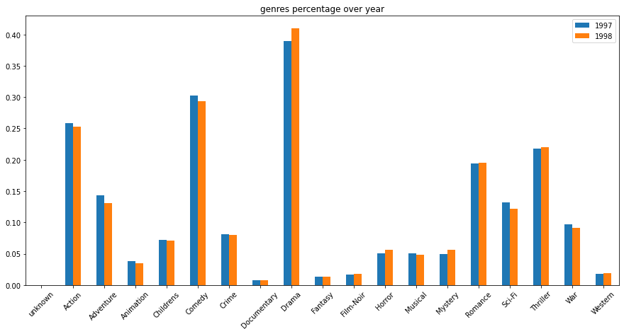
    


<!-- ------------------------ -->
## User graph analysis
Duration: 15


```python
def plt_graph(adjacency,data,title):
    graph_user = nx.from_numpy_matrix(adjacency)
    print('The number of connected components is {}'.format(nx.number_connected_components(graph_user)))
    coords = nx.spring_layout(graph_user,k=0.03)  # Force-directed layout.
    fig=plt.figure(figsize=(15, 10))
    labels = data.iloc[np.sort(nx.nodes(graph_user))]
    im=nx.draw_networkx_nodes(graph_user, coords, node_size=40,node_color=labels, cmap='tab20b',vmin=min(data), vmax=max(data))
    nx.draw_networkx_edges(graph_user, coords, alpha=0.1, width=0.7)
    plt.title(title)
    plt.colorbar(im)
    return graph_user
```


```python
# Initialize the adjacency matrix
n_users = len(user_data)
adjacency_user = np.zeros((n_users, n_users), dtype=float)
user_features1 =user_data.copy()[['user_id', 'age', 'gender', 'occupation', 'zip_code']]
user_features1['age_normal'] = user_features1['age']/max(user_features1['age'])
user_features1= pd.merge(user_features1,occupation_data,on='occupation',how='left')
user_features1['gender_id'] = user_features1['gender'].replace(['M','F'],[1,0])
```


```python
user_features2=user_features1[['user_id','age','gender','occupation_id']].copy()
user_features2['avg_rating'] = data_merged[['user_id','item_id','rating']].groupby('user_id').mean()['rating'].values
user_features2['movie'] = data_merged[['user_id','item_id','rating']].groupby('user_id')['item_id'].apply(set).values
```


```python
user_features1
```


<div>
<style scoped>
    .dataframe tbody tr th:only-of-type {
        vertical-align: middle;
    }

    .dataframe tbody tr th {
        vertical-align: top;
    }

    .dataframe thead th {
        text-align: right;
    }
</style>
<table border="1" class="dataframe">
  <thead>
    <tr style="text-align: right;">
      <th></th>
      <th>user_id</th>
      <th>age</th>
      <th>gender</th>
      <th>occupation</th>
      <th>zip_code</th>
      <th>age_normal</th>
      <th>occupation_id</th>
      <th>gender_id</th>
    </tr>
  </thead>
  <tbody>
    <tr>
      <th>0</th>
      <td>1</td>
      <td>24</td>
      <td>M</td>
      <td>technician</td>
      <td>85711</td>
      <td>0.328767</td>
      <td>19</td>
      <td>1</td>
    </tr>
    <tr>
      <th>1</th>
      <td>2</td>
      <td>53</td>
      <td>F</td>
      <td>other</td>
      <td>94043</td>
      <td>0.726027</td>
      <td>13</td>
      <td>0</td>
    </tr>
    <tr>
      <th>2</th>
      <td>3</td>
      <td>23</td>
      <td>M</td>
      <td>writer</td>
      <td>32067</td>
      <td>0.315068</td>
      <td>20</td>
      <td>1</td>
    </tr>
    <tr>
      <th>3</th>
      <td>4</td>
      <td>24</td>
      <td>M</td>
      <td>technician</td>
      <td>43537</td>
      <td>0.328767</td>
      <td>19</td>
      <td>1</td>
    </tr>
    <tr>
      <th>4</th>
      <td>5</td>
      <td>33</td>
      <td>F</td>
      <td>other</td>
      <td>15213</td>
      <td>0.452055</td>
      <td>13</td>
      <td>0</td>
    </tr>
    <tr>
      <th>...</th>
      <td>...</td>
      <td>...</td>
      <td>...</td>
      <td>...</td>
      <td>...</td>
      <td>...</td>
      <td>...</td>
      <td>...</td>
    </tr>
    <tr>
      <th>938</th>
      <td>939</td>
      <td>26</td>
      <td>F</td>
      <td>student</td>
      <td>33319</td>
      <td>0.356164</td>
      <td>18</td>
      <td>0</td>
    </tr>
    <tr>
      <th>939</th>
      <td>940</td>
      <td>32</td>
      <td>M</td>
      <td>administrator</td>
      <td>02215</td>
      <td>0.438356</td>
      <td>0</td>
      <td>1</td>
    </tr>
    <tr>
      <th>940</th>
      <td>941</td>
      <td>20</td>
      <td>M</td>
      <td>student</td>
      <td>97229</td>
      <td>0.273973</td>
      <td>18</td>
      <td>1</td>
    </tr>
    <tr>
      <th>941</th>
      <td>942</td>
      <td>48</td>
      <td>F</td>
      <td>librarian</td>
      <td>78209</td>
      <td>0.657534</td>
      <td>10</td>
      <td>0</td>
    </tr>
    <tr>
      <th>942</th>
      <td>943</td>
      <td>22</td>
      <td>M</td>
      <td>student</td>
      <td>77841</td>
      <td>0.301370</td>
      <td>18</td>
      <td>1</td>
    </tr>
  </tbody>
</table>
<p>943 rows × 8 columns</p>
</div>


```python
user_features2
```


<div>
<style scoped>
    .dataframe tbody tr th:only-of-type {
        vertical-align: middle;
    }

    .dataframe tbody tr th {
        vertical-align: top;
    }

    .dataframe thead th {
        text-align: right;
    }
</style>
<table border="1" class="dataframe">
  <thead>
    <tr style="text-align: right;">
      <th></th>
      <th>user_id</th>
      <th>age</th>
      <th>gender</th>
      <th>occupation_id</th>
      <th>avg_rating</th>
      <th>movie</th>
    </tr>
  </thead>
  <tbody>
    <tr>
      <th>0</th>
      <td>1</td>
      <td>24</td>
      <td>M</td>
      <td>19</td>
      <td>3.610294</td>
      <td>{1, 2, 3, 4, 5, 6, 7, 8, 9, 10, 11, 12, 13, 14...</td>
    </tr>
    <tr>
      <th>1</th>
      <td>2</td>
      <td>53</td>
      <td>F</td>
      <td>13</td>
      <td>3.709677</td>
      <td>{257, 258, 1, 10, 13, 14, 269, 272, 273, 274, ...</td>
    </tr>
    <tr>
      <th>2</th>
      <td>3</td>
      <td>23</td>
      <td>M</td>
      <td>20</td>
      <td>2.796296</td>
      <td>{258, 260, 264, 268, 271, 272, 288, 294, 297, ...</td>
    </tr>
    <tr>
      <th>3</th>
      <td>4</td>
      <td>24</td>
      <td>M</td>
      <td>19</td>
      <td>4.333333</td>
      <td>{258, 260, 264, 11, 271, 288, 294, 297, 300, 3...</td>
    </tr>
    <tr>
      <th>4</th>
      <td>5</td>
      <td>33</td>
      <td>F</td>
      <td>13</td>
      <td>2.874286</td>
      <td>{1, 2, 17, 21, 24, 25, 29, 40, 42, 50, 62, 63,...</td>
    </tr>
    <tr>
      <th>...</th>
      <td>...</td>
      <td>...</td>
      <td>...</td>
      <td>...</td>
      <td>...</td>
      <td>...</td>
    </tr>
    <tr>
      <th>938</th>
      <td>939</td>
      <td>26</td>
      <td>F</td>
      <td>18</td>
      <td>4.265306</td>
      <td>{257, 258, 255, 1028, 9, 266, 15, 274, 275, 40...</td>
    </tr>
    <tr>
      <th>939</th>
      <td>940</td>
      <td>32</td>
      <td>M</td>
      <td>0</td>
      <td>3.457944</td>
      <td>{4, 516, 7, 8, 9, 521, 12, 14, 527, 529, 549, ...</td>
    </tr>
    <tr>
      <th>940</th>
      <td>941</td>
      <td>20</td>
      <td>M</td>
      <td>18</td>
      <td>4.045455</td>
      <td>{257, 258, 1, 7, 15, 273, 147, 919, 408, 294, ...</td>
    </tr>
    <tr>
      <th>941</th>
      <td>942</td>
      <td>48</td>
      <td>F</td>
      <td>10</td>
      <td>4.265823</td>
      <td>{514, 1028, 520, 528, 1050, 539, 31, 50, 71, 5...</td>
    </tr>
    <tr>
      <th>942</th>
      <td>943</td>
      <td>22</td>
      <td>M</td>
      <td>18</td>
      <td>3.410714</td>
      <td>{2, 1028, 9, 11, 12, 526, 1044, 22, 23, 24, 10...</td>
    </tr>
  </tbody>
</table>
<p>943 rows × 6 columns</p>
</div>


### Metric 1: measure similarity between users by their age, gender, occupation and residence.


```python
def similarity(row,data):
    sim = pd.DataFrame(np.cos(row['age_normal']-data['age_normal']))
    sim['gender'] = (row['gender']==data['gender'])
    sim['occupation'] = (row['occupation']==data['occupation'])
    sim['zip_code'] = (row['zip_code'] == data['zip_code'])
    return sim
```


```python
for i in range(n_users):
    adjacency_user[i,:] = similarity(user_features1.loc[i,:],user_features1).mean(axis=1)
```

#### Adjacency Matrix of users


```python
mask = adjacency_user<=0.5
adjacency = adjacency_user.copy()
adjacency[mask]=0

plt.figure(figsize=(8,8))
plt.spy(adjacency,markersize=0.1)
plt.title('Adjacency matrix')
```


    Text(0.5, 1.05, 'Adjacency matrix')


    
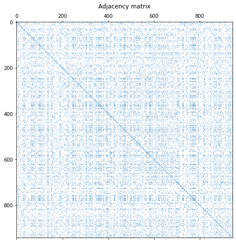
    


#### User Graph 1 with colors representing gender

No specific pattern is identified from the distribution of the colours of the nodes.


```python
graph_user = nx.from_numpy_matrix(adjacency)
G = graph_user
print('The number of connected components is {}'.format(nx.number_connected_components(G)))
coords = nx.spring_layout(G,k=0.03)  # Force-directed layout.
fig=plt.figure(figsize=(15, 10))
labels = user_features1['gender_id'].iloc[np.sort(nx.nodes(G))]
im=nx.draw_networkx_nodes(G, coords, node_size=40,node_color=labels, cmap='plasma',vmin=0, vmax=1)
nx.draw_networkx_edges(graph_user, coords, alpha=0.1, width=0.7)
plt.title('User graph from personal information with threshold 0.5')
plt.colorbar(im)
```

    The number of connected components is 12


    <matplotlib.colorbar.Colorbar at 0x7f6518c87f90>


    
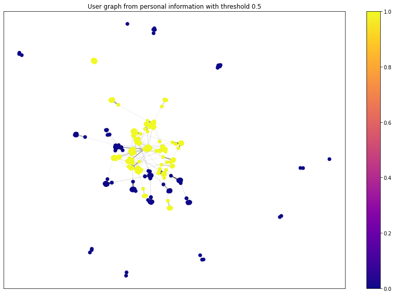
    


#### User Graph 1 with colors representing Occupation

We do observe that there is nice and clear pattern here, as the nodes of the same colour falls in one cluster, meaning that people of the same occupation do share lots of similarities with repsect to movies of interest.


```python
graph_user = nx.from_numpy_matrix(adjacency)
G = graph_user
print('The number of connected components is {}'.format(nx.number_connected_components(G)))
coords = nx.spring_layout(G,k=0.03)  # Force-directed layout.
fig=plt.figure(figsize=(15, 10))
labels = user_features1['occupation_id'].iloc[np.sort(nx.nodes(G))]
im=nx.draw_networkx_nodes(G, coords, node_size=40,node_color=labels, cmap='tab20',vmin=0, vmax=20)
nx.draw_networkx_edges(graph_user, coords, alpha=0.1, width=0.7)
plt.title('User graph from personal information with threshold 0.5')
plt.colorbar(im)
```

    The number of connected components is 12


    <matplotlib.colorbar.Colorbar at 0x7f650e97d890>


    
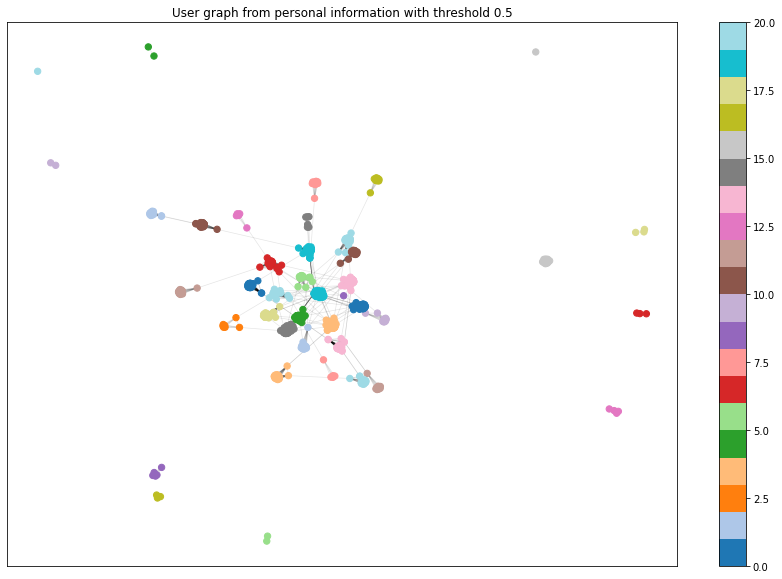
    


#### User Graph 1 with colors representing Age
No specific pattern is identified from the distribution of the colours of the nodes.


```python
graph_user = nx.from_numpy_matrix(adjacency)
G = graph_user
print('The number of connected components is {}'.format(nx.number_connected_components(G)))
coords = nx.spring_layout(G,k=0.03)  # Force-directed layout.
fig=plt.figure(figsize=(15, 10))
labels = user_features1['age'].iloc[np.sort(nx.nodes(G))]
im=nx.draw_networkx_nodes(G, coords, node_size=40,node_color=labels, cmap='tab20',vmin=min(labels), vmax=max(labels))
nx.draw_networkx_edges(graph_user, coords, alpha=0.1, width=0.7)
plt.title('User graph from personal information with threshold 0.5')
plt.colorbar(im)
```

    The number of connected components is 12


    <matplotlib.colorbar.Colorbar at 0x7f650db70250>


    
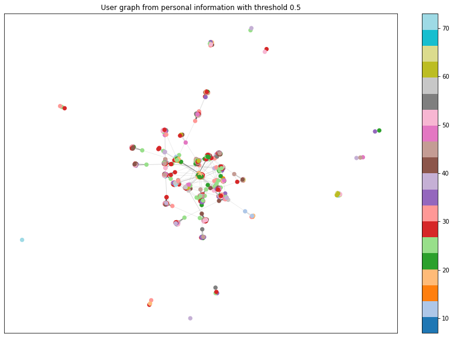
    


#### Giant Components in User Graph 1


```python
G = graph_user
Gc = max([G.subgraph(c) for c in nx.connected_components(G)], key=len)
coords_Gc = nx.spring_layout(Gc,k=0.03)  # Force-directed layout.

print('The number of nodes is is {}'.format(Gc.number_of_nodes()))
labels = user_features1['occupation_id'].iloc[np.sort(nx.nodes(Gc))]
fig=plt.figure(figsize=(15, 10))
im=nx.draw_networkx_nodes(Gc, coords_Gc, node_size=10,node_color=labels, cmap='tab20b',vmin=0, vmax=20)
nx.draw_networkx_edges(Gc, coords_Gc, alpha=0.1, width=0.7)
plt.title('Giant component of the users connected by at least 0.5 similarity')
plt.colorbar(im);
```

    The number of nodes is is 903


    
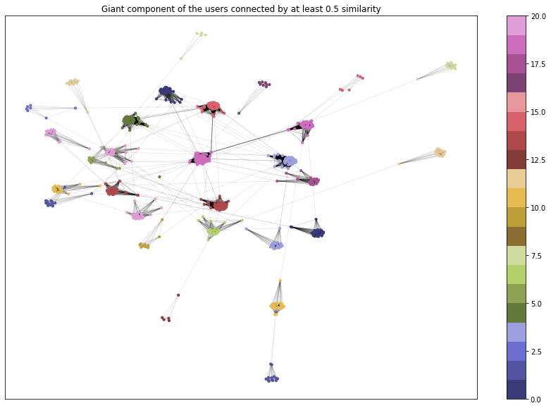
    


#### Below we analyse the graph from the view of spectal theory


```python
def compute_laplacian(adjacency: np.ndarray, normalize: bool):
    """ Return:
        L (n x n ndarray): combinatorial or symmetric normalized Laplacian.
    """
    d = np.sum(adjacency, axis = 1)
    d_sqrt = np.sqrt(d)
    D = np.diag(1 / d_sqrt)
    if normalize:
        L = np.eye(adjacency.shape[0]) - (adjacency.T / d_sqrt).T / d_sqrt
    else:
        L = np.diag(d) - adjacency
    return L

def spectral_decomposition(laplacian: np.ndarray):
    """ Return:
        lamb (np.array): eigenvalues of the Laplacian
        U (np.ndarray): corresponding eigenvectors.
    """
    lamb, U = np.linalg.eigh(laplacian)
    
    return lamb, U
```


```python
laplacian_norm = compute_laplacian(adjacency, normalize=True)
lamb_norm, U_norm = spectral_decomposition(laplacian_norm)
```


```python
plt.figure(figsize=(15,5))
plt.subplot(121)
plt.plot(lamb_norm)
plt.xlabel('Index')
plt.ylabel('Eigenvalue')
plt.title('Eigenvalues $L_{norm}$')

plt.subplot(122)
first_k = 70
plt.scatter(range(first_k), lamb_norm[:first_k])
plt.xlabel('Index')
plt.ylabel('Eigenvalue')
plt.title('First 70 Eigenvalues $L_{norm}$')

plt.show()
```


    
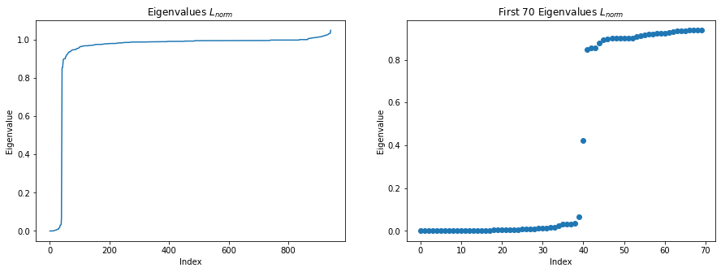
    


In order to observe the properties of the eigenvalues calculated, we zoom in the eigenvalues and we observe that there is a significant gap of eighvalues as shown in the plot, which correspond to the fact that there are about 40 clear clusters in the graph. As we know that if the data has exactly k clear clusters, there will be a gap in the Laplacian spectrum after the k-th eigenvalue. Here the clusters are generally defined by the occupation of the users. 

### Metric 2: meaure similarities between users by how many common movies they have rated

The more common movies two users have rated, the more similar they are.


```python
# Calulate the number of common movies they have rated between two users
def common_movie(i,j,data):
    left = data[data['user_id']==i+1]['movie'].values.tolist()[0]
    right = data[data['user_id']==j+1]['movie'].values.tolist()[0]
    common = left.intersection(right)
    return len(common)
```


```python
adjacency_user2 = np.zeros((n_users, n_users), dtype=float)
for i in range(n_users):
    for j in range(n_users):
        if j<i:
            adjacency_user2[i,j] = adjacency_user2[j,i]
        else:
            adjacency_user2[i,j] = common_movie(i,j,user_features2)
            
np.save('adjacency_user2.npy', adjacency_user2)
```

Histogram of the Median of common movies


```python
adjacency_user2 = np.load('adjacency_user2.npy')
median = []
for i in range(n_users):
    median.append(np.median(adjacency_user2[i,:]))

plt.hist(median, density=True)
plt.xlabel('number of common movies')
plt.ylabel('Frequency')
plt.title('histogram of number of common movies')
```


    Text(0.5, 1.0, 'histogram of number of common movies')


    
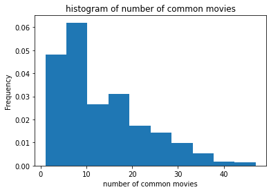
    


The adjacency matrix of **Metric 2**


```python
mask2 = adjacency_user2<20
adjacency = adjacency_user2.copy()
adjacency[mask2]=0

# Normalize 
adjacency_normalized = np.divide(adjacency,adjacency.max());
adjacency_normalized = adjacency
plt.figure(figsize=(8,8))
plt.spy(adjacency_normalized,markersize=0.1)
plt.title('Adjacency matrix')
```


    Text(0.5, 1.05, 'Adjacency matrix')


    
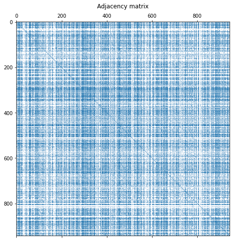
    


#### User Graph 2 with colors representing Occupation


```python
graph_user2 = nx.from_numpy_matrix(adjacency_normalized)
G = graph_user2
print('The number of connected components is {}'.format(nx.number_connected_components(G)))
coords = nx.spring_layout(G,k=0.03)  # Force-directed layout.
fig=plt.figure(figsize=(15, 10))
labels = user_features1['occupation_id'].iloc[np.sort(nx.nodes(G))]
im=nx.draw_networkx_nodes(G, coords, node_size=40,node_color=labels, cmap='tab20',vmin=0, vmax=20)
nx.draw_networkx_edges(graph_user, coords, alpha=0.1, width=0.7)
plt.title('User graph from common movie with threshold 20')
plt.colorbar(im)
```

    The number of connected components is 37


    <matplotlib.colorbar.Colorbar at 0x7f6518fba9d0>


    
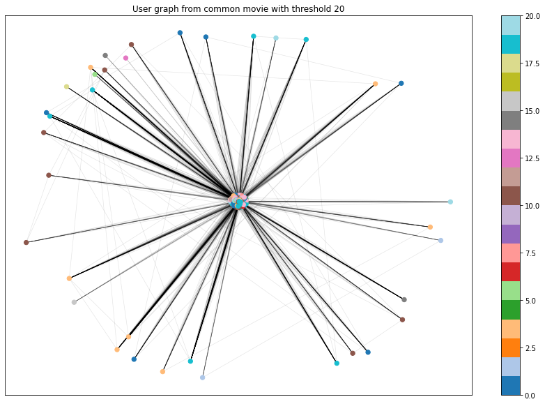
    


#### User Graph 2 with colors representing Average Rating


```python
graph_user2 = nx.from_numpy_matrix(adjacency_normalized)
G = graph_user2
print('The number of connected components is {}'.format(nx.number_connected_components(G)))
coords = nx.spring_layout(G,k=0.03)  # Force-directed layout.
fig=plt.figure(figsize=(15, 10))
labels = user_features2['avg_rating'].iloc[np.sort(nx.nodes(G))]
im=nx.draw_networkx_nodes(G, coords, node_size=40,node_color=labels, cmap='tab20c',vmin=0, vmax=5)
nx.draw_networkx_edges(graph_user, coords, alpha=0.1, width=0.7)
plt.title('User graph from common movie with threshold 20')
plt.colorbar(im)
```

    The number of connected components is 37


    <matplotlib.colorbar.Colorbar at 0x7f650a13c350>


    
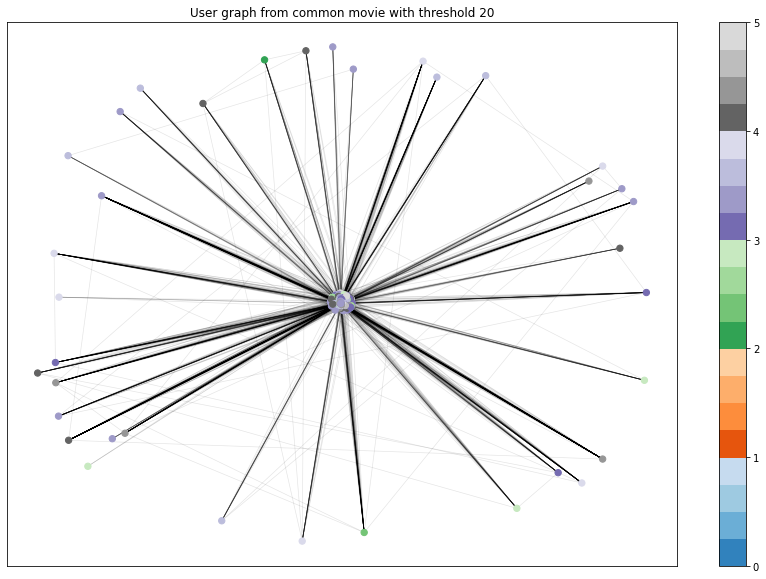
    


#### User Graph 2 with colors representing Age of user


```python
graph_user2 = nx.from_numpy_matrix(adjacency_normalized)
G = graph_user2
print('The number of connected components is {}'.format(nx.number_connected_components(G)))
coords = nx.spring_layout(G,k=0.03)  # Force-directed layout.
fig=plt.figure(figsize=(15, 10))
labels = user_features2['age'].iloc[np.sort(nx.nodes(G))]
im=nx.draw_networkx_nodes(G, coords, node_size=40,node_color=labels, cmap='Blues',vmin=min(labels), vmax=max(labels))
nx.draw_networkx_edges(graph_user, coords, alpha=0.1, width=0.7)
plt.title('User graph from common movie with threshold 20')
plt.colorbar(im)
```

    The number of connected components is 37


    <matplotlib.colorbar.Colorbar at 0x7f650a338750>


    
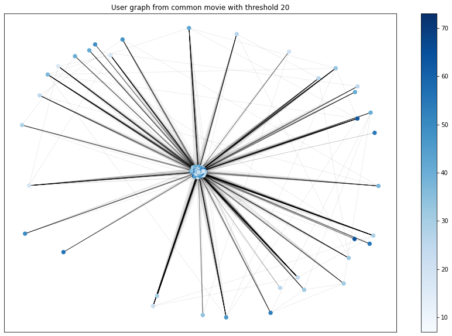
    


#### Giant component of the User Graph 2 connected by at least 20 common movies


```python
G = graph_user2
Gc = max([G.subgraph(c) for c in nx.connected_components(G)], key=len)
coords_Gc = nx.spring_layout(Gc,k=0.03)  # Force-directed layout.
print('The number of nodes is is {}'.format(Gc.number_of_nodes()))
labels = user_features2['avg_rating'].iloc[np.sort(nx.nodes(Gc))]
fig=plt.figure(figsize=(15, 10))
im=nx.draw_networkx_nodes(Gc, coords_Gc, node_size=10,node_color=labels, cmap='tab20',vmin=0, vmax=20)
nx.draw_networkx_edges(Gc, coords_Gc, alpha=0.1, width=0.7)
plt.title('Giant component of the users connected by at least 20 common movies')
plt.colorbar(im);
```

    The number of nodes is is 907


    
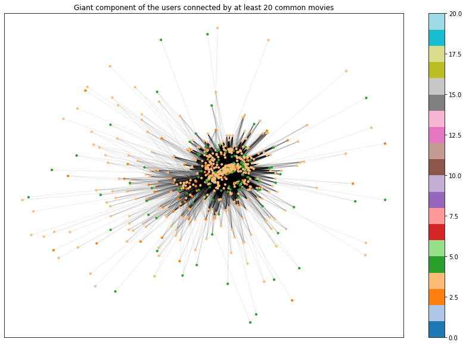
    


```python
laplacian_norm = compute_laplacian(adjacency_normalized, normalize=True)
lamb_norm, U_norm = spectral_decomposition(laplacian_norm)
```


```python
plt.figure(figsize=(15,5))
plt.subplot(121)
plt.plot(lamb_norm)
plt.xlabel('Index')
plt.ylabel('Eigenvalue')
plt.title('Eigenvalues $L_{norm}$')

plt.subplot(122)
first_k = 70
plt.scatter(range(first_k), lamb_norm[:first_k])
plt.xlabel('Index')
plt.ylabel('Eigenvalue')
plt.title('First 70 Eigenvalues $L_{norm}$')

plt.show()
```


    
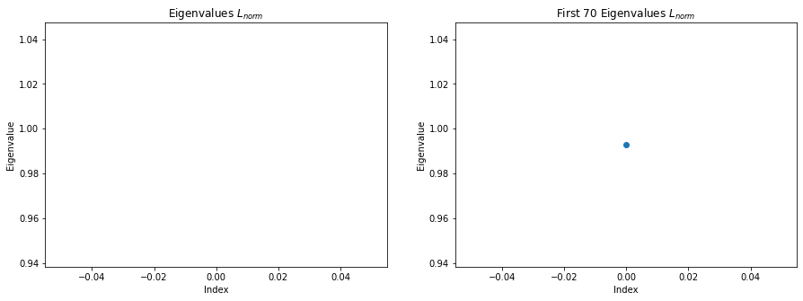
    


In order to observe the properties of the eigenvalues calculated, we zoom in the eigenvalues and we observe that there is a significant gap of eighvalues as shown in the plot, which correspond to the fact that there are about 35 clear clusters in the graph. As we know that if the data has exactly k clear clusters, there will be a gap in the Laplacian spectrum after the k-th eigenvalue. However, the pattern here in this user graph is not clear as most of them are not really clusters by outliers. There is only one giant component that dominates the graph.

<!-- ------------------------ -->
## Movie graph analysis
Duration: 15

### Metric 1: similarity between moives measured by genres


```python
movie_features1 = movies_data[['item_id']+genre_cls]
movie_features1.loc[:, 'year_label'] = movies_data['year_label']
movie_features1.reset_index(drop = True, inplace = True)
movie_features1
```

    /usr/local/lib/python3.7/dist-packages/pandas/core/indexing.py:1596: SettingWithCopyWarning: 
    A value is trying to be set on a copy of a slice from a DataFrame.
    Try using .loc[row_indexer,col_indexer] = value instead
    
    See the caveats in the documentation: https://pandas.pydata.org/pandas-docs/stable/user_guide/indexing.html#returning-a-view-versus-a-copy
      self.obj[key] = _infer_fill_value(value)
    /usr/local/lib/python3.7/dist-packages/pandas/core/indexing.py:1743: SettingWithCopyWarning: 
    A value is trying to be set on a copy of a slice from a DataFrame.
    Try using .loc[row_indexer,col_indexer] = value instead
    
    See the caveats in the documentation: https://pandas.pydata.org/pandas-docs/stable/user_guide/indexing.html#returning-a-view-versus-a-copy
      isetter(ilocs[0], value)


<div>
<style scoped>
    .dataframe tbody tr th:only-of-type {
        vertical-align: middle;
    }

    .dataframe tbody tr th {
        vertical-align: top;
    }

    .dataframe thead th {
        text-align: right;
    }
</style>
<table border="1" class="dataframe">
  <thead>
    <tr style="text-align: right;">
      <th></th>
      <th>item_id</th>
      <th>unknown</th>
      <th>Action</th>
      <th>Adventure</th>
      <th>Animation</th>
      <th>Childrens</th>
      <th>Comedy</th>
      <th>Crime</th>
      <th>Documentary</th>
      <th>Drama</th>
      <th>Fantasy</th>
      <th>Film-Noir</th>
      <th>Horror</th>
      <th>Musical</th>
      <th>Mystery</th>
      <th>Romance</th>
      <th>Sci-Fi</th>
      <th>Thriller</th>
      <th>War</th>
      <th>Western</th>
      <th>year_label</th>
    </tr>
  </thead>
  <tbody>
    <tr>
      <th>0</th>
      <td>1</td>
      <td>0</td>
      <td>0</td>
      <td>0</td>
      <td>1</td>
      <td>1</td>
      <td>1</td>
      <td>0</td>
      <td>0</td>
      <td>0</td>
      <td>0</td>
      <td>0</td>
      <td>0</td>
      <td>0</td>
      <td>0</td>
      <td>0</td>
      <td>0</td>
      <td>0</td>
      <td>0</td>
      <td>0</td>
      <td>1995</td>
    </tr>
    <tr>
      <th>1</th>
      <td>2</td>
      <td>0</td>
      <td>1</td>
      <td>1</td>
      <td>0</td>
      <td>0</td>
      <td>0</td>
      <td>0</td>
      <td>0</td>
      <td>0</td>
      <td>0</td>
      <td>0</td>
      <td>0</td>
      <td>0</td>
      <td>0</td>
      <td>0</td>
      <td>0</td>
      <td>1</td>
      <td>0</td>
      <td>0</td>
      <td>1995</td>
    </tr>
    <tr>
      <th>2</th>
      <td>3</td>
      <td>0</td>
      <td>0</td>
      <td>0</td>
      <td>0</td>
      <td>0</td>
      <td>0</td>
      <td>0</td>
      <td>0</td>
      <td>0</td>
      <td>0</td>
      <td>0</td>
      <td>0</td>
      <td>0</td>
      <td>0</td>
      <td>0</td>
      <td>0</td>
      <td>1</td>
      <td>0</td>
      <td>0</td>
      <td>1995</td>
    </tr>
    <tr>
      <th>3</th>
      <td>4</td>
      <td>0</td>
      <td>1</td>
      <td>0</td>
      <td>0</td>
      <td>0</td>
      <td>1</td>
      <td>0</td>
      <td>0</td>
      <td>1</td>
      <td>0</td>
      <td>0</td>
      <td>0</td>
      <td>0</td>
      <td>0</td>
      <td>0</td>
      <td>0</td>
      <td>0</td>
      <td>0</td>
      <td>0</td>
      <td>1995</td>
    </tr>
    <tr>
      <th>4</th>
      <td>5</td>
      <td>0</td>
      <td>0</td>
      <td>0</td>
      <td>0</td>
      <td>0</td>
      <td>0</td>
      <td>1</td>
      <td>0</td>
      <td>1</td>
      <td>0</td>
      <td>0</td>
      <td>0</td>
      <td>0</td>
      <td>0</td>
      <td>0</td>
      <td>0</td>
      <td>1</td>
      <td>0</td>
      <td>0</td>
      <td>1995</td>
    </tr>
    <tr>
      <th>...</th>
      <td>...</td>
      <td>...</td>
      <td>...</td>
      <td>...</td>
      <td>...</td>
      <td>...</td>
      <td>...</td>
      <td>...</td>
      <td>...</td>
      <td>...</td>
      <td>...</td>
      <td>...</td>
      <td>...</td>
      <td>...</td>
      <td>...</td>
      <td>...</td>
      <td>...</td>
      <td>...</td>
      <td>...</td>
      <td>...</td>
      <td>...</td>
    </tr>
    <tr>
      <th>1677</th>
      <td>1678</td>
      <td>0</td>
      <td>0</td>
      <td>0</td>
      <td>0</td>
      <td>0</td>
      <td>0</td>
      <td>0</td>
      <td>0</td>
      <td>1</td>
      <td>0</td>
      <td>0</td>
      <td>0</td>
      <td>0</td>
      <td>0</td>
      <td>0</td>
      <td>0</td>
      <td>0</td>
      <td>0</td>
      <td>0</td>
      <td>1998</td>
    </tr>
    <tr>
      <th>1678</th>
      <td>1679</td>
      <td>0</td>
      <td>0</td>
      <td>0</td>
      <td>0</td>
      <td>0</td>
      <td>0</td>
      <td>0</td>
      <td>0</td>
      <td>0</td>
      <td>0</td>
      <td>0</td>
      <td>0</td>
      <td>0</td>
      <td>0</td>
      <td>1</td>
      <td>0</td>
      <td>1</td>
      <td>0</td>
      <td>0</td>
      <td>1998</td>
    </tr>
    <tr>
      <th>1679</th>
      <td>1680</td>
      <td>0</td>
      <td>0</td>
      <td>0</td>
      <td>0</td>
      <td>0</td>
      <td>0</td>
      <td>0</td>
      <td>0</td>
      <td>1</td>
      <td>0</td>
      <td>0</td>
      <td>0</td>
      <td>0</td>
      <td>0</td>
      <td>1</td>
      <td>0</td>
      <td>0</td>
      <td>0</td>
      <td>0</td>
      <td>1998</td>
    </tr>
    <tr>
      <th>1680</th>
      <td>1681</td>
      <td>0</td>
      <td>0</td>
      <td>0</td>
      <td>0</td>
      <td>0</td>
      <td>1</td>
      <td>0</td>
      <td>0</td>
      <td>0</td>
      <td>0</td>
      <td>0</td>
      <td>0</td>
      <td>0</td>
      <td>0</td>
      <td>0</td>
      <td>0</td>
      <td>0</td>
      <td>0</td>
      <td>0</td>
      <td>1994</td>
    </tr>
    <tr>
      <th>1681</th>
      <td>1682</td>
      <td>0</td>
      <td>0</td>
      <td>0</td>
      <td>0</td>
      <td>0</td>
      <td>0</td>
      <td>0</td>
      <td>0</td>
      <td>1</td>
      <td>0</td>
      <td>0</td>
      <td>0</td>
      <td>0</td>
      <td>0</td>
      <td>0</td>
      <td>0</td>
      <td>0</td>
      <td>0</td>
      <td>0</td>
      <td>1996</td>
    </tr>
  </tbody>
</table>
<p>1682 rows × 21 columns</p>
</div>


```python
# Initialize the adjacency matrix
n_movies = len(movie_features1)
adjacency_movie = np.zeros((n_movies, n_movies), dtype=float)
```


```python
for i in range(n_movies):
    adjacency_movie[i,:] = np.logical_and(movie_features1.loc[i,:][genre_cls], movie_features1[genre_cls])\
    .sum(axis=1)
```


```python
# Normalize 
mask_movie = adjacency_movie<2
adjacency = adjacency_movie.copy()
adjacency[mask_movie] = 0 
adjacency_movie_nor =np.divide(adjacency,adjacency.max())
plt.figure(figsize=(8,8))
plt.spy(adjacency_movie_nor,markersize=0.1)
plt.title('Adjacency matrix')
```


    Text(0.5, 1.05, 'Adjacency matrix')


    
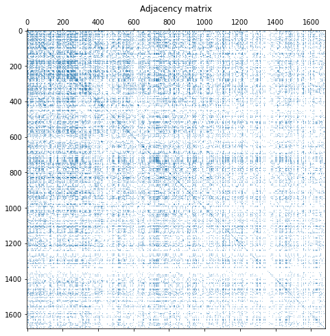
    


<!-- ------------------------ -->
## Conclusion
Duration: 2

Congratulations!

### What we've covered
- User analysis
- Item analysis
- Graph analysis

### Next steps
- Perform advanced statistical analysis
- Interactive graph analysis

### Links and References
- https://www.kaggle.com/gogulrajsekhar/movielens-eda-rating-prediction
- https://github.com/WJMatthew/MovieLens-EDA

### Have a Question?
- [Fill out this form](https://form.jotform.com/211377288388469)
- [Raise issue on Github](https://github.com/recohut/reco-step/issues)
