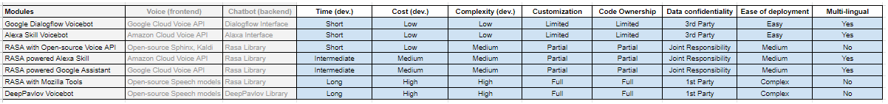

authors: Sparsh A.
categories: Story
feedback link: https://github.com/recohut/reco-step/issues
id: storycafe-series-part-1
status: Published
summary: We are going to discuss stories that are not directly related to recommender systems but using machine learning and deep learning techniques to build and serve useful applications in the real world. 
tags: storycafe

---

# StoryCafe Series Part 1

<!-- ------------------------ -->

## Introduction

Duration: 5

We are starting a new story series named ***StoryCafe***. In this series, we are going to discuss stories that are not directly related to recommender systems but using machine learning and deep learning techniques to build and serve useful applications in the real world. 

### What you'll learn?

- Build and deploy a binary classification model in clinical decision making
- Build a chatbot and voicebot
- Claim process automation
- Multi-touch attribution for intelligent marketing budget allocation
- Contact center analytics
- Cyber risk quantification
- ServiceNow advanced analytics
- IT support ticket management
- Claim severity modeling for re-insurance

### Why is this important?

- This will help us in understanding the process of using ML/DL methods for building recommender systems

### How it will work?

- We will briefly discuss the stories
- With time, we will keep adding more details
- We will also add source code and data/mock-up data wherever possible

<!-- ------------------------ -->

## Clinical Decision Making

Duration: 5

Health insurance can be complicated—especially when it comes to prior authorization (also referred to as pre-approval, pre-authorization, and pre-certification). The manual labor involved in obtaining prior authorizations (PAs) is a well-recognized burden among providers. Up to 46% of PA requests are still submitted by fax, and 60% require a telephone call, according to America’s Health Insurance Plans (AHIP). A 2018 survey by the American Medical Association (AMA) found that doctors and their staff spend an average of 2 days a week completing PAs. In addition to eating up time that physicians could spend with patients, PAs also contribute to burnout.

The objective was to identify the patterns from data to create clinical decision making in Pre-Auth and improve the accuracy in a clinical decision based on historical data analysis. 

Two use cases were identified. Use Case 1 - *Supervised Learning Model - to aid clinicians in UM decision making. Tasks -* Ingest Pre-authorization data from Mongo DB into the analytical environment, Exploratory Data Analysis and Feature Engineering, Train supervised analytical models, model validation and model selection, Create a web service to be plugged into the case processing flow to call the model, and Display the recommendation from the model on UI on the authorization review screen. Use Case 2 - *Unsupervised Learning Model - to generate insights from the pre-authorization data. Tasks -* Ingest Pre-authorization data from Mongo DB into the analytical environment, Cluster analysis, univariate and multivariate analysis, and Generate insights and display insights on the dashboard.

Final Deliverables - Model re-training (batch mode), validation and deployment code (python scripts) with Unix command line support, Documentation - PPT, Recorded video, Technical document, Flask API backend system, HTML/PHP Web App frontend UI integration, and Plotly Dash Supervised/Unsupervised learning and insights generation dashboard.

<!-- ------------------------ -->

## Insurance Chatbot & Voicebot

Duration: 5

Problem statement: How to automate the insurance contact center services in order to reduce operational costs?, How to reduce the operational cost of contact center agents?, How to manage the SLAs of customer service in case of labor shortage?, How to reduce the resolution time of insurance customer’s queries and complaints?

Scope: Insurance sector, automate 4 services - claim status check, claim filing, policy quotation, and policy education. The language would be English (US & UK). RASA framework (python) was selected for the implementation of this chatbot.

A voice service was also ingegrated on the claim status check service. Various options were explored and simple proof-of-concepts were developed for each of them. A comparison chart was also created as shown below: 

Voicebot platform comparison

<!-- ------------------------ -->

## Claim Process Automation

Duration: 5

Today, in the car insurance industry, a lot of money is wasted due to claims leakage. Claims leakage / Underwriting leakage is defined as the difference between the actual claim payment made and the amount that should have been paid if all industry-leading practices were applied. Visual inspection and validation have been used to reduce such effects. However, they introduce delays in claim processing and lead to manual intervention. Fast and efficient claims processing is paramount to success for insurance companies. 

Automatic assessment of the damages through image analysis is much faster and more accurate and it will become even better as they collect more & more data for each use case. With deep learning, we can automatically detect scratches, dents, rust, breakages. We can also detect which part of the vehicle is damaged and with what severity. The vehicle can be automatically inspected using images or video feeds by creating a 360° overview. After the inspection, the report can be generated with a list of damages and estimate cost repair.

Identified solutions: Customer uploads an image of their damaged vehicle on the web portal/mobile app. Image Forgery Verification - Because there is a possibility of fraud by uploading fake/forged images, this model will verify if image is real or forged by some software. Vehicle Identity Verification - This model will verify if the damaged vehicle in image is the same vehicle for which the claim has been filed (damaged image of similar looking vehicle might be used to fraud the system). Data Sufficiency Verification - We will verify if images are of correct quality (not blurred, taken from the right angle) and also sufficient (enough number of images as reuqired by the model for correctly assess the damage). Distance Adjustment - We will adjust the distance of perspective to normalize the damage area pixels in the image. Depth Analysis - We will also measure the depth of the damage. Image Segmentation - This model will classify the pixels of the image into damage categories. We will use this information to assess the damage.

<!-- ------------------------ -->

## Multi-touch Attribution

Duration: 5

We are living in the digital economy and a customer often exposed to promotional ads on different digital channels like Facebook and google search. If a customer purchased a product after multiple exposures on different channels, then how can we estimate each channel's individual contribution towards that conversion, so that we can assign the marketing budget accordingly?  **How to quantify the impact of different media channels on sales volume?**

Multi-touch attribution is a set of methods and modeling techniques that tries to estimate the digital channel's individual contribution leveraging historical data of customer touchpoints and machine learning methodologies. I started with searching for relevant research papers in this domain, performed a literature review, and created a framework. I experimented with a lot of models and finally settled with three: Markov chains, Survival analysis, and RNN with attention. Conversion prediction accuracy was used as a proxy for evaluation and model selection but the A/B test should also be done before deploying this model in production.

<!-- ------------------------ -->

## Contact Center Analytics

Duration: 5

Objectives: Increase Customer Satisfaction, Reduce Query Resolution Time, Reduce Operational Cost, and Increase Gross Profit.

Identified solutions - Increase customer satisfaction by 1) reduce the waiting time, and 2) Connect with the right agent. This can be achieved by intelligent customer routing analytics. Reduce query resolution time by 1) Automated query resolution, 2) Connect with the right agent, and 3) Agent real-time assistance. This can be achieved by the chatbot and intelligent routing analytics. Reduce operational cost by 1) hiring the optimal number of agents, and 2) customer segmentation and prioritization. This can be achieved by contact volume forecasting and agent staffing analytics. Increase gross profit by 1) Identifying churning customers and retention, and 2) Cross-sell and upsell during inbound contact. This can be achieved by churn modeling and cross-sell/up-sell modeling. 

<!-- ------------------------ -->

## Cyber Risk Quantification

Duration: 5

Economic and commercial operations have become increasingly reliant on digital technologies which face a constant threat of disruption due to human error or malicious attacks. The potential for serious economic and commercial repercussions, illustrated most recently in the millions of compromised records at Yahoo and Equifax, the disruption of major websites by a denial-of-service attack on Dyn and the hundreds of thousands of computers compromised by the WannaCry and NotPetya ransomware attacks, has meant increasing investment in safeguarding the confidentiality, integrity and availability of information and information systems.

The usual approach of managing information security risk is similar to other business risks, i.e. first eliminate, then mitigate, absorb, and then if possible, transfer. Since eliminating security risks in today’s environment is not possible, managers deploy protection technologies like firewall, antivirus, encryption, and instate appropriate security policies like passwords, access control, port blocking, etc. to mitigate the probability of a break-in or failure. If the residual risk is manageable it is absorbed, otherwise, transferred by either outsourcing security or buying insurance.

While not a substitute for investing in cybersecurity and risk management—as having good cybersecurity and avoiding disruption is a more preferable outcome— insurance coverage for cyber risk can make an important contribution to the management of cyber risk by promoting awareness about exposure to cyber losses, sharing expertise on risk management, encouraging investment in risk reduction and facilitating the response to cyber incidents. **How to quantify the cyber risk of a company for profitable ratemaking?**

Identified solutions: Baseline cyber risk quantification using FAIR framework including Beta PERT and Monte Carlo calibration, Data-driven IT security posture assessment using LSTM and CNN deep learning models, Macro environment risk adjustment by advanced frequency, severity and copula dependency modeling on historical data, and Accumulation risk adjustment using scenario-based portfolio risk assessment methodologies.

<!-- ------------------------ -->

## ServiceNow Advanced Analytics

Duration: 5

An insurance provider started using ServiceNow a few years ago, to catalog and process customer service requests. The incident descriptions are being analyzed manually to derive primary issues raised by customers, communicated with stakeholders. As the client grew rapidly, it was flooded with huge volumes of customer service requests. Eventually, the requests branched out into multiple service lines. The client has a wealth of text-based data sources, especially from ServiceNow, that require manual review in order to **determine themes and emerging trends**. The client wanted to **remove the dependency on human-based reviews** and extract more value from the wealth of information. 

Initial set of tasks: Explore data science approaches for extracting value from our text based information, Grouping together similar phrases (e.g. incident summary, description, resolution notes), thereby grouping incident records of similar nature – using the same grouping mechanism, this could lead to the best matching set of existing problem records, Excluding common words/terms – a lot of tickets are raised via templates and have very similar wording – this provides very little value (consider Term Frequency / Inverse Document Frequency approach that reduces the search value of commonly used words), Consider stemming algorithms and others to align similar words (e.g. broken, not working, unavailable, not available), and Analytical and visualisation techniques to improve detection of emerging trends.

Identified solutions: Loading data from MS SQL Server onto to python, Restructuring data to enrich it and make it available in more usable form - Consolidating various data tables into a single data layer, Heatmap of month-wise incident volume for top service lines,  Custom stopwords removal, Lemmatization, Lower-casing, Tokenization, RAKE to capture emerging themes from textual data - Topic modeling to understand relationship between themes captured, Design various dashboard screens to demonstrate outlier analysis, word cloud comparison, the relationship between emerging themes, and Create a task scheduler to execute on a weekly, monthly, annual basis.

<!-- ------------------------ -->

## IT Support Ticket Management

Duration: 5

In Helpdesk, almost 30–40% of incident tickets are not routed to the right team and the tickets keep roaming around and around and by the time it reaches the right team, the issue might have widespread and reached the top management inviting a lot of trouble. Let’s say that users are having some trouble with printers. User calls help desk, he creates a ticket with IT Support, and they realize that they need to update a configuration in the user’s system and then they resolve the ticket. What if 10 other users report the same issue. **How to better manage these common issues using analytics tools and techniques?**

Identified solutions: Key Phrase Analysis - Identify key-phrases using RAKE algorithm. Analyze frequency and plot word cloud visual for most common phrases. Topic Modeling - Divide the phrases into topics using LDA/LSA algorithm. Ticket Classification - Classify ticket into categories using ML classification algorithm. Trend, Seasonality, and Outlier Analysis - Weekly/ Monthly/ Quarterly/ Yearly trend in ticket volume using Moving Average and other similar algorithms. Identify outliers using IQR and other similar methods. PowerBI Dashboard - To visually represent the KPIs. Standard vs. Non-standard Template Responses - If the issue is getting repeated in multiple tickets (above a threshold), then it is labeled as standard-template.

<!-- ------------------------ -->

## Claim Severity for Reinsurance

Duration: 5

In a typical insurance claims scenario, the insurance company gets a large number of small amounts of claims and few high amounts of claims. In statistical terms, we call it a body-trail curve, where the area under the curve represents the probability of a particular (x-axis) claim amount. So tail signifies a low probability but very high amount (severity) claims. Since there are only a few historical events in the history of this level of severity, how can we properly fit a model on this kind of data in order to correctly estimate the probability (area under the fitted curve) of the severity-level?

I experimented with different kinds of data transformation scales (log-scale, double-log scale, log-sigma scale, etc.) and multiple models (negative exponential, gamma, beta, Gumbel, etc.) and finally settled with a spliced curve model: multiple erlangs on body and Gumbel (from EVT class) on the tail. The AIC and BIC criteria were used for evaluation and model evaluation.

<!---------------------------->

## Conclusion

Duration: 2

Congratulations! 

### Have a Question?

- [Fill out this form](https://form.jotform.com/211377288388469)
- [Raise issue on Github](https://github.com/recohut/reco-step/issues)