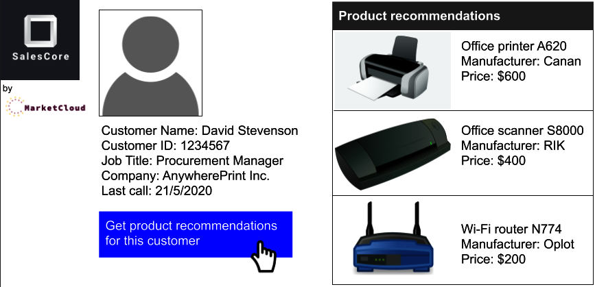
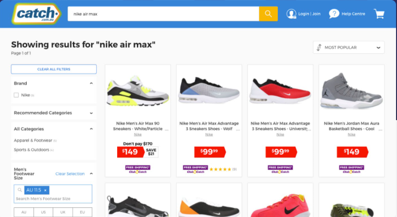

authors: Sparsh A.
categories: Story
feedback link: https://github.com/recohut/reco-step/issues
id: storycafe-series-part-2
status: Published
summary: We are going to discuss stories that are not directly related to recommender systems but using machine learning and deep learning techniques to build and serve useful applications in the real world. 
tags: storycafe

---

# StoryCafe Series Part 2

<!-- ------------------------ -->

## Introduction

Duration: 5

We are going to discuss stories that are not directly related to recommender systems but using machine learning and deep learning techniques to build and serve useful applications in the real world. 

### What you'll learn?

- MarketCloud real-time recommender scenario
- Segundamano Ads Recommendations
- Itison Product Recommendations
- Kunzmann Automotive Recommendations
- Showmax Video Recommendations
- DesignGroup Product Recommendations
- Economia News Recommendations
- Slickdeals Product Recommendations
- Catch E-commerce Retail Recommendation
- Unfiltered Media Group
- Video Recommendation

### Why is this important?

- This will help us in understanding the process of using ML/DL methods for building recommender systems

### How it will work?

- We will briefly discuss the stories
- With time, we will keep adding more details
- We will also add source code and data/mock-up data wherever possible

<!-- ------------------------ -->

## MarketCloud

Duration: 10

### **Model Training and Deployment**

To better illustrate the MLOps process for this type of use case, the following sections focus on the specific example of a hypothetical company deploying an automated pipeline to train and deploy recommendation engines. The company is a global software company (let’s call it MarketCloud) headquartered in Silicon Valley.

One of MarketCloud’s products is a software-as-a-service (SaaS) platform called SalesCore. SalesCore is a B2B product that allows its users (businesses) to drive sales to customers in a simple manner by keeping track of deals, clearing tedious administration tasks off their desks, and creating customized product offers for each customer.

From time to time, MarketCloud’s clients use the cloud-based SalesCore while on a call with their customers, adjusting their sales strategy by looking at past interactions with the customers as well as at the product offers and discounts suggested by SalesCore.

MarketCloud is a mid-sized company with an annual revenue of around $200 million and a few thousand employees. From salespeople at a brewing company to those in a telecommunication entity, MarketCloud’s clients represent a range of businesses.

MarketCloud would like to automatically display product suggestions on SalesCore to the salespeople trying to sell products to the customers. Suggestions would be made based on customers’ information and their past interaction records with the salesperson; suggestions would therefore be customized for each customer. In other words, SalesCore is based on a recommendation engine used in a pull (inbound calls) or push (outbound calls) context. Salespeople would be able to incorporate in their sales strategy the suggested products while on a call with their customers.

To implement this idea, MarketCloud needs to build a recommendation engine and embed it into SalesCore’s platform, which, from a model training and deployment standpoint, presents several challenges. We’ll present these challenges in this section, and in the next section we’ll show MLOps strategies that allow the company to handle each of them.

### **Scalability and Customizability**

MarketCloud’s business model (selling software for client companies to help them sell their own products) presents an interesting situation. Each client company has its own dataset, mainly about its products and customers, and it doesn’t wish to share the data with other companies.

If MarketCloud has around four thousand clients using SalesCore, that means instead of having a universal recommender system for all the clients, it would need to create four thousand different systems. MarketCloud needs to come up with a way to build four thousand recommendation systems as efficiently as possible since there is no way it can handcraft that many systems one by one.

### **Monitoring and Retraining Strategy**

Each of the four thousand recommendation engines would be trained on the customer data of the corresponding client. Therefore, each of them would be a different model, yielding a different performance result and making it nearly impossible for the company to manually keep an eye on all four thousand. For example, the recommendation engine for client A in the beverage industry might consistently give good product suggestions, while the engine for client B in the telecommunication sector might seldom provide good suggestions. MarketCloud needed to come up with a way to automate the monitoring and the subsequent model retraining strategy in case the performance degraded.

### **Real-Time Scoring**

In many situations, MarketCloud’s clients use SalesCore when they are talking to their customers on the phone. The sales negotiation evolves every single minute during the call, and the salesperson needs to adjust the strategy during the interaction with the customer, so the recommendation engine has to be responsive to real-time requests.

For example, imagine you as a salesperson is on a call with your customer to sell telecommunication devices. The customer tells you what his office looks like, the existing infrastructure at the office such as optic fiber, the type of WiFi network, and so forth. Upon entering this information in SalesCore, you want the platform to give you a suggestion for the products that your customer could feasibly purchase. This response from the platform needs to be in real-time, not 10 minutes later, after the call, or on the following day.

### **Ability to Turn Recommendations On and Off**

Responsible AI principles acknowledge that retaining human involvement is important. This can be done through a human-in-command design,[1](https://learning.oreilly.com/library/view/introducing-mlops/9781492083283/ch10.html#ch01fn8) by which it should be possible *not* to use the AI. In addition, adoption is likely to be low if users cannot override AI recommendations. Some clients value using their own intuition about which products to recommend to their customers. For this reason, MarketCloud wants to give its clients full control to turn the recommendation engine on and off so that the clients can use the recommendations when they want.

### **Pipeline Structure and Deployment Strategy**

To efficiently build four thousand recommendation engines, MarketCloud decided to make one data pipeline as a prototype and duplicate it four thousand times. This prototype pipeline consists of the necessary data preprocessing steps and a single recommendation engine, built on an example dataset. The algorithms used in the recommendation engines will be the same across all four thousand pipelines, but they will be trained with the specific data associated with each client.

In this way, MarketCloud can efficiently launch four thousand recommendation systems. The users will still retain some room for customization, because the engine is trained with their own data, and each algorithm will work with different parameters—i.e., it’s adopted to the customer and product information of each client.

What makes it possible to scale up a single pipeline to four thousand pipelines is the universal schema of the dataset. If a dataset from client A has 100 columns whereas client B has 50, or if the column “number of purchased items” from client A is an integer whereas the same column from client B is a string, they would need to go through different preprocessing pipelines.

Although each client has different customer and product data, at the point that this data is registered on SalesCore, it acquires the same number of columns and the same data types for each column. This makes things easier, as MarketCloud simply needs to copy a single pipeline four thousand times.

Each recommendation system embedded in the four thousand pipelines will have different API endpoints. On the surface, it looks like when a user clicks the “show product recommendations” button, SalesCore displays a list of suggested products. But in the background, what is happening is that by clicking the button, the user is hitting the specific API endpoint associated with the ranked product lists for the specific customer.

### **Monitoring and Feedback**

Maintaining four thousand recommendation systems is not an easy task, and while there have already been many MLOps considerations until this point, this is maybe the most complex part. Each system’s performance needs to be monitored and updated as needed. To implement this monitoring strategy at a large scale, MarketCloud can automate the scenario for retraining and updating the models.

### **Retraining Models**

Clients obtain  new customers, some of the customers churn, every once in a while new products are added to or dropped from their catalogs; the bottom line is that customer and product data are constantly changing, and recommendation systems have to reflect the latest data. It’s the only way they can maintain the quality of the recommendation, and, more importantly, avoid a situation such as recommending a WiFi router that is outdated and no longer supported.

To reflect the latest data, the team could program a scenario to automatically update the database with the newest customer and product data, retraining the model with the latest datasets every day at midnight. This automation scenario could then be implemented in all four thousand data pipelines.

The retraining frequency can differ depending on the use case. Thanks to the high degree of automation, retraining every night in this case is possible. In other contexts, retraining could be triggered by various signals (e.g., signification volume of new information or drift in customer behavior, be it aperiodic or seasonal).

In addition, the delay between the recommendation and the point in time at which its effect is evaluated has to be taken into account. If the impact is only known with a delay of several months, it is unlikely that retraining every day is adequate. Indeed, if the behavior changes so fast that retraining it every day is needed, it is likely that the model is completely outdated when it is used to make recommendations several months after the most recent ones in the training data.

### **Updating Models**

Updating models is also one of the key features of automation strategies at scale. In this case, for each of the four thousand pipelines, retrained models must be compared to the existing models. Their performances can be compared using metrics such as RMSE (root-mean-square error), and only when the performance of the retrained model beats the prior one does the retrained model get deployed to SalesCore.

### **Runs Overnight, Sleeps During Daytime**

Although the model is retrained every day, users do not interact directly with the model. Using the updated model, the platform actually finishes calculating the ranked list of products for all the customers during the night. On the following day, when a user hits the “show product recommendations” button, the platform simply looks at the customer ID and returns the ranked list of products for the specific customer.

To the user, it looks as if the recommendation engine is running in real time. In reality, however, everything is already prepared overnight, and the engine is sleeping during daytime. This makes it possible to get the recommendation instantly without any downtime.

### **Option to Manually Control Models**

Although the monitoring, retraining, and updating of the models is fully automated, MarketCloud still leaves room for its clients to turn the models on and off. More precisely, MarketCloud allows the users to choose from three options to interact with the models:

- Turn on to get the recommendation based on the most updated dataset
- Freeze to stop retraining with the new data, but keep using the same model
- Turn off to completely stop using the recommendation functionality of SalesCore

Machine learning algorithms attempt to convert practical knowledge into meaningful algorithms to automate processing tasks. However, it is still good practice to leave room for users to rely on their domain knowledge, as they are presumed to be far more capable of identifying, articulating, and demonstrating day-to-day process problems in business.

The second option is important because it allows users to stay in the current quality of the recommendation without having the recommendation engines updated with the newer data. Whether the current model is replaced with a retrained one depends on the mathematical evaluation based on metrics such as the RMSE. However, if users feel that the product recommendations on SalesCore are already working well for pushing sales, they have the choice not to risk changing the recommendation quality.

### **Option to Automatically Control Models**

For those that don’t want to manually handle the models, the platform could also propose A/B testing so that the impact of new versions is tested before fully switching to them. Multi-armed bandit algorithms (an algorithm that allows for maximization of the revenue of a user facing multiple slot machines, each with a different probability to win and a different proportion of the money given back on average) are used for this purpose.

Let’s assume that several model versions are available. The goal is to use the most efficient one, but to do that, the algorithm obviously has to first learn which is the most efficient. Therefore, it balances these two objectives: sometimes, it tries algorithms that may not be the most efficient to learn if they are efficient (exploration), and sometimes it uses the version that is likely to be the most efficient to maximize the revenue (exploitation). In addition, it forgets past information, as the algorithm knows the most efficient today may not be the most efficient tomorrow.

The most advanced option consists in training different models for different KPIs (click, buy, expected revenue, etc.). A method inspired from ensemble models would then allow for the solving of conflicts between models.

### **Monitoring Performance**

When a salesperson suggests a customer buy the products recommended by SalesCore, the interaction of the customer with the recommended products as well as whether the customer bought them or not is recorded. This record can then be used to keep track of the performance of the recommender system, overwriting the customer and product dataset with this record to feed the most updated information to the model when it is retrained.

Thanks to this ground truth recording process, dashboards showing model performance can be presented to the user, including performance comparison from A/B testing. Because the ground truth is obtained quickly, data drift monitoring is secondary. A version of the model is trained every night, but, thanks to the freeze mechanism, the user can choose the active version based on the quantitative information. It is customary to keep the human in the loop on these high-impact decisions where the performance metrics have a hard time capturing the full context around the decision.

In the case of A/B testing, it is important that only one experiment be done at a time on a group of customers; the impact of combined strategies cannot be simply added. With such considerations in mind, it is possible to build a sound baseline to perform a counterfactual analysis and derive the increased revenue and/or the decreased churn linked to a new strategy.

Apart from this, MarketCloud can also monitor the algorithm performance at a macro level, by checking how many clients froze or turned off the recommender systems. If many clients turned off the recommender systems, that’s a strong indicator that they are not satisfied with the recommendation quality.

### **Closing Thoughts**

This use case is peculiar in the sense that MarketCloud built a sales platform that many other companies use to sell products, where the ownership of the data belongs to each company, and the data cannot be shared across companies. This brings a challenging situation where MarketCloud must create different recommender systems for each of the users instead of pooling all the data to create a universal recommendation engine.

MarketCloud can overcome this obstacle by creating a single pipeline into which data from many different companies can be fed. By having the data go through an automated recommendation engine training scenario, MarketCloud created many recommendation engines trained on different datasets. Good MLOps processes are what allow the company to do this at scale.

It’s worth noting that though this use case is fictionalized, it is based on reality. The real-life team that tackled a similar project took around three months to finish. The team used a data science and machine learning platform to orchestrate the duplication of a single pipeline to four thousand copies and to automate the processes to feed corresponding datasets to each pipeline and train the models. Of necessity, they accepted trade-offs between the recommendation quality and scalability to efficiently launch the product. If the team had carefully crafted a custom recommendation engine for each of the four thousand pipelines by, for example, choosing the best algorithm for each client, the recommendation engines would have been of a higher quality, but they would have never been able to complete the project with such a small team in such a short period of time.

<!-- ------------------------ -->

## Segundamano Ads Recommendations

Duration: 5

### Introduction

Segundamano is one of the largest online marketplaces in Mexico offering exceptional product diversity. Due to the high number of products available, and the constantly changing content, it was not practical to manually browse and manage each and every recommendation given to consumers. 

Segundamano is the largest online classifieds ads platform in Mexico. With its business model similar to Craigslist in the US, Segundamano seeks to be the best meeting point between sellers and buyers allowing them to create mutually beneficial relationships.

Segundamano’s platform offers an array of products such as furniture, electronics, and clothing, as well as real estate ads and job offers. The online marketplace belongs to Adevinta, a Norwegian multinational company that is one of the most ambitious technology and product companies in Europe, serving more than 250 million users worldwide.

### Situation

- Difficult to sort through high amount of product offerings.
- 4 million products/month.
- Highly heterogeneous products.

### Requirements

- Recognize preferences of individual users.
- Balance personalization and discovery of products.
- Find similar products.
- Real-time response in large traffic.

### Business KPIs

1. Conversion Rate
2. Customer Engagement

### Solution

- Deep learning image models to determine similar items.
- Advanced processing of Spanish text titles and descriptions.
- A combination of collaborative-filtering and robust text mining models.
- Real-time model updates and recommendations under 100 ms.
- High performance without compromising quality.

### Benefits & Results

- Automatic personalized recommendations applied to Product Detail Pages (*‘También te podría interesar’/‘You may also like’* recommendation box)
- 10% item views attributed to Recombee recommendations
- **3x more Conversions** from users who engaged with recommendations
- **4x more Interactions** from users who engaged with recommendations
- Real-time product personalization

### Links & References

1. [https://www.recombee.com/case-studies/segundamano.html](https://www.recombee.com/case-studies/segundamano.html)

<!-- ------------------------ -->

## Itison Product Recommendations

Duration: 5

### Introduction

Itison is one of the largest deals and events management websites in Scotland. Building on 15 years of experience in the market, itison offers diverse and exciting daily deals and event invitations throughout Scotland and Northern England. Some of these deals include a sight-seeing flight, an award-winning 8 course meal, or 3 nights in a luxury hotel.

itison partners with over 4,500 quality businesses to provide an audience of over 1.2M subscribers with the best places and deals in their city through recommendations from the itison experts.

itison is responsible for some of the UK’s most successful marketing campaigns. They have created and sold out major events, while conducting global media campaigns.

### Situation

- (+) 4500 Business Partners.
- Audience of 1.2 Million Subscribers.
- Need to utilize data to conduct mass marketing campaigns.

### Requirements

- Need to understanding the machine learning aspect of an online platform
- Capable of personalizing weekly deals and event news to subscribers.
- Real-time response in large traffic.
- The email recommendations must provide hyper-personalized offers for each subscriber to spark their interest.

### Business KPIs

1. Conversion Rate
2. Traffic Rate

### Solution

- Recombees solution for itison was creating batch recommendations for weekly emailing campaigns.
- An ensemble of collaborative filtering and content-based models were implemented to achieve the optimal click through rate.
- Real-time model updates under continuous new data inflow will ensure the newest available data are being taken into account when generating emails.

### Benefits & Results

- After partnering with Recombee, itison experienced a positive **20-fold (2 000%) return on investment.**
- The personalized recommendation emails are creating better experiences for the subscribers and itison. E-commerce **conversion rate is 25% higher than before.**
- Weekly personalized emails are being sent to itison’s subscribers, leading to about a **20% increase in traffic.**
- Implementation of Recombee’s recommendations led to a **25% increase in e-commerce conversion rate.**

### Links & References

1. [https://www.recombee.com/case-studies/itison.html](https://www.recombee.com/case-studies/itison.html)

<!-- ------------------------ -->

## Kunzmann Automotive Recommendations

Duration: 5

### Introduction

Autohaus Kunzmann is one of Germany’s most popular automotive e-commerce sites. The renowned platform has several thousand first places in SERPs as a go-to shop for tuning, interior, original parts, tires, and wheels for renowned car brands. It offers a wide range of products such as tuning, exteriors/interiors, replacement parts & wear parts, tires & wheels and accessories for automotive enthusiasts from reputed brands such as Mercedes-Benz, Brabus, Lorinser, Volkswagen, Smart, and AMG.

### Situation

- A high number of interactions.
- Customers distracted from their actual interest by other products listed in the online shop.
- Kunzmann’s CMS pages consist of a selection of many modules that can be configured and placed freely.

### Requirements

- Personalization based on user behavior insights and product attributes.
- Recommendation of complementary products (cross-sell).
- Set the relevance of the respective products and their display order.
- Real-time response in large traffic.
- Solve the cold start problem.

### Business KPIs

1. Click-through Rate
2. Shopping Cart Volume
3. Average Time Spent

### Solution

- Fully AI-driven recommendations in every shop product list - “Recommended for you”
- Add-to-cart principle product recommendations to encourage further purchases.
- Low-price and price-independent items based on the business rules set by Complex.
- Recommending available products from the same category (AMG or Mercedes Benz), that fit user behavior.

### Benefits & Results

- Shopping cart volume **increased by 8%.**
- The click-through rate **increased by 8%.**
- Overcoming of a cold-start problem.
- Activating personalization within 0.4 seconds, avoiding downtimes.
- Improvement and extension of customer’s shopping session.

### Links & References

1. [https://www.recombee.com/case-studies/autohaus-kunzmann.html](https://www.recombee.com/case-studies/autohaus-kunzmann.html)

<!-- ------------------------ -->

## Showmax Video Recommendations

Duration: 5

### Introduction

Showmax is a part of MultiChoice Group. For a single monthly fee, get all-you-can-eat access to a huge online catalogue of TV shows, movies, kids’ shows and documentaries. Start and stop when you want. No ads. Cancel anytime – there’s no contract.

Stream Showmax using apps for smart TVs, smartphones, tablets, computers and media players. Showmax was born in 2015 and is part of the Naspers group. Showmax is currently available in more than 70 countries.

### Situation

- Millions of Recommendation possibilities.
- Tens of thousand of videos to recommend.
- Static recommendations managed by editors.

### Requirements

- Recognize preferences of individual users.
- Respond in real-time under large traffic.
- Multiple countries and languages.

### Business KPIs

1. Churn Rate
2. User Engagement
3. User Satisfaction

### Solution

- Automatic personalized recommendations of Movies and series.
- Model for every single user with real-time updates.

### Benefits & Results

- **Increased** user engagement.
- **Higher satisfaction** with Showmax products.
- **Decreased** churn rates.
- **Intense** collaboration on new features.
- **Constant innovations and state** of the art algorithms.
- **Ability to customize** recommendations for business needs.
- **Ability to handle** country specific content and limitations.

### Links & References

1. [https://www.recombee.com/case-studies/showmax.html](https://www.recombee.com/case-studies/showmax.html)

<!-- ------------------------ -->

## DesignGroup Product Recommendations

Duration: 5

### Introduction

Design Group is Danish retailer, encompassing leading online stores focusing on designers’ products (Moodings.com, justspotted.dk). While Moodings.com is online furniture store headquartered in Denmark, offering wide selection (+ 10.000 items) of interior design products from Danish as well as international brands, justspotted.dk successfully offers designers graphics and paintings.

Both sites operate with one common goal, which is “to offer their clients a wide and inspiring design universe, so they can pick the designs that create mood, identity and expression of their homes.”

Moodings, with one of the widest range of interior design in the market, aims to “unite the small designer store and the giant department store on one and the same platform and give the best shopping experience every time shoppers visit their universe”.

With the strategic goal to fully personalize its offer and help their shoppers to discover products they desire in an efficient way Design Group felt it was necessary to ‘step up’ the personalization game.

### Situation

- +10.000 Products.
- Great focus on shopper experience.
- Need to personalize Mooding’s product offer.

### Requirements

- Recognize preferences of individual users.
- Balance personalization and discovery of inspiring products.
- Find similar products.
- Real-time response in large traffic.

### Business KPIs

1. Purchase Volume
2. Relevancy
3. Shoper Time Saving
4. Customer Experience

### Solution

- Automatic personalized recommendations applied to product view (Also See and Other Interesting Products sections) as well as shopping cart (Others Have Also Bought section).
- Model for every single user with real-time updates.
- Automated feature engineering.

### Benefits & Results

- **52% increase in number of purchases** since the implementation of Recombee solution.
- **Increasing relevancy** of recommendations for individual store visitors.
- **Savings in shop’s employees’ time** previously spent on continuous manual product selection.
- **Savings in money** of spent on manual content selection.
- **Positive impact** on shopper experience.

### Links & References

1. [https://www.recombee.com/case-studies/design-group.html](https://www.recombee.com/case-studies/design-group.html)

<!-- ------------------------ -->

## Economia News Recommendations

Duration: 5

### Introduction

Economia, a.s., a European Business Press member, is a major Czech publishing house specializing in economic and professional periodicals. The internet division of the company runs over 20 out of the most important news and professional websites in the country, including [aktualne.cz](http://aktualne.cz/) and [ihned.cz](http://ihned.cz/). Together, they serve 500M page-views per month. Economia takes great pride in the trustworthiness and objectivity of information it provides. It became a reliable source of information for 66 % of Czech business owners, top management and public administration representatives.

In a continuous effort to improve its online products, Economia a.s., a Czech media company running a number of news portals and thematic websites, decided to explore the power of artificial intelligence for personalization.

### Situation

- Hundreds of articles published every day.
- 300,000 historical articles.
- Static content selection managed by editors.

### Requirements

- Recognize preferences of individual users.
- Balance personalization and discovery of new content.
- Find similar articles.
- Real-time response in large traffic.

### Business KPIs

1. Conversion Rate
2. Relevancy
3. Ad Revenue

### Solution

- Automatic personalized recommendations of articles, news and videos.
- Model for every single user with real-time updates.
- Automated feature engineering.
- Integrated NLP for understanding article content to improve recommendations.

### Benefits & Results

- **64 % increase in Conversion Rate** compared to recommendations by editors
- **Saving editors’ time** previously spent on continuous manual content selection
- **Saving money** spent on manual content selection
- **Increasing relevancy** of content for individual readers
- **Positive impact** on reader satisfaction: more articles read, longer website visits
- **Improved advertisement revenue**

### Links & References

1. [https://www.recombee.com/case-studies/economia.html](https://www.recombee.com/case-studies/economia.html)

<!-- ------------------------ -->

## Slickdeals Product Recommendations

Duration: 5

### Introduction

Slickdeals is the largest social platform for shopping, dedicated to helping savvy shoppers score deals on the products they love with insight from millions of real people. Slickdeals is one of the top 100 most visited sites in the U.S. with 25 million users in its social shopping network. Their members are connecting with each other to share the most up-to-date deals and coupons and Slickdeals helped them to save over $6.8 billion by offering a messaging platform, as well as shopping resources like its free Android or iOS applications and browser extensions for Chrome and Edge.

### Situation

- Highly volatile and fast-changing inventory with user-generated content.
- 25 million users.
- Slickdeals team of experts curates the frontpage.

### Requirements

- Recommendations of time-sensitive deals and coupons.
- Immediate response to recent deals.
- Recommendations based on customers’ votes and feedback.
- Real-time personalization for every individual user.

### Business KPIs

1. Click-through Rate
2. User Engagement and Experience

### Solution

- **“Just For You”** section on the homepage.
- **Custom made business rules** for old and expired deals.
- **A complex ensemble of** incrementally-trained ML models:
    - **Collaborative filtering models** accelerated through sparse locality-sensitive hashing.
    - **Natural language processing** using deep recurrent neural networks.
    - **Image processing** using deep convolutional neural networks.
- Fully leveraging Recombee technology for **real-time data processing:**
    - Most models designed for **incremental training and live updates.**
    - **Queued processing** of new incoming data (with constant reprioritization) for near-real-time deep-learning models.
- **Discovery of hot deals through** reinforcement learning and contextual bandit models.

### Benefits & Results

- **70% increase** in CTR to a product detail page.
- **30% increase** in CTR to affiliate links.
- Improvement of user experience and engagement.
- Real-time personalization for every individual user.

### Links & References

1. [https://www.recombee.com/case-studies/slickdeals.html](https://www.recombee.com/case-studies/slickdeals.html)

<!-- ------------------------ -->

## Catch E-commerce Retail Recommendation

Duration: 5

### E-commerce giant [Catch.com.au](http://catch.com.au/) boosts search sales by 10%.

- **More than 10% lift in conversion rate**
- **Scalable search on more than 2 million products**
- **More than 500 products fully updated and searchable every second**

[Catch.com.au](http://catch.com.au/) is Australia’s largest online marketplace selling more than two million products across food, liquor, clothing, footwear, furniture, sporting goods, electronics and more. The fast growing ecommerce giant wanted to display more relevant search results to its 1.5 million loyal customers, an A/B test was arranged to compare the existing search solution with Sajari's next-generation, machine learning-powered search. Discover how Catch enhanced search relevance and significantly improved sales and profitability using Sajari’s machine learning-powered search.

Online e-commerce giant [Catch.com.au](http://catch.com.au/)'s head office in Melbourne, Australia

### Problem statement

Australia’s leading online marketplace Catch.com.au wanted to explore how they could display more relevant products through onsite search to lift conversion and deliver more revenue. The online retail giant put their existing solution and Sajari’s search to the test, measuring both solutions in an A/B test across multiple e-commerce metrics to see if their onsite search could generate more revenue. Catch had been using a tie-breaking based search solution from Algolia. This type of search engine is highly transparent and businesses can easily add business rules to modify the search experience. For Catch this initially worked well, but once hundreds of rules had been written, many in conflict with each other, the limitations of this approach became very clear. ***“We had pushed the pre-sorted, tie-breaker algorithm to its limits. There was no upside left.”,*** explained Catch.com.au’s Chief Product Officer Dr. Liron Nehmadi.

Catch wanted to use its own rich business data - like product conversion rate and discount percentages - to influence internal site search rankings and lay the foundation for a better shopper experience. Catch pitted Sajari against their existing solution in a strict A/B test to determine which search solution could deliver a better conversion rate from Catch.com.au shoppers.

### Solution

**Catch found three major benefits to using Sajari, which included:**

- Less manual intervention - Breaking away from maintaining hundreds of manual query rules, each with hard to predict side-effects. Instead using a combination of machine learning powered and internal business expertise to determine the best patterns to optimize towards.
- Supporting quick iteration of search relevance A/B testing Flexibly testing different relevance strategies in real-time. Sajari allows new query strategies to be tested without needing to duplicate entire indexes.
- Personalizing results for different customer segments  Using machine learning to adaptively improve search personalization. For example, boosting discounted member-only products if a customer is a member.

### A/B Testing

[Catch.com.au](http://catch.com.au/)’s legacy search displaying less relevant TV results (left) side-by-side with relevant, conditionally boosted Sajari results (right).

For more details, refer to official page:

[Catch.com.au Case Study](https://www.sajari.com/case-studies/catch-com-au-ecommerce-onsite-search)

<!-- ------------------------ -->

## Unfiltered Media Group

Duration: 5

### Introduction

The next-generation media company, Unfiltered Media Group, LLC, seeks ways in growth markets to create connections with enthusiastic audiences using both print and digital magazines, books, videos, online courses, apps, festivals, and more, with which they have rich experience. The Unfiltered Media Group is channel-agnostic. Through print, digital, and social media they reach demographically diverse buyers by developing media brands and products that resonate with today's consumers on every relevant platform.

### Situation

- Use of general recommendation algorithm.
- Millions of monthly readers.
- 5 different media brands.

### Requirements

- Recommender engine able to provide both product and content recommendations.
- Personalization of periodical emails sent to the customers.
- Customized homepage with top-notch recommendations.
- A fully personalized experience for every individual reader.

### Business KPIs

1. Click-through Rate
2. User Satisfaction
3. Average Time Spent

### Solution

- Use of different models for both content and product recommendations.
- Unique recommendation scenarios on each brand’s homepage.
- Personalization of periodically sent emails.
- Recommendation of trending articles.

### Benefits & Results

- **50% increase** in click-throughs.
- **Improvement** of user satisfaction.
- **Increase** of average time spent.

### Links & References

1. [https://www.recombee.com/case-studies/unfiltered-media-group.html](https://www.recombee.com/case-studies/unfiltered-media-group.html)

<!-- ------------------------ -->

## Video Recommendation

Duration: 5

### Introduction

### Results

<!---------------------------->

## Conclusion

Duration: 2

Congratulations! 

### Have a Question?

- [Fill out this form](https://form.jotform.com/211377288388469)
- [Raise issue on Github](https://github.com/recohut/reco-step/issues)