authors: Sparsh A.
categories: Story
feedback link: https://github.com/recohut/reco-step/issues
id: storycafe-series-part-3
status: Published
summary: 1. How ShopRunner process 1TB of data per day to serve quality fashion recommendations to shoppers 2. How Scribd recommend next best book to read to its readers using transformer model 3. How Dailymotion find similar videos at scale using sequential model 4. How TikTok makes us addictive to its platform by recommending short videos 5. How TripAdvisor model the user journey sequentially to provide the best trip recommendations
tags: storycafe

---

# StoryCafe Series Part 3

<!-- ------------------------ -->

## Introduction

Duration: 5

### What you'll learn?

1. How ShopRunner process 1TB of data per day to serve quality fashion recommendations to shoppers
2. How Scribd recommend next best book to read to its readers using transformer model
3. How Dailymotion find similar videos at scale using sequential model
4. How TikTok makes us addictive to its platform by recommending short videos
5. How TripAdvisor model the user journey sequentially to provide the best trip recommendations

### Why is this important?

These stories inspires us to build better and better recommenders and teach us to not repeat mistakes.

### How it will work?

- We will briefly discuss the stories
- With time, we will keep adding more details
- We will also add source code and data/mock-up data wherever possible

<!-- ------------------------ -->

## ShopRunner

Duration: 10

***Video: [https://youtu.be/dly3awVzsIg](https://youtu.be/dly3awVzsIg)***

ShopRunner ingests product, logistic, and behavioral data from more than 100 retailers to provide highly personalized and customized experiences for its shoppers. It needs high-quality, fast, and efficient data management.

To automate its data pipelines, ShopRunner uses Databricks Unified Analytics Platform on Amazon Web Services (AWS). Now ShopRunner can improve its product recommendations with better machine learning results.

- Enhance the strength of product recommendations using Apache Spark
- Share custom libraries and notebooks for better collaboration between data engineers and data scientists, enabling smooth and automated data processes and accelerating innovation
- Use Amazon SageMaker to deploy your machine learning models
- Gain greater insights with self-service access to data and data pipeline management
- Ingest raw data from structured and unstructured file types provided by retailers - as much as 1 terabyte daily - and makes it immediately part of the website product recommendations

### Recommendation pipeline

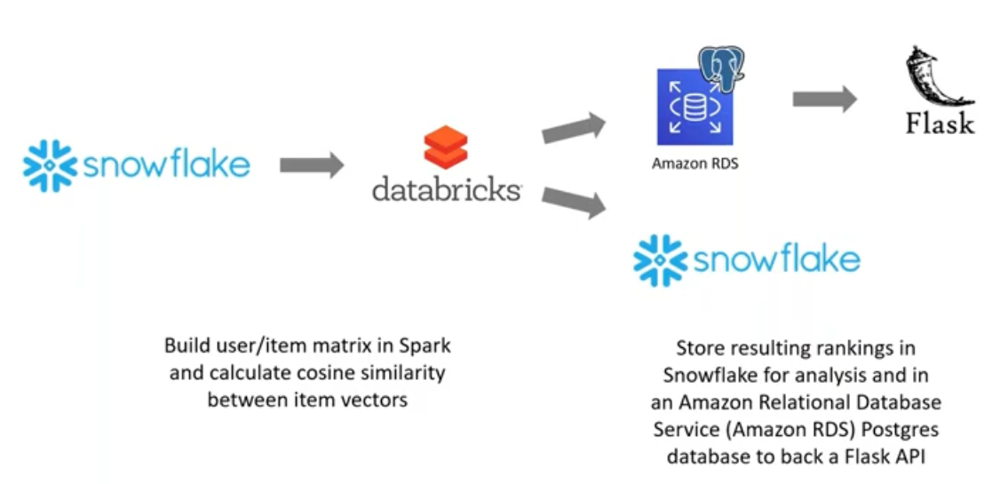

### Recommendation examples

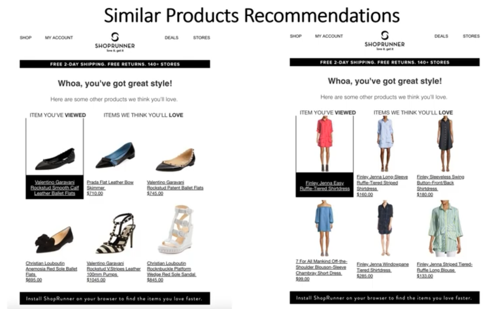

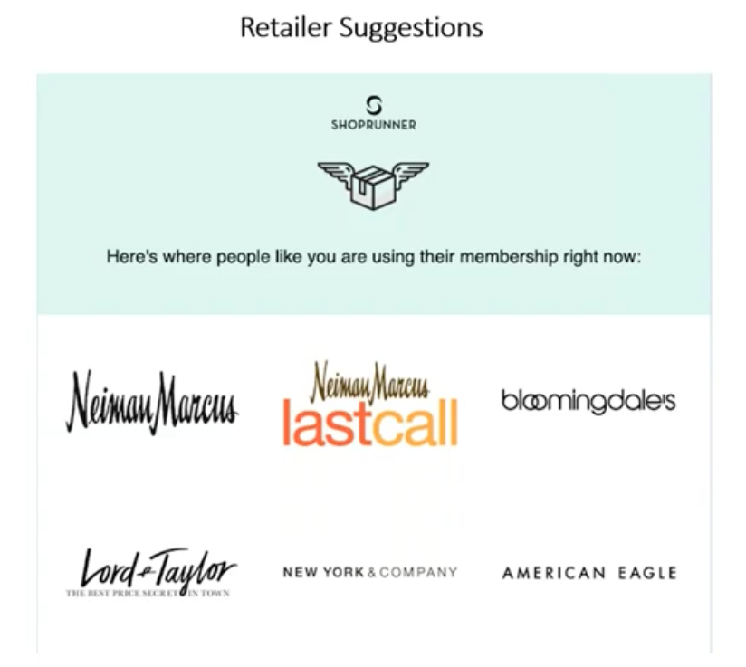

### Shopper profiling

Same shopper might visit different retail partners with different cookie sessions. It is important for Shoprunner to identify the shopper across sessions. To achieve this, Shoprunner used Graph network methods.

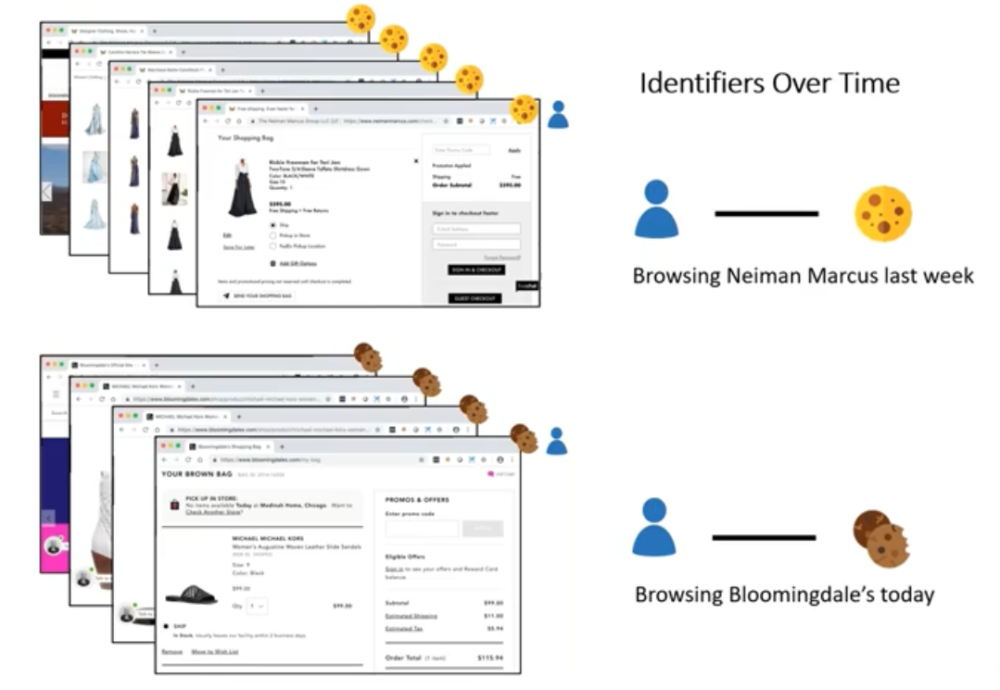

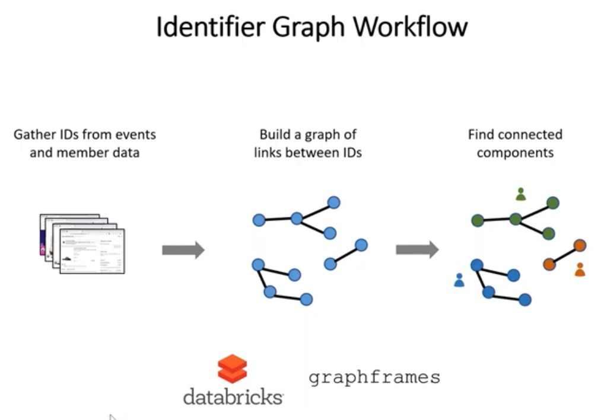

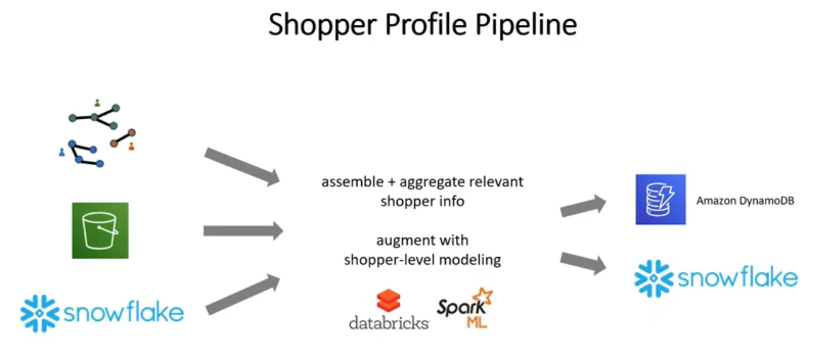

<!---------------------------->

## Scribd

Duration: 10

**Scribd is recommending the next book to read/listen to its subscribers on the website home page using the transformer model to increase the reading time.**

### Model

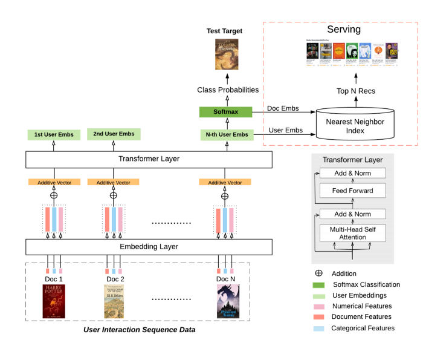

We only used encoders of transformer architecture which uses self-attention to combine signals from users’ past interactions. Self-attention is a pretty effective mechanism to capture any recent change in user’s interests and also preserving long-term context at the same time. But our model still had popularity bias and we reduced it by stratifying training data.

### Input Embedding and Pooling Layer

This layer reshapes various features from interaction, user and items data and add them together to create final input vector which would be input to transformer’s encoder layers.

- Categorical features are mapped to corresponding embeddings and they are learned as training process.
- All numerical features are concatenated and passed through feed forward network to resize vector to expected vector size for input for transformer layer.
- All these vectors are weighted and added to produce final vector per interaction which would feed into transformer’s encoder layers.

### Input Embedding and Pooling Layer

Encoder layer combines all sequences of interactions using self-attention followed by feed forward network and normalization. We found 2 encoders & 1 head to be sufficient during hyper-parameter tuning.

Latent output vector would be generated at the end of 2 encoders for each sequence, but only latent output vector of last sequence is used for predicting next item. We call this last latent output vector as user embeddings.

### Optimization Function

Scribd’s users can interact in different ways like read books, listen to audiobooks or podcast, bookmark, download or rate books, navigate, search, etc. After careful analysis of business impact, we decided to only optimize model for several important engagement metrics like read with certain read threshold, bookmark, download, etc. In order to simplify multi task learning problem, we assumed equal weights for all of these metrics. It reduced MTL problem to classification for the first phase. In later phase, we are going to fine tune weights for multiple interaction types.

Initially we used triplet and BPR loss, which learns to rank positive target higher than negative target for given user, but cross entropy classification loss performed much better in practice for our training data.

### Serving using User and Item Embeddings

As explained above last latent output vector from encoders is called user embeddings. And then these user embeddings are passed through feed forward network to compute prediction scores for all items. So weights of these last prediction forward network are called item embeddings. So dot product between user embeddings and item embeddings would give actual recommendation score. Thus real time recommendations can be served using any database which supports nearest neighbor search. We decided to use elastic search so we can pre-filter based on geo, language & other hundreds of business constraints before doing nearest neighbor search. 

And whenever user’s interactions are changed, we can compute user embeddings using inference stage (X hourly) and change index for that user only. So potentially, it can also support near real time updates as well.

Note that feed forward network has bias term as well, so dimension of user embeddings need to be adjusted by adding last padding dimension.

### Training

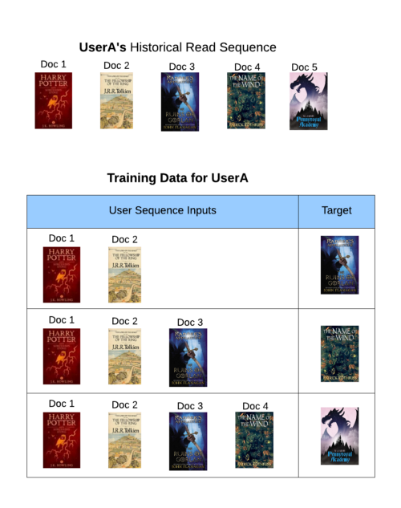

User’s reading sequences of interactions are divided into subsequences to create more training data as shown in diagram here. This was pretty useful to capture user’s earlier consumption pattern to boost prediction for users with fewer interaction history.

For each interaction in user’s sequence of interactions, we basically have 3 types of features: interaction features, user features and item features.

- Interaction features are read time, download or not, bookmarked or not, etc.
- User features are user’s demographic info
- Item features are category/taxonomy, item id, language, etc.

In recommendation industry, usually ranking pipeline consists of candidate generation followed by ranking pipeline. Even though we have up to 5 million documents, we managed to directly rank in real time using Elastic Search without candidate generation step.

### Challenges

**Variable Sequence Length of Interactions**

Even though the transformer model is flexible enough to take variable sequence length, often a lot of practitioners use fixed sequence length of interactions so different interactions with different sequences can be run in batches to speed up training. Running in batches is pretty efficient but it requires to pad smaller sequences. So if we keep the max sequence too high, we will have too many sequences with a lot of paddings which wastes resources during training.

So we developed custom feature pipeline in spark to group sequences with similar lengths in batches and save it pre-batch format in TFRecords file. This reduced padding of smaller sequence significantly less. In addition, we ensured that batches of sequences will be non-sorted by sequence lengths, allowing to learn quickly from various length of sequences batches.

**Variable Sequence Length of Interactions:-**

Even though the transformer model is flexible enough to take variable sequence length, often a lot of practitioners use fixed sequence length of interactions so different interactions with different sequences can be run in batches to speed up training. Running in batches is pretty efficient but it requires to pad smaller sequences. So if we keep the max sequence too high, we will have too many sequences with a lot of paddings which wastes resources during training.

So we developed custom feature pipeline in spark to group sequences with similar lengths in batches and save it pre-batch format in TFRecords file. This reduced padding of smaller sequence significantly less. In addition, we ensured that batches of sequences will be non-sorted by sequence lengths, allowing to learn quickly from various length of sequences batches.

**Using Relative Time similar to position embeddings**

All Transformer based models use position embeddings to capture sequence related signals, but in our case relative time was more important than position itself. For example, user might have visited website after 2 months or so, then last interaction might not be that fresh.

While hyper-paramter tuning, we found that sinusoidal based encoding for relative time performed better than using absolute relative time in days as features.

**Dealing with overfitting for power users**

Since training data has a lot of samples from power users, the model focuses on over-optimizing for power user segments only. But at the same time, power users interact with less popular items more likely, so truncating user history might hurt the performance of low tail items. Initially, we tried reducing weights for loss for power users compared to others, but it hurt the performance of low tail items as well. So later we found a balanced compromise by first training model with original training data for few epochs and then later training model with truncated training data for another few epochs to fine-tune across all user segments.

### Online Evaluation

Using Scribd’s internal A/B testing platform, we conducted an experiment comparing the existing recommendations service with the new personalization model to generate subscribers’ home page. The test ran for approximately a month with >1M Scribd users (trialers or subscribers) assigned as participants. After careful analysis of results, we saw the following statistically significant (p<0.01) improvements in the personalization variant compared to the control experience across all user segments:

- Increase in the number of users who clicked on a recommended item
- Increase in the average number of clicks per user
- Increase in the number of users with a read time of at least 10 minutes (in a three day window)

These increases represent significant business impact on key performance metrics.

### In future

As expected personalized model performed better on users with rich history but still needs improvement for users at early stage. So we are working on using reinforcement learning to improve user experience for users at early stage. And on other hand, we are working on improving recommendation quality for long tail items by adding rich taxonomy features for items.

### References

1. [Scribd tech blog post](https://tech.scribd.com/blog/2021/embedding-based-retrieval-scribd.html)
2. [Medium post](https://towardsdatascience.com/transformer-based-real-time-recommendation-at-scribd-5fa05f000c47)

<!---------------------------->

## DailyMotion

Duration: 10

Dailymotion is a video platform that hosts hundreds of millions of videos which are watched every day by millions of users. Given the size of our catalog, being able to select automatically the best videos to recommend to our users is crucial in order to engage them and drive our growth. One of the most crucial spaces where recommendation plays a great role is the “video page” where the main video is followed by a selection of related videos. We call this algorithm “video to video”.

**Dailymotion is recommending similar videos to a viewer who is watching a video using ML methods to increase the overall engagement time.**

### Intuition

1. The signals we get from our users (such as views) are not independently distributed observations but can be represented as sequences of actions. Understanding and modeling efficiently these sequences using recurrent neural networks (RNN) was key to improving the accuracy of our recommender system.
2. Using video features (category of the video, name of the channel, ...) and context features (device, country, …) in a deep learning model has enabled faster convergence but also helped in the cold-start regime when no user signal is available for a given video. As shown in [this](https://arxiv.org/abs/1706.07684) and [this](https://static.googleusercontent.com/media/research.google.com/fr//pubs/archive/46488.pdf) work previously.
3. We only observe feedback (watches in our case) on a given video when it has been shown to the users (bandit feedback). As a consequence, we do not know what would have happened if we had selected other videos for a given user (counterfactual reasoning). Learning in this type of setting requires special paradigms such as off-policy learning or counterfactual learning which have been used a lot in reinforcement learning for example. Recently, several works have been studying “deep learning” based models in these settings. They have especially focused on propensity-based methods to remove the biases in the training dataset (as in [this](https://www.cs.cornell.edu/people/tj/publications/joachims_etal_18a.pdf)). We started with a simple frequentist approach of propensity estimation and then improved it using the formalism described in [this](https://arxiv.org/abs/1812.02353). As they did, we used a multi-task approach to jointly learn the recommendation model and a propensity estimator.

### Model

Let's see how we modeled these ideas. 

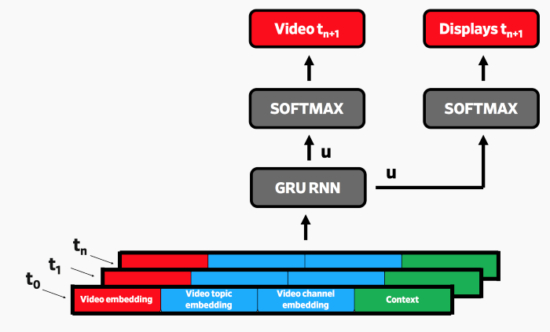

This model is designed to predict the next watch the user will make based on their recent watch history (video id + metadata) and the watching context (e.g. device and country). At the same time, it learns the probability of all the videos being displayed given the user’s recent history and its context. It enables us to get an accurate estimation of the propensity (probability of being displayed) of the video we are trying to predict.

Using propensity re-weighting, the loss for an element of the left branch of the neural network (which tries to predict the next video) is defined as :

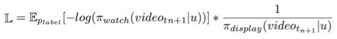

### Business rules

**Rule 1: Promote partners which upload premium contents**

At Dailymotion, most of our partners deliver high-quality content which qualifies them as Premium. As our strategy is now focused on premium content and because we noticed that great videos receive more attention, it is better to favor them in the recommendation algorithm.

As mentioned before, our algorithm is trained to predict the next video the users will want to watch given everything we know they have watched before.

Using a bandit/RL formalism, we can introduce a reward for each observation and customize it given the type of views the user has made. The loss we introduced before then becomes:

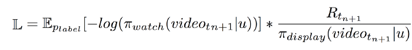

Setting the reward (R) to a higher value for views made on high-quality videos will result in favoring them at training time while deteriorating the relevance (recall@N) of the recommendation. Setting the reward (R) to a higher value for views made on high-quality videos will result in favoring them at training time while deteriorating the relevance (recall@N) of the recommendation.

**Rule 2: Consistency between the input video and the recommended ones**

Consistency is one of the criteria that we would also like to achieve. For instance, if a user starts watching a video in English we would like to surface more videos in the same language. If a user starts to engage with a video from a given category (football for example), the following videos should follow the lead.

Using a purely collaborative approach can provide consistency as people generally stick to the same language or category. However, for videos that have few or no collaborative signals, it gets trickier. This means popular items might start to surface in the recommendation list. By tying the video embedding with the output softmax matrix (as in [this](https://arxiv.org/abs/1608.05859)) we can jointly regularize them and therefore ensure better consistency. We also use a multi-task learning approach for regularization as shown in [this](https://arxiv.org/abs/1607.07326). By predicting the category of the video the user has watched, we constrain videos from the same category to have close representations in the softmax embedding matrix and also in the video embedding (as those two are tied).

### In future

- Not always recommending videos that give the highest immediate reward as they often do not provide long term user satisfaction (clickbait videos for example). Working on notions such as “incrementality” or modeling long term rewards will be key to achieve this.
- Modeling the sequence of user actions and especially long-term dependencies. Using more efficient models such as Transformers, which is now avant-garde in language modeling ([this](https://arxiv.org/abs/1901.02860)), can be beneficial.
- Explaining the recommendations produced by the algorithm (why these specific videos have been chosen for a given user). Combining powerful models such as the ones introduced above while being able to accurately explain their predictions is still a research challenge. Working on methods such as integrated gradients ([this](https://arxiv.org/abs/1703.01365)) can potentially be an answer.

### References

1. [Medium post](https://medium.com/dailymotion/building-modern-recommender-systems-when-deep-learning-meets-product-principles-c79b16375109)

<!---------------------------->

## TikTok

Duration: 10

[Techcrunch](https://techcrunch.com/2020/06/18/tiktok-explains-how-the-recommendation-system-behind-its-for-you-feed-works/) said that TikTok is incredibly addictive. Its secret lies in its recommendation systems that can learn your preferences quickly and suggest videos that you are likely to watch next, giving its users an incredible scrolling experience. It’s possible because ByteDance, the company behind TikTok, has set up a mature infrastructure that allows their recommendation systems to learn their user preferences (“user profiles” in their lingo) in real-time.

The app takes into account the videos you like or share, the accounts you follow, the comments you post and the content you create to help determine your interests. In addition, the recommendation system will factor in video information like the captions, sounds and hashtags associated with the content you like.

To a lesser extent, it will also use your device and account settings information like your language preference, country setting and device type. But TikTok says these factors receive lower weight in the recommendation system compared with others, because they’re more focused on making sure the system is optimized for performance.

Other signals contribute to TikTok’s understanding of what a user likes, as well. For example, if a user watches a longer video from beginning to end, it’s considered a strong indicator of interest. This would be given a greater weight than a weaker signal, like if the viewer and poster were from the same country.

TikTok also confirms that a video is likely to receive more views if it’s posted by an account that has more followers, simply because that account has a larger base of viewers. But it adds that neither the follower count nor whether or not the account has had high-performing videos in the past are considered direct factors in its recommendation system.

As you continue to use TikTok, the system takes into account your changing tastes and interests, even noting when you decide to follow new accounts or explore hashtags, sounds, effects and trending topics on its Discover tab. All these will tailor your TikTok experience further.

Users can also signal to TikTok their more explicit likes and dislikes with a long press, where they can either add a video to their favorites or mark it “Not interested.”

Of course, like any app powered by user input and signals, TikTok has to find a way to get over the cold start problem. Upon the app’s first launch, it doesn’t know what sort of content an individual likes. To address this, it asks new users to select categories of interest — like pets or travel — to help tailor the initial recommendations. If users don’t opt to select categories, TikTok shows a general feed of popular videos until it has more input. Once it gains its first set of likes, comments and replays, TikTok will begin to initiate an early round of recommendations.

TikTok says it also understands that catering too much to someone’s personal taste can lead to the development of a limited experience, known as a “filter bubble.” That can lead to an “increasingly homogeneous stream of videos,” it says, and is a concern it takes seriously.

A couple of years ago, [a VICE report indicated](https://www.vice.com/en_us/article/yw74gy/tiktok-neo-nazis-white-supremacy) that TikTok had not yet overcome this challenge. A reporter trained TikTok to show white supremacist content by following a certain set of creators, by searching up related hashtags and by liking only videos that matched this “interest.” TikTok’s failure was more than just one of moderation — it was also an indication that a dedicated user could craft a version of the app filled with hateful content, if that was their goal.

Today, TikTok says it’s working on ways to keep a user’s For You page diverse and fresh. That means removing repetitive content, duplicated content, content you’ve seen before and spam. But it also means making sure you don’t see two videos in a row by the same creator or with the same sound. For safety reasons, the app also won’t recommend videos that some may find shocking — like a medical procedure or the consumption of regulated goods (even if legal).

In addition, TikTok will add videos to your For You feed at times that don’t appear to be relevant to your expressed interests or have amassed a huge number of likes. This is part of its attempts to add diversity — by giving users a chance to stumble across new content categories and new creators, and to allow them to “experience new perspectives and ideas,” the company says.

This is a problem that Facebook, Instagram and YouTube haven’t well addressed. Their algorithms often keep you in your own echo chamber, highlighting more of the same sort of content you’ve previously liked, or even pushing you to more extremist viewpoints over time.

TikTok says it knows this is a downside to personalization.

“By offering different videos from time to time, the system is also able to get a better sense of what’s popular among a wider range of audiences to help provide other TikTok users a great experience, too,” the company says in a blog post. “Our goal is to find balance between suggesting content that’s relevant to you while also helping you find content and creators that encourage you to explore experiences you might not otherwise see.”

In its [official post](https://newsroom.tiktok.com/en-us/how-tiktok-recommends-videos-for-you), TikTok explained the same.

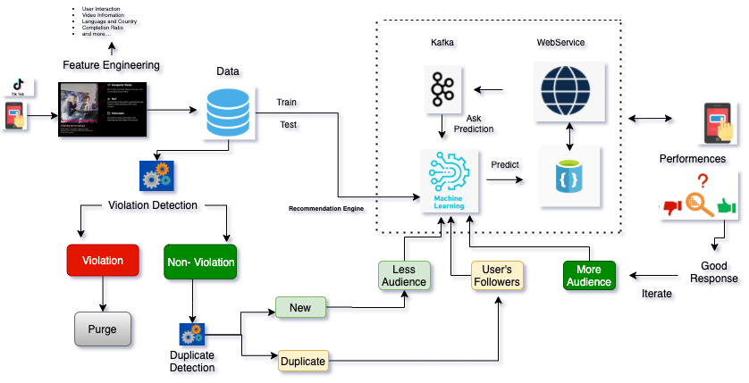

[TikTok content flow](http://datasadak.com/what-makes-tiktok-recommendation-system-so-powerful/)

As you can see above picture, computer vision, NLP, and MetaData have been used to extract the key information about the video. Along with this, all the features mentioned above will be extracted and stored in the database. Data Scientist, Data Engineer, ML Engineer will do all the preprocess, deploy, and evaluate the model.

Multiple Models like classification models are used to detect violations and duplicate. The recommendation system will be trained on pre-processed data to develop the model. Base on the user’s preference, the model gets re-trained, and more personalized videos will be displayed on users’ TikTok app.

As we know, we observe the feature importance score on XGBoost or other ensemble algorithms for all the given features, which means that we can individually point out the feature which has more impact on making the decision.

[Veed.io](http://veed.io) tries to understand the algorithm in [this](https://www.veed.io/grow/reverse-engineering-how-tiktok-algorithm-works/) article.

<!---------------------------->

## TripAdvisor

Duration: 10

### Initial steps (2014)

**[TripAdvisor](http://tripadvisor.com/)** is stepping into the personalized fray with a product called "Just For You," which delivers user-targeted hotel recommendations based on user inputs and historical behavior. The official line is "based on their individual preferences and travel research on the site."

The feature also includes the ability to add tags, which gives the user control over how the personalization is tailored to a specific search. Upon inputting a search, users will be prompted to select from a variety of tags - travel style, location, price range, hotel class, amenities and brand.

This user participation is important, as it reduces the creep factor and makes the implied data usage more palatable as it can be customized per search.

Through the new Just for You feature, TripAdvisor will take this feedback into account along with the traveler’s prior research and contributions on the site to deliver better, more personalized results to help the travelers find a better hotel for their needs and interests.

The results appear in the familiar TripAdvisor list interface, with the personalized recommendations ranked in descending order for that specific search and user. Note the "match" icon, followed by the tags that fit that particular hotel.

The product will be constantly tweaked according to various user behaviors, such as searching for hotels on the site and writing hotel reviews, in addition to the preference tags selected for each search.

Adam Medros, the SVP of Global Product of TripAdvisor, sees this as a natural evolution of the company's growing trove of user data:

> By virtue of the insights and attributes that we’ve gathered from millions of traveler reviews and opinions, TripAdvisor is uniquely able to match travelers with their ideal hotels. The new Just for You feature is the evolution of hotel search on TripAdvisor and a natural extension of our ongoing efforts to make every travel-planning experience more helpful and personally relevant for our users.

Of course, this sort of personalization is ripe for opaque manipulations that segment certain high-spending users into higher hotel prices. Users could be placed in different funnels according to certain details - previous browsing behavior, device, platform and other inferred characteristics like income, education and price sensitivity.

Yet, for those users who regularly purchase hotels, this sort of price segmentation makes complete sense. Users that generally purchase upscale hotels want to see more upscale hotels - so as long as TripAdvisor maintains integrity by listening to both implied and offered information from the user, the product seems like a useful tool to sift through the enormous amount of data available when researching hotels.

### Personalized feeds (2018)

[**https://youtu.be/HJS3qzlvvBc**](https://youtu.be/HJS3qzlvvBc)

### MVP towards personalization

TripAdvisor is recommending "*places to visit*" to travelers on "Things To Do" pages using to increase customer satisfaction.

They first started by deploying a personalized version of their existing item-based collaborative filtering model, which uses item-to-item cosine similarities based on page views. To make it personalized, they recommended items with the highest aggregated similarities to all items browsed by a user. They found that users liked to interact with the RFY shelf, which suggested that it is worth investing more time and engineering efforts in building a more powerful machine learning model.

### Training data collection

To train a model in a supervised learning setting, we collected logs of page views and page action of users who clicked the ‘check availability’ button or booked an experience. ‘Check availability’ is one of the steps in the booking process on TripAdvisor. Users have to click the ‘check availability’ button of an Experience before they add it to their cart and checkout. We use it as a user interest signal.

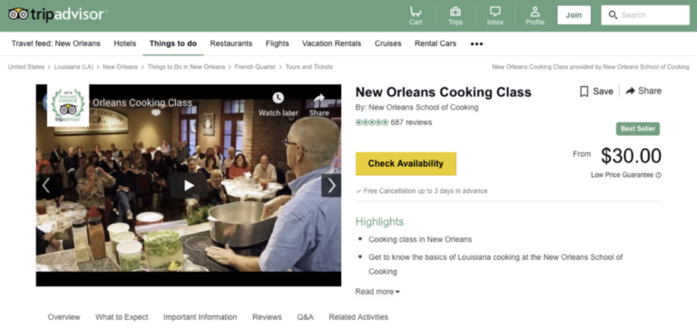

### User journey mapping

Below is an illustration of a user’s journey on our site. Notice that in addition to bookable experiences, there are also a large number of ‘Point of Interest’ pages, where travelers can find useful information and reviews. For instance, ‘Camp Nou’ is a ‘Point of Interest’ page view in the example below. Our new RFY model takes those page views into consideration as well.

Note: If a user interacted with an item multiple times, we only keep the last visit in the sequence and sort based on the last-visit timestamp.

This sequence of four entities will be broken down into two samples in our training data:

- (Exp A) -> Exp B (Check Availability)
- (Exp A, Exp B, POI C) -> Exp D (Booking)

We include both ‘check availability and ‘booking’ into our training data. And we assign samples of bookings a higher weight. The weight is a hyper-parameter that we can tune.

### **Entity Embeddings**

Word embedding is a popular technique to learn vector representations of words in Natural Language Processing. Since it was first introduced it was adapted to other domains such as recommendation as an approach for learning representations of items and users. In our model, we represent each entity as a 100-dimensional vector within the same embedding space. Our pool of entities contains Point of Interests (e.g. Eiffel Tower) and bookable Experiences (e.g. Eiffel Tower Priority Access Ticket with Host). We first pre-train general-purpose embeddings using [StarSpace](https://arxiv.org/abs/1709.03856) package by Facebook AI Research on our page view logs. The pre-trained embeddings encode entities’ location and category information very well, as you can see from the table of embeddings’ cosine similarities below. Features built upon those embeddings are consumed by other downstream tasks, such as sort orders and landing page recommendations. For the RFY model, we initialize the embedding vectors with the pre-trained weights and then fine-tune them for the task. In our experiments, we found that this initialization scheme outperforms random initialization.

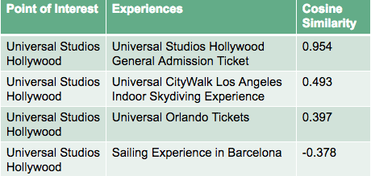

### Model architecture

We aggregate user’s browsing history by taking a recency weighted average of the 100-dimensional item embeddings, followed by two fully connected layers with the final softmax output on 64,000 class probabilities, each of which corresponds to an experience that can be recommended.

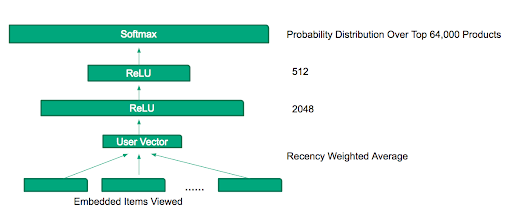

We use the exponential recency weighted average formula to aggregate the user browsing history.

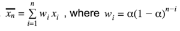

This aligns with our assumption that the most recent browsing data contributes most to the prediction of the next action. Our offline evaluation shows that the recency-weighted aggregation approach outperforms the naive average significantly. We also tried to plug-in an LSTM layer to combine the embeddings, but we did not see any improvement in our offline metrics compared to the recency weighted average approach. As a result, we went for the simpler architecture, which gives us a faster prediction speed in real-time as well. We also noticed that we can achieve even better accuracy when we increase the number of neurons in the layer before softmax. However, this slows down the prediction significantly. The 512-neuron layer is our final compromise between speed and accuracy.

### Offline evaluation

We evaluated the new RFY model offline on a dataset containing two-week of data following the time period used for training. Ranking metrics are calculated on the top recommendations we generated. For MRR (mean reciprocal rank), we retrieved the top 10 results from the recommender. The new RFY model beats our baseline item-to-item cosine similarity model by a large margin. We report here percentage improvements against the item-to-item baseline.

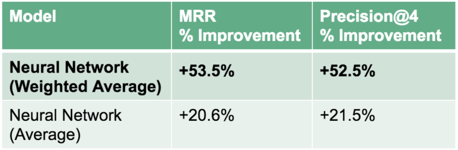

We conducted an online A/B test to evaluate our system. Users in the treatment group saw the RFY shelf populated by the new RFY model, while users in the control group saw the RFY shelf populated by the cosine similarity model. We found a statistically significant improvement in our user engagement and conversion metrics.

### Example output

Below is an example of personalized recommendations for a user who viewed several ‘food, wine & cooking class’ experiences in Paris. As we can see, the RFY model does a great job capturing the user’s preference for that specific category. This information can then be used in new locations that the user might explore.

### Implementation

- Our embedding pre-training phase is done monthly using the [StarSpace Package](https://github.com/facebookresearch/StarSpace). In particular, we use the ‘PageSpace’ model type and train it with our page view logs.
- Our RFY model implementation is in Pytorch. We follow best practices for transfer learning, where we first freeze the pre-trained embedding weights for several epochs and then unfreeze them with a smaller learning rate for fine-tuning. The model training happens weekly on our own data science platform.
- Our model prediction is done in real-time. Our microservice, built by our data science engineers, receives and preprocesses the input data, runs a forward path through the Pytorch model, partitions and sorts based on the scores, and returns the result to front-end. Our service is fully optimized for speed to reduce real-time latency. We will do a follow-up blog post with the engineering implementation details.

### Conclusion

we introduced a machine learning model built by our data science team to generate personalized recommendations of Experiences on TripAdvisor. Compared to the more traditional item-based cosine similarity model, our newly developed model, which uses item embeddings and deep learning, shows significant improvements on both offline ranking metrics and online business metrics. In order to improve our personalization strategies and increase user satisfaction further, we consider to focus on the following areas for future iterations:

- Introduce more features, such as price range (budget friendly vs. luxury experiences), category preference (kids friendly vs. outdoor adventures), etc. This can help us construct better representations of our users.
- Incorporate more user actions from the entire TripAdvisor Platform. Right now we are only using actions related to the Point of Interests and Experiences. We plan to leverage users’ actions for hotels, rentals, flights, restaurants, etc.
- We want to make our personalization pipeline more sensitive to users’ contextual features, such as device, users’ language, and whether travelers are in-destination or not.

### References

1. [https://www.tripadvisor.com/engineering/personalized-recommendations-for-experiences-using-deep-learning/](https://www.tripadvisor.com/engineering/personalized-recommendations-for-experiences-using-deep-learning/)
2. [https://www.phocuswire.com/TripAdvisor-steps-into-personalization-with-Just-For-You-hotel-product](https://www.phocuswire.com/TripAdvisor-steps-into-personalization-with-Just-For-You-hotel-product)
3. [https://www.phocuswire.com/TripAdvisor-plots-social-network](https://www.phocuswire.com/TripAdvisor-plots-social-network)

<!---------------------------->

## Conclusion

Duration: 2

Congratulations! 

### Have a Question?

- [Fill out this form](https://form.jotform.com/211377288388469)
- [Raise issue on Github](https://github.com/recohut/reco-step/issues)