authors: Sparsh A.
categories: Story
feedback link: https://github.com/recohut/reco-step/issues
id: swiggy-food-recommender
status: Published
summary: Item recommendations are inherently different in the food domain when compared to familiar instances like movie or book recommendations. Customers having watched and rated a movie or book are rarely interested in seeing the same item recommendation again. With food, however, it is observed that many customers prefer sticking to items they previously ordered and liked. They are at the same time also open to suggestions on similar items. Based on prior ordering history, a user profile can be created to glean what items the user orders.
tags: food

---

# Swiggy Food Recommender

<!-- ------------------------ -->

## Introduction

Duration: 5

Do you like to explore new dishes every time you order food? Or do you stick to your usual favorites? Do you like a Raita with your Biryani or just a soft drink? Do you prefer veg or non-veg? Do these preferences change depending on time of day or day of the week?

These are among the several questions that need to be automatically inferred from data while building a food recommendation engine at scale. Right from ranking dishes on the menu to suggesting complimentary dishes on the cart, Data Science is at the very core of constantly improving our suggestions. In this talk, we will dive into multiple scenarios that pop up while building a food recommendation system in terms of handling data sparsity and handling new restaurants/users among other challenges that crop up due to scale. We will look at different algorithms that need to be explored in order to effectively handle these various challenges.

Item recommendations are inherently different in the food domain when compared to familiar instances like movie or book recommendations. Customers having watched and rated a movie or book are rarely interested in seeing the same item recommendation again. With food, however, it is observed that many customers prefer sticking to items they previously ordered and liked. They are at the same time also open to suggestions on similar items. Based on prior ordering history, a user profile can be created to glean what items the user orders. As an obvious approach, the most preferred items can be suggested. An improvement over this will be when items similar to these can then be suggested. A pertinent question following this line of thinking then is, how many orders before a user preference is evident? What is the confidence level when a user is new to the platform and has only a few orders to learn from?

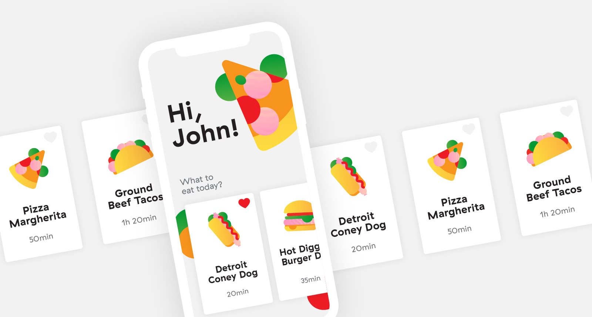

<!-- ------------------------ -->

## Swiggy business

Duration: 10

### Business model

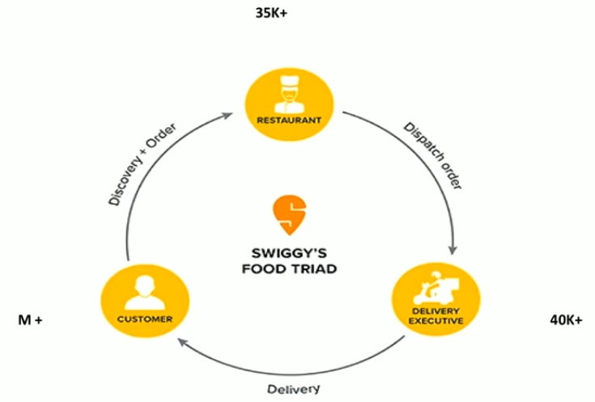

### Evolution of recommender systems at swiggy

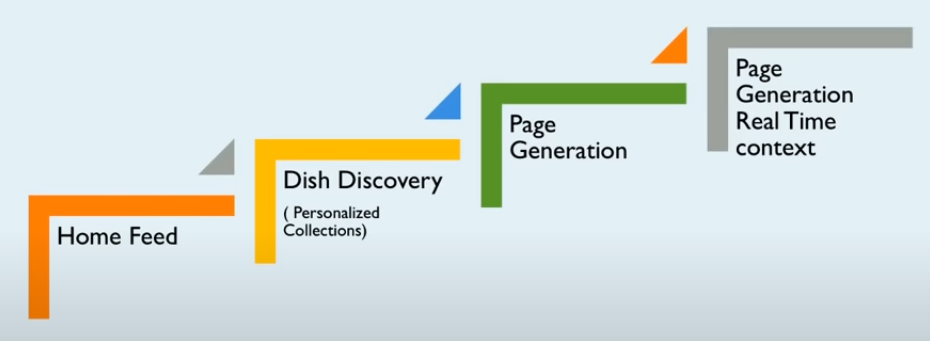

### Swiggy interface

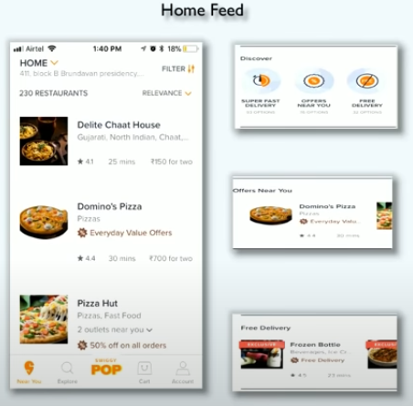

### Concept of match making

Understanding customer (left side) and understanding restaurants & food items (right side)

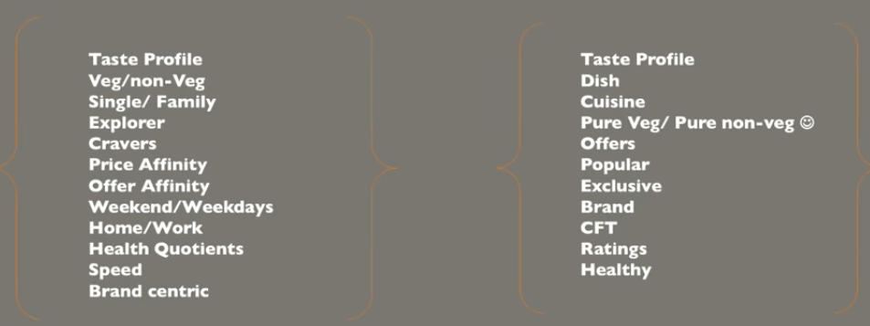

### Challenges

<!---------------------------->

## Data sources

Duration: 2

- Interactions
- Items & menus
- Orders
- Images
- Cusine & dish family
- Ratings & comments

<!---------------------------->

## Baseline models

Duration: 2

### Collaborative filtering model

Implicit matrix factorization with algorithm like SVD++ and loss functions like ALS and BPR were used. But popularity bias and cold-start issue were the 2 major challenges.

### Content-based model

People like similar items and we used restaurants and item metadata to find similar items.

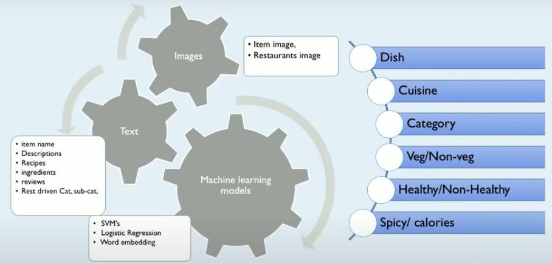

<!---------------------------->

## Naive graph embedding model

Duration: 2

For a graph, a naive random walk starts at any node, then uses any connected edge (at random) to move to the next node and then steps further till we decide to stop. Thus a random walk starts at a node and has specified steps. A highly connected node can feature in many such walks. Pertaining to our food graph, if the customer nodes to be denoted C and dish nodes to be denoted F, a random walk of say 6 steps of these kinds mostly exists: C1-F1-C1-F2-C2-F3-C3. Analogous to learning word embeddings in a word2vec formulation, these random walks can be considered as documents to learn from. With a big random walk corpus of 1 MN walks and then tokenizing the nodes, a word2vec model was used to train a 100 dimension vector.

For recommendation inference, a set of users having high order history (e.g. say 50+ orders) were identified and for the target user, we first find the closest user in this set, using cosine similarity of the learned embeddings, and then the top-3 dish preferences of this user is recommended as the top-3 recommended dishes to the target user.

<!---------------------------->

## Node2vec graph embedding model

Duration: 2

Node2vec approach creates a corpus of random walks on a graph by internalizing the flexibility for Depth First Search or Breadth First Search for random walks using 2 hyperparameters — the p & q parameters. Setting these parameters appropriately will help encode the local or global structures of the graph. Node2vec generates a smartly sampled corpus which is then used as inputs for a word2vec model to learn embeddings.

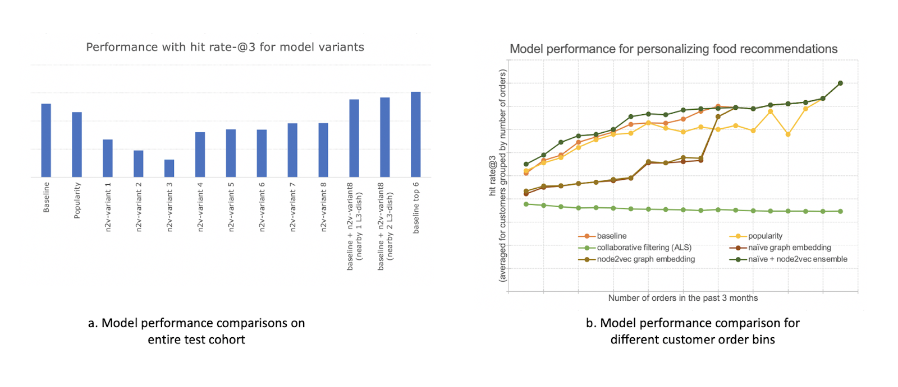

Figure a shows a comparison of the hit-rate@3 metric for the 2-week customer cohort for various variants. Along with the baseline, a popularity model is also included. Here the top 3 ordered L3-dishes across users in the train set are considered as the suggestion for each user. Other models include variations of the node2vec around hyperparameters like walk-length (16, 32, 64), train epochs (10, 20, 30), and word2vec context (5, 10, 50). The p and q parameters for node2vec were fixed at the default of 1. It is observed that the performance is dependent on the hyperparameter optimization of node2vec parameters but none of the variants beat the baseline. This is possibly due to the inability of node2vec to suggest exploit options. To test this hypothesis we include 3 more comparisons (the last 3 bars in the figure) where we compare hit rate@6. In two of these variants, we use the 3 baseline L3 suggestions as seed and find in the L3-dish embedding space from the best node2vec variant, the nearby 1 or 2 L3-dish and use those for recommendations. Though this still does not beat the baseline, it narrows the difference. Figure b shows the performance of the models in different customer bins. The naive and node2vec models perform similar to each other but on complementary user groups. Hence here an ensemble of the best node2vec variant and the naive embedding model can outperform the baseline.

<!---------------------------->

## Limitations of random-walk embeddings

Duration: 2

We observed that random walk based embedding techniques (naive and node2vec) offer a way to improve food recommendations to customers. But there are a few limitations. Primarily, these are embeddings for a static graph. To learn embeddings for new nodes of the graph, the models need to be retrained. For new interactions (customers ordering from new restaurants in the following weeks/months) also, relearning needs to happen. Else, content-based similarity has to be used to infer for new nodes of the graph. This however is less accurate and requires content information that may not always be available (for example non-signed-in new users). Another challenge is scaling these 2 methods for a million scale graph.

For these aspects, we next examined non-random walk based approaches that scale to larger graphs. We also explored a method to leverage information from the food graph. Next, we moved to explore inductive methods, namely Graph Neural Networks, to end the effort with learning embeddings for heterogeneous graphs with node metadata. We compare these methods for predicting preferences at the item levels (instead of the L3-dish food graph level) which translates to a larger and more sparse graph.

<!---------------------------->

## Structural Deep Network Embedding

Duration: 2

The Structural Deep Network Embedding (SDNE) method was one of the first Deep Learning approaches (not using random walks and word2vec construct) to learn embeddings. The paper argues that, if embeddings are learned to preserve both 1st and 2nd order proximities of a node, the embedding quality is better. The authors also demonstrate that SDNE outperforms DeepWalk (and other methods) consistently on varied graphs.

<!---------------------------->

## Knowledge-aware Graph Neural Networks

Duration: 2

The next approach that was explored is KGNN-LS (Knowledge-aware Graph Neural Networks with Label-Smoothness regularization). A few reasons to explore this were that this is task-specific and developed for recommender systems. When compared to more sophisticated GNN methods that are designed for homogeneous bipartite graphs or user/item-similarity graphs, here the authors investigate GNNs for heterogeneous KGs. The main attractiveness of this algorithm for us was that it offered a way to integrate a knowledge graph for item-level recommendations. As explained in the paper, the objective of this algorithm is that given an interaction matrix in the user-item domain AND a knowledge graph, predict if a user u will have an interest in an item v with which he/she did not interact earlier.

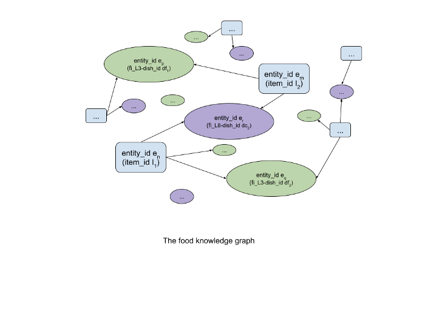

<!---------------------------->

## GraphSAGE

Duration: 5

The first inductive model we tried for our use case was GraphSage. Up until now, the models tried and explained in the sections above did not offer any way to generate embeddings for new nodes in an evolving graph without requiring retraining — and this in our case was a shortcoming. The GraphSAGE algorithm was proposed to address these. The authors, however, do not explicitly suggest if GraphSage can be used for a heterogeneous graph. But since this model can be applied even to graphs that do not have node features, we could extend its use within the homogeneity assumption as explained earlier. The main idea is to transfer the features of neighborhood nodes (like in a Graph Convolution Network) using a stack of layers. For implementation the pytorch model provided within DGL was used. So the first step is to translate neighborhood node information which is done via a fully connected deep learning layer with activation and then the next step is to aggregate these transformed features. We can stack more such layers to capture n-hop neighbors. The problem was posed as a link prediction formulation. Once the stacked layers gave features for each node, we minimized the loss to learn the network parameters such that positive samples (connected nodes) were closer in the embedding space and negative samples were further apart in the embedding space. Here node features were not used as they do not make sense under the homogeneity assumption — i.e. the customer and item features are not the same unless any common feature like say FI attributes can be used. Hence we mimic the input features for nodes using an embedding layer with Xavier initialization, whose parameters are also learned along with the other model parameters. The objective function used is such that during training, the embeddings for nodes from positive samples are placed closer and the nodes from negative samples are placed further apart. Negative samples are sampled as node connections that do not exist in the original graph and the negative sample size (size of negative samples per node to consider) was a hyperparameter. This model scales well to large graphs due to sampling during minibatch training.

<!---------------------------->

## GCMC

Duration: 2

The final model included for comparison was the Graph Convolutional Matrix Completion (GCMC) algorithm — which is a true heterogeneous graph embedding model that also uses node metadata as features when building the inductive model. In this algorithm, we learn embeddings of the same dimensional size for the users and items, i.e. in a common space — and the preference of a user to an item can be computed as the dot product between user and item embeddings. More specifically, for each user, we can assign a learnable vector 𝑢𝑖, and for each item, we can assign another learnable vector 𝑣𝑗. Additionally, we also learn a bias for each user 𝛽𝑖 and each item 𝛾𝑗, representing the baseline rating of each user and item.

<!---------------------------->

## Performance comparison

Duration: 5

A good way to compare different variants is to look at bars belonging to the same color space (i.e. compare all blues, or compare the greens, etc.)

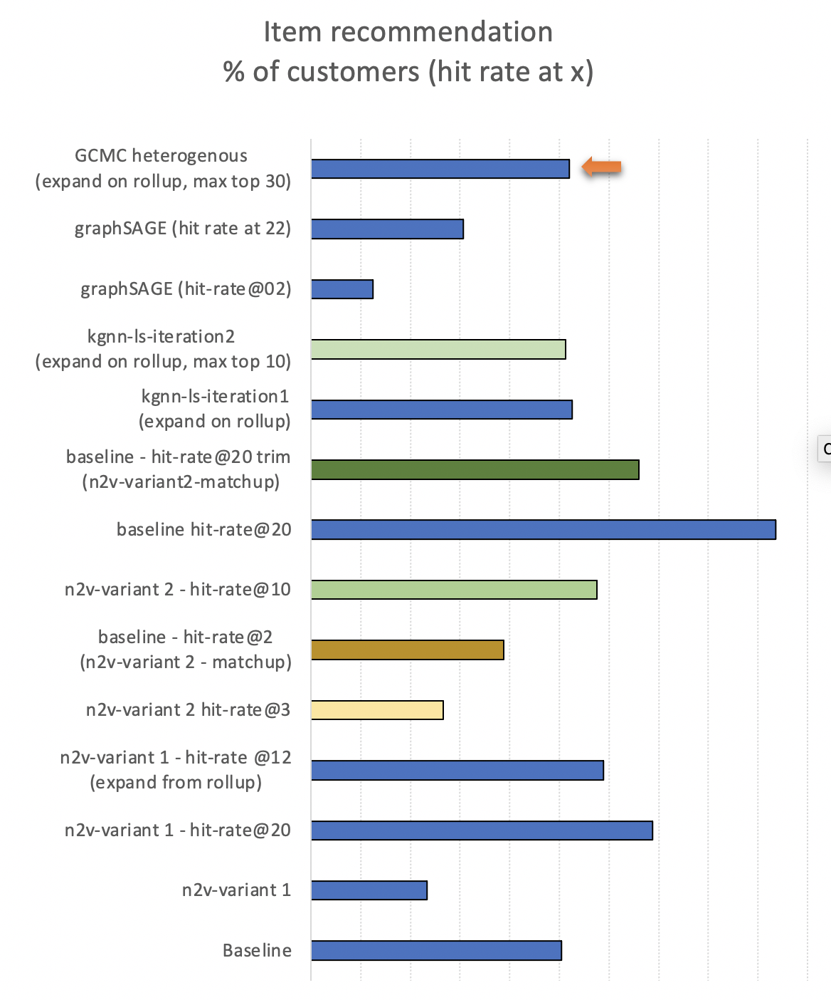

For item predictions, the baseline suggests that performance can increase if a larger set of options (say 20 vs 3) are provided. But, a longer list can be available only if the customer has a rich order history. Using the embeddings-based approach then helps generate an expanded set and this is indicative of the possibilities to explore. When compared to L3-dish performances used earlier, the node2vec performance is closer to baseline. The KGNN-LS requires expanding on previous order items and is seen to marginally beat the baseline. When tested with the approach used for node2vec (to find a high bin user and use that user’s preference), the KGNN-LS model is not useful — similar to SDNE. This was because non-random walk based embedding methods gave pure explore options. Hence for these, we used item node embeddings to find similar items for baseline suggestions and expand the prediction list. Our observation with these sets of experiments is that the KGNN-LS model is the most scalable. The graphSAGE and GCMC models are scalable as well, and compared to others they offer better suggestions. The GNN based inductive models have an enhanced capability to also generate suggestions for new nodes. As an estimate, there are around 15 to 20% new nodes on a week-on-week basis, and the GNN methods help increase recommendation coverage to this cohort.

<!---------------------------->

## Personalizing Swiggy POP

Duration: 5

Swiggy POP’s value proposition is that we want to offer a menu of curated and personalized single-serve, quick-checkout meals to our customers for when they are pressed for time. Imagine a busy professional with a 30-minute lunch break and looking for a quick but high-quality suggestion on what to eat. That’s the need POP wishes to solve.

POP differs from Swiggy’s main marketplace offering in a couple of important ways — many POP dishes are standalone meal combos designed specifically for POP. POP takes a dish-centric approach vs. the restaurant-centric approach of the rest of our marketplace.

Up until early 2020s, POP menus were the same for all customers in a given geographic area (we call them polygons) throughout a given slot of the day (breakfast is a slot, so are lunch, dinner and evening snack-time). With hundreds of cities and tens of zones per city and several slots per day, the process of creating and keeping the menus fresh was a fairly cumbersome process requiring manual intervention and coordination.

Over the past 5–6 months, we have been working on taking out some of the above inefficiencies by building more robust tech and ML-driven optimizations. In this post, we present details about a) the multiplay, multi-armed bandit based solution that serves as the candidate-generation step, and b) dish/restaurant/customer embeddings based relevance models that do the personalized ranking.

Under the hood, POP menu creation is achieved in 3 steps:

1. Eligibility
2. Serviceability
3. Personalization

Serviceability is an engineering layer that ingests candidate list of items and filters out items that do not satisfy hyperlocal marketplace constraints (like dish out of stock, restaurant not open, etc.) in real-time. In this story, we will specifically focus on Eligibility and Personalization as they are primarily ML-driven.

<!---------------------------->

## POP Eligibility

Duration: 5

Eligibility is the candidate generation step where we select a subset of items from the POP catalog which are marked as available for a given day and slot. This is a critical step in the process and needs to satisfy some specific requirements/constraints detailed below.

### **Diversity and Popularity**

If the selected subset is heavily biased towards a few cuisines, there may not be enough relevant items for customers with a taste not aligned with these cuisines or customers who like to explore and discover new types of dishes. On the other hand, if there is a balanced representation of all cuisines but the selected items are not popular among customers, it will lead to poor customer experience and potentially loss of revenue. To strike a balance between diversity and popularity, the Eligibility algorithm and sourcing strategy of dishes both need to account for it.

### **Restaurant Choices**

Along with items and cuisines, customers need to be provided with choices of restaurants as well. This is important not only for better customer experience but also to provide a fair opportunity to restaurant-partners participating in the POP program.

### **Cold Start for Restaurants and Items**

New restaurants and items are regularly on-boarded to POP. This fresh supply needs to be exposed to relevant customers quickly to add to their experience of diversity, discovery, and choice of restaurants which in turn helps restaurants find relevant customers on the platform.

### **Business Rules**

Temporal and strategic business rules may also be needed to be satisfied when deciding whether an item is eligible or not. This can be due to campaigns during festivals or popular sporting events or seasonal dishes offered on Swiggy.

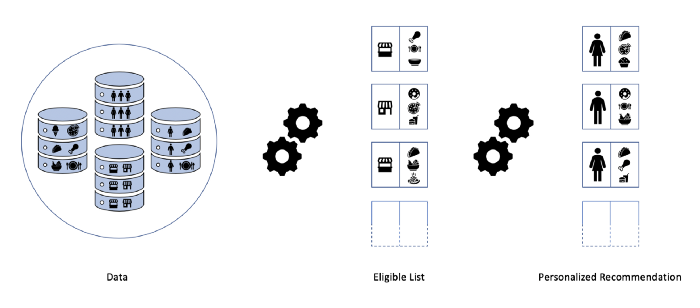

Customer, item, restaurant and transaction data among others are passed to POP Eligibility Algorithm which generates a candidate list of items picked from each restaurant. These items constitute the eligible list. In real-time items that meet hyperlocal constraints are picked and L2R ranking algorithms create the personalized menu on POP.

Considering the requirements discussed above, several candidate approaches were evaluated which broadly fell under three themes:

1. Propensity modelling of items
2. Linear/nonlinear optimization
3. Multi-Armed Bandits

We zeroed in on Multi-Armed Bandit as a choice for Eligibility, meeting most of the requirements while providing a flexible framework to satisfactorily address others. However, for POP, we should note that,

1. One or more items can be picked from the same restaurant, therefore the framework which suits this problem is a multiplay multi-armed bandit
2. An arm can be pulled at most once since arms represent dishes and pulling the same arm again will lead to duplication in the menu
3. Dish discovery is an inherent feature of POP offering and therefore the exploration should be perpetual

As a result, the setting of MAB for POP is as follows.

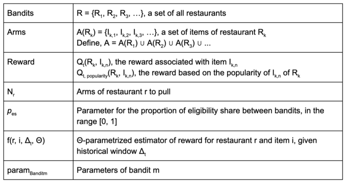

Following the notation defined above, the pseudo-code of POP MAB is described below.

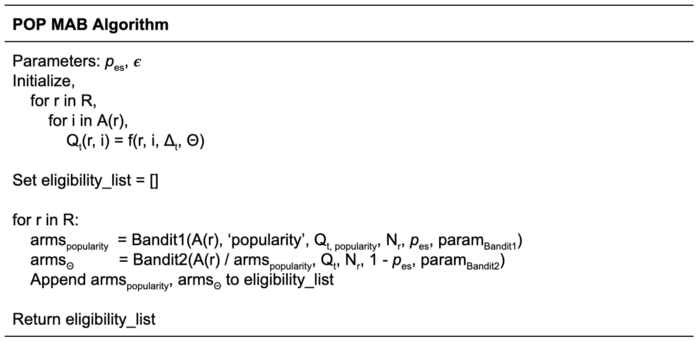

The output of the Eligibility algorithm is a candidate list of items that are eligible for personalized item recommendations on POP. This list serves as the input to the Serviceability step which picks a subset of items that are currently-serviceable when the customer launches the app.

<!---------------------------->

## POP Personalization

Duration: 10

In POP the ranking algorithm trims down the eligible and serviceable list of 60–80 items to 30–40 most relevant to the customer.

### **Features**

Features from customers, restaurants, items and their interactions are key in making recommendations useful. In our models, along with derived features, these entities themselves are represented directly. We use Word2Vec to learn embeddings for categorical entities. Items’ embeddings learned from our transactional data can be visualized in Figure 1 below. Items belonging to the same cuisines, e.g. Pasta and Risotto show more similarities than items from different cuisines, e.g. Dosa and Chicken Biryani.

A visual representation of dish embeddings shows the similarity between dishes of the same cuisine and differences with others. E.g. Risotto and Pasta have many matching attributes while Risotto and Dosa do not. These embeddings help in representing the food profiles of customers and restaurants.

All iterations of the Personalization models are built using these rich and dense features. The evolution of these models is briefly described below.

### **Baseline**

The baseline for our recommendation model was ranking simply based on the sales of an item on POP. Higher the sales of an item, higher its position in the menu. As a result, all customers in a geographic area are served with the same menu.

### **Cosine Similarity-Based**

Next up was a utility-function type approach in which the relevance of an item to a customer is simply a function of the cosine similarity between their respective embeddings. The similarity is weighted by the popularity of the item. Mathematically,

With this model, the conversion rate improved by 1.3% compared to baseline.

While this utility-function is easy to interpret and quick to train, it has limitations in capturing nuanced choices made by customers. For example, a customer may have a different preference for the same item during breakfast and dinner. Accounting for such behavioural preferences will entail enumerating all such possibilities and formulating them into the utility function which is neither scalable nor makes sense.

### **Learning to Rank**

Learning to Rank (L2R) methods are popular for contextualized recommendation settings such as ours and have been successfully implemented in large-scale recommender systems. There are three major types of L2R methods namely, pointwise, pairwise and listwise. In POP we use the pointwise version implemented using Gradient Boosted Trees in Spark ML.

This model further improved the conversion rate by over 14.3% compared to the cosine similarity based model.

<!---------------------------->

## POP Results

Duration: 2

When Eligibility and Personalization went live pan India, we observed an average increase of 16.6% in orders on POP.

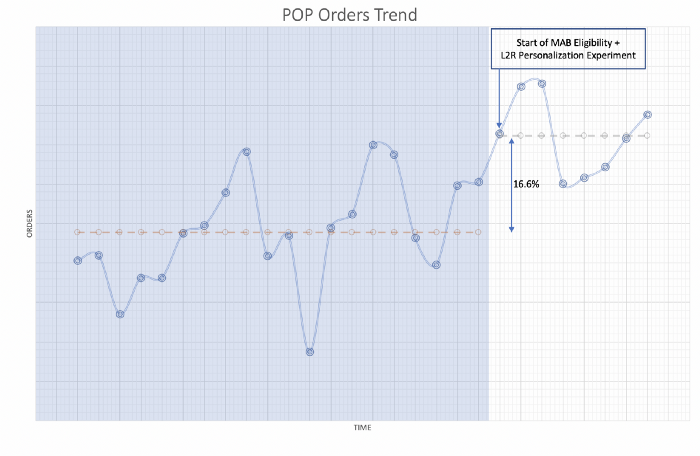

Orders from POP plotted against time shows a 16.6% jump in orders after MAB Eligibility and L2R Personalization both went live across all cities serving POP.

As discussed, we observed significant gains in conversions on POP by implementing MAB based Eligibility and L2R methods for Personalization. But along with the objectives of relevance and diversity, customer experience is impacted by many other factors such as delivery time, recent ratings of restaurants and items, etc.

Common industry practice is to post-process the ranking scores to meet these objectives. However, this often involves human judgment which may be hard to justify and validate. We are working towards addressing personalization as a multi-objective optimization problem that jointly solves for important factors that impact a customer’s experience on POP.

User-research has also shown that certain customer segments prefer more diverse options on weekends vs. weekdays. Exploration strategy on MAB can be modified to adapt to such customer expectations and improve their discovery and ordering experience.

<!---------------------------->

## Conclusion

Duration: 2

Congratulations!

### Links and References

1. [Enhancing Food Recommendations using Graph Methods — Part 1](https://bytes.swiggy.com/enhancing-food-recommendations-using-graph-methods-part-1-344dd489b74d)
2. [Enhancing Food Recommendations using Graph Methods — Part 2](https://bytes.swiggy.com/enhancing-food-recommendations-using-graph-methods-part-2-9a9655c748b1)
3. [Personalizing Swiggy POP Recommendations](https://bytes.swiggy.com/personalizing-swiggy-pop-recommendations-d434b6f555f9)
4. [Our experiments with food recommendations](https://youtu.be/fRXWHJlgmHA)

### Have a Question?

- [Fill out this form](https://form.jotform.com/211377288388469)
- [Raise issue on Github](https://github.com/recohut/reco-step/issues)