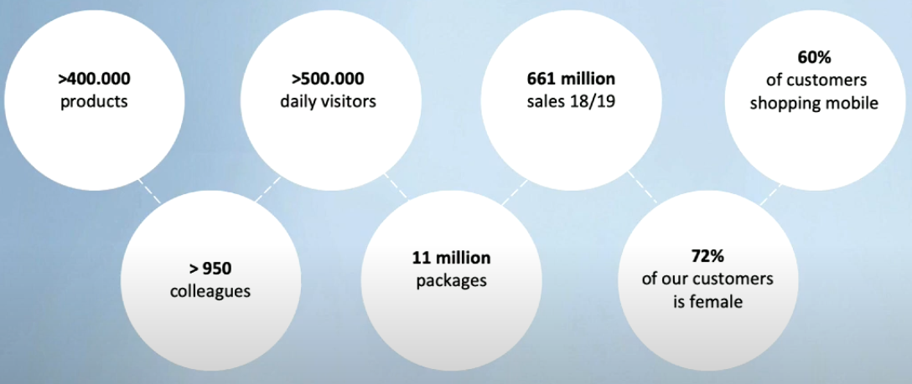

authors: Sparsh A.
categories: Story
feedback link: https://github.com/recohut/reco-step/issues
id: wehkamp
status: Published
summary: Dutch retailer Wehkamp offers their shoppers a wide range of quality products. They carry the latest fashion trends, home-goods, electronics and everything in between. As a leading e-commerce company in fashion in the Netherlands, they dedicates itself to provide a better shopping experience for the customers, and continually looks for ways to not only engage shoppers on their site, but also create opportunities for their brand partners to clearly demonstrate their value. Their main marketing focus is relevance — ensuring their shoppers are able to find what they need in the most efficient way. This puts shoppers in a purchasing frame of mind when they visit Wehkamp’s website.

---

# Wehkamp

<!-- ------------------------ -->

## Introduction

Duration: 5

Dutch retailer Wehkamp offers their shoppers a wide range of quality products. They carry the latest fashion trends, home-goods, electronics and everything in between. As a leading e-commerce company in fashion in the Netherlands, they dedicates itself to provide a better shopping experience for the customers, and continually looks for ways to not only engage shoppers on their site, but also create opportunities for their brand partners to clearly demonstrate their value. Their main marketing focus is relevance — ensuring their shoppers are able to find what they need in the most efficient way. This puts shoppers in a purchasing frame of mind when they visit Wehkamp’s website.

### History

### Company statistics

### Machine learning at Wehkamp

### Key features of the recommender system

- Fully managed platform on AWS: Automated cluster management simplifies the infrastructure and operations at any scale.
- More efficient data flow: Able to easily integrate with other tools like airflow and Kubernetes, allowing them to build automated data pipelines while establishing CI/CD best practices.
- Improved cross-team collaboration: Collaborative notebook environment with support for multiple languages (SQL, Scala, Python, R) enables a diverse team of users to work together in their preferred language allowed them to accelerate data science operations and innovation.
- Streamlined ML lifecycle: Native support for MLflow enables data science teams to easily replicate experiments, track model performance, and rapidly iterate across their models in a systematic fashion.

### Tech stack

<!---------------------------->

## Ranking problem

Duration: 5

A major topic for the data science team is ranking products. If a visitor enters a search phrase, what are the best products that fit the search phrase and in what order should the products been shown? Ranking products is also important if a visitor enters a product overview page, where hundreds or even thousands of products of a certain article type are displayed.

For instance, when a user search for 'jeans' on wehkamp website, it returns 4400+ products. User navigates to 'ladies jeans' overview page. The search result page now has 2176 products. So the goal is to maximize the order of relevance of returned products given a user query. 

<!---------------------------->

## Data collection

Duration: 2

<!---------------------------->

## Click model

Duration: 5

<!---------------------------->

## Feature generation

Duration: 2

<!---------------------------->

## Ranking model

Duration: 5

Notebook jobs were used to process raw data and generate features. XGBoost model was trained on these features. HyperOpt and MLflow were used for hyperparameter optimization and experiment tracking respectively. For identifying feature importances and explaining them, SHAP was used. 

<!---------------------------->

## Serve model

Duration: 5

Model was saved in Elastic index. 

<!---------------------------->

## Evaluation

Duration: 5

<!---------------------------->

## Conclusion

Duration: 2

Congratulations!

### Links and References

1. [https://youtu.be/6BGCn3h59nA](https://youtu.be/6BGCn3h59nA)
2. [Applied Machine Learning for Ranking Products in an Ecommerce Setting](https://databricks.com/session_eu19/applied-machine-learning-for-ranking-products-in-an-ecommerce-setting)

### Have a Question?

- [Fill out this form](https://form.jotform.com/211377288388469)
- [Raise issue on Github](https://github.com/recohut/reco-step/issues)