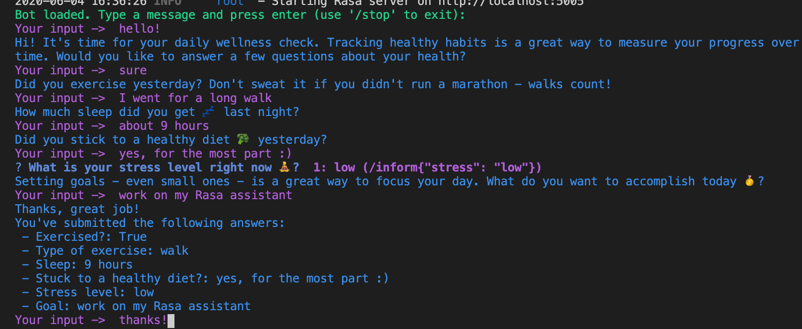
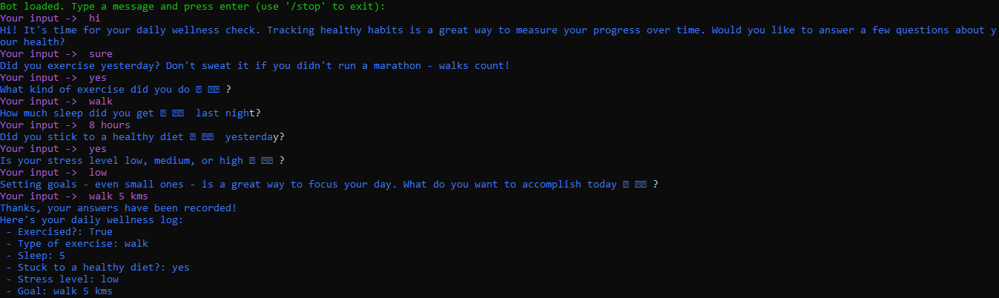
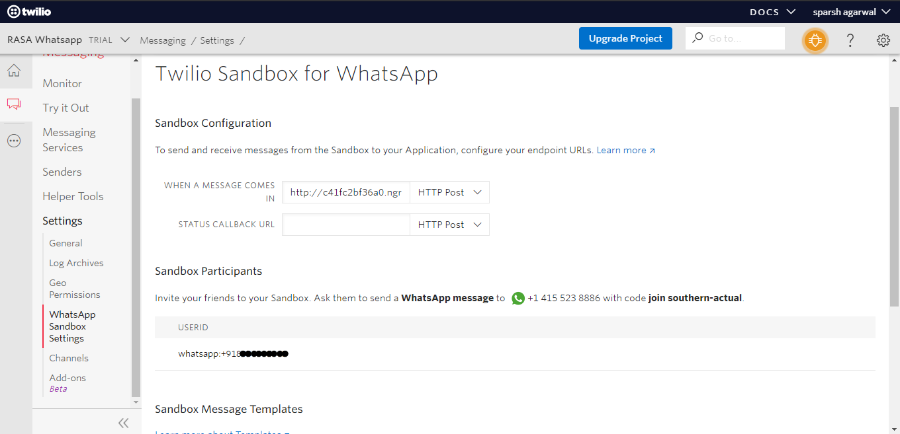
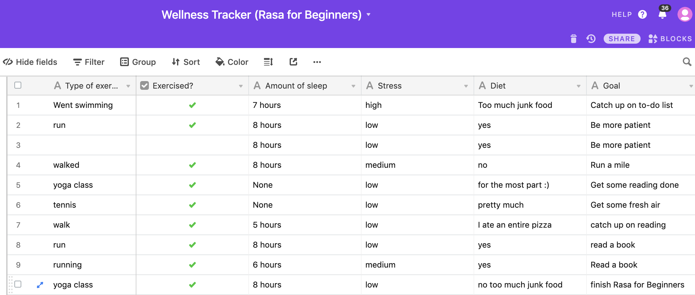
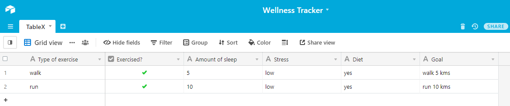

authors: Sparsh A.
categories: Tutorial
feedback link: https://github.com/recohut/reco-step/issues
id: wellness-tracker-chatbot
status: Published
summary: A bot that logs daily wellness data to a spreadsheet (using the Airtable API), to help the user keep track of their health goals. Connect the assistant to a messaging channel—Twilio—so users can talk to the assistant via text message and Whatsapp.
tags: bot

---

# How to build a wellness tracker bot

<!-- ------------------------ -->

## Introduction

Duration: 5

A bot that logs daily wellness data to a spreadsheet (using the Airtable API), to help the user keep track of their health goals. Connect the assistant to a messaging channel—Twilio—so users can talk to the assistant via text message and Whatsapp.

### What you'll learn?

- RASA chatbot with Forms and Custom actions
- Connect with Airtable API to log records in the table database
- Connect with Whatsapp for user interaction

### Why is this important?

- Bots are the future
- More and more users are starting using bots to get recommendations

### How it will work?

- Buid chatbot in RASA
- Test the functionality using command line
- Connect to Twilio
- Connect to Whatsapp via Twilio
- Store responses in Airtable

### Who is this for?

- People who are new in chatbots
- People looking to learn how chatbots work and suggest/assist users

### Important resources

1. [Udemy course](https://www.udemy.com/course/rasa-for-beginners/learn/lecture/20746878#overview)
2. [GitHub code repo](https://github.com/sparsh-ai/chatbots/tree/master/wellnessTracker)

<!---------------------------->

## Command-line chat

Duration: 10

<!---------------------------->

## Twilio

Duration: 10

<!---------------------------->

## Whatsapp

Duration: 5

<!---------------------------->

## Airtable

Duration: 5

<!---------------------------->

## Running the assistant

Duration: 5

1. Download the Airtable template and generate an [Airtable API token](https://support.airtable.com/hc/en-us/articles/219046777-How-do-I-get-my-API-key-). You'll also need to locate your Table Name and Base ID, which can be found in the [Airtable API docs](https://airtable.com/api).
2. Make a copy of the `.example-env` and rename it `.env`. Add your Airtable API token, Base ID, and Table Name to the file.
3. Install Rasa Open Source: [https://rasa.com/docs/rasa/user-guide/installation/](https://rasa.com/docs/rasa/user-guide/installation/)
4. Install the action server dependencies: `pip install -r requirements-actions.txt`
5. Train the model: `rasa train`
6. Open a second terminal window and start the action server: `rasa run actions`
7. Return to the first terminal window and start the assistant on the command line: `rasa shell`

<!---------------------------->

## Conclusion

Duration: 2

Congratulations!

### Links and References

1. [Udemy course](https://www.udemy.com/course/rasa-for-beginners/learn/lecture/20746878#overview)
2. [GitHub code repo](https://github.com/sparsh-ai/chatbots/tree/master/wellnessTracker)

### Have a Question?

- [Fill out this form](https://form.jotform.com/211377288388469)
- [Raise issue on Github](https://github.com/recohut/reco-step/issues)